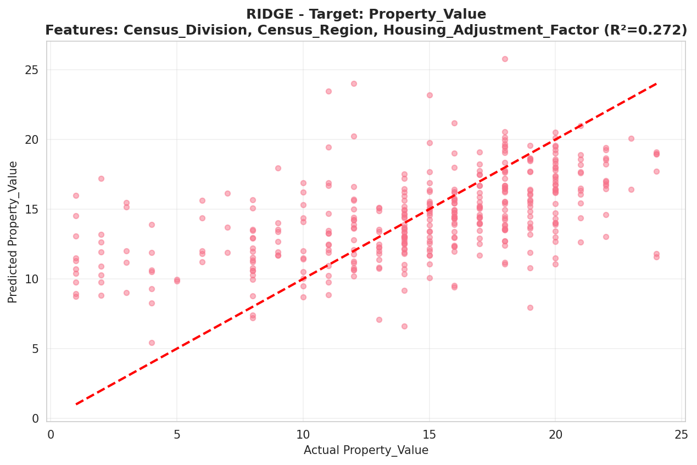
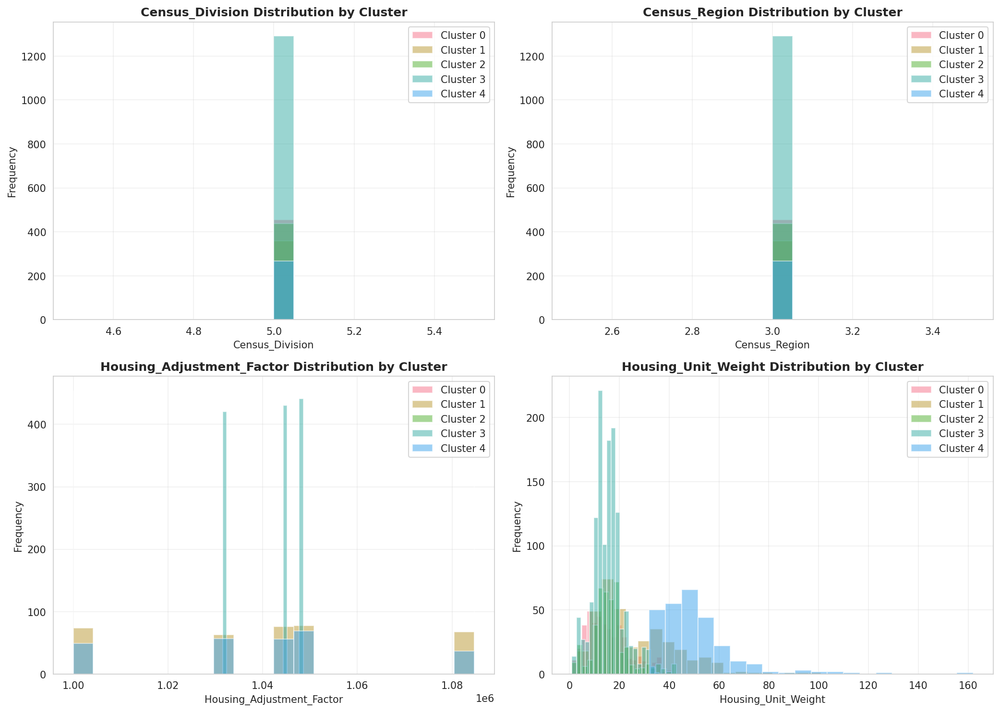
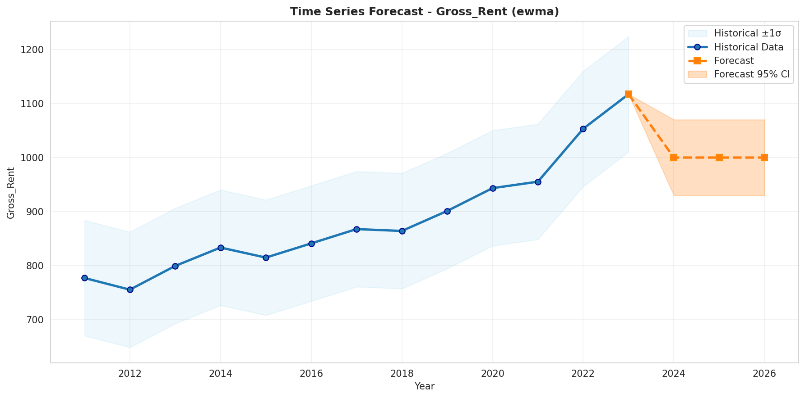
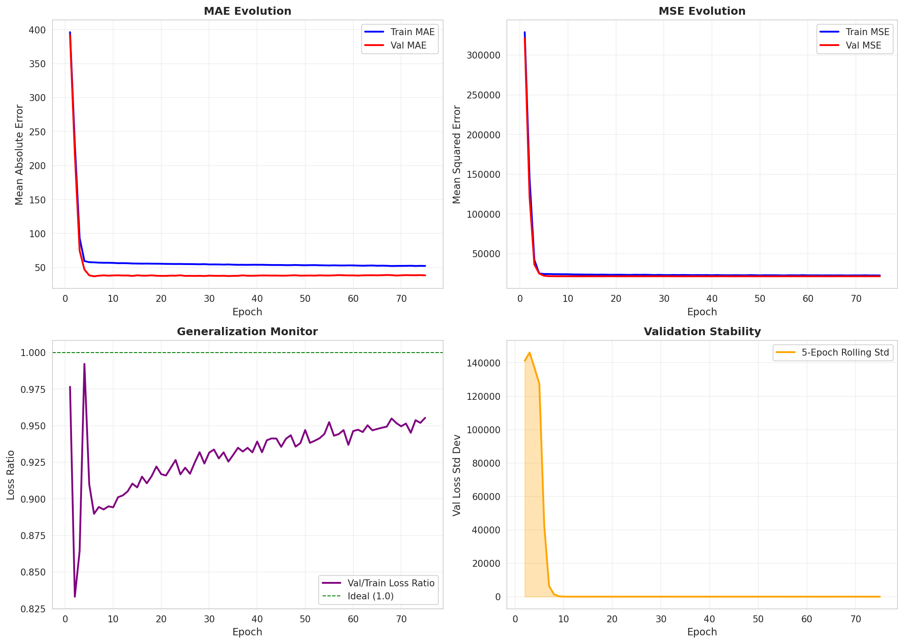
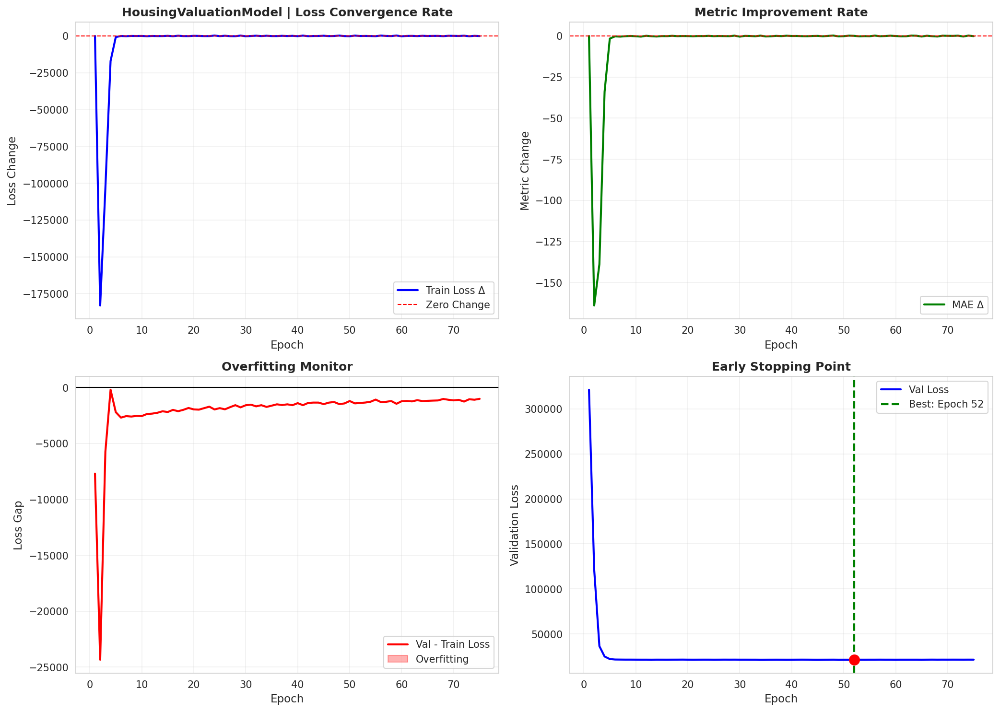
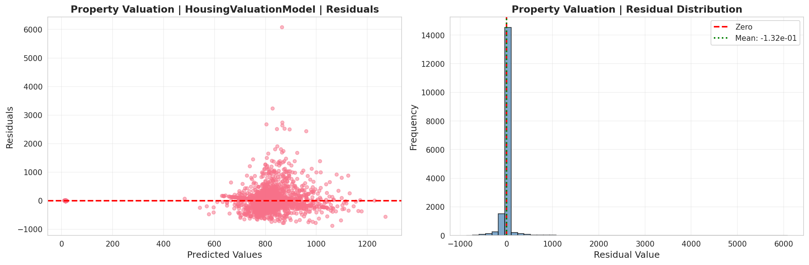
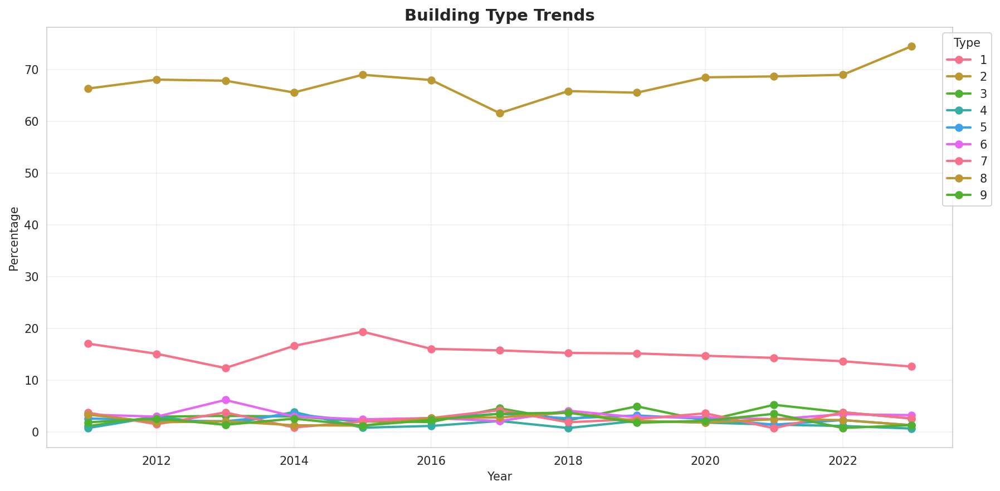
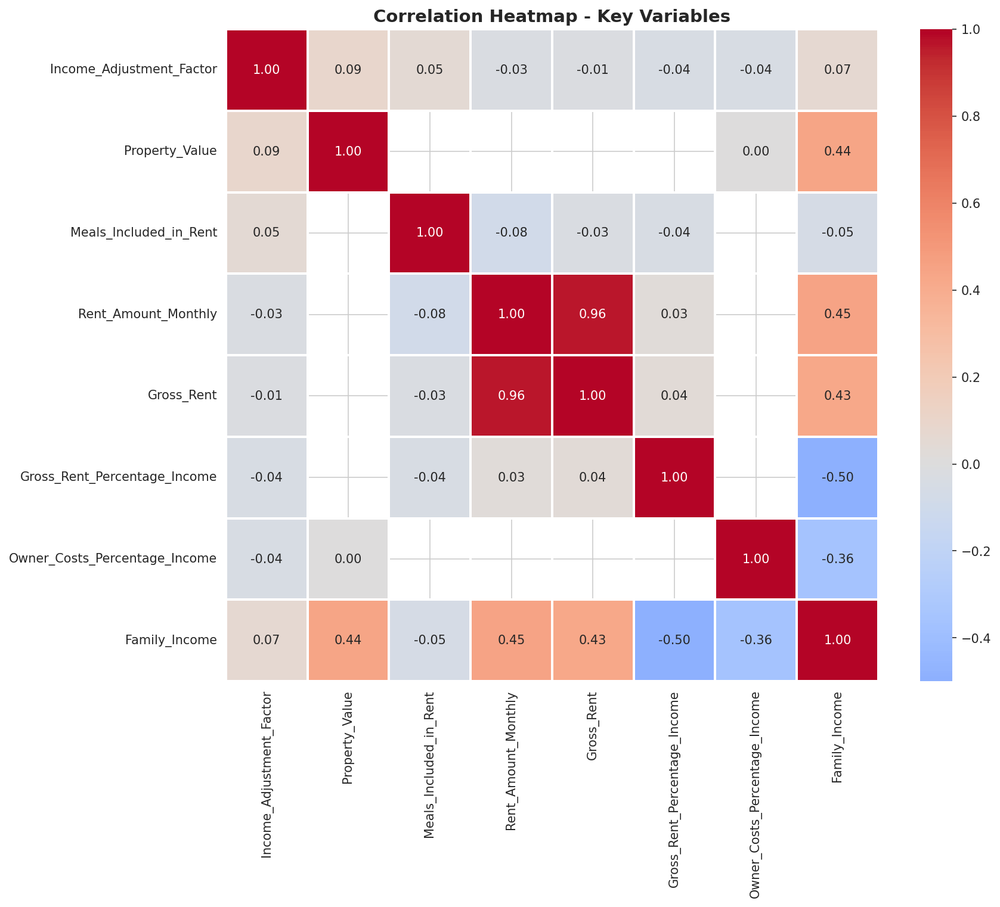
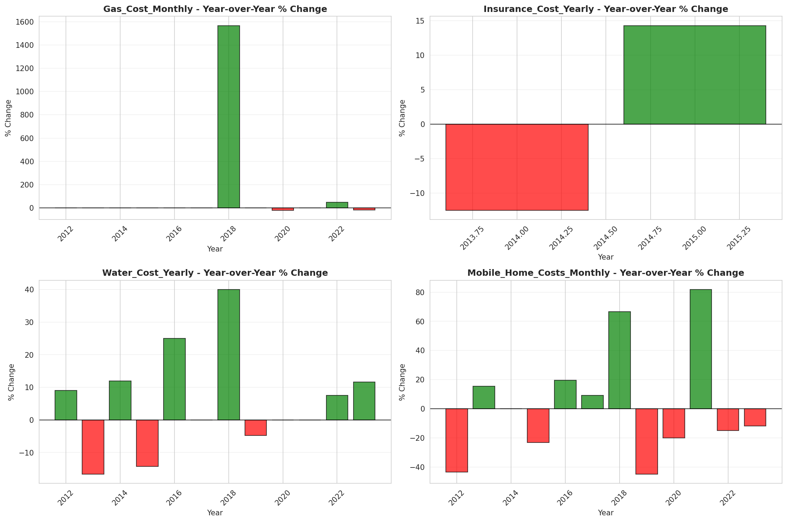

# Pipeline
In this section, we will explore, step by step, what happens and elaborate on how exactly Content Augmented Generation (CAG) looks like.
## Example: South Carolina Housing (5-Year ACS)
  Throughout this document, we use **South Carolina Housing 5-Year** as our running example:
  - **State**: South Carolina (FIPS 45)
  - **Survey**: Housing
  - **Scope**: 5-Year estimates (2011-2023)
  - **Records**: 1,588,240 rows × 227 columns
  - **Output**: `output/South_Carolina/housing/5-year/`


### Pipeline Overview
```bash
┌─────────────────┐    ┌──────────────────┐    ┌────────────────────┐
│  1. Data Load   │───▶│  2. Schema Apply │───▶│  3. Feature Eng.   │
│  (FileLoader)   │    │  (SchemaApplier) │    │  (FeatureCreator)  │
└─────────────────┘    └──────────────────┘    └────────────────────┘
                                                           │
           ┌───────────────────────────────────────────────┘
           ▼
┌─────────────────┐    ┌──────────────────┐    ┌────────────────────┐
│  4. Analysis    │───▶│  5. ML Pipeline  │───▶│  6. Deep Learning  │
│  (8 Analyzers)  │    │  (Reg/Clust/TS)  │    │  (TensorFlow)      │
└─────────────────┘    └──────────────────┘    └────────────────────┘
                                                           │
           ┌───────────────────────────────────────────────┘
           ▼
┌─────────────────┐    ┌──────────────────┐    ┌────────────────────┐
│  7. Visualize   │───▶│  8. LLM Analysis │───▶│  9. Report Gen     │
│  (Visualizer)   │    │  (CAG Context)   │    │  (ReportGenerator) │
└─────────────────┘    └──────────────────┘    └────────────────────┘
```

### 1. Data Loading

**Files**: `processing.py` → `FileLoader`
```shell
[INFO] Loaded 1,588,240 records
Files Found: 13
Files Loaded: 13
Columns Found: 227
```

The loader reads all CSV files matching the state/survey/scope pattern and concatenates them into a single DataFrame spanning 2011-2023.

**Output**: [01_overview.md](../output/South_Carolina/housing/5-year/01_overview.md)

### 2. Schema Application

**Files**: `processing.py` → `SchemaFactory`, `SchemaApplier`

Renames raw ACS variable codes (e.g., `VALP`, `RNTP`) to human-readable names:
- `VALP` → `Property_Value`
- `RNTP` → `Gross_Rent`
- `HINCP` → `Household_Income`
- `TEN` → `Tenure`

### 3. Feature Engineering
**NOTE:THIS IS BROKEN**

**Files**: `feature_engineering.py` → `SmartDataCleaner`, `FeatureCreator`

Creates derived features:
- `Income_Bracket` (categorical binning)
- `Housing_Affordability_Ratio`
- `Age_Group` (for population surveys)
- Temporal features from `Census_Year`

Handles economic zeros (flagging vs. imputation strategy).


### 4. Analysis Suite

Eight parallel analyzers run on the prepared data:

| Analyzer | Output | Key Metrics |
|----------|--------|-------------|
| TemporalAnalyzer | [02_temporal_analysis.md](../output/South_Carolina/housing/5-year/02_temporal_analysis.md) | Year distributions, temporal trends |
| HousingEconomicAnalyzer | [03_economic_analysis.md](../output/South_Carolina/housing/5-year/03_economic_analysis.md) | Cost burdens, affordability |
| StatisticalAnalyzer | [04_statistical_analysis.md](../output/South_Carolina/housing/5-year/04_statistical_analysis.md) | Descriptive stats |
| CorrelationAnalyzer | [05_correlation_analysis.md](../output/South_Carolina/housing/5-year/05_correlation_analysis.md) | Variable relationships |
| CrossVariableAnalyzer | [06_cross_variable_analysis.md](../output/South_Carolina/housing/5-year/06_cross_variable_analysis.md) | Interaction effects |
| OutlierAnalyzer | [07_outlier_detection.md](../output/South_Carolina/housing/5-year/07_outlier_detection.md) | Statistical outliers |
| AnomalyAnalyzer | [08_anomaly_detection.md](../output/South_Carolina/housing/5-year/08_anomaly_detection.md) | Temporal anomalies |
| TrendAnalyzer | [09_trend_analysis.md](../output/South_Carolina/housing/5-year/09_trend_analysis.md) | Long-term patterns |


### 5. Machine Learning Pipeline
**Files**: `ml_models.py` → `RegressionModeler`, `ClusteringModeler`, `TimeSeriesForecaster`, `ModelComparator`
#### Regression (Supervised)
Trains 5 algorithms per target variable:
- Linear, Ridge, Lasso, Random Forest, Gradient Boosting
**Targets for Housing**: `Property_Value`, `Gross_Rent`

#### Clustering (Unsupervised)
- KMeans (k=5)
- Hierarchical

#### Time Series Forecasting
- SMA, WMA, EWMA
- Polynomial regression (degrees 1-3)

- **Output**: [11_ml_models.md](../output/South_Carolina/housing/5-year/11_ml_models.md)

**Sample Visualizations**:
***THESE ARE GENERATED IN 7. Visualization Suite***






## 6. Deep Learning Pipeline

**Files**: `deep_learning.py` → `DeepLearningTrainer`

Five task-specific neural networks for housing:

| Task | Targets | Architecture | R² |
|------|---------|--------------|-----|
| property_valuation | Property_Value, Gross_Rent | 7 layers, 36,994 params | -0.09 |
| affordability_analysis | Owner_Costs_%, Gross_Rent_% | 6 layers, 10,306 params | 0.04 |
| housing_quality | Year_Built, Bedrooms, Rooms | 6 layers, 10,371 params | **0.96** |
| cost_prediction | Taxes_Yearly, Insurance_Yearly | 6 layers, 10,306 params | 0.05 |
| occupancy_prediction | Vacancy_Status, Tenure | 6 layers, 10,306 params | 0.20 |

**Output**: [11b_deep_learning_models.md](../output/South_Carolina/housing/5-year/11b_deep_learning_models.md)

**Sample Visualizations**:
***THESE ARE GENERATED IN 7. Visualization Suite***




## 7. Visualization Suite

**Files**: `visualizer.py` → `Visualizer`, `MLVisualizer`, `DLVisualizer`

Generates 200+ figures covering:
- Distributions & box plots
- Correlation heatmaps
- Temporal trends & YoY changes
- Outlier detection plots
- ML model diagnostics
- DL training curves
**Output**: `figures/` directory 

**Sample Visualizations**:



  

## 8. LLM Analysis (Content Augmented Generation)

**Files**: `ml.py` → `LLMClient`, `LLMAnalyzer`

This is where **CAG** happens. The LLM receives:

1. **Raw Statistics** - All analysis results from steps 4-6
2. **State Context** - Economic, demographic, political, historical background
3. **Structured Prompts** - Specific questions for each insight type

### State Context Example (South Carolina)
```json
  {
    "state_name": "South Carolina",
    "region": "South",
    "division": "South Atlantic",
    "economic_profile": {
      "key_industries": ["Advanced manufacturing (automotive, aerospace)",
                         "Tourism and hospitality", ...],
      "gdp_rank": "#26 nationally (~$273B in 2024)",
      "major_employers": ["BMW Manufacturing", "Boeing", "Michelin", ...]
    },
    "housing_context": {
      "market_characteristics": "Generally affordable relative to national average.
                                 Coastal areas expensive and appreciating rapidly.
                                 Charleston housing crisis. Upstate more affordable",
      "affordability_trends": "Affordable 2011-2019 except coastal tourist areas.
                               Rapid appreciation 2020-2023..."
    }
  }
```

LLM Output Sections

| Section                                                                                                 | Content                                          |
|---------------------------------------------------------------------------------------------------------|--------------------------------------------------|
| [ Llama data_quality](../output/South_Carolina/housing/5-year/12_llm_data_quality.md)                     | Data completeness, biases, limitations           |
| [ Llama policy_recommendations](../output/South_Carolina/housing/5-year/13_llm_policy_recommendations.md) | Research questions, methods, policy implications |
| [ Llama temporal_insights](../output/South_Carolina/housing/5-year/14_llm_temporal_insights.md)           | Time-based patterns and interpretations          |
| [ Llama economic_insights](../output/South_Carolina/housing/5-year/15_llm_economic_insights.md)           | Housing affordability, cost burdens              |
| [ Llama correlation_insights](../output/South_Carolina/housing/5-year/16_llm_correlation_insights.md)     | Variable relationships                           |
| [ Llama statistical_insights](../output/South_Carolina/housing/5-year/17_llm_statistical_insights.md)     | Distribution interpretations                     |
| [ Llama outlier_insights](../output/South_Carolina/housing/5-year/18_llm_outlier_insights.md)             | Outlier explanations                             |
| [ Llama anomaly_insights](../output/South_Carolina/housing/5-year/19_llm_anomaly_insights.md)             | Anomaly interpretations                          |
| [ Llama trend_insights](../output/South_Carolina/housing/5-year/20_llm_trend_insights.md)                 | Long-term pattern analysis                       |
| [ Llama deep_learning_insights](../output/South_Carolina/housing/5-year/21_llm_deep_learning_insights.md) | DL model interpretations                         |

Example: Policy Recommendations Output

The LLM generates structured research recommendations with reasoning:

### Strategic Research Recommendations

#### 1. High-Impact Research Questions

  **A. Relationship Between Household Income Growth and Property Value 
      Appreciation in South Carolina's Upstate Manufacturing Corridor (2011–2023)**

  - **Key Variables**: Family_Income, Household_Income, Property_Value, Gross_Rent
  - **Analytical Methods**: Fixed-effects regression, Time-series analysis (ARIMA)
  - **Policy Implications**: Guide zoning reforms, inform tax incentives for
    mixed-use projects in high-growth areas

9. Report Generation

Files: report.py → ReportGenerator

Compiles all outputs into the final report structure:
```shell
output/South_Carolina/housing/5-year/
├── 00_table_of_contents.md
├── 01_overview.md
├── 02_temporal_analysis.md
├── ...
├── 21_llm_deep_learning_insights.md
└── figures/
    ├── correlation_heatmap_HOUSING.png
    ├── ml/
    │   ├── regression/
    │   ├── clustering/
    │   └── time_series/
    └── ml/deep_learning/
```

*What Makes This "Content Augmented Generation"?*

Traditional analysis gives you numbers. CAG bridges to meaning:

| Traditional Output              | CAG Enhancement                                                                                                                                              |
|---------------------------------|--------------------------------------------------------------------------------------------------------------------------------------------------------------|
| "Property values increased 55%" | "Property values increased 55%, driven by Charleston's tourism boom and BMW/Volvo manufacturing expansion in the Upstate corridor"                           |
| "Anomaly detected in 2020"      | "Anomaly detected in 2020, consistent with COVID-19's differential impact on coastal tourism vs. manufacturing regions"                                      |
| "Clustering found 5 segments"   | "Cluster 3 represents coastal retiree communities with high property values but moderate incomes, reflecting the Hilton Head/Myrtle Beach migration pattern" |

**Where it gets real interesting**

Beyond the 'simple' additional evalaution output the AI is able to generate, it also- when prompted- can give its own two cents that at bare minimum can challenge a researcher/policy maker. A stochastic parrot is able to 'dissolve' some biases while introducing others.
[Full section with thinking chain](../output/South_Carolina/housing/5-year/15_llm_economic_insights.md)
```markdown
### Comprehensive Economic Analysis of South Carolina's Housing Market Indicators (2011-2023)

#### **1. Key Economic Trends & Trajectory**
**a. Rising Property Values**  
- *Trend*: Annual increases from 15 in 2011 to 980 in 2023 (+65 index points over 12 years). Notable acceleration post-2020 (e.g., +38 points 2022–23).  
- *Context*: Reflects growth in advanced manufacturing (BMW/Volvo plants) and port operations, driven by exports and industrial investment.  

**b. Gradual Rental Market Growth**  
- *Trend*: Steady rises from 693 (2011) to 940 (2023), peaking at 783–802 pre-pandemic. Post-2020 growth slowed slightly (+70 points 2020–23).  
- *Context*: Aligns with industrial recovery but lags behind home price appreciation, limiting rent inflation relative to equity gains for homeowners.  

**c. Declining Cost Burdens (Homeowners)**  
- *Trend*: Owner burden drops from 24% (2011) to 21% (2023). Renter burden decreases marginally (~40% in 2011–39% in 2023).  
- *Context*: Homeownership equity growth reduces debt pressure, while renters face slower wage gains compared to homeowners.  

---

#### **2. Affordability & Affected Populations**  
- **Homeowners** benefit from appreciating assets, reducing cost burdens (e.g., fixed-rate mortgages shield them from rent hikes).  
- **Renters**, particularly in urban/coastal areas (Charleston, Myrtle Beach), face high burdens (~39% average 2022–23) despite minor declines. Rural renters may struggle as agricultural incomes stagnate vs. rising housing costs post-hurricanes.  
- *Most Affected*: Low-income groups and retirees migrating to coastal regions, exacerbating displacement due to "asset inflation" (rents/yields increase without income growth).  

---

#### **3. Income Distribution & Employment**  
- **Income Inequality Signals**: Below-average national median income for SC (+slow wage growth in manufacturing/retail vs. capital gains from home equity). Rural-poor areas remain trapped in poverty (<21% homeowner burden may reflect modest incomes).  
- **Employment Trends**: Jobs in advanced manufacturing and ports grow (e.g., BMW’s $500M expansion), but right-to-work laws limit unionization, suppressing wage growth for non-college workers.  

---

#### **4. Housing Market Dynamics**  
- **Property vs. Rental Growth**: Home prices outpace rents (~+2% annual property value increase vs. ~1–1.5% rent inflation). This decoupling benefits homeowners via equity but strains renters without wage gains.  
- *Causality*: Industrial expansion drives demand for housing near factories, pushing up both home values and rents disproportionately in coastal/militarized regions (e.g., Columbia-Greenville corridor).  

---

#### **5. Policy Interventions**  
1. **Inclusionary Zoning Laws**: Mandate affordable units in high-growth zones (Charleston/Upstate) to curb displacement.  
2. **Tenant Protections**: Expand rent controls or subsidies for renters earning ≤80% AMI, leveraging SC’s business-friendly environment to incentivize landlord participation.  
3. **Workforce Housing Incentives**: Tax breaks for manufacturers offering living-wage jobs and subsidizing loans near industrial hubs (e.g., I-85 corridor).  

---

#### **6. National/Regional Comparison**  
- *GDP & Income*: SC ranks mid-pack nationally in GDP; median income is below average, aligning with persistent rural-urban divides.  
- *Peer States (NC, GA)*: Similar manufacturing/port-driven growth (+2–3% annual home price gains post-2011), but SC’s faster appreciation may indicate competitive recovery despite weaker institutional support for wage equity.  

---

#### **7. Actionable Recommendations**  
1. **Expand Public Housing Funds**: Partner with private investors to develop affordable housing in high-demand areas, leveraging federal tax credits and state grants.  
2. **Disaster Resilience Programs**: Allocate funds for flood insurance subsidies and infrastructure upgrades post-hurricanes (e.g., Charleston rebuilds).  
3. **Living-Wage Initiatives**: Require large employers (>50 employees) to conduct annual wage assessments and adjust salaries in line with inflation + cost-of-living adjustments.  

---

### **Evidence Synthesis & Context Integration**  
- **State-Specific Factors**: SC’s right-to-work policies limit collective bargaining, suppressing wages relative to home value gains. Tourism (Charleston boutique shift) adds volatility post-pandemic but complements industrial growth.  
- **Trends vs. Expectations**: Rapid home price appreciation is expected given export-led industries; however, rising renter burdens suggest missed opportunities for wage-driven affordability improvements.  

This analysis underscores the need for policies balancing economic growth with equitable housing access to prevent deepening socioeconomic divides in SC.
```

The LLM connects statistical findings to state-specific context to produce actionable insights.

## Appendix: State Context Schema
*South Carolina Snippet* ([Full US JSON](../artifacts/state_context.json))

```json
"SC":{
  "state_name": "South Carolina",
  "region": "South",
  "division": "South Atlantic",

  "economic_profile": {
    "key_industries": [
        "Advanced manufacturing (automotive, aerospace)",
        "Tourism and hospitality",
        "Agriculture (poultry, cotton, soybeans)",
        "Textile and chemical manufacturing",
        "Port operations and logistics"
    ],
    "economic_trends": "Strong growth 2011-2019 driven by automotive manufacturing boom (BMW expansion, Mercedes, Volvo plants). Port of Charleston expansion. Tourism steady growth. Post-pandemic: rapid manufacturing recovery 2021-2023, supply chain investments",
    "gdp_rank": "#26 nationally (~$273B in 2024)",
    "employment_sectors": {
        "dominant": "Manufacturing",
        "growing": ["Automotive manufacturing", "Aerospace", "Logistics", "Tourism"],
        "declining": ["Traditional textiles", "Tobacco"]
    },
    "income_characteristics": "Below national median. Significant rural-urban income disparity. Coastal areas and Greenville-Spartanburg corridor higher income. Persistent poverty in rural counties",
    "major_employers": ["BMW Manufacturing", "Boeing", "Michelin", "State government", "Medical University of SC"],
    "economic_resilience": "Moderate 2008 recession impact. Strong recovery 2011-2019 via manufacturing FDI. Quick pandemic recovery in manufacturing, slower in tourism/hospitality"
  },

  "demographic_profile": {
      "population_2011": 4625364,
      "population_2023": 5373555,
      "population_trends": "Steady growth ~1.1% annually. Driven by domestic migration (retirees to coast, workers to Upstate manufacturing) and some international immigration",
      "migration_patterns": "In-migration from Northeast and Midwest seeking lower costs and warmer climate. Retirees to coastal areas (Hilton Head, Myrtle Beach, Charleston). Workers to Upstate manufacturing corridor",
      "age_distribution": "Growing senior population on coast. Working-age population concentrated in Upstate/manufacturing areas. Younger than regional neighbors",
      "diversity_trends": "Historically biracial (White ~68%, Black ~27%). Growing Latino population (~6%), especially in construction and agriculture. Modest Asian population growth in metro areas",
      "education_levels": "Below national average in bachelor's attainment. Improving in metro areas (Charleston, Greenville, Columbia). Strong technical college system. Educational disparities by region and race",
      "urbanization": "66% urban, concentrated in Greenville-Spartanburg, Charleston, Columbia metros. Rural Lowcountry and Pee Dee regions declining"
  },

  "political_context": {
      "policy_environment": "Business-friendly: right-to-work state, low taxes, light regulation. Conservative on social issues. Economic development prioritized",
      "key_legislation": [
        "2011-2013: Economic development incentives for automotive sector",
        "2015: Gas tax increase for infrastructure (Roads Bill)",
        "2017: $1.3 billion incentives for Scout Motors facility",
        "2019: Education funding reforms",
        "2021-2023: Port infrastructure investments, tax reforms"
      ],
      "housing_policy": "Minimal state intervention. Local control of zoning. Rapid coastal development. Charleston addressing affordability pressures",
      "labor_policy": "Right-to-work state, $7.25 federal minimum wage, limited worker protections, business-friendly environment",
      "social_programs": "Did not expand Medicaid under ACA. Limited social safety net. Focus on workforce development for manufacturing",
      "regulatory_environment": "Light business regulation. Environmental standards relaxed for economic development. Strong incentive programs for large employers"
  },

  "regional_characteristics": {
      "geography": "Coastal Lowcountry (tourism, ports), Midlands (capital, military), Upstate (manufacturing belt), rural Pee Dee (agriculture)",
      "climate": "Humid subtropical. Hot summers, mild winters. Hurricane risk on coast. Climate conducive to year-round tourism",
      "urban_rural_mix": "66% urban in major metros, 34% rural. Urban growth in Upstate corridor (I-85) and Charleston. Rural decline in interior counties",
      "major_metro_areas": ["Charleston", "Greenville-Spartanburg-Anderson", "Columbia", "Myrtle Beach"],
      "infrastructure": "Expanding Port of Charleston (major East Coast port). I-85 manufacturing corridor. Growing Charleston airport. Improving but aging roads",
      "natural_resources": "Timber, coastal fisheries, limited mineral resources. Agricultural land"
  },

  "housing_context": {
      "market_characteristics": "Generally affordable relative to national average. Coastal areas expensive and appreciating rapidly. Charleston housing crisis. Upstate more affordable",
      "affordability_trends": "Affordable 2011-2019 except coastal tourist areas. Rapid appreciation 2020-2023, especially Charleston, Greenville, coastal markets. Retiree in-migration pressure",
      "construction_trends": "Robust coastal and suburban development. Master-planned communities common. Apartment construction in metros. Hurricane-resistant building codes",
      "rental_market": "~35% renters. Growing multifamily in Charleston, Columbia. Short-term rentals dominant in coastal tourist areas",
      "housing_challenges": ["Coastal appreciation pricing out locals", "Charleston affordability crisis", "Hurricane/flood insurance costs", "Rural housing stock deterioration"],
      "zoning_regulations": "Local control, generally permissive. Charleston tightening. Coastal development restricted in some areas for environmental protection"
  },

  "historical_context": {
      "major_events": [
        "2011-2013: Slow recovery from recession, Boeing expansion announced, Port deepening project begins",
        "2014-2016: BMW major expansion, Volvo plant announced ($500M), Charleston real estate boom, gas tax controversy",
        "2017-2019: Mercedes Sprinter plant, Scout Motors announced ($2B), record tourism, Charleston flooding increases, Port expansion",
        "2021-2023: Pandemic manufacturing recovery, Scout Motors construction begins, Charleston housing spike, port container record volumes"
      ],
      "economic_shocks": "2015 Charleston flooding. 2016 Hurricane Matthew. 2018 Hurricane Florence. 2020 pandemic heavily impacted coastal tourism",
      "natural_disasters": "2015 '1000-year' Charleston flood. Hurricanes Matthew (2016), Florence (2018), Dorian (2019). Increasing coastal flooding",
      "industry_transitions": "Textile industry collapse complete by 2011. Transformation to advanced manufacturing (automotive, aerospace). Tourism shift from family beach to boutique Charleston",
      "political_transitions": "Solid Republican control maintained 2011-2023. Increased focus on economic development. Infrastructure investment debates. Medicaid expansion rejected"
  },
  "comparative_context": {
      "national_benchmarks": "GDP rank mid-pack. Below national median income. Below average educational attainment. Above average poverty rate. Moderate cost of living. Business-friendly climate",
      "peer_states": ["North Carolina (economy, growth)", "Georgia (manufacturing, ports)", "Tennessee (automotive, right-to-work)"],
      "unique_factors": "Major automotive manufacturing hub in Southeast. Historic Charleston tourism draw. Port of Charleston critical East Coast gateway. Strong foreign direct investment (BMW, Volvo, Mercedes, Michelin)",
      "data_considerations": "Large sample sizes in metro PUMAs. Significant regional variation (Upstate manufacturing vs. coastal tourism vs. rural agriculture). Capture recent in-migration patterns. Distinguish Charleston's unique housing market"
  }
},
```


