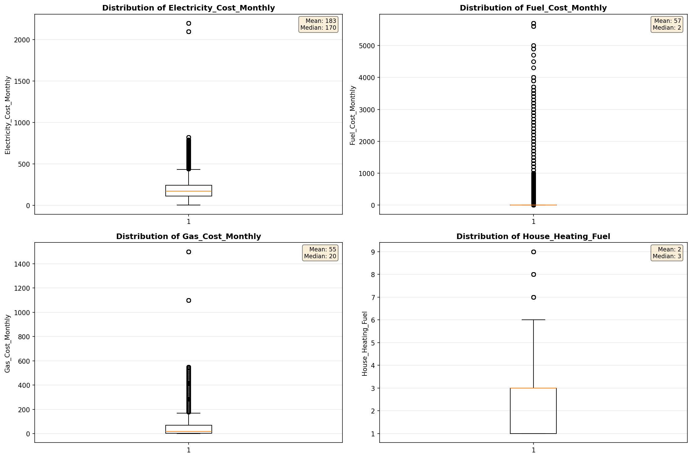
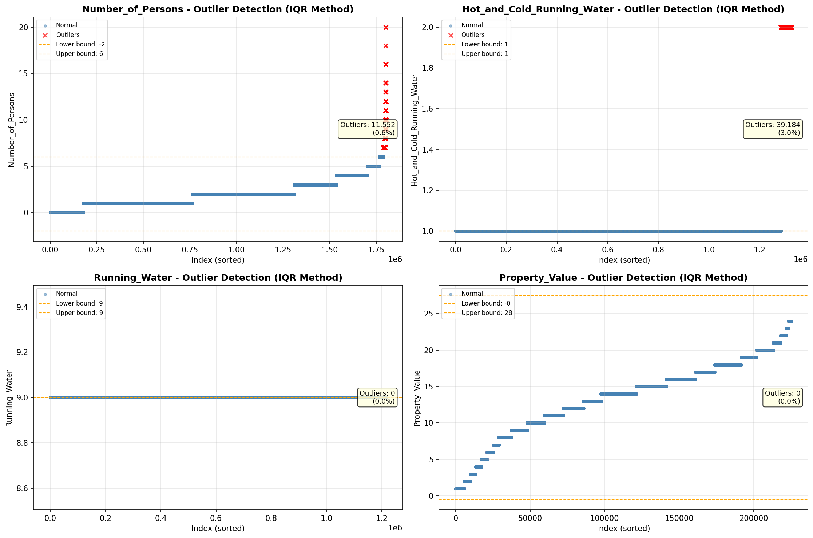
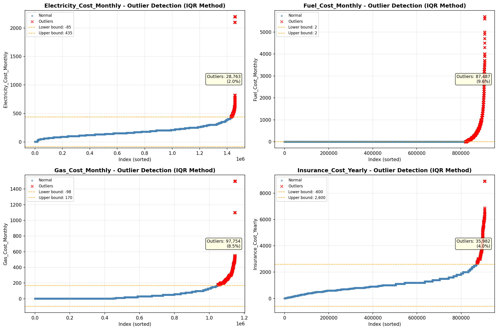

# Outlier Detection

> Statistical outlier detection using IQR (Interquartile Range) method. Outliers are values falling outside Q1 - 1.5×IQR or Q3 + 1.5×IQR bounds.

## Detection Methodology

| Parameter | Value | Description |
| :--- | :--- | :--- |
| Method | IQR | Outlier detection algorithm |
| Lower Bound | Q1 - 1.5 × IQR | Values below are outliers |
| Upper Bound | Q3 + 1.5 × IQR | Values above are outliers |
| IQR Definition | Q3 - Q1 | Interquartile Range |

> **Note**: The IQR method is robust to extreme values and works well for approximately symmetric distributions.

## Outlier Summary

_No outlier summary available._
## High Outlier Rate Variables

> Variables with outlier rate > 5% may indicate data quality issues, non-normal distributions, or genuinely extreme values.

- **('Specified_Rent_Unit', 24.406007501784334)**: 0 outliers (0.00%)

- **('Mobile_Home_Costs_Monthly', 16.598877027154195)**: 0 outliers (0.00%)

- **('Flag_Property_Taxes', 10.880259980865894)**: 0 outliers (0.00%)

- **('Gross_Rent_Percentage_Income', 9.661799245644193)**: 0 outliers (0.00%)

- **('Fuel_Cost_Monthly', 9.63078345680915)**: 0 outliers (0.00%)

- **('Flag_Property_Value', 9.105100909629314)**: 0 outliers (0.00%)

- **('Gas_Cost_Monthly', 8.522067983704556)**: 0 outliers (0.00%)

- **('Owner_Costs_Percentage_Income', 7.582731206527184)**: 0 outliers (0.00%)

- **('Flag_Water_Cost', 7.438611410608799)**: 0 outliers (0.00%)

- **('Working_Age_Persons', 7.340774295353139)**: 0 outliers (0.00%)

- **('Income_to_FPL_Ratio', 5.4983540102296224)**: 0 outliers (0.00%)

- **('Household_Income', 5.1166022525356585)**: 0 outliers (0.00%)

- **('Family_Income', 5.061396981743288)**: 0 outliers (0.00%)

> *Consider investigating these variables for data entry errors, applying transformations, or using robust statistical methods.*

## Visualizations

