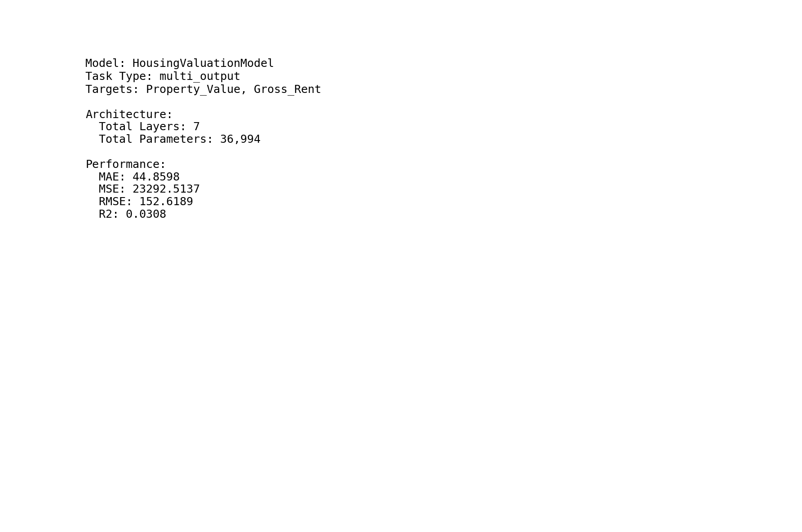
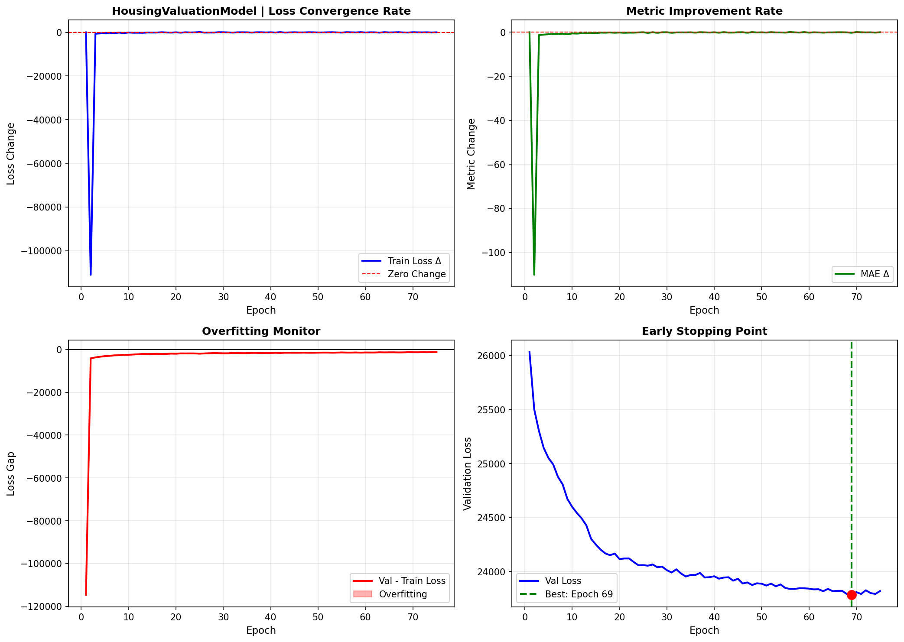
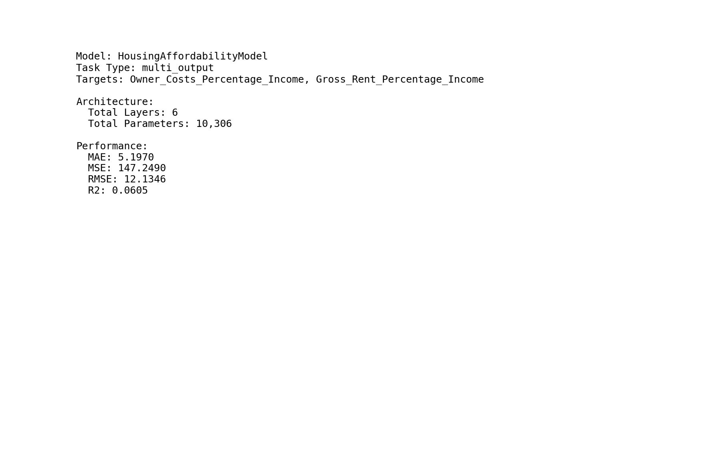
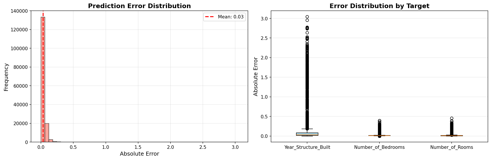
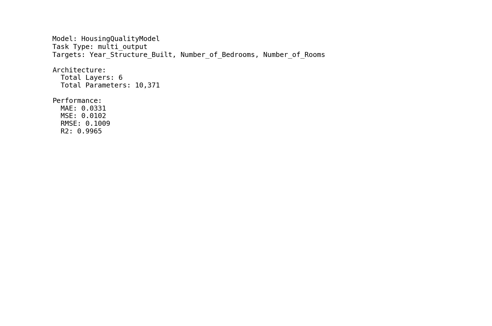
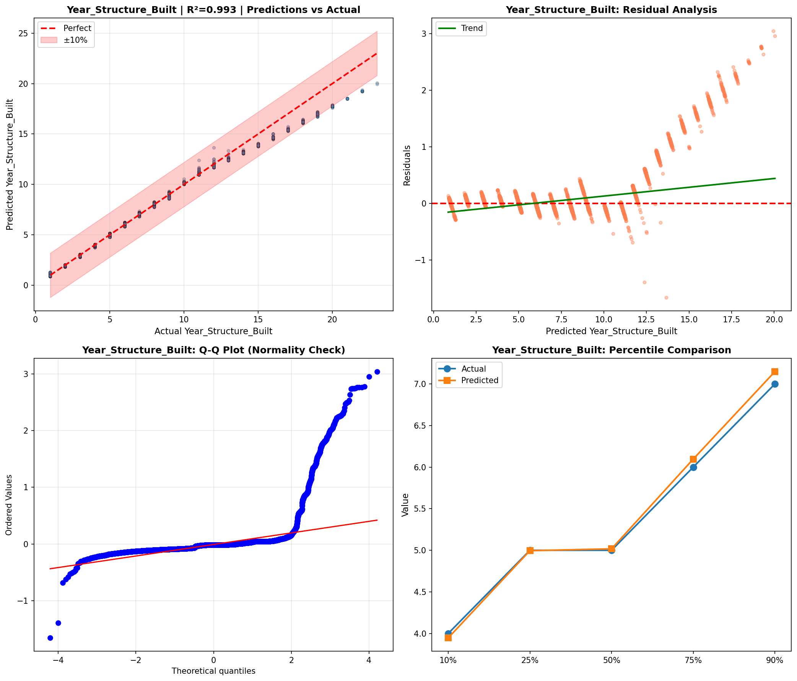
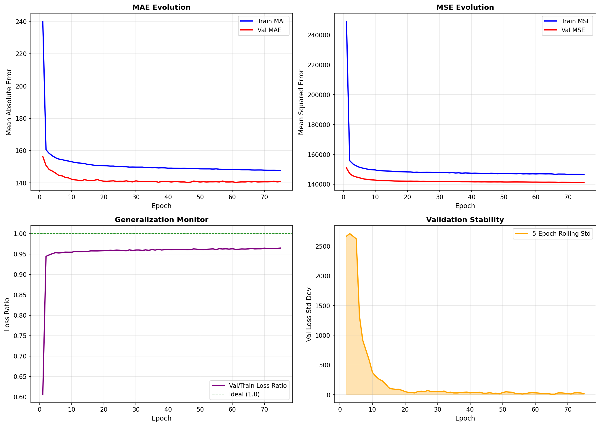
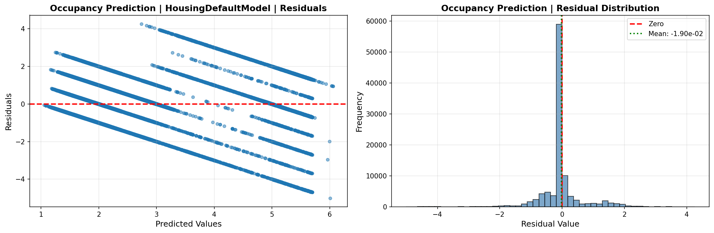
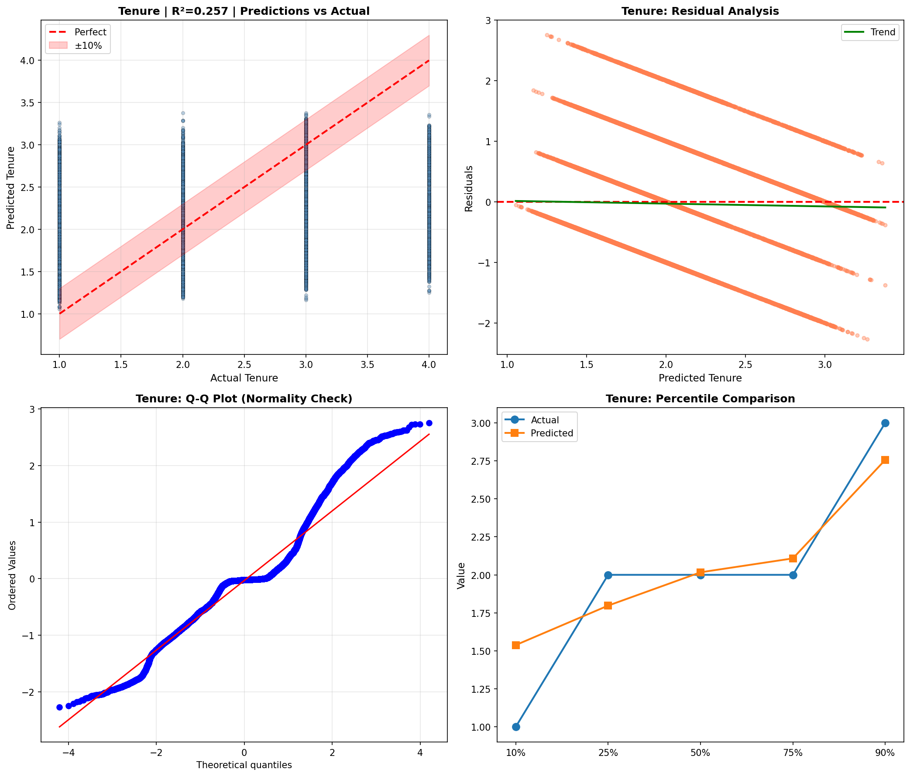
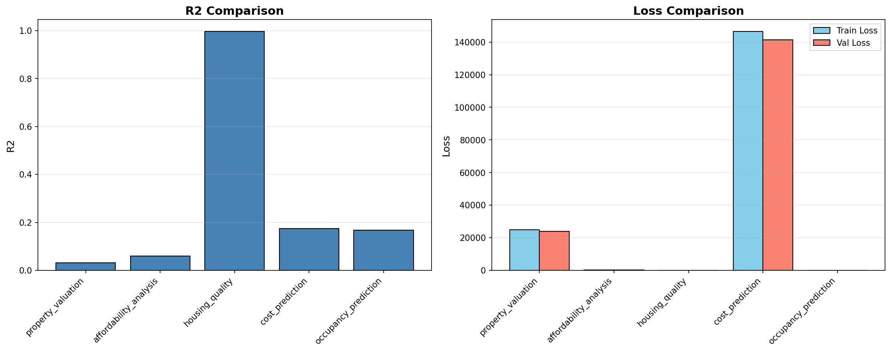

# Deep Learning Models

> Neural network analysis using TensorFlow/Keras for complex pattern recognition and multi-output prediction tasks.

## Deep Learning Summary

- **Total Tasks**: 5

- **Tasks**: Property Valuation, Affordability Analysis, Housing Quality, Cost Prediction, Occupancy Prediction

### Aggregate Statistics

| Metric | Value |
| :--- | :--- |
| Total Parameters | 78,283 |
| Average Validation Loss | 33049.3228 |
| Number of Tasks | 5 |

## Task: Property Valuation

### Model Configuration

| Property | Value |
| :--- | :--- |
| Model Type | HousingValuationModel |
| Task Type | Multi_Output |
| Target Variables | Property_Value, Gross_Rent |
| Number of Targets | 2 |
| Input Features | 10 |

### Network Architecture

| Component | Value | Notes |
| :--- | :--- | :--- |
| Total Layers | 7 | Including input and output |
| Total Parameters | 36,994 | Trainable weights |
| Parameters per Layer | 5,284 | Average |

### Performance Metrics

| Metric | Value | Assessment |
| :--- | :--- | :--- |
| Training Loss | 25016.7266 | Final epoch |
| Validation Loss | 23819.7676 | Final epoch |
| Loss Gap | -1196.9590 | NONE overfitting risk |

> *Good generalization*

#### Test Set Metrics

| Metric | Value | Description |
| :--- | :--- | :--- |
| MAE | 44.8598 | Mean Absolute Error (lower is better) |
| MSE | 23292.5137 | Mean Squared Error (lower is better) |
| RMSE | 152.6189 | Root Mean Squared Error (lower is better) |
| R2 | 0.0308 | R-squared (higher is better) |

### Training Analysis

| Training Statistic | Value |
| :--- | :--- |
| Epochs Trained | 75 |
| Initial Training Loss | 140635.0312 |
| Final Training Loss | 25016.7266 |
| Loss Improvement | 82.2% |
| Initial Validation Loss | 26031.7500 |
| Final Validation Loss | 23819.7676 |
| Validation Improvement | 8.5% |

#### Convergence Assessment

- **Status**: Fully converged (< 1% change in last 10 epochs)

- **Last 10 epochs change**: 0.42%

## Task: Affordability Analysis

### Model Configuration

| Property | Value |
| :--- | :--- |
| Model Type | HousingAffordabilityModel |
| Task Type | Multi_Output |
| Target Variables | Owner_Costs_Percentage_Income, Gross_Rent_Percentage_Income |
| Number of Targets | 2 |
| Input Features | 10 |

### Network Architecture

| Component | Value | Notes |
| :--- | :--- | :--- |
| Total Layers | 6 | Including input and output |
| Total Parameters | 10,306 | Trainable weights |
| Parameters per Layer | 1,717 | Average |

### Performance Metrics

| Metric | Value | Assessment |
| :--- | :--- | :--- |
| Training Loss | 145.8677 | Final epoch |
| Validation Loss | 147.5422 | Final epoch |
| Loss Gap | 1.6745 | HIGH overfitting risk |

> *Model may be overfitting significantly*

#### Test Set Metrics

| Metric | Value | Description |
| :--- | :--- | :--- |
| MAE | 5.1970 | Mean Absolute Error (lower is better) |
| MSE | 147.2490 | Mean Squared Error (lower is better) |
| RMSE | 12.1346 | Root Mean Squared Error (lower is better) |
| R2 | 0.0605 | R-squared (higher is better) |

### Training Analysis

| Training Statistic | Value |
| :--- | :--- |
| Epochs Trained | 75 |
| Initial Training Loss | 212.8840 |
| Final Training Loss | 145.8677 |
| Loss Improvement | 31.5% |
| Initial Validation Loss | 153.6856 |
| Final Validation Loss | 147.5422 |
| Validation Improvement | 4.0% |

#### Convergence Assessment

- **Status**: Fully converged (< 1% change in last 10 epochs)

- **Last 10 epochs change**: 0.10%

## Task: Housing Quality

### Model Configuration

| Property | Value |
| :--- | :--- |
| Model Type | HousingQualityModel |
| Task Type | Multi_Output |
| Target Variables | Year_Structure_Built, Number_of_Bedrooms, Number_of_Rooms |
| Number of Targets | 3 |
| Input Features | 10 |

### Network Architecture

| Component | Value | Notes |
| :--- | :--- | :--- |
| Total Layers | 6 | Including input and output |
| Total Parameters | 10,371 | Trainable weights |
| Parameters per Layer | 1,728 | Average |

### Performance Metrics

| Metric | Value | Assessment |
| :--- | :--- | :--- |
| Training Loss | 0.0089 | Final epoch |
| Validation Loss | 0.0110 | Final epoch |
| Loss Gap | 0.0021 | NONE overfitting risk |

> *Good generalization*

#### Test Set Metrics

| Metric | Value | Description |
| :--- | :--- | :--- |
| MAE | 0.0331 | Mean Absolute Error (lower is better) |
| MSE | 0.0102 | Mean Squared Error (lower is better) |
| RMSE | 0.1009 | Root Mean Squared Error (lower is better) |
| R2 | 0.9965 | R-squared (higher is better) |

### Training Analysis

| Training Statistic | Value |
| :--- | :--- |
| Epochs Trained | 75 |
| Initial Training Loss | 1.2094 |
| Final Training Loss | 0.0089 |
| Loss Improvement | 99.3% |
| Initial Validation Loss | 0.0662 |
| Final Validation Loss | 0.0110 |
| Validation Improvement | 83.4% |

#### Convergence Assessment

- **Status**: Still improving (> 5% change)

- **Last 10 epochs change**: 7.11%

## Task: Cost Prediction

### Model Configuration

| Property | Value |
| :--- | :--- |
| Model Type | HousingDefaultModel |
| Task Type | Multi_Output |
| Target Variables | Property_Taxes_Yearly, Insurance_Cost_Yearly |
| Number of Targets | 2 |
| Input Features | 10 |

### Network Architecture

| Component | Value | Notes |
| :--- | :--- | :--- |
| Total Layers | 6 | Including input and output |
| Total Parameters | 10,306 | Trainable weights |
| Parameters per Layer | 1,717 | Average |

### Performance Metrics

| Metric | Value | Assessment |
| :--- | :--- | :--- |
| Training Loss | 146450.3906 | Final epoch |
| Validation Loss | 141278.8125 | Final epoch |
| Loss Gap | -5171.5781 | NONE overfitting risk |

> *Good generalization*

#### Test Set Metrics

| Metric | Value | Description |
| :--- | :--- | :--- |
| MAE | 142.9008 | Mean Absolute Error (lower is better) |
| MSE | 142693.4219 | Mean Squared Error (lower is better) |
| RMSE | 377.7478 | Root Mean Squared Error (lower is better) |
| R2 | 0.1750 | R-squared (higher is better) |

### Training Analysis

| Training Statistic | Value |
| :--- | :--- |
| Epochs Trained | 75 |
| Initial Training Loss | 249190.5469 |
| Final Training Loss | 146450.3906 |
| Loss Improvement | 41.2% |
| Initial Validation Loss | 150890.2188 |
| Final Validation Loss | 141278.8125 |
| Validation Improvement | 6.4% |

#### Convergence Assessment

- **Status**: Fully converged (< 1% change in last 10 epochs)

- **Last 10 epochs change**: 0.14%

## Task: Occupancy Prediction

### Model Configuration

| Property | Value |
| :--- | :--- |
| Model Type | HousingDefaultModel |
| Task Type | Multi_Output |
| Target Variables | Vacancy_Status, Tenure |
| Number of Targets | 2 |
| Input Features | 10 |

### Network Architecture

| Component | Value | Notes |
| :--- | :--- | :--- |
| Total Layers | 6 | Including input and output |
| Total Parameters | 10,306 | Trainable weights |
| Parameters per Layer | 1,717 | Average |

### Performance Metrics

| Metric | Value | Assessment |
| :--- | :--- | :--- |
| Training Loss | 0.4741 | Final epoch |
| Validation Loss | 0.4809 | Final epoch |
| Loss Gap | 0.0067 | NONE overfitting risk |

> *Good generalization*

#### Test Set Metrics

| Metric | Value | Description |
| :--- | :--- | :--- |
| MAE | 0.3501 | Mean Absolute Error (lower is better) |
| MSE | 0.4725 | Mean Squared Error (lower is better) |
| RMSE | 0.6874 | Root Mean Squared Error (lower is better) |
| R2 | 0.1683 | R-squared (higher is better) |

### Training Analysis

| Training Statistic | Value |
| :--- | :--- |
| Epochs Trained | 75 |
| Initial Training Loss | 1.0200 |
| Final Training Loss | 0.4741 |
| Loss Improvement | 53.5% |
| Initial Validation Loss | 0.5539 |
| Final Validation Loss | 0.4809 |
| Validation Improvement | 13.2% |

#### Convergence Assessment

- **Status**: Fully converged (< 1% change in last 10 epochs)

- **Last 10 epochs change**: 0.12%

## Cross-Task Comparison

| Task | Model Type | Parameters | Train Loss | Val Loss | Gap |
| :--- | :--- | :--- | :--- | :--- | :--- |
| Property Valuation | HousingValuationModel | 36,994 | 25016.7266 | 23819.7676 | -1196.9590 |
| Affordability Analysis | HousingAffordabilityModel | 10,306 | 145.8677 | 147.5422 | 1.6745 |
| Housing Quality | HousingQualityModel | 10,371 | 0.0089 | 0.0110 | 0.0021 |
| Cost Prediction | HousingDefaultModel | 10,306 | 146450.3906 | 141278.8125 | -5171.5781 |
| Occupancy Prediction | HousingDefaultModel | 10,306 | 0.4741 | 0.4809 | 0.0067 |

## Visualizations

