# Deep Learning Models

> Neural network analysis using TensorFlow/Keras for complex pattern recognition and multi-output prediction tasks.

## Deep Learning Summary

- **Total Tasks**: 5

- **Tasks**: Property Valuation, Affordability Analysis, Housing Quality, Cost Prediction, Occupancy Prediction

### Aggregate Statistics

| Metric | Value |
| :--- | :--- |
| Total Parameters | 78,283 |
| Average Validation Loss | 5240907354.0767 |
| Number of Tasks | 5 |

## Task: Property Valuation

### Model Configuration

| Property | Value |
| :--- | :--- |
| Model Type | HousingValuationModel |
| Task Type | Multi_Output |
| Target Variables | Property_Value, Gross_Rent |
| Number of Targets | 2 |
| Input Features | 10 |

### Network Architecture

| Component | Value | Notes |
| :--- | :--- | :--- |
| Total Layers | 7 | Including input and output |
| Total Parameters | 36,994 | Trainable weights |
| Parameters per Layer | 5,284 | Average |

### Performance Metrics

| Metric | Value | Assessment |
| :--- | :--- | :--- |
| Training Loss | 26319499264.0000 | Final epoch |
| Validation Loss | 26204246016.0000 | Final epoch |
| Loss Gap | -115253248.0000 | NONE overfitting risk |

> *Good generalization*

#### Test Set Metrics

| Metric | Value | Description |
| :--- | :--- | :--- |
| MAE | 43179.3438 | Mean Absolute Error (lower is better) |
| MSE | 27024975872.0000 | Mean Squared Error (lower is better) |
| RMSE | 164392.7488 | Root Mean Squared Error (lower is better) |
| R2 | -0.0517 | R-squared (higher is better) |

### Training Analysis

| Training Statistic | Value |
| :--- | :--- |
| Epochs Trained | 75 |
| Initial Training Loss | 47350325248.0000 |
| Final Training Loss | 26319499264.0000 |
| Loss Improvement | 44.4% |
| Initial Validation Loss | 30972616704.0000 |
| Final Validation Loss | 26204246016.0000 |
| Validation Improvement | 15.4% |

#### Convergence Assessment

- **Status**: Fully converged (< 1% change in last 10 epochs)

- **Last 10 epochs change**: 0.14%

## Task: Affordability Analysis

### Model Configuration

| Property | Value |
| :--- | :--- |
| Model Type | HousingAffordabilityModel |
| Task Type | Multi_Output |
| Target Variables | Owner_Costs_Percentage_Income, Gross_Rent_Percentage_Income |
| Number of Targets | 2 |
| Input Features | 10 |

### Network Architecture

| Component | Value | Notes |
| :--- | :--- | :--- |
| Total Layers | 6 | Including input and output |
| Total Parameters | 10,306 | Trainable weights |
| Parameters per Layer | 1,717 | Average |

### Performance Metrics

| Metric | Value | Assessment |
| :--- | :--- | :--- |
| Training Loss | 210.4187 | Final epoch |
| Validation Loss | 207.8687 | Final epoch |
| Loss Gap | -2.5500 | NONE overfitting risk |

> *Good generalization*

#### Test Set Metrics

| Metric | Value | Description |
| :--- | :--- | :--- |
| MAE | 7.1726 | Mean Absolute Error (lower is better) |
| MSE | 208.1137 | Mean Squared Error (lower is better) |
| RMSE | 14.4261 | Root Mean Squared Error (lower is better) |
| R2 | 0.0566 | R-squared (higher is better) |

### Training Analysis

| Training Statistic | Value |
| :--- | :--- |
| Epochs Trained | 75 |
| Initial Training Loss | 257.1585 |
| Final Training Loss | 210.4187 |
| Loss Improvement | 18.2% |
| Initial Validation Loss | 214.3449 |
| Final Validation Loss | 207.8687 |
| Validation Improvement | 3.0% |

#### Convergence Assessment

- **Status**: Fully converged (< 1% change in last 10 epochs)

- **Last 10 epochs change**: 0.03%

## Task: Housing Quality

### Model Configuration

| Property | Value |
| :--- | :--- |
| Model Type | HousingQualityModel |
| Task Type | Multi_Output |
| Target Variables | Year_Structure_Built, Number_of_Bedrooms, Number_of_Rooms |
| Number of Targets | 3 |
| Input Features | 10 |

### Network Architecture

| Component | Value | Notes |
| :--- | :--- | :--- |
| Total Layers | 6 | Including input and output |
| Total Parameters | 10,371 | Trainable weights |
| Parameters per Layer | 1,728 | Average |

### Performance Metrics

| Metric | Value | Assessment |
| :--- | :--- | :--- |
| Training Loss | 161.9680 | Final epoch |
| Validation Loss | 11.6758 | Final epoch |
| Loss Gap | -150.2922 | NONE overfitting risk |

> *Good generalization*

#### Test Set Metrics

| Metric | Value | Description |
| :--- | :--- | :--- |
| MAE | 0.9690 | Mean Absolute Error (lower is better) |
| MSE | 11.4259 | Mean Squared Error (lower is better) |
| RMSE | 3.3802 | Root Mean Squared Error (lower is better) |
| R2 | 0.8453 | R-squared (higher is better) |

### Training Analysis

| Training Statistic | Value |
| :--- | :--- |
| Epochs Trained | 75 |
| Initial Training Loss | 9169.9619 |
| Final Training Loss | 161.9680 |
| Loss Improvement | 98.2% |
| Initial Validation Loss | 11.4316 |
| Final Validation Loss | 11.6758 |
| Validation Improvement | -2.1% |

#### Convergence Assessment

- **Status**: Still improving (> 5% change)

- **Last 10 epochs change**: 14.35%

## Task: Cost Prediction

### Model Configuration

| Property | Value |
| :--- | :--- |
| Model Type | HousingDefaultModel |
| Task Type | Multi_Output |
| Target Variables | Property_Taxes_Yearly, Insurance_Cost_Yearly |
| Number of Targets | 2 |
| Input Features | 10 |

### Network Architecture

| Component | Value | Notes |
| :--- | :--- | :--- |
| Total Layers | 6 | Including input and output |
| Total Parameters | 10,306 | Trainable weights |
| Parameters per Layer | 1,717 | Average |

### Performance Metrics

| Metric | Value | Assessment |
| :--- | :--- | :--- |
| Training Loss | 270807.6250 | Final epoch |
| Validation Loss | 290534.4688 | Final epoch |
| Loss Gap | 19726.8438 | HIGH overfitting risk |

> *Model may be overfitting significantly*

#### Test Set Metrics

| Metric | Value | Description |
| :--- | :--- | :--- |
| MAE | 178.0134 | Mean Absolute Error (lower is better) |
| MSE | 262739.9375 | Mean Squared Error (lower is better) |
| RMSE | 512.5816 | Root Mean Squared Error (lower is better) |
| R2 | 0.2718 | R-squared (higher is better) |

### Training Analysis

| Training Statistic | Value |
| :--- | :--- |
| Epochs Trained | 75 |
| Initial Training Loss | 339146.0625 |
| Final Training Loss | 270807.6250 |
| Loss Improvement | 20.2% |
| Initial Validation Loss | 339434.6250 |
| Final Validation Loss | 290534.4688 |
| Validation Improvement | 14.4% |

#### Convergence Assessment

- **Status**: Fully converged (< 1% change in last 10 epochs)

- **Last 10 epochs change**: 0.16%

## Task: Occupancy Prediction

### Model Configuration

| Property | Value |
| :--- | :--- |
| Model Type | HousingDefaultModel |
| Task Type | Multi_Output |
| Target Variables | Vacancy_Status, Tenure |
| Number of Targets | 2 |
| Input Features | 10 |

### Network Architecture

| Component | Value | Notes |
| :--- | :--- | :--- |
| Total Layers | 6 | Including input and output |
| Total Parameters | 10,306 | Trainable weights |
| Parameters per Layer | 1,717 | Average |

### Performance Metrics

| Metric | Value | Assessment |
| :--- | :--- | :--- |
| Training Loss | 0.3674 | Final epoch |
| Validation Loss | 0.3700 | Final epoch |
| Loss Gap | 0.0026 | NONE overfitting risk |

> *Good generalization*

#### Test Set Metrics

| Metric | Value | Description |
| :--- | :--- | :--- |
| MAE | 0.3158 | Mean Absolute Error (lower is better) |
| MSE | 0.3667 | Mean Squared Error (lower is better) |
| RMSE | 0.6056 | Root Mean Squared Error (lower is better) |
| R2 | 0.2632 | R-squared (higher is better) |

### Training Analysis

| Training Statistic | Value |
| :--- | :--- |
| Epochs Trained | 75 |
| Initial Training Loss | 0.7972 |
| Final Training Loss | 0.3674 |
| Loss Improvement | 53.9% |
| Initial Validation Loss | 0.4520 |
| Final Validation Loss | 0.3700 |
| Validation Improvement | 18.1% |

#### Convergence Assessment

- **Status**: Fully converged (< 1% change in last 10 epochs)

- **Last 10 epochs change**: 0.03%

## Cross-Task Comparison

| Task | Model Type | Parameters | Train Loss | Val Loss | Gap |
| :--- | :--- | :--- | :--- | :--- | :--- |
| Property Valuation | HousingValuationModel | 36,994 | 26319499264.0000 | 26204246016.0000 | -115253248.0000 |
| Affordability Analysis | HousingAffordabilityModel | 10,306 | 210.4187 | 207.8687 | -2.5500 |
| Housing Quality | HousingQualityModel | 10,371 | 161.9680 | 11.6758 | -150.2922 |
| Cost Prediction | HousingDefaultModel | 10,306 | 270807.6250 | 290534.4688 | 19726.8438 |
| Occupancy Prediction | HousingDefaultModel | 10,306 | 0.3674 | 0.3700 | 0.0026 |

## Visualizations

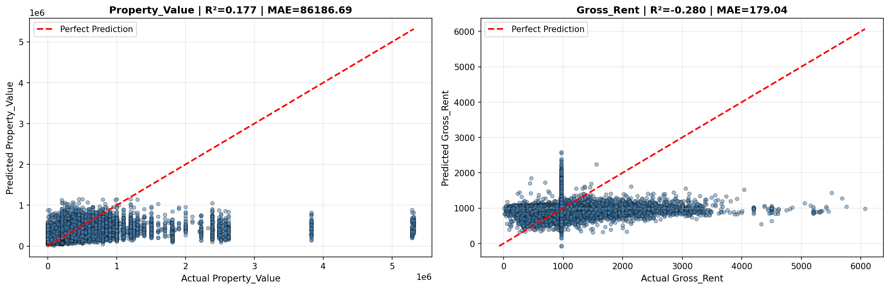

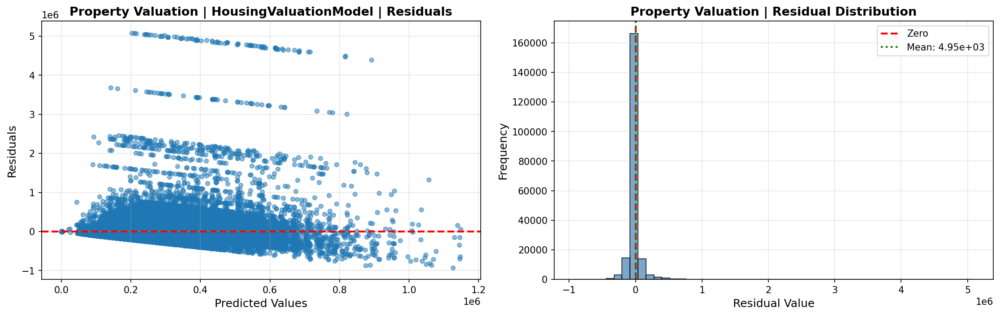

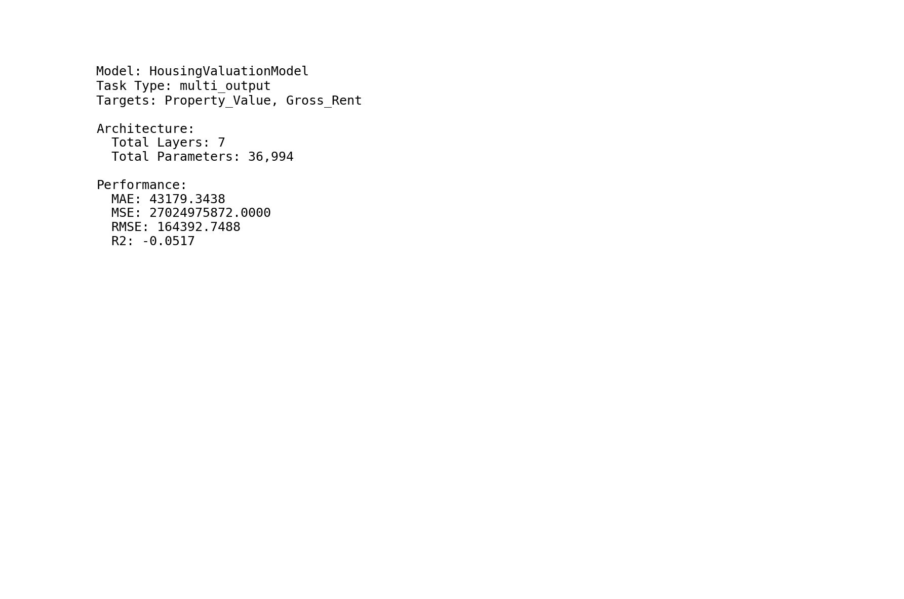

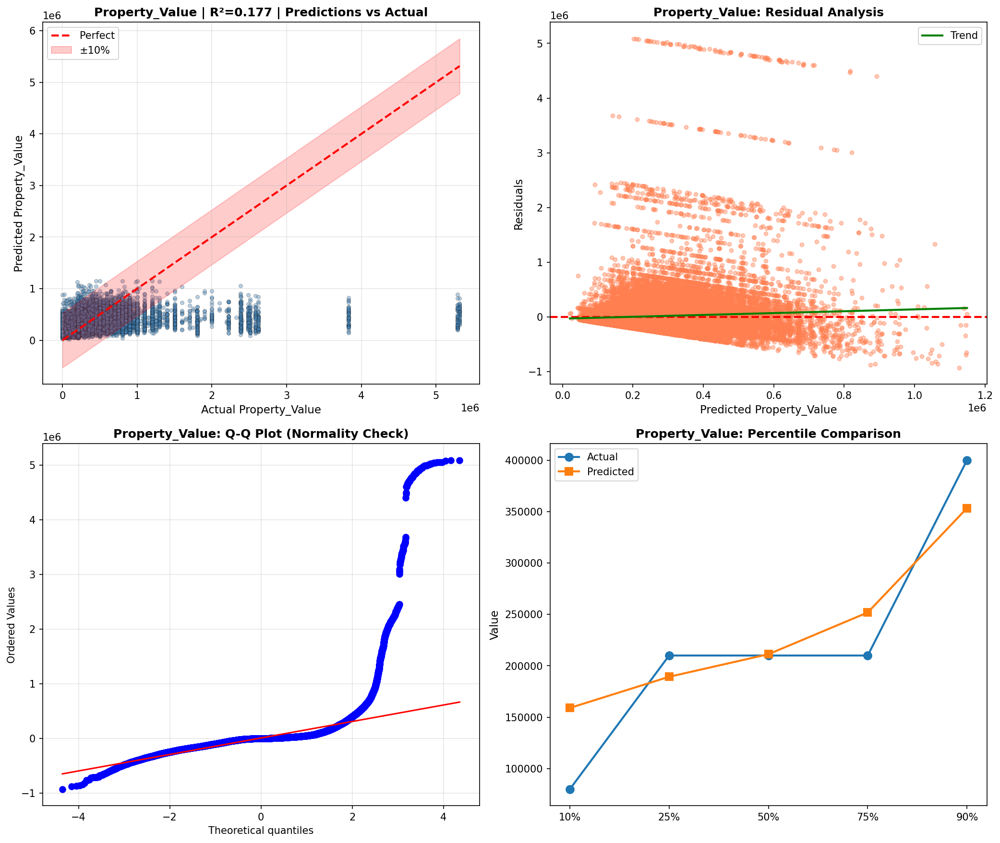

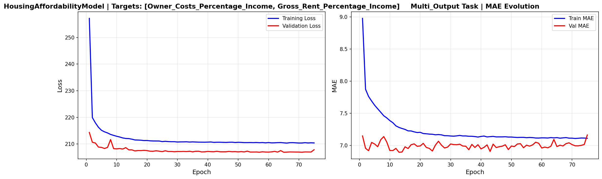

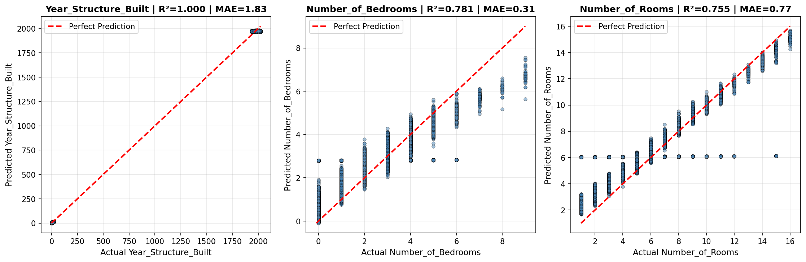

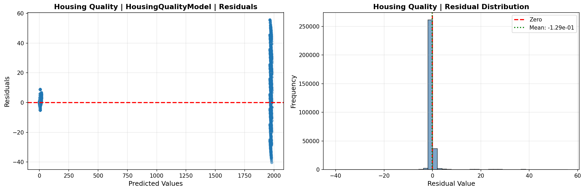

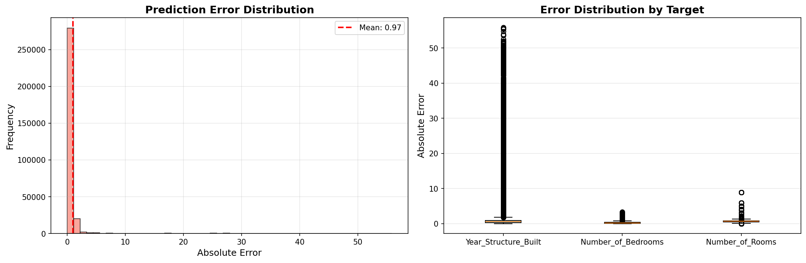

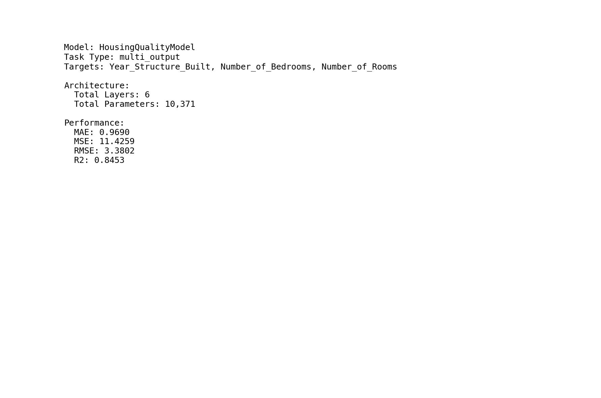

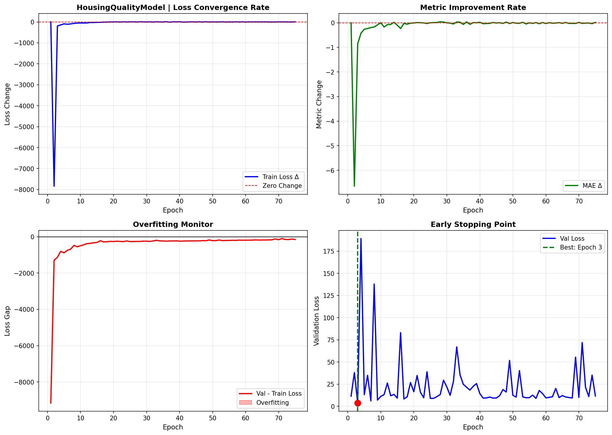

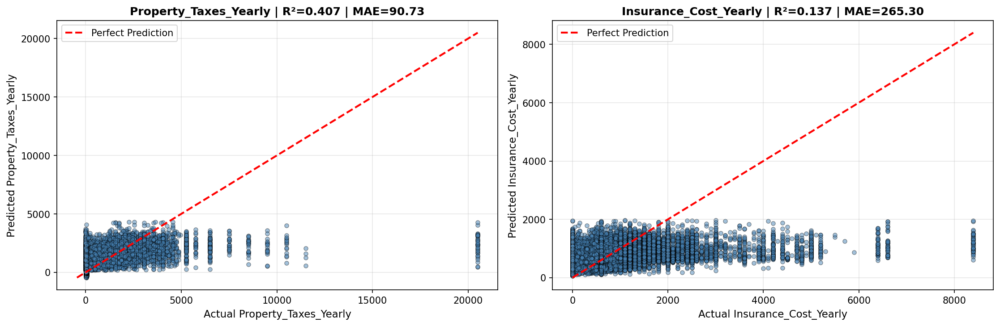

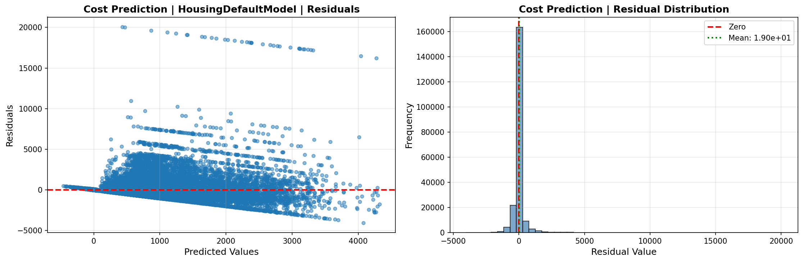

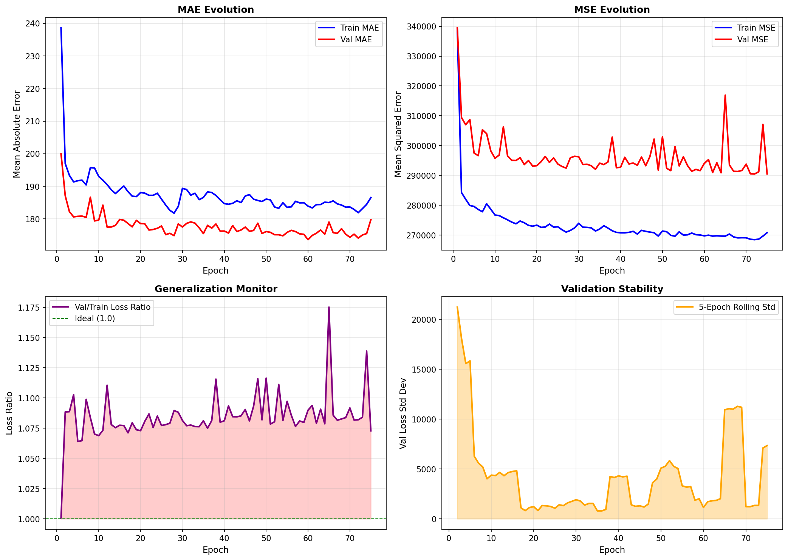

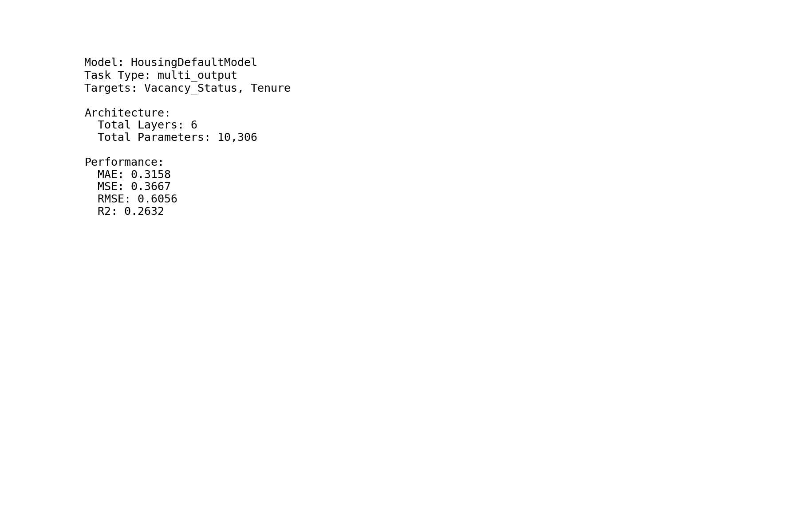

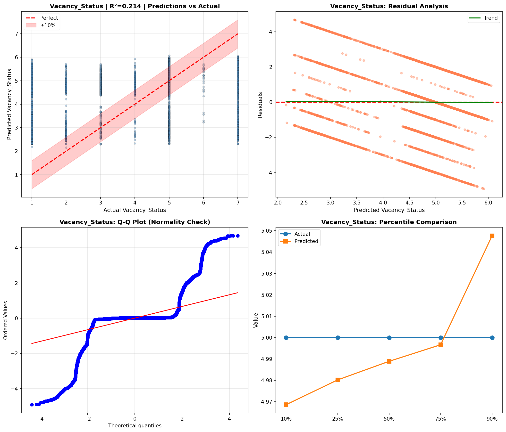

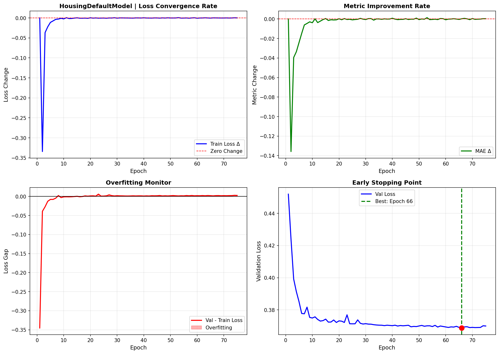

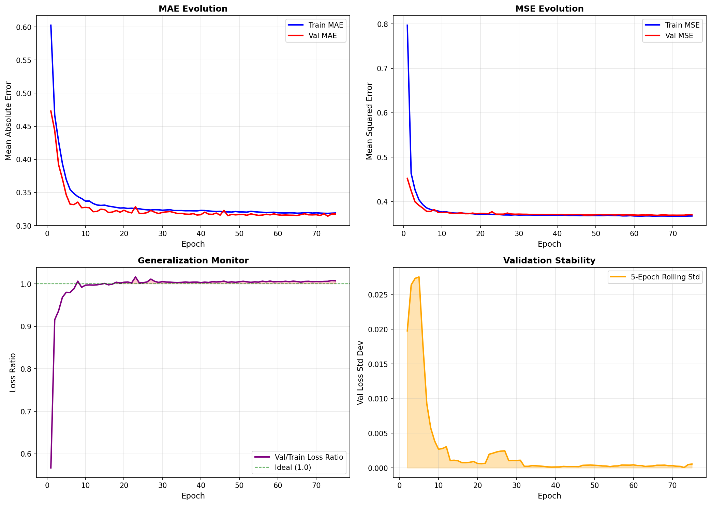

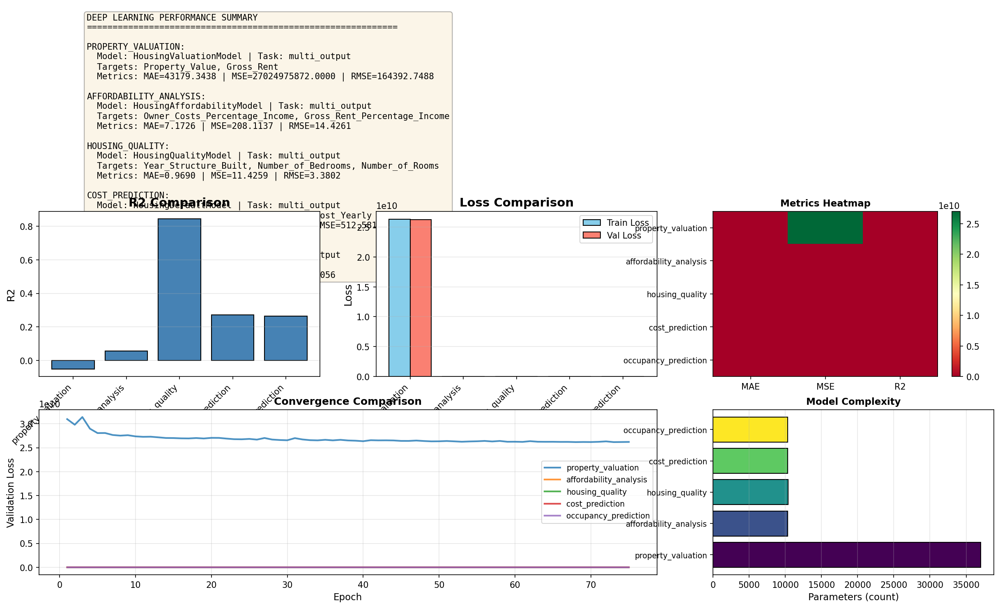

