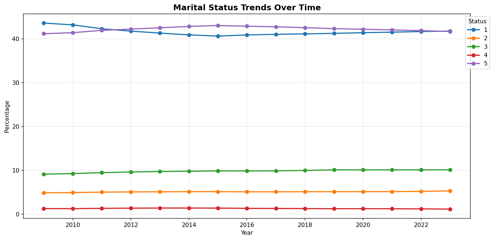
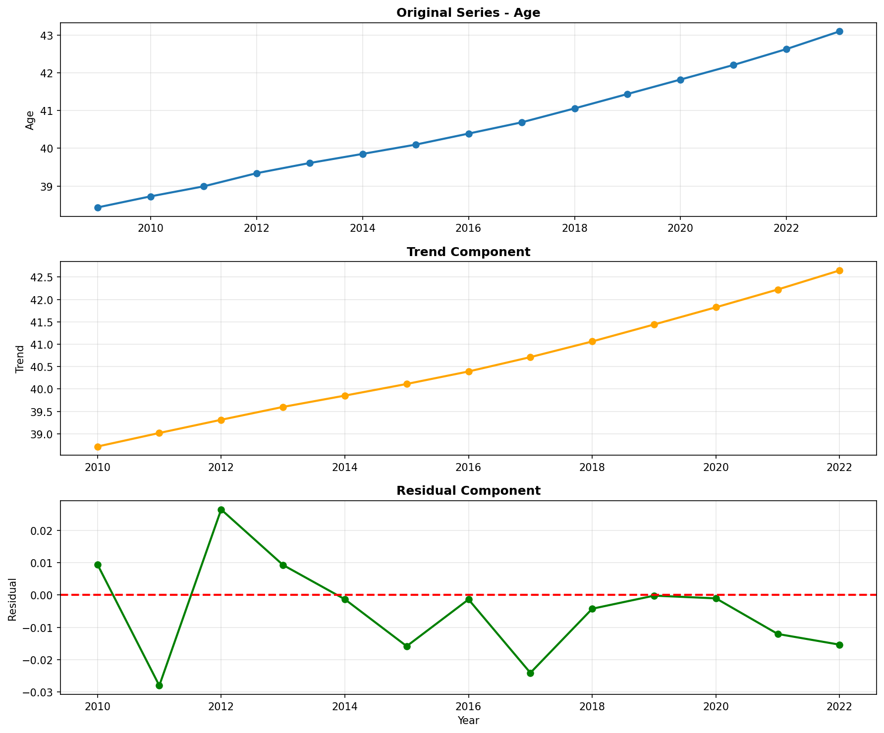
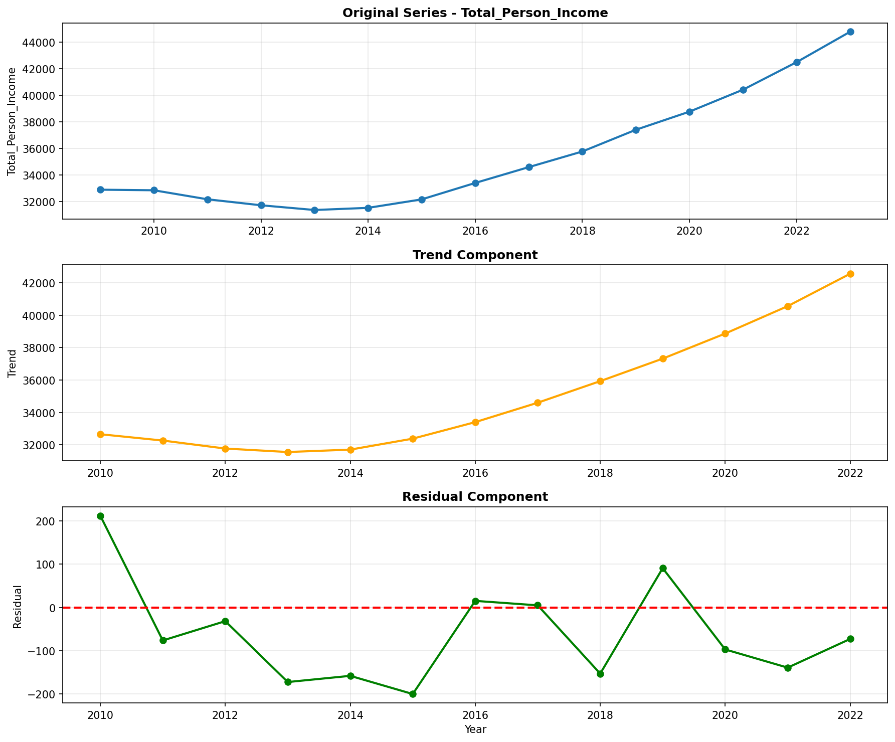

# Temporal Analysis

> Analysis of data patterns and trends over time, including year-over-year changes and growth rate calculations.

## Year Distribution

### Summary

- **Total Years**: 15

- **Year Range**: 2009 - 2023

- **Total Records**: 4,936,083

- **Average Records/Year**: 329,072

### Records by Year

| Year | Records | % of Total | Deviation from Avg |
| :--- | :--- | :--- | :--- |
| 2009 | 303,402 | 6.1% | -7.8% |
| 2010 | 308,639 | 6.3% | -6.2% |
| 2011 | 313,361 | 6.3% | -4.8% |
| 2012 | 317,870 | 6.4% | -3.4% |
| 2013 | 322,861 | 6.5% | -1.9% |
| 2014 | 327,123 | 6.6% | -0.6% |
| 2015 | 330,585 | 6.7% | +0.5% |
| 2016 | 334,066 | 6.8% | +1.5% |
| 2017 | 336,984 | 6.8% | +2.4% |
| 2018 | 340,442 | 6.9% | +3.5% |
| 2019 | 345,137 | 7.0% | +4.9% |
| 2020 | 331,341 | 6.7% | +0.7% |
| 2021 | 335,968 | 6.8% | +2.1% |
| 2022 | 341,258 | 6.9% | +3.7% |
| 2023 | 347,046 | 7.0% | +5.5% |

> *Sample size increased by 14.4% from 2009 to 2023.*

## Sample Size Consistency

- **Standard Deviation**: 12,891 records

- **Coefficient of Variation**: 3.9 %

- **Consistency Rating**: highly consistent

> *Sample sizes are stable across years.*

## Temporal Trends

### Trend Summary

| Direction | Count | Percentage |
| :--- | :--- | :--- |
| Increasing | 0 | 0.0% |
| Decreasing | 0 | 0.0% |
| Stable/Other | 270 | 100.0% |

## Growth Rates

### Growth Rate Summary

- **Average Growth Rate**: 1,438.49 %

- **Variables with Positive Growth**: 1

- **Variables with Negative Growth**: 0

### Top Growth Rates

| Variable | Growth Rate | Direction |
| :--- | :--- | :--- |
| sample_growth | 1438.49% | Increasing |

## Visualizations

