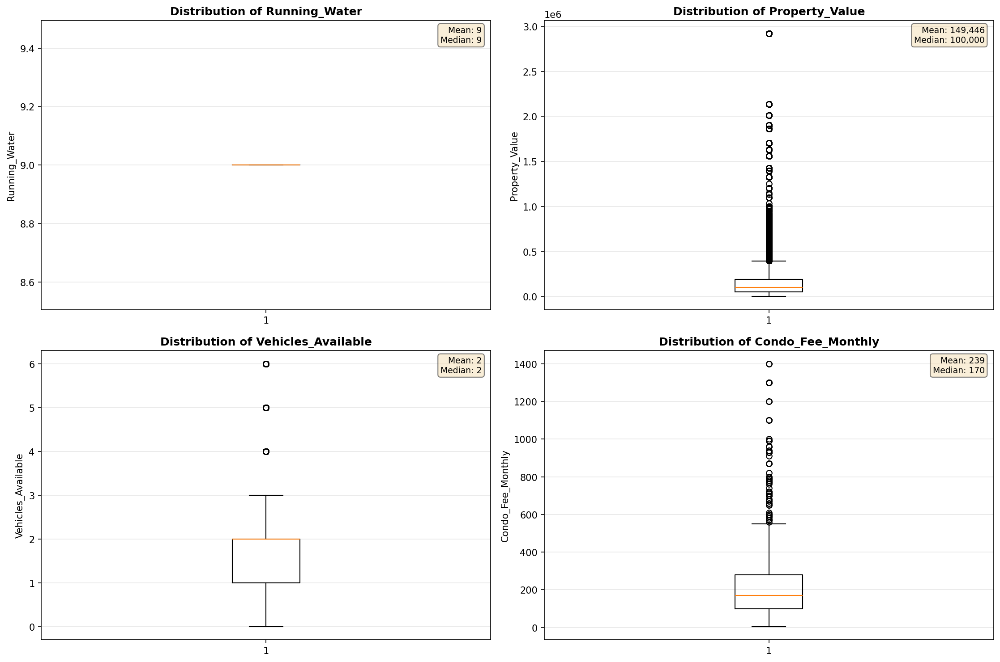
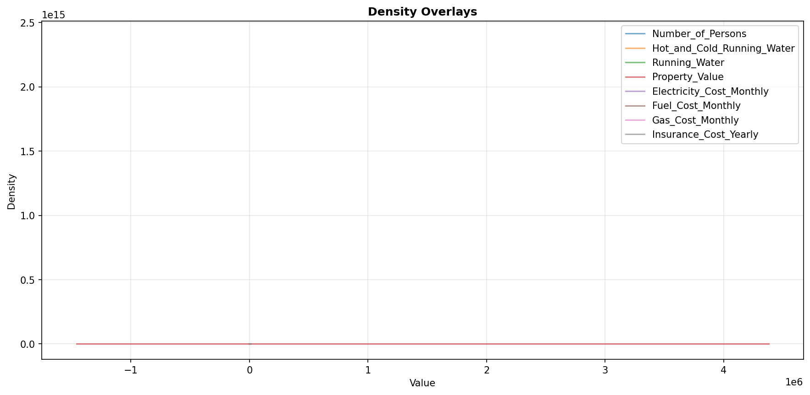
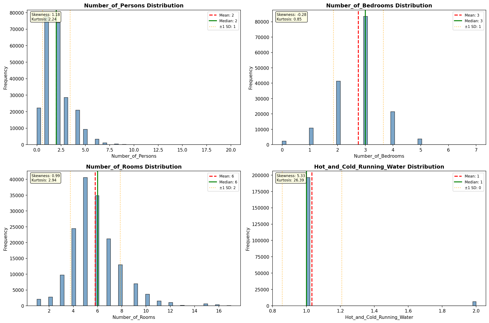
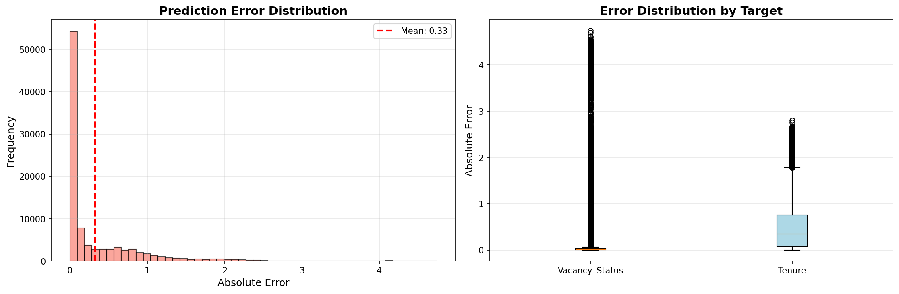
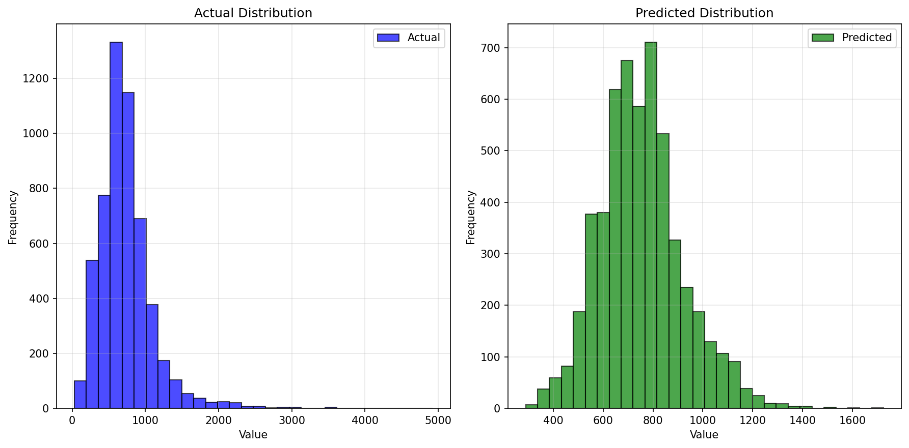
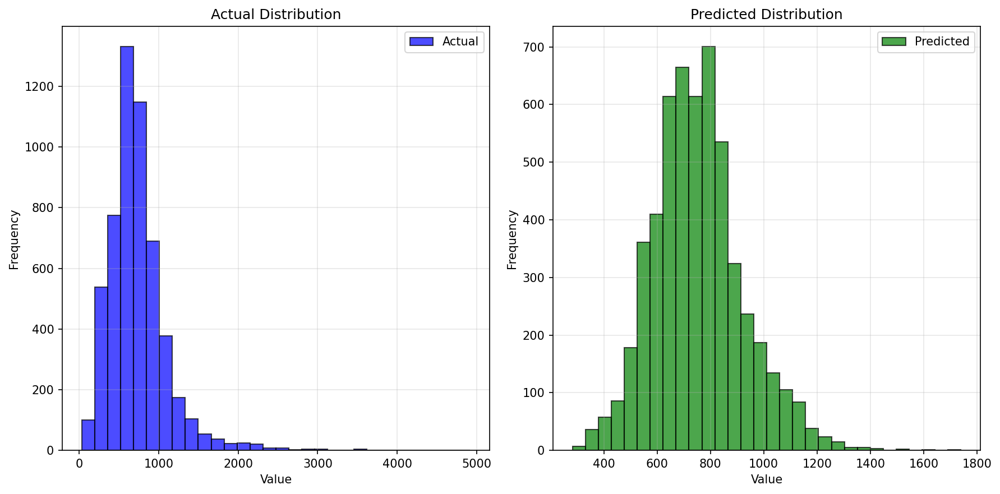
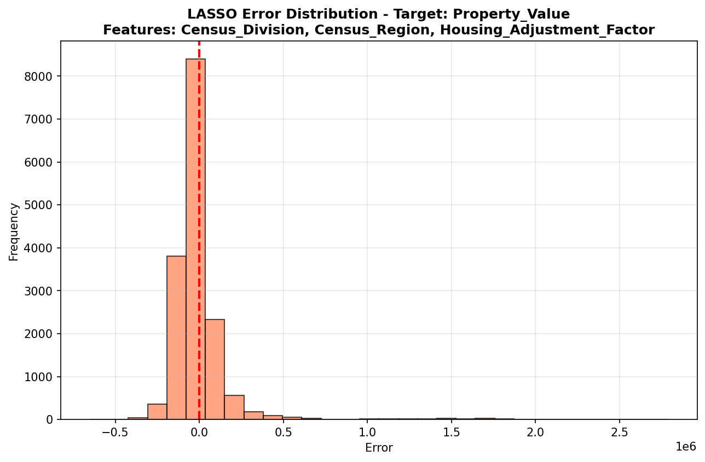
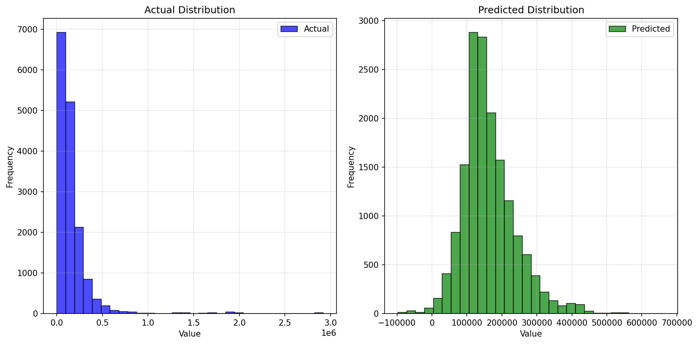

# Statistical Analysis

> Comprehensive descriptive statistics including central tendency, dispersion, distribution characteristics, and weighted statistics using ACS sample weights.

## Summary Statistics

- **Variables Analyzed**: 41

### Income_Adjustment_Factor

| Statistic | Unweighted | Weighted (ACS) |
| :--- | :--- | :--- |
| Mean | 1,014,844.95 | 1,014,656.45 |
| Median | 1,010,207.00 | 1,014,656.45 |
| Std Deviation | 11,371.61 | — |
| Minimum | 1,001,264.00 | — |
| Maximum | 1,042,311.00 | — |
| Count | 167,602 | — |

> *Distribution is highly right-skewed (skewness: 1.32), light-tailed/platykurtic (kurtosis: 0.74).*

- **Coefficient of Variation**: 1.1 % (low variability)

### Property_Value

| Statistic | Unweighted | Weighted (ACS) |
| :--- | :--- | :--- |
| Mean | 149,446.48 | 159,396.95 |
| Median | 100,000.00 | 120,001.08 |
| Std Deviation | 199,094.60 | — |
| Minimum | 1.00 | — |
| Maximum | 2,920,000.00 | — |
| Count | 107,321 | — |

> *Distribution is highly right-skewed (skewness: 5.88), heavy-tailed/leptokurtic (kurtosis: 53.48).*

- **Coefficient of Variation**: 133.2 % (very high variability)

### Electricity_Cost_Monthly

| Statistic | Unweighted | Weighted (ACS) |
| :--- | :--- | :--- |
| Mean | 152.75 | 152.57 |
| Median | 130.00 | 133.75 |
| Std Deviation | 121.06 | — |
| Minimum | 1.00 | — |
| Maximum | 3,000.00 | — |
| Count | 191,443 | — |

> *Distribution is highly right-skewed (skewness: 10.20), heavy-tailed/leptokurtic (kurtosis: 212.13).*

- **Coefficient of Variation**: 79.3 % (high variability)

### Fuel_Cost_Monthly

| Statistic | Unweighted | Weighted (ACS) |
| :--- | :--- | :--- |
| Mean | 70.96 | 184.70 |
| Median | 2.00 | 100.12 |
| Std Deviation | 282.81 | — |
| Minimum | 1.00 | — |
| Maximum | 5,400.00 | — |
| Count | 135,605 | — |

> *Distribution is highly right-skewed (skewness: 6.84), heavy-tailed/leptokurtic (kurtosis: 62.40).*

- **Coefficient of Variation**: 398.6 % (very high variability)

### Gas_Cost_Monthly

| Statistic | Unweighted | Weighted (ACS) |
| :--- | :--- | :--- |
| Mean | 60.68 | 62.89 |
| Median | 30.00 | 35.00 |
| Std Deviation | 92.68 | — |
| Minimum | 1.00 | — |
| Maximum | 1,600.00 | — |
| Count | 165,515 | — |

> *Distribution is highly right-skewed (skewness: 6.82), heavy-tailed/leptokurtic (kurtosis: 93.72).*

- **Coefficient of Variation**: 152.7 % (very high variability)

### Insurance_Cost_Yearly

| Statistic | Unweighted | Weighted (ACS) |
| :--- | :--- | :--- |
| Mean | 1,020.73 | 1,045.91 |
| Median | 900.00 | 948.12 |
| Std Deviation | 746.58 | — |
| Minimum | 4.00 | — |
| Maximum | 7,700.00 | — |
| Count | 116,505 | — |

> *Distribution is highly right-skewed (skewness: 2.49), heavy-tailed/leptokurtic (kurtosis: 11.95).*

- **Coefficient of Variation**: 73.1 % (high variability)

### Water_Cost_Yearly

| Statistic | Unweighted | Weighted (ACS) |
| :--- | :--- | :--- |
| Mean | 433.61 | 438.07 |
| Median | 390.00 | 398.12 |
| Std Deviation | 424.28 | — |
| Minimum | 1.00 | — |
| Maximum | 4,500.00 | — |
| Count | 184,272 | — |

> *Distribution is highly right-skewed (skewness: 2.31), heavy-tailed/leptokurtic (kurtosis: 12.00).*

- **Coefficient of Variation**: 97.8 % (high variability)

### Mobile_Home_Costs_Monthly

| Statistic | Unweighted | Weighted (ACS) |
| :--- | :--- | :--- |
| Mean | 503.94 | 534.94 |
| Median | 210.00 | 218.75 |
| Std Deviation | 1,152.73 | — |
| Minimum | 4.00 | — |
| Maximum | 19,700.00 | — |
| Count | 11,730 | — |

> *Distribution is highly right-skewed (skewness: 8.56), heavy-tailed/leptokurtic (kurtosis: 113.24).*

- **Coefficient of Variation**: 228.7 % (very high variability)

### First_Mortgage_Payment_Monthly

| Statistic | Unweighted | Weighted (ACS) |
| :--- | :--- | :--- |
| Mean | 661.35 | 773.15 |
| Median | 560.00 | 613.00 |
| Std Deviation | 601.57 | — |
| Minimum | 4.00 | — |
| Maximum | 5,000.00 | — |
| Count | 87,859 | — |

> *Distribution is highly right-skewed (skewness: 1.92), heavy-tailed/leptokurtic (kurtosis: 6.69).*

- **Coefficient of Variation**: 91.0 % (high variability)

### First_Mortgage_Includes_Taxes

| Statistic | Unweighted | Weighted (ACS) |
| :--- | :--- | :--- |
| Mean | 1.36 | 1.32 |
| Median | 1.00 | 1.00 |
| Std Deviation | 0.48 | — |
| Minimum | 1.00 | — |
| Maximum | 2.00 | — |
| Count | 71,336 | — |

> *Distribution is moderately right-skewed (skewness: 0.58), light-tailed/platykurtic (kurtosis: -1.66).*

- **Coefficient of Variation**: 35.3 % (moderate variability)

### Second_Mortgage_Payment_Monthly

| Statistic | Unweighted | Weighted (ACS) |
| :--- | :--- | :--- |
| Mean | 364.97 | 375.79 |
| Median | 280.00 | 272.50 |
| Std Deviation | 362.99 | — |
| Minimum | 4.00 | — |
| Maximum | 3,200.00 | — |
| Count | 6,498 | — |

> *Distribution is highly right-skewed (skewness: 3.43), heavy-tailed/leptokurtic (kurtosis: 16.49).*

- **Coefficient of Variation**: 99.5 % (high variability)

### Property_Taxes_Yearly

| Statistic | Unweighted | Weighted (ACS) |
| :--- | :--- | :--- |
| Mean | 125.97 | 133.72 |
| Median | 14.00 | 99.75 |
| Std Deviation | 577.00 | — |
| Minimum | 1.00 | — |
| Maximum | 11,500.00 | — |
| Count | 103,438 | — |

> *Distribution is highly right-skewed (skewness: 10.37), heavy-tailed/leptokurtic (kurtosis: 156.80).*

- **Coefficient of Variation**: 458.0 % (very high variability)

### Meals_Included_in_Rent

| Statistic | Unweighted | Weighted (ACS) |
| :--- | :--- | :--- |
| Mean | 1.98 | 1.98 |
| Median | 2.00 | 2.00 |
| Std Deviation | 0.13 | — |
| Minimum | 1.00 | — |
| Maximum | 2.00 | — |
| Count | 50,484 | — |

> *Distribution is highly left-skewed (skewness: -7.34), heavy-tailed/leptokurtic (kurtosis: 51.87).*

- **Coefficient of Variation**: 6.6 % (low variability)

### Rent_Amount_Monthly

| Statistic | Unweighted | Weighted (ACS) |
| :--- | :--- | :--- |
| Mean | 530.38 | 567.89 |
| Median | 480.00 | 516.88 |
| Std Deviation | 344.13 | — |
| Minimum | 4.00 | — |
| Maximum | 3,400.00 | — |
| Count | 50,484 | — |

> *Distribution is highly right-skewed (skewness: 2.73), heavy-tailed/leptokurtic (kurtosis: 13.29).*

- **Coefficient of Variation**: 64.9 % (high variability)

### Gross_Rent

| Statistic | Unweighted | Weighted (ACS) |
| :--- | :--- | :--- |
| Mean | 717.31 | 748.68 |
| Median | 662.00 | 702.94 |
| Std Deviation | 381.49 | — |
| Minimum | 4.00 | — |
| Maximum | 6,525.00 | — |
| Count | 46,753 | — |

> *Distribution is highly right-skewed (skewness: 2.52), heavy-tailed/leptokurtic (kurtosis: 15.43).*

- **Coefficient of Variation**: 53.2 % (high variability)

### Gross_Rent_Percentage_Income

| Statistic | Unweighted | Weighted (ACS) |
| :--- | :--- | :--- |
| Mean | 37.04 | 37.22 |
| Median | 28.00 | 28.19 |
| Std Deviation | 26.60 | — |
| Minimum | 1.00 | — |
| Maximum | 101.00 | — |
| Count | 45,663 | — |

> *Distribution is highly right-skewed (skewness: 1.25), light-tailed/platykurtic (kurtosis: 0.56).*

- **Coefficient of Variation**: 71.8 % (high variability)

### Selected_Monthly_Owner_Costs

| Statistic | Unweighted | Weighted (ACS) |
| :--- | :--- | :--- |
| Mean | 782.79 | 841.26 |
| Median | 603.00 | 678.69 |
| Std Deviation | 652.14 | — |
| Minimum | 3.00 | — |
| Maximum | 8,688.00 | — |
| Count | 139,904 | — |

> *Distribution is highly right-skewed (skewness: 2.55), heavy-tailed/leptokurtic (kurtosis: 11.28).*

- **Coefficient of Variation**: 83.3 % (high variability)

### Owner_Costs_Percentage_Income

| Statistic | Unweighted | Weighted (ACS) |
| :--- | :--- | :--- |
| Mean | 20.33 | 20.77 |
| Median | 15.00 | 15.12 |
| Std Deviation | 19.22 | — |
| Minimum | 1.00 | — |
| Maximum | 101.00 | — |
| Count | 138,702 | — |

> *Distribution is highly right-skewed (skewness: 2.44), heavy-tailed/leptokurtic (kurtosis: 6.68).*

- **Coefficient of Variation**: 94.6 % (high variability)

### Family_Income

| Statistic | Unweighted | Weighted (ACS) |
| :--- | :--- | :--- |
| Mean | 72,323.45 | 72,579.04 |
| Median | 54,830.00 | 55,288.12 |
| Std Deviation | 70,044.60 | — |
| Minimum | 1.00 | — |
| Maximum | 1,282,000.00 | — |
| Count | 128,403 | — |

> *Distribution is highly right-skewed (skewness: 3.61), heavy-tailed/leptokurtic (kurtosis: 22.48).*

- **Coefficient of Variation**: 96.8 % (high variability)

### Household_Income

| Statistic | Unweighted | Weighted (ACS) |
| :--- | :--- | :--- |
| Mean | 60,837.60 | 61,343.15 |
| Median | 43,700.00 | 44,531.25 |
| Std Deviation | 64,682.15 | — |
| Minimum | 1.00 | — |
| Maximum | 1,282,000.00 | — |
| Count | 190,861 | — |

> *Distribution is highly right-skewed (skewness: 3.81), heavy-tailed/leptokurtic (kurtosis: 25.23).*

- **Coefficient of Variation**: 106.3 % (very high variability)

### Specified_Rent_Unit

| Statistic | Unweighted | Weighted (ACS) |
| :--- | :--- | :--- |
| Mean | 0.26 | 0.31 |
| Median | 0.00 | 0.00 |
| Std Deviation | 0.44 | — |
| Minimum | 0.00 | — |
| Maximum | 1.00 | — |
| Count | 215,659 | — |

> *Distribution is highly right-skewed (skewness: 1.10), light-tailed/platykurtic (kurtosis: -0.80).*

- **Coefficient of Variation**: 168.8 % (very high variability)

### Specified_Value_Unit

| Statistic | Unweighted | Weighted (ACS) |
| :--- | :--- | :--- |
| Mean | 0.51 | 0.45 |
| Median | 1.00 | 0.00 |
| Std Deviation | 0.50 | — |
| Minimum | 0.00 | — |
| Maximum | 1.00 | — |
| Count | 215,659 | — |

> *Distribution is approximately symmetric (skewness: -0.05), light-tailed/platykurtic (kurtosis: -2.00).*

- **Coefficient of Variation**: 97.8 % (high variability)

### Flag_Family_Income

| Statistic | Unweighted | Weighted (ACS) |
| :--- | :--- | :--- |
| Mean | 0.21 | 0.20 |
| Median | 0.00 | 0.00 |
| Std Deviation | 0.41 | — |
| Minimum | 0.00 | — |
| Maximum | 1.00 | — |
| Count | 163,516 | — |

> *Distribution is highly right-skewed (skewness: 1.43), light-tailed/platykurtic (kurtosis: 0.06).*

- **Coefficient of Variation**: 194.7 % (very high variability)

### Flag_Gross_Rent

| Statistic | Unweighted | Weighted (ACS) |
| :--- | :--- | :--- |
| Mean | 0.07 | 0.11 |
| Median | 0.00 | 0.00 |
| Std Deviation | 0.26 | — |
| Minimum | 0.00 | — |
| Maximum | 1.00 | — |
| Count | 105,361 | — |

> *Distribution is highly right-skewed (skewness: 3.29), heavy-tailed/leptokurtic (kurtosis: 8.81).*

- **Coefficient of Variation**: 356.9 % (very high variability)

### Flag_Household_Income

| Statistic | Unweighted | Weighted (ACS) |
| :--- | :--- | :--- |
| Mean | 0.31 | 0.29 |
| Median | 0.00 | 0.00 |
| Std Deviation | 0.46 | — |
| Minimum | 0.00 | — |
| Maximum | 1.00 | — |
| Count | 163,516 | — |

> *Distribution is moderately right-skewed (skewness: 0.82), light-tailed/platykurtic (kurtosis: -1.32).*

- **Coefficient of Variation**: 149.4 % (very high variability)

### Flag_First_Mortgage_Payment

| Statistic | Unweighted | Weighted (ACS) |
| :--- | :--- | :--- |
| Mean | 0.03 | 0.03 |
| Median | 0.00 | 0.00 |
| Std Deviation | 0.17 | — |
| Minimum | 0.00 | — |
| Maximum | 1.00 | — |
| Count | 215,659 | — |

> *Distribution is highly right-skewed (skewness: 5.53), heavy-tailed/leptokurtic (kurtosis: 28.53).*

- **Coefficient of Variation**: 570.1 % (very high variability)

### Flag_First_Mortgage_Taxes

| Statistic | Unweighted | Weighted (ACS) |
| :--- | :--- | :--- |
| Mean | 0.03 | 0.03 |
| Median | 0.00 | 0.00 |
| Std Deviation | 0.17 | — |
| Minimum | 0.00 | — |
| Maximum | 1.00 | — |
| Count | 215,659 | — |

> *Distribution is highly right-skewed (skewness: 5.72), heavy-tailed/leptokurtic (kurtosis: 30.68).*

- **Coefficient of Variation**: 588.7 % (very high variability)

### Flag_Meals_Included_Rent

| Statistic | Unweighted | Weighted (ACS) |
| :--- | :--- | :--- |
| Mean | 0.01 | 0.01 |
| Median | 0.00 | 0.00 |
| Std Deviation | 0.09 | — |
| Minimum | 0.00 | — |
| Maximum | 1.00 | — |
| Count | 215,659 | — |

> *Distribution is highly right-skewed (skewness: 11.28), heavy-tailed/leptokurtic (kurtosis: 125.16).*

- **Coefficient of Variation**: 1,136.4 % (very high variability)

### Flag_Rent_Amount

| Statistic | Unweighted | Weighted (ACS) |
| :--- | :--- | :--- |
| Mean | 0.02 | 0.03 |
| Median | 0.00 | 0.00 |
| Std Deviation | 0.14 | — |
| Minimum | 0.00 | — |
| Maximum | 1.00 | — |
| Count | 215,659 | — |

> *Distribution is highly right-skewed (skewness: 6.86), heavy-tailed/leptokurtic (kurtosis: 45.13).*

- **Coefficient of Variation**: 700.8 % (very high variability)

### Flag_Selected_Monthly_Owner_Costs

| Statistic | Unweighted | Weighted (ACS) |
| :--- | :--- | :--- |
| Mean | 0.23 | 0.23 |
| Median | 0.00 | 0.00 |
| Std Deviation | 0.42 | — |
| Minimum | 0.00 | — |
| Maximum | 1.00 | — |
| Count | 139,213 | — |

> *Distribution is highly right-skewed (skewness: 1.26), light-tailed/platykurtic (kurtosis: -0.42).*

- **Coefficient of Variation**: 180.8 % (very high variability)

### Flag_Second_Mortgage_Payment

| Statistic | Unweighted | Weighted (ACS) |
| :--- | :--- | :--- |
| Mean | 0.02 | 0.02 |
| Median | 0.00 | 0.00 |
| Std Deviation | 0.15 | — |
| Minimum | 0.00 | — |
| Maximum | 1.00 | — |
| Count | 215,659 | — |

> *Distribution is highly right-skewed (skewness: 6.16), heavy-tailed/leptokurtic (kurtosis: 35.93).*

- **Coefficient of Variation**: 631.7 % (very high variability)

### Flag_Property_Taxes

| Statistic | Unweighted | Weighted (ACS) |
| :--- | :--- | :--- |
| Mean | 0.13 | 0.13 |
| Median | 0.00 | 0.00 |
| Std Deviation | 0.33 | — |
| Minimum | 0.00 | — |
| Maximum | 1.00 | — |
| Count | 201,567 | — |

> *Distribution is highly right-skewed (skewness: 2.25), heavy-tailed/leptokurtic (kurtosis: 3.05).*

- **Coefficient of Variation**: 262.7 % (very high variability)

### Flag_Property_Value

| Statistic | Unweighted | Weighted (ACS) |
| :--- | :--- | :--- |
| Mean | 0.10 | 0.09 |
| Median | 0.00 | 0.00 |
| Std Deviation | 0.29 | — |
| Minimum | 0.00 | — |
| Maximum | 1.00 | — |
| Count | 215,659 | — |

> *Distribution is highly right-skewed (skewness: 2.76), heavy-tailed/leptokurtic (kurtosis: 5.62).*

- **Coefficient of Variation**: 308.5 % (very high variability)

### Flag_Water_Cost

| Statistic | Unweighted | Weighted (ACS) |
| :--- | :--- | :--- |
| Mean | 0.07 | 0.08 |
| Median | 0.00 | 0.00 |
| Std Deviation | 0.26 | — |
| Minimum | 0.00 | — |
| Maximum | 1.00 | — |
| Count | 14,092 | — |

> *Distribution is highly right-skewed (skewness: 3.25), heavy-tailed/leptokurtic (kurtosis: 8.55).*

- **Coefficient of Variation**: 353.2 % (very high variability)

### Annual_Rent_to_Value_Ratio

### Total_Monthly_Utility_Cost

| Statistic | Unweighted | Weighted (ACS) |
| :--- | :--- | :--- |
| Mean | 204.81 | 201.39 |
| Median | 180.00 | 177.88 |
| Std Deviation | 155.91 | — |
| Minimum | 2.00 | — |
| Maximum | 4,600.00 | — |
| Count | 191,812 | — |

> *Distribution is highly right-skewed (skewness: 9.28), heavy-tailed/leptokurtic (kurtosis: 184.40).*

- **Coefficient of Variation**: 76.1 % (high variability)

### Property_Tax_Rate

| Statistic | Unweighted | Weighted (ACS) |
| :--- | :--- | :--- |
| Mean | 13.65 | 13.74 |
| Median | 0.02 | 12.58 |
| Std Deviation | 44.70 | — |
| Minimum | 0.00 | — |
| Maximum | 1,100.00 | — |
| Count | 68,828 | — |

> *Distribution is highly right-skewed (skewness: 5.90), heavy-tailed/leptokurtic (kurtosis: 68.54).*

- **Coefficient of Variation**: 327.5 % (very high variability)

#### Weighted Statistics by Year

| Year | Weighted Mean | Weighted Median |
| :--- | :--- | :--- |
| 2007 | 108.98 | 100.00 |
| 2012 | 0.02 | 0.01 |
| 2013 | 0.04 | 0.01 |
| 2014 | 0.04 | 0.01 |
| 2015 | 0.02 | 0.01 |
| 2016 | 0.02 | 0.01 |
| 2017 | 0.02 | 0.01 |
| 2023 | 0.76 | 0.55 |

### Structure_Age

| Statistic | Unweighted | Weighted (ACS) |
| :--- | :--- | :--- |
| Mean | 1,870.03 | 1,876.80 |
| Median | 2,018.00 | 1,877.00 |
| Std Deviation | 519.88 | — |
| Minimum | 1.00 | — |
| Maximum | 2,023.00 | — |
| Count | 187,893 | — |

> *Distribution is highly left-skewed (skewness: -3.23), heavy-tailed/leptokurtic (kurtosis: 8.42).*

- **Coefficient of Variation**: 27.8 % (moderate variability)

### Structure_Age_Score

| Statistic | Unweighted | Weighted (ACS) |
| :--- | :--- | :--- |
| Mean | 0.04 | 0.04 |
| Median | 0.00 | 0.04 |
| Std Deviation | 0.16 | — |
| Minimum | 0.00 | — |
| Maximum | 0.99 | — |
| Count | 187,893 | — |

> *Distribution is highly right-skewed (skewness: 3.90), heavy-tailed/leptokurtic (kurtosis: 14.43).*

- **Coefficient of Variation**: 378.5 % (very high variability)

### Working_Age_Persons

| Statistic | Unweighted | Weighted (ACS) |
| :--- | :--- | :--- |
| Mean | 1.59 | 1.71 |
| Median | 2.00 | 2.00 |
| Std Deviation | 1.33 | — |
| Minimum | 0.00 | — |
| Maximum | 19.00 | — |
| Count | 193,467 | — |

> *Distribution is moderately right-skewed (skewness: 0.92), light-tailed/platykurtic (kurtosis: 1.74).*

- **Coefficient of Variation**: 83.5 % (high variability)

### Income_to_FPL_Ratio

| Statistic | Unweighted | Weighted (ACS) |
| :--- | :--- | :--- |
| Mean | 2.79 | 2.79 |
| Median | 2.05 | 2.06 |
| Std Deviation | 2.95 | — |
| Minimum | -0.50 | — |
| Maximum | 65.01 | — |
| Count | 193,467 | — |

> *Distribution is highly right-skewed (skewness: 4.18), heavy-tailed/leptokurtic (kurtosis: 30.86).*

- **Coefficient of Variation**: 105.5 % (very high variability)

## Distribution Analysis

### Skewed Distributions

> Variables with skewness > |0.5| indicate non-normal distributions. Consider log transformations for highly skewed variables in modeling.

| Variable | Skewness | Direction | Severity |
| :--- | :--- | :--- | :--- |
| Flag_Meals_Included_Rent | 11.276 | Right-skewed | High |
| Property_Taxes_Yearly | 10.366 | Right-skewed | High |
| Electricity_Cost_Monthly | 10.197 | Right-skewed | High |
| Total_Monthly_Utility_Cost | 9.282 | Right-skewed | High |
| Mobile_Home_Costs_Monthly | 8.559 | Right-skewed | High |
| Meals_Included_in_Rent | -7.340 | Left-skewed | High |
| Flag_Rent_Amount | 6.865 | Right-skewed | High |
| Fuel_Cost_Monthly | 6.843 | Right-skewed | High |
| Gas_Cost_Monthly | 6.824 | Right-skewed | High |
| Flag_Second_Mortgage_Payment | 6.159 | Right-skewed | High |
| Property_Tax_Rate | 5.899 | Right-skewed | High |
| Property_Value | 5.878 | Right-skewed | High |
| Flag_First_Mortgage_Taxes | 5.717 | Right-skewed | High |
| Flag_First_Mortgage_Payment | 5.526 | Right-skewed | High |
| Income_to_FPL_Ratio | 4.179 | Right-skewed | High |
| Structure_Age_Score | 3.903 | Right-skewed | High |
| Household_Income | 3.812 | Right-skewed | High |
| Family_Income | 3.614 | Right-skewed | High |
| Second_Mortgage_Payment_Monthly | 3.426 | Right-skewed | High |
| Flag_Gross_Rent | 3.288 | Right-skewed | High |

- **Total Skewed Variables**: 39

- **Right-skewed**: 37

- **Left-skewed**: 2

## Variance Analysis

### Coefficient of Variation Ranking

> CV (Coefficient of Variation) = (Std Dev / Mean) × 100%. Higher CV indicates greater relative variability.

| Variable | CV (%) | Std Dev | Mean | Variability |
| :--- | :--- | :--- | :--- | :--- |
| Flag_Meals_Included_Rent | 1136.4% | 0.09 | 0.01 | Very High |
| Flag_Rent_Amount | 700.8% | 0.14 | 0.02 | Very High |
| Flag_Second_Mortgage_Payment | 631.7% | 0.15 | 0.02 | Very High |
| Flag_First_Mortgage_Taxes | 588.7% | 0.17 | 0.03 | Very High |
| Flag_First_Mortgage_Payment | 570.1% | 0.17 | 0.03 | Very High |
| Property_Taxes_Yearly | 458.0% | 577.00 | 125.97 | Very High |
| Fuel_Cost_Monthly | 398.6% | 282.81 | 70.96 | Very High |
| Structure_Age_Score | 378.5% | 0.16 | 0.04 | Very High |
| Flag_Gross_Rent | 356.9% | 0.26 | 0.07 | Very High |
| Flag_Water_Cost | 353.2% | 0.26 | 0.07 | Very High |
| Property_Tax_Rate | 327.5% | 44.70 | 13.65 | Very High |
| Flag_Property_Value | 308.5% | 0.29 | 0.10 | Very High |
| Flag_Property_Taxes | 262.7% | 0.33 | 0.13 | Very High |
| Mobile_Home_Costs_Monthly | 228.7% | 1,152.73 | 503.94 | Very High |
| Flag_Family_Income | 194.7% | 0.41 | 0.21 | Very High |
| Flag_Selected_Monthly_Owner_Costs | 180.8% | 0.42 | 0.23 | Very High |
| Specified_Rent_Unit | 168.8% | 0.44 | 0.26 | Very High |
| Gas_Cost_Monthly | 152.7% | 92.68 | 60.68 | Very High |
| Flag_Household_Income | 149.4% | 0.46 | 0.31 | Very High |
| Property_Value | 133.2% | 199,094.60 | 149,446.48 | Very High |

- **Average CV**: 228.1 %

- **High Variance Variables (CV > 50%)**: 36

## Visualizations

