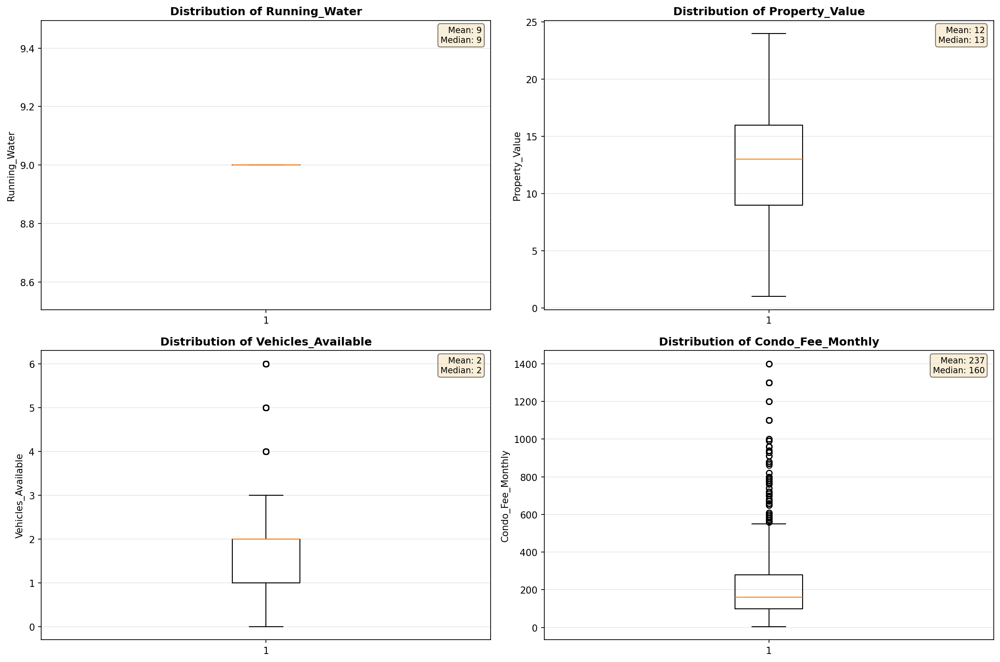
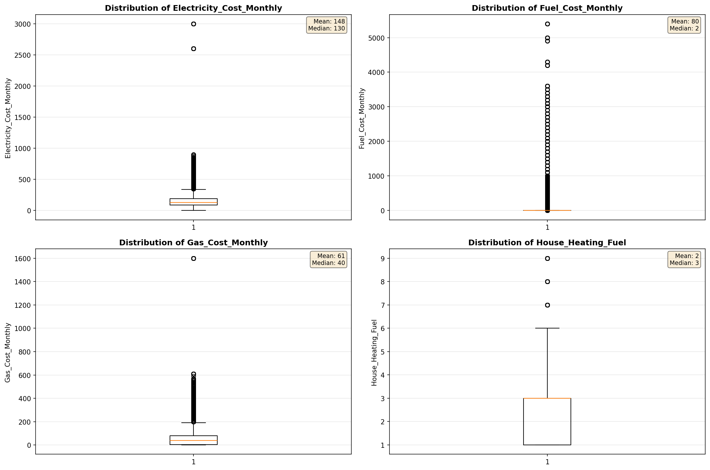
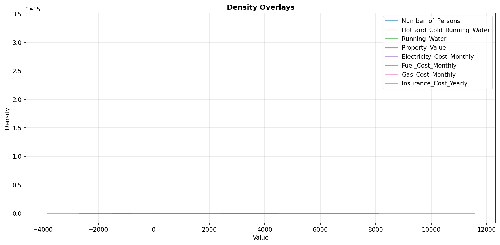
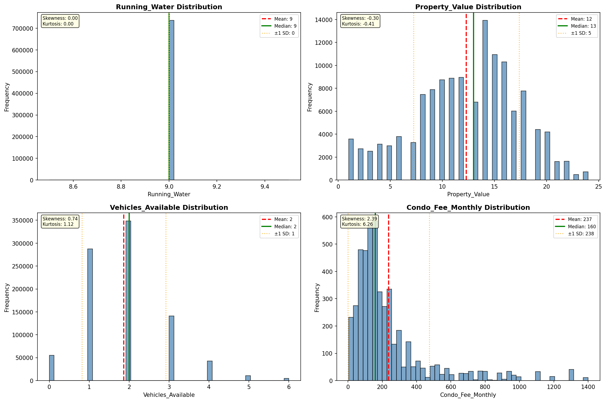
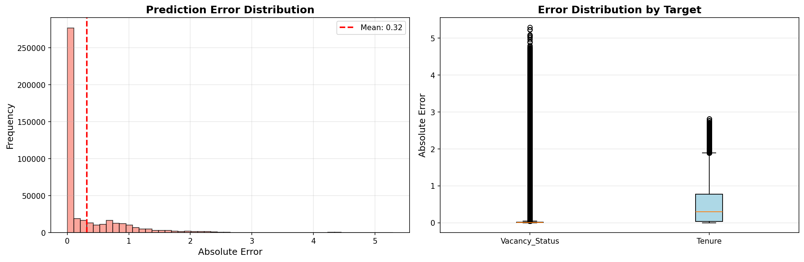
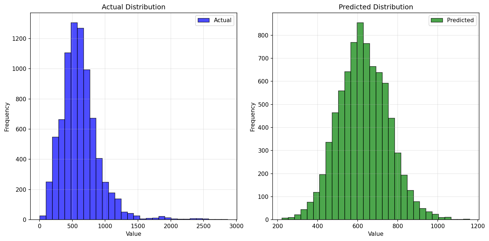
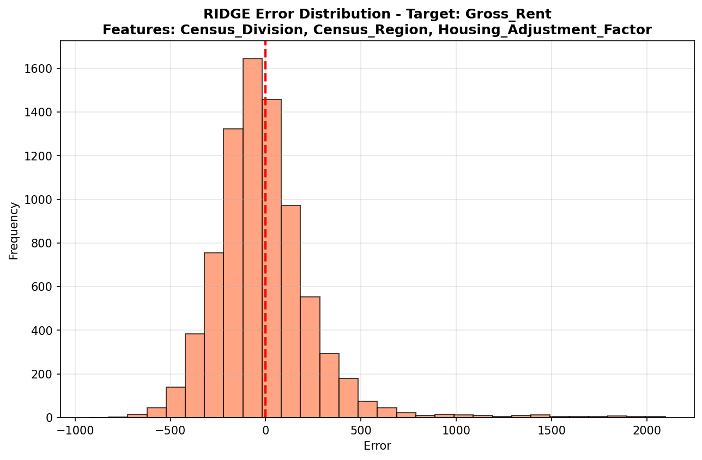
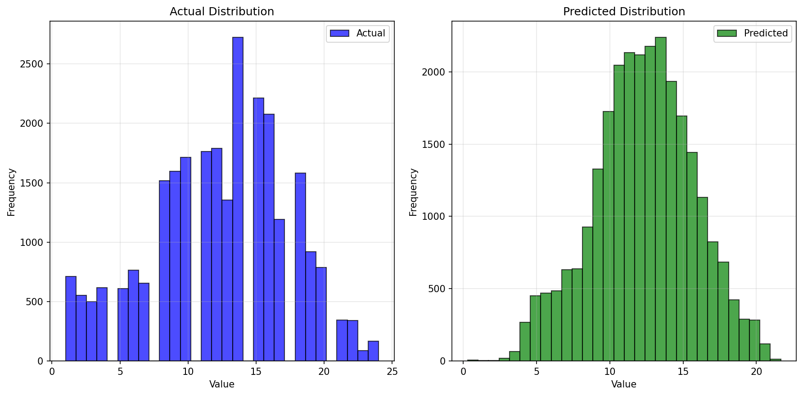
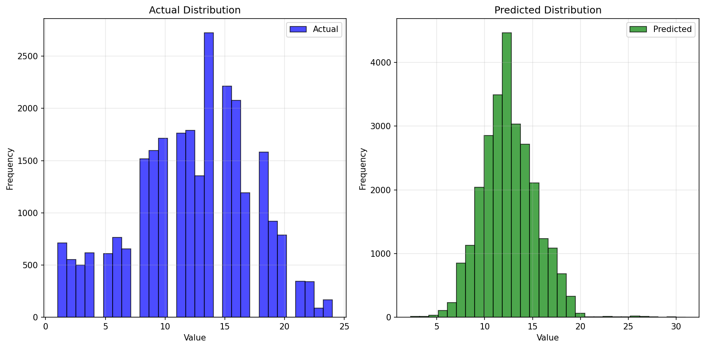

# Statistical Analysis

> Comprehensive descriptive statistics including central tendency, dispersion, distribution characteristics, and weighted statistics using ACS sample weights.

## Summary Statistics

- **Variables Analyzed**: 37

### Income_Adjustment_Factor

| Statistic | Unweighted | Weighted (ACS) |
| :--- | :--- | :--- |
| Mean | 1,057,951.79 | 1,057,932.87 |
| Median | 1,051,849.00 | 1,059,677.73 |
| Std Deviation | 45,677.00 | — |
| Minimum | 999,480.00 | — |
| Maximum | 1,207,712.00 | — |
| Count | 1,097,708 | — |

> *Distribution is highly right-skewed (skewness: 1.26), light-tailed/platykurtic (kurtosis: 1.48).*

- **Coefficient of Variation**: 4.3 % (low variability)

### Property_Value

| Statistic | Unweighted | Weighted (ACS) |
| :--- | :--- | :--- |
| Mean | 12.31 | 12.65 |
| Median | 13.00 | 13.67 |
| Std Deviation | 5.06 | — |
| Minimum | 1.00 | — |
| Maximum | 24.00 | — |
| Count | 132,838 | — |

> *Distribution is approximately symmetric (skewness: -0.30), light-tailed/platykurtic (kurtosis: -0.41).*

- **Coefficient of Variation**: 41.1 % (moderate variability)

#### Weighted Statistics by Year

| Year | Weighted Mean | Weighted Median |
| :--- | :--- | :--- |
| 2009 | 12.47 | 13.00 |
| 2010 | 12.68 | 14.00 |
| 2011 | 12.79 | 14.00 |

### Electricity_Cost_Monthly

| Statistic | Unweighted | Weighted (ACS) |
| :--- | :--- | :--- |
| Mean | 147.96 | 148.03 |
| Median | 130.00 | 131.33 |
| Std Deviation | 99.43 | — |
| Minimum | 1.00 | — |
| Maximum | 3,000.00 | — |
| Count | 879,894 | — |

> *Distribution is highly right-skewed (skewness: 6.97), heavy-tailed/leptokurtic (kurtosis: 166.74).*

- **Coefficient of Variation**: 67.2 % (high variability)

### Fuel_Cost_Monthly

| Statistic | Unweighted | Weighted (ACS) |
| :--- | :--- | :--- |
| Mean | 79.72 | 211.64 |
| Median | 2.00 | 121.20 |
| Std Deviation | 296.37 | — |
| Minimum | 1.00 | — |
| Maximum | 5,400.00 | — |
| Count | 561,417 | — |

> *Distribution is highly right-skewed (skewness: 6.37), heavy-tailed/leptokurtic (kurtosis: 54.56).*

- **Coefficient of Variation**: 371.8 % (very high variability)

### Gas_Cost_Monthly

| Statistic | Unweighted | Weighted (ACS) |
| :--- | :--- | :--- |
| Mean | 60.89 | 62.29 |
| Median | 40.00 | 35.33 |
| Std Deviation | 81.32 | — |
| Minimum | 1.00 | — |
| Maximum | 1,600.00 | — |
| Count | 734,188 | — |

> *Distribution is highly right-skewed (skewness: 4.72), heavy-tailed/leptokurtic (kurtosis: 58.23).*

- **Coefficient of Variation**: 133.6 % (very high variability)

### Insurance_Cost_Yearly

| Statistic | Unweighted | Weighted (ACS) |
| :--- | :--- | :--- |
| Mean | 980.53 | 1,010.68 |
| Median | 890.00 | 924.00 |
| Std Deviation | 697.11 | — |
| Minimum | 4.00 | — |
| Maximum | 7,700.00 | — |
| Count | 537,394 | — |

> *Distribution is highly right-skewed (skewness: 2.36), heavy-tailed/leptokurtic (kurtosis: 10.67).*

- **Coefficient of Variation**: 71.1 % (high variability)

### Water_Cost_Yearly

| Statistic | Unweighted | Weighted (ACS) |
| :--- | :--- | :--- |
| Mean | 433.09 | 442.52 |
| Median | 400.00 | 404.00 |
| Std Deviation | 406.93 | — |
| Minimum | 1.00 | — |
| Maximum | 4,500.00 | — |
| Count | 837,761 | — |

> *Distribution is highly right-skewed (skewness: 2.06), heavy-tailed/leptokurtic (kurtosis: 9.44).*

- **Coefficient of Variation**: 94.0 % (high variability)

### Mobile_Home_Costs_Monthly

| Statistic | Unweighted | Weighted (ACS) |
| :--- | :--- | :--- |
| Mean | 476.51 | 508.13 |
| Median | 200.00 | 208.00 |
| Std Deviation | 1,002.92 | — |
| Minimum | 4.00 | — |
| Maximum | 19,700.00 | — |
| Count | 53,836 | — |

> *Distribution is highly right-skewed (skewness: 7.46), heavy-tailed/leptokurtic (kurtosis: 96.55).*

- **Coefficient of Variation**: 210.5 % (very high variability)

### First_Mortgage_Payment_Monthly

| Statistic | Unweighted | Weighted (ACS) |
| :--- | :--- | :--- |
| Mean | 793.75 | 836.27 |
| Median | 650.00 | 700.67 |
| Std Deviation | 551.37 | — |
| Minimum | 4.00 | — |
| Maximum | 5,000.00 | — |
| Count | 330,866 | — |

> *Distribution is highly right-skewed (skewness: 2.37), heavy-tailed/leptokurtic (kurtosis: 8.85).*

- **Coefficient of Variation**: 69.5 % (high variability)

### First_Mortgage_Includes_Taxes

| Statistic | Unweighted | Weighted (ACS) |
| :--- | :--- | :--- |
| Mean | 1.37 | 1.33 |
| Median | 1.00 | 1.00 |
| Std Deviation | 0.48 | — |
| Minimum | 1.00 | — |
| Maximum | 2.00 | — |
| Count | 330,866 | — |

> *Distribution is moderately right-skewed (skewness: 0.54), light-tailed/platykurtic (kurtosis: -1.70).*

- **Coefficient of Variation**: 35.2 % (moderate variability)

### Second_Mortgage_Payment_Monthly

| Statistic | Unweighted | Weighted (ACS) |
| :--- | :--- | :--- |
| Mean | 354.13 | 361.65 |
| Median | 270.00 | 266.67 |
| Std Deviation | 342.44 | — |
| Minimum | 4.00 | — |
| Maximum | 3,200.00 | — |
| Count | 30,209 | — |

> *Distribution is highly right-skewed (skewness: 3.29), heavy-tailed/leptokurtic (kurtosis: 15.09).*

- **Coefficient of Variation**: 96.7 % (high variability)

### Property_Taxes_Yearly

| Statistic | Unweighted | Weighted (ACS) |
| :--- | :--- | :--- |
| Mean | 14.55 | 15.52 |
| Median | 12.00 | 12.78 |
| Std Deviation | 11.47 | — |
| Minimum | 1.00 | — |
| Maximum | 68.00 | — |
| Count | 387,600 | — |

> *Distribution is highly right-skewed (skewness: 1.48), heavy-tailed/leptokurtic (kurtosis: 3.07).*

- **Coefficient of Variation**: 78.9 % (high variability)

### Meals_Included_in_Rent

| Statistic | Unweighted | Weighted (ACS) |
| :--- | :--- | :--- |
| Mean | 1.98 | 1.98 |
| Median | 2.00 | 2.00 |
| Std Deviation | 0.13 | — |
| Minimum | 1.00 | — |
| Maximum | 2.00 | — |
| Count | 232,808 | — |

> *Distribution is highly left-skewed (skewness: -7.34), heavy-tailed/leptokurtic (kurtosis: 51.90).*

- **Coefficient of Variation**: 6.6 % (low variability)

### Rent_Amount_Monthly

| Statistic | Unweighted | Weighted (ACS) |
| :--- | :--- | :--- |
| Mean | 513.07 | 550.26 |
| Median | 450.00 | 504.00 |
| Std Deviation | 324.12 | — |
| Minimum | 4.00 | — |
| Maximum | 3,400.00 | — |
| Count | 232,808 | — |

> *Distribution is highly right-skewed (skewness: 2.58), heavy-tailed/leptokurtic (kurtosis: 11.80).*

- **Coefficient of Variation**: 63.2 % (high variability)

### Gross_Rent

| Statistic | Unweighted | Weighted (ACS) |
| :--- | :--- | :--- |
| Mean | 695.06 | 727.32 |
| Median | 650.00 | 683.80 |
| Std Deviation | 352.44 | — |
| Minimum | 4.00 | — |
| Maximum | 6,525.00 | — |
| Count | 215,137 | — |

> *Distribution is highly right-skewed (skewness: 2.09), heavy-tailed/leptokurtic (kurtosis: 10.58).*

- **Coefficient of Variation**: 50.7 % (high variability)

### Gross_Rent_Percentage_Income

| Statistic | Unweighted | Weighted (ACS) |
| :--- | :--- | :--- |
| Mean | 36.92 | 36.95 |
| Median | 28.00 | 28.13 |
| Std Deviation | 26.47 | — |
| Minimum | 1.00 | — |
| Maximum | 101.00 | — |
| Count | 210,155 | — |

> *Distribution is highly right-skewed (skewness: 1.25), light-tailed/platykurtic (kurtosis: 0.59).*

- **Coefficient of Variation**: 71.7 % (high variability)

### Selected_Monthly_Owner_Costs

| Statistic | Unweighted | Weighted (ACS) |
| :--- | :--- | :--- |
| Mean | 765.08 | 823.84 |
| Median | 592.00 | 667.80 |
| Std Deviation | 632.18 | — |
| Minimum | 3.00 | — |
| Maximum | 13,227.00 | — |
| Count | 644,158 | — |

> *Distribution is highly right-skewed (skewness: 2.57), heavy-tailed/leptokurtic (kurtosis: 12.15).*

- **Coefficient of Variation**: 82.6 % (high variability)

### Owner_Costs_Percentage_Income

| Statistic | Unweighted | Weighted (ACS) |
| :--- | :--- | :--- |
| Mean | 20.28 | 20.73 |
| Median | 15.00 | 15.27 |
| Std Deviation | 19.01 | — |
| Minimum | 1.00 | — |
| Maximum | 101.00 | — |
| Count | 638,847 | — |

> *Distribution is highly right-skewed (skewness: 2.44), heavy-tailed/leptokurtic (kurtosis: 6.75).*

- **Coefficient of Variation**: 93.7 % (high variability)

### Family_Income

| Statistic | Unweighted | Weighted (ACS) |
| :--- | :--- | :--- |
| Mean | 70,419.07 | 70,844.24 |
| Median | 53,300.00 | 53,765.33 |
| Std Deviation | 68,122.10 | — |
| Minimum | 1.00 | — |
| Maximum | 1,282,000.00 | — |
| Count | 593,173 | — |

> *Distribution is highly right-skewed (skewness: 3.61), heavy-tailed/leptokurtic (kurtosis: 22.22).*

- **Coefficient of Variation**: 96.7 % (high variability)

### Household_Income

| Statistic | Unweighted | Weighted (ACS) |
| :--- | :--- | :--- |
| Mean | 59,285.24 | 59,989.47 |
| Median | 42,400.00 | 43,400.00 |
| Std Deviation | 62,937.94 | — |
| Minimum | 1.00 | — |
| Maximum | 1,282,000.00 | — |
| Count | 879,427 | — |

> *Distribution is highly right-skewed (skewness: 3.82), heavy-tailed/leptokurtic (kurtosis: 25.13).*

- **Coefficient of Variation**: 106.2 % (very high variability)

### Specified_Rent_Unit

| Statistic | Unweighted | Weighted (ACS) |
| :--- | :--- | :--- |
| Mean | 0.26 | 0.31 |
| Median | 0.00 | 0.00 |
| Std Deviation | 0.44 | — |
| Minimum | 0.00 | — |
| Maximum | 1.00 | — |
| Count | 996,107 | — |

> *Distribution is highly right-skewed (skewness: 1.10), light-tailed/platykurtic (kurtosis: -0.80).*

- **Coefficient of Variation**: 168.8 % (very high variability)

### Specified_Value_Unit

| Statistic | Unweighted | Weighted (ACS) |
| :--- | :--- | :--- |
| Mean | 0.51 | 0.45 |
| Median | 1.00 | 0.00 |
| Std Deviation | 0.50 | — |
| Minimum | 0.00 | — |
| Maximum | 1.00 | — |
| Count | 996,107 | — |

> *Distribution is approximately symmetric (skewness: -0.04), light-tailed/platykurtic (kurtosis: -2.00).*

- **Coefficient of Variation**: 98.2 % (high variability)

### Flag_First_Mortgage_Payment

| Statistic | Unweighted | Weighted (ACS) |
| :--- | :--- | :--- |
| Mean | 0.03 | 0.03 |
| Median | 0.00 | 0.00 |
| Std Deviation | 0.17 | — |
| Minimum | 0.00 | — |
| Maximum | 1.00 | — |
| Count | 996,107 | — |

> *Distribution is highly right-skewed (skewness: 5.60), heavy-tailed/leptokurtic (kurtosis: 29.32).*

- **Coefficient of Variation**: 577.0 % (very high variability)

### Flag_First_Mortgage_Taxes

| Statistic | Unweighted | Weighted (ACS) |
| :--- | :--- | :--- |
| Mean | 0.03 | 0.03 |
| Median | 0.00 | 0.00 |
| Std Deviation | 0.16 | — |
| Minimum | 0.00 | — |
| Maximum | 1.00 | — |
| Count | 996,107 | — |

> *Distribution is highly right-skewed (skewness: 5.73), heavy-tailed/leptokurtic (kurtosis: 30.82).*

- **Coefficient of Variation**: 589.9 % (very high variability)

### Flag_Meals_Included_Rent

| Statistic | Unweighted | Weighted (ACS) |
| :--- | :--- | :--- |
| Mean | 0.01 | 0.01 |
| Median | 0.00 | 0.00 |
| Std Deviation | 0.09 | — |
| Minimum | 0.00 | — |
| Maximum | 1.00 | — |
| Count | 996,107 | — |

> *Distribution is highly right-skewed (skewness: 11.39), heavy-tailed/leptokurtic (kurtosis: 127.77).*

- **Coefficient of Variation**: 1,147.9 % (very high variability)

### Flag_Rent_Amount

| Statistic | Unweighted | Weighted (ACS) |
| :--- | :--- | :--- |
| Mean | 0.02 | 0.03 |
| Median | 0.00 | 0.00 |
| Std Deviation | 0.14 | — |
| Minimum | 0.00 | — |
| Maximum | 1.00 | — |
| Count | 996,107 | — |

> *Distribution is highly right-skewed (skewness: 6.91), heavy-tailed/leptokurtic (kurtosis: 45.70).*

- **Coefficient of Variation**: 704.9 % (very high variability)

### Flag_Second_Mortgage_Payment

| Statistic | Unweighted | Weighted (ACS) |
| :--- | :--- | :--- |
| Mean | 0.02 | 0.02 |
| Median | 0.00 | 0.00 |
| Std Deviation | 0.15 | — |
| Minimum | 0.00 | — |
| Maximum | 1.00 | — |
| Count | 996,107 | — |

> *Distribution is highly right-skewed (skewness: 6.19), heavy-tailed/leptokurtic (kurtosis: 36.28).*

- **Coefficient of Variation**: 634.5 % (very high variability)

### Flag_Property_Taxes

| Statistic | Unweighted | Weighted (ACS) |
| :--- | :--- | :--- |
| Mean | 0.13 | 0.13 |
| Median | 0.00 | 0.00 |
| Std Deviation | 0.33 | — |
| Minimum | 0.00 | — |
| Maximum | 1.00 | — |
| Count | 996,107 | — |

> *Distribution is highly right-skewed (skewness: 2.25), heavy-tailed/leptokurtic (kurtosis: 3.04).*

- **Coefficient of Variation**: 262.6 % (very high variability)

### Flag_Property_Value

| Statistic | Unweighted | Weighted (ACS) |
| :--- | :--- | :--- |
| Mean | 0.09 | 0.09 |
| Median | 0.00 | 0.00 |
| Std Deviation | 0.29 | — |
| Minimum | 0.00 | — |
| Maximum | 1.00 | — |
| Count | 996,107 | — |

> *Distribution is highly right-skewed (skewness: 2.79), heavy-tailed/leptokurtic (kurtosis: 5.77).*

- **Coefficient of Variation**: 310.9 % (very high variability)

### Flag_Water_Cost

| Statistic | Unweighted | Weighted (ACS) |
| :--- | :--- | :--- |
| Mean | 0.06 | 0.07 |
| Median | 0.00 | 0.00 |
| Std Deviation | 0.25 | — |
| Minimum | 0.00 | — |
| Maximum | 1.00 | — |
| Count | 996,107 | — |

> *Distribution is highly right-skewed (skewness: 3.56), heavy-tailed/leptokurtic (kurtosis: 10.65).*

- **Coefficient of Variation**: 381.8 % (very high variability)

### Annual_Rent_to_Value_Ratio

### Total_Monthly_Utility_Cost

| Statistic | Unweighted | Weighted (ACS) |
| :--- | :--- | :--- |
| Mean | 198.33 | 195.26 |
| Median | 180.00 | 173.07 |
| Std Deviation | 127.51 | — |
| Minimum | 2.00 | — |
| Maximum | 4,600.00 | — |
| Count | 881,825 | — |

> *Distribution is highly right-skewed (skewness: 6.38), heavy-tailed/leptokurtic (kurtosis: 142.36).*

- **Coefficient of Variation**: 64.3 % (high variability)

### Property_Tax_Rate

| Statistic | Unweighted | Weighted (ACS) |
| :--- | :--- | :--- |
| Mean | 114.18 | 115.23 |
| Median | 100.00 | 100.00 |
| Std Deviation | 89.51 | — |
| Minimum | 4.17 | — |
| Maximum | 2,200.00 | — |
| Count | 129,703 | — |

> *Distribution is highly right-skewed (skewness: 4.64), heavy-tailed/leptokurtic (kurtosis: 45.39).*

- **Coefficient of Variation**: 78.4 % (high variability)

#### Weighted Statistics by Year

| Year | Weighted Mean | Weighted Median |
| :--- | :--- | :--- |
| 2009 | 112.37 | 100.00 |
| 2010 | 115.23 | 100.00 |
| 2011 | 118.10 | 100.00 |

### Structure_Age

| Statistic | Unweighted | Weighted (ACS) |
| :--- | :--- | :--- |
| Mean | 2,018.40 | 2,018.26 |
| Median | 2,019.00 | 2,018.25 |
| Std Deviation | 2.90 | — |
| Minimum | 2,000.00 | — |
| Maximum | 2,023.00 | — |
| Count | 796,358 | — |

> *Distribution is highly left-skewed (skewness: -1.46), heavy-tailed/leptokurtic (kurtosis: 4.58).*

- **Coefficient of Variation**: 0.1 % (low variability)

### Structure_Age_Score

| Statistic | Unweighted | Weighted (ACS) |
| :--- | :--- | :--- |
| Mean | 0.00 | 0.00 |
| Median | 0.00 | 0.00 |
| Std Deviation | 0.00 | — |
| Minimum | 0.00 | — |
| Maximum | 0.00 | — |
| Count | 796,358 | — |

> *Distribution is approximately symmetric (skewness: nan).*

### Working_Age_Persons

| Statistic | Unweighted | Weighted (ACS) |
| :--- | :--- | :--- |
| Mean | 1.60 | 1.71 |
| Median | 2.00 | 2.00 |
| Std Deviation | 1.33 | — |
| Minimum | 0.00 | — |
| Maximum | 19.00 | — |
| Count | 891,137 | — |

> *Distribution is moderately right-skewed (skewness: 0.92), light-tailed/platykurtic (kurtosis: 1.72).*

- **Coefficient of Variation**: 83.1 % (high variability)

### Income_to_FPL_Ratio

| Statistic | Unweighted | Weighted (ACS) |
| :--- | :--- | :--- |
| Mean | 2.72 | 2.72 |
| Median | 2.00 | 2.01 |
| Std Deviation | 2.86 | — |
| Minimum | -0.84 | — |
| Maximum | 65.01 | — |
| Count | 891,137 | — |

> *Distribution is highly right-skewed (skewness: 4.20), heavy-tailed/leptokurtic (kurtosis: 31.27).*

- **Coefficient of Variation**: 105.2 % (very high variability)

## Distribution Analysis

### Skewed Distributions

> Variables with skewness > |0.5| indicate non-normal distributions. Consider log transformations for highly skewed variables in modeling.

| Variable | Skewness | Direction | Severity |
| :--- | :--- | :--- | :--- |
| Flag_Meals_Included_Rent | 11.392 | Right-skewed | High |
| Mobile_Home_Costs_Monthly | 7.462 | Right-skewed | High |
| Meals_Included_in_Rent | -7.341 | Left-skewed | High |
| Electricity_Cost_Monthly | 6.967 | Right-skewed | High |
| Flag_Rent_Amount | 6.907 | Right-skewed | High |
| Total_Monthly_Utility_Cost | 6.382 | Right-skewed | High |
| Fuel_Cost_Monthly | 6.369 | Right-skewed | High |
| Flag_Second_Mortgage_Payment | 6.187 | Right-skewed | High |
| Flag_First_Mortgage_Taxes | 5.729 | Right-skewed | High |
| Flag_First_Mortgage_Payment | 5.596 | Right-skewed | High |
| Gas_Cost_Monthly | 4.721 | Right-skewed | High |
| Property_Tax_Rate | 4.637 | Right-skewed | High |
| Income_to_FPL_Ratio | 4.198 | Right-skewed | High |
| Household_Income | 3.822 | Right-skewed | High |
| Family_Income | 3.614 | Right-skewed | High |
| Flag_Water_Cost | 3.557 | Right-skewed | High |
| Second_Mortgage_Payment_Monthly | 3.289 | Right-skewed | High |
| Flag_Property_Value | 2.788 | Right-skewed | High |
| Rent_Amount_Monthly | 2.585 | Right-skewed | High |
| Selected_Monthly_Owner_Costs | 2.569 | Right-skewed | High |

- **Total Skewed Variables**: 33

- **Right-skewed**: 31

- **Left-skewed**: 2

## Variance Analysis

### Coefficient of Variation Ranking

> CV (Coefficient of Variation) = (Std Dev / Mean) × 100%. Higher CV indicates greater relative variability.

| Variable | CV (%) | Std Dev | Mean | Variability |
| :--- | :--- | :--- | :--- | :--- |
| Flag_Meals_Included_Rent | 1147.9% | 0.09 | 0.01 | Very High |
| Flag_Rent_Amount | 704.9% | 0.14 | 0.02 | Very High |
| Flag_Second_Mortgage_Payment | 634.5% | 0.15 | 0.02 | Very High |
| Flag_First_Mortgage_Taxes | 589.9% | 0.16 | 0.03 | Very High |
| Flag_First_Mortgage_Payment | 577.0% | 0.17 | 0.03 | Very High |
| Flag_Water_Cost | 381.8% | 0.25 | 0.06 | Very High |
| Fuel_Cost_Monthly | 371.8% | 296.37 | 79.72 | Very High |
| Flag_Property_Value | 310.9% | 0.29 | 0.09 | Very High |
| Flag_Property_Taxes | 262.6% | 0.33 | 0.13 | Very High |
| Mobile_Home_Costs_Monthly | 210.5% | 1,002.92 | 476.51 | Very High |
| Specified_Rent_Unit | 168.8% | 0.44 | 0.26 | Very High |
| Gas_Cost_Monthly | 133.6% | 81.32 | 60.89 | Very High |
| Household_Income | 106.2% | 62,937.94 | 59,285.24 | Very High |
| Income_to_FPL_Ratio | 105.2% | 2.86 | 2.72 | Very High |
| Specified_Value_Unit | 98.2% | 0.50 | 0.51 | High |
| Family_Income | 96.7% | 68,122.10 | 70,419.07 | High |
| Second_Mortgage_Payment_Monthly | 96.7% | 342.44 | 354.13 | High |
| Water_Cost_Yearly | 94.0% | 406.93 | 433.09 | High |
| Owner_Costs_Percentage_Income | 93.7% | 19.01 | 20.28 | High |
| Working_Age_Persons | 83.1% | 1.33 | 1.60 | High |

- **Average CV**: 201.5 %

- **High Variance Variables (CV > 50%)**: 30

## Visualizations

