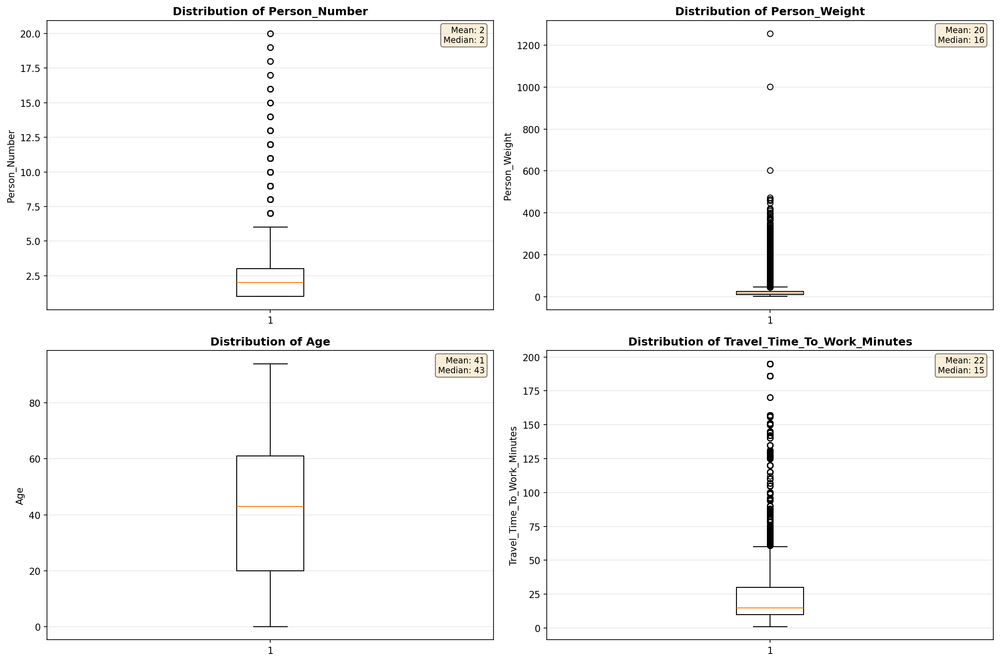
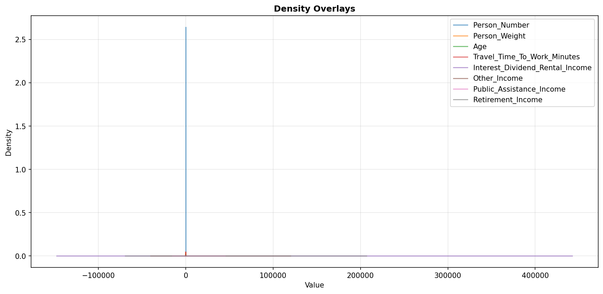
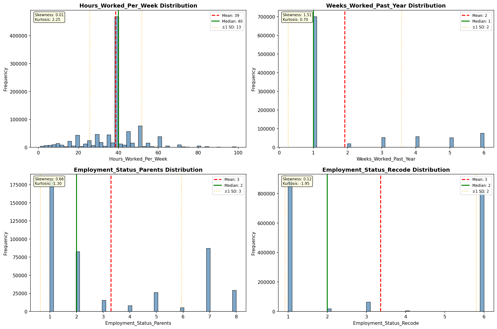
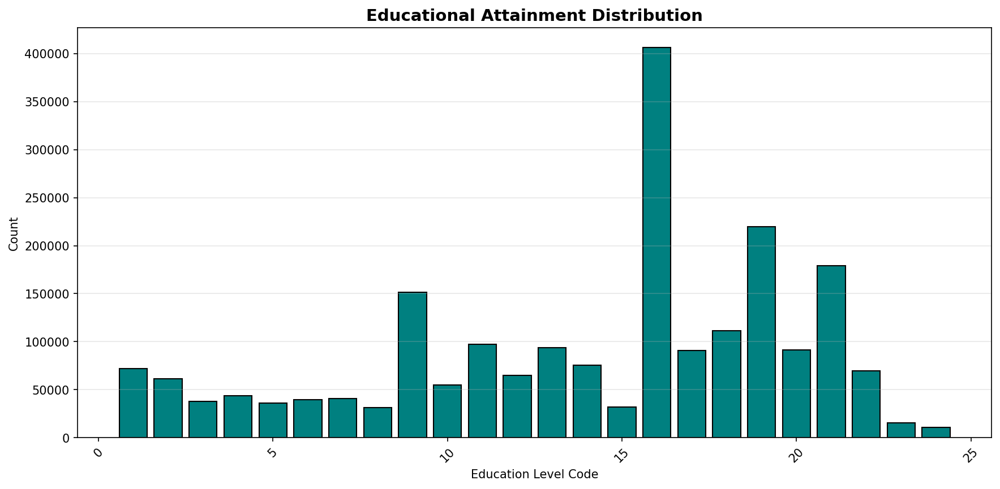
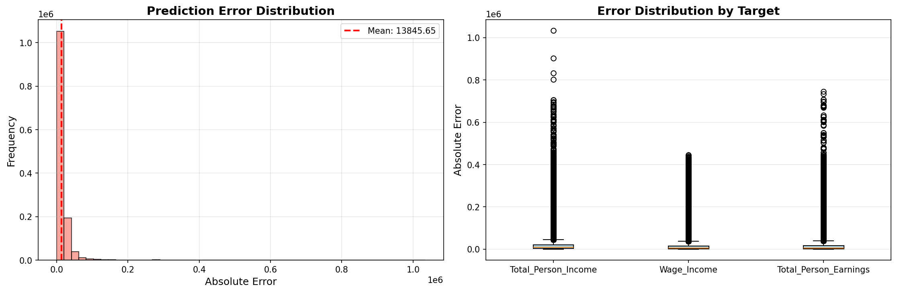
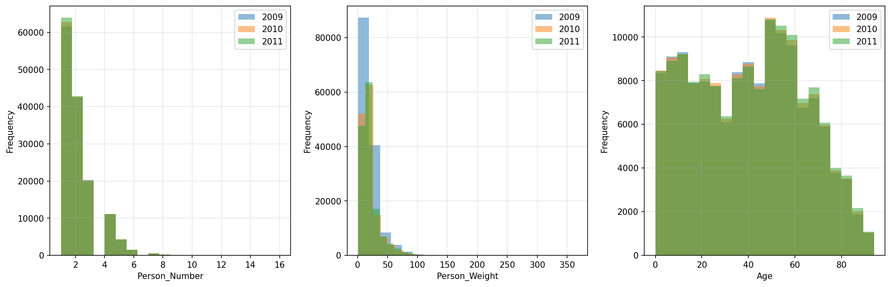

# Statistical Analysis

> Comprehensive descriptive statistics including central tendency, dispersion, distribution characteristics, and weighted statistics using ACS sample weights.

## Summary Statistics

- **Variables Analyzed**: 30

### Income_Adjustment_Factor

| Statistic | Unweighted | Weighted (ACS) |
| :--- | :--- | :--- |
| Mean | 1,057,931.94 | 1,057,970.46 |
| Median | 1,051,849.00 | 1,059,677.73 |
| Std Deviation | 45,434.91 | — |
| Minimum | 999,480.00 | — |
| Maximum | 1,207,712.00 | — |
| Count | 2,195,579 | — |

> *Distribution is highly right-skewed (skewness: 1.25), light-tailed/platykurtic (kurtosis: 1.49).*

- **Coefficient of Variation**: 4.3 % (low variability)

### Age

| Statistic | Unweighted | Weighted (ACS) |
| :--- | :--- | :--- |
| Mean | 41.48 | 38.26 |
| Median | 43.00 | 37.27 |
| Std Deviation | 24.03 | — |
| Minimum | 0.00 | — |
| Maximum | 94.00 | — |
| Count | 2,195,579 | — |

> *Distribution is approximately symmetric (skewness: 0.03), light-tailed/platykurtic (kurtosis: -1.07).*

- **Coefficient of Variation**: 57.9 % (high variability)

### Interest_Dividend_Rental_Income

| Statistic | Unweighted | Weighted (ACS) |
| :--- | :--- | :--- |
| Mean | 12,121.82 | 12,902.66 |
| Median | 1,800.00 | 1,813.33 |
| Std Deviation | 35,162.54 | — |
| Minimum | 1.00 | — |
| Maximum | 295,000.00 | — |
| Count | 200,347 | — |

> *Distribution is highly right-skewed (skewness: 5.20), heavy-tailed/leptokurtic (kurtosis: 29.15).*

- **Coefficient of Variation**: 290.1 % (very high variability)

### Other_Income

| Statistic | Unweighted | Weighted (ACS) |
| :--- | :--- | :--- |
| Mean | 10,425.88 | 10,377.65 |
| Median | 5,100.00 | 5,320.00 |
| Std Deviation | 13,504.16 | — |
| Minimum | 4.00 | — |
| Maximum | 80,000.00 | — |
| Count | 122,447 | — |

> *Distribution is highly right-skewed (skewness: 2.31), heavy-tailed/leptokurtic (kurtosis: 5.76).*

- **Coefficient of Variation**: 129.5 % (very high variability)

### Public_Assistance_Income

| Statistic | Unweighted | Weighted (ACS) |
| :--- | :--- | :--- |
| Mean | 2,609.99 | 2,819.84 |
| Median | 1,300.00 | 1,533.33 |
| Std Deviation | 3,700.07 | — |
| Minimum | 4.00 | — |
| Maximum | 30,000.00 | — |
| Count | 20,032 | — |

> *Distribution is highly right-skewed (skewness: 3.40), heavy-tailed/leptokurtic (kurtosis: 16.13).*

- **Coefficient of Variation**: 141.8 % (very high variability)

### Retirement_Income

| Statistic | Unweighted | Weighted (ACS) |
| :--- | :--- | :--- |
| Mean | 16,742.97 | 16,821.86 |
| Median | 10,800.00 | 10,986.67 |
| Std Deviation | 19,417.27 | — |
| Minimum | 4.00 | — |
| Maximum | 138,000.00 | — |
| Count | 233,227 | — |

> *Distribution is highly right-skewed (skewness: 2.99), heavy-tailed/leptokurtic (kurtosis: 11.93).*

- **Coefficient of Variation**: 116.0 % (very high variability)

### Self_Employment_Income

| Statistic | Unweighted | Weighted (ACS) |
| :--- | :--- | :--- |
| Mean | 27,765.10 | 28,932.61 |
| Median | 12,200.00 | 14,266.67 |
| Std Deviation | 48,307.01 | — |
| Minimum | 1.00 | — |
| Maximum | 368,000.00 | — |
| Count | 96,334 | — |

> *Distribution is highly right-skewed (skewness: 3.98), heavy-tailed/leptokurtic (kurtosis: 18.06).*

- **Coefficient of Variation**: 174.0 % (very high variability)

### Supplemental_Security_Income

| Statistic | Unweighted | Weighted (ACS) |
| :--- | :--- | :--- |
| Mean | 7,721.76 | 7,718.52 |
| Median | 7,800.00 | 7,940.00 |
| Std Deviation | 4,467.95 | — |
| Minimum | 100.00 | — |
| Maximum | 30,000.00 | — |
| Count | 74,343 | — |

> *Distribution is highly right-skewed (skewness: 1.34), heavy-tailed/leptokurtic (kurtosis: 3.16).*

- **Coefficient of Variation**: 57.9 % (high variability)

### Social_Security_Income

| Statistic | Unweighted | Weighted (ACS) |
| :--- | :--- | :--- |
| Mean | 12,367.64 | 12,366.43 |
| Median | 12,000.00 | 11,793.33 |
| Std Deviation | 6,553.01 | — |
| Minimum | 4.00 | — |
| Maximum | 50,000.00 | — |
| Count | 523,278 | — |

> *Distribution is moderately right-skewed (skewness: 0.89), light-tailed/platykurtic (kurtosis: 1.94).*

- **Coefficient of Variation**: 53.0 % (high variability)

### Wage_Income

| Statistic | Unweighted | Weighted (ACS) |
| :--- | :--- | :--- |
| Mean | 36,862.47 | 36,877.09 |
| Median | 27,000.00 | 27,180.00 |
| Std Deviation | 43,434.29 | — |
| Minimum | 4.00 | — |
| Maximum | 452,000.00 | — |
| Count | 960,376 | — |

> *Distribution is highly right-skewed (skewness: 4.42), heavy-tailed/leptokurtic (kurtosis: 28.35).*

- **Coefficient of Variation**: 117.8 % (very high variability)

### Hours_Worked_Per_Week

| Statistic | Unweighted | Weighted (ACS) |
| :--- | :--- | :--- |
| Mean | 38.67 | 38.99 |
| Median | 40.00 | 40.00 |
| Std Deviation | 13.01 | — |
| Minimum | 1.00 | — |
| Maximum | 99.00 | — |
| Count | 1,026,649 | — |

> *Distribution is approximately symmetric (skewness: 0.01), light-tailed/platykurtic (kurtosis: 2.25).*

- **Coefficient of Variation**: 33.7 % (moderate variability)

### Presence_And_Age_Own_Children

| Statistic | Unweighted | Weighted (ACS) |
| :--- | :--- | :--- |
| Mean | 3.50 | 3.44 |
| Median | 4.00 | 4.00 |
| Std Deviation | 0.93 | — |
| Minimum | 1.00 | — |
| Maximum | 4.00 | — |
| Count | 888,367 | — |

> *Distribution is highly left-skewed (skewness: -1.57), light-tailed/platykurtic (kurtosis: 0.94).*

- **Coefficient of Variation**: 26.6 % (moderate variability)

### Total_Person_Earnings

| Statistic | Unweighted | Weighted (ACS) |
| :--- | :--- | :--- |
| Mean | 37,130.87 | 37,159.40 |
| Median | 27,000.00 | 26,966.67 |
| Std Deviation | 45,563.87 | — |
| Minimum | 1.00 | — |
| Maximum | 794,000.00 | — |
| Count | 1,024,927 | — |

> *Distribution is highly right-skewed (skewness: 4.63), heavy-tailed/leptokurtic (kurtosis: 32.04).*

- **Coefficient of Variation**: 122.7 % (very high variability)

### Total_Person_Income

| Statistic | Unweighted | Weighted (ACS) |
| :--- | :--- | :--- |
| Mean | 33,478.85 | 33,983.41 |
| Median | 22,000.00 | 22,920.00 |
| Std Deviation | 43,031.90 | — |
| Minimum | 1.00 | — |
| Maximum | 1,089,000.00 | — |
| Count | 1,575,590 | — |

> *Distribution is highly right-skewed (skewness: 5.11), heavy-tailed/leptokurtic (kurtosis: 41.12).*

- **Coefficient of Variation**: 128.5 % (very high variability)

### Poverty_Status

| Statistic | Unweighted | Weighted (ACS) |
| :--- | :--- | :--- |
| Mean | 272.59 | 267.61 |
| Median | 253.00 | 245.40 |
| Std Deviation | 160.08 | — |
| Minimum | 0.00 | — |
| Maximum | 501.00 | — |
| Count | 2,097,716 | — |

> *Distribution is approximately symmetric (skewness: 0.12), light-tailed/platykurtic (kurtosis: -1.30).*

- **Coefficient of Variation**: 58.7 % (high variability)

### Flag_Age

| Statistic | Unweighted | Weighted (ACS) |
| :--- | :--- | :--- |
| Mean | 0.01 | 0.01 |
| Median | 0.00 | 0.00 |
| Std Deviation | 0.10 | — |
| Minimum | 0.00 | — |
| Maximum | 1.00 | — |
| Count | 2,195,579 | — |

> *Distribution is highly right-skewed (skewness: 9.44), heavy-tailed/leptokurtic (kurtosis: 87.07).*

- **Coefficient of Variation**: 954.3 % (very high variability)

### Flag_Interest_Dividend_Income

| Statistic | Unweighted | Weighted (ACS) |
| :--- | :--- | :--- |
| Mean | 0.11 | 0.10 |
| Median | 0.00 | 0.00 |
| Std Deviation | 0.31 | — |
| Minimum | 0.00 | — |
| Maximum | 1.00 | — |
| Count | 2,195,579 | — |

> *Distribution is highly right-skewed (skewness: 2.49), heavy-tailed/leptokurtic (kurtosis: 4.20).*

- **Coefficient of Variation**: 284.2 % (very high variability)

### Flag_Other_Income

| Statistic | Unweighted | Weighted (ACS) |
| :--- | :--- | :--- |
| Mean | 0.10 | 0.08 |
| Median | 0.00 | 0.00 |
| Std Deviation | 0.29 | — |
| Minimum | 0.00 | — |
| Maximum | 1.00 | — |
| Count | 2,195,579 | — |

> *Distribution is highly right-skewed (skewness: 2.75), heavy-tailed/leptokurtic (kurtosis: 5.56).*

- **Coefficient of Variation**: 307.4 % (very high variability)

### Flag_Retirement_Income

| Statistic | Unweighted | Weighted (ACS) |
| :--- | :--- | :--- |
| Mean | 0.10 | 0.09 |
| Median | 0.00 | 0.00 |
| Std Deviation | 0.30 | — |
| Minimum | 0.00 | — |
| Maximum | 1.00 | — |
| Count | 2,195,579 | — |

> *Distribution is highly right-skewed (skewness: 2.66), heavy-tailed/leptokurtic (kurtosis: 5.08).*

- **Coefficient of Variation**: 299.4 % (very high variability)

### Flag_Self_Employment_Income

| Statistic | Unweighted | Weighted (ACS) |
| :--- | :--- | :--- |
| Mean | 0.08 | 0.07 |
| Median | 0.00 | 0.00 |
| Std Deviation | 0.27 | — |
| Minimum | 0.00 | — |
| Maximum | 1.00 | — |
| Count | 2,195,579 | — |

> *Distribution is highly right-skewed (skewness: 3.17), heavy-tailed/leptokurtic (kurtosis: 8.05).*

- **Coefficient of Variation**: 345.9 % (very high variability)

### Flag_Social_Security_Income

| Statistic | Unweighted | Weighted (ACS) |
| :--- | :--- | :--- |
| Mean | 0.11 | 0.10 |
| Median | 0.00 | 0.00 |
| Std Deviation | 0.32 | — |
| Minimum | 0.00 | — |
| Maximum | 1.00 | — |
| Count | 2,195,579 | — |

> *Distribution is highly right-skewed (skewness: 2.46), heavy-tailed/leptokurtic (kurtosis: 4.06).*

- **Coefficient of Variation**: 281.6 % (very high variability)

### Flag_Supplemental_Security_Income

| Statistic | Unweighted | Weighted (ACS) |
| :--- | :--- | :--- |
| Mean | 0.09 | 0.08 |
| Median | 0.00 | 0.00 |
| Std Deviation | 0.29 | — |
| Minimum | 0.00 | — |
| Maximum | 1.00 | — |
| Count | 2,195,579 | — |

> *Distribution is highly right-skewed (skewness: 2.85), heavy-tailed/leptokurtic (kurtosis: 6.11).*

- **Coefficient of Variation**: 316.4 % (very high variability)

### Flag_Wage_Income

| Statistic | Unweighted | Weighted (ACS) |
| :--- | :--- | :--- |
| Mean | 0.13 | 0.14 |
| Median | 0.00 | 0.00 |
| Std Deviation | 0.34 | — |
| Minimum | 0.00 | — |
| Maximum | 1.00 | — |
| Count | 2,195,579 | — |

> *Distribution is highly right-skewed (skewness: 2.17), light-tailed/platykurtic (kurtosis: 2.72).*

- **Coefficient of Variation**: 256.3 % (very high variability)

### Flag_Hours_Worked

| Statistic | Unweighted | Weighted (ACS) |
| :--- | :--- | :--- |
| Mean | 0.05 | 0.05 |
| Median | 0.00 | 0.00 |
| Std Deviation | 0.21 | — |
| Minimum | 0.00 | — |
| Maximum | 1.00 | — |
| Count | 2,195,579 | — |

> *Distribution is highly right-skewed (skewness: 4.23), heavy-tailed/leptokurtic (kurtosis: 15.88).*

- **Coefficient of Variation**: 445.3 % (very high variability)

### Income_Per_Hour

| Statistic | Unweighted | Weighted (ACS) |
| :--- | :--- | :--- |
| Mean | 21.19 | 20.51 |
| Median | 14.42 | 14.11 |
| Std Deviation | 46.05 | — |
| Minimum | 0.00 | — |
| Maximum | 6,711.54 | — |
| Count | 1,025,714 | — |

> *Distribution is highly right-skewed (skewness: 49.79), heavy-tailed/leptokurtic (kurtosis: 4970.06).*

- **Coefficient of Variation**: 217.3 % (very high variability)

### Income_Per_Week_Worked

| Statistic | Unweighted | Weighted (ACS) |
| :--- | :--- | :--- |
| Mean | 35,836.68 | 35,661.66 |
| Median | 25,000.00 | 25,400.00 |
| Std Deviation | 47,025.80 | — |
| Minimum | 0.17 | — |
| Maximum | 1,089,000.00 | — |
| Count | 957,786 | — |

> *Distribution is highly right-skewed (skewness: 4.67), heavy-tailed/leptokurtic (kurtosis: 34.09).*

- **Coefficient of Variation**: 131.2 % (very high variability)

### Total_Annual_Hours

| Statistic | Unweighted | Weighted (ACS) |
| :--- | :--- | :--- |
| Mean | 66.69 | 65.95 |
| Median | 40.00 | 40.43 |
| Std Deviation | 57.92 | — |
| Minimum | 1.00 | — |
| Maximum | 594.00 | — |
| Count | 958,682 | — |

> *Distribution is highly right-skewed (skewness: 2.55), heavy-tailed/leptokurtic (kurtosis: 8.13).*

- **Coefficient of Variation**: 86.9 % (high variability)

### In_Poverty

| Statistic | Unweighted | Weighted (ACS) |
| :--- | :--- | :--- |
| Mean | 0.36 | 0.34 |
| Median | 0.00 | 0.00 |
| Std Deviation | 0.48 | — |
| Minimum | 0.00 | — |
| Maximum | 1.00 | — |
| Count | 2,195,579 | — |

> *Distribution is moderately right-skewed (skewness: 0.58), light-tailed/platykurtic (kurtosis: -1.66).*

- **Coefficient of Variation**: 133.4 % (very high variability)

### Poverty_Gap

| Statistic | Unweighted | Weighted (ACS) |
| :--- | :--- | :--- |
| Mean | 0.28 | 0.28 |
| Median | 0.00 | 0.00 |
| Std Deviation | 0.38 | — |
| Minimum | 0.00 | — |
| Maximum | 1.87 | — |
| Count | 1,810,630 | — |

> *Distribution is moderately right-skewed (skewness: 1.00), light-tailed/platykurtic (kurtosis: -0.66).*

- **Coefficient of Variation**: 139.2 % (very high variability)

### Poverty_Severity

| Statistic | Unweighted | Weighted (ACS) |
| :--- | :--- | :--- |
| Mean | 0.22 | 0.23 |
| Median | 0.00 | 0.00 |
| Std Deviation | 0.37 | — |
| Minimum | 0.00 | — |
| Maximum | 3.48 | — |
| Count | 1,810,630 | — |

> *Distribution is highly right-skewed (skewness: 1.41), light-tailed/platykurtic (kurtosis: 0.45).*

- **Coefficient of Variation**: 165.2 % (very high variability)

## Distribution Analysis

### Skewed Distributions

> Variables with skewness > |0.5| indicate non-normal distributions. Consider log transformations for highly skewed variables in modeling.

| Variable | Skewness | Direction | Severity |
| :--- | :--- | :--- | :--- |
| Income_Per_Hour | 49.793 | Right-skewed | High |
| Flag_Age | 9.438 | Right-skewed | High |
| Interest_Dividend_Rental_Income | 5.195 | Right-skewed | High |
| Total_Person_Income | 5.108 | Right-skewed | High |
| Income_Per_Week_Worked | 4.667 | Right-skewed | High |
| Total_Person_Earnings | 4.631 | Right-skewed | High |
| Wage_Income | 4.424 | Right-skewed | High |
| Flag_Hours_Worked | 4.228 | Right-skewed | High |
| Self_Employment_Income | 3.979 | Right-skewed | High |
| Public_Assistance_Income | 3.400 | Right-skewed | High |
| Flag_Self_Employment_Income | 3.170 | Right-skewed | High |
| Retirement_Income | 2.986 | Right-skewed | High |
| Flag_Supplemental_Security_Income | 2.848 | Right-skewed | High |
| Flag_Other_Income | 2.749 | Right-skewed | High |
| Flag_Retirement_Income | 2.660 | Right-skewed | High |
| Total_Annual_Hours | 2.547 | Right-skewed | High |
| Flag_Interest_Dividend_Income | 2.490 | Right-skewed | High |
| Flag_Social_Security_Income | 2.461 | Right-skewed | High |
| Other_Income | 2.310 | Right-skewed | High |
| Flag_Wage_Income | 2.172 | Right-skewed | High |

- **Total Skewed Variables**: 27

- **Right-skewed**: 26

- **Left-skewed**: 1

## Variance Analysis

### Coefficient of Variation Ranking

> CV (Coefficient of Variation) = (Std Dev / Mean) × 100%. Higher CV indicates greater relative variability.

| Variable | CV (%) | Std Dev | Mean | Variability |
| :--- | :--- | :--- | :--- | :--- |
| Flag_Age | 954.3% | 0.10 | 0.01 | Very High |
| Flag_Hours_Worked | 445.3% | 0.21 | 0.05 | Very High |
| Flag_Self_Employment_Income | 345.9% | 0.27 | 0.08 | Very High |
| Flag_Supplemental_Security_Income | 316.4% | 0.29 | 0.09 | Very High |
| Flag_Other_Income | 307.4% | 0.29 | 0.10 | Very High |
| Flag_Retirement_Income | 299.4% | 0.30 | 0.10 | Very High |
| Interest_Dividend_Rental_Income | 290.1% | 35,162.54 | 12,121.82 | Very High |
| Flag_Interest_Dividend_Income | 284.2% | 0.31 | 0.11 | Very High |
| Flag_Social_Security_Income | 281.6% | 0.32 | 0.11 | Very High |
| Flag_Wage_Income | 256.3% | 0.34 | 0.13 | Very High |
| Income_Per_Hour | 217.3% | 46.05 | 21.19 | Very High |
| Self_Employment_Income | 174.0% | 48,307.01 | 27,765.10 | Very High |
| Poverty_Severity | 165.2% | 0.37 | 0.22 | Very High |
| Public_Assistance_Income | 141.8% | 3,700.07 | 2,609.99 | Very High |
| Poverty_Gap | 139.2% | 0.38 | 0.28 | Very High |
| In_Poverty | 133.4% | 0.48 | 0.36 | Very High |
| Income_Per_Week_Worked | 131.2% | 47,025.80 | 35,836.68 | Very High |
| Other_Income | 129.5% | 13,504.16 | 10,425.88 | Very High |
| Total_Person_Income | 128.5% | 43,031.90 | 33,478.85 | Very High |
| Total_Person_Earnings | 122.7% | 45,563.87 | 37,130.87 | Very High |

- **Average CV**: 195.9 %

- **High Variance Variables (CV > 50%)**: 27

## Visualizations

