# Statistical Analysis

> Comprehensive descriptive statistics including central tendency, dispersion, distribution characteristics, and weighted statistics using ACS sample weights.

## Summary Statistics

- **Variables Analyzed**: 37

### Income_Adjustment_Factor

| Statistic | Unweighted | Weighted (ACS) |
| :--- | :--- | :--- |
| Mean | 1,058,307.77 | 1,057,630.57 |
| Median | 1,051,849.00 | 1,059,677.73 |
| Std Deviation | 46,110.84 | — |
| Minimum | 999,480.00 | — |
| Maximum | 1,207,712.00 | — |
| Count | 1,858,876 | — |

> *Distribution is highly right-skewed (skewness: 1.25), light-tailed/platykurtic (kurtosis: 1.41).*

- **Coefficient of Variation**: 4.4 % (low variability)

### Property_Value

| Statistic | Unweighted | Weighted (ACS) |
| :--- | :--- | :--- |
| Mean | 17.44 | 17.57 |
| Median | 18.00 | 18.00 |
| Std Deviation | 4.21 | — |
| Minimum | 1.00 | — |
| Maximum | 24.00 | — |
| Count | 222,096 | — |

> *Distribution is highly left-skewed (skewness: -1.66), heavy-tailed/leptokurtic (kurtosis: 3.67).*

- **Coefficient of Variation**: 24.1 % (low variability)

#### Weighted Statistics by Year

| Year | Weighted Mean | Weighted Median |
| :--- | :--- | :--- |
| 2009 | 17.57 | 18.00 |
| 2010 | 17.59 | 18.00 |
| 2011 | 17.55 | 18.00 |

### Electricity_Cost_Monthly

| Statistic | Unweighted | Weighted (ACS) |
| :--- | :--- | :--- |
| Mean | 113.04 | 110.59 |
| Median | 100.00 | 92.67 |
| Std Deviation | 90.56 | — |
| Minimum | 1.00 | — |
| Maximum | 3,000.00 | — |
| Count | 1,551,631 | — |

> *Distribution is highly right-skewed (skewness: 7.34), heavy-tailed/leptokurtic (kurtosis: 173.20).*

- **Coefficient of Variation**: 80.1 % (high variability)

### Fuel_Cost_Monthly

| Statistic | Unweighted | Weighted (ACS) |
| :--- | :--- | :--- |
| Mean | 73.39 | 229.95 |
| Median | 2.00 | 124.53 |
| Std Deviation | 302.03 | — |
| Minimum | 1.00 | — |
| Maximum | 5,300.00 | — |
| Count | 959,820 | — |

> *Distribution is highly right-skewed (skewness: 6.70), heavy-tailed/leptokurtic (kurtosis: 58.54).*

- **Coefficient of Variation**: 411.5 % (very high variability)

### Gas_Cost_Monthly

| Statistic | Unweighted | Weighted (ACS) |
| :--- | :--- | :--- |
| Mean | 63.50 | 61.86 |
| Median | 40.00 | 38.67 |
| Std Deviation | 79.71 | — |
| Minimum | 1.00 | — |
| Maximum | 1,700.00 | — |
| Count | 1,293,568 | — |

> *Distribution is highly right-skewed (skewness: 5.50), heavy-tailed/leptokurtic (kurtosis: 78.33).*

- **Coefficient of Variation**: 125.5 % (very high variability)

### Insurance_Cost_Yearly

| Statistic | Unweighted | Weighted (ACS) |
| :--- | :--- | :--- |
| Mean | 1,249.40 | 1,223.22 |
| Median | 1,000.00 | 1,062.67 |
| Std Deviation | 993.33 | — |
| Minimum | 4.00 | — |
| Maximum | 10,000.00 | — |
| Count | 1,033,367 | — |

> *Distribution is highly right-skewed (skewness: 2.66), heavy-tailed/leptokurtic (kurtosis: 11.80).*

- **Coefficient of Variation**: 79.5 % (high variability)

### Water_Cost_Yearly

| Statistic | Unweighted | Weighted (ACS) |
| :--- | :--- | :--- |
| Mean | 497.20 | 501.86 |
| Median | 360.00 | 378.00 |
| Std Deviation | 546.85 | — |
| Minimum | 1.00 | — |
| Maximum | 4,800.00 | — |
| Count | 1,405,754 | — |

> *Distribution is highly right-skewed (skewness: 1.81), heavy-tailed/leptokurtic (kurtosis: 5.51).*

- **Coefficient of Variation**: 110.0 % (very high variability)

### Mobile_Home_Costs_Monthly

| Statistic | Unweighted | Weighted (ACS) |
| :--- | :--- | :--- |
| Mean | 3,089.28 | 3,501.49 |
| Median | 1,000.00 | 2,573.33 |
| Std Deviation | 3,764.42 | — |
| Minimum | 4.00 | — |
| Maximum | 59,000.00 | — |
| Count | 37,384 | — |

> *Distribution is highly right-skewed (skewness: 3.01), heavy-tailed/leptokurtic (kurtosis: 26.52).*

- **Coefficient of Variation**: 121.9 % (very high variability)

### First_Mortgage_Payment_Monthly

| Statistic | Unweighted | Weighted (ACS) |
| :--- | :--- | :--- |
| Mean | 1,429.11 | 1,446.75 |
| Median | 1,300.00 | 1,313.33 |
| Std Deviation | 840.45 | — |
| Minimum | 4.00 | — |
| Maximum | 7,100.00 | — |
| Count | 790,422 | — |

> *Distribution is highly right-skewed (skewness: 1.87), heavy-tailed/leptokurtic (kurtosis: 6.51).*

- **Coefficient of Variation**: 58.8 % (high variability)

### First_Mortgage_Includes_Taxes

| Statistic | Unweighted | Weighted (ACS) |
| :--- | :--- | :--- |
| Mean | 1.18 | 1.16 |
| Median | 1.00 | 1.00 |
| Std Deviation | 0.38 | — |
| Minimum | 1.00 | — |
| Maximum | 2.00 | — |
| Count | 790,422 | — |

> *Distribution is highly right-skewed (skewness: 1.67), light-tailed/platykurtic (kurtosis: 0.80).*

- **Coefficient of Variation**: 32.5 % (moderate variability)

### Second_Mortgage_Payment_Monthly

| Statistic | Unweighted | Weighted (ACS) |
| :--- | :--- | :--- |
| Mean | 414.57 | 418.78 |
| Median | 300.00 | 296.67 |
| Std Deviation | 446.87 | — |
| Minimum | 4.00 | — |
| Maximum | 4,600.00 | — |
| Count | 165,974 | — |

> *Distribution is highly right-skewed (skewness: 3.94), heavy-tailed/leptokurtic (kurtosis: 22.12).*

- **Coefficient of Variation**: 107.8 % (very high variability)

### Property_Taxes_Yearly

| Statistic | Unweighted | Weighted (ACS) |
| :--- | :--- | :--- |
| Mean | 26.92 | 27.45 |
| Median | 25.00 | 25.89 |
| Std Deviation | 13.84 | — |
| Minimum | 1.00 | — |
| Maximum | 68.00 | — |
| Count | 659,980 | — |

> *Distribution is moderately right-skewed (skewness: 0.75), light-tailed/platykurtic (kurtosis: 0.75).*

- **Coefficient of Variation**: 51.4 % (high variability)

### Meals_Included_in_Rent

| Statistic | Unweighted | Weighted (ACS) |
| :--- | :--- | :--- |
| Mean | 1.97 | 1.97 |
| Median | 2.00 | 2.00 |
| Std Deviation | 0.16 | — |
| Minimum | 1.00 | — |
| Maximum | 2.00 | — |
| Count | 446,077 | — |

> *Distribution is highly left-skewed (skewness: -5.91), heavy-tailed/leptokurtic (kurtosis: 32.89).*

- **Coefficient of Variation**: 8.1 % (low variability)

### Rent_Amount_Monthly

| Statistic | Unweighted | Weighted (ACS) |
| :--- | :--- | :--- |
| Mean | 1,043.03 | 1,051.53 |
| Median | 910.00 | 969.33 |
| Std Deviation | 612.91 | — |
| Minimum | 4.00 | — |
| Maximum | 6,000.00 | — |
| Count | 446,077 | — |

> *Distribution is highly right-skewed (skewness: 1.88), heavy-tailed/leptokurtic (kurtosis: 8.06).*

- **Coefficient of Variation**: 58.8 % (high variability)

### Gross_Rent

| Statistic | Unweighted | Weighted (ACS) |
| :--- | :--- | :--- |
| Mean | 1,164.62 | 1,165.49 |
| Median | 1,047.00 | 1,089.87 |
| Std Deviation | 624.13 | — |
| Minimum | 4.00 | — |
| Maximum | 10,700.00 | — |
| Count | 423,342 | — |

> *Distribution is highly right-skewed (skewness: 1.57), heavy-tailed/leptokurtic (kurtosis: 5.95).*

- **Coefficient of Variation**: 53.6 % (high variability)

### Gross_Rent_Percentage_Income

| Statistic | Unweighted | Weighted (ACS) |
| :--- | :--- | :--- |
| Mean | 39.02 | 39.41 |
| Median | 30.00 | 30.07 |
| Std Deviation | 26.67 | — |
| Minimum | 1.00 | — |
| Maximum | 101.00 | — |
| Count | 416,605 | — |

> *Distribution is highly right-skewed (skewness: 1.18), light-tailed/platykurtic (kurtosis: 0.36).*

- **Coefficient of Variation**: 68.4 % (high variability)

### Selected_Monthly_Owner_Costs

| Statistic | Unweighted | Weighted (ACS) |
| :--- | :--- | :--- |
| Mean | 1,430.58 | 1,480.99 |
| Median | 1,277.00 | 1,361.53 |
| Std Deviation | 1,049.21 | — |
| Minimum | 2.00 | — |
| Maximum | 14,533.00 | — |
| Count | 1,138,446 | — |

> *Distribution is highly right-skewed (skewness: 1.87), heavy-tailed/leptokurtic (kurtosis: 7.13).*

- **Coefficient of Variation**: 73.3 % (high variability)

### Owner_Costs_Percentage_Income

| Statistic | Unweighted | Weighted (ACS) |
| :--- | :--- | :--- |
| Mean | 24.29 | 25.05 |
| Median | 19.00 | 19.33 |
| Std Deviation | 20.95 | — |
| Minimum | 1.00 | — |
| Maximum | 101.00 | — |
| Count | 1,132,233 | — |

> *Distribution is highly right-skewed (skewness: 2.04), heavy-tailed/leptokurtic (kurtosis: 4.42).*

- **Coefficient of Variation**: 86.3 % (high variability)

### Family_Income

| Statistic | Unweighted | Weighted (ACS) |
| :--- | :--- | :--- |
| Mean | 105,867.44 | 101,752.07 |
| Median | 81,000.00 | 79,328.67 |
| Std Deviation | 98,742.88 | — |
| Minimum | 1.00 | — |
| Maximum | 1,752,800.00 | — |
| Count | 1,025,059 | — |

> *Distribution is highly right-skewed (skewness: 3.19), heavy-tailed/leptokurtic (kurtosis: 16.80).*

- **Coefficient of Variation**: 93.3 % (high variability)

### Household_Income

| Statistic | Unweighted | Weighted (ACS) |
| :--- | :--- | :--- |
| Mean | 89,597.88 | 86,302.22 |
| Median | 65,600.00 | 64,328.67 |
| Std Deviation | 91,197.40 | — |
| Minimum | 1.00 | — |
| Maximum | 1,752,800.00 | — |
| Count | 1,569,710 | — |

> *Distribution is highly right-skewed (skewness: 3.38), heavy-tailed/leptokurtic (kurtosis: 19.16).*

- **Coefficient of Variation**: 101.8 % (very high variability)

### Specified_Rent_Unit

| Statistic | Unweighted | Weighted (ACS) |
| :--- | :--- | :--- |
| Mean | 0.27 | 0.33 |
| Median | 0.00 | 0.00 |
| Std Deviation | 0.44 | — |
| Minimum | 0.00 | — |
| Maximum | 1.00 | — |
| Count | 1,713,468 | — |

> *Distribution is highly right-skewed (skewness: 1.05), light-tailed/platykurtic (kurtosis: -0.91).*

- **Coefficient of Variation**: 165.1 % (very high variability)

### Specified_Value_Unit

| Statistic | Unweighted | Weighted (ACS) |
| :--- | :--- | :--- |
| Mean | 0.57 | 0.51 |
| Median | 1.00 | 0.87 |
| Std Deviation | 0.49 | — |
| Minimum | 0.00 | — |
| Maximum | 1.00 | — |
| Count | 1,713,468 | — |

> *Distribution is approximately symmetric (skewness: -0.29), light-tailed/platykurtic (kurtosis: -1.91).*

- **Coefficient of Variation**: 86.4 % (high variability)

### Flag_First_Mortgage_Payment

| Statistic | Unweighted | Weighted (ACS) |
| :--- | :--- | :--- |
| Mean | 0.04 | 0.04 |
| Median | 0.00 | 0.00 |
| Std Deviation | 0.19 | — |
| Minimum | 0.00 | — |
| Maximum | 1.00 | — |
| Count | 1,713,468 | — |

> *Distribution is highly right-skewed (skewness: 5.01), heavy-tailed/leptokurtic (kurtosis: 23.05).*

- **Coefficient of Variation**: 519.7 % (very high variability)

### Flag_First_Mortgage_Taxes

| Statistic | Unweighted | Weighted (ACS) |
| :--- | :--- | :--- |
| Mean | 0.03 | 0.03 |
| Median | 0.00 | 0.00 |
| Std Deviation | 0.17 | — |
| Minimum | 0.00 | — |
| Maximum | 1.00 | — |
| Count | 1,713,468 | — |

> *Distribution is highly right-skewed (skewness: 5.63), heavy-tailed/leptokurtic (kurtosis: 29.74).*

- **Coefficient of Variation**: 580.6 % (very high variability)

### Flag_Meals_Included_Rent

| Statistic | Unweighted | Weighted (ACS) |
| :--- | :--- | :--- |
| Mean | 0.01 | 0.01 |
| Median | 0.00 | 0.00 |
| Std Deviation | 0.08 | — |
| Minimum | 0.00 | — |
| Maximum | 1.00 | — |
| Count | 1,713,468 | — |

> *Distribution is highly right-skewed (skewness: 12.99), heavy-tailed/leptokurtic (kurtosis: 166.83).*

- **Coefficient of Variation**: 1,307.0 % (very high variability)

### Flag_Rent_Amount

| Statistic | Unweighted | Weighted (ACS) |
| :--- | :--- | :--- |
| Mean | 0.02 | 0.03 |
| Median | 0.00 | 0.00 |
| Std Deviation | 0.14 | — |
| Minimum | 0.00 | — |
| Maximum | 1.00 | — |
| Count | 1,713,468 | — |

> *Distribution is highly right-skewed (skewness: 6.99), heavy-tailed/leptokurtic (kurtosis: 46.82).*

- **Coefficient of Variation**: 712.7 % (very high variability)

### Flag_Second_Mortgage_Payment

| Statistic | Unweighted | Weighted (ACS) |
| :--- | :--- | :--- |
| Mean | 0.03 | 0.03 |
| Median | 0.00 | 0.00 |
| Std Deviation | 0.18 | — |
| Minimum | 0.00 | — |
| Maximum | 1.00 | — |
| Count | 1,713,468 | — |

> *Distribution is highly right-skewed (skewness: 5.16), heavy-tailed/leptokurtic (kurtosis: 24.65).*

- **Coefficient of Variation**: 534.9 % (very high variability)

### Flag_Property_Taxes

| Statistic | Unweighted | Weighted (ACS) |
| :--- | :--- | :--- |
| Mean | 0.09 | 0.10 |
| Median | 0.00 | 0.00 |
| Std Deviation | 0.28 | — |
| Minimum | 0.00 | — |
| Maximum | 1.00 | — |
| Count | 1,713,468 | — |

> *Distribution is highly right-skewed (skewness: 2.91), heavy-tailed/leptokurtic (kurtosis: 6.47).*

- **Coefficient of Variation**: 322.0 % (very high variability)

### Flag_Property_Value

| Statistic | Unweighted | Weighted (ACS) |
| :--- | :--- | :--- |
| Mean | 0.05 | 0.05 |
| Median | 0.00 | 0.00 |
| Std Deviation | 0.22 | — |
| Minimum | 0.00 | — |
| Maximum | 1.00 | — |
| Count | 1,713,468 | — |

> *Distribution is highly right-skewed (skewness: 4.05), heavy-tailed/leptokurtic (kurtosis: 14.39).*

- **Coefficient of Variation**: 428.2 % (very high variability)

### Flag_Water_Cost

| Statistic | Unweighted | Weighted (ACS) |
| :--- | :--- | :--- |
| Mean | 0.07 | 0.08 |
| Median | 0.00 | 0.00 |
| Std Deviation | 0.25 | — |
| Minimum | 0.00 | — |
| Maximum | 1.00 | — |
| Count | 1,713,468 | — |

> *Distribution is highly right-skewed (skewness: 3.48), heavy-tailed/leptokurtic (kurtosis: 10.11).*

- **Coefficient of Variation**: 374.7 % (very high variability)

### Annual_Rent_to_Value_Ratio

### Total_Monthly_Utility_Cost

| Statistic | Unweighted | Weighted (ACS) |
| :--- | :--- | :--- |
| Mean | 165.49 | 157.82 |
| Median | 140.00 | 133.87 |
| Std Deviation | 127.76 | — |
| Minimum | 2.00 | — |
| Maximum | 4,700.00 | — |
| Count | 1,556,205 | — |

> *Distribution is highly right-skewed (skewness: 6.63), heavy-tailed/leptokurtic (kurtosis: 144.02).*

- **Coefficient of Variation**: 77.2 % (high variability)

### Property_Tax_Rate

| Statistic | Unweighted | Weighted (ACS) |
| :--- | :--- | :--- |
| Mean | 149.96 | 151.65 |
| Median | 142.11 | 143.31 |
| Std Deviation | 76.87 | — |
| Minimum | 4.17 | — |
| Maximum | 2,300.00 | — |
| Count | 218,628 | — |

> *Distribution is highly right-skewed (skewness: 6.32), heavy-tailed/leptokurtic (kurtosis: 103.96).*

- **Coefficient of Variation**: 51.3 % (high variability)

#### Weighted Statistics by Year

| Year | Weighted Mean | Weighted Median |
| :--- | :--- | :--- |
| 2009 | 148.35 | 141.18 |
| 2010 | 151.49 | 143.75 |
| 2011 | 155.10 | 145.00 |

### Structure_Age

| Statistic | Unweighted | Weighted (ACS) |
| :--- | :--- | :--- |
| Mean | 2,018.44 | 2,018.35 |
| Median | 2,019.00 | 2,018.25 |
| Std Deviation | 3.02 | — |
| Minimum | 2,000.00 | — |
| Maximum | 2,023.00 | — |
| Count | 1,350,856 | — |

> *Distribution is highly left-skewed (skewness: -1.41), heavy-tailed/leptokurtic (kurtosis: 4.62).*

- **Coefficient of Variation**: 0.1 % (low variability)

### Structure_Age_Score

| Statistic | Unweighted | Weighted (ACS) |
| :--- | :--- | :--- |
| Mean | 0.00 | 0.00 |
| Median | 0.00 | 0.00 |
| Std Deviation | 0.00 | — |
| Minimum | 0.00 | — |
| Maximum | 0.00 | — |
| Count | 1,350,856 | — |

> *Distribution is approximately symmetric (skewness: nan).*

### Working_Age_Persons

| Statistic | Unweighted | Weighted (ACS) |
| :--- | :--- | :--- |
| Mean | 1.73 | 1.82 |
| Median | 2.00 | 2.00 |
| Std Deviation | 1.32 | — |
| Minimum | 0.00 | — |
| Maximum | 19.00 | — |
| Count | 1,583,628 | — |

> *Distribution is moderately right-skewed (skewness: 0.91), light-tailed/platykurtic (kurtosis: 2.36).*

- **Coefficient of Variation**: 76.1 % (high variability)

### Income_to_FPL_Ratio

| Statistic | Unweighted | Weighted (ACS) |
| :--- | :--- | :--- |
| Mean | 4.10 | 3.92 |
| Median | 3.09 | 3.00 |
| Std Deviation | 4.11 | — |
| Minimum | -1.01 | — |
| Maximum | 88.88 | — |
| Count | 1,583,628 | — |

> *Distribution is highly right-skewed (skewness: 3.66), heavy-tailed/leptokurtic (kurtosis: 23.06).*

- **Coefficient of Variation**: 100.4 % (very high variability)

## Distribution Analysis

### Skewed Distributions

> Variables with skewness > |0.5| indicate non-normal distributions. Consider log transformations for highly skewed variables in modeling.

| Variable | Skewness | Direction | Severity |
| :--- | :--- | :--- | :--- |
| Flag_Meals_Included_Rent | 12.994 | Right-skewed | High |
| Electricity_Cost_Monthly | 7.345 | Right-skewed | High |
| Flag_Rent_Amount | 6.987 | Right-skewed | High |
| Fuel_Cost_Monthly | 6.703 | Right-skewed | High |
| Total_Monthly_Utility_Cost | 6.631 | Right-skewed | High |
| Property_Tax_Rate | 6.317 | Right-skewed | High |
| Meals_Included_in_Rent | -5.907 | Left-skewed | High |
| Flag_First_Mortgage_Taxes | 5.634 | Right-skewed | High |
| Gas_Cost_Monthly | 5.496 | Right-skewed | High |
| Flag_Second_Mortgage_Payment | 5.162 | Right-skewed | High |
| Flag_First_Mortgage_Payment | 5.005 | Right-skewed | High |
| Flag_Property_Value | 4.049 | Right-skewed | High |
| Second_Mortgage_Payment_Monthly | 3.941 | Right-skewed | High |
| Income_to_FPL_Ratio | 3.656 | Right-skewed | High |
| Flag_Water_Cost | 3.480 | Right-skewed | High |
| Household_Income | 3.379 | Right-skewed | High |
| Family_Income | 3.193 | Right-skewed | High |
| Mobile_Home_Costs_Monthly | 3.006 | Right-skewed | High |
| Flag_Property_Taxes | 2.910 | Right-skewed | High |
| Insurance_Cost_Yearly | 2.659 | Right-skewed | High |

- **Total Skewed Variables**: 34

- **Right-skewed**: 31

- **Left-skewed**: 3

## Variance Analysis

### Coefficient of Variation Ranking

> CV (Coefficient of Variation) = (Std Dev / Mean) × 100%. Higher CV indicates greater relative variability.

| Variable | CV (%) | Std Dev | Mean | Variability |
| :--- | :--- | :--- | :--- | :--- |
| Flag_Meals_Included_Rent | 1307.0% | 0.08 | 0.01 | Very High |
| Flag_Rent_Amount | 712.7% | 0.14 | 0.02 | Very High |
| Flag_First_Mortgage_Taxes | 580.6% | 0.17 | 0.03 | Very High |
| Flag_Second_Mortgage_Payment | 534.9% | 0.18 | 0.03 | Very High |
| Flag_First_Mortgage_Payment | 519.7% | 0.19 | 0.04 | Very High |
| Flag_Property_Value | 428.2% | 0.22 | 0.05 | Very High |
| Fuel_Cost_Monthly | 411.5% | 302.03 | 73.39 | Very High |
| Flag_Water_Cost | 374.7% | 0.25 | 0.07 | Very High |
| Flag_Property_Taxes | 322.0% | 0.28 | 0.09 | Very High |
| Specified_Rent_Unit | 165.1% | 0.44 | 0.27 | Very High |
| Gas_Cost_Monthly | 125.5% | 79.71 | 63.50 | Very High |
| Mobile_Home_Costs_Monthly | 121.9% | 3,764.42 | 3,089.28 | Very High |
| Water_Cost_Yearly | 110.0% | 546.85 | 497.20 | Very High |
| Second_Mortgage_Payment_Monthly | 107.8% | 446.87 | 414.57 | Very High |
| Household_Income | 101.8% | 91,197.40 | 89,597.88 | Very High |
| Income_to_FPL_Ratio | 100.4% | 4.11 | 4.10 | Very High |
| Family_Income | 93.3% | 98,742.88 | 105,867.44 | High |
| Specified_Value_Unit | 86.4% | 0.49 | 0.57 | High |
| Owner_Costs_Percentage_Income | 86.3% | 20.95 | 24.29 | High |
| Electricity_Cost_Monthly | 80.1% | 90.56 | 113.04 | High |

- **Average CV**: 202.5 %

- **High Variance Variables (CV > 50%)**: 30

## Visualizations

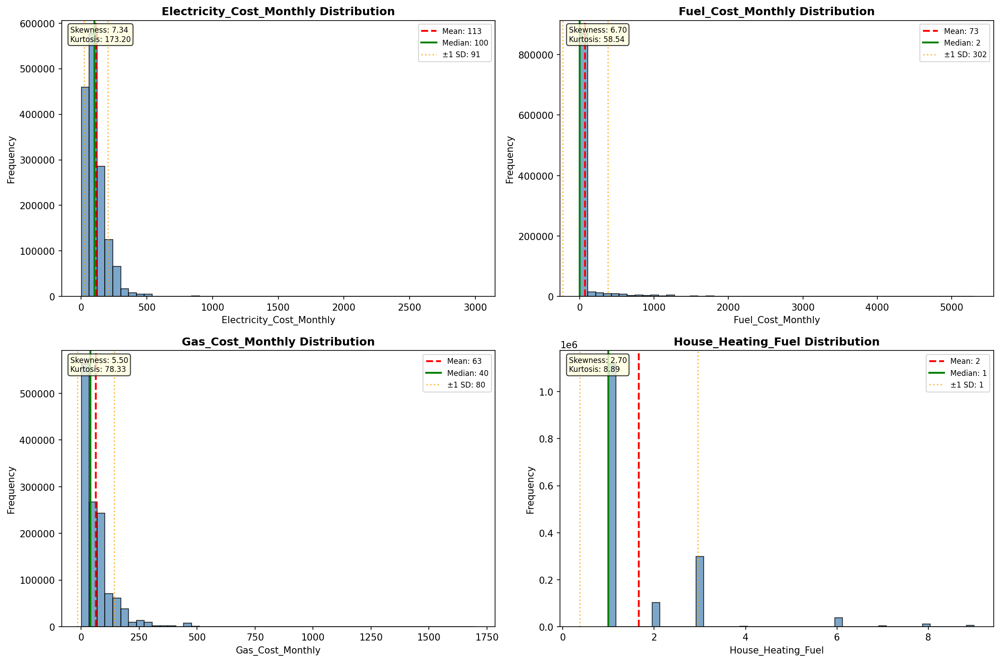

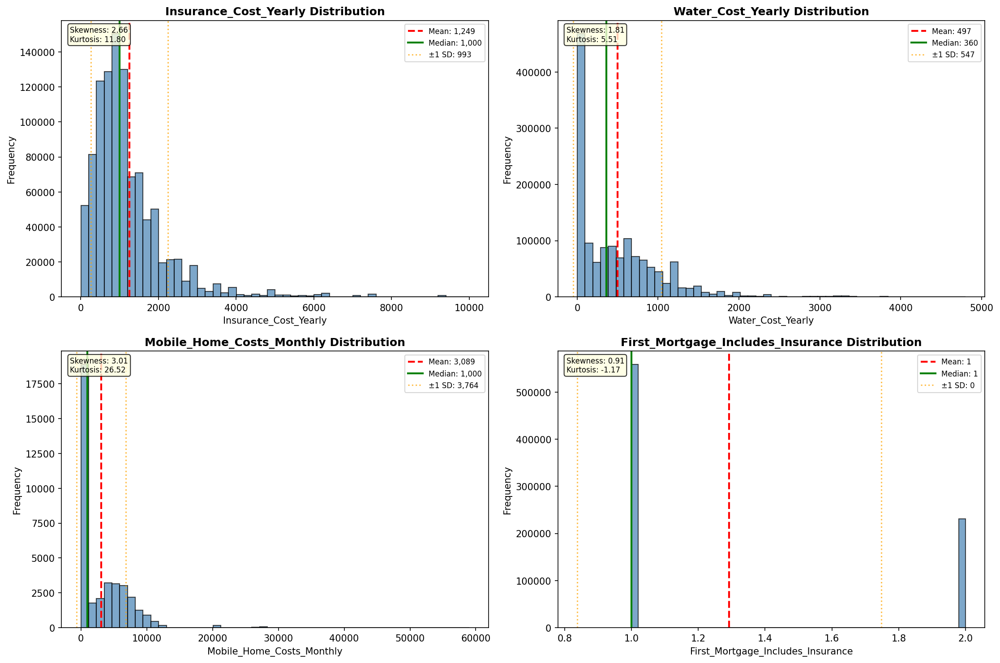

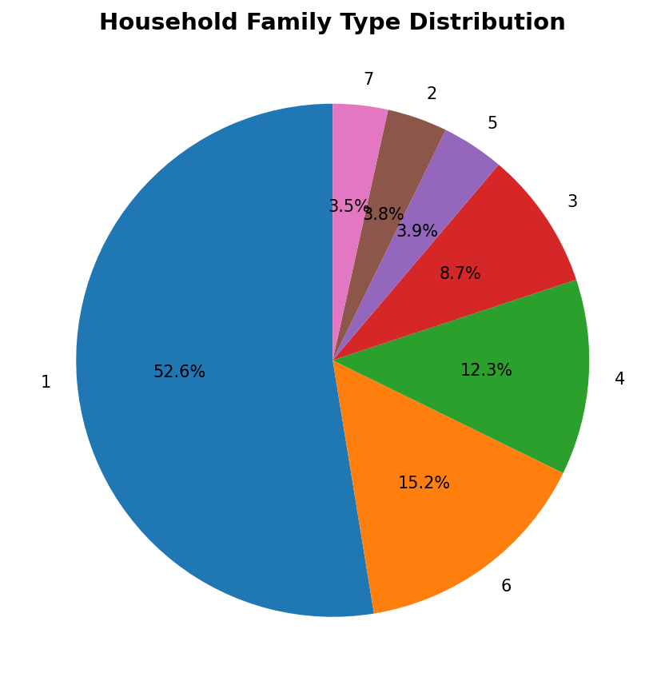

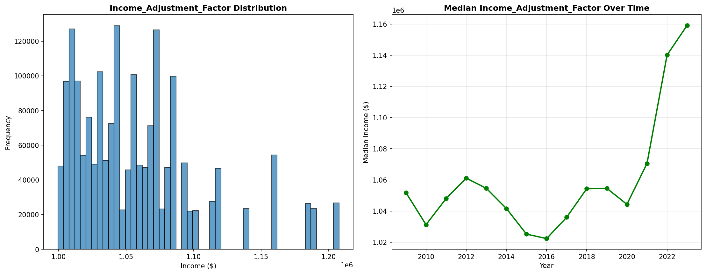

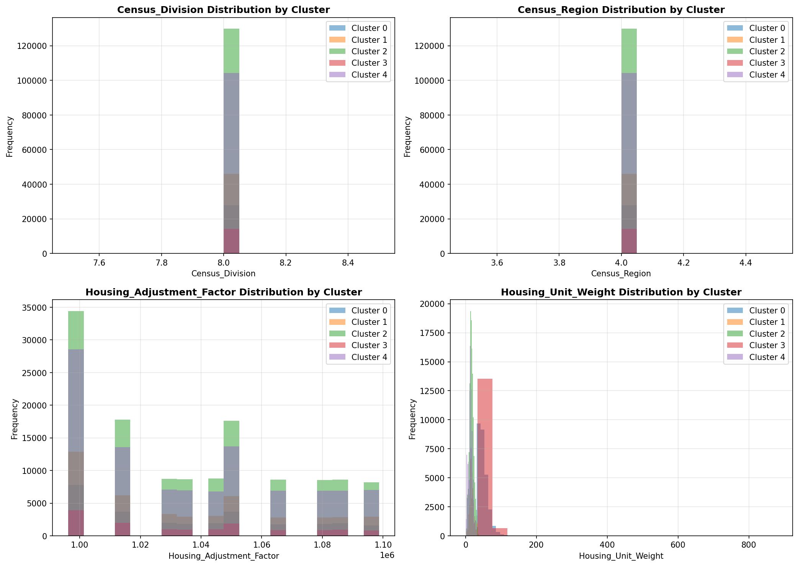

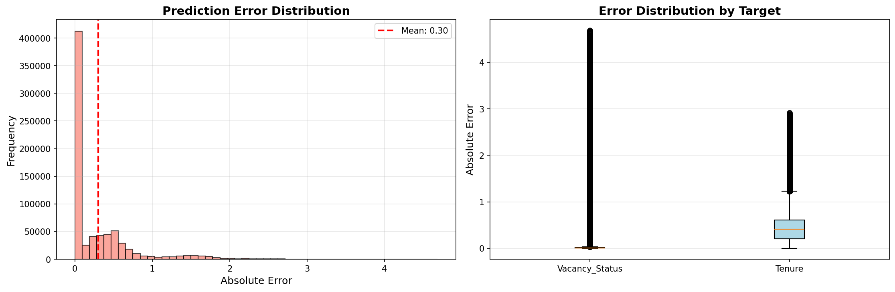

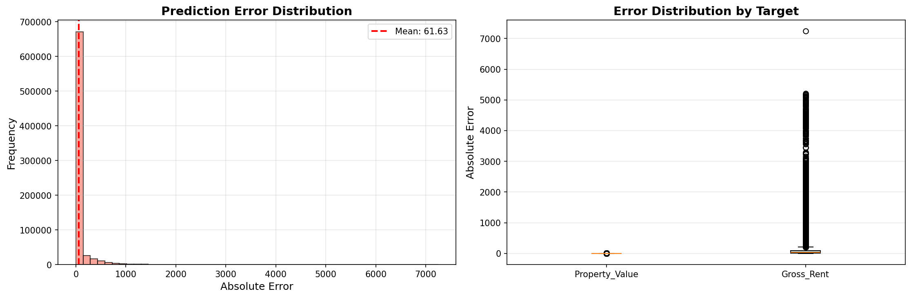

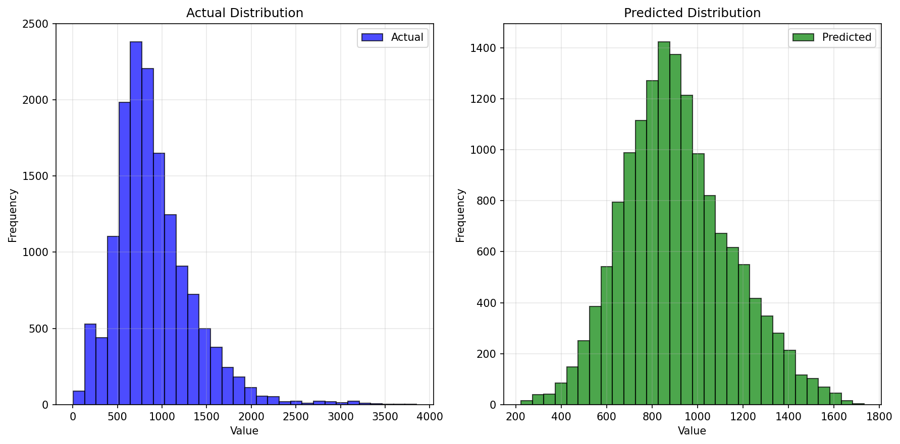

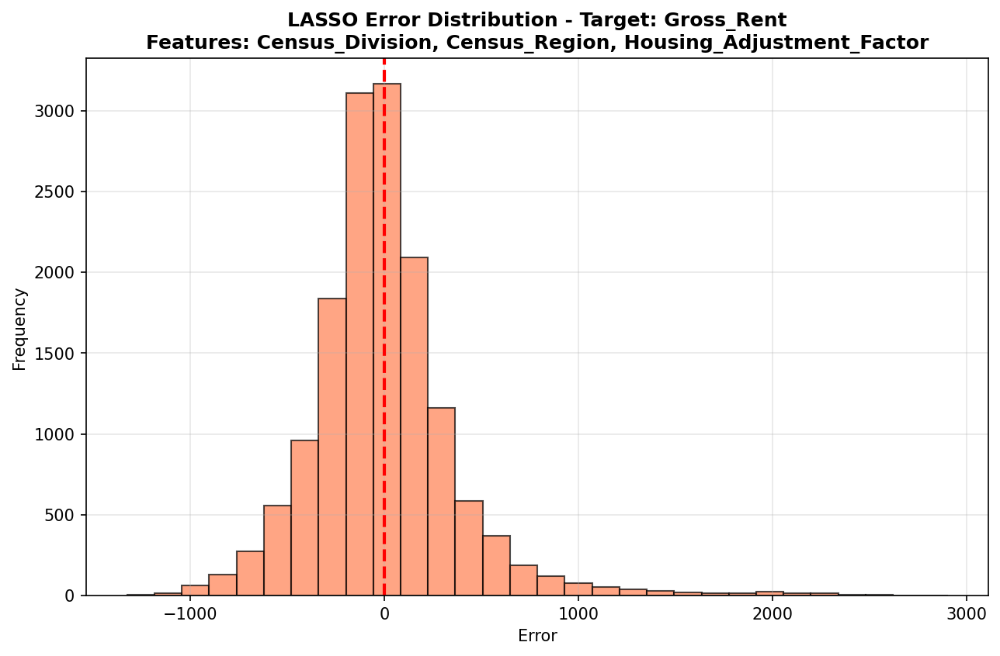

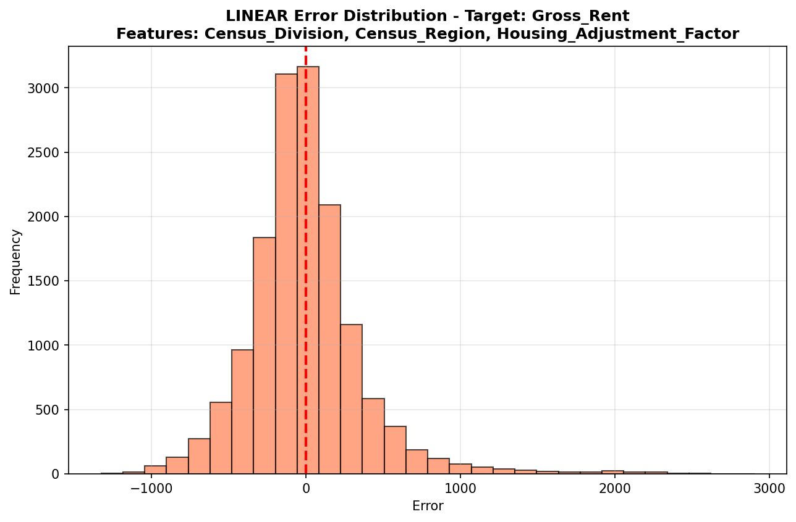

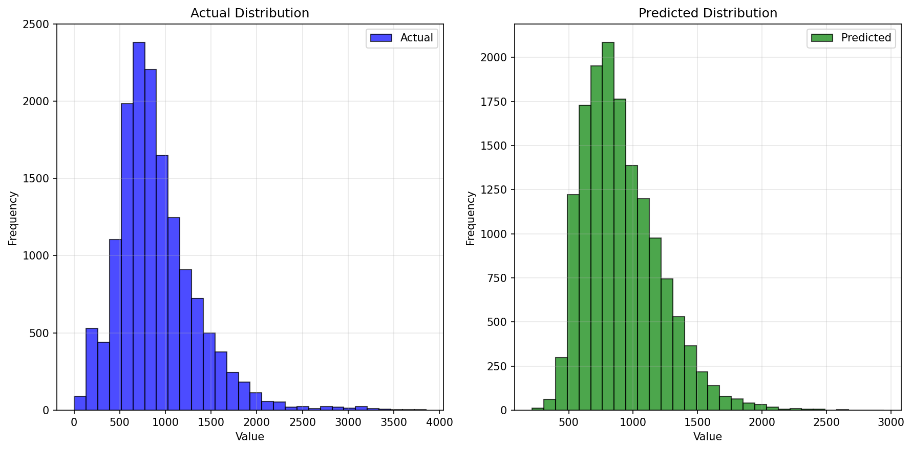

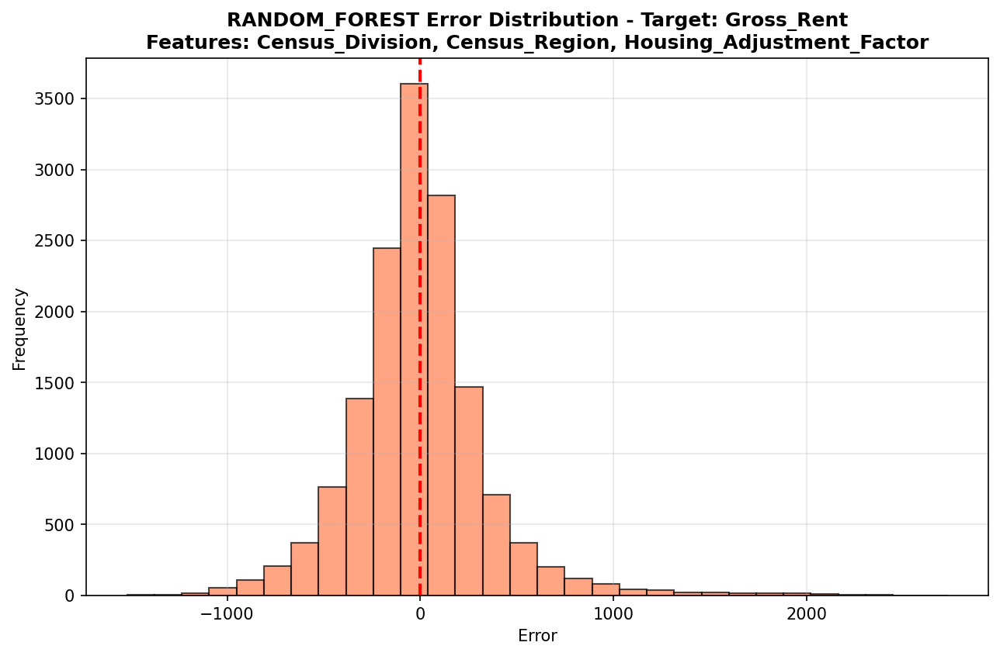

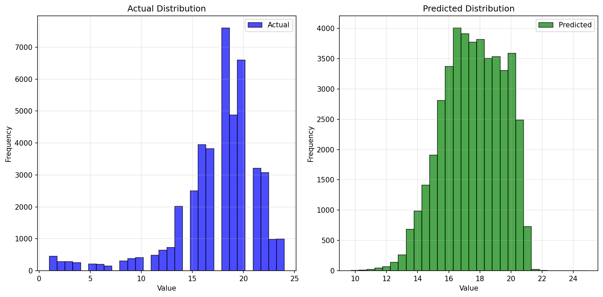

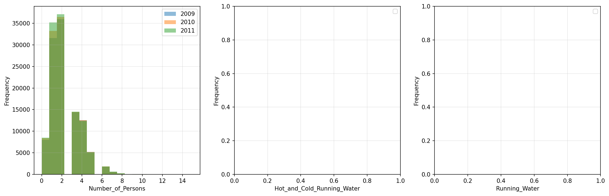

