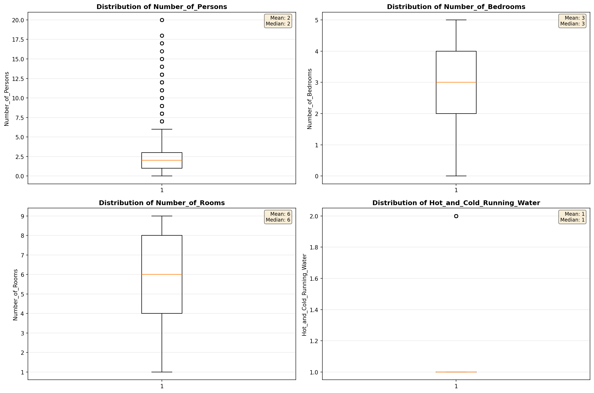
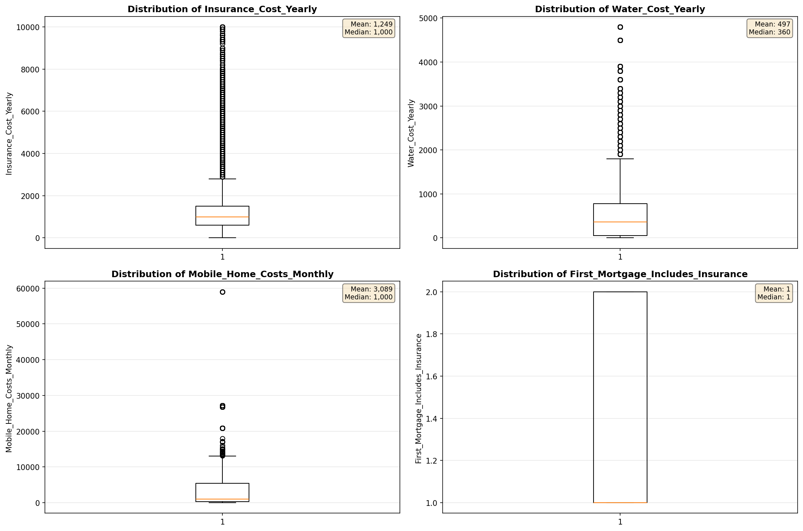
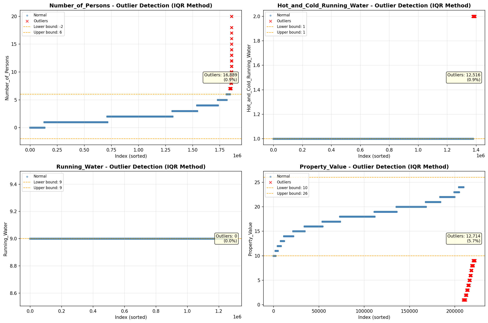
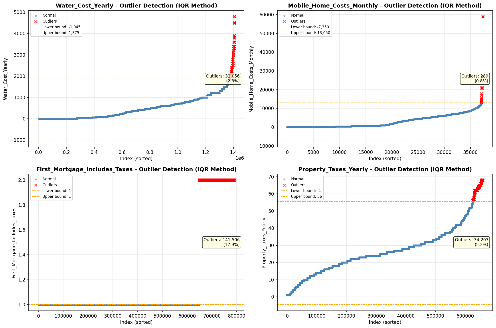

# Outlier Detection

> Statistical outlier detection using IQR (Interquartile Range) method. Outliers are values falling outside Q1 - 1.5×IQR or Q3 + 1.5×IQR bounds.

## Detection Methodology

| Parameter | Value | Description |
| :--- | :--- | :--- |
| Method | IQR | Outlier detection algorithm |
| Lower Bound | Q1 - 1.5 × IQR | Values below are outliers |
| Upper Bound | Q3 + 1.5 × IQR | Values above are outliers |
| IQR Definition | Q3 - Q1 | Interquartile Range |

> **Note**: The IQR method is robust to extreme values and works well for approximately symmetric distributions.

## Outlier Summary

_No outlier summary available._
## High Outlier Rate Variables

> Variables with outlier rate > 5% may indicate data quality issues, non-normal distributions, or genuinely extreme values.

- **('First_Mortgage_Includes_Taxes', 17.90258874373436)**: 0 outliers (0.00%)

- **('Fuel_Cost_Monthly', 13.997416182200828)**: 0 outliers (0.00%)

- **('Gross_Rent_Percentage_Income', 9.749042858343035)**: 0 outliers (0.00%)

- **('Flag_Property_Taxes', 8.795495451330284)**: 0 outliers (0.00%)

- **('Working_Age_Persons', 8.741888877943557)**: 0 outliers (0.00%)

- **('Owner_Costs_Percentage_Income', 7.494835426983669)**: 0 outliers (0.00%)

- **('Property_Tax_Rate', 7.490806301114221)**: 0 outliers (0.00%)

- **('Flag_Water_Cost', 6.649205004120298)**: 0 outliers (0.00%)

- **('Insurance_Cost_Yearly', 5.990320960510641)**: 0 outliers (0.00%)

- **('Family_Income', 5.98531401607127)**: 0 outliers (0.00%)

- **('Income_to_FPL_Ratio', 5.937947548287855)**: 0 outliers (0.00%)

- **('Household_Income', 5.736155085971294)**: 0 outliers (0.00%)

- **('Property_Value', 5.724551545277718)**: 0 outliers (0.00%)

- **('Property_Taxes_Yearly', 5.182429770599109)**: 0 outliers (0.00%)

- **('Flag_Property_Value', 5.171208333041528)**: 0 outliers (0.00%)

> *Consider investigating these variables for data entry errors, applying transformations, or using robust statistical methods.*

## Visualizations

