# Statistical Analysis

> Comprehensive descriptive statistics including central tendency, dispersion, distribution characteristics, and weighted statistics using ACS sample weights.

## Summary Statistics

- **Variables Analyzed**: 41

### Income_Adjustment_Factor

| Statistic | Unweighted | Weighted (ACS) |
| :--- | :--- | :--- |
| Mean | 1,014,847.98 | 1,014,656.45 |
| Median | 1,010,207.00 | 1,014,656.45 |
| Std Deviation | 11,398.78 | — |
| Minimum | 1,001,264.00 | — |
| Maximum | 1,042,311.00 | — |
| Count | 190,915 | — |

> *Distribution is highly right-skewed (skewness: 1.32), light-tailed/platykurtic (kurtosis: 0.72).*

- **Coefficient of Variation**: 1.1 % (low variability)

### Property_Value

| Statistic | Unweighted | Weighted (ACS) |
| :--- | :--- | :--- |
| Mean | 389,377.40 | 365,013.16 |
| Median | 270,000.00 | 253,585.00 |
| Std Deviation | 561,675.24 | — |
| Minimum | 1.00 | — |
| Maximum | 6,288,000.00 | — |
| Count | 125,679 | — |

> *Distribution is highly right-skewed (skewness: 5.77), heavy-tailed/leptokurtic (kurtosis: 42.36).*

- **Coefficient of Variation**: 144.2 % (very high variability)

### Electricity_Cost_Monthly

| Statistic | Unweighted | Weighted (ACS) |
| :--- | :--- | :--- |
| Mean | 163.07 | 160.54 |
| Median | 130.00 | 135.00 |
| Std Deviation | 140.63 | — |
| Minimum | 1.00 | — |
| Maximum | 2,900.00 | — |
| Count | 222,959 | — |

> *Distribution is highly right-skewed (skewness: 7.60), heavy-tailed/leptokurtic (kurtosis: 127.85).*

- **Coefficient of Variation**: 86.2 % (high variability)

### Fuel_Cost_Monthly

| Statistic | Unweighted | Weighted (ACS) |
| :--- | :--- | :--- |
| Mean | 1,029.68 | 1,135.94 |
| Median | 250.00 | 501.38 |
| Std Deviation | 1,381.39 | — |
| Minimum | 1.00 | — |
| Maximum | 7,500.00 | — |
| Count | 179,253 | — |

> *Distribution is highly right-skewed (skewness: 1.54), light-tailed/platykurtic (kurtosis: 2.25).*

- **Coefficient of Variation**: 134.2 % (very high variability)

### Gas_Cost_Monthly

| Statistic | Unweighted | Weighted (ACS) |
| :--- | :--- | :--- |
| Mean | 71.79 | 82.71 |
| Median | 20.00 | 33.94 |
| Std Deviation | 120.30 | — |
| Minimum | 1.00 | — |
| Maximum | 2,200.00 | — |
| Count | 187,607 | — |

> *Distribution is highly right-skewed (skewness: 5.46), heavy-tailed/leptokurtic (kurtosis: 68.02).*

- **Coefficient of Variation**: 167.6 % (very high variability)

### Insurance_Cost_Yearly

| Statistic | Unweighted | Weighted (ACS) |
| :--- | :--- | :--- |
| Mean | 1,430.56 | 1,380.29 |
| Median | 1,100.00 | 1,090.00 |
| Std Deviation | 1,323.07 | — |
| Minimum | 4.00 | — |
| Maximum | 10,000.00 | — |
| Count | 151,049 | — |

> *Distribution is highly right-skewed (skewness: 3.21), heavy-tailed/leptokurtic (kurtosis: 13.90).*

- **Coefficient of Variation**: 92.5 % (high variability)

### Water_Cost_Yearly

| Statistic | Unweighted | Weighted (ACS) |
| :--- | :--- | :--- |
| Mean | 329.46 | 361.70 |
| Median | 180.00 | 156.38 |
| Std Deviation | 451.46 | — |
| Minimum | 1.00 | — |
| Maximum | 4,100.00 | — |
| Count | 192,552 | — |

> *Distribution is highly right-skewed (skewness: 2.62), heavy-tailed/leptokurtic (kurtosis: 11.31).*

- **Coefficient of Variation**: 137.0 % (very high variability)

### Mobile_Home_Costs_Monthly

| Statistic | Unweighted | Weighted (ACS) |
| :--- | :--- | :--- |
| Mean | 4,634.11 | 4,652.97 |
| Median | 4,800.00 | 5,068.75 |
| Std Deviation | 3,670.93 | — |
| Minimum | 4.00 | — |
| Maximum | 36,200.00 | — |
| Count | 1,213 | — |

> *Distribution is highly right-skewed (skewness: 3.79), heavy-tailed/leptokurtic (kurtosis: 28.75).*

- **Coefficient of Variation**: 79.2 % (high variability)

### First_Mortgage_Payment_Monthly

| Statistic | Unweighted | Weighted (ACS) |
| :--- | :--- | :--- |
| Mean | 1,513.85 | 1,577.47 |
| Median | 1,400.00 | 1,294.25 |
| Std Deviation | 1,233.12 | — |
| Minimum | 4.00 | — |
| Maximum | 9,200.00 | — |
| Count | 124,491 | — |

> *Distribution is highly right-skewed (skewness: 1.79), heavy-tailed/leptokurtic (kurtosis: 5.79).*

- **Coefficient of Variation**: 81.5 % (high variability)

### First_Mortgage_Includes_Taxes

| Statistic | Unweighted | Weighted (ACS) |
| :--- | :--- | :--- |
| Mean | 1.25 | 1.23 |
| Median | 1.00 | 1.00 |
| Std Deviation | 0.43 | — |
| Minimum | 1.00 | — |
| Maximum | 2.00 | — |
| Count | 108,739 | — |

> *Distribution is highly right-skewed (skewness: 1.14), light-tailed/platykurtic (kurtosis: -0.70).*

- **Coefficient of Variation**: 34.7 % (moderate variability)

### Second_Mortgage_Payment_Monthly

| Statistic | Unweighted | Weighted (ACS) |
| :--- | :--- | :--- |
| Mean | 450.52 | 449.02 |
| Median | 300.00 | 308.12 |
| Std Deviation | 490.92 | — |
| Minimum | 4.00 | — |
| Maximum | 4,500.00 | — |
| Count | 26,000 | — |

> *Distribution is highly right-skewed (skewness: 3.33), heavy-tailed/leptokurtic (kurtosis: 15.40).*

- **Coefficient of Variation**: 109.0 % (very high variability)

### Property_Taxes_Yearly

| Statistic | Unweighted | Weighted (ACS) |
| :--- | :--- | :--- |
| Mean | 721.78 | 669.27 |
| Median | 62.00 | 596.67 |
| Std Deviation | 2,787.23 | — |
| Minimum | 1.00 | — |
| Maximum | 42,500.00 | — |
| Count | 123,151 | — |

> *Distribution is highly right-skewed (skewness: 7.00), heavy-tailed/leptokurtic (kurtosis: 72.81).*

- **Coefficient of Variation**: 386.2 % (very high variability)

### Meals_Included_in_Rent

| Statistic | Unweighted | Weighted (ACS) |
| :--- | :--- | :--- |
| Mean | 1.97 | 1.98 |
| Median | 2.00 | 2.00 |
| Std Deviation | 0.16 | — |
| Minimum | 1.00 | — |
| Maximum | 2.00 | — |
| Count | 61,269 | — |

> *Distribution is highly left-skewed (skewness: -5.92), heavy-tailed/leptokurtic (kurtosis: 33.08).*

- **Coefficient of Variation**: 8.1 % (low variability)

### Rent_Amount_Monthly

| Statistic | Unweighted | Weighted (ACS) |
| :--- | :--- | :--- |
| Mean | 1,040.52 | 1,028.99 |
| Median | 900.00 | 935.00 |
| Std Deviation | 671.52 | — |
| Minimum | 4.00 | — |
| Maximum | 6,100.00 | — |
| Count | 61,269 | — |

> *Distribution is highly right-skewed (skewness: 2.44), heavy-tailed/leptokurtic (kurtosis: 11.61).*

- **Coefficient of Variation**: 64.5 % (high variability)

### Gross_Rent

| Statistic | Unweighted | Weighted (ACS) |
| :--- | :--- | :--- |
| Mean | 1,216.54 | 1,201.90 |
| Median | 1,100.00 | 1,113.19 |
| Std Deviation | 727.42 | — |
| Minimum | 4.00 | — |
| Maximum | 8,630.00 | — |
| Count | 57,741 | — |

> *Distribution is highly right-skewed (skewness: 2.22), heavy-tailed/leptokurtic (kurtosis: 10.20).*

- **Coefficient of Variation**: 59.8 % (high variability)

### Gross_Rent_Percentage_Income

| Statistic | Unweighted | Weighted (ACS) |
| :--- | :--- | :--- |
| Mean | 40.48 | 40.91 |
| Median | 30.00 | 30.69 |
| Std Deviation | 28.24 | — |
| Minimum | 1.00 | — |
| Maximum | 101.00 | — |
| Count | 56,574 | — |

> *Distribution is highly right-skewed (skewness: 1.06), light-tailed/platykurtic (kurtosis: -0.05).*

- **Coefficient of Variation**: 69.7 % (high variability)

### Selected_Monthly_Owner_Costs

| Statistic | Unweighted | Weighted (ACS) |
| :--- | :--- | :--- |
| Mean | 1,951.45 | 1,949.09 |
| Median | 1,658.00 | 1,686.69 |
| Std Deviation | 1,397.31 | — |
| Minimum | 2.00 | — |
| Maximum | 16,435.00 | — |
| Count | 165,501 | — |

> *Distribution is highly right-skewed (skewness: 2.40), heavy-tailed/leptokurtic (kurtosis: 9.44).*

- **Coefficient of Variation**: 71.6 % (high variability)

### Owner_Costs_Percentage_Income

| Statistic | Unweighted | Weighted (ACS) |
| :--- | :--- | :--- |
| Mean | 27.13 | 27.87 |
| Median | 21.00 | 21.44 |
| Std Deviation | 21.95 | — |
| Minimum | 1.00 | — |
| Maximum | 101.00 | — |
| Count | 164,694 | — |

> *Distribution is highly right-skewed (skewness: 1.86), heavy-tailed/leptokurtic (kurtosis: 3.38).*

- **Coefficient of Variation**: 80.9 % (high variability)

### Family_Income

| Statistic | Unweighted | Weighted (ACS) |
| :--- | :--- | :--- |
| Mean | 136,276.51 | 125,734.86 |
| Median | 98,800.00 | 92,485.00 |
| Std Deviation | 145,193.68 | — |
| Minimum | 1.00 | — |
| Maximum | 2,312,000.00 | — |
| Count | 149,830 | — |

> *Distribution is highly right-skewed (skewness: 3.55), heavy-tailed/leptokurtic (kurtosis: 18.71).*

- **Coefficient of Variation**: 106.5 % (very high variability)

### Household_Income

| Statistic | Unweighted | Weighted (ACS) |
| :--- | :--- | :--- |
| Mean | 113,211.42 | 104,545.76 |
| Median | 78,500.00 | 73,475.62 |
| Std Deviation | 131,867.13 | — |
| Minimum | 1.00 | — |
| Maximum | 2,312,000.00 | — |
| Count | 224,193 | — |

> *Distribution is highly right-skewed (skewness: 3.85), heavy-tailed/leptokurtic (kurtosis: 22.53).*

- **Coefficient of Variation**: 116.5 % (very high variability)

### Specified_Rent_Unit

| Statistic | Unweighted | Weighted (ACS) |
| :--- | :--- | :--- |
| Mean | 0.27 | 0.33 |
| Median | 0.00 | 0.00 |
| Std Deviation | 0.44 | — |
| Minimum | 0.00 | — |
| Maximum | 1.00 | — |
| Count | 239,611 | — |

> *Distribution is highly right-skewed (skewness: 1.06), light-tailed/platykurtic (kurtosis: -0.88).*

- **Coefficient of Variation**: 166.0 % (very high variability)

### Specified_Value_Unit

| Statistic | Unweighted | Weighted (ACS) |
| :--- | :--- | :--- |
| Mean | 0.61 | 0.54 |
| Median | 1.00 | 1.00 |
| Std Deviation | 0.49 | — |
| Minimum | 0.00 | — |
| Maximum | 1.00 | — |
| Count | 239,611 | — |

> *Distribution is approximately symmetric (skewness: -0.45), light-tailed/platykurtic (kurtosis: -1.80).*

- **Coefficient of Variation**: 79.9 % (high variability)

### Flag_Family_Income

| Statistic | Unweighted | Weighted (ACS) |
| :--- | :--- | :--- |
| Mean | 0.21 | 0.21 |
| Median | 0.00 | 0.00 |
| Std Deviation | 0.41 | — |
| Minimum | 0.00 | — |
| Maximum | 1.00 | — |
| Count | 181,454 | — |

> *Distribution is highly right-skewed (skewness: 1.41), light-tailed/platykurtic (kurtosis: -0.01).*

- **Coefficient of Variation**: 192.9 % (very high variability)

### Flag_Gross_Rent

| Statistic | Unweighted | Weighted (ACS) |
| :--- | :--- | :--- |
| Mean | 0.08 | 0.13 |
| Median | 0.00 | 0.00 |
| Std Deviation | 0.27 | — |
| Minimum | 0.00 | — |
| Maximum | 1.00 | — |
| Count | 116,604 | — |

> *Distribution is highly right-skewed (skewness: 3.07), heavy-tailed/leptokurtic (kurtosis: 7.41).*

- **Coefficient of Variation**: 336.4 % (very high variability)

### Flag_Household_Income

| Statistic | Unweighted | Weighted (ACS) |
| :--- | :--- | :--- |
| Mean | 0.31 | 0.32 |
| Median | 0.00 | 0.00 |
| Std Deviation | 0.46 | — |
| Minimum | 0.00 | — |
| Maximum | 1.00 | — |
| Count | 181,454 | — |

> *Distribution is moderately right-skewed (skewness: 0.82), light-tailed/platykurtic (kurtosis: -1.34).*

- **Coefficient of Variation**: 148.7 % (very high variability)

### Flag_First_Mortgage_Payment

| Statistic | Unweighted | Weighted (ACS) |
| :--- | :--- | :--- |
| Mean | 0.05 | 0.05 |
| Median | 0.00 | 0.00 |
| Std Deviation | 0.21 | — |
| Minimum | 0.00 | — |
| Maximum | 1.00 | — |
| Count | 239,611 | — |

> *Distribution is highly right-skewed (skewness: 4.37), heavy-tailed/leptokurtic (kurtosis: 17.06).*

- **Coefficient of Variation**: 458.4 % (very high variability)

### Flag_First_Mortgage_Taxes

| Statistic | Unweighted | Weighted (ACS) |
| :--- | :--- | :--- |
| Mean | 0.04 | 0.03 |
| Median | 0.00 | 0.00 |
| Std Deviation | 0.19 | — |
| Minimum | 0.00 | — |
| Maximum | 1.00 | — |
| Count | 239,611 | — |

> *Distribution is highly right-skewed (skewness: 4.96), heavy-tailed/leptokurtic (kurtosis: 22.62).*

- **Coefficient of Variation**: 515.6 % (very high variability)

### Flag_Meals_Included_Rent

| Statistic | Unweighted | Weighted (ACS) |
| :--- | :--- | :--- |
| Mean | 0.01 | 0.01 |
| Median | 0.00 | 0.00 |
| Std Deviation | 0.09 | — |
| Minimum | 0.00 | — |
| Maximum | 1.00 | — |
| Count | 239,611 | — |

> *Distribution is highly right-skewed (skewness: 11.01), heavy-tailed/leptokurtic (kurtosis: 119.29).*

- **Coefficient of Variation**: 1,110.3 % (very high variability)

### Flag_Rent_Amount

| Statistic | Unweighted | Weighted (ACS) |
| :--- | :--- | :--- |
| Mean | 0.03 | 0.04 |
| Median | 0.00 | 0.00 |
| Std Deviation | 0.16 | — |
| Minimum | 0.00 | — |
| Maximum | 1.00 | — |
| Count | 239,611 | — |

> *Distribution is highly right-skewed (skewness: 5.77), heavy-tailed/leptokurtic (kurtosis: 31.28).*

- **Coefficient of Variation**: 593.8 % (very high variability)

### Flag_Selected_Monthly_Owner_Costs

| Statistic | Unweighted | Weighted (ACS) |
| :--- | :--- | :--- |
| Mean | 0.24 | 0.24 |
| Median | 0.00 | 0.00 |
| Std Deviation | 0.43 | — |
| Minimum | 0.00 | — |
| Maximum | 1.00 | — |
| Count | 155,626 | — |

> *Distribution is highly right-skewed (skewness: 1.23), light-tailed/platykurtic (kurtosis: -0.49).*

- **Coefficient of Variation**: 178.9 % (very high variability)

### Flag_Second_Mortgage_Payment

| Statistic | Unweighted | Weighted (ACS) |
| :--- | :--- | :--- |
| Mean | 0.04 | 0.04 |
| Median | 0.00 | 0.00 |
| Std Deviation | 0.20 | — |
| Minimum | 0.00 | — |
| Maximum | 1.00 | — |
| Count | 239,611 | — |

> *Distribution is highly right-skewed (skewness: 4.68), heavy-tailed/leptokurtic (kurtosis: 19.90).*

- **Coefficient of Variation**: 488.4 % (very high variability)

### Flag_Property_Taxes

| Statistic | Unweighted | Weighted (ACS) |
| :--- | :--- | :--- |
| Mean | 0.08 | 0.08 |
| Median | 0.00 | 0.00 |
| Std Deviation | 0.27 | — |
| Minimum | 0.00 | — |
| Maximum | 1.00 | — |
| Count | 224,150 | — |

> *Distribution is highly right-skewed (skewness: 3.12), heavy-tailed/leptokurtic (kurtosis: 7.76).*

- **Coefficient of Variation**: 341.7 % (very high variability)

### Flag_Property_Value

| Statistic | Unweighted | Weighted (ACS) |
| :--- | :--- | :--- |
| Mean | 0.06 | 0.06 |
| Median | 0.00 | 0.00 |
| Std Deviation | 0.24 | — |
| Minimum | 0.00 | — |
| Maximum | 1.00 | — |
| Count | 239,611 | — |

> *Distribution is highly right-skewed (skewness: 3.59), heavy-tailed/leptokurtic (kurtosis: 10.91).*

- **Coefficient of Variation**: 385.3 % (very high variability)

### Flag_Water_Cost

| Statistic | Unweighted | Weighted (ACS) |
| :--- | :--- | :--- |
| Mean | 0.08 | 0.09 |
| Median | 0.00 | 0.00 |
| Std Deviation | 0.27 | — |
| Minimum | 0.00 | — |
| Maximum | 1.00 | — |
| Count | 15,461 | — |

> *Distribution is highly right-skewed (skewness: 3.06), heavy-tailed/leptokurtic (kurtosis: 7.34).*

- **Coefficient of Variation**: 335.4 % (very high variability)

### Annual_Rent_to_Value_Ratio

### Total_Monthly_Utility_Cost

| Statistic | Unweighted | Weighted (ACS) |
| :--- | :--- | :--- |
| Mean | 223.02 | 219.55 |
| Median | 180.00 | 179.19 |
| Std Deviation | 194.50 | — |
| Minimum | 2.00 | — |
| Maximum | 5,100.00 | — |
| Count | 223,415 | — |

> *Distribution is highly right-skewed (skewness: 6.32), heavy-tailed/leptokurtic (kurtosis: 96.17).*

- **Coefficient of Variation**: 87.2 % (high variability)

### Property_Tax_Rate

| Statistic | Unweighted | Weighted (ACS) |
| :--- | :--- | :--- |
| Mean | 33.74 | 33.34 |
| Median | 0.03 | 35.46 |
| Std Deviation | 90.46 | — |
| Minimum | 0.00 | — |
| Maximum | 1,000.00 | — |
| Count | 81,906 | — |

> *Distribution is highly right-skewed (skewness: 2.46), heavy-tailed/leptokurtic (kurtosis: 4.43).*

- **Coefficient of Variation**: 268.1 % (very high variability)

#### Weighted Statistics by Year

| Year | Weighted Mean | Weighted Median |
| :--- | :--- | :--- |
| 2007 | 264.59 | 281.82 |
| 2012 | 0.02 | 0.02 |
| 2013 | 0.04 | 0.02 |
| 2014 | 0.05 | 0.02 |
| 2015 | 0.04 | 0.02 |
| 2016 | 0.04 | 0.02 |
| 2017 | 0.04 | 0.02 |
| 2023 | 1.88 | 1.74 |

### Structure_Age

| Statistic | Unweighted | Weighted (ACS) |
| :--- | :--- | :--- |
| Mean | 1,874.14 | 1,879.24 |
| Median | 2,019.00 | 1,879.79 |
| Std Deviation | 513.39 | — |
| Minimum | 1.00 | — |
| Maximum | 2,023.00 | — |
| Count | 208,843 | — |

> *Distribution is highly left-skewed (skewness: -3.25), heavy-tailed/leptokurtic (kurtosis: 8.59).*

- **Coefficient of Variation**: 27.4 % (moderate variability)

### Structure_Age_Score

| Statistic | Unweighted | Weighted (ACS) |
| :--- | :--- | :--- |
| Mean | 0.03 | 0.03 |
| Median | 0.00 | 0.03 |
| Std Deviation | 0.12 | — |
| Minimum | 0.00 | — |
| Maximum | 0.99 | — |
| Count | 208,843 | — |

> *Distribution is highly right-skewed (skewness: 4.58), heavy-tailed/leptokurtic (kurtosis: 21.63).*

- **Coefficient of Variation**: 405.4 % (very high variability)

### Working_Age_Persons

| Statistic | Unweighted | Weighted (ACS) |
| :--- | :--- | :--- |
| Mean | 1.67 | 1.75 |
| Median | 2.00 | 2.00 |
| Std Deviation | 1.33 | — |
| Minimum | 0.00 | — |
| Maximum | 20.00 | — |
| Count | 226,307 | — |

> *Distribution is moderately right-skewed (skewness: 0.71), light-tailed/platykurtic (kurtosis: 1.05).*

- **Coefficient of Variation**: 79.6 % (high variability)

### Income_to_FPL_Ratio

| Statistic | Unweighted | Weighted (ACS) |
| :--- | :--- | :--- |
| Mean | 5.06 | 4.65 |
| Median | 3.64 | 3.41 |
| Std Deviation | 5.74 | — |
| Minimum | -0.56 | — |
| Maximum | 117.14 | — |
| Count | 226,307 | — |

> *Distribution is highly right-skewed (skewness: 4.22), heavy-tailed/leptokurtic (kurtosis: 28.75).*

- **Coefficient of Variation**: 113.3 % (very high variability)

## Distribution Analysis

### Skewed Distributions

> Variables with skewness > |0.5| indicate non-normal distributions. Consider log transformations for highly skewed variables in modeling.

| Variable | Skewness | Direction | Severity |
| :--- | :--- | :--- | :--- |
| Flag_Meals_Included_Rent | 11.013 | Right-skewed | High |
| Electricity_Cost_Monthly | 7.601 | Right-skewed | High |
| Property_Taxes_Yearly | 7.004 | Right-skewed | High |
| Total_Monthly_Utility_Cost | 6.323 | Right-skewed | High |
| Meals_Included_in_Rent | -5.923 | Left-skewed | High |
| Flag_Rent_Amount | 5.769 | Right-skewed | High |
| Property_Value | 5.768 | Right-skewed | High |
| Gas_Cost_Monthly | 5.463 | Right-skewed | High |
| Flag_First_Mortgage_Taxes | 4.962 | Right-skewed | High |
| Flag_Second_Mortgage_Payment | 4.679 | Right-skewed | High |
| Structure_Age_Score | 4.581 | Right-skewed | High |
| Flag_First_Mortgage_Payment | 4.366 | Right-skewed | High |
| Income_to_FPL_Ratio | 4.223 | Right-skewed | High |
| Household_Income | 3.852 | Right-skewed | High |
| Mobile_Home_Costs_Monthly | 3.787 | Right-skewed | High |
| Flag_Property_Value | 3.594 | Right-skewed | High |
| Family_Income | 3.553 | Right-skewed | High |
| Second_Mortgage_Payment_Monthly | 3.326 | Right-skewed | High |
| Structure_Age | -3.254 | Left-skewed | High |
| Insurance_Cost_Yearly | 3.209 | Right-skewed | High |

- **Total Skewed Variables**: 39

- **Right-skewed**: 37

- **Left-skewed**: 2

## Variance Analysis

### Coefficient of Variation Ranking

> CV (Coefficient of Variation) = (Std Dev / Mean) × 100%. Higher CV indicates greater relative variability.

| Variable | CV (%) | Std Dev | Mean | Variability |
| :--- | :--- | :--- | :--- | :--- |
| Flag_Meals_Included_Rent | 1110.3% | 0.09 | 0.01 | Very High |
| Flag_Rent_Amount | 593.8% | 0.16 | 0.03 | Very High |
| Flag_First_Mortgage_Taxes | 515.6% | 0.19 | 0.04 | Very High |
| Flag_Second_Mortgage_Payment | 488.4% | 0.20 | 0.04 | Very High |
| Flag_First_Mortgage_Payment | 458.4% | 0.21 | 0.05 | Very High |
| Structure_Age_Score | 405.4% | 0.12 | 0.03 | Very High |
| Property_Taxes_Yearly | 386.2% | 2,787.23 | 721.78 | Very High |
| Flag_Property_Value | 385.3% | 0.24 | 0.06 | Very High |
| Flag_Property_Taxes | 341.7% | 0.27 | 0.08 | Very High |
| Flag_Gross_Rent | 336.4% | 0.27 | 0.08 | Very High |
| Flag_Water_Cost | 335.4% | 0.27 | 0.08 | Very High |
| Property_Tax_Rate | 268.1% | 90.46 | 33.74 | Very High |
| Flag_Family_Income | 192.9% | 0.41 | 0.21 | Very High |
| Flag_Selected_Monthly_Owner_Costs | 178.9% | 0.43 | 0.24 | Very High |
| Gas_Cost_Monthly | 167.6% | 120.30 | 71.79 | Very High |
| Specified_Rent_Unit | 166.0% | 0.44 | 0.27 | Very High |
| Flag_Household_Income | 148.7% | 0.46 | 0.31 | Very High |
| Property_Value | 144.2% | 561,675.24 | 389,377.40 | Very High |
| Water_Cost_Yearly | 137.0% | 451.46 | 329.46 | Very High |
| Fuel_Cost_Monthly | 134.2% | 1,381.39 | 1,029.68 | Very High |

- **Average CV**: 208.6 %

- **High Variance Variables (CV > 50%)**: 36

## Visualizations

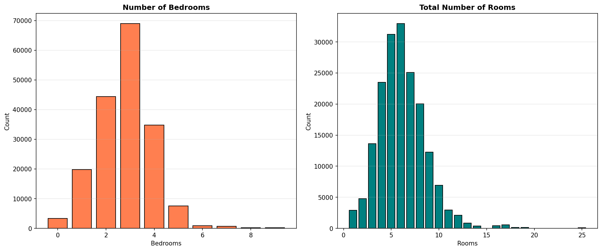

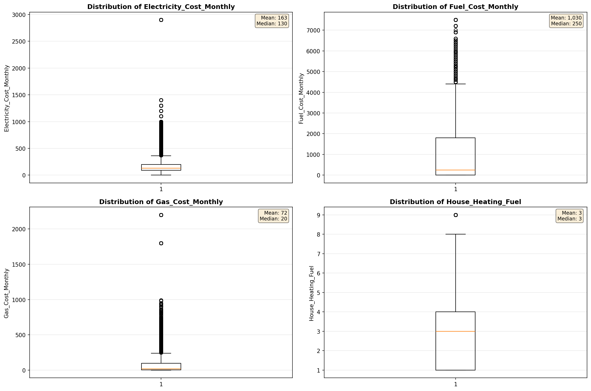

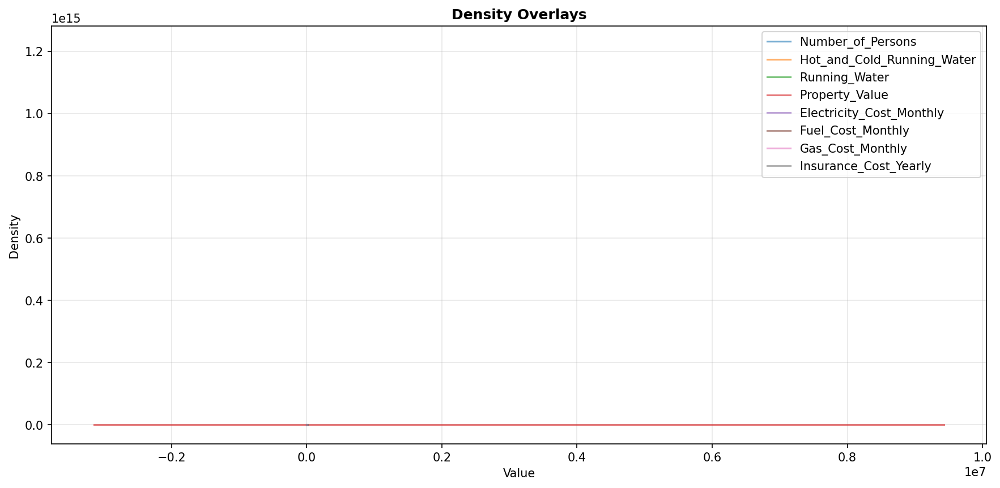

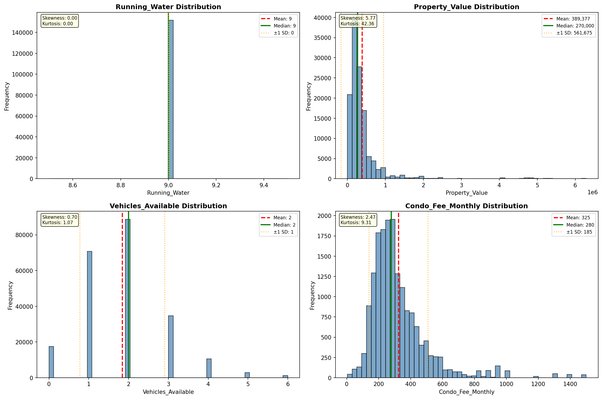

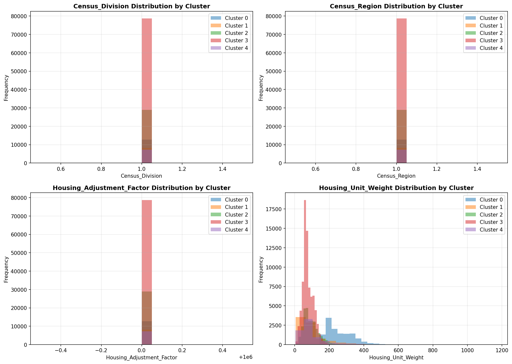

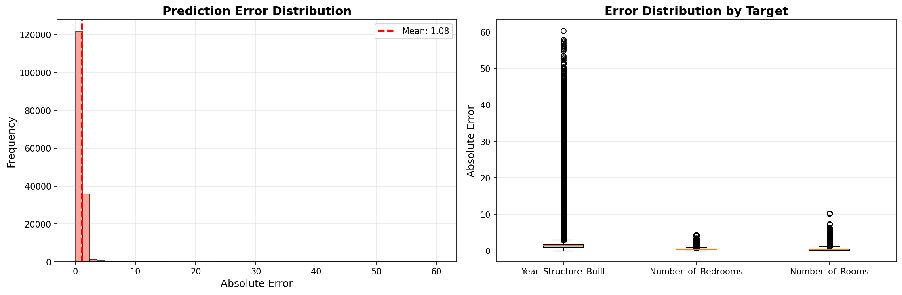

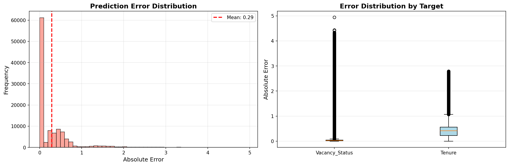

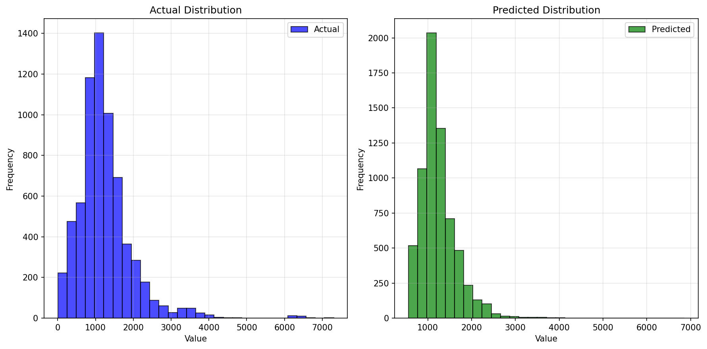

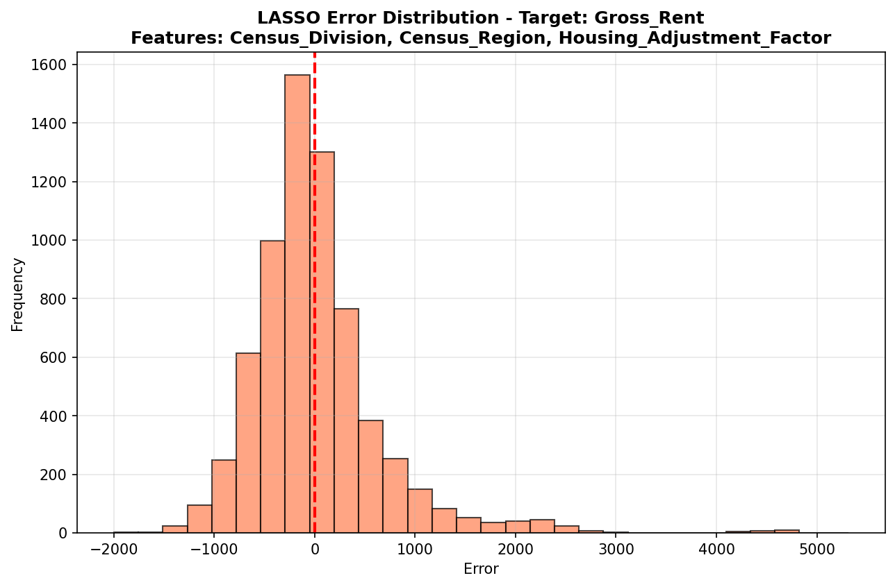

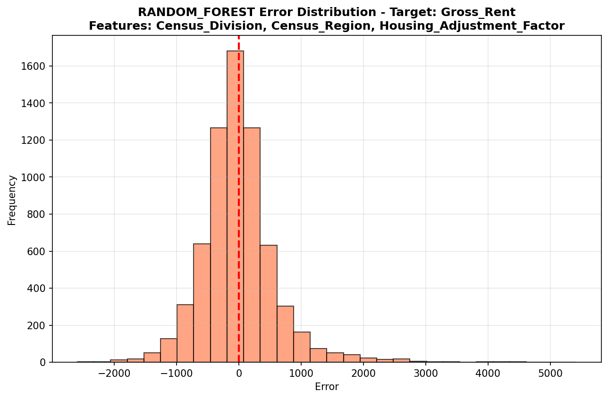

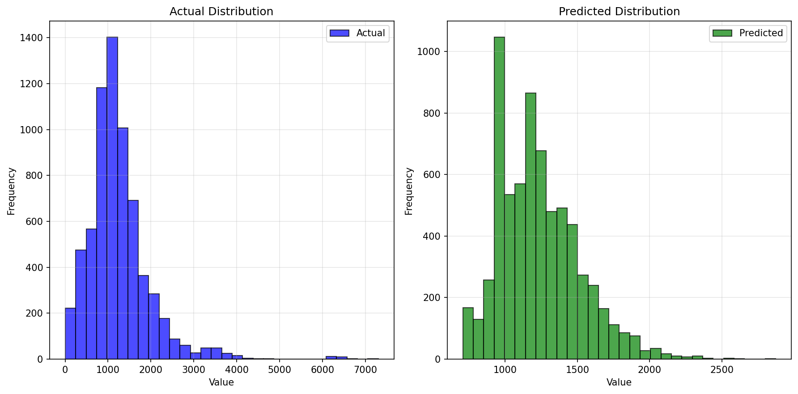

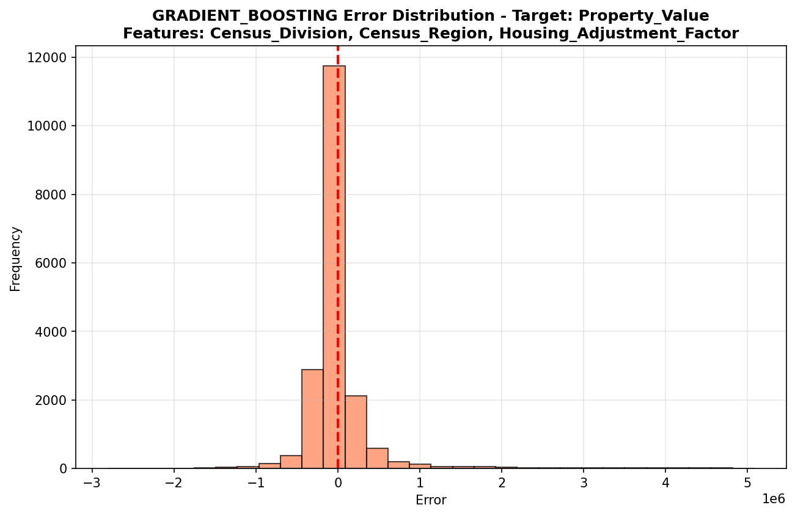

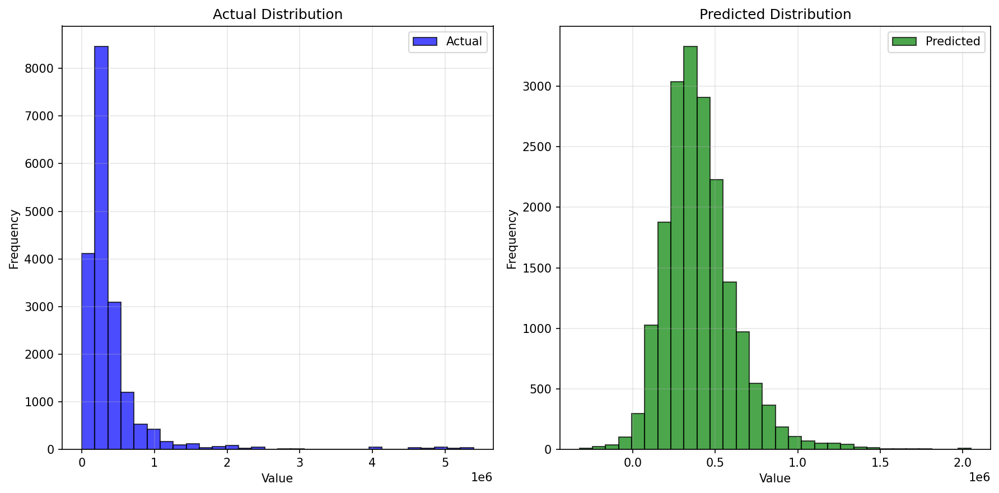

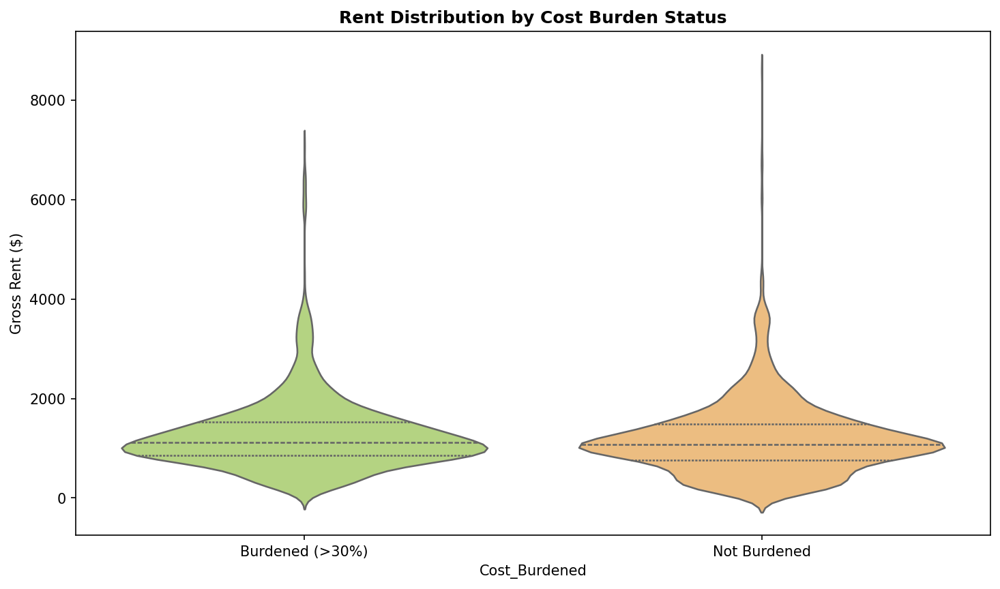

