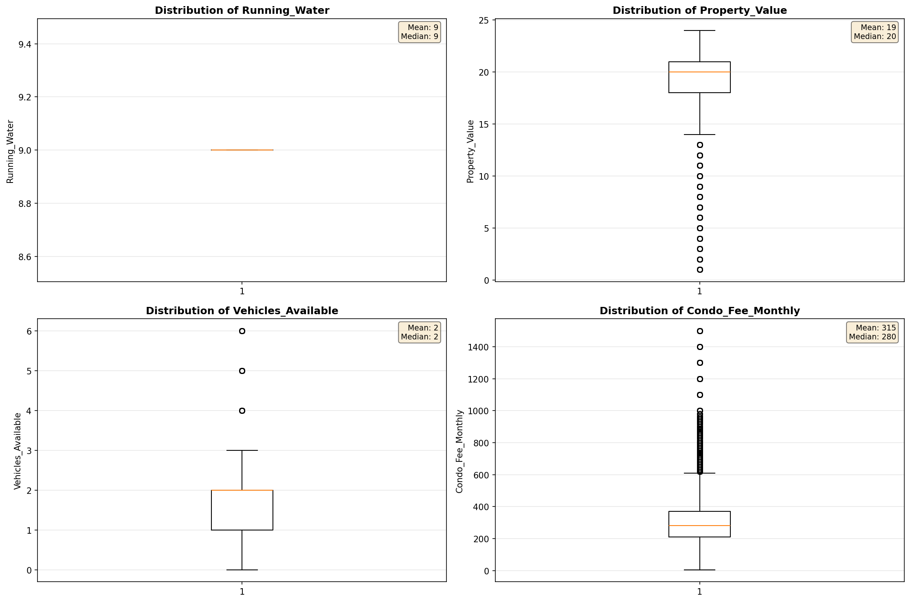
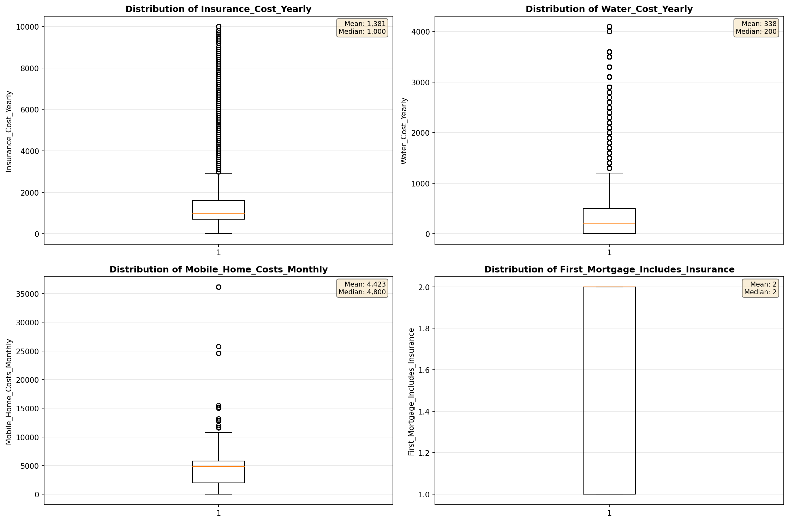
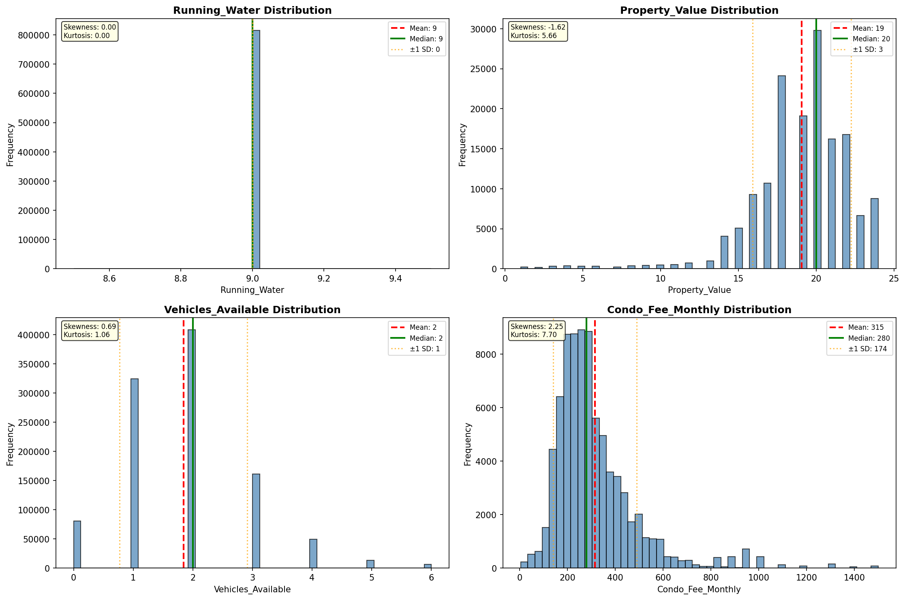
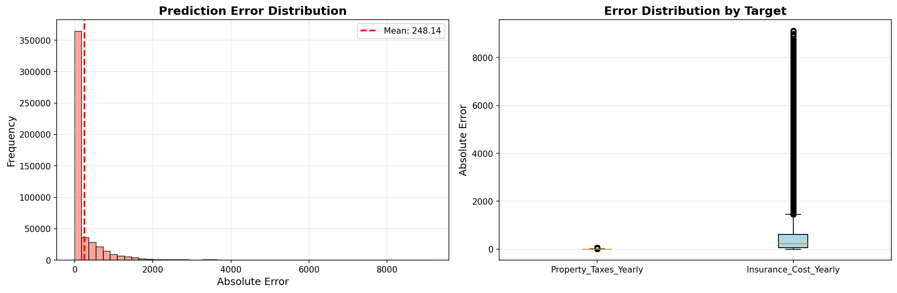
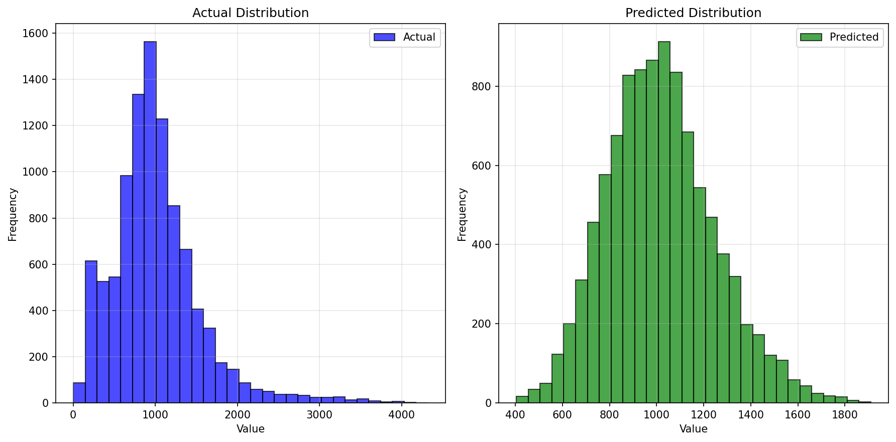
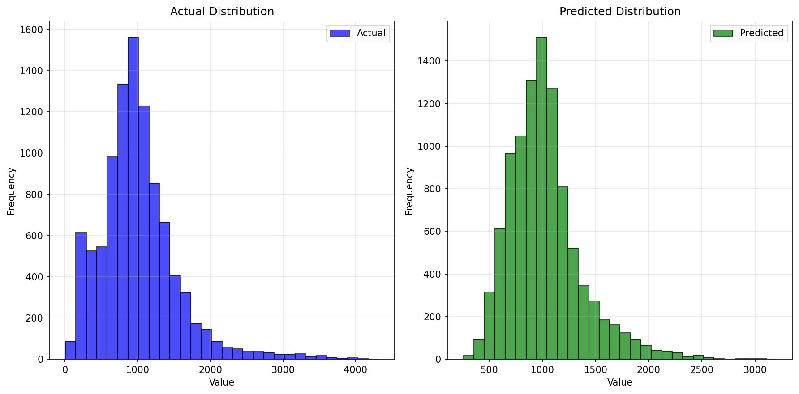
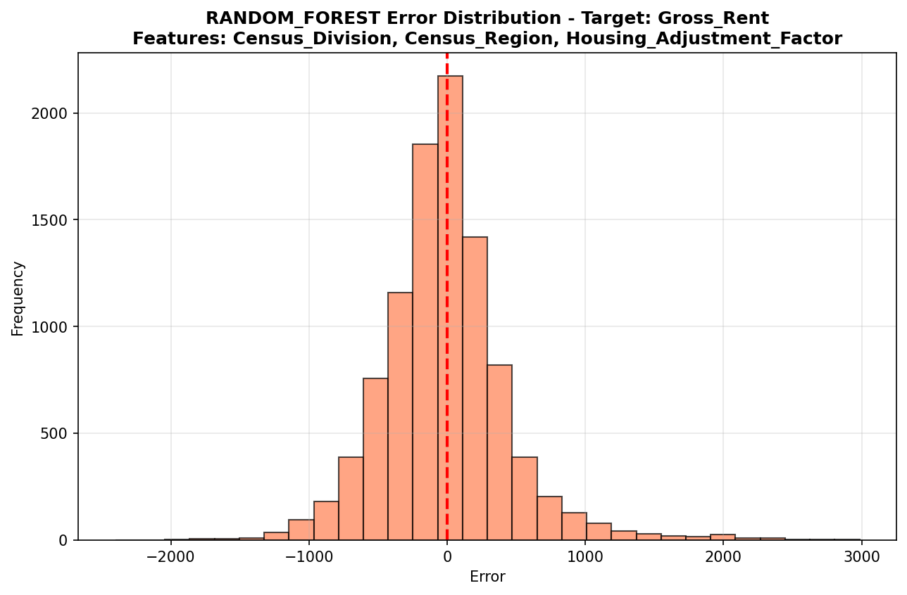
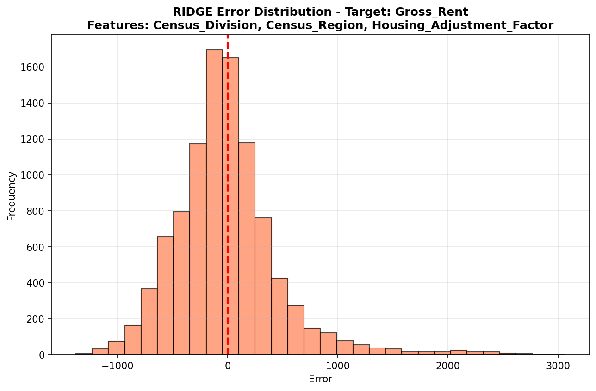
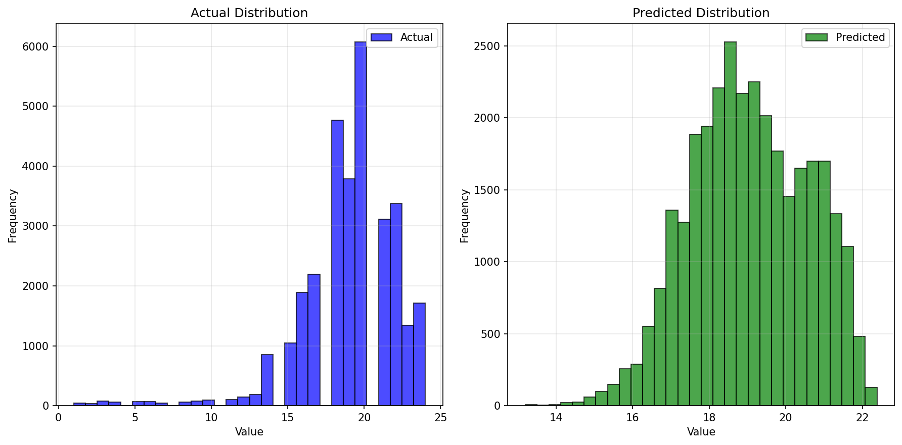

# Statistical Analysis

> Comprehensive descriptive statistics including central tendency, dispersion, distribution characteristics, and weighted statistics using ACS sample weights.

## Summary Statistics

- **Variables Analyzed**: 37

### Income_Adjustment_Factor

| Statistic | Unweighted | Weighted (ACS) |
| :--- | :--- | :--- |
| Mean | 1,057,817.70 | 1,058,079.67 |
| Median | 1,051,849.00 | 1,059,677.73 |
| Std Deviation | 45,483.61 | — |
| Minimum | 999,480.00 | — |
| Maximum | 1,207,712.00 | — |
| Count | 1,250,607 | — |

> *Distribution is highly right-skewed (skewness: 1.26), light-tailed/platykurtic (kurtosis: 1.51).*

- **Coefficient of Variation**: 4.3 % (low variability)

### Property_Value

| Statistic | Unweighted | Weighted (ACS) |
| :--- | :--- | :--- |
| Mean | 19.08 | 18.99 |
| Median | 20.00 | 19.00 |
| Std Deviation | 3.17 | — |
| Minimum | 1.00 | — |
| Maximum | 24.00 | — |
| Count | 156,068 | — |

> *Distribution is highly left-skewed (skewness: -1.62), heavy-tailed/leptokurtic (kurtosis: 5.66).*

- **Coefficient of Variation**: 16.6 % (low variability)

#### Weighted Statistics by Year

| Year | Weighted Mean | Weighted Median |
| :--- | :--- | :--- |
| 2009 | 18.99 | 19.00 |
| 2010 | 19.02 | 19.00 |
| 2011 | 18.96 | 19.00 |

### Electricity_Cost_Monthly

| Statistic | Unweighted | Weighted (ACS) |
| :--- | :--- | :--- |
| Mean | 157.07 | 155.29 |
| Median | 130.00 | 128.67 |
| Std Deviation | 118.49 | — |
| Minimum | 1.00 | — |
| Maximum | 2,900.00 | — |
| Count | 1,023,639 | — |

> *Distribution is highly right-skewed (skewness: 5.28), heavy-tailed/leptokurtic (kurtosis: 91.47).*

- **Coefficient of Variation**: 75.4 % (high variability)

### Fuel_Cost_Monthly

| Statistic | Unweighted | Weighted (ACS) |
| :--- | :--- | :--- |
| Mean | 1,094.12 | 1,204.29 |
| Median | 500.00 | 587.87 |
| Std Deviation | 1,378.82 | — |
| Minimum | 1.00 | — |
| Maximum | 7,500.00 | — |
| Count | 780,209 | — |

> *Distribution is highly right-skewed (skewness: 1.43), light-tailed/platykurtic (kurtosis: 1.93).*

- **Coefficient of Variation**: 126.0 % (very high variability)

### Gas_Cost_Monthly

| Statistic | Unweighted | Weighted (ACS) |
| :--- | :--- | :--- |
| Mean | 72.35 | 83.46 |
| Median | 30.00 | 39.13 |
| Std Deviation | 109.63 | — |
| Minimum | 1.00 | — |
| Maximum | 2,200.00 | — |
| Count | 817,634 | — |

> *Distribution is highly right-skewed (skewness: 3.87), heavy-tailed/leptokurtic (kurtosis: 41.55).*

- **Coefficient of Variation**: 151.5 % (very high variability)

### Insurance_Cost_Yearly

| Statistic | Unweighted | Weighted (ACS) |
| :--- | :--- | :--- |
| Mean | 1,381.17 | 1,338.33 |
| Median | 1,000.00 | 1,046.00 |
| Std Deviation | 1,268.91 | — |
| Minimum | 4.00 | — |
| Maximum | 10,000.00 | — |
| Count | 697,916 | — |

> *Distribution is highly right-skewed (skewness: 3.27), heavy-tailed/leptokurtic (kurtosis: 14.56).*

- **Coefficient of Variation**: 91.9 % (high variability)

### Water_Cost_Yearly

| Statistic | Unweighted | Weighted (ACS) |
| :--- | :--- | :--- |
| Mean | 338.26 | 383.72 |
| Median | 200.00 | 198.53 |
| Std Deviation | 444.68 | — |
| Minimum | 1.00 | — |
| Maximum | 4,100.00 | — |
| Count | 846,704 | — |

> *Distribution is highly right-skewed (skewness: 2.51), heavy-tailed/leptokurtic (kurtosis: 10.22).*

- **Coefficient of Variation**: 131.5 % (very high variability)

### Mobile_Home_Costs_Monthly

| Statistic | Unweighted | Weighted (ACS) |
| :--- | :--- | :--- |
| Mean | 4,423.02 | 4,463.55 |
| Median | 4,800.00 | 4,906.67 |
| Std Deviation | 3,267.86 | — |
| Minimum | 4.00 | — |
| Maximum | 36,200.00 | — |
| Count | 5,568 | — |

> *Distribution is highly right-skewed (skewness: 3.63), heavy-tailed/leptokurtic (kurtosis: 31.52).*

- **Coefficient of Variation**: 73.9 % (high variability)

### First_Mortgage_Payment_Monthly

| Statistic | Unweighted | Weighted (ACS) |
| :--- | :--- | :--- |
| Mean | 1,704.78 | 1,688.44 |
| Median | 1,500.00 | 1,493.33 |
| Std Deviation | 1,150.54 | — |
| Minimum | 4.00 | — |
| Maximum | 9,200.00 | — |
| Count | 506,486 | — |

> *Distribution is highly right-skewed (skewness: 2.17), heavy-tailed/leptokurtic (kurtosis: 7.41).*

- **Coefficient of Variation**: 67.5 % (high variability)

### First_Mortgage_Includes_Taxes

| Statistic | Unweighted | Weighted (ACS) |
| :--- | :--- | :--- |
| Mean | 1.26 | 1.24 |
| Median | 1.00 | 1.00 |
| Std Deviation | 0.44 | — |
| Minimum | 1.00 | — |
| Maximum | 2.00 | — |
| Count | 506,486 | — |

> *Distribution is highly right-skewed (skewness: 1.11), light-tailed/platykurtic (kurtosis: -0.76).*

- **Coefficient of Variation**: 34.8 % (moderate variability)

### Second_Mortgage_Payment_Monthly

| Statistic | Unweighted | Weighted (ACS) |
| :--- | :--- | :--- |
| Mean | 439.29 | 434.88 |
| Median | 300.00 | 302.67 |
| Std Deviation | 471.67 | — |
| Minimum | 4.00 | — |
| Maximum | 4,500.00 | — |
| Count | 123,234 | — |

> *Distribution is highly right-skewed (skewness: 3.31), heavy-tailed/leptokurtic (kurtosis: 15.69).*

- **Coefficient of Variation**: 107.4 % (very high variability)

### Property_Taxes_Yearly

| Statistic | Unweighted | Weighted (ACS) |
| :--- | :--- | :--- |
| Mean | 53.93 | 53.74 |
| Median | 60.00 | 59.11 |
| Std Deviation | 14.41 | — |
| Minimum | 1.00 | — |
| Maximum | 68.00 | — |
| Count | 460,798 | — |

> *Distribution is highly left-skewed (skewness: -1.40), light-tailed/platykurtic (kurtosis: 1.81).*

- **Coefficient of Variation**: 26.7 % (moderate variability)

### Meals_Included_in_Rent

| Statistic | Unweighted | Weighted (ACS) |
| :--- | :--- | :--- |
| Mean | 1.97 | 1.98 |
| Median | 2.00 | 2.00 |
| Std Deviation | 0.16 | — |
| Minimum | 1.00 | — |
| Maximum | 2.00 | — |
| Count | 283,687 | — |

> *Distribution is highly left-skewed (skewness: -5.98), heavy-tailed/leptokurtic (kurtosis: 33.73).*

- **Coefficient of Variation**: 8.0 % (low variability)

### Rent_Amount_Monthly

| Statistic | Unweighted | Weighted (ACS) |
| :--- | :--- | :--- |
| Mean | 1,007.20 | 999.55 |
| Median | 900.00 | 904.00 |
| Std Deviation | 629.04 | — |
| Minimum | 4.00 | — |
| Maximum | 6,100.00 | — |
| Count | 283,687 | — |

> *Distribution is highly right-skewed (skewness: 2.19), heavy-tailed/leptokurtic (kurtosis: 9.68).*

- **Coefficient of Variation**: 62.5 % (high variability)

### Gross_Rent

| Statistic | Unweighted | Weighted (ACS) |
| :--- | :--- | :--- |
| Mean | 1,176.37 | 1,166.89 |
| Median | 1,070.00 | 1,082.60 |
| Std Deviation | 678.15 | — |
| Minimum | 4.00 | — |
| Maximum | 8,630.00 | — |
| Count | 267,046 | — |

> *Distribution is highly right-skewed (skewness: 1.95), heavy-tailed/leptokurtic (kurtosis: 8.29).*

- **Coefficient of Variation**: 57.6 % (high variability)

### Gross_Rent_Percentage_Income

| Statistic | Unweighted | Weighted (ACS) |
| :--- | :--- | :--- |
| Mean | 40.37 | 40.66 |
| Median | 30.00 | 30.53 |
| Std Deviation | 28.17 | — |
| Minimum | 1.00 | — |
| Maximum | 101.00 | — |
| Count | 261,769 | — |

> *Distribution is highly right-skewed (skewness: 1.07), light-tailed/platykurtic (kurtosis: -0.03).*

- **Coefficient of Variation**: 69.8 % (high variability)

### Selected_Monthly_Owner_Costs

| Statistic | Unweighted | Weighted (ACS) |
| :--- | :--- | :--- |
| Mean | 1,925.37 | 1,925.67 |
| Median | 1,642.00 | 1,669.47 |
| Std Deviation | 1,373.48 | — |
| Minimum | 2.00 | — |
| Maximum | 16,435.00 | — |
| Count | 762,474 | — |

> *Distribution is highly right-skewed (skewness: 2.37), heavy-tailed/leptokurtic (kurtosis: 9.15).*

- **Coefficient of Variation**: 71.3 % (high variability)

### Owner_Costs_Percentage_Income

| Statistic | Unweighted | Weighted (ACS) |
| :--- | :--- | :--- |
| Mean | 27.22 | 27.91 |
| Median | 21.00 | 21.47 |
| Std Deviation | 21.86 | — |
| Minimum | 1.00 | — |
| Maximum | 101.00 | — |
| Count | 758,856 | — |

> *Distribution is highly right-skewed (skewness: 1.86), heavy-tailed/leptokurtic (kurtosis: 3.38).*

- **Coefficient of Variation**: 80.3 % (high variability)

### Family_Income

| Statistic | Unweighted | Weighted (ACS) |
| :--- | :--- | :--- |
| Mean | 132,757.59 | 122,902.97 |
| Median | 96,300.00 | 90,474.67 |
| Std Deviation | 140,903.78 | — |
| Minimum | 1.00 | — |
| Maximum | 2,312,000.00 | — |
| Count | 692,712 | — |

> *Distribution is highly right-skewed (skewness: 3.53), heavy-tailed/leptokurtic (kurtosis: 18.18).*

- **Coefficient of Variation**: 106.1 % (very high variability)

### Household_Income

| Statistic | Unweighted | Weighted (ACS) |
| :--- | :--- | :--- |
| Mean | 110,365.77 | 102,451.59 |
| Median | 76,700.00 | 71,873.60 |
| Std Deviation | 128,017.28 | — |
| Minimum | 1.00 | — |
| Maximum | 2,312,000.00 | — |
| Count | 1,034,094 | — |

> *Distribution is highly right-skewed (skewness: 3.83), heavy-tailed/leptokurtic (kurtosis: 22.02).*

- **Coefficient of Variation**: 116.0 % (very high variability)

### Specified_Rent_Unit

| Statistic | Unweighted | Weighted (ACS) |
| :--- | :--- | :--- |
| Mean | 0.27 | 0.33 |
| Median | 0.00 | 0.00 |
| Std Deviation | 0.44 | — |
| Minimum | 0.00 | — |
| Maximum | 1.00 | — |
| Count | 1,106,329 | — |

> *Distribution is highly right-skewed (skewness: 1.05), light-tailed/platykurtic (kurtosis: -0.89).*

- **Coefficient of Variation**: 165.7 % (very high variability)

### Specified_Value_Unit

| Statistic | Unweighted | Weighted (ACS) |
| :--- | :--- | :--- |
| Mean | 0.61 | 0.54 |
| Median | 1.00 | 1.00 |
| Std Deviation | 0.49 | — |
| Minimum | 0.00 | — |
| Maximum | 1.00 | — |
| Count | 1,106,329 | — |

> *Distribution is approximately symmetric (skewness: -0.44), light-tailed/platykurtic (kurtosis: -1.80).*

- **Coefficient of Variation**: 80.3 % (high variability)

### Flag_First_Mortgage_Payment

| Statistic | Unweighted | Weighted (ACS) |
| :--- | :--- | :--- |
| Mean | 0.05 | 0.05 |
| Median | 0.00 | 0.00 |
| Std Deviation | 0.21 | — |
| Minimum | 0.00 | — |
| Maximum | 1.00 | — |
| Count | 1,106,329 | — |

> *Distribution is highly right-skewed (skewness: 4.37), heavy-tailed/leptokurtic (kurtosis: 17.14).*

- **Coefficient of Variation**: 459.2 % (very high variability)

### Flag_First_Mortgage_Taxes

| Statistic | Unweighted | Weighted (ACS) |
| :--- | :--- | :--- |
| Mean | 0.04 | 0.03 |
| Median | 0.00 | 0.00 |
| Std Deviation | 0.19 | — |
| Minimum | 0.00 | — |
| Maximum | 1.00 | — |
| Count | 1,106,329 | — |

> *Distribution is highly right-skewed (skewness: 4.94), heavy-tailed/leptokurtic (kurtosis: 22.40).*

- **Coefficient of Variation**: 513.5 % (very high variability)

### Flag_Meals_Included_Rent

| Statistic | Unweighted | Weighted (ACS) |
| :--- | :--- | :--- |
| Mean | 0.01 | 0.01 |
| Median | 0.00 | 0.00 |
| Std Deviation | 0.09 | — |
| Minimum | 0.00 | — |
| Maximum | 1.00 | — |
| Count | 1,106,329 | — |

> *Distribution is highly right-skewed (skewness: 11.33), heavy-tailed/leptokurtic (kurtosis: 126.46).*

- **Coefficient of Variation**: 1,142.2 % (very high variability)

### Flag_Rent_Amount

| Statistic | Unweighted | Weighted (ACS) |
| :--- | :--- | :--- |
| Mean | 0.03 | 0.04 |
| Median | 0.00 | 0.00 |
| Std Deviation | 0.16 | — |
| Minimum | 0.00 | — |
| Maximum | 1.00 | — |
| Count | 1,106,329 | — |

> *Distribution is highly right-skewed (skewness: 5.80), heavy-tailed/leptokurtic (kurtosis: 31.68).*

- **Coefficient of Variation**: 597.1 % (very high variability)

### Flag_Second_Mortgage_Payment

| Statistic | Unweighted | Weighted (ACS) |
| :--- | :--- | :--- |
| Mean | 0.04 | 0.04 |
| Median | 0.00 | 0.00 |
| Std Deviation | 0.20 | — |
| Minimum | 0.00 | — |
| Maximum | 1.00 | — |
| Count | 1,106,329 | — |

> *Distribution is highly right-skewed (skewness: 4.64), heavy-tailed/leptokurtic (kurtosis: 19.56).*

- **Coefficient of Variation**: 484.9 % (very high variability)

### Flag_Property_Taxes

| Statistic | Unweighted | Weighted (ACS) |
| :--- | :--- | :--- |
| Mean | 0.08 | 0.08 |
| Median | 0.00 | 0.00 |
| Std Deviation | 0.27 | — |
| Minimum | 0.00 | — |
| Maximum | 1.00 | — |
| Count | 1,106,329 | — |

> *Distribution is highly right-skewed (skewness: 3.14), heavy-tailed/leptokurtic (kurtosis: 7.85).*

- **Coefficient of Variation**: 343.0 % (very high variability)

### Flag_Property_Value

| Statistic | Unweighted | Weighted (ACS) |
| :--- | :--- | :--- |
| Mean | 0.06 | 0.06 |
| Median | 0.00 | 0.00 |
| Std Deviation | 0.24 | — |
| Minimum | 0.00 | — |
| Maximum | 1.00 | — |
| Count | 1,106,329 | — |

> *Distribution is highly right-skewed (skewness: 3.64), heavy-tailed/leptokurtic (kurtosis: 11.26).*

- **Coefficient of Variation**: 389.8 % (very high variability)

### Flag_Water_Cost

| Statistic | Unweighted | Weighted (ACS) |
| :--- | :--- | :--- |
| Mean | 0.07 | 0.07 |
| Median | 0.00 | 0.00 |
| Std Deviation | 0.26 | — |
| Minimum | 0.00 | — |
| Maximum | 1.00 | — |
| Count | 1,106,329 | — |

> *Distribution is highly right-skewed (skewness: 3.30), heavy-tailed/leptokurtic (kurtosis: 8.91).*

- **Coefficient of Variation**: 358.2 % (very high variability)

### Annual_Rent_to_Value_Ratio

### Total_Monthly_Utility_Cost

| Statistic | Unweighted | Weighted (ACS) |
| :--- | :--- | :--- |
| Mean | 214.34 | 211.76 |
| Median | 180.00 | 173.40 |
| Std Deviation | 166.34 | — |
| Minimum | 2.00 | — |
| Maximum | 5,100.00 | — |
| Count | 1,026,122 | — |

> *Distribution is highly right-skewed (skewness: 4.44), heavy-tailed/leptokurtic (kurtosis: 67.31).*

- **Coefficient of Variation**: 77.6 % (high variability)

### Property_Tax_Rate

| Statistic | Unweighted | Weighted (ACS) |
| :--- | :--- | :--- |
| Mean | 272.98 | 272.60 |
| Median | 284.21 | 285.05 |
| Std Deviation | 64.38 | — |
| Minimum | 4.17 | — |
| Maximum | 2,000.00 | — |
| Count | 154,593 | — |

> *Distribution is highly right-skewed (skewness: 1.47), heavy-tailed/leptokurtic (kurtosis: 48.30).*

- **Coefficient of Variation**: 23.6 % (low variability)

#### Weighted Statistics by Year

| Year | Weighted Mean | Weighted Median |
| :--- | :--- | :--- |
| 2009 | 266.84 | 281.82 |
| 2010 | 272.49 | 283.33 |
| 2011 | 278.48 | 290.00 |

### Structure_Age

| Statistic | Unweighted | Weighted (ACS) |
| :--- | :--- | :--- |
| Mean | 2,019.35 | 2,019.34 |
| Median | 2,020.00 | 2,019.50 |
| Std Deviation | 2.77 | — |
| Minimum | 2,000.00 | — |
| Maximum | 2,023.00 | — |
| Count | 887,085 | — |

> *Distribution is moderately left-skewed (skewness: -0.99), light-tailed/platykurtic (kurtosis: 2.63).*

- **Coefficient of Variation**: 0.1 % (low variability)

### Structure_Age_Score

| Statistic | Unweighted | Weighted (ACS) |
| :--- | :--- | :--- |
| Mean | 0.00 | 0.00 |
| Median | 0.00 | 0.00 |
| Std Deviation | 0.00 | — |
| Minimum | 0.00 | — |
| Maximum | 0.00 | — |
| Count | 887,085 | — |

> *Distribution is approximately symmetric (skewness: nan).*

### Working_Age_Persons

| Statistic | Unweighted | Weighted (ACS) |
| :--- | :--- | :--- |
| Mean | 1.68 | 1.76 |
| Median | 2.00 | 2.00 |
| Std Deviation | 1.33 | — |
| Minimum | 0.00 | — |
| Maximum | 20.00 | — |
| Count | 1,043,668 | — |

> *Distribution is moderately right-skewed (skewness: 0.69), light-tailed/platykurtic (kurtosis: 0.92).*

- **Coefficient of Variation**: 78.9 % (high variability)

### Income_to_FPL_Ratio

| Statistic | Unweighted | Weighted (ACS) |
| :--- | :--- | :--- |
| Mean | 4.93 | 4.55 |
| Median | 3.55 | 3.33 |
| Std Deviation | 5.56 | — |
| Minimum | -0.68 | — |
| Maximum | 117.14 | — |
| Count | 1,043,668 | — |

> *Distribution is highly right-skewed (skewness: 4.20), heavy-tailed/leptokurtic (kurtosis: 28.18).*

- **Coefficient of Variation**: 112.7 % (very high variability)

## Distribution Analysis

### Skewed Distributions

> Variables with skewness > |0.5| indicate non-normal distributions. Consider log transformations for highly skewed variables in modeling.

| Variable | Skewness | Direction | Severity |
| :--- | :--- | :--- | :--- |
| Flag_Meals_Included_Rent | 11.334 | Right-skewed | High |
| Meals_Included_in_Rent | -5.978 | Left-skewed | High |
| Flag_Rent_Amount | 5.804 | Right-skewed | High |
| Electricity_Cost_Monthly | 5.280 | Right-skewed | High |
| Flag_First_Mortgage_Taxes | 4.940 | Right-skewed | High |
| Flag_Second_Mortgage_Payment | 4.643 | Right-skewed | High |
| Total_Monthly_Utility_Cost | 4.443 | Right-skewed | High |
| Flag_First_Mortgage_Payment | 4.374 | Right-skewed | High |
| Income_to_FPL_Ratio | 4.198 | Right-skewed | High |
| Gas_Cost_Monthly | 3.874 | Right-skewed | High |
| Household_Income | 3.831 | Right-skewed | High |
| Flag_Property_Value | 3.642 | Right-skewed | High |
| Mobile_Home_Costs_Monthly | 3.633 | Right-skewed | High |
| Family_Income | 3.528 | Right-skewed | High |
| Second_Mortgage_Payment_Monthly | 3.309 | Right-skewed | High |
| Flag_Water_Cost | 3.303 | Right-skewed | High |
| Insurance_Cost_Yearly | 3.267 | Right-skewed | High |
| Flag_Property_Taxes | 3.139 | Right-skewed | High |
| Water_Cost_Yearly | 2.511 | Right-skewed | High |
| Selected_Monthly_Owner_Costs | 2.369 | Right-skewed | High |

- **Total Skewed Variables**: 34

- **Right-skewed**: 30

- **Left-skewed**: 4

## Variance Analysis

### Coefficient of Variation Ranking

> CV (Coefficient of Variation) = (Std Dev / Mean) × 100%. Higher CV indicates greater relative variability.

| Variable | CV (%) | Std Dev | Mean | Variability |
| :--- | :--- | :--- | :--- | :--- |
| Flag_Meals_Included_Rent | 1142.2% | 0.09 | 0.01 | Very High |
| Flag_Rent_Amount | 597.1% | 0.16 | 0.03 | Very High |
| Flag_First_Mortgage_Taxes | 513.5% | 0.19 | 0.04 | Very High |
| Flag_Second_Mortgage_Payment | 484.9% | 0.20 | 0.04 | Very High |
| Flag_First_Mortgage_Payment | 459.2% | 0.21 | 0.05 | Very High |
| Flag_Property_Value | 389.8% | 0.24 | 0.06 | Very High |
| Flag_Water_Cost | 358.2% | 0.26 | 0.07 | Very High |
| Flag_Property_Taxes | 343.0% | 0.27 | 0.08 | Very High |
| Specified_Rent_Unit | 165.7% | 0.44 | 0.27 | Very High |
| Gas_Cost_Monthly | 151.5% | 109.63 | 72.35 | Very High |
| Water_Cost_Yearly | 131.5% | 444.68 | 338.26 | Very High |
| Fuel_Cost_Monthly | 126.0% | 1,378.82 | 1,094.12 | Very High |
| Household_Income | 116.0% | 128,017.28 | 110,365.77 | Very High |
| Income_to_FPL_Ratio | 112.7% | 5.56 | 4.93 | Very High |
| Second_Mortgage_Payment_Monthly | 107.4% | 471.67 | 439.29 | Very High |
| Family_Income | 106.1% | 140,903.78 | 132,757.59 | Very High |
| Insurance_Cost_Yearly | 91.9% | 1,268.91 | 1,381.17 | High |
| Owner_Costs_Percentage_Income | 80.3% | 21.86 | 27.22 | High |
| Specified_Value_Unit | 80.3% | 0.49 | 0.61 | High |
| Working_Age_Persons | 78.9% | 1.33 | 1.68 | High |

- **Average CV**: 180.2 %

- **High Variance Variables (CV > 50%)**: 28

## Visualizations

