# Deep Learning Models

> Neural network analysis using TensorFlow/Keras for complex pattern recognition and multi-output prediction tasks.

## Deep Learning Summary

- **Total Tasks**: 5

- **Tasks**: Property Valuation, Affordability Analysis, Housing Quality, Cost Prediction, Occupancy Prediction

### Aggregate Statistics

| Metric | Value |
| :--- | :--- |
| Total Parameters | 78,283 |
| Average Validation Loss | 101749.9436 |
| Number of Tasks | 5 |

## Task: Property Valuation

### Model Configuration

| Property | Value |
| :--- | :--- |
| Model Type | HousingValuationModel |
| Task Type | Multi_Output |
| Target Variables | Property_Value, Gross_Rent |
| Number of Targets | 2 |
| Input Features | 10 |

### Network Architecture

| Component | Value | Notes |
| :--- | :--- | :--- |
| Total Layers | 7 | Including input and output |
| Total Parameters | 36,994 | Trainable weights |
| Parameters per Layer | 5,284 | Average |

### Performance Metrics

| Metric | Value | Assessment |
| :--- | :--- | :--- |
| Training Loss | 46975.7031 | Final epoch |
| Validation Loss | 46218.9609 | Final epoch |
| Loss Gap | -756.7422 | NONE overfitting risk |

> *Good generalization*

#### Test Set Metrics

| Metric | Value | Description |
| :--- | :--- | :--- |
| MAE | 57.9049 | Mean Absolute Error (lower is better) |
| MSE | 46251.9648 | Mean Squared Error (lower is better) |
| RMSE | 215.0627 | Root Mean Squared Error (lower is better) |
| R2 | 0.0589 | R-squared (higher is better) |

### Training Analysis

| Training Statistic | Value |
| :--- | :--- |
| Epochs Trained | 75 |
| Initial Training Loss | 77849.5391 |
| Final Training Loss | 46975.7031 |
| Loss Improvement | 39.7% |
| Initial Validation Loss | 48014.6367 |
| Final Validation Loss | 46218.9609 |
| Validation Improvement | 3.7% |

#### Convergence Assessment

- **Status**: Fully converged (< 1% change in last 10 epochs)

- **Last 10 epochs change**: 0.01%

## Task: Affordability Analysis

### Model Configuration

| Property | Value |
| :--- | :--- |
| Model Type | HousingAffordabilityModel |
| Task Type | Multi_Output |
| Target Variables | Owner_Costs_Percentage_Income, Gross_Rent_Percentage_Income |
| Number of Targets | 2 |
| Input Features | 10 |

### Network Architecture

| Component | Value | Notes |
| :--- | :--- | :--- |
| Total Layers | 6 | Including input and output |
| Total Parameters | 10,306 | Trainable weights |
| Parameters per Layer | 1,717 | Average |

### Performance Metrics

| Metric | Value | Assessment |
| :--- | :--- | :--- |
| Training Loss | 225.1780 | Final epoch |
| Validation Loss | 224.6353 | Final epoch |
| Loss Gap | -0.5427 | NONE overfitting risk |

> *Good generalization*

#### Test Set Metrics

| Metric | Value | Description |
| :--- | :--- | :--- |
| MAE | 7.4496 | Mean Absolute Error (lower is better) |
| MSE | 223.7184 | Mean Squared Error (lower is better) |
| RMSE | 14.9572 | Root Mean Squared Error (lower is better) |
| R2 | 0.0691 | R-squared (higher is better) |

### Training Analysis

| Training Statistic | Value |
| :--- | :--- |
| Epochs Trained | 75 |
| Initial Training Loss | 255.1585 |
| Final Training Loss | 225.1780 |
| Loss Improvement | 11.7% |
| Initial Validation Loss | 226.4220 |
| Final Validation Loss | 224.6353 |
| Validation Improvement | 0.8% |

#### Convergence Assessment

- **Status**: Fully converged (< 1% change in last 10 epochs)

- **Last 10 epochs change**: 0.02%

## Task: Housing Quality

### Model Configuration

| Property | Value |
| :--- | :--- |
| Model Type | HousingQualityModel |
| Task Type | Multi_Output |
| Target Variables | Year_Structure_Built, Number_of_Bedrooms, Number_of_Rooms |
| Number of Targets | 3 |
| Input Features | 10 |

### Network Architecture

| Component | Value | Notes |
| :--- | :--- | :--- |
| Total Layers | 6 | Including input and output |
| Total Parameters | 10,371 | Trainable weights |
| Parameters per Layer | 1,728 | Average |

### Performance Metrics

| Metric | Value | Assessment |
| :--- | :--- | :--- |
| Training Loss | 0.0051 | Final epoch |
| Validation Loss | 0.0283 | Final epoch |
| Loss Gap | 0.0232 | NONE overfitting risk |

> *Good generalization*

#### Test Set Metrics

| Metric | Value | Description |
| :--- | :--- | :--- |
| MAE | 0.0550 | Mean Absolute Error (lower is better) |
| MSE | 0.0278 | Mean Squared Error (lower is better) |
| RMSE | 0.1667 | Root Mean Squared Error (lower is better) |
| R2 | 0.9910 | R-squared (higher is better) |

### Training Analysis

| Training Statistic | Value |
| :--- | :--- |
| Epochs Trained | 75 |
| Initial Training Loss | 0.3312 |
| Final Training Loss | 0.0051 |
| Loss Improvement | 98.5% |
| Initial Validation Loss | 0.0549 |
| Final Validation Loss | 0.0283 |
| Validation Improvement | 48.4% |

#### Convergence Assessment

- **Status**: Still improving (> 5% change)

- **Last 10 epochs change**: 5.91%

## Task: Cost Prediction

### Model Configuration

| Property | Value |
| :--- | :--- |
| Model Type | HousingDefaultModel |
| Task Type | Multi_Output |
| Target Variables | Property_Taxes_Yearly, Insurance_Cost_Yearly |
| Number of Targets | 2 |
| Input Features | 10 |

### Network Architecture

| Component | Value | Notes |
| :--- | :--- | :--- |
| Total Layers | 6 | Including input and output |
| Total Parameters | 10,306 | Trainable weights |
| Parameters per Layer | 1,717 | Average |

### Performance Metrics

| Metric | Value | Assessment |
| :--- | :--- | :--- |
| Training Loss | 457689.6875 | Final epoch |
| Validation Loss | 462305.7812 | Final epoch |
| Loss Gap | 4616.0938 | HIGH overfitting risk |

> *Model may be overfitting significantly*

#### Test Set Metrics

| Metric | Value | Description |
| :--- | :--- | :--- |
| MAE | 248.1125 | Mean Absolute Error (lower is better) |
| MSE | 467423.2188 | Mean Squared Error (lower is better) |
| RMSE | 683.6836 | Root Mean Squared Error (lower is better) |
| R2 | 0.0904 | R-squared (higher is better) |

### Training Analysis

| Training Statistic | Value |
| :--- | :--- |
| Epochs Trained | 75 |
| Initial Training Loss | 526529.8750 |
| Final Training Loss | 457689.6875 |
| Loss Improvement | 13.1% |
| Initial Validation Loss | 473961.6875 |
| Final Validation Loss | 462305.7812 |
| Validation Improvement | 2.5% |

#### Convergence Assessment

- **Status**: Fully converged (< 1% change in last 10 epochs)

- **Last 10 epochs change**: 0.11%

## Task: Occupancy Prediction

### Model Configuration

| Property | Value |
| :--- | :--- |
| Model Type | HousingDefaultModel |
| Task Type | Multi_Output |
| Target Variables | Vacancy_Status, Tenure |
| Number of Targets | 2 |
| Input Features | 10 |

### Network Architecture

| Component | Value | Notes |
| :--- | :--- | :--- |
| Total Layers | 6 | Including input and output |
| Total Parameters | 10,306 | Trainable weights |
| Parameters per Layer | 1,717 | Average |

### Performance Metrics

| Metric | Value | Assessment |
| :--- | :--- | :--- |
| Training Loss | 0.3128 | Final epoch |
| Validation Loss | 0.3122 | Final epoch |
| Loss Gap | -0.0006 | NONE overfitting risk |

> *Good generalization*

#### Test Set Metrics

| Metric | Value | Description |
| :--- | :--- | :--- |
| MAE | 0.2775 | Mean Absolute Error (lower is better) |
| MSE | 0.3124 | Mean Squared Error (lower is better) |
| RMSE | 0.5589 | Root Mean Squared Error (lower is better) |
| R2 | 0.2757 | R-squared (higher is better) |

### Training Analysis

| Training Statistic | Value |
| :--- | :--- |
| Epochs Trained | 75 |
| Initial Training Loss | 0.5698 |
| Final Training Loss | 0.3128 |
| Loss Improvement | 45.1% |
| Initial Validation Loss | 0.3361 |
| Final Validation Loss | 0.3122 |
| Validation Improvement | 7.1% |

#### Convergence Assessment

- **Status**: Fully converged (< 1% change in last 10 epochs)

- **Last 10 epochs change**: 0.04%

## Cross-Task Comparison

| Task | Model Type | Parameters | Train Loss | Val Loss | Gap |
| :--- | :--- | :--- | :--- | :--- | :--- |
| Property Valuation | HousingValuationModel | 36,994 | 46975.7031 | 46218.9609 | -756.7422 |
| Affordability Analysis | HousingAffordabilityModel | 10,306 | 225.1780 | 224.6353 | -0.5427 |
| Housing Quality | HousingQualityModel | 10,371 | 0.0051 | 0.0283 | 0.0232 |
| Cost Prediction | HousingDefaultModel | 10,306 | 457689.6875 | 462305.7812 | 4616.0938 |
| Occupancy Prediction | HousingDefaultModel | 10,306 | 0.3128 | 0.3122 | -0.0006 |

## Visualizations

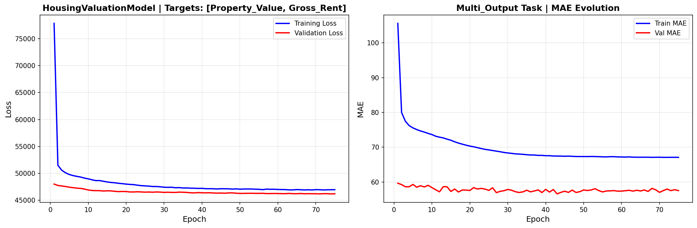

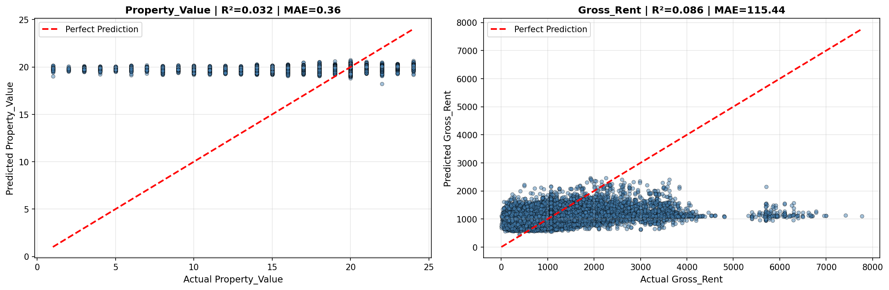

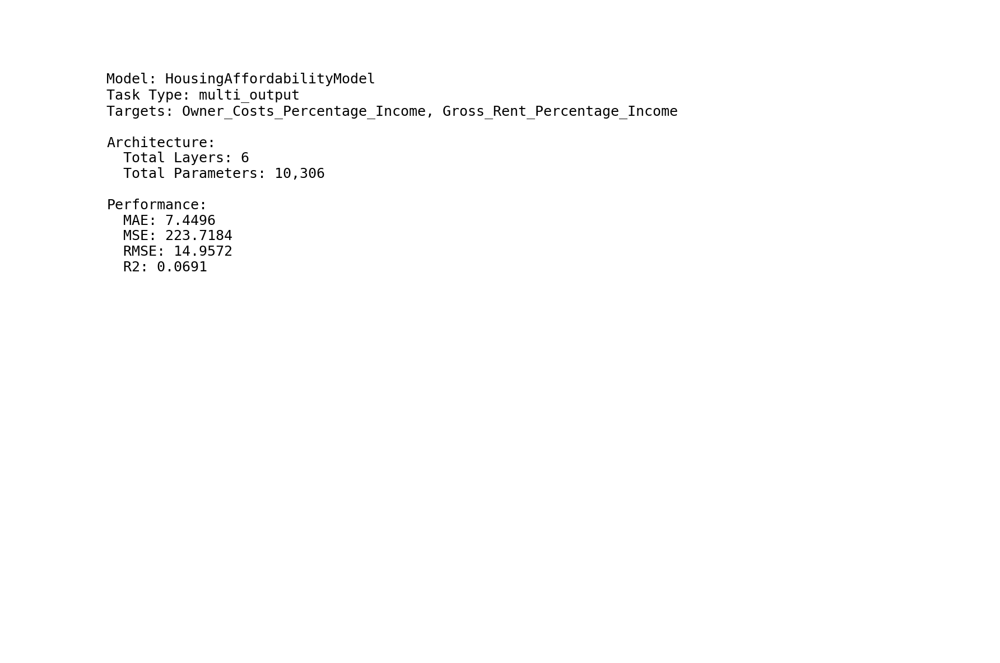

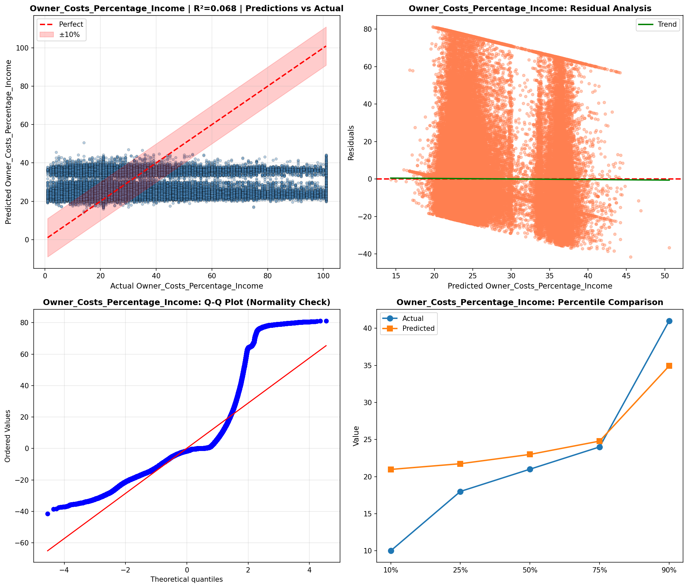

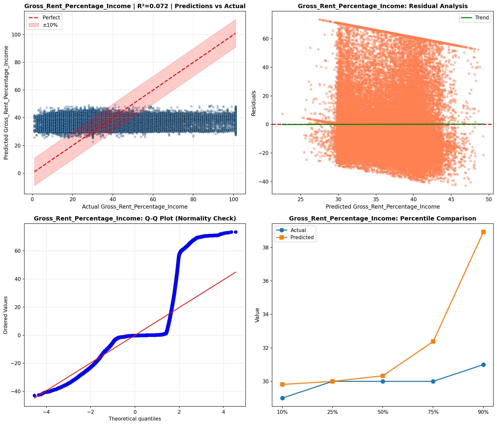

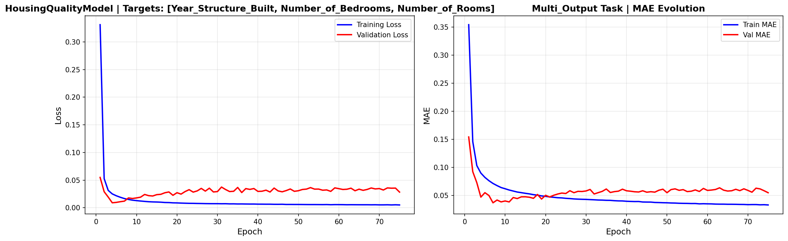

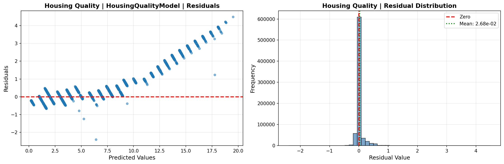

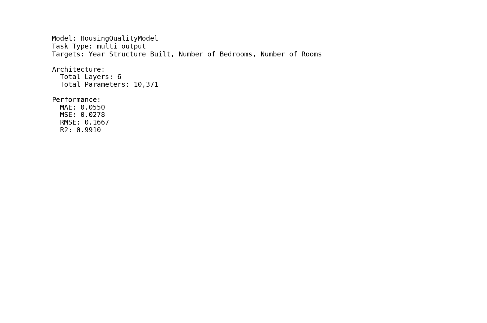

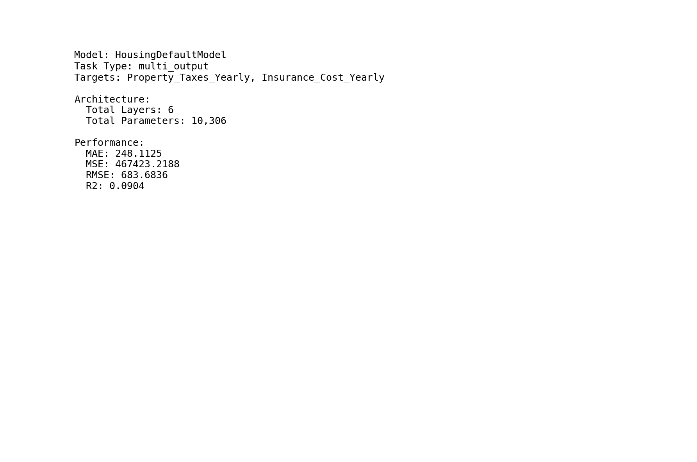

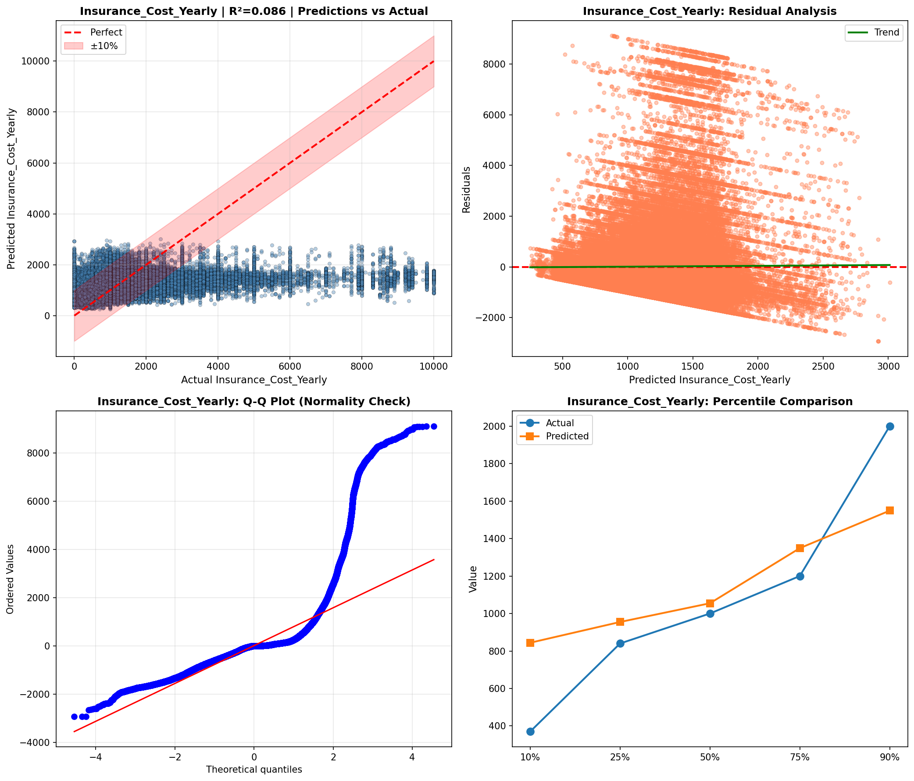

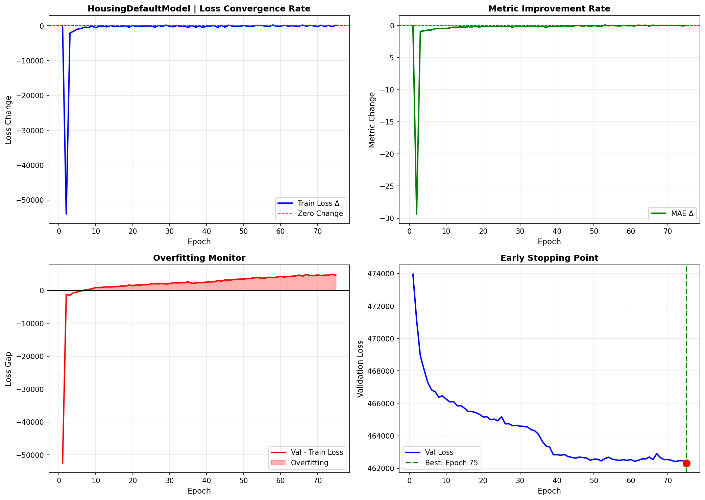

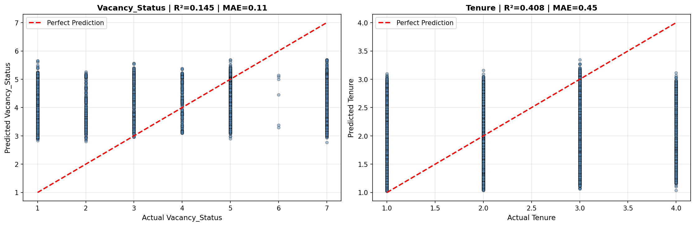

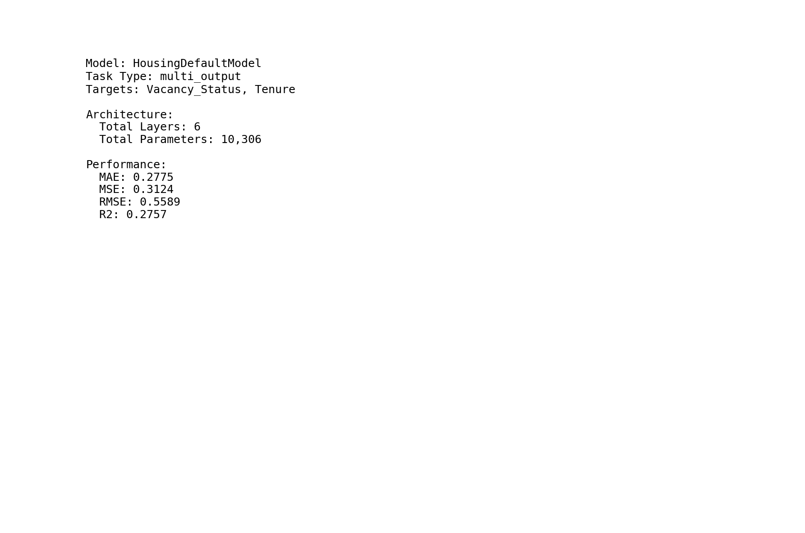

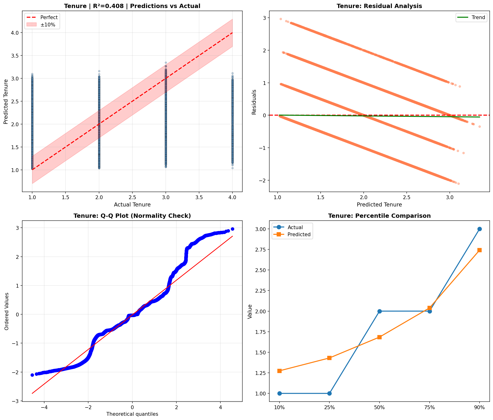

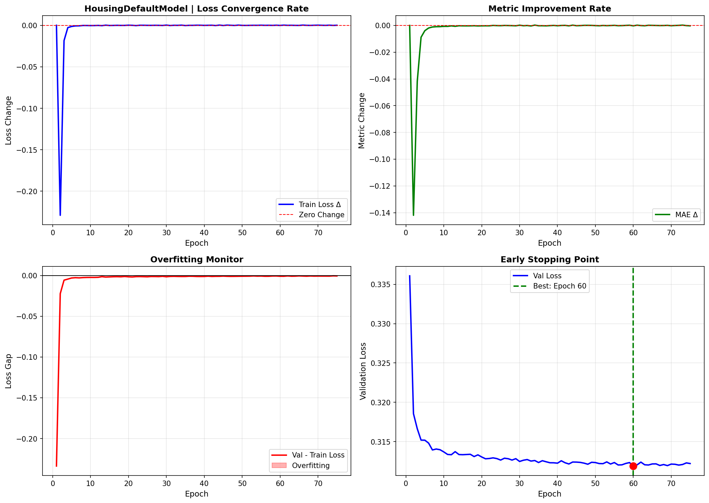

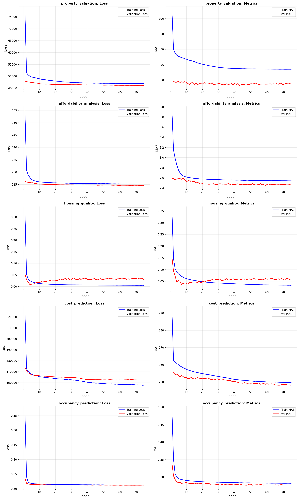

