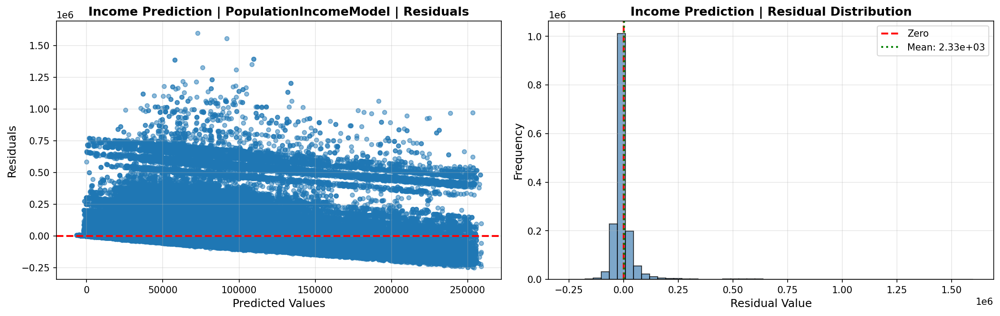
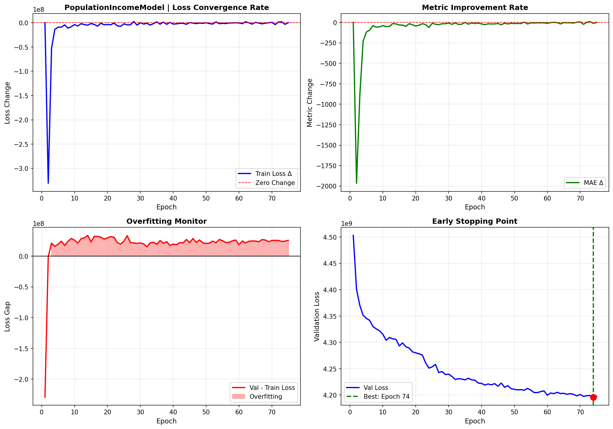
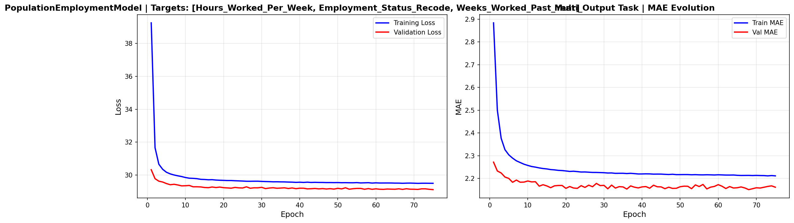
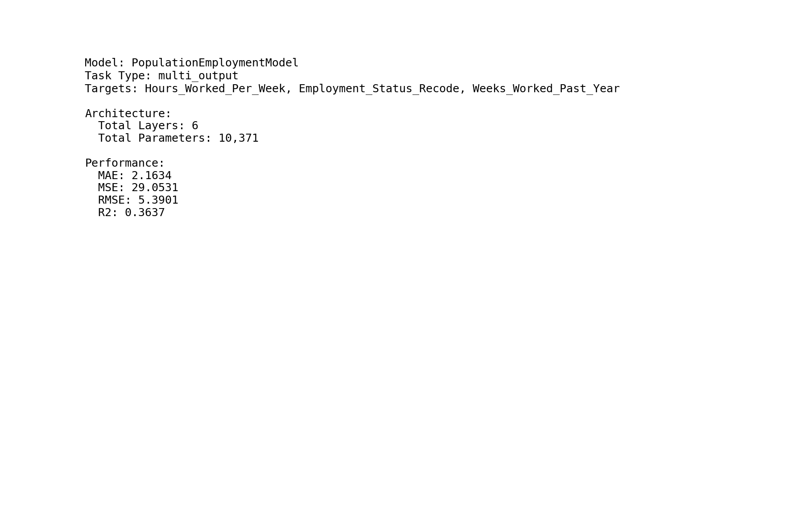
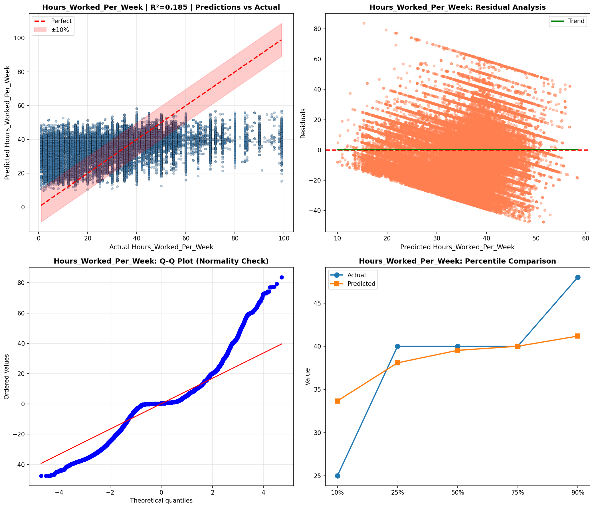
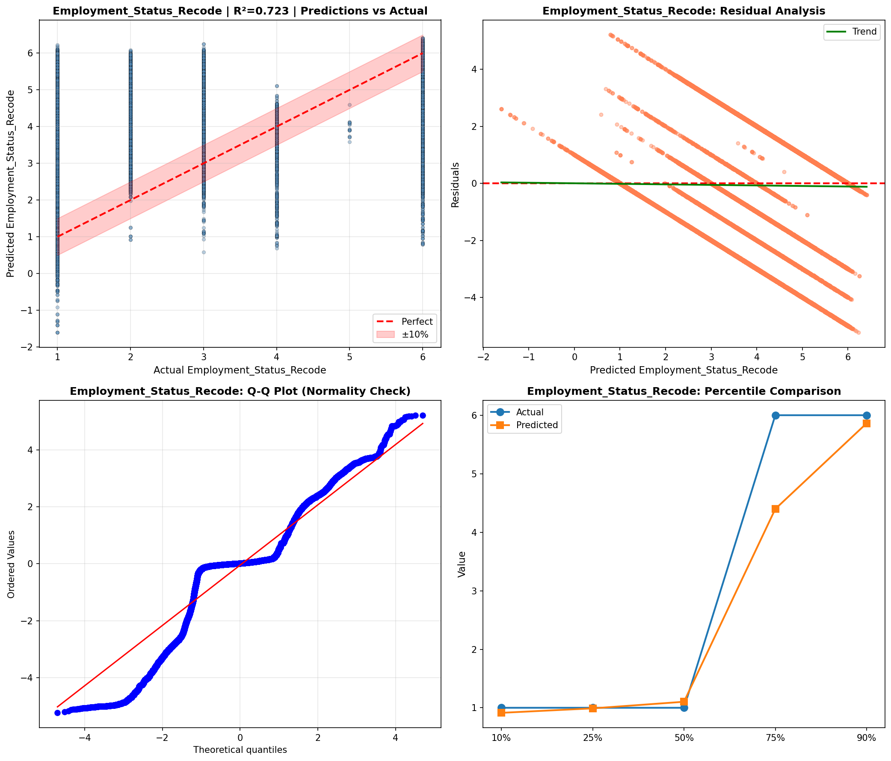

# Deep Learning Models

> Neural network analysis using TensorFlow/Keras for complex pattern recognition and multi-output prediction tasks.

## Deep Learning Summary

- **Total Tasks**: 3

- **Tasks**: Income Prediction, Employment Analysis, Demographic Profile

### Aggregate Statistics

| Metric | Value |
| :--- | :--- |
| Total Parameters | 57,930 |
| Average Validation Loss | 1399206961.3196 |
| Number of Tasks | 3 |

## Task: Income Prediction

### Model Configuration

| Property | Value |
| :--- | :--- |
| Model Type | PopulationIncomeModel |
| Task Type | Multi_Output |
| Target Variables | Total_Person_Income, Wage_Income, Total_Person_Earnings |
| Number of Targets | 3 |
| Input Features | 10 |

### Network Architecture

| Component | Value | Notes |
| :--- | :--- | :--- |
| Total Layers | 7 | Including input and output |
| Total Parameters | 37,123 | Trainable weights |
| Parameters per Layer | 5,303 | Average |

### Performance Metrics

| Metric | Value | Assessment |
| :--- | :--- | :--- |
| Training Loss | 4171960576.0000 | Final epoch |
| Validation Loss | 4197620224.0000 | Final epoch |
| Loss Gap | 25659648.0000 | HIGH overfitting risk |

> *Model may be overfitting significantly*

#### Test Set Metrics

| Metric | Value | Description |
| :--- | :--- | :--- |
| MAE | 26939.2246 | Mean Absolute Error (lower is better) |
| MSE | 4154258176.0000 | Mean Squared Error (lower is better) |
| RMSE | 64453.5350 | Root Mean Squared Error (lower is better) |
| R2 | 0.2290 | R-squared (higher is better) |

### Training Analysis

| Training Statistic | Value |
| :--- | :--- |
| Epochs Trained | 75 |
| Initial Training Loss | 4732286464.0000 |
| Final Training Loss | 4171960576.0000 |
| Loss Improvement | 11.8% |
| Initial Validation Loss | 4503066112.0000 |
| Final Validation Loss | 4197620224.0000 |
| Validation Improvement | 6.8% |

#### Convergence Assessment

- **Status**: Fully converged (< 1% change in last 10 epochs)

- **Last 10 epochs change**: 0.15%

## Task: Employment Analysis

### Model Configuration

| Property | Value |
| :--- | :--- |
| Model Type | PopulationEmploymentModel |
| Task Type | Multi_Output |
| Target Variables | Hours_Worked_Per_Week, Employment_Status_Recode, Weeks_Worked_Past_Year |
| Number of Targets | 3 |
| Input Features | 10 |

### Network Architecture

| Component | Value | Notes |
| :--- | :--- | :--- |
| Total Layers | 6 | Including input and output |
| Total Parameters | 10,371 | Trainable weights |
| Parameters per Layer | 1,728 | Average |

### Performance Metrics

| Metric | Value | Assessment |
| :--- | :--- | :--- |
| Training Loss | 29.5017 | Final epoch |
| Validation Loss | 29.1168 | Final epoch |
| Loss Gap | -0.3849 | NONE overfitting risk |

> *Good generalization*

#### Test Set Metrics

| Metric | Value | Description |
| :--- | :--- | :--- |
| MAE | 2.1634 | Mean Absolute Error (lower is better) |
| MSE | 29.0531 | Mean Squared Error (lower is better) |
| RMSE | 5.3901 | Root Mean Squared Error (lower is better) |
| R2 | 0.3637 | R-squared (higher is better) |

### Training Analysis

| Training Statistic | Value |
| :--- | :--- |
| Epochs Trained | 75 |
| Initial Training Loss | 39.2451 |
| Final Training Loss | 29.5017 |
| Loss Improvement | 24.8% |
| Initial Validation Loss | 30.3264 |
| Final Validation Loss | 29.1168 |
| Validation Improvement | 4.0% |

#### Convergence Assessment

- **Status**: Fully converged (< 1% change in last 10 epochs)

- **Last 10 epochs change**: 0.04%

## Task: Demographic Profile

### Model Configuration

| Property | Value |
| :--- | :--- |
| Model Type | PopulationDemographicModel |
| Task Type | Multi_Output |
| Target Variables | Educational_Attainment, Age, Sex, Marital_Status |
| Number of Targets | 4 |
| Input Features | 10 |

### Network Architecture

| Component | Value | Notes |
| :--- | :--- | :--- |
| Total Layers | 7 | Including input and output |
| Total Parameters | 10,436 | Trainable weights |
| Parameters per Layer | 1,490 | Average |

### Performance Metrics

| Metric | Value | Assessment |
| :--- | :--- | :--- |
| Training Loss | 631.0088 | Final epoch |
| Validation Loss | 630.8421 | Final epoch |
| Loss Gap | -0.1667 | NONE overfitting risk |

> *Good generalization*

#### Test Set Metrics

| Metric | Value | Description |
| :--- | :--- | :--- |
| MAE | 15.1429 | Mean Absolute Error (lower is better) |
| MSE | 629.4533 | Mean Squared Error (lower is better) |
| RMSE | 25.0889 | Root Mean Squared Error (lower is better) |
| R2 | -5.2802 | R-squared (higher is better) |

### Training Analysis

| Training Statistic | Value |
| :--- | :--- |
| Epochs Trained | 75 |
| Initial Training Loss | 630.2908 |
| Final Training Loss | 631.0088 |
| Loss Improvement | -0.1% |
| Initial Validation Loss | 630.0140 |
| Final Validation Loss | 630.8421 |
| Validation Improvement | -0.1% |

#### Convergence Assessment

- **Status**: Fully converged (< 1% change in last 10 epochs)

- **Last 10 epochs change**: 0.01%

## Cross-Task Comparison

| Task | Model Type | Parameters | Train Loss | Val Loss | Gap |
| :--- | :--- | :--- | :--- | :--- | :--- |
| Income Prediction | PopulationIncomeModel | 37,123 | 4171960576.0000 | 4197620224.0000 | 25659648.0000 |
| Employment Analysis | PopulationEmploymentModel | 10,371 | 29.5017 | 29.1168 | -0.3849 |
| Demographic Profile | PopulationDemographicModel | 10,436 | 631.0088 | 630.8421 | -0.1667 |

## Visualizations

