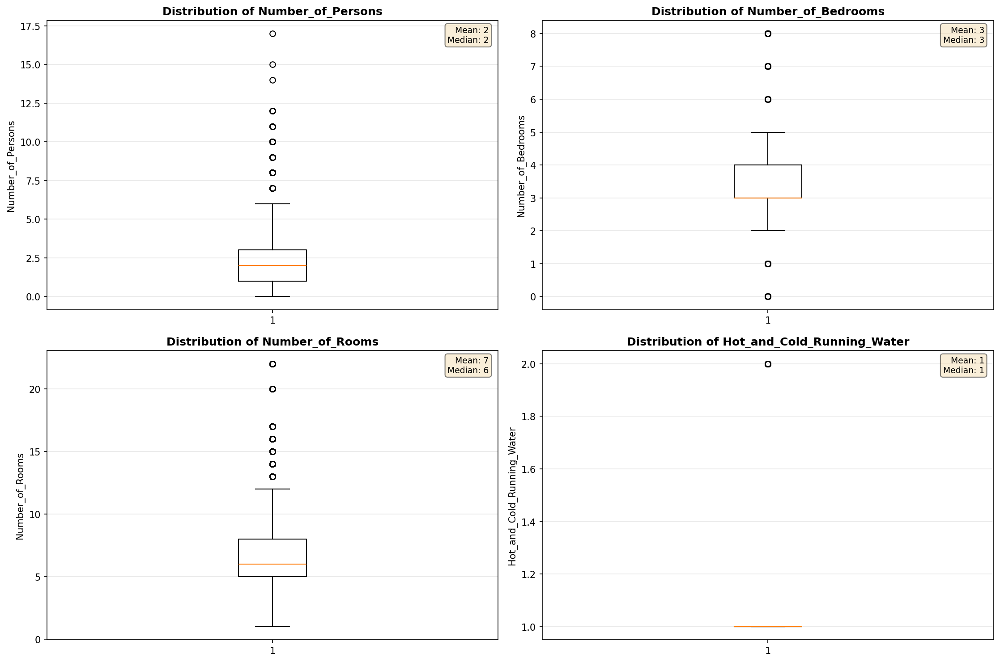
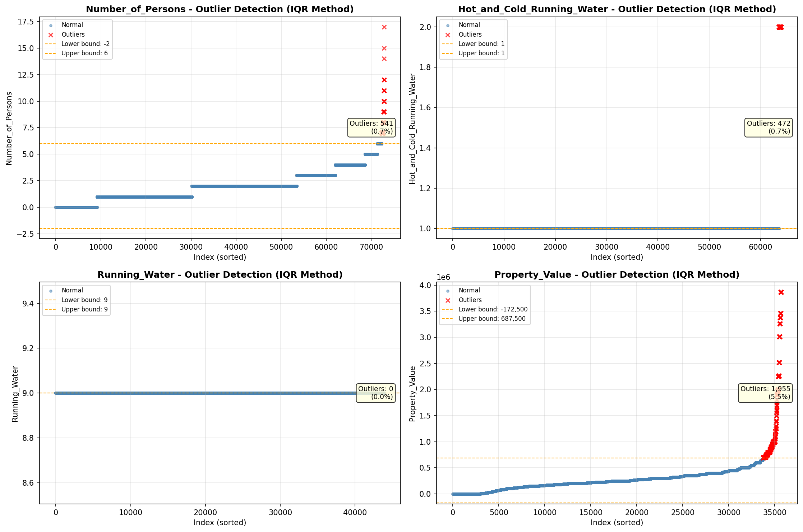
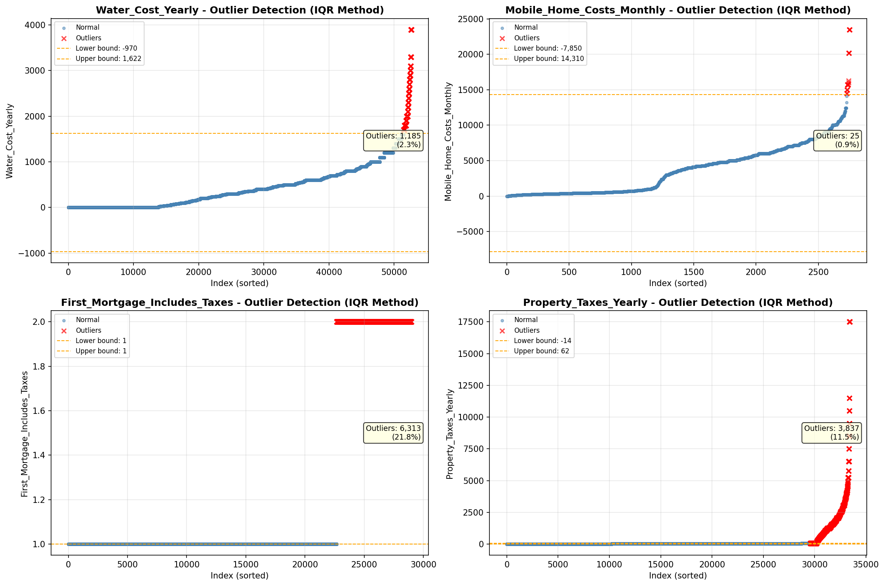

# Outlier Detection

> Statistical outlier detection using IQR (Interquartile Range) method. Outliers are values falling outside Q1 - 1.5×IQR or Q3 + 1.5×IQR bounds.

## Detection Methodology

| Parameter | Value | Description |
| :--- | :--- | :--- |
| Method | IQR | Outlier detection algorithm |
| Lower Bound | Q1 - 1.5 × IQR | Values below are outliers |
| Upper Bound | Q3 + 1.5 × IQR | Values above are outliers |
| IQR Definition | Q3 - Q1 | Interquartile Range |

> **Note**: The IQR method is robust to extreme values and works well for approximately symmetric distributions.

## Outlier Summary

_No outlier summary available._
## High Outlier Rate Variables

> Variables with outlier rate > 5% may indicate data quality issues, non-normal distributions, or genuinely extreme values.

- **('Flag_Selected_Monthly_Owner_Costs', 23.56724373375622)**: 0 outliers (0.00%)

- **('Fuel_Cost_Monthly', 22.81659651232712)**: 0 outliers (0.00%)

- **('First_Mortgage_Includes_Taxes', 21.77797709396992)**: 0 outliers (0.00%)

- **('Specified_Rent_Unit', 19.964669512733696)**: 0 outliers (0.00%)

- **('Flag_Family_Income', 19.784966881059805)**: 0 outliers (0.00%)

- **('Property_Tax_Rate', 19.48311020480539)**: 0 outliers (0.00%)

- **('Property_Taxes_Yearly', 11.483898000718305)**: 0 outliers (0.00%)

- **('Structure_Age', 10.701628842090916)**: 0 outliers (0.00%)

- **('Gross_Rent_Percentage_Income', 10.297639411563463)**: 0 outliers (0.00%)

- **('Flag_Property_Taxes', 9.978644309103851)**: 0 outliers (0.00%)

- **('Income_Adjustment_Factor', 9.62138689102999)**: 0 outliers (0.00%)

- **('Flag_Water_Cost', 8.441145281018029)**: 0 outliers (0.00%)

- **('Structure_Age_Score', 8.033462822871943)**: 0 outliers (0.00%)

- **('Insurance_Cost_Yearly', 7.6562090569094075)**: 0 outliers (0.00%)

- **('Owner_Costs_Percentage_Income', 7.542339503741631)**: 0 outliers (0.00%)

> *Consider investigating these variables for data entry errors, applying transformations, or using robust statistical methods.*

## Visualizations

