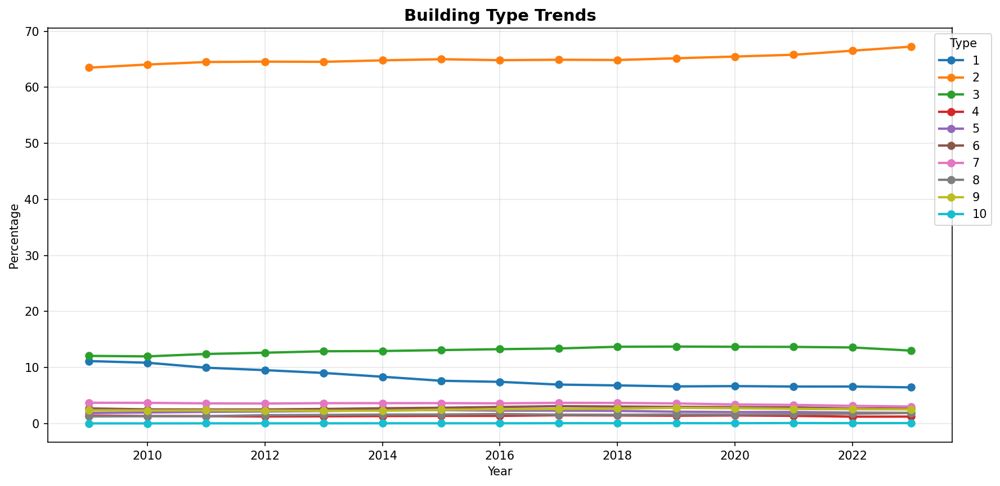
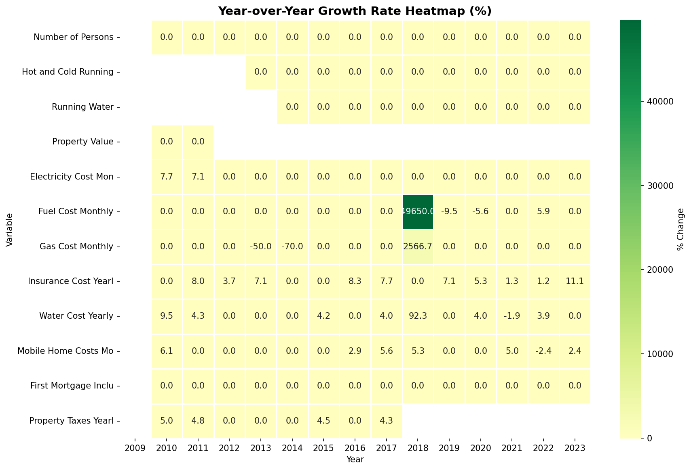
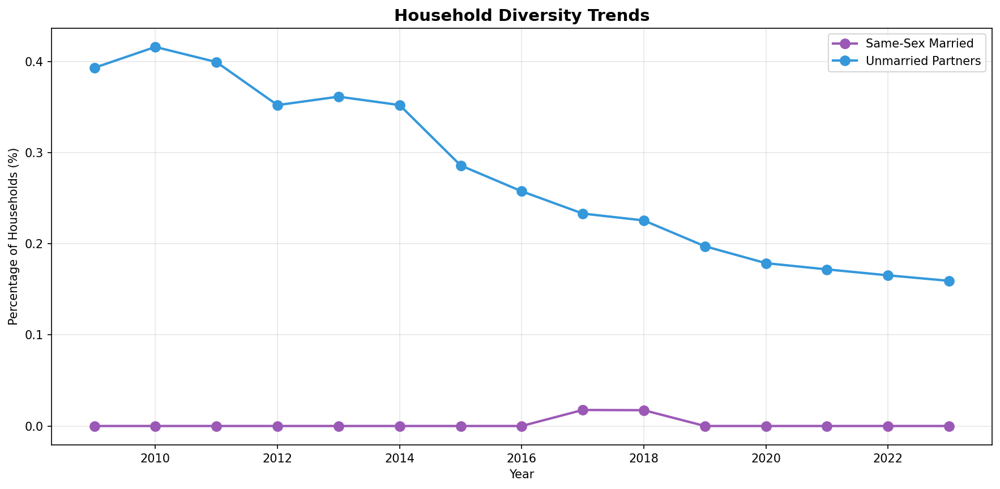
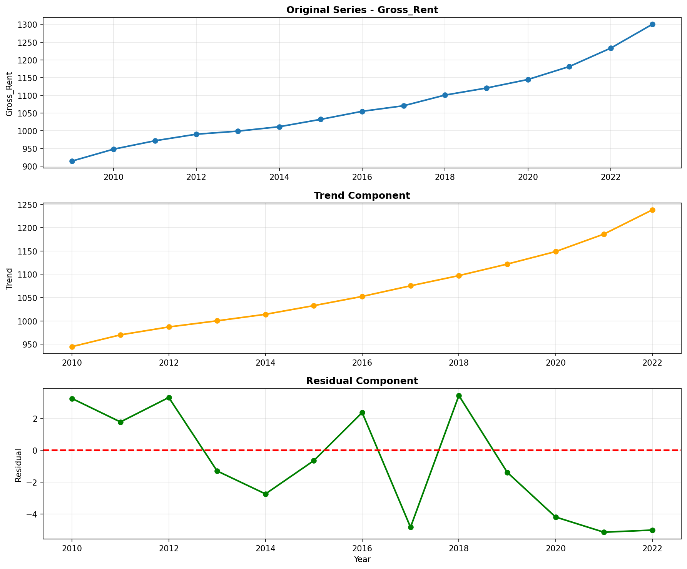
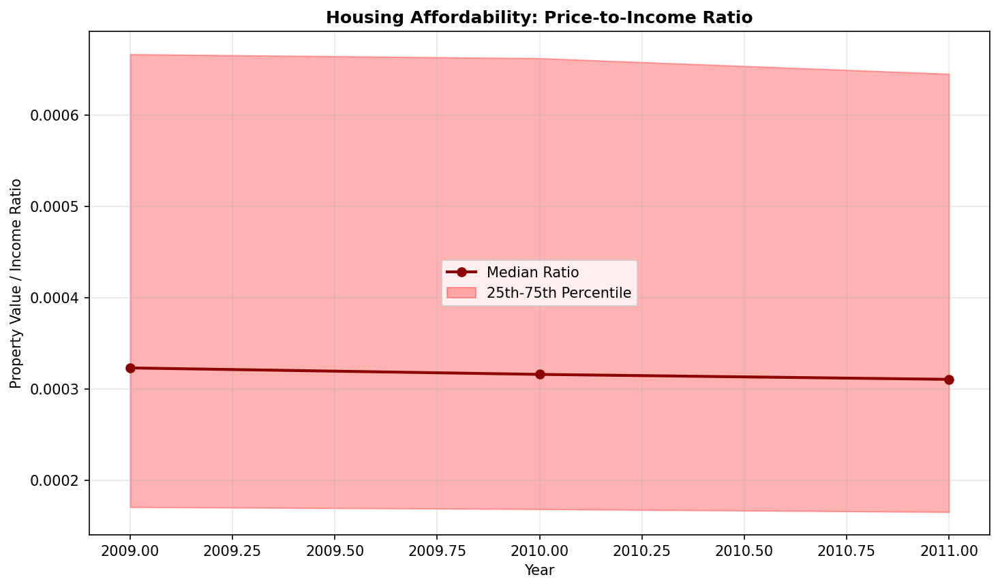
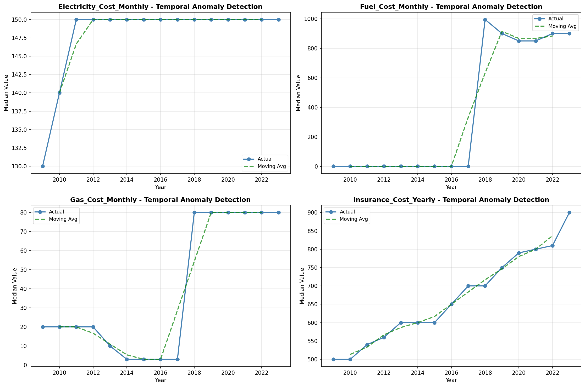
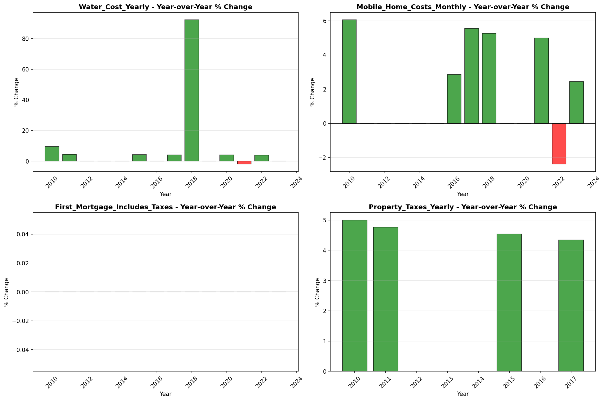

# Temporal Analysis

> Analysis of data patterns and trends over time, including year-over-year changes and growth rate calculations.

## Year Distribution

### Summary

- **Total Years**: 15

- **Year Range**: 2009 - 2023

- **Total Records**: 335,569

- **Average Records/Year**: 22,371

### Records by Year

| Year | Records | % of Total | Deviation from Avg |
| :--- | :--- | :--- | :--- |
| 2009 | 20,339 | 6.1% | -9.1% |
| 2010 | 20,900 | 6.2% | -6.6% |
| 2011 | 21,268 | 6.3% | -4.9% |
| 2012 | 21,566 | 6.4% | -3.6% |
| 2013 | 21,843 | 6.5% | -2.4% |
| 2014 | 22,130 | 6.6% | -1.1% |
| 2015 | 22,367 | 6.7% | -0.0% |
| 2016 | 22,502 | 6.7% | +0.6% |
| 2017 | 22,719 | 6.8% | +1.6% |
| 2018 | 23,037 | 6.9% | +3.0% |
| 2019 | 23,302 | 6.9% | +4.2% |
| 2020 | 22,929 | 6.8% | +2.5% |
| 2021 | 23,259 | 6.9% | +4.0% |
| 2022 | 23,571 | 7.0% | +5.4% |
| 2023 | 23,837 | 7.1% | +6.6% |

> *Sample size increased by 17.2% from 2009 to 2023.*

## Sample Size Consistency

- **Standard Deviation**: 988 records

- **Coefficient of Variation**: 4.4 %

- **Consistency Rating**: highly consistent

> *Sample sizes are stable across years.*

## Temporal Trends

### Trend Summary

| Direction | Count | Percentage |
| :--- | :--- | :--- |
| Increasing | 0 | 0.0% |
| Decreasing | 0 | 0.0% |
| Stable/Other | 228 | 100.0% |

## Growth Rates

### Growth Rate Summary

- **Average Growth Rate**: 1,719.85 %

- **Variables with Positive Growth**: 1

- **Variables with Negative Growth**: 0

### Top Growth Rates

| Variable | Growth Rate | Direction |
| :--- | :--- | :--- |
| sample_growth | 1719.85% | Increasing |

## Visualizations

