# Statistical Analysis

> Comprehensive descriptive statistics including central tendency, dispersion, distribution characteristics, and weighted statistics using ACS sample weights.

## Summary Statistics

- **Variables Analyzed**: 37

### Income_Adjustment_Factor

| Statistic | Unweighted | Weighted (ACS) |
| :--- | :--- | :--- |
| Mean | 1,058,247.48 | 1,057,559.24 |
| Median | 1,051,849.00 | 1,059,677.73 |
| Std Deviation | 45,972.47 | — |
| Minimum | 999,480.00 | — |
| Maximum | 1,207,712.00 | — |
| Count | 335,569 | — |

> *Distribution is highly right-skewed (skewness: 1.25), light-tailed/platykurtic (kurtosis: 1.42).*

- **Coefficient of Variation**: 4.3 % (low variability)

### Property_Value

| Statistic | Unweighted | Weighted (ACS) |
| :--- | :--- | :--- |
| Mean | 17.41 | 17.35 |
| Median | 18.00 | 18.00 |
| Std Deviation | 4.48 | — |
| Minimum | 1.00 | — |
| Maximum | 24.00 | — |
| Count | 40,988 | — |

> *Distribution is highly left-skewed (skewness: -1.79), heavy-tailed/leptokurtic (kurtosis: 3.57).*

- **Coefficient of Variation**: 25.7 % (moderate variability)

#### Weighted Statistics by Year

| Year | Weighted Mean | Weighted Median |
| :--- | :--- | :--- |
| 2009 | 17.22 | 18.00 |
| 2010 | 17.40 | 18.00 |
| 2011 | 17.41 | 18.00 |

### Electricity_Cost_Monthly

| Statistic | Unweighted | Weighted (ACS) |
| :--- | :--- | :--- |
| Mean | 163.49 | 164.54 |
| Median | 150.00 | 148.00 |
| Std Deviation | 102.99 | — |
| Minimum | 1.00 | — |
| Maximum | 3,000.00 | — |
| Count | 266,399 | — |

> *Distribution is highly right-skewed (skewness: 3.05), heavy-tailed/leptokurtic (kurtosis: 49.12).*

- **Coefficient of Variation**: 63.0 % (high variability)

### Fuel_Cost_Monthly

| Statistic | Unweighted | Weighted (ACS) |
| :--- | :--- | :--- |
| Mean | 361.36 | 578.70 |
| Median | 2.00 | 364.53 |
| Std Deviation | 758.20 | — |
| Minimum | 1.00 | — |
| Maximum | 6,500.00 | — |
| Count | 174,159 | — |

> *Distribution is highly right-skewed (skewness: 2.73), heavy-tailed/leptokurtic (kurtosis: 8.52).*

- **Coefficient of Variation**: 209.8 % (very high variability)

### Gas_Cost_Monthly

| Statistic | Unweighted | Weighted (ACS) |
| :--- | :--- | :--- |
| Mean | 74.77 | 77.74 |
| Median | 40.00 | 35.67 |
| Std Deviation | 101.22 | — |
| Minimum | 1.00 | — |
| Maximum | 1,700.00 | — |
| Count | 210,840 | — |

> *Distribution is highly right-skewed (skewness: 2.72), heavy-tailed/leptokurtic (kurtosis: 15.97).*

- **Coefficient of Variation**: 135.4 % (very high variability)

### Insurance_Cost_Yearly

| Statistic | Unweighted | Weighted (ACS) |
| :--- | :--- | :--- |
| Mean | 826.41 | 801.54 |
| Median | 650.00 | 660.00 |
| Std Deviation | 685.13 | — |
| Minimum | 4.00 | — |
| Maximum | 9,400.00 | — |
| Count | 192,327 | — |

> *Distribution is highly right-skewed (skewness: 3.72), heavy-tailed/leptokurtic (kurtosis: 21.40).*

- **Coefficient of Variation**: 82.9 % (high variability)

### Water_Cost_Yearly

| Statistic | Unweighted | Weighted (ACS) |
| :--- | :--- | :--- |
| Mean | 438.95 | 446.63 |
| Median | 340.00 | 338.00 |
| Std Deviation | 471.31 | — |
| Minimum | 1.00 | — |
| Maximum | 3,900.00 | — |
| Count | 233,167 | — |

> *Distribution is highly right-skewed (skewness: 1.88), heavy-tailed/leptokurtic (kurtosis: 5.90).*

- **Coefficient of Variation**: 107.4 % (very high variability)

### Mobile_Home_Costs_Monthly

| Statistic | Unweighted | Weighted (ACS) |
| :--- | :--- | :--- |
| Mean | 3,596.30 | 3,648.68 |
| Median | 3,600.00 | 3,840.00 |
| Std Deviation | 3,322.42 | — |
| Minimum | 4.00 | — |
| Maximum | 23,500.00 | — |
| Count | 12,775 | — |

> *Distribution is moderately right-skewed (skewness: 0.96), light-tailed/platykurtic (kurtosis: 1.47).*

- **Coefficient of Variation**: 92.4 % (high variability)

### First_Mortgage_Payment_Monthly

| Statistic | Unweighted | Weighted (ACS) |
| :--- | :--- | :--- |
| Mean | 1,211.04 | 1,221.54 |
| Median | 1,100.00 | 1,133.33 |
| Std Deviation | 681.92 | — |
| Minimum | 4.00 | — |
| Maximum | 6,000.00 | — |
| Count | 133,813 | — |

> *Distribution is highly right-skewed (skewness: 1.63), heavy-tailed/leptokurtic (kurtosis: 5.38).*

- **Coefficient of Variation**: 56.3 % (high variability)

### First_Mortgage_Includes_Taxes

| Statistic | Unweighted | Weighted (ACS) |
| :--- | :--- | :--- |
| Mean | 1.22 | 1.20 |
| Median | 1.00 | 1.00 |
| Std Deviation | 0.42 | — |
| Minimum | 1.00 | — |
| Maximum | 2.00 | — |
| Count | 133,813 | — |

> *Distribution is highly right-skewed (skewness: 1.34), light-tailed/platykurtic (kurtosis: -0.19).*

- **Coefficient of Variation**: 34.0 % (moderate variability)

### Second_Mortgage_Payment_Monthly

| Statistic | Unweighted | Weighted (ACS) |
| :--- | :--- | :--- |
| Mean | 414.36 | 418.11 |
| Median | 300.00 | 303.33 |
| Std Deviation | 402.16 | — |
| Minimum | 4.00 | — |
| Maximum | 4,700.00 | — |
| Count | 27,182 | — |

> *Distribution is highly right-skewed (skewness: 3.37), heavy-tailed/leptokurtic (kurtosis: 16.82).*

- **Coefficient of Variation**: 97.1 % (high variability)

### Property_Taxes_Yearly

| Statistic | Unweighted | Weighted (ACS) |
| :--- | :--- | :--- |
| Mean | 22.25 | 22.73 |
| Median | 22.00 | 22.67 |
| Std Deviation | 12.83 | — |
| Minimum | 1.00 | — |
| Maximum | 68.00 | — |
| Count | 122,551 | — |

> *Distribution is moderately right-skewed (skewness: 0.81), light-tailed/platykurtic (kurtosis: 0.99).*

- **Coefficient of Variation**: 57.7 % (high variability)

### Meals_Included_in_Rent

| Statistic | Unweighted | Weighted (ACS) |
| :--- | :--- | :--- |
| Mean | 1.98 | 1.98 |
| Median | 2.00 | 2.00 |
| Std Deviation | 0.15 | — |
| Minimum | 1.00 | — |
| Maximum | 2.00 | — |
| Count | 59,766 | — |

> *Distribution is highly left-skewed (skewness: -6.41), heavy-tailed/leptokurtic (kurtosis: 39.03).*

- **Coefficient of Variation**: 7.5 % (low variability)

### Rent_Amount_Monthly

| Statistic | Unweighted | Weighted (ACS) |
| :--- | :--- | :--- |
| Mean | 901.84 | 900.35 |
| Median | 850.00 | 862.67 |
| Std Deviation | 487.34 | — |
| Minimum | 4.00 | — |
| Maximum | 4,500.00 | — |
| Count | 59,766 | — |

> *Distribution is highly right-skewed (skewness: 2.00), heavy-tailed/leptokurtic (kurtosis: 9.68).*

- **Coefficient of Variation**: 54.0 % (high variability)

### Gross_Rent

| Statistic | Unweighted | Weighted (ACS) |
| :--- | :--- | :--- |
| Mean | 1,075.42 | 1,072.56 |
| Median | 1,020.00 | 1,028.27 |
| Std Deviation | 506.71 | — |
| Minimum | 10.00 | — |
| Maximum | 5,310.00 | — |
| Count | 55,457 | — |

> *Distribution is highly right-skewed (skewness: 1.45), heavy-tailed/leptokurtic (kurtosis: 6.26).*

- **Coefficient of Variation**: 47.1 % (moderate variability)

### Gross_Rent_Percentage_Income

| Statistic | Unweighted | Weighted (ACS) |
| :--- | :--- | :--- |
| Mean | 39.19 | 39.37 |
| Median | 30.00 | 30.20 |
| Std Deviation | 27.47 | — |
| Minimum | 1.00 | — |
| Maximum | 101.00 | — |
| Count | 54,237 | — |

> *Distribution is highly right-skewed (skewness: 1.14), light-tailed/platykurtic (kurtosis: 0.21).*

- **Coefficient of Variation**: 70.1 % (high variability)

### Selected_Monthly_Owner_Costs

| Statistic | Unweighted | Weighted (ACS) |
| :--- | :--- | :--- |
| Mean | 1,245.91 | 1,286.40 |
| Median | 1,114.00 | 1,185.67 |
| Std Deviation | 884.10 | — |
| Minimum | 3.00 | — |
| Maximum | 12,790.00 | — |
| Count | 210,421 | — |

> *Distribution is highly right-skewed (skewness: 1.68), heavy-tailed/leptokurtic (kurtosis: 6.00).*

- **Coefficient of Variation**: 71.0 % (high variability)

### Owner_Costs_Percentage_Income

| Statistic | Unweighted | Weighted (ACS) |
| :--- | :--- | :--- |
| Mean | 23.77 | 24.39 |
| Median | 18.00 | 18.47 |
| Std Deviation | 21.27 | — |
| Minimum | 1.00 | — |
| Maximum | 101.00 | — |
| Count | 209,018 | — |

> *Distribution is highly right-skewed (skewness: 2.03), heavy-tailed/leptokurtic (kurtosis: 4.30).*

- **Coefficient of Variation**: 89.5 % (high variability)

### Family_Income

| Statistic | Unweighted | Weighted (ACS) |
| :--- | :--- | :--- |
| Mean | 98,818.78 | 94,641.26 |
| Median | 77,700.00 | 75,183.33 |
| Std Deviation | 89,128.42 | — |
| Minimum | 40.00 | — |
| Maximum | 1,193,000.00 | — |
| Count | 178,505 | — |

> *Distribution is highly right-skewed (skewness: 3.23), heavy-tailed/leptokurtic (kurtosis: 17.07).*

- **Coefficient of Variation**: 90.2 % (high variability)

### Household_Income

| Statistic | Unweighted | Weighted (ACS) |
| :--- | :--- | :--- |
| Mean | 84,895.26 | 81,745.89 |
| Median | 64,000.00 | 62,088.00 |
| Std Deviation | 83,400.96 | — |
| Minimum | 4.00 | — |
| Maximum | 1,193,000.00 | — |
| Count | 266,865 | — |

> *Distribution is highly right-skewed (skewness: 3.36), heavy-tailed/leptokurtic (kurtosis: 18.95).*

- **Coefficient of Variation**: 98.2 % (high variability)

### Specified_Rent_Unit

| Statistic | Unweighted | Weighted (ACS) |
| :--- | :--- | :--- |
| Mean | 0.20 | 0.26 |
| Median | 0.00 | 0.00 |
| Std Deviation | 0.40 | — |
| Minimum | 0.00 | — |
| Maximum | 1.00 | — |
| Count | 312,447 | — |

> *Distribution is highly right-skewed (skewness: 1.49), light-tailed/platykurtic (kurtosis: 0.21).*

- **Coefficient of Variation**: 199.0 % (very high variability)

### Specified_Value_Unit

| Statistic | Unweighted | Weighted (ACS) |
| :--- | :--- | :--- |
| Mean | 0.60 | 0.54 |
| Median | 1.00 | 1.00 |
| Std Deviation | 0.49 | — |
| Minimum | 0.00 | — |
| Maximum | 1.00 | — |
| Count | 312,447 | — |

> *Distribution is approximately symmetric (skewness: -0.42), light-tailed/platykurtic (kurtosis: -1.82).*

- **Coefficient of Variation**: 81.1 % (high variability)

### Flag_First_Mortgage_Payment

| Statistic | Unweighted | Weighted (ACS) |
| :--- | :--- | :--- |
| Mean | 0.04 | 0.04 |
| Median | 0.00 | 0.00 |
| Std Deviation | 0.20 | — |
| Minimum | 0.00 | — |
| Maximum | 1.00 | — |
| Count | 312,447 | — |

> *Distribution is highly right-skewed (skewness: 4.62), heavy-tailed/leptokurtic (kurtosis: 19.38).*

- **Coefficient of Variation**: 483.1 % (very high variability)

### Flag_First_Mortgage_Taxes

| Statistic | Unweighted | Weighted (ACS) |
| :--- | :--- | :--- |
| Mean | 0.04 | 0.04 |
| Median | 0.00 | 0.00 |
| Std Deviation | 0.20 | — |
| Minimum | 0.00 | — |
| Maximum | 1.00 | — |
| Count | 312,447 | — |

> *Distribution is highly right-skewed (skewness: 4.63), heavy-tailed/leptokurtic (kurtosis: 19.45).*

- **Coefficient of Variation**: 483.8 % (very high variability)

### Flag_Meals_Included_Rent

| Statistic | Unweighted | Weighted (ACS) |
| :--- | :--- | :--- |
| Mean | 0.01 | 0.01 |
| Median | 0.00 | 0.00 |
| Std Deviation | 0.08 | — |
| Minimum | 0.00 | — |
| Maximum | 1.00 | — |
| Count | 312,447 | — |

> *Distribution is highly right-skewed (skewness: 12.79), heavy-tailed/leptokurtic (kurtosis: 161.47).*

- **Coefficient of Variation**: 1,286.3 % (very high variability)

### Flag_Rent_Amount

| Statistic | Unweighted | Weighted (ACS) |
| :--- | :--- | :--- |
| Mean | 0.02 | 0.03 |
| Median | 0.00 | 0.00 |
| Std Deviation | 0.14 | — |
| Minimum | 0.00 | — |
| Maximum | 1.00 | — |
| Count | 312,447 | — |

> *Distribution is highly right-skewed (skewness: 6.83), heavy-tailed/leptokurtic (kurtosis: 44.71).*

- **Coefficient of Variation**: 697.8 % (very high variability)

### Flag_Second_Mortgage_Payment

| Statistic | Unweighted | Weighted (ACS) |
| :--- | :--- | :--- |
| Mean | 0.04 | 0.04 |
| Median | 0.00 | 0.00 |
| Std Deviation | 0.19 | — |
| Minimum | 0.00 | — |
| Maximum | 1.00 | — |
| Count | 312,447 | — |

> *Distribution is highly right-skewed (skewness: 5.00), heavy-tailed/leptokurtic (kurtosis: 23.01).*

- **Coefficient of Variation**: 519.3 % (very high variability)

### Flag_Property_Taxes

| Statistic | Unweighted | Weighted (ACS) |
| :--- | :--- | :--- |
| Mean | 0.10 | 0.11 |
| Median | 0.00 | 0.00 |
| Std Deviation | 0.30 | — |
| Minimum | 0.00 | — |
| Maximum | 1.00 | — |
| Count | 312,447 | — |

> *Distribution is highly right-skewed (skewness: 2.68), heavy-tailed/leptokurtic (kurtosis: 5.16).*

- **Coefficient of Variation**: 300.8 % (very high variability)

### Flag_Property_Value

| Statistic | Unweighted | Weighted (ACS) |
| :--- | :--- | :--- |
| Mean | 0.07 | 0.07 |
| Median | 0.00 | 0.00 |
| Std Deviation | 0.25 | — |
| Minimum | 0.00 | — |
| Maximum | 1.00 | — |
| Count | 312,447 | — |

> *Distribution is highly right-skewed (skewness: 3.48), heavy-tailed/leptokurtic (kurtosis: 10.11).*

- **Coefficient of Variation**: 374.7 % (very high variability)

### Flag_Water_Cost

| Statistic | Unweighted | Weighted (ACS) |
| :--- | :--- | :--- |
| Mean | 0.07 | 0.08 |
| Median | 0.00 | 0.00 |
| Std Deviation | 0.26 | — |
| Minimum | 0.00 | — |
| Maximum | 1.00 | — |
| Count | 312,447 | — |

> *Distribution is highly right-skewed (skewness: 3.31), heavy-tailed/leptokurtic (kurtosis: 8.96).*

- **Coefficient of Variation**: 358.9 % (very high variability)

### Annual_Rent_to_Value_Ratio

### Total_Monthly_Utility_Cost

| Statistic | Unweighted | Weighted (ACS) |
| :--- | :--- | :--- |
| Mean | 222.19 | 220.26 |
| Median | 200.00 | 196.47 |
| Std Deviation | 141.81 | — |
| Minimum | 2.00 | — |
| Maximum | 4,700.00 | — |
| Count | 266,970 | — |

> *Distribution is highly right-skewed (skewness: 2.61), heavy-tailed/leptokurtic (kurtosis: 29.58).*

- **Coefficient of Variation**: 63.8 % (high variability)

### Property_Tax_Rate

| Statistic | Unweighted | Weighted (ACS) |
| :--- | :--- | :--- |
| Mean | 123.36 | 126.66 |
| Median | 115.79 | 121.23 |
| Std Deviation | 84.30 | — |
| Minimum | 4.17 | — |
| Maximum | 1,900.00 | — |
| Count | 40,161 | — |

> *Distribution is highly right-skewed (skewness: 4.95), heavy-tailed/leptokurtic (kurtosis: 56.37).*

- **Coefficient of Variation**: 68.3 % (high variability)

#### Weighted Statistics by Year

| Year | Weighted Mean | Weighted Median |
| :--- | :--- | :--- |
| 2009 | 121.68 | 117.65 |
| 2010 | 126.53 | 121.05 |
| 2011 | 131.77 | 125.00 |

### Structure_Age

| Statistic | Unweighted | Weighted (ACS) |
| :--- | :--- | :--- |
| Mean | 2,018.41 | 2,018.33 |
| Median | 2,019.00 | 2,018.25 |
| Std Deviation | 3.28 | — |
| Minimum | 2,000.00 | — |
| Maximum | 2,023.00 | — |
| Count | 246,943 | — |

> *Distribution is highly left-skewed (skewness: -1.36), heavy-tailed/leptokurtic (kurtosis: 3.48).*

- **Coefficient of Variation**: 0.2 % (low variability)

### Structure_Age_Score

| Statistic | Unweighted | Weighted (ACS) |
| :--- | :--- | :--- |
| Mean | 0.00 | 0.00 |
| Median | 0.00 | 0.00 |
| Std Deviation | 0.00 | — |
| Minimum | 0.00 | — |
| Maximum | 0.00 | — |
| Count | 246,943 | — |

> *Distribution is approximately symmetric (skewness: nan).*

### Working_Age_Persons

| Statistic | Unweighted | Weighted (ACS) |
| :--- | :--- | :--- |
| Mean | 1.59 | 1.73 |
| Median | 1.00 | 1.93 |
| Std Deviation | 1.35 | — |
| Minimum | 0.00 | — |
| Maximum | 16.00 | — |
| Count | 269,672 | — |

> *Distribution is moderately right-skewed (skewness: 0.90), light-tailed/platykurtic (kurtosis: 1.60).*

- **Coefficient of Variation**: 84.8 % (high variability)

### Income_to_FPL_Ratio

| Statistic | Unweighted | Weighted (ACS) |
| :--- | :--- | :--- |
| Mean | 3.91 | 3.70 |
| Median | 3.02 | 2.90 |
| Std Deviation | 3.84 | — |
| Minimum | -0.68 | — |
| Maximum | 60.50 | — |
| Count | 269,672 | — |

> *Distribution is highly right-skewed (skewness: 3.64), heavy-tailed/leptokurtic (kurtosis: 22.08).*

- **Coefficient of Variation**: 98.1 % (high variability)

## Distribution Analysis

### Skewed Distributions

> Variables with skewness > |0.5| indicate non-normal distributions. Consider log transformations for highly skewed variables in modeling.

| Variable | Skewness | Direction | Severity |
| :--- | :--- | :--- | :--- |
| Flag_Meals_Included_Rent | 12.785 | Right-skewed | High |
| Flag_Rent_Amount | 6.834 | Right-skewed | High |
| Meals_Included_in_Rent | -6.406 | Left-skewed | High |
| Flag_Second_Mortgage_Payment | 5.001 | Right-skewed | High |
| Property_Tax_Rate | 4.953 | Right-skewed | High |
| Flag_First_Mortgage_Taxes | 4.631 | Right-skewed | High |
| Flag_First_Mortgage_Payment | 4.624 | Right-skewed | High |
| Insurance_Cost_Yearly | 3.722 | Right-skewed | High |
| Income_to_FPL_Ratio | 3.642 | Right-skewed | High |
| Flag_Property_Value | 3.480 | Right-skewed | High |
| Second_Mortgage_Payment_Monthly | 3.373 | Right-skewed | High |
| Household_Income | 3.360 | Right-skewed | High |
| Flag_Water_Cost | 3.311 | Right-skewed | High |
| Family_Income | 3.228 | Right-skewed | High |
| Electricity_Cost_Monthly | 3.051 | Right-skewed | High |
| Fuel_Cost_Monthly | 2.730 | Right-skewed | High |
| Gas_Cost_Monthly | 2.715 | Right-skewed | High |
| Flag_Property_Taxes | 2.676 | Right-skewed | High |
| Total_Monthly_Utility_Cost | 2.610 | Right-skewed | High |
| Owner_Costs_Percentage_Income | 2.034 | Right-skewed | High |

- **Total Skewed Variables**: 34

- **Right-skewed**: 31

- **Left-skewed**: 3

## Variance Analysis

### Coefficient of Variation Ranking

> CV (Coefficient of Variation) = (Std Dev / Mean) × 100%. Higher CV indicates greater relative variability.

| Variable | CV (%) | Std Dev | Mean | Variability |
| :--- | :--- | :--- | :--- | :--- |
| Flag_Meals_Included_Rent | 1286.3% | 0.08 | 0.01 | Very High |
| Flag_Rent_Amount | 697.8% | 0.14 | 0.02 | Very High |
| Flag_Second_Mortgage_Payment | 519.3% | 0.19 | 0.04 | Very High |
| Flag_First_Mortgage_Taxes | 483.8% | 0.20 | 0.04 | Very High |
| Flag_First_Mortgage_Payment | 483.1% | 0.20 | 0.04 | Very High |
| Flag_Property_Value | 374.7% | 0.25 | 0.07 | Very High |
| Flag_Water_Cost | 358.9% | 0.26 | 0.07 | Very High |
| Flag_Property_Taxes | 300.8% | 0.30 | 0.10 | Very High |
| Fuel_Cost_Monthly | 209.8% | 758.20 | 361.36 | Very High |
| Specified_Rent_Unit | 199.0% | 0.40 | 0.20 | Very High |
| Gas_Cost_Monthly | 135.4% | 101.22 | 74.77 | Very High |
| Water_Cost_Yearly | 107.4% | 471.31 | 438.95 | Very High |
| Household_Income | 98.2% | 83,400.96 | 84,895.26 | High |
| Income_to_FPL_Ratio | 98.1% | 3.84 | 3.91 | High |
| Second_Mortgage_Payment_Monthly | 97.1% | 402.16 | 414.36 | High |
| Mobile_Home_Costs_Monthly | 92.4% | 3,322.42 | 3,596.30 | High |
| Family_Income | 90.2% | 89,128.42 | 98,818.78 | High |
| Owner_Costs_Percentage_Income | 89.5% | 21.27 | 23.77 | High |
| Working_Age_Persons | 84.8% | 1.35 | 1.59 | High |
| Insurance_Cost_Yearly | 82.9% | 685.13 | 826.41 | High |

- **Average CV**: 188.4 %

- **High Variance Variables (CV > 50%)**: 29

## Visualizations

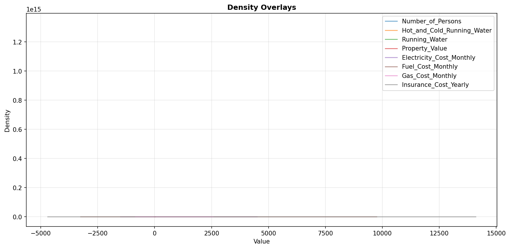

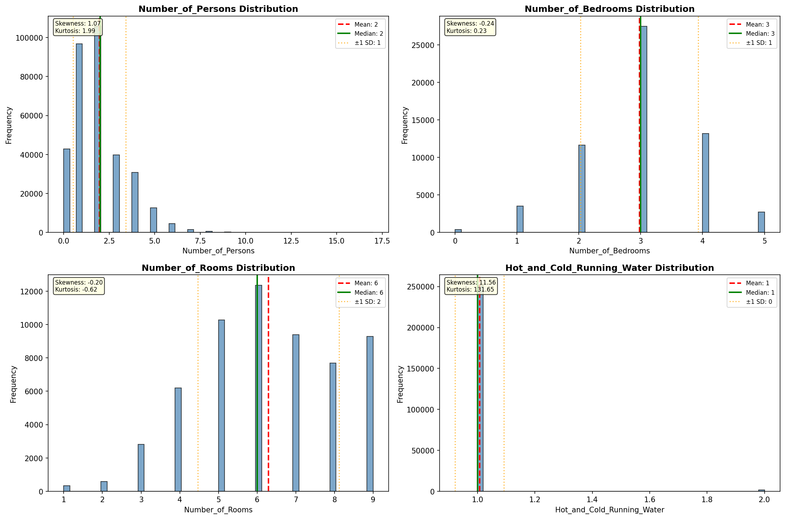

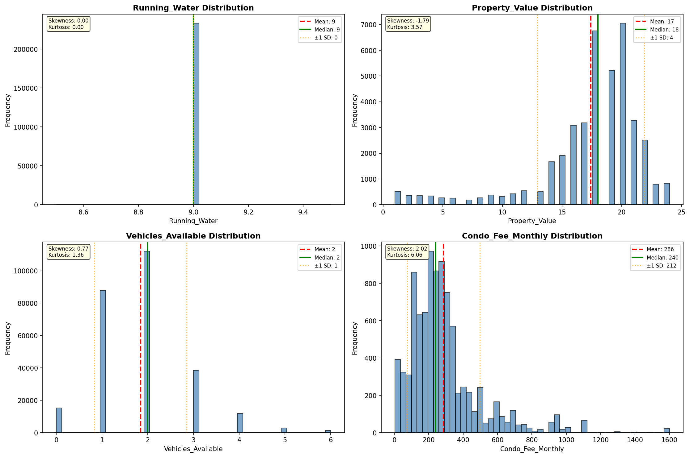

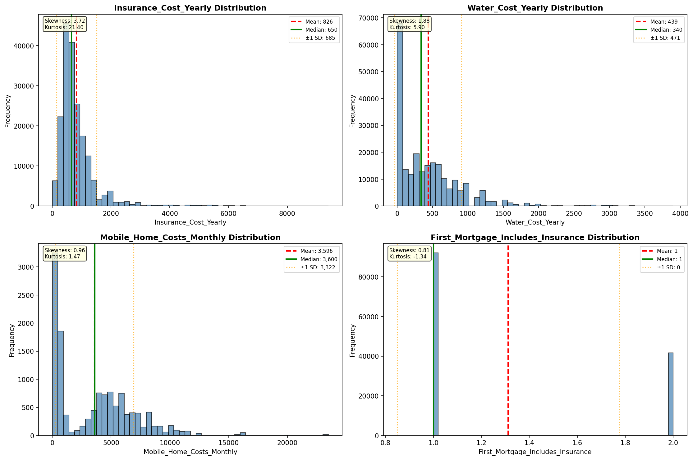

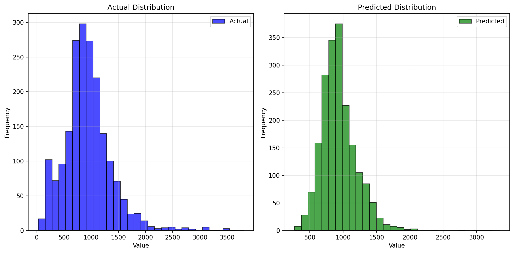

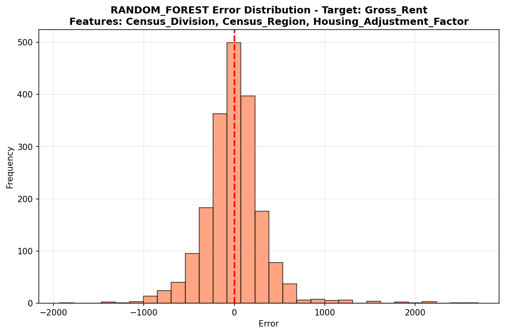

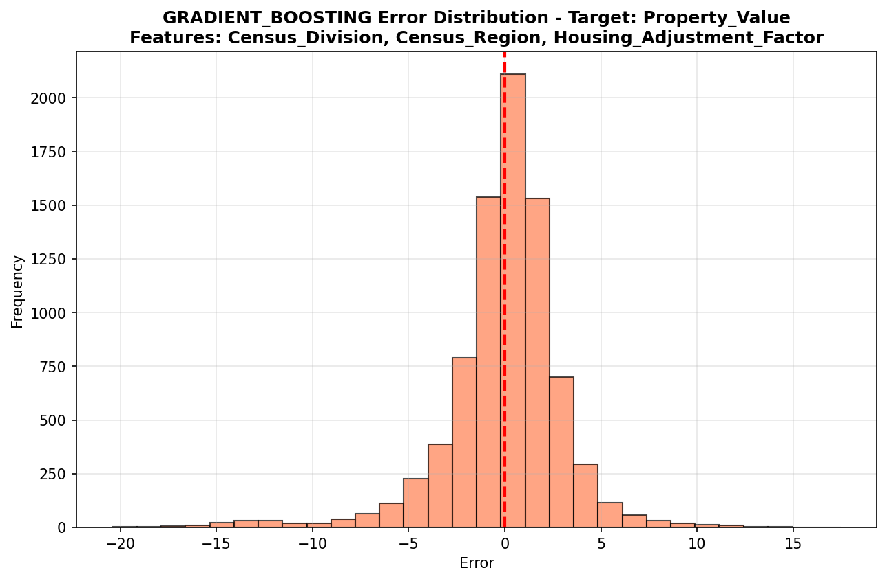

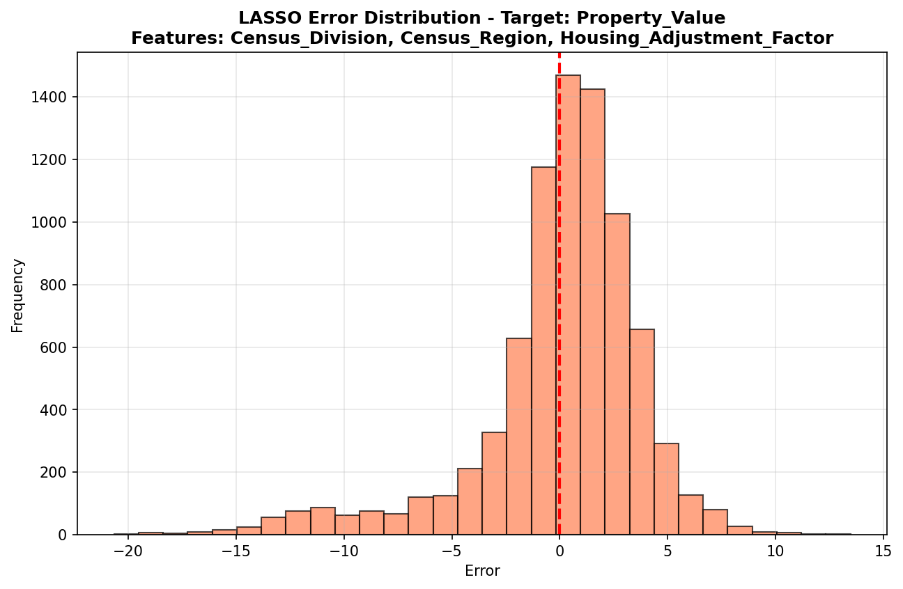

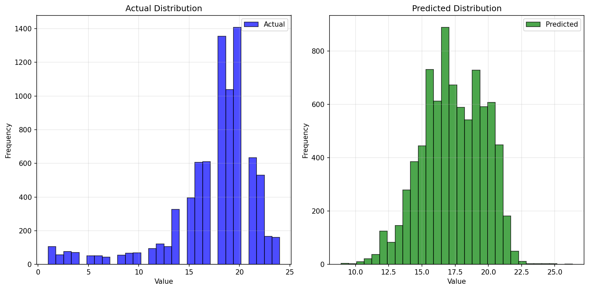

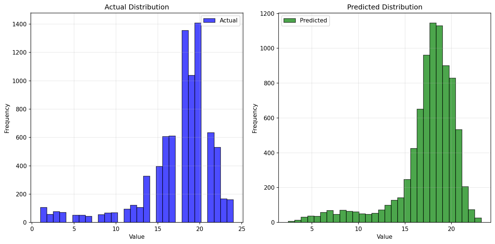

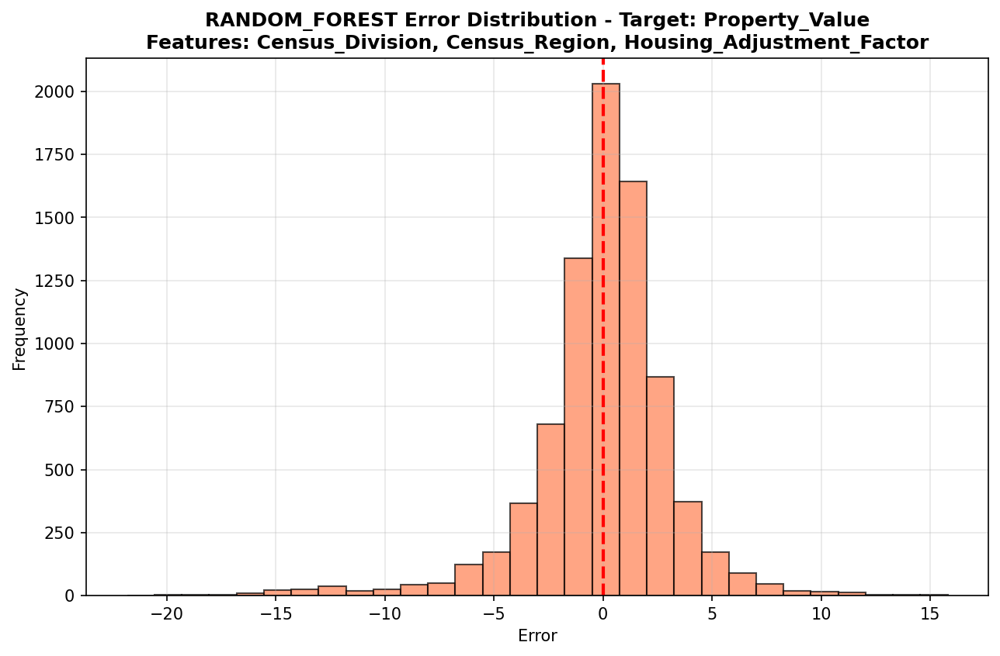

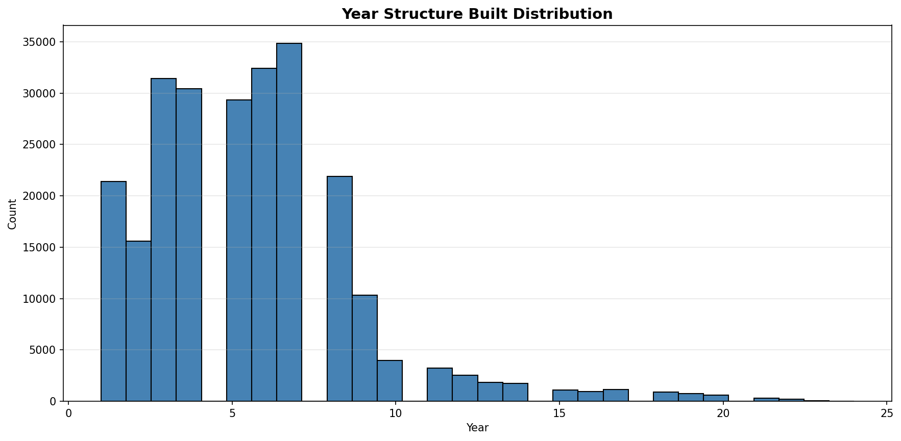

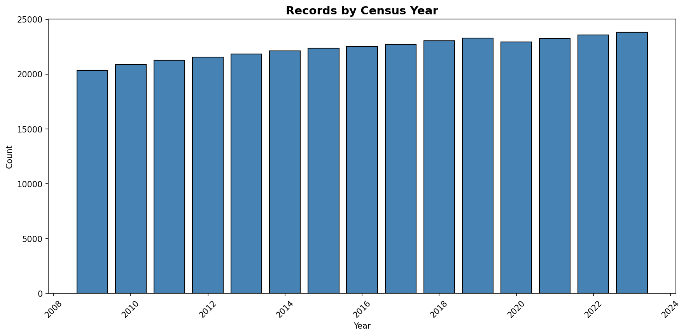
