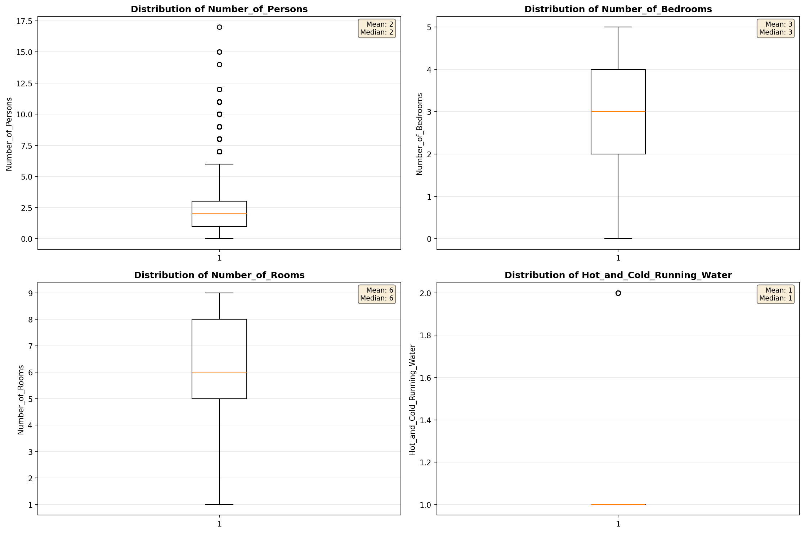
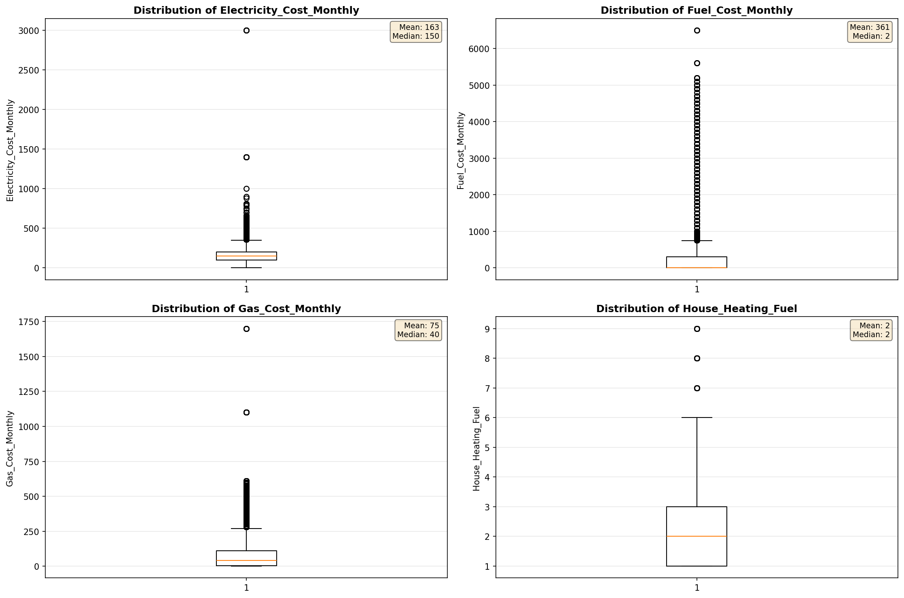
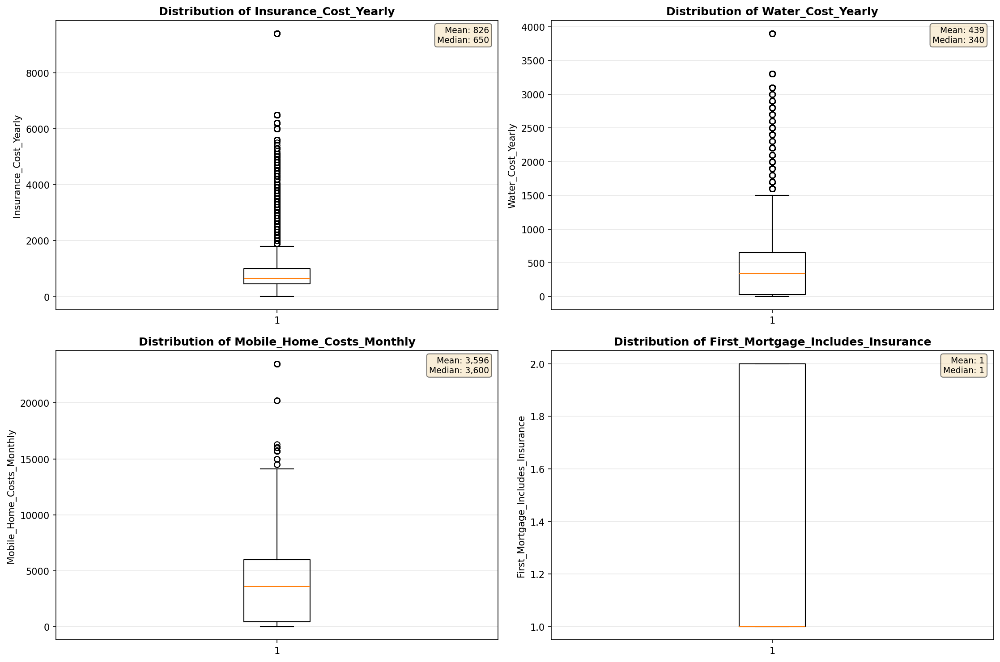
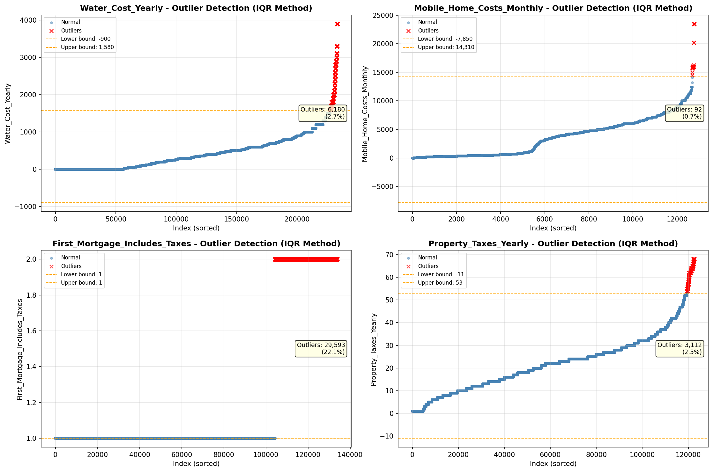

# Outlier Detection

> Statistical outlier detection using IQR (Interquartile Range) method. Outliers are values falling outside Q1 - 1.5×IQR or Q3 + 1.5×IQR bounds.

## Detection Methodology

| Parameter | Value | Description |
| :--- | :--- | :--- |
| Method | IQR | Outlier detection algorithm |
| Lower Bound | Q1 - 1.5 × IQR | Values below are outliers |
| Upper Bound | Q3 + 1.5 × IQR | Values above are outliers |
| IQR Definition | Q3 - Q1 | Interquartile Range |

> **Note**: The IQR method is robust to extreme values and works well for approximately symmetric distributions.

## Outlier Summary

_No outlier summary available._
## High Outlier Rate Variables

> Variables with outlier rate > 5% may indicate data quality issues, non-normal distributions, or genuinely extreme values.

- **('First_Mortgage_Includes_Taxes', 22.11519060180999)**: 0 outliers (0.00%)

- **('Specified_Rent_Unit', 20.158618901765742)**: 0 outliers (0.00%)

- **('Fuel_Cost_Monthly', 19.049259584632434)**: 0 outliers (0.00%)

- **('Gross_Rent_Percentage_Income', 10.015303206298283)**: 0 outliers (0.00%)

- **('Flag_Property_Taxes', 9.9495274398538)**: 0 outliers (0.00%)

- **('Owner_Costs_Percentage_Income', 7.486436574840444)**: 0 outliers (0.00%)

- **('Flag_Water_Cost', 7.2025015442619065)**: 0 outliers (0.00%)

- **('Property_Value', 7.138674734068508)**: 0 outliers (0.00%)

- **('Flag_Property_Value', 6.650087854900192)**: 0 outliers (0.00%)

- **('Insurance_Cost_Yearly', 5.843693293193363)**: 0 outliers (0.00%)

- **('Income_to_FPL_Ratio', 5.776276365362366)**: 0 outliers (0.00%)

- **('Family_Income', 5.420016246043528)**: 0 outliers (0.00%)

- **('Household_Income', 5.210874412155959)**: 0 outliers (0.00%)

> *Consider investigating these variables for data entry errors, applying transformations, or using robust statistical methods.*

## Visualizations

