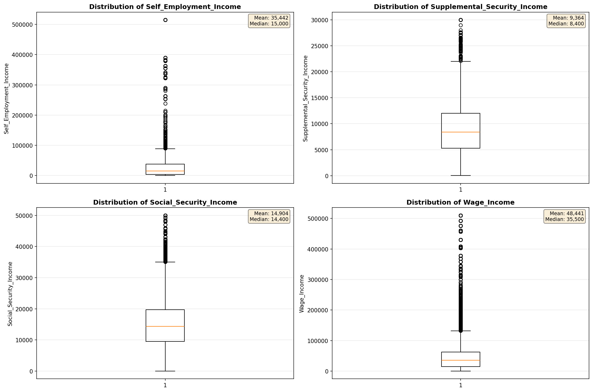
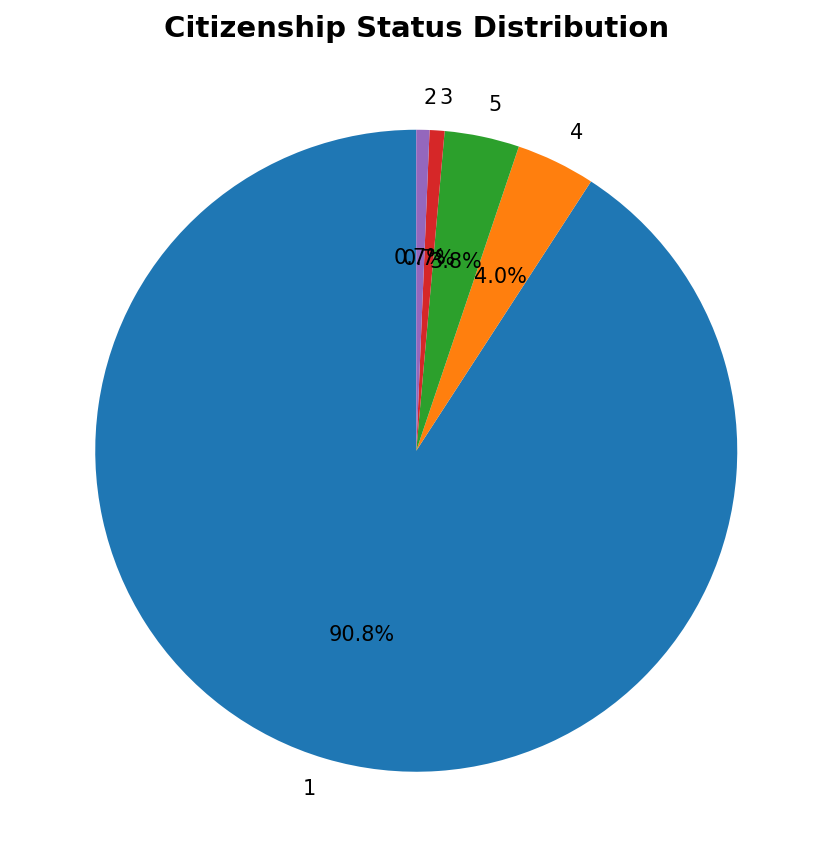
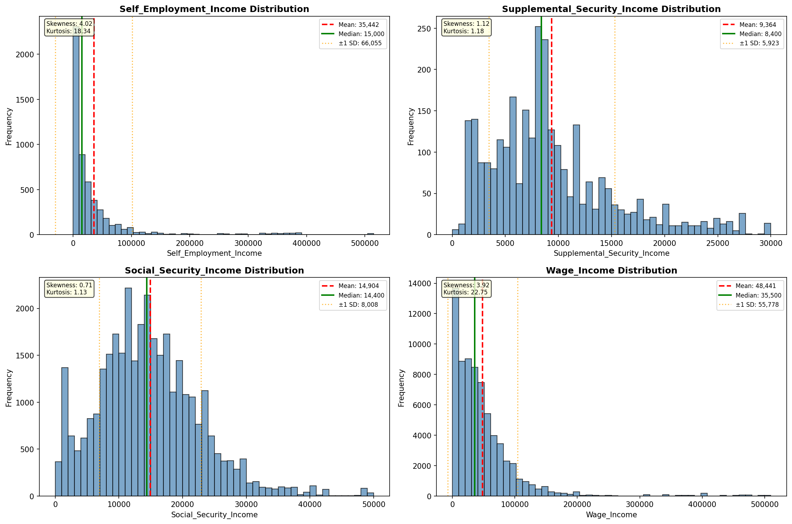
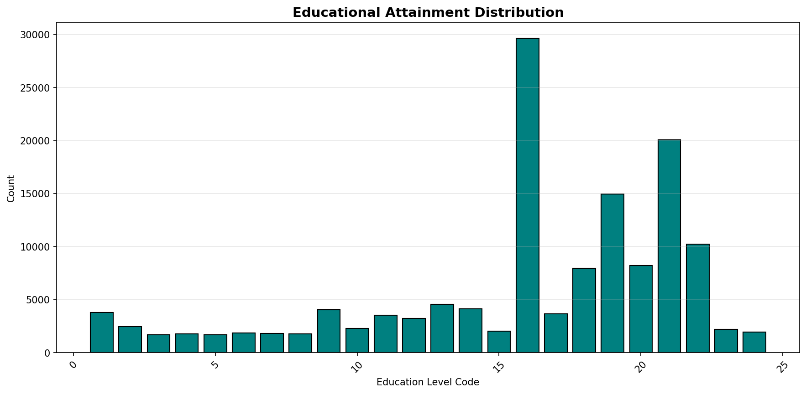
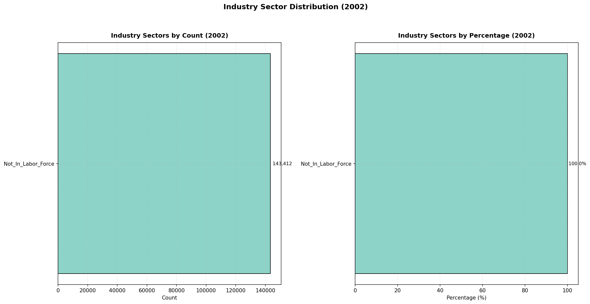
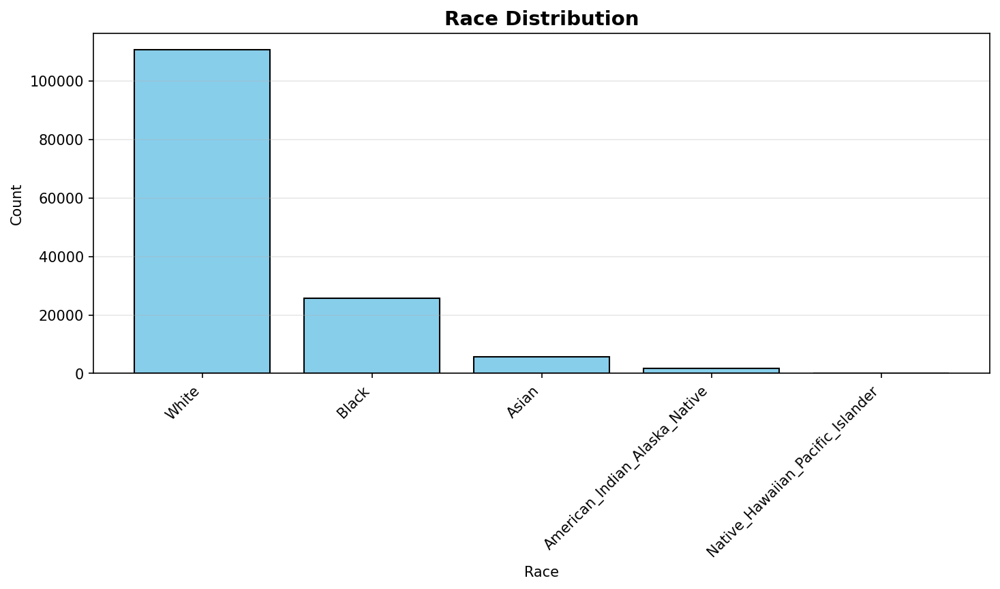
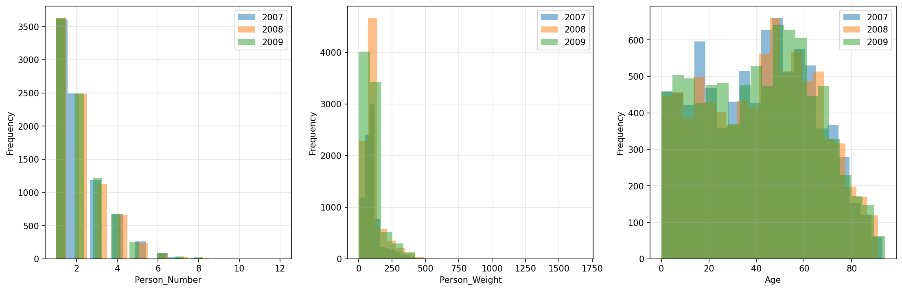
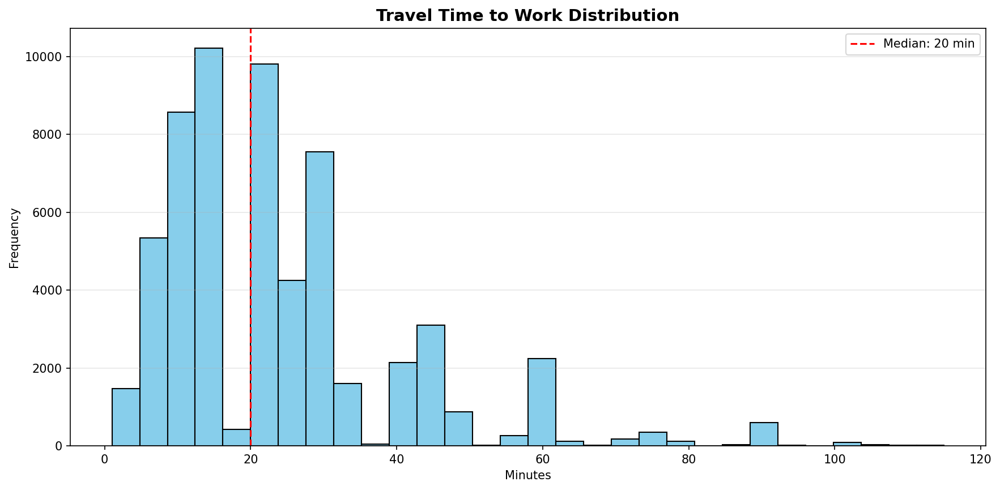
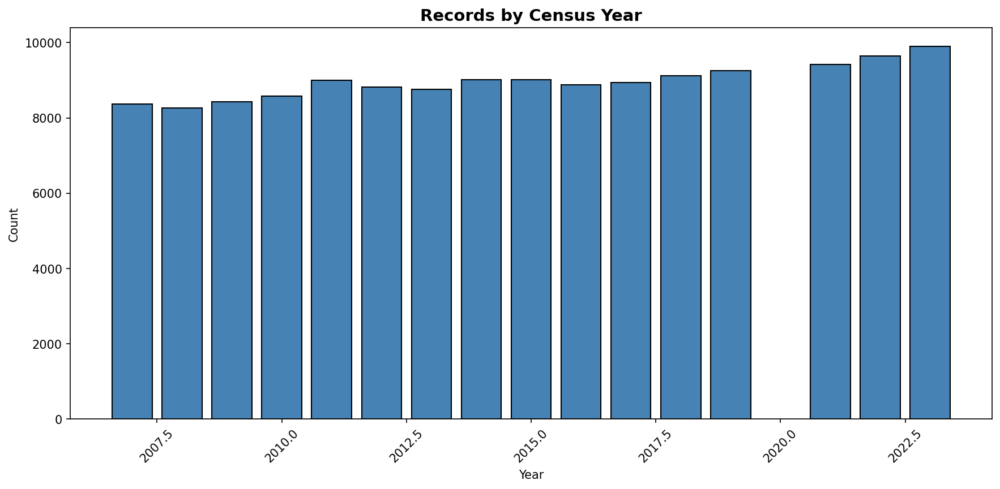

# Statistical Analysis

> Comprehensive descriptive statistics including central tendency, dispersion, distribution characteristics, and weighted statistics using ACS sample weights.

## Summary Statistics

- **Variables Analyzed**: 30

### Income_Adjustment_Factor

| Statistic | Unweighted | Weighted (ACS) |
| :--- | :--- | :--- |
| Mean | 1,015,099.14 | 1,014,834.00 |
| Median | 1,011,189.00 | 1,014,834.00 |
| Std Deviation | 10,983.61 | — |
| Minimum | 1,001,264.00 | — |
| Maximum | 1,042,311.00 | — |
| Count | 109,152 | — |

> *Distribution is highly right-skewed (skewness: 1.31), light-tailed/platykurtic (kurtosis: 0.88).*

- **Coefficient of Variation**: 1.1 % (low variability)

### Age

| Statistic | Unweighted | Weighted (ACS) |
| :--- | :--- | :--- |
| Mean | 43.47 | 39.60 |
| Median | 46.00 | 39.38 |
| Std Deviation | 23.85 | — |
| Minimum | 0.00 | — |
| Maximum | 96.00 | — |
| Count | 143,412 | — |

> *Distribution is approximately symmetric (skewness: -0.08), light-tailed/platykurtic (kurtosis: -1.07).*

- **Coefficient of Variation**: 54.9 % (high variability)

### Interest_Dividend_Rental_Income

| Statistic | Unweighted | Weighted (ACS) |
| :--- | :--- | :--- |
| Mean | 15,107.35 | 14,187.98 |
| Median | 2,000.00 | 1,918.75 |
| Std Deviation | 42,426.97 | — |
| Minimum | 1.00 | — |
| Maximum | 375,000.00 | — |
| Count | 20,083 | — |

> *Distribution is highly right-skewed (skewness: 5.12), heavy-tailed/leptokurtic (kurtosis: 29.28).*

- **Coefficient of Variation**: 280.8 % (very high variability)

### Other_Income

| Statistic | Unweighted | Weighted (ACS) |
| :--- | :--- | :--- |
| Mean | 11,289.37 | 10,706.64 |
| Median | 5,800.00 | 5,768.75 |
| Std Deviation | 15,056.31 | — |
| Minimum | 4.00 | — |
| Maximum | 87,000.00 | — |
| Count | 7,501 | — |

> *Distribution is highly right-skewed (skewness: 2.44), heavy-tailed/leptokurtic (kurtosis: 6.43).*

- **Coefficient of Variation**: 133.4 % (very high variability)

### Public_Assistance_Income

| Statistic | Unweighted | Weighted (ACS) |
| :--- | :--- | :--- |
| Mean | 2,548.35 | 2,546.88 |
| Median | 1,200.00 | 1,319.38 |
| Std Deviation | 3,758.16 | — |
| Minimum | 20.00 | — |
| Maximum | 30,000.00 | — |
| Count | 1,562 | — |

> *Distribution is highly right-skewed (skewness: 3.52), heavy-tailed/leptokurtic (kurtosis: 15.38).*

- **Coefficient of Variation**: 147.5 % (very high variability)

### Retirement_Income

| Statistic | Unweighted | Weighted (ACS) |
| :--- | :--- | :--- |
| Mean | 24,634.37 | 22,875.73 |
| Median | 15,600.00 | 14,925.00 |
| Std Deviation | 29,241.20 | — |
| Minimum | 4.00 | — |
| Maximum | 203,000.00 | — |
| Count | 22,862 | — |

> *Distribution is highly right-skewed (skewness: 3.04), heavy-tailed/leptokurtic (kurtosis: 12.23).*

- **Coefficient of Variation**: 118.7 % (very high variability)

### Self_Employment_Income

| Statistic | Unweighted | Weighted (ACS) |
| :--- | :--- | :--- |
| Mean | 35,441.86 | 35,852.11 |
| Median | 15,000.00 | 15,868.75 |
| Std Deviation | 66,054.58 | — |
| Minimum | 1.00 | — |
| Maximum | 515,000.00 | — |
| Count | 5,308 | — |

> *Distribution is highly right-skewed (skewness: 4.02), heavy-tailed/leptokurtic (kurtosis: 18.32).*

- **Coefficient of Variation**: 186.4 % (very high variability)

### Supplemental_Security_Income

| Statistic | Unweighted | Weighted (ACS) |
| :--- | :--- | :--- |
| Mean | 9,364.16 | 9,250.99 |
| Median | 8,400.00 | 8,437.50 |
| Std Deviation | 5,923.11 | — |
| Minimum | 20.00 | — |
| Maximum | 30,000.00 | — |
| Count | 2,935 | — |

> *Distribution is highly right-skewed (skewness: 1.12), light-tailed/platykurtic (kurtosis: 1.17).*

- **Coefficient of Variation**: 63.3 % (high variability)

### Social_Security_Income

| Statistic | Unweighted | Weighted (ACS) |
| :--- | :--- | :--- |
| Mean | 14,904.02 | 14,312.59 |
| Median | 14,400.00 | 14,018.75 |
| Std Deviation | 8,007.84 | — |
| Minimum | 4.00 | — |
| Maximum | 50,000.00 | — |
| Count | 34,161 | — |

> *Distribution is moderately right-skewed (skewness: 0.71), light-tailed/platykurtic (kurtosis: 1.13).*

- **Coefficient of Variation**: 53.7 % (high variability)

### Wage_Income

| Statistic | Unweighted | Weighted (ACS) |
| :--- | :--- | :--- |
| Mean | 48,440.66 | 46,158.69 |
| Median | 35,500.00 | 34,487.50 |
| Std Deviation | 55,777.51 | — |
| Minimum | 4.00 | — |
| Maximum | 510,000.00 | — |
| Count | 70,988 | — |

> *Distribution is highly right-skewed (skewness: 3.92), heavy-tailed/leptokurtic (kurtosis: 22.75).*

- **Coefficient of Variation**: 115.1 % (very high variability)

### Hours_Worked_Per_Week

| Statistic | Unweighted | Weighted (ACS) |
| :--- | :--- | :--- |
| Mean | 37.54 | 37.83 |
| Median | 40.00 | 40.00 |
| Std Deviation | 12.77 | — |
| Minimum | 1.00 | — |
| Maximum | 99.00 | — |
| Count | 74,254 | — |

> *Distribution is approximately symmetric (skewness: -0.18), light-tailed/platykurtic (kurtosis: 1.64).*

- **Coefficient of Variation**: 34.0 % (moderate variability)

### Presence_And_Age_Own_Children

| Statistic | Unweighted | Weighted (ACS) |
| :--- | :--- | :--- |
| Mean | 3.56 | 3.50 |
| Median | 4.00 | 4.00 |
| Std Deviation | 0.89 | — |
| Minimum | 1.00 | — |
| Maximum | 4.00 | — |
| Count | 60,867 | — |

> *Distribution is highly left-skewed (skewness: -1.77), light-tailed/platykurtic (kurtosis: 1.63).*

- **Coefficient of Variation**: 25.0 % (low variability)

### Total_Person_Earnings

| Statistic | Unweighted | Weighted (ACS) |
| :--- | :--- | :--- |
| Mean | 48,904.74 | 46,626.95 |
| Median | 35,000.00 | 34,325.00 |
| Std Deviation | 58,658.92 | — |
| Minimum | 1.00 | — |
| Maximum | 871,000.00 | — |
| Count | 74,140 | — |

> *Distribution is highly right-skewed (skewness: 4.26), heavy-tailed/leptokurtic (kurtosis: 28.10).*

- **Coefficient of Variation**: 119.9 % (very high variability)

### Total_Person_Income

| Statistic | Unweighted | Weighted (ACS) |
| :--- | :--- | :--- |
| Mean | 46,992.07 | 44,677.87 |
| Median | 32,000.00 | 31,412.50 |
| Std Deviation | 57,953.56 | — |
| Minimum | 1.00 | — |
| Maximum | 1,018,000.00 | — |
| Count | 108,869 | — |

> *Distribution is highly right-skewed (skewness: 4.50), heavy-tailed/leptokurtic (kurtosis: 32.22).*

- **Coefficient of Variation**: 123.3 % (very high variability)

### Poverty_Status

| Statistic | Unweighted | Weighted (ACS) |
| :--- | :--- | :--- |
| Mean | 340.98 | 327.99 |
| Median | 375.00 | 350.88 |
| Std Deviation | 160.06 | — |
| Minimum | 0.00 | — |
| Maximum | 501.00 | — |
| Count | 138,829 | — |

> *Distribution is moderately left-skewed (skewness: -0.53), light-tailed/platykurtic (kurtosis: -1.07).*

- **Coefficient of Variation**: 46.9 % (moderate variability)

### Flag_Age

| Statistic | Unweighted | Weighted (ACS) |
| :--- | :--- | :--- |
| Mean | 0.01 | 0.01 |
| Median | 0.00 | 0.00 |
| Std Deviation | 0.10 | — |
| Minimum | 0.00 | — |
| Maximum | 1.00 | — |
| Count | 143,412 | — |

> *Distribution is highly right-skewed (skewness: 9.41), heavy-tailed/leptokurtic (kurtosis: 86.53).*

- **Coefficient of Variation**: 951.4 % (very high variability)

### Flag_Interest_Dividend_Income

| Statistic | Unweighted | Weighted (ACS) |
| :--- | :--- | :--- |
| Mean | 0.13 | 0.12 |
| Median | 0.00 | 0.00 |
| Std Deviation | 0.33 | — |
| Minimum | 0.00 | — |
| Maximum | 1.00 | — |
| Count | 143,412 | — |

> *Distribution is highly right-skewed (skewness: 2.23), light-tailed/platykurtic (kurtosis: 2.98).*

- **Coefficient of Variation**: 261.4 % (very high variability)

### Flag_Other_Income

| Statistic | Unweighted | Weighted (ACS) |
| :--- | :--- | :--- |
| Mean | 0.11 | 0.11 |
| Median | 0.00 | 0.00 |
| Std Deviation | 0.31 | — |
| Minimum | 0.00 | — |
| Maximum | 1.00 | — |
| Count | 143,412 | — |

> *Distribution is highly right-skewed (skewness: 2.52), heavy-tailed/leptokurtic (kurtosis: 4.37).*

- **Coefficient of Variation**: 287.2 % (very high variability)

### Flag_Retirement_Income

| Statistic | Unweighted | Weighted (ACS) |
| :--- | :--- | :--- |
| Mean | 0.12 | 0.11 |
| Median | 0.00 | 0.00 |
| Std Deviation | 0.32 | — |
| Minimum | 0.00 | — |
| Maximum | 1.00 | — |
| Count | 143,412 | — |

> *Distribution is highly right-skewed (skewness: 2.39), heavy-tailed/leptokurtic (kurtosis: 3.72).*

- **Coefficient of Variation**: 275.5 % (very high variability)

### Flag_Self_Employment_Income

| Statistic | Unweighted | Weighted (ACS) |
| :--- | :--- | :--- |
| Mean | 0.08 | 0.08 |
| Median | 0.00 | 0.00 |
| Std Deviation | 0.28 | — |
| Minimum | 0.00 | — |
| Maximum | 1.00 | — |
| Count | 143,412 | — |

> *Distribution is highly right-skewed (skewness: 3.00), heavy-tailed/leptokurtic (kurtosis: 6.97).*

- **Coefficient of Variation**: 329.8 % (very high variability)

### Flag_Social_Security_Income

| Statistic | Unweighted | Weighted (ACS) |
| :--- | :--- | :--- |
| Mean | 0.12 | 0.12 |
| Median | 0.00 | 0.00 |
| Std Deviation | 0.33 | — |
| Minimum | 0.00 | — |
| Maximum | 1.00 | — |
| Count | 143,412 | — |

> *Distribution is highly right-skewed (skewness: 2.29), heavy-tailed/leptokurtic (kurtosis: 3.26).*

- **Coefficient of Variation**: 266.8 % (very high variability)

### Flag_Supplemental_Security_Income

| Statistic | Unweighted | Weighted (ACS) |
| :--- | :--- | :--- |
| Mean | 0.10 | 0.10 |
| Median | 0.00 | 0.00 |
| Std Deviation | 0.31 | — |
| Minimum | 0.00 | — |
| Maximum | 1.00 | — |
| Count | 143,412 | — |

> *Distribution is highly right-skewed (skewness: 2.58), heavy-tailed/leptokurtic (kurtosis: 4.66).*

- **Coefficient of Variation**: 292.2 % (very high variability)

### Flag_Wage_Income

| Statistic | Unweighted | Weighted (ACS) |
| :--- | :--- | :--- |
| Mean | 0.15 | 0.16 |
| Median | 0.00 | 0.00 |
| Std Deviation | 0.35 | — |
| Minimum | 0.00 | — |
| Maximum | 1.00 | — |
| Count | 143,412 | — |

> *Distribution is highly right-skewed (skewness: 2.02), light-tailed/platykurtic (kurtosis: 2.07).*

- **Coefficient of Variation**: 242.8 % (very high variability)

### Flag_Hours_Worked

| Statistic | Unweighted | Weighted (ACS) |
| :--- | :--- | :--- |
| Mean | 0.06 | 0.06 |
| Median | 0.00 | 0.00 |
| Std Deviation | 0.24 | — |
| Minimum | 0.00 | — |
| Maximum | 1.00 | — |
| Count | 143,412 | — |

> *Distribution is highly right-skewed (skewness: 3.73), heavy-tailed/leptokurtic (kurtosis: 11.91).*

- **Coefficient of Variation**: 398.1 % (very high variability)

### Income_Per_Hour

| Statistic | Unweighted | Weighted (ACS) |
| :--- | :--- | :--- |
| Mean | 29.61 | 26.61 |
| Median | 19.25 | 18.64 |
| Std Deviation | 72.27 | — |
| Minimum | 0.00 | — |
| Maximum | 9,832.69 | — |
| Count | 74,196 | — |

> *Distribution is highly right-skewed (skewness: 59.46), heavy-tailed/leptokurtic (kurtosis: 6434.10).*

- **Coefficient of Variation**: 244.1 % (very high variability)

### Income_Per_Week_Worked

| Statistic | Unweighted | Weighted (ACS) |
| :--- | :--- | :--- |
| Mean | 38,697.25 | 36,984.06 |
| Median | 25,000.00 | 26,737.75 |
| Std Deviation | 55,938.54 | — |
| Minimum | 0.12 | — |
| Maximum | 991,000.00 | — |
| Count | 59,899 | — |

> *Distribution is highly right-skewed (skewness: 4.52), heavy-tailed/leptokurtic (kurtosis: 33.43).*

- **Coefficient of Variation**: 144.6 % (very high variability)

### Total_Annual_Hours

| Statistic | Unweighted | Weighted (ACS) |
| :--- | :--- | :--- |
| Mean | 332.46 | 327.47 |
| Median | 45.00 | 353.85 |
| Std Deviation | 702.11 | — |
| Minimum | 1.00 | — |
| Maximum | 5,148.00 | — |
| Count | 59,948 | — |

> *Distribution is highly right-skewed (skewness: 2.52), heavy-tailed/leptokurtic (kurtosis: 5.43).*

- **Coefficient of Variation**: 211.2 % (very high variability)

### In_Poverty

| Statistic | Unweighted | Weighted (ACS) |
| :--- | :--- | :--- |
| Mean | 0.28 | 0.28 |
| Median | 0.00 | 0.00 |
| Std Deviation | 0.45 | — |
| Minimum | 0.00 | — |
| Maximum | 1.00 | — |
| Count | 143,412 | — |

> *Distribution is moderately right-skewed (skewness: 0.98), light-tailed/platykurtic (kurtosis: -1.04).*

- **Coefficient of Variation**: 160.3 % (very high variability)

### Poverty_Gap

| Statistic | Unweighted | Weighted (ACS) |
| :--- | :--- | :--- |
| Mean | 0.22 | 0.24 |
| Median | 0.00 | 0.00 |
| Std Deviation | 0.37 | — |
| Minimum | 0.00 | — |
| Maximum | 1.92 | — |
| Count | 121,382 | — |

> *Distribution is highly right-skewed (skewness: 1.32), light-tailed/platykurtic (kurtosis: 0.05).*

- **Coefficient of Variation**: 166.3 % (very high variability)

### Poverty_Severity

| Statistic | Unweighted | Weighted (ACS) |
| :--- | :--- | :--- |
| Mean | 0.18 | 0.20 |
| Median | 0.00 | 0.00 |
| Std Deviation | 0.35 | — |
| Minimum | 0.00 | — |
| Maximum | 3.69 | — |
| Count | 121,382 | — |

> *Distribution is highly right-skewed (skewness: 1.69), light-tailed/platykurtic (kurtosis: 1.35).*

- **Coefficient of Variation**: 189.8 % (very high variability)

## Distribution Analysis

### Skewed Distributions

> Variables with skewness > |0.5| indicate non-normal distributions. Consider log transformations for highly skewed variables in modeling.

| Variable | Skewness | Direction | Severity |
| :--- | :--- | :--- | :--- |
| Income_Per_Hour | 59.461 | Right-skewed | High |
| Flag_Age | 9.409 | Right-skewed | High |
| Interest_Dividend_Rental_Income | 5.120 | Right-skewed | High |
| Income_Per_Week_Worked | 4.519 | Right-skewed | High |
| Total_Person_Income | 4.504 | Right-skewed | High |
| Total_Person_Earnings | 4.265 | Right-skewed | High |
| Self_Employment_Income | 4.024 | Right-skewed | High |
| Wage_Income | 3.922 | Right-skewed | High |
| Flag_Hours_Worked | 3.730 | Right-skewed | High |
| Public_Assistance_Income | 3.519 | Right-skewed | High |
| Retirement_Income | 3.037 | Right-skewed | High |
| Flag_Self_Employment_Income | 2.995 | Right-skewed | High |
| Flag_Supplemental_Security_Income | 2.580 | Right-skewed | High |
| Flag_Other_Income | 2.524 | Right-skewed | High |
| Total_Annual_Hours | 2.520 | Right-skewed | High |
| Other_Income | 2.442 | Right-skewed | High |
| Flag_Retirement_Income | 2.392 | Right-skewed | High |
| Flag_Social_Security_Income | 2.294 | Right-skewed | High |
| Flag_Interest_Dividend_Income | 2.231 | Right-skewed | High |
| Flag_Wage_Income | 2.016 | Right-skewed | High |

- **Total Skewed Variables**: 28

- **Right-skewed**: 26

- **Left-skewed**: 2

## Variance Analysis

### Coefficient of Variation Ranking

> CV (Coefficient of Variation) = (Std Dev / Mean) × 100%. Higher CV indicates greater relative variability.

| Variable | CV (%) | Std Dev | Mean | Variability |
| :--- | :--- | :--- | :--- | :--- |
| Flag_Age | 951.4% | 0.10 | 0.01 | Very High |
| Flag_Hours_Worked | 398.1% | 0.24 | 0.06 | Very High |
| Flag_Self_Employment_Income | 329.8% | 0.28 | 0.08 | Very High |
| Flag_Supplemental_Security_Income | 292.2% | 0.31 | 0.10 | Very High |
| Flag_Other_Income | 287.2% | 0.31 | 0.11 | Very High |
| Interest_Dividend_Rental_Income | 280.8% | 42,426.97 | 15,107.35 | Very High |
| Flag_Retirement_Income | 275.5% | 0.32 | 0.12 | Very High |
| Flag_Social_Security_Income | 266.8% | 0.33 | 0.12 | Very High |
| Flag_Interest_Dividend_Income | 261.4% | 0.33 | 0.13 | Very High |
| Income_Per_Hour | 244.1% | 72.27 | 29.61 | Very High |
| Flag_Wage_Income | 242.8% | 0.35 | 0.15 | Very High |
| Total_Annual_Hours | 211.2% | 702.11 | 332.46 | Very High |
| Poverty_Severity | 189.8% | 0.35 | 0.18 | Very High |
| Self_Employment_Income | 186.4% | 66,054.58 | 35,441.86 | Very High |
| Poverty_Gap | 166.3% | 0.37 | 0.22 | Very High |
| In_Poverty | 160.3% | 0.45 | 0.28 | Very High |
| Public_Assistance_Income | 147.5% | 3,758.16 | 2,548.35 | Very High |
| Income_Per_Week_Worked | 144.6% | 55,938.54 | 38,697.25 | Very High |
| Other_Income | 133.4% | 15,056.31 | 11,289.37 | Very High |
| Total_Person_Income | 123.3% | 57,953.56 | 46,992.07 | Very High |

- **Average CV**: 197.5 %

- **High Variance Variables (CV > 50%)**: 26

## Visualizations

