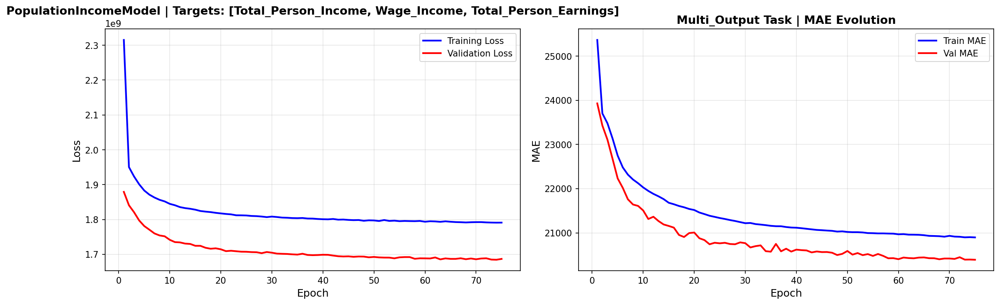
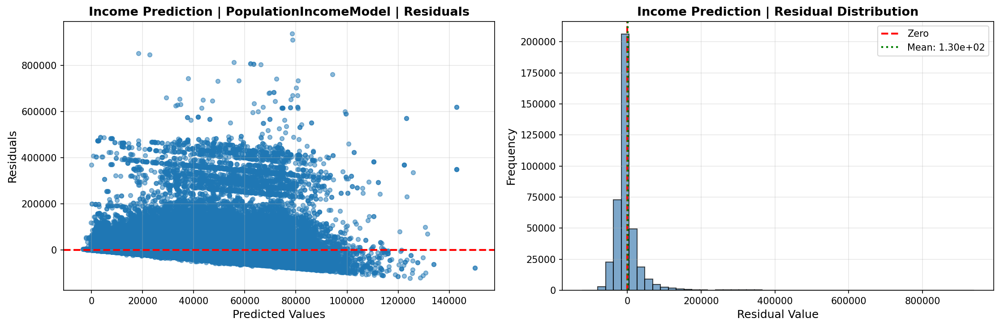
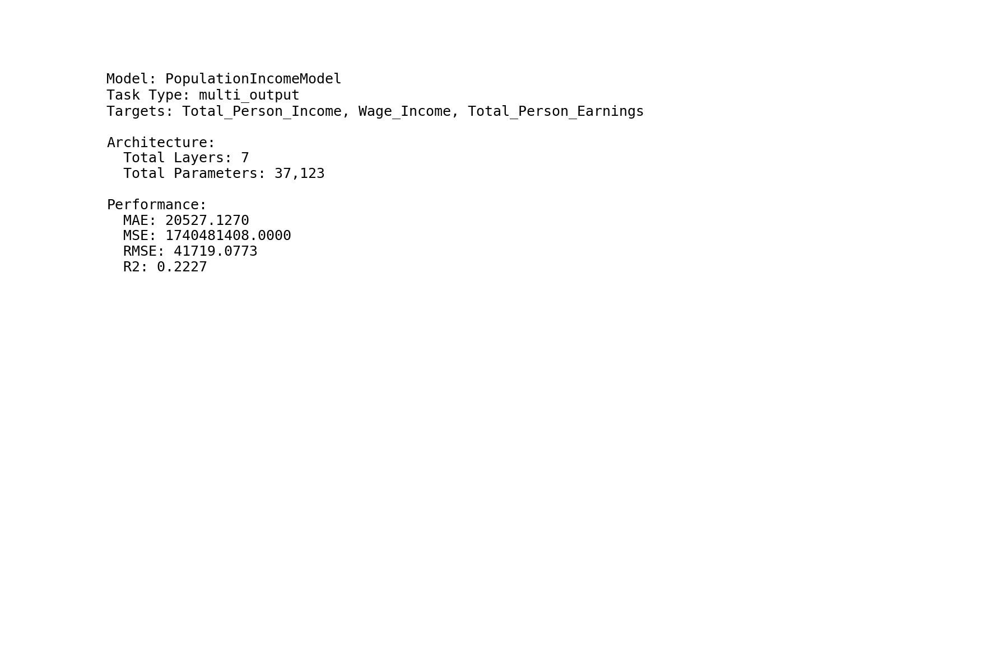
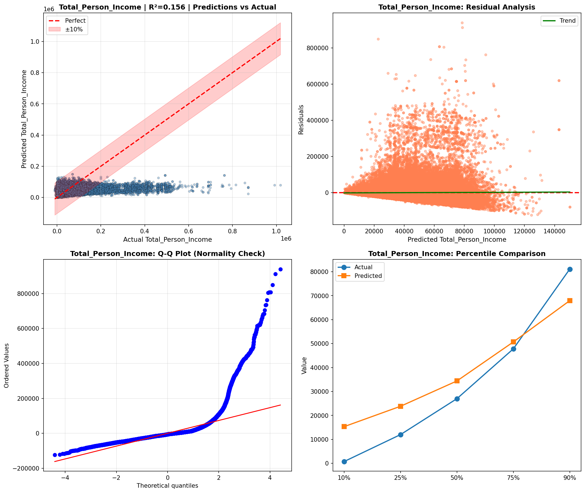
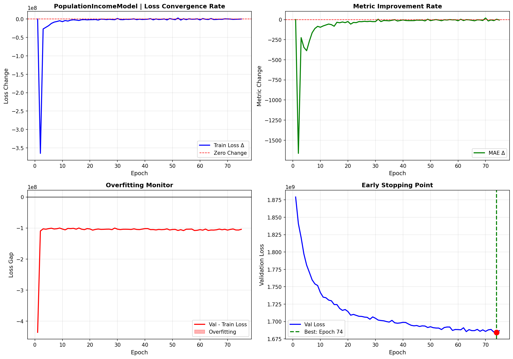
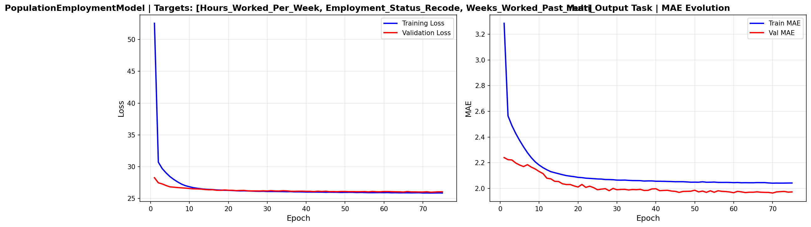
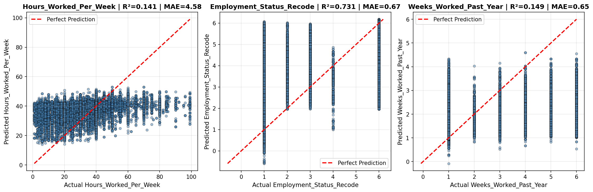
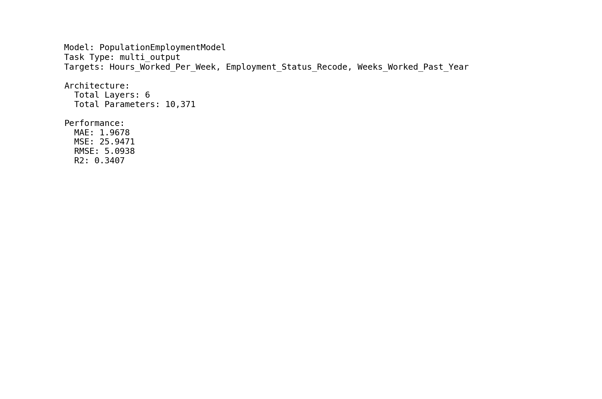
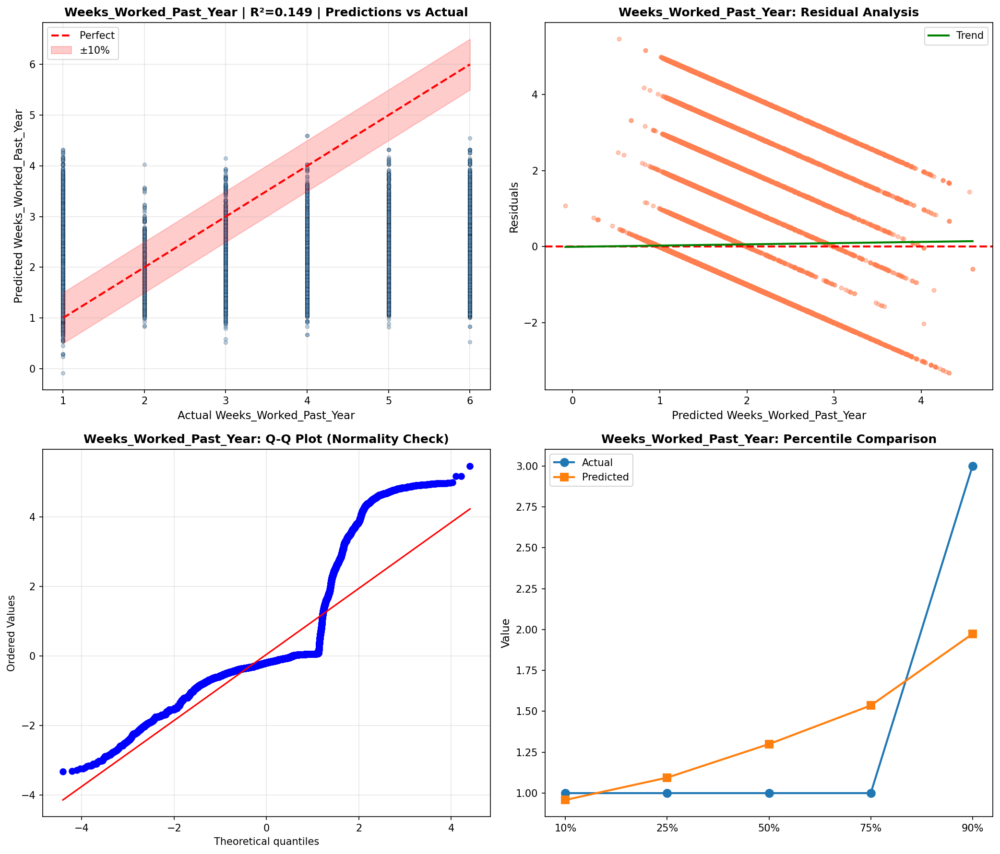

# Deep Learning Models

> Neural network analysis using TensorFlow/Keras for complex pattern recognition and multi-output prediction tasks.

## Deep Learning Summary

- **Total Tasks**: 3

- **Tasks**: Income Prediction, Employment Analysis, Demographic Profile

### Aggregate Statistics

| Metric | Value |
| :--- | :--- |
| Total Parameters | 57,930 |
| Average Validation Loss | 562265442.3241 |
| Number of Tasks | 3 |

## Task: Income Prediction

### Model Configuration

| Property | Value |
| :--- | :--- |
| Model Type | PopulationIncomeModel |
| Task Type | Multi_Output |
| Target Variables | Total_Person_Income, Wage_Income, Total_Person_Earnings |
| Number of Targets | 3 |
| Input Features | 10 |

### Network Architecture

| Component | Value | Notes |
| :--- | :--- | :--- |
| Total Layers | 7 | Including input and output |
| Total Parameters | 37,123 | Trainable weights |
| Parameters per Layer | 5,303 | Average |

### Performance Metrics

| Metric | Value | Assessment |
| :--- | :--- | :--- |
| Training Loss | 1791011456.0000 | Final epoch |
| Validation Loss | 1686795648.0000 | Final epoch |
| Loss Gap | -104215808.0000 | NONE overfitting risk |

> *Good generalization*

#### Test Set Metrics

| Metric | Value | Description |
| :--- | :--- | :--- |
| MAE | 20527.1270 | Mean Absolute Error (lower is better) |
| MSE | 1740481408.0000 | Mean Squared Error (lower is better) |
| RMSE | 41719.0773 | Root Mean Squared Error (lower is better) |
| R2 | 0.2227 | R-squared (higher is better) |

### Training Analysis

| Training Statistic | Value |
| :--- | :--- |
| Epochs Trained | 75 |
| Initial Training Loss | 2315233280.0000 |
| Final Training Loss | 1791011456.0000 |
| Loss Improvement | 22.6% |
| Initial Validation Loss | 1879156864.0000 |
| Final Validation Loss | 1686795648.0000 |
| Validation Improvement | 10.2% |

#### Convergence Assessment

- **Status**: Fully converged (< 1% change in last 10 epochs)

- **Last 10 epochs change**: 0.08%

## Task: Employment Analysis

### Model Configuration

| Property | Value |
| :--- | :--- |
| Model Type | PopulationEmploymentModel |
| Task Type | Multi_Output |
| Target Variables | Hours_Worked_Per_Week, Employment_Status_Recode, Weeks_Worked_Past_Year |
| Number of Targets | 3 |
| Input Features | 10 |

### Network Architecture

| Component | Value | Notes |
| :--- | :--- | :--- |
| Total Layers | 6 | Including input and output |
| Total Parameters | 10,371 | Trainable weights |
| Parameters per Layer | 1,728 | Average |

### Performance Metrics

| Metric | Value | Assessment |
| :--- | :--- | :--- |
| Training Loss | 25.8574 | Final epoch |
| Validation Loss | 26.0430 | Final epoch |
| Loss Gap | 0.1855 | LOW overfitting risk |

> *Minimal overfitting*

#### Test Set Metrics

| Metric | Value | Description |
| :--- | :--- | :--- |
| MAE | 1.9678 | Mean Absolute Error (lower is better) |
| MSE | 25.9471 | Mean Squared Error (lower is better) |
| RMSE | 5.0938 | Root Mean Squared Error (lower is better) |
| R2 | 0.3407 | R-squared (higher is better) |

### Training Analysis

| Training Statistic | Value |
| :--- | :--- |
| Epochs Trained | 75 |
| Initial Training Loss | 52.5660 |
| Final Training Loss | 25.8574 |
| Loss Improvement | 50.8% |
| Initial Validation Loss | 28.2638 |
| Final Validation Loss | 26.0430 |
| Validation Improvement | 7.9% |

#### Convergence Assessment

- **Status**: Fully converged (< 1% change in last 10 epochs)

- **Last 10 epochs change**: 0.11%

## Task: Demographic Profile

### Model Configuration

| Property | Value |
| :--- | :--- |
| Model Type | PopulationDemographicModel |
| Task Type | Multi_Output |
| Target Variables | Educational_Attainment, Age, Sex, Marital_Status |
| Number of Targets | 4 |
| Input Features | 10 |

### Network Architecture

| Component | Value | Notes |
| :--- | :--- | :--- |
| Total Layers | 7 | Including input and output |
| Total Parameters | 10,436 | Trainable weights |
| Parameters per Layer | 1,490 | Average |

### Performance Metrics

| Metric | Value | Assessment |
| :--- | :--- | :--- |
| Training Loss | 653.1837 | Final epoch |
| Validation Loss | 652.9294 | Final epoch |
| Loss Gap | -0.2542 | NONE overfitting risk |

> *Good generalization*

#### Test Set Metrics

| Metric | Value | Description |
| :--- | :--- | :--- |
| MAE | 15.4004 | Mean Absolute Error (lower is better) |
| MSE | 654.0798 | Mean Squared Error (lower is better) |
| RMSE | 25.5750 | Root Mean Squared Error (lower is better) |
| R2 | -5.3713 | R-squared (higher is better) |

### Training Analysis

| Training Statistic | Value |
| :--- | :--- |
| Epochs Trained | 75 |
| Initial Training Loss | 653.1189 |
| Final Training Loss | 653.1837 |
| Loss Improvement | -0.0% |
| Initial Validation Loss | 652.6705 |
| Final Validation Loss | 652.9294 |
| Validation Improvement | -0.0% |

#### Convergence Assessment

- **Status**: Fully converged (< 1% change in last 10 epochs)

- **Last 10 epochs change**: 0.00%

## Cross-Task Comparison

| Task | Model Type | Parameters | Train Loss | Val Loss | Gap |
| :--- | :--- | :--- | :--- | :--- | :--- |
| Income Prediction | PopulationIncomeModel | 37,123 | 1791011456.0000 | 1686795648.0000 | -104215808.0000 |
| Employment Analysis | PopulationEmploymentModel | 10,371 | 25.8574 | 26.0430 | 0.1855 |
| Demographic Profile | PopulationDemographicModel | 10,436 | 653.1837 | 652.9294 | -0.2542 |

## Visualizations

