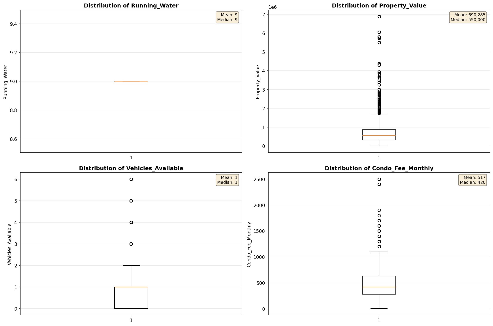
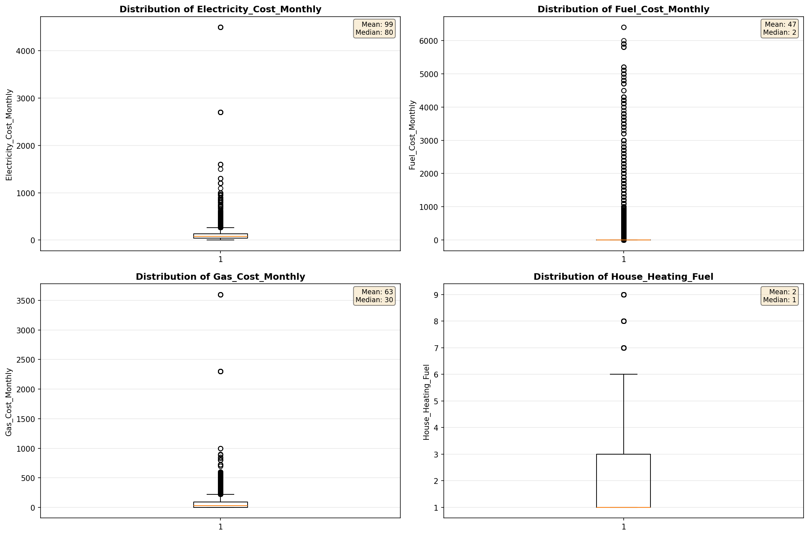
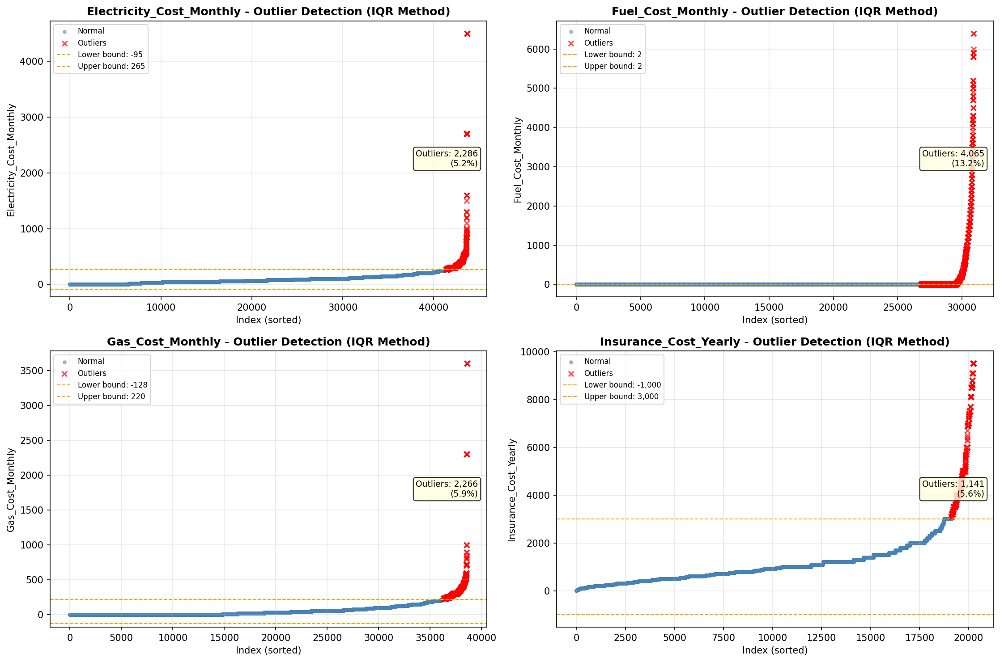

# Outlier Detection

> Statistical outlier detection using IQR (Interquartile Range) method. Outliers are values falling outside Q1 - 1.5×IQR or Q3 + 1.5×IQR bounds.

## Detection Methodology

| Parameter | Value | Description |
| :--- | :--- | :--- |
| Method | IQR | Outlier detection algorithm |
| Lower Bound | Q1 - 1.5 × IQR | Values below are outliers |
| Upper Bound | Q3 + 1.5 × IQR | Values above are outliers |
| IQR Definition | Q3 - Q1 | Interquartile Range |

> **Note**: The IQR method is robust to extreme values and works well for approximately symmetric distributions.

## Outlier Summary

_No outlier summary available._
## High Outlier Rate Variables

> Variables with outlier rate > 5% may indicate data quality issues, non-normal distributions, or genuinely extreme values.

- **('Property_Tax_Rate', 18.230365528036092)**: 0 outliers (0.00%)

- **('Flag_Selected_Monthly_Owner_Costs', 16.783241239420857)**: 0 outliers (0.00%)

- **('Flag_Family_Income', 14.210746175134458)**: 0 outliers (0.00%)

- **('Fuel_Cost_Monthly', 13.156617147295854)**: 0 outliers (0.00%)

- **('Flag_Gross_Rent', 12.404418011894647)**: 0 outliers (0.00%)

- **('Gross_Rent_Percentage_Income', 12.153825961412258)**: 0 outliers (0.00%)

- **('Income_Adjustment_Factor', 9.697895289457357)**: 0 outliers (0.00%)

- **('Property_Taxes_Yearly', 9.307238272755514)**: 0 outliers (0.00%)

- **('Structure_Age', 8.81088155557633)**: 0 outliers (0.00%)

- **('Flag_Water_Cost', 8.259325044404973)**: 0 outliers (0.00%)

- **('Owner_Costs_Percentage_Income', 8.25013614086041)**: 0 outliers (0.00%)

- **('Structure_Age_Score', 7.894736842105263)**: 0 outliers (0.00%)

- **('Flag_Property_Taxes', 7.443693208733474)**: 0 outliers (0.00%)

- **('Flag_Rent_Amount', 6.292653552790044)**: 0 outliers (0.00%)

- **('Household_Income', 6.220843235630666)**: 0 outliers (0.00%)

> *Consider investigating these variables for data entry errors, applying transformations, or using robust statistical methods.*

## Visualizations

