# Statistical Analysis

> Comprehensive descriptive statistics including central tendency, dispersion, distribution characteristics, and weighted statistics using ACS sample weights.

## Summary Statistics

- **Variables Analyzed**: 37

### Income_Adjustment_Factor

| Statistic | Unweighted | Weighted (ACS) |
| :--- | :--- | :--- |
| Mean | 1,058,131.67 | 1,057,586.14 |
| Median | 1,051,849.00 | 1,059,677.73 |
| Std Deviation | 45,908.87 | — |
| Minimum | 999,480.00 | — |
| Maximum | 1,207,712.00 | — |
| Count | 268,606 | — |

> *Distribution is highly right-skewed (skewness: 1.25), light-tailed/platykurtic (kurtosis: 1.42).*

- **Coefficient of Variation**: 4.3 % (low variability)

### Property_Value

| Statistic | Unweighted | Weighted (ACS) |
| :--- | :--- | :--- |
| Mean | 20.48 | 20.48 |
| Median | 21.00 | 21.00 |
| Std Deviation | 2.96 | — |
| Minimum | 1.00 | — |
| Maximum | 24.00 | — |
| Count | 20,102 | — |

> *Distribution is highly left-skewed (skewness: -2.24), heavy-tailed/leptokurtic (kurtosis: 8.87).*

- **Coefficient of Variation**: 14.4 % (low variability)

#### Weighted Statistics by Year

| Year | Weighted Mean | Weighted Median |
| :--- | :--- | :--- |
| 2009 | 20.45 | 21.00 |
| 2010 | 20.50 | 21.00 |
| 2011 | 20.51 | 21.00 |

### Electricity_Cost_Monthly

| Statistic | Unweighted | Weighted (ACS) |
| :--- | :--- | :--- |
| Mean | 97.85 | 96.47 |
| Median | 80.00 | 71.33 |
| Std Deviation | 102.37 | — |
| Minimum | 1.00 | — |
| Maximum | 4,500.00 | — |
| Count | 196,356 | — |

> *Distribution is highly right-skewed (skewness: 8.42), heavy-tailed/leptokurtic (kurtosis: 256.62).*

- **Coefficient of Variation**: 104.6 % (very high variability)

### Fuel_Cost_Monthly

| Statistic | Unweighted | Weighted (ACS) |
| :--- | :--- | :--- |
| Mean | 54.37 | 338.31 |
| Median | 2.00 | 108.53 |
| Std Deviation | 350.67 | — |
| Minimum | 1.00 | — |
| Maximum | 6,400.00 | — |
| Count | 125,584 | — |

> *Distribution is highly right-skewed (skewness: 9.57), heavy-tailed/leptokurtic (kurtosis: 109.67).*

- **Coefficient of Variation**: 645.0 % (very high variability)

### Gas_Cost_Monthly

| Statistic | Unweighted | Weighted (ACS) |
| :--- | :--- | :--- |
| Mean | 65.25 | 65.84 |
| Median | 30.00 | 23.13 |
| Std Deviation | 100.18 | — |
| Minimum | 1.00 | — |
| Maximum | 3,600.00 | — |
| Count | 168,775 | — |

> *Distribution is highly right-skewed (skewness: 7.09), heavy-tailed/leptokurtic (kurtosis: 164.03).*

- **Coefficient of Variation**: 153.5 % (very high variability)

### Insurance_Cost_Yearly

| Statistic | Unweighted | Weighted (ACS) |
| :--- | :--- | :--- |
| Mean | 1,202.57 | 1,179.72 |
| Median | 900.00 | 899.33 |
| Std Deviation | 1,200.82 | — |
| Minimum | 4.00 | — |
| Maximum | 9,500.00 | — |
| Count | 92,365 | — |

> *Distribution is highly right-skewed (skewness: 3.16), heavy-tailed/leptokurtic (kurtosis: 13.09).*

- **Coefficient of Variation**: 99.9 % (high variability)

### Water_Cost_Yearly

| Statistic | Unweighted | Weighted (ACS) |
| :--- | :--- | :--- |
| Mean | 356.59 | 405.37 |
| Median | 80.00 | 231.20 |
| Std Deviation | 537.30 | — |
| Minimum | 1.00 | — |
| Maximum | 4,600.00 | — |
| Count | 168,257 | — |

> *Distribution is highly right-skewed (skewness: 2.46), heavy-tailed/leptokurtic (kurtosis: 8.93).*

- **Coefficient of Variation**: 150.7 % (very high variability)

### Mobile_Home_Costs_Monthly

### First_Mortgage_Payment_Monthly

| Statistic | Unweighted | Weighted (ACS) |
| :--- | :--- | :--- |
| Mean | 2,101.40 | 2,080.01 |
| Median | 1,800.00 | 1,826.67 |
| Std Deviation | 1,327.83 | — |
| Minimum | 4.00 | — |
| Maximum | 8,300.00 | — |
| Count | 76,084 | — |

> *Distribution is highly right-skewed (skewness: 1.32), light-tailed/platykurtic (kurtosis: 2.42).*

- **Coefficient of Variation**: 63.2 % (high variability)

### First_Mortgage_Includes_Taxes

| Statistic | Unweighted | Weighted (ACS) |
| :--- | :--- | :--- |
| Mean | 1.26 | 1.26 |
| Median | 1.00 | 1.00 |
| Std Deviation | 0.44 | — |
| Minimum | 1.00 | — |
| Maximum | 2.00 | — |
| Count | 76,084 | — |

> *Distribution is highly right-skewed (skewness: 1.10), light-tailed/platykurtic (kurtosis: -0.80).*

- **Coefficient of Variation**: 34.8 % (moderate variability)

### Second_Mortgage_Payment_Monthly

| Statistic | Unweighted | Weighted (ACS) |
| :--- | :--- | :--- |
| Mean | 559.68 | 588.42 |
| Median | 380.00 | 396.00 |
| Std Deviation | 640.79 | — |
| Minimum | 4.00 | — |
| Maximum | 8,000.00 | — |
| Count | 16,372 | — |

> *Distribution is highly right-skewed (skewness: 3.46), heavy-tailed/leptokurtic (kurtosis: 17.56).*

- **Coefficient of Variation**: 114.5 % (very high variability)

### Property_Taxes_Yearly

| Statistic | Unweighted | Weighted (ACS) |
| :--- | :--- | :--- |
| Mean | 36.33 | 36.64 |
| Median | 33.00 | 33.44 |
| Std Deviation | 19.63 | — |
| Minimum | 1.00 | — |
| Maximum | 68.00 | — |
| Count | 59,365 | — |

> *Distribution is approximately symmetric (skewness: 0.13), light-tailed/platykurtic (kurtosis: -1.09).*

- **Coefficient of Variation**: 54.0 % (high variability)

### Meals_Included_in_Rent

| Statistic | Unweighted | Weighted (ACS) |
| :--- | :--- | :--- |
| Mean | 1.99 | 1.99 |
| Median | 2.00 | 2.00 |
| Std Deviation | 0.11 | — |
| Minimum | 1.00 | — |
| Maximum | 2.00 | — |
| Count | 113,804 | — |

> *Distribution is highly left-skewed (skewness: -8.53), heavy-tailed/leptokurtic (kurtosis: 70.68).*

- **Coefficient of Variation**: 5.7 % (low variability)

### Rent_Amount_Monthly

| Statistic | Unweighted | Weighted (ACS) |
| :--- | :--- | :--- |
| Mean | 1,446.08 | 1,384.64 |
| Median | 1,300.00 | 1,266.00 |
| Std Deviation | 897.41 | — |
| Minimum | 4.00 | — |
| Maximum | 6,900.00 | — |
| Count | 113,804 | — |

> *Distribution is moderately right-skewed (skewness: 0.94), light-tailed/platykurtic (kurtosis: 1.61).*

- **Coefficient of Variation**: 62.1 % (high variability)

### Gross_Rent

| Statistic | Unweighted | Weighted (ACS) |
| :--- | :--- | :--- |
| Mean | 1,543.01 | 1,473.22 |
| Median | 1,400.00 | 1,341.87 |
| Std Deviation | 916.56 | — |
| Minimum | 4.00 | — |
| Maximum | 9,633.00 | — |
| Count | 107,629 | — |

> *Distribution is moderately right-skewed (skewness: 0.98), light-tailed/platykurtic (kurtosis: 1.79).*

- **Coefficient of Variation**: 59.4 % (high variability)

### Gross_Rent_Percentage_Income

| Statistic | Unweighted | Weighted (ACS) |
| :--- | :--- | :--- |
| Mean | 38.39 | 38.87 |
| Median | 28.00 | 28.60 |
| Std Deviation | 28.27 | — |
| Minimum | 1.00 | — |
| Maximum | 101.00 | — |
| Count | 104,700 | — |

> *Distribution is highly right-skewed (skewness: 1.20), light-tailed/platykurtic (kurtosis: 0.26).*

- **Coefficient of Variation**: 73.6 % (high variability)

### Selected_Monthly_Owner_Costs

| Statistic | Unweighted | Weighted (ACS) |
| :--- | :--- | :--- |
| Mean | 2,233.55 | 2,246.37 |
| Median | 1,946.50 | 1,958.00 |
| Std Deviation | 1,598.20 | — |
| Minimum | 3.00 | — |
| Maximum | 16,612.00 | — |
| Count | 100,928 | — |

> *Distribution is highly right-skewed (skewness: 1.42), heavy-tailed/leptokurtic (kurtosis: 3.25).*

- **Coefficient of Variation**: 71.6 % (high variability)

### Owner_Costs_Percentage_Income

| Statistic | Unweighted | Weighted (ACS) |
| :--- | :--- | :--- |
| Mean | 25.18 | 25.87 |
| Median | 19.00 | 19.33 |
| Std Deviation | 22.43 | — |
| Minimum | 1.00 | — |
| Maximum | 101.00 | — |
| Count | 100,343 | — |

> *Distribution is highly right-skewed (skewness: 2.01), heavy-tailed/leptokurtic (kurtosis: 3.90).*

- **Coefficient of Variation**: 89.1 % (high variability)

### Family_Income

| Statistic | Unweighted | Weighted (ACS) |
| :--- | :--- | :--- |
| Mean | 157,384.13 | 142,517.64 |
| Median | 107,000.00 | 94,710.00 |
| Std Deviation | 175,594.17 | — |
| Minimum | 10.00 | — |
| Maximum | 2,481,200.00 | — |
| Count | 90,883 | — |

> *Distribution is highly right-skewed (skewness: 3.00), heavy-tailed/leptokurtic (kurtosis: 14.09).*

- **Coefficient of Variation**: 111.6 % (very high variability)

### Household_Income

| Statistic | Unweighted | Weighted (ACS) |
| :--- | :--- | :--- |
| Mean | 122,118.15 | 112,913.91 |
| Median | 80,930.00 | 75,310.67 |
| Std Deviation | 143,575.97 | — |
| Minimum | 4.00 | — |
| Maximum | 2,481,200.00 | — |
| Count | 207,566 | — |

> *Distribution is highly right-skewed (skewness: 3.50), heavy-tailed/leptokurtic (kurtosis: 19.78).*

- **Coefficient of Variation**: 117.6 % (very high variability)

### Specified_Rent_Unit

| Statistic | Unweighted | Weighted (ACS) |
| :--- | :--- | :--- |
| Mean | 0.51 | 0.56 |
| Median | 1.00 | 1.00 |
| Std Deviation | 0.50 | — |
| Minimum | 0.00 | — |
| Maximum | 1.00 | — |
| Count | 227,717 | — |

> *Distribution is approximately symmetric (skewness: -0.05), light-tailed/platykurtic (kurtosis: -2.00).*

- **Coefficient of Variation**: 97.7 % (high variability)

### Specified_Value_Unit

| Statistic | Unweighted | Weighted (ACS) |
| :--- | :--- | :--- |
| Mean | 0.33 | 0.27 |
| Median | 0.00 | 0.00 |
| Std Deviation | 0.47 | — |
| Minimum | 0.00 | — |
| Maximum | 1.00 | — |
| Count | 227,717 | — |

> *Distribution is moderately right-skewed (skewness: 0.73), light-tailed/platykurtic (kurtosis: -1.46).*

- **Coefficient of Variation**: 143.2 % (very high variability)

### Flag_First_Mortgage_Payment

| Statistic | Unweighted | Weighted (ACS) |
| :--- | :--- | :--- |
| Mean | 0.03 | 0.03 |
| Median | 0.00 | 0.00 |
| Std Deviation | 0.18 | — |
| Minimum | 0.00 | — |
| Maximum | 1.00 | — |
| Count | 227,717 | — |

> *Distribution is highly right-skewed (skewness: 5.17), heavy-tailed/leptokurtic (kurtosis: 24.69).*

- **Coefficient of Variation**: 535.3 % (very high variability)

### Flag_First_Mortgage_Taxes

| Statistic | Unweighted | Weighted (ACS) |
| :--- | :--- | :--- |
| Mean | 0.03 | 0.02 |
| Median | 0.00 | 0.00 |
| Std Deviation | 0.16 | — |
| Minimum | 0.00 | — |
| Maximum | 1.00 | — |
| Count | 227,717 | — |

> *Distribution is highly right-skewed (skewness: 5.83), heavy-tailed/leptokurtic (kurtosis: 32.01).*

- **Coefficient of Variation**: 599.9 % (very high variability)

### Flag_Meals_Included_Rent

| Statistic | Unweighted | Weighted (ACS) |
| :--- | :--- | :--- |
| Mean | 0.01 | 0.01 |
| Median | 0.00 | 0.00 |
| Std Deviation | 0.12 | — |
| Minimum | 0.00 | — |
| Maximum | 1.00 | — |
| Count | 227,717 | — |

> *Distribution is highly right-skewed (skewness: 8.46), heavy-tailed/leptokurtic (kurtosis: 69.60).*

- **Coefficient of Variation**: 857.8 % (very high variability)

### Flag_Rent_Amount

| Statistic | Unweighted | Weighted (ACS) |
| :--- | :--- | :--- |
| Mean | 0.06 | 0.08 |
| Median | 0.00 | 0.00 |
| Std Deviation | 0.24 | — |
| Minimum | 0.00 | — |
| Maximum | 1.00 | — |
| Count | 227,717 | — |

> *Distribution is highly right-skewed (skewness: 3.57), heavy-tailed/leptokurtic (kurtosis: 10.73).*

- **Coefficient of Variation**: 383.0 % (very high variability)

### Flag_Second_Mortgage_Payment

| Statistic | Unweighted | Weighted (ACS) |
| :--- | :--- | :--- |
| Mean | 0.03 | 0.03 |
| Median | 0.00 | 0.00 |
| Std Deviation | 0.18 | — |
| Minimum | 0.00 | — |
| Maximum | 1.00 | — |
| Count | 227,717 | — |

> *Distribution is highly right-skewed (skewness: 5.32), heavy-tailed/leptokurtic (kurtosis: 26.32).*

- **Coefficient of Variation**: 550.4 % (very high variability)

### Flag_Property_Taxes

| Statistic | Unweighted | Weighted (ACS) |
| :--- | :--- | :--- |
| Mean | 0.07 | 0.07 |
| Median | 0.00 | 0.00 |
| Std Deviation | 0.26 | — |
| Minimum | 0.00 | — |
| Maximum | 1.00 | — |
| Count | 227,717 | — |

> *Distribution is highly right-skewed (skewness: 3.24), heavy-tailed/leptokurtic (kurtosis: 8.53).*

- **Coefficient of Variation**: 352.8 % (very high variability)

### Flag_Property_Value

| Statistic | Unweighted | Weighted (ACS) |
| :--- | :--- | :--- |
| Mean | 0.04 | 0.04 |
| Median | 0.00 | 0.00 |
| Std Deviation | 0.20 | — |
| Minimum | 0.00 | — |
| Maximum | 1.00 | — |
| Count | 227,717 | — |

> *Distribution is highly right-skewed (skewness: 4.58), heavy-tailed/leptokurtic (kurtosis: 18.94).*

- **Coefficient of Variation**: 478.5 % (very high variability)

### Flag_Water_Cost

| Statistic | Unweighted | Weighted (ACS) |
| :--- | :--- | :--- |
| Mean | 0.06 | 0.06 |
| Median | 0.00 | 0.00 |
| Std Deviation | 0.24 | — |
| Minimum | 0.00 | — |
| Maximum | 1.00 | — |
| Count | 227,717 | — |

> *Distribution is highly right-skewed (skewness: 3.58), heavy-tailed/leptokurtic (kurtosis: 10.80).*

- **Coefficient of Variation**: 383.8 % (very high variability)

### Annual_Rent_to_Value_Ratio

### Total_Monthly_Utility_Cost

| Statistic | Unweighted | Weighted (ACS) |
| :--- | :--- | :--- |
| Mean | 153.35 | 147.49 |
| Median | 113.00 | 108.27 |
| Std Deviation | 159.71 | — |
| Minimum | 2.00 | — |
| Maximum | 8,100.00 | — |
| Count | 197,103 | — |

> *Distribution is highly right-skewed (skewness: 6.70), heavy-tailed/leptokurtic (kurtosis: 171.37).*

- **Coefficient of Variation**: 104.1 % (very high variability)

### Property_Tax_Rate

| Statistic | Unweighted | Weighted (ACS) |
| :--- | :--- | :--- |
| Mean | 160.14 | 159.69 |
| Median | 150.00 | 149.75 |
| Std Deviation | 88.87 | — |
| Minimum | 4.17 | — |
| Maximum | 1,000.00 | — |
| Count | 19,559 | — |

> *Distribution is moderately right-skewed (skewness: 0.92), heavy-tailed/leptokurtic (kurtosis: 4.98).*

- **Coefficient of Variation**: 55.5 % (high variability)

#### Weighted Statistics by Year

| Year | Weighted Mean | Weighted Median |
| :--- | :--- | :--- |
| 2009 | 153.88 | 142.11 |
| 2010 | 159.14 | 150.00 |
| 2011 | 166.06 | 157.14 |

### Structure_Age

| Statistic | Unweighted | Weighted (ACS) |
| :--- | :--- | :--- |
| Mean | 2,019.46 | 2,019.42 |
| Median | 2,020.00 | 2,019.75 |
| Std Deviation | 3.75 | — |
| Minimum | 2,000.00 | — |
| Maximum | 2,023.00 | — |
| Count | 180,169 | — |

> *Distribution is highly left-skewed (skewness: -1.36), light-tailed/platykurtic (kurtosis: 2.26).*

- **Coefficient of Variation**: 0.2 % (low variability)

### Structure_Age_Score

| Statistic | Unweighted | Weighted (ACS) |
| :--- | :--- | :--- |
| Mean | 0.00 | 0.00 |
| Median | 0.00 | 0.00 |
| Std Deviation | 0.00 | — |
| Minimum | 0.00 | — |
| Maximum | 0.00 | — |
| Count | 180,169 | — |

> *Distribution is approximately symmetric (skewness: nan).*

### Working_Age_Persons

| Statistic | Unweighted | Weighted (ACS) |
| :--- | :--- | :--- |
| Mean | 1.54 | 1.55 |
| Median | 1.00 | 1.00 |
| Std Deviation | 1.17 | — |
| Minimum | 0.00 | — |
| Maximum | 14.00 | — |
| Count | 211,412 | — |

> *Distribution is highly right-skewed (skewness: 1.41), heavy-tailed/leptokurtic (kurtosis: 4.51).*

- **Coefficient of Variation**: 76.3 % (high variability)

### Income_to_FPL_Ratio

| Statistic | Unweighted | Weighted (ACS) |
| :--- | :--- | :--- |
| Mean | 6.00 | 5.60 |
| Median | 4.31 | 4.02 |
| Std Deviation | 6.75 | — |
| Minimum | -0.93 | — |
| Maximum | 106.49 | — |
| Count | 211,412 | — |

> *Distribution is highly right-skewed (skewness: 3.54), heavy-tailed/leptokurtic (kurtosis: 21.31).*

- **Coefficient of Variation**: 112.5 % (very high variability)

## Distribution Analysis

### Skewed Distributions

> Variables with skewness > |0.5| indicate non-normal distributions. Consider log transformations for highly skewed variables in modeling.

| Variable | Skewness | Direction | Severity |
| :--- | :--- | :--- | :--- |
| Fuel_Cost_Monthly | 9.569 | Right-skewed | High |
| Meals_Included_in_Rent | -8.525 | Left-skewed | High |
| Flag_Meals_Included_Rent | 8.462 | Right-skewed | High |
| Electricity_Cost_Monthly | 8.425 | Right-skewed | High |
| Gas_Cost_Monthly | 7.092 | Right-skewed | High |
| Total_Monthly_Utility_Cost | 6.696 | Right-skewed | High |
| Flag_First_Mortgage_Taxes | 5.832 | Right-skewed | High |
| Flag_Second_Mortgage_Payment | 5.322 | Right-skewed | High |
| Flag_First_Mortgage_Payment | 5.166 | Right-skewed | High |
| Flag_Property_Value | 4.576 | Right-skewed | High |
| Flag_Water_Cost | 3.578 | Right-skewed | High |
| Flag_Rent_Amount | 3.569 | Right-skewed | High |
| Income_to_FPL_Ratio | 3.542 | Right-skewed | High |
| Household_Income | 3.498 | Right-skewed | High |
| Second_Mortgage_Payment_Monthly | 3.458 | Right-skewed | High |
| Flag_Property_Taxes | 3.245 | Right-skewed | High |
| Insurance_Cost_Yearly | 3.158 | Right-skewed | High |
| Family_Income | 3.004 | Right-skewed | High |
| Water_Cost_Yearly | 2.462 | Right-skewed | High |
| Property_Value | -2.240 | Left-skewed | High |

- **Total Skewed Variables**: 32

- **Right-skewed**: 29

- **Left-skewed**: 3

## Variance Analysis

### Coefficient of Variation Ranking

> CV (Coefficient of Variation) = (Std Dev / Mean) × 100%. Higher CV indicates greater relative variability.

| Variable | CV (%) | Std Dev | Mean | Variability |
| :--- | :--- | :--- | :--- | :--- |
| Flag_Meals_Included_Rent | 857.8% | 0.12 | 0.01 | Very High |
| Fuel_Cost_Monthly | 645.0% | 350.67 | 54.37 | Very High |
| Flag_First_Mortgage_Taxes | 599.9% | 0.16 | 0.03 | Very High |
| Flag_Second_Mortgage_Payment | 550.4% | 0.18 | 0.03 | Very High |
| Flag_First_Mortgage_Payment | 535.3% | 0.18 | 0.03 | Very High |
| Flag_Property_Value | 478.5% | 0.20 | 0.04 | Very High |
| Flag_Water_Cost | 383.8% | 0.24 | 0.06 | Very High |
| Flag_Rent_Amount | 383.0% | 0.24 | 0.06 | Very High |
| Flag_Property_Taxes | 352.8% | 0.26 | 0.07 | Very High |
| Gas_Cost_Monthly | 153.5% | 100.18 | 65.25 | Very High |
| Water_Cost_Yearly | 150.7% | 537.30 | 356.59 | Very High |
| Specified_Value_Unit | 143.2% | 0.47 | 0.33 | Very High |
| Household_Income | 117.6% | 143,575.97 | 122,118.15 | Very High |
| Second_Mortgage_Payment_Monthly | 114.5% | 640.79 | 559.68 | Very High |
| Income_to_FPL_Ratio | 112.5% | 6.75 | 6.00 | Very High |
| Family_Income | 111.6% | 175,594.17 | 157,384.13 | Very High |
| Electricity_Cost_Monthly | 104.6% | 102.37 | 97.85 | Very High |
| Total_Monthly_Utility_Cost | 104.1% | 159.71 | 153.35 | Very High |
| Insurance_Cost_Yearly | 99.9% | 1,200.82 | 1,202.57 | High |
| Specified_Rent_Unit | 97.7% | 0.50 | 0.51 | High |

- **Average CV**: 198.8 %

- **High Variance Variables (CV > 50%)**: 29

## Visualizations

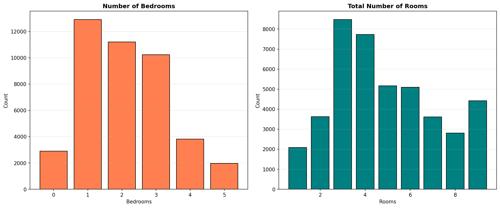

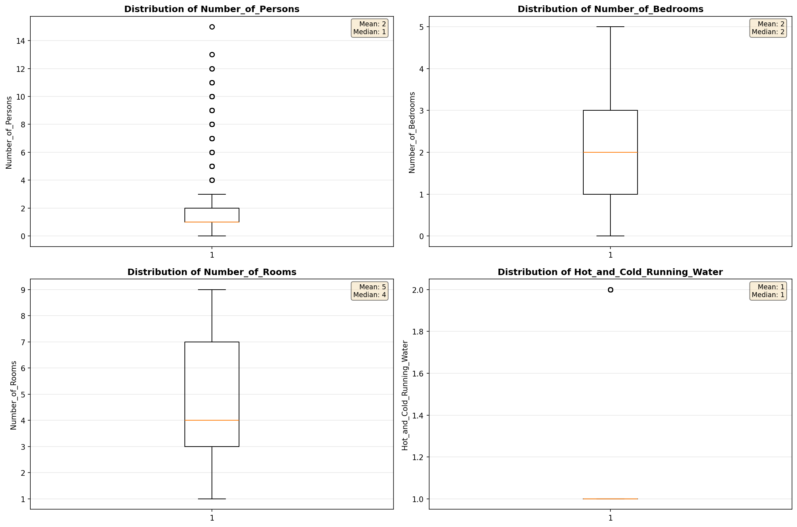

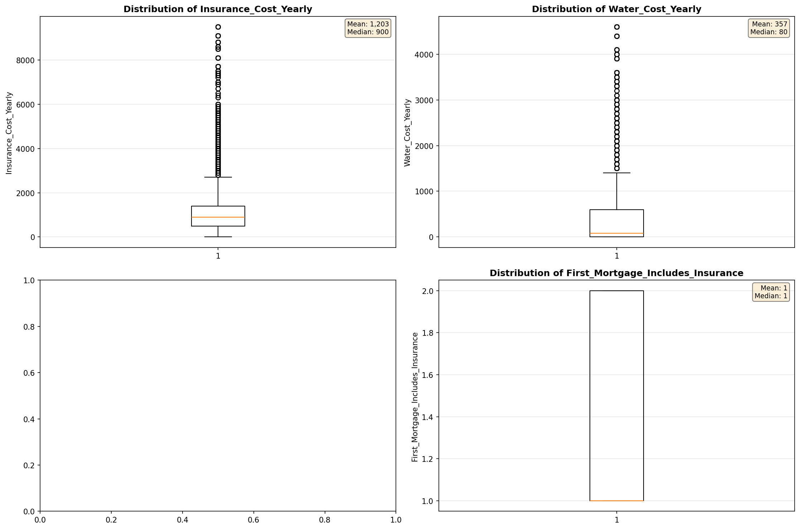

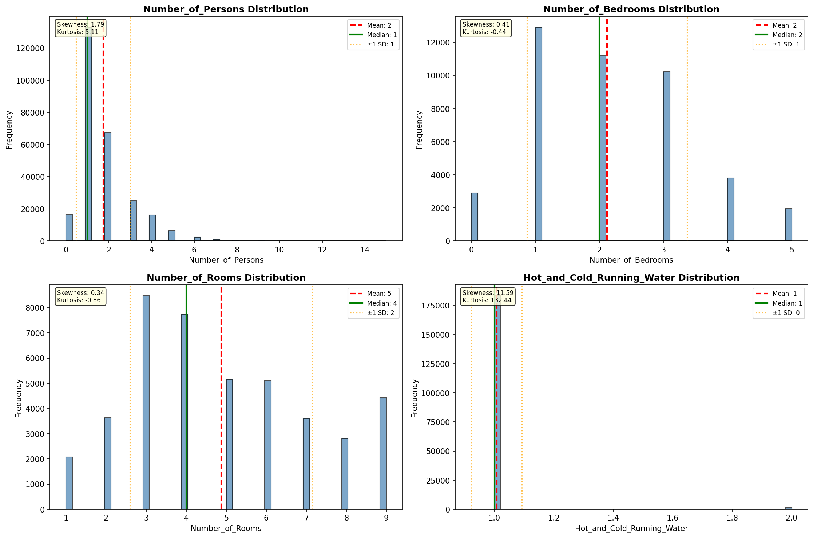

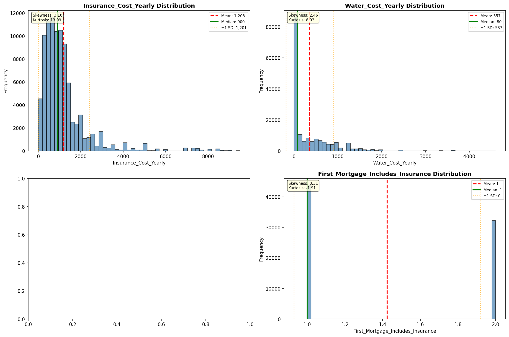

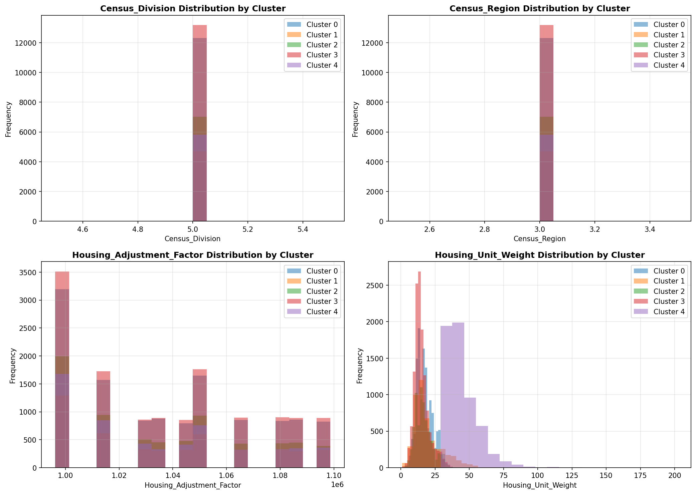

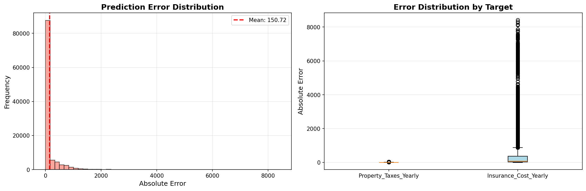

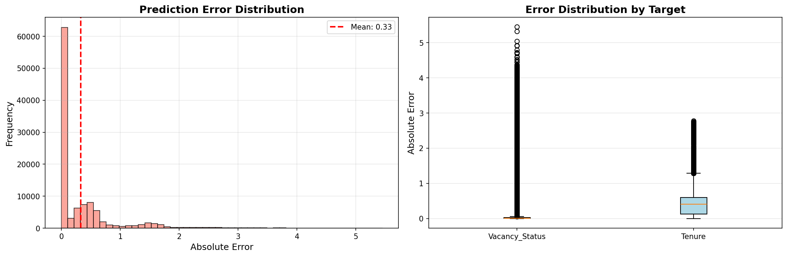

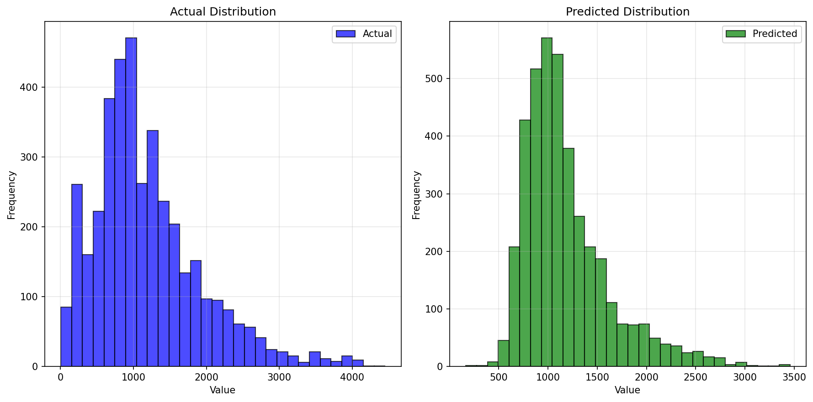

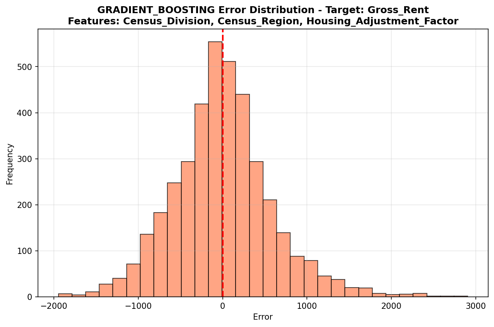

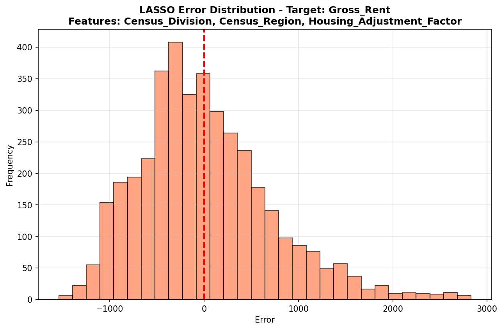

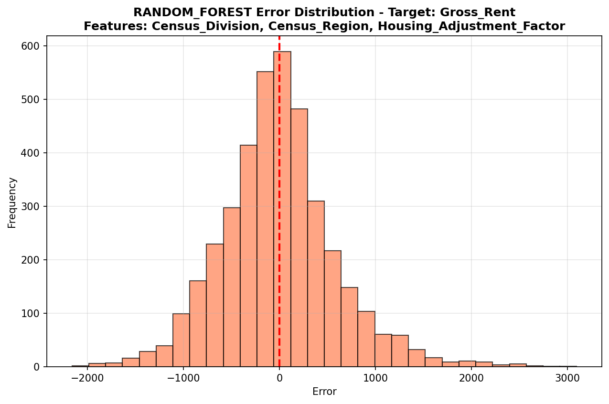

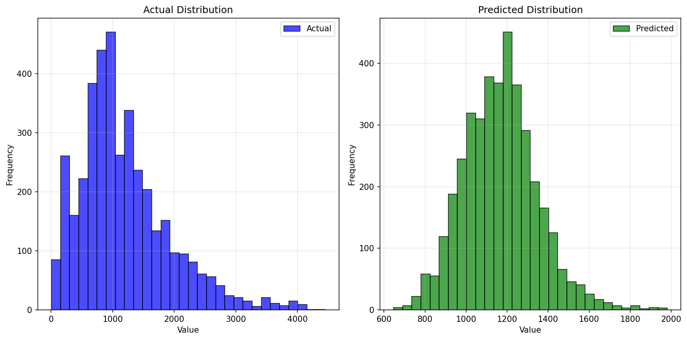

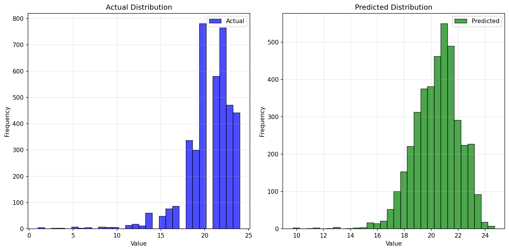

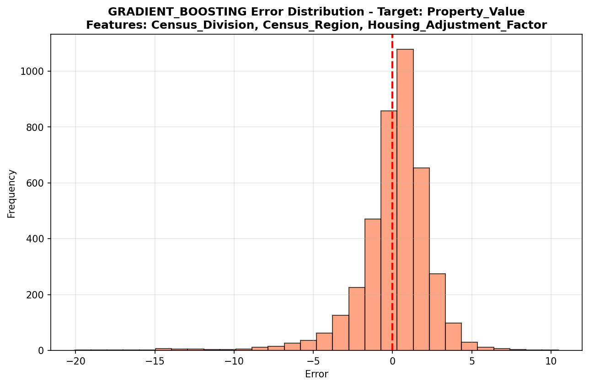

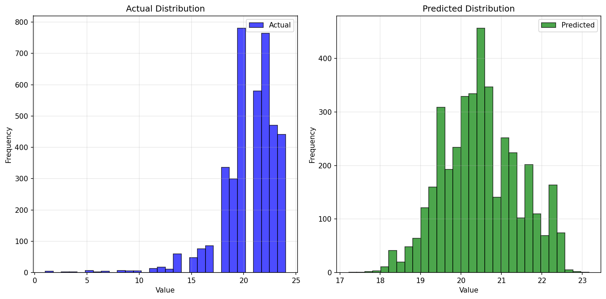

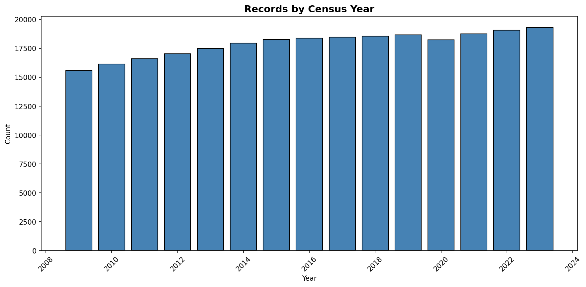
