# Temporal Analysis

## Year Distribution

- 2011: 24,249 records

- 2012: 24,072 records

- 2013: 24,216 records

- 2014: 24,273 records

- 2015: 24,495 records

- 2016: 24,614 records

- 2017: 24,944 records

- 2018: 25,038 records

- 2019: 25,236 records

- 2021: 25,814 records

- 2022: 26,532 records

- 2023: 27,311 records

## Temporal Trends

- Census_Year: {np.int64(2011): {'mean': 2011.0, 'median': 2011.0, 'std': 0.0}, np.int64(2012): {'mean': 2012.0, 'median': 2012.0, 'std': 0.0}, np.int64(2013): {'mean': 2013.0, 'median': 2013.0, 'std': 0.0}, np.int64(2014): {'mean': 2014.0, 'median': 2014.0, 'std': 0.0}, np.int64(2015): {'mean': 2015.0, 'median': 2015.0, 'std': 0.0}, np.int64(2016): {'mean': 2016.0, 'median': 2016.0, 'std': 0.0}, np.int64(2017): {'mean': 2017.0, 'median': 2017.0, 'std': 0.0}, np.int64(2018): {'mean': 2018.0, 'median': 2018.0, 'std': 0.0}, np.int64(2019): {'mean': 2019.0, 'median': 2019.0, 'std': 0.0}, np.int64(2021): {'mean': 2021.0, 'median': 2021.0, 'std': 0.0}, np.int64(2022): {'mean': 2022.0, 'median': 2022.0, 'std': 0.0}, np.int64(2023): {'mean': 2023.0, 'median': 2023.0, 'std': 0.0}}

- Census_Division: {np.int64(2011): {'mean': 6.0, 'median': 6.0, 'std': 0.0}, np.int64(2012): {'mean': 6.0, 'median': 6.0, 'std': 0.0}, np.int64(2013): {'mean': 6.0, 'median': 6.0, 'std': 0.0}, np.int64(2014): {'mean': 6.0, 'median': 6.0, 'std': 0.0}, np.int64(2015): {'mean': 6.0, 'median': 6.0, 'std': 0.0}, np.int64(2016): {'mean': 6.0, 'median': 6.0, 'std': 0.0}, np.int64(2017): {'mean': 6.0, 'median': 6.0, 'std': 0.0}, np.int64(2018): {'mean': 6.0, 'median': 6.0, 'std': 0.0}, np.int64(2019): {'mean': 6.0, 'median': 6.0, 'std': 0.0}, np.int64(2021): {'mean': 6.0, 'median': 6.0, 'std': 0.0}, np.int64(2022): {'mean': 6.0, 'median': 6.0, 'std': 0.0}, np.int64(2023): {'mean': 6.0, 'median': 6.0, 'std': 0.0}}

- Public_Use_Microdata_Area: {np.int64(2011): {'mean': 1380.8672934966391, 'median': 1300.0, 'std': 770.3173979316499}, np.int64(2012): {'mean': 1531.3444250581588, 'median': 1500.0, 'std': 807.6776405284423}, np.int64(2013): {'mean': 1533.6127766765774, 'median': 1500.0, 'std': 808.3219003147641}, np.int64(2014): {'mean': 1536.928933382771, 'median': 1500.0, 'std': 808.776025624322}, np.int64(2015): {'mean': 1537.0656868748724, 'median': 1500.0, 'std': 812.120798807389}, np.int64(2016): {'mean': 1520.798001137564, 'median': 1400.0, 'std': 813.1980608438685}, np.int64(2017): {'mean': 1528.6079618345093, 'median': 1500.0, 'std': 815.1412364412329}, np.int64(2018): {'mean': 1532.8304577042895, 'median': 1500.0, 'std': 817.40823643925}, np.int64(2019): {'mean': 1518.622444127437, 'median': 1400.0, 'std': 819.4317736869078}, np.int64(2021): {'mean': 1507.1537150383513, 'median': 1400.0, 'std': 812.8568593179942}, np.int64(2022): {'mean': 1510.4504372079, 'median': 1404.0, 'std': 821.5366027914788}, np.int64(2023): {'mean': 1502.7745597012192, 'median': 1404.0, 'std': 817.4690344135207}}

- Census_Region: {np.int64(2011): {'mean': 3.0, 'median': 3.0, 'std': 0.0}, np.int64(2012): {'mean': 3.0, 'median': 3.0, 'std': 0.0}, np.int64(2013): {'mean': 3.0, 'median': 3.0, 'std': 0.0}, np.int64(2014): {'mean': 3.0, 'median': 3.0, 'std': 0.0}, np.int64(2015): {'mean': 3.0, 'median': 3.0, 'std': 0.0}, np.int64(2016): {'mean': 3.0, 'median': 3.0, 'std': 0.0}, np.int64(2017): {'mean': 3.0, 'median': 3.0, 'std': 0.0}, np.int64(2018): {'mean': 3.0, 'median': 3.0, 'std': 0.0}, np.int64(2019): {'mean': 3.0, 'median': 3.0, 'std': 0.0}, np.int64(2021): {'mean': 3.0, 'median': 3.0, 'std': 0.0}, np.int64(2022): {'mean': 3.0, 'median': 3.0, 'std': 0.0}, np.int64(2023): {'mean': 3.0, 'median': 3.0, 'std': 0.0}}

- State_Code: {np.int64(2011): {'mean': 1.0, 'median': 1.0, 'std': 0.0}, np.int64(2012): {'mean': 1.0, 'median': 1.0, 'std': 0.0}, np.int64(2013): {'mean': 1.0, 'median': 1.0, 'std': 0.0}, np.int64(2014): {'mean': 1.0, 'median': 1.0, 'std': 0.0}, np.int64(2015): {'mean': 1.0, 'median': 1.0, 'std': 0.0}, np.int64(2016): {'mean': 1.0, 'median': 1.0, 'std': 0.0}, np.int64(2017): {'mean': 1.0, 'median': 1.0, 'std': 0.0}, np.int64(2018): {'mean': 1.0, 'median': 1.0, 'std': 0.0}, np.int64(2019): {'mean': 1.0, 'median': 1.0, 'std': 0.0}, np.int64(2021): {'mean': 1.0, 'median': 1.0, 'std': 0.0}, np.int64(2022): {'mean': 1.0, 'median': 1.0, 'std': 0.0}, np.int64(2023): {'mean': None, 'median': None, 'std': None}}

- Housing_Adjustment_Factor: {np.int64(2011): {'mean': 1000000.0, 'median': 1000000.0, 'std': 0.0}, np.int64(2012): {'mean': 1000000.0, 'median': 1000000.0, 'std': 0.0}, np.int64(2013): {'mean': 1000000.0, 'median': 1000000.0, 'std': 0.0}, np.int64(2014): {'mean': 1000000.0, 'median': 1000000.0, 'std': 0.0}, np.int64(2015): {'mean': 1000000.0, 'median': 1000000.0, 'std': 0.0}, np.int64(2016): {'mean': 1000000.0, 'median': 1000000.0, 'std': 0.0}, np.int64(2017): {'mean': 1000000.0, 'median': 1000000.0, 'std': 0.0}, np.int64(2018): {'mean': 1000000.0, 'median': 1000000.0, 'std': 0.0}, np.int64(2019): {'mean': 1000000.0, 'median': 1000000.0, 'std': 0.0}, np.int64(2021): {'mean': 1000000.0, 'median': 1000000.0, 'std': 0.0}, np.int64(2022): {'mean': 1000000.0, 'median': 1000000.0, 'std': 0.0}, np.int64(2023): {'mean': 1000000.0, 'median': 1000000.0, 'std': 0.0}}

- Income_Adjustment_Factor: {np.int64(2011): {'mean': 1018237.0, 'median': 1018237.0, 'std': 0.0}, np.int64(2012): {'mean': 1010207.0, 'median': 1010207.0, 'std': 0.0}, np.int64(2013): {'mean': 1007549.0, 'median': 1007549.0, 'std': 0.0}, np.int64(2014): {'mean': 1008425.0, 'median': 1008425.0, 'std': 0.0}, np.int64(2015): {'mean': 1001264.0, 'median': 1001264.0, 'std': 0.0}, np.int64(2016): {'mean': 1007588.0, 'median': 1007588.0, 'std': 0.0}, np.int64(2017): {'mean': 1011189.0, 'median': 1011189.0, 'std': 0.0}, np.int64(2018): {'mean': 1013097.0, 'median': 1013097.0, 'std': 0.0}, np.int64(2019): {'mean': 1010145.0, 'median': 1010145.0, 'std': 0.0}, np.int64(2021): {'mean': 1029928.0, 'median': 1029928.0, 'std': 0.0}, np.int64(2022): {'mean': 1042311.0, 'median': 1042311.0, 'std': 0.0}, np.int64(2023): {'mean': 1019518.0, 'median': 1019518.0, 'std': 0.0}}

- Housing_Unit_Weight: {np.int64(2011): {'mean': 89.99129861025197, 'median': 66.0, 'std': 95.48460615048187}, np.int64(2012): {'mean': 90.95908109006314, 'median': 71.0, 'std': 87.90224342570497}, np.int64(2013): {'mean': 90.43719028741329, 'median': 69.0, 'std': 87.37540209133586}, np.int64(2014): {'mean': 90.96650599431467, 'median': 69.0, 'std': 87.45816821165775}, np.int64(2015): {'mean': 90.56505409267197, 'median': 69.0, 'std': 87.60204517140401}, np.int64(2016): {'mean': 90.60615909644918, 'median': 70.0, 'std': 87.62848460746778}, np.int64(2017): {'mean': 90.54959108402822, 'median': 69.0, 'std': 87.75696482758407}, np.int64(2018): {'mean': 90.8503474718428, 'median': 67.0, 'std': 90.15194982070821}, np.int64(2019): {'mean': 90.54216199080679, 'median': 65.0, 'std': 95.12651460057361}, np.int64(2021): {'mean': 89.62640427674906, 'median': 64.0, 'std': 92.66585854008173}, np.int64(2022): {'mean': 88.17963214231871, 'median': 65.0, 'std': 93.05456264557208}, np.int64(2023): {'mean': 86.41646223133536, 'median': 64.0, 'std': 92.61560929992916}}

- Number_of_Persons: {np.int64(2011): {'mean': 2.0033403439317086, 'median': 2.0, 'std': 1.377978903731201}, np.int64(2012): {'mean': 1.9864988368228647, 'median': 2.0, 'std': 1.3767117122441463}, np.int64(2013): {'mean': 1.9753881731086884, 'median': 2.0, 'std': 1.3980803238120403}, np.int64(2014): {'mean': 1.9689778766530712, 'median': 2.0, 'std': 1.3964127979413687}, np.int64(2015): {'mean': 1.9381914676464584, 'median': 2.0, 'std': 1.3790536923518173}, np.int64(2016): {'mean': 1.9362557893881531, 'median': 2.0, 'std': 1.3862273214420133}, np.int64(2017): {'mean': 1.910078576010263, 'median': 2.0, 'std': 1.3915124972014232}, np.int64(2018): {'mean': 1.9081795670580717, 'median': 2.0, 'std': 1.395504923201794}, np.int64(2019): {'mean': 1.938817562212712, 'median': 2.0, 'std': 1.382553329094049}, np.int64(2021): {'mean': 1.923258696831177, 'median': 2.0, 'std': 1.3955030060059108}, np.int64(2022): {'mean': 1.9440675410824664, 'median': 2.0, 'std': 1.3612640075038545}, np.int64(2023): {'mean': 1.9413423162828165, 'median': 2.0, 'std': 1.3585379737948355}}

- Housing_Unit_Type: {np.int64(2011): {'mean': 1.1426038187141738, 'median': 1.0, 'std': 0.4552235409559224}, np.int64(2012): {'mean': 1.1285310734463276, 'median': 1.0, 'std': 0.43392377785748854}, np.int64(2013): {'mean': 1.136562603237529, 'median': 1.0, 'std': 0.44695438355898603}, np.int64(2014): {'mean': 1.1284554855188893, 'median': 1.0, 'std': 0.4337958027196177}, np.int64(2015): {'mean': 1.1356603388446622, 'median': 1.0, 'std': 0.4470036098736876}, np.int64(2016): {'mean': 1.1347200780043878, 'median': 1.0, 'std': 0.44514965805806095}, np.int64(2017): {'mean': 1.1345413726747915, 'median': 1.0, 'std': 0.44324610674606846}, np.int64(2018): {'mean': 1.1307213036185, 'median': 1.0, 'std': 0.43818010481987923}, np.int64(2019): {'mean': 1.1353225550800443, 'median': 1.0, 'std': 0.44552120157203695}, np.int64(2021): {'mean': None, 'median': None, 'std': None}, np.int64(2022): {'mean': None, 'median': None, 'std': None}, np.int64(2023): {'mean': None, 'median': None, 'std': None}}

- Number_of_Bedrooms: {np.int64(2011): {'mean': 2.8666422253792216, 'median': 3.0, 'std': 0.9270833025439499}, np.int64(2012): {'mean': 2.8733101936426744, 'median': 3.0, 'std': 0.9618567546178404}, np.int64(2013): {'mean': 2.87689497716895, 'median': 3.0, 'std': 0.9352308707037543}, np.int64(2014): {'mean': 2.892481884057971, 'median': 3.0, 'std': 0.9626088920294471}, np.int64(2015): {'mean': 2.869990533291259, 'median': 3.0, 'std': 0.8971813097128495}, np.int64(2016): {'mean': 2.8817146444265087, 'median': 3.0, 'std': 0.8966594514755385}, np.int64(2017): {'mean': 2.883689010891703, 'median': 3.0, 'std': 0.9178198227277059}, np.int64(2018): {'mean': 2.8878923766816142, 'median': 3.0, 'std': 0.962934201121055}, np.int64(2019): {'mean': 2.916539017024815, 'median': 3.0, 'std': 0.9640745675376254}, np.int64(2021): {'mean': 2.923239832303237, 'median': 3.0, 'std': 0.9529852714772696}, np.int64(2022): {'mean': 2.9473414258847668, 'median': 3.0, 'std': 0.9717779634271435}, np.int64(2023): {'mean': 2.9407253622574356, 'median': 3.0, 'std': 0.9835750116154566}}

- Number_of_Rooms: {np.int64(2011): {'mean': 6.073186380092571, 'median': 6.0, 'std': 2.0715226995447646}, np.int64(2012): {'mean': 6.12120935330654, 'median': 6.0, 'std': 2.156264715536483}, np.int64(2013): {'mean': 6.156073059360731, 'median': 6.0, 'std': 2.178425637170838}, np.int64(2014): {'mean': 6.1567934782608695, 'median': 6.0, 'std': 2.2592431434938556}, np.int64(2015): {'mean': 6.164585493395844, 'median': 6.0, 'std': 2.1656253612904592}, np.int64(2016): {'mean': 6.1815083848982155, 'median': 6.0, 'std': 2.2155012957718676}, np.int64(2017): {'mean': 6.171920658815195, 'median': 6.0, 'std': 2.207755285280071}, np.int64(2018): {'mean': 6.217796535654621, 'median': 6.0, 'std': 2.2573592888585843}, np.int64(2019): {'mean': 6.2757669919908965, 'median': 6.0, 'std': 2.2781021284722374}, np.int64(2021): {'mean': 6.305355058996413, 'median': 6.0, 'std': 2.294771879380792}, np.int64(2022): {'mean': 6.3551889211831085, 'median': 6.0, 'std': 2.3308736570954744}, np.int64(2023): {'mean': 6.360477925599525, 'median': 6.0, 'std': 2.3627177630225304}}

- Building_Type: {np.int64(2011): {'mean': 2.3866458915723388, 'median': 2.0, 'std': 1.5449997495365604}, np.int64(2012): {'mean': 2.4085677749360612, 'median': 2.0, 'std': 1.590893138059965}, np.int64(2013): {'mean': 2.422191780821918, 'median': 2.0, 'std': 1.598529148279019}, np.int64(2014): {'mean': 2.426358695652174, 'median': 2.0, 'std': 1.6225998449296481}, np.int64(2015): {'mean': 2.430059054230717, 'median': 2.0, 'std': 1.6168076909412996}, np.int64(2016): {'mean': 2.421128149941709, 'median': 2.0, 'std': 1.6082491656892854}, np.int64(2017): {'mean': 2.445187284158328, 'median': 2.0, 'std': 1.6471393528543368}, np.int64(2018): {'mean': 2.455816407280401, 'median': 2.0, 'std': 1.6593108863887307}, np.int64(2019): {'mean': 2.442163770843363, 'median': 2.0, 'std': 1.6453000956438235}, np.int64(2021): {'mean': 2.4191122444569304, 'median': 2.0, 'std': 1.6168586428366305}, np.int64(2022): {'mean': 2.4293896392545733, 'median': 2.0, 'std': 1.645297451902915}, np.int64(2023): {'mean': 2.434454707228201, 'median': 2.0, 'std': 1.6354446183538736}}

- Year_Structure_Built: {np.int64(2011): {'mean': 5.364327940974291, 'median': 5.0, 'std': 2.487121668111856}, np.int64(2012): {'mean': 5.464468396054074, 'median': 5.0, 'std': 2.5892284506193515}, np.int64(2013): {'mean': 5.610091324200913, 'median': 5.0, 'std': 2.7317600355433727}, np.int64(2014): {'mean': 5.636231884057971, 'median': 5.0, 'std': 2.800993451291656}, np.int64(2015): {'mean': 5.755037641437137, 'median': 5.0, 'std': 3.000998200052216}, np.int64(2016): {'mean': 5.91014258810869, 'median': 6.0, 'std': 3.2216305570130035}, np.int64(2017): {'mean': 6.107677322235013, 'median': 6.0, 'std': 3.5613857100689446}, np.int64(2018): {'mean': 6.243163633166271, 'median': 6.0, 'std': 3.772749195098528}, np.int64(2019): {'mean': 6.361766379272616, 'median': 6.0, 'std': 4.037993792536496}, np.int64(2021): {'mean': None, 'median': None, 'std': None}, np.int64(2022): {'mean': None, 'median': None, 'std': None}, np.int64(2023): {'mean': None, 'median': None, 'std': None}}

- Bathtub_or_Shower: {np.int64(2011): {'mean': 1.0115026809037166, 'median': 1.0, 'std': 0.10663437688776696}, np.int64(2012): {'mean': 1.0105498721227621, 'median': 1.0, 'std': 0.10217166474586707}, np.int64(2013): {'mean': 1.0089041095890412, 'median': 1.0, 'std': 0.09394269210523436}, np.int64(2014): {'mean': 1.0097826086956523, 'median': 1.0, 'std': 0.09842432626818876}, np.int64(2015): {'mean': 1.0106838570076184, 'median': 1.0, 'std': 0.1028114230354421}, np.int64(2016): {'mean': 1.0124204107254955, 'median': 1.0, 'std': 0.11075510890946087}, np.int64(2017): {'mean': 1.0125741609846808, 'median': 1.0, 'std': 0.11142980394803242}, np.int64(2018): {'mean': 1.013189132155104, 'median': 1.0, 'std': 0.11408659504797378}, np.int64(2019): {'mean': 1.0125607247581951, 'median': 1.0, 'std': 0.11137098274718647}, np.int64(2021): {'mean': 1.0111509703073, 'median': 1.0, 'std': 0.10501001270772263}, np.int64(2022): {'mean': 1.0095742862027697, 'median': 1.0, 'std': 0.09738082240987764}, np.int64(2023): {'mean': 1.0102533683586137, 'median': 1.0, 'std': 0.1007405915593611}}

- Refrigerator: {np.int64(2011): {'mean': 1.0254342147472617, 'median': 1.0, 'std': 0.15744348655336063}, np.int64(2012): {'mean': 1.0272195834855682, 'median': 1.0, 'std': 0.16272641797996762}, np.int64(2013): {'mean': 1.0253881278538812, 'median': 1.0, 'std': 0.15730448408410422}, np.int64(2014): {'mean': 1.0288043478260869, 'median': 1.0, 'std': 0.16726005021511284}, np.int64(2015): {'mean': 1.0288509218771131, 'median': 1.0, 'std': 0.16739118646087886}, np.int64(2016): {'mean': 1.0304456999372253, 'median': 1.0, 'std': 0.1718140941377637}, np.int64(2017): {'mean': 1.036748428229877, 'median': 1.0, 'std': 0.18814767757037312}, np.int64(2018): {'mean': 1.0364459685219378, 'median': 1.0, 'std': 0.18740118428967478}, np.int64(2019): {'mean': 1.029629305440063, 'median': 1.0, 'std': 0.16956611712464173}, np.int64(2021): {'mean': 1.0323723905432856, 'median': 1.0, 'std': 0.176990883378874}, np.int64(2022): {'mean': 1.0241066849034024, 'median': 1.0, 'std': 0.15338369609165028}, np.int64(2023): {'mean': 1.0235996949411066, 'median': 1.0, 'std': 0.15180159974818008}}

- Hot_and_Cold_Running_Water: {np.int64(2011): {'mean': 1.0248842857797535, 'median': 1.0, 'std': 0.1557760256163001}, np.int64(2012): {'mean': 1.0242966751918159, 'median': 1.0, 'std': 0.15397217117136833}, np.int64(2013): {'mean': 1.0240639269406393, 'median': 1.0, 'std': 0.15325118850300218}, np.int64(2014): {'mean': 1.0272192028985507, 'median': 1.0, 'std': 0.16272528121226926}, np.int64(2015): {'mean': 1.0273632962178245, 'median': 1.0, 'std': 0.16314332981824967}, np.int64(2016): {'mean': 1.0316115146623621, 'median': 1.0, 'std': 0.17496742407418162}, np.int64(2017): {'mean': 1.0364385017267335, 'median': 1.0, 'std': 0.18738274179579298}, np.int64(2018): {'mean': 1.0367537149388903, 'median': 1.0, 'std': 0.18816066509686297}, np.int64(2019): {'mean': 1.0311611011422819, 'median': 1.0, 'std': 0.17375675026519988}, np.int64(2021): {'mean': 1.035570730863984, 'median': 1.0, 'std': 0.1852213182750761}, np.int64(2022): {'mean': 1.025944605915541, 'median': 1.0, 'std': 0.15897346806358123}, np.int64(2023): {'mean': 1.0270739767816286, 'median': 1.0, 'std': 0.16230247274345166}}

- Running_Water: {np.int64(2011): {'mean': None, 'median': None, 'std': None}, np.int64(2012): {'mean': None, 'median': None, 'std': None}, np.int64(2013): {'mean': 9.0, 'median': 9.0, 'std': 0.0}, np.int64(2014): {'mean': 9.0, 'median': 9.0, 'std': 0.0}, np.int64(2015): {'mean': 9.0, 'median': 9.0, 'std': 0.0}, np.int64(2016): {'mean': 9.0, 'median': 9.0, 'std': 0.0}, np.int64(2017): {'mean': 9.0, 'median': 9.0, 'std': 0.0}, np.int64(2018): {'mean': 9.0, 'median': 9.0, 'std': 0.0}, np.int64(2019): {'mean': 9.0, 'median': 9.0, 'std': 0.0}, np.int64(2021): {'mean': 9.0, 'median': 9.0, 'std': 0.0}, np.int64(2022): {'mean': 9.0, 'median': 9.0, 'std': 0.0}, np.int64(2023): {'mean': 9.0, 'median': 9.0, 'std': 0.0}}

- Sink_with_Faucet: {np.int64(2011): {'mean': 1.0110902341780854, 'median': 1.0, 'std': 0.10472699512199564}, np.int64(2012): {'mean': 1.0096821337230544, 'median': 1.0, 'std': 0.09792256091235714}, np.int64(2013): {'mean': 1.0086301369863013, 'median': 1.0, 'std': 0.09249891031272187}, np.int64(2014): {'mean': 1.0096014492753622, 'median': 1.0, 'std': 0.09751765040111313}, np.int64(2015): {'mean': 1.0109543344002163, 'median': 1.0, 'std': 0.10409046732186679}, np.int64(2016): {'mean': 1.0119271814187067, 'median': 1.0, 'std': 0.1085608226310597}, np.int64(2017): {'mean': 1.0112016293279023, 'median': 1.0, 'std': 0.10524563292156554}, np.int64(2018): {'mean': 1.0120460740349952, 'median': 1.0, 'std': 0.10909394744771961}, np.int64(2019): {'mean': 1.0117729441113397, 'median': 1.0, 'std': 0.10786496699314115}, np.int64(2021): {'mean': 1.0109780870467218, 'median': 1.0, 'std': 0.10420190950633838}, np.int64(2022): {'mean': 1.0087621815694992, 'median': 1.0, 'std': 0.09319751602996106}, np.int64(2023): {'mean': 1.0100838911956613, 'median': 1.0, 'std': 0.09991310870420465}}

- Stove_or_Range: {np.int64(2011): {'mean': 1.0243343568122452, 'median': 1.0, 'std': 0.15408855890066314}, np.int64(2012): {'mean': 1.0262605042016806, 'median': 1.0, 'std': 0.15991265743507832}, np.int64(2013): {'mean': 1.024840182648402, 'median': 1.0, 'std': 0.15564142798342712}, np.int64(2014): {'mean': 1.0288949275362318, 'median': 1.0, 'std': 0.16751501899914575}, np.int64(2015): {'mean': 1.0280394896993192, 'median': 1.0, 'std': 0.1650893859034485}, np.int64(2016): {'mean': 1.0299076316025468, 'median': 1.0, 'std': 0.17033633245708452}, np.int64(2017): {'mean': 1.0361285752235898, 'median': 1.0, 'std': 0.18661415582241284}, np.int64(2018): {'mean': 1.0356106568187813, 'median': 1.0, 'std': 0.18532147159373716}, np.int64(2019): {'mean': 1.0305921484528864, 'median': 1.0, 'std': 0.17221372444401703}, np.int64(2021): {'mean': 1.0312054285343821, 'median': 1.0, 'std': 0.17387626766580333}, np.int64(2022): {'mean': 1.0238929731578048, 'median': 1.0, 'std': 0.15271900954167963}, np.int64(2023): {'mean': 1.0247012965002966, 'median': 1.0, 'std': 0.15521650433948364}}

- Telephone_Service: {np.int64(2011): {'mean': 1.0298944604352875, 'median': 1.0, 'std': 0.1703004586270407}, np.int64(2012): {'mean': 1.02893841701782, 'median': 1.0, 'std': 0.16763773970665516}, np.int64(2013): {'mean': 1.025204498977505, 'median': 1.0, 'std': 0.1567497635364569}, np.int64(2014): {'mean': 1.0256123020520393, 'median': 1.0, 'std': 0.1579796912676786}, np.int64(2015): {'mean': 1.028790494566873, 'median': 1.0, 'std': 0.16722147548880056}, np.int64(2016): {'mean': 1.0303045633916827, 'median': 1.0, 'std': 0.17142836290655847}, np.int64(2017): {'mean': 1.0174683544303798, 'median': 1.0, 'std': 0.13101175554590813}, np.int64(2018): {'mean': 1.018603478699269, 'median': 1.0, 'std': 0.13512331327069094}, np.int64(2019): {'mean': 1.0120345252774352, 'median': 1.0, 'std': 0.10904256934420328}, np.int64(2021): {'mean': 1.0097824499926997, 'median': 1.0, 'std': 0.0984237020817843}, np.int64(2022): {'mean': 1.0110066606830743, 'median': 1.0, 'std': 0.1043361315534823}, np.int64(2023): {'mean': 1.008318230401041, 'median': 1.0, 'std': 0.09082632217175694}}

- Lot_Acreage: {np.int64(2011): {'mean': 1.4377738368453996, 'median': 1.0, 'std': 0.6174468670516277}, np.int64(2012): {'mean': 1.4411121524523587, 'median': 1.0, 'std': 0.62086005989817}, np.int64(2013): {'mean': 1.4275631306530037, 'median': 1.0, 'std': 0.6054662602659096}, np.int64(2014): {'mean': 1.4364993004818902, 'median': 1.0, 'std': 0.6114485320320143}, np.int64(2015): {'mean': 1.430437926048337, 'median': 1.0, 'std': 0.6105216268402778}, np.int64(2016): {'mean': 1.4273486751063502, 'median': 1.0, 'std': 0.6082790652050649}, np.int64(2017): {'mean': 1.4243288676073558, 'median': 1.0, 'std': 0.6119601192989353}, np.int64(2018): {'mean': 1.4308088718233718, 'median': 1.0, 'std': 0.6128463727020514}, np.int64(2019): {'mean': 1.4383108751189702, 'median': 1.0, 'std': 0.6173030146192228}, np.int64(2021): {'mean': 1.4392808017292198, 'median': 1.0, 'std': 0.6171204782248182}, np.int64(2022): {'mean': 1.458638946908243, 'median': 1.0, 'std': 0.6193835789249285}, np.int64(2023): {'mean': 1.4505982246236975, 'median': 1.0, 'std': 0.6182838629674838}}

- Agricultural_Sales: {np.int64(2011): {'mean': 1.150971824619557, 'median': 1.0, 'std': 0.7477841721600521}, np.int64(2012): {'mean': 1.1444461145347964, 'median': 1.0, 'std': 0.7387345231680952}, np.int64(2013): {'mean': 1.1383928571428572, 'median': 1.0, 'std': 0.7173839246666093}, np.int64(2014): {'mean': 1.1255666364460561, 'median': 1.0, 'std': 0.6869598803072706}, np.int64(2015): {'mean': 1.1289092295957284, 'median': 1.0, 'std': 0.6996306298008764}, np.int64(2016): {'mean': 1.127449491113474, 'median': 1.0, 'std': 0.7031281708885103}, np.int64(2017): {'mean': 1.1455113192818112, 'median': 1.0, 'std': 0.7327426862323119}, np.int64(2018): {'mean': 1.1201214882308277, 'median': 1.0, 'std': 0.6556122678448717}, np.int64(2019): {'mean': 1.1240875912408759, 'median': 1.0, 'std': 0.6793069681616914}, np.int64(2021): {'mean': 1.1333143020268341, 'median': 1.0, 'std': 0.7076097475841328}, np.int64(2022): {'mean': 1.1339226810924925, 'median': 1.0, 'std': 0.7147236064077462}, np.int64(2023): {'mean': 1.1401819154628143, 'median': 1.0, 'std': 0.7259259433740752}}

- Tenure: {np.int64(2011): {'mean': 1.892036560117154, 'median': 2.0, 'std': 0.8717697720021932}, np.int64(2012): {'mean': 1.8983093872163272, 'median': 2.0, 'std': 0.8760311813609216}, np.int64(2013): {'mean': 1.8995910020449898, 'median': 2.0, 'std': 0.8733605583968498}, np.int64(2014): {'mean': 1.9126737613931464, 'median': 2.0, 'std': 0.8710305040321711}, np.int64(2015): {'mean': 1.9119528790494567, 'median': 2.0, 'std': 0.866247493541314}, np.int64(2016): {'mean': 1.8988161489426287, 'median': 2.0, 'std': 0.8611593118457873}, np.int64(2017): {'mean': 1.9160506329113924, 'median': 2.0, 'std': 0.8725801503350743}, np.int64(2018): {'mean': 1.9138391731787245, 'median': 2.0, 'std': 0.8611870852920847}, np.int64(2019): {'mean': 1.9011097410604192, 'median': 2.0, 'std': 0.8512397469446772}, np.int64(2021): {'mean': 1.9080644376307976, 'median': 2.0, 'std': 0.8444519413305914}, np.int64(2022): {'mean': 1.8807218101941519, 'median': 2.0, 'std': 0.8413397293542704}, np.int64(2023): {'mean': 1.8790371299781587, 'median': 2.0, 'std': 0.8323031797462762}}

- Vacancy_Status: {np.int64(2011): {'mean': 5.184836471754212, 'median': 5.0, 'std': 2.1523592797279627}, np.int64(2012): {'mean': 5.066393815370623, 'median': 5.0, 'std': 2.09404746978487}, np.int64(2013): {'mean': 4.985042735042735, 'median': 5.0, 'std': 2.1876950467714735}, np.int64(2014): {'mean': 5.018435067595248, 'median': 5.0, 'std': 2.2501521280045043}, np.int64(2015): {'mean': 5.102852551225392, 'median': 5.0, 'std': 2.2333404092965212}, np.int64(2016): {'mean': 5.146687697160884, 'median': 7.0, 'std': 2.236987987688709}, np.int64(2017): {'mean': 5.18194640338505, 'median': 7.0, 'std': 2.2128465436396225}, np.int64(2018): {'mean': 5.231879079354174, 'median': 7.0, 'std': 2.2078025975552698}, np.int64(2019): {'mean': 5.247863247863248, 'median': 7.0, 'std': 2.246893026727669}, np.int64(2021): {'mean': 5.446718146718147, 'median': 7.0, 'std': 2.08269990564335}, np.int64(2022): {'mean': 5.395599461158509, 'median': 7.0, 'std': 2.0717668361386763}, np.int64(2023): {'mean': 5.450312049927988, 'median': 7.0, 'std': 2.0663359211147916}}

- Property_Value: {np.int64(2011): {'mean': 149957.5684217605, 'median': 110000.0, 'std': 168053.24165667364}, np.int64(2012): {'mean': 150031.32180024328, 'median': 110000.0, 'std': 167241.25302188468}, np.int64(2013): {'mean': 155383.97241567663, 'median': 113000.0, 'std': 201570.00050033774}, np.int64(2014): {'mean': 154079.59418906015, 'median': 118000.0, 'std': 179345.04308034392}, np.int64(2015): {'mean': 166082.2188966737, 'median': 125000.0, 'std': 196655.7136253562}, np.int64(2016): {'mean': 172400.1210409522, 'median': 125000.0, 'std': 214372.67969806038}, np.int64(2017): {'mean': 177370.03463027094, 'median': 130000.0, 'std': 222156.97362009052}, np.int64(2018): {'mean': 178421.03670835015, 'median': 140000.0, 'std': 189655.38024198273}, np.int64(2019): {'mean': 191764.60303998957, 'median': 145000.0, 'std': 239542.90612506995}, np.int64(2021): {'mean': 209116.45925074987, 'median': 155000.0, 'std': 234657.97100778474}, np.int64(2022): {'mean': 241073.2118840934, 'median': 180000.0, 'std': 292890.1957022252}, np.int64(2023): {'mean': 263993.2801343973, 'median': 200000.0, 'std': 359801.6503696812}}

- Vehicles_Available: {np.int64(2011): {'mean': 1.8701206887845276, 'median': 2.0, 'std': 1.0835221833276643}, np.int64(2012): {'mean': 1.884297101081383, 'median': 2.0, 'std': 1.0970224335018144}, np.int64(2013): {'mean': 1.8923824130879345, 'median': 2.0, 'std': 1.0978150399001099}, np.int64(2014): {'mean': 1.8998930699119099, 'median': 2.0, 'std': 1.0984529709524995}, np.int64(2015): {'mean': 1.9024576012998884, 'median': 2.0, 'std': 1.0950283277833972}, np.int64(2016): {'mean': 1.9308408378022868, 'median': 2.0, 'std': 1.1073989239158104}, np.int64(2017): {'mean': 1.9334177215189874, 'median': 2.0, 'std': 1.1010847744752321}, np.int64(2018): {'mean': 1.9689437862364507, 'median': 2.0, 'std': 1.120609802361201}, np.int64(2019): {'mean': 1.9922071516646116, 'median': 2.0, 'std': 1.1393222028366037}, np.int64(2021): {'mean': 1.990022874385555, 'median': 2.0, 'std': 1.1218248223400782}, np.int64(2022): {'mean': 2.0017950777079694, 'median': 2.0, 'std': 1.1192994436985968}, np.int64(2023): {'mean': 2.0, 'median': 2.0, 'std': 1.121696231236671}}

- Condo_Fee_Monthly: {np.int64(2011): {'mean': 250.96503496503496, 'median': 180.0, 'std': 232.43352563530792}, np.int64(2012): {'mean': 244.62121212121212, 'median': 160.0, 'std': 248.50823723589542}, np.int64(2013): {'mean': 281.37404580152673, 'median': 200.0, 'std': 229.13134748026286}, np.int64(2014): {'mean': 260.0314960629921, 'median': 210.0, 'std': 220.36290187764024}, np.int64(2015): {'mean': 273.4867256637168, 'median': 210.0, 'std': 214.78773221835652}, np.int64(2016): {'mean': 316.2142857142857, 'median': 250.0, 'std': 251.75204158443717}, np.int64(2017): {'mean': 302.2015503875969, 'median': 200.0, 'std': 231.72570597600415}, np.int64(2018): {'mean': 289.5945945945946, 'median': 220.0, 'std': 251.25231478509508}, np.int64(2019): {'mean': 306.6906474820144, 'median': 250.0, 'std': 234.73817819690285}, np.int64(2021): {'mean': 330.2139037433155, 'median': 250.0, 'std': 260.7803781194019}, np.int64(2022): {'mean': 347.57575757575756, 'median': 280.0, 'std': 276.0592714616571}, np.int64(2023): {'mean': 432.7717391304348, 'median': 280.0, 'std': 486.686613931969}}

- Electricity_Cost_Monthly: {np.int64(2011): {'mean': 184.94869464222592, 'median': 170.0, 'std': 99.49317069394093}, np.int64(2012): {'mean': 173.97451388536325, 'median': 160.0, 'std': 92.02597689089716}, np.int64(2013): {'mean': 174.0193762781186, 'median': 160.0, 'std': 90.94117853137836}, np.int64(2014): {'mean': 184.68435256377617, 'median': 170.0, 'std': 97.32798648869431}, np.int64(2015): {'mean': 185.52960292474864, 'median': 170.0, 'std': 99.92413977370931}, np.int64(2016): {'mean': 182.88935545886878, 'median': 170.0, 'std': 97.44464994915336}, np.int64(2017): {'mean': 178.80789873417723, 'median': 160.0, 'std': 93.56638957217687}, np.int64(2018): {'mean': 193.91726061357298, 'median': 180.0, 'std': 97.83940789202198}, np.int64(2019): {'mean': 198.01138596402842, 'median': 180.0, 'std': 98.72813137687685}, np.int64(2021): {'mean': 196.82448370241354, 'median': 180.0, 'std': 103.32985830580957}, np.int64(2022): {'mean': 222.40479180755483, 'median': 190.0, 'std': 197.01329825943452}, np.int64(2023): {'mean': 232.06500974195694, 'median': 200.0, 'std': 196.555983104525}}

- Fuel_Cost_Monthly: {np.int64(2011): {'mean': 52.45185072968742, 'median': 2.0, 'std': 271.88517516013013}, np.int64(2012): {'mean': 48.33456871604813, 'median': 2.0, 'std': 267.1713362391393}, np.int64(2013): {'mean': 25.383742331288342, 'median': 2.0, 'std': 179.26341949403076}, np.int64(2014): {'mean': 32.75762513366261, 'median': 2.0, 'std': 210.05562097072533}, np.int64(2015): {'mean': 32.343556413120744, 'median': 2.0, 'std': 206.26849541347258}, np.int64(2016): {'mean': 27.745826166143882, 'median': 2.0, 'std': 196.7858566146326}, np.int64(2017): {'mean': 24.19792405063291, 'median': 2.0, 'std': 180.94073172765982}, np.int64(2018): {'mean': 597.0689238210399, 'median': 300.0, 'std': 804.9668447530904}, np.int64(2019): {'mean': 565.6781065088758, 'median': 300.0, 'std': 729.1506521378133}, np.int64(2021): {'mean': 477.24064171122996, 'median': 300.0, 'std': 624.609981317168}, np.int64(2022): {'mean': 524.0446780551905, 'median': 300.0, 'std': 712.058027722004}, np.int64(2023): {'mean': 534.1177856301531, 'median': 300.0, 'std': 673.1385130924384}}

- Gas_Cost_Monthly: {np.int64(2011): {'mean': 48.04630611523506, 'median': 3.0, 'std': 82.28934706021573}, np.int64(2012): {'mean': 40.609179062801445, 'median': 3.0, 'std': 70.33037949330486}, np.int64(2013): {'mean': 42.668558282208586, 'median': 3.0, 'std': 71.60183485716678}, np.int64(2014): {'mean': 45.74494628036051, 'median': 3.0, 'std': 79.87600554697686}, np.int64(2015): {'mean': 40.27642936935107, 'median': 3.0, 'std': 71.49919102830714}, np.int64(2016): {'mean': 34.26358393200445, 'median': 3.0, 'std': 61.314895038153566}, np.int64(2017): {'mean': 32.231493670886074, 'median': 3.0, 'std': 57.82892001080897}, np.int64(2018): {'mean': 83.75048202336396, 'median': 50.0, 'std': 88.95423068401405}, np.int64(2019): {'mean': 79.64080364080364, 'median': 50.0, 'std': 82.65607286255027}, np.int64(2021): {'mean': 80.94408322496749, 'median': 50.0, 'std': 85.05276232810199}, np.int64(2022): {'mean': 106.73916737468139, 'median': 50.0, 'std': 194.28477256673727}, np.int64(2023): {'mean': 103.93746051800379, 'median': 60.0, 'std': 158.28585802777783}}

- House_Heating_Fuel: {np.int64(2011): {'mean': 2.3804979043579255, 'median': 3.0, 'std': 1.0698262682091129}, np.int64(2012): {'mean': 2.4131085952175457, 'median': 3.0, 'std': 1.0687557240837229}, np.int64(2013): {'mean': 2.429652351738241, 'median': 3.0, 'std': 1.0984374522216354}, np.int64(2014): {'mean': 2.4282295432557666, 'median': 3.0, 'std': 1.1007082671343749}, np.int64(2015): {'mean': 2.454402356047527, 'median': 3.0, 'std': 1.1075454159580183}, np.int64(2016): {'mean': 2.4302337346959426, 'median': 3.0, 'std': 1.0751968108897636}, np.int64(2017): {'mean': 2.4634936708860757, 'median': 3.0, 'std': 1.0741221361161821}, np.int64(2018): {'mean': 2.4627174187043104, 'median': 3.0, 'std': 1.0770268648261878}, np.int64(2019): {'mean': 2.4688532675709003, 'median': 3.0, 'std': 1.0854095456295156}, np.int64(2021): {'mean': 2.4816761571032266, 'median': 3.0, 'std': 1.1075664977007156}, np.int64(2022): {'mean': 2.5072511691624544, 'median': 3.0, 'std': 1.1006409385022253}, np.int64(2023): {'mean': 2.5018820577164367, 'median': 3.0, 'std': 1.1013277645210091}}

- Insurance_Cost_Yearly: {np.int64(2011): {'mean': 992.9210915666612, 'median': 840.0, 'std': 736.7959273595405}, np.int64(2012): {'mean': 1035.2857501884896, 'median': 900.0, 'std': 749.0435721514536}, np.int64(2013): {'mean': 1061.5751749725946, 'median': 950.0, 'std': 755.9321040306208}, np.int64(2014): {'mean': 1117.3555651052857, 'median': 1000.0, 'std': 812.1119194070761}, np.int64(2015): {'mean': 1181.6525316987152, 'median': 1100.0, 'std': 834.9114732335806}, np.int64(2016): {'mean': 1211.0721994478374, 'median': 1100.0, 'std': 838.5516855118447}, np.int64(2017): {'mean': 1227.6848956132194, 'median': 1100.0, 'std': 835.0339644790171}, np.int64(2018): {'mean': 1264.3591525423728, 'median': 1200.0, 'std': 834.2071607677277}, np.int64(2019): {'mean': 1285.5676338373519, 'median': 1200.0, 'std': 854.970816273859}, np.int64(2021): {'mean': 1350.5851046827554, 'median': 1200.0, 'std': 911.7848874383067}, np.int64(2022): {'mean': 1414.105676921914, 'median': 1300.0, 'std': 975.9924213596794}, np.int64(2023): {'mean': 1670.3753922498722, 'median': 1400.0, 'std': 1244.7737120824436}}

- Water_Cost_Yearly: {np.int64(2011): {'mean': 398.7218603241933, 'median': 330.0, 'std': 433.594967916764}, np.int64(2012): {'mean': 390.55927298573386, 'median': 330.0, 'std': 411.8776485222187}, np.int64(2013): {'mean': 381.6266871165644, 'median': 300.0, 'std': 407.89048867626207}, np.int64(2014): {'mean': 398.39920566220275, 'median': 340.0, 'std': 413.20034956929226}, np.int64(2015): {'mean': 406.982431197319, 'median': 350.0, 'std': 435.0993607332876}, np.int64(2016): {'mean': 414.5442679348376, 'median': 350.0, 'std': 451.5859589362832}, np.int64(2017): {'mean': 415.73048101265823, 'median': 350.0, 'std': 456.10699899131066}, np.int64(2018): {'mean': 467.66379957282226, 'median': 390.0, 'std': 452.187705417906}, np.int64(2019): {'mean': 484.13391951302, 'median': 400.0, 'std': 484.6990072813249}, np.int64(2021): {'mean': 491.16433219366934, 'median': 390.0, 'std': 519.0589912337864}, np.int64(2022): {'mean': 490.19635044285565, 'median': 380.0, 'std': 535.4001916432118}, np.int64(2023): {'mean': 512.4565762004175, 'median': 400.0, 'std': 562.7075040879748}}

- Mobile_Home_Costs_Monthly: {np.int64(2011): {'mean': 485.661094224924, 'median': 120.0, 'std': 909.7706913893443}, np.int64(2012): {'mean': 509.25581395348837, 'median': 120.0, 'std': 973.9953649637287}, np.int64(2013): {'mean': 463.9498825371966, 'median': 110.0, 'std': 940.4330077152642}, np.int64(2014): {'mean': 540.4033872209392, 'median': 110.0, 'std': 1110.8306989707678}, np.int64(2015): {'mean': 493.22094926350246, 'median': 110.0, 'std': 953.4782337820993}, np.int64(2016): {'mean': 463.83561643835617, 'median': 110.0, 'std': 904.7603767264008}, np.int64(2017): {'mean': 544.3368421052631, 'median': 120.0, 'std': 1118.0925946185089}, np.int64(2018): {'mean': 461.5090311986864, 'median': 130.0, 'std': 874.6390632025018}, np.int64(2019): {'mean': 586.0751761942051, 'median': 150.0, 'std': 1236.5671718591186}, np.int64(2021): {'mean': 721.062893081761, 'median': 150.0, 'std': 1936.932363176093}, np.int64(2022): {'mean': 704.5363511659808, 'median': 170.0, 'std': 1755.4475487696561}, np.int64(2023): {'mean': 1185.5135135135135, 'median': 200.0, 'std': 3411.6834016057674}}

- First_Mortgage_Includes_Insurance: {np.int64(2011): {'mean': 1.378884312991389, 'median': 1.0, 'std': 0.48513952907978447}, np.int64(2012): {'mean': 1.37775538480917, 'median': 1.0, 'std': 0.48485654123450883}, np.int64(2013): {'mean': 1.3812309257375381, 'median': 1.0, 'std': 0.4857199887751401}, np.int64(2014): {'mean': 1.3470611234197836, 'median': 1.0, 'std': 0.4760664210692633}, np.int64(2015): {'mean': 1.3470880125359102, 'median': 1.0, 'std': 0.47607512040261496}, np.int64(2016): {'mean': 1.348290048855747, 'median': 1.0, 'std': 0.4764591035034114}, np.int64(2017): {'mean': 1.3376201610808003, 'median': 1.0, 'std': 0.472929003605969}, np.int64(2018): {'mean': 1.3285695555264192, 'median': 1.0, 'std': 0.4697238886652954}, np.int64(2019): {'mean': 1.3246120302680517, 'median': 1.0, 'std': 0.46825973782361824}, np.int64(2021): {'mean': 1.2948132222520827, 'median': 1.0, 'std': 0.4559893922160813}, np.int64(2022): {'mean': 1.29370365715722, 'median': 1.0, 'std': 0.45548643510212106}, np.int64(2023): {'mean': 1.283496118206862, 'median': 1.0, 'std': 0.45072331604239535}}

- First_Mortgage_Payment_Monthly: {np.int64(2011): {'mean': 838.3756395856733, 'median': 700.0, 'std': 569.169450489525}, np.int64(2012): {'mean': 851.3553344249906, 'median': 710.0, 'std': 580.6385674034768}, np.int64(2013): {'mean': 830.4572736520854, 'median': 710.0, 'std': 545.1039451626777}, np.int64(2014): {'mean': 845.8313567053303, 'median': 720.0, 'std': 556.9530565657046}, np.int64(2015): {'mean': 866.0104465917995, 'median': 740.0, 'std': 575.8819712554529}, np.int64(2016): {'mean': 878.959629724865, 'median': 750.0, 'std': 577.9728259557146}, np.int64(2017): {'mean': 883.3159262146012, 'median': 760.0, 'std': 561.5392598466789}, np.int64(2018): {'mean': 897.0856168873738, 'median': 780.0, 'std': 569.7176440605157}, np.int64(2019): {'mean': 934.1503142234193, 'median': 790.0, 'std': 610.6965901930674}, np.int64(2021): {'mean': 319.2480442581147, 'median': 4.0, 'std': 572.6447895885918}, np.int64(2022): {'mean': 435.20286895974033, 'median': 4.0, 'std': 655.3844824504127}, np.int64(2023): {'mean': 1107.2096168294515, 'median': 950.0, 'std': 705.7209109452917}}

- First_Mortgage_Includes_Taxes: {np.int64(2011): {'mean': 1.3748908024460251, 'median': 1.0, 'std': 0.48412492011267616}, np.int64(2012): {'mean': 1.3638997354830584, 'median': 1.0, 'std': 0.4811505778679863}, np.int64(2013): {'mean': 1.363936927772126, 'median': 1.0, 'std': 0.4811613870534727}, np.int64(2014): {'mean': 1.3335071028280985, 'median': 1.0, 'std': 0.4714966469602366}, np.int64(2015): {'mean': 1.3372943327239488, 'median': 1.0, 'std': 0.47281715104501476}, np.int64(2016): {'mean': 1.3292620210851118, 'median': 1.0, 'std': 0.4699754676665988}, np.int64(2017): {'mean': 1.3246297739672643, 'median': 1.0, 'std': 0.4682667704765869}, np.int64(2018): {'mean': 1.311393732791399, 'median': 1.0, 'std': 0.4630937204761654}, np.int64(2019): {'mean': 1.2990893933564192, 'median': 1.0, 'std': 0.4578884342290399}, np.int64(2021): {'mean': 1.2735823703305562, 'median': 1.0, 'std': 0.4458270573734578}, np.int64(2022): {'mean': 1.2583888400150811, 'median': 1.0, 'std': 0.4377763502597896}, np.int64(2023): {'mean': 1.2675932882544452, 'median': 1.0, 'std': 0.44273204621580065}}

- First_Mortgage_Status: {np.int64(2011): {'mean': 1.9143189277899344, 'median': 1.0, 'std': 0.991230149681159}, np.int64(2012): {'mean': 1.9147966581509355, 'median': 1.0, 'std': 0.9908035584766576}, np.int64(2013): {'mean': 1.9148297991071428, 'median': 1.0, 'std': 0.9903971146441646}, np.int64(2014): {'mean': 1.9435719249478804, 'median': 1.0, 'std': 0.9934170845426034}, np.int64(2015): {'mean': 1.9525062309609527, 'median': 1.0, 'std': 0.9924390220667918}, np.int64(2016): {'mean': 1.9473360655737706, 'median': 1.0, 'std': 0.9936747873774885}, np.int64(2017): {'mean': 1.9429620902349436, 'median': 1.0, 'std': 0.9933957759864218}, np.int64(2018): {'mean': 1.9643861936457834, 'median': 1.0, 'std': 0.9938224104070469}, np.int64(2019): {'mean': 1.9791845635366418, 'median': 1.0, 'std': 0.9949795711042276}, np.int64(2021): {'mean': 2.042334913317317, 'median': 3.0, 'std': 0.9947393327066033}, np.int64(2022): {'mean': 2.024707412223667, 'median': 3.0, 'std': 0.9946332875353845}, np.int64(2023): {'mean': 2.0421715947649055, 'median': 3.0, 'std': 0.9941551472320986}}

- Second_Mortgage_Payment_Monthly: {np.int64(2011): {'mean': 334.0, 'median': 250.0, 'std': 290.4910032529466}, np.int64(2012): {'mean': 321.626427406199, 'median': 250.0, 'std': 270.234838014147}, np.int64(2013): {'mean': 326.59696157283287, 'median': 250.0, 'std': 314.15299024324764}, np.int64(2014): {'mean': 303.73856209150324, 'median': 230.0, 'std': 263.16557241065846}, np.int64(2015): {'mean': 329.6288866599799, 'median': 250.0, 'std': 301.2989993946364}, np.int64(2016): {'mean': 328.2173458725183, 'median': 240.0, 'std': 325.14965140315417}, np.int64(2017): {'mean': 321.1403118040089, 'median': 240.0, 'std': 325.29805956894813}, np.int64(2018): {'mean': 376.86861313868616, 'median': 275.0, 'std': 371.98343153648676}, np.int64(2019): {'mean': 323.7472924187726, 'median': 240.0, 'std': 285.09454557630323}, np.int64(2021): {'mean': 405.8340707964602, 'median': 300.0, 'std': 422.39630049752697}, np.int64(2022): {'mean': 430.5367875647668, 'median': 300.0, 'std': 450.87647923462805}, np.int64(2023): {'mean': 480.45231071779745, 'median': 340.0, 'std': 499.06731113189846}}

- Second_Mortgage_Status: {np.int64(2011): {'mean': 2.808436291027081, 'median': 3.0, 'std': 0.5029803470281674}, np.int64(2012): {'mean': 2.8167275475500695, 'median': 3.0, 'std': 0.48747716469899066}, np.int64(2013): {'mean': 2.8355798575788405, 'median': 3.0, 'std': 0.4672138589662157}, np.int64(2014): {'mean': 2.838003388505148, 'median': 3.0, 'std': 0.4637031615059377}, np.int64(2015): {'mean': 2.8447375293810393, 'median': 3.0, 'std': 0.4560325012695806}, np.int64(2016): {'mean': 2.8572897917202367, 'median': 3.0, 'std': 0.4388242893815215}, np.int64(2017): {'mean': 2.8621719927253833, 'median': 3.0, 'std': 0.4186078010943161}, np.int64(2018): {'mean': 2.8762291857873343, 'median': 3.0, 'std': 0.40114580701029}, np.int64(2019): {'mean': 2.8744388867513146, 'median': 3.0, 'std': 0.3972189865938096}, np.int64(2021): {'mean': 2.869672557172557, 'median': 3.0, 'std': 0.3876390232231733}, np.int64(2022): {'mean': 2.869179331306991, 'median': 3.0, 'std': 0.38629818030354063}, np.int64(2023): {'mean': 2.868723532970357, 'median': 3.0, 'std': 0.3846279417705046}}

- Property_Taxes_Yearly: {np.int64(2011): {'mean': 11.28207056892779, 'median': 9.0, 'std': 10.45024638552126}, np.int64(2012): {'mean': 11.564869156942622, 'median': 9.0, 'std': 10.714238395402967}, np.int64(2013): {'mean': 11.602190290178571, 'median': 9.0, 'std': 10.60047939115398}, np.int64(2014): {'mean': 11.443154968728283, 'median': 9.0, 'std': 10.605004479295019}, np.int64(2015): {'mean': 11.816463583494876, 'median': 9.0, 'std': 10.888266518512111}, np.int64(2016): {'mean': 12.108060109289617, 'median': 9.0, 'std': 11.097968521988893}, np.int64(2017): {'mean': 12.243883845034306, 'median': 9.0, 'std': 11.316571424068508}}

- Meals_Included_in_Rent: {np.int64(2011): {'mean': 1.9845704753961635, 'median': 2.0, 'std': 0.12326646973471106}, np.int64(2012): {'mean': 1.9850808122668877, 'median': 2.0, 'std': 0.12124211932786415}, np.int64(2013): {'mean': 1.9838774687625957, 'median': 2.0, 'std': 0.12595948826162304}, np.int64(2014): {'mean': 1.9852, 'median': 2.0, 'std': 0.1207637229276866}, np.int64(2015): {'mean': 1.9870801033591732, 'median': 2.0, 'std': 0.11294028640793236}, np.int64(2016): {'mean': 1.9862348178137652, 'median': 2.0, 'std': 0.11652660906346282}, np.int64(2017): {'mean': 1.9851067999216148, 'median': 2.0, 'std': 0.12113739425040732}, np.int64(2018): {'mean': 1.9835648601056546, 'median': 2.0, 'std': 0.12715419568849803}, np.int64(2019): {'mean': 1.9847051720668143, 'median': 2.0, 'std': 0.12273519362039169}, np.int64(2021): {'mean': 1.9863805200165086, 'median': 2.0, 'std': 0.1159170500908855}, np.int64(2022): {'mean': 1.9879699248120302, 'median': 2.0, 'std': 0.10903167554390325}, np.int64(2023): {'mean': 1.9839090323964814, 'median': 2.0, 'std': 0.125838967734055}}

- Rent_Amount_Monthly: {np.int64(2011): {'mean': 496.0195996663887, 'median': 440.0, 'std': 338.9418466697593}, np.int64(2012): {'mean': 507.30998756734357, 'median': 450.0, 'std': 328.34703310196016}, np.int64(2013): {'mean': 540.3502619911326, 'median': 480.0, 'std': 383.8744974090726}, np.int64(2014): {'mean': 555.8744, 'median': 500.0, 'std': 406.7969884138727}, np.int64(2015): {'mean': 574.1773007354403, 'median': 500.0, 'std': 458.2745480616852}, np.int64(2016): {'mean': 586.8093117408907, 'median': 500.0, 'std': 400.66902957896565}, np.int64(2017): {'mean': 596.2457378012933, 'median': 520.0, 'std': 393.9738900955099}, np.int64(2018): {'mean': 606.1588730189786, 'median': 550.0, 'std': 389.63868631064395}, np.int64(2019): {'mean': 618.8629502918092, 'median': 550.0, 'std': 390.07403496187607}, np.int64(2021): {'mean': 678.3867106892283, 'median': 600.0, 'std': 470.15894273673985}, np.int64(2022): {'mean': 710.7918367346939, 'median': 630.0, 'std': 448.1417980772202}, np.int64(2023): {'mean': 792.14975327183, 'median': 680.0, 'std': 550.8692194000768}}

- Gross_Rent: {np.int64(2011): {'mean': 696.8915904528218, 'median': 650.0, 'std': 363.7479289954742}, np.int64(2012): {'mean': 696.0011130899377, 'median': 651.5, 'std': 351.10714510294025}, np.int64(2013): {'mean': 722.552110817942, 'median': 670.0, 'std': 389.6663950318785}, np.int64(2014): {'mean': 751.5539647577092, 'median': 700.0, 'std': 398.2200958249091}, np.int64(2015): {'mean': 747.565777972028, 'median': 701.0, 'std': 390.1207262213889}, np.int64(2016): {'mean': 765.861868573983, 'median': 710.0, 'std': 391.90813956587834}, np.int64(2017): {'mean': 773.1292916123425, 'median': 720.0, 'std': 393.489065763397}, np.int64(2018): {'mean': 800.199956578376, 'median': 750.0, 'std': 405.85100544274985}, np.int64(2019): {'mean': 812.997105966162, 'median': 757.5, 'std': 403.7574358628681}, np.int64(2021): {'mean': 875.1884057971015, 'median': 803.0, 'std': 470.4794747620915}, np.int64(2022): {'mean': 933.5410138248848, 'median': 850.0, 'std': 498.17368455334486}, np.int64(2023): {'mean': 1016.9635989010989, 'median': 908.5, 'std': 575.7292563349594}}

- Gross_Rent_Percentage_Income: {np.int64(2011): {'mean': 40.83137525915688, 'median': 32.0, 'std': 27.808158496397407}, np.int64(2012): {'mean': 39.335253456221196, 'median': 30.0, 'std': 27.92897193241235}, np.int64(2013): {'mean': 38.794297352342156, 'median': 29.0, 'std': 27.69384953402046}, np.int64(2014): {'mean': 40.01336656094246, 'median': 30.0, 'std': 28.059857240307768}, np.int64(2015): {'mean': 38.21849684968497, 'median': 29.0, 'std': 27.254573978263846}, np.int64(2016): {'mean': 38.067007910656116, 'median': 29.0, 'std': 27.33248299888388}, np.int64(2017): {'mean': 36.84358047016275, 'median': 28.0, 'std': 26.660456837427162}, np.int64(2018): {'mean': 37.38196166854566, 'median': 28.0, 'std': 27.01642927589538}, np.int64(2019): {'mean': 36.58895002292526, 'median': 28.0, 'std': 26.838967875166936}, np.int64(2021): {'mean': 38.46581294305968, 'median': 29.0, 'std': 28.17167399532305}, np.int64(2022): {'mean': 38.59100642398287, 'median': 28.0, 'std': 28.448865004570365}, np.int64(2023): {'mean': 38.07939863753817, 'median': 29.0, 'std': 27.908858963792007}}

- Selected_Monthly_Owner_Costs: {np.int64(2011): {'mean': 850.1029270961565, 'median': 672.0, 'std': 677.7833720583585}, np.int64(2012): {'mean': 836.5547959395069, 'median': 652.0, 'std': 680.698040260483}, np.int64(2013): {'mean': 824.3906217291187, 'median': 650.0, 'std': 656.3470346989442}, np.int64(2014): {'mean': 830.8753822629969, 'median': 656.0, 'std': 658.5070747499115}, np.int64(2015): {'mean': 842.6435794431362, 'median': 668.0, 'std': 675.3627465009805}, np.int64(2016): {'mean': 843.0980526135976, 'median': 663.0, 'std': 679.157404323859}, np.int64(2017): {'mean': 839.8401497296547, 'median': 660.0, 'std': 670.8287725690011}, np.int64(2018): {'mean': 858.0806673074283, 'median': 670.0, 'std': 676.2961234287621}, np.int64(2019): {'mean': 873.2494713190589, 'median': 679.0, 'std': 703.7383308506735}, np.int64(2021): {'mean': 884.2120641516784, 'median': 669.0, 'std': 705.1155820054711}, np.int64(2022): {'mean': 964.012016104057, 'median': 739.0, 'std': 786.6322246089129}, np.int64(2023): {'mean': 1026.807296085323, 'median': 778.0, 'std': 841.732746587579}}

- Owner_Costs_Percentage_Income: {np.int64(2011): {'mean': 23.68587399075288, 'median': 18.0, 'std': 21.091456995809157}, np.int64(2012): {'mean': 22.36311601284378, 'median': 17.0, 'std': 20.351835607640684}, np.int64(2013): {'mean': 21.747529644268774, 'median': 16.0, 'std': 20.40015776996409}, np.int64(2014): {'mean': 21.695569753563152, 'median': 15.0, 'std': 20.456433322166603}, np.int64(2015): {'mean': 21.01551094890511, 'median': 15.0, 'std': 19.87347423165105}, np.int64(2016): {'mean': 20.632713703268607, 'median': 15.0, 'std': 20.04476826640034}, np.int64(2017): {'mean': 19.828835774865073, 'median': 14.0, 'std': 19.08441924626867}, np.int64(2018): {'mean': 20.125973303670744, 'median': 14.0, 'std': 19.654552874096296}, np.int64(2019): {'mean': 19.454436290860574, 'median': 14.0, 'std': 19.231145895280697}, np.int64(2021): {'mean': 20.098236610080274, 'median': 14.0, 'std': 20.585415140161835}, np.int64(2022): {'mean': 20.46504197468989, 'median': 14.0, 'std': 21.335413325077315}, np.int64(2023): {'mean': 20.422105004906772, 'median': 14.0, 'std': 20.919319481789923}}

- Satellite_Internet: {np.int64(2011): {'mean': None, 'median': None, 'std': None}, np.int64(2012): {'mean': None, 'median': None, 'std': None}, np.int64(2013): {'mean': 1.9266140994613163, 'median': 2.0, 'std': 0.2607790623393561}, np.int64(2014): {'mean': 1.9187041564792175, 'median': 2.0, 'std': 0.27329935289914903}, np.int64(2015): {'mean': 1.9119642191576594, 'median': 2.0, 'std': 0.2833574903448216}, np.int64(2016): {'mean': 1.893688151912276, 'median': 2.0, 'std': 0.30824664163448345}, np.int64(2017): {'mean': 1.892831886853102, 'median': 2.0, 'std': 0.30933680728872986}, np.int64(2018): {'mean': 1.8801002820432466, 'median': 2.0, 'std': 0.3248544133032408}, np.int64(2019): {'mean': 1.888676426650732, 'median': 2.0, 'std': 0.31454180536114085}, np.int64(2021): {'mean': 1.8893663343646157, 'median': 2.0, 'std': 0.31368693838080713}, np.int64(2022): {'mean': 1.8943058568329718, 'median': 2.0, 'std': 0.30745409009387725}, np.int64(2023): {'mean': 1.8985514825079748, 'median': 2.0, 'std': 0.3019295992490673}}

- Smartphone: {np.int64(2011): {'mean': None, 'median': None, 'std': None}, np.int64(2012): {'mean': None, 'median': None, 'std': None}, np.int64(2013): {'mean': None, 'median': None, 'std': None}, np.int64(2014): {'mean': None, 'median': None, 'std': None}, np.int64(2015): {'mean': None, 'median': None, 'std': None}, np.int64(2016): {'mean': 1.3136193463523222, 'median': 1.0, 'std': 0.46397536898922276}, np.int64(2017): {'mean': 1.249367088607595, 'median': 1.0, 'std': 0.4326576265760284}, np.int64(2018): {'mean': 1.2194101336022183, 'median': 1.0, 'std': 0.4138574174916577}, np.int64(2019): {'mean': 1.1868803945745992, 'median': 1.0, 'std': 0.3898250990132595}, np.int64(2021): {'mean': 1.141821190441427, 'median': 1.0, 'std': 0.3488751410802218}, np.int64(2022): {'mean': 1.1205064008691956, 'median': 1.0, 'std': 0.32556046297147584}, np.int64(2023): {'mean': 1.1124122868163018, 'median': 1.0, 'std': 0.31588035937717523}}

- Tablet_Computer: {np.int64(2011): {'mean': None, 'median': None, 'std': None}, np.int64(2012): {'mean': None, 'median': None, 'std': None}, np.int64(2013): {'mean': None, 'median': None, 'std': None}, np.int64(2014): {'mean': None, 'median': None, 'std': None}, np.int64(2015): {'mean': None, 'median': None, 'std': None}, np.int64(2016): {'mean': 1.4819386825862593, 'median': 1.0, 'std': 0.4996863225365411}, np.int64(2017): {'mean': 1.4375696202531645, 'median': 1.0, 'std': 0.4960996968342698}, np.int64(2018): {'mean': 1.4282833375346609, 'median': 1.0, 'std': 0.4948424654643705}, np.int64(2019): {'mean': 1.4377805178791616, 'median': 1.0, 'std': 0.4961258672573036}, np.int64(2021): {'mean': 1.431790529031002, 'median': 1.0, 'std': 0.4953376721429792}, np.int64(2022): {'mean': 1.4195285559072228, 'median': 1.0, 'std': 0.49349351672355496}, np.int64(2023): {'mean': 1.4065244667503136, 'median': 1.0, 'std': 0.49119602685717345}}

- Food_Stamp_SNAP: {np.int64(2011): {'mean': 1.8421573478476, 'median': 2.0, 'std': 0.3646016031187006}, np.int64(2012): {'mean': 1.8470260138069767, 'median': 2.0, 'std': 0.3599706514264156}, np.int64(2013): {'mean': 1.8545437922837813, 'median': 2.0, 'std': 0.35256826513356454}, np.int64(2014): {'mean': 1.8586936606815683, 'median': 2.0, 'std': 0.3483452538585648}, np.int64(2015): {'mean': 1.8648550395346724, 'median': 2.0, 'std': 0.3418861092273605}, np.int64(2016): {'mean': 1.8746263248482653, 'median': 2.0, 'std': 0.3311496393926524}, np.int64(2017): {'mean': 1.8737561063868282, 'median': 2.0, 'std': 0.33213154411575785}, np.int64(2018): {'mean': 1.8823609165273196, 'median': 2.0, 'std': 0.322187555364308}, np.int64(2019): {'mean': 1.8878739740534816, 'median': 2.0, 'std': 0.31552840352144723}, np.int64(2021): {'mean': 1.8751722356183258, 'median': 2.0, 'std': 0.33053063069541516}, np.int64(2022): {'mean': 1.8838510594527875, 'median': 2.0, 'std': 0.3204100311877179}, np.int64(2023): {'mean': 1.8800142698588869, 'median': 2.0, 'std': 0.324951289064852}}

- Family_Type_Employment_Status: {np.int64(2011): {'mean': 3.460836388119997, 'median': 3.0, 'std': 2.460814367375033}, np.int64(2012): {'mean': 3.415513721932411, 'median': 3.0, 'std': 2.428663711504596}, np.int64(2013): {'mean': 3.4251432938479174, 'median': 3.0, 'std': 2.436724899790924}, np.int64(2014): {'mean': 3.436024749828126, 'median': 3.0, 'std': 2.42934018097413}, np.int64(2015): {'mean': 3.403179748398549, 'median': 3.0, 'std': 2.3956420277449046}, np.int64(2016): {'mean': 3.369078845857121, 'median': 3.0, 'std': 2.3958971244066096}, np.int64(2017): {'mean': 3.430136563536764, 'median': 3.0, 'std': 2.40516080701136}, np.int64(2018): {'mean': 3.3658574181117533, 'median': 3.0, 'std': 2.3776727690835924}, np.int64(2019): {'mean': 3.351212897393401, 'median': 3.0, 'std': 2.383433200546759}, np.int64(2021): {'mean': None, 'median': None, 'std': None}, np.int64(2022): {'mean': None, 'median': None, 'std': None}, np.int64(2023): {'mean': None, 'median': None, 'std': None}}

- Family_Income: {np.int64(2011): {'mean': 66862.41486302407, 'median': 51500.0, 'std': 62340.98003954343}, np.int64(2012): {'mean': 68565.88431207411, 'median': 53400.0, 'std': 61316.89815542871}, np.int64(2013): {'mean': 72122.66029887537, 'median': 55300.0, 'std': 67519.38296774108}, np.int64(2014): {'mean': 72787.41428131732, 'median': 55300.0, 'std': 66408.88886624559}, np.int64(2015): {'mean': 76323.29816370993, 'median': 59000.0, 'std': 70215.92303983774}, np.int64(2016): {'mean': 80563.53090739445, 'median': 61800.0, 'std': 77587.42888939616}, np.int64(2017): {'mean': 81327.43851886354, 'median': 61550.0, 'std': 77416.83706194289}, np.int64(2018): {'mean': 84382.8814229249, 'median': 65000.0, 'std': 82632.63936939067}, np.int64(2019): {'mean': 87781.90913221263, 'median': 68000.0, 'std': 79647.12637551296}, np.int64(2021): {'mean': 90701.47857738682, 'median': 70000.0, 'std': 85937.60412716384}, np.int64(2022): {'mean': 98299.87483645878, 'median': 75525.0, 'std': 91707.41911457804}, np.int64(2023): {'mean': 103905.86197506092, 'median': 80000.0, 'std': 97353.15549505502}}

- Family_Presence_Children: {np.int64(2011): {'mean': 3.1546345477668885, 'median': 4.0, 'std': 1.0700921880239127}, np.int64(2012): {'mean': 3.1716186588039617, 'median': 4.0, 'std': 1.0592041000722123}, np.int64(2013): {'mean': 3.164951596920497, 'median': 4.0, 'std': 1.0614251374815935}, np.int64(2014): {'mean': 3.1997715156131, 'median': 4.0, 'std': 1.0514598303020821}, np.int64(2015): {'mean': 3.2013531175520873, 'median': 4.0, 'std': 1.0502394660089263}, np.int64(2016): {'mean': 3.196694850115296, 'median': 4.0, 'std': 1.0550843586950867}, np.int64(2017): {'mean': 3.2183828610919143, 'median': 4.0, 'std': 1.0442858221965319}, np.int64(2018): {'mean': 3.215627635917491, 'median': 4.0, 'std': 1.0486499898496433}, np.int64(2019): {'mean': 3.2386380680965954, 'median': 4.0, 'std': 1.033187162106435}, np.int64(2021): {'mean': 3.2264235876659915, 'median': 4.0, 'std': 1.0402556770723623}, np.int64(2022): {'mean': 3.240739408760699, 'median': 4.0, 'std': 1.0360792960911158}, np.int64(2023): {'mean': 3.2650542591673166, 'median': 4.0, 'std': 1.0284812110426238}}

- Household_Family_Type: {np.int64(2011): {'mean': 2.7217088319951523, 'median': 2.0, 'std': 1.9812184665291759}, np.int64(2012): {'mean': 2.725186576636036, 'median': 2.0, 'std': 1.999002530245681}, np.int64(2013): {'mean': 2.725613496932515, 'median': 2.0, 'std': 1.9880563619961062}, np.int64(2014): {'mean': 2.7327256988645043, 'median': 2.0, 'std': 1.9977591733497642}, np.int64(2015): {'mean': 2.749162181375038, 'median': 2.0, 'std': 2.010772556785766}, np.int64(2016): {'mean': 2.7500252959627645, 'median': 2.0, 'std': 2.0117524040638908}, np.int64(2017): {'mean': 2.7598481012658227, 'median': 2.0, 'std': 2.0089923867100494}, np.int64(2018): {'mean': 2.7475674313082936, 'median': 2.0, 'std': 2.0129542920237324}, np.int64(2019): {'mean': 2.751960542540074, 'median': 2.0, 'std': 2.0151053518828292}, np.int64(2021): {'mean': 2.7824986616051004, 'median': 2.0, 'std': 2.01431877285976}, np.int64(2022): {'mean': 2.7403750767631916, 'median': 2.0, 'std': 2.0192186657983524}, np.int64(2023): {'mean': 2.748036618801989, 'median': 2.0, 'std': 2.025764140415968}}

- Household_Income: {np.int64(2011): {'mean': 56090.59982549785, 'median': 40000.0, 'std': 57602.07049673024}, np.int64(2012): {'mean': 57407.916252845025, 'median': 42000.0, 'std': 56795.455428861955}, np.int64(2013): {'mean': 60614.525186227016, 'median': 44000.0, 'std': 62286.195653046816}, np.int64(2014): {'mean': 60949.97670928006, 'median': 44200.0, 'std': 61426.90060883024}, np.int64(2015): {'mean': 63740.487267080745, 'median': 46000.0, 'std': 65098.11574049061}, np.int64(2016): {'mean': 66793.15254762274, 'median': 48200.0, 'std': 71226.67372590252}, np.int64(2017): {'mean': 67841.03388254739, 'median': 49000.0, 'std': 71056.80116115496}, np.int64(2018): {'mean': 70436.7033492823, 'median': 50700.0, 'std': 76413.76018997056}, np.int64(2019): {'mean': 72829.35610880128, 'median': 53000.0, 'std': 73290.33712345795}, np.int64(2021): {'mean': 74775.1788754702, 'median': 54000.0, 'std': 78948.7209616036}, np.int64(2022): {'mean': 81242.331875, 'median': 59200.0, 'std': 84467.56733791648}, np.int64(2023): {'mean': 86006.23547747238, 'median': 63000.0, 'std': 89730.57791802911}}

- Number_Persons_Family: {np.int64(2011): {'mean': 2.8677339717214037, 'median': 2.0, 'std': 1.1470562177295454}, np.int64(2012): {'mean': 2.860134573221441, 'median': 2.0, 'std': 1.1394274642787094}, np.int64(2013): {'mean': 2.8682064181721167, 'median': 2.0, 'std': 1.1547157960627124}, np.int64(2014): {'mean': 2.859101294744859, 'median': 2.0, 'std': 1.1487486824039042}, np.int64(2015): {'mean': 2.838317828861382, 'median': 2.0, 'std': 1.1304633056468831}, np.int64(2016): {'mean': 2.850730207532667, 'median': 2.0, 'std': 1.148652837456506}, np.int64(2017): {'mean': 2.832219918605544, 'median': 2.0, 'std': 1.1495593742335017}, np.int64(2018): {'mean': 2.833601717659689, 'median': 2.0, 'std': 1.140609692176347}, np.int64(2019): {'mean': 2.8371081445927704, 'median': 2.0, 'std': 1.1448788955371207}, np.int64(2021): {'mean': 2.842898942156201, 'median': 2.0, 'std': 1.1614503285168405}, np.int64(2022): {'mean': 2.831475221175286, 'median': 2.0, 'std': 1.1450715181600921}, np.int64(2023): {'mean': 2.8360167387757995, 'median': 2.0, 'std': 1.16556952884616}}

- Workers_In_Family: {np.int64(2011): {'mean': 1.2879479314730307, 'median': 1.0, 'std': 0.8923288723233632}, np.int64(2012): {'mean': 1.2922809405004914, 'median': 1.0, 'std': 0.8899034571312473}, np.int64(2013): {'mean': 1.303300556444851, 'median': 1.0, 'std': 0.8833541828925432}, np.int64(2014): {'mean': 1.2977913175932978, 'median': 1.0, 'std': 0.8910330094431409}, np.int64(2015): {'mean': 1.2911509187360652, 'median': 1.0, 'std': 0.8869867312327402}, np.int64(2016): {'mean': 1.3069946195234434, 'median': 1.0, 'std': 0.8905799879934873}, np.int64(2017): {'mean': 1.2959379559241342, 'median': 1.0, 'std': 0.8854467263631293}, np.int64(2018): {'mean': 1.3145464304884595, 'median': 1.0, 'std': 0.8987777377878067}, np.int64(2019): {'mean': 1.3245837708114594, 'median': 1.0, 'std': 0.8978921222792767}, np.int64(2021): {'mean': 1.3013729462075174, 'median': 1.0, 'std': 0.9066739704584071}, np.int64(2022): {'mean': 1.3236711501114868, 'median': 1.0, 'std': 0.9090206283123213}, np.int64(2023): {'mean': 1.3015816724590397, 'median': 1.0, 'std': 0.9035512104741062}}

- Work_Experience_Householder_Spouse: {np.int64(2011): {'mean': 6.987207301563552, 'median': 7.0, 'std': 4.849422083301745}, np.int64(2012): {'mean': 6.880169350570802, 'median': 7.0, 'std': 4.795303889605752}, np.int64(2013): {'mean': 6.919201158624896, 'median': 7.0, 'std': 4.789137742137752}, np.int64(2014): {'mean': 6.931987814166032, 'median': 7.0, 'std': 4.774177318643418}, np.int64(2015): {'mean': 6.85753824863535, 'median': 7.0, 'std': 4.727374697892102}, np.int64(2016): {'mean': 6.769331283627978, 'median': 7.0, 'std': 4.7390248751215}, np.int64(2017): {'mean': 6.86546878599401, 'median': 7.0, 'std': 4.751805720304855}, np.int64(2018): {'mean': 6.753853232114102, 'median': 7.0, 'std': 4.7170382728050715}, np.int64(2019): {'mean': 6.700464976751163, 'median': 7.0, 'std': 4.746365713203415}, np.int64(2021): {'mean': 6.866756695926176, 'median': 7.0, 'std': 4.718273713407394}, np.int64(2022): {'mean': 6.665827519240452, 'median': 7.0, 'std': 4.682230207824185}, np.int64(2023): {'mean': 6.734803886800482, 'median': 7.0, 'std': 4.663187069221596}}

- Work_Status_Householder_Spouse: {np.int64(2011): {'mean': 6.57230493005162, 'median': 7.0, 'std': 5.053224624196083}, np.int64(2012): {'mean': 6.468889392908445, 'median': 7.0, 'std': 5.009668166531152}, np.int64(2013): {'mean': 6.474742071073749, 'median': 7.0, 'std': 5.02536292879154}, np.int64(2014): {'mean': 6.49789932014361, 'median': 7.0, 'std': 5.01976758758885}, np.int64(2015): {'mean': 6.443852743690669, 'median': 7.0, 'std': 4.966330001995273}, np.int64(2016): {'mean': 6.361981175744484, 'median': 7.0, 'std': 4.972554753177813}, np.int64(2017): {'mean': 6.474577578890518, 'median': 7.0, 'std': 4.984171499191442}, np.int64(2018): {'mean': 6.350520231213872, 'median': 7.0, 'std': 4.957984670440809}, np.int64(2019): {'mean': 6.304655717944855, 'median': 7.0, 'std': 4.959915965886522}, np.int64(2021): {'mean': 6.463388884699495, 'median': 7.0, 'std': 4.955103675622029}, np.int64(2022): {'mean': 6.274121220888182, 'median': 7.0, 'std': 4.908427859905976}, np.int64(2023): {'mean': 6.343352848779094, 'median': 7.0, 'std': 4.896514335196928}}

- Complete_Kitchen_Facilities: {np.int64(2011): {'mean': 1.0297419916594106, 'median': 1.0, 'std': 0.16987856872608043}, np.int64(2012): {'mean': 1.0311015710632079, 'median': 1.0, 'std': 0.17359619710291252}, np.int64(2013): {'mean': 1.029634703196347, 'median': 1.0, 'std': 0.16958125104030855}, np.int64(2014): {'mean': 1.0339221014492754, 'median': 1.0, 'std': 0.1810328057601134}, np.int64(2015): {'mean': 1.033674435378443, 'median': 1.0, 'std': 0.18039383236869072}, np.int64(2016): {'mean': 1.0357367052282307, 'median': 1.0, 'std': 0.18563711463929847}, np.int64(2017): {'mean': 1.0409545736296821, 'median': 1.0, 'std': 0.19818939329900953}, np.int64(2018): {'mean': 1.0411500923239252, 'median': 1.0, 'std': 0.19864162949919334}, np.int64(2019): {'mean': 1.0345310516871635, 'median': 1.0, 'std': 0.18259276356552667}, np.int64(2021): {'mean': 1.0373860051000563, 'median': 1.0, 'std': 0.18970990283390304}, np.int64(2022): {'mean': 1.028722858608309, 'median': 1.0, 'std': 0.1670300825376857}, np.int64(2023): {'mean': 1.0287263791204135, 'median': 1.0, 'std': 0.16703998463271388}}

- Complete_Plumbing_Facilities: {np.int64(2011): {'mean': 1.0261216259566472, 'median': 1.0, 'std': 0.1595006347453693}, np.int64(2012): {'mean': 1.0259864815491413, 'median': 1.0, 'std': 0.15909852403970187}, np.int64(2013): {'mean': 1.0249771689497718, 'median': 1.0, 'std': 0.15605903387850606}, np.int64(2014): {'mean': 1.0283514492753623, 'median': 1.0, 'std': 0.1659785898382317}, np.int64(2015): {'mean': 1.028986160573412, 'median': 1.0, 'std': 0.16777136803879267}, np.int64(2016): {'mean': 1.0325531342480494, 'median': 1.0, 'std': 0.17746785595336043}, np.int64(2017): {'mean': 1.037811033383512, 'median': 1.0, 'std': 0.1907432043397411}, np.int64(2018): {'mean': 1.0385122658929042, 'median': 1.0, 'std': 0.19243362304438152}, np.int64(2019): {'mean': 1.032517834478533, 'median': 1.0, 'std': 0.17737474979186818}, np.int64(2021): {'mean': 1.0370402385788997, 'median': 1.0, 'std': 0.18886450429551938}, np.int64(2022): {'mean': 1.027355103436485, 'median': 1.0, 'std': 0.16311940117068777}, np.int64(2023): {'mean': 1.0282179476315567, 'median': 1.0, 'std': 0.1655984811223172}}

- Plumbing_Facilities_for_Project: {np.int64(2011): {'mean': None, 'median': None, 'std': None}, np.int64(2012): {'mean': None, 'median': None, 'std': None}, np.int64(2013): {'mean': None, 'median': None, 'std': None}, np.int64(2014): {'mean': 9.0, 'median': 9.0, 'std': 0.0}, np.int64(2015): {'mean': 9.0, 'median': 9.0, 'std': 0.0}, np.int64(2016): {'mean': 9.0, 'median': 9.0, 'std': 0.0}, np.int64(2017): {'mean': 9.0, 'median': 9.0, 'std': 0.0}, np.int64(2018): {'mean': 9.0, 'median': 9.0, 'std': 0.0}, np.int64(2019): {'mean': 9.0, 'median': 9.0, 'std': 0.0}, np.int64(2021): {'mean': 9.0, 'median': 9.0, 'std': 0.0}, np.int64(2022): {'mean': 9.0, 'median': 9.0, 'std': 0.0}, np.int64(2023): {'mean': 9.0, 'median': 9.0, 'std': 0.0}}

- Response_Mode: {np.int64(2011): {'mean': 1.379725952064525, 'median': 1.0, 'std': 0.48532973101700966}, np.int64(2012): {'mean': 1.3681037632444282, 'median': 1.0, 'std': 0.48230074260177336}, np.int64(2013): {'mean': 1.9461643835616438, 'median': 2.0, 'std': 0.7923191661763745}, np.int64(2014): {'mean': 1.9526721014492754, 'median': 2.0, 'std': 0.79017307770596}, np.int64(2015): {'mean': 1.9821484920885362, 'median': 2.0, 'std': 0.7979249868780253}, np.int64(2016): {'mean': 2.029279885212089, 'median': 2.0, 'std': 0.8051747416001391}, np.int64(2017): {'mean': 2.0676082529000266, 'median': 2.0, 'std': 0.8033514643575629}, np.int64(2018): {'mean': 2.0977754330431724, 'median': 2.0, 'std': 0.8197535790702071}, np.int64(2019): {'mean': 2.1014048754868924, 'median': 2.0, 'std': 0.8365147143206143}, np.int64(2021): {'mean': 2.28888792842633, 'median': 3.0, 'std': 0.7958298416497286}, np.int64(2022): {'mean': 2.328902376474611, 'median': 3.0, 'std': 0.8213879644868181}, np.int64(2023): {'mean': 2.3454368273875095, 'median': 3.0, 'std': 0.826621935248602}}

- Specified_Rent_Unit: {np.int64(2011): {'mean': 0.24728472572292745, 'median': 0.0, 'std': 0.43144353121033147}, np.int64(2012): {'mean': 0.24922360248447206, 'median': 0.0, 'std': 0.4325733975761564}, np.int64(2013): {'mean': 0.2540639269406393, 'median': 0.0, 'std': 0.4353436596951031}, np.int64(2014): {'mean': 0.2546195652173913, 'median': 0.0, 'std': 0.43565701888784597}, np.int64(2015): {'mean': 0.25348239642969844, 'median': 0.0, 'std': 0.4350144846770181}, np.int64(2016): {'mean': 0.2471527217289929, 'median': 0.0, 'std': 0.4313659668595601}, np.int64(2017): {'mean': 0.25374125564508987, 'median': 0.0, 'std': 0.4351609070280165}, np.int64(2018): {'mean': 0.25019783698232656, 'median': 0.0, 'std': 0.43313638414361955}, np.int64(2019): {'mean': 0.24246137686550834, 'median': 0.0, 'std': 0.42858126013725617}, np.int64(2021): {'mean': 0.2346890262350348, 'median': 0.0, 'std': 0.4238134618317309}, np.int64(2022): {'mean': 0.22516669516156607, 'median': 0.0, 'std': 0.41770098394065386}, np.int64(2023): {'mean': 0.22159139056012203, 'median': 0.0, 'std': 0.4153263231737307}}

- Specified_Value_Unit: {np.int64(2011): {'mean': 0.5380596672929746, 'median': 1.0, 'std': 0.4985607813680245}, np.int64(2012): {'mean': 0.5327000365363537, 'median': 1.0, 'std': 0.49894095532961463}, np.int64(2013): {'mean': 0.5378538812785388, 'median': 1.0, 'std': 0.4985764076704679}, np.int64(2014): {'mean': 0.5300724637681159, 'median': 1.0, 'std': 0.4991061299359336}, np.int64(2015): {'mean': 0.5294594960104585, 'median': 1.0, 'std': 0.4991426342936769}, np.int64(2016): {'mean': 0.5394583445430903, 'median': 1.0, 'std': 0.49845178251241085}, np.int64(2017): {'mean': 0.5257681749756487, 'median': 1.0, 'std': 0.4993466141391258}, np.int64(2018): {'mean': 0.5319616635892025, 'median': 1.0, 'std': 0.49898837518946304}, np.int64(2019): {'mean': 0.543743708696223, 'median': 1.0, 'std': 0.4980937121432068}, np.int64(2021): {'mean': 0.5481695984786273, 'median': 1.0, 'std': 0.4976850361053564}, np.int64(2022): {'mean': 0.5641135236792614, 'median': 1.0, 'std': 0.49588301687357866}, np.int64(2023): {'mean': 0.5712651470214388, 'median': 1.0, 'std': 0.4949057045544865}}

- Moved_When: {np.int64(2011): {'mean': 4.3771760154738875, 'median': 5.0, 'std': 1.733509530002533}, np.int64(2012): {'mean': 4.3885612398847895, 'median': 5.0, 'std': 1.7568006904528581}, np.int64(2013): {'mean': 4.349608875709392, 'median': 5.0, 'std': 1.8255743969827902}, np.int64(2014): {'mean': 4.387697947960691, 'median': 5.0, 'std': 1.8349237306971835}, np.int64(2015): {'mean': 4.409871026708642, 'median': 5.0, 'std': 1.8437343005007094}, np.int64(2016): {'mean': 4.404836588080542, 'median': 5.0, 'std': 1.8391214483015548}, np.int64(2017): {'mean': 4.356962025316456, 'median': 5.0, 'std': 1.8645105798413506}, np.int64(2018): {'mean': 4.3185278548021175, 'median': 5.0, 'std': 1.8779909224696745}, np.int64(2019): {'mean': 4.36577065351418, 'median': 5.0, 'std': 1.874890346779361}, np.int64(2021): {'mean': 4.381174867377233, 'median': 5.0, 'std': 1.8563289816122022}, np.int64(2022): {'mean': 4.344654919930086, 'median': 4.0, 'std': 1.864041390974251}, np.int64(2023): {'mean': 4.38863330080394, 'median': 4.0, 'std': 1.8393371253680901}}

- Household_Language: {np.int64(2011): {'mean': 1.0817552896025855, 'median': 1.0, 'std': 0.4180455162272212}, np.int64(2012): {'mean': 1.0817891049398385, 'median': 1.0, 'std': 0.41298221893573556}, np.int64(2013): {'mean': 1.0765337423312884, 'median': 1.0, 'std': 0.40031871522947254}, np.int64(2014): {'mean': 1.0745964662151841, 'median': 1.0, 'std': 0.3940769959472876}, np.int64(2015): {'mean': 1.07606377576927, 'median': 1.0, 'std': 0.4068708915660828}, np.int64(2016): {'mean': 1.083223717494688, 'median': 1.0, 'std': 0.42785015408396226}, np.int64(2017): {'mean': 1.0863291139240507, 'median': 1.0, 'std': 0.4364412667571061}, np.int64(2018): {'mean': 1.0849508444668514, 'median': 1.0, 'std': 0.424367315645241}, np.int64(2019): {'mean': 1.0866584463625155, 'median': 1.0, 'std': 0.43354581812103027}, np.int64(2021): {'mean': 1.0944663454518908, 'median': 1.0, 'std': 0.4529686639349926}, np.int64(2022): {'mean': 1.100855023855638, 'median': 1.0, 'std': 0.4697820032500964}, np.int64(2023): {'mean': 1.1009340582740834, 'median': 1.0, 'std': 0.46689709803129553}}

- Household_Language_Detailed: {np.int64(2011): {'mean': None, 'median': None, 'std': None}, np.int64(2012): {'mean': None, 'median': None, 'std': None}, np.int64(2013): {'mean': None, 'median': None, 'std': None}, np.int64(2014): {'mean': None, 'median': None, 'std': None}, np.int64(2015): {'mean': None, 'median': None, 'std': None}, np.int64(2016): {'mean': 9132.900030355155, 'median': 9500.0, 'std': 1674.4535678380112}, np.int64(2017): {'mean': 9122.558531645569, 'median': 9500.0, 'std': 1694.9682055948704}, np.int64(2018): {'mean': 9113.661658684145, 'median': 9500.0, 'std': 1719.9936746741855}, np.int64(2019): {'mean': 9114.7728729963, 'median': 9500.0, 'std': 1712.426907502485}, np.int64(2021): {'mean': 9080.838224558329, 'median': 9500.0, 'std': 1783.9785901345103}, np.int64(2022): {'mean': 9054.835183523077, 'median': 9500.0, 'std': 1831.5341422808117}, np.int64(2023): {'mean': 9054.704214879874, 'median': 9500.0, 'std': 1834.6090792749671}}

- Limited_English_Speaking_Household: {np.int64(2011): {'mean': 1.0072211281119023, 'median': 1.0, 'std': 0.08467198742201833}, np.int64(2012): {'mean': 1.0079707569680663, 'median': 1.0, 'std': 0.0889248304179807}, np.int64(2013): {'mean': 1.0079754601226993, 'median': 1.0, 'std': 0.0889508666097772}, np.int64(2014): {'mean': 1.0072305107184683, 'median': 1.0, 'std': 0.08472659535700197}, np.int64(2015): {'mean': 1.007108764090586, 'median': 1.0, 'std': 0.08401540321161322}, np.int64(2016): {'mean': 1.008550035414348, 'median': 1.0, 'std': 0.09207258655423738}, np.int64(2017): {'mean': 1.0083037974683544, 'median': 1.0, 'std': 0.09074834098328874}, np.int64(2018): {'mean': 1.0094781951096548, 'median': 1.0, 'std': 0.0968959868820281}, np.int64(2019): {'mean': 1.008039457459926, 'median': 1.0, 'std': 0.08930407569634585}, np.int64(2021): {'mean': 1.0092470920329002, 'median': 1.0, 'std': 0.0957184894770563}, np.int64(2022): {'mean': 1.0076054608153433, 'median': 1.0, 'std': 0.08687907883395597}, np.int64(2023): {'mean': 1.0095264649844324, 'median': 1.0, 'std': 0.09713984739803605}}

- Household_Grandchildren: {np.int64(2011): {'mean': 0.04630611523506539, 'median': 0.0, 'std': 0.2101525376923821}, np.int64(2012): {'mean': 0.046555312991826164, 'median': 0.0, 'std': 0.21068974696304127}, np.int64(2013): {'mean': 0.04360940695296524, 'median': 0.0, 'std': 0.20422967213150484}, np.int64(2014): {'mean': 0.04348490248994348, 'median': 0.0, 'std': 0.20395117989386363}, np.int64(2015): {'mean': 0.044937544429775565, 'median': 0.0, 'std': 0.20717224932811265}, np.int64(2016): {'mean': 0.042800768997268035, 'median': 0.0, 'std': 0.20241278608094881}, np.int64(2017): {'mean': 0.0389873417721519, 'median': 0.0, 'std': 0.19356969321073927}, np.int64(2018): {'mean': 0.0397277539702546, 'median': 0.0, 'std': 0.1953237900826253}, np.int64(2019): {'mean': 0.041676942046855736, 'median': 0.0, 'std': 0.19985480869389816}, np.int64(2021): {'mean': 0.039178468876234974, 'median': 0.0, 'std': 0.19402409286132652}, np.int64(2022): {'mean': 0.037177004109783175, 'median': 0.0, 'std': 0.18919980302610592}, np.int64(2023): {'mean': 0.0401970351782146, 'median': 0.0, 'std': 0.19642562591469453}}

- Household_Children_Present: {np.int64(2011): {'mean': 3.4170075241125084, 'median': 4.0, 'std': 0.9851014154908568}, np.int64(2012): {'mean': 3.4292024166116666, 'median': 4.0, 'std': 0.9754688818709851}, np.int64(2013): {'mean': 3.425971370143149, 'median': 4.0, 'std': 0.9769260491693545}, np.int64(2014): {'mean': 3.449717399052905, 'median': 4.0, 'std': 0.9627467730379877}, np.int64(2015): {'mean': 3.4569412003655935, 'median': 4.0, 'std': 0.9605266220980027}, np.int64(2016): {'mean': 3.4603359303855106, 'median': 4.0, 'std': 0.9558004148668071}, np.int64(2017): {'mean': 3.470126582278481, 'median': 4.0, 'std': 0.951182593230288}, np.int64(2018): {'mean': 3.47108646332241, 'median': 4.0, 'std': 0.9506362030860708}, np.int64(2019): {'mean': 3.484537607891492, 'median': 4.0, 'std': 0.9356819793619063}, np.int64(2021): {'mean': 3.4880031148099477, 'median': 4.0, 'std': 0.9346346576801715}, np.int64(2022): {'mean': 3.4906703198072653, 'median': 4.0, 'std': 0.9336047798336785}, np.int64(2023): {'mean': 3.507504995585297, 'median': 4.0, 'std': 0.9231190622081409}}

- Household_Own_Children_Present: {np.int64(2011): {'mean': 3.5107306973690853, 'median': 4.0, 'std': 0.9247647625282817}, np.int64(2012): {'mean': 3.5177945880083263, 'median': 4.0, 'std': 0.9164423727148752}, np.int64(2013): {'mean': 3.5118609406952963, 'median': 4.0, 'std': 0.9231209958129092}, np.int64(2014): {'mean': 3.5384693721676257, 'median': 4.0, 'std': 0.9009586951633418}, np.int64(2015): {'mean': 3.547324058088758, 'median': 4.0, 'std': 0.8983075647429939}, np.int64(2016): {'mean': 3.5458362845289892, 'median': 4.0, 'std': 0.8962347052597626}, np.int64(2017): {'mean': 3.5498227848101265, 'median': 4.0, 'std': 0.8947462677073482}, np.int64(2018): {'mean': 3.552004033274515, 'median': 4.0, 'std': 0.8938607184291391}, np.int64(2019): {'mean': 3.567842170160296, 'median': 4.0, 'std': 0.8768344007779986}, np.int64(2021): {'mean': 3.570204896091887, 'median': 4.0, 'std': 0.8746369256150502}, np.int64(2022): {'mean': 3.567150077944164, 'median': 4.0, 'std': 0.8776427578908149}, np.int64(2023): {'mean': 3.585575537896742, 'median': 4.0, 'std': 0.8664455469415346}}

- Household_Related_Children_Present: {np.int64(2011): {'mean': 3.4218552744533657, 'median': 4.0, 'std': 0.9829837211889325}, np.int64(2012): {'mean': 3.434279331877951, 'median': 4.0, 'std': 0.9728016989954525}, np.int64(2013): {'mean': 3.4308282208588956, 'median': 4.0, 'std': 0.9753443594973823}, np.int64(2014): {'mean': 3.4571006670400735, 'median': 4.0, 'std': 0.9583868278214097}, np.int64(2015): {'mean': 3.4612064588199454, 'median': 4.0, 'std': 0.9587506716982348}, np.int64(2016): {'mean': 3.4654457148639075, 'median': 4.0, 'std': 0.9536142765164644}, np.int64(2017): {'mean': 3.4751898734177216, 'median': 4.0, 'std': 0.9480223728704911}, np.int64(2018): {'mean': 3.4772372069573985, 'median': 4.0, 'std': 0.9467114711498942}, np.int64(2019): {'mean': 3.4924290998766954, 'median': 4.0, 'std': 0.9309702076937012}, np.int64(2021): {'mean': 3.4931620187861974, 'median': 4.0, 'std': 0.9317137919302173}, np.int64(2022): {'mean': 3.4956776418347584, 'median': 4.0, 'std': 0.9305497471024202}, np.int64(2023): {'mean': 3.5131744040150563, 'median': 4.0, 'std': 0.9192212487117415}}

- Number_Own_Children: {np.int64(2011): {'mean': 0.42140079785891027, 'median': 0.0, 'std': 0.8685556792027391}, np.int64(2012): {'mean': 0.4195055084530639, 'median': 0.0, 'std': 0.8718865340933306}, np.int64(2013): {'mean': 0.4195807770961145, 'median': 0.0, 'std': 0.8658556729863669}, np.int64(2014): {'mean': 0.4065889301899282, 'median': 0.0, 'std': 0.8700112727124745}, np.int64(2015): {'mean': 0.3892556108459429, 'median': 0.0, 'std': 0.8436971231366402}, np.int64(2016): {'mean': 0.3982090458362845, 'median': 0.0, 'std': 0.8605440892442083}, np.int64(2017): {'mean': 0.39777215189873416, 'median': 0.0, 'std': 0.8644263249511798}, np.int64(2018): {'mean': 0.392588858079153, 'median': 0.0, 'std': 0.8599027971330089}, np.int64(2019): {'mean': 0.3845129469790382, 'median': 0.0, 'std': 0.8469297376608361}, np.int64(2021): {'mean': 0.3885238720981165, 'median': 0.0, 'std': 0.8622493027379443}, np.int64(2022): {'mean': 0.3910435070149747, 'median': 0.0, 'std': 0.8668144238069792}, np.int64(2023): {'mean': 0.3773874250662205, 'median': 0.0, 'std': 0.8583644401328817}}

- Number_Related_Children: {np.int64(2011): {'mean': 0.495530980154522, 'median': 0.0, 'std': 0.9268889052685931}, np.int64(2012): {'mean': 0.49027770726506575, 'median': 0.0, 'std': 0.9270833614870251}, np.int64(2013): {'mean': 0.4915644171779141, 'median': 0.0, 'std': 0.9265860411989226}, np.int64(2014): {'mean': 0.4718162839248434, 'median': 0.0, 'std': 0.9189629132827011}, np.int64(2015): {'mean': 0.45795673809282017, 'median': 0.0, 'std': 0.8959102442495712}, np.int64(2016): {'mean': 0.467165840331883, 'median': 0.0, 'std': 0.9180482445524579}, np.int64(2017): {'mean': 0.4589873417721519, 'median': 0.0, 'std': 0.9178710158423101}, np.int64(2018): {'mean': 0.45480211746912025, 'median': 0.0, 'std': 0.9093818783886696}, np.int64(2019): {'mean': 0.44922318125770655, 'median': 0.0, 'std': 0.9047700384012068}, np.int64(2021): {'mean': 0.4504307198131114, 'median': 0.0, 'std': 0.9118199055515916}, np.int64(2022): {'mean': 0.4475884548160045, 'median': 0.0, 'std': 0.9112159991256015}, np.int64(2023): {'mean': 0.4405873878897718, 'median': 0.0, 'std': 0.9148573563671977}}

- Multigenerational_Household: {np.int64(2011): {'mean': 1.03852951572994, 'median': 1.0, 'std': 0.19247561642397384}, np.int64(2012): {'mean': 1.0393968624663654, 'median': 1.0, 'std': 0.19454220914134904}, np.int64(2013): {'mean': 1.0357361963190184, 'median': 1.0, 'std': 0.18563642529274926}, np.int64(2014): {'mean': 1.0371200162941088, 'median': 1.0, 'std': 0.18906068002986082}, np.int64(2015): {'mean': 1.0361531430892659, 'median': 1.0, 'std': 0.1866758227516409}, np.int64(2016): {'mean': 1.036021450976424, 'median': 1.0, 'std': 0.18634823016097532}, np.int64(2017): {'mean': 1.0336708860759494, 'median': 1.0, 'std': 0.18038515748598133}, np.int64(2018): {'mean': 1.0331736828837912, 'median': 1.0, 'std': 0.17909440730791654}, np.int64(2019): {'mean': 1.0349691738594329, 'median': 1.0, 'std': 0.18370627439402842}, np.int64(2021): {'mean': 1.0336788825619312, 'median': 1.0, 'std': 0.18040565240372142}, np.int64(2022): {'mean': 1.0299022155038027, 'median': 1.0, 'std': 0.1703215881372244}, np.int64(2023): {'mean': 1.0355499790882476, 'median': 1.0, 'std': 0.1851695748416681}}

- Grandparent_Grandchildren: {np.int64(2011): {'mean': 0.010755946068777458, 'median': 0.0, 'std': 0.1031542196195489}, np.int64(2012): {'mean': 0.011727674265116516, 'median': 0.0, 'std': 0.10766022651240763}, np.int64(2013): {'mean': 0.010685071574642126, 'median': 0.0, 'std': 0.10281751447258462}, np.int64(2014): {'mean': 0.010438413361169102, 'median': 0.0, 'std': 0.10163650368243851}, np.int64(2015): {'mean': 0.011881791408550828, 'median': 0.0, 'std': 0.10835686698863216}, np.int64(2016): {'mean': 0.010573712435495295, 'median': 0.0, 'std': 0.10228606139513305}, np.int64(2017): {'mean': 0.009873417721518988, 'median': 0.0, 'std': 0.09887582289440605}, np.int64(2018): {'mean': 0.00978069069826065, 'median': 0.0, 'std': 0.09841502472738212}, np.int64(2019): {'mean': 0.010456226880394574, 'median': 0.0, 'std': 0.1017221930194975}, np.int64(2021): {'mean': 0.00939309874920913, 'median': 0.0, 'std': 0.09646409344880806}, np.int64(2022): {'mean': 0.00982568850677878, 'median': 0.0, 'std': 0.09863875489790741}, np.int64(2023): {'mean': 0.009572935545332032, 'median': 0.0, 'std': 0.09737420126462655}}

- Nonrelative_Present: {np.int64(2011): {'mean': 0.058223501489673285, 'median': 0.0, 'std': 0.23417150649516882}, np.int64(2012): {'mean': 0.05950144692085089, 'median': 0.0, 'std': 0.23656683193810446}, np.int64(2013): {'mean': 0.061503067484662576, 'median': 0.0, 'std': 0.24025692761762857}, np.int64(2014): {'mean': 0.06436172921228168, 'median': 0.0, 'std': 0.24540245209248962}, np.int64(2015): {'mean': 0.06494363765613892, 'median': 0.0, 'std': 0.2464326382928098}, np.int64(2016): {'mean': 0.06450470504907417, 'median': 0.0, 'std': 0.24565606270054732}, np.int64(2017): {'mean': 0.07037974683544304, 'median': 0.0, 'std': 0.25579239818572647}, np.int64(2018): {'mean': 0.07143937484245022, 'median': 0.0, 'std': 0.2575638466746788}, np.int64(2019): {'mean': 0.07334155363748458, 'median': 0.0, 'std': 0.2607027471102789}, np.int64(2021): {'mean': 0.07553414123716358, 'median': 0.0, 'std': 0.2642577026279923}, np.int64(2022): {'mean': 0.0713307194482498, 'median': 0.0, 'std': 0.25738255047309544}, np.int64(2023): {'mean': 0.07560760258376319, 'median': 0.0, 'std': 0.264375379043759}}

- Unmarried_Partner_Household: {np.int64(2011): {'mean': 0.09059233449477352, 'median': 0.0, 'std': 0.5429477981164159}, np.int64(2012): {'mean': 0.09245062699903539, 'median': 0.0, 'std': 0.5410939539020616}, np.int64(2013): {'mean': 0.09187116564417178, 'median': 0.0, 'std': 0.5464238681463488}, np.int64(2014): {'mean': 0.10382402362645755, 'median': 0.0, 'std': 0.5756412143071452}, np.int64(2015): {'mean': 0.10104600385904336, 'median': 0.0, 'std': 0.5670821893979275}, np.int64(2016): {'mean': 0.1002731963978549, 'median': 0.0, 'std': 0.5673134938377419}, np.int64(2017): {'mean': 0.10668354430379746, 'median': 0.0, 'std': 0.5848968264076541}, np.int64(2018): {'mean': 0.11343584572724981, 'median': 0.0, 'std': 0.6033739857995402}, np.int64(2019): {'mean': 0.11758323057953145, 'median': 0.0, 'std': 0.6090178254893357}, np.int64(2021): {'mean': 0.12868058597362145, 'median': 0.0, 'std': 0.6395483739230702}, np.int64(2022): {'mean': 0.12126222306202467, 'median': 0.0, 'std': 0.6201044044975942}, np.int64(2023): {'mean': 0.13323109809935407, 'median': 0.0, 'std': 0.6505599853452767}}

- Subfamilies_Present: {np.int64(2011): {'mean': 0.033934252386002124, 'median': 0.0, 'std': 0.18106455872603666}, np.int64(2012): {'mean': 0.032543026856881756, 'median': 0.0, 'std': 0.17744175595368492}, np.int64(2013): {'mean': 0.031390593047034766, 'median': 0.0, 'std': 0.17437539463455193}, np.int64(2014): {'mean': 0.02983858648607363, 'median': 0.0, 'std': 0.17014617050036304}, np.int64(2015): {'mean': 0.03117700822585559, 'median': 0.0, 'std': 0.1738002766907902}, np.int64(2016): {'mean': 0.030557523019326117, 'median': 0.0, 'std': 0.17211989892274854}, np.int64(2017): {'mean': 0.027645569620253163, 'median': 0.0, 'std': 0.16395930363240976}, np.int64(2018): {'mean': 0.026821275523065288, 'median': 0.0, 'std': 0.16156488083758427}, np.int64(2019): {'mean': 0.02752157829839704, 'median': 0.0, 'std': 0.16360153161798482}, np.int64(2021): {'mean': 0.026767897989974206, 'median': 0.0, 'std': 0.16140831942907}, np.int64(2022): {'mean': 0.02494213236336152, 'median': 0.0, 'std': 0.15595246487822556}, np.int64(2023): {'mean': 0.027510572052604675, 'median': 0.0, 'std': 0.16356950754051552}}

- Persons_Under_18: {np.int64(2011): {'mean': 0.2849063273241428, 'median': 0.0, 'std': 0.45138121423855854}, np.int64(2012): {'mean': 0.27963649286693404, 'median': 0.0, 'std': 0.44883198658021883}, np.int64(2013): {'mean': 0.2818507157464213, 'median': 0.0, 'std': 0.4499124787263924}, np.int64(2014): {'mean': 0.2696165792555629, 'median': 0.0, 'std': 0.44377190889124557}, np.int64(2015): {'mean': 0.26561389255610846, 'median': 0.0, 'std': 0.44167075728396543}, np.int64(2016): {'mean': 0.26540524132348475, 'median': 0.0, 'std': 0.4415599204756404}, np.int64(2017): {'mean': 0.2599493670886076, 'median': 0.0, 'std': 0.43861764063191416}, np.int64(2018): {'mean': 0.25954121502394756, 'median': 0.0, 'std': 0.43839395767791084}, np.int64(2019): {'mean': 0.25573366214549936, 'median': 0.0, 'std': 0.43628355947966885}, np.int64(2021): {'mean': 0.25410035528300967, 'median': 0.0, 'std': 0.4353648924275194}, np.int64(2022): {'mean': 0.2519722235344135, 'median': 0.0, 'std': 0.43415564744980467}, np.int64(2023): {'mean': 0.24420279752776616, 'median': 0.0, 'std': 0.42962351957819567}}

- Persons_60_And_Over: {np.int64(2011): {'mean': 0.6015250214613947, 'median': 0.0, 'std': 0.7588362394860498}, np.int64(2012): {'mean': 0.6061836827943342, 'median': 0.0, 'std': 0.7620600509772669}, np.int64(2013): {'mean': 0.6127811860940695, 'median': 0.0, 'std': 0.7620801324683008}, np.int64(2014): {'mean': 0.6389836549722491, 'median': 0.0, 'std': 0.7730039397258683}, np.int64(2015): {'mean': 0.6544125114247994, 'median': 0.0, 'std': 0.7738795332306854}, np.int64(2016): {'mean': 0.6545583324901346, 'median': 0.0, 'std': 0.7757168426668974}, np.int64(2017): {'mean': 0.6595443037974683, 'median': 0.0, 'std': 0.7824462814389224}, np.int64(2018): {'mean': 0.6794555079405092, 'median': 0.0, 'std': 0.7860837779356163}, np.int64(2019): {'mean': 0.70268803945746, 'median': 0.0, 'std': 0.7851400386130388}, np.int64(2021): {'mean': 0.7156762544410377, 'median': 1.0, 'std': 0.7901916454165746}, np.int64(2022): {'mean': 0.724124899617365, 'median': 1.0, 'std': 0.7951837203919415}, np.int64(2023): {'mean': 0.7461313258051024, 'median': 1.0, 'std': 0.8008881651022804}}

- Persons_65_And_Over: {np.int64(2011): {'mean': 0.4281169519769732, 'median': 0.0, 'std': 0.6742566141133111}, np.int64(2012): {'mean': 0.4376300959536985, 'median': 0.0, 'std': 0.6809027706708094}, np.int64(2013): {'mean': 0.4424846625766871, 'median': 0.0, 'std': 0.6831959810889126}, np.int64(2014): {'mean': 0.4683028667447426, 'median': 0.0, 'std': 0.6968429576858564}, np.int64(2015): {'mean': 0.47689651670559563, 'median': 0.0, 'std': 0.702585627169284}, np.int64(2016): {'mean': 0.47981382171405446, 'median': 0.0, 'std': 0.7065679982800467}, np.int64(2017): {'mean': 0.48030379746835444, 'median': 0.0, 'std': 0.7072978871310657}, np.int64(2018): {'mean': 0.49815981850264685, 'median': 0.0, 'std': 0.7178518125873188}, np.int64(2019): {'mean': 0.5171393341553637, 'median': 0.0, 'std': 0.7206420416708872}, np.int64(2021): {'mean': 0.533946561541831, 'median': 0.0, 'std': 0.7290028537509416}, np.int64(2022): {'mean': 0.546459445415466, 'median': 0.0, 'std': 0.7368319044756578}, np.int64(2023): {'mean': 0.5704726056043496, 'median': 0.0, 'std': 0.7476728556154218}}

- Same_Sex_Married_Couple: {np.int64(2011): {'mean': None, 'median': None, 'std': None}, np.int64(2012): {'mean': None, 'median': None, 'std': None}, np.int64(2013): {'mean': 0.0031186094069529653, 'median': 0.0, 'std': 0.07661540299963934}, np.int64(2014): {'mean': 0.0038698508070675697, 'median': 0.0, 'std': 0.08731137302779708}, np.int64(2015): {'mean': 0.004925357977048847, 'median': 0.0, 'std': 0.0983596329332287}, np.int64(2016): {'mean': 0.004705049074167762, 'median': 0.0, 'std': 0.09610750327096547}, np.int64(2017): {'mean': 0.006126582278481013, 'median': 0.0, 'std': 0.1098377970696442}, np.int64(2018): {'mean': 0.006453239223594656, 'median': 0.0, 'std': 0.11253359001958231}, np.int64(2019): {'mean': None, 'median': None, 'std': None}, np.int64(2021): {'mean': None, 'median': None, 'std': None}, np.int64(2022): {'mean': None, 'median': None, 'std': None}, np.int64(2023): {'mean': None, 'median': None, 'std': None}}

- Flag_Access: {np.int64(2011): {'mean': None, 'median': None, 'std': None}, np.int64(2012): {'mean': None, 'median': None, 'std': None}, np.int64(2013): {'mean': 0.05401826484018265, 'median': 0.0, 'std': 0.2260588979824749}, np.int64(2014): {'mean': 0.03319746376811594, 'median': 0.0, 'std': 0.17915592602249183}, np.int64(2015): {'mean': 0.03250236667718523, 'median': 0.0, 'std': 0.1773340928073687}, np.int64(2016): {'mean': 0.04044480315666756, 'median': 0.0, 'std': 0.1970044702312459}, np.int64(2017): {'mean': 0.037324006021429205, 'median': 0.0, 'std': 0.18955873895914713}, np.int64(2018): {'mean': 0.03319264925701222, 'median': 0.0, 'std': 0.1791432616407689}, np.int64(2019): {'mean': 0.032299006521073134, 'median': 0.0, 'std': 0.17679691367901607}, np.int64(2021): {'mean': 0.03289104032502053, 'median': 0.0, 'std': 0.17835524851035492}, np.int64(2022): {'mean': 0.031714823046674646, 'median': 0.0, 'std': 0.17524356101266422}, np.int64(2023): {'mean': 0.02991271926107957, 'median': 0.0, 'std': 0.1703501629276523}}

- Flag_Lot_Acreage: {np.int64(2011): {'mean': 0.04559827688923514, 'median': 0.0, 'std': 0.20861703787560043}, np.int64(2012): {'mean': 0.049324077457069786, 'median': 0.0, 'std': 0.21654873465413912}, np.int64(2013): {'mean': 0.048493150684931506, 'median': 0.0, 'std': 0.21481078194208084}, np.int64(2014): {'mean': 0.04501811594202899, 'median': 0.0, 'std': 0.2073485769070505}, np.int64(2015): {'mean': 0.042870666726772755, 'median': 0.0, 'std': 0.20257004340258286}, np.int64(2016): {'mean': 0.04914357456730338, 'median': 0.0, 'std': 0.21617256763934287}, np.int64(2017): {'mean': 0.04768440626937041, 'median': 0.0, 'std': 0.2131023564425296}, np.int64(2018): {'mean': 0.04954717312934142, 'median': 0.0, 'std': 0.21701226050230438}, np.int64(2019): {'mean': 0.05015536784979649, 'median': 0.0, 'std': 0.2182702270151178}, np.int64(2021): {'mean': 0.04689458443186238, 'median': 0.0, 'std': 0.21141762992121538}, np.int64(2022): {'mean': 0.044793981877243975, 'median': 0.0, 'std': 0.2068557709624039}, np.int64(2023): {'mean': 0.042538767901025336, 'median': 0.0, 'std': 0.20181909440837878}}

- Flag_Agricultural_Sales: {np.int64(2011): {'mean': 0.014985564364602905, 'median': 0.0, 'std': 0.12149762843203721}, np.int64(2012): {'mean': 0.015436609426379247, 'median': 0.0, 'std': 0.1232842839193847}, np.int64(2013): {'mean': 0.015296803652968037, 'median': 0.0, 'std': 0.12273344809785143}, np.int64(2014): {'mean': 0.014855072463768116, 'median': 0.0, 'std': 0.12097546075839538}, np.int64(2015): {'mean': 0.012351800928639047, 'median': 0.0, 'std': 0.11045263194426425}, np.int64(2016): {'mean': 0.014213971841090484, 'median': 0.0, 'std': 0.11837467277801142}, np.int64(2017): {'mean': 0.012352784911006819, 'median': 0.0, 'std': 0.11045693190587191}, np.int64(2018): {'mean': 0.011738327618042733, 'median': 0.0, 'std': 0.10770816732579956}, np.int64(2019): {'mean': 0.01286708389863889, 'median': 0.0, 'std': 0.11270349579555909}, np.int64(2021): {'mean': 0.01430608981285387, 'median': 0.0, 'std': 0.11875198991416114}, np.int64(2022): {'mean': 0.014617883398871602, 'median': 0.0, 'std': 0.1200200674033635}, np.int64(2023): {'mean': 0.013600542326921447, 'median': 0.0, 'std': 0.1158280449955975}}

- Flag_Bathtub: {np.int64(2011): {'mean': 0.02369277301681866, 'median': 0.0, 'std': 0.15209367385130376}, np.int64(2012): {'mean': 0.026534526854219948, 'median': 0.0, 'std': 0.1607221997130397}, np.int64(2013): {'mean': 0.027625570776255708, 'median': 0.0, 'std': 0.16390126681968378}, np.int64(2014): {'mean': 0.025317028985507247, 'median': 0.0, 'std': 0.15708976623390775}, np.int64(2015): {'mean': 0.026506784474597665, 'median': 0.0, 'std': 0.16064040010173145}, np.int64(2016): {'mean': 0.03044569993722536, 'median': 0.0, 'std': 0.17181409413776347}, np.int64(2017): {'mean': 0.03187815460904985, 'median': 0.0, 'std': 0.17567955016790843}, np.int64(2018): {'mean': 0.03389606963861778, 'median': 0.0, 'std': 0.18096564826567177}, np.int64(2019): {'mean': 0.03299925598494464, 'median': 0.0, 'std': 0.1786384665291499}, np.int64(2021): {'mean': 0.0432640359597182, 'median': 0.0, 'std': 0.2034552733076778}, np.int64(2022): {'mean': 0.03898102239699094, 'median': 0.0, 'std': 0.19355387764373824}, np.int64(2023): {'mean': 0.03148038301838827, 'median': 0.0, 'std': 0.17461575063853188}}

- Flag_Bedrooms: {np.int64(2011): {'mean': 0.0411530177352092, 'median': 0.0, 'std': 0.19864857229231625}, np.int64(2012): {'mean': 0.046949214468396054, 'median': 0.0, 'std': 0.21153493646631782}, np.int64(2013): {'mean': 0.04808219178082192, 'median': 0.0, 'std': 0.2139448168981932}, np.int64(2014): {'mean': 0.04646739130434783, 'median': 0.0, 'std': 0.2104998329009581}, np.int64(2015): {'mean': 0.051345625028174725, 'median': 0.0, 'std': 0.22070670064484904}, np.int64(2016): {'mean': 0.05712492153170119, 'median': 0.0, 'std': 0.23208636341820577}, np.int64(2017): {'mean': 0.060966970689807845, 'median': 0.0, 'std': 0.23927501759054345}, np.int64(2018): {'mean': 0.06207684867669041, 'median': 0.0, 'std': 0.24130037995036546}, np.int64(2019): {'mean': 0.05501334850540505, 'median': 0.0, 'std': 0.22801130526305483}, np.int64(2021): {'mean': 0.06802956303755889, 'median': 0.0, 'std': 0.2518020690447717}, np.int64(2022): {'mean': 0.06330141904599076, 'median': 0.0, 'std': 0.24350951496988157}, np.int64(2023): {'mean': 0.05897805270739768, 'median': 0.0, 'std': 0.23558861090117247}}

- Flag_Building_Type: {np.int64(2011): {'mean': 0.010815269694331149, 'median': 0.0, 'std': 0.10343495508601147}, np.int64(2012): {'mean': 0.012422360248447204, 'median': 0.0, 'std': 0.11076373741863005}, np.int64(2013): {'mean': 0.015342465753424657, 'median': 0.0, 'std': 0.12291364590753591}, np.int64(2014): {'mean': 0.01417572463768116, 'median': 0.0, 'std': 0.11821762310590107}, np.int64(2015): {'mean': 0.013253392237298833, 'median': 0.0, 'std': 0.11436052376982607}, np.int64(2016): {'mean': 0.015783337817236124, 'median': 0.0, 'std': 0.12463916172424559}, np.int64(2017): {'mean': 0.012485610555211192, 'median': 0.0, 'std': 0.11104173093684262}, np.int64(2018): {'mean': 0.014376154049063571, 'median': 0.0, 'std': 0.11903824265770356}, np.int64(2019): {'mean': 0.013523567771018425, 'median': 0.0, 'std': 0.11550439287795611}, np.int64(2021): {'mean': 0.020357003933094177, 'median': 0.0, 'std': 0.1412213096401764}, np.int64(2022): {'mean': 0.02141391690887331, 'median': 0.0, 'std': 0.14476276037412816}, np.int64(2023): {'mean': 0.019828828065418184, 'median': 0.0, 'std': 0.13941473793104797}}

- Flag_Kitchen: {np.int64(2011): {'mean': 0.03239998166903442, 'median': 0.0, 'std': 0.17706399866253045}, np.int64(2012): {'mean': 0.03694738765071246, 'median': 0.0, 'std': 0.18863696172568276}, np.int64(2013): {'mean': 0.03981735159817352, 'median': 0.0, 'std': 0.19553433442705742}, np.int64(2014): {'mean': 0.03826992753623189, 'median': 0.0, 'std': 0.19185152375371858}, np.int64(2015): {'mean': 0.04012081323536041, 'median': 0.0, 'std': 0.1962469610570427}, np.int64(2016): {'mean': 0.043000627746390456, 'median': 0.0, 'std': 0.20286305488952658}, np.int64(2017): {'mean': 0.04498361817054813, 'median': 0.0, 'std': 0.2072727536806588}, np.int64(2018): {'mean': 0.04844807878308274, 'median': 0.0, 'std': 0.21471583384163873}, np.int64(2019): {'mean': 0.042846514070637665, 'median': 0.0, 'std': 0.20251539506493715}, np.int64(2021): {'mean': 0.05419890219129533, 'median': 0.0, 'std': 0.22641465687317278}, np.int64(2022): {'mean': 0.047486749871772954, 'median': 0.0, 'std': 0.21268213806673486}, np.int64(2023): {'mean': 0.040335564782645536, 'median': 0.0, 'std': 0.19674919852956316}}

- Flag_Plumbing: {np.int64(2011): {'mean': 0.02667155492415563, 'median': 0.0, 'std': 0.161125332659588}, np.int64(2012): {'mean': 0.029868469126781146, 'median': 0.0, 'std': 0.17022827938292434}, np.int64(2013): {'mean': 0.033424657534246574, 'median': 0.0, 'std': 0.17974683612333262}, np.int64(2014): {'mean': 0.03111413043478261, 'median': 0.0, 'std': 0.1736300857966438}, np.int64(2015): {'mean': 0.03376459450930893, 'median': 0.0, 'std': 0.18062673510202967}, np.int64(2016): {'mean': 0.034436373419424265, 'median': 0.0, 'std': 0.18235131091528892}, np.int64(2017): {'mean': 0.03670415301514212, 'median': 0.0, 'std': 0.18803862282204578}, np.int64(2018): {'mean': 0.038820012309856676, 'median': 0.0, 'std': 0.1931700273007396}, np.int64(2019): {'mean': 0.03750711190861745, 'median': 0.0, 'std': 0.19000502226591479}, np.int64(2021): {'mean': 0.04858019622250075, 'median': 0.0, 'std': 0.21499339179810345}, np.int64(2022): {'mean': 0.04257137972302958, 'median': 0.0, 'std': 0.20189303990933627}, np.int64(2023): {'mean': 0.03470044911448182, 'median': 0.0, 'std': 0.18302389795195068}}

- Flag_Plumbing_Project: {np.int64(2011): {'mean': None, 'median': None, 'std': None}, np.int64(2012): {'mean': None, 'median': None, 'std': None}, np.int64(2013): {'mean': None, 'median': None, 'std': None}, np.int64(2014): {'mean': 0.0, 'median': 0.0, 'std': 0.0}, np.int64(2015): {'mean': 0.0, 'median': 0.0, 'std': 0.0}, np.int64(2016): {'mean': 0.0, 'median': 0.0, 'std': 0.0}, np.int64(2017): {'mean': 0.0, 'median': 0.0, 'std': 0.0}, np.int64(2018): {'mean': 0.0, 'median': 0.0, 'std': 0.0}, np.int64(2019): {'mean': 0.0, 'median': 0.0, 'std': 0.0}, np.int64(2021): {'mean': 0.0, 'median': 0.0, 'std': 0.0}, np.int64(2022): {'mean': 0.0, 'median': 0.0, 'std': 0.0}, np.int64(2023): {'mean': 0.0, 'median': 0.0, 'std': 0.0}}

- Flag_Refrigerator: {np.int64(2011): {'mean': 0.030750194766509326, 'median': 0.0, 'std': 0.17264410276519748}, np.int64(2012): {'mean': 0.034800876872488125, 'median': 0.0, 'std': 0.18327932226896376}, np.int64(2013): {'mean': 0.034794520547945205, 'median': 0.0, 'std': 0.18326318633999028}, np.int64(2014): {'mean': 0.034601449275362316, 'median': 0.0, 'std': 0.18277226792597775}, np.int64(2015): {'mean': 0.03565793625749448, 'median': 0.0, 'std': 0.18544001195901136}, np.int64(2016): {'mean': 0.039054793292081426, 'median': 0.0, 'std': 0.1937297067449528}, np.int64(2017): {'mean': 0.04113167448862127, 'median': 0.0, 'std': 0.19859910908149656}, np.int64(2018): {'mean': 0.04418359271959905, 'median': 0.0, 'std': 0.2055073224667705}, np.int64(2019): {'mean': 0.039826688257691804, 'median': 0.0, 'std': 0.19555612200205222}, np.int64(2021): {'mean': 0.050481912088862, 'median': 0.0, 'std': 0.21894191114245748}, np.int64(2022): {'mean': 0.044409300735168404, 'median': 0.0, 'std': 0.20600710833096947}, np.int64(2023): {'mean': 0.03698839081433777, 'median': 0.0, 'std': 0.18873727514184446}}

- Flag_Rooms: {np.int64(2011): {'mean': 0.05013519087117914, 'median': 0.0, 'std': 0.2182288614843035}, np.int64(2012): {'mean': 0.05845816587504567, 'median': 0.0, 'std': 0.23461313384047144}, np.int64(2013): {'mean': 0.056255707762557075, 'median': 0.0, 'std': 0.2304201108065643}, np.int64(2014): {'mean': 0.05344202898550725, 'median': 0.0, 'std': 0.2249183622090927}, np.int64(2015): {'mean': 0.04940720371455619, 'median': 0.0, 'std': 0.21672159385702602}, np.int64(2016): {'mean': 0.05273069679849341, 'median': 0.0, 'std': 0.2235003584586704}, np.int64(2017): {'mean': 0.05698220136367661, 'median': 0.0, 'std': 0.23181373845313605}, np.int64(2018): {'mean': 0.05746065242240394, 'median': 0.0, 'std': 0.23272581932619166}, np.int64(2019): {'mean': 0.052474944198870846, 'median': 0.0, 'std': 0.22298766918511773}, np.int64(2021): {'mean': 0.06081168690841509, 'median': 0.0, 'std': 0.238989736699966}, np.int64(2022): {'mean': 0.05607796204479398, 'median': 0.0, 'std': 0.23007713229426824}, np.int64(2023): {'mean': 0.0498262859079739, 'median': 0.0, 'std': 0.21759051712215408}}

- Flag_Running_Water: {np.int64(2011): {'mean': 0.022867879565556117, 'median': 0.0, 'std': 0.14948566388607434}, np.int64(2012): {'mean': 0.0255297771282426, 'median': 0.0, 'std': 0.15773123929495797}, np.int64(2013): {'mean': 0.026575342465753424, 'median': 0.0, 'std': 0.1608423915815548}, np.int64(2014): {'mean': 0.023278985507246375, 'median': 0.0, 'std': 0.15079159176307289}, np.int64(2015): {'mean': 0.025379795338772933, 'median': 0.0, 'std': 0.15727929441114472}, np.int64(2016): {'mean': 0.0291005291005291, 'median': 0.0, 'std': 0.16809210341751377}, np.int64(2017): {'mean': 0.029620118657575488, 'median': 0.0, 'std': 0.16954067322275415}, np.int64(2018): {'mean': 0.03139013452914798, 'median': 0.0, 'std': 0.17437353799142252}, np.int64(2019): {'mean': 0.030986038776314062, 'median': 0.0, 'std': 0.17328363551194986}, np.int64(2021): {'mean': 0.04045468297532091, 'median': 0.0, 'std': 0.19702735704261407}, np.int64(2022): {'mean': 0.03513421097623525, 'median': 0.0, 'std': 0.18412291333306838}, np.int64(2023): {'mean': 0.028429794085247012, 'median': 0.0, 'std': 0.16620081602748366}}

- Flag_Running_Water_Project: {np.int64(2011): {'mean': None, 'median': None, 'std': None}, np.int64(2012): {'mean': None, 'median': None, 'std': None}, np.int64(2013): {'mean': 0.0, 'median': 0.0, 'std': 0.0}, np.int64(2014): {'mean': 0.0, 'median': 0.0, 'std': 0.0}, np.int64(2015): {'mean': 0.0, 'median': 0.0, 'std': 0.0}, np.int64(2016): {'mean': 0.0, 'median': 0.0, 'std': 0.0}, np.int64(2017): {'mean': 0.0, 'median': 0.0, 'std': 0.0}, np.int64(2018): {'mean': 0.0, 'median': 0.0, 'std': 0.0}, np.int64(2019): {'mean': 0.0, 'median': 0.0, 'std': 0.0}, np.int64(2021): {'mean': 0.0, 'median': 0.0, 'std': 0.0}, np.int64(2022): {'mean': 0.0, 'median': 0.0, 'std': 0.0}, np.int64(2023): {'mean': 0.0, 'median': 0.0, 'std': 0.0}}

- Flag_Sink: {np.int64(2011): {'mean': 0.023097016635351266, 'median': 0.0, 'std': 0.15021510754307896}, np.int64(2012): {'mean': 0.026808549506759226, 'median': 0.0, 'std': 0.1615272199029027}, np.int64(2013): {'mean': 0.026986301369863012, 'median': 0.0, 'std': 0.16204703008784518}, np.int64(2014): {'mean': 0.024954710144927537, 'median': 0.0, 'std': 0.15599062352568993}, np.int64(2015): {'mean': 0.0267772618671956, 'median': 0.0, 'std': 0.16143548231833005}, np.int64(2016): {'mean': 0.030983768271903866, 'median': 0.0, 'std': 0.17327758271859686}, np.int64(2017): {'mean': 0.0316567785353759, 'median': 0.0, 'std': 0.17508850392993186}, np.int64(2018): {'mean': 0.03372021454321639, 'median': 0.0, 'std': 0.1805120334385143}, np.int64(2019): {'mean': 0.03286795921046873, 'median': 0.0, 'std': 0.17829483372853158}, np.int64(2021): {'mean': 0.043696244111163934, 'median': 0.0, 'std': 0.20442281796052625}, np.int64(2022): {'mean': 0.03859634125491537, 'median': 0.0, 'std': 0.19263501704108016}, np.int64(2023): {'mean': 0.03131090585543598, 'median': 0.0, 'std': 0.17416032317256008}}

- Flag_Stove: {np.int64(2011): {'mean': 0.028871270794189084, 'median': 0.0, 'std': 0.16744851588481904}, np.int64(2012): {'mean': 0.03306540007307271, 'median': 0.0, 'std': 0.17881146394113162}, np.int64(2013): {'mean': 0.0345662100456621, 'median': 0.0, 'std': 0.18268254171090953}, np.int64(2014): {'mean': 0.03220108695652174, 'median': 0.0, 'std': 0.17653778190609473}, np.int64(2015): {'mean': 0.03489158364513366, 'median': 0.0, 'std': 0.1835093434156658}, np.int64(2016): {'mean': 0.037619944399605414, 'median': 0.0, 'std': 0.19027955128866034}, np.int64(2017): {'mean': 0.03958204197290357, 'median': 0.0, 'std': 0.19497945311347034}, np.int64(2018): {'mean': 0.04238107799173481, 'median': 0.0, 'std': 0.2014614269898387}, np.int64(2019): {'mean': 0.03952032911724802, 'median': 0.0, 'std': 0.19483360606279473}, np.int64(2021): {'mean': 0.049401391710247655, 'median': 0.0, 'std': 0.21670930756013754}, np.int64(2022): {'mean': 0.042785091468627114, 'median': 0.0, 'std': 0.20237657469228212}, np.int64(2023): {'mean': 0.03635285145326667, 'median': 0.0, 'std': 0.1871705264180889}}

- Flag_Condo_Fee: {np.int64(2011): {'mean': 0.001878923972320242, 'median': 0.0, 'std': 0.04330680737949754}, np.int64(2012): {'mean': 0.0017354767994154183, 'median': 0.0, 'std': 0.04162383987268137}, np.int64(2013): {'mean': 0.002191780821917808, 'median': 0.0, 'std': 0.04676619276000954}, np.int64(2014): {'mean': 0.002536231884057971, 'median': 0.0, 'std': 0.050298250380368746}, np.int64(2015): {'mean': 0.002163819140783483, 'median': 0.0, 'std': 0.04646756250177426}, np.int64(2016): {'mean': 0.00192807819926464, 'median': 0.0, 'std': 0.04386851951063604}, np.int64(2017): {'mean': 0.002258035951474365, 'median': 0.0, 'std': 0.047466166674930255}, np.int64(2018): {'mean': 0.0017145871801635452, 'median': 0.0, 'std': 0.04137296973570469}, np.int64(2019): {'mean': 0.0018819204341546675, 'median': 0.0, 'std': 0.043341216198808714}, np.int64(2021): {'mean': 0.002463586463240697, 'median': 0.0, 'std': 0.04957442309766808}, np.int64(2022): {'mean': 0.002308086852453411, 'median': 0.0, 'std': 0.047988102870360316}, np.int64(2023): {'mean': 0.003728497584950428, 'median': 0.0, 'std': 0.06094877588738944}}

- Flag_Electricity: {np.int64(2011): {'mean': 0.05160166811786811, 'median': 0.0, 'std': 0.22122653279609725}, np.int64(2012): {'mean': 0.05046583850931677, 'median': 0.0, 'std': 0.21890917348630237}, np.int64(2013): {'mean': 0.06424657534246575, 'median': 0.0, 'std': 0.24519726381477552}, np.int64(2014): {'mean': 0.06046195652173913, 'median': 0.0, 'std': 0.23834613737440474}, np.int64(2015): {'mean': 0.06387774421854574, 'median': 0.0, 'std': 0.24454053605370601}, np.int64(2016): {'mean': 0.06353690251995336, 'median': 0.0, 'std': 0.24393161455277743}, np.int64(2017): {'mean': 0.06357920835916055, 'median': 0.0, 'std': 0.24400723093589585}, np.int64(2018): {'mean': 0.05394355051437615, 'median': 0.0, 'std': 0.22591123832713525}, np.int64(2019): {'mean': 0.057464221628955314, 'median': 0.0, 'std': 0.23273258345354692}, np.int64(2021): {'mean': 0.06487444353200501, 'median': 0.0, 'std': 0.24630950498289775}, np.int64(2022): {'mean': 0.061805436826808, 'median': 0.0, 'std': 0.24080698359669606}, np.int64(2023): {'mean': 0.05927463774256419, 'median': 0.0, 'std': 0.23614300269909957}}

- Flag_Family_Income: {np.int64(2011): {'mean': 0.18161404151963706, 'median': 0.0, 'std': 0.38553494407215333}, np.int64(2012): {'mean': 0.18478260869565216, 'median': 0.0, 'std': 0.3881299733818289}, np.int64(2013): {'mean': 0.20100456621004567, 'median': 0.0, 'std': 0.40076060724575524}, np.int64(2014): {'mean': 0.20054347826086957, 'median': 0.0, 'std': 0.40041609988690213}, np.int64(2015): {'mean': 0.22318892845872965, 'median': 0.0, 'std': 0.4163933797775906}, np.int64(2016): {'mean': 0.22199802708277286, 'median': 0.0, 'std': 0.4155991431292287}, np.int64(2017): {'mean': 0.21615159833525194, 'median': 0.0, 'std': 0.4116279713016426}, np.int64(2018): {'mean': 0.21515870922359975, 'median': 0.0, 'std': 0.4109414354347911}, np.int64(2019): {'mean': 0.2210600026259355, 'median': 0.0, 'std': 0.4149698956556234}, np.int64(2021): {'mean': 0.24000518649781735, 'median': 0.0, 'std': 0.42709551728619505}, np.int64(2022): {'mean': 0.2336724226363481, 'median': 0.0, 'std': 0.4231752305121937}, np.int64(2023): {'mean': 0.23553088721294804, 'median': 0.0, 'std': 0.42433915392481736}}

- Flag_Food_Stamp: {np.int64(2011): {'mean': 0.020536929357911668, 'median': 0.0, 'std': 0.14183086212165374}, np.int64(2012): {'mean': 0.020272515785975408, 'median': 0.0, 'std': 0.14093390654096385}, np.int64(2013): {'mean': 0.02436405682193591, 'median': 0.0, 'std': 0.15417986638546408}, np.int64(2014): {'mean': 0.023771268487619988, 'median': 0.0, 'std': 0.15233893583465855}, np.int64(2015): {'mean': 0.02743417023882425, 'median': 0.0, 'std': 0.16334817370025528}, np.int64(2016): {'mean': 0.029089136263914846, 'median': 0.0, 'std': 0.16805982832515962}, np.int64(2017): {'mean': 0.029706542655548427, 'median': 0.0, 'std': 0.169779915114608}, np.int64(2018): {'mean': 0.02232606438213915, 'median': 0.0, 'std': 0.14774465487965405}, np.int64(2019): {'mean': 0.026509747979077507, 'median': 0.0, 'std': 0.160648697185352}, np.int64(2021): {'mean': 0.04578910668629426, 'median': 0.0, 'std': 0.20903147382308246}, np.int64(2022): {'mean': 0.04816824966078698, 'median': 0.0, 'std': 0.21412565815353454}, np.int64(2023): {'mean': 0.052579546702793745, 'median': 0.0, 'std': 0.22319668910217452}}

- Flag_Fuel: {np.int64(2011): {'mean': 0.13968195774712433, 'median': 0.0, 'std': 0.34666470227211016}, np.int64(2012): {'mean': 0.15231092436974789, 'median': 0.0, 'std': 0.35933021522385217}, np.int64(2013): {'mean': 0.1258904109589041, 'median': 0.0, 'std': 0.3317333874763188}, np.int64(2014): {'mean': 0.12124094202898551, 'median': 0.0, 'std': 0.32641446272490887}, np.int64(2015): {'mean': 0.12076815579497814, 'median': 0.0, 'std': 0.3258649954345182}, np.int64(2016): {'mean': 0.11972020446596718, 'median': 0.0, 'std': 0.32464134484619417}, np.int64(2017): {'mean': 0.11086513769591783, 'median': 0.0, 'std': 0.3139720107277914}, np.int64(2018): {'mean': 0.10990943462586829, 'median': 0.0, 'std': 0.31278371431811824}, np.int64(2019): {'mean': 0.11641647336863757, 'median': 0.0, 'std': 0.3207306972894831}, np.int64(2021): {'mean': 0.09815447119332671, 'median': 0.0, 'std': 0.2975298254921644}, np.int64(2022): {'mean': 0.1028380919815353, 'median': 0.0, 'std': 0.303753785984982}, np.int64(2023): {'mean': 0.10549953393780188, 'median': 0.0, 'std': 0.3072025078184068}}

- Flag_Gas: {np.int64(2011): {'mean': 0.12093854543788093, 'median': 0.0, 'std': 0.32606331580158393}, np.int64(2012): {'mean': 0.12404092071611253, 'median': 0.0, 'std': 0.32963575843962384}, np.int64(2013): {'mean': 0.12, 'median': 0.0, 'std': 0.3249689556526866}, np.int64(2014): {'mean': 0.11816123188405797, 'median': 0.0, 'std': 0.322806249230209}, np.int64(2015): {'mean': 0.12622278321236982, 'median': 0.0, 'std': 0.33210776005176346}, np.int64(2016): {'mean': 0.12196215586046094, 'median': 0.0, 'std': 0.3272494313334051}, np.int64(2017): {'mean': 0.11237049499690073, 'median': 0.0, 'std': 0.3158287244782733}, np.int64(2018): {'mean': 0.10942583311351446, 'median': 0.0, 'std': 0.3121796032720186}, np.int64(2019): {'mean': 0.11724801960698499, 'median': 0.0, 'std': 0.32172263128746903}, np.int64(2021): {'mean': 0.10169857803518174, 'median': 0.0, 'std': 0.30225804523829125}, np.int64(2022): {'mean': 0.10326551547273038, 'median': 0.0, 'std': 0.3043118580869635}, np.int64(2023): {'mean': 0.10630455046182527, 'median': 0.0, 'std': 0.30823354527217367}}

- Flag_Gross_Rent: {np.int64(2011): {'mean': 0.2491635065804149, 'median': 0.0, 'std': 0.4325769227531035}, np.int64(2012): {'mean': 0.26313446126447015, 'median': 0.0, 'std': 0.4403837992279505}, np.int64(2013): {'mean': 0.24934036939313983, 'median': 0.0, 'std': 0.4326787641350127}, np.int64(2014): {'mean': 0.1595759919782266, 'median': 0.0, 'std': 0.36623859496725547}, np.int64(2015): {'mean': 0.1610757254069356, 'median': 0.0, 'std': 0.36762680197122705}, np.int64(2016): {'mean': 0.1607703281027104, 'median': 0.0, 'std': 0.36734517786621607}, np.int64(2017): {'mean': 0.050783671300805806, 'median': 0.0, 'std': 0.2195605255903699}, np.int64(2018): {'mean': 0.0458102523520619, 'median': 0.0, 'std': 0.20907796379844698}, np.int64(2019): {'mean': 0.046435292572979125, 'median': 0.0, 'std': 0.21043049722067894}, np.int64(2021): {'mean': 0.03876907118468254, 'median': 0.0, 'std': 0.19304828681442313}, np.int64(2022): {'mean': 0.03645922379893999, 'median': 0.0, 'std': 0.18743385606564464}, np.int64(2023): {'mean': 0.0367765443606474, 'median': 0.0, 'std': 0.18821671312655378}}

- Flag_House_Heating_Fuel: {np.int64(2011): {'mean': 0.036661931167224236, 'median': 0.0, 'std': 0.18793470294090875}, np.int64(2012): {'mean': 0.04028132992327366, 'median': 0.0, 'std': 0.19662276070045998}, np.int64(2013): {'mean': 0.042648401826484016, 'median': 0.0, 'std': 0.2020677611463804}, np.int64(2014): {'mean': 0.04048913043478261, 'median': 0.0, 'std': 0.19710789007836046}, np.int64(2015): {'mean': 0.04940720371455619, 'median': 0.0, 'std': 0.21672159385702555}, np.int64(2016): {'mean': 0.042641915523271456, 'median': 0.0, 'std': 0.20205299585904632}, np.int64(2017): {'mean': 0.03971486761710794, 'median': 0.0, 'std': 0.19529281997124248}, np.int64(2018): {'mean': 0.0383803745713532, 'median': 0.0, 'std': 0.19211700621128266}, np.int64(2019): {'mean': 0.04061446890454724, 'median': 0.0, 'std': 0.19739969406805757}, np.int64(2021): {'mean': 0.04028179971474262, 'median': 0.0, 'std': 0.19662361831636047}, np.int64(2022): {'mean': 0.0404342622670542, 'median': 0.0, 'std': 0.19697967191434487}, np.int64(2023): {'mean': 0.04334378442504872, 'median': 0.0, 'std': 0.20363412704680256}}

- Flag_Household_Income: {np.int64(2011): {'mean': 0.2641950414738096, 'median': 0.0, 'std': 0.44091374509045894}, np.int64(2012): {'mean': 0.2691359152356595, 'median': 0.0, 'std': 0.4435208656119971}, np.int64(2013): {'mean': 0.29534246575342465, 'median': 0.0, 'std': 0.45620696738596844}, np.int64(2014): {'mean': 0.29230072463768114, 'median': 0.0, 'std': 0.4548300563325853}, np.int64(2015): {'mean': 0.3339945002930172, 'median': 0.0, 'std': 0.4716483882254198}, np.int64(2016): {'mean': 0.3343197919469106, 'median': 0.0, 'std': 0.4717627030994353}, np.int64(2017): {'mean': 0.324625874435491, 'median': 0.0, 'std': 0.4682452600761152}, np.int64(2018): {'mean': 0.32080365778598435, 'median': 0.0, 'std': 0.4667957268083371}, np.int64(2019): {'mean': 0.3316118867346492, 'median': 0.0, 'std': 0.4708026594863569}, np.int64(2021): {'mean': 0.3577819077667805, 'median': 0.0, 'std': 0.47935784721957253}, np.int64(2022): {'mean': 0.3453581808856215, 'median': 0.0, 'std': 0.47549508056009787}, np.int64(2023): {'mean': 0.34878400135581733, 'median': 0.0, 'std': 0.476595578721094}}

- Flag_Insurance: {np.int64(2011): {'mean': 0.1761147518445534, 'median': 0.0, 'std': 0.3809264966026851}, np.int64(2012): {'mean': 0.17624223602484473, 'median': 0.0, 'std': 0.38103482917574993}, np.int64(2013): {'mean': 0.18744292237442922, 'median': 0.0, 'std': 0.39027557987950534}, np.int64(2014): {'mean': 0.1845108695652174, 'median': 0.0, 'std': 0.38790904023630063}, np.int64(2015): {'mean': 0.17179822386512195, 'median': 0.0, 'std': 0.3772134787009339}, np.int64(2016): {'mean': 0.17249574029235046, 'median': 0.0, 'std': 0.3778192167243802}, np.int64(2017): {'mean': 0.16395112016293278, 'median': 0.0, 'std': 0.370239408334095}, np.int64(2018): {'mean': 0.15844544095665172, 'median': 0.0, 'std': 0.3651661890225951}, np.int64(2019): {'mean': 0.16022583045209857, 'median': 0.0, 'std': 0.3668233945373263}, np.int64(2021): {'mean': 0.17301292302372823, 'median': 0.0, 'std': 0.37826661994990673}, np.int64(2022): {'mean': 0.16656693451872115, 'median': 0.0, 'std': 0.3725967319938245}, np.int64(2023): {'mean': 0.13363274298788239, 'median': 0.0, 'std': 0.3402645125535317}}

- Flag_Mobile_Home: {np.int64(2011): {'mean': 0.021309747490949087, 'median': 0.0, 'std': 0.14441813583054386}, np.int64(2012): {'mean': 0.02160211910851297, 'median': 0.0, 'std': 0.14538374348175198}, np.int64(2013): {'mean': 0.021141552511415525, 'median': 0.0, 'std': 0.1438594184274914}, np.int64(2014): {'mean': 0.020018115942028986, 'median': 0.0, 'std': 0.1400652686614176}, np.int64(2015): {'mean': 0.020195645313979174, 'median': 0.0, 'std': 0.14067221932252072}, np.int64(2016): {'mean': 0.021657250470809793, 'median': 0.0, 'std': 0.1455649823081543}, np.int64(2017): {'mean': 0.02027804834853449, 'median': 0.0, 'std': 0.14095293097933706}, np.int64(2018): {'mean': 0.01868460388639761, 'median': 0.0, 'std': 0.13541157851808255}, np.int64(2019): {'mean': 0.020132172086305748, 'median': 0.0, 'std': 0.1404554417928148}, np.int64(2021): {'mean': 0.022129057354021698, 'median': 0.0, 'std': 0.14710641551591577}, np.int64(2022): {'mean': 0.022439733287741494, 'median': 0.0, 'std': 0.14811188102969874}, np.int64(2023): {'mean': 0.02173544614863147, 'median': 0.0, 'std': 0.1458215260736656}}

- Flag_First_Mortgage_Insurance: {np.int64(2011): {'mean': 0.04138215480500435, 'median': 0.0, 'std': 0.19917703208577697}, np.int64(2012): {'mean': 0.03955060284983559, 'median': 0.0, 'std': 0.19490532983170308}, np.int64(2013): {'mean': 0.04863013698630137, 'median': 0.0, 'std': 0.21509848773947488}, np.int64(2014): {'mean': 0.043297101449275364, 'median': 0.0, 'std': 0.20352969944864607}, np.int64(2015): {'mean': 0.044673849344092326, 'median': 0.0, 'std': 0.20659143381479197}, np.int64(2016): {'mean': 0.04470451080620572, 'median': 0.0, 'std': 0.20665897634015387}, np.int64(2017): {'mean': 0.0399362436907819, 'median': 0.0, 'std': 0.19581378341905203}, np.int64(2018): {'mean': 0.04115009232392509, 'median': 0.0, 'std': 0.19864162949919356}, np.int64(2019): {'mean': 0.04008928180664362, 'median': 0.0, 'std': 0.19617292259081542}, np.int64(2021): {'mean': 0.03254527380386394, 'median': 0.0, 'std': 0.17744700580656053}, np.int64(2022): {'mean': 0.031415626602838094, 'median': 0.0, 'std': 0.1744419263166394}, np.int64(2023): {'mean': 0.03076010507584103, 'median': 0.0, 'std': 0.1726707394429487}}

- Flag_First_Mortgage_Payment: {np.int64(2011): {'mean': 0.03734934237660969, 'median': 0.0, 'std': 0.18962071820323137}, np.int64(2012): {'mean': 0.036216660577274386, 'median': 0.0, 'std': 0.1868331027257656}, np.int64(2013): {'mean': 0.04589041095890411, 'median': 0.0, 'std': 0.20925219359327976}, np.int64(2014): {'mean': 0.04053442028985507, 'median': 0.0, 'std': 0.19721344408130217}, np.int64(2015): {'mean': 0.03903890366496867, 'median': 0.0, 'std': 0.1936919174766394}, np.int64(2016): {'mean': 0.03954802259887006, 'median': 0.0, 'std': 0.19489915276455866}, np.int64(2017): {'mean': 0.0347560435668113, 'median': 0.0, 'std': 0.18316535266191872}, np.int64(2018): {'mean': 0.03503912775872681, 'median': 0.0, 'std': 0.18388277196674083}, np.int64(2019): {'mean': 0.03448728609567158, 'median': 0.0, 'std': 0.18248115124602868}, np.int64(2021): {'mean': 0.0401521372693089, 'median': 0.0, 'std': 0.19632016947265157}, np.int64(2022): {'mean': 0.03795520601812276, 'median': 0.0, 'std': 0.191092043636293}, np.int64(2023): {'mean': 0.03673417506990933, 'median': 0.0, 'std': 0.18811239922770973}}

- Flag_First_Mortgage_Taxes: {np.int64(2011): {'mean': 0.04834792172677696, 'median': 0.0, 'std': 0.21450526526350805}, np.int64(2012): {'mean': 0.04557910120569967, 'median': 0.0, 'std': 0.20857524677956948}, np.int64(2013): {'mean': 0.05223744292237443, 'median': 0.0, 'std': 0.22251056885781287}, np.int64(2014): {'mean': 0.046875, 'median': 0.0, 'std': 0.21137586880900297}, np.int64(2015): {'mean': 0.04891132849479331, 'median': 0.0, 'std': 0.21568752303038144}, np.int64(2016): {'mean': 0.04860550623262488, 'median': 0.0, 'std': 0.2150467032556711}, np.int64(2017): {'mean': 0.04268130700433897, 'median': 0.0, 'std': 0.20214208415117813}, np.int64(2018): {'mean': 0.04378791875494593, 'median': 0.0, 'std': 0.2046274121270271}, np.int64(2019): {'mean': 0.04275898288765373, 'median': 0.0, 'std': 0.20231768015345808}, np.int64(2021): {'mean': 0.03423088559450231, 'median': 0.0, 'std': 0.1818256334247525}, np.int64(2022): {'mean': 0.032826124123781844, 'median': 0.0, 'std': 0.1781850913102617}, np.int64(2023): {'mean': 0.030717735785102958, 'median': 0.0, 'std': 0.1725555506400301}}

- Flag_First_Mortgage_Status: {np.int64(2011): {'mean': 0.016360386783373815, 'median': 0.0, 'std': 0.12686000965402605}, np.int64(2012): {'mean': 0.015710632078918523, 'median': 0.0, 'std': 0.12435640067888841}, np.int64(2013): {'mean': 0.02178082191780822, 'median': 0.0, 'std': 0.1459705129627396}, np.int64(2014): {'mean': 0.01933876811594203, 'median': 0.0, 'std': 0.13771579108710377}, np.int64(2015): {'mean': 0.020105486183113194, 'median': 0.0, 'std': 0.1403643251418724}, np.int64(2016): {'mean': 0.021164021164021163, 'median': 0.0, 'std': 0.14393413182379314}, np.int64(2017): {'mean': 0.0197024705569822, 'median': 0.0, 'std': 0.1389789134827057}, np.int64(2018): {'mean': 0.018728567660247955, 'median': 0.0, 'std': 0.13556775577908917}, np.int64(2019): {'mean': 0.02078865595868528, 'median': 0.0, 'std': 0.1426792861449638}, np.int64(2021): {'mean': 0.02705623028050309, 'median': 0.0, 'std': 0.16225081967641172}, np.int64(2022): {'mean': 0.02628654470849718, 'median': 0.0, 'std': 0.15998955071193482}, np.int64(2023): {'mean': 0.0270316074908906, 'median': 0.0, 'std': 0.1621789569735566}}

- Flag_Meals_Included_Rent: {np.int64(2011): {'mean': 0.004995188121534302, 'median': 0.0, 'std': 0.07050151771895488}, np.int64(2012): {'mean': 0.006941907197661673, 'median': 0.0, 'std': 0.08303030757264998}, np.int64(2013): {'mean': 0.007077625570776256, 'median': 0.0, 'std': 0.08383229505159388}, np.int64(2014): {'mean': 0.007201086956521739, 'median': 0.0, 'std': 0.08455504186907435}, np.int64(2015): {'mean': 0.0073028896001442545, 'median': 0.0, 'std': 0.08514625197425106}, np.int64(2016): {'mean': 0.006770693211371178, 'median': 0.0, 'std': 0.08200702698005842}, np.int64(2017): {'mean': 0.006951208713362259, 'median': 0.0, 'std': 0.08308546835174435}, np.int64(2018): {'mean': 0.008265189483865294, 'median': 0.0, 'std': 0.09053859126424028}, np.int64(2019): {'mean': 0.008315462383474113, 'median': 0.0, 'std': 0.09081121290618864}, np.int64(2021): {'mean': 0.00929247525608333, 'median': 0.0, 'std': 0.09595062831024248}, np.int64(2022): {'mean': 0.008420242776542998, 'median': 0.0, 'std': 0.09137668835038952}, np.int64(2023): {'mean': 0.008473858147614609, 'median': 0.0, 'std': 0.09166464901897058}}

- Flag_Rent_Amount: {np.int64(2011): {'mean': 0.01874341230924339, 'median': 0.0, 'std': 0.13562057257330373}, np.int64(2012): {'mean': 0.020414687614176107, 'median': 0.0, 'std': 0.14141726026098878}, np.int64(2013): {'mean': 0.024794520547945207, 'median': 0.0, 'std': 0.15550194997953898}, np.int64(2014): {'mean': 0.026856884057971014, 'median': 0.0, 'std': 0.16166872167319615}, np.int64(2015): {'mean': 0.02574043186223685, 'median': 0.0, 'std': 0.15836348246950563}, np.int64(2016): {'mean': 0.02649986548291633, 'median': 0.0, 'std': 0.1606199844492981}, np.int64(2017): {'mean': 0.027893385282918622, 'median': 0.0, 'std': 0.1646710203139183}, np.int64(2018): {'mean': 0.026422228084058735, 'median': 0.0, 'std': 0.16039085050308674}, np.int64(2019): {'mean': 0.025252746290866122, 'median': 0.0, 'std': 0.1568952594401559}, np.int64(2021): {'mean': 0.02480874789298526, 'median': 0.0, 'std': 0.1555452333541062}, np.int64(2022): {'mean': 0.020088904086168577, 'median': 0.0, 'std': 0.1403074533031863}, np.int64(2023): {'mean': 0.019532243030251674, 'median': 0.0, 'std': 0.13838911066220982}}

- Flag_Selected_Monthly_Owner_Costs: {np.int64(2011): {'mean': 0.37158096280087527, 'median': 0.0, 'std': 0.4832437474662534}, np.int64(2012): {'mean': 0.38507215355934543, 'median': 0.0, 'std': 0.48662916154345826}, np.int64(2013): {'mean': 0.37179129464285715, 'median': 0.0, 'std': 0.4832999286531858}, np.int64(2014): {'mean': 0.30835957459449825, 'median': 0.0, 'std': 0.4618296434825313}, np.int64(2015): {'mean': 0.304435126675722, 'median': 0.0, 'std': 0.460181362602114}, np.int64(2016): {'mean': 0.29698416394969723, 'median': 0.0, 'std': 0.4569428045386599}, np.int64(2017): {'mean': 0.21508899318161692, 'median': 0.0, 'std': 0.4108931653357408}, np.int64(2018): {'mean': 0.2129605205310824, 'median': 0.0, 'std': 0.4094089718670258}, np.int64(2019): {'mean': 0.2162457875618189, 'median': 0.0, 'std': 0.411692803915632}, np.int64(2021): {'mean': 0.20015559493452045, 'median': 0.0, 'std': 0.4001252958941016}, np.int64(2022): {'mean': 0.20182937254231492, 'median': 0.0, 'std': 0.4013740932890827}, np.int64(2023): {'mean': 0.19612744682654012, 'median': 0.0, 'std': 0.3970744913937474}}

- Flag_Second_Mortgage_Payment: {np.int64(2011): {'mean': 0.03226249942715732, 'median': 0.0, 'std': 0.17670048508714167}, np.int64(2012): {'mean': 0.030096821337230545, 'median': 0.0, 'std': 0.17085764808609508}, np.int64(2013): {'mean': 0.03680365296803653, 'median': 0.0, 'std': 0.18828372965431495}, np.int64(2014): {'mean': 0.03229166666666667, 'median': 0.0, 'std': 0.17677762939208047}, np.int64(2015): {'mean': 0.034125231032772846, 'median': 0.0, 'std': 0.18155491059382975}, np.int64(2016): {'mean': 0.03439153439153439, 'median': 0.0, 'std': 0.1822367851693804}, np.int64(2017): {'mean': 0.030107146019658197, 'median': 0.0, 'std': 0.1708859230684979}, np.int64(2018): {'mean': 0.029411764705882353, 'median': 0.0, 'std': 0.16896143903024732}, np.int64(2019): {'mean': 0.027834916188892292, 'median': 0.0, 'std': 0.16450324612066972}, np.int64(2021): {'mean': 0.027272334356225957, 'median': 0.0, 'std': 0.16287940560513217}, np.int64(2022): {'mean': 0.026030090613780133, 'median': 0.0, 'std': 0.15922816543944623}, np.int64(2023): {'mean': 0.02686213032793831, 'median': 0.0, 'std': 0.16168383928500943}}

- Flag_Second_Mortgage_Home_Equity: {np.int64(2011): {'mean': 0.014389807983135511, 'median': 0.0, 'std': 0.1190940443409868}, np.int64(2012): {'mean': 0.013929484837413226, 'median': 0.0, 'std': 0.11720103080817107}, np.int64(2013): {'mean': 0.017990867579908677, 'median': 0.0, 'std': 0.1329210405532535}, np.int64(2014): {'mean': 0.016168478260869566, 'median': 0.0, 'std': 0.12612604422800297}, np.int64(2015): {'mean': 0.016048325294144166, 'median': 0.0, 'std': 0.12566418910267557}, np.int64(2016): {'mean': 0.01762173796072101, 'median': 0.0, 'std': 0.13157503017177244}, np.int64(2017): {'mean': 0.014566545647746391, 'median': 0.0, 'std': 0.11981234062571235}, np.int64(2018): {'mean': 0.015299393299920866, 'median': 0.0, 'std': 0.12274357100108546}, np.int64(2019): {'mean': 0.014836535515777495, 'median': 0.0, 'std': 0.12090100269895625}, np.int64(2021): {'mean': 0.018498508881877512, 'median': 0.0, 'std': 0.13474827945334256}, np.int64(2022): {'mean': 0.01679774320396649, 'median': 0.0, 'std': 0.1285156993212832}, np.int64(2023): {'mean': 0.017201932039657655, 'median': 0.0, 'std': 0.13002592780066502}}

- Flag_Second_Mortgage_Status: {np.int64(2011): {'mean': 0.012694193666651392, 'median': 0.0, 'std': 0.11195367567636624}, np.int64(2012): {'mean': 0.012148337595907928, 'median': 0.0, 'std': 0.10955046140662567}, np.int64(2013): {'mean': 0.01584474885844749, 'median': 0.0, 'std': 0.12487755949465747}, np.int64(2014): {'mean': 0.01490036231884058, 'median': 0.0, 'std': 0.12115694916791739}, np.int64(2015): {'mean': 0.015281972681783348, 'median': 0.0, 'std': 0.12267482382373202}, np.int64(2016): {'mean': 0.016321406151914627, 'median': 0.0, 'std': 0.12671123776845092}, np.int64(2017): {'mean': 0.013813866997254936, 'median': 0.0, 'std': 0.1167203806785483}, np.int64(2018): {'mean': 0.014683900466016003, 'median': 0.0, 'std': 0.120286822393108}, np.int64(2019): {'mean': 0.014048754868922054, 'median': 0.0, 'std': 0.11769449263346198}, np.int64(2021): {'mean': 0.018541729697022086, 'median': 0.0, 'std': 0.1349026334820788}, np.int64(2022): {'mean': 0.01679774320396649, 'median': 0.0, 'std': 0.12851569932128337}, np.int64(2023): {'mean': 0.017371409202609947, 'median': 0.0, 'std': 0.13065361305471423}}

- Flag_Property_Taxes: {np.int64(2011): {'mean': 0.11232299161358325, 'median': 0.0, 'std': 0.3157706551766963}, np.int64(2012): {'mean': 0.10705151625867738, 'median': 0.0, 'std': 0.30918579370720944}, np.int64(2013): {'mean': 0.12191780821917808, 'median': 0.0, 'std': 0.32719832637923046}, np.int64(2014): {'mean': 0.11209239130434782, 'median': 0.0, 'std': 0.31548723415489216}, np.int64(2015): {'mean': 0.10449443267366902, 'median': 0.0, 'std': 0.3059077716240454}, np.int64(2016): {'mean': 0.09963231997130302, 'median': 0.0, 'std': 0.29951584813849175}, np.int64(2017): {'mean': 0.10054901266271142, 'median': 0.0, 'std': 0.3007372825152605}, np.int64(2018): {'mean': 0.0975556141739207, 'median': 0.0, 'std': 0.2967193741444283}, np.int64(2019): {'mean': 0.09794739375902665, 'median': 0.0, 'std': 0.2972500106578698}, np.int64(2021): {'mean': 0.11207157366987941, 'median': 0.0, 'std': 0.31546130856356946}, np.int64(2022): {'mean': 0.10980509488801504, 'median': 0.0, 'std': 0.3126533450638892}, np.int64(2023): {'mean': 0.10710956698584866, 'median': 0.0, 'std': 0.30925904981756347}}

- Flag_Property_Value: {np.int64(2011): {'mean': 0.09665001603959489, 'median': 0.0, 'std': 0.2954873800327057}, np.int64(2012): {'mean': 0.10248447204968944, 'median': 0.0, 'std': 0.30329128912924735}, np.int64(2013): {'mean': 0.10091324200913242, 'median': 0.0, 'std': 0.3012206876974399}, np.int64(2014): {'mean': 0.09882246376811595, 'median': 0.0, 'std': 0.2984302564509771}, np.int64(2015): {'mean': 0.09340485957715368, 'median': 0.0, 'std': 0.2910055142293366}, np.int64(2016): {'mean': 0.09205452425791409, 'median': 0.0, 'std': 0.28910938528086927}, np.int64(2017): {'mean': 0.08952448419374834, 'median': 0.0, 'std': 0.2855056215725618}, np.int64(2018): {'mean': 0.08489404730502066, 'median': 0.0, 'std': 0.2787300909538936}, np.int64(2019): {'mean': 0.08171035931550615, 'median': 0.0, 'std': 0.2739289333702734}, np.int64(2021): {'mean': 0.10329774819553096, 'median': 0.0, 'std': 0.3043539502203401}, np.int64(2022): {'mean': 0.09625577021713114, 'median': 0.0, 'std': 0.29494798737816913}, np.int64(2023): {'mean': 0.09617828997542581, 'median': 0.0, 'std': 0.2948418385299367}}

- Flag_Water_Cost: {np.int64(2011): {'mean': 0.07171990284588241, 'median': 0.0, 'std': 0.25802947415877886}, np.int64(2012): {'mean': 0.0730727073438071, 'median': 0.0, 'std': 0.2602617534839778}, np.int64(2013): {'mean': 0.08429223744292237, 'median': 0.0, 'std': 0.27783192911154925}, np.int64(2014): {'mean': 0.0802536231884058, 'median': 0.0, 'std': 0.2716915940622324}, np.int64(2015): {'mean': 0.08502006040661768, 'median': 0.0, 'std': 0.27891783146104093}, np.int64(2016): {'mean': 0.08048605506232624, 'median': 0.0, 'std': 0.27205030527579205}, np.int64(2017): {'mean': 0.07996103781103338, 'median': 0.0, 'std': 0.271238875521418}, np.int64(2018): {'mean': 0.07267211817462411, 'median': 0.0, 'std': 0.25960324401356627}, np.int64(2019): {'mean': 0.07676484747691364, 'median': 0.0, 'std': 0.2662237922496117}, np.int64(2021): {'mean': 0.0811254700263647, 'median': 0.0, 'std': 0.2730336062403413}, np.int64(2022): {'mean': 0.08027013164643529, 'median': 0.0, 'std': 0.2717167519297394}, np.int64(2023): {'mean': 0.08156088467079062, 'median': 0.0, 'std': 0.2737003484209744}}

- Flag_Broadband: {np.int64(2011): {'mean': None, 'median': None, 'std': None}, np.int64(2012): {'mean': None, 'median': None, 'std': None}, np.int64(2013): {'mean': 0.19812785388127854, 'median': 0.0, 'std': 0.39859812118636867}, np.int64(2014): {'mean': 0.18872282608695654, 'median': 0.0, 'std': 0.3912971447466968}, np.int64(2015): {'mean': 0.1920840283099671, 'median': 0.0, 'std': 0.39394764942831234}, np.int64(2016): {'mean': 0.07241503004214869, 'median': 0.0, 'std': 0.25917967799912994}, np.int64(2017): {'mean': 0.06747542725582219, 'median': 0.0, 'std': 0.25084911800273685}, np.int64(2018): {'mean': 0.06726457399103139, 'median': 0.0, 'std': 0.250485148237422}, np.int64(2019): {'mean': 0.07138167972340147, 'median': 0.0, 'std': 0.25746696236783756}, np.int64(2021): {'mean': 0.07464234775467865, 'median': 0.0, 'std': 0.2628190501173471}, np.int64(2022): {'mean': 0.07907334587108908, 'median': 0.0, 'std': 0.2698589715145324}, np.int64(2023): {'mean': 0.08249300906702822, 'median': 0.0, 'std': 0.27512019100957275}}

- Flag_Computer_Other: {np.int64(2011): {'mean': None, 'median': None, 'std': None}, np.int64(2012): {'mean': None, 'median': None, 'std': None}, np.int64(2013): {'mean': 0.04757990867579909, 'median': 0.0, 'std': 0.21288055403728007}, np.int64(2014): {'mean': 0.028306159420289856, 'median': 0.0, 'std': 0.16584983120117397}, np.int64(2015): {'mean': 0.029887751882071857, 'median': 0.0, 'std': 0.1702814766400834}, np.int64(2016): {'mean': 0.028293426598511345, 'median': 0.0, 'std': 0.16581357429474813}, np.int64(2017): {'mean': 0.024351368104135306, 'median': 0.0, 'std': 0.1541409450129933}, np.int64(2018): {'mean': 0.02176206805592192, 'median': 0.0, 'std': 0.1459089319162469}, np.int64(2019): {'mean': 0.024114840912074928, 'median': 0.0, 'std': 0.153409078461495}, np.int64(2021): {'mean': 0.026191813977611618, 'median': 0.0, 'std': 0.15970881405674614}, np.int64(2022): {'mean': 0.0275260728329629, 'median': 0.0, 'std': 0.1636139735476595}, np.int64(2023): {'mean': 0.02504025082620117, 'median': 0.0, 'std': 0.1562506674549319}}

- Flag_Dialup: {np.int64(2011): {'mean': None, 'median': None, 'std': None}, np.int64(2012): {'mean': None, 'median': None, 'std': None}, np.int64(2013): {'mean': 0.03972602739726028, 'median': 0.0, 'std': 0.19531925695105923}, np.int64(2014): {'mean': 0.02681159420289855, 'median': 0.0, 'std': 0.16153610868409382}, np.int64(2015): {'mean': 0.025785511427669838, 'median': 0.0, 'std': 0.15849842682410148}, np.int64(2016): {'mean': 0.03192538785759125, 'median': 0.0, 'std': 0.1758054132611708}, np.int64(2017): {'mean': 0.031568228105906315, 'median': 0.0, 'std': 0.17485144754210885}, np.int64(2018): {'mean': 0.027873032621120196, 'median': 0.0, 'std': 0.16461263005608467}, np.int64(2019): {'mean': 0.02976060221453893, 'median': 0.0, 'std': 0.16992990482295586}, np.int64(2021): {'mean': 0.032977481955309675, 'median': 0.0, 'std': 0.1785814828283368}, np.int64(2022): {'mean': 0.03248418533082578, 'median': 0.0, 'std': 0.1772859454083971}, np.int64(2023): {'mean': 0.030802474366579104, 'median': 0.0, 'std': 0.17278584106459424}}

- Flag_High_Speed: {np.int64(2011): {'mean': None, 'median': None, 'std': None}, np.int64(2012): {'mean': None, 'median': None, 'std': None}, np.int64(2013): {'mean': None, 'median': None, 'std': None}, np.int64(2014): {'mean': None, 'median': None, 'std': None}, np.int64(2015): {'mean': None, 'median': None, 'std': None}, np.int64(2016): {'mean': 0.032015065913371, 'median': 0.0, 'std': 0.1760440032953894}, np.int64(2017): {'mean': 0.03170105375011069, 'median': 0.0, 'std': 0.17520689506324538}, np.int64(2018): {'mean': 0.02796096016882089, 'median': 0.0, 'std': 0.1648646105917573}, np.int64(2019): {'mean': 0.02976060221453893, 'median': 0.0, 'std': 0.16992990482295586}, np.int64(2021): {'mean': 0.03302070277045425, 'median': 0.0, 'std': 0.17869447689785245}, np.int64(2022): {'mean': 0.03248418533082578, 'median': 0.0, 'std': 0.1772859454083971}, np.int64(2023): {'mean': 0.030802474366579104, 'median': 0.0, 'std': 0.17278584106459424}}

- Flag_Hot_Water: {np.int64(2011): {'mean': None, 'median': None, 'std': None}, np.int64(2012): {'mean': None, 'median': None, 'std': None}, np.int64(2013): {'mean': None, 'median': None, 'std': None}, np.int64(2014): {'mean': 0.0, 'median': 0.0, 'std': 0.0}, np.int64(2015): {'mean': 0.0, 'median': 0.0, 'std': 0.0}, np.int64(2016): {'mean': 0.0, 'median': 0.0, 'std': 0.0}, np.int64(2017): {'mean': 0.0, 'median': 0.0, 'std': 0.0}, np.int64(2018): {'mean': 0.0, 'median': 0.0, 'std': 0.0}, np.int64(2019): {'mean': 0.0, 'median': 0.0, 'std': 0.0}, np.int64(2021): {'mean': 0.0, 'median': 0.0, 'std': 0.0}, np.int64(2022): {'mean': 0.0, 'median': 0.0, 'std': 0.0}, np.int64(2023): {'mean': 0.0, 'median': 0.0, 'std': 0.0}}

- Flag_Laptop: {np.int64(2011): {'mean': None, 'median': None, 'std': None}, np.int64(2012): {'mean': None, 'median': None, 'std': None}, np.int64(2013): {'mean': 0.03780821917808219, 'median': 0.0, 'std': 0.1907365170779024}, np.int64(2014): {'mean': 0.019157608695652174, 'median': 0.0, 'std': 0.13708189445208535}, np.int64(2015): {'mean': 0.020060406617680205, 'median': 0.0, 'std': 0.1402101027653195}, np.int64(2016): {'mean': 0.021612411442919918, 'median': 0.0, 'std': 0.14541754808973767}, np.int64(2017): {'mean': 0.019791020986451784, 'median': 0.0, 'std': 0.13928458429626647}, np.int64(2018): {'mean': 0.017629473313989272, 'median': 0.0, 'std': 0.13160332979239628}, np.int64(2019): {'mean': 0.017812595737231388, 'median': 0.0, 'std': 0.13227272166366147}, np.int64(2021): {'mean': 0.021740070017720534, 'median': 0.0, 'std': 0.14583675328647758}, np.int64(2022): {'mean': 0.022781672080697556, 'median': 0.0, 'std': 0.14920998323599308}, np.int64(2023): {'mean': 0.021184645369036522, 'median': 0.0, 'std': 0.1440025512634033}}

- Flag_Moved_When: {np.int64(2011): {'mean': 0.037279887830425996, 'median': 0.0, 'std': 0.18945072689193268}, np.int64(2012): {'mean': 0.03435526753074111, 'median': 0.0, 'std': 0.1821437930245775}, np.int64(2013): {'mean': 0.036711265279154276, 'median': 0.0, 'std': 0.1880558658462959}, np.int64(2014): {'mean': 0.03903985507246377, 'median': 0.0, 'std': 0.19369420215376523}, np.int64(2015): {'mean': 0.0384979488797728, 'median': 0.0, 'std': 0.1923993907105429}, np.int64(2016): {'mean': 0.03959286162675993, 'median': 0.0, 'std': 0.195005056415015}, np.int64(2017): {'mean': 0.03435756663419818, 'median': 0.0, 'std': 0.1821499196774873}, np.int64(2018): {'mean': 0.034291743603270905, 'median': 0.0, 'std': 0.18198152621721309}, np.int64(2019): {'mean': 0.033524443082848264, 'median': 0.0, 'std': 0.18000548016752768}, np.int64(2021): {'mean': 0.044992868565501144, 'median': 0.0, 'std': 0.20729295105734225}, np.int64(2022): {'mean': 0.04569157120875363, 'median': 0.0, 'std': 0.20881981548679163}, np.int64(2023): {'mean': 0.0460554190322854, 'median': 0.0, 'std': 0.2096095869820511}}

- Flag_Other_Service: {np.int64(2011): {'mean': None, 'median': None, 'std': None}, np.int64(2012): {'mean': None, 'median': None, 'std': None}, np.int64(2013): {'mean': 0.039863013698630136, 'median': 0.0, 'std': 0.19564176851179782}, np.int64(2014): {'mean': 0.026856884057971014, 'median': 0.0, 'std': 0.16166872167319624}, np.int64(2015): {'mean': 0.026010909254834784, 'median': 0.0, 'std': 0.15917124101790123}, np.int64(2016): {'mean': 0.032015065913371, 'median': 0.0, 'std': 0.1760440032953894}, np.int64(2017): {'mean': 0.03170105375011069, 'median': 0.0, 'std': 0.17520689506324538}, np.int64(2018): {'mean': 0.02796096016882089, 'median': 0.0, 'std': 0.1648646105917573}, np.int64(2019): {'mean': 0.02976060221453893, 'median': 0.0, 'std': 0.16992990482295586}, np.int64(2021): {'mean': 0.03302070277045425, 'median': 0.0, 'std': 0.17869447689785245}, np.int64(2022): {'mean': 0.03248418533082578, 'median': 0.0, 'std': 0.1772859454083971}, np.int64(2023): {'mean': 0.030802474366579104, 'median': 0.0, 'std': 0.17278584106459424}}

- Flag_Satellite: {np.int64(2011): {'mean': None, 'median': None, 'std': None}, np.int64(2012): {'mean': None, 'median': None, 'std': None}, np.int64(2013): {'mean': 0.039863013698630136, 'median': 0.0, 'std': 0.19564176851179782}, np.int64(2014): {'mean': 0.026856884057971014, 'median': 0.0, 'std': 0.16166872167319624}, np.int64(2015): {'mean': 0.026010909254834784, 'median': 0.0, 'std': 0.15917124101790123}, np.int64(2016): {'mean': 0.032015065913371, 'median': 0.0, 'std': 0.1760440032953894}, np.int64(2017): {'mean': 0.03170105375011069, 'median': 0.0, 'std': 0.17520689506324538}, np.int64(2018): {'mean': 0.02796096016882089, 'median': 0.0, 'std': 0.1648646105917573}, np.int64(2019): {'mean': 0.02976060221453893, 'median': 0.0, 'std': 0.16992990482295586}, np.int64(2021): {'mean': 0.03302070277045425, 'median': 0.0, 'std': 0.17869447689785245}, np.int64(2022): {'mean': 0.03248418533082578, 'median': 0.0, 'std': 0.1772859454083971}, np.int64(2023): {'mean': 0.030802474366579104, 'median': 0.0, 'std': 0.17278584106459424}}

- Flag_Smartphone: {np.int64(2011): {'mean': None, 'median': None, 'std': None}, np.int64(2012): {'mean': None, 'median': None, 'std': None}, np.int64(2013): {'mean': None, 'median': None, 'std': None}, np.int64(2014): {'mean': None, 'median': None, 'std': None}, np.int64(2015): {'mean': None, 'median': None, 'std': None}, np.int64(2016): {'mean': 0.026365348399246705, 'median': 0.0, 'std': 0.16022286941074762}, np.int64(2017): {'mean': 0.02209333215266094, 'median': 0.0, 'std': 0.14699038555300767}, np.int64(2018): {'mean': 0.020047480875758375, 'median': 0.0, 'std': 0.1401657701369228}, np.int64(2019): {'mean': 0.021576436605540723, 'median': 0.0, 'std': 0.14529906386535446}, np.int64(2021): {'mean': 0.024895189523274408, 'median': 0.0, 'std': 0.15580907647060815}, np.int64(2022): {'mean': 0.025175243631389982, 'median': 0.0, 'std': 0.15666046005161138}, np.int64(2023): {'mean': 0.023006524870773662, 'median': 0.0, 'std': 0.14992723924812162}}

- Flag_Tablet: {np.int64(2011): {'mean': None, 'median': None, 'std': None}, np.int64(2012): {'mean': None, 'median': None, 'std': None}, np.int64(2013): {'mean': None, 'median': None, 'std': None}, np.int64(2014): {'mean': None, 'median': None, 'std': None}, np.int64(2015): {'mean': None, 'median': None, 'std': None}, np.int64(2016): {'mean': 0.027127611873374584, 'median': 0.0, 'std': 0.16245888088640217}, np.int64(2017): {'mean': 0.021606304790578235, 'median': 0.0, 'std': 0.14539741531401265}, np.int64(2018): {'mean': 0.0196078431372549, 'median': 0.0, 'std': 0.13865143632164506}, np.int64(2019): {'mean': 0.02122631187360497, 'median': 0.0, 'std': 0.1441411282766872}, np.int64(2021): {'mean': 0.02420365648096123, 'median': 0.0, 'std': 0.15368428781208793}, np.int64(2022): {'mean': 0.024918789536672935, 'median': 0.0, 'std': 0.15588098683290416}, np.int64(2023): {'mean': 0.022879416998559443, 'median': 0.0, 'std': 0.149522227518902}}

- Flag_Telephone: {np.int64(2011): {'mean': 0.014435635397094542, 'median': 0.0, 'std': 0.11928076062648618}, np.int64(2012): {'mean': 0.015710632078918523, 'median': 0.0, 'std': 0.12435640067888808}, np.int64(2013): {'mean': 0.018949771689497717, 'median': 0.0, 'std': 0.13635074906496308}, np.int64(2014): {'mean': 0.01684782608695652, 'median': 0.0, 'std': 0.12870402890814223}, np.int64(2015): {'mean': 0.019384213136185366, 'median': 0.0, 'std': 0.13787429908894155}, np.int64(2016): {'mean': 0.021657250470809793, 'median': 0.0, 'std': 0.14556498230815412}, np.int64(2017): {'mean': 0.018595590188612416, 'median': 0.0, 'std': 0.13509478991983312}, np.int64(2018): {'mean': 0.018069111052492745, 'median': 0.0, 'std': 0.13320434807099024}, np.int64(2019): {'mean': 0.013436036588034488, 'median': 0.0, 'std': 0.11513509312735527}, np.int64(2021): {'mean': 0.018282404806154645, 'median': 0.0, 'std': 0.13397363266041484}, np.int64(2022): {'mean': 0.01927679945289793, 'median': 0.0, 'std': 0.13749913651779527}, np.int64(2023): {'mean': 0.017456147784086093, 'median': 0.0, 'std': 0.13096624532058057}}

- Flag_Tenure: {np.int64(2011): {'mean': 0.0140690160854223, 'median': 0.0, 'std': 0.11777824322266241}, np.int64(2012): {'mean': 0.014249177932042383, 'median': 0.0, 'std': 0.11851911399843253}, np.int64(2013): {'mean': 0.018949771689497717, 'median': 0.0, 'std': 0.13635074906496336}, np.int64(2014): {'mean': 0.01621376811594203, 'median': 0.0, 'std': 0.12629966066965775}, np.int64(2015): {'mean': 0.017626110084298787, 'median': 0.0, 'std': 0.13159107467780218}, np.int64(2016): {'mean': 0.018384001434848894, 'median': 0.0, 'std': 0.13433852436592933}, np.int64(2017): {'mean': 0.017887186752855753, 'median': 0.0, 'std': 0.13254438173863844}, np.int64(2018): {'mean': 0.014991646882968434, 'median': 0.0, 'std': 0.12152179493319587}, np.int64(2019): {'mean': 0.017550002188279575, 'median': 0.0, 'std': 0.1313116683726531}, np.int64(2021): {'mean': 0.025846047456455027, 'median': 0.0, 'std': 0.15867929149488552}, np.int64(2022): {'mean': 0.02543169772610703, 'median': 0.0, 'std': 0.1574356563429551}, np.int64(2023): {'mean': 0.0254639437335819, 'median': 0.0, 'std': 0.15753279901063524}}

- Flag_Vacancy_Status: {np.int64(2011): {'mean': 0.002474680353787636, 'median': 0.0, 'std': 0.049685706633505244}, np.int64(2012): {'mean': 0.002785896967482645, 'median': 0.0, 'std': 0.05270922718131774}, np.int64(2013): {'mean': 0.004200913242009132, 'median': 0.0, 'std': 0.06467964591243165}, np.int64(2014): {'mean': 0.0032155797101449273, 'median': 0.0, 'std': 0.05661611898294959}, np.int64(2015): {'mean': 0.003831763061804084, 'median': 0.0, 'std': 0.06178391970194727}, np.int64(2016): {'mean': 0.004080351537978657, 'median': 0.0, 'std': 0.06374860382734013}, np.int64(2017): {'mean': 0.004161870185070397, 'median': 0.0, 'std': 0.06437959716055867}, np.int64(2018): {'mean': 0.006418710982150708, 'median': 0.0, 'std': 0.07986107639684382}, np.int64(2019): {'mean': 0.005601995710972034, 'median': 0.0, 'std': 0.07463817499701687}, np.int64(2021): {'mean': 0.005575485153649998, 'median': 0.0, 'std': 0.07446233116656015}, np.int64(2022): {'mean': 0.006710548811762695, 'median': 0.0, 'std': 0.08164436452355375}, np.int64(2023): {'mean': 0.00737225658842471, 'median': 0.0, 'std': 0.0855465749686172}}

- Flag_Vehicles: {np.int64(2011): {'mean': 0.014573117638971633, 'median': 0.0, 'std': 0.11983905885426657}, np.int64(2012): {'mean': 0.014797223237120936, 'median': 0.0, 'std': 0.12074324514368102}, np.int64(2013): {'mean': 0.017899543378995433, 'median': 0.0, 'std': 0.13258941308933542}, np.int64(2014): {'mean': 0.015715579710144926, 'median': 0.0, 'std': 0.12437564418692793}, np.int64(2015): {'mean': 0.015913086597845197, 'median': 0.0, 'std': 0.12514218411189484}, np.int64(2016): {'mean': 0.016814635458703254, 'median': 0.0, 'std': 0.12857933271259175}, np.int64(2017): {'mean': 0.017045957672894713, 'median': 0.0, 'std': 0.12944549000014877}, np.int64(2018): {'mean': 0.015123538204519477, 'median': 0.0, 'std': 0.12204700593559589}, np.int64(2019): {'mean': 0.016237034443520502, 'median': 0.0, 'std': 0.12638865562857038}, np.int64(2021): {'mean': 0.022907032026624023, 'median': 0.0, 'std': 0.1496103851121806}, np.int64(2022): {'mean': 0.023166353222773124, 'median': 0.0, 'std': 0.15043483834495122}, np.int64(2023): {'mean': 0.022201508346750276, 'median': 0.0, 'std': 0.1473415121101128}}

- Flag_Year_Built: {np.int64(2011): {'mean': 0.13317446496494204, 'median': 0.0, 'std': 0.33977097780823534}, np.int64(2012): {'mean': 0.13952320058458165, 'median': 0.0, 'std': 0.346499582057502}, np.int64(2013): {'mean': 0.13214611872146118, 'median': 0.0, 'std': 0.3386572883579323}, np.int64(2014): {'mean': 0.13519021739130435, 'median': 0.0, 'std': 0.34193437639830193}, np.int64(2015): {'mean': 0.14073840328179235, 'median': 0.0, 'std': 0.34775933760420236}, np.int64(2016): {'mean': 0.14249843063402384, 'median': 0.0, 'std': 0.3495684584529876}, np.int64(2017): {'mean': 0.1416806871513327, 'median': 0.0, 'std': 0.34873005959631587}, np.int64(2018): {'mean': 0.14437703332454058, 'median': 0.0, 'std': 0.3514793546683303}, np.int64(2019): {'mean': 0.14175675084248765, 'median': 0.0, 'std': 0.3488081123850653}, np.int64(2021): {'mean': None, 'median': None, 'std': None}, np.int64(2022): {'mean': None, 'median': None, 'std': None}, np.int64(2023): {'mean': None, 'median': None, 'std': None}}

- Weight_Replicate_1: {np.int64(2011): {'mean': None, 'median': None, 'std': None}, np.int64(2012): {'mean': None, 'median': None, 'std': None}, np.int64(2013): {'mean': None, 'median': None, 'std': None}, np.int64(2014): {'mean': None, 'median': None, 'std': None}, np.int64(2015): {'mean': None, 'median': None, 'std': None}, np.int64(2016): {'mean': None, 'median': None, 'std': None}, np.int64(2017): {'mean': 90.55139512508018, 'median': 58.0, 'std': 106.171711628929}, np.int64(2018): {'mean': 90.84355779215592, 'median': 57.0, 'std': 108.37593948442284}, np.int64(2019): {'mean': 90.54113171659534, 'median': 55.0, 'std': 114.87006750054546}, np.int64(2021): {'mean': 89.63031688231193, 'median': 54.0, 'std': 110.0074517914926}, np.int64(2022): {'mean': 88.17544851500075, 'median': 56.0, 'std': 109.70879699560017}, np.int64(2023): {'mean': 86.41488777415694, 'median': 54.0, 'std': 108.99780867570271}}

- Weight_Replicate_2: {np.int64(2011): {'mean': None, 'median': None, 'std': None}, np.int64(2012): {'mean': None, 'median': None, 'std': None}, np.int64(2013): {'mean': None, 'median': None, 'std': None}, np.int64(2014): {'mean': None, 'median': None, 'std': None}, np.int64(2015): {'mean': None, 'median': None, 'std': None}, np.int64(2016): {'mean': None, 'median': None, 'std': None}, np.int64(2017): {'mean': 90.54882937780629, 'median': 59.0, 'std': 105.88103621974689}, np.int64(2018): {'mean': 90.84615384615384, 'median': 57.0, 'std': 108.23704741401595}, np.int64(2019): {'mean': 90.54283563163735, 'median': 55.0, 'std': 113.93260023479907}, np.int64(2021): {'mean': 89.6314790423801, 'median': 55.0, 'std': 111.65725549922129}, np.int64(2022): {'mean': 88.1780868385346, 'median': 56.0, 'std': 111.03520607974188}, np.int64(2023): {'mean': 86.41627915491927, 'median': 53.0, 'std': 109.31578763016243}}

- Weight_Replicate_3: {np.int64(2011): {'mean': None, 'median': None, 'std': None}, np.int64(2012): {'mean': None, 'median': None, 'std': None}, np.int64(2013): {'mean': None, 'median': None, 'std': None}, np.int64(2014): {'mean': None, 'median': None, 'std': None}, np.int64(2015): {'mean': None, 'median': None, 'std': None}, np.int64(2016): {'mean': None, 'median': None, 'std': None}, np.int64(2017): {'mean': 90.55295862732521, 'median': 58.0, 'std': 106.9095659692828}, np.int64(2018): {'mean': 90.8515057113188, 'median': 56.0, 'std': 108.70456488086859}, np.int64(2019): {'mean': 90.5397051830718, 'median': 55.0, 'std': 112.99963567458003}, np.int64(2021): {'mean': 89.62741148214147, 'median': 54.0, 'std': 111.21631212940225}, np.int64(2022): {'mean': 88.17917985828434, 'median': 55.0, 'std': 111.04853487414972}, np.int64(2023): {'mean': 86.41756068983193, 'median': 54.0, 'std': 109.37464733642241}}

- Weight_Replicate_4: {np.int64(2011): {'mean': None, 'median': None, 'std': None}, np.int64(2012): {'mean': None, 'median': None, 'std': None}, np.int64(2013): {'mean': None, 'median': None, 'std': None}, np.int64(2014): {'mean': None, 'median': None, 'std': None}, np.int64(2015): {'mean': None, 'median': None, 'std': None}, np.int64(2016): {'mean': None, 'median': None, 'std': None}, np.int64(2017): {'mean': 90.55488293778063, 'median': 58.0, 'std': 105.89111838403791}, np.int64(2018): {'mean': 90.84867002156722, 'median': 57.0, 'std': 107.49746759914352}, np.int64(2019): {'mean': 90.53744650499287, 'median': 56.0, 'std': 112.41478530576812}, np.int64(2021): {'mean': 89.62919346091269, 'median': 55.0, 'std': 110.78378009387127}, np.int64(2022): {'mean': 88.17103874566561, 'median': 56.0, 'std': 109.8237436834536}, np.int64(2023): {'mean': 86.41547361868844, 'median': 54.0, 'std': 108.36916925219332}}

- Weight_Replicate_5: {np.int64(2011): {'mean': None, 'median': None, 'std': None}, np.int64(2012): {'mean': None, 'median': None, 'std': None}, np.int64(2013): {'mean': None, 'median': None, 'std': None}, np.int64(2014): {'mean': None, 'median': None, 'std': None}, np.int64(2015): {'mean': None, 'median': None, 'std': None}, np.int64(2016): {'mean': None, 'median': None, 'std': None}, np.int64(2017): {'mean': 90.54702533675433, 'median': 58.0, 'std': 106.59941550614506}, np.int64(2018): {'mean': 90.84615384615384, 'median': 57.0, 'std': 108.80804149666957}, np.int64(2019): {'mean': 90.54232049453162, 'median': 55.0, 'std': 114.31242368225895}, np.int64(2021): {'mean': 89.62923219958162, 'median': 55.0, 'std': 111.66055450391931}, np.int64(2022): {'mean': 88.17714458012965, 'median': 55.0, 'std': 111.02105486308385}, np.int64(2023): {'mean': 86.4142653143422, 'median': 53.0, 'std': 110.30737106556553}}

- Weight_Replicate_6: {np.int64(2011): {'mean': None, 'median': None, 'std': None}, np.int64(2012): {'mean': None, 'median': None, 'std': None}, np.int64(2013): {'mean': None, 'median': None, 'std': None}, np.int64(2014): {'mean': None, 'median': None, 'std': None}, np.int64(2015): {'mean': None, 'median': None, 'std': None}, np.int64(2016): {'mean': None, 'median': None, 'std': None}, np.int64(2017): {'mean': 90.54726587556125, 'median': 58.0, 'std': 107.36665168542773}, np.int64(2018): {'mean': 90.8475517213835, 'median': 57.0, 'std': 108.71085892835322}, np.int64(2019): {'mean': 90.54176573149469, 'median': 55.0, 'std': 113.92245753862247}, np.int64(2021): {'mean': 89.62198806848997, 'median': 54.0, 'std': 110.92042855031438}, np.int64(2022): {'mean': 88.17906678727574, 'median': 55.0, 'std': 111.8017854243212}, np.int64(2023): {'mean': 86.41378931566035, 'median': 54.0, 'std': 109.93043883701152}}

- Weight_Replicate_7: {np.int64(2011): {'mean': None, 'median': None, 'std': None}, np.int64(2012): {'mean': None, 'median': None, 'std': None}, np.int64(2013): {'mean': None, 'median': None, 'std': None}, np.int64(2014): {'mean': None, 'median': None, 'std': None}, np.int64(2015): {'mean': None, 'median': None, 'std': None}, np.int64(2016): {'mean': None, 'median': None, 'std': None}, np.int64(2017): {'mean': 90.55768922386144, 'median': 59.0, 'std': 104.75564375142393}, np.int64(2018): {'mean': 90.85078680405783, 'median': 57.0, 'std': 108.86483786445258}, np.int64(2019): {'mean': 90.5477492471073, 'median': 55.0, 'std': 112.2770790463573}, np.int64(2021): {'mean': 89.62551328736345, 'median': 54.0, 'std': 110.96086654887951}, np.int64(2022): {'mean': 88.17198100407056, 'median': 56.0, 'std': 110.14434118129938}, np.int64(2023): {'mean': 86.41529054227234, 'median': 54.0, 'std': 109.56722458644452}}

- Weight_Replicate_8: {np.int64(2011): {'mean': None, 'median': None, 'std': None}, np.int64(2012): {'mean': None, 'median': None, 'std': None}, np.int64(2013): {'mean': None, 'median': None, 'std': None}, np.int64(2014): {'mean': None, 'median': None, 'std': None}, np.int64(2015): {'mean': None, 'median': None, 'std': None}, np.int64(2016): {'mean': None, 'median': None, 'std': None}, np.int64(2017): {'mean': 90.55416132135984, 'median': 59.0, 'std': 104.96238366981525}, np.int64(2018): {'mean': 90.84906941448997, 'median': 57.0, 'std': 107.69797529010415}, np.int64(2019): {'mean': 90.54022032017753, 'median': 55.0, 'std': 113.21889041093661}, np.int64(2021): {'mean': 89.63318354381343, 'median': 55.0, 'std': 110.49463836453438}, np.int64(2022): {'mean': 88.17548620533695, 'median': 55.0, 'std': 110.87783931969528}, np.int64(2023): {'mean': 86.41129947640145, 'median': 54.0, 'std': 109.70887023933011}}

- Weight_Replicate_9: {np.int64(2011): {'mean': None, 'median': None, 'std': None}, np.int64(2012): {'mean': None, 'median': None, 'std': None}, np.int64(2013): {'mean': None, 'median': None, 'std': None}, np.int64(2014): {'mean': None, 'median': None, 'std': None}, np.int64(2015): {'mean': None, 'median': None, 'std': None}, np.int64(2016): {'mean': None, 'median': None, 'std': None}, np.int64(2017): {'mean': 90.54662443874278, 'median': 57.0, 'std': 106.30691037742281}, np.int64(2018): {'mean': 90.8459142104002, 'median': 57.0, 'std': 109.29899643163179}, np.int64(2019): {'mean': 90.54295450943097, 'median': 54.0, 'std': 114.9855425371487}, np.int64(2021): {'mean': 89.63260246377935, 'median': 54.0, 'std': 110.22717753252475}, np.int64(2022): {'mean': 88.1833257952661, 'median': 54.0, 'std': 110.81259514523954}, np.int64(2023): {'mean': 86.41371608509392, 'median': 53.0, 'std': 110.40088072280234}}

- Weight_Replicate_10: {np.int64(2011): {'mean': None, 'median': None, 'std': None}, np.int64(2012): {'mean': None, 'median': None, 'std': None}, np.int64(2013): {'mean': None, 'median': None, 'std': None}, np.int64(2014): {'mean': None, 'median': None, 'std': None}, np.int64(2015): {'mean': None, 'median': None, 'std': None}, np.int64(2016): {'mean': None, 'median': None, 'std': None}, np.int64(2017): {'mean': 90.54742623476588, 'median': 57.0, 'std': 107.04896380477669}, np.int64(2018): {'mean': 90.84874990015177, 'median': 56.0, 'std': 109.05909927958353}, np.int64(2019): {'mean': 90.54105246473293, 'median': 55.0, 'std': 113.27152361035998}, np.int64(2021): {'mean': 89.63543038661192, 'median': 53.0, 'std': 112.89994384653383}, np.int64(2022): {'mean': 88.1744685662596, 'median': 54.0, 'std': 110.22786377600606}, np.int64(2023): {'mean': 86.41415546849255, 'median': 53.0, 'std': 110.65779594111181}}

- Weight_Replicate_11: {np.int64(2011): {'mean': None, 'median': None, 'std': None}, np.int64(2012): {'mean': None, 'median': None, 'std': None}, np.int64(2013): {'mean': None, 'median': None, 'std': None}, np.int64(2014): {'mean': None, 'median': None, 'std': None}, np.int64(2015): {'mean': None, 'median': None, 'std': None}, np.int64(2016): {'mean': None, 'median': None, 'std': None}, np.int64(2017): {'mean': 90.55007216164208, 'median': 58.0, 'std': 106.08366828242978}, np.int64(2018): {'mean': 90.84631360332295, 'median': 57.0, 'std': 108.22737500666163}, np.int64(2019): {'mean': 90.5422412426692, 'median': 55.0, 'std': 114.74630176786081}, np.int64(2021): {'mean': 89.62396374060587, 'median': 55.0, 'std': 109.21450008166404}, np.int64(2022): {'mean': 88.18008442635308, 'median': 55.0, 'std': 110.39165126688094}, np.int64(2023): {'mean': 86.4138625462268, 'median': 53.0, 'std': 110.58752605743352}}

- Weight_Replicate_12: {np.int64(2011): {'mean': None, 'median': None, 'std': None}, np.int64(2012): {'mean': None, 'median': None, 'std': None}, np.int64(2013): {'mean': None, 'median': None, 'std': None}, np.int64(2014): {'mean': None, 'median': None, 'std': None}, np.int64(2015): {'mean': None, 'median': None, 'std': None}, np.int64(2016): {'mean': None, 'median': None, 'std': None}, np.int64(2017): {'mean': 90.5472257857601, 'median': 58.0, 'std': 106.02350161979777}, np.int64(2018): {'mean': 90.84906941448997, 'median': 57.0, 'std': 108.96987191199057}, np.int64(2019): {'mean': 90.53819939768584, 'median': 56.0, 'std': 113.24941433170594}, np.int64(2021): {'mean': 89.62683040210739, 'median': 55.0, 'std': 110.0041613651796}, np.int64(2022): {'mean': 88.17789838685361, 'median': 56.0, 'std': 109.29415264335236}, np.int64(2023): {'mean': 86.4152173117059, 'median': 53.0, 'std': 110.22874446031669}}

- Weight_Replicate_13: {np.int64(2011): {'mean': None, 'median': None, 'std': None}, np.int64(2012): {'mean': None, 'median': None, 'std': None}, np.int64(2013): {'mean': None, 'median': None, 'std': None}, np.int64(2014): {'mean': None, 'median': None, 'std': None}, np.int64(2015): {'mean': None, 'median': None, 'std': None}, np.int64(2016): {'mean': None, 'median': None, 'std': None}, np.int64(2017): {'mean': 90.55147530468248, 'median': 59.0, 'std': 105.24648189025103}, np.int64(2018): {'mean': 90.84691269270708, 'median': 59.0, 'std': 106.2246299785189}, np.int64(2019): {'mean': 90.54184498335711, 'median': 56.0, 'std': 112.03555133835508}, np.int64(2021): {'mean': 89.63178895173162, 'median': 56.0, 'std': 109.2822781759466}, np.int64(2022): {'mean': 88.17891602593095, 'median': 57.0, 'std': 107.2437916625528}, np.int64(2023): {'mean': 86.4199772985244, 'median': 55.0, 'std': 107.81897723198186}}

- Weight_Replicate_14: {np.int64(2011): {'mean': None, 'median': None, 'std': None}, np.int64(2012): {'mean': None, 'median': None, 'std': None}, np.int64(2013): {'mean': None, 'median': None, 'std': None}, np.int64(2014): {'mean': None, 'median': None, 'std': None}, np.int64(2015): {'mean': None, 'median': None, 'std': None}, np.int64(2016): {'mean': None, 'median': None, 'std': None}, np.int64(2017): {'mean': 90.55704778704298, 'median': 58.0, 'std': 105.82273148988324}, np.int64(2018): {'mean': 90.84551481747744, 'median': 58.0, 'std': 107.3888919040424}, np.int64(2019): {'mean': 90.53851640513552, 'median': 56.0, 'std': 111.34154850059578}, np.int64(2021): {'mean': 89.63082048500813, 'median': 55.0, 'std': 110.16108267031296}, np.int64(2022): {'mean': 88.17933061962913, 'median': 55.0, 'std': 109.05138833313613}, np.int64(2023): {'mean': 86.41492438944016, 'median': 53.0, 'std': 109.35550785906734}}

- Weight_Replicate_15: {np.int64(2011): {'mean': None, 'median': None, 'std': None}, np.int64(2012): {'mean': None, 'median': None, 'std': None}, np.int64(2013): {'mean': None, 'median': None, 'std': None}, np.int64(2014): {'mean': None, 'median': None, 'std': None}, np.int64(2015): {'mean': None, 'median': None, 'std': None}, np.int64(2016): {'mean': None, 'median': None, 'std': None}, np.int64(2017): {'mean': 90.55271808851828, 'median': 60.0, 'std': 104.567977316745}, np.int64(2018): {'mean': 90.85022765396597, 'median': 59.0, 'std': 105.64997934362249}, np.int64(2019): {'mean': 90.53895229037883, 'median': 56.0, 'std': 110.82044781916551}, np.int64(2021): {'mean': 89.62981327961572, 'median': 56.0, 'std': 107.65590986446195}, np.int64(2022): {'mean': 88.17786069651741, 'median': 57.0, 'std': 108.07085535107691}, np.int64(2023): {'mean': 86.41708469115008, 'median': 55.0, 'std': 108.1762760516985}}

- Weight_Replicate_16: {np.int64(2011): {'mean': None, 'median': None, 'std': None}, np.int64(2012): {'mean': None, 'median': None, 'std': None}, np.int64(2013): {'mean': None, 'median': None, 'std': None}, np.int64(2014): {'mean': None, 'median': None, 'std': None}, np.int64(2015): {'mean': None, 'median': None, 'std': None}, np.int64(2016): {'mean': None, 'median': None, 'std': None}, np.int64(2017): {'mean': 90.5493505452213, 'median': 59.0, 'std': 105.955482616877}, np.int64(2018): {'mean': 90.84966850387411, 'median': 57.0, 'std': 107.61101455250511}, np.int64(2019): {'mean': 90.53633697891901, 'median': 56.0, 'std': 113.22356703232492}, np.int64(2021): {'mean': 89.62361509258542, 'median': 54.0, 'std': 110.12022834179561}, np.int64(2022): {'mean': 88.1832127242575, 'median': 56.0, 'std': 110.02848620892775}, np.int64(2023): {'mean': 86.41536377283879, 'median': 54.0, 'std': 109.56917230383173}}

- Weight_Replicate_17: {np.int64(2011): {'mean': None, 'median': None, 'std': None}, np.int64(2012): {'mean': None, 'median': None, 'std': None}, np.int64(2013): {'mean': None, 'median': None, 'std': None}, np.int64(2014): {'mean': None, 'median': None, 'std': None}, np.int64(2015): {'mean': None, 'median': None, 'std': None}, np.int64(2016): {'mean': None, 'median': None, 'std': None}, np.int64(2017): {'mean': 90.55147530468248, 'median': 58.0, 'std': 106.27360243908268}, np.int64(2018): {'mean': 90.85170540778017, 'median': 57.0, 'std': 107.66180066101091}, np.int64(2019): {'mean': 90.54251862418766, 'median': 56.0, 'std': 112.19592203304308}, np.int64(2021): {'mean': 89.63004571162935, 'median': 55.0, 'std': 110.2150198297735}, np.int64(2022): {'mean': 88.17721996080205, 'median': 55.0, 'std': 110.212917301082}, np.int64(2023): {'mean': 86.41093332356925, 'median': 54.0, 'std': 109.51524676874486}}

- Weight_Replicate_18: {np.int64(2011): {'mean': None, 'median': None, 'std': None}, np.int64(2012): {'mean': None, 'median': None, 'std': None}, np.int64(2013): {'mean': None, 'median': None, 'std': None}, np.int64(2014): {'mean': None, 'median': None, 'std': None}, np.int64(2015): {'mean': None, 'median': None, 'std': None}, np.int64(2016): {'mean': None, 'median': None, 'std': None}, np.int64(2017): {'mean': 90.54975144323284, 'median': 58.0, 'std': 105.7733502070265}, np.int64(2018): {'mean': 90.85254413291797, 'median': 58.0, 'std': 107.25067522798606}, np.int64(2019): {'mean': 90.54291488349976, 'median': 55.0, 'std': 113.37266070395158}, np.int64(2021): {'mean': 89.63116913302859, 'median': 55.0, 'std': 109.54446859671289}, np.int64(2022): {'mean': 88.17608925071612, 'median': 56.0, 'std': 110.3034228779972}, np.int64(2023): {'mean': 86.4155834645381, 'median': 54.0, 'std': 108.04562605534572}}

- Weight_Replicate_19: {np.int64(2011): {'mean': None, 'median': None, 'std': None}, np.int64(2012): {'mean': None, 'median': None, 'std': None}, np.int64(2013): {'mean': None, 'median': None, 'std': None}, np.int64(2014): {'mean': None, 'median': None, 'std': None}, np.int64(2015): {'mean': None, 'median': None, 'std': None}, np.int64(2016): {'mean': None, 'median': None, 'std': None}, np.int64(2017): {'mean': 90.55364015394484, 'median': 60.0, 'std': 104.80198456512058}, np.int64(2018): {'mean': 90.84503554597012, 'median': 58.0, 'std': 107.37565461190852}, np.int64(2019): {'mean': 90.53851640513552, 'median': 57.0, 'std': 111.10293318324275}, np.int64(2021): {'mean': 89.6267529247695, 'median': 55.0, 'std': 109.6249889232803}, np.int64(2022): {'mean': 88.18106437509422, 'median': 57.0, 'std': 108.34501986335151}, np.int64(2023): {'mean': 86.41217824319871, 'median': 55.0, 'std': 107.8830783330199}}

- Weight_Replicate_20: {np.int64(2011): {'mean': None, 'median': None, 'std': None}, np.int64(2012): {'mean': None, 'median': None, 'std': None}, np.int64(2013): {'mean': None, 'median': None, 'std': None}, np.int64(2014): {'mean': None, 'median': None, 'std': None}, np.int64(2015): {'mean': None, 'median': None, 'std': None}, np.int64(2016): {'mean': None, 'median': None, 'std': None}, np.int64(2017): {'mean': 90.55035279025016, 'median': 58.0, 'std': 106.41392585616134}, np.int64(2018): {'mean': 90.84571451393882, 'median': 56.0, 'std': 110.01861214893762}, np.int64(2019): {'mean': 90.53911079410366, 'median': 55.0, 'std': 113.56701312915553}, np.int64(2021): {'mean': 89.63554660261873, 'median': 54.0, 'std': 111.73380281963087}, np.int64(2022): {'mean': 88.1763153927333, 'median': 55.0, 'std': 111.14036740567481}, np.int64(2023): {'mean': 86.41690161473399, 'median': 54.0, 'std': 109.09872093761615}}

- Weight_Replicate_21: {np.int64(2011): {'mean': None, 'median': None, 'std': None}, np.int64(2012): {'mean': None, 'median': None, 'std': None}, np.int64(2013): {'mean': None, 'median': None, 'std': None}, np.int64(2014): {'mean': None, 'median': None, 'std': None}, np.int64(2015): {'mean': None, 'median': None, 'std': None}, np.int64(2016): {'mean': None, 'median': None, 'std': None}, np.int64(2017): {'mean': 90.54662443874278, 'median': 59.0, 'std': 105.16071853100453}, np.int64(2018): {'mean': 90.84890965732087, 'median': 58.0, 'std': 106.98939730145996}, np.int64(2019): {'mean': 90.53808051989222, 'median': 56.0, 'std': 111.39508341422251}, np.int64(2021): {'mean': 89.62717905012784, 'median': 56.0, 'std': 107.62989042236401}, np.int64(2022): {'mean': 88.17838836122418, 'median': 56.0, 'std': 110.13761880937848}, np.int64(2023): {'mean': 86.41184870564973, 'median': 55.0, 'std': 108.61124232754457}}

- Weight_Replicate_22: {np.int64(2011): {'mean': None, 'median': None, 'std': None}, np.int64(2012): {'mean': None, 'median': None, 'std': None}, np.int64(2013): {'mean': None, 'median': None, 'std': None}, np.int64(2014): {'mean': None, 'median': None, 'std': None}, np.int64(2015): {'mean': None, 'median': None, 'std': None}, np.int64(2016): {'mean': None, 'median': None, 'std': None}, np.int64(2017): {'mean': 90.55648652982681, 'median': 59.0, 'std': 105.68067439074042}, np.int64(2018): {'mean': 90.84942886812046, 'median': 57.0, 'std': 108.35892156701362}, np.int64(2019): {'mean': 90.53815977175464, 'median': 56.0, 'std': 113.15358672490945}, np.int64(2021): {'mean': 89.62702409545209, 'median': 55.0, 'std': 109.8794292757134}, np.int64(2022): {'mean': 88.18057440072366, 'median': 56.0, 'std': 110.69526471056015}, np.int64(2023): {'mean': 86.41170224451686, 'median': 54.0, 'std': 109.44540142164799}}

- Weight_Replicate_23: {np.int64(2011): {'mean': None, 'median': None, 'std': None}, np.int64(2012): {'mean': None, 'median': None, 'std': None}, np.int64(2013): {'mean': None, 'median': None, 'std': None}, np.int64(2014): {'mean': None, 'median': None, 'std': None}, np.int64(2015): {'mean': None, 'median': None, 'std': None}, np.int64(2016): {'mean': None, 'median': None, 'std': None}, np.int64(2017): {'mean': 90.55460230917255, 'median': 58.0, 'std': 105.63528767030884}, np.int64(2018): {'mean': 90.84974838245866, 'median': 57.0, 'std': 108.52828982984258}, np.int64(2019): {'mean': 90.54037882390236, 'median': 56.0, 'std': 111.31687275634728}, np.int64(2021): {'mean': 89.62528085534981, 'median': 55.0, 'std': 110.42749898343493}, np.int64(2022): {'mean': 88.17503392130257, 'median': 56.0, 'std': 110.52302204501356}, np.int64(2023): {'mean': 86.4146314671744, 'median': 54.0, 'std': 108.48541500873725}}

- Weight_Replicate_24: {np.int64(2011): {'mean': None, 'median': None, 'std': None}, np.int64(2012): {'mean': None, 'median': None, 'std': None}, np.int64(2013): {'mean': None, 'median': None, 'std': None}, np.int64(2014): {'mean': None, 'median': None, 'std': None}, np.int64(2015): {'mean': None, 'median': None, 'std': None}, np.int64(2016): {'mean': None, 'median': None, 'std': None}, np.int64(2017): {'mean': 90.54806767158435, 'median': 58.0, 'std': 106.41650384925788}, np.int64(2018): {'mean': 90.85138589344197, 'median': 56.0, 'std': 109.88638211877371}, np.int64(2019): {'mean': 90.53804089396101, 'median': 55.0, 'std': 113.07534209159762}, np.int64(2021): {'mean': 89.62539707135663, 'median': 55.0, 'std': 111.20534804756987}, np.int64(2022): {'mean': 88.17590079903513, 'median': 55.0, 'std': 110.5213214695564}, np.int64(2023): {'mean': 86.41419208377577, 'median': 53.0, 'std': 109.37949528918173}}

- Weight_Replicate_25: {np.int64(2011): {'mean': None, 'median': None, 'std': None}, np.int64(2012): {'mean': None, 'median': None, 'std': None}, np.int64(2013): {'mean': None, 'median': None, 'std': None}, np.int64(2014): {'mean': None, 'median': None, 'std': None}, np.int64(2015): {'mean': None, 'median': None, 'std': None}, np.int64(2016): {'mean': None, 'median': None, 'std': None}, np.int64(2017): {'mean': 90.54810776138551, 'median': 59.0, 'std': 104.96419059950999}, np.int64(2018): {'mean': 90.84611390686158, 'median': 57.0, 'std': 107.46197825024662}, np.int64(2019): {'mean': 90.54509430971628, 'median': 55.0, 'std': 112.91567570097767}, np.int64(2021): {'mean': 89.6309754396839, 'median': 55.0, 'std': 109.88797094941103}, np.int64(2022): {'mean': 88.17970752299111, 'median': 56.0, 'std': 110.5774378522079}, np.int64(2023): {'mean': 86.41924499286002, 'median': 54.0, 'std': 108.54640276944424}}

- Weight_Replicate_26: {np.int64(2011): {'mean': None, 'median': None, 'std': None}, np.int64(2012): {'mean': None, 'median': None, 'std': None}, np.int64(2013): {'mean': None, 'median': None, 'std': None}, np.int64(2014): {'mean': None, 'median': None, 'std': None}, np.int64(2015): {'mean': None, 'median': None, 'std': None}, np.int64(2016): {'mean': None, 'median': None, 'std': None}, np.int64(2017): {'mean': 90.54919018601667, 'median': 59.0, 'std': 105.54417260441687}, np.int64(2018): {'mean': 90.8472322070453, 'median': 58.0, 'std': 108.0278183266687}, np.int64(2019): {'mean': 90.53978443493422, 'median': 55.0, 'std': 113.1394991474862}, np.int64(2021): {'mean': 89.63701867203842, 'median': 55.0, 'std': 110.17168516326379}, np.int64(2022): {'mean': 88.17556158600935, 'median': 56.0, 'std': 111.01418804203966}, np.int64(2023): {'mean': 86.41642561605214, 'median': 54.0, 'std': 109.70944799916174}}

- Weight_Replicate_27: {np.int64(2011): {'mean': None, 'median': None, 'std': None}, np.int64(2012): {'mean': None, 'median': None, 'std': None}, np.int64(2013): {'mean': None, 'median': None, 'std': None}, np.int64(2014): {'mean': None, 'median': None, 'std': None}, np.int64(2015): {'mean': None, 'median': None, 'std': None}, np.int64(2016): {'mean': None, 'median': None, 'std': None}, np.int64(2017): {'mean': 90.55440186016678, 'median': 59.0, 'std': 105.4560952233303}, np.int64(2018): {'mean': 90.8396437415129, 'median': 57.0, 'std': 108.51114052810087}, np.int64(2019): {'mean': 90.5410128388017, 'median': 55.0, 'std': 113.7991756112158}, np.int64(2021): {'mean': 89.63260246377935, 'median': 55.0, 'std': 111.22406975636521}, np.int64(2022): {'mean': 88.1746193276044, 'median': 55.0, 'std': 110.97321269782367}, np.int64(2023): {'mean': 86.41067701658672, 'median': 54.0, 'std': 109.42174996122338}}

- Weight_Replicate_28: {np.int64(2011): {'mean': None, 'median': None, 'std': None}, np.int64(2012): {'mean': None, 'median': None, 'std': None}, np.int64(2013): {'mean': None, 'median': None, 'std': None}, np.int64(2014): {'mean': None, 'median': None, 'std': None}, np.int64(2015): {'mean': None, 'median': None, 'std': None}, np.int64(2016): {'mean': None, 'median': None, 'std': None}, np.int64(2017): {'mean': 90.55055323925593, 'median': 58.0, 'std': 106.0821627781348}, np.int64(2018): {'mean': 90.84783129642943, 'median': 57.0, 'std': 108.54518471560436}, np.int64(2019): {'mean': 90.54168647963228, 'median': 55.0, 'std': 112.15218317641103}, np.int64(2021): {'mean': 89.63113039435964, 'median': 55.0, 'std': 110.62032252604858}, np.int64(2022): {'mean': 88.17789838685361, 'median': 55.0, 'std': 110.992388944757}, np.int64(2023): {'mean': 86.41752407454872, 'median': 54.0, 'std': 109.44122883766175}}

- Weight_Replicate_29: {np.int64(2011): {'mean': None, 'median': None, 'std': None}, np.int64(2012): {'mean': None, 'median': None, 'std': None}, np.int64(2013): {'mean': None, 'median': None, 'std': None}, np.int64(2014): {'mean': None, 'median': None, 'std': None}, np.int64(2015): {'mean': None, 'median': None, 'std': None}, np.int64(2016): {'mean': None, 'median': None, 'std': None}, np.int64(2017): {'mean': 90.55307889672868, 'median': 58.0, 'std': 106.3772661277254}, np.int64(2018): {'mean': 90.85142583273425, 'median': 57.0, 'std': 108.58758723396546}, np.int64(2019): {'mean': 90.54022032017753, 'median': 56.0, 'std': 112.4004749960129}, np.int64(2021): {'mean': 89.62938715425739, 'median': 55.0, 'std': 110.40493632539217}, np.int64(2022): {'mean': 88.17672998643148, 'median': 55.0, 'std': 110.88227533546517}, np.int64(2023): {'mean': 86.41961114569222, 'median': 53.0, 'std': 109.84743310321547}}

- Weight_Replicate_30: {np.int64(2011): {'mean': None, 'median': None, 'std': None}, np.int64(2012): {'mean': None, 'median': None, 'std': None}, np.int64(2013): {'mean': None, 'median': None, 'std': None}, np.int64(2014): {'mean': None, 'median': None, 'std': None}, np.int64(2015): {'mean': None, 'median': None, 'std': None}, np.int64(2016): {'mean': None, 'median': None, 'std': None}, np.int64(2017): {'mean': 90.54734605516357, 'median': 58.0, 'std': 105.7683354713017}, np.int64(2018): {'mean': 90.84415688154006, 'median': 57.0, 'std': 108.4993216746368}, np.int64(2019): {'mean': 90.54152797590743, 'median': 54.0, 'std': 113.31433150549202}, np.int64(2021): {'mean': 89.63043309831875, 'median': 53.0, 'std': 111.70174394635434}, np.int64(2022): {'mean': 88.17706919945726, 'median': 55.0, 'std': 110.58000093743706}, np.int64(2023): {'mean': 86.41876899417817, 'median': 53.0, 'std': 110.92373923555944}}

- Weight_Replicate_31: {np.int64(2011): {'mean': None, 'median': None, 'std': None}, np.int64(2012): {'mean': None, 'median': None, 'std': None}, np.int64(2013): {'mean': None, 'median': None, 'std': None}, np.int64(2014): {'mean': None, 'median': None, 'std': None}, np.int64(2015): {'mean': None, 'median': None, 'std': None}, np.int64(2016): {'mean': None, 'median': None, 'std': None}, np.int64(2017): {'mean': 90.54991180243746, 'median': 59.0, 'std': 106.13857574013967}, np.int64(2018): {'mean': 90.84922917165908, 'median': 57.0, 'std': 108.17985159342096}, np.int64(2019): {'mean': 90.53752575685529, 'median': 55.0, 'std': 112.54575688594365}, np.int64(2021): {'mean': 89.63171147439374, 'median': 55.0, 'std': 110.53891780207867}, np.int64(2022): {'mean': 88.17514699231117, 'median': 56.0, 'std': 109.76914881643437}, np.int64(2023): {'mean': 86.41752407454872, 'median': 54.0, 'std': 109.19016564188799}}

- Weight_Replicate_32: {np.int64(2011): {'mean': None, 'median': None, 'std': None}, np.int64(2012): {'mean': None, 'median': None, 'std': None}, np.int64(2013): {'mean': None, 'median': None, 'std': None}, np.int64(2014): {'mean': None, 'median': None, 'std': None}, np.int64(2015): {'mean': None, 'median': None, 'std': None}, np.int64(2016): {'mean': None, 'median': None, 'std': None}, np.int64(2017): {'mean': 90.55861128928801, 'median': 58.0, 'std': 105.65638699496093}, np.int64(2018): {'mean': 90.84847032510584, 'median': 57.0, 'std': 110.51727152009406}, np.int64(2019): {'mean': 90.54331114281186, 'median': 55.0, 'std': 112.63000504701259}, np.int64(2021): {'mean': 89.62849616487178, 'median': 54.0, 'std': 110.27299098554818}, np.int64(2022): {'mean': 88.17529775365597, 'median': 55.0, 'std': 111.36872074320034}, np.int64(2023): {'mean': 86.41104316941892, 'median': 53.0, 'std': 109.60730905406463}}

- Weight_Replicate_33: {np.int64(2011): {'mean': None, 'median': None, 'std': None}, np.int64(2012): {'mean': None, 'median': None, 'std': None}, np.int64(2013): {'mean': None, 'median': None, 'std': None}, np.int64(2014): {'mean': None, 'median': None, 'std': None}, np.int64(2015): {'mean': None, 'median': None, 'std': None}, np.int64(2016): {'mean': None, 'median': None, 'std': None}, np.int64(2017): {'mean': 90.55127485567671, 'median': 59.0, 'std': 106.27356367953}, np.int64(2018): {'mean': 90.85210480070293, 'median': 57.0, 'std': 107.68674407829756}, np.int64(2019): {'mean': 90.5460453320653, 'median': 55.0, 'std': 111.64994644302381}, np.int64(2021): {'mean': 89.6241961726195, 'median': 54.0, 'std': 110.56310357983895}, np.int64(2022): {'mean': 88.1762777023971, 'median': 55.0, 'std': 110.00560094655872}, np.int64(2023): {'mean': 86.4174874592655, 'median': 54.0, 'std': 108.42435377236636}}

- Weight_Replicate_34: {np.int64(2011): {'mean': None, 'median': None, 'std': None}, np.int64(2012): {'mean': None, 'median': None, 'std': None}, np.int64(2013): {'mean': None, 'median': None, 'std': None}, np.int64(2014): {'mean': None, 'median': None, 'std': None}, np.int64(2015): {'mean': None, 'median': None, 'std': None}, np.int64(2016): {'mean': None, 'median': None, 'std': None}, np.int64(2017): {'mean': 90.55263790891597, 'median': 58.0, 'std': 106.17724247221858}, np.int64(2018): {'mean': 90.8475517213835, 'median': 57.0, 'std': 107.70951592715218}, np.int64(2019): {'mean': 90.54216199080679, 'median': 55.0, 'std': 113.4266307368717}, np.int64(2021): {'mean': 89.62892229023011, 'median': 54.0, 'std': 110.74665931117211}, np.int64(2022): {'mean': 88.17721996080205, 'median': 56.0, 'std': 108.59928676128868}, np.int64(2023): {'mean': 86.41507085057303, 'median': 54.0, 'std': 108.3199055196103}}

- Weight_Replicate_35: {np.int64(2011): {'mean': None, 'median': None, 'std': None}, np.int64(2012): {'mean': None, 'median': None, 'std': None}, np.int64(2013): {'mean': None, 'median': None, 'std': None}, np.int64(2014): {'mean': None, 'median': None, 'std': None}, np.int64(2015): {'mean': None, 'median': None, 'std': None}, np.int64(2016): {'mean': None, 'median': None, 'std': None}, np.int64(2017): {'mean': 90.54706542655549, 'median': 59.0, 'std': 105.17513086464429}, np.int64(2018): {'mean': 90.84615384615384, 'median': 57.0, 'std': 107.65533475937725}, np.int64(2019): {'mean': 90.54228086860041, 'median': 55.0, 'std': 112.4711297101647}, np.int64(2021): {'mean': 89.63155651971799, 'median': 55.0, 'std': 109.73645800531669}, np.int64(2022): {'mean': 88.17503392130257, 'median': 56.0, 'std': 109.572207434454}, np.int64(2023): {'mean': 86.41631577020249, 'median': 54.0, 'std': 109.11007219266406}}

- Weight_Replicate_36: {np.int64(2011): {'mean': None, 'median': None, 'std': None}, np.int64(2012): {'mean': None, 'median': None, 'std': None}, np.int64(2013): {'mean': None, 'median': None, 'std': None}, np.int64(2014): {'mean': None, 'median': None, 'std': None}, np.int64(2015): {'mean': None, 'median': None, 'std': None}, np.int64(2016): {'mean': None, 'median': None, 'std': None}, np.int64(2017): {'mean': 90.54931045542014, 'median': 59.0, 'std': 105.81510308125713}, np.int64(2018): {'mean': 90.85222461857975, 'median': 57.0, 'std': 108.15753091224767}, np.int64(2019): {'mean': 90.53934854969091, 'median': 55.0, 'std': 114.10196391944805}, np.int64(2021): {'mean': 89.62648175408692, 'median': 54.0, 'std': 110.87485062251307}, np.int64(2022): {'mean': 88.1780114578622, 'median': 55.0, 'std': 110.20436200118837}, np.int64(2023): {'mean': 86.41774376624804, 'median': 54.0, 'std': 109.2468368621519}}

- Weight_Replicate_37: {np.int64(2011): {'mean': None, 'median': None, 'std': None}, np.int64(2012): {'mean': None, 'median': None, 'std': None}, np.int64(2013): {'mean': None, 'median': None, 'std': None}, np.int64(2014): {'mean': None, 'median': None, 'std': None}, np.int64(2015): {'mean': None, 'median': None, 'std': None}, np.int64(2016): {'mean': None, 'median': None, 'std': None}, np.int64(2017): {'mean': 90.55087395766517, 'median': 58.0, 'std': 106.16851310476478}, np.int64(2018): {'mean': 90.84942886812046, 'median': 57.0, 'std': 108.20812823134209}, np.int64(2019): {'mean': 90.5376050087177, 'median': 55.0, 'std': 114.22171080774113}, np.int64(2021): {'mean': 89.62942589292632, 'median': 55.0, 'std': 110.18301006565339}, np.int64(2022): {'mean': 88.17782300618121, 'median': 56.0, 'std': 110.31671043920709}, np.int64(2023): {'mean': 86.41657207718502, 'median': 53.0, 'std': 109.93732871646577}}

- Weight_Replicate_38: {np.int64(2011): {'mean': None, 'median': None, 'std': None}, np.int64(2012): {'mean': None, 'median': None, 'std': None}, np.int64(2013): {'mean': None, 'median': None, 'std': None}, np.int64(2014): {'mean': None, 'median': None, 'std': None}, np.int64(2015): {'mean': None, 'median': None, 'std': None}, np.int64(2016): {'mean': None, 'median': None, 'std': None}, np.int64(2017): {'mean': 90.54870910840282, 'median': 58.0, 'std': 105.97313361530516}, np.int64(2018): {'mean': 90.852983465133, 'median': 57.0, 'std': 107.36211933813317}, np.int64(2019): {'mean': 90.53839752734189, 'median': 56.0, 'std': 113.10591794497132}, np.int64(2021): {'mean': 89.6316727357248, 'median': 54.0, 'std': 111.25830247150176}, np.int64(2022): {'mean': 88.17846374189658, 'median': 55.0, 'std': 110.17189531905667}, np.int64(2023): {'mean': 86.41400900735967, 'median': 53.0, 'std': 109.78630682987529}}

- Weight_Replicate_39: {np.int64(2011): {'mean': None, 'median': None, 'std': None}, np.int64(2012): {'mean': None, 'median': None, 'std': None}, np.int64(2013): {'mean': None, 'median': None, 'std': None}, np.int64(2014): {'mean': None, 'median': None, 'std': None}, np.int64(2015): {'mean': None, 'median': None, 'std': None}, np.int64(2016): {'mean': None, 'median': None, 'std': None}, np.int64(2017): {'mean': 90.54906991661322, 'median': 59.0, 'std': 105.65214533739356}, np.int64(2018): {'mean': 90.84519530313923, 'median': 58.0, 'std': 107.04501268001756}, np.int64(2019): {'mean': 90.53708987161198, 'median': 56.0, 'std': 112.48958391933867}, np.int64(2021): {'mean': 89.63012318896723, 'median': 55.0, 'std': 110.88586607869242}, np.int64(2022): {'mean': 88.1765038444143, 'median': 55.0, 'std': 109.79958277969293}, np.int64(2023): {'mean': 86.41243455018125, 'median': 54.0, 'std': 109.2846066067955}}

- Weight_Replicate_40: {np.int64(2011): {'mean': None, 'median': None, 'std': None}, np.int64(2012): {'mean': None, 'median': None, 'std': None}, np.int64(2013): {'mean': None, 'median': None, 'std': None}, np.int64(2014): {'mean': None, 'median': None, 'std': None}, np.int64(2015): {'mean': None, 'median': None, 'std': None}, np.int64(2016): {'mean': None, 'median': None, 'std': None}, np.int64(2017): {'mean': 90.55163566388711, 'median': 58.0, 'std': 106.84481624008444}, np.int64(2018): {'mean': 90.85102643981149, 'median': 56.0, 'std': 108.93984255994383}, np.int64(2019): {'mean': 90.53855603106673, 'median': 54.0, 'std': 113.6286931556535}, np.int64(2021): {'mean': 89.62880607422329, 'median': 54.0, 'std': 111.17451261443686}, np.int64(2022): {'mean': 88.17857681290518, 'median': 55.0, 'std': 110.90711392831123}, np.int64(2023): {'mean': 86.41419208377577, 'median': 53.0, 'std': 110.59052248646005}}

- Weight_Replicate_41: {np.int64(2011): {'mean': None, 'median': None, 'std': None}, np.int64(2012): {'mean': None, 'median': None, 'std': None}, np.int64(2013): {'mean': None, 'median': None, 'std': None}, np.int64(2014): {'mean': None, 'median': None, 'std': None}, np.int64(2015): {'mean': None, 'median': None, 'std': None}, np.int64(2016): {'mean': None, 'median': None, 'std': None}, np.int64(2017): {'mean': 90.54618345093009, 'median': 58.0, 'std': 105.69059891030106}, np.int64(2018): {'mean': 90.85202492211837, 'median': 57.0, 'std': 107.74211716711478}, np.int64(2019): {'mean': 90.54002219052148, 'median': 55.0, 'std': 113.70969968546838}, np.int64(2021): {'mean': 89.6340357945301, 'median': 54.0, 'std': 111.02226162732828}, np.int64(2022): {'mean': 88.17793607718981, 'median': 55.0, 'std': 111.10577752007696}, np.int64(2023): {'mean': 86.41697484530043, 'median': 54.0, 'std': 108.94135588465477}}

- Weight_Replicate_42: {np.int64(2011): {'mean': None, 'median': None, 'std': None}, np.int64(2012): {'mean': None, 'median': None, 'std': None}, np.int64(2013): {'mean': None, 'median': None, 'std': None}, np.int64(2014): {'mean': None, 'median': None, 'std': None}, np.int64(2015): {'mean': None, 'median': None, 'std': None}, np.int64(2016): {'mean': None, 'median': None, 'std': None}, np.int64(2017): {'mean': 90.54923027581783, 'median': 58.0, 'std': 106.5246783519779}, np.int64(2018): {'mean': 90.84647336049206, 'median': 57.0, 'std': 107.70080031925261}, np.int64(2019): {'mean': 90.53974480900301, 'median': 55.0, 'std': 113.7054246883793}, np.int64(2021): {'mean': 89.62876733555434, 'median': 55.0, 'std': 110.56175670006557}, np.int64(2022): {'mean': 88.18083823307704, 'median': 56.0, 'std': 109.46195149320825}, np.int64(2023): {'mean': 86.41466808245762, 'median': 54.0, 'std': 109.0366008853182}}

- Weight_Replicate_43: {np.int64(2011): {'mean': None, 'median': None, 'std': None}, np.int64(2012): {'mean': None, 'median': None, 'std': None}, np.int64(2013): {'mean': None, 'median': None, 'std': None}, np.int64(2014): {'mean': None, 'median': None, 'std': None}, np.int64(2015): {'mean': None, 'median': None, 'std': None}, np.int64(2016): {'mean': None, 'median': None, 'std': None}, np.int64(2017): {'mean': 90.54482039769083, 'median': 58.0, 'std': 107.05940663652251}, np.int64(2018): {'mean': 90.8449157280933, 'median': 57.0, 'std': 109.23409057718868}, np.int64(2019): {'mean': 90.54287525756855, 'median': 55.0, 'std': 113.48934927913183}, np.int64(2021): {'mean': 89.62992949562253, 'median': 54.0, 'std': 111.95772783202526}, np.int64(2022): {'mean': 88.17880295492236, 'median': 55.0, 'std': 111.06110168379064}, np.int64(2023): {'mean': 86.41448500604152, 'median': 53.0, 'std': 109.66508684027724}}

- Weight_Replicate_44: {np.int64(2011): {'mean': None, 'median': None, 'std': None}, np.int64(2012): {'mean': None, 'median': None, 'std': None}, np.int64(2013): {'mean': None, 'median': None, 'std': None}, np.int64(2014): {'mean': None, 'median': None, 'std': None}, np.int64(2015): {'mean': None, 'median': None, 'std': None}, np.int64(2016): {'mean': None, 'median': None, 'std': None}, np.int64(2017): {'mean': 90.55195638229634, 'median': 58.0, 'std': 106.57851801430706}, np.int64(2018): {'mean': 90.84727214633757, 'median': 56.0, 'std': 108.85334704558304}, np.int64(2019): {'mean': 90.5393089237597, 'median': 55.0, 'std': 113.12238638653776}, np.int64(2021): {'mean': 89.62888355156117, 'median': 54.0, 'std': 111.57629749410339}, np.int64(2022): {'mean': 88.17002110658827, 'median': 55.0, 'std': 109.88837885657601}, np.int64(2023): {'mean': 86.41338654754495, 'median': 54.0, 'std': 110.06572698739595}}

- Weight_Replicate_45: {np.int64(2011): {'mean': None, 'median': None, 'std': None}, np.int64(2012): {'mean': None, 'median': None, 'std': None}, np.int64(2013): {'mean': None, 'median': None, 'std': None}, np.int64(2014): {'mean': None, 'median': None, 'std': None}, np.int64(2015): {'mean': None, 'median': None, 'std': None}, np.int64(2016): {'mean': None, 'median': None, 'std': None}, np.int64(2017): {'mean': 90.55195638229634, 'median': 58.0, 'std': 106.28591559151273}, np.int64(2018): {'mean': 90.84635354261522, 'median': 56.0, 'std': 109.85239926119243}, np.int64(2019): {'mean': 90.5375653827865, 'median': 55.0, 'std': 114.03614000823455}, np.int64(2021): {'mean': 89.6333384984892, 'median': 54.0, 'std': 113.02346957140506}, np.int64(2022): {'mean': 88.17684305744007, 'median': 56.0, 'std': 110.46447526680127}, np.int64(2023): {'mean': 86.41737761341584, 'median': 53.0, 'std': 109.16213931042094}}

- Weight_Replicate_46: {np.int64(2011): {'mean': None, 'median': None, 'std': None}, np.int64(2012): {'mean': None, 'median': None, 'std': None}, np.int64(2013): {'mean': None, 'median': None, 'std': None}, np.int64(2014): {'mean': None, 'median': None, 'std': None}, np.int64(2015): {'mean': None, 'median': None, 'std': None}, np.int64(2016): {'mean': None, 'median': None, 'std': None}, np.int64(2017): {'mean': 90.54778704297627, 'median': 58.0, 'std': 107.0926126707342}, np.int64(2018): {'mean': 90.85238437574885, 'median': 57.0, 'std': 107.25294629362358}, np.int64(2019): {'mean': 90.53431605642733, 'median': 54.0, 'std': 113.34687529169416}, np.int64(2021): {'mean': 89.63697993336949, 'median': 54.0, 'std': 112.05887531464003}, np.int64(2022): {'mean': 88.17394090155284, 'median': 55.0, 'std': 110.98252786107994}, np.int64(2023): {'mean': 86.41188532093295, 'median': 53.0, 'std': 110.49406632421775}}

- Weight_Replicate_47: {np.int64(2011): {'mean': None, 'median': None, 'std': None}, np.int64(2012): {'mean': None, 'median': None, 'std': None}, np.int64(2013): {'mean': None, 'median': None, 'std': None}, np.int64(2014): {'mean': None, 'median': None, 'std': None}, np.int64(2015): {'mean': None, 'median': None, 'std': None}, np.int64(2016): {'mean': None, 'median': None, 'std': None}, np.int64(2017): {'mean': 90.55303880692752, 'median': 59.0, 'std': 105.15858510399565}, np.int64(2018): {'mean': 90.84675293553798, 'median': 58.0, 'std': 107.96860060193896}, np.int64(2019): {'mean': 90.54232049453162, 'median': 56.0, 'std': 112.79593940814993}, np.int64(2021): {'mean': 89.63027814364298, 'median': 55.0, 'std': 110.71288866838243}, np.int64(2022): {'mean': 88.17676767676768, 'median': 56.0, 'std': 109.96638940180769}, np.int64(2023): {'mean': 86.4133133169785, 'median': 54.0, 'std': 109.271002122111}}

- Weight_Replicate_48: {np.int64(2011): {'mean': None, 'median': None, 'std': None}, np.int64(2012): {'mean': None, 'median': None, 'std': None}, np.int64(2013): {'mean': None, 'median': None, 'std': None}, np.int64(2014): {'mean': None, 'median': None, 'std': None}, np.int64(2015): {'mean': None, 'median': None, 'std': None}, np.int64(2016): {'mean': None, 'median': None, 'std': None}, np.int64(2017): {'mean': 90.55372033354715, 'median': 58.0, 'std': 106.91787158315383}, np.int64(2018): {'mean': 90.84970844316639, 'median': 57.0, 'std': 108.98198855245877}, np.int64(2019): {'mean': 90.54747186558885, 'median': 55.0, 'std': 111.97237023129044}, np.int64(2021): {'mean': 89.6314790423801, 'median': 54.0, 'std': 111.53167662227912}, np.int64(2022): {'mean': 88.17748379315543, 'median': 55.0, 'std': 110.78162534189748}, np.int64(2023): {'mean': 86.41756068983193, 'median': 54.0, 'std': 109.14273122609106}}

- Weight_Replicate_49: {np.int64(2011): {'mean': None, 'median': None, 'std': None}, np.int64(2012): {'mean': None, 'median': None, 'std': None}, np.int64(2013): {'mean': None, 'median': None, 'std': None}, np.int64(2014): {'mean': None, 'median': None, 'std': None}, np.int64(2015): {'mean': None, 'median': None, 'std': None}, np.int64(2016): {'mean': None, 'median': None, 'std': None}, np.int64(2017): {'mean': 90.55007216164208, 'median': 58.0, 'std': 105.4451193430756}, np.int64(2018): {'mean': 90.84351785286364, 'median': 57.0, 'std': 109.15631290566826}, np.int64(2019): {'mean': 90.53835790141068, 'median': 55.0, 'std': 112.82540291213053}, np.int64(2021): {'mean': 89.6291159835748, 'median': 54.0, 'std': 110.1268345939726}, np.int64(2022): {'mean': 88.17793607718981, 'median': 55.0, 'std': 111.26720563855164}, np.int64(2023): {'mean': 86.41466808245762, 'median': 54.0, 'std': 110.02387192850516}}

- Weight_Replicate_50: {np.int64(2011): {'mean': None, 'median': None, 'std': None}, np.int64(2012): {'mean': None, 'median': None, 'std': None}, np.int64(2013): {'mean': None, 'median': None, 'std': None}, np.int64(2014): {'mean': None, 'median': None, 'std': None}, np.int64(2015): {'mean': None, 'median': None, 'std': None}, np.int64(2016): {'mean': None, 'median': None, 'std': None}, np.int64(2017): {'mean': 90.54698524695317, 'median': 58.0, 'std': 106.19355045053474}, np.int64(2018): {'mean': 90.85066698618101, 'median': 57.0, 'std': 108.92749410170514}, np.int64(2019): {'mean': 90.53958630527818, 'median': 55.0, 'std': 112.91334780035247}, np.int64(2021): {'mean': 89.63054931432556, 'median': 54.0, 'std': 111.48654198185429}, np.int64(2022): {'mean': 88.17906678727574, 'median': 55.0, 'std': 110.11850214419441}, np.int64(2023): {'mean': 86.4163523854857, 'median': 53.0, 'std': 111.59473460491982}}

- Weight_Replicate_51: {np.int64(2011): {'mean': None, 'median': None, 'std': None}, np.int64(2012): {'mean': None, 'median': None, 'std': None}, np.int64(2013): {'mean': None, 'median': None, 'std': None}, np.int64(2014): {'mean': None, 'median': None, 'std': None}, np.int64(2015): {'mean': None, 'median': None, 'std': None}, np.int64(2016): {'mean': None, 'median': None, 'std': None}, np.int64(2017): {'mean': 90.55091404746632, 'median': 58.0, 'std': 106.23044215837697}, np.int64(2018): {'mean': 90.84735202492212, 'median': 58.0, 'std': 107.87981138144481}, np.int64(2019): {'mean': 90.53954667934697, 'median': 55.0, 'std': 113.1907559709104}, np.int64(2021): {'mean': 89.6282249941892, 'median': 55.0, 'std': 110.24860091102522}, np.int64(2022): {'mean': 88.17721996080205, 'median': 55.0, 'std': 111.35223524332358}, np.int64(2023): {'mean': 86.41620592435282, 'median': 54.0, 'std': 109.07220791412624}}

- Weight_Replicate_52: {np.int64(2011): {'mean': None, 'median': None, 'std': None}, np.int64(2012): {'mean': None, 'median': None, 'std': None}, np.int64(2013): {'mean': None, 'median': None, 'std': None}, np.int64(2014): {'mean': None, 'median': None, 'std': None}, np.int64(2015): {'mean': None, 'median': None, 'std': None}, np.int64(2016): {'mean': None, 'median': None, 'std': None}, np.int64(2017): {'mean': 90.54995189223861, 'median': 59.0, 'std': 105.23897234657385}, np.int64(2018): {'mean': 90.84910935378225, 'median': 58.0, 'std': 107.64117518851022}, np.int64(2019): {'mean': 90.53942780155333, 'median': 56.0, 'std': 112.26507519241555}, np.int64(2021): {'mean': 89.63035562098086, 'median': 55.0, 'std': 109.4400076985703}, np.int64(2022): {'mean': 88.17541082466455, 'median': 56.0, 'std': 108.93942576599393}, np.int64(2023): {'mean': 86.41441177547509, 'median': 54.0, 'std': 108.18814688250534}}

- Weight_Replicate_53: {np.int64(2011): {'mean': None, 'median': None, 'std': None}, np.int64(2012): {'mean': None, 'median': None, 'std': None}, np.int64(2013): {'mean': None, 'median': None, 'std': None}, np.int64(2014): {'mean': None, 'median': None, 'std': None}, np.int64(2015): {'mean': None, 'median': None, 'std': None}, np.int64(2016): {'mean': None, 'median': None, 'std': None}, np.int64(2017): {'mean': 90.55416132135984, 'median': 60.0, 'std': 104.73520941522153}, np.int64(2018): {'mean': 90.8459142104002, 'median': 59.0, 'std': 106.37716968494792}, np.int64(2019): {'mean': 90.53772388651133, 'median': 56.0, 'std': 112.46072287731211}, np.int64(2021): {'mean': 89.6291159835748, 'median': 55.5, 'std': 109.02718654987899}, np.int64(2022): {'mean': 88.17989597467209, 'median': 56.0, 'std': 109.74700302121602}, np.int64(2023): {'mean': 86.41536377283879, 'median': 55.0, 'std': 108.28872504526137}}

- Weight_Replicate_54: {np.int64(2011): {'mean': None, 'median': None, 'std': None}, np.int64(2012): {'mean': None, 'median': None, 'std': None}, np.int64(2013): {'mean': None, 'median': None, 'std': None}, np.int64(2014): {'mean': None, 'median': None, 'std': None}, np.int64(2015): {'mean': None, 'median': None, 'std': None}, np.int64(2016): {'mean': None, 'median': None, 'std': None}, np.int64(2017): {'mean': 90.55484284797947, 'median': 59.0, 'std': 105.21270010297657}, np.int64(2018): {'mean': 90.85046728971963, 'median': 58.0, 'std': 108.55128650051051}, np.int64(2019): {'mean': 90.54029957203994, 'median': 56.0, 'std': 112.39176754611218}, np.int64(2021): {'mean': 89.62888355156117, 'median': 55.0, 'std': 108.7652953052821}, np.int64(2022): {'mean': 88.18019749736168, 'median': 56.0, 'std': 109.72959034068727}, np.int64(2023): {'mean': 86.41562007982132, 'median': 54.0, 'std': 108.18358978653855}}

- Weight_Replicate_55: {np.int64(2011): {'mean': None, 'median': None, 'std': None}, np.int64(2012): {'mean': None, 'median': None, 'std': None}, np.int64(2013): {'mean': None, 'median': None, 'std': None}, np.int64(2014): {'mean': None, 'median': None, 'std': None}, np.int64(2015): {'mean': None, 'median': None, 'std': None}, np.int64(2016): {'mean': None, 'median': None, 'std': None}, np.int64(2017): {'mean': 90.55388069275176, 'median': 60.0, 'std': 104.44962803145157}, np.int64(2018): {'mean': 90.85126607556514, 'median': 59.0, 'std': 106.5910013794014}, np.int64(2019): {'mean': 90.54236012046283, 'median': 56.0, 'std': 111.11824166424715}, np.int64(2021): {'mean': 89.62745022081042, 'median': 56.0, 'std': 108.95287166946459}, np.int64(2022): {'mean': 88.17559927634555, 'median': 57.0, 'std': 108.41303234510688}, np.int64(2023): {'mean': 86.41572992567097, 'median': 55.0, 'std': 107.13261882110352}}

- Weight_Replicate_56: {np.int64(2011): {'mean': None, 'median': None, 'std': None}, np.int64(2012): {'mean': None, 'median': None, 'std': None}, np.int64(2013): {'mean': None, 'median': None, 'std': None}, np.int64(2014): {'mean': None, 'median': None, 'std': None}, np.int64(2015): {'mean': None, 'median': None, 'std': None}, np.int64(2016): {'mean': None, 'median': None, 'std': None}, np.int64(2017): {'mean': 90.54670461834509, 'median': 58.0, 'std': 106.4446334595943}, np.int64(2018): {'mean': 90.84483584950874, 'median': 57.0, 'std': 108.68202027394108}, np.int64(2019): {'mean': 90.53827864954826, 'median': 55.0, 'std': 113.34895699574776}, np.int64(2021): {'mean': 89.62787634616875, 'median': 54.0, 'std': 110.33628549415785}, np.int64(2022): {'mean': 88.17593848937132, 'median': 56.0, 'std': 110.4144174800952}, np.int64(2023): {'mean': 86.41437516019187, 'median': 55.0, 'std': 108.37627360021891}}

- Weight_Replicate_57: {np.int64(2011): {'mean': None, 'median': None, 'std': None}, np.int64(2012): {'mean': None, 'median': None, 'std': None}, np.int64(2013): {'mean': None, 'median': None, 'std': None}, np.int64(2014): {'mean': None, 'median': None, 'std': None}, np.int64(2015): {'mean': None, 'median': None, 'std': None}, np.int64(2016): {'mean': None, 'median': None, 'std': None}, np.int64(2017): {'mean': 90.55400096215523, 'median': 58.0, 'std': 106.53588150881164}, np.int64(2018): {'mean': 90.84531512101606, 'median': 57.0, 'std': 109.07563625517076}, np.int64(2019): {'mean': 90.54022032017753, 'median': 56.0, 'std': 112.11969392067255}, np.int64(2021): {'mean': 89.63062679166345, 'median': 55.0, 'std': 109.17672303299769}, np.int64(2022): {'mean': 88.17974521332731, 'median': 55.0, 'std': 109.80377847440533}, np.int64(2023): {'mean': 86.41470469774083, 'median': 54.0, 'std': 109.93012145060798}}

- Weight_Replicate_58: {np.int64(2011): {'mean': None, 'median': None, 'std': None}, np.int64(2012): {'mean': None, 'median': None, 'std': None}, np.int64(2013): {'mean': None, 'median': None, 'std': None}, np.int64(2014): {'mean': None, 'median': None, 'std': None}, np.int64(2015): {'mean': None, 'median': None, 'std': None}, np.int64(2016): {'mean': None, 'median': None, 'std': None}, np.int64(2017): {'mean': 90.55351988454137, 'median': 58.0, 'std': 105.54256446135872}, np.int64(2018): {'mean': 90.8449157280933, 'median': 57.0, 'std': 107.68839112795305}, np.int64(2019): {'mean': 90.54105246473293, 'median': 55.5, 'std': 112.76318750416098}, np.int64(2021): {'mean': 89.62857364220966, 'median': 55.0, 'std': 110.57609516699104}, np.int64(2022): {'mean': 88.17876526458616, 'median': 56.0, 'std': 110.11218081695745}, np.int64(2023): {'mean': 86.4161693090696, 'median': 54.0, 'std': 110.24710499767072}}

- Weight_Replicate_59: {np.int64(2011): {'mean': None, 'median': None, 'std': None}, np.int64(2012): {'mean': None, 'median': None, 'std': None}, np.int64(2013): {'mean': None, 'median': None, 'std': None}, np.int64(2014): {'mean': None, 'median': None, 'std': None}, np.int64(2015): {'mean': None, 'median': None, 'std': None}, np.int64(2016): {'mean': None, 'median': None, 'std': None}, np.int64(2017): {'mean': 90.5462636305324, 'median': 59.0, 'std': 104.66369159303133}, np.int64(2018): {'mean': 90.84926911095135, 'median': 57.0, 'std': 108.04430923460602}, np.int64(2019): {'mean': 90.54037882390236, 'median': 56.0, 'std': 113.17286616666192}, np.int64(2021): {'mean': 89.63229255442783, 'median': 56.0, 'std': 109.77236631405812}, np.int64(2022): {'mean': 88.17929292929293, 'median': 56.0, 'std': 108.56393614483139}, np.int64(2023): {'mean': 86.4165354619018, 'median': 55.0, 'std': 107.90761496974103}}

- Weight_Replicate_60: {np.int64(2011): {'mean': None, 'median': None, 'std': None}, np.int64(2012): {'mean': None, 'median': None, 'std': None}, np.int64(2013): {'mean': None, 'median': None, 'std': None}, np.int64(2014): {'mean': None, 'median': None, 'std': None}, np.int64(2015): {'mean': None, 'median': None, 'std': None}, np.int64(2016): {'mean': None, 'median': None, 'std': None}, np.int64(2017): {'mean': 90.55271808851828, 'median': 58.0, 'std': 108.0462241652945}, np.int64(2018): {'mean': 90.84954868599728, 'median': 57.0, 'std': 108.65048070808525}, np.int64(2019): {'mean': 90.54461879854176, 'median': 55.0, 'std': 114.08169667096126}, np.int64(2021): {'mean': 89.62892229023011, 'median': 54.0, 'std': 110.5163049370591}, np.int64(2022): {'mean': 88.17744610281923, 'median': 55.0, 'std': 110.76183575270763}, np.int64(2023): {'mean': 86.41627915491927, 'median': 53.0, 'std': 109.77459851787914}}

- Weight_Replicate_61: {np.int64(2011): {'mean': None, 'median': None, 'std': None}, np.int64(2012): {'mean': None, 'median': None, 'std': None}, np.int64(2013): {'mean': None, 'median': None, 'std': None}, np.int64(2014): {'mean': None, 'median': None, 'std': None}, np.int64(2015): {'mean': None, 'median': None, 'std': None}, np.int64(2016): {'mean': None, 'median': None, 'std': None}, np.int64(2017): {'mean': 90.55440186016678, 'median': 60.0, 'std': 104.2167369451696}, np.int64(2018): {'mean': 90.8449157280933, 'median': 58.0, 'std': 106.99647577600268}, np.int64(2019): {'mean': 90.53946742748455, 'median': 56.0, 'std': 112.64377795917615}, np.int64(2021): {'mean': 89.62989075695359, 'median': 56.0, 'std': 109.00426257505644}, np.int64(2022): {'mean': 88.18083823307704, 'median': 56.0, 'std': 108.9848087031743}, np.int64(2023): {'mean': 86.41898868587748, 'median': 54.0, 'std': 109.22837924452732}}

- Weight_Replicate_62: {np.int64(2011): {'mean': None, 'median': None, 'std': None}, np.int64(2012): {'mean': None, 'median': None, 'std': None}, np.int64(2013): {'mean': None, 'median': None, 'std': None}, np.int64(2014): {'mean': None, 'median': None, 'std': None}, np.int64(2015): {'mean': None, 'median': None, 'std': None}, np.int64(2016): {'mean': None, 'median': None, 'std': None}, np.int64(2017): {'mean': 90.55019243104555, 'median': 58.0, 'std': 106.3929404146669}, np.int64(2018): {'mean': 90.84615384615384, 'median': 57.0, 'std': 108.14400800881981}, np.int64(2019): {'mean': 90.54105246473293, 'median': 55.0, 'std': 113.59761724409803}, np.int64(2021): {'mean': 89.62888355156117, 'median': 54.0, 'std': 110.99410221167055}, np.int64(2022): {'mean': 88.17770993517262, 'median': 56.0, 'std': 110.66948367106974}, np.int64(2023): {'mean': 86.41569331038775, 'median': 54.0, 'std': 109.60637264978253}}

- Weight_Replicate_63: {np.int64(2011): {'mean': None, 'median': None, 'std': None}, np.int64(2012): {'mean': None, 'median': None, 'std': None}, np.int64(2013): {'mean': None, 'median': None, 'std': None}, np.int64(2014): {'mean': None, 'median': None, 'std': None}, np.int64(2015): {'mean': None, 'median': None, 'std': None}, np.int64(2016): {'mean': None, 'median': None, 'std': None}, np.int64(2017): {'mean': 90.55183611289289, 'median': 59.0, 'std': 105.92424384732347}, np.int64(2018): {'mean': 90.84970844316639, 'median': 58.0, 'std': 106.83127133813382}, np.int64(2019): {'mean': 90.54049770169598, 'median': 56.0, 'std': 112.16547147114727}, np.int64(2021): {'mean': 89.62326644456496, 'median': 55.0, 'std': 109.6545261599163}, np.int64(2022): {'mean': 88.17544851500075, 'median': 56.0, 'std': 109.24358369125248}, np.int64(2023): {'mean': 86.4171213064333, 'median': 54.0, 'std': 108.1387712804663}}

- Weight_Replicate_64: {np.int64(2011): {'mean': None, 'median': None, 'std': None}, np.int64(2012): {'mean': None, 'median': None, 'std': None}, np.int64(2013): {'mean': None, 'median': None, 'std': None}, np.int64(2014): {'mean': None, 'median': None, 'std': None}, np.int64(2015): {'mean': None, 'median': None, 'std': None}, np.int64(2016): {'mean': None, 'median': None, 'std': None}, np.int64(2017): {'mean': 90.55171584348942, 'median': 59.0, 'std': 105.94134957624692}, np.int64(2018): {'mean': 90.85042735042735, 'median': 57.0, 'std': 107.68679368718269}, np.int64(2019): {'mean': 90.53598034553812, 'median': 55.0, 'std': 113.0682287132728}, np.int64(2021): {'mean': 89.62555202603238, 'median': 55.0, 'std': 111.22798553093008}, np.int64(2022): {'mean': 88.17322478516509, 'median': 56.0, 'std': 109.71284400593191}, np.int64(2023): {'mean': 86.4174874592655, 'median': 54.0, 'std': 108.47667292364099}}

- Weight_Replicate_65: {np.int64(2011): {'mean': None, 'median': None, 'std': None}, np.int64(2012): {'mean': None, 'median': None, 'std': None}, np.int64(2013): {'mean': None, 'median': None, 'std': None}, np.int64(2014): {'mean': None, 'median': None, 'std': None}, np.int64(2015): {'mean': None, 'median': None, 'std': None}, np.int64(2016): {'mean': None, 'median': None, 'std': None}, np.int64(2017): {'mean': 90.55227710070558, 'median': 59.0, 'std': 105.4641541065667}, np.int64(2018): {'mean': 90.84930905024363, 'median': 57.0, 'std': 107.85808599721989}, np.int64(2019): {'mean': 90.53962593120939, 'median': 55.0, 'std': 112.79606405166223}, np.int64(2021): {'mean': 89.62942589292632, 'median': 55.0, 'std': 110.42721845804049}, np.int64(2022): {'mean': 88.1763907734057, 'median': 56.0, 'std': 109.8763338160114}, np.int64(2023): {'mean': 86.41496100472337, 'median': 54.0, 'std': 108.24749200652381}}

- Weight_Replicate_66: {np.int64(2011): {'mean': None, 'median': None, 'std': None}, np.int64(2012): {'mean': None, 'median': None, 'std': None}, np.int64(2013): {'mean': None, 'median': None, 'std': None}, np.int64(2014): {'mean': None, 'median': None, 'std': None}, np.int64(2015): {'mean': None, 'median': None, 'std': None}, np.int64(2016): {'mean': None, 'median': None, 'std': None}, np.int64(2017): {'mean': 90.54702533675433, 'median': 58.0, 'std': 107.79666892509562}, np.int64(2018): {'mean': 90.85134595414969, 'median': 57.0, 'std': 108.43853242146629}, np.int64(2019): {'mean': 90.54093358693929, 'median': 55.0, 'std': 113.4756420036461}, np.int64(2021): {'mean': 89.6278376074998, 'median': 55.0, 'std': 110.21787055066233}, np.int64(2022): {'mean': 88.18162973013719, 'median': 56.0, 'std': 110.13355294648082}, np.int64(2023): {'mean': 86.41895207059427, 'median': 53.0, 'std': 110.40847369530906}}

- Weight_Replicate_67: {np.int64(2011): {'mean': None, 'median': None, 'std': None}, np.int64(2012): {'mean': None, 'median': None, 'std': None}, np.int64(2013): {'mean': None, 'median': None, 'std': None}, np.int64(2014): {'mean': None, 'median': None, 'std': None}, np.int64(2015): {'mean': None, 'median': None, 'std': None}, np.int64(2016): {'mean': None, 'median': None, 'std': None}, np.int64(2017): {'mean': 90.54562219371392, 'median': 58.0, 'std': 105.31675619247562}, np.int64(2018): {'mean': 90.84811087147536, 'median': 57.0, 'std': 109.06025384598966}, np.int64(2019): {'mean': 90.53423680456491, 'median': 55.0, 'std': 114.08164433413666}, np.int64(2021): {'mean': 89.6370961493763, 'median': 54.0, 'std': 112.19245359565106}, np.int64(2022): {'mean': 88.17657922508668, 'median': 55.0, 'std': 110.5318698350405}, np.int64(2023): {'mean': 86.41239793489802, 'median': 53.0, 'std': 110.21989906638241}}

- Weight_Replicate_68: {np.int64(2011): {'mean': None, 'median': None, 'std': None}, np.int64(2012): {'mean': None, 'median': None, 'std': None}, np.int64(2013): {'mean': None, 'median': None, 'std': None}, np.int64(2014): {'mean': None, 'median': None, 'std': None}, np.int64(2015): {'mean': None, 'median': None, 'std': None}, np.int64(2016): {'mean': None, 'median': None, 'std': None}, np.int64(2017): {'mean': 90.55283835792174, 'median': 58.0, 'std': 105.46931375509189}, np.int64(2018): {'mean': 90.84727214633757, 'median': 56.0, 'std': 107.03951607189812}, np.int64(2019): {'mean': 90.54442066888572, 'median': 55.0, 'std': 114.41276280825939}, np.int64(2021): {'mean': 89.62706283412102, 'median': 55.0, 'std': 109.62859200403392}, np.int64(2022): {'mean': 88.17925523895673, 'median': 55.0, 'std': 110.5085218819982}, np.int64(2023): {'mean': 86.41459485189118, 'median': 54.0, 'std': 109.05155552680405}}

- Weight_Replicate_69: {np.int64(2011): {'mean': None, 'median': None, 'std': None}, np.int64(2012): {'mean': None, 'median': None, 'std': None}, np.int64(2013): {'mean': None, 'median': None, 'std': None}, np.int64(2014): {'mean': None, 'median': None, 'std': None}, np.int64(2015): {'mean': None, 'median': None, 'std': None}, np.int64(2016): {'mean': None, 'median': None, 'std': None}, np.int64(2017): {'mean': 90.55139512508018, 'median': 58.0, 'std': 107.04899904972676}, np.int64(2018): {'mean': 90.84595414969247, 'median': 57.0, 'std': 108.55249421678543}, np.int64(2019): {'mean': 90.5410128388017, 'median': 55.0, 'std': 113.75466608426481}, np.int64(2021): {'mean': 89.62330518323391, 'median': 54.0, 'std': 110.34161866238095}, np.int64(2022): {'mean': 88.17744610281923, 'median': 55.0, 'std': 111.1669168240652}, np.int64(2023): {'mean': 86.41419208377577, 'median': 53.0, 'std': 109.91010151907629}}

- Weight_Replicate_70: {np.int64(2011): {'mean': None, 'median': None, 'std': None}, np.int64(2012): {'mean': None, 'median': None, 'std': None}, np.int64(2013): {'mean': None, 'median': None, 'std': None}, np.int64(2014): {'mean': None, 'median': None, 'std': None}, np.int64(2015): {'mean': None, 'median': None, 'std': None}, np.int64(2016): {'mean': None, 'median': None, 'std': None}, np.int64(2017): {'mean': 90.55396087235407, 'median': 57.0, 'std': 107.56910649270053}, np.int64(2018): {'mean': 90.85126607556514, 'median': 56.0, 'std': 108.79381648203952}, np.int64(2019): {'mean': 90.54366777619273, 'median': 55.0, 'std': 111.54546464427426}, np.int64(2021): {'mean': 89.62876733555434, 'median': 54.0, 'std': 111.56691602418577}, np.int64(2022): {'mean': 88.1764661540781, 'median': 55.0, 'std': 110.88984207798146}, np.int64(2023): {'mean': 86.41148255281755, 'median': 53.0, 'std': 110.91397594870365}}

- Weight_Replicate_71: {np.int64(2011): {'mean': None, 'median': None, 'std': None}, np.int64(2012): {'mean': None, 'median': None, 'std': None}, np.int64(2013): {'mean': None, 'median': None, 'std': None}, np.int64(2014): {'mean': None, 'median': None, 'std': None}, np.int64(2015): {'mean': None, 'median': None, 'std': None}, np.int64(2016): {'mean': None, 'median': None, 'std': None}, np.int64(2017): {'mean': 90.55584509300834, 'median': 58.0, 'std': 107.17110394176783}, np.int64(2018): {'mean': 90.84571451393882, 'median': 57.0, 'std': 109.10920926703379}, np.int64(2019): {'mean': 90.53903154224125, 'median': 55.0, 'std': 112.99286779849402}, np.int64(2021): {'mean': 89.62748895947935, 'median': 54.0, 'std': 110.12904211394299}, np.int64(2022): {'mean': 88.17733303181065, 'median': 56.0, 'std': 110.41192990400577}, np.int64(2023): {'mean': 86.41657207718502, 'median': 54.0, 'std': 110.29884966756929}}

- Weight_Replicate_72: {np.int64(2011): {'mean': None, 'median': None, 'std': None}, np.int64(2012): {'mean': None, 'median': None, 'std': None}, np.int64(2013): {'mean': None, 'median': None, 'std': None}, np.int64(2014): {'mean': None, 'median': None, 'std': None}, np.int64(2015): {'mean': None, 'median': None, 'std': None}, np.int64(2016): {'mean': None, 'median': None, 'std': None}, np.int64(2017): {'mean': 90.55428159076331, 'median': 57.0, 'std': 105.86439645463777}, np.int64(2018): {'mean': 90.84898953590542, 'median': 57.0, 'std': 109.91326939696121}, np.int64(2019): {'mean': 90.53859565699794, 'median': 55.0, 'std': 113.52067366270373}, np.int64(2021): {'mean': 89.62652049275587, 'median': 54.0, 'std': 111.14918608602149}, np.int64(2022): {'mean': 88.1746570179406, 'median': 54.0, 'std': 111.91621263521947}, np.int64(2023): {'mean': 86.41620592435282, 'median': 53.0, 'std': 110.5661380772492}}

- Weight_Replicate_73: {np.int64(2011): {'mean': None, 'median': None, 'std': None}, np.int64(2012): {'mean': None, 'median': None, 'std': None}, np.int64(2013): {'mean': None, 'median': None, 'std': None}, np.int64(2014): {'mean': None, 'median': None, 'std': None}, np.int64(2015): {'mean': None, 'median': None, 'std': None}, np.int64(2016): {'mean': None, 'median': None, 'std': None}, np.int64(2017): {'mean': 90.55107440667095, 'median': 59.0, 'std': 104.91940365121606}, np.int64(2018): {'mean': 90.84962856458183, 'median': 58.0, 'std': 108.69949482588333}, np.int64(2019): {'mean': 90.5451735615787, 'median': 56.0, 'std': 112.3779668362144}, np.int64(2021): {'mean': 89.62938715425739, 'median': 55.0, 'std': 109.13935497677193}, np.int64(2022): {'mean': 88.1781245288708, 'median': 56.0, 'std': 109.94796727555952}, np.int64(2023): {'mean': 86.41239793489802, 'median': 54.0, 'std': 108.38330074987316}}

- Weight_Replicate_74: {np.int64(2011): {'mean': None, 'median': None, 'std': None}, np.int64(2012): {'mean': None, 'median': None, 'std': None}, np.int64(2013): {'mean': None, 'median': None, 'std': None}, np.int64(2014): {'mean': None, 'median': None, 'std': None}, np.int64(2015): {'mean': None, 'median': None, 'std': None}, np.int64(2016): {'mean': None, 'median': None, 'std': None}, np.int64(2017): {'mean': 90.54814785118666, 'median': 58.0, 'std': 106.19731611704805}, np.int64(2018): {'mean': 90.8491892323668, 'median': 57.0, 'std': 108.18401778737388}, np.int64(2019): {'mean': 90.54584720240926, 'median': 55.0, 'std': 113.86969982367948}, np.int64(2021): {'mean': 89.62318896722708, 'median': 54.0, 'std': 110.86384474740261}, np.int64(2022): {'mean': 88.18008442635308, 'median': 55.0, 'std': 110.4363680226266}, np.int64(2023): {'mean': 86.41620592435282, 'median': 54.0, 'std': 108.38060570701032}}

- Weight_Replicate_75: {np.int64(2011): {'mean': None, 'median': None, 'std': None}, np.int64(2012): {'mean': None, 'median': None, 'std': None}, np.int64(2013): {'mean': None, 'median': None, 'std': None}, np.int64(2014): {'mean': None, 'median': None, 'std': None}, np.int64(2015): {'mean': None, 'median': None, 'std': None}, np.int64(2016): {'mean': None, 'median': None, 'std': None}, np.int64(2017): {'mean': 90.55267799871713, 'median': 59.0, 'std': 105.52294708654284}, np.int64(2018): {'mean': 90.84611390686158, 'median': 57.0, 'std': 107.61566692660757}, np.int64(2019): {'mean': 90.5367728641623, 'median': 56.0, 'std': 112.35930274616105}, np.int64(2021): {'mean': 89.62919346091269, 'median': 55.0, 'std': 110.2599487166973}, np.int64(2022): {'mean': 88.17880295492236, 'median': 56.0, 'std': 108.8319832535433}, np.int64(2023): {'mean': 86.41269085716378, 'median': 54.0, 'std': 109.2644636457548}}

- Weight_Replicate_76: {np.int64(2011): {'mean': None, 'median': None, 'std': None}, np.int64(2012): {'mean': None, 'median': None, 'std': None}, np.int64(2013): {'mean': None, 'median': None, 'std': None}, np.int64(2014): {'mean': None, 'median': None, 'std': None}, np.int64(2015): {'mean': None, 'median': None, 'std': None}, np.int64(2016): {'mean': None, 'median': None, 'std': None}, np.int64(2017): {'mean': 90.54341725465042, 'median': 59.0, 'std': 105.93486983765487}, np.int64(2018): {'mean': 90.85254413291797, 'median': 57.0, 'std': 108.18180833351398}, np.int64(2019): {'mean': 90.54239974639404, 'median': 56.0, 'std': 112.22911929726361}, np.int64(2021): {'mean': 89.6269466181142, 'median': 54.0, 'std': 110.78430198236642}, np.int64(2022): {'mean': 88.1765038444143, 'median': 55.0, 'std': 110.43272372754461}, np.int64(2023): {'mean': 86.41726776756619, 'median': 54.0, 'std': 108.8713935345482}}

- Weight_Replicate_77: {np.int64(2011): {'mean': None, 'median': None, 'std': None}, np.int64(2012): {'mean': None, 'median': None, 'std': None}, np.int64(2013): {'mean': None, 'median': None, 'std': None}, np.int64(2014): {'mean': None, 'median': None, 'std': None}, np.int64(2015): {'mean': None, 'median': None, 'std': None}, np.int64(2016): {'mean': None, 'median': None, 'std': None}, np.int64(2017): {'mean': 90.54878928800512, 'median': 59.0, 'std': 105.38744857705558}, np.int64(2018): {'mean': 90.84679287483026, 'median': 57.0, 'std': 107.64865102934377}, np.int64(2019): {'mean': 90.54275637977493, 'median': 55.0, 'std': 112.61387515218883}, np.int64(2021): {'mean': 89.62717905012784, 'median': 55.0, 'std': 110.24683602626209}, np.int64(2022): {'mean': 88.17793607718981, 'median': 56.0, 'std': 109.75729560685726}, np.int64(2023): {'mean': 86.41349639339461, 'median': 53.0, 'std': 109.75131660749722}}

- Weight_Replicate_78: {np.int64(2011): {'mean': None, 'median': None, 'std': None}, np.int64(2012): {'mean': None, 'median': None, 'std': None}, np.int64(2013): {'mean': None, 'median': None, 'std': None}, np.int64(2014): {'mean': None, 'median': None, 'std': None}, np.int64(2015): {'mean': None, 'median': None, 'std': None}, np.int64(2016): {'mean': None, 'median': None, 'std': None}, np.int64(2017): {'mean': 90.54939063502245, 'median': 58.0, 'std': 105.52458464542218}, np.int64(2018): {'mean': 90.84283888489496, 'median': 57.0, 'std': 107.90335613005536}, np.int64(2019): {'mean': 90.545609446822, 'median': 55.0, 'std': 112.85408947984631}, np.int64(2021): {'mean': 89.6278376074998, 'median': 54.0, 'std': 110.49831161440972}, np.int64(2022): {'mean': 88.17665460575908, 'median': 55.0, 'std': 110.43331599847541}, np.int64(2023): {'mean': 86.41646223133536, 'median': 54.0, 'std': 109.18313941862029}}

- Weight_Replicate_79: {np.int64(2011): {'mean': None, 'median': None, 'std': None}, np.int64(2012): {'mean': None, 'median': None, 'std': None}, np.int64(2013): {'mean': None, 'median': None, 'std': None}, np.int64(2014): {'mean': None, 'median': None, 'std': None}, np.int64(2015): {'mean': None, 'median': None, 'std': None}, np.int64(2016): {'mean': None, 'median': None, 'std': None}, np.int64(2017): {'mean': 90.54826812059012, 'median': 59.0, 'std': 103.82500177738417}, np.int64(2018): {'mean': 90.84970844316639, 'median': 58.0, 'std': 106.94733756973609}, np.int64(2019): {'mean': 90.5396655571406, 'median': 56.0, 'std': 112.67543005435834}, np.int64(2021): {'mean': 89.6327574184551, 'median': 56.0, 'std': 108.13989565969788}, np.int64(2022): {'mean': 88.1780868385346, 'median': 56.0, 'std': 109.25345565881602}, np.int64(2023): {'mean': 86.41701146058365, 'median': 54.0, 'std': 109.57402050932342}}

- Weight_Replicate_80: {np.int64(2011): {'mean': None, 'median': None, 'std': None}, np.int64(2012): {'mean': None, 'median': None, 'std': None}, np.int64(2013): {'mean': None, 'median': None, 'std': None}, np.int64(2014): {'mean': None, 'median': None, 'std': None}, np.int64(2015): {'mean': None, 'median': None, 'std': None}, np.int64(2016): {'mean': None, 'median': None, 'std': None}, np.int64(2017): {'mean': 90.55055323925593, 'median': 58.0, 'std': 107.01181718040172}, np.int64(2018): {'mean': 90.85122613627287, 'median': 56.0, 'std': 109.27865396709144}, np.int64(2019): {'mean': 90.53815977175464, 'median': 55.0, 'std': 113.92675949361377}, np.int64(2021): {'mean': 89.62807003951345, 'median': 54.0, 'std': 111.85958264811987}, np.int64(2022): {'mean': 88.16715664103724, 'median': 55.0, 'std': 110.91302201789253}, np.int64(2023): {'mean': 86.41734099813262, 'median': 52.0, 'std': 110.90718442556481}}

- Property_Value_is_zero: {np.int64(2011): {'mean': 0.0, 'median': 0.0, 'std': 0.0}, np.int64(2012): {'mean': 0.0, 'median': 0.0, 'std': 0.0}, np.int64(2013): {'mean': 0.0, 'median': 0.0, 'std': 0.0}, np.int64(2014): {'mean': 0.0, 'median': 0.0, 'std': 0.0}, np.int64(2015): {'mean': 0.0, 'median': 0.0, 'std': 0.0}, np.int64(2016): {'mean': 0.0, 'median': 0.0, 'std': 0.0}, np.int64(2017): {'mean': 0.0, 'median': 0.0, 'std': 0.0}, np.int64(2018): {'mean': 0.0, 'median': 0.0, 'std': 0.0}, np.int64(2019): {'mean': 0.0, 'median': 0.0, 'std': 0.0}, np.int64(2021): {'mean': 0.0, 'median': 0.0, 'std': 0.0}, np.int64(2022): {'mean': 0.0, 'median': 0.0, 'std': 0.0}, np.int64(2023): {'mean': 0.0, 'median': 0.0, 'std': 0.0}}

- Gross_Rent_is_zero: {np.int64(2011): {'mean': 0.0, 'median': 0.0, 'std': 0.0}, np.int64(2012): {'mean': 0.0, 'median': 0.0, 'std': 0.0}, np.int64(2013): {'mean': 0.0, 'median': 0.0, 'std': 0.0}, np.int64(2014): {'mean': 0.0, 'median': 0.0, 'std': 0.0}, np.int64(2015): {'mean': 0.0, 'median': 0.0, 'std': 0.0}, np.int64(2016): {'mean': 0.0, 'median': 0.0, 'std': 0.0}, np.int64(2017): {'mean': 0.0, 'median': 0.0, 'std': 0.0}, np.int64(2018): {'mean': 0.0, 'median': 0.0, 'std': 0.0}, np.int64(2019): {'mean': 0.0, 'median': 0.0, 'std': 0.0}, np.int64(2021): {'mean': 0.0, 'median': 0.0, 'std': 0.0}, np.int64(2022): {'mean': 0.0, 'median': 0.0, 'std': 0.0}, np.int64(2023): {'mean': 0.0, 'median': 0.0, 'std': 0.0}}

- Annual_Rent_to_Value_Ratio: {}

- Total_Monthly_Utility_Cost: {np.int64(2011): {'mean': 232.99500075746099, 'median': 210.0, 'std': 129.08180873923675}, np.int64(2012): {'mean': 214.5836929481647, 'median': 200.0, 'std': 116.51252627746915}, np.int64(2013): {'mean': 216.6879345603272, 'median': 200.0, 'std': 115.3942953733048}, np.int64(2014): {'mean': 230.42929884413667, 'median': 203.0, 'std': 123.52124098432296}, np.int64(2015): {'mean': 225.80603229409974, 'median': 203.0, 'std': 121.89815361996716}, np.int64(2016): {'mean': 217.15293939087323, 'median': 200.0, 'std': 116.0812508573987}, np.int64(2017): {'mean': 211.0393924050633, 'median': 193.0, 'std': 111.44380727975457}, np.int64(2018): {'mean': 231.10040119329287, 'median': 200.0, 'std': 121.53854627394009}, np.int64(2019): {'mean': 233.21852576647098, 'median': 210.0, 'std': 119.214763521317}, np.int64(2021): {'mean': 232.96373365041617, 'median': 210.0, 'std': 124.52244871711265}, np.int64(2022): {'mean': 269.858558645242, 'median': 220.0, 'std': 256.6868942171649}, np.int64(2023): {'mean': 277.6457623912221, 'median': 230.0, 'std': 244.1895266751201}}

- Property_Tax_Rate: {np.int64(2011): {'mean': 0.011277835312580883, 'median': 0.008, 'std': 0.023651294188410523}, np.int64(2012): {'mean': 0.01173493676074535, 'median': 0.00808080808080808, 'std': 0.023422885001129837}, np.int64(2013): {'mean': 0.038355576055363924, 'median': 0.008108108108108109, 'std': 0.39931500899545985}, np.int64(2014): {'mean': 0.030606835528684248, 'median': 0.008, 'std': 0.316264502727184}, np.int64(2015): {'mean': 0.012238066158388614, 'median': 0.00784313725490196, 'std': 0.05545631509186044}, np.int64(2016): {'mean': 0.011889411798365283, 'median': 0.007777777777777778, 'std': 0.054207315962652367}, np.int64(2017): {'mean': 0.011260954443306584, 'median': 0.007600000000000001, 'std': 0.036311538432154115}}

- Years_Since_Start: {np.int64(2011): {'mean': 0.0, 'median': 0.0, 'std': 0.0}, np.int64(2012): {'mean': 1.0, 'median': 1.0, 'std': 0.0}, np.int64(2013): {'mean': 2.0, 'median': 2.0, 'std': 0.0}, np.int64(2014): {'mean': 3.0, 'median': 3.0, 'std': 0.0}, np.int64(2015): {'mean': 4.0, 'median': 4.0, 'std': 0.0}, np.int64(2016): {'mean': 5.0, 'median': 5.0, 'std': 0.0}, np.int64(2017): {'mean': 6.0, 'median': 6.0, 'std': 0.0}, np.int64(2018): {'mean': 7.0, 'median': 7.0, 'std': 0.0}, np.int64(2019): {'mean': 8.0, 'median': 8.0, 'std': 0.0}, np.int64(2021): {'mean': 10.0, 'median': 10.0, 'std': 0.0}, np.int64(2022): {'mean': 11.0, 'median': 11.0, 'std': 0.0}, np.int64(2023): {'mean': 12.0, 'median': 12.0, 'std': 0.0}}

- Decade: {np.int64(2011): {'mean': 2010.0, 'median': 2010.0, 'std': 0.0}, np.int64(2012): {'mean': 2010.0, 'median': 2010.0, 'std': 0.0}, np.int64(2013): {'mean': 2010.0, 'median': 2010.0, 'std': 0.0}, np.int64(2014): {'mean': 2010.0, 'median': 2010.0, 'std': 0.0}, np.int64(2015): {'mean': 2010.0, 'median': 2010.0, 'std': 0.0}, np.int64(2016): {'mean': 2010.0, 'median': 2010.0, 'std': 0.0}, np.int64(2017): {'mean': 2010.0, 'median': 2010.0, 'std': 0.0}, np.int64(2018): {'mean': 2010.0, 'median': 2010.0, 'std': 0.0}, np.int64(2019): {'mean': 2010.0, 'median': 2010.0, 'std': 0.0}, np.int64(2021): {'mean': 2020.0, 'median': 2020.0, 'std': 0.0}, np.int64(2022): {'mean': 2020.0, 'median': 2020.0, 'std': 0.0}, np.int64(2023): {'mean': 2020.0, 'median': 2020.0, 'std': 0.0}}

## Growth Rates

- sample_growth: 1262.73%

## Visualizations

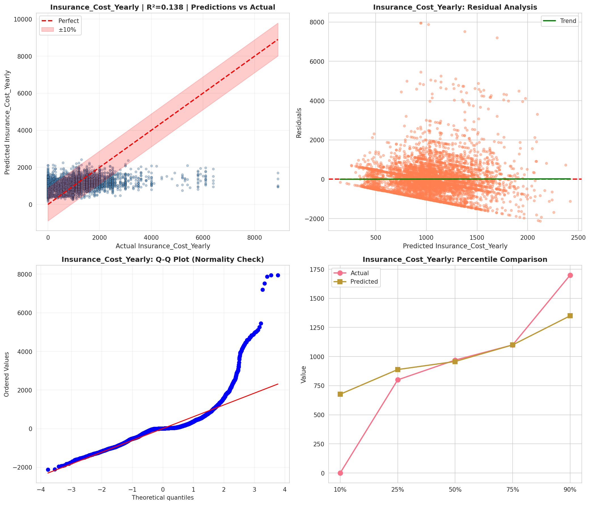
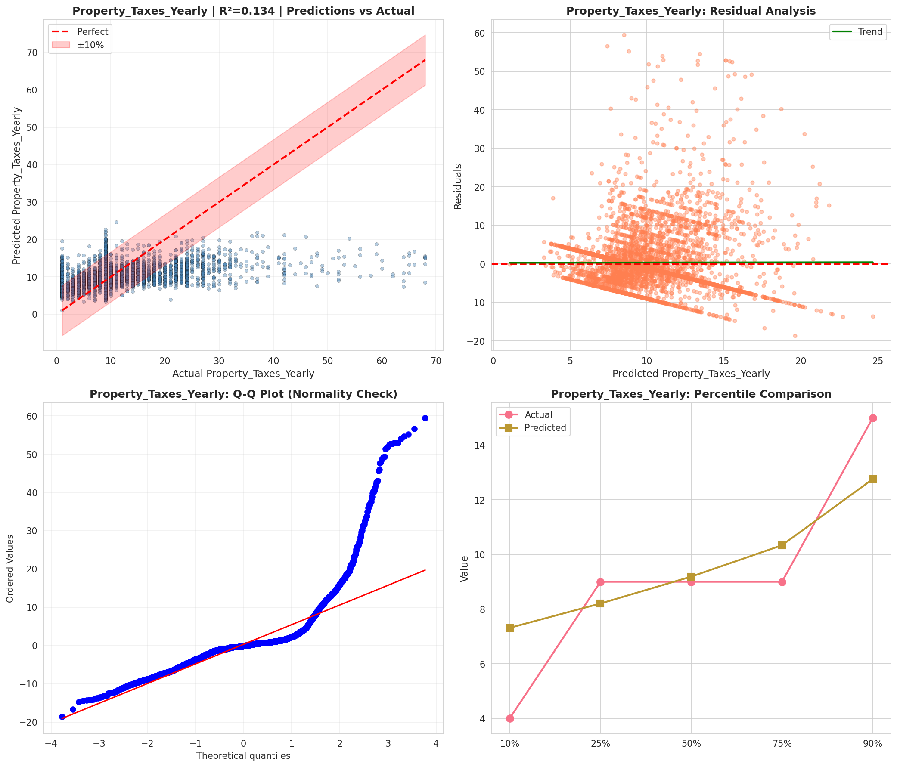
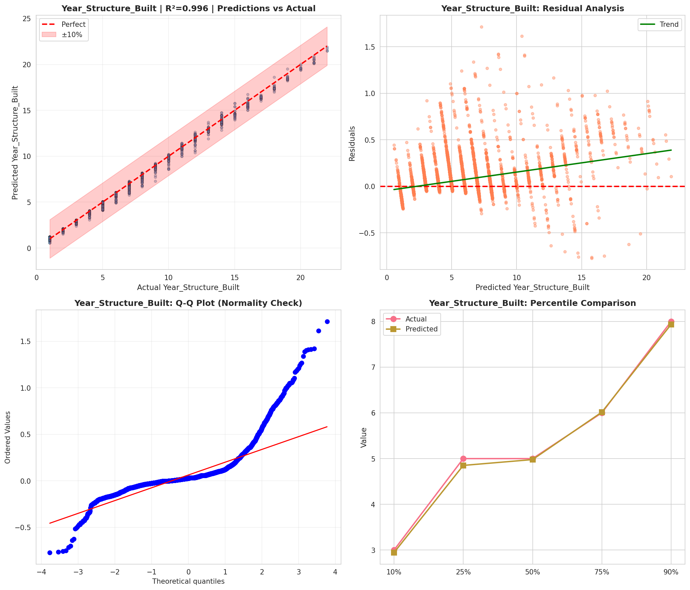
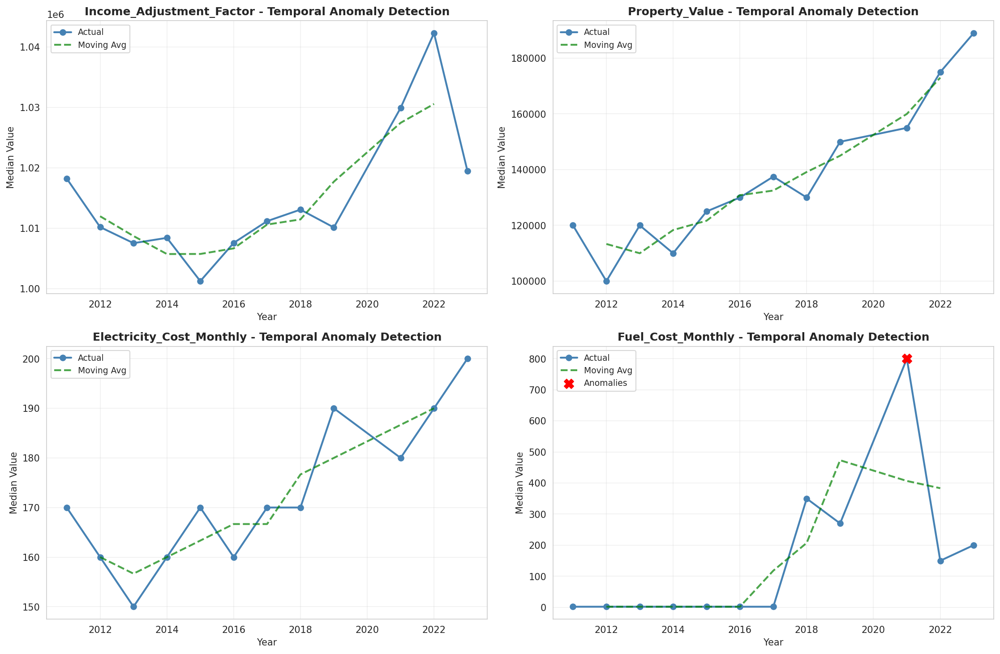
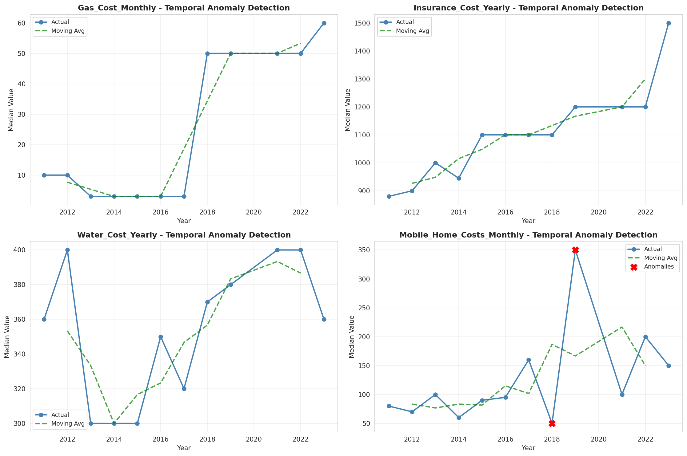
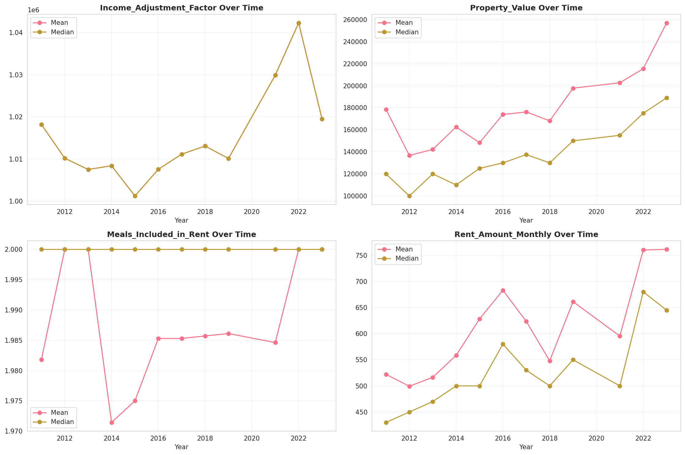
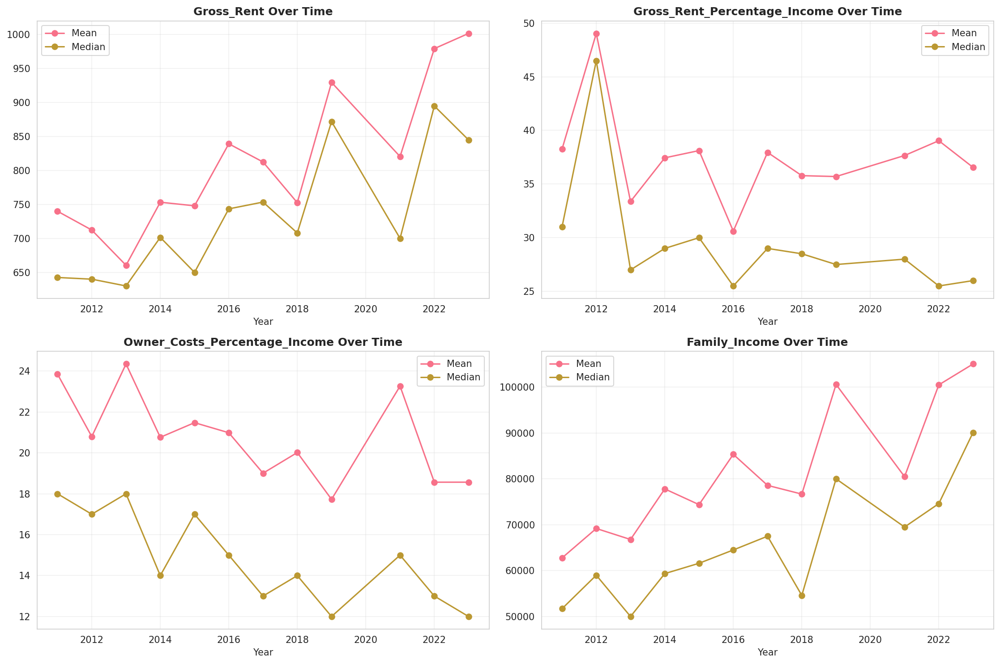
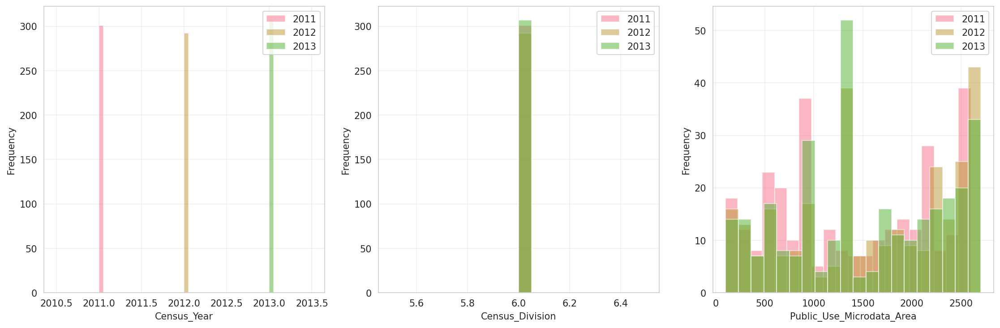
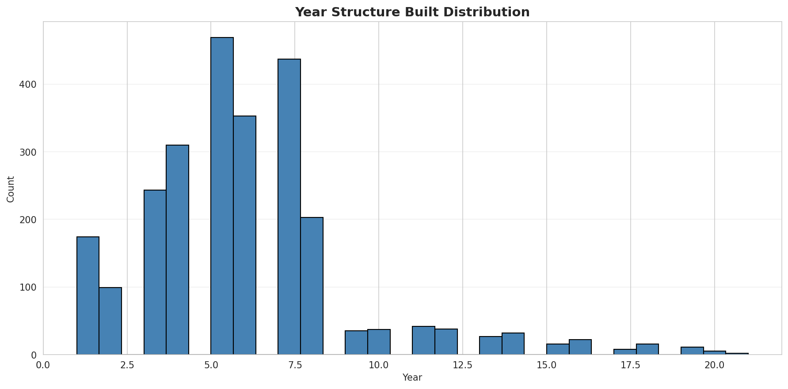
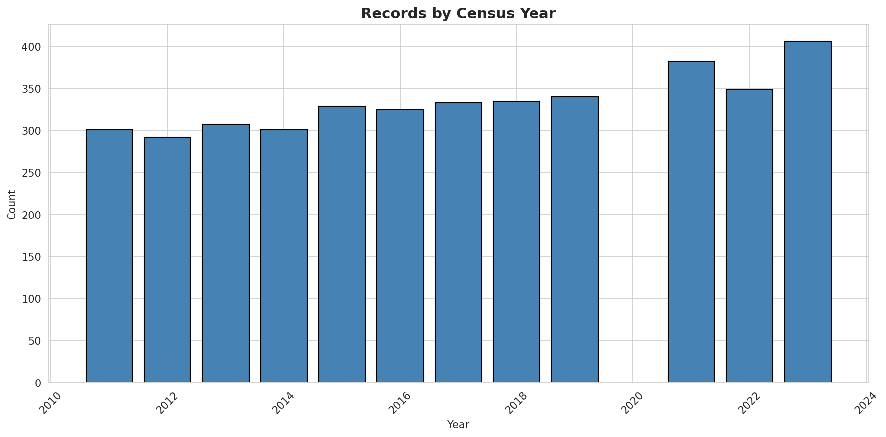
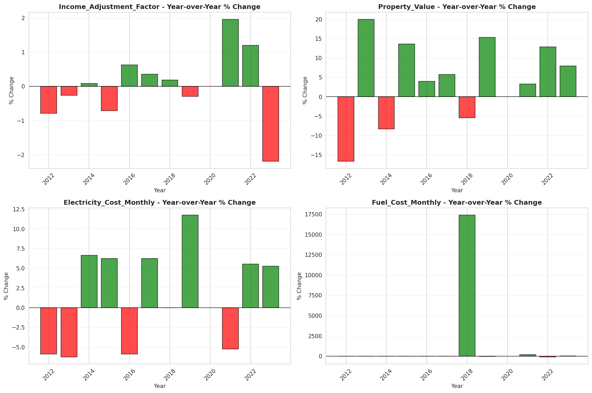
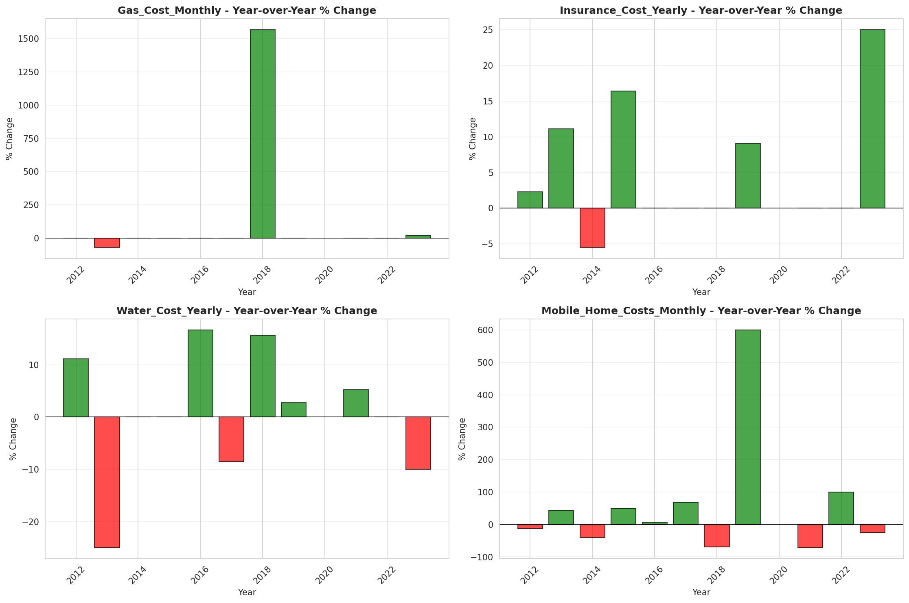
