# Temporal Analysis

## Year Distribution

- 2011: 115,556 records

- 2012: 117,065 records

- 2013: 118,492 records

- 2014: 119,713 records

- 2015: 121,305 records

- 2016: 121,670 records

- 2017: 122,542 records

- 2018: 123,364 records

- 2019: 124,327 records

- 2020: 120,798 records

- 2021: 121,998 records

- 2022: 123,586 records

- 2023: 125,859 records

## Temporal Trends

- Census_Year: {np.int64(2011): {'mean': 2011.0, 'median': 2011.0, 'std': 0.0}, np.int64(2012): {'mean': 2012.0, 'median': 2012.0, 'std': 0.0}, np.int64(2013): {'mean': 2013.0, 'median': 2013.0, 'std': 0.0}, np.int64(2014): {'mean': 2014.0, 'median': 2014.0, 'std': 0.0}, np.int64(2015): {'mean': 2015.0, 'median': 2015.0, 'std': 0.0}, np.int64(2016): {'mean': 2016.0, 'median': 2016.0, 'std': 0.0}, np.int64(2017): {'mean': 2017.0, 'median': 2017.0, 'std': 0.0}, np.int64(2018): {'mean': 2018.0, 'median': 2018.0, 'std': 0.0}, np.int64(2019): {'mean': 2019.0, 'median': 2019.0, 'std': 0.0}, np.int64(2020): {'mean': 2020.0, 'median': 2020.0, 'std': 0.0}, np.int64(2021): {'mean': 2021.0, 'median': 2021.0, 'std': 0.0}, np.int64(2022): {'mean': 2022.0, 'median': 2022.0, 'std': 0.0}, np.int64(2023): {'mean': 2023.0, 'median': 2023.0, 'std': 0.0}}

- Census_Division: {np.int64(2011): {'mean': 6.0, 'median': 6.0, 'std': 0.0}, np.int64(2012): {'mean': 6.0, 'median': 6.0, 'std': 0.0}, np.int64(2013): {'mean': 6.0, 'median': 6.0, 'std': 0.0}, np.int64(2014): {'mean': 6.0, 'median': 6.0, 'std': 0.0}, np.int64(2015): {'mean': 6.0, 'median': 6.0, 'std': 0.0}, np.int64(2016): {'mean': 6.0, 'median': 6.0, 'std': 0.0}, np.int64(2017): {'mean': 6.0, 'median': 6.0, 'std': 0.0}, np.int64(2018): {'mean': 6.0, 'median': 6.0, 'std': 0.0}, np.int64(2019): {'mean': 6.0, 'median': 6.0, 'std': 0.0}, np.int64(2020): {'mean': 6.0, 'median': 6.0, 'std': 0.0}, np.int64(2021): {'mean': 6.0, 'median': 6.0, 'std': 0.0}, np.int64(2022): {'mean': 6.0, 'median': 6.0, 'std': 0.0}, np.int64(2023): {'mean': 6.0, 'median': 6.0, 'std': 0.0}}

- Public_Use_Microdata_Area: {np.int64(2011): {'mean': 1368.7813960330923, 'median': 1300.0, 'std': 757.1942157913635}, np.int64(2012): {'mean': None, 'median': None, 'std': None}, np.int64(2013): {'mean': None, 'median': None, 'std': None}, np.int64(2014): {'mean': None, 'median': None, 'std': None}, np.int64(2015): {'mean': None, 'median': None, 'std': None}, np.int64(2016): {'mean': 1531.9282649790416, 'median': 1500.0, 'std': 810.0482218300147}, np.int64(2017): {'mean': 1531.367090466942, 'median': 1500.0, 'std': 811.5528838849142}, np.int64(2018): {'mean': 1531.2232742128983, 'median': 1500.0, 'std': 813.3760839196484}, np.int64(2019): {'mean': 1527.5516018242215, 'median': 1400.0, 'std': 815.5101519280872}, np.int64(2020): {'mean': 1524.26885378897, 'median': 1400.0, 'std': 814.8619075774119}, np.int64(2021): {'mean': 1521.3476696339285, 'median': 1400.0, 'std': 814.8048296900679}, np.int64(2022): {'mean': None, 'median': None, 'std': None}, np.int64(2023): {'mean': 1518.4684369016122, 'median': 1404.0, 'std': 818.6588149810779}}

- Census_Region: {np.int64(2011): {'mean': 3.0, 'median': 3.0, 'std': 0.0}, np.int64(2012): {'mean': 3.0, 'median': 3.0, 'std': 0.0}, np.int64(2013): {'mean': 3.0, 'median': 3.0, 'std': 0.0}, np.int64(2014): {'mean': 3.0, 'median': 3.0, 'std': 0.0}, np.int64(2015): {'mean': 3.0, 'median': 3.0, 'std': 0.0}, np.int64(2016): {'mean': 3.0, 'median': 3.0, 'std': 0.0}, np.int64(2017): {'mean': 3.0, 'median': 3.0, 'std': 0.0}, np.int64(2018): {'mean': 3.0, 'median': 3.0, 'std': 0.0}, np.int64(2019): {'mean': 3.0, 'median': 3.0, 'std': 0.0}, np.int64(2020): {'mean': 3.0, 'median': 3.0, 'std': 0.0}, np.int64(2021): {'mean': 3.0, 'median': 3.0, 'std': 0.0}, np.int64(2022): {'mean': 3.0, 'median': 3.0, 'std': 0.0}, np.int64(2023): {'mean': 3.0, 'median': 3.0, 'std': 0.0}}

- State_Code: {np.int64(2011): {'mean': 1.0, 'median': 1.0, 'std': 0.0}, np.int64(2012): {'mean': 1.0, 'median': 1.0, 'std': 0.0}, np.int64(2013): {'mean': 1.0, 'median': 1.0, 'std': 0.0}, np.int64(2014): {'mean': 1.0, 'median': 1.0, 'std': 0.0}, np.int64(2015): {'mean': 1.0, 'median': 1.0, 'std': 0.0}, np.int64(2016): {'mean': 1.0, 'median': 1.0, 'std': 0.0}, np.int64(2017): {'mean': 1.0, 'median': 1.0, 'std': 0.0}, np.int64(2018): {'mean': 1.0, 'median': 1.0, 'std': 0.0}, np.int64(2019): {'mean': 1.0, 'median': 1.0, 'std': 0.0}, np.int64(2020): {'mean': 1.0, 'median': 1.0, 'std': 0.0}, np.int64(2021): {'mean': 1.0, 'median': 1.0, 'std': 0.0}, np.int64(2022): {'mean': 1.0, 'median': 1.0, 'std': 0.0}, np.int64(2023): {'mean': None, 'median': None, 'std': None}}

- Housing_Adjustment_Factor: {np.int64(2011): {'mean': 1041278.994911558, 'median': 1044592.0, 'std': 27527.41921663654}, np.int64(2012): {'mean': 1041520.9420749156, 'median': 1053092.0, 'std': 27469.87337978528}, np.int64(2013): {'mean': 1040219.9819903453, 'median': 1035725.0, 'std': 32102.04591767935}, np.int64(2014): {'mean': 1036663.2208532073, 'median': 1031130.0, 'std': 29612.498651155787}, np.int64(2015): {'mean': 1020912.5312229504, 'median': 1017534.0, 'std': 20291.07023341864}, np.int64(2016): {'mean': 1020320.4494534397, 'median': 1013801.0, 'std': 15752.415978080116}, np.int64(2017): {'mean': 1029148.4087822951, 'median': 1034680.0, 'std': 17988.654632955262}, np.int64(2018): {'mean': 1038227.88577705, 'median': 1046406.0, 'std': 23466.716393042283}, np.int64(2019): {'mean': 1040789.4475697153, 'median': 1042936.0, 'std': 29171.68131245004}, np.int64(2020): {'mean': 1036580.6517823143, 'median': 1030827.0, 'std': 28263.32790955189}, np.int64(2021): {'mean': 1058114.6149445074, 'median': 1059761.0, 'std': 35795.39257733237}, np.int64(2022): {'mean': 1104003.892560646, 'median': 1133141.0, 'std': 61921.31027486854}, np.int64(2023): {'mean': 1103618.611922866, 'median': 1125501.0, 'std': 76894.82657904107}}

- Income_Adjustment_Factor: {np.int64(2011): {'mean': 1053899.5289643116, 'median': 1048026.0, 'std': 28359.894372000508}, np.int64(2012): {'mean': 1052755.1653782087, 'median': 1061121.0, 'std': 26377.84283213083}, np.int64(2013): {'mean': 1049196.5891199405, 'median': 1054614.0, 'std': 29681.553975507908}, np.int64(2014): {'mean': 1047512.2108877065, 'median': 1041654.0, 'std': 31050.467967823348}, np.int64(2015): {'mean': 1030322.0359836775, 'median': 1025215.0, 'std': 25663.68792079108}, np.int64(2016): {'mean': 1027476.203649215, 'median': 1022342.0, 'std': 17503.3587838849}, np.int64(2017): {'mean': 1036546.3616147933, 'median': 1035988.0, 'std': 16857.589754401506}, np.int64(2018): {'mean': 1046813.5495039071, 'median': 1054346.0, 'std': 20487.88713803265}, np.int64(2019): {'mean': 1049744.56711736, 'median': 1054606.0, 'std': 26223.586994096855}, np.int64(2020): {'mean': 1046699.7027103098, 'median': 1044328.0, 'std': 28748.746996432015}, np.int64(2021): {'mean': 1073205.8888178496, 'median': 1070512.0, 'std': 30850.484735090096}, np.int64(2022): {'mean': 1126506.8754389656, 'median': 1140108.0, 'std': 49955.16272157163}, np.int64(2023): {'mean': 1127690.8827815254, 'median': 1159185.0, 'std': 70668.1848113956}}

- Housing_Unit_Weight: {np.int64(2011): {'mean': 18.70302710374191, 'median': 15.0, 'std': 16.064193889184835}, np.int64(2012): {'mean': 18.559321744330074, 'median': 15.0, 'std': 16.5079083828449}, np.int64(2013): {'mean': 18.381966715052492, 'median': 15.0, 'std': 16.936865118018865}, np.int64(2014): {'mean': 18.29908197104742, 'median': 14.0, 'std': 17.410344687983894}, np.int64(2015): {'mean': 18.130571699435308, 'median': 14.0, 'std': 17.8771664187457}, np.int64(2016): {'mean': 18.158420317251583, 'median': 14.0, 'std': 17.596740111263056}, np.int64(2017): {'mean': 18.207031058739044, 'median': 14.0, 'std': 17.654432243154996}, np.int64(2018): {'mean': 18.193816672611135, 'median': 14.0, 'std': 17.730574471947023}, np.int64(2019): {'mean': 18.137862250355916, 'median': 14.0, 'std': 17.975117850594096}, np.int64(2020): {'mean': 18.79499660590407, 'median': 13.0, 'std': 21.837859003634936}, np.int64(2021): {'mean': 18.67674879916064, 'median': 13.0, 'std': 21.599919917744838}, np.int64(2022): {'mean': 18.585600310714806, 'median': 13.0, 'std': 21.81487038897777}, np.int64(2023): {'mean': 18.40307010225729, 'median': 13.0, 'std': 21.934369422175852}}

- Number_of_Persons: {np.int64(2011): {'mean': 2.067309356502475, 'median': 2.0, 'std': 1.4025279531869008}, np.int64(2012): {'mean': 2.0448468799384956, 'median': 2.0, 'std': 1.3958236277349236}, np.int64(2013): {'mean': 2.026001755392769, 'median': 2.0, 'std': 1.397382914647806}, np.int64(2014): {'mean': 2.0009439242187566, 'median': 2.0, 'std': 1.3922198007047377}, np.int64(2015): {'mean': 1.974386876056222, 'median': 2.0, 'std': 1.3858242923972868}, np.int64(2016): {'mean': 1.960902441029013, 'median': 2.0, 'std': 1.3874442491330392}, np.int64(2017): {'mean': 1.9455288798942403, 'median': 2.0, 'std': 1.3904283302598799}, np.int64(2018): {'mean': 1.932087156706981, 'median': 2.0, 'std': 1.3899281912844887}, np.int64(2019): {'mean': 1.9262509350342243, 'median': 2.0, 'std': 1.387058831129563}, np.int64(2020): {'mean': 1.9158181426844816, 'median': 2.0, 'std': 1.3956851628179214}, np.int64(2021): {'mean': 1.9132690699847539, 'median': 2.0, 'std': 1.397518759091543}, np.int64(2022): {'mean': 1.9205249785574419, 'median': 2.0, 'std': 1.3910847176447536}, np.int64(2023): {'mean': 1.9274982321486742, 'median': 2.0, 'std': 1.383207408717205}}

- Housing_Unit_Type: {np.int64(2011): {'mean': 1.0843919831077573, 'median': 1.0, 'std': 0.3482341315088733}, np.int64(2012): {'mean': 1.0965190278904882, 'median': 1.0, 'std': 0.3745020099853011}, np.int64(2013): {'mean': 1.1098977146136448, 'median': 1.0, 'std': 0.40065723111658985}, np.int64(2014): {'mean': 1.1212900854543784, 'median': 1.0, 'std': 0.4213668469484962}, np.int64(2015): {'mean': 1.134372037426322, 'median': 1.0, 'std': 0.4435016645092405}, np.int64(2016): {'mean': 1.1328018410454508, 'median': 1.0, 'std': 0.44144594119942904}, np.int64(2017): {'mean': 1.133994875226453, 'median': 1.0, 'std': 0.4432693763523094}, np.int64(2018): {'mean': 1.1328264323465516, 'median': 1.0, 'std': 0.44151204939487504}, np.int64(2019): {'mean': 1.1341864599001021, 'median': 1.0, 'std': 0.44381189161363754}, np.int64(2020): {'mean': None, 'median': None, 'std': None}, np.int64(2021): {'mean': None, 'median': None, 'std': None}, np.int64(2022): {'mean': None, 'median': None, 'std': None}, np.int64(2023): {'mean': None, 'median': None, 'std': None}}

- Number_of_Bedrooms: {np.int64(2011): {'mean': 2.8629391025049378, 'median': 3.0, 'std': 0.8820757075517737}, np.int64(2012): {'mean': None, 'median': None, 'std': None}, np.int64(2013): {'mean': None, 'median': None, 'std': None}, np.int64(2014): {'mean': None, 'median': None, 'std': None}, np.int64(2015): {'mean': None, 'median': None, 'std': None}, np.int64(2016): {'mean': None, 'median': None, 'std': None}, np.int64(2017): {'mean': None, 'median': None, 'std': None}, np.int64(2018): {'mean': None, 'median': None, 'std': None}, np.int64(2019): {'mean': None, 'median': None, 'std': None}, np.int64(2020): {'mean': None, 'median': None, 'std': None}, np.int64(2021): {'mean': None, 'median': None, 'std': None}, np.int64(2022): {'mean': None, 'median': None, 'std': None}, np.int64(2023): {'mean': None, 'median': None, 'std': None}}

- Number_of_Rooms: {np.int64(2011): {'mean': 5.927306961032248, 'median': 6.0, 'std': 1.7391514696727428}, np.int64(2012): {'mean': None, 'median': None, 'std': None}, np.int64(2013): {'mean': None, 'median': None, 'std': None}, np.int64(2014): {'mean': None, 'median': None, 'std': None}, np.int64(2015): {'mean': None, 'median': None, 'std': None}, np.int64(2016): {'mean': None, 'median': None, 'std': None}, np.int64(2017): {'mean': None, 'median': None, 'std': None}, np.int64(2018): {'mean': None, 'median': None, 'std': None}, np.int64(2019): {'mean': None, 'median': None, 'std': None}, np.int64(2020): {'mean': None, 'median': None, 'std': None}, np.int64(2021): {'mean': None, 'median': None, 'std': None}, np.int64(2022): {'mean': None, 'median': None, 'std': None}, np.int64(2023): {'mean': None, 'median': None, 'std': None}}

- Building_Type: {np.int64(2011): {'mean': 2.4002362800657155, 'median': 2.0, 'std': 1.5641058757219028}, np.int64(2012): {'mean': 2.4060769167179505, 'median': 2.0, 'std': 1.5751332412739352}, np.int64(2013): {'mean': 2.4098548335394057, 'median': 2.0, 'std': 1.5826412761318414}, np.int64(2014): {'mean': 2.4144790343655487, 'median': 2.0, 'std': 1.5916558065503472}, np.int64(2015): {'mean': 2.414843465598835, 'median': 2.0, 'std': 1.5951890463827556}, np.int64(2016): {'mean': 2.4216888212321384, 'median': 2.0, 'std': 1.6074971756130763}, np.int64(2017): {'mean': 2.429055118819281, 'median': 2.0, 'std': 1.6188828638083308}, np.int64(2018): {'mean': 2.435838315593805, 'median': 2.0, 'std': 1.6311430766035446}, np.int64(2019): {'mean': 2.4389789288694015, 'median': 2.0, 'std': 1.6356841010606171}, np.int64(2020): {'mean': 2.4402201882076167, 'median': 2.0, 'std': 1.638711528949434}, np.int64(2021): {'mean': 2.4396494332017036, 'median': 2.0, 'std': 1.6402745205387959}, np.int64(2022): {'mean': 2.43634404903088, 'median': 2.0, 'std': 1.639934963527088}, np.int64(2023): {'mean': 2.431964569652434, 'median': 2.0, 'std': 1.634965026231366}}

- Year_Structure_Built: {np.int64(2011): {'mean': 4.774223321580862, 'median': 5.0, 'std': 2.1349225360685167}, np.int64(2012): {'mean': 5.370374112481745, 'median': 5.0, 'std': 2.408087023838341}, np.int64(2013): {'mean': 5.445299262719238, 'median': 5.0, 'std': 2.515783175501993}, np.int64(2014): {'mean': 5.503339699015908, 'median': 5.0, 'std': 2.611261439631008}, np.int64(2015): {'mean': 5.566781943938842, 'median': 5.0, 'std': 2.7321906009954637}, np.int64(2016): {'mean': 5.676199019581192, 'median': 5.0, 'std': 2.8827705112669104}, np.int64(2017): {'mean': 5.8057018847196336, 'median': 5.0, 'std': 3.086859966624484}, np.int64(2018): {'mean': 5.932911516841381, 'median': 6.0, 'std': 3.3022225373065446}, np.int64(2019): {'mean': 6.078027088917686, 'median': 6.0, 'std': 3.5494228981701896}, np.int64(2020): {'mean': 6.213608292898103, 'median': 6.0, 'std': 3.7850931307139497}, np.int64(2021): {'mean': None, 'median': None, 'std': None}, np.int64(2022): {'mean': None, 'median': None, 'std': None}, np.int64(2023): {'mean': None, 'median': None, 'std': None}}

- Bathtub_or_Shower: {np.int64(2011): {'mean': None, 'median': None, 'std': None}, np.int64(2012): {'mean': 1.0105537746507334, 'median': 1.0, 'std': 0.10218849449677132}, np.int64(2013): {'mean': 1.0102761368319824, 'median': 1.0, 'std': 0.10084954632636996}, np.int64(2014): {'mean': 1.010261236648057, 'median': 1.0, 'std': 0.10077716244121158}, np.int64(2015): {'mean': 1.0102839461230433, 'median': 1.0, 'std': 0.10088745812064291}, np.int64(2016): {'mean': 1.0104747147996123, 'median': 1.0, 'std': 0.10180908146788013}, np.int64(2017): {'mean': 1.0108868898073857, 'median': 1.0, 'std': 0.10377120220142534}, np.int64(2018): {'mean': 1.0117429421700315, 'median': 1.0, 'std': 0.10772719801426574}, np.int64(2019): {'mean': 1.0122929721477643, 'median': 1.0, 'std': 0.11019057470163408}, np.int64(2020): {'mean': 1.0128289957359211, 'median': 1.0, 'std': 0.11253678949185632}, np.int64(2021): {'mean': 1.012558025006612, 'median': 1.0, 'std': 0.11135723642659277}, np.int64(2022): {'mean': 1.0119227600691647, 'median': 1.0, 'std': 0.10853899995826469}, np.int64(2023): {'mean': 1.0113100424912638, 'median': 1.0, 'std': 0.10574604429481704}}

- Refrigerator: {np.int64(2011): {'mean': None, 'median': None, 'std': None}, np.int64(2012): {'mean': 1.0244968816305535, 'median': 1.0, 'std': 0.15458655801612756}, np.int64(2013): {'mean': 1.0249942757704813, 'median': 1.0, 'std': 0.15610824816895585}, np.int64(2014): {'mean': 1.026096252775468, 'median': 1.0, 'std': 0.15942230269454177}, np.int64(2015): {'mean': 1.027147797597379, 'median': 1.0, 'std': 0.16251472255006047}, np.int64(2016): {'mean': 1.0281530613169507, 'median': 1.0, 'std': 0.16541074443811946}, np.int64(2017): {'mean': 1.0300852761343886, 'median': 1.0, 'std': 0.17082275919852763}, np.int64(2018): {'mean': 1.0322975593626282, 'median': 1.0, 'std': 0.17679000633122655}, np.int64(2019): {'mean': 1.0324410203610672, 'median': 1.0, 'std': 0.17716906942287614}, np.int64(2020): {'mean': 1.0335888104690487, 'median': 1.0, 'std': 0.1801690888868561}, np.int64(2021): {'mean': 1.0339714184093167, 'median': 1.0, 'std': 0.18115645291436674}, np.int64(2022): {'mean': 1.0313142194982845, 'median': 1.0, 'std': 0.17416633936405765}, np.int64(2023): {'mean': 1.0286299487050496, 'median': 1.0, 'std': 0.16676487811880084}}

- Hot_and_Cold_Running_Water: {np.int64(2011): {'mean': None, 'median': None, 'std': None}, np.int64(2012): {'mean': 1.0231834005382516, 'median': 1.0, 'std': 0.1504863398672751}, np.int64(2013): {'mean': 1.023556349315382, 'median': 1.0, 'std': 0.15166297632958609}, np.int64(2014): {'mean': 1.0247713379811954, 'median': 1.0, 'std': 0.15542824561580273}, np.int64(2015): {'mean': 1.025573352748453, 'median': 1.0, 'std': 0.1578593778231984}, np.int64(2016): {'mean': 1.026929803100733, 'median': 1.0, 'std': 0.16187904821849575}, np.int64(2017): {'mean': 1.0293828961468154, 'median': 1.0, 'std': 0.16887805771610603}, np.int64(2018): {'mean': 1.0319222141791111, 'median': 1.0, 'std': 0.17579380705466324}, np.int64(2019): {'mean': 1.0326895425416718, 'median': 1.0, 'std': 0.1778235558452206}, np.int64(2020): {'mean': 1.0352705484487574, 'median': 1.0, 'std': 0.1844636808742454}, np.int64(2021): {'mean': 1.036078102342888, 'median': 1.0, 'std': 0.18648536144458944}, np.int64(2022): {'mean': 1.0338581037651298, 'median': 1.0, 'std': 0.18086466961664485}, np.int64(2023): {'mean': 1.031828022673985, 'median': 1.0, 'std': 0.17554280523901267}}

- Running_Water: {np.int64(2011): {'mean': None, 'median': None, 'std': None}, np.int64(2012): {'mean': None, 'median': None, 'std': None}, np.int64(2013): {'mean': 9.0, 'median': 9.0, 'std': 0.0}, np.int64(2014): {'mean': 9.0, 'median': 9.0, 'std': 0.0}, np.int64(2015): {'mean': 9.0, 'median': 9.0, 'std': 0.0}, np.int64(2016): {'mean': 9.0, 'median': 9.0, 'std': 0.0}, np.int64(2017): {'mean': 9.0, 'median': 9.0, 'std': 0.0}, np.int64(2018): {'mean': 9.0, 'median': 9.0, 'std': 0.0}, np.int64(2019): {'mean': 9.0, 'median': 9.0, 'std': 0.0}, np.int64(2020): {'mean': 9.0, 'median': 9.0, 'std': 0.0}, np.int64(2021): {'mean': 9.0, 'median': 9.0, 'std': 0.0}, np.int64(2022): {'mean': 9.0, 'median': 9.0, 'std': 0.0}, np.int64(2023): {'mean': 9.0, 'median': 9.0, 'std': 0.0}}

- Sink_with_Faucet: {np.int64(2011): {'mean': None, 'median': None, 'std': None}, np.int64(2012): {'mean': 1.0101863673521874, 'median': 1.0, 'std': 0.10041263806799149}, np.int64(2013): {'mean': 1.009928103677245, 'median': 1.0, 'std': 0.0991444726743734}, np.int64(2014): {'mean': 1.0099140175985235, 'median': 1.0, 'std': 0.09907481791097851}, np.int64(2015): {'mean': 1.0099927193301783, 'median': 1.0, 'std': 0.09946333457480584}, np.int64(2016): {'mean': 1.0101666349525649, 'median': 1.0, 'std': 0.10031632804380809}, np.int64(2017): {'mean': 1.0104726657121503, 'median': 1.0, 'std': 0.10179922545509704}, np.int64(2018): {'mean': 1.0111531140245047, 'median': 1.0, 'std': 0.10501819192080965}, np.int64(2019): {'mean': 1.0115829087746082, 'median': 1.0, 'std': 0.10699928325232184}, np.int64(2020): {'mean': 1.0119283928833995, 'median': 1.0, 'std': 0.1085643341059536}, np.int64(2021): {'mean': 1.011728119214599, 'median': 1.0, 'std': 0.10766000250531181}, np.int64(2022): {'mean': 1.0112075755243932, 'median': 1.0, 'std': 0.10527139260434569}, np.int64(2023): {'mean': 1.0107979913220801, 'median': 1.0, 'std': 0.10335129733631196}}

- Stove_or_Range: {np.int64(2011): {'mean': None, 'median': None, 'std': None}, np.int64(2012): {'mean': 1.0231925857207154, 'median': 1.0, 'std': 0.1505154403297956}, np.int64(2013): {'mean': 1.023968493840729, 'median': 1.0, 'std': 0.15295168977800197}, np.int64(2014): {'mean': 1.0254931881104887, 'median': 1.0, 'std': 0.15761824917869416}, np.int64(2015): {'mean': 1.0264834364761557, 'median': 1.0, 'std': 0.16056867287573304}, np.int64(2016): {'mean': 1.0276003298266598, 'median': 1.0, 'std': 0.1638255011011849}, np.int64(2017): {'mean': 1.0295990130660688, 'median': 1.0, 'std': 0.16947911417057626}, np.int64(2018): {'mean': 1.0317524151675201, 'median': 1.0, 'std': 0.17534102216954392}, np.int64(2019): {'mean': 1.0320771128823247, 'median': 1.0, 'std': 0.17620569596646043}, np.int64(2020): {'mean': 1.0333223055433025, 'median': 1.0, 'std': 0.17947764629974752}, np.int64(2021): {'mean': 1.0335701452791128, 'median': 1.0, 'std': 0.18012075534092054}, np.int64(2022): {'mean': 1.030997365586044, 'median': 1.0, 'std': 0.17331128305737617}, np.int64(2023): {'mean': 1.0287197822435028, 'median': 1.0, 'std': 0.16701858263050576}}

- Telephone_Service: {np.int64(2011): {'mean': 1.0310185561976073, 'median': 1.0, 'std': 0.17336871444001792}, np.int64(2012): {'mean': 1.026325400206951, 'median': 1.0, 'std': 0.16010194735018532}, np.int64(2013): {'mean': 1.0262522325052768, 'median': 1.0, 'std': 0.15988530953123634}, np.int64(2014): {'mean': 1.027046813356652, 'median': 1.0, 'std': 0.16222068554831054}, np.int64(2015): {'mean': 1.0276950596078989, 'median': 1.0, 'std': 0.1640984977458386}, np.int64(2016): {'mean': 1.0277766480946764, 'median': 1.0, 'std': 0.1643331387243568}, np.int64(2017): {'mean': 1.0254753122173785, 'median': 1.0, 'std': 0.1575645041381517}, np.int64(2018): {'mean': 1.0241477848486076, 'median': 1.0, 'std': 0.15350865815025325}, np.int64(2019): {'mean': 1.0213854208618607, 'median': 1.0, 'std': 0.1446661513701206}, np.int64(2020): {'mean': 1.0178650059759704, 'median': 1.0, 'std': 0.13246143398296464}, np.int64(2021): {'mean': 1.013581107078606, 'median': 1.0, 'std': 0.11574454597337194}, np.int64(2022): {'mean': 1.0122358631714865, 'median': 1.0, 'std': 0.10993757629454325}, np.int64(2023): {'mean': 1.0101142385106683, 'median': 1.0, 'std': 0.10006018963979092}}

- Lot_Acreage: {np.int64(2011): {'mean': 1.4375940640951428, 'median': 1.0, 'std': 0.6173660351726252}, np.int64(2012): {'mean': 1.435537623139803, 'median': 1.0, 'std': 0.6170469482573373}, np.int64(2013): {'mean': 1.4342145181031687, 'median': 1.0, 'std': 0.6147237775636104}, np.int64(2014): {'mean': 1.4334940916113408, 'median': 1.0, 'std': 0.6131404713590629}, np.int64(2015): {'mean': 1.4346768155727476, 'median': 1.0, 'std': 0.6131786185896793}, np.int64(2016): {'mean': 1.4325800201021688, 'median': 1.0, 'std': 0.6113421865610332}, np.int64(2017): {'mean': 1.4292184211612264, 'median': 1.0, 'std': 0.6095545526149299}, np.int64(2018): {'mean': 1.4298653660935674, 'median': 1.0, 'std': 0.6110202807487471}, np.int64(2019): {'mean': 1.4302782357371109, 'median': 1.0, 'std': 0.6122225244670817}, np.int64(2020): {'mean': 1.433264195243159, 'median': 1.0, 'std': 0.6140807524070716}, np.int64(2021): {'mean': 1.4357467857739188, 'median': 1.0, 'std': 0.6158964849865912}, np.int64(2022): {'mean': 1.4429324240545567, 'median': 1.0, 'std': 0.6174613298563876}, np.int64(2023): {'mean': 1.4470142762114313, 'median': 1.0, 'std': 0.6185387421691853}}

- Agricultural_Sales: {np.int64(2011): {'mean': 1.1364340614272261, 'median': 1.0, 'std': 0.7029328226145314}, np.int64(2012): {'mean': 1.138247024081347, 'median': 1.0, 'std': 0.709818842728033}, np.int64(2013): {'mean': 1.1370476422566103, 'median': 1.0, 'std': 0.7076864684413545}, np.int64(2014): {'mean': 1.1347204002562616, 'median': 1.0, 'std': 0.7078845788591867}, np.int64(2015): {'mean': 1.137686216208016, 'median': 1.0, 'std': 0.718560551422972}, np.int64(2016): {'mean': 1.1329585169427139, 'median': 1.0, 'std': 0.7094090490633824}, np.int64(2017): {'mean': 1.1330801972012126, 'median': 1.0, 'std': 0.7079644521961226}, np.int64(2018): {'mean': 1.129420387222867, 'median': 1.0, 'std': 0.6958533112530134}, np.int64(2019): {'mean': 1.129086057371581, 'median': 1.0, 'std': 0.6942308945674539}, np.int64(2020): {'mean': 1.1315327735305176, 'median': 1.0, 'std': 0.7002567828008901}, np.int64(2021): {'mean': 1.1327499304245647, 'median': 1.0, 'std': 0.7012685762792105}, np.int64(2022): {'mean': 1.1305761943126549, 'median': 1.0, 'std': 0.6981585473913025}, np.int64(2023): {'mean': 1.1346645738867573, 'median': 1.0, 'std': 0.7120552051317042}}

- Business_On_Property: {np.int64(2011): {'mean': 1.9871388728095565, 'median': 2.0, 'std': 0.11267587238307407}, np.int64(2012): {'mean': 1.987570739886816, 'median': 2.0, 'std': 0.11079215787677621}, np.int64(2013): {'mean': 1.9879172725465786, 'median': 2.0, 'std': 0.10925593816821227}, np.int64(2014): {'mean': 1.9884441939120632, 'median': 2.0, 'std': 0.10687557564845243}, np.int64(2015): {'mean': 1.9885304883121204, 'median': 2.0, 'std': 0.10648042021046535}, np.int64(2016): {'mean': 3.4059498274736546, 'median': 2.0, 'std': 2.817634088626095}, np.int64(2017): {'mean': 4.819749927784426, 'median': 2.0, 'std': 3.4413192980136826}, np.int64(2018): {'mean': 6.222525051742863, 'median': 9.0, 'std': 3.4298301051963533}, np.int64(2019): {'mean': 7.618245099835135, 'median': 9.0, 'std': 2.78953700044664}, np.int64(2020): {'mean': None, 'median': None, 'std': None}, np.int64(2021): {'mean': None, 'median': None, 'std': None}, np.int64(2022): {'mean': None, 'median': None, 'std': None}, np.int64(2023): {'mean': None, 'median': None, 'std': None}}

- Tenure: {np.int64(2011): {'mean': 1.850573777162855, 'median': 2.0, 'std': 0.8732432759567628}, np.int64(2012): {'mean': 1.864426725099925, 'median': 2.0, 'std': 0.8744795383131247}, np.int64(2013): {'mean': 1.8789068842344536, 'median': 2.0, 'std': 0.8747274817296882}, np.int64(2014): {'mean': 1.8917822426485542, 'median': 2.0, 'std': 0.8737691834406378}, np.int64(2015): {'mean': 1.9028995965160123, 'median': 2.0, 'std': 0.8717120676389275}, np.int64(2016): {'mean': 1.9042661352637358, 'median': 2.0, 'std': 0.8695772576849887}, np.int64(2017): {'mean': 1.9078234714304585, 'median': 2.0, 'std': 0.8688888040093995}, np.int64(2018): {'mean': 1.9106643427505978, 'median': 2.0, 'std': 0.8664475169758381}, np.int64(2019): {'mean': 1.9083165525573902, 'median': 2.0, 'std': 0.8624597579691515}, np.int64(2020): {'mean': 1.9031787968379779, 'median': 2.0, 'std': 0.857662663477476}, np.int64(2021): {'mean': 1.9051194326300136, 'median': 2.0, 'std': 0.8541328676920495}, np.int64(2022): {'mean': 1.8976143141153081, 'median': 2.0, 'std': 0.8476082246695107}, np.int64(2023): {'mean': 1.8903451332782624, 'median': 2.0, 'std': 0.8415457996174772}}

- Vacancy_Status: {np.int64(2011): {'mean': 5.022189054726368, 'median': 5.0, 'std': 2.2320379513663107}, np.int64(2012): {'mean': 5.036127027289502, 'median': 5.0, 'std': 2.1981432606348217}, np.int64(2013): {'mean': 5.0356169532938635, 'median': 5.0, 'std': 2.186499527919514}, np.int64(2014): {'mean': 5.051564049400523, 'median': 5.0, 'std': 2.1827873297330243}, np.int64(2015): {'mean': 5.068338121354575, 'median': 5.0, 'std': 2.188117805591248}, np.int64(2016): {'mean': 5.0653061224489795, 'median': 5.0, 'std': 2.2042263484954385}, np.int64(2017): {'mean': 5.091283024837842, 'median': 5.0, 'std': 2.2252810147129}, np.int64(2018): {'mean': 5.141073185499129, 'median': 7.0, 'std': 2.2280149979817097}, np.int64(2019): {'mean': 5.184100104900344, 'median': 7.0, 'std': 2.227063115251807}, np.int64(2020): {'mean': 5.224058359386631, 'median': 7.0, 'std': 2.212818787686785}, np.int64(2021): {'mean': 5.2813612099644125, 'median': 7.0, 'std': 2.184987472147829}, np.int64(2022): {'mean': 5.323006444599736, 'median': 7.0, 'std': 2.1592214792306335}, np.int64(2023): {'mean': 5.367023483528338, 'median': 7.0, 'std': 2.1312076550808072}}

- Property_Value: {np.int64(2011): {'mean': 13.478311887459164, 'median': 14.0, 'std': 5.171374972544597}}

- Vehicles_Available: {np.int64(2011): {'mean': 1.9077378530153821, 'median': 2.0, 'std': 1.0895891813192577}, np.int64(2012): {'mean': 1.8973867348388014, 'median': 2.0, 'std': 1.090448908951542}, np.int64(2013): {'mean': 1.891084185744439, 'median': 2.0, 'std': 1.0906471677348912}, np.int64(2014): {'mean': 1.8853255785577745, 'median': 2.0, 'std': 1.0913920034434832}, np.int64(2015): {'mean': 1.889799071072129, 'median': 2.0, 'std': 1.094404063852266}, np.int64(2016): {'mean': 1.9020090284273456, 'median': 2.0, 'std': 1.0992511258255906}, np.int64(2017): {'mean': 1.9118576552957556, 'median': 2.0, 'std': 1.1000820916206986}, np.int64(2018): {'mean': 1.9271918446759353, 'median': 2.0, 'std': 1.1048416285185134}, np.int64(2019): {'mean': 1.9458618606524365, 'median': 2.0, 'std': 1.1133825981948444}, np.int64(2020): {'mean': 1.9676249187477721, 'median': 2.0, 'std': 1.1239251874662426}, np.int64(2021): {'mean': 1.979971506712561, 'median': 2.0, 'std': 1.1267013674446702}, np.int64(2022): {'mean': 1.9941280154126786, 'median': 2.0, 'std': 1.1299839317861737}, np.int64(2023): {'mean': 2.0004331795378074, 'median': 2.0, 'std': 1.1299888688987079}}

- Condo_Fee_Monthly: {np.int64(2011): {'mean': 235.89513108614233, 'median': 180.0, 'std': 220.72967401046017}, np.int64(2012): {'mean': 237.40581542351453, 'median': 180.0, 'std': 224.51170287009936}, np.int64(2013): {'mean': 249.12581063553827, 'median': 180.0, 'std': 230.1833678883563}, np.int64(2014): {'mean': 254.42280945757997, 'median': 190.0, 'std': 235.3513803585273}, np.int64(2015): {'mean': 261.55727554179566, 'median': 200.0, 'std': 229.57350879235284}, np.int64(2016): {'mean': 275.5420560747664, 'median': 200.0, 'std': 234.91390982740754}, np.int64(2017): {'mean': 287.565625, 'median': 220.0, 'std': 230.87163965389698}, np.int64(2018): {'mean': 289.2572298325723, 'median': 220.0, 'std': 235.9080973139543}, np.int64(2019): {'mean': 298.42750373692076, 'median': 230.0, 'std': 238.1037165632121}, np.int64(2020): {'mean': 314.5608308605341, 'median': 240.0, 'std': 257.105895141275}, np.int64(2021): {'mean': 318.2995839112344, 'median': 240.0, 'std': 259.1719487400508}, np.int64(2022): {'mean': 327.4240422721268, 'median': 250.0, 'std': 267.34159846115494}, np.int64(2023): {'mean': 358.9281210592686, 'median': 260.0, 'std': 335.4892193372851}}

- Electricity_Cost_Monthly: {np.int64(2011): {'mean': 173.12828599332627, 'median': 150.0, 'std': 95.73923427645816}, np.int64(2012): {'mean': 176.97097611946356, 'median': 160.0, 'std': 96.24136012677329}, np.int64(2013): {'mean': 178.8920177788602, 'median': 160.0, 'std': 96.0574619383887}, np.int64(2014): {'mean': 180.55000610078497, 'median': 170.0, 'std': 96.45838252856609}, np.int64(2015): {'mean': 180.64262701614953, 'median': 170.0, 'std': 96.17696430550887}, np.int64(2016): {'mean': 180.22715441864247, 'median': 170.0, 'std': 95.73819006125657}, np.int64(2017): {'mean': 181.19381357396173, 'median': 170.0, 'std': 95.9918944983505}, np.int64(2018): {'mean': 188.27516854979856, 'median': 170.0, 'std': 95.15107075479789}, np.int64(2019): {'mean': 190.2144856543037, 'median': 170.0, 'std': 96.07834048830004}, np.int64(2020): {'mean': 191.83924207999314, 'median': 180.0, 'std': 97.15907010084227}, np.int64(2021): {'mean': 193.9653559048085, 'median': 180.0, 'std': 98.95496846096711}, np.int64(2022): {'mean': 202.43605949124296, 'median': 180.0, 'std': 128.36984548157372}, np.int64(2023): {'mean': 210.55659697188176, 'median': 190.0, 'std': 150.88939501624102}}

- Fuel_Cost_Monthly: {np.int64(2011): {'mean': 51.541771791324166, 'median': 2.0, 'std': 269.54902259802236}, np.int64(2012): {'mean': 51.03805263051109, 'median': 2.0, 'std': 269.21605277561673}, np.int64(2013): {'mean': 45.28259457704173, 'median': 2.0, 'std': 251.3816619895692}, np.int64(2014): {'mean': 42.07518200675153, 'median': 2.0, 'std': 241.5374144796465}, np.int64(2015): {'mean': 38.29090484079152, 'median': 2.0, 'std': 230.1807815496314}, np.int64(2016): {'mean': 33.32056000650697, 'median': 2.0, 'std': 214.14847407782383}, np.int64(2017): {'mean': 28.484589824101455, 'median': 2.0, 'std': 195.10727756015473}, np.int64(2018): {'mean': 568.0767252464638, 'median': 300.0, 'std': 733.3376962550266}, np.int64(2019): {'mean': 565.0618279569892, 'median': 300.0, 'std': 736.4918398053136}, np.int64(2020): {'mean': 554.455450472872, 'median': 300.0, 'std': 742.6095432078281}, np.int64(2021): {'mean': 539.4002600780234, 'median': 300.0, 'std': 723.6557046165485}, np.int64(2022): {'mean': 538.3082627118644, 'median': 300.0, 'std': 723.0916113874245}, np.int64(2023): {'mean': 524.5766192733017, 'median': 300.0, 'std': 692.1933316846572}}

- Gas_Cost_Monthly: {np.int64(2011): {'mean': 52.37200903393831, 'median': 4.0, 'std': 84.15978832229023}, np.int64(2012): {'mean': 49.892101365471625, 'median': 4.0, 'std': 82.44556017397676}, np.int64(2013): {'mean': 47.60306056177951, 'median': 3.0, 'std': 79.97439155325404}, np.int64(2014): {'mean': 46.28930939114166, 'median': 3.0, 'std': 79.28918502075511}, np.int64(2015): {'mean': 43.47388533737156, 'median': 3.0, 'std': 75.35098235455123}, np.int64(2016): {'mean': 40.7023364105901, 'median': 3.0, 'std': 71.25470657664833}, np.int64(2017): {'mean': 39.020943206414046, 'median': 3.0, 'std': 69.04492588794054}, np.int64(2018): {'mean': 80.96448631593081, 'median': 50.0, 'std': 84.80569695194511}, np.int64(2019): {'mean': 77.72710565242727, 'median': 50.0, 'std': 81.607734545438}, np.int64(2020): {'mean': 76.48120265703298, 'median': 50.0, 'std': 80.20620640927815}, np.int64(2021): {'mean': 78.77562713996227, 'median': 50.0, 'std': 82.23534802468185}, np.int64(2022): {'mean': 86.5662112995126, 'median': 50.0, 'std': 117.7082385405174}, np.int64(2023): {'mean': 90.84313460411879, 'median': 50.0, 'std': 132.20002504300814}}

- House_Heating_Fuel: {np.int64(2011): {'mean': 2.3315190852120127, 'median': 3.0, 'std': 1.0728193822973495}, np.int64(2012): {'mean': 2.3604094385943557, 'median': 3.0, 'std': 1.0710637528029974}, np.int64(2013): {'mean': 2.3851680467608376, 'median': 3.0, 'std': 1.0769325253507043}, np.int64(2014): {'mean': 2.4003233416032863, 'median': 3.0, 'std': 1.082454162595715}, np.int64(2015): {'mean': 2.421117355909465, 'median': 3.0, 'std': 1.0893866051315209}, np.int64(2016): {'mean': 2.431127740046362, 'median': 3.0, 'std': 1.0902652668049002}, np.int64(2017): {'mean': 2.4412299688036665, 'median': 3.0, 'std': 1.0913314455678509}, np.int64(2018): {'mean': 2.4478436220663937, 'median': 3.0, 'std': 1.0870642178223875}, np.int64(2019): {'mean': 2.456010873942811, 'median': 3.0, 'std': 1.0839833953024156}, np.int64(2020): {'mean': 2.459342433582856, 'median': 3.0, 'std': 1.0799195766361107}, np.int64(2021): {'mean': 2.470097646704034, 'median': 3.0, 'std': 1.0867642847203047}, np.int64(2022): {'mean': 2.4794941690065793, 'median': 3.0, 'std': 1.0924158345629595}, np.int64(2023): {'mean': 2.4876997159148146, 'median': 3.0, 'std': 1.0973906186403923}}

- Insurance_Cost_Yearly: {np.int64(2013): {'mean': 995.5231875671655, 'median': 850.0, 'std': 730.7542128563624}, np.int64(2014): {'mean': 1033.6007505822038, 'median': 900.0, 'std': 757.5584982656568}, np.int64(2015): {'mean': 1077.2029039088495, 'median': 960.0, 'std': 781.1495000117455}}

- Water_Cost_Yearly: {np.int64(2011): {'mean': 371.4920139171482, 'median': 300.0, 'std': 402.3143881318676}, np.int64(2012): {'mean': 380.93493213220523, 'median': 300.0, 'std': 409.9032171691213}, np.int64(2013): {'mean': 384.60693700276016, 'median': 310.0, 'std': 411.5790947293468}, np.int64(2014): {'mean': 389.7580327002074, 'median': 320.0, 'std': 413.4535520457779}, np.int64(2015): {'mean': 395.278393788176, 'median': 330.0, 'std': 420.6061674002171}, np.int64(2016): {'mean': 398.45683028996706, 'median': 340.0, 'std': 424.461722788003}, np.int64(2017): {'mean': 403.50426282148993, 'median': 340.0, 'std': 433.46093403613304}, np.int64(2018): {'mean': 470.65232004481373, 'median': 400.0, 'std': 442.24795687337814}, np.int64(2019): {'mean': 475.3382989058777, 'median': 400.0, 'std': 457.04203502821525}, np.int64(2020): {'mean': 479.59773541361153, 'median': 400.0, 'std': 472.85137083780836}, np.int64(2021): {'mean': 482.75905103763046, 'median': 400.0, 'std': 487.09524326886134}, np.int64(2022): {'mean': 485.43442642081925, 'median': 390.0, 'std': 503.5879679248869}, np.int64(2023): {'mean': 494.86677253875945, 'median': 400.0, 'std': 526.4320532909344}}

- Mobile_Home_Costs_Monthly: {np.int64(2011): {'mean': 543.7384287454324, 'median': 120.0, 'std': 1071.7695344243282}, np.int64(2012): {'mean': 539.3257738277658, 'median': 130.0, 'std': 1038.005635151421}, np.int64(2013): {'mean': 515.8831689272503, 'median': 120.0, 'std': 1008.7000350283841}, np.int64(2014): {'mean': 515.8330742928194, 'median': 120.0, 'std': 1029.1622059047681}, np.int64(2015): {'mean': 498.6311680199875, 'median': 110.0, 'std': 980.4945474212786}, np.int64(2016): {'mean': 494.1555763823805, 'median': 110.0, 'std': 979.6634052585943}, np.int64(2017): {'mean': 500.8507956514889, 'median': 110.0, 'std': 1009.3839166656879}, np.int64(2018): {'mean': 500.72423664122135, 'median': 120.0, 'std': 998.5109175475437}, np.int64(2019): {'mean': 509.8927545483562, 'median': 120.0, 'std': 1028.290182346939}, np.int64(2020): {'mean': 521.5630532821112, 'median': 130.0, 'std': 1080.2725108906852}, np.int64(2021): {'mean': 577.0075693860387, 'median': 140.0, 'std': 1342.1407104016312}, np.int64(2022): {'mean': 613.6945525291828, 'median': 150.0, 'std': 1488.7552771020587}, np.int64(2023): {'mean': 771.7575473173783, 'median': 160.0, 'std': 2159.389871625339}}

- First_Mortgage_Includes_Insurance: {np.int64(2011): {'mean': 1.4010337131446025, 'median': 1.0, 'std': 0.49011357608820644}, np.int64(2012): {'mean': 1.3909670334916808, 'median': 1.0, 'std': 0.4879728439477867}, np.int64(2013): {'mean': 1.3861789609819184, 'median': 1.0, 'std': 0.4868783785282378}, np.int64(2014): {'mean': 1.3745031871016122, 'median': 1.0, 'std': 0.48400041903962127}, np.int64(2015): {'mean': 1.3666692211408282, 'median': 1.0, 'std': 0.48190127166714386}, np.int64(2016): {'mean': 1.3604800575657894, 'median': 1.0, 'std': 0.4801459260646537}, np.int64(2017): {'mean': 1.3523829226035013, 'median': 1.0, 'std': 0.4777186409532286}, np.int64(2018): {'mean': 1.3417546963625957, 'median': 1.0, 'std': 0.47430399232859805}, np.int64(2019): {'mean': 1.3372322215882566, 'median': 1.0, 'std': 0.47277103030557316}, np.int64(2020): {'mean': 1.3282965539732579, 'median': 1.0, 'std': 0.46959974422032047}, np.int64(2021): {'mean': 1.3171969281404279, 'median': 1.0, 'std': 0.4653912089558385}, np.int64(2022): {'mean': 1.3078242871537895, 'median': 1.0, 'std': 0.4615997164503537}, np.int64(2023): {'mean': 1.2983170613301689, 'median': 1.0, 'std': 0.4575255598386052}}

- First_Mortgage_Payment_Monthly: {np.int64(2011): {'mean': 847.5062140256078, 'median': 700.0, 'std': 595.9126256272599}, np.int64(2012): {'mean': 854.0154209734787, 'median': 710.0, 'std': 594.4832281662583}, np.int64(2013): {'mean': 850.3450867475171, 'median': 710.0, 'std': 582.1793153250687}, np.int64(2014): {'mean': 847.1797525309337, 'median': 710.0, 'std': 568.9976440883484}, np.int64(2015): {'mean': 846.2845684215904, 'median': 710.0, 'std': 565.8271357652236}, np.int64(2016): {'mean': 854.4445415296053, 'median': 730.0, 'std': 567.7057166689673}, np.int64(2017): {'mean': 860.8259936386439, 'median': 740.0, 'std': 563.8957239478902}, np.int64(2018): {'mean': 874.2352604464796, 'median': 750.0, 'std': 568.7213736556596}, np.int64(2019): {'mean': 892.003319674257, 'median': 760.0, 'std': 579.9478248194421}, np.int64(2020): {'mean': 912.9981519730405, 'median': 780.0, 'std': 589.2675036790039}, np.int64(2021): {'mean': 934.7721886999451, 'median': 800.0, 'std': 595.4610229776664}, np.int64(2022): {'mean': 968.1707562842125, 'median': 820.0, 'std': 612.0681331988206}, np.int64(2023): {'mean': 1012.7397917902799, 'median': 860.0, 'std': 642.3693457340041}}

- First_Mortgage_Includes_Taxes: {np.int64(2011): {'mean': 1.3884412075649006, 'median': 1.0, 'std': 0.48740149460866494}, np.int64(2012): {'mean': 1.3791983958368146, 'median': 1.0, 'std': 0.48519335535190145}, np.int64(2013): {'mean': 1.3728801151753252, 'median': 1.0, 'std': 0.4835765100719399}, np.int64(2014): {'mean': 1.363254593175853, 'median': 1.0, 'std': 0.48094331854351363}, np.int64(2015): {'mean': 1.3549952742228013, 'median': 1.0, 'std': 0.478518002507634}, np.int64(2016): {'mean': 1.3457545230263157, 'median': 1.0, 'std': 0.4756197497092427}, np.int64(2017): {'mean': 1.3378242093558481, 'median': 1.0, 'std': 0.4729744155338149}, np.int64(2018): {'mean': 1.3272363011916533, 'median': 1.0, 'std': 0.46921043530031614}, np.int64(2019): {'mean': 1.3202966958867162, 'median': 1.0, 'std': 0.4665965804110502}, np.int64(2020): {'mean': 1.309544515708229, 'median': 1.0, 'std': 0.46231214247885494}, np.int64(2021): {'mean': 1.2979978058145913, 'median': 1.0, 'std': 0.4573847957272678}, np.int64(2022): {'mean': 1.283831259021215, 'median': 1.0, 'std': 0.45086207583898663}, np.int64(2023): {'mean': 1.2746642213711634, 'median': 1.0, 'std': 0.44635093829211503}}

- First_Mortgage_Status: {np.int64(2011): {'mean': 1.8567090941130224, 'median': 1.0, 'std': 0.9842898680801905}, np.int64(2012): {'mean': 1.8695835716425633, 'median': 1.0, 'std': 0.9861569726377063}, np.int64(2013): {'mean': 1.8864122681883024, 'median': 1.0, 'std': 0.9881565510828721}, np.int64(2014): {'mean': 1.905690338437746, 'median': 1.0, 'std': 0.9902721055448909}, np.int64(2015): {'mean': 1.927971553882978, 'median': 1.0, 'std': 0.9917685170880426}, np.int64(2016): {'mean': 1.9346548075194, 'median': 1.0, 'std': 0.9922604086747567}, np.int64(2017): {'mean': 1.940295408297457, 'median': 1.0, 'std': 0.9927301159359875}, np.int64(2018): {'mean': 1.9501766101882003, 'median': 1.0, 'std': 0.9933555575611855}, np.int64(2019): {'mean': 1.9574700555866646, 'median': 1.0, 'std': 0.9937357522756374}, np.int64(2020): {'mean': 1.9692362093352191, 'median': 1.0, 'std': 0.9944476527741596}, np.int64(2021): {'mean': 1.9894767775429956, 'median': 1.0, 'std': 0.9949922649381575}, np.int64(2022): {'mean': 2.006422432052035, 'median': 2.0, 'std': 0.9950065368782233}, np.int64(2023): {'mean': 2.022433166471403, 'median': 3.0, 'std': 0.9948891517711689}}

- Second_Mortgage_Payment_Monthly: {np.int64(2011): {'mean': 338.53992571959145, 'median': 250.0, 'std': 311.83505176371665}, np.int64(2012): {'mean': 331.9554543153632, 'median': 250.0, 'std': 300.49001711961796}, np.int64(2013): {'mean': 324.36078098471984, 'median': 250.0, 'std': 292.12595196909774}, np.int64(2014): {'mean': 323.40747782002535, 'median': 250.0, 'std': 289.3048903760115}, np.int64(2015): {'mean': 323.4716783216783, 'median': 250.0, 'std': 288.2374798670714}, np.int64(2016): {'mean': 321.7549348230913, 'median': 250.0, 'std': 294.56613510719217}, np.int64(2017): {'mean': 321.676715589052, 'median': 240.0, 'std': 305.7751802067529}, np.int64(2018): {'mean': 330.07755532139095, 'median': 250.0, 'std': 317.00441113973335}, np.int64(2019): {'mean': 335.1715871254162, 'median': 250.0, 'std': 322.78206315372086}, np.int64(2020): {'mean': 346.9034642032333, 'median': 250.0, 'std': 339.37660079206023}, np.int64(2021): {'mean': 363.5403320084171, 'median': 250.0, 'std': 361.9734459315653}, np.int64(2022): {'mean': 387.18830570902395, 'median': 280.0, 'std': 390.3042561642206}, np.int64(2023): {'mean': 409.95373430270985, 'median': 300.0, 'std': 421.82043992144634}}

- Second_Mortgage_Status: {np.int64(2011): {'mean': 2.755432867379302, 'median': 3.0, 'std': 0.5574767988844803}, np.int64(2012): {'mean': 2.773459693012819, 'median': 3.0, 'std': 0.5382511597514523}, np.int64(2013): {'mean': 2.7948317512993825, 'median': 3.0, 'std': 0.5151427177413098}, np.int64(2014): {'mean': 2.8137482814648167, 'median': 3.0, 'std': 0.4931091618144159}, np.int64(2015): {'mean': 2.8284670600556874, 'median': 3.0, 'std': 0.4762578584667535}, np.int64(2016): {'mean': 2.838353207236842, 'median': 3.0, 'std': 0.46322001892737186}, np.int64(2017): {'mean': 2.8475343280494427, 'median': 3.0, 'std': 0.4493785726779756}, np.int64(2018): {'mean': 2.85567466305875, 'median': 3.0, 'std': 0.43649110004687397}, np.int64(2019): {'mean': 2.8629856320348566, 'median': 3.0, 'std': 0.42306706069335637}, np.int64(2020): {'mean': 2.8644379033782505, 'median': 3.0, 'std': 0.4146089416945212}, np.int64(2021): {'mean': 2.8670329372919428, 'median': 3.0, 'std': 0.4037731006591927}, np.int64(2022): {'mean': 2.868502508271961, 'median': 3.0, 'std': 0.396851530228971}, np.int64(2023): {'mean': 2.8670042504066746, 'median': 3.0, 'std': 0.39334467213873103}}

- Property_Taxes_Yearly: {np.int64(2011): {'mean': 11.452238623886787, 'median': 9.0, 'std': 10.549365859100822}, np.int64(2012): {'mean': 11.602609145627365, 'median': 9.0, 'std': 10.680079769280677}, np.int64(2013): {'mean': 11.610144848019313, 'median': 9.0, 'std': 10.65577176395612}, np.int64(2014): {'mean': 11.56312395575869, 'median': 9.0, 'std': 10.651181895174888}, np.int64(2015): {'mean': 11.541098828119596, 'median': 9.0, 'std': 10.65346590528929}, np.int64(2016): {'mean': 11.708312008078238, 'median': 9.0, 'std': 10.78634640852077}, np.int64(2017): {'mean': 11.844045460208475, 'median': 9.0, 'std': 10.910158051839367}}

- Meals_Included_in_Rent: {np.int64(2011): {'mean': 1.985577758470895, 'median': 2.0, 'std': 0.11922607927264872}, np.int64(2012): {'mean': 1.9856142584341183, 'median': 2.0, 'std': 0.1190772594562947}, np.int64(2013): {'mean': 1.9847987706109564, 'median': 2.0, 'std': 0.12235511350755092}, np.int64(2014): {'mean': 1.98454664699131, 'median': 2.0, 'std': 0.12334978947807192}, np.int64(2015): {'mean': 1.9851716433069266, 'median': 2.0, 'std': 0.12086798597478104}, np.int64(2016): {'mean': 1.9855002221414435, 'median': 2.0, 'std': 0.11954125425546908}, np.int64(2017): {'mean': 1.9855008787346222, 'median': 2.0, 'std': 0.11953856074388772}, np.int64(2018): {'mean': 1.9854278340281915, 'median': 2.0, 'std': 0.1198348369497518}, np.int64(2019): {'mean': 1.9853303649518963, 'median': 2.0, 'std': 0.12022899615405104}, np.int64(2020): {'mean': 1.9852437087200068, 'median': 2.0, 'std': 0.1205784015521491}, np.int64(2021): {'mean': 1.9852694309216048, 'median': 2.0, 'std': 0.12047484607278222}, np.int64(2022): {'mean': 1.9858426005132592, 'median': 2.0, 'std': 0.11814213691090594}, np.int64(2023): {'mean': 1.98595726122983, 'median': 2.0, 'std': 0.11766963967844167}}

- Rent_Amount_Monthly: {np.int64(2011): {'mean': 489.31954821894004, 'median': 430.0, 'std': 345.44007454552263}, np.int64(2012): {'mean': 495.8523233609166, 'median': 450.0, 'std': 334.11130155494675}, np.int64(2013): {'mean': 507.48307513394525, 'median': 450.0, 'std': 342.5495426441096}, np.int64(2014): {'mean': 520.9803246433842, 'median': 450.0, 'std': 361.2820773808173}, np.int64(2015): {'mean': 535.3022140970953, 'median': 480.0, 'std': 388.0664768173147}, np.int64(2016): {'mean': 553.1884163334545, 'median': 500.0, 'std': 399.2567458526985}, np.int64(2017): {'mean': 570.8082760824412, 'median': 500.0, 'std': 410.06996084461736}, np.int64(2018): {'mean': 583.9831645820925, 'median': 500.0, 'std': 410.8969046305674}, np.int64(2019): {'mean': 596.4607617078794, 'median': 530.0, 'std': 407.5977680445779}, np.int64(2020): {'mean': 610.8471699690662, 'median': 550.0, 'std': 402.9088722673637}, np.int64(2021): {'mean': 629.5664764143025, 'median': 550.0, 'std': 418.4556091276574}, np.int64(2022): {'mean': 653.0112917023097, 'median': 580.0, 'std': 430.2190649665411}, np.int64(2023): {'mean': 691.7372873964239, 'median': 600.0, 'std': 467.44640956604223}}

- Gross_Rent: {np.int64(2011): {'mean': 675.2996362605697, 'median': 630.0, 'std': 354.78019637029666}, np.int64(2012): {'mean': 687.7652277846734, 'median': 640.0, 'std': 355.6998708534367}, np.int64(2013): {'mean': 699.9394566390788, 'median': 651.0, 'std': 362.5587547376109}, np.int64(2014): {'mean': 713.9770585096924, 'median': 663.0, 'std': 373.63687295897813}, np.int64(2015): {'mean': 723.0745615972437, 'median': 672.0, 'std': 379.82680780691834}, np.int64(2016): {'mean': 736.7205479452055, 'median': 687.0, 'std': 385.3820449253595}, np.int64(2017): {'mean': 752.1323658751099, 'median': 700.0, 'std': 393.0467157038317}, np.int64(2018): {'mean': 767.7447144486358, 'median': 715.0, 'std': 396.3940911331632}, np.int64(2019): {'mean': 779.9108571428571, 'median': 730.0, 'std': 397.75107324764144}, np.int64(2020): {'mean': 796.6206880563798, 'median': 740.0, 'std': 406.46650033788086}, np.int64(2021): {'mean': 819.3275406645349, 'median': 760.0, 'std': 424.1001464700469}, np.int64(2022): {'mean': 852.5541117418023, 'median': 790.0, 'std': 447.50448444337184}, np.int64(2023): {'mean': 898.0630959722947, 'median': 820.0, 'std': 487.99650506864793}}

- Gross_Rent_Percentage_Income: {np.int64(2011): {'mean': 39.89142773977587, 'median': 30.0, 'std': 27.91721340243112}, np.int64(2012): {'mean': 40.112860520094564, 'median': 30.0, 'std': 28.014306040749105}, np.int64(2013): {'mean': 40.13240951012652, 'median': 30.0, 'std': 28.01135349201226}, np.int64(2014): {'mean': 40.08534237785315, 'median': 30.0, 'std': 28.028705592496394}, np.int64(2015): {'mean': 39.432461972857276, 'median': 30.0, 'std': 27.76151974339138}, np.int64(2016): {'mean': 38.88756559434177, 'median': 29.0, 'std': 27.662878934285544}, np.int64(2017): {'mean': 38.38819946361198, 'median': 29.0, 'std': 27.421150277200418}, np.int64(2018): {'mean': 38.10397456279809, 'median': 29.0, 'std': 27.28654615524467}, np.int64(2019): {'mean': 37.41934161999727, 'median': 28.0, 'std': 27.02590259303151}, np.int64(2020): {'mean': 37.14586834397657, 'median': 28.0, 'std': 26.953973784471696}, np.int64(2021): {'mean': 37.232609319682325, 'median': 28.0, 'std': 27.138830156571668}, np.int64(2022): {'mean': 37.591895943136215, 'median': 28.0, 'std': 27.51419327922553}, np.int64(2023): {'mean': 37.73852606935571, 'median': 28.0, 'std': 27.703072223603193}}

- Selected_Monthly_Owner_Costs: {np.int64(2011): {'mean': 878.442874767825, 'median': 700.0, 'std': 720.9484339151591}, np.int64(2012): {'mean': 875.8106620901947, 'median': 696.0, 'std': 713.7162272740906}, np.int64(2013): {'mean': 862.9689112062342, 'median': 685.0, 'std': 695.0524512323441}, np.int64(2014): {'mean': 850.5887081181118, 'median': 674.0, 'std': 679.4737051444358}, np.int64(2015): {'mean': 836.969554386936, 'median': 660.0, 'std': 669.9133008672097}, np.int64(2016): {'mean': 835.5534570309798, 'median': 658.0, 'std': 670.1745825155638}, np.int64(2017): {'mean': 836.2089645240799, 'median': 660.0, 'std': 668.1780203202271}, np.int64(2018): {'mean': 842.9437014340331, 'median': 663.0, 'std': 672.1447795227882}, np.int64(2019): {'mean': 851.5810210800989, 'median': 668.0, 'std': 681.4822056332916}, np.int64(2020): {'mean': 861.2684069043577, 'median': 674.0, 'std': 690.4738450032711}, np.int64(2021): {'mean': 869.936189569745, 'median': 675.0, 'std': 695.9195958973464}, np.int64(2022): {'mean': 896.6295496480558, 'median': 691.0, 'std': 722.3587278456198}, np.int64(2023): {'mean': 932.7102435387012, 'median': 714.0, 'std': 759.9045679239352}}

- Owner_Costs_Percentage_Income: {np.int64(2011): {'mean': 23.33580162579411, 'median': 17.0, 'std': 20.76740071024828}, np.int64(2012): {'mean': 23.244724695021432, 'median': 17.0, 'std': 20.74239656053347}, np.int64(2013): {'mean': 23.067459932678588, 'median': 17.0, 'std': 20.80070854485415}, np.int64(2014): {'mean': 22.766841547134007, 'median': 17.0, 'std': 20.825045083203598}, np.int64(2015): {'mean': 22.107616542615702, 'median': 16.0, 'std': 20.459932337362304}, np.int64(2016): {'mean': 21.48886027765338, 'median': 15.0, 'std': 20.23449512554073}, np.int64(2017): {'mean': 20.98172192108912, 'median': 15.0, 'std': 19.98959164816933}, np.int64(2018): {'mean': 20.65833019144569, 'median': 15.0, 'std': 19.838397140517777}, np.int64(2019): {'mean': 20.20476782752902, 'median': 15.0, 'std': 19.586437453301645}, np.int64(2020): {'mean': 19.863629864745075, 'median': 14.0, 'std': 19.44626757565753}, np.int64(2021): {'mean': 19.756597659511243, 'median': 14.0, 'std': 19.57047770536518}, np.int64(2022): {'mean': 19.89862362500691, 'median': 14.0, 'std': 20.06791954717833}, np.int64(2023): {'mean': 19.969495449894996, 'median': 14.0, 'std': 20.33727132746113}}

- Satellite_Internet: {np.int64(2011): {'mean': None, 'median': None, 'std': None}, np.int64(2012): {'mean': None, 'median': None, 'std': None}, np.int64(2013): {'mean': None, 'median': None, 'std': None}, np.int64(2014): {'mean': None, 'median': None, 'std': None}, np.int64(2015): {'mean': None, 'median': None, 'std': None}, np.int64(2016): {'mean': None, 'median': None, 'std': None}, np.int64(2017): {'mean': 1.907738137862882, 'median': 2.0, 'std': 0.28939732273331636}, np.int64(2018): {'mean': 1.898381504474503, 'median': 2.0, 'std': 0.3021480233574851}, np.int64(2019): {'mean': 1.8927900177508614, 'median': 2.0, 'std': 0.30938204742162434}, np.int64(2020): {'mean': 1.8881189283893152, 'median': 2.0, 'std': 0.31522213850470665}, np.int64(2021): {'mean': 1.8873399931629127, 'median': 2.0, 'std': 0.31617873968895194}, np.int64(2022): {'mean': 1.8878655363643027, 'median': 2.0, 'std': 0.31553374122801436}, np.int64(2023): {'mean': 1.891725662676106, 'median': 2.0, 'std': 0.3107284033594638}}

- Smartphone: {np.int64(2011): {'mean': None, 'median': None, 'std': None}, np.int64(2012): {'mean': None, 'median': None, 'std': None}, np.int64(2013): {'mean': None, 'median': None, 'std': None}, np.int64(2014): {'mean': None, 'median': None, 'std': None}, np.int64(2015): {'mean': None, 'median': None, 'std': None}, np.int64(2016): {'mean': None, 'median': None, 'std': None}, np.int64(2017): {'mean': 1.36758833033564, 'median': 1.0, 'std': 0.48215092244615126}, np.int64(2018): {'mean': 1.315025738721576, 'median': 1.0, 'std': 0.46452848062074975}, np.int64(2019): {'mean': 1.2677406363270238, 'median': 1.0, 'std': 0.44278387728669355}, np.int64(2020): {'mean': 1.2278941519364241, 'median': 1.0, 'std': 0.4194761640960817}, np.int64(2021): {'mean': 1.191882532782879, 'median': 1.0, 'std': 0.39378323849635705}, np.int64(2022): {'mean': 1.1647639933594311, 'median': 1.0, 'std': 0.37096931158065793}, np.int64(2023): {'mean': 1.1424959200531903, 'median': 1.0, 'std': 0.3495598143054188}}

- Tablet_Computer: {np.int64(2011): {'mean': None, 'median': None, 'std': None}, np.int64(2012): {'mean': None, 'median': None, 'std': None}, np.int64(2013): {'mean': None, 'median': None, 'std': None}, np.int64(2014): {'mean': None, 'median': None, 'std': None}, np.int64(2015): {'mean': None, 'median': None, 'std': None}, np.int64(2016): {'mean': None, 'median': None, 'std': None}, np.int64(2017): {'mean': 1.5241085673058359, 'median': 2.0, 'std': 0.499420976251567}, np.int64(2018): {'mean': 1.4886405090997528, 'median': 1.0, 'std': 0.4998734780154835}, np.int64(2019): {'mean': 1.4631292790978654, 'median': 1.0, 'std': 0.49864120707596504}, np.int64(2020): {'mean': 1.440449980080099, 'median': 1.0, 'std': 0.49644373197298436}, np.int64(2021): {'mean': 1.4300718571591984, 'median': 1.0, 'std': 0.4950884807458747}, np.int64(2022): {'mean': 1.4262671394314526, 'median': 1.0, 'std': 0.4945361175217552}, np.int64(2023): {'mean': 1.4215844297141016, 'median': 1.0, 'std': 0.4938152031909072}}

- Food_Stamp_SNAP: {np.int64(2011): {'mean': 1.885627357685819, 'median': 2.0, 'std': 0.31826482851258386}, np.int64(2012): {'mean': 1.8712067286078227, 'median': 2.0, 'std': 0.3349725594357068}, np.int64(2013): {'mean': 1.860158922958526, 'median': 2.0, 'std': 0.34682368073342845}, np.int64(2014): {'mean': 1.8541981218928374, 'median': 2.0, 'std': 0.35290910594390723}, np.int64(2015): {'mean': 1.8534302209109619, 'median': 2.0, 'std': 0.3536781276769261}, np.int64(2016): {'mean': 1.8599826745087311, 'median': 2.0, 'std': 0.34700658792928674}, np.int64(2017): {'mean': 1.8653321201091901, 'median': 2.0, 'std': 0.34137003731429477}, np.int64(2018): {'mean': 1.8708954072137338, 'median': 2.0, 'std': 0.33531718963795654}, np.int64(2019): {'mean': 1.8767626891089466, 'median': 2.0, 'std': 0.32871089074310406}, np.int64(2020): {'mean': 1.8801833016653626, 'median': 2.0, 'std': 0.32474857877445945}, np.int64(2021): {'mean': 1.8802414524007003, 'median': 2.0, 'std': 0.3246804727354136}, np.int64(2022): {'mean': 1.8823290306846, 'median': 2.0, 'std': 0.3222195682073797}, np.int64(2023): {'mean': 1.8818097146070576, 'median': 2.0, 'std': 0.3228347218072443}}

- Family_Type_Employment_Status: {np.int64(2011): {'mean': 3.3031937141491396, 'median': 2.0, 'std': 2.4213887566449173}, np.int64(2012): {'mean': 3.3355307513671435, 'median': 2.0, 'std': 2.4285449036700935}, np.int64(2013): {'mean': 3.3835686392310005, 'median': 2.0, 'std': 2.4384904472366333}, np.int64(2014): {'mean': 3.4172555190727656, 'median': 3.0, 'std': 2.441290303246005}, np.int64(2015): {'mean': 3.428301915498958, 'median': 3.0, 'std': 2.430527182715118}, np.int64(2016): {'mean': 3.4098925323780658, 'median': 3.0, 'std': 2.417462633971875}, np.int64(2017): {'mean': 3.412782833251353, 'median': 3.0, 'std': 2.4127448659072885}, np.int64(2018): {'mean': 3.4009176854617684, 'median': 3.0, 'std': 2.4009612149416273}, np.int64(2019): {'mean': 3.383730749742818, 'median': 3.0, 'std': 2.3916381565434004}, np.int64(2020): {'mean': 3.377389221556886, 'median': 3.0, 'std': 2.387473909255448}, np.int64(2021): {'mean': None, 'median': None, 'std': None}, np.int64(2022): {'mean': None, 'median': None, 'std': None}, np.int64(2023): {'mean': None, 'median': None, 'std': None}}

- Family_Income: {np.int64(2011): {'mean': 68496.87980769231, 'median': 53100.0, 'std': 62581.6737560859}, np.int64(2012): {'mean': 68660.60848578389, 'median': 53300.0, 'std': 62200.10530668405}, np.int64(2013): {'mean': 68987.09401553775, 'median': 53155.0, 'std': 63133.05737776562}, np.int64(2014): {'mean': 69718.10024760042, 'median': 53600.0, 'std': 63831.854351695285}, np.int64(2015): {'mean': 71303.39612932954, 'median': 55000.0, 'std': 65699.97571694096}, np.int64(2016): {'mean': 74048.91317642698, 'median': 56900.0, 'std': 68905.81228053894}, np.int64(2017): {'mean': 76609.98054914593, 'median': 58700.0, 'std': 72071.10896231326}, np.int64(2018): {'mean': 79068.31979719043, 'median': 60200.0, 'std': 75173.07249988681}, np.int64(2019): {'mean': 82108.29118756182, 'median': 63000.0, 'std': 77716.79945497334}, np.int64(2020): {'mean': 85050.87531516486, 'median': 65000.0, 'std': 80334.29580744833}, np.int64(2021): {'mean': 87163.28431983385, 'median': 67000.0, 'std': 82079.92507049452}, np.int64(2022): {'mean': 90761.69269430134, 'median': 70000.0, 'std': 85192.293082298}, np.int64(2023): {'mean': 94879.97080065715, 'median': 73100.0, 'std': 88520.96517133673}}

- Family_Presence_Children: {np.int64(2011): {'mean': 3.130706261950287, 'median': 4.0, 'std': 1.070399759887165}, np.int64(2012): {'mean': 3.1404449771518466, 'median': 4.0, 'std': 1.068993192628208}, np.int64(2013): {'mean': 3.1483471942834838, 'median': 4.0, 'std': 1.0677585319531826}, np.int64(2014): {'mean': 3.1619056255856837, 'median': 4.0, 'std': 1.0643342274934415}, np.int64(2015): {'mean': 3.17832953682612, 'median': 4.0, 'std': 1.0587022119404363}, np.int64(2016): {'mean': 3.186813857969554, 'median': 4.0, 'std': 1.0555867118199596}, np.int64(2017): {'mean': 3.1961892508692125, 'median': 4.0, 'std': 1.0526369456551246}, np.int64(2018): {'mean': 3.20636089003389, 'median': 4.0, 'std': 1.0499560130029864}, np.int64(2019): {'mean': 3.2142627837651916, 'median': 4.0, 'std': 1.0463243199635857}, np.int64(2020): {'mean': 3.2219661081613835, 'median': 4.0, 'std': 1.0435527112016172}, np.int64(2021): {'mean': 3.228105970739423, 'median': 4.0, 'std': 1.0403890906083828}, np.int64(2022): {'mean': 3.232821152796194, 'median': 4.0, 'std': 1.0386585991617752}, np.int64(2023): {'mean': 3.243236192317726, 'median': 4.0, 'std': 1.0344775200440293}}

- Household_Family_Type: {np.int64(2011): {'mean': 2.6806787661756326, 'median': 1.0, 'std': 1.991801562325677}, np.int64(2012): {'mean': 2.700103475561507, 'median': 1.0, 'std': 1.995710400250812}, np.int64(2013): {'mean': 2.707876684526709, 'median': 2.0, 'std': 1.9902945000894359}, np.int64(2014): {'mean': 2.7225261316956115, 'median': 2.0, 'std': 1.992759973503015}, np.int64(2015): {'mean': 2.7308751638836095, 'median': 2.0, 'std': 1.9953641041573322}, np.int64(2016): {'mean': 2.736569197608687, 'median': 2.0, 'std': 2.001505477586545}, np.int64(2017): {'mean': 2.7435193935514026, 'median': 2.0, 'std': 2.0035190503733347}, np.int64(2018): {'mean': 2.747882128815208, 'median': 2.0, 'std': 2.0084469115798984}, np.int64(2019): {'mean': 2.751711639146194, 'median': 2.0, 'std': 2.011898899152744}, np.int64(2020): {'mean': 2.7472059717766455, 'median': 2.0, 'std': 2.0131320229799394}, np.int64(2021): {'mean': 2.7541674032632093, 'median': 2.0, 'std': 2.0137226994767885}, np.int64(2022): {'mean': 2.7500256194790023, 'median': 2.0, 'std': 2.0158759900283956}, np.int64(2023): {'mean': 2.7500856285132875, 'median': 2.0, 'std': 2.018606154791351}}

- Household_Income: {np.int64(2011): {'mean': 57624.223437371154, 'median': 42000.0, 'std': 58228.74460199586}, np.int64(2012): {'mean': 57635.7636577005, 'median': 42000.0, 'std': 57751.296516876944}, np.int64(2013): {'mean': 57973.78427691768, 'median': 42000.0, 'std': 58487.30094724816}, np.int64(2014): {'mean': 58524.82005771558, 'median': 42200.0, 'std': 59053.139862184646}, np.int64(2015): {'mean': 59753.107351997845, 'median': 43200.0, 'std': 60771.705296001404}, np.int64(2016): {'mean': 61904.86683378046, 'median': 45000.0, 'std': 63627.21211506085}, np.int64(2017): {'mean': 63995.217655586624, 'median': 46000.0, 'std': 66425.62251848188}, np.int64(2018): {'mean': 65958.88164445822, 'median': 47700.0, 'std': 69330.01702562626}, np.int64(2019): {'mean': 68359.36941263391, 'median': 49800.0, 'std': 71597.17786977378}, np.int64(2020): {'mean': 70755.91883699087, 'median': 51000.0, 'std': 74132.32110795238}, np.int64(2021): {'mean': 72427.1651802245, 'median': 52000.0, 'std': 75744.24160482107}, np.int64(2022): {'mean': 75263.21723634847, 'median': 54500.0, 'std': 78635.24122324247}, np.int64(2023): {'mean': 78551.80970756523, 'median': 57000.0, 'std': 81648.29823988976}}

- Number_Persons_Family: {np.int64(2011): {'mean': 2.886696343212237, 'median': 2.0, 'std': 1.1497237698996947}, np.int64(2012): {'mean': 2.8813244437785603, 'median': 2.0, 'std': 1.1470520123070145}, np.int64(2013): {'mean': 2.8779836070495692, 'median': 2.0, 'std': 1.1522727915312931}, np.int64(2014): {'mean': 2.8687766391584293, 'median': 2.0, 'std': 1.147241859759171}, np.int64(2015): {'mean': 2.85876993166287, 'median': 2.0, 'std': 1.1441566539956445}, np.int64(2016): {'mean': 2.8553433191333424, 'median': 2.0, 'std': 1.1444522725634334}, np.int64(2017): {'mean': 2.8497602965277458, 'median': 2.0, 'std': 1.146517950921535}, np.int64(2018): {'mean': 2.8428179294904234, 'median': 2.0, 'std': 1.143652825228802}, np.int64(2019): {'mean': 2.8383856913551937, 'median': 2.0, 'std': 1.1428485796354122}, np.int64(2020): {'mean': 2.8443391727339207, 'median': 2.0, 'std': 1.1538221039528984}, np.int64(2021): {'mean': 2.8427204428627917, 'median': 2.0, 'std': 1.1564890729671853}, np.int64(2022): {'mean': 2.842414788238047, 'median': 2.0, 'std': 1.1554303323631894}, np.int64(2023): {'mean': 2.8427942237159125, 'median': 2.0, 'std': 1.1605660689407957}}

- Workers_In_Family: {np.int64(2011): {'mean': 1.3621235659655833, 'median': 1.0, 'std': 0.8854384914985869}, np.int64(2012): {'mean': 1.3388868080005993, 'median': 1.0, 'std': 0.8866588065845463}, np.int64(2013): {'mean': 1.3173356951992075, 'median': 1.0, 'std': 0.8876242740898836}, np.int64(2014): {'mean': 1.301426800882682, 'median': 1.0, 'std': 0.8885341771328101}, np.int64(2015): {'mean': 1.2944722854973425, 'median': 1.0, 'std': 0.8887355282770418}, np.int64(2016): {'mean': 1.298291420457148, 'median': 1.0, 'std': 0.8883718055067686}, np.int64(2017): {'mean': 1.2990396544594036, 'median': 1.0, 'std': 0.8874745309966543}, np.int64(2018): {'mean': 1.301283525785527, 'median': 1.0, 'std': 0.8905928869960261}, np.int64(2019): {'mean': 1.306733929526867, 'median': 1.0, 'std': 0.8920412918192879}, np.int64(2020): {'mean': 1.3123549422948526, 'median': 1.0, 'std': 0.8949028376121962}, np.int64(2021): {'mean': 1.3111427441676553, 'median': 1.0, 'std': 0.8982915717936036}, np.int64(2022): {'mean': 1.316948755947274, 'median': 1.0, 'std': 0.9031835894028395}, np.int64(2023): {'mean': 1.3141046299280266, 'median': 1.0, 'std': 0.9041653101025822}}

- Work_Experience_Householder_Spouse: {np.int64(2011): {'mean': 6.6468690248565965, 'median': 6.0, 'std': 4.789321808999875}, np.int64(2012): {'mean': 6.713117087422279, 'median': 6.0, 'std': 4.806536408978809}, np.int64(2013): {'mean': 6.831446843005975, 'median': 7.0, 'std': 4.806313379210725}, np.int64(2014): {'mean': 6.899882107554185, 'median': 7.0, 'std': 4.804924500192913}, np.int64(2015): {'mean': 6.915535307517084, 'median': 7.0, 'std': 4.78765675844818}, np.int64(2016): {'mean': 6.8718641686897834, 'median': 7.0, 'std': 4.765442330467857}, np.int64(2017): {'mean': 6.868905941276479, 'median': 7.0, 'std': 4.756648405022649}, np.int64(2018): {'mean': 6.835779239698824, 'median': 7.0, 'std': 4.742290266743703}, np.int64(2019): {'mean': 6.788886341053275, 'median': 7.0, 'std': 4.736662292770799}, np.int64(2020): {'mean': 6.775061202429021, 'median': 7.0, 'std': 4.729418264741836}, np.int64(2021): {'mean': 6.7955713720838276, 'median': 7.0, 'std': 4.725233387931142}, np.int64(2022): {'mean': 6.753232977146868, 'median': 7.0, 'std': 4.710605807195387}, np.int64(2023): {'mean': 6.749121433942575, 'median': 7.0, 'std': 4.69910208185687}}

- Work_Status_Householder_Spouse: {np.int64(2011): {'mean': 6.213133365200765, 'median': 4.0, 'std': 5.009238157822879}, np.int64(2012): {'mean': 6.292381451794142, 'median': 4.0, 'std': 5.015263732842388}, np.int64(2013): {'mean': 6.402328026434365, 'median': 6.0, 'std': 5.024077025936148}, np.int64(2014): {'mean': 6.470093358955348, 'median': 7.0, 'std': 5.03015531242061}, np.int64(2015): {'mean': 6.491928735527257, 'median': 7.0, 'std': 5.015239333242386}, np.int64(2016): {'mean': 6.449695355316739, 'median': 7.0, 'std': 4.9990020573553595}, np.int64(2017): {'mean': 6.4507501229709785, 'median': 7.0, 'std': 4.993883282470311}, np.int64(2018): {'mean': 6.425892279740092, 'median': 7.0, 'std': 4.980485159137862}, np.int64(2019): {'mean': 6.38670945354604, 'median': 7.0, 'std': 4.968402703313369}, np.int64(2020): {'mean': 6.374483033932136, 'median': 7.0, 'std': 4.963808761196854}, np.int64(2021): {'mean': 6.395794927213782, 'median': 7.0, 'std': 4.960290365824342}, np.int64(2022): {'mean': 6.353415165624167, 'median': 7.0, 'std': 4.94423440217997}, np.int64(2023): {'mean': 6.351820425794508, 'median': 7.0, 'std': 4.931202174887136}}

- Complete_Kitchen_Facilities: {np.int64(2011): {'mean': 1.0273383419784763, 'median': 1.0, 'std': 0.16306809149831064}, np.int64(2012): {'mean': 1.0286210285567323, 'median': 1.0, 'std': 0.16673967928671818}, np.int64(2013): {'mean': 1.0292622612996292, 'median': 1.0, 'std': 0.16854151277775675}, np.int64(2014): {'mean': 1.0306375124496303, 'median': 1.0, 'std': 0.17233434553694915}, np.int64(2015): {'mean': 1.0316254095376776, 'median': 1.0, 'std': 0.1750014906426266}, np.int64(2016): {'mean': 1.0328286260544939, 'median': 1.0, 'std': 0.1781886502247197}, np.int64(2017): {'mean': 1.0348218386146906, 'median': 1.0, 'std': 0.18332915976500855}, np.int64(2018): {'mean': 1.0371234260078466, 'median': 1.0, 'std': 0.18906505943769852}, np.int64(2019): {'mean': 1.037225072337706, 'median': 1.0, 'std': 0.18931371961046417}, np.int64(2020): {'mean': 1.0384134686075577, 'median': 1.0, 'std': 0.1921931671335199}, np.int64(2021): {'mean': 1.0387410967524235, 'median': 1.0, 'std': 0.19297814332967822}, np.int64(2022): {'mean': 1.036166610840025, 'median': 1.0, 'std': 0.18670539005859899}, np.int64(2023): {'mean': 1.033570793319978, 'median': 1.0, 'std': 0.18012242118224944}}

- Complete_Plumbing_Facilities: {np.int64(2011): {'mean': 1.0230188470271169, 'median': 1.0, 'std': 0.14996395325839942}, np.int64(2012): {'mean': 1.0244785112656263, 'median': 1.0, 'std': 0.15453003944124757}, np.int64(2013): {'mean': 1.024783624124193, 'median': 1.0, 'std': 0.15546580802016793}, np.int64(2014): {'mean': 1.0260048793413803, 'median': 1.0, 'std': 0.15915042265192145}, np.int64(2015): {'mean': 1.0268929741536221, 'median': 1.0, 'std': 0.16177138270882924}, np.int64(2016): {'mean': 1.0281893060048386, 'median': 1.0, 'std': 0.16551409988837956}, np.int64(2017): {'mean': 1.0305805440743443, 'median': 1.0, 'std': 0.1721790967384135}, np.int64(2018): {'mean': 1.033289543061923, 'median': 1.0, 'std': 0.17939241061200234}, np.int64(2019): {'mean': 1.0341007934958195, 'median': 1.0, 'std': 0.18148890250256453}, np.int64(2020): {'mean': 1.0366490222026172, 'median': 1.0, 'std': 0.1878994301001784}, np.int64(2021): {'mean': 1.0375646368934164, 'median': 1.0, 'std': 0.1901416962848577}, np.int64(2022): {'mean': 1.0353518436371207, 'median': 1.0, 'std': 0.1846683500671956}, np.int64(2023): {'mean': 1.0331934924584745, 'median': 1.0, 'std': 0.17914232556945}}

- Plumbing_Facilities_for_Project: {np.int64(2011): {'mean': None, 'median': None, 'std': None}, np.int64(2012): {'mean': None, 'median': None, 'std': None}, np.int64(2013): {'mean': None, 'median': None, 'std': None}, np.int64(2014): {'mean': None, 'median': None, 'std': None}, np.int64(2015): {'mean': None, 'median': None, 'std': None}, np.int64(2016): {'mean': None, 'median': None, 'std': None}, np.int64(2017): {'mean': 9.0, 'median': 9.0, 'std': 0.0}, np.int64(2018): {'mean': 9.0, 'median': 9.0, 'std': 0.0}, np.int64(2019): {'mean': 9.0, 'median': 9.0, 'std': 0.0}, np.int64(2020): {'mean': 9.0, 'median': 9.0, 'std': 0.0}, np.int64(2021): {'mean': 9.0, 'median': 9.0, 'std': 0.0}, np.int64(2022): {'mean': 9.0, 'median': 9.0, 'std': 0.0}, np.int64(2023): {'mean': 9.0, 'median': 9.0, 'std': 0.0}}

- Response_Mode: {np.int64(2011): {'mean': 1.3871947280010337, 'median': 1.0, 'std': 0.48711103519001975}, np.int64(2012): {'mean': 1.3798624059666946, 'median': 1.0, 'std': 0.4853546355452498}, np.int64(2013): {'mean': 1.4919448642212758, 'median': 1.0, 'std': 0.6046751286224294}, np.int64(2014): {'mean': 1.606792701090085, 'median': 1.0, 'std': 0.6862136444343202}, np.int64(2015): {'mean': 1.7270567892246087, 'median': 2.0, 'std': 0.7448507555577821}, np.int64(2016): {'mean': 1.856806299326755, 'median': 2.0, 'std': 0.7839576616973677}, np.int64(2017): {'mean': 1.9960378564803558, 'median': 2.0, 'std': 0.7992018567896353}, np.int64(2018): {'mean': 2.026479709018115, 'median': 2.0, 'std': 0.8051839076704267}, np.int64(2019): {'mean': 2.0561393854401504, 'median': 2.0, 'std': 0.8140247520020972}, np.int64(2020): {'mean': 2.102512498162035, 'median': 2.0, 'std': 0.8125145382459439}, np.int64(2021): {'mean': 2.1567336367201393, 'median': 2.0, 'std': 0.8125462600423912}, np.int64(2022): {'mean': 2.211423036184717, 'median': 2.0, 'std': 0.8173079422304257}, np.int64(2023): {'mean': 2.2630595506526405, 'median': 3.0, 'std': 0.8178770999869744}}

- Specified_Rent_Unit: {np.int64(2011): {'mean': 0.2393720118878408, 'median': 0.0, 'std': 0.42670215877817874}, np.int64(2012): {'mean': 0.24360940930091576, 'median': 0.0, 'std': 0.42926164225765984}, np.int64(2013): {'mean': 0.24790035261253834, 'median': 0.0, 'std': 0.4317956408026219}, np.int64(2014): {'mean': 0.25045458283458666, 'median': 0.0, 'std': 0.4332768169591522}, np.int64(2015): {'mean': 0.2517473607571897, 'median': 0.0, 'std': 0.4340188261527437}, np.int64(2016): {'mean': 0.2517012350377398, 'median': 0.0, 'std': 0.4339924307920469}, np.int64(2017): {'mean': 0.2526046591205842, 'median': 0.0, 'std': 0.43450804987493213}, np.int64(2018): {'mean': 0.2518298077696453, 'median': 0.0, 'std': 0.4340659391128472}, np.int64(2019): {'mean': 0.24938313244457067, 'median': 0.0, 'std': 0.4326578869979255}, np.int64(2020): {'mean': 0.24485369798559034, 'median': 0.0, 'std': 0.4300023997444505}, np.int64(2021): {'mean': 0.24224129282906676, 'median': 0.0, 'std': 0.42844150468351266}, np.int64(2022): {'mean': 0.23627343587329463, 'median': 0.0, 'std': 0.4247939888717348}, np.int64(2023): {'mean': 0.23031522588643244, 'median': 0.0, 'std': 0.4210364771677807}}

- Specified_Value_Unit: {np.int64(2011): {'mean': 0.5497295700810367, 'median': 1.0, 'std': 0.4975231195410454}, np.int64(2012): {'mean': 0.5448190978313784, 'median': 1.0, 'std': 0.49798948416143146}, np.int64(2013): {'mean': 0.5404771717726794, 'median': 1.0, 'std': 0.49836118756599335}, np.int64(2014): {'mean': 0.5370656335377052, 'median': 1.0, 'std': 0.49862652417778297}, np.int64(2015): {'mean': 0.5336093920640699, 'median': 1.0, 'std': 0.4988713999767794}, np.int64(2016): {'mean': 0.5339114361051458, 'median': 1.0, 'std': 0.49885094907647604}, np.int64(2017): {'mean': 0.5324940792968996, 'median': 1.0, 'std': 0.49894526407293976}, np.int64(2018): {'mean': 0.5313368544286263, 'median': 1.0, 'std': 0.49901926515517714}, np.int64(2019): {'mean': 0.5341007934958195, 'median': 1.0, 'std': 0.4988379942719521}, np.int64(2020): {'mean': 0.5359505955006617, 'median': 1.0, 'std': 0.49870817146208807}, np.int64(2021): {'mean': 0.5378154325997939, 'median': 1.0, 'std': 0.49857021571438637}, np.int64(2022): {'mean': 0.5458487611012032, 'median': 1.0, 'std': 0.4978957072898989}, np.int64(2023): {'mean': 0.5540752984719315, 'median': 1.0, 'std': 0.49706949381852533}}

- Moved_When: {np.int64(2011): {'mean': 4.298567291279081, 'median': 4.0, 'std': 1.8501564722759942}, np.int64(2012): {'mean': 4.346930073905628, 'median': 4.0, 'std': 1.8322421144480507}, np.int64(2013): {'mean': 4.31542575322448, 'median': 4.0, 'std': 1.8385567311816011}, np.int64(2014): {'mean': 4.346711135062584, 'median': 4.0, 'std': 1.83591057126847}, np.int64(2015): {'mean': 4.37594519879665, 'median': 5.0, 'std': 1.8351084229029249}, np.int64(2016): {'mean': 4.38509480961822, 'median': 5.0, 'std': 1.837436611823004}, np.int64(2017): {'mean': 4.381838874888221, 'median': 5.0, 'std': 1.8417810103271646}, np.int64(2018): {'mean': 4.3755016010700825, 'median': 5.0, 'std': 1.8524491560173664}, np.int64(2019): {'mean': 4.371103503826017, 'median': 5.0, 'std': 1.8604813198496493}, np.int64(2020): {'mean': 4.3735505650961395, 'median': 5.0, 'std': 1.8625637385729594}, np.int64(2021): {'mean': 4.368748895105186, 'median': 5.0, 'std': 1.8659618564349092}, np.int64(2022): {'mean': 4.365907646902093, 'median': 5.0, 'std': 1.8658631177996434}, np.int64(2023): {'mean': 4.380301412366772, 'median': 5.0, 'std': 1.8575585491388968}}

- Household_Language: {np.int64(2011): {'mean': 1.08417433059331, 'median': 1.0, 'std': 0.41623228699498904}, np.int64(2012): {'mean': 1.083399273642137, 'median': 1.0, 'std': 0.4146654502369086}, np.int64(2013): {'mean': 1.0827041727553175, 'median': 1.0, 'std': 0.4139520150763735}, np.int64(2014): {'mean': 1.080133810550291, 'median': 1.0, 'std': 0.4085009989882467}, np.int64(2015): {'mean': 1.0781559663797222, 'median': 1.0, 'std': 0.40658081380273137}, np.int64(2016): {'mean': 1.0784497132864288, 'median': 1.0, 'std': 0.4086239527607018}, np.int64(2017): {'mean': 1.0793626599193162, 'median': 1.0, 'std': 0.41350192137015634}, np.int64(2018): {'mean': 1.0810465728993555, 'median': 1.0, 'std': 0.41826054039863947}, np.int64(2019): {'mean': 1.083467579540878, 'median': 1.0, 'std': 0.4260004599584339}, np.int64(2020): {'mean': 1.085833805120463, 'median': 1.0, 'std': 0.4312700336607046}, np.int64(2021): {'mean': 1.0882148019508542, 'median': 1.0, 'std': 0.4366990222254658}, np.int64(2022): {'mean': 1.0913385665389108, 'median': 1.0, 'std': 0.4441635131702885}, np.int64(2023): {'mean': 1.094695061753269, 'median': 1.0, 'std': 0.4529977209310038}}

- Household_Language_Detailed: {np.int64(2011): {'mean': None, 'median': None, 'std': None}, np.int64(2012): {'mean': None, 'median': None, 'std': None}, np.int64(2013): {'mean': None, 'median': None, 'std': None}, np.int64(2014): {'mean': None, 'median': None, 'std': None}, np.int64(2015): {'mean': None, 'median': None, 'std': None}, np.int64(2016): {'mean': None, 'median': None, 'std': None}, np.int64(2017): {'mean': None, 'median': None, 'std': None}, np.int64(2018): {'mean': None, 'median': None, 'std': None}, np.int64(2019): {'mean': None, 'median': None, 'std': None}, np.int64(2020): {'mean': None, 'median': None, 'std': None}, np.int64(2021): {'mean': 9105.750267774509, 'median': 9500.0, 'std': 1733.3420892597592}, np.int64(2022): {'mean': 9091.303242401262, 'median': 9500.0, 'std': 1762.7615159978914}, np.int64(2023): {'mean': 9078.90167831886, 'median': 9500.0, 'std': 1786.9398562656474}}

- Limited_English_Speaking_Household: {np.int64(2011): {'mean': 1.0091458452022464, 'median': 1.0, 'std': 0.09519606563128463}, np.int64(2012): {'mean': 1.008846146042567, 'median': 1.0, 'std': 0.09363749618058494}, np.int64(2013): {'mean': 1.0085139633057314, 'median': 1.0, 'std': 0.09187797014206098}, np.int64(2014): {'mean': 1.0078598446333429, 'median': 1.0, 'std': 0.08830711617442537}, np.int64(2015): {'mean': 1.0075005335745428, 'median': 1.0, 'std': 0.08628065385703967}, np.int64(2016): {'mean': 1.0077677010045143, 'median': 1.0, 'std': 0.08779203943595029}, np.int64(2017): {'mean': 1.0078346492698838, 'median': 1.0, 'std': 0.08816658398112726}, np.int64(2018): {'mean': 1.0081370840257793, 'median': 1.0, 'std': 0.08983848660332076}, np.int64(2019): {'mean': 1.0082964156262586, 'median': 1.0, 'std': 0.09070649345006364}, np.int64(2020): {'mean': 1.008460715858338, 'median': 1.0, 'std': 0.0915926858401656}, np.int64(2021): {'mean': 1.0086103802917963, 'median': 1.0, 'std': 0.0923922638125739}, np.int64(2022): {'mean': 1.0084544280707508, 'median': 1.0, 'std': 0.09155892432941562}, np.int64(2023): {'mean': 1.0084822597868355, 'median': 1.0, 'std': 0.09170821000101122}}

- Household_Grandchildren: {np.int64(2011): {'mean': 0.04318588752339871, 'median': 0.0, 'std': 0.20327638086677352}, np.int64(2012): {'mean': 0.043906101000263764, 'median': 0.0, 'std': 0.20488724010001672}, np.int64(2013): {'mean': 0.04479217405422958, 'median': 0.0, 'std': 0.20684842127061176}, np.int64(2014): {'mean': 0.04485093748729003, 'median': 0.0, 'std': 0.20697769562799126}, np.int64(2015): {'mean': 0.044982874798003926, 'median': 0.0, 'std': 0.20726758643800652}, np.int64(2016): {'mean': 0.04427792915531335, 'median': 0.0, 'std': 0.20571296603911574}, np.int64(2017): {'mean': 0.0427603166377059, 'median': 0.0, 'std': 0.20231729510657653}, np.int64(2018): {'mean': 0.0419824895626444, 'median': 0.0, 'std': 0.2005501625529861}, np.int64(2019): {'mean': 0.041623036649214656, 'median': 0.0, 'std': 0.19972721674844654}, np.int64(2020): {'mean': 0.04134952087395945, 'median': 0.0, 'std': 0.19909835155295358}, np.int64(2021): {'mean': 0.04058733608560465, 'median': 0.0, 'std': 0.1973332439726868}, np.int64(2022): {'mean': 0.04017134307556722, 'median': 0.0, 'std': 0.1963619143455149}, np.int64(2023): {'mean': 0.04026554913061874, 'median': 0.0, 'std': 0.19658235929899034}}

- Household_Children_Present: {np.int64(2011): {'mean': 3.3941157320745505, 'median': 4.0, 'std': 0.9935339889843855}, np.int64(2012): {'mean': 3.4042242376285836, 'median': 4.0, 'std': 0.989004922068376}, np.int64(2013): {'mean': 3.4106490501704823, 'median': 4.0, 'std': 0.9863403701585397}, np.int64(2014): {'mean': 3.421960792288608, 'median': 4.0, 'std': 0.9804646658566413}, np.int64(2015): {'mean': 3.4357525433719878, 'median': 4.0, 'std': 0.9723080033150465}, np.int64(2016): {'mean': 3.4444670381064704, 'median': 4.0, 'std': 0.9663952451430806}, np.int64(2017): {'mean': 3.4526720117062464, 'median': 4.0, 'std': 0.961538948120855}, np.int64(2018): {'mean': 3.4616655182197724, 'median': 4.0, 'std': 0.9561909603922174}, np.int64(2019): {'mean': 3.468697140555779, 'median': 4.0, 'std': 0.9507483927771051}, np.int64(2020): {'mean': 3.473527499947579, 'median': 4.0, 'std': 0.9469674379174807}, np.int64(2021): {'mean': 3.4793319675966847, 'median': 4.0, 'std': 0.9425020228502784}, np.int64(2022): {'mean': 3.4836547723965485, 'median': 4.0, 'std': 0.9388046937461435}, np.int64(2023): {'mean': 3.49133640924385, 'median': 4.0, 'std': 0.9330537630038914}}

- Household_Own_Children_Present: {np.int64(2011): {'mean': 3.478798730365427, 'median': 4.0, 'std': 0.9425418463082313}, np.int64(2012): {'mean': 3.4897640351411123, 'median': 4.0, 'std': 0.9357927512653994}, np.int64(2013): {'mean': 3.49842709855496, 'median': 4.0, 'std': 0.9310464706567958}, np.int64(2014): {'mean': 3.510666205718469, 'median': 4.0, 'std': 0.9232156184245683}, np.int64(2015): {'mean': 3.5252304533859116, 'median': 4.0, 'std': 0.9128947660074833}, np.int64(2016): {'mean': 3.532290861767457, 'median': 4.0, 'std': 0.9071502085765106}, np.int64(2017): {'mean': 3.538710890264102, 'median': 4.0, 'std': 0.9027862285101865}, np.int64(2018): {'mean': 3.5467046329698837, 'median': 4.0, 'std': 0.8968108018342336}, np.int64(2019): {'mean': 3.552648006443818, 'median': 4.0, 'std': 0.8919669873478765}, np.int64(2020): {'mean': 3.557673355559749, 'median': 4.0, 'std': 0.8869966010697289}, np.int64(2021): {'mean': 3.562784022961014, 'median': 4.0, 'std': 0.8824418151564621}, np.int64(2022): {'mean': 3.566354450615892, 'median': 4.0, 'std': 0.8788645955689637}, np.int64(2023): {'mean': 3.5733886728587834, 'median': 4.0, 'std': 0.873144973037238}}

- Household_Related_Children_Present: {np.int64(2011): {'mean': 3.399945063888663, 'median': 4.0, 'std': 0.9910529077953374}, np.int64(2012): {'mean': 3.409692210927831, 'median': 4.0, 'std': 0.9866546846630692}, np.int64(2013): {'mean': 3.4158041078097092, 'median': 4.0, 'std': 0.9841473374345477}, np.int64(2014): {'mean': 3.4276040183836987, 'median': 4.0, 'std': 0.9778139244664927}, np.int64(2015): {'mean': 3.4410374721778987, 'median': 4.0, 'std': 0.9698173873710219}, np.int64(2016): {'mean': 3.449804790760096, 'median': 4.0, 'std': 0.9638854437723446}, np.int64(2017): {'mean': 3.458006889613755, 'median': 4.0, 'std': 0.9589297742798165}, np.int64(2018): {'mean': 3.467259130152811, 'median': 4.0, 'std': 0.9531085882335495}, np.int64(2019): {'mean': 3.474405960531615, 'median': 4.0, 'std': 0.9476099081481977}, np.int64(2020): {'mean': 3.4796292801576816, 'median': 4.0, 'std': 0.9434471754441571}, np.int64(2021): {'mean': 3.4854361864750474, 'median': 4.0, 'std': 0.9388244421393172}, np.int64(2022): {'mean': 3.489731712815888, 'median': 4.0, 'std': 0.9351504809993579}, np.int64(2023): {'mean': 3.4973102572884978, 'median': 4.0, 'std': 0.9294012321201297}}

- Number_Own_Children: {np.int64(2011): {'mean': 0.4544335476519899, 'median': 0.0, 'std': 0.8978324660462372}, np.int64(2012): {'mean': 0.44441739201006353, 'median': 0.0, 'std': 0.8909529245257729}, np.int64(2013): {'mean': 0.43584591654489363, 'median': 0.0, 'std': 0.8841113397243451}, np.int64(2014): {'mean': 0.42429942652621305, 'median': 0.0, 'std': 0.8751887419154215}, np.int64(2015): {'mean': 0.4112690943461425, 'median': 0.0, 'std': 0.8641314463903509}, np.int64(2016): {'mean': 0.4066045792834194, 'median': 0.0, 'std': 0.8625127926445175}, np.int64(2017): {'mean': 0.4022497942261379, 'median': 0.0, 'std': 0.8609883447279201}, np.int64(2018): {'mean': 0.3968728466620729, 'median': 0.0, 'std': 0.8597615252665871}, np.int64(2019): {'mean': 0.39242851389448247, 'median': 0.0, 'std': 0.8551061800905374}, np.int64(2020): {'mean': 0.3925059235495167, 'median': 0.0, 'std': 0.8603630669292475}, np.int64(2021): {'mean': 0.3904828260349615, 'median': 0.0, 'std': 0.860724940335391}, np.int64(2022): {'mean': 0.3891291426697547, 'median': 0.0, 'std': 0.8612924123031193}, np.int64(2023): {'mean': 0.38589245058731086, 'median': 0.0, 'std': 0.8609460285926908}}

- Number_Related_Children: {np.int64(2011): {'mean': 0.5224118987547814, 'median': 0.0, 'std': 0.9500609803546453}, np.int64(2012): {'mean': 0.5130764704688863, 'median': 0.0, 'std': 0.9440789598448851}, np.int64(2013): {'mean': 0.5069106186069167, 'median': 0.0, 'std': 0.9400469546152715}, np.int64(2014): {'mean': 0.4945601334038313, 'median': 0.0, 'std': 0.9300315389383556}, np.int64(2015): {'mean': 0.48143668756923763, 'median': 0.0, 'std': 0.9192559754478967}, np.int64(2016): {'mean': 0.4757310179348489, 'median': 0.0, 'std': 0.9174513301054656}, np.int64(2017): {'mean': 0.46945909418853965, 'median': 0.0, 'std': 0.9155818765266203}, np.int64(2018): {'mean': 0.4621316525475254, 'median': 0.0, 'std': 0.9120805131757964}, np.int64(2019): {'mean': 0.45758155457108335, 'median': 0.0, 'std': 0.9092208859969594}, np.int64(2020): {'mean': 0.45729802268771885, 'median': 0.0, 'std': 0.9143478931821246}, np.int64(2021): {'mean': 0.4538023980117093, 'median': 0.0, 'std': 0.9130333436291055}, np.int64(2022): {'mean': 0.45140497222848475, 'median': 0.0, 'std': 0.9116552544474897}, np.int64(2023): {'mean': 0.4483811174017287, 'median': 0.0, 'std': 0.9128111779928333}}

- Multigenerational_Household: {np.int64(2011): {'mean': None, 'median': None, 'std': None}, np.int64(2012): {'mean': 1.0365106417513745, 'median': 1.0, 'std': 0.18755791547930145}, np.int64(2013): {'mean': 1.0373538723818803, 'median': 1.0, 'std': 0.18962838791222597}, np.int64(2014): {'mean': 1.037519827551145, 'median': 1.0, 'std': 0.1900327794940612}, np.int64(2015): {'mean': 1.0373908713018203, 'median': 1.0, 'std': 0.18971863338976194}, np.int64(2016): {'mean': 1.0368864126235309, 'median': 1.0, 'std': 0.18848386240494375}, np.int64(2017): {'mean': 1.0357386011442042, 'median': 1.0, 'std': 0.1856386374680567}, np.int64(2018): {'mean': 1.0352235418102225, 'median': 1.0, 'std': 0.18434529632262125}, np.int64(2019): {'mean': 1.0347966169955698, 'median': 1.0, 'std': 0.18326524657510462}, np.int64(2020): {'mean': 1.0352582248222935, 'median': 1.0, 'std': 0.1844327493367876}, np.int64(2021): {'mean': 1.0347638904776266, 'median': 1.0, 'std': 0.1831821807454656}, np.int64(2022): {'mean': 1.0339304379906131, 'median': 1.0, 'std': 0.18105109578750275}, np.int64(2023): {'mean': 1.0344327362843269, 'median': 1.0, 'std': 0.18233885457929153}}

- Grandparent_Grandchildren: {np.int64(2011): {'mean': 0.010682021648897208, 'median': 0.0, 'std': 0.10280089286885681}, np.int64(2012): {'mean': 0.010722908677744638, 'median': 0.0, 'std': 0.10299531796240856}, np.int64(2013): {'mean': 0.01079720733885371, 'median': 0.0, 'std': 0.10334764650434934}, np.int64(2014): {'mean': 0.010798389392768537, 'median': 0.0, 'std': 0.10335324277693932}, np.int64(2015): {'mean': 0.011098350492413079, 'median': 0.0, 'std': 0.10476301186097146}, np.int64(2016): {'mean': 0.011061856927894588, 'median': 0.0, 'std': 0.10459255936140027}, np.int64(2017): {'mean': 0.010690079159426475, 'median': 0.0, 'std': 0.10283923782248933}, np.int64(2018): {'mean': 0.010508289084350047, 'median': 0.0, 'std': 0.101970438418169}, np.int64(2019): {'mean': 0.010511478050745067, 'median': 0.0, 'std': 0.10198574215529524}, np.int64(2020): {'mean': 0.01028495942630685, 'median': 0.0, 'std': 0.10089244648213619}, np.int64(2021): {'mean': 0.010035044663748011, 'median': 0.0, 'std': 0.09967169031749488}, np.int64(2022): {'mean': 0.010022340185689984, 'median': 0.0, 'std': 0.0996092092199555}, np.int64(2023): {'mean': 0.009973203312312372, 'median': 0.0, 'std': 0.09936718772553829}}

- Nonrelative_Present: {np.int64(2011): {'mean': 0.05909701310327989, 'median': 0.0, 'std': 0.23580738291269945}, np.int64(2012): {'mean': 0.05937671191186317, 'median': 0.0, 'std': 0.2363296100595762}, np.int64(2013): {'mean': 0.06011527845429453, 'median': 0.0, 'std': 0.2377015042420861}, np.int64(2014): {'mean': 0.06156708829869443, 'median': 0.0, 'std': 0.24036881955429693}, np.int64(2015): {'mean': 0.0617015438090108, 'median': 0.0, 'std': 0.2406139058882512}, np.int64(2016): {'mean': 0.06296514701695881, 'median': 0.0, 'std': 0.24290149680761547}, np.int64(2017): {'mean': 0.06514648050483188, 'median': 0.0, 'std': 0.24678540365943266}, np.int64(2018): {'mean': 0.06713347655141665, 'median': 0.0, 'std': 0.25025428568010544}, np.int64(2019): {'mean': 0.0689488521949255, 'median': 0.0, 'std': 0.2533684161979474}, np.int64(2020): {'mean': 0.07032773479272819, 'median': 0.0, 'std': 0.2556998826581799}, np.int64(2021): {'mean': 0.0726370849495128, 'median': 0.0, 'std': 0.2595412093173486}, np.int64(2022): {'mean': 0.07281055932446558, 'median': 0.0, 'std': 0.2598266221972666}, np.int64(2023): {'mean': 0.07369089114097475, 'median': 0.0, 'std': 0.26126850434669585}}

- Unmarried_Partner_Household: {np.int64(2011): {'mean': 0.08906771384390005, 'median': 0.0, 'std': 0.5327965293321767}, np.int64(2012): {'mean': 0.09064256294763325, 'median': 0.0, 'std': 0.5378844474581431}, np.int64(2013): {'mean': 0.09281133300860529, 'median': 0.0, 'std': 0.5451062439465192}, np.int64(2014): {'mean': 0.09577215601740757, 'median': 0.0, 'std': 0.5541895105737995}, np.int64(2015): {'mean': 0.09595194780116471, 'median': 0.0, 'std': 0.5548161292532426}, np.int64(2016): {'mean': 0.09789946724144943, 'median': 0.0, 'std': 0.5596930648814941}, np.int64(2017): {'mean': 0.10075297991037405, 'median': 0.0, 'std': 0.5684582723255082}, np.int64(2018): {'mean': 0.10506262413359815, 'median': 0.0, 'std': 0.5798580226040064}, np.int64(2019): {'mean': 0.10786347160692711, 'median': 0.0, 'std': 0.5867701971610929}, np.int64(2020): {'mean': 0.11089094378394246, 'median': 0.0, 'std': 0.5953421641920967}, np.int64(2021): {'mean': 0.11687447355011803, 'median': 0.0, 'std': 0.610575665556905}, np.int64(2022): {'mean': 0.11988891393904613, 'median': 0.0, 'std': 0.6176839734914447}, np.int64(2023): {'mean': 0.1240706787822618, 'median': 0.0, 'std': 0.6277546600089245}}

- Subfamilies_Present: {np.int64(2011): {'mean': 0.02985879384715553, 'median': 0.0, 'std': 0.1701985339954365}, np.int64(2012): {'mean': 0.03075861789112748, 'median': 0.0, 'std': 0.172663915621192}, np.int64(2013): {'mean': 0.03207704172755317, 'median': 0.0, 'std': 0.17620561907387472}, np.int64(2014): {'mean': 0.03179525765648514, 'median': 0.0, 'std': 0.17545549938492197}, np.int64(2015): {'mean': 0.0317807161078532, 'median': 0.0, 'std': 0.17541668942075864}, np.int64(2016): {'mean': 0.031101305461791857, 'median': 0.0, 'std': 0.17359239799155846}, np.int64(2017): {'mean': 0.030119196414962045, 'median': 0.0, 'std': 0.1709161410410754}, np.int64(2018): {'mean': 0.029204328969235135, 'median': 0.0, 'std': 0.16837970019206386}, np.int64(2019): {'mean': 0.02873540072492952, 'median': 0.0, 'std': 0.16706273815714556}, np.int64(2020): {'mean': 0.02870562579941708, 'median': 0.0, 'std': 0.1669787566284782}, np.int64(2021): {'mean': 0.02791094287823799, 'median': 0.0, 'std': 0.16471856086655723}, np.int64(2022): {'mean': 0.02732061240802607, 'median': 0.0, 'std': 0.16301677482791654}, np.int64(2023): {'mean': 0.027461567908448007, 'median': 0.0, 'std': 0.16342490400269707}}

- Persons_Under_18: {np.int64(2011): {'mean': 0.2978656303410108, 'median': 0.0, 'std': 0.45732245111815084}, np.int64(2012): {'mean': 0.29246048653803236, 'median': 0.0, 'std': 0.454894987421795}, np.int64(2013): {'mean': 0.28906884234453645, 'median': 0.0, 'std': 0.453332253646076}, np.int64(2014): {'mean': 0.2830865904746411, 'median': 0.0, 'std': 0.45050042881785357}, np.int64(2015): {'mean': 0.2763306332767575, 'median': 0.0, 'std': 0.44718457798852596}, np.int64(2016): {'mean': 0.27240839399731587, 'median': 0.0, 'std': 0.44520116357358974}, np.int64(2017): {'mean': 0.26846121797803046, 'median': 0.0, 'std': 0.44316113106719635}, np.int64(2018): {'mean': 0.26401442989745044, 'median': 0.0, 'std': 0.44080923282497425}, np.int64(2019): {'mean': 0.2612162706403544, 'median': 0.0, 'std': 0.43929975375432834}, np.int64(2020): {'mean': 0.25933614308779435, 'median': 0.0, 'std': 0.4382726569202404}, np.int64(2021): {'mean': 0.2569699364620488, 'median': 0.0, 'std': 0.4369649571610992}, np.int64(2022): {'mean': 0.2552827365702691, 'median': 0.0, 'std': 0.43602225773755643}, np.int64(2023): {'mean': 0.25202989946205145, 'median': 0.0, 'std': 0.43418052501883236}}

- Persons_60_And_Over: {np.int64(2011): {'mean': 0.5593004801823065, 'median': 0.0, 'std': 0.7469376413621173}, np.int64(2012): {'mean': 0.573518371984499, 'median': 0.0, 'std': 0.7518602709714804}, np.int64(2013): {'mean': 0.5866313524922877, 'median': 0.0, 'std': 0.7556882254142543}, np.int64(2014): {'mean': 0.6036930085004271, 'median': 0.0, 'std': 0.7610983722202619}, np.int64(2015): {'mean': 0.6227577165042228, 'median': 0.0, 'std': 0.766248237786931}, np.int64(2016): {'mean': 0.6334234820448168, 'median': 0.0, 'std': 0.7696394676888998}, np.int64(2017): {'mean': 0.6441179160442643, 'median': 0.0, 'std': 0.7736482402377861}, np.int64(2018): {'mean': 0.6574318025211787, 'median': 0.0, 'std': 0.7783509353836717}, np.int64(2019): {'mean': 0.6703181635118808, 'median': 0.0, 'std': 0.780910920893226}, np.int64(2020): {'mean': 0.6813340043194733, 'median': 0.0, 'std': 0.7843786469085186}, np.int64(2021): {'mean': 0.6941755144910204, 'median': 0.0, 'std': 0.7873517071125605}, np.int64(2022): {'mean': 0.7076817445840421, 'median': 0.0, 'std': 0.7898982906301127}, np.int64(2023): {'mean': 0.7216569621018274, 'median': 1.0, 'std': 0.7930297634647311}}

- Persons_65_And_Over: {np.int64(2011): {'mean': 0.40156262716692437, 'median': 0.0, 'std': 0.6623251480691061}, np.int64(2012): {'mean': 0.41227909996550816, 'median': 0.0, 'std': 0.6681923813382661}, np.int64(2013): {'mean': 0.4214361097580776, 'median': 0.0, 'std': 0.6729304535592049}, np.int64(2014): {'mean': 0.43598242973929313, 'median': 0.0, 'std': 0.6803759099711654}, np.int64(2015): {'mean': 0.4506621405994329, 'median': 0.0, 'std': 0.6878631679923861}, np.int64(2016): {'mean': 0.46105982349831226, 'median': 0.0, 'std': 0.6943262594358695}, np.int64(2017): {'mean': 0.4696115192716113, 'median': 0.0, 'std': 0.6995168095564955}, np.int64(2018): {'mean': 0.48072635888289894, 'median': 0.0, 'std': 0.7063385266501924}, np.int64(2019): {'mean': 0.49061619009262986, 'median': 0.0, 'std': 0.7112365513692276}, np.int64(2020): {'mean': 0.500870185150238, 'median': 0.0, 'std': 0.7163497745904676}, np.int64(2021): {'mean': 0.5122656323118039, 'median': 0.0, 'std': 0.7210672986587191}, np.int64(2022): {'mean': 0.5261523641655224, 'median': 0.0, 'std': 0.7271576540383506}, np.int64(2023): {'mean': 0.5413535349465074, 'median': 0.0, 'std': 0.7335134943760215}}

- Same_Sex_Married_Couple: {np.int64(2011): {'mean': None, 'median': None, 'std': None}, np.int64(2012): {'mean': None, 'median': None, 'std': None}, np.int64(2013): {'mean': None, 'median': None, 'std': None}, np.int64(2014): {'mean': None, 'median': None, 'std': None}, np.int64(2015): {'mean': None, 'median': None, 'std': None}, np.int64(2016): {'mean': None, 'median': None, 'std': None}, np.int64(2017): {'mean': 0.004552429147740552, 'median': 0.0, 'std': 0.09434677544508602}, np.int64(2018): {'mean': 0.005218677799845973, 'median': 0.0, 'std': 0.10128289405263585}, np.int64(2019): {'mean': None, 'median': None, 'std': None}, np.int64(2020): {'mean': None, 'median': None, 'std': None}, np.int64(2021): {'mean': None, 'median': None, 'std': None}, np.int64(2022): {'mean': None, 'median': None, 'std': None}, np.int64(2023): {'mean': None, 'median': None, 'std': None}}

- Flag_Lot_Acreage: {np.int64(2011): {'mean': 0.0414413084008639, 'median': 0.0, 'std': 0.19930954066928394}, np.int64(2012): {'mean': 0.045255393998401776, 'median': 0.0, 'std': 0.20786471606174142}, np.int64(2013): {'mean': 0.04538169162430737, 'median': 0.0, 'std': 0.20814079482683095}, np.int64(2014): {'mean': 0.04713041730247348, 'median': 0.0, 'std': 0.2119187377778599}, np.int64(2015): {'mean': 0.04625045504186385, 'median': 0.0, 'std': 0.21002797886034186}, np.int64(2016): {'mean': 0.046964054330787146, 'median': 0.0, 'std': 0.21156284527091757}, np.int64(2017): {'mean': 0.046645235072174045, 'median': 0.0, 'std': 0.21087877456632478}, np.int64(2018): {'mean': 0.046873463989204354, 'median': 0.0, 'std': 0.21136873380308235}, np.int64(2019): {'mean': 0.047902650311540305, 'median': 0.0, 'std': 0.21356121186974078}, np.int64(2020): {'mean': 0.05149058961917365, 'median': 0.0, 'std': 0.22099718918726313}, np.int64(2021): {'mean': 0.050998166911382474, 'median': 0.0, 'std': 0.21999498917792956}, np.int64(2022): {'mean': 0.050361666108400246, 'median': 0.0, 'std': 0.21869111015467146}, np.int64(2023): {'mean': 0.048869444918565895, 'median': 0.0, 'std': 0.21559601070737713}}

- Flag_Agricultural_Sales: {np.int64(2011): {'mean': 0.012552378491130268, 'median': 0.0, 'std': 0.1113325230411767}, np.int64(2012): {'mean': 0.013594070046201468, 'median': 0.0, 'std': 0.11579893986351986}, np.int64(2013): {'mean': 0.013948802491184686, 'median': 0.0, 'std': 0.11727898095235514}, np.int64(2014): {'mean': 0.014775084291992946, 'median': 0.0, 'std': 0.1206520376441332}, np.int64(2015): {'mean': 0.014579541317801238, 'median': 0.0, 'std': 0.11986287601040366}, np.int64(2016): {'mean': 0.014425385779396708, 'median': 0.0, 'std': 0.11923683512667434}, np.int64(2017): {'mean': 0.013804468217305563, 'median': 0.0, 'std': 0.11667916466581656}, np.int64(2018): {'mean': 0.013092397472675764, 'median': 0.0, 'std': 0.11367102565856468}, np.int64(2019): {'mean': 0.01270125858732892, 'median': 0.0, 'std': 0.11198235539800826}, np.int64(2020): {'mean': 0.012828995735921188, 'median': 0.0, 'std': 0.11253678949185636}, np.int64(2021): {'mean': 0.012858979854264894, 'median': 0.0, 'std': 0.11266650902695062}, np.int64(2022): {'mean': 0.013335023220865282, 'median': 0.0, 'std': 0.1147053594622702}, np.int64(2023): {'mean': 0.013717581321810685, 'median': 0.0, 'std': 0.11631651140338142}}

- Flag_Bedrooms: {np.int64(2011): {'mean': 0.03432521735920108, 'median': 0.0, 'std': 0.1820640072935232}, np.int64(2012): {'mean': 0.038375692333128195, 'median': 0.0, 'std': 0.1921024141830865}, np.int64(2013): {'mean': 0.04113202362961945, 'median': 0.0, 'std': 0.19859642869017283}, np.int64(2014): {'mean': 0.04457196114801583, 'median': 0.0, 'std': 0.2063630067321036}, np.int64(2015): {'mean': 0.04681470695303968, 'median': 0.0, 'std': 0.21124274254307443}, np.int64(2016): {'mean': 0.050017669285345366, 'median': 0.0, 'std': 0.2179824135068412}, np.int64(2017): {'mean': 0.052849591629071324, 'median': 0.0, 'std': 0.223734134745322}, np.int64(2018): {'mean': 0.05565832864151854, 'median': 0.0, 'std': 0.22926174739916244}, np.int64(2019): {'mean': 0.05732874159018692, 'median': 0.0, 'std': 0.23247072213309622}, np.int64(2020): {'mean': 0.06309733862667255, 'median': 0.0, 'std': 0.24313907081377362}, np.int64(2021): {'mean': 0.06535280116004415, 'median': 0.0, 'std': 0.24714847683579536}, np.int64(2022): {'mean': 0.06581508405681644, 'median': 0.0, 'std': 0.24795970515446947}, np.int64(2023): {'mean': 0.06512931537860345, 'median': 0.0, 'std': 0.24675500934262065}}

- Flag_Building_Type: {np.int64(2011): {'mean': 0.010115740313440275, 'median': 0.0, 'std': 0.10006749988330192}, np.int64(2012): {'mean': 0.010902811584352122, 'median': 0.0, 'std': 0.10384622928771824}, np.int64(2013): {'mean': 0.01163163438201218, 'median': 0.0, 'std': 0.10722147525974937}, np.int64(2014): {'mean': 0.012847104832740928, 'median': 0.0, 'std': 0.11261515267282644}, np.int64(2015): {'mean': 0.013205314888969786, 'median': 0.0, 'std': 0.114153638317608}, np.int64(2016): {'mean': 0.014198856480097135, 'median': 0.0, 'std': 0.11831050581999783}, np.int64(2017): {'mean': 0.014200682569269976, 'median': 0.0, 'std': 0.11831800050870828}, np.int64(2018): {'mean': 0.014012886851300749, 'median': 0.0, 'std': 0.11754424413763546}, np.int64(2019): {'mean': 0.01388173894520086, 'median': 0.0, 'std': 0.11700067423385872}, np.int64(2020): {'mean': 0.018058006175562417, 'median': 0.0, 'std': 0.133161847175592}, np.int64(2021): {'mean': 0.01900575462148088, 'median': 0.0, 'std': 0.13654561856594377}, np.int64(2022): {'mean': 0.02084898742542617, 'median': 0.0, 'std': 0.14287929157341725}, np.int64(2023): {'mean': 0.021955316797973357, 'median': 0.0, 'std': 0.14653830136209}}

- Flag_Kitchen: {np.int64(2011): {'mean': 0.025750835286951063, 'median': 0.0, 'std': 0.158391796893281}, np.int64(2012): {'mean': 0.029989620743816076, 'median': 0.0, 'std': 0.1705594048802538}, np.int64(2013): {'mean': 0.03237624215780556, 'median': 0.0, 'std': 0.17699804527233}, np.int64(2014): {'mean': 0.035571677890370156, 'median': 0.0, 'std': 0.18522053637231867}, np.int64(2015): {'mean': 0.03752275209319257, 'median': 0.0, 'std': 0.19003979542825028}, np.int64(2016): {'mean': 0.039642627377424994, 'median': 0.0, 'std': 0.19511902635021097}, np.int64(2017): {'mean': 0.041260321834112254, 'median': 0.0, 'std': 0.19889259386248154}, np.int64(2018): {'mean': 0.04300383388294592, 'median': 0.0, 'std': 0.20286663586397263}, np.int64(2019): {'mean': 0.04389966804537305, 'median': 0.0, 'std': 0.20487278914794524}, np.int64(2020): {'mean': 0.04980885163946479, 'median': 0.0, 'std': 0.2175508328580116}, np.int64(2021): {'mean': 0.05211990770718005, 'median': 0.0, 'std': 0.22226982135096177}, np.int64(2022): {'mean': 0.0525977494319262, 'median': 0.0, 'std': 0.22323009947417552}, np.int64(2023): {'mean': 0.050845782764537314, 'median': 0.0, 'std': 0.2196836877980329}}

- Flag_Plumbing: {np.int64(2011): {'mean': 0.020739113580565963, 'median': 0.0, 'std': 0.14251031610374515}, np.int64(2012): {'mean': 0.02397332623012556, 'median': 0.0, 'std': 0.15296673096470423}, np.int64(2013): {'mean': 0.02625818564821175, 'median': 0.0, 'std': 0.15990286900031225}, np.int64(2014): {'mean': 0.028956241262415364, 'median': 0.0, 'std': 0.16768432925739502}, np.int64(2015): {'mean': 0.030979250091008374, 'median': 0.0, 'std': 0.17326225601730763}, np.int64(2016): {'mean': 0.03252960737941846, 'median': 0.0, 'std': 0.17740269781996326}, np.int64(2017): {'mean': 0.03390334170786395, 'median': 0.0, 'std': 0.18098121470547981}, np.int64(2018): {'mean': 0.03499646996791692, 'median': 0.0, 'std': 0.18377164871422672}, np.int64(2019): {'mean': 0.036266486783945465, 'median': 0.0, 'std': 0.18695330685198053}, np.int64(2020): {'mean': 0.04208939861785031, 'median': 0.0, 'std': 0.200794052848972}, np.int64(2021): {'mean': 0.0450155493337954, 'median': 0.0, 'std': 0.20733919482307253}, np.int64(2022): {'mean': 0.04619730040466771, 'median': 0.0, 'std': 0.20991309808004915}, np.int64(2023): {'mean': 0.04526712002659073, 'median': 0.0, 'std': 0.20789034637816586}}

- Flag_Rooms: {np.int64(2011): {'mean': 0.04557620955088328, 'median': 0.0, 'std': 0.20856514608156126}, np.int64(2012): {'mean': 0.046320875164185135, 'median': 0.0, 'std': 0.21018005959101618}, np.int64(2013): {'mean': 0.049329120300407564, 'median': 0.0, 'std': 0.2165552763200727}, np.int64(2014): {'mean': 0.052978317084090974, 'median': 0.0, 'std': 0.22399123519122863}, np.int64(2015): {'mean': 0.05353112486348744, 'median': 0.0, 'std': 0.2250911029725541}, np.int64(2016): {'mean': 0.05404082964090576, 'median': 0.0, 'std': 0.2260992737443632}, np.int64(2017): {'mean': 0.05376808853589792, 'median': 0.0, 'std': 0.2255605003913688}, np.int64(2018): {'mean': 0.05403183284627827, 'median': 0.0, 'std': 0.2260815133317347}, np.int64(2019): {'mean': 0.053831679477393354, 'median': 0.0, 'std': 0.22568624646649518}, np.int64(2020): {'mean': 0.05895272754006764, 'median': 0.0, 'std': 0.23553728640504237}, np.int64(2021): {'mean': 0.060610482348542195, 'median': 0.0, 'std': 0.23861552975016892}, np.int64(2022): {'mean': 0.06039235567304298, 'median': 0.0, 'std': 0.2382134185258133}, np.int64(2023): {'mean': 0.05875113414842297, 'median': 0.0, 'std': 0.23515938246980925}}

- Flag_Condo_Fee: {np.int64(2011): {'mean': 0.0016890332822623816, 'median': 0.0, 'std': 0.04106331710785648}, np.int64(2012): {'mean': 0.0018002957628753295, 'median': 0.0, 'std': 0.04239187663301067}, np.int64(2013): {'mean': 0.0019324998855154095, 'median': 0.0, 'std': 0.04391791200617751}, np.int64(2014): {'mean': 0.002065039610383677, 'median': 0.0, 'std': 0.04539596955649468}, np.int64(2015): {'mean': 0.0021022934109938113, 'median': 0.0, 'std': 0.045802760462547235}, np.int64(2016): {'mean': 0.0021112530694720054, 'median': 0.0, 'std': 0.04590005196249323}, np.int64(2017): {'mean': 0.0022151984223464896, 'median': 0.0, 'std': 0.04701394709939758}, np.int64(2018): {'mean': 0.0021180192498458403, 'median': 0.0, 'std': 0.045973385046947306}, np.int64(2019): {'mean': 0.001988177444836952, 'median': 0.0, 'std': 0.044544833673572246}, np.int64(2020): {'mean': 0.00213203940596971, 'median': 0.0, 'std': 0.04612497550586484}, np.int64(2021): {'mean': 0.002243481591595152, 'median': 0.0, 'std': 0.047312459209273953}, np.int64(2022): {'mean': 0.0022541892613682658, 'median': 0.0, 'std': 0.04742497499662349}, np.int64(2023): {'mean': 0.0026770394459067347, 'median': 0.0, 'std': 0.05167104498982292}}

- Flag_Electricity: {np.int64(2011): {'mean': 0.04529931884887305, 'median': 0.0, 'std': 0.20796078890856814}, np.int64(2012): {'mean': 0.047349615600113894, 'median': 0.0, 'std': 0.21238654342554106}, np.int64(2013): {'mean': 0.050821999358886295, 'median': 0.0, 'std': 0.2196350735993767}, np.int64(2014): {'mean': 0.055308339653329194, 'median': 0.0, 'std': 0.22858216168924664}, np.int64(2015): {'mean': 0.05815435020021842, 'median': 0.0, 'std': 0.23403615155023128}, np.int64(2016): {'mean': 0.060537689944817466, 'median': 0.0, 'std': 0.23848143194085591}, np.int64(2017): {'mean': 0.0631421599085105, 'median': 0.0, 'std': 0.2432195720755759}, np.int64(2018): {'mean': 0.06105614985209613, 'median': 0.0, 'std': 0.23943435165586432}, np.int64(2019): {'mean': 0.06044414463990911, 'median': 0.0, 'std': 0.23830894671652275}, np.int64(2020): {'mean': 0.05987171004264079, 'median': 0.0, 'std': 0.2372500909429912}, np.int64(2021): {'mean': 0.06018184968673336, 'median': 0.0, 'std': 0.23782453716562163}, np.int64(2022): {'mean': 0.059831071599931195, 'median': 0.0, 'std': 0.2371746692147923}, np.int64(2023): {'mean': 0.060916122425146206, 'median': 0.0, 'std': 0.2391774704154508}}

- Flag_Food_Stamp: {np.int64(2011): {'mean': 0.017913392640797537, 'median': 0.0, 'std': 0.13263730715164843}, np.int64(2012): {'mean': 0.017392047153290905, 'median': 0.0, 'std': 0.13072761695182095}, np.int64(2013): {'mean': 0.01916585085912973, 'median': 0.0, 'std': 0.13710827717294416}, np.int64(2014): {'mean': 0.021300944759549925, 'median': 0.0, 'std': 0.1443862481562402}, np.int64(2015): {'mean': 0.02328840525946993, 'median': 0.0, 'std': 0.15081857628542722}, np.int64(2016): {'mean': 0.02501027369113175, 'median': 0.0, 'std': 0.15615684525459425}, np.int64(2017): {'mean': 0.026896900654469487, 'median': 0.0, 'std': 0.1617827895019824}, np.int64(2018): {'mean': 0.026466392140332674, 'median': 0.0, 'std': 0.1605183201072393}, np.int64(2019): {'mean': 0.027001375405181497, 'median': 0.0, 'std': 0.1620879774975433}, np.int64(2020): {'mean': 0.02946240831801851, 'median': 0.0, 'std': 0.16909941315214636}, np.int64(2021): {'mean': 0.03299234413678913, 'median': 0.0, 'std': 0.1786172188747247}, np.int64(2022): {'mean': 0.03691356626155066, 'median': 0.0, 'std': 0.1885503713902471}, np.int64(2023): {'mean': 0.0432150263389984, 'median': 0.0, 'std': 0.20334162476587694}}

- Flag_Fuel: {np.int64(2011): {'mean': 0.13543647204326878, 'median': 0.0, 'std': 0.3421907579550067}, np.int64(2012): {'mean': 0.14492380891146403, 'median': 0.0, 'std': 0.3520256194775842}, np.int64(2013): {'mean': 0.1380684159912076, 'median': 0.0, 'std': 0.34497335904501947}, np.int64(2014): {'mean': 0.1355616268126205, 'median': 0.0, 'std': 0.3423240320440711}, np.int64(2015): {'mean': 0.13192573716781944, 'median': 0.0, 'std': 0.3384115531273802}, np.int64(2016): {'mean': 0.12792562590045398, 'median': 0.0, 'std': 0.3340084894398913}, np.int64(2017): {'mean': 0.1196477294216171, 'median': 0.0, 'std': 0.3245506105015088}, np.int64(2018): {'mean': 0.11644637479110254, 'median': 0.0, 'std': 0.3207608705459936}, np.int64(2019): {'mean': 0.11550068343599666, 'median': 0.0, 'std': 0.31962662955898447}, np.int64(2020): {'mean': 0.11036979855903543, 'median': 0.0, 'std': 0.3133515732635131}, np.int64(2021): {'mean': 0.10589050715451752, 'median': 0.0, 'std': 0.30769883181913643}, np.int64(2022): {'mean': 0.10422683118928852, 'median': 0.0, 'std': 0.30555595899104643}, np.int64(2023): {'mean': 0.10333551928276903, 'median': 0.0, 'std': 0.3043979666785335}}

- Flag_Gas: {np.int64(2011): {'mean': 0.11437431931035756, 'median': 0.0, 'std': 0.3182668209266366}, np.int64(2012): {'mean': 0.11970129786628211, 'median': 0.0, 'std': 0.3246134085856407}, np.int64(2013): {'mean': 0.11790081055089985, 'median': 0.0, 'std': 0.3224921114458082}, np.int64(2014): {'mean': 0.12024743925950969, 'median': 0.0, 'std': 0.32525214717368073}, np.int64(2015): {'mean': 0.12187841281397889, 'median': 0.0, 'std': 0.3271468161565872}, np.int64(2016): {'mean': 0.12208116997852503, 'median': 0.0, 'std': 0.32738101514362705}, np.int64(2017): {'mean': 0.11971976839470154, 'median': 0.0, 'std': 0.3246350172958564}, np.int64(2018): {'mean': 0.11757241034165349, 'median': 0.0, 'std': 0.3221025704036928}, np.int64(2019): {'mean': 0.11739122716702466, 'median': 0.0, 'std': 0.3218873197019589}, np.int64(2020): {'mean': 0.11267644464049405, 'median': 0.0, 'std': 0.31619832743877757}, np.int64(2021): {'mean': 0.10847142296923877, 'median': 0.0, 'std': 0.3109762938138811}, np.int64(2022): {'mean': 0.10657155013986837, 'median': 0.0, 'std': 0.3085691443069718}, np.int64(2023): {'mean': 0.10593170854406785, 'median': 0.0, 'std': 0.3077515759370202}}

- Flag_House_Heating_Fuel: {np.int64(2011): {'mean': 0.030005722407841544, 'median': 0.0, 'std': 0.17060377389358145}, np.int64(2012): {'mean': 0.03556502649925141, 'median': 0.0, 'std': 0.18520386185346788}, np.int64(2013): {'mean': 0.03696478454000091, 'median': 0.0, 'std': 0.18867621812051252}, np.int64(2014): {'mean': 0.03924488994069864, 'median': 0.0, 'std': 0.19417794179165274}, np.int64(2015): {'mean': 0.041918456497997816, 'median': 0.0, 'std': 0.20040375497380628}, np.int64(2016): {'mean': 0.04310399507072245, 'median': 0.0, 'std': 0.20309213283758712}, np.int64(2017): {'mean': 0.042971247444867675, 'median': 0.0, 'std': 0.2027932189794649}, np.int64(2018): {'mean': 0.04210121808448841, 'median': 0.0, 'std': 0.20082097981208896}, np.int64(2019): {'mean': 0.042115633820318465, 'median': 0.0, 'std': 0.20085384058512082}, np.int64(2020): {'mean': 0.04004006763711219, 'median': 0.0, 'std': 0.19605410950040733}, np.int64(2021): {'mean': 0.039561882700568166, 'median': 0.0, 'std': 0.1949284142069917}, np.int64(2022): {'mean': 0.0397153746571188, 'median': 0.0, 'std': 0.19529057565278035}, np.int64(2023): {'mean': 0.04075747639623777, 'median': 0.0, 'std': 0.19772874280979133}}

- Flag_Insurance: {np.int64(2011): {'mean': 0.1630886234840234, 'median': 0.0, 'std': 0.3694482157932549}, np.int64(2012): {'mean': 0.16684883945219572, 'median': 0.0, 'std': 0.3728425687503875}, np.int64(2013): {'mean': 0.17013326006319549, 'median': 0.0, 'std': 0.37575154956796764}, np.int64(2014): {'mean': 0.17758426914958744, 'median': 0.0, 'std': 0.3821641414418694}, np.int64(2015): {'mean': 0.17921368765926465, 'median': 0.0, 'std': 0.3835328936676315}, np.int64(2016): {'mean': 0.17846884316017433, 'median': 0.0, 'std': 0.38290866237474025}, np.int64(2017): {'mean': 0.17595519175874147, 'median': 0.0, 'std': 0.3807837548066681}, np.int64(2018): {'mean': 0.1701475464042825, 'median': 0.0, 'std': 0.3757640492640532}, np.int64(2019): {'mean': 0.1653205048550583, 'median': 0.0, 'std': 0.3714712106041639}, np.int64(2020): {'mean': 0.16389133950889576, 'median': 0.0, 'std': 0.3701786428808001}, np.int64(2021): {'mean': 0.16406599119023083, 'median': 0.0, 'std': 0.3703371335794849}, np.int64(2022): {'mean': 0.1646191868623315, 'median': 0.0, 'std': 0.3708381791995633}, np.int64(2023): {'mean': 0.1593107970929867, 'median': 0.0, 'std': 0.36596730753137086}}

- Flag_Mobile_Home: {np.int64(2011): {'mean': 0.02007457589574142, 'median': 0.0, 'std': 0.1402560831574774}, np.int64(2012): {'mean': 0.020106364412929064, 'median': 0.0, 'std': 0.14036480859551523}, np.int64(2013): {'mean': 0.019966112561249257, 'median': 0.0, 'std': 0.13988440272581137}, np.int64(2014): {'mean': 0.020531610639522666, 'median': 0.0, 'std': 0.14181060382885938}, np.int64(2015): {'mean': 0.020850018201674553, 'median': 0.0, 'std': 0.14288275172543657}, np.int64(2016): {'mean': 0.020922246083308414, 'median': 0.0, 'std': 0.14312474041006507}, np.int64(2017): {'mean': 0.020657175531962793, 'median': 0.0, 'std': 0.14223445013536642}, np.int64(2018): {'mean': 0.020161398428912302, 'median': 0.0, 'std': 0.14055281210072565}, np.int64(2019): {'mean': 0.02018355138196084, 'median': 0.0, 'std': 0.14062841521668157}, np.int64(2020): {'mean': 0.019804072930451406, 'median': 0.0, 'std': 0.13932713310464667}, np.int64(2021): {'mean': 0.019917739008308177, 'median': 0.0, 'std': 0.13971829053995663}, np.int64(2022): {'mean': 0.02037823304152597, 'median': 0.0, 'std': 0.14129098125970294}, np.int64(2023): {'mean': 0.021012064644214273, 'median': 0.0, 'std': 0.14342504166937256}}

- Flag_First_Mortgage_Insurance: {np.int64(2011): {'mean': 0.0416812803426061, 'median': 0.0, 'std': 0.19986075123770505}, np.int64(2012): {'mean': 0.04165480247265112, 'median': 0.0, 'std': 0.19980001645777742}, np.int64(2013): {'mean': 0.04217612309383157, 'median': 0.0, 'std': 0.20099171059384757}, np.int64(2014): {'mean': 0.043237909010334336, 'median': 0.0, 'std': 0.20339314205599057}, np.int64(2015): {'mean': 0.043511103021477975, 'median': 0.0, 'std': 0.20400555310186136}, np.int64(2016): {'mean': 0.044173213363416425, 'median': 0.0, 'std': 0.2054807123997237}, np.int64(2017): {'mean': 0.04422292460220979, 'median': 0.0, 'std': 0.20559094862491717}, np.int64(2018): {'mean': 0.04273573018043379, 'median': 0.0, 'std': 0.20226159583137632}, np.int64(2019): {'mean': 0.042089006443825114, 'median': 0.0, 'std': 0.20079312695786758}, np.int64(2020): {'mean': 0.03967247463608293, 'median': 0.0, 'std': 0.19518944519296308}, np.int64(2021): {'mean': 0.03714512407547583, 'median': 0.0, 'std': 0.1891181905856802}, np.int64(2022): {'mean': 0.03536089660604195, 'median': 0.0, 'std': 0.18469112702396717}, np.int64(2023): {'mean': 0.03320247581231977, 'median': 0.0, 'std': 0.1791657327201344}}

- Flag_First_Mortgage_Payment: {np.int64(2011): {'mean': 0.034223690768463995, 'median': 0.0, 'std': 0.18180411113378872}, np.int64(2012): {'mean': 0.0358038412433063, 'median': 0.0, 'std': 0.18580162348223525}, np.int64(2013): {'mean': 0.03777075605623483, 'median': 0.0, 'std': 0.1906422275195446}, np.int64(2014): {'mean': 0.039774855858407725, 'median': 0.0, 'std': 0.1954307183733435}, np.int64(2015): {'mean': 0.03980706224972697, 'median': 0.0, 'std': 0.19550654184535313}, np.int64(2016): {'mean': 0.04024066472757586, 'median': 0.0, 'std': 0.1965240534584936}, np.int64(2017): {'mean': 0.03991859596041458, 'median': 0.0, 'std': 0.19576886057974832}, np.int64(2018): {'mean': 0.03775793810379188, 'median': 0.0, 'std': 0.19061112483475232}, np.int64(2019): {'mean': 0.03655051213320789, 'median': 0.0, 'std': 0.18765629420833857}, np.int64(2020): {'mean': 0.03608844287604764, 'median': 0.0, 'std': 0.18651109041458705}, np.int64(2021): {'mean': 0.0362422595325168, 'median': 0.0, 'std': 0.18689322273485587}, np.int64(2022): {'mean': 0.036908954291559916, 'median': 0.0, 'std': 0.188539134374263}, np.int64(2023): {'mean': 0.03725396839656117, 'median': 0.0, 'std': 0.18938435108562404}}

- Flag_First_Mortgage_Taxes: {np.int64(2011): {'mean': 0.03454672992080926, 'median': 0.0, 'std': 0.18262957377057196}, np.int64(2012): {'mean': 0.04046072875237667, 'median': 0.0, 'std': 0.19703810491086085}, np.int64(2013): {'mean': 0.047112698630764296, 'median': 0.0, 'std': 0.21188087083934545}, np.int64(2014): {'mean': 0.047980190239489774, 'median': 0.0, 'std': 0.21372531194104}, np.int64(2015): {'mean': 0.048389151801965784, 'median': 0.0, 'std': 0.2145881191160437}, np.int64(2016): {'mean': 0.04844102536222035, 'median': 0.0, 'std': 0.21469725219011374}, np.int64(2017): {'mean': 0.04783387812806728, 'median': 0.0, 'std': 0.21341557667859423}, np.int64(2018): {'mean': 0.046149583992421604, 'median': 0.0, 'std': 0.20980989797665492}, np.int64(2019): {'mean': 0.04531979479168516, 'median': 0.0, 'std': 0.20800551678829815}, np.int64(2020): {'mean': 0.0428429642699603, 'median': 0.0, 'std': 0.20250388030165603}, np.int64(2021): {'mean': 0.0398537177043529, 'median': 0.0, 'std': 0.19561632822221325}, np.int64(2022): {'mean': 0.03778709227691222, 'median': 0.0, 'std': 0.19068182161944125}, np.int64(2023): {'mean': 0.03506203005830197, 'median': 0.0, 'std': 0.18393745687106794}}

- Flag_First_Mortgage_Status: {np.int64(2011): {'mean': 0.0129584848540786, 'median': 0.0, 'std': 0.11309589107647784}, np.int64(2012): {'mean': 0.014429921650393585, 'median': 0.0, 'std': 0.11925531284457469}, np.int64(2013): {'mean': 0.015899619911159957, 'median': 0.0, 'std': 0.12508783036232457}, np.int64(2014): {'mean': 0.01770817152621047, 'median': 0.0, 'std': 0.1318891622887312}, np.int64(2015): {'mean': 0.018665817255187477, 'median': 0.0, 'std': 0.1353424221248405}, np.int64(2016): {'mean': 0.019626498491314866, 'median': 0.0, 'std': 0.13871363811314585}, np.int64(2017): {'mean': 0.020414043997802812, 'median': 0.0, 'std': 0.14141248488127506}, np.int64(2018): {'mean': 0.019803926825562795, 'median': 0.0, 'std': 0.13932661191591714}, np.int64(2019): {'mean': 0.020094793460316333, 'median': 0.0, 'std': 0.1403252205086951}, np.int64(2020): {'mean': 0.02093442140861638, 'median': 0.0, 'std': 0.14316549782284402}, np.int64(2021): {'mean': 0.022179460287639875, 'median': 0.0, 'std': 0.14726754434598557}, np.int64(2022): {'mean': 0.02355582513285232, 'median': 0.0, 'std': 0.1516613215817309}, np.int64(2023): {'mean': 0.02527915772074346, 'median': 0.0, 'std': 0.15697242833884992}}

- Flag_Meals_Included_Rent: {np.int64(2011): {'mean': 0.004956343565983054, 'median': 0.0, 'std': 0.07022694457004079}, np.int64(2012): {'mean': 0.005557035390508032, 'median': 0.0, 'std': 0.07433845241449898}, np.int64(2013): {'mean': 0.005852452259925814, 'median': 0.0, 'std': 0.07627748259157752}, np.int64(2014): {'mean': 0.006432689759779241, 'median': 0.0, 'std': 0.07994603593902634}, np.int64(2015): {'mean': 0.006707317073170732, 'median': 0.0, 'std': 0.08162346233880556}, np.int64(2016): {'mean': 0.007058652966174645, 'median': 0.0, 'std': 0.08371912501485303}, np.int64(2017): {'mean': 0.0070598193622749906, 'median': 0.0, 'std': 0.08372599021433093}, np.int64(2018): {'mean': 0.00730135749841372, 'median': 0.0, 'std': 0.08513584704431836}, np.int64(2019): {'mean': 0.0075266717554541744, 'median': 0.0, 'std': 0.08642966661211814}, np.int64(2020): {'mean': 0.008390310248492868, 'median': 0.0, 'std': 0.09121397591199336}, np.int64(2021): {'mean': 0.008910087459302697, 'median': 0.0, 'std': 0.09397222108735062}, np.int64(2022): {'mean': 0.009206869392817375, 'median': 0.0, 'std': 0.09551013313603543}, np.int64(2023): {'mean': 0.009243871106839028, 'median': 0.0, 'std': 0.09570007433582961}}

- Flag_Rent_Amount: {np.int64(2011): {'mean': 0.016825724992154765, 'median': 0.0, 'std': 0.1286187103624802}, np.int64(2012): {'mean': 0.01809480945338979, 'median': 0.0, 'std': 0.13329497560834244}, np.int64(2013): {'mean': 0.01959060310482209, 'median': 0.0, 'std': 0.13858927551270678}, np.int64(2014): {'mean': 0.02202099761515337, 'median': 0.0, 'std': 0.1467524107586726}, np.int64(2015): {'mean': 0.023325445941026573, 'median': 0.0, 'std': 0.15093567121162205}, np.int64(2016): {'mean': 0.024872917063092942, 'median': 0.0, 'std': 0.15573848218675126}, np.int64(2017): {'mean': 0.026366264148904556, 'median': 0.0, 'std': 0.16022270572748223}, np.int64(2018): {'mean': 0.026685255190040842, 'median': 0.0, 'std': 0.16116260256079235}, np.int64(2019): {'mean': 0.02636110272841851, 'median': 0.0, 'std': 0.16020743678492186}, np.int64(2020): {'mean': 0.02695375680047052, 'median': 0.0, 'std': 0.16194904390233789}, np.int64(2021): {'mean': 0.026593464719883997, 'median': 0.0, 'std': 0.1608927855275345}, np.int64(2022): {'mean': 0.024949982346710604, 'median': 0.0, 'std': 0.15597339826242823}, np.int64(2023): {'mean': 0.02350045365936919, 'median': 0.0, 'std': 0.15148725520870382}}

- Flag_Second_Mortgage_Payment: {np.int64(2011): {'mean': 0.03186089011131006, 'median': 0.0, 'std': 0.17563046003522584}, np.int64(2012): {'mean': 0.03211139789291914, 'median': 0.0, 'std': 0.1762967427343066}, np.int64(2013): {'mean': 0.03278838668315245, 'median': 0.0, 'std': 0.1780831233984241}, np.int64(2014): {'mean': 0.033588874370665475, 'median': 0.0, 'std': 0.18016924958522273}, np.int64(2015): {'mean': 0.0331179468511103, 'median': 0.0, 'std': 0.17894535442249176}, np.int64(2016): {'mean': 0.033544458640280536, 'median': 0.0, 'std': 0.1800542187611056}, np.int64(2017): {'mean': 0.033525137099170654, 'median': 0.0, 'std': 0.18000415009923387}, np.int64(2018): {'mean': 0.03204732924028347, 'median': 0.0, 'std': 0.17612658843348136}, np.int64(2019): {'mean': 0.031145154705057427, 'median': 0.0, 'std': 0.17371068439808335}, np.int64(2020): {'mean': 0.029572856932804, 'median': 0.0, 'std': 0.1694065134534172}, np.int64(2021): {'mean': 0.02810735880201731, 'median': 0.0, 'std': 0.16528032041140264}, np.int64(2022): {'mean': 0.027258489421605817, 'median': 0.0, 'std': 0.16283643395107955}, np.int64(2023): {'mean': 0.02673446104368605, 'median': 0.0, 'std': 0.16130704691031847}}

- Flag_Second_Mortgage_Home_Equity: {np.int64(2011): {'mean': 0.013327672456758902, 'median': 0.0, 'std': 0.11467417745774246}, np.int64(2012): {'mean': 0.013933921797356504, 'median': 0.0, 'std': 0.11721729319572838}, np.int64(2013): {'mean': 0.014754774007418602, 'median': 0.0, 'std': 0.12057032717163077}, np.int64(2014): {'mean': 0.015697955976279456, 'median': 0.0, 'std': 0.12430475188693962}, np.int64(2015): {'mean': 0.015708045140152893, 'median': 0.0, 'std': 0.12434405160724854}, np.int64(2016): {'mean': 0.016355415409429055, 'median': 0.0, 'std': 0.1268387226871456}, np.int64(2017): {'mean': 0.016469910221429792, 'median': 0.0, 'std': 0.12727449920084485}, np.int64(2018): {'mean': 0.01593429671930436, 'median': 0.0, 'std': 0.12522194312905163}, np.int64(2019): {'mean': 0.015665773170255446, 'median': 0.0, 'std': 0.12417928003628424}, np.int64(2020): {'mean': 0.015631892368769298, 'median': 0.0, 'std': 0.1240470786427731}, np.int64(2021): {'mean': 0.015832048955321885, 'median': 0.0, 'std': 0.12482602806460466}, np.int64(2022): {'mean': 0.01629534405808385, 'median': 0.0, 'std': 0.12660944253395964}, np.int64(2023): {'mean': 0.016691071444613133, 'median': 0.0, 'std': 0.12811177548953098}}

- Flag_Second_Mortgage_Status: {np.int64(2011): {'mean': 0.011657098554630535, 'median': 0.0, 'std': 0.10733739770510088}, np.int64(2012): {'mean': 0.012234663041581322, 'median': 0.0, 'std': 0.1099321930353895}, np.int64(2013): {'mean': 0.012913861794202501, 'median': 0.0, 'std': 0.11290354607583664}, np.int64(2014): {'mean': 0.013934448698385431, 'median': 0.0, 'std': 0.11721947529596032}, np.int64(2015): {'mean': 0.014179104477611941, 'median': 0.0, 'std': 0.1182293731989181}, np.int64(2016): {'mean': 0.014905627893911798, 'median': 0.0, 'std': 0.12117583588105596}, np.int64(2017): {'mean': 0.015227237935723226, 'median': 0.0, 'std': 0.12245613170912444}, np.int64(2018): {'mean': 0.0149959337605119, 'median': 0.0, 'std': 0.12153677524998897}, np.int64(2019): {'mean': 0.014822572914632631, 'median': 0.0, 'std': 0.12084284778157783}, np.int64(2020): {'mean': 0.014887516541685046, 'median': 0.0, 'std': 0.12110331610241305}, np.int64(2021): {'mean': 0.015366936918039963, 'median': 0.0, 'std': 0.12300785405630019}, np.int64(2022): {'mean': 0.015987543114764486, 'median': 0.0, 'std': 0.12542760462508126}, np.int64(2023): {'mean': 0.016547337783087937, 'median': 0.0, 'std': 0.1275682938175181}}

- Flag_Property_Taxes: {np.int64(2011): {'mean': 0.11514038358591919, 'median': 0.0, 'std': 0.3191927568280583}, np.int64(2012): {'mean': 0.10832085679382021, 'median': 0.0, 'std': 0.3107866405731796}, np.int64(2013): {'mean': 0.10909007647570637, 'median': 0.0, 'std': 0.3117536236096796}, np.int64(2014): {'mean': 0.11239846127136996, 'median': 0.0, 'std': 0.3158574975697481}, np.int64(2015): {'mean': 0.11155806334182745, 'median': 0.0, 'std': 0.3148233851915799}, np.int64(2016): {'mean': 0.10899683765098178, 'median': 0.0, 'std': 0.31163665867576335}, np.int64(2017): {'mean': 0.1076622452746936, 'median': 0.0, 'std': 0.30995475691251634}, np.int64(2018): {'mean': 0.10281776991340251, 'median': 0.0, 'std': 0.3037220777230555}, np.int64(2019): {'mean': 0.10001242610903023, 'median': 0.0, 'std': 0.3000178988817728}, np.int64(2020): {'mean': 0.09931443905308043, 'median': 0.0, 'std': 0.29908511045518743}, np.int64(2021): {'mean': 0.10194161475955532, 'median': 0.0, 'std': 0.3025728951256698}, np.int64(2022): {'mean': 0.10389187133920569, 'median': 0.0, 'std': 0.3051216040088719}, np.int64(2023): {'mean': 0.10586882506715058, 'median': 0.0, 'std': 0.30767103751167046}}

- Flag_Property_Value: {np.int64(2011): {'mean': 0.0872759492736234, 'median': 0.0, 'std': 0.2822403110566716}, np.int64(2012): {'mean': 0.09290812061981611, 'median': 0.0, 'std': 0.29030497040544934}, np.int64(2013): {'mean': 0.09404222191692999, 'median': 0.0, 'std': 0.29188878486889563}, np.int64(2014): {'mean': 0.09806196946299833, 'median': 0.0, 'std': 0.2973997776987185}, np.int64(2015): {'mean': 0.09844375682562796, 'median': 0.0, 'std': 0.29791507396883793}, np.int64(2016): {'mean': 0.09750727159050751, 'median': 0.0, 'std': 0.29664861530816106}, np.int64(2017): {'mean': 0.09490234216711241, 'median': 0.0, 'std': 0.2930813216612677}, np.int64(2018): {'mean': 0.09169146625914903, 'median': 0.0, 'std': 0.288591208414144}, np.int64(2019): {'mean': 0.08826975307546199, 'median': 0.0, 'std': 0.2836880647500139}, np.int64(2020): {'mean': 0.08780877812086457, 'median': 0.0, 'std': 0.28301790173556113}, np.int64(2021): {'mean': 0.09021349554495627, 'median': 0.0, 'std': 0.2864886896279114}, np.int64(2022): {'mean': 0.09163415141995818, 'median': 0.0, 'std': 0.2885101164003089}, np.int64(2023): {'mean': 0.09397486457594079, 'median': 0.0, 'std': 0.2917950552797918}}

- Flag_Water_Cost: {np.int64(2011): {'mean': 0.06488472117106307, 'median': 0.0, 'std': 0.2463234746089104}, np.int64(2012): {'mean': 0.06845716490158077, 'median': 0.0, 'std': 0.2525299333284338}, np.int64(2013): {'mean': 0.07084306452351513, 'median': 0.0, 'std': 0.25656369113267424}, np.int64(2014): {'mean': 0.07577598888899041, 'median': 0.0, 'std': 0.26464056440261796}, np.int64(2015): {'mean': 0.07889515835456862, 'median': 0.0, 'std': 0.26957628551696133}, np.int64(2016): {'mean': 0.08063536937867544, 'median': 0.0, 'std': 0.2722755558704566}, np.int64(2017): {'mean': 0.08198935624172678, 'median': 0.0, 'std': 0.27434973935013257}, np.int64(2018): {'mean': 0.07964467322627058, 'median': 0.0, 'std': 0.2707435213223479}, np.int64(2019): {'mean': 0.07894129551062433, 'median': 0.0, 'std': 0.2696483130569596}, np.int64(2020): {'mean': 0.07718534039111895, 'median': 0.0, 'std': 0.2668865268171594}, np.int64(2021): {'mean': 0.07734539584682311, 'median': 0.0, 'std': 0.2671399191701893}, np.int64(2022): {'mean': 0.07743004318266175, 'median': 0.0, 'std': 0.26727378901932736}, np.int64(2023): {'mean': 0.07927809768498971, 'median': 0.0, 'std': 0.27017353060765104}}

- Flag_Moved_When: {np.int64(2011): {'mean': 0.031950613829526776, 'median': 0.0, 'std': 0.1758693906228577}, np.int64(2012): {'mean': 0.03269123990945201, 'median': 0.0, 'std': 0.17782798675361228}, np.int64(2013): {'mean': 0.03507409782938933, 'median': 0.0, 'std': 0.18396790784023997}, np.int64(2014): {'mean': 0.03996674006999205, 'median': 0.0, 'std': 0.19588198068162108}, np.int64(2015): {'mean': 0.03946123043319986, 'median': 0.0, 'std': 0.19469048946354026}, np.int64(2016): {'mean': 0.03909895705910602, 'median': 0.0, 'std': 0.19383129017107387}, np.int64(2017): {'mean': 0.03839677265400582, 'median': 0.0, 'std': 0.19215304574420325}, np.int64(2018): {'mean': 0.03713236279793024, 'median': 0.0, 'std': 0.18908693755995842}, np.int64(2019): {'mean': 0.0360268403955053, 'median': 0.0, 'std': 0.18635776188804254}, np.int64(2020): {'mean': 0.0356105719747096, 'median': 0.0, 'std': 0.18531803674341665}, np.int64(2021): {'mean': 0.03678033032074491, 'median': 0.0, 'std': 0.18822290168520942}, np.int64(2022): {'mean': 0.03916314355292818, 'median': 0.0, 'std': 0.19398384572118124}, np.int64(2023): {'mean': 0.04161987836538893, 'median': 0.0, 'std': 0.19971985984988574}}

- Flag_Telephone: {np.int64(2011): {'mean': 0.011398667232754324, 'median': 0.0, 'std': 0.10615480029648668}, np.int64(2012): {'mean': 0.013474662674174022, 'median': 0.0, 'std': 0.11529621954178046}, np.int64(2013): {'mean': 0.014773091541878463, 'median': 0.0, 'std': 0.12064402436031949}, np.int64(2014): {'mean': 0.01612741111649199, 'median': 0.0, 'std': 0.1259661173237767}, np.int64(2015): {'mean': 0.01707317073170732, 'median': 0.0, 'std': 0.1295447038731416}, np.int64(2016): {'mean': 0.018521035510732958, 'median': 0.0, 'std': 0.1348264494447614}, np.int64(2017): {'mean': 0.01909032786737625, 'median': 0.0, 'std': 0.13684317986301545}, np.int64(2018): {'mean': 0.018910247817189023, 'median': 0.0, 'std': 0.13620872272841053}, np.int64(2019): {'mean': 0.01820424972928834, 'median': 0.0, 'std': 0.13368999086781574}, np.int64(2020): {'mean': 0.01807638582561388, 'median': 0.0, 'std': 0.1332283499056827}, np.int64(2021): {'mean': 0.017391542256796563, 'median': 0.0, 'std': 0.1307257907448173}, np.int64(2022): {'mean': 0.01754465376920361, 'median': 0.0, 'std': 0.13128973661068064}, np.int64(2023): {'mean': 0.017418723106084427, 'median': 0.0, 'std': 0.13082608664068504}}

- Flag_Tenure: {np.int64(2011): {'mean': 0.011094087460543075, 'median': 0.0, 'std': 0.10474306632854184}, np.int64(2012): {'mean': 0.012583699975200008, 'median': 0.0, 'std': 0.11146956804569408}, np.int64(2013): {'mean': 0.014122819068553373, 'median': 0.0, 'std': 0.11799784986234987}, np.int64(2014): {'mean': 0.015615719885600461, 'median': 0.0, 'std': 0.12398390878410837}, np.int64(2015): {'mean': 0.016226792864943575, 'median': 0.0, 'std': 0.12634725695738144}, np.int64(2016): {'mean': 0.017089370339159665, 'median': 0.0, 'std': 0.12960507692752418}, np.int64(2017): {'mean': 0.017811636095127464, 'median': 0.0, 'std': 0.13226692425100944}, np.int64(2018): {'mean': 0.017015648319436624, 'median': 0.0, 'std': 0.1293300642187641}, np.int64(2019): {'mean': 0.01728116734418547, 'median': 0.0, 'std': 0.13031760945528398}, np.int64(2020): {'mean': 0.018370460226437287, 'median': 0.0, 'std': 0.13428757254123982}, np.int64(2021): {'mean': 0.019945098539912998, 'median': 0.0, 'std': 0.13981226646478145}, np.int64(2022): {'mean': 0.021527960094512997, 'median': 0.0, 'std': 0.14513682415822643}, np.int64(2023): {'mean': 0.023698087443966332, 'median': 0.0, 'std': 0.1521075144119796}}

- Flag_Vacancy_Status: {np.int64(2011): {'mean': 0.0019197755339375705, 'median': 0.0, 'std': 0.043773367255865656}, np.int64(2012): {'mean': 0.0021585178789576653, 'median': 0.0, 'std': 0.04640989617840753}, np.int64(2013): {'mean': 0.0025736135916105693, 'median': 0.0, 'std': 0.050665704528525105}, np.int64(2014): {'mean': 0.002914812547399969, 'median': 0.0, 'std': 0.05391050891493506}, np.int64(2015): {'mean': 0.0033036039315617037, 'median': 0.0, 'std': 0.057382228077471176}, np.int64(2016): {'mean': 0.0036244687887931424, 'median': 0.0, 'std': 0.060094631523865065}, np.int64(2017): {'mean': 0.0038991094181952436, 'median': 0.0, 'std': 0.06232127516613718}, np.int64(2018): {'mean': 0.004352216770780271, 'median': 0.0, 'std': 0.06582790977902424}, np.int64(2019): {'mean': 0.0048284309374611685, 'median': 0.0, 'std': 0.06931926025098185}, np.int64(2020): {'mean': 0.00791243934715483, 'median': 0.0, 'std': 0.08859968843051295}, np.int64(2021): {'mean': 0.008198739637577404, 'median': 0.0, 'std': 0.09017535397659691}, np.int64(2022): {'mean': 0.0087089561021537, 'median': 0.0, 'std': 0.09291495219688889}, np.int64(2023): {'mean': 0.008893520306871367, 'median': 0.0, 'std': 0.09388559414115694}}

- Flag_Vehicles: {np.int64(2011): {'mean': 0.011998597087109816, 'median': 0.0, 'std': 0.10887947543329023}, np.int64(2012): {'mean': 0.013300144207364679, 'median': 0.0, 'std': 0.11455728223026361}, np.int64(2013): {'mean': 0.014498328524980538, 'median': 0.0, 'std': 0.11953350098524805}, np.int64(2014): {'mean': 0.01578019206695845, 'median': 0.0, 'std': 0.12462471472500279}, np.int64(2015): {'mean': 0.01578085183836913, 'median': 0.0, 'std': 0.12462727593687553}, np.int64(2016): {'mean': 0.016228559001821297, 'median': 0.0, 'std': 0.12635401671183474}, np.int64(2017): {'mean': 0.016677022269047555, 'median': 0.0, 'std': 0.12805876334166735}, np.int64(2018): {'mean': 0.016121969311062852, 'median': 0.0, 'std': 0.12594519908947235}, np.int64(2019): {'mean': 0.016224948076615838, 'median': 0.0, 'std': 0.12634017892384275}, np.int64(2020): {'mean': 0.017212542273195117, 'median': 0.0, 'std': 0.1300631620432347}, np.int64(2021): {'mean': 0.018495043364857595, 'median': 0.0, 'std': 0.13473359747892474}, np.int64(2022): {'mean': 0.01978073709272956, 'median': 0.0, 'std': 0.1392466698580678}, np.int64(2023): {'mean': 0.02124563184419271, 'median': 0.0, 'std': 0.1442027800549015}}

- Flag_Year_Built: {np.int64(2011): {'mean': 0.12571760840270985, 'median': 0.0, 'std': 0.3315323601243937}, np.int64(2012): {'mean': 0.1298784800360059, 'median': 0.0, 'std': 0.3361712338780676}, np.int64(2013): {'mean': 0.13040252781975545, 'median': 0.0, 'std': 0.33674730459307595}, np.int64(2014): {'mean': 0.13417275061448636, 'median': 0.0, 'std': 0.34083938314957646}, np.int64(2015): {'mean': 0.1361667273389152, 'median': 0.0, 'std': 0.34296708326548514}, np.int64(2016): {'mean': 0.13803789382118684, 'median': 0.0, 'std': 0.3449413165014026}, np.int64(2017): {'mean': 0.1384859208831978, 'median': 0.0, 'std': 0.34541083503469316}, np.int64(2018): {'mean': 0.14092424283046015, 'median': 0.0, 'std': 0.34794494183952784}, np.int64(2019): {'mean': 0.1422168178509932, 'median': 0.0, 'std': 0.3492739288143769}, np.int64(2020): {'mean': 0.14686259373621527, 'median': 0.0, 'std': 0.3539705125254789}, np.int64(2021): {'mean': None, 'median': None, 'std': None}, np.int64(2022): {'mean': None, 'median': None, 'std': None}, np.int64(2023): {'mean': None, 'median': None, 'std': None}}

- Flag_Business_On_Property: {np.int64(2011): {'mean': 0.022751186015173612, 'median': 0.0, 'std': 0.1491099418581016}, np.int64(2012): {'mean': 0.025966510824737533, 'median': 0.0, 'std': 0.15903610739829366}, np.int64(2013): {'mean': 0.025992581398543758, 'median': 0.0, 'std': 0.15911379256719382}, np.int64(2014): {'mean': 0.026626218693177144, 'median': 0.0, 'std': 0.16098913003174345}, np.int64(2015): {'mean': 0.026547142337095014, 'median': 0.0, 'std': 0.160756420588323}, np.int64(2016): {'mean': 0.021465916401627386, 'median': 0.0, 'std': 0.14493212607111441}, np.int64(2017): {'mean': 0.01530828178044322, 'median': 0.0, 'std': 0.12277652067669784}, np.int64(2018): {'mean': 0.009633859710269265, 'median': 0.0, 'std': 0.09767872708251946}, np.int64(2019): {'mean': 0.004792927768803365, 'median': 0.0, 'std': 0.06906517175622412}, np.int64(2020): {'mean': None, 'median': None, 'std': None}, np.int64(2021): {'mean': None, 'median': None, 'std': None}, np.int64(2022): {'mean': None, 'median': None, 'std': None}, np.int64(2023): {'mean': None, 'median': None, 'std': None}}

- Weight_Replicate_1: {np.int64(2011): {'mean': 18.70332133337949, 'median': 14.0, 'std': 19.97265188426329}, np.int64(2012): {'mean': 18.559330286592918, 'median': 13.0, 'std': 20.33765495858792}, np.int64(2013): {'mean': 18.382945684096818, 'median': 13.0, 'std': 20.702666792556627}, np.int64(2014): {'mean': 18.299399396890898, 'median': 12.0, 'std': 21.091278495911524}, np.int64(2015): {'mean': 18.13117348831458, 'median': 12.0, 'std': 21.495201364973244}, np.int64(2016): {'mean': 18.157368291279692, 'median': 12.0, 'std': 21.23777974522631}, np.int64(2017): {'mean': 18.206916812195004, 'median': 12.0, 'std': 21.330720288375353}, np.int64(2018): {'mean': 18.192511591712332, 'median': 12.0, 'std': 21.46793193061007}, np.int64(2019): {'mean': 18.137540518149716, 'median': 12.0, 'std': 21.728480029724405}, np.int64(2020): {'mean': 18.794516465504397, 'median': 11.0, 'std': 25.490594746322966}, np.int64(2021): {'mean': 18.67601108214889, 'median': 11.0, 'std': 25.1936428640626}, np.int64(2022): {'mean': 18.585567944589194, 'median': 11.0, 'std': 25.373659187509343}, np.int64(2023): {'mean': 18.403681897996965, 'median': 11.0, 'std': 25.422631959526942}}

- Weight_Replicate_2: {np.int64(2011): {'mean': 18.703762677835854, 'median': 14.0, 'std': 20.03053383028693}, np.int64(2012): {'mean': 18.558108743006024, 'median': 13.0, 'std': 20.46538242965854}, np.int64(2013): {'mean': 18.381696654626474, 'median': 13.0, 'std': 20.833542605297993}, np.int64(2014): {'mean': 18.300117781694553, 'median': 12.0, 'std': 21.29079558275195}, np.int64(2015): {'mean': 18.133176703351058, 'median': 12.0, 'std': 21.717268341100155}, np.int64(2016): {'mean': 18.157376510232595, 'median': 12.0, 'std': 21.387251212272197}, np.int64(2017): {'mean': 18.205211274501803, 'median': 12.0, 'std': 21.439913966803545}, np.int64(2018): {'mean': 18.194854252456146, 'median': 12.0, 'std': 21.51850788371031}, np.int64(2019): {'mean': 18.138570061209553, 'median': 12.0, 'std': 21.7004130203284}, np.int64(2020): {'mean': 18.795849269027634, 'median': 11.0, 'std': 25.432650459992075}, np.int64(2021): {'mean': 18.673347104050887, 'median': 11.0, 'std': 25.314106086240606}, np.int64(2022): {'mean': 18.585446571618146, 'median': 11.0, 'std': 25.521428006441703}, np.int64(2023): {'mean': 18.404683018298254, 'median': 11.0, 'std': 25.617282126977454}}

- Weight_Replicate_3: {np.int64(2011): {'mean': 18.704221329917964, 'median': 14.0, 'std': 19.988373926220206}, np.int64(2012): {'mean': 18.560474949814207, 'median': 13.0, 'std': 20.397361729475545}, np.int64(2013): {'mean': 18.38209330587719, 'median': 13.0, 'std': 20.75608132323891}, np.int64(2014): {'mean': 18.300134488317894, 'median': 12.0, 'std': 21.22646938623727}, np.int64(2015): {'mean': 18.13252545237212, 'median': 12.0, 'std': 21.666805281464274}, np.int64(2016): {'mean': 18.15688337305827, 'median': 12.0, 'std': 21.38034524346655}, np.int64(2017): {'mean': 18.206835207520687, 'median': 12.0, 'std': 21.41233242738465}, np.int64(2018): {'mean': 18.194675918420284, 'median': 12.0, 'std': 21.484460329362083}, np.int64(2019): {'mean': 18.136398368817716, 'median': 11.0, 'std': 21.729834629289655}, np.int64(2020): {'mean': 18.795410520041724, 'median': 11.0, 'std': 25.43444184605978}, np.int64(2021): {'mean': 18.677404547615534, 'median': 11.0, 'std': 25.258940630346853}, np.int64(2022): {'mean': 18.585495120806563, 'median': 11.0, 'std': 25.471505610753994}, np.int64(2023): {'mean': 18.403141610850238, 'median': 10.0, 'std': 25.46548484358983}}

- Weight_Replicate_4: {np.int64(2011): {'mean': 18.703684793520026, 'median': 14.0, 'std': 19.885044315197746}, np.int64(2012): {'mean': 18.560799555802333, 'median': 13.0, 'std': 20.298577577434628}, np.int64(2013): {'mean': 18.38214394220707, 'median': 13.0, 'std': 20.668345467003164}, np.int64(2014): {'mean': 18.300719220134823, 'median': 12.0, 'std': 21.08838294692232}, np.int64(2015): {'mean': 18.13034911998681, 'median': 12.0, 'std': 21.506028772376485}, np.int64(2016): {'mean': 18.156817621435028, 'median': 12.0, 'std': 21.255977985456393}, np.int64(2017): {'mean': 18.20721058902254, 'median': 12.0, 'std': 21.346607382354346}, np.int64(2018): {'mean': 18.194367886903798, 'median': 12.0, 'std': 21.367502199889895}, np.int64(2019): {'mean': 18.137733557473435, 'median': 12.0, 'std': 21.553300372190996}, np.int64(2020): {'mean': 18.794458517525126, 'median': 11.0, 'std': 25.16027312609092}, np.int64(2021): {'mean': 18.67519139658027, 'median': 11.0, 'std': 25.100826726765316}, np.int64(2022): {'mean': 18.58585923971971, 'median': 11.0, 'std': 25.219599256407367}, np.int64(2023): {'mean': 18.403316409633003, 'median': 11.0, 'std': 25.339573417098908}}

- Weight_Replicate_5: {np.int64(2011): {'mean': 18.70275883554294, 'median': 14.0, 'std': 19.915291243801928}, np.int64(2012): {'mean': 18.560492034339898, 'median': 13.0, 'std': 20.300393052138315}, np.int64(2013): {'mean': 18.38322418391115, 'median': 13.0, 'std': 20.619947699971174}, np.int64(2014): {'mean': 18.297929214036905, 'median': 12.0, 'std': 21.085374244302322}, np.int64(2015): {'mean': 18.12999464160587, 'median': 12.0, 'std': 21.47090270459261}, np.int64(2016): {'mean': 18.15800115065341, 'median': 12.0, 'std': 21.219286003439265}, np.int64(2017): {'mean': 18.20768389613357, 'median': 12.0, 'std': 21.31887123782609}, np.int64(2018): {'mean': 18.196005317596704, 'median': 12.0, 'std': 21.402882248089302}, np.int64(2019): {'mean': 18.139044616213695, 'median': 12.0, 'std': 21.665893252358337}, np.int64(2020): {'mean': 18.79499660590407, 'median': 11.0, 'std': 25.460215029876057}, np.int64(2021): {'mean': 18.675929113592026, 'median': 11.0, 'std': 25.24085597062911}, np.int64(2022): {'mean': 18.585527486932175, 'median': 11.0, 'std': 25.421074625459287}, np.int64(2023): {'mean': 18.404325475333508, 'median': 11.0, 'std': 25.502712870455344}}

- Weight_Replicate_6: {np.int64(2011): {'mean': 18.703684793520026, 'median': 14.0, 'std': 19.933245193704813}, np.int64(2012): {'mean': 18.559296117541535, 'median': 13.0, 'std': 20.293097815605513}, np.int64(2013): {'mean': 18.383553320055363, 'median': 13.0, 'std': 20.696132099069846}, np.int64(2014): {'mean': 18.29989224227945, 'median': 12.0, 'std': 21.16397484563778}, np.int64(2015): {'mean': 18.131255925147357, 'median': 12.0, 'std': 21.545436817306587}, np.int64(2016): {'mean': 18.15526423933591, 'median': 12.0, 'std': 21.37788337437644}, np.int64(2017): {'mean': 18.20628845620277, 'median': 12.0, 'std': 21.452784631278217}, np.int64(2018): {'mean': 18.194149022405238, 'median': 12.0, 'std': 21.536191659261025}, np.int64(2019): {'mean': 18.138071376289947, 'median': 11.0, 'std': 21.74904762414357}, np.int64(2020): {'mean': 18.795195284690145, 'median': 11.0, 'std': 25.60970052099467}, np.int64(2021): {'mean': 18.67752750045083, 'median': 11.0, 'std': 25.18152050389051}, np.int64(2022): {'mean': 18.585851148188308, 'median': 11.0, 'std': 25.393061466754148}, np.int64(2023): {'mean': 18.403634225601664, 'median': 10.0, 'std': 25.439565848753947}}

- Weight_Replicate_7: {np.int64(2011): {'mean': 18.70440305998823, 'median': 14.0, 'std': 19.848803027087044}, np.int64(2012): {'mean': 18.56007346346047, 'median': 13.0, 'std': 20.27687497568452}, np.int64(2013): {'mean': 18.38130844276407, 'median': 13.0, 'std': 20.617199272462447}, np.int64(2014): {'mean': 18.299599876370987, 'median': 12.0, 'std': 21.04311657532624}, np.int64(2015): {'mean': 18.131255925147357, 'median': 12.0, 'std': 21.465322232770667}, np.int64(2016): {'mean': 18.156760088764692, 'median': 12.0, 'std': 21.194250122997918}, np.int64(2017): {'mean': 18.206149728256435, 'median': 12.0, 'std': 21.20794179257576}, np.int64(2018): {'mean': 18.19493531338154, 'median': 12.0, 'std': 21.299778264131664}, np.int64(2019): {'mean': 18.13806333298479, 'median': 12.0, 'std': 21.56226123778642}, np.int64(2020): {'mean': 18.79625490488253, 'median': 11.0, 'std': 25.23160423054741}, np.int64(2021): {'mean': 18.67513401859047, 'median': 11.0, 'std': 25.051918938065395}, np.int64(2022): {'mean': 18.58390918065153, 'median': 11.0, 'std': 25.256240942236886}, np.int64(2023): {'mean': 18.40373751579148, 'median': 11.0, 'std': 25.364470383095643}}

- Weight_Replicate_8: {np.int64(2011): {'mean': 18.70606459205926, 'median': 14.0, 'std': 19.899387834553963}, np.int64(2012): {'mean': 18.560432238499978, 'median': 13.0, 'std': 20.258958448243245}, np.int64(2013): {'mean': 18.38248995712791, 'median': 13.0, 'std': 20.6440364140011}, np.int64(2014): {'mean': 18.299265743904172, 'median': 12.0, 'std': 21.095668264813337}, np.int64(2015): {'mean': 18.131544454062077, 'median': 12.0, 'std': 21.54504803228962}, np.int64(2016): {'mean': 18.15747513766746, 'median': 12.0, 'std': 21.37125782123117}, np.int64(2017): {'mean': 18.20752884725237, 'median': 12.0, 'std': 21.40166654760329}, np.int64(2018): {'mean': 18.195227132712947, 'median': 12.0, 'std': 21.40482388369249}, np.int64(2019): {'mean': 18.1368648805167, 'median': 12.0, 'std': 21.609810412845476}, np.int64(2020): {'mean': 18.795112501862615, 'median': 11.0, 'std': 25.097212096263814}, np.int64(2021): {'mean': 18.67645371235594, 'median': 11.0, 'std': 25.09737342004503}, np.int64(2022): {'mean': 18.58526855792727, 'median': 11.0, 'std': 25.310040749107912}, np.int64(2023): {'mean': 18.403689843396183, 'median': 10.0, 'std': 25.402660659356137}}

- Weight_Replicate_9: {np.int64(2011): {'mean': 18.705363633216795, 'median': 14.0, 'std': 20.202565439691817}, np.int64(2012): {'mean': 18.559372997907147, 'median': 13.0, 'std': 20.646747459007813}, np.int64(2013): {'mean': 18.381131215609493, 'median': 13.0, 'std': 20.942360917668637}, np.int64(2014): {'mean': 18.30086122643322, 'median': 12.0, 'std': 21.410026658625345}, np.int64(2015): {'mean': 18.131231194097523, 'median': 11.0, 'std': 21.873632070290167}, np.int64(2016): {'mean': 18.158305251910907, 'median': 12.0, 'std': 21.562860571466068}, np.int64(2017): {'mean': 18.206198691061022, 'median': 12.0, 'std': 21.53013083054512}, np.int64(2018): {'mean': 18.194375992996335, 'median': 12.0, 'std': 21.58319735048468}, np.int64(2019): {'mean': 18.137025746619802, 'median': 11.0, 'std': 21.86387103488294}, np.int64(2020): {'mean': 18.79560092054504, 'median': 11.0, 'std': 25.53548990624941}, np.int64(2021): {'mean': 18.676797980294758, 'median': 11.0, 'std': 25.348756205572762}, np.int64(2022): {'mean': 18.585122910362013, 'median': 11.0, 'std': 25.533028936469517}, np.int64(2023): {'mean': 18.40190212857245, 'median': 10.0, 'std': 25.636065725567388}}

- Weight_Replicate_10: {np.int64(2011): {'mean': 18.703529024888365, 'median': 13.0, 'std': 20.178026452333953}, np.int64(2012): {'mean': 18.56026139324307, 'median': 13.0, 'std': 20.651272747303498}, np.int64(2013): {'mean': 18.382354926914896, 'median': 12.0, 'std': 21.006140221277875}, np.int64(2014): {'mean': 18.299148797540784, 'median': 12.0, 'std': 21.42366550395202}, np.int64(2015): {'mean': 18.131503235645688, 'median': 11.0, 'std': 21.7839526803021}, np.int64(2016): {'mean': 18.158765513273607, 'median': 12.0, 'std': 21.58689077225022}, np.int64(2017): {'mean': 18.20792871015652, 'median': 12.0, 'std': 21.567828641135776}, np.int64(2018): {'mean': 18.194975843844233, 'median': 11.0, 'std': 21.61943514652111}, np.int64(2019): {'mean': 18.13742791187755, 'median': 11.0, 'std': 21.781834647206427}, np.int64(2020): {'mean': 18.79608933922747, 'median': 11.0, 'std': 25.792905342634228}, np.int64(2021): {'mean': 18.6759455073034, 'median': 11.0, 'std': 25.316000177636848}, np.int64(2022): {'mean': 18.5858349651255, 'median': 11.0, 'std': 25.473355795926185}, np.int64(2023): {'mean': 18.40415862194996, 'median': 10.0, 'std': 25.5927580187394}}

- Weight_Replicate_11: {np.int64(2011): {'mean': 18.703200179999307, 'median': 14.0, 'std': 20.011965106071706}, np.int64(2012): {'mean': 18.562046726177766, 'median': 13.0, 'std': 20.424471955242527}, np.int64(2013): {'mean': 18.38311447186308, 'median': 13.0, 'std': 20.75062368660273}, np.int64(2014): {'mean': 18.29963328961767, 'median': 12.0, 'std': 21.173029964811022}, np.int64(2015): {'mean': 18.130843740983472, 'median': 12.0, 'std': 21.57782724244441}, np.int64(2016): {'mean': 18.15785320950111, 'median': 12.0, 'std': 21.349180106892607}, np.int64(2017): {'mean': 18.204338104486624, 'median': 12.0, 'std': 21.429139391567492}, np.int64(2018): {'mean': 18.192933108524368, 'median': 12.0, 'std': 21.47219717605073}, np.int64(2019): {'mean': 18.13782203383014, 'median': 11.0, 'std': 21.761688968535296}, np.int64(2020): {'mean': 18.793531349856785, 'median': 11.0, 'std': 25.44566115163461}, np.int64(2021): {'mean': 18.67587173560222, 'median': 11.0, 'std': 25.05299546138942}, np.int64(2022): {'mean': 18.584151926593627, 'median': 11.0, 'std': 25.226264563695306}, np.int64(2023): {'mean': 18.403141610850238, 'median': 11.0, 'std': 25.38432488428274}}

- Weight_Replicate_12: {np.int64(2011): {'mean': 18.70471459725155, 'median': 14.0, 'std': 19.960421717247208}, np.int64(2012): {'mean': 18.560013667620552, 'median': 13.0, 'std': 20.33986468827393}, np.int64(2013): {'mean': 18.382506835904532, 'median': 13.0, 'std': 20.695601773222695}, np.int64(2014): {'mean': 18.299265743904172, 'median': 12.0, 'std': 21.147986677128685}, np.int64(2015): {'mean': 18.132253410823957, 'median': 12.0, 'std': 21.623500039572082}, np.int64(2016): {'mean': 18.15658749075368, 'median': 12.0, 'std': 21.33463836804807}, np.int64(2017): {'mean': 18.20643534461654, 'median': 12.0, 'std': 21.378388162145086}, np.int64(2018): {'mean': 18.192876365876593, 'median': 12.0, 'std': 21.52458115381174}, np.int64(2019): {'mean': 18.13812767942603, 'median': 12.0, 'std': 21.757710756437984}, np.int64(2020): {'mean': 18.794516465504397, 'median': 11.0, 'std': 25.470412602817994}, np.int64(2021): {'mean': 18.675248774570075, 'median': 11.0, 'std': 25.17535323411665}, np.int64(2022): {'mean': 18.583650251646628, 'median': 11.0, 'std': 25.34546639494941}, np.int64(2023): {'mean': 18.40467507289904, 'median': 11.0, 'std': 25.44108950762425}}

- Weight_Replicate_13: {np.int64(2011): {'mean': 18.702490567343972, 'median': 14.0, 'std': 19.50370044476236}, np.int64(2012): {'mean': 18.559560927689745, 'median': 14.0, 'std': 19.900558532452756}, np.int64(2013): {'mean': 18.38142659420045, 'median': 13.0, 'std': 20.24927926902996}, np.int64(2014): {'mean': 18.297511548453386, 'median': 12.0, 'std': 20.72877192062328}, np.int64(2015): {'mean': 18.132541939738676, 'median': 12.0, 'std': 21.117062188999743}, np.int64(2016): {'mean': 18.156571052847866, 'median': 12.0, 'std': 20.86356849294952}, np.int64(2017): {'mean': 18.206100765451843, 'median': 12.0, 'std': 20.985541107660147}, np.int64(2018): {'mean': 18.194311144256023, 'median': 12.0, 'std': 21.05021130974518}, np.int64(2019): {'mean': 18.13851375807347, 'median': 12.0, 'std': 21.331708194249195}, np.int64(2020): {'mean': 18.793614132684315, 'median': 11.0, 'std': 25.208455757169}, np.int64(2021): {'mean': 18.674904506631258, 'median': 11.0, 'std': 24.777981240738686}, np.int64(2022): {'mean': 18.585276649458677, 'median': 11.0, 'std': 24.922998098106863}, np.int64(2023): {'mean': 18.40477836308885, 'median': 11.0, 'std': 25.033154066356197}}

- Weight_Replicate_14: {np.int64(2011): {'mean': 18.705441517532623, 'median': 14.0, 'std': 19.832798957421897}, np.int64(2012): {'mean': 18.559765941998034, 'median': 13.0, 'std': 20.268312730371285}, np.int64(2013): {'mean': 18.381325321540693, 'median': 13.0, 'std': 20.621792070473475}, np.int64(2014): {'mean': 18.297486488518373, 'median': 12.0, 'std': 21.08270717312084}, np.int64(2015): {'mean': 18.129607188491818, 'median': 12.0, 'std': 21.46830497294677}, np.int64(2016): {'mean': 18.157006657351854, 'median': 12.0, 'std': 21.23615812096465}, np.int64(2017): {'mean': 18.206916812195004, 'median': 12.0, 'std': 21.356155718503786}, np.int64(2018): {'mean': 18.1939544761843, 'median': 12.0, 'std': 21.384705102217}, np.int64(2019): {'mean': 18.13755660476003, 'median': 12.0, 'std': 21.520476526365847}, np.int64(2020): {'mean': 18.79680127154423, 'median': 11.0, 'std': 25.154023294553436}, np.int64(2021): {'mean': 18.67633075952065, 'median': 11.0, 'std': 24.97290256216522}, np.int64(2022): {'mean': 18.58423284190766, 'median': 11.0, 'std': 25.140662280774954}, np.int64(2023): {'mean': 18.40329257343535, 'median': 11.0, 'std': 25.231282135681322}}

- Weight_Replicate_15: {np.int64(2011): {'mean': 18.705259787462357, 'median': 14.0, 'std': 19.568110010111848}, np.int64(2012): {'mean': 18.55958655447828, 'median': 14.0, 'std': 19.94989079995858}, np.int64(2013): {'mean': 18.381992033217433, 'median': 13.0, 'std': 20.313748899384773}, np.int64(2014): {'mean': 18.299399396890898, 'median': 12.0, 'std': 20.79239728379113}, np.int64(2015): {'mean': 18.12981328057376, 'median': 12.0, 'std': 21.190922750149923}, np.int64(2016): {'mean': 18.15749157557327, 'median': 12.0, 'std': 20.882418502107864}, np.int64(2017): {'mean': 18.20592939563578, 'median': 12.0, 'std': 21.0168395772266}, np.int64(2018): {'mean': 18.194927207289, 'median': 12.0, 'std': 21.098441400096053}, np.int64(2019): {'mean': 18.13887570680544, 'median': 12.0, 'std': 21.30309689369328}, np.int64(2020): {'mean': 18.794888988228283, 'median': 11.0, 'std': 25.043957805209043}, np.int64(2021): {'mean': 18.67846194199905, 'median': 11.0, 'std': 24.64684371561449}, np.int64(2022): {'mean': 18.585567944589194, 'median': 11.0, 'std': 24.803472164426122}, np.int64(2023): {'mean': 18.403570662407933, 'median': 11.0, 'std': 24.906201770740452}}

- Weight_Replicate_16: {np.int64(2011): {'mean': 18.705432863719754, 'median': 14.0, 'std': 19.749892656829328}, np.int64(2012): {'mean': 18.560082005723316, 'median': 13.0, 'std': 20.110104833177566}, np.int64(2013): {'mean': 18.382886608378623, 'median': 13.0, 'std': 20.467263147181075}, np.int64(2014): {'mean': 18.298739485268936, 'median': 12.0, 'std': 20.971082796341367}, np.int64(2015): {'mean': 18.13217097399118, 'median': 12.0, 'std': 21.35731529081406}, np.int64(2016): {'mean': 18.156743650858882, 'median': 12.0, 'std': 21.141178061007384}, np.int64(2017): {'mean': 18.206876009857844, 'median': 12.0, 'std': 21.286757849361393}, np.int64(2018): {'mean': 18.19452190266204, 'median': 12.0, 'std': 21.302424019710806}, np.int64(2019): {'mean': 18.13827245891882, 'median': 12.0, 'std': 21.52453445189472}, np.int64(2020): {'mean': 18.795418798324476, 'median': 11.0, 'std': 25.403149923453416}, np.int64(2021): {'mean': 18.675715995344184, 'median': 11.0, 'std': 25.07913108749465}, np.int64(2022): {'mean': 18.586101985661806, 'median': 11.0, 'std': 25.21477790484762}, np.int64(2023): {'mean': 18.404261912139777, 'median': 11.0, 'std': 25.379748182491063}}

- Weight_Replicate_17: {np.int64(2011): {'mean': 18.705303056526706, 'median': 14.0, 'std': 19.824049363114483}, np.int64(2012): {'mean': 18.559526758638363, 'median': 13.0, 'std': 20.18058749169105}, np.int64(2013): {'mean': 18.382591229787664, 'median': 13.0, 'std': 20.606994724820954}, np.int64(2014): {'mean': 18.298789605138957, 'median': 12.0, 'std': 21.06731654336455}, np.int64(2015): {'mean': 18.130992127282468, 'median': 12.0, 'std': 21.451520115981612}, np.int64(2016): {'mean': 18.157590203008137, 'median': 12.0, 'std': 21.14169718157301}, np.int64(2017): {'mean': 18.204117771865974, 'median': 12.0, 'std': 21.272443075099936}, np.int64(2018): {'mean': 18.193484322817028, 'median': 12.0, 'std': 21.365628658518116}, np.int64(2019): {'mean': 18.13720269933321, 'median': 12.0, 'std': 21.613725789767702}, np.int64(2020): {'mean': 18.795642311958808, 'median': 11.0, 'std': 25.570237112121593}, np.int64(2021): {'mean': 18.677232413646124, 'median': 11.0, 'std': 24.93292219703584}, np.int64(2022): {'mean': 18.58318094282524, 'median': 11.0, 'std': 25.074313856157623}, np.int64(2023): {'mean': 18.404357256930375, 'median': 11.0, 'std': 25.161212551550815}}

- Weight_Replicate_18: {np.int64(2011): {'mean': 18.703996330783344, 'median': 14.0, 'std': 19.869100035175553}, np.int64(2012): {'mean': 18.5594584205356, 'median': 13.0, 'std': 20.199835459915608}, np.int64(2013): {'mean': 18.383232623299463, 'median': 13.0, 'std': 20.592079856827688}, np.int64(2014): {'mean': 18.2976201415051, 'median': 12.0, 'std': 21.05962633334856}, np.int64(2015): {'mean': 18.13078603520053, 'median': 12.0, 'std': 21.490911946906742}, np.int64(2016): {'mean': 18.157614859866854, 'median': 12.0, 'std': 21.16840360293537}, np.int64(2017): {'mean': 18.20777366127532, 'median': 12.0, 'std': 21.33945595527283}, np.int64(2018): {'mean': 18.193508641094645, 'median': 12.0, 'std': 21.398897511677482}, np.int64(2019): {'mean': 18.138232242393045, 'median': 12.0, 'std': 21.612148733972134}, np.int64(2020): {'mean': 18.793258166525934, 'median': 11.0, 'std': 25.27677741765212}, np.int64(2021): {'mean': 18.675822554468105, 'median': 11.0, 'std': 24.969962709866582}, np.int64(2022): {'mean': 18.584944896671143, 'median': 11.0, 'std': 25.1562890364963}, np.int64(2023): {'mean': 18.4033640820283, 'median': 11.0, 'std': 25.184357575952426}}

- Weight_Replicate_19: {np.int64(2011): {'mean': 18.702222299145003, 'median': 14.0, 'std': 19.575520850445955}, np.int64(2012): {'mean': 18.558493144834067, 'median': 14.0, 'std': 19.93109107985698}, np.int64(2013): {'mean': 18.381224048880938, 'median': 13.0, 'std': 20.325125965630907}, np.int64(2014): {'mean': 18.29905691111241, 'median': 13.0, 'std': 20.77423570552401}, np.int64(2015): {'mean': 18.13011005317176, 'median': 12.0, 'std': 21.18896016447259}, np.int64(2016): {'mean': 18.156217637872935, 'median': 12.0, 'std': 20.92101280273384}, np.int64(2017): {'mean': 18.20508886749033, 'median': 12.0, 'std': 20.979562821514463}, np.int64(2018): {'mean': 18.193484322817028, 'median': 12.0, 'std': 21.066300547828018}, np.int64(2019): {'mean': 18.137974856628084, 'median': 12.0, 'std': 21.24783590239531}, np.int64(2020): {'mean': 18.795286345800427, 'median': 11.0, 'std': 24.85296357357417}, np.int64(2021): {'mean': 18.675396317972424, 'median': 11.0, 'std': 25.08591504080193}, np.int64(2022): {'mean': 18.5845888692894, 'median': 11.0, 'std': 25.189212717635684}, np.int64(2023): {'mean': 18.403419699822816, 'median': 11.0, 'std': 25.23472808017739}}

- Weight_Replicate_20: {np.int64(2011): {'mean': 18.703771331648724, 'median': 14.0, 'std': 20.02127006999633}, np.int64(2012): {'mean': 18.559501131849828, 'median': 13.0, 'std': 20.398597491793996}, np.int64(2013): {'mean': 18.382700941835736, 'median': 13.0, 'std': 20.778160444551578}, np.int64(2014): {'mean': 18.29919891741081, 'median': 12.0, 'std': 21.252025410413186}, np.int64(2015): {'mean': 18.130258439470754, 'median': 12.0, 'std': 21.61132122731613}, np.int64(2016): {'mean': 18.15695734363442, 'median': 12.0, 'std': 21.378015952885182}, np.int64(2017): {'mean': 18.208418338202414, 'median': 12.0, 'std': 21.429202153906054}, np.int64(2018): {'mean': 18.194367886903798, 'median': 12.0, 'std': 21.544707183357435}, np.int64(2019): {'mean': 18.13687292382186, 'median': 11.0, 'std': 21.749537262498094}, np.int64(2020): {'mean': 18.79540224175897, 'median': 11.0, 'std': 25.57869126462117}, np.int64(2021): {'mean': 18.676806177150446, 'median': 11.0, 'std': 25.344452429907818}, np.int64(2022): {'mean': 18.58511481883061, 'median': 11.0, 'std': 25.505038017088008}, np.int64(2023): {'mean': 18.404690963697472, 'median': 10.0, 'std': 25.495088759339982}}

- Weight_Replicate_21: {np.int64(2011): {'mean': 18.703788639274464, 'median': 14.0, 'std': 19.744581658757888}, np.int64(2012): {'mean': 18.558493144834067, 'median': 13.0, 'std': 20.0743151617433}, np.int64(2013): {'mean': 18.382996320426695, 'median': 13.0, 'std': 20.468353146402276}, np.int64(2014): {'mean': 18.300025895266177, 'median': 12.0, 'std': 20.9284541205628}, np.int64(2015): {'mean': 18.131709327727627, 'median': 12.0, 'std': 21.348425354569304}, np.int64(2016): {'mean': 18.15869154269746, 'median': 12.0, 'std': 21.0597188294321}, np.int64(2017): {'mean': 18.207112663413362, 'median': 12.0, 'std': 21.15950132051207}, np.int64(2018): {'mean': 18.193022275542297, 'median': 12.0, 'std': 21.20144587397259}, np.int64(2019): {'mean': 18.13709009306104, 'median': 12.0, 'std': 21.39676520762976}, np.int64(2020): {'mean': 18.7949386579248, 'median': 11.0, 'std': 25.118236001454957}, np.int64(2021): {'mean': 18.676060263283006, 'median': 11.0, 'std': 24.837628220387533}, np.int64(2022): {'mean': 18.586603660608805, 'median': 11.0, 'std': 25.037689206854303}, np.int64(2023): {'mean': 18.403777242787562, 'median': 11.0, 'std': 25.124295478712305}}

- Weight_Replicate_22: {np.int64(2011): {'mean': 18.704117484163522, 'median': 14.0, 'std': 19.868088736252304}, np.int64(2012): {'mean': 18.55768162986375, 'median': 13.0, 'std': 20.285430087708768}, np.int64(2013): {'mean': 18.38163757890828, 'median': 13.0, 'std': 20.704579709787243}, np.int64(2014): {'mean': 18.300201314811257, 'median': 12.0, 'std': 21.07560666380059}, np.int64(2015): {'mean': 18.130357363670086, 'median': 12.0, 'std': 21.475950773107225}, np.int64(2016): {'mean': 18.156718994000165, 'median': 12.0, 'std': 21.16899361936041}, np.int64(2017): {'mean': 18.20638638181195, 'median': 12.0, 'std': 21.213859570643308}, np.int64(2018): {'mean': 18.19289257806167, 'median': 12.0, 'std': 21.293962236693993}, np.int64(2019): {'mean': 18.136044463390895, 'median': 12.0, 'std': 21.5709801327407}, np.int64(2020): {'mean': 18.794210169042532, 'median': 11.0, 'std': 25.282766577388266}, np.int64(2021): {'mean': 18.675658617354383, 'median': 11.0, 'std': 25.19992587886325}, np.int64(2022): {'mean': 18.586401372323724, 'median': 11.0, 'std': 25.360589679457718}, np.int64(2023): {'mean': 18.402609269102726, 'median': 11.0, 'std': 25.501099952800757}}

- Weight_Replicate_23: {np.int64(2011): {'mean': 18.70455882861989, 'median': 14.0, 'std': 19.73057450778458}, np.int64(2012): {'mean': 18.559270490753, 'median': 13.0, 'std': 20.09053880694176}, np.int64(2013): {'mean': 18.381080579279615, 'median': 13.0, 'std': 20.464217688586306}, np.int64(2014): {'mean': 18.297904154101893, 'median': 12.0, 'std': 20.936023213537975}, np.int64(2015): {'mean': 18.131107538848358, 'median': 12.0, 'std': 21.35588339861394}, np.int64(2016): {'mean': 18.156414892742664, 'median': 12.0, 'std': 21.191895137838213}, np.int64(2017): {'mean': 18.206410863214245, 'median': 12.0, 'std': 21.323775789184076}, np.int64(2018): {'mean': 18.195324405823417, 'median': 12.0, 'std': 21.404135253138776}, np.int64(2019): {'mean': 18.137540518149716, 'median': 12.0, 'std': 21.583305696819696}, np.int64(2020): {'mean': 18.793970098842696, 'median': 11.0, 'std': 25.246561383853056}, np.int64(2021): {'mean': 18.67664224003672, 'median': 11.0, 'std': 25.001427512336104}, np.int64(2022): {'mean': 18.583973912902756, 'median': 11.0, 'std': 25.21235024420781}, np.int64(2023): {'mean': 18.40415862194996, 'median': 11.0, 'std': 25.229739208482368}}

- Weight_Replicate_24: {np.int64(2011): {'mean': 18.70463671293572, 'median': 14.0, 'std': 20.018159285680483}, np.int64(2012): {'mean': 18.561431683252895, 'median': 13.0, 'std': 20.368057690234597}, np.int64(2013): {'mean': 18.382405563244777, 'median': 13.0, 'std': 20.74904809897151}, np.int64(2014): {'mean': 18.299766942604396, 'median': 12.0, 'std': 21.22443557222065}, np.int64(2015): {'mean': 18.131750546144016, 'median': 12.0, 'std': 21.637388951294103}, np.int64(2016): {'mean': 18.155773814416044, 'median': 12.0, 'std': 21.42015963091169}, np.int64(2017): {'mean': 18.2067862447161, 'median': 12.0, 'std': 21.532275696444966}, np.int64(2018): {'mean': 18.194294932070946, 'median': 12.0, 'std': 21.634237645960084}, np.int64(2019): {'mean': 18.138393108496143, 'median': 11.0, 'std': 21.828808802046872}, np.int64(2020): {'mean': 18.79482276196626, 'median': 11.0, 'std': 25.44136738531207}, np.int64(2021): {'mean': 18.67476516008459, 'median': 11.0, 'std': 25.17246092986317}, np.int64(2022): {'mean': 18.586279999352676, 'median': 11.0, 'std': 25.380559969049056}, np.int64(2023): {'mean': 18.40262515990116, 'median': 11.0, 'std': 25.377815604706644}}

- Weight_Replicate_25: {np.int64(2011): {'mean': 18.70421267610509, 'median': 14.0, 'std': 19.750419720438313}, np.int64(2012): {'mean': 18.560432238499978, 'median': 13.0, 'std': 20.204754426441113}, np.int64(2013): {'mean': 18.383806501704758, 'median': 13.0, 'std': 20.586155963474646}, np.int64(2014): {'mean': 18.298731131957265, 'median': 12.0, 'std': 21.0042165977743}, np.int64(2015): {'mean': 18.132088537158403, 'median': 12.0, 'std': 21.381083537639164}, np.int64(2016): {'mean': 18.155683405934084, 'median': 12.0, 'std': 21.198732931302303}, np.int64(2017): {'mean': 18.206043642179825, 'median': 12.0, 'std': 21.21305044411396}, np.int64(2018): {'mean': 18.193978794461916, 'median': 12.0, 'std': 21.27846909775685}, np.int64(2019): {'mean': 18.138425281716763, 'median': 12.0, 'std': 21.548105803162958}, np.int64(2020): {'mean': 18.794210169042532, 'median': 11.0, 'std': 25.41484173809286}, np.int64(2021): {'mean': 18.67425695503205, 'median': 11.0, 'std': 25.11429923100604}, np.int64(2022): {'mean': 18.586150534850226, 'median': 11.0, 'std': 25.322884169049836}, np.int64(2023): {'mean': 18.40404738636093, 'median': 11.0, 'std': 25.41271029444495}}

- Weight_Replicate_26: {np.int64(2011): {'mean': 18.705294402713836, 'median': 14.0, 'std': 19.967418140775}, np.int64(2012): {'mean': 18.56070559091103, 'median': 13.0, 'std': 20.303917121649032}, np.int64(2013): {'mean': 18.381806366674542, 'median': 13.0, 'std': 20.701833179032047}, np.int64(2014): {'mean': 18.30046026747304, 'median': 12.0, 'std': 21.127679089657995}, np.int64(2015): {'mean': 18.130035860022257, 'median': 12.0, 'std': 21.549096028726485}, np.int64(2016): {'mean': 18.156932686775704, 'median': 12.0, 'std': 21.254596297554613}, np.int64(2017): {'mean': 18.20628845620277, 'median': 12.0, 'std': 21.347001846574713}, np.int64(2018): {'mean': 18.19423008333063, 'median': 12.0, 'std': 21.390482536587427}, np.int64(2019): {'mean': 18.137596821285804, 'median': 12.0, 'std': 21.63902732538534}, np.int64(2020): {'mean': 18.79543535488998, 'median': 11.0, 'std': 25.262230423292745}, np.int64(2021): {'mean': 18.675970097870458, 'median': 11.0, 'std': 25.241041440229115}, np.int64(2022): {'mean': 18.584491770912564, 'median': 11.0, 'std': 25.44621157486482}, np.int64(2023): {'mean': 18.4017352751889, 'median': 11.0, 'std': 25.523855602052432}}

- Weight_Replicate_27: {np.int64(2011): {'mean': 18.70435113711101, 'median': 14.0, 'std': 19.88210926459282}, np.int64(2012): {'mean': 18.560064921197625, 'median': 13.0, 'std': 20.326296338185863}, np.int64(2013): {'mean': 18.383274820241027, 'median': 13.0, 'std': 20.707830089649384}, np.int64(2014): {'mean': 18.29906526442408, 'median': 12.0, 'std': 21.199814724618427}, np.int64(2015): {'mean': 18.131000370965747, 'median': 12.0, 'std': 21.58593658815987}, np.int64(2016): {'mean': 18.156612147612393, 'median': 12.0, 'std': 21.329124454330287}, np.int64(2017): {'mean': 18.207177947152815, 'median': 12.0, 'std': 21.330730378509188}, np.int64(2018): {'mean': 18.195235238805488, 'median': 12.0, 'std': 21.38066058900444}, np.int64(2019): {'mean': 18.137612907896113, 'median': 12.0, 'std': 21.674469418135445}, np.int64(2020): {'mean': 18.794682031159457, 'median': 11.0, 'std': 25.363014011120107}, np.int64(2021): {'mean': 18.676207806685355, 'median': 11.0, 'std': 25.311191318932195}, np.int64(2022): {'mean': 18.585648859903227, 'median': 11.0, 'std': 25.557480693727864}, np.int64(2023): {'mean': 18.40390436917503, 'median': 11.0, 'std': 25.541163533973325}}

- Weight_Replicate_28: {np.int64(2011): {'mean': 18.703468448198276, 'median': 14.0, 'std': 19.945442668015737}, np.int64(2012): {'mean': 18.56021868192884, 'median': 13.0, 'std': 20.370866057188582}, np.int64(2013): {'mean': 18.381190291327684, 'median': 13.0, 'std': 20.82836567628163}, np.int64(2014): {'mean': 18.29982541578609, 'median': 12.0, 'std': 21.25287481661527}, np.int64(2015): {'mean': 18.13162689089485, 'median': 12.0, 'std': 21.624142811754183}, np.int64(2016): {'mean': 18.15572450069861, 'median': 12.0, 'std': 21.35537743697619}, np.int64(2017): {'mean': 18.20519495356694, 'median': 12.0, 'std': 21.381928038183368}, np.int64(2018): {'mean': 18.19434356862618, 'median': 12.0, 'std': 21.422815032266378}, np.int64(2019): {'mean': 18.138328762054904, 'median': 11.0, 'std': 21.621346174809013}, np.int64(2020): {'mean': 18.794408847828606, 'median': 11.0, 'std': 25.30876722044737}, np.int64(2021): {'mean': 18.674920900342627, 'median': 11.0, 'std': 25.317882242753818}, np.int64(2022): {'mean': 18.58401437055977, 'median': 11.0, 'std': 25.491679200279755}, np.int64(2023): {'mean': 18.401965691766183, 'median': 11.0, 'std': 25.58586470069717}}

- Weight_Replicate_29: {np.int64(2011): {'mean': 18.70300979611617, 'median': 14.0, 'std': 19.926159521272837}, np.int64(2012): {'mean': 18.55985136462649, 'median': 13.0, 'std': 20.262455830682303}, np.int64(2013): {'mean': 18.38279377510718, 'median': 13.0, 'std': 20.691379488472673}, np.int64(2014): {'mean': 18.300593920459765, 'median': 12.0, 'std': 21.109145289037478}, np.int64(2015): {'mean': 18.13170108404435, 'median': 12.0, 'std': 21.493342608611037}, np.int64(2016): {'mean': 18.156702556094352, 'median': 12.0, 'std': 21.145767472010345}, np.int64(2017): {'mean': 18.206680158639486, 'median': 12.0, 'std': 21.290098956023538}, np.int64(2018): {'mean': 18.19299795726468, 'median': 12.0, 'std': 21.385911562503797}, np.int64(2019): {'mean': 18.137049876535265, 'median': 12.0, 'std': 21.582504030221873}, np.int64(2020): {'mean': 18.7938459246014, 'median': 11.0, 'std': 25.22662354607374}, np.int64(2021): {'mean': 18.675158609157528, 'median': 11.0, 'std': 25.203008880780118}, np.int64(2022): {'mean': 18.58403055362258, 'median': 11.0, 'std': 25.322016066163794}, np.int64(2023): {'mean': 18.40292708507139, 'median': 11.0, 'std': 25.46427558687212}}

- Weight_Replicate_30: {np.int64(2011): {'mean': 18.703935754093255, 'median': 14.0, 'std': 19.875957565674938}, np.int64(2012): {'mean': 18.56000512535771, 'median': 13.0, 'std': 20.355155056841795}, np.int64(2013): {'mean': 18.382835972048746, 'median': 13.0, 'std': 20.791711889251786}, np.int64(2014): {'mean': 18.300176254876245, 'median': 12.0, 'std': 21.22099026307684}, np.int64(2015): {'mean': 18.132863443386505, 'median': 12.0, 'std': 21.603567684838694}, np.int64(2016): {'mean': 18.157918961124352, 'median': 12.0, 'std': 21.454466672675363}, np.int64(2017): {'mean': 18.206361900409654, 'median': 12.0, 'std': 21.40847787063657}, np.int64(2018): {'mean': 18.194011218832074, 'median': 12.0, 'std': 21.42005089660156}, np.int64(2019): {'mean': 18.13885962019513, 'median': 11.0, 'std': 21.635478647924625}, np.int64(2020): {'mean': 18.79600655639994, 'median': 11.0, 'std': 25.300041467563002}, np.int64(2021): {'mean': 18.676953720552795, 'median': 11.0, 'std': 25.21257304818044}, np.int64(2022): {'mean': 18.58473451685466, 'median': 11.0, 'std': 25.428501561650165}, np.int64(2023): {'mean': 18.40406327715936, 'median': 10.0, 'std': 25.5863825550772}}

- Weight_Replicate_31: {np.int64(2011): {'mean': 18.701806916127246, 'median': 14.0, 'std': 19.91037702672072}, np.int64(2012): {'mean': 18.55904839191902, 'median': 13.0, 'std': 20.32496158424752}, np.int64(2013): {'mean': 18.38258279039935, 'median': 13.0, 'std': 20.666271105622826}, np.int64(2014): {'mean': 18.29843041273713, 'median': 12.0, 'std': 21.18873708244351}, np.int64(2015): {'mean': 18.13198961295907, 'median': 12.0, 'std': 21.619888334766063}, np.int64(2016): {'mean': 18.156299827401988, 'median': 12.0, 'std': 21.31184792194219}, np.int64(2017): {'mean': 18.206157888723865, 'median': 12.0, 'std': 21.35566687464378}, np.int64(2018): {'mean': 18.193889627443987, 'median': 12.0, 'std': 21.43423361310445}, np.int64(2019): {'mean': 18.13667988449814, 'median': 12.0, 'std': 21.605975069445698}, np.int64(2020): {'mean': 18.796627427606417, 'median': 11.0, 'std': 25.223787040244197}, np.int64(2021): {'mean': 18.67561763307595, 'median': 11.0, 'std': 24.99698792353592}, np.int64(2022): {'mean': 18.58398200443416, 'median': 11.0, 'std': 25.167975853113703}, np.int64(2023): {'mean': 18.403356136629085, 'median': 11.0, 'std': 25.260462886814757}}

- Weight_Replicate_32: {np.int64(2011): {'mean': 18.705164595520788, 'median': 14.0, 'std': 19.981187759683813}, np.int64(2012): {'mean': 18.56022722419169, 'median': 13.0, 'std': 20.35607764187311}, np.int64(2013): {'mean': 18.38233804813827, 'median': 13.0, 'std': 20.766331831539475}, np.int64(2014): {'mean': 18.300577213836426, 'median': 12.0, 'std': 21.266743668883993}, np.int64(2015): {'mean': 18.132080293475124, 'median': 12.0, 'std': 21.68395508080734}, np.int64(2016): {'mean': 18.15809977808827, 'median': 12.0, 'std': 21.357259806418416}, np.int64(2017): {'mean': 18.205594816471088, 'median': 12.0, 'std': 21.380615268654697}, np.int64(2018): {'mean': 18.19330598878117, 'median': 12.0, 'std': 21.504294417745534}, np.int64(2019): {'mean': 18.13795072671262, 'median': 12.0, 'std': 21.713765524833097}, np.int64(2020): {'mean': 18.795311180648685, 'median': 11.0, 'std': 25.434337870054517}, np.int64(2021): {'mean': 18.67666683060378, 'median': 11.0, 'std': 25.218438107123283}, np.int64(2022): {'mean': 18.58663602673442, 'median': 11.0, 'std': 25.429293211871794}, np.int64(2023): {'mean': 18.402942975869824, 'median': 10.0, 'std': 25.49943144908058}}

- Weight_Replicate_33: {np.int64(2011): {'mean': 18.703182872373567, 'median': 14.0, 'std': 19.91088937765641}, np.int64(2012): {'mean': 18.560893520693632, 'median': 13.0, 'std': 20.331022512669232}, np.int64(2013): {'mean': 18.382034230158997, 'median': 13.0, 'std': 20.68279867414199}, np.int64(2014): {'mean': 18.29802110046528, 'median': 12.0, 'std': 21.095293271225383}, np.int64(2015): {'mean': 18.1311652446313, 'median': 12.0, 'std': 21.50468578009984}, np.int64(2016): {'mean': 18.15622585682584, 'median': 12.0, 'std': 21.26567430136061}, np.int64(2017): {'mean': 18.20803479623313, 'median': 12.0, 'std': 21.383654616125835}, np.int64(2018): {'mean': 18.19482182808599, 'median': 12.0, 'std': 21.397293010614}, np.int64(2019): {'mean': 18.137146396197124, 'median': 12.0, 'std': 21.613800017117555}, np.int64(2020): {'mean': 18.79381281147039, 'median': 11.0, 'std': 25.07671508079718}, np.int64(2021): {'mean': 18.67478975065165, 'median': 11.0, 'std': 25.198664614867216}, np.int64(2022): {'mean': 18.585697409091644, 'median': 11.0, 'std': 25.32497730886968}, np.int64(2023): {'mean': 18.403475317617335, 'median': 11.0, 'std': 25.498807158770507}}

- Weight_Replicate_34: {np.int64(2011): {'mean': 18.70442902142684, 'median': 14.0, 'std': 19.922421425499895}, np.int64(2012): {'mean': 18.5591765258617, 'median': 13.0, 'std': 20.333584951215546}, np.int64(2013): {'mean': 18.38376430476319, 'median': 13.0, 'std': 20.651439283986164}, np.int64(2014): {'mean': 18.298906551502345, 'median': 12.0, 'std': 21.15005255057707}, np.int64(2015): {'mean': 18.13077779151725, 'median': 12.0, 'std': 21.537674167294384}, np.int64(2016): {'mean': 18.158124434946988, 'median': 12.0, 'std': 21.208933101122852}, np.int64(2017): {'mean': 18.207537007719804, 'median': 12.0, 'std': 21.331548636370073}, np.int64(2018): {'mean': 18.193995006646997, 'median': 12.0, 'std': 21.401623032151296}, np.int64(2019): {'mean': 18.136856837211546, 'median': 12.0, 'std': 21.59212049555224}, np.int64(2020): {'mean': 18.795037997317838, 'median': 11.0, 'std': 25.2977252515194}, np.int64(2021): {'mean': 18.677084870243775, 'median': 11.0, 'std': 25.151148247952303}, np.int64(2022): {'mean': 18.586021070347773, 'median': 11.0, 'std': 25.256897656539607}, np.int64(2023): {'mean': 18.403340245830652, 'median': 11.0, 'std': 25.283499402149033}}

- Weight_Replicate_35: {np.int64(2011): {'mean': 18.703347294818098, 'median': 14.0, 'std': 19.723892819349015}, np.int64(2012): {'mean': 18.55950967411267, 'median': 13.0, 'std': 20.148851889197235}, np.int64(2013): {'mean': 18.382650305505855, 'median': 13.0, 'std': 20.564286206527854}, np.int64(2014): {'mean': 18.297970980595256, 'median': 12.0, 'std': 21.011441826456462}, np.int64(2015): {'mean': 18.12992044845637, 'median': 12.0, 'std': 21.473633055924438}, np.int64(2016): {'mean': 18.157310758609352, 'median': 12.0, 'std': 21.211029171773642}, np.int64(2017): {'mean': 18.207724698470727, 'median': 12.0, 'std': 21.3048155265618}, np.int64(2018): {'mean': 18.19393826399922, 'median': 12.0, 'std': 21.372781140231314}, np.int64(2019): {'mean': 18.138167895951806, 'median': 12.0, 'std': 21.558526027884813}, np.int64(2020): {'mean': 18.794541300352655, 'median': 11.0, 'std': 25.317071855607804}, np.int64(2021): {'mean': 18.677896358956705, 'median': 11.0, 'std': 25.01763382380566}, np.int64(2022): {'mean': 18.583779716149078, 'median': 11.0, 'std': 25.19778252310211}, np.int64(2023): {'mean': 18.404166567349176, 'median': 11.0, 'std': 25.319654030467717}}

- Weight_Replicate_36: {np.int64(2011): {'mean': 18.703615563017067, 'median': 14.0, 'std': 19.9258541068526}, np.int64(2012): {'mean': 18.561448767778586, 'median': 13.0, 'std': 20.346597447650133}, np.int64(2013): {'mean': 18.382886608378623, 'median': 13.0, 'std': 20.757322253446144}, np.int64(2014): {'mean': 18.299382690267556, 'median': 12.0, 'std': 21.240840778964042}, np.int64(2015): {'mean': 18.132781006553728, 'median': 12.0, 'std': 21.628798067069916}, np.int64(2016): {'mean': 18.156760088764692, 'median': 12.0, 'std': 21.375775873312367}, np.int64(2017): {'mean': 18.204403388226076, 'median': 12.0, 'std': 21.402807143300976}, np.int64(2018): {'mean': 18.193435686261793, 'median': 12.0, 'std': 21.458463566132153}, np.int64(2019): {'mean': 18.13585946737233, 'median': 12.0, 'std': 21.659180992729226}, np.int64(2020): {'mean': 18.795112501862615, 'median': 11.0, 'std': 25.365162793034706}, np.int64(2021): {'mean': 18.676756996016326, 'median': 11.0, 'std': 25.119980773009882}, np.int64(2022): {'mean': 18.58456459469519, 'median': 11.0, 'std': 25.347037864053828}, np.int64(2023): {'mean': 18.403912314574246, 'median': 11.0, 'std': 25.456291820603123}}

- Weight_Replicate_37: {np.int64(2011): {'mean': 18.70446363667832, 'median': 14.0, 'std': 20.004893204723064}, np.int64(2012): {'mean': 18.56220048690898, 'median': 13.0, 'std': 20.35694455204063}, np.int64(2013): {'mean': 18.38459136481788, 'median': 13.0, 'std': 20.715820223743393}, np.int64(2014): {'mean': 18.29968340948769, 'median': 12.0, 'std': 21.15939032283013}, np.int64(2015): {'mean': 18.13130538724702, 'median': 12.0, 'std': 21.595293741848977}, np.int64(2016): {'mean': 18.1567765266705, 'median': 12.0, 'std': 21.265280081081766}, np.int64(2017): {'mean': 18.20451763477012, 'median': 12.0, 'std': 21.359647395054054}, np.int64(2018): {'mean': 18.19559190687721, 'median': 12.0, 'std': 21.416970006809606}, np.int64(2019): {'mean': 18.137178569417745, 'median': 11.0, 'std': 21.70765787905071}, np.int64(2020): {'mean': 18.794367456414843, 'median': 11.0, 'std': 25.294343316241758}, np.int64(2021): {'mean': 18.675756979622616, 'median': 11.0, 'std': 25.132340836504262}, np.int64(2022): {'mean': 18.584872072888516, 'median': 11.0, 'std': 25.29280059302691}, np.int64(2023): {'mean': 18.405350431832446, 'median': 11.0, 'std': 25.31816095686631}}

- Weight_Replicate_38: {np.int64(2011): {'mean': 18.70627228356814, 'median': 14.0, 'std': 19.956363693137707}, np.int64(2012): {'mean': 18.55997949856917, 'median': 13.0, 'std': 20.340624938605966}, np.int64(2013): {'mean': 18.382751578165614, 'median': 13.0, 'std': 20.684351623963114}, np.int64(2014): {'mean': 18.297712027933475, 'median': 12.0, 'std': 21.195388247292414}, np.int64(2015): {'mean': 18.131552697745352, 'median': 12.0, 'std': 21.599695521399767}, np.int64(2016): {'mean': 18.157450480808745, 'median': 12.0, 'std': 21.245143243254567}, np.int64(2017): {'mean': 18.206582233030307, 'median': 12.0, 'std': 21.335371846504536}, np.int64(2018): {'mean': 18.194983949936773, 'median': 12.0, 'std': 21.34632757331112}, np.int64(2019): {'mean': 18.13603642008574, 'median': 12.0, 'std': 21.534189818652425}, np.int64(2020): {'mean': 18.79524495438666, 'median': 11.0, 'std': 25.23564802639404}, np.int64(2021): {'mean': 18.677740618698667, 'median': 11.0, 'std': 25.144395147425755}, np.int64(2022): {'mean': 18.585300924052888, 'median': 11.0, 'std': 25.342030295051885}, np.int64(2023): {'mean': 18.401965691766183, 'median': 11.0, 'std': 25.431511094165486}}

- Weight_Replicate_39: {np.int64(2011): {'mean': 18.70471459725155, 'median': 14.0, 'std': 19.80721726641842}, np.int64(2012): {'mean': 18.5591765258617, 'median': 13.0, 'std': 20.213280604042744}, np.int64(2013): {'mean': 18.382346487526583, 'median': 13.0, 'std': 20.637300602755875}, np.int64(2014): {'mean': 18.299491283319274, 'median': 12.0, 'std': 21.131236700358926}, np.int64(2015): {'mean': 18.13149499196241, 'median': 12.0, 'std': 21.49133263701885}, np.int64(2016): {'mean': 18.155929974521246, 'median': 12.0, 'std': 21.25760846148455}, np.int64(2017): {'mean': 18.20493381860913, 'median': 12.0, 'std': 21.29190693038322}, np.int64(2018): {'mean': 18.19480561590091, 'median': 12.0, 'std': 21.289062814412063}, np.int64(2019): {'mean': 18.13577099101563, 'median': 12.0, 'std': 21.44379066418929}, np.int64(2020): {'mean': 18.795749929634596, 'median': 11.0, 'std': 25.361259225901428}, np.int64(2021): {'mean': 18.676552074624173, 'median': 11.0, 'std': 25.183261962523158}, np.int64(2022): {'mean': 18.585495120806563, 'median': 11.0, 'std': 25.371118330369377}, np.int64(2023): {'mean': 18.40462740050374, 'median': 11.0, 'std': 25.408064719237498}}

- Weight_Replicate_40: {np.int64(2011): {'mean': 18.70413479178926, 'median': 14.0, 'std': 20.01887639868894}, np.int64(2012): {'mean': 18.55953530090121, 'median': 13.0, 'std': 20.465896738888876}, np.int64(2013): {'mean': 18.382194578536946, 'median': 13.0, 'std': 20.874739614719623}, np.int64(2014): {'mean': 18.299374336955886, 'median': 12.0, 'std': 21.2793709713326}, np.int64(2015): {'mean': 18.1324595029059, 'median': 12.0, 'std': 21.697223365064602}, np.int64(2016): {'mean': 18.156858716199554, 'median': 12.0, 'std': 21.509933946734105}, np.int64(2017): {'mean': 18.207177947152815, 'median': 12.0, 'std': 21.578802662511013}, np.int64(2018): {'mean': 18.19367886903797, 'median': 12.0, 'std': 21.6119097952296}, np.int64(2019): {'mean': 18.137572691370337, 'median': 11.0, 'std': 21.814635259594702}, np.int64(2020): {'mean': 18.794218447325285, 'median': 11.0, 'std': 25.523741231304015}, np.int64(2021): {'mean': 18.678240626895523, 'median': 11.0, 'std': 25.29350933109239}, np.int64(2022): {'mean': 18.58691923033353, 'median': 11.0, 'std': 25.430977375979747}, np.int64(2023): {'mean': 18.403824915182863, 'median': 10.0, 'std': 25.50442696735337}}

- Weight_Replicate_41: {np.int64(2011): {'mean': 18.70436844473675, 'median': 14.0, 'std': 19.9752351185588}, np.int64(2012): {'mean': 18.56015034382608, 'median': 13.0, 'std': 20.398510158327024}, np.int64(2013): {'mean': 18.38265874489417, 'median': 13.0, 'std': 20.79961966237622}, np.int64(2014): {'mean': 18.298914904814012, 'median': 12.0, 'std': 21.279489897522836}, np.int64(2015): {'mean': 18.131272412513912, 'median': 12.0, 'std': 21.651246898694126}, np.int64(2016): {'mean': 18.157105284786716, 'median': 12.0, 'std': 21.37840931988707}, np.int64(2017): {'mean': 18.207610451926687, 'median': 12.0, 'std': 21.398693287482942}, np.int64(2018): {'mean': 18.193589702020038, 'median': 12.0, 'std': 21.46097508143622}, np.int64(2019): {'mean': 18.1380794195951, 'median': 12.0, 'std': 21.66477674943977}, np.int64(2020): {'mean': 18.795013162469576, 'median': 11.0, 'std': 25.46163374665706}, np.int64(2021): {'mean': 18.675789767045362, 'median': 11.0, 'std': 25.25284996608161}, np.int64(2022): {'mean': 18.58406291974819, 'median': 11.0, 'std': 25.468596837123332}, np.int64(2023): {'mean': 18.40467507289904, 'median': 11.0, 'std': 25.576204107317395}}

- Weight_Replicate_42: {np.int64(2011): {'mean': 18.7025684516598, 'median': 14.0, 'std': 19.916143547649884}, np.int64(2012): {'mean': 18.560833724853715, 'median': 13.0, 'std': 20.303074011392255}, np.int64(2013): {'mean': 18.381224048880938, 'median': 13.0, 'std': 20.710844261711436}, np.int64(2014): {'mean': 18.299934008837806, 'median': 12.0, 'std': 21.20738067908508}, np.int64(2015): {'mean': 18.131569185111907, 'median': 12.0, 'std': 21.659011041915946}, np.int64(2016): {'mean': 18.158502506780636, 'median': 12.0, 'std': 21.407726988172538}, np.int64(2017): {'mean': 18.207618612394118, 'median': 12.0, 'std': 21.466655349738485}, np.int64(2018): {'mean': 18.193897733536527, 'median': 12.0, 'std': 21.48468393759161}, np.int64(2019): {'mean': 18.137395738656927, 'median': 12.0, 'std': 21.68663478411324}, np.int64(2020): {'mean': 18.79449990893889, 'median': 11.0, 'std': 25.420964281802473}, np.int64(2021): {'mean': 18.675912719880653, 'median': 11.0, 'std': 25.121520313557774}, np.int64(2022): {'mean': 18.584499862443966, 'median': 11.0, 'std': 25.26149426199628}, np.int64(2023): {'mean': 18.403419699822816, 'median': 11.0, 'std': 25.399073349519433}}

- Weight_Replicate_43: {np.int64(2011): {'mean': 18.704273252795183, 'median': 14.0, 'std': 19.97859031681866}, np.int64(2012): {'mean': 18.560978943322088, 'median': 13.0, 'std': 20.350173912779574}, np.int64(2013): {'mean': 18.38382338048138, 'median': 13.0, 'std': 20.74886776480423}, np.int64(2014): {'mean': 18.29966670286435, 'median': 12.0, 'std': 21.245742642520522}, np.int64(2015): {'mean': 18.132500721322288, 'median': 12.0, 'std': 21.676563837564622}, np.int64(2016): {'mean': 18.156398454836854, 'median': 12.0, 'std': 21.34423534806959}, np.int64(2017): {'mean': 18.206623035367468, 'median': 12.0, 'std': 21.46557922225558}, np.int64(2018): {'mean': 18.194392205181416, 'median': 12.0, 'std': 21.529898575612183}, np.int64(2019): {'mean': 18.138594191125016, 'median': 11.0, 'std': 21.7253030968198}, np.int64(2020): {'mean': 18.79529462408318, 'median': 11.0, 'std': 25.53072125181365}, np.int64(2021): {'mean': 18.676609452613977, 'median': 11.0, 'std': 25.254349344484133}, np.int64(2022): {'mean': 18.58328613273348, 'median': 11.0, 'std': 25.406551538413016}, np.int64(2023): {'mean': 18.402402688723093, 'median': 10.0, 'std': 25.522518000495705}}

- Weight_Replicate_44: {np.int64(2011): {'mean': 18.703658832081416, 'median': 14.0, 'std': 20.05721600190559}, np.int64(2012): {'mean': 18.561013112373466, 'median': 13.0, 'std': 20.499545889366367}, np.int64(2013): {'mean': 18.38252371468116, 'median': 13.0, 'std': 20.832912499843545}, np.int64(2014): {'mean': 18.29783732760853, 'median': 12.0, 'std': 21.2282767107402}, np.int64(2015): {'mean': 18.13192366349285, 'median': 12.0, 'std': 21.65982129392074}, np.int64(2016): {'mean': 18.157236788033206, 'median': 12.0, 'std': 21.382418988321458}, np.int64(2017): {'mean': 18.20576618628715, 'median': 12.0, 'std': 21.468019821563985}, np.int64(2018): {'mean': 18.193524853279726, 'median': 12.0, 'std': 21.5224677754562}, np.int64(2019): {'mean': 18.138232242393045, 'median': 12.0, 'std': 21.71158051171162}, np.int64(2020): {'mean': 18.79354790642229, 'median': 11.0, 'std': 25.382487167884833}, np.int64(2021): {'mean': 18.674970081476747, 'median': 11.0, 'std': 25.298730718171495}, np.int64(2022): {'mean': 18.58523619180166, 'median': 11.0, 'std': 25.428460745142864}, np.int64(2023): {'mean': 18.402847631079222, 'median': 10.0, 'std': 25.603148496807837}}

- Weight_Replicate_45: {np.int64(2011): {'mean': 18.70456748243276, 'median': 14.0, 'std': 19.94612648686842}, np.int64(2012): {'mean': 18.56037244266006, 'median': 13.0, 'std': 20.299435652578566}, np.int64(2013): {'mean': 18.38162913951997, 'median': 13.0, 'std': 20.66919346272268}, np.int64(2014): {'mean': 18.298530652477176, 'median': 12.0, 'std': 21.121723364135523}, np.int64(2015): {'mean': 18.130505749969085, 'median': 12.0, 'std': 21.560870613760077}, np.int64(2016): {'mean': 18.158658666885838, 'median': 12.0, 'std': 21.301758844661016}, np.int64(2017): {'mean': 18.20742276117576, 'median': 12.0, 'std': 21.39533718983292}, np.int64(2018): {'mean': 18.193792354333517, 'median': 12.0, 'std': 21.543653015219718}, np.int64(2019): {'mean': 18.138755057228117, 'median': 11.0, 'std': 21.739824691366415}, np.int64(2020): {'mean': 18.79516217155913, 'median': 11.0, 'std': 25.351989560838323}, np.int64(2021): {'mean': 18.67733077591436, 'median': 11.0, 'std': 25.385527114737574}, np.int64(2022): {'mean': 18.584831615231497, 'median': 11.0, 'std': 25.551124590488765}, np.int64(2023): {'mean': 18.404325475333508, 'median': 11.0, 'std': 25.56751593904132}}

- Weight_Replicate_46: {np.int64(2011): {'mean': 18.703347294818098, 'median': 14.0, 'std': 19.922595821958357}, np.int64(2012): {'mean': 18.561875880920855, 'median': 13.0, 'std': 20.35565262765704}, np.int64(2013): {'mean': 18.381198730715997, 'median': 13.0, 'std': 20.74531311953815}, np.int64(2014): {'mean': 18.297720381245146, 'median': 12.0, 'std': 21.225032100553115}, np.int64(2015): {'mean': 18.132294629240345, 'median': 12.0, 'std': 21.664713198964666}, np.int64(2016): {'mean': 18.156595709706583, 'median': 12.0, 'std': 21.362457638080617}, np.int64(2017): {'mean': 18.20586411189633, 'median': 12.0, 'std': 21.444064856334663}, np.int64(2018): {'mean': 18.19347621672449, 'median': 12.0, 'std': 21.434874395964496}, np.int64(2019): {'mean': 18.137347478825998, 'median': 11.0, 'std': 21.651118448954502}, np.int64(2020): {'mean': 18.794764813986987, 'median': 11.0, 'std': 25.600875984828615}, np.int64(2021): {'mean': 18.675797963901047, 'median': 11.0, 'std': 25.214581145586003}, np.int64(2022): {'mean': 18.583601702458207, 'median': 11.0, 'std': 25.40946542494164}, np.int64(2023): {'mean': 18.403777242787562, 'median': 10.0, 'std': 25.520717236193917}}

- Weight_Replicate_47: {np.int64(2011): {'mean': 18.703580947765584, 'median': 14.0, 'std': 19.80100469048638}, np.int64(2012): {'mean': 18.559936787254944, 'median': 13.0, 'std': 20.190122971422074}, np.int64(2013): {'mean': 18.38295412348513, 'median': 13.0, 'std': 20.587920847824748}, np.int64(2014): {'mean': 18.299140444229113, 'median': 12.0, 'std': 21.005465280530416}, np.int64(2015): {'mean': 18.13048101891925, 'median': 12.0, 'std': 21.350683082600746}, np.int64(2016): {'mean': 18.15791074217145, 'median': 12.0, 'std': 21.14165494200709}, np.int64(2017): {'mean': 18.206361900409654, 'median': 12.0, 'std': 21.2612399789908}, np.int64(2018): {'mean': 18.194108491942544, 'median': 12.0, 'std': 21.29071897815828}, np.int64(2019): {'mean': 18.13676836085484, 'median': 12.0, 'std': 21.546829666805213}, np.int64(2020): {'mean': 18.796792993261477, 'median': 11.0, 'std': 25.177525094320366}, np.int64(2021): {'mean': 18.67587173560222, 'median': 11.0, 'std': 25.037958509938683}, np.int64(2022): {'mean': 18.58541420549253, 'median': 11.0, 'std': 25.260607426511214}, np.int64(2023): {'mean': 18.403689843396183, 'median': 11.0, 'std': 25.36279769638066}}

- Weight_Replicate_48: {np.int64(2011): {'mean': 18.703494409636885, 'median': 14.0, 'std': 20.027674554882974}, np.int64(2012): {'mean': 18.55999658309486, 'median': 13.0, 'std': 20.412518767549873}, np.int64(2013): {'mean': 18.380835837018534, 'median': 13.0, 'std': 20.80112918567475}, np.int64(2014): {'mean': 18.299984128707827, 'median': 12.0, 'std': 21.19391291740345}, np.int64(2015): {'mean': 18.13159391616174, 'median': 12.0, 'std': 21.645739908248242}, np.int64(2016): {'mean': 18.16015451631462, 'median': 12.0, 'std': 21.410486281440384}, np.int64(2017): {'mean': 18.207479884447782, 'median': 12.0, 'std': 21.533034382335753}, np.int64(2018): {'mean': 18.194400311273952, 'median': 12.0, 'std': 21.539436889538422}, np.int64(2019): {'mean': 18.137355522131156, 'median': 11.0, 'std': 21.71470794025763}, np.int64(2020): {'mean': 18.794185334194275, 'median': 11.0, 'std': 25.452128560254323}, np.int64(2021): {'mean': 18.676617649469662, 'median': 11.0, 'std': 25.245879063612534}, np.int64(2022): {'mean': 18.58461314388361, 'median': 11.0, 'std': 25.38169542086643}, np.int64(2023): {'mean': 18.402712559292542, 'median': 10.0, 'std': 25.426089983549303}}

- Weight_Replicate_49: {np.int64(2011): {'mean': 18.70413479178926, 'median': 14.0, 'std': 20.05956075784204}, np.int64(2012): {'mean': 18.561072908213387, 'median': 13.0, 'std': 20.486822568121656}, np.int64(2013): {'mean': 18.38198359382912, 'median': 13.0, 'std': 20.84403099276244}, np.int64(2014): {'mean': 18.30101993935496, 'median': 12.0, 'std': 21.22222079374721}, np.int64(2015): {'mean': 18.131272412513912, 'median': 12.0, 'std': 21.690003964849257}, np.int64(2016): {'mean': 18.157935399030162, 'median': 12.0, 'std': 21.41639563359185}, np.int64(2017): {'mean': 18.20582330955917, 'median': 12.0, 'std': 21.428304886384737}, np.int64(2018): {'mean': 18.19461917577251, 'median': 12.0, 'std': 21.526796895773714}, np.int64(2019): {'mean': 18.136712057718757, 'median': 11.0, 'std': 21.729425300427078}, np.int64(2020): {'mean': 18.79496349277306, 'median': 11.0, 'std': 25.42982157217353}, np.int64(2021): {'mean': 18.677552091017887, 'median': 11.0, 'std': 25.240126902102137}, np.int64(2022): {'mean': 18.58205621996019, 'median': 11.0, 'std': 25.477332520697935}, np.int64(2023): {'mean': 18.403395863625168, 'median': 10.0, 'std': 25.568010904065854}}

- Weight_Replicate_50: {np.int64(2011): {'mean': 18.704801135380247, 'median': 14.0, 'std': 20.140923224554907}, np.int64(2012): {'mean': 18.559304659804383, 'median': 13.0, 'std': 20.55301114344217}, np.int64(2013): {'mean': 18.381595381966715, 'median': 13.0, 'std': 20.84228122903769}, np.int64(2014): {'mean': 18.29967505617602, 'median': 12.0, 'std': 21.28134631534659}, np.int64(2015): {'mean': 18.131264168830633, 'median': 12.0, 'std': 21.611182395145715}, np.int64(2016): {'mean': 18.157705268348813, 'median': 12.0, 'std': 21.355891127513758}, np.int64(2017): {'mean': 18.205635618808245, 'median': 12.0, 'std': 21.428458448454606}, np.int64(2018): {'mean': 18.195316299730877, 'median': 12.0, 'std': 21.489351546113976}, np.int64(2019): {'mean': 18.138087462900256, 'median': 11.0, 'std': 21.715183901267757}, np.int64(2020): {'mean': 18.794218447325285, 'median': 11.0, 'std': 25.393462872803887}, np.int64(2021): {'mean': 18.67634715323202, 'median': 11.0, 'std': 25.290528648945624}, np.int64(2022): {'mean': 18.58526855792727, 'median': 11.0, 'std': 25.412874695053944}, np.int64(2023): {'mean': 18.403650116400097, 'median': 10.0, 'std': 25.615571704157617}}

- Weight_Replicate_51: {np.int64(2011): {'mean': 18.70623766831666, 'median': 14.0, 'std': 19.931439308056248}, np.int64(2012): {'mean': 18.561705035663948, 'median': 13.0, 'std': 20.323005563807286}, np.int64(2013): {'mean': 18.383072274921513, 'median': 13.0, 'std': 20.694210287044584}, np.int64(2014): {'mean': 18.299173857475797, 'median': 12.0, 'std': 21.227067143467746}, np.int64(2015): {'mean': 18.13189068875974, 'median': 12.0, 'std': 21.643508498863856}, np.int64(2016): {'mean': 18.156932686775704, 'median': 12.0, 'std': 21.35812465443897}, np.int64(2017): {'mean': 18.206353739942223, 'median': 12.0, 'std': 21.3961311325304}, np.int64(2018): {'mean': 18.19479750980837, 'median': 12.0, 'std': 21.417782284739403}, np.int64(2019): {'mean': 18.138280502223974, 'median': 12.0, 'std': 21.66539120092776}, np.int64(2020): {'mean': 18.79502971903508, 'median': 11.0, 'std': 25.2036809786043}, np.int64(2021): {'mean': 18.675486483384972, 'median': 11.0, 'std': 25.141436762908253}, np.int64(2022): {'mean': 18.585826873594097, 'median': 11.0, 'std': 25.374471488653747}, np.int64(2023): {'mean': 18.403697788795398, 'median': 11.0, 'std': 25.43036077311776}}

- Weight_Replicate_52: {np.int64(2011): {'mean': 18.704082868912042, 'median': 14.0, 'std': 19.786672004768626}, np.int64(2012): {'mean': 18.560030752146243, 'median': 13.0, 'std': 20.13993076401369}, np.int64(2013): {'mean': 18.383274820241027, 'median': 13.0, 'std': 20.531683969414143}, np.int64(2014): {'mean': 18.29859747897054, 'median': 12.0, 'std': 20.922204125971287}, np.int64(2015): {'mean': 18.13164337826141, 'median': 12.0, 'std': 21.378815968909613}, np.int64(2016): {'mean': 18.15855182049807, 'median': 12.0, 'std': 21.13091493079306}, np.int64(2017): {'mean': 18.205219434969234, 'median': 12.0, 'std': 21.21885017137961}, np.int64(2018): {'mean': 18.194311144256023, 'median': 12.0, 'std': 21.301111560781845}, np.int64(2019): {'mean': 18.1382402856982, 'median': 12.0, 'std': 21.543604637167675}, np.int64(2020): {'mean': 18.793523071574032, 'median': 11.0, 'std': 25.26112410287002}, np.int64(2021): {'mean': 18.677347169625733, 'median': 11.0, 'std': 24.97377796701684}, np.int64(2022): {'mean': 18.58547893774376, 'median': 11.0, 'std': 25.11950439712357}, np.int64(2023): {'mean': 18.40392025997346, 'median': 11.0, 'std': 25.212573487412403}}

- Weight_Replicate_53: {np.int64(2011): {'mean': 18.70600401536917, 'median': 14.0, 'std': 19.610915489990266}, np.int64(2012): {'mean': 18.559210694913084, 'median': 13.0, 'std': 20.026072117856522}, np.int64(2013): {'mean': 18.38232960874996, 'median': 13.0, 'std': 20.43263703406245}, np.int64(2014): {'mean': 18.29863924552889, 'median': 12.0, 'std': 20.9209224676}, np.int64(2015): {'mean': 18.132245167140677, 'median': 12.0, 'std': 21.291901541454095}, np.int64(2016): {'mean': 18.15735185337388, 'median': 12.0, 'std': 21.039660319745874}, np.int64(2017): {'mean': 18.20654959116058, 'median': 12.0, 'std': 21.0533010882617}, np.int64(2018): {'mean': 18.19426250770079, 'median': 12.0, 'std': 21.102509738044393}, np.int64(2019): {'mean': 18.137862250355916, 'median': 12.0, 'std': 21.39658657282802}, np.int64(2020): {'mean': 18.794574413483666, 'median': 11.0, 'std': 25.08937233678835}, np.int64(2021): {'mean': 18.67445367956852, 'median': 11.0, 'std': 24.888805002002677}, np.int64(2022): {'mean': 18.58453222856958, 'median': 11.0, 'std': 25.131035063179258}, np.int64(2023): {'mean': 18.40332435503222, 'median': 11.0, 'std': 25.220354884617464}}

- Weight_Replicate_54: {np.int64(2011): {'mean': 18.70486171207034, 'median': 14.0, 'std': 19.791748920486402}, np.int64(2012): {'mean': 18.559484047324137, 'median': 13.0, 'std': 20.1755963558551}, np.int64(2013): {'mean': 18.382186139148633, 'median': 13.0, 'std': 20.592330454460402}, np.int64(2014): {'mean': 18.300284847927962, 'median': 12.0, 'std': 21.058141262259273}, np.int64(2015): {'mean': 18.132731544454064, 'median': 12.0, 'std': 21.50938966995206}, np.int64(2016): {'mean': 18.156916248869894, 'median': 12.0, 'std': 21.18050280548708}, np.int64(2017): {'mean': 18.206655677237194, 'median': 12.0, 'std': 21.251032299594314}, np.int64(2018): {'mean': 18.195454103304044, 'median': 12.0, 'std': 21.255889885680464}, np.int64(2019): {'mean': 18.137926596797154, 'median': 12.0, 'std': 21.492086361983855}, np.int64(2020): {'mean': 18.793340949353468, 'median': 11.0, 'std': 25.215637960475036}, np.int64(2021): {'mean': 18.673773340546568, 'median': 11.0, 'std': 24.82963014401022}, np.int64(2022): {'mean': 18.582501254187367, 'median': 11.0, 'std': 25.039313720615468}, np.int64(2023): {'mean': 18.404524110313922, 'median': 11.0, 'std': 25.011781848333335}}

- Weight_Replicate_55: {np.int64(2011): {'mean': 18.704809789193117, 'median': 14.0, 'std': 19.529602454876468}, np.int64(2012): {'mean': 18.55977448426088, 'median': 14.0, 'std': 19.861853317297008}, np.int64(2013): {'mean': 18.38265874489417, 'median': 13.0, 'std': 20.256742901511526}, np.int64(2014): {'mean': 18.299624936306, 'median': 13.0, 'std': 20.658355621550186}, np.int64(2015): {'mean': 18.132014344008905, 'median': 12.0, 'std': 21.079843207158287}, np.int64(2016): {'mean': 18.156184762061315, 'median': 12.0, 'std': 20.78504328800371}, np.int64(2017): {'mean': 18.20680256565096, 'median': 12.0, 'std': 20.923397678976503}, np.int64(2018): {'mean': 18.19346000453941, 'median': 12.0, 'std': 20.99502722568114}, np.int64(2019): {'mean': 18.138553974599244, 'median': 12.0, 'std': 21.199030567611576}, np.int64(2020): {'mean': 18.792537955926424, 'median': 11.0, 'std': 25.01064382534314}, np.int64(2021): {'mean': 18.67687994885162, 'median': 11.0, 'std': 24.717663010947735}, np.int64(2022): {'mean': 18.58475879144887, 'median': 11.0, 'std': 24.878876652143965}, np.int64(2023): {'mean': 18.403952041570328, 'median': 11.0, 'std': 24.983378554109457}}

- Weight_Replicate_56: {np.int64(2011): {'mean': 18.705796323860294, 'median': 14.0, 'std': 19.860493709842743}, np.int64(2012): {'mean': 18.56046640755136, 'median': 13.0, 'std': 20.311910429870018}, np.int64(2013): {'mean': 18.382574351011037, 'median': 13.0, 'std': 20.657013714650567}, np.int64(2014): {'mean': 18.299608229682658, 'median': 12.0, 'std': 21.142051109352767}, np.int64(2015): {'mean': 18.13149499196241, 'median': 12.0, 'std': 21.570523988513138}, np.int64(2016): {'mean': 18.157097065833813, 'median': 12.0, 'std': 21.324574708868134}, np.int64(2017): {'mean': 18.2070718610762, 'median': 12.0, 'std': 21.405667425204328}, np.int64(2018): {'mean': 18.194765085438217, 'median': 12.0, 'std': 21.513201186112024}, np.int64(2019): {'mean': 18.13796681332293, 'median': 12.0, 'std': 21.709055300041424}, np.int64(2020): {'mean': 18.794566135200913, 'median': 11.0, 'std': 25.37921208743586}, np.int64(2021): {'mean': 18.676896342562994, 'median': 11.0, 'std': 25.039672923754683}, np.int64(2022): {'mean': 18.583318498859093, 'median': 11.0, 'std': 25.228934956426805}, np.int64(2023): {'mean': 18.403403809024386, 'median': 11.0, 'std': 25.227852066120793}}

- Weight_Replicate_57: {np.int64(2011): {'mean': 18.703156910934958, 'median': 14.0, 'std': 19.945924839107427}, np.int64(2012): {'mean': 18.560158886088924, 'median': 13.0, 'std': 20.33877270201665}, np.int64(2013): {'mean': 18.381857003004423, 'median': 13.0, 'std': 20.73255978331656}, np.int64(2014): {'mean': 18.300034248577848, 'median': 12.0, 'std': 21.22676910159466}, np.int64(2015): {'mean': 18.130992127282468, 'median': 12.0, 'std': 21.53871509395692}, np.int64(2016): {'mean': 18.15765595463138, 'median': 12.0, 'std': 21.282214260760075}, np.int64(2017): {'mean': 18.207104502945928, 'median': 12.0, 'std': 21.385531617762588}, np.int64(2018): {'mean': 18.192673713563114, 'median': 12.0, 'std': 21.464217274844394}, np.int64(2019): {'mean': 18.13616511296822, 'median': 12.0, 'std': 21.61475032094352}, np.int64(2020): {'mean': 18.795228397821155, 'median': 11.0, 'std': 25.4132364132368}, np.int64(2021): {'mean': 18.67762586271906, 'median': 11.0, 'std': 25.218878292260456}, np.int64(2022): {'mean': 18.583941546777144, 'median': 11.0, 'std': 25.395103011246906}, np.int64(2023): {'mean': 18.402490088114476, 'median': 11.0, 'std': 25.41986976978877}}

- Weight_Replicate_58: {np.int64(2011): {'mean': 18.702966527051817, 'median': 14.0, 'std': 19.8303916867967}, np.int64(2012): {'mean': 18.561354802887283, 'median': 13.0, 'std': 20.267390437851873}, np.int64(2013): {'mean': 18.382726260000677, 'median': 13.0, 'std': 20.63686028439705}, np.int64(2014): {'mean': 18.29906526442408, 'median': 12.0, 'std': 21.107124379159167}, np.int64(2015): {'mean': 18.132368822389843, 'median': 12.0, 'std': 21.577063956774804}, np.int64(2016): {'mean': 18.15872441850908, 'median': 12.0, 'std': 21.25520556100054}, np.int64(2017): {'mean': 18.20690865172757, 'median': 12.0, 'std': 21.264088383649913}, np.int64(2018): {'mean': 18.19328977659609, 'median': 12.0, 'std': 21.34164559350657}, np.int64(2019): {'mean': 18.137564648065183, 'median': 12.0, 'std': 21.580560867816384}, np.int64(2020): {'mean': 18.795302902365933, 'median': 11.0, 'std': 25.32174696644654}, np.int64(2021): {'mean': 18.6770684765324, 'median': 11.0, 'std': 25.075397581710096}, np.int64(2022): {'mean': 18.58491253054553, 'median': 11.0, 'std': 25.311278831535798}, np.int64(2023): {'mean': 18.404071222558578, 'median': 11.0, 'std': 25.401181355468864}}

- Weight_Replicate_59: {np.int64(2011): {'mean': 18.70602132299491, 'median': 14.0, 'std': 19.69696789692982}, np.int64(2012): {'mean': 18.559953871780635, 'median': 13.0, 'std': 20.064048563530353}, np.int64(2013): {'mean': 18.381080579279615, 'median': 13.0, 'std': 20.487977151851346}, np.int64(2014): {'mean': 18.300017541954507, 'median': 12.0, 'std': 20.963027720838113}, np.int64(2015): {'mean': 18.132583158155064, 'median': 12.0, 'std': 21.372831309043665}, np.int64(2016): {'mean': 18.15786964740692, 'median': 12.0, 'std': 21.135955848770426}, np.int64(2017): {'mean': 18.206476146953698, 'median': 12.0, 'std': 21.169290820682495}, np.int64(2018): {'mean': 18.196005317596704, 'median': 12.0, 'std': 21.295934187381423}, np.int64(2019): {'mean': 18.13762899450642, 'median': 12.0, 'std': 21.54981763593014}, np.int64(2020): {'mean': 18.795965164986175, 'median': 11.0, 'std': 25.226755303063044}, np.int64(2021): {'mean': 18.67148641781013, 'median': 11.0, 'std': 24.904695482655573}, np.int64(2022): {'mean': 18.585373747835515, 'median': 11.0, 'std': 25.063032843977986}, np.int64(2023): {'mean': 18.403769297388347, 'median': 11.0, 'std': 25.04129996939904}}

- Weight_Replicate_60: {np.int64(2011): {'mean': 18.703996330783344, 'median': 14.0, 'std': 20.03667275013235}, np.int64(2012): {'mean': 18.560628710545423, 'median': 13.0, 'std': 20.341298305272172}, np.int64(2013): {'mean': 18.381198730715997, 'median': 13.0, 'std': 20.802223028495074}, np.int64(2014): {'mean': 18.299959068772814, 'median': 12.0, 'std': 21.215831723488733}, np.int64(2015): {'mean': 18.13269856972095, 'median': 12.0, 'std': 21.609127398427805}, np.int64(2016): {'mean': 18.157738144160433, 'median': 12.0, 'std': 21.441835678570584}, np.int64(2017): {'mean': 18.206606714432603, 'median': 12.0, 'std': 21.588114495848252}, np.int64(2018): {'mean': 18.194675918420284, 'median': 12.0, 'std': 21.63755766443074}, np.int64(2019): {'mean': 18.136969443483718, 'median': 11.0, 'std': 21.823668291245173}, np.int64(2020): {'mean': 18.794657196311196, 'median': 11.0, 'std': 25.61319532313862}, np.int64(2021): {'mean': 18.675314349415565, 'median': 11.0, 'std': 25.32129399039917}, np.int64(2022): {'mean': 18.586903047270727, 'median': 11.0, 'std': 25.479755183125764}, np.int64(2023): {'mean': 18.403705734194613, 'median': 10.0, 'std': 25.558548053409915}}

- Weight_Replicate_61: {np.int64(2011): {'mean': 18.704956904011908, 'median': 14.0, 'std': 19.670094779241353}, np.int64(2012): {'mean': 18.559150899073163, 'median': 13.0, 'std': 20.035054928444218}, np.int64(2013): {'mean': 18.38328325962934, 'median': 13.0, 'std': 20.40051509993931}, np.int64(2014): {'mean': 18.29883972500898, 'median': 12.0, 'std': 20.97003652620158}, np.int64(2015): {'mean': 18.132377066073122, 'median': 12.0, 'std': 21.359142958929656}, np.int64(2016): {'mean': 18.157516232431988, 'median': 12.0, 'std': 21.04129777826873}, np.int64(2017): {'mean': 18.20581514909174, 'median': 12.0, 'std': 21.152155132305644}, np.int64(2018): {'mean': 18.194846146363606, 'median': 12.0, 'std': 21.198965056004422}, np.int64(2019): {'mean': 18.13720269933321, 'median': 12.0, 'std': 21.394696476183025}, np.int64(2020): {'mean': 18.79599827811719, 'median': 11.0, 'std': 25.027655388386325}, np.int64(2021): {'mean': 18.675552058230462, 'median': 11.0, 'std': 24.856082010608496}, np.int64(2022): {'mean': 18.585349473241305, 'median': 11.0, 'std': 25.0113993081035}, np.int64(2023): {'mean': 18.402450361118394, 'median': 11.0, 'std': 25.157451562762322}}

- Weight_Replicate_62: {np.int64(2011): {'mean': 18.70328671812801, 'median': 14.0, 'std': 20.00748628693772}, np.int64(2012): {'mean': 18.56074830222526, 'median': 13.0, 'std': 20.403380223405154}, np.int64(2013): {'mean': 18.382456199574655, 'median': 13.0, 'std': 20.73931038181135}, np.int64(2014): {'mean': 18.297052116311512, 'median': 12.0, 'std': 21.124724985060436}, np.int64(2015): {'mean': 18.132583158155064, 'median': 12.0, 'std': 21.611031296265118}, np.int64(2016): {'mean': 18.15756554614942, 'median': 12.0, 'std': 21.253469206778373}, np.int64(2017): {'mean': 18.207112663413362, 'median': 12.0, 'std': 21.358196898029735}, np.int64(2018): {'mean': 18.19290068415421, 'median': 12.0, 'std': 21.433230104831644}, np.int64(2019): {'mean': 18.136905097042476, 'median': 12.0, 'std': 21.711181591438535}, np.int64(2020): {'mean': 18.794880709945527, 'median': 11.0, 'std': 25.363548941859847}, np.int64(2021): {'mean': 18.67408482106264, 'median': 11.0, 'std': 25.233257789591004}, np.int64(2022): {'mean': 18.583795899211886, 'median': 11.0, 'std': 25.454280277176874}, np.int64(2023): {'mean': 18.403721624993047, 'median': 11.0, 'std': 25.404013833161013}}

- Weight_Replicate_63: {np.int64(2011): {'mean': 18.70620305306518, 'median': 14.0, 'std': 19.749371960104977}, np.int64(2012): {'mean': 18.559697603895273, 'median': 13.0, 'std': 20.184183401751937}, np.int64(2013): {'mean': 18.383055396144886, 'median': 13.0, 'std': 20.606811840222303}, np.int64(2014): {'mean': 18.29906526442408, 'median': 12.0, 'std': 20.949273260235156}, np.int64(2015): {'mean': 18.131569185111907, 'median': 12.0, 'std': 21.37225417832477}, np.int64(2016): {'mean': 18.159217555683405, 'median': 12.0, 'std': 21.087812492779733}, np.int64(2017): {'mean': 18.207390119306034, 'median': 12.0, 'std': 21.18597586179072}, np.int64(2018): {'mean': 18.19493531338154, 'median': 12.0, 'std': 21.190077857859055}, np.int64(2019): {'mean': 18.137524431539408, 'median': 12.0, 'std': 21.45113938943741}, np.int64(2020): {'mean': 18.79452474378715, 'median': 11.0, 'std': 25.264489610542537}, np.int64(2021): {'mean': 18.677363563337103, 'median': 11.0, 'std': 24.973555972089066}, np.int64(2022): {'mean': 18.585996795753566, 'median': 11.0, 'std': 25.084849743649013}, np.int64(2023): {'mean': 18.403816969783648, 'median': 11.0, 'std': 25.209977476058253}}

- Weight_Replicate_64: {np.int64(2011): {'mean': 18.70486171207034, 'median': 14.0, 'std': 19.80249179327458}, np.int64(2012): {'mean': 18.56109853500192, 'median': 13.0, 'std': 20.166278826408263}, np.int64(2013): {'mean': 18.382278972420078, 'median': 13.0, 'std': 20.558087021255943}, np.int64(2014): {'mean': 18.298505592542163, 'median': 12.0, 'std': 21.059010481723632}, np.int64(2015): {'mean': 18.130266683154034, 'median': 12.0, 'std': 21.451997981997994}, np.int64(2016): {'mean': 18.156562833894963, 'median': 12.0, 'std': 21.2775691756572}, np.int64(2017): {'mean': 18.20725955182713, 'median': 12.0, 'std': 21.312997284673074}, np.int64(2018): {'mean': 18.193508641094645, 'median': 12.0, 'std': 21.35553415510743}, np.int64(2019): {'mean': 18.137049876535265, 'median': 12.0, 'std': 21.522097493660468}, np.int64(2020): {'mean': 18.794731700855973, 'median': 11.0, 'std': 25.423736638340397}, np.int64(2021): {'mean': 18.675953704159085, 'median': 11.0, 'std': 25.132564176606575}, np.int64(2022): {'mean': 18.58493680513974, 'median': 11.0, 'std': 25.289713948091457}, np.int64(2023): {'mean': 18.402267616936413, 'median': 11.0, 'std': 25.385017651655062}}

- Weight_Replicate_65: {np.int64(2011): {'mean': 18.70438575236249, 'median': 14.0, 'std': 19.735513475033784}, np.int64(2012): {'mean': 18.559219237175927, 'median': 13.0, 'std': 20.18786309760744}, np.int64(2013): {'mean': 18.382557472234414, 'median': 13.0, 'std': 20.45876530491414}, np.int64(2014): {'mean': 18.30042685422636, 'median': 12.0, 'std': 20.962072056072095}, np.int64(2015): {'mean': 18.130975639915913, 'median': 12.0, 'std': 21.448155818365972}, np.int64(2016): {'mean': 18.156982000493137, 'median': 12.0, 'std': 21.1372258424681}, np.int64(2017): {'mean': 18.206361900409654, 'median': 12.0, 'std': 21.156541122288807}, np.int64(2018): {'mean': 18.193022275542297, 'median': 12.0, 'std': 21.27550651487947}, np.int64(2019): {'mean': 18.138594191125016, 'median': 12.0, 'std': 21.514650661095278}, np.int64(2020): {'mean': 18.79473997913873, 'median': 11.0, 'std': 25.241424182360635}, np.int64(2021): {'mean': 18.675609436220267, 'median': 11.0, 'std': 25.06114251481367}, np.int64(2022): {'mean': 18.584087194342402, 'median': 11.0, 'std': 25.206755941563088}, np.int64(2023): {'mean': 18.40466712749982, 'median': 11.0, 'std': 25.28364931113113}}

- Weight_Replicate_66: {np.int64(2011): {'mean': 18.704307868046662, 'median': 14.0, 'std': 19.98705337864892}, np.int64(2012): {'mean': 18.560440780762825, 'median': 13.0, 'std': 20.357442489512025}, np.int64(2013): {'mean': 18.381114336832866, 'median': 13.0, 'std': 20.659686107330987}, np.int64(2014): {'mean': 18.299741882669384, 'median': 12.0, 'std': 21.144721157829533}, np.int64(2015): {'mean': 18.132047318742014, 'median': 12.0, 'std': 21.598212754459883}, np.int64(2016): {'mean': 18.15724500698611, 'median': 12.0, 'std': 21.359647342263298}, np.int64(2017): {'mean': 18.206329258539927, 'median': 12.0, 'std': 21.4796337918933}, np.int64(2018): {'mean': 18.194862358548686, 'median': 12.0, 'std': 21.55545264750274}, np.int64(2019): {'mean': 18.13846549824254, 'median': 12.0, 'std': 21.799339377776082}, np.int64(2020): {'mean': 18.794615804897433, 'median': 11.0, 'std': 25.17742440601011}, np.int64(2021): {'mean': 18.676273381530844, 'median': 11.0, 'std': 25.20295004639334}, np.int64(2022): {'mean': 18.585317107115692, 'median': 11.0, 'std': 25.30632029349833}, np.int64(2023): {'mean': 18.40385669677973, 'median': 10.0, 'std': 25.40736226323433}}

- Weight_Replicate_67: {np.int64(2011): {'mean': 18.705259787462357, 'median': 14.0, 'std': 20.050548911306084}, np.int64(2012): {'mean': 18.559074018707555, 'median': 13.0, 'std': 20.43763102226597}, np.int64(2013): {'mean': 18.381190291327684, 'median': 13.0, 'std': 20.77523616947765}, np.int64(2014): {'mean': 18.29944116344925, 'median': 12.0, 'std': 21.24159954180498}, np.int64(2015): {'mean': 18.13092617781625, 'median': 12.0, 'std': 21.547118467186554}, np.int64(2016): {'mean': 18.15608613462645, 'median': 12.0, 'std': 21.27789405734689}, np.int64(2017): {'mean': 18.206737281911508, 'median': 12.0, 'std': 21.290503355950115}, np.int64(2018): {'mean': 18.192462955157097, 'median': 12.0, 'std': 21.402547960837353}, np.int64(2019): {'mean': 18.137637037811576, 'median': 12.0, 'std': 21.61050413408201}, np.int64(2020): {'mean': 18.795220119538403, 'median': 11.0, 'std': 25.37268775227422}, np.int64(2021): {'mean': 18.675420908539483, 'median': 11.0, 'std': 25.3638996231457}, np.int64(2022): {'mean': 18.58553557846358, 'median': 11.0, 'std': 25.552227442078063}, np.int64(2023): {'mean': 18.405652357002676, 'median': 11.0, 'std': 25.639661445164624}}

- Weight_Replicate_68: {np.int64(2011): {'mean': 18.703935754093255, 'median': 14.0, 'std': 19.973943272381014}, np.int64(2012): {'mean': 18.56048349207705, 'median': 13.0, 'std': 20.326851934305175}, np.int64(2013): {'mean': 18.38300475981501, 'median': 13.0, 'std': 20.712726320573324}, np.int64(2014): {'mean': 18.29944951676092, 'median': 12.0, 'std': 21.155864764199762}, np.int64(2015): {'mean': 18.132797493920283, 'median': 12.0, 'std': 21.618087370368464}, np.int64(2016): {'mean': 18.15597928823868, 'median': 12.0, 'std': 21.328446061277663}, np.int64(2017): {'mean': 18.2074064402409, 'median': 12.0, 'std': 21.356212489554274}, np.int64(2018): {'mean': 18.19346811063195, 'median': 12.0, 'std': 21.414317355949954}, np.int64(2019): {'mean': 18.137789860609523, 'median': 12.0, 'std': 21.61206689037809}, np.int64(2020): {'mean': 18.79594860842067, 'median': 11.0, 'std': 25.58940077517755}, np.int64(2021): {'mean': 18.67625698781947, 'median': 11.0, 'std': 25.27797823003013}, np.int64(2022): {'mean': 18.585826873594097, 'median': 11.0, 'std': 25.45383958987944}, np.int64(2023): {'mean': 18.40404738636093, 'median': 11.0, 'std': 25.54411516060313}}

- Weight_Replicate_69: {np.int64(2011): {'mean': 18.703831908338813, 'median': 14.0, 'std': 20.02368333874994}, np.int64(2012): {'mean': 18.559578012215436, 'median': 13.0, 'std': 20.417588474497368}, np.int64(2013): {'mean': 18.381899199945988, 'median': 13.0, 'std': 20.841248356259175}, np.int64(2014): {'mean': 18.299558109812637, 'median': 12.0, 'std': 21.334269781651308}, np.int64(2015): {'mean': 18.1321627303079, 'median': 12.0, 'std': 21.74441317773994}, np.int64(2016): {'mean': 18.157261444891923, 'median': 12.0, 'std': 21.4473609165228}, np.int64(2017): {'mean': 18.205480569927044, 'median': 12.0, 'std': 21.555697845492425}, np.int64(2018): {'mean': 18.19318439739308, 'median': 12.0, 'std': 21.61510946356737}, np.int64(2019): {'mean': 18.13803115976417, 'median': 11.0, 'std': 21.80990511654943}, np.int64(2020): {'mean': 18.795195284690145, 'median': 11.0, 'std': 25.584599123404278}, np.int64(2021): {'mean': 18.677978327513564, 'median': 11.0, 'std': 25.43545543098425}, np.int64(2022): {'mean': 18.584621235415014, 'median': 11.0, 'std': 25.61530591589489}, np.int64(2023): {'mean': 18.40344353602047, 'median': 10.0, 'std': 25.737852336937095}}

- Weight_Replicate_70: {np.int64(2011): {'mean': 18.703563640139844, 'median': 14.0, 'std': 20.086493464527912}, np.int64(2012): {'mean': 18.55914235681032, 'median': 13.0, 'std': 20.519639377106863}, np.int64(2013): {'mean': 18.383181986969586, 'median': 12.0, 'std': 20.9073935758426}, np.int64(2014): {'mean': 18.29919056409914, 'median': 12.0, 'std': 21.38264356824728}, np.int64(2015): {'mean': 18.1313878240798, 'median': 11.0, 'std': 21.764569397978875}, np.int64(2016): {'mean': 18.15763951672557, 'median': 12.0, 'std': 21.479920391765273}, np.int64(2017): {'mean': 18.206345579474792, 'median': 12.0, 'std': 21.565678727962617}, np.int64(2018): {'mean': 18.194651600142667, 'median': 12.0, 'std': 21.645396235472088}, np.int64(2019): {'mean': 18.138352891970367, 'median': 11.0, 'std': 21.730322899572815}, np.int64(2020): {'mean': 18.79502144075233, 'median': 11.0, 'std': 25.421260110845576}, np.int64(2021): {'mean': 18.674404498434402, 'median': 11.0, 'std': 25.409716041615397}, np.int64(2022): {'mean': 18.58729144077808, 'median': 11.0, 'std': 25.54833662982797}, np.int64(2023): {'mean': 18.404468492519406, 'median': 10.0, 'std': 25.730420800152256}}

- Weight_Replicate_71: {np.int64(2011): {'mean': 18.703390563882447, 'median': 14.0, 'std': 20.01533113043979}, np.int64(2012): {'mean': 18.559817195575107, 'median': 13.0, 'std': 20.35163432040406}, np.int64(2013): {'mean': 18.384034365189212, 'median': 13.0, 'std': 20.74385929888218}, np.int64(2014): {'mean': 18.298580772347197, 'median': 12.0, 'std': 21.178682297896728}, np.int64(2015): {'mean': 18.132236923457402, 'median': 12.0, 'std': 21.542026554960813}, np.int64(2016): {'mean': 18.158214843428947, 'median': 12.0, 'std': 21.277977027301596}, np.int64(2017): {'mean': 18.206508788823424, 'median': 12.0, 'std': 21.39511756153666}, np.int64(2018): {'mean': 18.1951136474174, 'median': 12.0, 'std': 21.49917369598346}, np.int64(2019): {'mean': 18.138642450955945, 'median': 12.0, 'std': 21.736163377778425}, np.int64(2020): {'mean': 18.795187006407392, 'median': 11.0, 'std': 25.44566770001975}, np.int64(2021): {'mean': 18.674478270135577, 'median': 11.0, 'std': 25.215896150779013}, np.int64(2022): {'mean': 18.584176201187837, 'median': 11.0, 'std': 25.4027733254527}, np.int64(2023): {'mean': 18.40225172613798, 'median': 11.0, 'std': 25.40353656716279}}

- Weight_Replicate_72: {np.int64(2011): {'mean': 18.705190556959398, 'median': 14.0, 'std': 20.068471283861793}, np.int64(2012): {'mean': 18.55923632170162, 'median': 13.0, 'std': 20.39099950867086}, np.int64(2013): {'mean': 18.381654457684906, 'median': 13.0, 'std': 20.75414656384896}, np.int64(2014): {'mean': 18.299107030982434, 'median': 12.0, 'std': 21.2024096549173}, np.int64(2015): {'mean': 18.13148674827913, 'median': 12.0, 'std': 21.612593724452065}, np.int64(2016): {'mean': 18.157861428454016, 'median': 12.0, 'std': 21.354063929045722}, np.int64(2017): {'mean': 18.204656362716456, 'median': 12.0, 'std': 21.426133228237966}, np.int64(2018): {'mean': 18.193727505593206, 'median': 12.0, 'std': 21.561292530588815}, np.int64(2019): {'mean': 18.13762899450642, 'median': 11.0, 'std': 21.78354469051761}, np.int64(2020): {'mean': 18.79428467358731, 'median': 11.0, 'std': 25.564848178798727}, np.int64(2021): {'mean': 18.676830767717505, 'median': 11.0, 'std': 25.339682646517243}, np.int64(2022): {'mean': 18.585673134497434, 'median': 11.0, 'std': 25.540878529363766}, np.int64(2023): {'mean': 18.404945216472402, 'median': 10.0, 'std': 25.59635176134953}}

- Weight_Replicate_73: {np.int64(2011): {'mean': 18.703200179999307, 'median': 14.0, 'std': 19.77532223373567}, np.int64(2012): {'mean': 18.561004570110622, 'median': 13.0, 'std': 20.149249330029953}, np.int64(2013): {'mean': 18.381240927657565, 'median': 13.0, 'std': 20.559844149505473}, np.int64(2014): {'mean': 18.299123737605775, 'median': 12.0, 'std': 20.999687278510663}, np.int64(2015): {'mean': 18.1311652446313, 'median': 12.0, 'std': 21.437002905370527}, np.int64(2016): {'mean': 18.156447768554287, 'median': 12.0, 'std': 21.165231328959553}, np.int64(2017): {'mean': 18.205717223482562, 'median': 12.0, 'std': 21.23337610842287}, np.int64(2018): {'mean': 18.194076067572386, 'median': 12.0, 'std': 21.34639698575959}, np.int64(2019): {'mean': 18.1391330925704, 'median': 12.0, 'std': 21.612196917712193}, np.int64(2020): {'mean': 18.794350899849334, 'median': 11.0, 'std': 25.278959254291067}, np.int64(2021): {'mean': 18.67510942802341, 'median': 11.0, 'std': 24.932444054637262}, np.int64(2022): {'mean': 18.58588351431392, 'median': 11.0, 'std': 25.11938060967428}, np.int64(2023): {'mean': 18.40343559062125, 'median': 11.0, 'std': 25.22135743834645}}

- Weight_Replicate_74: {np.int64(2011): {'mean': 18.705052095953477, 'median': 14.0, 'std': 19.9829688833946}, np.int64(2012): {'mean': 18.559800111049416, 'median': 13.0, 'std': 20.413343743140093}, np.int64(2013): {'mean': 18.383798062316444, 'median': 13.0, 'std': 20.759544730460757}, np.int64(2014): {'mean': 18.299992482019498, 'median': 12.0, 'std': 21.152934390684788}, np.int64(2015): {'mean': 18.13274803182062, 'median': 12.0, 'std': 21.66566835130733}, np.int64(2016): {'mean': 18.156702556094352, 'median': 12.0, 'std': 21.32072764141663}, np.int64(2017): {'mean': 18.205578495536223, 'median': 12.0, 'std': 21.393309357575557}, np.int64(2018): {'mean': 18.193897733536527, 'median': 12.0, 'std': 21.46289441257588}, np.int64(2019): {'mean': 18.13780594721983, 'median': 11.0, 'std': 21.68678331876215}, np.int64(2020): {'mean': 18.795501581152006, 'median': 11.0, 'std': 25.293894477485882}, np.int64(2021): {'mean': 18.678068492926112, 'median': 11.0, 'std': 25.20262682400316}, np.int64(2022): {'mean': 18.585187642613242, 'median': 11.0, 'std': 25.382503229560314}, np.int64(2023): {'mean': 18.404611509705305, 'median': 11.0, 'std': 25.495253011159896}}

- Weight_Replicate_75: {np.int64(2011): {'mean': 18.705804977673164, 'median': 14.0, 'std': 19.793175877327453}, np.int64(2012): {'mean': 18.56009054798616, 'median': 13.0, 'std': 20.176369788082855}, np.int64(2013): {'mean': 18.38246463896297, 'median': 13.0, 'std': 20.562458811714308}, np.int64(2014): {'mean': 18.30022637474627, 'median': 12.0, 'std': 20.982440725457046}, np.int64(2015): {'mean': 18.132830468653395, 'median': 12.0, 'std': 21.394915787200553}, np.int64(2016): {'mean': 18.15519026875976, 'median': 12.0, 'std': 21.155139167240918}, np.int64(2017): {'mean': 18.20460739991187, 'median': 12.0, 'std': 21.191517860530166}, np.int64(2018): {'mean': 18.194862358548686, 'median': 12.0, 'std': 21.301786178684477}, np.int64(2019): {'mean': 18.137926596797154, 'median': 12.0, 'std': 21.52474462494302}, np.int64(2020): {'mean': 18.79567542508982, 'median': 11.0, 'std': 25.073350156598167}, np.int64(2021): {'mean': 18.67583894817948, 'median': 11.0, 'std': 25.05651397416209}, np.int64(2022): {'mean': 18.586498470700565, 'median': 11.0, 'std': 25.2086875660923}, np.int64(2023): {'mean': 18.405429885824613, 'median': 11.0, 'std': 25.31811135561136}}

- Weight_Replicate_76: {np.int64(2011): {'mean': 18.705822285298904, 'median': 14.0, 'std': 19.79980365253332}, np.int64(2012): {'mean': 18.56109853500192, 'median': 13.0, 'std': 20.166912091059896}, np.int64(2013): {'mean': 18.381949836275865, 'median': 13.0, 'std': 20.57944846324817}, np.int64(2014): {'mean': 18.299750235981055, 'median': 12.0, 'std': 21.05515768683832}, np.int64(2015): {'mean': 18.132039075058735, 'median': 12.0, 'std': 21.450118846149596}, np.int64(2016): {'mean': 18.156998438398947, 'median': 12.0, 'std': 21.244843090235364}, np.int64(2017): {'mean': 18.20715346575052, 'median': 12.0, 'std': 21.333502359498027}, np.int64(2018): {'mean': 18.192746668395966, 'median': 12.0, 'std': 21.41675413393257}, np.int64(2019): {'mean': 18.136559234920814, 'median': 12.0, 'std': 21.588251797730916}, np.int64(2020): {'mean': 18.79464063974569, 'median': 11.0, 'std': 25.26907453234694}, np.int64(2021): {'mean': 18.67630616895359, 'median': 11.0, 'std': 25.03871267281043}, np.int64(2022): {'mean': 18.584677876134837, 'median': 11.0, 'std': 25.179496791484706}, np.int64(2023): {'mean': 18.40174322058812, 'median': 11.0, 'std': 25.331813420420808}}

- Weight_Replicate_77: {np.int64(2011): {'mean': 18.705095365017826, 'median': 14.0, 'std': 19.918440911533096}, np.int64(2012): {'mean': 18.559210694913084, 'median': 13.0, 'std': 20.343583524442824}, np.int64(2013): {'mean': 18.38324950207609, 'median': 13.0, 'std': 20.707245920680418}, np.int64(2014): {'mean': 18.298355232932096, 'median': 12.0, 'std': 21.136060766848676}, np.int64(2015): {'mean': 18.13025019578748, 'median': 12.0, 'std': 21.526418229287383}, np.int64(2016): {'mean': 18.156480644365907, 'median': 12.0, 'std': 21.258628017315118}, np.int64(2017): {'mean': 18.205105188425193, 'median': 12.0, 'std': 21.277265299850946}, np.int64(2018): {'mean': 18.19530819363834, 'median': 12.0, 'std': 21.34498596627913}, np.int64(2019): {'mean': 18.13709009306104, 'median': 12.0, 'std': 21.506101234304023}, np.int64(2020): {'mean': 18.79499660590407, 'median': 11.0, 'std': 25.470720687180886}, np.int64(2021): {'mean': 18.67558484565321, 'median': 11.0, 'std': 25.125698130605965}, np.int64(2022): {'mean': 18.58511481883061, 'median': 11.0, 'std': 25.34924948365951}, np.int64(2023): {'mean': 18.40483398088337, 'median': 11.0, 'std': 25.380839144005378}}

- Weight_Replicate_78: {np.int64(2011): {'mean': 18.704264598982313, 'median': 14.0, 'std': 19.874499481464998}, np.int64(2012): {'mean': 18.55962926579251, 'median': 13.0, 'std': 20.30705235586016}, np.int64(2013): {'mean': 18.38284441143706, 'median': 13.0, 'std': 20.67057185758848}, np.int64(2014): {'mean': 18.298196520010357, 'median': 12.0, 'std': 21.10828078458803}, np.int64(2015): {'mean': 18.131396067763077, 'median': 12.0, 'std': 21.52765757214195}, np.int64(2016): {'mean': 18.157466918714555, 'median': 12.0, 'std': 21.31792834106074}, np.int64(2017): {'mean': 18.2074064402409, 'median': 12.0, 'std': 21.341062743194048}, np.int64(2018): {'mean': 18.19483804027107, 'median': 12.0, 'std': 21.409958294052384}, np.int64(2019): {'mean': 18.138344848665213, 'median': 12.0, 'std': 21.620039903225496}, np.int64(2020): {'mean': 18.79472342257322, 'median': 11.0, 'std': 25.285588460069917}, np.int64(2021): {'mean': 18.674166789619502, 'median': 11.0, 'std': 25.147569710307252}, np.int64(2022): {'mean': 18.584095285873804, 'median': 11.0, 'std': 25.36321615504108}, np.int64(2023): {'mean': 18.403014484462773, 'median': 11.0, 'std': 25.36269362238433}}

- Weight_Replicate_79: {np.int64(2011): {'mean': 18.704290560420922, 'median': 14.0, 'std': 19.622164713400203}, np.int64(2012): {'mean': 18.56037244266006, 'median': 13.0, 'std': 20.011191080655163}, np.int64(2013): {'mean': 18.382110184653815, 'median': 13.0, 'std': 20.457174504339225}, np.int64(2014): {'mean': 18.299975775396156, 'median': 12.0, 'std': 20.93569797487892}, np.int64(2015): {'mean': 18.13170108404435, 'median': 12.0, 'std': 21.263464751876953}, np.int64(2016): {'mean': 18.157310758609352, 'median': 12.0, 'std': 21.000881387707725}, np.int64(2017): {'mean': 18.20756964958953, 'median': 12.0, 'std': 20.99289471471385}, np.int64(2018): {'mean': 18.194108491942544, 'median': 12.0, 'std': 21.10733511481338}, np.int64(2019): {'mean': 18.136221416104306, 'median': 12.0, 'std': 21.34152072099871}, np.int64(2020): {'mean': 18.79464063974569, 'median': 11.0, 'std': 25.00148006750703}, np.int64(2021): {'mean': 18.676486499778687, 'median': 11.0, 'std': 24.778699459284574}, np.int64(2022): {'mean': 18.58528474099008, 'median': 11.0, 'std': 25.010574225070474}, np.int64(2023): {'mean': 18.404198348946043, 'median': 11.0, 'std': 25.107080757273213}}

- Weight_Replicate_80: {np.int64(2011): {'mean': 18.705008826889127, 'median': 13.0, 'std': 20.144734474252395}, np.int64(2012): {'mean': 18.559466962798446, 'median': 13.0, 'std': 20.566362432579393}, np.int64(2013): {'mean': 18.382971002261755, 'median': 12.0, 'std': 20.96604696145639}, np.int64(2014): {'mean': 18.299700116111033, 'median': 12.0, 'std': 21.382541696631893}, np.int64(2015): {'mean': 18.13048101891925, 'median': 11.0, 'std': 21.867370207530502}, np.int64(2016): {'mean': 18.15645598750719, 'median': 12.0, 'std': 21.60882775730682}, np.int64(2017): {'mean': 18.205537693199066, 'median': 12.0, 'std': 21.66224605405819}, np.int64(2018): {'mean': 18.194562433124737, 'median': 12.0, 'std': 21.76820550666953}, np.int64(2019): {'mean': 18.137580734675492, 'median': 11.0, 'std': 21.93943702066502}, np.int64(2020): {'mean': 18.7942515604563, 'median': 11.0, 'std': 25.647044489911774}, np.int64(2021): {'mean': 18.677117657666518, 'median': 11.0, 'std': 25.49667650845851}, np.int64(2022): {'mean': 18.583577427863997, 'median': 11.0, 'std': 25.66538725275865}, np.int64(2023): {'mean': 18.402053091157565, 'median': 10.0, 'std': 25.730909802855805}}

- Property_Value_is_zero: {np.int64(2011): {'mean': 0.0, 'median': 0.0, 'std': 0.0}, np.int64(2012): {'mean': 0.0, 'median': 0.0, 'std': 0.0}, np.int64(2013): {'mean': 0.0, 'median': 0.0, 'std': 0.0}, np.int64(2014): {'mean': 0.0, 'median': 0.0, 'std': 0.0}, np.int64(2015): {'mean': 0.0, 'median': 0.0, 'std': 0.0}, np.int64(2016): {'mean': 0.0, 'median': 0.0, 'std': 0.0}, np.int64(2017): {'mean': 0.0, 'median': 0.0, 'std': 0.0}, np.int64(2018): {'mean': 0.0, 'median': 0.0, 'std': 0.0}, np.int64(2019): {'mean': 0.0, 'median': 0.0, 'std': 0.0}, np.int64(2020): {'mean': 0.0, 'median': 0.0, 'std': 0.0}, np.int64(2021): {'mean': 0.0, 'median': 0.0, 'std': 0.0}, np.int64(2022): {'mean': 0.0, 'median': 0.0, 'std': 0.0}, np.int64(2023): {'mean': 0.0, 'median': 0.0, 'std': 0.0}}

- Gross_Rent_is_zero: {np.int64(2011): {'mean': 0.0, 'median': 0.0, 'std': 0.0}, np.int64(2012): {'mean': 0.0, 'median': 0.0, 'std': 0.0}, np.int64(2013): {'mean': 0.0, 'median': 0.0, 'std': 0.0}, np.int64(2014): {'mean': 0.0, 'median': 0.0, 'std': 0.0}, np.int64(2015): {'mean': 0.0, 'median': 0.0, 'std': 0.0}, np.int64(2016): {'mean': 0.0, 'median': 0.0, 'std': 0.0}, np.int64(2017): {'mean': 0.0, 'median': 0.0, 'std': 0.0}, np.int64(2018): {'mean': 0.0, 'median': 0.0, 'std': 0.0}, np.int64(2019): {'mean': 0.0, 'median': 0.0, 'std': 0.0}, np.int64(2020): {'mean': 0.0, 'median': 0.0, 'std': 0.0}, np.int64(2021): {'mean': 0.0, 'median': 0.0, 'std': 0.0}, np.int64(2022): {'mean': 0.0, 'median': 0.0, 'std': 0.0}, np.int64(2023): {'mean': 0.0, 'median': 0.0, 'std': 0.0}}

- Annual_Rent_to_Value_Ratio: {}

- Total_Monthly_Utility_Cost: {np.int64(2011): {'mean': 225.5002950272646, 'median': 203.0, 'std': 125.75564011736452}, np.int64(2012): {'mean': 226.8630774849352, 'median': 203.0, 'std': 125.71669700555435}, np.int64(2013): {'mean': 226.4950783406397, 'median': 203.0, 'std': 124.25460612879229}, np.int64(2014): {'mean': 226.83931549192664, 'median': 203.0, 'std': 123.87774057074411}, np.int64(2015): {'mean': 224.11651235352107, 'median': 203.0, 'std': 121.6168175041813}, np.int64(2016): {'mean': 220.92949082923258, 'median': 203.0, 'std': 118.88299050552986}, np.int64(2017): {'mean': 220.21475678037578, 'median': 203.0, 'std': 117.94932824873696}, np.int64(2018): {'mean': 224.86946923195956, 'median': 200.0, 'std': 117.51086180849636}, np.int64(2019): {'mean': 225.01486325802617, 'median': 200.0, 'std': 117.09573864184944}, np.int64(2020): {'mean': 226.09100612684927, 'median': 200.0, 'std': 118.039234609096}, np.int64(2021): {'mean': 228.98647661205774, 'median': 200.0, 'std': 120.20960903840476}, np.int64(2022): {'mean': 241.07349963469366, 'median': 210.0, 'std': 162.11382365593076}, np.int64(2023): {'mean': 250.99208302567888, 'median': 220.0, 'std': 189.67867576476053}}

- Property_Tax_Rate: {np.int64(2011): {'mean': 85.59160212988836, 'median': 71.42857142857143, 'std': 80.8891998055032}}

- Years_Since_Start: {np.int64(2011): {'mean': 0.0, 'median': 0.0, 'std': 0.0}, np.int64(2012): {'mean': 1.0, 'median': 1.0, 'std': 0.0}, np.int64(2013): {'mean': 2.0, 'median': 2.0, 'std': 0.0}, np.int64(2014): {'mean': 3.0, 'median': 3.0, 'std': 0.0}, np.int64(2015): {'mean': 4.0, 'median': 4.0, 'std': 0.0}, np.int64(2016): {'mean': 5.0, 'median': 5.0, 'std': 0.0}, np.int64(2017): {'mean': 6.0, 'median': 6.0, 'std': 0.0}, np.int64(2018): {'mean': 7.0, 'median': 7.0, 'std': 0.0}, np.int64(2019): {'mean': 8.0, 'median': 8.0, 'std': 0.0}, np.int64(2020): {'mean': 9.0, 'median': 9.0, 'std': 0.0}, np.int64(2021): {'mean': 10.0, 'median': 10.0, 'std': 0.0}, np.int64(2022): {'mean': 11.0, 'median': 11.0, 'std': 0.0}, np.int64(2023): {'mean': 12.0, 'median': 12.0, 'std': 0.0}}

- Decade: {np.int64(2011): {'mean': 2010.0, 'median': 2010.0, 'std': 0.0}, np.int64(2012): {'mean': 2010.0, 'median': 2010.0, 'std': 0.0}, np.int64(2013): {'mean': 2010.0, 'median': 2010.0, 'std': 0.0}, np.int64(2014): {'mean': 2010.0, 'median': 2010.0, 'std': 0.0}, np.int64(2015): {'mean': 2010.0, 'median': 2010.0, 'std': 0.0}, np.int64(2016): {'mean': 2010.0, 'median': 2010.0, 'std': 0.0}, np.int64(2017): {'mean': 2010.0, 'median': 2010.0, 'std': 0.0}, np.int64(2018): {'mean': 2010.0, 'median': 2010.0, 'std': 0.0}, np.int64(2019): {'mean': 2010.0, 'median': 2010.0, 'std': 0.0}, np.int64(2020): {'mean': 2020.0, 'median': 2020.0, 'std': 0.0}, np.int64(2021): {'mean': 2020.0, 'median': 2020.0, 'std': 0.0}, np.int64(2022): {'mean': 2020.0, 'median': 2020.0, 'std': 0.0}, np.int64(2023): {'mean': 2020.0, 'median': 2020.0, 'std': 0.0}}

## Growth Rates

- sample_growth: 891.60%

## Visualizations

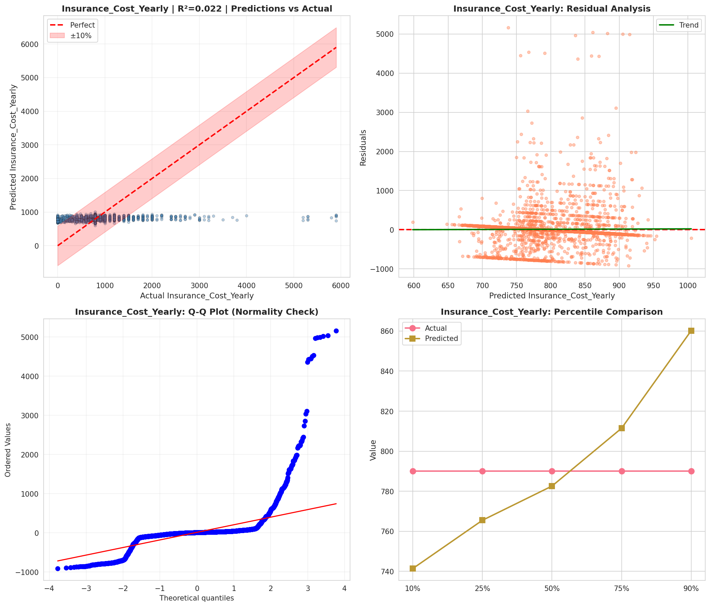
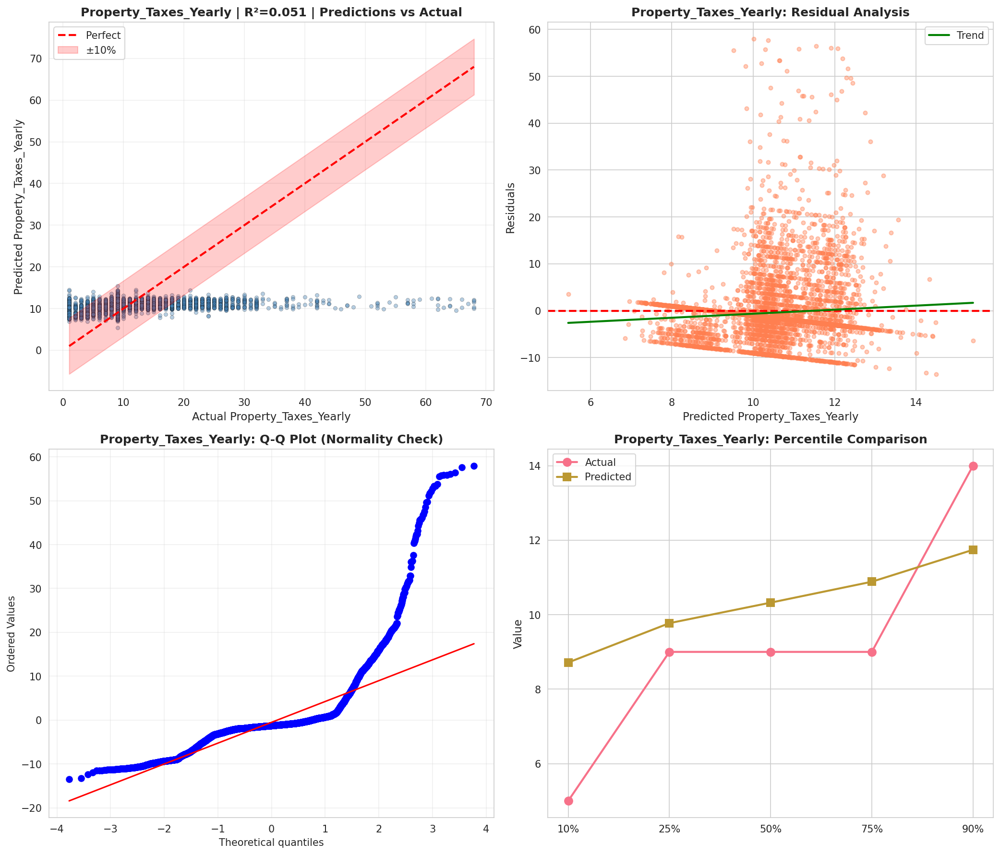
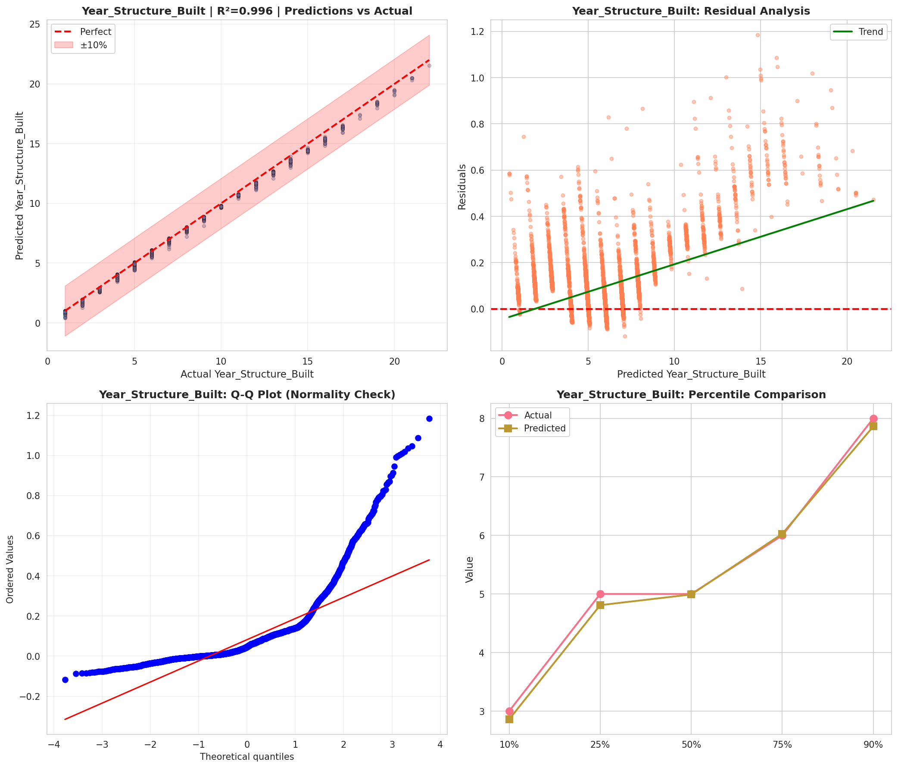
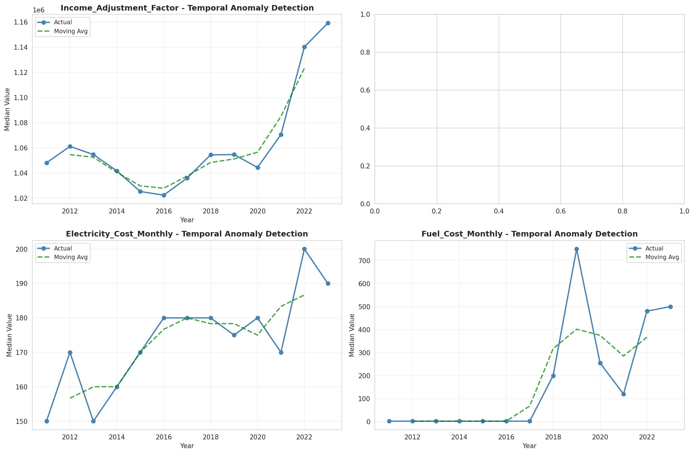
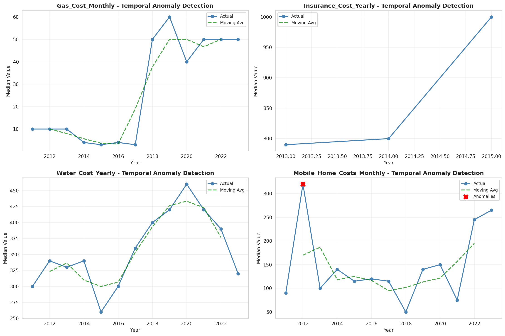
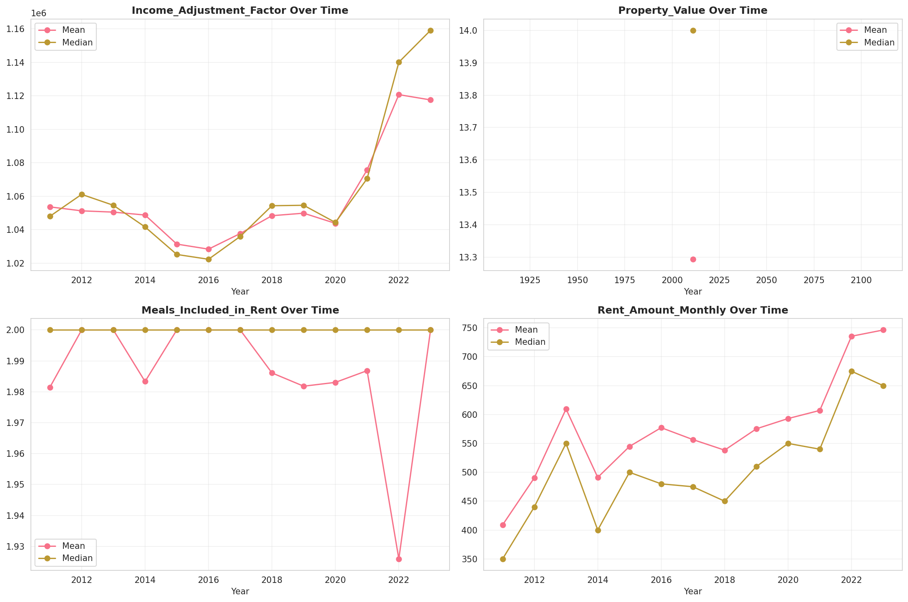
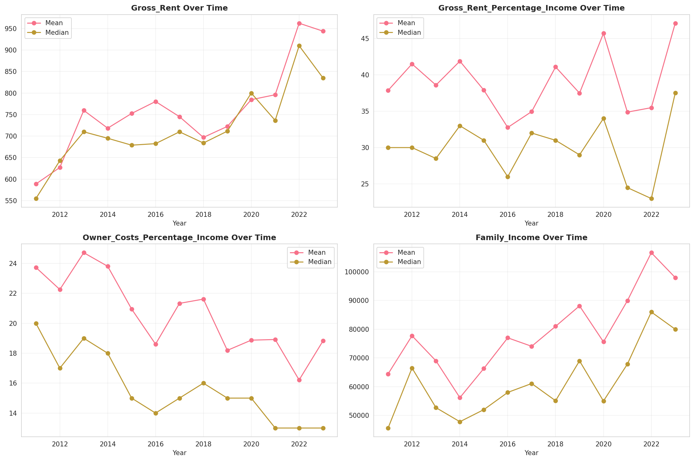
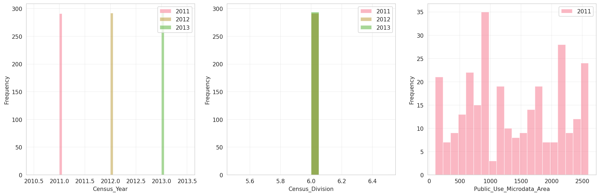
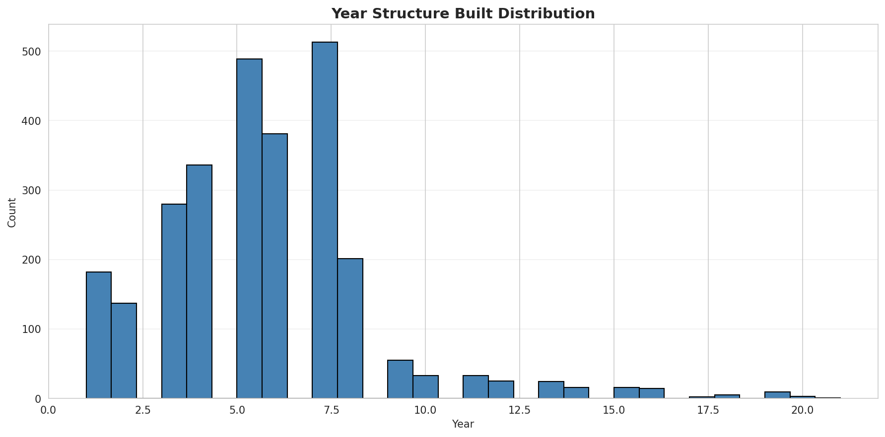
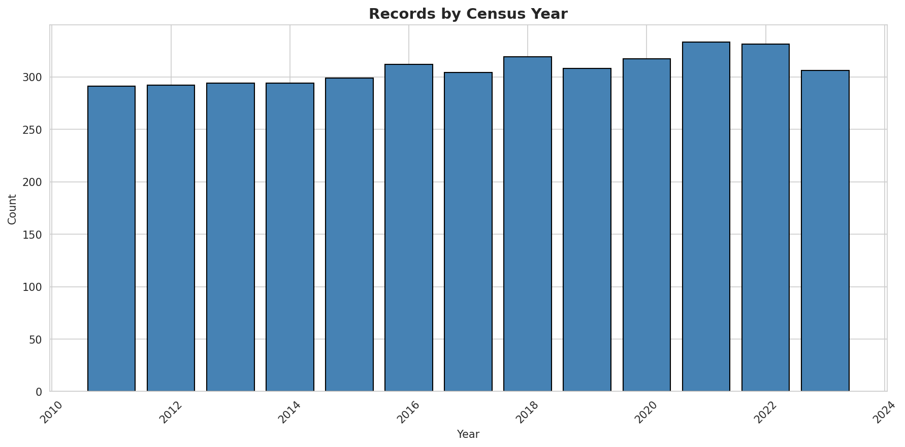
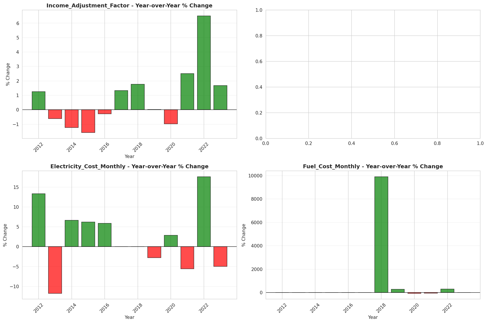
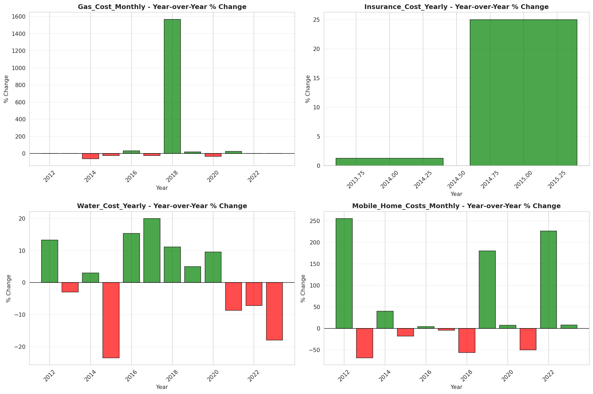
