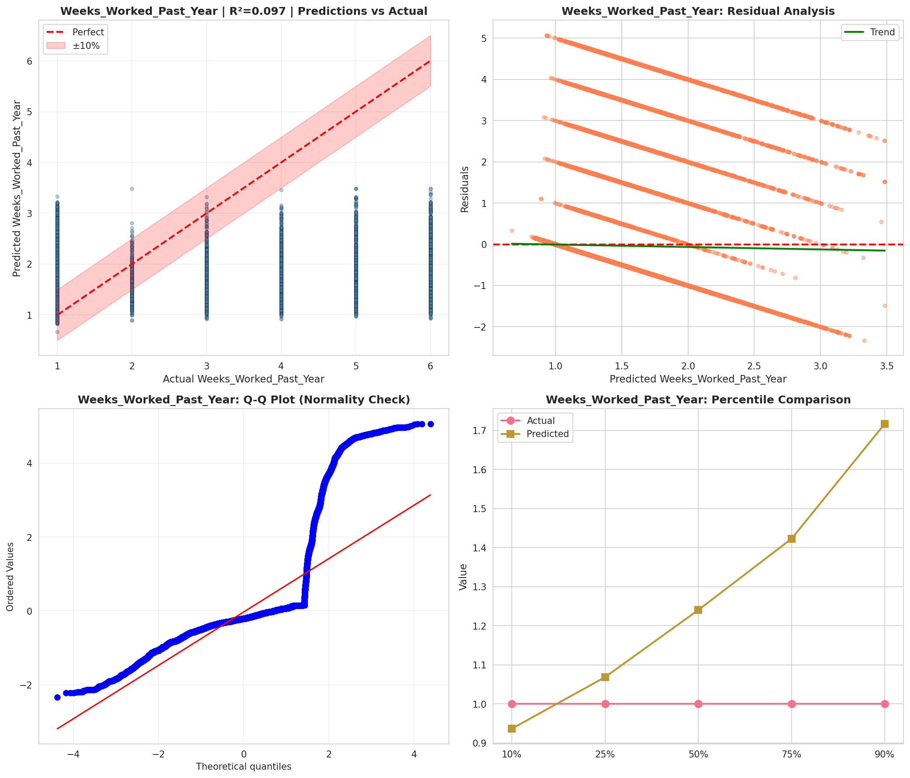
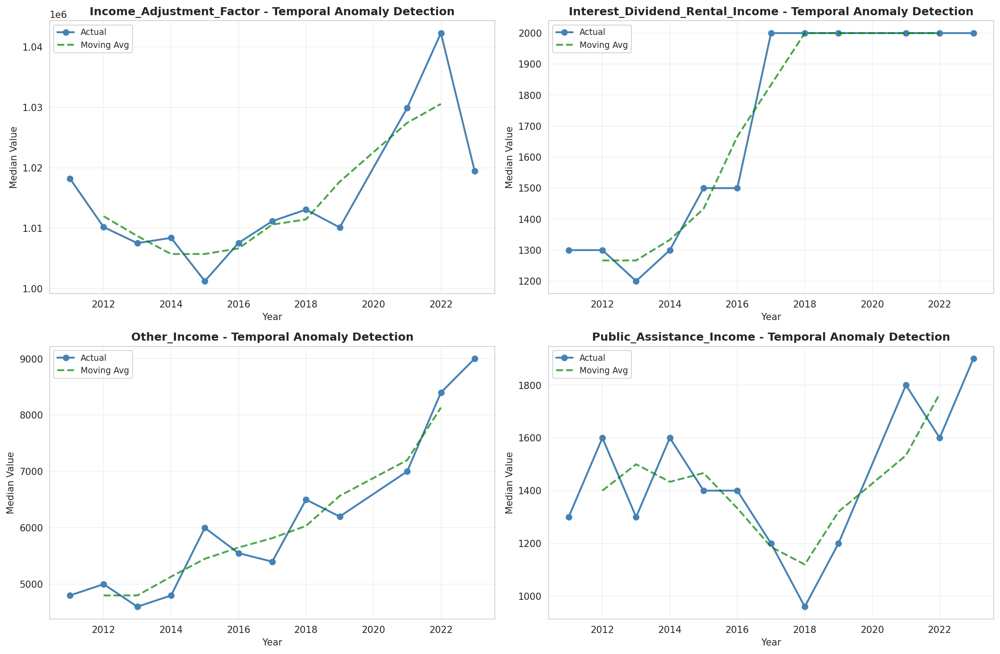
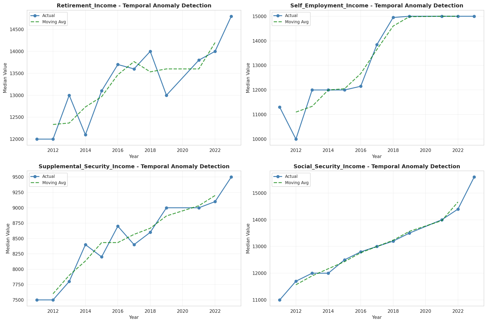
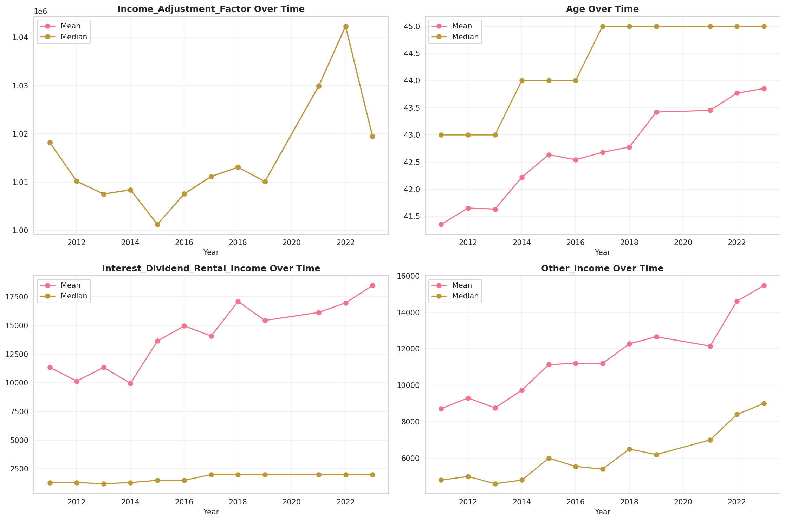
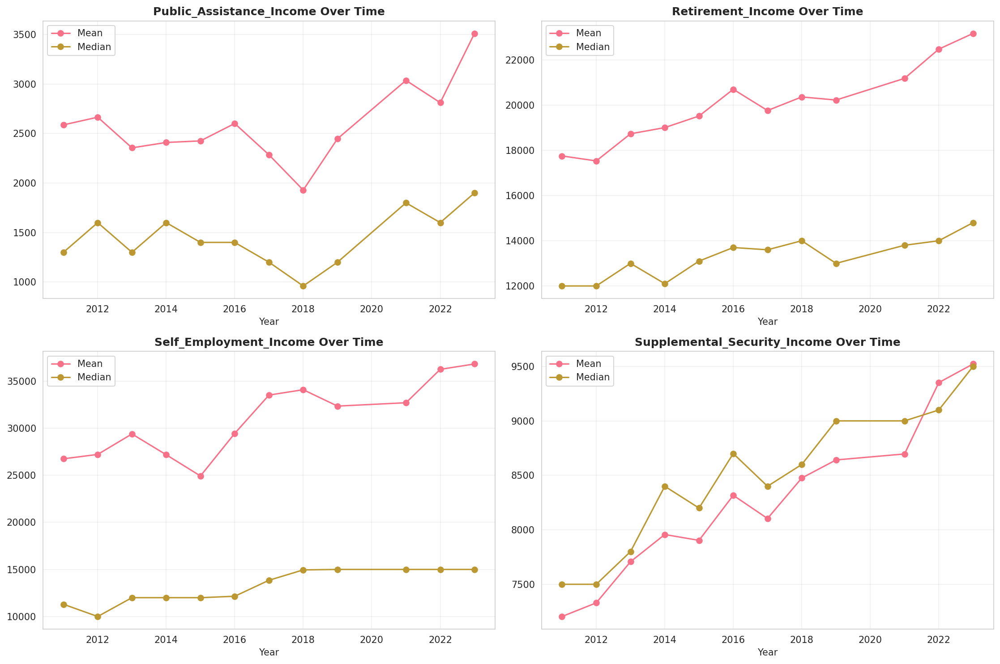
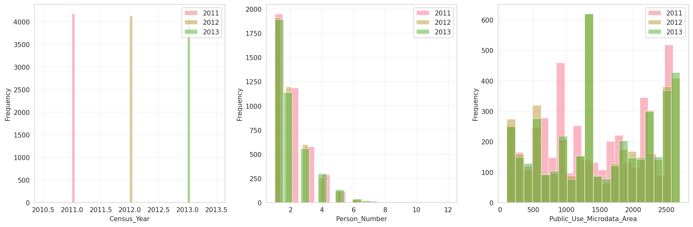
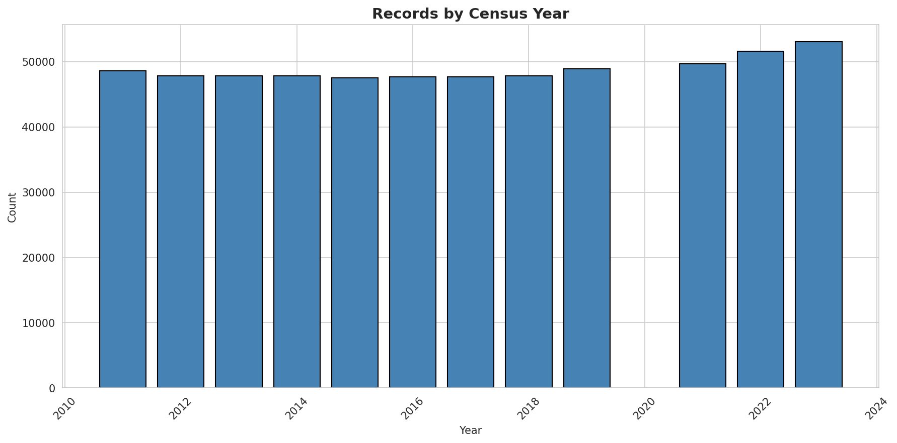
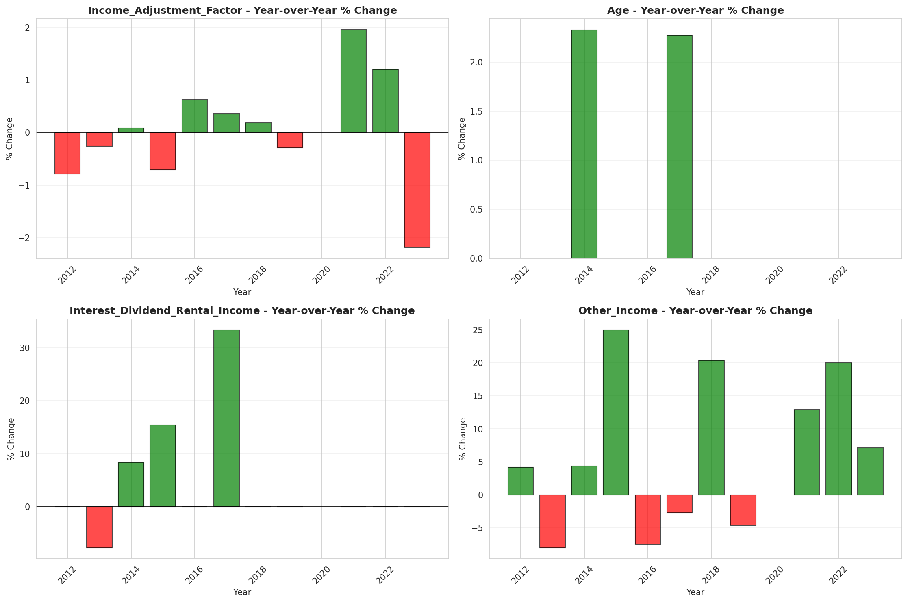
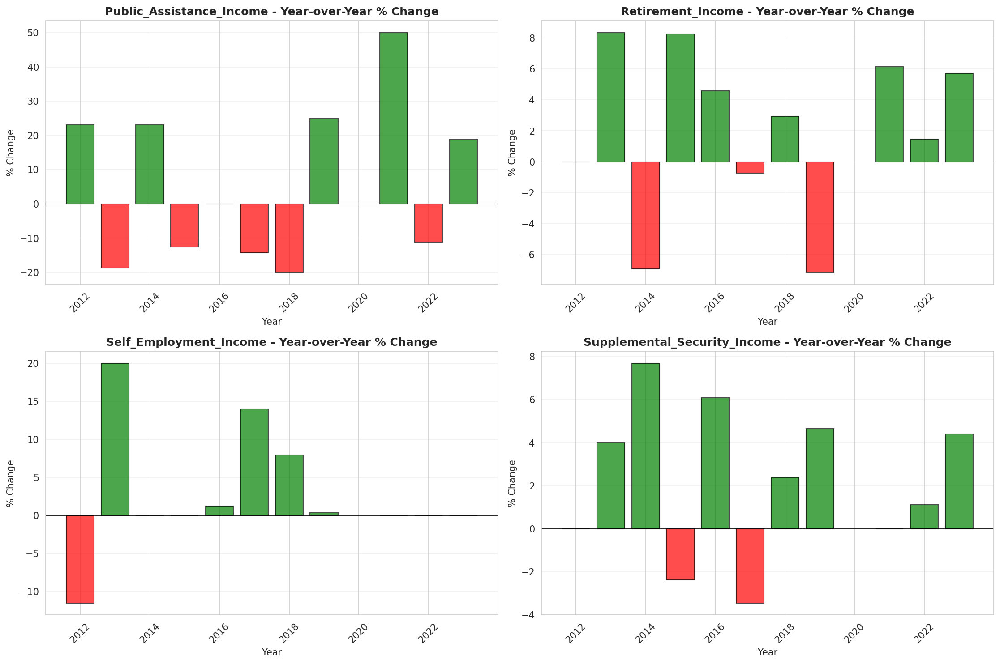

# Temporal Analysis

## Year Distribution

- 2011: 48,579 records

- 2012: 47,819 records

- 2013: 47,836 records

- 2014: 47,793 records

- 2015: 47,476 records

- 2016: 47,659 records

- 2017: 47,645 records

- 2018: 47,777 records

- 2019: 48,928 records

- 2021: 49,647 records

- 2022: 51,580 records

- 2023: 53,020 records

## Temporal Trends

- Census_Year: {np.int64(2011): {'mean': 2011.0, 'median': 2011.0, 'std': 0.0}, np.int64(2012): {'mean': 2012.0, 'median': 2012.0, 'std': 0.0}, np.int64(2013): {'mean': 2013.0, 'median': 2013.0, 'std': 0.0}, np.int64(2014): {'mean': 2014.0, 'median': 2014.0, 'std': 0.0}, np.int64(2015): {'mean': 2015.0, 'median': 2015.0, 'std': 0.0}, np.int64(2016): {'mean': 2016.0, 'median': 2016.0, 'std': 0.0}, np.int64(2017): {'mean': 2017.0, 'median': 2017.0, 'std': 0.0}, np.int64(2018): {'mean': 2018.0, 'median': 2018.0, 'std': 0.0}, np.int64(2019): {'mean': 2019.0, 'median': 2019.0, 'std': 0.0}, np.int64(2021): {'mean': 2021.0, 'median': 2021.0, 'std': 0.0}, np.int64(2022): {'mean': 2022.0, 'median': 2022.0, 'std': 0.0}, np.int64(2023): {'mean': 2023.0, 'median': 2023.0, 'std': 0.0}}

- Person_Number: {np.int64(2011): {'mean': 1.975565573601762, 'median': 2.0, 'std': 1.2047054971403455}, np.int64(2012): {'mean': 1.9702837784144378, 'median': 2.0, 'std': 1.1925779264656806}, np.int64(2013): {'mean': 1.9824190985868384, 'median': 2.0, 'std': 1.2226582364688021}, np.int64(2014): {'mean': 1.9796413700751156, 'median': 2.0, 'std': 1.2112178545860601}, np.int64(2015): {'mean': 1.9596848934198332, 'median': 2.0, 'std': 1.195170524724488}, np.int64(2016): {'mean': 1.9643299271910868, 'median': 2.0, 'std': 1.2055462433492263}, np.int64(2017): {'mean': 1.9618847727988247, 'median': 2.0, 'std': 1.2182736645586862}, np.int64(2018): {'mean': 1.9643552336898507, 'median': 2.0, 'std': 1.217393694728945}, np.int64(2019): {'mean': 1.9623324068018313, 'median': 2.0, 'std': 1.2032207089781062}, np.int64(2021): {'mean': 1.967893326887828, 'median': 2.0, 'std': 1.2455522284375926}, np.int64(2022): {'mean': 1.9486041101202016, 'median': 2.0, 'std': 1.2111525854477554}, np.int64(2023): {'mean': 1.9460015088645795, 'median': 2.0, 'std': 1.2149567586163337}}

- Public_Use_Microdata_Area: {np.int64(2011): {'mean': 1379.7910619815148, 'median': 1300.0, 'std': 776.629105330252}, np.int64(2012): {'mean': 1517.9064179510237, 'median': 1400.0, 'std': 811.3191292192271}, np.int64(2013): {'mean': 1513.232628146166, 'median': 1400.0, 'std': 812.1831629831964}, np.int64(2014): {'mean': 1512.9854999686147, 'median': 1400.0, 'std': 810.521408793529}, np.int64(2015): {'mean': 1510.2057671244418, 'median': 1400.0, 'std': 814.3191714579207}, np.int64(2016): {'mean': 1499.7178916888731, 'median': 1400.0, 'std': 816.3371876894115}, np.int64(2017): {'mean': 1501.8834505194668, 'median': 1400.0, 'std': 822.241524152615}, np.int64(2018): {'mean': 1508.7545680976202, 'median': 1400.0, 'std': 823.669364767294}, np.int64(2019): {'mean': 1491.0081957161544, 'median': 1400.0, 'std': 826.4458710931171}, np.int64(2021): {'mean': 1487.1775938123149, 'median': 1305.0, 'std': 817.714350711403}, np.int64(2022): {'mean': 1486.4637262504848, 'median': 1404.0, 'std': 821.8890297444104}, np.int64(2023): {'mean': 1474.2867597133156, 'median': 1404.0, 'std': 821.5426016976954}}

- State_Code: {np.int64(2011): {'mean': 1.0, 'median': 1.0, 'std': 0.0}, np.int64(2012): {'mean': 1.0, 'median': 1.0, 'std': 0.0}, np.int64(2013): {'mean': 1.0, 'median': 1.0, 'std': 0.0}, np.int64(2014): {'mean': 1.0, 'median': 1.0, 'std': 0.0}, np.int64(2015): {'mean': 1.0, 'median': 1.0, 'std': 0.0}, np.int64(2016): {'mean': 1.0, 'median': 1.0, 'std': 0.0}, np.int64(2017): {'mean': 1.0, 'median': 1.0, 'std': 0.0}, np.int64(2018): {'mean': 1.0, 'median': 1.0, 'std': 0.0}, np.int64(2019): {'mean': 1.0, 'median': 1.0, 'std': 0.0}, np.int64(2021): {'mean': 1.0, 'median': 1.0, 'std': 0.0}, np.int64(2022): {'mean': 1.0, 'median': 1.0, 'std': 0.0}, np.int64(2023): {'mean': None, 'median': None, 'std': None}}

- Income_Adjustment_Factor: {np.int64(2011): {'mean': 1018237.0, 'median': 1018237.0, 'std': 0.0}, np.int64(2012): {'mean': 1010207.0, 'median': 1010207.0, 'std': 0.0}, np.int64(2013): {'mean': 1007549.0, 'median': 1007549.0, 'std': 0.0}, np.int64(2014): {'mean': 1008425.0, 'median': 1008425.0, 'std': 0.0}, np.int64(2015): {'mean': 1001264.0, 'median': 1001264.0, 'std': 0.0}, np.int64(2016): {'mean': 1007588.0, 'median': 1007588.0, 'std': 0.0}, np.int64(2017): {'mean': 1011189.0, 'median': 1011189.0, 'std': 0.0}, np.int64(2018): {'mean': 1013097.0, 'median': 1013097.0, 'std': 0.0}, np.int64(2019): {'mean': 1010145.0, 'median': 1010145.0, 'std': 0.0}, np.int64(2021): {'mean': 1029928.0, 'median': 1029928.0, 'std': 0.0}, np.int64(2022): {'mean': 1042311.0, 'median': 1042311.0, 'std': 0.0}, np.int64(2023): {'mean': 1019518.0, 'median': 1019518.0, 'std': 0.0}}

- Person_Weight: {np.int64(2011): {'mean': 98.86452994092097, 'median': 73.0, 'std': 95.55258113138532}, np.int64(2012): {'mean': 100.83905978795039, 'median': 77.0, 'std': 90.7767003768071}, np.int64(2013): {'mean': 101.04778827661175, 'median': 76.0, 'std': 92.46388052394808}, np.int64(2014): {'mean': 101.46626074948215, 'median': 77.0, 'std': 91.89906270974949}, np.int64(2015): {'mean': 102.34600640323532, 'median': 77.0, 'std': 93.88060708462848}, np.int64(2016): {'mean': 102.04368534799303, 'median': 77.0, 'std': 94.16172883547831}, np.int64(2017): {'mean': 102.31392591037884, 'median': 77.0, 'std': 95.49415923166683}, np.int64(2018): {'mean': 102.30594218975658, 'median': 76.0, 'std': 97.34371878280726}, np.int64(2019): {'mean': 100.21225065402224, 'median': 72.0, 'std': 100.72794369780253}, np.int64(2021): {'mean': 101.5142304670977, 'median': 71.0, 'std': 100.39943948981222}, np.int64(2022): {'mean': 98.37720046529662, 'median': 72.0, 'std': 95.72458072230476}, np.int64(2023): {'mean': 96.34983025273482, 'median': 70.0, 'std': 93.46546464204627}}

- Age: {np.int64(2011): {'mean': 41.35237448280121, 'median': 43.0, 'std': 23.63720816631168}, np.int64(2012): {'mean': 41.652774001965746, 'median': 43.0, 'std': 23.55281052245799}, np.int64(2013): {'mean': 41.63349778409566, 'median': 43.0, 'std': 23.648127163193287}, np.int64(2014): {'mean': 42.221538719059275, 'median': 44.0, 'std': 23.66375162270938}, np.int64(2015): {'mean': 42.63518409301542, 'median': 44.0, 'std': 23.723651835646567}, np.int64(2016): {'mean': 42.54275163138127, 'median': 44.0, 'std': 23.843445125158958}, np.int64(2017): {'mean': 42.67946269283241, 'median': 45.0, 'std': 23.78582440755723}, np.int64(2018): {'mean': 42.77757079766415, 'median': 45.0, 'std': 23.801082497770977}, np.int64(2019): {'mean': 43.42061805101373, 'median': 45.0, 'std': 23.945069546806717}, np.int64(2021): {'mean': 43.45126593751888, 'median': 45.0, 'std': 24.114815132309865}, np.int64(2022): {'mean': 43.76760372237301, 'median': 45.0, 'std': 24.08607070384863}, np.int64(2023): {'mean': 43.85413051678612, 'median': 45.0, 'std': 24.228791617870097}}

- Citizenship_Status: {np.int64(2011): {'mean': 1.1014018403013648, 'median': 1.0, 'std': 0.5811497881462311}, np.int64(2012): {'mean': 1.1044563876283486, 'median': 1.0, 'std': 0.5905632120581634}, np.int64(2013): {'mean': 1.1036039802659086, 'median': 1.0, 'std': 0.5850036771372269}, np.int64(2014): {'mean': 1.1044085954010001, 'median': 1.0, 'std': 0.5901525820272452}, np.int64(2015): {'mean': 1.105421686746988, 'median': 1.0, 'std': 0.5891303371417299}, np.int64(2016): {'mean': 1.1142911097589123, 'median': 1.0, 'std': 0.6139586644232363}, np.int64(2017): {'mean': 1.12026445587155, 'median': 1.0, 'std': 0.6291495557840575}, np.int64(2018): {'mean': 1.1170019046821693, 'median': 1.0, 'std': 0.6178163747079103}, np.int64(2019): {'mean': 1.1161502616088947, 'median': 1.0, 'std': 0.6127943824175136}, np.int64(2021): {'mean': 1.1318508671218805, 'median': 1.0, 'std': 0.6583056417864706}, np.int64(2022): {'mean': 1.1335013571151609, 'median': 1.0, 'std': 0.6581599661863823}, np.int64(2023): {'mean': 1.1359109769898152, 'median': 1.0, 'std': 0.6641244106054656}}

- Class_of_Worker: {np.int64(2011): {'mean': 2.169830281375614, 'median': 1.0, 'std': 1.960017064579063}, np.int64(2012): {'mean': 2.184971098265896, 'median': 1.0, 'std': 1.9848715788389824}, np.int64(2013): {'mean': 2.1435753978754772, 'median': 1.0, 'std': 1.9416941551917135}, np.int64(2014): {'mean': 2.1193534860671672, 'median': 1.0, 'std': 1.921366120089086}, np.int64(2015): {'mean': 2.1011481893936486, 'median': 1.0, 'std': 1.909467636269523}, np.int64(2016): {'mean': 2.1270132751826774, 'median': 1.0, 'std': 1.9147241682650853}, np.int64(2017): {'mean': 2.1254423757501155, 'median': 1.0, 'std': 1.9175938272411803}, np.int64(2018): {'mean': 2.116893971051932, 'median': 1.0, 'std': 1.9082292052077163}, np.int64(2019): {'mean': 2.1271246327221336, 'median': 1.0, 'std': 1.8833366874333435}, np.int64(2021): {'mean': 2.1267927589130995, 'median': 1.0, 'std': 1.8736837889598477}, np.int64(2022): {'mean': 2.1824773839276284, 'median': 1.0, 'std': 1.920887034548698}, np.int64(2023): {'mean': 2.1449908799944937, 'median': 1.0, 'std': 1.8920676329916621}}

- English_Speaking_Ability: {np.int64(2011): {'mean': 1.6476244343891402, 'median': 1.0, 'std': 0.9113104374615669}, np.int64(2012): {'mean': 1.6006749156355455, 'median': 1.0, 'std': 0.8607227564870938}, np.int64(2013): {'mean': 1.6051682692307692, 'median': 1.0, 'std': 0.8563706833929999}, np.int64(2014): {'mean': 1.6161383285302593, 'median': 1.0, 'std': 0.8928616458166658}, np.int64(2015): {'mean': 1.608955223880597, 'median': 1.0, 'std': 0.8595745355138316}, np.int64(2016): {'mean': 1.6019261637239166, 'median': 1.0, 'std': 0.8405645426937394}, np.int64(2017): {'mean': 1.574577139928242, 'median': 1.0, 'std': 0.8536194510737831}, np.int64(2018): {'mean': 1.6306165099268548, 'median': 1.0, 'std': 0.8930953920252944}, np.int64(2019): {'mean': 1.5676365492598265, 'median': 1.0, 'std': 0.8415864188057093}, np.int64(2021): {'mean': 1.6279491833030852, 'median': 1.0, 'std': 0.9001231393815908}, np.int64(2022): {'mean': 1.5441595441595442, 'median': 1.0, 'std': 0.8210034699453671}, np.int64(2023): {'mean': 1.6091097308488613, 'median': 1.0, 'std': 0.8794344575750891}}

- Fertility_Status: {np.int64(2011): {'mean': 1.9457865168539326, 'median': 2.0, 'std': 0.22644907333184186}, np.int64(2012): {'mean': 1.9481904761904763, 'median': 2.0, 'std': 0.22165282785810947}, np.int64(2013): {'mean': 1.951943327589508, 'median': 2.0, 'std': 0.21389625632104928}, np.int64(2014): {'mean': 1.953515511037635, 'median': 2.0, 'std': 0.21054213842302413}, np.int64(2015): {'mean': 1.9519728975687525, 'median': 2.0, 'std': 0.21383417866872872}, np.int64(2016): {'mean': 1.9478668261563, 'median': 2.0, 'std': 0.22230661773299054}, np.int64(2017): {'mean': 1.949379652605459, 'median': 2.0, 'std': 0.21923206497988582}, np.int64(2018): {'mean': 1.9441754767315482, 'median': 2.0, 'std': 0.2295938896946322}, np.int64(2019): {'mean': 1.9495208930159045, 'median': 2.0, 'std': 0.21894223454574605}, np.int64(2021): {'mean': 1.9512902290518992, 'median': 2.0, 'std': 0.21527101038112856}, np.int64(2022): {'mean': 1.9476330518926097, 'median': 2.0, 'std': 0.2227764778302493}, np.int64(2023): {'mean': 1.9514545117657958, 'median': 2.0, 'std': 0.21492580888067594}}

- Marital_Status: {np.int64(2011): {'mean': 2.8759546306017003, 'median': 3.0, 'std': 1.817502783940778}, np.int64(2012): {'mean': 2.84334678684205, 'median': 3.0, 'std': 1.813445345837466}, np.int64(2013): {'mean': 2.863136549878752, 'median': 3.0, 'std': 1.8172083995943609}, np.int64(2014): {'mean': 2.8463582533006924, 'median': 3.0, 'std': 1.815364303114167}, np.int64(2015): {'mean': 2.8416884320498776, 'median': 2.0, 'std': 1.8153759651358172}, np.int64(2016): {'mean': 2.8327283409219666, 'median': 2.0, 'std': 1.815903454930335}, np.int64(2017): {'mean': 2.85339489977962, 'median': 3.0, 'std': 1.818217240038667}, np.int64(2018): {'mean': 2.8407811289951233, 'median': 2.0, 'std': 1.8173794348050885}, np.int64(2019): {'mean': 2.827215500327011, 'median': 2.0, 'std': 1.8120964827511115}, np.int64(2021): {'mean': 2.874091083046307, 'median': 3.0, 'std': 1.8199697468775768}, np.int64(2022): {'mean': 2.830379992245056, 'median': 2.0, 'std': 1.8200996787370867}, np.int64(2023): {'mean': 2.855960015088646, 'median': 3.0, 'std': 1.820253007170694}}

- Mobility_Status: {np.int64(2011): {'mean': 1.2666057218840248, 'median': 1.0, 'std': 0.6778210800154285}, np.int64(2012): {'mean': 1.2575911144896321, 'median': 1.0, 'std': 0.6682025335233145}, np.int64(2013): {'mean': 1.2668537547739118, 'median': 1.0, 'std': 0.6778872740983555}, np.int64(2014): {'mean': 1.2625379939209727, 'median': 1.0, 'std': 0.67364330471438}, np.int64(2015): {'mean': 1.2560280671911546, 'median': 1.0, 'std': 0.6665771669185575}, np.int64(2016): {'mean': 1.2571216774330192, 'median': 1.0, 'std': 0.666643519040941}, np.int64(2017): {'mean': 1.2570708247706617, 'median': 1.0, 'std': 0.6672848890395517}, np.int64(2018): {'mean': 1.2699395578849486, 'median': 1.0, 'std': 0.6809888710166244}, np.int64(2019): {'mean': 1.2467374497474488, 'median': 1.0, 'std': 0.6559375942297923}, np.int64(2021): {'mean': 1.2258601779258236, 'median': 1.0, 'std': 0.6310285564122088}, np.int64(2022): {'mean': 1.2317576421349083, 'median': 1.0, 'std': 0.6379618672293403}, np.int64(2023): {'mean': 1.2222391180383958, 'median': 1.0, 'std': 0.6259297895942898}}

- Military_Service: {np.int64(2011): {'mean': 4.734943138354837, 'median': 5.0, 'std': 0.6922970166942286}, np.int64(2012): {'mean': 4.741808582224753, 'median': 5.0, 'std': 0.6804286982510218}, np.int64(2013): {'mean': 3.755311981757877, 'median': 4.0, 'std': 0.6453933980734479}, np.int64(2014): {'mean': 3.765071536821556, 'median': 4.0, 'std': 0.6348744852454443}, np.int64(2015): {'mean': 3.7737871331770285, 'median': 4.0, 'std': 0.6233263901483934}, np.int64(2016): {'mean': 3.77980895491645, 'median': 4.0, 'std': 0.617286349570959}, np.int64(2017): {'mean': 3.785260026669402, 'median': 4.0, 'std': 0.6092791783342648}, np.int64(2018): {'mean': 3.7786236141623664, 'median': 4.0, 'std': 0.6174031673899192}, np.int64(2019): {'mean': 3.7844040122458122, 'median': 4.0, 'std': 0.6103878816304021}, np.int64(2021): {'mean': 3.7922871231263646, 'median': 4.0, 'std': 0.6031803066247797}, np.int64(2022): {'mean': 3.7949115876598944, 'median': 4.0, 'std': 0.5984597624139629}, np.int64(2023): {'mean': 3.8054771444181386, 'median': 4.0, 'std': 0.5848809991867695}}

- Travel_Time_To_Work_Minutes: {np.int64(2011): {'mean': 23.80470123022847, 'median': 20.0, 'std': 20.433178301540345}, np.int64(2012): {'mean': 25.070610163916452, 'median': 20.0, 'std': 22.809271946697972}, np.int64(2013): {'mean': 24.772744554885666, 'median': 20.0, 'std': 21.288365900577514}, np.int64(2014): {'mean': 24.69914179305878, 'median': 20.0, 'std': 21.17508100869114}, np.int64(2015): {'mean': 24.80240139085081, 'median': 20.0, 'std': 21.062897661797564}, np.int64(2016): {'mean': 24.67849330416689, 'median': 20.0, 'std': 20.416442066144068}, np.int64(2017): {'mean': 24.90824560465986, 'median': 20.0, 'std': 20.91039774222097}, np.int64(2018): {'mean': 25.141469816272966, 'median': 20.0, 'std': 22.034355484329552}, np.int64(2019): {'mean': 25.91268841054595, 'median': 20.0, 'std': 23.09961242071063}, np.int64(2021): {'mean': 25.53716124107094, 'median': 20.0, 'std': 22.377926409574048}, np.int64(2022): {'mean': 25.717886970333556, 'median': 20.0, 'std': 22.076142115644107}, np.int64(2023): {'mean': 25.46360616128058, 'median': 20.0, 'std': 21.40921535818018}}

- Vehicle_Occupancy: {np.int64(2011): {'mean': 1.1501893618223955, 'median': 1.0, 'std': 0.5658426367124022}, np.int64(2012): {'mean': 1.1354154921637163, 'median': 1.0, 'std': 0.49504120432542975}, np.int64(2013): {'mean': 1.1258604286753595, 'median': 1.0, 'std': 0.5141788513708672}, np.int64(2014): {'mean': 1.1372887010676156, 'median': 1.0, 'std': 0.5329614855863332}, np.int64(2015): {'mean': 1.1328460637170117, 'median': 1.0, 'std': 0.5218522162915009}, np.int64(2016): {'mean': 1.12387436854821, 'median': 1.0, 'std': 0.4920174063383049}, np.int64(2017): {'mean': 1.1290517194098613, 'median': 1.0, 'std': 0.5083409865344928}, np.int64(2018): {'mean': 1.1258274581561811, 'median': 1.0, 'std': 0.5301367394148792}, np.int64(2019): {'mean': 1.1363447990053874, 'median': 1.0, 'std': 0.5438422696783123}, np.int64(2021): {'mean': 1.1192424072621316, 'median': 1.0, 'std': 0.4738172461019386}, np.int64(2022): {'mean': 1.1399281335869795, 'median': 1.0, 'std': 0.5669037116919977}, np.int64(2023): {'mean': 1.1438710014089652, 'median': 1.0, 'std': 0.5410961810898647}}

- Transportation_To_Work: {np.int64(2011): {'mean': 1.4897207240882149, 'median': 1.0, 'std': 2.121128652035239}, np.int64(2012): {'mean': 1.4752697361393015, 'median': 1.0, 'std': 2.094312910568827}, np.int64(2013): {'mean': 1.4918093426336927, 'median': 1.0, 'std': 2.1235889676389066}, np.int64(2014): {'mean': 1.5282534694946321, 'median': 1.0, 'std': 2.2045843288746467}, np.int64(2015): {'mean': 1.515680177093765, 'median': 1.0, 'std': 2.1855787415104317}, np.int64(2016): {'mean': 1.5538914424417705, 'median': 1.0, 'std': 2.259464756859818}, np.int64(2017): {'mean': 1.5320270899033241, 'median': 1.0, 'std': 2.2155566813378242}, np.int64(2018): {'mean': 1.5302476654486399, 'median': 1.0, 'std': 2.2152591519406837}, np.int64(2019): {'mean': None, 'median': None, 'std': None}, np.int64(2021): {'mean': None, 'median': None, 'std': None}, np.int64(2022): {'mean': None, 'median': None, 'std': None}, np.int64(2023): {'mean': None, 'median': None, 'std': None}}

- Language_Other_Than_English: {np.int64(2011): {'mean': 1.9615660529118932, 'median': 2.0, 'std': 0.19224354919624786}, np.int64(2012): {'mean': 1.960814563406356, 'median': 2.0, 'std': 0.19403805796772808}, np.int64(2013): {'mean': 1.963340750369016, 'median': 2.0, 'std': 0.18792585529930844}, np.int64(2014): {'mean': 1.9618840484193414, 'median': 2.0, 'std': 0.19147827887282592}, np.int64(2015): {'mean': 1.962962962962963, 'median': 2.0, 'std': 0.1888546625344641}, np.int64(2016): {'mean': 1.9587526483050848, 'median': 2.0, 'std': 0.19886397472001505}, np.int64(2017): {'mean': 1.9569932767552078, 'median': 2.0, 'std': 0.20287447415828022}, np.int64(2018): {'mean': 1.9579109400769654, 'median': 2.0, 'std': 0.2007945655761701}, np.int64(2019): {'mean': 1.9580226279249164, 'median': 2.0, 'std': 0.2005396072062414}, np.int64(2021): {'mean': 1.953398879374141, 'median': 2.0, 'std': 0.21078518831599471}, np.int64(2022): {'mean': 1.950098503158194, 'median': 2.0, 'std': 0.2177436575315864}, np.int64(2023): {'mean': 1.9522878141299194, 'median': 2.0, 'std': 0.21315869877361757}}

- Grandparents_Living_With_Grandchildren: {np.int64(2011): {'mean': 1.9580461777876583, 'median': 2.0, 'std': 0.20048684638130443}, np.int64(2012): {'mean': 1.9587030063190145, 'median': 2.0, 'std': 0.19897943503666435}, np.int64(2013): {'mean': 1.9608983164552918, 'median': 2.0, 'std': 0.19383999127906623}, np.int64(2014): {'mean': 1.9616956563064347, 'median': 2.0, 'std': 0.19193303020314906}, np.int64(2015): {'mean': 1.9592114423137776, 'median': 2.0, 'std': 0.19780315805649806}, np.int64(2016): {'mean': 1.9610040198778211, 'median': 2.0, 'std': 0.19358842910622312}, np.int64(2017): {'mean': 1.965959592775869, 'median': 2.0, 'std': 0.18133586056363712}, np.int64(2018): {'mean': 1.9636913767019668, 'median': 2.0, 'std': 0.18705991026425964}, np.int64(2019): {'mean': 1.9622618687632296, 'median': 2.0, 'std': 0.19056511436938078}, np.int64(2021): {'mean': 1.9654676689927821, 'median': 2.0, 'std': 0.1825947635620062}, np.int64(2022): {'mean': 1.968784806511495, 'median': 2.0, 'std': 0.1739013193207983}, np.int64(2023): {'mean': 1.9658535222287423, 'median': 2.0, 'std': 0.18160786720397967}}

- Months_Responsible_For_Grandchildren: {np.int64(2011): {'mean': 3.779816513761468, 'median': 4.0, 'std': 1.3285721295046393}, np.int64(2012): {'mean': 3.8261437908496734, 'median': 4.0, 'std': 1.332181773530342}, np.int64(2013): {'mean': 3.9891640866873064, 'median': 5.0, 'std': 1.2691473965300826}, np.int64(2014): {'mean': 3.790769230769231, 'median': 4.0, 'std': 1.3561164388288953}, np.int64(2015): {'mean': 3.878213802435724, 'median': 4.0, 'std': 1.3490131102293823}, np.int64(2016): {'mean': 3.8877086494688924, 'median': 4.0, 'std': 1.2821491503960232}, np.int64(2017): {'mean': 3.882149046793761, 'median': 4.0, 'std': 1.2936719214107124}, np.int64(2018): {'mean': 4.008431703204047, 'median': 5.0, 'std': 1.305496334036369}, np.int64(2019): {'mean': 3.995114006514658, 'median': 5.0, 'std': 1.2753052553495805}, np.int64(2021): {'mean': 3.946395563770795, 'median': 5.0, 'std': 1.2934632461595}, np.int64(2022): {'mean': 4.060885608856089, 'median': 5.0, 'std': 1.189130357539995}, np.int64(2023): {'mean': 4.033444816053512, 'median': 5.0, 'std': 1.2232608094095891}}

- Grandparents_Responsible_For_Grandchildren: {np.int64(2011): {'mean': 1.4224072672218018, 'median': 1.0, 'std': 0.49412974073052973}, np.int64(2012): {'mean': 1.4088098918083463, 'median': 1.0, 'std': 0.4918041090681867}, np.int64(2013): {'mean': 1.4722222222222223, 'median': 1.0, 'std': 0.49943185673535306}, np.int64(2014): {'mean': 1.4623655913978495, 'median': 1.0, 'std': 0.4987879634247925}, np.int64(2015): {'mean': 1.4266873545384018, 'median': 1.0, 'std': 0.4947880176969}, np.int64(2016): {'mean': 1.4650974025974026, 'median': 1.0, 'std': 0.4989828714704222}, np.int64(2017): {'mean': 1.4657407407407408, 'median': 1.0, 'std': 0.4990560203086514}, np.int64(2018): {'mean': 1.4852430555555556, 'median': 1.0, 'std': 0.49999924582431765}, np.int64(2019): {'mean': 1.5080128205128205, 'median': 2.0, 'std': 0.5001362058223701}, np.int64(2021): {'mean': 1.530789245446661, 'median': 2.0, 'std': 0.4992676770595726}, np.int64(2022): {'mean': 1.504117108874657, 'median': 2.0, 'std': 0.5002119267080083}, np.int64(2023): {'mean': 1.5106382978723405, 'median': 2.0, 'std': 0.5000914757662216}}

- Interest_Dividend_Rental_Income: {np.int64(2011): {'mean': 11344.955920895878, 'median': 1300.0, 'std': 33926.69803458263}, np.int64(2012): {'mean': 10146.240877653232, 'median': 1300.0, 'std': 28037.871992835397}, np.int64(2013): {'mean': 11342.82049564635, 'median': 1200.0, 'std': 32399.593091727747}, np.int64(2014): {'mean': 9956.932318873496, 'median': 1300.0, 'std': 26660.76978535016}, np.int64(2015): {'mean': 13644.10992434357, 'median': 1500.0, 'std': 42996.36559942405}, np.int64(2016): {'mean': 14960.48159090909, 'median': 1500.0, 'std': 45390.56626278636}, np.int64(2017): {'mean': 14075.961308812992, 'median': 2000.0, 'std': 40314.27441131115}, np.int64(2018): {'mean': 17090.300733496333, 'median': 2000.0, 'std': 53259.9605127532}, np.int64(2019): {'mean': 15433.80335731415, 'median': 2000.0, 'std': 42593.91195622782}, np.int64(2021): {'mean': 16134.268617021276, 'median': 2000.0, 'std': 43060.205030239485}, np.int64(2022): {'mean': 16968.99188591099, 'median': 2000.0, 'std': 48433.703078714214}, np.int64(2023): {'mean': 18473.284044836633, 'median': 2000.0, 'std': 50758.42750383341}}

- Military_Service_Period_1: {np.int64(2011): {'mean': 0.14513350559862187, 'median': 0.0, 'std': 0.35227332151186946}, np.int64(2012): {'mean': 0.1363230700580098, 'median': 0.0, 'std': 0.3431695875365244}, np.int64(2013): {'mean': 0.15497283250649657, 'median': 0.0, 'std': 0.36192153567556706}, np.int64(2014): {'mean': 0.15865267268733219, 'median': 0.0, 'std': 0.365396483995025}, np.int64(2015): {'mean': 0.17009916094584288, 'median': 0.0, 'std': 0.375767665026081}, np.int64(2016): {'mean': 0.18741842860871835, 'median': 0.0, 'std': 0.3902979942935817}, np.int64(2017): {'mean': 0.19946236559139785, 'median': 0.0, 'std': 0.3996499290699823}, np.int64(2018): {'mean': 0.21526876136068554, 'median': 0.0, 'std': 0.41106203811242487}, np.int64(2019): {'mean': 0.22588235294117648, 'median': 0.0, 'std': 0.41821674097494155}, np.int64(2021): {'mean': 0.24086423046145639, 'median': 0.0, 'std': 0.42766510099079924}, np.int64(2022): {'mean': 0.2691210785584651, 'median': 0.0, 'std': 0.4435605186761971}, np.int64(2023): {'mean': 0.29433562731604024, 'median': 0.0, 'std': 0.45580385816195057}}

- Military_Service_Period_2: {np.int64(2011): {'mean': 0.17829457364341086, 'median': 0.0, 'std': 0.38280174077210716}, np.int64(2012): {'mean': 0.18652387327086123, 'median': 0.0, 'std': 0.3895723030745646}, np.int64(2013): {'mean': 0.20741790692180487, 'median': 0.0, 'std': 0.4055053201614823}, np.int64(2014): {'mean': 0.20039052965584575, 'median': 0.0, 'std': 0.4003414604426495}, np.int64(2015): {'mean': 0.21332316297991355, 'median': 0.0, 'std': 0.40970607850997165}, np.int64(2016): {'mean': 0.1994257374053772, 'median': 0.0, 'std': 0.3996208178682699}, np.int64(2017): {'mean': 0.2403225806451613, 'median': 0.0, 'std': 0.427336785680331}, np.int64(2018): {'mean': 0.24357309789665021, 'median': 0.0, 'std': 0.42929372204258953}, np.int64(2019): {'mean': 0.24026143790849674, 'median': 0.0, 'std': 0.427298038423668}, np.int64(2021): {'mean': 0.2590024006401707, 'median': 0.0, 'std': 0.4381453675679292}, np.int64(2022): {'mean': 0.26549131449312935, 'median': 0.0, 'std': 0.44165172753353954}, np.int64(2023): {'mean': 0.2848067760719958, 'median': 0.0, 'std': 0.45138210633173864}}

- Military_Service_Period_3: {np.int64(2011): {'mean': 0.20887166236003446, 'median': 0.0, 'std': 0.4065462839652822}, np.int64(2012): {'mean': 0.21887550200803213, 'median': 0.0, 'std': 0.41353013292760776}, np.int64(2013): {'mean': None, 'median': None, 'std': None}, np.int64(2014): {'mean': None, 'median': None, 'std': None}, np.int64(2015): {'mean': None, 'median': None, 'std': None}, np.int64(2016): {'mean': None, 'median': None, 'std': None}, np.int64(2017): {'mean': None, 'median': None, 'std': None}, np.int64(2018): {'mean': None, 'median': None, 'std': None}, np.int64(2019): {'mean': None, 'median': None, 'std': None}, np.int64(2021): {'mean': None, 'median': None, 'std': None}, np.int64(2022): {'mean': None, 'median': None, 'std': None}, np.int64(2023): {'mean': None, 'median': None, 'std': None}}

- Military_Service_Period_4: {np.int64(2011): {'mean': 0.16300602928509905, 'median': 0.0, 'std': 0.369410948418381}, np.int64(2012): {'mean': 0.17291387773315484, 'median': 0.0, 'std': 0.3782149976051715}, np.int64(2013): {'mean': None, 'median': None, 'std': None}, np.int64(2014): {'mean': None, 'median': None, 'std': None}, np.int64(2015): {'mean': None, 'median': None, 'std': None}, np.int64(2016): {'mean': None, 'median': None, 'std': None}, np.int64(2017): {'mean': None, 'median': None, 'std': None}, np.int64(2018): {'mean': None, 'median': None, 'std': None}, np.int64(2019): {'mean': None, 'median': None, 'std': None}, np.int64(2021): {'mean': None, 'median': None, 'std': None}, np.int64(2022): {'mean': None, 'median': None, 'std': None}, np.int64(2023): {'mean': None, 'median': None, 'std': None}}

- Military_Service_Period_5: {np.int64(2011): {'mean': 0.37209302325581395, 'median': 0.0, 'std': 0.48341506614030105}, np.int64(2012): {'mean': 0.37327086122266845, 'median': 0.0, 'std': 0.48372712599160816}, np.int64(2013): {'mean': 0.38128986534372783, 'median': 0.0, 'std': 0.4857608956714421}, np.int64(2014): {'mean': 0.386868440322187, 'median': 0.0, 'std': 0.48709255862345213}, np.int64(2015): {'mean': 0.4047800661072972, 'median': 0.0, 'std': 0.4909118445861023}, np.int64(2016): {'mean': 0.38945445053510835, 'median': 0.0, 'std': 0.4876902346379898}, np.int64(2017): {'mean': 0.3793010752688172, 'median': 0.0, 'std': 0.48527834764838074}, np.int64(2018): {'mean': 0.3863931446377564, 'median': 0.0, 'std': 0.4869856929494004}, np.int64(2019): {'mean': 0.38483660130718955, 'median': 0.0, 'std': 0.48662028309064964}, np.int64(2021): {'mean': 0.37076553747666047, 'median': 0.0, 'std': 0.4830742177090585}, np.int64(2022): {'mean': 0.36245786880995595, 'median': 0.0, 'std': 0.4807723890723297}, np.int64(2023): {'mean': 0.3509793541556379, 'median': 0.0, 'std': 0.4773396669412566}}

- Military_Service_Period_6: {np.int64(2011): {'mean': 0.11950904392764858, 'median': 0.0, 'std': 0.32442147870870963}, np.int64(2012): {'mean': 0.12070504239178938, 'median': 0.0, 'std': 0.32582053460307553}, np.int64(2013): {'mean': None, 'median': None, 'std': None}, np.int64(2014): {'mean': None, 'median': None, 'std': None}, np.int64(2015): {'mean': None, 'median': None, 'std': None}, np.int64(2016): {'mean': None, 'median': None, 'std': None}, np.int64(2017): {'mean': None, 'median': None, 'std': None}, np.int64(2018): {'mean': None, 'median': None, 'std': None}, np.int64(2019): {'mean': None, 'median': None, 'std': None}, np.int64(2021): {'mean': None, 'median': None, 'std': None}, np.int64(2022): {'mean': None, 'median': None, 'std': None}, np.int64(2023): {'mean': None, 'median': None, 'std': None}}

- Military_Service_Period_7: {np.int64(2011): {'mean': 0.12747631352282515, 'median': 0.0, 'std': 0.33354168954986235}, np.int64(2012): {'mean': 0.12427487728692548, 'median': 0.0, 'std': 0.3299316888279036}, np.int64(2013): {'mean': None, 'median': None, 'std': None}, np.int64(2014): {'mean': None, 'median': None, 'std': None}, np.int64(2015): {'mean': None, 'median': None, 'std': None}, np.int64(2016): {'mean': None, 'median': None, 'std': None}, np.int64(2017): {'mean': None, 'median': None, 'std': None}, np.int64(2018): {'mean': None, 'median': None, 'std': None}, np.int64(2019): {'mean': None, 'median': None, 'std': None}, np.int64(2021): {'mean': None, 'median': None, 'std': None}, np.int64(2022): {'mean': None, 'median': None, 'std': None}, np.int64(2023): {'mean': None, 'median': None, 'std': None}}

- Military_Service_Period_8: {np.int64(2011): {'mean': 0.12015503875968993, 'median': 0.0, 'std': 0.3251777586315117}, np.int64(2012): {'mean': 0.11044176706827309, 'median': 0.0, 'std': 0.3134745728301183}, np.int64(2013): {'mean': 0.11315851641861564, 'median': 0.0, 'std': 0.3168238937324082}, np.int64(2014): {'mean': 0.11471808640468635, 'median': 0.0, 'std': 0.31872031854368416}, np.int64(2015): {'mean': 0.09890668700737351, 'median': 0.0, 'std': 0.29857464835347763}, np.int64(2016): {'mean': 0.09370921430435918, 'median': 0.0, 'std': 0.2914617844906408}, np.int64(2017): {'mean': 0.07956989247311828, 'median': 0.0, 'std': 0.2706625532914068}, np.int64(2018): {'mean': 0.06673591274993508, 'median': 0.0, 'std': 0.2495964901639188}, np.int64(2019): {'mean': 0.06901960784313725, 'median': 0.0, 'std': 0.25352062026166383}, np.int64(2021): {'mean': 0.05654841291010936, 'median': 0.0, 'std': 0.23100849410747143}, np.int64(2022): {'mean': 0.03655690951516723, 'median': 0.0, 'std': 0.18769559352699428}, np.int64(2023): {'mean': 0.029380624669137108, 'median': 0.0, 'std': 0.16889332089259845}}

- Military_Service_Period_9: {np.int64(2011): {'mean': 0.02627045650301464, 'median': 0.0, 'std': 0.15995570966964298}, np.int64(2012): {'mean': 0.01963409192324855, 'median': 0.0, 'std': 0.13875478355717566}, np.int64(2013): {'mean': 0.019844082211197732, 'median': 0.0, 'std': 0.13948078942182757}, np.int64(2014): {'mean': 0.021967293141322917, 'median': 0.0, 'std': 0.14659459904465333}, np.int64(2015): {'mean': 0.020849224510551743, 'median': 0.0, 'std': 0.14289760755056827}, np.int64(2016): {'mean': 0.013051422605063952, 'median': 0.0, 'std': 0.11350967438985342}, np.int64(2017): {'mean': 0.011559139784946236, 'median': 0.0, 'std': 0.10690462233325551}, np.int64(2018): {'mean': 0.007270838743183588, 'median': 0.0, 'std': 0.0849696913346407}, np.int64(2019): {'mean': 0.00522875816993464, 'median': 0.0, 'std': 0.07213028810045281}, np.int64(2021): {'mean': None, 'median': None, 'std': None}, np.int64(2022): {'mean': None, 'median': None, 'std': None}, np.int64(2023): {'mean': None, 'median': None, 'std': None}}

- Military_Service_Period_10: {np.int64(2011): {'mean': 0.07407407407407407, 'median': 0.0, 'std': 0.26191960174255746}, np.int64(2012): {'mean': 0.05800981704596162, 'median': 0.0, 'std': 0.2337880940574593}, np.int64(2013): {'mean': 0.05598866052445074, 'median': 0.0, 'std': 0.22992698739191356}, np.int64(2014): {'mean': 0.04783988284110324, 'median': 0.0, 'std': 0.21345338918891937}, np.int64(2015): {'mean': 0.036104754640223745, 'median': 0.0, 'std': 0.18657452156149948}, np.int64(2016): {'mean': 0.02949621508744453, 'median': 0.0, 'std': 0.16921484149914826}, np.int64(2017): {'mean': 0.024731182795698924, 'median': 0.0, 'std': 0.15532558349161782}, np.int64(2018): {'mean': 0.01817709685795897, 'median': 0.0, 'std': 0.13360885266954978}, np.int64(2019): {'mean': 0.010718954248366013, 'median': 0.0, 'std': 0.10298947177249368}, np.int64(2021): {'mean': 0.010669511869831956, 'median': 0.0, 'std': 0.1027545119913488}, np.int64(2022): {'mean': 0.0033704952035260565, 'median': 0.0, 'std': 0.057965559693399185}, np.int64(2023): {'mean': 0.005823186871360508, 'median': 0.0, 'std': 0.0760973727362886}}

- Military_Service_Period_11: {np.int64(2011): {'mean': 0.002583979328165375, 'median': 0.0, 'std': 0.050772605538802154}, np.int64(2012): {'mean': 0.0022311468094600626, 'median': 0.0, 'std': 0.0471875576307837}, np.int64(2013): {'mean': 0.001417434443656981, 'median': 0.0, 'std': 0.037626583435577995}, np.int64(2014): {'mean': 0.001952648279228704, 'median': 0.0, 'std': 0.044151004901696524}, np.int64(2015): {'mean': 0.0012712941774726673, 'median': 0.0, 'std': 0.035637071955146336}, np.int64(2016): {'mean': 0.0010441138084051162, 'median': 0.0, 'std': 0.03230009233254541}, np.int64(2017): {'mean': 0.0005376344086021505, 'median': 0.0, 'std': 0.023183827215585828}, np.int64(2018): {'mean': 0.00025967281225655674, 'median': 0.0, 'std': 0.01611436664149593}, np.int64(2019): {'mean': 0.0, 'median': 0.0, 'std': 0.0}, np.int64(2021): {'mean': None, 'median': None, 'std': None}, np.int64(2022): {'mean': None, 'median': None, 'std': None}, np.int64(2023): {'mean': None, 'median': None, 'std': None}}

- Temporary_Absence_From_Work: {np.int64(2011): {'mean': 2.4694359334974134, 'median': 2.0, 'std': 0.5271660071290785}, np.int64(2012): {'mean': 2.476376146788991, 'median': 2.0, 'std': 0.5287932791455046}, np.int64(2013): {'mean': 2.538239869431056, 'median': 3.0, 'std': 0.5194353183788093}, np.int64(2014): {'mean': 2.534661233580522, 'median': 3.0, 'std': 0.5195319779354083}, np.int64(2015): {'mean': 2.5372445616348056, 'median': 3.0, 'std': 0.5189980590459249}, np.int64(2016): {'mean': 2.5466889598216547, 'median': 3.0, 'std': 0.5189991578356173}, np.int64(2017): {'mean': 2.5453166093465507, 'median': 3.0, 'std': 0.5185478819998083}, np.int64(2018): {'mean': 2.548607964557217, 'median': 3.0, 'std': 0.5166488819528775}, np.int64(2019): {'mean': 2.5694543312305163, 'median': 3.0, 'std': 0.5150355782467997}, np.int64(2021): {'mean': 2.5572098419297142, 'median': 3.0, 'std': 0.516802123054136}, np.int64(2022): {'mean': 2.570792561331911, 'median': 3.0, 'std': 0.5130046825280798}, np.int64(2023): {'mean': 2.5597752808988763, 'median': 3.0, 'std': 0.5168240275983911}}

- Available_For_Work: {np.int64(2011): {'mean': 4.484353809834748, 'median': 5.0, 'std': 1.241296923858865}, np.int64(2012): {'mean': 4.482415902140673, 'median': 5.0, 'std': 1.2195041914901001}, np.int64(2013): {'mean': 4.6336674062173255, 'median': 5.0, 'std': 1.0702241770316787}, np.int64(2014): {'mean': 4.6597656348864875, 'median': 5.0, 'std': 1.0258519856076098}, np.int64(2015): {'mean': 4.683002890319964, 'median': 5.0, 'std': 0.9888399494198112}, np.int64(2016): {'mean': 4.694811774839135, 'median': 5.0, 'std': 0.9708647726623518}, np.int64(2017): {'mean': 4.719982803965204, 'median': 5.0, 'std': 0.9309733710769438}, np.int64(2018): {'mean': 4.723229119468359, 'median': 5.0, 'std': 0.9257100303297496}, np.int64(2019): {'mean': 4.725226441493409, 'median': 5.0, 'std': 0.9166258105568695}, np.int64(2021): {'mean': 4.7726591579252675, 'median': 5.0, 'std': 0.8432859667976842}, np.int64(2022): {'mean': 4.790520799517692, 'median': 5.0, 'std': 0.8028292709703535}, np.int64(2023): {'mean': 4.788157303370786, 'median': 5.0, 'std': 0.8111943883082195}}

- On_Layoff_From_Work: {np.int64(2011): {'mean': 2.4360841830327993, 'median': 2.0, 'std': 0.5279879113611398}, np.int64(2012): {'mean': 2.448216106014271, 'median': 2.0, 'std': 0.5214816349392524}, np.int64(2013): {'mean': 2.514191722132966, 'median': 3.0, 'std': 0.520598655374158}, np.int64(2014): {'mean': 2.516008200248032, 'median': 3.0, 'std': 0.5147194259052978}, np.int64(2015): {'mean': 2.519218092388824, 'median': 3.0, 'std': 0.5127103984590614}, np.int64(2016): {'mean': 2.5325024066474136, 'median': 3.0, 'std': 0.5101954824388405}, np.int64(2017): {'mean': 2.531736799514465, 'median': 3.0, 'std': 0.5088839839809266}, np.int64(2018): {'mean': 2.5351407138901476, 'median': 3.0, 'std': 0.5075253344368795}, np.int64(2019): {'mean': 2.560077566950588, 'median': 3.0, 'std': 0.5042825618897985}, np.int64(2021): {'mean': 2.546841011263112, 'median': 3.0, 'std': 0.509469037926745}, np.int64(2022): {'mean': 2.562676807494319, 'median': 3.0, 'std': 0.5024250660538878}, np.int64(2023): {'mean': 2.554876404494382, 'median': 3.0, 'std': 0.5024712926592165}}

- Looking_For_Work: {np.int64(2011): {'mean': 2.4153146818022, 'median': 2.0, 'std': 0.6115427268756528}, np.int64(2012): {'mean': 2.4322375127421, 'median': 2.0, 'std': 0.6013953623230975}, np.int64(2013): {'mean': 2.4919031953688826, 'median': 3.0, 'std': 0.5960417067813544}, np.int64(2014): {'mean': 2.4959378400951633, 'median': 3.0, 'std': 0.5842161239273758}, np.int64(2015): {'mean': 2.502712844176259, 'median': 3.0, 'std': 0.5775085549786974}, np.int64(2016): {'mean': 2.5183665197345086, 'median': 3.0, 'std': 0.5693864719187535}, np.int64(2017): {'mean': 2.5210651426259356, 'median': 3.0, 'std': 0.5634612905571805}, np.int64(2018): {'mean': 2.5228313950561345, 'median': 3.0, 'std': 0.5606072389760058}, np.int64(2019): {'mean': 2.539875794693046, 'median': 3.0, 'std': 0.5548152981047589}, np.int64(2021): {'mean': 2.5248706917387733, 'median': 3.0, 'std': 0.5579533312093637}, np.int64(2022): {'mean': 2.543083058943561, 'median': 3.0, 'std': 0.5459829944048756}, np.int64(2023): {'mean': 2.5341123595505617, 'median': 3.0, 'std': 0.5489831012042279}}

- Informed_Of_Recall: {np.int64(2011): {'mean': 2.8839720729318397, 'median': 3.0, 'std': 0.33744588963447153}, np.int64(2012): {'mean': 2.8845565749235473, 'median': 3.0, 'std': 0.3349788700886803}, np.int64(2013): {'mean': 2.9272435161808583, 'median': 3.0, 'std': 0.2749080949458089}, np.int64(2014): {'mean': 2.929968869428767, 'median': 3.0, 'std': 0.26797438754362685}, np.int64(2015): {'mean': 2.933345165052482, 'median': 3.0, 'std': 0.2606599760338753}, np.int64(2016): {'mean': 2.937097836550641, 'median': 3.0, 'std': 0.25500407836474365}, np.int64(2017): {'mean': 2.9404460853732552, 'median': 3.0, 'std': 0.2481375142091972}, np.int64(2018): {'mean': 2.9398630619745254, 'median': 3.0, 'std': 0.2468853355562117}, np.int64(2019): {'mean': 2.92648322246496, 'median': 3.0, 'std': 0.27176783417025435}, np.int64(2021): {'mean': 2.9486634118045147, 'median': 3.0, 'std': 0.231483760264323}, np.int64(2022): {'mean': 2.9509576589528357, 'median': 3.0, 'std': 0.22490064530669548}, np.int64(2023): {'mean': 2.950067415730337, 'median': 3.0, 'std': 0.22630897709214393}}

- Other_Income: {np.int64(2011): {'mean': 8711.418528448019, 'median': 4800.0, 'std': 11754.505205242533}, np.int64(2012): {'mean': 9301.31176657152, 'median': 5000.0, 'std': 12391.888691485829}, np.int64(2013): {'mean': 8759.060875512996, 'median': 4600.0, 'std': 11229.054619544087}, np.int64(2014): {'mean': 9730.173535791757, 'median': 4800.0, 'std': 12908.312714745662}, np.int64(2015): {'mean': 11132.847531992687, 'median': 6000.0, 'std': 13915.648065170117}, np.int64(2016): {'mean': 11200.880754716982, 'median': 5550.0, 'std': 14215.171971490734}, np.int64(2017): {'mean': 11195.273940345369, 'median': 5400.0, 'std': 14599.475221982424}, np.int64(2018): {'mean': 12271.28582866293, 'median': 6500.0, 'std': 14651.08197843879}, np.int64(2019): {'mean': 12658.234681617942, 'median': 6200.0, 'std': 15397.107573996609}, np.int64(2021): {'mean': 12147.739283204497, 'median': 7000.0, 'std': 13999.54872256037}, np.int64(2022): {'mean': 14616.006196746708, 'median': 8400.0, 'std': 16719.313437348796}, np.int64(2023): {'mean': 15464.059207996925, 'median': 9000.0, 'std': 16619.696071400438}}

- Public_Assistance_Income: {np.int64(2011): {'mean': 2587.41, 'median': 1300.0, 'std': 3647.347377084175}, np.int64(2012): {'mean': 2665.0835322195703, 'median': 1600.0, 'std': 3788.3635330516922}, np.int64(2013): {'mean': 2355.4166666666665, 'median': 1300.0, 'std': 3130.4754406382085}, np.int64(2014): {'mean': 2409.7554347826085, 'median': 1600.0, 'std': 3414.637939240583}, np.int64(2015): {'mean': 2425.558659217877, 'median': 1400.0, 'std': 3221.9135180569283}, np.int64(2016): {'mean': 2601.4589665653493, 'median': 1400.0, 'std': 3427.033177766498}, np.int64(2017): {'mean': 2285.044510385757, 'median': 1200.0, 'std': 2971.0226636052075}, np.int64(2018): {'mean': 1928.9032258064517, 'median': 960.0, 'std': 2433.561606815064}, np.int64(2019): {'mean': 2447.2815533980583, 'median': 1200.0, 'std': 3737.7796192604274}, np.int64(2021): {'mean': 3036.9289340101523, 'median': 1800.0, 'std': 3909.2749970512896}, np.int64(2022): {'mean': 2811.7927170868347, 'median': 1600.0, 'std': 3370.7680303183834}, np.int64(2023): {'mean': 3511.223021582734, 'median': 1900.0, 'std': 4227.979797028851}}

- Retirement_Income: {np.int64(2011): {'mean': 17750.65596160945, 'median': 12000.0, 'std': 19162.573749603947}, np.int64(2012): {'mean': 17529.58566465533, 'median': 12000.0, 'std': 17960.774125690135}, np.int64(2013): {'mean': 18729.68826937002, 'median': 13000.0, 'std': 19730.60218018594}, np.int64(2014): {'mean': 19003.366179834593, 'median': 12100.0, 'std': 23247.480466272893}, np.int64(2015): {'mean': 19515.134953897737, 'median': 13100.0, 'std': 21997.688840466646}, np.int64(2016): {'mean': 20697.649594757717, 'median': 13700.0, 'std': 25259.88259863568}, np.int64(2017): {'mean': 19759.157804752947, 'median': 13600.0, 'std': 21142.24561566105}, np.int64(2018): {'mean': 20360.079373190256, 'median': 14000.0, 'std': 21203.004009979126}, np.int64(2019): {'mean': 20222.24076281287, 'median': 13000.0, 'std': 23418.962899106133}, np.int64(2021): {'mean': 21180.126833135157, 'median': 13800.0, 'std': 25019.407216348765}, np.int64(2022): {'mean': 22473.896017699117, 'median': 14000.0, 'std': 28935.560720541886}, np.int64(2023): {'mean': 23168.34762017523, 'median': 14800.0, 'std': 28291.549318504505}}

- Self_Employment_Income: {np.int64(2011): {'mean': 26748.88714368819, 'median': 11300.0, 'std': 50425.584262821016}, np.int64(2012): {'mean': 27214.392757660167, 'median': 10000.0, 'std': 54397.30618073141}, np.int64(2013): {'mean': 29387.21037463977, 'median': 12000.0, 'std': 51747.809023320784}, np.int64(2014): {'mean': 27179.929161747343, 'median': 12000.0, 'std': 45774.15674426837}, np.int64(2015): {'mean': 24926.36389684814, 'median': 12000.0, 'std': 40545.13658725968}, np.int64(2016): {'mean': 29445.296232876713, 'median': 12150.0, 'std': 51237.92289642237}, np.int64(2017): {'mean': 33516.84187082406, 'median': 13850.0, 'std': 65966.67360844633}, np.int64(2018): {'mean': 34086.494054054056, 'median': 14950.0, 'std': 63692.5106049267}, np.int64(2019): {'mean': 32347.801860974276, 'median': 15000.0, 'std': 52222.13678779925}, np.int64(2021): {'mean': 32702.09398099261, 'median': 15000.0, 'std': 55518.11195192461}, np.int64(2022): {'mean': 36249.09423076923, 'median': 15000.0, 'std': 63556.348648762236}, np.int64(2023): {'mean': 36819.449803149604, 'median': 15000.0, 'std': 67772.7935884984}}

- Supplemental_Security_Income: {np.int64(2011): {'mean': 7204.256495301272, 'median': 7500.0, 'std': 3925.0286922592977}, np.int64(2012): {'mean': 7329.556962025316, 'median': 7500.0, 'std': 4164.160406137895}, np.int64(2013): {'mean': 7707.019790454016, 'median': 7800.0, 'std': 4295.278857851011}, np.int64(2014): {'mean': 7957.010963646855, 'median': 8400.0, 'std': 4001.06851467425}, np.int64(2015): {'mean': 7903.292894280763, 'median': 8200.0, 'std': 4488.4148385923845}, np.int64(2016): {'mean': 8316.923076923076, 'median': 8700.0, 'std': 4673.137018264522}, np.int64(2017): {'mean': 8103.987068965517, 'median': 8400.0, 'std': 4529.810840536905}, np.int64(2018): {'mean': 8475.652173913044, 'median': 8600.0, 'std': 4598.343883212085}, np.int64(2019): {'mean': 8641.548897682307, 'median': 9000.0, 'std': 4767.5821392780035}, np.int64(2021): {'mean': 8696.506729081335, 'median': 9000.0, 'std': 4929.654925502122}, np.int64(2022): {'mean': 9351.628169014084, 'median': 9100.0, 'std': 5310.16056094084}, np.int64(2023): {'mean': 9522.51843448667, 'median': 9500.0, 'std': 5804.627299032719}}

- Social_Security_Income: {np.int64(2011): {'mean': 11567.651431620132, 'median': 11000.0, 'std': 5923.272307738686}, np.int64(2012): {'mean': 12009.53004775205, 'median': 11700.0, 'std': 6004.079875910211}, np.int64(2013): {'mean': 12398.456246560265, 'median': 12000.0, 'std': 6300.45156841416}, np.int64(2014): {'mean': 12853.09008689484, 'median': 12000.0, 'std': 6589.254282989421}, np.int64(2015): {'mean': 13133.329071848631, 'median': 12500.0, 'std': 6724.5169791341905}, np.int64(2016): {'mean': 13409.203029520613, 'median': 12800.0, 'std': 6921.734349538573}, np.int64(2017): {'mean': 13704.84352224985, 'median': 13000.0, 'std': 6984.884290253285}, np.int64(2018): {'mean': 13847.33889701454, 'median': 13200.0, 'std': 7054.7286067107}, np.int64(2019): {'mean': 14109.93568071246, 'median': 13500.0, 'std': 7313.255342656734}, np.int64(2021): {'mean': 14595.17269669374, 'median': 14000.0, 'std': 7828.266570321847}, np.int64(2022): {'mean': 15382.0, 'median': 14400.0, 'std': 8479.610440087843}, np.int64(2023): {'mean': 16529.820817843865, 'median': 15600.0, 'std': 9099.93256497282}}

- Wage_Income: {np.int64(2011): {'mean': 35546.615046572726, 'median': 26000.0, 'std': 39366.54634117387}, np.int64(2012): {'mean': 36724.794699424485, 'median': 27000.0, 'std': 40038.761548195755}, np.int64(2013): {'mean': 38490.38863976084, 'median': 28000.0, 'std': 44355.31114869434}, np.int64(2014): {'mean': 38717.61281683405, 'median': 28000.0, 'std': 43918.074854208644}, np.int64(2015): {'mean': 39798.76507296467, 'median': 29900.0, 'std': 45608.242252604934}, np.int64(2016): {'mean': 41437.80540386533, 'median': 30000.0, 'std': 48450.728194263575}, np.int64(2017): {'mean': 42475.919679862796, 'median': 30000.0, 'std': 49623.42242316748}, np.int64(2018): {'mean': 43642.859889721476, 'median': 31100.0, 'std': 52159.714291162825}, np.int64(2019): {'mean': 44713.69031252864, 'median': 33000.0, 'std': 50158.28412618116}, np.int64(2021): {'mean': 46956.25749965439, 'median': 35000.0, 'std': 54466.57917800747}, np.int64(2022): {'mean': 49845.42885894295, 'median': 36950.0, 'std': 57243.23105245015}, np.int64(2023): {'mean': 52542.94664268585, 'median': 39600.0, 'std': 61600.15875469085}}

- Relationship_To_Householder: {np.int64(2011): {'mean': 2.388707054488565, 'median': 1.0, 'std': 4.193125510866634}, np.int64(2012): {'mean': 2.2912022417867375, 'median': 1.0, 'std': 4.068822198402146}, np.int64(2013): {'mean': 2.386821640605402, 'median': 1.0, 'std': 4.191906002672366}, np.int64(2014): {'mean': 2.3600736509530686, 'median': 1.0, 'std': 4.156596589418232}, np.int64(2015): {'mean': 2.389944392956441, 'median': 1.0, 'std': 4.22948839448181}, np.int64(2016): {'mean': 2.37866929646027, 'median': 1.0, 'std': 4.21128568123604}, np.int64(2017): {'mean': 2.418323013957393, 'median': 1.0, 'std': 4.26486792252999}, np.int64(2018): {'mean': 2.3983925319714507, 'median': 1.0, 'std': 4.250593405803223}, np.int64(2019): {'mean': None, 'median': None, 'std': None}, np.int64(2021): {'mean': None, 'median': None, 'std': None}, np.int64(2022): {'mean': None, 'median': None, 'std': None}, np.int64(2023): {'mean': None, 'median': None, 'std': None}}

- School_Enrollment: {np.int64(2011): {'mean': 1.2826373252899443, 'median': 1.0, 'std': 0.5306668624043215}, np.int64(2012): {'mean': 1.2756205826581624, 'median': 1.0, 'std': 0.5234916514224066}, np.int64(2013): {'mean': 1.2726019430023912, 'median': 1.0, 'std': 0.5208426179615453}, np.int64(2014): {'mean': 1.2649186256781193, 'median': 1.0, 'std': 0.515207817095949}, np.int64(2015): {'mean': 1.263210347292935, 'median': 1.0, 'std': 0.5183030412065969}, np.int64(2016): {'mean': 1.2659576767611267, 'median': 1.0, 'std': 0.5228275838158813}, np.int64(2017): {'mean': 1.259412870196358, 'median': 1.0, 'std': 0.5101516498256563}, np.int64(2018): {'mean': 1.2617293524621946, 'median': 1.0, 'std': 0.5155848283320024}, np.int64(2019): {'mean': 1.2549451933980094, 'median': 1.0, 'std': 0.5113464559991898}, np.int64(2021): {'mean': 1.255249968935095, 'median': 1.0, 'std': 0.5159372464430819}, np.int64(2022): {'mean': 1.2560676953708312, 'median': 1.0, 'std': 0.5196388720829648}, np.int64(2023): {'mean': 1.263417750929368, 'median': 1.0, 'std': 0.5283454043669531}}

- School_Grade_Attending: {np.int64(2011): {'mean': 9.769606986899563, 'median': 11.0, 'std': 4.8194787683802724}, np.int64(2012): {'mean': 9.684500677812924, 'median': 10.0, 'std': 4.82116544891523}, np.int64(2013): {'mean': 9.715354438463644, 'median': 10.0, 'std': 4.790900608003353}, np.int64(2014): {'mean': 9.768192048012002, 'median': 10.0, 'std': 4.741512857246848}, np.int64(2015): {'mean': 9.74705035971223, 'median': 11.0, 'std': 4.799390508344652}, np.int64(2016): {'mean': 9.646470420120034, 'median': 10.0, 'std': 4.846707414711662}, np.int64(2017): {'mean': 9.676188650306749, 'median': 10.0, 'std': 4.825019530085021}, np.int64(2018): {'mean': 9.783277591973244, 'median': 10.0, 'std': 4.810082682324551}, np.int64(2019): {'mean': 9.690649549722169, 'median': 10.0, 'std': 4.79018537847409}, np.int64(2021): {'mean': 9.823798627002288, 'median': 11.0, 'std': 4.8044865941597275}, np.int64(2022): {'mean': 9.66191089837997, 'median': 10.0, 'std': 4.837497360938826}, np.int64(2023): {'mean': 9.909090909090908, 'median': 11.0, 'std': 4.8826733068208075}}

- Educational_Attainment: {np.int64(2011): {'mean': 15.418751858617613, 'median': 16.0, 'std': 5.451107059355153}, np.int64(2012): {'mean': 15.529240648164109, 'median': 16.0, 'std': 5.437591356034291}, np.int64(2013): {'mean': 15.618034164099692, 'median': 16.0, 'std': 5.460853873817538}, np.int64(2014): {'mean': 15.673189528976147, 'median': 16.0, 'std': 5.369476502500387}, np.int64(2015): {'mean': 15.77102064692246, 'median': 16.0, 'std': 5.358980282521833}, np.int64(2016): {'mean': 15.80424961632406, 'median': 16.0, 'std': 5.429543856541675}, np.int64(2017): {'mean': 15.911217678698723, 'median': 17.0, 'std': 5.397928179642742}, np.int64(2018): {'mean': 15.973266985481022, 'median': 17.0, 'std': 5.3532901828944945}, np.int64(2019): {'mean': 15.991894502540843, 'median': 17.0, 'std': 5.354913502363455}, np.int64(2021): {'mean': 16.02677794805948, 'median': 17.0, 'std': 5.421163213309499}, np.int64(2022): {'mean': 16.135948232951716, 'median': 17.0, 'std': 5.358607391243619}, np.int64(2023): {'mean': 16.18730638166047, 'median': 17.0, 'std': 5.368032092433047}}

- Sex: {np.int64(2011): {'mean': 1.5207805842030506, 'median': 2.0, 'std': 0.49957312256891906}, np.int64(2012): {'mean': 1.5247495765281582, 'median': 2.0, 'std': 0.4993923045147808}, np.int64(2013): {'mean': 1.5219499958190483, 'median': 2.0, 'std': 0.49952318655904754}, np.int64(2014): {'mean': 1.5221266712698511, 'median': 2.0, 'std': 0.49951539633463643}, np.int64(2015): {'mean': 1.519146516134468, 'median': 2.0, 'std': 0.49963853847318557}, np.int64(2016): {'mean': 1.5192723305146982, 'median': 2.0, 'std': 0.4996336810024334}, np.int64(2017): {'mean': 1.5202854444327842, 'median': 2.0, 'std': 0.49959357417569333}, np.int64(2018): {'mean': 1.5191828704188208, 'median': 2.0, 'std': 0.49963711084455575}, np.int64(2019): {'mean': 1.5215418574231523, 'median': 2.0, 'std': 0.4995408377173445}, np.int64(2021): {'mean': 1.5187826051926603, 'median': 2.0, 'std': 0.4996521212689498}, np.int64(2022): {'mean': 1.5152966265994572, 'median': 2.0, 'std': 0.49977080308080357}, np.int64(2023): {'mean': 1.517559411542814, 'median': 2.0, 'std': 0.49969628429826773}}

- Hours_Worked_Per_Week: {np.int64(2011): {'mean': 38.19239101001895, 'median': 40.0, 'std': 12.712642004653116}, np.int64(2012): {'mean': 38.03884203328015, 'median': 40.0, 'std': 12.854930707103714}, np.int64(2013): {'mean': 38.256636765174626, 'median': 40.0, 'std': 12.752237553565378}, np.int64(2014): {'mean': 38.35884299768781, 'median': 40.0, 'std': 12.91324663266355}, np.int64(2015): {'mean': 38.27113861836716, 'median': 40.0, 'std': 12.85590943905566}, np.int64(2016): {'mean': 38.3217754991905, 'median': 40.0, 'std': 12.851109271311294}, np.int64(2017): {'mean': 38.4371033799901, 'median': 40.0, 'std': 12.878380346459556}, np.int64(2018): {'mean': 38.41767640769779, 'median': 40.0, 'std': 12.740194366708538}, np.int64(2019): {'mean': 38.55161009573542, 'median': 40.0, 'std': 12.832604501867058}, np.int64(2021): {'mean': 38.49307551607003, 'median': 40.0, 'std': 12.689484343019279}, np.int64(2022): {'mean': 38.643485806371636, 'median': 40.0, 'std': 12.894979475879849}, np.int64(2023): {'mean': 37.927123043231404, 'median': 40.0, 'std': 12.849357010739302}}

- When_Last_Worked: {np.int64(2011): {'mean': 1.7789190818222915, 'median': 1.0, 'std': 0.9181652724843656}, np.int64(2012): {'mean': 1.777242609582059, 'median': 1.0, 'std': 0.9195842266956487}, np.int64(2013): {'mean': 1.7750235891158543, 'median': 1.0, 'std': 0.9189768584501676}, np.int64(2014): {'mean': 1.7860848877527777, 'median': 1.0, 'std': 0.925659819548121}, np.int64(2015): {'mean': 1.790401095279144, 'median': 1.0, 'std': 0.927758005532435}, np.int64(2016): {'mean': 1.7812484166793332, 'median': 1.0, 'std': 0.9273796072164259}, np.int64(2017): {'mean': 1.7873255108233865, 'median': 1.0, 'std': 0.9305255735373226}, np.int64(2018): {'mean': 1.7781050193827719, 'median': 1.0, 'std': 0.9268391068112333}, np.int64(2019): {'mean': 1.7806278995557083, 'median': 1.0, 'std': 0.9277295952131654}, np.int64(2021): {'mean': 1.792792575047131, 'median': 1.0, 'std': 0.9272814496970957}, np.int64(2022): {'mean': 1.7835412512173632, 'median': 1.0, 'std': 0.9268473298619394}, np.int64(2023): {'mean': 1.796808988764045, 'median': 1.0, 'std': 0.929390408440891}}

- Weeks_Worked_Past_Year: {np.int64(2011): {'mean': 1.985964437223576, 'median': 1.0, 'std': 1.7194668050835409}, np.int64(2012): {'mean': 1.9415090038750855, 'median': 1.0, 'std': 1.689517832041381}, np.int64(2013): {'mean': 1.9213150585128183, 'median': 1.0, 'std': 1.6622623831602146}, np.int64(2014): {'mean': 1.9100058938205557, 'median': 1.0, 'std': 1.6644303326939855}, np.int64(2015): {'mean': 1.9096659688723037, 'median': 1.0, 'std': 1.658997483555728}, np.int64(2016): {'mean': 1.8735833783054505, 'median': 1.0, 'std': 1.628363987904547}, np.int64(2017): {'mean': 1.8670507223547415, 'median': 1.0, 'std': 1.6258841648139988}, np.int64(2018): {'mean': 1.839228439059159, 'median': 1.0, 'std': 1.6041773917853508}}

- Year_Of_Entry: {np.int64(2011): {'mean': 1989.2175324675325, 'median': 1994.0, 'std': 17.192714329217836}, np.int64(2012): {'mean': 1990.2868167202573, 'median': 1995.0, 'std': 16.83537673306948}, np.int64(2013): {'mean': 1990.0, 'median': 1995.0, 'std': 17.723022713564806}, np.int64(2014): {'mean': 1990.9569685292229, 'median': 1996.0, 'std': 17.714098289438184}, np.int64(2015): {'mean': 1991.5672773215413, 'median': 1996.0, 'std': 17.439448883162967}, np.int64(2016): {'mean': 1993.1921728971963, 'median': 1999.0, 'std': 18.019143257620357}, np.int64(2017): {'mean': 1994.4546961325966, 'median': 1999.0, 'std': 17.202478145021615}, np.int64(2018): {'mean': 1994.4180100055587, 'median': 2000.0, 'std': 19.066881531692854}, np.int64(2019): {'mean': 1995.2457487657707, 'median': 1999.0, 'std': 18.391908456739387}, np.int64(2021): {'mean': 1996.4951219512195, 'median': 2000.0, 'std': 18.603783407192836}, np.int64(2022): {'mean': 1997.268471776044, 'median': 2000.0, 'std': 18.307168205884683}, np.int64(2023): {'mean': 1998.142169728784, 'median': 2002.0, 'std': 19.36581837038004}}

- Ancestry_Recode: {np.int64(2011): {'mean': 1.719673109779946, 'median': 1.0, 'std': 1.1319590223647171}, np.int64(2012): {'mean': 1.7444321294882787, 'median': 1.0, 'std': 1.1550298531088086}, np.int64(2013): {'mean': 1.8322602224266242, 'median': 1.0, 'std': 1.1984455283536595}, np.int64(2014): {'mean': 1.8343062791622204, 'median': 1.0, 'std': 1.2017283981695484}, np.int64(2015): {'mean': 1.833073552953071, 'median': 1.0, 'std': 1.2022106012666174}, np.int64(2016): {'mean': 1.9229946075242872, 'median': 1.0, 'std': 1.2388356624325574}, np.int64(2017): {'mean': 1.9120579284290062, 'median': 1.0, 'std': 1.2323604066767}, np.int64(2018): {'mean': 1.928836050819432, 'median': 1.0, 'std': 1.2371242636332707}, np.int64(2019): {'mean': 1.9208224329627208, 'median': 1.0, 'std': 1.2357823981988225}, np.int64(2021): {'mean': 2.000483412895039, 'median': 1.0, 'std': 1.2693650715101494}, np.int64(2022): {'mean': 2.0123497479643273, 'median': 1.0, 'std': 1.2696134391135192}, np.int64(2023): {'mean': 2.0277253866465483, 'median': 1.0, 'std': 1.2736400269128014}}

- First_Ancestry_Code: {np.int64(2011): {'mean': 674.6790176825377, 'median': 902.0, 'std': 402.74959424019767}, np.int64(2012): {'mean': 676.8142370187583, 'median': 903.0, 'std': 401.94088374255375}, np.int64(2013): {'mean': 671.2276946232963, 'median': 903.0, 'std': 406.61806041610237}, np.int64(2014): {'mean': 676.0157135982257, 'median': 903.0, 'std': 404.1670337290169}, np.int64(2015): {'mean': 673.1917811104558, 'median': 903.0, 'std': 406.19931399823633}, np.int64(2016): {'mean': 688.9505444931702, 'median': 918.0, 'std': 400.09123892374714}, np.int64(2017): {'mean': 693.3395109665232, 'median': 920.0, 'std': 396.73455307213544}, np.int64(2018): {'mean': 694.4100927224397, 'median': 924.0, 'std': 397.54970975653407}, np.int64(2019): {'mean': 688.8851782210595, 'median': 924.0, 'std': 399.4180424049372}, np.int64(2021): {'mean': 646.0299313150845, 'median': 903.0, 'std': 424.07191920529493}, np.int64(2022): {'mean': 641.3987979837146, 'median': 903.0, 'std': 425.49388003793507}, np.int64(2023): {'mean': 649.8180120709167, 'median': 924.0, 'std': 423.4585147273147}}

- Second_Ancestry_Code: {np.int64(2011): {'mean': 892.3883571090389, 'median': 999.0, 'std': 292.7198946880045}, np.int64(2012): {'mean': 895.591041217926, 'median': 999.0, 'std': 288.6862594172138}, np.int64(2013): {'mean': 892.2112007692951, 'median': 999.0, 'std': 292.80599157742785}, np.int64(2014): {'mean': 894.2406628585776, 'median': 999.0, 'std': 290.315913865945}, np.int64(2015): {'mean': 892.1172803100513, 'median': 999.0, 'std': 293.23216893267613}, np.int64(2016): {'mean': 890.2946557837973, 'median': 999.0, 'std': 295.139495095261}, np.int64(2017): {'mean': 888.8532060027285, 'median': 999.0, 'std': 296.78817431340264}, np.int64(2018): {'mean': 890.1522699206731, 'median': 999.0, 'std': 294.62927358019294}, np.int64(2019): {'mean': 889.2192813930674, 'median': 999.0, 'std': 295.7753229751841}, np.int64(2021): {'mean': 886.5550385723205, 'median': 999.0, 'std': 301.05460866614817}, np.int64(2022): {'mean': 885.9020356727414, 'median': 999.0, 'std': 301.3945468492691}, np.int64(2023): {'mean': 884.6820445115051, 'median': 999.0, 'std': 303.03369751257566}}

- Decade_Of_Entry: {np.int64(2011): {'mean': 5.435064935064935, 'median': 6.0, 'std': 1.6712425475378432}, np.int64(2012): {'mean': 5.518971061093247, 'median': 6.0, 'std': 1.629875194331654}, np.int64(2013): {'mean': 5.473954983922829, 'median': 6.0, 'std': 1.6772562891493092}, np.int64(2014): {'mean': 5.555555555555555, 'median': 6.0, 'std': 1.6613024214465408}, np.int64(2015): {'mean': 5.559065066329754, 'median': 6.0, 'std': 1.6130448424967276}, np.int64(2016): {'mean': 5.669976635514018, 'median': 6.0, 'std': 1.631895843450877}, np.int64(2017): {'mean': 6.006629834254143, 'median': 6.0, 'std': 1.7404752154716443}, np.int64(2018): {'mean': 5.969983324068927, 'median': 7.0, 'std': 1.8828863217738008}, np.int64(2019): {'mean': 6.027427317608338, 'median': 6.0, 'std': 1.8208194428702569}, np.int64(2021): {'mean': 6.142439024390244, 'median': 7.0, 'std': 1.8142658752561884}, np.int64(2022): {'mean': 6.212482790270767, 'median': 7.0, 'std': 1.7631339058417166}, np.int64(2023): {'mean': 6.256780402449694, 'median': 7.0, 'std': 1.8235356408893912}}

- Drives_Alone_To_Work: {np.int64(2011): {'mean': 1.144988977446159, 'median': 1.0, 'std': 0.5058785725627261}, np.int64(2012): {'mean': 1.1327094373661066, 'median': 1.0, 'std': 0.4634466200141447}, np.int64(2013): {'mean': 1.1208237730147181, 'median': 1.0, 'std': 0.44674665789574036}, np.int64(2014): {'mean': 1.1327846975088969, 'median': 1.0, 'std': 0.47997839012023663}, np.int64(2015): {'mean': 1.1289404675556547, 'median': 1.0, 'std': 0.4730794686474782}, np.int64(2016): {'mean': 1.1209641994289479, 'median': 1.0, 'std': 0.45658928192800957}, np.int64(2017): {'mean': 1.1254319091756706, 'median': 1.0, 'std': 0.4615620847989107}, np.int64(2018): {'mean': 1.1203917980733007, 'median': 1.0, 'std': 0.46199382726632426}, np.int64(2019): {'mean': 1.131578947368421, 'median': 1.0, 'std': 0.4875165179408817}, np.int64(2021): {'mean': 1.1168889386977474, 'median': 1.0, 'std': 0.44300672128823987}, np.int64(2022): {'mean': 1.133428450644684, 'median': 1.0, 'std': 0.48776680847239723}, np.int64(2023): {'mean': 1.1404268642696864, 'median': 1.0, 'std': 0.500866137825842}}

- Employment_Status_Parents: {np.int64(2011): {'mean': 3.592532642710694, 'median': 2.0, 'std': 2.7731211811906546}, np.int64(2012): {'mean': 3.5332968236582696, 'median': 2.0, 'std': 2.742307732475614}, np.int64(2013): {'mean': 3.526478375992939, 'median': 2.0, 'std': 2.7410119171771674}, np.int64(2014): {'mean': 3.504460201280878, 'median': 2.0, 'std': 2.736635061057948}, np.int64(2015): {'mean': 3.4391422175091315, 'median': 2.0, 'std': 2.7067864745009924}, np.int64(2016): {'mean': 3.3778007583591867, 'median': 2.0, 'std': 2.6858369201567673}, np.int64(2017): {'mean': 3.370193428105337, 'median': 2.0, 'std': 2.693288768581918}, np.int64(2018): {'mean': 3.3155545112781954, 'median': 2.0, 'std': 2.688120591378801}, np.int64(2019): {'mean': 3.276795127093827, 'median': 2.0, 'std': 2.658537667560055}, np.int64(2021): {'mean': 3.3367335243553007, 'median': 2.0, 'std': 2.6663946353419994}, np.int64(2022): {'mean': 3.1811464397671294, 'median': 2.0, 'std': 2.615186628917886}, np.int64(2023): {'mean': 3.2627932960893853, 'median': 2.0, 'std': 2.6581166044489146}}

- Employment_Status_Recode: {np.int64(2011): {'mean': 3.4443718921090962, 'median': 3.0, 'std': 2.415694490501095}, np.int64(2012): {'mean': 3.42940876656473, 'median': 3.0, 'std': 2.425696755038447}, np.int64(2013): {'mean': 3.4159844949379035, 'median': 3.0, 'std': 2.428895285816309}, np.int64(2014): {'mean': 3.437928678089646, 'median': 3.0, 'std': 2.439620237172221}, np.int64(2015): {'mean': 3.458369251052178, 'median': 3.0, 'std': 2.4453569995934727}, np.int64(2016): {'mean': 3.421441961797639, 'median': 3.0, 'std': 2.448097724171211}, np.int64(2017): {'mean': 3.4405978150920493, 'median': 3.0, 'std': 2.4528142630784258}, np.int64(2018): {'mean': 3.415596838342647, 'median': 2.0, 'std': 2.4553020995848227}, np.int64(2019): {'mean': 3.3866319742752644, 'median': 2.0, 'std': 2.457089940524309}, np.int64(2021): {'mean': 3.4474307536133804, 'median': 3.0, 'std': 2.45619619795881}, np.int64(2022): {'mean': 3.4412883179520475, 'median': 3.0, 'std': 2.4641421096844467}, np.int64(2023): {'mean': 3.469573033707865, 'median': 3.0, 'std': 2.463540299478815}}

- Hispanic_Origin: {np.int64(2011): {'mean': 1.094217666069701, 'median': 1.0, 'std': 1.0661338547080366}, np.int64(2012): {'mean': 1.0966770530542254, 'median': 1.0, 'std': 1.1344445180542215}, np.int64(2013): {'mean': 1.1094991220001673, 'median': 1.0, 'std': 1.231654918886521}, np.int64(2014): {'mean': 1.115979327516582, 'median': 1.0, 'std': 1.2418644405997246}, np.int64(2015): {'mean': 1.0950164293537787, 'median': 1.0, 'std': 1.0640408130130425}, np.int64(2016): {'mean': 1.1367003084412177, 'median': 1.0, 'std': 1.4006646795565159}, np.int64(2017): {'mean': 1.1432469304229196, 'median': 1.0, 'std': 1.388552419219012}, np.int64(2018): {'mean': 1.1411139251104088, 'median': 1.0, 'std': 1.4308740601313104}, np.int64(2019): {'mean': 1.1274525833878353, 'median': 1.0, 'std': 1.2790033005599724}, np.int64(2021): {'mean': 1.1810582713960562, 'median': 1.0, 'std': 1.607258211675435}, np.int64(2022): {'mean': 1.1898022489336952, 'median': 1.0, 'std': 1.6394499438057273}, np.int64(2023): {'mean': 1.2148434552998868, 'median': 1.0, 'std': 1.7810821672306703}}

- Time_Of_Arrival_At_Work: {np.int64(2011): {'mean': 100.23500659050967, 'median': 89.0, 'std': 43.483151919338646}, np.int64(2012): {'mean': 100.1450578367414, 'median': 88.0, 'std': 43.25937694780743}, np.int64(2013): {'mean': 100.76801911900495, 'median': 89.0, 'std': 44.070748396023504}, np.int64(2014): {'mean': 100.45036973066335, 'median': 89.0, 'std': 43.86695737099661}, np.int64(2015): {'mean': 100.62197109638161, 'median': 89.0, 'std': 43.744619368675785}, np.int64(2016): {'mean': 100.03857440110974, 'median': 88.0, 'std': 43.31605605709842}, np.int64(2017): {'mean': 100.26008657083311, 'median': 89.0, 'std': 43.462017221118614}, np.int64(2018): {'mean': 99.4381627296588, 'median': 88.0, 'std': 42.70052400327936}, np.int64(2019): {'mean': 98.71573322579019, 'median': 88.0, 'std': 41.26768322487647}, np.int64(2021): {'mean': 100.31850155406511, 'median': 89.0, 'std': 43.48922029973046}, np.int64(2022): {'mean': 98.59332889276016, 'median': 89.0, 'std': 41.40663213597933}, np.int64(2023): {'mean': 98.20678546259941, 'median': 88.0, 'std': 40.790457102769594}}

- Time_Of_Departure_For_Work: {np.int64(2011): {'mean': 51.75505272407733, 'median': 44.0, 'std': 29.578912103998615}, np.int64(2012): {'mean': 51.593717449701224, 'median': 43.0, 'std': 29.456772186250472}, np.int64(2013): {'mean': 51.97827385801966, 'median': 43.0, 'std': 29.71638827626834}, np.int64(2014): {'mean': 51.7862578938846, 'median': 43.0, 'std': 29.77008372850846}, np.int64(2015): {'mean': 51.953819406715205, 'median': 43.0, 'std': 29.69853488885825}, np.int64(2016): {'mean': 51.53438617083711, 'median': 43.0, 'std': 29.574459952298618}, np.int64(2017): {'mean': 51.691818521883185, 'median': 43.0, 'std': 29.685152861618967}, np.int64(2018): {'mean': 51.06860892388451, 'median': 43.0, 'std': 29.245282379435316}, np.int64(2019): {'mean': 50.5847154307607, 'median': 43.0, 'std': 28.42671782378406}, np.int64(2021): {'mean': 51.708490103059056, 'median': 43.0, 'std': 29.725265801791977}, np.int64(2022): {'mean': 50.60859763283292, 'median': 43.0, 'std': 28.62592153543143}, np.int64(2023): {'mean': 50.403302124232354, 'median': 43.0, 'std': 28.376011415100006}}

- Language_Spoken_At_Home: {np.int64(2011): {'mean': 654.2087104072398, 'median': 625.0, 'std': 58.605594655102436}, np.int64(2012): {'mean': 650.9775028121485, 'median': 625.0, 'std': 56.728058759294015}, np.int64(2013): {'mean': 654.9729567307693, 'median': 625.0, 'std': 59.49518938926701}, np.int64(2014): {'mean': 649.9521613832853, 'median': 625.0, 'std': 52.174763049820996}, np.int64(2015): {'mean': 654.8405970149254, 'median': 625.0, 'std': 62.90111163029438}, np.int64(2016): {'mean': 1684.4965222043875, 'median': 1200.0, 'std': 1195.5435001823932}, np.int64(2017): {'mean': 1648.6622245002563, 'median': 1200.0, 'std': 1051.5527113861497}, np.int64(2018): {'mean': 1553.9221525600835, 'median': 1200.0, 'std': 930.9734500874679}, np.int64(2019): {'mean': 1588.8647269014803, 'median': 1200.0, 'std': 901.0749802865354}, np.int64(2021): {'mean': 1610.0390199637025, 'median': 1200.0, 'std': 1011.9916356625969}, np.int64(2022): {'mean': 1624.905575905576, 'median': 1200.0, 'std': 1050.1869874013723}, np.int64(2023): {'mean': 1630.3677018633541, 'median': 1200.0, 'std': 1070.5186049123301}}

- Migration_PUMA: {np.int64(2011): {'mean': 1445.8457028236382, 'median': 1400.0, 'std': 945.645120097395}, np.int64(2012): {'mean': 1847.592038992689, 'median': 1590.0, 'std': 3278.9276321289426}, np.int64(2013): {'mean': 1886.4169533938068, 'median': 1300.0, 'std': 3738.2554736531674}, np.int64(2014): {'mean': 1838.2675697211155, 'median': 1500.0, 'std': 3101.9147784225934}, np.int64(2015): {'mean': 1835.8035243741765, 'median': 1300.0, 'std': 3696.902713217376}, np.int64(2016): {'mean': 1966.282884053264, 'median': 1300.0, 'std': 4319.528893353889}, np.int64(2017): {'mean': 1948.1751182129462, 'median': 1300.0, 'std': 3918.779005546535}, np.int64(2018): {'mean': 1915.8991336633662, 'median': 1300.0, 'std': 3998.2259546968135}, np.int64(2019): {'mean': 2015.3731170336036, 'median': 1300.0, 'std': 4684.477289622166}, np.int64(2021): {'mean': 2191.4137317680543, 'median': 1300.0, 'std': 5040.273225405443}, np.int64(2022): {'mean': 1987.1577455394363, 'median': 1398.0, 'std': 2861.0679576633092}, np.int64(2023): {'mean': 1965.5290746671162, 'median': 1390.0, 'std': 3061.304644670952}}

- Migration_State_Or_Country: {np.int64(2011): {'mean': 10.483875945070205, 'median': 1.0, 'std': 39.415698768627436}, np.int64(2012): {'mean': 8.845978878960194, 'median': 1.0, 'std': 33.915042271741235}, np.int64(2013): {'mean': 10.09806068188927, 'median': 1.0, 'std': 38.37050377746526}, np.int64(2014): {'mean': 9.716334661354582, 'median': 1.0, 'std': 38.05639213613218}, np.int64(2015): {'mean': 8.644104084321476, 'median': 1.0, 'std': 32.66485225300472}, np.int64(2016): {'mean': 12.71955180253329, 'median': 1.0, 'std': 44.18021009569646}, np.int64(2017): {'mean': 11.519321702266428, 'median': 1.0, 'std': 42.203771670074225}, np.int64(2018): {'mean': 11.534653465346535, 'median': 1.0, 'std': 43.894959644878895}, np.int64(2019): {'mean': 10.05413011090879, 'median': 1.0, 'std': 34.99570763521856}, np.int64(2021): {'mean': 12.243685521166844, 'median': 1.0, 'std': 43.810232182014445}, np.int64(2022): {'mean': 12.139403034850758, 'median': 1.0, 'std': 39.83525835717311}, np.int64(2023): {'mean': 13.766222821506826, 'median': 1.0, 'std': 45.14530886874724}}

- Place_Of_Birth: {np.int64(2011): {'mean': 15.118507997282777, 'median': 1.0, 'std': 46.29445358502685}, np.int64(2012): {'mean': 15.330328948744222, 'median': 1.0, 'std': 46.37275574859549}, np.int64(2013): {'mean': 15.404611589597792, 'median': 1.0, 'std': 45.91210870316136}, np.int64(2014): {'mean': 15.500073232481745, 'median': 1.0, 'std': 46.45293998172518}, np.int64(2015): {'mean': 15.656879265313, 'median': 1.0, 'std': 46.92468472016667}, np.int64(2016): {'mean': 16.368220063366834, 'median': 1.0, 'std': 48.404224264481996}, np.int64(2017): {'mean': 16.943939552943647, 'median': 1.0, 'std': 50.0934696953949}, np.int64(2018): {'mean': 16.76139146451221, 'median': 1.0, 'std': 48.46770237608081}, np.int64(2019): {'mean': 17.064012426422497, 'median': 1.0, 'std': 49.72453921118389}, np.int64(2021): {'mean': 18.172235986061594, 'median': 1.0, 'std': 52.18923949023522}, np.int64(2022): {'mean': 18.553354013183405, 'median': 1.0, 'std': 52.390525261751826}, np.int64(2023): {'mean': 19.16665409279517, 'median': 1.0, 'std': 53.26318227820956}}

- Place_Of_Work_PUMA: {np.int64(2011): {'mean': 1388.0398889304213, 'median': 1300.0, 'std': 827.6950646249085}, np.int64(2012): {'mean': 1518.3557846383933, 'median': 1300.0, 'std': 1124.009690084857}, np.int64(2013): {'mean': 1523.0593426336927, 'median': 1300.0, 'std': 1196.2611076415042}, np.int64(2014): {'mean': 1506.5374705420268, 'median': 1300.0, 'std': 1101.821668110492}, np.int64(2015): {'mean': 1532.5004480050598, 'median': 1300.0, 'std': 1461.2315661899192}, np.int64(2016): {'mean': 1495.5491401125857, 'median': 1300.0, 'std': 1135.3311632390503}, np.int64(2017): {'mean': 1520.8726671147185, 'median': 1300.0, 'std': 1177.6273289152425}, np.int64(2018): {'mean': 1507.5075619163622, 'median': 1300.0, 'std': 1126.4823018732739}, np.int64(2019): {'mean': 1500.7651419096849, 'median': 1300.0, 'std': 1361.6388299364169}, np.int64(2021): {'mean': 1484.2261628767326, 'median': 1300.0, 'std': 1085.493241412808}, np.int64(2022): {'mean': 1533.4000468164793, 'median': 1390.0, 'std': 991.5758153202239}, np.int64(2023): {'mean': 1525.1917713654564, 'median': 1390.0, 'std': 978.8879197156735}}

- Place_Of_Work_State_Or_Country: {np.int64(2011): {'mean': 2.065787365835425, 'median': 1.0, 'std': 10.474308931877598}, np.int64(2012): {'mean': 2.0345582736887087, 'median': 1.0, 'std': 8.477971596606714}, np.int64(2013): {'mean': 2.0647854576199536, 'median': 1.0, 'std': 8.269021389512057}, np.int64(2014): {'mean': 2.0516365540717465, 'median': 1.0, 'std': 9.129754591103334}, np.int64(2015): {'mean': 2.0638802508828333, 'median': 1.0, 'std': 9.362571041845051}, np.int64(2016): {'mean': 2.0648659815111294, 'median': 1.0, 'std': 9.271430974070439}, np.int64(2017): {'mean': 1.9958641368970687, 'median': 1.0, 'std': 9.19723692489094}, np.int64(2018): {'mean': 1.9723913926106373, 'median': 1.0, 'std': 9.984139533424472}, np.int64(2019): {'mean': 2.132351506876036, 'median': 1.0, 'std': 10.725141774445142}, np.int64(2021): {'mean': 1.8175405712030779, 'median': 1.0, 'std': 6.630140641468727}, np.int64(2022): {'mean': 2.1502808988764044, 'median': 1.0, 'std': 12.799939717736434}, np.int64(2023): {'mean': 1.9145841962354457, 'median': 1.0, 'std': 7.561095864206432}}

- Married_Spouse_Present: {np.int64(2011): {'mean': 2.961165528841397, 'median': 2.0, 'std': 2.129534109562593}, np.int64(2012): {'mean': 2.914197468862997, 'median': 2.0, 'std': 2.115941152200064}, np.int64(2013): {'mean': 2.943453577170418, 'median': 2.0, 'std': 2.1240317535526656}, np.int64(2014): {'mean': 2.944674379176224, 'median': 2.0, 'std': 2.126067819118457}, np.int64(2015): {'mean': 2.95009740746291, 'median': 2.0, 'std': 2.1319833287475007}, np.int64(2016): {'mean': 2.9276621237082523, 'median': 2.0, 'std': 2.1255867400329365}, np.int64(2017): {'mean': 2.962570445364321, 'median': 2.0, 'std': 2.1354054803793137}, np.int64(2018): {'mean': 2.9467921342735126, 'median': 2.0, 'std': 2.133816143828011}, np.int64(2019): {'mean': 2.9380398229017977, 'median': 2.0, 'std': 2.1235108580215813}, np.int64(2021): {'mean': 3.007527214692361, 'median': 3.0, 'std': 2.147622534067957}, np.int64(2022): {'mean': 2.9548683278898205, 'median': 2.0, 'std': 2.1395558067508365}, np.int64(2023): {'mean': 2.9979159738388206, 'median': 2.0, 'std': 2.149910097887426}}

- Nativity: {np.int64(2011): {'mean': 1.0245785215834002, 'median': 1.0, 'std': 0.15483833951692907}, np.int64(2012): {'mean': 1.0252619251761852, 'median': 1.0, 'std': 0.15692123903440763}, np.int64(2013): {'mean': 1.0253992808763275, 'median': 1.0, 'std': 0.15733618432445587}, np.int64(2014): {'mean': 1.0251710501537883, 'median': 1.0, 'std': 0.1566460398798216}, np.int64(2015): {'mean': 1.0256129412755919, 'median': 1.0, 'std': 0.15797925243617403}, np.int64(2016): {'mean': 1.0280114983528819, 'median': 1.0, 'std': 0.16500735016819135}, np.int64(2017): {'mean': 1.029153111554203, 'median': 1.0, 'std': 0.1682373374045915}, np.int64(2018): {'mean': 1.0282353433660547, 'median': 1.0, 'std': 0.1656462588120315}, np.int64(2019): {'mean': 1.0287156638325703, 'median': 1.0, 'std': 0.16700791759103026}, np.int64(2021): {'mean': 1.0326706548230506, 'median': 1.0, 'std': 0.1777749130475971}, np.int64(2022): {'mean': 1.0329391236913532, 'median': 1.0, 'std': 0.17847900549193912}, np.int64(2023): {'mean': 1.0335156544700113, 'median': 1.0, 'std': 0.179980460975496}}

- Nativity_Of_Parent: {np.int64(2011): {'mean': 3.3294485809862953, 'median': 1.0, 'std': 2.789646484280333}, np.int64(2012): {'mean': 3.2552026286966047, 'median': 1.0, 'std': 2.7716500144736256}, np.int64(2013): {'mean': 3.2513250883392226, 'median': 1.0, 'std': 2.7733842700037696}, np.int64(2014): {'mean': 3.2333028362305583, 'median': 1.0, 'std': 2.7557155148647814}, np.int64(2015): {'mean': 3.1621303169553436, 'median': 1.0, 'std': 2.7319762379937056}, np.int64(2016): {'mean': 3.1438584396185223, 'median': 1.0, 'std': 2.708335771563069}, np.int64(2017): {'mean': 3.1406432067117223, 'median': 1.0, 'std': 2.711537363471033}, np.int64(2018): {'mean': 3.0870535714285716, 'median': 1.0, 'std': 2.696588385467923}, np.int64(2019): {'mean': 3.056225840459178, 'median': 1.0, 'std': 2.682840828406452}, np.int64(2021): {'mean': 3.0945558739255015, 'median': 1.0, 'std': 2.6852073120292537}, np.int64(2022): {'mean': 2.976489028213166, 'median': 1.0, 'std': 2.638887812637379}, np.int64(2023): {'mean': 3.050614525139665, 'median': 1.0, 'std': 2.6722913558661854}}

- Own_Child: {np.int64(2011): {'mean': 0.17178204573992878, 'median': 0.0, 'std': 0.37719478158448355}, np.int64(2012): {'mean': 0.17279742361822706, 'median': 0.0, 'std': 0.3780760019204161}, np.int64(2013): {'mean': 0.171565348273267, 'median': 0.0, 'std': 0.3770061681388012}, np.int64(2014): {'mean': 0.16707467620781286, 'median': 0.0, 'std': 0.3730464322004921}, np.int64(2015): {'mean': 0.1614710590614205, 'median': 0.0, 'std': 0.3679687597277072}, np.int64(2016): {'mean': 0.16515243710526867, 'median': 0.0, 'std': 0.3713219663260503}, np.int64(2017): {'mean': 0.17347141563804183, 'median': 0.0, 'std': 0.37865848686413717}, np.int64(2018): {'mean': 0.1711992964713642, 'median': 0.0, 'std': 0.37668716054537754}, np.int64(2019): {'mean': 0.16750821855997938, 'median': 0.0, 'std': 0.3734330081891671}, np.int64(2021): {'mean': 0.16995954864807325, 'median': 0.0, 'std': 0.3756012566699663}, np.int64(2022): {'mean': 0.17087771447444472, 'median': 0.0, 'std': 0.3764059587921915}, np.int64(2023): {'mean': 0.1646894202105007, 'median': 0.0, 'std': 0.3709037677312928}}

- Presence_And_Age_Own_Children: {np.int64(2011): {'mean': 3.490184384473933, 'median': 4.0, 'std': 0.9474857231763119}, np.int64(2012): {'mean': 3.4941909748192472, 'median': 4.0, 'std': 0.9421555012625095}, np.int64(2013): {'mean': 3.4959111559818274, 'median': 4.0, 'std': 0.9400788455411295}, np.int64(2014): {'mean': 3.528827434732691, 'median': 4.0, 'std': 0.9145173375529815}, np.int64(2015): {'mean': 3.531317712270093, 'median': 4.0, 'std': 0.9151071999239009}, np.int64(2016): {'mean': 3.528732167972674, 'median': 4.0, 'std': 0.9150528981407141}, np.int64(2017): {'mean': 3.5396793486455245, 'median': 4.0, 'std': 0.9057106485864183}, np.int64(2018): {'mean': 3.539065251295467, 'median': 4.0, 'std': 0.9083841669392315}, np.int64(2019): {'mean': 3.564986349453978, 'median': 4.0, 'std': 0.882811481103715}, np.int64(2021): {'mean': 3.5643419900787863, 'median': 4.0, 'std': 0.8819029487463599}, np.int64(2022): {'mean': 3.5613778804014893, 'median': 4.0, 'std': 0.8848208206069212}, np.int64(2023): {'mean': 3.5733437759144935, 'median': 4.0, 'std': 0.8788313088523978}}

- Total_Person_Earnings: {np.int64(2011): {'mean': 35708.96839392295, 'median': 25200.0, 'std': 41703.31098603201}, np.int64(2012): {'mean': 36901.8843922715, 'median': 26000.0, 'std': 42467.39352139602}, np.int64(2013): {'mean': 38732.230334002554, 'median': 27500.0, 'std': 46522.09839930845}, np.int64(2014): {'mean': 38840.21098042777, 'median': 27500.0, 'std': 45386.05908711538}, np.int64(2015): {'mean': 39758.32417031364, 'median': 29000.0, 'std': 46459.196943897114}, np.int64(2016): {'mean': 41603.15723355397, 'median': 30000.0, 'std': 50574.55140033251}, np.int64(2017): {'mean': 42902.73040851294, 'median': 30000.0, 'std': 52867.61668168792}, np.int64(2018): {'mean': 44120.79673345531, 'median': 30000.0, 'std': 55394.161462797834}, np.int64(2019): {'mean': 45066.5560299756, 'median': 32000.0, 'std': 52422.79715918548}, np.int64(2021): {'mean': 47122.39527277485, 'median': 34000.0, 'std': 56750.944245136474}, np.int64(2022): {'mean': 50211.68851577685, 'median': 36000.0, 'std': 60382.22066008606}, np.int64(2023): {'mean': 52836.39506172839, 'median': 38000.0, 'std': 64928.129327551425}}

- Total_Person_Income: {np.int64(2011): {'mean': 31784.363884420956, 'median': 20000.0, 'std': 40023.9471745661}, np.int64(2012): {'mean': 32671.937543614793, 'median': 21000.0, 'std': 39606.21780261363}, np.int64(2013): {'mean': 34458.81455364719, 'median': 22300.0, 'std': 43889.53148885389}, np.int64(2014): {'mean': 34414.38854440054, 'median': 22100.0, 'std': 42207.825570277295}, np.int64(2015): {'mean': 36139.28986597968, 'median': 23700.0, 'std': 45596.32181185318}, np.int64(2016): {'mean': 37762.98019202491, 'median': 24000.0, 'std': 49472.14169113447}, np.int64(2017): {'mean': 38341.36427068016, 'median': 25000.0, 'std': 49577.118179544625}, np.int64(2018): {'mean': 39838.1312904618, 'median': 25500.0, 'std': 53755.084536782095}, np.int64(2019): {'mean': 40834.914314292066, 'median': 27000.0, 'std': 50836.40598104791}, np.int64(2021): {'mean': 42062.097286001044, 'median': 28000.0, 'std': 53819.01069884734}, np.int64(2022): {'mean': 45171.204105232726, 'median': 30000.0, 'std': 57964.79165397673}, np.int64(2023): {'mean': 47480.32004506235, 'median': 31200.0, 'std': 61343.284018292296}}

- Poverty_Status: {np.int64(2011): {'mean': 273.7012037276728, 'median': 258.0, 'std': 163.76500341297177}, np.int64(2012): {'mean': 277.0090546113063, 'median': 264.0, 'std': 163.73196772010772}, np.int64(2013): {'mean': 278.7046518751915, 'median': 265.0, 'std': 164.141978810775}, np.int64(2014): {'mean': 279.8926322693485, 'median': 265.0, 'std': 164.26652766810892}, np.int64(2015): {'mean': 286.5671803011265, 'median': 280.0, 'std': 164.94368294831284}, np.int64(2016): {'mean': 290.98061768773186, 'median': 286.0, 'std': 164.2576005943201}, np.int64(2017): {'mean': 290.69459524803835, 'median': 284.0, 'std': 164.26110347613138}, np.int64(2018): {'mean': 294.36841067869733, 'median': 293.0, 'std': 165.35746665410898}, np.int64(2019): {'mean': 299.93085379416544, 'median': 298.0, 'std': 163.91151066024594}, np.int64(2021): {'mean': 296.81082685092946, 'median': 294.0, 'std': 165.16382805477548}, np.int64(2022): {'mean': 299.373691770983, 'median': 299.0, 'std': 165.02130210313632}, np.int64(2023): {'mean': 298.5734652430074, 'median': 296.0, 'std': 164.0337066405295}}

- Quarter_Of_Birth: {np.int64(2011): {'mean': 2.5166018238333434, 'median': 3.0, 'std': 1.1161807449942285}, np.int64(2012): {'mean': 2.536397666199628, 'median': 3.0, 'std': 1.118322939624013}, np.int64(2013): {'mean': 2.519608662931683, 'median': 3.0, 'std': 1.1166387679377159}, np.int64(2014): {'mean': 2.529177913083506, 'median': 3.0, 'std': 1.1200306065442376}, np.int64(2015): {'mean': 2.5167874294380317, 'median': 3.0, 'std': 1.1183341671900873}, np.int64(2016): {'mean': 2.5229232673786695, 'median': 3.0, 'std': 1.1168999087813856}, np.int64(2017): {'mean': 2.522699128974709, 'median': 3.0, 'std': 1.1190819854771232}, np.int64(2018): {'mean': 2.5246248194738055, 'median': 3.0, 'std': 1.1185138887101342}, np.int64(2019): {'mean': 2.529737573577502, 'median': 3.0, 'std': 1.116167618085924}, np.int64(2021): {'mean': 2.521159385259935, 'median': 3.0, 'std': 1.117277255317432}, np.int64(2022): {'mean': 2.5201240791004267, 'median': 3.0, 'std': 1.1134497198868138}, np.int64(2023): {'mean': 2.5260467748019617, 'median': 3.0, 'std': 1.1220862218552634}}

- Race_Recode: {np.int64(2011): {'mean': 1.4763169270672514, 'median': 1.0, 'std': 1.2431168521511762}, np.int64(2012): {'mean': 1.4736610970534725, 'median': 1.0, 'std': 1.2464309845850614}, np.int64(2013): {'mean': 1.4864955263818045, 'median': 1.0, 'std': 1.3096219971728913}, np.int64(2014): {'mean': 1.489695143640282, 'median': 1.0, 'std': 1.3142842015271068}, np.int64(2015): {'mean': 1.4919748925773022, 'median': 1.0, 'std': 1.3341541109897816}, np.int64(2016): {'mean': 1.4903376067479386, 'median': 1.0, 'std': 1.3282007611448696}, np.int64(2017): {'mean': 1.5093504040298038, 'median': 1.0, 'std': 1.3844480573027065}, np.int64(2018): {'mean': 1.4937312933001234, 'median': 1.0, 'std': 1.384661850514451}, np.int64(2019): {'mean': 1.4832815565729234, 'median': 1.0, 'std': 1.3591201420456418}, np.int64(2021): {'mean': 1.84903418132012, 'median': 1.0, 'std': 2.0371084617281934}, np.int64(2022): {'mean': 1.8440480806514152, 'median': 1.0, 'std': 2.0585354152908173}, np.int64(2023): {'mean': 1.8500188608072425, 'median': 1.0, 'std': 2.062223325960853}}

- Race_Two_Categories: {np.int64(2011): {'mean': 3.1511558492352663, 'median': 1.0, 'std': 10.423042629981545}, np.int64(2012): {'mean': 3.19766201718982, 'median': 1.0, 'std': 10.615207189178886}, np.int64(2013): {'mean': 3.3750731666527303, 'median': 1.0, 'std': 11.153662635191049}, np.int64(2014): {'mean': 3.4275312284225725, 'median': 1.0, 'std': 11.313676369029134}, np.int64(2015): {'mean': 3.457578566012301, 'median': 1.0, 'std': 11.443130961306847}, np.int64(2016): {'mean': 3.4900648356029293, 'median': 1.0, 'std': 11.432508671131638}, np.int64(2017): {'mean': 3.7146185328995696, 'median': 1.0, 'std': 12.00681307951518}, np.int64(2018): {'mean': 3.673692362433807, 'median': 1.0, 'std': 12.004289100023131}, np.int64(2019): {'mean': 3.578584859385219, 'median': 1.0, 'std': 11.718865885002188}, np.int64(2021): {'mean': 6.697564807541241, 'median': 1.0, 'std': 17.772139126451368}, np.int64(2022): {'mean': 6.783656455990694, 'median': 1.0, 'std': 17.927435599550385}, np.int64(2023): {'mean': 2029.3678423236515, 'median': 1000.0, 'std': 2082.1824156233356}}

- Race_Three_Categories: {np.int64(2011): {'mean': 61.38026719364334, 'median': 69.0, 'std': 12.964787868956776}, np.int64(2012): {'mean': 1.7311110646395784, 'median': 1.0, 'std': 3.4436077894645623}, np.int64(2013): {'mean': 1.806150179780918, 'median': 1.0, 'std': 3.942127151801182}, np.int64(2014): {'mean': 1.8115414391228841, 'median': 1.0, 'std': 3.934514683507922}, np.int64(2015): {'mean': 1.8344847923161176, 'median': 1.0, 'std': 4.027486868899514}, np.int64(2016): {'mean': 1.7968064793638137, 'median': 1.0, 'std': 3.722170432521506}, np.int64(2017): {'mean': 1.852702277258894, 'median': 1.0, 'std': 3.88139116719561}, np.int64(2018): {'mean': 1.8772631182368085, 'median': 1.0, 'std': 4.380182489111784}, np.int64(2019): {'mean': 1.8205730869849575, 'median': 1.0, 'std': 4.019069275273474}, np.int64(2021): {'mean': 2.912361270570226, 'median': 1.0, 'std': 6.909188871719284}, np.int64(2022): {'mean': 2.924195424583172, 'median': 1.0, 'std': 6.932577959220395}, np.int64(2023): {'mean': 2.900207468879668, 'median': 1.0, 'std': 6.691670698457994}}

- Number_Of_Races: {np.int64(2011): {'mean': 1.0150682393626875, 'median': 1.0, 'std': 0.13000014637723573}, np.int64(2012): {'mean': 1.0140320792990234, 'median': 1.0, 'std': 0.12130045224724631}, np.int64(2013): {'mean': 1.0180199013295426, 'median': 1.0, 'std': 0.14199425132704677}, np.int64(2014): {'mean': 1.016466846609336, 'median': 1.0, 'std': 0.1370788275005041}, np.int64(2015): {'mean': 1.0191886426826187, 'median': 1.0, 'std': 0.147116869464429}, np.int64(2016): {'mean': 1.0164082334921, 'median': 1.0, 'std': 0.1352020387565307}, np.int64(2017): {'mean': 1.018427956763564, 'median': 1.0, 'std': 0.14399083669456927}, np.int64(2018): {'mean': 1.0187537936664086, 'median': 1.0, 'std': 0.14490658879354265}, np.int64(2019): {'mean': 1.0178016677567037, 'median': 1.0, 'std': 0.14292755495171686}, np.int64(2021): {'mean': 1.0572240014502388, 'median': 1.0, 'std': 0.2533435365387073}, np.int64(2022): {'mean': 1.0592283830942226, 'median': 1.0, 'std': 0.2541673558862639}, np.int64(2023): {'mean': 1.0582798943794793, 'median': 1.0, 'std': 0.25000858644857576}}

- Race_American_Indian_Alaska_Native: {np.int64(2011): {'mean': 0.01243335597686243, 'median': 0.0, 'std': 0.11081074135649004}, np.int64(2012): {'mean': 0.01173173843033104, 'median': 0.0, 'std': 0.1076770505118043}, np.int64(2013): {'mean': 0.011873902500209048, 'median': 0.0, 'std': 0.1083197037406251}, np.int64(2014): {'mean': 0.01152888498315653, 'median': 0.0, 'std': 0.1067530245169634}, np.int64(2015): {'mean': 0.013059229926699806, 'median': 0.0, 'std': 0.11352954648052976}, np.int64(2016): {'mean': 0.01084789861306364, 'median': 0.0, 'std': 0.10358787023212272}, np.int64(2017): {'mean': 0.01219435407702802, 'median': 0.0, 'std': 0.10975383652464756}, np.int64(2018): {'mean': 0.011093203842853255, 'median': 0.0, 'std': 0.10473955455116854}, np.int64(2019): {'mean': 0.010137344669718771, 'median': 0.0, 'std': 0.10017376904977342}, np.int64(2021): {'mean': 0.029065200314218383, 'median': 0.0, 'std': 0.16799102022937354}, np.int64(2022): {'mean': 0.02873206669251648, 'median': 0.0, 'std': 0.16705411123527655}, np.int64(2023): {'mean': 0.027140701622029424, 'median': 0.0, 'std': 0.16249486745501812}}

- Race_Asian: {np.int64(2011): {'mean': 0.011939315342020215, 'median': 0.0, 'std': 0.10861404574439806}, np.int64(2012): {'mean': 0.012359104121792593, 'median': 0.0, 'std': 0.11048353693688369}, np.int64(2013): {'mean': 0.013462664102349696, 'median': 0.0, 'std': 0.11524625125490018}, np.int64(2014): {'mean': 0.012784298955914045, 'median': 0.0, 'std': 0.11234377924504321}, np.int64(2015): {'mean': 0.013606875052658186, 'median': 0.0, 'std': 0.11585340182942358}, np.int64(2016): {'mean': 0.015338131307832728, 'median': 0.0, 'std': 0.1228950362582844}, np.int64(2017): {'mean': 0.01582537517053206, 'median': 0.0, 'std': 0.12480087969855516}, np.int64(2018): {'mean': 0.01580258283274379, 'median': 0.0, 'std': 0.12471241616484362}, np.int64(2019): {'mean': 0.016330117724002616, 'median': 0.0, 'std': 0.12674294179027173}, np.int64(2021): {'mean': 0.020283199387677, 'median': 0.0, 'std': 0.14096876065288588}, np.int64(2022): {'mean': 0.021578131058549825, 'median': 0.0, 'std': 0.1453028721066064}, np.int64(2023): {'mean': 0.02116182572614108, 'median': 0.0, 'std': 0.14392495804502173}}

- Race_Black: {np.int64(2011): {'mean': 0.2594948434508738, 'median': 0.0, 'std': 0.4383619797806191}, np.int64(2012): {'mean': 0.2535393881093289, 'median': 0.0, 'std': 0.43504152060581497}, np.int64(2013): {'mean': 0.2461535245421858, 'median': 0.0, 'std': 0.4307735438797694}, np.int64(2014): {'mean': 0.2453288138430314, 'median': 0.0, 'std': 0.4302864869661101}, np.int64(2015): {'mean': 0.2426278540736372, 'median': 0.0, 'std': 0.4286763921201547}, np.int64(2016): {'mean': 0.23689124824272437, 'median': 0.0, 'std': 0.4251794655147584}, np.int64(2017): {'mean': 0.2313359219225522, 'median': 0.0, 'std': 0.4216910544545219}, np.int64(2018): {'mean': 0.2192268246227264, 'median': 0.0, 'std': 0.41372697117172796}, np.int64(2019): {'mean': 0.21827992151733158, 'median': 0.0, 'std': 0.413082661095579}, np.int64(2021): {'mean': 0.2256128265554817, 'median': 0.0, 'std': 0.41798947139645276}, np.int64(2022): {'mean': 0.20971306708026366, 'median': 0.0, 'std': 0.40710773730453376}, np.int64(2023): {'mean': 0.21244813278008298, 'median': 0.0, 'std': 0.4090441044600483}}

- Race_Native_Hawaiian_Pacific_Islander: {np.int64(2011): {'mean': 0.0008645711109738776, 'median': 0.0, 'std': 0.02939117911833781}, np.int64(2012): {'mean': None, 'median': None, 'std': None}, np.int64(2013): {'mean': None, 'median': None, 'std': None}, np.int64(2014): {'mean': None, 'median': None, 'std': None}, np.int64(2015): {'mean': None, 'median': None, 'std': None}, np.int64(2016): {'mean': None, 'median': None, 'std': None}, np.int64(2017): {'mean': None, 'median': None, 'std': None}, np.int64(2018): {'mean': None, 'median': None, 'std': None}, np.int64(2019): {'mean': None, 'median': None, 'std': None}, np.int64(2021): {'mean': None, 'median': None, 'std': None}, np.int64(2022): {'mean': None, 'median': None, 'std': None}, np.int64(2023): {'mean': None, 'median': None, 'std': None}}

- Race_Some_Other: {np.int64(2011): {'mean': 0.007904650157475452, 'median': 0.0, 'std': 0.08855692010167644}, np.int64(2012): {'mean': 0.00874129530103097, 'median': 0.0, 'std': 0.09308633768174991}, np.int64(2013): {'mean': 0.008570950748390333, 'median': 0.0, 'std': 0.09218279228432259}, np.int64(2014): {'mean': 0.010796560165714644, 'median': 0.0, 'std': 0.10334513981097343}, np.int64(2015): {'mean': 0.008593815822731485, 'median': 0.0, 'std': 0.09230461318056865}, np.int64(2016): {'mean': 0.010470215489204557, 'median': 0.0, 'std': 0.10178805171225704}, np.int64(2017): {'mean': 0.011900514219750236, 'median': 0.0, 'std': 0.10843956283783301}, np.int64(2018): {'mean': 0.01174205161479373, 'median': 0.0, 'std': 0.1077238076091164}, np.int64(2019): {'mean': 0.010852681491170699, 'median': 0.0, 'std': 0.10361042516127773}, np.int64(2021): {'mean': 0.03681994883880194, 'median': 0.0, 'std': 0.18832141287877502}, np.int64(2022): {'mean': 0.035420705699883676, 'median': 0.0, 'std': 0.18484247810097135}, np.int64(2023): {'mean': 0.037665032063372315, 'median': 0.0, 'std': 0.19038660948677372}}

- Race_White: {np.int64(2011): {'mean': 0.7224315033244818, 'median': 1.0, 'std': 0.44780392384422807}, np.int64(2012): {'mean': 0.7268868023170706, 'median': 1.0, 'std': 0.44556316113297045}, np.int64(2013): {'mean': 0.7369554310561084, 'median': 1.0, 'std': 0.44029101309185276}, np.int64(2014): {'mean': 0.735044881049526, 'median': 1.0, 'std': 0.44131392332882763}, np.int64(2015): {'mean': 0.7401002611845985, 'median': 1.0, 'std': 0.438583989931769}, np.int64(2016): {'mean': 0.741979479216937, 'median': 1.0, 'std': 0.437549938540157}, np.int64(2017): {'mean': 0.7464791688529752, 'median': 1.0, 'std': 0.43503102354723605}, np.int64(2018): {'mean': 0.7595914352094104, 'median': 1.0, 'std': 0.427336060993887}, np.int64(2019): {'mean': 0.7610979398299542, 'median': 1.0, 'std': 0.4264171456752986}, np.int64(2021): {'mean': 0.7436300279976635, 'median': 1.0, 'std': 0.4366328543911762}, np.int64(2022): {'mean': 0.7617293524621946, 'median': 1.0, 'std': 0.426029652594726}, np.int64(2023): {'mean': 0.7579969822708412, 'median': 1.0, 'std': 0.42830014824279544}}

- Related_Child: {np.int64(2011): {'mean': 0.20200086457111097, 'median': 0.0, 'std': 0.4014969907564361}, np.int64(2012): {'mean': 0.2019490160814739, 'median': 0.0, 'std': 0.40145856745312253}, np.int64(2013): {'mean': 0.20099924742871478, 'median': 0.0, 'std': 0.4007516778577467}, np.int64(2014): {'mean': 0.19387776452618585, 'median': 0.0, 'std': 0.3953383957369692}, np.int64(2015): {'mean': 0.18996966888533154, 'median': 0.0, 'std': 0.39228106645485694}, np.int64(2016): {'mean': 0.1937514425397092, 'median': 0.0, 'std': 0.3952405581674512}, np.int64(2017): {'mean': 0.20016781857928323, 'median': 0.0, 'std': 0.4001302266863381}, np.int64(2018): {'mean': 0.19832911948994175, 'median': 0.0, 'std': 0.3987457529179216}, np.int64(2019): {'mean': 0.19569841645001182, 'median': 0.0, 'std': 0.3967416392284321}, np.int64(2021): {'mean': 0.197040664253779, 'median': 0.0, 'std': 0.3977675318527447}, np.int64(2022): {'mean': 0.19558665675831888, 'median': 0.0, 'std': 0.39665572508514213}, np.int64(2023): {'mean': 0.19226947334266187, 'median': 0.0, 'std': 0.3940876456637257}}

- Subfamily_Number: {np.int64(2011): {'mean': 1.0045950603101665, 'median': 1.0, 'std': 0.06765038385224098}, np.int64(2012): {'mean': 1.0122774708410067, 'median': 1.0, 'std': 0.11015526952852345}, np.int64(2013): {'mean': 1.0062305295950156, 'median': 1.0, 'std': 0.07871194486461522}, np.int64(2014): {'mean': 1.00472016183412, 'median': 1.0, 'std': 0.0685642171046988}, np.int64(2015): {'mean': 1.0108487555839183, 'median': 1.0, 'std': 0.10362389982523038}, np.int64(2016): {'mean': 1.0164452877925363, 'median': 1.0, 'std': 0.16606469403803314}, np.int64(2017): {'mean': 1.0091356289529163, 'median': 1.0, 'std': 0.09517633654276614}, np.int64(2018): {'mean': 1.0158959537572254, 'median': 1.0, 'std': 0.12511827814767307}, np.int64(2019): {'mean': 1.0062893081761006, 'median': 1.0, 'std': 0.07908301483413054}, np.int64(2021): {'mean': 1.0098245614035088, 'median': 1.0, 'std': 0.09866544929750166}, np.int64(2022): {'mean': 1.0089820359281436, 'median': 1.0, 'std': 0.09438234285788064}, np.int64(2023): {'mean': 1.0070377479206654, 'median': 1.0, 'std': 0.08362231709329546}}

- Subfamily_Relationship: {np.int64(2011): {'mean': 3.826536473291212, 'median': 4.0, 'std': 1.4494576898928875}, np.int64(2012): {'mean': 3.865561694290976, 'median': 4.0, 'std': 1.3961948136443048}, np.int64(2013): {'mean': 3.8193146417445485, 'median': 4.0, 'std': 1.4329575570878452}, np.int64(2014): {'mean': 3.75118004045853, 'median': 4.0, 'std': 1.4784062969172718}, np.int64(2015): {'mean': 3.826419910657307, 'median': 4.0, 'std': 1.457526863093902}, np.int64(2016): {'mean': 3.804554079696395, 'median': 4.0, 'std': 1.476098005953917}, np.int64(2017): {'mean': 3.7041461700632468, 'median': 4.0, 'std': 1.5077030381322198}, np.int64(2018): {'mean': 3.8114161849710984, 'median': 4.0, 'std': 1.477666865973174}, np.int64(2019): {'mean': 3.809224318658281, 'median': 4.0, 'std': 1.5262088500076776}, np.int64(2021): {'mean': 3.799298245614035, 'median': 4.0, 'std': 1.514118782318691}, np.int64(2022): {'mean': 3.6504491017964074, 'median': 3.0, 'std': 1.6028438515303693}, np.int64(2023): {'mean': 3.782469609724888, 'median': 4.0, 'std': 1.4723311685821683}}

- Veteran_Period_Of_Service: {np.int64(2011): {'mean': 7.3350559862187765, 'median': 6.0, 'std': 3.7822673893660084}, np.int64(2012): {'mean': 7.308121374386435, 'median': 6.0, 'std': 3.7595518276317237}, np.int64(2013): {'mean': 7.000944956295771, 'median': 6.0, 'std': 3.7236153152694715}, np.int64(2014): {'mean': 6.950939711984379, 'median': 6.0, 'std': 3.728098113970428}, np.int64(2015): {'mean': 6.763793541825579, 'median': 6.0, 'std': 3.6993292194043956}, np.int64(2016): {'mean': 6.700861393891934, 'median': 6.0, 'std': 3.783404298098751}, np.int64(2017): {'mean': 6.503763440860215, 'median': 6.0, 'std': 3.7859488633454395}, np.int64(2018): {'mean': 6.420410283043365, 'median': 6.0, 'std': 3.81393057475182}, np.int64(2019): {'mean': 6.271111111111111, 'median': 6.0, 'std': 3.7879826003271453}, np.int64(2021): {'mean': 6.096025606828488, 'median': 6.0, 'std': 3.814587192429925}, np.int64(2022): {'mean': 5.920663728286232, 'median': 6.0, 'std': 3.8746477252822777}, np.int64(2023): {'mean': 5.642668078348333, 'median': 6.0, 'std': 3.8210432042991966}}

- World_Area_Of_Birth: {np.int64(2011): {'mean': 1.0957615430535828, 'median': 1.0, 'std': 0.5654953866783101}, np.int64(2012): {'mean': 1.098789184215479, 'median': 1.0, 'std': 0.5768426984191068}, np.int64(2013): {'mean': 1.0997993143239402, 'median': 1.0, 'std': 0.5801417068163802}, np.int64(2014): {'mean': 1.0984663025966146, 'median': 1.0, 'std': 0.5764063306682229}, np.int64(2015): {'mean': 1.1003033111466847, 'median': 1.0, 'std': 0.5777032412141268}, np.int64(2016): {'mean': 1.1057093098890032, 'median': 1.0, 'std': 0.5852093864174942}, np.int64(2017): {'mean': 1.1139678875013117, 'median': 1.0, 'std': 0.6152900656527989}, np.int64(2018): {'mean': 1.11017853779015, 'median': 1.0, 'std': 0.5971441470084449}, np.int64(2019): {'mean': 1.1123896337475474, 'median': 1.0, 'std': 0.6136618061381012}, np.int64(2021): {'mean': 1.1210345035953835, 'median': 1.0, 'std': 0.6249796140234952}, np.int64(2022): {'mean': 1.1243892981775883, 'median': 1.0, 'std': 0.6328281568043318}, np.int64(2023): {'mean': 1.1285929837797057, 'median': 1.0, 'std': 0.6498944492454449}}

- Flag_Age: {np.int64(2011): {'mean': 0.010518948516848843, 'median': 0.0, 'std': 0.10202212749445566}, np.int64(2012): {'mean': 0.011229845877161797, 'median': 0.0, 'std': 0.10537537021067069}, np.int64(2013): {'mean': 0.015176854252027762, 'median': 0.0, 'std': 0.12225722803539726}, np.int64(2014): {'mean': 0.01355847090578118, 'median': 0.0, 'std': 0.11564998324026607}, np.int64(2015): {'mean': 0.013206672845227063, 'median': 0.0, 'std': 0.11416011188397457}, np.int64(2016): {'mean': 0.015254201724752931, 'median': 0.0, 'std': 0.12256356003477162}, np.int64(2017): {'mean': 0.014587050057718544, 'median': 0.0, 'std': 0.11989399371890667}, np.int64(2018): {'mean': 0.013563011490884735, 'median': 0.0, 'std': 0.11566908077511774}, np.int64(2019): {'mean': 0.012549051667756704, 'median': 0.0, 'std': 0.11131857992516961}, np.int64(2021): {'mean': 0.012931294942292585, 'median': 0.0, 'std': 0.11297935057000415}, np.int64(2022): {'mean': 0.012795657231485071, 'median': 0.0, 'std': 0.11239294146868652}, np.int64(2023): {'mean': 0.01099585062240664, 'median': 0.0, 'std': 0.10428397290834174}}

- Flag_Ancestry: {np.int64(2011): {'mean': 0.0, 'median': 0.0, 'std': 0.0}, np.int64(2012): {'mean': 0.0, 'median': 0.0, 'std': 0.0}, np.int64(2013): {'mean': 0.0, 'median': 0.0, 'std': 0.0}, np.int64(2014): {'mean': 0.0, 'median': 0.0, 'std': 0.0}, np.int64(2015): {'mean': 0.0, 'median': 0.0, 'std': 0.0}, np.int64(2016): {'mean': 0.0, 'median': 0.0, 'std': 0.0}, np.int64(2017): {'mean': 0.0, 'median': 0.0, 'std': 0.0}, np.int64(2018): {'mean': 0.0, 'median': 0.0, 'std': 0.0}, np.int64(2019): {'mean': 0.0, 'median': 0.0, 'std': 0.0}, np.int64(2021): {'mean': 0.0, 'median': 0.0, 'std': 0.0}, np.int64(2022): {'mean': 0.0, 'median': 0.0, 'std': 0.0}, np.int64(2023): {'mean': 0.0, 'median': 0.0, 'std': 0.0}}

- Flag_Citizenship: {np.int64(2011): {'mean': 0.027439840260194734, 'median': 0.0, 'std': 0.16336292354278714}, np.int64(2012): {'mean': 0.03350132792404693, 'median': 0.0, 'std': 0.17994350802708173}, np.int64(2013): {'mean': 0.053286227945480394, 'median': 0.0, 'std': 0.22460601162287086}, np.int64(2014): {'mean': 0.051513820015483436, 'median': 0.0, 'std': 0.22104562586216164}, np.int64(2015): {'mean': 0.05585980284775466, 'median': 0.0, 'std': 0.22965320847572684}, np.int64(2016): {'mean': 0.05854088419815775, 'median': 0.0, 'std': 0.23476585254315477}, np.int64(2017): {'mean': 0.05645922971980271, 'median': 0.0, 'std': 0.2308088022945462}, np.int64(2018): {'mean': 0.05609393641291835, 'median': 0.0, 'std': 0.23010544311987602}, np.int64(2019): {'mean': 0.06213211249182472, 'median': 0.0, 'std': 0.24139781291904727}, np.int64(2021): {'mean': 0.0932584043346023, 'median': 0.0, 'std': 0.29079714173338805}, np.int64(2022): {'mean': 0.09015122140364483, 'median': 0.0, 'std': 0.2864010630955564}, np.int64(2023): {'mean': 0.08849490758204451, 'median': 0.0, 'std': 0.28401598603356953}}

- Flag_English_Ability: {np.int64(2011): {'mean': 0.0024084480948558017, 'median': 0.0, 'std': 0.04901731257637546}, np.int64(2012): {'mean': 0.002593111524707752, 'median': 0.0, 'std': 0.05085706819588717}, np.int64(2013): {'mean': 0.003240237478050004, 'median': 0.0, 'std': 0.056831380921507024}, np.int64(2014): {'mean': 0.002908375703554914, 'median': 0.0, 'std': 0.05385144131959689}, np.int64(2015): {'mean': 0.0033911871261268853, 'median': 0.0, 'std': 0.05813568753162717}, np.int64(2016): {'mean': 0.0039027256132105163, 'median': 0.0, 'std': 0.06235042835983537}, np.int64(2017): {'mean': 0.00314828418511911, 'median': 0.0, 'std': 0.05602176686891077}, np.int64(2018): {'mean': 0.003934947778219645, 'median': 0.0, 'std': 0.06260627766084814}, np.int64(2019): {'mean': 0.0027182799215173317, 'median': 0.0, 'std': 0.052066748339358614}, np.int64(2021): {'mean': 0.006364936451346506, 'median': 0.0, 'std': 0.07952704839060495}, np.int64(2022): {'mean': 0.007367196587824738, 'median': 0.0, 'std': 0.08551644744280391}, np.int64(2023): {'mean': 0.0053564692568841945, 'median': 0.0, 'std': 0.0729923145410795}}

- Flag_Fertility: {np.int64(2011): {'mean': 0.009798472591037279, 'median': 0.0, 'std': 0.09850209264517802}, np.int64(2012): {'mean': 0.010957987410861791, 'median': 0.0, 'std': 0.1041063714281375}, np.int64(2013): {'mean': 0.016201187390250022, 'median': 0.0, 'std': 0.12624991928398704}, np.int64(2014): {'mean': 0.01560898039461846, 'median': 0.0, 'std': 0.12395830601495542}, np.int64(2015): {'mean': 0.017208694919538293, 'median': 0.0, 'std': 0.13004965197956117}, np.int64(2016): {'mean': 0.016660022241339518, 'median': 0.0, 'std': 0.12799535011418803}, np.int64(2017): {'mean': 0.01704271172211145, 'median': 0.0, 'std': 0.129431871316283}, np.int64(2018): {'mean': 0.015614207673148167, 'median': 0.0, 'std': 0.12397873168408007}, np.int64(2019): {'mean': 0.01718852190974493, 'median': 0.0, 'std': 0.12997469713506696}, np.int64(2021): {'mean': 0.02719197534594235, 'median': 0.0, 'std': 0.16264410424776415}, np.int64(2022): {'mean': 0.02648313299728577, 'median': 0.0, 'std': 0.1605686037623668}, np.int64(2023): {'mean': 0.026254243681629572, 'median': 0.0, 'std': 0.15989196526149052}}

- Flag_Hispanic_Origin: {np.int64(2011): {'mean': 0.026925214598900758, 'median': 0.0, 'std': 0.16186657085881745}, np.int64(2012): {'mean': 0.03337585478575462, 'median': 0.0, 'std': 0.17961787712893637}, np.int64(2013): {'mean': 0.03698051676561585, 'median': 0.0, 'std': 0.18871593107418444}, np.int64(2014): {'mean': 0.03634423451133011, 'median': 0.0, 'std': 0.18714717191941974}, np.int64(2015): {'mean': 0.03521779425393883, 'median': 0.0, 'std': 0.18433181199760806}, np.int64(2016): {'mean': 0.0329633437545899, 'median': 0.0, 'std': 0.1785425175916691}, np.int64(2017): {'mean': 0.029090145870500576, 'median': 0.0, 'std': 0.16806100706349242}, np.int64(2018): {'mean': 0.030788873307239884, 'median': 0.0, 'std': 0.17274704972391688}, np.int64(2019): {'mean': 0.028306899934597778, 'median': 0.0, 'std': 0.1658498764768593}, np.int64(2021): {'mean': 0.008419441255262151, 'median': 0.0, 'std': 0.09137134357051577}, np.int64(2022): {'mean': 0.0058743699108181465, 'median': 0.0, 'std': 0.07641972854349668}, np.int64(2023): {'mean': 0.008487363259147491, 'median': 0.0, 'std': 0.0917359615795585}}

- Flag_Marital_Status: {np.int64(2011): {'mean': 0.033491838037011876, 'median': 0.0, 'std': 0.17991887387295707}, np.int64(2012): {'mean': 0.037432819590539325, 'median': 0.0, 'std': 0.1898219089660871}, np.int64(2013): {'mean': 0.04609499122000167, 'median': 0.0, 'std': 0.2096930189847321}, np.int64(2014): {'mean': 0.044316113238340345, 'median': 0.0, 'std': 0.20579864315221408}, np.int64(2015): {'mean': 0.0458758109360519, 'median': 0.0, 'std': 0.20921793157292787}, np.int64(2016): {'mean': 0.04588849954887849, 'median': 0.0, 'std': 0.2092454631388539}, np.int64(2017): {'mean': 0.04751810263406443, 'median': 0.0, 'std': 0.21274652176034609}, np.int64(2018): {'mean': 0.04395420390564497, 'median': 0.0, 'std': 0.20499539368600456}, np.int64(2019): {'mean': 0.04849983649444081, 'median': 0.0, 'std': 0.21482212536752665}, np.int64(2021): {'mean': 0.06248111668378754, 'median': 0.0, 'std': 0.2420297639546599}, np.int64(2022): {'mean': 0.0646568437378829, 'median': 0.0, 'std': 0.2459217533992041}, np.int64(2023): {'mean': 0.06439079592606564, 'median': 0.0, 'std': 0.2454501122625425}}

- Flag_Mobility_Status: {np.int64(2011): {'mean': 0.05199777681714321, 'median': 0.0, 'std': 0.22202482465383322}, np.int64(2012): {'mean': 0.059160584704824444, 'median': 0.0, 'std': 0.2359274760001141}, np.int64(2013): {'mean': 0.07950079438080107, 'median': 0.0, 'std': 0.27052162191685974}, np.int64(2014): {'mean': 0.07783566631096604, 'median': 0.0, 'std': 0.26791561587352863}, np.int64(2015): {'mean': 0.0803142640492038, 'median': 0.0, 'std': 0.271781969393524}, np.int64(2016): {'mean': 0.08099204767200319, 'median': 0.0, 'std': 0.2728257643394399}, np.int64(2017): {'mean': 0.07864413894427537, 'median': 0.0, 'std': 0.2691853621597404}, np.int64(2018): {'mean': 0.07932687276304498, 'median': 0.0, 'std': 0.2702510845467198}, np.int64(2019): {'mean': 0.08602436232831916, 'median': 0.0, 'std': 0.280402885832703}, np.int64(2021): {'mean': 0.11235321368864182, 'median': 0.0, 'std': 0.3158037015050905}, np.int64(2022): {'mean': 0.11021713842574642, 'median': 0.0, 'std': 0.31316325161969694}, np.int64(2023): {'mean': 0.10711052433044134, 'median': 0.0, 'std': 0.3092566308898844}}

- Flag_Race: {np.int64(2011): {'mean': 0.010930649045884025, 'median': 0.0, 'std': 0.10397784624678748}, np.int64(2012): {'mean': 0.0126309625880926, 'median': 0.0, 'std': 0.11167668593925366}, np.int64(2013): {'mean': 0.011455807341750982, 'median': 0.0, 'std': 0.10641808381229766}, np.int64(2014): {'mean': 0.010482706672525266, 'median': 0.0, 'std': 0.10184810540339274}, np.int64(2015): {'mean': 0.01086864942286629, 'median': 0.0, 'std': 0.10368581546454486}, np.int64(2016): {'mean': 0.012232736733880275, 'median': 0.0, 'std': 0.10992429405513895}, np.int64(2017): {'mean': 0.01145975443383356, 'median': 0.0, 'std': 0.1064362073476625}, np.int64(2018): {'mean': 0.012139732507273375, 'median': 0.0, 'std': 0.10951077761634406}, np.int64(2019): {'mean': 0.011751962066710269, 'median': 0.0, 'std': 0.10776869130385117}, np.int64(2021): {'mean': 0.014804519910568614, 'median': 0.0, 'std': 0.1207710225497804}, np.int64(2022): {'mean': 0.01326095385808453, 'median': 0.0, 'std': 0.1143912350284425}, np.int64(2023): {'mean': 0.016578649566201434, 'median': 0.0, 'std': 0.12768753053196927}}

- Flag_Sex: {np.int64(2011): {'mean': 0.0015027069309784063, 'median': 0.0, 'std': 0.038736025741835}, np.int64(2012): {'mean': 0.0015475020389384973, 'median': 0.0, 'std': 0.03930826361759299}, np.int64(2013): {'mean': 0.0007525712852245171, 'median': 0.0, 'std': 0.02742299477618464}, np.int64(2014): {'mean': 0.0009415604795681376, 'median': 0.0, 'std': 0.030670729141916767}, np.int64(2015): {'mean': 0.0007372145926362794, 'median': 0.0, 'std': 0.02714197163643323}, np.int64(2016): {'mean': 0.0010071549969575527, 'median': 0.0, 'std': 0.03172005276561891}, np.int64(2017): {'mean': 0.000734599643194459, 'median': 0.0, 'std': 0.027093826118609592}, np.int64(2018): {'mean': 0.0008372229315360948, 'median': 0.0, 'std': 0.028922992558694415}, np.int64(2019): {'mean': 0.000776651406147809, 'median': 0.0, 'std': 0.027857926701211143}, np.int64(2021): {'mean': 0.0006646927306785908, 'median': 0.0, 'std': 0.025773325241405347}, np.int64(2022): {'mean': 0.0009693679720822024, 'median': 0.0, 'std': 0.031119882285259703}, np.int64(2023): {'mean': 0.0008675971331572991, 'median': 0.0, 'std': 0.0294424991817186}}

- Flag_Education: {np.int64(2011): {'mean': 0.05996418205397394, 'median': 0.0, 'std': 0.23742291232121562}, np.int64(2012): {'mean': 0.06361488111420147, 'median': 0.0, 'std': 0.24406817436728764}, np.int64(2013): {'mean': 0.08489422192491011, 'median': 0.0, 'std': 0.2787271373127997}, np.int64(2014): {'mean': 0.0813508254346871, 'median': 0.0, 'std': 0.27337599080136094}, np.int64(2015): {'mean': 0.08378970427163199, 'median': 0.0, 'std': 0.277075092294556}, np.int64(2016): {'mean': 0.08680417130027906, 'median': 0.0, 'std': 0.2815508310020193}, np.int64(2017): {'mean': 0.0832616224157834, 'median': 0.0, 'std': 0.2762801598388959}, np.int64(2018): {'mean': 0.07997572053498546, 'median': 0.0, 'std': 0.2712584464222971}, np.int64(2019): {'mean': 0.08653531720078482, 'median': 0.0, 'std': 0.28115577832913036}, np.int64(2021): {'mean': 0.11630108566479344, 'median': 0.0, 'std': 0.32058885398213177}, np.int64(2022): {'mean': 0.11300891818534316, 'median': 0.0, 'std': 0.3166067686924057}, np.int64(2023): {'mean': 0.11107129385137685, 'median': 0.0, 'std': 0.3142233660635823}}

- Flag_School_Enrollment: {np.int64(2011): {'mean': 0.04044957697770642, 'median': 0.0, 'std': 0.19701321704779895}, np.int64(2012): {'mean': 0.046215939271001066, 'median': 0.0, 'std': 0.2099546333317007}, np.int64(2013): {'mean': 0.06342503553808847, 'median': 0.0, 'std': 0.2437284189866886}, np.int64(2014): {'mean': 0.06170359676103195, 'median': 0.0, 'std': 0.24061894008872445}, np.int64(2015): {'mean': 0.06674951554469627, 'median': 0.0, 'std': 0.24959032405694662}, np.int64(2016): {'mean': 0.06783608552424515, 'median': 0.0, 'std': 0.25146705124332297}, np.int64(2017): {'mean': 0.06617693357120369, 'median': 0.0, 'std': 0.24859373303271304}, np.int64(2018): {'mean': 0.06555455553927622, 'median': 0.0, 'std': 0.24750442008487233}, np.int64(2019): {'mean': 0.07157455853499019, 'median': 0.0, 'std': 0.25778479257873593}, np.int64(2021): {'mean': 0.0968840010473946, 'median': 0.0, 'std': 0.2958027278715664}, np.int64(2022): {'mean': 0.09517254749903063, 'median': 0.0, 'std': 0.29345596479069724}, np.int64(2023): {'mean': 0.0953602414183327, 'median': 0.0, 'std': 0.29371464530154634}}

- Flag_School_Grade: {np.int64(2011): {'mean': 0.016468021161407193, 'median': 0.0, 'std': 0.1272680590697371}, np.int64(2012): {'mean': 0.016917961479746543, 'median': 0.0, 'std': 0.12896546775232898}, np.int64(2013): {'mean': 0.02320428129442261, 'median': 0.0, 'std': 0.1505533674744284}, np.int64(2014): {'mean': 0.02211620948674492, 'median': 0.0, 'std': 0.1470630316899867}, np.int64(2015): {'mean': 0.023527677142134974, 'median': 0.0, 'std': 0.15157377567022143}, np.int64(2016): {'mean': 0.023731089615812332, 'median': 0.0, 'std': 0.1522117312503543}, np.int64(2017): {'mean': 0.02300346311260363, 'median': 0.0, 'std': 0.14991589478982112}, np.int64(2018): {'mean': 0.023986436988509115, 'median': 0.0, 'std': 0.15300842410420232}, np.int64(2019): {'mean': 0.02526160889470242, 'median': 0.0, 'std': 0.15692024496576013}, np.int64(2021): {'mean': 0.03379861824480835, 'median': 0.0, 'std': 0.18071228356723143}, np.int64(2022): {'mean': 0.03462582396277627, 'median': 0.0, 'std': 0.18283195658610932}, np.int64(2023): {'mean': 0.034798189362504714, 'median': 0.0, 'std': 0.18327004358233454}}

- Flag_Interest_Dividend_Income: {np.int64(2011): {'mean': 0.0798081475534696, 'median': 0.0, 'std': 0.27099874337063024}, np.int64(2012): {'mean': 0.08693197264685586, 'median': 0.0, 'std': 0.28173829117511}, np.int64(2013): {'mean': 0.11679488251526048, 'median': 0.0, 'std': 0.32117906903252186}, np.int64(2014): {'mean': 0.11560270332475467, 'median': 0.0, 'std': 0.31975124323779686}, np.int64(2015): {'mean': 0.14668464066054426, 'median': 0.0, 'std': 0.3537949877593856}, np.int64(2016): {'mean': 0.14503031956188758, 'median': 0.0, 'std': 0.3521350987454091}, np.int64(2017): {'mean': 0.14496799244411795, 'median': 0.0, 'std': 0.35207225855686103}, np.int64(2018): {'mean': 0.14027670217887267, 'median': 0.0, 'std': 0.34727751621269126}, np.int64(2019): {'mean': 0.15075212557226947, 'median': 0.0, 'std': 0.35781075847428273}, np.int64(2021): {'mean': 0.17999073458617842, 'median': 0.0, 'std': 0.3841836058176497}, np.int64(2022): {'mean': 0.18266770065917023, 'median': 0.0, 'std': 0.38639760142637053}, np.int64(2023): {'mean': 0.18108261033572237, 'median': 0.0, 'std': 0.38509024335033226}}

- Flag_Other_Income: {np.int64(2011): {'mean': 0.06908334877210318, 'median': 0.0, 'std': 0.2535984297311851}, np.int64(2012): {'mean': 0.07501202450908635, 'median': 0.0, 'std': 0.26341349949343495}, np.int64(2013): {'mean': 0.1028095994648382, 'median': 0.0, 'std': 0.3037132101397969}, np.int64(2014): {'mean': 0.10300671646475425, 'median': 0.0, 'std': 0.3039708310498612}, np.int64(2015): {'mean': 0.12694835285196732, 'median': 0.0, 'std': 0.3329186133336096}, np.int64(2016): {'mean': 0.12568455066199458, 'median': 0.0, 'std': 0.331496983617659}, np.int64(2017): {'mean': 0.1264560814356176, 'median': 0.0, 'std': 0.33236615268767217}, np.int64(2018): {'mean': 0.12434853590639848, 'median': 0.0, 'std': 0.32998220651721427}, np.int64(2019): {'mean': 0.13736510791366907, 'median': 0.0, 'std': 0.34423590302879564}, np.int64(2021): {'mean': 0.16947650411908072, 'median': 0.0, 'std': 0.3751760304549625}, np.int64(2022): {'mean': 0.17006591702210158, 'median': 0.0, 'std': 0.3756943403118699}, np.int64(2023): {'mean': 0.16740852508487364, 'median': 0.0, 'std': 0.37334372867048227}}

- Flag_Public_Assistance: {np.int64(2011): {'mean': 0.06484283332304082, 'median': 0.0, 'std': 0.24625086508509453}, np.int64(2012): {'mean': 0.07156151320604781, 'median': 0.0, 'std': 0.2577631712994171}, np.int64(2013): {'mean': 0.10019650472447529, 'median': 0.0, 'std': 0.30026496618584614}, np.int64(2014): {'mean': 0.10043311782060134, 'median': 0.0, 'std': 0.30057976823452054}, np.int64(2015): {'mean': 0.12871766787429437, 'median': 0.0, 'std': 0.33489071670506604}, np.int64(2016): {'mean': 0.12660777607587234, 'median': 0.0, 'std': 0.3325365654454013}, np.int64(2017): {'mean': 0.1270857382726414, 'median': 0.0, 'std': 0.3330724873271168}, np.int64(2018): {'mean': 0.12616949578248948, 'median': 0.0, 'std': 0.3320437648507673}, np.int64(2019): {'mean': 0.1371607259646828, 'median': 0.0, 'std': 0.3440204646231475}, np.int64(2021): {'mean': 0.16784498559832417, 'median': 0.0, 'std': 0.37373233709096887}, np.int64(2022): {'mean': 0.16991081814656844, 'median': 0.0, 'std': 0.37555807339407515}, np.int64(2023): {'mean': 0.16899283289324782, 'median': 0.0, 'std': 0.3747491215164351}}

- Flag_Retirement_Income: {np.int64(2011): {'mean': 0.07525885670763087, 'median': 0.0, 'std': 0.26381128451660196}, np.int64(2012): {'mean': 0.08084652543967878, 'median': 0.0, 'std': 0.2726021254300011}, np.int64(2013): {'mean': 0.10901831256794046, 'median': 0.0, 'std': 0.31166544672736896}, np.int64(2014): {'mean': 0.10871885004080095, 'median': 0.0, 'std': 0.31128939783256854}, np.int64(2015): {'mean': 0.1329092594152835, 'median': 0.0, 'std': 0.3394802139333421}, np.int64(2016): {'mean': 0.13036362491869322, 'median': 0.0, 'std': 0.33670659188505275}, np.int64(2017): {'mean': 0.13147234757057405, 'median': 0.0, 'std': 0.3379197627747657}, np.int64(2018): {'mean': 0.1290788454695774, 'median': 0.0, 'std': 0.3352906949703946}, np.int64(2019): {'mean': 0.14290385873119685, 'median': 0.0, 'std': 0.3499783554166636}, np.int64(2021): {'mean': 0.1763248534654662, 'median': 0.0, 'std': 0.3811001507683641}, np.int64(2022): {'mean': 0.17661884451337728, 'median': 0.0, 'std': 0.3813495086273715}, np.int64(2023): {'mean': 0.17634854771784234, 'median': 0.0, 'std': 0.38112002966863406}}

- Flag_Self_Employment_Income: {np.int64(2011): {'mean': 0.05759690401202166, 'median': 0.0, 'std': 0.23298201224173803}, np.int64(2012): {'mean': 0.0649741734457015, 'median': 0.0, 'std': 0.24648286091685206}, np.int64(2013): {'mean': 0.0925662680826156, 'median': 0.0, 'std': 0.2898266897393971}, np.int64(2014): {'mean': 0.0915406021802356, 'median': 0.0, 'std': 0.28837936887396487}, np.int64(2015): {'mean': 0.09937652708737046, 'median': 0.0, 'std': 0.29917004892152366}, np.int64(2016): {'mean': 0.09805073543297174, 'median': 0.0, 'std': 0.29738635538413993}, np.int64(2017): {'mean': 0.09736593556511701, 'median': 0.0, 'std': 0.2964585211999658}, np.int64(2018): {'mean': 0.09623877598007409, 'median': 0.0, 'std': 0.2949215056449279}, np.int64(2019): {'mean': 0.10838374754741661, 'median': 0.0, 'std': 0.31086763410701485}, np.int64(2021): {'mean': 0.12731887123089008, 'median': 0.0, 'std': 0.3333331880867758}, np.int64(2022): {'mean': 0.1259208995734781, 'median': 0.0, 'std': 0.3317634104777229}, np.int64(2023): {'mean': 0.12672576386269332, 'median': 0.0, 'std': 0.33266865186258904}}

- Flag_Social_Security_Income: {np.int64(2011): {'mean': 0.09065645649354659, 'median': 0.0, 'std': 0.2871229012289199}, np.int64(2012): {'mean': 0.09418850247809449, 'median': 0.0, 'std': 0.29209384225317864}, np.int64(2013): {'mean': 0.12003511999331047, 'median': 0.0, 'std': 0.3250059970339737}, np.int64(2014): {'mean': 0.12135668403322662, 'median': 0.0, 'std': 0.3265447448425982}, np.int64(2015): {'mean': 0.14219816328250062, 'median': 0.0, 'std': 0.34925694688652376}, np.int64(2016): {'mean': 0.13886149520552257, 'median': 0.0, 'std': 0.34580556597739637}, np.int64(2017): {'mean': 0.14129499422814565, 'median': 0.0, 'std': 0.34832924862102077}, np.int64(2018): {'mean': 0.13736735249178475, 'median': 0.0, 'std': 0.34423835235926553}, np.int64(2019): {'mean': 0.14860611510791366, 'median': 0.0, 'std': 0.3557034208459273}, np.int64(2021): {'mean': 0.18069571172477691, 'median': 0.0, 'std': 0.3847697408803085}, np.int64(2022): {'mean': 0.1804575416828228, 'median': 0.0, 'std': 0.3845718198666338}, np.int64(2023): {'mean': 0.18110147114296493, 'median': 0.0, 'std': 0.38510586268402724}}

- Flag_Supplemental_Security_Income: {np.int64(2011): {'mean': 0.06550155416949711, 'median': 0.0, 'std': 0.2474113187163042}, np.int64(2012): {'mean': 0.07273259583010937, 'median': 0.0, 'std': 0.25969978000595}, np.int64(2013): {'mean': 0.10036374278785852, 'median': 0.0, 'std': 0.3004875196568761}, np.int64(2014): {'mean': 0.10043311782060134, 'median': 0.0, 'std': 0.3005797682345224}, np.int64(2015): {'mean': 0.12433650686662735, 'median': 0.0, 'std': 0.3299685337724869}, np.int64(2016): {'mean': 0.12197066661071361, 'median': 0.0, 'std': 0.3272553593592975}, np.int64(2017): {'mean': 0.12230034631126037, 'median': 0.0, 'std': 0.3276358109627602}, np.int64(2018): {'mean': 0.12112522761998451, 'median': 0.0, 'std': 0.3262761637661055}, np.int64(2019): {'mean': 0.13391105297580116, 'median': 0.0, 'std': 0.3405602051241055}, np.int64(2021): {'mean': 0.16303099885189437, 'median': 0.0, 'std': 0.3693976729250648}, np.int64(2022): {'mean': 0.1633772780147344, 'median': 0.0, 'std': 0.3697131226486362}, np.int64(2023): {'mean': 0.16329686910599775, 'median': 0.0, 'std': 0.36963979583611845}}

- Flag_Wage_Income: {np.int64(2011): {'mean': 0.12381893410733033, 'median': 0.0, 'std': 0.3293782611742553}, np.int64(2012): {'mean': 0.1322068633806646, 'median': 0.0, 'std': 0.33871906932434176}, np.int64(2013): {'mean': 0.15452797056610085, 'median': 0.0, 'std': 0.3614578926005689}, np.int64(2014): {'mean': 0.15573410332056994, 'median': 0.0, 'std': 0.36260687182170237}, np.int64(2015): {'mean': 0.1524770410312579, 'median': 0.0, 'std': 0.3594864601168827}, np.int64(2016): {'mean': 0.15038083048322456, 'median': 0.0, 'std': 0.35744806225322445}, np.int64(2017): {'mean': 0.14801133382306642, 'median': 0.0, 'std': 0.35511494713630076}, np.int64(2018): {'mean': 0.1491721958264437, 'median': 0.0, 'std': 0.3562618536689325}, np.int64(2019): {'mean': 0.15614780902550687, 'median': 0.0, 'std': 0.3629991237861924}, np.int64(2021): {'mean': 0.181602110902975, 'median': 0.0, 'std': 0.3855201393822258}, np.int64(2022): {'mean': 0.1703373400542846, 'median': 0.0, 'std': 0.37593253458743825}, np.int64(2023): {'mean': 0.17136929460580913, 'median': 0.0, 'std': 0.3768348946054915}}

- Flag_Class_Worker: {np.int64(2011): {'mean': 0.05236830729327487, 'median': 0.0, 'std': 0.22277093449402197}, np.int64(2012): {'mean': 0.05673477069783977, 'median': 0.0, 'std': 0.23133753619014014}, np.int64(2013): {'mean': 0.07090893887448783, 'median': 0.0, 'std': 0.25667535626629584}, np.int64(2014): {'mean': 0.07095181302701233, 'median': 0.0, 'std': 0.25674702046262105}, np.int64(2015): {'mean': 0.0705619681523296, 'median': 0.0, 'std': 0.2560944322395782}, np.int64(2016): {'mean': 0.07134014561782664, 'median': 0.0, 'std': 0.25739487051851556}, np.int64(2017): {'mean': 0.07436247245251339, 'median': 0.0, 'std': 0.26236261142324074}, np.int64(2018): {'mean': 0.07252443644431421, 'median': 0.0, 'std': 0.2593569942757436}, np.int64(2019): {'mean': 0.07952501635055592, 'median': 0.0, 'std': 0.27055920654738813}, np.int64(2021): {'mean': 0.09873708381171067, 'median': 0.0, 'std': 0.29831169025713966}, np.int64(2022): {'mean': 0.10267545560294687, 'median': 0.0, 'std': 0.3035374650251498}, np.int64(2023): {'mean': 0.10128253489249339, 'median': 0.0, 'std': 0.3017053195486748}}

- Flag_Employment_Status: {np.int64(2011): {'mean': 0.050927355441651743, 'median': 0.0, 'std': 0.21985166563294323}, np.int64(2012): {'mean': 0.057989502080762874, 'median': 0.0, 'std': 0.23372604073445552}, np.int64(2013): {'mean': 0.07931265155949493, 'median': 0.0, 'std': 0.27022894257366153}, np.int64(2014): {'mean': 0.07777289561232817, 'median': 0.0, 'std': 0.2678166781202468}, np.int64(2015): {'mean': 0.08052489678995703, 'median': 0.0, 'std': 0.27210695940754454}, np.int64(2016): {'mean': 0.07918756163578758, 'median': 0.0, 'std': 0.27003411214353845}, np.int64(2017): {'mean': 0.07845524189316823, 'median': 0.0, 'std': 0.26888944646050245}, np.int64(2018): {'mean': 0.07620821734307302, 'median': 0.0, 'std': 0.26533374927938286}, np.int64(2019): {'mean': 0.08927403531720078, 'median': 0.0, 'std': 0.28514179574391185}, np.int64(2021): {'mean': 0.09714584969887405, 'median': 0.0, 'std': 0.29615924814855066}, np.int64(2022): {'mean': 0.09751841799146956, 'median': 0.0, 'std': 0.2966652700113196}, np.int64(2023): {'mean': 0.0956997359486986, 'median': 0.0, 'std': 0.2941817954217166}}

- Flag_Grandparents_Living_Grandchildren: {np.int64(2011): {'mean': 0.006587208464562877, 'median': 0.0, 'std': 0.08089469609702045}, np.int64(2012): {'mean': 0.0062109203454693744, 'median': 0.0, 'std': 0.07856509335497976}, np.int64(2013): {'mean': 0.008027427042394848, 'median': 0.0, 'std': 0.08923650556402861}, np.int64(2014): {'mean': 0.007699872366246103, 'median': 0.0, 'std': 0.0874113505410305}, np.int64(2015): {'mean': 0.007077260089308282, 'median': 0.0, 'std': 0.08382911485465046}, np.int64(2016): {'mean': 0.008183134350280116, 'median': 0.0, 'std': 0.090090737386058}, np.int64(2017): {'mean': 0.012949942281456605, 'median': 0.0, 'std': 0.11305976102419626}, np.int64(2018): {'mean': 0.0033279611528559765, 'median': 0.0, 'std': 0.05759301392700423}, np.int64(2019): {'mean': 0.0036175604970569, 'median': 0.0, 'std': 0.06003788323675138}, np.int64(2021): {'mean': 0.0031220416137933815, 'median': 0.0, 'std': 0.055788503830877356}, np.int64(2022): {'mean': 0.0031601395889879797, 'median': 0.0, 'std': 0.05612676884607513}, np.int64(2023): {'mean': 0.003244058845718597, 'median': 0.0, 'std': 0.05686471591552513}}

- Flag_Months_Responsible_Grandchildren: {np.int64(2011): {'mean': 0.002161427777434694, 'median': 0.0, 'std': 0.0464413652382339}, np.int64(2012): {'mean': 0.0020075702126769695, 'median': 0.0, 'std': 0.044761387085302626}, np.int64(2013): {'mean': 0.0022577138556735513, 'median': 0.0, 'std': 0.047462234199500984}, np.int64(2014): {'mean': 0.0024480572468771576, 'median': 0.0, 'std': 0.04941776361143447}, np.int64(2015): {'mean': 0.0027171623557165725, 'median': 0.0, 'std': 0.052056089581117536}, np.int64(2016): {'mean': 0.002811641033173168, 'median': 0.0, 'std': 0.05295086909768748}, np.int64(2017): {'mean': 0.001259313674047644, 'median': 0.0, 'std': 0.035464830488373636}, np.int64(2018): {'mean': 0.0019046821692446157, 'median': 0.0, 'std': 0.0436015383452136}, np.int64(2019): {'mean': 0.0020438194898626553, 'median': 0.0, 'std': 0.04516286061814755}, np.int64(2021): {'mean': 0.001953793784115858, 'median': 0.0, 'std': 0.044158982682802064}, np.int64(2022): {'mean': 0.0016285381930981001, 'median': 0.0, 'std': 0.04032266829836831}, np.int64(2023): {'mean': 0.002093549603923048, 'median': 0.0, 'std': 0.045707833662204225}}

- Flag_Grandparents_Responsible: {np.int64(2011): {'mean': 0.0031083389942156074, 'median': 0.0, 'std': 0.05566633642138086}, np.int64(2012): {'mean': 0.0030740918881616095, 'median': 0.0, 'std': 0.05535978627972403}, np.int64(2013): {'mean': 0.003909189731582908, 'median': 0.0, 'std': 0.06240183787462143}, np.int64(2014): {'mean': 0.004059171845249304, 'median': 0.0, 'std': 0.06358285585396317}, np.int64(2015): {'mean': 0.00427584463729042, 'median': 0.0, 'std': 0.06525068175895177}, np.int64(2016): {'mean': 0.004637109465158732, 'median': 0.0, 'std': 0.06793896915235843}, np.int64(2017): {'mean': 0.0022247874908175045, 'median': 0.0, 'std': 0.04711564924330293}, np.int64(2018): {'mean': 0.0028046968206459173, 'median': 0.0, 'std': 0.0528856222132364}, np.int64(2019): {'mean': 0.003719751471550033, 'median': 0.0, 'std': 0.060876848344008444}, np.int64(2021): {'mean': 0.0037263077325921, 'median': 0.0, 'std': 0.0609302645747476}, np.int64(2022): {'mean': 0.0033540131834044204, 'median': 0.0, 'std': 0.0578171997556895}, np.int64(2023): {'mean': 0.003923047906450396, 'median': 0.0, 'std': 0.06251184931307818}}

- Flag_Industry: {np.int64(2011): {'mean': 0.05298585808682764, 'median': 0.0, 'std': 0.22400756655456464}, np.int64(2012): {'mean': 0.05717392668186286, 'median': 0.0, 'std': 0.23217707915778266}, np.int64(2013): {'mean': 0.07264403378208881, 'median': 0.0, 'std': 0.25955401452429144}, np.int64(2014): {'mean': 0.07662209947063378, 'median': 0.0, 'std': 0.26599367236978266}, np.int64(2015): {'mean': 0.07317381413766956, 'median': 0.0, 'std': 0.26042433755519784}, np.int64(2016): {'mean': 0.07410982185945991, 'median': 0.0, 'std': 0.2619522780094691}, np.int64(2017): {'mean': 0.07585266030013643, 'median': 0.0, 'std': 0.26476500058406716}, np.int64(2018): {'mean': 0.07895012244385374, 'median': 0.0, 'std': 0.2696637214204427}, np.int64(2019): {'mean': 0.08314257684761282, 'median': 0.0, 'std': 0.2761004288224106}, np.int64(2021): {'mean': 0.10157713457006466, 'median': 0.0, 'std': 0.3020944529471762}, np.int64(2022): {'mean': 0.10283055447848004, 'median': 0.0, 'std': 0.3037403828722899}, np.int64(2023): {'mean': 0.10322519803847605, 'median': 0.0, 'std': 0.3042556531958923}}

- Flag_Departure_Time_Work: {np.int64(2011): {'mean': 0.04909528808744519, 'median': 0.0, 'std': 0.21606920605578958}, np.int64(2012): {'mean': 0.05179949392500889, 'median': 0.0, 'std': 0.2216243071170639}, np.int64(2013): {'mean': 0.07157789112802074, 'median': 0.0, 'std': 0.25779039135292237}, np.int64(2014): {'mean': 0.07312786391312535, 'median': 0.0, 'std': 0.2603489920575382}, np.int64(2015): {'mean': 0.07157300530794507, 'median': 0.0, 'std': 0.2577822916914825}, np.int64(2016): {'mean': 0.07711030445456263, 'median': 0.0, 'std': 0.26676918605873323}, np.int64(2017): {'mean': 0.07677615699443803, 'median': 0.0, 'std': 0.2662387395650449}, np.int64(2018): {'mean': 0.08045712372061871, 'median': 0.0, 'std': 0.2720024329274628}, np.int64(2019): {'mean': 0.08749591236102028, 'median': 0.0, 'std': 0.28256328407576903}, np.int64(2021): {'mean': 0.09807239108103209, 'median': 0.0, 'std': 0.29741549873375783}, np.int64(2022): {'mean': 0.10060100814269096, 'median': 0.0, 'std': 0.30080259226657197}, np.int64(2023): {'mean': 0.10179177668804225, 'median': 0.0, 'std': 0.30237714094627227}}

- Flag_Travel_Time_Work: {np.int64(2011): {'mean': 0.03705304761316618, 'median': 0.0, 'std': 0.18889376317671577}, np.int64(2012): {'mean': 0.03889667287061628, 'median': 0.0, 'std': 0.1933507266654115}, np.int64(2013): {'mean': 0.052220085291412324, 'median': 0.0, 'std': 0.22247288070116986}, np.int64(2014): {'mean': 0.05218337413428745, 'median': 0.0, 'std': 0.22239897595341648}, np.int64(2015): {'mean': 0.05293200775128486, 'median': 0.0, 'std': 0.22390012558125785}, np.int64(2016): {'mean': 0.05394573952453891, 'median': 0.0, 'std': 0.22591296461966803}, np.int64(2017): {'mean': 0.05650120684227096, 'median': 0.0, 'std': 0.2308894526966624}, np.int64(2018): {'mean': 0.057831173995855745, 'median': 0.0, 'std': 0.23342636905985706}, np.int64(2019): {'mean': 0.06397155003270111, 'median': 0.0, 'std': 0.24470474998802233}, np.int64(2021): {'mean': 0.07537212721816021, 'median': 0.0, 'std': 0.2639935101831063}, np.int64(2022): {'mean': 0.07535866614967042, 'median': 0.0, 'std': 0.26397175704632236}, np.int64(2023): {'mean': 0.07448132780082987, 'median': 0.0, 'std': 0.26255506047801763}}

- Flag_Vehicle_Occupancy: {np.int64(2011): {'mean': 0.02958068301117767, 'median': 0.0, 'std': 0.16942920976865958}, np.int64(2012): {'mean': 0.03088730420962379, 'median': 0.0, 'std': 0.17301417465565927}, np.int64(2013): {'mean': 0.04153775399280876, 'median': 0.0, 'std': 0.19953245668656555}, np.int64(2014): {'mean': 0.04092649551189505, 'median': 0.0, 'std': 0.19812203001160467}, np.int64(2015): {'mean': 0.04115763754317971, 'median': 0.0, 'std': 0.19865678359169106}, np.int64(2016): {'mean': 0.042195597893367465, 'median': 0.0, 'std': 0.20103725385067936}, np.int64(2017): {'mean': 0.04308951621366355, 'median': 0.0, 'std': 0.20306076736202378}, np.int64(2018): {'mean': 0.04567051091529397, 'median': 0.0, 'std': 0.20877171173366266}, np.int64(2019): {'mean': 0.05205608240680183, 'median': 0.0, 'std': 0.22214242111780158}, np.int64(2021): {'mean': 0.06129272665015006, 'median': 0.0, 'std': 0.23986889592793378}, np.int64(2022): {'mean': 0.06058549825513765, 'median': 0.0, 'std': 0.23857074235380749}, np.int64(2023): {'mean': 0.05999622783855149, 'median': 0.0, 'std': 0.2374820923578834}}

- Flag_Transportation_Work: {np.int64(2011): {'mean': 0.02507256221824245, 'median': 0.0, 'std': 0.15634715229685106}, np.int64(2012): {'mean': 0.025659256780777514, 'median': 0.0, 'std': 0.15811825370868007}, np.int64(2013): {'mean': 0.03762856426122586, 'median': 0.0, 'std': 0.1902982197643615}, np.int64(2014): {'mean': 0.037306718557110874, 'median': 0.0, 'std': 0.1895143234473178}, np.int64(2015): {'mean': 0.038040272980032014, 'median': 0.0, 'std': 0.1912955341891087}, np.int64(2016): {'mean': 0.03785224196898802, 'median': 0.0, 'std': 0.19084080782225663}, np.int64(2017): {'mean': 0.03872389547696505, 'median': 0.0, 'std': 0.19293816806976036}, np.int64(2018): {'mean': 0.03955878351508048, 'median': 0.0, 'std': 0.19492224452932874}, np.int64(2019): {'mean': None, 'median': None, 'std': None}, np.int64(2021): {'mean': None, 'median': None, 'std': None}, np.int64(2022): {'mean': None, 'median': None, 'std': None}, np.int64(2023): {'mean': None, 'median': None, 'std': None}}

- Flag_Language_Home: {np.int64(2011): {'mean': 0.004528705819386978, 'median': 0.0, 'std': 0.06714379678157881}, np.int64(2012): {'mean': 0.005039837721407809, 'median': 0.0, 'std': 0.07081343532279946}, np.int64(2013): {'mean': 0.004410903921732586, 'median': 0.0, 'std': 0.0662686928526523}, np.int64(2014): {'mean': 0.004289331073588182, 'median': 0.0, 'std': 0.06535305713998803}, np.int64(2015): {'mean': 0.004633920296570899, 'median': 0.0, 'std': 0.06791571419442845}, np.int64(2016): {'mean': 0.005077739776327661, 'median': 0.0, 'std': 0.07107786110641644}, np.int64(2017): {'mean': 0.00411375800188897, 'median': 0.0, 'std': 0.06400719479455273}, np.int64(2018): {'mean': 0.005546601921426628, 'median': 0.0, 'std': 0.07426945927231175}, np.int64(2019): {'mean': 0.0040058862001308045, 'median': 0.0, 'std': 0.06316581846740953}, np.int64(2021): {'mean': 0.007351904445384414, 'median': 0.0, 'std': 0.08542833806316191}, np.int64(2022): {'mean': 0.008743699108181466, 'median': 0.0, 'std': 0.09309895204767167}, np.int64(2023): {'mean': 0.007223689173896643, 'median': 0.0, 'std': 0.0846855522009932}}

- Flag_Language_Other: {np.int64(2011): {'mean': 0.04228164433191297, 'median': 0.0, 'std': 0.20123305014287796}, np.int64(2012): {'mean': 0.04832807043225496, 'median': 0.0, 'std': 0.2144607886395103}, np.int64(2013): {'mean': 0.06672798728990718, 'median': 0.0, 'std': 0.24955293001836112}, np.int64(2014): {'mean': 0.06701818257903877, 'median': 0.0, 'std': 0.2500561018905969}, np.int64(2015): {'mean': 0.06845564074479737, 'median': 0.0, 'std': 0.25252882848706387}, np.int64(2016): {'mean': 0.06869636375081306, 'median': 0.0, 'std': 0.25293974733277425}, np.int64(2017): {'mean': 0.06825480113338231, 'median': 0.0, 'std': 0.25218528520500283}, np.int64(2018): {'mean': 0.06745923770852083, 'median': 0.0, 'std': 0.2508182722502588}, np.int64(2019): {'mean': 0.0733526814911707, 'median': 0.0, 'std': 0.2607171932649315}, np.int64(2021): {'mean': 0.10280580901162205, 'median': 0.0, 'std': 0.30370813708960276}, np.int64(2022): {'mean': 0.10323768902675455, 'median': 0.0, 'std': 0.3042720222124941}, np.int64(2023): {'mean': 0.10567710298000754, 'median': 0.0, 'std': 0.3074267968865982}}

- Flag_Migration_State: {np.int64(2011): {'mean': 0.01327734206138455, 'median': 0.0, 'std': 0.11446101493639371}, np.int64(2012): {'mean': 0.016395156736861916, 'median': 0.0, 'std': 0.1269909162770914}, np.int64(2013): {'mean': 0.01812442511915712, 'median': 0.0, 'std': 0.1334027824321886}, np.int64(2014): {'mean': 0.018015190509070366, 'median': 0.0, 'std': 0.13300756963077798}, np.int64(2015): {'mean': 0.017440390934366837, 'median': 0.0, 'std': 0.13090677847614518}, np.int64(2016): {'mean': 0.020688642229169725, 'median': 0.0, 'std': 0.14234130615249785}, np.int64(2017): {'mean': 0.020862629866722635, 'median': 0.0, 'std': 0.14292588741054874}, np.int64(2018): {'mean': 0.022144546539129707, 'median': 0.0, 'std': 0.14715508432022537}, np.int64(2019): {'mean': 0.019845487246566384, 'median': 0.0, 'std': 0.13947057556032078}, np.int64(2021): {'mean': 0.024593631035107862, 'median': 0.0, 'std': 0.1548846911232251}, np.int64(2022): {'mean': 0.028518805738658396, 'median': 0.0, 'std': 0.16645125594142887}, np.int64(2023): {'mean': 0.025386646548472273, 'median': 0.0, 'std': 0.15729790650703648}}

- Flag_Military_Periods: {np.int64(2011): {'mean': 0.008172255501348319, 'median': 0.0, 'std': 0.0900313089770039}, np.int64(2012): {'mean': 0.008072105230138647, 'median': 0.0, 'std': 0.08948247757843382}, np.int64(2013): {'mean': 0.00976252194999582, 'median': 0.0, 'std': 0.09832302482220656}, np.int64(2014): {'mean': 0.009729458288870755, 'median': 0.0, 'std': 0.09815802325222608}, np.int64(2015): {'mean': 0.009773359170949533, 'median': 0.0, 'std': 0.09837705257207273}, np.int64(2016): {'mean': 0.009106359764157872, 'median': 0.0, 'std': 0.09499275400386716}, np.int64(2017): {'mean': 0.008290481687480323, 'median': 0.0, 'std': 0.09067481550677016}, np.int64(2018): {'mean': 0.00927224396676225, 'median': 0.0, 'std': 0.09584603140711528}, np.int64(2019): {'mean': 0.008154839764551995, 'median': 0.0, 'std': 0.08993610880720178}, np.int64(2021): {'mean': 0.010393377243337967, 'median': 0.0, 'std': 0.10141776041062008}, np.int64(2022): {'mean': 0.009441644048080651, 'median': 0.0, 'std': 0.09670925875805773}, np.int64(2023): {'mean': 0.008600528102602792, 'median': 0.0, 'std': 0.09234023954798003}}

- Flag_Military_Service: {np.int64(2011): {'mean': 0.03849399946478931, 'median': 0.0, 'std': 0.19238756036456792}, np.int64(2012): {'mean': 0.04376921307430101, 'median': 0.0, 'std': 0.20458334322995722}, np.int64(2013): {'mean': 0.06403127351785266, 'median': 0.0, 'std': 0.2448111974653267}, np.int64(2014): {'mean': 0.06312639926349047, 'median': 0.0, 'std': 0.2431927105313818}, np.int64(2015): {'mean': 0.06719184430027804, 'median': 0.0, 'std': 0.25035658683676915}, np.int64(2016): {'mean': 0.06565391636417046, 'median': 0.0, 'std': 0.24767875724492955}, np.int64(2017): {'mean': 0.06567320810158464, 'median': 0.0, 'std': 0.24771258694174397}, np.int64(2018): {'mean': 0.06228938610628545, 'median': 0.0, 'std': 0.24168293496436805}, np.int64(2019): {'mean': 0.06673070634401569, 'median': 0.0, 'std': 0.2495575926415024}, np.int64(2021): {'mean': 0.08878683505549177, 'median': 0.0, 'std': 0.28443867983914467}, np.int64(2022): {'mean': 0.08644823575029081, 'median': 0.0, 'std': 0.28102752433018313}, np.int64(2023): {'mean': 0.08732553753300641, 'median': 0.0, 'std': 0.2823141711963277}}

- Flag_Occupation: {np.int64(2011): {'mean': 0.05485909549393771, 'median': 0.0, 'std': 0.2277073615023709}, np.int64(2012): {'mean': 0.05920240908425521, 'median': 0.0, 'std': 0.2360056114239299}, np.int64(2013): {'mean': 0.07515260473283719, 'median': 0.0, 'std': 0.2636401785460948}, np.int64(2014): {'mean': 0.07999079363086645, 'median': 0.0, 'std': 0.271281784147132}, np.int64(2015): {'mean': 0.07584884994523548, 'median': 0.0, 'std': 0.26475890614936365}, np.int64(2016): {'mean': 0.07717325164187247, 'median': 0.0, 'std': 0.2668689476482354}, np.int64(2017): {'mean': 0.07918984153636269, 'median': 0.0, 'std': 0.270037665940978}, np.int64(2018): {'mean': 0.08418276576595433, 'median': 0.0, 'std': 0.2776646203818239}, np.int64(2019): {'mean': 0.08671926095487247, 'median': 0.0, 'std': 0.28142609945174396}, np.int64(2021): {'mean': 0.10653211674421416, 'median': 0.0, 'std': 0.30852056994749544}, np.int64(2022): {'mean': 0.10758045754168283, 'median': 0.0, 'std': 0.3098528103038959}, np.int64(2023): {'mean': 0.10909090909090909, 'median': 0.0, 'std': 0.31175617999105815}}

- Flag_Place_Birth: {np.int64(2011): {'mean': 0.06698367607402375, 'median': 0.0, 'std': 0.24999629945201146}, np.int64(2012): {'mean': 0.07875530646814027, 'median': 0.0, 'std': 0.26935928690720634}, np.int64(2013): {'mean': 0.0982732669955682, 'median': 0.0, 'std': 0.29768689006512866}, np.int64(2014): {'mean': 0.09392588872847488, 'median': 0.0, 'std': 0.2917286356661489}, np.int64(2015): {'mean': 0.10596933187294633, 'median': 0.0, 'std': 0.30780160517521804}, np.int64(2016): {'mean': 0.10673744728173062, 'median': 0.0, 'std': 0.3087823913840911}, np.int64(2017): {'mean': 0.10511071466051002, 'median': 0.0, 'std': 0.3066992445394109}, np.int64(2018): {'mean': 0.11955543462335433, 'median': 0.0, 'std': 0.3244443494870679}, np.int64(2019): {'mean': 0.11343198168737736, 'median': 0.0, 'std': 0.31712335554220605}, np.int64(2021): {'mean': 0.12790299514572884, 'median': 0.0, 'std': 0.33398512805525865}, np.int64(2022): {'mean': 0.1281310585498255, 'median': 0.0, 'std': 0.3342389209178231}, np.int64(2023): {'mean': 0.13062995096190116, 'median': 0.0, 'std': 0.33699838108814495}}

- Flag_Place_Work: {np.int64(2011): {'mean': 0.030527594227958584, 'median': 0.0, 'std': 0.17203566333351183}, np.int64(2012): {'mean': 0.03187017712624689, 'median': 0.0, 'std': 0.17565623867141758}, np.int64(2013): {'mean': 0.04686846726314909, 'median': 0.0, 'std': 0.21135928631724013}, np.int64(2014): {'mean': 0.0448601259598686, 'median': 0.0, 'std': 0.20699901353406788}, np.int64(2015): {'mean': 0.045623051647148034, 'median': 0.0, 'std': 0.20866841148886572}, np.int64(2016): {'mean': 0.049035858914370845, 'median': 0.0, 'std': 0.21594518265692864}, np.int64(2017): {'mean': 0.04995277573722321, 'median': 0.0, 'std': 0.2178497005250076}, np.int64(2018): {'mean': 0.05946375871235113, 'median': 0.0, 'std': 0.23649310928225895}, np.int64(2019): {'mean': 0.06041530412034009, 'median': 0.0, 'std': 0.2382571202551259}, np.int64(2021): {'mean': 0.07349890224988419, 'median': 0.0, 'std': 0.26095628995194353}, np.int64(2022): {'mean': 0.07607599844901125, 'median': 0.0, 'std': 0.26512224282901364}, np.int64(2023): {'mean': 0.07800829875518672, 'median': 0.0, 'std': 0.2681871746225194}}

- Flag_Relationship: {np.int64(2011): {'mean': 0.010024907882006629, 'median': 0.0, 'std': 0.09962235392919262}, np.int64(2012): {'mean': 0.00972416821765407, 'median': 0.0, 'std': 0.09813159608681375}, np.int64(2013): {'mean': 0.010577807508989045, 'median': 0.0, 'std': 0.10230413622790337}, np.int64(2014): {'mean': 0.010252547444186386, 'median': 0.0, 'std': 0.10073552024987979}, np.int64(2015): {'mean': 0.010131434830230011, 'median': 0.0, 'std': 0.10014489553686066}, np.int64(2016): {'mean': 0.011330493715772466, 'median': 0.0, 'std': 0.10584114833108578}, np.int64(2017): {'mean': 0.01145975443383356, 'median': 0.0, 'std': 0.10643620734766315}, np.int64(2018): {'mean': 0.010465286644201184, 'median': 0.0, 'std': 0.10176434137888823}, np.int64(2019): {'mean': None, 'median': None, 'std': None}, np.int64(2021): {'mean': None, 'median': None, 'std': None}, np.int64(2022): {'mean': None, 'median': None, 'std': None}, np.int64(2023): {'mean': None, 'median': None, 'std': None}}

- Flag_Hours_Worked: {np.int64(2011): {'mean': 0.04018197163383355, 'median': 0.0, 'std': 0.1963878171281206}, np.int64(2012): {'mean': 0.040590560237562474, 'median': 0.0, 'std': 0.19734178740677574}, np.int64(2013): {'mean': 0.05299356133455974, 'median': 0.0, 'std': 0.22402297409851465}, np.int64(2014): {'mean': 0.05289477538551671, 'median': 0.0, 'std': 0.22382574997204602}, np.int64(2015): {'mean': 0.05335327323279131, 'median': 0.0, 'std': 0.22473932750420458}, np.int64(2016): {'mean': 0.053316267651440444, 'median': 0.0, 'std': 0.22466575692646323}, np.int64(2017): {'mean': 0.055997481372651904, 'median': 0.0, 'std': 0.22991927489494535}, np.int64(2018): {'mean': 0.055947422399899534, 'median': 0.0, 'std': 0.22982257035893675}, np.int64(2019): {'mean': 0.06307226945716154, 'median': 0.0, 'std': 0.24309538474700434}, np.int64(2021): {'mean': 0.07925957258243196, 'median': 0.0, 'std': 0.2701461876348321}, np.int64(2022): {'mean': 0.08105854982551376, 'median': 0.0, 'std': 0.2729276561298189}, np.int64(2023): {'mean': 0.08208223311957752, 'median': 0.0, 'std': 0.2744925522033425}}

- Flag_When_Last_Worked: {np.int64(2011): {'mean': 0.05858498528170609, 'median': 0.0, 'std': 0.23484871753142036}, np.int64(2012): {'mean': 0.06650076329492462, 'median': 0.0, 'std': 0.24915800207657435}, np.int64(2013): {'mean': 0.09210636340831173, 'median': 0.0, 'std': 0.28917906109978125}, np.int64(2014): {'mean': 0.09177076140857447, 'median': 0.0, 'std': 0.2887050965112114}, np.int64(2015): {'mean': 0.09364731653888281, 'median': 0.0, 'std': 0.29134049577698823}, np.int64(2016): {'mean': 0.09209173503430622, 'median': 0.0, 'std': 0.28915843713331046}, np.int64(2017): {'mean': 0.09062860740896211, 'median': 0.0, 'std': 0.2870832505354083}, np.int64(2018): {'mean': 0.0891223810620173, 'median': 0.0, 'std': 0.2849232904250086}, np.int64(2019): {'mean': 0.10492969260954872, 'median': 0.0, 'std': 0.30646593905639247}, np.int64(2021): {'mean': 0.12520393981509456, 'median': 0.0, 'std': 0.33095334935286225}, np.int64(2022): {'mean': 0.11663435440093059, 'median': 0.0, 'std': 0.32098719492829675}, np.int64(2023): {'mean': 0.11829498302527348, 'median': 0.0, 'std': 0.32296013261665146}}

- Flag_Weeks_Worked: {np.int64(2011): {'mean': 0.03703246258671442, 'median': 0.0, 'std': 0.18884330382737408}, np.int64(2012): {'mean': 0.03772559024655472, 'median': 0.0, 'std': 0.19053380084654398}, np.int64(2013): {'mean': 0.04956518103520361, 'median': 0.0, 'std': 0.2170471346873319}, np.int64(2014): {'mean': 0.04929592199694516, 'median': 0.0, 'std': 0.21648744696244324}, np.int64(2015): {'mean': 0.04985676973628781, 'median': 0.0, 'std': 0.21765125788436374}, np.int64(2016): {'mean': 0.049161753288990535, 'median': 0.0, 'std': 0.21620790027794287}, np.int64(2017): {'mean': 0.05077132962535418, 'median': 0.0, 'std': 0.2195327156690285}, np.int64(2018): {'mean': 0.05247294723402474, 'median': 0.0, 'std': 0.22298111517076102}, np.int64(2019): {'mean': None, 'median': None, 'std': None}, np.int64(2021): {'mean': None, 'median': None, 'std': None}, np.int64(2022): {'mean': None, 'median': None, 'std': None}, np.int64(2023): {'mean': None, 'median': None, 'std': None}}

- Flag_Year_Entry: {np.int64(2011): {'mean': 0.004117005290351798, 'median': 0.0, 'std': 0.06403233526336917}, np.int64(2012): {'mean': 0.0036805453899077774, 'median': 0.0, 'std': 0.060556384156606725}, np.int64(2013): {'mean': 0.003930094489505811, 'median': 0.0, 'std': 0.0625678086823142}, np.int64(2014): {'mean': 0.003829012616910426, 'median': 0.0, 'std': 0.06176108071262571}, np.int64(2015): {'mean': 0.004697110118796866, 'median': 0.0, 'std': 0.06837503747132456}, np.int64(2016): {'mean': 0.005581317274806438, 'median': 0.0, 'std': 0.07450021899639726}, np.int64(2017): {'mean': 0.004953300451254066, 'median': 0.0, 'std': 0.07020590228575188}, np.int64(2018): {'mean': 0.006132657973501894, 'median': 0.0, 'std': 0.07807160850918303}, np.int64(2019): {'mean': 0.007664323086984957, 'median': 0.0, 'std': 0.08721087481577072}, np.int64(2021): {'mean': 0.009285556025540315, 'median': 0.0, 'std': 0.09591412707959358}, np.int64(2022): {'mean': 0.008530438154323382, 'median': 0.0, 'std': 0.09196648168915501}, np.int64(2023): {'mean': 0.007619766125990192, 'median': 0.0, 'std': 0.08695888633561948}}

- Person_Weight_Replicate_1: {np.int64(2011): {'mean': None, 'median': None, 'std': None}, np.int64(2012): {'mean': None, 'median': None, 'std': None}, np.int64(2013): {'mean': None, 'median': None, 'std': None}, np.int64(2014): {'mean': None, 'median': None, 'std': None}, np.int64(2015): {'mean': None, 'median': None, 'std': None}, np.int64(2016): {'mean': None, 'median': None, 'std': None}, np.int64(2017): {'mean': 102.31392591037884, 'median': 67.0, 'std': 114.88941634000987}, np.int64(2018): {'mean': 102.30594218975658, 'median': 67.0, 'std': 116.52832412438566}, np.int64(2019): {'mean': 100.21225065402224, 'median': 64.0, 'std': 121.12368918326962}, np.int64(2021): {'mean': 101.5142304670977, 'median': 63.0, 'std': 119.76407736988457}, np.int64(2022): {'mean': 98.37720046529662, 'median': 65.0, 'std': 113.49899135821764}, np.int64(2023): {'mean': 96.34983025273482, 'median': 63.0, 'std': 111.18123732585619}}

- Person_Weight_Replicate_2: {np.int64(2011): {'mean': None, 'median': None, 'std': None}, np.int64(2012): {'mean': None, 'median': None, 'std': None}, np.int64(2013): {'mean': None, 'median': None, 'std': None}, np.int64(2014): {'mean': None, 'median': None, 'std': None}, np.int64(2015): {'mean': None, 'median': None, 'std': None}, np.int64(2016): {'mean': None, 'median': None, 'std': None}, np.int64(2017): {'mean': 102.31392591037884, 'median': 68.0, 'std': 114.6713860288777}, np.int64(2018): {'mean': 102.30594218975658, 'median': 67.0, 'std': 116.43833826369944}, np.int64(2019): {'mean': 100.21225065402224, 'median': 64.0, 'std': 119.62152341345326}, np.int64(2021): {'mean': 101.5142304670977, 'median': 63.0, 'std': 119.75121198362073}, np.int64(2022): {'mean': 98.37720046529662, 'median': 64.0, 'std': 114.92213982478425}, np.int64(2023): {'mean': 96.34983025273482, 'median': 63.0, 'std': 111.7523127395503}}

- Person_Weight_Replicate_3: {np.int64(2011): {'mean': None, 'median': None, 'std': None}, np.int64(2012): {'mean': None, 'median': None, 'std': None}, np.int64(2013): {'mean': None, 'median': None, 'std': None}, np.int64(2014): {'mean': None, 'median': None, 'std': None}, np.int64(2015): {'mean': None, 'median': None, 'std': None}, np.int64(2016): {'mean': None, 'median': None, 'std': None}, np.int64(2017): {'mean': 102.31392591037884, 'median': 68.0, 'std': 114.47375327975297}, np.int64(2018): {'mean': 102.30594218975658, 'median': 66.0, 'std': 117.54543921267822}, np.int64(2019): {'mean': 100.21225065402224, 'median': 64.0, 'std': 119.0468303984882}, np.int64(2021): {'mean': 101.5142304670977, 'median': 63.0, 'std': 120.96793634937217}, np.int64(2022): {'mean': 98.37720046529662, 'median': 64.0, 'std': 114.95570821306649}, np.int64(2023): {'mean': 96.34983025273482, 'median': 63.0, 'std': 111.78736498826399}}

- Person_Weight_Replicate_4: {np.int64(2011): {'mean': None, 'median': None, 'std': None}, np.int64(2012): {'mean': None, 'median': None, 'std': None}, np.int64(2013): {'mean': None, 'median': None, 'std': None}, np.int64(2014): {'mean': None, 'median': None, 'std': None}, np.int64(2015): {'mean': None, 'median': None, 'std': None}, np.int64(2016): {'mean': None, 'median': None, 'std': None}, np.int64(2017): {'mean': 102.31392591037884, 'median': 68.0, 'std': 113.22738446569586}, np.int64(2018): {'mean': 102.30594218975658, 'median': 67.0, 'std': 116.13486104307239}, np.int64(2019): {'mean': 100.21225065402224, 'median': 65.0, 'std': 118.19290984505338}, np.int64(2021): {'mean': 101.5142304670977, 'median': 64.0, 'std': 120.04582824969427}, np.int64(2022): {'mean': 98.37720046529662, 'median': 65.0, 'std': 113.59670637092474}, np.int64(2023): {'mean': 96.34983025273482, 'median': 62.0, 'std': 110.77350006227297}}

- Person_Weight_Replicate_5: {np.int64(2011): {'mean': None, 'median': None, 'std': None}, np.int64(2012): {'mean': None, 'median': None, 'std': None}, np.int64(2013): {'mean': None, 'median': None, 'std': None}, np.int64(2014): {'mean': None, 'median': None, 'std': None}, np.int64(2015): {'mean': None, 'median': None, 'std': None}, np.int64(2016): {'mean': None, 'median': None, 'std': None}, np.int64(2017): {'mean': 102.31392591037884, 'median': 68.0, 'std': 114.73327835387832}, np.int64(2018): {'mean': 102.30594218975658, 'median': 67.0, 'std': 117.66064098400814}, np.int64(2019): {'mean': 100.21225065402224, 'median': 64.0, 'std': 119.58970629377218}, np.int64(2021): {'mean': 101.5142304670977, 'median': 63.0, 'std': 121.08186114767199}, np.int64(2022): {'mean': 98.37720046529662, 'median': 64.0, 'std': 114.50106254775636}, np.int64(2023): {'mean': 96.34983025273482, 'median': 62.0, 'std': 112.2407350195064}}

- Person_Weight_Replicate_6: {np.int64(2011): {'mean': None, 'median': None, 'std': None}, np.int64(2012): {'mean': None, 'median': None, 'std': None}, np.int64(2013): {'mean': None, 'median': None, 'std': None}, np.int64(2014): {'mean': None, 'median': None, 'std': None}, np.int64(2015): {'mean': None, 'median': None, 'std': None}, np.int64(2016): {'mean': None, 'median': None, 'std': None}, np.int64(2017): {'mean': 102.31392591037884, 'median': 68.0, 'std': 115.03494481080426}, np.int64(2018): {'mean': 102.30594218975658, 'median': 67.0, 'std': 116.68525466882862}, np.int64(2019): {'mean': 100.21225065402224, 'median': 63.0, 'std': 120.34709705529083}, np.int64(2021): {'mean': 101.5142304670977, 'median': 63.0, 'std': 121.02523403579627}, np.int64(2022): {'mean': 98.37720046529662, 'median': 64.0, 'std': 115.4158534708118}, np.int64(2023): {'mean': 96.34983025273482, 'median': 63.0, 'std': 111.60969657487992}}

- Person_Weight_Replicate_7: {np.int64(2011): {'mean': None, 'median': None, 'std': None}, np.int64(2012): {'mean': None, 'median': None, 'std': None}, np.int64(2013): {'mean': None, 'median': None, 'std': None}, np.int64(2014): {'mean': None, 'median': None, 'std': None}, np.int64(2015): {'mean': None, 'median': None, 'std': None}, np.int64(2016): {'mean': None, 'median': None, 'std': None}, np.int64(2017): {'mean': 102.31392591037884, 'median': 69.0, 'std': 113.31744198604402}, np.int64(2018): {'mean': 102.30594218975658, 'median': 66.0, 'std': 117.23763630952425}, np.int64(2019): {'mean': 100.21225065402224, 'median': 64.0, 'std': 120.26045534815701}, np.int64(2021): {'mean': 101.5142304670977, 'median': 64.0, 'std': 119.43329284128086}, np.int64(2022): {'mean': 98.37720046529662, 'median': 65.0, 'std': 115.27265341479846}, np.int64(2023): {'mean': 96.34983025273482, 'median': 63.0, 'std': 111.68390762099743}}

- Person_Weight_Replicate_8: {np.int64(2011): {'mean': None, 'median': None, 'std': None}, np.int64(2012): {'mean': None, 'median': None, 'std': None}, np.int64(2013): {'mean': None, 'median': None, 'std': None}, np.int64(2014): {'mean': None, 'median': None, 'std': None}, np.int64(2015): {'mean': None, 'median': None, 'std': None}, np.int64(2016): {'mean': None, 'median': None, 'std': None}, np.int64(2017): {'mean': 102.31392591037884, 'median': 68.0, 'std': 114.31750198632264}, np.int64(2018): {'mean': 102.30594218975658, 'median': 67.0, 'std': 116.21152315754897}, np.int64(2019): {'mean': 100.21225065402224, 'median': 64.0, 'std': 119.8937410448121}, np.int64(2021): {'mean': 101.5142304670977, 'median': 64.0, 'std': 119.6942521974549}, np.int64(2022): {'mean': 98.37720046529662, 'median': 64.0, 'std': 115.33355095662506}, np.int64(2023): {'mean': 96.34983025273482, 'median': 62.0, 'std': 111.66721124750944}}

- Person_Weight_Replicate_9: {np.int64(2011): {'mean': None, 'median': None, 'std': None}, np.int64(2012): {'mean': None, 'median': None, 'std': None}, np.int64(2013): {'mean': None, 'median': None, 'std': None}, np.int64(2014): {'mean': None, 'median': None, 'std': None}, np.int64(2015): {'mean': None, 'median': None, 'std': None}, np.int64(2016): {'mean': None, 'median': None, 'std': None}, np.int64(2017): {'mean': 102.31392591037884, 'median': 68.0, 'std': 114.79541394407929}, np.int64(2018): {'mean': 102.30594218975658, 'median': 66.0, 'std': 117.86729061383907}, np.int64(2019): {'mean': 100.21225065402224, 'median': 63.0, 'std': 120.5604309859084}, np.int64(2021): {'mean': 101.5142304670977, 'median': 64.0, 'std': 119.71825043447696}, np.int64(2022): {'mean': 98.37720046529662, 'median': 64.0, 'std': 114.28617530816534}, np.int64(2023): {'mean': 96.34983025273482, 'median': 62.0, 'std': 112.50165495834915}}

- Person_Weight_Replicate_10: {np.int64(2011): {'mean': None, 'median': None, 'std': None}, np.int64(2012): {'mean': None, 'median': None, 'std': None}, np.int64(2013): {'mean': None, 'median': None, 'std': None}, np.int64(2014): {'mean': None, 'median': None, 'std': None}, np.int64(2015): {'mean': None, 'median': None, 'std': None}, np.int64(2016): {'mean': None, 'median': None, 'std': None}, np.int64(2017): {'mean': 102.31392591037884, 'median': 67.0, 'std': 115.86578359806445}, np.int64(2018): {'mean': 102.30594218975658, 'median': 66.0, 'std': 117.44534818021653}, np.int64(2019): {'mean': 100.21225065402224, 'median': 63.0, 'std': 120.19433501229092}, np.int64(2021): {'mean': 101.5142304670977, 'median': 63.0, 'std': 122.19684777742533}, np.int64(2022): {'mean': 98.37720046529662, 'median': 64.0, 'std': 114.69134610728192}, np.int64(2023): {'mean': 96.34983025273482, 'median': 62.0, 'std': 113.41106415264692}}

- Person_Weight_Replicate_11: {np.int64(2011): {'mean': None, 'median': None, 'std': None}, np.int64(2012): {'mean': None, 'median': None, 'std': None}, np.int64(2013): {'mean': None, 'median': None, 'std': None}, np.int64(2014): {'mean': None, 'median': None, 'std': None}, np.int64(2015): {'mean': None, 'median': None, 'std': None}, np.int64(2016): {'mean': None, 'median': None, 'std': None}, np.int64(2017): {'mean': 102.31392591037884, 'median': 68.0, 'std': 115.63775840114378}, np.int64(2018): {'mean': 102.30594218975658, 'median': 67.0, 'std': 116.63972109119524}, np.int64(2019): {'mean': 100.21225065402224, 'median': 63.0, 'std': 121.41517024851424}, np.int64(2021): {'mean': 101.5142304670977, 'median': 64.0, 'std': 118.63273839198683}, np.int64(2022): {'mean': 98.37720046529662, 'median': 64.0, 'std': 113.72053539092663}, np.int64(2023): {'mean': 96.34983025273482, 'median': 63.0, 'std': 112.19601011970828}}

- Person_Weight_Replicate_12: {np.int64(2011): {'mean': None, 'median': None, 'std': None}, np.int64(2012): {'mean': None, 'median': None, 'std': None}, np.int64(2013): {'mean': None, 'median': None, 'std': None}, np.int64(2014): {'mean': None, 'median': None, 'std': None}, np.int64(2015): {'mean': None, 'median': None, 'std': None}, np.int64(2016): {'mean': None, 'median': None, 'std': None}, np.int64(2017): {'mean': 102.31392591037884, 'median': 68.0, 'std': 115.14258367335616}, np.int64(2018): {'mean': 102.30594218975658, 'median': 68.0, 'std': 116.43254677633657}, np.int64(2019): {'mean': 100.21225065402224, 'median': 64.0, 'std': 119.79197712353658}, np.int64(2021): {'mean': 101.5142304670977, 'median': 64.0, 'std': 118.61927823401415}, np.int64(2022): {'mean': 98.37720046529662, 'median': 65.0, 'std': 113.29427301922199}, np.int64(2023): {'mean': 96.34983025273482, 'median': 62.0, 'std': 112.24146919281313}}

- Person_Weight_Replicate_13: {np.int64(2011): {'mean': None, 'median': None, 'std': None}, np.int64(2012): {'mean': None, 'median': None, 'std': None}, np.int64(2013): {'mean': None, 'median': None, 'std': None}, np.int64(2014): {'mean': None, 'median': None, 'std': None}, np.int64(2015): {'mean': None, 'median': None, 'std': None}, np.int64(2016): {'mean': None, 'median': None, 'std': None}, np.int64(2017): {'mean': 102.31392591037884, 'median': 69.0, 'std': 114.16331053715001}, np.int64(2018): {'mean': 102.30594218975658, 'median': 68.0, 'std': 114.87410231283481}, np.int64(2019): {'mean': 100.21225065402224, 'median': 64.0, 'std': 117.83832137902567}, np.int64(2021): {'mean': 101.5142304670977, 'median': 64.0, 'std': 117.85020040565028}, np.int64(2022): {'mean': 98.37720046529662, 'median': 66.0, 'std': 110.77150814434083}, np.int64(2023): {'mean': 96.34983025273482, 'median': 63.5, 'std': 110.25342426674631}}

- Person_Weight_Replicate_14: {np.int64(2011): {'mean': None, 'median': None, 'std': None}, np.int64(2012): {'mean': None, 'median': None, 'std': None}, np.int64(2013): {'mean': None, 'median': None, 'std': None}, np.int64(2014): {'mean': None, 'median': None, 'std': None}, np.int64(2015): {'mean': None, 'median': None, 'std': None}, np.int64(2016): {'mean': None, 'median': None, 'std': None}, np.int64(2017): {'mean': 102.31392591037884, 'median': 68.0, 'std': 114.28729186235371}, np.int64(2018): {'mean': 102.30594218975658, 'median': 68.0, 'std': 116.52293750544975}, np.int64(2019): {'mean': 100.21225065402224, 'median': 65.0, 'std': 117.49168119252647}, np.int64(2021): {'mean': 101.5142304670977, 'median': 64.0, 'std': 118.63183137227531}, np.int64(2022): {'mean': 98.37720046529662, 'median': 65.0, 'std': 113.3438962362264}, np.int64(2023): {'mean': 96.34983025273482, 'median': 62.0, 'std': 112.33731629946867}}

- Person_Weight_Replicate_15: {np.int64(2011): {'mean': None, 'median': None, 'std': None}, np.int64(2012): {'mean': None, 'median': None, 'std': None}, np.int64(2013): {'mean': None, 'median': None, 'std': None}, np.int64(2014): {'mean': None, 'median': None, 'std': None}, np.int64(2015): {'mean': None, 'median': None, 'std': None}, np.int64(2016): {'mean': None, 'median': None, 'std': None}, np.int64(2017): {'mean': 102.31392591037884, 'median': 69.0, 'std': 112.93008681768941}, np.int64(2018): {'mean': 102.30594218975658, 'median': 68.0, 'std': 113.97520810548471}, np.int64(2019): {'mean': 100.21225065402224, 'median': 66.0, 'std': 117.36893339897495}, np.int64(2021): {'mean': 101.5142304670977, 'median': 65.0, 'std': 116.32740093597839}, np.int64(2022): {'mean': 98.37720046529662, 'median': 66.0, 'std': 111.90426582667261}, np.int64(2023): {'mean': 96.34983025273482, 'median': 64.0, 'std': 110.49915957397526}}

- Person_Weight_Replicate_16: {np.int64(2011): {'mean': None, 'median': None, 'std': None}, np.int64(2012): {'mean': None, 'median': None, 'std': None}, np.int64(2013): {'mean': None, 'median': None, 'std': None}, np.int64(2014): {'mean': None, 'median': None, 'std': None}, np.int64(2015): {'mean': None, 'median': None, 'std': None}, np.int64(2016): {'mean': None, 'median': None, 'std': None}, np.int64(2017): {'mean': 102.31392591037884, 'median': 68.0, 'std': 114.82742538653413}, np.int64(2018): {'mean': 102.30594218975658, 'median': 67.0, 'std': 116.25727179495905}, np.int64(2019): {'mean': 100.21225065402224, 'median': 64.0, 'std': 119.34901677790505}, np.int64(2021): {'mean': 101.5142304670977, 'median': 64.0, 'std': 119.1454128791677}, np.int64(2022): {'mean': 98.37720046529662, 'median': 65.0, 'std': 113.318191001227}, np.int64(2023): {'mean': 96.34983025273482, 'median': 63.0, 'std': 111.03993110493322}}

- Person_Weight_Replicate_17: {np.int64(2011): {'mean': None, 'median': None, 'std': None}, np.int64(2012): {'mean': None, 'median': None, 'std': None}, np.int64(2013): {'mean': None, 'median': None, 'std': None}, np.int64(2014): {'mean': None, 'median': None, 'std': None}, np.int64(2015): {'mean': None, 'median': None, 'std': None}, np.int64(2016): {'mean': None, 'median': None, 'std': None}, np.int64(2017): {'mean': 102.31392591037884, 'median': 68.0, 'std': 115.16396578170423}, np.int64(2018): {'mean': 102.30594218975658, 'median': 66.0, 'std': 116.88278406612115}, np.int64(2019): {'mean': 100.21225065402224, 'median': 64.0, 'std': 118.80304062595847}, np.int64(2021): {'mean': 101.5142304670977, 'median': 64.0, 'std': 119.25779006421168}, np.int64(2022): {'mean': 98.37720046529662, 'median': 65.0, 'std': 114.03503974824793}, np.int64(2023): {'mean': 96.34983025273482, 'median': 62.0, 'std': 111.46171055932545}}

- Person_Weight_Replicate_18: {np.int64(2011): {'mean': None, 'median': None, 'std': None}, np.int64(2012): {'mean': None, 'median': None, 'std': None}, np.int64(2013): {'mean': None, 'median': None, 'std': None}, np.int64(2014): {'mean': None, 'median': None, 'std': None}, np.int64(2015): {'mean': None, 'median': None, 'std': None}, np.int64(2016): {'mean': None, 'median': None, 'std': None}, np.int64(2017): {'mean': 102.31392591037884, 'median': 68.0, 'std': 115.3817663712928}, np.int64(2018): {'mean': 102.30594218975658, 'median': 68.0, 'std': 115.14192360763144}, np.int64(2019): {'mean': 100.21225065402224, 'median': 64.0, 'std': 119.96507646621342}, np.int64(2021): {'mean': 101.5142304670977, 'median': 64.0, 'std': 118.41219636302618}, np.int64(2022): {'mean': 98.37720046529662, 'median': 64.0, 'std': 114.73705916081215}, np.int64(2023): {'mean': 96.34983025273482, 'median': 63.0, 'std': 110.963230134358}}

- Person_Weight_Replicate_19: {np.int64(2011): {'mean': None, 'median': None, 'std': None}, np.int64(2012): {'mean': None, 'median': None, 'std': None}, np.int64(2013): {'mean': None, 'median': None, 'std': None}, np.int64(2014): {'mean': None, 'median': None, 'std': None}, np.int64(2015): {'mean': None, 'median': None, 'std': None}, np.int64(2016): {'mean': None, 'median': None, 'std': None}, np.int64(2017): {'mean': 102.31392591037884, 'median': 69.0, 'std': 114.00135577191861}, np.int64(2018): {'mean': 102.30594218975658, 'median': 68.0, 'std': 115.9344713090346}, np.int64(2019): {'mean': 100.21225065402224, 'median': 65.0, 'std': 118.02852389995417}, np.int64(2021): {'mean': 101.5142304670977, 'median': 64.0, 'std': 118.51660741199629}, np.int64(2022): {'mean': 98.37720046529662, 'median': 65.0, 'std': 112.1835358769666}, np.int64(2023): {'mean': 96.34983025273482, 'median': 64.0, 'std': 109.94434972292129}}

- Person_Weight_Replicate_20: {np.int64(2011): {'mean': None, 'median': None, 'std': None}, np.int64(2012): {'mean': None, 'median': None, 'std': None}, np.int64(2013): {'mean': None, 'median': None, 'std': None}, np.int64(2014): {'mean': None, 'median': None, 'std': None}, np.int64(2015): {'mean': None, 'median': None, 'std': None}, np.int64(2016): {'mean': None, 'median': None, 'std': None}, np.int64(2017): {'mean': 102.31392591037884, 'median': 68.0, 'std': 115.94070970014972}, np.int64(2018): {'mean': 102.30594218975658, 'median': 66.0, 'std': 118.59803448788689}, np.int64(2019): {'mean': 100.21225065402224, 'median': 64.0, 'std': 119.26412514468726}, np.int64(2021): {'mean': 101.5142304670977, 'median': 64.0, 'std': 119.93179416444977}, np.int64(2022): {'mean': 98.37720046529662, 'median': 64.0, 'std': 114.0979463596772}, np.int64(2023): {'mean': 96.34983025273482, 'median': 62.0, 'std': 111.95789088213985}}

- Person_Weight_Replicate_21: {np.int64(2011): {'mean': None, 'median': None, 'std': None}, np.int64(2012): {'mean': None, 'median': None, 'std': None}, np.int64(2013): {'mean': None, 'median': None, 'std': None}, np.int64(2014): {'mean': None, 'median': None, 'std': None}, np.int64(2015): {'mean': None, 'median': None, 'std': None}, np.int64(2016): {'mean': None, 'median': None, 'std': None}, np.int64(2017): {'mean': 102.31392591037884, 'median': 68.0, 'std': 113.54466067354478}, np.int64(2018): {'mean': 102.30594218975658, 'median': 68.0, 'std': 115.4662668823189}, np.int64(2019): {'mean': 100.21225065402224, 'median': 64.0, 'std': 118.53276822650089}, np.int64(2021): {'mean': 101.5142304670977, 'median': 65.0, 'std': 116.85598792132086}, np.int64(2022): {'mean': 98.37720046529662, 'median': 65.0, 'std': 113.83049466419567}, np.int64(2023): {'mean': 96.34983025273482, 'median': 64.0, 'std': 109.8000751172589}}

- Person_Weight_Replicate_22: {np.int64(2011): {'mean': None, 'median': None, 'std': None}, np.int64(2012): {'mean': None, 'median': None, 'std': None}, np.int64(2013): {'mean': None, 'median': None, 'std': None}, np.int64(2014): {'mean': None, 'median': None, 'std': None}, np.int64(2015): {'mean': None, 'median': None, 'std': None}, np.int64(2016): {'mean': None, 'median': None, 'std': None}, np.int64(2017): {'mean': 102.31392591037884, 'median': 68.0, 'std': 115.07003536360398}, np.int64(2018): {'mean': 102.30594218975658, 'median': 67.0, 'std': 116.81574780436593}, np.int64(2019): {'mean': 100.21225065402224, 'median': 63.0, 'std': 120.67168713043918}, np.int64(2021): {'mean': 101.5142304670977, 'median': 64.0, 'std': 118.75317017725337}, np.int64(2022): {'mean': 98.37720046529662, 'median': 65.0, 'std': 114.87263939900484}, np.int64(2023): {'mean': 96.34983025273482, 'median': 63.0, 'std': 112.05600713209094}}

- Person_Weight_Replicate_23: {np.int64(2011): {'mean': None, 'median': None, 'std': None}, np.int64(2012): {'mean': None, 'median': None, 'std': None}, np.int64(2013): {'mean': None, 'median': None, 'std': None}, np.int64(2014): {'mean': None, 'median': None, 'std': None}, np.int64(2015): {'mean': None, 'median': None, 'std': None}, np.int64(2016): {'mean': None, 'median': None, 'std': None}, np.int64(2017): {'mean': 102.31392591037884, 'median': 68.0, 'std': 114.87068099639876}, np.int64(2018): {'mean': 102.30594218975658, 'median': 67.0, 'std': 116.95640090244021}, np.int64(2019): {'mean': 100.21225065402224, 'median': 65.0, 'std': 118.25683224842948}, np.int64(2021): {'mean': 101.5142304670977, 'median': 64.0, 'std': 119.37323154823336}, np.int64(2022): {'mean': 98.37720046529662, 'median': 64.0, 'std': 114.76213033666157}, np.int64(2023): {'mean': 96.34983025273482, 'median': 63.0, 'std': 110.8764310726037}}

- Person_Weight_Replicate_24: {np.int64(2011): {'mean': None, 'median': None, 'std': None}, np.int64(2012): {'mean': None, 'median': None, 'std': None}, np.int64(2013): {'mean': None, 'median': None, 'std': None}, np.int64(2014): {'mean': None, 'median': None, 'std': None}, np.int64(2015): {'mean': None, 'median': None, 'std': None}, np.int64(2016): {'mean': None, 'median': None, 'std': None}, np.int64(2017): {'mean': 102.31392591037884, 'median': 68.0, 'std': 114.90145873277037}, np.int64(2018): {'mean': 102.30594218975658, 'median': 66.0, 'std': 118.52135203925228}, np.int64(2019): {'mean': 100.21225065402224, 'median': 64.0, 'std': 119.44949081818825}, np.int64(2021): {'mean': 101.5142304670977, 'median': 63.0, 'std': 120.42561756467536}, np.int64(2022): {'mean': 98.37720046529662, 'median': 64.0, 'std': 114.17575338791715}, np.int64(2023): {'mean': 96.34983025273482, 'median': 63.0, 'std': 111.39441567821575}}

- Person_Weight_Replicate_25: {np.int64(2011): {'mean': None, 'median': None, 'std': None}, np.int64(2012): {'mean': None, 'median': None, 'std': None}, np.int64(2013): {'mean': None, 'median': None, 'std': None}, np.int64(2014): {'mean': None, 'median': None, 'std': None}, np.int64(2015): {'mean': None, 'median': None, 'std': None}, np.int64(2016): {'mean': None, 'median': None, 'std': None}, np.int64(2017): {'mean': 102.31392591037884, 'median': 68.0, 'std': 114.3736792380049}, np.int64(2018): {'mean': 102.30594218975658, 'median': 67.0, 'std': 117.07662347209403}, np.int64(2019): {'mean': 100.21225065402224, 'median': 64.0, 'std': 120.05251495808818}, np.int64(2021): {'mean': 101.5142304670977, 'median': 63.0, 'std': 119.98946140192434}, np.int64(2022): {'mean': 98.37720046529662, 'median': 64.0, 'std': 114.65933779983858}, np.int64(2023): {'mean': 96.34983025273482, 'median': 63.0, 'std': 110.2286964317819}}

- Person_Weight_Replicate_26: {np.int64(2011): {'mean': None, 'median': None, 'std': None}, np.int64(2012): {'mean': None, 'median': None, 'std': None}, np.int64(2013): {'mean': None, 'median': None, 'std': None}, np.int64(2014): {'mean': None, 'median': None, 'std': None}, np.int64(2015): {'mean': None, 'median': None, 'std': None}, np.int64(2016): {'mean': None, 'median': None, 'std': None}, np.int64(2017): {'mean': 102.31392591037884, 'median': 68.0, 'std': 115.18004704616533}, np.int64(2018): {'mean': 102.30594218975658, 'median': 67.0, 'std': 115.26798047405903}, np.int64(2019): {'mean': 100.21225065402224, 'median': 64.0, 'std': 119.3798120870416}, np.int64(2021): {'mean': 101.5142304670977, 'median': 64.0, 'std': 119.13413948873297}, np.int64(2022): {'mean': 98.37720046529662, 'median': 65.0, 'std': 113.85411966683019}, np.int64(2023): {'mean': 96.34983025273482, 'median': 63.0, 'std': 111.83629390069339}}

- Person_Weight_Replicate_27: {np.int64(2011): {'mean': None, 'median': None, 'std': None}, np.int64(2012): {'mean': None, 'median': None, 'std': None}, np.int64(2013): {'mean': None, 'median': None, 'std': None}, np.int64(2014): {'mean': None, 'median': None, 'std': None}, np.int64(2015): {'mean': None, 'median': None, 'std': None}, np.int64(2016): {'mean': None, 'median': None, 'std': None}, np.int64(2017): {'mean': 102.31392591037884, 'median': 68.0, 'std': 114.56864541038001}, np.int64(2018): {'mean': 102.30594218975658, 'median': 67.0, 'std': 116.84411191273863}, np.int64(2019): {'mean': 100.21225065402224, 'median': 64.0, 'std': 121.11948659926855}, np.int64(2021): {'mean': 101.5142304670977, 'median': 63.0, 'std': 120.06153883540246}, np.int64(2022): {'mean': 98.37720046529662, 'median': 64.0, 'std': 114.52132896179617}, np.int64(2023): {'mean': 96.34983025273482, 'median': 62.0, 'std': 111.48534540179304}}

- Person_Weight_Replicate_28: {np.int64(2011): {'mean': None, 'median': None, 'std': None}, np.int64(2012): {'mean': None, 'median': None, 'std': None}, np.int64(2013): {'mean': None, 'median': None, 'std': None}, np.int64(2014): {'mean': None, 'median': None, 'std': None}, np.int64(2015): {'mean': None, 'median': None, 'std': None}, np.int64(2016): {'mean': None, 'median': None, 'std': None}, np.int64(2017): {'mean': 102.31392591037884, 'median': 68.0, 'std': 115.42364317718165}, np.int64(2018): {'mean': 102.30594218975658, 'median': 67.0, 'std': 117.12199344996912}, np.int64(2019): {'mean': 100.21225065402224, 'median': 64.0, 'std': 119.03386314612031}, np.int64(2021): {'mean': 101.5142304670977, 'median': 64.0, 'std': 120.06916151550536}, np.int64(2022): {'mean': 98.37720046529662, 'median': 65.0, 'std': 114.94123156355779}, np.int64(2023): {'mean': 96.34983025273482, 'median': 62.0, 'std': 112.04415027777621}}

- Person_Weight_Replicate_29: {np.int64(2011): {'mean': None, 'median': None, 'std': None}, np.int64(2012): {'mean': None, 'median': None, 'std': None}, np.int64(2013): {'mean': None, 'median': None, 'std': None}, np.int64(2014): {'mean': None, 'median': None, 'std': None}, np.int64(2015): {'mean': None, 'median': None, 'std': None}, np.int64(2016): {'mean': None, 'median': None, 'std': None}, np.int64(2017): {'mean': 102.31392591037884, 'median': 67.0, 'std': 115.20492118268356}, np.int64(2018): {'mean': 102.30594218975658, 'median': 67.0, 'std': 116.83887761457393}, np.int64(2019): {'mean': 100.21225065402224, 'median': 64.0, 'std': 119.47845926936625}, np.int64(2021): {'mean': 101.5142304670977, 'median': 64.0, 'std': 117.9295636315595}, np.int64(2022): {'mean': 98.37720046529662, 'median': 65.0, 'std': 114.60442234403392}, np.int64(2023): {'mean': 96.34983025273482, 'median': 62.0, 'std': 112.52288578553895}}

- Person_Weight_Replicate_30: {np.int64(2011): {'mean': None, 'median': None, 'std': None}, np.int64(2012): {'mean': None, 'median': None, 'std': None}, np.int64(2013): {'mean': None, 'median': None, 'std': None}, np.int64(2014): {'mean': None, 'median': None, 'std': None}, np.int64(2015): {'mean': None, 'median': None, 'std': None}, np.int64(2016): {'mean': None, 'median': None, 'std': None}, np.int64(2017): {'mean': 102.31392591037884, 'median': 68.0, 'std': 114.6939609419901}, np.int64(2018): {'mean': 102.30594218975658, 'median': 67.0, 'std': 116.27611312151964}, np.int64(2019): {'mean': 100.21225065402224, 'median': 63.0, 'std': 119.67137324303837}, np.int64(2021): {'mean': 101.5142304670977, 'median': 62.0, 'std': 120.64398112967746}, np.int64(2022): {'mean': 98.37720046529662, 'median': 64.0, 'std': 114.51228527579673}, np.int64(2023): {'mean': 96.34983025273482, 'median': 62.0, 'std': 113.61865816067512}}

- Person_Weight_Replicate_31: {np.int64(2011): {'mean': None, 'median': None, 'std': None}, np.int64(2012): {'mean': None, 'median': None, 'std': None}, np.int64(2013): {'mean': None, 'median': None, 'std': None}, np.int64(2014): {'mean': None, 'median': None, 'std': None}, np.int64(2015): {'mean': None, 'median': None, 'std': None}, np.int64(2016): {'mean': None, 'median': None, 'std': None}, np.int64(2017): {'mean': 102.31392591037884, 'median': 67.0, 'std': 116.11246910879308}, np.int64(2018): {'mean': 102.30594218975658, 'median': 67.0, 'std': 115.7077905969104}, np.int64(2019): {'mean': 100.21225065402224, 'median': 64.0, 'std': 119.62098622632709}, np.int64(2021): {'mean': 101.5142304670977, 'median': 64.0, 'std': 120.0205220282573}, np.int64(2022): {'mean': 98.37720046529662, 'median': 64.0, 'std': 114.04558481809755}, np.int64(2023): {'mean': 96.34983025273482, 'median': 63.0, 'std': 110.77087262829843}}

- Person_Weight_Replicate_32: {np.int64(2011): {'mean': None, 'median': None, 'std': None}, np.int64(2012): {'mean': None, 'median': None, 'std': None}, np.int64(2013): {'mean': None, 'median': None, 'std': None}, np.int64(2014): {'mean': None, 'median': None, 'std': None}, np.int64(2015): {'mean': None, 'median': None, 'std': None}, np.int64(2016): {'mean': None, 'median': None, 'std': None}, np.int64(2017): {'mean': 102.31392591037884, 'median': 67.0, 'std': 114.46297863724544}, np.int64(2018): {'mean': 102.30594218975658, 'median': 67.0, 'std': 118.8378167064993}, np.int64(2019): {'mean': 100.21225065402224, 'median': 64.0, 'std': 117.82612626387471}, np.int64(2021): {'mean': 101.5142304670977, 'median': 63.0, 'std': 119.33916994560224}, np.int64(2022): {'mean': 98.37720046529662, 'median': 64.0, 'std': 116.08597423854467}, np.int64(2023): {'mean': 96.34983025273482, 'median': 62.0, 'std': 112.05230943773816}}

- Person_Weight_Replicate_33: {np.int64(2011): {'mean': None, 'median': None, 'std': None}, np.int64(2012): {'mean': None, 'median': None, 'std': None}, np.int64(2013): {'mean': None, 'median': None, 'std': None}, np.int64(2014): {'mean': None, 'median': None, 'std': None}, np.int64(2015): {'mean': None, 'median': None, 'std': None}, np.int64(2016): {'mean': None, 'median': None, 'std': None}, np.int64(2017): {'mean': 102.31392591037884, 'median': 68.0, 'std': 115.13942113191621}, np.int64(2018): {'mean': 102.30594218975658, 'median': 67.0, 'std': 115.9375727941317}, np.int64(2019): {'mean': 100.21225065402224, 'median': 64.0, 'std': 117.01367470949845}, np.int64(2021): {'mean': 101.5142304670977, 'median': 63.0, 'std': 119.72990320698956}, np.int64(2022): {'mean': 98.37720046529662, 'median': 64.0, 'std': 113.86485210216362}, np.int64(2023): {'mean': 96.34983025273482, 'median': 63.0, 'std': 110.60883067150628}}

- Person_Weight_Replicate_34: {np.int64(2011): {'mean': None, 'median': None, 'std': None}, np.int64(2012): {'mean': None, 'median': None, 'std': None}, np.int64(2013): {'mean': None, 'median': None, 'std': None}, np.int64(2014): {'mean': None, 'median': None, 'std': None}, np.int64(2015): {'mean': None, 'median': None, 'std': None}, np.int64(2016): {'mean': None, 'median': None, 'std': None}, np.int64(2017): {'mean': 102.31392591037884, 'median': 68.0, 'std': 115.51919658216626}, np.int64(2018): {'mean': 102.30594218975658, 'median': 67.0, 'std': 116.26590963475802}, np.int64(2019): {'mean': 100.21225065402224, 'median': 64.0, 'std': 119.8905110546019}, np.int64(2021): {'mean': 101.5142304670977, 'median': 63.0, 'std': 119.04498769083582}, np.int64(2022): {'mean': 98.37720046529662, 'median': 64.0, 'std': 113.4547373049195}, np.int64(2023): {'mean': 96.34983025273482, 'median': 63.0, 'std': 110.2700393116176}}

- Person_Weight_Replicate_35: {np.int64(2011): {'mean': None, 'median': None, 'std': None}, np.int64(2012): {'mean': None, 'median': None, 'std': None}, np.int64(2013): {'mean': None, 'median': None, 'std': None}, np.int64(2014): {'mean': None, 'median': None, 'std': None}, np.int64(2015): {'mean': None, 'median': None, 'std': None}, np.int64(2016): {'mean': None, 'median': None, 'std': None}, np.int64(2017): {'mean': 102.31392591037884, 'median': 69.0, 'std': 114.08200119844798}, np.int64(2018): {'mean': 102.30594218975658, 'median': 67.0, 'std': 115.57093552753666}, np.int64(2019): {'mean': 100.21225065402224, 'median': 64.0, 'std': 118.314366431144}, np.int64(2021): {'mean': 101.5142304670977, 'median': 64.0, 'std': 118.5991962915409}, np.int64(2022): {'mean': 98.37720046529662, 'median': 65.0, 'std': 113.50824285651426}, np.int64(2023): {'mean': 96.34983025273482, 'median': 63.0, 'std': 110.48085849463337}}

- Person_Weight_Replicate_36: {np.int64(2011): {'mean': None, 'median': None, 'std': None}, np.int64(2012): {'mean': None, 'median': None, 'std': None}, np.int64(2013): {'mean': None, 'median': None, 'std': None}, np.int64(2014): {'mean': None, 'median': None, 'std': None}, np.int64(2015): {'mean': None, 'median': None, 'std': None}, np.int64(2016): {'mean': None, 'median': None, 'std': None}, np.int64(2017): {'mean': 102.31392591037884, 'median': 67.0, 'std': 115.28297450086643}, np.int64(2018): {'mean': 102.30594218975658, 'median': 67.0, 'std': 117.07427588247305}, np.int64(2019): {'mean': 100.21225065402224, 'median': 64.0, 'std': 119.80008322990462}, np.int64(2021): {'mean': 101.5142304670977, 'median': 63.0, 'std': 120.24072154740489}, np.int64(2022): {'mean': 98.37720046529662, 'median': 64.0, 'std': 113.49490530448992}, np.int64(2023): {'mean': 96.34983025273482, 'median': 63.0, 'std': 110.64127867564915}}

- Person_Weight_Replicate_37: {np.int64(2011): {'mean': None, 'median': None, 'std': None}, np.int64(2012): {'mean': None, 'median': None, 'std': None}, np.int64(2013): {'mean': None, 'median': None, 'std': None}, np.int64(2014): {'mean': None, 'median': None, 'std': None}, np.int64(2015): {'mean': None, 'median': None, 'std': None}, np.int64(2016): {'mean': None, 'median': None, 'std': None}, np.int64(2017): {'mean': 102.31392591037884, 'median': 68.0, 'std': 114.68099813218899}, np.int64(2018): {'mean': 102.30594218975658, 'median': 67.0, 'std': 116.63028217156963}, np.int64(2019): {'mean': 100.21225065402224, 'median': 63.0, 'std': 120.80797582888064}, np.int64(2021): {'mean': 101.5142304670977, 'median': 63.0, 'std': 119.74216530478628}, np.int64(2022): {'mean': 98.37720046529662, 'median': 65.0, 'std': 113.95809856562468}, np.int64(2023): {'mean': 96.34983025273482, 'median': 62.0, 'std': 111.91897524591627}}

- Person_Weight_Replicate_38: {np.int64(2011): {'mean': None, 'median': None, 'std': None}, np.int64(2012): {'mean': None, 'median': None, 'std': None}, np.int64(2013): {'mean': None, 'median': None, 'std': None}, np.int64(2014): {'mean': None, 'median': None, 'std': None}, np.int64(2015): {'mean': None, 'median': None, 'std': None}, np.int64(2016): {'mean': None, 'median': None, 'std': None}, np.int64(2017): {'mean': 102.31392591037884, 'median': 68.0, 'std': 115.51845563671095}, np.int64(2018): {'mean': 102.30594218975658, 'median': 68.0, 'std': 114.67585920435036}, np.int64(2019): {'mean': 100.21225065402224, 'median': 64.0, 'std': 119.88794449112656}, np.int64(2021): {'mean': 101.5142304670977, 'median': 63.0, 'std': 120.82015795698204}, np.int64(2022): {'mean': 98.37720046529662, 'median': 65.0, 'std': 112.70879692997487}, np.int64(2023): {'mean': 96.34983025273482, 'median': 62.0, 'std': 111.55883321811812}}

- Person_Weight_Replicate_39: {np.int64(2011): {'mean': None, 'median': None, 'std': None}, np.int64(2012): {'mean': None, 'median': None, 'std': None}, np.int64(2013): {'mean': None, 'median': None, 'std': None}, np.int64(2014): {'mean': None, 'median': None, 'std': None}, np.int64(2015): {'mean': None, 'median': None, 'std': None}, np.int64(2016): {'mean': None, 'median': None, 'std': None}, np.int64(2017): {'mean': 102.31392591037884, 'median': 68.0, 'std': 114.30144241552874}, np.int64(2018): {'mean': 102.30594218975658, 'median': 68.0, 'std': 115.4400593271277}, np.int64(2019): {'mean': 100.21225065402224, 'median': 64.0, 'std': 118.91932960097434}, np.int64(2021): {'mean': 101.5142304670977, 'median': 64.0, 'std': 119.53799507424173}, np.int64(2022): {'mean': 98.37720046529662, 'median': 65.0, 'std': 113.49291808313599}, np.int64(2023): {'mean': 96.34983025273482, 'median': 63.0, 'std': 111.23031467756475}}

- Person_Weight_Replicate_40: {np.int64(2011): {'mean': None, 'median': None, 'std': None}, np.int64(2012): {'mean': None, 'median': None, 'std': None}, np.int64(2013): {'mean': None, 'median': None, 'std': None}, np.int64(2014): {'mean': None, 'median': None, 'std': None}, np.int64(2015): {'mean': None, 'median': None, 'std': None}, np.int64(2016): {'mean': None, 'median': None, 'std': None}, np.int64(2017): {'mean': 102.31392591037884, 'median': 68.0, 'std': 115.92846928592597}, np.int64(2018): {'mean': 102.30594218975658, 'median': 66.0, 'std': 117.7012256228618}, np.int64(2019): {'mean': 100.21225065402224, 'median': 63.0, 'std': 120.54231500280281}, np.int64(2021): {'mean': 101.5142304670977, 'median': 63.0, 'std': 120.3624119658639}, np.int64(2022): {'mean': 98.37720046529662, 'median': 64.0, 'std': 114.65816532451613}, np.int64(2023): {'mean': 96.34983025273482, 'median': 62.0, 'std': 113.20947373805697}}

- Person_Weight_Replicate_41: {np.int64(2011): {'mean': None, 'median': None, 'std': None}, np.int64(2012): {'mean': None, 'median': None, 'std': None}, np.int64(2013): {'mean': None, 'median': None, 'std': None}, np.int64(2014): {'mean': None, 'median': None, 'std': None}, np.int64(2015): {'mean': None, 'median': None, 'std': None}, np.int64(2016): {'mean': None, 'median': None, 'std': None}, np.int64(2017): {'mean': 102.31392591037884, 'median': 68.0, 'std': 114.77815343945787}, np.int64(2018): {'mean': 102.30594218975658, 'median': 67.0, 'std': 115.48346250547415}, np.int64(2019): {'mean': 100.21225065402224, 'median': 64.0, 'std': 119.44109790898149}, np.int64(2021): {'mean': 101.5142304670977, 'median': 63.0, 'std': 120.08145422133589}, np.int64(2022): {'mean': 98.37720046529662, 'median': 64.0, 'std': 115.29546649990675}, np.int64(2023): {'mean': 96.34983025273482, 'median': 63.0, 'std': 110.59528090016495}}

- Person_Weight_Replicate_42: {np.int64(2011): {'mean': None, 'median': None, 'std': None}, np.int64(2012): {'mean': None, 'median': None, 'std': None}, np.int64(2013): {'mean': None, 'median': None, 'std': None}, np.int64(2014): {'mean': None, 'median': None, 'std': None}, np.int64(2015): {'mean': None, 'median': None, 'std': None}, np.int64(2016): {'mean': None, 'median': None, 'std': None}, np.int64(2017): {'mean': 102.31392591037884, 'median': 68.0, 'std': 116.03587222158816}, np.int64(2018): {'mean': 102.30594218975658, 'median': 66.0, 'std': 117.07927582879893}, np.int64(2019): {'mean': 100.21225065402224, 'median': 64.0, 'std': 121.14956835221948}, np.int64(2021): {'mean': 101.5142304670977, 'median': 64.0, 'std': 118.75857627112325}, np.int64(2022): {'mean': 98.37720046529662, 'median': 64.0, 'std': 114.13156078803239}, np.int64(2023): {'mean': 96.34983025273482, 'median': 63.0, 'std': 111.68058570469553}}

- Person_Weight_Replicate_43: {np.int64(2011): {'mean': None, 'median': None, 'std': None}, np.int64(2012): {'mean': None, 'median': None, 'std': None}, np.int64(2013): {'mean': None, 'median': None, 'std': None}, np.int64(2014): {'mean': None, 'median': None, 'std': None}, np.int64(2015): {'mean': None, 'median': None, 'std': None}, np.int64(2016): {'mean': None, 'median': None, 'std': None}, np.int64(2017): {'mean': 102.31392591037884, 'median': 67.0, 'std': 116.74733781456726}, np.int64(2018): {'mean': 102.30594218975658, 'median': 66.0, 'std': 117.14010978978679}, np.int64(2019): {'mean': 100.21225065402224, 'median': 63.0, 'std': 121.39025623755525}, np.int64(2021): {'mean': 101.5142304670977, 'median': 63.0, 'std': 121.53032470237689}, np.int64(2022): {'mean': 98.37720046529662, 'median': 64.0, 'std': 114.82121266656704}, np.int64(2023): {'mean': 96.34983025273482, 'median': 63.0, 'std': 111.87051764873696}}

- Person_Weight_Replicate_44: {np.int64(2011): {'mean': None, 'median': None, 'std': None}, np.int64(2012): {'mean': None, 'median': None, 'std': None}, np.int64(2013): {'mean': None, 'median': None, 'std': None}, np.int64(2014): {'mean': None, 'median': None, 'std': None}, np.int64(2015): {'mean': None, 'median': None, 'std': None}, np.int64(2016): {'mean': None, 'median': None, 'std': None}, np.int64(2017): {'mean': 102.31392591037884, 'median': 68.0, 'std': 114.990408685726}, np.int64(2018): {'mean': 102.30594218975658, 'median': 67.0, 'std': 117.5136538007434}, np.int64(2019): {'mean': 100.21225065402224, 'median': 63.0, 'std': 119.0457949588353}, np.int64(2021): {'mean': 101.5142304670977, 'median': 63.0, 'std': 120.39711043236306}, np.int64(2022): {'mean': 98.37720046529662, 'median': 65.0, 'std': 113.4108265201847}, np.int64(2023): {'mean': 96.34983025273482, 'median': 62.0, 'std': 112.32120134175543}}

- Person_Weight_Replicate_45: {np.int64(2011): {'mean': None, 'median': None, 'std': None}, np.int64(2012): {'mean': None, 'median': None, 'std': None}, np.int64(2013): {'mean': None, 'median': None, 'std': None}, np.int64(2014): {'mean': None, 'median': None, 'std': None}, np.int64(2015): {'mean': None, 'median': None, 'std': None}, np.int64(2016): {'mean': None, 'median': None, 'std': None}, np.int64(2017): {'mean': 102.31392591037884, 'median': 68.0, 'std': 114.97616238344821}, np.int64(2018): {'mean': 102.30594218975658, 'median': 66.0, 'std': 117.57010697301602}, np.int64(2019): {'mean': 100.21225065402224, 'median': 64.0, 'std': 119.44048444664988}, np.int64(2021): {'mean': 101.5142304670977, 'median': 63.0, 'std': 121.42333377857656}, np.int64(2022): {'mean': 98.37720046529662, 'median': 64.0, 'std': 113.85176476069813}, np.int64(2023): {'mean': 96.34983025273482, 'median': 63.0, 'std': 110.32733962416839}}

- Person_Weight_Replicate_46: {np.int64(2011): {'mean': None, 'median': None, 'std': None}, np.int64(2012): {'mean': None, 'median': None, 'std': None}, np.int64(2013): {'mean': None, 'median': None, 'std': None}, np.int64(2014): {'mean': None, 'median': None, 'std': None}, np.int64(2015): {'mean': None, 'median': None, 'std': None}, np.int64(2016): {'mean': None, 'median': None, 'std': None}, np.int64(2017): {'mean': 102.31392591037884, 'median': 68.0, 'std': 114.6296784306252}, np.int64(2018): {'mean': 102.30594218975658, 'median': 67.0, 'std': 116.03922773991971}, np.int64(2019): {'mean': 100.21225065402224, 'median': 63.0, 'std': 120.2996095205176}, np.int64(2021): {'mean': 101.5142304670977, 'median': 63.0, 'std': 121.20033832358929}, np.int64(2022): {'mean': 98.37720046529662, 'median': 64.0, 'std': 114.47913422342943}, np.int64(2023): {'mean': 96.34983025273482, 'median': 63.0, 'std': 113.70412045398162}}

- Person_Weight_Replicate_47: {np.int64(2011): {'mean': None, 'median': None, 'std': None}, np.int64(2012): {'mean': None, 'median': None, 'std': None}, np.int64(2013): {'mean': None, 'median': None, 'std': None}, np.int64(2014): {'mean': None, 'median': None, 'std': None}, np.int64(2015): {'mean': None, 'median': None, 'std': None}, np.int64(2016): {'mean': None, 'median': None, 'std': None}, np.int64(2017): {'mean': 102.31392591037884, 'median': 68.0, 'std': 113.49383596474776}, np.int64(2018): {'mean': 102.30594218975658, 'median': 67.0, 'std': 116.06108109355242}, np.int64(2019): {'mean': 100.21225065402224, 'median': 64.0, 'std': 119.79637215078131}, np.int64(2021): {'mean': 101.5142304670977, 'median': 64.0, 'std': 119.18744368762827}, np.int64(2022): {'mean': 98.37720046529662, 'median': 65.0, 'std': 113.82069192202943}, np.int64(2023): {'mean': 96.34983025273482, 'median': 63.0, 'std': 111.47090439065045}}

- Person_Weight_Replicate_48: {np.int64(2011): {'mean': None, 'median': None, 'std': None}, np.int64(2012): {'mean': None, 'median': None, 'std': None}, np.int64(2013): {'mean': None, 'median': None, 'std': None}, np.int64(2014): {'mean': None, 'median': None, 'std': None}, np.int64(2015): {'mean': None, 'median': None, 'std': None}, np.int64(2016): {'mean': None, 'median': None, 'std': None}, np.int64(2017): {'mean': 102.31392591037884, 'median': 68.0, 'std': 115.75059438707207}, np.int64(2018): {'mean': 102.30594218975658, 'median': 67.0, 'std': 116.62849128019607}, np.int64(2019): {'mean': 100.21225065402224, 'median': 64.0, 'std': 118.28413799846957}, np.int64(2021): {'mean': 101.5142304670977, 'median': 63.0, 'std': 121.03566145495238}, np.int64(2022): {'mean': 98.37720046529662, 'median': 64.0, 'std': 114.18143190110858}, np.int64(2023): {'mean': 96.34983025273482, 'median': 62.0, 'std': 112.27739647913391}}

- Person_Weight_Replicate_49: {np.int64(2011): {'mean': None, 'median': None, 'std': None}, np.int64(2012): {'mean': None, 'median': None, 'std': None}, np.int64(2013): {'mean': None, 'median': None, 'std': None}, np.int64(2014): {'mean': None, 'median': None, 'std': None}, np.int64(2015): {'mean': None, 'median': None, 'std': None}, np.int64(2016): {'mean': None, 'median': None, 'std': None}, np.int64(2017): {'mean': 102.31392591037884, 'median': 67.0, 'std': 115.48976441968364}, np.int64(2018): {'mean': 102.30594218975658, 'median': 67.0, 'std': 117.36462725971275}, np.int64(2019): {'mean': 100.21225065402224, 'median': 64.0, 'std': 118.70988124871424}, np.int64(2021): {'mean': 101.5142304670977, 'median': 64.0, 'std': 119.64332102430497}, np.int64(2022): {'mean': 98.37720046529662, 'median': 64.0, 'std': 115.84825968123718}, np.int64(2023): {'mean': 96.34983025273482, 'median': 63.0, 'std': 112.57242405769671}}

- Person_Weight_Replicate_50: {np.int64(2011): {'mean': None, 'median': None, 'std': None}, np.int64(2012): {'mean': None, 'median': None, 'std': None}, np.int64(2013): {'mean': None, 'median': None, 'std': None}, np.int64(2014): {'mean': None, 'median': None, 'std': None}, np.int64(2015): {'mean': None, 'median': None, 'std': None}, np.int64(2016): {'mean': None, 'median': None, 'std': None}, np.int64(2017): {'mean': 102.31392591037884, 'median': 68.0, 'std': 114.53838662998132}, np.int64(2018): {'mean': 102.30594218975658, 'median': 67.0, 'std': 116.98982485364225}, np.int64(2019): {'mean': 100.21225065402224, 'median': 64.0, 'std': 119.48998731367922}, np.int64(2021): {'mean': 101.5142304670977, 'median': 63.0, 'std': 121.10804247540807}, np.int64(2022): {'mean': 98.37720046529662, 'median': 64.0, 'std': 114.89216477591357}, np.int64(2023): {'mean': 96.34983025273482, 'median': 62.0, 'std': 114.08837970520047}}

- Person_Weight_Replicate_51: {np.int64(2011): {'mean': None, 'median': None, 'std': None}, np.int64(2012): {'mean': None, 'median': None, 'std': None}, np.int64(2013): {'mean': None, 'median': None, 'std': None}, np.int64(2014): {'mean': None, 'median': None, 'std': None}, np.int64(2015): {'mean': None, 'median': None, 'std': None}, np.int64(2016): {'mean': None, 'median': None, 'std': None}, np.int64(2017): {'mean': 102.31392591037884, 'median': 68.0, 'std': 115.8163506419776}, np.int64(2018): {'mean': 102.30594218975658, 'median': 67.0, 'std': 116.50355723333121}, np.int64(2019): {'mean': 100.21225065402224, 'median': 64.0, 'std': 119.73913716037278}, np.int64(2021): {'mean': 101.5142304670977, 'median': 63.0, 'std': 119.33072552392485}, np.int64(2022): {'mean': 98.37720046529662, 'median': 63.0, 'std': 115.63450684238522}, np.int64(2023): {'mean': 96.34983025273482, 'median': 63.0, 'std': 111.59322149680756}}

- Person_Weight_Replicate_52: {np.int64(2011): {'mean': None, 'median': None, 'std': None}, np.int64(2012): {'mean': None, 'median': None, 'std': None}, np.int64(2013): {'mean': None, 'median': None, 'std': None}, np.int64(2014): {'mean': None, 'median': None, 'std': None}, np.int64(2015): {'mean': None, 'median': None, 'std': None}, np.int64(2016): {'mean': None, 'median': None, 'std': None}, np.int64(2017): {'mean': 102.31392591037884, 'median': 68.0, 'std': 114.19339851544336}, np.int64(2018): {'mean': 102.30594218975658, 'median': 67.0, 'std': 116.16185873474674}, np.int64(2019): {'mean': 100.21225065402224, 'median': 64.0, 'std': 119.79154051245222}, np.int64(2021): {'mean': 101.5142304670977, 'median': 64.0, 'std': 117.5570214801403}, np.int64(2022): {'mean': 98.37720046529662, 'median': 64.0, 'std': 112.74823574529222}, np.int64(2023): {'mean': 96.34983025273482, 'median': 63.0, 'std': 110.80926619625194}}

- Person_Weight_Replicate_53: {np.int64(2011): {'mean': None, 'median': None, 'std': None}, np.int64(2012): {'mean': None, 'median': None, 'std': None}, np.int64(2013): {'mean': None, 'median': None, 'std': None}, np.int64(2014): {'mean': None, 'median': None, 'std': None}, np.int64(2015): {'mean': None, 'median': None, 'std': None}, np.int64(2016): {'mean': None, 'median': None, 'std': None}, np.int64(2017): {'mean': 102.31392591037884, 'median': 69.0, 'std': 114.0784847018103}, np.int64(2018): {'mean': 102.30594218975658, 'median': 68.0, 'std': 114.36569248516628}, np.int64(2019): {'mean': 100.21225065402224, 'median': 65.0, 'std': 118.05084505781471}, np.int64(2021): {'mean': 101.5142304670977, 'median': 65.0, 'std': 117.5245721170111}, np.int64(2022): {'mean': 98.37720046529662, 'median': 65.0, 'std': 113.82045822111179}, np.int64(2023): {'mean': 96.34983025273482, 'median': 63.0, 'std': 109.89236715589271}}

- Person_Weight_Replicate_54: {np.int64(2011): {'mean': None, 'median': None, 'std': None}, np.int64(2012): {'mean': None, 'median': None, 'std': None}, np.int64(2013): {'mean': None, 'median': None, 'std': None}, np.int64(2014): {'mean': None, 'median': None, 'std': None}, np.int64(2015): {'mean': None, 'median': None, 'std': None}, np.int64(2016): {'mean': None, 'median': None, 'std': None}, np.int64(2017): {'mean': 102.31392591037884, 'median': 68.0, 'std': 113.54136748048079}, np.int64(2018): {'mean': 102.30594218975658, 'median': 67.0, 'std': 116.8287429856403}, np.int64(2019): {'mean': 100.21225065402224, 'median': 65.0, 'std': 118.47771386841873}, np.int64(2021): {'mean': 101.5142304670977, 'median': 65.0, 'std': 116.6740565380512}, np.int64(2022): {'mean': 98.37720046529662, 'median': 65.0, 'std': 113.08757119572202}, np.int64(2023): {'mean': 96.34983025273482, 'median': 63.0, 'std': 110.91083451655574}}

- Person_Weight_Replicate_55: {np.int64(2011): {'mean': None, 'median': None, 'std': None}, np.int64(2012): {'mean': None, 'median': None, 'std': None}, np.int64(2013): {'mean': None, 'median': None, 'std': None}, np.int64(2014): {'mean': None, 'median': None, 'std': None}, np.int64(2015): {'mean': None, 'median': None, 'std': None}, np.int64(2016): {'mean': None, 'median': None, 'std': None}, np.int64(2017): {'mean': 102.31392591037884, 'median': 69.0, 'std': 113.30614744794447}, np.int64(2018): {'mean': 102.30594218975658, 'median': 68.0, 'std': 114.70455538841837}, np.int64(2019): {'mean': 100.21225065402224, 'median': 65.0, 'std': 117.25176148484626}, np.int64(2021): {'mean': 101.5142304670977, 'median': 65.0, 'std': 117.12818515269625}, np.int64(2022): {'mean': 98.37720046529662, 'median': 65.5, 'std': 112.32778492591721}, np.int64(2023): {'mean': 96.34983025273482, 'median': 64.0, 'std': 108.77032619890966}}

- Person_Weight_Replicate_56: {np.int64(2011): {'mean': None, 'median': None, 'std': None}, np.int64(2012): {'mean': None, 'median': None, 'std': None}, np.int64(2013): {'mean': None, 'median': None, 'std': None}, np.int64(2014): {'mean': None, 'median': None, 'std': None}, np.int64(2015): {'mean': None, 'median': None, 'std': None}, np.int64(2016): {'mean': None, 'median': None, 'std': None}, np.int64(2017): {'mean': 102.31392591037884, 'median': 68.0, 'std': 114.67132361355492}, np.int64(2018): {'mean': 102.30594218975658, 'median': 67.0, 'std': 117.02044361180643}, np.int64(2019): {'mean': 100.21225065402224, 'median': 64.0, 'std': 119.53200848357547}, np.int64(2021): {'mean': 101.5142304670977, 'median': 63.0, 'std': 120.24074533510588}, np.int64(2022): {'mean': 98.37720046529662, 'median': 64.0, 'std': 115.09566584135193}, np.int64(2023): {'mean': 96.34983025273482, 'median': 63.0, 'std': 110.5816380466864}}

- Person_Weight_Replicate_57: {np.int64(2011): {'mean': None, 'median': None, 'std': None}, np.int64(2012): {'mean': None, 'median': None, 'std': None}, np.int64(2013): {'mean': None, 'median': None, 'std': None}, np.int64(2014): {'mean': None, 'median': None, 'std': None}, np.int64(2015): {'mean': None, 'median': None, 'std': None}, np.int64(2016): {'mean': None, 'median': None, 'std': None}, np.int64(2017): {'mean': 102.31392591037884, 'median': 68.0, 'std': 114.80164216283063}, np.int64(2018): {'mean': 102.30594218975658, 'median': 66.0, 'std': 117.66549576333436}, np.int64(2019): {'mean': 100.21225065402224, 'median': 64.0, 'std': 118.37262978072972}, np.int64(2021): {'mean': 101.5142304670977, 'median': 63.0, 'std': 118.83594686955516}, np.int64(2022): {'mean': 98.37720046529662, 'median': 65.0, 'std': 113.27228548563545}, np.int64(2023): {'mean': 96.34983025273482, 'median': 63.0, 'std': 111.51723765197134}}

- Person_Weight_Replicate_58: {np.int64(2011): {'mean': None, 'median': None, 'std': None}, np.int64(2012): {'mean': None, 'median': None, 'std': None}, np.int64(2013): {'mean': None, 'median': None, 'std': None}, np.int64(2014): {'mean': None, 'median': None, 'std': None}, np.int64(2015): {'mean': None, 'median': None, 'std': None}, np.int64(2016): {'mean': None, 'median': None, 'std': None}, np.int64(2017): {'mean': 102.31392591037884, 'median': 68.0, 'std': 114.20078896412409}, np.int64(2018): {'mean': 102.30594218975658, 'median': 67.0, 'std': 116.71910057675571}, np.int64(2019): {'mean': 100.21225065402224, 'median': 64.0, 'std': 118.40231275635016}, np.int64(2021): {'mean': 101.5142304670977, 'median': 63.0, 'std': 119.31327625959135}, np.int64(2022): {'mean': 98.37720046529662, 'median': 65.0, 'std': 114.05034352535452}, np.int64(2023): {'mean': 96.34983025273482, 'median': 62.0, 'std': 112.82609581375384}}

- Person_Weight_Replicate_59: {np.int64(2011): {'mean': None, 'median': None, 'std': None}, np.int64(2012): {'mean': None, 'median': None, 'std': None}, np.int64(2013): {'mean': None, 'median': None, 'std': None}, np.int64(2014): {'mean': None, 'median': None, 'std': None}, np.int64(2015): {'mean': None, 'median': None, 'std': None}, np.int64(2016): {'mean': None, 'median': None, 'std': None}, np.int64(2017): {'mean': 102.31392591037884, 'median': 69.0, 'std': 113.51136480073397}, np.int64(2018): {'mean': 102.30594218975658, 'median': 67.0, 'std': 116.65947310800212}, np.int64(2019): {'mean': 100.21225065402224, 'median': 64.0, 'std': 119.2322537937503}, np.int64(2021): {'mean': 101.5142304670977, 'median': 64.0, 'std': 118.20308241439731}, np.int64(2022): {'mean': 98.37720046529662, 'median': 65.0, 'std': 111.89718683696807}, np.int64(2023): {'mean': 96.34983025273482, 'median': 64.0, 'std': 109.95266332872085}}

- Person_Weight_Replicate_60: {np.int64(2011): {'mean': None, 'median': None, 'std': None}, np.int64(2012): {'mean': None, 'median': None, 'std': None}, np.int64(2013): {'mean': None, 'median': None, 'std': None}, np.int64(2014): {'mean': None, 'median': None, 'std': None}, np.int64(2015): {'mean': None, 'median': None, 'std': None}, np.int64(2016): {'mean': None, 'median': None, 'std': None}, np.int64(2017): {'mean': 102.31392591037884, 'median': 67.0, 'std': 116.44495280624022}, np.int64(2018): {'mean': 102.30594218975658, 'median': 66.0, 'std': 118.001335589903}, np.int64(2019): {'mean': 100.21225065402224, 'median': 63.0, 'std': 120.08003159441428}, np.int64(2021): {'mean': 101.5142304670977, 'median': 63.0, 'std': 120.86743059749548}, np.int64(2022): {'mean': 98.37720046529662, 'median': 64.0, 'std': 114.35184623328895}, np.int64(2023): {'mean': 96.34983025273482, 'median': 62.0, 'std': 111.65446071707628}}

- Person_Weight_Replicate_61: {np.int64(2011): {'mean': None, 'median': None, 'std': None}, np.int64(2012): {'mean': None, 'median': None, 'std': None}, np.int64(2013): {'mean': None, 'median': None, 'std': None}, np.int64(2014): {'mean': None, 'median': None, 'std': None}, np.int64(2015): {'mean': None, 'median': None, 'std': None}, np.int64(2016): {'mean': None, 'median': None, 'std': None}, np.int64(2017): {'mean': 102.31392591037884, 'median': 68.0, 'std': 113.12501912644412}, np.int64(2018): {'mean': 102.30594218975658, 'median': 68.0, 'std': 114.56520036946705}, np.int64(2019): {'mean': 100.21225065402224, 'median': 65.0, 'std': 118.85563882695958}, np.int64(2021): {'mean': 101.5142304670977, 'median': 64.0, 'std': 117.79022744142625}, np.int64(2022): {'mean': 98.37720046529662, 'median': 65.0, 'std': 112.77506147263132}, np.int64(2023): {'mean': 96.34983025273482, 'median': 63.0, 'std': 111.36935385361454}}

- Person_Weight_Replicate_62: {np.int64(2011): {'mean': None, 'median': None, 'std': None}, np.int64(2012): {'mean': None, 'median': None, 'std': None}, np.int64(2013): {'mean': None, 'median': None, 'std': None}, np.int64(2014): {'mean': None, 'median': None, 'std': None}, np.int64(2015): {'mean': None, 'median': None, 'std': None}, np.int64(2016): {'mean': None, 'median': None, 'std': None}, np.int64(2017): {'mean': 102.31392591037884, 'median': 68.0, 'std': 115.34124608229425}, np.int64(2018): {'mean': 102.30594218975658, 'median': 67.0, 'std': 116.71852313893315}, np.int64(2019): {'mean': 100.21225065402224, 'median': 64.0, 'std': 121.47275496844185}, np.int64(2021): {'mean': 101.5142304670977, 'median': 63.0, 'std': 120.01887547235505}, np.int64(2022): {'mean': 98.37720046529662, 'median': 65.0, 'std': 114.1669817187212}, np.int64(2023): {'mean': 96.34983025273482, 'median': 63.0, 'std': 111.24660071391266}}

- Person_Weight_Replicate_63: {np.int64(2011): {'mean': None, 'median': None, 'std': None}, np.int64(2012): {'mean': None, 'median': None, 'std': None}, np.int64(2013): {'mean': None, 'median': None, 'std': None}, np.int64(2014): {'mean': None, 'median': None, 'std': None}, np.int64(2015): {'mean': None, 'median': None, 'std': None}, np.int64(2016): {'mean': None, 'median': None, 'std': None}, np.int64(2017): {'mean': 102.31392591037884, 'median': 68.0, 'std': 115.62650917177531}, np.int64(2018): {'mean': 102.30594218975658, 'median': 67.0, 'std': 115.46445938690285}, np.int64(2019): {'mean': 100.21225065402224, 'median': 64.0, 'std': 118.96633591576256}, np.int64(2021): {'mean': 101.5142304670977, 'median': 64.0, 'std': 118.54027278324384}, np.int64(2022): {'mean': 98.37720046529662, 'median': 65.0, 'std': 113.34547384070729}, np.int64(2023): {'mean': 96.34983025273482, 'median': 63.0, 'std': 110.4251978171352}}

- Person_Weight_Replicate_64: {np.int64(2011): {'mean': None, 'median': None, 'std': None}, np.int64(2012): {'mean': None, 'median': None, 'std': None}, np.int64(2013): {'mean': None, 'median': None, 'std': None}, np.int64(2014): {'mean': None, 'median': None, 'std': None}, np.int64(2015): {'mean': None, 'median': None, 'std': None}, np.int64(2016): {'mean': None, 'median': None, 'std': None}, np.int64(2017): {'mean': 102.31392591037884, 'median': 69.0, 'std': 115.0665519803554}, np.int64(2018): {'mean': 102.30594218975658, 'median': 67.0, 'std': 115.92642771486078}, np.int64(2019): {'mean': 100.21225065402224, 'median': 64.0, 'std': 118.57072797183427}, np.int64(2021): {'mean': 101.5142304670977, 'median': 63.0, 'std': 120.60655127568546}, np.int64(2022): {'mean': 98.37720046529662, 'median': 64.0, 'std': 113.63901703461102}, np.int64(2023): {'mean': 96.34983025273482, 'median': 63.0, 'std': 110.04264379782953}}

- Person_Weight_Replicate_65: {np.int64(2011): {'mean': None, 'median': None, 'std': None}, np.int64(2012): {'mean': None, 'median': None, 'std': None}, np.int64(2013): {'mean': None, 'median': None, 'std': None}, np.int64(2014): {'mean': None, 'median': None, 'std': None}, np.int64(2015): {'mean': None, 'median': None, 'std': None}, np.int64(2016): {'mean': None, 'median': None, 'std': None}, np.int64(2017): {'mean': 102.31392591037884, 'median': 69.0, 'std': 113.72262168293446}, np.int64(2018): {'mean': 102.30594218975658, 'median': 68.0, 'std': 116.71783612766431}, np.int64(2019): {'mean': 100.21225065402224, 'median': 64.0, 'std': 119.45933349882885}, np.int64(2021): {'mean': 101.5142304670977, 'median': 64.0, 'std': 119.42151903370896}, np.int64(2022): {'mean': 98.37720046529662, 'median': 65.0, 'std': 113.38479533301452}, np.int64(2023): {'mean': 96.34983025273482, 'median': 63.0, 'std': 110.8943806221353}}

- Person_Weight_Replicate_66: {np.int64(2011): {'mean': None, 'median': None, 'std': None}, np.int64(2012): {'mean': None, 'median': None, 'std': None}, np.int64(2013): {'mean': None, 'median': None, 'std': None}, np.int64(2014): {'mean': None, 'median': None, 'std': None}, np.int64(2015): {'mean': None, 'median': None, 'std': None}, np.int64(2016): {'mean': None, 'median': None, 'std': None}, np.int64(2017): {'mean': 102.31392591037884, 'median': 67.0, 'std': 117.21309990167518}, np.int64(2018): {'mean': 102.30594218975658, 'median': 67.0, 'std': 116.85797766577733}, np.int64(2019): {'mean': 100.21225065402224, 'median': 64.0, 'std': 120.06986632716468}, np.int64(2021): {'mean': 101.5142304670977, 'median': 63.0, 'std': 119.50530102928542}, np.int64(2022): {'mean': 98.37720046529662, 'median': 64.0, 'std': 114.57486149634423}, np.int64(2023): {'mean': 96.34983025273482, 'median': 62.0, 'std': 111.9545818126739}}

- Person_Weight_Replicate_67: {np.int64(2011): {'mean': None, 'median': None, 'std': None}, np.int64(2012): {'mean': None, 'median': None, 'std': None}, np.int64(2013): {'mean': None, 'median': None, 'std': None}, np.int64(2014): {'mean': None, 'median': None, 'std': None}, np.int64(2015): {'mean': None, 'median': None, 'std': None}, np.int64(2016): {'mean': None, 'median': None, 'std': None}, np.int64(2017): {'mean': 102.31392591037884, 'median': 68.0, 'std': 113.50930880550774}, np.int64(2018): {'mean': 102.30594218975658, 'median': 67.0, 'std': 116.80570667960986}, np.int64(2019): {'mean': 100.21225065402224, 'median': 64.0, 'std': 119.2928348387468}, np.int64(2021): {'mean': 101.5142304670977, 'median': 64.0, 'std': 120.88825794076048}, np.int64(2022): {'mean': 98.37720046529662, 'median': 64.0, 'std': 115.13810275448547}, np.int64(2023): {'mean': 96.34983025273482, 'median': 62.0, 'std': 113.51911767652355}}

- Person_Weight_Replicate_68: {np.int64(2011): {'mean': None, 'median': None, 'std': None}, np.int64(2012): {'mean': None, 'median': None, 'std': None}, np.int64(2013): {'mean': None, 'median': None, 'std': None}, np.int64(2014): {'mean': None, 'median': None, 'std': None}, np.int64(2015): {'mean': None, 'median': None, 'std': None}, np.int64(2016): {'mean': None, 'median': None, 'std': None}, np.int64(2017): {'mean': 102.31392591037884, 'median': 68.0, 'std': 115.03477932162814}, np.int64(2018): {'mean': 102.30594218975658, 'median': 67.0, 'std': 116.28695127528991}, np.int64(2019): {'mean': 100.21225065402224, 'median': 64.0, 'std': 120.0691205793545}, np.int64(2021): {'mean': 101.5142304670977, 'median': 64.0, 'std': 119.6264740197212}, np.int64(2022): {'mean': 98.37720046529662, 'median': 64.0, 'std': 114.14956866752819}, np.int64(2023): {'mean': 96.34983025273482, 'median': 63.0, 'std': 111.97695041100033}}

- Person_Weight_Replicate_69: {np.int64(2011): {'mean': None, 'median': None, 'std': None}, np.int64(2012): {'mean': None, 'median': None, 'std': None}, np.int64(2013): {'mean': None, 'median': None, 'std': None}, np.int64(2014): {'mean': None, 'median': None, 'std': None}, np.int64(2015): {'mean': None, 'median': None, 'std': None}, np.int64(2016): {'mean': None, 'median': None, 'std': None}, np.int64(2017): {'mean': 102.31392591037884, 'median': 68.0, 'std': 115.3188399263367}, np.int64(2018): {'mean': 102.30594218975658, 'median': 67.0, 'std': 116.50670770582929}, np.int64(2019): {'mean': 100.21225065402224, 'median': 64.0, 'std': 119.85635702605322}, np.int64(2021): {'mean': 101.5142304670977, 'median': 63.0, 'std': 119.6116658365781}, np.int64(2022): {'mean': 98.37720046529662, 'median': 64.0, 'std': 115.25117049179771}, np.int64(2023): {'mean': 96.34983025273482, 'median': 63.0, 'std': 111.82357749254815}}

- Person_Weight_Replicate_70: {np.int64(2011): {'mean': None, 'median': None, 'std': None}, np.int64(2012): {'mean': None, 'median': None, 'std': None}, np.int64(2013): {'mean': None, 'median': None, 'std': None}, np.int64(2014): {'mean': None, 'median': None, 'std': None}, np.int64(2015): {'mean': None, 'median': None, 'std': None}, np.int64(2016): {'mean': None, 'median': None, 'std': None}, np.int64(2017): {'mean': 102.31392591037884, 'median': 67.0, 'std': 115.9837146131141}, np.int64(2018): {'mean': 102.30594218975658, 'median': 66.0, 'std': 116.41995144951977}, np.int64(2019): {'mean': 100.21225065402224, 'median': 64.0, 'std': 118.31558412805899}, np.int64(2021): {'mean': 101.5142304670977, 'median': 64.0, 'std': 120.16769625194112}, np.int64(2022): {'mean': 98.37720046529662, 'median': 64.0, 'std': 115.60782440947523}, np.int64(2023): {'mean': 96.34983025273482, 'median': 62.0, 'std': 112.40826940195112}}

- Person_Weight_Replicate_71: {np.int64(2011): {'mean': None, 'median': None, 'std': None}, np.int64(2012): {'mean': None, 'median': None, 'std': None}, np.int64(2013): {'mean': None, 'median': None, 'std': None}, np.int64(2014): {'mean': None, 'median': None, 'std': None}, np.int64(2015): {'mean': None, 'median': None, 'std': None}, np.int64(2016): {'mean': None, 'median': None, 'std': None}, np.int64(2017): {'mean': 102.31392591037884, 'median': 68.0, 'std': 115.60076473158242}, np.int64(2018): {'mean': 102.30594218975658, 'median': 66.0, 'std': 117.4551535673397}, np.int64(2019): {'mean': 100.21225065402224, 'median': 64.0, 'std': 120.63621692339312}, np.int64(2021): {'mean': 101.5142304670977, 'median': 64.0, 'std': 119.26932164310591}, np.int64(2022): {'mean': 98.37720046529662, 'median': 64.0, 'std': 114.12088554395893}, np.int64(2023): {'mean': 96.34983025273482, 'median': 63.0, 'std': 111.3514983150291}}

- Person_Weight_Replicate_72: {np.int64(2011): {'mean': None, 'median': None, 'std': None}, np.int64(2012): {'mean': None, 'median': None, 'std': None}, np.int64(2013): {'mean': None, 'median': None, 'std': None}, np.int64(2014): {'mean': None, 'median': None, 'std': None}, np.int64(2015): {'mean': None, 'median': None, 'std': None}, np.int64(2016): {'mean': None, 'median': None, 'std': None}, np.int64(2017): {'mean': 102.31392591037884, 'median': 67.0, 'std': 114.61457530940632}, np.int64(2018): {'mean': 102.30594218975658, 'median': 67.0, 'std': 117.34782109296837}, np.int64(2019): {'mean': 100.21225065402224, 'median': 63.0, 'std': 120.78936531978692}, np.int64(2021): {'mean': 101.5142304670977, 'median': 63.0, 'std': 120.79879129198676}, np.int64(2022): {'mean': 98.37720046529662, 'median': 63.0, 'std': 116.27648384016041}, np.int64(2023): {'mean': 96.34983025273482, 'median': 62.0, 'std': 112.40583891440076}}

- Person_Weight_Replicate_73: {np.int64(2011): {'mean': None, 'median': None, 'std': None}, np.int64(2012): {'mean': None, 'median': None, 'std': None}, np.int64(2013): {'mean': None, 'median': None, 'std': None}, np.int64(2014): {'mean': None, 'median': None, 'std': None}, np.int64(2015): {'mean': None, 'median': None, 'std': None}, np.int64(2016): {'mean': None, 'median': None, 'std': None}, np.int64(2017): {'mean': 102.31392591037884, 'median': 69.0, 'std': 114.05859853220267}, np.int64(2018): {'mean': 102.30594218975658, 'median': 67.0, 'std': 116.88354012651983}, np.int64(2019): {'mean': 100.21225065402224, 'median': 65.0, 'std': 118.44367962045588}, np.int64(2021): {'mean': 101.5142304670977, 'median': 64.0, 'std': 119.32395929290004}, np.int64(2022): {'mean': 98.37720046529662, 'median': 65.0, 'std': 112.91698864571782}, np.int64(2023): {'mean': 96.34983025273482, 'median': 63.0, 'std': 111.2095105712111}}

- Person_Weight_Replicate_74: {np.int64(2011): {'mean': None, 'median': None, 'std': None}, np.int64(2012): {'mean': None, 'median': None, 'std': None}, np.int64(2013): {'mean': None, 'median': None, 'std': None}, np.int64(2014): {'mean': None, 'median': None, 'std': None}, np.int64(2015): {'mean': None, 'median': None, 'std': None}, np.int64(2016): {'mean': None, 'median': None, 'std': None}, np.int64(2017): {'mean': 102.31392591037884, 'median': 67.0, 'std': 115.44520303626221}, np.int64(2018): {'mean': 102.30594218975658, 'median': 67.0, 'std': 117.278126749167}, np.int64(2019): {'mean': 100.21225065402224, 'median': 64.0, 'std': 120.04988597099776}, np.int64(2021): {'mean': 101.5142304670977, 'median': 63.0, 'std': 119.62667085484101}, np.int64(2022): {'mean': 98.37720046529662, 'median': 64.0, 'std': 115.11794879656068}, np.int64(2023): {'mean': 96.34983025273482, 'median': 63.0, 'std': 110.7756464376873}}

- Person_Weight_Replicate_75: {np.int64(2011): {'mean': None, 'median': None, 'std': None}, np.int64(2012): {'mean': None, 'median': None, 'std': None}, np.int64(2013): {'mean': None, 'median': None, 'std': None}, np.int64(2014): {'mean': None, 'median': None, 'std': None}, np.int64(2015): {'mean': None, 'median': None, 'std': None}, np.int64(2016): {'mean': None, 'median': None, 'std': None}, np.int64(2017): {'mean': 102.31392591037884, 'median': 69.0, 'std': 113.87792203453218}, np.int64(2018): {'mean': 102.30594218975658, 'median': 67.0, 'std': 115.3931978450391}, np.int64(2019): {'mean': 100.21225065402224, 'median': 64.0, 'std': 118.80127688143703}, np.int64(2021): {'mean': 101.5142304670977, 'median': 64.0, 'std': 118.94962686423138}, np.int64(2022): {'mean': 98.37720046529662, 'median': 65.0, 'std': 112.86553212010239}, np.int64(2023): {'mean': 96.34983025273482, 'median': 63.0, 'std': 110.77977919144605}}

- Person_Weight_Replicate_76: {np.int64(2011): {'mean': None, 'median': None, 'std': None}, np.int64(2012): {'mean': None, 'median': None, 'std': None}, np.int64(2013): {'mean': None, 'median': None, 'std': None}, np.int64(2014): {'mean': None, 'median': None, 'std': None}, np.int64(2015): {'mean': None, 'median': None, 'std': None}, np.int64(2016): {'mean': None, 'median': None, 'std': None}, np.int64(2017): {'mean': 102.31392591037884, 'median': 68.0, 'std': 115.27827312100158}, np.int64(2018): {'mean': 102.30594218975658, 'median': 67.0, 'std': 116.74503050846339}, np.int64(2019): {'mean': 100.21225065402224, 'median': 65.0, 'std': 118.50158359614653}, np.int64(2021): {'mean': 101.5142304670977, 'median': 63.0, 'std': 120.59067317148399}, np.int64(2022): {'mean': 98.37720046529662, 'median': 65.0, 'std': 113.33102279248232}, np.int64(2023): {'mean': 96.34983025273482, 'median': 63.0, 'std': 110.21875298882131}}

- Person_Weight_Replicate_77: {np.int64(2011): {'mean': None, 'median': None, 'std': None}, np.int64(2012): {'mean': None, 'median': None, 'std': None}, np.int64(2013): {'mean': None, 'median': None, 'std': None}, np.int64(2014): {'mean': None, 'median': None, 'std': None}, np.int64(2015): {'mean': None, 'median': None, 'std': None}, np.int64(2016): {'mean': None, 'median': None, 'std': None}, np.int64(2017): {'mean': 102.31392591037884, 'median': 68.0, 'std': 115.0732426752413}, np.int64(2018): {'mean': 102.30594218975658, 'median': 67.0, 'std': 116.78892080516886}, np.int64(2019): {'mean': 100.21225065402224, 'median': 64.0, 'std': 119.19005663720671}, np.int64(2021): {'mean': 101.5142304670977, 'median': 65.0, 'std': 118.20015990155309}, np.int64(2022): {'mean': 98.37720046529662, 'median': 64.0, 'std': 114.06435703946345}, np.int64(2023): {'mean': 96.34983025273482, 'median': 63.0, 'std': 111.57420207161861}}

- Person_Weight_Replicate_78: {np.int64(2011): {'mean': None, 'median': None, 'std': None}, np.int64(2012): {'mean': None, 'median': None, 'std': None}, np.int64(2013): {'mean': None, 'median': None, 'std': None}, np.int64(2014): {'mean': None, 'median': None, 'std': None}, np.int64(2015): {'mean': None, 'median': None, 'std': None}, np.int64(2016): {'mean': None, 'median': None, 'std': None}, np.int64(2017): {'mean': 102.31392591037884, 'median': 68.0, 'std': 115.81259882843622}, np.int64(2018): {'mean': 102.30594218975658, 'median': 67.0, 'std': 115.71539066911264}, np.int64(2019): {'mean': 100.21225065402224, 'median': 64.0, 'std': 119.8360439653144}, np.int64(2021): {'mean': 101.5142304670977, 'median': 63.0, 'std': 119.92755619357975}, np.int64(2022): {'mean': 98.37720046529662, 'median': 65.0, 'std': 113.54383125779944}, np.int64(2023): {'mean': 96.34983025273482, 'median': 63.0, 'std': 110.97915801709357}}

- Person_Weight_Replicate_79: {np.int64(2011): {'mean': None, 'median': None, 'std': None}, np.int64(2012): {'mean': None, 'median': None, 'std': None}, np.int64(2013): {'mean': None, 'median': None, 'std': None}, np.int64(2014): {'mean': None, 'median': None, 'std': None}, np.int64(2015): {'mean': None, 'median': None, 'std': None}, np.int64(2016): {'mean': None, 'median': None, 'std': None}, np.int64(2017): {'mean': 102.31392591037884, 'median': 69.0, 'std': 113.25362152810666}, np.int64(2018): {'mean': 102.30594218975658, 'median': 68.0, 'std': 115.44018026415284}, np.int64(2019): {'mean': 100.21225065402224, 'median': 64.0, 'std': 118.25797622057934}, np.int64(2021): {'mean': 101.5142304670977, 'median': 65.0, 'std': 117.85282121869386}, np.int64(2022): {'mean': 98.37720046529662, 'median': 65.0, 'std': 112.94858783112116}, np.int64(2023): {'mean': 96.34983025273482, 'median': 63.0, 'std': 111.77345657684138}}

- Person_Weight_Replicate_80: {np.int64(2011): {'mean': None, 'median': None, 'std': None}, np.int64(2012): {'mean': None, 'median': None, 'std': None}, np.int64(2013): {'mean': None, 'median': None, 'std': None}, np.int64(2014): {'mean': None, 'median': None, 'std': None}, np.int64(2015): {'mean': None, 'median': None, 'std': None}, np.int64(2016): {'mean': None, 'median': None, 'std': None}, np.int64(2017): {'mean': 102.31392591037884, 'median': 67.0, 'std': 116.41825263252873}, np.int64(2018): {'mean': 102.30594218975658, 'median': 66.0, 'std': 117.00806040180045}, np.int64(2019): {'mean': 100.21225065402224, 'median': 63.0, 'std': 119.90360027037336}, np.int64(2021): {'mean': 101.5142304670977, 'median': 63.0, 'std': 121.79669136242372}, np.int64(2022): {'mean': 98.37720046529662, 'median': 64.0, 'std': 114.80367153822812}, np.int64(2023): {'mean': 96.34983025273482, 'median': 62.0, 'std': 112.33158480163925}}

- Total_Person_Income_is_zero: {np.int64(2011): {'mean': 0.11482327754791165, 'median': 0.0, 'std': 0.3188118328472564}, np.int64(2012): {'mean': 0.11298856103222568, 'median': 0.0, 'std': 0.3165821252320743}, np.int64(2013): {'mean': 0.11719207291579564, 'median': 0.0, 'std': 0.32165238033170895}, np.int64(2014): {'mean': 0.11330111104136589, 'median': 0.0, 'std': 0.3169638329315422}, np.int64(2015): {'mean': 0.1152161091920128, 'median': 0.0, 'std': 0.3192859292838398}, np.int64(2016): {'mean': 0.1124236765353868, 'median': 0.0, 'std': 0.315890308894428}, np.int64(2017): {'mean': 0.1126036310210935, 'median': 0.0, 'std': 0.31611097830997525}, np.int64(2018): {'mean': 0.11453209703413776, 'median': 0.0, 'std': 0.31845975961032524}, np.int64(2019): {'mean': 0.10832243296272073, 'median': 0.0, 'std': 0.3107903756850327}, np.int64(2021): {'mean': 0.11241364030052169, 'median': 0.0, 'std': 0.3158778617445688}, np.int64(2022): {'mean': 0.11072120977122916, 'median': 0.0, 'std': 0.3137896308574822}, np.int64(2023): {'mean': 0.11305167861184459, 'median': 0.0, 'std': 0.31665894555893503}}

- Wage_Income_is_zero: {np.int64(2011): {'mean': 0.401263920624138, 'median': 0.0, 'std': 0.4901592927899299}, np.int64(2012): {'mean': 0.40040569648047847, 'median': 0.0, 'std': 0.4899857094144136}, np.int64(2013): {'mean': 0.39863282883184215, 'median': 0.0, 'std': 0.48962200532745526}, np.int64(2014): {'mean': 0.40169062414998014, 'median': 0.0, 'std': 0.4902451380646889}, np.int64(2015): {'mean': 0.4045412418906395, 'median': 0.0, 'std': 0.49080821049486456}, np.int64(2016): {'mean': 0.3987284668163411, 'median': 0.0, 'std': 0.489641815082497}, np.int64(2017): {'mean': 0.40111239374540875, 'median': 0.0, 'std': 0.490128843604714}, np.int64(2018): {'mean': 0.39887393515708397, 'median': 0.0, 'std': 0.4896718673883981}, np.int64(2019): {'mean': 0.3987696206671027, 'median': 0.0, 'std': 0.48965019198072013}, np.int64(2021): {'mean': 0.408483896307934, 'median': 0.0, 'std': 0.4915584092649734}, np.int64(2022): {'mean': 0.405719271035285, 'median': 0.0, 'std': 0.4910354556902458}, np.int64(2023): {'mean': 0.41027913994718973, 'median': 0.0, 'std': 0.4918889414623204}}

- Income_Per_Hour: {np.int64(2011): {'mean': 20.020651087286847, 'median': 14.285714285714286, 'std': 29.595526829590245}, np.int64(2012): {'mean': 20.76337971373011, 'median': 14.423076923076923, 'std': 32.056895439759785}, np.int64(2013): {'mean': 21.952798638814464, 'median': 14.903846153846153, 'std': 50.242223212466016}, np.int64(2014): {'mean': 21.881650068428446, 'median': 14.903846153846153, 'std': 38.87455103239267}, np.int64(2015): {'mean': 23.77984462119672, 'median': 15.384615384615385, 'std': 62.786900832356345}, np.int64(2016): {'mean': 23.854148097147085, 'median': 16.025641025641026, 'std': 45.648140955082}, np.int64(2017): {'mean': 25.10887567656527, 'median': 16.153846153846153, 'std': 97.92314737489244}, np.int64(2018): {'mean': 24.99782073863787, 'median': 16.826923076923077, 'std': 40.868747925742596}, np.int64(2019): {'mean': 26.598863379134105, 'median': 17.307692307692307, 'std': 51.3039687337508}, np.int64(2021): {'mean': 27.60487247030757, 'median': 18.173076923076923, 'std': 64.22984726581835}, np.int64(2022): {'mean': 29.171878170238266, 'median': 19.23076923076923, 'std': 63.856033523907094}, np.int64(2023): {'mean': 31.666835040540672, 'median': 20.192307692307693, 'std': 74.29897242712103}}

- Income_Per_Week_Worked: {np.int64(2011): {'mean': 35406.11185849639, 'median': 25000.0, 'std': 44786.00359987993}, np.int64(2012): {'mean': 36596.957390927346, 'median': 25000.0, 'std': 44927.61469567615}, np.int64(2013): {'mean': 38383.836652539154, 'median': 26500.0, 'std': 49329.76404308809}, np.int64(2014): {'mean': 38586.00527406063, 'median': 26600.0, 'std': 47934.44686872277}, np.int64(2015): {'mean': 39903.49837044796, 'median': 28000.0, 'std': 50553.70962091941}, np.int64(2016): {'mean': 41445.624912620195, 'median': 29420.0, 'std': 53664.9582390735}, np.int64(2017): {'mean': 42541.78515548748, 'median': 30000.0, 'std': 55341.14280026935}, np.int64(2018): {'mean': 44261.83664645204, 'median': 30000.0, 'std': 59290.58043360841}}

- Total_Annual_Hours: {np.int64(2011): {'mean': 67.78359960285225, 'median': 40.0, 'std': 58.79948008403626}, np.int64(2012): {'mean': 65.22607704581719, 'median': 40.0, 'std': 55.96705378945624}, np.int64(2013): {'mean': 65.14625927781067, 'median': 40.0, 'std': 55.43221225532244}, np.int64(2014): {'mean': 64.88833476900757, 'median': 40.0, 'std': 55.58355797648904}, np.int64(2015): {'mean': 64.76426686083553, 'median': 40.0, 'std': 55.26583744528462}, np.int64(2016): {'mean': 63.660595430832885, 'median': 40.0, 'std': 54.37252159622567}, np.int64(2017): {'mean': 63.06665466492642, 'median': 40.0, 'std': 53.03259497200236}, np.int64(2018): {'mean': 62.25677120456165, 'median': 40.0, 'std': 52.21706102980958}}

- Years_Since_Start: {np.int64(2011): {'mean': 0.0, 'median': 0.0, 'std': 0.0}, np.int64(2012): {'mean': 1.0, 'median': 1.0, 'std': 0.0}, np.int64(2013): {'mean': 2.0, 'median': 2.0, 'std': 0.0}, np.int64(2014): {'mean': 3.0, 'median': 3.0, 'std': 0.0}, np.int64(2015): {'mean': 4.0, 'median': 4.0, 'std': 0.0}, np.int64(2016): {'mean': 5.0, 'median': 5.0, 'std': 0.0}, np.int64(2017): {'mean': 6.0, 'median': 6.0, 'std': 0.0}, np.int64(2018): {'mean': 7.0, 'median': 7.0, 'std': 0.0}, np.int64(2019): {'mean': 8.0, 'median': 8.0, 'std': 0.0}, np.int64(2021): {'mean': 10.0, 'median': 10.0, 'std': 0.0}, np.int64(2022): {'mean': 11.0, 'median': 11.0, 'std': 0.0}, np.int64(2023): {'mean': 12.0, 'median': 12.0, 'std': 0.0}}

- Decade: {np.int64(2011): {'mean': 2010.0, 'median': 2010.0, 'std': 0.0}, np.int64(2012): {'mean': 2010.0, 'median': 2010.0, 'std': 0.0}, np.int64(2013): {'mean': 2010.0, 'median': 2010.0, 'std': 0.0}, np.int64(2014): {'mean': 2010.0, 'median': 2010.0, 'std': 0.0}, np.int64(2015): {'mean': 2010.0, 'median': 2010.0, 'std': 0.0}, np.int64(2016): {'mean': 2010.0, 'median': 2010.0, 'std': 0.0}, np.int64(2017): {'mean': 2010.0, 'median': 2010.0, 'std': 0.0}, np.int64(2018): {'mean': 2010.0, 'median': 2010.0, 'std': 0.0}, np.int64(2019): {'mean': 2010.0, 'median': 2010.0, 'std': 0.0}, np.int64(2021): {'mean': 2020.0, 'median': 2020.0, 'std': 0.0}, np.int64(2022): {'mean': 2020.0, 'median': 2020.0, 'std': 0.0}, np.int64(2023): {'mean': 2020.0, 'median': 2020.0, 'std': 0.0}}

## Growth Rates

- sample_growth: 914.18%

## Visualizations

