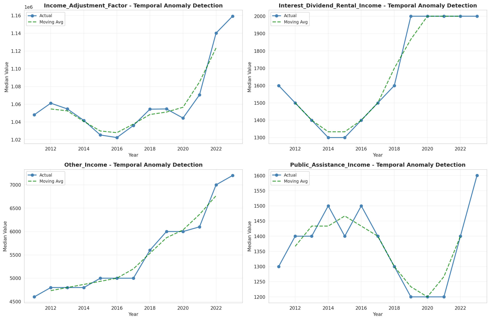
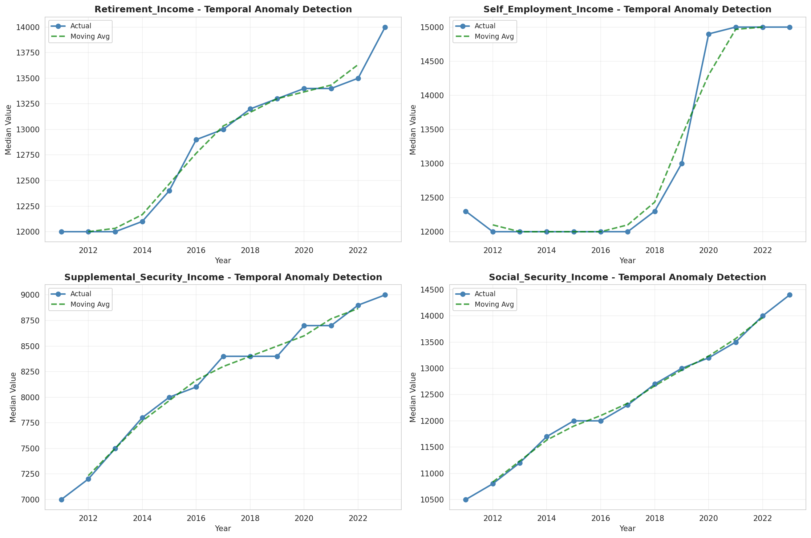
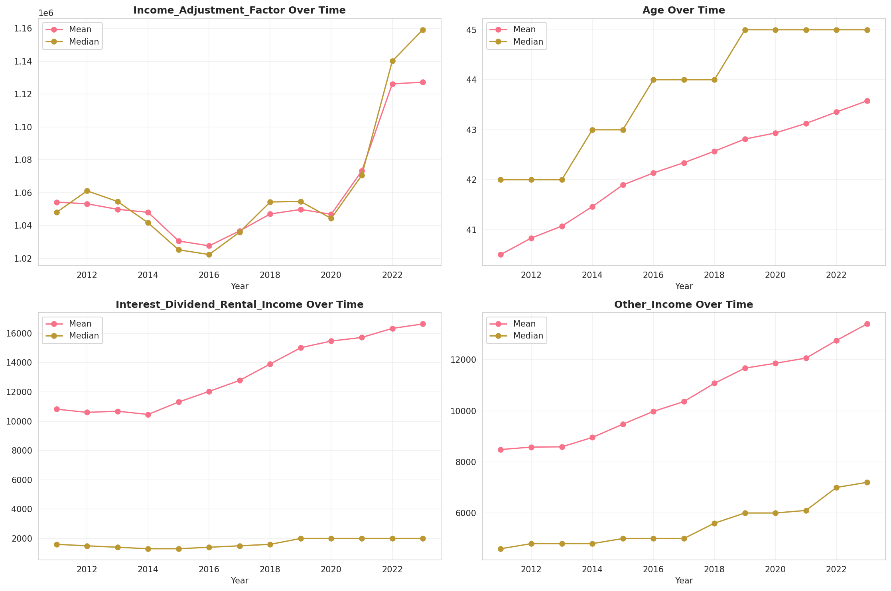
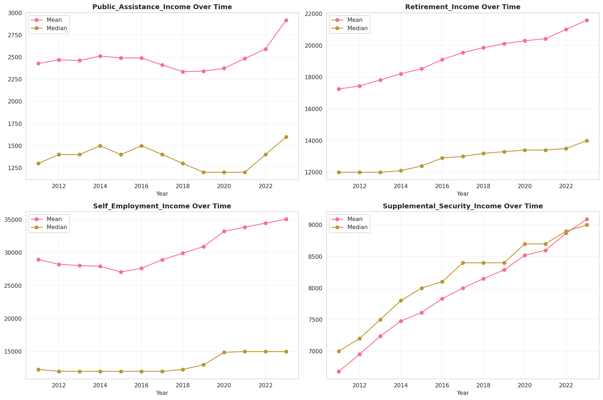
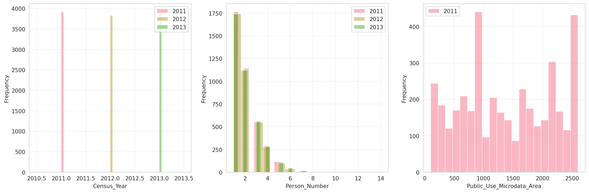
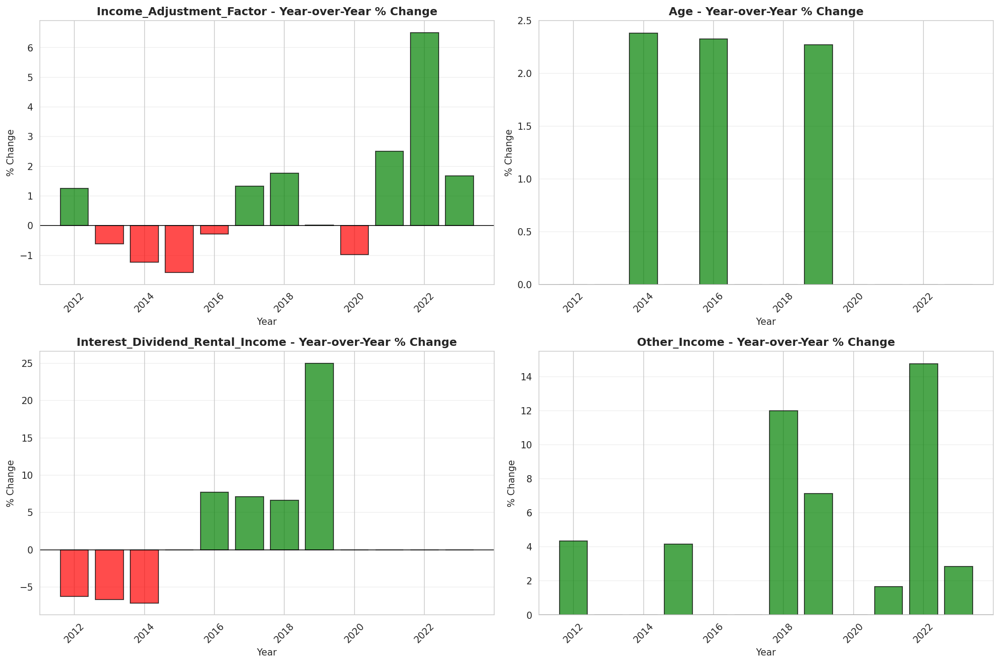
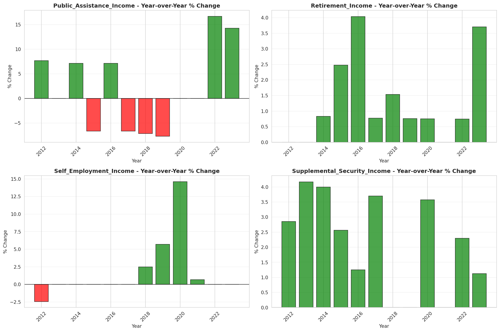

# Temporal Analysis

## Year Distribution

- 2011: 238,890 records

- 2012: 239,380 records

- 2013: 240,065 records

- 2014: 239,539 records

- 2015: 239,503 records

- 2016: 238,583 records

- 2017: 238,409 records

- 2018: 238,350 records

- 2019: 239,485 records

- 2020: 231,427 records

- 2021: 233,415 records

- 2022: 237,350 records

- 2023: 242,593 records

## Temporal Trends

- Census_Year: {np.int64(2011): {'mean': 2011.0, 'median': 2011.0, 'std': 0.0}, np.int64(2012): {'mean': 2012.0, 'median': 2012.0, 'std': 0.0}, np.int64(2013): {'mean': 2013.0, 'median': 2013.0, 'std': 0.0}, np.int64(2014): {'mean': 2014.0, 'median': 2014.0, 'std': 0.0}, np.int64(2015): {'mean': 2015.0, 'median': 2015.0, 'std': 0.0}, np.int64(2016): {'mean': 2016.0, 'median': 2016.0, 'std': 0.0}, np.int64(2017): {'mean': 2017.0, 'median': 2017.0, 'std': 0.0}, np.int64(2018): {'mean': 2018.0, 'median': 2018.0, 'std': 0.0}, np.int64(2019): {'mean': 2019.0, 'median': 2019.0, 'std': 0.0}, np.int64(2020): {'mean': 2020.0, 'median': 2020.0, 'std': 0.0}, np.int64(2021): {'mean': 2021.0, 'median': 2021.0, 'std': 0.0}, np.int64(2022): {'mean': 2022.0, 'median': 2022.0, 'std': 0.0}, np.int64(2023): {'mean': 2023.0, 'median': 2023.0, 'std': 0.0}}

- Person_Number: {np.int64(2011): {'mean': 2.0094101887898197, 'median': 2.0, 'std': 1.2172596236303161}, np.int64(2012): {'mean': 1.9988177792630963, 'median': 2.0, 'std': 1.2104381612461592}, np.int64(2013): {'mean': 1.9949013808760128, 'median': 2.0, 'std': 1.2148821945810317}, np.int64(2014): {'mean': 1.9848083193133477, 'median': 2.0, 'std': 1.2101037277349171}, np.int64(2015): {'mean': 1.973545216552611, 'median': 2.0, 'std': 1.2053455689595447}, np.int64(2016): {'mean': 1.9712930091414729, 'median': 2.0, 'std': 1.205520524649595}, np.int64(2017): {'mean': 1.9696152410353636, 'median': 2.0, 'std': 1.210659741708166}, np.int64(2018): {'mean': 1.9659911894273128, 'median': 2.0, 'std': 1.2095761317614695}, np.int64(2019): {'mean': 1.9625195732509344, 'median': 2.0, 'std': 1.2079329318870724}, np.int64(2020): {'mean': 1.9662874254084441, 'median': 2.0, 'std': 1.2189343569633193}, np.int64(2021): {'mean': 1.9670286828181565, 'median': 2.0, 'std': 1.2273468564316437}, np.int64(2022): {'mean': 1.964057299346956, 'median': 2.0, 'std': 1.2256885875815147}, np.int64(2023): {'mean': 1.96005243349973, 'median': 2.0, 'std': 1.2250037824986362}}

- Public_Use_Microdata_Area: {np.int64(2011): {'mean': 1362.241320272929, 'median': 1300.0, 'std': 758.7466764500563}, np.int64(2012): {'mean': None, 'median': None, 'std': None}, np.int64(2013): {'mean': None, 'median': None, 'std': None}, np.int64(2014): {'mean': None, 'median': None, 'std': None}, np.int64(2015): {'mean': None, 'median': None, 'std': None}, np.int64(2016): {'mean': 1510.8178830847125, 'median': 1400.0, 'std': 812.9505791209646}, np.int64(2017): {'mean': 1507.6105893653344, 'median': 1400.0, 'std': 815.1391478875765}, np.int64(2018): {'mean': 1506.7115754143067, 'median': 1400.0, 'std': 817.4426281022813}, np.int64(2019): {'mean': 1502.2512349416456, 'median': 1400.0, 'std': 820.6749554490586}, np.int64(2020): {'mean': 1498.3817099992655, 'median': 1400.0, 'std': 819.938101938243}, np.int64(2021): {'mean': 1495.725788831052, 'median': 1400.0, 'std': 820.211088273573}, np.int64(2022): {'mean': None, 'median': None, 'std': None}, np.int64(2023): {'mean': 1493.7875082957876, 'median': 1404.0, 'std': 820.239929780081}}

- State_Code: {np.int64(2011): {'mean': 1.0, 'median': 1.0, 'std': 0.0}, np.int64(2012): {'mean': 1.0, 'median': 1.0, 'std': 0.0}, np.int64(2013): {'mean': 1.0, 'median': 1.0, 'std': 0.0}, np.int64(2014): {'mean': 1.0, 'median': 1.0, 'std': 0.0}, np.int64(2015): {'mean': 1.0, 'median': 1.0, 'std': 0.0}, np.int64(2016): {'mean': 1.0, 'median': 1.0, 'std': 0.0}, np.int64(2017): {'mean': 1.0, 'median': 1.0, 'std': 0.0}, np.int64(2018): {'mean': 1.0, 'median': 1.0, 'std': 0.0}, np.int64(2019): {'mean': 1.0, 'median': 1.0, 'std': 0.0}, np.int64(2020): {'mean': 1.0, 'median': 1.0, 'std': 0.0}, np.int64(2021): {'mean': 1.0, 'median': 1.0, 'std': 0.0}, np.int64(2022): {'mean': 1.0, 'median': 1.0, 'std': 0.0}, np.int64(2023): {'mean': None, 'median': None, 'std': None}}

- Income_Adjustment_Factor: {np.int64(2011): {'mean': 1054246.9021474319, 'median': 1048026.0, 'std': 28338.064638747557}, np.int64(2012): {'mean': 1053245.5122441307, 'median': 1061121.0, 'std': 26237.12947057729}, np.int64(2013): {'mean': 1049863.6926499074, 'median': 1054614.0, 'std': 29691.651187210264}, np.int64(2014): {'mean': 1048041.7290462096, 'median': 1041654.0, 'std': 31190.608525498297}, np.int64(2015): {'mean': 1030581.0930259746, 'median': 1025215.0, 'std': 25705.064014136355}, np.int64(2016): {'mean': 1027643.6393372538, 'median': 1022342.0, 'std': 17527.099282773983}, np.int64(2017): {'mean': 1036745.5714633256, 'median': 1035988.0, 'std': 16847.569279224375}, np.int64(2018): {'mean': 1047025.4364338159, 'median': 1054346.0, 'std': 20466.270409240235}, np.int64(2019): {'mean': 1049780.4006305197, 'median': 1054606.0, 'std': 26283.22427706692}, np.int64(2020): {'mean': 1046847.0946086671, 'median': 1044328.0, 'std': 28736.8374475403}, np.int64(2021): {'mean': 1073184.4565302145, 'median': 1070512.0, 'std': 30850.408803366216}, np.int64(2022): {'mean': 1126222.3059026753, 'median': 1140108.0, 'std': 50112.66247204447}, np.int64(2023): {'mean': 1127281.9329123264, 'median': 1159185.0, 'std': 70766.59628002731}}

- Person_Weight: {np.int64(2011): {'mean': 19.87284524258027, 'median': 16.0, 'std': 16.0961754064391}, np.int64(2012): {'mean': 19.95708079204612, 'median': 16.0, 'std': 16.64597360821099}, np.int64(2013): {'mean': 19.99157311561452, 'median': 16.0, 'std': 17.249343635053624}, np.int64(2014): {'mean': 20.11229069170365, 'median': 16.0, 'std': 17.882895722616137}, np.int64(2015): {'mean': 20.169350697068513, 'median': 15.0, 'std': 18.54895942226962}, np.int64(2016): {'mean': 20.291320001844223, 'median': 15.0, 'std': 18.54047040003247}, np.int64(2017): {'mean': 20.346425680238582, 'median': 15.0, 'std': 18.635482400730368}, np.int64(2018): {'mean': 20.409817495280052, 'median': 15.0, 'std': 18.892847239262963}, np.int64(2019): {'mean': 20.361400505250852, 'median': 15.0, 'std': 19.277126375203373}, np.int64(2020): {'mean': 21.143539863542284, 'median': 15.0, 'std': 23.39065991524405}, np.int64(2021): {'mean': 21.411113253218517, 'median': 15.0, 'std': 24.053783226959105}, np.int64(2022): {'mean': 21.18429323783442, 'median': 14.0, 'std': 23.852920543219795}, np.int64(2023): {'mean': 20.834290354626884, 'median': 14.0, 'std': 23.599635829237933}}

- Age: {np.int64(2011): {'mean': 40.505207417639916, 'median': 42.0, 'std': 23.444495705005625}, np.int64(2012): {'mean': 40.83430111120394, 'median': 42.0, 'std': 23.4980901762798}, np.int64(2013): {'mean': 41.07277195759482, 'median': 42.0, 'std': 23.54435681880309}, np.int64(2014): {'mean': 41.4633316495435, 'median': 43.0, 'std': 23.60798278644511}, np.int64(2015): {'mean': 41.8962309449151, 'median': 43.0, 'std': 23.649382134175696}, np.int64(2016): {'mean': 42.13611615245009, 'median': 44.0, 'std': 23.690024863519447}, np.int64(2017): {'mean': 42.34164817603362, 'median': 44.0, 'std': 23.735970149829214}, np.int64(2018): {'mean': 42.57115166771555, 'median': 44.0, 'std': 23.76419237003934}, np.int64(2019): {'mean': 42.8144727227175, 'median': 45.0, 'std': 23.82255961972721}, np.int64(2020): {'mean': 42.93634709865314, 'median': 45.0, 'std': 23.864834334399177}, np.int64(2021): {'mean': 43.12623438939229, 'median': 45.0, 'std': 23.922341832598043}, np.int64(2022): {'mean': 43.35529808299979, 'median': 45.0, 'std': 23.985221118830825}, np.int64(2023): {'mean': 43.578099945175666, 'median': 45.0, 'std': 24.073415703383795}}

- Citizenship_Status: {np.int64(2011): {'mean': 1.1105990204696723, 'median': 1.0, 'std': 0.6113855388242198}, np.int64(2012): {'mean': 1.1099841256579497, 'median': 1.0, 'std': 0.6088463779250057}, np.int64(2013): {'mean': 1.1085997542332284, 'median': 1.0, 'std': 0.6036016152133334}, np.int64(2014): {'mean': 1.105723911346378, 'median': 1.0, 'std': 0.5944282522962958}, np.int64(2015): {'mean': 1.1038483860327428, 'median': 1.0, 'std': 0.5871853294706894}, np.int64(2016): {'mean': 1.1064325622529685, 'median': 1.0, 'std': 0.5938519386316786}, np.int64(2017): {'mean': 1.109593178109887, 'median': 1.0, 'std': 0.601744014127335}, np.int64(2018): {'mean': 1.11228026012167, 'median': 1.0, 'std': 0.6082832389538692}, np.int64(2019): {'mean': 1.1146418356055703, 'median': 1.0, 'std': 0.6127439761586541}, np.int64(2020): {'mean': 1.1179940110704456, 'median': 1.0, 'std': 0.6212559511298494}, np.int64(2021): {'mean': 1.1216974059079323, 'median': 1.0, 'std': 0.6307986966314952}, np.int64(2022): {'mean': 1.1245502422582683, 'median': 1.0, 'std': 0.6371890679820922}, np.int64(2023): {'mean': 1.128519784165248, 'median': 1.0, 'std': 0.6468847213663106}}

- Class_of_Worker: {np.int64(2011): {'mean': 2.141586973378134, 'median': 1.0, 'std': 1.918696038000263}, np.int64(2012): {'mean': 2.152070483273583, 'median': 1.0, 'std': 1.9356748527731302}, np.int64(2013): {'mean': 2.1565589857246263, 'median': 1.0, 'std': 1.9460458760223243}, np.int64(2014): {'mean': 2.152126577509889, 'median': 1.0, 'std': 1.9467679522746153}, np.int64(2015): {'mean': 2.1440362248606735, 'median': 1.0, 'std': 1.9440858962864176}, np.int64(2016): {'mean': 2.1353713785358055, 'median': 1.0, 'std': 1.9349531459166078}, np.int64(2017): {'mean': 2.123366599929697, 'median': 1.0, 'std': 1.921083022807527}, np.int64(2018): {'mean': 2.1179741761772175, 'median': 1.0, 'std': 1.914271865984372}, np.int64(2019): {'mean': 2.119571339412114, 'median': 1.0, 'std': 1.906561726608283}, np.int64(2020): {'mean': 2.1285171942951404, 'median': 1.0, 'std': 1.9067934592799192}, np.int64(2021): {'mean': 2.1284587611506622, 'median': 1.0, 'std': 1.898175100693563}, np.int64(2022): {'mean': 2.1408575206001723, 'median': 1.0, 'std': 1.8993907036321045}, np.int64(2023): {'mean': 2.1465105774297975, 'median': 1.0, 'std': 1.8959959164892857}}

- English_Speaking_Ability: {np.int64(2011): {'mean': 1.7259516321440191, 'median': 1.0, 'std': 0.9635707146713339}, np.int64(2012): {'mean': 1.6936761036988828, 'median': 1.0, 'std': 0.9376841725132318}, np.int64(2013): {'mean': 1.6614389120421145, 'median': 1.0, 'std': 0.9152925427984703}, np.int64(2014): {'mean': 1.6395545055686804, 'median': 1.0, 'std': 0.9007405591443748}, np.int64(2015): {'mean': 1.615893271461717, 'median': 1.0, 'std': 0.8767419715748406}, np.int64(2016): {'mean': 1.606467148262814, 'median': 1.0, 'std': 0.8617373142204943}, np.int64(2017): {'mean': 1.6006296379581741, 'median': 1.0, 'std': 0.8602728179287099}, np.int64(2018): {'mean': 1.6060804899387577, 'median': 1.0, 'std': 0.8680344174265031}, np.int64(2019): {'mean': 1.5961784799316823, 'median': 1.0, 'std': 0.8579810248776037}, np.int64(2020): {'mean': 1.5867162592986186, 'median': 1.0, 'std': 0.8507334636213811}, np.int64(2021): {'mean': 1.5931246793227296, 'median': 1.0, 'std': 0.8642305437971763}, np.int64(2022): {'mean': 1.5849185445322407, 'median': 1.0, 'std': 0.856358051796416}, np.int64(2023): {'mean': 1.5822172619047619, 'median': 1.0, 'std': 0.8547862118686504}}

- Fertility_Status: {np.int64(2011): {'mean': 1.946119823080016, 'median': 2.0, 'std': 0.22578315963188444}, np.int64(2012): {'mean': 1.9460561768722549, 'median': 2.0, 'std': 0.2259088951754627}, np.int64(2013): {'mean': 1.9472790702012948, 'median': 2.0, 'std': 0.22347788496461937}, np.int64(2014): {'mean': 1.9490536367253368, 'median': 2.0, 'std': 0.21989030771316942}, np.int64(2015): {'mean': 1.9502358263547983, 'median': 2.0, 'std': 0.2174594468535615}, np.int64(2016): {'mean': 1.950698871279022, 'median': 2.0, 'std': 0.2164981319886303}, np.int64(2017): {'mean': 1.9509553388897625, 'median': 2.0, 'std': 0.21596342084147777}, np.int64(2018): {'mean': 1.949393633647892, 'median': 2.0, 'std': 0.2191946910037403}, np.int64(2019): {'mean': 1.9485780062317661, 'median': 2.0, 'std': 0.2208590962740453}, np.int64(2020): {'mean': 1.9482737284989482, 'median': 2.0, 'std': 0.2214761296493188}, np.int64(2021): {'mean': 1.9489969467838775, 'median': 2.0, 'std': 0.22000621267984086}, np.int64(2022): {'mean': 1.9486268699129234, 'median': 2.0, 'std': 0.22075987133585268}, np.int64(2023): {'mean': 1.9501401682018422, 'median': 2.0, 'std': 0.21765747771471025}}

- Marital_Status: {np.int64(2011): {'mean': 2.8261333668215496, 'median': 2.0, 'std': 1.8222566796323334}, np.int64(2012): {'mean': 2.8352911688528697, 'median': 2.0, 'std': 1.819629108629557}, np.int64(2013): {'mean': 2.848795117988878, 'median': 2.0, 'std': 1.8186015071747643}, np.int64(2014): {'mean': 2.8542366796221073, 'median': 3.0, 'std': 1.8169522738376613}, np.int64(2015): {'mean': 2.8541855425610536, 'median': 3.0, 'std': 1.815820210464068}, np.int64(2016): {'mean': 2.845466776761127, 'median': 2.0, 'std': 1.815471879524365}, np.int64(2017): {'mean': 2.8474763956058706, 'median': 3.0, 'std': 1.8164290194761359}, np.int64(2018): {'mean': 2.842991399202853, 'median': 2.0, 'std': 1.816446514040317}, np.int64(2019): {'mean': 2.839096394346201, 'median': 2.0, 'std': 1.815783840237506}, np.int64(2020): {'mean': 2.842702018347038, 'median': 2.0, 'std': 1.8170861906789892}, np.int64(2021): {'mean': 2.8514148619411777, 'median': 3.0, 'std': 1.817972377215479}, np.int64(2022): {'mean': 2.846446176532547, 'median': 2.0, 'std': 1.8184051700109622}, np.int64(2023): {'mean': 2.849641168541549, 'median': 3.0, 'std': 1.8190119684103934}}

- Mobility_Status: {np.int64(2011): {'mean': 1.2637994256495277, 'median': 1.0, 'std': 0.6746147431683244}, np.int64(2012): {'mean': 1.2602073758972996, 'median': 1.0, 'std': 0.670829431478316}, np.int64(2013): {'mean': 1.2612786936275644, 'median': 1.0, 'std': 0.6720091970709513}, np.int64(2014): {'mean': 1.262618004045853, 'median': 1.0, 'std': 0.6735780063166114}, np.int64(2015): {'mean': 1.2619475068271468, 'median': 1.0, 'std': 0.6728777715100023}, np.int64(2016): {'mean': 1.2600350295297242, 'median': 1.0, 'std': 0.6706216942278574}, np.int64(2017): {'mean': 1.2599326884406155, 'median': 1.0, 'std': 0.6704411076276311}, np.int64(2018): {'mean': 1.2605488269670535, 'median': 1.0, 'std': 0.671075771940807}, np.int64(2019): {'mean': 1.2573281802511074, 'median': 1.0, 'std': 0.6675136707789782}, np.int64(2020): {'mean': 1.25459159646277, 'median': 1.0, 'std': 0.6644736243203204}, np.int64(2021): {'mean': 1.2479608905948105, 'median': 1.0, 'std': 0.6571495892622525}, np.int64(2022): {'mean': 1.2426120256204283, 'median': 1.0, 'std': 0.6509716678544939}, np.int64(2023): {'mean': 1.2327817336110036, 'median': 1.0, 'std': 0.6393394453072693}}

- Military_Service: {np.int64(2011): {'mean': 4.721762432742627, 'median': 5.0, 'std': 0.7086831913674898}, np.int64(2012): {'mean': 4.727140563635127, 'median': 5.0, 'std': 0.7032914680140383}, np.int64(2013): {'mean': 3.7407673001075654, 'median': 4.0, 'std': 0.666556633987658}, np.int64(2014): {'mean': 3.7488090306545154, 'median': 4.0, 'std': 0.6561447043506857}, np.int64(2015): {'mean': 3.756581115596935, 'median': 4.0, 'std': 0.645627537230779}, np.int64(2016): {'mean': 3.7643192149133444, 'median': 4.0, 'std': 0.6358555556686771}, np.int64(2017): {'mean': 3.771876335807098, 'median': 4.0, 'std': 0.6262126302641803}, np.int64(2018): {'mean': 3.776515598921556, 'median': 4.0, 'std': 0.6205154048764431}, np.int64(2019): {'mean': 3.7804062846033344, 'median': 4.0, 'std': 0.6155276908249315}, np.int64(2020): {'mean': 3.7838802727402165, 'median': 4.0, 'std': 0.6117284551850202}, np.int64(2021): {'mean': 3.78649474041398, 'median': 4.0, 'std': 0.6087870418008949}, np.int64(2022): {'mean': 3.7885763787438425, 'median': 4.0, 'std': 0.6064609018309733}, np.int64(2023): {'mean': 3.7942402273489138, 'median': 4.0, 'std': 0.5996106557492253}}

- Travel_Time_To_Work_Minutes: {np.int64(2011): {'mean': 24.066601104787413, 'median': 20.0, 'std': 21.133398918797425}, np.int64(2012): {'mean': 24.24525026725516, 'median': 20.0, 'std': 21.36378911330097}, np.int64(2013): {'mean': 24.364919680227242, 'median': 20.0, 'std': 21.266350532931554}, np.int64(2014): {'mean': 24.51514756661672, 'median': 20.0, 'std': 21.31027678058019}, np.int64(2015): {'mean': 24.63100672164544, 'median': 20.0, 'std': 21.37110285561896}, np.int64(2016): {'mean': 24.803602374144354, 'median': 20.0, 'std': 21.35870005549977}, np.int64(2017): {'mean': 24.772219827586206, 'median': 20.0, 'std': 20.97063087691462}, np.int64(2018): {'mean': 24.84739776752748, 'median': 20.0, 'std': 21.12983651794645}, np.int64(2019): {'mean': 25.099420574359623, 'median': 20.0, 'std': 21.552377990042885}, np.int64(2020): {'mean': 25.25527205453204, 'median': 20.0, 'std': 21.73368462806938}, np.int64(2021): {'mean': 25.432033626458715, 'median': 20.0, 'std': 22.12564069736596}, np.int64(2022): {'mean': 25.60066440811762, 'median': 20.0, 'std': 22.35482406395855}, np.int64(2023): {'mean': 25.66613420266232, 'median': 20.0, 'std': 22.219485517847765}}

- Vehicle_Occupancy: {np.int64(2011): {'mean': 1.1581807226322924, 'median': 1.0, 'std': 0.5715303353486617}, np.int64(2012): {'mean': 1.152633698716623, 'median': 1.0, 'std': 0.5537899641292059}, np.int64(2013): {'mean': 1.1435242563739376, 'median': 1.0, 'std': 0.5396666182133512}, np.int64(2014): {'mean': 1.1392586135604206, 'median': 1.0, 'std': 0.5339993673014217}, np.int64(2015): {'mean': 1.136292808699064, 'median': 1.0, 'std': 0.5265149310752107}, np.int64(2016): {'mean': 1.1310322537503066, 'median': 1.0, 'std': 0.5114509737529953}, np.int64(2017): {'mean': 1.129770230877512, 'median': 1.0, 'std': 0.5139879995451376}, np.int64(2018): {'mean': 1.1297328802524935, 'median': 1.0, 'std': 0.517291523724394}, np.int64(2019): {'mean': 1.1296434804288207, 'median': 1.0, 'std': 0.5198803637953736}, np.int64(2020): {'mean': 1.1279377502318533, 'median': 1.0, 'std': 0.5163419433352611}, np.int64(2021): {'mean': 1.1270158542679325, 'median': 1.0, 'std': 0.5129907135521509}, np.int64(2022): {'mean': 1.129351047406556, 'median': 1.0, 'std': 0.5259078477552235}, np.int64(2023): {'mean': 1.133198992443325, 'median': 1.0, 'std': 0.528350755167628}}

- Transportation_To_Work: {np.int64(2011): {'mean': 1.4806241024962064, 'median': 1.0, 'std': 2.1026736984686982}, np.int64(2012): {'mean': 1.4749440738946218, 'median': 1.0, 'std': 2.0906002451642336}, np.int64(2013): {'mean': 1.4810602490391362, 'median': 1.0, 'std': 2.1042950101372138}, np.int64(2014): {'mean': 1.4957446359182294, 'median': 1.0, 'std': 2.136119200409621}, np.int64(2015): {'mean': 1.5002805984688854, 'median': 1.0, 'std': 2.1465777126317613}, np.int64(2016): {'mean': 1.5132787109395542, 'median': 1.0, 'std': 2.1750570210940956}, np.int64(2017): {'mean': 1.524504169366131, 'median': 1.0, 'std': 2.1986163110029526}, np.int64(2018): {'mean': 1.5320902174589026, 'median': 1.0, 'std': 2.2163619789009115}, np.int64(2019): {'mean': None, 'median': None, 'std': None}, np.int64(2020): {'mean': None, 'median': None, 'std': None}, np.int64(2021): {'mean': None, 'median': None, 'std': None}, np.int64(2022): {'mean': None, 'median': None, 'std': None}, np.int64(2023): {'mean': None, 'median': None, 'std': None}}

- Language_Other_Than_English: {np.int64(2011): {'mean': 1.9591218807215403, 'median': 2.0, 'std': 0.19800826360184995}, np.int64(2012): {'mean': 1.9592564602309641, 'median': 2.0, 'std': 0.19769591919700988}, np.int64(2013): {'mean': 1.9598476341458044, 'median': 2.0, 'std': 0.19631689455600598}, np.int64(2014): {'mean': 1.9608505503120417, 'median': 2.0, 'std': 0.19395085963145503}, np.int64(2015): {'mean': 1.9621115555360205, 'median': 2.0, 'std': 0.19092687203825773}, np.int64(2016): {'mean': 1.9615511791236262, 'median': 2.0, 'std': 0.19227759111377568}, np.int64(2017): {'mean': 1.960786907218313, 'median': 2.0, 'std': 0.19410201504756333}, np.int64(2018): {'mean': 1.959699598053734, 'median': 2.0, 'std': 0.19666329095224894}, np.int64(2019): {'mean': 1.9589203885198097, 'median': 2.0, 'std': 0.19847480882912433}, np.int64(2020): {'mean': 1.9573171008287105, 'median': 2.0, 'std': 0.20214166970848918}, np.int64(2021): {'mean': 1.9561916150436511, 'median': 2.0, 'std': 0.2046689978392638}, np.int64(2022): {'mean': 1.9547053261340237, 'median': 2.0, 'std': 0.20795013214312322}, np.int64(2023): {'mean': 1.9535468484699234, 'median': 2.0, 'std': 0.21046483701064886}}

- Grandparents_Living_With_Grandchildren: {np.int64(2011): {'mean': 1.960278163753906, 'median': 2.0, 'std': 0.1953055575424066}, np.int64(2012): {'mean': 1.9600471252314184, 'median': 2.0, 'std': 0.19584915332954797}, np.int64(2013): {'mean': 1.9595574993568305, 'median': 2.0, 'std': 0.1969953156313442}, np.int64(2014): {'mean': 1.9598062705805477, 'median': 2.0, 'std': 0.19641395236484854}, np.int64(2015): {'mean': 1.959711105035953, 'median': 2.0, 'std': 0.19663658289855981}, np.int64(2016): {'mean': 1.9603036945265098, 'median': 2.0, 'std': 0.1952453610286931}, np.int64(2017): {'mean': 1.96175881562603, 'median': 2.0, 'std': 0.19177859443396747}, np.int64(2018): {'mean': 1.9623166237919767, 'median': 2.0, 'std': 0.19042995713082847}, np.int64(2019): {'mean': 1.962427998998247, 'median': 2.0, 'std': 0.19015933356596718}, np.int64(2020): {'mean': 1.96312666230934, 'median': 2.0, 'std': 0.18845138492105112}, np.int64(2021): {'mean': 1.9640556532864226, 'median': 2.0, 'std': 0.18615201401804013}, np.int64(2022): {'mean': 1.9647146535683184, 'median': 2.0, 'std': 0.18450068842113412}, np.int64(2023): {'mean': 1.9651620313798328, 'median': 2.0, 'std': 0.18336981758414378}}

- Months_Responsible_For_Grandchildren: {np.int64(2011): {'mean': 3.720801859384079, 'median': 4.0, 'std': 1.3462780435093533}, np.int64(2012): {'mean': 3.766035603277762, 'median': 4.0, 'std': 1.3418385376986492}, np.int64(2013): {'mean': 3.8098870056497174, 'median': 4.0, 'std': 1.3232818547604472}, np.int64(2014): {'mean': 3.8112563956793633, 'median': 4.0, 'std': 1.328444123489058}, np.int64(2015): {'mean': 3.85012629806343, 'median': 4.0, 'std': 1.3294875637807149}, np.int64(2016): {'mean': 3.8727956056663775, 'median': 4.0, 'std': 1.3203078652422666}, np.int64(2017): {'mean': 3.8853561601956588, 'median': 4.0, 'std': 1.3126074803900654}, np.int64(2018): {'mean': 3.887197016780609, 'median': 4.0, 'std': 1.3200885084788891}, np.int64(2019): {'mean': 3.927718416090509, 'median': 5.0, 'std': 1.3035601911167922}, np.int64(2020): {'mean': 3.9574540503744045, 'median': 5.0, 'std': 1.2759638223557812}, np.int64(2021): {'mean': 3.971631205673759, 'median': 5.0, 'std': 1.2773757153422463}, np.int64(2022): {'mean': 4.00754039497307, 'median': 5.0, 'std': 1.2567121014491431}, np.int64(2023): {'mean': 4.012903225806451, 'median': 5.0, 'std': 1.239012011686139}}

- Grandparents_Responsible_For_Grandchildren: {np.int64(2011): {'mean': 1.4347183445557563, 'median': 1.0, 'std': 0.49576069815576607}, np.int64(2012): {'mean': 1.4266040181464679, 'median': 1.0, 'std': 0.49462376506901834}, np.int64(2013): {'mean': 1.4370229007633588, 'median': 1.0, 'std': 0.4960574752198938}, np.int64(2014): {'mean': 1.4392731909467644, 'median': 1.0, 'std': 0.49633811069275263}, np.int64(2015): {'mean': 1.4377465677765504, 'median': 1.0, 'std': 0.4961485217001085}, np.int64(2016): {'mean': 1.446382842509603, 'median': 1.0, 'std': 0.4971566749456827}, np.int64(2017): {'mean': 1.457905203844879, 'median': 1.0, 'std': 0.4982661670000875}, np.int64(2018): {'mean': 1.4602482388460247, 'median': 1.0, 'std': 0.49845909728574506}, np.int64(2019): {'mean': 1.469755040826529, 'median': 1.0, 'std': 0.49912599276301933}, np.int64(2020): {'mean': 1.4843804843804844, 'median': 1.0, 'std': 0.49979983058515665}, np.int64(2021): {'mean': 1.4981313400961025, 'median': 1.0, 'std': 0.500041005629149}, np.int64(2022): {'mean': 1.5055042613636365, 'median': 2.0, 'std': 0.5000140946153584}, np.int64(2023): {'mean': 1.5106980007015083, 'median': 2.0, 'std': 0.49992937967462037}}

- Interest_Dividend_Rental_Income: {np.int64(2011): {'mean': 10817.952459150998, 'median': 1600.0, 'std': 31278.225798210377}, np.int64(2012): {'mean': 10600.72714003606, 'median': 1500.0, 'std': 30149.41917905411}, np.int64(2013): {'mean': 10678.444271135077, 'median': 1400.0, 'std': 30837.729923037918}, np.int64(2014): {'mean': 10458.04594334874, 'median': 1300.0, 'std': 29545.500931164934}, np.int64(2015): {'mean': 11307.519250206744, 'median': 1300.0, 'std': 33413.04132015118}, np.int64(2016): {'mean': 12031.990668669489, 'median': 1400.0, 'std': 36069.08055087308}, np.int64(2017): {'mean': 12781.663024177025, 'median': 1500.0, 'std': 38217.95880126651}, np.int64(2018): {'mean': 13897.214332066376, 'median': 1600.0, 'std': 42527.14466929468}, np.int64(2019): {'mean': 15010.406681973665, 'median': 2000.0, 'std': 45079.18039806889}, np.int64(2020): {'mean': 15464.969589886521, 'median': 2000.0, 'std': 45547.804455669415}, np.int64(2021): {'mean': 15708.456713962574, 'median': 2000.0, 'std': 45113.2860945219}, np.int64(2022): {'mean': 16327.21601489758, 'median': 2000.0, 'std': 46783.45882162164}, np.int64(2023): {'mean': 16629.631592487778, 'median': 2000.0, 'std': 46225.29894270445}}

- Military_Service_Period_1: {np.int64(2011): {'mean': 0.1231834792215518, 'median': 0.0, 'std': 0.3286546810318659}, np.int64(2012): {'mean': 0.13030420045479899, 'median': 0.0, 'std': 0.3366450330557055}, np.int64(2013): {'mean': 0.1396525181438311, 'median': 0.0, 'std': 0.34663377986285965}, np.int64(2014): {'mean': 0.14588534337978304, 'median': 0.0, 'std': 0.35299924365080204}, np.int64(2015): {'mean': 0.1524147926504278, 'median': 0.0, 'std': 0.35943088859846106}, np.int64(2016): {'mean': 0.16057542768273717, 'median': 0.0, 'std': 0.3671478052613166}, np.int64(2017): {'mean': 0.17336226910265468, 'median': 0.0, 'std': 0.37856971058523875}, np.int64(2018): {'mean': 0.18567311650885138, 'median': 0.0, 'std': 0.3888526605585861}, np.int64(2019): {'mean': 0.19947807933194153, 'median': 0.0, 'std': 0.3996184555365183}, np.int64(2020): {'mean': 0.20976601120509722, 'median': 0.0, 'std': 0.40715271971525785}, np.int64(2021): {'mean': 0.22092253365702935, 'median': 0.0, 'std': 0.4148798197911081}, np.int64(2022): {'mean': 0.23547450851541538, 'median': 0.0, 'std': 0.42430663841785426}, np.int64(2023): {'mean': 0.2519793270288102, 'median': 0.0, 'std': 0.4341613865157346}}

- Military_Service_Period_2: {np.int64(2011): {'mean': 0.17876264128494943, 'median': 0.0, 'std': 0.3831615817030807}, np.int64(2012): {'mean': 0.1831209507873171, 'median': 0.0, 'std': 0.3867739476604523}, np.int64(2013): {'mean': 0.18891576863866286, 'median': 0.0, 'std': 0.3914503046029436}, np.int64(2014): {'mean': 0.19050428941037628, 'median': 0.0, 'std': 0.3927077860646509}, np.int64(2015): {'mean': 0.19645612230585816, 'median': 0.0, 'std': 0.39732668566403895}, np.int64(2016): {'mean': 0.2011080870917574, 'median': 0.0, 'std': 0.4008384126798169}, np.int64(2017): {'mean': 0.21176945594024427, 'median': 0.0, 'std': 0.4085726109295537}, np.int64(2018): {'mean': 0.21902017291066284, 'median': 0.0, 'std': 0.413592963830295}, np.int64(2019): {'mean': 0.22724425887265134, 'median': 0.0, 'std': 0.41906261025304703}, np.int64(2020): {'mean': 0.2325606942766121, 'median': 0.0, 'std': 0.4224760602051457}, np.int64(2021): {'mean': 0.2450342087839329, 'median': 0.0, 'std': 0.4301193472928916}, np.int64(2022): {'mean': 0.25031487870324737, 'median': 0.0, 'std': 0.43320620628725615}, np.int64(2023): {'mean': 0.25890697162964593, 'median': 0.0, 'std': 0.43804646071254005}}

- Military_Service_Period_3: {np.int64(2011): {'mean': 0.2049800288943656, 'median': 0.0, 'std': 0.40369560504109275}, np.int64(2012): {'mean': 0.2101943622087785, 'median': 0.0, 'std': 0.4074552926130445}, np.int64(2013): {'mean': None, 'median': None, 'std': None}, np.int64(2014): {'mean': None, 'median': None, 'std': None}, np.int64(2015): {'mean': None, 'median': None, 'std': None}, np.int64(2016): {'mean': None, 'median': None, 'std': None}, np.int64(2017): {'mean': None, 'median': None, 'std': None}, np.int64(2018): {'mean': None, 'median': None, 'std': None}, np.int64(2019): {'mean': None, 'median': None, 'std': None}, np.int64(2020): {'mean': None, 'median': None, 'std': None}, np.int64(2021): {'mean': None, 'median': None, 'std': None}, np.int64(2022): {'mean': None, 'median': None, 'std': None}, np.int64(2023): {'mean': None, 'median': None, 'std': None}}

- Military_Service_Period_4: {np.int64(2011): {'mean': 0.15407495538370017, 'median': 0.0, 'std': 0.3610282564243414}, np.int64(2012): {'mean': 0.15870768438666494, 'median': 0.0, 'std': 0.3654111168000114}, np.int64(2013): {'mean': None, 'median': None, 'std': None}, np.int64(2014): {'mean': None, 'median': None, 'std': None}, np.int64(2015): {'mean': None, 'median': None, 'std': None}, np.int64(2016): {'mean': None, 'median': None, 'std': None}, np.int64(2017): {'mean': None, 'median': None, 'std': None}, np.int64(2018): {'mean': None, 'median': None, 'std': None}, np.int64(2019): {'mean': None, 'median': None, 'std': None}, np.int64(2020): {'mean': None, 'median': None, 'std': None}, np.int64(2021): {'mean': None, 'median': None, 'std': None}, np.int64(2022): {'mean': None, 'median': None, 'std': None}, np.int64(2023): {'mean': None, 'median': None, 'std': None}}

- Military_Service_Period_5: {np.int64(2011): {'mean': 0.3601597688450752, 'median': 0.0, 'std': 0.4800567697234985}, np.int64(2012): {'mean': 0.36208006178401336, 'median': 0.0, 'std': 0.4806121110762484}, np.int64(2013): {'mean': 0.3647679788871784, 'median': 0.0, 'std': 0.481375625463144}, np.int64(2014): {'mean': 0.37342835096001087, 'median': 0.0, 'std': 0.48372537520099457}, np.int64(2015): {'mean': 0.38300060778905043, 'median': 0.0, 'std': 0.48612980879038853}, np.int64(2016): {'mean': 0.38666407465007774, 'median': 0.0, 'std': 0.4869974274988247}, np.int64(2017): {'mean': 0.3883112950439083, 'median': 0.0, 'std': 0.48737831461625053}, np.int64(2018): {'mean': 0.38946068340881024, 'median': 0.0, 'std': 0.48764054044850014}, np.int64(2019): {'mean': 0.3890918580375783, 'median': 0.0, 'std': 0.48755696150922184}, np.int64(2020): {'mean': 0.3824563330770076, 'median': 0.0, 'std': 0.4860004731651703}, np.int64(2021): {'mean': 0.3785588170381814, 'median': 0.0, 'std': 0.4850412559113399}, np.int64(2022): {'mean': 0.375006845189201, 'median': 0.0, 'std': 0.48413794188929227}, np.int64(2023): {'mean': 0.36760501429513964, 'median': 0.0, 'std': 0.4821663095379875}}

- Military_Service_Period_6: {np.int64(2011): {'mean': 0.11931673323701879, 'median': 0.0, 'std': 0.32416772762932383}, np.int64(2012): {'mean': 0.1185480756854164, 'median': 0.0, 'std': 0.3232629162486637}, np.int64(2013): {'mean': None, 'median': None, 'std': None}, np.int64(2014): {'mean': None, 'median': None, 'std': None}, np.int64(2015): {'mean': None, 'median': None, 'std': None}, np.int64(2016): {'mean': None, 'median': None, 'std': None}, np.int64(2017): {'mean': None, 'median': None, 'std': None}, np.int64(2018): {'mean': None, 'median': None, 'std': None}, np.int64(2019): {'mean': None, 'median': None, 'std': None}, np.int64(2020): {'mean': None, 'median': None, 'std': None}, np.int64(2021): {'mean': None, 'median': None, 'std': None}, np.int64(2022): {'mean': None, 'median': None, 'std': None}, np.int64(2023): {'mean': None, 'median': None, 'std': None}}

- Military_Service_Period_7: {np.int64(2011): {'mean': 0.12747514234724228, 'median': 0.0, 'std': 0.33351155419612855}, np.int64(2012): {'mean': 0.12609945509932638, 'median': 0.0, 'std': 0.331968538945634}, np.int64(2013): {'mean': None, 'median': None, 'std': None}, np.int64(2014): {'mean': None, 'median': None, 'std': None}, np.int64(2015): {'mean': None, 'median': None, 'std': None}, np.int64(2016): {'mean': None, 'median': None, 'std': None}, np.int64(2017): {'mean': None, 'median': None, 'std': None}, np.int64(2018): {'mean': None, 'median': None, 'std': None}, np.int64(2019): {'mean': None, 'median': None, 'std': None}, np.int64(2020): {'mean': None, 'median': None, 'std': None}, np.int64(2021): {'mean': None, 'median': None, 'std': None}, np.int64(2022): {'mean': None, 'median': None, 'std': None}, np.int64(2023): {'mean': None, 'median': None, 'std': None}}

- Military_Service_Period_8: {np.int64(2011): {'mean': 0.13295657346817372, 'median': 0.0, 'std': 0.33953500799691644}, np.int64(2012): {'mean': 0.12708628309091688, 'median': 0.0, 'std': 0.33307674744651866}, np.int64(2013): {'mean': 0.12183857488453925, 'median': 0.0, 'std': 0.32710647027347967}, np.int64(2014): {'mean': 0.11887794471426626, 'median': 0.0, 'std': 0.32365218008220364}, np.int64(2015): {'mean': 0.11178643227827388, 'median': 0.0, 'std': 0.31511088234163737}, np.int64(2016): {'mean': 0.10653188180404355, 'median': 0.0, 'std': 0.3085246604467667}, np.int64(2017): {'mean': 0.10058544463510649, 'median': 0.0, 'std': 0.3007866005264989}, np.int64(2018): {'mean': 0.09113832853025937, 'median': 0.0, 'std': 0.2878131277213581}, np.int64(2019): {'mean': 0.08168058455114822, 'median': 0.0, 'std': 0.27388461389907665}, np.int64(2020): {'mean': 0.07464572119081621, 'median': 0.0, 'std': 0.26282604839827767}, np.int64(2021): {'mean': 0.06687265504303685, 'median': 0.0, 'std': 0.2498082188957734}, np.int64(2022): {'mean': 0.05788291988390559, 'median': 0.0, 'std': 0.2335283150170782}, np.int64(2023): {'mean': 0.05008797009016934, 'median': 0.0, 'std': 0.21813248600545157}}

- Military_Service_Period_9: {np.int64(2011): {'mean': 0.026387354465879153, 'median': 0.0, 'std': 0.1602877215940788}, np.int64(2012): {'mean': 0.025056849873428582, 'median': 0.0, 'std': 0.1563011590905319}, np.int64(2013): {'mean': 0.023136133714537058, 'median': 0.0, 'std': 0.150339107269356}, np.int64(2014): {'mean': 0.023194589442149697, 'median': 0.0, 'std': 0.1505245126410086}, np.int64(2015): {'mean': 0.021786899808312683, 'median': 0.0, 'std': 0.14599050401465283}, np.int64(2016): {'mean': 0.019148522550544323, 'median': 0.0, 'std': 0.13705024437451696}, np.int64(2017): {'mean': 0.0176138084182901, 'median': 0.0, 'std': 0.13154632459771562}, np.int64(2018): {'mean': 0.015078221490325236, 'median': 0.0, 'std': 0.12186727622469887}, np.int64(2019): {'mean': 0.01163883089770355, 'median': 0.0, 'std': 0.10725655657792266}, np.int64(2020): {'mean': 0.008788311545644294, 'median': 0.0, 'std': 0.09333571462723407}, np.int64(2021): {'mean': None, 'median': None, 'std': None}, np.int64(2022): {'mean': None, 'median': None, 'std': None}, np.int64(2023): {'mean': None, 'median': None, 'std': None}}

- Military_Service_Period_10: {np.int64(2011): {'mean': 0.09258944505821365, 'median': 0.0, 'std': 0.28986239819052756}, np.int64(2012): {'mean': 0.08306517355300982, 'median': 0.0, 'std': 0.27598662748984926}, np.int64(2013): {'mean': 0.07336705520123159, 'median': 0.0, 'std': 0.2607437838908204}, np.int64(2014): {'mean': 0.06459080386727793, 'median': 0.0, 'std': 0.24580800331504524}, np.int64(2015): {'mean': 0.0551217915751087, 'median': 0.0, 'std': 0.22822316893111924}, np.int64(2016): {'mean': 0.046073094867807154, 'median': 0.0, 'std': 0.20964851752951671}, np.int64(2017): {'mean': 0.03936610477440194, 'median': 0.0, 'std': 0.19446933752151033}, np.int64(2018): {'mean': 0.03154590366405929, 'median': 0.0, 'std': 0.17479225353290748}, np.int64(2019): {'mean': 0.023903966597077244, 'median': 0.0, 'std': 0.1527540009834736}, np.int64(2020): {'mean': 0.01971877403053938, 'median': 0.0, 'std': 0.13903598733566996}, np.int64(2021): {'mean': 0.015780180975502097, 'median': 0.0, 'std': 0.12462754049732117}, np.int64(2022): {'mean': 0.011335633316904879, 'median': 0.0, 'std': 0.10586666372182711}, np.int64(2023): {'mean': 0.008742027710578403, 'median': 0.0, 'std': 0.09309178876006007}}

- Military_Service_Period_11: {np.int64(2011): {'mean': 0.004589105124500723, 'median': 0.0, 'std': 0.06758875166015052}, np.int64(2012): {'mean': 0.003775689706954992, 'median': 0.0, 'std': 0.06133184546026198}, np.int64(2013): {'mean': 0.0031669232460963272, 'median': 0.0, 'std': 0.05618747819110223}, np.int64(2014): {'mean': 0.0023603104716081883, 'median': 0.0, 'std': 0.048526758535255815}, np.int64(2015): {'mean': 0.0019168731591004723, 'median': 0.0, 'std': 0.04374115005762231}, np.int64(2016): {'mean': 0.0016038102643856922, 'median': 0.0, 'std': 0.04001644513786126}, np.int64(2017): {'mean': 0.0012617341273846775, 'median': 0.0, 'std': 0.03549937684186689}, np.int64(2018): {'mean': 0.0010292301358583778, 'median': 0.0, 'std': 0.03206592794741096}, np.int64(2019): {'mean': 0.0006263048016701461, 'median': 0.0, 'std': 0.025018897124772375}, np.int64(2020): {'mean': 0.0003844886301219378, 'median': 0.0, 'std': 0.01960515009995051}, np.int64(2021): {'mean': None, 'median': None, 'std': None}, np.int64(2022): {'mean': None, 'median': None, 'std': None}, np.int64(2023): {'mean': None, 'median': None, 'std': None}}

- Temporary_Absence_From_Work: {np.int64(2011): {'mean': 2.47924547830362, 'median': 2.0, 'std': 0.5312779880656465}, np.int64(2012): {'mean': 2.4796745458659917, 'median': 2.0, 'std': 0.529436298601705}, np.int64(2013): {'mean': 2.489802804803853, 'median': 3.0, 'std': 0.5273410963677951}, np.int64(2014): {'mean': 2.5004281389208862, 'median': 3.0, 'std': 0.5253041052616939}, np.int64(2015): {'mean': 2.511124406765911, 'median': 3.0, 'std': 0.523742984660804}, np.int64(2016): {'mean': 2.5266863063795206, 'median': 3.0, 'std': 0.5217732945975369}, np.int64(2017): {'mean': 2.5404343151574165, 'median': 3.0, 'std': 0.5191182570996953}, np.int64(2018): {'mean': 2.54251202597915, 'median': 3.0, 'std': 0.5185678955136945}, np.int64(2019): {'mean': 2.5495890410958904, 'median': 3.0, 'std': 0.5177378845152639}, np.int64(2020): {'mean': 2.552347789933217, 'median': 3.0, 'std': 0.517664700615705}, np.int64(2021): {'mean': 2.554532588837712, 'median': 3.0, 'std': 0.5172035262280653}, np.int64(2022): {'mean': 2.5599175328580017, 'median': 3.0, 'std': 0.5160331993541833}, np.int64(2023): {'mean': 2.5621031129268617, 'median': 3.0, 'std': 0.516057301802333}}

- Available_For_Work: {np.int64(2011): {'mean': 4.530255906021166, 'median': 5.0, 'std': 1.202238070044078}, np.int64(2012): {'mean': 4.5044076199880685, 'median': 5.0, 'std': 1.223578419760119}, np.int64(2013): {'mean': 4.518132039490165, 'median': 5.0, 'std': 1.209771169974926}, np.int64(2014): {'mean': 4.55095872536927, 'median': 5.0, 'std': 1.1679505975493023}, np.int64(2015): {'mean': 4.588523709082059, 'median': 5.0, 'std': 1.1174481593635894}, np.int64(2016): {'mean': 4.630902072328322, 'median': 5.0, 'std': 1.0613723030588866}, np.int64(2017): {'mean': 4.678315684842584, 'median': 5.0, 'std': 0.9987954237737353}, np.int64(2018): {'mean': 4.696196705058751, 'median': 5.0, 'std': 0.9693847396900185}, np.int64(2019): {'mean': 4.709377906246073, 'median': 5.0, 'std': 0.9469355592587686}, np.int64(2020): {'mean': 4.724413377335447, 'median': 5.0, 'std': 0.923642805357898}, np.int64(2021): {'mean': 4.740699379872887, 'median': 5.0, 'std': 0.8970863004592503}, np.int64(2022): {'mean': 4.7556961449643, 'median': 5.0, 'std': 0.870459191014053}, np.int64(2023): {'mean': 4.7691875009251445, 'median': 5.0, 'std': 0.8462905749426539}}

- On_Layoff_From_Work: {np.int64(2011): {'mean': 2.4472740445571453, 'median': 2.0, 'std': 0.5288177933876694}, np.int64(2012): {'mean': 2.4458536485013065, 'median': 2.0, 'std': 0.5295833207746591}, np.int64(2013): {'mean': 2.455757619137699, 'median': 2.0, 'std': 0.5302874177029684}, np.int64(2014): {'mean': 2.4711719793270066, 'median': 2.0, 'std': 0.5256871516664748}, np.int64(2015): {'mean': 2.486664908936032, 'median': 2.0, 'std': 0.52082732645406}, np.int64(2016): {'mean': 2.506084924827306, 'median': 3.0, 'std': 0.51678931619635}, np.int64(2017): {'mean': 2.522745253164557, 'median': 3.0, 'std': 0.5134818790066}, np.int64(2018): {'mean': 2.526932629225532, 'median': 3.0, 'std': 0.5108627351213687}, np.int64(2019): {'mean': 2.535890410958904, 'median': 3.0, 'std': 0.508869524863627}, np.int64(2020): {'mean': 2.538908089286178, 'median': 3.0, 'std': 0.5095492975215592}, np.int64(2021): {'mean': 2.5418984638344955, 'median': 3.0, 'std': 0.5093970321833753}, np.int64(2022): {'mean': 2.548457025624441, 'median': 3.0, 'std': 0.5080185909526922}, np.int64(2023): {'mean': 2.552476674018483, 'median': 3.0, 'std': 0.5068613656028345}}

- Looking_For_Work: {np.int64(2011): {'mean': 2.432607964395684, 'median': 2.0, 'std': 0.5998831062164862}, np.int64(2012): {'mean': 2.4306147009813, 'median': 2.0, 'std': 0.606048336789021}, np.int64(2013): {'mean': 2.43661582980986, 'median': 2.0, 'std': 0.6091640547398405}, np.int64(2014): {'mean': 2.451222744370483, 'median': 3.0, 'std': 0.603235387248004}, np.int64(2015): {'mean': 2.4675394475317405, 'median': 3.0, 'std': 0.5953932096091248}, np.int64(2016): {'mean': 2.488292360828931, 'median': 3.0, 'std': 0.5865265539963318}, np.int64(2017): {'mean': 2.506019758195391, 'median': 3.0, 'std': 0.5783209078273839}, np.int64(2018): {'mean': 2.512197959503685, 'median': 3.0, 'std': 0.5711852616191126}, np.int64(2019): {'mean': 2.521095890410959, 'median': 3.0, 'std': 0.5652544410944077}, np.int64(2020): {'mean': 2.52477717433672, 'median': 3.0, 'std': 0.5615597243078689}, np.int64(2021): {'mean': 2.526099374726604, 'median': 3.0, 'std': 0.5591792818738139}, np.int64(2022): {'mean': 2.530806429607321, 'median': 3.0, 'std': 0.5554983691957568}, np.int64(2023): {'mean': 2.5330955094710146, 'median': 3.0, 'std': 0.5530510870265246}}

- Informed_Of_Recall: {np.int64(2011): {'mean': 2.884141071752012, 'median': 3.0, 'std': 0.3381555625492184}, np.int64(2012): {'mean': 2.8856076035302105, 'median': 3.0, 'std': 0.3357301123646624}, np.int64(2013): {'mean': 2.8925984058734207, 'median': 3.0, 'std': 0.3266273415111171}, np.int64(2014): {'mean': 2.9016962456294153, 'median': 3.0, 'std': 0.3132424704937906}, np.int64(2015): {'mean': 2.9117805135277655, 'median': 3.0, 'std': 0.29803298865350425}, np.int64(2016): {'mean': 2.922480698902885, 'median': 3.0, 'std': 0.2807932984064412}, np.int64(2017): {'mean': 2.933630517689062, 'median': 3.0, 'std': 0.2615252626834428}, np.int64(2018): {'mean': 2.9361497645386625, 'median': 3.0, 'std': 0.25586969087798667}, np.int64(2019): {'mean': 2.935397762975996, 'median': 3.0, 'std': 0.25678538441088133}, np.int64(2020): {'mean': 2.936756489878648, 'median': 3.0, 'std': 0.25544462274796187}, np.int64(2021): {'mean': 2.9392223966240385, 'median': 3.0, 'std': 0.2506741992829752}, np.int64(2022): {'mean': 2.9415352430809967, 'median': 3.0, 'std': 0.24585296691301534}, np.int64(2023): {'mean': 2.943736400373018, 'median': 3.0, 'std': 0.2415128280478656}}

- Other_Income: {np.int64(2011): {'mean': 8486.041215385516, 'median': 4600.0, 'std': 11563.009887047121}, np.int64(2012): {'mean': 8581.491023548613, 'median': 4800.0, 'std': 11545.123881677857}, np.int64(2013): {'mean': 8591.873904167167, 'median': 4800.0, 'std': 11452.616117679934}, np.int64(2014): {'mean': 8958.91962856228, 'median': 4800.0, 'std': 11873.376004650007}, np.int64(2015): {'mean': 9477.386006026114, 'median': 5000.0, 'std': 12457.690476118494}, np.int64(2016): {'mean': 9979.115968512791, 'median': 5000.0, 'std': 12965.400615187214}, np.int64(2017): {'mean': 10363.457681861557, 'median': 5000.0, 'std': 13413.100219890843}, np.int64(2018): {'mean': 11080.060771387436, 'median': 5600.0, 'std': 14071.671196167536}, np.int64(2019): {'mean': 11673.693842821782, 'median': 6000.0, 'std': 14560.423512700712}, np.int64(2020): {'mean': 11864.399583099495, 'median': 6000.0, 'std': 14735.239194659734}, np.int64(2021): {'mean': 12066.839371694688, 'median': 6100.0, 'std': 14676.954050269607}, np.int64(2022): {'mean': 12759.801464221051, 'median': 7000.0, 'std': 15152.081968779306}, np.int64(2023): {'mean': 13404.349836014368, 'median': 7200.0, 'std': 15588.08555490081}}

- Public_Assistance_Income: {np.int64(2011): {'mean': 2429.757501530925, 'median': 1300.0, 'std': 3568.822432386285}, np.int64(2012): {'mean': 2470.230640668524, 'median': 1400.0, 'std': 3559.9009998161528}, np.int64(2013): {'mean': 2463.119294605809, 'median': 1400.0, 'std': 3434.062023402021}, np.int64(2014): {'mean': 2513.021123132406, 'median': 1500.0, 'std': 3566.1901340553904}, np.int64(2015): {'mean': 2492.4649257552483, 'median': 1400.0, 'std': 3455.5458610280048}, np.int64(2016): {'mean': 2491.3390010626995, 'median': 1500.0, 'std': 3408.4827746290202}, np.int64(2017): {'mean': 2412.2722222222224, 'median': 1400.0, 'std': 3233.5693537032857}, np.int64(2018): {'mean': 2337.86133960047, 'median': 1300.0, 'std': 3134.5860019234638}, np.int64(2019): {'mean': 2342.3371880706027, 'median': 1200.0, 'std': 3192.8568669320066}, np.int64(2020): {'mean': 2375.018541409147, 'median': 1200.0, 'std': 3196.800604671149}, np.int64(2021): {'mean': 2485.7100415923946, 'median': 1200.0, 'std': 3344.4630290578807}, np.int64(2022): {'mean': 2593.7756899588962, 'median': 1400.0, 'std': 3419.154916369667}, np.int64(2023): {'mean': 2919.016574585635, 'median': 1600.0, 'std': 3756.4242704852923}}

- Retirement_Income: {np.int64(2011): {'mean': 17256.133173782135, 'median': 12000.0, 'std': 19008.553803759605}, np.int64(2012): {'mean': 17450.175091352008, 'median': 12000.0, 'std': 18930.0403614741}, np.int64(2013): {'mean': 17823.79993256154, 'median': 12000.0, 'std': 19092.231061989034}, np.int64(2014): {'mean': 18217.892841393503, 'median': 12100.0, 'std': 20253.260072687488}, np.int64(2015): {'mean': 18529.137389073025, 'median': 12400.0, 'std': 20573.411460180643}, np.int64(2016): {'mean': 19119.60907172996, 'median': 12900.0, 'std': 21868.47052577279}, np.int64(2017): {'mean': 19551.13435114504, 'median': 13000.0, 'std': 22379.438928396943}, np.int64(2018): {'mean': 19869.541605238795, 'median': 13200.0, 'std': 22617.35939586383}, np.int64(2019): {'mean': 20113.965845013696, 'median': 13300.0, 'std': 22695.03268322704}, np.int64(2020): {'mean': 20298.432251200877, 'median': 13400.0, 'std': 22925.809693119332}, np.int64(2021): {'mean': 20431.35746744335, 'median': 13400.0, 'std': 23000.152077510345}, np.int64(2022): {'mean': 21017.22214619683, 'median': 13500.0, 'std': 24793.650151650294}, np.int64(2023): {'mean': 21602.239568670157, 'median': 14000.0, 'std': 26129.547828436276}}

- Self_Employment_Income: {np.int64(2011): {'mean': 28971.706737257344, 'median': 12300.0, 'std': 50065.83806625037}, np.int64(2012): {'mean': 28230.10688503394, 'median': 12000.0, 'std': 51144.46395331124}, np.int64(2013): {'mean': 28044.672668667332, 'median': 12000.0, 'std': 51903.92237559578}, np.int64(2014): {'mean': 27920.281754667278, 'median': 12000.0, 'std': 51169.02817986715}, np.int64(2015): {'mean': 27089.927140883978, 'median': 12000.0, 'std': 48876.16905644333}, np.int64(2016): {'mean': 27630.33012269235, 'median': 12000.0, 'std': 49059.60811426316}, np.int64(2017): {'mean': 28928.058014216924, 'median': 12000.0, 'std': 51951.35375145855}, np.int64(2018): {'mean': 29917.81441665724, 'median': 12300.0, 'std': 54697.018927151454}, np.int64(2019): {'mean': 30929.806020066888, 'median': 13000.0, 'std': 55730.3948118628}, np.int64(2020): {'mean': 33236.43093985822, 'median': 14900.0, 'std': 58589.27572103916}, np.int64(2021): {'mean': 33869.87308730873, 'median': 15000.0, 'std': 59278.660818846474}, np.int64(2022): {'mean': 34478.55429568251, 'median': 15000.0, 'std': 58906.84295028022}, np.int64(2023): {'mean': 35064.61492409664, 'median': 15000.0, 'std': 59989.4338017067}}

- Supplemental_Security_Income: {np.int64(2011): {'mean': 6679.791160062938, 'median': 7000.0, 'std': 3845.0532160061175}, np.int64(2012): {'mean': 6951.875743555849, 'median': 7200.0, 'std': 3968.4275805517036}, np.int64(2013): {'mean': 7236.605066699302, 'median': 7500.0, 'std': 4082.158014385592}, np.int64(2014): {'mean': 7476.815738304929, 'median': 7800.0, 'std': 4069.624885821356}, np.int64(2015): {'mean': 7611.128614830652, 'median': 8000.0, 'std': 4187.145301171851}, np.int64(2016): {'mean': 7831.113138686132, 'median': 8100.0, 'std': 4337.48066680809}, np.int64(2017): {'mean': 7998.093492208983, 'median': 8400.0, 'std': 4407.891111812251}, np.int64(2018): {'mean': 8149.650829994276, 'median': 8400.0, 'std': 4468.350605878443}, np.int64(2019): {'mean': 8286.922813818264, 'median': 8400.0, 'std': 4618.173535200375}, np.int64(2020): {'mean': 8520.067130184609, 'median': 8700.0, 'std': 4767.246038068977}, np.int64(2021): {'mean': 8597.192919507235, 'median': 8700.0, 'std': 4818.708668491677}, np.int64(2022): {'mean': 8869.477053140097, 'median': 8900.0, 'std': 4988.494582752882}, np.int64(2023): {'mean': 9089.561192594374, 'median': 9000.0, 'std': 5247.507433721818}}

- Social_Security_Income: {np.int64(2011): {'mean': 11075.383724581927, 'median': 10500.0, 'std': 5771.528802169757}, np.int64(2012): {'mean': 11430.44874923734, 'median': 10800.0, 'std': 5869.773239442573}, np.int64(2013): {'mean': 11754.476649660817, 'median': 11200.0, 'std': 6001.757625199334}, np.int64(2014): {'mean': 12109.426259815855, 'median': 11700.0, 'std': 6178.377850537062}, np.int64(2015): {'mean': 12400.050695012265, 'median': 12000.0, 'std': 6346.011236314787}, np.int64(2016): {'mean': 12772.399816355, 'median': 12000.0, 'std': 6542.2915123514795}, np.int64(2017): {'mean': 13110.579421278084, 'median': 12300.0, 'std': 6729.236762956922}, np.int64(2018): {'mean': 13392.486359555218, 'median': 12700.0, 'std': 6867.937301392985}, np.int64(2019): {'mean': 13644.061601293286, 'median': 13000.0, 'std': 7012.737308025634}, np.int64(2020): {'mean': 13919.794773494654, 'median': 13200.0, 'std': 7174.712862575924}, np.int64(2021): {'mean': 14166.421283560261, 'median': 13500.0, 'std': 7366.268956308936}, np.int64(2022): {'mean': 14524.861762548822, 'median': 14000.0, 'std': 7705.39712994392}, np.int64(2023): {'mean': 15101.155182109895, 'median': 14400.0, 'std': 8179.651076502782}}

- Wage_Income: {np.int64(2011): {'mean': 35890.86825249071, 'median': 26900.0, 'std': 39680.80659495566}, np.int64(2012): {'mean': 36314.75141786652, 'median': 27000.0, 'std': 39880.20480037627}, np.int64(2013): {'mean': 36786.51017042331, 'median': 27000.0, 'std': 40675.344102483185}, np.int64(2014): {'mean': 37259.3960908307, 'median': 27000.0, 'std': 41498.02455184869}, np.int64(2015): {'mean': 37855.113158425636, 'median': 28000.0, 'std': 42756.01083428309}, np.int64(2016): {'mean': 39042.79198211424, 'median': 28600.0, 'std': 44598.78612484845}, np.int64(2017): {'mean': 40190.7195186117, 'median': 30000.0, 'std': 46480.59315516519}, np.int64(2018): {'mean': 41224.07915361248, 'median': 30000.0, 'std': 48088.773832372164}, np.int64(2019): {'mean': 42437.79577617704, 'median': 30000.0, 'std': 49294.63595704733}, np.int64(2020): {'mean': 43657.855253131165, 'median': 31100.0, 'std': 50807.651065332415}, np.int64(2021): {'mean': 44806.69658252427, 'median': 32000.0, 'std': 52061.15925485143}, np.int64(2022): {'mean': 46371.47608830401, 'median': 34000.0, 'std': 53716.19926604925}, np.int64(2023): {'mean': 48259.49911213294, 'median': 35000.0, 'std': 55855.11063746025}}

- Relationship_To_Householder: {np.int64(2011): {'mean': 1.7318682238687262, 'median': 1.0, 'std': 2.877451028430233}, np.int64(2012): {'mean': 2.140492104603559, 'median': 1.0, 'std': 3.799083785591054}, np.int64(2013): {'mean': 2.22401849499094, 'median': 1.0, 'std': 3.9305961887841416}, np.int64(2014): {'mean': 2.29407319893629, 'median': 1.0, 'std': 4.048744740666029}, np.int64(2015): {'mean': 2.363394195479806, 'median': 1.0, 'std': 4.1684757867846445}, np.int64(2016): {'mean': 2.3612914583184885, 'median': 1.0, 'std': 4.172025295685816}, np.int64(2017): {'mean': 2.386747144612829, 'median': 1.0, 'std': 4.210930024700344}, np.int64(2018): {'mean': 2.3890664988462347, 'median': 1.0, 'std': 4.222713284504178}, np.int64(2019): {'mean': None, 'median': None, 'std': None}, np.int64(2020): {'mean': None, 'median': None, 'std': None}, np.int64(2021): {'mean': None, 'median': None, 'std': None}, np.int64(2022): {'mean': None, 'median': None, 'std': None}, np.int64(2023): {'mean': None, 'median': None, 'std': None}}

- School_Enrollment: {np.int64(2011): {'mean': 1.2849742278080005, 'median': 1.0, 'std': 0.5306324113679599}, np.int64(2012): {'mean': 1.2834468588398815, 'median': 1.0, 'std': 0.5295590512744932}, np.int64(2013): {'mean': 1.2810924731182796, 'median': 1.0, 'std': 0.5273009406120588}, np.int64(2014): {'mean': 1.2762955659934645, 'median': 1.0, 'std': 0.5236307115229396}, np.int64(2015): {'mean': 1.2718370190694914, 'median': 1.0, 'std': 0.5218015476970899}, np.int64(2016): {'mean': 1.2684686862060484, 'median': 1.0, 'std': 0.5201605120642085}, np.int64(2017): {'mean': 1.2652253139195468, 'median': 1.0, 'std': 0.5174984126489451}, np.int64(2018): {'mean': 1.263045853178287, 'median': 1.0, 'std': 0.5164291608398145}, np.int64(2019): {'mean': 1.2610147063246218, 'median': 1.0, 'std': 0.515645563098947}, np.int64(2020): {'mean': 1.2598722660989605, 'median': 1.0, 'std': 0.5160815672365293}, np.int64(2021): {'mean': 1.257649038419184, 'median': 1.0, 'std': 0.514657536041671}, np.int64(2022): {'mean': 1.2569516007516648, 'median': 1.0, 'std': 0.5166408707752176}, np.int64(2023): {'mean': 1.2574265390803625, 'median': 1.0, 'std': 0.5194334742213894}}

- School_Grade_Attending: {np.int64(2011): {'mean': 4.290196630201555, 'median': 4.0, 'std': 1.5086372475577912}, np.int64(2012): {'mean': 9.584467799957677, 'median': 10.0, 'std': 4.818296052557651}, np.int64(2013): {'mean': 9.65226544946305, 'median': 10.0, 'std': 4.815822098327141}, np.int64(2014): {'mean': 9.707947079470795, 'median': 10.0, 'std': 4.803044647223296}, np.int64(2015): {'mean': 9.736864290295978, 'median': 10.0, 'std': 4.795028752595447}, np.int64(2016): {'mean': 9.712172647914645, 'median': 10.0, 'std': 4.800042932791995}, np.int64(2017): {'mean': 9.710866569772929, 'median': 10.0, 'std': 4.800562177878106}, np.int64(2018): {'mean': 9.724367890555037, 'median': 10.0, 'std': 4.804565715938882}, np.int64(2019): {'mean': 9.708689744914556, 'median': 10.0, 'std': 4.814426708475791}, np.int64(2020): {'mean': 9.720376500618196, 'median': 10.0, 'std': 4.821415647316154}, np.int64(2021): {'mean': 9.757484492490576, 'median': 10.0, 'std': 4.8125345245543665}, np.int64(2022): {'mean': 9.753722636397793, 'median': 10.0, 'std': 4.815392147771102}, np.int64(2023): {'mean': 9.78212420648017, 'median': 10.0, 'std': 4.831897067950991}}

- Educational_Attainment: {np.int64(2011): {'mean': 8.561435625781714, 'median': 9.0, 'std': 3.776445238201842}, np.int64(2012): {'mean': 15.408506211528666, 'median': 16.0, 'std': 5.489582058829733}, np.int64(2013): {'mean': 15.460950537634409, 'median': 16.0, 'std': 5.482398237731567}, np.int64(2014): {'mean': 15.527465525480793, 'median': 16.0, 'std': 5.451431206368605}, np.int64(2015): {'mean': 15.601351293233211, 'median': 16.0, 'std': 5.417227862015748}, np.int64(2016): {'mean': 15.678964018592767, 'median': 16.0, 'std': 5.412359834506898}, np.int64(2017): {'mean': 15.755393198265885, 'median': 16.0, 'std': 5.404446778792658}, np.int64(2018): {'mean': 15.826600802290285, 'median': 16.0, 'std': 5.382893435296582}, np.int64(2019): {'mean': 15.891036574625039, 'median': 17.0, 'std': 5.379554257019563}, np.int64(2020): {'mean': 15.940924181885253, 'median': 17.0, 'std': 5.385561261482544}, np.int64(2021): {'mean': 15.987036498665327, 'median': 17.0, 'std': 5.38375356979473}, np.int64(2022): {'mean': 16.034617283095336, 'median': 17.0, 'std': 5.375577442440598}, np.int64(2023): {'mean': 16.08006605131679, 'median': 17.0, 'std': 5.378512556589814}}

- Sex: {np.int64(2011): {'mean': 1.5240905856251832, 'median': 2.0, 'std': 0.4994203517739123}, np.int64(2012): {'mean': 1.5243963572562453, 'median': 2.0, 'std': 0.4994055062123784}, np.int64(2013): {'mean': 1.5233749192926915, 'median': 2.0, 'std': 0.49945435453204345}, np.int64(2014): {'mean': 1.5231131465022396, 'median': 2.0, 'std': 0.49946653932401835}, np.int64(2015): {'mean': 1.5217512933032153, 'median': 2.0, 'std': 0.4995277000295735}, np.int64(2016): {'mean': 1.5214537498480614, 'median': 2.0, 'std': 0.499540571471474}, np.int64(2017): {'mean': 1.520559207076914, 'median': 2.0, 'std': 0.4995781879285396}, np.int64(2018): {'mean': 1.5200041955108035, 'median': 2.0, 'std': 0.49960071994058436}, np.int64(2019): {'mean': 1.5198947742029771, 'median': 2.0, 'std': 0.49960508425931577}, np.int64(2020): {'mean': 1.5193603166441254, 'median': 2.0, 'std': 0.49962611699022563}, np.int64(2021): {'mean': 1.5192554034659298, 'median': 2.0, 'std': 0.49963016212713435}, np.int64(2022): {'mean': 1.518188329471245, 'median': 2.0, 'std': 0.4996701277628139}, np.int64(2023): {'mean': 1.517855008182429, 'median': 2.0, 'std': 0.4996821268621947}}

- Hours_Worked_Per_Week: {np.int64(2011): {'mean': 38.631810963492626, 'median': 40.0, 'std': 12.67451440967012}, np.int64(2012): {'mean': 38.35995878939443, 'median': 40.0, 'std': 12.667238659146191}, np.int64(2013): {'mean': 38.2176260761508, 'median': 40.0, 'std': 12.699449888389275}, np.int64(2014): {'mean': 38.21478927411108, 'median': 40.0, 'std': 12.779894717269384}, np.int64(2015): {'mean': 38.22368170050416, 'median': 40.0, 'std': 12.818106702351091}, np.int64(2016): {'mean': 38.24977533291577, 'median': 40.0, 'std': 12.84591280979038}, np.int64(2017): {'mean': 38.32935254013237, 'median': 40.0, 'std': 12.850344490722172}, np.int64(2018): {'mean': 38.36162042295419, 'median': 40.0, 'std': 12.84747814166107}, np.int64(2019): {'mean': 38.4011997461044, 'median': 40.0, 'std': 12.831640616880417}, np.int64(2020): {'mean': 38.433317613988365, 'median': 40.0, 'std': 12.78954372372232}, np.int64(2021): {'mean': 38.468702065709586, 'median': 40.0, 'std': 12.755756533134813}, np.int64(2022): {'mean': 38.51319290965676, 'median': 40.0, 'std': 12.761794937591404}, np.int64(2023): {'mean': 38.40434263476761, 'median': 40.0, 'std': 12.787614372211864}}

- When_Last_Worked: {np.int64(2011): {'mean': 1.7102647035992444, 'median': 1.0, 'std': 0.9050060416925483}, np.int64(2012): {'mean': 1.731592914892304, 'median': 1.0, 'std': 0.9097703610914893}, np.int64(2013): {'mean': 1.7523684385433016, 'median': 1.0, 'std': 0.9136872306195383}, np.int64(2014): {'mean': 1.7697886828611913, 'median': 1.0, 'std': 0.9182584873087031}, np.int64(2015): {'mean': 1.781542814261956, 'median': 1.0, 'std': 0.9220457958725661}, np.int64(2016): {'mean': 1.7820144250304755, 'median': 1.0, 'std': 0.9238987059815121}, np.int64(2017): {'mean': 1.784029130152548, 'median': 1.0, 'std': 0.926084815058056}, np.int64(2018): {'mean': 1.7846249563726309, 'median': 1.0, 'std': 0.9276344950467775}, np.int64(2019): {'mean': 1.7835164006535127, 'median': 1.0, 'std': 0.9280465430493042}, np.int64(2020): {'mean': 1.7851258997479407, 'median': 1.0, 'std': 0.9290107951675246}, np.int64(2021): {'mean': 1.7875459949051797, 'median': 1.0, 'std': 0.928975936768088}, np.int64(2022): {'mean': 1.7867173327539074, 'median': 1.0, 'std': 0.9282038908641281}, np.int64(2023): {'mean': 1.790621253163995, 'median': 1.0, 'std': 0.928727742243963}}

- Weeks_Worked_Past_Year: {np.int64(2011): {'mean': 1.9701745099230281, 'median': 1.0, 'std': 1.685714567257765}, np.int64(2012): {'mean': 1.940517598161373, 'median': 1.0, 'std': 1.6767150893689486}, np.int64(2013): {'mean': 1.9441250882823604, 'median': 1.0, 'std': 1.6809799482482186}, np.int64(2014): {'mean': 1.9384609815473444, 'median': 1.0, 'std': 1.6809693012561673}, np.int64(2015): {'mean': 1.9337602761502475, 'median': 1.0, 'std': 1.679361562921336}, np.int64(2016): {'mean': 1.9111135317665642, 'median': 1.0, 'std': 1.6608616409940404}, np.int64(2017): {'mean': 1.8962126630872727, 'median': 1.0, 'std': 1.6481059015262713}, np.int64(2018): {'mean': 1.8797122613445834, 'median': 1.0, 'std': 1.6365595871742824}, np.int64(2019): {'mean': 1.8511313552124589, 'median': 1.0, 'std': 1.622724299499683}, np.int64(2020): {'mean': 1.849399428555577, 'median': 1.0, 'std': 1.631709643470554}, np.int64(2021): {'mean': 1.853572511090904, 'median': 1.0, 'std': 1.6493976620636852}, np.int64(2022): {'mean': 1.8377069144377791, 'median': 1.0, 'std': 1.6436929338867892}}

- Year_Of_Entry: {np.int64(2011): {'mean': 1989.4526743899432, 'median': 1995.0, 'std': 16.845072887419885}, np.int64(2012): {'mean': None, 'median': None, 'std': None}, np.int64(2013): {'mean': None, 'median': None, 'std': None}, np.int64(2014): {'mean': None, 'median': None, 'std': None}, np.int64(2015): {'mean': None, 'median': None, 'std': None}, np.int64(2016): {'mean': 1991.241145440844, 'median': 1996.0, 'std': 17.593338574868806}, np.int64(2017): {'mean': 1992.129244249726, 'median': 1997.0, 'std': 17.686441614064773}, np.int64(2018): {'mean': 1993.0076823070558, 'median': 1998.0, 'std': 17.96669002436016}, np.int64(2019): {'mean': 1993.8407241892976, 'median': 1999.0, 'std': 18.09130396729652}, np.int64(2020): {'mean': 1994.6942301048025, 'median': 1999.0, 'std': 18.226287498270885}, np.int64(2021): {'mean': 1995.3885378561135, 'median': 2000.0, 'std': 18.34684665358578}, np.int64(2022): {'mean': 1996.004366347178, 'median': 2000.0, 'std': 18.558944622358645}, np.int64(2023): {'mean': 1996.7880935506732, 'median': 2000.0, 'std': 18.655706547225158}}

- Ancestry_Recode: {np.int64(2011): {'mean': 1.71836410063209, 'median': 1.0, 'std': 1.1407293727426324}, np.int64(2012): {'mean': 1.7346436627955553, 'median': 1.0, 'std': 1.1511411064232464}, np.int64(2013): {'mean': 1.7459229791931352, 'median': 1.0, 'std': 1.1550941170186337}, np.int64(2014): {'mean': 1.7708389865533378, 'median': 1.0, 'std': 1.1682969380017136}, np.int64(2015): {'mean': 1.7924577145171459, 'median': 1.0, 'std': 1.179115260461276}, np.int64(2016): {'mean': 1.8333535918317734, 'median': 1.0, 'std': 1.2008331514392323}, np.int64(2017): {'mean': 1.8669177757551099, 'median': 1.0, 'std': 1.215524141918788}, np.int64(2018): {'mean': 1.8862848751835537, 'median': 1.0, 'std': 1.22333332213244}, np.int64(2019): {'mean': 1.903714220097292, 'median': 1.0, 'std': 1.229900531793409}, np.int64(2020): {'mean': 1.915554364875317, 'median': 1.0, 'std': 1.2311101168386183}, np.int64(2021): {'mean': 1.9320994794679005, 'median': 1.0, 'std': 1.2382772986973791}, np.int64(2022): {'mean': 1.9535622498420055, 'median': 1.0, 'std': 1.2466761661798555}, np.int64(2023): {'mean': 1.9746406532752387, 'median': 1.0, 'std': 1.2547364250386188}}

- First_Ancestry_Code: {np.int64(2011): {'mean': 645.5566495039558, 'median': 902.0, 'std': 414.1687651687304}, np.int64(2012): {'mean': None, 'median': None, 'std': None}, np.int64(2013): {'mean': None, 'median': None, 'std': None}, np.int64(2014): {'mean': None, 'median': None, 'std': None}, np.int64(2015): {'mean': None, 'median': None, 'std': None}, np.int64(2016): {'mean': 677.2376657180101, 'median': 903.0, 'std': 403.8541564072618}, np.int64(2017): {'mean': 680.5404787570939, 'median': 917.0, 'std': 402.8761552386689}, np.int64(2018): {'mean': 685.1896706524019, 'median': 918.0, 'std': 401.0564061801728}, np.int64(2019): {'mean': 687.7754890702967, 'median': 920.0, 'std': 400.07219295220585}, np.int64(2020): {'mean': 680.0383230997247, 'median': 919.0, 'std': 404.3044076053488}, np.int64(2021): {'mean': 670.9852922905554, 'median': 919.0, 'std': 409.61507809086663}, np.int64(2022): {'mean': 660.0680219085739, 'median': 917.0, 'std': 415.59827661788984}, np.int64(2023): {'mean': 651.0643876781276, 'median': 917.0, 'std': 420.43222774897947}}

- Second_Ancestry_Code: {np.int64(2011): {'mean': 882.5002302314873, 'median': 999.0, 'std': 306.3176771989955}, np.int64(2012): {'mean': None, 'median': None, 'std': None}, np.int64(2013): {'mean': None, 'median': None, 'std': None}, np.int64(2014): {'mean': None, 'median': None, 'std': None}, np.int64(2015): {'mean': None, 'median': None, 'std': None}, np.int64(2016): {'mean': 892.8936261175356, 'median': 999.0, 'std': 292.04460360633846}, np.int64(2017): {'mean': 891.5451304271231, 'median': 999.0, 'std': 293.66546144262225}, np.int64(2018): {'mean': 891.1322550870568, 'median': 999.0, 'std': 294.03120013191517}, np.int64(2019): {'mean': 890.1210931791135, 'median': 999.0, 'std': 295.1195708509869}, np.int64(2020): {'mean': 887.0943537270932, 'median': 999.0, 'std': 298.810815135662}, np.int64(2021): {'mean': 886.3262001156738, 'median': 999.0, 'std': 300.02799722212075}, np.int64(2022): {'mean': 885.726757952391, 'median': 999.0, 'std': 300.96832999639935}, np.int64(2023): {'mean': 884.6268523823853, 'median': 999.0, 'std': 302.6438480443021}}

- Decade_Of_Entry: {np.int64(2011): {'mean': 5.477323145181169, 'median': 6.0, 'std': 1.6618606376101723}, np.int64(2012): {'mean': 5.511472982975573, 'median': 6.0, 'std': 1.6449662626491597}, np.int64(2013): {'mean': 5.524116553006819, 'median': 6.0, 'std': 1.6470406711811372}, np.int64(2014): {'mean': 5.5175962393596745, 'median': 6.0, 'std': 1.6575771467918303}, np.int64(2015): {'mean': 5.5088575096277275, 'median': 6.0, 'std': 1.650829879260752}, np.int64(2016): {'mean': 5.557774428535544, 'median': 6.0, 'std': 1.6434437604933414}, np.int64(2017): {'mean': 5.780211756115371, 'median': 6.0, 'std': 1.79658954308228}, np.int64(2018): {'mean': 5.8548634913130835, 'median': 6.0, 'std': 1.8112392857587045}, np.int64(2019): {'mean': 5.922997593674802, 'median': 6.0, 'std': 1.8155317873141945}, np.int64(2020): {'mean': 5.999078659449499, 'median': 6.0, 'std': 1.8180920555794466}, np.int64(2021): {'mean': 6.057421571887818, 'median': 7.0, 'std': 1.8151327312690937}, np.int64(2022): {'mean': 6.103194888178914, 'median': 7.0, 'std': 1.8181521658703654}, np.int64(2023): {'mean': 6.163004961020553, 'median': 7.0, 'std': 1.8069989602321193}}

- Drives_Alone_To_Work: {np.int64(2011): {'mean': 1.1529837095698208, 'median': 1.0, 'std': 0.5126300869521537}, np.int64(2012): {'mean': 1.1481598397683608, 'median': 1.0, 'std': 0.502626246981457}, np.int64(2013): {'mean': 1.1390315155807365, 'median': 1.0, 'std': 0.4859645250034508}, np.int64(2014): {'mean': 1.1347101619338185, 'median': 1.0, 'std': 0.4792078718976858}, np.int64(2015): {'mean': 1.1320217476598846, 'median': 1.0, 'std': 0.4742385951883768}, np.int64(2016): {'mean': 1.1272206495330228, 'median': 1.0, 'std': 0.4641362042668472}, np.int64(2017): {'mean': 1.1257800290398023, 'median': 1.0, 'std': 0.4637448435039277}, np.int64(2018): {'mean': 1.125652953273289, 'median': 1.0, 'std': 0.46665865983401766}, np.int64(2019): {'mean': 1.1255026936793384, 'median': 1.0, 'std': 0.46848068872711984}, np.int64(2020): {'mean': 1.1237530819516388, 'median': 1.0, 'std': 0.4636594445245291}, np.int64(2021): {'mean': 1.1229387180302548, 'median': 1.0, 'std': 0.4610184986485402}, np.int64(2022): {'mean': 1.1246633537293083, 'median': 1.0, 'std': 0.4667609967692092}, np.int64(2023): {'mean': 1.1289336691855583, 'median': 1.0, 'std': 0.47528678666422586}}

- Employment_Status_Parents: {np.int64(2011): {'mean': 3.381662586657341, 'median': 2.0, 'std': 2.706244784145856}, np.int64(2012): {'mean': 3.4265712377931727, 'median': 2.0, 'std': 2.7244883411589154}, np.int64(2013): {'mean': 3.489826134777275, 'median': 2.0, 'std': 2.7398525545863235}, np.int64(2014): {'mean': 3.522100408944575, 'median': 2.0, 'std': 2.748318024330012}, np.int64(2015): {'mean': 3.5206748411348787, 'median': 2.0, 'std': 2.740978748456803}, np.int64(2016): {'mean': 3.4774066352429296, 'median': 2.0, 'std': 2.723564731276586}, np.int64(2017): {'mean': 3.4445846718678292, 'median': 2.0, 'std': 2.7137765597570507}, np.int64(2018): {'mean': 3.401808124941898, 'median': 2.0, 'std': 2.7029479139059105}, np.int64(2019): {'mean': 3.355923495481189, 'median': 2.0, 'std': 2.686988255505759}, np.int64(2020): {'mean': 3.3164399892946643, 'median': 2.0, 'std': 2.6719429925079763}, np.int64(2021): {'mean': 3.3077596478856113, 'median': 2.0, 'std': 2.6676690565057313}, np.int64(2022): {'mean': 3.2675716731367395, 'median': 2.0, 'std': 2.6512946567744904}, np.int64(2023): {'mean': 3.2568060890935553, 'median': 2.0, 'std': 2.645106393431428}}

- Employment_Status_Recode: {np.int64(2011): {'mean': 3.275736797164075, 'median': 1.0, 'std': 2.413887613529937}, np.int64(2012): {'mean': 3.3162737353165053, 'median': 2.0, 'std': 2.4144601570345365}, np.int64(2013): {'mean': 3.3652329071081275, 'median': 3.0, 'std': 2.41595598276149}, np.int64(2014): {'mean': 3.404356823209207, 'median': 3.0, 'std': 2.4233703015726458}, np.int64(2015): {'mean': 3.4372591571005557, 'median': 3.0, 'std': 2.4310738869135062}, np.int64(2016): {'mean': 3.432649329540837, 'median': 3.0, 'std': 2.437594612066022}, np.int64(2017): {'mean': 3.4348882262252514, 'median': 3.0, 'std': 2.4430132726334994}, np.int64(2018): {'mean': 3.434761276094225, 'median': 3.0, 'std': 2.448276064771544}, np.int64(2019): {'mean': 3.42427548070881, 'median': 3.0, 'std': 2.4518718734258194}, np.int64(2020): {'mean': 3.4307824234077384, 'median': 3.0, 'std': 2.4537865650869475}, np.int64(2021): {'mean': 3.4362246867200166, 'median': 3.0, 'std': 2.455455975794671}, np.int64(2022): {'mean': 3.4364543171447774, 'median': 3.0, 'std': 2.457878913126727}, np.int64(2023): {'mean': 3.4478144381781313, 'median': 3.0, 'std': 2.4596329590433887}}

- Hispanic_Origin: {np.int64(2011): {'mean': 1.1022771987107036, 'median': 1.0, 'std': 1.1572415501562197}, np.int64(2012): {'mean': 1.1007352326844349, 'median': 1.0, 'std': 1.132182426786066}, np.int64(2013): {'mean': 1.1020890175577447, 'median': 1.0, 'std': 1.1434238197982138}, np.int64(2014): {'mean': 1.104926546407892, 'median': 1.0, 'std': 1.1679701327468828}, np.int64(2015): {'mean': 1.1022617670759864, 'median': 1.0, 'std': 1.15009804311079}, np.int64(2016): {'mean': 1.1107790580217367, 'median': 1.0, 'std': 1.2200148772503054}, np.int64(2017): {'mean': 1.1200961373102525, 'median': 1.0, 'std': 1.271530140095031}, np.int64(2018): {'mean': 1.1264359135724775, 'median': 1.0, 'std': 1.3126923133718145}, np.int64(2019): {'mean': 1.1287304006513978, 'median': 1.0, 'std': 1.319622633697996}, np.int64(2020): {'mean': 1.1455707415297265, 'median': 1.0, 'std': 1.4304529418518759}, np.int64(2021): {'mean': 1.154930060193218, 'median': 1.0, 'std': 1.4757418288173891}, np.int64(2022): {'mean': 1.164853591742153, 'median': 1.0, 'std': 1.5293490653221617}, np.int64(2023): {'mean': 1.1804545061069363, 'median': 1.0, 'std': 1.6058141889389097}}

- Time_Of_Arrival_At_Work: {np.int64(2011): {'mean': 99.87140107130901, 'median': 88.0, 'std': 42.769143558781664}, np.int64(2012): {'mean': 99.96235142200912, 'median': 88.0, 'std': 42.894246138447365}, np.int64(2013): {'mean': 100.21138141401535, 'median': 88.0, 'std': 43.25238825479207}, np.int64(2014): {'mean': 100.34509305709383, 'median': 89.0, 'std': 43.46598788158317}, np.int64(2015): {'mean': 100.44509929951086, 'median': 89.0, 'std': 43.68702713828543}, np.int64(2016): {'mean': 100.40400528550386, 'median': 89.0, 'std': 43.65240320776772}, np.int64(2017): {'mean': 100.42588362068966, 'median': 89.0, 'std': 43.690874964613215}, np.int64(2018): {'mean': 100.157097143591, 'median': 89.0, 'std': 43.41641450649064}, np.int64(2019): {'mean': 99.79798203674973, 'median': 88.0, 'std': 42.88927674461123}, np.int64(2020): {'mean': 99.47846579083571, 'median': 88.0, 'std': 42.55505667798272}, np.int64(2021): {'mean': 99.53274708257287, 'median': 89.0, 'std': 42.58832067582728}, np.int64(2022): {'mean': 99.18250391956934, 'median': 89.0, 'std': 42.15519592376133}, np.int64(2023): {'mean': 98.91894593860364, 'median': 89.0, 'std': 41.75126662741413}}

- Time_Of_Departure_For_Work: {np.int64(2011): {'mean': 51.53117676598594, 'median': 43.0, 'std': 29.119044673202374}, np.int64(2012): {'mean': 51.57139681834058, 'median': 43.0, 'std': 29.205941965874455}, np.int64(2013): {'mean': 51.71498047148191, 'median': 43.0, 'std': 29.386349930190363}, np.int64(2014): {'mean': 51.77843290550959, 'median': 43.0, 'std': 29.51788634277183}, np.int64(2015): {'mean': 51.81391827263517, 'median': 43.0, 'std': 29.644687642568734}, np.int64(2016): {'mean': 51.76878086820899, 'median': 43.0, 'std': 29.643626862048478}, np.int64(2017): {'mean': 51.7876724137931, 'median': 43.0, 'std': 29.688495846097137}, np.int64(2018): {'mean': 51.60351673284175, 'median': 43.0, 'std': 29.594249206269115}, np.int64(2019): {'mean': 51.354483952337226, 'median': 43.0, 'std': 29.321414623928437}, np.int64(2020): {'mean': 51.13816912420575, 'median': 43.0, 'std': 29.15303238653928}, np.int64(2021): {'mean': 51.17171616614125, 'median': 43.0, 'std': 29.182785972290485}, np.int64(2022): {'mean': 50.94451205473144, 'median': 43.0, 'std': 28.9592891522335}, np.int64(2023): {'mean': 50.80198859005705, 'median': 43.0, 'std': 28.77525459212786}}

- Language_Spoken_At_Home: {np.int64(2011): {'mean': 650.7005747749702, 'median': 625.0, 'std': 56.081700054603374}, np.int64(2012): {'mean': None, 'median': None, 'std': None}, np.int64(2013): {'mean': None, 'median': None, 'std': None}, np.int64(2014): {'mean': None, 'median': None, 'std': None}, np.int64(2015): {'mean': None, 'median': None, 'std': None}, np.int64(2016): {'mean': 1602.587661965371, 'median': 1200.0, 'std': 1029.6871607408473}, np.int64(2017): {'mean': 1616.1323364065663, 'median': 1200.0, 'std': 1037.2615061073952}, np.int64(2018): {'mean': 1607.6424978127734, 'median': 1200.0, 'std': 1031.0916548453997}, np.int64(2019): {'mean': 1616.7060204953032, 'median': 1200.0, 'std': 1028.7409649295314}, np.int64(2020): {'mean': 1611.0842720510095, 'median': 1200.0, 'std': 1023.2589958028585}, np.int64(2021): {'mean': 1596.7680861980502, 'median': 1200.0, 'std': 983.5408890360756}, np.int64(2022): {'mean': 1593.6370110233147, 'median': 1200.0, 'std': 986.4911820810703}, np.int64(2023): {'mean': 1608.9568452380952, 'median': 1200.0, 'std': 1015.2362067425465}}

- Migration_PUMA: {np.int64(2011): {'mean': 1425.5093878845544, 'median': 1300.0, 'std': 936.8934886331178}, np.int64(2012): {'mean': None, 'median': None, 'std': None}, np.int64(2013): {'mean': None, 'median': None, 'std': None}, np.int64(2014): {'mean': None, 'median': None, 'std': None}, np.int64(2015): {'mean': None, 'median': None, 'std': None}, np.int64(2016): {'mean': 1874.9332453146133, 'median': 1300.0, 'std': 3650.4150348768067}, np.int64(2017): {'mean': 1894.8313353957205, 'median': 1300.0, 'std': 3773.320955967591}, np.int64(2018): {'mean': 1900.9397466400874, 'median': 1300.0, 'std': 3828.2308532752327}, np.int64(2019): {'mean': 1936.0751587404432, 'median': 1300.0, 'std': 4135.85242368921}, np.int64(2020): {'mean': 1973.1912327653376, 'median': 1300.0, 'std': 4231.541293964297}, np.int64(2021): {'mean': 2016.988924541973, 'median': 1300.0, 'std': 4382.66058368459}, np.int64(2022): {'mean': None, 'median': None, 'std': None}, np.int64(2023): {'mean': 2061.396207091397, 'median': 1398.0, 'std': 4007.6248488848946}}

- Migration_State_Or_Country: {np.int64(2011): {'mean': 10.216238503013004, 'median': 1.0, 'std': 37.383292202319424}, np.int64(2012): {'mean': None, 'median': None, 'std': None}, np.int64(2013): {'mean': None, 'median': None, 'std': None}, np.int64(2014): {'mean': None, 'median': None, 'std': None}, np.int64(2015): {'mean': None, 'median': None, 'std': None}, np.int64(2016): {'mean': 10.008308108456237, 'median': 1.0, 'std': 37.70133314956166}, np.int64(2017): {'mean': 10.538057489043569, 'median': 1.0, 'std': 39.32799775112391}, np.int64(2018): {'mean': 10.835637579576876, 'median': 1.0, 'std': 40.50980617851549}, np.int64(2019): {'mean': 10.910230659582739, 'median': 1.0, 'std': 39.98266310765957}, np.int64(2020): {'mean': 11.261560350960398, 'median': 1.0, 'std': 40.74900636208932}, np.int64(2021): {'mean': 11.141669254390505, 'median': 1.0, 'std': 40.59475893052201}, np.int64(2022): {'mean': 11.268797448608174, 'median': 1.0, 'std': 40.088364291349855}, np.int64(2023): {'mean': 11.886601214860857, 'median': 1.0, 'std': 41.96483180564518}}

- Place_Of_Birth: {np.int64(2011): {'mean': 15.754556490434927, 'median': 1.0, 'std': 47.32085756129796}, np.int64(2012): {'mean': None, 'median': None, 'std': None}, np.int64(2013): {'mean': None, 'median': None, 'std': None}, np.int64(2014): {'mean': None, 'median': None, 'std': None}, np.int64(2015): {'mean': None, 'median': None, 'std': None}, np.int64(2016): {'mean': 15.651534266900827, 'median': 1.0, 'std': 46.82105306681275}, np.int64(2017): {'mean': 15.974468245745756, 'median': 1.0, 'std': 47.58552696336203}, np.int64(2018): {'mean': 16.24654919236417, 'median': 1.0, 'std': 48.09085290653682}, np.int64(2019): {'mean': 16.562507046370335, 'median': 1.0, 'std': 48.74611344661591}, np.int64(2020): {'mean': 16.907716040047184, 'median': 1.0, 'std': 49.46312283558289}, np.int64(2021): {'mean': 17.286806760490972, 'median': 1.0, 'std': 50.26743411779074}, np.int64(2022): {'mean': 17.630874236359805, 'median': 1.0, 'std': 50.77292629366867}, np.int64(2023): {'mean': 18.13776572283619, 'median': 1.0, 'std': 51.765584179359976}}

- Place_Of_Work_PUMA: {np.int64(2011): {'mean': 1366.5648392386113, 'median': 1300.0, 'std': 801.9746165556476}, np.int64(2012): {'mean': None, 'median': None, 'std': None}, np.int64(2013): {'mean': None, 'median': None, 'std': None}, np.int64(2014): {'mean': None, 'median': None, 'std': None}, np.int64(2015): {'mean': None, 'median': None, 'std': None}, np.int64(2016): {'mean': 1515.096332446333, 'median': 1300.0, 'std': 1210.8397913873464}, np.int64(2017): {'mean': 1515.6262095341594, 'median': 1300.0, 'std': 1220.5591856639558}, np.int64(2018): {'mean': 1512.5101162959431, 'median': 1300.0, 'std': 1206.7238533656034}, np.int64(2019): {'mean': 1511.2148249547956, 'median': 1300.0, 'std': 1259.6768253280698}, np.int64(2020): {'mean': 1502.0264044884461, 'median': 1300.0, 'std': 1187.5719502905345}, np.int64(2021): {'mean': 1499.5623789938568, 'median': 1300.0, 'std': 1177.1755683237416}, np.int64(2022): {'mean': None, 'median': None, 'std': None}, np.int64(2023): {'mean': 1539.5686229228374, 'median': 1390.0, 'std': 1058.0046292086301}}

- Place_Of_Work_State_Or_Country: {np.int64(2011): {'mean': 2.0505453767733655, 'median': 1.0, 'std': 9.498951010870245}, np.int64(2012): {'mean': None, 'median': None, 'std': None}, np.int64(2013): {'mean': None, 'median': None, 'std': None}, np.int64(2014): {'mean': None, 'median': None, 'std': None}, np.int64(2015): {'mean': None, 'median': None, 'std': None}, np.int64(2016): {'mean': 2.0560282718217864, 'median': 1.0, 'std': 8.916203250077526}, np.int64(2017): {'mean': 2.048067880206483, 'median': 1.0, 'std': 9.05645301021157}, np.int64(2018): {'mean': 2.0293331122121105, 'median': 1.0, 'std': 9.396985496148087}, np.int64(2019): {'mean': 2.046562943742402, 'median': 1.0, 'std': 9.740079783948367}, np.int64(2020): {'mean': 2.0380693764990543, 'median': 1.0, 'std': 9.689576440271086}, np.int64(2021): {'mean': 1.9858507843814428, 'median': 1.0, 'std': 9.214613704614235}, np.int64(2022): {'mean': 2.020959311263708, 'median': 1.0, 'std': 10.148944653411236}, np.int64(2023): {'mean': 2.0063758220794217, 'median': 1.0, 'std': 9.642392388889458}}

- Married_Spouse_Present: {np.int64(2011): {'mean': 2.8413107342331565, 'median': 1.0, 'std': 2.10738982509074}, np.int64(2012): {'mean': 2.8695590557557598, 'median': 1.0, 'std': 2.1115929126007704}, np.int64(2013): {'mean': 2.900521425767291, 'median': 1.0, 'std': 2.1173357035000624}, np.int64(2014): {'mean': 2.9258502547626817, 'median': 2.0, 'std': 2.1216087151630254}, np.int64(2015): {'mean': 2.942783932549474, 'median': 2.0, 'std': 2.1255744943737884}, np.int64(2016): {'mean': 2.9360338270616495, 'median': 2.0, 'std': 2.124759011216442}, np.int64(2017): {'mean': 2.9456970387471393, 'median': 2.0, 'std': 2.128634248666975}, np.int64(2018): {'mean': 2.9463621588744977, 'median': 2.0, 'std': 2.1305871965412786}, np.int64(2019): {'mean': 2.9449930875918557, 'median': 2.0, 'std': 2.1300402216034913}, np.int64(2020): {'mean': 2.952441711503971, 'median': 2.0, 'std': 2.133108528472619}, np.int64(2021): {'mean': 2.9692138286589977, 'median': 2.0, 'std': 2.1377884236470663}, np.int64(2022): {'mean': 2.967412204234122, 'median': 2.0, 'std': 2.138657281181695}, np.int64(2023): {'mean': 2.978144654852879, 'median': 2.0, 'std': 2.142078601311023}}

- Nativity: {np.int64(2011): {'mean': 1.0267026664992256, 'median': 1.0, 'std': 0.16121334589550493}, np.int64(2012): {'mean': 1.026576990558944, 'median': 1.0, 'std': 0.16084390633719198}, np.int64(2013): {'mean': 1.0263761897819341, 'median': 1.0, 'std': 0.16025165636592248}, np.int64(2014): {'mean': 1.0257244123086429, 'median': 1.0, 'std': 0.15831225963016074}, np.int64(2015): {'mean': 1.0252021895341603, 'median': 1.0, 'std': 0.15673908814444412}, np.int64(2016): {'mean': 1.0258903610064423, 'median': 1.0, 'std': 0.15880855115987844}, np.int64(2017): {'mean': 1.0266684563082769, 'median': 1.0, 'std': 0.1611128754129779}, np.int64(2018): {'mean': 1.0272372561359346, 'median': 1.0, 'std': 0.16277438120377785}, np.int64(2019): {'mean': 1.027951646240892, 'median': 1.0, 'std': 0.16483466009016595}, np.int64(2020): {'mean': 1.0289162457275944, 'median': 1.0, 'std': 0.16757153038542644}, np.int64(2021): {'mean': 1.029899535162693, 'median': 1.0, 'std': 0.1703105317539108}, np.int64(2022): {'mean': 1.0307099220560354, 'median': 1.0, 'std': 0.17253100636428936}, np.int64(2023): {'mean': 1.0318104809289634, 'median': 1.0, 'std': 0.17549558737557003}}

- Nativity_Of_Parent: {np.int64(2011): {'mean': 3.117586554483553, 'median': 1.0, 'std': 2.7281094670553756}, np.int64(2012): {'mean': 3.168913279358985, 'median': 1.0, 'std': 2.744090086533787}, np.int64(2013): {'mean': 3.225893801565475, 'median': 1.0, 'std': 2.7615309417738128}, np.int64(2014): {'mean': 3.254264206770516, 'median': 1.0, 'std': 2.768223993459388}, np.int64(2015): {'mean': 3.247851579983887, 'median': 1.0, 'std': 2.765535992930432}, np.int64(2016): {'mean': 3.2101994560290117, 'median': 1.0, 'std': 2.7491124747004383}, np.int64(2017): {'mean': 3.187069677774718, 'median': 1.0, 'std': 2.7369935874412987}, np.int64(2018): {'mean': 3.153760342102817, 'median': 1.0, 'std': 2.721306000183479}, np.int64(2019): {'mean': 3.118072908152542, 'median': 1.0, 'std': 2.70645872098878}, np.int64(2020): {'mean': 3.088343349310236, 'median': 1.0, 'std': 2.6910513385174544}, np.int64(2021): {'mean': 3.0779126036524573, 'median': 1.0, 'std': 2.685998874215306}, np.int64(2022): {'mean': 3.0430882742989414, 'median': 1.0, 'std': 2.670624239111424}, np.int64(2023): {'mean': 3.0357662666125838, 'median': 1.0, 'std': 2.6655959421315916}}

- Own_Child: {np.int64(2011): {'mean': 0.18698564192724684, 'median': 0.0, 'std': 0.389900818172031}, np.int64(2012): {'mean': 0.18300609908931406, 'median': 0.0, 'std': 0.386672330766218}, np.int64(2013): {'mean': 0.17890987857455273, 'median': 0.0, 'std': 0.38327763546529947}, np.int64(2014): {'mean': 0.17420545297425472, 'median': 0.0, 'std': 0.3792868488259848}, np.int64(2015): {'mean': 0.16895821764236774, 'median': 0.0, 'std': 0.3747157917638682}, np.int64(2016): {'mean': 0.16762300750682152, 'median': 0.0, 'std': 0.37353195267988054}, np.int64(2017): {'mean': 0.16769681128230765, 'median': 0.0, 'std': 0.3735976205231214}, np.int64(2018): {'mean': 0.16758664955070604, 'median': 0.0, 'std': 0.3734996136150546}, np.int64(2019): {'mean': 0.1676762114537445, 'median': 0.0, 'std': 0.3735793088021121}, np.int64(2020): {'mean': 0.1688244339524795, 'median': 0.0, 'std': 0.37459762043161443}, np.int64(2021): {'mean': 0.16985723849675213, 'median': 0.0, 'std': 0.37550818215950543}, np.int64(2022): {'mean': 0.16934775337272828, 'median': 0.0, 'std': 0.3750596208071381}, np.int64(2023): {'mean': 0.1679711994246901, 'median': 0.0, 'std': 0.37384152848885016}}

- Presence_And_Age_Own_Children: {np.int64(2011): {'mean': 3.4681879114063343, 'median': 4.0, 'std': 0.9572516620895029}, np.int64(2012): {'mean': 3.475322006165757, 'median': 4.0, 'std': 0.9535176658890185}, np.int64(2013): {'mean': 3.481517344646868, 'median': 4.0, 'std': 0.9504858426245504}, np.int64(2014): {'mean': 3.494411788227767, 'median': 4.0, 'std': 0.9421855288048484}, np.int64(2015): {'mean': 3.508050949291036, 'median': 4.0, 'std': 0.9321618414067124}, np.int64(2016): {'mean': 3.515790107475088, 'median': 4.0, 'std': 0.9256120648467974}, np.int64(2017): {'mean': 3.5249213512508417, 'median': 4.0, 'std': 0.9182471992464094}, np.int64(2018): {'mean': 3.5335174768983526, 'median': 4.0, 'std': 0.9117607077847366}, np.int64(2019): {'mean': 3.540909045472266, 'median': 4.0, 'std': 0.9054235342860246}, np.int64(2020): {'mean': 3.546944239770027, 'median': 4.0, 'std': 0.9002964019936798}, np.int64(2021): {'mean': 3.554369002092503, 'median': 4.0, 'std': 0.8933252160556404}, np.int64(2022): {'mean': 3.55885373765724, 'median': 4.0, 'std': 0.8889349566052693}, np.int64(2023): {'mean': 3.565920571850728, 'median': 4.0, 'std': 0.882788985314671}}

- Total_Person_Earnings: {np.int64(2011): {'mean': 36261.810115797896, 'median': 26000.0, 'std': 41896.21679176835}, np.int64(2012): {'mean': 36582.78269576878, 'median': 26000.0, 'std': 42084.859073544154}, np.int64(2013): {'mean': 37006.08853457542, 'median': 26500.0, 'std': 42977.88540911678}, np.int64(2014): {'mean': 37451.00841372307, 'median': 26800.0, 'std': 43616.92796191451}, np.int64(2015): {'mean': 37985.53853224368, 'median': 27000.0, 'std': 44574.02717659623}, np.int64(2016): {'mean': 39173.92060922937, 'median': 28000.0, 'std': 46391.094722237365}, np.int64(2017): {'mean': 40375.07454199166, 'median': 29000.0, 'std': 48486.99143990031}, np.int64(2018): {'mean': 41458.04712287703, 'median': 30000.0, 'std': 50341.174823246605}, np.int64(2019): {'mean': 42715.790990652196, 'median': 30000.0, 'std': 51686.16767968744}, np.int64(2020): {'mean': 44058.362908976414, 'median': 30100.0, 'std': 53556.17223917996}, np.int64(2021): {'mean': 45206.32288303206, 'median': 32000.0, 'std': 54822.08666443142}, np.int64(2022): {'mean': 46761.07791668172, 'median': 33300.0, 'std': 56475.85077728464}, np.int64(2023): {'mean': 48609.81263338735, 'median': 35000.0, 'std': 58656.07265864245}}

- Total_Person_Income: {np.int64(2011): {'mean': 32778.9583306693, 'median': 21500.0, 'std': 40810.98008212923}, np.int64(2012): {'mean': 32833.256010732206, 'median': 21350.0, 'std': 40392.44330929106}, np.int64(2013): {'mean': 33033.16512176967, 'median': 21300.0, 'std': 40972.621548428695}, np.int64(2014): {'mean': 33302.042255651344, 'median': 21500.0, 'std': 41179.59563846175}, np.int64(2015): {'mean': 33890.73743518438, 'median': 22000.0, 'std': 42348.14928501208}, np.int64(2016): {'mean': 35094.62268658101, 'median': 22800.0, 'std': 44319.51807870715}, np.int64(2017): {'mean': 36228.7065228087, 'median': 23600.0, 'std': 46278.82612113699}, np.int64(2018): {'mean': 37301.36189937753, 'median': 24000.0, 'std': 48321.80495814847}, np.int64(2019): {'mean': 38602.63091148517, 'median': 25000.0, 'std': 49954.76626763875}, np.int64(2020): {'mean': 39707.23410751797, 'median': 25300.0, 'std': 51529.19102654406}, np.int64(2021): {'mean': 40604.07477194031, 'median': 26200.0, 'std': 52425.97371689634}, np.int64(2022): {'mean': 42053.42575770634, 'median': 27600.0, 'std': 54235.551951888614}, np.int64(2023): {'mean': 43673.58628404178, 'median': 29000.0, 'std': 55985.49368270835}}

- Poverty_Status: {np.int64(2011): {'mean': 286.87584270389874, 'median': 277.0, 'std': 163.37622165230664}, np.int64(2012): {'mean': 283.6040056310294, 'median': 273.0, 'std': 163.7689692628776}, np.int64(2013): {'mean': 279.8264162361943, 'median': 267.0, 'std': 164.007106079132}, np.int64(2014): {'mean': 278.2744748479222, 'median': 264.0, 'std': 164.19267786405757}, np.int64(2015): {'mean': 279.1472483995214, 'median': 266.0, 'std': 164.2211862108911}, np.int64(2016): {'mean': 282.61599070970004, 'median': 272.0, 'std': 164.35108172597143}, np.int64(2017): {'mean': 285.3568742072949, 'median': 276.0, 'std': 164.45493575051435}, np.int64(2018): {'mean': 288.49751995013565, 'median': 282.0, 'std': 164.69137819573382}, np.int64(2019): {'mean': 292.55358032460214, 'median': 288.0, 'std': 164.60340839502928}, np.int64(2020): {'mean': 295.9318494129172, 'median': 293.0, 'std': 164.43536230311844}, np.int64(2021): {'mean': 297.1340542682076, 'median': 295.0, 'std': 164.6075957774011}, np.int64(2022): {'mean': 298.91843427171716, 'median': 298.0, 'std': 164.73518983289807}, np.int64(2023): {'mean': 299.74923067534934, 'median': 298.0, 'std': 164.4445976695512}}

- Quarter_Of_Birth: {np.int64(2011): {'mean': 2.5259952279291724, 'median': 3.0, 'std': 1.1158449466349514}, np.int64(2012): {'mean': 2.527124237613836, 'median': 3.0, 'std': 1.1164656960772454}, np.int64(2013): {'mean': 2.525178597463187, 'median': 3.0, 'std': 1.1170127648602013}, np.int64(2014): {'mean': 2.5252004892731454, 'median': 3.0, 'std': 1.1174291599265298}, np.int64(2015): {'mean': 2.523701164494808, 'median': 3.0, 'std': 1.1179139365005397}, np.int64(2016): {'mean': 2.524991302817049, 'median': 3.0, 'std': 1.1180588051849685}, np.int64(2017): {'mean': 2.5222453850316056, 'median': 3.0, 'std': 1.1181958081551215}, np.int64(2018): {'mean': 2.5232515208726665, 'median': 3.0, 'std': 1.1185712126098162}, np.int64(2019): {'mean': 2.523393949516671, 'median': 3.0, 'std': 1.1177896782274637}, np.int64(2020): {'mean': 2.523711580757647, 'median': 3.0, 'std': 1.11746210085484}, np.int64(2021): {'mean': 2.523329691750744, 'median': 3.0, 'std': 1.1175380420511483}, np.int64(2022): {'mean': 2.522759637665894, 'median': 3.0, 'std': 1.1163412632864866}, np.int64(2023): {'mean': 2.523110724546875, 'median': 3.0, 'std': 1.1171721608149496}}

- Race_Recode: {np.int64(2011): {'mean': 1.4556741596550713, 'median': 1.0, 'std': 1.2417060022134043}, np.int64(2012): {'mean': 1.4617135934497452, 'median': 1.0, 'std': 1.2438631246252154}, np.int64(2013): {'mean': 1.472755295440818, 'median': 1.0, 'std': 1.2665494308230067}, np.int64(2014): {'mean': 1.4766154989375426, 'median': 1.0, 'std': 1.2698437209262727}, np.int64(2015): {'mean': 1.483593107393227, 'median': 1.0, 'std': 1.2898640533259371}, np.int64(2016): {'mean': 1.4864219160627539, 'median': 1.0, 'std': 1.3068657853455008}, np.int64(2017): {'mean': 1.4935635819117568, 'median': 1.0, 'std': 1.3343898144062827}, np.int64(2018): {'mean': 1.495015733165513, 'median': 1.0, 'std': 1.349491042701722}, np.int64(2019): {'mean': 1.4936801887383344, 'median': 1.0, 'std': 1.358378020905603}, np.int64(2020): {'mean': 1.5523469603805953, 'median': 1.0, 'std': 1.500763322337122}, np.int64(2021): {'mean': 1.6281130175867018, 'median': 1.0, 'std': 1.6636570605019363}, np.int64(2022): {'mean': 1.6988792921845377, 'median': 1.0, 'std': 1.8056285172962594}, np.int64(2023): {'mean': 1.772314122831244, 'median': 1.0, 'std': 1.9320981963242414}}

- Race_Two_Categories: {np.int64(2011): {'mean': 3.1350789066097366, 'median': 1.0, 'std': 10.422950004475853}, np.int64(2012): {'mean': None, 'median': None, 'std': None}, np.int64(2013): {'mean': None, 'median': None, 'std': None}, np.int64(2014): {'mean': None, 'median': None, 'std': None}, np.int64(2015): {'mean': None, 'median': None, 'std': None}, np.int64(2016): {'mean': 3.389411651291165, 'median': 1.0, 'std': 11.195680842760952}, np.int64(2017): {'mean': 3.4928631050002306, 'median': 1.0, 'std': 11.473743540064829}, np.int64(2018): {'mean': 3.5527501573316553, 'median': 1.0, 'std': 11.644625264207582}, np.int64(2019): {'mean': 3.5830177255360462, 'median': 1.0, 'std': 11.724505706472385}, np.int64(2020): {'mean': 4.1061241773863895, 'median': 1.0, 'std': 12.991580492726651}, np.int64(2021): {'mean': 4.783171604224235, 'median': 1.0, 'std': 14.447551755538102}, np.int64(2022): {'mean': 5.432567937644828, 'median': 1.0, 'std': 15.697079902195414}, np.int64(2023): {'mean': None, 'median': None, 'std': None}}

- Race_Three_Categories: {np.int64(2011): {'mean': 61.89781907991126, 'median': 69.0, 'std': 12.774720762072338}, np.int64(2012): {'mean': None, 'median': None, 'std': None}, np.int64(2013): {'mean': None, 'median': None, 'std': None}, np.int64(2014): {'mean': None, 'median': None, 'std': None}, np.int64(2015): {'mean': None, 'median': None, 'std': None}, np.int64(2016): {'mean': 1.7959619922626506, 'median': 1.0, 'std': 3.819681488974633}, np.int64(2017): {'mean': 1.8203087970672247, 'median': 1.0, 'std': 3.9028213061136685}, np.int64(2018): {'mean': 1.8345668135095448, 'median': 1.0, 'std': 3.995384250596872}, np.int64(2019): {'mean': 1.8363028999728583, 'median': 1.0, 'std': 4.0122480293992515}, np.int64(2020): {'mean': 2.0081494380517397, 'median': 1.0, 'std': 4.594043668223963}, np.int64(2021): {'mean': 2.243626159415633, 'median': 1.0, 'std': 5.3253564447448705}, np.int64(2022): {'mean': 2.469997893406362, 'median': 1.0, 'std': 5.943743422940931}, np.int64(2023): {'mean': 2.6807574826973575, 'median': 1.0, 'std': 6.363909193694086}}

- Number_Of_Races: {np.int64(2011): {'mean': 1.0146385365649462, 'median': 1.0, 'std': 0.1268477667499824}, np.int64(2012): {'mean': 1.0146336368953128, 'median': 1.0, 'std': 0.1262874102106622}, np.int64(2013): {'mean': 1.0154749755274612, 'median': 1.0, 'std': 0.1296539403033501}, np.int64(2014): {'mean': 1.015483908674579, 'median': 1.0, 'std': 0.13053483505798408}, np.int64(2015): {'mean': 1.0165467655937503, 'median': 1.0, 'std': 0.13577871436444305}, np.int64(2016): {'mean': 1.0168201422565732, 'median': 1.0, 'std': 0.1368094972055675}, np.int64(2017): {'mean': 1.0177006740517347, 'median': 1.0, 'std': 0.1411414366941877}, np.int64(2018): {'mean': 1.0178477029578352, 'median': 1.0, 'std': 0.14173393499305836}, np.int64(2019): {'mean': 1.0181138693446354, 'median': 1.0, 'std': 0.14288627386562758}, np.int64(2020): {'mean': 1.02459090771604, 'median': 1.0, 'std': 0.16646630698999956}, np.int64(2021): {'mean': 1.0332026647816122, 'median': 1.0, 'std': 0.19373381999876563}, np.int64(2022): {'mean': 1.0418243100905835, 'median': 1.0, 'std': 0.21637082535289415}, np.int64(2023): {'mean': 1.0499643435713315, 'median': 1.0, 'std': 0.23498455452126119}}

- Race_American_Indian_Alaska_Native: {np.int64(2011): {'mean': 0.013156682992172129, 'median': 0.0, 'std': 0.11394577234228447}, np.int64(2012): {'mean': 0.012996073189071769, 'median': 0.0, 'std': 0.11325735674097062}, np.int64(2013): {'mean': 0.012759044425468102, 'median': 0.0, 'std': 0.11223325568299666}, np.int64(2014): {'mean': 0.01207319058691904, 'median': 0.0, 'std': 0.10921299579007573}, np.int64(2015): {'mean': 0.012125109080053277, 'median': 0.0, 'std': 0.10944469298388797}, np.int64(2016): {'mean': 0.011807211746017109, 'median': 0.0, 'std': 0.10801782446238722}, np.int64(2017): {'mean': 0.011899718550893633, 'median': 0.0, 'std': 0.10843507075020166}, np.int64(2018): {'mean': 0.011743234738829452, 'median': 0.0, 'std': 0.10772826865403026}, np.int64(2019): {'mean': 0.011457920120258053, 'median': 0.0, 'std': 0.10642689266712532}, np.int64(2020): {'mean': 0.014207503878112752, 'median': 0.0, 'std': 0.11834572755525356}, np.int64(2021): {'mean': 0.01805368121157595, 'median': 0.0, 'std': 0.13314586646262552}, np.int64(2022): {'mean': 0.02155045291763219, 'median': 0.0, 'std': 0.1452106047657963}, np.int64(2023): {'mean': 0.024831714023075685, 'median': 0.0, 'std': 0.1556123382639189}}

- Race_Asian: {np.int64(2011): {'mean': 0.011553434635187744, 'median': 0.0, 'std': 0.1068644028091187}, np.int64(2012): {'mean': 0.011767900409390927, 'median': 0.0, 'std': 0.10783999958714055}, np.int64(2013): {'mean': 0.012205027804969487, 'median': 0.0, 'std': 0.10980034299337037}, np.int64(2014): {'mean': 0.012448912285682082, 'median': 0.0, 'std': 0.11087825842842323}, np.int64(2015): {'mean': 0.012826561671461317, 'median': 0.0, 'std': 0.11252596969302368}, np.int64(2016): {'mean': 0.01350892561498514, 'median': 0.0, 'std': 0.11544041926701876}, np.int64(2017): {'mean': 0.014202483966628777, 'median': 0.0, 'std': 0.11832511205112987}, np.int64(2018): {'mean': 0.014671701279630795, 'median': 0.0, 'std': 0.12023519914570419}, np.int64(2019): {'mean': 0.015387185001148298, 'median': 0.0, 'std': 0.12308729748293423}, np.int64(2020): {'mean': 0.016238381865555877, 'median': 0.0, 'std': 0.12639132030000658}, np.int64(2021): {'mean': 0.01728252254568044, 'median': 0.0, 'std': 0.13032233010062416}, np.int64(2022): {'mean': 0.018508531704234252, 'median': 0.0, 'std': 0.13478146198690102}, np.int64(2023): {'mean': 0.01962134109393099, 'median': 0.0, 'std': 0.13869543382048982}}

- Race_Black: {np.int64(2011): {'mean': 0.23791284691699108, 'median': 0.0, 'std': 0.42580639164054407}, np.int64(2012): {'mean': 0.24305288662377808, 'median': 0.0, 'std': 0.42892767396384984}, np.int64(2013): {'mean': 0.24621248411888447, 'median': 0.0, 'std': 0.43080467717551735}, np.int64(2014): {'mean': 0.24911183565097958, 'median': 0.0, 'std': 0.4324996068081243}, np.int64(2015): {'mean': 0.2494707790716609, 'median': 0.0, 'std': 0.43270762788457795}, np.int64(2016): {'mean': 0.24491686331381532, 'median': 0.0, 'std': 0.4300387988432563}, np.int64(2017): {'mean': 0.24047330427962033, 'median': 0.0, 'std': 0.4273718057088666}, np.int64(2018): {'mean': 0.23507447031676107, 'median': 0.0, 'std': 0.4240462452831597}, np.int64(2019): {'mean': 0.2295968432260893, 'median': 0.0, 'std': 0.4205744540548982}, np.int64(2020): {'mean': 0.22770463256231988, 'median': 0.0, 'std': 0.41935187223704357}, np.int64(2021): {'mean': 0.2253839727523938, 'median': 0.0, 'std': 0.4178358356412641}, np.int64(2022): {'mean': 0.22078365283336845, 'median': 0.0, 'std': 0.4147757904064097}, np.int64(2023): {'mean': 0.21926848672467877, 'median': 0.0, 'std': 0.41375176510055195}}

- Race_Native_Hawaiian_Pacific_Islander: {np.int64(2011): {'mean': 0.0005525555695089791, 'median': 0.0, 'std': 0.023500054544527}, np.int64(2012): {'mean': 0.000634973682011864, 'median': 0.0, 'std': 0.02519073522821304}, np.int64(2013): {'mean': 0.0007539624684981151, 'median': 0.0, 'std': 0.027448080942008273}, np.int64(2014): {'mean': 0.0008432864794459357, 'median': 0.0, 'std': 0.02902720904360851}, np.int64(2015): {'mean': 0.0009644973131860561, 'median': 0.0, 'std': 0.03104144135393571}, np.int64(2016): {'mean': None, 'median': None, 'std': None}, np.int64(2017): {'mean': None, 'median': None, 'std': None}, np.int64(2018): {'mean': None, 'median': None, 'std': None}, np.int64(2019): {'mean': None, 'median': None, 'std': None}, np.int64(2020): {'mean': None, 'median': None, 'std': None}, np.int64(2021): {'mean': None, 'median': None, 'std': None}, np.int64(2022): {'mean': None, 'median': None, 'std': None}, np.int64(2023): {'mean': None, 'median': None, 'std': None}}

- Race_Some_Other: {np.int64(2011): {'mean': 0.008150194650257441, 'median': 0.0, 'std': 0.08990997061748837}, np.int64(2012): {'mean': 0.008158576322165595, 'median': 0.0, 'std': 0.08995581003333873}, np.int64(2013): {'mean': 0.00845604315497886, 'median': 0.0, 'std': 0.09156731630556542}, np.int64(2014): {'mean': 0.008871206776349571, 'median': 0.0, 'std': 0.09376857241523914}, np.int64(2015): {'mean': 0.008918468662187947, 'median': 0.0, 'std': 0.09401577784798466}, np.int64(2016): {'mean': 0.00943487172179074, 'median': 0.0, 'std': 0.09667416454198273}, np.int64(2017): {'mean': 0.010066734057858554, 'median': 0.0, 'std': 0.09982703402895078}, np.int64(2018): {'mean': 0.010702748059576253, 'median': 0.0, 'std': 0.10289919176864382}, np.int64(2019): {'mean': 0.010714658538113033, 'median': 0.0, 'std': 0.10295581038361669}, np.int64(2020): {'mean': 0.014950718801177045, 'median': 0.0, 'std': 0.12135591639981606}, np.int64(2021): {'mean': 0.020517104727631044, 'median': 0.0, 'std': 0.141761204981589}, np.int64(2022): {'mean': 0.0254855698335791, 'median': 0.0, 'std': 0.15759492442090536}, np.int64(2023): {'mean': 0.030854146657158285, 'median': 0.0, 'std': 0.17292279072570133}}

- Race_White: {np.int64(2011): {'mean': 0.7433128218008288, 'median': 1.0, 'std': 0.43680621497397687}, np.int64(2012): {'mean': 0.7380232266688946, 'median': 1.0, 'std': 0.43971098605784853}, np.int64(2013): {'mean': 0.7350884135546623, 'median': 1.0, 'std': 0.4412870369559555}, np.int64(2014): {'mean': 0.7321354768952029, 'median': 1.0, 'std': 0.44284753480250894}, np.int64(2015): {'mean': 0.732241349795201, 'median': 1.0, 'std': 0.442792021243734}, np.int64(2016): {'mean': 0.7361840533483106, 'median': 1.0, 'std': 0.44070160765705724}, np.int64(2017): {'mean': 0.7401062879337609, 'median': 1.0, 'std': 0.43857699130315064}, np.int64(2018): {'mean': 0.7446444304594084, 'median': 1.0, 'std': 0.43606180802857747}, np.int64(2019): {'mean': 0.7499217069962628, 'median': 1.0, 'std': 0.43305879908947653}, np.int64(2020): {'mean': 0.7503662061902889, 'median': 1.0, 'std': 0.43280200115098183}, np.int64(2021): {'mean': 0.7506458453826875, 'median': 1.0, 'std': 0.4326401069027873}, np.int64(2022): {'mean': 0.753890878449547, 'median': 1.0, 'std': 0.43074377947423065}, np.int64(2023): {'mean': 0.7536656045310458, 'median': 1.0, 'std': 0.430876463003123}}

- Related_Child: {np.int64(2011): {'mean': 0.21495667462011805, 'median': 0.0, 'std': 0.41079314630683716}, np.int64(2012): {'mean': 0.21127913777257917, 'median': 0.0, 'std': 0.40821680495826645}, np.int64(2013): {'mean': 0.2080811446899798, 'median': 0.0, 'std': 0.4059360397019066}, np.int64(2014): {'mean': 0.20305253006817262, 'median': 0.0, 'std': 0.40227214129330985}, np.int64(2015): {'mean': 0.19778457889880294, 'median': 0.0, 'std': 0.3983296395335627}, np.int64(2016): {'mean': 0.19612042769183052, 'median': 0.0, 'std': 0.39706153974303476}, np.int64(2017): {'mean': 0.1957161799780556, 'median': 0.0, 'std': 0.39675184149395915}, np.int64(2018): {'mean': 0.19514334617030382, 'median': 0.0, 'std': 0.39631186291503523}, np.int64(2019): {'mean': 0.1955146957599119, 'median': 0.0, 'std': 0.39659724679655367}, np.int64(2020): {'mean': 0.19669277632724108, 'median': 0.0, 'std': 0.3974989818654348}, np.int64(2021): {'mean': 0.19740079975392186, 'median': 0.0, 'std': 0.39803824023306783}, np.int64(2022): {'mean': 0.1964499944252425, 'median': 0.0, 'std': 0.39731360174559266}, np.int64(2023): {'mean': 0.19517125555248607, 'median': 0.0, 'std': 0.3963333512996351}}

- Subfamily_Number: {np.int64(2011): {'mean': 1.0079649542015134, 'median': 1.0, 'std': 0.08889635968506325}, np.int64(2012): {'mean': 1.0102656229949956, 'median': 1.0, 'std': 0.10080448358954944}, np.int64(2013): {'mean': 1.0094316511513963, 'median': 1.0, 'std': 0.09666353824117067}, np.int64(2014): {'mean': 1.0079592090536003, 'median': 1.0, 'std': 0.08886417791768673}, np.int64(2015): {'mean': 1.0077258566978193, 'median': 1.0, 'std': 0.08756211076070124}, np.int64(2016): {'mean': 1.0101716465352828, 'median': 1.0, 'std': 0.11116823253690146}, np.int64(2017): {'mean': 1.0095312704008357, 'median': 1.0, 'std': 0.10859162579876773}, np.int64(2018): {'mean': 1.011427803172896, 'median': 1.0, 'std': 0.11712838392379657}, np.int64(2019): {'mean': 1.0117790414297319, 'median': 1.0, 'std': 0.11865599383997462}, np.int64(2020): {'mean': 1.0113058224985867, 'median': 1.0, 'std': 0.1171484119268251}, np.int64(2021): {'mean': 1.0098265895953757, 'median': 1.0, 'std': 0.09864803094279523}, np.int64(2022): {'mean': 1.0098053563588467, 'median': 1.0, 'std': 0.09854254148851042}, np.int64(2023): {'mean': 1.0079863091842556, 'median': 1.0, 'std': 0.08901493169044265}}

- Subfamily_Relationship: {np.int64(2011): {'mean': 3.814814814814815, 'median': 4.0, 'std': 1.4585195111666782}, np.int64(2012): {'mean': 3.840241242140382, 'median': 4.0, 'std': 1.4397597561215276}, np.int64(2013): {'mean': 3.8359872611464967, 'median': 4.0, 'std': 1.4367035130045784}, np.int64(2014): {'mean': 3.825519214028106, 'median': 4.0, 'std': 1.438118392070736}, np.int64(2015): {'mean': 3.8190654205607477, 'median': 4.0, 'std': 1.4426249939648685}, np.int64(2016): {'mean': 3.814494596312778, 'median': 4.0, 'std': 1.4479063539361274}, np.int64(2017): {'mean': 3.7831309570440004, 'median': 4.0, 'std': 1.470115845990831}, np.int64(2018): {'mean': 3.780586179080398, 'median': 4.0, 'std': 1.4793598841512434}, np.int64(2019): {'mean': 3.792038992688871, 'median': 4.0, 'std': 1.4886877388677335}, np.int64(2020): {'mean': 3.775296777840588, 'median': 4.0, 'std': 1.4973579500701844}, np.int64(2021): {'mean': 3.773554913294798, 'median': 4.0, 'std': 1.5055978098463578}, np.int64(2022): {'mean': 3.763939704375823, 'median': 4.0, 'std': 1.5252670296005169}, np.int64(2023): {'mean': 3.7586993725042785, 'median': 4.0, 'std': 1.5227893380817108}}

- Veteran_Period_Of_Service: {np.int64(2011): {'mean': 7.5269822384635, 'median': 6.0, 'std': 3.6988490291586693}, np.int64(2012): {'mean': 7.4350624275968595, 'median': 6.0, 'std': 3.727505357359405}, np.int64(2013): {'mean': 7.31431713217506, 'median': 6.0, 'std': 3.7514953458192277}, np.int64(2014): {'mean': 7.206073260405792, 'median': 6.0, 'std': 3.7516552703121464}, np.int64(2015): {'mean': 7.084669690027584, 'median': 6.0, 'std': 3.746425658874759}, np.int64(2016): {'mean': 6.956697122861586, 'median': 6.0, 'std': 3.744802260166842}, np.int64(2017): {'mean': 6.7921671545371956, 'median': 6.0, 'std': 3.7470232088274096}, np.int64(2018): {'mean': 6.6730135858377935, 'median': 6.0, 'std': 3.765926181751688}, np.int64(2019): {'mean': 6.533350730688936, 'median': 6.0, 'std': 3.7778676506404376}, np.int64(2020): {'mean': 6.445182906734043, 'median': 6.0, 'std': 3.8040784755462496}, np.int64(2021): {'mean': 6.318858971529464, 'median': 6.0, 'std': 3.8098916234157456}, np.int64(2022): {'mean': 6.19714144898965, 'median': 6.0, 'std': 3.8301442494665427}, np.int64(2023): {'mean': 6.034693204310535, 'median': 6.0, 'std': 3.835192171603856}}

- World_Area_Of_Birth: {np.int64(2011): {'mean': 1.1013479007074385, 'median': 1.0, 'std': 0.5798520491150776}, np.int64(2012): {'mean': 1.101386916200184, 'median': 1.0, 'std': 0.5806271608127813}, np.int64(2013): {'mean': 1.1009893153937476, 'median': 1.0, 'std': 0.5803449398907906}, np.int64(2014): {'mean': 1.0988565536300978, 'median': 1.0, 'std': 0.5744037086213066}, np.int64(2015): {'mean': 1.098612543475447, 'median': 1.0, 'std': 0.5753035215971267}, np.int64(2016): {'mean': 1.1006106889426321, 'median': 1.0, 'std': 0.5792694946571724}, np.int64(2017): {'mean': 1.103645416070702, 'median': 1.0, 'std': 0.5871461659167312}, np.int64(2018): {'mean': 1.105726872246696, 'median': 1.0, 'std': 0.5905558089819495}, np.int64(2019): {'mean': 1.1085370691275027, 'median': 1.0, 'std': 0.5981024956942712}, np.int64(2020): {'mean': 1.111283471677894, 'median': 1.0, 'std': 0.6049939427361931}, np.int64(2021): {'mean': 1.1144956408114304, 'median': 1.0, 'std': 0.6132353382599527}, np.int64(2022): {'mean': 1.1167516326100695, 'median': 1.0, 'std': 0.617148646255049}, np.int64(2023): {'mean': 1.1206341485533382, 'median': 1.0, 'std': 0.6282764063337687}}

- Flag_Age: {np.int64(2011): {'mean': 0.009226003599983256, 'median': 0.0, 'std': 0.09560817288132789}, np.int64(2012): {'mean': 0.009716768318155234, 'median': 0.0, 'std': 0.09809379658649553}, np.int64(2013): {'mean': 0.010788744714973028, 'median': 0.0, 'std': 0.10330727059945265}, np.int64(2014): {'mean': 0.011931251278497448, 'median': 0.0, 'std': 0.10857691161830006}, np.int64(2015): {'mean': 0.012730529471447122, 'median': 0.0, 'std': 0.11210939107992028}, np.int64(2016): {'mean': 0.013684964980740455, 'median': 0.0, 'std': 0.11617978864173972}, np.int64(2017): {'mean': 0.014357679450020762, 'median': 0.0, 'std': 0.11896048019956544}, np.int64(2018): {'mean': 0.014033983637507866, 'median': 0.0, 'std': 0.11763115656332855}, np.int64(2019): {'mean': 0.01382550055327056, 'median': 0.0, 'std': 0.11676648928499676}, np.int64(2020): {'mean': 0.013641450651825414, 'median': 0.0, 'std': 0.11599749832231762}, np.int64(2021): {'mean': 0.013161107897950003, 'median': 0.0, 'std': 0.11396468216079447}, np.int64(2022): {'mean': 0.012795449757741731, 'median': 0.0, 'std': 0.11239118934903827}, np.int64(2023): {'mean': 0.012250971792261112, 'median': 0.0, 'std': 0.11000425157256766}}

- Flag_Ancestry: {np.int64(2011): {'mean': 0.0, 'median': 0.0, 'std': 0.0}, np.int64(2012): {'mean': 0.0, 'median': 0.0, 'std': 0.0}, np.int64(2013): {'mean': 0.0, 'median': 0.0, 'std': 0.0}, np.int64(2014): {'mean': 0.0, 'median': 0.0, 'std': 0.0}, np.int64(2015): {'mean': 0.0, 'median': 0.0, 'std': 0.0}, np.int64(2016): {'mean': 0.0, 'median': 0.0, 'std': 0.0}, np.int64(2017): {'mean': 0.0, 'median': 0.0, 'std': 0.0}, np.int64(2018): {'mean': 0.0, 'median': 0.0, 'std': 0.0}, np.int64(2019): {'mean': 0.0, 'median': 0.0, 'std': 0.0}, np.int64(2020): {'mean': 0.0, 'median': 0.0, 'std': 0.0}, np.int64(2021): {'mean': 0.0, 'median': 0.0, 'std': 0.0}, np.int64(2022): {'mean': 0.0, 'median': 0.0, 'std': 0.0}, np.int64(2023): {'mean': 0.0, 'median': 0.0, 'std': 0.0}}

- Flag_Citizenship: {np.int64(2011): {'mean': 0.023826865921553853, 'median': 0.0, 'std': 0.1525098152439178}, np.int64(2012): {'mean': 0.02701980115297853, 'median': 0.0, 'std': 0.16214142383533794}, np.int64(2013): {'mean': 0.03241622060691896, 'median': 0.0, 'std': 0.1771031899849541}, np.int64(2014): {'mean': 0.038557395664171594, 'median': 0.0, 'std': 0.1925379901812221}, np.int64(2015): {'mean': 0.044249967641323905, 'median': 0.0, 'std': 0.2056503940860744}, np.int64(2016): {'mean': 0.050527489385245386, 'median': 0.0, 'std': 0.21903119248937716}, np.int64(2017): {'mean': 0.05512795238434791, 'median': 0.0, 'std': 0.2282303216850724}, np.int64(2018): {'mean': 0.05569121040486679, 'median': 0.0, 'std': 0.22932492261000412}, np.int64(2019): {'mean': 0.05784078334760006, 'median': 0.0, 'std': 0.23344261539406044}, np.int64(2020): {'mean': 0.061747332852260105, 'median': 0.0, 'std': 0.2406965934020741}, np.int64(2021): {'mean': 0.06910438489385858, 'median': 0.0, 'std': 0.25363210459758756}, np.int64(2022): {'mean': 0.07621655782599536, 'median': 0.0, 'std': 0.26534485256130774}, np.int64(2023): {'mean': 0.08286306694752116, 'median': 0.0, 'std': 0.2756757014201719}}

- Flag_English_Ability: {np.int64(2011): {'mean': 0.00229394281887061, 'median': 0.0, 'std': 0.04784025737528518}, np.int64(2012): {'mean': 0.002510652519007436, 'median': 0.0, 'std': 0.05004357705834303}, np.int64(2013): {'mean': 0.0026617791014933454, 'median': 0.0, 'std': 0.051523830329125275}, np.int64(2014): {'mean': 0.0028262621118064282, 'median': 0.0, 'std': 0.053087532620569575}, np.int64(2015): {'mean': 0.002906017878690455, 'median': 0.0, 'std': 0.05382922103378234}, np.int64(2016): {'mean': 0.0032064313048289273, 'median': 0.0, 'std': 0.05653462213156652}, np.int64(2017): {'mean': 0.003317827766569215, 'median': 0.0, 'std': 0.05750507504475981}, np.int64(2018): {'mean': 0.0034571009020348225, 'median': 0.0, 'std': 0.058695517798295654}, np.int64(2019): {'mean': 0.0034156627763743033, 'median': 0.0, 'std': 0.05834389632214275}, np.int64(2020): {'mean': 0.003742000717288821, 'median': 0.0, 'std': 0.06105746683849249}, np.int64(2021): {'mean': 0.004267077951288478, 'median': 0.0, 'std': 0.06518349637903616}, np.int64(2022): {'mean': 0.005165367600589846, 'median': 0.0, 'std': 0.07168478380019593}, np.int64(2023): {'mean': 0.005449456497095959, 'median': 0.0, 'std': 0.07361917047910783}}

- Flag_Fertility: {np.int64(2011): {'mean': 0.008468332705429278, 'median': 0.0, 'std': 0.09163326467634496}, np.int64(2012): {'mean': 0.009307377391594953, 'median': 0.0, 'std': 0.09602493757949898}, np.int64(2013): {'mean': 0.010880386561972799, 'median': 0.0, 'std': 0.10374029390724919}, np.int64(2014): {'mean': 0.012590851594103674, 'median': 0.0, 'std': 0.11150055583489582}, np.int64(2015): {'mean': 0.013937194941190716, 'median': 0.0, 'std': 0.11723057160876559}, np.int64(2016): {'mean': 0.015323807647653018, 'median': 0.0, 'std': 0.12283750164866365}, np.int64(2017): {'mean': 0.01654299963508089, 'median': 0.0, 'std': 0.12755154659859413}, np.int64(2018): {'mean': 0.016425424795468848, 'median': 0.0, 'std': 0.1271050667643218}, np.int64(2019): {'mean': 0.016744263732592857, 'median': 0.0, 'std': 0.1283119718187229}, np.int64(2020): {'mean': 0.017361846284141436, 'median': 0.0, 'std': 0.13061579650409147}, np.int64(2021): {'mean': 0.019595998543366966, 'median': 0.0, 'std': 0.1386076393750467}, np.int64(2022): {'mean': 0.021605224352222455, 'median': 0.0, 'std': 0.14539094777010012}, np.int64(2023): {'mean': 0.023801181402596117, 'median': 0.0, 'std': 0.15242959339719947}}

- Flag_Hispanic_Origin: {np.int64(2011): {'mean': 0.02765289463769936, 'median': 0.0, 'std': 0.1639765977544045}, np.int64(2012): {'mean': 0.02951374383824881, 'median': 0.0, 'std': 0.16924184593951677}, np.int64(2013): {'mean': 0.029508674733926227, 'median': 0.0, 'std': 0.1692277522813537}, np.int64(2014): {'mean': 0.03181110382860411, 'median': 0.0, 'std': 0.17549725376524739}, np.int64(2015): {'mean': 0.03374488002237968, 'median': 0.0, 'std': 0.18057214413126127}, np.int64(2016): {'mean': 0.03497734541019268, 'median': 0.0, 'std': 0.183722813486845}, np.int64(2017): {'mean': 0.03412203398361639, 'median': 0.0, 'std': 0.1815429949661287}, np.int64(2018): {'mean': 0.03288021816656178, 'median': 0.0, 'std': 0.17832342200044063}, np.int64(2019): {'mean': 0.03125456709188467, 'median': 0.0, 'std': 0.1740053032432325}, np.int64(2020): {'mean': 0.02609030061315231, 'median': 0.0, 'std': 0.1594042239805491}, np.int64(2021): {'mean': 0.02092838934944198, 'median': 0.0, 'std': 0.1431449602825607}, np.int64(2022): {'mean': 0.016018538024015167, 'median': 0.0, 'std': 0.12554684731960505}, np.int64(2023): {'mean': 0.011463644870214722, 'median': 0.0, 'std': 0.10645316542793078}}

- Flag_Marital_Status: {np.int64(2011): {'mean': 0.026970572229896603, 'median': 0.0, 'std': 0.16199774788103508}, np.int64(2012): {'mean': 0.032287576238616424, 'median': 0.0, 'std': 0.1767631725921901}, np.int64(2013): {'mean': 0.03492387478391269, 'median': 0.0, 'std': 0.18358741283298247}, np.int64(2014): {'mean': 0.03865341343163326, 'median': 0.0, 'std': 0.19276794907574585}, np.int64(2015): {'mean': 0.04141075477133898, 'median': 0.0, 'std': 0.19923872591473113}, np.int64(2016): {'mean': 0.0439176303424804, 'median': 0.0, 'std': 0.20491229363081853}, np.int64(2017): {'mean': 0.04593786308402787, 'median': 0.0, 'std': 0.20935080523760782}, np.int64(2018): {'mean': 0.04550870568491714, 'median': 0.0, 'std': 0.20841747919920667}, np.int64(2019): {'mean': 0.04635780946614611, 'median': 0.0, 'std': 0.21025923895923296}, np.int64(2020): {'mean': 0.04787254728272846, 'median': 0.0, 'std': 0.21349698699398204}, np.int64(2021): {'mean': 0.05138487243750402, 'median': 0.0, 'std': 0.22078196519360185}, np.int64(2022): {'mean': 0.05504529176321887, 'median': 0.0, 'std': 0.22806912717217062}, np.int64(2023): {'mean': 0.05927211419950287, 'median': 0.0, 'std': 0.23613377675453362}}

- Flag_Mobility_Status: {np.int64(2011): {'mean': 0.04336305412532965, 'median': 0.0, 'std': 0.20367344773112459}, np.int64(2012): {'mean': 0.049565544322833985, 'median': 0.0, 'std': 0.21704607329941616}, np.int64(2013): {'mean': 0.05604732051735988, 'median': 0.0, 'std': 0.23001356212875443}, np.int64(2014): {'mean': 0.06362638234275003, 'median': 0.0, 'std': 0.2440866947079497}, np.int64(2015): {'mean': 0.06969015001899767, 'median': 0.0, 'std': 0.25462463296062887}, np.int64(2016): {'mean': 0.07555022780332211, 'median': 0.0, 'std': 0.2642776638722127}, np.int64(2017): {'mean': 0.07945589302417275, 'median': 0.0, 'std': 0.27044955330716075}, np.int64(2018): {'mean': 0.07942101950912524, 'median': 0.0, 'std': 0.2703953178556777}, np.int64(2019): {'mean': 0.08108649811052884, 'median': 0.0, 'std': 0.27296847632671717}, np.int64(2020): {'mean': 0.08381044562648265, 'median': 0.0, 'std': 0.27710392748302676}, np.int64(2021): {'mean': 0.09045691150954309, 'median': 0.0, 'std': 0.2868358609948599}, np.int64(2022): {'mean': 0.09712239309037286, 'median': 0.0, 'std': 0.29612497919827563}, np.int64(2023): {'mean': 0.10281005634952368, 'median': 0.0, 'std': 0.30371125907747987}}

- Flag_Race: {np.int64(2011): {'mean': 0.011038553309054377, 'median': 0.0, 'std': 0.10448324912494598}, np.int64(2012): {'mean': 0.010961650931573232, 'median': 0.0, 'std': 0.10412270852462259}, np.int64(2013): {'mean': 0.011034511486472413, 'median': 0.0, 'std': 0.10446433123512208}, np.int64(2014): {'mean': 0.011280000333974843, 'median': 0.0, 'std': 0.10560685813861025}, np.int64(2015): {'mean': 0.011273345219057799, 'median': 0.0, 'std': 0.10557605526792498}, np.int64(2016): {'mean': 0.01153476987044341, 'median': 0.0, 'std': 0.10677905573659048}, np.int64(2017): {'mean': 0.011299908979946227, 'median': 0.0, 'std': 0.10569894937397382}, np.int64(2018): {'mean': 0.01143696245017831, 'median': 0.0, 'std': 0.1063306436329626}, np.int64(2019): {'mean': 0.011691755224753115, 'median': 0.0, 'std': 0.10749468049317717}, np.int64(2020): {'mean': 0.01157168351143125, 'median': 0.0, 'std': 0.10694778667740765}, np.int64(2021): {'mean': 0.012124327913801598, 'median': 0.0, 'std': 0.10944121664212567}, np.int64(2022): {'mean': 0.012504739835685697, 'median': 0.0, 'std': 0.11112345991530084}, np.int64(2023): {'mean': 0.013467000284427003, 'median': 0.0, 'std': 0.11526358901723566}}

- Flag_Sex: {np.int64(2011): {'mean': 0.002046967223408263, 'median': 0.0, 'std': 0.045197186856603955}, np.int64(2012): {'mean': 0.0015122399532124656, 'median': 0.0, 'std': 0.03885819593507933}, np.int64(2013): {'mean': 0.0011955095494970112, 'median': 0.0, 'std': 0.03455553907005798}, np.int64(2014): {'mean': 0.0011856106938744838, 'median': 0.0, 'std': 0.034412351922838896}, np.int64(2015): {'mean': 0.0010981073305971116, 'median': 0.0, 'std': 0.03311957232232654}, np.int64(2016): {'mean': 0.0009975564059467774, 'median': 0.0, 'std': 0.03156842511405432}, np.int64(2017): {'mean': 0.0008347000322974384, 'median': 0.0, 'std': 0.028879175998843168}, np.int64(2018): {'mean': 0.0008516886930983848, 'median': 0.0, 'std': 0.02917133678303452}, np.int64(2019): {'mean': 0.0008184228657327181, 'median': 0.0, 'std': 0.02859644146378031}, np.int64(2020): {'mean': 0.0007993881439935704, 'median': 0.0, 'std': 0.028262211060217472}, np.int64(2021): {'mean': 0.000728316517790202, 'median': 0.0, 'std': 0.026977568290068872}, np.int64(2022): {'mean': 0.0007794396460922688, 'median': 0.0, 'std': 0.02790762263808514}, np.int64(2023): {'mean': 0.0007873269220463905, 'median': 0.0, 'std': 0.028048356124497343}}

- Flag_Education: {np.int64(2011): {'mean': 0.05048767215036209, 'median': 0.0, 'std': 0.21894946399705179}, np.int64(2012): {'mean': 0.056161751190575655, 'median': 0.0, 'std': 0.23023429443024152}, np.int64(2013): {'mean': 0.06208735134234478, 'median': 0.0, 'std': 0.24131463842133508}, np.int64(2014): {'mean': 0.06930812936515557, 'median': 0.0, 'std': 0.25397791607980225}, np.int64(2015): {'mean': 0.0746629478545154, 'median': 0.0, 'std': 0.26284725705066697}, np.int64(2016): {'mean': 0.08008114576478625, 'median': 0.0, 'std': 0.2714193519865174}, np.int64(2017): {'mean': 0.08401947913040196, 'median': 0.0, 'std': 0.2774176077070132}, np.int64(2018): {'mean': 0.08303335431088735, 'median': 0.0, 'std': 0.27593320899329205}, np.int64(2019): {'mean': 0.08408459820030482, 'median': 0.0, 'std': 0.27751522504260795}, np.int64(2020): {'mean': 0.0869042937945875, 'median': 0.0, 'std': 0.2816953680790703}, np.int64(2021): {'mean': 0.09317738791423003, 'median': 0.0, 'std': 0.2906814825432558}, np.int64(2022): {'mean': 0.09947756477775437, 'median': 0.0, 'std': 0.29930278366570895}, np.int64(2023): {'mean': 0.10585218864517937, 'median': 0.0, 'std': 0.30764897684726156}}

- Flag_School_Enrollment: {np.int64(2011): {'mean': 0.03637238896563272, 'median': 0.0, 'std': 0.18721534393600345}, np.int64(2012): {'mean': 0.04003258417578745, 'median': 0.0, 'std': 0.19603606025498438}, np.int64(2013): {'mean': 0.04463791056588841, 'median': 0.0, 'std': 0.20650797841211904}, np.int64(2014): {'mean': 0.050555441911338025, 'median': 0.0, 'std': 0.2190885428052218}, np.int64(2015): {'mean': 0.055644396938660474, 'median': 0.0, 'std': 0.22923419778399046}, np.int64(2016): {'mean': 0.0611736795999715, 'median': 0.0, 'std': 0.2396491211003662}, np.int64(2017): {'mean': 0.06517371407958591, 'median': 0.0, 'std': 0.24683264902882482}, np.int64(2018): {'mean': 0.06560100692259282, 'median': 0.0, 'std': 0.24758386859567144}, np.int64(2019): {'mean': 0.06759922333340293, 'median': 0.0, 'std': 0.2510574267516935}, np.int64(2020): {'mean': 0.07091220989772153, 'median': 0.0, 'std': 0.2566786961764132}, np.int64(2021): {'mean': 0.07706445601182443, 'median': 0.0, 'std': 0.2666942638111337}, np.int64(2022): {'mean': 0.08318516958078787, 'median': 0.0, 'std': 0.2761624856209799}, np.int64(2023): {'mean': 0.08931832328220518, 'median': 0.0, 'std': 0.285203253323042}}

- Flag_School_Grade: {np.int64(2011): {'mean': 0.014073422914312026, 'median': 0.0, 'std': 0.11779397168220984}, np.int64(2012): {'mean': 0.015193416325507561, 'median': 0.0, 'std': 0.12232186612241261}, np.int64(2013): {'mean': 0.017053714618957366, 'median': 0.0, 'std': 0.12947183193030012}, np.int64(2014): {'mean': 0.01883200647911196, 'median': 0.0, 'std': 0.13593174444764838}, np.int64(2015): {'mean': 0.02042980672475919, 'median': 0.0, 'std': 0.14146559044677956}, np.int64(2016): {'mean': 0.021895943969184727, 'median': 0.0, 'std': 0.14634411970665298}, np.int64(2017): {'mean': 0.023115738080357703, 'median': 0.0, 'std': 0.1502714059654068}, np.int64(2018): {'mean': 0.023272498426683448, 'median': 0.0, 'std': 0.15076798271435238}, np.int64(2019): {'mean': 0.02390963943462012, 'median': 0.0, 'std': 0.15276801375871432}, np.int64(2020): {'mean': 0.02477671144680612, 'median': 0.0, 'std': 0.1554443000727919}, np.int64(2021): {'mean': 0.026909153224942698, 'median': 0.0, 'std': 0.16181830205672887}, np.int64(2022): {'mean': 0.029370128502211924, 'median': 0.0, 'std': 0.16884206869740512}, np.int64(2023): {'mean': 0.031616740796313166, 'median': 0.0, 'std': 0.17497785204427083}}

- Flag_Interest_Dividend_Income: {np.int64(2011): {'mean': 0.07400477207082758, 'median': 0.0, 'std': 0.26177920590281795}, np.int64(2012): {'mean': 0.07777174367115047, 'median': 0.0, 'std': 0.26781261953062097}, np.int64(2013): {'mean': 0.08418969862328952, 'median': 0.0, 'std': 0.27767267499852183}, np.int64(2014): {'mean': 0.09515778224005277, 'median': 0.0, 'std': 0.2934333624057296}, np.int64(2015): {'mean': 0.10901742358133301, 'median': 0.0, 'std': 0.31166172446713286}, np.int64(2016): {'mean': 0.12215874559377658, 'median': 0.0, 'std': 0.32746974813098956}, np.int64(2017): {'mean': 0.13378270115641608, 'median': 0.0, 'std': 0.3404194120577395}, np.int64(2018): {'mean': 0.13849381162156493, 'median': 0.0, 'std': 0.34541826290214345}, np.int64(2019): {'mean': 0.1455665281750423, 'median': 0.0, 'std': 0.3526718494632961}, np.int64(2020): {'mean': 0.14729482731055582, 'median': 0.0, 'std': 0.35440034406886733}, np.int64(2021): {'mean': 0.15471156523788102, 'median': 0.0, 'std': 0.3616302767938033}, np.int64(2022): {'mean': 0.16274278491678956, 'median': 0.0, 'std': 0.3691316092607086}, np.int64(2023): {'mean': 0.17117559039213828, 'median': 0.0, 'std': 0.3766631020868446}}

- Flag_Other_Income: {np.int64(2011): {'mean': 0.06164343421658504, 'median': 0.0, 'std': 0.24050730419288263}, np.int64(2012): {'mean': 0.06576572813100509, 'median': 0.0, 'std': 0.24787265642062484}, np.int64(2013): {'mean': 0.07245954220731884, 'median': 0.0, 'std': 0.2592478291402294}, np.int64(2014): {'mean': 0.08307206759650829, 'median': 0.0, 'std': 0.2759916976531422}, np.int64(2015): {'mean': 0.09524306584886202, 'median': 0.0, 'std': 0.29355099054919814}, np.int64(2016): {'mean': 0.10665051575342753, 'median': 0.0, 'std': 0.30866905025691865}, np.int64(2017): {'mean': 0.11695447738969586, 'median': 0.0, 'std': 0.3213667076703724}, np.int64(2018): {'mean': 0.12127543528424586, 'median': 0.0, 'std': 0.32644777712322}, np.int64(2019): {'mean': 0.1282084472931499, 'median': 0.0, 'std': 0.3343224611837222}, np.int64(2020): {'mean': 0.13149286816145048, 'median': 0.0, 'std': 0.33793932481611816}, np.int64(2021): {'mean': 0.14075787759998287, 'median': 0.0, 'std': 0.3477723618267109}, np.int64(2022): {'mean': 0.1499978934063619, 'median': 0.0, 'std': 0.3570701087425884}, np.int64(2023): {'mean': 0.15885454238168456, 'median': 0.0, 'std': 0.36554114343917116}}

- Flag_Public_Assistance: {np.int64(2011): {'mean': 0.058035078906609736, 'median': 0.0, 'std': 0.23381025931607058}, np.int64(2012): {'mean': 0.06199348316484251, 'median': 0.0, 'std': 0.24114421853192167}, np.int64(2013): {'mean': 0.06867306771082832, 'median': 0.0, 'std': 0.2528978922387274}, np.int64(2014): {'mean': 0.07965300013776462, 'median': 0.0, 'std': 0.2707558046425056}, np.int64(2015): {'mean': 0.09300927337027094, 'median': 0.0, 'std': 0.2904460374359139}, np.int64(2016): {'mean': 0.10545596291437362, 'median': 0.0, 'std': 0.3071406814455479}, np.int64(2017): {'mean': 0.11657697486252616, 'median': 0.0, 'std': 0.3209162130081224}, np.int64(2018): {'mean': 0.12178728760226558, 'median': 0.0, 'std': 0.3270406594203476}, np.int64(2019): {'mean': 0.12918971960665596, 'median': 0.0, 'std': 0.33541050328439326}, np.int64(2020): {'mean': 0.13178669731708054, 'median': 0.0, 'std': 0.338259453874919}, np.int64(2021): {'mean': 0.14051367735578263, 'median': 0.0, 'std': 0.34751992926563485}, np.int64(2022): {'mean': 0.14959764061512534, 'median': 0.0, 'std': 0.3566773367258101}, np.int64(2023): {'mean': 0.15845057359445655, 'median': 0.0, 'std': 0.36516371531908004}}

- Flag_Retirement_Income: {np.int64(2011): {'mean': 0.06687178199171166, 'median': 0.0, 'std': 0.2498003362165941}, np.int64(2012): {'mean': 0.0711379396775002, 'median': 0.0, 'std': 0.25705565399813185}, np.int64(2013): {'mean': 0.0779205631808052, 'median': 0.0, 'std': 0.26804710090803135}, np.int64(2014): {'mean': 0.0889249767261281, 'median': 0.0, 'std': 0.2846360192661038}, np.int64(2015): {'mean': 0.10122211412800675, 'median': 0.0, 'std': 0.30162323782353817}, np.int64(2016): {'mean': 0.11232988100577157, 'median': 0.0, 'std': 0.31577253961430185}, np.int64(2017): {'mean': 0.12247020875889753, 'median': 0.0, 'std': 0.3278287777370585}, np.int64(2018): {'mean': 0.12649465072372562, 'median': 0.0, 'std': 0.33240670516957377}, np.int64(2019): {'mean': 0.13339457586070108, 'median': 0.0, 'std': 0.3400013907295964}, np.int64(2020): {'mean': 0.13677747194579717, 'median': 0.0, 'std': 0.34361301677320294}, np.int64(2021): {'mean': 0.14649872544609388, 'median': 0.0, 'std': 0.35360625641492033}, np.int64(2022): {'mean': 0.15606066989677692, 'median': 0.0, 'std': 0.3629136152191332}, np.int64(2023): {'mean': 0.16580857650468067, 'median': 0.0, 'std': 0.3719094817579985}}

- Flag_Self_Employment_Income: {np.int64(2011): {'mean': 0.048830005441835155, 'median': 0.0, 'std': 0.21551294725349324}, np.int64(2012): {'mean': 0.054875093992814775, 'median': 0.0, 'std': 0.22773676627181738}, np.int64(2013): {'mean': 0.062066523649844836, 'median': 0.0, 'std': 0.2412768384794989}, np.int64(2014): {'mean': 0.07227215609984178, 'median': 0.0, 'std': 0.25893854765509045}, np.int64(2015): {'mean': 0.08110963119459881, 'median': 0.0, 'std': 0.273003974537077}, np.int64(2016): {'mean': 0.08928129833223658, 'median': 0.0, 'std': 0.28514994109455155}, np.int64(2017): {'mean': 0.09577239114295182, 'median': 0.0, 'std': 0.2942794649321067}, np.int64(2018): {'mean': 0.09650933501153766, 'median': 0.0, 'std': 0.29528909410517634}, np.int64(2019): {'mean': 0.09992692652984529, 'median': 0.0, 'std': 0.29990317011996853}, np.int64(2020): {'mean': 0.10206242141150342, 'median': 0.0, 'std': 0.30273103499870946}, np.int64(2021): {'mean': 0.1082535398324872, 'median': 0.0, 'std': 0.310701021117462}, np.int64(2022): {'mean': 0.11427849167895512, 'median': 0.0, 'std': 0.3181498773763571}, np.int64(2023): {'mean': 0.12055170594369995, 'median': 0.0, 'std': 0.3256062486557703}}

- Flag_Social_Security_Income: {np.int64(2011): {'mean': 0.07907823684541002, 'median': 0.0, 'std': 0.2698613980379129}, np.int64(2012): {'mean': 0.083540813768903, 'median': 0.0, 'std': 0.27669851108847976}, np.int64(2013): {'mean': 0.090404682065274, 'median': 0.0, 'std': 0.286761256216014}, np.int64(2014): {'mean': 0.10176213476719866, 'median': 0.0, 'std': 0.30233587992535277}, np.int64(2015): {'mean': 0.11357269011244119, 'median': 0.0, 'std': 0.3172922225961606}, np.int64(2016): {'mean': 0.12329042723077503, 'median': 0.0, 'std': 0.3287709701834739}, np.int64(2017): {'mean': 0.13272569408034093, 'median': 0.0, 'std': 0.3392787453367036}, np.int64(2018): {'mean': 0.13620306272288651, 'median': 0.0, 'std': 0.34300478428035497}, np.int64(2019): {'mean': 0.14169989769714178, 'median': 0.0, 'std': 0.348742805712107}, np.int64(2020): {'mean': 0.1448102425386839, 'median': 0.0, 'std': 0.3519101750626838}, np.int64(2021): {'mean': 0.1536576483944905, 'median': 0.0, 'std': 0.3606210374283954}, np.int64(2022): {'mean': 0.16196334527069728, 'median': 0.0, 'std': 0.3684179581981355}, np.int64(2023): {'mean': 0.17099009452045194, 'median': 0.0, 'std': 0.376501084222845}}

- Flag_Supplemental_Security_Income: {np.int64(2011): {'mean': 0.0581397295826531, 'median': 0.0, 'std': 0.23400797134376208}, np.int64(2012): {'mean': 0.06249477817695714, 'median': 0.0, 'std': 0.24205252659796683}, np.int64(2013): {'mean': 0.06923124986982693, 'median': 0.0, 'std': 0.25384749818061825}, np.int64(2014): {'mean': 0.0801497877172402, 'median': 0.0, 'std': 0.27152551819200144}, np.int64(2015): {'mean': 0.09254163830933224, 'median': 0.0, 'std': 0.2897896377080087}, np.int64(2016): {'mean': 0.10392609699769054, 'median': 0.0, 'std': 0.30516528912947266}, np.int64(2017): {'mean': 0.11385476219438025, 'median': 0.0, 'std': 0.3176354490763413}, np.int64(2018): {'mean': 0.11801971890077617, 'median': 0.0, 'std': 0.32263214590052375}, np.int64(2019): {'mean': 0.12477608200931165, 'median': 0.0, 'std': 0.33046553129994005}, np.int64(2020): {'mean': 0.12732308676170023, 'median': 0.0, 'std': 0.3333352643476783}, np.int64(2021): {'mean': 0.13601096758991496, 'median': 0.0, 'std': 0.34280094476811274}, np.int64(2022): {'mean': 0.14471034337476302, 'median': 0.0, 'std': 0.35180929686463563}, np.int64(2023): {'mean': 0.15341745227603434, 'median': 0.0, 'std': 0.3603901677347693}}

- Flag_Wage_Income: {np.int64(2011): {'mean': 0.11132320314789233, 'median': 0.0, 'std': 0.3145326083502756}, np.int64(2012): {'mean': 0.11907427521096164, 'median': 0.0, 'std': 0.3238765666002336}, np.int64(2013): {'mean': 0.12594505654718513, 'median': 0.0, 'std': 0.3317881219015798}, np.int64(2014): {'mean': 0.1373388049545168, 'median': 0.0, 'std': 0.34420539248226895}, np.int64(2015): {'mean': 0.1436766971603696, 'median': 0.0, 'std': 0.35076233771576676}, np.int64(2016): {'mean': 0.14905923724657666, 'median': 0.0, 'std': 0.35614759957297315}, np.int64(2017): {'mean': 0.1522299913174419, 'median': 0.0, 'std': 0.3592444326432058}, np.int64(2018): {'mean': 0.1511558632263478, 'median': 0.0, 'std': 0.3582014887706794}, np.int64(2019): {'mean': 0.15126208322024343, 'median': 0.0, 'std': 0.35830490015783956}, np.int64(2020): {'mean': 0.15374610568343366, 'median': 0.0, 'std': 0.3607059784269749}, np.int64(2021): {'mean': 0.16035816035816036, 'median': 0.0, 'std': 0.3669386837177491}, np.int64(2022): {'mean': 0.16500526648409522, 'median': 0.0, 'std': 0.37118608406808284}, np.int64(2023): {'mean': 0.1695143718079252, 'median': 0.0, 'std': 0.3752063830364779}}

- Flag_Class_Worker: {np.int64(2011): {'mean': 0.04574490351207669, 'median': 0.0, 'std': 0.2089317832337895}, np.int64(2012): {'mean': 0.04985796641323419, 'median': 0.0, 'std': 0.2176518952235032}, np.int64(2013): {'mean': 0.05398954449836502, 'median': 0.0, 'std': 0.2259975361317669}, np.int64(2014): {'mean': 0.059990231235832164, 'median': 0.0, 'std': 0.23746923760660404}, np.int64(2015): {'mean': 0.06425806774862945, 'median': 0.0, 'std': 0.2452126006879679}, np.int64(2016): {'mean': 0.06809370323954347, 'median': 0.0, 'std': 0.251907159076718}, np.int64(2017): {'mean': 0.07162481282166361, 'median': 0.0, 'std': 0.25786620158772894}, np.int64(2018): {'mean': 0.07194881476819803, 'median': 0.0, 'std': 0.25840368218397725}, np.int64(2019): {'mean': 0.07369563855773847, 'median': 0.0, 'std': 0.261275480028183}, np.int64(2020): {'mean': 0.07578631706758503, 'median': 0.0, 'std': 0.26465648276613807}, np.int64(2021): {'mean': 0.08157573420731315, 'median': 0.0, 'std': 0.2737178378832033}, np.int64(2022): {'mean': 0.08760901622077101, 'median': 0.0, 'std': 0.2827260392580934}, np.int64(2023): {'mean': 0.09356823980906291, 'median': 0.0, 'std': 0.29122770115618024}}

- Flag_Employment_Status: {np.int64(2011): {'mean': 0.042048641634224955, 'median': 0.0, 'std': 0.2007005779441942}, np.int64(2012): {'mean': 0.048337371543153144, 'median': 0.0, 'std': 0.21447858220106295}, np.int64(2013): {'mean': 0.05374794326536563, 'median': 0.0, 'std': 0.22552009603700218}, np.int64(2014): {'mean': 0.06239067542237381, 'median': 0.0, 'std': 0.24186426618006054}, np.int64(2015): {'mean': 0.06923086558414718, 'median': 0.0, 'std': 0.25384684730042456}, np.int64(2016): {'mean': 0.0749466642635896, 'median': 0.0, 'std': 0.2633058152981937}, np.int64(2017): {'mean': 0.07904902918933429, 'median': 0.0, 'std': 0.26981583632843886}, np.int64(2018): {'mean': 0.07842668344870989, 'median': 0.0, 'std': 0.26884241110304946}, np.int64(2019): {'mean': 0.0807733260955801, 'median': 0.0, 'std': 0.27248725827904535}, np.int64(2020): {'mean': 0.08181845679199057, 'median': 0.0, 'std': 0.2740885286444875}, np.int64(2021): {'mean': 0.08561574877364352, 'median': 0.0, 'std': 0.2797964040686214}, np.int64(2022): {'mean': 0.08963977248788708, 'median': 0.0, 'std': 0.2856655868189711}, np.int64(2023): {'mean': 0.0936094611138821, 'median': 0.0, 'std': 0.2912852204533972}}

- Flag_Grandparents_Living_Grandchildren: {np.int64(2011): {'mean': 0.004667420151534179, 'median': 0.0, 'std': 0.06815904039450497}, np.int64(2012): {'mean': 0.005359679171192247, 'median': 0.0, 'std': 0.07301352806365284}, np.int64(2013): {'mean': 0.006019203132484952, 'median': 0.0, 'std': 0.07734983677125863}, np.int64(2014): {'mean': 0.006683671552440313, 'median': 0.0, 'std': 0.08148022952147814}, np.int64(2015): {'mean': 0.0071189087401827954, 'median': 0.0, 'std': 0.08407294089495873}, np.int64(2016): {'mean': 0.007439758909897185, 'median': 0.0, 'std': 0.08593276353347748}, np.int64(2017): {'mean': 0.008787419938005697, 'median': 0.0, 'std': 0.09332865435487496}, np.int64(2018): {'mean': 0.007845605202433397, 'median': 0.0, 'std': 0.08822745796888211}, np.int64(2019): {'mean': 0.007010877507985886, 'median': 0.0, 'std': 0.08343712707327364}, np.int64(2020): {'mean': 0.006308684812057366, 'median': 0.0, 'std': 0.07917646364972766}, np.int64(2021): {'mean': 0.005248163142899985, 'median': 0.0, 'std': 0.0722540122960559}, np.int64(2022): {'mean': 0.0032483673899304823, 'median': 0.0, 'std': 0.05690192563359367}, np.int64(2023): {'mean': 0.0032317502978239272, 'median': 0.0, 'std': 0.056756668035881135}}

- Flag_Months_Responsible_Grandchildren: {np.int64(2011): {'mean': 0.0022311524132445897, 'median': 0.0, 'std': 0.04718245109167834}, np.int64(2012): {'mean': 0.0022056980533043695, 'median': 0.0, 'std': 0.04691313401733676}, np.int64(2013): {'mean': 0.002241059712994397, 'median': 0.0, 'std': 0.04728685524218933}, np.int64(2014): {'mean': 0.0022919023624545483, 'median': 0.0, 'std': 0.04781902437417741}, np.int64(2015): {'mean': 0.002317298739472992, 'median': 0.0, 'std': 0.04808262179927438}, np.int64(2016): {'mean': 0.002447785466692933, 'median': 0.0, 'std': 0.04941461370497945}, np.int64(2017): {'mean': 0.0022985709432110364, 'median': 0.0, 'std': 0.04788838203574906}, np.int64(2018): {'mean': 0.0022278162366268094, 'median': 0.0, 'std': 0.04714724167420429}, np.int64(2019): {'mean': 0.0021462722091153933, 'median': 0.0, 'std': 0.0462782310331121}, np.int64(2020): {'mean': 0.002048162055421364, 'median': 0.0, 'std': 0.04521035190828311}, np.int64(2021): {'mean': 0.0018722018722018721, 'median': 0.0, 'std': 0.043228517650784254}, np.int64(2022): {'mean': 0.0019422793343164104, 'median': 0.0, 'std': 0.04402857086745851}, np.int64(2023): {'mean': 0.00198274476180269, 'median': 0.0, 'std': 0.044483948138324916}}

- Flag_Grandparents_Responsible: {np.int64(2011): {'mean': 0.0025534764954581604, 'median': 0.0, 'std': 0.05046748373871725}, np.int64(2012): {'mean': 0.0027111705238532877, 'median': 0.0, 'std': 0.051998378564981}, np.int64(2013): {'mean': 0.0030075187969924814, 'median': 0.0, 'std': 0.05475843421782225}, np.int64(2014): {'mean': 0.003360621861158308, 'median': 0.0, 'std': 0.05787350053620805}, np.int64(2015): {'mean': 0.0036826261048922143, 'median': 0.0, 'std': 0.06057292868452111}, np.int64(2016): {'mean': 0.00399022562378711, 'median': 0.0, 'std': 0.0630422111071496}, np.int64(2017): {'mean': 0.003821164469462143, 'median': 0.0, 'std': 0.06169748080879114}, np.int64(2018): {'mean': 0.0035997482693517937, 'median': 0.0, 'std': 0.05988994181186682}, np.int64(2019): {'mean': 0.003532580328621834, 'median': 0.0, 'std': 0.059330564665559755}, np.int64(2020): {'mean': 0.003474097663626111, 'median': 0.0, 'std': 0.058839130420133445}, np.int64(2021): {'mean': 0.0032902769744875006, 'median': 0.0, 'std': 0.05726661419930125}, np.int64(2022): {'mean': 0.0035180113756056457, 'median': 0.0, 'std': 0.059208527608155134}, np.int64(2023): {'mean': 0.0037470166080637115, 'median': 0.0, 'std': 0.06109821488785186}}

- Flag_Industry: {np.int64(2011): {'mean': 0.04545188161915526, 'median': 0.0, 'std': 0.20829351812333868}, np.int64(2012): {'mean': 0.04980365945358844, 'median': 0.0, 'std': 0.21753954272815937}, np.int64(2013): {'mean': 0.054318622039864206, 'median': 0.0, 'std': 0.22664581027736552}, np.int64(2014): {'mean': 0.06171855105014215, 'median': 0.0, 'std': 0.2406441631555582}, np.int64(2015): {'mean': 0.06646680834895596, 'median': 0.0, 'std': 0.24909683019224219}, np.int64(2016): {'mean': 0.07073848513934354, 'median': 0.0, 'std': 0.256388040636409}, np.int64(2017): {'mean': 0.07448124861058097, 'median': 0.0, 'std': 0.26255300675883025}, np.int64(2018): {'mean': 0.07574575204531152, 'median': 0.0, 'std': 0.26459143375088906}, np.int64(2019): {'mean': 0.0770820719460509, 'median': 0.0, 'std': 0.26672218353123867}, np.int64(2020): {'mean': 0.07935547710509146, 'median': 0.0, 'std': 0.27029336108298807}, np.int64(2021): {'mean': 0.0851530535741062, 'median': 0.0, 'std': 0.2791099152511238}, np.int64(2022): {'mean': 0.09086159679797767, 'median': 0.0, 'std': 0.28741279557517124}, np.int64(2023): {'mean': 0.0959096099227925, 'median': 0.0, 'std': 0.29446784897947426}}

- Flag_Departure_Time_Work: {np.int64(2011): {'mean': 0.045129557536941686, 'median': 0.0, 'std': 0.20758868216301582}, np.int64(2012): {'mean': 0.0477692371960899, 'median': 0.0, 'std': 0.2132780513696794}, np.int64(2013): {'mean': 0.052619082331868454, 'median': 0.0, 'std': 0.22327230495672637}, np.int64(2014): {'mean': 0.058767048372081375, 'median': 0.0, 'std': 0.23518867599243462}, np.int64(2015): {'mean': 0.06337707669632531, 'median': 0.0, 'std': 0.24364045373282509}, np.int64(2016): {'mean': 0.06902838844343478, 'median': 0.0, 'std': 0.25350293763236686}, np.int64(2017): {'mean': 0.07403244005050146, 'median': 0.0, 'std': 0.26182422617060847}, np.int64(2018): {'mean': 0.07581288021816657, 'median': 0.0, 'std': 0.2646990392353098}, np.int64(2019): {'mean': 0.07873562018498027, 'median': 0.0, 'std': 0.2693262430305431}, np.int64(2020): {'mean': 0.08211228594762063, 'median': 0.0, 'std': 0.2745363074712052}, np.int64(2021): {'mean': 0.08652828652828652, 'median': 0.0, 'std': 0.2811431677801343}, np.int64(2022): {'mean': 0.09154413313671793, 'median': 0.0, 'std': 0.28838196062015675}, np.int64(2023): {'mean': 0.09596731974953936, 'median': 0.0, 'std': 0.29454702666505406}}

- Flag_Travel_Time_Work: {np.int64(2011): {'mean': 0.03581983339612374, 'median': 0.0, 'std': 0.18584110821900535}, np.int64(2012): {'mean': 0.03743420502965995, 'median': 0.0, 'std': 0.1898236967556134}, np.int64(2013): {'mean': 0.04002249390789994, 'median': 0.0, 'std': 0.19601238209061683}, np.int64(2014): {'mean': 0.043734005736017934, 'median': 0.0, 'std': 0.20450309794715296}, np.int64(2015): {'mean': 0.046617370137326045, 'median': 0.0, 'std': 0.21081834955238027}, np.int64(2016): {'mean': 0.050028711182272, 'median': 0.0, 'std': 0.21800467527323797}, np.int64(2017): {'mean': 0.053555025187807505, 'median': 0.0, 'std': 0.22513795120009744}, np.int64(2018): {'mean': 0.05468009230123767, 'median': 0.0, 'std': 0.2273552213492868}, np.int64(2019): {'mean': 0.05707664363112512, 'median': 0.0, 'std': 0.2319894935369186}, np.int64(2020): {'mean': 0.059884974527604815, 'median': 0.0, 'std': 0.23727411915841343}, np.int64(2021): {'mean': 0.06439174860227492, 'median': 0.0, 'std': 0.24545001409610384}, np.int64(2022): {'mean': 0.06835896355593006, 'median': 0.0, 'std': 0.25236141539413187}, np.int64(2023): {'mean': 0.07177041382067909, 'median': 0.0, 'std': 0.25810791567824515}}

- Flag_Vehicle_Occupancy: {np.int64(2011): {'mean': 0.027904056260203442, 'median': 0.0, 'std': 0.16469831041224378}, np.int64(2012): {'mean': 0.029526276213551673, 'median': 0.0, 'std': 0.16927668158932083}, np.int64(2013): {'mean': 0.03163726490742091, 'median': 0.0, 'std': 0.17503278548323045}, np.int64(2014): {'mean': 0.034603968456076044, 'median': 0.0, 'std': 0.18277492521000427}, np.int64(2015): {'mean': 0.03678868323152528, 'median': 0.0, 'std': 0.1882429918259994}, np.int64(2016): {'mean': 0.03933641541937188, 'median': 0.0, 'std': 0.19439449640247863}, np.int64(2017): {'mean': 0.041781140812637105, 'median': 0.0, 'std': 0.20008909268984537}, np.int64(2018): {'mean': 0.04260960771973988, 'median': 0.0, 'std': 0.20197574161818962}, np.int64(2019): {'mean': 0.04487546192872205, 'median': 0.0, 'std': 0.20703099724541252}, np.int64(2020): {'mean': 0.04731081507343569, 'median': 0.0, 'std': 0.2123033127636269}, np.int64(2021): {'mean': 0.05132917764496712, 'median': 0.0, 'std': 0.22066876033054966}, np.int64(2022): {'mean': 0.05499473351590478, 'median': 0.0, 'std': 0.2279704624792516}, np.int64(2023): {'mean': 0.057924177531915595, 'median': 0.0, 'std': 0.23360049685413273}}

- Flag_Transportation_Work: {np.int64(2011): {'mean': 0.022918498053497424, 'median': 0.0, 'std': 0.14964402507140806}, np.int64(2012): {'mean': 0.024321163004428107, 'median': 0.0, 'std': 0.15404461420171683}, np.int64(2013): {'mean': 0.02690104763293275, 'median': 0.0, 'std': 0.16179459296443335}, np.int64(2014): {'mean': 0.03021219926609028, 'median': 0.0, 'std': 0.17117109743756817}, np.int64(2015): {'mean': 0.032709402387444, 'median': 0.0, 'std': 0.17787532006508833}, np.int64(2016): {'mean': 0.03529170142047003, 'median': 0.0, 'std': 0.18451650314702686}, np.int64(2017): {'mean': 0.03790964267288567, 'median': 0.0, 'std': 0.19097815228147957}, np.int64(2018): {'mean': 0.03829662261380323, 'median': 0.0, 'std': 0.1919118178525076}, np.int64(2019): {'mean': None, 'median': None, 'std': None}, np.int64(2020): {'mean': None, 'median': None, 'std': None}, np.int64(2021): {'mean': None, 'median': None, 'std': None}, np.int64(2022): {'mean': None, 'median': None, 'std': None}, np.int64(2023): {'mean': None, 'median': None, 'std': None}}

- Flag_Language_Home: {np.int64(2011): {'mean': 0.004206957176943363, 'median': 0.0, 'std': 0.06472461838186662}, np.int64(2012): {'mean': 0.0046703985295346315, 'median': 0.0, 'std': 0.06818068147551448}, np.int64(2013): {'mean': 0.004698727427988253, 'median': 0.0, 'std': 0.0683861745485885}, np.int64(2014): {'mean': 0.004675647806828951, 'median': 0.0, 'std': 0.06821880644360588}, np.int64(2015): {'mean': 0.004580318409372743, 'median': 0.0, 'std': 0.06752301925557673}, np.int64(2016): {'mean': 0.004690191673338, 'median': 0.0, 'std': 0.06832432467150687}, np.int64(2017): {'mean': 0.004504863490891703, 'median': 0.0, 'std': 0.06696707031297813}, np.int64(2018): {'mean': 0.00473253618628068, 'median': 0.0, 'std': 0.06863059848966355}, np.int64(2019): {'mean': 0.0046725264630352635, 'median': 0.0, 'std': 0.06819613903390165}, np.int64(2020): {'mean': 0.005064231917624132, 'median': 0.0, 'std': 0.0709831476099516}, np.int64(2021): {'mean': 0.005548058179637127, 'median': 0.0, 'std': 0.07427853571102869}, np.int64(2022): {'mean': 0.00653044027807036, 'median': 0.0, 'std': 0.08054701088339361}, np.int64(2023): {'mean': 0.006875713643839682, 'median': 0.0, 'std': 0.08263453487227242}}

- Flag_Language_Other: {np.int64(2011): {'mean': 0.03625936623550588, 'median': 0.0, 'std': 0.18693520501891017}, np.int64(2012): {'mean': 0.04068426769153647, 'median': 0.0, 'std': 0.19755814611624847}, np.int64(2013): {'mean': 0.04614583550288463, 'median': 0.0, 'std': 0.20980128865521133}, np.int64(2014): {'mean': 0.05295588609787968, 'median': 0.0, 'std': 0.22394590773964862}, np.int64(2015): {'mean': 0.05849613574777769, 'median': 0.0, 'std': 0.2346797132346914}, np.int64(2016): {'mean': 0.06383522715365303, 'median': 0.0, 'std': 0.24445969281055674}, np.int64(2017): {'mean': 0.06782881518734611, 'median': 0.0, 'std': 0.2514524452597924}, np.int64(2018): {'mean': 0.06797566603734005, 'median': 0.0, 'std': 0.2517046695469057}, np.int64(2019): {'mean': 0.06926529845293025, 'median': 0.0, 'std': 0.253905269888189}, np.int64(2020): {'mean': 0.0726146905935781, 'median': 0.0, 'std': 0.25950354196019393}, np.int64(2021): {'mean': 0.07983634299423772, 'median': 0.0, 'std': 0.27104024804819804}, np.int64(2022): {'mean': 0.08724668211502001, 'median': 0.0, 'std': 0.2821968002870565}, np.int64(2023): {'mean': 0.09517174856652913, 'median': 0.0, 'std': 0.2934526227797027}}

- Flag_Migration_State: {np.int64(2011): {'mean': 0.010473439658420193, 'median': 0.0, 'std': 0.1018027018464996}, np.int64(2012): {'mean': 0.012219065920294094, 'median': 0.0, 'std': 0.1098626905253208}, np.int64(2013): {'mean': 0.013671297356965822, 'median': 0.0, 'std': 0.11612256092394563}, np.int64(2014): {'mean': 0.015270999711946698, 'median': 0.0, 'std': 0.12262894869514834}, np.int64(2015): {'mean': 0.016638622480720493, 'median': 0.0, 'std': 0.1279134357231399}, np.int64(2016): {'mean': 0.01813205467279731, 'median': 0.0, 'std': 0.13342922426280376}, np.int64(2017): {'mean': 0.019026127369352667, 'median': 0.0, 'std': 0.13661702724478844}, np.int64(2018): {'mean': 0.019832179567862387, 'median': 0.0, 'std': 0.13942361987037022}, np.int64(2019): {'mean': 0.020197507150761008, 'median': 0.0, 'std': 0.140675692604842}, np.int64(2020): {'mean': 0.021177304290337776, 'median': 0.0, 'std': 0.1439753994379904}, np.int64(2021): {'mean': 0.02200372726688516, 'median': 0.0, 'std': 0.1466957921962177}, np.int64(2022): {'mean': 0.023648620181167052, 'median': 0.0, 'std': 0.15195216426531713}, np.int64(2023): {'mean': 0.024324691973799738, 'median': 0.0, 'std': 0.15405550676659072}}

- Flag_Military_Periods: {np.int64(2011): {'mean': 0.007225082674034074, 'median': 0.0, 'std': 0.0846930391495443}, np.int64(2012): {'mean': 0.007611329267273791, 'median': 0.0, 'std': 0.08691046247830284}, np.int64(2013): {'mean': 0.008031158227979921, 'median': 0.0, 'std': 0.08925632700855979}, np.int64(2014): {'mean': 0.008725092782386167, 'median': 0.0, 'std': 0.0930000088450914}, np.int64(2015): {'mean': 0.009098007123084053, 'median': 0.0, 'std': 0.09494878109302515}, np.int64(2016): {'mean': 0.009288172250327978, 'median': 0.0, 'std': 0.09592674640429719}, np.int64(2017): {'mean': 0.0093327013661397, 'median': 0.0, 'std': 0.09615425540212355}, np.int64(2018): {'mean': 0.009234319278372143, 'median': 0.0, 'std': 0.09565084950444513}, np.int64(2019): {'mean': 0.008914963358874251, 'median': 0.0, 'std': 0.09399746635433427}, np.int64(2020): {'mean': 0.008832158736880312, 'median': 0.0, 'std': 0.09356382600091082}, np.int64(2021): {'mean': 0.009108240687188055, 'median': 0.0, 'std': 0.09500168053870886}, np.int64(2022): {'mean': 0.009344849378554877, 'median': 0.0, 'std': 0.0962162261393057}, np.int64(2023): {'mean': 0.009196473105159671, 'median': 0.0, 'std': 0.09545645891281018}}

- Flag_Military_Service: {np.int64(2011): {'mean': 0.03284775419649211, 'median': 0.0, 'std': 0.1782383578982499}, np.int64(2012): {'mean': 0.03659035842593366, 'median': 0.0, 'std': 0.18775423126657642}, np.int64(2013): {'mean': 0.04198029700289505, 'median': 0.0, 'std': 0.2005445566365957}, np.int64(2014): {'mean': 0.049265464078918256, 'median': 0.0, 'std': 0.21642221157802422}, np.int64(2015): {'mean': 0.0552519175125155, 'median': 0.0, 'std': 0.22847179491652395}, np.int64(2016): {'mean': 0.06074196401252394, 'median': 0.0, 'std': 0.23885689638679639}, np.int64(2017): {'mean': 0.06513176935434485, 'median': 0.0, 'std': 0.2467587432615819}, np.int64(2018): {'mean': 0.06478288231592197, 'median': 0.0, 'std': 0.2461428744963021}, np.int64(2019): {'mean': 0.0655114099004113, 'median': 0.0, 'std': 0.24742659659951052}, np.int64(2020): {'mean': 0.06711835697649798, 'median': 0.0, 'std': 0.2502274039516226}, np.int64(2021): {'mean': 0.07202621939464045, 'median': 0.0, 'std': 0.25853187321069465}, np.int64(2022): {'mean': 0.07643564356435643, 'median': 0.0, 'std': 0.2656944361123074}, np.int64(2023): {'mean': 0.08160169502005417, 'median': 0.0, 'std': 0.2737574972771034}}

- Flag_Occupation: {np.int64(2011): {'mean': 0.04751140692368873, 'median': 0.0, 'std': 0.2127304928104747}, np.int64(2012): {'mean': 0.05182554933578411, 'median': 0.0, 'std': 0.22167513855094112}, np.int64(2013): {'mean': 0.05646387436735884, 'median': 0.0, 'std': 0.23081578624892757}, np.int64(2014): {'mean': 0.06412316992222561, 'median': 0.0, 'std': 0.24497273221947508}, np.int64(2015): {'mean': 0.06895529492323688, 'median': 0.0, 'std': 0.253378630281704}, np.int64(2016): {'mean': 0.0734670953085509, 'median': 0.0, 'std': 0.2609022164046352}, np.int64(2017): {'mean': 0.07747190752026979, 'median': 0.0, 'std': 0.2673393178073427}, np.int64(2018): {'mean': 0.0792825676526117, 'median': 0.0, 'std': 0.270179844509812}, np.int64(2019): {'mean': 0.08066058417019856, 'median': 0.0, 'std': 0.2723137234407142}, np.int64(2020): {'mean': 0.08324871341718987, 'median': 0.0, 'std': 0.27625838431792793}, np.int64(2021): {'mean': 0.08944155259944733, 'median': 0.0, 'std': 0.2853806408702993}, np.int64(2022): {'mean': 0.09544133136717928, 'median': 0.0, 'std': 0.2938241776465144}, np.int64(2023): {'mean': 0.10064181571603467, 'median': 0.0, 'std': 0.30085447271649024}}

- Flag_Place_Birth: {np.int64(2011): {'mean': 0.0641131901712085, 'median': 0.0, 'std': 0.2449549758449706}, np.int64(2012): {'mean': 0.06923719608989891, 'median': 0.0, 'std': 0.25385758995603713}, np.int64(2013): {'mean': 0.07385499760481536, 'median': 0.0, 'std': 0.26153531665809315}, np.int64(2014): {'mean': 0.08127695281352933, 'median': 0.0, 'std': 0.27326053773672215}, np.int64(2015): {'mean': 0.08868782436963212, 'median': 0.0, 'std': 0.28429321419619047}, np.int64(2016): {'mean': 0.09671267441519303, 'median': 0.0, 'std': 0.2955667423497991}, np.int64(2017): {'mean': 0.10199279389620358, 'median': 0.0, 'std': 0.3026394687807716}, np.int64(2018): {'mean': 0.10625970211873295, 'median': 0.0, 'std': 0.30817036889963495}, np.int64(2019): {'mean': 0.11018644173956615, 'median': 0.0, 'std': 0.3131226583928598}, np.int64(2020): {'mean': 0.11244582524943071, 'median': 0.0, 'std': 0.315914850680331}, np.int64(2021): {'mean': 0.11689908532013796, 'median': 0.0, 'std': 0.3213006869719531}, np.int64(2022): {'mean': 0.12170634084685064, 'median': 0.0, 'std': 0.32694702600034387}, np.int64(2023): {'mean': 0.12408024963622198, 'median': 0.0, 'std': 0.3296737619212627}}

- Flag_Place_Work: {np.int64(2011): {'mean': 0.0266440621206413, 'median': 0.0, 'std': 0.16104118925258196}, np.int64(2012): {'mean': 0.028849527947196925, 'median': 0.0, 'std': 0.16738383949991914}, np.int64(2013): {'mean': 0.03232457875991919, 'median': 0.0, 'std': 0.17686104903356323}, np.int64(2014): {'mean': 0.036603642830603786, 'median': 0.0, 'std': 0.1877870159997534}, np.int64(2015): {'mean': 0.03991181738850871, 'median': 0.0, 'std': 0.1957524564729051}, np.int64(2016): {'mean': 0.043645188466906695, 'median': 0.0, 'std': 0.20430482358996105}, np.int64(2017): {'mean': 0.04726751087417002, 'median': 0.0, 'std': 0.2122109379406118}, np.int64(2018): {'mean': 0.0497923222152297, 'median': 0.0, 'std': 0.2175160807087066}, np.int64(2019): {'mean': 0.05294694866066768, 'median': 0.0, 'std': 0.2239280658378971}, np.int64(2020): {'mean': 0.05597877516452272, 'median': 0.0, 'std': 0.2298812307288019}, np.int64(2021): {'mean': 0.06112289270184007, 'median': 0.0, 'std': 0.23955611148203576}, np.int64(2022): {'mean': 0.06661470402359385, 'median': 0.0, 'std': 0.24935405991616225}, np.int64(2023): {'mean': 0.07051316402369401, 'median': 0.0, 'std': 0.2560104058294644}}

- Flag_Relationship: {np.int64(2011): {'mean': 0.008778098706517645, 'median': 0.0, 'std': 0.09327958036233272}, np.int64(2012): {'mean': 0.009031665134931907, 'median': 0.0, 'std': 0.09460513489565435}, np.int64(2013): {'mean': 0.00946410347197634, 'median': 0.0, 'std': 0.09682237999343811}, np.int64(2014): {'mean': 0.009885655363009782, 'median': 0.0, 'std': 0.09893417024845667}, np.int64(2015): {'mean': 0.010141835384107923, 'median': 0.0, 'std': 0.10019491242175182}, np.int64(2016): {'mean': 0.010403088233444964, 'median': 0.0, 'std': 0.10146382182267966}, np.int64(2017): {'mean': 0.010750433079288114, 'median': 0.0, 'std': 0.10312568000123082}, np.int64(2018): {'mean': 0.010727921124396895, 'median': 0.0, 'std': 0.10301882041252046}, np.int64(2019): {'mean': None, 'median': None, 'std': None}, np.int64(2020): {'mean': None, 'median': None, 'std': None}, np.int64(2021): {'mean': None, 'median': None, 'std': None}, np.int64(2022): {'mean': None, 'median': None, 'std': None}, np.int64(2023): {'mean': None, 'median': None, 'std': None}}

- Flag_Hours_Worked: {np.int64(2011): {'mean': 0.03581146134204027, 'median': 0.0, 'std': 0.1858201956691536}, np.int64(2012): {'mean': 0.03742167265435709, 'median': 0.0, 'std': 0.18979315463994562}, np.int64(2013): {'mean': 0.040430716680898926, 'median': 0.0, 'std': 0.19696759996705007}, np.int64(2014): {'mean': 0.04479437586363807, 'median': 0.0, 'std': 0.20685264895849698}, np.int64(2015): {'mean': 0.04797017156361298, 'median': 0.0, 'std': 0.21370359118901186}, np.int64(2016): {'mean': 0.05062389189506377, 'median': 0.0, 'std': 0.21922890983924603}, np.int64(2017): {'mean': 0.053710220671199495, 'median': 0.0, 'std': 0.225445439194113}, np.int64(2018): {'mean': 0.05430249632892805, 'median': 0.0, 'std': 0.22661410079125235}, np.int64(2019): {'mean': 0.05637513831763993, 'median': 0.0, 'std': 0.23064519121148402}, np.int64(2020): {'mean': 0.05902077112869285, 'median': 0.0, 'std': 0.23566408229258246}, np.int64(2021): {'mean': 0.06449028554291712, 'median': 0.0, 'std': 0.24562480959141406}, np.int64(2022): {'mean': 0.06979566041710554, 'median': 0.0, 'std': 0.2548028644719702}, np.int64(2023): {'mean': 0.07520827064259893, 'median': 0.0, 'std': 0.26372764999729204}}

- Flag_When_Last_Worked: {np.int64(2011): {'mean': 0.04982627987776801, 'median': 0.0, 'std': 0.21758635043086097}, np.int64(2012): {'mean': 0.05599465285320411, 'median': 0.0, 'std': 0.22991187990902753}, np.int64(2013): {'mean': 0.0627580030408431, 'median': 0.0, 'std': 0.24252769143092595}, np.int64(2014): {'mean': 0.07275641962269191, 'median': 0.0, 'std': 0.2597367988253578}, np.int64(2015): {'mean': 0.08043323048145534, 'median': 0.0, 'std': 0.2719632966758046}, np.int64(2016): {'mean': 0.08721074007787646, 'median': 0.0, 'std': 0.28214421941965817}, np.int64(2017): {'mean': 0.09204769954154415, 'median': 0.0, 'std': 0.2890938793970476}, np.int64(2018): {'mean': 0.09144954898258863, 'median': 0.0, 'std': 0.28824794459867664}, np.int64(2019): {'mean': 0.0941395076935925, 'median': 0.0, 'std': 0.29202331563131845}, np.int64(2020): {'mean': 0.09705436271480855, 'median': 0.0, 'std': 0.29603241725524465}, np.int64(2021): {'mean': 0.10405500931816722, 'median': 0.0, 'std': 0.30533254618953964}, np.int64(2022): {'mean': 0.10948388455866863, 'median': 0.0, 'std': 0.31224601575704547}, np.int64(2023): {'mean': 0.1154196534937117, 'median': 0.0, 'std': 0.31952836797996675}}

- Flag_Weeks_Worked: {np.int64(2011): {'mean': 0.034710536230064044, 'median': 0.0, 'std': 0.18304604655960496}, np.int64(2012): {'mean': 0.03490266521848107, 'median': 0.0, 'std': 0.18353367509856436}, np.int64(2013): {'mean': 0.03764813696290588, 'median': 0.0, 'std': 0.19034417686748686}, np.int64(2014): {'mean': 0.04188462004099541, 'median': 0.0, 'std': 0.20032589991584707}, np.int64(2015): {'mean': 0.044663323632689364, 'median': 0.0, 'std': 0.20656400777944334}, np.int64(2016): {'mean': 0.047115678820368594, 'median': 0.0, 'std': 0.21188671456058522}, np.int64(2017): {'mean': 0.04972966624582126, 'median': 0.0, 'std': 0.21738634906164947}, np.int64(2018): {'mean': 0.0503125655548563, 'median': 0.0, 'std': 0.21858959666364314}, np.int64(2019): {'mean': 0.05300123180992546, 'median': 0.0, 'std': 0.22403640512407333}, np.int64(2020): {'mean': 0.05710223958310828, 'median': 0.0, 'std': 0.23203837283747258}, np.int64(2021): {'mean': 0.06393333761754814, 'median': 0.0, 'std': 0.24463467119824175}, np.int64(2022): {'mean': 0.06996840109542869, 'median': 0.0, 'std': 0.25509429258359895}, np.int64(2023): {'mean': None, 'median': None, 'std': None}}

- Flag_Year_Entry: {np.int64(2011): {'mean': 0.003884633094729792, 'median': 0.0, 'std': 0.06220577881939386}, np.int64(2012): {'mean': 0.004073021973431365, 'median': 0.0, 'std': 0.06369026150899455}, np.int64(2013): {'mean': 0.004061400037489847, 'median': 0.0, 'std': 0.06359970060073634}, np.int64(2014): {'mean': 0.003940903151470116, 'median': 0.0, 'std': 0.06265292348394211}, np.int64(2015): {'mean': 0.004050053652772617, 'median': 0.0, 'std': 0.06351116090898559}, np.int64(2016): {'mean': 0.004342304355297737, 'median': 0.0, 'std': 0.06575307498224688}, np.int64(2017): {'mean': 0.004597141886422073, 'median': 0.0, 'std': 0.06764634038083132}, np.int64(2018): {'mean': 0.005038808474931823, 'median': 0.0, 'std': 0.07080564891324713}, np.int64(2019): {'mean': 0.005816648224314675, 'median': 0.0, 'std': 0.07604497994428744}, np.int64(2020): {'mean': 0.006261153625117207, 'median': 0.0, 'std': 0.07887951867040377}, np.int64(2021): {'mean': 0.007043249148512306, 'median': 0.0, 'std': 0.08362817558895118}, np.int64(2022): {'mean': 0.007785970086370339, 'median': 0.0, 'std': 0.0878941482959048}, np.int64(2023): {'mean': 0.0080752536140779, 'median': 0.0, 'std': 0.08949903302119189}}

- Person_Weight_Replicate_1: {np.int64(2011): {'mean': 19.87284524258027, 'median': 15.0, 'std': 20.200757824296822}, np.int64(2012): {'mean': 19.95708079204612, 'median': 15.0, 'std': 20.695997039917607}, np.int64(2013): {'mean': 19.99157311561452, 'median': 14.0, 'std': 21.27983990491173}, np.int64(2014): {'mean': 20.11229069170365, 'median': 14.0, 'std': 21.901314841845036}, np.int64(2015): {'mean': 20.169350697068513, 'median': 14.0, 'std': 22.515012786334026}, np.int64(2016): {'mean': 20.291320001844223, 'median': 14.0, 'std': 22.452053206922862}, np.int64(2017): {'mean': 20.346421485766058, 'median': 14.0, 'std': 22.560218757652947}, np.int64(2018): {'mean': 20.409817495280052, 'median': 14.0, 'std': 22.858858401128657}, np.int64(2019): {'mean': 20.361400505250852, 'median': 13.0, 'std': 23.24364560025304}, np.int64(2020): {'mean': 21.14353554252529, 'median': 13.0, 'std': 27.29863215189164}, np.int64(2021): {'mean': 21.411108969003706, 'median': 13.0, 'std': 27.915604806102227}, np.int64(2022): {'mean': 21.184289024647146, 'median': 13.0, 'std': 27.647154466804295}, np.int64(2023): {'mean': 20.834286232496403, 'median': 13.0, 'std': 27.25957207370146}}

- Person_Weight_Replicate_2: {np.int64(2011): {'mean': 19.87284524258027, 'median': 15.0, 'std': 20.153745750873448}, np.int64(2012): {'mean': 19.95708079204612, 'median': 15.0, 'std': 20.781517753887513}, np.int64(2013): {'mean': 19.99157311561452, 'median': 14.0, 'std': 21.40695461947118}, np.int64(2014): {'mean': 20.11229069170365, 'median': 14.0, 'std': 22.08101366587198}, np.int64(2015): {'mean': 20.169350697068513, 'median': 13.0, 'std': 22.69268606660382}, np.int64(2016): {'mean': 20.291320001844223, 'median': 14.0, 'std': 22.612584863335332}, np.int64(2017): {'mean': 20.346421485766058, 'median': 14.0, 'std': 22.723493130869457}, np.int64(2018): {'mean': 20.409817495280052, 'median': 14.0, 'std': 22.908963479606825}, np.int64(2019): {'mean': 20.361400505250852, 'median': 13.0, 'std': 23.20168285197311}, np.int64(2020): {'mean': 21.14353554252529, 'median': 13.0, 'std': 27.32194872501408}, np.int64(2021): {'mean': 21.411108969003706, 'median': 13.0, 'std': 28.08496936419203}, np.int64(2022): {'mean': 21.184289024647146, 'median': 13.0, 'std': 27.84756949196961}, np.int64(2023): {'mean': 20.834286232496403, 'median': 13.0, 'std': 27.543492871424917}}

- Person_Weight_Replicate_3: {np.int64(2011): {'mean': 19.87284524258027, 'median': 15.0, 'std': 20.11784885162259}, np.int64(2012): {'mean': 19.95708079204612, 'median': 15.0, 'std': 20.639239277505066}, np.int64(2013): {'mean': 19.99157311561452, 'median': 14.0, 'std': 21.17384301524513}, np.int64(2014): {'mean': 20.11229069170365, 'median': 14.0, 'std': 21.820369591414543}, np.int64(2015): {'mean': 20.169350697068513, 'median': 13.0, 'std': 22.48174933921388}, np.int64(2016): {'mean': 20.291320001844223, 'median': 14.0, 'std': 22.531274896678056}, np.int64(2017): {'mean': 20.346421485766058, 'median': 14.0, 'std': 22.611369680549107}, np.int64(2018): {'mean': 20.409817495280052, 'median': 14.0, 'std': 22.873305454920118}, np.int64(2019): {'mean': 20.361400505250852, 'median': 13.0, 'std': 23.224992584411428}, np.int64(2020): {'mean': 21.14353554252529, 'median': 13.0, 'std': 27.106358461366533}, np.int64(2021): {'mean': 21.411108969003706, 'median': 13.0, 'std': 27.95797972505974}, np.int64(2022): {'mean': 21.184289024647146, 'median': 13.0, 'std': 27.75331993611694}, np.int64(2023): {'mean': 20.834286232496403, 'median': 12.0, 'std': 27.38412763385267}}

- Person_Weight_Replicate_4: {np.int64(2011): {'mean': 19.87284524258027, 'median': 15.0, 'std': 19.921844911342138}, np.int64(2012): {'mean': 19.95708079204612, 'median': 15.0, 'std': 20.492734010241218}, np.int64(2013): {'mean': 19.99157311561452, 'median': 14.0, 'std': 21.037025528424}, np.int64(2014): {'mean': 20.11229069170365, 'median': 14.0, 'std': 21.66875156764106}, np.int64(2015): {'mean': 20.169350697068513, 'median': 14.0, 'std': 22.39933283336764}, np.int64(2016): {'mean': 20.291320001844223, 'median': 14.0, 'std': 22.498502826403424}, np.int64(2017): {'mean': 20.346421485766058, 'median': 14.0, 'std': 22.528461565843422}, np.int64(2018): {'mean': 20.409817495280052, 'median': 14.0, 'std': 22.799987566793003}, np.int64(2019): {'mean': 20.361400505250852, 'median': 13.0, 'std': 23.126814808146012}, np.int64(2020): {'mean': 21.14353554252529, 'median': 13.0, 'std': 26.97109392505333}, np.int64(2021): {'mean': 21.411108969003706, 'median': 13.0, 'std': 27.67439159665167}, np.int64(2022): {'mean': 21.184289024647146, 'median': 13.0, 'std': 27.408222571385544}, np.int64(2023): {'mean': 20.834286232496403, 'median': 13.0, 'std': 27.13078867371269}}

- Person_Weight_Replicate_5: {np.int64(2011): {'mean': 19.87284524258027, 'median': 15.0, 'std': 20.083184295249794}, np.int64(2012): {'mean': 19.95708079204612, 'median': 15.0, 'std': 20.61216711861312}, np.int64(2013): {'mean': 19.99157311561452, 'median': 14.0, 'std': 21.06470940395583}, np.int64(2014): {'mean': 20.11229069170365, 'median': 14.0, 'std': 21.71502745813953}, np.int64(2015): {'mean': 20.169350697068513, 'median': 14.0, 'std': 22.378038143654233}, np.int64(2016): {'mean': 20.291320001844223, 'median': 14.0, 'std': 22.38806394431775}, np.int64(2017): {'mean': 20.346421485766058, 'median': 14.0, 'std': 22.51811486716362}, np.int64(2018): {'mean': 20.409817495280052, 'median': 14.0, 'std': 22.862705822317736}, np.int64(2019): {'mean': 20.361400505250852, 'median': 13.0, 'std': 23.19280513350805}, np.int64(2020): {'mean': 21.14353554252529, 'median': 13.0, 'std': 27.174683804495388}, np.int64(2021): {'mean': 21.411108969003706, 'median': 13.0, 'std': 27.964474129164852}, np.int64(2022): {'mean': 21.184289024647146, 'median': 13.0, 'std': 27.737178244019738}, np.int64(2023): {'mean': 20.834286232496403, 'median': 12.0, 'std': 27.38355696663539}}

- Person_Weight_Replicate_6: {np.int64(2011): {'mean': 19.87284524258027, 'median': 15.0, 'std': 20.02495455878471}, np.int64(2012): {'mean': 19.95708079204612, 'median': 15.0, 'std': 20.526852579747867}, np.int64(2013): {'mean': 19.99157311561452, 'median': 14.0, 'std': 21.099517551296962}, np.int64(2014): {'mean': 20.11229069170365, 'median': 14.0, 'std': 21.751374679525167}, np.int64(2015): {'mean': 20.169350697068513, 'median': 14.0, 'std': 22.425926251356344}, np.int64(2016): {'mean': 20.291320001844223, 'median': 14.0, 'std': 22.52813379368939}, np.int64(2017): {'mean': 20.346421485766058, 'median': 14.0, 'std': 22.648475753364526}, np.int64(2018): {'mean': 20.409817495280052, 'median': 14.0, 'std': 22.922368091766558}, np.int64(2019): {'mean': 20.361400505250852, 'median': 13.0, 'std': 23.282890783428908}, np.int64(2020): {'mean': 21.14353554252529, 'median': 13.0, 'std': 27.53735485114829}, np.int64(2021): {'mean': 21.411108969003706, 'median': 13.0, 'std': 28.077092797801814}, np.int64(2022): {'mean': 21.184289024647146, 'median': 13.0, 'std': 27.79031816132569}, np.int64(2023): {'mean': 20.834286232496403, 'median': 13.0, 'std': 27.390400275627037}}

- Person_Weight_Replicate_7: {np.int64(2011): {'mean': 19.87284524258027, 'median': 15.0, 'std': 19.935346014061903}, np.int64(2012): {'mean': 19.95708079204612, 'median': 15.0, 'std': 20.476575665033696}, np.int64(2013): {'mean': 19.99157311561452, 'median': 14.0, 'std': 21.072808694240088}, np.int64(2014): {'mean': 20.11229069170365, 'median': 14.0, 'std': 21.713657445051318}, np.int64(2015): {'mean': 20.169350697068513, 'median': 14.0, 'std': 22.313857749825704}, np.int64(2016): {'mean': 20.291320001844223, 'median': 14.0, 'std': 22.320084385985037}, np.int64(2017): {'mean': 20.346421485766058, 'median': 14.0, 'std': 22.361448201427258}, np.int64(2018): {'mean': 20.409817495280052, 'median': 14.0, 'std': 22.65331516716101}, np.int64(2019): {'mean': 20.361400505250852, 'median': 13.0, 'std': 23.106986508795845}, np.int64(2020): {'mean': 21.14353554252529, 'median': 13.0, 'std': 27.110984475490703}, np.int64(2021): {'mean': 21.411108969003706, 'median': 13.0, 'std': 27.732504857284667}, np.int64(2022): {'mean': 21.184289024647146, 'median': 13.0, 'std': 27.526938047843867}, np.int64(2023): {'mean': 20.834286232496403, 'median': 13.0, 'std': 27.251204331822148}}

- Person_Weight_Replicate_8: {np.int64(2011): {'mean': 19.87284524258027, 'median': 15.0, 'std': 20.01993317283265}, np.int64(2012): {'mean': 19.95708079204612, 'median': 15.0, 'std': 20.56889392523181}, np.int64(2013): {'mean': 19.99157311561452, 'median': 14.0, 'std': 21.13096827051965}, np.int64(2014): {'mean': 20.11229069170365, 'median': 14.0, 'std': 21.77466594391032}, np.int64(2015): {'mean': 20.169350697068513, 'median': 14.0, 'std': 22.50590422225428}, np.int64(2016): {'mean': 20.291320001844223, 'median': 14.0, 'std': 22.61806116823866}, np.int64(2017): {'mean': 20.346421485766058, 'median': 14.0, 'std': 22.69501583771003}, np.int64(2018): {'mean': 20.409817495280052, 'median': 14.0, 'std': 22.887617089316738}, np.int64(2019): {'mean': 20.361400505250852, 'median': 13.0, 'std': 23.238386566658136}, np.int64(2020): {'mean': 21.14353554252529, 'median': 13.0, 'std': 27.07887428856565}, np.int64(2021): {'mean': 21.411108969003706, 'median': 13.0, 'std': 27.93906709372999}, np.int64(2022): {'mean': 21.184289024647146, 'median': 13.0, 'std': 27.708836723728826}, np.int64(2023): {'mean': 20.834286232496403, 'median': 12.0, 'std': 27.43820321739128}}

- Person_Weight_Replicate_9: {np.int64(2011): {'mean': 19.87284524258027, 'median': 15.0, 'std': 20.447567499847654}, np.int64(2012): {'mean': 19.95708079204612, 'median': 14.0, 'std': 20.940030659105194}, np.int64(2013): {'mean': 19.99157311561452, 'median': 14.0, 'std': 21.51970431384635}, np.int64(2014): {'mean': 20.11229069170365, 'median': 14.0, 'std': 22.181525240013777}, np.int64(2015): {'mean': 20.169350697068513, 'median': 13.0, 'std': 22.904337130051452}, np.int64(2016): {'mean': 20.291320001844223, 'median': 14.0, 'std': 22.753743949747488}, np.int64(2017): {'mean': 20.346421485766058, 'median': 14.0, 'std': 22.75443637458901}, np.int64(2018): {'mean': 20.409817495280052, 'median': 13.0, 'std': 22.95929800835382}, np.int64(2019): {'mean': 20.361400505250852, 'median': 13.0, 'std': 23.327849422466777}, np.int64(2020): {'mean': 21.14353554252529, 'median': 13.0, 'std': 27.310131700114482}, np.int64(2021): {'mean': 21.411108969003706, 'median': 13.0, 'std': 28.054154608806037}, np.int64(2022): {'mean': 21.184289024647146, 'median': 13.0, 'std': 27.817522081823334}, np.int64(2023): {'mean': 20.834286232496403, 'median': 12.0, 'std': 27.490251502450228}}

- Person_Weight_Replicate_10: {np.int64(2011): {'mean': 19.87284524258027, 'median': 15.0, 'std': 20.38208338273301}, np.int64(2012): {'mean': 19.95708079204612, 'median': 14.0, 'std': 20.948772394355007}, np.int64(2013): {'mean': 19.99157311561452, 'median': 14.0, 'std': 21.577207795018094}, np.int64(2014): {'mean': 20.11229069170365, 'median': 14.0, 'std': 22.15602801626072}, np.int64(2015): {'mean': 20.169350697068513, 'median': 13.0, 'std': 22.715842844694613}, np.int64(2016): {'mean': 20.291320001844223, 'median': 14.0, 'std': 22.82225549170095}, np.int64(2017): {'mean': 20.346421485766058, 'median': 14.0, 'std': 22.853634330236005}, np.int64(2018): {'mean': 20.409817495280052, 'median': 13.0, 'std': 23.08480983878056}, np.int64(2019): {'mean': 20.361400505250852, 'median': 13.0, 'std': 23.372507909514503}, np.int64(2020): {'mean': 21.14353554252529, 'median': 13.0, 'std': 27.53656163226435}, np.int64(2021): {'mean': 21.411108969003706, 'median': 13.0, 'std': 28.071307735590782}, np.int64(2022): {'mean': 21.184289024647146, 'median': 13.0, 'std': 27.820217309827733}, np.int64(2023): {'mean': 20.834286232496403, 'median': 12.0, 'std': 27.5078356961587}}

- Person_Weight_Replicate_11: {np.int64(2011): {'mean': 19.87284524258027, 'median': 15.0, 'std': 20.178672654908386}, np.int64(2012): {'mean': 19.95708079204612, 'median': 15.0, 'std': 20.70110461402354}, np.int64(2013): {'mean': 19.99157311561452, 'median': 14.0, 'std': 21.258996083803783}, np.int64(2014): {'mean': 20.11229069170365, 'median': 14.0, 'std': 21.902151050649532}, np.int64(2015): {'mean': 20.169350697068513, 'median': 13.0, 'std': 22.57431077669121}, np.int64(2016): {'mean': 20.291320001844223, 'median': 14.0, 'std': 22.56720717186194}, np.int64(2017): {'mean': 20.346421485766058, 'median': 14.0, 'std': 22.700907315629603}, np.int64(2018): {'mean': 20.409817495280052, 'median': 14.0, 'std': 22.91178859328517}, np.int64(2019): {'mean': 20.361400505250852, 'median': 13.0, 'std': 23.356170160822607}, np.int64(2020): {'mean': 21.14353554252529, 'median': 13.0, 'std': 27.24209848778198}, np.int64(2021): {'mean': 21.411108969003706, 'median': 13.0, 'std': 27.767018010050798}, np.int64(2022): {'mean': 21.184289024647146, 'median': 13.0, 'std': 27.528417309082567}, np.int64(2023): {'mean': 20.834286232496403, 'median': 13.0, 'std': 27.207572472053766}}

- Person_Weight_Replicate_12: {np.int64(2011): {'mean': 19.87284524258027, 'median': 15.0, 'std': 20.074164524903466}, np.int64(2012): {'mean': 19.95708079204612, 'median': 15.0, 'std': 20.613358380723476}, np.int64(2013): {'mean': 19.99157311561452, 'median': 14.0, 'std': 21.167654127151533}, np.int64(2014): {'mean': 20.11229069170365, 'median': 14.0, 'std': 21.79429604316057}, np.int64(2015): {'mean': 20.169350697068513, 'median': 14.0, 'std': 22.511795059506518}, np.int64(2016): {'mean': 20.291320001844223, 'median': 14.0, 'std': 22.519079370373127}, np.int64(2017): {'mean': 20.346421485766058, 'median': 14.0, 'std': 22.584798488227047}, np.int64(2018): {'mean': 20.409817495280052, 'median': 14.0, 'std': 22.89863503274159}, np.int64(2019): {'mean': 20.361400505250852, 'median': 13.0, 'std': 23.29066422293151}, np.int64(2020): {'mean': 21.14353554252529, 'median': 13.0, 'std': 27.28796068866584}, np.int64(2021): {'mean': 21.411108969003706, 'median': 13.0, 'std': 27.795328069911363}, np.int64(2022): {'mean': 21.184289024647146, 'median': 13.0, 'std': 27.52619999456062}, np.int64(2023): {'mean': 20.834286232496403, 'median': 13.0, 'std': 27.268766866849706}}

- Person_Weight_Replicate_13: {np.int64(2011): {'mean': 19.87284524258027, 'median': 15.0, 'std': 19.676782195197248}, np.int64(2012): {'mean': 19.95708079204612, 'median': 15.0, 'std': 20.171365430740444}, np.int64(2013): {'mean': 19.99157311561452, 'median': 14.0, 'std': 20.791587379839786}, np.int64(2014): {'mean': 20.11229069170365, 'median': 14.0, 'std': 21.47664636817703}, np.int64(2015): {'mean': 20.169350697068513, 'median': 14.0, 'std': 21.981810922273123}, np.int64(2016): {'mean': 20.291320001844223, 'median': 14.0, 'std': 22.036037756734466}, np.int64(2017): {'mean': 20.346421485766058, 'median': 14.0, 'std': 22.242734385669763}, np.int64(2018): {'mean': 20.409817495280052, 'median': 14.0, 'std': 22.460096819983654}, np.int64(2019): {'mean': 20.361400505250852, 'median': 14.0, 'std': 22.838791539116666}, np.int64(2020): {'mean': 21.14353554252529, 'median': 13.0, 'std': 26.911586568619697}, np.int64(2021): {'mean': 21.411108969003706, 'median': 13.0, 'std': 27.50815720822733}, np.int64(2022): {'mean': 21.184289024647146, 'median': 13.0, 'std': 27.241015594816584}, np.int64(2023): {'mean': 20.834286232496403, 'median': 13.0, 'std': 26.955499795389517}}

- Person_Weight_Replicate_14: {np.int64(2011): {'mean': 19.87284524258027, 'median': 15.0, 'std': 20.001097921955832}, np.int64(2012): {'mean': 19.95708079204612, 'median': 15.0, 'std': 20.59843892437988}, np.int64(2013): {'mean': 19.99157311561452, 'median': 14.0, 'std': 21.202652801135482}, np.int64(2014): {'mean': 20.11229069170365, 'median': 14.0, 'std': 21.863237231011865}, np.int64(2015): {'mean': 20.169350697068513, 'median': 14.0, 'std': 22.50523800446877}, np.int64(2016): {'mean': 20.291320001844223, 'median': 14.0, 'std': 22.535000714379407}, np.int64(2017): {'mean': 20.346421485766058, 'median': 14.0, 'std': 22.632824677897556}, np.int64(2018): {'mean': 20.409817495280052, 'median': 14.0, 'std': 22.85343156288062}, np.int64(2019): {'mean': 20.361400505250852, 'median': 14.0, 'std': 23.128915100164285}, np.int64(2020): {'mean': 21.14353554252529, 'median': 13.0, 'std': 27.09685003516251}, np.int64(2021): {'mean': 21.411108969003706, 'median': 13.0, 'std': 27.67305185080242}, np.int64(2022): {'mean': 21.184289024647146, 'median': 13.0, 'std': 27.446055814555336}, np.int64(2023): {'mean': 20.834286232496403, 'median': 13.0, 'std': 27.16272964007729}}

- Person_Weight_Replicate_15: {np.int64(2011): {'mean': 19.87284524258027, 'median': 15.0, 'std': 19.729919773220246}, np.int64(2012): {'mean': 19.95708079204612, 'median': 15.0, 'std': 20.237399686282597}, np.int64(2013): {'mean': 19.99157311561452, 'median': 14.0, 'std': 20.826409779650326}, np.int64(2014): {'mean': 20.11229069170365, 'median': 14.0, 'std': 21.443430888175047}, np.int64(2015): {'mean': 20.169350697068513, 'median': 14.0, 'std': 22.073458746789125}, np.int64(2016): {'mean': 20.291320001844223, 'median': 14.0, 'std': 22.00838794023838}, np.int64(2017): {'mean': 20.346421485766058, 'median': 14.0, 'std': 22.104100708195624}, np.int64(2018): {'mean': 20.409817495280052, 'median': 14.0, 'std': 22.37271420614565}, np.int64(2019): {'mean': 20.361400505250852, 'median': 14.0, 'std': 22.710493380926728}, np.int64(2020): {'mean': 21.14353554252529, 'median': 13.0, 'std': 26.81260154644524}, np.int64(2021): {'mean': 21.411108969003706, 'median': 13.0, 'std': 27.277580907343097}, np.int64(2022): {'mean': 21.184289024647146, 'median': 13.0, 'std': 27.034960934222287}, np.int64(2023): {'mean': 20.834286232496403, 'median': 13.0, 'std': 26.762094123145182}}

- Person_Weight_Replicate_16: {np.int64(2011): {'mean': 19.87284524258027, 'median': 15.0, 'std': 19.960280367036546}, np.int64(2012): {'mean': 19.95708079204612, 'median': 15.0, 'std': 20.443127234395362}, np.int64(2013): {'mean': 19.99157311561452, 'median': 14.0, 'std': 21.007439153827686}, np.int64(2014): {'mean': 20.11229069170365, 'median': 14.0, 'std': 21.68384681250727}, np.int64(2015): {'mean': 20.169350697068513, 'median': 14.0, 'std': 22.2262645440637}, np.int64(2016): {'mean': 20.291320001844223, 'median': 14.0, 'std': 22.269807207151427}, np.int64(2017): {'mean': 20.346421485766058, 'median': 14.0, 'std': 22.505337093324744}, np.int64(2018): {'mean': 20.409817495280052, 'median': 14.0, 'std': 22.70623558555989}, np.int64(2019): {'mean': 20.361400505250852, 'median': 14.0, 'std': 23.067063181681714}, np.int64(2020): {'mean': 21.14353554252529, 'median': 13.0, 'std': 27.322371621640613}, np.int64(2021): {'mean': 21.411108969003706, 'median': 13.0, 'std': 27.95248482597912}, np.int64(2022): {'mean': 21.184289024647146, 'median': 13.0, 'std': 27.605085890644602}, np.int64(2023): {'mean': 20.834286232496403, 'median': 13.0, 'std': 27.26644438380862}}

- Person_Weight_Replicate_17: {np.int64(2011): {'mean': 19.87284524258027, 'median': 15.0, 'std': 20.08534919603746}, np.int64(2012): {'mean': 19.95708079204612, 'median': 15.0, 'std': 20.62777594858032}, np.int64(2013): {'mean': 19.99157311561452, 'median': 14.0, 'std': 21.2093994768378}, np.int64(2014): {'mean': 20.11229069170365, 'median': 14.0, 'std': 21.841110640797424}, np.int64(2015): {'mean': 20.169350697068513, 'median': 14.0, 'std': 22.435855064752896}, np.int64(2016): {'mean': 20.291320001844223, 'median': 14.0, 'std': 22.43827321894712}, np.int64(2017): {'mean': 20.346421485766058, 'median': 14.0, 'std': 22.561838656854675}, np.int64(2018): {'mean': 20.409817495280052, 'median': 14.0, 'std': 22.863478201620218}, np.int64(2019): {'mean': 20.361400505250852, 'median': 13.0, 'std': 23.183522187824305}, np.int64(2020): {'mean': 21.14353554252529, 'median': 13.0, 'std': 27.348533095551918}, np.int64(2021): {'mean': 21.411108969003706, 'median': 13.0, 'std': 27.7129674678115}, np.int64(2022): {'mean': 21.184289024647146, 'median': 13.0, 'std': 27.375228286321697}, np.int64(2023): {'mean': 20.834286232496403, 'median': 13.0, 'std': 27.080011653438536}}

- Person_Weight_Replicate_18: {np.int64(2011): {'mean': 19.87284524258027, 'median': 15.0, 'std': 19.99508556039726}, np.int64(2012): {'mean': 19.95708079204612, 'median': 15.0, 'std': 20.525749918139418}, np.int64(2013): {'mean': 19.99157311561452, 'median': 14.0, 'std': 21.14351386644979}, np.int64(2014): {'mean': 20.11229069170365, 'median': 14.0, 'std': 21.718512853942176}, np.int64(2015): {'mean': 20.169350697068513, 'median': 14.0, 'std': 22.387637015094047}, np.int64(2016): {'mean': 20.291320001844223, 'median': 14.0, 'std': 22.449727194954395}, np.int64(2017): {'mean': 20.346421485766058, 'median': 14.0, 'std': 22.63867842401779}, np.int64(2018): {'mean': 20.409817495280052, 'median': 14.0, 'std': 22.846732328725704}, np.int64(2019): {'mean': 20.361400505250852, 'median': 14.0, 'std': 23.193320583740157}, np.int64(2020): {'mean': 21.14353554252529, 'median': 13.0, 'std': 27.10710704230687}, np.int64(2021): {'mean': 21.411108969003706, 'median': 13.0, 'std': 27.683453535904647}, np.int64(2022): {'mean': 21.184289024647146, 'median': 13.0, 'std': 27.456946929437443}, np.int64(2023): {'mean': 20.834286232496403, 'median': 13.0, 'std': 27.146644654675963}}

- Person_Weight_Replicate_19: {np.int64(2011): {'mean': 19.87284524258027, 'median': 15.0, 'std': 19.714577291815914}, np.int64(2012): {'mean': 19.95708079204612, 'median': 15.0, 'std': 20.23393684138933}, np.int64(2013): {'mean': 19.99157311561452, 'median': 14.0, 'std': 20.761734711583987}, np.int64(2014): {'mean': 20.11229069170365, 'median': 14.0, 'std': 21.43058312080877}, np.int64(2015): {'mean': 20.169350697068513, 'median': 14.0, 'std': 22.032215196535354}, np.int64(2016): {'mean': 20.291320001844223, 'median': 14.0, 'std': 22.052408966069166}, np.int64(2017): {'mean': 20.346421485766058, 'median': 14.0, 'std': 22.178458241554118}, np.int64(2018): {'mean': 20.409817495280052, 'median': 14.0, 'std': 22.529451028341764}, np.int64(2019): {'mean': 20.361400505250852, 'median': 14.0, 'std': 22.84442679932551}, np.int64(2020): {'mean': 21.14353554252529, 'median': 13.0, 'std': 26.679685094889383}, np.int64(2021): {'mean': 21.411108969003706, 'median': 13.0, 'std': 27.698573432284146}, np.int64(2022): {'mean': 21.184289024647146, 'median': 13.0, 'std': 27.378895306914973}, np.int64(2023): {'mean': 20.834286232496403, 'median': 13.0, 'std': 27.092389570424775}}

- Person_Weight_Replicate_20: {np.int64(2011): {'mean': 19.87284524258027, 'median': 15.0, 'std': 20.243625354600233}, np.int64(2012): {'mean': 19.95708079204612, 'median': 14.0, 'std': 20.779311254334157}, np.int64(2013): {'mean': 19.99157311561452, 'median': 14.0, 'std': 21.29667451136432}, np.int64(2014): {'mean': 20.11229069170365, 'median': 14.0, 'std': 21.96928211615121}, np.int64(2015): {'mean': 20.169350697068513, 'median': 13.0, 'std': 22.492225827922795}, np.int64(2016): {'mean': 20.291320001844223, 'median': 14.0, 'std': 22.564798483086882}, np.int64(2017): {'mean': 20.346421485766058, 'median': 14.0, 'std': 22.64123958728574}, np.int64(2018): {'mean': 20.409817495280052, 'median': 13.0, 'std': 22.948942305270045}, np.int64(2019): {'mean': 20.361400505250852, 'median': 13.0, 'std': 23.277605277616203}, np.int64(2020): {'mean': 21.14353554252529, 'median': 13.0, 'std': 27.29580546341381}, np.int64(2021): {'mean': 21.411108969003706, 'median': 13.0, 'std': 27.933926902845233}, np.int64(2022): {'mean': 21.184289024647146, 'median': 13.0, 'std': 27.664769636725566}, np.int64(2023): {'mean': 20.834286232496403, 'median': 12.0, 'std': 27.26796158643742}}

- Person_Weight_Replicate_21: {np.int64(2011): {'mean': 19.87284524258027, 'median': 15.0, 'std': 19.84613692190708}, np.int64(2012): {'mean': 19.95708079204612, 'median': 15.0, 'std': 20.347817857052434}, np.int64(2013): {'mean': 19.99157311561452, 'median': 14.0, 'std': 20.92109756956923}, np.int64(2014): {'mean': 20.11229069170365, 'median': 14.0, 'std': 21.601169109870177}, np.int64(2015): {'mean': 20.169350697068513, 'median': 14.0, 'std': 22.228924985113636}, np.int64(2016): {'mean': 20.291320001844223, 'median': 14.0, 'std': 22.26508862450697}, np.int64(2017): {'mean': 20.346421485766058, 'median': 14.0, 'std': 22.34706055477138}, np.int64(2018): {'mean': 20.409817495280052, 'median': 14.0, 'std': 22.638665641496264}, np.int64(2019): {'mean': 20.361400505250852, 'median': 14.0, 'std': 22.96593444694255}, np.int64(2020): {'mean': 21.14353554252529, 'median': 13.0, 'std': 26.93488477653385}, np.int64(2021): {'mean': 21.411108969003706, 'median': 13.0, 'std': 27.504715359799775}, np.int64(2022): {'mean': 21.184289024647146, 'median': 13.0, 'std': 27.26709848554922}, np.int64(2023): {'mean': 20.834286232496403, 'median': 13.0, 'std': 26.95849250821823}}

- Person_Weight_Replicate_22: {np.int64(2011): {'mean': 19.87284524258027, 'median': 15.0, 'std': 20.046696857804733}, np.int64(2012): {'mean': 19.95708079204612, 'median': 15.0, 'std': 20.614073145475963}, np.int64(2013): {'mean': 19.99157311561452, 'median': 14.0, 'std': 21.231424671072457}, np.int64(2014): {'mean': 20.11229069170365, 'median': 14.0, 'std': 21.815773185391166}, np.int64(2015): {'mean': 20.169350697068513, 'median': 14.0, 'std': 22.3938597092074}, np.int64(2016): {'mean': 20.291320001844223, 'median': 14.0, 'std': 22.394540723192073}, np.int64(2017): {'mean': 20.346421485766058, 'median': 14.0, 'std': 22.51762794737577}, np.int64(2018): {'mean': 20.409817495280052, 'median': 14.0, 'std': 22.771684946712814}, np.int64(2019): {'mean': 20.361400505250852, 'median': 13.0, 'std': 23.182668978770092}, np.int64(2020): {'mean': 21.14353554252529, 'median': 13.0, 'std': 27.056217045921077}, np.int64(2021): {'mean': 21.411108969003706, 'median': 13.0, 'std': 27.945570032304328}, np.int64(2022): {'mean': 21.184289024647146, 'median': 13.0, 'std': 27.663123736115402}, np.int64(2023): {'mean': 20.834286232496403, 'median': 13.0, 'std': 27.37313880716027}}

- Person_Weight_Replicate_23: {np.int64(2011): {'mean': 19.87284524258027, 'median': 15.0, 'std': 19.916956842812034}, np.int64(2012): {'mean': 19.95708079204612, 'median': 15.0, 'std': 20.400772041097497}, np.int64(2013): {'mean': 19.99157311561452, 'median': 14.0, 'std': 21.007303325040418}, np.int64(2014): {'mean': 20.11229069170365, 'median': 14.0, 'std': 21.616950791798207}, np.int64(2015): {'mean': 20.169350697068513, 'median': 14.0, 'std': 22.32132719660896}, np.int64(2016): {'mean': 20.291320001844223, 'median': 14.0, 'std': 22.393592722167117}, np.int64(2017): {'mean': 20.346421485766058, 'median': 14.0, 'std': 22.552926004540133}, np.int64(2018): {'mean': 20.409817495280052, 'median': 14.0, 'std': 22.823534784285794}, np.int64(2019): {'mean': 20.361400505250852, 'median': 14.0, 'std': 23.147270861342765}, np.int64(2020): {'mean': 21.14353554252529, 'median': 13.0, 'std': 27.117703876359254}, np.int64(2021): {'mean': 21.411108969003706, 'median': 13.0, 'std': 27.647654385845346}, np.int64(2022): {'mean': 21.184289024647146, 'median': 13.0, 'std': 27.479103814919068}, np.int64(2023): {'mean': 20.834286232496403, 'median': 13.0, 'std': 27.116232780760942}}

- Person_Weight_Replicate_24: {np.int64(2011): {'mean': 19.87284524258027, 'median': 15.0, 'std': 20.07697738344209}, np.int64(2012): {'mean': 19.95708079204612, 'median': 15.0, 'std': 20.54931115221378}, np.int64(2013): {'mean': 19.99157311561452, 'median': 14.0, 'std': 21.130480367190827}, np.int64(2014): {'mean': 20.11229069170365, 'median': 14.0, 'std': 21.785377170745086}, np.int64(2015): {'mean': 20.169350697068513, 'median': 14.0, 'std': 22.468882814331728}, np.int64(2016): {'mean': 20.291320001844223, 'median': 14.0, 'std': 22.545444043401755}, np.int64(2017): {'mean': 20.346421485766058, 'median': 14.0, 'std': 22.684052816438868}, np.int64(2018): {'mean': 20.409817495280052, 'median': 14.0, 'std': 22.995210034394}, np.int64(2019): {'mean': 20.361400505250852, 'median': 13.0, 'std': 23.355333449784816}, np.int64(2020): {'mean': 21.14353554252529, 'median': 13.0, 'std': 27.198997262659795}, np.int64(2021): {'mean': 21.411108969003706, 'median': 13.0, 'std': 28.00052461431188}, np.int64(2022): {'mean': 21.184289024647146, 'median': 13.0, 'std': 27.76213074904912}, np.int64(2023): {'mean': 20.834286232496403, 'median': 12.0, 'std': 27.318651514511306}}

- Person_Weight_Replicate_25: {np.int64(2011): {'mean': 19.87284524258027, 'median': 15.0, 'std': 19.862539679335402}, np.int64(2012): {'mean': 19.95708079204612, 'median': 15.0, 'std': 20.488121757266033}, np.int64(2013): {'mean': 19.99157311561452, 'median': 14.0, 'std': 21.073246143255943}, np.int64(2014): {'mean': 20.11229069170365, 'median': 14.0, 'std': 21.691670425379755}, np.int64(2015): {'mean': 20.169350697068513, 'median': 14.0, 'std': 22.311768850793477}, np.int64(2016): {'mean': 20.291320001844223, 'median': 14.0, 'std': 22.390771503212637}, np.int64(2017): {'mean': 20.346421485766058, 'median': 14.0, 'std': 22.463692378865794}, np.int64(2018): {'mean': 20.409817495280052, 'median': 14.0, 'std': 22.76242594834524}, np.int64(2019): {'mean': 20.361400505250852, 'median': 13.0, 'std': 23.12546476474338}, np.int64(2020): {'mean': 21.14353554252529, 'median': 13.0, 'std': 27.116318825421523}, np.int64(2021): {'mean': 21.411108969003706, 'median': 13.0, 'std': 27.824327778428597}, np.int64(2022): {'mean': 21.184289024647146, 'median': 13.0, 'std': 27.57930248501863}, np.int64(2023): {'mean': 20.834286232496403, 'median': 13.0, 'std': 27.2420193477683}}

- Person_Weight_Replicate_26: {np.int64(2011): {'mean': 19.87284524258027, 'median': 15.0, 'std': 20.043833804109354}, np.int64(2012): {'mean': 19.95708079204612, 'median': 15.0, 'std': 20.54368005217786}, np.int64(2013): {'mean': 19.99157311561452, 'median': 14.0, 'std': 21.159018456720467}, np.int64(2014): {'mean': 20.11229069170365, 'median': 14.0, 'std': 21.78344815109488}, np.int64(2015): {'mean': 20.169350697068513, 'median': 14.0, 'std': 22.443447995087205}, np.int64(2016): {'mean': 20.291320001844223, 'median': 14.0, 'std': 22.503977837525547}, np.int64(2017): {'mean': 20.346421485766058, 'median': 14.0, 'std': 22.646092108245202}, np.int64(2018): {'mean': 20.409817495280052, 'median': 14.0, 'std': 22.86207105343557}, np.int64(2019): {'mean': 20.361400505250852, 'median': 13.0, 'std': 23.204639057339918}, np.int64(2020): {'mean': 21.14353554252529, 'median': 13.0, 'std': 27.091652847464488}, np.int64(2021): {'mean': 21.411108969003706, 'median': 13.0, 'std': 28.019318088324358}, np.int64(2022): {'mean': 21.184289024647146, 'median': 13.0, 'std': 27.773854228871066}, np.int64(2023): {'mean': 20.834286232496403, 'median': 13.0, 'std': 27.40750814149618}}

- Person_Weight_Replicate_27: {np.int64(2011): {'mean': 19.87284524258027, 'median': 15.0, 'std': 20.059032548246964}, np.int64(2012): {'mean': 19.95708079204612, 'median': 15.0, 'std': 20.572704480025628}, np.int64(2013): {'mean': 19.99157311561452, 'median': 14.0, 'std': 21.17874872670769}, np.int64(2014): {'mean': 20.11229069170365, 'median': 14.0, 'std': 21.798930300431103}, np.int64(2015): {'mean': 20.169350697068513, 'median': 14.0, 'std': 22.401796775418177}, np.int64(2016): {'mean': 20.291320001844223, 'median': 14.0, 'std': 22.418566124833813}, np.int64(2017): {'mean': 20.346421485766058, 'median': 14.0, 'std': 22.52154405643372}, np.int64(2018): {'mean': 20.409817495280052, 'median': 14.0, 'std': 22.771469565377764}, np.int64(2019): {'mean': 20.361400505250852, 'median': 13.0, 'std': 23.18641497581935}, np.int64(2020): {'mean': 21.14353554252529, 'median': 13.0, 'std': 27.18457796589126}, np.int64(2021): {'mean': 21.411108969003706, 'median': 13.0, 'std': 28.06971937795536}, np.int64(2022): {'mean': 21.184289024647146, 'median': 13.0, 'std': 27.8558640778952}, np.int64(2023): {'mean': 20.834286232496403, 'median': 13.0, 'std': 27.37651454733059}}

- Person_Weight_Replicate_28: {np.int64(2011): {'mean': 19.87284524258027, 'median': 15.0, 'std': 20.070493662589286}, np.int64(2012): {'mean': 19.95708079204612, 'median': 15.0, 'std': 20.65524873301922}, np.int64(2013): {'mean': 19.99157311561452, 'median': 14.0, 'std': 21.277147567271243}, np.int64(2014): {'mean': 20.11229069170365, 'median': 14.0, 'std': 21.920083067458844}, np.int64(2015): {'mean': 20.169350697068513, 'median': 13.0, 'std': 22.603397430500802}, np.int64(2016): {'mean': 20.291320001844223, 'median': 14.0, 'std': 22.67759297236239}, np.int64(2017): {'mean': 20.346421485766058, 'median': 14.0, 'std': 22.733669233712213}, np.int64(2018): {'mean': 20.409817495280052, 'median': 14.0, 'std': 23.02932701984681}, np.int64(2019): {'mean': 20.361400505250852, 'median': 13.0, 'std': 23.32121032749823}, np.int64(2020): {'mean': 21.14353554252529, 'median': 13.0, 'std': 27.213775706239634}, np.int64(2021): {'mean': 21.411108969003706, 'median': 13.0, 'std': 27.98490834744127}, np.int64(2022): {'mean': 21.184289024647146, 'median': 13.0, 'std': 27.705165927017738}, np.int64(2023): {'mean': 20.834286232496403, 'median': 13.0, 'std': 27.392851445864316}}

- Person_Weight_Replicate_29: {np.int64(2011): {'mean': 19.87284524258027, 'median': 15.0, 'std': 20.032390035246767}, np.int64(2012): {'mean': 19.95708079204612, 'median': 15.0, 'std': 20.591283921908346}, np.int64(2013): {'mean': 19.99157311561452, 'median': 14.0, 'std': 21.152229519637487}, np.int64(2014): {'mean': 20.11229069170365, 'median': 14.0, 'std': 21.812755202971474}, np.int64(2015): {'mean': 20.169350697068513, 'median': 14.0, 'std': 22.42542038592496}, np.int64(2016): {'mean': 20.291320001844223, 'median': 14.0, 'std': 22.426920856730803}, np.int64(2017): {'mean': 20.346421485766058, 'median': 14.0, 'std': 22.5091409245171}, np.int64(2018): {'mean': 20.409817495280052, 'median': 14.0, 'std': 22.814170121942343}, np.int64(2019): {'mean': 20.361400505250852, 'median': 13.0, 'std': 23.165576207806584}, np.int64(2020): {'mean': 21.14353554252529, 'median': 13.0, 'std': 27.091101141939724}, np.int64(2021): {'mean': 21.411108969003706, 'median': 13.0, 'std': 27.978795527979436}, np.int64(2022): {'mean': 21.184289024647146, 'median': 13.0, 'std': 27.733883241983985}, np.int64(2023): {'mean': 20.834286232496403, 'median': 13.0, 'std': 27.43493799039361}}

- Person_Weight_Replicate_30: {np.int64(2011): {'mean': 19.87284524258027, 'median': 15.0, 'std': 20.057574404321638}, np.int64(2012): {'mean': 19.95708079204612, 'median': 15.0, 'std': 20.66610718538573}, np.int64(2013): {'mean': 19.99157311561452, 'median': 14.0, 'std': 21.30186364217519}, np.int64(2014): {'mean': 20.11229069170365, 'median': 14.0, 'std': 21.93782002584377}, np.int64(2015): {'mean': 20.169350697068513, 'median': 13.0, 'std': 22.594045269604493}, np.int64(2016): {'mean': 20.291320001844223, 'median': 14.0, 'std': 22.678348717293588}, np.int64(2017): {'mean': 20.346421485766058, 'median': 14.0, 'std': 22.654705754032385}, np.int64(2018): {'mean': 20.409817495280052, 'median': 14.0, 'std': 22.866800107765023}, np.int64(2019): {'mean': 20.361400505250852, 'median': 13.0, 'std': 23.190561360223615}, np.int64(2020): {'mean': 21.14353554252529, 'median': 13.0, 'std': 27.206748731391666}, np.int64(2021): {'mean': 21.411108969003706, 'median': 13.0, 'std': 27.879827148238743}, np.int64(2022): {'mean': 21.184289024647146, 'median': 13.0, 'std': 27.63239380003331}, np.int64(2023): {'mean': 20.834286232496403, 'median': 12.0, 'std': 27.43314798288804}}

- Person_Weight_Replicate_31: {np.int64(2011): {'mean': 19.87284524258027, 'median': 15.0, 'std': 19.925592949007733}, np.int64(2012): {'mean': 19.95708079204612, 'median': 15.0, 'std': 20.471545732914592}, np.int64(2013): {'mean': 19.99157311561452, 'median': 14.0, 'std': 21.0768541088866}, np.int64(2014): {'mean': 20.11229069170365, 'median': 14.0, 'std': 21.79017751507851}, np.int64(2015): {'mean': 20.169350697068513, 'median': 14.0, 'std': 22.452710767827845}, np.int64(2016): {'mean': 20.291320001844223, 'median': 14.0, 'std': 22.461287854293985}, np.int64(2017): {'mean': 20.346421485766058, 'median': 14.0, 'std': 22.623570113340165}, np.int64(2018): {'mean': 20.409817495280052, 'median': 14.0, 'std': 22.85573359250757}, np.int64(2019): {'mean': 20.361400505250852, 'median': 13.0, 'std': 23.246878297523555}, np.int64(2020): {'mean': 21.14353554252529, 'median': 13.0, 'std': 27.047899725111176}, np.int64(2021): {'mean': 21.411108969003706, 'median': 13.0, 'std': 27.856687614146075}, np.int64(2022): {'mean': 21.184289024647146, 'median': 13.0, 'std': 27.52544539038361}, np.int64(2023): {'mean': 20.834286232496403, 'median': 13.0, 'std': 27.207456871692802}}

- Person_Weight_Replicate_32: {np.int64(2011): {'mean': 19.87284524258027, 'median': 15.0, 'std': 20.07050847084764}, np.int64(2012): {'mean': 19.95708079204612, 'median': 15.0, 'std': 20.64603328474921}, np.int64(2013): {'mean': 19.99157311561452, 'median': 14.0, 'std': 21.304670757123827}, np.int64(2014): {'mean': 20.11229069170365, 'median': 14.0, 'std': 21.963686320618947}, np.int64(2015): {'mean': 20.169350697068513, 'median': 14.0, 'std': 22.556839226318427}, np.int64(2016): {'mean': 20.291320001844223, 'median': 14.0, 'std': 22.597891553840416}, np.int64(2017): {'mean': 20.346421485766058, 'median': 14.0, 'std': 22.65142449567008}, np.int64(2018): {'mean': 20.409817495280052, 'median': 14.0, 'std': 22.948491466423484}, np.int64(2019): {'mean': 20.361400505250852, 'median': 13.0, 'std': 23.230708335457937}, np.int64(2020): {'mean': 21.14353554252529, 'median': 13.0, 'std': 27.25207726160375}, np.int64(2021): {'mean': 21.411108969003706, 'median': 13.0, 'std': 27.938165581412388}, np.int64(2022): {'mean': 21.184289024647146, 'median': 13.0, 'std': 27.774152614889125}, np.int64(2023): {'mean': 20.834286232496403, 'median': 12.0, 'std': 27.425717594548537}}

- Person_Weight_Replicate_33: {np.int64(2011): {'mean': 19.87284524258027, 'median': 15.0, 'std': 20.087435508572113}, np.int64(2012): {'mean': 19.95708079204612, 'median': 15.0, 'std': 20.676547173219163}, np.int64(2013): {'mean': 19.99157311561452, 'median': 14.0, 'std': 21.186226378275528}, np.int64(2014): {'mean': 20.11229069170365, 'median': 14.0, 'std': 21.806247800583144}, np.int64(2015): {'mean': 20.169350697068513, 'median': 13.0, 'std': 22.514234824796766}, np.int64(2016): {'mean': 20.291320001844223, 'median': 14.0, 'std': 22.56135755729429}, np.int64(2017): {'mean': 20.346421485766058, 'median': 14.0, 'std': 22.672850839761157}, np.int64(2018): {'mean': 20.409817495280052, 'median': 14.0, 'std': 22.899745512953416}, np.int64(2019): {'mean': 20.361400505250852, 'median': 13.0, 'std': 23.177614282341697}, np.int64(2020): {'mean': 21.14353554252529, 'median': 13.0, 'std': 26.837590815540914}, np.int64(2021): {'mean': 21.411108969003706, 'median': 13.0, 'std': 27.766807246161623}, np.int64(2022): {'mean': 21.184289024647146, 'median': 13.0, 'std': 27.505647318290755}, np.int64(2023): {'mean': 20.834286232496403, 'median': 13.0, 'std': 27.25682989346078}}

- Person_Weight_Replicate_34: {np.int64(2011): {'mean': 19.87284524258027, 'median': 15.0, 'std': 20.051419271977654}, np.int64(2012): {'mean': 19.95708079204612, 'median': 15.0, 'std': 20.552816188150313}, np.int64(2013): {'mean': 19.99157311561452, 'median': 14.0, 'std': 21.096002317612506}, np.int64(2014): {'mean': 20.11229069170365, 'median': 14.0, 'std': 21.743743809753028}, np.int64(2015): {'mean': 20.169350697068513, 'median': 14.0, 'std': 22.433215628013322}, np.int64(2016): {'mean': 20.291320001844223, 'median': 14.0, 'std': 22.435541688108042}, np.int64(2017): {'mean': 20.346421485766058, 'median': 14.0, 'std': 22.579372901857333}, np.int64(2018): {'mean': 20.409817495280052, 'median': 14.0, 'std': 22.83825531110937}, np.int64(2019): {'mean': 20.361400505250852, 'median': 13.0, 'std': 23.217873028688}, np.int64(2020): {'mean': 21.14353554252529, 'median': 13.0, 'std': 26.96485447048327}, np.int64(2021): {'mean': 21.411108969003706, 'median': 13.0, 'std': 28.037314171468413}, np.int64(2022): {'mean': 21.184289024647146, 'median': 13.0, 'std': 27.719485972986472}, np.int64(2023): {'mean': 20.834286232496403, 'median': 13.0, 'std': 27.329395278350393}}

- Person_Weight_Replicate_35: {np.int64(2011): {'mean': 19.87284524258027, 'median': 15.0, 'std': 19.845789736475087}, np.int64(2012): {'mean': 19.95708079204612, 'median': 15.0, 'std': 20.435948108315632}, np.int64(2013): {'mean': 19.99157311561452, 'median': 14.0, 'std': 21.08938113370402}, np.int64(2014): {'mean': 20.11229069170365, 'median': 14.0, 'std': 21.73297691114037}, np.int64(2015): {'mean': 20.169350697068513, 'median': 14.0, 'std': 22.434742340502968}, np.int64(2016): {'mean': 20.291320001844223, 'median': 14.0, 'std': 22.482835466144667}, np.int64(2017): {'mean': 20.346421485766058, 'median': 14.0, 'std': 22.52548760252166}, np.int64(2018): {'mean': 20.409817495280052, 'median': 14.0, 'std': 22.77803510910669}, np.int64(2019): {'mean': 20.361400505250852, 'median': 14.0, 'std': 23.06974649470515}, np.int64(2020): {'mean': 21.14353554252529, 'median': 13.0, 'std': 26.969411829091825}, np.int64(2021): {'mean': 21.411108969003706, 'median': 13.0, 'std': 27.67594892711165}, np.int64(2022): {'mean': 21.184289024647146, 'median': 13.0, 'std': 27.472984894333727}, np.int64(2023): {'mean': 20.834286232496403, 'median': 13.0, 'std': 27.159593694189017}}

- Person_Weight_Replicate_36: {np.int64(2011): {'mean': 19.87284524258027, 'median': 15.0, 'std': 20.067110419150143}, np.int64(2012): {'mean': 19.95708079204612, 'median': 15.0, 'std': 20.625418515662208}, np.int64(2013): {'mean': 19.99157311561452, 'median': 14.0, 'std': 21.195820454053134}, np.int64(2014): {'mean': 20.11229069170365, 'median': 14.0, 'std': 21.86777956117667}, np.int64(2015): {'mean': 20.169350697068513, 'median': 14.0, 'std': 22.478663003349318}, np.int64(2016): {'mean': 20.291320001844223, 'median': 14.0, 'std': 22.504644054272028}, np.int64(2017): {'mean': 20.346421485766058, 'median': 14.0, 'std': 22.627538698963942}, np.int64(2018): {'mean': 20.409817495280052, 'median': 14.0, 'std': 22.880832881713616}, np.int64(2019): {'mean': 20.361400505250852, 'median': 13.0, 'std': 23.17909675925534}, np.int64(2020): {'mean': 21.14353554252529, 'median': 13.0, 'std': 27.100594843532928}, np.int64(2021): {'mean': 21.411108969003706, 'median': 13.0, 'std': 27.833317197333063}, np.int64(2022): {'mean': 21.184289024647146, 'median': 13.0, 'std': 27.59349561532408}, np.int64(2023): {'mean': 20.834286232496403, 'median': 12.0, 'std': 27.24649384193639}}

- Person_Weight_Replicate_37: {np.int64(2011): {'mean': 19.87284524258027, 'median': 15.0, 'std': 20.198331521597712}, np.int64(2012): {'mean': 19.95708079204612, 'median': 15.0, 'std': 20.729498936539994}, np.int64(2013): {'mean': 19.99157311561452, 'median': 14.0, 'std': 21.32256026015881}, np.int64(2014): {'mean': 20.11229069170365, 'median': 14.0, 'std': 21.912298902912493}, np.int64(2015): {'mean': 20.169350697068513, 'median': 14.0, 'std': 22.51916807366873}, np.int64(2016): {'mean': 20.291320001844223, 'median': 14.0, 'std': 22.491059912863907}, np.int64(2017): {'mean': 20.346421485766058, 'median': 14.0, 'std': 22.571723415279063}, np.int64(2018): {'mean': 20.409817495280052, 'median': 14.0, 'std': 22.834832424958943}, np.int64(2019): {'mean': 20.361400505250852, 'median': 13.0, 'std': 23.243910936918972}, np.int64(2020): {'mean': 21.14353554252529, 'median': 13.0, 'std': 27.253992258198743}, np.int64(2021): {'mean': 21.411108969003706, 'median': 13.0, 'std': 27.832467058595768}, np.int64(2022): {'mean': 21.184289024647146, 'median': 13.0, 'std': 27.553237603633388}, np.int64(2023): {'mean': 20.834286232496403, 'median': 13.0, 'std': 27.29681288517584}}

- Person_Weight_Replicate_38: {np.int64(2011): {'mean': 19.87284524258027, 'median': 15.0, 'std': 19.999895301214035}, np.int64(2012): {'mean': 19.95708079204612, 'median': 15.0, 'std': 20.52051869328583}, np.int64(2013): {'mean': 19.99157311561452, 'median': 14.0, 'std': 21.115864459529295}, np.int64(2014): {'mean': 20.11229069170365, 'median': 14.0, 'std': 21.87621199708086}, np.int64(2015): {'mean': 20.169350697068513, 'median': 14.0, 'std': 22.47809201169842}, np.int64(2016): {'mean': 20.291320001844223, 'median': 14.0, 'std': 22.399286488683472}, np.int64(2017): {'mean': 20.346421485766058, 'median': 14.0, 'std': 22.53909048041014}, np.int64(2018): {'mean': 20.409817495280052, 'median': 14.0, 'std': 22.686915312182762}, np.int64(2019): {'mean': 20.361400505250852, 'median': 14.0, 'std': 22.991502881129207}, np.int64(2020): {'mean': 21.14353554252529, 'median': 13.0, 'std': 27.059361311354596}, np.int64(2021): {'mean': 21.411108969003706, 'median': 13.0, 'std': 27.84959058578129}, np.int64(2022): {'mean': 21.184289024647146, 'median': 13.0, 'std': 27.561097047787033}, np.int64(2023): {'mean': 20.834286232496403, 'median': 13.0, 'std': 27.326510765701975}}

- Person_Weight_Replicate_39: {np.int64(2011): {'mean': 19.87284524258027, 'median': 15.0, 'std': 19.980936829841454}, np.int64(2012): {'mean': 19.95708079204612, 'median': 15.0, 'std': 20.51176796461425}, np.int64(2013): {'mean': 19.99157311561452, 'median': 14.0, 'std': 21.061934782348718}, np.int64(2014): {'mean': 20.11229069170365, 'median': 14.0, 'std': 21.708339414173498}, np.int64(2015): {'mean': 20.169350697068513, 'median': 14.0, 'std': 22.286344506329495}, np.int64(2016): {'mean': 20.291320001844223, 'median': 14.0, 'std': 22.313272484618317}, np.int64(2017): {'mean': 20.346421485766058, 'median': 14.0, 'std': 22.447123182926724}, np.int64(2018): {'mean': 20.409817495280052, 'median': 14.0, 'std': 22.646172315007288}, np.int64(2019): {'mean': 20.361400505250852, 'median': 14.0, 'std': 23.008099213742348}, np.int64(2020): {'mean': 21.14353554252529, 'median': 13.0, 'std': 27.153433084620367}, np.int64(2021): {'mean': 21.411108969003706, 'median': 13.0, 'std': 27.906485456562695}, np.int64(2022): {'mean': 21.184289024647146, 'median': 13.0, 'std': 27.668623801431828}, np.int64(2023): {'mean': 20.834286232496403, 'median': 13.0, 'std': 27.24508725382513}}

- Person_Weight_Replicate_40: {np.int64(2011): {'mean': 19.87284524258027, 'median': 15.0, 'std': 20.27834386972618}, np.int64(2012): {'mean': 19.95708079204612, 'median': 14.0, 'std': 20.868248657662072}, np.int64(2013): {'mean': 19.99157311561452, 'median': 14.0, 'std': 21.40740936891144}, np.int64(2014): {'mean': 20.11229069170365, 'median': 14.0, 'std': 22.064490182460407}, np.int64(2015): {'mean': 20.169350697068513, 'median': 13.0, 'std': 22.718230555686368}, np.int64(2016): {'mean': 20.291320001844223, 'median': 14.0, 'std': 22.754624264719137}, np.int64(2017): {'mean': 20.346421485766058, 'median': 14.0, 'std': 22.787145077405153}, np.int64(2018): {'mean': 20.409817495280052, 'median': 13.0, 'std': 23.074725199338303}, np.int64(2019): {'mean': 20.361400505250852, 'median': 13.0, 'std': 23.373505861946967}, np.int64(2020): {'mean': 21.14353554252529, 'median': 13.0, 'std': 27.380880337836366}, np.int64(2021): {'mean': 21.411108969003706, 'median': 13.0, 'std': 27.917644820317747}, np.int64(2022): {'mean': 21.184289024647146, 'median': 13.0, 'std': 27.669625896815624}, np.int64(2023): {'mean': 20.834286232496403, 'median': 12.0, 'std': 27.38485438564747}}

- Person_Weight_Replicate_41: {np.int64(2011): {'mean': 19.87284524258027, 'median': 15.0, 'std': 20.177967316132147}, np.int64(2012): {'mean': 19.95708079204612, 'median': 15.0, 'std': 20.736382633726674}, np.int64(2013): {'mean': 19.99157311561452, 'median': 14.0, 'std': 21.337752807713724}, np.int64(2014): {'mean': 20.11229069170365, 'median': 14.0, 'std': 22.047246148513814}, np.int64(2015): {'mean': 20.169350697068513, 'median': 14.0, 'std': 22.550879800025136}, np.int64(2016): {'mean': 20.291320001844223, 'median': 14.0, 'std': 22.570205414729916}, np.int64(2017): {'mean': 20.346421485766058, 'median': 14.0, 'std': 22.65186909781624}, np.int64(2018): {'mean': 20.409817495280052, 'median': 14.0, 'std': 22.84396473632138}, np.int64(2019): {'mean': 20.361400505250852, 'median': 13.0, 'std': 23.12291649426192}, np.int64(2020): {'mean': 21.14353554252529, 'median': 13.0, 'std': 27.151483781723993}, np.int64(2021): {'mean': 21.411108969003706, 'median': 13.0, 'std': 27.886145100796938}, np.int64(2022): {'mean': 21.184289024647146, 'median': 13.0, 'std': 27.72369042559689}, np.int64(2023): {'mean': 20.834286232496403, 'median': 13.0, 'std': 27.3670905562728}}

- Person_Weight_Replicate_42: {np.int64(2011): {'mean': 19.87284524258027, 'median': 15.0, 'std': 20.082510412615775}, np.int64(2012): {'mean': 19.95708079204612, 'median': 15.0, 'std': 20.590731077576237}, np.int64(2013): {'mean': 19.99157311561452, 'median': 14.0, 'std': 21.2615091028339}, np.int64(2014): {'mean': 20.11229069170365, 'median': 14.0, 'std': 21.96286861150424}, np.int64(2015): {'mean': 20.169350697068513, 'median': 13.0, 'std': 22.646118761446836}, np.int64(2016): {'mean': 20.291320001844223, 'median': 14.0, 'std': 22.664479403088826}, np.int64(2017): {'mean': 20.346421485766058, 'median': 14.0, 'std': 22.837092934604847}, np.int64(2018): {'mean': 20.409817495280052, 'median': 14.0, 'std': 23.05325785281819}, np.int64(2019): {'mean': 20.361400505250852, 'median': 13.0, 'std': 23.383526079708798}, np.int64(2020): {'mean': 21.14353554252529, 'median': 13.0, 'std': 27.273689823001217}, np.int64(2021): {'mean': 21.411108969003706, 'median': 13.0, 'std': 27.935598281754697}, np.int64(2022): {'mean': 21.184289024647146, 'median': 13.0, 'std': 27.63318207626646}, np.int64(2023): {'mean': 20.834286232496403, 'median': 13.0, 'std': 27.33464583938558}}

- Person_Weight_Replicate_43: {np.int64(2011): {'mean': 19.87284524258027, 'median': 15.0, 'std': 20.070791494191656}, np.int64(2012): {'mean': 19.95708079204612, 'median': 15.0, 'std': 20.574730504462202}, np.int64(2013): {'mean': 19.99157311561452, 'median': 14.0, 'std': 21.189936201635625}, np.int64(2014): {'mean': 20.11229069170365, 'median': 14.0, 'std': 21.86984755435581}, np.int64(2015): {'mean': 20.169350697068513, 'median': 13.0, 'std': 22.56741443768575}, np.int64(2016): {'mean': 20.291320001844223, 'median': 14.0, 'std': 22.56092394446619}, np.int64(2017): {'mean': 20.346421485766058, 'median': 14.0, 'std': 22.70001004547737}, np.int64(2018): {'mean': 20.409817495280052, 'median': 14.0, 'std': 22.927926101804044}, np.int64(2019): {'mean': 20.361400505250852, 'median': 13.0, 'std': 23.32142232080006}, np.int64(2020): {'mean': 21.14353554252529, 'median': 13.0, 'std': 27.36450337621148}, np.int64(2021): {'mean': 21.411108969003706, 'median': 13.0, 'std': 28.08707822530877}, np.int64(2022): {'mean': 21.184289024647146, 'median': 13.0, 'std': 27.824647754194565}, np.int64(2023): {'mean': 20.834286232496403, 'median': 12.0, 'std': 27.478527305654936}}

- Person_Weight_Replicate_44: {np.int64(2011): {'mean': 19.87284524258027, 'median': 15.0, 'std': 20.19313807190798}, np.int64(2012): {'mean': 19.95708079204612, 'median': 14.0, 'std': 20.706775618507564}, np.int64(2013): {'mean': 19.99157311561452, 'median': 14.0, 'std': 21.22816184946125}, np.int64(2014): {'mean': 20.11229069170365, 'median': 14.0, 'std': 21.7821899610997}, np.int64(2015): {'mean': 20.169350697068513, 'median': 14.0, 'std': 22.495876959906678}, np.int64(2016): {'mean': 20.291320001844223, 'median': 14.0, 'std': 22.500955867640634}, np.int64(2017): {'mean': 20.346421485766058, 'median': 14.0, 'std': 22.674577384255425}, np.int64(2018): {'mean': 20.409817495280052, 'median': 14.0, 'std': 22.92445712458372}, np.int64(2019): {'mean': 20.361400505250852, 'median': 13.0, 'std': 23.26457920668908}, np.int64(2020): {'mean': 21.14353554252529, 'median': 13.0, 'std': 27.146816121292694}, np.int64(2021): {'mean': 21.411108969003706, 'median': 13.0, 'std': 28.026856560110094}, np.int64(2022): {'mean': 21.184289024647146, 'median': 13.0, 'std': 27.682062046268943}, np.int64(2023): {'mean': 20.834286232496403, 'median': 13.0, 'std': 27.417844383321235}}

- Person_Weight_Replicate_45: {np.int64(2011): {'mean': 19.87284524258027, 'median': 15.0, 'std': 20.054654667434757}, np.int64(2012): {'mean': 19.95708079204612, 'median': 15.0, 'std': 20.58197671106232}, np.int64(2013): {'mean': 19.99157311561452, 'median': 14.0, 'std': 21.2023934672021}, np.int64(2014): {'mean': 20.11229069170365, 'median': 14.0, 'std': 21.85893536181227}, np.int64(2015): {'mean': 20.169350697068513, 'median': 13.0, 'std': 22.545881450145963}, np.int64(2016): {'mean': 20.291320001844223, 'median': 14.0, 'std': 22.556360843856346}, np.int64(2017): {'mean': 20.346421485766058, 'median': 14.0, 'std': 22.619430785907156}, np.int64(2018): {'mean': 20.409817495280052, 'median': 14.0, 'std': 22.911824850339883}, np.int64(2019): {'mean': 20.361400505250852, 'median': 13.0, 'std': 23.252859470272753}, np.int64(2020): {'mean': 21.14353554252529, 'median': 13.0, 'std': 27.08434897662248}, np.int64(2021): {'mean': 21.411108969003706, 'median': 13.0, 'std': 27.98761180111829}, np.int64(2022): {'mean': 21.184289024647146, 'median': 13.0, 'std': 27.716801774942475}, np.int64(2023): {'mean': 20.834286232496403, 'median': 13.0, 'std': 27.268862706787008}}

- Person_Weight_Replicate_46: {np.int64(2011): {'mean': 19.87284524258027, 'median': 15.0, 'std': 20.05677547931618}, np.int64(2012): {'mean': 19.95708079204612, 'median': 15.0, 'std': 20.61774425848466}, np.int64(2013): {'mean': 19.99157311561452, 'median': 14.0, 'std': 21.232625759177438}, np.int64(2014): {'mean': 20.11229069170365, 'median': 14.0, 'std': 21.929172364155495}, np.int64(2015): {'mean': 20.169350697068513, 'median': 14.0, 'std': 22.533664502770232}, np.int64(2016): {'mean': 20.291320001844223, 'median': 14.0, 'std': 22.613981495245362}, np.int64(2017): {'mean': 20.346421485766058, 'median': 14.0, 'std': 22.716712192230094}, np.int64(2018): {'mean': 20.409817495280052, 'median': 14.0, 'std': 22.96380880986219}, np.int64(2019): {'mean': 20.361400505250852, 'median': 13.0, 'std': 23.2240177372299}, np.int64(2020): {'mean': 21.14353554252529, 'median': 13.0, 'std': 27.5049836302296}, np.int64(2021): {'mean': 21.411108969003706, 'median': 13.0, 'std': 28.138083655414913}, np.int64(2022): {'mean': 21.184289024647146, 'median': 13.0, 'std': 27.866739415619758}, np.int64(2023): {'mean': 20.834286232496403, 'median': 12.0, 'std': 27.557936172406603}}

- Person_Weight_Replicate_47: {np.int64(2011): {'mean': 19.87284524258027, 'median': 15.0, 'std': 19.911689373253445}, np.int64(2012): {'mean': 19.95708079204612, 'median': 15.0, 'std': 20.457721745245983}, np.int64(2013): {'mean': 19.99157311561452, 'median': 14.0, 'std': 21.017355059047464}, np.int64(2014): {'mean': 20.11229069170365, 'median': 14.0, 'std': 21.613836093239495}, np.int64(2015): {'mean': 20.169350697068513, 'median': 14.0, 'std': 22.264758160299042}, np.int64(2016): {'mean': 20.291320001844223, 'median': 14.0, 'std': 22.32976460615188}, np.int64(2017): {'mean': 20.346421485766058, 'median': 14.0, 'std': 22.456974571283716}, np.int64(2018): {'mean': 20.409817495280052, 'median': 14.0, 'std': 22.710727743123282}, np.int64(2019): {'mean': 20.361400505250852, 'median': 14.0, 'std': 23.1416081211515}, np.int64(2020): {'mean': 21.14353554252529, 'median': 13.0, 'std': 26.995193463150176}, np.int64(2021): {'mean': 21.411108969003706, 'median': 13.0, 'std': 27.743641548210437}, np.int64(2022): {'mean': 21.184289024647146, 'median': 13.0, 'std': 27.580293771730886}, np.int64(2023): {'mean': 20.834286232496403, 'median': 13.0, 'std': 27.26993506317839}}

- Person_Weight_Replicate_48: {np.int64(2011): {'mean': 19.87284524258027, 'median': 15.0, 'std': 20.169924295645522}, np.int64(2012): {'mean': 19.95708079204612, 'median': 14.0, 'std': 20.696081009123642}, np.int64(2013): {'mean': 19.99157311561452, 'median': 14.0, 'std': 21.27500508211579}, np.int64(2014): {'mean': 20.11229069170365, 'median': 14.0, 'std': 21.920869044876323}, np.int64(2015): {'mean': 20.169350697068513, 'median': 13.0, 'std': 22.575174705413822}, np.int64(2016): {'mean': 20.291320001844223, 'median': 14.0, 'std': 22.635414860620383}, np.int64(2017): {'mean': 20.346421485766058, 'median': 14.0, 'std': 22.719127937533752}, np.int64(2018): {'mean': 20.409817495280052, 'median': 14.0, 'std': 22.886394379155494}, np.int64(2019): {'mean': 20.361400505250852, 'median': 13.0, 'std': 23.202134036421295}, np.int64(2020): {'mean': 21.14353554252529, 'median': 13.0, 'std': 27.271504952928687}, np.int64(2021): {'mean': 21.411108969003706, 'median': 13.0, 'std': 27.818344461202646}, np.int64(2022): {'mean': 21.184289024647146, 'median': 13.0, 'std': 27.565550033605998}, np.int64(2023): {'mean': 20.834286232496403, 'median': 12.0, 'std': 27.26557825848465}}

- Person_Weight_Replicate_49: {np.int64(2011): {'mean': 19.87284524258027, 'median': 15.0, 'std': 20.19007103763061}, np.int64(2012): {'mean': 19.95708079204612, 'median': 14.0, 'std': 20.78684467257918}, np.int64(2013): {'mean': 19.99157311561452, 'median': 14.0, 'std': 21.35137403436948}, np.int64(2014): {'mean': 20.11229069170365, 'median': 14.0, 'std': 21.89097462699818}, np.int64(2015): {'mean': 20.169350697068513, 'median': 13.0, 'std': 22.60566514097067}, np.int64(2016): {'mean': 20.291320001844223, 'median': 14.0, 'std': 22.618230914725743}, np.int64(2017): {'mean': 20.346421485766058, 'median': 14.0, 'std': 22.632900662141076}, np.int64(2018): {'mean': 20.409817495280052, 'median': 14.0, 'std': 22.88445972391985}, np.int64(2019): {'mean': 20.361400505250852, 'median': 13.0, 'std': 23.271848651602134}, np.int64(2020): {'mean': 21.14353554252529, 'median': 13.0, 'std': 27.217791780081328}, np.int64(2021): {'mean': 21.411108969003706, 'median': 13.0, 'std': 28.0088750192306}, np.int64(2022): {'mean': 21.184289024647146, 'median': 13.0, 'std': 27.81351298472352}, np.int64(2023): {'mean': 20.834286232496403, 'median': 13.0, 'std': 27.537081457266915}}

- Person_Weight_Replicate_50: {np.int64(2011): {'mean': 19.87284524258027, 'median': 15.0, 'std': 20.27309823530371}, np.int64(2012): {'mean': 19.95708079204612, 'median': 14.0, 'std': 20.797644461921276}, np.int64(2013): {'mean': 19.99157311561452, 'median': 14.0, 'std': 21.36548667195574}, np.int64(2014): {'mean': 20.11229069170365, 'median': 14.0, 'std': 21.926114584395574}, np.int64(2015): {'mean': 20.169350697068513, 'median': 13.0, 'std': 22.57225615441988}, np.int64(2016): {'mean': 20.291320001844223, 'median': 14.0, 'std': 22.59577514100433}, np.int64(2017): {'mean': 20.346421485766058, 'median': 14.0, 'std': 22.703201882076797}, np.int64(2018): {'mean': 20.409817495280052, 'median': 14.0, 'std': 22.93663393067524}, np.int64(2019): {'mean': 20.361400505250852, 'median': 13.0, 'std': 23.25410730707065}, np.int64(2020): {'mean': 21.14353554252529, 'median': 13.0, 'std': 27.23880732194458}, np.int64(2021): {'mean': 21.411108969003706, 'median': 13.0, 'std': 28.067795432471826}, np.int64(2022): {'mean': 21.184289024647146, 'median': 13.0, 'std': 27.800915133517304}, np.int64(2023): {'mean': 20.834286232496403, 'median': 12.0, 'std': 27.599426120971792}}

- Person_Weight_Replicate_51: {np.int64(2011): {'mean': 19.87284524258027, 'median': 15.0, 'std': 20.149094479483914}, np.int64(2012): {'mean': 19.95708079204612, 'median': 15.0, 'std': 20.710689089926028}, np.int64(2013): {'mean': 19.99157311561452, 'median': 14.0, 'std': 21.258313406712546}, np.int64(2014): {'mean': 20.11229069170365, 'median': 14.0, 'std': 21.879833135052582}, np.int64(2015): {'mean': 20.169350697068513, 'median': 14.0, 'std': 22.599367189852153}, np.int64(2016): {'mean': 20.291320001844223, 'median': 14.0, 'std': 22.57826920211319}, np.int64(2017): {'mean': 20.346421485766058, 'median': 14.0, 'std': 22.61528810424319}, np.int64(2018): {'mean': 20.409817495280052, 'median': 14.0, 'std': 22.878983211035838}, np.int64(2019): {'mean': 20.361400505250852, 'median': 13.0, 'std': 23.275255399911067}, np.int64(2020): {'mean': 21.14353554252529, 'median': 13.0, 'std': 27.11605589358804}, np.int64(2021): {'mean': 21.411108969003706, 'median': 13.0, 'std': 27.791563067303095}, np.int64(2022): {'mean': 21.184289024647146, 'median': 13.0, 'std': 27.51935055282172}, np.int64(2023): {'mean': 20.834286232496403, 'median': 12.0, 'std': 27.220340031734374}}

- Person_Weight_Replicate_52: {np.int64(2011): {'mean': 19.87284524258027, 'median': 15.0, 'std': 19.85272238133407}, np.int64(2012): {'mean': 19.95708079204612, 'median': 15.0, 'std': 20.40898189018242}, np.int64(2013): {'mean': 19.99157311561452, 'median': 14.0, 'std': 21.023516069890277}, np.int64(2014): {'mean': 20.11229069170365, 'median': 14.0, 'std': 21.648778927613037}, np.int64(2015): {'mean': 20.169350697068513, 'median': 14.0, 'std': 22.39795265389827}, np.int64(2016): {'mean': 20.291320001844223, 'median': 14.0, 'std': 22.421115774344187}, np.int64(2017): {'mean': 20.346421485766058, 'median': 14.0, 'std': 22.51333574288403}, np.int64(2018): {'mean': 20.409817495280052, 'median': 14.0, 'std': 22.77755141617526}, np.int64(2019): {'mean': 20.361400505250852, 'median': 13.0, 'std': 23.182356469813538}, np.int64(2020): {'mean': 21.14353554252529, 'median': 13.0, 'std': 27.082840484392058}, np.int64(2021): {'mean': 21.411108969003706, 'median': 13.0, 'std': 27.70060576650306}, np.int64(2022): {'mean': 21.184289024647146, 'median': 13.0, 'std': 27.42725747067063}, np.int64(2023): {'mean': 20.834286232496403, 'median': 13.0, 'std': 27.122077991603863}}

- Person_Weight_Replicate_53: {np.int64(2011): {'mean': 19.87284524258027, 'median': 15.0, 'std': 19.746847496243916}, np.int64(2012): {'mean': 19.95708079204612, 'median': 15.0, 'std': 20.354548026116646}, np.int64(2013): {'mean': 19.99157311561452, 'median': 14.0, 'std': 20.93847804493687}, np.int64(2014): {'mean': 20.11229069170365, 'median': 14.0, 'std': 21.60646444201779}, np.int64(2015): {'mean': 20.169350697068513, 'median': 14.0, 'std': 22.20147273838879}, np.int64(2016): {'mean': 20.291320001844223, 'median': 14.0, 'std': 22.229856633627655}, np.int64(2017): {'mean': 20.346421485766058, 'median': 14.0, 'std': 22.321023551479506}, np.int64(2018): {'mean': 20.409817495280052, 'median': 14.0, 'std': 22.55012676363291}, np.int64(2019): {'mean': 20.361400505250852, 'median': 14.0, 'std': 22.92217491274177}, np.int64(2020): {'mean': 21.14353554252529, 'median': 13.0, 'std': 26.914307511492076}, np.int64(2021): {'mean': 21.411108969003706, 'median': 13.0, 'std': 27.64945664694052}, np.int64(2022): {'mean': 21.184289024647146, 'median': 13.0, 'std': 27.478221881345725}, np.int64(2023): {'mean': 20.834286232496403, 'median': 13.0, 'std': 27.12129480188521}}

- Person_Weight_Replicate_54: {np.int64(2011): {'mean': 19.87284524258027, 'median': 15.0, 'std': 19.925696520059258}, np.int64(2012): {'mean': 19.95708079204612, 'median': 15.0, 'std': 20.43561408655421}, np.int64(2013): {'mean': 19.99157311561452, 'median': 14.0, 'std': 21.051645121742247}, np.int64(2014): {'mean': 20.11229069170365, 'median': 14.0, 'std': 21.652567473271294}, np.int64(2015): {'mean': 20.169350697068513, 'median': 14.0, 'std': 22.2504505802822}, np.int64(2016): {'mean': 20.291320001844223, 'median': 14.0, 'std': 22.288127695091948}, np.int64(2017): {'mean': 20.346421485766058, 'median': 14.0, 'std': 22.41831522201445}, np.int64(2018): {'mean': 20.409817495280052, 'median': 14.0, 'std': 22.6699561052327}, np.int64(2019): {'mean': 20.361400505250852, 'median': 14.0, 'std': 23.0337611570169}, np.int64(2020): {'mean': 21.14353554252529, 'median': 13.0, 'std': 27.012626957451257}, np.int64(2021): {'mean': 21.411108969003706, 'median': 13.0, 'std': 27.472640511112274}, np.int64(2022): {'mean': 21.184289024647146, 'median': 13.0, 'std': 27.207587036701117}, np.int64(2023): {'mean': 20.834286232496403, 'median': 13.0, 'std': 26.787510602233006}}

- Person_Weight_Replicate_55: {np.int64(2011): {'mean': 19.87284524258027, 'median': 15.0, 'std': 19.559444531893828}, np.int64(2012): {'mean': 19.95708079204612, 'median': 15.0, 'std': 20.08820912403248}, np.int64(2013): {'mean': 19.99157311561452, 'median': 14.0, 'std': 20.7592922232773}, np.int64(2014): {'mean': 20.11229069170365, 'median': 14.0, 'std': 21.35647416845075}, np.int64(2015): {'mean': 20.169350697068513, 'median': 14.0, 'std': 21.985686594009458}, np.int64(2016): {'mean': 20.291320001844223, 'median': 14.0, 'std': 22.00235489566079}, np.int64(2017): {'mean': 20.346421485766058, 'median': 14.0, 'std': 22.176780076258325}, np.int64(2018): {'mean': 20.409817495280052, 'median': 14.0, 'std': 22.395538321726963}, np.int64(2019): {'mean': 20.361400505250852, 'median': 14.0, 'std': 22.744270389614933}, np.int64(2020): {'mean': 21.14353554252529, 'median': 13.0, 'std': 26.760717002864336}, np.int64(2021): {'mean': 21.411108969003706, 'median': 13.0, 'std': 27.33166388169842}, np.int64(2022): {'mean': 21.184289024647146, 'median': 13.0, 'std': 27.12310501557875}, np.int64(2023): {'mean': 20.834286232496403, 'median': 13.0, 'std': 26.8114675035041}}

- Person_Weight_Replicate_56: {np.int64(2011): {'mean': 19.87284524258027, 'median': 15.0, 'std': 19.9831371073274}, np.int64(2012): {'mean': 19.95708079204612, 'median': 15.0, 'std': 20.614445007895526}, np.int64(2013): {'mean': 19.99157311561452, 'median': 14.0, 'std': 21.2154238235516}, np.int64(2014): {'mean': 20.11229069170365, 'median': 14.0, 'std': 21.86298021586039}, np.int64(2015): {'mean': 20.169350697068513, 'median': 14.0, 'std': 22.53366024103051}, np.int64(2016): {'mean': 20.291320001844223, 'median': 14.0, 'std': 22.59796444691264}, np.int64(2017): {'mean': 20.346421485766058, 'median': 14.0, 'std': 22.617001239076064}, np.int64(2018): {'mean': 20.409817495280052, 'median': 14.0, 'std': 22.912098424446352}, np.int64(2019): {'mean': 20.361400505250852, 'median': 13.0, 'std': 23.297914775077626}, np.int64(2020): {'mean': 21.14353554252529, 'median': 13.0, 'std': 27.31008755642686}, np.int64(2021): {'mean': 21.411108969003706, 'median': 13.0, 'std': 27.91377767516983}, np.int64(2022): {'mean': 21.184289024647146, 'median': 13.0, 'std': 27.674381738608105}, np.int64(2023): {'mean': 20.834286232496403, 'median': 13.0, 'std': 27.290025409095147}}

- Person_Weight_Replicate_57: {np.int64(2011): {'mean': 19.87284524258027, 'median': 15.0, 'std': 20.090734070261433}, np.int64(2012): {'mean': 19.95708079204612, 'median': 15.0, 'std': 20.67401768803379}, np.int64(2013): {'mean': 19.99157311561452, 'median': 14.0, 'std': 21.239997562837125}, np.int64(2014): {'mean': 20.11229069170365, 'median': 14.0, 'std': 21.94817488091883}, np.int64(2015): {'mean': 20.169350697068513, 'median': 14.0, 'std': 22.540305352087007}, np.int64(2016): {'mean': 20.291320001844223, 'median': 14.0, 'std': 22.53457384839115}, np.int64(2017): {'mean': 20.346421485766058, 'median': 14.0, 'std': 22.610013423170447}, np.int64(2018): {'mean': 20.409817495280052, 'median': 14.0, 'std': 22.915587581166722}, np.int64(2019): {'mean': 20.361400505250852, 'median': 13.0, 'std': 23.196608897375313}, np.int64(2020): {'mean': 21.14353554252529, 'median': 13.0, 'std': 27.255032147400247}, np.int64(2021): {'mean': 21.411108969003706, 'median': 13.0, 'std': 27.901329282537347}, np.int64(2022): {'mean': 21.184289024647146, 'median': 13.0, 'std': 27.634197653948053}, np.int64(2023): {'mean': 20.834286232496403, 'median': 13.0, 'std': 27.24020849161274}}

- Person_Weight_Replicate_58: {np.int64(2011): {'mean': 19.87284524258027, 'median': 15.0, 'std': 20.003330092419986}, np.int64(2012): {'mean': 19.95708079204612, 'median': 15.0, 'std': 20.564439327639057}, np.int64(2013): {'mean': 19.99157311561452, 'median': 14.0, 'std': 21.138282907257302}, np.int64(2014): {'mean': 20.11229069170365, 'median': 14.0, 'std': 21.800923632027008}, np.int64(2015): {'mean': 20.169350697068513, 'median': 14.0, 'std': 22.457458038446088}, np.int64(2016): {'mean': 20.291320001844223, 'median': 14.0, 'std': 22.468893596392903}, np.int64(2017): {'mean': 20.346421485766058, 'median': 14.0, 'std': 22.567424585761405}, np.int64(2018): {'mean': 20.409817495280052, 'median': 14.0, 'std': 22.839095383972953}, np.int64(2019): {'mean': 20.361400505250852, 'median': 13.0, 'std': 23.123876823608164}, np.int64(2020): {'mean': 21.14353554252529, 'median': 13.0, 'std': 27.24127240256056}, np.int64(2021): {'mean': 21.411108969003706, 'median': 13.0, 'std': 27.824011205335324}, np.int64(2022): {'mean': 21.184289024647146, 'median': 13.0, 'std': 27.5907559451299}, np.int64(2023): {'mean': 20.834286232496403, 'median': 13.0, 'std': 27.309901434282274}}

- Person_Weight_Replicate_59: {np.int64(2011): {'mean': 19.87284524258027, 'median': 15.0, 'std': 19.949453008099873}, np.int64(2012): {'mean': 19.95708079204612, 'median': 15.0, 'std': 20.400548635280614}, np.int64(2013): {'mean': 19.99157311561452, 'median': 14.0, 'std': 21.02197152802737}, np.int64(2014): {'mean': 20.11229069170365, 'median': 14.0, 'std': 21.672880649951548}, np.int64(2015): {'mean': 20.169350697068513, 'median': 14.0, 'std': 22.26003994513386}, np.int64(2016): {'mean': 20.291320001844223, 'median': 14.0, 'std': 22.27411118539643}, np.int64(2017): {'mean': 20.346421485766058, 'median': 14.0, 'std': 22.37303688542836}, np.int64(2018): {'mean': 20.409817495280052, 'median': 14.0, 'std': 22.660069176368623}, np.int64(2019): {'mean': 20.361400505250852, 'median': 14.0, 'std': 23.016562882737865}, np.int64(2020): {'mean': 21.14353554252529, 'median': 13.0, 'std': 26.90858722396807}, np.int64(2021): {'mean': 21.411108969003706, 'median': 13.0, 'std': 27.658674062801538}, np.int64(2022): {'mean': 21.184289024647146, 'median': 13.0, 'std': 27.31908422604624}, np.int64(2023): {'mean': 20.834286232496403, 'median': 13.0, 'std': 26.95747259793382}}

- Person_Weight_Replicate_60: {np.int64(2011): {'mean': 19.87284524258027, 'median': 15.0, 'std': 20.295588247980707}, np.int64(2012): {'mean': 19.95708079204612, 'median': 14.0, 'std': 20.719412662604395}, np.int64(2013): {'mean': 19.99157311561452, 'median': 14.0, 'std': 21.389580703970573}, np.int64(2014): {'mean': 20.11229069170365, 'median': 14.0, 'std': 21.99843629092625}, np.int64(2015): {'mean': 20.169350697068513, 'median': 13.0, 'std': 22.557295499709905}, np.int64(2016): {'mean': 20.291320001844223, 'median': 14.0, 'std': 22.706157920082592}, np.int64(2017): {'mean': 20.346421485766058, 'median': 14.0, 'std': 22.88117546597096}, np.int64(2018): {'mean': 20.409817495280052, 'median': 13.0, 'std': 23.097165495748126}, np.int64(2019): {'mean': 20.361400505250852, 'median': 13.0, 'std': 23.39646236819835}, np.int64(2020): {'mean': 21.14353554252529, 'median': 13.0, 'std': 27.43484058596266}, np.int64(2021): {'mean': 21.411108969003706, 'median': 13.0, 'std': 28.17808051765718}, np.int64(2022): {'mean': 21.184289024647146, 'median': 13.0, 'std': 27.89691414169331}, np.int64(2023): {'mean': 20.834286232496403, 'median': 12.0, 'std': 27.504645728032603}}

- Person_Weight_Replicate_61: {np.int64(2011): {'mean': 19.87284524258027, 'median': 15.0, 'std': 19.836246086712645}, np.int64(2012): {'mean': 19.95708079204612, 'median': 15.0, 'std': 20.373395927196587}, np.int64(2013): {'mean': 19.99157311561452, 'median': 14.0, 'std': 20.902881619824033}, np.int64(2014): {'mean': 20.11229069170365, 'median': 14.0, 'std': 21.656628895548103}, np.int64(2015): {'mean': 20.169350697068513, 'median': 14.0, 'std': 22.275965187749847}, np.int64(2016): {'mean': 20.291320001844223, 'median': 14.0, 'std': 22.208334966472037}, np.int64(2017): {'mean': 20.346421485766058, 'median': 14.0, 'std': 22.358106832850748}, np.int64(2018): {'mean': 20.409817495280052, 'median': 14.0, 'std': 22.5907998756949}, np.int64(2019): {'mean': 20.361400505250852, 'median': 14.0, 'std': 22.914350998775944}, np.int64(2020): {'mean': 21.14353554252529, 'median': 13.0, 'std': 26.82735510792103}, np.int64(2021): {'mean': 21.411108969003706, 'median': 13.0, 'std': 27.613108716960195}, np.int64(2022): {'mean': 21.184289024647146, 'median': 13.0, 'std': 27.317364596126364}, np.int64(2023): {'mean': 20.834286232496403, 'median': 13.0, 'std': 27.087457739554065}}

- Person_Weight_Replicate_62: {np.int64(2011): {'mean': 19.87284524258027, 'median': 15.0, 'std': 20.020229456601783}, np.int64(2012): {'mean': 19.95708079204612, 'median': 15.0, 'std': 20.571762263993232}, np.int64(2013): {'mean': 19.99157311561452, 'median': 14.0, 'std': 21.15108275214194}, np.int64(2014): {'mean': 20.11229069170365, 'median': 14.0, 'std': 21.751162789720752}, np.int64(2015): {'mean': 20.169350697068513, 'median': 14.0, 'std': 22.38464644844448}, np.int64(2016): {'mean': 20.291320001844223, 'median': 14.0, 'std': 22.3579115901324}, np.int64(2017): {'mean': 20.346421485766058, 'median': 14.0, 'std': 22.5159912683429}, np.int64(2018): {'mean': 20.409817495280052, 'median': 14.0, 'std': 22.834202393386715}, np.int64(2019): {'mean': 20.361400505250852, 'median': 13.0, 'std': 23.27620029489676}, np.int64(2020): {'mean': 21.14353554252529, 'median': 13.0, 'std': 27.09471070967901}, np.int64(2021): {'mean': 21.411108969003706, 'median': 13.0, 'std': 28.051494070063875}, np.int64(2022): {'mean': 21.184289024647146, 'median': 13.0, 'std': 27.77238348937846}, np.int64(2023): {'mean': 20.834286232496403, 'median': 13.0, 'std': 27.375859549558555}}

- Person_Weight_Replicate_63: {np.int64(2011): {'mean': 19.87284524258027, 'median': 15.0, 'std': 19.8576424933662}, np.int64(2012): {'mean': 19.95708079204612, 'median': 15.0, 'std': 20.411229037206304}, np.int64(2013): {'mean': 19.99157311561452, 'median': 14.0, 'std': 21.034963938158278}, np.int64(2014): {'mean': 20.11229069170365, 'median': 14.0, 'std': 21.639328005162646}, np.int64(2015): {'mean': 20.169350697068513, 'median': 14.0, 'std': 22.253118449399988}, np.int64(2016): {'mean': 20.291320001844223, 'median': 14.0, 'std': 22.2553921378344}, np.int64(2017): {'mean': 20.346421485766058, 'median': 14.0, 'std': 22.440123028758013}, np.int64(2018): {'mean': 20.409817495280052, 'median': 14.0, 'std': 22.627525747822013}, np.int64(2019): {'mean': 20.361400505250852, 'median': 14.0, 'std': 23.039393676496275}, np.int64(2020): {'mean': 21.14353554252529, 'median': 13.0, 'std': 27.10882984767183}, np.int64(2021): {'mean': 21.411108969003706, 'median': 13.0, 'std': 27.810149594131488}, np.int64(2022): {'mean': 21.184289024647146, 'median': 13.0, 'std': 27.491415424110876}, np.int64(2023): {'mean': 20.834286232496403, 'median': 13.0, 'std': 27.145713510435346}}

- Person_Weight_Replicate_64: {np.int64(2011): {'mean': 19.87284524258027, 'median': 15.0, 'std': 20.03840791598578}, np.int64(2012): {'mean': 19.95708079204612, 'median': 15.0, 'std': 20.56240111536158}, np.int64(2013): {'mean': 19.99157311561452, 'median': 14.0, 'std': 21.11079871177603}, np.int64(2014): {'mean': 20.11229069170365, 'median': 14.0, 'std': 21.750081620565574}, np.int64(2015): {'mean': 20.169350697068513, 'median': 14.0, 'std': 22.332832643502048}, np.int64(2016): {'mean': 20.291320001844223, 'median': 14.0, 'std': 22.34778180708501}, np.int64(2017): {'mean': 20.346421485766058, 'median': 14.0, 'std': 22.450174227559277}, np.int64(2018): {'mean': 20.409817495280052, 'median': 14.0, 'std': 22.717396535197295}, np.int64(2019): {'mean': 20.361400505250852, 'median': 14.0, 'std': 23.045793254683417}, np.int64(2020): {'mean': 21.14353554252529, 'median': 13.0, 'std': 27.120715942658403}, np.int64(2021): {'mean': 21.411108969003706, 'median': 13.0, 'std': 27.844152306144775}, np.int64(2022): {'mean': 21.184289024647146, 'median': 13.0, 'std': 27.57490259959226}, np.int64(2023): {'mean': 20.834286232496403, 'median': 13.0, 'std': 27.229824954559145}}

- Person_Weight_Replicate_65: {np.int64(2011): {'mean': 19.87284524258027, 'median': 15.0, 'std': 19.861414449361604}, np.int64(2012): {'mean': 19.95708079204612, 'median': 15.0, 'std': 20.413888083793694}, np.int64(2013): {'mean': 19.99157311561452, 'median': 14.0, 'std': 20.896940794428296}, np.int64(2014): {'mean': 20.11229069170365, 'median': 14.0, 'std': 21.541918890607146}, np.int64(2015): {'mean': 20.169350697068513, 'median': 14.0, 'std': 22.186264128310636}, np.int64(2016): {'mean': 20.291320001844223, 'median': 14.0, 'std': 22.203222751360293}, np.int64(2017): {'mean': 20.346421485766058, 'median': 14.0, 'std': 22.28456370473272}, np.int64(2018): {'mean': 20.409817495280052, 'median': 14.0, 'std': 22.620184267845573}, np.int64(2019): {'mean': 20.361400505250852, 'median': 14.0, 'std': 22.98690370089545}, np.int64(2020): {'mean': 21.14353554252529, 'median': 13.0, 'std': 26.961531865778863}, np.int64(2021): {'mean': 21.411108969003706, 'median': 13.0, 'std': 27.744874427374448}, np.int64(2022): {'mean': 21.184289024647146, 'median': 13.0, 'std': 27.438254167288708}, np.int64(2023): {'mean': 20.834286232496403, 'median': 13.0, 'std': 27.17947986737135}}

- Person_Weight_Replicate_66: {np.int64(2011): {'mean': 19.87284524258027, 'median': 15.0, 'std': 20.111927589486058}, np.int64(2012): {'mean': 19.95708079204612, 'median': 15.0, 'std': 20.604268148128224}, np.int64(2013): {'mean': 19.99157311561452, 'median': 14.0, 'std': 21.10358291409086}, np.int64(2014): {'mean': 20.11229069170365, 'median': 14.0, 'std': 21.751496937468215}, np.int64(2015): {'mean': 20.169350697068513, 'median': 14.0, 'std': 22.423782994245688}, np.int64(2016): {'mean': 20.291320001844223, 'median': 14.0, 'std': 22.478450810282478}, np.int64(2017): {'mean': 20.346421485766058, 'median': 14.0, 'std': 22.672375568339096}, np.int64(2018): {'mean': 20.409817495280052, 'median': 14.0, 'std': 22.988481304710323}, np.int64(2019): {'mean': 20.361400505250852, 'median': 13.0, 'std': 23.38567741686164}, np.int64(2020): {'mean': 21.14353554252529, 'median': 13.0, 'std': 27.21974411299796}, np.int64(2021): {'mean': 21.411108969003706, 'median': 13.0, 'std': 27.85352724496423}, np.int64(2022): {'mean': 21.184289024647146, 'median': 13.0, 'std': 27.54156967287212}, np.int64(2023): {'mean': 20.834286232496403, 'median': 13.0, 'std': 27.263082835245626}}

- Person_Weight_Replicate_67: {np.int64(2011): {'mean': 19.87284524258027, 'median': 15.0, 'std': 20.20956367545445}, np.int64(2012): {'mean': 19.95708079204612, 'median': 15.0, 'std': 20.725998383737963}, np.int64(2013): {'mean': 19.99157311561452, 'median': 14.0, 'std': 21.228007025149267}, np.int64(2014): {'mean': 20.11229069170365, 'median': 14.0, 'std': 21.88649147268368}, np.int64(2015): {'mean': 20.169350697068513, 'median': 14.0, 'std': 22.459240585687976}, np.int64(2016): {'mean': 20.291320001844223, 'median': 14.0, 'std': 22.44938403224856}, np.int64(2017): {'mean': 20.346421485766058, 'median': 14.0, 'std': 22.519704827241252}, np.int64(2018): {'mean': 20.409817495280052, 'median': 14.0, 'std': 22.776575710333994}, np.int64(2019): {'mean': 20.361400505250852, 'median': 13.0, 'std': 23.083169234717232}, np.int64(2020): {'mean': 21.14353554252529, 'median': 13.0, 'std': 27.09921146938509}, np.int64(2021): {'mean': 21.411108969003706, 'median': 13.0, 'std': 27.90976616224669}, np.int64(2022): {'mean': 21.184289024647146, 'median': 13.0, 'std': 27.72922421181839}, np.int64(2023): {'mean': 20.834286232496403, 'median': 12.0, 'std': 27.476554708575602}}

- Person_Weight_Replicate_68: {np.int64(2011): {'mean': 19.87284524258027, 'median': 15.0, 'std': 20.069957220851276}, np.int64(2012): {'mean': 19.95708079204612, 'median': 15.0, 'std': 20.57958236514104}, np.int64(2013): {'mean': 19.99157311561452, 'median': 14.0, 'std': 21.201770463403445}, np.int64(2014): {'mean': 20.11229069170365, 'median': 14.0, 'std': 21.863054494695227}, np.int64(2015): {'mean': 20.169350697068513, 'median': 13.0, 'std': 22.592003346141112}, np.int64(2016): {'mean': 20.291320001844223, 'median': 14.0, 'std': 22.672970717818508}, np.int64(2017): {'mean': 20.346421485766058, 'median': 14.0, 'std': 22.695564561301786}, np.int64(2018): {'mean': 20.409817495280052, 'median': 14.0, 'std': 22.912779781901495}, np.int64(2019): {'mean': 20.361400505250852, 'median': 13.0, 'std': 23.238927419313786}, np.int64(2020): {'mean': 21.14353554252529, 'median': 13.0, 'std': 27.365752862604378}, np.int64(2021): {'mean': 21.411108969003706, 'median': 13.0, 'std': 28.119228016357543}, np.int64(2022): {'mean': 21.184289024647146, 'median': 13.0, 'std': 27.87442854264589}, np.int64(2023): {'mean': 20.834286232496403, 'median': 13.0, 'std': 27.531643120705034}}

- Person_Weight_Replicate_69: {np.int64(2011): {'mean': 19.87284524258027, 'median': 15.0, 'std': 20.15797481499051}, np.int64(2012): {'mean': 19.95708079204612, 'median': 15.0, 'std': 20.73326788468083}, np.int64(2013): {'mean': 19.99157311561452, 'median': 14.0, 'std': 21.385713848265734}, np.int64(2014): {'mean': 20.11229069170365, 'median': 14.0, 'std': 22.01800871217948}, np.int64(2015): {'mean': 20.169350697068513, 'median': 13.0, 'std': 22.714822693046973}, np.int64(2016): {'mean': 20.291320001844223, 'median': 14.0, 'std': 22.701351679149266}, np.int64(2017): {'mean': 20.346421485766058, 'median': 14.0, 'std': 22.764975996383413}, np.int64(2018): {'mean': 20.409817495280052, 'median': 14.0, 'std': 23.002468847223504}, np.int64(2019): {'mean': 20.361400505250852, 'median': 13.0, 'std': 23.27116627314805}, np.int64(2020): {'mean': 21.14353554252529, 'median': 13.0, 'std': 27.32031480223782}, np.int64(2021): {'mean': 21.411108969003706, 'median': 13.0, 'std': 28.14652369549289}, np.int64(2022): {'mean': 21.184289024647146, 'median': 13.0, 'std': 27.875821199048097}, np.int64(2023): {'mean': 20.834286232496403, 'median': 12.0, 'std': 27.58366707388578}}

- Person_Weight_Replicate_70: {np.int64(2011): {'mean': 19.87284524258027, 'median': 15.0, 'std': 20.33574534611374}, np.int64(2012): {'mean': 19.95708079204612, 'median': 14.0, 'std': 20.825165966612207}, np.int64(2013): {'mean': 19.99157311561452, 'median': 14.0, 'std': 21.387033456786316}, np.int64(2014): {'mean': 20.11229069170365, 'median': 14.0, 'std': 22.06134727026504}, np.int64(2015): {'mean': 20.169350697068513, 'median': 13.0, 'std': 22.700295173319798}, np.int64(2016): {'mean': 20.291320001844223, 'median': 14.0, 'std': 22.716355028262416}, np.int64(2017): {'mean': 20.346421485766058, 'median': 14.0, 'std': 22.838730110792117}, np.int64(2018): {'mean': 20.409817495280052, 'median': 13.0, 'std': 23.093377120707608}, np.int64(2019): {'mean': 20.361400505250852, 'median': 13.0, 'std': 23.27410540001764}, np.int64(2020): {'mean': 21.14353554252529, 'median': 13.0, 'std': 27.23664186437742}, np.int64(2021): {'mean': 21.411108969003706, 'median': 13.0, 'std': 28.14400660854308}, np.int64(2022): {'mean': 21.184289024647146, 'median': 13.0, 'std': 27.865986624600414}, np.int64(2023): {'mean': 20.834286232496403, 'median': 12.0, 'std': 27.557378229111496}}

- Person_Weight_Replicate_71: {np.int64(2011): {'mean': 19.87284524258027, 'median': 15.0, 'std': 20.195316266494146}, np.int64(2012): {'mean': 19.95708079204612, 'median': 15.0, 'std': 20.665904840851862}, np.int64(2013): {'mean': 19.99157311561452, 'median': 14.0, 'std': 21.249000630484204}, np.int64(2014): {'mean': 20.11229069170365, 'median': 14.0, 'std': 21.925895434435645}, np.int64(2015): {'mean': 20.169350697068513, 'median': 13.0, 'std': 22.507372948526413}, np.int64(2016): {'mean': 20.291320001844223, 'median': 14.0, 'std': 22.513448666898196}, np.int64(2017): {'mean': 20.346421485766058, 'median': 14.0, 'std': 22.650876184213317}, np.int64(2018): {'mean': 20.409817495280052, 'median': 14.0, 'std': 22.9455170975138}, np.int64(2019): {'mean': 20.361400505250852, 'median': 13.0, 'std': 23.33686006529575}, np.int64(2020): {'mean': 21.14353554252529, 'median': 13.0, 'std': 27.243566916143667}, np.int64(2021): {'mean': 21.411108969003706, 'median': 13.0, 'std': 27.96640150601475}, np.int64(2022): {'mean': 21.184289024647146, 'median': 13.0, 'std': 27.702468326523483}, np.int64(2023): {'mean': 20.834286232496403, 'median': 13.0, 'std': 27.259737808508106}}

- Person_Weight_Replicate_72: {np.int64(2011): {'mean': 19.87284524258027, 'median': 15.0, 'std': 20.22384782609168}, np.int64(2012): {'mean': 19.95708079204612, 'median': 15.0, 'std': 20.683732463964084}, np.int64(2013): {'mean': 19.99157311561452, 'median': 14.0, 'std': 21.24953050750164}, np.int64(2014): {'mean': 20.11229069170365, 'median': 14.0, 'std': 21.936162095082715}, np.int64(2015): {'mean': 20.169350697068513, 'median': 13.0, 'std': 22.580927653477932}, np.int64(2016): {'mean': 20.291320001844223, 'median': 14.0, 'std': 22.613657691917993}, np.int64(2017): {'mean': 20.346421485766058, 'median': 14.0, 'std': 22.69238477419786}, np.int64(2018): {'mean': 20.409817495280052, 'median': 14.0, 'std': 22.98889339884154}, np.int64(2019): {'mean': 20.361400505250852, 'median': 13.0, 'std': 23.356104726809118}, np.int64(2020): {'mean': 21.14353554252529, 'median': 13.0, 'std': 27.43406755643599}, np.int64(2021): {'mean': 21.411108969003706, 'median': 13.0, 'std': 28.002165702790684}, np.int64(2022): {'mean': 21.184289024647146, 'median': 13.0, 'std': 27.816142410541698}, np.int64(2023): {'mean': 20.834286232496403, 'median': 12.0, 'std': 27.487696095486022}}

- Person_Weight_Replicate_73: {np.int64(2011): {'mean': 19.87284524258027, 'median': 15.0, 'std': 19.844074391001048}, np.int64(2012): {'mean': 19.95708079204612, 'median': 15.0, 'std': 20.38429344366426}, np.int64(2013): {'mean': 19.99157311561452, 'median': 14.0, 'std': 21.06104654933515}, np.int64(2014): {'mean': 20.11229069170365, 'median': 14.0, 'std': 21.633707842595907}, np.int64(2015): {'mean': 20.169350697068513, 'median': 14.0, 'std': 22.307815631295686}, np.int64(2016): {'mean': 20.291320001844223, 'median': 14.0, 'std': 22.311378177773534}, np.int64(2017): {'mean': 20.346421485766058, 'median': 14.0, 'std': 22.44247808725181}, np.int64(2018): {'mean': 20.409817495280052, 'median': 14.0, 'std': 22.712885746816543}, np.int64(2019): {'mean': 20.361400505250852, 'median': 14.0, 'std': 23.108420572250154}, np.int64(2020): {'mean': 21.14353554252529, 'median': 13.0, 'std': 27.025843911478983}, np.int64(2021): {'mean': 21.411108969003706, 'median': 13.0, 'std': 27.595680095826165}, np.int64(2022): {'mean': 21.184289024647146, 'median': 13.0, 'std': 27.397026667053616}, np.int64(2023): {'mean': 20.834286232496403, 'median': 13.0, 'std': 27.079374448678294}}

- Person_Weight_Replicate_74: {np.int64(2011): {'mean': 19.87284524258027, 'median': 15.0, 'std': 20.111035076458386}, np.int64(2012): {'mean': 19.95708079204612, 'median': 15.0, 'std': 20.68868597211626}, np.int64(2013): {'mean': 19.99157311561452, 'median': 14.0, 'std': 21.29895934758099}, np.int64(2014): {'mean': 20.11229069170365, 'median': 14.0, 'std': 21.891577244288456}, np.int64(2015): {'mean': 20.169350697068513, 'median': 14.0, 'std': 22.567611663772183}, np.int64(2016): {'mean': 20.291320001844223, 'median': 14.0, 'std': 22.550211024052004}, np.int64(2017): {'mean': 20.346421485766058, 'median': 14.0, 'std': 22.68192811019595}, np.int64(2018): {'mean': 20.409817495280052, 'median': 14.0, 'std': 22.953129783735626}, np.int64(2019): {'mean': 20.361400505250852, 'median': 13.0, 'std': 23.30283389177549}, np.int64(2020): {'mean': 21.14353554252529, 'median': 13.0, 'std': 27.14200772081227}, np.int64(2021): {'mean': 21.411108969003706, 'median': 13.0, 'std': 28.023561279408277}, np.int64(2022): {'mean': 21.184289024647146, 'median': 13.0, 'std': 27.797440652162926}, np.int64(2023): {'mean': 20.834286232496403, 'median': 13.0, 'std': 27.440631490226064}}

- Person_Weight_Replicate_75: {np.int64(2011): {'mean': 19.87284524258027, 'median': 15.0, 'std': 19.94163647334007}, np.int64(2012): {'mean': 19.95708079204612, 'median': 15.0, 'std': 20.523783988895698}, np.int64(2013): {'mean': 19.99157311561452, 'median': 14.0, 'std': 21.078073490869567}, np.int64(2014): {'mean': 20.11229069170365, 'median': 14.0, 'std': 21.687692754651255}, np.int64(2015): {'mean': 20.169350697068513, 'median': 14.0, 'std': 22.339050791577144}, np.int64(2016): {'mean': 20.291320001844223, 'median': 14.0, 'std': 22.362426342087733}, np.int64(2017): {'mean': 20.346421485766058, 'median': 14.0, 'std': 22.438779413236123}, np.int64(2018): {'mean': 20.409817495280052, 'median': 14.0, 'std': 22.704794669979727}, np.int64(2019): {'mean': 20.361400505250852, 'median': 14.0, 'std': 23.079263186816334}, np.int64(2020): {'mean': 21.14353554252529, 'median': 13.0, 'std': 26.91804239934037}, np.int64(2021): {'mean': 21.411108969003706, 'median': 13.0, 'std': 27.731716667817242}, np.int64(2022): {'mean': 21.184289024647146, 'median': 13.0, 'std': 27.5085766533}, np.int64(2023): {'mean': 20.834286232496403, 'median': 13.0, 'std': 27.150317594865196}}

- Person_Weight_Replicate_76: {np.int64(2011): {'mean': 19.87284524258027, 'median': 15.0, 'std': 19.957737155747875}, np.int64(2012): {'mean': 19.95708079204612, 'median': 15.0, 'std': 20.523164394158783}, np.int64(2013): {'mean': 19.99157311561452, 'median': 14.0, 'std': 21.127078332904436}, np.int64(2014): {'mean': 20.11229069170365, 'median': 14.0, 'std': 21.748645672671994}, np.int64(2015): {'mean': 20.169350697068513, 'median': 14.0, 'std': 22.404271069195246}, np.int64(2016): {'mean': 20.291320001844223, 'median': 14.0, 'std': 22.508457332597697}, np.int64(2017): {'mean': 20.346421485766058, 'median': 14.0, 'std': 22.577675118372397}, np.int64(2018): {'mean': 20.409817495280052, 'median': 14.0, 'std': 22.817527523116905}, np.int64(2019): {'mean': 20.361400505250852, 'median': 13.0, 'std': 23.13528792998863}, np.int64(2020): {'mean': 21.14353554252529, 'median': 13.0, 'std': 26.962145199453285}, np.int64(2021): {'mean': 21.411108969003706, 'median': 13.0, 'std': 27.725455466313516}, np.int64(2022): {'mean': 21.184289024647146, 'median': 13.0, 'std': 27.485942285910646}, np.int64(2023): {'mean': 20.834286232496403, 'median': 13.0, 'std': 27.168148511019623}}

- Person_Weight_Replicate_77: {np.int64(2011): {'mean': 19.87284524258027, 'median': 15.0, 'std': 20.181593532250144}, np.int64(2012): {'mean': 19.95708079204612, 'median': 15.0, 'std': 20.70371331566495}, np.int64(2013): {'mean': 19.99157311561452, 'median': 14.0, 'std': 21.23099852547717}, np.int64(2014): {'mean': 20.11229069170365, 'median': 14.0, 'std': 21.832119108400725}, np.int64(2015): {'mean': 20.169350697068513, 'median': 14.0, 'std': 22.379075140238367}, np.int64(2016): {'mean': 20.291320001844223, 'median': 14.0, 'std': 22.46912453633361}, np.int64(2017): {'mean': 20.346421485766058, 'median': 14.0, 'std': 22.53335214819275}, np.int64(2018): {'mean': 20.409817495280052, 'median': 14.0, 'std': 22.768386201534888}, np.int64(2019): {'mean': 20.361400505250852, 'median': 13.0, 'std': 23.10482259589792}, np.int64(2020): {'mean': 21.14353554252529, 'median': 13.0, 'std': 27.263096402475735}, np.int64(2021): {'mean': 21.411108969003706, 'median': 13.0, 'std': 27.829262835029542}, np.int64(2022): {'mean': 21.184289024647146, 'median': 13.0, 'std': 27.56853581534689}, np.int64(2023): {'mean': 20.834286232496403, 'median': 13.0, 'std': 27.2357411377764}}

- Person_Weight_Replicate_78: {np.int64(2011): {'mean': 19.87284524258027, 'median': 15.0, 'std': 20.004690493425546}, np.int64(2012): {'mean': 19.95708079204612, 'median': 15.0, 'std': 20.57680241471125}, np.int64(2013): {'mean': 19.99157311561452, 'median': 14.0, 'std': 21.13728397552594}, np.int64(2014): {'mean': 20.11229069170365, 'median': 14.0, 'std': 21.77279771543915}, np.int64(2015): {'mean': 20.169350697068513, 'median': 14.0, 'std': 22.408078890166596}, np.int64(2016): {'mean': 20.291320001844223, 'median': 14.0, 'std': 22.44079933680706}, np.int64(2017): {'mean': 20.346421485766058, 'median': 14.0, 'std': 22.56464238976245}, np.int64(2018): {'mean': 20.409817495280052, 'median': 14.0, 'std': 22.83528752881553}, np.int64(2019): {'mean': 20.361400505250852, 'median': 13.0, 'std': 23.260673463500243}, np.int64(2020): {'mean': 21.14353554252529, 'median': 13.0, 'std': 27.225586305064624}, np.int64(2021): {'mean': 21.411108969003706, 'median': 13.0, 'std': 27.946834014523603}, np.int64(2022): {'mean': 21.184289024647146, 'median': 13.0, 'std': 27.67608831953837}, np.int64(2023): {'mean': 20.834286232496403, 'median': 12.0, 'std': 27.265264850100557}}

- Person_Weight_Replicate_79: {np.int64(2011): {'mean': 19.87284524258027, 'median': 15.0, 'std': 19.810538626751768}, np.int64(2012): {'mean': 19.95708079204612, 'median': 15.0, 'std': 20.279948186714684}, np.int64(2013): {'mean': 19.99157311561452, 'median': 14.0, 'std': 20.91205970257648}, np.int64(2014): {'mean': 20.11229069170365, 'median': 14.0, 'std': 21.562412201307946}, np.int64(2015): {'mean': 20.169350697068513, 'median': 14.0, 'std': 22.11941859334485}, np.int64(2016): {'mean': 20.291320001844223, 'median': 14.0, 'std': 22.16244598070021}, np.int64(2017): {'mean': 20.346421485766058, 'median': 14.0, 'std': 22.249241825876272}, np.int64(2018): {'mean': 20.409817495280052, 'median': 14.0, 'std': 22.53844032430729}, np.int64(2019): {'mean': 20.361400505250852, 'median': 14.0, 'std': 22.859528715401428}, np.int64(2020): {'mean': 21.14353554252529, 'median': 13.0, 'std': 26.876119788547285}, np.int64(2021): {'mean': 21.411108969003706, 'median': 13.0, 'std': 27.513517553597065}, np.int64(2022): {'mean': 21.184289024647146, 'median': 13.0, 'std': 27.2763186005571}, np.int64(2023): {'mean': 20.834286232496403, 'median': 13.0, 'std': 26.981502255117057}}

- Person_Weight_Replicate_80: {np.int64(2011): {'mean': 19.87284524258027, 'median': 15.0, 'std': 20.371091840250457}, np.int64(2012): {'mean': 19.95708079204612, 'median': 14.0, 'std': 20.916512901092073}, np.int64(2013): {'mean': 19.99157311561452, 'median': 14.0, 'std': 21.469067769766287}, np.int64(2014): {'mean': 20.11229069170365, 'median': 14.0, 'std': 22.095862597768768}, np.int64(2015): {'mean': 20.169350697068513, 'median': 13.0, 'std': 22.76044045095816}, np.int64(2016): {'mean': 20.291320001844223, 'median': 14.0, 'std': 22.764505439241745}, np.int64(2017): {'mean': 20.346421485766058, 'median': 14.0, 'std': 22.872785745224057}, np.int64(2018): {'mean': 20.409817495280052, 'median': 13.0, 'std': 23.09171853460883}, np.int64(2019): {'mean': 20.361400505250852, 'median': 13.0, 'std': 23.389967715041355}, np.int64(2020): {'mean': 21.14353554252529, 'median': 13.0, 'std': 27.45808618774164}, np.int64(2021): {'mean': 21.411108969003706, 'median': 13.0, 'std': 28.35056833745933}, np.int64(2022): {'mean': 21.184289024647146, 'median': 13.0, 'std': 28.051050460862964}, np.int64(2023): {'mean': 20.834286232496403, 'median': 12.0, 'std': 27.682624346221278}}

- Industry_Code_2002: {np.int64(2011): {'mean': 5969.226350480539, 'median': 6990.0, 'std': 2832.7775469477556}, np.int64(2012): {'mean': None, 'median': None, 'std': None}, np.int64(2013): {'mean': None, 'median': None, 'std': None}, np.int64(2014): {'mean': None, 'median': None, 'std': None}, np.int64(2015): {'mean': None, 'median': None, 'std': None}, np.int64(2016): {'mean': None, 'median': None, 'std': None}, np.int64(2017): {'mean': None, 'median': None, 'std': None}, np.int64(2018): {'mean': None, 'median': None, 'std': None}, np.int64(2019): {'mean': None, 'median': None, 'std': None}, np.int64(2020): {'mean': None, 'median': None, 'std': None}, np.int64(2021): {'mean': None, 'median': None, 'std': None}, np.int64(2022): {'mean': None, 'median': None, 'std': None}, np.int64(2023): {'mean': None, 'median': None, 'std': None}}

- Occupation_Code_2002: {np.int64(2011): {'mean': 4712.057669985949, 'median': 4720.0, 'std': 2607.1364775323514}, np.int64(2012): {'mean': None, 'median': None, 'std': None}, np.int64(2013): {'mean': None, 'median': None, 'std': None}, np.int64(2014): {'mean': None, 'median': None, 'std': None}, np.int64(2015): {'mean': None, 'median': None, 'std': None}, np.int64(2016): {'mean': None, 'median': None, 'std': None}, np.int64(2017): {'mean': None, 'median': None, 'std': None}, np.int64(2018): {'mean': None, 'median': None, 'std': None}, np.int64(2019): {'mean': None, 'median': None, 'std': None}, np.int64(2020): {'mean': None, 'median': None, 'std': None}, np.int64(2021): {'mean': None, 'median': None, 'std': None}, np.int64(2022): {'mean': None, 'median': None, 'std': None}, np.int64(2023): {'mean': None, 'median': None, 'std': None}}

- Occupation_Code_2010: {np.int64(2011): {'mean': 4719.284412917677, 'median': 4710.0, 'std': 2622.8913569301035}, np.int64(2012): {'mean': None, 'median': None, 'std': None}, np.int64(2013): {'mean': None, 'median': None, 'std': None}, np.int64(2014): {'mean': None, 'median': None, 'std': None}, np.int64(2015): {'mean': None, 'median': None, 'std': None}, np.int64(2016): {'mean': None, 'median': None, 'std': None}, np.int64(2017): {'mean': None, 'median': None, 'std': None}, np.int64(2018): {'mean': None, 'median': None, 'std': None}, np.int64(2019): {'mean': None, 'median': None, 'std': None}, np.int64(2020): {'mean': None, 'median': None, 'std': None}, np.int64(2021): {'mean': None, 'median': None, 'std': None}, np.int64(2022): {'mean': None, 'median': None, 'std': None}, np.int64(2023): {'mean': None, 'median': None, 'std': None}}

- Industry_Code_2007: {np.int64(2011): {'mean': 6134.191551663618, 'median': 7270.0, 'std': 2788.1449150914164}, np.int64(2012): {'mean': None, 'median': None, 'std': None}, np.int64(2013): {'mean': None, 'median': None, 'std': None}, np.int64(2014): {'mean': None, 'median': None, 'std': None}, np.int64(2015): {'mean': None, 'median': None, 'std': None}, np.int64(2016): {'mean': None, 'median': None, 'std': None}, np.int64(2017): {'mean': None, 'median': None, 'std': None}, np.int64(2018): {'mean': None, 'median': None, 'std': None}, np.int64(2019): {'mean': None, 'median': None, 'std': None}, np.int64(2020): {'mean': None, 'median': None, 'std': None}, np.int64(2021): {'mean': None, 'median': None, 'std': None}, np.int64(2022): {'mean': None, 'median': None, 'std': None}, np.int64(2023): {'mean': None, 'median': None, 'std': None}}

- Total_Person_Income_is_zero: {np.int64(2011): {'mean': 0.10132278454518816, 'median': 0.0, 'std': 0.301756290810434}, np.int64(2012): {'mean': 0.1053763890049294, 'median': 0.0, 'std': 0.30703843320515645}, np.int64(2013): {'mean': 0.1106825234832233, 'median': 0.0, 'std': 0.3137392428469809}, np.int64(2014): {'mean': 0.11339280868668568, 'median': 0.0, 'std': 0.31707301892165596}, np.int64(2015): {'mean': 0.11470419994739106, 'median': 0.0, 'std': 0.3186652953409184}, np.int64(2016): {'mean': 0.11422439989437638, 'median': 0.0, 'std': 0.3180842819762431}, np.int64(2017): {'mean': 0.11414837527106779, 'median': 0.0, 'std': 0.31799205624463783}, np.int64(2018): {'mean': 0.11361443255716383, 'median': 0.0, 'std': 0.3173430569392865}, np.int64(2019): {'mean': 0.1125957784412385, 'median': 0.0, 'std': 0.31609869715066635}, np.int64(2020): {'mean': 0.11224705846768096, 'median': 0.0, 'std': 0.315670852176931}, np.int64(2021): {'mean': 0.11224642803590172, 'median': 0.0, 'std': 0.3156700719751248}, np.int64(2022): {'mean': 0.11184326943332631, 'median': 0.0, 'std': 0.31517419156997084}, np.int64(2023): {'mean': 0.11157782788456386, 'median': 0.0, 'std': 0.3148469863763235}}

- Wage_Income_is_zero: {np.int64(2011): {'mean': 0.3679768931307296, 'median': 0.0, 'std': 0.48225602412053836}, np.int64(2012): {'mean': 0.37826468376639655, 'median': 0.0, 'std': 0.4849551476605098}, np.int64(2013): {'mean': 0.38816153958302957, 'median': 0.0, 'std': 0.4873326872460044}, np.int64(2014): {'mean': 0.3959063033576996, 'median': 0.0, 'std': 0.4890454996829029}, np.int64(2015): {'mean': 0.40130186260714895, 'median': 0.0, 'std': 0.4901629125449681}, np.int64(2016): {'mean': 0.4007955302766752, 'median': 0.0, 'std': 0.4900606899095201}, np.int64(2017): {'mean': 0.40093704516188566, 'median': 0.0, 'std': 0.49008931679722423}, np.int64(2018): {'mean': 0.40098594503880847, 'median': 0.0, 'std': 0.4900991988059061}, np.int64(2019): {'mean': 0.4003925089254024, 'median': 0.0, 'std': 0.4899789283261159}, np.int64(2020): {'mean': 0.40095580895919664, 'median': 0.0, 'std': 0.4900931402210232}, np.int64(2021): {'mean': 0.403011803011803, 'median': 0.0, 'std': 0.49050414922070534}, np.int64(2022): {'mean': 0.40398146197598483, 'median': 0.0, 'std': 0.49069486935680584}, np.int64(2023): {'mean': 0.40636374503798545, 'median': 0.0, 'std': 0.49115501234499004}}

- Income_Per_Hour: {np.int64(2011): {'mean': 20.046518091708357, 'median': 14.423076923076923, 'std': 32.347072119003585}, np.int64(2012): {'mean': 20.36009810840807, 'median': 14.423076923076923, 'std': 31.161668602388158}, np.int64(2013): {'mean': 20.733732553699678, 'median': 14.423076923076923, 'std': 35.61529024770802}, np.int64(2014): {'mean': 21.05833762349504, 'median': 14.423076923076923, 'std': 37.03732882446657}, np.int64(2015): {'mean': 21.677610362264016, 'median': 14.615384615384615, 'std': 44.45293444319409}, np.int64(2016): {'mean': 22.45006400327788, 'median': 15.192307692307692, 'std': 47.1037546790904}, np.int64(2017): {'mean': 23.319722383843427, 'median': 15.384615384615385, 'std': 62.751156710387676}, np.int64(2018): {'mean': 23.929803046376495, 'median': 15.865384615384615, 'std': 61.30746412491544}, np.int64(2019): {'mean': 24.882127934399303, 'median': 16.41826923076923, 'std': 63.00923918183023}, np.int64(2020): {'mean': 25.476694674208805, 'median': 16.826923076923077, 'std': 60.77514182022072}, np.int64(2021): {'mean': 26.256999259256517, 'median': 17.307692307692307, 'std': 64.13525400331436}, np.int64(2022): {'mean': 27.123609472439586, 'median': 18.028846153846153, 'std': 54.855890108901015}, np.int64(2023): {'mean': 28.536387018617553, 'median': 19.23076923076923, 'std': 61.83984384963825}}

- Income_Per_Week_Worked: {np.int64(2011): {'mean': 35595.18114541884, 'median': 25000.0, 'std': 45030.60445640582}, np.int64(2012): {'mean': 36222.69834845293, 'median': 25000.0, 'std': 45057.426907882626}, np.int64(2013): {'mean': 36621.876695097286, 'median': 25300.0, 'std': 45862.61126061425}, np.int64(2014): {'mean': 37121.78033754854, 'median': 25700.0, 'std': 46403.17070385816}, np.int64(2015): {'mean': 37772.66896676607, 'median': 26000.0, 'std': 47585.31708469742}, np.int64(2016): {'mean': 38989.84099003755, 'median': 27000.0, 'std': 49403.563115602155}, np.int64(2017): {'mean': 40179.349393387514, 'median': 28000.0, 'std': 51474.372118644525}, np.int64(2018): {'mean': 41360.700725905874, 'median': 29000.0, 'std': 53561.99622823332}, np.int64(2019): {'mean': 42877.73928529888, 'median': 30000.0, 'std': 55255.75383329324}, np.int64(2020): {'mean': 44213.413952817646, 'median': 30000.0, 'std': 57186.153161492824}, np.int64(2021): {'mean': 45428.34262112243, 'median': 31200.0, 'std': 58610.68381699758}, np.int64(2022): {'mean': 47153.3939559431, 'median': 33000.0, 'std': 60510.065944498776}}

- Total_Annual_Hours: {np.int64(2011): {'mean': 68.14603816482553, 'median': 40.0, 'std': 57.731298139967976}, np.int64(2012): {'mean': 66.24724602203182, 'median': 40.0, 'std': 56.21671158474595}, np.int64(2013): {'mean': 66.13147143227513, 'median': 40.0, 'std': 56.50824724812082}, np.int64(2014): {'mean': 65.83449623978497, 'median': 40.0, 'std': 56.49554074898485}, np.int64(2015): {'mean': 65.56508152791025, 'median': 40.0, 'std': 56.239381547929376}, np.int64(2016): {'mean': 64.73443896771148, 'median': 40.0, 'std': 55.326356950594636}, np.int64(2017): {'mean': 64.30128477912483, 'median': 40.0, 'std': 54.74640685968913}, np.int64(2018): {'mean': 63.720293147276756, 'median': 40.0, 'std': 54.109459034224166}, np.int64(2019): {'mean': 62.92873937259179, 'median': 40.0, 'std': 53.573698680361126}, np.int64(2020): {'mean': 63.08245258768158, 'median': 40.0, 'std': 54.22546630740687}, np.int64(2021): {'mean': 63.38936191709607, 'median': 40.0, 'std': 54.98228172699892}, np.int64(2022): {'mean': 63.098326642911914, 'median': 40.0, 'std': 55.192095226247325}}

- Years_Since_Start: {np.int64(2011): {'mean': 0.0, 'median': 0.0, 'std': 0.0}, np.int64(2012): {'mean': 1.0, 'median': 1.0, 'std': 0.0}, np.int64(2013): {'mean': 2.0, 'median': 2.0, 'std': 0.0}, np.int64(2014): {'mean': 3.0, 'median': 3.0, 'std': 0.0}, np.int64(2015): {'mean': 4.0, 'median': 4.0, 'std': 0.0}, np.int64(2016): {'mean': 5.0, 'median': 5.0, 'std': 0.0}, np.int64(2017): {'mean': 6.0, 'median': 6.0, 'std': 0.0}, np.int64(2018): {'mean': 7.0, 'median': 7.0, 'std': 0.0}, np.int64(2019): {'mean': 8.0, 'median': 8.0, 'std': 0.0}, np.int64(2020): {'mean': 9.0, 'median': 9.0, 'std': 0.0}, np.int64(2021): {'mean': 10.0, 'median': 10.0, 'std': 0.0}, np.int64(2022): {'mean': 11.0, 'median': 11.0, 'std': 0.0}, np.int64(2023): {'mean': 12.0, 'median': 12.0, 'std': 0.0}}

- Decade: {np.int64(2011): {'mean': 2010.0, 'median': 2010.0, 'std': 0.0}, np.int64(2012): {'mean': 2010.0, 'median': 2010.0, 'std': 0.0}, np.int64(2013): {'mean': 2010.0, 'median': 2010.0, 'std': 0.0}, np.int64(2014): {'mean': 2010.0, 'median': 2010.0, 'std': 0.0}, np.int64(2015): {'mean': 2010.0, 'median': 2010.0, 'std': 0.0}, np.int64(2016): {'mean': 2010.0, 'median': 2010.0, 'std': 0.0}, np.int64(2017): {'mean': 2010.0, 'median': 2010.0, 'std': 0.0}, np.int64(2018): {'mean': 2010.0, 'median': 2010.0, 'std': 0.0}, np.int64(2019): {'mean': 2010.0, 'median': 2010.0, 'std': 0.0}, np.int64(2020): {'mean': 2020.0, 'median': 2020.0, 'std': 0.0}, np.int64(2021): {'mean': 2020.0, 'median': 2020.0, 'std': 0.0}, np.int64(2022): {'mean': 2020.0, 'median': 2020.0, 'std': 0.0}, np.int64(2023): {'mean': 2020.0, 'median': 2020.0, 'std': 0.0}}

## Growth Rates

- sample_growth: 155.01%

## Visualizations

