# Temporal Analysis

## Year Distribution

- 2011: 3,534 records

- 2012: 3,520 records

- 2013: 3,493 records

- 2014: 3,540 records

- 2015: 3,560 records

- 2016: 3,584 records

- 2017: 3,649 records

- 2018: 3,713 records

- 2019: 3,732 records

- 2021: 3,767 records

- 2022: 3,899 records

- 2023: 3,924 records

## Temporal Trends

- Census_Year: {np.int64(2011): {'mean': 2011.0, 'median': 2011.0, 'std': 0.0}, np.int64(2012): {'mean': 2012.0, 'median': 2012.0, 'std': 0.0}, np.int64(2013): {'mean': 2013.0, 'median': 2013.0, 'std': 0.0}, np.int64(2014): {'mean': 2014.0, 'median': 2014.0, 'std': 0.0}, np.int64(2015): {'mean': 2015.0, 'median': 2015.0, 'std': 0.0}, np.int64(2016): {'mean': 2016.0, 'median': 2016.0, 'std': 0.0}, np.int64(2017): {'mean': 2017.0, 'median': 2017.0, 'std': 0.0}, np.int64(2018): {'mean': 2018.0, 'median': 2018.0, 'std': 0.0}, np.int64(2019): {'mean': 2019.0, 'median': 2019.0, 'std': 0.0}, np.int64(2021): {'mean': 2021.0, 'median': 2021.0, 'std': 0.0}, np.int64(2022): {'mean': 2022.0, 'median': 2022.0, 'std': 0.0}, np.int64(2023): {'mean': 2023.0, 'median': 2023.0, 'std': 0.0}}

- Census_Division: {np.int64(2011): {'mean': 9.0, 'median': 9.0, 'std': 0.0}, np.int64(2012): {'mean': 9.0, 'median': 9.0, 'std': 0.0}, np.int64(2013): {'mean': 9.0, 'median': 9.0, 'std': 0.0}, np.int64(2014): {'mean': 9.0, 'median': 9.0, 'std': 0.0}, np.int64(2015): {'mean': 9.0, 'median': 9.0, 'std': 0.0}, np.int64(2016): {'mean': 9.0, 'median': 9.0, 'std': 0.0}, np.int64(2017): {'mean': 9.0, 'median': 9.0, 'std': 0.0}, np.int64(2018): {'mean': 9.0, 'median': 9.0, 'std': 0.0}, np.int64(2019): {'mean': 9.0, 'median': 9.0, 'std': 0.0}, np.int64(2021): {'mean': 9.0, 'median': 9.0, 'std': 0.0}, np.int64(2022): {'mean': 9.0, 'median': 9.0, 'std': 0.0}, np.int64(2023): {'mean': 9.0, 'median': 9.0, 'std': 0.0}}

- Public_Use_Microdata_Area: {np.int64(2011): {'mean': 278.441143180532, 'median': 300.0, 'std': 114.19831353385743}, np.int64(2012): {'mean': 278.2443181818182, 'median': 300.0, 'std': 112.95393076991613}, np.int64(2013): {'mean': 278.56684798167765, 'median': 300.0, 'std': 113.22026606851072}, np.int64(2014): {'mean': 278.0, 'median': 300.0, 'std': 112.78808581987033}, np.int64(2015): {'mean': 275.4873595505618, 'median': 300.0, 'std': 112.70567964886997}, np.int64(2016): {'mean': 276.62723214285717, 'median': 300.0, 'std': 114.71553233158856}, np.int64(2017): {'mean': 279.1016716908742, 'median': 300.0, 'std': 112.84195991125198}, np.int64(2018): {'mean': 273.9122003770536, 'median': 300.0, 'std': 113.32358662184642}, np.int64(2019): {'mean': 278.32368703108256, 'median': 300.0, 'std': 113.51521172498755}, np.int64(2021): {'mean': 265.2434297849748, 'median': 300.0, 'std': 113.26347330564906}, np.int64(2022): {'mean': 275.7019748653501, 'median': 300.0, 'std': 112.79716091832678}, np.int64(2023): {'mean': 273.58588175331295, 'median': 300.0, 'std': 112.3674578875503}}

- Census_Region: {np.int64(2011): {'mean': 4.0, 'median': 4.0, 'std': 0.0}, np.int64(2012): {'mean': 4.0, 'median': 4.0, 'std': 0.0}, np.int64(2013): {'mean': 4.0, 'median': 4.0, 'std': 0.0}, np.int64(2014): {'mean': 4.0, 'median': 4.0, 'std': 0.0}, np.int64(2015): {'mean': 4.0, 'median': 4.0, 'std': 0.0}, np.int64(2016): {'mean': 4.0, 'median': 4.0, 'std': 0.0}, np.int64(2017): {'mean': 4.0, 'median': 4.0, 'std': 0.0}, np.int64(2018): {'mean': 4.0, 'median': 4.0, 'std': 0.0}, np.int64(2019): {'mean': 4.0, 'median': 4.0, 'std': 0.0}, np.int64(2021): {'mean': 4.0, 'median': 4.0, 'std': 0.0}, np.int64(2022): {'mean': 4.0, 'median': 4.0, 'std': 0.0}, np.int64(2023): {'mean': 4.0, 'median': 4.0, 'std': 0.0}}

- State_Code: {np.int64(2011): {'mean': 2.0, 'median': 2.0, 'std': 0.0}, np.int64(2012): {'mean': 2.0, 'median': 2.0, 'std': 0.0}, np.int64(2013): {'mean': 2.0, 'median': 2.0, 'std': 0.0}, np.int64(2014): {'mean': 2.0, 'median': 2.0, 'std': 0.0}, np.int64(2015): {'mean': 2.0, 'median': 2.0, 'std': 0.0}, np.int64(2016): {'mean': 2.0, 'median': 2.0, 'std': 0.0}, np.int64(2017): {'mean': 2.0, 'median': 2.0, 'std': 0.0}, np.int64(2018): {'mean': 2.0, 'median': 2.0, 'std': 0.0}, np.int64(2019): {'mean': 2.0, 'median': 2.0, 'std': 0.0}, np.int64(2021): {'mean': 2.0, 'median': 2.0, 'std': 0.0}, np.int64(2022): {'mean': 2.0, 'median': 2.0, 'std': 0.0}, np.int64(2023): {'mean': None, 'median': None, 'std': None}}

- Housing_Adjustment_Factor: {np.int64(2011): {'mean': 1000000.0, 'median': 1000000.0, 'std': 0.0}, np.int64(2012): {'mean': 1000000.0, 'median': 1000000.0, 'std': 0.0}, np.int64(2013): {'mean': 1000000.0, 'median': 1000000.0, 'std': 0.0}, np.int64(2014): {'mean': 1000000.0, 'median': 1000000.0, 'std': 0.0}, np.int64(2015): {'mean': 1000000.0, 'median': 1000000.0, 'std': 0.0}, np.int64(2016): {'mean': 1000000.0, 'median': 1000000.0, 'std': 0.0}, np.int64(2017): {'mean': 1000000.0, 'median': 1000000.0, 'std': 0.0}, np.int64(2018): {'mean': 1000000.0, 'median': 1000000.0, 'std': 0.0}, np.int64(2019): {'mean': 1000000.0, 'median': 1000000.0, 'std': 0.0}, np.int64(2021): {'mean': 1000000.0, 'median': 1000000.0, 'std': 0.0}, np.int64(2022): {'mean': 1000000.0, 'median': 1000000.0, 'std': 0.0}, np.int64(2023): {'mean': 1000000.0, 'median': 1000000.0, 'std': 0.0}}

- Income_Adjustment_Factor: {np.int64(2011): {'mean': 1018237.0, 'median': 1018237.0, 'std': 0.0}, np.int64(2012): {'mean': 1010207.0, 'median': 1010207.0, 'std': 0.0}, np.int64(2013): {'mean': 1007549.0, 'median': 1007549.0, 'std': 0.0}, np.int64(2014): {'mean': 1008425.0, 'median': 1008425.0, 'std': 0.0}, np.int64(2015): {'mean': 1001264.0, 'median': 1001264.0, 'std': 0.0}, np.int64(2016): {'mean': 1007588.0, 'median': 1007588.0, 'std': 0.0}, np.int64(2017): {'mean': 1011189.0, 'median': 1011189.0, 'std': 0.0}, np.int64(2018): {'mean': 1013097.0, 'median': 1013097.0, 'std': 0.0}, np.int64(2019): {'mean': 1010145.0, 'median': 1010145.0, 'std': 0.0}, np.int64(2021): {'mean': 1029928.0, 'median': 1029928.0, 'std': 0.0}, np.int64(2022): {'mean': 1042311.0, 'median': 1042311.0, 'std': 0.0}, np.int64(2023): {'mean': 1019518.0, 'median': 1019518.0, 'std': 0.0}}

- Housing_Unit_Weight: {np.int64(2011): {'mean': 88.05376344086021, 'median': 43.0, 'std': 123.28980880766122}, np.int64(2012): {'mean': 87.39431818181818, 'median': 45.0, 'std': 118.016717604288}, np.int64(2013): {'mean': 88.0094474663613, 'median': 46.0, 'std': 120.3130756194661}, np.int64(2014): {'mean': 87.16694915254237, 'median': 45.0, 'std': 118.53674880591639}, np.int64(2015): {'mean': 86.925, 'median': 44.0, 'std': 117.54402901327333}, np.int64(2016): {'mean': 86.68303571428571, 'median': 42.0, 'std': 110.69361648889354}, np.int64(2017): {'mean': 86.86434639627295, 'median': 42.0, 'std': 123.51777769475893}, np.int64(2018): {'mean': 85.739833019122, 'median': 43.0, 'std': 116.09453439157716}, np.int64(2019): {'mean': 85.70927116827438, 'median': 42.0, 'std': 123.50424579484475}, np.int64(2021): {'mean': 87.04247411733475, 'median': 49.0, 'std': 107.38166207510001}, np.int64(2022): {'mean': 84.42164657604513, 'median': 41.0, 'std': 112.88261179845867}, np.int64(2023): {'mean': 84.01656472986748, 'median': 43.0, 'std': 117.03388347411611}}

- Number_of_Persons: {np.int64(2011): {'mean': 1.9977362761743067, 'median': 1.0, 'std': 1.9440214322998788}, np.int64(2012): {'mean': 1.9732954545454546, 'median': 1.0, 'std': 1.951783801884874}, np.int64(2013): {'mean': 1.9318637274549098, 'median': 1.0, 'std': 1.9462849422679436}, np.int64(2014): {'mean': 1.9172316384180792, 'median': 1.0, 'std': 1.9237182659301288}, np.int64(2015): {'mean': 1.8592696629213483, 'median': 1.0, 'std': 1.8865321839621279}, np.int64(2016): {'mean': 1.9015066964285714, 'median': 1.0, 'std': 1.9833405982096546}, np.int64(2017): {'mean': 1.8487256782680186, 'median': 1.0, 'std': 1.9213208585938322}, np.int64(2018): {'mean': 1.8074333423108, 'median': 1.0, 'std': 1.7850035949501544}, np.int64(2019): {'mean': 1.7853697749196142, 'median': 1.0, 'std': 1.8605268668801607}, np.int64(2021): {'mean': 1.7018847889567295, 'median': 1.0, 'std': 1.7404787355465305}, np.int64(2022): {'mean': 1.7881508078994615, 'median': 1.0, 'std': 1.832451652242228}, np.int64(2023): {'mean': 1.7502548419979613, 'median': 1.0, 'std': 1.7771060678344242}}

- Housing_Unit_Type: {np.int64(2011): {'mean': 1.1969439728353142, 'median': 1.0, 'std': 0.5602471541518486}, np.int64(2012): {'mean': 1.209659090909091, 'median': 1.0, 'std': 0.5769247511486648}, np.int64(2013): {'mean': 1.197824219868308, 'median': 1.0, 'std': 0.560820731023423}, np.int64(2014): {'mean': 1.2135593220338983, 'median': 1.0, 'std': 0.5819526407766484}, np.int64(2015): {'mean': 1.2143258426966292, 'median': 1.0, 'std': 0.5795691159989959}, np.int64(2016): {'mean': 1.220703125, 'median': 1.0, 'std': 0.5893329929123485}, np.int64(2017): {'mean': 1.2195121951219512, 'median': 1.0, 'std': 0.5898378112329858}, np.int64(2018): {'mean': 1.2367357931591705, 'median': 1.0, 'std': 0.6077155760663161}, np.int64(2019): {'mean': 1.240085744908896, 'median': 1.0, 'std': 0.6140678965306855}, np.int64(2021): {'mean': None, 'median': None, 'std': None}, np.int64(2022): {'mean': None, 'median': None, 'std': None}, np.int64(2023): {'mean': None, 'median': None, 'std': None}}

- Number_of_Bedrooms: {np.int64(2011): {'mean': 2.40668165756505, 'median': 2.0, 'std': 1.305901797851074}, np.int64(2012): {'mean': 2.4281534460338103, 'median': 3.0, 'std': 1.283937276736291}, np.int64(2013): {'mean': 2.3747560182173064, 'median': 2.0, 'std': 1.26895406079186}, np.int64(2014): {'mean': 2.388852883992223, 'median': 2.0, 'std': 1.3278437620705974}, np.int64(2015): {'mean': 2.3806138933764136, 'median': 3.0, 'std': 1.2332441063017703}, np.int64(2016): {'mean': 2.3884776311554554, 'median': 3.0, 'std': 1.2395224111948406}, np.int64(2017): {'mean': 2.368769716088328, 'median': 2.0, 'std': 1.2289127851904387}, np.int64(2018): {'mean': 2.4230527638190953, 'median': 3.0, 'std': 1.2622193111435571}, np.int64(2019): {'mean': 2.361362925914348, 'median': 3.0, 'std': 1.2571576756325413}, np.int64(2021): {'mean': 2.4190301921317476, 'median': 3.0, 'std': 1.2711004341157328}, np.int64(2022): {'mean': 2.41876708168843, 'median': 3.0, 'std': 1.2625458131254015}, np.int64(2023): {'mean': 2.392174704276615, 'median': 3.0, 'std': 1.25362558033998}}

- Number_of_Rooms: {np.int64(2011): {'mean': 4.584002569868295, 'median': 4.0, 'std': 2.28583174716404}, np.int64(2012): {'mean': 4.661898569570871, 'median': 4.0, 'std': 2.3365859684071753}, np.int64(2013): {'mean': 4.592387768379961, 'median': 4.0, 'std': 2.386524013598979}, np.int64(2014): {'mean': 4.601425793907971, 'median': 4.0, 'std': 2.381298947284723}, np.int64(2015): {'mean': 4.667205169628433, 'median': 4.0, 'std': 2.3775249446737607}, np.int64(2016): {'mean': 4.588670743482459, 'median': 4.0, 'std': 2.321150630175086}, np.int64(2017): {'mean': 4.5479495268138805, 'median': 4.0, 'std': 2.2875637323526847}, np.int64(2018): {'mean': 4.736180904522613, 'median': 4.0, 'std': 2.430975619586094}, np.int64(2019): {'mean': 4.658018130665833, 'median': 4.0, 'std': 2.463483898667853}, np.int64(2021): {'mean': 4.792619701128393, 'median': 5.0, 'std': 2.4664299734930646}, np.int64(2022): {'mean': 4.715153355602793, 'median': 4.0, 'std': 2.409530354073997}, np.int64(2023): {'mean': 4.681831968456172, 'median': 4.0, 'std': 2.4842490303540625}}

- Building_Type: {np.int64(2011): {'mean': 2.7092836492129777, 'median': 2.0, 'std': 1.6444873345089808}, np.int64(2012): {'mean': 2.692782834850455, 'median': 2.0, 'std': 1.6378331688801864}, np.int64(2013): {'mean': 2.6929082628497074, 'median': 2.0, 'std': 1.6247461340290503}, np.int64(2014): {'mean': 2.7216461438755672, 'median': 2.0, 'std': 1.6676825249671323}, np.int64(2015): {'mean': 2.7121163166397415, 'median': 2.0, 'std': 1.618862597008035}, np.int64(2016): {'mean': 2.661731573865465, 'median': 2.0, 'std': 1.609641735837623}, np.int64(2017): {'mean': 2.680757097791798, 'median': 2.0, 'std': 1.624299366686338}, np.int64(2018): {'mean': 2.7138819095477387, 'median': 2.0, 'std': 1.656331108978294}, np.int64(2019): {'mean': 2.7408565176617694, 'median': 2.0, 'std': 1.6813149330350887}, np.int64(2021): {'mean': 2.727965843244892, 'median': 2.0, 'std': 1.67795758321238}, np.int64(2022): {'mean': 2.730640753112663, 'median': 2.0, 'std': 1.6472000570513157}, np.int64(2023): {'mean': 2.749165908401577, 'median': 2.0, 'std': 1.7019727458522391}}

- Year_Structure_Built: {np.int64(2011): {'mean': 5.869257950530035, 'median': 6.0, 'std': 2.056854799544513}, np.int64(2012): {'mean': 5.97074122236671, 'median': 6.0, 'std': 2.2260371080708192}, np.int64(2013): {'mean': 5.984385165907613, 'median': 6.0, 'std': 2.3202198752341707}, np.int64(2014): {'mean': 6.039209332469216, 'median': 6.0, 'std': 2.3163330764018917}, np.int64(2015): {'mean': 6.135056542810985, 'median': 6.0, 'std': 2.478970789438333}, np.int64(2016): {'mean': 6.281943997425169, 'median': 6.0, 'std': 2.644839528120601}, np.int64(2017): {'mean': 6.393690851735016, 'median': 6.0, 'std': 3.0190660482041376}, np.int64(2018): {'mean': 6.374685929648241, 'median': 6.0, 'std': 2.9917679329667513}, np.int64(2019): {'mean': 6.508909034073148, 'median': 6.0, 'std': 3.275045225593662}, np.int64(2021): {'mean': None, 'median': None, 'std': None}, np.int64(2022): {'mean': None, 'median': None, 'std': None}, np.int64(2023): {'mean': None, 'median': None, 'std': None}}

- Bathtub_or_Shower: {np.int64(2011): {'mean': 1.1747510440089945, 'median': 1.0, 'std': 0.37981503077490364}, np.int64(2012): {'mean': 1.156371911573472, 'median': 1.0, 'std': 0.3632666205031217}, np.int64(2013): {'mean': 1.1571242680546518, 'median': 1.0, 'std': 0.3639770997835013}, np.int64(2014): {'mean': 1.161049902786779, 'median': 1.0, 'std': 0.36763654375356947}, np.int64(2015): {'mean': 1.15702746365105, 'median': 1.0, 'std': 0.3638854518442062}, np.int64(2016): {'mean': 1.174766655938204, 'median': 1.0, 'std': 0.379828521407595}, np.int64(2017): {'mean': 1.1498422712933754, 'median': 1.0, 'std': 0.3569730573735819}, np.int64(2018): {'mean': 1.1378768844221105, 'median': 1.0, 'std': 0.3448248735895133}, np.int64(2019): {'mean': 1.1516098780869022, 'median': 1.0, 'std': 0.35869840143489407}, np.int64(2021): {'mean': 1.127477889600488, 'median': 1.0, 'std': 0.33355840374462564}, np.int64(2022): {'mean': 1.1284542969936229, 'median': 1.0, 'std': 0.3346457805080111}, np.int64(2023): {'mean': 1.1286017591750075, 'median': 1.0, 'std': 0.33480941819771826}}

- Refrigerator: {np.int64(2011): {'mean': 1.1127529714102151, 'median': 1.0, 'std': 0.3163414062275566}, np.int64(2012): {'mean': 1.1017555266579975, 'median': 1.0, 'std': 0.3023756991978375}, np.int64(2013): {'mean': 1.1008458035133377, 'median': 1.0, 'std': 0.3011734296469495}, np.int64(2014): {'mean': 1.1124432922877512, 'median': 1.0, 'std': 0.31596225775067033}, np.int64(2015): {'mean': 1.0969305331179322, 'median': 1.0, 'std': 0.29591096080439855}, np.int64(2016): {'mean': 1.1062117798519473, 'median': 1.0, 'std': 0.3081580785375446}, np.int64(2017): {'mean': 1.1037854889589906, 'median': 1.0, 'std': 0.30503018289138656}, np.int64(2018): {'mean': 1.0979899497487438, 'median': 1.0, 'std': 0.2973477564120671}, np.int64(2019): {'mean': 1.1131603626133166, 'median': 1.0, 'std': 0.31683824820651424}, np.int64(2021): {'mean': 1.1113144251296128, 'median': 1.0, 'std': 0.314569073336596}, np.int64(2022): {'mean': 1.0877619192225934, 'median': 1.0, 'std': 0.28299131479265816}, np.int64(2023): {'mean': 1.0909918107370338, 'median': 1.0, 'std': 0.28764108862848814}}

- Hot_and_Cold_Running_Water: {np.int64(2011): {'mean': 1.1982010921940252, 'median': 1.0, 'std': 0.39870852167451337}, np.int64(2012): {'mean': 1.1820546163849155, 'median': 1.0, 'std': 0.3859522759260571}, np.int64(2013): {'mean': 1.1896551724137931, 'median': 1.0, 'std': 0.3920919531615737}, np.int64(2014): {'mean': 1.1856772521062864, 'median': 1.0, 'std': 0.3889090149302722}, np.int64(2015): {'mean': 1.1831987075928918, 'median': 1.0, 'std': 0.3868918514483599}, np.int64(2016): {'mean': 1.2111361441905375, 'median': 1.0, 'std': 0.4081804714817959}, np.int64(2017): {'mean': 1.1981072555205048, 'median': 1.0, 'std': 0.3986363009714895}, np.int64(2018): {'mean': 1.181532663316583, 'median': 1.0, 'std': 0.3855194343290243}, np.int64(2019): {'mean': 1.180681462957174, 'median': 1.0, 'std': 0.3848141914997386}, np.int64(2021): {'mean': 1.1750533699298567, 'median': 1.0, 'std': 0.3800707063325986}, np.int64(2022): {'mean': 1.1706650470695414, 'median': 1.0, 'std': 0.3762731500638423}, np.int64(2023): {'mean': 1.1586290567182287, 'median': 1.0, 'std': 0.36538523830536784}}

- Running_Water: {np.int64(2011): {'mean': None, 'median': None, 'std': None}, np.int64(2012): {'mean': None, 'median': None, 'std': None}, np.int64(2013): {'mean': 9.0, 'median': 9.0, 'std': 0.0}, np.int64(2014): {'mean': 9.0, 'median': 9.0, 'std': 0.0}, np.int64(2015): {'mean': 9.0, 'median': 9.0, 'std': 0.0}, np.int64(2016): {'mean': 9.0, 'median': 9.0, 'std': 0.0}, np.int64(2017): {'mean': 9.0, 'median': 9.0, 'std': 0.0}, np.int64(2018): {'mean': 9.0, 'median': 9.0, 'std': 0.0}, np.int64(2019): {'mean': 9.0, 'median': 9.0, 'std': 0.0}, np.int64(2021): {'mean': 9.0, 'median': 9.0, 'std': 0.0}, np.int64(2022): {'mean': 9.0, 'median': 9.0, 'std': 0.0}, np.int64(2023): {'mean': 9.0, 'median': 9.0, 'std': 0.0}}

- Sink_with_Faucet: {np.int64(2011): {'mean': 1.1535496305814328, 'median': 1.0, 'std': 0.3605744116776839}, np.int64(2012): {'mean': 1.1287386215864759, 'median': 1.0, 'std': 0.33496487176664347}, np.int64(2013): {'mean': 1.127195836044242, 'median': 1.0, 'std': 0.33324642825040635}, np.int64(2014): {'mean': 1.1309138042773816, 'median': 1.0, 'std': 0.33736072728616895}, np.int64(2015): {'mean': 1.1282714054927303, 'median': 1.0, 'std': 0.33444579867194746}, np.int64(2016): {'mean': 1.1432249758609592, 'median': 1.0, 'std': 0.3503585164727618}, np.int64(2017): {'mean': 1.1205047318611987, 'median': 1.0, 'std': 0.32560218863068574}, np.int64(2018): {'mean': 1.1146356783919598, 'median': 1.0, 'std': 0.3186318031978134}, np.int64(2019): {'mean': 1.1169115348546421, 'median': 1.0, 'std': 0.32136507520044516}, np.int64(2021): {'mean': 1.114974077462641, 'median': 1.0, 'std': 0.31903930914531814}, np.int64(2022): {'mean': 1.10081992104464, 'median': 1.0, 'std': 0.30113585408648547}, np.int64(2023): {'mean': 1.102214134061268, 'median': 1.0, 'std': 0.30297565349120076}}

- Stove_or_Range: {np.int64(2011): {'mean': 1.0893029232251847, 'median': 1.0, 'std': 0.28522630449549397}, np.int64(2012): {'mean': 1.071521456436931, 'median': 1.0, 'std': 0.2577357817572251}, np.int64(2013): {'mean': 1.0783994795055303, 'median': 1.0, 'std': 0.26884291570025615}, np.int64(2014): {'mean': 1.077446532728451, 'median': 1.0, 'std': 0.2673419669378366}, np.int64(2015): {'mean': 1.0707592891760904, 'median': 1.0, 'std': 0.2564637669516481}, np.int64(2016): {'mean': 1.0869005471515931, 'median': 1.0, 'std': 0.2817346074079133}, np.int64(2017): {'mean': 1.0794952681388013, 'median': 1.0, 'std': 0.2705528813483168}, np.int64(2018): {'mean': 1.0760050251256281, 'median': 1.0, 'std': 0.2650477783825211}, np.int64(2019): {'mean': 1.08783994998437, 'median': 1.0, 'std': 0.2831062479163139}, np.int64(2021): {'mean': 1.082952119548643, 'median': 1.0, 'std': 0.27585190222174677}, np.int64(2022): {'mean': 1.0716671727907683, 'median': 1.0, 'std': 0.25797519073438185}, np.int64(2023): {'mean': 1.0715802244464665, 'median': 1.0, 'std': 0.2578306783268411}}

- Telephone_Service: {np.int64(2011): {'mean': 1.0250743731406715, 'median': 1.0, 'std': 0.1563842783354575}, np.int64(2012): {'mean': 1.0239860444832098, 'median': 1.0, 'std': 0.15303897625092103}, np.int64(2013): {'mean': 1.021904336164506, 'median': 1.0, 'std': 0.1464039543757617}, np.int64(2014): {'mean': 1.0218554861730598, 'median': 1.0, 'std': 0.14624419068775094}, np.int64(2015): {'mean': 1.0277653381101657, 'median': 1.0, 'std': 0.16433660087098287}, np.int64(2016): {'mean': 1.026126126126126, 'median': 1.0, 'std': 0.15954628759090553}, np.int64(2017): {'mean': 1.0155693950177935, 'median': 1.0, 'std': 0.12382976236128292}, np.int64(2018): {'mean': 1.019197207678883, 'median': 1.0, 'std': 0.13724756258713852}, np.int64(2019): {'mean': 1.0203810367744794, 'median': 1.0, 'std': 0.14133117185069463}, np.int64(2021): {'mean': 1.0109217999126257, 'median': 1.0, 'std': 0.1039578548156789}, np.int64(2022): {'mean': 1.0126635711270577, 'median': 1.0, 'std': 0.11184133924039993}, np.int64(2023): {'mean': 1.0169561621174525, 'median': 1.0, 'std': 0.1291338340837337}}

- Lot_Acreage: {np.int64(2011): {'mean': 1.3375494071146246, 'median': 1.0, 'std': 0.550973403092227}, np.int64(2012): {'mean': 1.349445324881141, 'median': 1.0, 'std': 0.5487669395703892}, np.int64(2013): {'mean': 1.3553521687226422, 'median': 1.0, 'std': 0.5448333297602377}, np.int64(2014): {'mean': 1.3588, 'median': 1.0, 'std': 0.5569440139312584}, np.int64(2015): {'mean': 1.3745526838966202, 'median': 1.0, 'std': 0.5645209639709422}, np.int64(2016): {'mean': 1.3914396887159532, 'median': 1.0, 'std': 0.5746058859375254}, np.int64(2017): {'mean': 1.3648907627443465, 'median': 1.0, 'std': 0.5575142003017564}, np.int64(2018): {'mean': 1.37984496124031, 'median': 1.0, 'std': 0.5624104557513695}, np.int64(2019): {'mean': 1.3756756756756756, 'median': 1.0, 'std': 0.5639715865121533}, np.int64(2021): {'mean': 1.3580476900149032, 'median': 1.0, 'std': 0.5490873293271392}, np.int64(2022): {'mean': 1.3574915508824634, 'median': 1.0, 'std': 0.5494577764206104}, np.int64(2023): {'mean': 1.391044776119403, 'median': 1.0, 'std': 0.5673014497699712}}

- Agricultural_Sales: {np.int64(2011): {'mean': 1.0424242424242425, 'median': 1.0, 'std': 0.41262733504911975}, np.int64(2012): {'mean': 1.0664136622390892, 'median': 1.0, 'std': 0.5208130559083778}, np.int64(2013): {'mean': 1.0776699029126213, 'median': 1.0, 'std': 0.5382151000638692}, np.int64(2014): {'mean': 1.06841046277666, 'median': 1.0, 'std': 0.46592356311363275}, np.int64(2015): {'mean': 1.0439770554493308, 'median': 1.0, 'std': 0.4420184626365957}, np.int64(2016): {'mean': 1.0943396226415094, 'median': 1.0, 'std': 0.6075813074140367}, np.int64(2017): {'mean': 1.0680933852140078, 'median': 1.0, 'std': 0.44287016107014454}, np.int64(2018): {'mean': 1.0430879712746859, 'median': 1.0, 'std': 0.3768620167345175}, np.int64(2019): {'mean': 1.0894454382826475, 'median': 1.0, 'std': 0.5703669951131974}, np.int64(2021): {'mean': 1.101063829787234, 'median': 1.0, 'std': 0.6008273775879365}, np.int64(2022): {'mean': 1.0579964850615113, 'median': 1.0, 'std': 0.4655114482355162}, np.int64(2023): {'mean': 1.0913461538461537, 'median': 1.0, 'std': 0.5691271642632763}}

- Tenure: {np.int64(2011): {'mean': 2.0386740331491713, 'median': 2.0, 'std': 0.9348416193715818}, np.int64(2012): {'mean': 2.0344526820758833, 'median': 2.0, 'std': 0.9374593040884449}, np.int64(2013): {'mean': 2.0371032632990613, 'median': 2.0, 'std': 0.9213043053480496}, np.int64(2014): {'mean': 2.0325602140945582, 'median': 2.0, 'std': 0.928170628665597}, np.int64(2015): {'mean': 2.0250783699059562, 'median': 2.0, 'std': 0.93531749810448}, np.int64(2016): {'mean': 2.054054054054054, 'median': 2.0, 'std': 0.9344234288803539}, np.int64(2017): {'mean': 2.0333629893238436, 'median': 2.0, 'std': 0.9138448964640407}, np.int64(2018): {'mean': 2.0287958115183247, 'median': 2.0, 'std': 0.9135718238191264}, np.int64(2019): {'mean': 2.0327868852459017, 'median': 2.0, 'std': 0.9083863046135643}, np.int64(2021): {'mean': 1.9672346002621233, 'median': 2.0, 'std': 0.8796809346429687}, np.int64(2022): {'mean': 1.990713381173491, 'median': 2.0, 'std': 0.8804837080429966}, np.int64(2023): {'mean': 2.0248138957816377, 'median': 2.0, 'std': 0.8830006684559357}}

- Vacancy_Status: {np.int64(2011): {'mean': 5.005263157894737, 'median': 5.0, 'std': 1.6506392530870917}, np.int64(2012): {'mean': 5.158365261813538, 'median': 5.0, 'std': 1.6200323271754506}, np.int64(2013): {'mean': 5.272401433691757, 'median': 5.0, 'std': 1.5272220743872025}, np.int64(2014): {'mean': 5.132701421800948, 'median': 5.0, 'std': 1.6312260745333849}, np.int64(2015): {'mean': 5.098607888631091, 'median': 5.0, 'std': 1.5943491710686506}, np.int64(2016): {'mean': 5.258173618940248, 'median': 5.0, 'std': 1.5814522575658558}, np.int64(2017): {'mean': 5.170281995661605, 'median': 5.0, 'std': 1.6103174829710256}, np.int64(2018): {'mean': 5.247757847533633, 'median': 5.0, 'std': 1.6199671317885653}, np.int64(2019): {'mean': 5.334394904458598, 'median': 5.0, 'std': 1.5989055785085309}, np.int64(2021): {'mean': 5.41919191919192, 'median': 5.0, 'std': 1.5026216905560688}, np.int64(2022): {'mean': 5.393939393939394, 'median': 5.0, 'std': 1.5642976543012848}, np.int64(2023): {'mean': 5.441410693970421, 'median': 5.0, 'std': 1.592526913816364}}

- Property_Value: {np.int64(2011): {'mean': 223198.54430379748, 'median': 200000.0, 'std': 161843.73883168786}, np.int64(2012): {'mean': 221732.54172015405, 'median': 200000.0, 'std': 161076.69894072472}, np.int64(2013): {'mean': 238103.82236842104, 'median': 205000.0, 'std': 174292.82044758322}, np.int64(2014): {'mean': 228778.19489862656, 'median': 200000.0, 'std': 159281.2569841522}, np.int64(2015): {'mean': 237805.15132002576, 'median': 220000.0, 'std': 176900.35090045605}, np.int64(2016): {'mean': 239343.7748344371, 'median': 206000.0, 'std': 206477.45013239727}, np.int64(2017): {'mean': 239656.2459961563, 'median': 220000.0, 'std': 181009.61601741004}, np.int64(2018): {'mean': 270319.4132334582, 'median': 240000.0, 'std': 243837.70014888304}, np.int64(2019): {'mean': 266277.4936061381, 'median': 250000.0, 'std': 188625.49060386867}, np.int64(2021): {'mean': 316307.25167580746, 'median': 275000.0, 'std': 285629.11334894266}, np.int64(2022): {'mean': 320674.4807121662, 'median': 300000.0, 'std': 239612.22719143127}, np.int64(2023): {'mean': 333454.6095126248, 'median': 300000.0, 'std': 285187.26793390873}}

- Vehicles_Available: {np.int64(2011): {'mean': 1.4827879303017424, 'median': 1.0, 'std': 1.1630567774951437}, np.int64(2012): {'mean': 1.522895769733973, 'median': 1.0, 'std': 1.2161737219056428}, np.int64(2013): {'mean': 1.5435851586946803, 'median': 1.0, 'std': 1.1979784042994401}, np.int64(2014): {'mean': 1.5798394290811775, 'median': 2.0, 'std': 1.1968664915393026}, np.int64(2015): {'mean': 1.5544111061352441, 'median': 2.0, 'std': 1.2058770084838089}, np.int64(2016): {'mean': 1.55, 'median': 1.0, 'std': 1.2449899597988727}, np.int64(2017): {'mean': 1.5493772241992882, 'median': 1.0, 'std': 1.203858048242276}, np.int64(2018): {'mean': 1.656631762652705, 'median': 2.0, 'std': 1.1922873778051752}, np.int64(2019): {'mean': 1.6570669029685423, 'median': 2.0, 'std': 1.241383383643076}, np.int64(2021): {'mean': 1.7570991699432066, 'median': 2.0, 'std': 1.20186101658449}, np.int64(2022): {'mean': 1.6656817222456732, 'median': 2.0, 'std': 1.2386682180470006}, np.int64(2023): {'mean': 1.628618693134822, 'median': 2.0, 'std': 1.2031023864448822}}

- Condo_Fee_Monthly: {np.int64(2011): {'mean': 287.8205128205128, 'median': 260.0, 'std': 143.85822237601903}, np.int64(2012): {'mean': 270.44117647058823, 'median': 240.0, 'std': 123.99366646715627}, np.int64(2013): {'mean': 278.7719298245614, 'median': 270.0, 'std': 121.0972185512621}, np.int64(2014): {'mean': 313.6896551724138, 'median': 285.0, 'std': 153.51132387473487}, np.int64(2015): {'mean': 311.4634146341463, 'median': 300.0, 'std': 136.68131765389055}, np.int64(2016): {'mean': 315.0632911392405, 'median': 310.0, 'std': 140.36466625408005}, np.int64(2017): {'mean': 343.7313432835821, 'median': 310.0, 'std': 146.6374194760413}, np.int64(2018): {'mean': 322.1875, 'median': 300.0, 'std': 131.80636049397108}, np.int64(2019): {'mean': 349.87951807228916, 'median': 320.0, 'std': 161.9130598982632}, np.int64(2021): {'mean': 358.0, 'median': 335.0, 'std': 146.58816421403347}, np.int64(2022): {'mean': 338.7654320987654, 'median': 330.0, 'std': 146.56383179394382}, np.int64(2023): {'mean': 396.19718309859155, 'median': 330.0, 'std': 237.26637349601756}}

- Electricity_Cost_Monthly: {np.int64(2011): {'mean': 129.4130896727582, 'median': 100.0, 'std': 102.1846660955067}, np.int64(2012): {'mean': 137.35019624945485, 'median': 110.0, 'std': 106.27572841642349}, np.int64(2013): {'mean': 130.28967367009386, 'median': 100.0, 'std': 103.5728125554855}, np.int64(2014): {'mean': 134.16636931311328, 'median': 110.0, 'std': 107.021508479456}, np.int64(2015): {'mean': 133.5938199731303, 'median': 110.0, 'std': 103.37647944773903}, np.int64(2016): {'mean': 137.25675675675674, 'median': 110.0, 'std': 104.27204610205683}, np.int64(2017): {'mean': 144.9159252669039, 'median': 130.0, 'std': 107.20360472478613}, np.int64(2018): {'mean': 158.5134874759152, 'median': 130.0, 'std': 102.37575160552176}, np.int64(2019): {'mean': 161.55512003919648, 'median': 130.0, 'std': 103.53814313015748}, np.int64(2021): {'mean': 169.26991791405118, 'median': 150.0, 'std': 108.22683308209086}, np.int64(2022): {'mean': 187.90218910107126, 'median': 150.0, 'std': 171.99386551907446}, np.int64(2023): {'mean': 198.60786106032907, 'median': 150.0, 'std': 227.10507463890826}}

- Fuel_Cost_Monthly: {np.int64(2011): {'mean': 986.0994475138122, 'median': 2.0, 'std': 1574.3860420251676}, np.int64(2012): {'mean': 1164.0418665503707, 'median': 2.0, 'std': 1779.2949017199387}, np.int64(2013): {'mean': 1122.3370585605721, 'median': 2.0, 'std': 1736.2414160639987}, np.int64(2014): {'mean': 1046.8603925066905, 'median': 2.0, 'std': 1686.1639581999627}, np.int64(2015): {'mean': 929.9888042991491, 'median': 2.0, 'std': 1584.403878706519}, np.int64(2016): {'mean': 874.1108108108108, 'median': 2.0, 'std': 1458.48342877307}, np.int64(2017): {'mean': 846.9079181494662, 'median': 2.0, 'std': 1472.465756651836}, np.int64(2018): {'mean': 2050.105769230769, 'median': 1600.0, 'std': 1616.1799319486622}, np.int64(2019): {'mean': 1969.923163841808, 'median': 1500.0, 'std': 1553.694241153808}, np.int64(2021): {'mean': 1976.8016304347825, 'median': 1500.0, 'std': 1581.6715841323564}, np.int64(2022): {'mean': 2359.0044843049327, 'median': 2000.0, 'std': 1899.7108658207014}, np.int64(2023): {'mean': 2551.6130592503023, 'median': 2000.0, 'std': 2005.8117025715733}}

- Gas_Cost_Monthly: {np.int64(2011): {'mean': 52.713132171695705, 'median': 3.0, 'std': 85.66972394277884}, np.int64(2012): {'mean': 51.89184474487571, 'median': 3.0, 'std': 82.8835764806075}, np.int64(2013): {'mean': 48.76888690210103, 'median': 3.0, 'std': 81.50328832805695}, np.int64(2014): {'mean': 45.55486173059768, 'median': 3.0, 'std': 73.58861418345792}, np.int64(2015): {'mean': 49.0832960143305, 'median': 3.0, 'std': 78.1074657941694}, np.int64(2016): {'mean': 46.384234234234235, 'median': 3.0, 'std': 72.19958582269702}, np.int64(2017): {'mean': 52.83585409252669, 'median': 3.0, 'std': 83.62223645112434}, np.int64(2018): {'mean': 122.95976447497547, 'median': 100.0, 'std': 93.23659276378501}, np.int64(2019): {'mean': 115.08223350253807, 'median': 100.0, 'std': 81.39336843933113}, np.int64(2021): {'mean': 131.15480427046262, 'median': 110.0, 'std': 94.21935464122463}, np.int64(2022): {'mean': 153.49323017408125, 'median': 110.0, 'std': 185.65107549419216}, np.int64(2023): {'mean': 147.39066788655077, 'median': 110.0, 'std': 149.01062658719627}}

- House_Heating_Fuel: {np.int64(2011): {'mean': 3.110072248193795, 'median': 4.0, 'std': 1.6774934846479992}, np.int64(2012): {'mean': 3.214129960750109, 'median': 4.0, 'std': 1.7066575046713899}, np.int64(2013): {'mean': 3.1913276709879304, 'median': 4.0, 'std': 1.7500462243853216}, np.int64(2014): {'mean': 3.2091882247992864, 'median': 4.0, 'std': 1.740517846816467}, np.int64(2015): {'mean': 3.12807881773399, 'median': 4.0, 'std': 1.7759052235298505}, np.int64(2016): {'mean': 3.1265765765765767, 'median': 4.0, 'std': 1.752540418613579}, np.int64(2017): {'mean': 3.1454626334519573, 'median': 4.0, 'std': 1.7543174180887366}, np.int64(2018): {'mean': 3.056719022687609, 'median': 4.0, 'std': 1.7557819339252545}, np.int64(2019): {'mean': 3.0593708462560922, 'median': 4.0, 'std': 1.7217893734552145}, np.int64(2021): {'mean': 2.7911751856705984, 'median': 3.0, 'std': 1.715593556018997}, np.int64(2022): {'mean': 3.0401013085690165, 'median': 4.0, 'std': 1.703929081287294}, np.int64(2023): {'mean': 3.044251447477254, 'median': 3.0, 'std': 1.7521504129375636}}

- Insurance_Cost_Yearly: {np.int64(2011): {'mean': 1061.8291262135922, 'median': 900.0, 'std': 732.1218081767418}, np.int64(2012): {'mean': 1128.81, 'median': 1000.0, 'std': 724.9718809223762}, np.int64(2013): {'mean': 1125.4390485629335, 'median': 1000.0, 'std': 769.1204408164132}, np.int64(2014): {'mean': 1145.7092337917486, 'median': 995.0, 'std': 819.66049638525}, np.int64(2015): {'mean': 1208.2588011417697, 'median': 1000.0, 'std': 810.6047792828982}, np.int64(2016): {'mean': 1254.1181262729124, 'median': 1100.0, 'std': 869.9278341291375}, np.int64(2017): {'mean': 1200.6152362584378, 'median': 1000.0, 'std': 811.4208303809603}, np.int64(2018): {'mean': 1249.932898415657, 'median': 1000.0, 'std': 1005.3339216402874}, np.int64(2019): {'mean': 1275.8855534709194, 'median': 1100.0, 'std': 916.4785586100969}, np.int64(2021): {'mean': 1244.240329218107, 'median': 1100.0, 'std': 880.0374233018459}, np.int64(2022): {'mean': 1334.1049011177988, 'median': 1100.0, 'std': 1013.7839341112161}, np.int64(2023): {'mean': 1459.2404844290656, 'median': 1200.0, 'std': 1346.259387582484}}

- Water_Cost_Yearly: {np.int64(2011): {'mean': 378.1160220994475, 'median': 2.0, 'std': 534.6439026161038}, np.int64(2012): {'mean': 386.0994330571304, 'median': 2.0, 'std': 576.5870356286217}, np.int64(2013): {'mean': 412.42914617791683, 'median': 2.0, 'std': 580.6945720904475}, np.int64(2014): {'mean': 423.72256913470113, 'median': 2.0, 'std': 613.1018521030654}, np.int64(2015): {'mean': 425.7747424988804, 'median': 2.0, 'std': 614.6315975929178}, np.int64(2016): {'mean': 432.1644144144144, 'median': 2.0, 'std': 629.9217019624801}, np.int64(2017): {'mean': 449.6370106761566, 'median': 2.0, 'std': 637.1430272054079}, np.int64(2018): {'mean': 889.0900383141762, 'median': 900.0, 'std': 645.1435476409129}, np.int64(2019): {'mean': 919.4941634241245, 'median': 960.0, 'std': 684.031477552993}, np.int64(2021): {'mean': 869.0207768744355, 'median': 900.0, 'std': 669.3935087449296}, np.int64(2022): {'mean': 964.661002548853, 'median': 960.0, 'std': 787.7706174371401}, np.int64(2023): {'mean': 1012.7303754266212, 'median': 1000.0, 'std': 756.8103900734793}}

- Mobile_Home_Costs_Monthly: {np.int64(2011): {'mean': 3263.45, 'median': 3600.0, 'std': 2143.2906398028863}, np.int64(2012): {'mean': 3053.076923076923, 'median': 3600.0, 'std': 2142.1547856086577}, np.int64(2013): {'mean': 2114.769230769231, 'median': 1700.0, 'std': 1919.9494224107532}, np.int64(2014): {'mean': 3186.285714285714, 'median': 3600.0, 'std': 2405.718781807811}, np.int64(2015): {'mean': 3304.1463414634145, 'median': 4000.0, 'std': 2178.780594288645}, np.int64(2016): {'mean': 4058.5, 'median': 4800.0, 'std': 2347.2197160361525}, np.int64(2017): {'mean': 3398.4375, 'median': 4100.0, 'std': 2321.986231760187}, np.int64(2018): {'mean': 2870.8837209302324, 'median': 2200.0, 'std': 2722.310723748016}, np.int64(2019): {'mean': 1805.878787878788, 'median': 540.0, 'std': 2321.9077253087567}, np.int64(2021): {'mean': 2766.904761904762, 'median': 1050.0, 'std': 2846.449639758991}, np.int64(2022): {'mean': 3332.4666666666667, 'median': 3750.0, 'std': 2662.863984941561}, np.int64(2023): {'mean': 4518.307692307692, 'median': 1600.0, 'std': 7082.5542603076765}}

- First_Mortgage_Includes_Insurance: {np.int64(2011): {'mean': 1.265017667844523, 'median': 1.0, 'std': 0.44160276365385737}, np.int64(2012): {'mean': 1.2359281437125749, 'median': 1.0, 'std': 0.424831968036181}, np.int64(2013): {'mean': 1.2610899873257289, 'median': 1.0, 'std': 0.4395074865397544}, np.int64(2014): {'mean': 1.2623762376237624, 'median': 1.0, 'std': 0.4401985549855354}, np.int64(2015): {'mean': 1.2250922509225093, 'median': 1.0, 'std': 0.41790015495192534}, np.int64(2016): {'mean': 1.270481144343303, 'median': 1.0, 'std': 0.44449749538891925}, np.int64(2017): {'mean': 1.2396907216494846, 'median': 1.0, 'std': 0.42717002095667234}, np.int64(2018): {'mean': 1.2219419924337958, 'median': 1.0, 'std': 0.4158145974579975}, np.int64(2019): {'mean': 1.2318652849740932, 'median': 1.0, 'std': 0.42229702603342606}, np.int64(2021): {'mean': 1.227771010962241, 'median': 1.0, 'std': 0.41964971012427893}, np.int64(2022): {'mean': 1.2063882063882063, 'median': 1.0, 'std': 0.4049612092136119}, np.int64(2023): {'mean': 1.2640306122448979, 'median': 1.0, 'std': 0.4410970638661621}}

- First_Mortgage_Payment_Monthly: {np.int64(2011): {'mean': 1267.243816254417, 'median': 1200.0, 'std': 757.7672877721066}, np.int64(2012): {'mean': 1263.346107784431, 'median': 1200.0, 'std': 772.783662287746}, np.int64(2013): {'mean': 1249.9974651457542, 'median': 1200.0, 'std': 810.2073526624451}, np.int64(2014): {'mean': 1282.6757425742574, 'median': 1250.0, 'std': 720.2596969386418}, np.int64(2015): {'mean': 1329.20049200492, 'median': 1200.0, 'std': 800.1483701082876}, np.int64(2016): {'mean': 1308.187256176853, 'median': 1300.0, 'std': 786.9451724693404}, np.int64(2017): {'mean': 1331.3376288659795, 'median': 1300.0, 'std': 780.2754381678617}, np.int64(2018): {'mean': 1444.8726355611602, 'median': 1300.0, 'std': 782.1447043583407}, np.int64(2019): {'mean': 1444.5233160621763, 'median': 1400.0, 'std': 756.7838398511199}, np.int64(2021): {'mean': 380.61604147605976, 'median': 4.0, 'std': 757.1468947668609}, np.int64(2022): {'mean': 439.67753366406805, 'median': 4.0, 'std': 812.828193810685}, np.int64(2023): {'mean': 1600.3724489795918, 'median': 1500.0, 'std': 956.1895824333944}}

- First_Mortgage_Includes_Taxes: {np.int64(2011): {'mean': 1.226148409893993, 'median': 1.0, 'std': 0.4185829437264716}, np.int64(2012): {'mean': 1.2047904191616767, 'median': 1.0, 'std': 0.403790253390343}, np.int64(2013): {'mean': 1.1901140684410647, 'median': 1.0, 'std': 0.39263991611035615}, np.int64(2014): {'mean': 1.2178217821782178, 'median': 1.0, 'std': 0.41302127715913517}, np.int64(2015): {'mean': 1.1955719557195572, 'median': 1.0, 'std': 0.3968845097624713}, np.int64(2016): {'mean': 1.2028608582574774, 'median': 1.0, 'std': 0.4023914613488336}, np.int64(2017): {'mean': 1.1868556701030928, 'median': 1.0, 'std': 0.3900470241874509}, np.int64(2018): {'mean': 1.185372005044136, 'median': 1.0, 'std': 0.38884430432137185}, np.int64(2019): {'mean': 1.1787564766839378, 'median': 1.0, 'std': 0.3833966668781862}, np.int64(2021): {'mean': 1.1729598051157126, 'median': 1.0, 'std': 0.3784430679765112}, np.int64(2022): {'mean': 1.160933660933661, 'median': 1.0, 'std': 0.36769567744926157}, np.int64(2023): {'mean': 1.1989795918367347, 'median': 1.0, 'std': 0.3994875128095566}}

- First_Mortgage_Status: {np.int64(2011): {'mean': 1.9276485788113695, 'median': 1.0, 'std': 0.9853144822072616}, np.int64(2012): {'mean': 1.9226701916721745, 'median': 1.0, 'std': 0.9839829749495186}, np.int64(2013): {'mean': 1.9616161616161616, 'median': 1.0, 'std': 0.987390896498419}, np.int64(2014): {'mean': 1.9291975724881996, 'median': 1.0, 'std': 0.988314226446494}, np.int64(2015): {'mean': 1.9386666666666668, 'median': 1.0, 'std': 0.9870263604617585}, np.int64(2016): {'mean': 1.98236092265943, 'median': 2.0, 'std': 0.9872030422178885}, np.int64(2017): {'mean': 2.005252790544977, 'median': 2.0, 'std': 0.9880887116148981}, np.int64(2018): {'mean': 2.0031969309462916, 'median': 2.0, 'std': 0.9916426252386443}, np.int64(2019): {'mean': 2.0058670143415904, 'median': 2.0, 'std': 0.9940944988854122}, np.int64(2021): {'mean': 1.9944237918215613, 'median': 2.0, 'std': 0.9943890366375693}, np.int64(2022): {'mean': 2.0353293413173654, 'median': 3.0, 'std': 0.9945674994699772}, np.int64(2023): {'mean': 2.07921381774866, 'median': 3.0, 'std': 0.9905586973621515}}

- Second_Mortgage_Payment_Monthly: {np.int64(2011): {'mean': 462.5531914893617, 'median': 300.0, 'std': 420.71096039205577}, np.int64(2012): {'mean': 504.0470588235294, 'median': 300.0, 'std': 552.2510623388076}, np.int64(2013): {'mean': 424.53125, 'median': 300.0, 'std': 398.27377393940526}, np.int64(2014): {'mean': 393.52941176470586, 'median': 360.0, 'std': 285.619330765814}, np.int64(2015): {'mean': 485.0, 'median': 430.0, 'std': 346.2474894402297}, np.int64(2016): {'mean': 499.82142857142856, 'median': 380.0, 'std': 441.3058764886059}, np.int64(2017): {'mean': 482.4561403508772, 'median': 300.0, 'std': 511.9266154920282}, np.int64(2018): {'mean': 527.5471698113207, 'median': 370.0, 'std': 633.4396506388366}, np.int64(2019): {'mean': 653.2727272727273, 'median': 300.0, 'std': 1004.5287351778343}, np.int64(2021): {'mean': 410.0, 'median': 300.0, 'std': 323.9259174564455}, np.int64(2022): {'mean': 543.9215686274509, 'median': 450.0, 'std': 434.41030573121793}, np.int64(2023): {'mean': 551.8222222222222, 'median': 350.0, 'std': 601.6416665669815}}

- Second_Mortgage_Status: {np.int64(2011): {'mean': 2.8763250883392226, 'median': 3.0, 'std': 0.420598930372727}, np.int64(2012): {'mean': 2.881437125748503, 'median': 3.0, 'std': 0.39063110016202124}, np.int64(2013): {'mean': 2.9163498098859315, 'median': 3.0, 'std': 0.36759453953787213}, np.int64(2014): {'mean': 2.9084158415841586, 'median': 3.0, 'std': 0.36789156495540654}, np.int64(2015): {'mean': 2.90159901599016, 'median': 3.0, 'std': 0.3615237342725653}, np.int64(2016): {'mean': 2.9128738621586474, 'median': 3.0, 'std': 0.3629353505845697}, np.int64(2017): {'mean': 2.917525773195876, 'median': 3.0, 'std': 0.34214060396753904}, np.int64(2018): {'mean': 2.926860025220681, 'median': 3.0, 'std': 0.3092796319447143}, np.int64(2019): {'mean': 2.9145077720207255, 'median': 3.0, 'std': 0.32683188790048695}, np.int64(2021): {'mean': 2.930704898446834, 'median': 3.0, 'std': 0.2974792102219146}, np.int64(2022): {'mean': 2.9296969696969697, 'median': 3.0, 'std': 0.3114373665826131}, np.int64(2023): {'mean': 2.9346733668341707, 'median': 3.0, 'std': 0.266830959787471}}

- Property_Taxes_Yearly: {np.int64(2011): {'mean': 23.68798449612403, 'median': 24.0, 'std': 21.7520596400757}, np.int64(2012): {'mean': 24.282881692002643, 'median': 24.0, 'std': 21.670343501143556}, np.int64(2013): {'mean': 24.82693602693603, 'median': 24.0, 'std': 22.130928136004584}, np.int64(2014): {'mean': 24.857046527309507, 'median': 25.0, 'std': 22.04898383525189}, np.int64(2015): {'mean': 25.400666666666666, 'median': 26.0, 'std': 21.868675288216778}, np.int64(2016): {'mean': 25.029850746268657, 'median': 24.0, 'std': 23.005219257381995}, np.int64(2017): {'mean': 25.18516086671044, 'median': 24.0, 'std': 23.05067525806032}}

- Meals_Included_in_Rent: {np.int64(2011): {'mean': 1.9907284768211921, 'median': 2.0, 'std': 0.09590487203355383}, np.int64(2012): {'mean': 1.9860529986053, 'median': 2.0, 'std': 0.11735284370076005}, np.int64(2013): {'mean': 1.9899280575539569, 'median': 2.0, 'std': 0.0999242970144375}, np.int64(2014): {'mean': 1.99025069637883, 'median': 2.0, 'std': 0.09832456198961091}, np.int64(2015): {'mean': 1.9881305637982196, 'median': 2.0, 'std': 0.10837887227682647}, np.int64(2016): {'mean': 1.9866666666666666, 'median': 2.0, 'std': 0.11478272598251119}, np.int64(2017): {'mean': 1.979502196193265, 'median': 2.0, 'std': 0.1417994471297873}, np.int64(2018): {'mean': 1.989614243323442, 'median': 2.0, 'std': 0.10145523393211438}, np.int64(2019): {'mean': 1.9852289512555392, 'median': 2.0, 'std': 0.1207244497608184}, np.int64(2021): {'mean': 1.970948012232416, 'median': 2.0, 'std': 0.16808083554593353}, np.int64(2022): {'mean': 1.9820089955022488, 'median': 2.0, 'std': 0.13301825353993815}, np.int64(2023): {'mean': 1.9753979739507959, 'median': 2.0, 'std': 0.15502110916176612}}

- Rent_Amount_Monthly: {np.int64(2011): {'mean': 845.7986754966887, 'median': 800.0, 'std': 480.54194841785164}, np.int64(2012): {'mean': 897.5648535564853, 'median': 810.0, 'std': 497.7983149212348}, np.int64(2013): {'mean': 925.0043165467625, 'median': 850.0, 'std': 526.7684733134831}, np.int64(2014): {'mean': 1011.0863509749304, 'median': 930.0, 'std': 567.8174621807409}, np.int64(2015): {'mean': 994.5252225519288, 'median': 945.0, 'std': 552.9645862863192}, np.int64(2016): {'mean': 1031.3185185185184, 'median': 970.0, 'std': 579.2404298275142}, np.int64(2017): {'mean': 999.9033674963397, 'median': 900.0, 'std': 549.6433255938573}, np.int64(2018): {'mean': 1041.786350148368, 'median': 950.0, 'std': 565.482010116906}, np.int64(2019): {'mean': 1036.2097488921713, 'median': 990.0, 'std': 540.5022732788563}, np.int64(2021): {'mean': 1067.538226299694, 'median': 1000.0, 'std': 524.2083458011411}, np.int64(2022): {'mean': 1129.2743628185908, 'median': 1000.0, 'std': 649.9632153966677}, np.int64(2023): {'mean': 1176.836468885673, 'median': 1100.0, 'std': 690.1198809123034}}

- Gross_Rent: {np.int64(2011): {'mean': 1015.3626865671641, 'median': 950.0, 'std': 491.99836375334684}, np.int64(2012): {'mean': 1072.1919504643963, 'median': 970.0, 'std': 526.8143873859275}, np.int64(2013): {'mean': 1099.751582278481, 'median': 1000.0, 'std': 565.0822275808731}, np.int64(2014): {'mean': 1166.9874411302983, 'median': 1070.0, 'std': 570.6995898496908}, np.int64(2015): {'mean': 1150.7219430485761, 'median': 1070.0, 'std': 580.509415034648}, np.int64(2016): {'mean': 1192.0912106135986, 'median': 1100.0, 'std': 583.9214067618843}, np.int64(2017): {'mean': 1174.2838063439065, 'median': 1090.0, 'std': 578.5619032057037}, np.int64(2018): {'mean': 1189.572864321608, 'median': 1090.0, 'std': 584.613547683342}, np.int64(2019): {'mean': 1200.615, 'median': 1134.0, 'std': 581.7657539156534}, np.int64(2021): {'mean': 1219.4455782312925, 'median': 1175.0, 'std': 553.4978001315193}, np.int64(2022): {'mean': 1265.4436974789917, 'median': 1200.0, 'std': 613.3417117124619}, np.int64(2023): {'mean': 1370.3665594855306, 'median': 1272.0, 'std': 733.6471687093829}}

- Gross_Rent_Percentage_Income: {np.int64(2011): {'mean': 33.52395209580838, 'median': 26.0, 'std': 24.57295281696175}, np.int64(2012): {'mean': 34.20962732919255, 'median': 26.0, 'std': 24.811598035223824}, np.int64(2013): {'mean': 32.4610492845787, 'median': 26.0, 'std': 23.50559953979635}, np.int64(2014): {'mean': 35.52215189873418, 'median': 28.0, 'std': 26.618859711695013}, np.int64(2015): {'mean': 33.40436241610738, 'median': 27.0, 'std': 23.136335011061366}, np.int64(2016): {'mean': 33.45075125208681, 'median': 27.0, 'std': 23.455511762555343}, np.int64(2017): {'mean': 33.640809443507585, 'median': 26.0, 'std': 24.495397127313044}, np.int64(2018): {'mean': 35.5344537815126, 'median': 27.0, 'std': 26.397697956510587}, np.int64(2019): {'mean': 32.08877721943048, 'median': 25.0, 'std': 23.639500798429356}, np.int64(2021): {'mean': 36.922547332185886, 'median': 28.0, 'std': 26.856242921241595}, np.int64(2022): {'mean': 31.38160136286201, 'median': 24.0, 'std': 24.325947932686056}, np.int64(2023): {'mean': 35.44012944983819, 'median': 26.5, 'std': 26.9246588185509}}

- Selected_Monthly_Owner_Costs: {np.int64(2011): {'mean': 1187.2983818770226, 'median': 919.0, 'std': 905.1638379185064}, np.int64(2012): {'mean': 1207.4877564526803, 'median': 963.0, 'std': 912.9608717392098}, np.int64(2013): {'mean': 1159.0391099123399, 'median': 877.0, 'std': 911.2444456702766}, np.int64(2014): {'mean': 1189.6817874069059, 'median': 924.0, 'std': 860.9713886102575}, np.int64(2015): {'mean': 1217.877755511022, 'median': 948.0, 'std': 934.4494341980378}, np.int64(2016): {'mean': 1176.5723014256619, 'median': 883.0, 'std': 892.7151239298784}, np.int64(2017): {'mean': 1177.112426035503, 'median': 904.0, 'std': 908.0945825764529}, np.int64(2018): {'mean': 1238.1583333333333, 'median': 963.0, 'std': 953.9855762668799}, np.int64(2019): {'mean': 1236.945893089961, 'median': 989.0, 'std': 953.3906630369477}, np.int64(2021): {'mean': 1307.232342007435, 'median': 1055.0, 'std': 938.1379401307681}, np.int64(2022): {'mean': 1326.0538922155688, 'median': 1049.5, 'std': 991.1400644769867}, np.int64(2023): {'mean': 1365.2713178294573, 'median': 1002.0, 'std': 1089.4074848235125}}

- Owner_Costs_Percentage_Income: {np.int64(2011): {'mean': 23.16882276843467, 'median': 18.0, 'std': 19.931678405245297}, np.int64(2012): {'mean': 24.25562913907285, 'median': 18.0, 'std': 22.399400717871}, np.int64(2013): {'mean': 22.388513513513512, 'median': 17.0, 'std': 20.46282608386632}, np.int64(2014): {'mean': 22.15447154471545, 'median': 16.0, 'std': 20.612992126290433}, np.int64(2015): {'mean': 21.75733333333333, 'median': 16.0, 'std': 20.43188898790234}, np.int64(2016): {'mean': 21.905248807089297, 'median': 16.0, 'std': 20.317665308564607}, np.int64(2017): {'mean': 22.233663366336632, 'median': 16.0, 'std': 20.158180339241362}, np.int64(2018): {'mean': 22.334835801674178, 'median': 16.0, 'std': 21.179277178861106}, np.int64(2019): {'mean': 21.910222804718217, 'median': 16.0, 'std': 21.37289075815814}, np.int64(2021): {'mean': 22.08790523690773, 'median': 15.0, 'std': 22.13798114573078}, np.int64(2022): {'mean': 22.632149307645996, 'median': 16.0, 'std': 21.841353548613345}, np.int64(2023): {'mean': 21.999400119976006, 'median': 15.0, 'std': 22.549039520862035}}

- Satellite_Internet: {np.int64(2011): {'mean': None, 'median': None, 'std': None}, np.int64(2012): {'mean': None, 'median': None, 'std': None}, np.int64(2013): {'mean': 1.9076731129132876, 'median': 2.0, 'std': 0.28957718187755915}, np.int64(2014): {'mean': 1.9206997084548105, 'median': 2.0, 'std': 0.27028568699837013}, np.int64(2015): {'mean': 1.9259259259259258, 'median': 2.0, 'std': 0.2619660452750779}, np.int64(2016): {'mean': 1.9158249158249159, 'median': 2.0, 'std': 0.2777281473820259}, np.int64(2017): {'mean': 1.9172297297297298, 'median': 2.0, 'std': 0.2756122713086755}, np.int64(2018): {'mean': 1.9198088157195965, 'median': 2.0, 'std': 0.2716610956491527}, np.int64(2019): {'mean': 1.9033998920669186, 'median': 2.0, 'std': 0.2954922136289264}, np.int64(2021): {'mean': 1.9255267025967664, 'median': 2.0, 'std': 0.2626039092143547}, np.int64(2022): {'mean': 1.894811320754717, 'median': 2.0, 'std': 0.3068687668685513}, np.int64(2023): {'mean': 1.8299632352941178, 'median': 2.0, 'std': 0.37575144453883663}}

- Smartphone: {np.int64(2011): {'mean': None, 'median': None, 'std': None}, np.int64(2012): {'mean': None, 'median': None, 'std': None}, np.int64(2013): {'mean': None, 'median': None, 'std': None}, np.int64(2014): {'mean': None, 'median': None, 'std': None}, np.int64(2015): {'mean': None, 'median': None, 'std': None}, np.int64(2016): {'mean': 1.2027027027027026, 'median': 1.0, 'std': 0.40210340594037824}, np.int64(2017): {'mean': 1.166370106761566, 'median': 1.0, 'std': 0.3724953920803963}, np.int64(2018): {'mean': 1.1461605584642234, 'median': 1.0, 'std': 0.3533441985041448}, np.int64(2019): {'mean': 1.1205139565795303, 'median': 1.0, 'std': 0.3256337273441255}, np.int64(2021): {'mean': 1.0821319353429446, 'median': 1.0, 'std': 0.27462561622862836}, np.int64(2022): {'mean': 1.0751371886872099, 'median': 1.0, 'std': 0.26366823410243134}, np.int64(2023): {'mean': 1.076095947063689, 'median': 1.0, 'std': 0.26520641350207197}}

- Tablet_Computer: {np.int64(2011): {'mean': None, 'median': None, 'std': None}, np.int64(2012): {'mean': None, 'median': None, 'std': None}, np.int64(2013): {'mean': None, 'median': None, 'std': None}, np.int64(2014): {'mean': None, 'median': None, 'std': None}, np.int64(2015): {'mean': None, 'median': None, 'std': None}, np.int64(2016): {'mean': 1.4157657657657658, 'median': 1.0, 'std': 0.49296456219040113}, np.int64(2017): {'mean': 1.3941281138790036, 'median': 1.0, 'std': 0.48877133183236626}, np.int64(2018): {'mean': 1.400087260034904, 'median': 1.0, 'std': 0.4900226624909194}, np.int64(2019): {'mean': 1.3929995569339833, 'median': 1.0, 'std': 0.48852496950835267}, np.int64(2021): {'mean': 1.3901266928789864, 'median': 1.0, 'std': 0.4878850744079094}, np.int64(2022): {'mean': 1.389193752638244, 'median': 1.0, 'std': 0.48767034448835006}, np.int64(2023): {'mean': 1.3891645988420183, 'median': 1.0, 'std': 0.48766162994913015}}

- Food_Stamp_SNAP: {np.int64(2011): {'mean': 1.8525594808940158, 'median': 2.0, 'std': 0.3546084362404341}, np.int64(2012): {'mean': 1.8381439532334674, 'median': 2.0, 'std': 0.3683860064358154}, np.int64(2013): {'mean': 1.8384789156626506, 'median': 2.0, 'std': 0.36808020026923016}, np.int64(2014): {'mean': 1.8527448071216617, 'median': 2.0, 'std': 0.35442586693027417}, np.int64(2015): {'mean': 1.8480355819125278, 'median': 2.0, 'std': 0.3590529444271325}, np.int64(2016): {'mean': 1.8487208008898777, 'median': 2.0, 'std': 0.35838725820109946}, np.int64(2017): {'mean': 1.8478181151448478, 'median': 2.0, 'std': 0.3592629804699304}, np.int64(2018): {'mean': 1.8613966678482807, 'median': 2.0, 'std': 0.3455933827720711}, np.int64(2019): {'mean': 1.8652329749103942, 'median': 2.0, 'std': 0.34153577101822824}, np.int64(2021): {'mean': 1.890529348217501, 'median': 2.0, 'std': 0.31228503953008785}, np.int64(2022): {'mean': 1.8628571428571428, 'median': 2.0, 'std': 0.3440559309471997}, np.int64(2023): {'mean': 1.8748768472906403, 'median': 2.0, 'std': 0.33091284508754526}}

- Family_Type_Employment_Status: {np.int64(2011): {'mean': 3.2221534653465347, 'median': 2.0, 'std': 2.4168201745269293}, np.int64(2012): {'mean': 3.2566709021601015, 'median': 2.0, 'std': 2.4208126174653444}, np.int64(2013): {'mean': 3.257959714100065, 'median': 2.0, 'std': 2.4314516410780924}, np.int64(2014): {'mean': 3.159658344283837, 'median': 2.0, 'std': 2.372342697971776}, np.int64(2015): {'mean': 3.1625, 'median': 2.0, 'std': 2.3905759812342264}, np.int64(2016): {'mean': 3.3112005365526493, 'median': 2.0, 'std': 2.43487013711005}, np.int64(2017): {'mean': 3.3373094764744864, 'median': 2.0, 'std': 2.4109208698406}, np.int64(2018): {'mean': 3.174083769633508, 'median': 2.0, 'std': 2.3330564505863234}, np.int64(2019): {'mean': 3.200542005420054, 'median': 2.0, 'std': 2.3385696869255863}, np.int64(2021): {'mean': None, 'median': None, 'std': None}, np.int64(2022): {'mean': None, 'median': None, 'std': None}, np.int64(2023): {'mean': None, 'median': None, 'std': None}}

- Family_Income: {np.int64(2011): {'mean': 81383.28403465346, 'median': 66250.0, 'std': 67403.23932779688}, np.int64(2012): {'mean': 86271.35855054038, 'median': 72000.0, 'std': 68553.67123137976}, np.int64(2013): {'mean': 86948.82637075718, 'median': 71480.0, 'std': 72651.81171476838}, np.int64(2014): {'mean': 90771.92444152432, 'median': 75250.0, 'std': 73642.7618870401}, np.int64(2015): {'mean': 95179.6458607096, 'median': 76000.0, 'std': 78587.82366270777}, np.int64(2016): {'mean': 91519.14266577362, 'median': 76500.0, 'std': 72303.53519588184}, np.int64(2017): {'mean': 93838.11576846307, 'median': 75000.0, 'std': 81248.53949667927}, np.int64(2018): {'mean': 97259.70738079687, 'median': 77200.0, 'std': 82786.74347037305}, np.int64(2019): {'mean': 103124.69912102772, 'median': 82700.0, 'std': 84456.95239915328}, np.int64(2021): {'mean': 111504.34387617766, 'median': 90000.0, 'std': 90945.9253627805}, np.int64(2022): {'mean': 111083.2414681262, 'median': 88600.0, 'std': 96805.9322786}, np.int64(2023): {'mean': 122232.92036553525, 'median': 95800.0, 'std': 108454.64896524827}}

- Family_Presence_Children: {np.int64(2011): {'mean': 2.9467821782178216, 'median': 3.0, 'std': 1.0810564914303102}, np.int64(2012): {'mean': 2.9218551461245235, 'median': 3.0, 'std': 1.069542559256337}, np.int64(2013): {'mean': 2.9233766233766234, 'median': 3.0, 'std': 1.0775512035185686}, np.int64(2014): {'mean': 2.957377049180328, 'median': 3.0, 'std': 1.0667454576983948}, np.int64(2015): {'mean': 3.0059055118110236, 'median': 3.0, 'std': 1.0752839721414924}, np.int64(2016): {'mean': 2.9899799599198396, 'median': 3.0, 'std': 1.0606128095038678}, np.int64(2017): {'mean': 3.0066050198150593, 'median': 3.0, 'std': 1.0480630640632749}, np.int64(2018): {'mean': 3.0071661237785015, 'median': 3.0, 'std': 1.0647000338522734}, np.int64(2019): {'mean': 3.048582995951417, 'median': 3.0, 'std': 1.0524727400408211}, np.int64(2021): {'mean': 3.0824396782841825, 'median': 4.0, 'std': 1.0566959120535426}, np.int64(2022): {'mean': 3.0526315789473686, 'median': 4.0, 'std': 1.0576461700487683}, np.int64(2023): {'mean': 3.0963541666666665, 'median': 4.0, 'std': 1.055384698631928}}

- Household_Family_Type: {np.int64(2011): {'mean': 2.604334891627709, 'median': 2.0, 'std': 1.8833584427437964}, np.int64(2012): {'mean': 2.5979066724814652, 'median': 2.0, 'std': 1.877030018237975}, np.int64(2013): {'mean': 2.5967814036656236, 'median': 2.0, 'std': 1.8689508055706772}, np.int64(2014): {'mean': 2.610169491525424, 'median': 2.0, 'std': 1.9036694099782503}, np.int64(2015): {'mean': 2.6108374384236455, 'median': 2.0, 'std': 1.910733891122402}, np.int64(2016): {'mean': 2.661261261261261, 'median': 2.0, 'std': 1.9109594112184125}, np.int64(2017): {'mean': 2.6681494661921707, 'median': 2.0, 'std': 1.9154862178374243}, np.int64(2018): {'mean': 2.6461605584642234, 'median': 2.0, 'std': 1.94243164270005}, np.int64(2019): {'mean': 2.6911829862649537, 'median': 2.0, 'std': 1.9542364579577132}, np.int64(2021): {'mean': 2.7155963302752295, 'median': 2.0, 'std': 1.9771258819466828}, np.int64(2022): {'mean': 2.683410721823554, 'median': 2.0, 'std': 1.9223259376892063}, np.int64(2023): {'mean': 2.8176178660049627, 'median': 2.0, 'std': 1.9729835895110779}}

- Household_Income: {np.int64(2011): {'mean': 73243.0153256705, 'median': 58300.0, 'std': 64396.77638462543}, np.int64(2012): {'mean': 76335.8243006993, 'median': 60000.0, 'std': 65457.29922791736}, np.int64(2013): {'mean': 78424.00493938033, 'median': 61760.0, 'std': 69148.10038754619}, np.int64(2014): {'mean': 82099.50471063257, 'median': 66700.0, 'std': 71338.7892154272}, np.int64(2015): {'mean': 84744.43331836551, 'median': 67000.0, 'std': 75238.65941742454}, np.int64(2016): {'mean': 82393.76971894833, 'median': 65000.0, 'std': 69922.49886880847}, np.int64(2017): {'mean': 82717.14771709937, 'median': 64300.0, 'std': 75836.18605712359}, np.int64(2018): {'mean': 86151.56804214223, 'median': 67000.0, 'std': 78607.92427836449}, np.int64(2019): {'mean': 90152.76292335115, 'median': 69860.0, 'std': 80019.17265259729}, np.int64(2021): {'mean': 95629.42951541851, 'median': 73450.0, 'std': 84706.35191217843}, np.int64(2022): {'mean': 98270.80527210885, 'median': 76560.0, 'std': 93464.10689546684}, np.int64(2023): {'mean': 103851.43440233236, 'median': 80000.0, 'std': 98915.8777052416}}

- Number_Persons_Family: {np.int64(2011): {'mean': 3.410891089108911, 'median': 3.0, 'std': 1.737434911684924}, np.int64(2012): {'mean': 3.4415501905972046, 'median': 3.0, 'std': 1.7635359025411903}, np.int64(2013): {'mean': 3.398701298701299, 'median': 3.0, 'std': 1.7339625118758801}, np.int64(2014): {'mean': 3.4052459016393444, 'median': 3.0, 'std': 1.729692452292879}, np.int64(2015): {'mean': 3.3261154855643045, 'median': 3.0, 'std': 1.7478850560574053}, np.int64(2016): {'mean': 3.464929859719439, 'median': 3.0, 'std': 1.8384646904973176}, np.int64(2017): {'mean': 3.3672391017173053, 'median': 3.0, 'std': 1.7579608484386702}, np.int64(2018): {'mean': 3.2631921824104233, 'median': 3.0, 'std': 1.596865891946448}, np.int64(2019): {'mean': 3.3299595141700404, 'median': 3.0, 'std': 1.6536028223566592}, np.int64(2021): {'mean': 3.183646112600536, 'median': 3.0, 'std': 1.5799041827884353}, np.int64(2022): {'mean': 3.3112965340179716, 'median': 3.0, 'std': 1.6977867607671313}, np.int64(2023): {'mean': 3.24609375, 'median': 3.0, 'std': 1.700924554585205}}

- Workers_In_Family: {np.int64(2011): {'mean': 1.6324257425742574, 'median': 2.0, 'std': 0.834125444786523}, np.int64(2012): {'mean': 1.6353240152477764, 'median': 2.0, 'std': 0.8402902598256927}, np.int64(2013): {'mean': 1.6409090909090909, 'median': 2.0, 'std': 0.8206333341103716}, np.int64(2014): {'mean': 1.616393442622951, 'median': 2.0, 'std': 0.833434441609483}, np.int64(2015): {'mean': 1.610236220472441, 'median': 2.0, 'std': 0.8344519886997274}, np.int64(2016): {'mean': 1.5938543754175016, 'median': 2.0, 'std': 0.8617943367064478}, np.int64(2017): {'mean': 1.559445178335535, 'median': 2.0, 'std': 0.8215335288521641}, np.int64(2018): {'mean': 1.5328990228013029, 'median': 2.0, 'std': 0.8681262320223079}, np.int64(2019): {'mean': 1.5067476383265856, 'median': 2.0, 'std': 0.8752090610156822}, np.int64(2021): {'mean': 1.4865951742627346, 'median': 2.0, 'std': 0.8973961526469512}, np.int64(2022): {'mean': 1.5141206675224648, 'median': 2.0, 'std': 0.8985785339662232}, np.int64(2023): {'mean': 1.4934895833333333, 'median': 2.0, 'std': 0.9038228242367482}}

- Work_Experience_Householder_Spouse: {np.int64(2011): {'mean': 6.694925742574258, 'median': 5.0, 'std': 4.629331601654147}, np.int64(2012): {'mean': 6.680432020330368, 'median': 5.0, 'std': 4.675228392844036}, np.int64(2013): {'mean': 6.675324675324675, 'median': 5.0, 'std': 4.675684849238367}, np.int64(2014): {'mean': 6.485901639344262, 'median': 5.0, 'std': 4.613752329137675}, np.int64(2015): {'mean': 6.542650918635171, 'median': 5.0, 'std': 4.6120846493813294}, np.int64(2016): {'mean': 6.839679358717435, 'median': 6.0, 'std': 4.669814537169434}, np.int64(2017): {'mean': 6.861955085865257, 'median': 6.0, 'std': 4.6003641205456045}, np.int64(2018): {'mean': 6.5270358306188925, 'median': 5.0, 'std': 4.5522196838701285}, np.int64(2019): {'mean': 6.625506072874494, 'median': 6.0, 'std': 4.542629937133662}, np.int64(2021): {'mean': 6.638069705093834, 'median': 6.0, 'std': 4.4768244141179885}, np.int64(2022): {'mean': 6.861360718870347, 'median': 7.0, 'std': 4.519283873343064}, np.int64(2023): {'mean': 6.990234375, 'median': 7.0, 'std': 4.645817250547918}}

- Work_Status_Householder_Spouse: {np.int64(2011): {'mean': 6.030321782178218, 'median': 3.0, 'std': 4.999412611483435}, np.int64(2012): {'mean': 6.12579415501906, 'median': 4.0, 'std': 4.984725094764908}, np.int64(2013): {'mean': 6.1306042884990255, 'median': 4.0, 'std': 5.003558456626267}, np.int64(2014): {'mean': 5.92838370565046, 'median': 3.0, 'std': 4.921420249026881}, np.int64(2015): {'mean': 5.875657894736842, 'median': 3.0, 'std': 4.970187576324267}, np.int64(2016): {'mean': 6.24748490945674, 'median': 5.0, 'std': 5.017397789972981}, np.int64(2017): {'mean': 6.288270377733598, 'median': 6.0, 'std': 4.973510892778607}, np.int64(2018): {'mean': 5.988219895287958, 'median': 4.0, 'std': 4.8646236409797705}, np.int64(2019): {'mean': 5.999322493224932, 'median': 3.0, 'std': 4.897526135972915}, np.int64(2021): {'mean': 6.137373737373737, 'median': 5.0, 'std': 4.791050152284858}, np.int64(2022): {'mean': 6.313953488372093, 'median': 7.0, 'std': 4.855335705418818}, np.int64(2023): {'mean': 6.559132720105125, 'median': 7.0, 'std': 4.941550412912932}}

- Complete_Kitchen_Facilities: {np.int64(2011): {'mean': 1.1824606488917444, 'median': 1.0, 'std': 0.38628576715182983}, np.int64(2012): {'mean': 1.1615734720416124, 'median': 1.0, 'std': 0.368118920514491}, np.int64(2013): {'mean': 1.1655823031880286, 'median': 1.0, 'std': 0.3717657393378599}, np.int64(2014): {'mean': 1.1668826960466623, 'median': 1.0, 'std': 0.3729315341789682}, np.int64(2015): {'mean': 1.1615508885298869, 'median': 1.0, 'std': 0.3680977831179466}, np.int64(2016): {'mean': 1.1750885098165433, 'median': 1.0, 'std': 0.3801039656215096}, np.int64(2017): {'mean': 1.15993690851735, 'median': 1.0, 'std': 0.36660536156346135}, np.int64(2018): {'mean': 1.1491834170854272, 'median': 1.0, 'std': 0.35632513511052966}, np.int64(2019): {'mean': 1.1600500156298843, 'median': 1.0, 'std': 0.3667097558388112}, np.int64(2021): {'mean': 1.1521805428484293, 'median': 1.0, 'std': 0.3592505881526875}, np.int64(2022): {'mean': 1.1375645308229578, 'median': 1.0, 'std': 0.34449465848654204}, np.int64(2023): {'mean': 1.1364877161055504, 'median': 1.0, 'std': 0.3433577982146504}}

- Complete_Plumbing_Facilities: {np.int64(2011): {'mean': 1.2123353678123996, 'median': 1.0, 'std': 0.40902665274940697}, np.int64(2012): {'mean': 1.197334200260078, 'median': 1.0, 'std': 0.3980514083896931}, np.int64(2013): {'mean': 1.201366297983084, 'median': 1.0, 'std': 0.40108633056372445}, np.int64(2014): {'mean': 1.1992871030460142, 'median': 1.0, 'std': 0.3995290710914897}, np.int64(2015): {'mean': 1.1964458804523426, 'median': 1.0, 'std': 0.3973737739053437}, np.int64(2016): {'mean': 1.2220791760540715, 'median': 1.0, 'std': 0.4157110017791482}, np.int64(2017): {'mean': 1.2041009463722399, 'median': 1.0, 'std': 0.40310669842836483}, np.int64(2018): {'mean': 1.1875, 'median': 1.0, 'std': 0.39037368211380163}, np.int64(2019): {'mean': 1.190997186620819, 'median': 1.0, 'std': 0.393148290300163}, np.int64(2021): {'mean': 1.1805428484293992, 'median': 1.0, 'std': 0.38469762367674837}, np.int64(2022): {'mean': 1.1800789553598543, 'median': 1.0, 'std': 0.38431156177014575}, np.int64(2023): {'mean': 1.1653017895056113, 'median': 1.0, 'std': 0.37150904414088143}}

- Plumbing_Facilities_for_Project: {np.int64(2011): {'mean': None, 'median': None, 'std': None}, np.int64(2012): {'mean': None, 'median': None, 'std': None}, np.int64(2013): {'mean': None, 'median': None, 'std': None}, np.int64(2014): {'mean': 9.0, 'median': 9.0, 'std': 0.0}, np.int64(2015): {'mean': 9.0, 'median': 9.0, 'std': 0.0}, np.int64(2016): {'mean': 9.0, 'median': 9.0, 'std': 0.0}, np.int64(2017): {'mean': 9.0, 'median': 9.0, 'std': 0.0}, np.int64(2018): {'mean': 9.0, 'median': 9.0, 'std': 0.0}, np.int64(2019): {'mean': 9.0, 'median': 9.0, 'std': 0.0}, np.int64(2021): {'mean': 9.0, 'median': 9.0, 'std': 0.0}, np.int64(2022): {'mean': 9.0, 'median': 9.0, 'std': 0.0}, np.int64(2023): {'mean': 9.0, 'median': 9.0, 'std': 0.0}}

- Response_Mode: {np.int64(2011): {'mean': 1.7391583681336331, 'median': 2.0, 'std': 0.4391642400418396}, np.int64(2012): {'mean': 1.7714564369310792, 'median': 2.0, 'std': 0.4199627839347908}, np.int64(2013): {'mean': 2.065712426805465, 'median': 2.0, 'std': 0.4896341999735055}, np.int64(2014): {'mean': 2.0722618276085547, 'median': 2.0, 'std': 0.49728129989935527}, np.int64(2015): {'mean': 2.1192245557350566, 'median': 2.0, 'std': 0.5232185396658694}, np.int64(2016): {'mean': 2.1309945284840683, 'median': 2.0, 'std': 0.51808417538462}, np.int64(2017): {'mean': 2.141324921135647, 'median': 2.0, 'std': 0.5150577192810383}, np.int64(2018): {'mean': 2.1683417085427137, 'median': 2.0, 'std': 0.5410479714310021}, np.int64(2019): {'mean': 2.182869646764614, 'median': 2.0, 'std': 0.5541421872391081}, np.int64(2021): {'mean': 2.292772186642269, 'median': 2.0, 'std': 0.576364524346162}, np.int64(2022): {'mean': 2.2757364105678715, 'median': 2.0, 'std': 0.5592564005069687}, np.int64(2023): {'mean': 2.2887473460721868, 'median': 2.0, 'std': 0.5727193390347428}}

- Specified_Rent_Unit: {np.int64(2011): {'mean': 0.2826855123674912, 'median': 0.0, 'std': 0.4503771445558061}, np.int64(2012): {'mean': 0.2737321196358908, 'median': 0.0, 'std': 0.44594562185054365}, np.int64(2013): {'mean': 0.26284970722186074, 'median': 0.0, 'std': 0.44025309873070756}, np.int64(2014): {'mean': 0.2696046662346079, 'median': 0.0, 'std': 0.4438263410052578}, np.int64(2015): {'mean': 0.25848142164781907, 'median': 0.0, 'std': 0.43787067137301694}, np.int64(2016): {'mean': 0.2603797875764403, 'median': 0.0, 'std': 0.4389124708494616}, np.int64(2017): {'mean': 0.25299684542586753, 'median': 0.0, 'std': 0.43479774443265906}, np.int64(2018): {'mean': 0.2496859296482412, 'median': 0.0, 'std': 0.4328992071015577}, np.int64(2019): {'mean': 0.246639574867146, 'median': 0.0, 'std': 0.431122484271694}, np.int64(2021): {'mean': 0.22354376334248247, 'median': 0.0, 'std': 0.41668321273755593}, np.int64(2022): {'mean': 0.23261463710901914, 'median': 0.0, 'std': 0.4225627664717867}, np.int64(2023): {'mean': 0.24203821656050956, 'median': 0.0, 'std': 0.42838228067162165}}

- Specified_Value_Unit: {np.int64(2011): {'mean': 0.43141663989720525, 'median': 0.0, 'std': 0.4953535560009832}, np.int64(2012): {'mean': 0.4405071521456437, 'median': 0.0, 'std': 0.49652870092587725}, np.int64(2013): {'mean': 0.42875731945348083, 'median': 0.0, 'std': 0.4949789718208709}, np.int64(2014): {'mean': 0.42287751134154244, 'median': 0.0, 'std': 0.4940963782713232}, np.int64(2015): {'mean': 0.424232633279483, 'median': 0.0, 'std': 0.4943058286766901}, np.int64(2016): {'mean': 0.42388155777277114, 'median': 0.0, 'std': 0.4942515621634237}, np.int64(2017): {'mean': 0.43249211356466877, 'median': 0.0, 'std': 0.4954998853846172}, np.int64(2018): {'mean': 0.44095477386934673, 'median': 0.0, 'std': 0.49657940777611903}, np.int64(2019): {'mean': 0.4301344170053142, 'median': 0.0, 'std': 0.49517213960663875}, np.int64(2021): {'mean': 0.43946325099115585, 'median': 0.0, 'std': 0.4963974718586367}, np.int64(2022): {'mean': 0.4570300637716368, 'median': 0.0, 'std': 0.4982258176547964}, np.int64(2023): {'mean': 0.4534425235062178, 'median': 0.0, 'std': 0.4979031966676683}}

- Moved_When: {np.int64(2011): {'mean': 3.8816733067729086, 'median': 4.0, 'std': 1.8558941654879062}, np.int64(2012): {'mean': 3.876507124588966, 'median': 4.0, 'std': 1.7320781774810547}, np.int64(2013): {'mean': 4.088958426464014, 'median': 4.0, 'std': 1.894500240094965}, np.int64(2014): {'mean': 4.0334522747546835, 'median': 4.0, 'std': 1.8844926096912646}, np.int64(2015): {'mean': 4.075682937751903, 'median': 4.0, 'std': 1.8863556470149152}, np.int64(2016): {'mean': 4.103153153153153, 'median': 4.0, 'std': 1.9236646724252318}, np.int64(2017): {'mean': 4.1436832740213525, 'median': 4.0, 'std': 1.8670294527729423}, np.int64(2018): {'mean': 4.092495636998255, 'median': 4.0, 'std': 1.915088714942617}, np.int64(2019): {'mean': 4.191404519273371, 'median': 4.0, 'std': 1.8686136211383246}, np.int64(2021): {'mean': 4.17125382262997, 'median': 4.0, 'std': 1.8471851224342464}, np.int64(2022): {'mean': 4.185732376530182, 'median': 4.0, 'std': 1.889725705187774}, np.int64(2023): {'mean': 4.267162944582299, 'median': 4.0, 'std': 1.943067702559902}}

- Household_Language: {np.int64(2011): {'mean': 1.8589035274118146, 'median': 1.0, 'std': 1.5354590002518433}, np.int64(2012): {'mean': 1.7832533798517227, 'median': 1.0, 'std': 1.4842507893432053}, np.int64(2013): {'mean': 1.8641037103263298, 'median': 1.0, 'std': 1.5506775494043998}, np.int64(2014): {'mean': 1.8024085637823373, 'median': 1.0, 'std': 1.5070068377396337}, np.int64(2015): {'mean': 1.7402597402597402, 'median': 1.0, 'std': 1.4485425021494691}, np.int64(2016): {'mean': 1.8292792792792794, 'median': 1.0, 'std': 1.5098141980072297}, np.int64(2017): {'mean': 1.751779359430605, 'median': 1.0, 'std': 1.4642290018636621}, np.int64(2018): {'mean': 1.6858638743455496, 'median': 1.0, 'std': 1.3899027894386675}, np.int64(2019): {'mean': 1.6592822330527248, 'median': 1.0, 'std': 1.376890711233662}, np.int64(2021): {'mean': 1.5517693315858454, 'median': 1.0, 'std': 1.247745402766715}, np.int64(2022): {'mean': 1.6986070071760235, 'median': 1.0, 'std': 1.3993249764913913}, np.int64(2023): {'mean': 1.6389578163771712, 'median': 1.0, 'std': 1.3562418220550874}}

- Household_Language_Detailed: {np.int64(2011): {'mean': None, 'median': None, 'std': None}, np.int64(2012): {'mean': None, 'median': None, 'std': None}, np.int64(2013): {'mean': None, 'median': None, 'std': None}, np.int64(2014): {'mean': None, 'median': None, 'std': None}, np.int64(2015): {'mean': None, 'median': None, 'std': None}, np.int64(2016): {'mean': 8265.842792792793, 'median': 9500.0, 'std': 2451.7950904287454}, np.int64(2017): {'mean': 8429.80115658363, 'median': 9500.0, 'std': 2290.6056537178624}, np.int64(2018): {'mean': 8371.157940663175, 'median': 9500.0, 'std': 2440.833429231908}, np.int64(2019): {'mean': 8468.098360655738, 'median': 9500.0, 'std': 2318.106850757007}, np.int64(2021): {'mean': 8461.268239405854, 'median': 9500.0, 'std': 2426.7898555892716}, np.int64(2022): {'mean': 8352.073870831575, 'median': 9500.0, 'std': 2444.1330065581265}, np.int64(2023): {'mean': 8477.894954507858, 'median': 9500.0, 'std': 2311.6083634628985}}

- Limited_English_Speaking_Household: {np.int64(2011): {'mean': 1.0318742031449213, 'median': 1.0, 'std': 0.1757024710073335}, np.int64(2012): {'mean': 1.025294374182294, 'median': 1.0, 'std': 0.15705198378147792}, np.int64(2013): {'mean': 1.0201162270898525, 'median': 1.0, 'std': 0.140429270613895}, np.int64(2014): {'mean': 1.0214094558429974, 'median': 1.0, 'std': 0.14477720827357937}, np.int64(2015): {'mean': 1.025526197939991, 'median': 1.0, 'std': 0.15775219712501337}, np.int64(2016): {'mean': 1.0306306306306305, 'median': 1.0, 'std': 0.1723536366834649}, np.int64(2017): {'mean': 1.0173487544483986, 'median': 1.0, 'std': 0.1305961793940549}, np.int64(2018): {'mean': 1.012652705061082, 'median': 1.0, 'std': 0.11179475401173018}, np.int64(2019): {'mean': 1.0177226406734603, 'median': 1.0, 'std': 0.13197069840038808}, np.int64(2021): {'mean': 1.015727391874181, 'median': 1.0, 'std': 0.12444599941826337}, np.int64(2022): {'mean': 1.0122414520894893, 'median': 1.0, 'std': 0.10998502257026846}, np.int64(2023): {'mean': 1.0128205128205128, 'median': 1.0, 'std': 0.11252281357902588}}

- Household_Grandchildren: {np.int64(2011): {'mean': 0.06927326816829579, 'median': 0.0, 'std': 0.25397223294227206}, np.int64(2012): {'mean': 0.07021369385085041, 'median': 0.0, 'std': 0.2555625448885623}, np.int64(2013): {'mean': 0.06347787215020116, 'median': 0.0, 'std': 0.24387500661756084}, np.int64(2014): {'mean': 0.06601248884924175, 'median': 0.0, 'std': 0.24835932107564448}, np.int64(2015): {'mean': 0.07210031347962383, 'median': 0.0, 'std': 0.2587118710585272}, np.int64(2016): {'mean': 0.06936936936936937, 'median': 0.0, 'std': 0.25413845225472825}, np.int64(2017): {'mean': 0.06494661921708185, 'median': 0.0, 'std': 0.24648647503254198}, np.int64(2018): {'mean': 0.056719022687609075, 'median': 0.0, 'std': 0.23135541546078828}, np.int64(2019): {'mean': 0.06335844040762073, 'median': 0.0, 'std': 0.24366052915289801}, np.int64(2021): {'mean': 0.05417212756662298, 'median': 0.0, 'std': 0.22640649764821977}, np.int64(2022): {'mean': 0.05783030814689742, 'median': 0.0, 'std': 0.2334715676087862}, np.int64(2023): {'mean': 0.05831265508684864, 'median': 0.0, 'std': 0.2343821847677717}}

- Household_Children_Present: {np.int64(2011): {'mean': 3.26476838079048, 'median': 4.0, 'std': 1.0379797265560138}, np.int64(2012): {'mean': 3.237679895333624, 'median': 4.0, 'std': 1.046365032175601}, np.int64(2013): {'mean': 3.243629861421547, 'median': 4.0, 'std': 1.0442408986193736}, np.int64(2014): {'mean': 3.262265834076717, 'median': 4.0, 'std': 1.039124783954168}, np.int64(2015): {'mean': 3.3081056874160324, 'median': 4.0, 'std': 1.0239128527583798}, np.int64(2016): {'mean': 3.302252252252252, 'median': 4.0, 'std': 1.0159140960414474}, np.int64(2017): {'mean': 3.320729537366548, 'median': 4.0, 'std': 0.9943664196726683}, np.int64(2018): {'mean': 3.318062827225131, 'median': 4.0, 'std': 1.0126076038123104}, np.int64(2019): {'mean': 3.3619849357554275, 'median': 4.0, 'std': 0.9841965590237799}, np.int64(2021): {'mean': 3.383573612931411, 'median': 4.0, 'std': 0.9839672730016907}, np.int64(2022): {'mean': 3.3659772055719714, 'median': 4.0, 'std': 0.985043935681773}, np.int64(2023): {'mean': 3.411910669975186, 'median': 4.0, 'std': 0.9711896514797607}}

- Household_Own_Children_Present: {np.int64(2011): {'mean': 3.342541436464088, 'median': 4.0, 'std': 1.0080272211059695}, np.int64(2012): {'mean': 3.3344962930658526, 'median': 4.0, 'std': 1.0139604377353861}, np.int64(2013): {'mean': 3.333929369691551, 'median': 4.0, 'std': 1.0145530402962797}, np.int64(2014): {'mean': 3.357270294380018, 'median': 4.0, 'std': 1.0044138409321821}, np.int64(2015): {'mean': 3.394088669950739, 'median': 4.0, 'std': 0.9921741202861817}, np.int64(2016): {'mean': 3.3995495495495494, 'median': 4.0, 'std': 0.9734185819646558}, np.int64(2017): {'mean': 3.3976868327402134, 'median': 4.0, 'std': 0.9737242110229603}, np.int64(2018): {'mean': 3.413176265270506, 'median': 4.0, 'std': 0.973620206182959}, np.int64(2019): {'mean': 3.4514842711564024, 'median': 4.0, 'std': 0.9455329671999227}, np.int64(2021): {'mean': 3.470948012232416, 'median': 4.0, 'std': 0.94014906449319}, np.int64(2022): {'mean': 3.451667370198396, 'median': 4.0, 'std': 0.9450073094883276}, np.int64(2023): {'mean': 3.5053763440860215, 'median': 4.0, 'std': 0.9206027121123239}}

- Household_Related_Children_Present: {np.int64(2011): {'mean': 3.2711432214194645, 'median': 4.0, 'std': 1.0377669775204683}, np.int64(2012): {'mean': 3.24378543392935, 'median': 4.0, 'std': 1.0449587995989564}, np.int64(2013): {'mean': 3.2472060795708537, 'median': 4.0, 'std': 1.0459682878613867}, np.int64(2014): {'mean': 3.2743086529884033, 'median': 4.0, 'std': 1.0353631612559497}, np.int64(2015): {'mean': 3.3125839677563818, 'median': 4.0, 'std': 1.0260531765919665}, np.int64(2016): {'mean': 3.3117117117117116, 'median': 4.0, 'std': 1.0114922104921062}, np.int64(2017): {'mean': 3.3251779359430604, 'median': 4.0, 'std': 0.9960524953917619}, np.int64(2018): {'mean': 3.324607329842932, 'median': 4.0, 'std': 1.0146229292728517}, np.int64(2019): {'mean': 3.3704031900753213, 'median': 4.0, 'std': 0.98308904280798}, np.int64(2021): {'mean': 3.3936216688510266, 'median': 4.0, 'std': 0.9806579772486657}, np.int64(2022): {'mean': 3.371464753060363, 'median': 4.0, 'std': 0.9849181560924447}, np.int64(2023): {'mean': 3.415219189412738, 'median': 4.0, 'std': 0.9719099711745522}}

- Number_Own_Children: {np.int64(2011): {'mean': 0.7199320016999575, 'median': 0.0, 'std': 1.2704843988098258}, np.int64(2012): {'mean': 0.7095508068033144, 'median': 0.0, 'std': 1.2446326016024336}, np.int64(2013): {'mean': 0.697362539114886, 'median': 0.0, 'std': 1.2181752752921418}, np.int64(2014): {'mean': 0.6891168599464763, 'median': 0.0, 'std': 1.2317954975858163}, np.int64(2015): {'mean': 0.6202418271383788, 'median': 0.0, 'std': 1.1496386118729685}, np.int64(2016): {'mean': 0.6626126126126126, 'median': 0.0, 'std': 1.19415295625868}, np.int64(2017): {'mean': 0.6490213523131673, 'median': 0.0, 'std': 1.1997028720884706}, np.int64(2018): {'mean': 0.5942408376963351, 'median': 0.0, 'std': 1.0937391723592202}, np.int64(2019): {'mean': 0.614975631369074, 'median': 0.0, 'std': 1.1768327007365704}, np.int64(2021): {'mean': 0.5264307557885539, 'median': 0.0, 'std': 1.055424495199753}, np.int64(2022): {'mean': 0.5884339383706205, 'median': 0.0, 'std': 1.1400500614881135}, np.int64(2023): {'mean': 0.5264681555004136, 'median': 0.0, 'std': 1.0921175504116951}}

- Number_Related_Children: {np.int64(2011): {'mean': 0.8368040798980025, 'median': 0.0, 'std': 1.3667163536286033}, np.int64(2012): {'mean': 0.8539031836022678, 'median': 0.0, 'std': 1.3633282289061728}, np.int64(2013): {'mean': 0.829682610639249, 'median': 0.0, 'std': 1.327450155493275}, np.int64(2014): {'mean': 0.8184656556645852, 'median': 0.0, 'std': 1.3365282207636253}, np.int64(2015): {'mean': 0.754590237348858, 'median': 0.0, 'std': 1.2780044806412294}, np.int64(2016): {'mean': 0.8162162162162162, 'median': 0.0, 'std': 1.361118521864136}, np.int64(2017): {'mean': 0.7913701067615658, 'median': 0.0, 'std': 1.3374135244946466}, np.int64(2018): {'mean': 0.712914485165794, 'median': 0.0, 'std': 1.2166274432897064}, np.int64(2019): {'mean': 0.7385910500664599, 'median': 0.0, 'std': 1.2864833174343455}, np.int64(2021): {'mean': 0.6229794670161642, 'median': 0.0, 'std': 1.1491923433321851}, np.int64(2022): {'mean': 0.7032503165892782, 'median': 0.0, 'std': 1.2638397648637878}, np.int64(2023): {'mean': 0.6501240694789082, 'median': 0.0, 'std': 1.240938185726439}}

- Multigenerational_Household: {np.int64(2011): {'mean': 1.062473438164046, 'median': 1.0, 'std': 0.24206488823195157}, np.int64(2012): {'mean': 1.0623637156563455, 'median': 1.0, 'std': 0.2418677222219921}, np.int64(2013): {'mean': 1.059901654000894, 'median': 1.0, 'std': 0.23735760100126738}, np.int64(2014): {'mean': 1.0570918822479929, 'median': 1.0, 'std': 0.23206986195223883}, np.int64(2015): {'mean': 1.0676220331392745, 'median': 1.0, 'std': 0.2511524271530358}, np.int64(2016): {'mean': 1.0599099099099099, 'median': 1.0, 'std': 0.2373733214322898}, np.int64(2017): {'mean': 1.0564946619217082, 'median': 1.0, 'std': 0.23092582565433384}, np.int64(2018): {'mean': 1.0466841186736475, 'median': 1.0, 'std': 0.2110074350024878}, np.int64(2019): {'mean': 1.056712450155073, 'median': 1.0, 'std': 0.2313435994016462}, np.int64(2021): {'mean': 1.0476190476190477, 'median': 1.0, 'std': 0.21300538812737868}, np.int64(2022): {'mean': 1.0561418319966231, 'median': 1.0, 'std': 0.23024401012732978}, np.int64(2023): {'mean': 1.0525227460711333, 'median': 1.0, 'std': 0.22312484492040638}}

- Grandparent_Grandchildren: {np.int64(2011): {'mean': 0.006374840628984276, 'median': 0.0, 'std': 0.07960461763647785}, np.int64(2012): {'mean': 0.009158307893589184, 'median': 0.0, 'std': 0.09528059858619455}, np.int64(2013): {'mean': 0.008940545373267769, 'median': 0.0, 'std': 0.09415187055138613}, np.int64(2014): {'mean': 0.008920606601248885, 'median': 0.0, 'std': 0.09404772461900895}, np.int64(2015): {'mean': 0.008956560680698611, 'median': 0.0, 'std': 0.09423543684105545}, np.int64(2016): {'mean': 0.012162162162162163, 'median': 0.0, 'std': 0.10963420193611707}, np.int64(2017): {'mean': 0.01201067615658363, 'median': 0.0, 'std': 0.10895733486346115}, np.int64(2018): {'mean': 0.009162303664921465, 'median': 0.0, 'std': 0.09530119869974517}, np.int64(2019): {'mean': 0.007532122286220647, 'median': 0.0, 'std': 0.08647949455926629}, np.int64(2021): {'mean': 0.008300567933595456, 'median': 0.0, 'std': 0.09074836782438121}, np.int64(2022): {'mean': 0.008864499788940482, 'median': 0.0, 'std': 0.09375303036641129}, np.int64(2023): {'mean': 0.008684863523573201, 'median': 0.0, 'std': 0.09280624280377543}}

- Nonrelative_Present: {np.int64(2011): {'mean': 0.1432214194645134, 'median': 0.0, 'std': 0.3503729679696607}, np.int64(2012): {'mean': 0.13344962930658527, 'median': 0.0, 'std': 0.3401342085956278}, np.int64(2013): {'mean': 0.1470719713902548, 'median': 0.0, 'std': 0.354256838478102}, np.int64(2014): {'mean': 0.14986619090098127, 'median': 0.0, 'std': 0.3570198428165853}, np.int64(2015): {'mean': 0.1374832064487237, 'median': 0.0, 'std': 0.34443388674579944}, np.int64(2016): {'mean': 0.1554054054054054, 'median': 0.0, 'std': 0.3623723440034762}, np.int64(2017): {'mean': 0.15035587188612098, 'median': 0.0, 'std': 0.3574994221054587}, np.int64(2018): {'mean': 0.1474694589877836, 'median': 0.0, 'std': 0.3546506650519541}, np.int64(2019): {'mean': 0.14709791758972088, 'median': 0.0, 'std': 0.3542819950066755}, np.int64(2021): {'mean': 0.13411970292704237, 'median': 0.0, 'std': 0.34085534326980427}, np.int64(2022): {'mean': 0.13929928239763614, 'median': 0.0, 'std': 0.34633166712323116}, np.int64(2023): {'mean': 0.13564929693961952, 'median': 0.0, 'std': 0.3424866057761068}}

- Unmarried_Partner_Household: {np.int64(2011): {'mean': 0.2541436464088398, 'median': 0.0, 'std': 0.8670121546412782}, np.int64(2012): {'mean': 0.2511993022241605, 'median': 0.0, 'std': 0.8610510445732994}, np.int64(2013): {'mean': 0.2878855610192222, 'median': 0.0, 'std': 0.9325656846188543}, np.int64(2014): {'mean': 0.2546833184656557, 'median': 0.0, 'std': 0.8636586211076254}, np.int64(2015): {'mean': 0.2530228392297358, 'median': 0.0, 'std': 0.8809111891806439}, np.int64(2016): {'mean': 0.2743243243243243, 'median': 0.0, 'std': 0.9253177441636103}, np.int64(2017): {'mean': 0.28069395017793597, 'median': 0.0, 'std': 0.9219380617437977}, np.int64(2018): {'mean': 0.2582897033158813, 'median': 0.0, 'std': 0.8827095343650291}, np.int64(2019): {'mean': 0.2454585733274258, 'median': 0.0, 'std': 0.8541762109075682}, np.int64(2021): {'mean': 0.2656181738750546, 'median': 0.0, 'std': 0.9070682405179216}, np.int64(2022): {'mean': 0.2638243984803715, 'median': 0.0, 'std': 0.8848646996680635}, np.int64(2023): {'mean': 0.2837055417700579, 'median': 0.0, 'std': 0.933311710082863}}

- Subfamilies_Present: {np.int64(2011): {'mean': 0.058223544411389716, 'median': 0.0, 'std': 0.23421544969834446}, np.int64(2012): {'mean': 0.057130396860008724, 'median': 0.0, 'std': 0.23214223352150673}, np.int64(2013): {'mean': 0.05006705409029951, 'median': 0.0, 'std': 0.21813210324060747}, np.int64(2014): {'mean': 0.0504014272970562, 'median': 0.0, 'std': 0.21882065821590185}, np.int64(2015): {'mean': 0.0600089565606807, 'median': 0.0, 'std': 0.2375566333353122}, np.int64(2016): {'mean': 0.05810810810810811, 'median': 0.0, 'std': 0.2340004718895858}, np.int64(2017): {'mean': 0.052935943060498224, 'median': 0.0, 'std': 0.2239554428868949}, np.int64(2018): {'mean': 0.04319371727748691, 'median': 0.0, 'std': 0.20333730439384004}, np.int64(2019): {'mean': 0.05449712007089056, 'median': 0.0, 'std': 0.22704630373271478}, np.int64(2021): {'mean': 0.03669724770642202, 'median': 0.0, 'std': 0.18805852848688442}, np.int64(2022): {'mean': 0.04896580835795694, 'median': 0.0, 'std': 0.21584212651162335}, np.int64(2023): {'mean': 0.05128205128205128, 'median': 0.0, 'std': 0.22061806741012976}}

- Persons_Under_18: {np.int64(2011): {'mean': 0.3820654483637909, 'median': 0.0, 'std': 0.4859957001297666}, np.int64(2012): {'mean': 0.3929350196249455, 'median': 0.0, 'std': 0.48850912350873793}, np.int64(2013): {'mean': 0.3875726419311578, 'median': 0.0, 'std': 0.4873050821032832}, np.int64(2014): {'mean': 0.3809099018733274, 'median': 0.0, 'std': 0.48571882529132193}, np.int64(2015): {'mean': 0.35691894312583966, 'median': 0.0, 'std': 0.47919791965806463}, np.int64(2016): {'mean': 0.36666666666666664, 'median': 0.0, 'std': 0.48200298128461044}, np.int64(2017): {'mean': 0.36165480427046265, 'median': 0.0, 'std': 0.4805864631069372}, np.int64(2018): {'mean': 0.3525305410122164, 'median': 0.0, 'std': 0.4778623116055073}, np.int64(2019): {'mean': 0.3380593708462561, 'median': 0.0, 'std': 0.4731536999522507}, np.int64(2021): {'mean': 0.3132372214941022, 'median': 0.0, 'std': 0.4639112904394237}, np.int64(2022): {'mean': 0.3284086112283664, 'median': 0.0, 'std': 0.46973347301321733}, np.int64(2023): {'mean': 0.30190239867659224, 'median': 0.0, 'std': 0.45917811169147926}}

- Persons_60_And_Over: {np.int64(2011): {'mean': 0.39226519337016574, 'median': 0.0, 'std': 0.6601314116620896}, np.int64(2012): {'mean': 0.4217182730047972, 'median': 0.0, 'std': 0.6752927198030539}, np.int64(2013): {'mean': 0.43942780509611085, 'median': 0.0, 'std': 0.6920977638056738}, np.int64(2014): {'mean': 0.4509366636931311, 'median': 0.0, 'std': 0.6913447930945716}, np.int64(2015): {'mean': 0.49843260188087773, 'median': 0.0, 'std': 0.7197434933949115}, np.int64(2016): {'mean': 0.4806306306306306, 'median': 0.0, 'std': 0.7085924445114482}, np.int64(2017): {'mean': 0.5120106761565836, 'median': 0.0, 'std': 0.7245690558897074}, np.int64(2018): {'mean': 0.5527923211169284, 'median': 0.0, 'std': 0.7476464247259095}, np.int64(2019): {'mean': 0.5573770491803278, 'median': 0.0, 'std': 0.7452032399637423}, np.int64(2021): {'mean': 0.5954565312363478, 'median': 0.0, 'std': 0.7633980289904213}, np.int64(2022): {'mean': 0.5854791051076403, 'median': 0.0, 'std': 0.7686148478250804}, np.int64(2023): {'mean': 0.6215880893300249, 'median': 0.0, 'std': 0.7634473947766255}}

- Persons_65_And_Over: {np.int64(2011): {'mean': 0.24861878453038674, 'median': 0.0, 'std': 0.5398877162842387}, np.int64(2012): {'mean': 0.2642825992150022, 'median': 0.0, 'std': 0.5627487795311037}, np.int64(2013): {'mean': 0.2771569065713009, 'median': 0.0, 'std': 0.5730074435627017}, np.int64(2014): {'mean': 0.2752007136485281, 'median': 0.0, 'std': 0.567292810882772}, np.int64(2015): {'mean': 0.31527093596059114, 'median': 0.0, 'std': 0.5941958139873597}, np.int64(2016): {'mean': 0.3193693693693694, 'median': 0.0, 'std': 0.5998975115701558}, np.int64(2017): {'mean': 0.33140569395017794, 'median': 0.0, 'std': 0.6085369374783509}, np.int64(2018): {'mean': 0.3712914485165794, 'median': 0.0, 'std': 0.6476735309979088}, np.int64(2019): {'mean': 0.37040319007532124, 'median': 0.0, 'std': 0.6414822889854539}, np.int64(2021): {'mean': 0.40978593272171254, 'median': 0.0, 'std': 0.6721289612260488}, np.int64(2022): {'mean': 0.4242296327564373, 'median': 0.0, 'std': 0.686700769801905}, np.int64(2023): {'mean': 0.4478908188585608, 'median': 0.0, 'std': 0.6873567833455649}}

- Same_Sex_Married_Couple: {np.int64(2011): {'mean': None, 'median': None, 'std': None}, np.int64(2012): {'mean': None, 'median': None, 'std': None}, np.int64(2013): {'mean': 0.000894054537326777, 'median': 0.0, 'std': 0.04228603876758325}, np.int64(2014): {'mean': 0.0026761819803746653, 'median': 0.0, 'std': 0.07312719874875351}, np.int64(2015): {'mean': 0.0035826242722794446, 'median': 0.0, 'std': 0.08459088505358918}, np.int64(2016): {'mean': 0.005405405405405406, 'median': 0.0, 'std': 0.1038578411339273}, np.int64(2017): {'mean': 0.004448398576512456, 'median': 0.0, 'std': 0.09423884288281925}, np.int64(2018): {'mean': 0.006108202443280977, 'median': 0.0, 'std': 0.11038301866698827}, np.int64(2019): {'mean': None, 'median': None, 'std': None}, np.int64(2021): {'mean': None, 'median': None, 'std': None}, np.int64(2022): {'mean': None, 'median': None, 'std': None}, np.int64(2023): {'mean': None, 'median': None, 'std': None}}

- Flag_Access: {np.int64(2011): {'mean': None, 'median': None, 'std': None}, np.int64(2012): {'mean': None, 'median': None, 'std': None}, np.int64(2013): {'mean': 0.028627195836044242, 'median': 0.0, 'std': 0.16678347798256976}, np.int64(2014): {'mean': 0.0152300712896954, 'median': 0.0, 'std': 0.12248664353393328}, np.int64(2015): {'mean': 0.015831987075928918, 'median': 0.0, 'std': 0.12484538936382014}, np.int64(2016): {'mean': 0.012230447376890892, 'median': 0.0, 'std': 0.10993067387445894}, np.int64(2017): {'mean': 0.017034700315457414, 'median': 0.0, 'std': 0.1294210305560659}, np.int64(2018): {'mean': 0.02041457286432161, 'median': 0.0, 'std': 0.14143585391991528}, np.int64(2019): {'mean': 0.01594248202563301, 'median': 0.0, 'std': 0.1252726025845852}, np.int64(2021): {'mean': 0.020433058859408357, 'median': 0.0, 'std': 0.1414978974746827}, np.int64(2022): {'mean': 0.016702095353780748, 'median': 0.0, 'std': 0.1281722441339195}, np.int64(2023): {'mean': 0.019411586290567183, 'median': 0.0, 'std': 0.13798750567538096}}

- Flag_Lot_Acreage: {np.int64(2011): {'mean': 0.05942820430452939, 'median': 0.0, 'std': 0.2364623742493173}, np.int64(2012): {'mean': 0.07249674902470742, 'median': 0.0, 'std': 0.25935079985957554}, np.int64(2013): {'mean': 0.0741704619388419, 'median': 0.0, 'std': 0.26209072951406714}, np.int64(2014): {'mean': 0.06545690213869086, 'median': 0.0, 'std': 0.24737042071829915}, np.int64(2015): {'mean': 0.07948303715670436, 'median': 0.0, 'std': 0.2705348988568745}, np.int64(2016): {'mean': 0.08625683939491471, 'median': 0.0, 'std': 0.28078812768204253}, np.int64(2017): {'mean': 0.09779179810725552, 'median': 0.0, 'std': 0.2970797930976551}, np.int64(2018): {'mean': 0.0888819095477387, 'median': 0.0, 'std': 0.28461791530439196}, np.int64(2019): {'mean': 0.08252578930915912, 'median': 0.0, 'std': 0.27520712060467095}, np.int64(2021): {'mean': 0.09454101860323269, 'median': 0.0, 'std': 0.2926245526406047}, np.int64(2022): {'mean': 0.07136349832979047, 'median': 0.0, 'std': 0.25747015416017077}, np.int64(2023): {'mean': 0.06490749165908402, 'median': 0.0, 'std': 0.24639992650535328}}

- Flag_Agricultural_Sales: {np.int64(2011): {'mean': 0.0035335689045936395, 'median': 0.0, 'std': 0.059348245540458484}, np.int64(2012): {'mean': 0.008127438231469442, 'median': 0.0, 'std': 0.08979980271261086}, np.int64(2013): {'mean': 0.005855562784645413, 'median': 0.0, 'std': 0.07630969465815476}, np.int64(2014): {'mean': 0.0064808813998703824, 'median': 0.0, 'std': 0.08025563365413127}, np.int64(2015): {'mean': 0.00678513731825525, 'median': 0.0, 'std': 0.08210528209877017}, np.int64(2016): {'mean': 0.008368200836820083, 'median': 0.0, 'std': 0.09110897711510264}, np.int64(2017): {'mean': 0.009779179810725552, 'median': 0.0, 'std': 0.09842054238690345}, np.int64(2018): {'mean': 0.008165829145728644, 'median': 0.0, 'std': 0.09000940440656524}, np.int64(2019): {'mean': 0.00718974679587371, 'median': 0.0, 'std': 0.08450021522983447}, np.int64(2021): {'mean': 0.004879536444037816, 'median': 0.0, 'std': 0.06969367170559329}, np.int64(2022): {'mean': 0.005769814758578804, 'median': 0.0, 'std': 0.07575134692687253}, np.int64(2023): {'mean': 0.006672732787382469, 'median': 0.0, 'std': 0.08142615310692855}}

- Flag_Bathtub: {np.int64(2011): {'mean': 0.029553485383874076, 'median': 0.0, 'std': 0.16937913935472898}, np.int64(2012): {'mean': 0.04031209362808843, 'median': 0.0, 'std': 0.1967221641883928}, np.int64(2013): {'mean': 0.0413142485361093, 'median': 0.0, 'std': 0.199048411790256}, np.int64(2014): {'mean': 0.050226830848995464, 'median': 0.0, 'std': 0.21844807060754134}, np.int64(2015): {'mean': 0.04135702746365105, 'median': 0.0, 'std': 0.1991467744600577}, np.int64(2016): {'mean': 0.059221113614419056, 'median': 0.0, 'std': 0.23607607004595135}, np.int64(2017): {'mean': 0.06056782334384858, 'median': 0.0, 'std': 0.2385735046245939}, np.int64(2018): {'mean': 0.05684673366834171, 'median': 0.0, 'std': 0.2315858950132657}, np.int64(2019): {'mean': 0.06439512347608628, 'median': 0.0, 'std': 0.24549385113596628}, np.int64(2021): {'mean': 0.0927111924367185, 'median': 0.0, 'std': 0.29007152212814175}, np.int64(2022): {'mean': 0.08624354691770422, 'median': 0.0, 'std': 0.28076598093363625}, np.int64(2023): {'mean': 0.06399757355171368, 'median': 0.0, 'std': 0.2447857394672689}}

- Flag_Bedrooms: {np.int64(2011): {'mean': 0.061034371988435594, 'median': 0.0, 'std': 0.23943181277737025}, np.int64(2012): {'mean': 0.08517555266579974, 'median': 0.0, 'std': 0.27918814077916515}, np.int64(2013): {'mean': 0.0933636955107352, 'median': 0.0, 'std': 0.2909887647991179}, np.int64(2014): {'mean': 0.10661049902786779, 'median': 0.0, 'std': 0.3086674165014343}, np.int64(2015): {'mean': 0.10823909531502424, 'median': 0.0, 'std': 0.3107323454682335}, np.int64(2016): {'mean': 0.1258448664306405, 'median': 0.0, 'std': 0.33172783106627357}, np.int64(2017): {'mean': 0.11356466876971609, 'median': 0.0, 'std': 0.31733184709558965}, np.int64(2018): {'mean': 0.10678391959798995, 'median': 0.0, 'std': 0.30888683996685157}, np.int64(2019): {'mean': 0.11472335104720226, 'median': 0.0, 'std': 0.31873760637136317}, np.int64(2021): {'mean': 0.15614516620921012, 'median': 0.0, 'std': 0.3630482746071185}, np.int64(2022): {'mean': 0.13726085636197996, 'median': 0.0, 'std': 0.3441747896367511}, np.int64(2023): {'mean': 0.1140430694570822, 'median': 0.0, 'std': 0.31791178378706364}}

- Flag_Building_Type: {np.int64(2011): {'mean': 0.007067137809187279, 'median': 0.0, 'std': 0.083782147588626}, np.int64(2012): {'mean': 0.007477243172951885, 'median': 0.0, 'std': 0.08616117135600035}, np.int64(2013): {'mean': 0.0071567989590110605, 'median': 0.0, 'std': 0.08430831186212068}, np.int64(2014): {'mean': 0.009721322099805573, 'median': 0.0, 'std': 0.09813225015717057}, np.int64(2015): {'mean': 0.009369951534733441, 'median': 0.0, 'std': 0.09635951220944729}, np.int64(2016): {'mean': 0.009977470228516253, 'median': 0.0, 'std': 0.09940372521641967}, np.int64(2017): {'mean': 0.009779179810725552, 'median': 0.0, 'std': 0.09842054238690334}, np.int64(2018): {'mean': 0.01193467336683417, 'median': 0.0, 'std': 0.10860912343821923}, np.int64(2019): {'mean': 0.013441700531416068, 'median': 0.0, 'std': 0.1151745105439286}, np.int64(2021): {'mean': 0.0192131747483989, 'median': 0.0, 'std': 0.1372944911511114}, np.int64(2022): {'mean': 0.01579107197084725, 'median': 0.0, 'std': 0.12468534425564785}, np.int64(2023): {'mean': 0.017591750075826508, 'median': 0.0, 'std': 0.13148202848835758}}

- Flag_Kitchen: {np.int64(2011): {'mean': 0.050433665274654677, 'median': 0.0, 'std': 0.2188732499294183}, np.int64(2012): {'mean': 0.06241872561768531, 'median': 0.0, 'std': 0.24195383869447756}, np.int64(2013): {'mean': 0.07482108002602472, 'median': 0.0, 'std': 0.26314523018396024}, np.int64(2014): {'mean': 0.08230719377835385, 'median': 0.0, 'std': 0.27487670598729175}, np.int64(2015): {'mean': 0.07786752827140549, 'median': 0.0, 'std': 0.2680063131116062}, np.int64(2016): {'mean': 0.09880914065014483, 'median': 0.0, 'std': 0.29845362012849835}, np.int64(2017): {'mean': 0.09211356466876972, 'median': 0.0, 'std': 0.2892318196136682}, np.int64(2018): {'mean': 0.08103015075376885, 'median': 0.0, 'std': 0.27292427482380854}, np.int64(2019): {'mean': 0.092841512972804, 'median': 0.0, 'std': 0.29025558093881304}, np.int64(2021): {'mean': 0.12991765782250686, 'median': 0.0, 'std': 0.3362640988321475}, np.int64(2022): {'mean': 0.10658973580321895, 'median': 0.0, 'std': 0.3086377994205953}, np.int64(2023): {'mean': 0.08735213830755233, 'median': 0.0, 'std': 0.28239321815944296}}

- Flag_Plumbing: {np.int64(2011): {'mean': 0.03148088660456152, 'median': 0.0, 'std': 0.17464145524388563}, np.int64(2012): {'mean': 0.04226267880364109, 'median': 0.0, 'std': 0.20122054539230372}, np.int64(2013): {'mean': 0.04424202992843201, 'median': 0.0, 'std': 0.20566582793200358}, np.int64(2014): {'mean': 0.053143227478937134, 'median': 0.0, 'std': 0.22435537818182563}, np.int64(2015): {'mean': 0.046849757673667204, 'median': 0.0, 'std': 0.21135110741787203}, np.int64(2016): {'mean': 0.06115223688445446, 'median': 0.0, 'std': 0.23964791932933052}, np.int64(2017): {'mean': 0.06372239747634069, 'median': 0.0, 'std': 0.2442962960202639}, np.int64(2018): {'mean': 0.05935929648241206, 'median': 0.0, 'std': 0.236333053703788}, np.int64(2019): {'mean': 0.06720850265708034, 'median': 0.0, 'std': 0.25042189037645013}, np.int64(2021): {'mean': 0.09789569990850869, 'median': 0.0, 'std': 0.297218896952609}, np.int64(2022): {'mean': 0.09049498937139387, 'median': 0.0, 'std': 0.286933176863907}, np.int64(2023): {'mean': 0.0694570821959357, 'median': 0.0, 'std': 0.2542683727748046}}

- Flag_Plumbing_Project: {np.int64(2011): {'mean': None, 'median': None, 'std': None}, np.int64(2012): {'mean': None, 'median': None, 'std': None}, np.int64(2013): {'mean': None, 'median': None, 'std': None}, np.int64(2014): {'mean': 0.0, 'median': 0.0, 'std': 0.0}, np.int64(2015): {'mean': 0.0, 'median': 0.0, 'std': 0.0}, np.int64(2016): {'mean': 0.0, 'median': 0.0, 'std': 0.0}, np.int64(2017): {'mean': 0.0, 'median': 0.0, 'std': 0.0}, np.int64(2018): {'mean': 0.0, 'median': 0.0, 'std': 0.0}, np.int64(2019): {'mean': 0.0, 'median': 0.0, 'std': 0.0}, np.int64(2021): {'mean': 0.0, 'median': 0.0, 'std': 0.0}, np.int64(2022): {'mean': 0.0, 'median': 0.0, 'std': 0.0}, np.int64(2023): {'mean': 0.0, 'median': 0.0, 'std': 0.0}}

- Flag_Refrigerator: {np.int64(2011): {'mean': 0.048506264053967234, 'median': 0.0, 'std': 0.21486795290971786}, np.int64(2012): {'mean': 0.05721716514954486, 'median': 0.0, 'std': 0.23229486373630825}, np.int64(2013): {'mean': 0.06831489915419649, 'median': 0.0, 'std': 0.25232654578344044}, np.int64(2014): {'mean': 0.07485418016850291, 'median': 0.0, 'std': 0.26319855535328657}, np.int64(2015): {'mean': 0.06946688206785137, 'median': 0.0, 'std': 0.2542874885079959}, np.int64(2016): {'mean': 0.08947537817830704, 'median': 0.0, 'std': 0.2854746304070867}, np.int64(2017): {'mean': 0.08233438485804416, 'median': 0.0, 'std': 0.2749168528318786}, np.int64(2018): {'mean': 0.07474874371859297, 'median': 0.0, 'std': 0.2630267997577784}, np.int64(2019): {'mean': 0.07971241012816505, 'median': 0.0, 'std': 0.27088979423060294}, np.int64(2021): {'mean': 0.11771881671241233, 'median': 0.0, 'std': 0.322324031360521}, np.int64(2022): {'mean': 0.09869419981779533, 'median': 0.0, 'std': 0.2982962887783079}, np.int64(2023): {'mean': 0.08037609948437974, 'median': 0.0, 'std': 0.2719158105385286}}

- Flag_Rooms: {np.int64(2011): {'mean': 0.06553164150337296, 'median': 0.0, 'std': 0.24750136008384313}, np.int64(2012): {'mean': 0.09102730819245773, 'median': 0.0, 'std': 0.28769470816766635}, np.int64(2013): {'mean': 0.09596616785946649, 'median': 0.0, 'std': 0.2945927602586826}, np.int64(2014): {'mean': 0.11309138042773817, 'median': 0.0, 'std': 0.31675579365474543}, np.int64(2015): {'mean': 0.10242326332794831, 'median': 0.0, 'std': 0.303253114887161}, np.int64(2016): {'mean': 0.11329256517541036, 'median': 0.0, 'std': 0.31700110859740216}, np.int64(2017): {'mean': 0.1082018927444795, 'median': 0.0, 'std': 0.3106842329131426}, np.int64(2018): {'mean': 0.09704773869346733, 'median': 0.0, 'std': 0.2960692580706862}, np.int64(2019): {'mean': 0.10940919037199125, 'median': 0.0, 'std': 0.3122007176611402}, np.int64(2021): {'mean': 0.14943580359865813, 'median': 0.0, 'std': 0.3565718991889738}, np.int64(2022): {'mean': 0.12389918007895535, 'median': 0.0, 'std': 0.32951653460164404}, np.int64(2023): {'mean': 0.1040339702760085, 'median': 0.0, 'std': 0.3053509183082471}}

- Flag_Running_Water: {np.int64(2011): {'mean': 0.025377449405717956, 'median': 0.0, 'std': 0.15729393576707412}, np.int64(2012): {'mean': 0.033810143042912875, 'median': 0.0, 'std': 0.1807695789965257}, np.int64(2013): {'mean': 0.03155497722836695, 'median': 0.0, 'std': 0.17484051326666789}, np.int64(2014): {'mean': 0.03856124432922878, 'median': 0.0, 'std': 0.19257801628983248}, np.int64(2015): {'mean': 0.03231017770597738, 'median': 0.0, 'std': 0.17685116782816465}, np.int64(2016): {'mean': 0.04248471194077889, 'median': 0.0, 'std': 0.20172470931040543}, np.int64(2017): {'mean': 0.04100946372239748, 'median': 0.0, 'std': 0.19834338338615345}, np.int64(2018): {'mean': 0.04585427135678392, 'median': 0.0, 'std': 0.20920182257930395}, np.int64(2019): {'mean': 0.05720537668021257, 'median': 0.0, 'std': 0.23227093261412685}, np.int64(2021): {'mean': 0.07410795974382434, 'median': 0.0, 'std': 0.2619864544457827}, np.int64(2022): {'mean': 0.07197084725174613, 'median': 0.0, 'std': 0.2584788836505543}, np.int64(2023): {'mean': 0.059447983014861996, 'median': 0.0, 'std': 0.23649711310116286}}

- Flag_Running_Water_Project: {np.int64(2011): {'mean': None, 'median': None, 'std': None}, np.int64(2012): {'mean': None, 'median': None, 'std': None}, np.int64(2013): {'mean': 0.0, 'median': 0.0, 'std': 0.0}, np.int64(2014): {'mean': 0.0, 'median': 0.0, 'std': 0.0}, np.int64(2015): {'mean': 0.0, 'median': 0.0, 'std': 0.0}, np.int64(2016): {'mean': 0.0, 'median': 0.0, 'std': 0.0}, np.int64(2017): {'mean': 0.0, 'median': 0.0, 'std': 0.0}, np.int64(2018): {'mean': 0.0, 'median': 0.0, 'std': 0.0}, np.int64(2019): {'mean': 0.0, 'median': 0.0, 'std': 0.0}, np.int64(2021): {'mean': 0.0, 'median': 0.0, 'std': 0.0}, np.int64(2022): {'mean': 0.0, 'median': 0.0, 'std': 0.0}, np.int64(2023): {'mean': 0.0, 'median': 0.0, 'std': 0.0}}

- Flag_Sink: {np.int64(2011): {'mean': 0.030195952457436556, 'median': 0.0, 'std': 0.17115363562820834}, np.int64(2012): {'mean': 0.04031209362808843, 'median': 0.0, 'std': 0.1967221641883926}, np.int64(2013): {'mean': 0.04424202992843201, 'median': 0.0, 'std': 0.20566582793200336}, np.int64(2014): {'mean': 0.052819183408943614, 'median': 0.0, 'std': 0.2237085922166455}, np.int64(2015): {'mean': 0.05072697899838449, 'median': 0.0, 'std': 0.21947509241766638}, np.int64(2016): {'mean': 0.06565819118120374, 'median': 0.0, 'std': 0.2477235239153546}, np.int64(2017): {'mean': 0.06561514195583597, 'median': 0.0, 'std': 0.24764721245027466}, np.int64(2018): {'mean': 0.060615577889447235, 'median': 0.0, 'std': 0.2386613056372205}, np.int64(2019): {'mean': 0.06939668646452016, 'median': 0.0, 'std': 0.2541672293772939}, np.int64(2021): {'mean': 0.0969807868252516, 'median': 0.0, 'std': 0.29597673887335985}, np.int64(2022): {'mean': 0.08836926814454904, 'median': 0.0, 'std': 0.283874289221096}, np.int64(2023): {'mean': 0.06642402183803457, 'median': 0.0, 'std': 0.2490596021882989}}

- Flag_Stove: {np.int64(2011): {'mean': 0.0449726951493736, 'median': 0.0, 'std': 0.20727747900591809}, np.int64(2012): {'mean': 0.04973992197659298, 'median': 0.0, 'std': 0.21744248239576575}, np.int64(2013): {'mean': 0.057579700715679895, 'median': 0.0, 'std': 0.2329848432543267}, np.int64(2014): {'mean': 0.06642903434867142, 'median': 0.0, 'std': 0.2490709140904943}, np.int64(2015): {'mean': 0.06203554119547657, 'median': 0.0, 'std': 0.2412590708480685}, np.int64(2016): {'mean': 0.08303830061152237, 'median': 0.0, 'std': 0.2759845213670516}, np.int64(2017): {'mean': 0.07917981072555205, 'median': 0.0, 'std': 0.2700617997293343}, np.int64(2018): {'mean': 0.06469849246231156, 'median': 0.0, 'std': 0.24603172299331366}, np.int64(2019): {'mean': 0.07596123788683964, 'median': 0.0, 'std': 0.26497750219761573}, np.int64(2021): {'mean': 0.11802378774016468, 'median': 0.0, 'std': 0.3226854949623677}, np.int64(2022): {'mean': 0.08958396598846037, 'median': 0.0, 'std': 0.28562817409633756}, np.int64(2023): {'mean': 0.07370336669699727, 'median': 0.0, 'std': 0.26132717764921376}}

- Flag_Condo_Fee: {np.int64(2011): {'mean': 0.0009637006103437199, 'median': 0.0, 'std': 0.031033550642465345}, np.int64(2012): {'mean': 0.0, 'median': 0.0, 'std': 0.0}, np.int64(2013): {'mean': 0.0013012361743656475, 'median': 0.0, 'std': 0.03605503916835134}, np.int64(2014): {'mean': 0.0019442644199611147, 'median': 0.0, 'std': 0.04405806693521797}, np.int64(2015): {'mean': 0.0019386106623586429, 'median': 0.0, 'std': 0.04399406559273032}, np.int64(2016): {'mean': 0.0009655616350177019, 'median': 0.0, 'std': 0.031063481701096882}, np.int64(2017): {'mean': 0.0009463722397476341, 'median': 0.0, 'std': 0.030753454619885472}, np.int64(2018): {'mean': 0.000628140703517588, 'median': 0.0, 'std': 0.02505879807904797}, np.int64(2019): {'mean': 0.0009377930603313535, 'median': 0.0, 'std': 0.030613829768817474}, np.int64(2021): {'mean': 0.0015248551387618177, 'median': 0.0, 'std': 0.03902556117139873}, np.int64(2022): {'mean': 0.002733070148800486, 'median': 0.0, 'std': 0.05221521256342812}, np.int64(2023): {'mean': 0.0006066120715802245, 'median': 0.0, 'std': 0.024625759412769264}}

- Flag_Electricity: {np.int64(2011): {'mean': 0.05075489881143591, 'median': 0.0, 'std': 0.21953204934625112}, np.int64(2012): {'mean': 0.05494148244473342, 'median': 0.0, 'std': 0.22790305274969647}, np.int64(2013): {'mean': 0.062459336369551074, 'median': 0.0, 'std': 0.2420273194710408}, np.int64(2014): {'mean': 0.06675307841866494, 'median': 0.0, 'std': 0.2496343295529098}, np.int64(2015): {'mean': 0.05654281098546042, 'median': 0.0, 'std': 0.231004249267314}, np.int64(2016): {'mean': 0.05246218216929514, 'median': 0.0, 'std': 0.22299306286756765}, np.int64(2017): {'mean': 0.05331230283911672, 'median': 0.0, 'std': 0.2246909597574294}, np.int64(2018): {'mean': 0.06375628140703518, 'median': 0.0, 'std': 0.24435664751065989}, np.int64(2019): {'mean': 0.05876836511409816, 'median': 0.0, 'std': 0.2352274240233895}, np.int64(2021): {'mean': 0.06038426349496798, 'median': 0.0, 'std': 0.2382337359469831}, np.int64(2022): {'mean': 0.063164287883389, 'median': 0.0, 'std': 0.2432951620583544}, np.int64(2023): {'mean': 0.06551410373066424, 'median': 0.0, 'std': 0.24746834258296072}}

- Flag_Family_Income: {np.int64(2011): {'mean': 0.15868936716993254, 'median': 0.0, 'std': 0.365444869495746}, np.int64(2012): {'mean': 0.16514954486345904, 'median': 0.0, 'std': 0.3713758340945008}, np.int64(2013): {'mean': 0.17436564736499674, 'median': 0.0, 'std': 0.3794853302194018}, np.int64(2014): {'mean': 0.15456902138690862, 'median': 0.0, 'std': 0.3615519298659201}, np.int64(2015): {'mean': 0.17996768982229402, 'median': 0.0, 'std': 0.38422261645366457}, np.int64(2016): {'mean': 0.17830704859993562, 'median': 0.0, 'std': 0.38283262163329057}, np.int64(2017): {'mean': 0.1665615141955836, 'median': 0.0, 'std': 0.3726426993987518}, np.int64(2018): {'mean': 0.16991206030150754, 'median': 0.0, 'std': 0.3756145139340036}, np.int64(2019): {'mean': 0.17192872772741483, 'median': 0.0, 'std': 0.3773774748457121}, np.int64(2021): {'mean': 0.1915218054284843, 'median': 0.0, 'std': 0.393558686806199}, np.int64(2022): {'mean': 0.19921044640145763, 'median': 0.0, 'std': 0.39946727403594845}, np.int64(2023): {'mean': 0.19745222929936307, 'median': 0.0, 'std': 0.398136816145891}}

- Flag_Food_Stamp: {np.int64(2011): {'mean': 0.007074136955291454, 'median': 0.0, 'std': 0.08382172558586362}, np.int64(2012): {'mean': 0.01534090909090909, 'median': 0.0, 'std': 0.12292216306475418}, np.int64(2013): {'mean': 0.01717721156598912, 'median': 0.0, 'std': 0.12994994994994524}, np.int64(2014): {'mean': 0.01327683615819209, 'median': 0.0, 'std': 0.11447385530847129}, np.int64(2015): {'mean': 0.014325842696629213, 'median': 0.0, 'std': 0.11884687840433425}, np.int64(2016): {'mean': 0.015904017857142856, 'median': 0.0, 'std': 0.1251217336147413}, np.int64(2017): {'mean': 0.011235955056179775, 'median': 0.0, 'std': 0.10541704698291854}, np.int64(2018): {'mean': 0.011311607864260706, 'median': 0.0, 'std': 0.10576704699472393}, np.int64(2019): {'mean': 0.01045016077170418, 'median': 0.0, 'std': 0.10170411271161094}, np.int64(2021): {'mean': 0.07671887443589064, 'median': 0.0, 'std': 0.2661801970750835}, np.int64(2022): {'mean': 0.04770453962554501, 'median': 0.0, 'std': 0.21316770608083171}, np.int64(2023): {'mean': 0.046890927624872576, 'median': 0.0, 'std': 0.21143216613401347}}

- Flag_Fuel: {np.int64(2011): {'mean': 0.07870221651140379, 'median': 0.0, 'std': 0.26931668565192035}, np.int64(2012): {'mean': 0.0946033810143043, 'median': 0.0, 'std': 0.2927139151768471}, np.int64(2013): {'mean': 0.0852309694209499, 'median': 0.0, 'std': 0.27927051900058164}, np.int64(2014): {'mean': 0.08133506156837329, 'median': 0.0, 'std': 0.273393287485719}, np.int64(2015): {'mean': 0.07172859450726979, 'median': 0.0, 'std': 0.258079684343879}, np.int64(2016): {'mean': 0.07756678467975539, 'median': 0.0, 'std': 0.26753170786084385}, np.int64(2017): {'mean': 0.06340694006309149, 'median': 0.0, 'std': 0.243731901560341}, np.int64(2018): {'mean': 0.06187185929648241, 'median': 0.0, 'std': 0.2409605110103112}, np.int64(2019): {'mean': 0.06439512347608628, 'median': 0.0, 'std': 0.24549385113596628}, np.int64(2021): {'mean': 0.06556877096675816, 'median': 0.0, 'std': 0.24756453373920828}, np.int64(2022): {'mean': 0.08108108108108109, 'median': 0.0, 'std': 0.2730010477991586}, np.int64(2023): {'mean': 0.07370336669699727, 'median': 0.0, 'std': 0.2613271776492133}}

- Flag_Gas: {np.int64(2011): {'mean': 0.047542563443623516, 'median': 0.0, 'std': 0.212830493497038}, np.int64(2012): {'mean': 0.05136540962288687, 'median': 0.0, 'std': 0.22077783062940384}, np.int64(2013): {'mean': 0.05204944697462589, 'median': 0.0, 'std': 0.22216290895177504}, np.int64(2014): {'mean': 0.05573558003888529, 'median': 0.0, 'std': 0.2294475644687034}, np.int64(2015): {'mean': 0.0555735056542811, 'median': 0.0, 'std': 0.22913326827574648}, np.int64(2016): {'mean': 0.04055358867074348, 'median': 0.0, 'std': 0.19728538252877637}, np.int64(2017): {'mean': 0.03974763406940063, 'median': 0.0, 'std': 0.1953965295429204}, np.int64(2018): {'mean': 0.04396984924623116, 'median': 0.0, 'std': 0.20506025497431526}, np.int64(2019): {'mean': 0.04626445764301344, 'median': 0.0, 'std': 0.21009011160304866}, np.int64(2021): {'mean': 0.052455016773406526, 'median': 0.0, 'std': 0.22297679416639252}, np.int64(2022): {'mean': 0.04160340115396295, 'median': 0.0, 'std': 0.19971146717724025}, np.int64(2023): {'mean': 0.0497421898695784, 'median': 0.0, 'std': 0.21744481002538324}}

- Flag_Gross_Rent: {np.int64(2011): {'mean': 0.16417910447761194, 'median': 0.0, 'std': 0.3707147754065483}, np.int64(2012): {'mean': 0.17027863777089783, 'median': 0.0, 'std': 0.3761686695846111}, np.int64(2013): {'mean': 0.2199367088607595, 'median': 0.0, 'std': 0.4145315983940459}, np.int64(2014): {'mean': 0.09047940580688724, 'median': 0.0, 'std': 0.28696425950107096}, np.int64(2015): {'mean': 0.0774503084304318, 'median': 0.0, 'std': 0.267396269321953}, np.int64(2016): {'mean': 0.06577181208053691, 'median': 0.0, 'std': 0.24796602057142922}, np.int64(2017): {'mean': 0.03249211356466877, 'median': 0.0, 'std': 0.1773310353209205}, np.int64(2018): {'mean': 0.03391959798994975, 'median': 0.0, 'std': 0.18105069424157194}, np.int64(2019): {'mean': 0.03251015942482026, 'median': 0.0, 'std': 0.1773783646512373}, np.int64(2021): {'mean': 0.0326318999695029, 'median': 0.0, 'std': 0.17769830907804252}, np.int64(2022): {'mean': 0.032493167324628, 'median': 0.0, 'std': 0.17733276918154975}, np.int64(2023): {'mean': 0.03245374582954201, 'median': 0.0, 'std': 0.1772287422004842}}

- Flag_House_Heating_Fuel: {np.int64(2011): {'mean': 0.01702537744940572, 'median': 0.0, 'std': 0.12938659786841614}, np.int64(2012): {'mean': 0.023081924577373212, 'median': 0.0, 'std': 0.150188156629849}, np.int64(2013): {'mean': 0.02081977878985036, 'median': 0.0, 'std': 0.14280388514296924}, np.int64(2014): {'mean': 0.02235904082955282, 'median': 0.0, 'std': 0.147872241259449}, np.int64(2015): {'mean': 0.023909531502423264, 'median': 0.0, 'std': 0.15279204412799374}, np.int64(2016): {'mean': 0.020598648213710977, 'median': 0.0, 'std': 0.14205928053752498}, np.int64(2017): {'mean': 0.017665615141955835, 'median': 0.0, 'std': 0.1317536231542765}, np.int64(2018): {'mean': 0.014761306532663316, 'median': 0.0, 'std': 0.12061500508284886}, np.int64(2019): {'mean': 0.015317286652078774, 'median': 0.0, 'std': 0.1228307113995901}, np.int64(2021): {'mean': 0.024702653247941447, 'median': 0.0, 'std': 0.15524104452660017}, np.int64(2022): {'mean': 0.021257212268448223, 'median': 0.0, 'std': 0.14426248010351225}, np.int64(2023): {'mean': 0.025781013042159538, 'median': 0.0, 'std': 0.1585054341694024}}

- Flag_Household_Income: {np.int64(2011): {'mean': 0.21169290073883715, 'median': 0.0, 'std': 0.4085739111571457}, np.int64(2012): {'mean': 0.2168400520156047, 'median': 0.0, 'std': 0.41215976273537275}, np.int64(2013): {'mean': 0.24105400130123616, 'median': 0.0, 'std': 0.4277925939383493}, np.int64(2014): {'mean': 0.22683084899546338, 'median': 0.0, 'std': 0.41885016862973656}, np.int64(2015): {'mean': 0.2533117932148627, 'median': 0.0, 'std': 0.4349782310045155}, np.int64(2016): {'mean': 0.246218216929514, 'median': 0.0, 'std': 0.4308765022855197}, np.int64(2017): {'mean': 0.24353312302839117, 'median': 0.0, 'std': 0.42928181235092955}, np.int64(2018): {'mean': 0.24309045226130654, 'median': 0.0, 'std': 0.4290166553766401}, np.int64(2019): {'mean': 0.25132854016880274, 'median': 0.0, 'std': 0.43384483703477117}, np.int64(2021): {'mean': 0.2689844464775846, 'median': 0.0, 'std': 0.4434994919173228}, np.int64(2022): {'mean': 0.2836319465532949, 'median': 0.0, 'std': 0.45082877708195074}, np.int64(2023): {'mean': 0.2823779193205945, 'median': 0.0, 'std': 0.4502245115211199}}

- Flag_Insurance: {np.int64(2011): {'mean': 0.08737552200449727, 'median': 0.0, 'std': 0.28242992739172734}, np.int64(2012): {'mean': 0.09947984395318596, 'median': 0.0, 'std': 0.2993538666524631}, np.int64(2013): {'mean': 0.1096291476903058, 'median': 0.0, 'std': 0.312477777786313}, np.int64(2014): {'mean': 0.10920285158781594, 'median': 0.0, 'std': 0.31194409953803987}, np.int64(2015): {'mean': 0.0998384491114701, 'median': 0.0, 'std': 0.29983292008909185}, np.int64(2016): {'mean': 0.09719987125844866, 'median': 0.0, 'std': 0.2962774185093973}, np.int64(2017): {'mean': 0.10630914826498422, 'median': 0.0, 'std': 0.3082815167051575}, np.int64(2018): {'mean': 0.10175879396984924, 'median': 0.0, 'std': 0.3023783360407038}, np.int64(2019): {'mean': 0.09721788058768364, 'median': 0.0, 'std': 0.2963005374373929}, np.int64(2021): {'mean': 0.10003049710277524, 'median': 0.0, 'std': 0.3000864208197868}, np.int64(2022): {'mean': 0.09869419981779533, 'median': 0.0, 'std': 0.29829628877830777}, np.int64(2023): {'mean': 0.1067637245981195, 'median': 0.0, 'std': 0.30885945887115296}}

- Flag_Mobile_Home: {np.int64(2011): {'mean': 0.0016061676839061998, 'median': 0.0, 'std': 0.0400512571715546}, np.int64(2012): {'mean': 0.0009752925877763329, 'median': 0.0, 'std': 0.031219517150876577}, np.int64(2013): {'mean': 0.0013012361743656475, 'median': 0.0, 'std': 0.036055039168351316}, np.int64(2014): {'mean': 0.002592352559948153, 'median': 0.0, 'std': 0.0508573534363316}, np.int64(2015): {'mean': 0.0038772213247172858, 'median': 0.0, 'std': 0.06215655044160723}, np.int64(2016): {'mean': 0.0032185387833923397, 'median': 0.0, 'std': 0.05664991340719354}, np.int64(2017): {'mean': 0.0018927444794952682, 'median': 0.0, 'std': 0.04347134844979932}, np.int64(2018): {'mean': 0.002512562814070352, 'median': 0.0, 'std': 0.05007032282939516}, np.int64(2019): {'mean': 0.0009377930603313535, 'median': 0.0, 'std': 0.030613829768817484}, np.int64(2021): {'mean': 0.002439768222018908, 'median': 0.0, 'std': 0.04934124261472399}, np.int64(2022): {'mean': 0.0021257212268448226, 'median': 0.0, 'std': 0.04606350927600066}, np.int64(2023): {'mean': 0.0021231422505307855, 'median': 0.0, 'std': 0.04603560912069657}}

- Flag_First_Mortgage_Insurance: {np.int64(2011): {'mean': 0.051397365884998394, 'median': 0.0, 'std': 0.22084235023269025}, np.int64(2012): {'mean': 0.04908972691807542, 'median': 0.0, 'std': 0.21609050440221464}, np.int64(2013): {'mean': 0.04424202992843201, 'median': 0.0, 'std': 0.2056658279320036}, np.int64(2014): {'mean': 0.04763447828904731, 'median': 0.0, 'std': 0.2130261484710694}, np.int64(2015): {'mean': 0.04038772213247173, 'median': 0.0, 'std': 0.19689865513048013}, np.int64(2016): {'mean': 0.04602510460251046, 'median': 0.0, 'std': 0.2095732102885545}, np.int64(2017): {'mean': 0.03564668769716088, 'median': 0.0, 'std': 0.18543691363856957}, np.int64(2018): {'mean': 0.030464824120603015, 'median': 0.0, 'std': 0.17188949396030812}, np.int64(2019): {'mean': 0.03125976867771178, 'median': 0.0, 'std': 0.17404615700814047}, np.int64(2021): {'mean': 0.028667276608722172, 'median': 0.0, 'std': 0.16689505238596875}, np.int64(2022): {'mean': 0.03431521409049499, 'median': 0.0, 'std': 0.18206522539026418}, np.int64(2023): {'mean': 0.03184713375796178, 'median': 0.0, 'std': 0.17561961299775838}}

- Flag_First_Mortgage_Payment: {np.int64(2011): {'mean': 0.022807581111468037, 'median': 0.0, 'std': 0.1493136199907591}, np.int64(2012): {'mean': 0.0188556566970091, 'median': 0.0, 'std': 0.13603726403826183}, np.int64(2013): {'mean': 0.023747560182173066, 'median': 0.0, 'std': 0.15228643360769417}, np.int64(2014): {'mean': 0.031432274789371356, 'median': 0.0, 'std': 0.1745111898400619}, np.int64(2015): {'mean': 0.02617124394184168, 'median': 0.0, 'std': 0.1596701201411998}, np.int64(2016): {'mean': 0.02027679433537174, 'median': 0.0, 'std': 0.14096822989805086}, np.int64(2017): {'mean': 0.01829652996845426, 'median': 0.0, 'std': 0.13404266082150965}, np.int64(2018): {'mean': 0.021042713567839197, 'median': 0.0, 'std': 0.1435492585476515}, np.int64(2019): {'mean': 0.02000625195373554, 'median': 0.0, 'std': 0.1400433238100452}, np.int64(2021): {'mean': 0.028972247636474536, 'median': 0.0, 'std': 0.16775410226544918}, np.int64(2022): {'mean': 0.026419678105071363, 'median': 0.0, 'std': 0.1604041523887132}, np.int64(2023): {'mean': 0.022444646648468305, 'median': 0.0, 'std': 0.14814702598109375}}

- Flag_First_Mortgage_Taxes: {np.int64(2011): {'mean': 0.06585287504015419, 'median': 0.0, 'std': 0.24806459104292958}, np.int64(2012): {'mean': 0.0611183355006502, 'median': 0.0, 'std': 0.23958619673710782}, np.int64(2013): {'mean': 0.05920624593363696, 'median': 0.0, 'std': 0.23604870740626274}, np.int64(2014): {'mean': 0.05865197666882696, 'median': 0.0, 'std': 0.23501025338708942}, np.int64(2015): {'mean': 0.052019386106623586, 'median': 0.0, 'std': 0.22210202151889008}, np.int64(2016): {'mean': 0.05728999034438365, 'median': 0.0, 'std': 0.2324332927579964}, np.int64(2017): {'mean': 0.05110410094637224, 'median': 0.0, 'std': 0.22024480459190843}, np.int64(2018): {'mean': 0.04459798994974874, 'median': 0.0, 'std': 0.20645192097191228}, np.int64(2019): {'mean': 0.04220068771491091, 'median': 0.0, 'std': 0.20107816578385404}, np.int64(2021): {'mean': 0.036596523330283626, 'median': 0.0, 'std': 0.1877976930650399}, np.int64(2022): {'mean': 0.04464014576374127, 'median': 0.0, 'std': 0.20654384040962684}, np.int64(2023): {'mean': 0.04124962086745526, 'median': 0.0, 'std': 0.19889718062192996}}

- Flag_First_Mortgage_Status: {np.int64(2011): {'mean': 0.004818503051718599, 'median': 0.0, 'std': 0.06925912200883377}, np.int64(2012): {'mean': 0.007152145643693108, 'median': 0.0, 'std': 0.08428108757143556}, np.int64(2013): {'mean': 0.009433962264150943, 'median': 0.0, 'std': 0.09668507439239755}, np.int64(2014): {'mean': 0.008749189889825017, 'median': 0.0, 'std': 0.09314211075088197}, np.int64(2015): {'mean': 0.00840064620355412, 'median': 0.0, 'std': 0.09128399464835946}, np.int64(2016): {'mean': 0.007402639201802382, 'median': 0.0, 'std': 0.0857333413958787}, np.int64(2017): {'mean': 0.008201892744479496, 'median': 0.0, 'std': 0.09020636693917942}, np.int64(2018): {'mean': 0.00628140703517588, 'median': 0.0, 'std': 0.07901842815741704}, np.int64(2019): {'mean': 0.008440137542982182, 'median': 0.0, 'std': 0.091496002855686}, np.int64(2021): {'mean': 0.014028667276608722, 'median': 0.0, 'std': 0.11762688202795338}, np.int64(2022): {'mean': 0.012450652900091102, 'median': 0.0, 'std': 0.11090252092152182}, np.int64(2023): {'mean': 0.01364877161055505, 'median': 0.0, 'std': 0.11604553905761052}}

- Flag_Meals_Included_Rent: {np.int64(2011): {'mean': 0.0038548024413748794, 'median': 0.0, 'std': 0.06197722851450504}, np.int64(2012): {'mean': 0.003576072821846554, 'median': 0.0, 'std': 0.05970295902829992}, np.int64(2013): {'mean': 0.003903708523096942, 'median': 0.0, 'std': 0.06236773964815198}, np.int64(2014): {'mean': 0.005508749189889825, 'median': 0.0, 'std': 0.0740282290188024}, np.int64(2015): {'mean': 0.004523424878836834, 'median': 0.0, 'std': 0.06711496771921274}, np.int64(2016): {'mean': 0.0054715159317669775, 'median': 0.0, 'std': 0.07377892925609879}, np.int64(2017): {'mean': 0.0037854889589905363, 'median': 0.0, 'std': 0.06141945170550115}, np.int64(2018): {'mean': 0.0037688442211055275, 'median': 0.0, 'std': 0.06128474219521219}, np.int64(2019): {'mean': 0.0053141606752110035, 'median': 0.0, 'std': 0.07271570156917366}, np.int64(2021): {'mean': 0.008539188777066178, 'median': 0.0, 'std': 0.09202637549713209}, np.int64(2022): {'mean': 0.006984512602490131, 'median': 0.0, 'std': 0.08329367340808363}, np.int64(2023): {'mean': 0.005156202608431908, 'median': 0.0, 'std': 0.07163220294450133}}

- Flag_Rent_Amount: {np.int64(2011): {'mean': 0.021522646964343077, 'median': 0.0, 'std': 0.14514196429236742}, np.int64(2012): {'mean': 0.018530559167750326, 'median': 0.0, 'std': 0.13488177072519358}, np.int64(2013): {'mean': 0.020494469746258945, 'median': 0.0, 'std': 0.14170737094500416}, np.int64(2014): {'mean': 0.028515878159429683, 'median': 0.0, 'std': 0.16646832330850309}, np.int64(2015): {'mean': 0.027140549273021, 'median': 0.0, 'std': 0.16251914894987934}, np.int64(2016): {'mean': 0.019954940457032506, 'median': 0.0, 'std': 0.13986792787411664}, np.int64(2017): {'mean': 0.024290220820189275, 'median': 0.0, 'std': 0.1539730000928846}, np.int64(2018): {'mean': 0.01664572864321608, 'median': 0.0, 'std': 0.12796011442404584}, np.int64(2019): {'mean': 0.0262582056892779, 'median': 0.0, 'std': 0.15992719450697182}, np.int64(2021): {'mean': 0.02775236352546508, 'median': 0.0, 'std': 0.16428755623780203}, np.int64(2022): {'mean': 0.02034618888551473, 'median': 0.0, 'std': 0.1412029611185128}, np.int64(2023): {'mean': 0.022747952684258416, 'median': 0.0, 'std': 0.1491215209767202}}

- Flag_Selected_Monthly_Owner_Costs: {np.int64(2011): {'mean': 0.33785529715762275, 'median': 0.0, 'std': 0.4731318037036457}, np.int64(2012): {'mean': 0.3549239920687376, 'median': 0.0, 'std': 0.47864848880230504}, np.int64(2013): {'mean': 0.3333333333333333, 'median': 0.0, 'std': 0.4715633230595722}, np.int64(2014): {'mean': 0.2221744735711216, 'median': 0.0, 'std': 0.4157971537555912}, np.int64(2015): {'mean': 0.20152413209144793, 'median': 0.0, 'std': 0.40122351690097663}, np.int64(2016): {'mean': 0.1905972045743329, 'median': 0.0, 'std': 0.3928552898826646}, np.int64(2017): {'mean': 0.14132492113564668, 'median': 0.0, 'std': 0.34841136796735406}, np.int64(2018): {'mean': 0.1350502512562814, 'median': 0.0, 'std': 0.3418309223922695}, np.int64(2019): {'mean': 0.13066583307283527, 'median': 0.0, 'std': 0.337087218573234}, np.int64(2021): {'mean': 0.13632204940530648, 'median': 0.0, 'std': 0.3431825549036337}, np.int64(2022): {'mean': 0.15426662617673853, 'median': 0.0, 'std': 0.36125900153690127}, np.int64(2023): {'mean': 0.14498028510767363, 'median': 0.0, 'std': 0.35213436578256446}}

- Flag_Second_Mortgage_Payment: {np.int64(2011): {'mean': 0.019916479280436876, 'median': 0.0, 'std': 0.1397357705350889}, np.int64(2012): {'mean': 0.018205461638491547, 'median': 0.0, 'std': 0.13371550207572805}, np.int64(2013): {'mean': 0.01951854261548471, 'median': 0.0, 'std': 0.13836110999795753}, np.int64(2014): {'mean': 0.028515878159429683, 'median': 0.0, 'std': 0.16646832330850325}, np.int64(2015): {'mean': 0.02455573505654281, 'median': 0.0, 'std': 0.15479177177782177}, np.int64(2016): {'mean': 0.018345671065336338, 'median': 0.0, 'std': 0.13421961699293256}, np.int64(2017): {'mean': 0.017981072555205046, 'median': 0.0, 'std': 0.1329034446956753}, np.int64(2018): {'mean': 0.018844221105527637, 'median': 0.0, 'std': 0.13599604826648237}, np.int64(2019): {'mean': 0.019068458893404187, 'median': 0.0, 'std': 0.13678706697236137}, np.int64(2021): {'mean': 0.01646843549862763, 'median': 0.0, 'std': 0.127287734375608}, np.int64(2022): {'mean': 0.01882781658062557, 'median': 0.0, 'std': 0.13593727040818163}, np.int64(2023): {'mean': 0.013345465574764938, 'median': 0.0, 'std': 0.11476654162283115}}

- Flag_Second_Mortgage_Home_Equity: {np.int64(2011): {'mean': 0.006745904272406039, 'median': 0.0, 'std': 0.08186910364623443}, np.int64(2012): {'mean': 0.008127438231469442, 'median': 0.0, 'std': 0.0897998027126107}, np.int64(2013): {'mean': 0.00878334417696812, 'median': 0.0, 'std': 0.09332218475963623}, np.int64(2014): {'mean': 0.011665586519766688, 'median': 0.0, 'std': 0.10739291358493838}, np.int64(2015): {'mean': 0.008723747980613893, 'median': 0.0, 'std': 0.093007737173066}, np.int64(2016): {'mean': 0.005793369810106212, 'median': 0.0, 'std': 0.07590560644192787}, np.int64(2017): {'mean': 0.005993690851735016, 'median': 0.0, 'std': 0.07719874698716998}, np.int64(2018): {'mean': 0.006595477386934673, 'median': 0.0, 'std': 0.08095699780257351}, np.int64(2019): {'mean': 0.006564551422319475, 'median': 0.0, 'std': 0.08076817019788315}, np.int64(2021): {'mean': 0.011588899054589813, 'median': 0.0, 'std': 0.1070424722203187}, np.int64(2022): {'mean': 0.012754327361068934, 'median': 0.0, 'std': 0.11222958353330585}, np.int64(2023): {'mean': 0.008492569002123142, 'median': 0.0, 'std': 0.09177690352486868}}

- Flag_Second_Mortgage_Status: {np.int64(2011): {'mean': 0.00546097012528108, 'median': 0.0, 'std': 0.07370816208572827}, np.int64(2012): {'mean': 0.0068270481144343306, 'median': 0.0, 'std': 0.0823568124046967}, np.int64(2013): {'mean': 0.00878334417696812, 'median': 0.0, 'std': 0.09332218475963623}, np.int64(2014): {'mean': 0.010045366169799093, 'median': 0.0, 'std': 0.09973805830833632}, np.int64(2015): {'mean': 0.007431340872374798, 'median': 0.0, 'std': 0.08589819585819086}, np.int64(2016): {'mean': 0.0054715159317669775, 'median': 0.0, 'std': 0.07377892925609873}, np.int64(2017): {'mean': 0.006624605678233439, 'median': 0.0, 'std': 0.08113443701606537}, np.int64(2018): {'mean': 0.005653266331658292, 'median': 0.0, 'std': 0.07498715191245499}, np.int64(2019): {'mean': 0.006564551422319475, 'median': 0.0, 'std': 0.08076817019788315}, np.int64(2021): {'mean': 0.011588899054589813, 'median': 0.0, 'std': 0.1070424722203187}, np.int64(2022): {'mean': 0.012754327361068934, 'median': 0.0, 'std': 0.11222958353330585}, np.int64(2023): {'mean': 0.007885956930542918, 'median': 0.0, 'std': 0.0884654866602687}}

- Flag_Property_Taxes: {np.int64(2011): {'mean': 0.05396723417924831, 'median': 0.0, 'std': 0.22598933069792287}, np.int64(2012): {'mean': 0.0698959687906372, 'median': 0.0, 'std': 0.25501306627452613}, np.int64(2013): {'mean': 0.0660377358490566, 'median': 0.0, 'std': 0.24838845349117727}, np.int64(2014): {'mean': 0.0729099157485418, 'median': 0.0, 'std': 0.26003071066386746}, np.int64(2015): {'mean': 0.06752827140549272, 'median': 0.0, 'std': 0.25097520929516903}, np.int64(2016): {'mean': 0.06952043772127454, 'median': 0.0, 'std': 0.2543780120937519}, np.int64(2017): {'mean': 0.06719242902208201, 'median': 0.0, 'std': 0.2503944585230268}, np.int64(2018): {'mean': 0.06155778894472362, 'median': 0.0, 'std': 0.24038838702276158}, np.int64(2019): {'mean': 0.05689277899343545, 'median': 0.0, 'std': 0.23167384115426234}, np.int64(2021): {'mean': 0.06922842329978653, 'median': 0.0, 'std': 0.2538808889401698}, np.int64(2022): {'mean': 0.06255693896143334, 'median': 0.0, 'std': 0.24220111955328127}, np.int64(2023): {'mean': 0.07036700030330603, 'median': 0.0, 'std': 0.2558033082329521}}

- Flag_Property_Value: {np.int64(2011): {'mean': 0.09283649212977835, 'median': 0.0, 'std': 0.2902497892486728}, np.int64(2012): {'mean': 0.10143042912873862, 'median': 0.0, 'std': 0.30194691080873404}, np.int64(2013): {'mean': 0.09726740403383215, 'median': 0.0, 'std': 0.29636975162092544}, np.int64(2014): {'mean': 0.09105638366817888, 'median': 0.0, 'std': 0.28773589783148135}, np.int64(2015): {'mean': 0.0998384491114701, 'median': 0.0, 'std': 0.2998329200890917}, np.int64(2016): {'mean': 0.0965561635017702, 'median': 0.0, 'std': 0.2953999934548401}, np.int64(2017): {'mean': 0.1, 'median': 0.0, 'std': 0.30004732981018667}, np.int64(2018): {'mean': 0.09547738693467336, 'median': 0.0, 'std': 0.29391935562820515}, np.int64(2019): {'mean': 0.08815254767114723, 'median': 0.0, 'std': 0.28356094758155775}, np.int64(2021): {'mean': 0.08935651113144251, 'median': 0.0, 'std': 0.28530115439648285}, np.int64(2022): {'mean': 0.11843303978135439, 'median': 0.0, 'std': 0.32316925926712015}, np.int64(2023): {'mean': 0.10979678495602062, 'median': 0.0, 'std': 0.31268371485540647}}

- Flag_Water_Cost: {np.int64(2011): {'mean': 0.03662062319306136, 'median': 0.0, 'std': 0.18785869627821147}, np.int64(2012): {'mean': 0.044863459037711315, 'median': 0.0, 'std': 0.20703783296135025}, np.int64(2013): {'mean': 0.04554326610279766, 'median': 0.0, 'std': 0.20852631129191218}, np.int64(2014): {'mean': 0.056059624108878804, 'median': 0.0, 'std': 0.230074109002818}, np.int64(2015): {'mean': 0.04911147011308562, 'median': 0.0, 'std': 0.21613566849430157}, np.int64(2016): {'mean': 0.04441583521081429, 'median': 0.0, 'std': 0.20605031826650852}, np.int64(2017): {'mean': 0.03974763406940063, 'median': 0.0, 'std': 0.19539652954292044}, np.int64(2018): {'mean': 0.042085427135678394, 'median': 0.0, 'std': 0.20081561056133196}, np.int64(2019): {'mean': 0.04095029696780244, 'median': 0.0, 'std': 0.19820608151517255}, np.int64(2021): {'mean': 0.05641964013418725, 'median': 0.0, 'std': 0.23076547591321334}, np.int64(2022): {'mean': 0.05557242635894321, 'median': 0.0, 'std': 0.22912894779886459}, np.int64(2023): {'mean': 0.06187443130118289, 'median': 0.0, 'std': 0.2409638916763166}}

- Flag_Broadband: {np.int64(2011): {'mean': None, 'median': None, 'std': None}, np.int64(2012): {'mean': None, 'median': None, 'std': None}, np.int64(2013): {'mean': 0.09271307742355238, 'median': 0.0, 'std': 0.29007712033477256}, np.int64(2014): {'mean': 0.09948152948801037, 'median': 0.0, 'std': 0.2993559648010562}, np.int64(2015): {'mean': 0.10145395799676898, 'median': 0.0, 'std': 0.30197767503807427}, np.int64(2016): {'mean': 0.025426456388799486, 'median': 0.0, 'std': 0.15744182987900224}, np.int64(2017): {'mean': 0.021766561514195582, 'median': 0.0, 'std': 0.14594347329838747}, np.int64(2018): {'mean': 0.02386934673366834, 'median': 0.0, 'std': 0.15266604413904064}, np.int64(2019): {'mean': 0.024070021881838075, 'median': 0.0, 'std': 0.15329057814918556}, np.int64(2021): {'mean': 0.03202195791399817, 'median': 0.0, 'std': 0.17608522953245295}, np.int64(2022): {'mean': 0.02915274825387185, 'median': 0.0, 'std': 0.16826010516869877}, np.int64(2023): {'mean': 0.032150439793751893, 'median': 0.0, 'std': 0.17642627295328303}}

- Flag_Computer_Other: {np.int64(2011): {'mean': None, 'median': None, 'std': None}, np.int64(2012): {'mean': None, 'median': None, 'std': None}, np.int64(2013): {'mean': 0.020169160702667534, 'median': 0.0, 'std': 0.14060155272094746}, np.int64(2014): {'mean': 0.01069345430978613, 'median': 0.0, 'std': 0.10287144186776846}, np.int64(2015): {'mean': 0.011308562197092083, 'median': 0.0, 'std': 0.10575581441622176}, np.int64(2016): {'mean': 0.007402639201802382, 'median': 0.0, 'std': 0.08573334139587864}, np.int64(2017): {'mean': 0.007570977917981073, 'median': 0.0, 'std': 0.08669503560455685}, np.int64(2018): {'mean': 0.007223618090452261, 'median': 0.0, 'std': 0.08469764149978816}, np.int64(2019): {'mean': 0.008127539856205065, 'median': 0.0, 'std': 0.08979979811228121}, np.int64(2021): {'mean': 0.013723696248856358, 'median': 0.0, 'std': 0.11635929512055433}, np.int64(2022): {'mean': 0.012450652900091102, 'median': 0.0, 'std': 0.11090252092152177}, np.int64(2023): {'mean': 0.014255383682135275, 'median': 0.0, 'std': 0.11855982084420635}}

- Flag_Dialup: {np.int64(2011): {'mean': None, 'median': None, 'std': None}, np.int64(2012): {'mean': None, 'median': None, 'std': None}, np.int64(2013): {'mean': 0.025374105400130124, 'median': 0.0, 'std': 0.15728416249105992}, np.int64(2014): {'mean': 0.02268308489954634, 'median': 0.0, 'std': 0.1489152392429282}, np.int64(2015): {'mean': 0.021647819063004847, 'median': 0.0, 'std': 0.1455542381340298}, np.int64(2016): {'mean': 0.015127132281943997, 'median': 0.0, 'std': 0.12207824855807574}, np.int64(2017): {'mean': 0.015141955835962145, 'median': 0.0, 'std': 0.12213673816021578}, np.int64(2018): {'mean': 0.020100502512562814, 'median': 0.0, 'std': 0.14036616519933343}, np.int64(2019): {'mean': 0.014066895904970303, 'median': 0.0, 'std': 0.11778520757416189}, np.int64(2021): {'mean': 0.02073802988716072, 'median': 0.0, 'std': 0.14252774899499185}, np.int64(2022): {'mean': 0.01548739750986942, 'median': 0.0, 'std': 0.12349967499009873}, np.int64(2023): {'mean': 0.01789505611161662, 'median': 0.0, 'std': 0.13259017778694926}}

- Flag_High_Speed: {np.int64(2011): {'mean': None, 'median': None, 'std': None}, np.int64(2012): {'mean': None, 'median': None, 'std': None}, np.int64(2013): {'mean': None, 'median': None, 'std': None}, np.int64(2014): {'mean': None, 'median': None, 'std': None}, np.int64(2015): {'mean': None, 'median': None, 'std': None}, np.int64(2016): {'mean': 0.015127132281943997, 'median': 0.0, 'std': 0.12207824855807574}, np.int64(2017): {'mean': 0.015141955835962145, 'median': 0.0, 'std': 0.12213673816021578}, np.int64(2018): {'mean': 0.020100502512562814, 'median': 0.0, 'std': 0.14036616519933343}, np.int64(2019): {'mean': 0.014066895904970303, 'median': 0.0, 'std': 0.11778520757416189}, np.int64(2021): {'mean': 0.02073802988716072, 'median': 0.0, 'std': 0.14252774899499185}, np.int64(2022): {'mean': 0.01548739750986942, 'median': 0.0, 'std': 0.12349967499009873}, np.int64(2023): {'mean': 0.01789505611161662, 'median': 0.0, 'std': 0.13259017778694926}}

- Flag_Hot_Water: {np.int64(2011): {'mean': None, 'median': None, 'std': None}, np.int64(2012): {'mean': None, 'median': None, 'std': None}, np.int64(2013): {'mean': None, 'median': None, 'std': None}, np.int64(2014): {'mean': 0.0, 'median': 0.0, 'std': 0.0}, np.int64(2015): {'mean': 0.0, 'median': 0.0, 'std': 0.0}, np.int64(2016): {'mean': 0.0, 'median': 0.0, 'std': 0.0}, np.int64(2017): {'mean': 0.0, 'median': 0.0, 'std': 0.0}, np.int64(2018): {'mean': 0.0, 'median': 0.0, 'std': 0.0}, np.int64(2019): {'mean': 0.0, 'median': 0.0, 'std': 0.0}, np.int64(2021): {'mean': 0.0, 'median': 0.0, 'std': 0.0}, np.int64(2022): {'mean': 0.0, 'median': 0.0, 'std': 0.0}, np.int64(2023): {'mean': 0.0, 'median': 0.0, 'std': 0.0}}

- Flag_Laptop: {np.int64(2011): {'mean': None, 'median': None, 'std': None}, np.int64(2012): {'mean': None, 'median': None, 'std': None}, np.int64(2013): {'mean': 0.019193233571893297, 'median': 0.0, 'std': 0.13722601518952604}, np.int64(2014): {'mean': 0.009721322099805573, 'median': 0.0, 'std': 0.09813225015717048}, np.int64(2015): {'mean': 0.010339256865912763, 'median': 0.0, 'std': 0.10117145741035281}, np.int64(2016): {'mean': 0.007402639201802382, 'median': 0.0, 'std': 0.08573334139587864}, np.int64(2017): {'mean': 0.006624605678233439, 'median': 0.0, 'std': 0.08113443701606525}, np.int64(2018): {'mean': 0.006909547738693468, 'median': 0.0, 'std': 0.0828490292978246}, np.int64(2019): {'mean': 0.009377930603313536, 'median': 0.0, 'std': 0.0963996367047974}, np.int64(2021): {'mean': 0.013113754193351632, 'median': 0.0, 'std': 0.11377931146484789}, np.int64(2022): {'mean': 0.011843303978135438, 'median': 0.0, 'std': 0.10819701993576716}, np.int64(2023): {'mean': 0.013345465574764938, 'median': 0.0, 'std': 0.11476654162283115}}

- Flag_Moved_When: {np.int64(2011): {'mean': 0.025183927560837576, 'median': 0.0, 'std': 0.15670560307958709}, np.int64(2012): {'mean': 0.023295454545454546, 'median': 0.0, 'std': 0.15086166523254238}, np.int64(2013): {'mean': 0.10478099055253363, 'median': 0.0, 'std': 0.30631486500469496}, np.int64(2014): {'mean': 0.027543745949449125, 'median': 0.0, 'std': 0.16368802757356077}, np.int64(2015): {'mean': 0.026494345718901455, 'median': 0.0, 'std': 0.16062606147841205}, np.int64(2016): {'mean': 0.027035725780495654, 'median': 0.0, 'std': 0.16221363795376909}, np.int64(2017): {'mean': 0.029022082018927444, 'median': 0.0, 'std': 0.1678948870764811}, np.int64(2018): {'mean': 0.030464824120603015, 'median': 0.0, 'std': 0.17188949396030812}, np.int64(2019): {'mean': 0.035636136292591436, 'median': 0.0, 'std': 0.18541021610802552}, np.int64(2021): {'mean': 0.03964623360780726, 'median': 0.0, 'std': 0.1951564113798981}, np.int64(2022): {'mean': 0.0449438202247191, 'median': 0.0, 'std': 0.20721223924267324}, np.int64(2023): {'mean': 0.036396724294813464, 'median': 0.0, 'std': 0.18730361324052416}}

- Flag_Other_Service: {np.int64(2011): {'mean': None, 'median': None, 'std': None}, np.int64(2012): {'mean': None, 'median': None, 'std': None}, np.int64(2013): {'mean': 0.025374105400130124, 'median': 0.0, 'std': 0.15728416249105992}, np.int64(2014): {'mean': 0.02268308489954634, 'median': 0.0, 'std': 0.1489152392429282}, np.int64(2015): {'mean': 0.021647819063004847, 'median': 0.0, 'std': 0.1455542381340298}, np.int64(2016): {'mean': 0.015127132281943997, 'median': 0.0, 'std': 0.12207824855807574}, np.int64(2017): {'mean': 0.015141955835962145, 'median': 0.0, 'std': 0.12213673816021578}, np.int64(2018): {'mean': 0.020100502512562814, 'median': 0.0, 'std': 0.14036616519933343}, np.int64(2019): {'mean': 0.014066895904970303, 'median': 0.0, 'std': 0.11778520757416189}, np.int64(2021): {'mean': 0.02073802988716072, 'median': 0.0, 'std': 0.14252774899499185}, np.int64(2022): {'mean': 0.01548739750986942, 'median': 0.0, 'std': 0.12349967499009873}, np.int64(2023): {'mean': 0.01789505611161662, 'median': 0.0, 'std': 0.13259017778694926}}

- Flag_Satellite: {np.int64(2011): {'mean': None, 'median': None, 'std': None}, np.int64(2012): {'mean': None, 'median': None, 'std': None}, np.int64(2013): {'mean': 0.025374105400130124, 'median': 0.0, 'std': 0.15728416249105992}, np.int64(2014): {'mean': 0.02268308489954634, 'median': 0.0, 'std': 0.1489152392429282}, np.int64(2015): {'mean': 0.021647819063004847, 'median': 0.0, 'std': 0.1455542381340298}, np.int64(2016): {'mean': 0.015127132281943997, 'median': 0.0, 'std': 0.12207824855807574}, np.int64(2017): {'mean': 0.015141955835962145, 'median': 0.0, 'std': 0.12213673816021578}, np.int64(2018): {'mean': 0.020100502512562814, 'median': 0.0, 'std': 0.14036616519933343}, np.int64(2019): {'mean': 0.014066895904970303, 'median': 0.0, 'std': 0.11778520757416189}, np.int64(2021): {'mean': 0.02073802988716072, 'median': 0.0, 'std': 0.14252774899499185}, np.int64(2022): {'mean': 0.01548739750986942, 'median': 0.0, 'std': 0.12349967499009873}, np.int64(2023): {'mean': 0.01789505611161662, 'median': 0.0, 'std': 0.13259017778694926}}

- Flag_Smartphone: {np.int64(2011): {'mean': None, 'median': None, 'std': None}, np.int64(2012): {'mean': None, 'median': None, 'std': None}, np.int64(2013): {'mean': None, 'median': None, 'std': None}, np.int64(2014): {'mean': None, 'median': None, 'std': None}, np.int64(2015): {'mean': None, 'median': None, 'std': None}, np.int64(2016): {'mean': 0.00804634695848085, 'median': 0.0, 'std': 0.0893541996559129}, np.int64(2017): {'mean': 0.007255520504731861, 'median': 0.0, 'std': 0.08488315996229734}, np.int64(2018): {'mean': 0.007537688442211055, 'median': 0.0, 'std': 0.08650561804478582}, np.int64(2019): {'mean': 0.009065332916536417, 'median': 0.0, 'std': 0.094794312310776}, np.int64(2021): {'mean': 0.014028667276608722, 'median': 0.0, 'std': 0.11762688202795335}, np.int64(2022): {'mean': 0.011843303978135438, 'median': 0.0, 'std': 0.10819701993576714}, np.int64(2023): {'mean': 0.013345465574764938, 'median': 0.0, 'std': 0.11476654162283115}}

- Flag_Tablet: {np.int64(2011): {'mean': None, 'median': None, 'std': None}, np.int64(2012): {'mean': None, 'median': None, 'std': None}, np.int64(2013): {'mean': None, 'median': None, 'std': None}, np.int64(2014): {'mean': None, 'median': None, 'std': None}, np.int64(2015): {'mean': None, 'median': None, 'std': None}, np.int64(2016): {'mean': 0.007724493080141615, 'median': 0.0, 'std': 0.08756308031811169}, np.int64(2017): {'mean': 0.006624605678233439, 'median': 0.0, 'std': 0.08113443701606525}, np.int64(2018): {'mean': 0.006909547738693468, 'median': 0.0, 'std': 0.0828490292978246}, np.int64(2019): {'mean': 0.009065332916536417, 'median': 0.0, 'std': 0.094794312310776}, np.int64(2021): {'mean': 0.014028667276608722, 'median': 0.0, 'std': 0.11762688202795342}, np.int64(2022): {'mean': 0.012450652900091102, 'median': 0.0, 'std': 0.11090252092152177}, np.int64(2023): {'mean': 0.013345465574764938, 'median': 0.0, 'std': 0.11476654162283115}}

- Flag_Telephone: {np.int64(2011): {'mean': 0.0035335689045936395, 'median': 0.0, 'std': 0.0593482455404585}, np.int64(2012): {'mean': 0.004876462938881665, 'median': 0.0, 'std': 0.0696725279891271}, np.int64(2013): {'mean': 0.003903708523096942, 'median': 0.0, 'std': 0.062367739648152044}, np.int64(2014): {'mean': 0.0064808813998703824, 'median': 0.0, 'std': 0.08025563365413128}, np.int64(2015): {'mean': 0.00420032310177706, 'median': 0.0, 'std': 0.06468409584955864}, np.int64(2016): {'mean': 0.007080785323463148, 'median': 0.0, 'std': 0.0838624550825184}, np.int64(2017): {'mean': 0.005362776025236593, 'median': 0.0, 'std': 0.07304587493220001}, np.int64(2018): {'mean': 0.00628140703517588, 'median': 0.0, 'std': 0.07901842815741705}, np.int64(2019): {'mean': 0.00437636761487965, 'median': 0.0, 'std': 0.06601952364735787}, np.int64(2021): {'mean': 0.008844159804818542, 'median': 0.0, 'std': 0.0936408821810093}, np.int64(2022): {'mean': 0.008806559368357121, 'median': 0.0, 'std': 0.09344332753714588}, np.int64(2023): {'mean': 0.00940248710949348, 'median': 0.0, 'std': 0.09652412247485381}}

- Flag_Tenure: {np.int64(2011): {'mean': 0.004497269514937359, 'median': 0.0, 'std': 0.06692146681514953}, np.int64(2012): {'mean': 0.007152145643693108, 'median': 0.0, 'std': 0.08428108757143549}, np.int64(2013): {'mean': 0.008458035133376708, 'median': 0.0, 'std': 0.09159271732022282}, np.int64(2014): {'mean': 0.007128969539857421, 'median': 0.0, 'std': 0.08414536058693732}, np.int64(2015): {'mean': 0.0077544426494345715, 'median': 0.0, 'std': 0.08773139755971479}, np.int64(2016): {'mean': 0.007402639201802382, 'median': 0.0, 'std': 0.08573334139587878}, np.int64(2017): {'mean': 0.006624605678233439, 'median': 0.0, 'std': 0.08113443701606539}, np.int64(2018): {'mean': 0.00628140703517588, 'median': 0.0, 'std': 0.0790184281574171}, np.int64(2019): {'mean': 0.009690528290090653, 'median': 0.0, 'std': 0.09797766465588915}, np.int64(2021): {'mean': 0.01646843549862763, 'median': 0.0, 'std': 0.12728773437560803}, np.int64(2022): {'mean': 0.012754327361068934, 'median': 0.0, 'std': 0.11222958353330585}, np.int64(2023): {'mean': 0.0124355474673946, 'median': 0.0, 'std': 0.11083605293043462}}

- Flag_Vacancy_Status: {np.int64(2011): {'mean': 0.0022486347574686796, 'median': 0.0, 'std': 0.04737403659613422}, np.int64(2012): {'mean': 0.0019505851755526658, 'median': 0.0, 'std': 0.044129508181492215}, np.int64(2013): {'mean': 0.0013012361743656475, 'median': 0.0, 'std': 0.03605503916835134}, np.int64(2014): {'mean': 0.004536616979909268, 'median': 0.0, 'std': 0.06721234972353368}, np.int64(2015): {'mean': 0.004523424878836834, 'median': 0.0, 'std': 0.0671149677192128}, np.int64(2016): {'mean': 0.002896684905053106, 'median': 0.0, 'std': 0.0537515025796792}, np.int64(2017): {'mean': 0.0031545741324921135, 'median': 0.0, 'std': 0.05608578342269926}, np.int64(2018): {'mean': 0.005025125628140704, 'median': 0.0, 'std': 0.07072089186379064}, np.int64(2019): {'mean': 0.004688965301656768, 'median': 0.0, 'std': 0.06832597053137361}, np.int64(2021): {'mean': 0.006709362610551998, 'median': 0.0, 'std': 0.0816479033209532}, np.int64(2022): {'mean': 0.006680838141512299, 'median': 0.0, 'std': 0.08147527478469409}, np.int64(2023): {'mean': 0.006976038823172581, 'median': 0.0, 'std': 0.08324347095863559}}

- Flag_Vehicles: {np.int64(2011): {'mean': 0.00546097012528108, 'median': 0.0, 'std': 0.07370816208572822}, np.int64(2012): {'mean': 0.007477243172951885, 'median': 0.0, 'std': 0.08616117135600046}, np.int64(2013): {'mean': 0.00878334417696812, 'median': 0.0, 'std': 0.09332218475963626}, np.int64(2014): {'mean': 0.01101749837977965, 'median': 0.0, 'std': 0.10440136529079815}, np.int64(2015): {'mean': 0.00840064620355412, 'median': 0.0, 'std': 0.09128399464835942}, np.int64(2016): {'mean': 0.008690054715159318, 'median': 0.0, 'std': 0.0928294736558963}, np.int64(2017): {'mean': 0.005993690851735016, 'median': 0.0, 'std': 0.07719874698716996}, np.int64(2018): {'mean': 0.008165829145728644, 'median': 0.0, 'std': 0.09000940440656509}, np.int64(2019): {'mean': 0.010628321350422007, 'median': 0.0, 'std': 0.10256046139132896}, np.int64(2021): {'mean': 0.013723696248856358, 'median': 0.0, 'std': 0.11635929512055428}, np.int64(2022): {'mean': 0.012754327361068934, 'median': 0.0, 'std': 0.1122295835333059}, np.int64(2023): {'mean': 0.01637852593266606, 'median': 0.0, 'std': 0.12694549084359263}}

- Flag_Year_Built: {np.int64(2011): {'mean': 0.15387086411821393, 'median': 0.0, 'std': 0.3608828862825511}, np.int64(2012): {'mean': 0.17782834850455137, 'median': 0.0, 'std': 0.38243035111378365}, np.int64(2013): {'mean': 0.1815224463240078, 'median': 0.0, 'std': 0.3855131584825993}, np.int64(2014): {'mean': 0.1931302657161374, 'median': 0.0, 'std': 0.3948182856065931}, np.int64(2015): {'mean': 0.16445880452342487, 'median': 0.0, 'std': 0.3707512893889563}, np.int64(2016): {'mean': 0.2005149662053428, 'median': 0.0, 'std': 0.4004501556076993}, np.int64(2017): {'mean': 0.2170347003154574, 'median': 0.0, 'std': 0.41229147695533475}, np.int64(2018): {'mean': 0.21011306532663315, 'median': 0.0, 'std': 0.4074527044272858}, np.int64(2019): {'mean': 0.23382306970928415, 'median': 0.0, 'std': 0.4233271325094271}, np.int64(2021): {'mean': None, 'median': None, 'std': None}, np.int64(2022): {'mean': None, 'median': None, 'std': None}, np.int64(2023): {'mean': None, 'median': None, 'std': None}}

- Weight_Replicate_1: {np.int64(2011): {'mean': None, 'median': None, 'std': None}, np.int64(2012): {'mean': None, 'median': None, 'std': None}, np.int64(2013): {'mean': None, 'median': None, 'std': None}, np.int64(2014): {'mean': None, 'median': None, 'std': None}, np.int64(2015): {'mean': None, 'median': None, 'std': None}, np.int64(2016): {'mean': None, 'median': None, 'std': None}, np.int64(2017): {'mean': 86.8503699643738, 'median': 38.0, 'std': 138.25281188846023}, np.int64(2018): {'mean': 85.73202262321573, 'median': 39.0, 'std': 135.97967524750743}, np.int64(2019): {'mean': 85.67550911039658, 'median': 38.0, 'std': 136.61048677989456}, np.int64(2021): {'mean': 87.06530395540217, 'median': 43.0, 'std': 125.34351729333011}, np.int64(2022): {'mean': 84.40497563477815, 'median': 35.0, 'std': 132.92595216596536}, np.int64(2023): {'mean': 84.02497451580021, 'median': 35.0, 'std': 131.98805122895882}}

- Weight_Replicate_2: {np.int64(2011): {'mean': None, 'median': None, 'std': None}, np.int64(2012): {'mean': None, 'median': None, 'std': None}, np.int64(2013): {'mean': None, 'median': None, 'std': None}, np.int64(2014): {'mean': None, 'median': None, 'std': None}, np.int64(2015): {'mean': None, 'median': None, 'std': None}, np.int64(2016): {'mean': None, 'median': None, 'std': None}, np.int64(2017): {'mean': 86.87229377911757, 'median': 38.0, 'std': 141.46513318110817}, np.int64(2018): {'mean': 85.70266630756801, 'median': 40.0, 'std': 131.40463565432117}, np.int64(2019): {'mean': 85.71489817792069, 'median': 39.0, 'std': 140.98334884188642}, np.int64(2021): {'mean': 87.01274223520042, 'median': 41.0, 'std': 124.29013881042954}, np.int64(2022): {'mean': 84.41113105924596, 'median': 35.0, 'std': 129.1373874705436}, np.int64(2023): {'mean': 84.01325178389399, 'median': 35.0, 'std': 137.08433551026513}}

- Weight_Replicate_3: {np.int64(2011): {'mean': None, 'median': None, 'std': None}, np.int64(2012): {'mean': None, 'median': None, 'std': None}, np.int64(2013): {'mean': None, 'median': None, 'std': None}, np.int64(2014): {'mean': None, 'median': None, 'std': None}, np.int64(2015): {'mean': None, 'median': None, 'std': None}, np.int64(2016): {'mean': None, 'median': None, 'std': None}, np.int64(2017): {'mean': 86.8599616333242, 'median': 38.0, 'std': 136.2584713288687}, np.int64(2018): {'mean': 85.76084029086992, 'median': 40.0, 'std': 130.50746405917093}, np.int64(2019): {'mean': 85.72749196141478, 'median': 38.0, 'std': 140.1722261276212}, np.int64(2021): {'mean': 87.04486328643483, 'median': 41.0, 'std': 126.10460575529768}, np.int64(2022): {'mean': 84.43164914080533, 'median': 36.0, 'std': 130.34354351754484}, np.int64(2023): {'mean': 84.01630988786953, 'median': 36.0, 'std': 132.65726045915451}}

- Weight_Replicate_4: {np.int64(2011): {'mean': None, 'median': None, 'std': None}, np.int64(2012): {'mean': None, 'median': None, 'std': None}, np.int64(2013): {'mean': None, 'median': None, 'std': None}, np.int64(2014): {'mean': None, 'median': None, 'std': None}, np.int64(2015): {'mean': None, 'median': None, 'std': None}, np.int64(2016): {'mean': None, 'median': None, 'std': None}, np.int64(2017): {'mean': 86.84160043847629, 'median': 37.0, 'std': 144.82891870125496}, np.int64(2018): {'mean': 85.76137893886346, 'median': 40.0, 'std': 131.5113885090595}, np.int64(2019): {'mean': 85.70016077170418, 'median': 38.0, 'std': 142.4353704576636}, np.int64(2021): {'mean': 87.05070347756836, 'median': 44.0, 'std': 123.2028745798409}, np.int64(2022): {'mean': 84.38420107719928, 'median': 36.0, 'std': 130.42420671003958}, np.int64(2023): {'mean': 84.02599388379205, 'median': 36.0, 'std': 135.52470077129718}}

- Weight_Replicate_5: {np.int64(2011): {'mean': None, 'median': None, 'std': None}, np.int64(2012): {'mean': None, 'median': None, 'std': None}, np.int64(2013): {'mean': None, 'median': None, 'std': None}, np.int64(2014): {'mean': None, 'median': None, 'std': None}, np.int64(2015): {'mean': None, 'median': None, 'std': None}, np.int64(2016): {'mean': None, 'median': None, 'std': None}, np.int64(2017): {'mean': 86.8701013976432, 'median': 39.0, 'std': 143.17730545434299}, np.int64(2018): {'mean': 85.73606248316725, 'median': 40.0, 'std': 137.0180890214219}, np.int64(2019): {'mean': 85.7207931404073, 'median': 38.0, 'std': 138.17752892754777}, np.int64(2021): {'mean': 87.01114945580038, 'median': 41.0, 'std': 126.04014560328382}, np.int64(2022): {'mean': 84.45498845857912, 'median': 36.0, 'std': 125.99526086121458}, np.int64(2023): {'mean': 84.03440366972477, 'median': 35.0, 'std': 137.11694062161197}}

- Weight_Replicate_6: {np.int64(2011): {'mean': None, 'median': None, 'std': None}, np.int64(2012): {'mean': None, 'median': None, 'std': None}, np.int64(2013): {'mean': None, 'median': None, 'std': None}, np.int64(2014): {'mean': None, 'median': None, 'std': None}, np.int64(2015): {'mean': None, 'median': None, 'std': None}, np.int64(2016): {'mean': None, 'median': None, 'std': None}, np.int64(2017): {'mean': 86.8503699643738, 'median': 38.0, 'std': 135.69769587623298}, np.int64(2018): {'mean': 85.73121465122543, 'median': 39.0, 'std': 139.69501662664425}, np.int64(2019): {'mean': 85.69051446945338, 'median': 38.0, 'std': 138.77547483626614}, np.int64(2021): {'mean': 87.03238651446775, 'median': 43.0, 'std': 124.84596994107237}, np.int64(2022): {'mean': 84.42267248012311, 'median': 36.0, 'std': 127.47025069260225}, np.int64(2023): {'mean': 83.97986748216105, 'median': 35.0, 'std': 135.92523117669768}}

- Weight_Replicate_7: {np.int64(2011): {'mean': None, 'median': None, 'std': None}, np.int64(2012): {'mean': None, 'median': None, 'std': None}, np.int64(2013): {'mean': None, 'median': None, 'std': None}, np.int64(2014): {'mean': None, 'median': None, 'std': None}, np.int64(2015): {'mean': None, 'median': None, 'std': None}, np.int64(2016): {'mean': None, 'median': None, 'std': None}, np.int64(2017): {'mean': 86.85420663195396, 'median': 38.0, 'std': 140.87672541900943}, np.int64(2018): {'mean': 85.74872071101535, 'median': 40.0, 'std': 132.43951587579815}, np.int64(2019): {'mean': 85.69828510182208, 'median': 38.0, 'std': 138.7359737118517}, np.int64(2021): {'mean': 87.03796124236793, 'median': 43.0, 'std': 124.0828162659787}, np.int64(2022): {'mean': 84.31879969222878, 'median': 35.0, 'std': 125.8892542823316}, np.int64(2023): {'mean': 83.99133537206932, 'median': 35.0, 'std': 133.64763928885824}}

- Weight_Replicate_8: {np.int64(2011): {'mean': None, 'median': None, 'std': None}, np.int64(2012): {'mean': None, 'median': None, 'std': None}, np.int64(2013): {'mean': None, 'median': None, 'std': None}, np.int64(2014): {'mean': None, 'median': None, 'std': None}, np.int64(2015): {'mean': None, 'median': None, 'std': None}, np.int64(2016): {'mean': None, 'median': None, 'std': None}, np.int64(2017): {'mean': 86.85831734721842, 'median': 39.0, 'std': 139.24463727711543}, np.int64(2018): {'mean': 85.70482089954216, 'median': 38.0, 'std': 129.7484183717238}, np.int64(2019): {'mean': 85.70793140407288, 'median': 38.0, 'std': 144.00836216863323}, np.int64(2021): {'mean': 87.0390230953013, 'median': 40.0, 'std': 124.89984863463641}, np.int64(2022): {'mean': 84.43831751731213, 'median': 35.0, 'std': 126.96528122309769}, np.int64(2023): {'mean': 83.99796126401631, 'median': 35.0, 'std': 131.38243556558118}}

- Weight_Replicate_9: {np.int64(2011): {'mean': None, 'median': None, 'std': None}, np.int64(2012): {'mean': None, 'median': None, 'std': None}, np.int64(2013): {'mean': None, 'median': None, 'std': None}, np.int64(2014): {'mean': None, 'median': None, 'std': None}, np.int64(2015): {'mean': None, 'median': None, 'std': None}, np.int64(2016): {'mean': None, 'median': None, 'std': None}, np.int64(2017): {'mean': 86.86434639627295, 'median': 38.0, 'std': 142.6643403039848}, np.int64(2018): {'mean': 85.74602747104767, 'median': 39.0, 'std': 133.5379033592902}, np.int64(2019): {'mean': 85.69694533762058, 'median': 37.5, 'std': 140.25175534286927}, np.int64(2021): {'mean': 87.06132200690205, 'median': 42.0, 'std': 127.1395238815386}, np.int64(2022): {'mean': 84.4326750448833, 'median': 35.0, 'std': 129.53380024990784}, np.int64(2023): {'mean': 84.0, 'median': 37.0, 'std': 131.52758448515513}}

- Weight_Replicate_10: {np.int64(2011): {'mean': None, 'median': None, 'std': None}, np.int64(2012): {'mean': None, 'median': None, 'std': None}, np.int64(2013): {'mean': None, 'median': None, 'std': None}, np.int64(2014): {'mean': None, 'median': None, 'std': None}, np.int64(2015): {'mean': None, 'median': None, 'std': None}, np.int64(2016): {'mean': None, 'median': None, 'std': None}, np.int64(2017): {'mean': 86.86187996711428, 'median': 39.0, 'std': 146.64411620228688}, np.int64(2018): {'mean': 85.73660113116078, 'median': 38.0, 'std': 134.62536659483482}, np.int64(2019): {'mean': 85.68086816720258, 'median': 37.0, 'std': 142.55817502202027}, np.int64(2021): {'mean': 87.07645341120255, 'median': 42.0, 'std': 126.97070635079895}, np.int64(2022): {'mean': 84.35829699923057, 'median': 35.0, 'std': 128.9866496477464}, np.int64(2023): {'mean': 84.00560652395515, 'median': 35.0, 'std': 132.01052595996077}}

- Weight_Replicate_11: {np.int64(2011): {'mean': None, 'median': None, 'std': None}, np.int64(2012): {'mean': None, 'median': None, 'std': None}, np.int64(2013): {'mean': None, 'median': None, 'std': None}, np.int64(2014): {'mean': None, 'median': None, 'std': None}, np.int64(2015): {'mean': None, 'median': None, 'std': None}, np.int64(2016): {'mean': None, 'median': None, 'std': None}, np.int64(2017): {'mean': 86.87201973143327, 'median': 38.0, 'std': 147.8691237220703}, np.int64(2018): {'mean': 85.73633180716402, 'median': 39.0, 'std': 136.26289569315247}, np.int64(2019): {'mean': 85.69882100750267, 'median': 38.0, 'std': 140.35309215821985}, np.int64(2021): {'mean': 87.04857977170163, 'median': 40.0, 'std': 126.84457195895003}, np.int64(2022): {'mean': 84.41651705565529, 'median': 36.0, 'std': 131.5726184242382}, np.int64(2023): {'mean': 84.01299694189602, 'median': 36.0, 'std': 133.70088508584845}}

- Weight_Replicate_12: {np.int64(2011): {'mean': None, 'median': None, 'std': None}, np.int64(2012): {'mean': None, 'median': None, 'std': None}, np.int64(2013): {'mean': None, 'median': None, 'std': None}, np.int64(2014): {'mean': None, 'median': None, 'std': None}, np.int64(2015): {'mean': None, 'median': None, 'std': None}, np.int64(2016): {'mean': None, 'median': None, 'std': None}, np.int64(2017): {'mean': 86.86626473006304, 'median': 38.0, 'std': 136.5878644668845}, np.int64(2018): {'mean': 85.72771343926743, 'median': 40.0, 'std': 132.11902952603234}, np.int64(2019): {'mean': 85.70257234726688, 'median': 39.0, 'std': 142.66284253579403}, np.int64(2021): {'mean': 87.0679585877356, 'median': 42.0, 'std': 123.04002496608236}, np.int64(2022): {'mean': 84.37907155680944, 'median': 35.0, 'std': 128.0407934012345}, np.int64(2023): {'mean': 84.03797145769623, 'median': 35.0, 'std': 129.23339266151442}}

- Weight_Replicate_13: {np.int64(2011): {'mean': None, 'median': None, 'std': None}, np.int64(2012): {'mean': None, 'median': None, 'std': None}, np.int64(2013): {'mean': None, 'median': None, 'std': None}, np.int64(2014): {'mean': None, 'median': None, 'std': None}, np.int64(2015): {'mean': None, 'median': None, 'std': None}, np.int64(2016): {'mean': None, 'median': None, 'std': None}, np.int64(2017): {'mean': 86.858865442587, 'median': 39.0, 'std': 138.0194358410247}, np.int64(2018): {'mean': 85.74225693509291, 'median': 40.0, 'std': 133.3334578235524}, np.int64(2019): {'mean': 85.71409431939979, 'median': 38.0, 'std': 140.01929638683535}, np.int64(2021): {'mean': 87.04327050703478, 'median': 42.0, 'std': 124.272587623982}, np.int64(2022): {'mean': 84.41882533983073, 'median': 36.0, 'std': 124.33040880522239}, np.int64(2023): {'mean': 84.03058103975535, 'median': 35.0, 'std': 132.11391002886023}}

- Weight_Replicate_14: {np.int64(2011): {'mean': None, 'median': None, 'std': None}, np.int64(2012): {'mean': None, 'median': None, 'std': None}, np.int64(2013): {'mean': None, 'median': None, 'std': None}, np.int64(2014): {'mean': None, 'median': None, 'std': None}, np.int64(2015): {'mean': None, 'median': None, 'std': None}, np.int64(2016): {'mean': None, 'median': None, 'std': None}, np.int64(2017): {'mean': 86.86434639627295, 'median': 38.0, 'std': 143.76828435533497}, np.int64(2018): {'mean': 85.74010234311878, 'median': 39.0, 'std': 133.41989173448644}, np.int64(2019): {'mean': 85.7282958199357, 'median': 38.0, 'std': 144.10530495101753}, np.int64(2021): {'mean': 87.0578709848686, 'median': 43.0, 'std': 122.38782391837252}, np.int64(2022): {'mean': 84.42215952808412, 'median': 36.0, 'std': 129.15617038389667}, np.int64(2023): {'mean': 84.02981651376147, 'median': 35.0, 'std': 133.81930465790484}}

- Weight_Replicate_15: {np.int64(2011): {'mean': None, 'median': None, 'std': None}, np.int64(2012): {'mean': None, 'median': None, 'std': None}, np.int64(2013): {'mean': None, 'median': None, 'std': None}, np.int64(2014): {'mean': None, 'median': None, 'std': None}, np.int64(2015): {'mean': None, 'median': None, 'std': None}, np.int64(2016): {'mean': None, 'median': None, 'std': None}, np.int64(2017): {'mean': 86.85859139490272, 'median': 39.0, 'std': 137.76506452112912}, np.int64(2018): {'mean': 85.75680043091839, 'median': 39.0, 'std': 131.3864247784112}, np.int64(2019): {'mean': 85.71087888531619, 'median': 38.0, 'std': 140.33216810507267}, np.int64(2021): {'mean': 87.03610299973454, 'median': 41.0, 'std': 122.79320540301535}, np.int64(2022): {'mean': 84.39574249807643, 'median': 34.0, 'std': 129.09095513283492}, np.int64(2023): {'mean': 84.04230377166157, 'median': 36.0, 'std': 129.6685385699621}}

- Weight_Replicate_16: {np.int64(2011): {'mean': None, 'median': None, 'std': None}, np.int64(2012): {'mean': None, 'median': None, 'std': None}, np.int64(2013): {'mean': None, 'median': None, 'std': None}, np.int64(2014): {'mean': None, 'median': None, 'std': None}, np.int64(2015): {'mean': None, 'median': None, 'std': None}, np.int64(2016): {'mean': None, 'median': None, 'std': None}, np.int64(2017): {'mean': 86.87969306659359, 'median': 38.0, 'std': 137.6743772517608}, np.int64(2018): {'mean': 85.74441152706706, 'median': 40.0, 'std': 135.2964760625765}, np.int64(2019): {'mean': 85.71784565916398, 'median': 38.0, 'std': 141.1262979499496}, np.int64(2021): {'mean': 87.02813910273427, 'median': 43.0, 'std': 125.3768477871185}, np.int64(2022): {'mean': 84.41856886381123, 'median': 35.0, 'std': 127.22670878121339}, np.int64(2023): {'mean': 84.0295616717635, 'median': 35.0, 'std': 131.4191161375474}}

- Weight_Replicate_17: {np.int64(2011): {'mean': None, 'median': None, 'std': None}, np.int64(2012): {'mean': None, 'median': None, 'std': None}, np.int64(2013): {'mean': None, 'median': None, 'std': None}, np.int64(2014): {'mean': None, 'median': None, 'std': None}, np.int64(2015): {'mean': None, 'median': None, 'std': None}, np.int64(2016): {'mean': None, 'median': None, 'std': None}, np.int64(2017): {'mean': 86.86160591942998, 'median': 38.0, 'std': 137.8736580701158}, np.int64(2018): {'mean': 85.7449501750606, 'median': 39.0, 'std': 132.1106138668904}, np.int64(2019): {'mean': 85.72347266881029, 'median': 38.0, 'std': 142.87748988931602}, np.int64(2021): {'mean': 87.02760817626759, 'median': 42.0, 'std': 124.38900822060018}, np.int64(2022): {'mean': 84.42703257245448, 'median': 37.0, 'std': 129.40820819631384}, np.int64(2023): {'mean': 84.03720693170234, 'median': 36.0, 'std': 132.18862823852118}}

- Weight_Replicate_18: {np.int64(2011): {'mean': None, 'median': None, 'std': None}, np.int64(2012): {'mean': None, 'median': None, 'std': None}, np.int64(2013): {'mean': None, 'median': None, 'std': None}, np.int64(2014): {'mean': None, 'median': None, 'std': None}, np.int64(2015): {'mean': None, 'median': None, 'std': None}, np.int64(2016): {'mean': None, 'median': None, 'std': None}, np.int64(2017): {'mean': 86.86133187174569, 'median': 38.0, 'std': 140.53300190890494}, np.int64(2018): {'mean': 85.72232695933208, 'median': 39.0, 'std': 134.65935102591936}, np.int64(2019): {'mean': 85.69480171489818, 'median': 38.0, 'std': 143.8960539571978}, np.int64(2021): {'mean': 87.0138040881338, 'median': 41.0, 'std': 123.96762130392959}, np.int64(2022): {'mean': 84.40574506283663, 'median': 34.0, 'std': 130.91654456041232}, np.int64(2023): {'mean': 84.0295616717635, 'median': 36.0, 'std': 132.5748424593986}}

- Weight_Replicate_19: {np.int64(2011): {'mean': None, 'median': None, 'std': None}, np.int64(2012): {'mean': None, 'median': None, 'std': None}, np.int64(2013): {'mean': None, 'median': None, 'std': None}, np.int64(2014): {'mean': None, 'median': None, 'std': None}, np.int64(2015): {'mean': None, 'median': None, 'std': None}, np.int64(2016): {'mean': None, 'median': None, 'std': None}, np.int64(2017): {'mean': 86.87996711427789, 'median': 38.0, 'std': 139.1358585097477}, np.int64(2018): {'mean': 85.6959332076488, 'median': 40.0, 'std': 132.90085925727917}, np.int64(2019): {'mean': 85.69908896034298, 'median': 39.0, 'std': 137.7623090194056}, np.int64(2021): {'mean': 87.0528271834351, 'median': 45.0, 'std': 117.65868087472627}, np.int64(2022): {'mean': 84.37958450884842, 'median': 36.0, 'std': 128.51999843875856}, np.int64(2023): {'mean': 84.04663608562691, 'median': 37.0, 'std': 130.24426791964052}}

- Weight_Replicate_20: {np.int64(2011): {'mean': None, 'median': None, 'std': None}, np.int64(2012): {'mean': None, 'median': None, 'std': None}, np.int64(2013): {'mean': None, 'median': None, 'std': None}, np.int64(2014): {'mean': None, 'median': None, 'std': None}, np.int64(2015): {'mean': None, 'median': None, 'std': None}, np.int64(2016): {'mean': None, 'median': None, 'std': None}, np.int64(2017): {'mean': 86.87284187448616, 'median': 38.0, 'std': 143.2049018508027}, np.int64(2018): {'mean': 85.74117963910584, 'median': 39.0, 'std': 136.67525012279896}, np.int64(2019): {'mean': 85.71275455519829, 'median': 37.0, 'std': 143.3091191720448}, np.int64(2021): {'mean': 87.07220599946908, 'median': 41.0, 'std': 124.87322340059815}, np.int64(2022): {'mean': 84.44626827391639, 'median': 36.0, 'std': 130.83218220594847}, np.int64(2023): {'mean': 84.02650356778797, 'median': 36.0, 'std': 132.7728355451029}}

- Weight_Replicate_21: {np.int64(2011): {'mean': None, 'median': None, 'std': None}, np.int64(2012): {'mean': None, 'median': None, 'std': None}, np.int64(2013): {'mean': None, 'median': None, 'std': None}, np.int64(2014): {'mean': None, 'median': None, 'std': None}, np.int64(2015): {'mean': None, 'median': None, 'std': None}, np.int64(2016): {'mean': None, 'median': None, 'std': None}, np.int64(2017): {'mean': 86.86544258701014, 'median': 38.0, 'std': 142.4590150859244}, np.int64(2018): {'mean': 85.75114462698626, 'median': 40.0, 'std': 134.50591663698032}, np.int64(2019): {'mean': 85.69319399785638, 'median': 38.0, 'std': 139.449272592853}, np.int64(2021): {'mean': 87.03955402176798, 'median': 43.0, 'std': 122.78912481668591}, np.int64(2022): {'mean': 84.45601436265709, 'median': 35.0, 'std': 130.76130558028566}, np.int64(2023): {'mean': 84.02548419979613, 'median': 37.0, 'std': 131.18413956538373}}

- Weight_Replicate_22: {np.int64(2011): {'mean': None, 'median': None, 'std': None}, np.int64(2012): {'mean': None, 'median': None, 'std': None}, np.int64(2013): {'mean': None, 'median': None, 'std': None}, np.int64(2014): {'mean': None, 'median': None, 'std': None}, np.int64(2015): {'mean': None, 'median': None, 'std': None}, np.int64(2016): {'mean': None, 'median': None, 'std': None}, np.int64(2017): {'mean': 86.87174568374897, 'median': 40.0, 'std': 138.9205644938997}, np.int64(2018): {'mean': 85.74548882305413, 'median': 38.0, 'std': 129.88999872627005}, np.int64(2019): {'mean': 85.70766345123258, 'median': 38.0, 'std': 141.96003799774385}, np.int64(2021): {'mean': 87.03344836740112, 'median': 41.0, 'std': 125.55342574066464}, np.int64(2022): {'mean': 84.41600410361632, 'median': 35.0, 'std': 128.68140248555758}, np.int64(2023): {'mean': 84.00331294597349, 'median': 36.0, 'std': 130.00092056080243}}

- Weight_Replicate_23: {np.int64(2011): {'mean': None, 'median': None, 'std': None}, np.int64(2012): {'mean': None, 'median': None, 'std': None}, np.int64(2013): {'mean': None, 'median': None, 'std': None}, np.int64(2014): {'mean': None, 'median': None, 'std': None}, np.int64(2015): {'mean': None, 'median': None, 'std': None}, np.int64(2016): {'mean': None, 'median': None, 'std': None}, np.int64(2017): {'mean': 86.84653329679364, 'median': 38.0, 'std': 138.22379282179025}, np.int64(2018): {'mean': 85.73417721518987, 'median': 39.0, 'std': 136.55126712749612}, np.int64(2019): {'mean': 85.68917470525187, 'median': 39.0, 'std': 142.07449645022928}, np.int64(2021): {'mean': 87.05070347756836, 'median': 41.0, 'std': 126.61461227412323}, np.int64(2022): {'mean': 84.39086945370607, 'median': 35.0, 'std': 129.8575751318568}, np.int64(2023): {'mean': 84.00586136595311, 'median': 35.5, 'std': 137.12189536847845}}

- Weight_Replicate_24: {np.int64(2011): {'mean': None, 'median': None, 'std': None}, np.int64(2012): {'mean': None, 'median': None, 'std': None}, np.int64(2013): {'mean': None, 'median': None, 'std': None}, np.int64(2014): {'mean': None, 'median': None, 'std': None}, np.int64(2015): {'mean': None, 'median': None, 'std': None}, np.int64(2016): {'mean': None, 'median': None, 'std': None}, np.int64(2017): {'mean': 86.88215949575226, 'median': 38.0, 'std': 140.46077772498342}, np.int64(2018): {'mean': 85.73794775114463, 'median': 39.0, 'std': 136.3412123738987}, np.int64(2019): {'mean': 85.70176848874598, 'median': 39.0, 'std': 139.91245402691206}, np.int64(2021): {'mean': 87.0767188744359, 'median': 44.0, 'std': 123.87832674668516}, np.int64(2022): {'mean': 84.41369581944089, 'median': 35.0, 'std': 132.4410182755647}, np.int64(2023): {'mean': 84.00688073394495, 'median': 36.0, 'std': 133.13822364564876}}

- Weight_Replicate_25: {np.int64(2011): {'mean': None, 'median': None, 'std': None}, np.int64(2012): {'mean': None, 'median': None, 'std': None}, np.int64(2013): {'mean': None, 'median': None, 'std': None}, np.int64(2014): {'mean': None, 'median': None, 'std': None}, np.int64(2015): {'mean': None, 'median': None, 'std': None}, np.int64(2016): {'mean': None, 'median': None, 'std': None}, np.int64(2017): {'mean': 86.86845711153741, 'median': 38.0, 'std': 142.3442428033852}, np.int64(2018): {'mean': 85.74737409103152, 'median': 39.0, 'std': 137.3503976872793}, np.int64(2019): {'mean': 85.69587352625938, 'median': 37.0, 'std': 135.72701667144312}, np.int64(2021): {'mean': 87.03689938943457, 'median': 42.0, 'std': 123.09051139931155}, np.int64(2022): {'mean': 84.41754295973327, 'median': 36.0, 'std': 126.70728604385249}, np.int64(2023): {'mean': 83.99719673802242, 'median': 36.5, 'std': 132.37591303775082}}

- Weight_Replicate_26: {np.int64(2011): {'mean': None, 'median': None, 'std': None}, np.int64(2012): {'mean': None, 'median': None, 'std': None}, np.int64(2013): {'mean': None, 'median': None, 'std': None}, np.int64(2014): {'mean': None, 'median': None, 'std': None}, np.int64(2015): {'mean': None, 'median': None, 'std': None}, np.int64(2016): {'mean': None, 'median': None, 'std': None}, np.int64(2017): {'mean': 86.83063853110441, 'median': 39.0, 'std': 141.4473599223596}, np.int64(2018): {'mean': 85.76299488284405, 'median': 40.0, 'std': 134.7474004086548}, np.int64(2019): {'mean': 85.66961414790997, 'median': 38.0, 'std': 139.74558538362425}, np.int64(2021): {'mean': 87.01858242633395, 'median': 42.0, 'std': 124.42939194253981}, np.int64(2022): {'mean': 84.41831238779174, 'median': 35.0, 'std': 132.44952254227522}, np.int64(2023): {'mean': 83.99643221202854, 'median': 36.0, 'std': 135.9041755332209}}

- Weight_Replicate_27: {np.int64(2011): {'mean': None, 'median': None, 'std': None}, np.int64(2012): {'mean': None, 'median': None, 'std': None}, np.int64(2013): {'mean': None, 'median': None, 'std': None}, np.int64(2014): {'mean': None, 'median': None, 'std': None}, np.int64(2015): {'mean': None, 'median': None, 'std': None}, np.int64(2016): {'mean': None, 'median': None, 'std': None}, np.int64(2017): {'mean': 86.87667854206632, 'median': 38.0, 'std': 140.2157236250065}, np.int64(2018): {'mean': 85.73713977915432, 'median': 40.0, 'std': 131.1901931148471}, np.int64(2019): {'mean': 85.73767416934619, 'median': 39.0, 'std': 143.11042399366005}, np.int64(2021): {'mean': 87.04035041146801, 'median': 43.0, 'std': 121.20891085571137}, np.int64(2022): {'mean': 84.4031803026417, 'median': 35.0, 'std': 128.82944026684086}, np.int64(2023): {'mean': 84.03236493374108, 'median': 36.0, 'std': 137.0878234775809}}

- Weight_Replicate_28: {np.int64(2011): {'mean': None, 'median': None, 'std': None}, np.int64(2012): {'mean': None, 'median': None, 'std': None}, np.int64(2013): {'mean': None, 'median': None, 'std': None}, np.int64(2014): {'mean': None, 'median': None, 'std': None}, np.int64(2015): {'mean': None, 'median': None, 'std': None}, np.int64(2016): {'mean': None, 'median': None, 'std': None}, np.int64(2017): {'mean': 86.86434639627295, 'median': 39.0, 'std': 142.539181528052}, np.int64(2018): {'mean': 85.73283059520604, 'median': 38.0, 'std': 136.89364635228537}, np.int64(2019): {'mean': 85.70391211146838, 'median': 38.0, 'std': 141.41994412312403}, np.int64(2021): {'mean': 87.06264932306875, 'median': 42.0, 'std': 121.91673679293949}, np.int64(2022): {'mean': 84.41856886381123, 'median': 36.0, 'std': 127.88161824584303}, np.int64(2023): {'mean': 83.92380224260958, 'median': 35.0, 'std': 134.65106784992568}}

- Weight_Replicate_29: {np.int64(2011): {'mean': None, 'median': None, 'std': None}, np.int64(2012): {'mean': None, 'median': None, 'std': None}, np.int64(2013): {'mean': None, 'median': None, 'std': None}, np.int64(2014): {'mean': None, 'median': None, 'std': None}, np.int64(2015): {'mean': None, 'median': None, 'std': None}, np.int64(2016): {'mean': None, 'median': None, 'std': None}, np.int64(2017): {'mean': 86.8780487804878, 'median': 38.0, 'std': 141.96040567540328}, np.int64(2018): {'mean': 85.76488015082144, 'median': 40.0, 'std': 133.18749923175486}, np.int64(2019): {'mean': 85.69212218649518, 'median': 38.0, 'std': 135.53397305728026}, np.int64(2021): {'mean': 87.06902044066896, 'median': 42.0, 'std': 124.15954100936096}, np.int64(2022): {'mean': 84.4162605796358, 'median': 36.0, 'std': 133.24112690414444}, np.int64(2023): {'mean': 83.99643221202854, 'median': 36.0, 'std': 134.11855913585487}}

- Weight_Replicate_30: {np.int64(2011): {'mean': None, 'median': None, 'std': None}, np.int64(2012): {'mean': None, 'median': None, 'std': None}, np.int64(2013): {'mean': None, 'median': None, 'std': None}, np.int64(2014): {'mean': None, 'median': None, 'std': None}, np.int64(2015): {'mean': None, 'median': None, 'std': None}, np.int64(2016): {'mean': None, 'median': None, 'std': None}, np.int64(2017): {'mean': 86.87476020827624, 'median': 38.0, 'std': 141.09394982394895}, np.int64(2018): {'mean': 85.73929437112847, 'median': 39.0, 'std': 135.78138889516242}, np.int64(2019): {'mean': 85.73204715969989, 'median': 38.0, 'std': 146.4422391762192}, np.int64(2021): {'mean': 87.05946376426864, 'median': 41.0, 'std': 126.8301274204442}, np.int64(2022): {'mean': 84.38548345729674, 'median': 36.0, 'std': 129.4696523198485}, np.int64(2023): {'mean': 84.05249745158002, 'median': 35.0, 'std': 132.16039466227792}}

- Weight_Replicate_31: {np.int64(2011): {'mean': None, 'median': None, 'std': None}, np.int64(2012): {'mean': None, 'median': None, 'std': None}, np.int64(2013): {'mean': None, 'median': None, 'std': None}, np.int64(2014): {'mean': None, 'median': None, 'std': None}, np.int64(2015): {'mean': None, 'median': None, 'std': None}, np.int64(2016): {'mean': None, 'median': None, 'std': None}, np.int64(2017): {'mean': 86.85420663195396, 'median': 39.0, 'std': 137.51955048204223}, np.int64(2018): {'mean': 85.73794775114463, 'median': 40.0, 'std': 130.9880802264547}, np.int64(2019): {'mean': 85.69105037513398, 'median': 38.0, 'std': 141.06037985260232}, np.int64(2021): {'mean': 87.04035041146801, 'median': 42.0, 'std': 123.94817783157932}, np.int64(2022): {'mean': 84.3965119261349, 'median': 36.0, 'std': 135.11215434428982}, np.int64(2023): {'mean': 84.04587155963303, 'median': 36.0, 'std': 130.2698485041483}}

- Weight_Replicate_32: {np.int64(2011): {'mean': None, 'median': None, 'std': None}, np.int64(2012): {'mean': None, 'median': None, 'std': None}, np.int64(2013): {'mean': None, 'median': None, 'std': None}, np.int64(2014): {'mean': None, 'median': None, 'std': None}, np.int64(2015): {'mean': None, 'median': None, 'std': None}, np.int64(2016): {'mean': None, 'median': None, 'std': None}, np.int64(2017): {'mean': 86.85831734721842, 'median': 39.0, 'std': 145.0677659913934}, np.int64(2018): {'mean': 85.72259628332884, 'median': 40.0, 'std': 131.10600914605604}, np.int64(2019): {'mean': 85.71945337620579, 'median': 38.0, 'std': 143.47148617734248}, np.int64(2021): {'mean': 87.04857977170163, 'median': 41.0, 'std': 126.14934176818106}, np.int64(2022): {'mean': 84.36522185175686, 'median': 36.0, 'std': 125.58899093652414}, np.int64(2023): {'mean': 83.98649337410805, 'median': 35.0, 'std': 132.42267958262758}}

- Weight_Replicate_33: {np.int64(2011): {'mean': None, 'median': None, 'std': None}, np.int64(2012): {'mean': None, 'median': None, 'std': None}, np.int64(2013): {'mean': None, 'median': None, 'std': None}, np.int64(2014): {'mean': None, 'median': None, 'std': None}, np.int64(2015): {'mean': None, 'median': None, 'std': None}, np.int64(2016): {'mean': None, 'median': None, 'std': None}, np.int64(2017): {'mean': 86.87284187448616, 'median': 38.0, 'std': 139.83662832118918}, np.int64(2018): {'mean': 85.7263668192836, 'median': 39.0, 'std': 131.94910075827806}, np.int64(2019): {'mean': 85.72481243301179, 'median': 37.0, 'std': 141.35483577125217}, np.int64(2021): {'mean': 87.01778603663392, 'median': 41.0, 'std': 124.60926909261583}, np.int64(2022): {'mean': 84.42831495255194, 'median': 35.0, 'std': 129.12585362110275}, np.int64(2023): {'mean': 84.03007135575943, 'median': 36.0, 'std': 132.6098565854727}}

- Weight_Replicate_34: {np.int64(2011): {'mean': None, 'median': None, 'std': None}, np.int64(2012): {'mean': None, 'median': None, 'std': None}, np.int64(2013): {'mean': None, 'median': None, 'std': None}, np.int64(2014): {'mean': None, 'median': None, 'std': None}, np.int64(2015): {'mean': None, 'median': None, 'std': None}, np.int64(2016): {'mean': None, 'median': None, 'std': None}, np.int64(2017): {'mean': 86.8701013976432, 'median': 39.0, 'std': 137.97520994846897}, np.int64(2018): {'mean': 85.7220576353353, 'median': 39.0, 'std': 135.0944006266685}, np.int64(2019): {'mean': 85.7261521972133, 'median': 39.0, 'std': 137.28484018965113}, np.int64(2021): {'mean': 87.06530395540217, 'median': 42.0, 'std': 122.84481090564509}, np.int64(2022): {'mean': 84.43139266478585, 'median': 35.0, 'std': 134.36393530522804}, np.int64(2023): {'mean': 84.01197757390418, 'median': 35.5, 'std': 135.67489973766666}}

- Weight_Replicate_35: {np.int64(2011): {'mean': None, 'median': None, 'std': None}, np.int64(2012): {'mean': None, 'median': None, 'std': None}, np.int64(2013): {'mean': None, 'median': None, 'std': None}, np.int64(2014): {'mean': None, 'median': None, 'std': None}, np.int64(2015): {'mean': None, 'median': None, 'std': None}, np.int64(2016): {'mean': None, 'median': None, 'std': None}, np.int64(2017): {'mean': 86.86187996711428, 'median': 37.0, 'std': 142.348534833982}, np.int64(2018): {'mean': 85.73579315917048, 'median': 39.0, 'std': 133.89048355868275}, np.int64(2019): {'mean': 85.7357984994641, 'median': 38.0, 'std': 137.43120546737427}, np.int64(2021): {'mean': 87.02867002920095, 'median': 41.0, 'std': 123.75623482004437}, np.int64(2022): {'mean': 84.42113362400616, 'median': 35.0, 'std': 127.97314296490256}, np.int64(2023): {'mean': 84.02242609582059, 'median': 36.0, 'std': 134.17680403250841}}

- Weight_Replicate_36: {np.int64(2011): {'mean': None, 'median': None, 'std': None}, np.int64(2012): {'mean': None, 'median': None, 'std': None}, np.int64(2013): {'mean': None, 'median': None, 'std': None}, np.int64(2014): {'mean': None, 'median': None, 'std': None}, np.int64(2015): {'mean': None, 'median': None, 'std': None}, np.int64(2016): {'mean': None, 'median': None, 'std': None}, np.int64(2017): {'mean': 86.89257330775555, 'median': 39.0, 'std': 147.22686192746536}, np.int64(2018): {'mean': 85.73633180716402, 'median': 40.0, 'std': 130.70906681579302}, np.int64(2019): {'mean': 85.71034297963558, 'median': 36.0, 'std': 142.3657091563737}, np.int64(2021): {'mean': 87.0390230953013, 'median': 42.0, 'std': 122.2266067806005}, np.int64(2022): {'mean': 84.42421133624006, 'median': 34.0, 'std': 132.34298261456536}, np.int64(2023): {'mean': 84.00229357798165, 'median': 36.0, 'std': 127.2968925294598}}

- Weight_Replicate_37: {np.int64(2011): {'mean': None, 'median': None, 'std': None}, np.int64(2012): {'mean': None, 'median': None, 'std': None}, np.int64(2013): {'mean': None, 'median': None, 'std': None}, np.int64(2014): {'mean': None, 'median': None, 'std': None}, np.int64(2015): {'mean': None, 'median': None, 'std': None}, np.int64(2016): {'mean': None, 'median': None, 'std': None}, np.int64(2017): {'mean': 86.87092354069608, 'median': 38.0, 'std': 141.485894278815}, np.int64(2018): {'mean': 85.75572313493132, 'median': 39.0, 'std': 134.95987733996103}, np.int64(2019): {'mean': 85.7240085744909, 'median': 38.0, 'std': 138.9202125079993}, np.int64(2021): {'mean': 87.02601539686754, 'median': 44.0, 'std': 120.15428152017343}, np.int64(2022): {'mean': 84.37163375224416, 'median': 35.0, 'std': 129.85041567975227}, np.int64(2023): {'mean': 84.01172273190622, 'median': 36.0, 'std': 129.4056330264406}}

- Weight_Replicate_38: {np.int64(2011): {'mean': None, 'median': None, 'std': None}, np.int64(2012): {'mean': None, 'median': None, 'std': None}, np.int64(2013): {'mean': None, 'median': None, 'std': None}, np.int64(2014): {'mean': None, 'median': None, 'std': None}, np.int64(2015): {'mean': None, 'median': None, 'std': None}, np.int64(2016): {'mean': None, 'median': None, 'std': None}, np.int64(2017): {'mean': 86.87229377911757, 'median': 39.0, 'std': 138.15360056448466}, np.int64(2018): {'mean': 85.74925935900889, 'median': 39.0, 'std': 133.389353807478}, np.int64(2019): {'mean': 85.67845659163987, 'median': 37.0, 'std': 138.17811964769527}, np.int64(2021): {'mean': 87.0151314043005, 'median': 42.0, 'std': 124.56386382230815}, np.int64(2022): {'mean': 84.43652218517569, 'median': 36.0, 'std': 128.26962911187874}, np.int64(2023): {'mean': 84.01630988786953, 'median': 36.0, 'std': 133.90247111471217}}

- Weight_Replicate_39: {np.int64(2011): {'mean': None, 'median': None, 'std': None}, np.int64(2012): {'mean': None, 'median': None, 'std': None}, np.int64(2013): {'mean': None, 'median': None, 'std': None}, np.int64(2014): {'mean': None, 'median': None, 'std': None}, np.int64(2015): {'mean': None, 'median': None, 'std': None}, np.int64(2016): {'mean': None, 'median': None, 'std': None}, np.int64(2017): {'mean': 86.86434639627295, 'median': 38.0, 'std': 144.22719788031068}, np.int64(2018): {'mean': 85.7287907352545, 'median': 40.0, 'std': 132.94834877051167}, np.int64(2019): {'mean': 85.70176848874598, 'median': 37.0, 'std': 139.12125244123175}, np.int64(2021): {'mean': 87.04619060260154, 'median': 42.0, 'std': 124.02638563734413}, np.int64(2022): {'mean': 84.41779943575276, 'median': 36.0, 'std': 128.76999952237747}, np.int64(2023): {'mean': 84.01732925586137, 'median': 36.0, 'std': 132.9692982045253}}

- Weight_Replicate_40: {np.int64(2011): {'mean': None, 'median': None, 'std': None}, np.int64(2012): {'mean': None, 'median': None, 'std': None}, np.int64(2013): {'mean': None, 'median': None, 'std': None}, np.int64(2014): {'mean': None, 'median': None, 'std': None}, np.int64(2015): {'mean': None, 'median': None, 'std': None}, np.int64(2016): {'mean': None, 'median': None, 'std': None}, np.int64(2017): {'mean': 86.87256782680187, 'median': 38.0, 'std': 143.8993348497006}, np.int64(2018): {'mean': 85.74252625908969, 'median': 38.0, 'std': 134.594285644699}, np.int64(2019): {'mean': 85.71141479099678, 'median': 37.0, 'std': 144.33603674044048}, np.int64(2021): {'mean': 87.05335810990178, 'median': 42.0, 'std': 124.9213754586207}, np.int64(2022): {'mean': 84.43318799692229, 'median': 35.0, 'std': 132.52128917469688}, np.int64(2023): {'mean': 84.02242609582059, 'median': 37.0, 'std': 134.50048828003023}}

- Weight_Replicate_41: {np.int64(2011): {'mean': None, 'median': None, 'std': None}, np.int64(2012): {'mean': None, 'median': None, 'std': None}, np.int64(2013): {'mean': None, 'median': None, 'std': None}, np.int64(2014): {'mean': None, 'median': None, 'std': None}, np.int64(2015): {'mean': None, 'median': None, 'std': None}, np.int64(2016): {'mean': None, 'median': None, 'std': None}, np.int64(2017): {'mean': 86.8777747328035, 'median': 39.0, 'std': 139.36839187340922}, np.int64(2018): {'mean': 85.73633180716402, 'median': 40.0, 'std': 135.87349996479432}, np.int64(2019): {'mean': 85.68274383708467, 'median': 37.0, 'std': 146.50482401563013}, np.int64(2021): {'mean': 87.0578709848686, 'median': 42.0, 'std': 127.74061089086518}, np.int64(2022): {'mean': 84.43806104129264, 'median': 35.0, 'std': 129.6410343665219}, np.int64(2023): {'mean': 84.00509683995922, 'median': 36.0, 'std': 133.16777522897544}}

- Weight_Replicate_42: {np.int64(2011): {'mean': None, 'median': None, 'std': None}, np.int64(2012): {'mean': None, 'median': None, 'std': None}, np.int64(2013): {'mean': None, 'median': None, 'std': None}, np.int64(2014): {'mean': None, 'median': None, 'std': None}, np.int64(2015): {'mean': None, 'median': None, 'std': None}, np.int64(2016): {'mean': None, 'median': None, 'std': None}, np.int64(2017): {'mean': 86.88983283091258, 'median': 39.0, 'std': 143.76186803868785}, np.int64(2018): {'mean': 85.71667115539995, 'median': 39.0, 'std': 134.96855869705604}, np.int64(2019): {'mean': 85.71221864951768, 'median': 38.0, 'std': 142.21780771254603}, np.int64(2021): {'mean': 87.0087602867003, 'median': 42.0, 'std': 122.96379434116363}, np.int64(2022): {'mean': 84.41677353167479, 'median': 36.0, 'std': 131.6887449136973}, np.int64(2023): {'mean': 83.99668705402651, 'median': 37.0, 'std': 132.6249822550692}}

- Weight_Replicate_43: {np.int64(2011): {'mean': None, 'median': None, 'std': None}, np.int64(2012): {'mean': None, 'median': None, 'std': None}, np.int64(2013): {'mean': None, 'median': None, 'std': None}, np.int64(2014): {'mean': None, 'median': None, 'std': None}, np.int64(2015): {'mean': None, 'median': None, 'std': None}, np.int64(2016): {'mean': None, 'median': None, 'std': None}, np.int64(2017): {'mean': 86.86023568100849, 'median': 37.0, 'std': 140.26201077526565}, np.int64(2018): {'mean': 85.71128467546458, 'median': 39.0, 'std': 137.57694995819068}, np.int64(2019): {'mean': 85.71516613076099, 'median': 38.0, 'std': 143.64396019819185}, np.int64(2021): {'mean': 87.0427395805681, 'median': 42.0, 'std': 125.09872693754089}, np.int64(2022): {'mean': 84.3931777378815, 'median': 35.0, 'std': 131.51081699539105}, np.int64(2023): {'mean': 84.03211009174312, 'median': 36.0, 'std': 135.20449288121304}}

- Weight_Replicate_44: {np.int64(2011): {'mean': None, 'median': None, 'std': None}, np.int64(2012): {'mean': None, 'median': None, 'std': None}, np.int64(2013): {'mean': None, 'median': None, 'std': None}, np.int64(2014): {'mean': None, 'median': None, 'std': None}, np.int64(2015): {'mean': None, 'median': None, 'std': None}, np.int64(2016): {'mean': None, 'median': None, 'std': None}, np.int64(2017): {'mean': 86.87311592217046, 'median': 37.0, 'std': 143.14436133951725}, np.int64(2018): {'mean': 85.73202262321573, 'median': 40.0, 'std': 129.18676790922282}, np.int64(2019): {'mean': 85.68649517684888, 'median': 38.0, 'std': 143.71406996166704}, np.int64(2021): {'mean': 87.05893283780196, 'median': 42.0, 'std': 127.14411863336939}, np.int64(2022): {'mean': 84.40266735060271, 'median': 36.0, 'std': 126.59984085912828}, np.int64(2023): {'mean': 84.03950050968399, 'median': 35.0, 'std': 129.57319777170488}}

- Weight_Replicate_45: {np.int64(2011): {'mean': None, 'median': None, 'std': None}, np.int64(2012): {'mean': None, 'median': None, 'std': None}, np.int64(2013): {'mean': None, 'median': None, 'std': None}, np.int64(2014): {'mean': None, 'median': None, 'std': None}, np.int64(2015): {'mean': None, 'median': None, 'std': None}, np.int64(2016): {'mean': None, 'median': None, 'std': None}, np.int64(2017): {'mean': 86.8695533022746, 'median': 38.0, 'std': 147.1584507384176}, np.int64(2018): {'mean': 85.74064099111231, 'median': 39.0, 'std': 132.5886183374267}, np.int64(2019): {'mean': 85.71221864951768, 'median': 38.0, 'std': 141.84976530140125}, np.int64(2021): {'mean': 87.03026280860101, 'median': 42.0, 'std': 127.00320575657976}, np.int64(2022): {'mean': 84.42882790459092, 'median': 36.0, 'std': 128.05335659154778}, np.int64(2023): {'mean': 84.04383282364934, 'median': 36.0, 'std': 134.9326022608382}}

- Weight_Replicate_46: {np.int64(2011): {'mean': None, 'median': None, 'std': None}, np.int64(2012): {'mean': None, 'median': None, 'std': None}, np.int64(2013): {'mean': None, 'median': None, 'std': None}, np.int64(2014): {'mean': None, 'median': None, 'std': None}, np.int64(2015): {'mean': None, 'median': None, 'std': None}, np.int64(2016): {'mean': None, 'median': None, 'std': None}, np.int64(2017): {'mean': 86.86270211016716, 'median': 37.0, 'std': 140.3516770842091}, np.int64(2018): {'mean': 85.74872071101535, 'median': 38.0, 'std': 135.271114416893}, np.int64(2019): {'mean': 85.68997856377277, 'median': 38.0, 'std': 145.6460798291719}, np.int64(2021): {'mean': 87.03451022033448, 'median': 42.0, 'std': 126.73434054430571}, np.int64(2022): {'mean': 84.43139266478585, 'median': 36.0, 'std': 136.7011890366252}, np.int64(2023): {'mean': 84.00152905198777, 'median': 35.0, 'std': 136.87688880698184}}

- Weight_Replicate_47: {np.int64(2011): {'mean': None, 'median': None, 'std': None}, np.int64(2012): {'mean': None, 'median': None, 'std': None}, np.int64(2013): {'mean': None, 'median': None, 'std': None}, np.int64(2014): {'mean': None, 'median': None, 'std': None}, np.int64(2015): {'mean': None, 'median': None, 'std': None}, np.int64(2016): {'mean': None, 'median': None, 'std': None}, np.int64(2017): {'mean': 86.85475472732256, 'median': 37.0, 'std': 146.63894993914772}, np.int64(2018): {'mean': 85.73040667923512, 'median': 40.0, 'std': 129.80373648167017}, np.int64(2019): {'mean': 85.7240085744909, 'median': 39.0, 'std': 138.86201520927008}, np.int64(2021): {'mean': 87.0472524555349, 'median': 42.0, 'std': 124.87998443398071}, np.int64(2022): {'mean': 84.38009746088741, 'median': 35.0, 'std': 131.9384357183134}, np.int64(2023): {'mean': 84.03287461773701, 'median': 37.0, 'std': 135.64332489238052}}

- Weight_Replicate_48: {np.int64(2011): {'mean': None, 'median': None, 'std': None}, np.int64(2012): {'mean': None, 'median': None, 'std': None}, np.int64(2013): {'mean': None, 'median': None, 'std': None}, np.int64(2014): {'mean': None, 'median': None, 'std': None}, np.int64(2015): {'mean': None, 'median': None, 'std': None}, np.int64(2016): {'mean': None, 'median': None, 'std': None}, np.int64(2017): {'mean': 86.88024116196218, 'median': 39.0, 'std': 138.00664499935124}, np.int64(2018): {'mean': 85.74306490708322, 'median': 39.0, 'std': 134.18607497267996}, np.int64(2019): {'mean': 85.7325830653805, 'median': 37.0, 'std': 137.85126046880472}, np.int64(2021): {'mean': 87.0371648526679, 'median': 41.0, 'std': 126.43802971279197}, np.int64(2022): {'mean': 84.38163631700436, 'median': 35.0, 'std': 129.23594798946152}, np.int64(2023): {'mean': 84.00942915392457, 'median': 35.5, 'std': 132.3018920214488}}

- Weight_Replicate_49: {np.int64(2011): {'mean': None, 'median': None, 'std': None}, np.int64(2012): {'mean': None, 'median': None, 'std': None}, np.int64(2013): {'mean': None, 'median': None, 'std': None}, np.int64(2014): {'mean': None, 'median': None, 'std': None}, np.int64(2015): {'mean': None, 'median': None, 'std': None}, np.int64(2016): {'mean': None, 'median': None, 'std': None}, np.int64(2017): {'mean': 86.85420663195396, 'median': 38.0, 'std': 145.84990109954776}, np.int64(2018): {'mean': 85.7449501750606, 'median': 38.0, 'std': 139.26595729373972}, np.int64(2019): {'mean': 85.68729903536978, 'median': 38.0, 'std': 138.61389879693735}, np.int64(2021): {'mean': 87.06264932306875, 'median': 41.0, 'std': 127.20426869062717}, np.int64(2022): {'mean': 84.36163118748397, 'median': 35.0, 'std': 130.4140071588114}, np.int64(2023): {'mean': 83.99566768603466, 'median': 35.0, 'std': 132.6818539329206}}

- Weight_Replicate_50: {np.int64(2011): {'mean': None, 'median': None, 'std': None}, np.int64(2012): {'mean': None, 'median': None, 'std': None}, np.int64(2013): {'mean': None, 'median': None, 'std': None}, np.int64(2014): {'mean': None, 'median': None, 'std': None}, np.int64(2015): {'mean': None, 'median': None, 'std': None}, np.int64(2016): {'mean': None, 'median': None, 'std': None}, np.int64(2017): {'mean': 86.85256234584818, 'median': 39.0, 'std': 142.8080318397172}, np.int64(2018): {'mean': 85.74899003501211, 'median': 39.0, 'std': 131.2363191337768}, np.int64(2019): {'mean': 85.69587352625938, 'median': 38.0, 'std': 140.73451858603707}, np.int64(2021): {'mean': 87.07008229360234, 'median': 41.0, 'std': 127.5669364955093}, np.int64(2022): {'mean': 84.30212875096178, 'median': 36.0, 'std': 127.94275642081925}, np.int64(2023): {'mean': 83.97400611620795, 'median': 35.0, 'std': 132.32091562893177}}

- Weight_Replicate_51: {np.int64(2011): {'mean': None, 'median': None, 'std': None}, np.int64(2012): {'mean': None, 'median': None, 'std': None}, np.int64(2013): {'mean': None, 'median': None, 'std': None}, np.int64(2014): {'mean': None, 'median': None, 'std': None}, np.int64(2015): {'mean': None, 'median': None, 'std': None}, np.int64(2016): {'mean': None, 'median': None, 'std': None}, np.int64(2017): {'mean': 86.88380378185805, 'median': 39.0, 'std': 139.36763584195722}, np.int64(2018): {'mean': 85.75572313493132, 'median': 39.0, 'std': 135.44376839408184}, np.int64(2019): {'mean': 85.70337620578778, 'median': 38.0, 'std': 137.98322280936443}, np.int64(2021): {'mean': 87.04353597026812, 'median': 42.0, 'std': 123.47064951040268}, np.int64(2022): {'mean': 84.4326750448833, 'median': 36.0, 'std': 129.77396882822157}, np.int64(2023): {'mean': 84.03032619775739, 'median': 36.0, 'std': 132.72415030515148}}

- Weight_Replicate_52: {np.int64(2011): {'mean': None, 'median': None, 'std': None}, np.int64(2012): {'mean': None, 'median': None, 'std': None}, np.int64(2013): {'mean': None, 'median': None, 'std': None}, np.int64(2014): {'mean': None, 'median': None, 'std': None}, np.int64(2015): {'mean': None, 'median': None, 'std': None}, np.int64(2016): {'mean': None, 'median': None, 'std': None}, np.int64(2017): {'mean': 86.87722663743492, 'median': 39.0, 'std': 136.58029837800777}, np.int64(2018): {'mean': 85.75195259897657, 'median': 39.0, 'std': 133.09888296947472}, np.int64(2019): {'mean': 85.70927116827438, 'median': 38.0, 'std': 136.4423171615545}, np.int64(2021): {'mean': 87.05866737456863, 'median': 44.0, 'std': 123.60850352647553}, np.int64(2022): {'mean': 84.38907412156964, 'median': 36.0, 'std': 128.4711106177375}, np.int64(2023): {'mean': 84.03797145769623, 'median': 36.0, 'std': 137.33334612820573}}

- Weight_Replicate_53: {np.int64(2011): {'mean': None, 'median': None, 'std': None}, np.int64(2012): {'mean': None, 'median': None, 'std': None}, np.int64(2013): {'mean': None, 'median': None, 'std': None}, np.int64(2014): {'mean': None, 'median': None, 'std': None}, np.int64(2015): {'mean': None, 'median': None, 'std': None}, np.int64(2016): {'mean': None, 'median': None, 'std': None}, np.int64(2017): {'mean': 86.83995615237052, 'median': 39.0, 'std': 141.50634491384238}, np.int64(2018): {'mean': 85.72475087530299, 'median': 39.0, 'std': 132.31472763280658}, np.int64(2019): {'mean': 85.71596998928189, 'median': 38.0, 'std': 140.64987287706535}, np.int64(2021): {'mean': 87.04512874966817, 'median': 42.0, 'std': 122.3255000732301}, np.int64(2022): {'mean': 84.42010771992818, 'median': 36.0, 'std': 129.20953373451155}, np.int64(2023): {'mean': 84.03899082568807, 'median': 37.0, 'std': 133.59610856193248}}

- Weight_Replicate_54: {np.int64(2011): {'mean': None, 'median': None, 'std': None}, np.int64(2012): {'mean': None, 'median': None, 'std': None}, np.int64(2013): {'mean': None, 'median': None, 'std': None}, np.int64(2014): {'mean': None, 'median': None, 'std': None}, np.int64(2015): {'mean': None, 'median': None, 'std': None}, np.int64(2016): {'mean': None, 'median': None, 'std': None}, np.int64(2017): {'mean': 86.86653877774732, 'median': 38.0, 'std': 141.78170574702276}, np.int64(2018): {'mean': 85.75141395098304, 'median': 39.0, 'std': 132.3914889471996}, np.int64(2019): {'mean': 85.70016077170418, 'median': 38.0, 'std': 138.85119026026945}, np.int64(2021): {'mean': 87.04380143350146, 'median': 42.0, 'std': 121.45881482880766}, np.int64(2022): {'mean': 84.42087714798666, 'median': 35.0, 'std': 127.65687472918742}, np.int64(2023): {'mean': 84.0091743119266, 'median': 37.0, 'std': 130.42157342093688}}

- Weight_Replicate_55: {np.int64(2011): {'mean': None, 'median': None, 'std': None}, np.int64(2012): {'mean': None, 'median': None, 'std': None}, np.int64(2013): {'mean': None, 'median': None, 'std': None}, np.int64(2014): {'mean': None, 'median': None, 'std': None}, np.int64(2015): {'mean': None, 'median': None, 'std': None}, np.int64(2016): {'mean': None, 'median': None, 'std': None}, np.int64(2017): {'mean': 86.87585639901343, 'median': 37.0, 'std': 138.8839332668398}, np.int64(2018): {'mean': 85.71343926743873, 'median': 40.0, 'std': 130.67798700450143}, np.int64(2019): {'mean': 85.70927116827438, 'median': 38.0, 'std': 137.57981388542322}, np.int64(2021): {'mean': 87.02415715423413, 'median': 42.0, 'std': 122.63097499435733}, np.int64(2022): {'mean': 84.37137727622468, 'median': 35.0, 'std': 129.32463422476374}, np.int64(2023): {'mean': 84.00382262996942, 'median': 37.0, 'std': 128.89592628181478}}

- Weight_Replicate_56: {np.int64(2011): {'mean': None, 'median': None, 'std': None}, np.int64(2012): {'mean': None, 'median': None, 'std': None}, np.int64(2013): {'mean': None, 'median': None, 'std': None}, np.int64(2014): {'mean': None, 'median': None, 'std': None}, np.int64(2015): {'mean': None, 'median': None, 'std': None}, np.int64(2016): {'mean': None, 'median': None, 'std': None}, np.int64(2017): {'mean': 86.88928473554398, 'median': 37.0, 'std': 142.01773509275273}, np.int64(2018): {'mean': 85.72259628332884, 'median': 39.0, 'std': 133.08390805233225}, np.int64(2019): {'mean': 85.73740621650589, 'median': 38.0, 'std': 140.88903562251295}, np.int64(2021): {'mean': 87.04167772763472, 'median': 43.0, 'std': 123.97675340208029}, np.int64(2022): {'mean': 84.43395742498076, 'median': 34.0, 'std': 129.3385050265902}, np.int64(2023): {'mean': 84.02726809378186, 'median': 36.0, 'std': 132.0672494193216}}

- Weight_Replicate_57: {np.int64(2011): {'mean': None, 'median': None, 'std': None}, np.int64(2012): {'mean': None, 'median': None, 'std': None}, np.int64(2013): {'mean': None, 'median': None, 'std': None}, np.int64(2014): {'mean': None, 'median': None, 'std': None}, np.int64(2015): {'mean': None, 'median': None, 'std': None}, np.int64(2016): {'mean': None, 'median': None, 'std': None}, np.int64(2017): {'mean': 86.85612496574404, 'median': 38.0, 'std': 141.71566567380737}, np.int64(2018): {'mean': 85.76730406679235, 'median': 39.0, 'std': 134.84170451930177}, np.int64(2019): {'mean': 85.70739549839229, 'median': 39.0, 'std': 143.2692495083979}, np.int64(2021): {'mean': 87.0427395805681, 'median': 42.0, 'std': 124.10398364684916}, np.int64(2022): {'mean': 84.43498332905874, 'median': 36.0, 'std': 131.29581149069844}, np.int64(2023): {'mean': 84.03338430173292, 'median': 36.0, 'std': 130.84421528532138}}

- Weight_Replicate_58: {np.int64(2011): {'mean': None, 'median': None, 'std': None}, np.int64(2012): {'mean': None, 'median': None, 'std': None}, np.int64(2013): {'mean': None, 'median': None, 'std': None}, np.int64(2014): {'mean': None, 'median': None, 'std': None}, np.int64(2015): {'mean': None, 'median': None, 'std': None}, np.int64(2016): {'mean': None, 'median': None, 'std': None}, np.int64(2017): {'mean': 86.86078377637709, 'median': 38.0, 'std': 141.58648331767787}, np.int64(2018): {'mean': 85.72421222730945, 'median': 39.0, 'std': 134.32846587335953}, np.int64(2019): {'mean': 85.69855305466238, 'median': 38.0, 'std': 139.42076816457728}, np.int64(2021): {'mean': 87.01327316166712, 'median': 42.0, 'std': 122.89517673735565}, np.int64(2022): {'mean': 84.41343934342139, 'median': 36.0, 'std': 128.989882643828}, np.int64(2023): {'mean': 84.01427115188584, 'median': 36.5, 'std': 126.55474826388577}}

- Weight_Replicate_59: {np.int64(2011): {'mean': None, 'median': None, 'std': None}, np.int64(2012): {'mean': None, 'median': None, 'std': None}, np.int64(2013): {'mean': None, 'median': None, 'std': None}, np.int64(2014): {'mean': None, 'median': None, 'std': None}, np.int64(2015): {'mean': None, 'median': None, 'std': None}, np.int64(2016): {'mean': None, 'median': None, 'std': None}, np.int64(2017): {'mean': 86.86160591942998, 'median': 38.0, 'std': 143.5516777544813}, np.int64(2018): {'mean': 85.71559385941288, 'median': 40.0, 'std': 130.95667105880787}, np.int64(2019): {'mean': 85.71677384780278, 'median': 39.0, 'std': 135.03787811519004}, np.int64(2021): {'mean': 87.03530661003451, 'median': 42.0, 'std': 121.7577563138212}, np.int64(2022): {'mean': 84.4295973326494, 'median': 36.0, 'std': 126.31789146260186}, np.int64(2023): {'mean': 84.02548419979613, 'median': 36.0, 'std': 135.01974011092875}}

- Weight_Replicate_60: {np.int64(2011): {'mean': None, 'median': None, 'std': None}, np.int64(2012): {'mean': None, 'median': None, 'std': None}, np.int64(2013): {'mean': None, 'median': None, 'std': None}, np.int64(2014): {'mean': None, 'median': None, 'std': None}, np.int64(2015): {'mean': None, 'median': None, 'std': None}, np.int64(2016): {'mean': None, 'median': None, 'std': None}, np.int64(2017): {'mean': 86.88435187722663, 'median': 37.0, 'std': 140.22150122906666}, np.int64(2018): {'mean': 85.73956369512524, 'median': 39.0, 'std': 136.06485874804054}, np.int64(2019): {'mean': 85.70685959271168, 'median': 37.0, 'std': 142.96112580299203}, np.int64(2021): {'mean': 87.06026015396867, 'median': 41.0, 'std': 125.32541319711825}, np.int64(2022): {'mean': 84.36778661195179, 'median': 35.0, 'std': 128.90501133849745}, np.int64(2023): {'mean': 84.01401630988786, 'median': 36.0, 'std': 132.4065436205915}}

- Weight_Replicate_61: {np.int64(2011): {'mean': None, 'median': None, 'std': None}, np.int64(2012): {'mean': None, 'median': None, 'std': None}, np.int64(2013): {'mean': None, 'median': None, 'std': None}, np.int64(2014): {'mean': None, 'median': None, 'std': None}, np.int64(2015): {'mean': None, 'median': None, 'std': None}, np.int64(2016): {'mean': None, 'median': None, 'std': None}, np.int64(2017): {'mean': 86.86379830090436, 'median': 39.0, 'std': 138.45059297888514}, np.int64(2018): {'mean': 85.75733907891193, 'median': 41.0, 'std': 129.52561235964748}, np.int64(2019): {'mean': 85.66211146838157, 'median': 39.0, 'std': 139.59106424283212}, np.int64(2021): {'mean': 87.04459782320149, 'median': 43.0, 'std': 123.16943468605791}, np.int64(2022): {'mean': 84.40241087458323, 'median': 36.0, 'std': 131.49393173626962}, np.int64(2023): {'mean': 84.02319062181448, 'median': 36.0, 'std': 132.68417275290014}}

- Weight_Replicate_62: {np.int64(2011): {'mean': None, 'median': None, 'std': None}, np.int64(2012): {'mean': None, 'median': None, 'std': None}, np.int64(2013): {'mean': None, 'median': None, 'std': None}, np.int64(2014): {'mean': None, 'median': None, 'std': None}, np.int64(2015): {'mean': None, 'median': None, 'std': None}, np.int64(2016): {'mean': None, 'median': None, 'std': None}, np.int64(2017): {'mean': 86.86105782406139, 'median': 39.0, 'std': 137.69587578978775}, np.int64(2018): {'mean': 85.71397791543227, 'median': 39.0, 'std': 134.41618278760288}, np.int64(2019): {'mean': 85.68703108252947, 'median': 38.0, 'std': 139.08754076791107}, np.int64(2021): {'mean': 87.04141226440139, 'median': 41.0, 'std': 123.69325414293674}, np.int64(2022): {'mean': 84.41703000769428, 'median': 36.0, 'std': 129.98582618908253}, np.int64(2023): {'mean': 84.04561671763507, 'median': 36.0, 'std': 132.67062209670502}}

- Weight_Replicate_63: {np.int64(2011): {'mean': None, 'median': None, 'std': None}, np.int64(2012): {'mean': None, 'median': None, 'std': None}, np.int64(2013): {'mean': None, 'median': None, 'std': None}, np.int64(2014): {'mean': None, 'median': None, 'std': None}, np.int64(2015): {'mean': None, 'median': None, 'std': None}, np.int64(2016): {'mean': None, 'median': None, 'std': None}, np.int64(2017): {'mean': 86.85557687037544, 'median': 39.0, 'std': 137.6791983097189}, np.int64(2018): {'mean': 85.71559385941288, 'median': 40.0, 'std': 130.12701817300626}, np.int64(2019): {'mean': 85.71570203644158, 'median': 38.0, 'std': 137.3033150032121}, np.int64(2021): {'mean': 87.0440668967348, 'median': 42.0, 'std': 121.62931405904818}, np.int64(2022): {'mean': 84.41831238779174, 'median': 35.0, 'std': 129.57314648696484}, np.int64(2023): {'mean': 84.02140672782875, 'median': 37.0, 'std': 133.50162437930499}}

- Weight_Replicate_64: {np.int64(2011): {'mean': None, 'median': None, 'std': None}, np.int64(2012): {'mean': None, 'median': None, 'std': None}, np.int64(2013): {'mean': None, 'median': None, 'std': None}, np.int64(2014): {'mean': None, 'median': None, 'std': None}, np.int64(2015): {'mean': None, 'median': None, 'std': None}, np.int64(2016): {'mean': None, 'median': None, 'std': None}, np.int64(2017): {'mean': 86.8599616333242, 'median': 38.0, 'std': 143.10303060567662}, np.int64(2018): {'mean': 85.7374091031511, 'median': 39.0, 'std': 135.5825622603543}, np.int64(2019): {'mean': 85.72159699892819, 'median': 38.0, 'std': 141.42671746751967}, np.int64(2021): {'mean': 87.08229360233608, 'median': 44.0, 'std': 126.95888003441095}, np.int64(2022): {'mean': 84.4129263913824, 'median': 35.0, 'std': 129.8813398426826}, np.int64(2023): {'mean': 84.02115188583079, 'median': 35.0, 'std': 131.2294432337835}}

- Weight_Replicate_65: {np.int64(2011): {'mean': None, 'median': None, 'std': None}, np.int64(2012): {'mean': None, 'median': None, 'std': None}, np.int64(2013): {'mean': None, 'median': None, 'std': None}, np.int64(2014): {'mean': None, 'median': None, 'std': None}, np.int64(2015): {'mean': None, 'median': None, 'std': None}, np.int64(2016): {'mean': None, 'median': None, 'std': None}, np.int64(2017): {'mean': 86.86352425322006, 'median': 38.0, 'std': 138.2392865236326}, np.int64(2018): {'mean': 85.71559385941288, 'median': 39.0, 'std': 133.83867877480031}, np.int64(2019): {'mean': 85.70364415862808, 'median': 37.0, 'std': 137.34997978637242}, np.int64(2021): {'mean': 87.03291744093443, 'median': 40.0, 'std': 127.6704840629173}, np.int64(2022): {'mean': 84.4360092331367, 'median': 35.0, 'std': 127.00691915265283}, np.int64(2023): {'mean': 84.02217125382263, 'median': 35.0, 'std': 136.3187260537933}}

- Weight_Replicate_66: {np.int64(2011): {'mean': None, 'median': None, 'std': None}, np.int64(2012): {'mean': None, 'median': None, 'std': None}, np.int64(2013): {'mean': None, 'median': None, 'std': None}, np.int64(2014): {'mean': None, 'median': None, 'std': None}, np.int64(2015): {'mean': None, 'median': None, 'std': None}, np.int64(2016): {'mean': None, 'median': None, 'std': None}, np.int64(2017): {'mean': 86.85283639353247, 'median': 39.0, 'std': 143.90551272802273}, np.int64(2018): {'mean': 85.78400215459197, 'median': 40.0, 'std': 137.52426585421702}, np.int64(2019): {'mean': 85.69051446945338, 'median': 38.5, 'std': 144.44602031868214}, np.int64(2021): {'mean': 87.00557472790018, 'median': 43.0, 'std': 123.87166032762958}, np.int64(2022): {'mean': 84.4326750448833, 'median': 34.0, 'std': 131.54634940337297}, np.int64(2023): {'mean': 83.97579001019368, 'median': 35.0, 'std': 137.8351935508521}}

- Weight_Replicate_67: {np.int64(2011): {'mean': None, 'median': None, 'std': None}, np.int64(2012): {'mean': None, 'median': None, 'std': None}, np.int64(2013): {'mean': None, 'median': None, 'std': None}, np.int64(2014): {'mean': None, 'median': None, 'std': None}, np.int64(2015): {'mean': None, 'median': None, 'std': None}, np.int64(2016): {'mean': None, 'median': None, 'std': None}, np.int64(2017): {'mean': 86.86790901616881, 'median': 39.0, 'std': 138.28765858343007}, np.int64(2018): {'mean': 85.72071101535147, 'median': 40.0, 'std': 135.60601664511947}, np.int64(2019): {'mean': 85.71570203644158, 'median': 38.0, 'std': 144.15843766050037}, np.int64(2021): {'mean': 87.03849216883462, 'median': 41.0, 'std': 128.7426339803752}, np.int64(2022): {'mean': 84.41138753526545, 'median': 35.0, 'std': 130.14814361094605}, np.int64(2023): {'mean': 84.00254841997962, 'median': 36.0, 'std': 132.38156560752117}}

- Weight_Replicate_68: {np.int64(2011): {'mean': None, 'median': None, 'std': None}, np.int64(2012): {'mean': None, 'median': None, 'std': None}, np.int64(2013): {'mean': None, 'median': None, 'std': None}, np.int64(2014): {'mean': None, 'median': None, 'std': None}, np.int64(2015): {'mean': None, 'median': None, 'std': None}, np.int64(2016): {'mean': None, 'median': None, 'std': None}, np.int64(2017): {'mean': 86.88298163880515, 'median': 39.0, 'std': 140.70668975562114}, np.int64(2018): {'mean': 85.75733907891193, 'median': 39.0, 'std': 129.7302950397759}, np.int64(2019): {'mean': 85.72427652733118, 'median': 39.0, 'std': 135.26473965438126}, np.int64(2021): {'mean': 87.0528271834351, 'median': 42.0, 'std': 126.10447632994197}, np.int64(2022): {'mean': 84.42857142857143, 'median': 36.0, 'std': 128.09924406771125}, np.int64(2023): {'mean': 84.03211009174312, 'median': 36.0, 'std': 131.1733125237848}}

- Weight_Replicate_69: {np.int64(2011): {'mean': None, 'median': None, 'std': None}, np.int64(2012): {'mean': None, 'median': None, 'std': None}, np.int64(2013): {'mean': None, 'median': None, 'std': None}, np.int64(2014): {'mean': None, 'median': None, 'std': None}, np.int64(2015): {'mean': None, 'median': None, 'std': None}, np.int64(2016): {'mean': None, 'median': None, 'std': None}, np.int64(2017): {'mean': 86.84351877226638, 'median': 38.0, 'std': 142.200681767251}, np.int64(2018): {'mean': 85.74629679504444, 'median': 39.0, 'std': 135.1530093657551}, np.int64(2019): {'mean': 85.70123258306538, 'median': 37.0, 'std': 139.96731811581364}, np.int64(2021): {'mean': 87.0573400584019, 'median': 42.0, 'std': 123.30115632023228}, np.int64(2022): {'mean': 84.4065144908951, 'median': 35.0, 'std': 132.24332397283908}, np.int64(2023): {'mean': 84.02548419979613, 'median': 36.0, 'std': 133.69830275270837}}

- Weight_Replicate_70: {np.int64(2011): {'mean': None, 'median': None, 'std': None}, np.int64(2012): {'mean': None, 'median': None, 'std': None}, np.int64(2013): {'mean': None, 'median': None, 'std': None}, np.int64(2014): {'mean': None, 'median': None, 'std': None}, np.int64(2015): {'mean': None, 'median': None, 'std': None}, np.int64(2016): {'mean': None, 'median': None, 'std': None}, np.int64(2017): {'mean': 86.85804329953412, 'median': 39.0, 'std': 140.17839947898688}, np.int64(2018): {'mean': 85.73444653918664, 'median': 39.0, 'std': 131.45043005445018}, np.int64(2019): {'mean': 85.71784565916398, 'median': 38.0, 'std': 142.03987334855506}, np.int64(2021): {'mean': 87.0371648526679, 'median': 42.0, 'std': 126.63522533868715}, np.int64(2022): {'mean': 84.42703257245448, 'median': 36.0, 'std': 129.3885331341625}, np.int64(2023): {'mean': 84.00356778797146, 'median': 36.0, 'std': 135.92555424280937}}

- Weight_Replicate_71: {np.int64(2011): {'mean': None, 'median': None, 'std': None}, np.int64(2012): {'mean': None, 'median': None, 'std': None}, np.int64(2013): {'mean': None, 'median': None, 'std': None}, np.int64(2014): {'mean': None, 'median': None, 'std': None}, np.int64(2015): {'mean': None, 'median': None, 'std': None}, np.int64(2016): {'mean': None, 'median': None, 'std': None}, np.int64(2017): {'mean': 86.86626473006304, 'median': 39.0, 'std': 136.87228802206792}, np.int64(2018): {'mean': 85.74117963910584, 'median': 39.0, 'std': 131.26317080225007}, np.int64(2019): {'mean': 85.70230439442658, 'median': 38.0, 'std': 147.40997212576215}, np.int64(2021): {'mean': 87.0477833820016, 'median': 42.0, 'std': 123.75676746381896}, np.int64(2022): {'mean': 84.43549628109771, 'median': 36.0, 'std': 129.65702134090162}, np.int64(2023): {'mean': 84.03032619775739, 'median': 36.0, 'std': 133.57748702461808}}

- Weight_Replicate_72: {np.int64(2011): {'mean': None, 'median': None, 'std': None}, np.int64(2012): {'mean': None, 'median': None, 'std': None}, np.int64(2013): {'mean': None, 'median': None, 'std': None}, np.int64(2014): {'mean': None, 'median': None, 'std': None}, np.int64(2015): {'mean': None, 'median': None, 'std': None}, np.int64(2016): {'mean': None, 'median': None, 'std': None}, np.int64(2017): {'mean': 86.85338448890107, 'median': 38.0, 'std': 145.70853484743202}, np.int64(2018): {'mean': 85.71720980339349, 'median': 38.0, 'std': 136.98083912844683}, np.int64(2019): {'mean': 85.68917470525187, 'median': 38.0, 'std': 142.21456098767544}, np.int64(2021): {'mean': 87.0761879479692, 'median': 41.0, 'std': 123.77408532954685}, np.int64(2022): {'mean': 84.41241343934342, 'median': 35.0, 'std': 130.991047010545}, np.int64(2023): {'mean': 83.95540265035677, 'median': 35.0, 'std': 134.4227689208554}}

- Weight_Replicate_73: {np.int64(2011): {'mean': None, 'median': None, 'std': None}, np.int64(2012): {'mean': None, 'median': None, 'std': None}, np.int64(2013): {'mean': None, 'median': None, 'std': None}, np.int64(2014): {'mean': None, 'median': None, 'std': None}, np.int64(2015): {'mean': None, 'median': None, 'std': None}, np.int64(2016): {'mean': None, 'median': None, 'std': None}, np.int64(2017): {'mean': 86.83831186626473, 'median': 38.0, 'std': 135.5865815947617}, np.int64(2018): {'mean': 85.73498518718017, 'median': 39.0, 'std': 131.9857367488057}, np.int64(2019): {'mean': 85.71463022508038, 'median': 38.0, 'std': 140.56362126050973}, np.int64(2021): {'mean': 87.01805149986727, 'median': 42.0, 'std': 122.44764861884066}, np.int64(2022): {'mean': 84.43498332905874, 'median': 35.0, 'std': 130.0647984185331}, np.int64(2023): {'mean': 84.02981651376147, 'median': 36.0, 'std': 134.69050399450273}}

- Weight_Replicate_74: {np.int64(2011): {'mean': None, 'median': None, 'std': None}, np.int64(2012): {'mean': None, 'median': None, 'std': None}, np.int64(2013): {'mean': None, 'median': None, 'std': None}, np.int64(2014): {'mean': None, 'median': None, 'std': None}, np.int64(2015): {'mean': None, 'median': None, 'std': None}, np.int64(2016): {'mean': None, 'median': None, 'std': None}, np.int64(2017): {'mean': 86.84708139216224, 'median': 39.0, 'std': 137.41797660313497}, np.int64(2018): {'mean': 85.75356854295718, 'median': 39.0, 'std': 134.91811404963917}, np.int64(2019): {'mean': 85.70685959271168, 'median': 38.0, 'std': 141.8432448590345}, np.int64(2021): {'mean': 87.06026015396867, 'median': 41.0, 'std': 124.84671570337153}, np.int64(2022): {'mean': 84.39779430623237, 'median': 35.0, 'std': 132.94350831668405}, np.int64(2023): {'mean': 84.01019367991844, 'median': 35.0, 'std': 133.1991599452029}}

- Weight_Replicate_75: {np.int64(2011): {'mean': None, 'median': None, 'std': None}, np.int64(2012): {'mean': None, 'median': None, 'std': None}, np.int64(2013): {'mean': None, 'median': None, 'std': None}, np.int64(2014): {'mean': None, 'median': None, 'std': None}, np.int64(2015): {'mean': None, 'median': None, 'std': None}, np.int64(2016): {'mean': None, 'median': None, 'std': None}, np.int64(2017): {'mean': 86.85585091805974, 'median': 38.0, 'std': 141.17810833257306}, np.int64(2018): {'mean': 85.74818206302182, 'median': 39.0, 'std': 134.12246071911486}, np.int64(2019): {'mean': 85.69614147909968, 'median': 37.0, 'std': 143.46470855589698}, np.int64(2021): {'mean': 87.04141226440139, 'median': 43.0, 'std': 121.1008449245763}, np.int64(2022): {'mean': 84.4129263913824, 'median': 35.0, 'std': 130.70323192419895}, np.int64(2023): {'mean': 84.00713557594291, 'median': 35.0, 'std': 131.65506360825853}}

- Weight_Replicate_76: {np.int64(2011): {'mean': None, 'median': None, 'std': None}, np.int64(2012): {'mean': None, 'median': None, 'std': None}, np.int64(2013): {'mean': None, 'median': None, 'std': None}, np.int64(2014): {'mean': None, 'median': None, 'std': None}, np.int64(2015): {'mean': None, 'median': None, 'std': None}, np.int64(2016): {'mean': None, 'median': None, 'std': None}, np.int64(2017): {'mean': 86.8503699643738, 'median': 38.0, 'std': 142.0250088997028}, np.int64(2018): {'mean': 85.75895502289254, 'median': 39.0, 'std': 137.50528522830703}, np.int64(2019): {'mean': 85.72668810289389, 'median': 38.0, 'std': 140.6083703380784}, np.int64(2021): {'mean': 87.01778603663392, 'median': 42.0, 'std': 124.99167450589448}, np.int64(2022): {'mean': 84.41574762759682, 'median': 36.0, 'std': 128.83531144006017}, np.int64(2023): {'mean': 83.97273190621814, 'median': 36.0, 'std': 137.64308994502255}}

- Weight_Replicate_77: {np.int64(2011): {'mean': None, 'median': None, 'std': None}, np.int64(2012): {'mean': None, 'median': None, 'std': None}, np.int64(2013): {'mean': None, 'median': None, 'std': None}, np.int64(2014): {'mean': None, 'median': None, 'std': None}, np.int64(2015): {'mean': None, 'median': None, 'std': None}, np.int64(2016): {'mean': None, 'median': None, 'std': None}, np.int64(2017): {'mean': 86.86242806248288, 'median': 39.0, 'std': 141.33657777764662}, np.int64(2018): {'mean': 85.7627255588473, 'median': 39.0, 'std': 132.55975389091918}, np.int64(2019): {'mean': 85.73204715969989, 'median': 38.0, 'std': 139.07840406931203}, np.int64(2021): {'mean': 87.01539686753385, 'median': 43.0, 'std': 123.25283814254183}, np.int64(2022): {'mean': 84.32700692485253, 'median': 36.0, 'std': 129.23517573814195}, np.int64(2023): {'mean': 84.0519877675841, 'median': 36.0, 'std': 133.20039410480413}}

- Weight_Replicate_78: {np.int64(2011): {'mean': None, 'median': None, 'std': None}, np.int64(2012): {'mean': None, 'median': None, 'std': None}, np.int64(2013): {'mean': None, 'median': None, 'std': None}, np.int64(2014): {'mean': None, 'median': None, 'std': None}, np.int64(2015): {'mean': None, 'median': None, 'std': None}, np.int64(2016): {'mean': None, 'median': None, 'std': None}, np.int64(2017): {'mean': 86.87338996985476, 'median': 38.0, 'std': 137.99084986088977}, np.int64(2018): {'mean': 85.74064099111231, 'median': 40.0, 'std': 129.94296580996559}, np.int64(2019): {'mean': 85.68783494105037, 'median': 38.0, 'std': 138.69437845796753}, np.int64(2021): {'mean': 87.04433235996814, 'median': 42.0, 'std': 125.79944418951054}, np.int64(2022): {'mean': 84.41805591177224, 'median': 35.0, 'std': 125.68300479140996}, np.int64(2023): {'mean': 84.0237003058104, 'median': 36.0, 'std': 127.79670439335916}}

- Weight_Replicate_79: {np.int64(2011): {'mean': None, 'median': None, 'std': None}, np.int64(2012): {'mean': None, 'median': None, 'std': None}, np.int64(2013): {'mean': None, 'median': None, 'std': None}, np.int64(2014): {'mean': None, 'median': None, 'std': None}, np.int64(2015): {'mean': None, 'median': None, 'std': None}, np.int64(2016): {'mean': None, 'median': None, 'std': None}, np.int64(2017): {'mean': 86.86516853932584, 'median': 38.0, 'std': 142.02725876450802}, np.int64(2018): {'mean': 85.73175329921897, 'median': 40.0, 'std': 130.9103516072866}, np.int64(2019): {'mean': 85.71329046087888, 'median': 39.0, 'std': 135.86887787699678}, np.int64(2021): {'mean': 87.0528271834351, 'median': 43.0, 'std': 126.45916732435522}, np.int64(2022): {'mean': 84.40959220312901, 'median': 36.0, 'std': 128.93575993556638}, np.int64(2023): {'mean': 84.02420998980632, 'median': 37.0, 'std': 135.2761779779912}}

- Weight_Replicate_80: {np.int64(2011): {'mean': None, 'median': None, 'std': None}, np.int64(2012): {'mean': None, 'median': None, 'std': None}, np.int64(2013): {'mean': None, 'median': None, 'std': None}, np.int64(2014): {'mean': None, 'median': None, 'std': None}, np.int64(2015): {'mean': None, 'median': None, 'std': None}, np.int64(2016): {'mean': None, 'median': None, 'std': None}, np.int64(2017): {'mean': 86.85448067963826, 'median': 39.0, 'std': 144.94822288020515}, np.int64(2018): {'mean': 85.75410719095072, 'median': 39.0, 'std': 134.79823134394275}, np.int64(2019): {'mean': 85.70391211146838, 'median': 38.0, 'std': 141.2324071276574}, np.int64(2021): {'mean': 87.03663392620122, 'median': 40.0, 'std': 126.63694489001857}, np.int64(2022): {'mean': 84.35291100282123, 'median': 35.0, 'std': 134.03423859241627}, np.int64(2023): {'mean': 84.02319062181448, 'median': 35.0, 'std': 135.30695919516154}}

- Property_Value_is_zero: {np.int64(2011): {'mean': 0.0, 'median': 0.0, 'std': 0.0}, np.int64(2012): {'mean': 0.0, 'median': 0.0, 'std': 0.0}, np.int64(2013): {'mean': 0.0, 'median': 0.0, 'std': 0.0}, np.int64(2014): {'mean': 0.0, 'median': 0.0, 'std': 0.0}, np.int64(2015): {'mean': 0.0, 'median': 0.0, 'std': 0.0}, np.int64(2016): {'mean': 0.0, 'median': 0.0, 'std': 0.0}, np.int64(2017): {'mean': 0.0, 'median': 0.0, 'std': 0.0}, np.int64(2018): {'mean': 0.0, 'median': 0.0, 'std': 0.0}, np.int64(2019): {'mean': 0.0, 'median': 0.0, 'std': 0.0}, np.int64(2021): {'mean': 0.0, 'median': 0.0, 'std': 0.0}, np.int64(2022): {'mean': 0.0, 'median': 0.0, 'std': 0.0}, np.int64(2023): {'mean': 0.0, 'median': 0.0, 'std': 0.0}}

- Gross_Rent_is_zero: {np.int64(2011): {'mean': 0.0, 'median': 0.0, 'std': 0.0}, np.int64(2012): {'mean': 0.0, 'median': 0.0, 'std': 0.0}, np.int64(2013): {'mean': 0.0, 'median': 0.0, 'std': 0.0}, np.int64(2014): {'mean': 0.0, 'median': 0.0, 'std': 0.0}, np.int64(2015): {'mean': 0.0, 'median': 0.0, 'std': 0.0}, np.int64(2016): {'mean': 0.0, 'median': 0.0, 'std': 0.0}, np.int64(2017): {'mean': 0.0, 'median': 0.0, 'std': 0.0}, np.int64(2018): {'mean': 0.0, 'median': 0.0, 'std': 0.0}, np.int64(2019): {'mean': 0.0, 'median': 0.0, 'std': 0.0}, np.int64(2021): {'mean': 0.0, 'median': 0.0, 'std': 0.0}, np.int64(2022): {'mean': 0.0, 'median': 0.0, 'std': 0.0}, np.int64(2023): {'mean': 0.0, 'median': 0.0, 'std': 0.0}}

- Annual_Rent_to_Value_Ratio: {}

- Total_Monthly_Utility_Cost: {np.int64(2011): {'mean': 182.12622184445388, 'median': 153.0, 'std': 141.62490507726005}, np.int64(2012): {'mean': 189.24204099433058, 'median': 160.0, 'std': 140.75085464551051}, np.int64(2013): {'mean': 179.0585605721949, 'median': 153.0, 'std': 137.24915210442396}, np.int64(2014): {'mean': 179.721231043711, 'median': 153.0, 'std': 135.4482020031361}, np.int64(2015): {'mean': 182.6771159874608, 'median': 153.0, 'std': 138.6513383933734}, np.int64(2016): {'mean': 183.64099099099099, 'median': 160.0, 'std': 134.86267759109302}, np.int64(2017): {'mean': 197.7517793594306, 'median': 173.0, 'std': 146.0196344389763}, np.int64(2018): {'mean': 216.46974749880894, 'median': 190.0, 'std': 142.34737252814153}, np.int64(2019): {'mean': 214.6753875968992, 'median': 190.0, 'std': 136.80160404917243}, np.int64(2021): {'mean': 237.92451027233636, 'median': 200.0, 'std': 150.5338620688413}, np.int64(2022): {'mean': 259.528162511542, 'median': 200.0, 'std': 234.7744529953265}, np.int64(2023): {'mean': 270.014505893019, 'median': 200.0, 'std': 270.99983477315993}}

- Property_Tax_Rate: {np.int64(2011): {'mean': 0.01124923121434331, 'median': 0.010588235294117648, 'std': 0.01202008417516508}, np.int64(2012): {'mean': 0.011955972441777, 'median': 0.011058823529411765, 'std': 0.01453731597499418}, np.int64(2013): {'mean': 0.019591455663226398, 'median': 0.011428571428571429, 'std': 0.2271402518069657}, np.int64(2014): {'mean': 0.027736894130768026, 'median': 0.011428571428571429, 'std': 0.21065987567185293}, np.int64(2015): {'mean': 0.01826527642725638, 'median': 0.010754985754985756, 'std': 0.1614656985027675}, np.int64(2016): {'mean': 0.019005115947237437, 'median': 0.0105, 'std': 0.1814244267642521}, np.int64(2017): {'mean': 0.012008591321274006, 'median': 0.0104, 'std': 0.020671314648197256}}

- Years_Since_Start: {np.int64(2011): {'mean': 0.0, 'median': 0.0, 'std': 0.0}, np.int64(2012): {'mean': 1.0, 'median': 1.0, 'std': 0.0}, np.int64(2013): {'mean': 2.0, 'median': 2.0, 'std': 0.0}, np.int64(2014): {'mean': 3.0, 'median': 3.0, 'std': 0.0}, np.int64(2015): {'mean': 4.0, 'median': 4.0, 'std': 0.0}, np.int64(2016): {'mean': 5.0, 'median': 5.0, 'std': 0.0}, np.int64(2017): {'mean': 6.0, 'median': 6.0, 'std': 0.0}, np.int64(2018): {'mean': 7.0, 'median': 7.0, 'std': 0.0}, np.int64(2019): {'mean': 8.0, 'median': 8.0, 'std': 0.0}, np.int64(2021): {'mean': 10.0, 'median': 10.0, 'std': 0.0}, np.int64(2022): {'mean': 11.0, 'median': 11.0, 'std': 0.0}, np.int64(2023): {'mean': 12.0, 'median': 12.0, 'std': 0.0}}

- Decade: {np.int64(2011): {'mean': 2010.0, 'median': 2010.0, 'std': 0.0}, np.int64(2012): {'mean': 2010.0, 'median': 2010.0, 'std': 0.0}, np.int64(2013): {'mean': 2010.0, 'median': 2010.0, 'std': 0.0}, np.int64(2014): {'mean': 2010.0, 'median': 2010.0, 'std': 0.0}, np.int64(2015): {'mean': 2010.0, 'median': 2010.0, 'std': 0.0}, np.int64(2016): {'mean': 2010.0, 'median': 2010.0, 'std': 0.0}, np.int64(2017): {'mean': 2010.0, 'median': 2010.0, 'std': 0.0}, np.int64(2018): {'mean': 2010.0, 'median': 2010.0, 'std': 0.0}, np.int64(2019): {'mean': 2010.0, 'median': 2010.0, 'std': 0.0}, np.int64(2021): {'mean': 2020.0, 'median': 2020.0, 'std': 0.0}, np.int64(2022): {'mean': 2020.0, 'median': 2020.0, 'std': 0.0}, np.int64(2023): {'mean': 2020.0, 'median': 2020.0, 'std': 0.0}}

## Growth Rates

- sample_growth: 1103.57%

## Visualizations

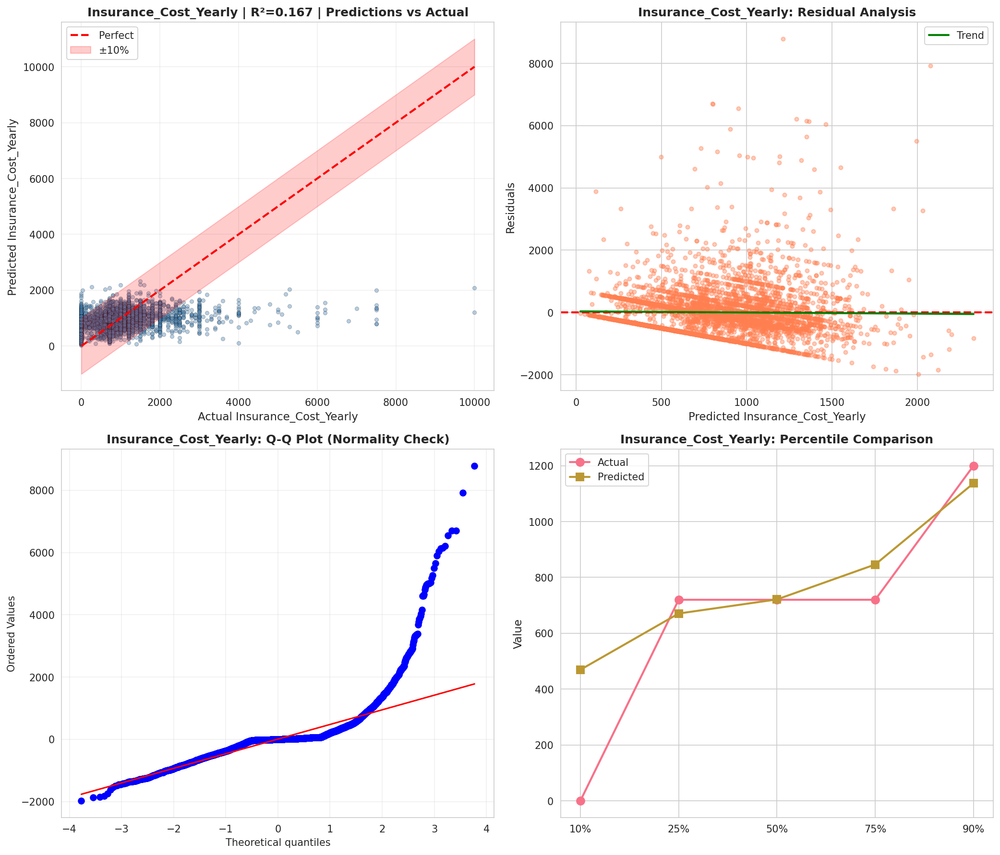
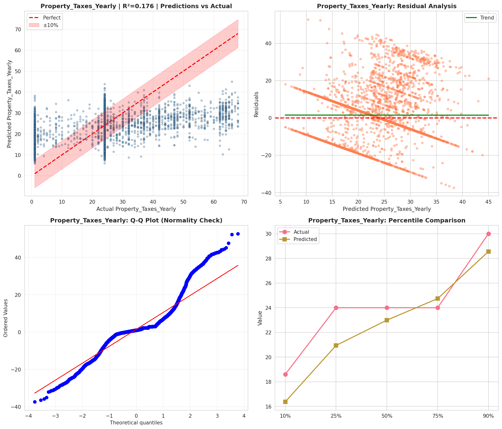
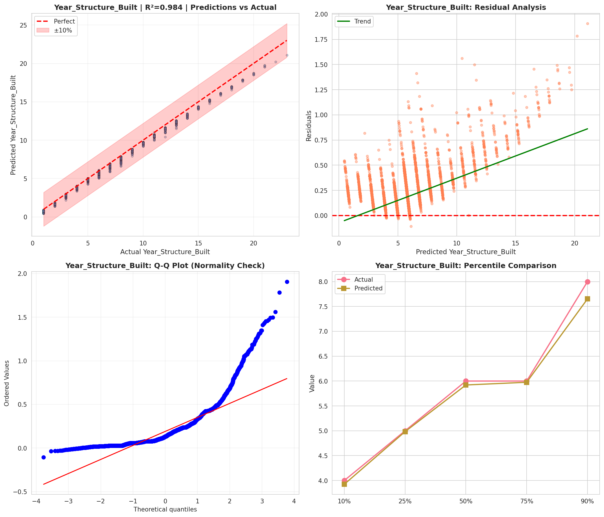
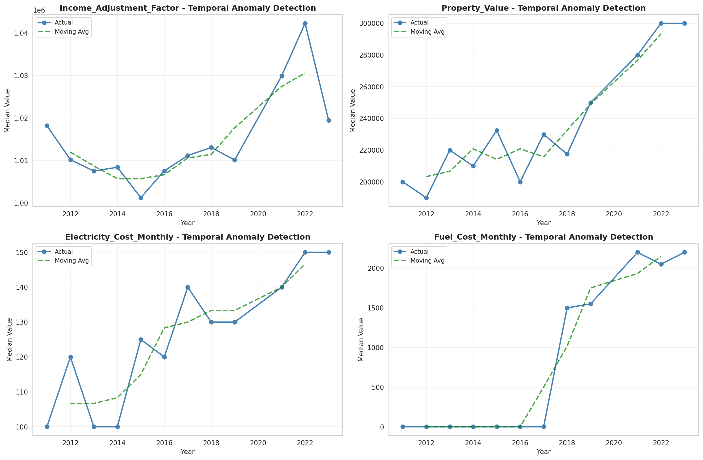
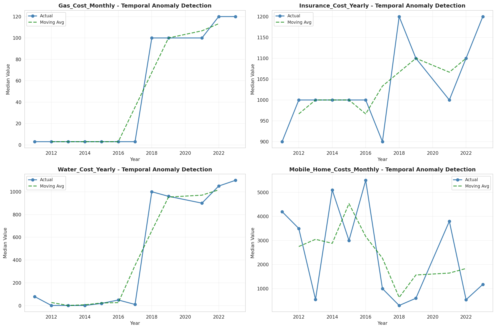
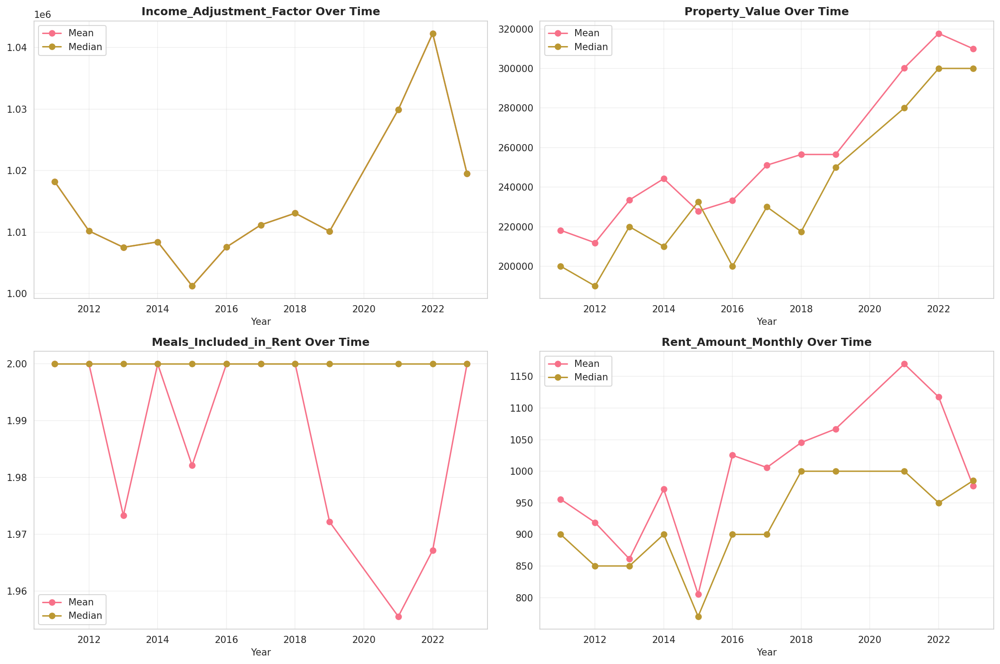
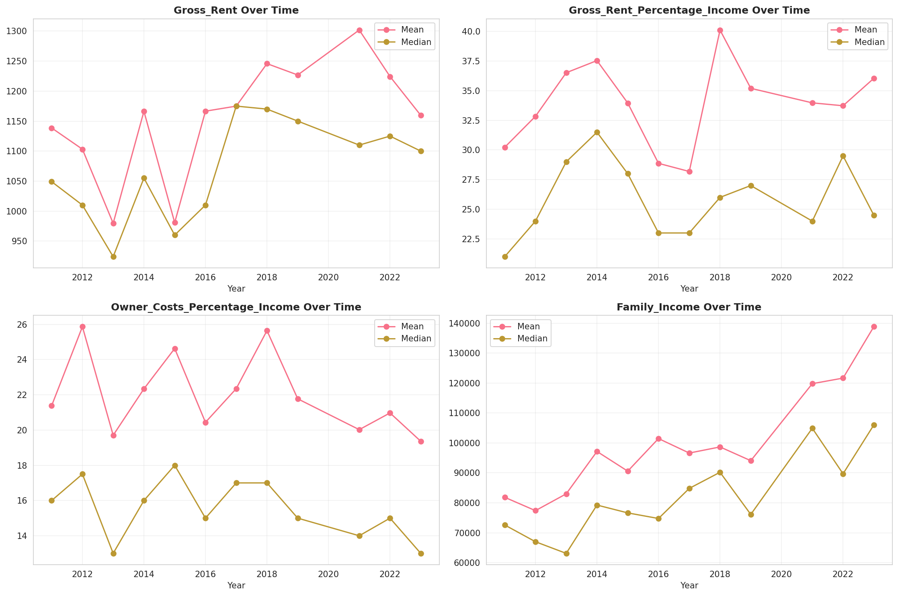
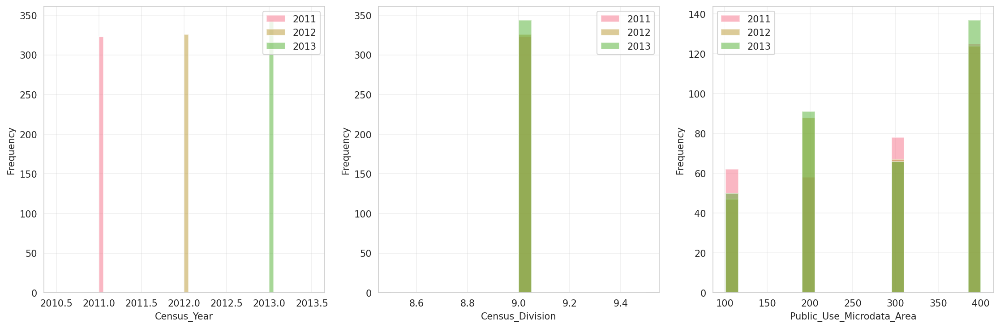
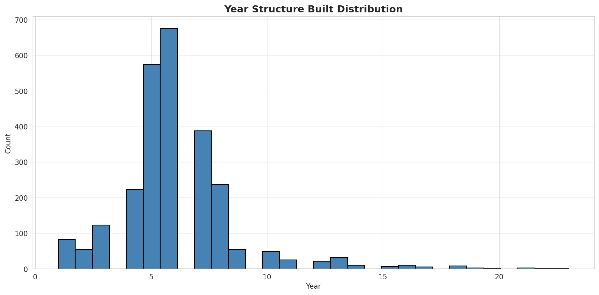
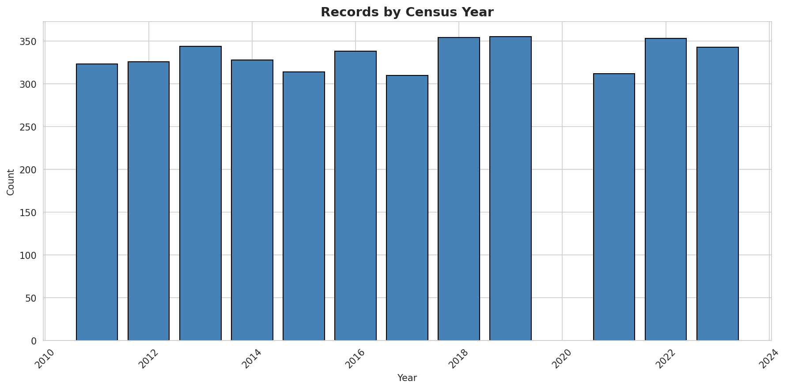
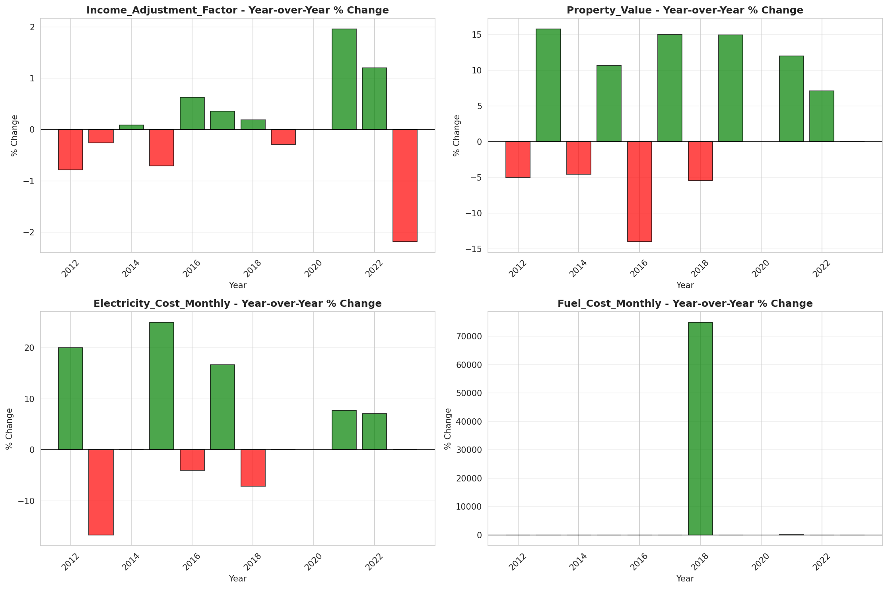
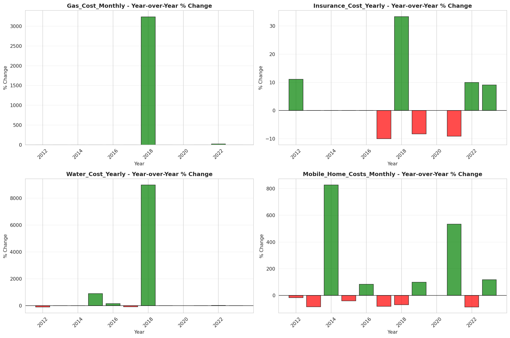
