# Temporal Analysis

## Year Distribution

- 2011: 16,019 records

- 2012: 16,492 records

- 2013: 16,936 records

- 2014: 17,422 records

- 2015: 17,647 records

- 2016: 17,697 records

- 2017: 17,826 records

- 2018: 18,046 records

- 2019: 18,238 records

- 2020: 18,566 records

- 2021: 18,749 records

- 2022: 18,999 records

- 2023: 19,210 records

## Temporal Trends

- Census_Year: {np.int64(2011): {'mean': 2011.0, 'median': 2011.0, 'std': 0.0}, np.int64(2012): {'mean': 2012.0, 'median': 2012.0, 'std': 0.0}, np.int64(2013): {'mean': 2013.0, 'median': 2013.0, 'std': 0.0}, np.int64(2014): {'mean': 2014.0, 'median': 2014.0, 'std': 0.0}, np.int64(2015): {'mean': 2015.0, 'median': 2015.0, 'std': 0.0}, np.int64(2016): {'mean': 2016.0, 'median': 2016.0, 'std': 0.0}, np.int64(2017): {'mean': 2017.0, 'median': 2017.0, 'std': 0.0}, np.int64(2018): {'mean': 2018.0, 'median': 2018.0, 'std': 0.0}, np.int64(2019): {'mean': 2019.0, 'median': 2019.0, 'std': 0.0}, np.int64(2020): {'mean': 2020.0, 'median': 2020.0, 'std': 0.0}, np.int64(2021): {'mean': 2021.0, 'median': 2021.0, 'std': 0.0}, np.int64(2022): {'mean': 2022.0, 'median': 2022.0, 'std': 0.0}, np.int64(2023): {'mean': 2023.0, 'median': 2023.0, 'std': 0.0}}

- Census_Division: {np.int64(2011): {'mean': 9.0, 'median': 9.0, 'std': 0.0}, np.int64(2012): {'mean': 9.0, 'median': 9.0, 'std': 0.0}, np.int64(2013): {'mean': 9.0, 'median': 9.0, 'std': 0.0}, np.int64(2014): {'mean': 9.0, 'median': 9.0, 'std': 0.0}, np.int64(2015): {'mean': 9.0, 'median': 9.0, 'std': 0.0}, np.int64(2016): {'mean': 9.0, 'median': 9.0, 'std': 0.0}, np.int64(2017): {'mean': 9.0, 'median': 9.0, 'std': 0.0}, np.int64(2018): {'mean': 9.0, 'median': 9.0, 'std': 0.0}, np.int64(2019): {'mean': 9.0, 'median': 9.0, 'std': 0.0}, np.int64(2020): {'mean': 9.0, 'median': 9.0, 'std': 0.0}, np.int64(2021): {'mean': 9.0, 'median': 9.0, 'std': 0.0}, np.int64(2022): {'mean': 9.0, 'median': 9.0, 'std': 0.0}, np.int64(2023): {'mean': 9.0, 'median': 9.0, 'std': 0.0}}

- Public_Use_Microdata_Area: {np.int64(2011): {'mean': 257.6852487670891, 'median': 300.0, 'std': 115.09915517307661}, np.int64(2012): {'mean': None, 'median': None, 'std': None}, np.int64(2013): {'mean': None, 'median': None, 'std': None}, np.int64(2014): {'mean': None, 'median': None, 'std': None}, np.int64(2015): {'mean': None, 'median': None, 'std': None}, np.int64(2016): {'mean': 277.37701305305984, 'median': 300.0, 'std': 113.27569789977338}, np.int64(2017): {'mean': 277.55879053068554, 'median': 300.0, 'std': 113.25241722680865}, np.int64(2018): {'mean': 276.6133769256345, 'median': 300.0, 'std': 113.28054453219296}, np.int64(2019): {'mean': 276.6942098914355, 'median': 300.0, 'std': 113.42483435108782}, np.int64(2020): {'mean': 276.5259075729829, 'median': 300.0, 'std': 113.19273407118511}, np.int64(2021): {'mean': 274.2396927836151, 'median': 300.0, 'std': 113.00368713447449}, np.int64(2022): {'mean': None, 'median': None, 'std': None}, np.int64(2023): {'mean': 273.41296199895885, 'median': 300.0, 'std': 112.80284576288784}}

- Census_Region: {np.int64(2011): {'mean': 4.0, 'median': 4.0, 'std': 0.0}, np.int64(2012): {'mean': 4.0, 'median': 4.0, 'std': 0.0}, np.int64(2013): {'mean': 4.0, 'median': 4.0, 'std': 0.0}, np.int64(2014): {'mean': 4.0, 'median': 4.0, 'std': 0.0}, np.int64(2015): {'mean': 4.0, 'median': 4.0, 'std': 0.0}, np.int64(2016): {'mean': 4.0, 'median': 4.0, 'std': 0.0}, np.int64(2017): {'mean': 4.0, 'median': 4.0, 'std': 0.0}, np.int64(2018): {'mean': 4.0, 'median': 4.0, 'std': 0.0}, np.int64(2019): {'mean': 4.0, 'median': 4.0, 'std': 0.0}, np.int64(2020): {'mean': 4.0, 'median': 4.0, 'std': 0.0}, np.int64(2021): {'mean': 4.0, 'median': 4.0, 'std': 0.0}, np.int64(2022): {'mean': 4.0, 'median': 4.0, 'std': 0.0}, np.int64(2023): {'mean': 4.0, 'median': 4.0, 'std': 0.0}}

- State_Code: {np.int64(2011): {'mean': 2.0, 'median': 2.0, 'std': 0.0}, np.int64(2012): {'mean': 2.0, 'median': 2.0, 'std': 0.0}, np.int64(2013): {'mean': 2.0, 'median': 2.0, 'std': 0.0}, np.int64(2014): {'mean': 2.0, 'median': 2.0, 'std': 0.0}, np.int64(2015): {'mean': 2.0, 'median': 2.0, 'std': 0.0}, np.int64(2016): {'mean': 2.0, 'median': 2.0, 'std': 0.0}, np.int64(2017): {'mean': 2.0, 'median': 2.0, 'std': 0.0}, np.int64(2018): {'mean': 2.0, 'median': 2.0, 'std': 0.0}, np.int64(2019): {'mean': 2.0, 'median': 2.0, 'std': 0.0}, np.int64(2020): {'mean': 2.0, 'median': 2.0, 'std': 0.0}, np.int64(2021): {'mean': 2.0, 'median': 2.0, 'std': 0.0}, np.int64(2022): {'mean': 2.0, 'median': 2.0, 'std': 0.0}, np.int64(2023): {'mean': None, 'median': None, 'std': None}}

- Housing_Adjustment_Factor: {np.int64(2011): {'mean': 1040430.8639740308, 'median': 1044592.0, 'std': 27682.21773248759}, np.int64(2012): {'mean': 1040541.9033470773, 'median': 1053092.0, 'std': 27479.978833446206}, np.int64(2013): {'mean': 1039456.7975318847, 'median': 1035725.0, 'std': 31768.924770873193}, np.int64(2014): {'mean': 1036688.364252095, 'median': 1031130.0, 'std': 29616.735731592056}, np.int64(2015): {'mean': 1020935.9538731796, 'median': 1017534.0, 'std': 20306.70621532469}, np.int64(2016): {'mean': 1020323.5664801943, 'median': 1013801.0, 'std': 15771.796718821133}, np.int64(2017): {'mean': 1029074.8420845956, 'median': 1034680.0, 'std': 17988.316710676685}, np.int64(2018): {'mean': 1038071.7376149839, 'median': 1046406.0, 'std': 23532.45335257777}, np.int64(2019): {'mean': 1040565.3645136529, 'median': 1042936.0, 'std': 29176.71919055264}, np.int64(2020): {'mean': 1034857.3966928795, 'median': 1030827.0, 'std': 28571.135413743083}, np.int64(2021): {'mean': 1057702.7470798444, 'median': 1059761.0, 'std': 34996.433179176376}, np.int64(2022): {'mean': 1105443.0936365072, 'median': 1133141.0, 'std': 60897.7276420212}, np.int64(2023): {'mean': 1107387.020510151, 'median': 1125501.0, 'std': 76700.41891337051}}

- Income_Adjustment_Factor: {np.int64(2011): {'mean': 1053107.2252949623, 'median': 1048026.0, 'std': 28396.8602297595}, np.int64(2012): {'mean': 1051856.1304268737, 'median': 1061121.0, 'std': 26392.633250322557}, np.int64(2013): {'mean': 1048609.7006967408, 'median': 1054614.0, 'std': 29510.176995118047}, np.int64(2014): {'mean': 1047543.8040982665, 'median': 1041654.0, 'std': 31053.024573617673}, np.int64(2015): {'mean': 1030354.1662038873, 'median': 1025215.0, 'std': 25680.373796596894}, np.int64(2016): {'mean': 1027483.7792846245, 'median': 1022342.0, 'std': 17525.031771021084}, np.int64(2017): {'mean': 1036478.0675417929, 'median': 1035988.0, 'std': 16849.23609192315}, np.int64(2018): {'mean': 1046679.7089105619, 'median': 1054346.0, 'std': 20549.26324560425}, np.int64(2019): {'mean': 1049545.680776401, 'median': 1054606.0, 'std': 26237.925885040895}, np.int64(2020): {'mean': 1044812.1313691695, 'median': 1044328.0, 'std': 29251.534551961027}, np.int64(2021): {'mean': 1072395.8113499386, 'median': 1070512.0, 'std': 30383.137775125953}, np.int64(2022): {'mean': 1127246.3874414442, 'median': 1140108.0, 'std': 48989.5518860272}, np.int64(2023): {'mean': 1130746.2739718896, 'median': 1159185.0, 'std': 69996.78024444137}}

- Housing_Unit_Weight: {np.int64(2011): {'mean': 19.000749110431364, 'median': 14.0, 'std': 19.719736887504148}, np.int64(2012): {'mean': 18.520797962648558, 'median': 12.0, 'std': 20.801075189081477}, np.int64(2013): {'mean': 18.10710911667454, 'median': 11.0, 'std': 22.101731805628546}, np.int64(2014): {'mean': 17.668465158994376, 'median': 10.0, 'std': 22.96469820833529}, np.int64(2015): {'mean': 17.468181560605203, 'median': 9.0, 'std': 23.95882916490963}, np.int64(2016): {'mean': 17.470249194778777, 'median': 9.0, 'std': 23.606309146046243}, np.int64(2017): {'mean': 17.61118590822394, 'median': 9.0, 'std': 23.9419612975434}, np.int64(2018): {'mean': 17.476781558240052, 'median': 9.0, 'std': 23.58990604104601}, np.int64(2019): {'mean': 17.375863581533064, 'median': 9.0, 'std': 23.834198237011694}, np.int64(2020): {'mean': 17.14801249596036, 'median': 8.0, 'std': 26.14602271331824}, np.int64(2021): {'mean': 17.30406955037602, 'median': 8.0, 'std': 25.932956161017756}, np.int64(2022): {'mean': 17.168693089109954, 'median': 8.0, 'std': 25.403535827160145}, np.int64(2023): {'mean': 17.054138469547112, 'median': 8.0, 'std': 25.68871804074909}}

- Number_of_Persons: {np.int64(2011): {'mean': 2.070416380548099, 'median': 2.0, 'std': 1.8606157630677982}, np.int64(2012): {'mean': 2.044991511035654, 'median': 2.0, 'std': 1.8940561467629804}, np.int64(2013): {'mean': 2.013993859234766, 'median': 2.0, 'std': 1.9168065204420228}, np.int64(2014): {'mean': 1.9767535300195156, 'median': 1.0, 'std': 1.9220141535642314}, np.int64(2015): {'mean': 1.935739785799286, 'median': 1.0, 'std': 1.9308739821893028}, np.int64(2016): {'mean': 1.9164265129682998, 'median': 1.0, 'std': 1.9387576827531687}, np.int64(2017): {'mean': 1.8913384943341187, 'median': 1.0, 'std': 1.932529864757113}, np.int64(2018): {'mean': 1.8662307436551036, 'median': 1.0, 'std': 1.9005341305657886}, np.int64(2019): {'mean': 1.839785064151771, 'median': 1.0, 'std': 1.8879021658406736}, np.int64(2020): {'mean': 1.7905310783151998, 'median': 1.0, 'std': 1.8515957896211106}, np.int64(2021): {'mean': 1.751506747026508, 'median': 1.0, 'std': 1.8026020996778456}, np.int64(2022): {'mean': 1.740354755513448, 'median': 1.0, 'std': 1.7846795403195876}, np.int64(2023): {'mean': 1.7294117647058824, 'median': 1.0, 'std': 1.7828008883185158}}

- Housing_Unit_Type: {np.int64(2011): {'mean': 1.1326549722204882, 'median': 1.0, 'std': 0.46174062691580786}, np.int64(2012): {'mean': 1.1518918263400437, 'median': 1.0, 'std': 0.4935157112622043}, np.int64(2013): {'mean': 1.1697567312234294, 'median': 1.0, 'std': 0.521798201150694}, np.int64(2014): {'mean': 1.189071289174607, 'median': 1.0, 'std': 0.5492348040259638}, np.int64(2015): {'mean': 1.2064940216467388, 'median': 1.0, 'std': 0.5720023243160547}, np.int64(2016): {'mean': 1.2112787478103633, 'median': 1.0, 'std': 0.5778571577603963}, np.int64(2017): {'mean': 1.2132839672388647, 'median': 1.0, 'std': 0.5805203622363185}, np.int64(2018): {'mean': 1.221101629169899, 'median': 1.0, 'std': 0.5899220353037223}, np.int64(2019): {'mean': 1.2264502686698102, 'median': 1.0, 'std': 0.5964913767318187}, np.int64(2020): {'mean': None, 'median': None, 'std': None}, np.int64(2021): {'mean': None, 'median': None, 'std': None}, np.int64(2022): {'mean': None, 'median': None, 'std': None}, np.int64(2023): {'mean': None, 'median': None, 'std': None}}

- Number_of_Bedrooms: {np.int64(2011): {'mean': 2.455040871934605, 'median': 3.0, 'std': 1.2139011057362006}, np.int64(2012): {'mean': None, 'median': None, 'std': None}, np.int64(2013): {'mean': None, 'median': None, 'std': None}, np.int64(2014): {'mean': None, 'median': None, 'std': None}, np.int64(2015): {'mean': None, 'median': None, 'std': None}, np.int64(2016): {'mean': None, 'median': None, 'std': None}, np.int64(2017): {'mean': None, 'median': None, 'std': None}, np.int64(2018): {'mean': None, 'median': None, 'std': None}, np.int64(2019): {'mean': None, 'median': None, 'std': None}, np.int64(2020): {'mean': None, 'median': None, 'std': None}, np.int64(2021): {'mean': None, 'median': None, 'std': None}, np.int64(2022): {'mean': None, 'median': None, 'std': None}, np.int64(2023): {'mean': None, 'median': None, 'std': None}}

- Number_of_Rooms: {np.int64(2011): {'mean': 4.7529291553133515, 'median': 5.0, 'std': 2.132744305535129}, np.int64(2012): {'mean': None, 'median': None, 'std': None}, np.int64(2013): {'mean': None, 'median': None, 'std': None}, np.int64(2014): {'mean': None, 'median': None, 'std': None}, np.int64(2015): {'mean': None, 'median': None, 'std': None}, np.int64(2016): {'mean': None, 'median': None, 'std': None}, np.int64(2017): {'mean': None, 'median': None, 'std': None}, np.int64(2018): {'mean': None, 'median': None, 'std': None}, np.int64(2019): {'mean': None, 'median': None, 'std': None}, np.int64(2020): {'mean': None, 'median': None, 'std': None}, np.int64(2021): {'mean': None, 'median': None, 'std': None}, np.int64(2022): {'mean': None, 'median': None, 'std': None}, np.int64(2023): {'mean': None, 'median': None, 'std': None}}

- Building_Type: {np.int64(2011): {'mean': 2.736716621253406, 'median': 2.0, 'std': 1.6825000971233957}, np.int64(2012): {'mean': 2.722359874104333, 'median': 2.0, 'std': 1.6717044505613257}, np.int64(2013): {'mean': 2.7100771106570885, 'median': 2.0, 'std': 1.659596266758369}, np.int64(2014): {'mean': 2.7121271076523996, 'median': 2.0, 'std': 1.6575472889687273}, np.int64(2015): {'mean': 2.705775705775706, 'median': 2.0, 'std': 1.6386481321603197}, np.int64(2016): {'mean': 2.696204171524809, 'median': 2.0, 'std': 1.6317602603388304}, np.int64(2017): {'mean': 2.693729075457121, 'median': 2.0, 'std': 1.629046853892258}, np.int64(2018): {'mean': 2.6979925840685333, 'median': 2.0, 'std': 1.6354966341374413}, np.int64(2019): {'mean': 2.7020628371945414, 'median': 2.0, 'std': 1.6386355619460917}, np.int64(2020): {'mean': 2.7017322834645667, 'median': 2.0, 'std': 1.640883089676234}, np.int64(2021): {'mean': 2.7148376643609398, 'median': 2.0, 'std': 1.6543729450198739}, np.int64(2022): {'mean': 2.7247371675943106, 'median': 2.0, 'std': 1.6586676876113016}, np.int64(2023): {'mean': 2.731806178222686, 'median': 2.0, 'std': 1.6679931220395579}}

- Year_Structure_Built: {np.int64(2011): {'mean': 4.359877384196185, 'median': 4.0, 'std': 1.6260484316999642}, np.int64(2012): {'mean': 5.76876715998125, 'median': 6.0, 'std': 1.914047654163626}, np.int64(2013): {'mean': 5.834376853621564, 'median': 6.0, 'std': 2.0544395003267826}, np.int64(2014): {'mean': 5.925810635538262, 'median': 6.0, 'std': 2.1568787118763444}, np.int64(2015): {'mean': 5.9996114996114995, 'median': 6.0, 'std': 2.284980446029207}, np.int64(2016): {'mean': 6.082717968648788, 'median': 6.0, 'std': 2.4048838417451757}, np.int64(2017): {'mean': 6.168362091166624, 'median': 6.0, 'std': 2.5762561379028006}, np.int64(2018): {'mean': 6.246515790819588, 'median': 6.0, 'std': 2.711112928405672}, np.int64(2019): {'mean': 6.340399873056173, 'median': 6.0, 'std': 2.901863137049589}, np.int64(2020): {'mean': 6.446551181102362, 'median': 6.0, 'std': 3.105869932582991}, np.int64(2021): {'mean': None, 'median': None, 'std': None}, np.int64(2022): {'mean': None, 'median': None, 'std': None}, np.int64(2023): {'mean': None, 'median': None, 'std': None}}

- Bathtub_or_Shower: {np.int64(2011): {'mean': None, 'median': None, 'std': None}, np.int64(2012): {'mean': 1.1513426638987478, 'median': 1.0, 'std': 0.3583945640126972}, np.int64(2013): {'mean': 1.1563962301456534, 'median': 1.0, 'std': 0.3632425434754026}, np.int64(2014): {'mean': 1.1594033722438393, 'median': 1.0, 'std': 0.3660636930159652}, np.int64(2015): {'mean': 1.1612924112924112, 'median': 1.0, 'std': 0.36781235586173683}, np.int64(2016): {'mean': 1.1612903225806452, 'median': 1.0, 'std': 0.3678104369212585}, np.int64(2017): {'mean': 1.1599278908060777, 'median': 1.0, 'std': 0.36655096651256874}, np.int64(2018): {'mean': 1.155990282572561, 'median': 1.0, 'std': 0.3628577293708125}, np.int64(2019): {'mean': 1.1541098064106632, 'median': 1.0, 'std': 0.36106543548359676}, np.int64(2020): {'mean': 1.1508031496062991, 'median': 1.0, 'std': 0.3578681699358035}, np.int64(2021): {'mean': 1.1413971458839658, 'median': 1.0, 'std': 0.34844161493305503}, np.int64(2022): {'mean': 1.1371057513914657, 'median': 1.0, 'std': 0.3439695935352903}, np.int64(2023): {'mean': 1.135233065159983, 'median': 1.0, 'std': 0.3419828441953965}}

- Refrigerator: {np.int64(2011): {'mean': None, 'median': None, 'std': None}, np.int64(2012): {'mean': 1.0958949976561976, 'median': 1.0, 'std': 0.2944570483883659}, np.int64(2013): {'mean': 1.0998484149476042, 'median': 1.0, 'std': 0.2998076599515419}, np.int64(2014): {'mean': 1.1041504539559015, 'median': 1.0, 'std': 0.30546552682126465}, np.int64(2015): {'mean': 1.104959854959855, 'median': 1.0, 'std': 0.3065116099501938}, np.int64(2016): {'mean': 1.1036403679233062, 'median': 1.0, 'std': 0.3048033136411963}, np.int64(2017): {'mean': 1.1040432655163532, 'median': 1.0, 'std': 0.30532649163554}, np.int64(2018): {'mean': 1.1034394578698377, 'median': 1.0, 'std': 0.3045417306330758}, np.int64(2019): {'mean': 1.1036496350364964, 'median': 1.0, 'std': 0.3048151661480494}, np.int64(2020): {'mean': 1.1046299212598425, 'median': 1.0, 'std': 0.3060856129723401}, np.int64(2021): {'mean': 1.1056895369851063, 'median': 1.0, 'std': 0.3074494255571352}, np.int64(2022): {'mean': 1.1024118738404454, 'median': 1.0, 'std': 0.3031985605462807}, np.int64(2023): {'mean': 1.100964195787017, 'median': 1.0, 'std': 0.30129056050642083}}

- Hot_and_Cold_Running_Water: {np.int64(2011): {'mean': None, 'median': None, 'std': None}, np.int64(2012): {'mean': 1.1739101319225875, 'median': 1.0, 'std': 0.3790448776161685}, np.int64(2013): {'mean': 1.1812429974296448, 'median': 1.0, 'std': 0.3852320782216723}, np.int64(2014): {'mean': 1.18378728923476, 'median': 1.0, 'std': 0.3873231860157156}, np.int64(2015): {'mean': 1.1877751877751879, 'median': 1.0, 'std': 0.39054518646367226}, np.int64(2016): {'mean': 1.190374400829123, 'median': 1.0, 'std': 0.3926091859850155}, np.int64(2017): {'mean': 1.1936003090394025, 'median': 1.0, 'std': 0.3951319798287525}, np.int64(2018): {'mean': 1.1919191919191918, 'median': 1.0, 'std': 0.39382246134108045}, np.int64(2019): {'mean': 1.1908600444303397, 'median': 1.0, 'std': 0.39299146379804095}, np.int64(2020): {'mean': 1.1911181102362205, 'median': 1.0, 'std': 0.3931942482625893}, np.int64(2021): {'mean': 1.183959618620303, 'median': 1.0, 'std': 0.38746333096839564}, np.int64(2022): {'mean': 1.1784786641929499, 'median': 1.0, 'std': 0.38292701502989124}, np.int64(2023): {'mean': 1.1738623103850643, 'median': 1.0, 'std': 0.37900267686245137}}

- Running_Water: {np.int64(2011): {'mean': None, 'median': None, 'std': None}, np.int64(2012): {'mean': None, 'median': None, 'std': None}, np.int64(2013): {'mean': 9.0, 'median': 9.0, 'std': 0.0}, np.int64(2014): {'mean': 9.0, 'median': 9.0, 'std': 0.0}, np.int64(2015): {'mean': 9.0, 'median': 9.0, 'std': 0.0}, np.int64(2016): {'mean': 9.0, 'median': 9.0, 'std': 0.0}, np.int64(2017): {'mean': 9.0, 'median': 9.0, 'std': 0.0}, np.int64(2018): {'mean': 9.0, 'median': 9.0, 'std': 0.0}, np.int64(2019): {'mean': 9.0, 'median': 9.0, 'std': 0.0}, np.int64(2020): {'mean': 9.0, 'median': 9.0, 'std': 0.0}, np.int64(2021): {'mean': 9.0, 'median': 9.0, 'std': 0.0}, np.int64(2022): {'mean': 9.0, 'median': 9.0, 'std': 0.0}, np.int64(2023): {'mean': 9.0, 'median': 9.0, 'std': 0.0}}

- Sink_with_Faucet: {np.int64(2011): {'mean': None, 'median': None, 'std': None}, np.int64(2012): {'mean': 1.1324583138016473, 'median': 1.0, 'std': 0.3389997118993615}, np.int64(2013): {'mean': 1.134185724642457, 'median': 1.0, 'std': 0.3408629834201972}, np.int64(2014): {'mean': 1.1341115434500648, 'median': 1.0, 'std': 0.340783169621687}, np.int64(2015): {'mean': 1.1337736337736337, 'median': 1.0, 'std': 0.3404199645887349}, np.int64(2016): {'mean': 1.1316880424925508, 'median': 1.0, 'std': 0.3381622528385495}, np.int64(2017): {'mean': 1.1299896986865825, 'median': 1.0, 'std': 0.33630292689909563}, np.int64(2018): {'mean': 1.1274133742488173, 'median': 1.0, 'std': 0.3334461193382898}, np.int64(2019): {'mean': 1.1245953665503015, 'median': 1.0, 'std': 0.33027001770061015}, np.int64(2020): {'mean': 1.1214488188976377, 'median': 1.0, 'std': 0.32665842237186266}, np.int64(2021): {'mean': 1.1159095157973453, 'median': 1.0, 'std': 0.3201263598028397}, np.int64(2022): {'mean': 1.1119356833642549, 'median': 1.0, 'std': 0.31529705691105336}, np.int64(2023): {'mean': 1.1094392925136645, 'median': 1.0, 'std': 0.31219916665847147}}

- Stove_or_Range: {np.int64(2011): {'mean': None, 'median': None, 'std': None}, np.int64(2012): {'mean': 1.0731935980713856, 'median': 1.0, 'std': 0.2604627387697418}, np.int64(2013): {'mean': 1.0777038159889276, 'median': 1.0, 'std': 0.2677137585836821}, np.int64(2014): {'mean': 1.078793774319066, 'median': 1.0, 'std': 0.26942535695774744}, np.int64(2015): {'mean': 1.0775058275058276, 'median': 1.0, 'std': 0.26740101729804894}, np.int64(2016): {'mean': 1.0770177484130068, 'median': 1.0, 'std': 0.2666282426031417}, np.int64(2017): {'mean': 1.0786118980169972, 'median': 1.0, 'std': 0.2691407275318198}, np.int64(2018): {'mean': 1.078123002173635, 'median': 1.0, 'std': 0.2683736262322908}, np.int64(2019): {'mean': 1.0802284988892414, 'median': 1.0, 'std': 0.27165524266024393}, np.int64(2020): {'mean': 1.0822047244094488, 'median': 1.0, 'std': 0.27468502064605216}, np.int64(2021): {'mean': 1.081448245778027, 'median': 1.0, 'std': 0.27353078717914836}, np.int64(2022): {'mean': 1.079839208410637, 'median': 1.0, 'std': 0.27105249081389354}, np.int64(2023): {'mean': 1.0789166615488546, 'median': 1.0, 'std': 0.26961692536959075}}

- Telephone_Service: {np.int64(2011): {'mean': 1.0258420191230941, 'median': 1.0, 'std': 0.15867065848962048}, np.int64(2012): {'mean': 1.0247678018575852, 'median': 1.0, 'std': 0.15542340649189096}, np.int64(2013): {'mean': 1.0232879075383818, 'median': 1.0, 'std': 0.15082288589858298}, np.int64(2014): {'mean': 1.0233321811268579, 'median': 1.0, 'std': 0.15096277633537938}, np.int64(2015): {'mean': 1.0241239654868814, 'median': 1.0, 'std': 0.15344077907331863}, np.int64(2016): {'mean': 1.0243207126948775, 'median': 1.0, 'std': 0.1540497639678064}, np.int64(2017): {'mean': 1.02262969588551, 'median': 1.0, 'std': 0.14872649812452293}, np.int64(2018): {'mean': 1.0220738762794837, 'median': 1.0, 'std': 0.1469303978386841}, np.int64(2019): {'mean': 1.0217777777777777, 'median': 1.0, 'std': 0.14596369406866755}, np.int64(2020): {'mean': 1.0188070929607738, 'median': 1.0, 'std': 0.13584932463531998}, np.int64(2021): {'mean': 1.015754339118825, 'median': 1.0, 'std': 0.12452919418504522}, np.int64(2022): {'mean': 1.0151461782317717, 'median': 1.0, 'std': 0.12213961352087634}, np.int64(2023): {'mean': 1.0147186901236718, 'median': 1.0, 'std': 0.12042970322758553}}

- Lot_Acreage: {np.int64(2011): {'mean': 1.371004089808864, 'median': 1.0, 'std': 0.5602204744860313}, np.int64(2012): {'mean': 1.3605297580117723, 'median': 1.0, 'std': 0.557543446196677}, np.int64(2013): {'mean': 1.3519916479280436, 'median': 1.0, 'std': 0.5494004593740082}, np.int64(2014): {'mean': 1.3523764183131, 'median': 1.0, 'std': 0.5504320363319143}, np.int64(2015): {'mean': 1.355110475282149, 'median': 1.0, 'std': 0.5532861987365777}, np.int64(2016): {'mean': 1.3660275709079386, 'median': 1.0, 'std': 0.5582291024286515}, np.int64(2017): {'mean': 1.369087904304714, 'median': 1.0, 'std': 0.5598858781095005}, np.int64(2018): {'mean': 1.3739627368091436, 'median': 1.0, 'std': 0.5632735297414082}, np.int64(2019): {'mean': 1.3772543532338308, 'median': 1.0, 'std': 0.564586606748654}, np.int64(2020): {'mean': 1.3821872346993902, 'median': 1.0, 'std': 0.5671495388304048}, np.int64(2021): {'mean': 1.3754112156682732, 'median': 1.0, 'std': 0.5620528258898129}, np.int64(2022): {'mean': 1.3738666666666666, 'median': 1.0, 'std': 0.5604590214649416}, np.int64(2023): {'mean': 1.3761814744801513, 'median': 1.0, 'std': 0.561513783187925}}

- Agricultural_Sales: {np.int64(2011): {'mean': 1.0457881859489688, 'median': 1.0, 'std': 0.3891005171697638}, np.int64(2012): {'mean': 1.047377938517179, 'median': 1.0, 'std': 0.41095415519884754}, np.int64(2013): {'mean': 1.0484288354898337, 'median': 1.0, 'std': 0.41274796319408985}, np.int64(2014): {'mean': 1.0533484676503972, 'median': 1.0, 'std': 0.43653973931937945}, np.int64(2015): {'mean': 1.059835745013688, 'median': 1.0, 'std': 0.47875242597067985}, np.int64(2016): {'mean': 1.070216049382716, 'median': 1.0, 'std': 0.5187420132840069}, np.int64(2017): {'mean': 1.0705699883675843, 'median': 1.0, 'std': 0.5041165921166304}, np.int64(2018): {'mean': 1.0633346051125525, 'median': 1.0, 'std': 0.4727241402825183}, np.int64(2019): {'mean': 1.0678345136041745, 'median': 1.0, 'std': 0.49593956000228223}, np.int64(2020): {'mean': 1.0787834371564675, 'median': 1.0, 'std': 0.5243560360767732}, np.int64(2021): {'mean': 1.0803474484256244, 'median': 1.0, 'std': 0.5239253566189511}, np.int64(2022): {'mean': 1.078069552874379, 'median': 1.0, 'std': 0.5264817817486028}, np.int64(2023): {'mean': 1.0876949740034663, 'median': 1.0, 'std': 0.5595015773972042}}

- Business_On_Property: {np.int64(2011): {'mean': 1.9658626158083632, 'median': 2.0, 'std': 0.18158957967868516}, np.int64(2012): {'mean': 1.9674623937213864, 'median': 2.0, 'std': 0.17743022334176034}, np.int64(2013): {'mean': 1.9680372630902667, 'median': 2.0, 'std': 0.1759079457839317}, np.int64(2014): {'mean': 1.9671506784099024, 'median': 2.0, 'std': 0.1782491646794205}, np.int64(2015): {'mean': 1.9676522015577809, 'median': 2.0, 'std': 0.17692909983789384}, np.int64(2016): {'mean': 3.399065124385993, 'median': 2.0, 'std': 2.836635784265386}, np.int64(2017): {'mean': 4.832611946171402, 'median': 2.0, 'std': 3.4595656962040553}, np.int64(2018): {'mean': 6.238374823860967, 'median': 9.0, 'std': 3.437069424277493}, np.int64(2019): {'mean': 7.6247667910447765, 'median': 9.0, 'std': 2.7909593680721048}, np.int64(2020): {'mean': None, 'median': None, 'std': None}, np.int64(2021): {'mean': None, 'median': None, 'std': None}, np.int64(2022): {'mean': None, 'median': None, 'std': None}, np.int64(2023): {'mean': None, 'median': None, 'std': None}}

- Tenure: {np.int64(2011): {'mean': 1.9549487466620725, 'median': 2.0, 'std': 0.9507803658806094}, np.int64(2012): {'mean': 1.9740282077743379, 'median': 2.0, 'std': 0.9441329296224341}, np.int64(2013): {'mean': 1.9993962394341902, 'median': 2.0, 'std': 0.938228231147269}, np.int64(2014): {'mean': 2.018147251987556, 'median': 2.0, 'std': 0.9360407296741429}, np.int64(2015): {'mean': 2.033632681810178, 'median': 2.0, 'std': 0.9313473949191897}, np.int64(2016): {'mean': 2.0366146993318486, 'median': 2.0, 'std': 0.9312595873197389}, np.int64(2017): {'mean': 2.036404293381038, 'median': 2.0, 'std': 0.9265050543635206}, np.int64(2018): {'mean': 2.034712950600801, 'median': 2.0, 'std': 0.9249216004607637}, np.int64(2019): {'mean': 2.0347555555555554, 'median': 2.0, 'std': 0.9209781649508721}, np.int64(2020): {'mean': 2.0243596632634784, 'median': 2.0, 'std': 0.9137146895796482}, np.int64(2021): {'mean': 2.006853582554517, 'median': 2.0, 'std': 0.9028110844497796}, np.int64(2022): {'mean': 1.9982388164846776, 'median': 2.0, 'std': 0.8959011697087385}, np.int64(2023): {'mean': 1.9977355861348196, 'median': 2.0, 'std': 0.8896006687363556}}

- Vacancy_Status: {np.int64(2011): {'mean': 5.139368283946597, 'median': 5.0, 'std': 1.6086442360973656}, np.int64(2012): {'mean': 5.1409984871406955, 'median': 5.0, 'std': 1.611315043618689}, np.int64(2013): {'mean': 5.174350377200335, 'median': 5.0, 'std': 1.5892671534826643}, np.int64(2014): {'mean': 5.160343035343035, 'median': 5.0, 'std': 1.5933045139049804}, np.int64(2015): {'mean': 5.135340186000979, 'median': 5.0, 'std': 1.6056934257551225}, np.int64(2016): {'mean': 5.184666508426299, 'median': 5.0, 'std': 1.5916395902027412}, np.int64(2017): {'mean': 5.186351102941177, 'median': 5.0, 'std': 1.5904412567877941}, np.int64(2018): {'mean': 5.182437031994554, 'median': 5.0, 'std': 1.6079213120024112}, np.int64(2019): {'mean': 5.223529411764706, 'median': 5.0, 'std': 1.602472687061524}, np.int64(2020): {'mean': 5.237417710766617, 'median': 5.0, 'std': 1.596417439292245}, np.int64(2021): {'mean': 5.27098919368246, 'median': 5.0, 'std': 1.5821330207448212}, np.int64(2022): {'mean': 5.313876194432904, 'median': 5.0, 'std': 1.5729859720002821}, np.int64(2023): {'mean': 5.349510518641949, 'median': 5.0, 'std': 1.5680083804595606}}

- Property_Value: {np.int64(2011): {'mean': 16.59678824847504, 'median': 18.0, 'std': 4.559655994802409}}

- Vehicles_Available: {np.int64(2011): {'mean': 1.6327849082608321, 'median': 2.0, 'std': 1.1689455384846352}, np.int64(2012): {'mean': 1.5982112143102856, 'median': 2.0, 'std': 1.1776436872429517}, np.int64(2013): {'mean': 1.5743488011040194, 'median': 2.0, 'std': 1.1876623346826591}, np.int64(2014): {'mean': 1.5541825095057034, 'median': 1.0, 'std': 1.185318667923761}, np.int64(2015): {'mean': 1.5360979045606622, 'median': 1.0, 'std': 1.1961275553813775}, np.int64(2016): {'mean': 1.5500222717149221, 'median': 1.0, 'std': 1.2123945051295935}, np.int64(2017): {'mean': 1.5554561717352415, 'median': 1.0, 'std': 1.209831552384026}, np.int64(2018): {'mean': 1.5784601691143747, 'median': 2.0, 'std': 1.2092599873530707}, np.int64(2019): {'mean': 1.5939555555555556, 'median': 2.0, 'std': 1.2186212250998367}, np.int64(2020): {'mean': 1.623231237685832, 'median': 2.0, 'std': 1.2198512465730116}, np.int64(2021): {'mean': 1.664975522919448, 'median': 2.0, 'std': 1.2115170377962667}, np.int64(2022): {'mean': 1.688006340260655, 'median': 2.0, 'std': 1.2174283506438612}, np.int64(2023): {'mean': 1.6817627591012019, 'median': 2.0, 'std': 1.2196015833468898}}

- Condo_Fee_Monthly: {np.int64(2011): {'mean': 250.63457330415756, 'median': 230.0, 'std': 125.86992009420476}, np.int64(2012): {'mean': 256.35955056179773, 'median': 230.0, 'std': 128.63719559243992}, np.int64(2013): {'mean': 264.76070528967256, 'median': 250.0, 'std': 129.26660129206738}, np.int64(2014): {'mean': 278.8, 'median': 260.0, 'std': 131.36360888812774}, np.int64(2015): {'mean': 292.8979591836735, 'median': 270.0, 'std': 136.82185699433572}, np.int64(2016): {'mean': 299.13953488372096, 'median': 280.0, 'std': 136.2659175961668}, np.int64(2017): {'mean': 313.5393586005831, 'median': 300.0, 'std': 140.6349346708697}, np.int64(2018): {'mean': 320.78285714285715, 'median': 300.0, 'std': 141.16727358780608}, np.int64(2019): {'mean': 328.32, 'median': 310.0, 'std': 144.4836056425269}, np.int64(2020): {'mean': 336.0773480662983, 'median': 310.0, 'std': 142.87345808663952}, np.int64(2021): {'mean': 345.8176943699732, 'median': 320.0, 'std': 144.0362447219258}, np.int64(2022): {'mean': 344.702842377261, 'median': 320.0, 'std': 144.14515592400565}, np.int64(2023): {'mean': 357.6395939086294, 'median': 330.0, 'std': 166.9689738387676}}

- Electricity_Cost_Monthly: {np.int64(2011): {'mean': 122.67533809975019, 'median': 100.0, 'std': 94.3688651751559}, np.int64(2012): {'mean': 127.2858617131063, 'median': 100.0, 'std': 98.50692178873138}, np.int64(2013): {'mean': 128.98930481283423, 'median': 100.0, 'std': 100.62922484600404}, np.int64(2014): {'mean': 129.9540269616315, 'median': 100.0, 'std': 102.30221713123645}, np.int64(2015): {'mean': 132.9483183659095, 'median': 110.0, 'std': 104.51058223943038}, np.int64(2016): {'mean': 134.54146993318486, 'median': 110.0, 'std': 104.93746608220334}, np.int64(2017): {'mean': 136.05143112701253, 'median': 110.0, 'std': 105.20595939752891}, np.int64(2018): {'mean': 153.81236421094212, 'median': 130.0, 'std': 100.8894388100533}, np.int64(2019): {'mean': 156.1604172817636, 'median': 130.0, 'std': 101.15010213242829}, np.int64(2020): {'mean': 160.38498861273393, 'median': 130.0, 'std': 103.09566479081693}, np.int64(2021): {'mean': 164.10757560831445, 'median': 140.0, 'std': 104.74678570726408}, np.int64(2022): {'mean': 169.82781456953643, 'median': 140.0, 'std': 122.81174856058983}, np.int64(2023): {'mean': 178.157225433526, 'median': 150.0, 'std': 154.1822644545344}}

- Fuel_Cost_Monthly: {np.int64(2011): {'mean': 869.4667068653631, 'median': 2.0, 'std': 1491.3057791391104}, np.int64(2012): {'mean': 947.5718094255246, 'median': 2.0, 'std': 1578.2625350867568}, np.int64(2013): {'mean': 987.9823184405727, 'median': 2.0, 'std': 1614.1636014031603}, np.int64(2014): {'mean': 1021.0832181126858, 'median': 2.0, 'std': 1639.986914902901}, np.int64(2015): {'mean': 1049.818101778482, 'median': 2.0, 'std': 1675.5519316913187}, np.int64(2016): {'mean': 1028.4247661469933, 'median': 2.0, 'std': 1657.3087416681972}, np.int64(2017): {'mean': 964.111717352415, 'median': 2.0, 'std': 1594.7271650554069}, np.int64(2018): {'mean': 2196.1335684372934, 'median': 1800.0, 'std': 1696.1032465319693}, np.int64(2019): {'mean': 2081.5197865718096, 'median': 1700.0, 'std': 1645.886685966504}, np.int64(2020): {'mean': 2038.0990726080072, 'median': 1600.0, 'std': 1620.9483348365998}, np.int64(2021): {'mean': 2026.4429657794676, 'median': 1500.0, 'std': 1616.7042693797757}, np.int64(2022): {'mean': 2097.0795099687725, 'median': 1600.0, 'std': 1674.0235307542805}, np.int64(2023): {'mean': 2196.882635882636, 'median': 1800.0, 'std': 1764.566762331921}}

- Gas_Cost_Monthly: {np.int64(2011): {'mean': 62.98690671031097, 'median': 3.0, 'std': 90.99016540653244}, np.int64(2012): {'mean': 60.97772617819057, 'median': 3.0, 'std': 90.18640102395375}, np.int64(2013): {'mean': 57.94842159737795, 'median': 3.0, 'std': 88.47602792844474}, np.int64(2014): {'mean': 52.51823366747321, 'median': 3.0, 'std': 82.8773367007739}, np.int64(2015): {'mean': 49.643863356224685, 'median': 3.0, 'std': 80.54957200378836}, np.int64(2016): {'mean': 48.355812917594655, 'median': 3.0, 'std': 77.82159088205104}, np.int64(2017): {'mean': 48.53139534883721, 'median': 3.0, 'std': 77.96850257791368}, np.int64(2018): {'mean': 114.56842105263158, 'median': 100.0, 'std': 87.04418956888703}, np.int64(2019): {'mean': 115.44756399669694, 'median': 100.0, 'std': 86.87960402743737}, np.int64(2020): {'mean': 118.36423163494986, 'median': 100.0, 'std': 90.18515505061931}, np.int64(2021): {'mean': 123.56607495069034, 'median': 100.0, 'std': 92.91963763370049}, np.int64(2022): {'mean': 130.1285686541076, 'median': 100.0, 'std': 118.24176739639124}, np.int64(2023): {'mean': 135.1395749569213, 'median': 100.0, 'std': 129.4557215697995}}

- House_Heating_Fuel: {np.int64(2011): {'mean': 2.8794900508226378, 'median': 3.0, 'std': 1.7235349100735777}, np.int64(2012): {'mean': 2.9699002407980735, 'median': 4.0, 'std': 1.73464252745471}, np.int64(2013): {'mean': 3.045627048473348, 'median': 4.0, 'std': 1.7339388362361452}, np.int64(2014): {'mean': 3.1161424127203596, 'median': 4.0, 'std': 1.731075174512551}, np.int64(2015): {'mean': 3.1701884134530727, 'median': 4.0, 'std': 1.7300422564504294}, np.int64(2016): {'mean': 3.174164810690423, 'median': 4.0, 'std': 1.7451824483118126}, np.int64(2017): {'mean': 3.1601967799642217, 'median': 4.0, 'std': 1.7547065909267823}, np.int64(2018): {'mean': 3.132888295505118, 'median': 4.0, 'std': 1.756206668795679}, np.int64(2019): {'mean': 3.1029333333333335, 'median': 4.0, 'std': 1.7522017491898532}, np.int64(2020): {'mean': 3.07934802077736, 'median': 4.0, 'std': 1.7455643396145868}, np.int64(2021): {'mean': 3.011303960836671, 'median': 4.0, 'std': 1.7415214484469859}, np.int64(2022): {'mean': 2.990753786544558, 'median': 3.0, 'std': 1.7300928915124016}, np.int64(2023): {'mean': 2.9888521163560355, 'median': 3.0, 'std': 1.7295238569078553}}

- Insurance_Cost_Yearly: {np.int64(2013): {'mean': 1082.26882115314, 'median': 910.0, 'std': 728.929938960472}, np.int64(2014): {'mean': 1108.5217720560395, 'median': 960.0, 'std': 753.3111288720286}, np.int64(2015): {'mean': 1134.352779953015, 'median': 1000.0, 'std': 773.7471826262074}}

- Water_Cost_Yearly: {np.int64(2011): {'mean': 328.43095873890945, 'median': 2.0, 'std': 489.870298425248}, np.int64(2012): {'mean': 345.3611111111111, 'median': 2.0, 'std': 510.8468547886209}, np.int64(2013): {'mean': 368.7919613593238, 'median': 2.0, 'std': 535.6090448517535}, np.int64(2014): {'mean': 386.7957137919115, 'median': 2.0, 'std': 561.0561932159931}, np.int64(2015): {'mean': 404.8580736045078, 'median': 2.0, 'std': 584.366615872664}, np.int64(2016): {'mean': 415.8642316258352, 'median': 2.0, 'std': 603.2880464204137}, np.int64(2017): {'mean': 428.7597495527728, 'median': 2.0, 'std': 615.4169145965708}, np.int64(2018): {'mean': 909.3539571076105, 'median': 920.0, 'std': 624.8727045568177}, np.int64(2019): {'mean': 910.7268923545074, 'median': 960.0, 'std': 640.6586232362732}, np.int64(2020): {'mean': 919.6186980876955, 'median': 960.0, 'std': 663.9474318749049}, np.int64(2021): {'mean': 909.949207561581, 'median': 960.0, 'std': 671.3740432124191}, np.int64(2022): {'mean': 918.5009387908374, 'median': 960.0, 'std': 706.9807171099604}, np.int64(2023): {'mean': 944.3795379537954, 'median': 960.0, 'std': 729.7606623468413}}

- Mobile_Home_Costs_Monthly: {np.int64(2011): {'mean': 3407.4495412844035, 'median': 4000.0, 'std': 2436.3977696411207}, np.int64(2012): {'mean': 3224.2056074766356, 'median': 3600.0, 'std': 2235.0289565015332}, np.int64(2013): {'mean': 3104.020618556701, 'median': 3500.0, 'std': 2281.12478382166}, np.int64(2014): {'mean': 3030.9101123595506, 'median': 3500.0, 'std': 2284.619268262025}, np.int64(2015): {'mean': 3047.414364640884, 'median': 3500.0, 'std': 2186.0713594160593}, np.int64(2016): {'mean': 3241.1783783783785, 'median': 3600.0, 'std': 2277.159313412305}, np.int64(2017): {'mean': 3310.6629213483147, 'median': 3600.0, 'std': 2311.1624166735937}, np.int64(2018): {'mean': 3373.1384615384613, 'median': 3700.0, 'std': 2418.6959160543165}, np.int64(2019): {'mean': 3139.0466321243525, 'median': 3000.0, 'std': 2478.998252592321}, np.int64(2020): {'mean': 3134.5054945054944, 'median': 3000.0, 'std': 2596.510818029926}, np.int64(2021): {'mean': 2822.866666666667, 'median': 1600.0, 'std': 2659.644560618358}, np.int64(2022): {'mean': 2805.2808988764045, 'median': 1500.0, 'std': 2711.9977375653616}, np.int64(2023): {'mean': 3173.022988505747, 'median': 1400.0, 'std': 4155.550598180095}}

- First_Mortgage_Includes_Insurance: {np.int64(2011): {'mean': 1.2701927019270192, 'median': 1.0, 'std': 0.4441047602869528}, np.int64(2012): {'mean': 1.2628559286017849, 'median': 1.0, 'std': 0.44023161142046124}, np.int64(2013): {'mean': 1.259897114739432, 'median': 1.0, 'std': 0.43862698953061896}, np.int64(2014): {'mean': 1.2609902822767238, 'median': 1.0, 'std': 0.43922544478059483}, np.int64(2015): {'mean': 1.2498778700537372, 'median': 1.0, 'std': 0.4329950520589203}, np.int64(2016): {'mean': 1.2506228201295466, 'median': 1.0, 'std': 0.4334256831491138}, np.int64(2017): {'mean': 1.2515802781289507, 'median': 1.0, 'std': 0.4339761068545256}, np.int64(2018): {'mean': 1.2437484213185148, 'median': 1.0, 'std': 0.4293969040639619}, np.int64(2019): {'mean': 1.237573285750701, 'median': 1.0, 'std': 0.42565056476425256}, np.int64(2020): {'mean': 1.2374358974358974, 'median': 1.0, 'std': 0.4255661283706733}, np.int64(2021): {'mean': 1.228997975708502, 'median': 1.0, 'std': 0.42024110903149614}, np.int64(2022): {'mean': 1.2223057644110276, 'median': 1.0, 'std': 0.41584763097240873}, np.int64(2023): {'mean': 1.2305953278070836, 'median': 1.0, 'std': 0.42126678099766524}}

- First_Mortgage_Payment_Monthly: {np.int64(2011): {'mean': 1270.7416974169741, 'median': 1200.0, 'std': 733.0926801565734}, np.int64(2012): {'mean': 1281.1704207394814, 'median': 1200.0, 'std': 753.4910469097354}, np.int64(2013): {'mean': 1278.8718407515098, 'median': 1200.0, 'std': 767.0886320873047}, np.int64(2014): {'mean': 1273.2285978713558, 'median': 1200.0, 'std': 762.9685966102418}, np.int64(2015): {'mean': 1278.4743527112848, 'median': 1200.0, 'std': 772.70670237054}, np.int64(2016): {'mean': 1286.5421026407573, 'median': 1200.0, 'std': 778.6106401002437}, np.int64(2017): {'mean': 1300.2285714285715, 'median': 1200.0, 'std': 780.219702624224}, np.int64(2018): {'mean': 1339.2119222025765, 'median': 1300.0, 'std': 775.8982310726224}, np.int64(2019): {'mean': 1371.5804231455518, 'median': 1300.0, 'std': 783.4946950158151}, np.int64(2020): {'mean': 1398.3523076923077, 'median': 1300.0, 'std': 772.547752728606}, np.int64(2021): {'mean': 1438.711032388664, 'median': 1400.0, 'std': 768.8215725889227}, np.int64(2022): {'mean': 1475.039097744361, 'median': 1400.0, 'std': 775.0856118299233}, np.int64(2023): {'mean': 1505.7307209243909, 'median': 1400.0, 'std': 813.7721174437305}}

- First_Mortgage_Includes_Taxes: {np.int64(2011): {'mean': 1.2232472324723247, 'median': 1.0, 'std': 0.41646543905951094}, np.int64(2012): {'mean': 1.2203569910752232, 'median': 1.0, 'std': 0.41453142445511343}, np.int64(2013): {'mean': 1.2120331022142696, 'median': 1.0, 'std': 0.40879388786021886}, np.int64(2014): {'mean': 1.2140212864414623, 'median': 1.0, 'std': 0.4101891092037143}, np.int64(2015): {'mean': 1.207132388861749, 'median': 1.0, 'std': 0.4053007359947764}, np.int64(2016): {'mean': 1.2022919780767314, 'median': 1.0, 'std': 0.40175881505901156}, np.int64(2017): {'mean': 1.1987357774968395, 'median': 1.0, 'std': 0.3990991622985012}, np.int64(2018): {'mean': 1.1977772164688052, 'median': 1.0, 'std': 0.39837353748409426}, np.int64(2019): {'mean': 1.1899056844251847, 'median': 1.0, 'std': 0.3922763575846068}, np.int64(2020): {'mean': 1.1864102564102563, 'median': 1.0, 'std': 0.38948731718266694}, np.int64(2021): {'mean': 1.180414979757085, 'median': 1.0, 'std': 0.38458138234181044}, np.int64(2022): {'mean': 1.175187969924812, 'median': 1.0, 'std': 0.3801754450519462}, np.int64(2023): {'mean': 1.1778447626224566, 'median': 1.0, 'std': 0.38243004683134174}}

- First_Mortgage_Status: {np.int64(2011): {'mean': 1.7862208713272543, 'median': 1.0, 'std': 0.9657294742598143}, np.int64(2012): {'mean': 1.8254614894971355, 'median': 1.0, 'std': 0.9726137738623544}, np.int64(2013): {'mean': 1.8725048293625242, 'median': 1.0, 'std': 0.979686768557149}, np.int64(2014): {'mean': 1.8978396668401873, 'median': 1.0, 'std': 0.9833181095411344}, np.int64(2015): {'mean': 1.9358480541904635, 'median': 1.0, 'std': 0.9862238259810925}, np.int64(2016): {'mean': 1.946747149564051, 'median': 1.0, 'std': 0.9867555046019298}, np.int64(2017): {'mean': 1.9635632953784328, 'median': 1.0, 'std': 0.9877389556046366}, np.int64(2018): {'mean': 1.9721633085896075, 'median': 1.0, 'std': 0.988744444569785}, np.int64(2019): {'mean': 1.9873601053324557, 'median': 2.0, 'std': 0.9897277627005282}, np.int64(2020): {'mean': 1.9923724355602315, 'median': 2.0, 'std': 0.9909200823791513}, np.int64(2021): {'mean': 1.9947055785123966, 'median': 2.0, 'std': 0.9923368350793629}, np.int64(2022): {'mean': 2.0012672665061464, 'median': 2.0, 'std': 0.9937693937867275}, np.int64(2023): {'mean': 2.017237072195853, 'median': 3.0, 'std': 0.9940247015605542}}

- Second_Mortgage_Payment_Monthly: {np.int64(2011): {'mean': 470.2676399026764, 'median': 380.0, 'std': 420.81057030094377}, np.int64(2012): {'mean': 480.9971671388102, 'median': 350.0, 'std': 458.39354703529}, np.int64(2013): {'mean': 454.68904593639576, 'median': 310.0, 'std': 426.9838057737911}, np.int64(2014): {'mean': 449.6302521008403, 'median': 300.0, 'std': 427.08596675455544}, np.int64(2015): {'mean': 457.3733681462141, 'median': 300.0, 'std': 417.66927975014244}, np.int64(2016): {'mean': 462.8521739130435, 'median': 330.0, 'std': 421.0228735599379}, np.int64(2017): {'mean': 455.3312302839117, 'median': 350.0, 'std': 397.3595214744362}, np.int64(2018): {'mean': 474.281045751634, 'median': 350.0, 'std': 446.7444783665871}, np.int64(2019): {'mean': 526.6211604095563, 'median': 350.0, 'std': 614.9188468252055}, np.int64(2020): {'mean': 527.2981132075472, 'median': 350.0, 'std': 648.213282827732}, np.int64(2021): {'mean': 510.2076923076923, 'median': 315.0, 'std': 639.8788036325966}, np.int64(2022): {'mean': 523.2047244094488, 'median': 350.0, 'std': 631.1328272790848}, np.int64(2023): {'mean': 527.5040650406504, 'median': 350.0, 'std': 625.5461988711813}}

- Second_Mortgage_Status: {np.int64(2011): {'mean': 2.8003280032800326, 'median': 3.0, 'std': 0.515003414110995}, np.int64(2012): {'mean': 2.8244793880152996, 'median': 3.0, 'std': 0.47977588960985995}, np.int64(2013): {'mean': 2.8532766718854843, 'median': 3.0, 'std': 0.4476509648141941}, np.int64(2014): {'mean': 2.8748264692272096, 'median': 3.0, 'std': 0.419188314276746}, np.int64(2015): {'mean': 2.8964338055691257, 'median': 3.0, 'std': 0.38290106540517943}, np.int64(2016): {'mean': 2.903836571998007, 'median': 3.0, 'std': 0.3705051800049143}, np.int64(2017): {'mean': 2.911251580278129, 'median': 3.0, 'std': 0.3604952561561429}, np.int64(2018): {'mean': 2.913361960090932, 'median': 3.0, 'std': 0.3494322082948744}, np.int64(2019): {'mean': 2.914606168748407, 'median': 3.0, 'std': 0.34112670893359004}, np.int64(2020): {'mean': 2.922230749552315, 'median': 3.0, 'std': 0.324832902427484}, np.int64(2021): {'mean': 2.925823485038974, 'median': 3.0, 'std': 0.3112244301095375}, np.int64(2022): {'mean': 2.9282165921510184, 'median': 3.0, 'std': 0.3049303332029155}, np.int64(2023): {'mean': 2.92975924547034, 'median': 3.0, 'std': 0.2969230933315084}}

- Property_Taxes_Yearly: {np.int64(2011): {'mean': 27.979103343465045, 'median': 30.0, 'std': 21.34746338061702}, np.int64(2012): {'mean': 27.121578612348824, 'median': 28.0, 'std': 21.619433616748324}, np.int64(2013): {'mean': 26.369220862846106, 'median': 27.0, 'std': 21.906481376503656}, np.int64(2014): {'mean': 25.50611660593441, 'median': 26.0, 'std': 21.925692764229826}, np.int64(2015): {'mean': 24.60366582547483, 'median': 24.0, 'std': 21.89476854991407}, np.int64(2016): {'mean': 24.878068410462777, 'median': 24.0, 'std': 22.143009600918248}, np.int64(2017): {'mean': 25.06135298057602, 'median': 25.0, 'std': 22.422899639286346}}

- Meals_Included_in_Rent: {np.int64(2011): {'mean': 1.9910661107802263, 'median': 2.0, 'std': 0.09411010753055264}, np.int64(2012): {'mean': 1.9892722528269065, 'median': 2.0, 'std': 0.10303271583373529}, np.int64(2013): {'mean': 1.989173789173789, 'median': 2.0, 'std': 0.10349906208812559}, np.int64(2014): {'mean': 1.988857938718663, 'median': 2.0, 'std': 0.10498088237475087}, np.int64(2015): {'mean': 1.9890418656926103, 'median': 2.0, 'std': 0.1041206017475235}, np.int64(2016): {'mean': 1.9882150043115838, 'median': 2.0, 'std': 0.10793265526557867}, np.int64(2017): {'mean': 1.9869375907111757, 'median': 2.0, 'std': 0.1135584695697971}, np.int64(2018): {'mean': 1.986857476635514, 'median': 2.0, 'std': 0.11390165257289603}, np.int64(2019): {'mean': 1.9858114099911321, 'median': 2.0, 'std': 0.11828528954156589}, np.int64(2020): {'mean': 1.9829545454545454, 'median': 2.0, 'std': 0.12946010567847585}, np.int64(2021): {'mean': 1.979837496238339, 'median': 2.0, 'std': 0.14057711128319395}, np.int64(2022): {'mean': 1.980344723314182, 'median': 2.0, 'std': 0.13883362439183478}, np.int64(2023): {'mean': 1.977436823104693, 'median': 2.0, 'std': 0.14852850481222454}}

- Rent_Amount_Monthly: {np.int64(2011): {'mean': 850.2281119714115, 'median': 800.0, 'std': 466.32247912006903}, np.int64(2012): {'mean': 869.1185850971297, 'median': 800.0, 'std': 481.63186946591935}, np.int64(2013): {'mean': 885.6951566951567, 'median': 830.0, 'std': 491.8148887696687}, np.int64(2014): {'mean': 912.5459610027855, 'median': 850.0, 'std': 514.0836811095843}, np.int64(2015): {'mean': 933.2059567294184, 'median': 860.0, 'std': 528.7375591137546}, np.int64(2016): {'mean': 971.2106927277954, 'median': 900.0, 'std': 547.4645066263121}, np.int64(2017): {'mean': 992.2269956458636, 'median': 910.0, 'std': 556.3954536469249}, np.int64(2018): {'mean': 1015.6273364485982, 'median': 950.0, 'std': 563.1206205848555}, np.int64(2019): {'mean': 1020.7100206916938, 'median': 950.0, 'std': 557.7130168335357}, np.int64(2020): {'mean': 1031.0962918660287, 'median': 950.0, 'std': 560.0431548780512}, np.int64(2021): {'mean': 1038.223292205838, 'median': 970.0, 'std': 549.3487727730493}, np.int64(2022): {'mean': 1064.5019655276685, 'median': 1000.0, 'std': 571.5807690437111}, np.int64(2023): {'mean': 1092.4602888086642, 'median': 1000.0, 'std': 600.7511227229974}}

- Gross_Rent: {np.int64(2011): {'mean': 990.2979485509607, 'median': 920.0, 'std': 467.41272221833674}, np.int64(2012): {'mean': 1019.8274984086569, 'median': 930.0, 'std': 489.50301369368316}, np.int64(2013): {'mean': 1045.68753913588, 'median': 956.0, 'std': 511.5887794774317}, np.int64(2014): {'mean': 1074.2447595561036, 'median': 982.5, 'std': 530.1174259053439}, np.int64(2015): {'mean': 1099.4104336895034, 'median': 1000.0, 'std': 549.3906240874034}, np.int64(2016): {'mean': 1135.429213483146, 'median': 1022.0, 'std': 566.6404802805787}, np.int64(2017): {'mean': 1156.3305084745762, 'median': 1055.0, 'std': 576.1225633288944}, np.int64(2018): {'mean': 1174.6633696010551, 'median': 1083.0, 'std': 579.3882616042681}, np.int64(2019): {'mean': 1181.4926568758344, 'median': 1100.0, 'std': 581.7564931380922}, np.int64(2020): {'mean': 1191.0207271491674, 'median': 1100.0, 'std': 582.6307533451964}, np.int64(2021): {'mean': 1196.5085382513662, 'median': 1103.0, 'std': 576.7521423888255}, np.int64(2022): {'mean': 1215.0889192886457, 'median': 1130.0, 'std': 584.4527945577511}, np.int64(2023): {'mean': 1253.005425567989, 'median': 1180.0, 'std': 621.6828203697395}}

- Gross_Rent_Percentage_Income: {np.int64(2011): {'mean': 33.03334423014057, 'median': 26.0, 'std': 24.03635652954383}, np.int64(2012): {'mean': 33.319706164164806, 'median': 26.0, 'std': 24.160888933047136}, np.int64(2013): {'mean': 33.19924575738529, 'median': 26.0, 'std': 24.04392970917473}, np.int64(2014): {'mean': 33.734820322180916, 'median': 26.0, 'std': 24.610086124904893}, np.int64(2015): {'mean': 33.82833701483118, 'median': 27.0, 'std': 24.582541174551217}, np.int64(2016): {'mean': 33.82096774193548, 'median': 27.0, 'std': 24.371358124582414}, np.int64(2017): {'mean': 33.70383732371269, 'median': 27.0, 'std': 24.300891380447144}, np.int64(2018): {'mean': 34.32437810945274, 'median': 27.0, 'std': 24.886942490108254}, np.int64(2019): {'mean': 33.62248322147651, 'median': 26.0, 'std': 24.260228260844247}, np.int64(2020): {'mean': 33.74623803009576, 'median': 26.0, 'std': 24.92838671311255}, np.int64(2021): {'mean': 34.44218857536132, 'median': 26.0, 'std': 25.64257692497125}, np.int64(2022): {'mean': 33.98655172413793, 'median': 26.0, 'std': 25.642663948783074}, np.int64(2023): {'mean': 33.97878891549777, 'median': 26.0, 'std': 25.763300791309796}}

- Selected_Monthly_Owner_Costs: {np.int64(2011): {'mean': 1294.5481744421907, 'median': 1119.0, 'std': 920.4620944463175}, np.int64(2012): {'mean': 1279.893180369662, 'median': 1081.0, 'std': 931.7323677211701}, np.int64(2013): {'mean': 1240.937080969572, 'median': 1010.0, 'std': 920.544635785069}, np.int64(2014): {'mean': 1213.975616116834, 'median': 969.0, 'std': 905.9592509471147}, np.int64(2015): {'mean': 1192.342339944097, 'median': 925.0, 'std': 905.377680203199}, np.int64(2016): {'mean': 1190.2678403440398, 'median': 919.0, 'std': 902.9529424557753}, np.int64(2017): {'mean': 1184.0903234465172, 'median': 907.0, 'std': 901.9298166279125}, np.int64(2018): {'mean': 1200.2296758767268, 'median': 927.5, 'std': 911.2540779997853}, np.int64(2019): {'mean': 1209.709162821358, 'median': 943.0, 'std': 929.392254294983}, np.int64(2020): {'mean': 1222.3559009483668, 'median': 962.0, 'std': 929.8771186119371}, np.int64(2021): {'mean': 1248.7919306866675, 'median': 990.0, 'std': 938.7175533037398}, np.int64(2022): {'mean': 1278.9939101750824, 'median': 1018.0, 'std': 955.4497578523886}, np.int64(2023): {'mean': 1305.046005750719, 'median': 1021.0, 'std': 985.5899064771663}}

- Owner_Costs_Percentage_Income: {np.int64(2011): {'mean': 23.988326354523537, 'median': 19.0, 'std': 20.375064778398524}, np.int64(2012): {'mean': 23.839372288849198, 'median': 18.0, 'std': 20.549273745999507}, np.int64(2013): {'mean': 23.663611720666065, 'median': 18.0, 'std': 20.875392212329746}, np.int64(2014): {'mean': 23.201513965022187, 'median': 17.0, 'std': 20.827580987845106}, np.int64(2015): {'mean': 22.752396166134186, 'median': 17.0, 'std': 20.796877475969794}, np.int64(2016): {'mean': 22.49858738060003, 'median': 17.0, 'std': 20.880381792634367}, np.int64(2017): {'mean': 22.087926862059692, 'median': 16.0, 'std': 20.39205781742836}, np.int64(2018): {'mean': 22.079749700439354, 'median': 16.0, 'std': 20.543232416696814}, np.int64(2019): {'mean': 22.03094828726359, 'median': 16.0, 'std': 20.69979665985545}, np.int64(2020): {'mean': 21.82223103357124, 'median': 16.0, 'std': 20.65730804124596}, np.int64(2021): {'mean': 21.86174217837206, 'median': 16.0, 'std': 21.037426786897434}, np.int64(2022): {'mean': 21.952987641737803, 'median': 16.0, 'std': 21.376222096198155}, np.int64(2023): {'mean': 21.888233077985685, 'median': 15.0, 'std': 21.6638836370018}}

- Satellite_Internet: {np.int64(2011): {'mean': None, 'median': None, 'std': None}, np.int64(2012): {'mean': None, 'median': None, 'std': None}, np.int64(2013): {'mean': None, 'median': None, 'std': None}, np.int64(2014): {'mean': None, 'median': None, 'std': None}, np.int64(2015): {'mean': None, 'median': None, 'std': None}, np.int64(2016): {'mean': None, 'median': None, 'std': None}, np.int64(2017): {'mean': 1.9176225234619395, 'median': 2.0, 'std': 0.2749548818316209}, np.int64(2018): {'mean': 1.91987431264729, 'median': 2.0, 'std': 0.2715029167579963}, np.int64(2019): {'mean': 1.9163443474417063, 'median': 2.0, 'std': 0.2768859993840106}, np.int64(2020): {'mean': 1.911414527580557, 'median': 2.0, 'std': 0.28416000153879517}, np.int64(2021): {'mean': 1.9136392606755896, 'median': 2.0, 'std': 0.2809109188422386}, np.int64(2022): {'mean': 1.9088952654232425, 'median': 2.0, 'std': 0.2877727377763282}, np.int64(2023): {'mean': 1.8897622127151528, 'median': 2.0, 'std': 0.31320149629659616}}

- Smartphone: {np.int64(2011): {'mean': None, 'median': None, 'std': None}, np.int64(2012): {'mean': None, 'median': None, 'std': None}, np.int64(2013): {'mean': None, 'median': None, 'std': None}, np.int64(2014): {'mean': None, 'median': None, 'std': None}, np.int64(2015): {'mean': None, 'median': None, 'std': None}, np.int64(2016): {'mean': None, 'median': None, 'std': None}, np.int64(2017): {'mean': 1.2579606440071556, 'median': 1.0, 'std': 0.43753179662184094}, np.int64(2018): {'mean': 1.2127280818869604, 'median': 1.0, 'std': 0.40925511960002664}, np.int64(2019): {'mean': 1.1749333333333334, 'median': 1.0, 'std': 0.37992695724811193}, np.int64(2020): {'mean': 1.147143113021673, 'median': 1.0, 'std': 0.35426438867129195}, np.int64(2021): {'mean': 1.122919448153093, 'median': 1.0, 'std': 0.328359337009902}, np.int64(2022): {'mean': 1.104350123282846, 'median': 1.0, 'std': 0.30572766622035147}, np.int64(2023): {'mean': 1.0900539975614005, 'median': 1.0, 'std': 0.2862715711801378}}

- Tablet_Computer: {np.int64(2011): {'mean': None, 'median': None, 'std': None}, np.int64(2012): {'mean': None, 'median': None, 'std': None}, np.int64(2013): {'mean': None, 'median': None, 'std': None}, np.int64(2014): {'mean': None, 'median': None, 'std': None}, np.int64(2015): {'mean': None, 'median': None, 'std': None}, np.int64(2016): {'mean': None, 'median': None, 'std': None}, np.int64(2017): {'mean': 1.4489266547406083, 'median': 1.0, 'std': 0.49740691935857484}, np.int64(2018): {'mean': 1.42225189141077, 'median': 1.0, 'std': 0.493940226550703}, np.int64(2019): {'mean': 1.4067555555555555, 'median': 1.0, 'std': 0.4912503688166113}, np.int64(2020): {'mean': 1.3961132007881067, 'median': 1.0, 'std': 0.4891103737576502}, np.int64(2021): {'mean': 1.391010235870049, 'median': 1.0, 'std': 0.48799838912917803}, np.int64(2022): {'mean': 1.3900140894681225, 'median': 1.0, 'std': 0.4877745902364016}, np.int64(2023): {'mean': 1.3878244208326076, 'median': 1.0, 'std': 0.48727540316445583}}

- Food_Stamp_SNAP: {np.int64(2011): {'mean': 1.8815261044176708, 'median': 2.0, 'std': 0.3231809063264791}, np.int64(2012): {'mean': 1.8678243724880563, 'median': 2.0, 'std': 0.3386944493495937}, np.int64(2013): {'mean': 1.8562551471138728, 'median': 2.0, 'std': 0.35084396198135975}, np.int64(2014): {'mean': 1.8517017828200972, 'median': 2.0, 'std': 0.3554084433872497}, np.int64(2015): {'mean': 1.8460290539045794, 'median': 2.0, 'std': 0.36093420499552165}, np.int64(2016): {'mean': 1.8452239691486205, 'median': 2.0, 'std': 0.3617044563510507}, np.int64(2017): {'mean': 1.8471871753005789, 'median': 2.0, 'std': 0.35982033604730995}, np.int64(2018): {'mean': 1.8518219810836571, 'median': 2.0, 'std': 0.35528938732244114}, np.int64(2019): {'mean': 1.8543653972183791, 'median': 2.0, 'std': 0.35275235820446954}, np.int64(2020): {'mean': 1.8655553150032476, 'median': 2.0, 'std': 0.3411417742682838}, np.int64(2021): {'mean': 1.8737891942311833, 'median': 2.0, 'std': 0.3320987077836735}, np.int64(2022): {'mean': 1.8764892492069087, 'median': 2.0, 'std': 0.3290341585343534}, np.int64(2023): {'mean': 1.8791033381914082, 'median': 2.0, 'std': 0.3260184587954963}}

- Family_Type_Employment_Status: {np.int64(2011): {'mean': 3.0206792831181852, 'median': 2.0, 'std': 2.358866290779232}, np.int64(2012): {'mean': 3.0760828625235406, 'median': 2.0, 'std': 2.379857869457442}, np.int64(2013): {'mean': 3.140988554898755, 'median': 2.0, 'std': 2.4036385372191105}, np.int64(2014): {'mean': 3.1824725344109104, 'median': 2.0, 'std': 2.4048271524607423}, np.int64(2015): {'mean': 3.2123278857289925, 'median': 2.0, 'std': 2.406545637067359}, np.int64(2016): {'mean': 3.2295317813235678, 'median': 2.0, 'std': 2.410250936727483}, np.int64(2017): {'mean': 3.2453502176493867, 'median': 2.0, 'std': 2.4085831730994385}, np.int64(2018): {'mean': 3.2284015852047556, 'median': 2.0, 'std': 2.3889828840735734}, np.int64(2019): {'mean': 3.236842105263158, 'median': 2.0, 'std': 2.3823631774440153}, np.int64(2020): {'mean': 3.23523078993406, 'median': 2.0, 'std': 2.366284506557724}, np.int64(2021): {'mean': None, 'median': None, 'std': None}, np.int64(2022): {'mean': None, 'median': None, 'std': None}, np.int64(2023): {'mean': None, 'median': None, 'std': None}}

- Family_Income: {np.int64(2011): {'mean': 86550.5926670015, 'median': 72000.0, 'std': 71632.7349993333}, np.int64(2012): {'mean': 87107.12174569236, 'median': 72460.0, 'std': 71562.8609122213}, np.int64(2013): {'mean': 86871.22435089489, 'median': 72000.0, 'std': 70463.43839782737}, np.int64(2014): {'mean': 87012.25996204934, 'median': 72000.0, 'std': 70767.76378778966}, np.int64(2015): {'mean': 88015.98531873792, 'median': 72400.0, 'std': 72327.82865151821}, np.int64(2016): {'mean': 90102.95982727034, 'median': 73900.0, 'std': 73244.84294674244}, np.int64(2017): {'mean': 91640.34072900159, 'median': 74575.0, 'std': 75799.68525623663}, np.int64(2018): {'mean': 93726.01637828557, 'median': 76000.0, 'std': 77856.51475386984}, np.int64(2019): {'mean': 96169.79689160468, 'median': 77340.0, 'std': 80066.37190844513}, np.int64(2020): {'mean': 98801.31235713325, 'median': 80100.0, 'std': 81310.63522693017}, np.int64(2021): {'mean': 102805.2133243607, 'median': 82200.0, 'std': 85009.7311538464}, np.int64(2022): {'mean': 106325.71136363636, 'median': 85100.0, 'std': 88221.17821369924}, np.int64(2023): {'mean': 111438.65031412913, 'median': 89000.0, 'std': 93789.29067817175}}

- Family_Presence_Children: {np.int64(2011): {'mean': 2.945231231983958, 'median': 3.0, 'std': 1.0785788891883081}, np.int64(2012): {'mean': 2.936974262397991, 'median': 3.0, 'std': 1.0789037421136494}, np.int64(2013): {'mean': 2.9348591549295775, 'median': 3.0, 'std': 1.0779140782955972}, np.int64(2014): {'mean': 2.941057680171652, 'median': 3.0, 'std': 1.0751533850542478}, np.int64(2015): {'mean': 2.950764879804602, 'median': 3.0, 'std': 1.0742637243086715}, np.int64(2016): {'mean': 2.9592689295039163, 'median': 3.0, 'std': 1.070274689242372}, np.int64(2017): {'mean': 2.9764473684210526, 'median': 3.0, 'std': 1.0659762256816805}, np.int64(2018): {'mean': 2.9934167215273204, 'median': 3.0, 'std': 1.0630425049852752}, np.int64(2019): {'mean': 3.011520127118644, 'median': 3.0, 'std': 1.060230742080333}, np.int64(2020): {'mean': 3.0261254019292605, 'median': 3.0, 'std': 1.05496189484474}, np.int64(2021): {'mean': 3.0446440541627564, 'median': 3.0, 'std': 1.054185844294057}, np.int64(2022): {'mean': 3.0539784086365453, 'median': 4.0, 'std': 1.0559614030530164}, np.int64(2023): {'mean': 3.072228144989339, 'median': 4.0, 'std': 1.0538513833996965}}

- Household_Family_Type: {np.int64(2011): {'mean': 2.5746403652338703, 'median': 1.0, 'std': 1.9068498465565211}, np.int64(2012): {'mean': 2.5910732714138285, 'median': 1.0, 'std': 1.9057195152212691}, np.int64(2013): {'mean': 2.59573917543557, 'median': 2.0, 'std': 1.8967625201650118}, np.int64(2014): {'mean': 2.6046491531282405, 'median': 2.0, 'std': 1.895878154751777}, np.int64(2015): {'mean': 2.6039795738686387, 'median': 2.0, 'std': 1.8883771170607146}, np.int64(2016): {'mean': 2.6152338530066817, 'median': 2.0, 'std': 1.8940484075653876}, np.int64(2017): {'mean': 2.629427549194991, 'median': 2.0, 'std': 1.9019182395936065}, np.int64(2018): {'mean': 2.639341344014241, 'median': 2.0, 'std': 1.9166495733809408}, np.int64(2019): {'mean': 2.6555555555555554, 'median': 2.0, 'std': 1.9268394498774}, np.int64(2020): {'mean': 2.6636217087587317, 'median': 2.0, 'std': 1.9382903242113427}, np.int64(2021): {'mean': 2.674677347574544, 'median': 2.0, 'std': 1.9517033481490376}, np.int64(2022): {'mean': 2.677791475871786, 'median': 2.0, 'std': 1.9527225630409317}, np.int64(2023): {'mean': 2.7135516460546945, 'median': 2.0, 'std': 1.9597213869022798}}

- Household_Income: {np.int64(2011): {'mean': 77056.36581152285, 'median': 62000.0, 'std': 68090.209309435}, np.int64(2012): {'mean': 77369.06908150065, 'median': 61900.0, 'std': 68089.52086084893}, np.int64(2013): {'mean': 77190.80610832325, 'median': 61200.0, 'std': 66948.53846442167}, np.int64(2014): {'mean': 77791.79311242193, 'median': 61800.0, 'std': 67552.48904016371}, np.int64(2015): {'mean': 78894.00326855124, 'median': 62400.0, 'std': 69267.89429577312}, np.int64(2016): {'mean': 80772.38346604635, 'median': 64200.0, 'std': 70320.5935237053}, np.int64(2017): {'mean': 82075.57960981749, 'median': 65000.0, 'std': 72371.48420311278}, np.int64(2018): {'mean': 83634.30150349025, 'median': 66000.0, 'std': 74287.97111180687}, np.int64(2019): {'mean': 85247.35803020824, 'median': 66800.0, 'std': 76072.20838767361}, np.int64(2020): {'mean': 87373.27472527472, 'median': 68300.0, 'std': 77441.68083648122}, np.int64(2021): {'mean': 90035.48674547735, 'median': 70000.0, 'std': 80357.36964724776}, np.int64(2022): {'mean': 93200.9102268699, 'median': 72340.0, 'std': 84055.25325050576}, np.int64(2023): {'mean': 96850.45086350487, 'median': 75200.0, 'std': 88402.16113850633}}

- Number_Persons_Family: {np.int64(2011): {'mean': 3.2999122697079835, 'median': 3.0, 'std': 1.6220045356861714}, np.int64(2012): {'mean': 3.343126177024482, 'median': 3.0, 'std': 1.6736965646830517}, np.int64(2013): {'mean': 3.370598591549296, 'median': 3.0, 'std': 1.700090846326551}, np.int64(2014): {'mean': 3.382178467752114, 'median': 3.0, 'std': 1.7133202403091177}, np.int64(2015): {'mean': 3.3969661910271243, 'median': 3.0, 'std': 1.7425656066730548}, np.int64(2016): {'mean': 3.4073107049608353, 'median': 3.0, 'std': 1.7629897883798429}, np.int64(2017): {'mean': 3.3922368421052633, 'median': 3.0, 'std': 1.761833899228331}, np.int64(2018): {'mean': 3.364845292955892, 'median': 3.0, 'std': 1.7362277854574169}, np.int64(2019): {'mean': 3.3498411016949152, 'median': 3.0, 'std': 1.7215715906690334}, np.int64(2020): {'mean': 3.32462486602358, 'median': 3.0, 'std': 1.685131117521904}, np.int64(2021): {'mean': 3.2682665236626893, 'median': 3.0, 'std': 1.630782867299532}, np.int64(2022): {'mean': 3.2572304411568704, 'median': 3.0, 'std': 1.6177478597231776}, np.int64(2023): {'mean': 3.253731343283582, 'median': 3.0, 'std': 1.6393020298876175}}

- Workers_In_Family: {np.int64(2011): {'mean': 1.6688808121318461, 'median': 2.0, 'std': 0.822958294314199}, np.int64(2012): {'mean': 1.656873822975518, 'median': 2.0, 'std': 0.827487662151872}, np.int64(2013): {'mean': 1.6468812877263581, 'median': 2.0, 'std': 0.8306815133514002}, np.int64(2014): {'mean': 1.634355673356052, 'median': 2.0, 'std': 0.83426738422449}, np.int64(2015): {'mean': 1.6272014397737498, 'median': 2.0, 'std': 0.8325225984950024}, np.int64(2016): {'mean': 1.6195822454308093, 'median': 2.0, 'std': 0.8380760194866684}, np.int64(2017): {'mean': 1.604342105263158, 'median': 2.0, 'std': 0.8346093699676098}, np.int64(2018): {'mean': 1.5824884792626728, 'median': 2.0, 'std': 0.8444360779054944}, np.int64(2019): {'mean': 1.5607786016949152, 'median': 2.0, 'std': 0.8529943380386524}, np.int64(2020): {'mean': 1.544748124330118, 'median': 2.0, 'std': 0.8593312737457438}, np.int64(2021): {'mean': 1.523260490682397, 'median': 2.0, 'std': 0.8664289676147958}, np.int64(2022): {'mean': 1.5140610422497667, 'median': 2.0, 'std': 0.881718904835954}, np.int64(2023): {'mean': 1.505996801705757, 'median': 2.0, 'std': 0.88899637796361}}

- Work_Experience_Householder_Spouse: {np.int64(2011): {'mean': 6.290011279608974, 'median': 5.0, 'std': 4.548655016500559}, np.int64(2012): {'mean': 6.383929692404268, 'median': 5.0, 'std': 4.591334715547792}, np.int64(2013): {'mean': 6.501131790744467, 'median': 5.0, 'std': 4.629391453122768}, np.int64(2014): {'mean': 6.560267575413354, 'median': 5.0, 'std': 4.639407997593206}, np.int64(2015): {'mean': 6.617302995243604, 'median': 5.0, 'std': 4.641031783065269}, np.int64(2016): {'mean': 6.644386422976502, 'median': 5.0, 'std': 4.649952001068988}, np.int64(2017): {'mean': 6.6802631578947365, 'median': 5.0, 'std': 4.635709922356302}, np.int64(2018): {'mean': 6.65029624753127, 'median': 6.0, 'std': 4.611210116117098}, np.int64(2019): {'mean': 6.678628177966102, 'median': 6.0, 'std': 4.596657313117258}, np.int64(2020): {'mean': 6.670685959271168, 'median': 6.0, 'std': 4.5680136571959356}, np.int64(2021): {'mean': 6.6302453411985525, 'median': 6.0, 'std': 4.528362048103053}, np.int64(2022): {'mean': 6.631480741036919, 'median': 6.0, 'std': 4.511841173732552}, np.int64(2023): {'mean': 6.726279317697228, 'median': 6.0, 'std': 4.5329921489024425}}

- Work_Status_Householder_Spouse: {np.int64(2011): {'mean': 5.586664995613486, 'median': 3.0, 'std': 4.901087579094172}, np.int64(2012): {'mean': 5.712366603892027, 'median': 3.0, 'std': 4.933485659203096}, np.int64(2013): {'mean': 5.861149540938246, 'median': 3.0, 'std': 4.96881734398501}, np.int64(2014): {'mean': 5.959590857431494, 'median': 3.0, 'std': 4.968085429097729}, np.int64(2015): {'mean': 6.019302535066272, 'median': 3.0, 'std': 4.976121936443089}, np.int64(2016): {'mean': 6.061470049699189, 'median': 3.0, 'std': 4.980105733479025}, np.int64(2017): {'mean': 6.0932594644506, 'median': 4.0, 'std': 4.978675708973529}, np.int64(2018): {'mean': 6.064464993394981, 'median': 3.0, 'std': 4.950895632393342}, np.int64(2019): {'mean': 6.079213184476342, 'median': 3.0, 'std': 4.946111153684619}, np.int64(2020): {'mean': 6.099717400080743, 'median': 4.0, 'std': 4.91227360317277}, np.int64(2021): {'mean': 6.077575757575757, 'median': 4.0, 'std': 4.866334533781144}, np.int64(2022): {'mean': 6.084003215434084, 'median': 4.0, 'std': 4.84236753870085}, np.int64(2023): {'mean': 6.200589970501475, 'median': 6.0, 'std': 4.8613595977682085}}

- Complete_Kitchen_Facilities: {np.int64(2011): {'mean': 1.1557901907356949, 'median': 1.0, 'std': 0.36266867374764256}, np.int64(2012): {'mean': 1.1580392419473649, 'median': 1.0, 'std': 0.36479000973950376}, np.int64(2013): {'mean': 1.1635141369537996, 'median': 1.0, 'std': 0.36984629115491413}, np.int64(2014): {'mean': 1.16621271076524, 'median': 1.0, 'std': 0.37228353918764767}, np.int64(2015): {'mean': 1.1676379176379177, 'median': 1.0, 'std': 0.37355653082521123}, np.int64(2016): {'mean': 1.1661484648270501, 'median': 1.0, 'std': 0.37222590883570233}, np.int64(2017): {'mean': 1.1657867628122585, 'median': 1.0, 'std': 0.3719010849096205}, np.int64(2018): {'mean': 1.1624472573839661, 'median': 1.0, 'std': 0.3688723963190375}, np.int64(2019): {'mean': 1.161091716915265, 'median': 1.0, 'std': 0.36762719413839257}, np.int64(2020): {'mean': 1.158992125984252, 'median': 1.0, 'std': 0.3656802610145749}, np.int64(2021): {'mean': 1.15448370411915, 'median': 1.0, 'std': 0.36142306170626665}, np.int64(2022): {'mean': 1.149969078540507, 'median': 1.0, 'std': 0.3570521504532849}, np.int64(2023): {'mean': 1.14739298655039, 'median': 1.0, 'std': 0.3545081272702255}}

- Complete_Plumbing_Facilities: {np.int64(2011): {'mean': 1.1775885558583106, 'median': 1.0, 'std': 0.38217902916427793}, np.int64(2012): {'mean': 1.1863657670930154, 'median': 1.0, 'std': 0.3894145899797637}, np.int64(2013): {'mean': 1.1935675212548607, 'median': 1.0, 'std': 0.39510685213351243}, np.int64(2014): {'mean': 1.196757457846952, 'median': 1.0, 'std': 0.3975603231930497}, np.int64(2015): {'mean': 1.2013727013727014, 'median': 1.0, 'std': 0.40103883902524484}, np.int64(2016): {'mean': 1.2033294468195361, 'median': 1.0, 'std': 0.40248860390508484}, np.int64(2017): {'mean': 1.204674220963173, 'median': 1.0, 'std': 0.40347635046264924}, np.int64(2018): {'mean': 1.2018284106891701, 'median': 1.0, 'std': 0.4013776311383447}, np.int64(2019): {'mean': 1.2001269438273563, 'median': 1.0, 'std': 0.4001078744116417}, np.int64(2020): {'mean': 1.1996220472440944, 'median': 1.0, 'std': 0.39972884631775424}, np.int64(2021): {'mean': 1.1913753349535738, 'median': 1.0, 'std': 0.3933960603817971}, np.int64(2022): {'mean': 1.1865800865800866, 'median': 1.0, 'std': 0.3895861191390903}, np.int64(2023): {'mean': 1.1820917521341276, 'median': 1.0, 'std': 0.3859319799089815}}

- Plumbing_Facilities_for_Project: {np.int64(2011): {'mean': None, 'median': None, 'std': None}, np.int64(2012): {'mean': None, 'median': None, 'std': None}, np.int64(2013): {'mean': None, 'median': None, 'std': None}, np.int64(2014): {'mean': None, 'median': None, 'std': None}, np.int64(2015): {'mean': None, 'median': None, 'std': None}, np.int64(2016): {'mean': None, 'median': None, 'std': None}, np.int64(2017): {'mean': 9.0, 'median': 9.0, 'std': 0.0}, np.int64(2018): {'mean': 9.0, 'median': 9.0, 'std': 0.0}, np.int64(2019): {'mean': 9.0, 'median': 9.0, 'std': 0.0}, np.int64(2020): {'mean': 9.0, 'median': 9.0, 'std': 0.0}, np.int64(2021): {'mean': 9.0, 'median': 9.0, 'std': 0.0}, np.int64(2022): {'mean': 9.0, 'median': 9.0, 'std': 0.0}, np.int64(2023): {'mean': 9.0, 'median': 9.0, 'std': 0.0}}

- Response_Mode: {np.int64(2011): {'mean': 1.6721389645776568, 'median': 2.0, 'std': 0.46944987948978156}, np.int64(2012): {'mean': 1.6932967253733342, 'median': 2.0, 'std': 0.46114056021395017}, np.int64(2013): {'mean': 1.776576814077638, 'median': 2.0, 'std': 0.4860698176524554}, np.int64(2014): {'mean': 1.858236057068742, 'median': 2.0, 'std': 0.4983990206742842}, np.int64(2015): {'mean': 1.9533152033152033, 'median': 2.0, 'std': 0.5026215198882361}, np.int64(2016): {'mean': 2.032258064516129, 'median': 2.0, 'std': 0.5086500254035213}, np.int64(2017): {'mean': 2.1061679114087046, 'median': 2.0, 'std': 0.5097673958715863}, np.int64(2018): {'mean': 2.1267740698120443, 'median': 2.0, 'std': 0.5201401833565866}, np.int64(2019): {'mean': 2.148841637575373, 'median': 2.0, 'std': 0.5311167043647838}, np.int64(2020): {'mean': 2.170897637795276, 'median': 2.0, 'std': 0.5289499029111191}, np.int64(2021): {'mean': 2.203527139029102, 'median': 2.0, 'std': 0.5425483769805804}, np.int64(2022): {'mean': 2.230426716141002, 'median': 2.0, 'std': 0.550803845056278}, np.int64(2023): {'mean': 2.2543757292882147, 'median': 2.0, 'std': 0.5566085055530584}}

- Specified_Rent_Unit: {np.int64(2011): {'mean': 0.2688692098092643, 'median': 0.0, 'std': 0.4433869073935194}, np.int64(2012): {'mean': 0.2700060269202438, 'median': 0.0, 'std': 0.44397744579192905}, np.int64(2013): {'mean': 0.2699532063533909, 'median': 0.0, 'std': 0.4439498421557919}, np.int64(2014): {'mean': 0.27153047989623863, 'median': 0.0, 'std': 0.44476342792668294}, np.int64(2015): {'mean': 0.2694897694897695, 'median': 0.0, 'std': 0.4437091180933946}, np.int64(2016): {'mean': 0.26499546573390337, 'median': 0.0, 'std': 0.4413450873738506}, np.int64(2017): {'mean': 0.26081637908833377, 'median': 0.0, 'std': 0.4390940773941269}, np.int64(2018): {'mean': 0.2581511315688531, 'median': 0.0, 'std': 0.43763154466361226}, np.int64(2019): {'mean': 0.2535702951443986, 'median': 0.0, 'std': 0.4350682875237163}, np.int64(2020): {'mean': 0.2466771653543307, 'median': 0.0, 'std': 0.4310907652181808}, np.int64(2021): {'mean': 0.2392970648719387, 'median': 0.0, 'std': 0.42666769753975825}, np.int64(2022): {'mean': 0.23525046382189238, 'median': 0.0, 'std': 0.4241683743489783}, np.int64(2023): {'mean': 0.2338021249155561, 'median': 0.0, 'std': 0.4232607866954071}}

- Specified_Value_Unit: {np.int64(2011): {'mean': 0.46103542234332423, 'median': 0.0, 'std': 0.49849642866491345}, np.int64(2012): {'mean': 0.45516640996450813, 'median': 0.0, 'std': 0.49800256742028304}, np.int64(2013): {'mean': 0.44757134383444275, 'median': 0.0, 'std': 0.49726002509885925}, np.int64(2014): {'mean': 0.43891050583657587, 'median': 0.0, 'std': 0.4962701335269272}, np.int64(2015): {'mean': 0.42955192955192956, 'median': 0.0, 'std': 0.49502821794686885}, np.int64(2016): {'mean': 0.4280347195232543, 'median': 0.0, 'std': 0.49480992084806275}, np.int64(2017): {'mean': 0.4264743754828741, 'median': 0.0, 'std': 0.4945803587879188}, np.int64(2018): {'mean': 0.4289732770745429, 'median': 0.0, 'std': 0.4949453158952036}, np.int64(2019): {'mean': 0.4304030466518566, 'median': 0.0, 'std': 0.4951482864855813}, np.int64(2020): {'mean': 0.4297952755905512, 'median': 0.0, 'std': 0.4950623548656226}, np.int64(2021): {'mean': 0.432915809808687, 'median': 0.0, 'std': 0.49549471356571667}, np.int64(2022): {'mean': 0.4379097093382808, 'median': 0.0, 'std': 0.4961451592625489}, np.int64(2023): {'mean': 0.44045937480808206, 'median': 0.0, 'std': 0.496457501303428}}

- Moved_When: {np.int64(2011): {'mean': 3.9236423029808085, 'median': 4.0, 'std': 1.7881421270929967}, np.int64(2012): {'mean': 3.927683349071451, 'median': 4.0, 'std': 1.7762309920638764}, np.int64(2013): {'mean': 4.019147835087114, 'median': 4.0, 'std': 1.8423539350881983}, np.int64(2014): {'mean': 4.0300725890079505, 'median': 4.0, 'std': 1.8548470521816325}, np.int64(2015): {'mean': 4.049832717027646, 'median': 4.0, 'std': 1.871682611549449}, np.int64(2016): {'mean': 4.069309576837417, 'median': 4.0, 'std': 1.8865279295886417}, np.int64(2017): {'mean': 4.088998211091234, 'median': 4.0, 'std': 1.8912287779014643}, np.int64(2018): {'mean': 4.0897196261682245, 'median': 4.0, 'std': 1.895469393272184}, np.int64(2019): {'mean': 4.121333333333333, 'median': 4.0, 'std': 1.8924167086558736}, np.int64(2020): {'mean': 4.149829840587498, 'median': 4.0, 'std': 1.8944455231748951}, np.int64(2021): {'mean': 4.163417890520694, 'median': 4.0, 'std': 1.8789228680593673}, np.int64(2022): {'mean': 4.171979570271223, 'median': 4.0, 'std': 1.8835103099164228}, np.int64(2023): {'mean': 4.207890611391743, 'median': 4.0, 'std': 1.889711602092404}}

- Household_Language: {np.int64(2011): {'mean': 1.7066930829528815, 'median': 1.0, 'std': 1.4049327894806314}, np.int64(2012): {'mean': 1.7289301685586516, 'median': 1.0, 'std': 1.4269756083702703}, np.int64(2013): {'mean': 1.7772123512161462, 'median': 1.0, 'std': 1.4705346438063396}, np.int64(2014): {'mean': 1.8036640165917732, 'median': 1.0, 'std': 1.4960531904673964}, np.int64(2015): {'mean': 1.8101778482127135, 'median': 1.0, 'std': 1.5063115560520581}, np.int64(2016): {'mean': 1.8037416481069042, 'median': 1.0, 'std': 1.500672302733218}, np.int64(2017): {'mean': 1.797495527728086, 'median': 1.0, 'std': 1.496919037481551}, np.int64(2018): {'mean': 1.7614597240765466, 'median': 1.0, 'std': 1.464757554321981}, np.int64(2019): {'mean': 1.7328, 'median': 1.0, 'std': 1.4392241170871356}, np.int64(2020): {'mean': 1.7072362529106215, 'median': 1.0, 'std': 1.4156680455864858}, np.int64(2021): {'mean': 1.6514463729417, 'median': 1.0, 'std': 1.3628983451723797}, np.int64(2022): {'mean': 1.6414230362803803, 'median': 1.0, 'std': 1.3491316777484477}, np.int64(2023): {'mean': 1.632032746908204, 'median': 1.0, 'std': 1.3421775209855085}}

- Household_Language_Detailed: {np.int64(2011): {'mean': None, 'median': None, 'std': None}, np.int64(2012): {'mean': None, 'median': None, 'std': None}, np.int64(2013): {'mean': None, 'median': None, 'std': None}, np.int64(2014): {'mean': None, 'median': None, 'std': None}, np.int64(2015): {'mean': None, 'median': None, 'std': None}, np.int64(2016): {'mean': None, 'median': None, 'std': None}, np.int64(2017): {'mean': None, 'median': None, 'std': None}, np.int64(2018): {'mean': None, 'median': None, 'std': None}, np.int64(2019): {'mean': None, 'median': None, 'std': None}, np.int64(2020): {'mean': None, 'median': None, 'std': None}, np.int64(2021): {'mean': 8438.399465954606, 'median': 9500.0, 'std': 2371.8410223389455}, np.int64(2022): {'mean': 8422.094311377246, 'median': 9500.0, 'std': 2403.0068186538574}, np.int64(2023): {'mean': 8444.013151018986, 'median': 9500.0, 'std': 2376.304121352061}}

- Limited_English_Speaking_Household: {np.int64(2011): {'mean': 1.0318718235851494, 'median': 1.0, 'std': 0.1756663559540867}, np.int64(2012): {'mean': 1.0307877536979704, 'median': 1.0, 'std': 0.17274962908506095}, np.int64(2013): {'mean': 1.0285492496118682, 'median': 1.0, 'std': 0.16654303432012643}, np.int64(2014): {'mean': 1.0268752160387142, 'median': 1.0, 'std': 0.16172569064874026}, np.int64(2015): {'mean': 1.0249163585138228, 'median': 1.0, 'std': 0.1558771081606128}, np.int64(2016): {'mean': 1.024587973273942, 'median': 1.0, 'std': 0.15487266266454075}, np.int64(2017): {'mean': 1.0229874776386405, 'median': 1.0, 'std': 0.14987015229870654}, np.int64(2018): {'mean': 1.0214508233199822, 'median': 1.0, 'std': 0.14488807402614223}, np.int64(2019): {'mean': 1.0207111111111111, 'median': 1.0, 'std': 0.14242178206537487}, np.int64(2020): {'mean': 1.0183593050331363, 'median': 1.0, 'std': 0.13425295201515464}, np.int64(2021): {'mean': 1.0153983088562528, 'median': 1.0, 'std': 0.1231363087084032}, np.int64(2022): {'mean': 1.0143536456498767, 'median': 1.0, 'std': 0.11894899933910931}, np.int64(2023): {'mean': 1.0143703187597979, 'median': 1.0, 'std': 0.11901700035150752}}

- Household_Grandchildren: {np.int64(2011): {'mean': 0.05263157894736842, 'median': 0.0, 'std': 0.22330649629447735}, np.int64(2012): {'mean': 0.05675954592363261, 'median': 0.0, 'std': 0.23139253334696164}, np.int64(2013): {'mean': 0.060634811109194414, 'median': 0.0, 'std': 0.2386695287381542}, np.int64(2014): {'mean': 0.06342896647079156, 'median': 0.0, 'std': 0.24374344442905133}, np.int64(2015): {'mean': 0.06823384398661736, 'median': 0.0, 'std': 0.2521578566167435}, np.int64(2016): {'mean': 0.06824053452115814, 'median': 0.0, 'std': 0.25216944492138543}, np.int64(2017): {'mean': 0.06717352415026834, 'median': 0.0, 'std': 0.2503334717274209}, np.int64(2018): {'mean': 0.06577659101023588, 'median': 0.0, 'std': 0.2479022006555314}, np.int64(2019): {'mean': 0.06524444444444444, 'median': 0.0, 'std': 0.2469676669447134}, np.int64(2020): {'mean': 0.06143650367186101, 'median': 0.0, 'std': 0.24014000963147386}, np.int64(2021): {'mean': 0.058388963061860255, 'median': 0.0, 'std': 0.23448792314014325}, np.int64(2022): {'mean': 0.056974286720676295, 'median': 0.0, 'std': 0.23180368645159957}, np.int64(2023): {'mean': 0.057307089357254835, 'median': 0.0, 'std': 0.23243857746051322}}

- Household_Children_Present: {np.int64(2011): {'mean': 3.2544577482987336, 'median': 4.0, 'std': 1.0431891529581554}, np.int64(2012): {'mean': 3.2518059855521155, 'median': 4.0, 'std': 1.0443305545860715}, np.int64(2013): {'mean': 3.250905640848715, 'median': 4.0, 'std': 1.0439788251453896}, np.int64(2014): {'mean': 3.253543034911856, 'median': 4.0, 'std': 1.0441843890908022}, np.int64(2015): {'mean': 3.2631625286141928, 'median': 4.0, 'std': 1.0385035732927712}, np.int64(2016): {'mean': 3.2705567928730512, 'median': 4.0, 'std': 1.0343063612733276}, np.int64(2017): {'mean': 3.2873881932021467, 'median': 4.0, 'std': 1.023894757129642}, np.int64(2018): {'mean': 3.302358700489542, 'median': 4.0, 'std': 1.0172925129139547}, np.int64(2019): {'mean': 3.322311111111111, 'median': 4.0, 'std': 1.0063051254130513}, np.int64(2020): {'mean': 3.3348558122873007, 'median': 4.0, 'std': 0.9977571856468265}, np.int64(2021): {'mean': 3.3512238540275923, 'median': 4.0, 'std': 0.9913310678559496}, np.int64(2022): {'mean': 3.360338147234942, 'median': 4.0, 'std': 0.989308602247677}, np.int64(2023): {'mean': 3.379637693781571, 'median': 4.0, 'std': 0.9807021908355626}}

- Household_Own_Children_Present: {np.int64(2011): {'mean': 3.3289689034369885, 'median': 4.0, 'std': 1.0182123324958834}, np.int64(2012): {'mean': 3.3311833505331956, 'median': 4.0, 'std': 1.017589052070465}, np.int64(2013): {'mean': 3.3348283594962913, 'median': 4.0, 'std': 1.0149489182654072}, np.int64(2014): {'mean': 3.340995506394746, 'median': 4.0, 'std': 1.0130268834425524}, np.int64(2015): {'mean': 3.352262722310266, 'median': 4.0, 'std': 1.0067832300505677}, np.int64(2016): {'mean': 3.363652561247216, 'median': 4.0, 'std': 1.0001590324803522}, np.int64(2017): {'mean': 3.376475849731664, 'median': 4.0, 'std': 0.9919802376482778}, np.int64(2018): {'mean': 3.3924343569203383, 'median': 4.0, 'std': 0.9835190276725919}, np.int64(2019): {'mean': 3.411288888888889, 'median': 4.0, 'std': 0.9718212340238992}, np.int64(2020): {'mean': 3.4243238402292673, 'median': 4.0, 'std': 0.9613001367822116}, np.int64(2021): {'mean': 3.4387182910547396, 'median': 4.0, 'std': 0.9546675878321123}, np.int64(2022): {'mean': 3.4495420922860163, 'median': 4.0, 'std': 0.9486177396241016}, np.int64(2023): {'mean': 3.4685594844103815, 'median': 4.0, 'std': 0.9377056421150709}}

- Household_Related_Children_Present: {np.int64(2011): {'mean': 3.264966836075459, 'median': 4.0, 'std': 1.0412313958959536}, np.int64(2012): {'mean': 3.2610079119367046, 'median': 4.0, 'std': 1.042604964914422}, np.int64(2013): {'mean': 3.258150767638434, 'median': 4.0, 'std': 1.0432034824403802}, np.int64(2014): {'mean': 3.2610611821638438, 'median': 4.0, 'std': 1.042951666229223}, np.int64(2015): {'mean': 3.269677760169044, 'median': 4.0, 'std': 1.0381885347595956}, np.int64(2016): {'mean': 3.277683741648107, 'median': 4.0, 'std': 1.0331920078037626}, np.int64(2017): {'mean': 3.2941860465116277, 'median': 4.0, 'std': 1.0233617022933104}, np.int64(2018): {'mean': 3.3097463284379174, 'median': 4.0, 'std': 1.016775911468417}, np.int64(2019): {'mean': 3.328977777777778, 'median': 4.0, 'std': 1.0064002334337427}, np.int64(2020): {'mean': 3.3421099767150277, 'median': 4.0, 'std': 0.9969564022441969}, np.int64(2021): {'mean': 3.358611481975968, 'median': 4.0, 'std': 0.9907959163727472}, np.int64(2022): {'mean': 3.3679112363508277, 'median': 4.0, 'std': 0.988389972834354}, np.int64(2023): {'mean': 3.3865180282180805, 'median': 4.0, 'std': 0.9794790627951955}}

- Number_Own_Children: {np.int64(2011): {'mean': 0.687483848738048, 'median': 0.0, 'std': 1.1905103543406705}, np.int64(2012): {'mean': 0.6927244582043344, 'median': 0.0, 'std': 1.2065838312949424}, np.int64(2013): {'mean': 0.6944971537001897, 'median': 0.0, 'std': 1.2108764448615774}, np.int64(2014): {'mean': 0.6933114414103008, 'median': 0.0, 'std': 1.2215675661938215}, np.int64(2015): {'mean': 0.6877091037154428, 'median': 0.0, 'std': 1.2245221313623684}, np.int64(2016): {'mean': 0.6759910913140312, 'median': 0.0, 'std': 1.2085825329910487}, np.int64(2017): {'mean': 0.6636851520572451, 'median': 0.0, 'std': 1.1991683976189662}, np.int64(2018): {'mean': 0.6428126390743213, 'median': 0.0, 'std': 1.1746842696652897}, np.int64(2019): {'mean': 0.628, 'median': 0.0, 'std': 1.1631960960181233}, np.int64(2020): {'mean': 0.61543972774494, 'median': 0.0, 'std': 1.1515171631658563}, np.int64(2021): {'mean': 0.5879839786381842, 'median': 0.0, 'std': 1.1240400662786119}, np.int64(2022): {'mean': 0.5759950686861571, 'median': 0.0, 'std': 1.111463673559286}, np.int64(2023): {'mean': 0.5619230099285839, 'median': 0.0, 'std': 1.1110483447393833}}

- Number_Related_Children: {np.int64(2011): {'mean': 0.7856835214058059, 'median': 0.0, 'std': 1.2757607627941265}, np.int64(2012): {'mean': 0.8025455796353629, 'median': 0.0, 'std': 1.3029412331833412}, np.int64(2013): {'mean': 0.813351733655339, 'median': 0.0, 'std': 1.3151045471558485}, np.int64(2014): {'mean': 0.8167991704113378, 'median': 0.0, 'std': 1.3265409340263785}, np.int64(2015): {'mean': 0.8190702588483888, 'median': 0.0, 'std': 1.3354767794969824}, np.int64(2016): {'mean': 0.8147884187082405, 'median': 0.0, 'std': 1.3339401761941383}, np.int64(2017): {'mean': 0.8020572450805009, 'median': 0.0, 'std': 1.3283989491413015}, np.int64(2018): {'mean': 0.7783711615487316, 'median': 0.0, 'std': 1.3069208210233898}, np.int64(2019): {'mean': 0.7624, 'median': 0.0, 'std': 1.2967507003576761}, np.int64(2020): {'mean': 0.7442235357334767, 'median': 0.0, 'std': 1.2810759590681406}, np.int64(2021): {'mean': 0.7052959501557632, 'median': 0.0, 'std': 1.2387731505597634}, np.int64(2022): {'mean': 0.6878302219091229, 'median': 0.0, 'std': 1.2229407835166684}, np.int64(2023): {'mean': 0.6748824246646926, 'median': 0.0, 'std': 1.2280060923076985}}

- Multigenerational_Household: {np.int64(2011): {'mean': None, 'median': None, 'std': None}, np.int64(2012): {'mean': 1.0503955968352252, 'median': 1.0, 'std': 0.2187692770514762}, np.int64(2013): {'mean': 1.0545972054510955, 'median': 1.0, 'std': 0.22720211922471129}, np.int64(2014): {'mean': 1.0568613895610093, 'median': 1.0, 'std': 0.23158757877579203}, np.int64(2015): {'mean': 1.0618946997710865, 'median': 1.0, 'std': 0.2409748088633523}, np.int64(2016): {'mean': 1.061380846325167, 'median': 1.0, 'std': 0.24003827000982986}, np.int64(2017): {'mean': 1.0601967799642218, 'median': 1.0, 'std': 0.23786169995821366}, np.int64(2018): {'mean': 1.0574988874054294, 'median': 1.0, 'std': 0.2328037571605288}, np.int64(2019): {'mean': 1.0574222222222223, 'median': 1.0, 'std': 0.23265795096695402}, np.int64(2020): {'mean': 1.0535554361454416, 'median': 1.0, 'std': 0.22514837605264268}, np.int64(2021): {'mean': 1.0510903426791278, 'median': 1.0, 'std': 0.220191814211137}, np.int64(2022): {'mean': 1.0510743219443466, 'median': 1.0, 'std': 0.2201590420828926}, np.int64(2023): {'mean': 1.0522557045810834, 'median': 1.0, 'std': 0.2225519255644729}}

- Grandparent_Grandchildren: {np.int64(2011): {'mean': 0.007494185545697304, 'median': 0.0, 'std': 0.08624768690029687}, np.int64(2012): {'mean': 0.007739938080495356, 'median': 0.0, 'std': 0.08763955712593986}, np.int64(2013): {'mean': 0.008107641883732966, 'median': 0.0, 'std': 0.08968055370789951}, np.int64(2014): {'mean': 0.007863809194607673, 'median': 0.0, 'std': 0.08833257592092741}, np.int64(2015): {'mean': 0.008452192287374538, 'median': 0.0, 'std': 0.09155048153946309}, np.int64(2016): {'mean': 0.009621380846325167, 'median': 0.0, 'std': 0.0976199715443282}, np.int64(2017): {'mean': 0.010196779964221825, 'median': 0.0, 'std': 0.10046744984701193}, np.int64(2018): {'mean': 0.010235870048954161, 'median': 0.0, 'std': 0.10065783048450207}, np.int64(2019): {'mean': 0.009955555555555556, 'median': 0.0, 'std': 0.09928403031323949}, np.int64(2020): {'mean': 0.009761776822496866, 'median': 0.0, 'std': 0.09832268466797336}, np.int64(2021): {'mean': 0.008989764129951045, 'median': 0.0, 'std': 0.09439142601541174}, np.int64(2022): {'mean': 0.00836562169778091, 'median': 0.0, 'std': 0.09108440394916723}, np.int64(2023): {'mean': 0.008273819892004878, 'median': 0.0, 'std': 0.09058740799409266}}

- Nonrelative_Present: {np.int64(2011): {'mean': 0.1343784994400896, 'median': 0.0, 'std': 0.3410732166014028}, np.int64(2012): {'mean': 0.1350189198486412, 'median': 0.0, 'std': 0.3417584757585168}, np.int64(2013): {'mean': 0.13739865447645333, 'median': 0.0, 'std': 0.3442825694948619}, np.int64(2014): {'mean': 0.14301762875907362, 'median': 0.0, 'std': 0.3501059538631221}, np.int64(2015): {'mean': 0.14219052650114455, 'median': 0.0, 'std': 0.3492608201846272}, np.int64(2016): {'mean': 0.1445879732739421, 'median': 0.0, 'std': 0.3517005981045401}, np.int64(2017): {'mean': 0.14803220035778175, 'median': 0.0, 'std': 0.35514778580705225}, np.int64(2018): {'mean': 0.14810858923008455, 'median': 0.0, 'std': 0.35522340340597286}, np.int64(2019): {'mean': 0.14755555555555555, 'median': 0.0, 'std': 0.35467463297733237}, np.int64(2020): {'mean': 0.14669532509403546, 'median': 0.0, 'std': 0.353817775326049}, np.int64(2021): {'mean': 0.14241210502892745, 'median': 0.0, 'std': 0.34948786661581116}, np.int64(2022): {'mean': 0.1401902078196548, 'median': 0.0, 'std': 0.3471995517957365}, np.int64(2023): {'mean': 0.13778087441212333, 'median': 0.0, 'std': 0.34468485947938965}}

- Unmarried_Partner_Household: {np.int64(2011): {'mean': 0.235593074338875, 'median': 0.0, 'std': 0.8385654522570597}, np.int64(2012): {'mean': 0.24217406260749913, 'median': 0.0, 'std': 0.8490650654159663}, np.int64(2013): {'mean': 0.2500431257547007, 'median': 0.0, 'std': 0.8664921671834744}, np.int64(2014): {'mean': 0.2614932595921189, 'median': 0.0, 'std': 0.8846105189041821}, np.int64(2015): {'mean': 0.2600810001760873, 'median': 0.0, 'std': 0.881142921974641}, np.int64(2016): {'mean': 0.2641425389755011, 'median': 0.0, 'std': 0.8929625752076378}, np.int64(2017): {'mean': 0.2701252236135957, 'median': 0.0, 'std': 0.9052145318439723}, np.int64(2018): {'mean': 0.2641744548286604, 'median': 0.0, 'std': 0.8950604373909975}, np.int64(2019): {'mean': 0.2623111111111111, 'median': 0.0, 'std': 0.8932197814741968}, np.int64(2020): {'mean': 0.2641053197205803, 'median': 0.0, 'std': 0.8958356866314084}, np.int64(2021): {'mean': 0.26239430351579884, 'median': 0.0, 'std': 0.892198178017873}, np.int64(2022): {'mean': 0.2590700951039098, 'median': 0.0, 'std': 0.8846165971855984}, np.int64(2023): {'mean': 0.2644138651802822, 'median': 0.0, 'std': 0.8955191178806489}}

- Subfamilies_Present: {np.int64(2011): {'mean': 0.041950211043156174, 'median': 0.0, 'std': 0.20048404709019144}, np.int64(2012): {'mean': 0.04704162366701067, 'median': 0.0, 'std': 0.211737018207769}, np.int64(2013): {'mean': 0.050198378471623256, 'median': 0.0, 'std': 0.218363490464569}, np.int64(2014): {'mean': 0.05184929139301763, 'median': 0.0, 'std': 0.22173225071901032}, np.int64(2015): {'mean': 0.05520338087691495, 'median': 0.0, 'std': 0.22838686482324097}, np.int64(2016): {'mean': 0.05514476614699332, 'median': 0.0, 'std': 0.22827278219912062}, np.int64(2017): {'mean': 0.05429338103756708, 'median': 0.0, 'std': 0.22660583146617572}, np.int64(2018): {'mean': 0.05287049399198932, 'median': 0.0, 'std': 0.22378485723092142}, np.int64(2019): {'mean': 0.05368888888888889, 'median': 0.0, 'std': 0.22541275168893235}, np.int64(2020): {'mean': 0.05006269030986925, 'median': 0.0, 'std': 0.21808410480405221}, np.int64(2021): {'mean': 0.04574988874054295, 'median': 0.0, 'std': 0.20895148373581782}, np.int64(2022): {'mean': 0.044998238816484674, 'median': 0.0, 'std': 0.20730938679932018}, np.int64(2023): {'mean': 0.0466817627591012, 'median': 0.0, 'std': 0.21096552319786377}}

- Persons_Under_18: {np.int64(2011): {'mean': 0.3803945214919459, 'median': 0.0, 'std': 0.4855047208850652}, np.int64(2012): {'mean': 0.3820089439284486, 'median': 0.0, 'std': 0.48589959352563095}, np.int64(2013): {'mean': 0.38338795928928754, 'median': 0.0, 'std': 0.4862324790855534}, np.int64(2014): {'mean': 0.3826477704804701, 'median': 0.0, 'std': 0.48605438974214993}, np.int64(2015): {'mean': 0.3801725655925339, 'median': 0.0, 'std': 0.4854504449709038}, np.int64(2016): {'mean': 0.3771046770601336, 'median': 0.0, 'std': 0.48468305899505537}, np.int64(2017): {'mean': 0.37075134168157425, 'median': 0.0, 'std': 0.4830275906651283}, np.int64(2018): {'mean': 0.3636849132176235, 'median': 0.0, 'std': 0.481080863181464}, np.int64(2019): {'mean': 0.3551111111111111, 'median': 0.0, 'std': 0.47856824788380636}, np.int64(2020): {'mean': 0.34909546838617234, 'median': 0.0, 'std': 0.47670554238041146}, np.int64(2021): {'mean': 0.3383177570093458, 'median': 0.0, 'std': 0.4731583024809421}, np.int64(2022): {'mean': 0.33163085593518843, 'median': 0.0, 'std': 0.4708198716318049}, np.int64(2023): {'mean': 0.3211983974917262, 'median': 0.0, 'std': 0.4669571473330172}}

- Persons_60_And_Over: {np.int64(2011): {'mean': 0.37643207855973815, 'median': 0.0, 'std': 0.6509675654378357}, np.int64(2012): {'mean': 0.3906948744410045, 'median': 0.0, 'std': 0.6598274418220113}, np.int64(2013): {'mean': 0.4072796273934794, 'median': 0.0, 'std': 0.6699181068928467}, np.int64(2014): {'mean': 0.4193743518838576, 'median': 0.0, 'std': 0.6765180179915037}, np.int64(2015): {'mean': 0.4399542172917767, 'median': 0.0, 'std': 0.6884337832298294}, np.int64(2016): {'mean': 0.4579955456570156, 'median': 0.0, 'std': 0.6978766351678208}, np.int64(2017): {'mean': 0.4762969588550984, 'median': 0.0, 'std': 0.7078160430319919}, np.int64(2018): {'mean': 0.49924343569203383, 'median': 0.0, 'std': 0.7194457870117399}, np.int64(2019): {'mean': 0.5205333333333333, 'median': 0.0, 'std': 0.7299491383039123}, np.int64(2020): {'mean': 0.5411069317571199, 'median': 0.0, 'std': 0.7397989292630673}, np.int64(2021): {'mean': 0.5641299510458389, 'median': 0.0, 'std': 0.7502028905007937}, np.int64(2022): {'mean': 0.5789010214864388, 'median': 0.0, 'std': 0.7585882670715607}, np.int64(2023): {'mean': 0.593102246995297, 'median': 0.0, 'std': 0.7618056529043143}}

- Persons_65_And_Over: {np.int64(2011): {'mean': 0.23438711344646396, 'median': 0.0, 'std': 0.5329618183511262}, np.int64(2012): {'mean': 0.2435500515995872, 'median': 0.0, 'std': 0.5422119782442171}, np.int64(2013): {'mean': 0.25513196480938416, 'median': 0.0, 'std': 0.5523816401875355}, np.int64(2014): {'mean': 0.25985136536467335, 'median': 0.0, 'std': 0.5555812729835481}, np.int64(2015): {'mean': 0.2757527733755943, 'median': 0.0, 'std': 0.5677132602355576}, np.int64(2016): {'mean': 0.2900668151447661, 'median': 0.0, 'std': 0.5798301458444474}, np.int64(2017): {'mean': 0.30366726296958857, 'median': 0.0, 'std': 0.5891381721362043}, np.int64(2018): {'mean': 0.32274143302180686, 'median': 0.0, 'std': 0.6049863689902116}, np.int64(2019): {'mean': 0.3417777777777778, 'median': 0.0, 'std': 0.6193364206630204}, np.int64(2020): {'mean': 0.3596632634784166, 'median': 0.0, 'std': 0.632709846266817}, np.int64(2021): {'mean': 0.37783711615487314, 'median': 0.0, 'std': 0.6470294374487741}, np.int64(2022): {'mean': 0.3967065868263473, 'median': 0.0, 'std': 0.6625037458313926}, np.int64(2023): {'mean': 0.4125587876676537, 'median': 0.0, 'std': 0.6708372090142459}}

- Same_Sex_Married_Couple: {np.int64(2011): {'mean': None, 'median': None, 'std': None}, np.int64(2012): {'mean': None, 'median': None, 'std': None}, np.int64(2013): {'mean': None, 'median': None, 'std': None}, np.int64(2014): {'mean': None, 'median': None, 'std': None}, np.int64(2015): {'mean': None, 'median': None, 'std': None}, np.int64(2016): {'mean': None, 'median': None, 'std': None}, np.int64(2017): {'mean': 0.003398926654740608, 'median': 0.0, 'std': 0.0823826903239241}, np.int64(2018): {'mean': 0.004450378282153983, 'median': 0.0, 'std': 0.09424299040045403}, np.int64(2019): {'mean': None, 'median': None, 'std': None}, np.int64(2020): {'mean': None, 'median': None, 'std': None}, np.int64(2021): {'mean': None, 'median': None, 'std': None}, np.int64(2022): {'mean': None, 'median': None, 'std': None}, np.int64(2023): {'mean': None, 'median': None, 'std': None}}

- Flag_Lot_Acreage: {np.int64(2011): {'mean': 0.0709809264305177, 'median': 0.0, 'std': 0.2568017266777511}, np.int64(2012): {'mean': 0.06897475390075672, 'median': 0.0, 'std': 0.25341968721962843}, np.int64(2013): {'mean': 0.06722467541026823, 'median': 0.0, 'std': 0.25041895176420725}, np.int64(2014): {'mean': 0.06750972762645914, 'median': 0.0, 'std': 0.2509108348955034}, np.int64(2015): {'mean': 0.07018907018907018, 'median': 0.0, 'std': 0.2554736593936534}, np.int64(2016): {'mean': 0.07559269335406141, 'median': 0.0, 'std': 0.2643538627496327}, np.int64(2017): {'mean': 0.08073654390934844, 'median': 0.0, 'std': 0.2724388612102277}, np.int64(2018): {'mean': 0.08368495077355836, 'median': 0.0, 'std': 0.2769236039076762}, np.int64(2019): {'mean': 0.08701999365280863, 'median': 0.0, 'std': 0.2818733001959145}, np.int64(2020): {'mean': 0.09001574803149606, 'median': 0.0, 'std': 0.2862133353486911}, np.int64(2021): {'mean': 0.09166822459026609, 'median': 0.0, 'std': 0.28856602423794125}, np.int64(2022): {'mean': 0.08633271490414347, 'median': 0.0, 'std': 0.28086341106320056}, np.int64(2023): {'mean': 0.08149603881348645, 'median': 0.0, 'std': 0.27360378623959974}}

- Flag_Agricultural_Sales: {np.int64(2011): {'mean': 0.006880108991825613, 'median': 0.0, 'std': 0.08266340527435909}, np.int64(2012): {'mean': 0.006696578048617156, 'median': 0.0, 'std': 0.08156089356694582}, np.int64(2013): {'mean': 0.006327028273907599, 'median': 0.0, 'std': 0.07929319875428194}, np.int64(2014): {'mean': 0.00635538261997406, 'median': 0.0, 'std': 0.07946949912278156}, np.int64(2015): {'mean': 0.006151256151256152, 'median': 0.0, 'std': 0.07819088226177426}, np.int64(2016): {'mean': 0.007125275294727296, 'median': 0.0, 'std': 0.08411280538136602}, np.int64(2017): {'mean': 0.007468452227659027, 'median': 0.0, 'std': 0.08609966162232252}, np.int64(2018): {'mean': 0.007927375015982611, 'median': 0.0, 'std': 0.08868503005855781}, np.int64(2019): {'mean': 0.00806093303713107, 'median': 0.0, 'std': 0.0894229385920881}, np.int64(2020): {'mean': 0.0076850393700787405, 'median': 0.0, 'std': 0.08732960521429631}, np.int64(2021): {'mean': 0.006979497725431545, 'median': 0.0, 'std': 0.08325392644883575}, np.int64(2022): {'mean': 0.006184291898577613, 'median': 0.0, 'std': 0.07839914888090105}, np.int64(2023): {'mean': 0.005895719462015599, 'median': 0.0, 'std': 0.07655925756983398}}

- Flag_Bedrooms: {np.int64(2011): {'mean': 0.060626702997275204, 'median': 0.0, 'std': 0.23865243692108093}, np.int64(2012): {'mean': 0.06455501238866938, 'median': 0.0, 'std': 0.24574724198240444}, np.int64(2013): {'mean': 0.07117906808146049, 'median': 0.0, 'std': 0.2571321953573124}, np.int64(2014): {'mean': 0.08106355382619974, 'median': 0.0, 'std': 0.2729415418474282}, np.int64(2015): {'mean': 0.09084434084434084, 'median': 0.0, 'std': 0.28739692890087726}, np.int64(2016): {'mean': 0.10389946884311439, 'median': 0.0, 'std': 0.30513996864526594}, np.int64(2017): {'mean': 0.10958022147823848, 'median': 0.0, 'std': 0.31237586169146797}, np.int64(2018): {'mean': 0.11219792865362485, 'median': 0.0, 'std': 0.31561990106700916}, np.int64(2019): {'mean': 0.11380514122500793, 'median': 0.0, 'std': 0.31758452863562964}, np.int64(2020): {'mean': 0.12138582677165355, 'median': 0.0, 'std': 0.3265854045214745}, np.int64(2021): {'mean': 0.12762510126503396, 'median': 0.0, 'std': 0.3336822941092994}, np.int64(2022): {'mean': 0.13234384662956092, 'median': 0.0, 'std': 0.33887468876515225}, np.int64(2023): {'mean': 0.13363630780568692, 'median': 0.0, 'std': 0.3402715912578497}}

- Flag_Building_Type: {np.int64(2011): {'mean': 0.008106267029972752, 'median': 0.0, 'std': 0.08967219872338773}, np.int64(2012): {'mean': 0.008169825219312931, 'median': 0.0, 'std': 0.09002011908768033}, np.int64(2013): {'mean': 0.0077769722533447576, 'median': 0.0, 'std': 0.08784645443437276}, np.int64(2014): {'mean': 0.008365758754863813, 'median': 0.0, 'std': 0.09108408674446183}, np.int64(2015): {'mean': 0.008158508158508158, 'median': 0.0, 'std': 0.0899581618929039}, np.int64(2016): {'mean': 0.008744656043528955, 'median': 0.0, 'std': 0.0931061144844436}, np.int64(2017): {'mean': 0.009206798866855524, 'median': 0.0, 'std': 0.09551241314665966}, np.int64(2018): {'mean': 0.01016494054468738, 'median': 0.0, 'std': 0.10031080606303965}, np.int64(2019): {'mean': 0.010917169152649953, 'median': 0.0, 'std': 0.10391664920786921}, np.int64(2020): {'mean': 0.015370078740157481, 'median': 0.0, 'std': 0.12302354568314604}, np.int64(2021): {'mean': 0.017199476537670594, 'median': 0.0, 'std': 0.13001810640922973}, np.int64(2022): {'mean': 0.018367346938775512, 'median': 0.0, 'std': 0.1342799411722525}, np.int64(2023): {'mean': 0.019468156973530677, 'median': 0.0, 'std': 0.13816772505050748}}

- Flag_Kitchen: {np.int64(2011): {'mean': 0.04809264305177112, 'median': 0.0, 'std': 0.2139692955997714}, np.int64(2012): {'mean': 0.051965445657269134, 'median': 0.0, 'std': 0.22196472108778553}, np.int64(2013): {'mean': 0.056350095564489555, 'median': 0.0, 'std': 0.23060413502404986}, np.int64(2014): {'mean': 0.06394293125810635, 'median': 0.0, 'std': 0.2446591805950205}, np.int64(2015): {'mean': 0.06954156954156954, 'median': 0.0, 'std': 0.2543810716355412}, np.int64(2016): {'mean': 0.07928488146132918, 'median': 0.0, 'std': 0.2701916317220957}, np.int64(2017): {'mean': 0.08524336852948751, 'median': 0.0, 'std': 0.279252497535622}, np.int64(2018): {'mean': 0.08643395985168137, 'median': 0.0, 'std': 0.2810127735651051}, np.int64(2019): {'mean': 0.08854331958108537, 'median': 0.0, 'std': 0.28409245478020595}, np.int64(2020): {'mean': 0.09707086614173228, 'median': 0.0, 'std': 0.2960635650954338}, np.int64(2021): {'mean': 0.10344612700193183, 'median': 0.0, 'std': 0.30455016952383684}, np.int64(2022): {'mean': 0.10630797773654917, 'median': 0.0, 'std': 0.30824092436670697}, np.int64(2023): {'mean': 0.10741263894859669, 'median': 0.0, 'std': 0.30964665726782353}}

- Flag_Plumbing: {np.int64(2011): {'mean': 0.036239782016348775, 'median': 0.0, 'std': 0.18689258830809824}, np.int64(2012): {'mean': 0.03636241880399116, 'median': 0.0, 'std': 0.1871965276220487}, np.int64(2013): {'mean': 0.03644631911948856, 'median': 0.0, 'std': 0.18740410774504918}, np.int64(2014): {'mean': 0.04079118028534371, 'median': 0.0, 'std': 0.19781253119210798}, np.int64(2015): {'mean': 0.043576793576793574, 'median': 0.0, 'std': 0.20415816284690588}, np.int64(2016): {'mean': 0.049553050913330746, 'median': 0.0, 'std': 0.21702671957736921}, np.int64(2017): {'mean': 0.05388874581509143, 'median': 0.0, 'std': 0.2258052959136693}, np.int64(2018): {'mean': 0.056898094872778415, 'median': 0.0, 'std': 0.23165520163472159}, np.int64(2019): {'mean': 0.05972707077118375, 'median': 0.0, 'std': 0.23698800092242187}, np.int64(2020): {'mean': 0.06973228346456693, 'median': 0.0, 'std': 0.2547033149462754}, np.int64(2021): {'mean': 0.07714837664360939, 'median': 0.0, 'std': 0.26683504576789896}, np.int64(2022): {'mean': 0.08249845392702536, 'median': 0.0, 'std': 0.27513113302349956}, np.int64(2023): {'mean': 0.08438248480009826, 'median': 0.0, 'std': 0.2779691103417439}}

- Flag_Rooms: {np.int64(2011): {'mean': 0.0699591280653951, 'median': 0.0, 'std': 0.25508681067051014}, np.int64(2012): {'mean': 0.06991227482756311, 'median': 0.0, 'std': 0.25500765354645044}, np.int64(2013): {'mean': 0.07618796546497067, 'median': 0.0, 'std': 0.2653073659230557}, np.int64(2014): {'mean': 0.08651102464332036, 'median': 0.0, 'std': 0.28112629288244934}, np.int64(2015): {'mean': 0.09356384356384356, 'median': 0.0, 'std': 0.29123039423689023}, np.int64(2016): {'mean': 0.10318694131364166, 'median': 0.0, 'std': 0.3042127398794579}, np.int64(2017): {'mean': 0.10661859387071852, 'median': 0.0, 'std': 0.3086376553113675}, np.int64(2018): {'mean': 0.10676384094105613, 'median': 0.0, 'std': 0.3088226357406236}, np.int64(2019): {'mean': 0.10606156775626785, 'median': 0.0, 'std': 0.3079261760794233}, np.int64(2020): {'mean': 0.1133228346456693, 'median': 0.0, 'std': 0.316997002650787}, np.int64(2021): {'mean': 0.12070792048357948, 'median': 0.0, 'std': 0.3257976872141647}, np.int64(2022): {'mean': 0.12380952380952381, 'median': 0.0, 'std': 0.32937430804970874}, np.int64(2023): {'mean': 0.1250383835902475, 'median': 0.0, 'std': 0.3307725888404397}}

- Flag_Condo_Fee: {np.int64(2011): {'mean': 0.002316076294277929, 'median': 0.0, 'std': 0.04807150404403394}, np.int64(2012): {'mean': 0.001875041853612804, 'median': 0.0, 'std': 0.0432625867032632}, np.int64(2013): {'mean': 0.0013840374349172874, 'median': 0.0, 'std': 0.03717812491475081}, np.int64(2014): {'mean': 0.001232166018158236, 'median': 0.0, 'std': 0.03508172742018691}, np.int64(2015): {'mean': 0.0012302512302512303, 'median': 0.0, 'std': 0.03505449012837051}, np.int64(2016): {'mean': 0.0012307293690892603, 'median': 0.0, 'std': 0.03506129350338385}, np.int64(2017): {'mean': 0.00141643059490085, 'median': 0.0, 'std': 0.03761004374246967}, np.int64(2018): {'mean': 0.0012786088735455823, 'median': 0.0, 'std': 0.03573591576593518}, np.int64(2019): {'mean': 0.0010790225325293557, 'median': 0.0, 'std': 0.03283179344738307}, np.int64(2020): {'mean': 0.0011968503937007874, 'median': 0.0, 'std': 0.034575905620782756}, np.int64(2021): {'mean': 0.0013086558235184146, 'median': 0.0, 'std': 0.03615279647881438}, np.int64(2022): {'mean': 0.0016697588126159556, 'median': 0.0, 'std': 0.04082981526819003}, np.int64(2023): {'mean': 0.0016581710986918873, 'median': 0.0, 'std': 0.040688121598083174}}

- Flag_Electricity: {np.int64(2011): {'mean': 0.049659400544959126, 'median': 0.0, 'std': 0.21724769160330326}, np.int64(2012): {'mean': 0.05096095894997656, 'median': 0.0, 'std': 0.21992539316490362}, np.int64(2013): {'mean': 0.05457061886245304, 'median': 0.0, 'std': 0.22714767649682127}, np.int64(2014): {'mean': 0.05771725032425422, 'median': 0.0, 'std': 0.23321555810872985}, np.int64(2015): {'mean': 0.05827505827505827, 'median': 0.0, 'std': 0.23427041962636103}, np.int64(2016): {'mean': 0.05862158310662003, 'median': 0.0, 'std': 0.234922685067559}, np.int64(2017): {'mean': 0.05826680401751223, 'median': 0.0, 'std': 0.23425481129758619}, np.int64(2018): {'mean': 0.058560286408387674, 'median': 0.0, 'std': 0.23480737645453192}, np.int64(2019): {'mean': 0.05699777848302126, 'median': 0.0, 'std': 0.23184573211831094}, np.int64(2020): {'mean': 0.05889763779527559, 'median': 0.0, 'std': 0.23544043376064924}, np.int64(2021): {'mean': 0.060447435657755344, 'median': 0.0, 'std': 0.23832138511004672}, np.int64(2022): {'mean': 0.06239950525664811, 'median': 0.0, 'std': 0.24188721626830167}, np.int64(2023): {'mean': 0.06276484677270773, 'median': 0.0, 'std': 0.24254697213847992}}

- Flag_Food_Stamp: {np.int64(2011): {'mean': 0.010924527124040202, 'median': 0.0, 'std': 0.10395122123445782}, np.int64(2012): {'mean': 0.010671840892553965, 'median': 0.0, 'std': 0.1027550141338765}, np.int64(2013): {'mean': 0.012576759565422767, 'median': 0.0, 'std': 0.11144199384911241}, np.int64(2014): {'mean': 0.012857306853403742, 'median': 0.0, 'std': 0.11266199474396316}, np.int64(2015): {'mean': 0.013430044766815889, 'median': 0.0, 'std': 0.11511051005252815}, np.int64(2016): {'mean': 0.015200316437814318, 'median': 0.0, 'std': 0.12235241203368427}, np.int64(2017): {'mean': 0.014361045663637384, 'median': 0.0, 'std': 0.11897730930559551}, np.int64(2018): {'mean': 0.013188518231186967, 'median': 0.0, 'std': 0.1140846284442802}, np.int64(2019): {'mean': 0.012611031911393794, 'median': 0.0, 'std': 0.11159156138759814}, np.int64(2020): {'mean': 0.017936012065065173, 'median': 0.0, 'std': 0.13272249367617997}, np.int64(2021): {'mean': 0.030134940530161608, 'median': 0.0, 'std': 0.1709631095287476}, np.int64(2022): {'mean': 0.03737038791515343, 'median': 0.0, 'std': 0.18967270647526727}, np.int64(2023): {'mean': 0.04435190005205622, 'median': 0.0, 'std': 0.20588107130492658}}

- Flag_Fuel: {np.int64(2011): {'mean': 0.08712534059945504, 'median': 0.0, 'std': 0.2820282501390776}, np.int64(2012): {'mean': 0.0911404272416795, 'median': 0.0, 'std': 0.2878183405705234}, np.int64(2013): {'mean': 0.08844658274566665, 'median': 0.0, 'std': 0.2839526346621316}, np.int64(2014): {'mean': 0.08664072632944228, 'median': 0.0, 'std': 0.281316979788253}, np.int64(2015): {'mean': 0.0822973322973323, 'median': 0.0, 'std': 0.27482607577483853}, np.int64(2016): {'mean': 0.08207021634926805, 'median': 0.0, 'std': 0.2744805568269216}, np.int64(2017): {'mean': 0.07577903682719547, 'median': 0.0, 'std': 0.2646527609424647}, np.int64(2018): {'mean': 0.07109065336913438, 'median': 0.0, 'std': 0.25698442443610736}, np.int64(2019): {'mean': 0.06772453189463662, 'median': 0.0, 'std': 0.2512805750814311}, np.int64(2020): {'mean': 0.06532283464566929, 'median': 0.0, 'std': 0.24710242450056147}, np.int64(2021): {'mean': 0.06300243036081511, 'median': 0.0, 'std': 0.24297490224835755}, np.int64(2022): {'mean': 0.0666048237476809, 'median': 0.0, 'std': 0.24934407177233459}, np.int64(2023): {'mean': 0.06896763495670331, 'median': 0.0, 'std': 0.2534068743571864}}

- Flag_Gas: {np.int64(2011): {'mean': 0.05340599455040872, 'median': 0.0, 'std': 0.22484936791116306}, np.int64(2012): {'mean': 0.05384048751088194, 'median': 0.0, 'std': 0.2257102146424096}, np.int64(2013): {'mean': 0.05213207671521782, 'median': 0.0, 'std': 0.2223006527982503}, np.int64(2014): {'mean': 0.05317769130998703, 'median': 0.0, 'std': 0.2243949417817999}, np.int64(2015): {'mean': 0.05244755244755245, 'median': 0.0, 'std': 0.22293502364957307}, np.int64(2016): {'mean': 0.05104288120222827, 'median': 0.0, 'std': 0.2200923516040662}, np.int64(2017): {'mean': 0.04867370589750193, 'median': 0.0, 'std': 0.21519190895770895}, np.int64(2018): {'mean': 0.047052806546477435, 'median': 0.0, 'std': 0.2117586047667986}, np.int64(2019): {'mean': 0.04519200253887655, 'median': 0.0, 'std': 0.20773161630421147}, np.int64(2020): {'mean': 0.04359055118110236, 'median': 0.0, 'std': 0.2041887395576561}, np.int64(2021): {'mean': 0.045989904655075714, 'median': 0.0, 'std': 0.2094697296528012}, np.int64(2022): {'mean': 0.04632034632034632, 'median': 0.0, 'std': 0.21018445209602052}, np.int64(2023): {'mean': 0.04747282441810477, 'median': 0.0, 'std': 0.21265449115427268}}

- Flag_House_Heating_Fuel: {np.int64(2011): {'mean': 0.020435967302452316, 'median': 0.0, 'std': 0.14149099717933608}, np.int64(2012): {'mean': 0.020826357731199358, 'median': 0.0, 'std': 0.14280751469743527}, np.int64(2013): {'mean': 0.02089237461279905, 'median': 0.0, 'std': 0.1430287787869281}, np.int64(2014): {'mean': 0.02159533073929961, 'median': 0.0, 'std': 0.14536279699462837}, np.int64(2015): {'mean': 0.021432271432271433, 'median': 0.0, 'std': 0.14482502290689664}, np.int64(2016): {'mean': 0.022153128643606686, 'median': 0.0, 'std': 0.14718617737628156}, np.int64(2017): {'mean': 0.02105330929693536, 'median': 0.0, 'std': 0.14356669005134634}, np.int64(2018): {'mean': 0.01981843753995653, 'median': 0.0, 'std': 0.139380447137846}, np.int64(2019): {'mean': 0.018406854966677245, 'median': 0.0, 'std': 0.13442168553827885}, np.int64(2020): {'mean': 0.01725984251968504, 'median': 0.0, 'std': 0.13024211642888003}, np.int64(2021): {'mean': 0.018134230697326604, 'median': 0.0, 'std': 0.1334409608043339}, np.int64(2022): {'mean': 0.01886209029066172, 'median': 0.0, 'std': 0.13604211258156468}, np.int64(2023): {'mean': 0.02106491432782657, 'median': 0.0, 'std': 0.14360518867392694}}

- Flag_Insurance: {np.int64(2011): {'mean': 0.11314713896457766, 'median': 0.0, 'std': 0.3167833642342417}, np.int64(2012): {'mean': 0.1050693095828032, 'median': 0.0, 'std': 0.3066529748166077}, np.int64(2013): {'mean': 0.10294602254003822, 'median': 0.0, 'std': 0.3038983805996909}, np.int64(2014): {'mean': 0.10291828793774319, 'median': 0.0, 'std': 0.3038619781419643}, np.int64(2015): {'mean': 0.10107485107485108, 'median': 0.0, 'std': 0.30143757072463}, np.int64(2016): {'mean': 0.10305739085373752, 'median': 0.0, 'std': 0.30404366961307955}, np.int64(2017): {'mean': 0.10442956476950811, 'median': 0.0, 'std': 0.3058268342321613}, np.int64(2018): {'mean': 0.1028640838767421, 'median': 0.0, 'std': 0.303790987686219}, np.int64(2019): {'mean': 0.10047603935258648, 'median': 0.0, 'std': 0.30064321356500334}, np.int64(2020): {'mean': 0.10330708661417323, 'median': 0.0, 'std': 0.3043691313122964}, np.int64(2021): {'mean': 0.10382002866579423, 'median': 0.0, 'std': 0.3050364383685462}, np.int64(2022): {'mean': 0.10228818800247372, 'median': 0.0, 'std': 0.30303629105166197}, np.int64(2023): {'mean': 0.10329791807406498, 'median': 0.0, 'std': 0.30435694035794486}}

- Flag_Mobile_Home: {np.int64(2011): {'mean': 0.0025204359673024522, 'median': 0.0, 'std': 0.05014234378835185}, np.int64(2012): {'mean': 0.0020759391950713186, 'median': 0.0, 'std': 0.04551668275608619}, np.int64(2013): {'mean': 0.0017794767020365121, 'median': 0.0, 'std': 0.04214768371909176}, np.int64(2014): {'mean': 0.0018158236057068742, 'median': 0.0, 'std': 0.04257515639228626}, np.int64(2015): {'mean': 0.002072002072002072, 'median': 0.0, 'std': 0.0454735392549238}, np.int64(2016): {'mean': 0.002396683508226454, 'median': 0.0, 'std': 0.04889881695983022}, np.int64(2017): {'mean': 0.0025753283543651817, 'median': 0.0, 'std': 0.050683936604947855}, np.int64(2018): {'mean': 0.0028129395218002813, 'median': 0.0, 'std': 0.05296419763506228}, np.int64(2019): {'mean': 0.0024754046334496986, 'median': 0.0, 'std': 0.049693397398808084}, np.int64(2020): {'mean': 0.002141732283464567, 'median': 0.0, 'std': 0.04623072461140061}, np.int64(2021): {'mean': 0.0019941422072661556, 'median': 0.0, 'std': 0.04461266224841233}, np.int64(2022): {'mean': 0.0020408163265306124, 'median': 0.0, 'std': 0.04513066978794986}, np.int64(2023): {'mean': 0.0019652398206718665, 'median': 0.0, 'std': 0.04428880350679006}}

- Flag_First_Mortgage_Insurance: {np.int64(2011): {'mean': 0.04959128065395095, 'median': 0.0, 'std': 0.21710641718174126}, np.int64(2012): {'mean': 0.04975557490122547, 'median': 0.0, 'std': 0.21744683032589307}, np.int64(2013): {'mean': 0.04751861859882686, 'median': 0.0, 'std': 0.21275239752259276}, np.int64(2014): {'mean': 0.0493514915693904, 'median': 0.0, 'std': 0.21660785900718305}, np.int64(2015): {'mean': 0.046555296555296555, 'median': 0.0, 'std': 0.21069118449407168}, np.int64(2016): {'mean': 0.045472211426350564, 'median': 0.0, 'std': 0.20834418910125682}, np.int64(2017): {'mean': 0.04275045068246201, 'median': 0.0, 'std': 0.20230048087666216}, np.int64(2018): {'mean': 0.03995652729829945, 'median': 0.0, 'std': 0.195863359905258}, np.int64(2019): {'mean': 0.036686766105998095, 'median': 0.0, 'std': 0.18799758134688155}, np.int64(2020): {'mean': 0.03376377952755905, 'median': 0.0, 'std': 0.18062624917413347}, np.int64(2021): {'mean': 0.03034835171683181, 'median': 0.0, 'std': 0.1715493025355032}, np.int64(2022): {'mean': 0.030117501546072973, 'median': 0.0, 'std': 0.17091589808191565}, np.int64(2023): {'mean': 0.030399803476017933, 'median': 0.0, 'std': 0.17169002809186173}}

- Flag_First_Mortgage_Payment: {np.int64(2011): {'mean': 0.023978201634877384, 'median': 0.0, 'std': 0.1529864105615533}, np.int64(2012): {'mean': 0.023438023170160048, 'median': 0.0, 'std': 0.15129512583409566}, np.int64(2013): {'mean': 0.022803664403875306, 'median': 0.0, 'std': 0.14928203518602476}, np.int64(2014): {'mean': 0.0248378728923476, 'median': 0.0, 'std': 0.15563586930274645}, np.int64(2015): {'mean': 0.024605024605024606, 'median': 0.0, 'std': 0.15492311462985753}, np.int64(2016): {'mean': 0.024096385542168676, 'median': 0.0, 'std': 0.15335342540270688}, np.int64(2017): {'mean': 0.023950553695596188, 'median': 0.0, 'std': 0.15290006491693342}, np.int64(2018): {'mean': 0.02339854238588416, 'median': 0.0, 'std': 0.15117047188953225}, np.int64(2019): {'mean': 0.021136147254839734, 'median': 0.0, 'std': 0.1438427051118588}, np.int64(2020): {'mean': 0.021921259842519684, 'median': 0.0, 'std': 0.14643110629555903}, np.int64(2021): {'mean': 0.023680438711285598, 'median': 0.0, 'std': 0.15205629342792845}, np.int64(2022): {'mean': 0.025293753865182438, 'median': 0.0, 'std': 0.15702071407609416}, np.int64(2023): {'mean': 0.02554811766873426, 'median': 0.0, 'std': 0.15778764326350378}}

- Flag_First_Mortgage_Taxes: {np.int64(2011): {'mean': 0.04162125340599455, 'median': 0.0, 'std': 0.1997289215041715}, np.int64(2012): {'mean': 0.051094890510948905, 'median': 0.0, 'std': 0.22019865956570783}, np.int64(2013): {'mean': 0.059447703156923486, 'median': 0.0, 'std': 0.2364685160147214}, np.int64(2014): {'mean': 0.06121919584954604, 'median': 0.0, 'std': 0.23973971973772967}, np.int64(2015): {'mean': 0.05937580937580938, 'median': 0.0, 'std': 0.2363343800274426}, np.int64(2016): {'mean': 0.057649954657339034, 'median': 0.0, 'std': 0.23308787317400143}, np.int64(2017): {'mean': 0.05562709245428792, 'median': 0.0, 'std': 0.229207551101975}, np.int64(2018): {'mean': 0.052678685590077996, 'median': 0.0, 'std': 0.22339837116798197}, np.int64(2019): {'mean': 0.04938114884163758, 'median': 0.0, 'std': 0.2166694041846642}, np.int64(2020): {'mean': 0.04623622047244094, 'median': 0.0, 'std': 0.21000288192752792}, np.int64(2021): {'mean': 0.04212625412849754, 'median': 0.0, 'std': 0.20088341790390088}, np.int64(2022): {'mean': 0.040878169449598024, 'median': 0.0, 'std': 0.1980140640113243}, np.int64(2023): {'mean': 0.040226002579377265, 'median': 0.0, 'std': 0.196494891779468}}

- Flag_First_Mortgage_Status: {np.int64(2011): {'mean': 0.005994550408719346, 'median': 0.0, 'std': 0.07719469996071954}, np.int64(2012): {'mean': 0.006093886024241613, 'median': 0.0, 'std': 0.07782773412837872}, np.int64(2013): {'mean': 0.006920187174586437, 'median': 0.0, 'std': 0.08290205753378095}, np.int64(2014): {'mean': 0.007392996108949416, 'median': 0.0, 'std': 0.08566688768634095}, np.int64(2015): {'mean': 0.007705257705257706, 'median': 0.0, 'std': 0.08744359217616082}, np.int64(2016): {'mean': 0.008226454203912425, 'median': 0.0, 'std': 0.0903288889348626}, np.int64(2017): {'mean': 0.00843420036054597, 'median': 0.0, 'std': 0.09145273697615264}, np.int64(2018): {'mean': 0.007799514128628053, 'median': 0.0, 'std': 0.08797258935015645}, np.int64(2019): {'mean': 0.0077435734687400825, 'median': 0.0, 'std': 0.08765898849003423}, np.int64(2020): {'mean': 0.008125984251968504, 'median': 0.0, 'std': 0.08978006670436861}, np.int64(2021): {'mean': 0.009472175484514239, 'median': 0.0, 'std': 0.09686608332313365}, np.int64(2022): {'mean': 0.010327767470624614, 'median': 0.0, 'std': 0.10110260546464717}, np.int64(2023): {'mean': 0.011791438924031198, 'median': 0.0, 'std': 0.10794960191521498}}

- Flag_Meals_Included_Rent: {np.int64(2011): {'mean': 0.003474114441416894, 'median': 0.0, 'std': 0.05884114904093022}, np.int64(2012): {'mean': 0.003616152146253265, 'median': 0.0, 'std': 0.060027634376478574}, np.int64(2013): {'mean': 0.003756673037632637, 'median': 0.0, 'std': 0.06117848576750743}, np.int64(2014): {'mean': 0.004215304798962386, 'median': 0.0, 'std': 0.06479049494962473}, np.int64(2015): {'mean': 0.004273504273504274, 'median': 0.0, 'std': 0.06523432363203116}, np.int64(2016): {'mean': 0.00459904132659671, 'median': 0.0, 'std': 0.06766229894534422}, np.int64(2017): {'mean': 0.004635591037857327, 'median': 0.0, 'std': 0.06792937084523115}, np.int64(2018): {'mean': 0.004602991944764097, 'median': 0.0, 'std': 0.06769119104755664}, np.int64(2019): {'mean': 0.004569977784830212, 'median': 0.0, 'std': 0.06744910559709592}, np.int64(2020): {'mean': 0.0057322834645669295, 'median': 0.0, 'std': 0.07549691008461758}, np.int64(2021): {'mean': 0.006356328285660871, 'median': 0.0, 'std': 0.07947527282169245}, np.int64(2022): {'mean': 0.006988249845392702, 'median': 0.0, 'std': 0.0833057224304765}, np.int64(2023): {'mean': 0.007246821838727507, 'median': 0.0, 'std': 0.08482185607692772}}

- Flag_Rent_Amount: {np.int64(2011): {'mean': 0.0167574931880109, 'median': 0.0, 'std': 0.12836589140478932}, np.int64(2012): {'mean': 0.018080760731266323, 'median': 0.0, 'std': 0.13324802363440516}, np.int64(2013): {'mean': 0.018651552099123444, 'median': 0.0, 'std': 0.13529552141398307}, np.int64(2014): {'mean': 0.021335927367055772, 'median': 0.0, 'std': 0.14450626211215112}, np.int64(2015): {'mean': 0.023245273245273246, 'median': 0.0, 'std': 0.15068643189731828}, np.int64(2016): {'mean': 0.02293043140303148, 'median': 0.0, 'std': 0.14968659952568267}, np.int64(2017): {'mean': 0.024079320113314446, 'median': 0.0, 'std': 0.15330042246270478}, np.int64(2018): {'mean': 0.0232706814985296, 'median': 0.0, 'std': 0.15076674056007813}, np.int64(2019): {'mean': 0.022849888924151063, 'median': 0.0, 'std': 0.14942954452399157}, np.int64(2020): {'mean': 0.022866141732283466, 'median': 0.0, 'std': 0.14948139962556078}, np.int64(2021): {'mean': 0.024428242039010405, 'median': 0.0, 'std': 0.1543793646472424}, np.int64(2022): {'mean': 0.02362399505256648, 'median': 0.0, 'std': 0.15187932203314608}, np.int64(2023): {'mean': 0.024811152735982313, 'median': 0.0, 'std': 0.15555399534264497}}

- Flag_Second_Mortgage_Payment: {np.int64(2011): {'mean': 0.023024523160762943, 'median': 0.0, 'std': 0.14998642243240531}, np.int64(2012): {'mean': 0.022165673340922787, 'median': 0.0, 'std': 0.14722706206283365}, np.int64(2013): {'mean': 0.02082646806827918, 'median': 0.0, 'std': 0.14280780930603448}, np.int64(2014): {'mean': 0.02230869001297017, 'median': 0.0, 'std': 0.14769030745837786}, np.int64(2015): {'mean': 0.022144522144522144, 'median': 0.0, 'std': 0.14715822940434028}, np.int64(2016): {'mean': 0.021829252493846353, 'median': 0.0, 'std': 0.14613048774093623}, np.int64(2017): {'mean': 0.021761524594385784, 'median': 0.0, 'std': 0.1459086403102243}, np.int64(2018): {'mean': 0.021608489962920342, 'median': 0.0, 'std': 0.1454060342639418}, np.int64(2019): {'mean': 0.01973976515391939, 'median': 0.0, 'std': 0.13910907623824548}, np.int64(2020): {'mean': 0.01700787401574803, 'median': 0.0, 'std': 0.12930452213324398}, np.int64(2021): {'mean': 0.016638624041876986, 'median': 0.0, 'std': 0.12791716034823303}, np.int64(2022): {'mean': 0.016821273964131106, 'median': 0.0, 'std': 0.1286053713789362}, np.int64(2023): {'mean': 0.015721918565374932, 'median': 0.0, 'std': 0.12440132741287283}}

- Flag_Second_Mortgage_Home_Equity: {np.int64(2011): {'mean': 0.00776566757493188, 'median': 0.0, 'std': 0.0877831812263811}, np.int64(2012): {'mean': 0.00770106475590973, 'median': 0.0, 'std': 0.08742007851814616}, np.int64(2013): {'mean': 0.007579252619785145, 'median': 0.0, 'std': 0.08673121305809789}, np.int64(2014): {'mean': 0.008560311284046693, 'median': 0.0, 'std': 0.09212807813943522}, np.int64(2015): {'mean': 0.008806008806008805, 'median': 0.0, 'std': 0.09342926854075123}, np.int64(2016): {'mean': 0.008615105583624822, 'median': 0.0, 'std': 0.09241990485318116}, np.int64(2017): {'mean': 0.008176667525109451, 'median': 0.0, 'std': 0.09005738061080623}, np.int64(2018): {'mean': 0.007735583684950774, 'median': 0.0, 'std': 0.08761412657285608}, np.int64(2019): {'mean': 0.006728022849888924, 'median': 0.0, 'std': 0.08175072325485642}, np.int64(2020): {'mean': 0.006614173228346456, 'median': 0.0, 'std': 0.08106071707074707}, np.int64(2021): {'mean': 0.0077896179971334205, 'median': 0.0, 'std': 0.08791712872085923}, np.int64(2022): {'mean': 0.009152752009894866, 'median': 0.0, 'std': 0.09523413268030209}, np.int64(2023): {'mean': 0.009519130381379352, 'median': 0.0, 'std': 0.09710353039014384}}

- Flag_Second_Mortgage_Status: {np.int64(2011): {'mean': 0.006539509536784741, 'median': 0.0, 'std': 0.08060512973421216}, np.int64(2012): {'mean': 0.0062278175852139555, 'median': 0.0, 'std': 0.07867303448097804}, np.int64(2013): {'mean': 0.006590654451987082, 'median': 0.0, 'std': 0.08091754605040231}, np.int64(2014): {'mean': 0.007587548638132296, 'median': 0.0, 'std': 0.08677825822676759}, np.int64(2015): {'mean': 0.007705257705257706, 'median': 0.0, 'std': 0.08744359217616088}, np.int64(2016): {'mean': 0.0077082523642958934, 'median': 0.0, 'std': 0.08746045218805533}, np.int64(2017): {'mean': 0.007661601854236415, 'median': 0.0, 'std': 0.08719742680830642}, np.int64(2018): {'mean': 0.007032348804500703, 'median': 0.0, 'std': 0.0835663887152104}, np.int64(2019): {'mean': 0.006347191367819739, 'median': 0.0, 'std': 0.07941854233282072}, np.int64(2020): {'mean': 0.006488188976377953, 'median': 0.0, 'std': 0.08029008941848212}, np.int64(2021): {'mean': 0.007727301053156353, 'median': 0.0, 'std': 0.08756750380213484}, np.int64(2022): {'mean': 0.008967223252937539, 'median': 0.0, 'std': 0.09427280509491667}, np.int64(2023): {'mean': 0.00939630289258736, 'median': 0.0, 'std': 0.09648100362009218}}

- Flag_Property_Taxes: {np.int64(2011): {'mean': 0.07431880108991826, 'median': 0.0, 'std': 0.26229792899838794}, np.int64(2012): {'mean': 0.06535860175450345, 'median': 0.0, 'std': 0.24716582679261057}, np.int64(2013): {'mean': 0.06419297436235419, 'median': 0.0, 'std': 0.24510445899522587}, np.int64(2014): {'mean': 0.06608300907911803, 'median': 0.0, 'std': 0.2484351979637488}, np.int64(2015): {'mean': 0.06604506604506605, 'median': 0.0, 'std': 0.24836889809415794}, np.int64(2016): {'mean': 0.06917994558880684, 'median': 0.0, 'std': 0.2537681069967748}, np.int64(2017): {'mean': 0.06863250064383208, 'median': 0.0, 'std': 0.25283630331274176}, np.int64(2018): {'mean': 0.06770233985423858, 'median': 0.0, 'std': 0.25124244963599585}, np.int64(2019): {'mean': 0.06448746429704856, 'median': 0.0, 'std': 0.24562707642891476}, np.int64(2020): {'mean': 0.06406299212598425, 'median': 0.0, 'std': 0.24487282892136206}, np.int64(2021): {'mean': 0.06406181840842524, 'median': 0.0, 'std': 0.24487065658566784}, np.int64(2022): {'mean': 0.06314162028447742, 'median': 0.0, 'std': 0.2432250287313577}, np.int64(2023): {'mean': 0.06491432782656759, 'median': 0.0, 'std': 0.2463821948533448}}

- Flag_Property_Value: {np.int64(2011): {'mean': 0.08044959128065395, 'median': 0.0, 'std': 0.2719972320132554}, np.int64(2012): {'mean': 0.08692158307105069, 'median': 0.0, 'std': 0.28172954521024757}, np.int64(2013): {'mean': 0.08923746127990509, 'median': 0.0, 'std': 0.28509558683849856}, np.int64(2014): {'mean': 0.09319066147859922, 'median': 0.0, 'std': 0.2907088625120686}, np.int64(2015): {'mean': 0.09647759647759648, 'median': 0.0, 'std': 0.2952546603573917}, np.int64(2016): {'mean': 0.09722762015805156, 'median': 0.0, 'std': 0.29627705954453704}, np.int64(2017): {'mean': 0.09696111254184908, 'median': 0.0, 'std': 0.2959143337708395}, np.int64(2018): {'mean': 0.09659890039636874, 'median': 0.0, 'std': 0.2954202637745874}, np.int64(2019): {'mean': 0.09596953348143447, 'median': 0.0, 'std': 0.2945588044149276}, np.int64(2020): {'mean': 0.0928503937007874, 'median': 0.0, 'std': 0.29023181114567187}, np.int64(2021): {'mean': 0.09141895681435783, 'median': 0.0, 'std': 0.2882129553172397}, np.int64(2022): {'mean': 0.09523809523809523, 'median': 0.0, 'std': 0.2935526011661116}, np.int64(2023): {'mean': 0.09813916354480133, 'median': 0.0, 'std': 0.29751185532169855}}

- Flag_Water_Cost: {np.int64(2011): {'mean': 0.039373297002724794, 'median': 0.0, 'std': 0.19448809002810052}, np.int64(2012): {'mean': 0.0414518181209402, 'median': 0.0, 'std': 0.19933947392021276}, np.int64(2013): {'mean': 0.04204837540367758, 'median': 0.0, 'std': 0.20070616443093653}, np.int64(2014): {'mean': 0.04474708171206226, 'median': 0.0, 'std': 0.20675481277383048}, np.int64(2015): {'mean': 0.046425796425796424, 'median': 0.0, 'std': 0.21041223479546636}, np.int64(2016): {'mean': 0.04799844539448115, 'median': 0.0, 'std': 0.21376986388124986}, np.int64(2017): {'mean': 0.046935359258305435, 'median': 0.0, 'std': 0.2115072374943791}, np.int64(2018): {'mean': 0.046221710778672806, 'median': 0.0, 'std': 0.20997162380202708}, np.int64(2019): {'mean': 0.04322437321485243, 'median': 0.0, 'std': 0.20336826666866686}, np.int64(2020): {'mean': 0.04176377952755905, 'median': 0.0, 'std': 0.2000552106881979}, np.int64(2021): {'mean': 0.04424503022371783, 'median': 0.0, 'std': 0.20564543007432778}, np.int64(2022): {'mean': 0.04743351886209029, 'median': 0.0, 'std': 0.21257086961235855}, np.int64(2023): {'mean': 0.051403304059448506, 'median': 0.0, 'std': 0.22082572126226893}}

- Flag_Moved_When: {np.int64(2011): {'mean': 0.0249446027223805, 'median': 0.0, 'std': 0.15596124355967322}, np.int64(2012): {'mean': 0.024375454765947126, 'median': 0.0, 'std': 0.1542165167805003}, np.int64(2013): {'mean': 0.04174539442607463, 'median': 0.0, 'std': 0.20001269610436853}, np.int64(2014): {'mean': 0.029247730220492867, 'median': 0.0, 'std': 0.16850561379811965}, np.int64(2015): {'mean': 0.02836052836052836, 'median': 0.0, 'std': 0.16600600342602806}, np.int64(2016): {'mean': 0.028047674569244722, 'median': 0.0, 'std': 0.1651144102511936}, np.int64(2017): {'mean': 0.028521761524594385, 'median': 0.0, 'std': 0.1664633734680646}, np.int64(2018): {'mean': 0.02812939521800281, 'median': 0.0, 'std': 0.16534775533203572}, np.int64(2019): {'mean': 0.02976832751507458, 'median': 0.0, 'std': 0.1699529567711648}, np.int64(2020): {'mean': 0.032755905511811026, 'median': 0.0, 'std': 0.17800267432936165}, np.int64(2021): {'mean': 0.03527139029102013, 'median': 0.0, 'std': 0.18447070208751384}, np.int64(2022): {'mean': 0.038466295609152754, 'median': 0.0, 'std': 0.19232505612761738}, np.int64(2023): {'mean': 0.039611865135417305, 'median': 0.0, 'std': 0.195051536184841}}

- Flag_Telephone: {np.int64(2011): {'mean': 0.004019073569482289, 'median': 0.0, 'std': 0.06327079353238452}, np.int64(2012): {'mean': 0.0044197415120873235, 'median': 0.0, 'std': 0.06633628027037661}, np.int64(2013): {'mean': 0.004415738482831345, 'median': 0.0, 'std': 0.06630633074261895}, np.int64(2014): {'mean': 0.004798962386511025, 'median': 0.0, 'std': 0.06911036166777058}, np.int64(2015): {'mean': 0.004597254597254598, 'median': 0.0, 'std': 0.06764921411713509}, np.int64(2016): {'mean': 0.005311568856069439, 'median': 0.0, 'std': 0.07268905244348704}, np.int64(2017): {'mean': 0.005408189544166882, 'median': 0.0, 'std': 0.07334362525675421}, np.int64(2018): {'mean': 0.005881600818309679, 'median': 0.0, 'std': 0.07646817256749383}, np.int64(2019): {'mean': 0.005458584576324976, 'median': 0.0, 'std': 0.07368265079522461}, np.int64(2020): {'mean': 0.005984251968503937, 'median': 0.0, 'std': 0.07712856426391032}, np.int64(2021): {'mean': 0.006356328285660871, 'median': 0.0, 'std': 0.07947527282169223}, np.int64(2022): {'mean': 0.007050092764378479, 'median': 0.0, 'std': 0.0836709143469475}, np.int64(2023): {'mean': 0.007676718049499478, 'median': 0.0, 'std': 0.08728260946481059}}

- Flag_Tenure: {np.int64(2011): {'mean': 0.005449591280653951, 'median': 0.0, 'std': 0.07362243179368644}, np.int64(2012): {'mean': 0.005959954463269269, 'median': 0.0, 'std': 0.0769729183995345}, np.int64(2013): {'mean': 0.006656560996506953, 'median': 0.0, 'std': 0.08131842971650191}, np.int64(2014): {'mean': 0.006874189364461738, 'median': 0.0, 'std': 0.08262794712589407}, np.int64(2015): {'mean': 0.006993006993006993, 'median': 0.0, 'std': 0.0833339937033904}, np.int64(2016): {'mean': 0.0075787019043917605, 'median': 0.0, 'std': 0.08672803701847379}, np.int64(2017): {'mean': 0.007468452227659027, 'median': 0.0, 'std': 0.08609966162232237}, np.int64(2018): {'mean': 0.007032348804500703, 'median': 0.0, 'std': 0.08356638871521055}, np.int64(2019): {'mean': 0.00755315772770549, 'median': 0.0, 'std': 0.08658281214269817}, np.int64(2020): {'mean': 0.008251968503937009, 'median': 0.0, 'std': 0.09046761338630854}, np.int64(2021): {'mean': 0.010095344924284913, 'median': 0.0, 'std': 0.09997025424548373}, np.int64(2022): {'mean': 0.011317254174397032, 'median': 0.0, 'std': 0.10578216270393728}, np.int64(2023): {'mean': 0.012528403856783148, 'median': 0.0, 'std': 0.11123040401294707}}

- Flag_Vacancy_Status: {np.int64(2011): {'mean': 0.002316076294277929, 'median': 0.0, 'std': 0.04807150404403385}, np.int64(2012): {'mean': 0.002276836536529833, 'median': 0.0, 'std': 0.047663452299320584}, np.int64(2013): {'mean': 0.0020431028801159955, 'median': 0.0, 'std': 0.04515598518838379}, np.int64(2014): {'mean': 0.002529182879377432, 'median': 0.0, 'std': 0.05022897300121734}, np.int64(2015): {'mean': 0.002913752913752914, 'median': 0.0, 'std': 0.05390223637156848}, np.int64(2016): {'mean': 0.0030444358077471173, 'median': 0.0, 'std': 0.055094136119463934}, np.int64(2017): {'mean': 0.0032835436518156066, 'median': 0.0, 'std': 0.05720990051895104}, np.int64(2018): {'mean': 0.004027617951668585, 'median': 0.0, 'std': 0.06333760898582873}, np.int64(2019): {'mean': 0.004062202475404633, 'median': 0.0, 'std': 0.06360784378625885}, np.int64(2020): {'mean': 0.006614173228346456, 'median': 0.0, 'std': 0.08106071707074686}, np.int64(2021): {'mean': 0.007353399389293949, 'median': 0.0, 'std': 0.08543876056456708}, np.int64(2022): {'mean': 0.008039579468150896, 'median': 0.0, 'std': 0.08930530697827162}, np.int64(2023): {'mean': 0.008413682982251428, 'median': 0.0, 'std': 0.09134224280521785}}

- Flag_Vehicles: {np.int64(2011): {'mean': 0.006198910081743869, 'median': 0.0, 'std': 0.07849142166888043}, np.int64(2012): {'mean': 0.006629612268130985, 'median': 0.0, 'std': 0.08115479993651668}, np.int64(2013): {'mean': 0.007117906808146049, 'median': 0.0, 'std': 0.08406966170402841}, np.int64(2014): {'mean': 0.008236057068741894, 'median': 0.0, 'std': 0.09038116055516139}, np.int64(2015): {'mean': 0.008223258223258223, 'median': 0.0, 'std': 0.09031148520327997}, np.int64(2016): {'mean': 0.008874206503433088, 'median': 0.0, 'std': 0.09378712452619399}, np.int64(2017): {'mean': 0.008562966778264229, 'median': 0.0, 'std': 0.09214222161327794}, np.int64(2018): {'mean': 0.008438818565400843, 'median': 0.0, 'std': 0.0914775376008601}, np.int64(2019): {'mean': 0.008378292605522057, 'median': 0.0, 'std': 0.09115165485505575}, np.int64(2020): {'mean': 0.009385826771653543, 'median': 0.0, 'std': 0.09642779033210326}, np.int64(2021): {'mean': 0.01040692964417025, 'median': 0.0, 'std': 0.10148530572656121}, np.int64(2022): {'mean': 0.011750154607297465, 'median': 0.0, 'std': 0.10776273309387865}, np.int64(2023): {'mean': 0.01338819627832709, 'median': 0.0, 'std': 0.11493373629963459}}

- Flag_Year_Built: {np.int64(2011): {'mean': 0.15020435967302453, 'median': 0.0, 'std': 0.35728378864498667}, np.int64(2012): {'mean': 0.15388736355722227, 'median': 0.0, 'std': 0.36085282710248207}, np.int64(2013): {'mean': 0.16100968826204443, 'median': 0.0, 'std': 0.3675519992567682}, np.int64(2014): {'mean': 0.1704928664072633, 'median': 0.0, 'std': 0.37607741362646246}, np.int64(2015): {'mean': 0.17411292411292412, 'median': 0.0, 'std': 0.3792188356048446}, np.int64(2016): {'mean': 0.18350822645420392, 'median': 0.0, 'std': 0.38709516061404453}, np.int64(2017): {'mean': 0.19147566314705125, 'median': 0.0, 'std': 0.39347516001874644}, np.int64(2018): {'mean': 0.19722541874440608, 'median': 0.0, 'std': 0.3979166690946088}, np.int64(2019): {'mean': 0.205458584576325, 'median': 0.0, 'std': 0.40404915140732534}, np.int64(2020): {'mean': 0.224251968503937, 'median': 0.0, 'std': 0.41710188457623365}, np.int64(2021): {'mean': None, 'median': None, 'std': None}, np.int64(2022): {'mean': None, 'median': None, 'std': None}, np.int64(2023): {'mean': None, 'median': None, 'std': None}}

- Flag_Business_On_Property: {np.int64(2011): {'mean': 0.020231607629427793, 'median': 0.0, 'std': 0.14079644905450361}, np.int64(2012): {'mean': 0.01754503448737695, 'median': 0.0, 'std': 0.1312949375737228}, np.int64(2013): {'mean': 0.014631252883411322, 'median': 0.0, 'std': 0.12007551612036281}, np.int64(2014): {'mean': 0.015434500648508431, 'median': 0.0, 'std': 0.1232771770990804}, np.int64(2015): {'mean': 0.01605801605801606, 'median': 0.0, 'std': 0.12570274183835364}, np.int64(2016): {'mean': 0.013084596450317398, 'median': 0.0, 'std': 0.11364077748778598}, np.int64(2017): {'mean': 0.00972186453772856, 'median': 0.0, 'std': 0.09812221851969627}, np.int64(2018): {'mean': 0.007032348804500703, 'median': 0.0, 'std': 0.08356638871521015}, np.int64(2019): {'mean': 0.0033005395112662645, 'median': 0.0, 'std': 0.05735725554433729}, np.int64(2020): {'mean': None, 'median': None, 'std': None}, np.int64(2021): {'mean': None, 'median': None, 'std': None}, np.int64(2022): {'mean': None, 'median': None, 'std': None}, np.int64(2023): {'mean': None, 'median': None, 'std': None}}

- Weight_Replicate_1: {np.int64(2011): {'mean': 19.001685498470565, 'median': 11.0, 'std': 23.36850095671806}, np.int64(2012): {'mean': 18.52752849866602, 'median': 10.0, 'std': 24.40779578209323}, np.int64(2013): {'mean': 18.106105337742086, 'median': 9.0, 'std': 25.592454795676346}, np.int64(2014): {'mean': 17.65968315922397, 'median': 8.0, 'std': 26.71471683548593}, np.int64(2015): {'mean': 17.46523488411628, 'median': 8.0, 'std': 27.637413292266643}, np.int64(2016): {'mean': 17.473187545911735, 'median': 8.0, 'std': 27.3381286484672}, np.int64(2017): {'mean': 17.617132278694044, 'median': 8.0, 'std': 27.449603371677053}, np.int64(2018): {'mean': 17.476282832760724, 'median': 8.0, 'std': 27.176580864184842}, np.int64(2019): {'mean': 17.37542493694484, 'median': 8.0, 'std': 27.150954706487738}, np.int64(2020): {'mean': 17.147797048367984, 'median': 7.0, 'std': 29.59270919747075}, np.int64(2021): {'mean': 17.296549149287962, 'median': 7.0, 'std': 28.798933261581283}, np.int64(2022): {'mean': 17.16321911679562, 'median': 7.0, 'std': 28.537872968635785}, np.int64(2023): {'mean': 17.051171264966165, 'median': 7.0, 'std': 28.52159577062727}}

- Weight_Replicate_2: {np.int64(2011): {'mean': 19.00018727760784, 'median': 11.0, 'std': 23.630348493488626}, np.int64(2012): {'mean': 18.521828765462043, 'median': 10.0, 'std': 24.330416011008023}, np.int64(2013): {'mean': 18.105573925366084, 'median': 9.0, 'std': 25.34750186568507}, np.int64(2014): {'mean': 17.66651360348984, 'median': 8.0, 'std': 26.38961807493402}, np.int64(2015): {'mean': 17.46687822292741, 'median': 8.0, 'std': 27.5024571973849}, np.int64(2016): {'mean': 17.472622478386167, 'median': 8.0, 'std': 27.07355214369921}, np.int64(2017): {'mean': 17.61320543027039, 'median': 8.0, 'std': 27.745084905371346}, np.int64(2018): {'mean': 17.478000664967304, 'median': 8.0, 'std': 27.494217398792614}, np.int64(2019): {'mean': 17.37646671784187, 'median': 8.0, 'std': 27.574367364744692}, np.int64(2020): {'mean': 17.14790477216417, 'median': 7.0, 'std': 29.780679458795177}, np.int64(2021): {'mean': 17.297349191956904, 'median': 7.0, 'std': 29.472933197166792}, np.int64(2022): {'mean': 17.158113584925523, 'median': 7.0, 'std': 28.820340268652348}, np.int64(2023): {'mean': 17.048620510150965, 'median': 7.0, 'std': 29.25342992708736}}

- Weight_Replicate_3: {np.int64(2011): {'mean': 19.001498220862725, 'median': 11.0, 'std': 22.93942301983913}, np.int64(2012): {'mean': 18.52376910016978, 'median': 10.0, 'std': 24.044931565866477}, np.int64(2013): {'mean': 18.10710911667454, 'median': 9.0, 'std': 25.439429100146583}, np.int64(2014): {'mean': 17.662151302950292, 'median': 8.0, 'std': 26.61263909690345}, np.int64(2015): {'mean': 17.46449821499405, 'median': 8.0, 'std': 27.71876858620121}, np.int64(2016): {'mean': 17.468440978696954, 'median': 8.0, 'std': 27.525258234650362}, np.int64(2017): {'mean': 17.621059127117693, 'median': 8.0, 'std': 27.56142725507541}, np.int64(2018): {'mean': 17.48043887842181, 'median': 8.0, 'std': 27.178188933823183}, np.int64(2019): {'mean': 17.37268340826845, 'median': 8.0, 'std': 27.304063147994082}, np.int64(2020): {'mean': 17.14117203490251, 'median': 7.0, 'std': 29.570493030577843}, np.int64(2021): {'mean': 17.294469038348712, 'median': 7.0, 'std': 29.55067577011056}, np.int64(2022): {'mean': 17.161640086320332, 'median': 7.0, 'std': 29.06243900187499}, np.int64(2023): {'mean': 17.048932847475275, 'median': 7.0, 'std': 29.229500232685023}}

- Weight_Replicate_4: {np.int64(2011): {'mean': 18.99950059304576, 'median': 11.0, 'std': 22.989026023694247}, np.int64(2012): {'mean': 18.521525588163957, 'median': 10.0, 'std': 24.106238794081786}, np.int64(2013): {'mean': 18.104806329711856, 'median': 9.0, 'std': 25.449534946228713}, np.int64(2014): {'mean': 17.664619446676618, 'median': 8.0, 'std': 26.234138657081633}, np.int64(2015): {'mean': 17.46523488411628, 'median': 8.0, 'std': 27.599870091369777}, np.int64(2016): {'mean': 17.470079674521106, 'median': 8.0, 'std': 27.3732162993121}, np.int64(2017): {'mean': 17.61617861550544, 'median': 8.0, 'std': 27.84354595883397}, np.int64(2018): {'mean': 17.480328050537516, 'median': 8.0, 'std': 27.274551594285143}, np.int64(2019): {'mean': 17.373780019739005, 'median': 8.0, 'std': 27.50250995898864}, np.int64(2020): {'mean': 17.148281805450825, 'median': 7.0, 'std': 30.057593320997068}, np.int64(2021): {'mean': 17.298202570803777, 'median': 7.0, 'std': 29.458296245698026}, np.int64(2022): {'mean': 17.160166324543397, 'median': 7.0, 'std': 28.605227836509254}, np.int64(2023): {'mean': 17.054763144195732, 'median': 7.0, 'std': 29.103430230164914}}

- Weight_Replicate_5: {np.int64(2011): {'mean': 19.000936388039204, 'median': 11.0, 'std': 23.1302923650811}, np.int64(2012): {'mean': 18.524799902983265, 'median': 10.0, 'std': 24.381810297594647}, np.int64(2013): {'mean': 18.10575106282475, 'median': 9.0, 'std': 25.654150453280863}, np.int64(2014): {'mean': 17.665710021811503, 'median': 8.0, 'std': 26.820860132889354}, np.int64(2015): {'mean': 17.469598231994105, 'median': 8.0, 'std': 27.442552733378854}, np.int64(2016): {'mean': 17.469458100242978, 'median': 8.0, 'std': 27.25108013987222}, np.int64(2017): {'mean': 17.612027375743295, 'median': 8.0, 'std': 27.801035004828975}, np.int64(2018): {'mean': 17.474454172669844, 'median': 8.0, 'std': 27.608135186523242}, np.int64(2019): {'mean': 17.37838578791534, 'median': 8.0, 'std': 27.491086114256994}, np.int64(2020): {'mean': 17.14822794355273, 'median': 7.0, 'std': 29.668203860661503}, np.int64(2021): {'mean': 17.29452237452664, 'median': 7.0, 'std': 29.856437350450143}, np.int64(2022): {'mean': 17.1603768619401, 'median': 7.0, 'std': 29.17778085560174}, np.int64(2023): {'mean': 17.053930244664237, 'median': 7.0, 'std': 29.446747600690284}}

- Weight_Replicate_6: {np.int64(2011): {'mean': 18.99750296522879, 'median': 11.0, 'std': 23.612274600441015}, np.int64(2012): {'mean': 18.528619936939123, 'median': 10.0, 'std': 24.746831008868387}, np.int64(2013): {'mean': 18.1106518658479, 'median': 9.0, 'std': 26.224781369205285}, np.int64(2014): {'mean': 17.667833773389965, 'median': 8.0, 'std': 27.132991508043723}, np.int64(2015): {'mean': 17.473224910749703, 'median': 8.0, 'std': 28.149109836844367}, np.int64(2016): {'mean': 17.469288579985307, 'median': 8.0, 'std': 27.763499598259322}, np.int64(2017): {'mean': 17.61270054975878, 'median': 8.0, 'std': 27.95260071860641}, np.int64(2018): {'mean': 17.482322952454837, 'median': 8.0, 'std': 27.689690728233206}, np.int64(2019): {'mean': 17.37942756881237, 'median': 8.0, 'std': 27.851085652935392}, np.int64(2020): {'mean': 17.15458364752774, 'median': 7.0, 'std': 29.85102822470719}, np.int64(2021): {'mean': 17.299589311429944, 'median': 7.0, 'std': 29.63816912831718}, np.int64(2022): {'mean': 17.167640402126427, 'median': 7.0, 'std': 29.356057943441506}, np.int64(2023): {'mean': 17.05288912024987, 'median': 7.0, 'std': 29.073096688288672}}

- Weight_Replicate_7: {np.int64(2011): {'mean': 19.001061239777766, 'median': 11.0, 'std': 23.361284063172015}, np.int64(2012): {'mean': 18.522738297356295, 'median': 10.0, 'std': 24.235644637446125}, np.int64(2013): {'mean': 18.10226735947095, 'median': 9.0, 'std': 25.48405300109202}, np.int64(2014): {'mean': 17.664562047985306, 'median': 8.0, 'std': 26.498936905382813}, np.int64(2015): {'mean': 17.46982489941633, 'median': 8.0, 'std': 27.744639624042875}, np.int64(2016): {'mean': 17.467141323388145, 'median': 8.0, 'std': 27.302992278458607}, np.int64(2017): {'mean': 17.60849321216201, 'median': 8.0, 'std': 27.77729977590088}, np.int64(2018): {'mean': 17.47994015294248, 'median': 8.0, 'std': 27.26482324853624}, np.int64(2019): {'mean': 17.376795701283037, 'median': 8.0, 'std': 27.358090843719175}, np.int64(2020): {'mean': 17.151944414521168, 'median': 7.0, 'std': 29.627489187063862}, np.int64(2021): {'mean': 17.297455864312763, 'median': 7.0, 'std': 28.905974652896923}, np.int64(2022): {'mean': 17.164798147270908, 'median': 7.0, 'std': 28.152174924774354}, np.int64(2023): {'mean': 17.047631441957314, 'median': 7.0, 'std': 28.772631163802473}}

- Weight_Replicate_8: {np.int64(2011): {'mean': 19.001685498470565, 'median': 11.0, 'std': 23.612445206733668}, np.int64(2012): {'mean': 18.520979869027407, 'median': 10.0, 'std': 24.644473092914136}, np.int64(2013): {'mean': 18.108821445441663, 'median': 9.0, 'std': 26.132435574977933}, np.int64(2014): {'mean': 17.671507289633798, 'median': 8.0, 'std': 26.775282182703734}, np.int64(2015): {'mean': 17.4640448801496, 'median': 8.0, 'std': 27.541701698580912}, np.int64(2016): {'mean': 17.470475221789005, 'median': 8.0, 'std': 27.171620300964737}, np.int64(2017): {'mean': 17.613766408616627, 'median': 8.0, 'std': 27.36164921019943}, np.int64(2018): {'mean': 17.475894935165687, 'median': 8.0, 'std': 27.1005915489896}, np.int64(2019): {'mean': 17.36670687575392, 'median': 8.0, 'std': 27.24674918284357}, np.int64(2020): {'mean': 17.150436281374557, 'median': 7.0, 'std': 29.692969522718386}, np.int64(2021): {'mean': 17.29990932849752, 'median': 7.0, 'std': 29.124751546546474}, np.int64(2022): {'mean': 17.16337701984315, 'median': 7.0, 'std': 28.522770197058378}, np.int64(2023): {'mean': 17.05632483081728, 'median': 7.0, 'std': 28.803915086550973}}

- Weight_Replicate_9: {np.int64(2011): {'mean': 18.998751482614395, 'median': 11.0, 'std': 23.72235558530223}, np.int64(2012): {'mean': 18.534926024739267, 'median': 10.0, 'std': 24.865814016948534}, np.int64(2013): {'mean': 18.105101558809636, 'median': 9.0, 'std': 26.13427537786627}, np.int64(2014): {'mean': 17.67363104121226, 'median': 8.0, 'std': 26.890867966355245}, np.int64(2015): {'mean': 17.469938233127444, 'median': 8.0, 'std': 27.84636877598984}, np.int64(2016): {'mean': 17.46781940441883, 'median': 8.0, 'std': 27.526626846213315}, np.int64(2017): {'mean': 17.617356670032535, 'median': 8.0, 'std': 27.75575397666678}, np.int64(2018): {'mean': 17.475728693339246, 'median': 8.0, 'std': 27.33700162839568}, np.int64(2019): {'mean': 17.374547647768395, 'median': 8.0, 'std': 27.613029182900274}, np.int64(2020): {'mean': 17.15393730475062, 'median': 7.0, 'std': 29.6380536278706}, np.int64(2021): {'mean': 17.29585577897488, 'median': 7.0, 'std': 29.843037469859922}, np.int64(2022): {'mean': 17.164798147270908, 'median': 7.0, 'std': 29.063998755059682}, np.int64(2023): {'mean': 17.054294638209267, 'median': 7.0, 'std': 29.193314128609448}}

- Weight_Replicate_10: {np.int64(2011): {'mean': 19.00049940695424, 'median': 11.0, 'std': 23.951560238483562}, np.int64(2012): {'mean': 18.524617996604416, 'median': 10.0, 'std': 24.68991123926556}, np.int64(2013): {'mean': 18.10651865847898, 'median': 9.0, 'std': 26.061352337159637}, np.int64(2014): {'mean': 17.664963838824473, 'median': 8.0, 'std': 26.533763506453134}, np.int64(2015): {'mean': 17.46580155267184, 'median': 8.0, 'std': 27.47955986806806}, np.int64(2016): {'mean': 17.468440978696954, 'median': 8.0, 'std': 27.180492902271045}, np.int64(2017): {'mean': 17.614383484797486, 'median': 8.0, 'std': 27.916221359330493}, np.int64(2018): {'mean': 17.47816690679375, 'median': 8.0, 'std': 27.41415063761991}, np.int64(2019): {'mean': 17.37197061081259, 'median': 8.0, 'std': 27.765778435395937}, np.int64(2020): {'mean': 17.14919745771841, 'median': 7.0, 'std': 29.99741143607533}, np.int64(2021): {'mean': 17.297242519601046, 'median': 7.0, 'std': 29.740069859544715}, np.int64(2022): {'mean': 17.159061003210695, 'median': 7.0, 'std': 28.953456227559954}, np.int64(2023): {'mean': 17.048568453930244, 'median': 7.0, 'std': 29.27389074143856}}

- Weight_Replicate_11: {np.int64(2011): {'mean': 19.00555590236594, 'median': 11.0, 'std': 23.90134354161524}, np.int64(2012): {'mean': 18.526618966771768, 'median': 10.0, 'std': 24.872810059710286}, np.int64(2013): {'mean': 18.10333018422296, 'median': 9.0, 'std': 25.97095556103635}, np.int64(2014): {'mean': 17.66358627023304, 'median': 8.0, 'std': 26.86535668629297}, np.int64(2015): {'mean': 17.466991556638522, 'median': 8.0, 'std': 27.907057133335236}, np.int64(2016): {'mean': 17.471379329829915, 'median': 8.0, 'std': 27.489081912898175}, np.int64(2017): {'mean': 17.6108493212162, 'median': 8.0, 'std': 27.86257949045748}, np.int64(2018): {'mean': 17.481602571206917, 'median': 8.0, 'std': 27.81973738950128}, np.int64(2019): {'mean': 17.375095953503674, 'median': 8.0, 'std': 28.108277869387525}, np.int64(2020): {'mean': 17.149089733922224, 'median': 7.0, 'std': 30.179583975992625}, np.int64(2021): {'mean': 17.300389354098886, 'median': 7.0, 'std': 29.842380014511896}, np.int64(2022): {'mean': 17.16379809463656, 'median': 7.0, 'std': 29.204992474701687}, np.int64(2023): {'mean': 17.052316501821966, 'median': 7.0, 'std': 28.985983265697783}}

- Weight_Replicate_12: {np.int64(2011): {'mean': 18.99425682002622, 'median': 11.0, 'std': 23.502562099658682}, np.int64(2012): {'mean': 18.526618966771768, 'median': 10.0, 'std': 24.424223195217554}, np.int64(2013): {'mean': 18.102444496929618, 'median': 9.0, 'std': 25.45471587558834}, np.int64(2014): {'mean': 17.665136034898403, 'median': 8.0, 'std': 26.389802920048066}, np.int64(2015): {'mean': 17.466821556071853, 'median': 8.0, 'std': 27.53465285395222}, np.int64(2016): {'mean': 17.471887890602925, 'median': 8.0, 'std': 27.282903414571532}, np.int64(2017): {'mean': 17.613878604285876, 'median': 8.0, 'std': 27.637772521064896}, np.int64(2018): {'mean': 17.472403856810374, 'median': 8.0, 'std': 27.032381839056143}, np.int64(2019): {'mean': 17.37920824651826, 'median': 8.0, 'std': 27.090276146156274}, np.int64(2020): {'mean': 17.147150705590864, 'median': 7.0, 'std': 28.94662936678368}, np.int64(2021): {'mean': 17.29793588991413, 'median': 7.0, 'std': 29.17823341120699}, np.int64(2022): {'mean': 17.16616664034949, 'median': 7.0, 'std': 28.72920130599912}, np.int64(2023): {'mean': 17.055596043727224, 'median': 7.0, 'std': 28.84198318304842}}

- Weight_Replicate_13: {np.int64(2011): {'mean': 19.000873962169923, 'median': 11.0, 'std': 23.250979875308005}, np.int64(2012): {'mean': 18.5260126121756, 'median': 10.0, 'std': 24.099549769818523}, np.int64(2013): {'mean': 18.106400566839866, 'median': 9.0, 'std': 25.504883854928863}, np.int64(2014): {'mean': 17.664849041441855, 'median': 8.0, 'std': 26.25135382215028}, np.int64(2015): {'mean': 17.467274890916304, 'median': 8.0, 'std': 27.479217262269604}, np.int64(2016): {'mean': 17.464937560038425, 'median': 8.0, 'std': 27.159038768949447}, np.int64(2017): {'mean': 17.613990799955122, 'median': 8.0, 'std': 27.577657146166324}, np.int64(2018): {'mean': 17.477723595256567, 'median': 8.0, 'std': 26.8433801350197}, np.int64(2019): {'mean': 17.38189494462112, 'median': 8.0, 'std': 27.12287874048928}, np.int64(2020): {'mean': 17.146181191425185, 'median': 7.0, 'std': 28.869345681499517}, np.int64(2021): {'mean': 17.297509200490694, 'median': 7.0, 'std': 28.955334169655988}, np.int64(2022): {'mean': 17.160640033685983, 'median': 7.0, 'std': 28.184247588288923}, np.int64(2023): {'mean': 17.057626236335242, 'median': 7.0, 'std': 28.448148677762248}}

- Weight_Replicate_14: {np.int64(2011): {'mean': 18.99706598414383, 'median': 11.0, 'std': 23.7918393742039}, np.int64(2012): {'mean': 18.530196458889158, 'median': 10.0, 'std': 24.60955300229931}, np.int64(2013): {'mean': 18.102385451110063, 'median': 9.0, 'std': 25.65893402699533}, np.int64(2014): {'mean': 17.66306968201125, 'median': 8.0, 'std': 26.399963100752704}, np.int64(2015): {'mean': 17.46704822349408, 'median': 8.0, 'std': 27.64921352874076}, np.int64(2016): {'mean': 17.46572865457422, 'median': 8.0, 'std': 27.384969701932892}, np.int64(2017): {'mean': 17.613878604285876, 'median': 8.0, 'std': 27.92700094115166}, np.int64(2018): {'mean': 17.481547157264767, 'median': 8.0, 'std': 27.591955485114994}, np.int64(2019): {'mean': 17.370161201886173, 'median': 8.0, 'std': 27.894581829439115}, np.int64(2020): {'mean': 17.146881396100397, 'median': 7.0, 'std': 30.071782739395196}, np.int64(2021): {'mean': 17.30081604352232, 'median': 7.0, 'std': 29.565247712144817}, np.int64(2022): {'mean': 17.162640138954682, 'median': 7.0, 'std': 28.902271013037204}, np.int64(2023): {'mean': 17.057209786569494, 'median': 7.0, 'std': 29.114600420530714}}

- Weight_Replicate_15: {np.int64(2011): {'mean': 18.998501779137275, 'median': 11.0, 'std': 23.220877189998806}, np.int64(2012): {'mean': 18.525709434877516, 'median': 10.0, 'std': 24.12368089283375}, np.int64(2013): {'mean': 18.10516060462919, 'median': 9.0, 'std': 25.26565522329859}, np.int64(2014): {'mean': 17.665021237515784, 'median': 9.0, 'std': 25.98869935842464}, np.int64(2015): {'mean': 17.470221567405225, 'median': 8.0, 'std': 27.150134073359336}, np.int64(2016): {'mean': 17.464598519523083, 'median': 8.0, 'std': 26.657107548519342}, np.int64(2017): {'mean': 17.61662739818243, 'median': 8.0, 'std': 27.011115089549268}, np.int64(2018): {'mean': 17.481935054859804, 'median': 8.0, 'std': 26.726882979612895}, np.int64(2019): {'mean': 17.37268340826845, 'median': 8.0, 'std': 26.981787962665226}, np.int64(2020): {'mean': 17.15081331466121, 'median': 7.0, 'std': 28.99686705656475}, np.int64(2021): {'mean': 17.301242732945756, 'median': 7.0, 'std': 28.804005205272855}, np.int64(2022): {'mean': 17.165692931206905, 'median': 7.0, 'std': 28.42093362812283}, np.int64(2023): {'mean': 17.053045288912024, 'median': 7.0, 'std': 28.86678754429062}}

- Weight_Replicate_16: {np.int64(2011): {'mean': 19.00574317997378, 'median': 11.0, 'std': 23.4965873300472}, np.int64(2012): {'mean': 18.532561241814214, 'median': 10.0, 'std': 24.380468063744864}, np.int64(2013): {'mean': 18.10297590930562, 'median': 9.0, 'std': 25.671578880335314}, np.int64(2014): {'mean': 17.664562047985306, 'median': 8.0, 'std': 26.304238468417804}, np.int64(2015): {'mean': 17.467671558905195, 'median': 8.0, 'std': 27.703029705190577}, np.int64(2016): {'mean': 17.46166016839012, 'median': 8.0, 'std': 27.348588843536977}, np.int64(2017): {'mean': 17.617749354874903, 'median': 8.0, 'std': 27.591881790903706}, np.int64(2018): {'mean': 17.479275185636705, 'median': 8.0, 'std': 27.28968977710728}, np.int64(2019): {'mean': 17.377837482180063, 'median': 8.0, 'std': 27.476980272852945}, np.int64(2020): {'mean': 17.144673058278574, 'median': 7.0, 'std': 29.511660025598246}, np.int64(2021): {'mean': 17.303856205664303, 'median': 7.0, 'std': 29.038453948571302}, np.int64(2022): {'mean': 17.160797936733513, 'median': 7.0, 'std': 28.674419378287833}, np.int64(2023): {'mean': 17.055543987506507, 'median': 7.0, 'std': 28.98012349236352}}

- Weight_Replicate_17: {np.int64(2011): {'mean': 19.0, 'median': 11.0, 'std': 23.348708583846772}, np.int64(2012): {'mean': 18.519342711617753, 'median': 10.0, 'std': 24.199220185273393}, np.int64(2013): {'mean': 18.104570146433634, 'median': 9.0, 'std': 25.395144481342594}, np.int64(2014): {'mean': 17.668522557685684, 'median': 8.0, 'std': 26.301919762026024}, np.int64(2015): {'mean': 17.467784892616308, 'median': 8.0, 'std': 27.171678135438736}, np.int64(2016): {'mean': 17.471718370345258, 'median': 8.0, 'std': 26.91314904031239}, np.int64(2017): {'mean': 17.61354201727813, 'median': 8.0, 'std': 27.18956227723941}, np.int64(2018): {'mean': 17.47245927075252, 'median': 8.0, 'std': 26.902209752512263}, np.int64(2019): {'mean': 17.37301239170962, 'median': 8.0, 'std': 27.230449175946415}, np.int64(2020): {'mean': 17.14822794355273, 'median': 7.0, 'std': 29.59091772635523}, np.int64(2021): {'mean': 17.295109072483864, 'median': 7.0, 'std': 29.559743542756443}, np.int64(2022): {'mean': 17.165113953365967, 'median': 7.0, 'std': 28.895054107682466}, np.int64(2023): {'mean': 17.04960957834461, 'median': 7.0, 'std': 29.254628571137722}}

- Weight_Replicate_18: {np.int64(2011): {'mean': 18.999001186091515, 'median': 11.0, 'std': 23.32624050973134}, np.int64(2012): {'mean': 18.522374484598593, 'median': 10.0, 'std': 24.258308084367215}, np.int64(2013): {'mean': 18.107227208313653, 'median': 9.0, 'std': 25.53491652495086}, np.int64(2014): {'mean': 17.66565262312019, 'median': 8.0, 'std': 26.298157764454203}, np.int64(2015): {'mean': 17.467558225194082, 'median': 8.0, 'std': 27.282416068138417}, np.int64(2016): {'mean': 17.46996666101599, 'median': 8.0, 'std': 26.69956701525345}, np.int64(2017): {'mean': 17.61769325704028, 'median': 8.0, 'std': 26.93739620714247}, np.int64(2018): {'mean': 17.47711404189294, 'median': 8.0, 'std': 26.84780751809425}, np.int64(2019): {'mean': 17.370216032459698, 'median': 8.0, 'std': 27.51957664698423}, np.int64(2020): {'mean': 17.147150705590864, 'median': 7.0, 'std': 29.968828391448152}, np.int64(2021): {'mean': 17.294362365992853, 'median': 7.0, 'std': 29.936965651561415}, np.int64(2022): {'mean': 17.160955839781042, 'median': 7.0, 'std': 29.13955714779583}, np.int64(2023): {'mean': 17.0569495054659, 'median': 7.0, 'std': 29.35518317044414}}

- Weight_Replicate_19: {np.int64(2011): {'mean': 19.00006242586928, 'median': 11.0, 'std': 22.832527732012842}, np.int64(2012): {'mean': 18.52934756245452, 'median': 10.0, 'std': 23.96662627596622}, np.int64(2013): {'mean': 18.10433396315541, 'median': 9.0, 'std': 25.16437211549995}, np.int64(2014): {'mean': 17.662093904258985, 'median': 9.0, 'std': 26.161936421650488}, np.int64(2015): {'mean': 17.470051566838556, 'median': 8.0, 'std': 26.87052369723435}, np.int64(2016): {'mean': 17.472905012148953, 'median': 8.0, 'std': 26.629466042029858}, np.int64(2017): {'mean': 17.6139347021205, 'median': 8.0, 'std': 27.124276968144265}, np.int64(2018): {'mean': 17.4782223207359, 'median': 8.0, 'std': 26.95012577151911}, np.int64(2019): {'mean': 17.3721899331067, 'median': 8.0, 'std': 26.93276400959586}, np.int64(2020): {'mean': 17.150059248087903, 'median': 7.0, 'std': 29.21024204800128}, np.int64(2021): {'mean': 17.29260227212118, 'median': 8.0, 'std': 28.880708185726817}, np.int64(2022): {'mean': 17.161797989367862, 'median': 7.0, 'std': 28.293977163893956}, np.int64(2023): {'mean': 17.056897449245184, 'median': 7.0, 'std': 28.586078284355736}}

- Weight_Replicate_20: {np.int64(2011): {'mean': 18.99750296522879, 'median': 11.0, 'std': 23.459789253776417}, np.int64(2012): {'mean': 18.5263764249333, 'median': 10.0, 'std': 24.377868814110172}, np.int64(2013): {'mean': 18.102739726027398, 'median': 9.0, 'std': 25.55302149957426}, np.int64(2014): {'mean': 17.664619446676618, 'median': 8.0, 'std': 26.66500989137527}, np.int64(2015): {'mean': 17.472318241060805, 'median': 8.0, 'std': 27.8550109253996}, np.int64(2016): {'mean': 17.47109679606713, 'median': 8.0, 'std': 27.8031270052665}, np.int64(2017): {'mean': 17.610400538539213, 'median': 8.0, 'std': 28.2429067233133}, np.int64(2018): {'mean': 17.484373268314307, 'median': 8.0, 'std': 27.95319395972178}, np.int64(2019): {'mean': 17.37663120956245, 'median': 8.0, 'std': 28.121478700532748}, np.int64(2020): {'mean': 17.143972853603362, 'median': 7.0, 'std': 30.120401322774526}, np.int64(2021): {'mean': 17.29441570217078, 'median': 7.0, 'std': 29.658436075635024}, np.int64(2022): {'mean': 17.162692773303856, 'median': 7.0, 'std': 29.062704802455404}, np.int64(2023): {'mean': 17.059396147839667, 'median': 7.0, 'std': 29.201739526768165}}

- Weight_Replicate_21: {np.int64(2011): {'mean': 18.996816280666707, 'median': 11.0, 'std': 23.075349869694996}, np.int64(2012): {'mean': 18.52207130730051, 'median': 10.0, 'std': 24.141168320646013}, np.int64(2013): {'mean': 18.101794992914503, 'median': 9.0, 'std': 25.399107160463345}, np.int64(2014): {'mean': 17.661462518654574, 'median': 8.0, 'std': 26.351001012190643}, np.int64(2015): {'mean': 17.472488241627474, 'median': 8.0, 'std': 27.36830582484348}, np.int64(2016): {'mean': 17.467367350398373, 'median': 8.0, 'std': 27.12114653406376}, np.int64(2017): {'mean': 17.618142039717267, 'median': 8.0, 'std': 27.833991642661974}, np.int64(2018): {'mean': 17.48038346447966, 'median': 8.0, 'std': 27.224128048567348}, np.int64(2019): {'mean': 17.373341375150783, 'median': 8.0, 'std': 27.561364752705384}, np.int64(2020): {'mean': 17.15242917160401, 'median': 7.0, 'std': 30.015272730982133}, np.int64(2021): {'mean': 17.29676249399968, 'median': 7.0, 'std': 29.364084468294852}, np.int64(2022): {'mean': 17.16406126638244, 'median': 7.0, 'std': 28.620257694354233}, np.int64(2023): {'mean': 17.060020822488287, 'median': 7.0, 'std': 28.986634645609893}}

- Weight_Replicate_22: {np.int64(2011): {'mean': 18.999563018915037, 'median': 11.0, 'std': 23.392812692415863}, np.int64(2012): {'mean': 18.520312878971623, 'median': 10.0, 'std': 24.50182584465905}, np.int64(2013): {'mean': 18.107227208313653, 'median': 9.0, 'std': 25.741293442541895}, np.int64(2014): {'mean': 17.66312708070256, 'median': 8.0, 'std': 26.565293538405026}, np.int64(2015): {'mean': 17.466651555505184, 'median': 8.0, 'std': 27.370920647458146}, np.int64(2016): {'mean': 17.468440978696954, 'median': 8.0, 'std': 27.159076357409973}, np.int64(2017): {'mean': 17.61505665881297, 'median': 8.0, 'std': 27.302831893144138}, np.int64(2018): {'mean': 17.476227418818574, 'median': 8.0, 'std': 26.777754175415854}, np.int64(2019): {'mean': 17.37723434587126, 'median': 8.0, 'std': 27.201407642071967}, np.int64(2020): {'mean': 17.14785091026608, 'median': 7.0, 'std': 29.508454557038466}, np.int64(2021): {'mean': 17.297989226092056, 'median': 7.0, 'std': 29.359293425116878}, np.int64(2022): {'mean': 17.16121901152692, 'median': 7.0, 'std': 28.767869839401236}, np.int64(2023): {'mean': 17.051795939614784, 'median': 7.0, 'std': 29.15708019103224}}

- Weight_Replicate_23: {np.int64(2011): {'mean': 19.006305012797302, 'median': 11.0, 'std': 23.20322626870392}, np.int64(2012): {'mean': 18.5252849866602, 'median': 10.0, 'std': 24.467056624626746}, np.int64(2013): {'mean': 18.106991025035427, 'median': 9.0, 'std': 25.393363679134897}, np.int64(2014): {'mean': 17.664504649293995, 'median': 8.0, 'std': 26.475720595484752}, np.int64(2015): {'mean': 17.468918229727432, 'median': 8.0, 'std': 27.408536141708048}, np.int64(2016): {'mean': 17.47041871503645, 'median': 8.0, 'std': 27.200625470854952}, np.int64(2017): {'mean': 17.61617861550544, 'median': 8.0, 'std': 27.308688766338303}, np.int64(2018): {'mean': 17.477501939487976, 'median': 8.0, 'std': 27.14232713277791}, np.int64(2019): {'mean': 17.37345103629784, 'median': 8.0, 'std': 27.488773947756027}, np.int64(2020): {'mean': 17.146450500915652, 'median': 7.0, 'std': 29.354809896335343}, np.int64(2021): {'mean': 17.298362579337564, 'median': 7.0, 'std': 29.648946090085353}, np.int64(2022): {'mean': 17.160324227590927, 'median': 7.0, 'std': 28.998759963108306}, np.int64(2023): {'mean': 17.059031754294637, 'median': 7.0, 'std': 29.097250020729376}}

- Weight_Replicate_24: {np.int64(2011): {'mean': 19.001623072601287, 'median': 11.0, 'std': 23.689383953290328}, np.int64(2012): {'mean': 18.529286926994907, 'median': 10.0, 'std': 24.810079470277113}, np.int64(2013): {'mean': 18.106105337742086, 'median': 9.0, 'std': 26.106997851150954}, np.int64(2014): {'mean': 17.66232349902422, 'median': 8.0, 'std': 26.825334225149163}, np.int64(2015): {'mean': 17.481838272794242, 'median': 8.0, 'std': 27.718182248788597}, np.int64(2016): {'mean': 17.467084816635587, 'median': 8.0, 'std': 27.46216067268717}, np.int64(2017): {'mean': 17.609951755862223, 'median': 8.0, 'std': 27.555336134483003}, np.int64(2018): {'mean': 17.474675828438436, 'median': 8.0, 'std': 27.27098085165705}, np.int64(2019): {'mean': 17.37246408597434, 'median': 8.0, 'std': 27.45829445721845}, np.int64(2020): {'mean': 17.14671981040612, 'median': 7.0, 'std': 29.743462197742875}, np.int64(2021): {'mean': 17.299109285828578, 'median': 7.0, 'std': 29.209802026209317}, np.int64(2022): {'mean': 17.162955945049738, 'median': 7.0, 'std': 28.899737640464085}, np.int64(2023): {'mean': 17.05101509630401, 'median': 7.0, 'std': 28.98753280119288}}

- Weight_Replicate_25: {np.int64(2011): {'mean': 18.992508895686374, 'median': 11.0, 'std': 23.478927281439933}, np.int64(2012): {'mean': 18.528074217802573, 'median': 10.0, 'std': 24.75428701674079}, np.int64(2013): {'mean': 18.109825224374113, 'median': 9.0, 'std': 25.85720334017765}, np.int64(2014): {'mean': 17.671449890942487, 'median': 8.0, 'std': 26.499657891892376}, np.int64(2015): {'mean': 17.4649515498385, 'median': 8.0, 'std': 27.35385685394273}, np.int64(2016): {'mean': 17.473752613437306, 'median': 8.0, 'std': 27.112880266372738}, np.int64(2017): {'mean': 17.617188376528667, 'median': 8.0, 'std': 27.408514860738638}, np.int64(2018): {'mean': 17.48143632938047, 'median': 8.0, 'std': 27.253600310911615}, np.int64(2019): {'mean': 17.377837482180063, 'median': 8.0, 'std': 27.276350650608535}, np.int64(2020): {'mean': 17.15016697188409, 'median': 7.0, 'std': 29.56754953826829}, np.int64(2021): {'mean': 17.295802442796948, 'median': 7.0, 'std': 29.47823188905133}, np.int64(2022): {'mean': 17.165535028159375, 'median': 7.0, 'std': 28.811067452732406}, np.int64(2023): {'mean': 17.049765747006767, 'median': 7.0, 'std': 28.833458672260242}}

- Weight_Replicate_26: {np.int64(2011): {'mean': 19.001872776078407, 'median': 11.0, 'std': 23.603198864080845}, np.int64(2012): {'mean': 18.53086344894494, 'median': 10.0, 'std': 24.56433970094813}, np.int64(2013): {'mean': 18.09972838923004, 'median': 9.0, 'std': 25.966511738051587}, np.int64(2014): {'mean': 17.662553093789462, 'median': 8.0, 'std': 26.65914503047165}, np.int64(2015): {'mean': 17.471638238794128, 'median': 8.0, 'std': 27.605818945545305}, np.int64(2016): {'mean': 17.471040289314573, 'median': 8.0, 'std': 27.225775403123528}, np.int64(2017): {'mean': 17.614832267474476, 'median': 8.0, 'std': 27.681246595684218}, np.int64(2018): {'mean': 17.481657985149063, 'median': 8.0, 'std': 27.147205446961877}, np.int64(2019): {'mean': 17.378769601930035, 'median': 8.0, 'std': 27.36499154930026}, np.int64(2020): {'mean': 17.151459657438327, 'median': 7.0, 'std': 29.245132687531118}, np.int64(2021): {'mean': 17.296549149287962, 'median': 7.0, 'std': 29.44874475547001}, np.int64(2022): {'mean': 17.16042949628928, 'median': 7.0, 'std': 28.863932387087676}, np.int64(2023): {'mean': 17.092660072878708, 'median': 7.0, 'std': 29.651159638350094}}

- Weight_Replicate_27: {np.int64(2011): {'mean': 19.000686684562083, 'median': 11.0, 'std': 23.618559886462265}, np.int64(2012): {'mean': 18.523829735629395, 'median': 10.0, 'std': 24.378968384728676}, np.int64(2013): {'mean': 18.100850259801607, 'median': 9.0, 'std': 25.560965576249487}, np.int64(2014): {'mean': 17.667948570772587, 'median': 8.0, 'std': 26.261935008331616}, np.int64(2015): {'mean': 17.470618235394117, 'median': 8.0, 'std': 27.473404773094806}, np.int64(2016): {'mean': 17.465672147821664, 'median': 8.0, 'std': 27.22144325879227}, np.int64(2017): {'mean': 17.60787613598115, 'median': 8.0, 'std': 27.697307026214254}, np.int64(2018): {'mean': 17.475950349107837, 'median': 8.0, 'std': 27.209311584039305}, np.int64(2019): {'mean': 17.373615528018423, 'median': 8.0, 'std': 27.6411710298083}, np.int64(2020): {'mean': 17.146827534202306, 'median': 7.0, 'std': 29.967733566476564}, np.int64(2021): {'mean': 17.304389567443597, 'median': 7.0, 'std': 30.116614125434836}, np.int64(2022): {'mean': 17.163482288541502, 'median': 7.0, 'std': 29.308455933749563}, np.int64(2023): {'mean': 17.048880791254554, 'median': 7.0, 'std': 29.481181180174673}}

- Weight_Replicate_28: {np.int64(2011): {'mean': 18.998127223921593, 'median': 11.0, 'std': 23.550179069119316}, np.int64(2012): {'mean': 18.534986660198886, 'median': 10.0, 'std': 24.57981226009341}, np.int64(2013): {'mean': 18.109825224374113, 'median': 9.0, 'std': 25.756794116697098}, np.int64(2014): {'mean': 17.666456204798532, 'median': 8.0, 'std': 26.414349441884386}, np.int64(2015): {'mean': 17.466764889216297, 'median': 8.0, 'std': 27.51702126173251}, np.int64(2016): {'mean': 17.46781940441883, 'median': 8.0, 'std': 26.895177697139182}, np.int64(2017): {'mean': 17.610905419050823, 'median': 8.0, 'std': 27.736899782355103}, np.int64(2018): {'mean': 17.47844397650449, 'median': 8.0, 'std': 27.5344154681656}, np.int64(2019): {'mean': 17.374931461783092, 'median': 8.0, 'std': 27.709920220058063}, np.int64(2020): {'mean': 17.14655822471184, 'median': 7.0, 'std': 30.564182547293854}, np.int64(2021): {'mean': 17.29548242572937, 'median': 7.0, 'std': 29.937231671653052}, np.int64(2022): {'mean': 17.169640507395126, 'median': 7.0, 'std': 29.105731517185284}, np.int64(2023): {'mean': 17.043987506507026, 'median': 7.0, 'std': 28.931676387969556}}

- Weight_Replicate_29: {np.int64(2011): {'mean': 18.998626630875837, 'median': 11.0, 'std': 23.492713807887384}, np.int64(2012): {'mean': 18.522192578219745, 'median': 10.0, 'std': 24.460924818492547}, np.int64(2013): {'mean': 18.10958904109589, 'median': 9.0, 'std': 25.907289229810658}, np.int64(2014): {'mean': 17.663815864998277, 'median': 8.0, 'std': 26.684894145231894}, np.int64(2015): {'mean': 17.471694905649684, 'median': 8.0, 'std': 27.522043149007864}, np.int64(2016): {'mean': 17.4708707690569, 'median': 8.0, 'std': 27.13591722649073}, np.int64(2017): {'mean': 17.610624929877705, 'median': 8.0, 'std': 27.489669458475273}, np.int64(2018): {'mean': 17.479829325058184, 'median': 8.0, 'std': 27.134516220326862}, np.int64(2019): {'mean': 17.375863581533064, 'median': 8.0, 'std': 26.943284605938732}, np.int64(2020): {'mean': 17.15544543789723, 'median': 7.0, 'std': 29.16925854721452}, np.int64(2021): {'mean': 17.296122459864527, 'median': 7.0, 'std': 29.19071096388112}, np.int64(2022): {'mean': 17.163692825938206, 'median': 7.0, 'std': 28.94740677416384}, np.int64(2023): {'mean': 17.050598646538262, 'median': 7.0, 'std': 29.2396760539563}}

- Weight_Replicate_30: {np.int64(2011): {'mean': 18.99675385479743, 'median': 11.0, 'std': 23.625073065770515}, np.int64(2012): {'mean': 18.521768130002425, 'median': 10.0, 'std': 24.461787883863394}, np.int64(2013): {'mean': 18.102739726027398, 'median': 9.0, 'std': 25.897797393300234}, np.int64(2014): {'mean': 17.66938353805533, 'median': 8.0, 'std': 26.817198594800107}, np.int64(2015): {'mean': 17.465858219527398, 'median': 8.0, 'std': 27.864037356134194}, np.int64(2016): {'mean': 17.47217042436571, 'median': 8.0, 'std': 27.78585458801199}, np.int64(2017): {'mean': 17.61556153932458, 'median': 8.0, 'std': 28.321647287719415}, np.int64(2018): {'mean': 17.48199046880195, 'median': 8.0, 'std': 27.89528935176998}, np.int64(2019): {'mean': 17.37295756113609, 'median': 8.0, 'std': 28.118742124121095}, np.int64(2020): {'mean': 17.144565334482387, 'median': 7.0, 'std': 30.0745496085634}, np.int64(2021): {'mean': 17.299695983785803, 'median': 7.0, 'std': 29.76741234387462}, np.int64(2022): {'mean': 17.169956313490182, 'median': 7.0, 'std': 29.3075938436454}, np.int64(2023): {'mean': 17.056793336803747, 'median': 7.0, 'std': 29.057971642751003}}

- Weight_Replicate_31: {np.int64(2011): {'mean': 19.000749110431364, 'median': 11.0, 'std': 23.377655898174655}, np.int64(2012): {'mean': 18.523284016492845, 'median': 10.0, 'std': 24.4150337488447}, np.int64(2013): {'mean': 18.107876712328768, 'median': 9.0, 'std': 25.898587063457217}, np.int64(2014): {'mean': 17.665767420502814, 'median': 8.0, 'std': 26.673982368255157}, np.int64(2015): {'mean': 17.467671558905195, 'median': 8.0, 'std': 27.73360518480729}, np.int64(2016): {'mean': 17.469175566480196, 'median': 8.0, 'std': 27.40444049208029}, np.int64(2017): {'mean': 17.610400538539213, 'median': 8.0, 'std': 27.639794097811908}, np.int64(2018): {'mean': 17.48038346447966, 'median': 8.0, 'std': 26.874362158201354}, np.int64(2019): {'mean': 17.37394451145959, 'median': 8.0, 'std': 27.141211739742385}, np.int64(2020): {'mean': 17.14871270063557, 'median': 7.0, 'std': 29.203127315232603}, np.int64(2021): {'mean': 17.302949490639502, 'median': 7.0, 'std': 29.371960026269747}, np.int64(2022): {'mean': 17.164903415969263, 'median': 7.0, 'std': 28.972561589643437}, np.int64(2023): {'mean': 17.04711087975013, 'median': 7.0, 'std': 29.135501028842302}}

- Weight_Replicate_32: {np.int64(2011): {'mean': 19.001747924339845, 'median': 11.0, 'std': 23.32761340558722}, np.int64(2012): {'mean': 18.52880184331797, 'median': 10.0, 'std': 24.30912501218055}, np.int64(2013): {'mean': 18.09919697685404, 'median': 9.0, 'std': 25.486481766306255}, np.int64(2014): {'mean': 17.666456204798532, 'median': 8.0, 'std': 26.367596497503634}, np.int64(2015): {'mean': 17.471694905649684, 'median': 8.0, 'std': 27.203486414514803}, np.int64(2016): {'mean': 17.46533310730632, 'median': 8.0, 'std': 26.860469053975546}, np.int64(2017): {'mean': 17.61225176708179, 'median': 8.0, 'std': 27.663945968494303}, np.int64(2018): {'mean': 17.481824226975508, 'median': 8.0, 'std': 27.191611523257023}, np.int64(2019): {'mean': 17.373560697444894, 'median': 8.0, 'std': 27.500439344039005}, np.int64(2020): {'mean': 17.145157815361415, 'median': 7.0, 'std': 29.64798030751813}, np.int64(2021): {'mean': 17.29809589844792, 'median': 7.0, 'std': 30.28957475982063}, np.int64(2022): {'mean': 17.163587557239854, 'median': 7.0, 'std': 29.128543167291237}, np.int64(2023): {'mean': 17.05543987506507, 'median': 7.0, 'std': 29.466972361010917}}

- Weight_Replicate_33: {np.int64(2011): {'mean': 18.99950059304576, 'median': 11.0, 'std': 23.42837488829836}, np.int64(2012): {'mean': 18.527043414989084, 'median': 10.0, 'std': 24.643731466940967}, np.int64(2013): {'mean': 18.104983467170523, 'median': 9.0, 'std': 25.749908160273012}, np.int64(2014): {'mean': 17.669211341981402, 'median': 8.0, 'std': 26.805726334010952}, np.int64(2015): {'mean': 17.463534878449593, 'median': 8.0, 'std': 27.751379866192952}, np.int64(2016): {'mean': 17.465898174831892, 'median': 8.0, 'std': 27.479331857544356}, np.int64(2017): {'mean': 17.61427128912824, 'median': 8.0, 'std': 27.526456206162713}, np.int64(2018): {'mean': 17.477224869777235, 'median': 8.0, 'std': 27.20257650362665}, np.int64(2019): {'mean': 17.371038491062617, 'median': 8.0, 'std': 27.462385290256616}, np.int64(2020): {'mean': 17.146827534202306, 'median': 7.0, 'std': 29.487904871320833}, np.int64(2021): {'mean': 17.291108859139154, 'median': 7.0, 'std': 29.280269394205515}, np.int64(2022): {'mean': 17.167850939523134, 'median': 7.0, 'std': 28.824029972048606}, np.int64(2023): {'mean': 17.050754815200417, 'median': 7.0, 'std': 29.150921519191076}}

- Weight_Replicate_34: {np.int64(2011): {'mean': 18.99975029652288, 'median': 11.0, 'std': 23.699541095945175}, np.int64(2012): {'mean': 18.523284016492845, 'median': 10.0, 'std': 24.78716639042196}, np.int64(2013): {'mean': 18.112895606991025, 'median': 9.0, 'std': 26.031077862424944}, np.int64(2014): {'mean': 17.67076110664677, 'median': 8.0, 'std': 26.70957688491964}, np.int64(2015): {'mean': 17.46761489204964, 'median': 8.0, 'std': 27.551297032015885}, np.int64(2016): {'mean': 17.468610498954625, 'median': 8.0, 'std': 27.220122327286457}, np.int64(2017): {'mean': 17.609334679681364, 'median': 8.0, 'std': 27.266258098076587}, np.int64(2018): {'mean': 17.47633824670287, 'median': 8.0, 'std': 27.22154155344503}, np.int64(2019): {'mean': 17.375534598091896, 'median': 8.0, 'std': 27.13257887294188}, np.int64(2020): {'mean': 17.146935257998493, 'median': 7.0, 'std': 29.382136523864908}, np.int64(2021): {'mean': 17.301456077657477, 'median': 7.0, 'std': 29.17572563273015}, np.int64(2022): {'mean': 17.162850676351386, 'median': 7.0, 'std': 28.666943852813713}, np.int64(2023): {'mean': 17.060489328474752, 'median': 7.0, 'std': 29.085629637203947}}

- Weight_Replicate_35: {np.int64(2011): {'mean': 18.99500593045758, 'median': 11.0, 'std': 23.608225963736757}, np.int64(2012): {'mean': 18.525163715740966, 'median': 10.0, 'std': 24.284503340271478}, np.int64(2013): {'mean': 18.10356636750118, 'median': 9.0, 'std': 25.322482655095683}, np.int64(2014): {'mean': 17.6668579956377, 'median': 8.0, 'std': 26.128813784984327}, np.int64(2015): {'mean': 17.464894882982943, 'median': 8.0, 'std': 27.347259566994044}, np.int64(2016): {'mean': 17.468271458439283, 'median': 8.0, 'std': 27.22948947156379}, np.int64(2017): {'mean': 17.614495680466735, 'median': 8.0, 'std': 27.885243514307774}, np.int64(2018): {'mean': 17.48021722265322, 'median': 8.0, 'std': 27.517094550867668}, np.int64(2019): {'mean': 17.37443798662134, 'median': 8.0, 'std': 27.62383719086893}, np.int64(2020): {'mean': 17.143972853603362, 'median': 7.0, 'std': 29.320113630772763}, np.int64(2021): {'mean': 17.29990932849752, 'median': 7.0, 'std': 28.797082401989304}, np.int64(2022): {'mean': 17.108216221906417, 'median': 7.0, 'std': 28.118123735050343}, np.int64(2023): {'mean': 17.047943779281624, 'median': 7.0, 'std': 28.344319169144505}}

- Weight_Replicate_36: {np.int64(2011): {'mean': 19.001872776078407, 'median': 11.0, 'std': 23.86044604554502}, np.int64(2012): {'mean': 18.523890371089013, 'median': 10.0, 'std': 24.796215813515033}, np.int64(2013): {'mean': 18.106577704298537, 'median': 9.0, 'std': 25.91772158449336}, np.int64(2014): {'mean': 17.665767420502814, 'median': 8.0, 'std': 26.605763315897935}, np.int64(2015): {'mean': 17.465064883549612, 'median': 8.0, 'std': 27.49781421305271}, np.int64(2016): {'mean': 17.468949539469968, 'median': 8.0, 'std': 27.067820091037664}, np.int64(2017): {'mean': 17.611746886570177, 'median': 8.0, 'std': 27.58611954581838}, np.int64(2018): {'mean': 17.477003214008644, 'median': 8.0, 'std': 27.04924437574235}, np.int64(2019): {'mean': 17.37142230507731, 'median': 8.0, 'std': 27.357236326249854}, np.int64(2020): {'mean': 17.146019605730906, 'median': 7.0, 'std': 29.78942267400766}, np.int64(2021): {'mean': 17.29564243426316, 'median': 7.0, 'std': 29.304630602675726}, np.int64(2022): {'mean': 17.15758724143376, 'median': 7.0, 'std': 28.91981554798661}, np.int64(2023): {'mean': 17.052420614263404, 'median': 7.0, 'std': 28.975889575835122}}

- Weight_Replicate_37: {np.int64(2011): {'mean': 19.003683126287534, 'median': 11.0, 'std': 23.3969299384899}, np.int64(2012): {'mean': 18.52207130730051, 'median': 10.0, 'std': 24.435174182189414}, np.int64(2013): {'mean': 18.103153046764287, 'median': 9.0, 'std': 25.627730302818648}, np.int64(2014): {'mean': 17.66725978647687, 'median': 8.0, 'std': 26.56541044993848}, np.int64(2015): {'mean': 17.471298237660793, 'median': 8.0, 'std': 27.463228186899897}, np.int64(2016): {'mean': 17.468384471944397, 'median': 8.0, 'std': 27.32012163543489}, np.int64(2017): {'mean': 17.610120049366095, 'median': 8.0, 'std': 27.58137300007079}, np.int64(2018): {'mean': 17.477834423140862, 'median': 8.0, 'std': 27.35916974673704}, np.int64(2019): {'mean': 17.37295756113609, 'median': 8.0, 'std': 27.326894787723873}, np.int64(2020): {'mean': 17.145696434342348, 'median': 7.0, 'std': 29.677807428529636}, np.int64(2021): {'mean': 17.297082511067256, 'median': 7.0, 'std': 29.588628648455664}, np.int64(2022): {'mean': 17.16321911679562, 'median': 7.0, 'std': 29.02219244577058}, np.int64(2023): {'mean': 17.05356585111921, 'median': 7.0, 'std': 29.08771310018877}}

- Weight_Replicate_38: {np.int64(2011): {'mean': 18.999375741307198, 'median': 11.0, 'std': 23.835385633559657}, np.int64(2012): {'mean': 18.52522435120058, 'median': 10.0, 'std': 24.874435147398298}, np.int64(2013): {'mean': 18.108230987246102, 'median': 9.0, 'std': 25.958954010771546}, np.int64(2014): {'mean': 17.665021237515784, 'median': 8.0, 'std': 27.012474677144038}, np.int64(2015): {'mean': 17.468578228594094, 'median': 8.0, 'std': 27.917819449009194}, np.int64(2016): {'mean': 17.46832796519184, 'median': 8.0, 'std': 27.400814161984826}, np.int64(2017): {'mean': 17.62066644227533, 'median': 8.0, 'std': 27.5349182330875}, np.int64(2018): {'mean': 17.47434334478555, 'median': 8.0, 'std': 27.048873206752663}, np.int64(2019): {'mean': 17.377563329312423, 'median': 8.0, 'std': 27.096439558248278}, np.int64(2020): {'mean': 17.151082624151677, 'median': 7.0, 'std': 29.395710485538423}, np.int64(2021): {'mean': 17.30001600085338, 'median': 7.0, 'std': 28.802150417617646}, np.int64(2022): {'mean': 17.160955839781042, 'median': 7.0, 'std': 28.33971926876743}, np.int64(2023): {'mean': 17.044403956272774, 'median': 7.0, 'std': 28.62344920001159}}

- Weight_Replicate_39: {np.int64(2011): {'mean': 19.000374555215682, 'median': 11.0, 'std': 23.446272224346675}, np.int64(2012): {'mean': 18.52413291292748, 'median': 10.0, 'std': 24.479258383894074}, np.int64(2013): {'mean': 18.110002361832784, 'median': 9.0, 'std': 25.708221835626915}, np.int64(2014): {'mean': 17.66662840087246, 'median': 8.0, 'std': 26.626865040687203}, np.int64(2015): {'mean': 17.468011560038534, 'median': 8.0, 'std': 27.574740214327704}, np.int64(2016): {'mean': 17.471153302819687, 'median': 8.0, 'std': 27.143403003565762}, np.int64(2017): {'mean': 17.612363962751036, 'median': 8.0, 'std': 27.52908897312933}, np.int64(2018): {'mean': 17.479607669289592, 'median': 8.0, 'std': 27.341606107337608}, np.int64(2019): {'mean': 17.37800197390065, 'median': 8.0, 'std': 27.328504931569306}, np.int64(2020): {'mean': 17.14935904341269, 'median': 7.0, 'std': 29.399501130201024}, np.int64(2021): {'mean': 17.302362792682278, 'median': 7.0, 'std': 29.38491027833379}, np.int64(2022): {'mean': 17.17043002263277, 'median': 7.0, 'std': 28.816388717921054}, np.int64(2023): {'mean': 17.054659031754294, 'median': 7.0, 'std': 29.15725261726894}}

- Weight_Replicate_40: {np.int64(2011): {'mean': 19.002372183032648, 'median': 11.0, 'std': 23.880215589110765}, np.int64(2012): {'mean': 18.52279893281591, 'median': 10.0, 'std': 24.736918384032265}, np.int64(2013): {'mean': 18.10285781766651, 'median': 9.0, 'std': 25.935832814430174}, np.int64(2014): {'mean': 17.661003329124096, 'median': 8.0, 'std': 26.850238386249234}, np.int64(2015): {'mean': 17.467388224627417, 'median': 8.0, 'std': 27.31614271100784}, np.int64(2016): {'mean': 17.469853647510877, 'median': 8.0, 'std': 26.893755458648382}, np.int64(2017): {'mean': 17.61382250645125, 'median': 8.0, 'std': 27.502869470728836}, np.int64(2018): {'mean': 17.47761276737227, 'median': 8.0, 'std': 27.403017690194776}, np.int64(2019): {'mean': 17.36796797894506, 'median': 8.0, 'std': 27.554357456545464}, np.int64(2020): {'mean': 17.15113648604977, 'median': 7.0, 'std': 29.809257985102718}, np.int64(2021): {'mean': 17.294362365992853, 'median': 7.0, 'std': 29.681394742152076}, np.int64(2022): {'mean': 17.169061529554188, 'median': 7.0, 'std': 29.059552183959756}, np.int64(2023): {'mean': 17.05773034877668, 'median': 7.0, 'std': 29.270962817327792}}

- Weight_Replicate_41: {np.int64(2011): {'mean': 19.003870403895373, 'median': 11.0, 'std': 23.404441269706588}, np.int64(2012): {'mean': 18.52995391705069, 'median': 10.0, 'std': 24.569006007533687}, np.int64(2013): {'mean': 18.10492442135097, 'median': 9.0, 'std': 25.662351351739016}, np.int64(2014): {'mean': 17.668178165537824, 'median': 8.0, 'std': 26.73927110760487}, np.int64(2015): {'mean': 17.473224910749703, 'median': 8.0, 'std': 27.736187674168935}, np.int64(2016): {'mean': 17.469514606995535, 'median': 8.0, 'std': 27.548483689900433}, np.int64(2017): {'mean': 17.61864692022888, 'median': 8.0, 'std': 27.745638436930214}, np.int64(2018): {'mean': 17.478333148620194, 'median': 8.0, 'std': 27.480155340890935}, np.int64(2019): {'mean': 17.37301239170962, 'median': 8.0, 'std': 27.780642052647718}, np.int64(2020): {'mean': 17.14984380049553, 'median': 7.0, 'std': 29.44721995317185}, np.int64(2021): {'mean': 17.293188970078404, 'median': 7.0, 'std': 29.333934205624736}, np.int64(2022): {'mean': 17.167429864729723, 'median': 7.0, 'std': 28.787959744577506}, np.int64(2023): {'mean': 17.047319104633004, 'median': 7.0, 'std': 29.056870665682194}}

- Weight_Replicate_42: {np.int64(2011): {'mean': 18.999563018915037, 'median': 11.0, 'std': 23.56849388838063}, np.int64(2012): {'mean': 18.524496725685182, 'median': 10.0, 'std': 24.61720655329994}, np.int64(2013): {'mean': 18.100141709966934, 'median': 9.0, 'std': 26.025256474984353}, np.int64(2014): {'mean': 17.65945356445873, 'median': 8.0, 'std': 26.7660744060061}, np.int64(2015): {'mean': 17.464328214427383, 'median': 8.0, 'std': 27.929711016885488}, np.int64(2016): {'mean': 17.46663276261513, 'median': 8.0, 'std': 27.487148224386523}, np.int64(2017): {'mean': 17.6139347021205, 'median': 8.0, 'std': 28.112066954921307}, np.int64(2018): {'mean': 17.476061176992133, 'median': 8.0, 'std': 27.53628318369509}, np.int64(2019): {'mean': 17.37367035859195, 'median': 8.0, 'std': 28.004108727778377}, np.int64(2020): {'mean': 17.14639663901756, 'median': 7.0, 'std': 29.90226479747067}, np.int64(2021): {'mean': 17.29574910661902, 'median': 7.0, 'std': 29.389727532703418}, np.int64(2022): {'mean': 17.168429917364072, 'median': 7.0, 'std': 28.794421299656737}, np.int64(2023): {'mean': 17.04809994794378, 'median': 7.0, 'std': 28.73484594575491}}

- Weight_Replicate_43: {np.int64(2011): {'mean': 18.99725326175167, 'median': 11.0, 'std': 23.226361006841927}, np.int64(2012): {'mean': 18.531712345379578, 'median': 10.0, 'std': 24.422767145778185}, np.int64(2013): {'mean': 18.10049598488427, 'median': 9.0, 'std': 25.725131694488432}, np.int64(2014): {'mean': 17.66243829640684, 'median': 8.0, 'std': 26.63616999304428}, np.int64(2015): {'mean': 17.46772822576075, 'median': 8.0, 'std': 27.861381272830773}, np.int64(2016): {'mean': 17.46764988416116, 'median': 8.0, 'std': 27.472715514438434}, np.int64(2017): {'mean': 17.613373723774263, 'median': 8.0, 'std': 27.53631835789075}, np.int64(2018): {'mean': 17.479108943810264, 'median': 8.0, 'std': 27.2406734101774}, np.int64(2019): {'mean': 17.37685053185656, 'median': 8.0, 'std': 27.669980833997016}, np.int64(2020): {'mean': 17.14919745771841, 'median': 7.0, 'std': 29.62672045984176}, np.int64(2021): {'mean': 17.300282681743028, 'median': 7.0, 'std': 29.56894592068057}, np.int64(2022): {'mean': 17.16821937996737, 'median': 7.0, 'std': 28.978082306760218}, np.int64(2023): {'mean': 17.048880791254554, 'median': 7.0, 'std': 29.1628267116117}}

- Weight_Replicate_44: {np.int64(2011): {'mean': 18.99737811349023, 'median': 11.0, 'std': 23.438993864498432}, np.int64(2012): {'mean': 18.527043414989084, 'median': 10.0, 'std': 24.421436929247644}, np.int64(2013): {'mean': 18.104983467170523, 'median': 9.0, 'std': 25.744385578296058}, np.int64(2014): {'mean': 17.66691539432901, 'median': 8.0, 'std': 26.62847357119509}, np.int64(2015): {'mean': 17.46438488128294, 'median': 8.0, 'std': 27.58012588564787}, np.int64(2016): {'mean': 17.463072837204045, 'median': 8.0, 'std': 26.970420847779174}, np.int64(2017): {'mean': 17.610288342869964, 'median': 8.0, 'std': 27.461438140548033}, np.int64(2018): {'mean': 17.480826776016844, 'median': 8.0, 'std': 27.175071361866834}, np.int64(2019): {'mean': 17.372793069415508, 'median': 8.0, 'std': 27.322372825273764}, np.int64(2020): {'mean': 17.15183669072498, 'median': 7.0, 'std': 29.739606949519754}, np.int64(2021): {'mean': 17.295002400128006, 'median': 7.0, 'std': 29.376087555030168}, np.int64(2022): {'mean': 17.1643770724775, 'median': 7.0, 'std': 28.587724791577262}, np.int64(2023): {'mean': 17.05543987506507, 'median': 7.0, 'std': 28.79221993183045}}

- Weight_Replicate_45: {np.int64(2011): {'mean': 19.004307384980336, 'median': 11.0, 'std': 23.09134161562713}, np.int64(2012): {'mean': 18.526922144069854, 'median': 10.0, 'std': 24.523366230436}, np.int64(2013): {'mean': 18.100436939064714, 'median': 9.0, 'std': 26.142181424791058}, np.int64(2014): {'mean': 17.667661577316036, 'median': 8.0, 'std': 26.717648041445933}, np.int64(2015): {'mean': 17.462741542471807, 'median': 8.0, 'std': 27.642146255436558}, np.int64(2016): {'mean': 17.468553992202068, 'median': 8.0, 'std': 27.730666609531614}, np.int64(2017): {'mean': 17.61460787613598, 'median': 8.0, 'std': 28.044075064178443}, np.int64(2018): {'mean': 17.477779009198713, 'median': 8.0, 'std': 27.41985029219059}, np.int64(2019): {'mean': 17.371367474503785, 'median': 8.0, 'std': 27.646815795846354}, np.int64(2020): {'mean': 17.149789938597436, 'median': 7.0, 'std': 29.703285738026306}, np.int64(2021): {'mean': 17.298149234625846, 'median': 7.0, 'std': 30.042349159158153}, np.int64(2022): {'mean': 17.15969261540081, 'median': 7.0, 'std': 29.152157263454953}, np.int64(2023): {'mean': 17.064653826132222, 'median': 7.0, 'std': 29.525053045686665}}

- Weight_Replicate_46: {np.int64(2011): {'mean': 19.00324614520257, 'median': 11.0, 'std': 23.59650599067976}, np.int64(2012): {'mean': 18.528741207858356, 'median': 10.0, 'std': 24.538018004987478}, np.int64(2013): {'mean': 18.109825224374113, 'median': 9.0, 'std': 25.962808362616897}, np.int64(2014): {'mean': 17.664332453220066, 'median': 8.0, 'std': 26.781787932645685}, np.int64(2015): {'mean': 17.4690882302941, 'median': 8.0, 'std': 27.825587854216394}, np.int64(2016): {'mean': 17.467084816635587, 'median': 8.0, 'std': 27.513223309484825}, np.int64(2017): {'mean': 17.609166386177492, 'median': 8.0, 'std': 27.812608825158563}, np.int64(2018): {'mean': 17.47561786545495, 'median': 8.0, 'std': 27.378460377631413}, np.int64(2019): {'mean': 17.36769382607742, 'median': 8.0, 'std': 27.643666554094256}, np.int64(2020): {'mean': 17.15183669072498, 'median': 7.0, 'std': 30.404334188220144}, np.int64(2021): {'mean': 17.29665582164382, 'median': 7.0, 'std': 29.514319408648856}, np.int64(2022): {'mean': 17.154850255276592, 'median': 7.0, 'std': 29.069642800852684}, np.int64(2023): {'mean': 17.060333159812597, 'median': 7.0, 'std': 29.290379657124983}}

- Weight_Replicate_47: {np.int64(2011): {'mean': 18.998189649790874, 'median': 11.0, 'std': 23.1382909081315}, np.int64(2012): {'mean': 18.52698277952947, 'median': 10.0, 'std': 24.13374216579209}, np.int64(2013): {'mean': 18.111124232404347, 'median': 9.0, 'std': 25.469260913942705}, np.int64(2014): {'mean': 17.667833773389965, 'median': 8.0, 'std': 26.185601196226987}, np.int64(2015): {'mean': 17.466254887516293, 'median': 8.0, 'std': 27.283116559723645}, np.int64(2016): {'mean': 17.475221789003786, 'median': 8.0, 'std': 26.894084527872728}, np.int64(2017): {'mean': 17.61662739818243, 'median': 8.0, 'std': 27.38261857112016}, np.int64(2018): {'mean': 17.47013188518231, 'median': 8.0, 'std': 27.116508578109276}, np.int64(2019): {'mean': 17.37443798662134, 'median': 8.0, 'std': 27.305414764098636}, np.int64(2020): {'mean': 17.143918991705267, 'median': 7.0, 'std': 29.381845299524343}, np.int64(2021): {'mean': 17.29142887620673, 'median': 7.0, 'std': 29.188611096481626}, np.int64(2022): {'mean': 17.160166324543397, 'median': 7.0, 'std': 28.472098008035456}, np.int64(2023): {'mean': 17.053722019781365, 'median': 7.0, 'std': 28.800883541171565}}

- Weight_Replicate_48: {np.int64(2011): {'mean': 18.996192021973904, 'median': 11.0, 'std': 23.44523212103528}, np.int64(2012): {'mean': 18.52886247877759, 'median': 10.0, 'std': 24.489249059023322}, np.int64(2013): {'mean': 18.10799480396788, 'median': 9.0, 'std': 25.861215153542375}, np.int64(2014): {'mean': 17.663643668924347, 'median': 8.0, 'std': 26.884338079989803}, np.int64(2015): {'mean': 17.46687822292741, 'median': 8.0, 'std': 27.970340169197577}, np.int64(2016): {'mean': 17.47217042436571, 'median': 8.0, 'std': 27.813754029202833}, np.int64(2017): {'mean': 17.61819813755189, 'median': 8.0, 'std': 27.889500914063973}, np.int64(2018): {'mean': 17.480771362074698, 'median': 8.0, 'std': 27.200326008655672}, np.int64(2019): {'mean': 17.373560697444894, 'median': 8.0, 'std': 27.455715319792073}, np.int64(2020): {'mean': 17.149897662393624, 'median': 7.0, 'std': 29.45351053405566}, np.int64(2021): {'mean': 17.299429302896154, 'median': 7.0, 'std': 29.591029507333797}, np.int64(2022): {'mean': 17.16142954892363, 'median': 7.0, 'std': 28.840302047489327}, np.int64(2023): {'mean': 17.049505465903174, 'median': 7.0, 'std': 28.68971398782702}}

- Weight_Replicate_49: {np.int64(2011): {'mean': 18.99756539109807, 'median': 11.0, 'std': 23.527562391789097}, np.int64(2012): {'mean': 18.528074217802573, 'median': 10.0, 'std': 24.219688136117323}, np.int64(2013): {'mean': 18.106400566839866, 'median': 9.0, 'std': 25.323923632206412}, np.int64(2014): {'mean': 17.667489381242106, 'median': 8.0, 'std': 26.146411848157463}, np.int64(2015): {'mean': 17.470391567971895, 'median': 8.0, 'std': 27.48138817658438}, np.int64(2016): {'mean': 17.466802282872802, 'median': 8.0, 'std': 27.164670915974085}, np.int64(2017): {'mean': 17.616571300347807, 'median': 8.0, 'std': 27.896949482940588}, np.int64(2018): {'mean': 17.47168347556245, 'median': 8.0, 'std': 27.709160278292835}, np.int64(2019): {'mean': 17.37696019300362, 'median': 8.0, 'std': 27.86334967914046}, np.int64(2020): {'mean': 17.155229990304857, 'median': 7.0, 'std': 30.165405072573716}, np.int64(2021): {'mean': 17.304869593044963, 'median': 7.0, 'std': 29.76225882960495}, np.int64(2022): {'mean': 17.161166377177747, 'median': 7.0, 'std': 29.205931698747317}, np.int64(2023): {'mean': 17.049141072358147, 'median': 7.0, 'std': 29.445138309533444}}

- Weight_Replicate_50: {np.int64(2011): {'mean': 19.002871589986892, 'median': 11.0, 'std': 23.86509754857606}, np.int64(2012): {'mean': 18.527043414989084, 'median': 10.0, 'std': 24.622753038038027}, np.int64(2013): {'mean': 18.106754841757205, 'median': 9.0, 'std': 26.124743321148134}, np.int64(2014): {'mean': 17.664389851911377, 'median': 8.0, 'std': 26.877848305779224}, np.int64(2015): {'mean': 17.463421544738484, 'median': 8.0, 'std': 27.75838719266618}, np.int64(2016): {'mean': 17.468214951686726, 'median': 8.0, 'std': 27.49333139894473}, np.int64(2017): {'mean': 17.611242006058568, 'median': 8.0, 'std': 28.089394371092293}, np.int64(2018): {'mean': 17.47921977169456, 'median': 8.0, 'std': 27.428778987246076}, np.int64(2019): {'mean': 17.378276126768284, 'median': 8.0, 'std': 27.411585800178848}, np.int64(2020): {'mean': 17.148281805450825, 'median': 7.0, 'std': 29.565719935830685}, np.int64(2021): {'mean': 17.296122459864527, 'median': 7.0, 'std': 29.521178773299}, np.int64(2022): {'mean': 17.163271751144798, 'median': 7.0, 'std': 28.814782494962937}, np.int64(2023): {'mean': 17.04898490369599, 'median': 7.0, 'std': 29.00191346627638}}

- Weight_Replicate_51: {np.int64(2011): {'mean': 18.998813908483676, 'median': 11.0, 'std': 23.71500020456413}, np.int64(2012): {'mean': 18.525042444821732, 'median': 10.0, 'std': 24.864935811196634}, np.int64(2013): {'mean': 18.10433396315541, 'median': 9.0, 'std': 25.84714515034903}, np.int64(2014): {'mean': 17.668063368155206, 'median': 8.0, 'std': 26.3547999133335}, np.int64(2015): {'mean': 17.466368221227405, 'median': 8.0, 'std': 27.32564149014988}, np.int64(2016): {'mean': 17.4639204384924, 'median': 8.0, 'std': 27.01212725479268}, np.int64(2017): {'mean': 17.617637159205653, 'median': 8.0, 'std': 27.27880241402059}, np.int64(2018): {'mean': 17.47755735343012, 'median': 8.0, 'std': 27.075032398314935}, np.int64(2019): {'mean': 17.37114815220967, 'median': 8.0, 'std': 27.480850878436954}, np.int64(2020): {'mean': 17.147527738877518, 'median': 7.0, 'std': 29.63093473224482}, np.int64(2021): {'mean': 17.297402528134835, 'median': 7.0, 'std': 29.430233851903413}, np.int64(2022): {'mean': 17.1663771777462, 'median': 7.0, 'std': 28.84692756804197}, np.int64(2023): {'mean': 17.054242581988547, 'median': 7.0, 'std': 29.04743758112125}}

- Weight_Replicate_52: {np.int64(2011): {'mean': 19.00293401585617, 'median': 11.0, 'std': 23.458318877664542}, np.int64(2012): {'mean': 18.526073247635217, 'median': 10.0, 'std': 24.44945034903637}, np.int64(2013): {'mean': 18.10563297118564, 'median': 9.0, 'std': 25.658590621211776}, np.int64(2014): {'mean': 17.66352887154173, 'median': 8.0, 'std': 26.543540305661285}, np.int64(2015): {'mean': 17.465914886382954, 'median': 8.0, 'std': 27.424357599871314}, np.int64(2016): {'mean': 17.464711533028197, 'median': 8.0, 'std': 26.961776628778132}, np.int64(2017): {'mean': 17.61129810389319, 'median': 8.0, 'std': 27.12633958487865}, np.int64(2018): {'mean': 17.48581403081015, 'median': 8.0, 'std': 26.76647351910667}, np.int64(2019): {'mean': 17.375260445224257, 'median': 8.0, 'std': 26.884214047180684}, np.int64(2020): {'mean': 17.15038241947646, 'median': 7.0, 'std': 29.234051966149725}, np.int64(2021): {'mean': 17.298309243159636, 'median': 7.0, 'std': 28.9910841672175}, np.int64(2022): {'mean': 17.161903258066214, 'median': 7.0, 'std': 28.359289283050924}, np.int64(2023): {'mean': 17.057157730348777, 'median': 7.0, 'std': 28.917779546650777}}

- Weight_Replicate_53: {np.int64(2011): {'mean': 19.004557088457457, 'median': 11.0, 'std': 23.11723835496962}, np.int64(2012): {'mean': 18.517766189667718, 'median': 10.0, 'std': 24.16819436225679}, np.int64(2013): {'mean': 18.1111832782239, 'median': 9.0, 'std': 25.63194055950519}, np.int64(2014): {'mean': 17.666456204798532, 'median': 8.0, 'std': 26.44432606179493}, np.int64(2015): {'mean': 17.469711565705218, 'median': 8.0, 'std': 27.56200757630271}, np.int64(2016): {'mean': 17.46793241792394, 'median': 8.0, 'std': 27.291261513498146}, np.int64(2017): {'mean': 17.61758106137103, 'median': 8.0, 'std': 27.474991867623363}, np.int64(2018): {'mean': 17.478998115925968, 'median': 8.0, 'std': 27.21883601657696}, np.int64(2019): {'mean': 17.378824432503563, 'median': 8.0, 'std': 27.356987501323136}, np.int64(2020): {'mean': 17.147689324571797, 'median': 7.0, 'std': 29.200183947592297}, np.int64(2021): {'mean': 17.29473571923836, 'median': 7.0, 'std': 29.26350172300575}, np.int64(2022): {'mean': 17.16142954892363, 'median': 7.0, 'std': 28.66500274067722}, np.int64(2023): {'mean': 17.05517959396148, 'median': 7.0, 'std': 29.139497033168936}}

- Weight_Replicate_54: {np.int64(2011): {'mean': 19.00493164367314, 'median': 11.0, 'std': 23.814824669556394}, np.int64(2012): {'mean': 18.52340528741208, 'median': 10.0, 'std': 24.742244053594952}, np.int64(2013): {'mean': 18.105869154463864, 'median': 9.0, 'std': 26.10378456736974}, np.int64(2014): {'mean': 17.65859258408908, 'median': 8.0, 'std': 26.855346763218307}, np.int64(2015): {'mean': 17.47384824616082, 'median': 8.0, 'std': 27.920504207386546}, np.int64(2016): {'mean': 17.474204667457762, 'median': 8.0, 'std': 27.39236134221141}, np.int64(2017): {'mean': 17.615168854482217, 'median': 8.0, 'std': 27.7889764519888}, np.int64(2018): {'mean': 17.473622963537625, 'median': 8.0, 'std': 27.32051982015708}, np.int64(2019): {'mean': 17.373122052856672, 'median': 8.0, 'std': 27.45276132807774}, np.int64(2020): {'mean': 17.149789938597436, 'median': 7.0, 'std': 29.968277000913574}, np.int64(2021): {'mean': 17.29393567656942, 'median': 7.0, 'std': 29.232502640184762}, np.int64(2022): {'mean': 17.1623769672088, 'median': 7.0, 'std': 28.479727098751123}, np.int64(2023): {'mean': 17.05216033315981, 'median': 7.0, 'std': 28.782798040325233}}

- Weight_Replicate_55: {np.int64(2011): {'mean': 19.004244959111055, 'median': 11.0, 'std': 23.299737004875478}, np.int64(2012): {'mean': 18.52370846471016, 'median': 10.0, 'std': 24.301194212271117}, np.int64(2013): {'mean': 18.102385451110063, 'median': 9.0, 'std': 25.50690981672317}, np.int64(2014): {'mean': 17.66318447939387, 'median': 8.0, 'std': 26.58487351970749}, np.int64(2015): {'mean': 17.46421488071627, 'median': 8.0, 'std': 27.329375629210926}, np.int64(2016): {'mean': 17.47092727580946, 'median': 8.0, 'std': 26.891728878172785}, np.int64(2017): {'mean': 17.61662739818243, 'median': 8.0, 'std': 27.182312159594083}, np.int64(2018): {'mean': 17.480328050537516, 'median': 8.0, 'std': 26.817692158645542}, np.int64(2019): {'mean': 17.373286544577255, 'median': 8.0, 'std': 26.87567172803639}, np.int64(2020): {'mean': 17.145373262953786, 'median': 7.0, 'std': 29.01492751535707}, np.int64(2021): {'mean': 17.297989226092056, 'median': 7.0, 'std': 28.99987137375906}, np.int64(2022): {'mean': 17.165429759461023, 'median': 7.0, 'std': 28.32483162623746}, np.int64(2023): {'mean': 17.051691827173347, 'median': 7.0, 'std': 28.46553571271253}}

- Weight_Replicate_56: {np.int64(2011): {'mean': 18.99943816717648, 'median': 11.0, 'std': 23.678997137027945}, np.int64(2012): {'mean': 18.524739267523646, 'median': 10.0, 'std': 24.44406666302287}, np.int64(2013): {'mean': 18.105692017005197, 'median': 9.0, 'std': 25.778549560373744}, np.int64(2014): {'mean': 17.669039145907472, 'median': 8.0, 'std': 26.60183304522259}, np.int64(2015): {'mean': 17.469144897149658, 'median': 8.0, 'std': 27.53469466019915}, np.int64(2016): {'mean': 17.471379329829915, 'median': 8.0, 'std': 27.276124885880552}, np.int64(2017): {'mean': 17.61898350723662, 'median': 8.0, 'std': 27.893546520699886}, np.int64(2018): {'mean': 17.482544608223428, 'median': 8.0, 'std': 27.451319669482153}, np.int64(2019): {'mean': 17.374821800636035, 'median': 8.0, 'std': 27.715612271388473}, np.int64(2020): {'mean': 17.14952062910697, 'median': 7.0, 'std': 29.655819841254857}, np.int64(2021): {'mean': 17.30198943943677, 'median': 7.0, 'std': 29.461606299983448}, np.int64(2022): {'mean': 17.166692983841255, 'median': 7.0, 'std': 29.002010199395947}, np.int64(2023): {'mean': 17.0558042686101, 'median': 7.0, 'std': 29.225683368746783}}

- Weight_Replicate_57: {np.int64(2011): {'mean': 18.998689056745114, 'median': 11.0, 'std': 23.283785329874686}, np.int64(2012): {'mean': 18.526558331312152, 'median': 10.0, 'std': 24.209412429882764}, np.int64(2013): {'mean': 18.104983467170523, 'median': 9.0, 'std': 25.463072759712777}, np.int64(2014): {'mean': 17.66370106761566, 'median': 8.0, 'std': 26.34087112388412}, np.int64(2015): {'mean': 17.465461551538507, 'median': 8.0, 'std': 27.301444071644447}, np.int64(2016): {'mean': 17.471379329829915, 'median': 8.0, 'std': 27.122780400214438}, np.int64(2017): {'mean': 17.616122517670817, 'median': 8.0, 'std': 27.770067862396314}, np.int64(2018): {'mean': 17.482544608223428, 'median': 8.0, 'std': 27.278854129195324}, np.int64(2019): {'mean': 17.37197061081259, 'median': 8.0, 'std': 27.62659878506195}, np.int64(2020): {'mean': 17.149789938597436, 'median': 7.0, 'std': 29.628191016184307}, np.int64(2021): {'mean': 17.29894927729479, 'median': 7.0, 'std': 29.679361285376658}, np.int64(2022): {'mean': 17.164271803779148, 'median': 7.0, 'std': 29.262432254543572}, np.int64(2023): {'mean': 17.052732951587714, 'median': 7.0, 'std': 29.32124865970482}}

- Weight_Replicate_58: {np.int64(2011): {'mean': 19.000124851738562, 'median': 11.0, 'std': 23.234915128814652}, np.int64(2012): {'mean': 18.52795294688334, 'median': 10.0, 'std': 24.294436438134365}, np.int64(2013): {'mean': 18.106754841757205, 'median': 9.0, 'std': 25.480510028927647}, np.int64(2014): {'mean': 17.6627826885547, 'median': 8.0, 'std': 26.29552571111319}, np.int64(2015): {'mean': 17.46002153340511, 'median': 8.0, 'std': 27.367000409073388}, np.int64(2016): {'mean': 17.47273549189128, 'median': 8.0, 'std': 26.94173722551045}, np.int64(2017): {'mean': 17.616683496017053, 'median': 8.0, 'std': 27.284632172367512}, np.int64(2018): {'mean': 17.477224869777235, 'median': 8.0, 'std': 27.13457134371731}, np.int64(2019): {'mean': 17.377289176444787, 'median': 8.0, 'std': 27.36019748633093}, np.int64(2020): {'mean': 17.14408057739955, 'median': 7.0, 'std': 29.709382903470203}, np.int64(2021): {'mean': 17.29441570217078, 'median': 7.0, 'std': 29.185690040913638}, np.int64(2022): {'mean': 17.162903310700564, 'median': 7.0, 'std': 28.65726994425003}, np.int64(2023): {'mean': 17.053097345132745, 'median': 7.0, 'std': 28.373170379276168}}

- Weight_Replicate_59: {np.int64(2011): {'mean': 19.006554716274422, 'median': 11.0, 'std': 23.396360957750467}, np.int64(2012): {'mean': 18.531651709919963, 'median': 10.0, 'std': 24.611044341846796}, np.int64(2013): {'mean': 18.108053849787435, 'median': 9.0, 'std': 25.687959980334718}, np.int64(2014): {'mean': 17.662208701641603, 'median': 8.0, 'std': 26.536830648632108}, np.int64(2015): {'mean': 17.469314897716327, 'median': 8.0, 'std': 27.61828664332861}, np.int64(2016): {'mean': 17.468553992202068, 'median': 8.0, 'std': 27.258159799815505}, np.int64(2017): {'mean': 17.611522495231686, 'median': 8.0, 'std': 27.56105835979255}, np.int64(2018): {'mean': 17.477224869777235, 'median': 8.0, 'std': 27.288272712303105}, np.int64(2019): {'mean': 17.368900098695033, 'median': 8.0, 'std': 27.298005742468096}, np.int64(2020): {'mean': 17.150059248087903, 'median': 7.0, 'std': 29.195722171266702}, np.int64(2021): {'mean': 17.298415915515495, 'median': 7.0, 'std': 29.137873081150452}, np.int64(2022): {'mean': 17.16111374282857, 'median': 7.0, 'std': 28.40330348293532}, np.int64(2023): {'mean': 17.054919312857887, 'median': 7.0, 'std': 28.727840609374386}}

- Weight_Replicate_60: {np.int64(2011): {'mean': 19.00274673824833, 'median': 11.0, 'std': 23.88315644213774}, np.int64(2012): {'mean': 18.528013582342954, 'median': 10.0, 'std': 24.77705828073966}, np.int64(2013): {'mean': 18.107463391591875, 'median': 9.0, 'std': 26.018188111108273}, np.int64(2014): {'mean': 17.657674205028126, 'median': 8.0, 'std': 27.01287343909755}, np.int64(2015): {'mean': 17.47265824219414, 'median': 8.0, 'std': 28.05681336177242}, np.int64(2016): {'mean': 17.470136181273663, 'median': 8.0, 'std': 27.447165326050854}, np.int64(2017): {'mean': 17.614551778301358, 'median': 8.0, 'std': 27.925214277448983}, np.int64(2018): {'mean': 17.480660534190402, 'median': 8.0, 'std': 27.445691607926953}, np.int64(2019): {'mean': 17.375041122930146, 'median': 8.0, 'std': 27.33577805144499}, np.int64(2020): {'mean': 17.143380372724334, 'median': 7.0, 'std': 30.110320830119818}, np.int64(2021): {'mean': 17.298415915515495, 'median': 7.0, 'std': 29.744812316926545}, np.int64(2022): {'mean': 17.168535186062424, 'median': 7.0, 'std': 29.26918598910465}, np.int64(2023): {'mean': 17.057626236335242, 'median': 7.0, 'std': 29.131790389444284}}

- Weight_Replicate_61: {np.int64(2011): {'mean': 18.998439353267994, 'median': 11.0, 'std': 23.2534056447255}, np.int64(2012): {'mean': 18.527649769585253, 'median': 10.0, 'std': 24.383050732850297}, np.int64(2013): {'mean': 18.106282475200757, 'median': 9.0, 'std': 25.478565288052717}, np.int64(2014): {'mean': 17.66266789117208, 'median': 8.0, 'std': 26.32959994054017}, np.int64(2015): {'mean': 17.469598231994105, 'median': 8.0, 'std': 27.177905116972763}, np.int64(2016): {'mean': 17.47019268802622, 'median': 8.0, 'std': 26.89543676742678}, np.int64(2017): {'mean': 17.615393245820712, 'median': 8.0, 'std': 27.31902546019894}, np.int64(2018): {'mean': 17.47866563227308, 'median': 8.0, 'std': 26.924385654642787}, np.int64(2019): {'mean': 17.37690536243009, 'median': 8.0, 'std': 27.110489174266217}, np.int64(2020): {'mean': 17.14413443929764, 'median': 7.0, 'std': 29.205047263870533}, np.int64(2021): {'mean': 17.30081604352232, 'median': 7.0, 'std': 29.096342580530816}, np.int64(2022): {'mean': 17.166535080793725, 'median': 7.0, 'std': 28.755305980167844}, np.int64(2023): {'mean': 17.0512753774076, 'median': 7.0, 'std': 29.070763619138486}}

- Weight_Replicate_62: {np.int64(2011): {'mean': 19.000873962169923, 'median': 11.0, 'std': 23.361258683493382}, np.int64(2012): {'mean': 18.524193548387096, 'median': 10.0, 'std': 24.15983471910285}, np.int64(2013): {'mean': 18.103389230042513, 'median': 9.0, 'std': 25.737151022388407}, np.int64(2014): {'mean': 17.665365629663643, 'median': 8.0, 'std': 26.14262704097395}, np.int64(2015): {'mean': 17.46761489204964, 'median': 8.0, 'std': 27.301654281890606}, np.int64(2016): {'mean': 17.467706390913715, 'median': 8.0, 'std': 27.205919556133406}, np.int64(2017): {'mean': 17.615168854482217, 'median': 8.0, 'std': 27.359986608698225}, np.int64(2018): {'mean': 17.480660534190402, 'median': 8.0, 'std': 26.98881755903822}, np.int64(2019): {'mean': 17.375973242680118, 'median': 8.0, 'std': 27.304164645725322}, np.int64(2020): {'mean': 17.145696434342348, 'median': 7.0, 'std': 29.4486501287559}, np.int64(2021): {'mean': 17.297882553736198, 'median': 7.0, 'std': 29.418078951715646}, np.int64(2022): {'mean': 17.16606137165114, 'median': 7.0, 'std': 29.035813850579316}, np.int64(2023): {'mean': 17.051691827173347, 'median': 7.0, 'std': 29.198855314009762}}

- Weight_Replicate_63: {np.int64(2011): {'mean': 19.002309757163367, 'median': 11.0, 'std': 23.071567410625885}, np.int64(2012): {'mean': 18.527831675964105, 'median': 10.0, 'std': 24.182259036927963}, np.int64(2013): {'mean': 18.10799480396788, 'median': 9.0, 'std': 25.2978798864558}, np.int64(2014): {'mean': 17.6668579956377, 'median': 8.0, 'std': 26.34252052854326}, np.int64(2015): {'mean': 17.468351561171872, 'median': 8.0, 'std': 27.449887443465038}, np.int64(2016): {'mean': 17.469345086737864, 'median': 8.0, 'std': 27.356052671215377}, np.int64(2017): {'mean': 17.612139571412545, 'median': 8.0, 'std': 27.658036358411042}, np.int64(2018): {'mean': 17.47561786545495, 'median': 8.0, 'std': 27.168634601611156}, np.int64(2019): {'mean': 17.375644259238953, 'median': 8.0, 'std': 26.89605932868987}, np.int64(2020): {'mean': 17.151082624151677, 'median': 7.0, 'std': 28.88208259510375}, np.int64(2021): {'mean': 17.296069123686596, 'median': 7.0, 'std': 29.4508623320301}, np.int64(2022): {'mean': 17.16306121374809, 'median': 7.0, 'std': 28.85676812200197}, np.int64(2023): {'mean': 17.05320145757418, 'median': 7.0, 'std': 29.16898160103895}}

- Weight_Replicate_64: {np.int64(2011): {'mean': 19.000873962169923, 'median': 11.0, 'std': 23.736065350793776}, np.int64(2012): {'mean': 18.52340528741208, 'median': 10.0, 'std': 24.647521811062095}, np.int64(2013): {'mean': 18.105692017005197, 'median': 9.0, 'std': 25.76121964565158}, np.int64(2014): {'mean': 17.667144989094247, 'median': 8.0, 'std': 26.716953017562975}, np.int64(2015): {'mean': 17.47158157193857, 'median': 8.0, 'std': 27.66875262496098}, np.int64(2016): {'mean': 17.470475221789005, 'median': 8.0, 'std': 27.37461430870117}, np.int64(2017): {'mean': 17.611410299562436, 'median': 8.0, 'std': 27.90564068427247}, np.int64(2018): {'mean': 17.480882189958994, 'median': 8.0, 'std': 27.71060208086198}, np.int64(2019): {'mean': 17.37723434587126, 'median': 8.0, 'std': 27.797368206489093}, np.int64(2020): {'mean': 17.14720456748896, 'median': 7.0, 'std': 29.776892522583427}, np.int64(2021): {'mean': 17.290895514427437, 'median': 7.0, 'std': 29.904304252679065}, np.int64(2022): {'mean': 17.166956155587137, 'median': 7.0, 'std': 29.22804616733722}, np.int64(2023): {'mean': 17.043675169182716, 'median': 7.0, 'std': 29.223684870890906}}

- Weight_Replicate_65: {np.int64(2011): {'mean': 18.998252075660155, 'median': 11.0, 'std': 23.59096535940655}, np.int64(2012): {'mean': 18.5249211739025, 'median': 10.0, 'std': 24.630723374511394}, np.int64(2013): {'mean': 18.107286254133207, 'median': 9.0, 'std': 25.94075380656702}, np.int64(2014): {'mean': 17.67001492365974, 'median': 8.0, 'std': 26.628979937573792}, np.int64(2015): {'mean': 17.46019153397178, 'median': 8.0, 'std': 27.514817069489734}, np.int64(2016): {'mean': 17.47363959993219, 'median': 8.0, 'std': 27.557819736343138}, np.int64(2017): {'mean': 17.614383484797486, 'median': 8.0, 'std': 27.68972069874388}, np.int64(2018): {'mean': 17.481657985149063, 'median': 8.0, 'std': 27.312157956203468}, np.int64(2019): {'mean': 17.37268340826845, 'median': 8.0, 'std': 27.46542775005218}, np.int64(2020): {'mean': 17.15113648604977, 'median': 7.0, 'std': 29.369263143886908}, np.int64(2021): {'mean': 17.297349191956904, 'median': 7.0, 'std': 29.758260151963963}, np.int64(2022): {'mean': 17.16421916942997, 'median': 7.0, 'std': 29.11033318002305}, np.int64(2023): {'mean': 17.055543987506507, 'median': 7.0, 'std': 29.258029029973915}}

- Weight_Replicate_66: {np.int64(2011): {'mean': 19.00218490542481, 'median': 11.0, 'std': 23.78449374718451}, np.int64(2012): {'mean': 18.523587193790927, 'median': 10.0, 'std': 24.701656638282685}, np.int64(2013): {'mean': 18.10710911667454, 'median': 9.0, 'std': 25.66538983253742}, np.int64(2014): {'mean': 17.666111812650673, 'median': 8.0, 'std': 26.65027419259952}, np.int64(2015): {'mean': 17.4690882302941, 'median': 8.0, 'std': 27.844469034855496}, np.int64(2016): {'mean': 17.471774877097815, 'median': 8.0, 'std': 27.462822304450235}, np.int64(2017): {'mean': 17.608885897004377, 'median': 8.0, 'std': 27.83705659070077}, np.int64(2018): {'mean': 17.476781558240052, 'median': 8.0, 'std': 27.640690036928}, np.int64(2019): {'mean': 17.37745366816537, 'median': 8.0, 'std': 27.747422994967977}, np.int64(2020): {'mean': 17.146342777119465, 'median': 7.0, 'std': 29.740962082088853}, np.int64(2021): {'mean': 17.30193610325884, 'median': 7.0, 'std': 29.55543202128806}, np.int64(2022): {'mean': 17.164850781620085, 'median': 7.0, 'std': 28.977178898271163}, np.int64(2023): {'mean': 17.033159812597606, 'median': 7.0, 'std': 29.190101881503214}}

- Weight_Replicate_67: {np.int64(2011): {'mean': 18.99531805980398, 'median': 11.0, 'std': 23.280886278860464}, np.int64(2012): {'mean': 18.532561241814214, 'median': 10.0, 'std': 24.382370698644706}, np.int64(2013): {'mean': 18.1076995748701, 'median': 9.0, 'std': 25.606702090816878}, np.int64(2014): {'mean': 17.67099070141201, 'median': 8.0, 'std': 26.532522494850586}, np.int64(2015): {'mean': 17.468918229727432, 'median': 8.0, 'std': 27.602447116128214}, np.int64(2016): {'mean': 17.472113917613154, 'median': 8.0, 'std': 27.47666946412081}, np.int64(2017): {'mean': 17.613878604285876, 'median': 8.0, 'std': 27.677875911044364}, np.int64(2018): {'mean': 17.478277734678045, 'median': 8.0, 'std': 27.251422169219957}, np.int64(2019): {'mean': 17.374602478341924, 'median': 8.0, 'std': 27.62005028034995}, np.int64(2020): {'mean': 17.15119034794786, 'median': 7.0, 'std': 29.93282416051405}, np.int64(2021): {'mean': 17.29980265614166, 'median': 7.0, 'std': 29.72743670999936}, np.int64(2022): {'mean': 17.16353492289068, 'median': 7.0, 'std': 29.157811314976822}, np.int64(2023): {'mean': 17.04903695991671, 'median': 7.0, 'std': 29.341301237510955}}

- Weight_Replicate_68: {np.int64(2011): {'mean': 18.995879892627507, 'median': 11.0, 'std': 23.861978956278595}, np.int64(2012): {'mean': 18.5260126121756, 'median': 10.0, 'std': 24.848384888277206}, np.int64(2013): {'mean': 18.106105337742086, 'median': 9.0, 'std': 26.163599584850257}, np.int64(2014): {'mean': 17.667202387785558, 'median': 8.0, 'std': 27.169105461354285}, np.int64(2015): {'mean': 17.468124893749646, 'median': 8.0, 'std': 28.37837339252505}, np.int64(2016): {'mean': 17.4712663163248, 'median': 8.0, 'std': 28.114006429785316}, np.int64(2017): {'mean': 17.615785930663076, 'median': 8.0, 'std': 28.397694153907267}, np.int64(2018): {'mean': 17.475119139975618, 'median': 8.0, 'std': 27.687485610549864}, np.int64(2019): {'mean': 17.374876631209563, 'median': 8.0, 'std': 27.551828431204537}, np.int64(2020): {'mean': 17.148497253043196, 'median': 7.0, 'std': 29.50136424794308}, np.int64(2021): {'mean': 17.295962451330738, 'median': 7.0, 'std': 29.489009846843864}, np.int64(2022): {'mean': 17.164587609874204, 'median': 7.0, 'std': 28.7164464184164}, np.int64(2023): {'mean': 17.06413326392504, 'median': 7.0, 'std': 29.055656817169808}}

- Weight_Replicate_69: {np.int64(2011): {'mean': 18.99744053935951, 'median': 11.0, 'std': 23.850876997840516}, np.int64(2012): {'mean': 18.527225321367936, 'median': 10.0, 'std': 24.882576427203336}, np.int64(2013): {'mean': 18.105987246102977, 'median': 9.0, 'std': 26.048691379415853}, np.int64(2014): {'mean': 17.664160257146136, 'median': 8.0, 'std': 26.8761069529213}, np.int64(2015): {'mean': 17.463704879016262, 'median': 8.0, 'std': 28.073740457280962}, np.int64(2016): {'mean': 17.461999208905464, 'median': 8.0, 'std': 27.724171278144574}, np.int64(2017): {'mean': 17.615898126332322, 'median': 8.0, 'std': 27.945351453372506}, np.int64(2018): {'mean': 17.47356754959548, 'median': 8.0, 'std': 27.539084185150063}, np.int64(2019): {'mean': 17.37394451145959, 'median': 8.0, 'std': 27.456348181439374}, np.int64(2020): {'mean': 17.14984380049553, 'median': 7.0, 'std': 29.7488989849807}, np.int64(2021): {'mean': 17.294042348925277, 'median': 7.0, 'std': 29.73730905524127}, np.int64(2022): {'mean': 17.161797989367862, 'median': 7.0, 'std': 29.377501871700215}, np.int64(2023): {'mean': 17.04799583550234, 'median': 7.0, 'std': 29.54784791055921}}

- Weight_Replicate_70: {np.int64(2011): {'mean': 18.99700355827455, 'median': 11.0, 'std': 23.90643550688186}, np.int64(2012): {'mean': 18.529286926994907, 'median': 10.0, 'std': 24.915084523413125}, np.int64(2013): {'mean': 18.10386159659896, 'median': 9.0, 'std': 26.159846023799005}, np.int64(2014): {'mean': 17.66295488462863, 'median': 8.0, 'std': 26.938611999009648}, np.int64(2015): {'mean': 17.472204907349692, 'median': 8.0, 'std': 27.692082220142463}, np.int64(2016): {'mean': 17.468271458439283, 'median': 8.0, 'std': 27.070900599517906}, np.int64(2017): {'mean': 17.612756647593404, 'median': 8.0, 'std': 27.18642291614514}, np.int64(2018): {'mean': 17.474675828438436, 'median': 8.0, 'std': 26.837550901081944}, np.int64(2019): {'mean': 17.374109003180173, 'median': 8.0, 'std': 27.36342954840066}, np.int64(2020): {'mean': 17.145534848648065, 'median': 7.0, 'std': 29.76061124049659}, np.int64(2021): {'mean': 17.29452237452664, 'median': 7.0, 'std': 29.265691047179278}, np.int64(2022): {'mean': 17.161166377177747, 'median': 7.0, 'std': 28.749806050832284}, np.int64(2023): {'mean': 17.04554919312858, 'median': 7.0, 'std': 29.438399287646074}}

- Weight_Replicate_71: {np.int64(2011): {'mean': 18.99781509457519, 'median': 11.0, 'std': 23.650700996074406}, np.int64(2012): {'mean': 18.525770070337135, 'median': 10.0, 'std': 24.576428785354913}, np.int64(2013): {'mean': 18.11059282002834, 'median': 9.0, 'std': 25.616106927853796}, np.int64(2014): {'mean': 17.66352887154173, 'median': 8.0, 'std': 26.67055709621687}, np.int64(2015): {'mean': 17.464724882416274, 'median': 8.0, 'std': 27.893457731206624}, np.int64(2016): {'mean': 17.468949539469968, 'median': 8.0, 'std': 27.506230992848895}, np.int64(2017): {'mean': 17.61443958263211, 'median': 8.0, 'std': 27.676440523850104}, np.int64(2018): {'mean': 17.47999556688463, 'median': 8.0, 'std': 27.24235236121004}, np.int64(2019): {'mean': 17.379263077091785, 'median': 8.0, 'std': 27.59205446123324}, np.int64(2020): {'mean': 17.1436496822148, 'median': 7.0, 'std': 29.906735256421538}, np.int64(2021): {'mean': 17.29793588991413, 'median': 7.0, 'std': 29.095116457781266}, np.int64(2022): {'mean': 17.157534607084582, 'median': 7.0, 'std': 28.511875044913285}, np.int64(2023): {'mean': 17.04461218115565, 'median': 7.0, 'std': 28.948420966285703}}

- Weight_Replicate_72: {np.int64(2011): {'mean': 18.992633747424932, 'median': 11.0, 'std': 23.655700253851602}, np.int64(2012): {'mean': 18.528316759641037, 'median': 10.0, 'std': 24.562254258258974}, np.int64(2013): {'mean': 18.103034955125178, 'median': 9.0, 'std': 25.97412944249416}, np.int64(2014): {'mean': 17.661864309493744, 'median': 8.0, 'std': 26.95217585228402}, np.int64(2015): {'mean': 17.46653822179407, 'median': 8.0, 'std': 27.89726094517575}, np.int64(2016): {'mean': 17.469288579985307, 'median': 8.0, 'std': 27.721728139268947}, np.int64(2017): {'mean': 17.61724447436329, 'median': 8.0, 'std': 28.244432443262067}, np.int64(2018): {'mean': 17.479663083231742, 'median': 8.0, 'std': 27.78009680839736}, np.int64(2019): {'mean': 17.376521548415397, 'median': 8.0, 'std': 27.74703548301099}, np.int64(2020): {'mean': 17.14246472045675, 'median': 7.0, 'std': 30.55451449606406}, np.int64(2021): {'mean': 17.296122459864527, 'median': 7.0, 'std': 29.70200832419678}, np.int64(2022): {'mean': 17.164166535080795, 'median': 7.0, 'std': 28.972903695907426}, np.int64(2023): {'mean': 17.05226444560125, 'median': 7.0, 'std': 29.037896155084518}}

- Weight_Replicate_73: {np.int64(2011): {'mean': 19.001685498470565, 'median': 11.0, 'std': 23.69311662505349}, np.int64(2012): {'mean': 18.522556390977442, 'median': 10.0, 'std': 24.699244354859992}, np.int64(2013): {'mean': 18.103802550779406, 'median': 9.0, 'std': 25.990915624832663}, np.int64(2014): {'mean': 17.66622661003329, 'median': 8.0, 'std': 26.920369243779387}, np.int64(2015): {'mean': 17.46863489544965, 'median': 8.0, 'std': 27.676826211400073}, np.int64(2016): {'mean': 17.465841668079335, 'median': 8.0, 'std': 27.097814834205696}, np.int64(2017): {'mean': 17.616683496017053, 'median': 8.0, 'std': 27.23422872953209}, np.int64(2018): {'mean': 17.47921977169456, 'median': 8.0, 'std': 26.87591192100694}, np.int64(2019): {'mean': 17.37767299045948, 'median': 8.0, 'std': 26.888873023698924}, np.int64(2020): {'mean': 17.14887428632985, 'median': 7.0, 'std': 29.08426654177875}, np.int64(2021): {'mean': 17.284975198677262, 'median': 7.0, 'std': 29.064358793470884}, np.int64(2022): {'mean': 17.164113900731618, 'median': 7.0, 'std': 28.730602781822007}, np.int64(2023): {'mean': 17.052056220718377, 'median': 7.0, 'std': 29.062689232923635}}

- Weight_Replicate_74: {np.int64(2011): {'mean': 18.99719083588239, 'median': 11.0, 'std': 23.58658647737869}, np.int64(2012): {'mean': 18.528741207858356, 'median': 10.0, 'std': 24.459918934150345}, np.int64(2013): {'mean': 18.1076995748701, 'median': 9.0, 'std': 25.647177470283765}, np.int64(2014): {'mean': 17.66657100218115, 'median': 8.0, 'std': 26.492769461894234}, np.int64(2015): {'mean': 17.46330821102737, 'median': 8.0, 'std': 27.39889866757427}, np.int64(2016): {'mean': 17.469684127253206, 'median': 8.0, 'std': 27.10083890482523}, np.int64(2017): {'mean': 17.6158420284977, 'median': 8.0, 'std': 27.42309638270662}, np.int64(2018): {'mean': 17.479275185636705, 'median': 8.0, 'std': 27.192479919936364}, np.int64(2019): {'mean': 17.37646671784187, 'median': 8.0, 'std': 27.467888582709755}, np.int64(2020): {'mean': 17.149412905310783, 'median': 7.0, 'std': 30.05716927204838}, np.int64(2021): {'mean': 17.299215958184437, 'median': 7.0, 'std': 29.435456434411964}, np.int64(2022): {'mean': 17.16621927469867, 'median': 7.0, 'std': 29.17552281748113}, np.int64(2023): {'mean': 17.04877667881312, 'median': 7.0, 'std': 29.266009509787963}}

- Weight_Replicate_75: {np.int64(2011): {'mean': 19.003807978026096, 'median': 11.0, 'std': 23.737234140940686}, np.int64(2012): {'mean': 18.527407227746785, 'median': 10.0, 'std': 24.449493533255147}, np.int64(2013): {'mean': 18.109648086915445, 'median': 9.0, 'std': 25.667324310497637}, np.int64(2014): {'mean': 17.66318447939387, 'median': 8.0, 'std': 26.186818685176295}, np.int64(2015): {'mean': 17.465914886382954, 'median': 8.0, 'std': 27.237418808101143}, np.int64(2016): {'mean': 17.473922133694977, 'median': 8.0, 'std': 26.668520827216884}, np.int64(2017): {'mean': 17.61836643105576, 'median': 8.0, 'std': 27.06911288151973}, np.int64(2018): {'mean': 17.47716945583509, 'median': 8.0, 'std': 26.88790611710918}, np.int64(2019): {'mean': 17.379043754797674, 'median': 8.0, 'std': 27.36164022375337}, np.int64(2020): {'mean': 17.148281805450825, 'median': 7.0, 'std': 29.677041393940094}, np.int64(2021): {'mean': 17.28833537788682, 'median': 7.0, 'std': 29.593783890573654}, np.int64(2022): {'mean': 17.16211379546292, 'median': 7.0, 'std': 28.827980554749903}, np.int64(2023): {'mean': 17.049869859448204, 'median': 7.0, 'std': 29.096052318794264}}

- Weight_Replicate_76: {np.int64(2011): {'mean': 18.999875148261438, 'median': 11.0, 'std': 23.66606815368381}, np.int64(2012): {'mean': 18.528923114237205, 'median': 10.0, 'std': 24.571909574584563}, np.int64(2013): {'mean': 18.10551487954653, 'median': 9.0, 'std': 25.439151417735125}, np.int64(2014): {'mean': 17.665480427046262, 'median': 8.0, 'std': 26.28546753125596}, np.int64(2015): {'mean': 17.464328214427383, 'median': 8.0, 'std': 27.236353570769644}, np.int64(2016): {'mean': 17.469853647510877, 'median': 8.0, 'std': 26.810856068085254}, np.int64(2017): {'mean': 17.61286884326265, 'median': 8.0, 'std': 27.432581040548705}, np.int64(2018): {'mean': 17.4782223207359, 'median': 8.0, 'std': 27.277187170758193}, np.int64(2019): {'mean': 17.37591841210659, 'median': 8.0, 'std': 27.48513653501751}, np.int64(2020): {'mean': 17.149897662393624, 'median': 7.0, 'std': 29.902379851015304}, np.int64(2021): {'mean': 17.294949063950078, 'median': 7.0, 'std': 29.909279774419804}, np.int64(2022): {'mean': 17.162798042002212, 'median': 7.0, 'std': 29.00168566897574}, np.int64(2023): {'mean': 17.0538261322228, 'median': 7.0, 'std': 29.313517930777625}}

- Weight_Replicate_77: {np.int64(2011): {'mean': 19.001435794993444, 'median': 11.0, 'std': 23.110199997493073}, np.int64(2012): {'mean': 18.526315789473685, 'median': 10.0, 'std': 24.465689901386718}, np.int64(2013): {'mean': 18.10362541332074, 'median': 9.0, 'std': 25.663371355144506}, np.int64(2014): {'mean': 17.666456204798532, 'median': 8.5, 'std': 26.71157902469746}, np.int64(2015): {'mean': 17.463364877882928, 'median': 8.0, 'std': 27.42407947735726}, np.int64(2016): {'mean': 17.46595468158445, 'median': 8.0, 'std': 27.169027690503608}, np.int64(2017): {'mean': 17.616515202513185, 'median': 8.0, 'std': 27.383041094352627}, np.int64(2018): {'mean': 17.479829325058184, 'median': 8.0, 'std': 27.172753942565024}, np.int64(2019): {'mean': 17.369777387871476, 'median': 8.0, 'std': 27.423024533555267}, np.int64(2020): {'mean': 17.150759452763115, 'median': 7.0, 'std': 29.757099992469826}, np.int64(2021): {'mean': 17.29873593258307, 'median': 7.0, 'std': 29.419361223675985}, np.int64(2022): {'mean': 17.162429601557978, 'median': 7.0, 'std': 28.88491813645195}, np.int64(2023): {'mean': 17.062623633524208, 'median': 7.0, 'std': 29.268124775884704}}

- Weight_Replicate_78: {np.int64(2011): {'mean': 18.999625444784318, 'median': 11.0, 'std': 23.327375283499414}, np.int64(2012): {'mean': 18.53086344894494, 'median': 10.0, 'std': 24.408735852928867}, np.int64(2013): {'mean': 18.103153046764287, 'median': 9.0, 'std': 25.700892205315327}, np.int64(2014): {'mean': 17.664791642750544, 'median': 8.0, 'std': 26.38154905829911}, np.int64(2015): {'mean': 17.462798209327364, 'median': 8.0, 'std': 27.66315835579629}, np.int64(2016): {'mean': 17.472848505396396, 'median': 8.0, 'std': 27.273499253147865}, np.int64(2017): {'mean': 17.61629081117469, 'median': 8.0, 'std': 27.617523381146682}, np.int64(2018): {'mean': 17.481879640917654, 'median': 8.0, 'std': 27.100780248698683}, np.int64(2019): {'mean': 17.374054172606645, 'median': 8.0, 'std': 27.45091798261401}, np.int64(2020): {'mean': 17.15049014327265, 'median': 7.0, 'std': 29.38452732356959}, np.int64(2021): {'mean': 17.300602698810604, 'median': 7.0, 'std': 29.251559147609754}, np.int64(2022): {'mean': 17.16732459603137, 'median': 7.0, 'std': 28.580577481116027}, np.int64(2023): {'mean': 17.04830817282665, 'median': 7.0, 'std': 28.875289616929155}}

- Weight_Replicate_79: {np.int64(2011): {'mean': 19.002871589986892, 'median': 11.0, 'std': 23.191707128943328}, np.int64(2012): {'mean': 18.525103080281347, 'median': 10.0, 'std': 24.21550983773667}, np.int64(2013): {'mean': 18.09972838923004, 'median': 9.0, 'std': 25.12744082038413}, np.int64(2014): {'mean': 17.66249569509815, 'median': 8.0, 'std': 26.081134171109383}, np.int64(2015): {'mean': 17.467104890349635, 'median': 8.0, 'std': 26.93816580557507}, np.int64(2016): {'mean': 17.46635022885235, 'median': 8.0, 'std': 26.89237286115883}, np.int64(2017): {'mean': 17.61225176708179, 'median': 8.0, 'std': 27.436194891752706}, np.int64(2018): {'mean': 17.47944142746315, 'median': 8.0, 'std': 27.162876921810323}, np.int64(2019): {'mean': 17.37421866432723, 'median': 8.0, 'std': 27.32988223526937}, np.int64(2020): {'mean': 17.14661208660993, 'median': 7.0, 'std': 29.281253530948288}, np.int64(2021): {'mean': 17.29649581311003, 'median': 7.0, 'std': 29.266566903688638}, np.int64(2022): {'mean': 17.16564029685773, 'median': 7.0, 'std': 28.689642291192758}, np.int64(2023): {'mean': 17.055075481520042, 'median': 7.0, 'std': 29.02525619025289}}

- Weight_Replicate_80: {np.int64(2011): {'mean': 19.003807978026096, 'median': 11.0, 'std': 23.568048571200144}, np.int64(2012): {'mean': 18.522738297356295, 'median': 10.0, 'std': 24.551325806980543}, np.int64(2013): {'mean': 18.107522437411433, 'median': 9.0, 'std': 25.89814392903648}, np.int64(2014): {'mean': 17.66662840087246, 'median': 8.0, 'std': 26.82245526436883}, np.int64(2015): {'mean': 17.466594888649627, 'median': 8.0, 'std': 27.97012911940703}, np.int64(2016): {'mean': 17.4712663163248, 'median': 8.0, 'std': 27.895645233533042}, np.int64(2017): {'mean': 17.614944463143722, 'median': 8.0, 'std': 28.16610814754579}, np.int64(2018): {'mean': 17.47711404189294, 'median': 8.0, 'std': 27.66220261445074}, np.int64(2019): {'mean': 17.370654677047924, 'median': 8.0, 'std': 28.064363680065167}, np.int64(2020): {'mean': 17.151944414521168, 'median': 7.0, 'std': 29.54443249136048}, np.int64(2021): {'mean': 17.299375966718223, 'median': 7.0, 'std': 30.13794878630622}, np.int64(2022): {'mean': 17.158903100163165, 'median': 7.0, 'std': 29.462977129721494}, np.int64(2023): {'mean': 17.04554919312858, 'median': 7.0, 'std': 29.42095236649725}}

- Property_Value_is_zero: {np.int64(2011): {'mean': 0.0, 'median': 0.0, 'std': 0.0}, np.int64(2012): {'mean': 0.0, 'median': 0.0, 'std': 0.0}, np.int64(2013): {'mean': 0.0, 'median': 0.0, 'std': 0.0}, np.int64(2014): {'mean': 0.0, 'median': 0.0, 'std': 0.0}, np.int64(2015): {'mean': 0.0, 'median': 0.0, 'std': 0.0}, np.int64(2016): {'mean': 0.0, 'median': 0.0, 'std': 0.0}, np.int64(2017): {'mean': 0.0, 'median': 0.0, 'std': 0.0}, np.int64(2018): {'mean': 0.0, 'median': 0.0, 'std': 0.0}, np.int64(2019): {'mean': 0.0, 'median': 0.0, 'std': 0.0}, np.int64(2020): {'mean': 0.0, 'median': 0.0, 'std': 0.0}, np.int64(2021): {'mean': 0.0, 'median': 0.0, 'std': 0.0}, np.int64(2022): {'mean': 0.0, 'median': 0.0, 'std': 0.0}, np.int64(2023): {'mean': 0.0, 'median': 0.0, 'std': 0.0}}

- Gross_Rent_is_zero: {np.int64(2011): {'mean': 0.0, 'median': 0.0, 'std': 0.0}, np.int64(2012): {'mean': 0.0, 'median': 0.0, 'std': 0.0}, np.int64(2013): {'mean': 0.0, 'median': 0.0, 'std': 0.0}, np.int64(2014): {'mean': 0.0, 'median': 0.0, 'std': 0.0}, np.int64(2015): {'mean': 0.0, 'median': 0.0, 'std': 0.0}, np.int64(2016): {'mean': 0.0, 'median': 0.0, 'std': 0.0}, np.int64(2017): {'mean': 0.0, 'median': 0.0, 'std': 0.0}, np.int64(2018): {'mean': 0.0, 'median': 0.0, 'std': 0.0}, np.int64(2019): {'mean': 0.0, 'median': 0.0, 'std': 0.0}, np.int64(2020): {'mean': 0.0, 'median': 0.0, 'std': 0.0}, np.int64(2021): {'mean': 0.0, 'median': 0.0, 'std': 0.0}, np.int64(2022): {'mean': 0.0, 'median': 0.0, 'std': 0.0}, np.int64(2023): {'mean': 0.0, 'median': 0.0, 'std': 0.0}}

- Annual_Rent_to_Value_Ratio: {}

- Total_Monthly_Utility_Cost: {np.int64(2011): {'mean': 185.66224481006117, 'median': 160.0, 'std': 142.10862945520154}, np.int64(2012): {'mean': 188.26358789129688, 'median': 160.0, 'std': 143.418975693838}, np.int64(2013): {'mean': 186.93772641021218, 'median': 160.0, 'std': 143.24489722588075}, np.int64(2014): {'mean': 182.47226062910474, 'median': 153.0, 'std': 138.91547973014488}, np.int64(2015): {'mean': 182.59218172213417, 'median': 153.0, 'std': 138.8238317566649}, np.int64(2016): {'mean': 182.8972828507795, 'median': 153.0, 'std': 137.45250088897964}, np.int64(2017): {'mean': 184.58282647584974, 'median': 160.0, 'std': 138.65954585831236}, np.int64(2018): {'mean': 205.58583586031497, 'median': 180.0, 'std': 135.12966968629726}, np.int64(2019): {'mean': 209.1184954199961, 'median': 180.0, 'std': 136.52092640904868}, np.int64(2020): {'mean': 215.31726907630522, 'median': 190.0, 'std': 140.59167869433082}, np.int64(2021): {'mean': 223.38101734554667, 'median': 200.0, 'std': 144.6499951994991}, np.int64(2022): {'mean': 232.61289389997108, 'median': 200.0, 'std': 168.82654036601585}, np.int64(2023): {'mean': 243.71480351011064, 'median': 200.0, 'std': 199.30566474124265}}

- Property_Tax_Rate: {np.int64(2011): {'mean': 157.52373641913604, 'median': 177.77777777777777, 'std': 111.59284721044376}}

- Years_Since_Start: {np.int64(2011): {'mean': 0.0, 'median': 0.0, 'std': 0.0}, np.int64(2012): {'mean': 1.0, 'median': 1.0, 'std': 0.0}, np.int64(2013): {'mean': 2.0, 'median': 2.0, 'std': 0.0}, np.int64(2014): {'mean': 3.0, 'median': 3.0, 'std': 0.0}, np.int64(2015): {'mean': 4.0, 'median': 4.0, 'std': 0.0}, np.int64(2016): {'mean': 5.0, 'median': 5.0, 'std': 0.0}, np.int64(2017): {'mean': 6.0, 'median': 6.0, 'std': 0.0}, np.int64(2018): {'mean': 7.0, 'median': 7.0, 'std': 0.0}, np.int64(2019): {'mean': 8.0, 'median': 8.0, 'std': 0.0}, np.int64(2020): {'mean': 9.0, 'median': 9.0, 'std': 0.0}, np.int64(2021): {'mean': 10.0, 'median': 10.0, 'std': 0.0}, np.int64(2022): {'mean': 11.0, 'median': 11.0, 'std': 0.0}, np.int64(2023): {'mean': 12.0, 'median': 12.0, 'std': 0.0}}

- Decade: {np.int64(2011): {'mean': 2010.0, 'median': 2010.0, 'std': 0.0}, np.int64(2012): {'mean': 2010.0, 'median': 2010.0, 'std': 0.0}, np.int64(2013): {'mean': 2010.0, 'median': 2010.0, 'std': 0.0}, np.int64(2014): {'mean': 2010.0, 'median': 2010.0, 'std': 0.0}, np.int64(2015): {'mean': 2010.0, 'median': 2010.0, 'std': 0.0}, np.int64(2016): {'mean': 2010.0, 'median': 2010.0, 'std': 0.0}, np.int64(2017): {'mean': 2010.0, 'median': 2010.0, 'std': 0.0}, np.int64(2018): {'mean': 2010.0, 'median': 2010.0, 'std': 0.0}, np.int64(2019): {'mean': 2010.0, 'median': 2010.0, 'std': 0.0}, np.int64(2020): {'mean': 2020.0, 'median': 2020.0, 'std': 0.0}, np.int64(2021): {'mean': 2020.0, 'median': 2020.0, 'std': 0.0}, np.int64(2022): {'mean': 2020.0, 'median': 2020.0, 'std': 0.0}, np.int64(2023): {'mean': 2020.0, 'median': 2020.0, 'std': 0.0}}

## Growth Rates

- sample_growth: 1992.01%

## Visualizations

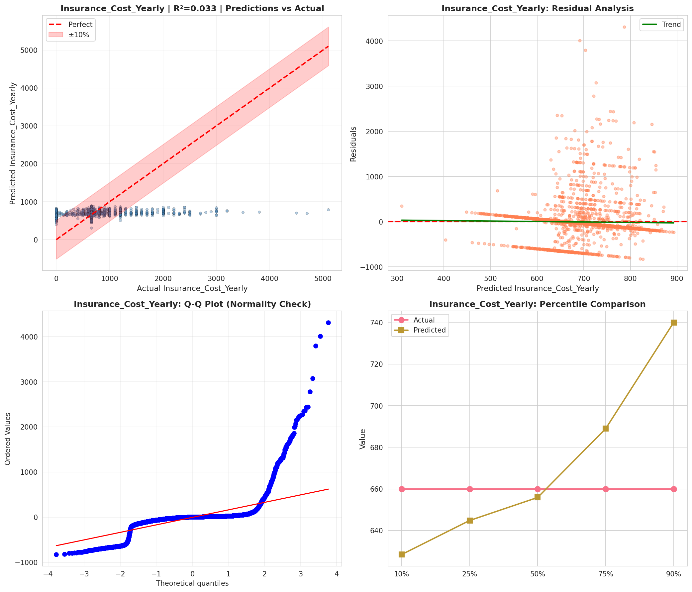
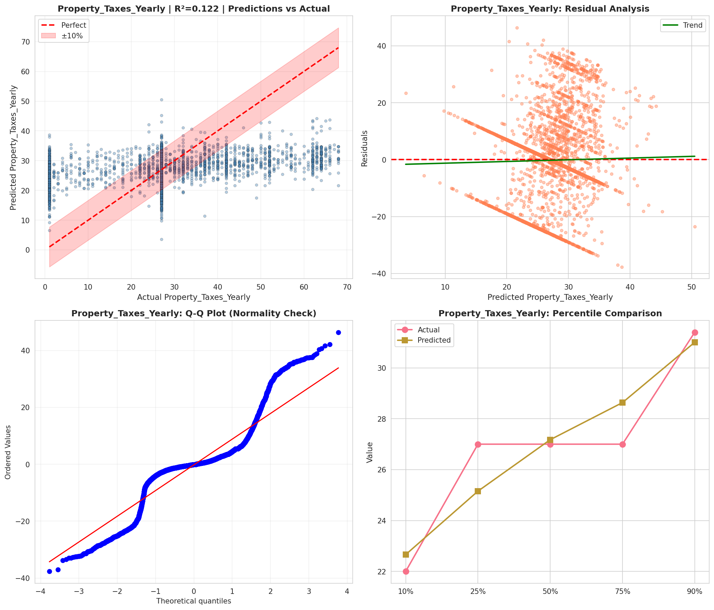
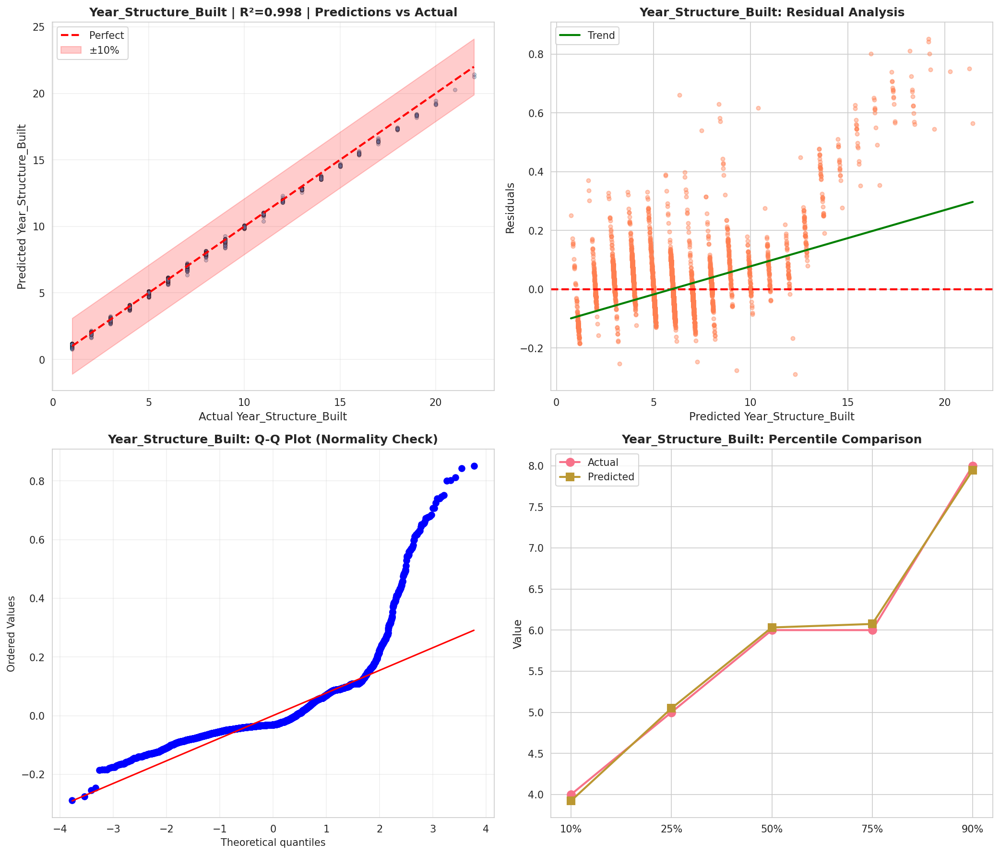
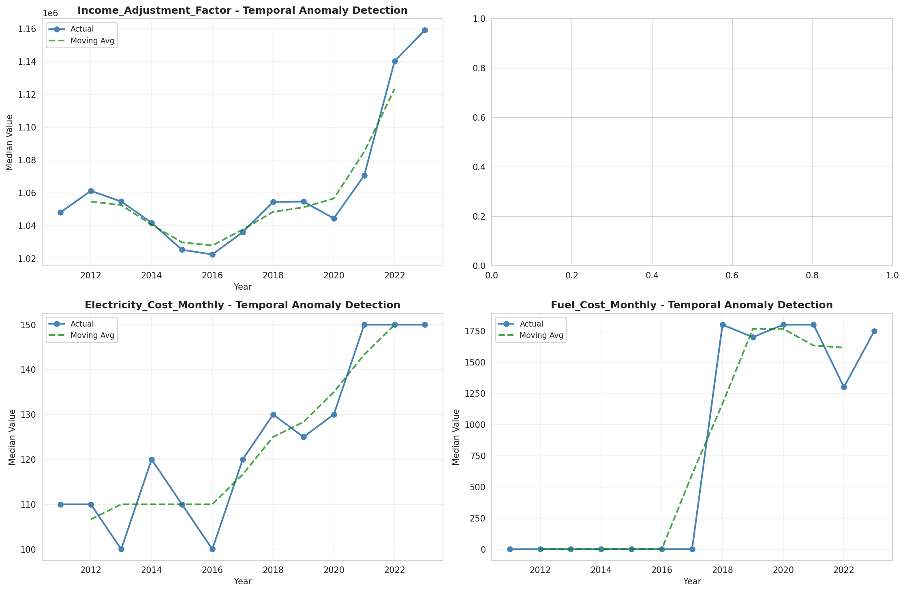
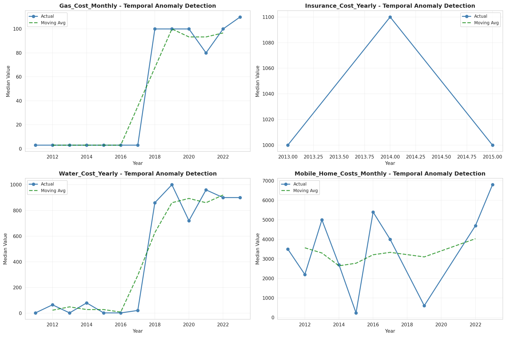
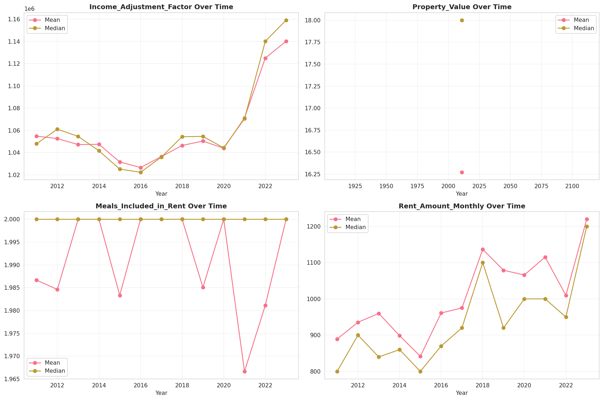
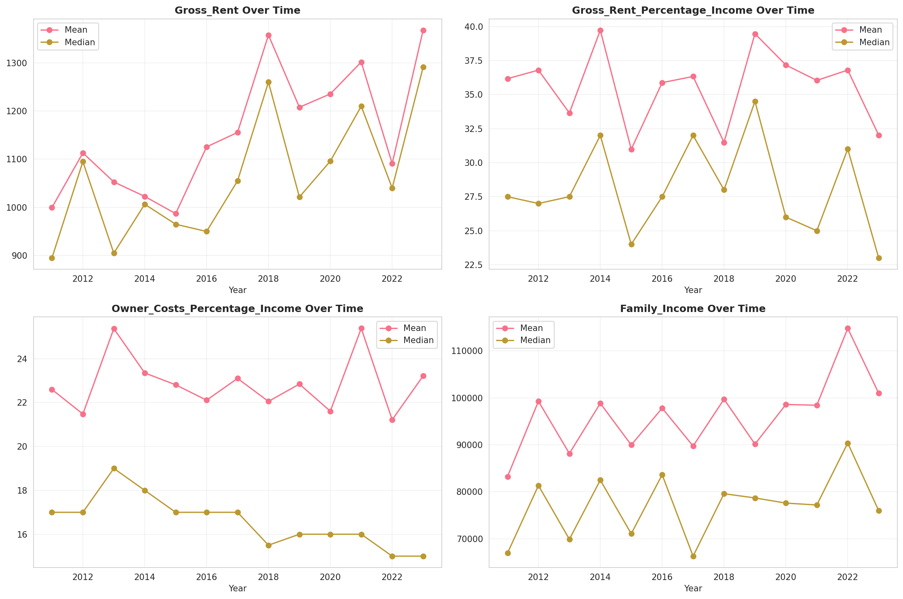
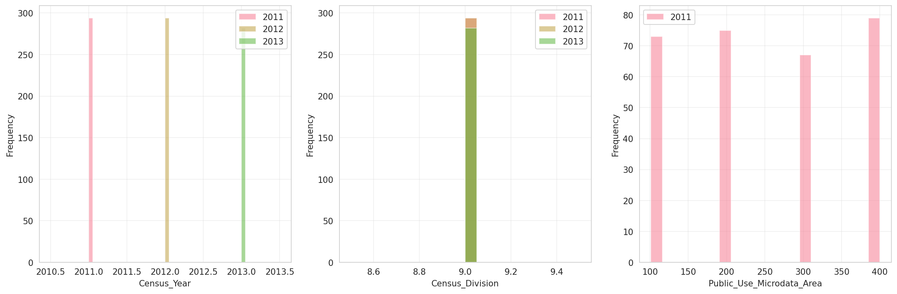
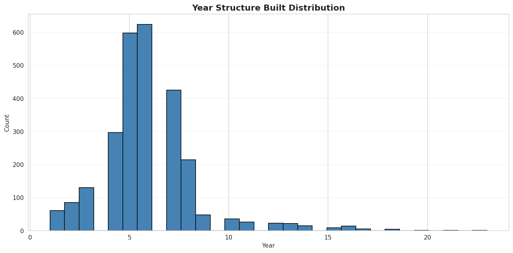
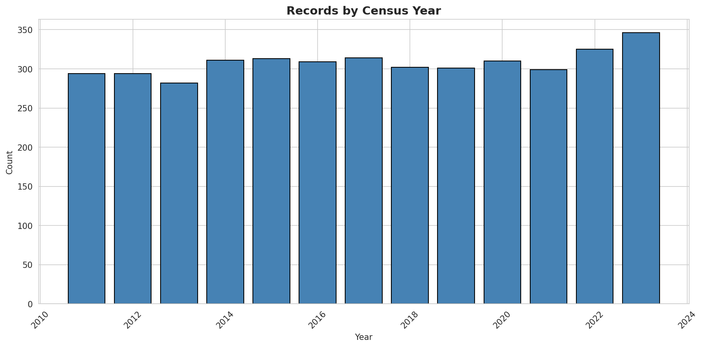
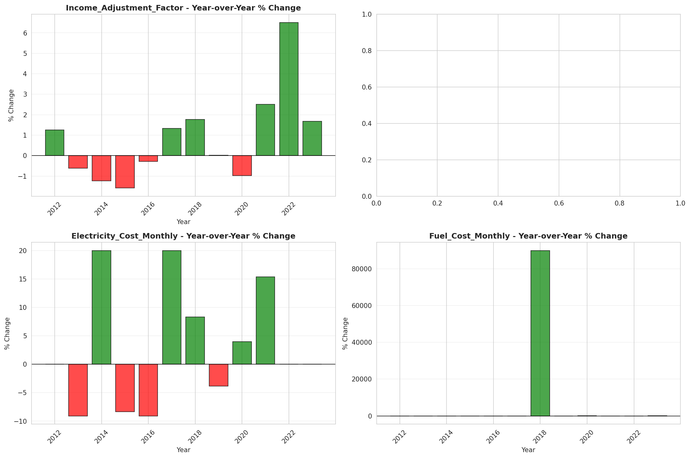
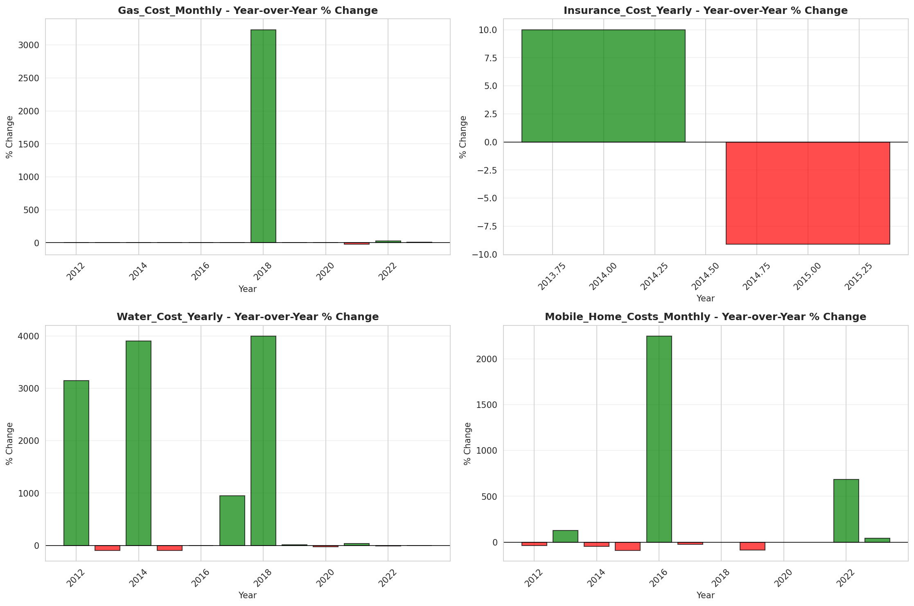
