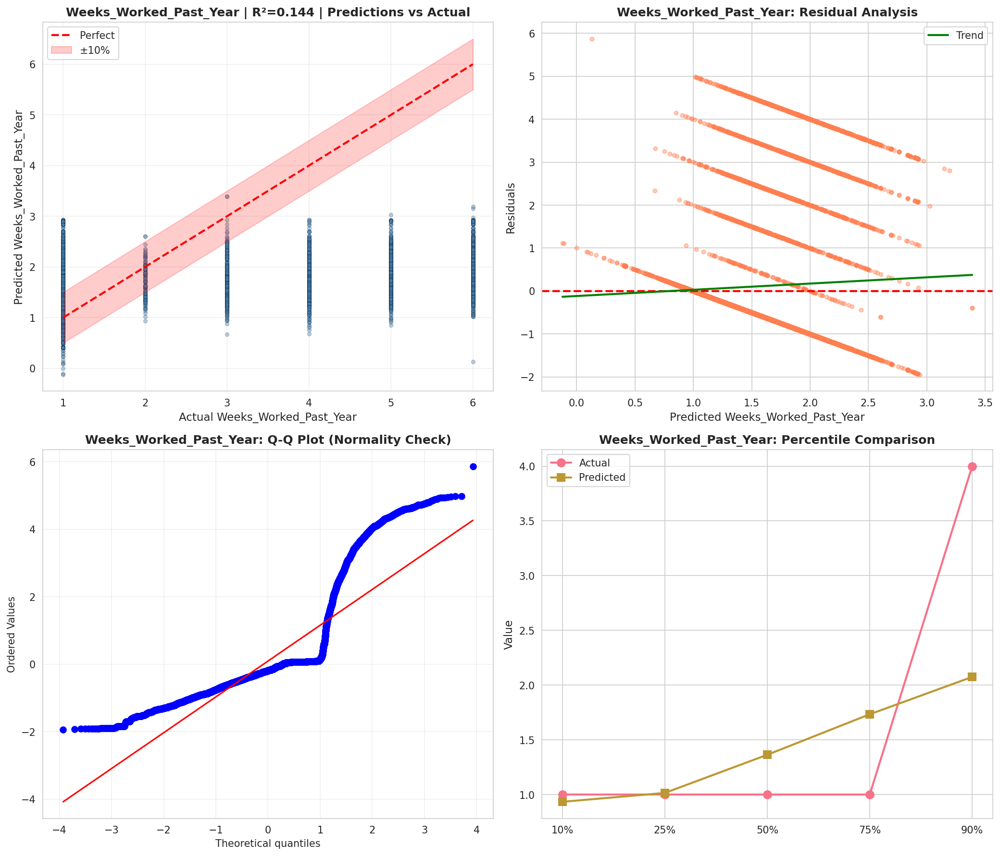
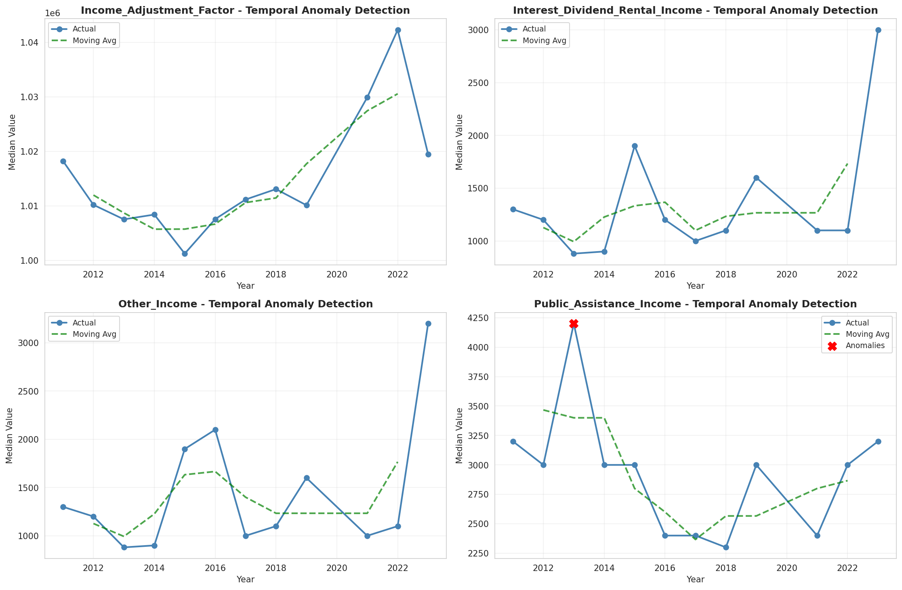
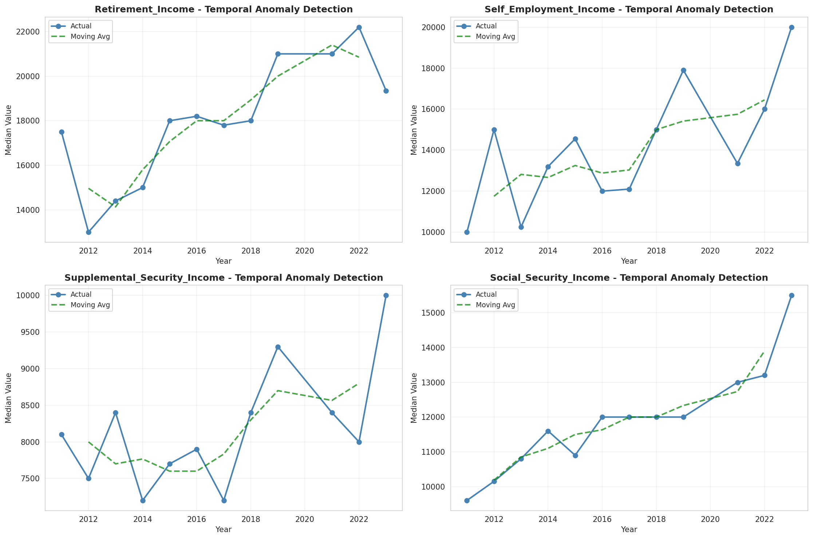
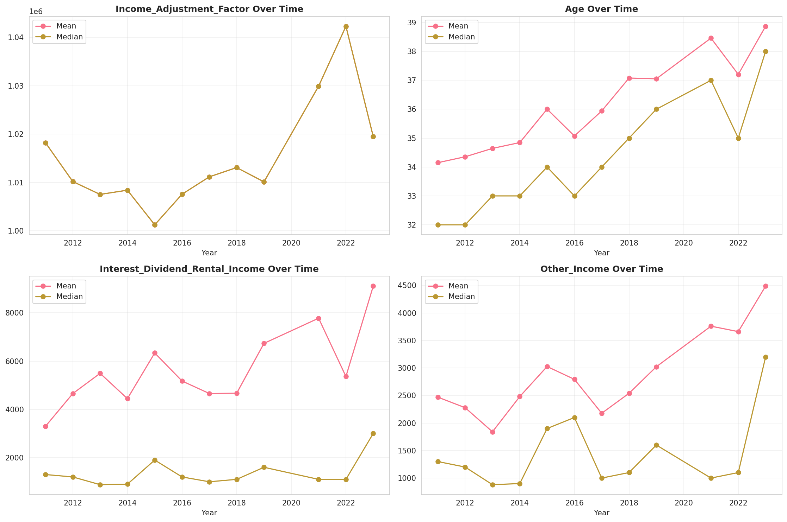
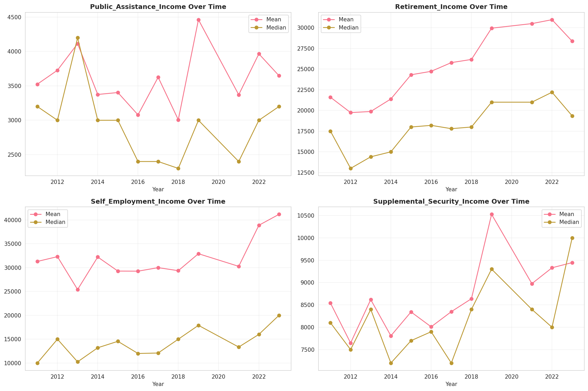
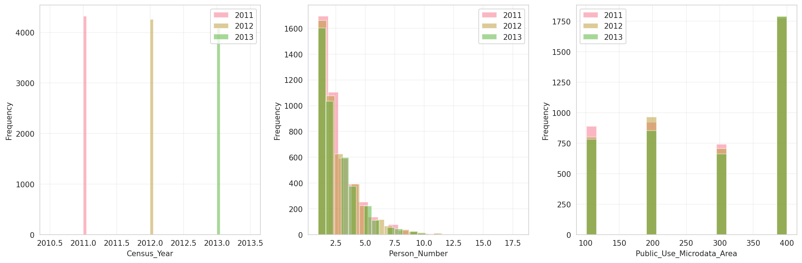
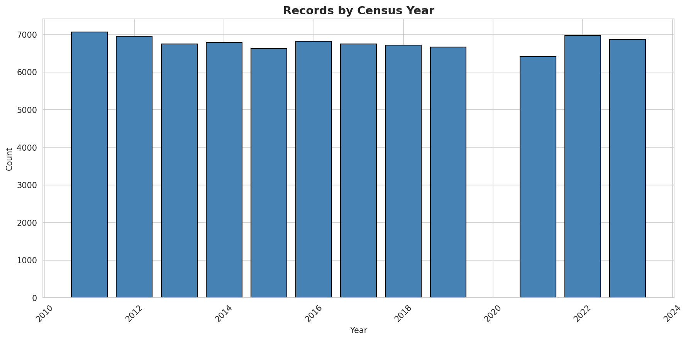
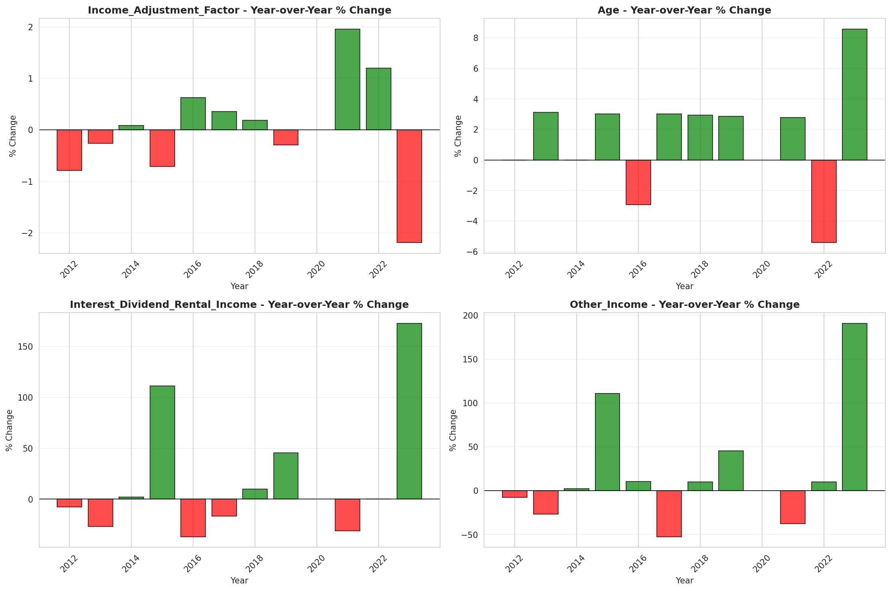
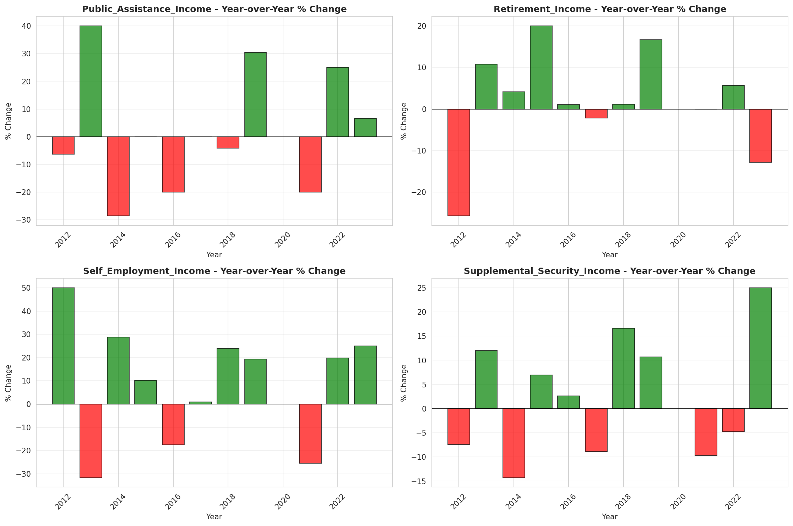

# Temporal Analysis

## Year Distribution

- 2011: 7,060 records

- 2012: 6,946 records

- 2013: 6,748 records

- 2014: 6,787 records

- 2015: 6,619 records

- 2016: 6,815 records

- 2017: 6,746 records

- 2018: 6,711 records

- 2019: 6,663 records

- 2021: 6,411 records

- 2022: 6,972 records

- 2023: 6,868 records

## Temporal Trends

- Census_Year: {np.int64(2011): {'mean': 2011.0, 'median': 2011.0, 'std': 0.0}, np.int64(2012): {'mean': 2012.0, 'median': 2012.0, 'std': 0.0}, np.int64(2013): {'mean': 2013.0, 'median': 2013.0, 'std': 0.0}, np.int64(2014): {'mean': 2014.0, 'median': 2014.0, 'std': 0.0}, np.int64(2015): {'mean': 2015.0, 'median': 2015.0, 'std': 0.0}, np.int64(2016): {'mean': 2016.0, 'median': 2016.0, 'std': 0.0}, np.int64(2017): {'mean': 2017.0, 'median': 2017.0, 'std': 0.0}, np.int64(2018): {'mean': 2018.0, 'median': 2018.0, 'std': 0.0}, np.int64(2019): {'mean': 2019.0, 'median': 2019.0, 'std': 0.0}, np.int64(2021): {'mean': 2021.0, 'median': 2021.0, 'std': 0.0}, np.int64(2022): {'mean': 2022.0, 'median': 2022.0, 'std': 0.0}, np.int64(2023): {'mean': 2023.0, 'median': 2023.0, 'std': 0.0}}

- Person_Number: {np.int64(2011): {'mean': 2.4444759206798867, 'median': 2.0, 'std': 1.78617705414386}, np.int64(2012): {'mean': 2.451626835588828, 'median': 2.0, 'std': 1.7892667198552448}, np.int64(2013): {'mean': 2.4460580912863072, 'median': 2.0, 'std': 1.7680599643484889}, np.int64(2014): {'mean': 2.4234566082216, 'median': 2.0, 'std': 1.7355774133844157}, np.int64(2015): {'mean': 2.3864632119655536, 'median': 2.0, 'std': 1.7618667769467395}, np.int64(2016): {'mean': 2.4848129126925897, 'median': 2.0, 'std': 1.855673684111906}, np.int64(2017): {'mean': 2.422472576341536, 'median': 2.0, 'std': 1.7903436379908733}, np.int64(2018): {'mean': 2.284905379228133, 'median': 2.0, 'std': 1.6366362997873978}, np.int64(2019): {'mean': 2.3618490169593276, 'median': 2.0, 'std': 1.76470032018774}, np.int64(2021): {'mean': 2.2406800811105914, 'median': 2.0, 'std': 1.6243866301816836}, np.int64(2022): {'mean': 2.3327596098680434, 'median': 2.0, 'std': 1.746607577479749}, np.int64(2023): {'mean': 2.2770821199767037, 'median': 2.0, 'std': 1.7133145462761619}}

- Public_Use_Microdata_Area: {np.int64(2011): {'mean': 279.4516997167139, 'median': 300.0, 'std': 117.8508560473237}, np.int64(2012): {'mean': 282.5519723581918, 'median': 300.0, 'std': 116.52912497445249}, np.int64(2013): {'mean': 283.22806757557794, 'median': 300.0, 'std': 117.56638696374279}, np.int64(2014): {'mean': 282.313245911301, 'median': 300.0, 'std': 116.87563704934428}, np.int64(2015): {'mean': 275.55083849524095, 'median': 300.0, 'std': 117.7175959785478}, np.int64(2016): {'mean': 280.51621423330886, 'median': 300.0, 'std': 119.18266064295902}, np.int64(2017): {'mean': 279.8295286095464, 'median': 300.0, 'std': 117.53385075090155}, np.int64(2018): {'mean': 270.41737445984205, 'median': 300.0, 'std': 116.5527492523958}, np.int64(2019): {'mean': 275.4527990394717, 'median': 300.0, 'std': 116.56017814152696}, np.int64(2021): {'mean': 253.5766651068476, 'median': 200.0, 'std': 114.89363124490258}, np.int64(2022): {'mean': 274.7831325301205, 'median': 300.0, 'std': 116.44024074708739}, np.int64(2023): {'mean': 273.1774898078043, 'median': 300.0, 'std': 115.72147774137974}}

- State_Code: {np.int64(2011): {'mean': 2.0, 'median': 2.0, 'std': 0.0}, np.int64(2012): {'mean': 2.0, 'median': 2.0, 'std': 0.0}, np.int64(2013): {'mean': 2.0, 'median': 2.0, 'std': 0.0}, np.int64(2014): {'mean': 2.0, 'median': 2.0, 'std': 0.0}, np.int64(2015): {'mean': 2.0, 'median': 2.0, 'std': 0.0}, np.int64(2016): {'mean': 2.0, 'median': 2.0, 'std': 0.0}, np.int64(2017): {'mean': 2.0, 'median': 2.0, 'std': 0.0}, np.int64(2018): {'mean': 2.0, 'median': 2.0, 'std': 0.0}, np.int64(2019): {'mean': 2.0, 'median': 2.0, 'std': 0.0}, np.int64(2021): {'mean': 2.0, 'median': 2.0, 'std': 0.0}, np.int64(2022): {'mean': 2.0, 'median': 2.0, 'std': 0.0}, np.int64(2023): {'mean': None, 'median': None, 'std': None}}

- Income_Adjustment_Factor: {np.int64(2011): {'mean': 1018237.0, 'median': 1018237.0, 'std': 0.0}, np.int64(2012): {'mean': 1010207.0, 'median': 1010207.0, 'std': 0.0}, np.int64(2013): {'mean': 1007549.0, 'median': 1007549.0, 'std': 0.0}, np.int64(2014): {'mean': 1008425.0, 'median': 1008425.0, 'std': 0.0}, np.int64(2015): {'mean': 1001264.0, 'median': 1001264.0, 'std': 0.0}, np.int64(2016): {'mean': 1007588.0, 'median': 1007588.0, 'std': 0.0}, np.int64(2017): {'mean': 1011189.0, 'median': 1011189.0, 'std': 0.0}, np.int64(2018): {'mean': 1013097.0, 'median': 1013097.0, 'std': 0.0}, np.int64(2019): {'mean': 1010145.0, 'median': 1010145.0, 'std': 0.0}, np.int64(2021): {'mean': 1029928.0, 'median': 1029928.0, 'std': 0.0}, np.int64(2022): {'mean': 1042311.0, 'median': 1042311.0, 'std': 0.0}, np.int64(2023): {'mean': 1019518.0, 'median': 1019518.0, 'std': 0.0}}

- Person_Weight: {np.int64(2011): {'mean': 102.36798866855524, 'median': 52.0, 'std': 132.4026481994954}, np.int64(2012): {'mean': 105.30506766484308, 'median': 54.0, 'std': 133.49992574701702}, np.int64(2013): {'mean': 108.9407231772377, 'median': 53.0, 'std': 139.98986724075098}, np.int64(2014): {'mean': 108.5504641225873, 'median': 55.0, 'std': 138.0221545932653}, np.int64(2015): {'mean': 111.56247167245807, 'median': 61.0, 'std': 126.6965717497296}, np.int64(2016): {'mean': 108.86192223037418, 'median': 59.0, 'std': 130.1995268772641}, np.int64(2017): {'mean': 109.66424547880226, 'median': 56.0, 'std': 137.636464536304}, np.int64(2018): {'mean': 109.88496498286395, 'median': 60.0, 'std': 122.16475718311942}, np.int64(2019): {'mean': 109.79213567462104, 'median': 59.0, 'std': 135.6858054943673}, np.int64(2021): {'mean': 114.28373108719389, 'median': 77.0, 'std': 118.84240465430489}, np.int64(2022): {'mean': 105.21844520940907, 'median': 63.0, 'std': 120.06525882253337}, np.int64(2023): {'mean': 106.7859638905067, 'median': 63.0, 'std': 129.34388503193153}}

- Age: {np.int64(2011): {'mean': 34.15014164305949, 'median': 32.0, 'std': 22.019054613995458}, np.int64(2012): {'mean': 34.354448603512814, 'median': 32.0, 'std': 22.12302582794113}, np.int64(2013): {'mean': 34.6441908713693, 'median': 33.0, 'std': 22.07193697884816}, np.int64(2014): {'mean': 34.845734492411964, 'median': 33.0, 'std': 22.310754002973354}, np.int64(2015): {'mean': 36.00241728357758, 'median': 34.0, 'std': 22.452138280037964}, np.int64(2016): {'mean': 35.07468818782098, 'median': 33.0, 'std': 22.50623298107862}, np.int64(2017): {'mean': 35.94085383931218, 'median': 34.0, 'std': 22.80860969365371}, np.int64(2018): {'mean': 37.077931753836985, 'median': 35.0, 'std': 22.91044653885972}, np.int64(2019): {'mean': 37.05192856070839, 'median': 36.0, 'std': 23.007889059602686}, np.int64(2021): {'mean': 38.460770550616125, 'median': 37.0, 'std': 22.858190255272852}, np.int64(2022): {'mean': 37.20467584624211, 'median': 35.0, 'std': 22.913735952577962}, np.int64(2023): {'mean': 38.86968549796156, 'median': 38.0, 'std': 23.267968009739626}}

- Citizenship_Status: {np.int64(2011): {'mean': 1.203541076487252, 'median': 1.0, 'std': 0.8030709820925236}, np.int64(2012): {'mean': 1.1986754966887416, 'median': 1.0, 'std': 0.7866623788399653}, np.int64(2013): {'mean': 1.17886781268524, 'median': 1.0, 'std': 0.754719997812699}, np.int64(2014): {'mean': 1.2093708560483276, 'median': 1.0, 'std': 0.7985659868541529}, np.int64(2015): {'mean': 1.243088079770358, 'median': 1.0, 'std': 0.8615095720708181}, np.int64(2016): {'mean': 1.2180484225972121, 'median': 1.0, 'std': 0.8221668489813482}, np.int64(2017): {'mean': 1.2254669433738512, 'median': 1.0, 'std': 0.8317339038117569}, np.int64(2018): {'mean': 1.2381165251080315, 'median': 1.0, 'std': 0.8520589416649194}, np.int64(2019): {'mean': 1.209815398469158, 'median': 1.0, 'std': 0.7965210750615007}, np.int64(2021): {'mean': 1.2352207143971299, 'median': 1.0, 'std': 0.8441121361474643}, np.int64(2022): {'mean': 1.2228915662650603, 'median': 1.0, 'std': 0.8302855234787394}, np.int64(2023): {'mean': 1.2268491555037857, 'median': 1.0, 'std': 0.8275306066046721}}

- Class_of_Worker: {np.int64(2011): {'mean': 2.5966915191053124, 'median': 2.0, 'std': 1.8520726653325907}, np.int64(2012): {'mean': 2.6437246963562755, 'median': 2.0, 'std': 1.8666229187894934}, np.int64(2013): {'mean': 2.6030754444978377, 'median': 2.0, 'std': 1.9066334975538237}, np.int64(2014): {'mean': 2.6228049073851336, 'median': 2.0, 'std': 1.8868726191096972}, np.int64(2015): {'mean': 2.6498523622047245, 'median': 2.0, 'std': 1.9417267341645097}, np.int64(2016): {'mean': 2.678867740361152, 'median': 2.0, 'std': 1.9269924656024153}, np.int64(2017): {'mean': 2.6746051642015543, 'median': 2.0, 'std': 1.9287481910651327}, np.int64(2018): {'mean': 2.6693867457962415, 'median': 2.0, 'std': 1.9406842287116224}, np.int64(2019): {'mean': 2.6260737746336535, 'median': 2.0, 'std': 1.9086140199087165}, np.int64(2021): {'mean': 2.6504754561809305, 'median': 2.0, 'std': 1.9499289170622058}, np.int64(2022): {'mean': 2.7085137085137085, 'median': 2.0, 'std': 1.946896558613099}, np.int64(2023): {'mean': 2.6935014548981573, 'median': 2.0, 'std': 1.9163051752939584}}

- English_Speaking_Ability: {np.int64(2011): {'mean': 1.3823924731182795, 'median': 1.0, 'std': 0.6639019192899802}, np.int64(2012): {'mean': 1.3369252873563218, 'median': 1.0, 'std': 0.6305099554357444}, np.int64(2013): {'mean': 1.284476534296029, 'median': 1.0, 'std': 0.5888635605827546}, np.int64(2014): {'mean': 1.2902990517870168, 'median': 1.0, 'std': 0.5810015122338998}, np.int64(2015): {'mean': 1.361154446177847, 'median': 1.0, 'std': 0.6196026851515727}, np.int64(2016): {'mean': 1.352498288843258, 'median': 1.0, 'std': 0.6299942276565964}, np.int64(2017): {'mean': 1.302248126561199, 'median': 1.0, 'std': 0.6132454171987246}, np.int64(2018): {'mean': 1.245643153526971, 'median': 1.0, 'std': 0.572986599598063}, np.int64(2019): {'mean': 1.2292418772563176, 'median': 1.0, 'std': 0.5357773971629034}, np.int64(2021): {'mean': 1.270746887966805, 'median': 1.0, 'std': 0.6014305050283658}, np.int64(2022): {'mean': 1.2468827930174564, 'median': 1.0, 'std': 0.5950963026092624}, np.int64(2023): {'mean': 1.2765410958904109, 'median': 1.0, 'std': 0.6081968137084733}}

- Fertility_Status: {np.int64(2011): {'mean': 1.9138461538461538, 'median': 2.0, 'std': 0.28067746765425683}, np.int64(2012): {'mean': 1.9285714285714286, 'median': 2.0, 'std': 0.2576222802096464}, np.int64(2013): {'mean': 1.9350912778904665, 'median': 2.0, 'std': 0.2464480592847638}, np.int64(2014): {'mean': 1.9269776876267748, 'median': 2.0, 'std': 0.2602611240308359}, np.int64(2015): {'mean': 1.9238900634249472, 'median': 2.0, 'std': 0.2652674181616513}, np.int64(2016): {'mean': 1.932711525649567, 'median': 2.0, 'std': 0.25060442147018125}, np.int64(2017): {'mean': 1.9273504273504274, 'median': 2.0, 'std': 0.25965290663550233}, np.int64(2018): {'mean': 1.9351092896174864, 'median': 2.0, 'std': 0.24641709040302784}, np.int64(2019): {'mean': 1.9377713458755428, 'median': 2.0, 'std': 0.24165782678492573}, np.int64(2021): {'mean': 1.9471014492753622, 'median': 2.0, 'std': 0.22391209199931741}, np.int64(2022): {'mean': 1.94299128101945, 'median': 2.0, 'std': 0.23193707039176584}, np.int64(2023): {'mean': 1.9368794326241134, 'median': 2.0, 'std': 0.2432659692561142}}

- Marital_Status: {np.int64(2011): {'mean': 3.2786118980169974, 'median': 5.0, 'std': 1.8584629291631298}, np.int64(2012): {'mean': 3.2886553412035706, 'median': 5.0, 'std': 1.8603608667361695}, np.int64(2013): {'mean': 3.288974510966212, 'median': 5.0, 'std': 1.856114427583748}, np.int64(2014): {'mean': 3.272285251215559, 'median': 5.0, 'std': 1.8583343485762687}, np.int64(2015): {'mean': 3.188699199274815, 'median': 4.0, 'std': 1.8680124031940482}, np.int64(2016): {'mean': 3.3386647101980924, 'median': 5.0, 'std': 1.8528316982801927}, np.int64(2017): {'mean': 3.2859472279869553, 'median': 5.0, 'std': 1.8491441250316611}, np.int64(2018): {'mean': 3.1668901803009986, 'median': 3.0, 'std': 1.872026524439785}, np.int64(2019): {'mean': 3.1937565661113614, 'median': 4.0, 'std': 1.8642322264751525}, np.int64(2021): {'mean': 3.167056621431914, 'median': 3.0, 'std': 1.8675353692639585}, np.int64(2022): {'mean': 3.269219736087206, 'median': 5.0, 'std': 1.867343289013875}, np.int64(2023): {'mean': 3.2422830518345953, 'median': 4.0, 'std': 1.8509653337191012}}

- Mobility_Status: {np.int64(2011): {'mean': 1.3112009237875288, 'median': 1.0, 'std': 0.7224114302965319}, np.int64(2012): {'mean': 1.2997071742313324, 'median': 1.0, 'std': 0.7109275520305288}, np.int64(2013): {'mean': 1.3662014107759268, 'median': 1.0, 'std': 0.7704451918933674}, np.int64(2014): {'mean': 1.3508535489667566, 'median': 1.0, 'std': 0.7588477797218687}, np.int64(2015): {'mean': 1.3180704441041347, 'median': 1.0, 'std': 0.7288518013438734}, np.int64(2016): {'mean': 1.3291101505440452, 'median': 1.0, 'std': 0.7387927092244155}, np.int64(2017): {'mean': 1.2891330523780855, 'median': 1.0, 'std': 0.6985474926484445}, np.int64(2018): {'mean': 1.3022376776534623, 'median': 1.0, 'std': 0.714375396146095}, np.int64(2019): {'mean': 1.286800486618005, 'median': 1.0, 'std': 0.6977524245517336}, np.int64(2021): {'mean': 1.2481072555205048, 'median': 1.0, 'std': 0.6544142208139822}, np.int64(2022): {'mean': 1.274179494626779, 'median': 1.0, 'std': 0.6824226477583475}, np.int64(2023): {'mean': 1.2793271359008411, 'median': 1.0, 'std': 0.6902331078504715}}

- Military_Service: {np.int64(2011): {'mean': 4.634170071998443, 'median': 5.0, 'std': 0.890921266807935}, np.int64(2012): {'mean': 4.631339144215531, 'median': 5.0, 'std': 0.900973885536251}, np.int64(2013): {'mean': 3.6939646413330625, 'median': 4.0, 'std': 0.751842013039076}, np.int64(2014): {'mean': 3.672559260747288, 'median': 4.0, 'std': 0.7735677030247359}, np.int64(2015): {'mean': 3.682303201127441, 'median': 4.0, 'std': 0.7687349173893915}, np.int64(2016): {'mean': 3.6939869021631275, 'median': 4.0, 'std': 0.759239475926659}, np.int64(2017): {'mean': 3.7070524412296564, 'median': 4.0, 'std': 0.7370100229831748}, np.int64(2018): {'mean': 3.676337972946481, 'median': 4.0, 'std': 0.7807279149130251}, np.int64(2019): {'mean': 3.698504486540379, 'median': 4.0, 'std': 0.7534177919957704}, np.int64(2021): {'mean': 3.656094155196489, 'median': 4.0, 'std': 0.8189089060453487}, np.int64(2022): {'mean': 3.6890677648820667, 'median': 4.0, 'std': 0.7872963409373294}, np.int64(2023): {'mean': 3.672516803584765, 'median': 4.0, 'std': 0.8088671140063425}}

- Travel_Time_To_Work_Minutes: {np.int64(2011): {'mean': 15.241551049448594, 'median': 10.0, 'std': 19.644192560795965}, np.int64(2012): {'mean': 16.917287630402384, 'median': 10.0, 'std': 22.91091530687965}, np.int64(2013): {'mean': 15.969530102790015, 'median': 10.0, 'std': 20.030407210035126}, np.int64(2014): {'mean': 16.393821022727273, 'median': 10.0, 'std': 21.73479953098594}, np.int64(2015): {'mean': 16.22378138847858, 'median': 10.0, 'std': 20.66184536505374}, np.int64(2016): {'mean': 15.058734939759036, 'median': 10.0, 'std': 18.5539051513454}, np.int64(2017): {'mean': 16.984917043740573, 'median': 10.0, 'std': 23.654955520240577}, np.int64(2018): {'mean': 17.50289435600579, 'median': 10.0, 'std': 24.468545674275312}, np.int64(2019): {'mean': 16.387238723872386, 'median': 10.0, 'std': 22.85166267751156}, np.int64(2021): {'mean': 17.402587220697765, 'median': 10.0, 'std': 21.296870274754987}, np.int64(2022): {'mean': 16.389011799410028, 'median': 10.0, 'std': 21.418650991844643}, np.int64(2023): {'mean': 16.047141796585002, 'median': 10.0, 'std': 22.82353731454429}}

- Vehicle_Occupancy: {np.int64(2011): {'mean': 1.2513826043237808, 'median': 1.0, 'std': 0.7289323722672008}, np.int64(2012): {'mean': 1.2509053285049145, 'median': 1.0, 'std': 0.6928019876088266}, np.int64(2013): {'mean': 1.2421383647798743, 'median': 1.0, 'std': 0.765037014596706}, np.int64(2014): {'mean': 1.2546273136568284, 'median': 1.0, 'std': 0.741111729275422}, np.int64(2015): {'mean': 1.2691721686135093, 'median': 1.0, 'std': 0.7501147441476013}, np.int64(2016): {'mean': 1.2765732416710736, 'median': 1.0, 'std': 0.7664776145811327}, np.int64(2017): {'mean': 1.2416, 'median': 1.0, 'std': 0.7192857835523314}, np.int64(2018): {'mean': 1.2447174447174447, 'median': 1.0, 'std': 0.77577972085219}, np.int64(2019): {'mean': 1.2210526315789474, 'median': 1.0, 'std': 0.666400904285506}, np.int64(2021): {'mean': 1.212136409227683, 'median': 1.0, 'std': 0.6776728496608306}, np.int64(2022): {'mean': 1.2597938144329897, 'median': 1.0, 'std': 0.7369507438969444}, np.int64(2023): {'mean': 1.2559339525283797, 'median': 1.0, 'std': 0.8714649098379984}}

- Transportation_To_Work: {np.int64(2011): {'mean': 4.1344537815126055, 'median': 1.0, 'std': 4.567811508766718}, np.int64(2012): {'mean': 4.043933054393306, 'median': 1.0, 'std': 4.484382247535474}, np.int64(2013): {'mean': 4.034965034965035, 'median': 1.0, 'std': 4.461192639634277}, np.int64(2014): {'mean': 3.9498464687819856, 'median': 1.0, 'std': 4.4528484357136175}, np.int64(2015): {'mean': 3.915940006975933, 'median': 1.0, 'std': 4.4424968909216185}, np.int64(2016): {'mean': 4.134438955539873, 'median': 1.0, 'std': 4.556031473534393}, np.int64(2017): {'mean': 4.1112681031437655, 'median': 1.0, 'std': 4.525387770024214}, np.int64(2018): {'mean': 3.8223281143635126, 'median': 1.0, 'std': 4.3882583636357415}, np.int64(2019): {'mean': None, 'median': None, 'std': None}, np.int64(2021): {'mean': None, 'median': None, 'std': None}, np.int64(2022): {'mean': None, 'median': None, 'std': None}, np.int64(2023): {'mean': None, 'median': None, 'std': None}}

- Language_Other_Than_English: {np.int64(2011): {'mean': 1.7694095769409577, 'median': 2.0, 'std': 0.42124337154070307}, np.int64(2012): {'mean': 1.7813040062843677, 'median': 2.0, 'std': 0.41339437007372154}, np.int64(2013): {'mean': 1.7771161892500804, 'median': 2.0, 'std': 0.4162144828723211}, np.int64(2014): {'mean': 1.7800769971126083, 'median': 2.0, 'std': 0.4142274733207342}, np.int64(2015): {'mean': 1.7906255103707334, 'median': 2.0, 'std': 0.40689538260352703}, np.int64(2016): {'mean': 1.7675787464206172, 'median': 2.0, 'std': 0.4224097533966297}, np.int64(2017): {'mean': 1.8085750717245777, 'median': 2.0, 'std': 0.3934540625499173}, np.int64(2018): {'mean': 1.8074772327847899, 'median': 2.0, 'std': 0.3943128108014904}, np.int64(2019): {'mean': 1.8206248988181966, 'median': 2.0, 'std': 0.38369715714606173}, np.int64(2021): {'mean': 1.841133816743573, 'median': 2.0, 'std': 0.3655813786434956}, np.int64(2022): {'mean': 1.8155756553732945, 'median': 2.0, 'std': 0.38785959829226746}, np.int64(2023): {'mean': 1.8193907530539664, 'median': 2.0, 'std': 0.3847238414819306}}

- Grandparents_Living_With_Grandchildren: {np.int64(2011): {'mean': 1.9357048748353096, 'median': 2.0, 'std': 0.24531025048517346}, np.int64(2012): {'mean': 1.9327820752200586, 'median': 2.0, 'std': 0.25043243440835833}, np.int64(2013): {'mean': 1.9433757789217014, 'median': 2.0, 'std': 0.2311544831196163}, np.int64(2014): {'mean': 1.940940673436665, 'median': 2.0, 'std': 0.23576720972129578}, np.int64(2015): {'mean': 1.93293991416309, 'median': 2.0, 'std': 0.250159583378484}, np.int64(2016): {'mean': 1.9364737550471063, 'median': 2.0, 'std': 0.24393990879659982}, np.int64(2017): {'mean': 1.9431578947368422, 'median': 2.0, 'std': 0.2315711385840225}, np.int64(2018): {'mean': 1.9506267587618318, 'median': 2.0, 'std': 0.216673797219444}, np.int64(2019): {'mean': 1.945602440264362, 'median': 2.0, 'std': 0.22682932772178052}, np.int64(2021): {'mean': 1.9540436456996149, 'median': 2.0, 'std': 0.20941735187813465}, np.int64(2022): {'mean': 1.948806300762983, 'median': 2.0, 'std': 0.22041974111776266}, np.int64(2023): {'mean': 1.948296402192042, 'median': 2.0, 'std': 0.22145433118304883}}

- Months_Responsible_For_Grandchildren: {np.int64(2011): {'mean': 3.658119658119658, 'median': 4.0, 'std': 1.4090984716476995}, np.int64(2012): {'mean': 3.6911764705882355, 'median': 4.0, 'std': 1.2620659481644925}, np.int64(2013): {'mean': 3.6814159292035398, 'median': 4.0, 'std': 1.4776035540557828}, np.int64(2014): {'mean': 3.7142857142857144, 'median': 4.0, 'std': 1.4329231539524976}, np.int64(2015): {'mean': 3.682170542635659, 'median': 4.0, 'std': 1.4576548809433543}, np.int64(2016): {'mean': 4.007352941176471, 'median': 5.0, 'std': 1.308073638936346}, np.int64(2017): {'mean': 4.026315789473684, 'median': 5.0, 'std': 1.2007411156565484}, np.int64(2018): {'mean': 3.980769230769231, 'median': 4.0, 'std': 1.1985490356630064}, np.int64(2019): {'mean': 3.732142857142857, 'median': 4.0, 'std': 1.4703198331793024}, np.int64(2021): {'mean': 4.261363636363637, 'median': 5.0, 'std': 1.12948282521497}, np.int64(2022): {'mean': 3.855769230769231, 'median': 5.0, 'std': 1.3611693233433717}, np.int64(2023): {'mean': 4.169491525423729, 'median': 5.0, 'std': 1.2763803303838621}}

- Grandparents_Responsible_For_Grandchildren: {np.int64(2011): {'mean': 1.5204918032786885, 'median': 2.0, 'std': 0.500606796339793}, np.int64(2012): {'mean': 1.4603174603174602, 'median': 1.0, 'std': 0.4994146956785111}, np.int64(2013): {'mean': 1.4593301435406698, 'median': 1.0, 'std': 0.4995397218945257}, np.int64(2014): {'mean': 1.4615384615384615, 'median': 1.0, 'std': 0.49965022730941455}, np.int64(2015): {'mean': 1.484, 'median': 1.0, 'std': 0.5007464307928786}, np.int64(2016): {'mean': 1.423728813559322, 'median': 1.0, 'std': 0.4951987292634325}, np.int64(2017): {'mean': 1.4722222222222223, 'median': 1.0, 'std': 0.5003874467842143}, np.int64(2018): {'mean': 1.461139896373057, 'median': 1.0, 'std': 0.4997840639070094}, np.int64(2019): {'mean': 1.4766355140186915, 'median': 1.0, 'std': 0.5006248563624769}, np.int64(2021): {'mean': 1.5083798882681565, 'median': 2.0, 'std': 0.501332102848057}, np.int64(2022): {'mean': 1.5, 'median': 1.5, 'std': 0.5012062743707414}, np.int64(2023): {'mean': 1.456221198156682, 'median': 1.0, 'std': 0.49923136003746216}}

- Interest_Dividend_Rental_Income: {np.int64(2011): {'mean': 3298.024134790528, 'median': 1300.0, 'std': 11060.293889452361}, np.int64(2012): {'mean': 4654.43179377014, 'median': 1200.0, 'std': 18006.156447481993}, np.int64(2013): {'mean': 5493.2271762208065, 'median': 880.0, 'std': 20827.65341977791}, np.int64(2014): {'mean': 4444.391350774159, 'median': 900.0, 'std': 12894.837888470971}, np.int64(2015): {'mean': 6337.109181141439, 'median': 1900.0, 'std': 23662.319174564385}, np.int64(2016): {'mean': 5174.904314159292, 'median': 1200.0, 'std': 17696.33099792986}, np.int64(2017): {'mean': 4657.10654407788, 'median': 1000.0, 'std': 15723.039785531564}, np.int64(2018): {'mean': 4668.6932391523715, 'median': 1100.0, 'std': 14280.153857808056}, np.int64(2019): {'mean': 6734.8845208845205, 'median': 1600.0, 'std': 22149.086803701113}, np.int64(2021): {'mean': 7777.130919220056, 'median': 1100.0, 'std': 24662.80557390118}, np.int64(2022): {'mean': 5362.102464958917, 'median': 1100.0, 'std': 17785.83800219076}, np.int64(2023): {'mean': 9105.939582407818, 'median': 3000.0, 'std': 31620.15410804938}}

- Military_Service_Period_1: {np.int64(2011): {'mean': 0.3125, 'median': 0.0, 'std': 0.4638276128280515}, np.int64(2012): {'mean': 0.35497237569060774, 'median': 0.0, 'std': 0.4788357529995451}, np.int64(2013): {'mean': 0.3713355048859935, 'median': 0.0, 'std': 0.4835558625895127}, np.int64(2014): {'mean': 0.4105263157894737, 'median': 0.0, 'std': 0.49229961336720185}, np.int64(2015): {'mean': 0.4303599374021909, 'median': 0.0, 'std': 0.4955143890347027}, np.int64(2016): {'mean': 0.4456692913385827, 'median': 0.0, 'std': 0.49743124146568235}, np.int64(2017): {'mean': 0.4197324414715719, 'median': 0.0, 'std': 0.4939282209203071}, np.int64(2018): {'mean': 0.4283667621776504, 'median': 0.0, 'std': 0.49519692778406366}, np.int64(2019): {'mean': 0.4170692431561997, 'median': 0.0, 'std': 0.4934720079366275}, np.int64(2021): {'mean': 0.5105189340813464, 'median': 1.0, 'std': 0.5002402624907756}, np.int64(2022): {'mean': 0.5082458770614693, 'median': 1.0, 'std': 0.5003071844307612}, np.int64(2023): {'mean': 0.5612813370473537, 'median': 1.0, 'std': 0.4965763134750652}}

- Military_Service_Period_2: {np.int64(2011): {'mean': 0.23505434782608695, 'median': 0.0, 'std': 0.4243211430231167}, np.int64(2012): {'mean': 0.2223756906077348, 'median': 0.0, 'std': 0.4161296907442272}, np.int64(2013): {'mean': 0.21986970684039087, 'median': 0.0, 'std': 0.41449588001059057}, np.int64(2014): {'mean': 0.22706766917293233, 'median': 0.0, 'std': 0.41925202680518064}, np.int64(2015): {'mean': 0.2535211267605634, 'median': 0.0, 'std': 0.4353674221442839}, np.int64(2016): {'mean': 0.2503937007874016, 'median': 0.0, 'std': 0.4335813037521475}, np.int64(2017): {'mean': 0.24581939799331104, 'median': 0.0, 'std': 0.43093243240458184}, np.int64(2018): {'mean': 0.2177650429799427, 'median': 0.0, 'std': 0.4130227889590308}, np.int64(2019): {'mean': 0.24154589371980675, 'median': 0.0, 'std': 0.4283654528516753}, np.int64(2021): {'mean': 0.20757363253856942, 'median': 0.0, 'std': 0.405854457197868}, np.int64(2022): {'mean': 0.20539730134932535, 'median': 0.0, 'std': 0.40429482915515413}, np.int64(2023): {'mean': 0.20612813370473537, 'median': 0.0, 'std': 0.40480557554363344}}

- Military_Service_Period_3: {np.int64(2011): {'mean': 0.21875, 'median': 0.0, 'std': 0.4136797703308108}, np.int64(2012): {'mean': 0.21132596685082872, 'median': 0.0, 'std': 0.40853130166776164}, np.int64(2013): {'mean': None, 'median': None, 'std': None}, np.int64(2014): {'mean': None, 'median': None, 'std': None}, np.int64(2015): {'mean': None, 'median': None, 'std': None}, np.int64(2016): {'mean': None, 'median': None, 'std': None}, np.int64(2017): {'mean': None, 'median': None, 'std': None}, np.int64(2018): {'mean': None, 'median': None, 'std': None}, np.int64(2019): {'mean': None, 'median': None, 'std': None}, np.int64(2021): {'mean': None, 'median': None, 'std': None}, np.int64(2022): {'mean': None, 'median': None, 'std': None}, np.int64(2023): {'mean': None, 'median': None, 'std': None}}

- Military_Service_Period_4: {np.int64(2011): {'mean': 0.12907608695652173, 'median': 0.0, 'std': 0.33551214124676193}, np.int64(2012): {'mean': 0.12569060773480664, 'median': 0.0, 'std': 0.3317295193254356}, np.int64(2013): {'mean': None, 'median': None, 'std': None}, np.int64(2014): {'mean': None, 'median': None, 'std': None}, np.int64(2015): {'mean': None, 'median': None, 'std': None}, np.int64(2016): {'mean': None, 'median': None, 'std': None}, np.int64(2017): {'mean': None, 'median': None, 'std': None}, np.int64(2018): {'mean': None, 'median': None, 'std': None}, np.int64(2019): {'mean': None, 'median': None, 'std': None}, np.int64(2021): {'mean': None, 'median': None, 'std': None}, np.int64(2022): {'mean': None, 'median': None, 'std': None}, np.int64(2023): {'mean': None, 'median': None, 'std': None}}

- Military_Service_Period_5: {np.int64(2011): {'mean': 0.2595108695652174, 'median': 0.0, 'std': 0.43866436724741625}, np.int64(2012): {'mean': 0.27209944751381215, 'median': 0.0, 'std': 0.4453484949296117}, np.int64(2013): {'mean': 0.30130293159609123, 'median': 0.0, 'std': 0.45919810531636424}, np.int64(2014): {'mean': 0.2586466165413534, 'median': 0.0, 'std': 0.4382206318981522}, np.int64(2015): {'mean': 0.29577464788732394, 'median': 0.0, 'std': 0.4567477225473462}, np.int64(2016): {'mean': 0.2551181102362205, 'median': 0.0, 'std': 0.43627124181873755}, np.int64(2017): {'mean': 0.28929765886287623, 'median': 0.0, 'std': 0.45381595347233067}, np.int64(2018): {'mean': 0.2851002865329513, 'median': 0.0, 'std': 0.4517859394911142}, np.int64(2019): {'mean': 0.27053140096618356, 'median': 0.0, 'std': 0.44459246405335534}, np.int64(2021): {'mean': 0.22720897615708274, 'median': 0.0, 'std': 0.4193228655073474}, np.int64(2022): {'mean': 0.24287856071964017, 'median': 0.0, 'std': 0.4291441184725091}, np.int64(2023): {'mean': 0.21448467966573817, 'median': 0.0, 'std': 0.41075051105410465}}

- Military_Service_Period_6: {np.int64(2011): {'mean': 0.059782608695652176, 'median': 0.0, 'std': 0.23724485820508323}, np.int64(2012): {'mean': 0.0649171270718232, 'median': 0.0, 'std': 0.24654990048034134}, np.int64(2013): {'mean': None, 'median': None, 'std': None}, np.int64(2014): {'mean': None, 'median': None, 'std': None}, np.int64(2015): {'mean': None, 'median': None, 'std': None}, np.int64(2016): {'mean': None, 'median': None, 'std': None}, np.int64(2017): {'mean': None, 'median': None, 'std': None}, np.int64(2018): {'mean': None, 'median': None, 'std': None}, np.int64(2019): {'mean': None, 'median': None, 'std': None}, np.int64(2021): {'mean': None, 'median': None, 'std': None}, np.int64(2022): {'mean': None, 'median': None, 'std': None}, np.int64(2023): {'mean': None, 'median': None, 'std': None}}

- Military_Service_Period_7: {np.int64(2011): {'mean': 0.07608695652173914, 'median': 0.0, 'std': 0.26531749799287796}, np.int64(2012): {'mean': 0.08011049723756906, 'median': 0.0, 'std': 0.271651857890183}, np.int64(2013): {'mean': None, 'median': None, 'std': None}, np.int64(2014): {'mean': None, 'median': None, 'std': None}, np.int64(2015): {'mean': None, 'median': None, 'std': None}, np.int64(2016): {'mean': None, 'median': None, 'std': None}, np.int64(2017): {'mean': None, 'median': None, 'std': None}, np.int64(2018): {'mean': None, 'median': None, 'std': None}, np.int64(2019): {'mean': None, 'median': None, 'std': None}, np.int64(2021): {'mean': None, 'median': None, 'std': None}, np.int64(2022): {'mean': None, 'median': None, 'std': None}, np.int64(2023): {'mean': None, 'median': None, 'std': None}}

- Military_Service_Period_8: {np.int64(2011): {'mean': 0.06521739130434782, 'median': 0.0, 'std': 0.2470769667667442}, np.int64(2012): {'mean': 0.062154696132596686, 'median': 0.0, 'std': 0.24160321675961516}, np.int64(2013): {'mean': 0.029315960912052116, 'median': 0.0, 'std': 0.1688281881147016}, np.int64(2014): {'mean': 0.04360902255639098, 'median': 0.0, 'std': 0.20437731740650192}, np.int64(2015): {'mean': 0.028169014084507043, 'median': 0.0, 'std': 0.1655851112561637}, np.int64(2016): {'mean': 0.029921259842519685, 'median': 0.0, 'std': 0.17050442912640895}, np.int64(2017): {'mean': 0.030100334448160536, 'median': 0.0, 'std': 0.17100645016062374}, np.int64(2018): {'mean': 0.04154727793696275, 'median': 0.0, 'std': 0.19969535240727948}, np.int64(2019): {'mean': 0.030595813204508857, 'median': 0.0, 'std': 0.1723587759873625}, np.int64(2021): {'mean': 0.03506311360448808, 'median': 0.0, 'std': 0.18406849512808768}, np.int64(2022): {'mean': 0.01649175412293853, 'median': 0.0, 'std': 0.12745246246016068}, np.int64(2023): {'mean': 0.016713091922005572, 'median': 0.0, 'std': 0.12828361023149062}}

- Military_Service_Period_9: {np.int64(2011): {'mean': 0.019021739130434784, 'median': 0.0, 'std': 0.13669418497887662}, np.int64(2012): {'mean': 0.017955801104972375, 'median': 0.0, 'std': 0.13288257790195476}, np.int64(2013): {'mean': 0.013029315960912053, 'median': 0.0, 'std': 0.11349242683958764}, np.int64(2014): {'mean': 0.016541353383458645, 'median': 0.0, 'std': 0.1276410459673356}, np.int64(2015): {'mean': 0.004694835680751174, 'median': 0.0, 'std': 0.068411390334651}, np.int64(2016): {'mean': 0.014173228346456693, 'median': 0.0, 'std': 0.11829787127583555}, np.int64(2017): {'mean': 0.005016722408026756, 'median': 0.0, 'std': 0.07071008391876552}, np.int64(2018): {'mean': 0.0028653295128939827, 'median': 0.0, 'std': 0.053490359567659414}, np.int64(2019): {'mean': 0.004830917874396135, 'median': 0.0, 'std': 0.06939260960901883}, np.int64(2021): {'mean': None, 'median': None, 'std': None}, np.int64(2022): {'mean': None, 'median': None, 'std': None}, np.int64(2023): {'mean': None, 'median': None, 'std': None}}

- Military_Service_Period_10: {np.int64(2011): {'mean': 0.029891304347826088, 'median': 0.0, 'std': 0.1704032484454017}, np.int64(2012): {'mean': 0.024861878453038673, 'median': 0.0, 'std': 0.1558117377859401}, np.int64(2013): {'mean': 0.029315960912052116, 'median': 0.0, 'std': 0.16882818811470152}, np.int64(2014): {'mean': 0.02706766917293233, 'median': 0.0, 'std': 0.16240280668389342}, np.int64(2015): {'mean': 0.010954616588419406, 'median': 0.0, 'std': 0.10417098979946877}, np.int64(2016): {'mean': 0.012598425196850394, 'median': 0.0, 'std': 0.11162135039957169}, np.int64(2017): {'mean': 0.013377926421404682, 'median': 0.0, 'std': 0.11498289573937069}, np.int64(2018): {'mean': 0.004297994269340974, 'median': 0.0, 'std': 0.06546496338264847}, np.int64(2019): {'mean': 0.008051529790660225, 'median': 0.0, 'std': 0.08944039600299235}, np.int64(2021): {'mean': 0.001402524544179523, 'median': 0.0, 'std': 0.03745029431365692}, np.int64(2022): {'mean': 0.0, 'median': 0.0, 'std': 0.0}, np.int64(2023): {'mean': 0.0, 'median': 0.0, 'std': 0.0}}

- Military_Service_Period_11: {np.int64(2011): {'mean': 0.0, 'median': 0.0, 'std': 0.0}, np.int64(2012): {'mean': 0.0, 'median': 0.0, 'std': 0.0}, np.int64(2013): {'mean': 0.0, 'median': 0.0, 'std': 0.0}, np.int64(2014): {'mean': 0.0, 'median': 0.0, 'std': 0.0}, np.int64(2015): {'mean': 0.0, 'median': 0.0, 'std': 0.0}, np.int64(2016): {'mean': 0.0, 'median': 0.0, 'std': 0.0}, np.int64(2017): {'mean': 0.0, 'median': 0.0, 'std': 0.0}, np.int64(2018): {'mean': 0.0, 'median': 0.0, 'std': 0.0}, np.int64(2019): {'mean': 0.0, 'median': 0.0, 'std': 0.0}, np.int64(2021): {'mean': None, 'median': None, 'std': None}, np.int64(2022): {'mean': None, 'median': None, 'std': None}, np.int64(2023): {'mean': None, 'median': None, 'std': None}}

- Temporary_Absence_From_Work: {np.int64(2011): {'mean': 2.5408182683158897, 'median': 3.0, 'std': 0.5429750838236154}, np.int64(2012): {'mean': 2.5377157261974017, 'median': 3.0, 'std': 0.541868855290024}, np.int64(2013): {'mean': 2.5864393338620144, 'median': 3.0, 'std': 0.5278882105210251}, np.int64(2014): {'mean': 2.5965707528577058, 'median': 3.0, 'std': 0.5240482029755775}, np.int64(2015): {'mean': 2.591304347826087, 'median': 3.0, 'std': 0.5262091829595381}, np.int64(2016): {'mean': 2.578393135725429, 'median': 3.0, 'std': 0.5296892449390409}, np.int64(2017): {'mean': 2.5795902285263987, 'median': 3.0, 'std': 0.5361503993969091}, np.int64(2018): {'mean': 2.594074644093882, 'median': 3.0, 'std': 0.5237293003396587}, np.int64(2019): {'mean': 2.5956820412168793, 'median': 3.0, 'std': 0.52295275578904}, np.int64(2021): {'mean': 2.60270217348737, 'median': 3.0, 'std': 0.5207941429841573}, np.int64(2022): {'mean': 2.59316427783903, 'median': 3.0, 'std': 0.5256280253313291}, np.int64(2023): {'mean': 2.586522614905695, 'median': 3.0, 'std': 0.5214041454261686}}

- Available_For_Work: {np.int64(2011): {'mean': 4.574119885823026, 'median': 5.0, 'std': 1.1950029429202709}, np.int64(2012): {'mean': 4.5873569904983515, 'median': 5.0, 'std': 1.1802203312150836}, np.int64(2013): {'mean': 4.641157811260904, 'median': 5.0, 'std': 1.1216414947516922}, np.int64(2014): {'mean': 4.681907765076862, 'median': 5.0, 'std': 1.061540183030328}, np.int64(2015): {'mean': 4.694861660079051, 'median': 5.0, 'std': 1.0340005925399698}, np.int64(2016): {'mean': 4.642940717628705, 'median': 5.0, 'std': 1.110021767075643}, np.int64(2017): {'mean': 4.7023246650906225, 'median': 5.0, 'std': 1.02107955706813}, np.int64(2018): {'mean': 4.726818006925741, 'median': 5.0, 'std': 0.9824397743887667}, np.int64(2019): {'mean': 4.763297350343474, 'median': 5.0, 'std': 0.9110990145498722}, np.int64(2021): {'mean': 4.768552966516546, 'median': 5.0, 'std': 0.904836377062882}, np.int64(2022): {'mean': 4.77122381477398, 'median': 5.0, 'std': 0.8947737379696569}, np.int64(2023): {'mean': 4.779161325764512, 'median': 5.0, 'std': 0.8824363292902689}}

- On_Layoff_From_Work: {np.int64(2011): {'mean': 2.5294005708848717, 'median': 3.0, 'std': 0.5255568967597021}, np.int64(2012): {'mean': 2.526081054876866, 'median': 3.0, 'std': 0.5269579283826278}, np.int64(2013): {'mean': 2.5691911181601905, 'median': 3.0, 'std': 0.5274259455612494}, np.int64(2014): {'mean': 2.5875049270792276, 'median': 3.0, 'std': 0.5134976502937952}, np.int64(2015): {'mean': 2.5812252964426876, 'median': 3.0, 'std': 0.5176498206872027}, np.int64(2016): {'mean': 2.5651326053042123, 'median': 3.0, 'std': 0.5214804116591314}, np.int64(2017): {'mean': 2.576635145784082, 'median': 3.0, 'std': 0.5156064731275515}, np.int64(2018): {'mean': 2.5888803385917663, 'median': 3.0, 'std': 0.5105086341406513}, np.int64(2019): {'mean': 2.590186457311089, 'median': 3.0, 'std': 0.5094916369138073}, np.int64(2021): {'mean': 2.5874290189935385, 'median': 3.0, 'std': 0.5201977958164594}, np.int64(2022): {'mean': 2.593531789783168, 'median': 3.0, 'std': 0.504872840428978}, np.int64(2023): {'mean': 2.579747299029482, 'median': 3.0, 'std': 0.5115014262192209}}

- Looking_For_Work: {np.int64(2011): {'mean': 2.5059942911512847, 'median': 3.0, 'std': 0.6276161356045973}, np.int64(2012): {'mean': 2.5039751793678495, 'median': 3.0, 'std': 0.6257917419328319}, np.int64(2013): {'mean': 2.5446074544012687, 'median': 3.0, 'std': 0.6267491206170712}, np.int64(2014): {'mean': 2.5607016160819867, 'median': 3.0, 'std': 0.6113139062273366}, np.int64(2015): {'mean': 2.5632411067193677, 'median': 3.0, 'std': 0.6025515434322185}, np.int64(2016): {'mean': 2.5397815912636506, 'median': 3.0, 'std': 0.6233047311425445}, np.int64(2017): {'mean': 2.5585106382978724, 'median': 3.0, 'std': 0.6010864286149942}, np.int64(2018): {'mean': 2.5715659869180456, 'median': 3.0, 'std': 0.5909453153738208}, np.int64(2019): {'mean': 2.575269872423945, 'median': 3.0, 'std': 0.5771605087251251}, np.int64(2021): {'mean': 2.5795966320736246, 'median': 3.0, 'std': 0.5797864811307126}, np.int64(2022): {'mean': 2.5804851157662623, 'median': 3.0, 'std': 0.5712024930378312}, np.int64(2023): {'mean': 2.5630836843069034, 'median': 3.0, 'std': 0.5737732048594638}}

- Informed_Of_Recall: {np.int64(2011): {'mean': 2.9347288296860135, 'median': 3.0, 'std': 0.2809156234046805}, np.int64(2012): {'mean': 2.937948419623812, 'median': 3.0, 'std': 0.28545809762610375}, np.int64(2013): {'mean': 2.9565820777160985, 'median': 3.0, 'std': 0.24773071797770474}, np.int64(2014): {'mean': 2.9647221127315726, 'median': 3.0, 'std': 0.21508517338799665}, np.int64(2015): {'mean': 2.9620553359683797, 'median': 3.0, 'std': 0.22526460885359376}, np.int64(2016): {'mean': 2.9631435257410295, 'median': 3.0, 'std': 0.22779123890217545}, np.int64(2017): {'mean': 2.963947990543735, 'median': 3.0, 'std': 0.22212696953538968}, np.int64(2018): {'mean': 2.9628703347441325, 'median': 3.0, 'std': 0.22701600392743201}, np.int64(2019): {'mean': 2.966045142296369, 'median': 3.0, 'std': 0.21846710924171228}, np.int64(2021): {'mean': 2.9596632073624436, 'median': 3.0, 'std': 0.22896872834058565}, np.int64(2022): {'mean': 2.9715178243292906, 'median': 3.0, 'std': 0.20043385343600365}, np.int64(2023): {'mean': 2.9674052371360555, 'median': 3.0, 'std': 0.21061489090976823}}

- Other_Income: {np.int64(2011): {'mean': 2469.813475447278, 'median': 1300.0, 'std': 5133.862567538926}, np.int64(2012): {'mean': 2278.4569209039546, 'median': 1200.0, 'std': 4424.938684144701}, np.int64(2013): {'mean': 1840.805821796237, 'median': 880.0, 'std': 4154.197719164226}, np.int64(2014): {'mean': 2480.885169326586, 'median': 900.0, 'std': 5162.805076226582}, np.int64(2015): {'mean': 3026.621218576907, 'median': 1900.0, 'std': 4944.556778243636}, np.int64(2016): {'mean': 2793.419748379718, 'median': 2100.0, 'std': 4277.219338850658}, np.int64(2017): {'mean': 2177.278208440999, 'median': 1000.0, 'std': 5110.154382261465}, np.int64(2018): {'mean': 2539.7209720972096, 'median': 1100.0, 'std': 5252.184204076786}, np.int64(2019): {'mean': 3022.3061224489797, 'median': 1600.0, 'std': 5945.045362105476}, np.int64(2021): {'mean': 3759.649025069638, 'median': 1000.0, 'std': 7392.18312766351}, np.int64(2022): {'mean': 3660.1965601965603, 'median': 1100.0, 'std': 6957.083616649581}, np.int64(2023): {'mean': 4486.624605678234, 'median': 3200.0, 'std': 7342.685450961125}}

- Public_Assistance_Income: {np.int64(2011): {'mean': 3524.5412844036696, 'median': 3200.0, 'std': 3382.878552376817}, np.int64(2012): {'mean': 3727.5486111111113, 'median': 3000.0, 'std': 3577.3828565249114}, np.int64(2013): {'mean': 4114.325581395349, 'median': 4200.0, 'std': 3278.6077205256183}, np.int64(2014): {'mean': 3375.223214285714, 'median': 3000.0, 'std': 2675.258663860715}, np.int64(2015): {'mean': 3403.2894736842104, 'median': 3000.0, 'std': 2891.590749260741}, np.int64(2016): {'mean': 3078.5840707964603, 'median': 2400.0, 'std': 2607.5832547933096}, np.int64(2017): {'mean': 3625.7635467980294, 'median': 2400.0, 'std': 4824.711942691678}, np.int64(2018): {'mean': 3007.103825136612, 'median': 2300.0, 'std': 2712.393376673165}, np.int64(2019): {'mean': 4462.7027027027025, 'median': 3000.0, 'std': 4964.0473979145945}, np.int64(2021): {'mean': 3371.160714285714, 'median': 2400.0, 'std': 3446.05870811787}, np.int64(2022): {'mean': 3966.098901098901, 'median': 3000.0, 'std': 4406.359624376544}, np.int64(2023): {'mean': 3647.9661016949153, 'median': 3200.0, 'std': 3534.932547090643}}

- Retirement_Income: {np.int64(2011): {'mean': 21597.945492662475, 'median': 17500.0, 'std': 18713.1662625129}, np.int64(2012): {'mean': 19742.007575757576, 'median': 13000.0, 'std': 20044.914712444264}, np.int64(2013): {'mean': 19873.897637795275, 'median': 14400.0, 'std': 19521.805189969058}, np.int64(2014): {'mean': 21389.09465020576, 'median': 15000.0, 'std': 21091.42768171179}, np.int64(2015): {'mean': 24312.35655737705, 'median': 18000.0, 'std': 21027.529817986775}, np.int64(2016): {'mean': 24727.405303030304, 'median': 18200.0, 'std': 23233.614884843075}, np.int64(2017): {'mean': 25781.10694183865, 'median': 17800.0, 'std': 28038.790539183312}, np.int64(2018): {'mean': 26164.29071803853, 'median': 18000.0, 'std': 26753.97539857609}, np.int64(2019): {'mean': 29942.325249643367, 'median': 21000.0, 'std': 33891.08757918188}, np.int64(2021): {'mean': 30493.290407358738, 'median': 21000.0, 'std': 30841.20870337752}, np.int64(2022): {'mean': 30967.679324894514, 'median': 22200.0, 'std': 32849.03762757116}, np.int64(2023): {'mean': 28368.177215189873, 'median': 19350.0, 'std': 29360.421105149773}}

- Self_Employment_Income: {np.int64(2011): {'mean': 31286.960093896712, 'median': 10000.0, 'std': 59110.95107792825}, np.int64(2012): {'mean': 32295.6164021164, 'median': 15000.0, 'std': 52562.249162060005}, np.int64(2013): {'mean': 25399.618721461185, 'median': 10250.0, 'std': 39671.80393968899}, np.int64(2014): {'mean': 32220.95873786408, 'median': 13200.0, 'std': 50756.34450355203}, np.int64(2015): {'mean': 29270.817351598173, 'median': 14550.0, 'std': 42323.86726530914}, np.int64(2016): {'mean': 29251.084210526315, 'median': 12000.0, 'std': 48722.74487567181}, np.int64(2017): {'mean': 29988.979591836734, 'median': 12100.0, 'std': 48922.57458383552}, np.int64(2018): {'mean': 29353.95865633075, 'median': 15000.0, 'std': 47017.06293688201}, np.int64(2019): {'mean': 32910.05361930295, 'median': 17900.0, 'std': 50152.186403709115}, np.int64(2021): {'mean': 30262.073170731706, 'median': 13350.0, 'std': 49758.355190712944}, np.int64(2022): {'mean': 38868.31168831169, 'median': 16000.0, 'std': 56353.19753023572}, np.int64(2023): {'mean': 41162.11363636364, 'median': 20000.0, 'std': 68595.11763965746}}

- Supplemental_Security_Income: {np.int64(2011): {'mean': 8541.40625, 'median': 8100.0, 'std': 4907.242395495622}, np.int64(2012): {'mean': 7647.682119205298, 'median': 7500.0, 'std': 4864.98831018926}, np.int64(2013): {'mean': 8618.69918699187, 'median': 8400.0, 'std': 5472.799349532672}, np.int64(2014): {'mean': 7808.666666666667, 'median': 7200.0, 'std': 5125.8646239611835}, np.int64(2015): {'mean': 8342.774566473989, 'median': 7700.0, 'std': 5537.800056550084}, np.int64(2016): {'mean': 8010.067114093959, 'median': 7900.0, 'std': 4383.811512125451}, np.int64(2017): {'mean': 8348.648648648648, 'median': 7200.0, 'std': 5573.644083138819}, np.int64(2018): {'mean': 8638.255033557047, 'median': 8400.0, 'std': 5105.211927668656}, np.int64(2019): {'mean': 10525.454545454546, 'median': 9300.0, 'std': 6147.027869332894}, np.int64(2021): {'mean': 8975.373134328358, 'median': 8400.0, 'std': 5677.450933988266}, np.int64(2022): {'mean': 9330.246913580248, 'median': 8000.0, 'std': 6636.779596831273}, np.int64(2023): {'mean': 9446.20253164557, 'median': 10000.0, 'std': 5895.476362291473}}

- Social_Security_Income: {np.int64(2011): {'mean': 10124.757281553399, 'median': 9600.0, 'std': 5665.959733174108}, np.int64(2012): {'mean': 11059.847645429363, 'median': 10150.0, 'std': 6140.417258615596}, np.int64(2013): {'mean': 11391.262411347518, 'median': 10800.0, 'std': 6427.598384255283}, np.int64(2014): {'mean': 12309.48051948052, 'median': 11600.0, 'std': 6968.6988872110915}, np.int64(2015): {'mean': 11956.352201257861, 'median': 10900.0, 'std': 7041.289080566163}, np.int64(2016): {'mean': 12723.91304347826, 'median': 12000.0, 'std': 7715.556922495607}, np.int64(2017): {'mean': 12973.333333333334, 'median': 12000.0, 'std': 6962.891040838303}, np.int64(2018): {'mean': 12822.933643771828, 'median': 12000.0, 'std': 7324.4407097091}, np.int64(2019): {'mean': 13091.638795986622, 'median': 12000.0, 'std': 7831.993657754094}, np.int64(2021): {'mean': 14210.621707060063, 'median': 13000.0, 'std': 8751.625691847396}, np.int64(2022): {'mean': 14880.786988457503, 'median': 13200.0, 'std': 8887.051606114735}, np.int64(2023): {'mean': 16542.105760151087, 'median': 15500.0, 'std': 10198.4616692816}}

- Wage_Income: {np.int64(2011): {'mean': 37739.261316301025, 'median': 28000.0, 'std': 39260.88835467988}, np.int64(2012): {'mean': 39942.71791940554, 'median': 30000.0, 'std': 40740.14999234396}, np.int64(2013): {'mean': 40912.36772873429, 'median': 30000.0, 'std': 45681.83050268924}, np.int64(2014): {'mean': 42776.387601390496, 'median': 32000.0, 'std': 45517.67842136583}, np.int64(2015): {'mean': 43669.6400719856, 'median': 30000.0, 'std': 48275.92504700804}, np.int64(2016): {'mean': 42248.693841118715, 'median': 30000.0, 'std': 42947.06747419113}, np.int64(2017): {'mean': 44379.24035247645, 'median': 32000.0, 'std': 47610.4821473614}, np.int64(2018): {'mean': 48245.10699342498, 'median': 35000.0, 'std': 54819.437024400846}, np.int64(2019): {'mean': 47633.516923076924, 'median': 36000.0, 'std': 46275.656036552195}, np.int64(2021): {'mean': 52971.051960471785, 'median': 40000.0, 'std': 54029.69249188842}, np.int64(2022): {'mean': 52253.06162548377, 'median': 38800.0, 'std': 57465.263981660326}, np.int64(2023): {'mean': 54931.4272970562, 'median': 40000.0, 'std': 59720.35527017368}}

- Relationship_To_Householder: {np.int64(2011): {'mean': 3.075212464589235, 'median': 2.0, 'std': 4.738838366198847}, np.int64(2012): {'mean': 3.172761301468471, 'median': 2.0, 'std': 4.8105159351177}, np.int64(2013): {'mean': 3.211618257261411, 'median': 2.0, 'std': 4.845222735830513}, np.int64(2014): {'mean': 3.276410785324886, 'median': 2.0, 'std': 4.926567357192324}, np.int64(2015): {'mean': 3.3237649191720804, 'median': 1.0, 'std': 4.97146848614835}, np.int64(2016): {'mean': 3.4275862068965517, 'median': 2.0, 'std': 5.013981241937103}, np.int64(2017): {'mean': 3.425733768158909, 'median': 2.0, 'std': 5.045519889853764}, np.int64(2018): {'mean': 3.402175532707495, 'median': 1.0, 'std': 5.148662208679004}, np.int64(2019): {'mean': None, 'median': None, 'std': None}, np.int64(2021): {'mean': None, 'median': None, 'std': None}, np.int64(2022): {'mean': None, 'median': None, 'std': None}, np.int64(2023): {'mean': None, 'median': None, 'std': None}}

- School_Enrollment: {np.int64(2011): {'mean': 1.3232035928143713, 'median': 1.0, 'std': 0.5247581156772358}, np.int64(2012): {'mean': 1.3136928203574674, 'median': 1.0, 'std': 0.5197715125366263}, np.int64(2013): {'mean': 1.3148922981558966, 'median': 1.0, 'std': 0.5231969969972688}, np.int64(2014): {'mean': 1.304368029739777, 'median': 1.0, 'std': 0.5051120269881798}, np.int64(2015): {'mean': 1.290383704405495, 'median': 1.0, 'std': 0.5090749987250976}, np.int64(2016): {'mean': 1.2945342571208622, 'median': 1.0, 'std': 0.5018530439196071}, np.int64(2017): {'mean': 1.2969499922588636, 'median': 1.0, 'std': 0.504002240793852}, np.int64(2018): {'mean': 1.2878010878010877, 'median': 1.0, 'std': 0.5108387517058464}, np.int64(2019): {'mean': 1.2769423558897244, 'median': 1.0, 'std': 0.49978311366640676}, np.int64(2021): {'mean': 1.2706185567010309, 'median': 1.0, 'std': 0.5179803675309113}, np.int64(2022): {'mean': 1.2863330843913368, 'median': 1.0, 'std': 0.5240125058122709}, np.int64(2023): {'mean': 1.2721518987341771, 'median': 1.0, 'std': 0.5136411490284772}}

- School_Grade_Attending: {np.int64(2011): {'mean': 9.06751269035533, 'median': 9.0, 'std': 4.816596752097091}, np.int64(2012): {'mean': 8.734391534391534, 'median': 9.0, 'std': 4.7260955466509955}, np.int64(2013): {'mean': 8.675338753387534, 'median': 9.0, 'std': 4.731427207903252}, np.int64(2014): {'mean': 8.572054794520549, 'median': 9.0, 'std': 4.815498029168506}, np.int64(2015): {'mean': 8.776181926989826, 'median': 9.0, 'std': 4.799594047248137}, np.int64(2016): {'mean': 8.534463276836158, 'median': 9.0, 'std': 4.7060812287334715}, np.int64(2017): {'mean': 8.557562076749436, 'median': 8.0, 'std': 4.639404099043807}, np.int64(2018): {'mean': 8.915071770334928, 'median': 9.0, 'std': 4.788022420812881}, np.int64(2019): {'mean': 8.547826086956523, 'median': 8.0, 'std': 4.766050530338553}, np.int64(2021): {'mean': 9.194520547945206, 'median': 9.0, 'std': 4.631651704105673}, np.int64(2022): {'mean': 9.005945303210463, 'median': 9.0, 'std': 4.621802594107433}, np.int64(2023): {'mean': 9.217254408060453, 'median': 10.0, 'std': 4.65725357442246}}

- Educational_Attainment: {np.int64(2011): {'mean': 14.929041916167664, 'median': 16.0, 'std': 5.816945650025718}, np.int64(2012): {'mean': 14.868676158739776, 'median': 16.0, 'std': 5.878550956118296}, np.int64(2013): {'mean': 14.899736556640322, 'median': 16.0, 'std': 5.850086894190756}, np.int64(2014): {'mean': 15.052044609665428, 'median': 16.0, 'std': 5.863863696025827}, np.int64(2015): {'mean': 15.168482551713248, 'median': 16.0, 'std': 5.7814375713345285}, np.int64(2016): {'mean': 15.082678983833718, 'median': 16.0, 'std': 5.787859938256323}, np.int64(2017): {'mean': 15.081746400371575, 'median': 16.0, 'std': 5.793718872020743}, np.int64(2018): {'mean': 15.544988344988345, 'median': 16.0, 'std': 5.672435051058291}, np.int64(2019): {'mean': 15.435463659147869, 'median': 16.0, 'std': 5.783787935857967}, np.int64(2021): {'mean': 15.7902706185567, 'median': 16.0, 'std': 5.558351250450676}, np.int64(2022): {'mean': 15.59581777445855, 'median': 16.0, 'std': 5.537824993753484}, np.int64(2023): {'mean': 15.680831826401446, 'median': 16.0, 'std': 5.511131460838725}}

- Sex: {np.int64(2011): {'mean': 1.480028328611898, 'median': 1.0, 'std': 0.4996363593839002}, np.int64(2012): {'mean': 1.4703426432479125, 'median': 1.0, 'std': 0.49915559865073467}, np.int64(2013): {'mean': 1.4672495554238292, 'median': 1.0, 'std': 0.49896322801606174}, np.int64(2014): {'mean': 1.4709002504788566, 'median': 1.0, 'std': 0.4991892630518389}, np.int64(2015): {'mean': 1.4728810998640278, 'median': 1.0, 'std': 0.49930174232827507}, np.int64(2016): {'mean': 1.4707263389581804, 'median': 1.0, 'std': 0.4991789420396623}, np.int64(2017): {'mean': 1.4747998814112067, 'median': 1.0, 'std': 0.4994015662417385}, np.int64(2018): {'mean': 1.4774251229324988, 'median': 1.0, 'std': 0.4995273333857174}, np.int64(2019): {'mean': 1.474260843463905, 'median': 1.0, 'std': 0.4993745314330311}, np.int64(2021): {'mean': 1.4695055373576664, 'median': 1.0, 'std': 0.4991081488376066}, np.int64(2022): {'mean': 1.4703098106712564, 'median': 1.0, 'std': 0.4991535125234977}, np.int64(2023): {'mean': 1.4612696563774024, 'median': 1.0, 'std': 0.49853399888155125}}

- Hours_Worked_Per_Week: {np.int64(2011): {'mean': 41.06734534064213, 'median': 40.0, 'std': 17.324507045248517}, np.int64(2012): {'mean': 42.008053691275165, 'median': 40.0, 'std': 18.098324352216075}, np.int64(2013): {'mean': 41.54520697167756, 'median': 40.0, 'std': 18.418442781574882}, np.int64(2014): {'mean': 42.17709466811752, 'median': 40.0, 'std': 18.108799765431872}, np.int64(2015): {'mean': 41.66350974930362, 'median': 40.0, 'std': 18.287871119558535}, np.int64(2016): {'mean': 41.14517029592407, 'median': 40.0, 'std': 17.978690661805906}, np.int64(2017): {'mean': 40.60506329113924, 'median': 40.0, 'std': 17.398305767334136}, np.int64(2018): {'mean': 41.968156424581004, 'median': 40.0, 'std': 18.81898871778157}, np.int64(2019): {'mean': 42.268807870370374, 'median': 40.0, 'std': 19.07138905807506}, np.int64(2021): {'mean': 40.57849011384062, 'median': 40.0, 'std': 17.544087498934356}, np.int64(2022): {'mean': 41.23865218602061, 'median': 40.0, 'std': 17.848858448993166}, np.int64(2023): {'mean': 40.64247837008094, 'median': 40.0, 'std': 18.552090748248094}}

- When_Last_Worked: {np.int64(2011): {'mean': 1.4582302568981922, 'median': 1.0, 'std': 0.7892238555287937}, np.int64(2012): {'mean': 1.4702346325382976, 'median': 1.0, 'std': 0.7964575632980834}, np.int64(2013): {'mean': 1.4522204599524187, 'median': 1.0, 'std': 0.77991405878693}, np.int64(2014): {'mean': 1.4601891998423335, 'median': 1.0, 'std': 0.7860475373671835}, np.int64(2015): {'mean': 1.492094861660079, 'median': 1.0, 'std': 0.8082256248703426}, np.int64(2016): {'mean': 1.5101404056162246, 'median': 1.0, 'std': 0.8169112571923289}, np.int64(2017): {'mean': 1.5202915681639086, 'median': 1.0, 'std': 0.8312741681042781}, np.int64(2018): {'mean': 1.5404001539053482, 'median': 1.0, 'std': 0.8406883899275577}, np.int64(2019): {'mean': 1.549558390578999, 'median': 1.0, 'std': 0.838703135691742}, np.int64(2021): {'mean': 1.5893871157235167, 'median': 1.0, 'std': 0.8533183058823813}, np.int64(2022): {'mean': 1.581771407570746, 'median': 1.0, 'std': 0.8524817790065308}, np.int64(2023): {'mean': 1.5934810474272112, 'median': 1.0, 'std': 0.8605654420725086}}

- Weeks_Worked_Past_Year: {np.int64(2011): {'mean': 2.580266249021143, 'median': 1.0, 'std': 1.944199925279927}, np.int64(2012): {'mean': 2.591946308724832, 'median': 1.0, 'std': 1.968587796704933}, np.int64(2013): {'mean': 2.508714596949891, 'median': 1.0, 'std': 1.9422134721980133}, np.int64(2014): {'mean': 2.4061479869423286, 'median': 1.0, 'std': 1.915395631002631}, np.int64(2015): {'mean': 2.4153203342618386, 'median': 1.0, 'std': 1.9075715001106581}, np.int64(2016): {'mean': 2.407035175879397, 'median': 1.0, 'std': 1.9084420334744356}, np.int64(2017): {'mean': 2.336990154711674, 'median': 1.0, 'std': 1.8767815242819679}, np.int64(2018): {'mean': 2.2731843575418993, 'median': 1.0, 'std': 1.8549546031054267}}

- Year_Of_Entry: {np.int64(2011): {'mean': 1989.1019522776573, 'median': 1992.0, 'std': 16.019703102263616}, np.int64(2012): {'mean': 1990.5513392857142, 'median': 1994.5, 'std': 16.20484220700649}, np.int64(2013): {'mean': 1990.4207792207792, 'median': 1993.0, 'std': 17.967841191962016}, np.int64(2014): {'mean': 1993.3417721518988, 'median': 1998.0, 'std': 16.34929464321437}, np.int64(2015): {'mean': 1993.9732313575525, 'median': 1998.0, 'std': 16.269616820698257}, np.int64(2016): {'mean': 1996.0743801652893, 'median': 2000.0, 'std': 16.660122254294915}, np.int64(2017): {'mean': 1994.2757936507937, 'median': 1997.0, 'std': 18.039533826598547}, np.int64(2018): {'mean': 1994.6015325670498, 'median': 1999.0, 'std': 17.86605735254068}, np.int64(2019): {'mean': 1997.4730021598273, 'median': 2000.0, 'std': 16.11762852260337}, np.int64(2021): {'mean': 1997.704918032787, 'median': 2000.0, 'std': 16.65383197646877}, np.int64(2022): {'mean': 1997.2356435643565, 'median': 2000.0, 'std': 18.768163605179833}, np.int64(2023): {'mean': 1996.4961089494163, 'median': 1999.0, 'std': 18.921428399211038}}

- Ancestry_Recode: {np.int64(2011): {'mean': 1.4978753541076488, 'median': 1.0, 'std': 0.8351066099913408}, np.int64(2012): {'mean': 1.5060466455513966, 'median': 1.0, 'std': 0.8611481311594422}, np.int64(2013): {'mean': 1.5407528156490813, 'median': 1.0, 'std': 0.8992357949529322}, np.int64(2014): {'mean': 1.5472226315013997, 'median': 1.0, 'std': 0.8760169574759451}, np.int64(2015): {'mean': 1.62381024323916, 'median': 1.0, 'std': 0.9667553058275146}, np.int64(2016): {'mean': 1.6730741012472488, 'median': 1.0, 'std': 1.0146859027798187}, np.int64(2017): {'mean': 1.6839608656981915, 'median': 1.0, 'std': 0.9966738282364781}, np.int64(2018): {'mean': 1.6987036209208761, 'median': 1.0, 'std': 1.0158783152236206}, np.int64(2019): {'mean': 1.7606183400870479, 'median': 1.0, 'std': 1.0535914655829697}, np.int64(2021): {'mean': 1.9358914365933553, 'median': 1.0, 'std': 1.1594185548817255}, np.int64(2022): {'mean': 1.8937177280550774, 'median': 1.0, 'std': 1.1629683204508305}, np.int64(2023): {'mean': 1.9113278974956318, 'median': 1.0, 'std': 1.1659330333666036}}

- First_Ancestry_Code: {np.int64(2011): {'mean': 595.6245042492918, 'median': 920.0, 'std': 414.96866951557223}, np.int64(2012): {'mean': 597.1586524618485, 'median': 920.0, 'std': 412.426020796394}, np.int64(2013): {'mean': 608.3307646710136, 'median': 920.0, 'std': 412.15312766282574}, np.int64(2014): {'mean': 597.2581405628407, 'median': 920.0, 'std': 413.5785950802302}, np.int64(2015): {'mean': 614.3758875963136, 'median': 920.0, 'std': 410.43668243942267}, np.int64(2016): {'mean': 640.7135730007337, 'median': 920.0, 'std': 403.2857506381992}, np.int64(2017): {'mean': 623.6968573969759, 'median': 920.0, 'std': 409.7688938188129}, np.int64(2018): {'mean': 623.2904187155417, 'median': 920.0, 'std': 408.0695944147654}, np.int64(2019): {'mean': 629.3462404322378, 'median': 920.0, 'std': 410.5338241217426}, np.int64(2021): {'mean': 594.9619404149119, 'median': 920.0, 'std': 427.5187200129815}, np.int64(2022): {'mean': 626.3737808376362, 'median': 920.0, 'std': 417.91096309866896}, np.int64(2023): {'mean': 630.7660163075132, 'median': 920.0, 'std': 416.1699828632613}}

- Second_Ancestry_Code: {np.int64(2011): {'mean': 799.921671388102, 'median': 999.0, 'std': 376.8896874100266}, np.int64(2012): {'mean': 814.9689029657357, 'median': 999.0, 'std': 366.5205677811674}, np.int64(2013): {'mean': 809.8429164196799, 'median': 999.0, 'std': 370.6993221933932}, np.int64(2014): {'mean': 792.7234418741712, 'median': 999.0, 'std': 381.5316557603627}, np.int64(2015): {'mean': 807.2477715667019, 'median': 999.0, 'std': 371.73379230070566}, np.int64(2016): {'mean': 806.8413793103448, 'median': 999.0, 'std': 372.72192494270547}, np.int64(2017): {'mean': 798.8308627334717, 'median': 999.0, 'std': 375.8853022096689}, np.int64(2018): {'mean': 797.715392638951, 'median': 999.0, 'std': 376.751657838482}, np.int64(2019): {'mean': 788.081044574516, 'median': 999.0, 'std': 383.40408568562987}, np.int64(2021): {'mean': 791.7532366245515, 'median': 999.0, 'std': 383.25049050759503}, np.int64(2022): {'mean': 820.6016924842226, 'median': 999.0, 'std': 361.0673379923961}, np.int64(2023): {'mean': 819.1447291788003, 'median': 999.0, 'std': 361.05241178666523}}

- Decade_Of_Entry: {np.int64(2011): {'mean': 5.425162689804773, 'median': 6.0, 'std': 1.5482585678883567}, np.int64(2012): {'mean': 5.511160714285714, 'median': 6.0, 'std': 1.5729424943221004}, np.int64(2013): {'mean': 5.485714285714286, 'median': 6.0, 'std': 1.6662797169857453}, np.int64(2014): {'mean': 5.776371308016878, 'median': 6.0, 'std': 1.490133412482735}, np.int64(2015): {'mean': 5.824091778202677, 'median': 6.0, 'std': 1.481570335227893}, np.int64(2016): {'mean': 5.921487603305785, 'median': 7.0, 'std': 1.4367381167057112}, np.int64(2017): {'mean': 5.978174603174603, 'median': 6.0, 'std': 1.8312289437976426}, np.int64(2018): {'mean': 6.011494252873563, 'median': 6.0, 'std': 1.8148095369589494}, np.int64(2019): {'mean': 6.285097192224622, 'median': 7.0, 'std': 1.6051642649190299}, np.int64(2021): {'mean': 6.278688524590164, 'median': 7.0, 'std': 1.6426667109665722}, np.int64(2022): {'mean': 6.21980198019802, 'median': 7.0, 'std': 1.8238945228690249}, np.int64(2023): {'mean': 6.103112840466926, 'median': 6.0, 'std': 1.7756941478026145}}

- Drives_Alone_To_Work: {np.int64(2011): {'mean': 1.239819004524887, 'median': 1.0, 'std': 0.6242123144426308}, np.int64(2012): {'mean': 1.2431453698913606, 'median': 1.0, 'std': 0.6221089141889752}, np.int64(2013): {'mean': 1.2274633123689727, 'median': 1.0, 'std': 0.63596168025102}, np.int64(2014): {'mean': 1.2436218109054527, 'median': 1.0, 'std': 0.645441464215192}, np.int64(2015): {'mean': 1.2585068562722195, 'median': 1.0, 'std': 0.6654282234835365}, np.int64(2016): {'mean': 1.2675832892649392, 'median': 1.0, 'std': 0.70320613294661}, np.int64(2017): {'mean': 1.232, 'median': 1.0, 'std': 0.6385348758055929}, np.int64(2018): {'mean': 1.230958230958231, 'median': 1.0, 'std': 0.6590455359167641}, np.int64(2019): {'mean': 1.2155388471177946, 'median': 1.0, 'std': 0.6121956373290883}, np.int64(2021): {'mean': 1.2051153460381143, 'median': 1.0, 'std': 0.611442908406868}, np.int64(2022): {'mean': 1.2525773195876289, 'median': 1.0, 'std': 0.6752980024862882}, np.int64(2023): {'mean': 1.2327141382868938, 'median': 1.0, 'std': 0.6801431428010832}}

- Employment_Status_Parents: {np.int64(2011): {'mean': 3.618772941793393, 'median': 2.0, 'std': 2.582108910635226}, np.int64(2012): {'mean': 3.6185622317596566, 'median': 2.0, 'std': 2.6620126201614105}, np.int64(2013): {'mean': 3.4450056116722783, 'median': 2.0, 'std': 2.6237063922976676}, np.int64(2014): {'mean': 3.4004563605248146, 'median': 2.0, 'std': 2.5361405568375535}, np.int64(2015): {'mean': 3.4290123456790123, 'median': 2.0, 'std': 2.596956980551376}, np.int64(2016): {'mean': 3.5189725627554, 'median': 2.0, 'std': 2.5856398672660026}, np.int64(2017): {'mean': 3.323809523809524, 'median': 2.0, 'std': 2.518288983385377}, np.int64(2018): {'mean': 3.1967845659163987, 'median': 2.0, 'std': 2.5455672126764344}, np.int64(2019): {'mean': 3.38, 'median': 2.0, 'std': 2.5709397274005092}, np.int64(2021): {'mean': 3.361375274323336, 'median': 2.0, 'std': 2.5661783479871567}, np.int64(2022): {'mean': 3.4298136645962733, 'median': 2.0, 'std': 2.598054555436883}, np.int64(2023): {'mean': 3.671078755790867, 'median': 2.0, 'std': 2.64944404284701}}

- Employment_Status_Recode: {np.int64(2011): {'mean': 2.9545195052331112, 'median': 1.0, 'std': 2.3038229000193833}, np.int64(2012): {'mean': 3.0133798720186156, 'median': 1.0, 'std': 2.3185124034809834}, np.int64(2013): {'mean': 2.9460745440126885, 'median': 1.0, 'std': 2.2963701657455835}, np.int64(2014): {'mean': 2.932400472999606, 'median': 1.0, 'std': 2.3045226474931346}, np.int64(2015): {'mean': 3.0009881422924902, 'median': 1.0, 'std': 2.3221900707109437}, np.int64(2016): {'mean': 3.031201248049922, 'median': 1.0, 'std': 2.3139154606811454}, np.int64(2017): {'mean': 3.0189125295508275, 'median': 1.0, 'std': 2.331881601281828}, np.int64(2018): {'mean': 3.034821085032705, 'median': 1.0, 'std': 2.3390954648189286}, np.int64(2019): {'mean': 3.061432777232581, 'median': 1.0, 'std': 2.354763257769784}, np.int64(2021): {'mean': 3.1554728803602896, 'median': 1.0, 'std': 2.357350287626559}, np.int64(2022): {'mean': 3.167401690554943, 'median': 1.0, 'std': 2.3640579320840813}, np.int64(2023): {'mean': 3.22395165720564, 'median': 1.0, 'std': 2.367712730819455}}

- Hispanic_Origin: {np.int64(2011): {'mean': 1.2160056657223797, 'median': 1.0, 'std': 1.824794653948675}, np.int64(2012): {'mean': 1.193780593147135, 'median': 1.0, 'std': 1.695085486083058}, np.int64(2013): {'mean': 1.2261410788381744, 'median': 1.0, 'std': 1.9224211517982053}, np.int64(2014): {'mean': 1.1921320170914984, 'median': 1.0, 'std': 1.6990427364009437}, np.int64(2015): {'mean': 1.1888502794984137, 'median': 1.0, 'std': 1.7042574260439318}, np.int64(2016): {'mean': 1.2256786500366839, 'median': 1.0, 'std': 1.8764645483175022}, np.int64(2017): {'mean': 1.3178179662021938, 'median': 1.0, 'std': 2.342712571213406}, np.int64(2018): {'mean': 1.220235434361496, 'median': 1.0, 'std': 1.7656471870880055}, np.int64(2019): {'mean': 1.204862674470959, 'median': 1.0, 'std': 1.6801131847651212}, np.int64(2021): {'mean': 1.2952737482452035, 'median': 1.0, 'std': 2.143525854305641}, np.int64(2022): {'mean': 1.3624497991967872, 'median': 1.0, 'std': 2.4728359070596206}, np.int64(2023): {'mean': 1.36648223645894, 'median': 1.0, 'std': 2.5292972208618645}}

- Time_Of_Arrival_At_Work: {np.int64(2011): {'mean': 103.2088224831021, 'median': 94.0, 'std': 40.110179311661945}, np.int64(2012): {'mean': 102.01751117734725, 'median': 94.0, 'std': 38.315043464829365}, np.int64(2013): {'mean': 102.318281938326, 'median': 93.0, 'std': 39.437129731435626}, np.int64(2014): {'mean': 103.18288352272727, 'median': 93.0, 'std': 40.47891284891584}, np.int64(2015): {'mean': 102.2850812407681, 'median': 93.0, 'std': 39.999242314961556}, np.int64(2016): {'mean': 101.98230421686748, 'median': 93.0, 'std': 40.07033443592939}, np.int64(2017): {'mean': 102.48755656108597, 'median': 94.0, 'std': 39.30423073301834}, np.int64(2018): {'mean': 101.84913169319826, 'median': 93.0, 'std': 39.2309534918152}, np.int64(2019): {'mean': 101.52071873854052, 'median': 94.0, 'std': 39.75426433930004}, np.int64(2021): {'mean': 100.04782438259507, 'median': 93.0, 'std': 38.355295492586855}, np.int64(2022): {'mean': 100.98525073746313, 'median': 93.0, 'std': 38.07519114536382}, np.int64(2023): {'mean': 101.0449146250928, 'median': 93.0, 'std': 38.74396118790197}}

- Time_Of_Departure_For_Work: {np.int64(2011): {'mean': 56.968338669512626, 'median': 53.0, 'std': 27.169090809669235}, np.int64(2012): {'mean': 56.034277198211626, 'median': 53.0, 'std': 26.335904970338376}, np.int64(2013): {'mean': 56.24632892804699, 'median': 52.0, 'std': 27.28604018031442}, np.int64(2014): {'mean': 56.62784090909091, 'median': 52.0, 'std': 27.49399403023395}, np.int64(2015): {'mean': 56.2019940915805, 'median': 52.0, 'std': 27.593964189816365}, np.int64(2016): {'mean': 56.16378012048193, 'median': 52.0, 'std': 27.388780440706466}, np.int64(2017): {'mean': 56.43778280542986, 'median': 52.5, 'std': 26.973719932877486}, np.int64(2018): {'mean': 55.61324167872648, 'median': 52.0, 'std': 27.26274322333925}, np.int64(2019): {'mean': 55.52695269526953, 'median': 52.0, 'std': 27.148431496376762}, np.int64(2021): {'mean': 54.34025872206978, 'median': 51.0, 'std': 26.90113092913325}, np.int64(2022): {'mean': 55.089233038348084, 'median': 52.0, 'std': 26.244392389780817}, np.int64(2023): {'mean': 55.33036377134373, 'median': 52.0, 'std': 26.384823701119156}}

- Language_Spoken_At_Home: {np.int64(2011): {'mean': 875.2459677419355, 'median': 990.0, 'std': 155.5165460112178}, np.int64(2012): {'mean': 876.9245689655172, 'median': 990.0, 'std': 153.18962720547077}, np.int64(2013): {'mean': 886.8541516245488, 'median': 990.0, 'std': 149.74930529196124}, np.int64(2014): {'mean': 876.8636032093362, 'median': 990.0, 'std': 150.84253764557855}, np.int64(2015): {'mean': 860.8393135725429, 'median': 990.0, 'std': 155.5145996660327}, np.int64(2016): {'mean': 4962.690622861054, 'median': 6800.0, 'std': 2410.247690358349}, np.int64(2017): {'mean': 4862.728559533722, 'median': 6800.0, 'std': 2396.5859528904875}, np.int64(2018): {'mean': 4535.129460580913, 'median': 6800.0, 'std': 2498.1309923594545}, np.int64(2019): {'mean': 4668.387184115523, 'median': 6800.0, 'std': 2485.0037580282747}, np.int64(2021): {'mean': 4080.8101659751037, 'median': 2920.0, 'std': 2496.2659150104087}, np.int64(2022): {'mean': 4627.680798004987, 'median': 6800.0, 'std': 2484.6088580618525}, np.int64(2023): {'mean': 4641.855308219178, 'median': 6800.0, 'std': 2456.895644474572}}

- Migration_PUMA: {np.int64(2011): {'mean': 564.2401466544454, 'median': 300.0, 'std': 908.576409959774}, np.int64(2012): {'mean': 1468.519267822736, 'median': 300.0, 'std': 6379.418383170666}, np.int64(2013): {'mean': 1300.4320388349515, 'median': 300.0, 'std': 5009.6375205074}, np.int64(2014): {'mean': 1356.8247248094835, 'median': 300.0, 'std': 4128.966959356296}, np.int64(2015): {'mean': 1591.2530922930541, 'median': 300.0, 'std': 5997.061101563271}, np.int64(2016): {'mean': 1644.5196779964222, 'median': 300.0, 'std': 6035.978454886067}, np.int64(2017): {'mean': 1016.8636826042726, 'median': 300.0, 'std': 3063.5472347601185}, np.int64(2018): {'mean': 1622.7631318136769, 'median': 300.0, 'std': 6269.082254673452}, np.int64(2019): {'mean': 2231.207724425887, 'median': 300.0, 'std': 7829.28553090335}, np.int64(2021): {'mean': 1773.1288723667906, 'median': 300.0, 'std': 6108.748348707597}, np.int64(2022): {'mean': 3664.914432989691, 'median': 300.0, 'std': 9963.957238324534}, np.int64(2023): {'mean': 2308.1196670135278, 'median': 300.0, 'std': 6926.506628317282}}

- Migration_State_Or_Country: {np.int64(2011): {'mean': 14.586617781851512, 'median': 2.0, 'std': 37.55583689617529}, np.int64(2012): {'mean': 14.739884393063583, 'median': 2.0, 'std': 41.69693393640982}, np.int64(2013): {'mean': 13.572815533980583, 'median': 2.0, 'std': 39.659118822164494}, np.int64(2014): {'mean': 12.118543607112617, 'median': 2.0, 'std': 28.830001497601376}, np.int64(2015): {'mean': 14.769743101807801, 'median': 2.0, 'std': 44.55400444651027}, np.int64(2016): {'mean': 15.164579606440071, 'median': 2.0, 'std': 39.870445043427615}, np.int64(2017): {'mean': 22.970498474059003, 'median': 2.0, 'std': 79.5330449483315}, np.int64(2018): {'mean': 12.160555004955402, 'median': 2.0, 'std': 37.57072682258593}, np.int64(2019): {'mean': 17.59812108559499, 'median': 2.0, 'std': 45.031328658272066}, np.int64(2021): {'mean': 20.325898389095414, 'median': 2.0, 'std': 50.69395949651033}, np.int64(2022): {'mean': 26.417525773195877, 'median': 2.0, 'std': 75.02582907191103}, np.int64(2023): {'mean': 15.572320499479709, 'median': 2.0, 'std': 33.66853166851563}}

- Place_Of_Birth: {np.int64(2011): {'mean': 28.323229461756373, 'median': 2.0, 'std': 63.62160636069796}, np.int64(2012): {'mean': 27.571264036855744, 'median': 2.0, 'std': 60.84005305171115}, np.int64(2013): {'mean': 25.589804386484886, 'median': 2.0, 'std': 56.7295223875709}, np.int64(2014): {'mean': 28.764402534256668, 'median': 2.0, 'std': 60.95972816983334}, np.int64(2015): {'mean': 30.85239462154404, 'median': 2.0, 'std': 64.5385821591839}, np.int64(2016): {'mean': 28.21760821716801, 'median': 2.0, 'std': 62.226684793687696}, np.int64(2017): {'mean': 29.871182923213755, 'median': 2.0, 'std': 65.54881052769223}, np.int64(2018): {'mean': 30.92385635523767, 'median': 2.0, 'std': 64.67321050150457}, np.int64(2019): {'mean': 29.920006003301815, 'median': 2.0, 'std': 64.8958711039493}, np.int64(2021): {'mean': 31.76883481516144, 'median': 6.0, 'std': 65.18383868545645}, np.int64(2022): {'mean': 29.75946643717728, 'median': 2.0, 'std': 64.35961719081591}, np.int64(2023): {'mean': 31.546447291788002, 'median': 2.0, 'std': 68.89436831999711}}

- Place_Of_Work_PUMA: {np.int64(2011): {'mean': 268.8070588235294, 'median': 300.0, 'std': 140.87908179193332}, np.int64(2012): {'mean': 290.0233612273361, 'median': 300.0, 'std': 965.3142891396351}, np.int64(2013): {'mean': 293.90734265734267, 'median': 300.0, 'std': 986.6385179176591}, np.int64(2014): {'mean': 276.2845445240532, 'median': 300.0, 'std': 338.5240190861622}, np.int64(2015): {'mean': 285.48657132891526, 'median': 300.0, 'std': 472.29163086944635}, np.int64(2016): {'mean': 276.4647141848977, 'median': 300.0, 'std': 389.9639402317236}, np.int64(2017): {'mean': 302.71882726951605, 'median': 300.0, 'std': 1024.7504221164}, np.int64(2018): {'mean': 277.23927842069435, 'median': 300.0, 'std': 360.2152908565383}, np.int64(2019): {'mean': 278.8985053875565, 'median': 300.0, 'std': 369.5590211112314}, np.int64(2021): {'mean': 261.814381863266, 'median': 200.0, 'std': 427.0838223709779}, np.int64(2022): {'mean': 312.5300200133422, 'median': 300.0, 'std': 919.9937848505083}, np.int64(2023): {'mean': 299.86463620981385, 'median': 300.0, 'std': 895.4711800749272}}

- Place_Of_Work_State_Or_Country: {np.int64(2011): {'mean': 2.112268907563025, 'median': 2.0, 'std': 3.3570581370999295}, np.int64(2012): {'mean': 2.991283124128312, 'median': 2.0, 'std': 14.945952881177226}, np.int64(2013): {'mean': 2.0671328671328673, 'median': 2.0, 'std': 1.6666083049778748}, np.int64(2014): {'mean': 2.093483452746503, 'median': 2.0, 'std': 1.9856469216839656}, np.int64(2015): {'mean': 2.127659574468085, 'median': 2.0, 'std': 2.3566565162768076}, np.int64(2016): {'mean': 2.1976005645730416, 'median': 2.0, 'std': 5.993741402373919}, np.int64(2017): {'mean': 2.459554927587425, 'median': 2.0, 'std': 12.071124893629438}, np.int64(2018): {'mean': 2.263784887678693, 'median': 2.0, 'std': 6.845753431504855}, np.int64(2019): {'mean': 2.1574556830031284, 'median': 2.0, 'std': 3.649817215668266}, np.int64(2021): {'mean': 2.0928090683669853, 'median': 2.0, 'std': 1.9753695994933065}, np.int64(2022): {'mean': 2.185123415610407, 'median': 2.0, 'std': 2.694564809814943}, np.int64(2023): {'mean': 2.1522842639593907, 'median': 2.0, 'std': 2.518279286013035}}

- Married_Spouse_Present: {np.int64(2011): {'mean': 3.3000931966449207, 'median': 3.0, 'std': 2.2510603166297973}, np.int64(2012): {'mean': 3.3118952760387024, 'median': 3.0, 'std': 2.25631074365944}, np.int64(2013): {'mean': 3.3294460641399417, 'median': 3.0, 'std': 2.250478993479804}, np.int64(2014): {'mean': 3.297443841982959, 'median': 3.0, 'std': 2.2460987444385405}, np.int64(2015): {'mean': 3.228482611229843, 'median': 3.0, 'std': 2.237254110718252}, np.int64(2016): {'mean': 3.417576105686387, 'median': 3.0, 'std': 2.2681358335895103}, np.int64(2017): {'mean': 3.3354651162790696, 'median': 3.0, 'std': 2.2415791845251447}, np.int64(2018): {'mean': 3.2381852551984878, 'median': 3.0, 'std': 2.237880389230011}, np.int64(2019): {'mean': 3.243874204128883, 'median': 3.0, 'std': 2.2300075808154203}, np.int64(2021): {'mean': 3.3018286814244466, 'median': 3.0, 'std': 2.257436801782172}, np.int64(2022): {'mean': 3.4111391492429703, 'median': 3.0, 'std': 2.273573169250541}, np.int64(2023): {'mean': 3.4346264367816093, 'median': 4.0, 'std': 2.2430942673102985}}

- Nativity: {np.int64(2011): {'mean': 1.0507082152974505, 'median': 1.0, 'std': 0.21941675282753337}, np.int64(2012): {'mean': 1.050964583933199, 'median': 1.0, 'std': 0.2199412636061416}, np.int64(2013): {'mean': 1.046235921754594, 'median': 1.0, 'std': 0.21001118365435548}, np.int64(2014): {'mean': 1.0520111978782967, 'median': 1.0, 'std': 0.22206597897896965}, np.int64(2015): {'mean': 1.0623961323462758, 'median': 1.0, 'std': 0.24189190762499987}, np.int64(2016): {'mean': 1.0557593543653705, 'median': 1.0, 'std': 0.22947325670261037}, np.int64(2017): {'mean': 1.0552920249036466, 'median': 1.0, 'std': 0.22856631666445665}, np.int64(2018): {'mean': 1.0612427358068843, 'median': 1.0, 'std': 0.23979289237690393}, np.int64(2019): {'mean': 1.0537295512531892, 'median': 1.0, 'std': 0.22550015148670755}, np.int64(2021): {'mean': 1.0616128529090625, 'median': 1.0, 'std': 0.24046980898421516}, np.int64(2022): {'mean': 1.0565117613310384, 'median': 1.0, 'std': 0.23092386349704427}, np.int64(2023): {'mean': 1.056057076295865, 'median': 1.0, 'std': 0.230048660375137}}

- Nativity_Of_Parent: {np.int64(2011): {'mean': 3.264813843733613, 'median': 1.0, 'std': 2.641312454863189}, np.int64(2012): {'mean': 3.2896995708154506, 'median': 1.0, 'std': 2.694456868516569}, np.int64(2013): {'mean': 3.1026936026936025, 'median': 1.0, 'std': 2.66238032402}, np.int64(2014): {'mean': 3.087278950370793, 'median': 1.0, 'std': 2.595399679828816}, np.int64(2015): {'mean': 3.2925925925925927, 'median': 1.0, 'std': 2.6060355554583707}, np.int64(2016): {'mean': 3.192644483362522, 'median': 1.0, 'std': 2.6220697174350955}, np.int64(2017): {'mean': 3.032142857142857, 'median': 1.0, 'std': 2.57354760623252}, np.int64(2018): {'mean': 2.9987138263665596, 'median': 1.0, 'std': 2.550140358472526}, np.int64(2019): {'mean': 3.0875, 'median': 1.0, 'std': 2.589697923423525}, np.int64(2021): {'mean': 3.185076810534016, 'median': 1.0, 'std': 2.6002837392951044}, np.int64(2022): {'mean': 3.1801242236024843, 'median': 1.0, 'std': 2.6160764124202633}, np.int64(2023): {'mean': 3.4003970880211782, 'median': 1.0, 'std': 2.668774523655142}}

- Own_Child: {np.int64(2011): {'mean': 0.23994334277620397, 'median': 0.0, 'std': 0.42707888055194393}, np.int64(2012): {'mean': 0.23423553124100202, 'median': 0.0, 'std': 0.4235505569004353}, np.int64(2013): {'mean': 0.23117960877296978, 'median': 0.0, 'std': 0.42161823984275126}, np.int64(2014): {'mean': 0.22764107853248858, 'median': 0.0, 'std': 0.41934058617427367}, np.int64(2015): {'mean': 0.20924610968424234, 'median': 0.0, 'std': 0.40680115180020393}, np.int64(2016): {'mean': 0.21584739545121057, 'median': 0.0, 'std': 0.4114391048098452}, np.int64(2017): {'mean': 0.2328067655975746, 'median': 0.0, 'std': 0.4226538533631391}, np.int64(2018): {'mean': 0.22031704949854417, 'median': 0.0, 'std': 0.41449395460642374}, np.int64(2019): {'mean': 0.22642740619902121, 'median': 0.0, 'std': 0.41855300081089575}, np.int64(2021): {'mean': 0.20344420057403342, 'median': 0.0, 'std': 0.4025941165486022}, np.int64(2022): {'mean': 0.21897580898523406, 'median': 0.0, 'std': 0.4135846633125439}, np.int64(2023): {'mean': 0.20397372215991028, 'median': 0.0, 'std': 0.40298196412733966}}

- Presence_And_Age_Own_Children: {np.int64(2011): {'mean': 3.356164383561644, 'median': 4.0, 'std': 1.019822422596834}, np.int64(2012): {'mean': 3.327304048234281, 'median': 4.0, 'std': 1.0280949791876783}, np.int64(2013): {'mean': 3.3525782282944028, 'median': 4.0, 'std': 1.0100765283849613}, np.int64(2014): {'mean': 3.371919014084507, 'median': 4.0, 'std': 1.0065239487028883}, np.int64(2015): {'mean': 3.3974471830985915, 'median': 4.0, 'std': 0.9980397329393987}, np.int64(2016): {'mean': 3.3955947136563878, 'median': 4.0, 'std': 0.9826067693047655}, np.int64(2017): {'mean': 3.413945278022948, 'median': 4.0, 'std': 0.9687659315421695}, np.int64(2018): {'mean': 3.4214409722222223, 'median': 4.0, 'std': 0.9728803776693792}, np.int64(2019): {'mean': 3.4361135758651287, 'median': 4.0, 'std': 0.9641373052733192}, np.int64(2021): {'mean': 3.4722343681679058, 'median': 4.0, 'std': 0.9409482387953936}, np.int64(2022): {'mean': 3.453271028037383, 'median': 4.0, 'std': 0.9495027023006347}, np.int64(2023): {'mean': 3.500208420175073, 'median': 4.0, 'std': 0.9272426538012155}}

- Total_Person_Earnings: {np.int64(2011): {'mean': 38987.278097229486, 'median': 28000.0, 'std': 43917.3856537643}, np.int64(2012): {'mean': 40874.74118913102, 'median': 30000.0, 'std': 43166.205405802204}, np.int64(2013): {'mean': 41305.261963357945, 'median': 30000.0, 'std': 46106.37696804576}, np.int64(2014): {'mean': 43879.03027823241, 'median': 32400.0, 'std': 47551.86081934868}, np.int64(2015): {'mean': 44316.3956351427, 'median': 30200.0, 'std': 49087.24266139498}, np.int64(2016): {'mean': 42809.346196868006, 'median': 30000.0, 'std': 45229.28910023725}, np.int64(2017): {'mean': 44888.91175641387, 'median': 32000.0, 'std': 49811.16675247545}, np.int64(2018): {'mean': 48456.65357643759, 'median': 35000.0, 'std': 55296.9658374139}, np.int64(2019): {'mean': 48437.45433458973, 'median': 36000.0, 'std': 47987.11567049908}, np.int64(2021): {'mean': 52851.89132392675, 'median': 38000.0, 'std': 54868.10918841024}, np.int64(2022): {'mean': 53187.97375034906, 'median': 39500.0, 'std': 60308.99630954004}, np.int64(2023): {'mean': 55663.20681945221, 'median': 40000.0, 'std': 63141.952065222984}}

- Total_Person_Income: {np.int64(2011): {'mean': 35329.231634037606, 'median': 23200.0, 'std': 42147.457876077184}, np.int64(2012): {'mean': 37188.897938961556, 'median': 24000.0, 'std': 42952.268375847285}, np.int64(2013): {'mean': 37874.99350517556, 'median': 24210.0, 'std': 46353.49497646808}, np.int64(2014): {'mean': 39595.43848325938, 'median': 25900.0, 'std': 46629.787803200044}, np.int64(2015): {'mean': 41167.564374617425, 'median': 26500.0, 'std': 49207.18817982061}, np.int64(2016): {'mean': 39324.44087974173, 'median': 25000.0, 'std': 44930.37406076096}, np.int64(2017): {'mean': 40828.00081933634, 'median': 26810.0, 'std': 49122.26907740781}, np.int64(2018): {'mean': 42962.07660083782, 'median': 28000.0, 'std': 52664.00413077138}, np.int64(2019): {'mean': 45150.3182374541, 'median': 30000.0, 'std': 51068.66046608581}, np.int64(2021): {'mean': 48607.86717620326, 'median': 32000.0, 'std': 54881.64433540379}, np.int64(2022): {'mean': 48252.25595005853, 'median': 32100.0, 'std': 58789.849251136555}, np.int64(2023): {'mean': 51529.47243944307, 'median': 33300.0, 'std': 63297.08334798574}}

- Poverty_Status: {np.int64(2011): {'mean': 290.67653993516063, 'median': 284.0, 'std': 167.12256786717046}, np.int64(2012): {'mean': 292.0497005988024, 'median': 276.0, 'std': 169.02998823168986}, np.int64(2013): {'mean': 293.95141575119914, 'median': 294.0, 'std': 167.6778797650752}, np.int64(2014): {'mean': 299.95028562606143, 'median': 296.0, 'std': 168.06665968841642}, np.int64(2015): {'mean': 307.5295979740424, 'median': 305.0, 'std': 165.78152014405177}, np.int64(2016): {'mean': 297.81177012907193, 'median': 296.5, 'std': 168.15920286161926}, np.int64(2017): {'mean': 296.4997668997669, 'median': 296.0, 'std': 168.39747743242185}, np.int64(2018): {'mean': 305.92861625353, 'median': 303.0, 'std': 169.05826442624348}, np.int64(2019): {'mean': 310.61141863039694, 'median': 323.0, 'std': 168.7124653350759}, np.int64(2021): {'mean': 320.4957544088831, 'median': 338.0, 'std': 166.8039142012233}, np.int64(2022): {'mean': 306.4780888618381, 'median': 300.5, 'std': 166.73926905469432}, np.int64(2023): {'mean': 308.19743153334366, 'median': 315.0, 'std': 167.94183588672402}}

- Quarter_Of_Birth: {np.int64(2011): {'mean': 2.515439093484419, 'median': 3.0, 'std': 1.1231896793455625}, np.int64(2012): {'mean': 2.5023034840195795, 'median': 3.0, 'std': 1.115791689109281}, np.int64(2013): {'mean': 2.4967397747480735, 'median': 2.0, 'std': 1.1070551519181602}, np.int64(2014): {'mean': 2.500810372771475, 'median': 3.0, 'std': 1.1085197447957733}, np.int64(2015): {'mean': 2.5197159691796345, 'median': 3.0, 'std': 1.1116418113654105}, np.int64(2016): {'mean': 2.51973587674248, 'median': 3.0, 'std': 1.1214151718954415}, np.int64(2017): {'mean': 2.488882300622591, 'median': 2.0, 'std': 1.110744491015477}, np.int64(2018): {'mean': 2.5127402771569067, 'median': 3.0, 'std': 1.1079351174533187}, np.int64(2019): {'mean': 2.5269398168992945, 'median': 3.0, 'std': 1.1130158617225099}, np.int64(2021): {'mean': 2.4932147870846983, 'median': 2.0, 'std': 1.113556714266226}, np.int64(2022): {'mean': 2.5060240963855422, 'median': 2.0, 'std': 1.1211729075214067}, np.int64(2023): {'mean': 2.512085032032615, 'median': 3.0, 'std': 1.1063972563860551}}

- Race_Recode: {np.int64(2011): {'mean': 2.9055240793201134, 'median': 1.0, 'std': 2.3655812351507333}, np.int64(2012): {'mean': 2.8936078318456664, 'median': 1.0, 'std': 2.3717310476486735}, np.int64(2013): {'mean': 2.822910491997629, 'median': 1.0, 'std': 2.286548845516797}, np.int64(2014): {'mean': 2.895535582731693, 'median': 1.0, 'std': 2.3710148822989763}, np.int64(2015): {'mean': 2.896056806164073, 'median': 1.0, 'std': 2.4081961602501805}, np.int64(2016): {'mean': 2.9066764490095376, 'median': 1.0, 'std': 2.3280504579533825}, np.int64(2017): {'mean': 3.009042395493626, 'median': 1.0, 'std': 2.4592889343960453}, np.int64(2018): {'mean': 2.862315601251676, 'median': 1.0, 'std': 2.4574707295955984}, np.int64(2019): {'mean': 2.7961879033468406, 'median': 1.0, 'std': 2.4222284180622293}, np.int64(2021): {'mean': 3.0209015754172515, 'median': 1.0, 'std': 2.7461275866456702}, np.int64(2022): {'mean': 3.2525817555938037, 'median': 2.0, 'std': 2.750834917880571}, np.int64(2023): {'mean': 3.258008153756552, 'median': 1.0, 'std': 2.7810444923194417}}

- Race_Two_Categories: {np.int64(2011): {'mean': 20.22011331444759, 'median': 1.0, 'std': 21.99149194751327}, np.int64(2012): {'mean': 19.00273538727325, 'median': 1.0, 'std': 21.49681426337638}, np.int64(2013): {'mean': 18.47347362181387, 'median': 1.0, 'std': 20.96725181562691}, np.int64(2014): {'mean': 19.067776631796082, 'median': 1.0, 'std': 21.550039174891086}, np.int64(2015): {'mean': 18.905121619579997, 'median': 1.0, 'std': 21.804449795443233}, np.int64(2016): {'mean': 19.317534849596477, 'median': 1.0, 'std': 21.324566524320524}, np.int64(2017): {'mean': 20.013193003261193, 'median': 1.0, 'std': 22.151107935626865}, np.int64(2018): {'mean': 18.420801668901802, 'median': 1.0, 'std': 22.094275904242483}, np.int64(2019): {'mean': 17.810895992796038, 'median': 1.0, 'std': 21.779791341062946}, np.int64(2021): {'mean': 19.620652004367493, 'median': 1.0, 'std': 24.325482185736476}, np.int64(2022): {'mean': 21.966724039013197, 'median': 2.0, 'std': 24.341425373996678}, np.int64(2023): {'mean': 3487.145894001165, 'median': 1000.0, 'std': 2845.5916101982466}}

- Race_Three_Categories: {np.int64(2011): {'mean': 52.9471671388102, 'median': 69.0, 'std': 18.838151306810335}, np.int64(2012): {'mean': 3.883386121508782, 'median': 1.0, 'std': 8.284723967949375}, np.int64(2013): {'mean': 3.6970954356846475, 'median': 1.0, 'std': 8.201360772602687}, np.int64(2014): {'mean': 3.871077059083542, 'median': 1.0, 'std': 8.362408979561604}, np.int64(2015): {'mean': 3.896812207282067, 'median': 1.0, 'std': 8.142417382120378}, np.int64(2016): {'mean': 3.9947175348495967, 'median': 1.0, 'std': 9.37710594549354}, np.int64(2017): {'mean': 4.371182923213756, 'median': 1.0, 'std': 9.863866248583463}, np.int64(2018): {'mean': 4.258977797645656, 'median': 1.0, 'std': 9.907890972114318}, np.int64(2019): {'mean': 3.679123517934864, 'median': 1.0, 'std': 7.572326789389486}, np.int64(2021): {'mean': 5.078302916861644, 'median': 1.0, 'std': 10.3321038533677}, np.int64(2022): {'mean': 5.778542742398164, 'median': 2.0, 'std': 12.240454608363388}, np.int64(2023): {'mean': 5.739807804309843, 'median': 1.0, 'std': 12.002681830720325}}

- Number_Of_Races: {np.int64(2011): {'mean': 1.0754957507082152, 'median': 1.0, 'std': 0.2818494675866549}, np.int64(2012): {'mean': 1.0770227469046934, 'median': 1.0, 'std': 0.2928946988152818}, np.int64(2013): {'mean': 1.063426200355661, 'median': 1.0, 'std': 0.2624839408718525}, np.int64(2014): {'mean': 1.0727862089288345, 'median': 1.0, 'std': 0.27789247602805434}, np.int64(2015): {'mean': 1.076446593140958, 'median': 1.0, 'std': 0.2865257610870209}, np.int64(2016): {'mean': 1.0672046955245782, 'median': 1.0, 'std': 0.2771029869429847}, np.int64(2017): {'mean': 1.0862733471686925, 'median': 1.0, 'std': 0.3070191732006291}, np.int64(2018): {'mean': 1.0844881537773805, 'median': 1.0, 'std': 0.3110233138525069}, np.int64(2019): {'mean': 1.0780429236079845, 'median': 1.0, 'std': 0.28560418551576966}, np.int64(2021): {'mean': 1.1227577600998284, 'median': 1.0, 'std': 0.3616545534590504}, np.int64(2022): {'mean': 1.1355421686746987, 'median': 1.0, 'std': 0.38231464617776134}, np.int64(2023): {'mean': 1.1381770529994175, 'median': 1.0, 'std': 0.38764033882628574}}

- Race_American_Indian_Alaska_Native: {np.int64(2011): {'mean': 0.40212464589235125, 'median': 0.0, 'std': 0.4903615745198983}, np.int64(2012): {'mean': 0.3959113158652462, 'median': 0.0, 'std': 0.48908075296287007}, np.int64(2013): {'mean': 0.39315352697095435, 'median': 0.0, 'std': 0.488486635098886}, np.int64(2014): {'mean': 0.3895682923235598, 'median': 0.0, 'std': 0.4876883035173561}, np.int64(2015): {'mean': 0.36621846200332375, 'median': 0.0, 'std': 0.48180657061465026}, np.int64(2016): {'mean': 0.3951577402787968, 'median': 0.0, 'std': 0.48892041950737836}, np.int64(2017): {'mean': 0.39371479395197156, 'median': 0.0, 'std': 0.48860909187685353}, np.int64(2018): {'mean': 0.3491282968261064, 'median': 0.0, 'std': 0.4767301067845612}, np.int64(2019): {'mean': 0.355095302416329, 'median': 0.0, 'std': 0.47857810551110397}, np.int64(2021): {'mean': 0.2993292778037748, 'median': 0.0, 'std': 0.45799997886329286}, np.int64(2022): {'mean': 0.3732071141709696, 'median': 0.0, 'std': 0.4836911419239155}, np.int64(2023): {'mean': 0.3628421665695981, 'median': 0.0, 'std': 0.48085485877779893}}

- Race_Asian: {np.int64(2011): {'mean': 0.05127478753541077, 'median': 0.0, 'std': 0.22057328713646213}, np.int64(2012): {'mean': 0.04995680967463288, 'median': 0.0, 'std': 0.21787143157679528}, np.int64(2013): {'mean': 0.04608772969768821, 'median': 0.0, 'std': 0.20969064571047621}, np.int64(2014): {'mean': 0.05672609400324149, 'median': 0.0, 'std': 0.23133553414000876}, np.int64(2015): {'mean': 0.06390693458226318, 'median': 0.0, 'std': 0.24460555534988143}, np.int64(2016): {'mean': 0.05429200293470286, 'median': 0.0, 'std': 0.22660961251203104}, np.int64(2017): {'mean': 0.06285206048028462, 'median': 0.0, 'std': 0.24271467120253504}, np.int64(2018): {'mean': 0.06556399940396364, 'median': 0.0, 'std': 0.2475368494635959}, np.int64(2019): {'mean': 0.04607534143779078, 'median': 0.0, 'std': 0.20966402130091233}, np.int64(2021): {'mean': 0.0647324910310404, 'median': 0.0, 'std': 0.24607242957364028}, np.int64(2022): {'mean': 0.05837636259323006, 'median': 0.0, 'std': 0.23447057001510185}, np.int64(2023): {'mean': 0.0675596971461852, 'median': 0.0, 'std': 0.2510070877634637}}

- Race_Black: {np.int64(2011): {'mean': 0.02379603399433428, 'median': 0.0, 'std': 0.15242399274423876}, np.int64(2012): {'mean': 0.025338324215375754, 'median': 0.0, 'std': 0.15716185772356978}, np.int64(2013): {'mean': 0.028304682868998222, 'median': 0.0, 'std': 0.16585416547416415}, np.int64(2014): {'mean': 0.021659054073964932, 'median': 0.0, 'std': 0.14557837080771072}, np.int64(2015): {'mean': 0.03142468650853603, 'median': 0.0, 'std': 0.17447571388737795}, np.int64(2016): {'mean': 0.02347762289068232, 'median': 0.0, 'std': 0.15142585221788762}, np.int64(2017): {'mean': 0.024755410613697005, 'median': 0.0, 'std': 0.15539034586793568}, np.int64(2018): {'mean': 0.026076590672030994, 'median': 0.0, 'std': 0.15937498856311327}, np.int64(2019): {'mean': 0.028215518535194356, 'median': 0.0, 'std': 0.16560047959017488}, np.int64(2021): {'mean': 0.03603182030884417, 'median': 0.0, 'std': 0.18638386969162835}, np.int64(2022): {'mean': 0.02983362019506598, 'median': 0.0, 'std': 0.1701403165000203}, np.int64(2023): {'mean': 0.037565521258008154, 'median': 0.0, 'std': 0.19015682425845948}}

- Race_Native_Hawaiian_Pacific_Islander: {np.int64(2011): {'mean': 0.012464589235127478, 'median': 0.0, 'std': 0.11095479716244822}, np.int64(2012): {'mean': None, 'median': None, 'std': None}, np.int64(2013): {'mean': None, 'median': None, 'std': None}, np.int64(2014): {'mean': None, 'median': None, 'std': None}, np.int64(2015): {'mean': None, 'median': None, 'std': None}, np.int64(2016): {'mean': None, 'median': None, 'std': None}, np.int64(2017): {'mean': None, 'median': None, 'std': None}, np.int64(2018): {'mean': None, 'median': None, 'std': None}, np.int64(2019): {'mean': None, 'median': None, 'std': None}, np.int64(2021): {'mean': None, 'median': None, 'std': None}, np.int64(2022): {'mean': None, 'median': None, 'std': None}, np.int64(2023): {'mean': None, 'median': None, 'std': None}}

- Race_Some_Other: {np.int64(2011): {'mean': 0.009490084985835694, 'median': 0.0, 'std': 0.09696058430862524}, np.int64(2012): {'mean': 0.010221710336884538, 'median': 0.0, 'std': 0.10059166833697786}, np.int64(2013): {'mean': 0.010818020154119739, 'median': 0.0, 'std': 0.10345325819378491}, np.int64(2014): {'mean': 0.009871813761603065, 'median': 0.0, 'std': 0.09887265256969449}, np.int64(2015): {'mean': 0.012086417887898474, 'median': 0.0, 'std': 0.10928010162793336}, np.int64(2016): {'mean': 0.013059427732942039, 'median': 0.0, 'std': 0.11353752951909632}, np.int64(2017): {'mean': 0.013193003261191818, 'median': 0.0, 'std': 0.1141090622558887}, np.int64(2018): {'mean': 0.013410818059901655, 'median': 0.0, 'std': 0.11503451589494605}, np.int64(2019): {'mean': 0.01095602581419781, 'median': 0.0, 'std': 0.10410388009017449}, np.int64(2021): {'mean': 0.04554671658087662, 'median': 0.0, 'std': 0.20851617473499032}, np.int64(2022): {'mean': 0.04690189328743546, 'median': 0.0, 'std': 0.2114438891881195}, np.int64(2023): {'mean': 0.04324403028538148, 'median': 0.0, 'std': 0.20342076878990323}}

- Race_White: {np.int64(2011): {'mean': 0.5763456090651559, 'median': 1.0, 'std': 0.4941719721439921}, np.int64(2012): {'mean': 0.5845090699683271, 'median': 1.0, 'std': 0.49284194817288723}, np.int64(2013): {'mean': 0.5735032602252519, 'median': 1.0, 'std': 0.49460441110173203}, np.int64(2014): {'mean': 0.5818476499189628, 'median': 1.0, 'std': 0.49329181583700404}, np.int64(2015): {'mean': 0.5908747544946367, 'median': 1.0, 'std': 0.4917095757825037}, np.int64(2016): {'mean': 0.563903154805576, 'median': 1.0, 'std': 0.49593596025872927}, np.int64(2017): {'mean': 0.5791580195671509, 'median': 1.0, 'std': 0.49373084109377563}, np.int64(2018): {'mean': 0.6157055580390404, 'median': 1.0, 'std': 0.4864642704920652}, np.int64(2019): {'mean': 0.6277952874080744, 'median': 1.0, 'std': 0.4834288358417707}, np.int64(2021): {'mean': 0.6651068476056777, 'median': 1.0, 'std': 0.47198991266908547}, np.int64(2022): {'mean': 0.6080034423407917, 'median': 1.0, 'std': 0.48823093508982035}, np.int64(2023): {'mean': 0.6137157833430402, 'median': 1.0, 'std': 0.4869324835270012}}

- Related_Child: {np.int64(2011): {'mean': 0.27889518413597736, 'median': 0.0, 'std': 0.4484876259716691}, np.int64(2012): {'mean': 0.2818888568960553, 'median': 0.0, 'std': 0.4499518601876471}, np.int64(2013): {'mean': 0.27504445761707175, 'median': 0.0, 'std': 0.44656976732254816}, np.int64(2014): {'mean': 0.27036982466480036, 'median': 0.0, 'std': 0.4441835799727098}, np.int64(2015): {'mean': 0.2545701767638616, 'median': 0.0, 'std': 0.43565224183561063}, np.int64(2016): {'mean': 0.26588407923697727, 'median': 0.0, 'std': 0.44183524196509444}, np.int64(2017): {'mean': 0.2838678793681187, 'median': 0.0, 'std': 0.45090946905392815}, np.int64(2018): {'mean': 0.26431575541895824, 'median': 0.0, 'std': 0.4410038510514363}, np.int64(2019): {'mean': 0.27194127243066885, 'median': 0.0, 'std': 0.44499609037975507}, np.int64(2021): {'mean': 0.24075637345939557, 'median': 0.0, 'std': 0.427578774990656}, np.int64(2022): {'mean': 0.26170279610430414, 'median': 0.0, 'std': 0.43959617648501026}, np.int64(2023): {'mean': 0.25188271110398974, 'median': 0.0, 'std': 0.4341290238143886}}

- Subfamily_Number: {np.int64(2011): {'mean': 1.032, 'median': 1.0, 'std': 0.17623513704540242}, np.int64(2012): {'mean': 1.0300751879699248, 'median': 1.0, 'std': 0.17100866697863973}, np.int64(2013): {'mean': 1.019830028328612, 'median': 1.0, 'std': 0.1396138119317049}, np.int64(2014): {'mean': 1.0292397660818713, 'median': 1.0, 'std': 0.21462374045821114}, np.int64(2015): {'mean': 1.0268948655256724, 'median': 1.0, 'std': 0.16197431168287518}, np.int64(2016): {'mean': 1.0497512437810945, 'median': 1.0, 'std': 0.2497129280690793}, np.int64(2017): {'mean': 1.029023746701847, 'median': 1.0, 'std': 0.16809498123092673}, np.int64(2018): {'mean': 1.0220820189274449, 'median': 1.0, 'std': 0.14718267590667825}, np.int64(2019): {'mean': 1.013477088948787, 'median': 1.0, 'std': 0.11546164163860334}, np.int64(2021): {'mean': 1.0264150943396226, 'median': 1.0, 'std': 0.16066969622940536}, np.int64(2022): {'mean': 1.0251396648044693, 'median': 1.0, 'std': 0.15676833535926804}, np.int64(2023): {'mean': 1.020460358056266, 'median': 1.0, 'std': 0.1417502058565853}}

- Subfamily_Relationship: {np.int64(2011): {'mean': 4.053333333333334, 'median': 5.0, 'std': 1.4169838168641529}, np.int64(2012): {'mean': 4.0476190476190474, 'median': 5.0, 'std': 1.3837673778558977}, np.int64(2013): {'mean': 4.1671388101983, 'median': 5.0, 'std': 1.2826849616295606}, np.int64(2014): {'mean': 4.12280701754386, 'median': 5.0, 'std': 1.3836520434384192}, np.int64(2015): {'mean': 3.863080684596577, 'median': 4.0, 'std': 1.467234057755866}, np.int64(2016): {'mean': 4.134328358208955, 'median': 5.0, 'std': 1.4514128198784526}, np.int64(2017): {'mean': 3.8944591029023745, 'median': 4.0, 'std': 1.4869612884412968}, np.int64(2018): {'mean': 4.075709779179811, 'median': 5.0, 'std': 1.4410164368255947}, np.int64(2019): {'mean': 3.8517520215633425, 'median': 4.0, 'std': 1.4111968862827087}, np.int64(2021): {'mean': 4.143396226415095, 'median': 5.0, 'std': 1.4803651057079896}, np.int64(2022): {'mean': 4.0474860335195535, 'median': 5.0, 'std': 1.4764185007782327}, np.int64(2023): {'mean': 4.132992327365729, 'median': 5.0, 'std': 1.4772500430477467}}

- Veteran_Period_Of_Service: {np.int64(2011): {'mean': 5.925271739130435, 'median': 6.0, 'std': 4.161516263711124}, np.int64(2012): {'mean': 5.599447513812155, 'median': 6.0, 'std': 4.124252692943254}, np.int64(2013): {'mean': 5.412052117263844, 'median': 6.0, 'std': 4.052419738009046}, np.int64(2014): {'mean': 5.16390977443609, 'median': 4.0, 'std': 4.07407573866481}, np.int64(2015): {'mean': 4.69640062597809, 'median': 4.0, 'std': 3.7860289535826825}, np.int64(2016): {'mean': 4.661417322834645, 'median': 4.0, 'std': 3.879535551491059}, np.int64(2017): {'mean': 4.837792642140468, 'median': 4.0, 'std': 3.8678475106499377}, np.int64(2018): {'mean': 4.82378223495702, 'median': 4.0, 'std': 3.903668806456528}, np.int64(2019): {'mean': 4.835748792270532, 'median': 4.0, 'std': 3.9175466270999983}, np.int64(2021): {'mean': 4.155680224403927, 'median': 2.0, 'std': 3.740478454173917}, np.int64(2022): {'mean': 4.3388305847076465, 'median': 3.0, 'std': 3.9191192795973704}, np.int64(2023): {'mean': 3.933147632311978, 'median': 2.0, 'std': 3.7555706808106835}}

- World_Area_Of_Birth: {np.int64(2011): {'mean': 1.2174220963172804, 'median': 1.0, 'std': 0.8907814449583596}, np.int64(2012): {'mean': 1.2133602073135619, 'median': 1.0, 'std': 0.8752085155447084}, np.int64(2013): {'mean': 1.1893894487255483, 'median': 1.0, 'std': 0.8231820077202902}, np.int64(2014): {'mean': 1.2269043760129659, 'median': 1.0, 'std': 0.887461141056198}, np.int64(2015): {'mean': 1.2636349901797854, 'median': 1.0, 'std': 0.9560417653414007}, np.int64(2016): {'mean': 1.22993396918562, 'median': 1.0, 'std': 0.8922499592429395}, np.int64(2017): {'mean': 1.2429587903943078, 'median': 1.0, 'std': 0.9219175026924873}, np.int64(2018): {'mean': 1.254954552227686, 'median': 1.0, 'std': 0.9508622458599645}, np.int64(2019): {'mean': 1.2291760468257542, 'median': 1.0, 'std': 0.9119975022363935}, np.int64(2021): {'mean': 1.2487911402277336, 'median': 1.0, 'std': 0.9164962559138045}, np.int64(2022): {'mean': 1.241394148020654, 'median': 1.0, 'std': 0.9423744834364771}, np.int64(2023): {'mean': 1.249126383226558, 'median': 1.0, 'std': 0.9408565882220806}}

- Flag_Age: {np.int64(2011): {'mean': 0.015439093484419263, 'median': 0.0, 'std': 0.12329996455560412}, np.int64(2012): {'mean': 0.013532968615030233, 'median': 0.0, 'std': 0.11554977108094656}, np.int64(2013): {'mean': 0.017634854771784232, 'median': 0.0, 'std': 0.13162991418709247}, np.int64(2014): {'mean': 0.027552674230145867, 'median': 0.0, 'std': 0.16369933636410397}, np.int64(2015): {'mean': 0.02145339175101979, 'median': 0.0, 'std': 0.14490105541883425}, np.int64(2016): {'mean': 0.01804842259721203, 'median': 0.0, 'std': 0.13313631345415047}, np.int64(2017): {'mean': 0.02549659057219093, 'median': 0.0, 'std': 0.15763945614962468}, np.int64(2018): {'mean': 0.03009983609000149, 'median': 0.0, 'std': 0.17087476921003053}, np.int64(2019): {'mean': 0.036169893441392764, 'median': 0.0, 'std': 0.18672671249102007}, np.int64(2021): {'mean': 0.028232725003899548, 'median': 0.0, 'std': 0.16564998754459606}, np.int64(2022): {'mean': 0.028973034997131383, 'median': 0.0, 'std': 0.16774276152911574}, np.int64(2023): {'mean': 0.020821199767035527, 'median': 0.0, 'std': 0.1427958204654734}}

- Flag_Ancestry: {np.int64(2011): {'mean': 0.0, 'median': 0.0, 'std': 0.0}, np.int64(2012): {'mean': 0.0, 'median': 0.0, 'std': 0.0}, np.int64(2013): {'mean': 0.0, 'median': 0.0, 'std': 0.0}, np.int64(2014): {'mean': 0.0, 'median': 0.0, 'std': 0.0}, np.int64(2015): {'mean': 0.0, 'median': 0.0, 'std': 0.0}, np.int64(2016): {'mean': 0.0, 'median': 0.0, 'std': 0.0}, np.int64(2017): {'mean': 0.0, 'median': 0.0, 'std': 0.0}, np.int64(2018): {'mean': 0.0, 'median': 0.0, 'std': 0.0}, np.int64(2019): {'mean': 0.0, 'median': 0.0, 'std': 0.0}, np.int64(2021): {'mean': 0.0, 'median': 0.0, 'std': 0.0}, np.int64(2022): {'mean': 0.0, 'median': 0.0, 'std': 0.0}, np.int64(2023): {'mean': 0.0, 'median': 0.0, 'std': 0.0}}

- Flag_Citizenship: {np.int64(2011): {'mean': 0.01189801699716714, 'median': 0.0, 'std': 0.1084348636036517}, np.int64(2012): {'mean': 0.020299452922545348, 'median': 0.0, 'std': 0.1410327929524393}, np.int64(2013): {'mean': 0.02874925903971547, 'median': 0.0, 'std': 0.167113367765209}, np.int64(2014): {'mean': 0.03079416531604538, 'median': 0.0, 'std': 0.17277234400867217}, np.int64(2015): {'mean': 0.04759027043360024, 'median': 0.0, 'std': 0.21291379806267233}, np.int64(2016): {'mean': 0.050183418928833455, 'median': 0.0, 'std': 0.21833927396793398}, np.int64(2017): {'mean': 0.04699080936851468, 'median': 0.0, 'std': 0.2116348567499598}, np.int64(2018): {'mean': 0.043063626881239755, 'median': 0.0, 'std': 0.20301549786719622}, np.int64(2019): {'mean': 0.047426084346390514, 'median': 0.0, 'std': 0.21256441881105673}, np.int64(2021): {'mean': 0.09936047418499454, 'median': 0.0, 'std': 0.2991687333872482}, np.int64(2022): {'mean': 0.08993115318416524, 'median': 0.0, 'std': 0.2861036201187647}, np.int64(2023): {'mean': 0.0856144437973209, 'median': 0.0, 'std': 0.2798142436129183}}

- Flag_English_Ability: {np.int64(2011): {'mean': 0.00396600566572238, 'median': 0.0, 'std': 0.062855676539918}, np.int64(2012): {'mean': 0.003887129283040599, 'median': 0.0, 'std': 0.06223003322500094}, np.int64(2013): {'mean': 0.003260225251926497, 'median': 0.0, 'std': 0.057009453768215514}, np.int64(2014): {'mean': 0.007514365699130691, 'median': 0.0, 'std': 0.0863654966983032}, np.int64(2015): {'mean': 0.007705091403535277, 'median': 0.0, 'std': 0.0874464308138194}, np.int64(2016): {'mean': 0.009831254585473221, 'median': 0.0, 'std': 0.09867132124609695}, np.int64(2017): {'mean': 0.010080047435517344, 'median': 0.0, 'std': 0.09989954685819981}, np.int64(2018): {'mean': 0.008046490835940992, 'median': 0.0, 'std': 0.0893472682903496}, np.int64(2019): {'mean': 0.0066036319975986794, 'median': 0.0, 'std': 0.0810000539193048}, np.int64(2021): {'mean': 0.023553267820932772, 'median': 0.0, 'std': 0.15166442993392482}, np.int64(2022): {'mean': 0.023666092943201378, 'median': 0.0, 'std': 0.15201751076210307}, np.int64(2023): {'mean': 0.0192195690157251, 'median': 0.0, 'std': 0.13730594386535097}}

- Flag_Fertility: {np.int64(2011): {'mean': 0.006090651558073654, 'median': 0.0, 'std': 0.07781010915854626}, np.int64(2012): {'mean': 0.0056147422977253095, 'median': 0.0, 'std': 0.07472630651641447}, np.int64(2013): {'mean': 0.00992886781268524, 'median': 0.0, 'std': 0.0991551429970738}, np.int64(2014): {'mean': 0.00928245174598497, 'median': 0.0, 'std': 0.09590434307645232}, np.int64(2015): {'mean': 0.013446139900287053, 'median': 0.0, 'std': 0.11518396440311096}, np.int64(2016): {'mean': 0.01599413059427733, 'median': 0.0, 'std': 0.12546165981734986}, np.int64(2017): {'mean': 0.014082419211384525, 'median': 0.0, 'std': 0.1178395651286051}, np.int64(2018): {'mean': 0.016241990761436446, 'median': 0.0, 'std': 0.12641427825878915}, np.int64(2019): {'mean': 0.01785982290259643, 'median': 0.0, 'std': 0.13245181236588643}, np.int64(2021): {'mean': 0.02464514116362502, 'median': 0.0, 'std': 0.15505324318094055}, np.int64(2022): {'mean': 0.03055077452667814, 'median': 0.0, 'std': 0.17210948075213878}, np.int64(2023): {'mean': 0.026354105998835177, 'median': 0.0, 'std': 0.1601977020578208}}

- Flag_Hispanic_Origin: {np.int64(2011): {'mean': 0.009631728045325779, 'median': 0.0, 'std': 0.09767450628883266}, np.int64(2012): {'mean': 0.009933774834437087, 'median': 0.0, 'std': 0.09917918679016102}, np.int64(2013): {'mean': 0.008150563129816242, 'median': 0.0, 'std': 0.08991846101948187}, np.int64(2014): {'mean': 0.010461175777221159, 'median': 0.0, 'std': 0.10175099524754726}, np.int64(2015): {'mean': 0.008913733192325125, 'median': 0.0, 'std': 0.09399794380386854}, np.int64(2016): {'mean': 0.008363903154805575, 'median': 0.0, 'std': 0.0910777990023625}, np.int64(2017): {'mean': 0.008894159501927068, 'median': 0.0, 'std': 0.09389547555978456}, np.int64(2018): {'mean': 0.011771718074802562, 'median': 0.0, 'std': 0.10786509366339041}, np.int64(2019): {'mean': 0.007804292360798439, 'median': 0.0, 'std': 0.08800311189371564}, np.int64(2021): {'mean': 0.008579004835439089, 'median': 0.0, 'std': 0.09223194895375586}, np.int64(2022): {'mean': 0.009179575444635685, 'median': 0.0, 'std': 0.0953761792836364}, np.int64(2023): {'mean': 0.011939429237041351, 'median': 0.0, 'std': 0.1086213476958725}}

- Flag_Marital_Status: {np.int64(2011): {'mean': 0.023087818696883852, 'median': 0.0, 'std': 0.15019309739164172}, np.int64(2012): {'mean': 0.029513389000863807, 'median': 0.0, 'std': 0.169252689901376}, np.int64(2013): {'mean': 0.032009484291641965, 'median': 0.0, 'std': 0.17603826175086937}, np.int64(2014): {'mean': 0.03359363489023132, 'median': 0.0, 'std': 0.18019402519107963}, np.int64(2015): {'mean': 0.035806012992899226, 'median': 0.0, 'std': 0.18582023328886704}, np.int64(2016): {'mean': 0.039325018341892885, 'median': 0.0, 'std': 0.19438134048934158}, np.int64(2017): {'mean': 0.03928253780017788, 'median': 0.0, 'std': 0.1942807638288324}, np.int64(2018): {'mean': 0.03948740873193265, 'median': 0.0, 'std': 0.19476602826322248}, np.int64(2019): {'mean': 0.045625093801590876, 'median': 0.0, 'std': 0.2086863213273546}, np.int64(2021): {'mean': 0.08750584932147872, 'median': 0.0, 'std': 0.28259694360003745}, np.int64(2022): {'mean': 0.07860011474469306, 'median': 0.0, 'std': 0.26913291468479794}, np.int64(2023): {'mean': 0.07367501456027956, 'median': 0.0, 'std': 0.26126030159949565}}

- Flag_Mobility_Status: {np.int64(2011): {'mean': 0.020396600566572238, 'median': 0.0, 'std': 0.14136268872371485}, np.int64(2012): {'mean': 0.027785775986179095, 'median': 0.0, 'std': 0.16437036321821447}, np.int64(2013): {'mean': 0.038381742738589214, 'median': 0.0, 'std': 0.19213030716851312}, np.int64(2014): {'mean': 0.03948725504641226, 'median': 0.0, 'std': 0.1947655023128635}, np.int64(2015): {'mean': 0.05514428161353679, 'median': 0.0, 'std': 0.22827891448861326}, np.int64(2016): {'mean': 0.05752017608217168, 'median': 0.0, 'std': 0.23285094232306255}, np.int64(2017): {'mean': 0.05707085680403202, 'median': 0.0, 'std': 0.2319951560454055}, np.int64(2018): {'mean': 0.05111011771718075, 'median': 0.0, 'std': 0.2202387370221187}, np.int64(2019): {'mean': 0.0544799639801891, 'median': 0.0, 'std': 0.2269793596388668}, np.int64(2021): {'mean': 0.11293090001559819, 'median': 0.0, 'std': 0.31653300010306057}, np.int64(2022): {'mean': 0.10829030407343661, 'median': 0.0, 'std': 0.3107689918451217}, np.int64(2023): {'mean': 0.10497961560861968, 'median': 0.0, 'std': 0.30654947167697977}}

- Flag_Race: {np.int64(2011): {'mean': 0.01104815864022663, 'median': 0.0, 'std': 0.10453537514118923}, np.int64(2012): {'mean': 0.01295709761013533, 'median': 0.0, 'std': 0.11309753636023262}, np.int64(2013): {'mean': 0.007409602845287492, 'median': 0.0, 'std': 0.0857659064006012}, np.int64(2014): {'mean': 0.01355532635921615, 'median': 0.0, 'std': 0.11564406578852299}, np.int64(2015): {'mean': 0.009971294757516241, 'median': 0.0, 'std': 0.09936478102309348}, np.int64(2016): {'mean': 0.009977989728539985, 'median': 0.0, 'std': 0.09939758133375984}, np.int64(2017): {'mean': 0.010969463385710051, 'median': 0.0, 'std': 0.10416689843394962}, np.int64(2018): {'mean': 0.013112799880792728, 'median': 0.0, 'std': 0.1137663524614507}, np.int64(2019): {'mean': 0.009755365450998048, 'median': 0.0, 'std': 0.0982936841342883}, np.int64(2021): {'mean': 0.014506317267197005, 'median': 0.0, 'std': 0.11957472255313177}, np.int64(2022): {'mean': 0.01434308663224326, 'median': 0.0, 'std': 0.11890916921387998}, np.int64(2023): {'mean': 0.018637157833430402, 'median': 0.0, 'std': 0.1352496862000103}}

- Flag_Sex: {np.int64(2011): {'mean': 0.000991501416430595, 'median': 0.0, 'std': 0.031474730519823454}, np.int64(2012): {'mean': 0.0014396775122372588, 'median': 0.0, 'std': 0.03791848941394192}, np.int64(2013): {'mean': 0.0002963841138114997, 'median': 0.0, 'std': 0.017214534136311015}, np.int64(2014): {'mean': 0.0004420215117135701, 'median': 0.0, 'std': 0.021021209222456937}, np.int64(2015): {'mean': 0.0009064813415923856, 'median': 0.0, 'std': 0.0300964529655013}, np.int64(2016): {'mean': 0.0013206162876008803, 'median': 0.0, 'std': 0.036318945655575835}, np.int64(2017): {'mean': 0.0004447079750963534, 'median': 0.0, 'std': 0.021084973609044426}, np.int64(2018): {'mean': 0.0011920727164357026, 'median': 0.0, 'std': 0.03450839207262384}, np.int64(2019): {'mean': 0.00045024763619990995, 'median': 0.0, 'std': 0.02121585414945186}, np.int64(2021): {'mean': 0.00015598190609889253, 'median': 0.0, 'std': 0.012489271640047414}, np.int64(2022): {'mean': 0.000717154331612163, 'median': 0.0, 'std': 0.026772053046433264}, np.int64(2023): {'mean': 0.0008736167734420501, 'median': 0.0, 'std': 0.02954624638768963}}

- Flag_Education: {np.int64(2011): {'mean': 0.03541076487252125, 'median': 0.0, 'std': 0.18482878933956873}, np.int64(2012): {'mean': 0.044917938381802476, 'median': 0.0, 'std': 0.2071388286749609}, np.int64(2013): {'mean': 0.05972139893301719, 'median': 0.0, 'std': 0.23698750254878279}, np.int64(2014): {'mean': 0.06468248121408575, 'median': 0.0, 'std': 0.24598287146543166}, np.int64(2015): {'mean': 0.0732739084453845, 'median': 0.0, 'std': 0.2606052635990522}, np.int64(2016): {'mean': 0.07204695524578136, 'median': 0.0, 'std': 0.25858461492927554}, np.int64(2017): {'mean': 0.07648977171657279, 'median': 0.0, 'std': 0.26579984828214664}, np.int64(2018): {'mean': 0.06779913574728058, 'median': 0.0, 'std': 0.2514196334353169}, np.int64(2019): {'mean': 0.07384061233678524, 'median': 0.0, 'std': 0.26153095747683175}, np.int64(2021): {'mean': 0.1255654344096085, 'median': 0.0, 'std': 0.3313847995642777}, np.int64(2022): {'mean': 0.1263625932300631, 'median': 0.0, 'std': 0.33228139369637155}, np.int64(2023): {'mean': 0.12259755387303437, 'median': 0.0, 'std': 0.3279985640995881}}

- Flag_School_Enrollment: {np.int64(2011): {'mean': 0.019121813031161474, 'median': 0.0, 'std': 0.13696286487628762}, np.int64(2012): {'mean': 0.02620213072271811, 'median': 0.0, 'std': 0.15974746638922793}, np.int64(2013): {'mean': 0.04016004742145821, 'median': 0.0, 'std': 0.1963490036917586}, np.int64(2014): {'mean': 0.03816119051127155, 'median': 0.0, 'std': 0.19159938143824637}, np.int64(2015): {'mean': 0.051669436470765974, 'median': 0.0, 'std': 0.2213754950545959}, np.int64(2016): {'mean': 0.05311812179016875, 'median': 0.0, 'std': 0.22428546160559987}, np.int64(2017): {'mean': 0.05143788911947821, 'median': 0.0, 'std': 0.22090556011579424}, np.int64(2018): {'mean': 0.044553717776784386, 'median': 0.0, 'std': 0.20633717085203587}, np.int64(2019): {'mean': 0.04907699234579019, 'median': 0.0, 'std': 0.21604500998142845}, np.int64(2021): {'mean': 0.10747153330213695, 'median': 0.0, 'std': 0.30973596363554556}, np.int64(2022): {'mean': 0.10226620768789443, 'median': 0.0, 'std': 0.3030198020240053}, np.int64(2023): {'mean': 0.10032032615026208, 'median': 0.0, 'std': 0.30044850103480253}}

- Flag_School_Grade: {np.int64(2011): {'mean': 0.010339943342776204, 'median': 0.0, 'std': 0.10116559967350346}, np.int64(2012): {'mean': 0.013245033112582781, 'median': 0.0, 'std': 0.11433059119324915}, np.int64(2013): {'mean': 0.015708358032009484, 'median': 0.0, 'std': 0.1243539189035619}, np.int64(2014): {'mean': 0.019154265507588034, 'median': 0.0, 'std': 0.1370771613739967}, np.int64(2015): {'mean': 0.019338268620637557, 'median': 0.0, 'std': 0.1377213329553782}, np.int64(2016): {'mean': 0.02347762289068232, 'median': 0.0, 'std': 0.1514258522178874}, np.int64(2017): {'mean': 0.026386006522383636, 'median': 0.0, 'std': 0.16029221408900693}, np.int64(2018): {'mean': 0.02056325435851587, 'median': 0.0, 'std': 0.14192747612657985}, np.int64(2019): {'mean': 0.021761969082995648, 'median': 0.0, 'std': 0.1459163502810442}, np.int64(2021): {'mean': 0.03587583840274528, 'median': 0.0, 'std': 0.18599505016117182}, np.int64(2022): {'mean': 0.03628800917957545, 'median': 0.0, 'std': 0.18701926702059254}, np.int64(2023): {'mean': 0.03829353523587653, 'median': 0.0, 'std': 0.19191795984343207}}

- Flag_Interest_Dividend_Income: {np.int64(2011): {'mean': 0.06473087818696883, 'median': 0.0, 'std': 0.2460678117792844}, np.int64(2012): {'mean': 0.07774258566081198, 'median': 0.0, 'std': 0.2677853614726349}, np.int64(2013): {'mean': 0.09113811499703615, 'median': 0.0, 'std': 0.2878267462372744}, np.int64(2014): {'mean': 0.0895830263739502, 'median': 0.0, 'std': 0.2856044928107417}, np.int64(2015): {'mean': 0.1093820818854812, 'median': 0.0, 'std': 0.3121415738906606}, np.int64(2016): {'mean': 0.11254585473220836, 'median': 0.0, 'std': 0.3160600311125432}, np.int64(2017): {'mean': 0.10672991402312482, 'median': 0.0, 'std': 0.308792445161445}, np.int64(2018): {'mean': 0.10385933541946059, 'median': 0.0, 'std': 0.30510071221163504}, np.int64(2019): {'mean': 0.12006603631997599, 'median': 0.0, 'std': 0.32506313520747404}, np.int64(2021): {'mean': 0.18437061300889096, 'median': 0.0, 'std': 0.3878163869514334}, np.int64(2022): {'mean': 0.17584624211130234, 'median': 0.0, 'std': 0.3807166017555887}, np.int64(2023): {'mean': 0.17472335468841002, 'median': 0.0, 'std': 0.37975795223075576}}

- Flag_Other_Income: {np.int64(2011): {'mean': 0.04107648725212465, 'median': 0.0, 'std': 0.19848120678204198}, np.int64(2012): {'mean': 0.056291390728476824, 'median': 0.0, 'std': 0.2305001499151249}, np.int64(2013): {'mean': 0.06920569057498518, 'median': 0.0, 'std': 0.25382239924872585}, np.int64(2014): {'mean': 0.0624723736555179, 'median': 0.0, 'std': 0.24202935179006596}, np.int64(2015): {'mean': 0.08097899984891978, 'median': 0.0, 'std': 0.2728234717418934}, np.int64(2016): {'mean': 0.09141599413059427, 'median': 0.0, 'std': 0.28822092156320817}, np.int64(2017): {'mean': 0.07945449155054847, 'median': 0.0, 'std': 0.27046685403125353}, np.int64(2018): {'mean': 0.0761436447623305, 'median': 0.0, 'std': 0.2652475708634282}, np.int64(2019): {'mean': 0.09019960978538195, 'median': 0.0, 'std': 0.2864890195953275}, np.int64(2021): {'mean': 0.15489003275620028, 'median': 0.0, 'std': 0.36182804146039504}, np.int64(2022): {'mean': 0.14070567986230637, 'median': 0.0, 'std': 0.3477426288005343}, np.int64(2023): {'mean': 0.13832265579499126, 'median': 0.0, 'std': 0.34526345815946136}}

- Flag_Public_Assistance: {np.int64(2011): {'mean': 0.03441926345609065, 'median': 0.0, 'std': 0.1823164443306667}, np.int64(2012): {'mean': 0.04794126115750072, 'median': 0.0, 'std': 0.21365736282066333}, np.int64(2013): {'mean': 0.06312981624184943, 'median': 0.0, 'std': 0.24321432642583277}, np.int64(2014): {'mean': 0.060262266096950054, 'median': 0.0, 'std': 0.23798964391547567}, np.int64(2015): {'mean': 0.0840006043208944, 'median': 0.0, 'std': 0.2774096778121616}, np.int64(2016): {'mean': 0.09082905355832722, 'median': 0.0, 'std': 0.28738694408016596}, np.int64(2017): {'mean': 0.08123332345093388, 'median': 0.0, 'std': 0.27321335210247355}, np.int64(2018): {'mean': 0.0749515720458948, 'median': 0.0, 'std': 0.26333280616912397}, np.int64(2019): {'mean': 0.08869878433138226, 'median': 0.0, 'std': 0.28432981408787966}, np.int64(2021): {'mean': 0.14958664794883794, 'median': 0.0, 'std': 0.3566936056805549}, np.int64(2022): {'mean': 0.1355421686746988, 'median': 0.0, 'std': 0.3423263026138293}, np.int64(2023): {'mean': 0.13249854397204427, 'median': 0.0, 'std': 0.3390566593211293}}

- Flag_Retirement_Income: {np.int64(2011): {'mean': 0.03923512747875354, 'median': 0.0, 'std': 0.19416763980054103}, np.int64(2012): {'mean': 0.051972358191765045, 'median': 0.0, 'std': 0.22198722185212838}, np.int64(2013): {'mean': 0.06579727326615294, 'median': 0.0, 'std': 0.2479457652696784}, np.int64(2014): {'mean': 0.06291439516723148, 'median': 0.0, 'std': 0.24282681474756207}, np.int64(2015): {'mean': 0.08309412297930201, 'median': 0.0, 'std': 0.2760452900703959}, np.int64(2016): {'mean': 0.0937637564196625, 'median': 0.0, 'std': 0.2915211563967877}, np.int64(2017): {'mean': 0.08716276311888527, 'median': 0.0, 'std': 0.2820943318312357}, np.int64(2018): {'mean': 0.08210400834450901, 'median': 0.0, 'std': 0.2745435695749569}, np.int64(2019): {'mean': 0.09635299414678072, 'median': 0.0, 'std': 0.2950968725327159}, np.int64(2021): {'mean': 0.1584776165964748, 'median': 0.0, 'std': 0.36521673977325414}, np.int64(2022): {'mean': 0.14586919104991394, 'median': 0.0, 'std': 0.3530003441415145}, np.int64(2023): {'mean': 0.13875946418171228, 'median': 0.0, 'std': 0.3457205202440042}}

- Flag_Self_Employment_Income: {np.int64(2011): {'mean': 0.028328611898016998, 'median': 0.0, 'std': 0.1659216715186092}, np.int64(2012): {'mean': 0.031528937517995966, 'median': 0.0, 'std': 0.17475485768816199}, np.int64(2013): {'mean': 0.0511262596324837, 'median': 0.0, 'std': 0.22027154927768952}, np.int64(2014): {'mean': 0.04523353469868867, 'median': 0.0, 'std': 0.2078312446132065}, np.int64(2015): {'mean': 0.06571989726544795, 'median': 0.0, 'std': 0.24781055307634972}, np.int64(2016): {'mean': 0.06559060895084373, 'median': 0.0, 'std': 0.24758326975410275}, np.int64(2017): {'mean': 0.060924992588200416, 'median': 0.0, 'std': 0.2392104098277094}, np.int64(2018): {'mean': 0.06422291759797348, 'median': 0.0, 'std': 0.24516788326753294}, np.int64(2019): {'mean': 0.06018310070538797, 'median': 0.0, 'std': 0.2378436150124962}, np.int64(2021): {'mean': 0.11620652004367493, 'median': 0.0, 'std': 0.3204974055807681}, np.int64(2022): {'mean': 0.10542168674698796, 'median': 0.0, 'std': 0.30711802832538787}, np.int64(2023): {'mean': 0.09449621432731509, 'median': 0.0, 'std': 0.29253912621596667}}

- Flag_Social_Security_Income: {np.int64(2011): {'mean': 0.04376770538243626, 'median': 0.0, 'std': 0.20459233183657602}, np.int64(2012): {'mean': 0.05513964871868701, 'median': 0.0, 'std': 0.22826907270215754}, np.int64(2013): {'mean': 0.07172495554238292, 'median': 0.0, 'std': 0.2580510694735117}, np.int64(2014): {'mean': 0.06836599381169883, 'median': 0.0, 'std': 0.2523915024492739}, np.int64(2015): {'mean': 0.09004381326484363, 'median': 0.0, 'std': 0.2862661449174911}, np.int64(2016): {'mean': 0.09787234042553192, 'median': 0.0, 'std': 0.2971637646873715}, np.int64(2017): {'mean': 0.09338867477023421, 'median': 0.0, 'std': 0.2909979085603056}, np.int64(2018): {'mean': 0.08985248100134108, 'median': 0.0, 'std': 0.2859916087781839}, np.int64(2019): {'mean': 0.10355695632597929, 'median': 0.0, 'std': 0.3047078072740027}, np.int64(2021): {'mean': 0.1564498518171892, 'median': 0.0, 'std': 0.3633096259958457}, np.int64(2022): {'mean': 0.14629948364888123, 'median': 0.0, 'std': 0.3534315509915387}, np.int64(2023): {'mean': 0.14138031450203845, 'median': 0.0, 'std': 0.3484388020159791}}

- Flag_Supplemental_Security_Income: {np.int64(2011): {'mean': 0.030878186968838525, 'median': 0.0, 'std': 0.17299989528422124}, np.int64(2012): {'mean': 0.04405413187446012, 'median': 0.0, 'std': 0.20523018583714592}, np.int64(2013): {'mean': 0.05735032602252519, 'median': 0.0, 'std': 0.2325280171619553}, np.int64(2014): {'mean': 0.0555473699720053, 'median': 0.0, 'std': 0.2290624162910861}, np.int64(2015): {'mean': 0.08188548119051216, 'median': 0.0, 'std': 0.2742108844043755}, np.int64(2016): {'mean': 0.0851063829787234, 'median': 0.0, 'std': 0.2790604119401936}, np.int64(2017): {'mean': 0.07767565965016306, 'median': 0.0, 'std': 0.2676803561488006}, np.int64(2018): {'mean': 0.07226940843391447, 'median': 0.0, 'std': 0.258952762239502}, np.int64(2019): {'mean': 0.079993996698184, 'median': 0.0, 'std': 0.2713042649257423}, np.int64(2021): {'mean': 0.1417875526438933, 'median': 0.0, 'std': 0.3488593212140466}, np.int64(2022): {'mean': 0.13181296615031554, 'median': 0.0, 'std': 0.3383115789405579}, np.int64(2023): {'mean': 0.12623762376237624, 'median': 0.0, 'std': 0.33214115776551173}}

- Flag_Wage_Income: {np.int64(2011): {'mean': 0.11359773371104816, 'median': 0.0, 'std': 0.3173445337999402}, np.int64(2012): {'mean': 0.12050100777425857, 'median': 0.0, 'std': 0.3255699231701141}, np.int64(2013): {'mean': 0.13292827504445762, 'median': 0.0, 'std': 0.33952235808778236}, np.int64(2014): {'mean': 0.12833357890083985, 'median': 0.0, 'std': 0.33448550934956006}, np.int64(2015): {'mean': 0.1377851639220426, 'median': 0.0, 'std': 0.34470039691007487}, np.int64(2016): {'mean': 0.1326485693323551, 'median': 0.0, 'std': 0.33921941449692905}, np.int64(2017): {'mean': 0.13296768455380967, 'median': 0.0, 'std': 0.33956497415971937}, np.int64(2018): {'mean': 0.1275517806586202, 'median': 0.0, 'std': 0.3336149104258583}, np.int64(2019): {'mean': 0.13387363049677323, 'median': 0.0, 'std': 0.34054204800590165}, np.int64(2021): {'mean': 0.185774450163781, 'median': 0.0, 'std': 0.38895488387914384}, np.int64(2022): {'mean': 0.18430866322432587, 'median': 0.0, 'std': 0.3877635184338439}, np.int64(2023): {'mean': 0.1707920792079208, 'median': 0.0, 'std': 0.37635457811858536}}

- Flag_Class_Worker: {np.int64(2011): {'mean': 0.03286118980169972, 'median': 0.0, 'std': 0.1782858217843692}, np.int64(2012): {'mean': 0.035847970054707745, 'median': 0.0, 'std': 0.18592436568706616}, np.int64(2013): {'mean': 0.05216360403082395, 'median': 0.0, 'std': 0.22237331343110933}, np.int64(2014): {'mean': 0.045970237218211286, 'median': 0.0, 'std': 0.20943599826504936}, np.int64(2015): {'mean': 0.06028100921589364, 'median': 0.0, 'std': 0.23802472289661772}, np.int64(2016): {'mean': 0.06060161408657373, 'median': 0.0, 'std': 0.238615618047403}, np.int64(2017): {'mean': 0.05677438482063445, 'median': 0.0, 'std': 0.2314281603854142}, np.int64(2018): {'mean': 0.05260020861272537, 'median': 0.0, 'std': 0.2232506515260638}, np.int64(2019): {'mean': 0.057781779978988444, 'median': 0.0, 'std': 0.23334784776992165}, np.int64(2021): {'mean': 0.09514896272032444, 'median': 0.0, 'std': 0.293443468269949}, np.int64(2022): {'mean': 0.09265633964429146, 'median': 0.0, 'std': 0.28997103733750684}, np.int64(2023): {'mean': 0.09085614443797321, 'median': 0.0, 'std': 0.2874253541152013}}

- Flag_Employment_Status: {np.int64(2011): {'mean': 0.022521246458923512, 'median': 0.0, 'std': 0.14838179974158006}, np.int64(2012): {'mean': 0.028505614742297725, 'median': 0.0, 'std': 0.16642425349057618}, np.int64(2013): {'mean': 0.03808535862477771, 'median': 0.0, 'std': 0.19141654548057238}, np.int64(2014): {'mean': 0.04213938411669368, 'median': 0.0, 'std': 0.20092188656497575}, np.int64(2015): {'mean': 0.04985647378758121, 'median': 0.0, 'std': 0.2176647966079864}, np.int64(2016): {'mean': 0.04944974321349963, 'median': 0.0, 'std': 0.21682104217277698}, np.int64(2017): {'mean': 0.047880225318707385, 'median': 0.0, 'std': 0.21352861186110272}, np.int64(2018): {'mean': 0.048874981373863806, 'median': 0.0, 'std': 0.21562269238381535}, np.int64(2019): {'mean': 0.05508029416178899, 'median': 0.0, 'std': 0.22815404400064693}, np.int64(2021): {'mean': 0.09140539697395102, 'median': 0.0, 'std': 0.2882072288588538}, np.int64(2022): {'mean': 0.0853413654618474, 'median': 0.0, 'std': 0.27940904489062407}, np.int64(2023): {'mean': 0.07906231799650554, 'median': 0.0, 'std': 0.26985564838749887}}

- Flag_Grandparents_Living_Grandchildren: {np.int64(2011): {'mean': 0.00538243626062323, 'median': 0.0, 'std': 0.07317256336357394}, np.int64(2012): {'mean': 0.004319032536711776, 'median': 0.0, 'std': 0.06558199219012371}, np.int64(2013): {'mean': 0.0038529934795494963, 'median': 0.0, 'std': 0.06195737880295416}, np.int64(2014): {'mean': 0.0033888315898040373, 'median': 0.0, 'std': 0.05811923178827867}, np.int64(2015): {'mean': 0.005287807825955583, 'median': 0.0, 'std': 0.07253028121601789}, np.int64(2016): {'mean': 0.005575935436537051, 'median': 0.0, 'std': 0.0744691756600188}, np.int64(2017): {'mean': 0.006522383634746516, 'median': 0.0, 'std': 0.08050343368268785}, np.int64(2018): {'mean': 0.0013410818059901655, 'median': 0.0, 'std': 0.03659894671581841}, np.int64(2019): {'mean': 0.0018009905447996398, 'median': 0.0, 'std': 0.042403028533343226}, np.int64(2021): {'mean': 0.0006239276243955701, 'median': 0.0, 'std': 0.024972697383081388}, np.int64(2022): {'mean': 0.002008032128514056, 'median': 0.0, 'std': 0.04476926861324403}, np.int64(2023): {'mean': 0.000728013977868375, 'median': 0.0, 'std': 0.02697387463160821}}

- Flag_Months_Responsible_Grandchildren: {np.int64(2011): {'mean': 0.0018413597733711049, 'median': 0.0, 'std': 0.04287457918175066}, np.int64(2012): {'mean': 0.0020155485171321624, 'median': 0.0, 'std': 0.04485282278890021}, np.int64(2013): {'mean': 0.0019264967397747482, 'median': 0.0, 'std': 0.043852825836366904}, np.int64(2014): {'mean': 0.00221010755856785, 'median': 0.0, 'std': 0.046963261702033715}, np.int64(2015): {'mean': 0.0027194440247771566, 'median': 0.0, 'std': 0.052081267724605744}, np.int64(2016): {'mean': 0.0026412325752017607, 'median': 0.0, 'std': 0.05132877419549251}, np.int64(2017): {'mean': 0.002223539875481767, 'median': 0.0, 'std': 0.04710546327553667}, np.int64(2018): {'mean': 0.0023841454328714052, 'median': 0.0, 'std': 0.04877310476682039}, np.int64(2019): {'mean': 0.0027014858171994596, 'median': 0.0, 'std': 0.051909461592618625}, np.int64(2021): {'mean': 0.002963656215878958, 'median': 0.0, 'std': 0.054362983144172594}, np.int64(2022): {'mean': 0.0018646012621916237, 'median': 0.0, 'std': 0.04314384666810359}, np.int64(2023): {'mean': 0.002766453115899825, 'median': 0.0, 'std': 0.05252810295950123}}

- Flag_Grandparents_Responsible: {np.int64(2011): {'mean': 0.0035410764872521247, 'median': 0.0, 'std': 0.05940569945871719}, np.int64(2012): {'mean': 0.0031672905269219693, 'median': 0.0, 'std': 0.056193535273536634}, np.int64(2013): {'mean': 0.0026674570243034974, 'median': 0.0, 'std': 0.051582322526882406}, np.int64(2014): {'mean': 0.002504788566376897, 'median': 0.0, 'std': 0.04998882662419393}, np.int64(2015): {'mean': 0.0049856473787581205, 'median': 0.0, 'std': 0.07043820191905208}, np.int64(2016): {'mean': 0.00425531914893617, 'median': 0.0, 'std': 0.06509864243549666}, np.int64(2017): {'mean': 0.0029647198339756895, 'median': 0.0, 'std': 0.05437249774012318}, np.int64(2018): {'mean': 0.0020861272537624795, 'median': 0.0, 'std': 0.04562987592049448}, np.int64(2019): {'mean': 0.0033018159987993397, 'median': 0.0, 'std': 0.057370793900720134}, np.int64(2021): {'mean': 0.0045234752768678835, 'median': 0.0, 'std': 0.06710973063934403}, np.int64(2022): {'mean': 0.003585771658060815, 'median': 0.0, 'std': 0.05977814349180647}, np.int64(2023): {'mean': 0.0029120559114735, 'median': 0.0, 'std': 0.053888762021102016}}

- Flag_Industry: {np.int64(2011): {'mean': 0.026345609065155807, 'median': 0.0, 'std': 0.16017225671862653}, np.int64(2012): {'mean': 0.028937517995968904, 'median': 0.0, 'std': 0.16764302593425465}, np.int64(2013): {'mean': 0.0457913455838767, 'median': 0.0, 'std': 0.20904778016228345}, np.int64(2014): {'mean': 0.042876086636216296, 'median': 0.0, 'std': 0.20259263372962547}, np.int64(2015): {'mean': 0.05408672004834567, 'median': 0.0, 'std': 0.2262058297180077}, np.int64(2016): {'mean': 0.056639765223771094, 'median': 0.0, 'std': 0.23116994544761726}, np.int64(2017): {'mean': 0.053957900978357544, 'median': 0.0, 'std': 0.22595135304475236}, np.int64(2018): {'mean': 0.05423930859782447, 'median': 0.0, 'std': 0.22650618296104322}, np.int64(2019): {'mean': 0.06018310070538797, 'median': 0.0, 'std': 0.23784361501249654}, np.int64(2021): {'mean': 0.0937451255654344, 'median': 0.0, 'std': 0.2914965365432661}, np.int64(2022): {'mean': 0.09466437177280551, 'median': 0.0, 'std': 0.29277179289108346}, np.int64(2023): {'mean': 0.08430401863715783, 'median': 0.0, 'std': 0.27786344270690827}}

- Flag_Departure_Time_Work: {np.int64(2011): {'mean': 0.045042492917847024, 'median': 0.0, 'std': 0.20741205413390496}, np.int64(2012): {'mean': 0.04880506766484308, 'median': 0.0, 'std': 0.215475793145027}, np.int64(2013): {'mean': 0.06757557794902193, 'median': 0.0, 'std': 0.25103477458073203}, np.int64(2014): {'mean': 0.0693973773390305, 'median': 0.0, 'std': 0.25414739466102165}, np.int64(2015): {'mean': 0.06828826106662637, 'median': 0.0, 'std': 0.2522589708909596}, np.int64(2016): {'mean': 0.07850330154071901, 'median': 0.0, 'std': 0.26898169016537177}, np.int64(2017): {'mean': 0.07396975985769345, 'median': 0.0, 'std': 0.2617410741427568}, np.int64(2018): {'mean': 0.07122634480703323, 'median': 0.0, 'std': 0.2572217166231676}, np.int64(2019): {'mean': 0.0784931712441843, 'median': 0.0, 'std': 0.2689662631472428}, np.int64(2021): {'mean': 0.10793947902043363, 'median': 0.0, 'std': 0.31032816421260623}, np.int64(2022): {'mean': 0.10341365461847389, 'median': 0.0, 'std': 0.30452023146249657}, np.int64(2023): {'mean': 0.09682585905649388, 'median': 0.0, 'std': 0.2957420277578022}}

- Flag_Travel_Time_Work: {np.int64(2011): {'mean': 0.03229461756373938, 'median': 0.0, 'std': 0.17679395478955143}, np.int64(2012): {'mean': 0.03512813129858912, 'median': 0.0, 'std': 0.1841168815090245}, np.int64(2013): {'mean': 0.04534676941315945, 'median': 0.0, 'std': 0.20807896618140478}, np.int64(2014): {'mean': 0.043318108147929864, 'median': 0.0, 'std': 0.20358722108166669}, np.int64(2015): {'mean': 0.046834869315606584, 'median': 0.0, 'std': 0.2113009933204412}, np.int64(2016): {'mean': 0.055025678650036686, 'median': 0.0, 'std': 0.2280471099824095}, np.int64(2017): {'mean': 0.04802846131040617, 'median': 0.0, 'std': 0.21384224752166917}, np.int64(2018): {'mean': 0.042914617791685296, 'median': 0.0, 'std': 0.20267973388322252}, np.int64(2019): {'mean': 0.051778478162989645, 'median': 0.0, 'std': 0.22159611264880996}, np.int64(2021): {'mean': 0.07596318827016066, 'median': 0.0, 'std': 0.26495987018801875}, np.int64(2022): {'mean': 0.07472748135398738, 'median': 0.0, 'std': 0.26296996708441184}, np.int64(2023): {'mean': 0.07192778101339546, 'median': 0.0, 'std': 0.2583871056028832}}

- Flag_Vehicle_Occupancy: {np.int64(2011): {'mean': 0.0169971671388102, 'median': 0.0, 'std': 0.12926960351482644}, np.int64(2012): {'mean': 0.019435646415202994, 'median': 0.0, 'std': 0.1380602990797642}, np.int64(2013): {'mean': 0.026081802015411975, 'median': 0.0, 'std': 0.1593904215555786}, np.int64(2014): {'mean': 0.025637247679387062, 'median': 0.0, 'std': 0.15806220394488082}, np.int64(2015): {'mean': 0.030216044719746184, 'median': 0.0, 'std': 0.1711942263609515}, np.int64(2016): {'mean': 0.03286867204695525, 'median': 0.0, 'std': 0.17830588210546472}, np.int64(2017): {'mean': 0.028461310406166618, 'median': 0.0, 'std': 0.1662990190482187}, np.int64(2018): {'mean': 0.0296528088213381, 'median': 0.0, 'std': 0.1696402307982943}, np.int64(2019): {'mean': 0.0345189854419931, 'median': 0.0, 'std': 0.18257170564367983}, np.int64(2021): {'mean': 0.04741849945406333, 'median': 0.0, 'std': 0.21254889358257523}, np.int64(2022): {'mean': 0.04345955249569707, 'median': 0.0, 'std': 0.2039038577040715}, np.int64(2023): {'mean': 0.04324403028538148, 'median': 0.0, 'std': 0.2034207687899033}}

- Flag_Transportation_Work: {np.int64(2011): {'mean': 0.02181303116147309, 'median': 0.0, 'std': 0.1460830090417395}, np.int64(2012): {'mean': 0.02375467895191477, 'median': 0.0, 'std': 0.15229488937399094}, np.int64(2013): {'mean': 0.03438055720213397, 'median': 0.0, 'std': 0.18221815216079373}, np.int64(2014): {'mean': 0.0290260792691911, 'median': 0.0, 'std': 0.16789198665867927}, np.int64(2015): {'mean': 0.037014654781689076, 'median': 0.0, 'std': 0.18881195967528872}, np.int64(2016): {'mean': 0.04093910491562729, 'median': 0.0, 'std': 0.1981637119294151}, np.int64(2017): {'mean': 0.035724873999407054, 'median': 0.0, 'std': 0.18561711843925793}, np.int64(2018): {'mean': 0.03442109968708091, 'median': 0.0, 'std': 0.18232180569104883}, np.int64(2019): {'mean': None, 'median': None, 'std': None}, np.int64(2021): {'mean': None, 'median': None, 'std': None}, np.int64(2022): {'mean': None, 'median': None, 'std': None}, np.int64(2023): {'mean': None, 'median': None, 'std': None}}

- Flag_Language_Home: {np.int64(2011): {'mean': 0.006232294617563739, 'median': 0.0, 'std': 0.07870406917871443}, np.int64(2012): {'mean': 0.0070544198099625685, 'median': 0.0, 'std': 0.08369984205920625}, np.int64(2013): {'mean': 0.006075874333135744, 'median': 0.0, 'std': 0.07771649208812936}, np.int64(2014): {'mean': 0.010019154265507589, 'median': 0.0, 'std': 0.09960036378127272}, np.int64(2015): {'mean': 0.009064813415923856, 'median': 0.0, 'std': 0.09478396424695895}, np.int64(2016): {'mean': 0.01276595744680851, 'median': 0.0, 'std': 0.11227126680449737}, np.int64(2017): {'mean': 0.011710643344203972, 'median': 0.0, 'std': 0.10758819656863247}, np.int64(2018): {'mean': 0.009834599910594547, 'median': 0.0, 'std': 0.09868805299608512}, np.int64(2019): {'mean': 0.00915503526939817, 'median': 0.0, 'std': 0.09525010359495366}, np.int64(2021): {'mean': 0.024801123069723912, 'median': 0.0, 'std': 0.15553070608532618}, np.int64(2022): {'mean': 0.0259609868043603, 'median': 0.0, 'std': 0.15903031606305082}, np.int64(2023): {'mean': 0.021694816540477578, 'median': 0.0, 'std': 0.14569571792459202}}

- Flag_Language_Other: {np.int64(2011): {'mean': 0.016005665722379603, 'median': 0.0, 'std': 0.12550583854283381}, np.int64(2012): {'mean': 0.02490642096170458, 'median': 0.0, 'std': 0.15585117283471442}, np.int64(2013): {'mean': 0.038381742738589214, 'median': 0.0, 'std': 0.19213030716851293}, np.int64(2014): {'mean': 0.036687785472226314, 'median': 0.0, 'std': 0.1880079783257857}, np.int64(2015): {'mean': 0.05212267714156217, 'median': 0.0, 'std': 0.22229118077873378}, np.int64(2016): {'mean': 0.05326485693323551, 'median': 0.0, 'std': 0.2245776314608685}, np.int64(2017): {'mean': 0.05232730506967092, 'median': 0.0, 'std': 0.2227027395468926}, np.int64(2018): {'mean': 0.04336164506034868, 'median': 0.0, 'std': 0.20368503829869783}, np.int64(2019): {'mean': 0.04892690980039022, 'median': 0.0, 'std': 0.2157314352320124}, np.int64(2021): {'mean': 0.11308688192169708, 'median': 0.0, 'std': 0.3167236748493934}, np.int64(2022): {'mean': 0.10599541021227768, 'median': 0.0, 'std': 0.3078538236562887}, np.int64(2023): {'mean': 0.10177635410599883, 'median': 0.0, 'std': 0.30237599192910186}}

- Flag_Migration_State: {np.int64(2011): {'mean': 0.0073654390934844195, 'median': 0.0, 'std': 0.08551154966659873}, np.int64(2012): {'mean': 0.01151742009789807, 'median': 0.0, 'std': 0.10670711507579786}, np.int64(2013): {'mean': 0.016301126259632485, 'median': 0.0, 'std': 0.12664034196631524}, np.int64(2014): {'mean': 0.015618093413879475, 'median': 0.0, 'std': 0.12400175056647296}, np.int64(2015): {'mean': 0.014805861912675631, 'median': 0.0, 'std': 0.12078432204880332}, np.int64(2016): {'mean': 0.01892883345561262, 'median': 0.0, 'std': 0.1362837410306246}, np.int64(2017): {'mean': 0.01260005929439668, 'median': 0.0, 'std': 0.11154883379810064}, np.int64(2018): {'mean': 0.019669199821189094, 'median': 0.0, 'std': 0.13887114916026075}, np.int64(2019): {'mean': 0.020711391265195857, 'median': 0.0, 'std': 0.14242708321324746}, np.int64(2021): {'mean': 0.03384807362345968, 'median': 0.0, 'std': 0.180852103418874}, np.int64(2022): {'mean': 0.037435456110154905, 'median': 0.0, 'std': 0.18983996384154705}, np.int64(2023): {'mean': 0.031304601048340125, 'median': 0.0, 'std': 0.1741523442116387}}

- Flag_Military_Periods: {np.int64(2011): {'mean': 0.0050991501416430595, 'median': 0.0, 'std': 0.0712310851215285}, np.int64(2012): {'mean': 0.006334581053843939, 'median': 0.0, 'std': 0.07934330762960155}, np.int64(2013): {'mean': 0.006075874333135744, 'median': 0.0, 'std': 0.0777164920881295}, np.int64(2014): {'mean': 0.006777663179608075, 'median': 0.0, 'std': 0.08205314414184822}, np.int64(2015): {'mean': 0.006647529838344161, 'median': 0.0, 'std': 0.08126707802209798}, np.int64(2016): {'mean': 0.00719002201027146, 'median': 0.0, 'std': 0.0844948116200624}, np.int64(2017): {'mean': 0.005484731692855026, 'median': 0.0, 'std': 0.07386107301112665}, np.int64(2018): {'mean': 0.008046490835940992, 'median': 0.0, 'std': 0.08934726829034961}, np.int64(2019): {'mean': 0.007053879633798589, 'median': 0.0, 'std': 0.08369691613327734}, np.int64(2021): {'mean': 0.02043362969895492, 'median': 0.0, 'std': 0.14148928974391184}, np.int64(2022): {'mean': 0.015920826161790018, 'median': 0.0, 'std': 0.125178276711883}, np.int64(2023): {'mean': 0.008590564938846825, 'median': 0.0, 'std': 0.09229305162668161}}

- Flag_Military_Service: {np.int64(2011): {'mean': 0.014589235127478754, 'median': 0.0, 'std': 0.11991007443128414}, np.int64(2012): {'mean': 0.02231500143967751, 'median': 0.0, 'std': 0.14771656492479807}, np.int64(2013): {'mean': 0.03156490812092472, 'median': 0.0, 'std': 0.17485163821404015}, np.int64(2014): {'mean': 0.03477235892146751, 'median': 0.0, 'std': 0.1832162327148689}, np.int64(2015): {'mean': 0.041547061489651003, 'median': 0.0, 'std': 0.19956683149070656}, np.int64(2016): {'mean': 0.0450476889214967, 'median': 0.0, 'std': 0.2074239809689203}, np.int64(2017): {'mean': 0.03883782982508153, 'median': 0.0, 'std': 0.19322263632507053}, np.int64(2018): {'mean': 0.03844434510505141, 'median': 0.0, 'std': 0.19228074937874984}, np.int64(2019): {'mean': 0.04322377307519135, 'median': 0.0, 'std': 0.20337572663294926}, np.int64(2021): {'mean': 0.09234128841054438, 'median': 0.0, 'std': 0.28952970561019575}, np.int64(2022): {'mean': 0.08433734939759036, 'median': 0.0, 'std': 0.2779130059367017}, np.int64(2023): {'mean': 0.07789749563191613, 'median': 0.0, 'std': 0.26802972951091275}}

- Flag_Occupation: {np.int64(2011): {'mean': 0.02932011331444759, 'median': 0.0, 'std': 0.16871418454045964}, np.int64(2012): {'mean': 0.03109703426432479, 'median': 0.0, 'std': 0.17359247419883927}, np.int64(2013): {'mean': 0.04771784232365145, 'median': 0.0, 'std': 0.21318439159258942}, np.int64(2014): {'mean': 0.04935906880801532, 'median': 0.0, 'std': 0.21663255936037012}, np.int64(2015): {'mean': 0.05741048496751775, 'median': 0.0, 'std': 0.2326428551506276}, np.int64(2016): {'mean': 0.061335289801907555, 'median': 0.0, 'std': 0.23996191633035222}, np.int64(2017): {'mean': 0.059442632671212574, 'median': 0.0, 'std': 0.23646880360348627}, np.int64(2018): {'mean': 0.05841156310534942, 'median': 0.0, 'std': 0.23453752166859662}, np.int64(2019): {'mean': 0.06528590724898695, 'median': 0.0, 'std': 0.24704820890723084}, np.int64(2021): {'mean': 0.10606769614724693, 'median': 0.0, 'std': 0.30794826201487724}, np.int64(2022): {'mean': 0.10011474469305795, 'median': 0.0, 'std': 0.30017445991322844}, np.int64(2023): {'mean': 0.09041933605125219, 'median': 0.0, 'std': 0.28680246925858693}}

- Flag_Place_Birth: {np.int64(2011): {'mean': 0.032577903682719546, 'median': 0.0, 'std': 0.1775416813374333}, np.int64(2012): {'mean': 0.04707745465015836, 'median': 0.0, 'std': 0.21181979937022205}, np.int64(2013): {'mean': 0.048162418494368704, 'median': 0.0, 'std': 0.21412518414436194}, np.int64(2014): {'mean': 0.05215853838220127, 'median': 0.0, 'std': 0.22236301525435}, np.int64(2015): {'mean': 0.06677745883063907, 'median': 0.0, 'std': 0.24965505462037094}, np.int64(2016): {'mean': 0.07292736610418195, 'median': 0.0, 'std': 0.2600363194717458}, np.int64(2017): {'mean': 0.06626148828935666, 'median': 0.0, 'std': 0.24875706284146942}, np.int64(2018): {'mean': 0.07748472656832067, 'median': 0.0, 'std': 0.2673789382127407}, np.int64(2019): {'mean': 0.07218970433738556, 'median': 0.0, 'std': 0.2588211828953694}, np.int64(2021): {'mean': 0.12868507253158634, 'median': 0.0, 'std': 0.33487716684459085}, np.int64(2022): {'mean': 0.12033849684452094, 'median': 0.0, 'std': 0.32538028271777836}, np.int64(2023): {'mean': 0.11706464764123471, 'median': 0.0, 'std': 0.3215207111299631}}

- Flag_Place_Work: {np.int64(2011): {'mean': 0.0226628895184136, 'median': 0.0, 'std': 0.14883689291883223}, np.int64(2012): {'mean': 0.02663403397638929, 'median': 0.0, 'std': 0.161022964397206}, np.int64(2013): {'mean': 0.03793716656787196, 'median': 0.0, 'std': 0.1910584922656369}, np.int64(2014): {'mean': 0.032856932370708705, 'median': 0.0, 'std': 0.1782751725486861}, np.int64(2015): {'mean': 0.0395830185828675, 'median': 0.0, 'std': 0.19499217314312642}, np.int64(2016): {'mean': 0.050476889214966986, 'median': 0.0, 'std': 0.2189429303881676}, np.int64(2017): {'mean': 0.043877853542840205, 'median': 0.0, 'std': 0.20483849080855487}, np.int64(2018): {'mean': 0.05096110862762628, 'median': 0.0, 'std': 0.2199347216692499}, np.int64(2019): {'mean': 0.052528890889989494, 'median': 0.0, 'std': 0.2231077703315218}, np.int64(2021): {'mean': 0.0728435501481828, 'median': 0.0, 'std': 0.25989979530724594}, np.int64(2022): {'mean': 0.071285140562249, 'median': 0.0, 'std': 0.257318997150871}, np.int64(2023): {'mean': 0.07061735585323238, 'median': 0.0, 'std': 0.2562032441010947}}

- Flag_Relationship: {np.int64(2011): {'mean': 0.010056657223796034, 'median': 0.0, 'std': 0.09978442363153336}, np.int64(2012): {'mean': 0.010221710336884538, 'median': 0.0, 'std': 0.10059166833697797}, np.int64(2013): {'mean': 0.007409602845287492, 'median': 0.0, 'std': 0.08576590640060139}, np.int64(2014): {'mean': 0.007809046706939738, 'median': 0.0, 'std': 0.08802958178119658}, np.int64(2015): {'mean': 0.009064813415923856, 'median': 0.0, 'std': 0.09478396424695879}, np.int64(2016): {'mean': 0.010271460014673514, 'median': 0.0, 'std': 0.10083376937281906}, np.int64(2017): {'mean': 0.009783575452119775, 'median': 0.0, 'std': 0.09843420851263693}, np.int64(2018): {'mean': 0.008642527194158844, 'median': 0.0, 'std': 0.09256949169815401}, np.int64(2019): {'mean': None, 'median': None, 'std': None}, np.int64(2021): {'mean': None, 'median': None, 'std': None}, np.int64(2022): {'mean': None, 'median': None, 'std': None}, np.int64(2023): {'mean': None, 'median': None, 'std': None}}

- Flag_Hours_Worked: {np.int64(2011): {'mean': 0.04759206798866856, 'median': 0.0, 'std': 0.2129166133175939}, np.int64(2012): {'mean': 0.06046645551396487, 'median': 0.0, 'std': 0.2383661957892763}, np.int64(2013): {'mean': 0.06757557794902193, 'median': 0.0, 'std': 0.25103477458073165}, np.int64(2014): {'mean': 0.06350375718284956, 'median': 0.0, 'std': 0.2438847961421551}, np.int64(2015): {'mean': 0.07554011179936547, 'median': 0.0, 'std': 0.2642808267913831}, np.int64(2016): {'mean': 0.07732942039618489, 'median': 0.0, 'std': 0.2671330233513605}, np.int64(2017): {'mean': 0.07085680403201898, 'median': 0.0, 'std': 0.2566045168804008}, np.int64(2018): {'mean': 0.0593056176426762, 'median': 0.0, 'std': 0.23621341110408378}, np.int64(2019): {'mean': 0.06588623743058682, 'median': 0.0, 'std': 0.24810175211146027}, np.int64(2021): {'mean': 0.08844174075807207, 'median': 0.0, 'std': 0.2839584061821812}, np.int64(2022): {'mean': 0.09925415949512335, 'median': 0.0, 'std': 0.29902440748954967}, np.int64(2023): {'mean': 0.09245777518928364, 'median': 0.0, 'std': 0.2896921714669445}}

- Flag_When_Last_Worked: {np.int64(2011): {'mean': 0.024079320113314446, 'median': 0.0, 'std': 0.1533063451710908}, np.int64(2012): {'mean': 0.028361646991073998, 'median': 0.0, 'std': 0.16601575798581666}, np.int64(2013): {'mean': 0.04386484884410195, 'median': 0.0, 'std': 0.20480952146645373}, np.int64(2014): {'mean': 0.0403712980698394, 'median': 0.0, 'std': 0.19684299679914638}, np.int64(2015): {'mean': 0.05499320138993806, 'median': 0.0, 'std': 0.22798421405367103}, np.int64(2016): {'mean': 0.05429200293470286, 'median': 0.0, 'std': 0.22660961251203082}, np.int64(2017): {'mean': 0.050252001185887935, 'median': 0.0, 'std': 0.21848069349915797}, np.int64(2018): {'mean': 0.052302190433616454, 'median': 0.0, 'std': 0.22265232604837992}, np.int64(2019): {'mean': 0.05553054179798889, 'median': 0.0, 'std': 0.22903007067086564}, np.int64(2021): {'mean': 0.10903135236312587, 'median': 0.0, 'std': 0.3117028577985412}, np.int64(2022): {'mean': 0.09351692484222604, 'median': 0.0, 'std': 0.2911763558490751}, np.int64(2023): {'mean': 0.08299359347699475, 'median': 0.0, 'std': 0.27589262354920735}}

- Flag_Weeks_Worked: {np.int64(2011): {'mean': 0.029745042492917848, 'median': 0.0, 'std': 0.16989515407083075}, np.int64(2012): {'mean': 0.043478260869565216, 'median': 0.0, 'std': 0.20394580132994633}, np.int64(2013): {'mean': 0.0472732661529342, 'median': 0.0, 'std': 0.21223849744571813}, np.int64(2014): {'mean': 0.03992927655812583, 'median': 0.0, 'std': 0.1958075038190171}, np.int64(2015): {'mean': 0.053180238706753286, 'median': 0.0, 'std': 0.22440969068643965}, np.int64(2016): {'mean': 0.05854732208363903, 'median': 0.0, 'std': 0.2347927220337582}, np.int64(2017): {'mean': 0.05040023717758672, 'median': 0.0, 'std': 0.2187856231664171}, np.int64(2018): {'mean': 0.04365966323945761, 'median': 0.0, 'std': 0.20435195037746962}, np.int64(2019): {'mean': None, 'median': None, 'std': None}, np.int64(2021): {'mean': None, 'median': None, 'std': None}, np.int64(2022): {'mean': None, 'median': None, 'std': None}, np.int64(2023): {'mean': None, 'median': None, 'std': None}}

- Flag_Year_Entry: {np.int64(2011): {'mean': 0.004390934844192634, 'median': 0.0, 'std': 0.06612317171483828}, np.int64(2012): {'mean': 0.004463000287935503, 'median': 0.0, 'std': 0.06666124563028467}, np.int64(2013): {'mean': 0.005927682276229994, 'median': 0.0, 'std': 0.07676860176419674}, np.int64(2014): {'mean': 0.007956387210844261, 'median': 0.0, 'std': 0.08884957093659272}, np.int64(2015): {'mean': 0.007554011179936546, 'median': 0.0, 'std': 0.08659145977964508}, np.int64(2016): {'mean': 0.008950843727072635, 'median': 0.0, 'std': 0.09419144314606538}, np.int64(2017): {'mean': 0.008597687518529499, 'median': 0.0, 'std': 0.09233109446057924}, np.int64(2018): {'mean': 0.011175681716584712, 'median': 0.0, 'std': 0.10513055106722474}, np.int64(2019): {'mean': 0.010655860723397869, 'median': 0.0, 'std': 0.10268347389119142}, np.int64(2021): {'mean': 0.015910154422087038, 'median': 0.0, 'std': 0.1251377800721901}, np.int64(2022): {'mean': 0.014486517498565691, 'median': 0.0, 'std': 0.11949354089885535}, np.int64(2023): {'mean': 0.019510774606872453, 'median': 0.0, 'std': 0.13832169057452914}}

- Person_Weight_Replicate_1: {np.int64(2011): {'mean': None, 'median': None, 'std': None}, np.int64(2012): {'mean': None, 'median': None, 'std': None}, np.int64(2013): {'mean': None, 'median': None, 'std': None}, np.int64(2014): {'mean': None, 'median': None, 'std': None}, np.int64(2015): {'mean': None, 'median': None, 'std': None}, np.int64(2016): {'mean': None, 'median': None, 'std': None}, np.int64(2017): {'mean': 109.66424547880226, 'median': 48.0, 'std': 157.54944275114093}, np.int64(2018): {'mean': 109.88496498286395, 'median': 56.0, 'std': 147.11443136380038}, np.int64(2019): {'mean': 109.79213567462104, 'median': 54.0, 'std': 153.31771290672833}, np.int64(2021): {'mean': 114.28373108719389, 'median': 68.0, 'std': 140.30912767665595}, np.int64(2022): {'mean': 105.21844520940907, 'median': 52.0, 'std': 142.5487196387831}, np.int64(2023): {'mean': 106.7859638905067, 'median': 54.0, 'std': 146.1964858011194}}

- Person_Weight_Replicate_2: {np.int64(2011): {'mean': None, 'median': None, 'std': None}, np.int64(2012): {'mean': None, 'median': None, 'std': None}, np.int64(2013): {'mean': None, 'median': None, 'std': None}, np.int64(2014): {'mean': None, 'median': None, 'std': None}, np.int64(2015): {'mean': None, 'median': None, 'std': None}, np.int64(2016): {'mean': None, 'median': None, 'std': None}, np.int64(2017): {'mean': 109.66424547880226, 'median': 49.0, 'std': 157.02184977589462}, np.int64(2018): {'mean': 109.88496498286395, 'median': 57.0, 'std': 139.06557823959446}, np.int64(2019): {'mean': 109.79213567462104, 'median': 54.0, 'std': 154.01141590007464}, np.int64(2021): {'mean': 114.28373108719389, 'median': 68.0, 'std': 138.11651736930892}, np.int64(2022): {'mean': 105.21844520940907, 'median': 52.0, 'std': 137.37584100196756}, np.int64(2023): {'mean': 106.7859638905067, 'median': 53.0, 'std': 152.73727640351183}}

- Person_Weight_Replicate_3: {np.int64(2011): {'mean': None, 'median': None, 'std': None}, np.int64(2012): {'mean': None, 'median': None, 'std': None}, np.int64(2013): {'mean': None, 'median': None, 'std': None}, np.int64(2014): {'mean': None, 'median': None, 'std': None}, np.int64(2015): {'mean': None, 'median': None, 'std': None}, np.int64(2016): {'mean': None, 'median': None, 'std': None}, np.int64(2017): {'mean': 109.66424547880226, 'median': 49.0, 'std': 156.1654681719729}, np.int64(2018): {'mean': 109.88496498286395, 'median': 57.0, 'std': 139.8983786989262}, np.int64(2019): {'mean': 109.79213567462104, 'median': 53.0, 'std': 156.80292751361603}, np.int64(2021): {'mean': 114.28373108719389, 'median': 66.0, 'std': 142.23367476115195}, np.int64(2022): {'mean': 105.21844520940907, 'median': 54.0, 'std': 137.87068670589002}, np.int64(2023): {'mean': 106.7859638905067, 'median': 55.0, 'std': 146.78660619055745}}

- Person_Weight_Replicate_4: {np.int64(2011): {'mean': None, 'median': None, 'std': None}, np.int64(2012): {'mean': None, 'median': None, 'std': None}, np.int64(2013): {'mean': None, 'median': None, 'std': None}, np.int64(2014): {'mean': None, 'median': None, 'std': None}, np.int64(2015): {'mean': None, 'median': None, 'std': None}, np.int64(2016): {'mean': None, 'median': None, 'std': None}, np.int64(2017): {'mean': 109.66424547880226, 'median': 50.0, 'std': 158.8288674021149}, np.int64(2018): {'mean': 109.88496498286395, 'median': 57.0, 'std': 141.7057104513104}, np.int64(2019): {'mean': 109.79213567462104, 'median': 53.0, 'std': 155.25796272874354}, np.int64(2021): {'mean': 114.28373108719389, 'median': 69.0, 'std': 137.30180774770676}, np.int64(2022): {'mean': 105.21844520940907, 'median': 54.0, 'std': 140.32506184591827}, np.int64(2023): {'mean': 106.7859638905067, 'median': 54.0, 'std': 147.68454891784168}}

- Person_Weight_Replicate_5: {np.int64(2011): {'mean': None, 'median': None, 'std': None}, np.int64(2012): {'mean': None, 'median': None, 'std': None}, np.int64(2013): {'mean': None, 'median': None, 'std': None}, np.int64(2014): {'mean': None, 'median': None, 'std': None}, np.int64(2015): {'mean': None, 'median': None, 'std': None}, np.int64(2016): {'mean': None, 'median': None, 'std': None}, np.int64(2017): {'mean': 109.66424547880226, 'median': 50.0, 'std': 159.7973997660184}, np.int64(2018): {'mean': 109.88496498286395, 'median': 57.0, 'std': 145.18938205203156}, np.int64(2019): {'mean': 109.79213567462104, 'median': 55.0, 'std': 151.3882705235213}, np.int64(2021): {'mean': 114.28373108719389, 'median': 67.0, 'std': 140.7791317841165}, np.int64(2022): {'mean': 105.21844520940907, 'median': 53.0, 'std': 137.37232609187492}, np.int64(2023): {'mean': 106.7859638905067, 'median': 54.0, 'std': 149.20123100910394}}

- Person_Weight_Replicate_6: {np.int64(2011): {'mean': None, 'median': None, 'std': None}, np.int64(2012): {'mean': None, 'median': None, 'std': None}, np.int64(2013): {'mean': None, 'median': None, 'std': None}, np.int64(2014): {'mean': None, 'median': None, 'std': None}, np.int64(2015): {'mean': None, 'median': None, 'std': None}, np.int64(2016): {'mean': None, 'median': None, 'std': None}, np.int64(2017): {'mean': 109.66424547880226, 'median': 49.0, 'std': 156.10460203902628}, np.int64(2018): {'mean': 109.88496498286395, 'median': 58.0, 'std': 146.58136664710185}, np.int64(2019): {'mean': 109.79213567462104, 'median': 53.0, 'std': 154.62861207278692}, np.int64(2021): {'mean': 114.28373108719389, 'median': 67.0, 'std': 140.8937212971531}, np.int64(2022): {'mean': 105.21844520940907, 'median': 54.0, 'std': 136.77491953033598}, np.int64(2023): {'mean': 106.7859638905067, 'median': 52.0, 'std': 150.47211434777324}}

- Person_Weight_Replicate_7: {np.int64(2011): {'mean': None, 'median': None, 'std': None}, np.int64(2012): {'mean': None, 'median': None, 'std': None}, np.int64(2013): {'mean': None, 'median': None, 'std': None}, np.int64(2014): {'mean': None, 'median': None, 'std': None}, np.int64(2015): {'mean': None, 'median': None, 'std': None}, np.int64(2016): {'mean': None, 'median': None, 'std': None}, np.int64(2017): {'mean': 109.66424547880226, 'median': 50.0, 'std': 156.93646923747508}, np.int64(2018): {'mean': 109.88496498286395, 'median': 57.0, 'std': 140.62170304422824}, np.int64(2019): {'mean': 109.79213567462104, 'median': 54.0, 'std': 155.03854950453152}, np.int64(2021): {'mean': 114.28373108719389, 'median': 69.0, 'std': 138.6576592662327}, np.int64(2022): {'mean': 105.21844520940907, 'median': 53.0, 'std': 133.29363983656057}, np.int64(2023): {'mean': 106.7859638905067, 'median': 53.0, 'std': 146.59978883855257}}

- Person_Weight_Replicate_8: {np.int64(2011): {'mean': None, 'median': None, 'std': None}, np.int64(2012): {'mean': None, 'median': None, 'std': None}, np.int64(2013): {'mean': None, 'median': None, 'std': None}, np.int64(2014): {'mean': None, 'median': None, 'std': None}, np.int64(2015): {'mean': None, 'median': None, 'std': None}, np.int64(2016): {'mean': None, 'median': None, 'std': None}, np.int64(2017): {'mean': 109.66424547880226, 'median': 50.0, 'std': 156.48986141559627}, np.int64(2018): {'mean': 109.88496498286395, 'median': 57.0, 'std': 137.2141011950339}, np.int64(2019): {'mean': 109.79213567462104, 'median': 53.0, 'std': 156.4747475115796}, np.int64(2021): {'mean': 114.28373108719389, 'median': 68.0, 'std': 139.53483614550066}, np.int64(2022): {'mean': 105.21844520940907, 'median': 53.0, 'std': 137.22165698458622}, np.int64(2023): {'mean': 106.7859638905067, 'median': 54.0, 'std': 147.03392269679955}}

- Person_Weight_Replicate_9: {np.int64(2011): {'mean': None, 'median': None, 'std': None}, np.int64(2012): {'mean': None, 'median': None, 'std': None}, np.int64(2013): {'mean': None, 'median': None, 'std': None}, np.int64(2014): {'mean': None, 'median': None, 'std': None}, np.int64(2015): {'mean': None, 'median': None, 'std': None}, np.int64(2016): {'mean': None, 'median': None, 'std': None}, np.int64(2017): {'mean': 109.66424547880226, 'median': 49.0, 'std': 158.33912546564721}, np.int64(2018): {'mean': 109.88496498286395, 'median': 57.0, 'std': 140.95606231790075}, np.int64(2019): {'mean': 109.79213567462104, 'median': 52.0, 'std': 153.96272513403312}, np.int64(2021): {'mean': 114.28373108719389, 'median': 68.0, 'std': 140.35049223197808}, np.int64(2022): {'mean': 105.21844520940907, 'median': 53.0, 'std': 140.94439565469682}, np.int64(2023): {'mean': 106.7859638905067, 'median': 54.0, 'std': 147.9652357474369}}

- Person_Weight_Replicate_10: {np.int64(2011): {'mean': None, 'median': None, 'std': None}, np.int64(2012): {'mean': None, 'median': None, 'std': None}, np.int64(2013): {'mean': None, 'median': None, 'std': None}, np.int64(2014): {'mean': None, 'median': None, 'std': None}, np.int64(2015): {'mean': None, 'median': None, 'std': None}, np.int64(2016): {'mean': None, 'median': None, 'std': None}, np.int64(2017): {'mean': 109.66424547880226, 'median': 49.0, 'std': 167.14638076937499}, np.int64(2018): {'mean': 109.88496498286395, 'median': 55.0, 'std': 144.88226228367685}, np.int64(2019): {'mean': 109.79213567462104, 'median': 52.0, 'std': 161.22597755099045}, np.int64(2021): {'mean': 114.28373108719389, 'median': 66.0, 'std': 143.3675980061678}, np.int64(2022): {'mean': 105.21844520940907, 'median': 52.0, 'std': 138.1240351129305}, np.int64(2023): {'mean': 106.7859638905067, 'median': 53.0, 'std': 147.0830507545613}}

- Person_Weight_Replicate_11: {np.int64(2011): {'mean': None, 'median': None, 'std': None}, np.int64(2012): {'mean': None, 'median': None, 'std': None}, np.int64(2013): {'mean': None, 'median': None, 'std': None}, np.int64(2014): {'mean': None, 'median': None, 'std': None}, np.int64(2015): {'mean': None, 'median': None, 'std': None}, np.int64(2016): {'mean': None, 'median': None, 'std': None}, np.int64(2017): {'mean': 109.66424547880226, 'median': 50.0, 'std': 162.940459237833}, np.int64(2018): {'mean': 109.88496498286395, 'median': 56.0, 'std': 147.17566032296315}, np.int64(2019): {'mean': 109.79213567462104, 'median': 54.0, 'std': 155.41194959861042}, np.int64(2021): {'mean': 114.28373108719389, 'median': 65.0, 'std': 141.5357249947508}, np.int64(2022): {'mean': 105.21844520940907, 'median': 54.0, 'std': 140.3215840077769}, np.int64(2023): {'mean': 106.7859638905067, 'median': 54.0, 'std': 150.21876255158995}}

- Person_Weight_Replicate_12: {np.int64(2011): {'mean': None, 'median': None, 'std': None}, np.int64(2012): {'mean': None, 'median': None, 'std': None}, np.int64(2013): {'mean': None, 'median': None, 'std': None}, np.int64(2014): {'mean': None, 'median': None, 'std': None}, np.int64(2015): {'mean': None, 'median': None, 'std': None}, np.int64(2016): {'mean': None, 'median': None, 'std': None}, np.int64(2017): {'mean': 109.66424547880226, 'median': 51.0, 'std': 155.68619219357433}, np.int64(2018): {'mean': 109.88496498286395, 'median': 56.0, 'std': 142.65703308936767}, np.int64(2019): {'mean': 109.79213567462104, 'median': 54.0, 'std': 159.56255266175336}, np.int64(2021): {'mean': 114.28373108719389, 'median': 68.0, 'std': 141.4171758027863}, np.int64(2022): {'mean': 105.21844520940907, 'median': 52.0, 'std': 139.3090838554127}, np.int64(2023): {'mean': 106.7859638905067, 'median': 53.0, 'std': 144.18877656144028}}

- Person_Weight_Replicate_13: {np.int64(2011): {'mean': None, 'median': None, 'std': None}, np.int64(2012): {'mean': None, 'median': None, 'std': None}, np.int64(2013): {'mean': None, 'median': None, 'std': None}, np.int64(2014): {'mean': None, 'median': None, 'std': None}, np.int64(2015): {'mean': None, 'median': None, 'std': None}, np.int64(2016): {'mean': None, 'median': None, 'std': None}, np.int64(2017): {'mean': 109.66424547880226, 'median': 50.0, 'std': 155.65946681615608}, np.int64(2018): {'mean': 109.88496498286395, 'median': 56.0, 'std': 140.75885309011286}, np.int64(2019): {'mean': 109.79213567462104, 'median': 54.0, 'std': 151.9932555444424}, np.int64(2021): {'mean': 114.28373108719389, 'median': 67.0, 'std': 137.05127141829692}, np.int64(2022): {'mean': 105.21844520940907, 'median': 54.0, 'std': 135.37524121070646}, np.int64(2023): {'mean': 106.7859638905067, 'median': 54.0, 'std': 148.7569822887623}}

- Person_Weight_Replicate_14: {np.int64(2011): {'mean': None, 'median': None, 'std': None}, np.int64(2012): {'mean': None, 'median': None, 'std': None}, np.int64(2013): {'mean': None, 'median': None, 'std': None}, np.int64(2014): {'mean': None, 'median': None, 'std': None}, np.int64(2015): {'mean': None, 'median': None, 'std': None}, np.int64(2016): {'mean': None, 'median': None, 'std': None}, np.int64(2017): {'mean': 109.66424547880226, 'median': 49.0, 'std': 160.4803993149048}, np.int64(2018): {'mean': 109.88496498286395, 'median': 56.0, 'std': 143.61096707711326}, np.int64(2019): {'mean': 109.79213567462104, 'median': 53.0, 'std': 160.9840112013929}, np.int64(2021): {'mean': 114.28373108719389, 'median': 68.0, 'std': 138.1021637326399}, np.int64(2022): {'mean': 105.21844520940907, 'median': 53.0, 'std': 140.50209996942328}, np.int64(2023): {'mean': 106.7859638905067, 'median': 54.0, 'std': 149.33109696440997}}

- Person_Weight_Replicate_15: {np.int64(2011): {'mean': None, 'median': None, 'std': None}, np.int64(2012): {'mean': None, 'median': None, 'std': None}, np.int64(2013): {'mean': None, 'median': None, 'std': None}, np.int64(2014): {'mean': None, 'median': None, 'std': None}, np.int64(2015): {'mean': None, 'median': None, 'std': None}, np.int64(2016): {'mean': None, 'median': None, 'std': None}, np.int64(2017): {'mean': 109.66424547880226, 'median': 49.0, 'std': 154.2413358942561}, np.int64(2018): {'mean': 109.88496498286395, 'median': 56.0, 'std': 138.82702850655292}, np.int64(2019): {'mean': 109.79213567462104, 'median': 55.0, 'std': 154.32147760146935}, np.int64(2021): {'mean': 114.28373108719389, 'median': 68.0, 'std': 141.10427478990957}, np.int64(2022): {'mean': 105.21844520940907, 'median': 52.0, 'std': 139.1893050718499}, np.int64(2023): {'mean': 106.7859638905067, 'median': 56.0, 'std': 142.17446081122873}}

- Person_Weight_Replicate_16: {np.int64(2011): {'mean': None, 'median': None, 'std': None}, np.int64(2012): {'mean': None, 'median': None, 'std': None}, np.int64(2013): {'mean': None, 'median': None, 'std': None}, np.int64(2014): {'mean': None, 'median': None, 'std': None}, np.int64(2015): {'mean': None, 'median': None, 'std': None}, np.int64(2016): {'mean': None, 'median': None, 'std': None}, np.int64(2017): {'mean': 109.66424547880226, 'median': 49.0, 'std': 155.06353298272208}, np.int64(2018): {'mean': 109.88496498286395, 'median': 55.0, 'std': 142.36526728212564}, np.int64(2019): {'mean': 109.79213567462104, 'median': 53.0, 'std': 155.53178022657835}, np.int64(2021): {'mean': 114.28373108719389, 'median': 68.0, 'std': 137.173282178803}, np.int64(2022): {'mean': 105.21844520940907, 'median': 54.0, 'std': 134.07342718524734}, np.int64(2023): {'mean': 106.7859638905067, 'median': 54.0, 'std': 150.2671236211519}}

- Person_Weight_Replicate_17: {np.int64(2011): {'mean': None, 'median': None, 'std': None}, np.int64(2012): {'mean': None, 'median': None, 'std': None}, np.int64(2013): {'mean': None, 'median': None, 'std': None}, np.int64(2014): {'mean': None, 'median': None, 'std': None}, np.int64(2015): {'mean': None, 'median': None, 'std': None}, np.int64(2016): {'mean': None, 'median': None, 'std': None}, np.int64(2017): {'mean': 109.66424547880226, 'median': 49.0, 'std': 154.1080202809098}, np.int64(2018): {'mean': 109.88496498286395, 'median': 58.0, 'std': 141.2362487894882}, np.int64(2019): {'mean': 109.79213567462104, 'median': 54.0, 'std': 153.9096917072716}, np.int64(2021): {'mean': 114.28373108719389, 'median': 69.0, 'std': 139.15153352120512}, np.int64(2022): {'mean': 105.21844520940907, 'median': 53.0, 'std': 140.97105916468132}, np.int64(2023): {'mean': 106.7859638905067, 'median': 54.0, 'std': 143.7181284550319}}

- Person_Weight_Replicate_18: {np.int64(2011): {'mean': None, 'median': None, 'std': None}, np.int64(2012): {'mean': None, 'median': None, 'std': None}, np.int64(2013): {'mean': None, 'median': None, 'std': None}, np.int64(2014): {'mean': None, 'median': None, 'std': None}, np.int64(2015): {'mean': None, 'median': None, 'std': None}, np.int64(2016): {'mean': None, 'median': None, 'std': None}, np.int64(2017): {'mean': 109.66424547880226, 'median': 48.5, 'std': 158.6185864574413}, np.int64(2018): {'mean': 109.88496498286395, 'median': 57.0, 'std': 141.10489549967468}, np.int64(2019): {'mean': 109.79213567462104, 'median': 53.0, 'std': 158.3992799810509}, np.int64(2021): {'mean': 114.28373108719389, 'median': 68.0, 'std': 139.19298766404984}, np.int64(2022): {'mean': 105.21844520940907, 'median': 52.0, 'std': 141.39694079285533}, np.int64(2023): {'mean': 106.7859638905067, 'median': 54.0, 'std': 147.52853096340021}}

- Person_Weight_Replicate_19: {np.int64(2011): {'mean': None, 'median': None, 'std': None}, np.int64(2012): {'mean': None, 'median': None, 'std': None}, np.int64(2013): {'mean': None, 'median': None, 'std': None}, np.int64(2014): {'mean': None, 'median': None, 'std': None}, np.int64(2015): {'mean': None, 'median': None, 'std': None}, np.int64(2016): {'mean': None, 'median': None, 'std': None}, np.int64(2017): {'mean': 109.66424547880226, 'median': 50.0, 'std': 157.02865343908115}, np.int64(2018): {'mean': 109.88496498286395, 'median': 56.0, 'std': 144.23333946614713}, np.int64(2019): {'mean': 109.79213567462104, 'median': 57.0, 'std': 158.10329700215794}, np.int64(2021): {'mean': 114.28373108719389, 'median': 72.0, 'std': 129.8231972408377}, np.int64(2022): {'mean': 105.21844520940907, 'median': 53.0, 'std': 139.16925907759133}, np.int64(2023): {'mean': 106.7859638905067, 'median': 54.0, 'std': 146.68466635990666}}

- Person_Weight_Replicate_20: {np.int64(2011): {'mean': None, 'median': None, 'std': None}, np.int64(2012): {'mean': None, 'median': None, 'std': None}, np.int64(2013): {'mean': None, 'median': None, 'std': None}, np.int64(2014): {'mean': None, 'median': None, 'std': None}, np.int64(2015): {'mean': None, 'median': None, 'std': None}, np.int64(2016): {'mean': None, 'median': None, 'std': None}, np.int64(2017): {'mean': 109.66424547880226, 'median': 50.0, 'std': 160.15473916434402}, np.int64(2018): {'mean': 109.88496498286395, 'median': 57.0, 'std': 143.4741283755011}, np.int64(2019): {'mean': 109.79213567462104, 'median': 53.0, 'std': 156.50075848816658}, np.int64(2021): {'mean': 114.28373108719389, 'median': 68.0, 'std': 136.0833878137567}, np.int64(2022): {'mean': 105.21844520940907, 'median': 51.0, 'std': 140.02010958097145}, np.int64(2023): {'mean': 106.7859638905067, 'median': 54.0, 'std': 148.27321952663144}}

- Person_Weight_Replicate_21: {np.int64(2011): {'mean': None, 'median': None, 'std': None}, np.int64(2012): {'mean': None, 'median': None, 'std': None}, np.int64(2013): {'mean': None, 'median': None, 'std': None}, np.int64(2014): {'mean': None, 'median': None, 'std': None}, np.int64(2015): {'mean': None, 'median': None, 'std': None}, np.int64(2016): {'mean': None, 'median': None, 'std': None}, np.int64(2017): {'mean': 109.66424547880226, 'median': 50.0, 'std': 156.3652936016958}, np.int64(2018): {'mean': 109.88496498286395, 'median': 55.0, 'std': 139.12669562529527}, np.int64(2019): {'mean': 109.79213567462104, 'median': 54.0, 'std': 152.01035448184157}, np.int64(2021): {'mean': 114.28373108719389, 'median': 69.0, 'std': 138.23761727143903}, np.int64(2022): {'mean': 105.21844520940907, 'median': 52.0, 'std': 138.24326027450658}, np.int64(2023): {'mean': 106.7859638905067, 'median': 54.0, 'std': 146.86006717667388}}

- Person_Weight_Replicate_22: {np.int64(2011): {'mean': None, 'median': None, 'std': None}, np.int64(2012): {'mean': None, 'median': None, 'std': None}, np.int64(2013): {'mean': None, 'median': None, 'std': None}, np.int64(2014): {'mean': None, 'median': None, 'std': None}, np.int64(2015): {'mean': None, 'median': None, 'std': None}, np.int64(2016): {'mean': None, 'median': None, 'std': None}, np.int64(2017): {'mean': 109.66424547880226, 'median': 51.0, 'std': 155.38832797500828}, np.int64(2018): {'mean': 109.88496498286395, 'median': 56.0, 'std': 140.79722722476745}, np.int64(2019): {'mean': 109.79213567462104, 'median': 53.0, 'std': 154.21229382991552}, np.int64(2021): {'mean': 114.28373108719389, 'median': 67.0, 'std': 138.70854127164878}, np.int64(2022): {'mean': 105.21844520940907, 'median': 53.0, 'std': 139.60311713006078}, np.int64(2023): {'mean': 106.7859638905067, 'median': 54.0, 'std': 147.0574331717818}}

- Person_Weight_Replicate_23: {np.int64(2011): {'mean': None, 'median': None, 'std': None}, np.int64(2012): {'mean': None, 'median': None, 'std': None}, np.int64(2013): {'mean': None, 'median': None, 'std': None}, np.int64(2014): {'mean': None, 'median': None, 'std': None}, np.int64(2015): {'mean': None, 'median': None, 'std': None}, np.int64(2016): {'mean': None, 'median': None, 'std': None}, np.int64(2017): {'mean': 109.66424547880226, 'median': 49.0, 'std': 158.78843009613684}, np.int64(2018): {'mean': 109.88496498286395, 'median': 56.0, 'std': 147.59133835837156}, np.int64(2019): {'mean': 109.79213567462104, 'median': 55.0, 'std': 158.31724925659577}, np.int64(2021): {'mean': 114.28373108719389, 'median': 67.0, 'std': 140.8665021720536}, np.int64(2022): {'mean': 105.21844520940907, 'median': 53.0, 'std': 137.62380678687987}, np.int64(2023): {'mean': 106.7859638905067, 'median': 52.0, 'std': 155.66021652817847}}

- Person_Weight_Replicate_24: {np.int64(2011): {'mean': None, 'median': None, 'std': None}, np.int64(2012): {'mean': None, 'median': None, 'std': None}, np.int64(2013): {'mean': None, 'median': None, 'std': None}, np.int64(2014): {'mean': None, 'median': None, 'std': None}, np.int64(2015): {'mean': None, 'median': None, 'std': None}, np.int64(2016): {'mean': None, 'median': None, 'std': None}, np.int64(2017): {'mean': 109.66424547880226, 'median': 49.0, 'std': 158.45771243301738}, np.int64(2018): {'mean': 109.88496498286395, 'median': 57.0, 'std': 145.32871173648903}, np.int64(2019): {'mean': 109.79213567462104, 'median': 54.0, 'std': 154.88421078118625}, np.int64(2021): {'mean': 114.28373108719389, 'median': 67.0, 'std': 138.33799803163186}, np.int64(2022): {'mean': 105.21844520940907, 'median': 53.0, 'std': 140.87220687527582}, np.int64(2023): {'mean': 106.7859638905067, 'median': 53.0, 'std': 148.51283133079028}}

- Person_Weight_Replicate_25: {np.int64(2011): {'mean': None, 'median': None, 'std': None}, np.int64(2012): {'mean': None, 'median': None, 'std': None}, np.int64(2013): {'mean': None, 'median': None, 'std': None}, np.int64(2014): {'mean': None, 'median': None, 'std': None}, np.int64(2015): {'mean': None, 'median': None, 'std': None}, np.int64(2016): {'mean': None, 'median': None, 'std': None}, np.int64(2017): {'mean': 109.66424547880226, 'median': 50.0, 'std': 154.97583757532453}, np.int64(2018): {'mean': 109.88496498286395, 'median': 57.0, 'std': 145.7508138251566}, np.int64(2019): {'mean': 109.79213567462104, 'median': 53.0, 'std': 152.8051794350896}, np.int64(2021): {'mean': 114.28373108719389, 'median': 67.0, 'std': 137.59932160539174}, np.int64(2022): {'mean': 105.21844520940907, 'median': 53.0, 'std': 136.7760134388969}, np.int64(2023): {'mean': 106.7859638905067, 'median': 53.0, 'std': 144.51121947377047}}

- Person_Weight_Replicate_26: {np.int64(2011): {'mean': None, 'median': None, 'std': None}, np.int64(2012): {'mean': None, 'median': None, 'std': None}, np.int64(2013): {'mean': None, 'median': None, 'std': None}, np.int64(2014): {'mean': None, 'median': None, 'std': None}, np.int64(2015): {'mean': None, 'median': None, 'std': None}, np.int64(2016): {'mean': None, 'median': None, 'std': None}, np.int64(2017): {'mean': 109.66424547880226, 'median': 50.0, 'std': 158.33818351298808}, np.int64(2018): {'mean': 109.88496498286395, 'median': 57.0, 'std': 141.31957484517582}, np.int64(2019): {'mean': 109.79213567462104, 'median': 55.0, 'std': 148.3093663053016}, np.int64(2021): {'mean': 114.28373108719389, 'median': 68.0, 'std': 136.20615677720855}, np.int64(2022): {'mean': 105.21844520940907, 'median': 52.0, 'std': 143.43026443430412}, np.int64(2023): {'mean': 106.7859638905067, 'median': 53.0, 'std': 149.6763711214032}}

- Person_Weight_Replicate_27: {np.int64(2011): {'mean': None, 'median': None, 'std': None}, np.int64(2012): {'mean': None, 'median': None, 'std': None}, np.int64(2013): {'mean': None, 'median': None, 'std': None}, np.int64(2014): {'mean': None, 'median': None, 'std': None}, np.int64(2015): {'mean': None, 'median': None, 'std': None}, np.int64(2016): {'mean': None, 'median': None, 'std': None}, np.int64(2017): {'mean': 109.66424547880226, 'median': 48.0, 'std': 160.32821715195274}, np.int64(2018): {'mean': 109.88496498286395, 'median': 58.0, 'std': 143.14055976528982}, np.int64(2019): {'mean': 109.79213567462104, 'median': 55.0, 'std': 160.14909421801826}, np.int64(2021): {'mean': 114.28373108719389, 'median': 68.0, 'std': 136.3478167350579}, np.int64(2022): {'mean': 105.21844520940907, 'median': 54.0, 'std': 139.06905487492608}, np.int64(2023): {'mean': 106.7859638905067, 'median': 53.0, 'std': 151.0958539945836}}

- Person_Weight_Replicate_28: {np.int64(2011): {'mean': None, 'median': None, 'std': None}, np.int64(2012): {'mean': None, 'median': None, 'std': None}, np.int64(2013): {'mean': None, 'median': None, 'std': None}, np.int64(2014): {'mean': None, 'median': None, 'std': None}, np.int64(2015): {'mean': None, 'median': None, 'std': None}, np.int64(2016): {'mean': None, 'median': None, 'std': None}, np.int64(2017): {'mean': 109.66424547880226, 'median': 49.0, 'std': 157.08433024148013}, np.int64(2018): {'mean': 109.88496498286395, 'median': 56.0, 'std': 145.38435373834923}, np.int64(2019): {'mean': 109.79213567462104, 'median': 54.0, 'std': 154.48684635325316}, np.int64(2021): {'mean': 114.28373108719389, 'median': 69.0, 'std': 138.88620179994072}, np.int64(2022): {'mean': 105.21844520940907, 'median': 55.0, 'std': 136.19855024165278}, np.int64(2023): {'mean': 106.7859638905067, 'median': 54.0, 'std': 183.04001770166815}}

- Person_Weight_Replicate_29: {np.int64(2011): {'mean': None, 'median': None, 'std': None}, np.int64(2012): {'mean': None, 'median': None, 'std': None}, np.int64(2013): {'mean': None, 'median': None, 'std': None}, np.int64(2014): {'mean': None, 'median': None, 'std': None}, np.int64(2015): {'mean': None, 'median': None, 'std': None}, np.int64(2016): {'mean': None, 'median': None, 'std': None}, np.int64(2017): {'mean': 109.66424547880226, 'median': 51.0, 'std': 157.31816006563207}, np.int64(2018): {'mean': 109.88496498286395, 'median': 54.0, 'std': 142.92803791697705}, np.int64(2019): {'mean': 109.79213567462104, 'median': 53.0, 'std': 152.14064811861866}, np.int64(2021): {'mean': 114.28373108719389, 'median': 68.0, 'std': 136.8432794647115}, np.int64(2022): {'mean': 105.21844520940907, 'median': 53.0, 'std': 141.52656671930643}, np.int64(2023): {'mean': 106.7859638905067, 'median': 53.0, 'std': 147.09572026369455}}

- Person_Weight_Replicate_30: {np.int64(2011): {'mean': None, 'median': None, 'std': None}, np.int64(2012): {'mean': None, 'median': None, 'std': None}, np.int64(2013): {'mean': None, 'median': None, 'std': None}, np.int64(2014): {'mean': None, 'median': None, 'std': None}, np.int64(2015): {'mean': None, 'median': None, 'std': None}, np.int64(2016): {'mean': None, 'median': None, 'std': None}, np.int64(2017): {'mean': 109.66424547880226, 'median': 51.0, 'std': 157.70977488270063}, np.int64(2018): {'mean': 109.88496498286395, 'median': 57.0, 'std': 145.2839335240946}, np.int64(2019): {'mean': 109.79213567462104, 'median': 53.0, 'std': 162.20908241118315}, np.int64(2021): {'mean': 114.28373108719389, 'median': 68.0, 'std': 143.1326838773713}, np.int64(2022): {'mean': 105.21844520940907, 'median': 53.0, 'std': 139.91718266280165}, np.int64(2023): {'mean': 106.7859638905067, 'median': 55.0, 'std': 146.76346609388918}}

- Person_Weight_Replicate_31: {np.int64(2011): {'mean': None, 'median': None, 'std': None}, np.int64(2012): {'mean': None, 'median': None, 'std': None}, np.int64(2013): {'mean': None, 'median': None, 'std': None}, np.int64(2014): {'mean': None, 'median': None, 'std': None}, np.int64(2015): {'mean': None, 'median': None, 'std': None}, np.int64(2016): {'mean': None, 'median': None, 'std': None}, np.int64(2017): {'mean': 109.66424547880226, 'median': 51.0, 'std': 154.7523268199581}, np.int64(2018): {'mean': 109.88496498286395, 'median': 57.0, 'std': 141.28191853757588}, np.int64(2019): {'mean': 109.79213567462104, 'median': 54.0, 'std': 150.87788493181978}, np.int64(2021): {'mean': 114.28373108719389, 'median': 68.0, 'std': 137.96084303562452}, np.int64(2022): {'mean': 105.21844520940907, 'median': 52.0, 'std': 146.11578341981973}, np.int64(2023): {'mean': 106.7859638905067, 'median': 54.0, 'std': 147.52565159256127}}

- Person_Weight_Replicate_32: {np.int64(2011): {'mean': None, 'median': None, 'std': None}, np.int64(2012): {'mean': None, 'median': None, 'std': None}, np.int64(2013): {'mean': None, 'median': None, 'std': None}, np.int64(2014): {'mean': None, 'median': None, 'std': None}, np.int64(2015): {'mean': None, 'median': None, 'std': None}, np.int64(2016): {'mean': None, 'median': None, 'std': None}, np.int64(2017): {'mean': 109.66424547880226, 'median': 48.0, 'std': 161.91985887835386}, np.int64(2018): {'mean': 109.88496498286395, 'median': 56.0, 'std': 139.0244321197699}, np.int64(2019): {'mean': 109.79213567462104, 'median': 53.0, 'std': 157.4397804410056}, np.int64(2021): {'mean': 114.28373108719389, 'median': 66.0, 'std': 141.05040805341957}, np.int64(2022): {'mean': 105.21844520940907, 'median': 53.0, 'std': 136.77753944245586}, np.int64(2023): {'mean': 106.7859638905067, 'median': 53.0, 'std': 152.26582612899455}}

- Person_Weight_Replicate_33: {np.int64(2011): {'mean': None, 'median': None, 'std': None}, np.int64(2012): {'mean': None, 'median': None, 'std': None}, np.int64(2013): {'mean': None, 'median': None, 'std': None}, np.int64(2014): {'mean': None, 'median': None, 'std': None}, np.int64(2015): {'mean': None, 'median': None, 'std': None}, np.int64(2016): {'mean': None, 'median': None, 'std': None}, np.int64(2017): {'mean': 109.66424547880226, 'median': 50.0, 'std': 158.2119467402134}, np.int64(2018): {'mean': 109.88496498286395, 'median': 57.0, 'std': 139.7848939307537}, np.int64(2019): {'mean': 109.79213567462104, 'median': 53.0, 'std': 154.9330304904098}, np.int64(2021): {'mean': 114.28373108719389, 'median': 66.0, 'std': 139.03778815700858}, np.int64(2022): {'mean': 105.21844520940907, 'median': 52.0, 'std': 140.3689537101373}, np.int64(2023): {'mean': 106.7859638905067, 'median': 56.0, 'std': 145.60325362330934}}

- Person_Weight_Replicate_34: {np.int64(2011): {'mean': None, 'median': None, 'std': None}, np.int64(2012): {'mean': None, 'median': None, 'std': None}, np.int64(2013): {'mean': None, 'median': None, 'std': None}, np.int64(2014): {'mean': None, 'median': None, 'std': None}, np.int64(2015): {'mean': None, 'median': None, 'std': None}, np.int64(2016): {'mean': None, 'median': None, 'std': None}, np.int64(2017): {'mean': 109.66424547880226, 'median': 51.0, 'std': 152.27567102970752}, np.int64(2018): {'mean': 109.88496498286395, 'median': 55.0, 'std': 147.0556193089466}, np.int64(2019): {'mean': 109.79213567462104, 'median': 56.0, 'std': 150.7157531014905}, np.int64(2021): {'mean': 114.28373108719389, 'median': 69.0, 'std': 135.95669500340327}, np.int64(2022): {'mean': 105.21844520940907, 'median': 52.0, 'std': 143.37587709523643}, np.int64(2023): {'mean': 106.7859638905067, 'median': 53.0, 'std': 150.17442475866966}}

- Person_Weight_Replicate_35: {np.int64(2011): {'mean': None, 'median': None, 'std': None}, np.int64(2012): {'mean': None, 'median': None, 'std': None}, np.int64(2013): {'mean': None, 'median': None, 'std': None}, np.int64(2014): {'mean': None, 'median': None, 'std': None}, np.int64(2015): {'mean': None, 'median': None, 'std': None}, np.int64(2016): {'mean': None, 'median': None, 'std': None}, np.int64(2017): {'mean': 109.66424547880226, 'median': 49.0, 'std': 162.23124757440894}, np.int64(2018): {'mean': 109.88496498286395, 'median': 56.0, 'std': 144.195813623739}, np.int64(2019): {'mean': 109.79213567462104, 'median': 54.0, 'std': 151.03326056946923}, np.int64(2021): {'mean': 114.28373108719389, 'median': 67.0, 'std': 141.0028959844401}, np.int64(2022): {'mean': 105.21844520940907, 'median': 53.0, 'std': 137.95979255588816}, np.int64(2023): {'mean': 106.7859638905067, 'median': 54.0, 'std': 150.25995016535805}}

- Person_Weight_Replicate_36: {np.int64(2011): {'mean': None, 'median': None, 'std': None}, np.int64(2012): {'mean': None, 'median': None, 'std': None}, np.int64(2013): {'mean': None, 'median': None, 'std': None}, np.int64(2014): {'mean': None, 'median': None, 'std': None}, np.int64(2015): {'mean': None, 'median': None, 'std': None}, np.int64(2016): {'mean': None, 'median': None, 'std': None}, np.int64(2017): {'mean': 109.66424547880226, 'median': 50.0, 'std': 162.71598568193343}, np.int64(2018): {'mean': 109.88496498286395, 'median': 58.0, 'std': 139.20070596597475}, np.int64(2019): {'mean': 109.79213567462104, 'median': 52.0, 'std': 156.4711318958488}, np.int64(2021): {'mean': 114.28373108719389, 'median': 67.0, 'std': 137.51514050418768}, np.int64(2022): {'mean': 105.21844520940907, 'median': 51.0, 'std': 144.47621168725706}, np.int64(2023): {'mean': 106.7859638905067, 'median': 56.0, 'std': 146.1974978190886}}

- Person_Weight_Replicate_37: {np.int64(2011): {'mean': None, 'median': None, 'std': None}, np.int64(2012): {'mean': None, 'median': None, 'std': None}, np.int64(2013): {'mean': None, 'median': None, 'std': None}, np.int64(2014): {'mean': None, 'median': None, 'std': None}, np.int64(2015): {'mean': None, 'median': None, 'std': None}, np.int64(2016): {'mean': None, 'median': None, 'std': None}, np.int64(2017): {'mean': 109.66424547880226, 'median': 50.0, 'std': 154.98525265983363}, np.int64(2018): {'mean': 109.88496498286395, 'median': 57.0, 'std': 143.60269913948022}, np.int64(2019): {'mean': 109.79213567462104, 'median': 55.0, 'std': 152.90640543928646}, np.int64(2021): {'mean': 114.28373108719389, 'median': 69.0, 'std': 135.08555380796886}, np.int64(2022): {'mean': 105.21844520940907, 'median': 53.0, 'std': 138.61086770145383}, np.int64(2023): {'mean': 106.7859638905067, 'median': 54.0, 'std': 147.3623860973582}}

- Person_Weight_Replicate_38: {np.int64(2011): {'mean': None, 'median': None, 'std': None}, np.int64(2012): {'mean': None, 'median': None, 'std': None}, np.int64(2013): {'mean': None, 'median': None, 'std': None}, np.int64(2014): {'mean': None, 'median': None, 'std': None}, np.int64(2015): {'mean': None, 'median': None, 'std': None}, np.int64(2016): {'mean': None, 'median': None, 'std': None}, np.int64(2017): {'mean': 109.66424547880226, 'median': 51.0, 'std': 154.42740671925893}, np.int64(2018): {'mean': 109.88496498286395, 'median': 56.0, 'std': 140.8441937532535}, np.int64(2019): {'mean': 109.79213567462104, 'median': 55.0, 'std': 148.61138451246262}, np.int64(2021): {'mean': 114.28373108719389, 'median': 68.0, 'std': 139.92212615375476}, np.int64(2022): {'mean': 105.21844520940907, 'median': 52.5, 'std': 138.6903879642104}, np.int64(2023): {'mean': 106.7859638905067, 'median': 54.0, 'std': 146.58620820572457}}

- Person_Weight_Replicate_39: {np.int64(2011): {'mean': None, 'median': None, 'std': None}, np.int64(2012): {'mean': None, 'median': None, 'std': None}, np.int64(2013): {'mean': None, 'median': None, 'std': None}, np.int64(2014): {'mean': None, 'median': None, 'std': None}, np.int64(2015): {'mean': None, 'median': None, 'std': None}, np.int64(2016): {'mean': None, 'median': None, 'std': None}, np.int64(2017): {'mean': 109.66424547880226, 'median': 49.0, 'std': 158.00378452834428}, np.int64(2018): {'mean': 109.88496498286395, 'median': 57.0, 'std': 139.0407649071173}, np.int64(2019): {'mean': 109.79213567462104, 'median': 54.0, 'std': 158.4925663610145}, np.int64(2021): {'mean': 114.28373108719389, 'median': 68.0, 'std': 142.47650976060964}, np.int64(2022): {'mean': 105.21844520940907, 'median': 52.0, 'std': 140.81232979822008}, np.int64(2023): {'mean': 106.7859638905067, 'median': 54.0, 'std': 148.93956275861765}}

- Person_Weight_Replicate_40: {np.int64(2011): {'mean': None, 'median': None, 'std': None}, np.int64(2012): {'mean': None, 'median': None, 'std': None}, np.int64(2013): {'mean': None, 'median': None, 'std': None}, np.int64(2014): {'mean': None, 'median': None, 'std': None}, np.int64(2015): {'mean': None, 'median': None, 'std': None}, np.int64(2016): {'mean': None, 'median': None, 'std': None}, np.int64(2017): {'mean': 109.66424547880226, 'median': 50.0, 'std': 160.39890160988946}, np.int64(2018): {'mean': 109.88496498286395, 'median': 56.0, 'std': 143.84364917780647}, np.int64(2019): {'mean': 109.79213567462104, 'median': 54.0, 'std': 160.5952158145635}, np.int64(2021): {'mean': 114.28373108719389, 'median': 69.0, 'std': 140.88212114464355}, np.int64(2022): {'mean': 105.21844520940907, 'median': 52.0, 'std': 141.7702566389432}, np.int64(2023): {'mean': 106.7859638905067, 'median': 53.0, 'std': 148.46580071151564}}

- Person_Weight_Replicate_41: {np.int64(2011): {'mean': None, 'median': None, 'std': None}, np.int64(2012): {'mean': None, 'median': None, 'std': None}, np.int64(2013): {'mean': None, 'median': None, 'std': None}, np.int64(2014): {'mean': None, 'median': None, 'std': None}, np.int64(2015): {'mean': None, 'median': None, 'std': None}, np.int64(2016): {'mean': None, 'median': None, 'std': None}, np.int64(2017): {'mean': 109.66424547880226, 'median': 50.0, 'std': 158.59335924820192}, np.int64(2018): {'mean': 109.88496498286395, 'median': 57.0, 'std': 145.66466153605143}, np.int64(2019): {'mean': 109.79213567462104, 'median': 52.0, 'std': 160.43893986056833}, np.int64(2021): {'mean': 114.28373108719389, 'median': 66.0, 'std': 140.43960893808452}, np.int64(2022): {'mean': 105.21844520940907, 'median': 53.0, 'std': 139.62312549243924}, np.int64(2023): {'mean': 106.7859638905067, 'median': 54.0, 'std': 147.06520347828985}}

- Person_Weight_Replicate_42: {np.int64(2011): {'mean': None, 'median': None, 'std': None}, np.int64(2012): {'mean': None, 'median': None, 'std': None}, np.int64(2013): {'mean': None, 'median': None, 'std': None}, np.int64(2014): {'mean': None, 'median': None, 'std': None}, np.int64(2015): {'mean': None, 'median': None, 'std': None}, np.int64(2016): {'mean': None, 'median': None, 'std': None}, np.int64(2017): {'mean': 109.66424547880226, 'median': 51.0, 'std': 156.0901787004303}, np.int64(2018): {'mean': 109.88496498286395, 'median': 57.0, 'std': 140.70239554540493}, np.int64(2019): {'mean': 109.79213567462104, 'median': 55.0, 'std': 153.68579177009434}, np.int64(2021): {'mean': 114.28373108719389, 'median': 67.0, 'std': 138.59904285065952}, np.int64(2022): {'mean': 105.21844520940907, 'median': 54.0, 'std': 141.04389506088978}, np.int64(2023): {'mean': 106.7859638905067, 'median': 55.0, 'std': 149.01575996733578}}

- Person_Weight_Replicate_43: {np.int64(2011): {'mean': None, 'median': None, 'std': None}, np.int64(2012): {'mean': None, 'median': None, 'std': None}, np.int64(2013): {'mean': None, 'median': None, 'std': None}, np.int64(2014): {'mean': None, 'median': None, 'std': None}, np.int64(2015): {'mean': None, 'median': None, 'std': None}, np.int64(2016): {'mean': None, 'median': None, 'std': None}, np.int64(2017): {'mean': 109.66424547880226, 'median': 49.0, 'std': 154.59949860531708}, np.int64(2018): {'mean': 109.88496498286395, 'median': 56.0, 'std': 144.69143137006256}, np.int64(2019): {'mean': 109.79213567462104, 'median': 54.0, 'std': 156.121616176341}, np.int64(2021): {'mean': 114.28373108719389, 'median': 67.0, 'std': 140.9471465168993}, np.int64(2022): {'mean': 105.21844520940907, 'median': 53.0, 'std': 138.21048768154634}, np.int64(2023): {'mean': 106.7859638905067, 'median': 53.0, 'std': 150.95763211539378}}

- Person_Weight_Replicate_44: {np.int64(2011): {'mean': None, 'median': None, 'std': None}, np.int64(2012): {'mean': None, 'median': None, 'std': None}, np.int64(2013): {'mean': None, 'median': None, 'std': None}, np.int64(2014): {'mean': None, 'median': None, 'std': None}, np.int64(2015): {'mean': None, 'median': None, 'std': None}, np.int64(2016): {'mean': None, 'median': None, 'std': None}, np.int64(2017): {'mean': 109.66424547880226, 'median': 50.0, 'std': 162.00993779108208}, np.int64(2018): {'mean': 109.88496498286395, 'median': 56.0, 'std': 143.17021915607734}, np.int64(2019): {'mean': 109.79213567462104, 'median': 53.0, 'std': 157.06426581085407}, np.int64(2021): {'mean': 114.28373108719389, 'median': 67.0, 'std': 139.6733993488782}, np.int64(2022): {'mean': 105.21844520940907, 'median': 54.0, 'std': 138.86718064905804}, np.int64(2023): {'mean': 106.7859638905067, 'median': 53.0, 'std': 147.61109672695972}}

- Person_Weight_Replicate_45: {np.int64(2011): {'mean': None, 'median': None, 'std': None}, np.int64(2012): {'mean': None, 'median': None, 'std': None}, np.int64(2013): {'mean': None, 'median': None, 'std': None}, np.int64(2014): {'mean': None, 'median': None, 'std': None}, np.int64(2015): {'mean': None, 'median': None, 'std': None}, np.int64(2016): {'mean': None, 'median': None, 'std': None}, np.int64(2017): {'mean': 109.66424547880226, 'median': 50.0, 'std': 162.23957361340013}, np.int64(2018): {'mean': 109.88496498286395, 'median': 57.0, 'std': 139.14186286640142}, np.int64(2019): {'mean': 109.79213567462104, 'median': 54.0, 'std': 156.38125090025858}, np.int64(2021): {'mean': 114.28373108719389, 'median': 66.0, 'std': 142.453746985234}, np.int64(2022): {'mean': 105.21844520940907, 'median': 54.0, 'std': 137.78700790652687}, np.int64(2023): {'mean': 106.7859638905067, 'median': 52.0, 'std': 148.60117990588682}}

- Person_Weight_Replicate_46: {np.int64(2011): {'mean': None, 'median': None, 'std': None}, np.int64(2012): {'mean': None, 'median': None, 'std': None}, np.int64(2013): {'mean': None, 'median': None, 'std': None}, np.int64(2014): {'mean': None, 'median': None, 'std': None}, np.int64(2015): {'mean': None, 'median': None, 'std': None}, np.int64(2016): {'mean': None, 'median': None, 'std': None}, np.int64(2017): {'mean': 109.66424547880226, 'median': 48.0, 'std': 158.0324607110839}, np.int64(2018): {'mean': 109.88496498286395, 'median': 56.0, 'std': 140.21319682993735}, np.int64(2019): {'mean': 109.79213567462104, 'median': 54.0, 'std': 162.22008573397224}, np.int64(2021): {'mean': 114.28373108719389, 'median': 68.0, 'std': 140.40393526512452}, np.int64(2022): {'mean': 105.21844520940907, 'median': 53.0, 'std': 141.3956137813573}, np.int64(2023): {'mean': 106.7859638905067, 'median': 53.0, 'std': 155.38908889669867}}

- Person_Weight_Replicate_47: {np.int64(2011): {'mean': None, 'median': None, 'std': None}, np.int64(2012): {'mean': None, 'median': None, 'std': None}, np.int64(2013): {'mean': None, 'median': None, 'std': None}, np.int64(2014): {'mean': None, 'median': None, 'std': None}, np.int64(2015): {'mean': None, 'median': None, 'std': None}, np.int64(2016): {'mean': None, 'median': None, 'std': None}, np.int64(2017): {'mean': 109.66424547880226, 'median': 48.0, 'std': 159.52940919071864}, np.int64(2018): {'mean': 109.88496498286395, 'median': 57.0, 'std': 139.6882067703831}, np.int64(2019): {'mean': 109.79213567462104, 'median': 54.0, 'std': 156.1416238896088}, np.int64(2021): {'mean': 114.28373108719389, 'median': 68.0, 'std': 139.0094368748875}, np.int64(2022): {'mean': 105.21844520940907, 'median': 53.0, 'std': 141.0893070222193}, np.int64(2023): {'mean': 106.7859638905067, 'median': 54.0, 'std': 151.07946586034845}}

- Person_Weight_Replicate_48: {np.int64(2011): {'mean': None, 'median': None, 'std': None}, np.int64(2012): {'mean': None, 'median': None, 'std': None}, np.int64(2013): {'mean': None, 'median': None, 'std': None}, np.int64(2014): {'mean': None, 'median': None, 'std': None}, np.int64(2015): {'mean': None, 'median': None, 'std': None}, np.int64(2016): {'mean': None, 'median': None, 'std': None}, np.int64(2017): {'mean': 109.66424547880226, 'median': 50.0, 'std': 156.82981976361538}, np.int64(2018): {'mean': 109.88496498286395, 'median': 56.0, 'std': 147.09555943504637}, np.int64(2019): {'mean': 109.79213567462104, 'median': 53.0, 'std': 154.36120832006392}, np.int64(2021): {'mean': 114.28373108719389, 'median': 66.0, 'std': 139.34207500926075}, np.int64(2022): {'mean': 105.21844520940907, 'median': 53.0, 'std': 137.36923715724498}, np.int64(2023): {'mean': 106.7859638905067, 'median': 54.0, 'std': 144.53319171606742}}

- Person_Weight_Replicate_49: {np.int64(2011): {'mean': None, 'median': None, 'std': None}, np.int64(2012): {'mean': None, 'median': None, 'std': None}, np.int64(2013): {'mean': None, 'median': None, 'std': None}, np.int64(2014): {'mean': None, 'median': None, 'std': None}, np.int64(2015): {'mean': None, 'median': None, 'std': None}, np.int64(2016): {'mean': None, 'median': None, 'std': None}, np.int64(2017): {'mean': 109.66424547880226, 'median': 49.0, 'std': 159.76912387972325}, np.int64(2018): {'mean': 109.88496498286395, 'median': 55.0, 'std': 147.4344559684116}, np.int64(2019): {'mean': 109.79213567462104, 'median': 54.0, 'std': 155.43026591845236}, np.int64(2021): {'mean': 114.28373108719389, 'median': 67.0, 'std': 141.78318954743997}, np.int64(2022): {'mean': 105.21844520940907, 'median': 53.0, 'std': 140.10389115486063}, np.int64(2023): {'mean': 106.7859638905067, 'median': 54.0, 'std': 149.0797436525636}}

- Person_Weight_Replicate_50: {np.int64(2011): {'mean': None, 'median': None, 'std': None}, np.int64(2012): {'mean': None, 'median': None, 'std': None}, np.int64(2013): {'mean': None, 'median': None, 'std': None}, np.int64(2014): {'mean': None, 'median': None, 'std': None}, np.int64(2015): {'mean': None, 'median': None, 'std': None}, np.int64(2016): {'mean': None, 'median': None, 'std': None}, np.int64(2017): {'mean': 109.66424547880226, 'median': 49.0, 'std': 161.96299100276067}, np.int64(2018): {'mean': 109.88496498286395, 'median': 56.0, 'std': 143.0636363741782}, np.int64(2019): {'mean': 109.79213567462104, 'median': 53.0, 'std': 155.8538721585485}, np.int64(2021): {'mean': 114.28373108719389, 'median': 67.0, 'std': 140.89969706254553}, np.int64(2022): {'mean': 105.21844520940907, 'median': 54.0, 'std': 136.62078708831783}, np.int64(2023): {'mean': 106.7859638905067, 'median': 53.0, 'std': 148.3704286340169}}

- Person_Weight_Replicate_51: {np.int64(2011): {'mean': None, 'median': None, 'std': None}, np.int64(2012): {'mean': None, 'median': None, 'std': None}, np.int64(2013): {'mean': None, 'median': None, 'std': None}, np.int64(2014): {'mean': None, 'median': None, 'std': None}, np.int64(2015): {'mean': None, 'median': None, 'std': None}, np.int64(2016): {'mean': None, 'median': None, 'std': None}, np.int64(2017): {'mean': 109.66424547880226, 'median': 50.0, 'std': 156.34112714815464}, np.int64(2018): {'mean': 109.88496498286395, 'median': 57.0, 'std': 147.2737625362703}, np.int64(2019): {'mean': 109.79213567462104, 'median': 54.0, 'std': 153.62319592631508}, np.int64(2021): {'mean': 114.28373108719389, 'median': 68.0, 'std': 135.3599343964283}, np.int64(2022): {'mean': 105.21844520940907, 'median': 52.0, 'std': 142.46192519493113}, np.int64(2023): {'mean': 106.7859638905067, 'median': 53.0, 'std': 149.84742658727984}}

- Person_Weight_Replicate_52: {np.int64(2011): {'mean': None, 'median': None, 'std': None}, np.int64(2012): {'mean': None, 'median': None, 'std': None}, np.int64(2013): {'mean': None, 'median': None, 'std': None}, np.int64(2014): {'mean': None, 'median': None, 'std': None}, np.int64(2015): {'mean': None, 'median': None, 'std': None}, np.int64(2016): {'mean': None, 'median': None, 'std': None}, np.int64(2017): {'mean': 109.66424547880226, 'median': 52.0, 'std': 154.32662238728017}, np.int64(2018): {'mean': 109.88496498286395, 'median': 57.0, 'std': 140.90767986999091}, np.int64(2019): {'mean': 109.79213567462104, 'median': 54.0, 'std': 152.44676177869482}, np.int64(2021): {'mean': 114.28373108719389, 'median': 68.0, 'std': 139.56426669715052}, np.int64(2022): {'mean': 105.21844520940907, 'median': 54.0, 'std': 138.58590520398798}, np.int64(2023): {'mean': 106.7859638905067, 'median': 52.0, 'std': 150.18236250540943}}

- Person_Weight_Replicate_53: {np.int64(2011): {'mean': None, 'median': None, 'std': None}, np.int64(2012): {'mean': None, 'median': None, 'std': None}, np.int64(2013): {'mean': None, 'median': None, 'std': None}, np.int64(2014): {'mean': None, 'median': None, 'std': None}, np.int64(2015): {'mean': None, 'median': None, 'std': None}, np.int64(2016): {'mean': None, 'median': None, 'std': None}, np.int64(2017): {'mean': 109.66424547880226, 'median': 49.0, 'std': 159.85841795277693}, np.int64(2018): {'mean': 109.88496498286395, 'median': 56.0, 'std': 140.06512813036989}, np.int64(2019): {'mean': 109.79213567462104, 'median': 53.0, 'std': 157.01856178907255}, np.int64(2021): {'mean': 114.28373108719389, 'median': 67.0, 'std': 136.249228421381}, np.int64(2022): {'mean': 105.21844520940907, 'median': 53.0, 'std': 140.01152395751072}, np.int64(2023): {'mean': 106.7859638905067, 'median': 54.0, 'std': 148.29531783315383}}

- Person_Weight_Replicate_54: {np.int64(2011): {'mean': None, 'median': None, 'std': None}, np.int64(2012): {'mean': None, 'median': None, 'std': None}, np.int64(2013): {'mean': None, 'median': None, 'std': None}, np.int64(2014): {'mean': None, 'median': None, 'std': None}, np.int64(2015): {'mean': None, 'median': None, 'std': None}, np.int64(2016): {'mean': None, 'median': None, 'std': None}, np.int64(2017): {'mean': 109.66424547880226, 'median': 49.0, 'std': 161.25675465410134}, np.int64(2018): {'mean': 109.88496498286395, 'median': 56.0, 'std': 140.21434262138163}, np.int64(2019): {'mean': 109.79213567462104, 'median': 55.0, 'std': 155.20969493162136}, np.int64(2021): {'mean': 114.28373108719389, 'median': 67.0, 'std': 136.14182341652065}, np.int64(2022): {'mean': 105.21844520940907, 'median': 52.0, 'std': 138.11299779143334}, np.int64(2023): {'mean': 106.7859638905067, 'median': 55.0, 'std': 145.61810298161112}}

- Person_Weight_Replicate_55: {np.int64(2011): {'mean': None, 'median': None, 'std': None}, np.int64(2012): {'mean': None, 'median': None, 'std': None}, np.int64(2013): {'mean': None, 'median': None, 'std': None}, np.int64(2014): {'mean': None, 'median': None, 'std': None}, np.int64(2015): {'mean': None, 'median': None, 'std': None}, np.int64(2016): {'mean': None, 'median': None, 'std': None}, np.int64(2017): {'mean': 109.66424547880226, 'median': 49.0, 'std': 156.47351418014063}, np.int64(2018): {'mean': 109.88496498286395, 'median': 57.0, 'std': 138.3949160404279}, np.int64(2019): {'mean': 109.79213567462104, 'median': 54.0, 'std': 150.60635929139139}, np.int64(2021): {'mean': 114.28373108719389, 'median': 69.0, 'std': 137.305965145198}, np.int64(2022): {'mean': 105.21844520940907, 'median': 54.0, 'std': 136.69868936905794}, np.int64(2023): {'mean': 106.7859638905067, 'median': 55.0, 'std': 144.59130945396086}}

- Person_Weight_Replicate_56: {np.int64(2011): {'mean': None, 'median': None, 'std': None}, np.int64(2012): {'mean': None, 'median': None, 'std': None}, np.int64(2013): {'mean': None, 'median': None, 'std': None}, np.int64(2014): {'mean': None, 'median': None, 'std': None}, np.int64(2015): {'mean': None, 'median': None, 'std': None}, np.int64(2016): {'mean': None, 'median': None, 'std': None}, np.int64(2017): {'mean': 109.66424547880226, 'median': 49.0, 'std': 157.15747180395763}, np.int64(2018): {'mean': 109.88496498286395, 'median': 57.0, 'std': 140.56612447234704}, np.int64(2019): {'mean': 109.79213567462104, 'median': 52.0, 'std': 160.69673292935494}, np.int64(2021): {'mean': 114.28373108719389, 'median': 67.0, 'std': 139.9840602097833}, np.int64(2022): {'mean': 105.21844520940907, 'median': 53.0, 'std': 139.4554332424677}, np.int64(2023): {'mean': 106.7859638905067, 'median': 54.0, 'std': 149.3019919713046}}

- Person_Weight_Replicate_57: {np.int64(2011): {'mean': None, 'median': None, 'std': None}, np.int64(2012): {'mean': None, 'median': None, 'std': None}, np.int64(2013): {'mean': None, 'median': None, 'std': None}, np.int64(2014): {'mean': None, 'median': None, 'std': None}, np.int64(2015): {'mean': None, 'median': None, 'std': None}, np.int64(2016): {'mean': None, 'median': None, 'std': None}, np.int64(2017): {'mean': 109.66424547880226, 'median': 49.0, 'std': 160.36716975448692}, np.int64(2018): {'mean': 109.88496498286395, 'median': 56.0, 'std': 146.537868227244}, np.int64(2019): {'mean': 109.79213567462104, 'median': 55.0, 'std': 160.055922711604}, np.int64(2021): {'mean': 114.28373108719389, 'median': 69.0, 'std': 141.1367704421872}, np.int64(2022): {'mean': 105.21844520940907, 'median': 54.0, 'std': 141.4951405917061}, np.int64(2023): {'mean': 106.7859638905067, 'median': 55.0, 'std': 143.27410734830048}}

- Person_Weight_Replicate_58: {np.int64(2011): {'mean': None, 'median': None, 'std': None}, np.int64(2012): {'mean': None, 'median': None, 'std': None}, np.int64(2013): {'mean': None, 'median': None, 'std': None}, np.int64(2014): {'mean': None, 'median': None, 'std': None}, np.int64(2015): {'mean': None, 'median': None, 'std': None}, np.int64(2016): {'mean': None, 'median': None, 'std': None}, np.int64(2017): {'mean': 109.66424547880226, 'median': 48.0, 'std': 158.83945417938278}, np.int64(2018): {'mean': 109.88496498286395, 'median': 57.0, 'std': 142.76421380762164}, np.int64(2019): {'mean': 109.79213567462104, 'median': 55.0, 'std': 155.37781744024187}, np.int64(2021): {'mean': 114.28373108719389, 'median': 68.0, 'std': 138.29120561204815}, np.int64(2022): {'mean': 105.21844520940907, 'median': 51.5, 'std': 139.10030206135403}, np.int64(2023): {'mean': 106.7859638905067, 'median': 55.0, 'std': 140.55919100316825}}

- Person_Weight_Replicate_59: {np.int64(2011): {'mean': None, 'median': None, 'std': None}, np.int64(2012): {'mean': None, 'median': None, 'std': None}, np.int64(2013): {'mean': None, 'median': None, 'std': None}, np.int64(2014): {'mean': None, 'median': None, 'std': None}, np.int64(2015): {'mean': None, 'median': None, 'std': None}, np.int64(2016): {'mean': None, 'median': None, 'std': None}, np.int64(2017): {'mean': 109.66424547880226, 'median': 50.0, 'std': 157.1431177424551}, np.int64(2018): {'mean': 109.88496498286395, 'median': 57.0, 'std': 138.60883170086757}, np.int64(2019): {'mean': 109.79213567462104, 'median': 55.0, 'std': 153.51187671835663}, np.int64(2021): {'mean': 114.28373108719389, 'median': 69.0, 'std': 137.9134056994846}, np.int64(2022): {'mean': 105.21844520940907, 'median': 52.0, 'std': 136.10967730440652}, np.int64(2023): {'mean': 106.7859638905067, 'median': 54.0, 'std': 147.41524253088016}}

- Person_Weight_Replicate_60: {np.int64(2011): {'mean': None, 'median': None, 'std': None}, np.int64(2012): {'mean': None, 'median': None, 'std': None}, np.int64(2013): {'mean': None, 'median': None, 'std': None}, np.int64(2014): {'mean': None, 'median': None, 'std': None}, np.int64(2015): {'mean': None, 'median': None, 'std': None}, np.int64(2016): {'mean': None, 'median': None, 'std': None}, np.int64(2017): {'mean': 109.66424547880226, 'median': 48.0, 'std': 159.0689769848078}, np.int64(2018): {'mean': 109.88496498286395, 'median': 57.0, 'std': 148.0301552197775}, np.int64(2019): {'mean': 109.79213567462104, 'median': 54.0, 'std': 154.14048646895017}, np.int64(2021): {'mean': 114.28373108719389, 'median': 68.0, 'std': 140.50308366720128}, np.int64(2022): {'mean': 105.21844520940907, 'median': 52.0, 'std': 141.10007899381}, np.int64(2023): {'mean': 106.7859638905067, 'median': 53.0, 'std': 146.81410802926646}}

- Person_Weight_Replicate_61: {np.int64(2011): {'mean': None, 'median': None, 'std': None}, np.int64(2012): {'mean': None, 'median': None, 'std': None}, np.int64(2013): {'mean': None, 'median': None, 'std': None}, np.int64(2014): {'mean': None, 'median': None, 'std': None}, np.int64(2015): {'mean': None, 'median': None, 'std': None}, np.int64(2016): {'mean': None, 'median': None, 'std': None}, np.int64(2017): {'mean': 109.66424547880226, 'median': 50.5, 'std': 156.7382630405386}, np.int64(2018): {'mean': 109.88496498286395, 'median': 56.0, 'std': 139.80644870249287}, np.int64(2019): {'mean': 109.79213567462104, 'median': 55.0, 'std': 151.63398686431404}, np.int64(2021): {'mean': 114.28373108719389, 'median': 69.0, 'std': 137.12323100974197}, np.int64(2022): {'mean': 105.21844520940907, 'median': 53.0, 'std': 138.4389443587139}, np.int64(2023): {'mean': 106.7859638905067, 'median': 55.0, 'std': 144.7707202232126}}

- Person_Weight_Replicate_62: {np.int64(2011): {'mean': None, 'median': None, 'std': None}, np.int64(2012): {'mean': None, 'median': None, 'std': None}, np.int64(2013): {'mean': None, 'median': None, 'std': None}, np.int64(2014): {'mean': None, 'median': None, 'std': None}, np.int64(2015): {'mean': None, 'median': None, 'std': None}, np.int64(2016): {'mean': None, 'median': None, 'std': None}, np.int64(2017): {'mean': 109.66424547880226, 'median': 50.0, 'std': 156.75751555468582}, np.int64(2018): {'mean': 109.88496498286395, 'median': 55.0, 'std': 141.06367123825368}, np.int64(2019): {'mean': 109.79213567462104, 'median': 55.0, 'std': 154.2312149130125}, np.int64(2021): {'mean': 114.28373108719389, 'median': 67.0, 'std': 140.62211058880897}, np.int64(2022): {'mean': 105.21844520940907, 'median': 55.0, 'std': 139.4934728364948}, np.int64(2023): {'mean': 106.7859638905067, 'median': 52.0, 'std': 148.36326162552172}}

- Person_Weight_Replicate_63: {np.int64(2011): {'mean': None, 'median': None, 'std': None}, np.int64(2012): {'mean': None, 'median': None, 'std': None}, np.int64(2013): {'mean': None, 'median': None, 'std': None}, np.int64(2014): {'mean': None, 'median': None, 'std': None}, np.int64(2015): {'mean': None, 'median': None, 'std': None}, np.int64(2016): {'mean': None, 'median': None, 'std': None}, np.int64(2017): {'mean': 109.66424547880226, 'median': 50.0, 'std': 156.08552640033375}, np.int64(2018): {'mean': 109.88496498286395, 'median': 57.0, 'std': 139.90521338458345}, np.int64(2019): {'mean': 109.79213567462104, 'median': 54.0, 'std': 153.94744309942988}, np.int64(2021): {'mean': 114.28373108719389, 'median': 70.0, 'std': 134.86710445755998}, np.int64(2022): {'mean': 105.21844520940907, 'median': 53.0, 'std': 136.43122663944968}, np.int64(2023): {'mean': 106.7859638905067, 'median': 57.0, 'std': 147.76781885757654}}

- Person_Weight_Replicate_64: {np.int64(2011): {'mean': None, 'median': None, 'std': None}, np.int64(2012): {'mean': None, 'median': None, 'std': None}, np.int64(2013): {'mean': None, 'median': None, 'std': None}, np.int64(2014): {'mean': None, 'median': None, 'std': None}, np.int64(2015): {'mean': None, 'median': None, 'std': None}, np.int64(2016): {'mean': None, 'median': None, 'std': None}, np.int64(2017): {'mean': 109.66424547880226, 'median': 48.0, 'std': 159.57359345950334}, np.int64(2018): {'mean': 109.88496498286395, 'median': 56.0, 'std': 143.6659621224641}, np.int64(2019): {'mean': 109.79213567462104, 'median': 54.0, 'std': 153.61947508820256}, np.int64(2021): {'mean': 114.28373108719389, 'median': 66.0, 'std': 142.36245018269628}, np.int64(2022): {'mean': 105.21844520940907, 'median': 52.0, 'std': 140.25054241439523}, np.int64(2023): {'mean': 106.7859638905067, 'median': 55.0, 'std': 148.17414127293458}}

- Person_Weight_Replicate_65: {np.int64(2011): {'mean': None, 'median': None, 'std': None}, np.int64(2012): {'mean': None, 'median': None, 'std': None}, np.int64(2013): {'mean': None, 'median': None, 'std': None}, np.int64(2014): {'mean': None, 'median': None, 'std': None}, np.int64(2015): {'mean': None, 'median': None, 'std': None}, np.int64(2016): {'mean': None, 'median': None, 'std': None}, np.int64(2017): {'mean': 109.66424547880226, 'median': 49.0, 'std': 156.00358500566483}, np.int64(2018): {'mean': 109.88496498286395, 'median': 56.0, 'std': 142.04553707884992}, np.int64(2019): {'mean': 109.79213567462104, 'median': 53.0, 'std': 152.0999998460014}, np.int64(2021): {'mean': 114.28373108719389, 'median': 66.0, 'std': 140.65105076057884}, np.int64(2022): {'mean': 105.21844520940907, 'median': 52.0, 'std': 138.64509248767033}, np.int64(2023): {'mean': 106.7859638905067, 'median': 53.0, 'std': 150.0014899042158}}

- Person_Weight_Replicate_66: {np.int64(2011): {'mean': None, 'median': None, 'std': None}, np.int64(2012): {'mean': None, 'median': None, 'std': None}, np.int64(2013): {'mean': None, 'median': None, 'std': None}, np.int64(2014): {'mean': None, 'median': None, 'std': None}, np.int64(2015): {'mean': None, 'median': None, 'std': None}, np.int64(2016): {'mean': None, 'median': None, 'std': None}, np.int64(2017): {'mean': 109.66424547880226, 'median': 50.0, 'std': 159.54586984170024}, np.int64(2018): {'mean': 109.88496498286395, 'median': 56.0, 'std': 145.18799016369962}, np.int64(2019): {'mean': 109.79213567462104, 'median': 54.0, 'std': 153.20702412342223}, np.int64(2021): {'mean': 114.28373108719389, 'median': 69.0, 'std': 137.38781490292016}, np.int64(2022): {'mean': 105.21844520940907, 'median': 52.0, 'std': 143.04161357609274}, np.int64(2023): {'mean': 106.7859638905067, 'median': 52.0, 'std': 153.7238968392093}}

- Person_Weight_Replicate_67: {np.int64(2011): {'mean': None, 'median': None, 'std': None}, np.int64(2012): {'mean': None, 'median': None, 'std': None}, np.int64(2013): {'mean': None, 'median': None, 'std': None}, np.int64(2014): {'mean': None, 'median': None, 'std': None}, np.int64(2015): {'mean': None, 'median': None, 'std': None}, np.int64(2016): {'mean': None, 'median': None, 'std': None}, np.int64(2017): {'mean': 109.66424547880226, 'median': 49.0, 'std': 158.26575341847095}, np.int64(2018): {'mean': 109.88496498286395, 'median': 57.0, 'std': 145.6581758832454}, np.int64(2019): {'mean': 109.79213567462104, 'median': 55.0, 'std': 154.51919846437318}, np.int64(2021): {'mean': 114.28373108719389, 'median': 66.0, 'std': 142.88085372388488}, np.int64(2022): {'mean': 105.21844520940907, 'median': 51.0, 'std': 140.33059226932633}, np.int64(2023): {'mean': 106.7859638905067, 'median': 54.0, 'std': 146.95324347959857}}

- Person_Weight_Replicate_68: {np.int64(2011): {'mean': None, 'median': None, 'std': None}, np.int64(2012): {'mean': None, 'median': None, 'std': None}, np.int64(2013): {'mean': None, 'median': None, 'std': None}, np.int64(2014): {'mean': None, 'median': None, 'std': None}, np.int64(2015): {'mean': None, 'median': None, 'std': None}, np.int64(2016): {'mean': None, 'median': None, 'std': None}, np.int64(2017): {'mean': 109.66424547880226, 'median': 50.0, 'std': 156.35260208041936}, np.int64(2018): {'mean': 109.88496498286395, 'median': 57.0, 'std': 138.80129531695368}, np.int64(2019): {'mean': 109.79213567462104, 'median': 54.0, 'std': 149.23775058786822}, np.int64(2021): {'mean': 114.28373108719389, 'median': 68.0, 'std': 138.7742658536024}, np.int64(2022): {'mean': 105.21844520940907, 'median': 53.0, 'std': 140.05957106475623}, np.int64(2023): {'mean': 106.7859638905067, 'median': 53.0, 'std': 147.08617244392985}}

- Person_Weight_Replicate_69: {np.int64(2011): {'mean': None, 'median': None, 'std': None}, np.int64(2012): {'mean': None, 'median': None, 'std': None}, np.int64(2013): {'mean': None, 'median': None, 'std': None}, np.int64(2014): {'mean': None, 'median': None, 'std': None}, np.int64(2015): {'mean': None, 'median': None, 'std': None}, np.int64(2016): {'mean': None, 'median': None, 'std': None}, np.int64(2017): {'mean': 109.66424547880226, 'median': 50.0, 'std': 161.1362418522044}, np.int64(2018): {'mean': 109.88496498286395, 'median': 55.0, 'std': 144.1816938225071}, np.int64(2019): {'mean': 109.79213567462104, 'median': 52.0, 'std': 156.59894963857843}, np.int64(2021): {'mean': 114.28373108719389, 'median': 69.0, 'std': 141.0448822101806}, np.int64(2022): {'mean': 105.21844520940907, 'median': 52.5, 'std': 141.11992187299413}, np.int64(2023): {'mean': 106.7859638905067, 'median': 53.0, 'std': 149.9717780192658}}

- Person_Weight_Replicate_70: {np.int64(2011): {'mean': None, 'median': None, 'std': None}, np.int64(2012): {'mean': None, 'median': None, 'std': None}, np.int64(2013): {'mean': None, 'median': None, 'std': None}, np.int64(2014): {'mean': None, 'median': None, 'std': None}, np.int64(2015): {'mean': None, 'median': None, 'std': None}, np.int64(2016): {'mean': None, 'median': None, 'std': None}, np.int64(2017): {'mean': 109.66424547880226, 'median': 50.0, 'std': 159.59866572658535}, np.int64(2018): {'mean': 109.88496498286395, 'median': 56.0, 'std': 140.96244185546362}, np.int64(2019): {'mean': 109.79213567462104, 'median': 53.0, 'std': 154.77383249000115}, np.int64(2021): {'mean': 114.28373108719389, 'median': 67.0, 'std': 141.29267535203684}, np.int64(2022): {'mean': 105.21844520940907, 'median': 53.0, 'std': 139.14776793356464}, np.int64(2023): {'mean': 106.7859638905067, 'median': 53.0, 'std': 151.85729304078586}}

- Person_Weight_Replicate_71: {np.int64(2011): {'mean': None, 'median': None, 'std': None}, np.int64(2012): {'mean': None, 'median': None, 'std': None}, np.int64(2013): {'mean': None, 'median': None, 'std': None}, np.int64(2014): {'mean': None, 'median': None, 'std': None}, np.int64(2015): {'mean': None, 'median': None, 'std': None}, np.int64(2016): {'mean': None, 'median': None, 'std': None}, np.int64(2017): {'mean': 109.66424547880226, 'median': 50.0, 'std': 154.19406029640322}, np.int64(2018): {'mean': 109.88496498286395, 'median': 57.0, 'std': 141.95830982269015}, np.int64(2019): {'mean': 109.79213567462104, 'median': 53.0, 'std': 157.761004498465}, np.int64(2021): {'mean': 114.28373108719389, 'median': 67.0, 'std': 138.3732662972325}, np.int64(2022): {'mean': 105.21844520940907, 'median': 53.0, 'std': 140.4117570841677}, np.int64(2023): {'mean': 106.7859638905067, 'median': 54.0, 'std': 147.46590158910186}}

- Person_Weight_Replicate_72: {np.int64(2011): {'mean': None, 'median': None, 'std': None}, np.int64(2012): {'mean': None, 'median': None, 'std': None}, np.int64(2013): {'mean': None, 'median': None, 'std': None}, np.int64(2014): {'mean': None, 'median': None, 'std': None}, np.int64(2015): {'mean': None, 'median': None, 'std': None}, np.int64(2016): {'mean': None, 'median': None, 'std': None}, np.int64(2017): {'mean': 109.66424547880226, 'median': 49.0, 'std': 168.23858967694554}, np.int64(2018): {'mean': 109.88496498286395, 'median': 56.0, 'std': 149.19689388024202}, np.int64(2019): {'mean': 109.79213567462104, 'median': 53.0, 'std': 154.82688888578707}, np.int64(2021): {'mean': 114.28373108719389, 'median': 66.0, 'std': 138.84434594691925}, np.int64(2022): {'mean': 105.21844520940907, 'median': 52.0, 'std': 140.67946695959148}, np.int64(2023): {'mean': 106.7859638905067, 'median': 54.0, 'std': 164.94883495949668}}

- Person_Weight_Replicate_73: {np.int64(2011): {'mean': None, 'median': None, 'std': None}, np.int64(2012): {'mean': None, 'median': None, 'std': None}, np.int64(2013): {'mean': None, 'median': None, 'std': None}, np.int64(2014): {'mean': None, 'median': None, 'std': None}, np.int64(2015): {'mean': None, 'median': None, 'std': None}, np.int64(2016): {'mean': None, 'median': None, 'std': None}, np.int64(2017): {'mean': 109.66424547880226, 'median': 50.0, 'std': 152.4283615794295}, np.int64(2018): {'mean': 109.88496498286395, 'median': 56.0, 'std': 139.0272685477423}, np.int64(2019): {'mean': 109.79213567462104, 'median': 55.0, 'std': 154.07393585737933}, np.int64(2021): {'mean': 114.28373108719389, 'median': 67.0, 'std': 135.9365221301978}, np.int64(2022): {'mean': 105.21844520940907, 'median': 53.0, 'std': 138.48444710433307}, np.int64(2023): {'mean': 106.7859638905067, 'median': 54.0, 'std': 148.45829106601394}}

- Person_Weight_Replicate_74: {np.int64(2011): {'mean': None, 'median': None, 'std': None}, np.int64(2012): {'mean': None, 'median': None, 'std': None}, np.int64(2013): {'mean': None, 'median': None, 'std': None}, np.int64(2014): {'mean': None, 'median': None, 'std': None}, np.int64(2015): {'mean': None, 'median': None, 'std': None}, np.int64(2016): {'mean': None, 'median': None, 'std': None}, np.int64(2017): {'mean': 109.66424547880226, 'median': 51.0, 'std': 155.8203611669211}, np.int64(2018): {'mean': 109.88496498286395, 'median': 56.0, 'std': 144.45686302374077}, np.int64(2019): {'mean': 109.79213567462104, 'median': 54.0, 'std': 152.80838376113326}, np.int64(2021): {'mean': 114.28373108719389, 'median': 68.0, 'std': 138.04913937409043}, np.int64(2022): {'mean': 105.21844520940907, 'median': 50.5, 'std': 144.4426296554833}, np.int64(2023): {'mean': 106.7859638905067, 'median': 54.0, 'std': 145.62912601070397}}

- Person_Weight_Replicate_75: {np.int64(2011): {'mean': None, 'median': None, 'std': None}, np.int64(2012): {'mean': None, 'median': None, 'std': None}, np.int64(2013): {'mean': None, 'median': None, 'std': None}, np.int64(2014): {'mean': None, 'median': None, 'std': None}, np.int64(2015): {'mean': None, 'median': None, 'std': None}, np.int64(2016): {'mean': None, 'median': None, 'std': None}, np.int64(2017): {'mean': 109.66424547880226, 'median': 50.0, 'std': 157.02861661738405}, np.int64(2018): {'mean': 109.88496498286395, 'median': 57.0, 'std': 144.3392257852767}, np.int64(2019): {'mean': 109.79213567462104, 'median': 52.0, 'std': 159.34167849480002}, np.int64(2021): {'mean': 114.28373108719389, 'median': 69.0, 'std': 139.30857615562428}, np.int64(2022): {'mean': 105.21844520940907, 'median': 52.0, 'std': 141.7414207979095}, np.int64(2023): {'mean': 106.7859638905067, 'median': 55.0, 'std': 149.97893612937338}}

- Person_Weight_Replicate_76: {np.int64(2011): {'mean': None, 'median': None, 'std': None}, np.int64(2012): {'mean': None, 'median': None, 'std': None}, np.int64(2013): {'mean': None, 'median': None, 'std': None}, np.int64(2014): {'mean': None, 'median': None, 'std': None}, np.int64(2015): {'mean': None, 'median': None, 'std': None}, np.int64(2016): {'mean': None, 'median': None, 'std': None}, np.int64(2017): {'mean': 109.66424547880226, 'median': 49.0, 'std': 158.3659303781063}, np.int64(2018): {'mean': 109.88496498286395, 'median': 55.0, 'std': 145.55084903970774}, np.int64(2019): {'mean': 109.79213567462104, 'median': 53.0, 'std': 153.82660661803268}, np.int64(2021): {'mean': 114.28373108719389, 'median': 68.0, 'std': 137.45594835015802}, np.int64(2022): {'mean': 105.21844520940907, 'median': 53.5, 'std': 137.88541804947818}, np.int64(2023): {'mean': 106.7859638905067, 'median': 55.0, 'std': 173.8407866441337}}

- Person_Weight_Replicate_77: {np.int64(2011): {'mean': None, 'median': None, 'std': None}, np.int64(2012): {'mean': None, 'median': None, 'std': None}, np.int64(2013): {'mean': None, 'median': None, 'std': None}, np.int64(2014): {'mean': None, 'median': None, 'std': None}, np.int64(2015): {'mean': None, 'median': None, 'std': None}, np.int64(2016): {'mean': None, 'median': None, 'std': None}, np.int64(2017): {'mean': 109.66424547880226, 'median': 51.0, 'std': 156.03602087222737}, np.int64(2018): {'mean': 109.88496498286395, 'median': 56.0, 'std': 146.02513879944075}, np.int64(2019): {'mean': 109.79213567462104, 'median': 54.0, 'std': 158.8163556141299}, np.int64(2021): {'mean': 114.28373108719389, 'median': 69.0, 'std': 139.11535123978865}, np.int64(2022): {'mean': 105.21844520940907, 'median': 54.0, 'std': 141.88172165231657}, np.int64(2023): {'mean': 106.7859638905067, 'median': 54.0, 'std': 146.67173596571175}}

- Person_Weight_Replicate_78: {np.int64(2011): {'mean': None, 'median': None, 'std': None}, np.int64(2012): {'mean': None, 'median': None, 'std': None}, np.int64(2013): {'mean': None, 'median': None, 'std': None}, np.int64(2014): {'mean': None, 'median': None, 'std': None}, np.int64(2015): {'mean': None, 'median': None, 'std': None}, np.int64(2016): {'mean': None, 'median': None, 'std': None}, np.int64(2017): {'mean': 109.66424547880226, 'median': 49.0, 'std': 157.00714715380678}, np.int64(2018): {'mean': 109.88496498286395, 'median': 57.0, 'std': 138.904470916816}, np.int64(2019): {'mean': 109.79213567462104, 'median': 54.0, 'std': 154.96090630841445}, np.int64(2021): {'mean': 114.28373108719389, 'median': 69.0, 'std': 141.17967159374848}, np.int64(2022): {'mean': 105.21844520940907, 'median': 53.0, 'std': 135.35748229904917}, np.int64(2023): {'mean': 106.7859638905067, 'median': 55.0, 'std': 143.20085385386622}}

- Person_Weight_Replicate_79: {np.int64(2011): {'mean': None, 'median': None, 'std': None}, np.int64(2012): {'mean': None, 'median': None, 'std': None}, np.int64(2013): {'mean': None, 'median': None, 'std': None}, np.int64(2014): {'mean': None, 'median': None, 'std': None}, np.int64(2015): {'mean': None, 'median': None, 'std': None}, np.int64(2016): {'mean': None, 'median': None, 'std': None}, np.int64(2017): {'mean': 109.66424547880226, 'median': 49.0, 'std': 157.97450907526184}, np.int64(2018): {'mean': 109.88496498286395, 'median': 57.0, 'std': 139.5447266262871}, np.int64(2019): {'mean': 109.79213567462104, 'median': 55.0, 'std': 153.9065132363088}, np.int64(2021): {'mean': 114.28373108719389, 'median': 70.0, 'std': 138.65580730949486}, np.int64(2022): {'mean': 105.21844520940907, 'median': 54.0, 'std': 138.1007826952043}, np.int64(2023): {'mean': 106.7859638905067, 'median': 54.5, 'std': 148.13131887519634}}

- Person_Weight_Replicate_80: {np.int64(2011): {'mean': None, 'median': None, 'std': None}, np.int64(2012): {'mean': None, 'median': None, 'std': None}, np.int64(2013): {'mean': None, 'median': None, 'std': None}, np.int64(2014): {'mean': None, 'median': None, 'std': None}, np.int64(2015): {'mean': None, 'median': None, 'std': None}, np.int64(2016): {'mean': None, 'median': None, 'std': None}, np.int64(2017): {'mean': 109.66424547880226, 'median': 49.0, 'std': 162.9147591748721}, np.int64(2018): {'mean': 109.88496498286395, 'median': 57.0, 'std': 147.56296046598325}, np.int64(2019): {'mean': 109.79213567462104, 'median': 53.0, 'std': 158.56550879870727}, np.int64(2021): {'mean': 114.28373108719389, 'median': 67.0, 'std': 141.85240670338746}, np.int64(2022): {'mean': 105.21844520940907, 'median': 53.0, 'std': 143.06541359632}, np.int64(2023): {'mean': 106.7859638905067, 'median': 52.0, 'std': 148.352602734688}}

- Total_Person_Income_is_zero: {np.int64(2011): {'mean': 0.02847025495750708, 'median': 0.0, 'std': 0.16632383443041943}, np.int64(2012): {'mean': 0.032104808522890875, 'median': 0.0, 'std': 0.17629113450081507}, np.int64(2013): {'mean': 0.031861292234736216, 'median': 0.0, 'std': 0.17564373636380443}, np.int64(2014): {'mean': 0.029762781788713718, 'median': 0.0, 'std': 0.16994473802248938}, np.int64(2015): {'mean': 0.03686357455809035, 'median': 0.0, 'std': 0.18844101541355462}, np.int64(2016): {'mean': 0.039031548055759355, 'median': 0.0, 'std': 0.19368425561788472}, np.int64(2017): {'mean': 0.040023717758671806, 'median': 0.0, 'std': 0.19602937564662584}, np.int64(2018): {'mean': 0.04067948144836835, 'median': 0.0, 'std': 0.19756132499384285}, np.int64(2019): {'mean': 0.04097253489419181, 'median': 0.0, 'std': 0.19824148020839483}, np.int64(2021): {'mean': 0.05365777569801903, 'median': 0.0, 'std': 0.2253586931683903}, np.int64(2022): {'mean': 0.05995410212277682, 'median': 0.0, 'std': 0.23741881270955487}, np.int64(2023): {'mean': 0.046592894583576, 'median': 0.0, 'std': 0.2107806102721596}}

- Wage_Income_is_zero: {np.int64(2011): {'mean': 0.24985835694050992, 'median': 0.0, 'std': 0.4329615574249191}, np.int64(2012): {'mean': 0.2551108551684423, 'median': 0.0, 'std': 0.4359548930507341}, np.int64(2013): {'mean': 0.2554831061055127, 'median': 0.0, 'std': 0.4361647402183811}, np.int64(2014): {'mean': 0.252246942684544, 'median': 0.0, 'std': 0.4343342236338704}, np.int64(2015): {'mean': 0.27390844538449916, 'median': 0.0, 'std': 0.44599625637532103}, np.int64(2016): {'mean': 0.27322083639031547, 'median': 0.0, 'std': 0.44564599471289384}, np.int64(2017): {'mean': 0.27705306848502814, 'median': 0.0, 'std': 0.44757609521552216}, np.int64(2018): {'mean': 0.28967367009387573, 'median': 0.0, 'std': 0.4536446848033152}, np.int64(2019): {'mean': 0.290109560258142, 'median': 0.0, 'std': 0.4538467988704377}, np.int64(2021): {'mean': 0.32101076275152085, 'median': 0.0, 'std': 0.46690133488180324}, np.int64(2022): {'mean': 0.31397016637980496, 'median': 0.0, 'std': 0.4641376944672991}, np.int64(2023): {'mean': 0.3210541642399534, 'median': 0.0, 'std': 0.4669155499109438}}

- Income_Per_Hour: {np.int64(2011): {'mean': 21.62922961131362, 'median': 15.689102564102564, 'std': 37.62206790502095}, np.int64(2012): {'mean': 21.633709679225944, 'median': 16.08743481095176, 'std': 25.79137682530477}, np.int64(2013): {'mean': 22.29920686918486, 'median': 16.483516483516482, 'std': 31.63456363312082}, np.int64(2014): {'mean': 23.813213376136268, 'median': 17.621794871794872, 'std': 42.679567293032555}, np.int64(2015): {'mean': 24.465707112902003, 'median': 17.83653846153846, 'std': 32.95315014893016}, np.int64(2016): {'mean': 23.873300003013153, 'median': 17.16346153846154, 'std': 32.96001638623343}, np.int64(2017): {'mean': 25.117435962775275, 'median': 17.692307692307693, 'std': 60.645212204288164}, np.int64(2018): {'mean': 25.90788453703519, 'median': 18.509615384615383, 'std': 42.97425175859805}, np.int64(2019): {'mean': 27.465844608767835, 'median': 20.0, 'std': 47.586158636628255}, np.int64(2021): {'mean': 31.320474472074256, 'median': 21.735770421528937, 'std': 40.29565975361602}, np.int64(2022): {'mean': 29.196883718402546, 'median': 20.673076923076923, 'std': 40.798107769896625}, np.int64(2023): {'mean': 33.28098472807871, 'median': 23.076923076923077, 'std': 49.21910631003178}}

- Income_Per_Week_Worked: {np.int64(2011): {'mean': 33822.298654649945, 'median': 21360.0, 'std': 43521.19651482679}, np.int64(2012): {'mean': 35314.069875581816, 'median': 22133.333333333332, 'std': 42705.43249850237}, np.int64(2013): {'mean': 36217.4985054965, 'median': 22600.0, 'std': 46976.30474624001}, np.int64(2014): {'mean': 40007.2090137906, 'median': 26000.0, 'std': 48596.46870551125}, np.int64(2015): {'mean': 40562.677977517655, 'median': 25800.0, 'std': 50637.338424703514}, np.int64(2016): {'mean': 38784.06652704086, 'median': 24200.0, 'std': 46407.38831036347}, np.int64(2017): {'mean': 40708.973434713225, 'median': 27000.0, 'std': 49259.955108816015}, np.int64(2018): {'mean': 44984.07492781969, 'median': 30000.0, 'std': 56740.638518294196}}

- Total_Annual_Hours: {np.int64(2011): {'mean': 103.2876533542156, 'median': 50.0, 'std': 100.9017760442216}, np.int64(2012): {'mean': 104.69744966442953, 'median': 52.0, 'std': 102.31226556325639}, np.int64(2013): {'mean': 98.7875816993464, 'median': 50.0, 'std': 98.24311528737752}, np.int64(2014): {'mean': 96.59575625680087, 'median': 50.0, 'std': 97.97637268114404}, np.int64(2015): {'mean': 94.65264623955431, 'median': 50.0, 'std': 93.21408957237396}, np.int64(2016): {'mean': 94.26381909547739, 'median': 50.0, 'std': 94.97005464481407}, np.int64(2017): {'mean': 90.01097046413503, 'median': 48.0, 'std': 89.99836891561417}, np.int64(2018): {'mean': 90.42625698324022, 'median': 48.0, 'std': 94.19892918608687}}

- Years_Since_Start: {np.int64(2011): {'mean': 0.0, 'median': 0.0, 'std': 0.0}, np.int64(2012): {'mean': 1.0, 'median': 1.0, 'std': 0.0}, np.int64(2013): {'mean': 2.0, 'median': 2.0, 'std': 0.0}, np.int64(2014): {'mean': 3.0, 'median': 3.0, 'std': 0.0}, np.int64(2015): {'mean': 4.0, 'median': 4.0, 'std': 0.0}, np.int64(2016): {'mean': 5.0, 'median': 5.0, 'std': 0.0}, np.int64(2017): {'mean': 6.0, 'median': 6.0, 'std': 0.0}, np.int64(2018): {'mean': 7.0, 'median': 7.0, 'std': 0.0}, np.int64(2019): {'mean': 8.0, 'median': 8.0, 'std': 0.0}, np.int64(2021): {'mean': 10.0, 'median': 10.0, 'std': 0.0}, np.int64(2022): {'mean': 11.0, 'median': 11.0, 'std': 0.0}, np.int64(2023): {'mean': 12.0, 'median': 12.0, 'std': 0.0}}

- Decade: {np.int64(2011): {'mean': 2010.0, 'median': 2010.0, 'std': 0.0}, np.int64(2012): {'mean': 2010.0, 'median': 2010.0, 'std': 0.0}, np.int64(2013): {'mean': 2010.0, 'median': 2010.0, 'std': 0.0}, np.int64(2014): {'mean': 2010.0, 'median': 2010.0, 'std': 0.0}, np.int64(2015): {'mean': 2010.0, 'median': 2010.0, 'std': 0.0}, np.int64(2016): {'mean': 2010.0, 'median': 2010.0, 'std': 0.0}, np.int64(2017): {'mean': 2010.0, 'median': 2010.0, 'std': 0.0}, np.int64(2018): {'mean': 2010.0, 'median': 2010.0, 'std': 0.0}, np.int64(2019): {'mean': 2010.0, 'median': 2010.0, 'std': 0.0}, np.int64(2021): {'mean': 2020.0, 'median': 2020.0, 'std': 0.0}, np.int64(2022): {'mean': 2020.0, 'median': 2020.0, 'std': 0.0}, np.int64(2023): {'mean': 2020.0, 'median': 2020.0, 'std': 0.0}}

## Growth Rates

- sample_growth: -271.95%

## Visualizations

