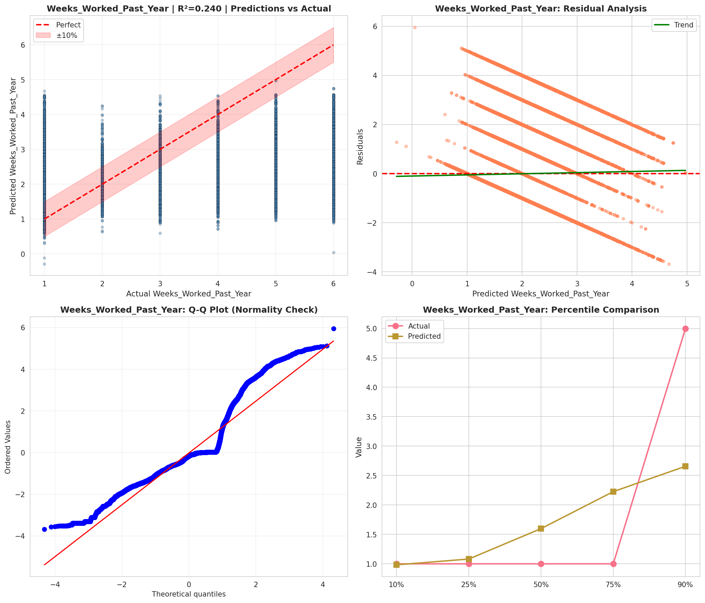
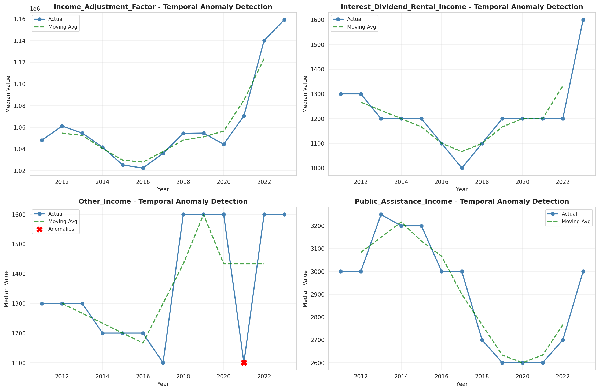
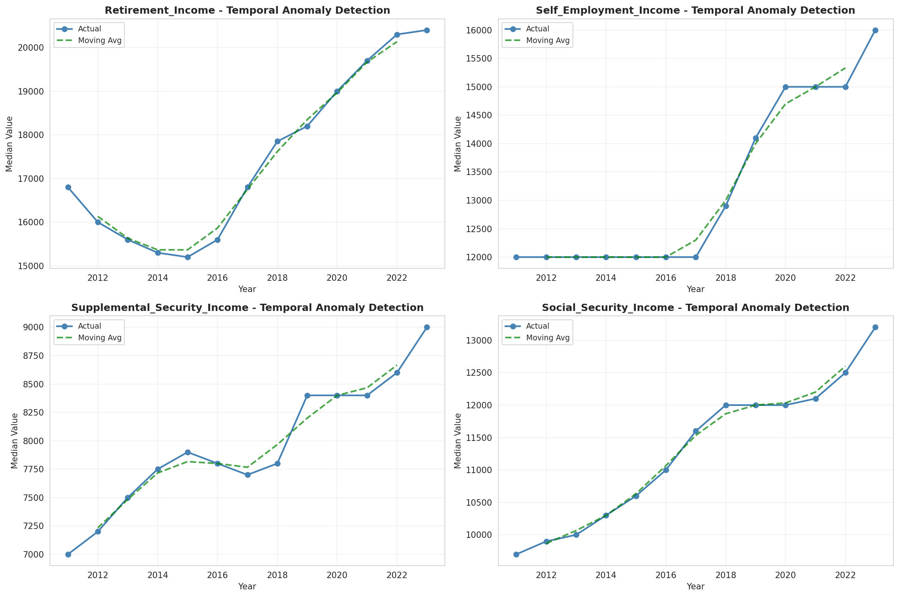
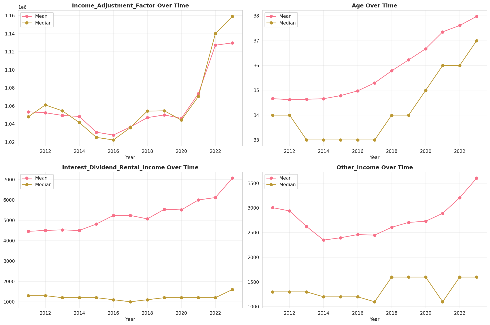
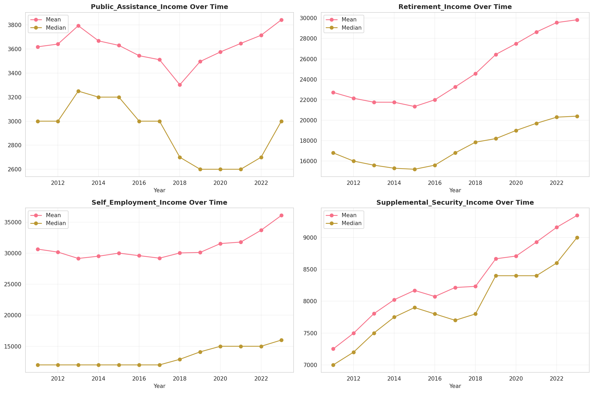
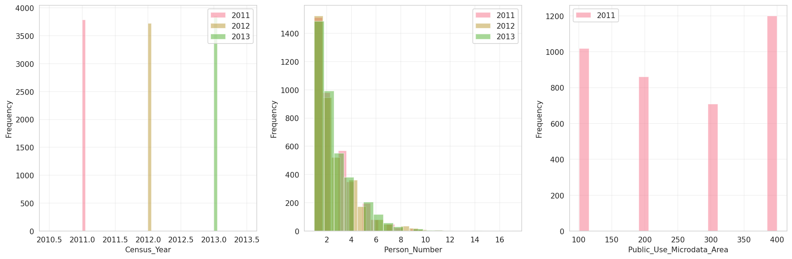
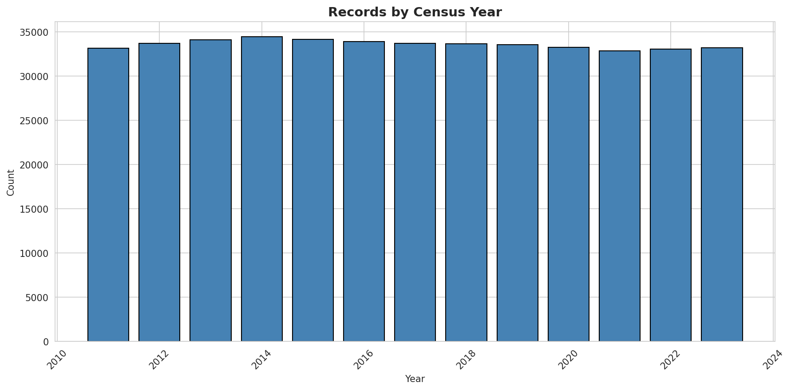
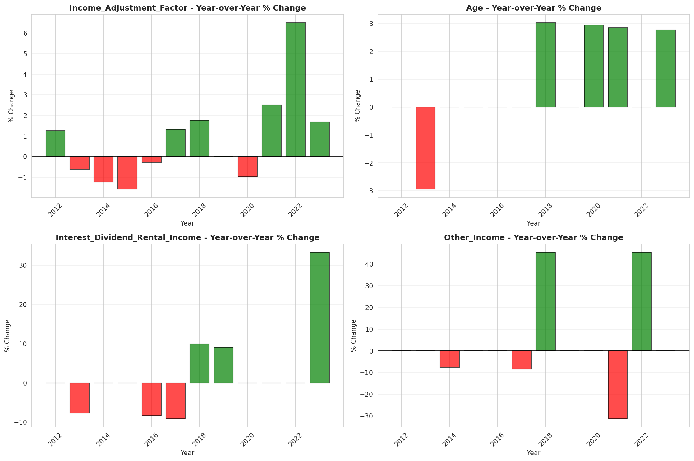
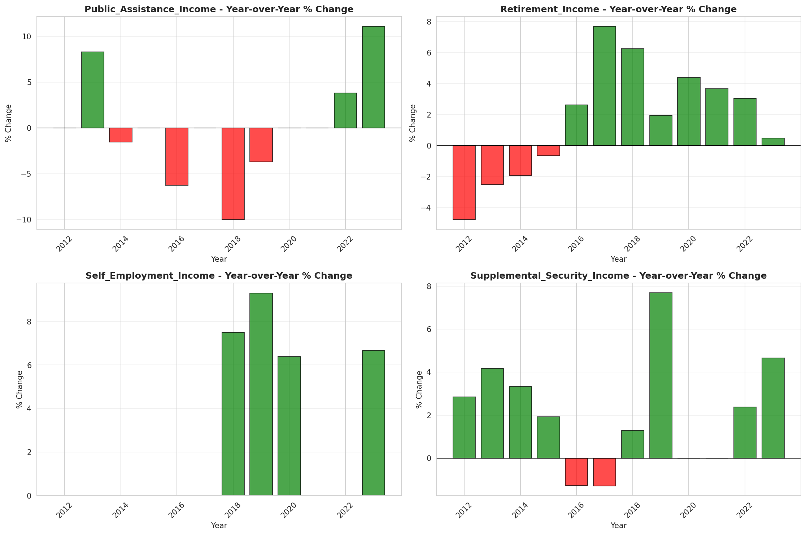

# Temporal Analysis

## Year Distribution

- 2011: 33,166 records

- 2012: 33,726 records

- 2013: 34,109 records

- 2014: 34,439 records

- 2015: 34,160 records

- 2016: 33,915 records

- 2017: 33,715 records

- 2018: 33,678 records

- 2019: 33,554 records

- 2020: 33,243 records

- 2021: 32,839 records

- 2022: 33,065 records

- 2023: 33,222 records

## Temporal Trends

- Census_Year: {np.int64(2011): {'mean': 2011.0, 'median': 2011.0, 'std': 0.0}, np.int64(2012): {'mean': 2012.0, 'median': 2012.0, 'std': 0.0}, np.int64(2013): {'mean': 2013.0, 'median': 2013.0, 'std': 0.0}, np.int64(2014): {'mean': 2014.0, 'median': 2014.0, 'std': 0.0}, np.int64(2015): {'mean': 2015.0, 'median': 2015.0, 'std': 0.0}, np.int64(2016): {'mean': 2016.0, 'median': 2016.0, 'std': 0.0}, np.int64(2017): {'mean': 2017.0, 'median': 2017.0, 'std': 0.0}, np.int64(2018): {'mean': 2018.0, 'median': 2018.0, 'std': 0.0}, np.int64(2019): {'mean': 2019.0, 'median': 2019.0, 'std': 0.0}, np.int64(2020): {'mean': 2020.0, 'median': 2020.0, 'std': 0.0}, np.int64(2021): {'mean': 2021.0, 'median': 2021.0, 'std': 0.0}, np.int64(2022): {'mean': 2022.0, 'median': 2022.0, 'std': 0.0}, np.int64(2023): {'mean': 2023.0, 'median': 2023.0, 'std': 0.0}}

- Person_Number: {np.int64(2011): {'mean': 2.3711933908219263, 'median': 2.0, 'std': 1.670012364782165}, np.int64(2012): {'mean': 2.399573029710016, 'median': 2.0, 'std': 1.7173544383477166}, np.int64(2013): {'mean': 2.4190975988741976, 'median': 2.0, 'std': 1.7456407517988155}, np.int64(2014): {'mean': 2.422718429687273, 'median': 2.0, 'std': 1.7528159675650854}, np.int64(2015): {'mean': 2.430825526932084, 'median': 2.0, 'std': 1.7686251156244743}, np.int64(2016): {'mean': 2.438832375055285, 'median': 2.0, 'std': 1.7829523169451191}, np.int64(2017): {'mean': 2.43292303129171, 'median': 2.0, 'std': 1.7831268326723255}, np.int64(2018): {'mean': 2.400795771720411, 'median': 2.0, 'std': 1.7589045587256895}, np.int64(2019): {'mean': 2.3884782738272636, 'median': 2.0, 'std': 1.7647470420243476}, np.int64(2020): {'mean': 2.3525855067232198, 'median': 2.0, 'std': 1.7321059093732278}, np.int64(2021): {'mean': 2.3032979079752733, 'median': 2.0, 'std': 1.6834512001040984}, np.int64(2022): {'mean': 2.2851958264025405, 'median': 2.0, 'std': 1.6735857570327122}, np.int64(2023): {'mean': 2.2835771476732285, 'median': 2.0, 'std': 1.6892065035020987}}

- Public_Use_Microdata_Area: {np.int64(2011): {'mean': 254.4019779292046, 'median': 300.0, 'std': 117.92048656925053}, np.int64(2012): {'mean': None, 'median': None, 'std': None}, np.int64(2013): {'mean': None, 'median': None, 'std': None}, np.int64(2014): {'mean': None, 'median': None, 'std': None}, np.int64(2015): {'mean': None, 'median': None, 'std': None}, np.int64(2016): {'mean': 280.8632758366505, 'median': 300.0, 'std': 117.59919769405536}, np.int64(2017): {'mean': 280.30852736170846, 'median': 300.0, 'std': 117.80248403432512}, np.int64(2018): {'mean': 277.7525387493319, 'median': 300.0, 'std': 117.64972494666543}, np.int64(2019): {'mean': 276.3733683018418, 'median': 300.0, 'std': 117.56890830326647}, np.int64(2020): {'mean': 274.8021839184189, 'median': 300.0, 'std': 116.97443912249128}, np.int64(2021): {'mean': 269.47260878833094, 'median': 300.0, 'std': 116.33316271769579}, np.int64(2022): {'mean': None, 'median': None, 'std': None}, np.int64(2023): {'mean': 268.97504665583045, 'median': 300.0, 'std': 115.88482352984825}}

- State_Code: {np.int64(2011): {'mean': 2.0, 'median': 2.0, 'std': 0.0}, np.int64(2012): {'mean': 2.0, 'median': 2.0, 'std': 0.0}, np.int64(2013): {'mean': 2.0, 'median': 2.0, 'std': 0.0}, np.int64(2014): {'mean': 2.0, 'median': 2.0, 'std': 0.0}, np.int64(2015): {'mean': 2.0, 'median': 2.0, 'std': 0.0}, np.int64(2016): {'mean': 2.0, 'median': 2.0, 'std': 0.0}, np.int64(2017): {'mean': 2.0, 'median': 2.0, 'std': 0.0}, np.int64(2018): {'mean': 2.0, 'median': 2.0, 'std': 0.0}, np.int64(2019): {'mean': 2.0, 'median': 2.0, 'std': 0.0}, np.int64(2020): {'mean': 2.0, 'median': 2.0, 'std': 0.0}, np.int64(2021): {'mean': 2.0, 'median': 2.0, 'std': 0.0}, np.int64(2022): {'mean': 2.0, 'median': 2.0, 'std': 0.0}, np.int64(2023): {'mean': None, 'median': None, 'std': None}}

- Income_Adjustment_Factor: {np.int64(2011): {'mean': 1053492.79445818, 'median': 1048026.0, 'std': 28334.326176259554}, np.int64(2012): {'mean': 1052495.201328352, 'median': 1061121.0, 'std': 26251.57127990334}, np.int64(2013): {'mean': 1049523.9946348472, 'median': 1054614.0, 'std': 29491.16435573409}, np.int64(2014): {'mean': 1048357.9553122913, 'median': 1041654.0, 'std': 31180.786405604624}, np.int64(2015): {'mean': 1030950.3589871194, 'median': 1025215.0, 'std': 25765.22736444096}, np.int64(2016): {'mean': 1027781.598643668, 'median': 1022342.0, 'std': 17615.18727278781}, np.int64(2017): {'mean': 1036719.2879727124, 'median': 1035988.0, 'std': 16848.508639557916}, np.int64(2018): {'mean': 1047064.658055704, 'median': 1054346.0, 'std': 20438.44332964564}, np.int64(2019): {'mean': 1050075.354592597, 'median': 1054606.0, 'std': 26140.617424633234}, np.int64(2020): {'mean': 1046233.7564600066, 'median': 1044328.0, 'std': 29128.149349458938}, np.int64(2021): {'mean': 1073544.2405371661, 'median': 1070512.0, 'std': 30507.111462973095}, np.int64(2022): {'mean': 1127246.6585815817, 'median': 1140108.0, 'std': 49673.117723715884}, np.int64(2023): {'mean': 1129848.1792486906, 'median': 1159185.0, 'std': 70272.47928044578}}

- Person_Weight: {np.int64(2011): {'mean': 21.127148284387626, 'median': 16.0, 'std': 20.177349376995537}, np.int64(2012): {'mean': 21.085779517286365, 'median': 14.0, 'std': 21.82290799285996}, np.int64(2013): {'mean': 21.118062681403735, 'median': 13.0, 'std': 23.627339867412346}, np.int64(2014): {'mean': 21.14753622346758, 'median': 12.0, 'std': 25.380575782533366}, np.int64(2015): {'mean': 21.46882318501171, 'median': 11.0, 'std': 26.89875214732308}, np.int64(2016): {'mean': 21.726522187822496, 'median': 11.0, 'std': 26.686135074085126}, np.int64(2017): {'mean': 21.9061248702358, 'median': 11.0, 'std': 26.80128853266499}, np.int64(2018): {'mean': 21.92873686085872, 'median': 12.0, 'std': 26.092691442952404}, np.int64(2019): {'mean': 21.966620969184003, 'median': 12.0, 'std': 26.170557125279757}, np.int64(2020): {'mean': 22.16978010408206, 'median': 11.0, 'std': 29.17814955270105}, np.int64(2021): {'mean': 22.410883400834372, 'median': 12.0, 'std': 28.96184358587731}, np.int64(2022): {'mean': 22.22355965522456, 'median': 12.0, 'std': 28.178011750445084}, np.int64(2023): {'mean': 22.0929203539823, 'median': 12.0, 'std': 28.64876223263524}}

- Age: {np.int64(2011): {'mean': 34.66507869504915, 'median': 34.0, 'std': 21.75409746795756}, np.int64(2012): {'mean': 34.62201269050584, 'median': 34.0, 'std': 21.905745540904295}, np.int64(2013): {'mean': 34.63898091412823, 'median': 33.0, 'std': 22.009401550821895}, np.int64(2014): {'mean': 34.66116902349081, 'median': 33.0, 'std': 22.07900510666725}, np.int64(2015): {'mean': 34.78638758782201, 'median': 33.0, 'std': 22.20109758912091}, np.int64(2016): {'mean': 34.97676544301931, 'median': 33.0, 'std': 22.298012975360017}, np.int64(2017): {'mean': 35.297879282218595, 'median': 33.0, 'std': 22.43687723893794}, np.int64(2018): {'mean': 35.78356790783301, 'median': 34.0, 'std': 22.61097939982906}, np.int64(2019): {'mean': 36.225129641771474, 'median': 34.0, 'std': 22.749190905266957}, np.int64(2020): {'mean': 36.67202117739073, 'median': 35.0, 'std': 22.858662953467977}, np.int64(2021): {'mean': 37.35272085020859, 'median': 36.0, 'std': 22.922992649499626}, np.int64(2022): {'mean': 37.60955693331317, 'median': 36.0, 'std': 22.93410527430531}, np.int64(2023): {'mean': 37.977454698693634, 'median': 37.0, 'std': 23.01122713508208}}

- Citizenship_Status: {np.int64(2011): {'mean': 1.2209793161671592, 'median': 1.0, 'std': 0.8244610022753716}, np.int64(2012): {'mean': 1.214671173575283, 'median': 1.0, 'std': 0.8149052654435265}, np.int64(2013): {'mean': 1.2087425606145006, 'median': 1.0, 'std': 0.8063994543609824}, np.int64(2014): {'mean': 1.2039838555126456, 'median': 1.0, 'std': 0.7974495725442594}, np.int64(2015): {'mean': 1.2064988290398126, 'median': 1.0, 'std': 0.8015646249336312}, np.int64(2016): {'mean': 1.209435353088604, 'median': 1.0, 'std': 0.8054442025854767}, np.int64(2017): {'mean': 1.214859854664096, 'median': 1.0, 'std': 0.8145608505649539}, np.int64(2018): {'mean': 1.2267058613931943, 'median': 1.0, 'std': 0.8333564085735643}, np.int64(2019): {'mean': 1.2268581987244442, 'median': 1.0, 'std': 0.8330911906852854}, np.int64(2020): {'mean': 1.2228138254670156, 'median': 1.0, 'std': 0.8269536233257768}, np.int64(2021): {'mean': 1.226224915496818, 'median': 1.0, 'std': 0.8313248547671052}, np.int64(2022): {'mean': 1.2256766974141842, 'median': 1.0, 'std': 0.8310235032934452}, np.int64(2023): {'mean': 1.223406176629944, 'median': 1.0, 'std': 0.8259633446873861}}

- Class_of_Worker: {np.int64(2011): {'mean': 2.617225110725977, 'median': 2.0, 'std': 1.920443055347545}, np.int64(2012): {'mean': 2.619688622754491, 'median': 2.0, 'std': 1.9024765126272596}, np.int64(2013): {'mean': 2.6214119103156093, 'median': 2.0, 'std': 1.9021088649172941}, np.int64(2014): {'mean': 2.61945021726809, 'median': 2.0, 'std': 1.890299643688262}, np.int64(2015): {'mean': 2.622975950943758, 'median': 2.0, 'std': 1.890461001591959}, np.int64(2016): {'mean': 2.639506769825919, 'median': 2.0, 'std': 1.905646126486051}, np.int64(2017): {'mean': 2.6454811919882757, 'median': 2.0, 'std': 1.9181076835907227}, np.int64(2018): {'mean': 2.6589033018867925, 'median': 2.0, 'std': 1.924833210028368}, np.int64(2019): {'mean': 2.659901751600258, 'median': 2.0, 'std': 1.9293928832277185}, np.int64(2020): {'mean': 2.681799919646444, 'median': 2.0, 'std': 1.937264835401464}, np.int64(2021): {'mean': 2.676224308551129, 'median': 2.0, 'std': 1.941939301977739}, np.int64(2022): {'mean': 2.6833048203683205, 'median': 2.0, 'std': 1.945655268686084}, np.int64(2023): {'mean': 2.68823293575223, 'median': 2.0, 'std': 1.9406249028205647}}

- English_Speaking_Ability: {np.int64(2011): {'mean': 1.4494941384294202, 'median': 1.0, 'std': 0.6993257624959884}, np.int64(2012): {'mean': 1.4218075262183838, 'median': 1.0, 'std': 0.6835765810239817}, np.int64(2013): {'mean': 1.388897091392293, 'median': 1.0, 'std': 0.6693047522166112}, np.int64(2014): {'mean': 1.3598620887803476, 'median': 1.0, 'std': 0.6525310433894752}, np.int64(2015): {'mean': 1.3314541775079503, 'median': 1.0, 'std': 0.6193094937853845}, np.int64(2016): {'mean': 1.3249165578290525, 'median': 1.0, 'std': 0.6111579609794953}, np.int64(2017): {'mean': 1.318358208955224, 'median': 1.0, 'std': 0.6074550461755365}, np.int64(2018): {'mean': 1.312116564417178, 'median': 1.0, 'std': 0.6057254554778712}, np.int64(2019): {'mean': 1.3022215119066645, 'median': 1.0, 'std': 0.6001783517137296}, np.int64(2020): {'mean': 1.2838896457765667, 'median': 1.0, 'std': 0.5940366746718}, np.int64(2021): {'mean': 1.2628837209302326, 'median': 1.0, 'std': 0.5837945032442138}, np.int64(2022): {'mean': 1.2505114376046123, 'median': 1.0, 'std': 0.5792096635632594}, np.int64(2023): {'mean': 1.2573033707865169, 'median': 1.0, 'std': 0.5871294176657023}}

- Fertility_Status: {np.int64(2011): {'mean': 1.922378516624041, 'median': 2.0, 'std': 0.2675921250968292}, np.int64(2012): {'mean': 1.9211065573770492, 'median': 2.0, 'std': 0.269589642889438}, np.int64(2013): {'mean': 1.923722250903459, 'median': 2.0, 'std': 0.26545912896798085}, np.int64(2014): {'mean': 1.926371635610766, 'median': 2.0, 'std': 0.26118203513245697}, np.int64(2015): {'mean': 1.925489677077819, 'median': 2.0, 'std': 0.2626169496362386}, np.int64(2016): {'mean': 1.9294940796555435, 'median': 2.0, 'std': 0.2560149500610418}, np.int64(2017): {'mean': 1.9292776709695139, 'median': 2.0, 'std': 0.2563780558729817}, np.int64(2018): {'mean': 1.929269299573414, 'median': 2.0, 'std': 0.25639211062972367}, np.int64(2019): {'mean': 1.9313807531380753, 'median': 2.0, 'std': 0.2528231806699044}, np.int64(2020): {'mean': 1.9329918907383696, 'median': 2.0, 'std': 0.2500538304418383}, np.int64(2021): {'mean': 1.9358714533873769, 'median': 2.0, 'std': 0.24499952099733918}, np.int64(2022): {'mean': 1.9390993566833452, 'median': 2.0, 'std': 0.23916507316090424}, np.int64(2023): {'mean': 1.9394899870335687, 'median': 2.0, 'std': 0.23844651964568075}}

- Marital_Status: {np.int64(2011): {'mean': 3.1664656576011576, 'median': 3.0, 'std': 1.8697843634061129}, np.int64(2012): {'mean': 3.2030480934590524, 'median': 4.0, 'std': 1.8679579528048127}, np.int64(2013): {'mean': 3.232724500864874, 'median': 4.0, 'std': 1.8641771250886945}, np.int64(2014): {'mean': 3.256424402566857, 'median': 5.0, 'std': 1.8600687782534013}, np.int64(2015): {'mean': 3.2640222482435597, 'median': 5.0, 'std': 1.8604823977342002}, np.int64(2016): {'mean': 3.275984077841663, 'median': 5.0, 'std': 1.8596188152673694}, np.int64(2017): {'mean': 3.2753670473083196, 'median': 5.0, 'std': 1.8573711899414649}, np.int64(2018): {'mean': 3.251024407625156, 'median': 5.0, 'std': 1.8610125918512863}, np.int64(2019): {'mean': 3.2353519699588724, 'median': 4.0, 'std': 1.862277672615143}, np.int64(2020): {'mean': 3.233823662124357, 'median': 4.0, 'std': 1.8617900576349815}, np.int64(2021): {'mean': 3.1990316392094766, 'median': 4.0, 'std': 1.8640623217333416}, np.int64(2022): {'mean': 3.196098593679117, 'median': 4.0, 'std': 1.8676452391639273}, np.int64(2023): {'mean': 3.211546565528866, 'median': 4.0, 'std': 1.8633298569789785}}

- Mobility_Status: {np.int64(2011): {'mean': 1.334079479946032, 'median': 1.0, 'std': 0.7418504120462827}, np.int64(2012): {'mean': 1.3247858090985882, 'median': 1.0, 'std': 0.733983782063663}, np.int64(2013): {'mean': 1.3274033017462303, 'median': 1.0, 'std': 0.7364073553005789}, np.int64(2014): {'mean': 1.328779653015461, 'median': 1.0, 'std': 0.7383772995248394}, np.int64(2015): {'mean': 1.3289720181985787, 'median': 1.0, 'std': 0.7388113639848427}, np.int64(2016): {'mean': 1.3326848249027237, 'median': 1.0, 'std': 0.7421092216757837}, np.int64(2017): {'mean': 1.330754875993258, 'median': 1.0, 'std': 0.7400288761206555}, np.int64(2018): {'mean': 1.317950263752826, 'median': 1.0, 'std': 0.7285085329085066}, np.int64(2019): {'mean': 1.3051129319989114, 'median': 1.0, 'std': 0.7160326470692921}, np.int64(2020): {'mean': 1.3001525320317266, 'median': 1.0, 'std': 0.7110284553173797}, np.int64(2021): {'mean': 1.2839776619049088, 'median': 1.0, 'std': 0.6944099446566935}, np.int64(2022): {'mean': 1.280862401617003, 'median': 1.0, 'std': 0.6910554282306178}, np.int64(2023): {'mean': 1.2762372013651877, 'median': 1.0, 'std': 0.6860067084301061}}

- Military_Service: {np.int64(2011): {'mean': 4.611738612560069, 'median': 5.0, 'std': 0.9060156827223228}, np.int64(2012): {'mean': 4.6222168245486195, 'median': 5.0, 'std': 0.898440398838278}, np.int64(2013): {'mean': 3.664622906147311, 'median': 4.0, 'std': 0.7809454081016767}, np.int64(2014): {'mean': 3.670907649623464, 'median': 4.0, 'std': 0.7759041685155916}, np.int64(2015): {'mean': 3.675887119307069, 'median': 4.0, 'std': 0.7716279441594793}, np.int64(2016): {'mean': 3.6817216366769525, 'median': 4.0, 'std': 0.7672415238286061}, np.int64(2017): {'mean': 3.68997668997669, 'median': 4.0, 'std': 0.7582320269542142}, np.int64(2018): {'mean': 3.6864176841433247, 'median': 4.0, 'std': 0.7641188401281642}, np.int64(2019): {'mean': 3.6915813379019085, 'median': 4.0, 'std': 0.7600767042937331}, np.int64(2020): {'mean': 3.691279185791259, 'median': 4.0, 'std': 0.7650734939790074}, np.int64(2021): {'mean': 3.6836869231691236, 'median': 4.0, 'std': 0.7774272021276571}, np.int64(2022): {'mean': 3.6802394266362133, 'median': 4.0, 'std': 0.7870977488933634}, np.int64(2023): {'mean': 3.679402705758509, 'median': 4.0, 'std': 0.7929510600990868}}

- Travel_Time_To_Work_Minutes: {np.int64(2011): {'mean': 17.175243494693998, 'median': 10.0, 'std': 20.54710101987323}, np.int64(2012): {'mean': 16.833987498182875, 'median': 10.0, 'std': 20.56611170708762}, np.int64(2013): {'mean': 16.542740643658075, 'median': 10.0, 'std': 20.65490835843355}, np.int64(2014): {'mean': 16.463697200834712, 'median': 10.0, 'std': 21.235330429188075}, np.int64(2015): {'mean': 16.142763588736084, 'median': 10.0, 'std': 21.0253153195046}, np.int64(2016): {'mean': 16.1173093906388, 'median': 10.0, 'std': 20.847723756844772}, np.int64(2017): {'mean': 16.128651519622306, 'median': 10.0, 'std': 21.005020621583636}, np.int64(2018): {'mean': 16.439908796704913, 'median': 10.0, 'std': 21.943402247731132}, np.int64(2019): {'mean': 16.43888354186718, 'median': 10.0, 'std': 22.172593284580138}, np.int64(2020): {'mean': 16.559951493102925, 'median': 10.0, 'std': 22.439169778758767}, np.int64(2021): {'mean': 17.028802811521125, 'median': 10.0, 'std': 22.92493354486273}, np.int64(2022): {'mean': 16.90569625066545, 'median': 10.0, 'std': 22.472047781614094}, np.int64(2023): {'mean': 16.602645462191298, 'median': 10.0, 'std': 22.10104827715874}}

- Vehicle_Occupancy: {np.int64(2011): {'mean': 1.251774727875059, 'median': 1.0, 'std': 0.7526476819318674}, np.int64(2012): {'mean': 1.256721595836947, 'median': 1.0, 'std': 0.7632215274167349}, np.int64(2013): {'mean': 1.2547682577329775, 'median': 1.0, 'std': 0.7684739597925634}, np.int64(2014): {'mean': 1.2530827366746222, 'median': 1.0, 'std': 0.7634687801969794}, np.int64(2015): {'mean': 1.2537252500510307, 'median': 1.0, 'std': 0.7358781771994491}, np.int64(2016): {'mean': 1.258659793814433, 'median': 1.0, 'std': 0.7433953322383523}, np.int64(2017): {'mean': 1.2568969093549056, 'median': 1.0, 'std': 0.7485882959512338}, np.int64(2018): {'mean': 1.2572422970621353, 'median': 1.0, 'std': 0.7510946221327159}, np.int64(2019): {'mean': 1.250384024577573, 'median': 1.0, 'std': 0.7368129952672227}, np.int64(2020): {'mean': 1.2463828458415738, 'median': 1.0, 'std': 0.7491970720361572}, np.int64(2021): {'mean': 1.233470648815654, 'median': 1.0, 'std': 0.731536001245342}, np.int64(2022): {'mean': 1.2371355498721228, 'median': 1.0, 'std': 0.7350111808626383}, np.int64(2023): {'mean': 1.2393056416615003, 'median': 1.0, 'std': 0.7557959118444952}}

- Transportation_To_Work: {np.int64(2011): {'mean': 3.520175981301987, 'median': 1.0, 'std': 4.241675053119369}, np.int64(2012): {'mean': 3.662251201098147, 'median': 1.0, 'std': 4.317349221565742}, np.int64(2013): {'mean': 3.7978503513848696, 'median': 1.0, 'std': 4.378880530847555}, np.int64(2014): {'mean': 3.9128922237380626, 'median': 1.0, 'std': 4.435712066349201}, np.int64(2015): {'mean': 4.01641266119578, 'median': 1.0, 'std': 4.482549257660665}, np.int64(2016): {'mean': 4.01525069637883, 'median': 1.0, 'std': 4.479322070732351}, np.int64(2017): {'mean': 4.028485652447113, 'median': 1.0, 'std': 4.487615643811639}, np.int64(2018): {'mean': 3.9851399208388307, 'median': 1.0, 'std': 4.473539643335031}, np.int64(2019): {'mean': None, 'median': None, 'std': None}, np.int64(2020): {'mean': None, 'median': None, 'std': None}, np.int64(2021): {'mean': None, 'median': None, 'std': None}, np.int64(2022): {'mean': None, 'median': None, 'std': None}, np.int64(2023): {'mean': None, 'median': None, 'std': None}}

- Language_Other_Than_English: {np.int64(2011): {'mean': 1.7962502454027878, 'median': 2.0, 'std': 0.4027916343320804}, np.int64(2012): {'mean': 1.790960087691018, 'median': 2.0, 'std': 0.40662950958801264}, np.int64(2013): {'mean': 1.7839966832504146, 'median': 2.0, 'std': 0.4115231279332329}, np.int64(2014): {'mean': 1.7800284405119293, 'median': 2.0, 'std': 0.4142336234905329}, np.int64(2015): {'mean': 1.779604319984708, 'median': 2.0, 'std': 0.41452008197165197}, np.int64(2016): {'mean': 1.7792902440586766, 'median': 2.0, 'std': 0.4147318032038507}, np.int64(2017): {'mean': 1.7847804439304873, 'median': 2.0, 'std': 0.41098117279549745}, np.int64(2018): {'mean': 1.7908647677700795, 'median': 2.0, 'std': 0.40669766698266}, np.int64(2019): {'mean': 1.7989331276711977, 'median': 2.0, 'std': 0.40080437551703235}, np.int64(2020): {'mean': 1.8102378490175801, 'median': 2.0, 'std': 0.3921191731229444}, np.int64(2021): {'mean': 1.8250667187398295, 'median': 2.0, 'std': 0.379916209049237}, np.int64(2022): {'mean': 1.826408393866021, 'median': 2.0, 'std': 0.3787640320325675}, np.int64(2023): {'mean': 1.8287528461020428, 'median': 2.0, 'std': 0.37673082907263733}}

- Grandparents_Living_With_Grandchildren: {np.int64(2011): {'mean': 1.950198661078757, 'median': 2.0, 'std': 0.21754020613428604}, np.int64(2012): {'mean': 1.945902257664745, 'median': 2.0, 'std': 0.22621656432347934}, np.int64(2013): {'mean': 1.94288309467835, 'median': 2.0, 'std': 0.23207206222014948}, np.int64(2014): {'mean': 1.9415350365737305, 'median': 2.0, 'std': 0.2346267874969154}, np.int64(2015): {'mean': 1.9371291098636727, 'median': 2.0, 'std': 0.2427370827433129}, np.int64(2016): {'mean': 1.937288590604027, 'median': 2.0, 'std': 0.24244967436508813}, np.int64(2017): {'mean': 1.9393874491325767, 'median': 2.0, 'std': 0.23862463927580624}, np.int64(2018): {'mean': 1.9409336297237219, 'median': 2.0, 'std': 0.23575511845653777}, np.int64(2019): {'mean': 1.9418945824164309, 'median': 2.0, 'std': 0.23394880996723164}, np.int64(2020): {'mean': 1.9461490294301815, 'median': 2.0, 'std': 0.2257292678463887}, np.int64(2021): {'mean': 1.9495967741935485, 'median': 2.0, 'std': 0.21878120361800474}, np.int64(2022): {'mean': 1.950680879277809, 'median': 2.0, 'std': 0.216538995338426}, np.int64(2023): {'mean': 1.9501884895702437, 'median': 2.0, 'std': 0.21756080295866848}}

- Months_Responsible_For_Grandchildren: {np.int64(2011): {'mean': 3.6623655913978497, 'median': 4.0, 'std': 1.40042434905788}, np.int64(2012): {'mean': 3.693798449612403, 'median': 4.0, 'std': 1.3749634805662276}, np.int64(2013): {'mean': 3.6696914700544463, 'median': 4.0, 'std': 1.3973246174223013}, np.int64(2014): {'mean': 3.6766256590509667, 'median': 4.0, 'std': 1.3805101637028732}, np.int64(2015): {'mean': 3.685667752442997, 'median': 4.0, 'std': 1.401661724264578}, np.int64(2016): {'mean': 3.759873617693523, 'median': 4.0, 'std': 1.386816766373954}, np.int64(2017): {'mean': 3.8248772504091653, 'median': 4.0, 'std': 1.3839015089764086}, np.int64(2018): {'mean': 3.8787375415282392, 'median': 4.0, 'std': 1.334395761186868}, np.int64(2019): {'mean': 3.884033613445378, 'median': 5.0, 'std': 1.3402587313208232}, np.int64(2020): {'mean': 3.939068100358423, 'median': 5.0, 'std': 1.3223179660178095}, np.int64(2021): {'mean': 3.976470588235294, 'median': 5.0, 'std': 1.301138723774127}, np.int64(2022): {'mean': 3.94, 'median': 5.0, 'std': 1.3356526254501002}, np.int64(2023): {'mean': 3.9844357976653697, 'median': 5.0, 'std': 1.3521158686964463}}

- Grandparents_Responsible_For_Grandchildren: {np.int64(2011): {'mean': 1.4918032786885247, 'median': 1.0, 'std': 0.5002062207007733}, np.int64(2012): {'mean': 1.4860557768924303, 'median': 1.0, 'std': 0.5000546140427242}, np.int64(2013): {'mean': 1.4845650140318054, 'median': 1.0, 'std': 0.4999956205159553}, np.int64(2014): {'mean': 1.4841341795104261, 'median': 1.0, 'std': 0.49997490693969643}, np.int64(2015): {'mean': 1.477891156462585, 'median': 1.0, 'std': 0.4997234725266226}, np.int64(2016): {'mean': 1.4580479452054795, 'median': 1.0, 'std': 0.4984503400407875}, np.int64(2017): {'mean': 1.4602473498233215, 'median': 1.0, 'std': 0.498637516531858}, np.int64(2018): {'mean': 1.460573476702509, 'median': 1.0, 'std': 0.498666592405272}, np.int64(2019): {'mean': 1.4634806131650135, 'median': 1.0, 'std': 0.49888952933973507}, np.int64(2020): {'mean': 1.4593023255813953, 'median': 1.0, 'std': 0.49858256670673723}, np.int64(2021): {'mean': 1.476923076923077, 'median': 1.0, 'std': 0.49972350592347875}, np.int64(2022): {'mean': 1.482936918304033, 'median': 1.0, 'std': 0.49996734795249426}, np.int64(2023): {'mean': 1.4813319878910192, 'median': 1.0, 'std': 0.4999036692819926}}

- Interest_Dividend_Rental_Income: {np.int64(2011): {'mean': 4458.341633364074, 'median': 1300.0, 'std': 12785.151973622527}, np.int64(2012): {'mean': 4505.533496232946, 'median': 1300.0, 'std': 13916.653209275692}, np.int64(2013): {'mean': 4528.943461110549, 'median': 1200.0, 'std': 15509.514812192838}, np.int64(2014): {'mean': 4502.994539387198, 'median': 1200.0, 'std': 15856.748549754975}, np.int64(2015): {'mean': 4817.077619532045, 'median': 1200.0, 'std': 17869.347434692787}, np.int64(2016): {'mean': 5238.8941961448845, 'median': 1100.0, 'std': 19058.951430491637}, np.int64(2017): {'mean': 5240.224520097571, 'median': 1000.0, 'std': 18660.169594516225}, np.int64(2018): {'mean': 5071.29075259788, 'median': 1100.0, 'std': 17358.180480814073}, np.int64(2019): {'mean': 5541.8858499329135, 'median': 1200.0, 'std': 19168.213210734353}, np.int64(2020): {'mean': 5512.668715491197, 'median': 1200.0, 'std': 17997.86272531723}, np.int64(2021): {'mean': 6000.399540997288, 'median': 1200.0, 'std': 19490.26648067481}, np.int64(2022): {'mean': 6119.011829492148, 'median': 1200.0, 'std': 19778.886597987672}, np.int64(2023): {'mean': 7071.677419354839, 'median': 1600.0, 'std': 23762.157235469687}}

- Military_Service_Period_1: {np.int64(2011): {'mean': 0.29536987759446515, 'median': 0.0, 'std': 0.4562695584849351}, np.int64(2012): {'mean': 0.3105121293800539, 'median': 0.0, 'std': 0.46276567484828446}, np.int64(2013): {'mean': 0.33231026785714285, 'median': 0.0, 'std': 0.4711072908980505}, np.int64(2014): {'mean': 0.35369683128746787, 'median': 0.0, 'std': 0.4781847535114571}, np.int64(2015): {'mean': 0.3738898756660746, 'median': 0.0, 'std': 0.48390655844839603}, np.int64(2016): {'mean': 0.4015868172108636, 'median': 0.0, 'std': 0.4902939951021659}, np.int64(2017): {'mean': 0.41574103459219297, 'median': 0.0, 'std': 0.492927517993257}, np.int64(2018): {'mean': 0.4268933539412674, 'median': 0.0, 'std': 0.49470301123816757}, np.int64(2019): {'mean': 0.42839235349420246, 'median': 0.0, 'std': 0.49492333492419294}, np.int64(2020): {'mean': 0.4402496099843994, 'median': 0.0, 'std': 0.49649451567201497}, np.int64(2021): {'mean': 0.45446238196771244, 'median': 0.0, 'std': 0.4979978580039578}, np.int64(2022): {'mean': 0.4713603818615752, 'median': 0.0, 'std': 0.49925357494713674}, np.int64(2023): {'mean': 0.49940688018979834, 'median': 0.0, 'std': 0.5000738046271519}}

- Military_Service_Period_2: {np.int64(2011): {'mean': 0.25465673230441727, 'median': 0.0, 'std': 0.4357260628030816}, np.int64(2012): {'mean': 0.24555256064690026, 'median': 0.0, 'std': 0.43047235501994524}, np.int64(2013): {'mean': 0.23911830357142858, 'median': 0.0, 'std': 0.4266046405658268}, np.int64(2014): {'mean': 0.2286611475877819, 'median': 0.0, 'std': 0.42003046474530786}, np.int64(2015): {'mean': 0.23149792776791, 'median': 0.0, 'std': 0.4218522479090105}, np.int64(2016): {'mean': 0.23436069575831553, 'median': 0.0, 'std': 0.42366323048208887}, np.int64(2017): {'mean': 0.23928911456680418, 'median': 0.0, 'std': 0.42671726173849245}, np.int64(2018): {'mean': 0.2383307573415765, 'median': 0.0, 'std': 0.4261283127497113}, np.int64(2019): {'mean': 0.2413036665622062, 'median': 0.0, 'std': 0.42794111478843}, np.int64(2020): {'mean': 0.2343213728549142, 'median': 0.0, 'std': 0.423640017264455}, np.int64(2021): {'mean': 0.2254035942735303, 'median': 0.0, 'std': 0.417911488547613}, np.int64(2022): {'mean': 0.21778042959427207, 'median': 0.0, 'std': 0.41279892233672116}, np.int64(2023): {'mean': 0.21530249110320285, 'median': 0.0, 'std': 0.41109298983878756}}

- Military_Service_Period_3: {np.int64(2011): {'mean': 0.2442788717402874, 'median': 0.0, 'std': 0.42971600074261634}, np.int64(2012): {'mean': 0.23611859838274932, 'median': 0.0, 'std': 0.42475314633796285}, np.int64(2013): {'mean': None, 'median': None, 'std': None}, np.int64(2014): {'mean': None, 'median': None, 'std': None}, np.int64(2015): {'mean': None, 'median': None, 'std': None}, np.int64(2016): {'mean': None, 'median': None, 'std': None}, np.int64(2017): {'mean': None, 'median': None, 'std': None}, np.int64(2018): {'mean': None, 'median': None, 'std': None}, np.int64(2019): {'mean': None, 'median': None, 'std': None}, np.int64(2020): {'mean': None, 'median': None, 'std': None}, np.int64(2021): {'mean': None, 'median': None, 'std': None}, np.int64(2022): {'mean': None, 'median': None, 'std': None}, np.int64(2023): {'mean': None, 'median': None, 'std': None}}

- Military_Service_Period_4: {np.int64(2011): {'mean': 0.15886109632783396, 'median': 0.0, 'std': 0.3655951519686889}, np.int64(2012): {'mean': 0.1490566037735849, 'median': 0.0, 'std': 0.35619226577844054}, np.int64(2013): {'mean': None, 'median': None, 'std': None}, np.int64(2014): {'mean': None, 'median': None, 'std': None}, np.int64(2015): {'mean': None, 'median': None, 'std': None}, np.int64(2016): {'mean': None, 'median': None, 'std': None}, np.int64(2017): {'mean': None, 'median': None, 'std': None}, np.int64(2018): {'mean': None, 'median': None, 'std': None}, np.int64(2019): {'mean': None, 'median': None, 'std': None}, np.int64(2020): {'mean': None, 'median': None, 'std': None}, np.int64(2021): {'mean': None, 'median': None, 'std': None}, np.int64(2022): {'mean': None, 'median': None, 'std': None}, np.int64(2023): {'mean': None, 'median': None, 'std': None}}

- Military_Service_Period_5: {np.int64(2011): {'mean': 0.32623736029803085, 'median': 0.0, 'std': 0.46889769770337825}, np.int64(2012): {'mean': 0.31024258760107815, 'median': 0.0, 'std': 0.46265518456933563}, np.int64(2013): {'mean': 0.29994419642857145, 'median': 0.0, 'std': 0.45829715178033853}, np.int64(2014): {'mean': 0.2857550670853554, 'median': 0.0, 'std': 0.4518377910801502}, np.int64(2015): {'mean': 0.2764949674363529, 'median': 0.0, 'std': 0.44733068087914823}, np.int64(2016): {'mean': 0.27616722612145256, 'median': 0.0, 'std': 0.44716876963270225}, np.int64(2017): {'mean': 0.2795937797524595, 'median': 0.0, 'std': 0.44887085145053823}, np.int64(2018): {'mean': 0.27666151468315303, 'median': 0.0, 'std': 0.4474168090010459}, np.int64(2019): {'mean': 0.27922281416483863, 'median': 0.0, 'std': 0.4486875575714975}, np.int64(2020): {'mean': 0.2686427457098284, 'median': 0.0, 'std': 0.4433228420739999}, np.int64(2021): {'mean': 0.2622601279317697, 'median': 0.0, 'std': 0.43993034109096807}, np.int64(2022): {'mean': 0.2535799522673031, 'median': 0.0, 'std': 0.43512486007970524}, np.int64(2023): {'mean': 0.23873072360616845, 'median': 0.0, 'std': 0.4263710561391468}}

- Military_Service_Period_6: {np.int64(2011): {'mean': 0.07903139968068121, 'median': 0.0, 'std': 0.26982366618170744}, np.int64(2012): {'mean': 0.07331536388140161, 'median': 0.0, 'std': 0.2606885861824962}, np.int64(2013): {'mean': None, 'median': None, 'std': None}, np.int64(2014): {'mean': None, 'median': None, 'std': None}, np.int64(2015): {'mean': None, 'median': None, 'std': None}, np.int64(2016): {'mean': None, 'median': None, 'std': None}, np.int64(2017): {'mean': None, 'median': None, 'std': None}, np.int64(2018): {'mean': None, 'median': None, 'std': None}, np.int64(2019): {'mean': None, 'median': None, 'std': None}, np.int64(2020): {'mean': None, 'median': None, 'std': None}, np.int64(2021): {'mean': None, 'median': None, 'std': None}, np.int64(2022): {'mean': None, 'median': None, 'std': None}, np.int64(2023): {'mean': None, 'median': None, 'std': None}}

- Military_Service_Period_7: {np.int64(2011): {'mean': 0.08488557743480575, 'median': 0.0, 'std': 0.27874843901626606}, np.int64(2012): {'mean': 0.08140161725067385, 'median': 0.0, 'std': 0.2734877592991397}, np.int64(2013): {'mean': None, 'median': None, 'std': None}, np.int64(2014): {'mean': None, 'median': None, 'std': None}, np.int64(2015): {'mean': None, 'median': None, 'std': None}, np.int64(2016): {'mean': None, 'median': None, 'std': None}, np.int64(2017): {'mean': None, 'median': None, 'std': None}, np.int64(2018): {'mean': None, 'median': None, 'std': None}, np.int64(2019): {'mean': None, 'median': None, 'std': None}, np.int64(2020): {'mean': None, 'median': None, 'std': None}, np.int64(2021): {'mean': None, 'median': None, 'std': None}, np.int64(2022): {'mean': None, 'median': None, 'std': None}, np.int64(2023): {'mean': None, 'median': None, 'std': None}}

- Military_Service_Period_8: {np.int64(2011): {'mean': 0.05774348057477382, 'median': 0.0, 'std': 0.2332887762086803}, np.int64(2012): {'mean': 0.057412398921832884, 'median': 0.0, 'std': 0.2326602799912117}, np.int64(2013): {'mean': 0.05385044642857143, 'median': 0.0, 'std': 0.2257538392501148}, np.int64(2014): {'mean': 0.05166999714530403, 'median': 0.0, 'std': 0.22139150978397076}, np.int64(2015): {'mean': 0.046773238602723505, 'median': 0.0, 'std': 0.211184055858512}, np.int64(2016): {'mean': 0.03936527311565456, 'median': 0.0, 'std': 0.19449213769815527}, np.int64(2017): {'mean': 0.03237067597588067, 'median': 0.0, 'std': 0.17701061850532632}, np.int64(2018): {'mean': 0.03493044822256569, 'median': 0.0, 'std': 0.18363206618128894}, np.int64(2019): {'mean': 0.0322782826700094, 'median': 0.0, 'std': 0.1767659104897825}, np.int64(2020): {'mean': 0.032137285491419657, 'median': 0.0, 'std': 0.17639214378129292}, np.int64(2021): {'mean': 0.03320134023758757, 'median': 0.0, 'std': 0.1791892618555069}, np.int64(2022): {'mean': 0.030429594272076373, 'median': 0.0, 'std': 0.17179184640509215}, np.int64(2023): {'mean': 0.02520759193357058, 'median': 0.0, 'std': 0.15677837390523144}}

- Military_Service_Period_9: {np.int64(2011): {'mean': 0.018893028206492815, 'median': 0.0, 'std': 0.13616539735608715}, np.int64(2012): {'mean': 0.019946091644204852, 'median': 0.0, 'std': 0.13983388559893317}, np.int64(2013): {'mean': 0.018415178571428572, 'median': 0.0, 'std': 0.1344659983813937}, np.int64(2014): {'mean': 0.017699115044247787, 'median': 0.0, 'std': 0.1318742617857887}, np.int64(2015): {'mean': 0.014505624629958556, 'median': 0.0, 'std': 0.11958028513831767}, np.int64(2016): {'mean': 0.013426914861153494, 'median': 0.0, 'std': 0.1151115822025578}, np.int64(2017): {'mean': 0.010790225325293558, 'median': 0.0, 'std': 0.1033304643825081}, np.int64(2018): {'mean': 0.00865533230293663, 'median': 0.0, 'std': 0.09264486340856624}, np.int64(2019): {'mean': 0.006267627702914447, 'median': 0.0, 'std': 0.07893223045750959}, np.int64(2020): {'mean': 0.0062402496099844, 'median': 0.0, 'std': 0.07876067790755124}, np.int64(2021): {'mean': None, 'median': None, 'std': None}, np.int64(2022): {'mean': None, 'median': None, 'std': None}, np.int64(2023): {'mean': None, 'median': None, 'std': None}}

- Military_Service_Period_10: {np.int64(2011): {'mean': 0.03805215540180947, 'median': 0.0, 'std': 0.19134767257877763}, np.int64(2012): {'mean': 0.03611859838274933, 'median': 0.0, 'std': 0.1866103737827009}, np.int64(2013): {'mean': 0.033203125, 'median': 0.0, 'std': 0.1791916199275144}, np.int64(2014): {'mean': 0.030830716528689694, 'median': 0.0, 'std': 0.17288353237563356}, np.int64(2015): {'mean': 0.02457075192421551, 'median': 0.0, 'std': 0.15483580726249288}, np.int64(2016): {'mean': 0.02105584375953616, 'median': 0.0, 'std': 0.14359243424903315}, np.int64(2017): {'mean': 0.018724214535068232, 'median': 0.0, 'std': 0.13557083469470602}, np.int64(2018): {'mean': 0.013601236476043277, 'median': 0.0, 'std': 0.11584641272159435}, np.int64(2019): {'mean': 0.009714822939517392, 'median': 0.0, 'std': 0.09809924040633222}, np.int64(2020): {'mean': 0.008424336973478939, 'median': 0.0, 'std': 0.09141102060706756}, np.int64(2021): {'mean': 0.006091989034419738, 'median': 0.0, 'std': 0.07782494187659997}, np.int64(2022): {'mean': 0.003579952267303103, 'median': 0.0, 'std': 0.0597344181195805}, np.int64(2023): {'mean': 0.0026690391459074734, 'median': 0.0, 'std': 0.051601405286051616}}

- Military_Service_Period_11: {np.int64(2011): {'mean': 0.0031931878658861094, 'median': 0.0, 'std': 0.05642551402849776}, np.int64(2012): {'mean': 0.00215633423180593, 'median': 0.0, 'std': 0.04639250564164775}, np.int64(2013): {'mean': 0.0013950892857142857, 'median': 0.0, 'std': 0.03733003926953146}, np.int64(2014): {'mean': 0.0005709391949757351, 'median': 0.0, 'std': 0.0238909221808783}, np.int64(2015): {'mean': 0.0, 'median': 0.0, 'std': 0.0}, np.int64(2016): {'mean': 0.0, 'median': 0.0, 'std': 0.0}, np.int64(2017): {'mean': 0.0, 'median': 0.0, 'std': 0.0}, np.int64(2018): {'mean': 0.0, 'median': 0.0, 'std': 0.0}, np.int64(2019): {'mean': 0.0, 'median': 0.0, 'std': 0.0}, np.int64(2020): {'mean': 0.0, 'median': 0.0, 'std': 0.0}, np.int64(2021): {'mean': None, 'median': None, 'std': None}, np.int64(2022): {'mean': None, 'median': None, 'std': None}, np.int64(2023): {'mean': None, 'median': None, 'std': None}}

- Temporary_Absence_From_Work: {np.int64(2011): {'mean': 2.537017726798749, 'median': 3.0, 'std': 0.5562756616337045}, np.int64(2012): {'mean': 2.53905847883755, 'median': 3.0, 'std': 0.5510708472234741}, np.int64(2013): {'mean': 2.5483251714005877, 'median': 3.0, 'std': 0.5437179848280187}, np.int64(2014): {'mean': 2.560313396943604, 'median': 3.0, 'std': 0.5376234095727633}, np.int64(2015): {'mean': 2.5702227432590856, 'median': 3.0, 'std': 0.5333575439246317}, np.int64(2016): {'mean': 2.5779366139103796, 'median': 3.0, 'std': 0.5304003342370261}, np.int64(2017): {'mean': 2.5864392088881885, 'median': 3.0, 'std': 0.5288215157948124}, np.int64(2018): {'mean': 2.5879934210526314, 'median': 3.0, 'std': 0.5279825453149215}, np.int64(2019): {'mean': 2.587823296944086, 'median': 3.0, 'std': 0.5277600795786316}, np.int64(2020): {'mean': 2.5913493588486727, 'median': 3.0, 'std': 0.5264178489644092}, np.int64(2021): {'mean': 2.596232339089482, 'median': 3.0, 'std': 0.5246032182711565}, np.int64(2022): {'mean': 2.598854755087828, 'median': 3.0, 'std': 0.5224659189993067}, np.int64(2023): {'mean': 2.597227009843349, 'median': 3.0, 'std': 0.5220156642694095}}

- Available_For_Work: {np.int64(2011): {'mean': 4.563848560198926, 'median': 5.0, 'std': 1.2034098583009205}, np.int64(2012): {'mean': 4.563843686898681, 'median': 5.0, 'std': 1.204424158527925}, np.int64(2013): {'mean': 4.574221351616063, 'median': 5.0, 'std': 1.1966664382950385}, np.int64(2014): {'mean': 4.6040260646963, 'median': 5.0, 'std': 1.162231330062119}, np.int64(2015): {'mean': 4.635248143806174, 'median': 5.0, 'std': 1.1220317557991852}, np.int64(2016): {'mean': 4.649412873581275, 'median': 5.0, 'std': 1.103498565929045}, np.int64(2017): {'mean': 4.672602631786305, 'median': 5.0, 'std': 1.0706740165779658}, np.int64(2018): {'mean': 4.68984962406015, 'median': 5.0, 'std': 1.042838248434031}, np.int64(2019): {'mean': 4.706068787416363, 'median': 5.0, 'std': 1.0144901949902736}, np.int64(2020): {'mean': 4.717265989569037, 'median': 5.0, 'std': 0.996296825303342}, np.int64(2021): {'mean': 4.7425039246467815, 'median': 5.0, 'std': 0.9530681799300054}, np.int64(2022): {'mean': 4.756442002630968, 'median': 5.0, 'std': 0.9268005572076827}, np.int64(2023): {'mean': 4.7670918074227275, 'median': 5.0, 'std': 0.9060063201533783}}

- On_Layoff_From_Work: {np.int64(2011): {'mean': 2.5203336809176227, 'median': 3.0, 'std': 0.5355523323044113}, np.int64(2012): {'mean': 2.521241635982104, 'median': 3.0, 'std': 0.5348503065564129}, np.int64(2013): {'mean': 2.528971596474045, 'median': 3.0, 'std': 0.53420186333898}, np.int64(2014): {'mean': 2.544876270266077, 'median': 3.0, 'std': 0.5277151766627128}, np.int64(2015): {'mean': 2.558343102774521, 'median': 3.0, 'std': 0.5228901542301378}, np.int64(2016): {'mean': 2.5656835408239407, 'median': 3.0, 'std': 0.5218459903903002}, np.int64(2017): {'mean': 2.5759199432668822, 'median': 3.0, 'std': 0.5191727040706317}, np.int64(2018): {'mean': 2.579887218045113, 'median': 3.0, 'std': 0.5157792158835183}, np.int64(2019): {'mean': 2.58042806276167, 'median': 3.0, 'std': 0.5149939222012885}, np.int64(2020): {'mean': 2.5778989059252577, 'median': 3.0, 'std': 0.5212542875501253}, np.int64(2021): {'mean': 2.5823783359497647, 'median': 3.0, 'std': 0.520963938565034}, np.int64(2022): {'mean': 2.585854677706415, 'median': 3.0, 'std': 0.5186775925051083}, np.int64(2023): {'mean': 2.5839748745643263, 'median': 3.0, 'std': 0.5188028452104619}}

- Looking_For_Work: {np.int64(2011): {'mean': 2.5145183283869414, 'median': 3.0, 'std': 0.6230973321799295}, np.int64(2012): {'mean': 2.512847923347983, 'median': 3.0, 'std': 0.6245708329779561}, np.int64(2013): {'mean': 2.5128305582761996, 'median': 3.0, 'std': 0.6293956223259669}, np.int64(2014): {'mean': 2.5233496237685205, 'median': 3.0, 'std': 0.6262009841645179}, np.int64(2015): {'mean': 2.5353653771004296, 'median': 3.0, 'std': 0.6194666134775442}, np.int64(2016): {'mean': 2.542316302085379, 'median': 3.0, 'std': 0.6183686512765584}, np.int64(2017): {'mean': 2.553344890079584, 'median': 3.0, 'std': 0.6131246142780069}, np.int64(2018): {'mean': 2.558779761904762, 'median': 3.0, 'std': 0.6059483091270189}, np.int64(2019): {'mean': 2.5616856438549127, 'median': 3.0, 'std': 0.5992770525363148}, np.int64(2020): {'mean': 2.5658993764950395, 'median': 3.0, 'std': 0.5933786972457807}, np.int64(2021): {'mean': 2.573901098901099, 'median': 3.0, 'std': 0.5843049797691179}, np.int64(2022): {'mean': 2.5783099899404163, 'median': 3.0, 'std': 0.5781539316421426}, np.int64(2023): {'mean': 2.576467884637481, 'median': 3.0, 'std': 0.5746876460020153}}

- Informed_Of_Recall: {np.int64(2011): {'mean': 2.9118873826903022, 'median': 3.0, 'std': 0.3259776738679659}, np.int64(2012): {'mean': 2.9170131052777446, 'median': 3.0, 'std': 0.31974284566814226}, np.int64(2013): {'mean': 2.9266993143976494, 'median': 3.0, 'std': 0.30329218098626626}, np.int64(2014): {'mean': 2.9393763090528275, 'median': 3.0, 'std': 0.27742640017007864}, np.int64(2015): {'mean': 2.951035560765924, 'median': 3.0, 'std': 0.2531329008458378}, np.int64(2016): {'mean': 2.956839335506421, 'median': 3.0, 'std': 0.24187093370486973}, np.int64(2017): {'mean': 2.9620991253644315, 'median': 3.0, 'std': 0.22783866868824232}, np.int64(2018): {'mean': 2.963345864661654, 'median': 3.0, 'std': 0.22351410710058228}, np.int64(2019): {'mean': 2.963610752435732, 'median': 3.0, 'std': 0.22416241203295265}, np.int64(2020): {'mean': 2.960079996862868, 'median': 3.0, 'std': 0.2382420450542334}, np.int64(2021): {'mean': 2.9593799058084773, 'median': 3.0, 'std': 0.23847164057991604}, np.int64(2022): {'mean': 2.9610384585622533, 'median': 3.0, 'std': 0.234214602627689}, np.int64(2023): {'mean': 2.9620054387376, 'median': 3.0, 'std': 0.23093038247823422}}

- Other_Income: {np.int64(2011): {'mean': 3005.1584661783713, 'median': 1300.0, 'std': 5508.729112335291}, np.int64(2012): {'mean': 2938.4838657369874, 'median': 1300.0, 'std': 5402.107230259955}, np.int64(2013): {'mean': 2622.0629262244265, 'median': 1300.0, 'std': 5195.550736992246}, np.int64(2014): {'mean': 2348.8315613608747, 'median': 1200.0, 'std': 4881.620764765041}, np.int64(2015): {'mean': 2395.6347786537294, 'median': 1200.0, 'std': 4776.239917947912}, np.int64(2016): {'mean': 2459.975280558083, 'median': 1200.0, 'std': 4608.107778793142}, np.int64(2017): {'mean': 2448.746174475469, 'median': 1100.0, 'std': 4743.900545608062}, np.int64(2018): {'mean': 2607.2096333691966, 'median': 1600.0, 'std': 4954.979355674741}, np.int64(2019): {'mean': 2706.4005577828134, 'median': 1600.0, 'std': 5093.119349031675}, np.int64(2020): {'mean': 2729.665989219758, 'median': 1600.0, 'std': 5173.9618687233415}, np.int64(2021): {'mean': 2889.985699304033, 'median': 1100.0, 'std': 5814.769887630639}, np.int64(2022): {'mean': 3205.834150166634, 'median': 1600.0, 'std': 6194.755501320713}, np.int64(2023): {'mean': 3602.127099777373, 'median': 1600.0, 'std': 6621.848536283675}}

- Public_Assistance_Income: {np.int64(2011): {'mean': 3618.650557620818, 'median': 3000.0, 'std': 3699.3078614235947}, np.int64(2012): {'mean': 3641.144075021313, 'median': 3000.0, 'std': 3726.1637498448886}, np.int64(2013): {'mean': 3794.167820069204, 'median': 3250.0, 'std': 3762.6913564194333}, np.int64(2014): {'mean': 3667.7676767676767, 'median': 3200.0, 'std': 3359.1258581136394}, np.int64(2015): {'mean': 3630.404092071611, 'median': 3200.0, 'std': 3204.156494835451}, np.int64(2016): {'mean': 3544.34716342083, 'median': 3000.0, 'std': 3072.10967617145}, np.int64(2017): {'mean': 3511.286496350365, 'median': 3000.0, 'std': 3331.919501902762}, np.int64(2018): {'mean': 3302.716165413534, 'median': 2700.0, 'std': 3233.9100883208416}, np.int64(2019): {'mean': 3496.234146341463, 'median': 2600.0, 'std': 3732.3122786179015}, np.int64(2020): {'mean': 3575.9703075291623, 'median': 2600.0, 'std': 3883.1514615068495}, np.int64(2021): {'mean': 3646.6737513283742, 'median': 2600.0, 'std': 4030.6516405792104}, np.int64(2022): {'mean': 3714.478260869565, 'median': 2700.0, 'std': 3916.6794286842774}, np.int64(2023): {'mean': 3843.2275711159737, 'median': 3000.0, 'std': 4033.2861451771028}}

- Retirement_Income: {np.int64(2011): {'mean': 22721.862429605793, 'median': 16800.0, 'std': 22515.808867650492}, np.int64(2012): {'mean': 22152.712264150945, 'median': 16000.0, 'std': 22543.384857204735}, np.int64(2013): {'mean': 21765.093167701863, 'median': 15600.0, 'std': 22631.90989608951}, np.int64(2014): {'mean': 21761.03896103896, 'median': 15300.0, 'std': 22960.985563646722}, np.int64(2015): {'mean': 21343.574587856856, 'median': 15200.0, 'std': 20151.471341648277}, np.int64(2016): {'mean': 21999.73207249803, 'median': 15600.0, 'std': 21125.501726207618}, np.int64(2017): {'mean': 23261.05780574125, 'median': 16800.0, 'std': 22956.27801060354}, np.int64(2018): {'mean': 24557.45970836531, 'median': 17850.0, 'std': 24384.861235987693}, np.int64(2019): {'mean': 26441.407302375046, 'median': 18200.0, 'std': 27564.862810146606}, np.int64(2020): {'mean': 27496.894736842107, 'median': 19000.0, 'std': 31063.90406771776}, np.int64(2021): {'mean': 28640.355637030247, 'median': 19700.0, 'std': 32090.26679076285}, np.int64(2022): {'mean': 29561.452912199362, 'median': 20300.0, 'std': 32809.99598192069}, np.int64(2023): {'mean': 29833.140054495914, 'median': 20400.0, 'std': 32937.11683925523}}

- Self_Employment_Income: {np.int64(2011): {'mean': 30646.42787394585, 'median': 12000.0, 'std': 52024.03917739417}, np.int64(2012): {'mean': 30163.853828306266, 'median': 12000.0, 'std': 49961.286361357736}, np.int64(2013): {'mean': 29142.09901914993, 'median': 12000.0, 'std': 48119.80421723623}, np.int64(2014): {'mean': 29507.204836415363, 'median': 12000.0, 'std': 49020.58987777143}, np.int64(2015): {'mean': 29998.410133843212, 'median': 12000.0, 'std': 49241.95898919241}, np.int64(2016): {'mean': 29591.320136852395, 'median': 12000.0, 'std': 46826.30292661083}, np.int64(2017): {'mean': 29189.77619724988, 'median': 12000.0, 'std': 46164.94646441}, np.int64(2018): {'mean': 30027.301749271137, 'median': 12900.0, 'std': 47547.37754187074}, np.int64(2019): {'mean': 30112.234769687966, 'median': 14100.0, 'std': 47370.504664336986}, np.int64(2020): {'mean': 31541.19630958483, 'median': 15000.0, 'std': 50814.81245896617}, np.int64(2021): {'mean': 31778.526592943654, 'median': 15000.0, 'std': 51035.26127034373}, np.int64(2022): {'mean': 33687.78187737385, 'median': 15000.0, 'std': 52727.48921898183}, np.int64(2023): {'mean': 36070.61061946903, 'median': 16000.0, 'std': 57244.9015416042}}

- Supplemental_Security_Income: {np.int64(2011): {'mean': 7251.515151515152, 'median': 7000.0, 'std': 4634.954805508447}, np.int64(2012): {'mean': 7497.470489038786, 'median': 7200.0, 'std': 4766.395283248291}, np.int64(2013): {'mean': 7804.625199362042, 'median': 7500.0, 'std': 4957.467112427644}, np.int64(2014): {'mean': 8023.121387283237, 'median': 7750.0, 'std': 4988.1378910927215}, np.int64(2015): {'mean': 8169.379310344828, 'median': 7900.0, 'std': 5197.829474313914}, np.int64(2016): {'mean': 8073.72654155496, 'median': 7800.0, 'std': 5093.199181882463}, np.int64(2017): {'mean': 8215.07402422611, 'median': 7700.0, 'std': 5231.970861758179}, np.int64(2018): {'mean': 8232.509752925878, 'median': 7800.0, 'std': 5169.1224745096015}, np.int64(2019): {'mean': 8665.70644718793, 'median': 8400.0, 'std': 5388.630514360929}, np.int64(2020): {'mean': 8708.742331288344, 'median': 8400.0, 'std': 5294.027613240866}, np.int64(2021): {'mean': 8928.257456828886, 'median': 8400.0, 'std': 5550.555437923381}, np.int64(2022): {'mean': 9160.06144393241, 'median': 8600.0, 'std': 5825.765264692336}, np.int64(2023): {'mean': 9346.363636363636, 'median': 9000.0, 'std': 5985.51631634085}}

- Social_Security_Income: {np.int64(2011): {'mean': 10492.799642218248, 'median': 9700.0, 'std': 5980.999600543366}, np.int64(2012): {'mean': 10619.893647599885, 'median': 9900.0, 'std': 6017.192826031889}, np.int64(2013): {'mean': 10760.797649034424, 'median': 10000.0, 'std': 6082.004186408323}, np.int64(2014): {'mean': 11095.323033707866, 'median': 10300.0, 'std': 6335.3679006655275}, np.int64(2015): {'mean': 11372.87403740374, 'median': 10600.0, 'std': 6517.965768734587}, np.int64(2016): {'mean': 11907.14247311828, 'median': 11000.0, 'std': 6927.213329943749}, np.int64(2017): {'mean': 12298.302428832594, 'median': 11600.0, 'std': 7070.2602188774}, np.int64(2018): {'mean': 12571.995982927441, 'median': 12000.0, 'std': 7221.4515187149855}, np.int64(2019): {'mean': 12726.770957726296, 'median': 12000.0, 'std': 7398.109218278539}, np.int64(2020): {'mean': 13168.338808071328, 'median': 12000.0, 'std': 7585.263533166179}, np.int64(2021): {'mean': 13474.033136631866, 'median': 12100.0, 'std': 7834.385461386546}, np.int64(2022): {'mean': 13862.000883392226, 'median': 12500.0, 'std': 8225.788437666602}, np.int64(2023): {'mean': 14651.085025380711, 'median': 13200.0, 'std': 8895.654683704117}}

- Wage_Income: {np.int64(2011): {'mean': 38736.69769856377, 'median': 30000.0, 'std': 41628.141913575455}, np.int64(2012): {'mean': 39268.81799426934, 'median': 30000.0, 'std': 42048.9016110921}, np.int64(2013): {'mean': 39628.78010201157, 'median': 30000.0, 'std': 42110.82392223259}, np.int64(2014): {'mean': 40283.90077942766, 'median': 30000.0, 'std': 42639.6601097671}, np.int64(2015): {'mean': 40959.064540359395, 'median': 30000.0, 'std': 43988.239809694984}, np.int64(2016): {'mean': 41892.38354719635, 'median': 30000.0, 'std': 44692.6238083879}, np.int64(2017): {'mean': 42782.47938786405, 'median': 30000.0, 'std': 46040.03115919856}, np.int64(2018): {'mean': 44252.665514775974, 'median': 32000.0, 'std': 48020.19905558409}, np.int64(2019): {'mean': 45222.625618140155, 'median': 33000.0, 'std': 48200.31630516906}, np.int64(2020): {'mean': 46572.08722703428, 'median': 35000.0, 'std': 49061.25625501287}, np.int64(2021): {'mean': 48712.12912801484, 'median': 36000.0, 'std': 51212.593337181504}, np.int64(2022): {'mean': 50322.76647370366, 'median': 37200.0, 'std': 53212.65209903299}, np.int64(2023): {'mean': 51703.92765302984, 'median': 39200.0, 'std': 54309.083680372896}}

- Relationship_To_Householder: {np.int64(2011): {'mean': 2.250557800156787, 'median': 1.0, 'std': 3.3968345987317625}, np.int64(2012): {'mean': 2.8437703848662754, 'median': 1.0, 'std': 4.4708290190251105}, np.int64(2013): {'mean': 2.9613591720660235, 'median': 1.0, 'std': 4.595682370673185}, np.int64(2014): {'mean': 3.088417201428613, 'median': 1.0, 'std': 4.737354506473894}, np.int64(2015): {'mean': 3.210128805620609, 'median': 2.0, 'std': 4.857987023822654}, np.int64(2016): {'mean': 3.281910659000442, 'median': 2.0, 'std': 4.914062597321466}, np.int64(2017): {'mean': 3.333175144594394, 'median': 2.0, 'std': 4.961495100864376}, np.int64(2018): {'mean': 3.3712809549260645, 'median': 2.0, 'std': 5.021796784166141}, np.int64(2019): {'mean': None, 'median': None, 'std': None}, np.int64(2020): {'mean': None, 'median': None, 'std': None}, np.int64(2021): {'mean': None, 'median': None, 'std': None}, np.int64(2022): {'mean': None, 'median': None, 'std': None}, np.int64(2023): {'mean': None, 'median': None, 'std': None}}

- School_Enrollment: {np.int64(2011): {'mean': 1.3260814410757327, 'median': 1.0, 'std': 0.5292266929641096}, np.int64(2012): {'mean': 1.3248751560549314, 'median': 1.0, 'std': 0.5293405875407964}, np.int64(2013): {'mean': 1.3204895040226874, 'median': 1.0, 'std': 0.5264540262543727}, np.int64(2014): {'mean': 1.3158151742660074, 'median': 1.0, 'std': 0.5220001846627028}, np.int64(2015): {'mean': 1.3094945271184357, 'median': 1.0, 'std': 0.5166307778654721}, np.int64(2016): {'mean': 1.3036581217724728, 'median': 1.0, 'std': 0.5119657105155733}, np.int64(2017): {'mean': 1.3002546900236054, 'median': 1.0, 'std': 0.5087352472963184}, np.int64(2018): {'mean': 1.294828764994717, 'median': 1.0, 'std': 0.5061685409690225}, np.int64(2019): {'mean': 1.2893540148258893, 'median': 1.0, 'std': 0.5051333189406398}, np.int64(2020): {'mean': 1.2841229996862253, 'median': 1.0, 'std': 0.5039075475346938}, np.int64(2021): {'mean': 1.279327486305924, 'median': 1.0, 'std': 0.5071140073208741}, np.int64(2022): {'mean': 1.2772242999465728, 'median': 1.0, 'std': 0.5112845776661069}, np.int64(2023): {'mean': 1.2740474703310432, 'median': 1.0, 'std': 0.5118366404937188}}

- School_Grade_Attending: {np.int64(2011): {'mean': 4.20040724466831, 'median': 4.0, 'std': 1.4900613384466288}, np.int64(2012): {'mean': 9.123383506465974, 'median': 9.0, 'std': 4.749981242727441}, np.int64(2013): {'mean': 8.999152003391986, 'median': 9.0, 'std': 4.749195708391721}, np.int64(2014): {'mean': 8.872241086587437, 'median': 9.0, 'std': 4.785610420667666}, np.int64(2015): {'mean': 8.769264210411912, 'median': 9.0, 'std': 4.779771096014316}, np.int64(2016): {'mean': 8.65781579824464, 'median': 9.0, 'std': 4.7550449543218285}, np.int64(2017): {'mean': 8.621524259822133, 'median': 9.0, 'std': 4.738317321869591}, np.int64(2018): {'mean': 8.666475315729047, 'median': 9.0, 'std': 4.750813345310334}, np.int64(2019): {'mean': 8.664273101824604, 'median': 9.0, 'std': 4.739785305076132}, np.int64(2020): {'mean': 8.696, 'median': 9.0, 'std': 4.725352601334024}, np.int64(2021): {'mean': 8.82367758186398, 'median': 9.0, 'std': 4.71507284197206}, np.int64(2022): {'mean': 8.9228025477707, 'median': 9.0, 'std': 4.710246383063646}, np.int64(2023): {'mean': 8.984676796291527, 'median': 9.0, 'std': 4.6840026765460365}}

- Educational_Attainment: {np.int64(2011): {'mean': 8.482969681593302, 'median': 9.0, 'std': 3.909021558992346}, np.int64(2012): {'mean': 15.109550561797754, 'median': 16.0, 'std': 5.813109054890557}, np.int64(2013): {'mean': 15.041614006966492, 'median': 16.0, 'std': 5.828503193680865}, np.int64(2014): {'mean': 15.014435695538058, 'median': 16.0, 'std': 5.842012189475052}, np.int64(2015): {'mean': 14.982013282499077, 'median': 16.0, 'std': 5.839220860208128}, np.int64(2016): {'mean': 15.013172949070782, 'median': 16.0, 'std': 5.833582775035223}, np.int64(2017): {'mean': 15.056559821095789, 'median': 16.0, 'std': 5.8158840302079176}, np.int64(2018): {'mean': 15.185685872335135, 'median': 16.0, 'std': 5.782826018496073}, np.int64(2019): {'mean': 15.262225129259328, 'median': 16.0, 'std': 5.766843255082915}, np.int64(2020): {'mean': 15.364668967681204, 'median': 16.0, 'std': 5.71982754661349}, np.int64(2021): {'mean': 15.506316689358199, 'median': 16.0, 'std': 5.674214468015071}, np.int64(2022): {'mean': 15.611332851440963, 'median': 16.0, 'std': 5.617018270755397}, np.int64(2023): {'mean': 15.639069331667708, 'median': 16.0, 'std': 5.583937056297523}}

- Sex: {np.int64(2011): {'mean': 1.4803714647530604, 'median': 1.0, 'std': 0.499622104249053}, np.int64(2012): {'mean': 1.4777916147779162, 'median': 1.0, 'std': 0.49951394965480117}, np.int64(2013): {'mean': 1.4752704564777626, 'median': 1.0, 'std': 0.49939539585992476}, np.int64(2014): {'mean': 1.473039286855019, 'median': 1.0, 'std': 0.4992798396315695}, np.int64(2015): {'mean': 1.4723360655737705, 'median': 1.0, 'std': 0.4992414276115574}, np.int64(2016): {'mean': 1.4704113224237063, 'median': 1.0, 'std': 0.4991311009456777}, np.int64(2017): {'mean': 1.4713035740768203, 'median': 1.0, 'std': 0.4991832389320678}, np.int64(2018): {'mean': 1.4733357087713048, 'median': 1.0, 'std': 0.49929592219993923}, np.int64(2019): {'mean': 1.4740120402932586, 'median': 1.0, 'std': 0.4993316099750605}, np.int64(2020): {'mean': 1.472731101284481, 'median': 1.0, 'std': 0.4992633627658117}, np.int64(2021): {'mean': 1.4725174335393891, 'median': 1.0, 'std': 0.4992517387764755}, np.int64(2022): {'mean': 1.4715862694692272, 'median': 1.0, 'std': 0.4991995558826784}, np.int64(2023): {'mean': 1.4682740352778278, 'median': 1.0, 'std': 0.4989999581409829}}

- Hours_Worked_Per_Week: {np.int64(2011): {'mean': 41.08104484016305, 'median': 40.0, 'std': 17.145124488984358}, np.int64(2012): {'mean': 41.071944756704674, 'median': 40.0, 'std': 17.19906330900066}, np.int64(2013): {'mean': 41.11991434689507, 'median': 40.0, 'std': 17.48752875525872}, np.int64(2014): {'mean': 41.54443734015345, 'median': 40.0, 'std': 17.74986341234007}, np.int64(2015): {'mean': 41.68800692116362, 'median': 40.0, 'std': 18.046830397078224}, np.int64(2016): {'mean': 41.711756645656344, 'median': 40.0, 'std': 18.180932969024852}, np.int64(2017): {'mean': 41.43302904564315, 'median': 40.0, 'std': 18.050860241973325}, np.int64(2018): {'mean': 41.51665461825057, 'median': 40.0, 'std': 18.132320469204178}, np.int64(2019): {'mean': 41.526318752462984, 'median': 40.0, 'std': 18.324107373760643}, np.int64(2020): {'mean': 41.37287749287749, 'median': 40.0, 'std': 18.071104344288326}, np.int64(2021): {'mean': 41.26678608575061, 'median': 40.0, 'std': 17.9926230487563}, np.int64(2022): {'mean': 41.396609387613886, 'median': 40.0, 'std': 18.07960299134216}, np.int64(2023): {'mean': 41.12285961372153, 'median': 40.0, 'std': 18.0219845534972}}

- When_Last_Worked: {np.int64(2011): {'mean': 1.4240795700649715, 'median': 1.0, 'std': 0.7667377920653801}, np.int64(2012): {'mean': 1.4392049728788059, 'median': 1.0, 'std': 0.7771813802712536}, np.int64(2013): {'mean': 1.4508912830558276, 'median': 1.0, 'std': 0.7829801998715813}, np.int64(2014): {'mean': 1.4562485454968583, 'median': 1.0, 'std': 0.785179137675335}, np.int64(2015): {'mean': 1.4665494333724112, 'median': 1.0, 'std': 0.7920939381593844}, np.int64(2016): {'mean': 1.477045124298001, 'median': 1.0, 'std': 0.7979022865476848}, np.int64(2017): {'mean': 1.4870774564652116, 'median': 1.0, 'std': 0.805140428324616}, np.int64(2018): {'mean': 1.5048167293233083, 'median': 1.0, 'std': 0.8173612435628955}, np.int64(2019): {'mean': 1.522596548890715, 'median': 1.0, 'std': 0.8275134711184118}, np.int64(2020): {'mean': 1.5371946198188307, 'median': 1.0, 'std': 0.8363311780253837}, np.int64(2021): {'mean': 1.5531004709576137, 'median': 1.0, 'std': 0.8436871232634809}, np.int64(2022): {'mean': 1.5655807475044494, 'median': 1.0, 'std': 0.8478425188993212}, np.int64(2023): {'mean': 1.5764295836684667, 'median': 1.0, 'std': 0.8518838514947167}}

- Weeks_Worked_Past_Year: {np.int64(2011): {'mean': 2.5446792533791034, 'median': 1.0, 'std': 1.933588442362786}, np.int64(2012): {'mean': 2.53605267383973, 'median': 1.0, 'std': 1.939612542769558}, np.int64(2013): {'mean': 2.539507494646681, 'median': 1.0, 'std': 1.9484337291644822}, np.int64(2014): {'mean': 2.5169970161977835, 'median': 1.0, 'std': 1.941003596596067}, np.int64(2015): {'mean': 2.5017843624959446, 'median': 1.0, 'std': 1.937394678609376}, np.int64(2016): {'mean': 2.466703206357906, 'median': 1.0, 'std': 1.9301128395049898}, np.int64(2017): {'mean': 2.415380359612725, 'median': 1.0, 'std': 1.911007297533549}, np.int64(2018): {'mean': 2.368014235667019, 'median': 1.0, 'std': 1.8935125913844024}, np.int64(2019): {'mean': 2.324607329842932, 'median': 1.0, 'std': 1.8780869440836685}, np.int64(2020): {'mean': 2.291908831908832, 'median': 1.0, 'std': 1.866010767708265}, np.int64(2021): {'mean': 2.2651681497746448, 'median': 1.0, 'std': 1.8641858458846803}, np.int64(2022): {'mean': 2.243858839810864, 'median': 1.0, 'std': 1.8586787341191737}}

- Year_Of_Entry: {np.int64(2011): {'mean': 1987.5308848080133, 'median': 1991.0, 'std': 16.256178713235762}, np.int64(2012): {'mean': None, 'median': None, 'std': None}, np.int64(2013): {'mean': None, 'median': None, 'std': None}, np.int64(2014): {'mean': None, 'median': None, 'std': None}, np.int64(2015): {'mean': None, 'median': None, 'std': None}, np.int64(2016): {'mean': 1993.0298184961107, 'median': 1997.0, 'std': 16.768701190388352}, np.int64(2017): {'mean': 1993.7632911392404, 'median': 1998.0, 'std': 17.108500948295077}, np.int64(2018): {'mean': 1994.4543278819306, 'median': 1999.0, 'std': 17.06213143271751}, np.int64(2019): {'mean': 1995.2235576923076, 'median': 1999.0, 'std': 17.057691273623334}, np.int64(2020): {'mean': 1995.809011988425, 'median': 1999.0, 'std': 17.292522463265314}, np.int64(2021): {'mean': 1996.1386710689228, 'median': 2000.0, 'std': 17.304808648524023}, np.int64(2022): {'mean': 1996.7537128712872, 'median': 2000.0, 'std': 17.44463521562121}, np.int64(2023): {'mean': 1997.1639072847681, 'median': 2000.0, 'std': 17.645333727831666}}

- Ancestry_Recode: {np.int64(2011): {'mean': 1.544020985346439, 'median': 1.0, 'std': 0.853637393557837}, np.int64(2012): {'mean': 1.5370040917986123, 'median': 1.0, 'std': 0.8596949636323046}, np.int64(2013): {'mean': 1.5299187897622328, 'median': 1.0, 'std': 0.8624925810795486}, np.int64(2014): {'mean': 1.5358750254072417, 'median': 1.0, 'std': 0.8729871591943186}, np.int64(2015): {'mean': 1.5422131147540983, 'median': 1.0, 'std': 0.8888773869999433}, np.int64(2016): {'mean': 1.5777384638065752, 'median': 1.0, 'std': 0.9269762839284499}, np.int64(2017): {'mean': 1.6137624202877057, 'median': 1.0, 'std': 0.9540740478970702}, np.int64(2018): {'mean': 1.6453174178989252, 'median': 1.0, 'std': 0.9768578029429608}, np.int64(2019): {'mean': 1.6880550754008463, 'median': 1.0, 'std': 1.0108621240827957}, np.int64(2020): {'mean': 1.7258971813614896, 'median': 1.0, 'std': 1.033527000801225}, np.int64(2021): {'mean': 1.7778555985261426, 'median': 1.0, 'std': 1.0655542352910385}, np.int64(2022): {'mean': 1.8214426130349313, 'median': 1.0, 'std': 1.0996749237475283}, np.int64(2023): {'mean': 1.8648184937691892, 'median': 1.0, 'std': 1.1282138786414149}}

- First_Ancestry_Code: {np.int64(2011): {'mean': 531.9780799614063, 'median': 776.0, 'std': 424.0772635919963}, np.int64(2012): {'mean': None, 'median': None, 'std': None}, np.int64(2013): {'mean': None, 'median': None, 'std': None}, np.int64(2014): {'mean': None, 'median': None, 'std': None}, np.int64(2015): {'mean': None, 'median': None, 'std': None}, np.int64(2016): {'mean': 611.5137254901961, 'median': 920.0, 'std': 410.6838868164047}, np.int64(2017): {'mean': 616.9088832863711, 'median': 920.0, 'std': 410.0899974614811}, np.int64(2018): {'mean': 619.8993111229883, 'median': 920.0, 'std': 409.2542181837912}, np.int64(2019): {'mean': 626.3548906240686, 'median': 920.0, 'std': 408.47277472091884}, np.int64(2020): {'mean': 619.6723219925999, 'median': 920.0, 'std': 412.12429664170566}, np.int64(2021): {'mean': 610.5044611589877, 'median': 920.0, 'std': 416.9165269388512}, np.int64(2022): {'mean': 611.1409345229094, 'median': 920.0, 'std': 418.57842080524705}, np.int64(2023): {'mean': 612.7437842393595, 'median': 920.0, 'std': 420.23110900564217}}

- Second_Ancestry_Code: {np.int64(2011): {'mean': 760.4135560513779, 'median': 999.0, 'std': 404.2695965550504}, np.int64(2012): {'mean': None, 'median': None, 'std': None}, np.int64(2013): {'mean': None, 'median': None, 'std': None}, np.int64(2014): {'mean': None, 'median': None, 'std': None}, np.int64(2015): {'mean': None, 'median': None, 'std': None}, np.int64(2016): {'mean': 806.3572165708389, 'median': 999.0, 'std': 372.7041169210044}, np.int64(2017): {'mean': 803.0770873498443, 'median': 999.0, 'std': 374.5820491344777}, np.int64(2018): {'mean': 800.6530078983312, 'median': 999.0, 'std': 375.7750971377627}, np.int64(2019): {'mean': 799.7604458484831, 'median': 999.0, 'std': 376.15564172783064}, np.int64(2020): {'mean': 793.6782781337424, 'median': 999.0, 'std': 380.46997045391436}, np.int64(2021): {'mean': 790.5707238344651, 'median': 999.0, 'std': 382.54150298655617}, np.int64(2022): {'mean': 795.2177226674731, 'median': 999.0, 'std': 379.6785715249826}, np.int64(2023): {'mean': 799.659623141292, 'median': 999.0, 'std': 376.62772652599926}}

- Decade_Of_Entry: {np.int64(2011): {'mean': 5.287979966611019, 'median': 6.0, 'std': 1.5958314464391299}, np.int64(2012): {'mean': 5.384811200678829, 'median': 6.0, 'std': 1.580330100398089}, np.int64(2013): {'mean': 5.417353579175705, 'median': 6.0, 'std': 1.6078833914067068}, np.int64(2014): {'mean': 5.528715475668567, 'median': 6.0, 'std': 1.5652993010619838}, np.int64(2015): {'mean': 5.615888258402444, 'median': 6.0, 'std': 1.5545371918864304}, np.int64(2016): {'mean': 5.717804667242869, 'median': 6.0, 'std': 1.532572761195022}, np.int64(2017): {'mean': 5.948945147679325, 'median': 6.0, 'std': 1.7259255673715699}, np.int64(2018): {'mean': 6.01396090945353, 'median': 6.0, 'std': 1.7261094571342888}, np.int64(2019): {'mean': 6.079727564102564, 'median': 6.0, 'std': 1.7202244126733437}, np.int64(2020): {'mean': 6.128978916907813, 'median': 6.0, 'std': 1.7370290392919687}, np.int64(2021): {'mean': 6.151877837391663, 'median': 7.0, 'std': 1.7334934579874168}, np.int64(2022): {'mean': 6.202145214521452, 'median': 7.0, 'std': 1.7296602722505268}, np.int64(2023): {'mean': 6.22226821192053, 'median': 7.0, 'std': 1.7189290770491128}}

- Drives_Alone_To_Work: {np.int64(2011): {'mean': 1.2380501656412684, 'median': 1.0, 'std': 0.628303750835768}, np.int64(2012): {'mean': 1.2427483858533295, 'median': 1.0, 'std': 0.6392094686400551}, np.int64(2013): {'mean': 1.2405376025298942, 'median': 1.0, 'std': 0.6430964051414179}, np.int64(2014): {'mean': 1.2390612569610182, 'median': 1.0, 'std': 0.640215088349333}, np.int64(2015): {'mean': 1.2426005307205552, 'median': 1.0, 'std': 0.6388416569859401}, np.int64(2016): {'mean': 1.248041237113402, 'median': 1.0, 'std': 0.6548503891885128}, np.int64(2017): {'mean': 1.2459033395561088, 'median': 1.0, 'std': 0.658138487901744}, np.int64(2018): {'mean': 1.2463916470467806, 'median': 1.0, 'std': 0.6625540097866413}, np.int64(2019): {'mean': 1.2406554019457245, 'median': 1.0, 'std': 0.6562075413336151}, np.int64(2020): {'mean': 1.2356614968252315, 'median': 1.0, 'std': 0.659217889010382}, np.int64(2021): {'mean': 1.2231719876416065, 'median': 1.0, 'std': 0.6405292434293616}, np.int64(2022): {'mean': 1.2273145780051151, 'median': 1.0, 'std': 0.6480604144403059}, np.int64(2023): {'mean': 1.2276296755528002, 'median': 1.0, 'std': 0.6523011012942838}}

- Employment_Status_Parents: {np.int64(2011): {'mean': 3.235207100591716, 'median': 2.0, 'std': 2.544177260660263}, np.int64(2012): {'mean': 3.33559510567297, 'median': 2.0, 'std': 2.5907601197796395}, np.int64(2013): {'mean': 3.4092311081736066, 'median': 2.0, 'std': 2.6126425964318156}, np.int64(2014): {'mean': 3.473794318432063, 'median': 2.0, 'std': 2.607922987968725}, np.int64(2015): {'mean': 3.506721935917544, 'median': 2.0, 'std': 2.60232812559445}, np.int64(2016): {'mean': 3.4846541456710947, 'median': 2.0, 'std': 2.6028482248550247}, np.int64(2017): {'mean': 3.4238418343472157, 'median': 2.0, 'std': 2.572806032394908}, np.int64(2018): {'mean': 3.3768777791130873, 'median': 2.0, 'std': 2.5581250477997393}, np.int64(2019): {'mean': 3.372428991185113, 'median': 2.0, 'std': 2.565299300403518}, np.int64(2020): {'mean': 3.337138508371385, 'median': 2.0, 'std': 2.552751482223599}, np.int64(2021): {'mean': 3.3002122578933406, 'median': 2.0, 'std': 2.545945577363355}, np.int64(2022): {'mean': 3.322844134975897, 'median': 2.0, 'std': 2.5639960292905886}, np.int64(2023): {'mean': 3.420123922413793, 'median': 2.0, 'std': 2.587720968247901}}

- Employment_Status_Recode: {np.int64(2011): {'mean': 2.8494024223951233, 'median': 1.0, 'std': 2.2739035934894916}, np.int64(2012): {'mean': 2.889377202359742, 'median': 1.0, 'std': 2.2861404310094082}, np.int64(2013): {'mean': 2.9305778648383938, 'median': 1.0, 'std': 2.2936120005591194}, np.int64(2014): {'mean': 2.9441470793576916, 'median': 1.0, 'std': 2.2992922735581525}, np.int64(2015): {'mean': 2.9695193434935523, 'median': 1.0, 'std': 2.3091434987874395}, np.int64(2016): {'mean': 2.985037112673291, 'median': 1.0, 'std': 2.3113046995205946}, np.int64(2017): {'mean': 2.9860531085020883, 'median': 1.0, 'std': 2.3139834988202264}, np.int64(2018): {'mean': 3.003876879699248, 'median': 1.0, 'std': 2.3225393436698694}, np.int64(2019): {'mean': 3.0295418085064756, 'median': 1.0, 'std': 2.3323308963739895}, np.int64(2020): {'mean': 3.0701541116034665, 'median': 1.0, 'std': 2.340449883804735}, np.int64(2021): {'mean': 3.095094191522763, 'median': 1.0, 'std': 2.3492550822878915}, np.int64(2022): {'mean': 3.1252805076220693, 'median': 1.0, 'std': 2.3555694343170006}, np.int64(2023): {'mean': 3.1639281473821286, 'median': 1.0, 'std': 2.361146122769402}}

- Hispanic_Origin: {np.int64(2011): {'mean': 1.2199240185732376, 'median': 1.0, 'std': 1.8557498360226152}, np.int64(2012): {'mean': 1.217072881456443, 'median': 1.0, 'std': 1.8276178716567983}, np.int64(2013): {'mean': 1.223078952769064, 'median': 1.0, 'std': 1.8712799165557037}, np.int64(2014): {'mean': 1.2034031185574494, 'median': 1.0, 'std': 1.7645725480150944}, np.int64(2015): {'mean': 1.203483606557377, 'median': 1.0, 'std': 1.7716354474756675}, np.int64(2016): {'mean': 1.2053368715907415, 'median': 1.0, 'std': 1.7820770491250304}, np.int64(2017): {'mean': 1.2302239359335607, 'median': 1.0, 'std': 1.9242260363063914}, np.int64(2018): {'mean': 1.2290516063899282, 'median': 1.0, 'std': 1.8940607439415176}, np.int64(2019): {'mean': 1.2317160398164153, 'median': 1.0, 'std': 1.8913457011068093}, np.int64(2020): {'mean': 1.2614084168095538, 'median': 1.0, 'std': 2.04894945690727}, np.int64(2021): {'mean': 1.275434696549834, 'median': 1.0, 'std': 2.101392474291741}, np.int64(2022): {'mean': 1.2851353394828369, 'median': 1.0, 'std': 2.1345791765425273}, np.int64(2023): {'mean': 1.3150623081090844, 'median': 1.0, 'std': 2.28630990734308}}

- Time_Of_Arrival_At_Work: {np.int64(2011): {'mean': 103.57559238261375, 'median': 93.0, 'std': 40.80412639276682}, np.int64(2012): {'mean': 103.27729321122256, 'median': 94.0, 'std': 40.28666733430651}, np.int64(2013): {'mean': 103.02257171981942, 'median': 94.0, 'std': 40.09899913346506}, np.int64(2014): {'mean': 102.63027991652875, 'median': 94.0, 'std': 39.641194759723795}, np.int64(2015): {'mean': 102.61231172233137, 'median': 94.0, 'std': 39.684328176777}, np.int64(2016): {'mean': 102.36576390933176, 'median': 93.0, 'std': 39.67086022764314}, np.int64(2017): {'mean': 102.458542342874, 'median': 93.0, 'std': 39.862428217382245}, np.int64(2018): {'mean': 102.36275375110327, 'median': 93.0, 'std': 39.820597037213155}, np.int64(2019): {'mean': 102.02176649144887, 'median': 93.0, 'std': 39.66715658034011}, np.int64(2020): {'mean': 101.47862664847658, 'median': 93.0, 'std': 39.28640217228796}, np.int64(2021): {'mean': 101.09756283902513, 'median': 93.0, 'std': 38.94764095109167}, np.int64(2022): {'mean': 100.79405277967906, 'median': 93.0, 'std': 38.690536084636115}, np.int64(2023): {'mean': 100.62275403318297, 'median': 93.0, 'std': 38.583171997261005}}

- Time_Of_Departure_For_Work: {np.int64(2011): {'mean': 56.71827300479721, 'median': 52.0, 'std': 27.582153123114402}, np.int64(2012): {'mean': 56.62232882686437, 'median': 52.0, 'std': 27.280674444072275}, np.int64(2013): {'mean': 56.5449250036406, 'median': 52.0, 'std': 27.258588374249157}, np.int64(2014): {'mean': 56.321436281211774, 'median': 52.0, 'std': 27.077288609526054}, np.int64(2015): {'mean': 56.422033034999636, 'median': 52.0, 'std': 27.181593933846706}, np.int64(2016): {'mean': 56.258536944362675, 'median': 52.0, 'std': 27.22339936804121}, np.int64(2017): {'mean': 56.338005311301266, 'median': 52.0, 'std': 27.34713019747948}, np.int64(2018): {'mean': 56.20903206825537, 'median': 52.0, 'std': 27.343845904579737}, np.int64(2019): {'mean': 55.984008291996744, 'median': 52.0, 'std': 27.273196151670437}, np.int64(2020): {'mean': 55.551765954221615, 'median': 52.0, 'std': 27.03516711685737}, np.int64(2021): {'mean': 55.19145847658339, 'median': 52.0, 'std': 26.938224807240214}, np.int64(2022): {'mean': 54.91900524754734, 'median': 52.0, 'std': 26.78223876183958}, np.int64(2023): {'mean': 54.85702270815812, 'median': 52.0, 'std': 26.596617752790962}}

- Language_Spoken_At_Home: {np.int64(2011): {'mean': 857.6091215673679, 'median': 990.0, 'std': 158.72321368085403}, np.int64(2012): {'mean': None, 'median': None, 'std': None}, np.int64(2013): {'mean': None, 'median': None, 'std': None}, np.int64(2014): {'mean': None, 'median': None, 'std': None}, np.int64(2015): {'mean': None, 'median': None, 'std': None}, np.int64(2016): {'mean': 5010.071252358149, 'median': 6800.0, 'std': 2387.577154400882}, np.int64(2017): {'mean': 4981.210447761194, 'median': 6800.0, 'std': 2388.2915137333307}, np.int64(2018): {'mean': 4847.051226993865, 'median': 6800.0, 'std': 2424.2182102279417}, np.int64(2019): {'mean': 4772.773693463321, 'median': 6800.0, 'std': 2446.840833178084}, np.int64(2020): {'mean': 4694.5919618528615, 'median': 6800.0, 'std': 2462.917680861076}, np.int64(2021): {'mean': 4511.637953488372, 'median': 6800.0, 'std': 2485.9383935622354}, np.int64(2022): {'mean': 4459.183931560349, 'median': 6800.0, 'std': 2499.7000219241972}, np.int64(2023): {'mean': 4482.001498127341, 'median': 6800.0, 'std': 2491.8610016497664}}

- Migration_PUMA: {np.int64(2011): {'mean': 603.5871328167237, 'median': 300.0, 'std': 1074.7901662314252}, np.int64(2012): {'mean': None, 'median': None, 'std': None}, np.int64(2013): {'mean': None, 'median': None, 'std': None}, np.int64(2014): {'mean': None, 'median': None, 'std': None}, np.int64(2015): {'mean': None, 'median': None, 'std': None}, np.int64(2016): {'mean': 1466.0467638691323, 'median': 300.0, 'std': 5528.654654680197}, np.int64(2017): {'mean': 1386.299335607829, 'median': 300.0, 'std': 4997.292267213561}, np.int64(2018): {'mean': 1450.8302134032197, 'median': 300.0, 'std': 5258.635596860994}, np.int64(2019): {'mean': 1618.562609884743, 'median': 300.0, 'std': 6039.303850249601}, np.int64(2020): {'mean': 1513.0576461168935, 'median': 300.0, 'std': 5761.253430997081}, np.int64(2021): {'mean': 1526.484098185699, 'median': 300.0, 'std': 5756.411549444015}, np.int64(2022): {'mean': None, 'median': None, 'std': None}, np.int64(2023): {'mean': 2322.1989619377164, 'median': 300.0, 'std': 7438.008709835378}}

- Migration_State_Or_Country: {np.int64(2011): {'mean': 16.56208325824473, 'median': 2.0, 'std': 45.55347733666134}, np.int64(2012): {'mean': None, 'median': None, 'std': None}, np.int64(2013): {'mean': None, 'median': None, 'std': None}, np.int64(2014): {'mean': None, 'median': None, 'std': None}, np.int64(2015): {'mean': None, 'median': None, 'std': None}, np.int64(2016): {'mean': 14.022937411095306, 'median': 2.0, 'std': 39.092661461789724}, np.int64(2017): {'mean': 15.46866582869456, 'median': 2.0, 'std': 48.44655557210278}, np.int64(2018): {'mean': 15.282478472482216, 'median': 2.0, 'std': 48.48438878454291}, np.int64(2019): {'mean': 16.445790193397148, 'median': 2.0, 'std': 51.361899173886385}, np.int64(2020): {'mean': 16.822457966373097, 'median': 2.0, 'std': 52.266498743785775}, np.int64(2021): {'mean': 17.82155816435432, 'median': 2.0, 'std': 54.5596274825093}, np.int64(2022): {'mean': 18.522902397260275, 'median': 2.0, 'std': 53.218324031540796}, np.int64(2023): {'mean': 19.67820069204152, 'median': 2.0, 'std': 55.74827769209392}}

- Place_Of_Birth: {np.int64(2011): {'mean': 30.886178616655613, 'median': 6.0, 'std': 63.902815488493815}, np.int64(2012): {'mean': None, 'median': None, 'std': None}, np.int64(2013): {'mean': None, 'median': None, 'std': None}, np.int64(2014): {'mean': None, 'median': None, 'std': None}, np.int64(2015): {'mean': None, 'median': None, 'std': None}, np.int64(2016): {'mean': 28.186023883237507, 'median': 2.0, 'std': 61.11871624339746}, np.int64(2017): {'mean': 28.650748924810916, 'median': 2.0, 'std': 62.0952363008461}, np.int64(2018): {'mean': 29.71702595165984, 'median': 2.0, 'std': 63.613551125889806}, np.int64(2019): {'mean': 29.94966322942123, 'median': 2.0, 'std': 64.38729424749148}, np.int64(2020): {'mean': 29.881960111903258, 'median': 2.0, 'std': 64.21029700043755}, np.int64(2021): {'mean': 30.595724595755048, 'median': 2.0, 'std': 64.8012715025473}, np.int64(2022): {'mean': 30.567941932557083, 'median': 2.0, 'std': 64.55976230483682}, np.int64(2023): {'mean': 30.698332430317258, 'median': 2.0, 'std': 65.45785486326936}}

- Place_Of_Work_PUMA: {np.int64(2011): {'mean': 245.57599505052588, 'median': 200.0, 'std': 191.8525429483991}, np.int64(2012): {'mean': None, 'median': None, 'std': None}, np.int64(2013): {'mean': None, 'median': None, 'std': None}, np.int64(2014): {'mean': None, 'median': None, 'std': None}, np.int64(2015): {'mean': None, 'median': None, 'std': None}, np.int64(2016): {'mean': 284.4110724233983, 'median': 300.0, 'std': 691.2583018425503}, np.int64(2017): {'mean': 286.90588563848354, 'median': 300.0, 'std': 707.1712281115952}, np.int64(2018): {'mean': 283.5432956044719, 'median': 300.0, 'std': 574.9551936199024}, np.int64(2019): {'mean': 284.09479333658606, 'median': 300.0, 'std': 579.469735963498}, np.int64(2020): {'mean': 281.5132405903538, 'median': 300.0, 'std': 557.233081561892}, np.int64(2021): {'mean': 278.59434628975265, 'median': 300.0, 'std': 562.8007667519546}, np.int64(2022): {'mean': None, 'median': None, 'std': None}, np.int64(2023): {'mean': 290.2321752476629, 'median': 300.0, 'std': 766.0487263725825}}

- Place_Of_Work_State_Or_Country: {np.int64(2011): {'mean': 2.224101189248642, 'median': 2.0, 'std': 6.481490797366678}, np.int64(2012): {'mean': None, 'median': None, 'std': None}, np.int64(2013): {'mean': None, 'median': None, 'std': None}, np.int64(2014): {'mean': None, 'median': None, 'std': None}, np.int64(2015): {'mean': None, 'median': None, 'std': None}, np.int64(2016): {'mean': 2.29491643454039, 'median': 2.0, 'std': 7.367399333806951}, np.int64(2017): {'mean': 2.188019269706067, 'median': 2.0, 'std': 6.196062689935398}, np.int64(2018): {'mean': 2.2274842024859383, 'median': 2.0, 'std': 6.8692691354354185}, np.int64(2019): {'mean': 2.240816895518227, 'median': 2.0, 'std': 7.016187779271089}, np.int64(2020): {'mean': 2.285502436268625, 'median': 2.0, 'std': 8.434990319997878}, np.int64(2021): {'mean': 2.2646643109540636, 'median': 2.0, 'std': 8.049531413666765}, np.int64(2022): {'mean': 2.2096807990500804, 'median': 2.0, 'std': 6.07044274280625}, np.int64(2023): {'mean': 2.186549462815683, 'median': 2.0, 'std': 5.329662290251236}}

- Married_Spouse_Present: {np.int64(2011): {'mean': 3.1460757807295954, 'median': 2.0, 'std': 2.2377971903772274}, np.int64(2012): {'mean': 3.19602382610041, 'median': 3.0, 'std': 2.2451445932817577}, np.int64(2013): {'mean': 3.2411757942743264, 'median': 3.0, 'std': 2.2476867418201834}, np.int64(2014): {'mean': 3.279521276595745, 'median': 3.0, 'std': 2.2484511513067127}, np.int64(2015): {'mean': 3.293614901119117, 'median': 3.0, 'std': 2.2483975891911028}, np.int64(2016): {'mean': 3.3172254335260116, 'median': 3.0, 'std': 2.252394773639197}, np.int64(2017): {'mean': 3.3219551840241497, 'median': 3.0, 'std': 2.249447600345377}, np.int64(2018): {'mean': 3.303417487684729, 'median': 3.0, 'std': 2.247132358844716}, np.int64(2019): {'mean': 3.2927354536015074, 'median': 3.0, 'std': 2.2440659018127205}, np.int64(2020): {'mean': 3.3091714836223507, 'median': 3.0, 'std': 2.247341119860895}, np.int64(2021): {'mean': 3.2858575727181543, 'median': 3.0, 'std': 2.244512835422281}, np.int64(2022): {'mean': 3.3025465602432535, 'median': 3.0, 'std': 2.251810370378286}, np.int64(2023): {'mean': 3.3430118850609296, 'median': 3.0, 'std': 2.2530156953476976}}

- Nativity: {np.int64(2011): {'mean': 1.0552372912018333, 'median': 1.0, 'std': 0.22844628776329726}, np.int64(2012): {'mean': 1.053964300539643, 'median': 1.0, 'std': 0.22595058881239022}, np.int64(2013): {'mean': 1.0526547245595004, 'median': 1.0, 'std': 0.22334651781303486}, np.int64(2014): {'mean': 1.051511367925898, 'median': 1.0, 'std': 0.22104154727621228}, np.int64(2015): {'mean': 1.0524004683840749, 'median': 1.0, 'std': 0.22283651615138597}, np.int64(2016): {'mean': 1.0534276868642194, 'median': 1.0, 'std': 0.22488810630759026}, np.int64(2017): {'mean': 1.054308171437046, 'median': 1.0, 'std': 0.22662814767627118}, np.int64(2018): {'mean': 1.0573074410594454, 'median': 1.0, 'std': 0.23243257607039833}, np.int64(2019): {'mean': 1.0576682362758538, 'median': 1.0, 'std': 0.23311849005561988}, np.int64(2020): {'mean': 1.0566134223746353, 'median': 1.0, 'std': 0.23110592686942807}, np.int64(2021): {'mean': 1.0577666798623588, 'median': 1.0, 'std': 0.2333052680106576}, np.int64(2022): {'mean': 1.0580069559957659, 'median': 1.0, 'std': 0.23376013704114093}, np.int64(2023): {'mean': 1.056950213713804, 'median': 1.0, 'std': 0.23175095151150693}}

- Nativity_Of_Parent: {np.int64(2011): {'mean': 2.984410559854347, 'median': 1.0, 'std': 2.5692384144185696}, np.int64(2012): {'mean': 3.067964404894327, 'median': 1.0, 'std': 2.6084972384046017}, np.int64(2013): {'mean': 3.1187486230447234, 'median': 1.0, 'std': 2.6308227358620506}, np.int64(2014): {'mean': 3.1635102400352344, 'median': 1.0, 'std': 2.639859211406037}, np.int64(2015): {'mean': 3.2078198521174097, 'median': 1.0, 'std': 2.642456504481258}, np.int64(2016): {'mean': 3.1923957856161245, 'median': 1.0, 'std': 2.6385505135011087}, np.int64(2017): {'mean': 3.1396817969115585, 'median': 1.0, 'std': 2.6135434878617594}, np.int64(2018): {'mean': 3.12125946400673, 'median': 1.0, 'std': 2.591791990351855}, np.int64(2019): {'mean': 3.121939275220372, 'median': 1.0, 'std': 2.5906025949679257}, np.int64(2020): {'mean': 3.06468797564688, 'median': 1.0, 'std': 2.576078468936856}, np.int64(2021): {'mean': 3.057442292385248, 'median': 1.0, 'std': 2.5697159429628047}, np.int64(2022): {'mean': 3.089582217461168, 'median': 1.0, 'std': 2.579318116628547}, np.int64(2023): {'mean': 3.171875, 'median': 1.0, 'std': 2.60593131419075}}

- Own_Child: {np.int64(2011): {'mean': 0.2406380027739251, 'median': 0.0, 'std': 0.4274773259014426}, np.int64(2012): {'mean': 0.23883650595979364, 'median': 0.0, 'std': 0.42637896272161485}, np.int64(2013): {'mean': 0.23606672725673575, 'median': 0.0, 'std': 0.42466988925400145}, np.int64(2014): {'mean': 0.23296262957693312, 'median': 0.0, 'std': 0.4227247704746027}, np.int64(2015): {'mean': 0.2286592505854801, 'median': 0.0, 'std': 0.41997542908771146}, np.int64(2016): {'mean': 0.2237358101135191, 'median': 0.0, 'std': 0.41675318657348637}, np.int64(2017): {'mean': 0.22325189553496208, 'median': 0.0, 'std': 0.4164321125727994}, np.int64(2018): {'mean': 0.22105907560453014, 'median': 0.0, 'std': 0.4149665426313119}, np.int64(2019): {'mean': 0.22069159403992128, 'median': 0.0, 'std': 0.41471940747121183}, np.int64(2020): {'mean': 0.2214702375197396, 'median': 0.0, 'std': 0.4152429750962416}, np.int64(2021): {'mean': 0.2191989912731858, 'median': 0.0, 'std': 0.41371061477605836}, np.int64(2022): {'mean': 0.2163315253340389, 'median': 0.0, 'std': 0.41174968564799586}, np.int64(2023): {'mean': 0.21297243769598945, 'median': 0.0, 'std': 0.40941508451390385}}

- Presence_And_Age_Own_Children: {np.int64(2011): {'mean': 3.3407940999914243, 'median': 4.0, 'std': 1.0239701870490099}, np.int64(2012): {'mean': 3.3375213675213677, 'median': 4.0, 'std': 1.02628620085746}, np.int64(2013): {'mean': 3.340249316939891, 'median': 4.0, 'std': 1.0234675485334583}, np.int64(2014): {'mean': 3.348144989339019, 'median': 4.0, 'std': 1.021221103014296}, np.int64(2015): {'mean': 3.3608801108801107, 'median': 4.0, 'std': 1.0128077605051877}, np.int64(2016): {'mean': 3.3687856203419555, 'median': 4.0, 'std': 1.005460698978638}, np.int64(2017): {'mean': 3.386289540928716, 'median': 4.0, 'std': 0.9933913924698106}, np.int64(2018): {'mean': 3.40012297962052, 'median': 4.0, 'std': 0.9858187925365497}, np.int64(2019): {'mean': 3.412898117191624, 'median': 4.0, 'std': 0.9773172801510294}, np.int64(2020): {'mean': 3.4266903914590747, 'median': 4.0, 'std': 0.9661774104047309}, np.int64(2021): {'mean': 3.4422137336768235, 'median': 4.0, 'std': 0.9577360565942143}, np.int64(2022): {'mean': 3.4501542529748788, 'median': 4.0, 'std': 0.9537091789404024}, np.int64(2023): {'mean': 3.4664335664335666, 'median': 4.0, 'std': 0.9443428484748287}}

- Total_Person_Earnings: {np.int64(2011): {'mean': 39835.8553516655, 'median': 30000.0, 'std': 45046.11267123669}, np.int64(2012): {'mean': 40254.0550187869, 'median': 30000.0, 'std': 44838.345796126785}, np.int64(2013): {'mean': 40452.83515834675, 'median': 30000.0, 'std': 44367.55957171774}, np.int64(2014): {'mean': 41134.75, 'median': 30000.0, 'std': 44741.58015444831}, np.int64(2015): {'mean': 41832.83107375271, 'median': 30000.0, 'std': 46015.25840415937}, np.int64(2016): {'mean': 42623.32605827378, 'median': 30000.0, 'std': 46269.24545319645}, np.int64(2017): {'mean': 43429.958823529414, 'median': 30650.0, 'std': 47589.64920909005}, np.int64(2018): {'mean': 44862.92308121375, 'median': 32000.0, 'std': 49525.923435796525}, np.int64(2019): {'mean': 45762.67517362091, 'median': 33000.0, 'std': 49646.14423337096}, np.int64(2020): {'mean': 47129.22134613187, 'median': 35000.0, 'std': 50751.026714803826}, np.int64(2021): {'mean': 49128.99461088254, 'median': 35500.0, 'std': 52610.208553507866}, np.int64(2022): {'mean': 50839.40917240183, 'median': 37000.0, 'std': 54803.560357221744}, np.int64(2023): {'mean': 52327.73971336107, 'median': 39000.0, 'std': 56541.83048739151}}

- Total_Person_Income: {np.int64(2011): {'mean': 37546.09480360065, 'median': 25300.0, 'std': 44461.93192537641}, np.int64(2012): {'mean': 37644.56728594507, 'median': 25000.0, 'std': 44230.22482005067}, np.int64(2013): {'mean': 37466.891967646356, 'median': 24800.0, 'std': 43929.95431034848}, np.int64(2014): {'mean': 37704.051841854554, 'median': 24800.0, 'std': 44380.18241768695}, np.int64(2015): {'mean': 38197.959065263494, 'median': 24900.0, 'std': 45527.56651833604}, np.int64(2016): {'mean': 39020.236324027755, 'median': 25000.0, 'std': 46059.6749959876}, np.int64(2017): {'mean': 39753.9286468486, 'median': 25880.0, 'std': 47279.7239494148}, np.int64(2018): {'mean': 40779.42274382841, 'median': 26300.0, 'std': 48601.937336853756}, np.int64(2019): {'mean': 41886.59901030259, 'median': 27100.0, 'std': 49508.37710242024}, np.int64(2020): {'mean': 43101.287217125384, 'median': 28200.0, 'std': 50666.160571508255}, np.int64(2021): {'mean': 44960.17308480131, 'median': 30000.0, 'std': 52595.2035934603}, np.int64(2022): {'mean': 46462.910237689626, 'median': 30800.0, 'std': 54555.01127627946}, np.int64(2023): {'mean': 48235.682486738464, 'median': 31800.0, 'std': 56867.63641206355}}

- Poverty_Status: {np.int64(2011): {'mean': 316.02692032702294, 'median': 327.0, 'std': 163.640931153053}, np.int64(2012): {'mean': 309.697652352239, 'median': 315.0, 'std': 165.23113060209604}, np.int64(2013): {'mean': 303.2853630403108, 'median': 306.0, 'std': 166.56047938974262}, np.int64(2014): {'mean': 298.8433160246347, 'median': 295.0, 'std': 167.59828910579841}, np.int64(2015): {'mean': 296.6929776310964, 'median': 291.0, 'std': 167.65659105111826}, np.int64(2016): {'mean': 298.17570732910065, 'median': 294.0, 'std': 167.8405547529337}, np.int64(2017): {'mean': 299.1116114406385, 'median': 297.0, 'std': 167.68022443545038}, np.int64(2018): {'mean': 301.5033009466866, 'median': 299.0, 'std': 167.94956853358525}, np.int64(2019): {'mean': 303.6201264159209, 'median': 303.0, 'std': 168.1110897489035}, np.int64(2020): {'mean': 307.7668984347716, 'median': 313.0, 'std': 168.25667163342658}, np.int64(2021): {'mean': 312.35467489473854, 'median': 322.0, 'std': 167.96273868895256}, np.int64(2022): {'mean': 314.383648, 'median': 324.0, 'std': 167.4713283725863}, np.int64(2023): {'mean': 314.82753119116757, 'median': 325.0, 'std': 167.2236123033398}}

- Quarter_Of_Birth: {np.int64(2011): {'mean': 2.505939817885787, 'median': 3.0, 'std': 1.1127907833371313}, np.int64(2012): {'mean': 2.510881812251675, 'median': 3.0, 'std': 1.1138791016414205}, np.int64(2013): {'mean': 2.50854613151954, 'median': 3.0, 'std': 1.114642866846964}, np.int64(2014): {'mean': 2.50457330352217, 'median': 3.0, 'std': 1.1160002078522824}, np.int64(2015): {'mean': 2.506996487119438, 'median': 3.0, 'std': 1.1133315951826468}, np.int64(2016): {'mean': 2.507798909037299, 'median': 3.0, 'std': 1.1129082696037667}, np.int64(2017): {'mean': 2.505146077413614, 'median': 3.0, 'std': 1.111906807692783}, np.int64(2018): {'mean': 2.5083437258744583, 'median': 3.0, 'std': 1.1120809491955093}, np.int64(2019): {'mean': 2.513560231268999, 'median': 3.0, 'std': 1.112998846385718}, np.int64(2020): {'mean': 2.5101825948319947, 'median': 3.0, 'std': 1.1123530816453313}, np.int64(2021): {'mean': 2.504887481348397, 'median': 3.0, 'std': 1.1107030079144036}, np.int64(2022): {'mean': 2.5083925601088763, 'median': 3.0, 'std': 1.1128812831203814}, np.int64(2023): {'mean': 2.5082776473421227, 'median': 3.0, 'std': 1.1125411991919614}}

- Race_Recode: {np.int64(2011): {'mean': 2.682807694627028, 'median': 1.0, 'std': 2.3848050125557982}, np.int64(2012): {'mean': 2.754017671825891, 'median': 1.0, 'std': 2.3899550762064927}, np.int64(2013): {'mean': 2.7915799349145387, 'median': 1.0, 'std': 2.365778541681942}, np.int64(2014): {'mean': 2.8389616423241093, 'median': 1.0, 'std': 2.3610025499920253}, np.int64(2015): {'mean': 2.8829625292740046, 'median': 1.0, 'std': 2.3609432918476516}, np.int64(2016): {'mean': 2.883031107179714, 'median': 1.0, 'std': 2.3534036437320847}, np.int64(2017): {'mean': 2.906065549458698, 'median': 1.0, 'std': 2.371759893005078}, np.int64(2018): {'mean': 2.91400914543619, 'median': 1.0, 'std': 2.4054466662303735}, np.int64(2019): {'mean': 2.894349406926149, 'median': 1.0, 'std': 2.416158688316559}, np.int64(2020): {'mean': 2.936678398459826, 'median': 1.0, 'std': 2.4885255477135755}, np.int64(2021): {'mean': 2.959347117756326, 'median': 1.0, 'std': 2.57236296688363}, np.int64(2022): {'mean': 3.0110388628459095, 'median': 1.0, 'std': 2.6359764737131526}, np.int64(2023): {'mean': 3.092137740051773, 'median': 1.0, 'std': 2.7011139493109866}}

- Race_Two_Categories: {np.int64(2011): {'mean': 17.603298558765, 'median': 1.0, 'std': 22.052906792507553}, np.int64(2012): {'mean': None, 'median': None, 'std': None}, np.int64(2013): {'mean': None, 'median': None, 'std': None}, np.int64(2014): {'mean': None, 'median': None, 'std': None}, np.int64(2015): {'mean': None, 'median': None, 'std': None}, np.int64(2016): {'mean': 18.954651334217896, 'median': 1.0, 'std': 21.42981061174413}, np.int64(2017): {'mean': 19.156547530772652, 'median': 1.0, 'std': 21.566554303437695}, np.int64(2018): {'mean': 19.146802066631036, 'median': 1.0, 'std': 21.790553625231123}, np.int64(2019): {'mean': 18.897508493771234, 'median': 1.0, 'std': 21.843404969153625}, np.int64(2020): {'mean': 19.212164967060733, 'median': 1.0, 'std': 22.36613346944172}, np.int64(2021): {'mean': 19.270501537805657, 'median': 1.0, 'std': 22.969031531394936}, np.int64(2022): {'mean': 19.69302888250416, 'median': 1.0, 'std': 23.452166650207076}, np.int64(2023): {'mean': None, 'median': None, 'std': None}}

- Race_Three_Categories: {np.int64(2011): {'mean': 55.30621721039619, 'median': 69.0, 'std': 18.68289504076423}, np.int64(2012): {'mean': None, 'median': None, 'std': None}, np.int64(2013): {'mean': None, 'median': None, 'std': None}, np.int64(2014): {'mean': None, 'median': None, 'std': None}, np.int64(2015): {'mean': None, 'median': None, 'std': None}, np.int64(2016): {'mean': 3.868848592068406, 'median': 1.0, 'std': 8.48783969759866}, np.int64(2017): {'mean': 3.966365119383064, 'median': 1.0, 'std': 8.822600668430393}, np.int64(2018): {'mean': 4.078626996852544, 'median': 1.0, 'std': 9.165005263874145}, np.int64(2019): {'mean': 4.041276747928712, 'median': 1.0, 'std': 9.031676525938884}, np.int64(2020): {'mean': 4.300273741840387, 'median': 1.0, 'std': 9.520206831350606}, np.int64(2021): {'mean': 4.5155759919607785, 'median': 1.0, 'std': 9.715666259473123}, np.int64(2022): {'mean': 4.811341297444428, 'median': 1.0, 'std': 10.282718882471764}, np.int64(2023): {'mean': 5.114863644572873, 'median': 1.0, 'std': 10.733612139330278}}

- Number_Of_Races: {np.int64(2011): {'mean': 1.0726647771814508, 'median': 1.0, 'std': 0.2782035090209328}, np.int64(2012): {'mean': 1.0749273557492736, 'median': 1.0, 'std': 0.2833485345894916}, np.int64(2013): {'mean': 1.0730598962150752, 'median': 1.0, 'std': 0.2814552152499458}, np.int64(2014): {'mean': 1.0733180405935132, 'median': 1.0, 'std': 0.28268004363717825}, np.int64(2015): {'mean': 1.0730679156908665, 'median': 1.0, 'std': 0.28060350342558277}, np.int64(2016): {'mean': 1.0713843432109686, 'median': 1.0, 'std': 0.2796480965146086}, np.int64(2017): {'mean': 1.0732018389440903, 'median': 1.0, 'std': 0.2826443294579402}, np.int64(2018): {'mean': 1.0774095848922145, 'median': 1.0, 'std': 0.2922925963966679}, np.int64(2019): {'mean': 1.0784705251236812, 'median': 1.0, 'std': 0.29380732857132197}, np.int64(2020): {'mean': 1.0890713834491472, 'median': 1.0, 'std': 0.3137954591853993}, np.int64(2021): {'mean': 1.1001857547428362, 'median': 1.0, 'std': 0.33056844969828836}, np.int64(2022): {'mean': 1.1104793588386512, 'median': 1.0, 'std': 0.34674783093132305}, np.int64(2023): {'mean': 1.121455661910782, 'median': 1.0, 'std': 0.3620629281716531}}

- Race_American_Indian_Alaska_Native: {np.int64(2011): {'mean': 0.32186576614605317, 'median': 0.0, 'std': 0.46719886131130356}, np.int64(2012): {'mean': 0.3436814327225286, 'median': 0.0, 'std': 0.4749433585927974}, np.int64(2013): {'mean': 0.36166407692984254, 'median': 0.0, 'std': 0.48048927249356665}, np.int64(2014): {'mean': 0.3776242051162926, 'median': 0.0, 'std': 0.48479994779871466}, np.int64(2015): {'mean': 0.3896370023419204, 'median': 0.0, 'std': 0.4876750669203644}, np.int64(2016): {'mean': 0.3881468376824414, 'median': 0.0, 'std': 0.48733548276211985}, np.int64(2017): {'mean': 0.38766127836274655, 'median': 0.0, 'std': 0.487223821885922}, np.int64(2018): {'mean': 0.3788823564344676, 'median': 0.0, 'std': 0.4851159699367561}, np.int64(2019): {'mean': 0.37199737736186445, 'median': 0.0, 'std': 0.4833448987775059}, np.int64(2020): {'mean': 0.36576121288692354, 'median': 0.0, 'std': 0.481650211828038}, np.int64(2021): {'mean': 0.3466914339657115, 'median': 0.0, 'std': 0.4759237133934677}, np.int64(2022): {'mean': 0.3426886435808256, 'median': 0.0, 'std': 0.47461558105671914}, np.int64(2023): {'mean': 0.34555415086388536, 'median': 0.0, 'std': 0.47555576646670206}}

- Race_Asian: {np.int64(2011): {'mean': 0.052704576976421634, 'median': 0.0, 'std': 0.2234464364195517}, np.int64(2012): {'mean': 0.05289687481468303, 'median': 0.0, 'std': 0.22383092047046127}, np.int64(2013): {'mean': 0.05221495792899235, 'median': 0.0, 'std': 0.2224634959591687}, np.int64(2014): {'mean': 0.053079357704927554, 'median': 0.0, 'std': 0.22419500213257207}, np.int64(2015): {'mean': 0.05351288056206089, 'median': 0.0, 'std': 0.22505718145809767}, np.int64(2016): {'mean': 0.05413533834586466, 'median': 0.0, 'std': 0.2262878992074925}, np.int64(2017): {'mean': 0.05674032329823521, 'median': 0.0, 'std': 0.23134918739171442}, np.int64(2018): {'mean': 0.0606330542193717, 'median': 0.0, 'std': 0.23865954457989477}, np.int64(2019): {'mean': 0.05853251475233951, 'median': 0.0, 'std': 0.23475114875047837}, np.int64(2020): {'mean': 0.058448395150858826, 'median': 0.0, 'std': 0.23459291497534548}, np.int64(2021): {'mean': 0.06053777520630957, 'median': 0.0, 'std': 0.23848413973338917}, np.int64(2022): {'mean': 0.05960985936791169, 'median': 0.0, 'std': 0.2367661703634164}, np.int64(2023): {'mean': 0.06005056890012642, 'median': 0.0, 'std': 0.23758408434841433}}

- Race_Black: {np.int64(2011): {'mean': 0.030543327504070433, 'median': 0.0, 'std': 0.17207941617398284}, np.int64(2012): {'mean': 0.030095475300954754, 'median': 0.0, 'std': 0.17085257735722917}, np.int64(2013): {'mean': 0.029698906446978802, 'median': 0.0, 'std': 0.16975784598791843}, np.int64(2014): {'mean': 0.02691715787334127, 'median': 0.0, 'std': 0.1618437056505357}, np.int64(2015): {'mean': 0.026053864168618268, 'median': 0.0, 'std': 0.15929784424744253}, np.int64(2016): {'mean': 0.026006191950464396, 'median': 0.0, 'std': 0.15915595124297144}, np.int64(2017): {'mean': 0.025893519205101585, 'median': 0.0, 'std': 0.15882000193860438}, np.int64(2018): {'mean': 0.025446879268365103, 'median': 0.0, 'std': 0.15748038605418443}, np.int64(2019): {'mean': 0.0267628300649699, 'median': 0.0, 'std': 0.1613919368296218}, np.int64(2020): {'mean': 0.02611076016003369, 'median': 0.0, 'std': 0.15946709168212628}, np.int64(2021): {'mean': 0.0285940497579098, 'median': 0.0, 'std': 0.16666516114284308}, np.int64(2022): {'mean': 0.029638590654770907, 'median': 0.0, 'std': 0.16959072625398824}, np.int64(2023): {'mean': 0.03199686954427789, 'median': 0.0, 'std': 0.17599432439060786}}

- Race_Native_Hawaiian_Pacific_Islander: {np.int64(2011): {'mean': 0.01022131098112525, 'median': 0.0, 'std': 0.10058399886913393}, np.int64(2012): {'mean': 0.011237620826661923, 'median': 0.0, 'std': 0.10541188819891426}, np.int64(2013): {'mean': 0.011873699023718081, 'median': 0.0, 'std': 0.10831924243817136}, np.int64(2014): {'mean': 0.012079328668079793, 'median': 0.0, 'std': 0.10924177317274694}, np.int64(2015): {'mean': 0.012031615925058548, 'median': 0.0, 'std': 0.10902845559467401}, np.int64(2016): {'mean': None, 'median': None, 'std': None}, np.int64(2017): {'mean': None, 'median': None, 'std': None}, np.int64(2018): {'mean': None, 'median': None, 'std': None}, np.int64(2019): {'mean': None, 'median': None, 'std': None}, np.int64(2020): {'mean': None, 'median': None, 'std': None}, np.int64(2021): {'mean': None, 'median': None, 'std': None}, np.int64(2022): {'mean': None, 'median': None, 'std': None}, np.int64(2023): {'mean': None, 'median': None, 'std': None}}

- Race_Some_Other: {np.int64(2011): {'mean': 0.012120846650183923, 'median': 0.0, 'std': 0.10942711166743216}, np.int64(2012): {'mean': 0.0112079701120797, 'median': 0.0, 'std': 0.10527430896202444}, np.int64(2013): {'mean': 0.010466445806092234, 'median': 0.0, 'std': 0.10177034424836376}, np.int64(2014): {'mean': 0.010191933563692326, 'median': 0.0, 'std': 0.10044078348876713}, np.int64(2015): {'mean': 0.010480093676814989, 'median': 0.0, 'std': 0.10183597056691542}, np.int64(2016): {'mean': 0.011204481792717087, 'median': 0.0, 'std': 0.1052581021014195}, np.int64(2017): {'mean': 0.011804834643333827, 'median': 0.0, 'std': 0.10800845585103652}, np.int64(2018): {'mean': 0.012322584476512856, 'median': 0.0, 'std': 0.11032270747443328}, np.int64(2019): {'mean': 0.012546939262084998, 'median': 0.0, 'std': 0.11130985054915361}, np.int64(2020): {'mean': 0.019342417952651687, 'median': 0.0, 'std': 0.13772748248820335}, np.int64(2021): {'mean': 0.025762051219586468, 'median': 0.0, 'std': 0.15842705654404718}, np.int64(2022): {'mean': 0.03278391047935884, 'median': 0.0, 'std': 0.17807325659883377}, np.int64(2023): {'mean': 0.03885979170429234, 'median': 0.0, 'std': 0.19326363489561132}}

- Race_White: {np.int64(2011): {'mean': 0.6452089489235965, 'median': 1.0, 'std': 0.47845716991167736}, np.int64(2012): {'mean': 0.6258079819723655, 'median': 1.0, 'std': 0.4839207530737712}, np.int64(2013): {'mean': 0.6071418100794511, 'median': 1.0, 'std': 0.4883929008823172}, np.int64(2014): {'mean': 0.5934260576671796, 'median': 1.0, 'std': 0.49120115809930537}, np.int64(2015): {'mean': 0.5813524590163934, 'median': 1.0, 'std': 0.49334460813903214}, np.int64(2016): {'mean': 0.5788883974642488, 'median': 1.0, 'std': 0.49374467979690967}, np.int64(2017): {'mean': 0.5777843689752336, 'median': 1.0, 'std': 0.4939198596912536}, np.int64(2018): {'mean': 0.5861987053863056, 'median': 1.0, 'std': 0.4925210513491003}, np.int64(2019): {'mean': 0.5953388567681945, 'median': 1.0, 'std': 0.49083366061122163}, np.int64(2020): {'mean': 0.6069247661161749, 'median': 1.0, 'std': 0.4884406525545646}, np.int64(2021): {'mean': 0.6272115472456531, 'median': 1.0, 'std': 0.4835538672909774}, np.int64(2022): {'mean': 0.6329653712384696, 'median': 1.0, 'std': 0.4820033572817345}, np.int64(2023): {'mean': 0.6324724580097526, 'median': 1.0, 'std': 0.48213903075830467}}

- Related_Child: {np.int64(2011): {'mean': 0.27501055297593924, 'median': 0.0, 'std': 0.4465263267486196}, np.int64(2012): {'mean': 0.2767004684812904, 'median': 0.0, 'std': 0.44737372923989494}, np.int64(2013): {'mean': 0.27646662171274444, 'median': 0.0, 'std': 0.44725685403464255}, np.int64(2014): {'mean': 0.27445628502569763, 'median': 0.0, 'std': 0.44624636123102646}, np.int64(2015): {'mean': 0.2723360655737705, 'median': 0.0, 'std': 0.44516843366923997}, np.int64(2016): {'mean': 0.2696741854636591, 'median': 0.0, 'std': 0.44379705552756793}, np.int64(2017): {'mean': 0.2697978096040438, 'median': 0.0, 'std': 0.4438613288315969}, np.int64(2018): {'mean': 0.2676767676767677, 'median': 0.0, 'std': 0.44275491650305426}, np.int64(2019): {'mean': 0.2679224065223503, 'median': 0.0, 'std': 0.44288386478023145}, np.int64(2020): {'mean': 0.26781398046988303, 'median': 0.0, 'std': 0.4428272485961542}, np.int64(2021): {'mean': 0.26293260775790556, 'median': 0.0, 'std': 0.44023344074580467}, np.int64(2022): {'mean': 0.2583344357719275, 'median': 0.0, 'std': 0.4377260467675002}, np.int64(2023): {'mean': 0.25578478296748636, 'median': 0.0, 'std': 0.43630861954232175}}

- Subfamily_Number: {np.int64(2011): {'mean': 1.0352360817477098, 'median': 1.0, 'std': 0.1844409765894914}, np.int64(2012): {'mean': 1.03573629081947, 'median': 1.0, 'std': 0.1856891306079533}, np.int64(2013): {'mean': 1.0350373348650201, 'median': 1.0, 'std': 0.18392702602977445}, np.int64(2014): {'mean': 1.0297752808988765, 'median': 1.0, 'std': 0.179659771693961}, np.int64(2015): {'mean': 1.027689030883919, 'median': 1.0, 'std': 0.17358940648161825}, np.int64(2016): {'mean': 1.031496062992126, 'median': 1.0, 'std': 0.19189216517870314}, np.int64(2017): {'mean': 1.0312997347480106, 'median': 1.0, 'std': 0.19158700779314683}, np.int64(2018): {'mean': 1.0319091400757165, 'median': 1.0, 'std': 0.193393819004601}, np.int64(2019): {'mean': 1.0287539936102237, 'median': 1.0, 'std': 0.17646152669140985}, np.int64(2020): {'mean': 1.0278260869565217, 'median': 1.0, 'std': 0.1747791908677211}, np.int64(2021): {'mean': 1.0220403022670026, 'median': 1.0, 'std': 0.1468608500444383}, np.int64(2022): {'mean': 1.021059349074665, 'median': 1.0, 'std': 0.14362805278995833}, np.int64(2023): {'mean': 1.0207190737355272, 'median': 1.0, 'std': 0.14248566785648076}}

- Subfamily_Relationship: {np.int64(2011): {'mean': 3.9471458773784356, 'median': 4.0, 'std': 1.4562340916770933}, np.int64(2012): {'mean': 3.9704251386321627, 'median': 4.0, 'std': 1.4372575454471357}, np.int64(2013): {'mean': 4.040206777713958, 'median': 5.0, 'std': 1.399340059062329}, np.int64(2014): {'mean': 4.081460674157303, 'median': 5.0, 'std': 1.3875679043888833}, np.int64(2015): {'mean': 4.044728434504792, 'median': 5.0, 'std': 1.3933862371627406}, np.int64(2016): {'mean': 4.061942257217848, 'median': 5.0, 'std': 1.4016592084312032}, np.int64(2017): {'mean': 4.031299734748011, 'median': 4.0, 'std': 1.4245260909082251}, np.int64(2018): {'mean': 4.012979989183342, 'median': 4.0, 'std': 1.451542037233081}, np.int64(2019): {'mean': 3.961128860489883, 'median': 4.0, 'std': 1.4558248163885172}, np.int64(2020): {'mean': 3.9895652173913043, 'median': 4.0, 'std': 1.477953249779656}, np.int64(2021): {'mean': 3.9785894206549117, 'median': 4.0, 'std': 1.4844864729620224}, np.int64(2022): {'mean': 4.014677728142948, 'median': 4.0, 'std': 1.4814007411812506}, np.int64(2023): {'mean': 4.0310786106032905, 'median': 5.0, 'std': 1.4888641502303024}}

- Veteran_Period_Of_Service: {np.int64(2011): {'mean': 5.968600319318787, 'median': 6.0, 'std': 3.977923334916362}, np.int64(2012): {'mean': 5.892183288409703, 'median': 6.0, 'std': 4.034191736878822}, np.int64(2013): {'mean': 5.722935267857143, 'median': 6.0, 'std': 4.049576759221341}, np.int64(2014): {'mean': 5.575792178133029, 'median': 6.0, 'std': 4.079507757757567}, np.int64(2015): {'mean': 5.379810538780343, 'median': 6.0, 'std': 4.066507469115351}, np.int64(2016): {'mean': 5.118095819346964, 'median': 4.0, 'std': 4.00477801163058}, np.int64(2017): {'mean': 4.954300222151698, 'median': 4.0, 'std': 3.942822260162746}, np.int64(2018): {'mean': 4.839258114374034, 'median': 4.0, 'std': 3.9069421990575006}, np.int64(2019): {'mean': 4.770918207458477, 'median': 4.0, 'std': 3.869887818421054}, np.int64(2020): {'mean': 4.697035881435258, 'median': 4.0, 'std': 3.8774461426996116}, np.int64(2021): {'mean': 4.5863539445629, 'median': 4.0, 'std': 3.8543828443107335}, np.int64(2022): {'mean': 4.492243436754177, 'median': 4.0, 'std': 3.863911424692338}, np.int64(2023): {'mean': 4.304567022538553, 'median': 4.0, 'std': 3.8339228735554474}}

- World_Area_Of_Birth: {np.int64(2011): {'mean': 1.2418742085268046, 'median': 1.0, 'std': 0.9320933337327484}, np.int64(2012): {'mean': 1.2325209037537805, 'median': 1.0, 'std': 0.9124551403660974}, np.int64(2013): {'mean': 1.2243102993344865, 'median': 1.0, 'std': 0.894728740223487}, np.int64(2014): {'mean': 1.2182119109149512, 'median': 1.0, 'std': 0.8791804633016713}, np.int64(2015): {'mean': 1.2218969555035128, 'median': 1.0, 'std': 0.8875077719639998}, np.int64(2016): {'mean': 1.2244434615951645, 'median': 1.0, 'std': 0.8877817335971412}, np.int64(2017): {'mean': 1.2304315586534185, 'median': 1.0, 'std': 0.8972676289623268}, np.int64(2018): {'mean': 1.2435417780153215, 'median': 1.0, 'std': 0.9219386693371997}, np.int64(2019): {'mean': 1.2440543601359004, 'median': 1.0, 'std': 0.9267969935579803}, np.int64(2020): {'mean': 1.2386367054718286, 'median': 1.0, 'std': 0.9180993486759631}, np.int64(2021): {'mean': 1.2424251651999147, 'median': 1.0, 'std': 0.9230562308341764}, np.int64(2022): {'mean': 1.2420988961137154, 'median': 1.0, 'std': 0.9273937829562516}, np.int64(2023): {'mean': 1.2409547889952441, 'median': 1.0, 'std': 0.9253812951141415}}

- Flag_Age: {np.int64(2011): {'mean': 0.011367062654525719, 'median': 0.0, 'std': 0.10601033623136051}, np.int64(2012): {'mean': 0.012898060843266322, 'median': 0.0, 'std': 0.11283651175471472}, np.int64(2013): {'mean': 0.013955261074789645, 'median': 0.0, 'std': 0.11730692734252679}, np.int64(2014): {'mean': 0.017218850721565666, 'median': 0.0, 'std': 0.13008786756538326}, np.int64(2015): {'mean': 0.019057377049180327, 'median': 0.0, 'std': 0.13672871205095333}, np.int64(2016): {'mean': 0.0196078431372549, 'median': 0.0, 'std': 0.13865043257018553}, np.int64(2017): {'mean': 0.022037668693459883, 'median': 0.0, 'std': 0.14680820519291168}, np.int64(2018): {'mean': 0.024526397054456917, 'median': 0.0, 'std': 0.15467890393692724}, np.int64(2019): {'mean': 0.026226381355427073, 'median': 0.0, 'std': 0.15981026067576823}, np.int64(2020): {'mean': 0.029991276358932707, 'median': 0.0, 'std': 0.170565749355497}, np.int64(2021): {'mean': 0.0321264350315174, 'median': 0.0, 'std': 0.17633852132884753}, np.int64(2022): {'mean': 0.032814153939210645, 'median': 0.0, 'std': 0.17815258942218778}, np.int64(2023): {'mean': 0.030883149720065017, 'median': 0.0, 'std': 0.17300370429834303}}

- Flag_Ancestry: {np.int64(2011): {'mean': 0.0, 'median': 0.0, 'std': 0.0}, np.int64(2012): {'mean': 0.0, 'median': 0.0, 'std': 0.0}, np.int64(2013): {'mean': 0.0, 'median': 0.0, 'std': 0.0}, np.int64(2014): {'mean': 0.0, 'median': 0.0, 'std': 0.0}, np.int64(2015): {'mean': 0.0, 'median': 0.0, 'std': 0.0}, np.int64(2016): {'mean': 0.0, 'median': 0.0, 'std': 0.0}, np.int64(2017): {'mean': 0.0, 'median': 0.0, 'std': 0.0}, np.int64(2018): {'mean': 0.0, 'median': 0.0, 'std': 0.0}, np.int64(2019): {'mean': 0.0, 'median': 0.0, 'std': 0.0}, np.int64(2020): {'mean': 0.0, 'median': 0.0, 'std': 0.0}, np.int64(2021): {'mean': 0.0, 'median': 0.0, 'std': 0.0}, np.int64(2022): {'mean': 0.0, 'median': 0.0, 'std': 0.0}, np.int64(2023): {'mean': 0.0, 'median': 0.0, 'std': 0.0}}

- Flag_Citizenship: {np.int64(2011): {'mean': 0.01462340951576916, 'median': 0.0, 'std': 0.12004165898135138}, np.int64(2012): {'mean': 0.016426495878550672, 'median': 0.0, 'std': 0.12711075950761547}, np.int64(2013): {'mean': 0.01785452519862793, 'median': 0.0, 'std': 0.13242452662762944}, np.int64(2014): {'mean': 0.021284009407938675, 'median': 0.0, 'std': 0.1443315808671524}, np.int64(2015): {'mean': 0.027605386416861825, 'median': 0.0, 'std': 0.16384173733326515}, np.int64(2016): {'mean': 0.03541205956066637, 'median': 0.0, 'std': 0.18482167836688368}, np.int64(2017): {'mean': 0.04084235503485096, 'median': 0.0, 'std': 0.19792781266968995}, np.int64(2018): {'mean': 0.043708058673317896, 'median': 0.0, 'std': 0.20444780608792587}, np.int64(2019): {'mean': 0.04705847290934017, 'median': 0.0, 'std': 0.21176711158336453}, np.int64(2020): {'mean': 0.051048341004121166, 'median': 0.0, 'std': 0.2200996709447592}, np.int64(2021): {'mean': 0.06065958159505466, 'median': 0.0, 'std': 0.23870846641984775}, np.int64(2022): {'mean': 0.06962044457885982, 'median': 0.0, 'std': 0.2545101123877589}, np.int64(2023): {'mean': 0.07829149358858588, 'median': 0.0, 'std': 0.268633780077197}}

- Flag_English_Ability: {np.int64(2011): {'mean': 0.004824217572212507, 'median': 0.0, 'std': 0.06928989288776678}, np.int64(2012): {'mean': 0.004506908616497657, 'median': 0.0, 'std': 0.06698305327434584}, np.int64(2013): {'mean': 0.0037819930223694626, 'median': 0.0, 'std': 0.061382408022679164}, np.int64(2014): {'mean': 0.0044426377072505005, 'median': 0.0, 'std': 0.06650585769896832}, np.int64(2015): {'mean': 0.005240046838407494, 'median': 0.0, 'std': 0.07219931679284324}, np.int64(2016): {'mean': 0.006427834291611381, 'median': 0.0, 'std': 0.07991686651139154}, np.int64(2017): {'mean': 0.007682040634732315, 'median': 0.0, 'std': 0.0873112420886594}, np.int64(2018): {'mean': 0.0086406556208801, 'median': 0.0, 'std': 0.09255403313058398}, np.int64(2019): {'mean': 0.008463968528342374, 'median': 0.0, 'std': 0.09161102491886705}, np.int64(2020): {'mean': 0.009235026922961225, 'median': 0.0, 'std': 0.09565571831889969}, np.int64(2021): {'mean': 0.011906574499832517, 'median': 0.0, 'std': 0.1084673510860111}, np.int64(2022): {'mean': 0.014758808407681838, 'median': 0.0, 'std': 0.12058783423336462}, np.int64(2023): {'mean': 0.017036903256877973, 'median': 0.0, 'std': 0.12941078503169803}}

- Flag_Fertility: {np.int64(2011): {'mean': 0.005668455647349696, 'median': 0.0, 'std': 0.07507658893349312}, np.int64(2012): {'mean': 0.006019095060190951, 'median': 0.0, 'std': 0.0773501322322487}, np.int64(2013): {'mean': 0.006537863906886745, 'median': 0.0, 'std': 0.08059349024878452}, np.int64(2014): {'mean': 0.00734632248323122, 'median': 0.0, 'std': 0.08539652090293821}, np.int64(2015): {'mean': 0.008811475409836065, 'median': 0.0, 'std': 0.09345634805993672}, np.int64(2016): {'mean': 0.010821170573492555, 'median': 0.0, 'std': 0.1034620145992085}, np.int64(2017): {'mean': 0.012546344357111078, 'median': 0.0, 'std': 0.11130723728431818}, np.int64(2018): {'mean': 0.01380723320862284, 'median': 0.0, 'std': 0.11669189281572828}, np.int64(2019): {'mean': 0.015527209870656256, 'median': 0.0, 'std': 0.12363887416778568}, np.int64(2020): {'mean': 0.016725325632463976, 'median': 0.0, 'std': 0.12824228568677004}, np.int64(2021): {'mean': 0.018423216297694812, 'median': 0.0, 'std': 0.13447807292026684}, np.int64(2022): {'mean': 0.021866021472856496, 'median': 0.0, 'std': 0.1462482322676774}, np.int64(2023): {'mean': 0.02392992595268196, 'median': 0.0, 'std': 0.15283320216669347}}

- Flag_Hispanic_Origin: {np.int64(2011): {'mean': 0.01233190616896822, 'median': 0.0, 'std': 0.11036393210069083}, np.int64(2012): {'mean': 0.012482950839115223, 'median': 0.0, 'std': 0.11102924072702197}, np.int64(2013): {'mean': 0.010290539153889004, 'median': 0.0, 'std': 0.10092047640429243}, np.int64(2014): {'mean': 0.010656523127849241, 'median': 0.0, 'std': 0.10268041578575969}, np.int64(2015): {'mean': 0.009426229508196722, 'median': 0.0, 'std': 0.09663151171247304}, np.int64(2016): {'mean': 0.00916998378298688, 'median': 0.0, 'std': 0.09532136743811545}, np.int64(2017): {'mean': 0.008957437342429186, 'median': 0.0, 'std': 0.0942203001892158}, np.int64(2018): {'mean': 0.009679909733357087, 'median': 0.0, 'std': 0.09791064156886366}, np.int64(2019): {'mean': 0.009149430768313763, 'median': 0.0, 'std': 0.09521548653413152}, np.int64(2020): {'mean': 0.00806184760701501, 'median': 0.0, 'std': 0.08942647697941812}, np.int64(2021): {'mean': 0.008100124851548464, 'median': 0.0, 'std': 0.08963680884623566}, np.int64(2022): {'mean': 0.008165734159987902, 'median': 0.0, 'std': 0.0899961104518833}, np.int64(2023): {'mean': 0.008217446270543615, 'median': 0.0, 'std': 0.09027826522299116}}

- Flag_Marital_Status: {np.int64(2011): {'mean': 0.022312006271482845, 'median': 0.0, 'std': 0.1476984711994889}, np.int64(2012): {'mean': 0.02668564312399929, 'median': 0.0, 'std': 0.16116541108844976}, np.int64(2013): {'mean': 0.027939839924946495, 'median': 0.0, 'std': 0.16480291727011082}, np.int64(2014): {'mean': 0.029269142541885652, 'median': 0.0, 'std': 0.16856240645225604}, np.int64(2015): {'mean': 0.030708430913348947, 'median': 0.0, 'std': 0.1725291122183022}, np.int64(2016): {'mean': 0.03402624207577768, 'median': 0.0, 'std': 0.1812992721902972}, np.int64(2017): {'mean': 0.036007711701023286, 'median': 0.0, 'std': 0.18631206610416542}, np.int64(2018): {'mean': 0.037502226973098164, 'median': 0.0, 'std': 0.18999179395161056}, np.int64(2019): {'mean': 0.03990582344876915, 'median': 0.0, 'std': 0.19574087610702653}, np.int64(2020): {'mean': 0.0465661943867882, 'median': 0.0, 'std': 0.21071098576050193}, np.int64(2021): {'mean': 0.056061390419927526, 'median': 0.0, 'std': 0.23004374024598725}, np.int64(2022): {'mean': 0.06423710872523816, 'median': 0.0, 'std': 0.24517854840598022}, np.int64(2023): {'mean': 0.07118776714225514, 'median': 0.0, 'std': 0.257142099355525}}

- Flag_Mobility_Status: {np.int64(2011): {'mean': 0.022100946752698546, 'median': 0.0, 'std': 0.14701410330676473}, np.int64(2012): {'mean': 0.02443218881575046, 'median': 0.0, 'std': 0.15438900128823616}, np.int64(2013): {'mean': 0.026356680055117418, 'median': 0.0, 'std': 0.16019599822267577}, np.int64(2014): {'mean': 0.029995063735880834, 'median': 0.0, 'std': 0.17057609665316248}, np.int64(2015): {'mean': 0.03597775175644028, 'median': 0.0, 'std': 0.1862373981920864}, np.int64(2016): {'mean': 0.043550051599587206, 'median': 0.0, 'std': 0.204094764296431}, np.int64(2017): {'mean': 0.04950318849176924, 'median': 0.0, 'std': 0.21691938240136127}, np.int64(2018): {'mean': 0.052051784547775995, 'median': 0.0, 'std': 0.22213478214632348}, np.int64(2019): {'mean': 0.05507540084639685, 'median': 0.0, 'std': 0.2281307785233561}, np.int64(2020): {'mean': 0.060403694010769185, 'median': 0.0, 'std': 0.23823684662818595}, np.int64(2021): {'mean': 0.07125673741587746, 'median': 0.0, 'std': 0.2572571284005228}, np.int64(2022): {'mean': 0.0819597761983971, 'median': 0.0, 'std': 0.274307577260206}, np.int64(2023): {'mean': 0.09295045451809042, 'median': 0.0, 'std': 0.2903673628278965}}

- Flag_Race: {np.int64(2011): {'mean': 0.012603268407405175, 'median': 0.0, 'std': 0.11155626948108682}, np.int64(2012): {'mean': 0.012571902982861887, 'median': 0.0, 'std': 0.11141911114658817}, np.int64(2013): {'mean': 0.011199390190272362, 'median': 0.0, 'std': 0.10523444551638829}, np.int64(2014): {'mean': 0.012079328668079793, 'median': 0.0, 'std': 0.10924177317274787}, np.int64(2015): {'mean': 0.011007025761124122, 'median': 0.0, 'std': 0.10433690539492751}, np.int64(2016): {'mean': 0.010791685095090668, 'median': 0.0, 'std': 0.10332250191166227}, np.int64(2017): {'mean': 0.010381135992881508, 'median': 0.0, 'std': 0.10135912750958259}, np.int64(2018): {'mean': 0.011520874161173466, 'median': 0.0, 'std': 0.1067168298706276}, np.int64(2019): {'mean': 0.010758776896942242, 'median': 0.0, 'std': 0.10316657800393371}, np.int64(2020): {'mean': 0.010739102969046115, 'median': 0.0, 'std': 0.10307324689452174}, np.int64(2021): {'mean': 0.011632510125156065, 'median': 0.0, 'std': 0.10722660561610495}, np.int64(2022): {'mean': 0.012339331619537276, 'median': 0.0, 'std': 0.11039674408743287}, np.int64(2023): {'mean': 0.0134850400337126, 'median': 0.0, 'std': 0.11534120761598805}}

- Flag_Sex: {np.int64(2011): {'mean': 0.001055297593921486, 'median': 0.0, 'std': 0.03246868840817953}, np.int64(2012): {'mean': 0.0009488228666310858, 'median': 0.0, 'std': 0.03078880818113551}, np.int64(2013): {'mean': 0.0008208977102817438, 'median': 0.0, 'std': 0.028639970060637978}, np.int64(2014): {'mean': 0.0007839948895147943, 'median': 0.0, 'std': 0.02798933706041189}, np.int64(2015): {'mean': 0.000819672131147541, 'median': 0.0, 'std': 0.028618599631437962}, np.int64(2016): {'mean': 0.0008845643520566122, 'median': 0.0, 'std': 0.029728907774489846}, np.int64(2017): {'mean': 0.0006821889366750704, 'median': 0.0, 'std': 0.02611022358607873}, np.int64(2018): {'mean': 0.00086109626462379, 'median': 0.0, 'std': 0.029332240369566106}, np.int64(2019): {'mean': 0.000864278476485665, 'median': 0.0, 'std': 0.02938634437188857}, np.int64(2020): {'mean': 0.000752038023042445, 'median': 0.0, 'std': 0.027413410367354157}, np.int64(2021): {'mean': 0.0005176771521666311, 'median': 0.0, 'std': 0.022746976039640182}, np.int64(2022): {'mean': 0.0005746257371843339, 'median': 0.0, 'std': 0.023964826551760878}, np.int64(2023): {'mean': 0.00051170910842213, 'median': 0.0, 'std': 0.022615540177287733}}

- Flag_Education: {np.int64(2011): {'mean': 0.03419164204305614, 'median': 0.0, 'std': 0.18172388220313404}, np.int64(2012): {'mean': 0.038190120381901206, 'median': 0.0, 'std': 0.19165783114352375}, np.int64(2013): {'mean': 0.04254009205781465, 'median': 0.0, 'std': 0.20182077887623923}, np.int64(2014): {'mean': 0.04904323586631435, 'median': 0.0, 'std': 0.21596145753771512}, np.int64(2015): {'mean': 0.055298594847775176, 'median': 0.0, 'std': 0.22856550394523645}, np.int64(2016): {'mean': 0.06280406899601947, 'median': 0.0, 'std': 0.24261379489154616}, np.int64(2017): {'mean': 0.06922734687824411, 'median': 0.0, 'std': 0.25384411071351215}, np.int64(2018): {'mean': 0.07084743749628838, 'median': 0.0, 'std': 0.25657364008407374}, np.int64(2019): {'mean': 0.07268880014305298, 'median': 0.0, 'std': 0.25962886471310775}, np.int64(2020): {'mean': 0.07812170983364919, 'median': 0.0, 'std': 0.26836705234392727}, np.int64(2021): {'mean': 0.08864459940923901, 'median': 0.0, 'std': 0.28423440074140355}, np.int64(2022): {'mean': 0.09907757447451988, 'median': 0.0, 'std': 0.2987706618130269}, np.int64(2023): {'mean': 0.11025826259707423, 'median': 0.0, 'std': 0.3132161092905013}}

- Flag_School_Enrollment: {np.int64(2011): {'mean': 0.021105951878429716, 'median': 0.0, 'std': 0.14373974271024295}, np.int64(2012): {'mean': 0.022890351657474946, 'median': 0.0, 'std': 0.1495561655612648}, np.int64(2013): {'mean': 0.025301240141898034, 'median': 0.0, 'std': 0.157040792212081}, np.int64(2014): {'mean': 0.029240105694125846, 'median': 0.0, 'std': 0.16848129317974492}, np.int64(2015): {'mean': 0.03480679156908665, 'median': 0.0, 'std': 0.18329283217543915}, np.int64(2016): {'mean': 0.041751437417072094, 'median': 0.0, 'std': 0.20002358507936}, np.int64(2017): {'mean': 0.04689307429927332, 'median': 0.0, 'std': 0.21141295978756777}, np.int64(2018): {'mean': 0.047775996199299245, 'median': 0.0, 'std': 0.21329510370011834}, np.int64(2019): {'mean': 0.04997913810574, 'median': 0.0, 'std': 0.2179051146051433}, np.int64(2020): {'mean': 0.05456787895195981, 'median': 0.0, 'std': 0.22713823433710664}, np.int64(2021): {'mean': 0.06519686957580925, 'median': 0.0, 'std': 0.24687667718948988}, np.int64(2022): {'mean': 0.07582035384848027, 'median': 0.0, 'std': 0.26471446326811715}, np.int64(2023): {'mean': 0.08720125218228884, 'median': 0.0, 'std': 0.2821339926177462}}

- Flag_School_Grade: {np.int64(2011): {'mean': 0.011095700416088766, 'median': 0.0, 'std': 0.10475169066284687}, np.int64(2012): {'mean': 0.011712032259977466, 'median': 0.0, 'std': 0.10758812096780021}, np.int64(2013): {'mean': 0.011990970125186901, 'median': 0.0, 'std': 0.10884637846059599}, np.int64(2014): {'mean': 0.014140944859026104, 'median': 0.0, 'std': 0.1180736352931765}, np.int64(2015): {'mean': 0.015485948477751756, 'median': 0.0, 'std': 0.12347704323458927}, np.int64(2016): {'mean': 0.018163054695562435, 'median': 0.0, 'std': 0.1335428170078494}, np.int64(2017): {'mean': 0.020821592762865195, 'median': 0.0, 'std': 0.14278886081632486}, np.int64(2018): {'mean': 0.021794643387374548, 'median': 0.0, 'std': 0.14601462245003877}, np.int64(2019): {'mean': 0.022322226858198724, 'median': 0.0, 'std': 0.14773149792205492}, np.int64(2020): {'mean': 0.02367415696537617, 'median': 0.0, 'std': 0.15203416252032997}, np.int64(2021): {'mean': 0.026097018788635466, 'median': 0.0, 'std': 0.1594262788227213}, np.int64(2022): {'mean': 0.028186904581884168, 'median': 0.0, 'std': 0.1655090071810947}, np.int64(2023): {'mean': 0.03181626632954067, 'median': 0.0, 'std': 0.17551330083770925}}

- Flag_Interest_Dividend_Income: {np.int64(2011): {'mean': 0.059669541096303444, 'median': 0.0, 'std': 0.23687713857175197}, np.int64(2012): {'mean': 0.0644606535017494, 'median': 0.0, 'std': 0.24557537703402316}, np.int64(2013): {'mean': 0.07097833416400363, 'median': 0.0, 'std': 0.25679241329548974}, np.int64(2014): {'mean': 0.07813815732164116, 'median': 0.0, 'std': 0.268392766951681}, np.int64(2015): {'mean': 0.08618266978922717, 'median': 0.0, 'std': 0.280637707311969}, np.int64(2016): {'mean': 0.09594574671974053, 'median': 0.0, 'std': 0.29452116741699896}, np.int64(2017): {'mean': 0.10185377428444313, 'median': 0.0, 'std': 0.3024604045968864}, np.int64(2018): {'mean': 0.10440049884197398, 'median': 0.0, 'std': 0.30578392876312727}, np.int64(2019): {'mean': 0.11050843416582226, 'median': 0.0, 'std': 0.31352711163101665}, np.int64(2020): {'mean': 0.11951388262190536, 'median': 0.0, 'std': 0.3243971024310715}, np.int64(2021): {'mean': 0.13362160845336338, 'median': 0.0, 'std': 0.3402504953725621}, np.int64(2022): {'mean': 0.1480114925147437, 'median': 0.0, 'std': 0.35511674775719687}, np.int64(2023): {'mean': 0.1624525916561315, 'median': 0.0, 'std': 0.368871038135428}}

- Flag_Other_Income: {np.int64(2011): {'mean': 0.041066152083458964, 'median': 0.0, 'std': 0.19844624114486}, np.int64(2012): {'mean': 0.04569175117120323, 'median': 0.0, 'std': 0.2088188400854983}, np.int64(2013): {'mean': 0.051452695769445014, 'median': 0.0, 'std': 0.22092249041856357}, np.int64(2014): {'mean': 0.055924968785388655, 'median': 0.0, 'std': 0.22978011177070204}, np.int64(2015): {'mean': 0.0617096018735363, 'median': 0.0, 'std': 0.2406308832409858}, np.int64(2016): {'mean': 0.07197405277900634, 'median': 0.0, 'std': 0.2584487531609534}, np.int64(2017): {'mean': 0.07670176479311878, 'median': 0.0, 'std': 0.26612159747070047}, np.int64(2018): {'mean': 0.0780925233089851, 'median': 0.0, 'std': 0.26832111153266097}, np.int64(2019): {'mean': 0.08365619598259522, 'median': 0.0, 'std': 0.2768756427268161}, np.int64(2020): {'mean': 0.09132749751827453, 'median': 0.0, 'std': 0.2880786041328857}, np.int64(2021): {'mean': 0.10371814001644386, 'median': 0.0, 'std': 0.3048991937273475}, np.int64(2022): {'mean': 0.11646756388930894, 'median': 0.0, 'std': 0.3207896237161572}, np.int64(2023): {'mean': 0.12913129853711397, 'median': 0.0, 'std': 0.3353502517893911}}

- Flag_Public_Assistance: {np.int64(2011): {'mean': 0.038925405535789666, 'median': 0.0, 'std': 0.19342012910405468}, np.int64(2012): {'mean': 0.041303445413034455, 'median': 0.0, 'std': 0.19899408267123486}, np.int64(2013): {'mean': 0.04485619631182386, 'median': 0.0, 'std': 0.2069912415908278}, np.int64(2014): {'mean': 0.04979819390806934, 'median': 0.0, 'std': 0.21753093528671932}, np.int64(2015): {'mean': 0.05758196721311475, 'median': 0.0, 'std': 0.23295465847015873}, np.int64(2016): {'mean': 0.0690844758956214, 'median': 0.0, 'std': 0.2536014735885414}, np.int64(2017): {'mean': 0.07587127391368827, 'median': 0.0, 'std': 0.26479596560937546}, np.int64(2018): {'mean': 0.07824098818219609, 'median': 0.0, 'std': 0.26855442176897815}, np.int64(2019): {'mean': 0.08395422304345235, 'median': 0.0, 'std': 0.27732328346031165}, np.int64(2020): {'mean': 0.08964293234665945, 'median': 0.0, 'std': 0.28567382093183596}, np.int64(2021): {'mean': 0.10109930265842443, 'median': 0.0, 'std': 0.3014647593534671}, np.int64(2022): {'mean': 0.11241494026916679, 'median': 0.0, 'std': 0.3158810522827391}, np.int64(2023): {'mean': 0.12413460959605081, 'median': 0.0, 'std': 0.3297400204434142}}

- Flag_Retirement_Income: {np.int64(2011): {'mean': 0.039829946330579506, 'median': 0.0, 'std': 0.19556245763140515}, np.int64(2012): {'mean': 0.043201091146296625, 'median': 0.0, 'std': 0.20331252423666665}, np.int64(2013): {'mean': 0.04781729162391158, 'median': 0.0, 'std': 0.21338259804050785}, np.int64(2014): {'mean': 0.052818026075089286, 'median': 0.0, 'std': 0.22367327713076643}, np.int64(2015): {'mean': 0.0602751756440281, 'median': 0.0, 'std': 0.23799944755005809}, np.int64(2016): {'mean': 0.07138434321096859, 'median': 0.0, 'std': 0.2574695581317844}, np.int64(2017): {'mean': 0.07854070888328638, 'median': 0.0, 'std': 0.26902455757544347}, np.int64(2018): {'mean': 0.08180414513926006, 'median': 0.0, 'std': 0.2740701686593631}, np.int64(2019): {'mean': 0.08851403707456637, 'median': 0.0, 'std': 0.2840452549304838}, np.int64(2020): {'mean': 0.09722347561892729, 'median': 0.0, 'std': 0.29626628524732723}, np.int64(2021): {'mean': 0.10989981424525716, 'median': 0.0, 'std': 0.312769602097535}, np.int64(2022): {'mean': 0.12212309088159685, 'median': 0.0, 'std': 0.3274328694946948}, np.int64(2023): {'mean': 0.1336463789055445, 'median': 0.0, 'std': 0.3402771070865011}}

- Flag_Self_Employment_Income: {np.int64(2011): {'mean': 0.028221672797443163, 'median': 0.0, 'std': 0.16560808227337434}, np.int64(2012): {'mean': 0.029858269584296982, 'median': 0.0, 'std': 0.17019874333299517}, np.int64(2013): {'mean': 0.034272479404262805, 'median': 0.0, 'std': 0.18193088507536911}, np.int64(2014): {'mean': 0.037689828392229736, 'median': 0.0, 'std': 0.19044778393268127}, np.int64(2015): {'mean': 0.04408665105386417, 'median': 0.0, 'std': 0.20529065245097988}, np.int64(2016): {'mean': 0.051688043638508034, 'median': 0.0, 'std': 0.22139971792585872}, np.int64(2017): {'mean': 0.057689455731870086, 'median': 0.0, 'std': 0.23315873317716637}, np.int64(2018): {'mean': 0.0603064314983075, 'median': 0.0, 'std': 0.23805723798320794}, np.int64(2019): {'mean': 0.06333075043213923, 'median': 0.0, 'std': 0.24356053545280523}, np.int64(2020): {'mean': 0.06756309599013326, 'median': 0.0, 'std': 0.2509984446022989}, np.int64(2021): {'mean': 0.07746886324187703, 'median': 0.0, 'std': 0.26733801606544955}, np.int64(2022): {'mean': 0.0867382428549826, 'median': 0.0, 'std': 0.28145535326420146}, np.int64(2023): {'mean': 0.09289025344651135, 'median': 0.0, 'std': 0.290282949307122}}

- Flag_Social_Security_Income: {np.int64(2011): {'mean': 0.04344810950973889, 'median': 0.0, 'std': 0.20386668297998528}, np.int64(2012): {'mean': 0.04702603332740319, 'median': 0.0, 'std': 0.21169769564352453}, np.int64(2013): {'mean': 0.051921780175320294, 'median': 0.0, 'std': 0.2218723780807302}, np.int64(2014): {'mean': 0.05755103225993786, 'median': 0.0, 'std': 0.23289586926024577}, np.int64(2015): {'mean': 0.06545667447306791, 'median': 0.0, 'std': 0.24733355826638026}, np.int64(2016): {'mean': 0.07648533097449506, 'median': 0.0, 'std': 0.26577698903024327}, np.int64(2017): {'mean': 0.08426516387364674, 'median': 0.0, 'std': 0.27778919134714064}, np.int64(2018): {'mean': 0.08789120494091097, 'median': 0.0, 'std': 0.28314081564260624}, np.int64(2019): {'mean': 0.09495142158908029, 'median': 0.0, 'std': 0.29315219650979424}, np.int64(2020): {'mean': 0.10179586679902536, 'median': 0.0, 'std': 0.3023842238645888}, np.int64(2021): {'mean': 0.1132799415329334, 'median': 0.0, 'std': 0.316939513570207}, np.int64(2022): {'mean': 0.12430061999092697, 'median': 0.0, 'std': 0.32992918628129564}, np.int64(2023): {'mean': 0.13479019926554692, 'median': 0.0, 'std': 0.3415044830333511}}

- Flag_Supplemental_Security_Income: {np.int64(2011): {'mean': 0.033498160767050596, 'median': 0.0, 'std': 0.1799361281209537}, np.int64(2012): {'mean': 0.0365296803652968, 'median': 0.0, 'std': 0.1876067866931841}, np.int64(2013): {'mean': 0.04069307220968073, 'median': 0.0, 'std': 0.19758109879149158}, np.int64(2014): {'mean': 0.045268445657539416, 'median': 0.0, 'std': 0.2078953305667377}, np.int64(2015): {'mean': 0.05357142857142857, 'median': 0.0, 'std': 0.2251732996883514}, np.int64(2016): {'mean': 0.06463216865693645, 'median': 0.0, 'std': 0.24587930784109263}, np.int64(2017): {'mean': 0.07148153640812695, 'median': 0.0, 'std': 0.2576313161018606}, np.int64(2018): {'mean': 0.07446998040263673, 'median': 0.0, 'std': 0.2625380906589233}, np.int64(2019): {'mean': 0.07939440901233832, 'median': 0.0, 'std': 0.2703573842204961}, np.int64(2020): {'mean': 0.08407785097614535, 'median': 0.0, 'std': 0.2775087071820804}, np.int64(2021): {'mean': 0.09513078960991504, 'median': 0.0, 'std': 0.2933999724940528}, np.int64(2022): {'mean': 0.106426735218509, 'median': 0.0, 'std': 0.3083876805124299}, np.int64(2023): {'mean': 0.11742219011498405, 'median': 0.0, 'std': 0.3219275367579068}}

- Flag_Wage_Income: {np.int64(2011): {'mean': 0.10046433094132545, 'median': 0.0, 'std': 0.3006226439376247}, np.int64(2012): {'mean': 0.10742453893138824, 'median': 0.0, 'std': 0.3096568269798499}, np.int64(2013): {'mean': 0.11445659503356885, 'median': 0.0, 'std': 0.3183696821538541}, np.int64(2014): {'mean': 0.12175150265687157, 'median': 0.0, 'std': 0.32700333209622795}, np.int64(2015): {'mean': 0.1264344262295082, 'median': 0.0, 'std': 0.33234318928745255}, np.int64(2016): {'mean': 0.13035530001474274, 'median': 0.0, 'std': 0.3366988839120716}, np.int64(2017): {'mean': 0.13290820109743437, 'median': 0.0, 'std': 0.33948052882330476}, np.int64(2018): {'mean': 0.13183680741136647, 'median': 0.0, 'std': 0.338318285433875}, np.int64(2019): {'mean': 0.13294987184836382, 'median': 0.0, 'std': 0.33952560876826604}, np.int64(2020): {'mean': 0.13626928977529104, 'median': 0.0, 'std': 0.3430794531009703}, np.int64(2021): {'mean': 0.14668534364627425, 'median': 0.0, 'std': 0.3537973506262953}, np.int64(2022): {'mean': 0.15741720852865568, 'median': 0.0, 'std': 0.3641991797241523}, np.int64(2023): {'mean': 0.1662151586298236, 'median': 0.0, 'std': 0.37227926528409794}}

- Flag_Class_Worker: {np.int64(2011): {'mean': 0.03292528493035036, 'median': 0.0, 'std': 0.17844374639462693}, np.int64(2012): {'mean': 0.03480993891952796, 'median': 0.0, 'std': 0.18330085464158144}, np.int64(2013): {'mean': 0.03793720132516345, 'median': 0.0, 'std': 0.1910472196904152}, np.int64(2014): {'mean': 0.040854844798048726, 'median': 0.0, 'std': 0.19795672334525347}, np.int64(2015): {'mean': 0.04519906323185012, 'median': 0.0, 'std': 0.20774352289278072}, np.int64(2016): {'mean': 0.0508624502432552, 'median': 0.0, 'std': 0.2197200147131649}, np.int64(2017): {'mean': 0.05513866231647634, 'median': 0.0, 'std': 0.22825410300530735}, np.int64(2018): {'mean': 0.05522893283449136, 'median': 0.0, 'std': 0.22842996125555023}, np.int64(2019): {'mean': 0.057608630863682425, 'median': 0.0, 'std': 0.23300535304397896}, np.int64(2020): {'mean': 0.0602532864061607, 'median': 0.0, 'std': 0.23795909571907337}, np.int64(2021): {'mean': 0.06699351380979933, 'median': 0.0, 'std': 0.2500145723031379}, np.int64(2022): {'mean': 0.07448964161500075, 'median': 0.0, 'std': 0.2625700287209614}, np.int64(2023): {'mean': 0.0822948648485943, 'median': 0.0, 'std': 0.27481756385260925}}

- Flag_Employment_Status: {np.int64(2011): {'mean': 0.023940179702104564, 'median': 0.0, 'std': 0.15286514340240007}, np.int64(2012): {'mean': 0.02674494455316373, 'median': 0.0, 'std': 0.16133946917817063}, np.int64(2013): {'mean': 0.02840892433082178, 'median': 0.0, 'std': 0.16614050258129734}, np.int64(2014): {'mean': 0.031969569383547725, 'median': 0.0, 'std': 0.17592161510565799}, np.int64(2015): {'mean': 0.03600702576112412, 'median': 0.0, 'std': 0.18631032178231396}, np.int64(2016): {'mean': 0.04151555358985699, 'median': 0.0, 'std': 0.19948229425466057}, np.int64(2017): {'mean': 0.045469375648820996, 'median': 0.0, 'std': 0.20833434398262488}, np.int64(2018): {'mean': 0.04762753132608825, 'median': 0.0, 'std': 0.2129800377357986}, np.int64(2019): {'mean': 0.050217559754425704, 'median': 0.0, 'std': 0.21839683594711667}, np.int64(2020): {'mean': 0.05273290617573625, 'median': 0.0, 'std': 0.22350313076945652}, np.int64(2021): {'mean': 0.06096409756691738, 'median': 0.0, 'std': 0.23926809169830102}, np.int64(2022): {'mean': 0.06877362770300922, 'median': 0.0, 'std': 0.25307262357025184}, np.int64(2023): {'mean': 0.07492023358015773, 'median': 0.0, 'std': 0.26326655394650594}}

- Flag_Grandparents_Living_Grandchildren: {np.int64(2011): {'mean': 0.004130736296206959, 'median': 0.0, 'std': 0.06413889109146116}, np.int64(2012): {'mean': 0.004595860760244322, 'median': 0.0, 'std': 0.06763781835936142}, np.int64(2013): {'mean': 0.004368348529713566, 'median': 0.0, 'std': 0.06594993233795116}, np.int64(2014): {'mean': 0.004500711402770115, 'median': 0.0, 'std': 0.06693717279439385}, np.int64(2015): {'mean': 0.004449648711943794, 'median': 0.0, 'std': 0.06655808757401846}, np.int64(2016): {'mean': 0.004481792717086834, 'median': 0.0, 'std': 0.06679698953209118}, np.int64(2017): {'mean': 0.004923624499480943, 'median': 0.0, 'std': 0.06999662665561557}, np.int64(2018): {'mean': 0.004424253221687748, 'median': 0.0, 'std': 0.06636874262052629}, np.int64(2019): {'mean': 0.004112773439828336, 'median': 0.0, 'std': 0.06399984848237623}, np.int64(2020): {'mean': 0.0037000270733688295, 'median': 0.0, 'std': 0.06071612443973028}, np.int64(2021): {'mean': 0.0027101921495782453, 'median': 0.0, 'std': 0.05198970394804533}, np.int64(2022): {'mean': 0.0017843641312566157, 'median': 0.0, 'std': 0.04220466854015181}, np.int64(2023): {'mean': 0.0016555294684245379, 'median': 0.0, 'std': 0.04065511581494262}}

- Flag_Months_Responsible_Grandchildren: {np.int64(2011): {'mean': 0.0015377193511427365, 'median': 0.0, 'std': 0.03918419406814232}, np.int64(2012): {'mean': 0.001719741445768843, 'median': 0.0, 'std': 0.04143470574902616}, np.int64(2013): {'mean': 0.0018763376235011288, 'median': 0.0, 'std': 0.0432766899041631}, np.int64(2014): {'mean': 0.001945468799907082, 'median': 0.0, 'std': 0.04406518277590727}, np.int64(2015): {'mean': 0.0021370023419203747, 'median': 0.0, 'std': 0.04617897778932692}, np.int64(2016): {'mean': 0.0022998673153471916, 'median': 0.0, 'std': 0.047902459064246616}, np.int64(2017): {'mean': 0.0023431706955361117, 'median': 0.0, 'std': 0.04835028009421178}, np.int64(2018): {'mean': 0.0024348239206603717, 'median': 0.0, 'std': 0.04928455819434095}, np.int64(2019): {'mean': 0.0025332300172855697, 'median': 0.0, 'std': 0.05026816160421629}, np.int64(2020): {'mean': 0.002526847757422615, 'median': 0.0, 'std': 0.05020496608373191}, np.int64(2021): {'mean': 0.0025883857608331555, 'median': 0.0, 'std': 0.05081106807422063}, np.int64(2022): {'mean': 0.002510207167699985, 'median': 0.0, 'std': 0.050039801725695866}, np.int64(2023): {'mean': 0.0025886460779001867, 'median': 0.0, 'std': 0.05081360752446706}}

- Flag_Grandparents_Responsible: {np.int64(2011): {'mean': 0.0026533196647168787, 'median': 0.0, 'std': 0.051442777440635065}, np.int64(2012): {'mean': 0.002876119314475479, 'median': 0.0, 'std': 0.053553079168299066}, np.int64(2013): {'mean': 0.0030197308628221293, 'median': 0.0, 'std': 0.05486984923776402}, np.int64(2014): {'mean': 0.0031650164058189844, 'median': 0.0, 'std': 0.056170193972051946}, np.int64(2015): {'mean': 0.003366510538641686, 'median': 0.0, 'std': 0.05792473882359534}, np.int64(2016): {'mean': 0.0035087719298245615, 'median': 0.0, 'std': 0.0591317473715937}, np.int64(2017): {'mean': 0.003470265460477532, 'median': 0.0, 'std': 0.058807527523126735}, np.int64(2018): {'mean': 0.003355306134568561, 'median': 0.0, 'std': 0.05782860324263785}, np.int64(2019): {'mean': 0.0035167193181140847, 'median': 0.0, 'std': 0.05919844968947361}, np.int64(2020): {'mean': 0.003489456426916945, 'median': 0.0, 'std': 0.05896935412384113}, np.int64(2021): {'mean': 0.003532385273607601, 'median': 0.0, 'std': 0.05932971193219033}, np.int64(2022): {'mean': 0.0036594586420686526, 'median': 0.0, 'std': 0.06038358450383467}, np.int64(2023): {'mean': 0.003822768045271206, 'median': 0.0, 'std': 0.06171117500651114}}

- Flag_Industry: {np.int64(2011): {'mean': 0.026382439848037148, 'median': 0.0, 'std': 0.16027220975311257}, np.int64(2012): {'mean': 0.028257130996857026, 'median': 0.0, 'std': 0.16570902129298767}, np.int64(2013): {'mean': 0.03178046849805037, 'median': 0.0, 'std': 0.17541770853673938}, np.int64(2014): {'mean': 0.03519265948488632, 'median': 0.0, 'std': 0.18426915681410133}, np.int64(2015): {'mean': 0.03937353629976581, 'median': 0.0, 'std': 0.19448487912881227}, np.int64(2016): {'mean': 0.04555506413091552, 'median': 0.0, 'std': 0.20852117955607583}, np.int64(2017): {'mean': 0.05065994364526175, 'median': 0.0, 'std': 0.21930558649914997}, np.int64(2018): {'mean': 0.05234871429419799, 'median': 0.0, 'std': 0.2227325738828074}, np.int64(2019): {'mean': 0.055820468498539666, 'median': 0.0, 'std': 0.22957812304308292}, np.int64(2020): {'mean': 0.059050025569292786, 'median': 0.0, 'std': 0.23572185202691237}, np.int64(2021): {'mean': 0.06632357867170133, 'median': 0.0, 'std': 0.248850652699968}, np.int64(2022): {'mean': 0.07482231967337064, 'median': 0.0, 'std': 0.26310840691023135}, np.int64(2023): {'mean': 0.08094034073806514, 'median': 0.0, 'std': 0.27274757779948944}}

- Flag_Departure_Time_Work: {np.int64(2011): {'mean': 0.039829946330579506, 'median': 0.0, 'std': 0.19556245763140495}, np.int64(2012): {'mean': 0.04257842614006998, 'median': 0.0, 'std': 0.20190768318630767}, np.int64(2013): {'mean': 0.047524113870239526, 'median': 0.0, 'std': 0.21276019269562976}, np.int64(2014): {'mean': 0.05418275791980023, 'median': 0.0, 'std': 0.22638125973269985}, np.int64(2015): {'mean': 0.05960187353629977, 'median': 0.0, 'std': 0.23675120073261685}, np.int64(2016): {'mean': 0.06643078283945157, 'median': 0.0, 'std': 0.24903727152228194}, np.int64(2017): {'mean': 0.07157051757378022, 'median': 0.0, 'std': 0.2577792651189308}, np.int64(2018): {'mean': 0.07230239325375616, 'median': 0.0, 'std': 0.2589917930972713}, np.int64(2019): {'mean': 0.0741193300351672, 'median': 0.0, 'std': 0.26196889174381927}, np.int64(2020): {'mean': 0.07752007941521523, 'median': 0.0, 'std': 0.2674188997032679}, np.int64(2021): {'mean': 0.08325466670726879, 'median': 0.0, 'std': 0.2762709746186206}, np.int64(2022): {'mean': 0.08939966732194163, 'median': 0.0, 'std': 0.28532407700641116}, np.int64(2023): {'mean': 0.09460598398651496, 'median': 0.0, 'std': 0.2926743414450321}}

- Flag_Travel_Time_Work: {np.int64(2011): {'mean': 0.029337273111017307, 'median': 0.0, 'std': 0.16875264783538732}, np.int64(2012): {'mean': 0.03148905888631916, 'median': 0.0, 'std': 0.17463791786492602}, np.int64(2013): {'mean': 0.03412589052742678, 'median': 0.0, 'std': 0.18155517206588256}, np.int64(2014): {'mean': 0.03702198089375417, 'median': 0.0, 'std': 0.1888184023273423}, np.int64(2015): {'mean': 0.040456674473067916, 'median': 0.0, 'std': 0.19703062810585276}, np.int64(2016): {'mean': 0.04508329647648533, 'median': 0.0, 'std': 0.20748990882920135}, np.int64(2017): {'mean': 0.04772356517870384, 'median': 0.0, 'std': 0.21318389829469805}, np.int64(2018): {'mean': 0.04724152265573965, 'median': 0.0, 'std': 0.21215819028802443}, np.int64(2019): {'mean': 0.04893604339274006, 'median': 0.0, 'std': 0.21573755850115167}, np.int64(2020): {'mean': 0.050687362753060794, 'median': 0.0, 'std': 0.21936180506414554}, np.int64(2021): {'mean': 0.054721520143731536, 'median': 0.0, 'std': 0.22743933388251417}, np.int64(2022): {'mean': 0.06030545894450325, 'median': 0.0, 'std': 0.2380555071316426}, np.int64(2023): {'mean': 0.06622117873698152, 'median': 0.0, 'std': 0.2486720643225625}}

- Flag_Vehicle_Occupancy: {np.int64(2011): {'mean': 0.016854610142917444, 'median': 0.0, 'std': 0.1287285201460542}, np.int64(2012): {'mean': 0.01844274447014173, 'median': 0.0, 'std': 0.13454793353217345}, np.int64(2013): {'mean': 0.020111993901902724, 'median': 0.0, 'std': 0.14038546719741768}, np.int64(2014): {'mean': 0.02151630419001713, 'median': 0.0, 'std': 0.14509984212525026}, np.int64(2015): {'mean': 0.0235655737704918, 'median': 0.0, 'std': 0.15169347752912588}, np.int64(2016): {'mean': 0.026802299867315346, 'median': 0.0, 'std': 0.16150760263580427}, np.int64(2017): {'mean': 0.028651935340352958, 'median': 0.0, 'std': 0.16682873686634772}, np.int64(2018): {'mean': 0.02936635192113546, 'median': 0.0, 'std': 0.16883369239801888}, np.int64(2019): {'mean': 0.03114382785956965, 'median': 0.0, 'std': 0.17370892071564759}, np.int64(2020): {'mean': 0.03194657521884307, 'median': 0.0, 'std': 0.17586051825090596}, np.int64(2021): {'mean': 0.0347757239867231, 'median': 0.0, 'std': 0.18321406929796424}, np.int64(2022): {'mean': 0.03789505519431423, 'median': 0.0, 'std': 0.19094533947281964}, np.int64(2023): {'mean': 0.04066582385166456, 'median': 0.0, 'std': 0.19751781930506884}}

- Flag_Transportation_Work: {np.int64(2011): {'mean': 0.01993004884520292, 'median': 0.0, 'std': 0.1397620512075295}, np.int64(2012): {'mean': 0.021822925932514975, 'median': 0.0, 'std': 0.146107216794777}, np.int64(2013): {'mean': 0.024187164677944236, 'median': 0.0, 'std': 0.15363215068949848}, np.int64(2014): {'mean': 0.025929905049507825, 'median': 0.0, 'std': 0.158928532663014}, np.int64(2015): {'mean': 0.029069086651053865, 'median': 0.0, 'std': 0.1680026818482809}, np.int64(2016): {'mean': 0.03296476485330974, 'median': 0.0, 'std': 0.17854699409371075}, np.int64(2017): {'mean': 0.035414503930001485, 'median': 0.0, 'std': 0.18482783902788272}, np.int64(2018): {'mean': 0.03542371874814419, 'median': 0.0, 'std': 0.18485100352440015}, np.int64(2019): {'mean': None, 'median': None, 'std': None}, np.int64(2020): {'mean': None, 'median': None, 'std': None}, np.int64(2021): {'mean': None, 'median': None, 'std': None}, np.int64(2022): {'mean': None, 'median': None, 'std': None}, np.int64(2023): {'mean': None, 'median': None, 'std': None}}

- Flag_Language_Home: {np.int64(2011): {'mean': 0.006995115479708135, 'median': 0.0, 'std': 0.08334502554044253}, np.int64(2012): {'mean': 0.00684931506849315, 'median': 0.0, 'std': 0.08247789797057735}, np.int64(2013): {'mean': 0.006420592805417925, 'median': 0.0, 'std': 0.07987212171859244}, np.int64(2014): {'mean': 0.007607654113069485, 'median': 0.0, 'std': 0.08689071837703435}, np.int64(2015): {'mean': 0.007669789227166276, 'median': 0.0, 'std': 0.08724211351338619}, np.int64(2016): {'mean': 0.008993070912575557, 'median': 0.0, 'std': 0.09440581749148683}, np.int64(2017): {'mean': 0.009936230164615156, 'median': 0.0, 'std': 0.09918565061289022}, np.int64(2018): {'mean': 0.010689470871191877, 'median': 0.0, 'std': 0.10283734779901739}, np.int64(2019): {'mean': 0.010520355248256542, 'median': 0.0, 'std': 0.10202934685426733}, np.int64(2020): {'mean': 0.01149114099208856, 'median': 0.0, 'std': 0.10658065668737284}, np.int64(2021): {'mean': 0.01382502512256768, 'median': 0.0, 'std': 0.11676604382016731}, np.int64(2022): {'mean': 0.01681536367760472, 'median': 0.0, 'std': 0.12858113096547116}, np.int64(2023): {'mean': 0.01923424236951418, 'median': 0.0, 'std': 0.13734938708345934}}

- Flag_Language_Other: {np.int64(2011): {'mean': 0.01812096725562323, 'median': 0.0, 'std': 0.1333909078181049}, np.int64(2012): {'mean': 0.020162485915910574, 'median': 0.0, 'std': 0.14055798046821794}, np.int64(2013): {'mean': 0.023131724764724852, 'median': 0.0, 'std': 0.15032401862978886}, np.int64(2014): {'mean': 0.027062342112140307, 'median': 0.0, 'std': 0.16226748384419948}, np.int64(2015): {'mean': 0.03334309133489461, 'median': 0.0, 'std': 0.17953348758057106}, np.int64(2016): {'mean': 0.04095532950022114, 'median': 0.0, 'std': 0.1981896784654511}, np.int64(2017): {'mean': 0.04653714963666024, 'median': 0.0, 'std': 0.2106484261836336}, np.int64(2018): {'mean': 0.047538452402161646, 'median': 0.0, 'std': 0.2127907245160538}, np.int64(2019): {'mean': 0.05000894081182571, 'median': 0.0, 'std': 0.2179666547003331}, np.int64(2020): {'mean': 0.054838612640255094, 'median': 0.0, 'std': 0.227668395734598}, np.int64(2021): {'mean': 0.06653673985200524, 'median': 0.0, 'std': 0.24922177572606416}, np.int64(2022): {'mean': 0.07775593527899592, 'median': 0.0, 'std': 0.2677911847512257}, np.int64(2023): {'mean': 0.08966949611703089, 'median': 0.0, 'std': 0.28571197862543657}}

- Flag_Migration_State: {np.int64(2011): {'mean': 0.00919616474703009, 'median': 0.0, 'std': 0.09545611576136852}, np.int64(2012): {'mean': 0.010318448674613059, 'median': 0.0, 'std': 0.10105583156351941}, np.int64(2013): {'mean': 0.010818259110498695, 'median': 0.0, 'std': 0.1034482388714647}, np.int64(2014): {'mean': 0.011759923342721914, 'median': 0.0, 'std': 0.10780521792067337}, np.int64(2015): {'mean': 0.013056206088992973, 'median': 0.0, 'std': 0.11351704189176526}, np.int64(2016): {'mean': 0.015420905204186939, 'median': 0.0, 'std': 0.12322154268253656}, np.int64(2017): {'mean': 0.01566068515497553, 'median': 0.0, 'std': 0.12416072380830116}, np.int64(2018): {'mean': 0.01633113605320981, 'median': 0.0, 'std': 0.12674741442451354}, np.int64(2019): {'mean': 0.017345174941884724, 'median': 0.0, 'std': 0.13055584180768892}, np.int64(2020): {'mean': 0.019673314682790363, 'median': 0.0, 'std': 0.13887712392662466}, np.int64(2021): {'mean': 0.022595085112214135, 'median': 0.0, 'std': 0.14861096786981157}, np.int64(2022): {'mean': 0.027763496143958868, 'median': 0.0, 'std': 0.1642969896336539}, np.int64(2023): {'mean': 0.03013063632532659, 'median': 0.0, 'std': 0.17094929285552293}}

- Flag_Military_Periods: {np.int64(2011): {'mean': 0.0051860338901284445, 'median': 0.0, 'std': 0.0718282291467908}, np.int64(2012): {'mean': 0.005544683626875407, 'median': 0.0, 'std': 0.07425701049372704}, np.int64(2013): {'mean': 0.005541059544401771, 'median': 0.0, 'std': 0.07423286172342386}, np.int64(2014): {'mean': 0.005865443247481054, 'median': 0.0, 'std': 0.07636235422591273}, np.int64(2015): {'mean': 0.006176814988290398, 'median': 0.0, 'std': 0.07835076038795123}, np.int64(2016): {'mean': 0.006604747162022704, 'median': 0.0, 'std': 0.08100196257219254}, np.int64(2017): {'mean': 0.006436304315586534, 'median': 0.0, 'std': 0.0799691689499452}, np.int64(2018): {'mean': 0.006829384167705921, 'median': 0.0, 'std': 0.08235863698126727}, np.int64(2019): {'mean': 0.0068844251057996065, 'median': 0.0, 'std': 0.0826875659626319}, np.int64(2020): {'mean': 0.007400054146737659, 'median': 0.0, 'std': 0.08570597592703412}, np.int64(2021): {'mean': 0.009988123877097355, 'median': 0.0, 'std': 0.09944175372587084}, np.int64(2022): {'mean': 0.012157870860426433, 'median': 0.0, 'std': 0.10959206300289646}, np.int64(2023): {'mean': 0.012250918066341581, 'median': 0.0, 'std': 0.11000544225353831}}

- Flag_Military_Service: {np.int64(2011): {'mean': 0.017035518301875413, 'median': 0.0, 'std': 0.1294056193800533}, np.int64(2012): {'mean': 0.018887505188875053, 'median': 0.0, 'std': 0.1361297792674354}, np.int64(2013): {'mean': 0.021372658242692546, 'median': 0.0, 'std': 0.1446253122624926}, np.int64(2014): {'mean': 0.02476843113911554, 'median': 0.0, 'std': 0.15542090387772026}, np.int64(2015): {'mean': 0.028747072599531617, 'median': 0.0, 'std': 0.16709726446141296}, np.int64(2016): {'mean': 0.034969777384638065, 'median': 0.0, 'std': 0.18370598010653816}, np.int64(2017): {'mean': 0.03835088239655939, 'median': 0.0, 'std': 0.1920447503220935}, np.int64(2018): {'mean': 0.03972920007126314, 'median': 0.0, 'std': 0.1953251739460631}, np.int64(2019): {'mean': 0.04142576145914049, 'median': 0.0, 'std': 0.1992758169911708}, np.int64(2020): {'mean': 0.046024727010197636, 'median': 0.0, 'std': 0.2095418152217042}, np.int64(2021): {'mean': 0.055269648893084444, 'median': 0.0, 'std': 0.22850931027048474}, np.int64(2022): {'mean': 0.06475124754271888, 'median': 0.0, 'std': 0.24609013600517782}, np.int64(2023): {'mean': 0.07278309553910059, 'median': 0.0, 'std': 0.25978404100371544}}

- Flag_Occupation: {np.int64(2011): {'mean': 0.027890007839353553, 'median': 0.0, 'std': 0.16466017367618974}, np.int64(2012): {'mean': 0.029887920298879204, 'median': 0.0, 'std': 0.17028062795324717}, np.int64(2013): {'mean': 0.03380339499838752, 'median': 0.0, 'std': 0.18072543554479878}, np.int64(2014): {'mean': 0.038270565347425886, 'median': 0.0, 'std': 0.1918514996934085}, np.int64(2015): {'mean': 0.04274004683840749, 'median': 0.0, 'std': 0.20227341141852517}, np.int64(2016): {'mean': 0.0492702344095533, 'median': 0.0, 'std': 0.2164348854281336}, np.int64(2017): {'mean': 0.05504968115082307, 'median': 0.0, 'std': 0.22808059258050054}, np.int64(2018): {'mean': 0.05718866916087654, 'median': 0.0, 'std': 0.2322062150708946}, np.int64(2019): {'mean': 0.06038028252965369, 'median': 0.0, 'std': 0.2381936080238803}, np.int64(2020): {'mean': 0.06392323195860783, 'median': 0.0, 'std': 0.24461981199049446}, np.int64(2021): {'mean': 0.07268796248363227, 'median': 0.0, 'std': 0.25962757023945227}, np.int64(2022): {'mean': 0.08117344624225012, 'median': 0.0, 'std': 0.2731054258403723}, np.int64(2023): {'mean': 0.08768286075492143, 'median': 0.0, 'std': 0.28283738196506725}}

- Flag_Place_Birth: {np.int64(2011): {'mean': 0.035277090996803956, 'median': 0.0, 'std': 0.18448209671470478}, np.int64(2012): {'mean': 0.038190120381901206, 'median': 0.0, 'std': 0.19165783114352322}, np.int64(2013): {'mean': 0.03814242575273388, 'median': 0.0, 'std': 0.1915428326516756}, np.int64(2014): {'mean': 0.042916460988995035, 'median': 0.0, 'std': 0.20267173231072066}, np.int64(2015): {'mean': 0.04912177985948478, 'median': 0.0, 'std': 0.2161254219139341}, np.int64(2016): {'mean': 0.05734925549167035, 'median': 0.0, 'std': 0.23251217694471912}, np.int64(2017): {'mean': 0.06124870235800089, 'median': 0.0, 'std': 0.23978949989578252}, np.int64(2018): {'mean': 0.06710612269137123, 'median': 0.0, 'std': 0.25020941211304076}, np.int64(2019): {'mean': 0.07113905942659593, 'median': 0.0, 'std': 0.25706081580270473}, np.int64(2020): {'mean': 0.07589567728544355, 'median': 0.0, 'std': 0.2648351058706364}, np.int64(2021): {'mean': 0.08681750357806267, 'median': 0.0, 'std': 0.28157172964188115}, np.int64(2022): {'mean': 0.09807954029941025, 'median': 0.0, 'std': 0.29742666237199894}, np.int64(2023): {'mean': 0.1061645897296972, 'median': 0.0, 'std': 0.30805279750961645}}

- Flag_Place_Work: {np.int64(2011): {'mean': 0.018693843092323463, 'median': 0.0, 'std': 0.13544348063876313}, np.int64(2012): {'mean': 0.02155606950127498, 'median': 0.0, 'std': 0.14523095662673072}, np.int64(2013): {'mean': 0.024978744612858775, 'median': 0.0, 'std': 0.15606255470200914}, np.int64(2014): {'mean': 0.027585005371816837, 'median': 0.0, 'std': 0.16378294099078244}, np.int64(2015): {'mean': 0.03179156908665105, 'median': 0.0, 'std': 0.17544733206073937}, np.int64(2016): {'mean': 0.03744655757039658, 'median': 0.0, 'std': 0.18985619745394294}, np.int64(2017): {'mean': 0.04096099658905532, 'median': 0.0, 'std': 0.19820282171761486}, np.int64(2018): {'mean': 0.0435595938001069, 'median': 0.0, 'std': 0.20411612552206512}, np.int64(2019): {'mean': 0.04750551350062586, 'median': 0.0, 'std': 0.21272068132353467}, np.int64(2020): {'mean': 0.05345486267785699, 'median': 0.0, 'std': 0.22494213128646046}, np.int64(2021): {'mean': 0.057858034653917596, 'median': 0.0, 'std': 0.23347835544586998}, np.int64(2022): {'mean': 0.0635415091486466, 'median': 0.0, 'std': 0.24393807702896853}, np.int64(2023): {'mean': 0.06754560231172115, 'median': 0.0, 'std': 0.2509683043832783}}

- Flag_Relationship: {np.int64(2011): {'mean': 0.01019115962129892, 'median': 0.0, 'std': 0.100437065079837}, np.int64(2012): {'mean': 0.010703907964181936, 'median': 0.0, 'std': 0.10290601687518483}, np.int64(2013): {'mean': 0.00976281919727931, 'median': 0.0, 'std': 0.09832492052727992}, np.int64(2014): {'mean': 0.009175643892099074, 'median': 0.0, 'std': 0.09535048739268047}, np.int64(2015): {'mean': 0.008928571428571428, 'median': 0.0, 'std': 0.09406971398774332}, np.int64(2016): {'mean': 0.008963585434173669, 'median': 0.0, 'std': 0.09425232890825377}, np.int64(2017): {'mean': 0.008868456176775915, 'median': 0.0, 'std': 0.09375535919951622}, np.int64(2018): {'mean': 0.009115743215155294, 'median': 0.0, 'std': 0.0950416469496214}, np.int64(2019): {'mean': None, 'median': None, 'std': None}, np.int64(2020): {'mean': None, 'median': None, 'std': None}, np.int64(2021): {'mean': None, 'median': None, 'std': None}, np.int64(2022): {'mean': None, 'median': None, 'std': None}, np.int64(2023): {'mean': None, 'median': None, 'std': None}}

- Flag_Hours_Worked: {np.int64(2011): {'mean': 0.047277332207682564, 'median': 0.0, 'std': 0.2122346441821316}, np.int64(2012): {'mean': 0.05096957836683864, 'median': 0.0, 'std': 0.21993888866083602}, np.int64(2013): {'mean': 0.05461901550910317, 'median': 0.0, 'std': 0.22723840464248782}, np.int64(2014): {'mean': 0.058538285083771305, 'median': 0.0, 'std': 0.23476191040179684}, np.int64(2015): {'mean': 0.06273419203747073, 'median': 0.0, 'std': 0.2424878028028305}, np.int64(2016): {'mean': 0.06881910659000443, 'median': 0.0, 'std': 0.25315000836042073}, np.int64(2017): {'mean': 0.07094764941420732, 'median': 0.0, 'std': 0.2567411839811299}, np.int64(2018): {'mean': 0.069303402814894, 'median': 0.0, 'std': 0.25397314117836306}, np.int64(2019): {'mean': 0.06979793765273887, 'median': 0.0, 'std': 0.25480996955742913}, np.int64(2020): {'mean': 0.06924766116174834, 'median': 0.0, 'std': 0.25387863531734794}, np.int64(2021): {'mean': 0.07131764061025, 'median': 0.0, 'std': 0.25735860518433656}, np.int64(2022): {'mean': 0.0773022833812188, 'median': 0.0, 'std': 0.2670745169328131}, np.int64(2023): {'mean': 0.084070796460177, 'median': 0.0, 'std': 0.27749813610360496}}

- Flag_When_Last_Worked: {np.int64(2011): {'mean': 0.025900018090815897, 'median': 0.0, 'std': 0.15883944054154564}, np.int64(2012): {'mean': 0.02819782956769258, 'median': 0.0, 'std': 0.16554009940025957}, np.int64(2013): {'mean': 0.031076841889237445, 'median': 0.0, 'std': 0.1735279649017688}, np.int64(2014): {'mean': 0.033827927640175386, 'median': 0.0, 'std': 0.18078868329624745}, np.int64(2015): {'mean': 0.038085480093676814, 'median': 0.0, 'std': 0.19140545651463234}, np.int64(2016): {'mean': 0.044257703081232495, 'median': 0.0, 'std': 0.20567013891427538}, np.int64(2017): {'mean': 0.048732018389440905, 'median': 0.0, 'std': 0.21531043585191056}, np.int64(2018): {'mean': 0.050418670942455016, 'median': 0.0, 'std': 0.2188105349488044}, np.int64(2019): {'mean': 0.05346605471776837, 'median': 0.0, 'std': 0.2249643171575616}, np.int64(2020): {'mean': 0.057906927774268264, 'median': 0.0, 'std': 0.23357088131467693}, np.int64(2021): {'mean': 0.06863790005785804, 'median': 0.0, 'std': 0.2528412258000736}, np.int64(2022): {'mean': 0.07763496143958869, 'median': 0.0, 'std': 0.26760033619972484}, np.int64(2023): {'mean': 0.08386009270965024, 'median': 0.0, 'std': 0.27718205241544375}}

- Flag_Weeks_Worked: {np.int64(2011): {'mean': 0.035066031478019656, 'median': 0.0, 'std': 0.18394951796290107}, np.int64(2012): {'mean': 0.035521556069501276, 'median': 0.0, 'std': 0.18509670710425186}, np.int64(2013): {'mean': 0.03790788354979624, 'median': 0.0, 'std': 0.1909762948401386}, np.int64(2014): {'mean': 0.040041813060774124, 'median': 0.0, 'std': 0.1960601500353478}, np.int64(2015): {'mean': 0.04256440281030445, 'median': 0.0, 'std': 0.20187587139778027}, np.int64(2016): {'mean': 0.04844464101430046, 'median': 0.0, 'std': 0.2147070493156084}, np.int64(2017): {'mean': 0.04985911315438232, 'median': 0.0, 'std': 0.21765704017674908}, np.int64(2018): {'mean': 0.04914187303284043, 'median': 0.0, 'std': 0.21616738156110812}, np.int64(2019): {'mean': 0.05325743577516839, 'median': 0.0, 'std': 0.22454973622624075}, np.int64(2020): {'mean': 0.056132118039888095, 'median': 0.0, 'std': 0.23018014069500822}, np.int64(2021): {'mean': 0.061755839093760465, 'median': 0.0, 'std': 0.2407152257615815}, np.int64(2022): {'mean': 0.07197943444730077, 'median': 0.0, 'std': 0.25845776393762815}, np.int64(2023): {'mean': None, 'median': None, 'std': None}}

- Flag_Year_Entry: {np.int64(2011): {'mean': 0.005035277090996804, 'median': 0.0, 'std': 0.07078187717319827}, np.int64(2012): {'mean': 0.0050406214789776435, 'median': 0.0, 'std': 0.07081922283645925}, np.int64(2013): {'mean': 0.005277199566096924, 'median': 0.0, 'std': 0.07245346530452607}, np.int64(2014): {'mean': 0.005836406399721246, 'median': 0.0, 'std': 0.0761742164166737}, np.int64(2015): {'mean': 0.0060304449648711945, 'median': 0.0, 'std': 0.07742256889448716}, np.int64(2016): {'mean': 0.0069585729028453485, 'median': 0.0, 'std': 0.08312854456275509}, np.int64(2017): {'mean': 0.007800682188936675, 'median': 0.0, 'std': 0.08797761715086427}, np.int64(2018): {'mean': 0.008848506443375497, 'median': 0.0, 'std': 0.09365079176634919}, np.int64(2019): {'mean': 0.009387852416999463, 'median': 0.0, 'std': 0.09643649625062767}, np.int64(2020): {'mean': 0.010859429052732907, 'median': 0.0, 'std': 0.10364277583997128}, np.int64(2021): {'mean': 0.012241542068881513, 'median': 0.0, 'std': 0.10996388015636499}, np.int64(2022): {'mean': 0.013458339634054135, 'median': 0.0, 'std': 0.11522853070894919}, np.int64(2023): {'mean': 0.015170670037926675, 'median': 0.0, 'std': 0.12223326282050008}}

- Person_Weight_Replicate_1: {np.int64(2011): {'mean': 21.127148284387626, 'median': 13.0, 'std': 24.44853421245303}, np.int64(2012): {'mean': 21.085779517286365, 'median': 12.0, 'std': 26.134298099133318}, np.int64(2013): {'mean': 21.118033363628367, 'median': 11.0, 'std': 27.861731598256306}, np.int64(2014): {'mean': 21.14750718661982, 'median': 10.0, 'std': 29.92877536504601}, np.int64(2015): {'mean': 21.468793911007026, 'median': 10.0, 'std': 31.34180428179445}, np.int64(2016): {'mean': 21.726492702344096, 'median': 10.0, 'std': 31.14740607846576}, np.int64(2017): {'mean': 21.906095209847248, 'median': 10.0, 'std': 30.926272342095544}, np.int64(2018): {'mean': 21.92873686085872, 'median': 10.0, 'std': 30.40893451028947}, np.int64(2019): {'mean': 21.966620969184003, 'median': 10.0, 'std': 30.12484806304999}, np.int64(2020): {'mean': 22.16978010408206, 'median': 10.0, 'std': 33.2539928680293}, np.int64(2021): {'mean': 22.410883400834372, 'median': 11.0, 'std': 32.758201895227884}, np.int64(2022): {'mean': 22.223529411764705, 'median': 11.0, 'std': 32.18178112656716}, np.int64(2023): {'mean': 22.0929203539823, 'median': 11.0, 'std': 32.22526899308781}}

- Person_Weight_Replicate_2: {np.int64(2011): {'mean': 21.127148284387626, 'median': 13.0, 'std': 24.477504427467096}, np.int64(2012): {'mean': 21.085779517286365, 'median': 12.0, 'std': 25.723254782695406}, np.int64(2013): {'mean': 21.118033363628367, 'median': 11.0, 'std': 27.426613915397063}, np.int64(2014): {'mean': 21.14750718661982, 'median': 10.0, 'std': 29.37054704507631}, np.int64(2015): {'mean': 21.468793911007026, 'median': 10.0, 'std': 31.051413946834874}, np.int64(2016): {'mean': 21.726492702344096, 'median': 10.0, 'std': 30.70077945081176}, np.int64(2017): {'mean': 21.906095209847248, 'median': 10.0, 'std': 31.090613203722306}, np.int64(2018): {'mean': 21.92873686085872, 'median': 10.0, 'std': 30.325307627447838}, np.int64(2019): {'mean': 21.966620969184003, 'median': 11.0, 'std': 30.256955286886825}, np.int64(2020): {'mean': 22.16978010408206, 'median': 10.0, 'std': 33.179555633125744}, np.int64(2021): {'mean': 22.410883400834372, 'median': 11.0, 'std': 33.21238775266915}, np.int64(2022): {'mean': 22.223529411764705, 'median': 11.0, 'std': 32.21760883932361}, np.int64(2023): {'mean': 22.0929203539823, 'median': 11.0, 'std': 32.96621945298471}}

- Person_Weight_Replicate_3: {np.int64(2011): {'mean': 21.127148284387626, 'median': 13.0, 'std': 23.827781020686988}, np.int64(2012): {'mean': 21.085779517286365, 'median': 12.0, 'std': 25.406087092949655}, np.int64(2013): {'mean': 21.118033363628367, 'median': 11.0, 'std': 27.516907815324704}, np.int64(2014): {'mean': 21.14750718661982, 'median': 10.0, 'std': 29.557774282647365}, np.int64(2015): {'mean': 21.468793911007026, 'median': 10.0, 'std': 31.25986584944224}, np.int64(2016): {'mean': 21.726492702344096, 'median': 10.0, 'std': 31.222480338341512}, np.int64(2017): {'mean': 21.906095209847248, 'median': 10.0, 'std': 31.195913007251445}, np.int64(2018): {'mean': 21.92873686085872, 'median': 10.0, 'std': 30.43894269952894}, np.int64(2019): {'mean': 21.966620969184003, 'median': 10.0, 'std': 30.381466188781793}, np.int64(2020): {'mean': 22.16978010408206, 'median': 10.0, 'std': 33.05375351659451}, np.int64(2021): {'mean': 22.410883400834372, 'median': 11.0, 'std': 33.201690361135775}, np.int64(2022): {'mean': 22.223529411764705, 'median': 11.0, 'std': 32.31815478806132}, np.int64(2023): {'mean': 22.0929203539823, 'median': 11.0, 'std': 32.71391967446568}}

- Person_Weight_Replicate_4: {np.int64(2011): {'mean': 21.127148284387626, 'median': 13.0, 'std': 23.915635690999128}, np.int64(2012): {'mean': 21.085779517286365, 'median': 12.0, 'std': 25.534511793036497}, np.int64(2013): {'mean': 21.118033363628367, 'median': 11.0, 'std': 27.262753606116334}, np.int64(2014): {'mean': 21.14750718661982, 'median': 10.0, 'std': 29.250830559730346}, np.int64(2015): {'mean': 21.468793911007026, 'median': 10.0, 'std': 31.163814134437235}, np.int64(2016): {'mean': 21.726492702344096, 'median': 10.0, 'std': 31.007009798915096}, np.int64(2017): {'mean': 21.906095209847248, 'median': 10.0, 'std': 31.246903007211806}, np.int64(2018): {'mean': 21.92873686085872, 'median': 10.0, 'std': 30.52384882230883}, np.int64(2019): {'mean': 21.966620969184003, 'median': 10.0, 'std': 30.469541331157377}, np.int64(2020): {'mean': 22.16978010408206, 'median': 10.0, 'std': 33.617785753299}, np.int64(2021): {'mean': 22.410883400834372, 'median': 11.0, 'std': 33.02831559780541}, np.int64(2022): {'mean': 22.223529411764705, 'median': 11.0, 'std': 32.17538234542755}, np.int64(2023): {'mean': 22.0929203539823, 'median': 11.0, 'std': 32.82766950269824}}

- Person_Weight_Replicate_5: {np.int64(2011): {'mean': 21.127148284387626, 'median': 13.0, 'std': 23.97092616570774}, np.int64(2012): {'mean': 21.085779517286365, 'median': 12.0, 'std': 25.81645359456523}, np.int64(2013): {'mean': 21.118033363628367, 'median': 11.0, 'std': 27.934665098776136}, np.int64(2014): {'mean': 21.14750718661982, 'median': 10.0, 'std': 29.74617765666432}, np.int64(2015): {'mean': 21.468793911007026, 'median': 10.0, 'std': 31.127134875400447}, np.int64(2016): {'mean': 21.726492702344096, 'median': 10.0, 'std': 31.08775412088824}, np.int64(2017): {'mean': 21.906095209847248, 'median': 10.0, 'std': 30.934538646038156}, np.int64(2018): {'mean': 21.92873686085872, 'median': 10.0, 'std': 30.42967578154843}, np.int64(2019): {'mean': 21.966620969184003, 'median': 10.0, 'std': 30.235348134269092}, np.int64(2020): {'mean': 22.16978010408206, 'median': 10.0, 'std': 33.18692954937779}, np.int64(2021): {'mean': 22.410883400834372, 'median': 11.0, 'std': 33.391974554112075}, np.int64(2022): {'mean': 22.223529411764705, 'median': 11.0, 'std': 32.553395106654115}, np.int64(2023): {'mean': 22.0929203539823, 'median': 11.0, 'std': 32.83789285771454}}

- Person_Weight_Replicate_6: {np.int64(2011): {'mean': 21.127148284387626, 'median': 13.0, 'std': 24.591652420748364}, np.int64(2012): {'mean': 21.085779517286365, 'median': 12.0, 'std': 26.13093270206986}, np.int64(2013): {'mean': 21.118033363628367, 'median': 11.0, 'std': 27.9764958550203}, np.int64(2014): {'mean': 21.14750718661982, 'median': 10.0, 'std': 29.854381990492875}, np.int64(2015): {'mean': 21.468793911007026, 'median': 10.0, 'std': 31.39113195819705}, np.int64(2016): {'mean': 21.726492702344096, 'median': 10.0, 'std': 31.102560279670737}, np.int64(2017): {'mean': 21.906095209847248, 'median': 10.0, 'std': 31.406479117784887}, np.int64(2018): {'mean': 21.92873686085872, 'median': 10.0, 'std': 30.869242709440627}, np.int64(2019): {'mean': 21.966620969184003, 'median': 10.0, 'std': 30.751436379992057}, np.int64(2020): {'mean': 22.16978010408206, 'median': 10.0, 'std': 33.39491272889158}, np.int64(2021): {'mean': 22.410883400834372, 'median': 11.0, 'std': 33.27245748383487}, np.int64(2022): {'mean': 22.223529411764705, 'median': 11.0, 'std': 32.53197857855928}, np.int64(2023): {'mean': 22.0929203539823, 'median': 11.0, 'std': 32.64442761500117}}

- Person_Weight_Replicate_7: {np.int64(2011): {'mean': 21.127148284387626, 'median': 13.0, 'std': 24.02830308581775}, np.int64(2012): {'mean': 21.085779517286365, 'median': 12.0, 'std': 25.65475452323288}, np.int64(2013): {'mean': 21.118033363628367, 'median': 11.0, 'std': 27.67607194490332}, np.int64(2014): {'mean': 21.14750718661982, 'median': 10.0, 'std': 29.278531023072834}, np.int64(2015): {'mean': 21.468793911007026, 'median': 10.0, 'std': 31.01786750062137}, np.int64(2016): {'mean': 21.726492702344096, 'median': 10.0, 'std': 30.93315321384139}, np.int64(2017): {'mean': 21.906095209847248, 'median': 10.0, 'std': 31.283267727232868}, np.int64(2018): {'mean': 21.92873686085872, 'median': 10.0, 'std': 30.434789619320664}, np.int64(2019): {'mean': 21.966620969184003, 'median': 10.0, 'std': 30.580216843422367}, np.int64(2020): {'mean': 22.16978010408206, 'median': 10.0, 'std': 33.512072668407065}, np.int64(2021): {'mean': 22.410883400834372, 'median': 11.0, 'std': 32.74150825883409}, np.int64(2022): {'mean': 22.223529411764705, 'median': 11.0, 'std': 31.45006339008595}, np.int64(2023): {'mean': 22.0929203539823, 'median': 11.0, 'std': 32.14434580709388}}

- Person_Weight_Replicate_8: {np.int64(2011): {'mean': 21.127148284387626, 'median': 13.0, 'std': 24.243353157945503}, np.int64(2012): {'mean': 21.085779517286365, 'median': 12.0, 'std': 25.87396998725944}, np.int64(2013): {'mean': 21.118033363628367, 'median': 11.0, 'std': 27.96435663668756}, np.int64(2014): {'mean': 21.14750718661982, 'median': 10.0, 'std': 29.702726310437}, np.int64(2015): {'mean': 21.468793911007026, 'median': 10.0, 'std': 31.18825489836149}, np.int64(2016): {'mean': 21.726492702344096, 'median': 10.0, 'std': 31.297908701026923}, np.int64(2017): {'mean': 21.906095209847248, 'median': 10.0, 'std': 31.02315331056842}, np.int64(2018): {'mean': 21.92873686085872, 'median': 10.0, 'std': 30.219131673954045}, np.int64(2019): {'mean': 21.966620969184003, 'median': 10.0, 'std': 30.04079256805937}, np.int64(2020): {'mean': 22.16978010408206, 'median': 10.0, 'std': 33.179724270616106}, np.int64(2021): {'mean': 22.410883400834372, 'median': 11.0, 'std': 32.271590258304336}, np.int64(2022): {'mean': 22.223529411764705, 'median': 11.0, 'std': 31.519857523206895}, np.int64(2023): {'mean': 22.0929203539823, 'median': 11.0, 'std': 32.05640843169432}}

- Person_Weight_Replicate_9: {np.int64(2011): {'mean': 21.127148284387626, 'median': 13.0, 'std': 24.542512008630972}, np.int64(2012): {'mean': 21.085779517286365, 'median': 12.0, 'std': 26.366513366900737}, np.int64(2013): {'mean': 21.118033363628367, 'median': 11.0, 'std': 27.903044410034493}, np.int64(2014): {'mean': 21.14750718661982, 'median': 10.0, 'std': 29.584771201025255}, np.int64(2015): {'mean': 21.468793911007026, 'median': 10.0, 'std': 31.29513514271012}, np.int64(2016): {'mean': 21.726492702344096, 'median': 10.0, 'std': 31.17148954607304}, np.int64(2017): {'mean': 21.906095209847248, 'median': 10.0, 'std': 31.042386013532195}, np.int64(2018): {'mean': 21.92873686085872, 'median': 10.0, 'std': 30.477989260014326}, np.int64(2019): {'mean': 21.966620969184003, 'median': 10.0, 'std': 30.649211129539605}, np.int64(2020): {'mean': 22.16978010408206, 'median': 10.0, 'std': 33.54829160472212}, np.int64(2021): {'mean': 22.410883400834372, 'median': 11.0, 'std': 33.29545336102028}, np.int64(2022): {'mean': 22.223529411764705, 'median': 11.0, 'std': 32.30097582708207}, np.int64(2023): {'mean': 22.0929203539823, 'median': 11.0, 'std': 32.73109605118931}}

- Person_Weight_Replicate_10: {np.int64(2011): {'mean': 21.127148284387626, 'median': 13.0, 'std': 24.124681672778507}, np.int64(2012): {'mean': 21.085779517286365, 'median': 12.0, 'std': 25.507044239816}, np.int64(2013): {'mean': 21.118033363628367, 'median': 11.0, 'std': 27.513005761546488}, np.int64(2014): {'mean': 21.14750718661982, 'median': 10.0, 'std': 29.380264034392003}, np.int64(2015): {'mean': 21.468793911007026, 'median': 10.0, 'std': 30.93093909794465}, np.int64(2016): {'mean': 21.726492702344096, 'median': 10.0, 'std': 30.83841455553391}, np.int64(2017): {'mean': 21.906095209847248, 'median': 10.0, 'std': 31.431845748144518}, np.int64(2018): {'mean': 21.92873686085872, 'median': 10.0, 'std': 30.65276650743077}, np.int64(2019): {'mean': 21.966620969184003, 'median': 10.0, 'std': 31.11470832621486}, np.int64(2020): {'mean': 22.16978010408206, 'median': 10.0, 'std': 34.42632719480943}, np.int64(2021): {'mean': 22.410883400834372, 'median': 11.0, 'std': 33.59816938647031}, np.int64(2022): {'mean': 22.223529411764705, 'median': 11.0, 'std': 32.37942554444291}, np.int64(2023): {'mean': 22.0929203539823, 'median': 11.0, 'std': 32.77697143211401}}

- Person_Weight_Replicate_11: {np.int64(2011): {'mean': 21.127148284387626, 'median': 13.0, 'std': 24.539938013101366}, np.int64(2012): {'mean': 21.085779517286365, 'median': 12.0, 'std': 26.069700062995484}, np.int64(2013): {'mean': 21.118033363628367, 'median': 11.0, 'std': 27.792844529460503}, np.int64(2014): {'mean': 21.14750718661982, 'median': 10.0, 'std': 29.619883445249812}, np.int64(2015): {'mean': 21.468793911007026, 'median': 10.0, 'std': 31.24130921480771}, np.int64(2016): {'mean': 21.726492702344096, 'median': 10.0, 'std': 31.18490764980235}, np.int64(2017): {'mean': 21.906095209847248, 'median': 10.0, 'std': 31.35232121932189}, np.int64(2018): {'mean': 21.92873686085872, 'median': 10.0, 'std': 30.895202771774404}, np.int64(2019): {'mean': 21.966620969184003, 'median': 10.0, 'std': 31.146485452299835}, np.int64(2020): {'mean': 22.16978010408206, 'median': 10.0, 'std': 33.82874287594625}, np.int64(2021): {'mean': 22.410883400834372, 'median': 11.0, 'std': 33.36953160461372}, np.int64(2022): {'mean': 22.223529411764705, 'median': 11.0, 'std': 32.50933667656752}, np.int64(2023): {'mean': 22.0929203539823, 'median': 11.0, 'std': 32.52178285826537}}

- Person_Weight_Replicate_12: {np.int64(2011): {'mean': 21.127148284387626, 'median': 13.0, 'std': 24.13656608287568}, np.int64(2012): {'mean': 21.085779517286365, 'median': 12.0, 'std': 25.75907813655157}, np.int64(2013): {'mean': 21.118033363628367, 'median': 11.0, 'std': 27.458748017103115}, np.int64(2014): {'mean': 21.14750718661982, 'median': 10.0, 'std': 29.631869653377716}, np.int64(2015): {'mean': 21.468793911007026, 'median': 9.0, 'std': 31.22468516353453}, np.int64(2016): {'mean': 21.726492702344096, 'median': 10.0, 'std': 31.306264179364558}, np.int64(2017): {'mean': 21.906095209847248, 'median': 10.0, 'std': 31.23400282123464}, np.int64(2018): {'mean': 21.92873686085872, 'median': 10.0, 'std': 30.351339635896903}, np.int64(2019): {'mean': 21.966620969184003, 'median': 11.0, 'std': 30.32548210179267}, np.int64(2020): {'mean': 22.16978010408206, 'median': 10.0, 'std': 32.941683262277884}, np.int64(2021): {'mean': 22.410883400834372, 'median': 11.0, 'std': 32.734565336618516}, np.int64(2022): {'mean': 22.223529411764705, 'median': 11.0, 'std': 32.21118055673569}, np.int64(2023): {'mean': 22.0929203539823, 'median': 11.0, 'std': 32.582840522109095}}

- Person_Weight_Replicate_13: {np.int64(2011): {'mean': 21.127148284387626, 'median': 13.0, 'std': 23.99347417163277}, np.int64(2012): {'mean': 21.085779517286365, 'median': 12.0, 'std': 25.471275025825857}, np.int64(2013): {'mean': 21.118033363628367, 'median': 11.0, 'std': 27.43320662162352}, np.int64(2014): {'mean': 21.14750718661982, 'median': 10.0, 'std': 29.028963481614245}, np.int64(2015): {'mean': 21.468793911007026, 'median': 10.0, 'std': 30.566708759162886}, np.int64(2016): {'mean': 21.726492702344096, 'median': 10.0, 'std': 30.611862537891444}, np.int64(2017): {'mean': 21.906095209847248, 'median': 10.0, 'std': 30.755102555477148}, np.int64(2018): {'mean': 21.92873686085872, 'median': 10.0, 'std': 29.75024311731379}, np.int64(2019): {'mean': 21.966620969184003, 'median': 10.0, 'std': 29.9057932403017}, np.int64(2020): {'mean': 22.16978010408206, 'median': 10.0, 'std': 32.62788161000758}, np.int64(2021): {'mean': 22.410883400834372, 'median': 11.0, 'std': 32.286875373814766}, np.int64(2022): {'mean': 22.223529411764705, 'median': 11.0, 'std': 31.504567478723892}, np.int64(2023): {'mean': 22.0929203539823, 'median': 11.0, 'std': 32.09100278950988}}

- Person_Weight_Replicate_14: {np.int64(2011): {'mean': 21.127148284387626, 'median': 13.0, 'std': 24.543768806686675}, np.int64(2012): {'mean': 21.085779517286365, 'median': 12.0, 'std': 25.88255211095547}, np.int64(2013): {'mean': 21.118033363628367, 'median': 11.0, 'std': 27.724417629128705}, np.int64(2014): {'mean': 21.14750718661982, 'median': 10.0, 'std': 29.325208362511752}, np.int64(2015): {'mean': 21.468793911007026, 'median': 10.0, 'std': 30.976366052085964}, np.int64(2016): {'mean': 21.726492702344096, 'median': 10.0, 'std': 30.96777033659074}, np.int64(2017): {'mean': 21.906095209847248, 'median': 10.0, 'std': 31.217096433363416}, np.int64(2018): {'mean': 21.92873686085872, 'median': 10.0, 'std': 30.64140522626477}, np.int64(2019): {'mean': 21.966620969184003, 'median': 10.0, 'std': 30.952840615838983}, np.int64(2020): {'mean': 22.16978010408206, 'median': 10.0, 'std': 33.817018666521584}, np.int64(2021): {'mean': 22.410883400834372, 'median': 11.0, 'std': 33.20492882938992}, np.int64(2022): {'mean': 22.223529411764705, 'median': 11.0, 'std': 32.401059587856835}, np.int64(2023): {'mean': 22.0929203539823, 'median': 11.0, 'std': 32.8212483672787}}

- Person_Weight_Replicate_15: {np.int64(2011): {'mean': 21.127148284387626, 'median': 13.0, 'std': 23.927011492438595}, np.int64(2012): {'mean': 21.085779517286365, 'median': 12.0, 'std': 25.629412796477766}, np.int64(2013): {'mean': 21.118033363628367, 'median': 11.0, 'std': 27.504786409092862}, np.int64(2014): {'mean': 21.14750718661982, 'median': 10.0, 'std': 29.054498928631233}, np.int64(2015): {'mean': 21.468793911007026, 'median': 10.0, 'std': 30.63877204013059}, np.int64(2016): {'mean': 21.726492702344096, 'median': 10.0, 'std': 30.56190995125616}, np.int64(2017): {'mean': 21.906095209847248, 'median': 10.0, 'std': 30.517240576406095}, np.int64(2018): {'mean': 21.92873686085872, 'median': 10.0, 'std': 29.873387923183913}, np.int64(2019): {'mean': 21.966620969184003, 'median': 10.0, 'std': 30.06080953675777}, np.int64(2020): {'mean': 22.16978010408206, 'median': 10.0, 'std': 32.69309023879549}, np.int64(2021): {'mean': 22.410883400834372, 'median': 11.0, 'std': 32.77900286953399}, np.int64(2022): {'mean': 22.223529411764705, 'median': 11.0, 'std': 32.0610726402688}, np.int64(2023): {'mean': 22.0929203539823, 'median': 11.0, 'std': 32.45322060279504}}

- Person_Weight_Replicate_16: {np.int64(2011): {'mean': 21.127148284387626, 'median': 13.0, 'std': 24.23128345164572}, np.int64(2012): {'mean': 21.085779517286365, 'median': 12.0, 'std': 25.78408657543398}, np.int64(2013): {'mean': 21.118033363628367, 'median': 11.0, 'std': 27.64736245234016}, np.int64(2014): {'mean': 21.14750718661982, 'median': 10.0, 'std': 29.46954055122031}, np.int64(2015): {'mean': 21.468793911007026, 'median': 10.0, 'std': 31.101073241356524}, np.int64(2016): {'mean': 21.726492702344096, 'median': 10.0, 'std': 31.270653584757966}, np.int64(2017): {'mean': 21.906095209847248, 'median': 10.0, 'std': 31.209407733663138}, np.int64(2018): {'mean': 21.92873686085872, 'median': 10.0, 'std': 30.607302870351226}, np.int64(2019): {'mean': 21.966620969184003, 'median': 10.0, 'std': 30.53402862653578}, np.int64(2020): {'mean': 22.16978010408206, 'median': 10.0, 'std': 33.04813222274017}, np.int64(2021): {'mean': 22.410883400834372, 'median': 11.0, 'std': 32.45891439976053}, np.int64(2022): {'mean': 22.223529411764705, 'median': 11.0, 'std': 31.76680208834503}, np.int64(2023): {'mean': 22.0929203539823, 'median': 11.0, 'std': 32.2650816558967}}

- Person_Weight_Replicate_17: {np.int64(2011): {'mean': 21.127148284387626, 'median': 13.0, 'std': 24.17988569400242}, np.int64(2012): {'mean': 21.085779517286365, 'median': 12.0, 'std': 25.568915778927792}, np.int64(2013): {'mean': 21.118033363628367, 'median': 11.0, 'std': 27.359907243696302}, np.int64(2014): {'mean': 21.14750718661982, 'median': 10.0, 'std': 29.052217159746938}, np.int64(2015): {'mean': 21.468793911007026, 'median': 10.0, 'std': 30.336682686341206}, np.int64(2016): {'mean': 21.726492702344096, 'median': 10.0, 'std': 30.37431017668221}, np.int64(2017): {'mean': 21.906095209847248, 'median': 10.0, 'std': 30.537738946319458}, np.int64(2018): {'mean': 21.92873686085872, 'median': 10.0, 'std': 29.81704014320116}, np.int64(2019): {'mean': 21.966620969184003, 'median': 10.0, 'std': 29.922468394965616}, np.int64(2020): {'mean': 22.16978010408206, 'median': 10.0, 'std': 32.9392851053524}, np.int64(2021): {'mean': 22.410883400834372, 'median': 11.0, 'std': 33.16301344043502}, np.int64(2022): {'mean': 22.223529411764705, 'median': 11.0, 'std': 32.36718982922762}, np.int64(2023): {'mean': 22.0929203539823, 'median': 11.0, 'std': 32.721325056886826}}

- Person_Weight_Replicate_18: {np.int64(2011): {'mean': 21.127148284387626, 'median': 13.0, 'std': 24.27208999968805}, np.int64(2012): {'mean': 21.085779517286365, 'median': 12.0, 'std': 25.7426476738868}, np.int64(2013): {'mean': 21.118033363628367, 'median': 11.0, 'std': 27.34003594204813}, np.int64(2014): {'mean': 21.14750718661982, 'median': 10.0, 'std': 28.970961119243483}, np.int64(2015): {'mean': 21.468793911007026, 'median': 10.0, 'std': 30.572348350892526}, np.int64(2016): {'mean': 21.726492702344096, 'median': 10.0, 'std': 30.274790210388453}, np.int64(2017): {'mean': 21.906095209847248, 'median': 10.0, 'std': 30.481671705198124}, np.int64(2018): {'mean': 21.92873686085872, 'median': 10.0, 'std': 29.90450250016744}, np.int64(2019): {'mean': 21.966620969184003, 'median': 10.0, 'std': 30.241087438447515}, np.int64(2020): {'mean': 22.16978010408206, 'median': 10.0, 'std': 33.49459606950401}, np.int64(2021): {'mean': 22.410883400834372, 'median': 11.0, 'std': 33.55445732505537}, np.int64(2022): {'mean': 22.223529411764705, 'median': 11.0, 'std': 32.60649551710171}, np.int64(2023): {'mean': 22.0929203539823, 'median': 11.0, 'std': 33.085638380572014}}

- Person_Weight_Replicate_19: {np.int64(2011): {'mean': 21.127148284387626, 'median': 13.0, 'std': 23.590822481264173}, np.int64(2012): {'mean': 21.085779517286365, 'median': 12.0, 'std': 25.442953728607662}, np.int64(2013): {'mean': 21.118033363628367, 'median': 11.0, 'std': 27.4341748720672}, np.int64(2014): {'mean': 21.14750718661982, 'median': 10.0, 'std': 29.324098332287782}, np.int64(2015): {'mean': 21.468793911007026, 'median': 10.0, 'std': 30.845668656567167}, np.int64(2016): {'mean': 21.726492702344096, 'median': 10.0, 'std': 30.8998037130088}, np.int64(2017): {'mean': 21.906095209847248, 'median': 10.0, 'std': 30.97707805102893}, np.int64(2018): {'mean': 21.92873686085872, 'median': 10.0, 'std': 30.5270628120339}, np.int64(2019): {'mean': 21.966620969184003, 'median': 11.0, 'std': 30.37543256597393}, np.int64(2020): {'mean': 22.16978010408206, 'median': 10.0, 'std': 33.266634422482056}, np.int64(2021): {'mean': 22.410883400834372, 'median': 11.0, 'std': 32.49810694579553}, np.int64(2022): {'mean': 22.223529411764705, 'median': 11.0, 'std': 31.70858458305124}, np.int64(2023): {'mean': 22.0929203539823, 'median': 11.0, 'std': 31.94498755298418}}

- Person_Weight_Replicate_20: {np.int64(2011): {'mean': 21.127148284387626, 'median': 13.0, 'std': 24.224574216074284}, np.int64(2012): {'mean': 21.085779517286365, 'median': 12.0, 'std': 25.771817800285305}, np.int64(2013): {'mean': 21.118033363628367, 'median': 11.0, 'std': 27.325477860159918}, np.int64(2014): {'mean': 21.14750718661982, 'median': 10.0, 'std': 29.312124960680503}, np.int64(2015): {'mean': 21.468793911007026, 'median': 10.0, 'std': 30.99026776058113}, np.int64(2016): {'mean': 21.726492702344096, 'median': 10.0, 'std': 31.147179823261553}, np.int64(2017): {'mean': 21.906095209847248, 'median': 10.0, 'std': 31.49784275033332}, np.int64(2018): {'mean': 21.92873686085872, 'median': 10.0, 'std': 30.9936822126461}, np.int64(2019): {'mean': 21.966620969184003, 'median': 10.0, 'std': 30.91806817914777}, np.int64(2020): {'mean': 22.16978010408206, 'median': 10.0, 'std': 33.90300586471702}, np.int64(2021): {'mean': 22.410883400834372, 'median': 11.0, 'std': 33.37599481623864}, np.int64(2022): {'mean': 22.223529411764705, 'median': 11.0, 'std': 32.37377678187024}, np.int64(2023): {'mean': 22.0929203539823, 'median': 11.0, 'std': 32.59859101656428}}

- Person_Weight_Replicate_21: {np.int64(2011): {'mean': 21.127148284387626, 'median': 13.0, 'std': 24.003026855515248}, np.int64(2012): {'mean': 21.085779517286365, 'median': 12.0, 'std': 25.764729478413194}, np.int64(2013): {'mean': 21.118033363628367, 'median': 11.0, 'std': 27.44316642694397}, np.int64(2014): {'mean': 21.14750718661982, 'median': 10.0, 'std': 29.399243915717328}, np.int64(2015): {'mean': 21.468793911007026, 'median': 10.0, 'std': 30.827234953728727}, np.int64(2016): {'mean': 21.726492702344096, 'median': 10.0, 'std': 30.567965445532018}, np.int64(2017): {'mean': 21.906095209847248, 'median': 10.0, 'std': 30.821951982552726}, np.int64(2018): {'mean': 21.92873686085872, 'median': 10.0, 'std': 29.917671162562943}, np.int64(2019): {'mean': 21.966620969184003, 'median': 10.0, 'std': 29.911754203557543}, np.int64(2020): {'mean': 22.16978010408206, 'median': 10.0, 'std': 33.410877547533154}, np.int64(2021): {'mean': 22.410883400834372, 'median': 11.0, 'std': 32.517709853498985}, np.int64(2022): {'mean': 22.223529411764705, 'median': 11.0, 'std': 31.648564747236982}, np.int64(2023): {'mean': 22.0929203539823, 'median': 11.0, 'std': 32.38972076855027}}

- Person_Weight_Replicate_22: {np.int64(2011): {'mean': 21.127148284387626, 'median': 13.0, 'std': 24.102434057046793}, np.int64(2012): {'mean': 21.085779517286365, 'median': 12.0, 'std': 25.782199363101373}, np.int64(2013): {'mean': 21.118033363628367, 'median': 11.0, 'std': 27.595722290885284}, np.int64(2014): {'mean': 21.14750718661982, 'median': 10.0, 'std': 29.502668966473262}, np.int64(2015): {'mean': 21.468793911007026, 'median': 10.0, 'std': 30.851738344885664}, np.int64(2016): {'mean': 21.726492702344096, 'median': 10.0, 'std': 30.65695004433292}, np.int64(2017): {'mean': 21.906095209847248, 'median': 10.0, 'std': 30.733687557016296}, np.int64(2018): {'mean': 21.92873686085872, 'median': 10.0, 'std': 30.01480218431886}, np.int64(2019): {'mean': 21.966620969184003, 'median': 11.0, 'std': 30.130188025069746}, np.int64(2020): {'mean': 22.16978010408206, 'median': 10.0, 'std': 33.10729720172744}, np.int64(2021): {'mean': 22.410883400834372, 'median': 11.0, 'std': 32.911998036944816}, np.int64(2022): {'mean': 22.223529411764705, 'median': 11.0, 'std': 32.25159442249802}, np.int64(2023): {'mean': 22.0929203539823, 'median': 11.0, 'std': 32.67663544928487}}

- Person_Weight_Replicate_23: {np.int64(2011): {'mean': 21.127148284387626, 'median': 13.0, 'std': 23.948671691626238}, np.int64(2012): {'mean': 21.085779517286365, 'median': 12.0, 'std': 25.863225143464646}, np.int64(2013): {'mean': 21.118033363628367, 'median': 11.0, 'std': 27.354025719201463}, np.int64(2014): {'mean': 21.14750718661982, 'median': 10.0, 'std': 29.371185717020555}, np.int64(2015): {'mean': 21.468793911007026, 'median': 10.0, 'std': 30.916272133244846}, np.int64(2016): {'mean': 21.726492702344096, 'median': 10.0, 'std': 30.86464129129115}, np.int64(2017): {'mean': 21.906095209847248, 'median': 10.0, 'std': 30.797257047140498}, np.int64(2018): {'mean': 21.92873686085872, 'median': 10.0, 'std': 30.342755466341437}, np.int64(2019): {'mean': 21.966620969184003, 'median': 10.0, 'std': 30.63370504953648}, np.int64(2020): {'mean': 22.16978010408206, 'median': 10.0, 'std': 33.358974547696334}, np.int64(2021): {'mean': 22.410883400834372, 'median': 11.0, 'std': 33.10374322714454}, np.int64(2022): {'mean': 22.223529411764705, 'median': 11.0, 'std': 32.247902235465205}, np.int64(2023): {'mean': 22.0929203539823, 'median': 11.0, 'std': 32.63381989198516}}

- Person_Weight_Replicate_24: {np.int64(2011): {'mean': 21.127148284387626, 'median': 13.0, 'std': 24.45295887657626}, np.int64(2012): {'mean': 21.085779517286365, 'median': 12.0, 'std': 26.374304519995686}, np.int64(2013): {'mean': 21.118033363628367, 'median': 11.0, 'std': 28.105041579634307}, np.int64(2014): {'mean': 21.14750718661982, 'median': 10.0, 'std': 29.753234617307996}, np.int64(2015): {'mean': 21.468793911007026, 'median': 10.0, 'std': 31.43742206391983}, np.int64(2016): {'mean': 21.726492702344096, 'median': 10.0, 'std': 31.396550427263556}, np.int64(2017): {'mean': 21.906095209847248, 'median': 10.0, 'std': 31.311204854309842}, np.int64(2018): {'mean': 21.92873686085872, 'median': 10.0, 'std': 30.566892483033143}, np.int64(2019): {'mean': 21.966620969184003, 'median': 11.0, 'std': 30.348253652085855}, np.int64(2020): {'mean': 22.16978010408206, 'median': 10.0, 'std': 33.71437614621158}, np.int64(2021): {'mean': 22.410883400834372, 'median': 11.0, 'std': 32.70280855682731}, np.int64(2022): {'mean': 22.223529411764705, 'median': 11.0, 'std': 32.04424759546594}, np.int64(2023): {'mean': 22.0929203539823, 'median': 11.0, 'std': 32.357949238603034}}

- Person_Weight_Replicate_25: {np.int64(2011): {'mean': 21.127148284387626, 'median': 13.0, 'std': 24.434614976221177}, np.int64(2012): {'mean': 21.085779517286365, 'median': 12.0, 'std': 26.030379036056125}, np.int64(2013): {'mean': 21.118033363628367, 'median': 11.0, 'std': 27.55168644974162}, np.int64(2014): {'mean': 21.14750718661982, 'median': 10.0, 'std': 29.19743141550137}, np.int64(2015): {'mean': 21.468793911007026, 'median': 10.0, 'std': 30.803279453141485}, np.int64(2016): {'mean': 21.726492702344096, 'median': 10.0, 'std': 30.70561778124703}, np.int64(2017): {'mean': 21.906095209847248, 'median': 10.0, 'std': 30.63399738227239}, np.int64(2018): {'mean': 21.92873686085872, 'median': 10.0, 'std': 30.23804507814231}, np.int64(2019): {'mean': 21.966620969184003, 'median': 10.0, 'std': 30.316978789406633}, np.int64(2020): {'mean': 22.16978010408206, 'median': 10.0, 'std': 33.50351329094542}, np.int64(2021): {'mean': 22.410883400834372, 'median': 11.0, 'std': 32.945833542538885}, np.int64(2022): {'mean': 22.223529411764705, 'median': 11.0, 'std': 32.0918756975765}, np.int64(2023): {'mean': 22.0929203539823, 'median': 11.0, 'std': 32.10578418119542}}

- Person_Weight_Replicate_26: {np.int64(2011): {'mean': 21.127148284387626, 'median': 13.0, 'std': 24.224951356505894}, np.int64(2012): {'mean': 21.085779517286365, 'median': 12.0, 'std': 25.73291157300145}, np.int64(2013): {'mean': 21.118033363628367, 'median': 11.0, 'std': 27.707479728577354}, np.int64(2014): {'mean': 21.14750718661982, 'median': 10.0, 'std': 29.40897610771129}, np.int64(2015): {'mean': 21.468793911007026, 'median': 10.0, 'std': 31.06334921889118}, np.int64(2016): {'mean': 21.726492702344096, 'median': 10.0, 'std': 30.97688785410812}, np.int64(2017): {'mean': 21.906095209847248, 'median': 10.0, 'std': 31.22635342986524}, np.int64(2018): {'mean': 21.92873686085872, 'median': 10.0, 'std': 30.274380932103444}, np.int64(2019): {'mean': 21.966620969184003, 'median': 10.0, 'std': 30.156417060485786}, np.int64(2020): {'mean': 22.16978010408206, 'median': 10.0, 'std': 32.91478668856185}, np.int64(2021): {'mean': 22.410883400834372, 'median': 11.0, 'std': 32.773517444904286}, np.int64(2022): {'mean': 22.223529411764705, 'median': 11.0, 'std': 31.94790177334814}, np.int64(2023): {'mean': 22.0929203539823, 'median': 11.0, 'std': 37.102035460808686}}

- Person_Weight_Replicate_27: {np.int64(2011): {'mean': 21.127148284387626, 'median': 13.0, 'std': 24.316315192736976}, np.int64(2012): {'mean': 21.085779517286365, 'median': 12.0, 'std': 25.873900081107966}, np.int64(2013): {'mean': 21.118033363628367, 'median': 11.0, 'std': 27.509737285700567}, np.int64(2014): {'mean': 21.14750718661982, 'median': 10.0, 'std': 28.903214405902105}, np.int64(2015): {'mean': 21.468793911007026, 'median': 10.0, 'std': 30.920786660397226}, np.int64(2016): {'mean': 21.726492702344096, 'median': 10.0, 'std': 30.94549696005767}, np.int64(2017): {'mean': 21.906095209847248, 'median': 10.0, 'std': 31.07396957297355}, np.int64(2018): {'mean': 21.92873686085872, 'median': 10.0, 'std': 30.471840982561773}, np.int64(2019): {'mean': 21.966620969184003, 'median': 11.0, 'std': 30.763899412994164}, np.int64(2020): {'mean': 22.16978010408206, 'median': 10.0, 'std': 33.650927588020856}, np.int64(2021): {'mean': 22.410883400834372, 'median': 11.0, 'std': 33.48190697367526}, np.int64(2022): {'mean': 22.223529411764705, 'median': 11.0, 'std': 32.498847386975164}, np.int64(2023): {'mean': 22.0929203539823, 'median': 11.0, 'std': 32.93982395967574}}

- Person_Weight_Replicate_28: {np.int64(2011): {'mean': 21.127148284387626, 'median': 13.0, 'std': 24.433411798430964}, np.int64(2012): {'mean': 21.085779517286365, 'median': 12.0, 'std': 26.154979081606488}, np.int64(2013): {'mean': 21.118033363628367, 'median': 11.0, 'std': 27.933892624376178}, np.int64(2014): {'mean': 21.14750718661982, 'median': 10.0, 'std': 29.643644328823463}, np.int64(2015): {'mean': 21.468793911007026, 'median': 10.0, 'std': 31.28823173641918}, np.int64(2016): {'mean': 21.726492702344096, 'median': 10.0, 'std': 31.03595769612701}, np.int64(2017): {'mean': 21.906095209847248, 'median': 10.0, 'std': 31.166431690213084}, np.int64(2018): {'mean': 21.92873686085872, 'median': 10.0, 'std': 30.737223993308255}, np.int64(2019): {'mean': 21.966620969184003, 'median': 10.0, 'std': 30.638350304605243}, np.int64(2020): {'mean': 22.16978010408206, 'median': 10.0, 'std': 34.097812885053045}, np.int64(2021): {'mean': 22.410883400834372, 'median': 11.0, 'std': 33.0308141575574}, np.int64(2022): {'mean': 22.223529411764705, 'median': 11.0, 'std': 32.16075567527637}, np.int64(2023): {'mean': 22.0929203539823, 'median': 11.0, 'std': 33.86448777924616}}

- Person_Weight_Replicate_29: {np.int64(2011): {'mean': 21.127148284387626, 'median': 13.0, 'std': 24.407820057397828}, np.int64(2012): {'mean': 21.085779517286365, 'median': 12.0, 'std': 25.86173009419484}, np.int64(2013): {'mean': 21.118033363628367, 'median': 11.0, 'std': 27.998196216379437}, np.int64(2014): {'mean': 21.14750718661982, 'median': 10.0, 'std': 29.596407634963736}, np.int64(2015): {'mean': 21.468793911007026, 'median': 10.0, 'std': 31.23451388146127}, np.int64(2016): {'mean': 21.726492702344096, 'median': 10.0, 'std': 31.282374017490447}, np.int64(2017): {'mean': 21.906095209847248, 'median': 10.0, 'std': 31.096128895576058}, np.int64(2018): {'mean': 21.92873686085872, 'median': 10.0, 'std': 30.509662952316695}, np.int64(2019): {'mean': 21.966620969184003, 'median': 10.0, 'std': 30.240111744883983}, np.int64(2020): {'mean': 22.16978010408206, 'median': 10.0, 'std': 32.92209837984092}, np.int64(2021): {'mean': 22.410883400834372, 'median': 11.0, 'std': 32.669296486011746}, np.int64(2022): {'mean': 22.223529411764705, 'median': 11.0, 'std': 32.28512736183011}, np.int64(2023): {'mean': 22.0929203539823, 'median': 11.0, 'std': 32.57356196566312}}

- Person_Weight_Replicate_30: {np.int64(2011): {'mean': 21.127148284387626, 'median': 13.0, 'std': 24.625391662651055}, np.int64(2012): {'mean': 21.085779517286365, 'median': 12.0, 'std': 25.94006368675372}, np.int64(2013): {'mean': 21.118033363628367, 'median': 11.0, 'std': 27.862186184035547}, np.int64(2014): {'mean': 21.14750718661982, 'median': 10.0, 'std': 29.756421901661675}, np.int64(2015): {'mean': 21.468793911007026, 'median': 10.0, 'std': 31.526124176402}, np.int64(2016): {'mean': 21.726492702344096, 'median': 10.0, 'std': 31.64261967150089}, np.int64(2017): {'mean': 21.906095209847248, 'median': 10.0, 'std': 31.874630530672565}, np.int64(2018): {'mean': 21.92873686085872, 'median': 10.0, 'std': 31.09935637111048}, np.int64(2019): {'mean': 21.966620969184003, 'median': 10.0, 'std': 31.03394098827857}, np.int64(2020): {'mean': 22.16978010408206, 'median': 10.0, 'std': 33.62007824655892}, np.int64(2021): {'mean': 22.410883400834372, 'median': 11.0, 'std': 33.75209893714087}, np.int64(2022): {'mean': 22.223529411764705, 'median': 11.0, 'std': 32.88396227679535}, np.int64(2023): {'mean': 22.0929203539823, 'median': 11.0, 'std': 32.86959518026129}}

- Person_Weight_Replicate_31: {np.int64(2011): {'mean': 21.127148284387626, 'median': 13.0, 'std': 24.025438058937805}, np.int64(2012): {'mean': 21.085779517286365, 'median': 12.0, 'std': 25.638585658524605}, np.int64(2013): {'mean': 21.118033363628367, 'median': 11.0, 'std': 27.494585539918656}, np.int64(2014): {'mean': 21.14750718661982, 'median': 10.0, 'std': 29.59366330909233}, np.int64(2015): {'mean': 21.468793911007026, 'median': 10.0, 'std': 31.11222730833327}, np.int64(2016): {'mean': 21.726492702344096, 'median': 10.0, 'std': 31.178716633118945}, np.int64(2017): {'mean': 21.906095209847248, 'median': 10.0, 'std': 31.284325846094312}, np.int64(2018): {'mean': 21.92873686085872, 'median': 10.0, 'std': 30.34835849486798}, np.int64(2019): {'mean': 21.966620969184003, 'median': 10.0, 'std': 30.10589829873925}, np.int64(2020): {'mean': 22.16978010408206, 'median': 10.0, 'std': 32.933110828681734}, np.int64(2021): {'mean': 22.410883400834372, 'median': 11.0, 'std': 32.89354573197263}, np.int64(2022): {'mean': 22.223529411764705, 'median': 11.0, 'std': 32.215206481019685}, np.int64(2023): {'mean': 22.0929203539823, 'median': 11.0, 'std': 32.62416370052487}}

- Person_Weight_Replicate_32: {np.int64(2011): {'mean': 21.127148284387626, 'median': 13.0, 'std': 24.193490355823165}, np.int64(2012): {'mean': 21.085779517286365, 'median': 12.0, 'std': 25.8427719310068}, np.int64(2013): {'mean': 21.118033363628367, 'median': 11.0, 'std': 27.743730411702234}, np.int64(2014): {'mean': 21.14750718661982, 'median': 10.0, 'std': 29.379901311363355}, np.int64(2015): {'mean': 21.468793911007026, 'median': 9.0, 'std': 30.96695833297636}, np.int64(2016): {'mean': 21.726492702344096, 'median': 10.0, 'std': 30.80807608776258}, np.int64(2017): {'mean': 21.906095209847248, 'median': 10.0, 'std': 31.412129143254838}, np.int64(2018): {'mean': 21.92873686085872, 'median': 10.0, 'std': 30.448291641589027}, np.int64(2019): {'mean': 21.966620969184003, 'median': 10.0, 'std': 30.475971948345514}, np.int64(2020): {'mean': 22.16978010408206, 'median': 10.0, 'std': 33.28326001793866}, np.int64(2021): {'mean': 22.410883400834372, 'median': 11.0, 'std': 33.74821095712002}, np.int64(2022): {'mean': 22.223529411764705, 'median': 11.0, 'std': 32.23848369663941}, np.int64(2023): {'mean': 22.0929203539823, 'median': 11.0, 'std': 32.97626749589093}}

- Person_Weight_Replicate_33: {np.int64(2011): {'mean': 21.127148284387626, 'median': 13.0, 'std': 24.20654802227444}, np.int64(2012): {'mean': 21.085779517286365, 'median': 12.0, 'std': 25.90497480198867}, np.int64(2013): {'mean': 21.118033363628367, 'median': 11.0, 'std': 27.664797109521736}, np.int64(2014): {'mean': 21.14750718661982, 'median': 10.0, 'std': 29.66558713940396}, np.int64(2015): {'mean': 21.468793911007026, 'median': 10.0, 'std': 31.35512569647811}, np.int64(2016): {'mean': 21.726492702344096, 'median': 10.0, 'std': 31.359093212071933}, np.int64(2017): {'mean': 21.906095209847248, 'median': 10.0, 'std': 31.395945995779}, np.int64(2018): {'mean': 21.92873686085872, 'median': 10.0, 'std': 30.602481785846987}, np.int64(2019): {'mean': 21.966620969184003, 'median': 10.0, 'std': 30.430009434596958}, np.int64(2020): {'mean': 22.16978010408206, 'median': 10.0, 'std': 33.13130733450124}, np.int64(2021): {'mean': 22.410883400834372, 'median': 11.0, 'std': 32.95666757580988}, np.int64(2022): {'mean': 22.223529411764705, 'median': 11.0, 'std': 32.109610173791864}, np.int64(2023): {'mean': 22.0929203539823, 'median': 11.0, 'std': 32.541127235656276}}

- Person_Weight_Replicate_34: {np.int64(2011): {'mean': 21.127148284387626, 'median': 13.0, 'std': 24.217808339866615}, np.int64(2012): {'mean': 21.085779517286365, 'median': 12.0, 'std': 25.91504329411193}, np.int64(2013): {'mean': 21.118033363628367, 'median': 11.0, 'std': 27.87272165709899}, np.int64(2014): {'mean': 21.14750718661982, 'median': 10.0, 'std': 29.620388318383526}, np.int64(2015): {'mean': 21.468793911007026, 'median': 10.0, 'std': 31.083776150855883}, np.int64(2016): {'mean': 21.726492702344096, 'median': 10.0, 'std': 31.187311101135577}, np.int64(2017): {'mean': 21.906095209847248, 'median': 10.0, 'std': 30.924137320399524}, np.int64(2018): {'mean': 21.92873686085872, 'median': 10.0, 'std': 30.52801215830213}, np.int64(2019): {'mean': 21.966620969184003, 'median': 10.0, 'std': 30.159412449758968}, np.int64(2020): {'mean': 22.16978010408206, 'median': 10.0, 'std': 32.952488328003135}, np.int64(2021): {'mean': 22.410883400834372, 'median': 11.0, 'std': 32.63522932752303}, np.int64(2022): {'mean': 22.223529411764705, 'median': 11.0, 'std': 32.113833422122184}, np.int64(2023): {'mean': 22.0929203539823, 'median': 11.0, 'std': 32.490750087386424}}

- Person_Weight_Replicate_35: {np.int64(2011): {'mean': 21.127148284387626, 'median': 13.0, 'std': 24.122251839146156}, np.int64(2012): {'mean': 21.085779517286365, 'median': 12.0, 'std': 25.43964256982113}, np.int64(2013): {'mean': 21.118033363628367, 'median': 11.0, 'std': 26.932141333850254}, np.int64(2014): {'mean': 21.14750718661982, 'median': 10.0, 'std': 28.750587458549322}, np.int64(2015): {'mean': 21.468793911007026, 'median': 10.0, 'std': 30.681830298262742}, np.int64(2016): {'mean': 21.726492702344096, 'median': 10.0, 'std': 30.824937454469758}, np.int64(2017): {'mean': 21.906095209847248, 'median': 10.0, 'std': 31.312729978597044}, np.int64(2018): {'mean': 21.92873686085872, 'median': 10.0, 'std': 30.668519610401273}, np.int64(2019): {'mean': 21.966620969184003, 'median': 10.0, 'std': 30.603658774131485}, np.int64(2020): {'mean': 22.16978010408206, 'median': 10.0, 'std': 32.919899834275846}, np.int64(2021): {'mean': 22.410883400834372, 'median': 11.0, 'std': 32.48423556642114}, np.int64(2022): {'mean': 22.223529411764705, 'median': 11.0, 'std': 31.67936315309712}, np.int64(2023): {'mean': 22.0929203539823, 'median': 11.0, 'std': 31.86886725135699}}

- Person_Weight_Replicate_36: {np.int64(2011): {'mean': 21.127148284387626, 'median': 13.0, 'std': 24.569804326816808}, np.int64(2012): {'mean': 21.085779517286365, 'median': 12.0, 'std': 25.95351883277125}, np.int64(2013): {'mean': 21.118033363628367, 'median': 11.0, 'std': 27.700378640531966}, np.int64(2014): {'mean': 21.14750718661982, 'median': 10.0, 'std': 29.4768282537238}, np.int64(2015): {'mean': 21.468793911007026, 'median': 10.0, 'std': 30.881844225526407}, np.int64(2016): {'mean': 21.726492702344096, 'median': 10.0, 'std': 30.56191381048451}, np.int64(2017): {'mean': 21.906095209847248, 'median': 10.0, 'std': 31.10048294914405}, np.int64(2018): {'mean': 21.92873686085872, 'median': 10.0, 'std': 30.103843283239403}, np.int64(2019): {'mean': 21.966620969184003, 'median': 10.0, 'std': 30.236073615654476}, np.int64(2020): {'mean': 22.16978010408206, 'median': 10.0, 'std': 33.125870837248826}, np.int64(2021): {'mean': 22.410883400834372, 'median': 11.0, 'std': 32.99046372918381}, np.int64(2022): {'mean': 22.223529411764705, 'median': 11.0, 'std': 32.280877804107156}, np.int64(2023): {'mean': 22.0929203539823, 'median': 11.0, 'std': 32.73382640440818}}

- Person_Weight_Replicate_37: {np.int64(2011): {'mean': 21.127148284387626, 'median': 13.0, 'std': 24.28406244223706}, np.int64(2012): {'mean': 21.085779517286365, 'median': 12.0, 'std': 25.84352460422255}, np.int64(2013): {'mean': 21.118033363628367, 'median': 11.0, 'std': 27.752493846019295}, np.int64(2014): {'mean': 21.14750718661982, 'median': 10.0, 'std': 29.508832614351203}, np.int64(2015): {'mean': 21.468793911007026, 'median': 10.0, 'std': 30.94894023981335}, np.int64(2016): {'mean': 21.726492702344096, 'median': 10.0, 'std': 30.919919578412113}, np.int64(2017): {'mean': 21.906095209847248, 'median': 10.0, 'std': 31.01145799068511}, np.int64(2018): {'mean': 21.92873686085872, 'median': 10.0, 'std': 30.26857977985249}, np.int64(2019): {'mean': 21.966620969184003, 'median': 11.0, 'std': 29.9769661996153}, np.int64(2020): {'mean': 22.16978010408206, 'median': 10.0, 'std': 32.79732295889919}, np.int64(2021): {'mean': 22.410883400834372, 'median': 11.0, 'std': 32.82122960159824}, np.int64(2022): {'mean': 22.223529411764705, 'median': 11.0, 'std': 31.917043155425873}, np.int64(2023): {'mean': 22.0929203539823, 'median': 11.0, 'std': 32.46918694309314}}

- Person_Weight_Replicate_38: {np.int64(2011): {'mean': 21.127148284387626, 'median': 13.0, 'std': 24.320990789131404}, np.int64(2012): {'mean': 21.085779517286365, 'median': 12.0, 'std': 25.982258210755184}, np.int64(2013): {'mean': 21.118033363628367, 'median': 11.0, 'std': 27.6510546913619}, np.int64(2014): {'mean': 21.14750718661982, 'median': 10.0, 'std': 29.439191049855616}, np.int64(2015): {'mean': 21.468793911007026, 'median': 10.0, 'std': 31.06470910769294}, np.int64(2016): {'mean': 21.726492702344096, 'median': 10.0, 'std': 30.71728502855464}, np.int64(2017): {'mean': 21.906095209847248, 'median': 10.0, 'std': 30.687103256343466}, np.int64(2018): {'mean': 21.92873686085872, 'median': 10.0, 'std': 29.80546490649318}, np.int64(2019): {'mean': 21.966620969184003, 'median': 10.5, 'std': 29.657225045370563}, np.int64(2020): {'mean': 22.16978010408206, 'median': 10.0, 'std': 32.64867773594257}, np.int64(2021): {'mean': 22.410883400834372, 'median': 11.0, 'std': 31.992486361271094}, np.int64(2022): {'mean': 22.223529411764705, 'median': 11.0, 'std': 31.339039565093533}, np.int64(2023): {'mean': 22.0929203539823, 'median': 11.0, 'std': 32.019739589725745}}

- Person_Weight_Replicate_39: {np.int64(2011): {'mean': 21.127148284387626, 'median': 13.0, 'std': 24.05913164766186}, np.int64(2012): {'mean': 21.085779517286365, 'median': 12.0, 'std': 25.751718023599587}, np.int64(2013): {'mean': 21.118033363628367, 'median': 11.0, 'std': 27.637721284290926}, np.int64(2014): {'mean': 21.14750718661982, 'median': 10.0, 'std': 29.404605660744327}, np.int64(2015): {'mean': 21.468793911007026, 'median': 10.0, 'std': 30.88330500275768}, np.int64(2016): {'mean': 21.726492702344096, 'median': 10.0, 'std': 30.719061801837388}, np.int64(2017): {'mean': 21.906095209847248, 'median': 10.0, 'std': 30.85856948972124}, np.int64(2018): {'mean': 21.92873686085872, 'median': 10.0, 'std': 30.015335416099163}, np.int64(2019): {'mean': 21.966620969184003, 'median': 11.0, 'std': 30.129286886304115}, np.int64(2020): {'mean': 22.16978010408206, 'median': 10.0, 'std': 32.92271789359712}, np.int64(2021): {'mean': 22.410883400834372, 'median': 11.0, 'std': 33.116810755042685}, np.int64(2022): {'mean': 22.223529411764705, 'median': 11.0, 'std': 32.360525832740684}, np.int64(2023): {'mean': 22.0929203539823, 'median': 11.0, 'std': 33.14674442702945}}

- Person_Weight_Replicate_40: {np.int64(2011): {'mean': 21.127148284387626, 'median': 13.0, 'std': 24.472664065589598}, np.int64(2012): {'mean': 21.085779517286365, 'median': 12.0, 'std': 25.916542132610637}, np.int64(2013): {'mean': 21.118033363628367, 'median': 11.0, 'std': 27.666734321930385}, np.int64(2014): {'mean': 21.14750718661982, 'median': 10.0, 'std': 29.827231899815914}, np.int64(2015): {'mean': 21.468793911007026, 'median': 10.0, 'std': 31.156705926635986}, np.int64(2016): {'mean': 21.726492702344096, 'median': 10.0, 'std': 30.71054656261857}, np.int64(2017): {'mean': 21.906095209847248, 'median': 10.0, 'std': 30.797697187076974}, np.int64(2018): {'mean': 21.92873686085872, 'median': 10.0, 'std': 30.280460453120835}, np.int64(2019): {'mean': 21.966620969184003, 'median': 10.0, 'std': 30.449616873601094}, np.int64(2020): {'mean': 22.16978010408206, 'median': 10.0, 'std': 33.32919081863349}, np.int64(2021): {'mean': 22.410883400834372, 'median': 11.0, 'std': 33.43374589885997}, np.int64(2022): {'mean': 22.223529411764705, 'median': 11.0, 'std': 32.5514960326983}, np.int64(2023): {'mean': 22.0929203539823, 'median': 11.0, 'std': 32.944758279072275}}

- Person_Weight_Replicate_41: {np.int64(2011): {'mean': 21.127148284387626, 'median': 13.0, 'std': 24.31857437064542}, np.int64(2012): {'mean': 21.085779517286365, 'median': 12.0, 'std': 26.13525907532232}, np.int64(2013): {'mean': 21.118033363628367, 'median': 11.0, 'std': 27.797633356886315}, np.int64(2014): {'mean': 21.14750718661982, 'median': 10.0, 'std': 29.48697109202252}, np.int64(2015): {'mean': 21.468793911007026, 'median': 10.0, 'std': 31.14109524878638}, np.int64(2016): {'mean': 21.726492702344096, 'median': 10.0, 'std': 31.16926272460407}, np.int64(2017): {'mean': 21.906095209847248, 'median': 10.0, 'std': 31.11037816601768}, np.int64(2018): {'mean': 21.92873686085872, 'median': 10.0, 'std': 30.605131584367488}, np.int64(2019): {'mean': 21.966620969184003, 'median': 10.0, 'std': 30.865584537946418}, np.int64(2020): {'mean': 22.16978010408206, 'median': 10.0, 'std': 33.272428558323114}, np.int64(2021): {'mean': 22.410883400834372, 'median': 11.0, 'std': 33.23401227884349}, np.int64(2022): {'mean': 22.223529411764705, 'median': 11.0, 'std': 32.465679590326225}, np.int64(2023): {'mean': 22.0929203539823, 'median': 11.0, 'std': 32.79665816355648}}

- Person_Weight_Replicate_42: {np.int64(2011): {'mean': 21.127148284387626, 'median': 13.0, 'std': 24.48406553802201}, np.int64(2012): {'mean': 21.085779517286365, 'median': 12.0, 'std': 26.032404303640824}, np.int64(2013): {'mean': 21.118033363628367, 'median': 11.0, 'std': 28.022455769867122}, np.int64(2014): {'mean': 21.14750718661982, 'median': 10.0, 'std': 29.797877222166818}, np.int64(2015): {'mean': 21.468793911007026, 'median': 10.0, 'std': 31.3760997707669}, np.int64(2016): {'mean': 21.726492702344096, 'median': 10.0, 'std': 31.15447406930828}, np.int64(2017): {'mean': 21.906095209847248, 'median': 10.0, 'std': 31.111665256894984}, np.int64(2018): {'mean': 21.92873686085872, 'median': 10.0, 'std': 30.099925123280116}, np.int64(2019): {'mean': 21.966620969184003, 'median': 11.0, 'std': 30.255256086046806}, np.int64(2020): {'mean': 22.16978010408206, 'median': 10.0, 'std': 33.028110428661144}, np.int64(2021): {'mean': 22.410883400834372, 'median': 11.0, 'std': 32.7304988016994}, np.int64(2022): {'mean': 22.223529411764705, 'median': 11.0, 'std': 31.989888697727242}, np.int64(2023): {'mean': 22.0929203539823, 'median': 11.0, 'std': 32.39402802725667}}

- Person_Weight_Replicate_43: {np.int64(2011): {'mean': 21.127148284387626, 'median': 13.0, 'std': 23.962856840026884}, np.int64(2012): {'mean': 21.085779517286365, 'median': 12.0, 'std': 25.77588925162093}, np.int64(2013): {'mean': 21.118033363628367, 'median': 11.0, 'std': 27.676422587389766}, np.int64(2014): {'mean': 21.14750718661982, 'median': 10.0, 'std': 29.866061162634594}, np.int64(2015): {'mean': 21.468793911007026, 'median': 10.0, 'std': 31.620659674957764}, np.int64(2016): {'mean': 21.726492702344096, 'median': 10.0, 'std': 31.35515318872916}, np.int64(2017): {'mean': 21.906095209847248, 'median': 10.0, 'std': 31.051020699796734}, np.int64(2018): {'mean': 21.92873686085872, 'median': 10.0, 'std': 30.3999348729353}, np.int64(2019): {'mean': 21.966620969184003, 'median': 10.0, 'std': 30.41167024722176}, np.int64(2020): {'mean': 22.16978010408206, 'median': 10.0, 'std': 32.833641350979185}, np.int64(2021): {'mean': 22.410883400834372, 'median': 11.0, 'std': 32.80836921261699}, np.int64(2022): {'mean': 22.223529411764705, 'median': 11.0, 'std': 32.11467065940032}, np.int64(2023): {'mean': 22.0929203539823, 'median': 11.0, 'std': 32.44530870709104}}

- Person_Weight_Replicate_44: {np.int64(2011): {'mean': 21.127148284387626, 'median': 13.0, 'std': 24.365018320642765}, np.int64(2012): {'mean': 21.085779517286365, 'median': 12.0, 'std': 25.91106923624252}, np.int64(2013): {'mean': 21.118033363628367, 'median': 11.0, 'std': 27.741046095845032}, np.int64(2014): {'mean': 21.14750718661982, 'median': 10.0, 'std': 29.41944831832416}, np.int64(2015): {'mean': 21.468793911007026, 'median': 10.0, 'std': 31.221947382725137}, np.int64(2016): {'mean': 21.726492702344096, 'median': 10.0, 'std': 30.82893854575345}, np.int64(2017): {'mean': 21.906095209847248, 'median': 10.0, 'std': 31.157432966138348}, np.int64(2018): {'mean': 21.92873686085872, 'median': 10.0, 'std': 30.559791414165623}, np.int64(2019): {'mean': 21.966620969184003, 'median': 10.0, 'std': 30.61371901348104}, np.int64(2020): {'mean': 22.16978010408206, 'median': 10.0, 'std': 33.49573667231227}, np.int64(2021): {'mean': 22.410883400834372, 'median': 11.0, 'std': 33.279574600344546}, np.int64(2022): {'mean': 22.223529411764705, 'median': 11.0, 'std': 32.35598238907515}, np.int64(2023): {'mean': 22.0929203539823, 'median': 11.0, 'std': 32.89155108951968}}

- Person_Weight_Replicate_45: {np.int64(2011): {'mean': 21.127148284387626, 'median': 13.0, 'std': 23.9723814751932}, np.int64(2012): {'mean': 21.085779517286365, 'median': 12.0, 'std': 25.786121987833504}, np.int64(2013): {'mean': 21.118033363628367, 'median': 11.0, 'std': 27.743599372391245}, np.int64(2014): {'mean': 21.14750718661982, 'median': 10.0, 'std': 29.57837991178399}, np.int64(2015): {'mean': 21.468793911007026, 'median': 10.0, 'std': 30.839656627838956}, np.int64(2016): {'mean': 21.726492702344096, 'median': 10.0, 'std': 31.289146711935793}, np.int64(2017): {'mean': 21.906095209847248, 'median': 10.0, 'std': 31.458100874333688}, np.int64(2018): {'mean': 21.92873686085872, 'median': 10.0, 'std': 30.531746032063516}, np.int64(2019): {'mean': 21.966620969184003, 'median': 10.0, 'std': 30.519642727949645}, np.int64(2020): {'mean': 22.16978010408206, 'median': 10.0, 'std': 32.933827871397135}, np.int64(2021): {'mean': 22.410883400834372, 'median': 11.0, 'std': 33.42304190978816}, np.int64(2022): {'mean': 22.223529411764705, 'median': 11.0, 'std': 32.58819618064845}, np.int64(2023): {'mean': 22.0929203539823, 'median': 11.0, 'std': 32.99674120060398}}

- Person_Weight_Replicate_46: {np.int64(2011): {'mean': 21.127148284387626, 'median': 13.0, 'std': 24.464063871259917}, np.int64(2012): {'mean': 21.085779517286365, 'median': 12.0, 'std': 25.877387136395004}, np.int64(2013): {'mean': 21.118033363628367, 'median': 11.0, 'std': 27.765192428087495}, np.int64(2014): {'mean': 21.14750718661982, 'median': 10.0, 'std': 29.206295301127728}, np.int64(2015): {'mean': 21.468793911007026, 'median': 10.0, 'std': 30.6096178131037}, np.int64(2016): {'mean': 21.726492702344096, 'median': 10.0, 'std': 30.51094203846596}, np.int64(2017): {'mean': 21.906095209847248, 'median': 10.0, 'std': 30.767720551127418}, np.int64(2018): {'mean': 21.92873686085872, 'median': 10.0, 'std': 30.031466393347685}, np.int64(2019): {'mean': 21.966620969184003, 'median': 10.0, 'std': 30.272992027539257}, np.int64(2020): {'mean': 22.16978010408206, 'median': 10.0, 'std': 33.5895901550729}, np.int64(2021): {'mean': 22.410883400834372, 'median': 11.0, 'std': 33.189384786540636}, np.int64(2022): {'mean': 22.223529411764705, 'median': 11.0, 'std': 32.26174880483033}, np.int64(2023): {'mean': 22.0929203539823, 'median': 11.0, 'std': 33.18531373751489}}

- Person_Weight_Replicate_47: {np.int64(2011): {'mean': 21.127148284387626, 'median': 13.0, 'std': 23.958246014862855}, np.int64(2012): {'mean': 21.085779517286365, 'median': 12.0, 'std': 25.728962396493703}, np.int64(2013): {'mean': 21.118033363628367, 'median': 11.0, 'std': 27.68471594686674}, np.int64(2014): {'mean': 21.14750718661982, 'median': 10.0, 'std': 29.36943971715117}, np.int64(2015): {'mean': 21.468793911007026, 'median': 10.0, 'std': 30.959612029963328}, np.int64(2016): {'mean': 21.726492702344096, 'median': 10.0, 'std': 30.615172989772503}, np.int64(2017): {'mean': 21.906095209847248, 'median': 10.0, 'std': 30.619359803863315}, np.int64(2018): {'mean': 21.92873686085872, 'median': 10.0, 'std': 29.988629536703122}, np.int64(2019): {'mean': 21.966620969184003, 'median': 10.0, 'std': 30.207173966271057}, np.int64(2020): {'mean': 22.16978010408206, 'median': 10.0, 'std': 32.97632564580647}, np.int64(2021): {'mean': 22.410883400834372, 'median': 11.0, 'std': 32.80098831356409}, np.int64(2022): {'mean': 22.223529411764705, 'median': 11.0, 'std': 32.01196834075175}, np.int64(2023): {'mean': 22.0929203539823, 'median': 11.0, 'std': 32.4450981050117}}

- Person_Weight_Replicate_48: {np.int64(2011): {'mean': 21.127148284387626, 'median': 13.0, 'std': 24.135756564326936}, np.int64(2012): {'mean': 21.085779517286365, 'median': 12.0, 'std': 25.789983080165182}, np.int64(2013): {'mean': 21.118033363628367, 'median': 11.0, 'std': 27.760361039784172}, np.int64(2014): {'mean': 21.14750718661982, 'median': 10.0, 'std': 29.741062021739562}, np.int64(2015): {'mean': 21.468793911007026, 'median': 10.0, 'std': 31.419893655628307}, np.int64(2016): {'mean': 21.726492702344096, 'median': 10.0, 'std': 31.682513347447223}, np.int64(2017): {'mean': 21.906095209847248, 'median': 10.0, 'std': 31.558999013609597}, np.int64(2018): {'mean': 21.92873686085872, 'median': 10.0, 'std': 30.921119912352555}, np.int64(2019): {'mean': 21.966620969184003, 'median': 10.0, 'std': 30.716387431046602}, np.int64(2020): {'mean': 22.16978010408206, 'median': 10.0, 'std': 33.513509790234586}, np.int64(2021): {'mean': 22.410883400834372, 'median': 11.0, 'std': 33.41297521063985}, np.int64(2022): {'mean': 22.223529411764705, 'median': 11.0, 'std': 32.48620791594433}, np.int64(2023): {'mean': 22.0929203539823, 'median': 11.0, 'std': 32.47872238574565}}

- Person_Weight_Replicate_49: {np.int64(2011): {'mean': 21.127148284387626, 'median': 13.0, 'std': 24.240798394854554}, np.int64(2012): {'mean': 21.085779517286365, 'median': 12.0, 'std': 25.74169853438832}, np.int64(2013): {'mean': 21.118033363628367, 'median': 11.0, 'std': 27.459542399601943}, np.int64(2014): {'mean': 21.14750718661982, 'median': 10.0, 'std': 29.402540680023783}, np.int64(2015): {'mean': 21.468793911007026, 'median': 10.0, 'std': 30.95030704722947}, np.int64(2016): {'mean': 21.726492702344096, 'median': 10.0, 'std': 30.827055237569002}, np.int64(2017): {'mean': 21.906095209847248, 'median': 10.0, 'std': 31.249612062578436}, np.int64(2018): {'mean': 21.92873686085872, 'median': 10.0, 'std': 30.75473455312939}, np.int64(2019): {'mean': 21.966620969184003, 'median': 10.0, 'std': 30.956138273540866}, np.int64(2020): {'mean': 22.16978010408206, 'median': 10.0, 'std': 34.265821957043485}, np.int64(2021): {'mean': 22.410883400834372, 'median': 11.0, 'std': 33.01899365649409}, np.int64(2022): {'mean': 22.223529411764705, 'median': 11.0, 'std': 32.32037263461596}, np.int64(2023): {'mean': 22.0929203539823, 'median': 11.0, 'std': 32.81295827449199}}

- Person_Weight_Replicate_50: {np.int64(2011): {'mean': 21.127148284387626, 'median': 13.0, 'std': 24.62065385569123}, np.int64(2012): {'mean': 21.085779517286365, 'median': 12.0, 'std': 26.28424813872614}, np.int64(2013): {'mean': 21.118033363628367, 'median': 11.0, 'std': 28.065067679518044}, np.int64(2014): {'mean': 21.14750718661982, 'median': 10.0, 'std': 29.51732950758636}, np.int64(2015): {'mean': 21.468793911007026, 'median': 10.0, 'std': 31.034248597851104}, np.int64(2016): {'mean': 21.726492702344096, 'median': 10.0, 'std': 31.08362223452386}, np.int64(2017): {'mean': 21.906095209847248, 'median': 10.0, 'std': 31.40418689887449}, np.int64(2018): {'mean': 21.92873686085872, 'median': 10.0, 'std': 30.57318869897145}, np.int64(2019): {'mean': 21.966620969184003, 'median': 10.0, 'std': 30.628977353683624}, np.int64(2020): {'mean': 22.16978010408206, 'median': 10.0, 'std': 33.62978247701094}, np.int64(2021): {'mean': 22.410883400834372, 'median': 11.0, 'std': 33.23399761794463}, np.int64(2022): {'mean': 22.223529411764705, 'median': 11.0, 'std': 32.120473272255026}, np.int64(2023): {'mean': 22.0929203539823, 'median': 11.0, 'std': 32.493741495133115}}

- Person_Weight_Replicate_51: {np.int64(2011): {'mean': 21.127148284387626, 'median': 13.0, 'std': 24.49506657097389}, np.int64(2012): {'mean': 21.085779517286365, 'median': 12.0, 'std': 26.26089259821626}, np.int64(2013): {'mean': 21.118033363628367, 'median': 11.0, 'std': 27.997584667347468}, np.int64(2014): {'mean': 21.14750718661982, 'median': 10.0, 'std': 29.661524699362722}, np.int64(2015): {'mean': 21.468793911007026, 'median': 10.0, 'std': 31.36532421591663}, np.int64(2016): {'mean': 21.726492702344096, 'median': 10.0, 'std': 31.291588330020232}, np.int64(2017): {'mean': 21.906095209847248, 'median': 10.0, 'std': 31.095177885345098}, np.int64(2018): {'mean': 21.92873686085872, 'median': 10.0, 'std': 30.659348232908545}, np.int64(2019): {'mean': 21.966620969184003, 'median': 10.0, 'std': 30.539809389456714}, np.int64(2020): {'mean': 22.16978010408206, 'median': 10.0, 'std': 33.20821442229022}, np.int64(2021): {'mean': 22.410883400834372, 'median': 11.0, 'std': 33.00582650711471}, np.int64(2022): {'mean': 22.223529411764705, 'median': 11.0, 'std': 32.38122916695136}, np.int64(2023): {'mean': 22.0929203539823, 'median': 11.0, 'std': 32.7064988100696}}

- Person_Weight_Replicate_52: {np.int64(2011): {'mean': 21.127148284387626, 'median': 13.0, 'std': 24.17218674970194}, np.int64(2012): {'mean': 21.085779517286365, 'median': 12.0, 'std': 25.804050825163046}, np.int64(2013): {'mean': 21.118033363628367, 'median': 11.0, 'std': 27.452276787390208}, np.int64(2014): {'mean': 21.14750718661982, 'median': 10.0, 'std': 29.4264967967934}, np.int64(2015): {'mean': 21.468793911007026, 'median': 10.0, 'std': 30.773949076322236}, np.int64(2016): {'mean': 21.726492702344096, 'median': 10.0, 'std': 30.512087223245846}, np.int64(2017): {'mean': 21.906095209847248, 'median': 10.0, 'std': 30.55256610770018}, np.int64(2018): {'mean': 21.92873686085872, 'median': 10.0, 'std': 29.765779550109844}, np.int64(2019): {'mean': 21.966620969184003, 'median': 11.0, 'std': 29.869327974662585}, np.int64(2020): {'mean': 22.16978010408206, 'median': 10.0, 'std': 33.133768765507455}, np.int64(2021): {'mean': 22.410883400834372, 'median': 11.0, 'std': 32.57242229468271}, np.int64(2022): {'mean': 22.223529411764705, 'median': 11.0, 'std': 31.694968699045358}, np.int64(2023): {'mean': 22.0929203539823, 'median': 11.0, 'std': 32.490861262623525}}

- Person_Weight_Replicate_53: {np.int64(2011): {'mean': 21.127148284387626, 'median': 13.0, 'std': 23.820468273099223}, np.int64(2012): {'mean': 21.085779517286365, 'median': 12.0, 'std': 25.484921828768137}, np.int64(2013): {'mean': 21.118033363628367, 'median': 11.0, 'std': 27.465976691552665}, np.int64(2014): {'mean': 21.14750718661982, 'median': 10.0, 'std': 29.50382444097027}, np.int64(2015): {'mean': 21.468793911007026, 'median': 10.0, 'std': 31.064871197189788}, np.int64(2016): {'mean': 21.726492702344096, 'median': 10.0, 'std': 30.867093561749304}, np.int64(2017): {'mean': 21.906095209847248, 'median': 10.0, 'std': 31.218371523416725}, np.int64(2018): {'mean': 21.92873686085872, 'median': 10.0, 'std': 30.397915814683643}, np.int64(2019): {'mean': 21.966620969184003, 'median': 10.0, 'std': 30.49362936139481}, np.int64(2020): {'mean': 22.16978010408206, 'median': 10.0, 'std': 32.9218927864163}, np.int64(2021): {'mean': 22.410883400834372, 'median': 11.0, 'std': 33.072392505813774}, np.int64(2022): {'mean': 22.223529411764705, 'median': 11.0, 'std': 32.00419182926286}, np.int64(2023): {'mean': 22.0929203539823, 'median': 11.0, 'std': 32.65603203098027}}

- Person_Weight_Replicate_54: {np.int64(2011): {'mean': 21.127148284387626, 'median': 13.0, 'std': 24.440602835418893}, np.int64(2012): {'mean': 21.085779517286365, 'median': 12.0, 'std': 25.976210157364278}, np.int64(2013): {'mean': 21.118033363628367, 'median': 11.0, 'std': 27.93632332765242}, np.int64(2014): {'mean': 21.14750718661982, 'median': 10.0, 'std': 29.67972694479956}, np.int64(2015): {'mean': 21.468793911007026, 'median': 10.0, 'std': 31.262981429395122}, np.int64(2016): {'mean': 21.726492702344096, 'median': 10.0, 'std': 31.215413576778435}, np.int64(2017): {'mean': 21.906095209847248, 'median': 10.0, 'std': 31.21808078466489}, np.int64(2018): {'mean': 21.92873686085872, 'median': 10.0, 'std': 30.37439323253412}, np.int64(2019): {'mean': 21.966620969184003, 'median': 10.0, 'std': 30.464086712838178}, np.int64(2020): {'mean': 22.16978010408206, 'median': 10.0, 'std': 33.618523985406625}, np.int64(2021): {'mean': 22.410883400834372, 'median': 11.0, 'std': 32.84374773592592}, np.int64(2022): {'mean': 22.223529411764705, 'median': 11.0, 'std': 31.80758279396513}, np.int64(2023): {'mean': 22.0929203539823, 'median': 11.0, 'std': 32.3234850619436}}

- Person_Weight_Replicate_55: {np.int64(2011): {'mean': 21.127148284387626, 'median': 13.0, 'std': 23.966688032633343}, np.int64(2012): {'mean': 21.085779517286365, 'median': 12.0, 'std': 25.654575374643557}, np.int64(2013): {'mean': 21.118033363628367, 'median': 11.0, 'std': 27.49198780776961}, np.int64(2014): {'mean': 21.14750718661982, 'median': 10.0, 'std': 29.36860820507592}, np.int64(2015): {'mean': 21.468793911007026, 'median': 10.0, 'std': 30.87392866367016}, np.int64(2016): {'mean': 21.726492702344096, 'median': 10.0, 'std': 30.680703470410325}, np.int64(2017): {'mean': 21.906095209847248, 'median': 10.0, 'std': 30.671324758928243}, np.int64(2018): {'mean': 21.92873686085872, 'median': 10.0, 'std': 29.855813976298954}, np.int64(2019): {'mean': 21.966620969184003, 'median': 11.0, 'std': 29.766562457886884}, np.int64(2020): {'mean': 22.16978010408206, 'median': 10.0, 'std': 32.641506629283505}, np.int64(2021): {'mean': 22.410883400834372, 'median': 11.0, 'std': 32.538915384227145}, np.int64(2022): {'mean': 22.223529411764705, 'median': 11.0, 'std': 31.694125146141324}, np.int64(2023): {'mean': 22.0929203539823, 'median': 11.0, 'std': 31.971431399308532}}

- Person_Weight_Replicate_56: {np.int64(2011): {'mean': 21.127148284387626, 'median': 13.0, 'std': 24.34548485378771}, np.int64(2012): {'mean': 21.085779517286365, 'median': 12.0, 'std': 25.797993175555973}, np.int64(2013): {'mean': 21.118033363628367, 'median': 11.0, 'std': 27.456547329436948}, np.int64(2014): {'mean': 21.14750718661982, 'median': 10.0, 'std': 29.190825006784134}, np.int64(2015): {'mean': 21.468793911007026, 'median': 10.0, 'std': 30.88466144459849}, np.int64(2016): {'mean': 21.726492702344096, 'median': 10.0, 'std': 30.897266239988944}, np.int64(2017): {'mean': 21.906095209847248, 'median': 10.0, 'std': 31.470013814982266}, np.int64(2018): {'mean': 21.92873686085872, 'median': 10.0, 'std': 30.722243588401696}, np.int64(2019): {'mean': 21.966620969184003, 'median': 10.0, 'std': 31.054047185759284}, np.int64(2020): {'mean': 22.16978010408206, 'median': 10.0, 'std': 33.295672719207346}, np.int64(2021): {'mean': 22.410883400834372, 'median': 11.0, 'std': 33.194524436926564}, np.int64(2022): {'mean': 22.223529411764705, 'median': 11.0, 'std': 32.33309283494378}, np.int64(2023): {'mean': 22.0929203539823, 'median': 11.0, 'std': 32.949238731847075}}

- Person_Weight_Replicate_57: {np.int64(2011): {'mean': 21.127148284387626, 'median': 13.0, 'std': 24.107317486404696}, np.int64(2012): {'mean': 21.085779517286365, 'median': 12.0, 'std': 25.518280684033762}, np.int64(2013): {'mean': 21.118033363628367, 'median': 11.0, 'std': 27.35403750923626}, np.int64(2014): {'mean': 21.14750718661982, 'median': 10.0, 'std': 29.184374308879953}, np.int64(2015): {'mean': 21.468793911007026, 'median': 10.0, 'std': 30.657829933108747}, np.int64(2016): {'mean': 21.726492702344096, 'median': 10.0, 'std': 30.73121137072099}, np.int64(2017): {'mean': 21.906095209847248, 'median': 10.0, 'std': 31.289357109830764}, np.int64(2018): {'mean': 21.92873686085872, 'median': 10.0, 'std': 30.61350444892902}, np.int64(2019): {'mean': 21.966620969184003, 'median': 10.0, 'std': 30.807121411067637}, np.int64(2020): {'mean': 22.16978010408206, 'median': 10.0, 'std': 33.70475785637211}, np.int64(2021): {'mean': 22.410883400834372, 'median': 11.0, 'std': 33.34612289673454}, np.int64(2022): {'mean': 22.223529411764705, 'median': 11.0, 'std': 32.449421313292525}, np.int64(2023): {'mean': 22.0929203539823, 'median': 11.0, 'std': 32.60328615230289}}

- Person_Weight_Replicate_58: {np.int64(2011): {'mean': 21.127148284387626, 'median': 13.0, 'std': 24.046331237901033}, np.int64(2012): {'mean': 21.085779517286365, 'median': 12.0, 'std': 25.623074316539064}, np.int64(2013): {'mean': 21.118033363628367, 'median': 11.0, 'std': 27.439568021601442}, np.int64(2014): {'mean': 21.14750718661982, 'median': 10.0, 'std': 29.358228636881265}, np.int64(2015): {'mean': 21.468793911007026, 'median': 10.0, 'std': 30.926746947521533}, np.int64(2016): {'mean': 21.726492702344096, 'median': 10.0, 'std': 30.718189266373923}, np.int64(2017): {'mean': 21.906095209847248, 'median': 10.0, 'std': 31.039648360535285}, np.int64(2018): {'mean': 21.92873686085872, 'median': 10.0, 'std': 30.245837251357454}, np.int64(2019): {'mean': 21.966620969184003, 'median': 10.0, 'std': 30.165991181735667}, np.int64(2020): {'mean': 22.16978010408206, 'median': 10.0, 'std': 33.349957341601325}, np.int64(2021): {'mean': 22.410883400834372, 'median': 11.0, 'std': 32.627791528377415}, np.int64(2022): {'mean': 22.223529411764705, 'median': 11.0, 'std': 31.81422952139262}, np.int64(2023): {'mean': 22.0929203539823, 'median': 11.0, 'std': 31.75549355570109}}

- Person_Weight_Replicate_59: {np.int64(2011): {'mean': 21.127148284387626, 'median': 13.0, 'std': 23.989672394545426}, np.int64(2012): {'mean': 21.085779517286365, 'median': 12.0, 'std': 25.853407143542356}, np.int64(2013): {'mean': 21.118033363628367, 'median': 11.0, 'std': 27.39124191461375}, np.int64(2014): {'mean': 21.14750718661982, 'median': 10.0, 'std': 29.27160266071623}, np.int64(2015): {'mean': 21.468793911007026, 'median': 10.0, 'std': 30.82271907145521}, np.int64(2016): {'mean': 21.726492702344096, 'median': 10.0, 'std': 30.8614617429079}, np.int64(2017): {'mean': 21.906095209847248, 'median': 10.0, 'std': 30.874545310392158}, np.int64(2018): {'mean': 21.92873686085872, 'median': 10.0, 'std': 30.161086738773648}, np.int64(2019): {'mean': 21.966620969184003, 'median': 11.0, 'std': 30.128497502210394}, np.int64(2020): {'mean': 22.16978010408206, 'median': 10.0, 'std': 32.921558351702856}, np.int64(2021): {'mean': 22.410883400834372, 'median': 11.0, 'std': 32.45789738935401}, np.int64(2022): {'mean': 22.223529411764705, 'median': 11.0, 'std': 31.67793297612171}, np.int64(2023): {'mean': 22.0929203539823, 'median': 11.0, 'std': 32.21658915348171}}

- Person_Weight_Replicate_60: {np.int64(2011): {'mean': 21.127148284387626, 'median': 13.0, 'std': 24.694407137591313}, np.int64(2012): {'mean': 21.085779517286365, 'median': 12.0, 'std': 26.262096208280294}, np.int64(2013): {'mean': 21.118033363628367, 'median': 11.0, 'std': 28.176423408576714}, np.int64(2014): {'mean': 21.14750718661982, 'median': 10.0, 'std': 30.083094681521654}, np.int64(2015): {'mean': 21.468793911007026, 'median': 10.0, 'std': 31.7770503419058}, np.int64(2016): {'mean': 21.726492702344096, 'median': 10.0, 'std': 31.216962696427977}, np.int64(2017): {'mean': 21.906095209847248, 'median': 10.0, 'std': 31.656048977002417}, np.int64(2018): {'mean': 21.92873686085872, 'median': 10.0, 'std': 30.8838066464484}, np.int64(2019): {'mean': 21.966620969184003, 'median': 10.0, 'std': 30.596080252685272}, np.int64(2020): {'mean': 22.16978010408206, 'median': 10.0, 'std': 34.1518257809479}, np.int64(2021): {'mean': 22.410883400834372, 'median': 11.0, 'std': 33.418556146953385}, np.int64(2022): {'mean': 22.223529411764705, 'median': 11.0, 'std': 32.41980693010241}, np.int64(2023): {'mean': 22.0929203539823, 'median': 11.0, 'std': 32.481245050949255}}

- Person_Weight_Replicate_61: {np.int64(2011): {'mean': 21.127148284387626, 'median': 13.0, 'std': 24.08181743185495}, np.int64(2012): {'mean': 21.085779517286365, 'median': 12.0, 'std': 25.747680753641532}, np.int64(2013): {'mean': 21.118033363628367, 'median': 11.0, 'std': 27.568498864420604}, np.int64(2014): {'mean': 21.14750718661982, 'median': 10.0, 'std': 29.229739709316746}, np.int64(2015): {'mean': 21.468793911007026, 'median': 10.0, 'std': 30.694303186165083}, np.int64(2016): {'mean': 21.726492702344096, 'median': 10.0, 'std': 30.589333866801585}, np.int64(2017): {'mean': 21.906095209847248, 'median': 10.0, 'std': 30.604177328788715}, np.int64(2018): {'mean': 21.92873686085872, 'median': 10.0, 'std': 29.964355584433026}, np.int64(2019): {'mean': 21.966620969184003, 'median': 10.0, 'std': 29.809268924256177}, np.int64(2020): {'mean': 22.16978010408206, 'median': 10.0, 'std': 32.922155032025465}, np.int64(2021): {'mean': 22.410883400834372, 'median': 11.0, 'std': 32.50732532580565}, np.int64(2022): {'mean': 22.223529411764705, 'median': 11.0, 'std': 31.765733842359165}, np.int64(2023): {'mean': 22.0929203539823, 'median': 11.0, 'std': 32.11165377467309}}

- Person_Weight_Replicate_62: {np.int64(2011): {'mean': 21.127148284387626, 'median': 13.0, 'std': 24.198807719815434}, np.int64(2012): {'mean': 21.085779517286365, 'median': 12.0, 'std': 25.650425712061384}, np.int64(2013): {'mean': 21.118033363628367, 'median': 11.0, 'std': 27.571624264334627}, np.int64(2014): {'mean': 21.14750718661982, 'median': 10.0, 'std': 29.076578753491887}, np.int64(2015): {'mean': 21.468793911007026, 'median': 10.0, 'std': 30.70383258600927}, np.int64(2016): {'mean': 21.726492702344096, 'median': 10.0, 'std': 30.89820720013807}, np.int64(2017): {'mean': 21.906095209847248, 'median': 10.0, 'std': 30.965711123632392}, np.int64(2018): {'mean': 21.92873686085872, 'median': 10.0, 'std': 30.251612336358455}, np.int64(2019): {'mean': 21.966620969184003, 'median': 10.0, 'std': 30.360949923997225}, np.int64(2020): {'mean': 22.16978010408206, 'median': 10.0, 'std': 33.263655583497986}, np.int64(2021): {'mean': 22.410883400834372, 'median': 11.0, 'std': 33.30825916829759}, np.int64(2022): {'mean': 22.223529411764705, 'median': 11.0, 'std': 32.47641706779341}, np.int64(2023): {'mean': 22.0929203539823, 'median': 11.0, 'std': 32.827808879313466}}

- Person_Weight_Replicate_63: {np.int64(2011): {'mean': 21.127148284387626, 'median': 13.0, 'std': 23.825967597706832}, np.int64(2012): {'mean': 21.085779517286365, 'median': 12.0, 'std': 25.544737911840677}, np.int64(2013): {'mean': 21.118033363628367, 'median': 11.0, 'std': 27.17223772602653}, np.int64(2014): {'mean': 21.14750718661982, 'median': 10.0, 'std': 29.213101981066153}, np.int64(2015): {'mean': 21.468793911007026, 'median': 10.0, 'std': 30.8836898553434}, np.int64(2016): {'mean': 21.726492702344096, 'median': 10.0, 'std': 30.93512823920967}, np.int64(2017): {'mean': 21.906095209847248, 'median': 10.0, 'std': 31.003581485715518}, np.int64(2018): {'mean': 21.92873686085872, 'median': 10.0, 'std': 30.25686716702542}, np.int64(2019): {'mean': 21.966620969184003, 'median': 11.0, 'std': 29.88089122802951}, np.int64(2020): {'mean': 22.16978010408206, 'median': 10.0, 'std': 32.72465993805376}, np.int64(2021): {'mean': 22.410883400834372, 'median': 11.0, 'std': 33.1584667853133}, np.int64(2022): {'mean': 22.223529411764705, 'median': 11.0, 'std': 32.26652672817599}, np.int64(2023): {'mean': 22.0929203539823, 'median': 11.0, 'std': 32.841717890032726}}

- Person_Weight_Replicate_64: {np.int64(2011): {'mean': 21.127148284387626, 'median': 13.0, 'std': 24.80429828068495}, np.int64(2012): {'mean': 21.085779517286365, 'median': 12.0, 'std': 26.294341681119974}, np.int64(2013): {'mean': 21.118033363628367, 'median': 11.0, 'std': 27.94272337793783}, np.int64(2014): {'mean': 21.14750718661982, 'median': 10.0, 'std': 29.951580582334856}, np.int64(2015): {'mean': 21.468793911007026, 'median': 10.0, 'std': 31.441349665021324}, np.int64(2016): {'mean': 21.726492702344096, 'median': 10.0, 'std': 31.237690833429276}, np.int64(2017): {'mean': 21.906095209847248, 'median': 10.0, 'std': 31.344670421115357}, np.int64(2018): {'mean': 21.92873686085872, 'median': 10.0, 'std': 30.862722101878635}, np.int64(2019): {'mean': 21.966620969184003, 'median': 10.0, 'std': 30.6261213122694}, np.int64(2020): {'mean': 22.16978010408206, 'median': 10.0, 'std': 33.39323087681356}, np.int64(2021): {'mean': 22.410883400834372, 'median': 11.0, 'std': 33.269841604424265}, np.int64(2022): {'mean': 22.223529411764705, 'median': 11.0, 'std': 32.29062303921246}, np.int64(2023): {'mean': 22.0929203539823, 'median': 11.0, 'std': 32.67857357891877}}

- Person_Weight_Replicate_65: {np.int64(2011): {'mean': 21.127148284387626, 'median': 13.0, 'std': 24.242431533950313}, np.int64(2012): {'mean': 21.085779517286365, 'median': 12.0, 'std': 25.931445710663986}, np.int64(2013): {'mean': 21.118033363628367, 'median': 11.0, 'std': 27.57779851981767}, np.int64(2014): {'mean': 21.14750718661982, 'median': 10.0, 'std': 29.277112751652908}, np.int64(2015): {'mean': 21.468793911007026, 'median': 10.0, 'std': 31.008312820699146}, np.int64(2016): {'mean': 21.726492702344096, 'median': 10.0, 'std': 31.400668368716232}, np.int64(2017): {'mean': 21.906095209847248, 'median': 10.0, 'std': 31.03651481316913}, np.int64(2018): {'mean': 21.92873686085872, 'median': 10.0, 'std': 30.48253877143071}, np.int64(2019): {'mean': 21.966620969184003, 'median': 10.0, 'std': 30.383844970847935}, np.int64(2020): {'mean': 22.16978010408206, 'median': 10.0, 'std': 33.03830449399156}, np.int64(2021): {'mean': 22.410883400834372, 'median': 11.0, 'std': 32.9811440158864}, np.int64(2022): {'mean': 22.223529411764705, 'median': 11.0, 'std': 32.15024955233552}, np.int64(2023): {'mean': 22.0929203539823, 'median': 11.0, 'std': 32.36534678421065}}

- Person_Weight_Replicate_66: {np.int64(2011): {'mean': 21.127148284387626, 'median': 13.0, 'std': 24.463786554334792}, np.int64(2012): {'mean': 21.085779517286365, 'median': 12.0, 'std': 25.977664375391548}, np.int64(2013): {'mean': 21.118033363628367, 'median': 11.0, 'std': 27.592146968704945}, np.int64(2014): {'mean': 21.14750718661982, 'median': 10.0, 'std': 29.572430089389645}, np.int64(2015): {'mean': 21.468793911007026, 'median': 10.0, 'std': 31.04625364616138}, np.int64(2016): {'mean': 21.726492702344096, 'median': 10.0, 'std': 31.175745038068207}, np.int64(2017): {'mean': 21.906095209847248, 'median': 10.0, 'std': 31.450554086678633}, np.int64(2018): {'mean': 21.92873686085872, 'median': 10.0, 'std': 30.97499150182371}, np.int64(2019): {'mean': 21.966620969184003, 'median': 10.0, 'std': 30.735460187934915}, np.int64(2020): {'mean': 22.16978010408206, 'median': 10.0, 'std': 33.44183081718776}, np.int64(2021): {'mean': 22.410883400834372, 'median': 11.0, 'std': 32.98280874031264}, np.int64(2022): {'mean': 22.223529411764705, 'median': 11.0, 'std': 32.166450308812806}, np.int64(2023): {'mean': 22.0929203539823, 'median': 11.0, 'std': 32.67109954007068}}

- Person_Weight_Replicate_67: {np.int64(2011): {'mean': 21.127148284387626, 'median': 13.0, 'std': 24.13217211966556}, np.int64(2012): {'mean': 21.085779517286365, 'median': 12.0, 'std': 25.799582713571276}, np.int64(2013): {'mean': 21.118033363628367, 'median': 11.0, 'std': 27.61960185095869}, np.int64(2014): {'mean': 21.14750718661982, 'median': 10.0, 'std': 29.368010015954926}, np.int64(2015): {'mean': 21.468793911007026, 'median': 10.0, 'std': 30.991461771314277}, np.int64(2016): {'mean': 21.726492702344096, 'median': 10.0, 'std': 31.153212417532714}, np.int64(2017): {'mean': 21.906095209847248, 'median': 10.0, 'std': 31.28349528269686}, np.int64(2018): {'mean': 21.92873686085872, 'median': 10.0, 'std': 30.611084304569243}, np.int64(2019): {'mean': 21.966620969184003, 'median': 11.0, 'std': 30.8649037873299}, np.int64(2020): {'mean': 22.16978010408206, 'median': 10.0, 'std': 33.83546498639703}, np.int64(2021): {'mean': 22.410883400834372, 'median': 11.0, 'std': 33.264893936302826}, np.int64(2022): {'mean': 22.223529411764705, 'median': 11.0, 'std': 32.43692575406476}, np.int64(2023): {'mean': 22.0929203539823, 'median': 11.0, 'std': 32.568674923640735}}

- Person_Weight_Replicate_68: {np.int64(2011): {'mean': 21.127148284387626, 'median': 13.0, 'std': 24.597032038343013}, np.int64(2012): {'mean': 21.085779517286365, 'median': 12.0, 'std': 26.03929905595808}, np.int64(2013): {'mean': 21.118033363628367, 'median': 11.0, 'std': 27.87750833179324}, np.int64(2014): {'mean': 21.14750718661982, 'median': 10.0, 'std': 30.030956917986423}, np.int64(2015): {'mean': 21.468793911007026, 'median': 10.0, 'std': 31.945096719769158}, np.int64(2016): {'mean': 21.726492702344096, 'median': 10.0, 'std': 32.00165070744063}, np.int64(2017): {'mean': 21.906095209847248, 'median': 10.0, 'std': 32.02219038095375}, np.int64(2018): {'mean': 21.92873686085872, 'median': 10.0, 'std': 30.934071779805677}, np.int64(2019): {'mean': 21.966620969184003, 'median': 10.0, 'std': 30.57884457053814}, np.int64(2020): {'mean': 22.16978010408206, 'median': 10.0, 'std': 33.456125127668884}, np.int64(2021): {'mean': 22.410883400834372, 'median': 11.0, 'std': 32.72589019568766}, np.int64(2022): {'mean': 22.223529411764705, 'median': 11.0, 'std': 31.789849173409255}, np.int64(2023): {'mean': 22.0929203539823, 'median': 11.0, 'std': 32.333711429737946}}

- Person_Weight_Replicate_69: {np.int64(2011): {'mean': 21.127148284387626, 'median': 13.0, 'std': 24.522459647386373}, np.int64(2012): {'mean': 21.085779517286365, 'median': 12.0, 'std': 26.22098302455681}, np.int64(2013): {'mean': 21.118033363628367, 'median': 11.0, 'std': 28.05895467030156}, np.int64(2014): {'mean': 21.14750718661982, 'median': 10.0, 'std': 29.83356209059749}, np.int64(2015): {'mean': 21.468793911007026, 'median': 9.0, 'std': 31.49697989037387}, np.int64(2016): {'mean': 21.726492702344096, 'median': 10.0, 'std': 31.305505025082663}, np.int64(2017): {'mean': 21.906095209847248, 'median': 10.0, 'std': 31.45054937113846}, np.int64(2018): {'mean': 21.92873686085872, 'median': 10.0, 'std': 30.63780295830829}, np.int64(2019): {'mean': 21.966620969184003, 'median': 10.0, 'std': 30.557468927672772}, np.int64(2020): {'mean': 22.16978010408206, 'median': 10.0, 'std': 33.27840609416436}, np.int64(2021): {'mean': 22.410883400834372, 'median': 11.0, 'std': 33.84985592159067}, np.int64(2022): {'mean': 22.223529411764705, 'median': 11.0, 'std': 33.01479026044449}, np.int64(2023): {'mean': 22.0929203539823, 'median': 11.0, 'std': 33.42310405599065}}

- Person_Weight_Replicate_70: {np.int64(2011): {'mean': 21.127148284387626, 'median': 13.0, 'std': 24.502497936259118}, np.int64(2012): {'mean': 21.085779517286365, 'median': 12.0, 'std': 26.20823089484869}, np.int64(2013): {'mean': 21.118033363628367, 'median': 11.0, 'std': 27.875947572786593}, np.int64(2014): {'mean': 21.14750718661982, 'median': 10.0, 'std': 29.579033730163175}, np.int64(2015): {'mean': 21.468793911007026, 'median': 10.0, 'std': 31.237102486419925}, np.int64(2016): {'mean': 21.726492702344096, 'median': 10.0, 'std': 31.01976522081939}, np.int64(2017): {'mean': 21.906095209847248, 'median': 10.0, 'std': 30.903733042254153}, np.int64(2018): {'mean': 21.92873686085872, 'median': 10.0, 'std': 30.178544903811787}, np.int64(2019): {'mean': 21.966620969184003, 'median': 10.0, 'std': 30.163630789461177}, np.int64(2020): {'mean': 22.16978010408206, 'median': 10.0, 'std': 33.3722704343258}, np.int64(2021): {'mean': 22.410883400834372, 'median': 11.0, 'std': 32.61461116788035}, np.int64(2022): {'mean': 22.223529411764705, 'median': 11.0, 'std': 31.93075188567743}, np.int64(2023): {'mean': 22.0929203539823, 'median': 11.0, 'std': 32.68837300685922}}

- Person_Weight_Replicate_71: {np.int64(2011): {'mean': 21.127148284387626, 'median': 13.0, 'std': 24.34806330725207}, np.int64(2012): {'mean': 21.085779517286365, 'median': 12.0, 'std': 25.73821498465251}, np.int64(2013): {'mean': 21.118033363628367, 'median': 11.0, 'std': 27.5820655716869}, np.int64(2014): {'mean': 21.14750718661982, 'median': 10.0, 'std': 29.67284235005451}, np.int64(2015): {'mean': 21.468793911007026, 'median': 10.0, 'std': 31.488144230712376}, np.int64(2016): {'mean': 21.726492702344096, 'median': 10.0, 'std': 31.366695399744863}, np.int64(2017): {'mean': 21.906095209847248, 'median': 10.0, 'std': 31.336235915659707}, np.int64(2018): {'mean': 21.92873686085872, 'median': 10.0, 'std': 30.621671387647773}, np.int64(2019): {'mean': 21.966620969184003, 'median': 10.0, 'std': 30.480176789307222}, np.int64(2020): {'mean': 22.16978010408206, 'median': 10.0, 'std': 33.34223783807374}, np.int64(2021): {'mean': 22.410883400834372, 'median': 11.0, 'std': 32.70867825109351}, np.int64(2022): {'mean': 22.223529411764705, 'median': 11.0, 'std': 32.01006549053927}, np.int64(2023): {'mean': 22.0929203539823, 'median': 11.0, 'std': 32.505112631029796}}

- Person_Weight_Replicate_72: {np.int64(2011): {'mean': 21.127148284387626, 'median': 13.0, 'std': 24.47639451814764}, np.int64(2012): {'mean': 21.085779517286365, 'median': 12.0, 'std': 26.054275811485944}, np.int64(2013): {'mean': 21.118033363628367, 'median': 11.0, 'std': 28.05890869492555}, np.int64(2014): {'mean': 21.14750718661982, 'median': 10.0, 'std': 29.86018422184216}, np.int64(2015): {'mean': 21.468793911007026, 'median': 10.0, 'std': 31.465550665207722}, np.int64(2016): {'mean': 21.726492702344096, 'median': 10.0, 'std': 31.218993438062828}, np.int64(2017): {'mean': 21.906095209847248, 'median': 10.0, 'std': 31.5799172845113}, np.int64(2018): {'mean': 21.92873686085872, 'median': 10.0, 'std': 30.866327943001483}, np.int64(2019): {'mean': 21.966620969184003, 'median': 10.0, 'std': 30.964287998749484}, np.int64(2020): {'mean': 22.16978010408206, 'median': 10.0, 'std': 34.19237953689666}, np.int64(2021): {'mean': 22.410883400834372, 'median': 11.0, 'std': 33.59205261443688}, np.int64(2022): {'mean': 22.223529411764705, 'median': 11.0, 'std': 32.56839241216529}, np.int64(2023): {'mean': 22.0929203539823, 'median': 11.0, 'std': 33.19630743341396}}

- Person_Weight_Replicate_73: {np.int64(2011): {'mean': 21.127148284387626, 'median': 13.0, 'std': 24.386410651097904}, np.int64(2012): {'mean': 21.085779517286365, 'median': 12.0, 'std': 25.988255795341633}, np.int64(2013): {'mean': 21.118033363628367, 'median': 11.0, 'std': 27.690106886747483}, np.int64(2014): {'mean': 21.14750718661982, 'median': 10.0, 'std': 29.9276139813938}, np.int64(2015): {'mean': 21.468793911007026, 'median': 10.0, 'std': 31.378793314536964}, np.int64(2016): {'mean': 21.726492702344096, 'median': 10.0, 'std': 31.173130708157572}, np.int64(2017): {'mean': 21.906095209847248, 'median': 10.0, 'std': 31.147330815428607}, np.int64(2018): {'mean': 21.92873686085872, 'median': 10.0, 'std': 30.210614125203648}, np.int64(2019): {'mean': 21.966620969184003, 'median': 11.0, 'std': 29.65490556384216}, np.int64(2020): {'mean': 22.16978010408206, 'median': 10.0, 'std': 32.60654450432834}, np.int64(2021): {'mean': 22.410883400834372, 'median': 11.0, 'std': 32.14067122076771}, np.int64(2022): {'mean': 22.223529411764705, 'median': 11.0, 'std': 31.586575275959483}, np.int64(2023): {'mean': 22.0929203539823, 'median': 11.0, 'std': 32.20272047343016}}

- Person_Weight_Replicate_74: {np.int64(2011): {'mean': 21.127148284387626, 'median': 13.0, 'std': 24.220227342114}, np.int64(2012): {'mean': 21.085779517286365, 'median': 12.0, 'std': 25.737219598125865}, np.int64(2013): {'mean': 21.118033363628367, 'median': 11.0, 'std': 27.590452114766418}, np.int64(2014): {'mean': 21.14750718661982, 'median': 10.0, 'std': 29.45086922896693}, np.int64(2015): {'mean': 21.468793911007026, 'median': 10.0, 'std': 31.13295128301044}, np.int64(2016): {'mean': 21.726492702344096, 'median': 10.0, 'std': 31.266624142837458}, np.int64(2017): {'mean': 21.906095209847248, 'median': 10.0, 'std': 31.33705466944945}, np.int64(2018): {'mean': 21.92873686085872, 'median': 10.0, 'std': 30.59167354848306}, np.int64(2019): {'mean': 21.966620969184003, 'median': 11.0, 'std': 30.552459225811887}, np.int64(2020): {'mean': 22.16978010408206, 'median': 10.0, 'std': 33.669211159012704}, np.int64(2021): {'mean': 22.410883400834372, 'median': 11.0, 'std': 32.976194588427774}, np.int64(2022): {'mean': 22.223529411764705, 'median': 11.0, 'std': 32.35924072257366}, np.int64(2023): {'mean': 22.0929203539823, 'median': 11.0, 'std': 32.73427515741254}}

- Person_Weight_Replicate_75: {np.int64(2011): {'mean': 21.127148284387626, 'median': 13.0, 'std': 24.24611035818794}, np.int64(2012): {'mean': 21.085779517286365, 'median': 12.0, 'std': 25.758091614349958}, np.int64(2013): {'mean': 21.118033363628367, 'median': 11.0, 'std': 27.64367820489187}, np.int64(2014): {'mean': 21.14750718661982, 'median': 10.0, 'std': 28.91010248834938}, np.int64(2015): {'mean': 21.468793911007026, 'median': 10.0, 'std': 30.784889787358324}, np.int64(2016): {'mean': 21.726492702344096, 'median': 10.0, 'std': 30.709486552509606}, np.int64(2017): {'mean': 21.906095209847248, 'median': 10.0, 'std': 30.737771614535074}, np.int64(2018): {'mean': 21.92873686085872, 'median': 10.0, 'std': 30.154775376804533}, np.int64(2019): {'mean': 21.966620969184003, 'median': 10.0, 'std': 30.49946761789439}, np.int64(2020): {'mean': 22.16978010408206, 'median': 10.0, 'std': 33.28994136627884}, np.int64(2021): {'mean': 22.410883400834372, 'median': 11.0, 'std': 33.26041522731846}, np.int64(2022): {'mean': 22.223529411764705, 'median': 11.0, 'std': 32.331221045394564}, np.int64(2023): {'mean': 22.0929203539823, 'median': 11.0, 'std': 32.90255328311614}}

- Person_Weight_Replicate_76: {np.int64(2011): {'mean': 21.127148284387626, 'median': 13.0, 'std': 24.331075411611042}, np.int64(2012): {'mean': 21.085779517286365, 'median': 12.0, 'std': 25.778682178327024}, np.int64(2013): {'mean': 21.118033363628367, 'median': 11.0, 'std': 27.288076351969302}, np.int64(2014): {'mean': 21.14750718661982, 'median': 10.0, 'std': 29.368444075058825}, np.int64(2015): {'mean': 21.468793911007026, 'median': 10.0, 'std': 30.701549919051097}, np.int64(2016): {'mean': 21.726492702344096, 'median': 10.0, 'std': 30.703247690027737}, np.int64(2017): {'mean': 21.906095209847248, 'median': 10.0, 'std': 31.117834926520228}, np.int64(2018): {'mean': 21.92873686085872, 'median': 10.0, 'std': 30.52839441746857}, np.int64(2019): {'mean': 21.966620969184003, 'median': 10.0, 'std': 30.291980909092413}, np.int64(2020): {'mean': 22.16978010408206, 'median': 10.0, 'std': 33.34647625348038}, np.int64(2021): {'mean': 22.410883400834372, 'median': 11.0, 'std': 32.963043601065976}, np.int64(2022): {'mean': 22.223529411764705, 'median': 11.0, 'std': 32.091346047053015}, np.int64(2023): {'mean': 22.0929203539823, 'median': 11.0, 'std': 33.374481259846945}}

- Person_Weight_Replicate_77: {np.int64(2011): {'mean': 21.127148284387626, 'median': 13.0, 'std': 23.781833429256228}, np.int64(2012): {'mean': 21.085779517286365, 'median': 12.0, 'std': 25.588058301595556}, np.int64(2013): {'mean': 21.118033363628367, 'median': 11.0, 'std': 27.425731988711387}, np.int64(2014): {'mean': 21.14750718661982, 'median': 10.0, 'std': 29.339574561436223}, np.int64(2015): {'mean': 21.468793911007026, 'median': 10.0, 'std': 30.66490771723645}, np.int64(2016): {'mean': 21.726492702344096, 'median': 10.0, 'std': 30.693966272823097}, np.int64(2017): {'mean': 21.906095209847248, 'median': 10.0, 'std': 30.7514934314714}, np.int64(2018): {'mean': 21.92873686085872, 'median': 10.0, 'std': 30.301947206859598}, np.int64(2019): {'mean': 21.966620969184003, 'median': 10.0, 'std': 30.4070717152557}, np.int64(2020): {'mean': 22.16978010408206, 'median': 10.0, 'std': 33.446828314825524}, np.int64(2021): {'mean': 22.410883400834372, 'median': 11.0, 'std': 33.252836119687935}, np.int64(2022): {'mean': 22.223529411764705, 'median': 11.0, 'std': 32.73321325324751}, np.int64(2023): {'mean': 22.0929203539823, 'median': 11.0, 'std': 33.124991288410804}}

- Person_Weight_Replicate_78: {np.int64(2011): {'mean': 21.127148284387626, 'median': 13.0, 'std': 24.343570032975702}, np.int64(2012): {'mean': 21.085779517286365, 'median': 12.0, 'std': 25.870057244221876}, np.int64(2013): {'mean': 21.118033363628367, 'median': 11.0, 'std': 27.4616040566389}, np.int64(2014): {'mean': 21.14750718661982, 'median': 10.0, 'std': 29.11345694764859}, np.int64(2015): {'mean': 21.468793911007026, 'median': 10.0, 'std': 30.944290750916498}, np.int64(2016): {'mean': 21.726492702344096, 'median': 10.0, 'std': 30.44032430736914}, np.int64(2017): {'mean': 21.906095209847248, 'median': 10.0, 'std': 30.882477776741975}, np.int64(2018): {'mean': 21.92873686085872, 'median': 10.0, 'std': 29.998217805178946}, np.int64(2019): {'mean': 21.966620969184003, 'median': 10.0, 'std': 30.31105327090255}, np.int64(2020): {'mean': 22.16978010408206, 'median': 10.0, 'std': 32.99818942635529}, np.int64(2021): {'mean': 22.410883400834372, 'median': 11.0, 'std': 33.18523817290615}, np.int64(2022): {'mean': 22.223529411764705, 'median': 11.0, 'std': 32.219788549881116}, np.int64(2023): {'mean': 22.0929203539823, 'median': 11.0, 'std': 32.55501911047669}}

- Person_Weight_Replicate_79: {np.int64(2011): {'mean': 21.127148284387626, 'median': 13.0, 'std': 24.060581622020084}, np.int64(2012): {'mean': 21.085779517286365, 'median': 12.0, 'std': 25.733273387285983}, np.int64(2013): {'mean': 21.118033363628367, 'median': 11.0, 'std': 27.201459467109334}, np.int64(2014): {'mean': 21.14750718661982, 'median': 10.0, 'std': 28.73696659075661}, np.int64(2015): {'mean': 21.468793911007026, 'median': 10.0, 'std': 30.121764042909987}, np.int64(2016): {'mean': 21.726492702344096, 'median': 10.0, 'std': 30.2606489460009}, np.int64(2017): {'mean': 21.906095209847248, 'median': 10.0, 'std': 30.61789507988829}, np.int64(2018): {'mean': 21.92873686085872, 'median': 10.0, 'std': 29.96274521063167}, np.int64(2019): {'mean': 21.966620969184003, 'median': 11.0, 'std': 30.15713949931005}, np.int64(2020): {'mean': 22.16978010408206, 'median': 10.0, 'std': 32.918945806231186}, np.int64(2021): {'mean': 22.410883400834372, 'median': 11.0, 'std': 32.795892844036096}, np.int64(2022): {'mean': 22.223529411764705, 'median': 11.0, 'std': 31.805377686576822}, np.int64(2023): {'mean': 22.0929203539823, 'median': 11.0, 'std': 32.16903695838397}}

- Person_Weight_Replicate_80: {np.int64(2011): {'mean': 21.127148284387626, 'median': 13.0, 'std': 24.401547365183852}, np.int64(2012): {'mean': 21.085779517286365, 'median': 12.0, 'std': 26.15992829646339}, np.int64(2013): {'mean': 21.118033363628367, 'median': 11.0, 'std': 27.8671461589435}, np.int64(2014): {'mean': 21.14750718661982, 'median': 10.0, 'std': 29.81327698372239}, np.int64(2015): {'mean': 21.468793911007026, 'median': 10.0, 'std': 31.6100091642107}, np.int64(2016): {'mean': 21.726492702344096, 'median': 10.0, 'std': 31.87904089526601}, np.int64(2017): {'mean': 21.906095209847248, 'median': 10.0, 'std': 31.95768371766086}, np.int64(2018): {'mean': 21.92873686085872, 'median': 10.0, 'std': 31.352124263436735}, np.int64(2019): {'mean': 21.966620969184003, 'median': 10.0, 'std': 31.388445058972746}, np.int64(2020): {'mean': 22.16978010408206, 'median': 10.0, 'std': 33.41382615603239}, np.int64(2021): {'mean': 22.410883400834372, 'median': 11.0, 'std': 34.322328873214595}, np.int64(2022): {'mean': 22.223529411764705, 'median': 11.0, 'std': 33.15340989113806}, np.int64(2023): {'mean': 22.0929203539823, 'median': 11.0, 'std': 33.31648006136319}}

- Industry_Code_2002: {np.int64(2011): {'mean': 6447.419677734375, 'median': 7860.0, 'std': 3005.244703084076}, np.int64(2012): {'mean': None, 'median': None, 'std': None}, np.int64(2013): {'mean': None, 'median': None, 'std': None}, np.int64(2014): {'mean': None, 'median': None, 'std': None}, np.int64(2015): {'mean': None, 'median': None, 'std': None}, np.int64(2016): {'mean': None, 'median': None, 'std': None}, np.int64(2017): {'mean': None, 'median': None, 'std': None}, np.int64(2018): {'mean': None, 'median': None, 'std': None}, np.int64(2019): {'mean': None, 'median': None, 'std': None}, np.int64(2020): {'mean': None, 'median': None, 'std': None}, np.int64(2021): {'mean': None, 'median': None, 'std': None}, np.int64(2022): {'mean': None, 'median': None, 'std': None}, np.int64(2023): {'mean': None, 'median': None, 'std': None}}

- Occupation_Code_2002: {np.int64(2011): {'mean': 4598.293447763657, 'median': 4700.0, 'std': 2597.985893219966}, np.int64(2012): {'mean': None, 'median': None, 'std': None}, np.int64(2013): {'mean': None, 'median': None, 'std': None}, np.int64(2014): {'mean': None, 'median': None, 'std': None}, np.int64(2015): {'mean': None, 'median': None, 'std': None}, np.int64(2016): {'mean': None, 'median': None, 'std': None}, np.int64(2017): {'mean': None, 'median': None, 'std': None}, np.int64(2018): {'mean': None, 'median': None, 'std': None}, np.int64(2019): {'mean': None, 'median': None, 'std': None}, np.int64(2020): {'mean': None, 'median': None, 'std': None}, np.int64(2021): {'mean': None, 'median': None, 'std': None}, np.int64(2022): {'mean': None, 'median': None, 'std': None}, np.int64(2023): {'mean': None, 'median': None, 'std': None}}

- Occupation_Code_2010: {np.int64(2011): {'mean': 4655.425352438179, 'median': 4700.0, 'std': 2635.560259040498}, np.int64(2012): {'mean': None, 'median': None, 'std': None}, np.int64(2013): {'mean': None, 'median': None, 'std': None}, np.int64(2014): {'mean': None, 'median': None, 'std': None}, np.int64(2015): {'mean': None, 'median': None, 'std': None}, np.int64(2016): {'mean': None, 'median': None, 'std': None}, np.int64(2017): {'mean': None, 'median': None, 'std': None}, np.int64(2018): {'mean': None, 'median': None, 'std': None}, np.int64(2019): {'mean': None, 'median': None, 'std': None}, np.int64(2020): {'mean': None, 'median': None, 'std': None}, np.int64(2021): {'mean': None, 'median': None, 'std': None}, np.int64(2022): {'mean': None, 'median': None, 'std': None}, np.int64(2023): {'mean': None, 'median': None, 'std': None}}

- Industry_Code_2007: {np.int64(2011): {'mean': 6388.912329095707, 'median': 7860.0, 'std': 3041.7077563355933}, np.int64(2012): {'mean': None, 'median': None, 'std': None}, np.int64(2013): {'mean': None, 'median': None, 'std': None}, np.int64(2014): {'mean': None, 'median': None, 'std': None}, np.int64(2015): {'mean': None, 'median': None, 'std': None}, np.int64(2016): {'mean': None, 'median': None, 'std': None}, np.int64(2017): {'mean': None, 'median': None, 'std': None}, np.int64(2018): {'mean': None, 'median': None, 'std': None}, np.int64(2019): {'mean': None, 'median': None, 'std': None}, np.int64(2020): {'mean': None, 'median': None, 'std': None}, np.int64(2021): {'mean': None, 'median': None, 'std': None}, np.int64(2022): {'mean': None, 'median': None, 'std': None}, np.int64(2023): {'mean': None, 'median': None, 'std': None}}

- Total_Person_Income_is_zero: {np.int64(2011): {'mean': 0.031628776457818246, 'median': 0.0, 'std': 0.1750123437739825}, np.int64(2012): {'mean': 0.03160766174464805, 'median': 0.0, 'std': 0.17495578029312223}, np.int64(2013): {'mean': 0.03219091735319124, 'median': 0.0, 'std': 0.17650942072682207}, np.int64(2014): {'mean': 0.03214379047010656, 'median': 0.0, 'std': 0.17638443974272575}, np.int64(2015): {'mean': 0.031762295081967214, 'median': 0.0, 'std': 0.17536918770450477}, np.int64(2016): {'mean': 0.033908300162170134, 'median': 0.0, 'std': 0.1809958377190315}, np.int64(2017): {'mean': 0.035503485095654756, 'median': 0.0, 'std': 0.18505135322974975}, np.int64(2018): {'mean': 0.037264683175960565, 'median': 0.0, 'std': 0.18941249130227542}, np.int64(2019): {'mean': 0.03951838826965488, 'median': 0.0, 'std': 0.1948276584673558}, np.int64(2020): {'mean': 0.04202388472761183, 'median': 0.0, 'std': 0.2006466767595149}, np.int64(2021): {'mean': 0.04491610584975182, 'median': 0.0, 'std': 0.2071230447275598}, np.int64(2022): {'mean': 0.04908513533948284, 'median': 0.0, 'std': 0.21604906041940064}, np.int64(2023): {'mean': 0.05026789476852688, 'median': 0.0, 'std': 0.21850050480036087}}

- Wage_Income_is_zero: {np.int64(2011): {'mean': 0.24675872881866973, 'median': 0.0, 'std': 0.4311316074451968}, np.int64(2012): {'mean': 0.2491846053489889, 'median': 0.0, 'std': 0.4325473215398519}, np.int64(2013): {'mean': 0.2534228502741212, 'median': 0.0, 'std': 0.4349773055117534}, np.int64(2014): {'mean': 0.2538691599639943, 'median': 0.0, 'std': 0.4352299505907747}, np.int64(2015): {'mean': 0.257172131147541, 'median': 0.0, 'std': 0.4370814782404187}, np.int64(2016): {'mean': 0.26191950464396285, 'median': 0.0, 'std': 0.43968554441021696}, np.int64(2017): {'mean': 0.2663502891887884, 'median': 0.0, 'std': 0.4420561148557946}, np.int64(2018): {'mean': 0.27317536670823683, 'median': 0.0, 'std': 0.4455967700338793}, np.int64(2019): {'mean': 0.28077129403349826, 'median': 0.0, 'std': 0.449382679886044}, np.int64(2020): {'mean': 0.2874590139277442, 'median': 0.0, 'std': 0.4525842362613772}, np.int64(2021): {'mean': 0.29696397576052863, 'median': 0.0, 'std': 0.45692748946483935}, np.int64(2022): {'mean': 0.3046121276274006, 'median': 0.0, 'std': 0.4602499166772116}, np.int64(2023): {'mean': 0.31102883631328637, 'median': 0.0, 'std': 0.46292153733633257}}

- Income_Per_Hour: {np.int64(2011): {'mean': 22.01749747746018, 'median': 16.21794871794872, 'std': 32.423559937321315}, np.int64(2012): {'mean': 22.20801893853763, 'median': 16.346153846153847, 'std': 31.9504418456047}, np.int64(2013): {'mean': 22.262929709108843, 'median': 16.41025641025641, 'std': 32.739026277497835}, np.int64(2014): {'mean': 22.395923253301508, 'median': 16.483516483516482, 'std': 35.19987048717892}, np.int64(2015): {'mean': 22.747882858064287, 'median': 16.813186813186814, 'std': 34.63810627385337}, np.int64(2016): {'mean': 23.20370230446829, 'median': 17.067307692307693, 'std': 33.64600354582564}, np.int64(2017): {'mean': 23.903603802395025, 'median': 17.307692307692307, 'std': 41.57365089426354}, np.int64(2018): {'mean': 24.630241152710795, 'median': 17.756410256410255, 'std': 43.5912237108008}, np.int64(2019): {'mean': 25.350897911661882, 'median': 18.24175824175824, 'std': 44.58934620227551}, np.int64(2020): {'mean': 26.384776343817755, 'median': 18.91025641025641, 'std': 47.86711817348056}, np.int64(2021): {'mean': 27.856509765979936, 'median': 19.615384615384617, 'std': 49.1251680590683}, np.int64(2022): {'mean': 28.69531828444448, 'median': 20.192307692307693, 'std': 44.691569629461235}, np.int64(2023): {'mean': 30.218632534564236, 'median': 21.153846153846153, 'std': 46.00751924072196}}

- Income_Per_Week_Worked: {np.int64(2011): {'mean': 35198.84726937401, 'median': 22000.0, 'std': 45898.19350592371}, np.int64(2012): {'mean': 35783.349832958156, 'median': 22860.0, 'std': 45756.52907048056}, np.int64(2013): {'mean': 35858.455121267325, 'median': 22587.5, 'std': 45372.207888227174}, np.int64(2014): {'mean': 36422.17969924812, 'median': 23350.0, 'std': 45517.95547648977}, np.int64(2015): {'mean': 37136.218794748325, 'median': 23990.0, 'std': 46599.94546986083}, np.int64(2016): {'mean': 38155.44609380712, 'median': 24068.333333333336, 'std': 47153.565572142325}, np.int64(2017): {'mean': 39243.24217553378, 'median': 25000.0, 'std': 48416.90318795171}, np.int64(2018): {'mean': 41004.09979228102, 'median': 26400.0, 'std': 50478.70144889614}, np.int64(2019): {'mean': 42102.03780700766, 'median': 27500.0, 'std': 51082.75756788239}, np.int64(2020): {'mean': 43497.35612444647, 'median': 29000.0, 'std': 52158.84437876801}, np.int64(2021): {'mean': 45678.36501657799, 'median': 30300.0, 'std': 54498.992746210846}, np.int64(2022): {'mean': 47412.33541269933, 'median': 31400.0, 'std': 57264.194998432955}}

- Total_Annual_Hours: {np.int64(2011): {'mean': 100.71915897875992, 'median': 50.0, 'std': 97.73516073205163}, np.int64(2012): {'mean': 100.01584497617901, 'median': 50.0, 'std': 97.35080973353801}, np.int64(2013): {'mean': 100.16659528907923, 'median': 50.0, 'std': 98.26384950133554}, np.int64(2014): {'mean': 100.43062659846548, 'median': 50.0, 'std': 99.2248954830215}, np.int64(2015): {'mean': 99.67178544392776, 'median': 50.0, 'std': 98.69687780966936}, np.int64(2016): {'mean': 97.85080844066867, 'median': 50.0, 'std': 97.50227705518391}, np.int64(2017): {'mean': 94.89786998616874, 'median': 50.0, 'std': 95.00373354456649}, np.int64(2018): {'mean': 93.21342378913418, 'median': 50.0, 'std': 94.15762928439653}, np.int64(2019): {'mean': 91.93717277486911, 'median': 48.0, 'std': 94.36169321095133}, np.int64(2020): {'mean': 90.74290598290598, 'median': 45.0, 'std': 93.79406104358311}, np.int64(2021): {'mean': 89.36894718594706, 'median': 45.0, 'std': 93.22831371746773}, np.int64(2022): {'mean': 89.09929650559336, 'median': 45.0, 'std': 93.76977507415047}}

- Years_Since_Start: {np.int64(2011): {'mean': 0.0, 'median': 0.0, 'std': 0.0}, np.int64(2012): {'mean': 1.0, 'median': 1.0, 'std': 0.0}, np.int64(2013): {'mean': 2.0, 'median': 2.0, 'std': 0.0}, np.int64(2014): {'mean': 3.0, 'median': 3.0, 'std': 0.0}, np.int64(2015): {'mean': 4.0, 'median': 4.0, 'std': 0.0}, np.int64(2016): {'mean': 5.0, 'median': 5.0, 'std': 0.0}, np.int64(2017): {'mean': 6.0, 'median': 6.0, 'std': 0.0}, np.int64(2018): {'mean': 7.0, 'median': 7.0, 'std': 0.0}, np.int64(2019): {'mean': 8.0, 'median': 8.0, 'std': 0.0}, np.int64(2020): {'mean': 9.0, 'median': 9.0, 'std': 0.0}, np.int64(2021): {'mean': 10.0, 'median': 10.0, 'std': 0.0}, np.int64(2022): {'mean': 11.0, 'median': 11.0, 'std': 0.0}, np.int64(2023): {'mean': 12.0, 'median': 12.0, 'std': 0.0}}

- Decade: {np.int64(2011): {'mean': 2010.0, 'median': 2010.0, 'std': 0.0}, np.int64(2012): {'mean': 2010.0, 'median': 2010.0, 'std': 0.0}, np.int64(2013): {'mean': 2010.0, 'median': 2010.0, 'std': 0.0}, np.int64(2014): {'mean': 2010.0, 'median': 2010.0, 'std': 0.0}, np.int64(2015): {'mean': 2010.0, 'median': 2010.0, 'std': 0.0}, np.int64(2016): {'mean': 2010.0, 'median': 2010.0, 'std': 0.0}, np.int64(2017): {'mean': 2010.0, 'median': 2010.0, 'std': 0.0}, np.int64(2018): {'mean': 2010.0, 'median': 2010.0, 'std': 0.0}, np.int64(2019): {'mean': 2010.0, 'median': 2010.0, 'std': 0.0}, np.int64(2020): {'mean': 2020.0, 'median': 2020.0, 'std': 0.0}, np.int64(2021): {'mean': 2020.0, 'median': 2020.0, 'std': 0.0}, np.int64(2022): {'mean': 2020.0, 'median': 2020.0, 'std': 0.0}, np.int64(2023): {'mean': 2020.0, 'median': 2020.0, 'std': 0.0}}

## Growth Rates

- sample_growth: 16.88%

## Visualizations

