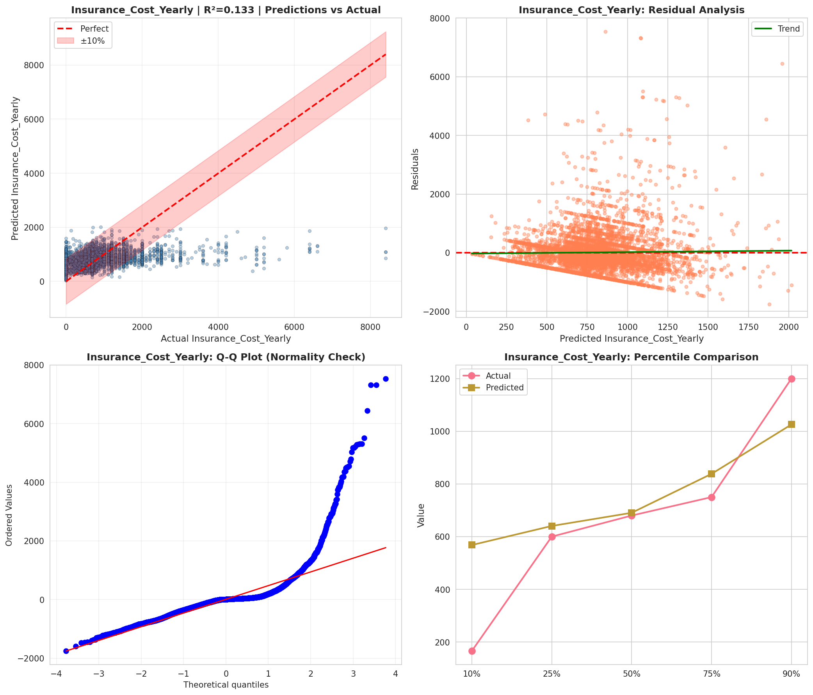
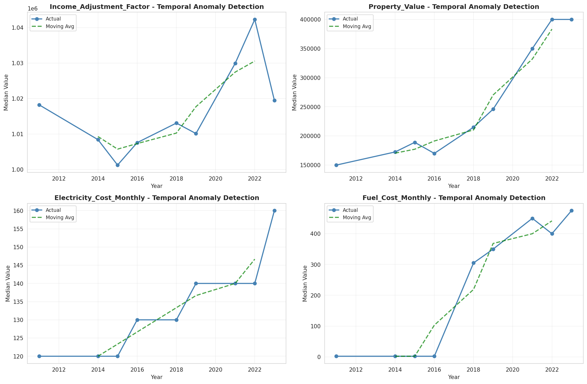
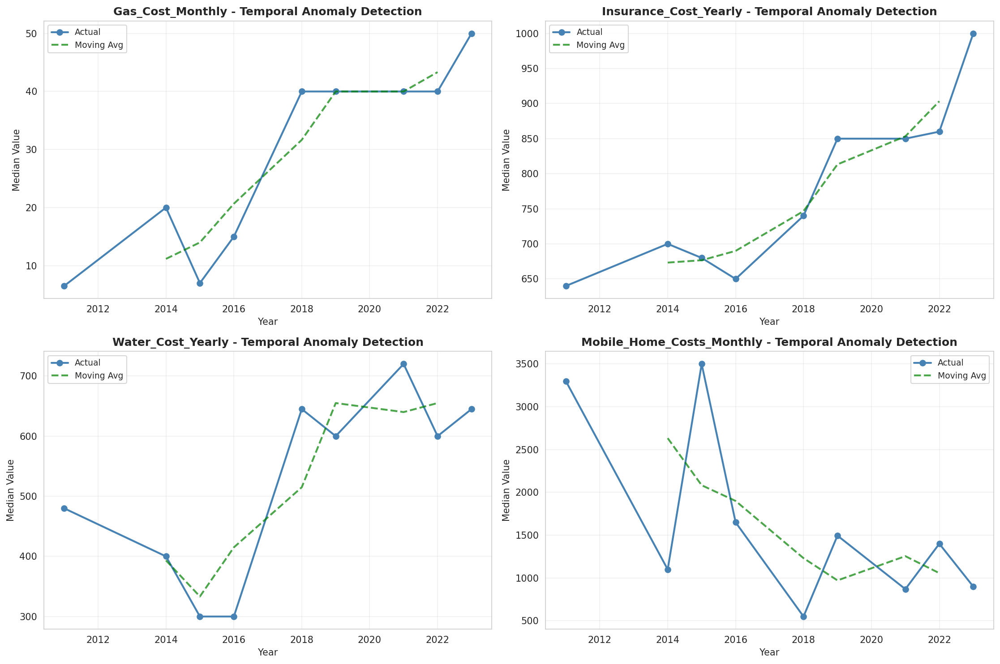
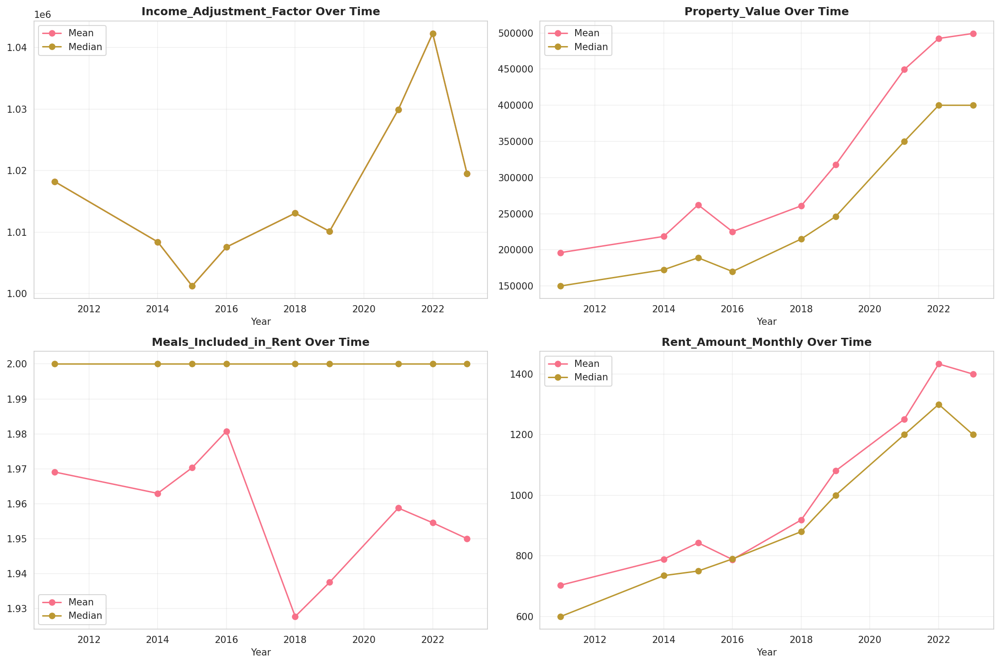
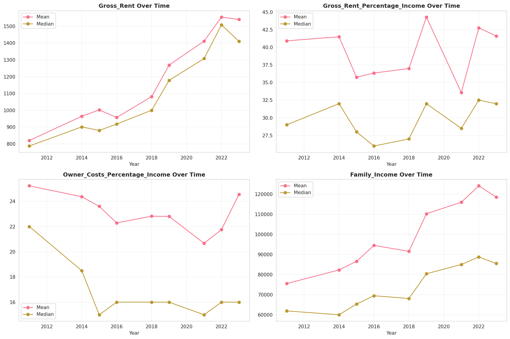
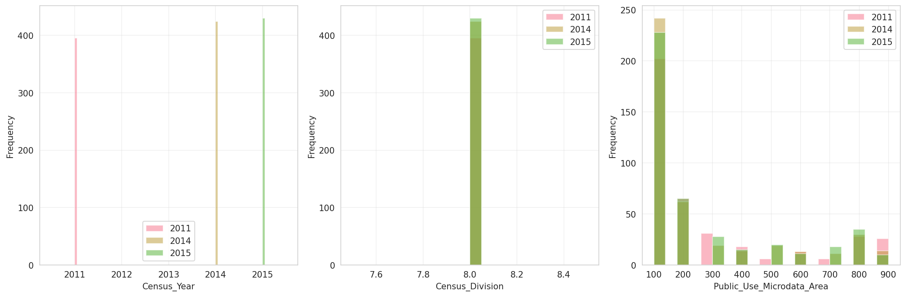
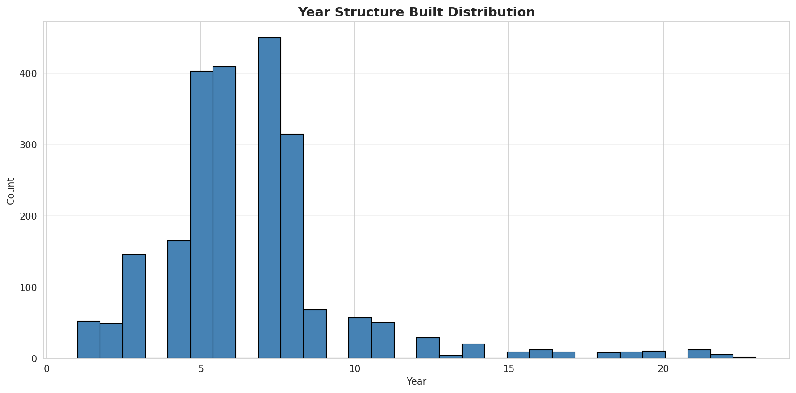
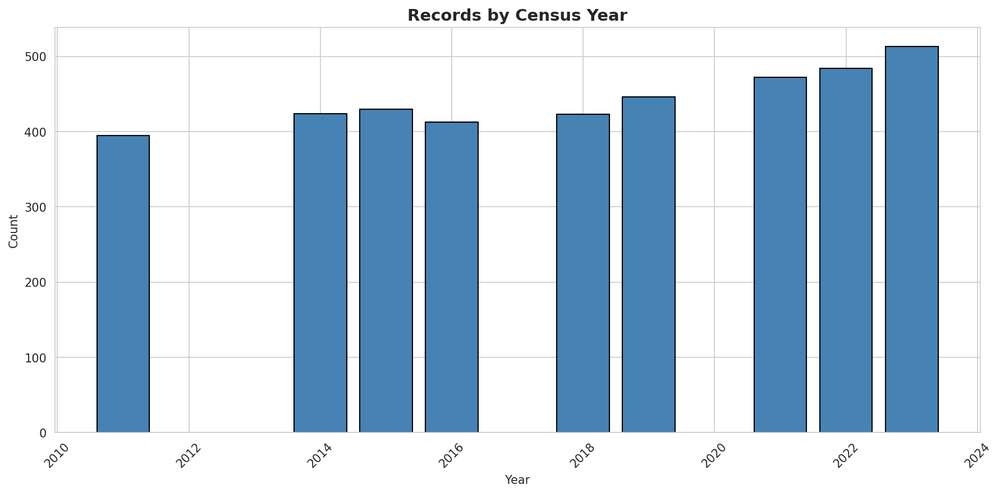
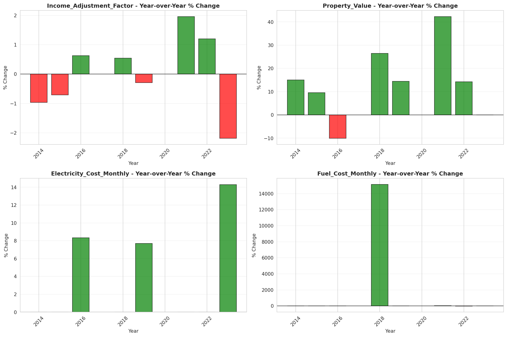
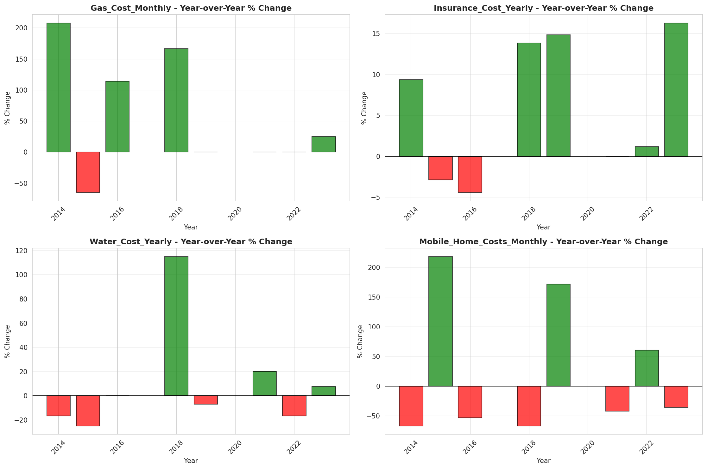

# Temporal Analysis

## Year Distribution

- 2011: 31,693 records

- 2014: 31,910 records

- 2015: 32,344 records

- 2016: 32,759 records

- 2018: 33,533 records

- 2019: 33,983 records

- 2021: 34,974 records

- 2022: 35,630 records

- 2023: 36,445 records

## Temporal Trends

- Census_Year: {np.int64(2011): {'mean': 2011.0, 'median': 2011.0, 'std': 0.0}, np.int64(2014): {'mean': 2014.0, 'median': 2014.0, 'std': 0.0}, np.int64(2015): {'mean': 2015.0, 'median': 2015.0, 'std': 0.0}, np.int64(2016): {'mean': 2016.0, 'median': 2016.0, 'std': 0.0}, np.int64(2018): {'mean': 2018.0, 'median': 2018.0, 'std': 0.0}, np.int64(2019): {'mean': 2019.0, 'median': 2019.0, 'std': 0.0}, np.int64(2021): {'mean': 2021.0, 'median': 2021.0, 'std': 0.0}, np.int64(2022): {'mean': 2022.0, 'median': 2022.0, 'std': 0.0}, np.int64(2023): {'mean': 2023.0, 'median': 2023.0, 'std': 0.0}}

- Census_Division: {np.int64(2011): {'mean': 8.0, 'median': 8.0, 'std': 0.0}, np.int64(2014): {'mean': 8.0, 'median': 8.0, 'std': 0.0}, np.int64(2015): {'mean': 8.0, 'median': 8.0, 'std': 0.0}, np.int64(2016): {'mean': 8.0, 'median': 8.0, 'std': 0.0}, np.int64(2018): {'mean': 8.0, 'median': 8.0, 'std': 0.0}, np.int64(2019): {'mean': 8.0, 'median': 8.0, 'std': 0.0}, np.int64(2021): {'mean': 8.0, 'median': 8.0, 'std': 0.0}, np.int64(2022): {'mean': 8.0, 'median': 8.0, 'std': 0.0}, np.int64(2023): {'mean': 8.0, 'median': 8.0, 'std': 0.0}}

- Public_Use_Microdata_Area: {np.int64(2011): {'mean': 269.8229577509229, 'median': 121.0, 'std': 243.74091449107155}, np.int64(2014): {'mean': 279.87922281416485, 'median': 132.0, 'std': 247.9782504879325}, np.int64(2015): {'mean': 276.85369774919616, 'median': 132.0, 'std': 246.28242071786934}, np.int64(2016): {'mean': 276.28901981134953, 'median': 132.0, 'std': 244.99917898468453}, np.int64(2018): {'mean': 275.32499329019174, 'median': 131.0, 'std': 245.66088272587393}, np.int64(2019): {'mean': 272.6008004002001, 'median': 131.0, 'std': 244.63492481259104}, np.int64(2021): {'mean': 267.1643220678218, 'median': 131.0, 'std': 240.96511138298413}, np.int64(2022): {'mean': 675.5733651417345, 'median': 134.0, 'std': 751.7966108518582}, np.int64(2023): {'mean': 674.1414734531486, 'median': 134.0, 'std': 752.3683366533577}}

- Census_Region: {np.int64(2011): {'mean': 4.0, 'median': 4.0, 'std': 0.0}, np.int64(2014): {'mean': 4.0, 'median': 4.0, 'std': 0.0}, np.int64(2015): {'mean': 4.0, 'median': 4.0, 'std': 0.0}, np.int64(2016): {'mean': 4.0, 'median': 4.0, 'std': 0.0}, np.int64(2018): {'mean': 4.0, 'median': 4.0, 'std': 0.0}, np.int64(2019): {'mean': 4.0, 'median': 4.0, 'std': 0.0}, np.int64(2021): {'mean': 4.0, 'median': 4.0, 'std': 0.0}, np.int64(2022): {'mean': 4.0, 'median': 4.0, 'std': 0.0}, np.int64(2023): {'mean': 4.0, 'median': 4.0, 'std': 0.0}}

- State_Code: {np.int64(2011): {'mean': 4.0, 'median': 4.0, 'std': 0.0}, np.int64(2014): {'mean': 4.0, 'median': 4.0, 'std': 0.0}, np.int64(2015): {'mean': 4.0, 'median': 4.0, 'std': 0.0}, np.int64(2016): {'mean': 4.0, 'median': 4.0, 'std': 0.0}, np.int64(2018): {'mean': 4.0, 'median': 4.0, 'std': 0.0}, np.int64(2019): {'mean': 4.0, 'median': 4.0, 'std': 0.0}, np.int64(2021): {'mean': 4.0, 'median': 4.0, 'std': 0.0}, np.int64(2022): {'mean': 4.0, 'median': 4.0, 'std': 0.0}, np.int64(2023): {'mean': None, 'median': None, 'std': None}}

- Housing_Adjustment_Factor: {np.int64(2011): {'mean': 1000000.0, 'median': 1000000.0, 'std': 0.0}, np.int64(2014): {'mean': 1000000.0, 'median': 1000000.0, 'std': 0.0}, np.int64(2015): {'mean': 1000000.0, 'median': 1000000.0, 'std': 0.0}, np.int64(2016): {'mean': 1000000.0, 'median': 1000000.0, 'std': 0.0}, np.int64(2018): {'mean': 1000000.0, 'median': 1000000.0, 'std': 0.0}, np.int64(2019): {'mean': 1000000.0, 'median': 1000000.0, 'std': 0.0}, np.int64(2021): {'mean': 1000000.0, 'median': 1000000.0, 'std': 0.0}, np.int64(2022): {'mean': 1000000.0, 'median': 1000000.0, 'std': 0.0}, np.int64(2023): {'mean': 1000000.0, 'median': 1000000.0, 'std': 0.0}}

- Income_Adjustment_Factor: {np.int64(2011): {'mean': 1018237.0, 'median': 1018237.0, 'std': 0.0}, np.int64(2014): {'mean': 1008425.0, 'median': 1008425.0, 'std': 0.0}, np.int64(2015): {'mean': 1001264.0, 'median': 1001264.0, 'std': 0.0}, np.int64(2016): {'mean': 1007588.0, 'median': 1007588.0, 'std': 0.0}, np.int64(2018): {'mean': 1013097.0, 'median': 1013097.0, 'std': 0.0}, np.int64(2019): {'mean': 1010145.0, 'median': 1010145.0, 'std': 0.0}, np.int64(2021): {'mean': 1029928.0, 'median': 1029928.0, 'std': 0.0}, np.int64(2022): {'mean': 1042311.0, 'median': 1042311.0, 'std': 0.0}, np.int64(2023): {'mean': 1019518.0, 'median': 1019518.0, 'std': 0.0}}

- Housing_Unit_Weight: {np.int64(2011): {'mean': 90.3783169785126, 'median': 64.0, 'std': 95.59953739705504}, np.int64(2014): {'mean': 91.17317455343152, 'median': 69.0, 'std': 75.6357895919098}, np.int64(2015): {'mean': 90.56310289389067, 'median': 69.0, 'std': 75.43486133096752}, np.int64(2016): {'mean': 90.39152599285693, 'median': 70.0, 'std': 75.13789596119956}, np.int64(2018): {'mean': 90.5347568067277, 'median': 71.0, 'std': 75.57002253226695}, np.int64(2019): {'mean': 90.51725862931465, 'median': 68.0, 'std': 80.3469042703684}, np.int64(2021): {'mean': 89.74338079716361, 'median': 67.0, 'std': 79.46973236547979}, np.int64(2022): {'mean': 89.43457760314342, 'median': 68.0, 'std': 80.76562073163505}, np.int64(2023): {'mean': 88.8866511181232, 'median': 66.0, 'std': 83.85183476261567}}

- Number_of_Persons: {np.int64(2011): {'mean': 2.0483071971728775, 'median': 2.0, 'std': 1.6220881802186788}, np.int64(2014): {'mean': 2.073863992478847, 'median': 2.0, 'std': 1.5999790669927128}, np.int64(2015): {'mean': 2.0719144199851596, 'median': 2.0, 'std': 1.6049263184783016}, np.int64(2016): {'mean': 2.087914771513172, 'median': 2.0, 'std': 1.5849551133514685}, np.int64(2018): {'mean': 2.0871976858616885, 'median': 2.0, 'std': 1.5787325095875802}, np.int64(2019): {'mean': 2.085513344907748, 'median': 2.0, 'std': 1.5461006541113946}, np.int64(2021): {'mean': 2.087979642019786, 'median': 2.0, 'std': 1.5226563787163103}, np.int64(2022): {'mean': 2.0811956216671343, 'median': 2.0, 'std': 1.5088696298074105}, np.int64(2023): {'mean': 2.079242694471121, 'median': 2.0, 'std': 1.5057890256943085}}

- Housing_Unit_Type: {np.int64(2011): {'mean': 1.1335310636418137, 'median': 1.0, 'std': 0.436302915514499}, np.int64(2014): {'mean': 1.1258226261360076, 'median': 1.0, 'std': 0.4302130552812238}, np.int64(2015): {'mean': 1.1358830076675737, 'median': 1.0, 'std': 0.44766946009285874}, np.int64(2016): {'mean': 1.1380994535852742, 'median': 1.0, 'std': 0.45060142130380854}, np.int64(2018): {'mean': 1.1377747293710674, 'median': 1.0, 'std': 0.45268430605304644}, np.int64(2019): {'mean': 1.1388929758997146, 'median': 1.0, 'std': 0.45575289829774174}, np.int64(2021): {'mean': None, 'median': None, 'std': None}, np.int64(2022): {'mean': None, 'median': None, 'std': None}, np.int64(2023): {'mean': None, 'median': None, 'std': None}}

- Number_of_Bedrooms: {np.int64(2011): {'mean': 2.656926406926407, 'median': 3.0, 'std': 1.168360843252157}, np.int64(2014): {'mean': 2.7140205547726257, 'median': 3.0, 'std': 1.156148132040657}, np.int64(2015): {'mean': 2.6989518964869754, 'median': 3.0, 'std': 1.1313732312093596}, np.int64(2016): {'mean': 2.7082503123839112, 'median': 3.0, 'std': 1.1132218553881752}, np.int64(2018): {'mean': 2.7134104160490167, 'median': 3.0, 'std': 1.1199132907267522}, np.int64(2019): {'mean': 2.725357607282185, 'median': 3.0, 'std': 1.1382222783865321}, np.int64(2021): {'mean': 2.740291184809965, 'median': 3.0, 'std': 1.1354777531400466}, np.int64(2022): {'mean': 2.761634292528321, 'median': 3.0, 'std': 1.158463518266601}, np.int64(2023): {'mean': 2.77697863933819, 'median': 3.0, 'std': 1.1358104872098835}}

- Number_of_Rooms: {np.int64(2011): {'mean': 5.37906716938975, 'median': 5.0, 'std': 2.143607356096621}, np.int64(2014): {'mean': 5.4880899185371055, 'median': 5.0, 'std': 2.1887359850650348}, np.int64(2015): {'mean': 5.501109555836264, 'median': 5.0, 'std': 2.229712711465778}, np.int64(2016): {'mean': 5.528283408192901, 'median': 5.0, 'std': 2.2196587407872994}, np.int64(2018): {'mean': 5.564383832394506, 'median': 5.0, 'std': 2.2313147933293918}, np.int64(2019): {'mean': 5.615507152145644, 'median': 5.0, 'std': 2.2648780798427306}, np.int64(2021): {'mean': 5.638981808913951, 'median': 5.0, 'std': 2.2848405693292566}, np.int64(2022): {'mean': 5.6498885994916375, 'median': 5.0, 'std': 2.2931518442525034}, np.int64(2023): {'mean': 5.685547598468947, 'median': 6.0, 'std': 2.2901149394154823}}

- Building_Type: {np.int64(2011): {'mean': 2.851207931853093, 'median': 2.0, 'std': 2.0850860867842695}, np.int64(2014): {'mean': 2.7945897638607224, 'median': 2.0, 'std': 2.041526036735791}, np.int64(2015): {'mean': 2.7966610904373357, 'median': 2.0, 'std': 2.0434584773882665}, np.int64(2016): {'mean': 2.776805916720138, 'median': 2.0, 'std': 2.0323449214865184}, np.int64(2018): {'mean': 2.805613202885661, 'median': 2.0, 'std': 2.0720161373191535}, np.int64(2019): {'mean': 2.8354681404421327, 'median': 2.0, 'std': 2.104400714086267}, np.int64(2021): {'mean': 2.8172926821497977, 'median': 2.0, 'std': 2.080460456449248}, np.int64(2022): {'mean': 2.7959958577839146, 'median': 2.0, 'std': 2.074574400402625}, np.int64(2023): {'mean': 2.767594764785776, 'median': 2.0, 'std': 2.047266903575001}}

- Year_Structure_Built: {np.int64(2011): {'mean': 6.019131406228181, 'median': 6.0, 'std': 2.139788174698585}, np.int64(2014): {'mean': 6.455607878183756, 'median': 6.0, 'std': 2.47604998147206}, np.int64(2015): {'mean': 6.567136663138848, 'median': 6.0, 'std': 2.70350433127756}, np.int64(2016): {'mean': 6.745972780385667, 'median': 6.0, 'std': 3.0366399651726432}, np.int64(2018): {'mean': 7.075303883782983, 'median': 6.0, 'std': 3.596109298390259}, np.int64(2019): {'mean': 7.245221066319896, 'median': 7.0, 'std': 3.919270926623031}, np.int64(2021): {'mean': None, 'median': None, 'std': None}, np.int64(2022): {'mean': None, 'median': None, 'std': None}, np.int64(2023): {'mean': None, 'median': None, 'std': None}}

- Bathtub_or_Shower: {np.int64(2011): {'mean': 1.032642089093702, 'median': 1.0, 'std': 0.17770111291759125}, np.int64(2014): {'mean': 1.0244044959268552, 'median': 1.0, 'std': 0.15430403399207082}, np.int64(2015): {'mean': 1.0246150694752654, 'median': 1.0, 'std': 0.15495156512691058}, np.int64(2016): {'mean': 1.0202289689642363, 'median': 1.0, 'std': 0.14078503876178172}, np.int64(2018): {'mean': 1.019962446882103, 'median': 1.0, 'std': 0.1398734859803502}, np.int64(2019): {'mean': 1.0185305591677503, 'median': 1.0, 'std': 0.13486203626132756}, np.int64(2021): {'mean': 1.0170760457485106, 'median': 1.0, 'std': 0.1295568954213926}, np.int64(2022): {'mean': 1.0161922992437318, 'median': 1.0, 'std': 0.12621651476015194}, np.int64(2023): {'mean': 1.0136127917026794, 'median': 1.0, 'std': 0.11587880780026177}}

- Refrigerator: {np.int64(2011): {'mean': 1.034876413908672, 'median': 1.0, 'std': 0.183469956176782}, np.int64(2014): {'mean': 1.0284604544048397, 'median': 1.0, 'std': 0.1662871233400988}, np.int64(2015): {'mean': 1.0275169847393397, 'median': 1.0, 'std': 0.1635870224246808}, np.int64(2016): {'mean': 1.0242477457701529, 'median': 1.0, 'std': 0.15381999753799191}, np.int64(2018): {'mean': 1.0214777481305795, 'median': 1.0, 'std': 0.1449729174660512}, np.int64(2019): {'mean': 1.0213914174252277, 'median': 1.0, 'std': 0.14468761267420555}, np.int64(2021): {'mean': 1.018573385580936, 'median': 1.0, 'std': 0.13501479798046914}, np.int64(2022): {'mean': 1.0169454294411147, 'median': 1.0, 'std': 0.12906899171581845}, np.int64(2023): {'mean': 1.013828867761452, 'median': 1.0, 'std': 0.11678206693395146}}

- Hot_and_Cold_Running_Water: {np.int64(2011): {'mean': 1.0431154866638737, 'median': 1.0, 'std': 0.2031206091080705}, np.int64(2014): {'mean': 1.0347506272986629, 'median': 1.0, 'std': 0.18315068713801957}, np.int64(2015): {'mean': 1.0336622170632617, 'median': 1.0, 'std': 0.18036125634938857}, np.int64(2016): {'mean': 1.031373476073081, 'median': 1.0, 'std': 0.17432787323594442}, np.int64(2018): {'mean': 1.032150739532892, 'median': 1.0, 'std': 0.17640321582059693}, np.int64(2019): {'mean': 1.0296814044213265, 'median': 1.0, 'std': 0.16970961957955796}, np.int64(2021): {'mean': 1.0259326515658351, 'median': 1.0, 'std': 0.15893694950987539}, np.int64(2022): {'mean': 1.0242570684407066, 'median': 1.0, 'std': 0.1538486458418841}, np.int64(2023): {'mean': 1.0217928139276453, 'median': 1.0, 'std': 0.14600871634869664}}

- Running_Water: {np.int64(2011): {'mean': None, 'median': None, 'std': None}, np.int64(2014): {'mean': 9.0, 'median': 9.0, 'std': 0.0}, np.int64(2015): {'mean': 9.0, 'median': 9.0, 'std': 0.0}, np.int64(2016): {'mean': 9.0, 'median': 9.0, 'std': 0.0}, np.int64(2018): {'mean': 9.0, 'median': 9.0, 'std': 0.0}, np.int64(2019): {'mean': 9.0, 'median': 9.0, 'std': 0.0}, np.int64(2021): {'mean': 9.0, 'median': 9.0, 'std': 0.0}, np.int64(2022): {'mean': 9.0, 'median': 9.0, 'std': 0.0}, np.int64(2023): {'mean': 9.0, 'median': 9.0, 'std': 0.0}}

- Sink_with_Faucet: {np.int64(2011): {'mean': 1.0313503700600475, 'median': 1.0, 'std': 0.17426584451543584}, np.int64(2014): {'mean': 1.022995222218403, 'median': 1.0, 'std': 0.14989067425464744}, np.int64(2015): {'mean': 1.0239664060632958, 'median': 1.0, 'std': 0.15294710222376484}, np.int64(2016): {'mean': 1.019789942926615, 'median': 1.0, 'std': 0.13928013574181908}, np.int64(2018): {'mean': 1.0189742069374443, 'median': 1.0, 'std': 0.13643606416495543}, np.int64(2019): {'mean': 1.0179778933680104, 'median': 1.0, 'std': 0.1328731074607901}, np.int64(2021): {'mean': 1.0162795883908375, 'median': 1.0, 'std': 0.12655067603766731}, np.int64(2022): {'mean': 1.015345027771676, 'median': 1.0, 'std': 0.12292287034392148}, np.int64(2023): {'mean': 1.012563279417212, 'median': 1.0, 'std': 0.11138144536074969}}

- Stove_or_Range: {np.int64(2011): {'mean': 1.029290601871247, 'median': 1.0, 'std': 0.16862281924416514}, np.int64(2014): {'mean': 1.0223421441583886, 'median': 1.0, 'std': 0.14779622314804544}, np.int64(2015): {'mean': 1.0244443685773788, 'median': 1.0, 'std': 0.15442686160599178}, np.int64(2016): {'mean': 1.0207017662355207, 'median': 1.0, 'std': 0.14238640308839873}, np.int64(2018): {'mean': 1.0182494976446947, 'median': 1.0, 'std': 0.13385456171414872}, np.int64(2019): {'mean': 1.018368010403121, 'median': 1.0, 'std': 0.13428035145628864}, np.int64(2021): {'mean': 1.017776928223263, 'median': 1.0, 'std': 0.13214183795721038}, np.int64(2022): {'mean': 1.0163492013681865, 'median': 1.0, 'std': 0.12681644079399648}, np.int64(2023): {'mean': 1.0150018520805038, 'median': 1.0, 'std': 0.12156172365929005}}

- Telephone_Service: {np.int64(2011): {'mean': 1.0370444855602927, 'median': 1.0, 'std': 0.18887463174122765}, np.int64(2014): {'mean': 1.0330296127562641, 'median': 1.0, 'std': 0.17871740780439485}, np.int64(2015): {'mean': 1.0343530689000038, 'median': 1.0, 'std': 0.18213791979817437}, np.int64(2016): {'mean': 1.0400441551520687, 'median': 1.0, 'std': 0.19606652972891583}, np.int64(2018): {'mean': 1.0195578231292517, 'median': 1.0, 'std': 0.13847752036491853}, np.int64(2019): {'mean': 1.0124833134899158, 'median': 1.0, 'std': 0.11103118999951896}, np.int64(2021): {'mean': 1.011148897381061, 'median': 1.0, 'std': 0.10499993332343172}, np.int64(2022): {'mean': 1.0126312166580622, 'median': 1.0, 'std': 0.11167854888940583}, np.int64(2023): {'mean': 1.0100836946657255, 'median': 1.0, 'std': 0.0999117075096231}}

- Lot_Acreage: {np.int64(2011): {'mean': 1.1645369460233344, 'median': 1.0, 'std': 0.41452662851284283}, np.int64(2014): {'mean': 1.160278020560203, 'median': 1.0, 'std': 0.40514922916734303}, np.int64(2015): {'mean': 1.1468606621750093, 'median': 1.0, 'std': 0.39198758737312617}, np.int64(2016): {'mean': 1.1488730964467004, 'median': 1.0, 'std': 0.3937783287264049}, np.int64(2018): {'mean': 1.1425956871170526, 'median': 1.0, 'std': 0.38487586792052164}, np.int64(2019): {'mean': 1.1385269456363423, 'median': 1.0, 'std': 0.3783114909938671}, np.int64(2021): {'mean': 1.1301967690069674, 'median': 1.0, 'std': 0.36679075977013204}, np.int64(2022): {'mean': 1.1297609666403992, 'median': 1.0, 'std': 0.36894244757365635}, np.int64(2023): {'mean': 1.1356243345449206, 'median': 1.0, 'std': 0.37475226595481453}}

- Agricultural_Sales: {np.int64(2011): {'mean': 1.0793015642051655, 'median': 1.0, 'std': 0.5674043465685035}, np.int64(2014): {'mean': 1.0835734870317002, 'median': 1.0, 'std': 0.5562457655702442}, np.int64(2015): {'mean': 1.0792380952380953, 'median': 1.0, 'std': 0.5642818918113969}, np.int64(2016): {'mean': 1.0875370919881306, 'median': 1.0, 'std': 0.5699139818214864}, np.int64(2018): {'mean': 1.0763274336283186, 'median': 1.0, 'std': 0.5150627560360531}, np.int64(2019): {'mean': 1.0835452233926626, 'median': 1.0, 'std': 0.5625111751537486}, np.int64(2021): {'mean': 1.0738987986894795, 'median': 1.0, 'std': 0.5084853706144634}, np.int64(2022): {'mean': 1.08709562744401, 'median': 1.0, 'std': 0.531932509461209}, np.int64(2023): {'mean': 1.0936170212765957, 'median': 1.0, 'std': 0.5944585656037578}}

- Tenure: {np.int64(2011): {'mean': 1.9016571474539459, 'median': 2.0, 'std': 0.8969364869171558}, np.int64(2014): {'mean': 1.9336658549996073, 'median': 2.0, 'std': 0.8924085267620965}, np.int64(2015): {'mean': 1.9295490675041682, 'median': 2.0, 'std': 0.8864363010648223}, np.int64(2016): {'mean': 1.9105096874881047, 'median': 2.0, 'std': 0.8841239898113255}, np.int64(2018): {'mean': 1.894927536231884, 'median': 2.0, 'std': 0.8708815802861873}, np.int64(2019): {'mean': 1.8797128116318504, 'median': 2.0, 'std': 0.8653577755683698}, np.int64(2021): {'mean': 1.8532412439084247, 'median': 2.0, 'std': 0.8526054033841408}, np.int64(2022): {'mean': 1.8514541387024608, 'median': 2.0, 'std': 0.8404172977422124}, np.int64(2023): {'mean': 1.8477362105475446, 'median': 2.0, 'std': 0.8370063709441041}}

- Vacancy_Status: {np.int64(2011): {'mean': 4.625594923320994, 'median': 5.0, 'std': 1.9919065552348947}, np.int64(2014): {'mean': 4.72707243183696, 'median': 5.0, 'std': 1.9141728017966002}, np.int64(2015): {'mean': 4.783428571428572, 'median': 5.0, 'std': 1.9073899139494772}, np.int64(2016): {'mean': 4.883233532934132, 'median': 5.0, 'std': 1.827583163901885}, np.int64(2018): {'mean': 4.9320036264732545, 'median': 5.0, 'std': 1.8231764685008363}, np.int64(2019): {'mean': 5.033848176141965, 'median': 5.0, 'std': 1.7984866197955507}, np.int64(2021): {'mean': 5.037334263782275, 'median': 5.0, 'std': 1.7604343857266065}, np.int64(2022): {'mean': 4.855974395448079, 'median': 5.0, 'std': 1.860739461819642}, np.int64(2023): {'mean': 4.697920604914934, 'median': 5.0, 'std': 1.9623574235697427}}

- Property_Value: {np.int64(2011): {'mean': 199618.5098218888, 'median': 150000.0, 'std': 234837.84550986}, np.int64(2014): {'mean': 226917.71732938362, 'median': 170000.0, 'std': 261916.72789909042}, np.int64(2015): {'mean': 242209.64385086254, 'median': 180000.0, 'std': 280605.344048173}, np.int64(2016): {'mean': 253880.0757780785, 'median': 200000.0, 'std': 288464.853693453}, np.int64(2018): {'mean': 283511.0443742557, 'median': 230000.0, 'std': 275606.4010715867}, np.int64(2019): {'mean': 301732.9160640367, 'median': 250000.0, 'std': 291388.8642334691}, np.int64(2021): {'mean': 391314.2001995344, 'median': 325000.0, 'std': 415702.06710215437}, np.int64(2022): {'mean': 467902.83322601416, 'median': 395000.0, 'std': 545281.9485724024}, np.int64(2023): {'mean': 485959.14069835027, 'median': 400000.0, 'std': 562185.0075025795}}

- Vehicles_Available: {np.int64(2011): {'mean': 1.6983750301665193, 'median': 2.0, 'std': 1.002452933620567}, np.int64(2014): {'mean': 1.7518262508836697, 'median': 2.0, 'std': 1.0063384618765596}, np.int64(2015): {'mean': 1.7637160249699508, 'median': 2.0, 'std': 1.017071906950147}, np.int64(2016): {'mean': 1.8009592326139088, 'median': 2.0, 'std': 1.033364527622536}, np.int64(2018): {'mean': 1.8452380952380953, 'median': 2.0, 'std': 1.0604212211271702}, np.int64(2019): {'mean': 1.8764296280261212, 'median': 2.0, 'std': 1.0818330091519557}, np.int64(2021): {'mean': 1.8832170529046734, 'median': 2.0, 'std': 1.0733232782624733}, np.int64(2022): {'mean': 1.8796076406814661, 'median': 2.0, 'std': 1.0706583026545016}, np.int64(2023): {'mean': 1.8847097576552048, 'median': 2.0, 'std': 1.090872050646917}}

- Condo_Fee_Monthly: {np.int64(2011): {'mean': 177.73831775700936, 'median': 160.0, 'std': 128.81270813510457}, np.int64(2014): {'mean': 212.85176470588235, 'median': 180.0, 'std': 161.25984898785723}, np.int64(2015): {'mean': 216.4113475177305, 'median': 190.0, 'std': 165.83359753760666}, np.int64(2016): {'mean': 210.2422954303932, 'median': 180.0, 'std': 149.19292364087713}, np.int64(2018): {'mean': 226.53483606557376, 'median': 200.0, 'std': 173.06389161253608}, np.int64(2019): {'mean': 237.47368421052633, 'median': 200.0, 'std': 165.83350087475708}, np.int64(2021): {'mean': 273.50440917107585, 'median': 220.0, 'std': 234.3235545653554}, np.int64(2022): {'mean': 288.314606741573, 'median': 230.0, 'std': 261.4302925007972}, np.int64(2023): {'mean': 294.87156775907886, 'median': 240.0, 'std': 258.7743999139406}}

- Electricity_Cost_Monthly: {np.int64(2011): {'mean': 144.83163060091707, 'median': 120.0, 'std': 102.1729249502249}, np.int64(2014): {'mean': 145.3576702537114, 'median': 120.0, 'std': 101.08467155944226}, np.int64(2015): {'mean': 145.25722151137992, 'median': 120.0, 'std': 103.89184685555954}, np.int64(2016): {'mean': 148.76407445472194, 'median': 130.0, 'std': 104.859021084305}, np.int64(2018): {'mean': 160.94030841303925, 'median': 140.0, 'std': 103.63714994130603}, np.int64(2019): {'mean': 159.2401916058394, 'median': 130.0, 'std': 102.57903993079204}, np.int64(2021): {'mean': 166.7732823304399, 'median': 140.0, 'std': 109.75875037054257}, np.int64(2022): {'mean': 185.98701720220708, 'median': 150.0, 'std': 228.34230285950082}, np.int64(2023): {'mean': 200.3314543404735, 'median': 150.0, 'std': 243.84863770679524}}

- Fuel_Cost_Monthly: {np.int64(2011): {'mean': 45.35190250180999, 'median': 2.0, 'std': 225.90321633682424}, np.int64(2014): {'mean': 30.83913282538685, 'median': 2.0, 'std': 183.28778798293564}, np.int64(2015): {'mean': 28.663719902291497, 'median': 2.0, 'std': 177.25127420899742}, np.int64(2016): {'mean': 28.360549655513683, 'median': 2.0, 'std': 175.3515501907746}, np.int64(2018): {'mean': 515.3333333333334, 'median': 370.0, 'std': 552.8413956627013}, np.int64(2019): {'mean': 544.9137931034483, 'median': 400.0, 'std': 579.1534920621875}, np.int64(2021): {'mean': 571.2168224299065, 'median': 400.0, 'std': 585.3168800266653}, np.int64(2022): {'mean': 646.995491433724, 'median': 500.0, 'std': 616.0052546905504}, np.int64(2023): {'mean': 756.7334465195246, 'median': 500.0, 'std': 823.6623347695969}}

- Gas_Cost_Monthly: {np.int64(2011): {'mean': 32.590740889711206, 'median': 10.0, 'std': 51.9021059163312}, np.int64(2014): {'mean': 29.44666561935433, 'median': 4.0, 'std': 45.282975391772894}, np.int64(2015): {'mean': 30.206544918770113, 'median': 3.0, 'std': 47.96319463260119}, np.int64(2016): {'mean': 29.183358075444406, 'median': 3.0, 'std': 45.72665252984823}, np.int64(2018): {'mean': 52.88984369212534, 'median': 40.0, 'std': 54.69052955163429}, np.int64(2019): {'mean': 55.20350267766681, 'median': 40.0, 'std': 54.15778319838546}, np.int64(2021): {'mean': 55.705507888181565, 'median': 40.0, 'std': 57.42909125061964}, np.int64(2022): {'mean': 74.35242997526572, 'median': 40.0, 'std': 133.81678647752776}, np.int64(2023): {'mean': 83.58303155716503, 'median': 50.0, 'std': 139.93730716915147}}

- House_Heating_Fuel: {np.int64(2011): {'mean': 2.5102968385487894, 'median': 3.0, 'std': 1.4225349938294907}, np.int64(2014): {'mean': 2.526431545047522, 'median': 3.0, 'std': 1.4912350331609123}, np.int64(2015): {'mean': 2.5138614245279363, 'median': 3.0, 'std': 1.4598782335505034}, np.int64(2016): {'mean': 2.4949944806059916, 'median': 3.0, 'std': 1.3968681563210854}, np.int64(2018): {'mean': 2.510499852114759, 'median': 3.0, 'std': 1.424593938911259}, np.int64(2019): {'mean': 2.471046650070354, 'median': 3.0, 'std': 1.3928255509815013}, np.int64(2021): {'mean': 2.4842057287101635, 'median': 3.0, 'std': 1.4294727288326012}, np.int64(2022): {'mean': 2.4886594389950094, 'median': 3.0, 'std': 1.4379147132414458}, np.int64(2023): {'mean': 2.4714463379382208, 'median': 3.0, 'std': 1.425782918218969}}

- Insurance_Cost_Yearly: {np.int64(2011): {'mean': 728.9536750211208, 'median': 600.0, 'std': 527.5617190657923}, np.int64(2014): {'mean': 794.6774777282851, 'median': 650.0, 'std': 596.2349498006697}, np.int64(2015): {'mean': 834.9261103633917, 'median': 700.0, 'std': 614.8287991869423}, np.int64(2016): {'mean': 863.2769671704012, 'median': 700.0, 'std': 658.2130309656571}, np.int64(2018): {'mean': 910.0671576582199, 'median': 750.0, 'std': 693.9764856032759}, np.int64(2019): {'mean': 938.9175313380915, 'median': 800.0, 'std': 702.8456874997482}, np.int64(2021): {'mean': 1021.8043880814769, 'median': 820.0, 'std': 835.2011593314755}, np.int64(2022): {'mean': 1085.1037348936402, 'median': 900.0, 'std': 895.2680868286493}, np.int64(2023): {'mean': 1267.2755434211908, 'median': 1000.0, 'std': 1119.360409957308}}

- Water_Cost_Yearly: {np.int64(2011): {'mean': 514.7626498270453, 'median': 380.0, 'std': 582.0104177750103}, np.int64(2014): {'mean': 524.4149320556123, 'median': 360.0, 'std': 594.4854582130837}, np.int64(2015): {'mean': 528.397231592416, 'median': 390.0, 'std': 590.0079540003899}, np.int64(2016): {'mean': 526.8629287046554, 'median': 360.0, 'std': 605.2631582438371}, np.int64(2018): {'mean': 680.6962553311149, 'median': 600.0, 'std': 633.4013412622388}, np.int64(2019): {'mean': 689.1929521820081, 'median': 600.0, 'std': 644.2013935675693}, np.int64(2021): {'mean': 709.3748227102764, 'median': 600.0, 'std': 722.1963567301757}, np.int64(2022): {'mean': 705.9515573839308, 'median': 600.0, 'std': 744.5925780051812}, np.int64(2023): {'mean': 711.2102164291225, 'median': 600.0, 'std': 735.8348295633355}}

- Mobile_Home_Costs_Monthly: {np.int64(2011): {'mean': 2425.360496014172, 'median': 1200.0, 'std': 2395.2018241925603}, np.int64(2014): {'mean': 2712.954582989265, 'median': 1500.0, 'std': 2646.3078974333735}, np.int64(2015): {'mean': 2933.165634674923, 'median': 1900.0, 'std': 2772.625093485818}, np.int64(2016): {'mean': 2898.1336405529955, 'median': 1550.0, 'std': 2785.677584351041}, np.int64(2018): {'mean': 2983.2372505543235, 'median': 1500.0, 'std': 2935.8689706881064}, np.int64(2019): {'mean': 3229.4432835820894, 'median': 1900.0, 'std': 3094.77137662131}, np.int64(2021): {'mean': 3798.171469740634, 'median': 1200.0, 'std': 4815.266028642355}, np.int64(2022): {'mean': 4462.5268817204305, 'median': 1600.0, 'std': 6708.715920845586}, np.int64(2023): {'mean': 3965.573591762568, 'median': 1400.0, 'std': 4911.262587761383}}

- First_Mortgage_Includes_Insurance: {np.int64(2011): {'mean': 1.2959127057518032, 'median': 1.0, 'std': 0.45647304920381127}, np.int64(2014): {'mean': 1.2708909004287756, 'median': 1.0, 'std': 0.4444410440446544}, np.int64(2015): {'mean': 1.267797895535122, 'median': 1.0, 'std': 0.4428326683918432}, np.int64(2016): {'mean': 1.261961069674368, 'median': 1.0, 'std': 0.4397215652828334}, np.int64(2018): {'mean': 1.26853566075994, 'median': 1.0, 'std': 0.4432173033276939}, np.int64(2019): {'mean': 1.2511707109408259, 'median': 1.0, 'std': 0.43370496911148715}, np.int64(2021): {'mean': 1.2499172185430463, 'median': 1.0, 'std': 0.43298281928928445}, np.int64(2022): {'mean': 1.2473706004140788, 'median': 1.0, 'std': 0.43150180328913085}, np.int64(2023): {'mean': 1.2647058823529411, 'median': 1.0, 'std': 0.4411943940264846}}

- First_Mortgage_Payment_Monthly: {np.int64(2011): {'mean': 1130.571296467542, 'median': 980.0, 'std': 759.9047993235699}, np.int64(2014): {'mean': 1090.856026679371, 'median': 940.0, 'std': 710.8481343321557}, np.int64(2015): {'mean': 1124.6455588207414, 'median': 980.0, 'std': 718.918713607569}, np.int64(2016): {'mean': 1145.838275422958, 'median': 1000.0, 'std': 708.3210121668416}, np.int64(2018): {'mean': 1228.866790090805, 'median': 1100.0, 'std': 754.5079825226117}, np.int64(2019): {'mean': 1280.4939974457216, 'median': 1100.0, 'std': 755.5890051515851}, np.int64(2021): {'mean': 523.640447290452, 'median': 4.0, 'std': 818.7601766725154}, np.int64(2022): {'mean': 636.9459881129272, 'median': 4.0, 'std': 889.6004502086522}, np.int64(2023): {'mean': 1520.8865778355541, 'median': 1300.0, 'std': 916.0884417590111}}

- First_Mortgage_Includes_Taxes: {np.int64(2011): {'mean': 1.2098206029221379, 'median': 1.0, 'std': 0.40719927618914403}, np.int64(2014): {'mean': 1.1781800857551215, 'median': 1.0, 'std': 0.3826825011264235}, np.int64(2015): {'mean': 1.172243814579581, 'median': 1.0, 'std': 0.37761011610229966}, np.int64(2016): {'mean': 1.1642714207749683, 'median': 1.0, 'std': 0.37053853998393677}, np.int64(2018): {'mean': 1.1588644979282376, 'median': 1.0, 'std': 0.36556579544105045}, np.int64(2019): {'mean': 1.1414218816517667, 'median': 1.0, 'std': 0.34847104913588833}, np.int64(2021): {'mean': 1.1405629139072848, 'median': 1.0, 'std': 0.34758449675070524}, np.int64(2022): {'mean': 1.1307660455486543, 'median': 1.0, 'std': 0.337158272947516}, np.int64(2023): {'mean': 1.1448651283717908, 'median': 1.0, 'std': 0.3519791026562205}}

- First_Mortgage_Status: {np.int64(2011): {'mean': 1.7412172482669486, 'median': 1.0, 'std': 0.9598319446657402}, np.int64(2014): {'mean': 1.7902906976744186, 'median': 1.0, 'std': 0.9723360740646612}, np.int64(2015): {'mean': 1.8127732046551235, 'median': 1.0, 'std': 0.9769840843339925}, np.int64(2016): {'mean': 1.8006269937300627, 'median': 1.0, 'std': 0.974857821697448}, np.int64(2018): {'mean': 1.8170353633545269, 'median': 1.0, 'std': 0.9785110230005072}, np.int64(2019): {'mean': 1.821973139452691, 'median': 1.0, 'std': 0.9799885435833766}, np.int64(2021): {'mean': 1.8488729016786571, 'median': 1.0, 'std': 0.9846731455503422}, np.int64(2022): {'mean': 1.8857938718662952, 'median': 1.0, 'std': 0.9899690250413871}, np.int64(2023): {'mean': 1.896881197043447, 'median': 1.0, 'std': 0.9915145502191647}}

- Second_Mortgage_Payment_Monthly: {np.int64(2011): {'mean': 366.7427078798433, 'median': 280.0, 'std': 326.05633807856094}, np.int64(2014): {'mean': 349.7939799331104, 'median': 260.0, 'std': 310.85340982551077}, np.int64(2015): {'mean': 365.46767537826685, 'median': 250.0, 'std': 366.43051560589316}, np.int64(2016): {'mean': 413.01451378809867, 'median': 300.0, 'std': 429.7949332080057}, np.int64(2018): {'mean': 431.4527027027027, 'median': 300.0, 'std': 449.7958411222963}, np.int64(2019): {'mean': 469.96029776674936, 'median': 320.0, 'std': 508.39001012602307}, np.int64(2021): {'mean': 456.8003427592117, 'median': 300.0, 'std': 476.39906488382275}, np.int64(2022): {'mean': 532.1796733212341, 'median': 310.0, 'std': 656.9227468966695}, np.int64(2023): {'mean': 586.9598874032372, 'median': 400.0, 'std': 603.9644068385772}}

- Second_Mortgage_Status: {np.int64(2011): {'mean': 2.7550397632698354, 'median': 3.0, 'std': 0.545709608217295}, np.int64(2014): {'mean': 2.8335397808480227, 'median': 3.0, 'std': 0.4572639686911995}, np.int64(2015): {'mean': 2.841311972698834, 'median': 3.0, 'std': 0.453816688619253}, np.int64(2016): {'mean': 2.8540112788793888, 'median': 3.0, 'std': 0.4327500865041666}, np.int64(2018): {'mean': 2.8838931499603278, 'median': 3.0, 'std': 0.37957080683167543}, np.int64(2019): {'mean': 2.886845466155811, 'median': 3.0, 'std': 0.3758072175441371}, np.int64(2021): {'mean': 2.893689596361569, 'median': 3.0, 'std': 0.3573055983067254}, np.int64(2022): {'mean': 2.902157102157102, 'median': 3.0, 'std': 0.3395642471675721}, np.int64(2023): {'mean': 2.8801146314281167, 'median': 3.0, 'std': 0.3619350020368944}}

- Property_Taxes_Yearly: {np.int64(2011): {'mean': 23.820702620138643, 'median': 24.0, 'std': 14.16575146071199}, np.int64(2014): {'mean': 23.737093023255813, 'median': 24.0, 'std': 14.621505591432282}, np.int64(2015): {'mean': 24.727164348566564, 'median': 24.0, 'std': 14.677484983855425}, np.int64(2016): {'mean': 25.272742272577275, 'median': 25.0, 'std': 14.968115041979125}}

- Meals_Included_in_Rent: {np.int64(2011): {'mean': 1.972604453340005, 'median': 2.0, 'std': 0.16324326702465522}, np.int64(2014): {'mean': 1.974720115565186, 'median': 2.0, 'std': 0.15698337015665562}, np.int64(2015): {'mean': 1.971197450667974, 'median': 2.0, 'std': 0.1672614461959083}, np.int64(2016): {'mean': 1.972709063595393, 'median': 2.0, 'std': 0.16294006524908916}, np.int64(2018): {'mean': 1.9713819505460022, 'median': 2.0, 'std': 0.16674095601505817}, np.int64(2019): {'mean': 1.9679783950617284, 'median': 2.0, 'std': 0.17606876045387662}, np.int64(2021): {'mean': 1.9645830580150654, 'median': 2.0, 'std': 0.18484344046218584}, np.int64(2022): {'mean': 1.9654020838899278, 'median': 2.0, 'std': 0.18277133990055364}, np.int64(2023): {'mean': 1.9608879492600422, 'median': 2.0, 'std': 0.1938743532075186}}

- Rent_Amount_Monthly: {np.int64(2011): {'mean': 737.9512134100576, 'median': 680.0, 'std': 394.8493153796483}, np.int64(2014): {'mean': 813.7322739857951, 'median': 750.0, 'std': 439.67568720343365}, np.int64(2015): {'mean': 833.798749846795, 'median': 770.0, 'std': 427.3548489220481}, np.int64(2016): {'mean': 865.6209313970957, 'median': 800.0, 'std': 448.8307612368053}, np.int64(2018): {'mean': 941.6455378436049, 'median': 860.0, 'std': 478.05786048998044}, np.int64(2019): {'mean': 1003.3832304526749, 'median': 930.0, 'std': 507.3807788905252}, np.int64(2021): {'mean': 1178.613981762918, 'median': 1100.0, 'std': 664.3416970875205}, np.int64(2022): {'mean': 1322.3625434143735, 'median': 1300.0, 'std': 738.2415674412322}, np.int64(2023): {'mean': 1452.983086680761, 'median': 1400.0, 'std': 827.1127979455533}}

- Gross_Rent: {np.int64(2011): {'mean': 898.6625632608399, 'median': 820.0, 'std': 437.58402789602326}, np.int64(2014): {'mean': 983.2912671676601, 'median': 900.0, 'std': 480.37931527105667}, np.int64(2015): {'mean': 998.6377952755905, 'median': 921.5, 'std': 468.4203809364741}, np.int64(2016): {'mean': 1030.749701393497, 'median': 960.0, 'std': 487.4229181451228}, np.int64(2018): {'mean': 1109.6398513208549, 'median': 1023.0, 'std': 513.6957250335741}, np.int64(2019): {'mean': 1163.279719336122, 'median': 1090.0, 'std': 535.1374670644127}, np.int64(2021): {'mean': 1333.7703283003186, 'median': 1250.0, 'std': 668.6020223868236}, np.int64(2022): {'mean': 1501.6438181560686, 'median': 1420.0, 'std': 779.4471743619159}, np.int64(2023): {'mean': 1646.4338877925006, 'median': 1580.0, 'std': 867.3517480886061}}

- Gross_Rent_Percentage_Income: {np.int64(2011): {'mean': 40.078138222849084, 'median': 31.0, 'std': 27.352690157039273}, np.int64(2014): {'mean': 37.59303721488595, 'median': 29.0, 'std': 26.204702128173196}, np.int64(2015): {'mean': 37.610706580366774, 'median': 29.0, 'std': 26.103154231028025}, np.int64(2016): {'mean': 37.61914460285132, 'median': 29.0, 'std': 26.68285661483896}, np.int64(2018): {'mean': 36.70672621464339, 'median': 28.0, 'std': 25.693292897295525}, np.int64(2019): {'mean': 36.815753236023134, 'median': 28.0, 'std': 26.23168487791428}, np.int64(2021): {'mean': 39.28761500353857, 'median': 30.0, 'std': 27.018998302987274}, np.int64(2022): {'mean': 39.676236044657095, 'median': 31.0, 'std': 27.035113036099347}, np.int64(2023): {'mean': 40.627860123758815, 'median': 31.0, 'std': 27.658570007485174}}

- Selected_Monthly_Owner_Costs: {np.int64(2011): {'mean': 1126.213129231675, 'median': 946.0, 'std': 921.0985969602801}, np.int64(2014): {'mean': 1051.143489401351, 'median': 875.0, 'std': 846.7488959328535}, np.int64(2015): {'mean': 1071.6957659913498, 'median': 899.0, 'std': 865.840899100772}, np.int64(2016): {'mean': 1094.1565064155516, 'median': 926.0, 'std': 864.412976526039}, np.int64(2018): {'mean': 1144.4440223699482, 'median': 957.0, 'std': 906.0213202687341}, np.int64(2019): {'mean': 1173.1697798025816, 'median': 980.0, 'std': 915.3214418627542}, np.int64(2021): {'mean': 1223.8431175059952, 'median': 1040.0, 'std': 946.2922593163731}, np.int64(2022): {'mean': 1279.4691656590085, 'median': 1052.0, 'std': 1019.3077066700798}, np.int64(2023): {'mean': 1376.0094331106698, 'median': 1113.0, 'std': 1116.6482811306917}}

- Owner_Costs_Percentage_Income: {np.int64(2011): {'mean': 26.294019637012795, 'median': 20.0, 'std': 22.7477607564848}, np.int64(2014): {'mean': 22.61842959117456, 'median': 17.0, 'std': 20.69689387522549}, np.int64(2015): {'mean': 22.565834246496337, 'median': 17.0, 'std': 20.924786069678444}, np.int64(2016): {'mean': 22.582695637602637, 'median': 17.0, 'std': 20.89380199613996}, np.int64(2018): {'mean': 21.92078205742901, 'median': 16.0, 'std': 20.62365825592511}, np.int64(2019): {'mean': 21.02721887447656, 'median': 16.0, 'std': 20.042318351776146}, np.int64(2021): {'mean': 21.84145158160295, 'median': 15.0, 'std': 21.298992348131954}, np.int64(2022): {'mean': 21.801405063887973, 'median': 15.0, 'std': 21.699461545660856}, np.int64(2023): {'mean': 22.309846927119033, 'median': 15.0, 'std': 22.286071403769796}}

- Satellite_Internet: {np.int64(2011): {'mean': None, 'median': None, 'std': None}, np.int64(2014): {'mean': 1.9116589625064202, 'median': 2.0, 'std': 0.2837975251156218}, np.int64(2015): {'mean': 1.9075455848198843, 'median': 2.0, 'std': 0.28967351051845647}, np.int64(2016): {'mean': 1.894921910676774, 'median': 2.0, 'std': 0.30666101638165055}, np.int64(2018): {'mean': 1.8911369663786466, 'median': 2.0, 'std': 0.3114739530323821}, np.int64(2019): {'mean': 1.8946377404830126, 'median': 2.0, 'std': 0.3070259147993806}, np.int64(2021): {'mean': 1.9031239166441971, 'median': 2.0, 'std': 0.2957946552205033}, np.int64(2022): {'mean': 1.9001820388349515, 'median': 2.0, 'std': 0.29976281228167406}, np.int64(2023): {'mean': 1.9028644407954753, 'median': 2.0, 'std': 0.2961476702831341}}

- Smartphone: {np.int64(2011): {'mean': None, 'median': None, 'std': None}, np.int64(2014): {'mean': None, 'median': None, 'std': None}, np.int64(2015): {'mean': None, 'median': None, 'std': None}, np.int64(2016): {'mean': 1.2463172319287428, 'median': 1.0, 'std': 0.4308736705717488}, np.int64(2018): {'mean': 1.1586808636498078, 'median': 1.0, 'std': 0.3653849792474718}, np.int64(2019): {'mean': 1.127683371216221, 'median': 1.0, 'std': 0.3337429348470453}, np.int64(2021): {'mean': 1.1000596010237351, 'median': 1.0, 'std': 0.3000847120351957}, np.int64(2022): {'mean': 1.092410944759938, 'median': 1.0, 'std': 0.28961016691796654}, np.int64(2023): {'mean': 1.0824846223656348, 'median': 1.0, 'std': 0.27510625826205654}}

- Tablet_Computer: {np.int64(2011): {'mean': None, 'median': None, 'std': None}, np.int64(2014): {'mean': None, 'median': None, 'std': None}, np.int64(2015): {'mean': None, 'median': None, 'std': None}, np.int64(2016): {'mean': 1.4085493509953941, 'median': 1.0, 'std': 0.49157499631196}, np.int64(2018): {'mean': 1.3432046731736174, 'median': 1.0, 'std': 0.47478791021863087}, np.int64(2019): {'mean': 1.3483782516145326, 'median': 1.0, 'std': 0.47646514670317286}, np.int64(2021): {'mean': 1.3386740525190197, 'median': 1.0, 'std': 0.4732671458514115}, np.int64(2022): {'mean': 1.3419377043538117, 'median': 1.0, 'std': 0.4743670050255428}, np.int64(2023): {'mean': 1.333803905751067, 'median': 1.0, 'std': 0.4715785546184271}}

- Food_Stamp_SNAP: {np.int64(2011): {'mean': 1.8583354233098062, 'median': 2.0, 'std': 0.34871203178199717}, np.int64(2014): {'mean': 1.87704657166095, 'median': 2.0, 'std': 0.328389549496391}, np.int64(2015): {'mean': 1.882713909305228, 'median': 2.0, 'std': 0.32176645732418924}, np.int64(2016): {'mean': 1.881947041027907, 'median': 2.0, 'std': 0.3226763038391274}, np.int64(2018): {'mean': 1.9031564319745897, 'median': 2.0, 'std': 0.2957495314314894}, np.int64(2019): {'mean': 1.9127666451195864, 'median': 2.0, 'std': 0.2821812719639421}, np.int64(2021): {'mean': 1.9007101034010216, 'median': 2.0, 'std': 0.29905551065021213}, np.int64(2022): {'mean': 1.9087086355049059, 'median': 2.0, 'std': 0.2880273930341163}, np.int64(2023): {'mean': 1.9000295857988165, 'median': 2.0, 'std': 0.29996498559998414}}

- Family_Type_Employment_Status: {np.int64(2011): {'mean': 3.384312761249078, 'median': 3.0, 'std': 2.3705338093734523}, np.int64(2014): {'mean': 3.332775819843498, 'median': 3.0, 'std': 2.3023429174770254}, np.int64(2015): {'mean': 3.380016623129898, 'median': 3.0, 'std': 2.290753526361706}, np.int64(2016): {'mean': 3.356517707065438, 'median': 3.0, 'std': 2.287959537320229}, np.int64(2018): {'mean': 3.3473104857013163, 'median': 3.0, 'std': 2.271194007989446}, np.int64(2019): {'mean': 3.328191992872654, 'median': 3.0, 'std': 2.2682067855826755}, np.int64(2021): {'mean': None, 'median': None, 'std': None}, np.int64(2022): {'mean': None, 'median': None, 'std': None}, np.int64(2023): {'mean': None, 'median': None, 'std': None}}

- Family_Income: {np.int64(2011): {'mean': 72760.17388316151, 'median': 55000.0, 'std': 66339.21821146764}, np.int64(2014): {'mean': 82266.59348364867, 'median': 62900.0, 'std': 76637.06101310815}, np.int64(2015): {'mean': 85091.72074770834, 'median': 63800.0, 'std': 81517.19870418127}, np.int64(2016): {'mean': 88684.46409582238, 'median': 67000.0, 'std': 85803.70800688984}, np.int64(2018): {'mean': 94997.85826547463, 'median': 72000.0, 'std': 87891.42136276042}, np.int64(2019): {'mean': 102898.88580212409, 'median': 78200.0, 'std': 95038.46009130283}, np.int64(2021): {'mean': 109566.08452083106, 'median': 82000.0, 'std': 105609.35190908963}, np.int64(2022): {'mean': 117771.03005347593, 'median': 88100.0, 'std': 117403.00052930081}, np.int64(2023): {'mean': 125020.20057727631, 'median': 95000.0, 'std': 117628.08437015666}}

- Family_Presence_Children: {np.int64(2011): {'mean': 3.121649864765183, 'median': 4.0, 'std': 1.0591486969411372}, np.int64(2014): {'mean': 3.1577476513259604, 'median': 4.0, 'std': 1.0480089964759536}, np.int64(2015): {'mean': 3.15925597874225, 'median': 4.0, 'std': 1.0509486798844256}, np.int64(2016): {'mean': 3.1808443241375337, 'median': 4.0, 'std': 1.0429148015966974}, np.int64(2018): {'mean': 3.196747143902302, 'median': 4.0, 'std': 1.0381666333632846}, np.int64(2019): {'mean': 3.2326686184610285, 'median': 4.0, 'std': 1.0265506305352785}, np.int64(2021): {'mean': 3.2526089295320064, 'median': 4.0, 'std': 1.0216271390476965}, np.int64(2022): {'mean': 3.255341598522817, 'median': 4.0, 'std': 1.0232639171628388}, np.int64(2023): {'mean': 3.2669434353918008, 'median': 4.0, 'std': 1.0187622567609866}}

- Household_Family_Type: {np.int64(2011): {'mean': 2.7764459818196445, 'median': 2.0, 'std': 2.010765911032519}, np.int64(2014): {'mean': 2.734702694210981, 'median': 2.0, 'std': 2.024291007412467}, np.int64(2015): {'mean': 2.7520065139001977, 'median': 2.0, 'std': 2.0267868211184035}, np.int64(2016): {'mean': 2.7285980739218147, 'median': 2.0, 'std': 2.017292054992904}, np.int64(2018): {'mean': 2.741829340431825, 'median': 2.0, 'std': 2.0308941774473386}, np.int64(2019): {'mean': 2.755348702962081, 'median': 2.0, 'std': 2.040787900075644}, np.int64(2021): {'mean': 2.764996669354556, 'median': 2.0, 'std': 2.04500047683071}, np.int64(2022): {'mean': 2.7576664945792464, 'median': 2.0, 'std': 2.0443618122861027}, np.int64(2023): {'mean': 2.77651171389197, 'median': 2.0, 'std': 2.058562984021164}}

- Household_Income: {np.int64(2011): {'mean': 62899.880190382406, 'median': 46000.0, 'std': 61467.27720705581}, np.int64(2014): {'mean': 71197.90464547677, 'median': 51700.0, 'std': 71143.36195422187}, np.int64(2015): {'mean': 73638.77823953138, 'median': 53800.0, 'std': 75553.14679584016}, np.int64(2016): {'mean': 76805.03903612588, 'median': 55200.0, 'std': 79900.76160633907}, np.int64(2018): {'mean': 82186.82431670364, 'median': 60000.0, 'std': 81992.52610931809}, np.int64(2019): {'mean': 88449.03687294031, 'median': 65000.0, 'std': 88445.42390362834}, np.int64(2021): {'mean': 94235.94428037715, 'median': 68700.0, 'std': 98240.36682171082}, np.int64(2022): {'mean': 101238.68109946359, 'median': 73100.0, 'std': 108388.96941320697}, np.int64(2023): {'mean': 106647.95298298367, 'median': 78000.0, 'std': 109644.18022258933}}

- Number_Persons_Family: {np.int64(2011): {'mean': 3.0743791492500616, 'median': 3.0, 'std': 1.4262036161583629}, np.int64(2014): {'mean': 3.041562611487692, 'median': 2.0, 'std': 1.3958447099645748}, np.int64(2015): {'mean': 3.0426926483613816, 'median': 2.0, 'std': 1.420466016732129}, np.int64(2016): {'mean': 3.0359384898923, 'median': 2.0, 'std': 1.3981897552799445}, np.int64(2018): {'mean': 3.0264505599639824, 'median': 2.0, 'std': 1.3977527518614983}, np.int64(2019): {'mean': 2.984422471413578, 'median': 2.0, 'std': 1.3587838759457438}, np.int64(2021): {'mean': 2.9748789671866596, 'median': 2.0, 'std': 1.3411007463580404}, np.int64(2022): {'mean': 2.9579002901609073, 'median': 2.0, 'std': 1.333657851287326}, np.int64(2023): {'mean': 2.960923715620135, 'median': 2.0, 'std': 1.339693215076754}}

- Workers_In_Family: {np.int64(2011): {'mean': 1.3197688714039832, 'median': 1.0, 'std': 0.8952846128916552}, np.int64(2014): {'mean': 1.3239980972767273, 'median': 1.0, 'std': 0.9027629445492338}, np.int64(2015): {'mean': 1.3181576616474757, 'median': 1.0, 'std': 0.9141024209773088}, np.int64(2016): {'mean': 1.3348499683234465, 'median': 1.0, 'std': 0.9213133235084334}, np.int64(2018): {'mean': 1.3562383927063988, 'median': 1.0, 'std': 0.9336682078095117}, np.int64(2019): {'mean': 1.3523725349389604, 'median': 1.0, 'std': 0.9329888602959447}, np.int64(2021): {'mean': 1.327972027972028, 'median': 1.0, 'std': 0.9382848315774707}, np.int64(2022): {'mean': 1.3279345819045107, 'median': 1.0, 'std': 0.9450882850641291}, np.int64(2023): {'mean': 1.340062272963155, 'median': 1.0, 'std': 0.9552923762222338}}

- Work_Experience_Householder_Spouse: {np.int64(2011): {'mean': 6.979714777477256, 'median': 7.0, 'std': 4.606207279500721}, np.int64(2014): {'mean': 6.834879295992389, 'median': 7.0, 'std': 4.524526067595192}, np.int64(2015): {'mean': 6.904812518452908, 'median': 7.0, 'std': 4.506589782664777}, np.int64(2016): {'mean': 6.868513505730577, 'median': 7.0, 'std': 4.5072022918149965}, np.int64(2018): {'mean': 6.815240024762226, 'median': 7.0, 'std': 4.486035871583674}, np.int64(2019): {'mean': 6.761973153620946, 'median': 7.0, 'std': 4.4967938241218794}, np.int64(2021): {'mean': 6.884615384615385, 'median': 7.0, 'std': 4.485393296689056}, np.int64(2022): {'mean': 6.832392508572936, 'median': 7.0, 'std': 4.485603052797799}, np.int64(2023): {'mean': 6.80176440062273, 'median': 7.0, 'std': 4.4839843357086195}}

- Work_Status_Householder_Spouse: {np.int64(2011): {'mean': 6.46576100319646, 'median': 7.0, 'std': 4.884942412814664}, np.int64(2014): {'mean': 6.3516516337136375, 'median': 7.0, 'std': 4.80370244274585}, np.int64(2015): {'mean': 6.4468059843267636, 'median': 7.0, 'std': 4.79189519744806}, np.int64(2016): {'mean': 6.394366197183099, 'median': 7.0, 'std': 4.78802178199734}, np.int64(2018): {'mean': 6.379652746255107, 'median': 7.0, 'std': 4.771072821928493}, np.int64(2019): {'mean': 6.3409432596469735, 'median': 7.0, 'std': 4.772607435808987}, np.int64(2021): {'mean': 6.446563433849497, 'median': 7.0, 'std': 4.768167507884162}, np.int64(2022): {'mean': 6.429682091698173, 'median': 7.0, 'std': 4.7408049315022645}, np.int64(2023): {'mean': 6.411234069334452, 'median': 7.0, 'std': 4.751545010686986}}

- Complete_Kitchen_Facilities: {np.int64(2011): {'mean': 1.0460829493087558, 'median': 1.0, 'std': 0.20966841875482392}, np.int64(2014): {'mean': 1.0371910768913484, 'median': 1.0, 'std': 0.18923300859374298}, np.int64(2015): {'mean': 1.036359291249872, 'median': 1.0, 'std': 0.1871857083486865}, np.int64(2016): {'mean': 1.0328594103542603, 'median': 1.0, 'std': 0.17827154226157635}, np.int64(2018): {'mean': 1.0295813156767797, 'median': 1.0, 'std': 0.16943201318887635}, np.int64(2019): {'mean': 1.0289011703511053, 'median': 1.0, 'std': 0.1675315049426306}, np.int64(2021): {'mean': 1.0259326515658351, 'median': 1.0, 'std': 0.158936949509875}, np.int64(2022): {'mean': 1.0241943075909248, 'median': 1.0, 'std': 0.1536544303072138}, np.int64(2023): {'mean': 1.0220088899864181, 'median': 1.0, 'std': 0.14671456364963173}}

- Complete_Plumbing_Facilities: {np.int64(2011): {'mean': 1.0458385700321184, 'median': 1.0, 'std': 0.2091385246990101}, np.int64(2014): {'mean': 1.0373973120681952, 'median': 1.0, 'std': 0.1897366346518365}, np.int64(2015): {'mean': 1.0361885903519852, 'median': 1.0, 'std': 0.18676232782734764}, np.int64(2016): {'mean': 1.032825639120597, 'median': 1.0, 'std': 0.1781830203644369}, np.int64(2018): {'mean': 1.033698982112857, 'median': 1.0, 'std': 0.1804561814768638}, np.int64(2019): {'mean': 1.031111833550065, 'median': 1.0, 'std': 0.1736227731762396}, np.int64(2021): {'mean': 1.0270158335722706, 'median': 1.0, 'std': 0.16213209355886013}, np.int64(2022): {'mean': 1.0256691875607995, 'median': 1.0, 'std': 0.15814887046268175}, np.int64(2023): {'mean': 1.0231510062970737, 'median': 1.0, 'std': 0.15038528953063837}}

- Plumbing_Facilities_for_Project: {np.int64(2011): {'mean': None, 'median': None, 'std': None}, np.int64(2014): {'mean': 9.0, 'median': 9.0, 'std': 0.0}, np.int64(2015): {'mean': 9.0, 'median': 9.0, 'std': 0.0}, np.int64(2016): {'mean': 9.0, 'median': 9.0, 'std': 0.0}, np.int64(2018): {'mean': 9.0, 'median': 9.0, 'std': 0.0}, np.int64(2019): {'mean': 9.0, 'median': 9.0, 'std': 0.0}, np.int64(2021): {'mean': 9.0, 'median': 9.0, 'std': 0.0}, np.int64(2022): {'mean': 9.0, 'median': 9.0, 'std': 0.0}, np.int64(2023): {'mean': 9.0, 'median': 9.0, 'std': 0.0}}

- Response_Mode: {np.int64(2011): {'mean': 1.4415584415584415, 'median': 1.0, 'std': 0.4965815070480251}, np.int64(2014): {'mean': 2.1456364073832193, 'median': 2.0, 'std': 0.7727915256558997}, np.int64(2015): {'mean': 2.1779727561366973, 'median': 2.0, 'std': 0.7737417350286011}, np.int64(2016): {'mean': 2.2086049103373746, 'median': 2.0, 'std': 0.776217925441018}, np.int64(2018): {'mean': 2.271304806140264, 'median': 2.0, 'std': 0.7948297319724568}, np.int64(2019): {'mean': 2.295773732119636, 'median': 3.0, 'std': 0.8075493664360693}, np.int64(2021): {'mean': 2.4601930612635, 'median': 3.0, 'std': 0.7429956524146653}, np.int64(2022): {'mean': 2.484827564565224, 'median': 3.0, 'std': 0.7380380229022454}, np.int64(2023): {'mean': 2.4909865415483394, 'median': 3.0, 'std': 0.7550901114468117}}

- Specified_Rent_Unit: {np.int64(2011): {'mean': 0.296362239910627, 'median': 0.0, 'std': 0.4566606431877487}, np.int64(2014): {'mean': 0.30302821984669853, 'median': 0.0, 'std': 0.45957521432709525}, np.int64(2015): {'mean': 0.29650745962923764, 'median': 0.0, 'std': 0.45672519919912247}, np.int64(2016): {'mean': 0.2876971395765087, 'median': 0.0, 'std': 0.4526968260812794}, np.int64(2018): {'mean': 0.27739895246565865, 'median': 0.0, 'std': 0.4477224328796046}, np.int64(2019): {'mean': 0.26804291287386217, 'median': 0.0, 'std': 0.4429472747628893}, np.int64(2021): {'mean': 0.25496192933830325, 'median': 0.0, 'std': 0.4358467572488153}, np.int64(2022): {'mean': 0.24834468258700224, 'median': 0.0, 'std': 0.4320595551228896}, np.int64(2023): {'mean': 0.24743795530312385, 'median': 0.0, 'std': 0.4315300241724943}}

- Specified_Value_Unit: {np.int64(2011): {'mean': 0.5127077223851417, 'median': 1.0, 'std': 0.49984721294602413}, np.int64(2014): {'mean': 0.5084728285154505, 'median': 1.0, 'std': 0.4999367981425713}, np.int64(2015): {'mean': 0.5179406643678945, 'median': 1.0, 'std': 0.49968655866387585}, np.int64(2016): {'mean': 0.5340245179156394, 'median': 1.0, 'std': 0.49884941232496977}, np.int64(2018): {'mean': 0.5476496359982871, 'median': 1.0, 'std': 0.4977325315850275}, np.int64(2019): {'mean': 0.5623862158647595, 'median': 1.0, 'std': 0.49610075714432006}, np.int64(2021): {'mean': 0.5849501417694096, 'median': 1.0, 'std': 0.4927384786345875}, np.int64(2022): {'mean': 0.5922427589669564, 'median': 1.0, 'std': 0.4914253267331092}, np.int64(2023): {'mean': 0.5969564143721448, 'median': 1.0, 'std': 0.49051695257892436}}

- Moved_When: {np.int64(2011): {'mean': 3.9068467629250114, 'median': 4.0, 'std': 1.7006943339747922}, np.int64(2014): {'mean': 3.786741025842432, 'median': 4.0, 'std': 1.7647469708458832}, np.int64(2015): {'mean': 3.8030708386646506, 'median': 4.0, 'std': 1.777904940838379}, np.int64(2016): {'mean': 3.8194587187392943, 'median': 4.0, 'std': 1.7815051687470815}, np.int64(2018): {'mean': 3.804458740017746, 'median': 4.0, 'std': 1.7835386672816989}, np.int64(2019): {'mean': 3.8152397445610995, 'median': 4.0, 'std': 1.7856207413931096}, np.int64(2021): {'mean': 3.859376643410581, 'median': 4.0, 'std': 1.7783629676099009}, np.int64(2022): {'mean': 3.8850456031664087, 'median': 4.0, 'std': 1.7573225172891047}, np.int64(2023): {'mean': 3.952169674968909, 'median': 4.0, 'std': 1.739283513718161}}

- Household_Language: {np.int64(2011): {'mean': 1.531493846030086, 'median': 1.0, 'std': 1.0692757559739205}, np.int64(2014): {'mean': 1.4965045950828686, 'median': 1.0, 'std': 1.0289625596378227}, np.int64(2015): {'mean': 1.4821449342793998, 'median': 1.0, 'std': 1.0079083902220916}, np.int64(2016): {'mean': 1.4946518975295953, 'median': 1.0, 'std': 1.0280978069016002}, np.int64(2018): {'mean': 1.4867272996154983, 'median': 1.0, 'std': 1.0153048335721355}, np.int64(2019): {'mean': 1.4440956813507955, 'median': 1.0, 'std': 0.9709413836706922}, np.int64(2021): {'mean': 1.465203519966343, 'median': 1.0, 'std': 0.9772715900202827}, np.int64(2022): {'mean': 1.484873515745999, 'median': 1.0, 'std': 1.0163376277324332}, np.int64(2023): {'mean': 1.461530704850257, 'median': 1.0, 'std': 0.9867989483308754}}

- Household_Language_Detailed: {np.int64(2011): {'mean': None, 'median': None, 'std': None}, np.int64(2014): {'mean': None, 'median': None, 'std': None}, np.int64(2015): {'mean': None, 'median': None, 'std': None}, np.int64(2016): {'mean': 7583.997906436755, 'median': 9500.0, 'std': 3360.760148670154}, np.int64(2018): {'mean': 7588.916075125702, 'median': 9500.0, 'std': 3363.09789490508}, np.int64(2019): {'mean': 7721.664465851282, 'median': 9500.0, 'std': 3286.566704563873}, np.int64(2021): {'mean': 7574.602601409389, 'median': 9500.0, 'std': 3383.3325921995843}, np.int64(2022): {'mean': 7611.57563242127, 'median': 9500.0, 'std': 3345.0040114216495}, np.int64(2023): {'mean': 7659.06574568922, 'median': 9500.0, 'std': 3323.321788486432}}

- Limited_English_Speaking_Household: {np.int64(2011): {'mean': 1.0507199742579036, 'median': 1.0, 'std': 0.21942970431412448}, np.int64(2014): {'mean': 1.046029377110989, 'median': 1.0, 'std': 0.2095528529479452}, np.int64(2015): {'mean': 1.0434260013182892, 'median': 1.0, 'std': 0.20381804247107174}, np.int64(2016): {'mean': 1.0425564310456397, 'median': 1.0, 'std': 0.20185869375769896}, np.int64(2018): {'mean': 1.0364167406092872, 'median': 1.0, 'std': 0.1873282119828458}, np.int64(2019): {'mean': 1.0330843886423495, 'median': 1.0, 'std': 0.1788601858175263}, np.int64(2021): {'mean': 1.0361462679241313, 'median': 1.0, 'std': 0.1866572708000476}, np.int64(2022): {'mean': 1.035105833763552, 'median': 1.0, 'std': 0.18405048241484792}, np.int64(2023): {'mean': 1.0311922288326443, 'median': 1.0, 'std': 0.17383983854974672}}

- Household_Grandchildren: {np.int64(2011): {'mean': 0.049794867669535836, 'median': 0.0, 'std': 0.2175252675406428}, np.int64(2014): {'mean': 0.046107925536093004, 'median': 0.0, 'std': 0.2097229414358659}, np.int64(2015): {'mean': 0.04637276569345896, 'median': 0.0, 'std': 0.21029514260653254}, np.int64(2016): {'mean': 0.04636290967226219, 'median': 0.0, 'std': 0.21027380558761788}, np.int64(2018): {'mean': 0.04595533865720201, 'median': 0.0, 'std': 0.20939213575409546}, np.int64(2019): {'mean': 0.043835912977594975, 'median': 0.0, 'std': 0.20473357807172204}, np.int64(2021): {'mean': 0.03926655681379939, 'median': 0.0, 'std': 0.19423186397262}, np.int64(2022): {'mean': 0.0386852521080709, 'median': 0.0, 'std': 0.19284704655002238}, np.int64(2023): {'mean': 0.04036839097845451, 'median': 0.0, 'std': 0.19682501399025767}}

- Household_Children_Present: {np.int64(2011): {'mean': 3.4120344300538976, 'median': 4.0, 'std': 0.9738365573451516}, np.int64(2014): {'mean': 3.429188594768675, 'median': 4.0, 'std': 0.9636133084587388}, np.int64(2015): {'mean': 3.4340661471055793, 'median': 4.0, 'std': 0.9624519039594502}, np.int64(2016): {'mean': 3.444177990940581, 'median': 4.0, 'std': 0.9542222207547859}, np.int64(2018): {'mean': 3.46081041112097, 'median': 4.0, 'std': 0.9436455527704478}, np.int64(2019): {'mean': 3.4863441209366095, 'median': 4.0, 'std': 0.9266675250817982}, np.int64(2021): {'mean': 3.5020509764050063, 'median': 4.0, 'std': 0.9160588430918316}, np.int64(2022): {'mean': 3.504422646704526, 'median': 4.0, 'std': 0.9175251881625544}, np.int64(2023): {'mean': 3.5160162683607274, 'median': 4.0, 'std': 0.9089678003768299}}

- Household_Own_Children_Present: {np.int64(2011): {'mean': 3.4921164829860833, 'median': 4.0, 'std': 0.9262224629045659}, np.int64(2014): {'mean': 3.505066373419213, 'median': 4.0, 'std': 0.919202528112379}, np.int64(2015): {'mean': 3.5107207940754526, 'median': 4.0, 'std': 0.9161170672045692}, np.int64(2016): {'mean': 3.5232385520155303, 'median': 4.0, 'std': 0.9036061675177878}, np.int64(2018): {'mean': 3.533089322685596, 'median': 4.0, 'std': 0.8972910648623194}, np.int64(2019): {'mean': 3.5611718439946602, 'median': 4.0, 'std': 0.8726768665167829}, np.int64(2021): {'mean': 3.57020650001753, 'median': 4.0, 'std': 0.8666053833149201}, np.int64(2022): {'mean': 3.5710893133711927, 'median': 4.0, 'std': 0.8699197340039777}, np.int64(2023): {'mean': 3.5867029679674634, 'median': 4.0, 'std': 0.8547661667395476}}

- Household_Related_Children_Present: {np.int64(2011): {'mean': 3.418309066044566, 'median': 4.0, 'std': 0.9716132192510359}, np.int64(2014): {'mean': 3.436375775665698, 'median': 4.0, 'std': 0.9605638333775358}, np.int64(2015): {'mean': 3.4407739133806365, 'median': 4.0, 'std': 0.9596610279615273}, np.int64(2016): {'mean': 3.452019336911423, 'median': 4.0, 'std': 0.9504125358803222}, np.int64(2018): {'mean': 3.4656166814551908, 'median': 4.0, 'std': 0.9423431594452187}, np.int64(2019): {'mean': 3.493740303784681, 'median': 4.0, 'std': 0.9225327496739109}, np.int64(2021): {'mean': 3.509097920976054, 'median': 4.0, 'std': 0.9118728716903368}, np.int64(2022): {'mean': 3.510445706418861, 'median': 4.0, 'std': 0.9136795629635003}, np.int64(2023): {'mean': 3.5209908910624854, 'median': 4.0, 'std': 0.9062368619928619}}

- Number_Own_Children: {np.int64(2011): {'mean': 0.4967017939023409, 'median': 0.0, 'std': 0.9985152395456204}, np.int64(2014): {'mean': 0.4837012017909041, 'median': 0.0, 'std': 0.9961777625838035}, np.int64(2015): {'mean': 0.4815245628319957, 'median': 0.0, 'std': 0.9925458208284126}, np.int64(2016): {'mean': 0.4738304594419702, 'median': 0.0, 'std': 0.9957610659831201}, np.int64(2018): {'mean': 0.45770482105885835, 'median': 0.0, 'std': 0.9732552233876905}, np.int64(2019): {'mean': 0.43579752498466645, 'median': 0.0, 'std': 0.9512773634968734}, np.int64(2021): {'mean': 0.421975248045437, 'median': 0.0, 'std': 0.9384894384090661}, np.int64(2022): {'mean': 0.41104801239029426, 'median': 0.0, 'std': 0.9165244070086859}, np.int64(2023): {'mean': 0.3982723269806057, 'median': 0.0, 'std': 0.9071864566595182}}

- Number_Related_Children: {np.int64(2011): {'mean': 0.5852304722065803, 'median': 0.0, 'std': 1.0915035215834112}, np.int64(2014): {'mean': 0.5662948707878407, 'median': 0.0, 'std': 1.07959778243006}, np.int64(2015): {'mean': 0.5650032957233143, 'median': 0.0, 'std': 1.0829635637668877}, np.int64(2016): {'mean': 0.5507213276997449, 'median': 0.0, 'std': 1.0691750469220613}, np.int64(2018): {'mean': 0.5306122448979592, 'median': 0.0, 'std': 1.0456481986454718}, np.int64(2019): {'mean': 0.5043114334163149, 'median': 0.0, 'std': 1.0150181054321799}, np.int64(2021): {'mean': 0.48290852995827926, 'median': 0.0, 'std': 0.9964247480538998}, np.int64(2022): {'mean': 0.47420409568060573, 'median': 0.0, 'std': 0.9820866820397685}, np.int64(2023): {'mean': 0.4617659910591241, 'median': 0.0, 'std': 0.970043034908299}}

- Multigenerational_Household: {np.int64(2011): {'mean': 1.04593355321374, 'median': 1.0, 'std': 0.20934522839141093}, np.int64(2014): {'mean': 1.0431623595946902, 'median': 1.0, 'std': 0.20322645588815844}, np.int64(2015): {'mean': 1.0442402388430072, 'median': 1.0, 'std': 0.2056323895282911}, np.int64(2016): {'mean': 1.044611929504016, 'median': 1.0, 'std': 0.20645417820379228}, np.int64(2018): {'mean': 1.0447722567287785, 'median': 1.0, 'std': 0.20680735720138707}, np.int64(2019): {'mean': 1.042861781578093, 'median': 1.0, 'std': 0.20254907908291453}, np.int64(2021): {'mean': 1.0401430424569647, 'median': 1.0, 'std': 0.19629806301042363}, np.int64(2022): {'mean': 1.0392359318533815, 'median': 1.0, 'std': 0.19415913825367725}, np.int64(2023): {'mean': 1.0411750865517126, 'median': 1.0, 'std': 0.19869832874956578}}

- Grandparent_Grandchildren: {np.int64(2011): {'mean': 0.0069986324511302385, 'median': 0.0, 'std': 0.08336624697833131}, np.int64(2014): {'mean': 0.006087502945565941, 'median': 0.0, 'std': 0.07778613558507416}, np.int64(2015): {'mean': 0.006320034120429607, 'median': 0.0, 'std': 0.07924856338079887}, np.int64(2016): {'mean': 0.0063187545201933695, 'median': 0.0, 'std': 0.07924056330469507}, np.int64(2018): {'mean': 0.005545696539485359, 'median': 0.0, 'std': 0.07426402690091492}, np.int64(2019): {'mean': 0.004834578056788253, 'median': 0.0, 'std': 0.06936410095460609}, np.int64(2021): {'mean': 0.004627844195912071, 'median': 0.0, 'std': 0.06787185542157301}, np.int64(2022): {'mean': 0.004026845637583893, 'median': 0.0, 'std': 0.06333062602205494}, np.int64(2023): {'mean': 0.004201539444052301, 'median': 0.0, 'std': 0.06468405634461308}}

- Nonrelative_Present: {np.int64(2011): {'mean': 0.10807658273670662, 'median': 0.0, 'std': 0.3104833528555205}, np.int64(2014): {'mean': 0.11350247427539077, 'median': 0.0, 'std': 0.31721225468442954}, np.int64(2015): {'mean': 0.11376061416773293, 'median': 0.0, 'std': 0.3175264493953249}, np.int64(2016): {'mean': 0.11392790529481177, 'median': 0.0, 'std': 0.3177297285636306}, np.int64(2018): {'mean': 0.11486986098787341, 'median': 0.0, 'std': 0.3188707186512623}, np.int64(2019): {'mean': 0.11754518887325469, 'median': 0.0, 'std': 0.32207461866599874}, np.int64(2021): {'mean': 0.1217263261227781, 'median': 0.0, 'std': 0.3269751916460282}, np.int64(2022): {'mean': 0.11901565995525727, 'median': 0.0, 'std': 0.32381250974936515}, np.int64(2023): {'mean': 0.11569359013142415, 'median': 0.0, 'std': 0.3198625052704733}}

- Unmarried_Partner_Household: {np.int64(2011): {'mean': 0.18067733891078755, 'median': 0.0, 'std': 0.7479077286274805}, np.int64(2014): {'mean': 0.19786348283716912, 'median': 0.0, 'std': 0.7881322851271124}, np.int64(2015): {'mean': 0.19595983094878058, 'median': 0.0, 'std': 0.7782826516019752}, np.int64(2016): {'mean': 0.19272201286589777, 'median': 0.0, 'std': 0.7757077014565293}, np.int64(2018): {'mean': 0.19890564921620824, 'median': 0.0, 'std': 0.7877938841317284}, np.int64(2019): {'mean': 0.2017534365191038, 'median': 0.0, 'std': 0.7904163928869145}, np.int64(2021): {'mean': 0.22087438207762156, 'median': 0.0, 'std': 0.8282172913355309}, np.int64(2022): {'mean': 0.2149027706074686, 'median': 0.0, 'std': 0.8196271337679842}, np.int64(2023): {'mean': 0.21095089240697792, 'median': 0.0, 'std': 0.8134183952242535}}

- Subfamilies_Present: {np.int64(2011): {'mean': 0.04263534711608077, 'median': 0.0, 'std': 0.20203766016247363}, np.int64(2014): {'mean': 0.03754614719974864, 'median': 0.0, 'std': 0.19009958788996809}, np.int64(2015): {'mean': 0.038036524368965915, 'median': 0.0, 'std': 0.19128817511821264}, np.int64(2016): {'mean': 0.03692284267823836, 'median': 0.0, 'std': 0.1885759793421582}, np.int64(2018): {'mean': 0.0369343389529725, 'median': 0.0, 'std': 0.18860410569328415}, np.int64(2019): {'mean': 0.03553775661146589, 'median': 0.0, 'std': 0.1851379515671138}, np.int64(2021): {'mean': 0.031062651193773445, 'median': 0.0, 'std': 0.17349010963702405}, np.int64(2022): {'mean': 0.031973842712097744, 'median': 0.0, 'std': 0.17593345731923143}, np.int64(2023): {'mean': 0.03354509092131357, 'median': 0.0, 'std': 0.1800580671288266}}

- Persons_Under_18: {np.int64(2011): {'mean': 0.29808543158233447, 'median': 0.0, 'std': 0.45742641274201074}, np.int64(2014): {'mean': 0.28870473647003375, 'median': 0.0, 'std': 0.45316925872729724}, np.int64(2015): {'mean': 0.2866503819161723, 'median': 0.0, 'std': 0.4522055607721373}, np.int64(2016): {'mean': 0.28091812264474136, 'median': 0.0, 'std': 0.44945613858662764}, np.int64(2018): {'mean': 0.2729591836734694, 'median': 0.0, 'std': 0.445488277108173}, np.int64(2019): {'mean': 0.26077858354078726, 'median': 0.0, 'std': 0.43906727184787714}, np.int64(2021): {'mean': 0.25256810293447396, 'median': 0.0, 'std': 0.4344928940452406}, np.int64(2022): {'mean': 0.24866632249182585, 'median': 0.0, 'std': 0.432247397953618}, np.int64(2023): {'mean': 0.24261369365735605, 'median': 0.0, 'std': 0.4286705796469246}}

- Persons_60_And_Over: {np.int64(2011): {'mean': 0.5866382431019226, 'median': 0.0, 'std': 0.7670374536263626}, np.int64(2014): {'mean': 0.638284502395727, 'median': 0.0, 'std': 0.7879687253881368}, np.int64(2015): {'mean': 0.6601139932534605, 'median': 0.0, 'std': 0.7949179229705324}, np.int64(2016): {'mean': 0.6783525560503978, 'median': 0.0, 'std': 0.7987447112599438}, np.int64(2018): {'mean': 0.7051168293404318, 'median': 0.0, 'std': 0.8057547076503944}, np.int64(2019): {'mean': 0.7256557347476278, 'median': 0.0, 'std': 0.8102097417489763}, np.int64(2021): {'mean': 0.7456789257791957, 'median': 1.0, 'std': 0.8138835208511215}, np.int64(2022): {'mean': 0.7670280502495268, 'median': 1.0, 'std': 0.8192462892298269}, np.int64(2023): {'mean': 0.7852509159355988, 'median': 1.0, 'std': 0.8199808995912925}}

- Persons_65_And_Over: {np.int64(2011): {'mean': 0.41955594883758346, 'median': 0.0, 'std': 0.684565598781624}, np.int64(2014): {'mean': 0.4714869216872202, 'median': 0.0, 'std': 0.7149587944297292}, np.int64(2015): {'mean': 0.4974991276026521, 'median': 0.0, 'std': 0.7310110993442552}, np.int64(2016): {'mean': 0.5029880857218987, 'median': 0.0, 'std': 0.7314126226960852}, np.int64(2018): {'mean': 0.5326826382727003, 'median': 0.0, 'std': 0.7443383511663255}, np.int64(2019): {'mean': 0.5509615037702493, 'median': 0.0, 'std': 0.7541501779041709}, np.int64(2021): {'mean': 0.5726256003926655, 'median': 0.0, 'std': 0.7606455539060478}, np.int64(2022): {'mean': 0.5938048528652555, 'median': 0.0, 'std': 0.768836222641068}, np.int64(2023): {'mean': 0.6123827770495109, 'median': 0.0, 'std': 0.7726849007170596}}

- Same_Sex_Married_Couple: {np.int64(2011): {'mean': None, 'median': None, 'std': None}, np.int64(2014): {'mean': 0.005851857670253711, 'median': 0.0, 'std': 0.10711466124775557}, np.int64(2015): {'mean': 0.007017951998759257, 'median': 0.0, 'std': 0.11810342906491429}, np.int64(2016): {'mean': 0.00826005861977085, 'median': 0.0, 'std': 0.1278214231921091}, np.int64(2018): {'mean': 0.010425909494232475, 'median': 0.0, 'std': 0.14299687028326225}, np.int64(2019): {'mean': None, 'median': None, 'std': None}, np.int64(2021): {'mean': None, 'median': None, 'std': None}, np.int64(2022): {'mean': None, 'median': None, 'std': None}, np.int64(2023): {'mean': None, 'median': None, 'std': None}}

- Flag_Access: {np.int64(2011): {'mean': None, 'median': None, 'std': None}, np.int64(2014): {'mean': 0.02247963427628639, 'median': 0.0, 'std': 0.1482398585311628}, np.int64(2015): {'mean': 0.020620668464716125, 'median': 0.0, 'std': 0.1421131450529304}, np.int64(2016): {'mean': 0.026206477322616595, 'median': 0.0, 'std': 0.1597515562670412}, np.int64(2018): {'mean': 0.025002470599861645, 'median': 0.0, 'std': 0.15613503806797646}, np.int64(2019): {'mean': 0.0241222366710013, 'median': 0.0, 'std': 0.15343115617427172}, np.int64(2021): {'mean': 0.02414858708464749, 'median': 0.0, 'std': 0.15351281251047372}, np.int64(2022): {'mean': 0.024257068440706686, 'median': 0.0, 'std': 0.1538486458418837}, np.int64(2023): {'mean': 0.023120138288677615, 'median': 0.0, 'std': 0.15028737368163828}}

- Flag_Lot_Acreage: {np.int64(2011): {'mean': 0.03676162547130289, 'median': 0.0, 'std': 0.1881792885109058}, np.int64(2014): {'mean': 0.035472450417626235, 'median': 0.0, 'std': 0.18497386773945737}, np.int64(2015): {'mean': 0.03458400191185006, 'median': 0.0, 'std': 0.1827268142148075}, np.int64(2016): {'mean': 0.03620276248691365, 'median': 0.0, 'std': 0.18679748623856368}, np.int64(2018): {'mean': 0.0328095661626643, 'median': 0.0, 'std': 0.1781407979544153}, np.int64(2019): {'mean': 0.03169700910273082, 'median': 0.0, 'std': 0.17519505286532655}, np.int64(2021): {'mean': 0.03138041989231897, 'median': 0.0, 'std': 0.1743463722747394}, np.int64(2022): {'mean': 0.03040763171933348, 'median': 0.0, 'std': 0.1717088607815445}, np.int64(2023): {'mean': 0.031084084454870972, 'median': 0.0, 'std': 0.17354767026858958}}

- Flag_Agricultural_Sales: {np.int64(2011): {'mean': 0.003770423125261835, 'median': 0.0, 'std': 0.061288972690541864}, np.int64(2014): {'mean': 0.0037809782421888427, 'median': 0.0, 'std': 0.061374358820070064}, np.int64(2015): {'mean': 0.003072616161961012, 'median': 0.0, 'std': 0.055346903913442415}, np.int64(2016): {'mean': 0.004390260376211543, 'median': 0.0, 'std': 0.0661145491447614}, np.int64(2018): {'mean': 0.0033600158118391146, 'median': 0.0, 'std': 0.05786913184690065}, np.int64(2019): {'mean': 0.003576072821846554, 'median': 0.0, 'std': 0.05969422392732004}, np.int64(2021): {'mean': 0.003122112842078435, 'median': 0.0, 'std': 0.055789465056469006}, np.int64(2022): {'mean': 0.002886999089967678, 'median': 0.0, 'std': 0.05365402746082236}, np.int64(2023): {'mean': 0.0033028768983825165, 'median': 0.0, 'std': 0.05737655899586778}}

- Flag_Bathtub: {np.int64(2011): {'mean': 0.01829353442256668, 'median': 0.0, 'std': 0.13401308895448302}, np.int64(2014): {'mean': 0.02024541986044753, 'median': 0.0, 'std': 0.14084113268622292}, np.int64(2015): {'mean': 0.01963060325697313, 'median': 0.0, 'std': 0.1387295921251603}, np.int64(2016): {'mean': 0.02033028266522576, 'median': 0.0, 'std': 0.14112985125436894}, np.int64(2018): {'mean': 0.021477748130579438, 'median': 0.0, 'std': 0.14497291746605165}, np.int64(2019): {'mean': 0.02415474642392718, 'median': 0.0, 'std': 0.15353195423429297}, np.int64(2021): {'mean': 0.028067157284398993, 'median': 0.0, 'std': 0.16516737289476296}, np.int64(2022): {'mean': 0.024884676938525748, 'median': 0.0, 'std': 0.15577609340198464}, np.int64(2023): {'mean': 0.02679343128781331, 'median': 0.0, 'std': 0.16148172730242627}}

- Flag_Bedrooms: {np.int64(2011): {'mean': 0.04664153051249825, 'median': 0.0, 'std': 0.21087354165129676}, np.int64(2014): {'mean': 0.04451242566940501, 'median': 0.0, 'std': 0.2062341668616684}, np.int64(2015): {'mean': 0.04598682189068314, 'median': 0.0, 'std': 0.2094600963270505}, np.int64(2016): {'mean': 0.05069062172841174, 'median': 0.0, 'std': 0.2193688851236821}, np.int64(2018): {'mean': 0.054946140923016105, 'median': 0.0, 'std': 0.2278788562451838}, np.int64(2019): {'mean': 0.05507152145643693, 'median': 0.0, 'std': 0.22812352092568436}, np.int64(2021): {'mean': 0.06499092038612253, 'median': 0.0, 'std': 0.2465137656426955}, np.int64(2022): {'mean': 0.059120720494555495, 'median': 0.0, 'std': 0.2358542060429203}, np.int64(2023): {'mean': 0.058680083960982836, 'median': 0.0, 'std': 0.23502858721407957}}

- Flag_Building_Type: {np.int64(2011): {'mean': 0.010962156123446446, 'median': 0.0, 'std': 0.10412668139304934}, np.int64(2014): {'mean': 0.011480424844464304, 'median': 0.0, 'std': 0.10653175481611062}, np.int64(2015): {'mean': 0.012495305725308116, 'median': 0.0, 'std': 0.11108372669345261}, np.int64(2016): {'mean': 0.011955016716760664, 'median': 0.0, 'std': 0.10868529438029373}, np.int64(2018): {'mean': 0.010870639391244195, 'median': 0.0, 'std': 0.10369581863686707}, np.int64(2019): {'mean': 0.01147594278283485, 'median': 0.0, 'std': 0.10651109956567373}, np.int64(2021): {'mean': 0.014113224377966804, 'median': 0.0, 'std': 0.1179596734794073}, np.int64(2022): {'mean': 0.014183952050710767, 'median': 0.0, 'std': 0.11825060826012919}, np.int64(2023): {'mean': 0.013334979627114458, 'median': 0.0, 'std': 0.1147064256842562}}

- Flag_Kitchen: {np.int64(2011): {'mean': 0.024752129590839268, 'median': 0.0, 'std': 0.15537150459970803}, np.int64(2014): {'mean': 0.03031657099645963, 'median': 0.0, 'std': 0.17145986999831167}, np.int64(2015): {'mean': 0.02813150797173193, 'median': 0.0, 'std': 0.16535132191686513}, np.int64(2016): {'mean': 0.028739319847354023, 'median': 0.0, 'std': 0.16707577335714352}, np.int64(2018): {'mean': 0.028988371709984518, 'median': 0.0, 'std': 0.16777655760042393}, np.int64(2019): {'mean': 0.028381014304291286, 'median': 0.0, 'std': 0.16606152123306248}, np.int64(2021): {'mean': 0.03357864219949664, 'median': 0.0, 'std': 0.18014480524763357}, np.int64(2022): {'mean': 0.02940345812282298, 'median': 0.0, 'std': 0.16893723794353477}, np.int64(2023): {'mean': 0.03173231263118904, 'median': 0.0, 'std': 0.17528925074462892}}

- Flag_Plumbing: {np.int64(2011): {'mean': 0.020876972489875717, 'median': 0.0, 'std': 0.14297495641262883}, np.int64(2014): {'mean': 0.023648300278417488, 'median': 0.0, 'std': 0.1519534528366239}, np.int64(2015): {'mean': 0.02481991055272951, 'median': 0.0, 'std': 0.15557862625050414}, np.int64(2016): {'mean': 0.02191753064739455, 'median': 0.0, 'std': 0.1464167902982815}, np.int64(2018): {'mean': 0.023124814705010377, 'median': 0.0, 'std': 0.1503023679818812}, np.int64(2019): {'mean': 0.026105331599479843, 'median': 0.0, 'std': 0.15945115180297337}, np.int64(2021): {'mean': 0.02994679664850744, 'median': 0.0, 'std': 0.17044327951400687}, np.int64(2022): {'mean': 0.026955784981328647, 'median': 0.0, 'std': 0.16195676505079293}, np.int64(2023): {'mean': 0.0287998518335597, 'median': 0.0, 'std': 0.1672461771932249}}

- Flag_Plumbing_Project: {np.int64(2011): {'mean': None, 'median': None, 'std': None}, np.int64(2014): {'mean': 0.0, 'median': 0.0, 'std': 0.0}, np.int64(2015): {'mean': 0.0, 'median': 0.0, 'std': 0.0}, np.int64(2016): {'mean': 0.0, 'median': 0.0, 'std': 0.0}, np.int64(2018): {'mean': 0.0, 'median': 0.0, 'std': 0.0}, np.int64(2019): {'mean': 0.0, 'median': 0.0, 'std': 0.0}, np.int64(2021): {'mean': 0.0, 'median': 0.0, 'std': 0.0}, np.int64(2022): {'mean': 0.0, 'median': 0.0, 'std': 0.0}, np.int64(2023): {'mean': 0.0, 'median': 0.0, 'std': 0.0}}

- Flag_Refrigerator: {np.int64(2011): {'mean': 0.023285853931015222, 'median': 0.0, 'std': 0.15081252260822697}, np.int64(2014): {'mean': 0.024645103633176367, 'median': 0.0, 'std': 0.15504369953600927}, np.int64(2015): {'mean': 0.023590864087945102, 'median': 0.0, 'std': 0.15177325733711694}, np.int64(2016): {'mean': 0.025125797845395294, 'median': 0.0, 'std': 0.15650980597132422}, np.int64(2018): {'mean': 0.024804822610929932, 'median': 0.0, 'std': 0.15553244114392115}, np.int64(2019): {'mean': 0.026365409622886866, 'median': 0.0, 'std': 0.16022206264970712}, np.int64(2021): {'mean': 0.030360954474497437, 'median': 0.0, 'std': 0.17158119019699997}, np.int64(2022): {'mean': 0.026547839457746258, 'median': 0.0, 'std': 0.1607602645844529}, np.int64(2023): {'mean': 0.028676379799975307, 'median': 0.0, 'std': 0.16689788754499}}

- Flag_Rooms: {np.int64(2011): {'mean': 0.06252618349392543, 'median': 0.0, 'std': 0.2421130032202544}, np.int64(2014): {'mean': 0.05929261334341594, 'median': 0.0, 'std': 0.2361756054481064}, np.int64(2015): {'mean': 0.04349458878153699, 'median': 0.0, 'std': 0.2039711496857877}, np.int64(2016): {'mean': 0.04586133531457904, 'median': 0.0, 'std': 0.20918783676821762}, np.int64(2018): {'mean': 0.049115525249530584, 'median': 0.0, 'std': 0.216112769046513}, np.int64(2019): {'mean': 0.04983745123537061, 'median': 0.0, 'std': 0.21761254374738695}, np.int64(2021): {'mean': 0.05747236292968874, 'median': 0.0, 'std': 0.23274667822580145}, np.int64(2022): {'mean': 0.05055386449932532, 'median': 0.0, 'std': 0.21908828707574665}, np.int64(2023): {'mean': 0.049111001358192366, 'median': 0.0, 'std': 0.21610310607863414}}

- Flag_Running_Water: {np.int64(2011): {'mean': 0.017525485267420753, 'median': 0.0, 'std': 0.13122097305578953}, np.int64(2014): {'mean': 0.017048774619324237, 'median': 0.0, 'std': 0.12945535887659348}, np.int64(2015): {'mean': 0.01758219248233246, 'median': 0.0, 'std': 0.13142925365121658}, np.int64(2016): {'mean': 0.01850663604741481, 'median': 0.0, 'std': 0.13477668164698395}, np.int64(2018): {'mean': 0.018611852291069604, 'median': 0.0, 'std': 0.13515196244772112}, np.int64(2019): {'mean': 0.021618985695708713, 'median': 0.0, 'std': 0.14543827834861947}, np.int64(2021): {'mean': 0.025263627385389786, 'median': 0.0, 'std': 0.15692724767932686}, np.int64(2022): {'mean': 0.02293909059528666, 'median': 0.0, 'std': 0.14971169649025529}, np.int64(2023): {'mean': 0.02441659464131374, 'median': 0.0, 'std': 0.15434105046680907}}

- Flag_Running_Water_Project: {np.int64(2011): {'mean': None, 'median': None, 'std': None}, np.int64(2014): {'mean': 0.0, 'median': 0.0, 'std': 0.0}, np.int64(2015): {'mean': 0.0, 'median': 0.0, 'std': 0.0}, np.int64(2016): {'mean': 0.0, 'median': 0.0, 'std': 0.0}, np.int64(2018): {'mean': 0.0, 'median': 0.0, 'std': 0.0}, np.int64(2019): {'mean': 0.0, 'median': 0.0, 'std': 0.0}, np.int64(2021): {'mean': 0.0, 'median': 0.0, 'std': 0.0}, np.int64(2022): {'mean': 0.0, 'median': 0.0, 'std': 0.0}, np.int64(2023): {'mean': 0.0, 'median': 0.0, 'std': 0.0}}

- Flag_Sink: {np.int64(2011): {'mean': 0.018223711772098868, 'median': 0.0, 'std': 0.13376185085031836}, np.int64(2014): {'mean': 0.020211047330973085, 'median': 0.0, 'std': 0.1407239907914188}, np.int64(2015): {'mean': 0.01925506128162234, 'median': 0.0, 'std': 0.13742251865033228}, np.int64(2016): {'mean': 0.021073249805815406, 'median': 0.0, 'std': 0.14363100168284088}, np.int64(2018): {'mean': 0.02226834008630629, 'median': 0.0, 'std': 0.14755737309125788}, np.int64(2019): {'mean': 0.023797139141742522, 'median': 0.0, 'std': 0.1524191279455442}, np.int64(2021): {'mean': 0.028895472936378987, 'median': 0.0, 'std': 0.16751542785395443}, np.int64(2022): {'mean': 0.025386763736780997, 'median': 0.0, 'std': 0.15729924478919713}, np.int64(2023): {'mean': 0.027441659464131376, 'median': 0.0, 'std': 0.1633690259498475}}

- Flag_Stove: {np.int64(2011): {'mean': 0.020283479960899315, 'median': 0.0, 'std': 0.14097075649140742}, np.int64(2014): {'mean': 0.02323582992472416, 'median': 0.0, 'std': 0.15065426072846055}, np.int64(2015): {'mean': 0.021371752415417705, 'median': 0.0, 'std': 0.14462266309388297}, np.int64(2016): {'mean': 0.0225591840869947, 'median': 0.0, 'std': 0.14849583155833782}, np.int64(2018): {'mean': 0.023190697367987616, 'median': 0.0, 'std': 0.15051124597344712}, np.int64(2019): {'mean': 0.02574772431729519, 'median': 0.0, 'std': 0.15838432541213182}, np.int64(2021): {'mean': 0.029628213705438212, 'median': 0.0, 'std': 0.16956207897226422}, np.int64(2022): {'mean': 0.02582608968525434, 'median': 0.0, 'std': 0.15861870099371697}, np.int64(2023): {'mean': 0.027935547598468946, 'median': 0.0, 'std': 0.16479074922519668}}

- Flag_Condo_Fee: {np.int64(2011): {'mean': 0.0030023739701159056, 'median': 0.0, 'std': 0.05471256004303456}, np.int64(2014): {'mean': 0.0036091155948166226, 'median': 0.0, 'std': 0.0599684374516636}, np.int64(2015): {'mean': 0.0036871393943532144, 'median': 0.0, 'std': 0.06061080610903554}, np.int64(2016): {'mean': 0.004322717908885211, 'median': 0.0, 'std': 0.06560622970530575}, np.int64(2018): {'mean': 0.0036894291267253023, 'median': 0.0, 'std': 0.06062951698428092}, np.int64(2019): {'mean': 0.004518855656697009, 'median': 0.0, 'std': 0.06707146821141856}, np.int64(2021): {'mean': 0.004300869731434579, 'median': 0.0, 'std': 0.06544087930651474}, np.int64(2022): {'mean': 0.00404807481093294, 'median': 0.0, 'std': 0.06349657015388858}, np.int64(2023): {'mean': 0.004630201259414743, 'median': 0.0, 'std': 0.06788891487881514}}

- Flag_Electricity: {np.int64(2011): {'mean': 0.05149420472001117, 'median': 0.0, 'std': 0.22100736824368594}, np.int64(2014): {'mean': 0.05994569140343038, 'median': 0.0, 'std': 0.23739027469553092}, np.int64(2015): {'mean': 0.065788126045543, 'median': 0.0, 'std': 0.24791560428034587}, np.int64(2016): {'mean': 0.06406403025902536, 'median': 0.0, 'std': 0.24487109929883757}, np.int64(2018): {'mean': 0.062127351187535, 'median': 0.0, 'std': 0.24139068518824106}, np.int64(2019): {'mean': 0.057802340702210665, 'median': 0.0, 'std': 0.23337309332965642}, np.int64(2021): {'mean': 0.07034311382968556, 'median': 0.0, 'std': 0.2557284567753285}, np.int64(2022): {'mean': 0.06709134841685756, 'median': 0.0, 'std': 0.250184059344345}, np.int64(2023): {'mean': 0.06939128287442894, 'median': 0.0, 'std': 0.25412226611143257}}

- Flag_Family_Income: {np.int64(2011): {'mean': 0.16181399245915376, 'median': 0.0, 'std': 0.36828651821613856}, np.int64(2014): {'mean': 0.17791221255972228, 'median': 0.0, 'std': 0.3824454008902929}, np.int64(2015): {'mean': 0.21224949643235125, 'median': 0.0, 'std': 0.40890751535946185}, np.int64(2016): {'mean': 0.21549424200466044, 'median': 0.0, 'std': 0.4111717197303159}, np.int64(2018): {'mean': 0.21237276410712522, 'median': 0.0, 'std': 0.4089939895274021}, np.int64(2019): {'mean': 0.2099154746423927, 'median': 0.0, 'std': 0.40725466246237096}, np.int64(2021): {'mean': 0.23361687215266494, 'median': 0.0, 'std': 0.4231379601145901}, np.int64(2022): {'mean': 0.22493488561835126, 'median': 0.0, 'std': 0.4175459901130954}, np.int64(2023): {'mean': 0.22354611680454378, 'median': 0.0, 'std': 0.41662766169818466}}

- Flag_Food_Stamp: {np.int64(2011): {'mean': 0.01230555643201969, 'median': 0.0, 'std': 0.11024750890942737}, np.int64(2014): {'mean': 0.022062049514258854, 'median': 0.0, 'std': 0.14688768374817496}, np.int64(2015): {'mean': 0.026496413554291366, 'median': 0.0, 'std': 0.1606086895162588}, np.int64(2016): {'mean': 0.026740743001923136, 'median': 0.0, 'std': 0.16132721453206664}, np.int64(2018): {'mean': 0.024364059284883548, 'median': 0.0, 'std': 0.15417898945260863}, np.int64(2019): {'mean': 0.025159638642850837, 'median': 0.0, 'std': 0.15661210993988808}, np.int64(2021): {'mean': 0.053754217418653855, 'median': 0.0, 'std': 0.2255352653744276}, np.int64(2022): {'mean': 0.057984844232388436, 'median': 0.0, 'std': 0.23371806769186726}, np.int64(2023): {'mean': 0.042886541363698724, 'median': 0.0, 'std': 0.20260407756206197}}

- Flag_Fuel: {np.int64(2011): {'mean': 0.11332216170925849, 'median': 0.0, 'std': 0.316991730800559}, np.int64(2014): {'mean': 0.07950366067438903, 'median': 0.0, 'std': 0.27052789907726826}, np.int64(2015): {'mean': 0.07637158171451981, 'median': 0.0, 'std': 0.26559625659265923}, np.int64(2016): {'mean': 0.07186518523521664, 'median': 0.0, 'std': 0.25826891609964275}, np.int64(2018): {'mean': 0.07345916921961985, 'median': 0.0, 'std': 0.2608930084042915}, np.int64(2019): {'mean': 0.07233420026007803, 'median': 0.0, 'std': 0.25904467813872534}, np.int64(2021): {'mean': 0.06852719105419096, 'median': 0.0, 'std': 0.2526524267820096}, np.int64(2022): {'mean': 0.0684093262622776, 'median': 0.0, 'std': 0.25245096605848455}, np.int64(2023): {'mean': 0.07318804790714903, 'median': 0.0, 'std': 0.2604489420988543}}

- Flag_Gas: {np.int64(2011): {'mean': 0.08755760368663594, 'median': 0.0, 'std': 0.2826553713106556}, np.int64(2014): {'mean': 0.0747946241363902, 'median': 0.0, 'std': 0.26306418800519943}, np.int64(2015): {'mean': 0.07483527363353931, 'median': 0.0, 'std': 0.2631298524079785}, np.int64(2016): {'mean': 0.07365506061936443, 'median': 0.0, 'std': 0.2612131255380669}, np.int64(2018): {'mean': 0.07751095299271997, 'median': 0.0, 'std': 0.2674048627842584}, np.int64(2019): {'mean': 0.07317945383615085, 'median': 0.0, 'std': 0.26043507135706173}, np.int64(2021): {'mean': 0.07247761954824938, 'median': 0.0, 'std': 0.2592812294452582}, np.int64(2022): {'mean': 0.0720180751247372, 'median': 0.0, 'std': 0.2585218931654815}, np.int64(2023): {'mean': 0.07494752438572663, 'median': 0.0, 'std': 0.2633107159448561}}

- Flag_Gross_Rent: {np.int64(2011): {'mean': 0.20735877444945972, 'median': 0.0, 'std': 0.4054424712936165}, np.int64(2014): {'mean': 0.12741210679355008, 'median': 0.0, 'std': 0.3334487351961672}, np.int64(2015): {'mean': 0.1381294964028777, 'median': 0.0, 'std': 0.3450513664673138}, np.int64(2016): {'mean': 0.1297471264367816, 'median': 0.0, 'std': 0.3360404638731732}, np.int64(2018): {'mean': 0.044273149520703624, 'median': 0.0, 'std': 0.2057047195519364}, np.int64(2019): {'mean': 0.04053966189856957, 'median': 0.0, 'std': 0.19722439569841962}, np.int64(2021): {'mean': 0.040237025709643506, 'median': 0.0, 'std': 0.19651777989466704}, np.int64(2022): {'mean': 0.038441020491417455, 'median': 0.0, 'std': 0.19226145842503192}, np.int64(2023): {'mean': 0.039881466847758985, 'median': 0.0, 'std': 0.19568371790016909}}

- Flag_House_Heating_Fuel: {np.int64(2011): {'mean': 0.022657450076804916, 'median': 0.0, 'std': 0.14881150203980006}, np.int64(2014): {'mean': 0.024954456398446363, 'median': 0.0, 'std': 0.15598899921536444}, np.int64(2015): {'mean': 0.02990679730975385, 'median': 0.0, 'std': 0.17033311864148362}, np.int64(2016): {'mean': 0.02546351018202695, 'median': 0.0, 'std': 0.15753081570521213}, np.int64(2018): {'mean': 0.023618934677339658, 'median': 0.0, 'std': 0.15186125341828602}, np.int64(2019): {'mean': 0.025552665799739922, 'median': 0.0, 'std': 0.15779903859199765}, np.int64(2021): {'mean': 0.028417598521775143, 'median': 0.0, 'std': 0.16616533408864237}, np.int64(2022): {'mean': 0.028807230049894876, 'median': 0.0, 'std': 0.16726700665752217}, np.int64(2023): {'mean': 0.03040498827015681, 'median': 0.0, 'std': 0.1717015870387666}}

- Flag_Household_Income: {np.int64(2011): {'mean': 0.2387934645999162, 'median': 0.0, 'std': 0.42635371695040614}, np.int64(2014): {'mean': 0.262503007596329, 'median': 0.0, 'std': 0.4400020831586228}, np.int64(2015): {'mean': 0.3113242975658052, 'median': 0.0, 'std': 0.4630429777740641}, np.int64(2016): {'mean': 0.3128567086555672, 'median': 0.0, 'std': 0.46366437085631323}, np.int64(2018): {'mean': 0.3104720492802319, 'median': 0.0, 'std': 0.46269450848342236}, np.int64(2019): {'mean': 0.3106631989596879, 'median': 0.0, 'std': 0.46277266342447104}, np.int64(2021): {'mean': 0.34075631590684635, 'median': 0.0, 'std': 0.4739711024923833}, np.int64(2022): {'mean': 0.3269840273637305, 'median': 0.0, 'std': 0.4691187260997915}, np.int64(2023): {'mean': 0.3257809606124213, 'median': 0.0, 'std': 0.468673134083898}}

- Flag_Insurance: {np.int64(2011): {'mean': 0.13437369082530373, 'median': 0.0, 'std': 0.3410593247159727}, np.int64(2014): {'mean': 0.13415598253875502, 'median': 0.0, 'std': 0.3408256851744913}, np.int64(2015): {'mean': 0.12034413301013963, 'median': 0.0, 'std': 0.3253690779892098}, np.int64(2016): {'mean': 0.12562898922697646, 'median': 0.0, 'std': 0.33143635296191487}, np.int64(2018): {'mean': 0.11891820667391376, 'median': 0.0, 'std': 0.32369757242214203}, np.int64(2019): {'mean': 0.11862808842652796, 'median': 0.0, 'std': 0.3233556312261143}, np.int64(2021): {'mean': 0.13138360572174965, 'median': 0.0, 'std': 0.3378247914465826}, np.int64(2022): {'mean': 0.12420372171839207, 'median': 0.0, 'std': 0.32981899704265616}, np.int64(2023): {'mean': 0.11572416347697247, 'median': 0.0, 'std': 0.3198987970430432}}

- Flag_Mobile_Home: {np.int64(2011): {'mean': 0.01134618070101941, 'median': 0.0, 'std': 0.10591428852642176}, np.int64(2014): {'mean': 0.01110232702024542, 'median': 0.0, 'std': 0.10478283612405377}, np.int64(2015): {'mean': 0.011812502133761223, 'median': 0.0, 'std': 0.10804334990129716}, np.int64(2016): {'mean': 0.012225186586065988, 'median': 0.0, 'std': 0.10989148841071064}, np.int64(2018): {'mean': 0.013769476562242646, 'median': 0.0, 'std': 0.11653465335017854}, np.int64(2019): {'mean': 0.011605981794538362, 'median': 0.0, 'std': 0.10710581647054894}, np.int64(2021): {'mean': 0.011755710599254517, 'median': 0.0, 'std': 0.10778628852283823}, np.int64(2022): {'mean': 0.011799039758998337, 'median': 0.0, 'std': 0.10798235189801979}, np.int64(2023): {'mean': 0.012841091492776886, 'median': 0.0, 'std': 0.11259035999192746}}

- Flag_First_Mortgage_Insurance: {np.int64(2011): {'mean': 0.038018433179723504, 'median': 0.0, 'std': 0.19124410782000884}, np.int64(2014): {'mean': 0.037603547245041766, 'median': 0.0, 'std': 0.19023870386372277}, np.int64(2015): {'mean': 0.038202860947048584, 'median': 0.0, 'std': 0.19168895855445514}, np.int64(2016): {'mean': 0.03576373644929249, 'median': 0.0, 'std': 0.18570367856988484}, np.int64(2018): {'mean': 0.03343545146094805, 'median': 0.0, 'std': 0.17977370960134123}, np.int64(2019): {'mean': 0.034135240572171655, 'median': 0.0, 'std': 0.18157945314791124}, np.int64(2021): {'mean': 0.031221128420784353, 'median': 0.0, 'std': 0.1739176045987297}, np.int64(2022): {'mean': 0.03069005554335206, 'median': 0.0, 'std': 0.17247930187067878}, np.int64(2023): {'mean': 0.033522657118162734, 'median': 0.0, 'std': 0.17999969082733805}}

- Flag_First_Mortgage_Payment: {np.int64(2011): {'mean': 0.03763440860215054, 'median': 0.0, 'std': 0.19031375240882975}, np.int64(2014): {'mean': 0.03983776166088063, 'median': 0.0, 'std': 0.1955812599042493}, np.int64(2015): {'mean': 0.03663241268649073, 'median': 0.0, 'std': 0.18786080988775372}, np.int64(2016): {'mean': 0.035054540542366015, 'median': 0.0, 'std': 0.18392080389285476}, np.int64(2018): {'mean': 0.03248015284777811, 'median': 0.0, 'std': 0.1772744418706446}, np.int64(2019): {'mean': 0.033029908972691806, 'median': 0.0, 'std': 0.17871757732959634}, np.int64(2021): {'mean': 0.037752078753703525, 'median': 0.0, 'std': 0.19059909929515376}, np.int64(2022): {'mean': 0.03768789029403458, 'median': 0.0, 'std': 0.1904433021791764}, np.int64(2023): {'mean': 0.039634522780590195, 'median': 0.0, 'std': 0.19510203066391707}}

- Flag_First_Mortgage_Taxes: {np.int64(2011): {'mean': 0.035644463063817904, 'median': 0.0, 'std': 0.18540532731893591}, np.int64(2014): {'mean': 0.03595366583026845, 'median': 0.0, 'std': 0.18617784822803624}, np.int64(2015): {'mean': 0.0349254037076235, 'median': 0.0, 'std': 0.1835940375902374}, np.int64(2016): {'mean': 0.034480429570092196, 'median': 0.0, 'std': 0.18246274655596828}, np.int64(2018): {'mean': 0.030898968936324406, 'median': 0.0, 'std': 0.17304684073988563}, np.int64(2019): {'mean': 0.03195708712613784, 'median': 0.0, 'std': 0.17588870758946498}, np.int64(2021): {'mean': 0.028099015578705915, 'median': 0.0, 'std': 0.16525837637703833}, np.int64(2022): {'mean': 0.027520632629365802, 'median': 0.0, 'std': 0.16359733273337862}, np.int64(2023): {'mean': 0.030621064328929498, 'median': 0.0, 'std': 0.17229141314782054}}

- Flag_First_Mortgage_Status: {np.int64(2011): {'mean': 0.009600614439324117, 'median': 0.0, 'std': 0.09751294583610105}, np.int64(2014): {'mean': 0.013645894201354277, 'median': 0.0, 'std': 0.11601787117543466}, np.int64(2015): {'mean': 0.013451230753473764, 'median': 0.0, 'std': 0.1151987335451979}, np.int64(2016): {'mean': 0.012833068792002971, 'median': 0.0, 'std': 0.11255580384276495}, np.int64(2018): {'mean': 0.012616529960140989, 'median': 0.0, 'std': 0.11161435170811675}, np.int64(2019): {'mean': 0.014661898569570871, 'median': 0.0, 'std': 0.12019732518327023}, np.int64(2021): {'mean': 0.019497276115836758, 'median': 0.0, 'std': 0.13826692083984282}, np.int64(2022): {'mean': 0.020083471930209935, 'median': 0.0, 'std': 0.1402880738891838}, np.int64(2023): {'mean': 0.02213236202000247, 'median': 0.0, 'std': 0.14711624197738024}}

- Flag_Meals_Included_Rent: {np.int64(2011): {'mean': 0.005969836614997905, 'median': 0.0, 'std': 0.07703508839305438}, np.int64(2014): {'mean': 0.006530780600144365, 'median': 0.0, 'std': 0.08055031052693462}, np.int64(2015): {'mean': 0.006452493940118125, 'median': 0.0, 'std': 0.08006920842264978}, np.int64(2016): {'mean': 0.006213906994022492, 'median': 0.0, 'std': 0.0785843680908857}, np.int64(2018): {'mean': 0.007444740916427842, 'median': 0.0, 'std': 0.08596255098044894}, np.int64(2019): {'mean': 0.006306892067620286, 'median': 0.0, 'std': 0.07916640025324823}, np.int64(2021): {'mean': 0.007773423810889165, 'median': 0.0, 'std': 0.0878250728660361}, np.int64(2022): {'mean': 0.009068942793485423, 'median': 0.0, 'std': 0.09479967871947702}, np.int64(2023): {'mean': 0.009908630695147549, 'median': 0.0, 'std': 0.09904924316362781}}

- Flag_Rent_Amount: {np.int64(2011): {'mean': 0.022378159474933667, 'median': 0.0, 'std': 0.14791261355392493}, np.int64(2014): {'mean': 0.025229436634241913, 'median': 0.0, 'std': 0.15682396982290575}, np.int64(2015): {'mean': 0.026902461506947528, 'median': 0.0, 'std': 0.16180115218532495}, np.int64(2016): {'mean': 0.023369693694910675, 'median': 0.0, 'std': 0.15107720515360817}, np.int64(2018): {'mean': 0.02226834008630629, 'median': 0.0, 'std': 0.14755737309125802}, np.int64(2019): {'mean': 0.019993498049414825, 'median': 0.0, 'std': 0.13997998104767062}, np.int64(2021): {'mean': 0.022141514543311352, 'median': 0.0, 'std': 0.14714604198373668}, np.int64(2022): {'mean': 0.022374242947249507, 'median': 0.0, 'std': 0.14789970461540863}, np.int64(2023): {'mean': 0.024385726632917645, 'median': 0.0, 'std': 0.1542458990537619}}

- Flag_Selected_Monthly_Owner_Costs: {np.int64(2011): {'mean': 0.33104218070731994, 'median': 0.0, 'std': 0.47060202495317954}, np.int64(2014): {'mean': 0.23133790984590274, 'median': 0.0, 'std': 0.42169801762945935}, np.int64(2015): {'mean': 0.22116978451337913, 'median': 0.0, 'std': 0.41504441834771927}, np.int64(2016): {'mean': 0.2281386488244587, 'median': 0.0, 'std': 0.4196422143242159}, np.int64(2018): {'mean': 0.1670784333102744, 'median': 0.0, 'std': 0.3730520269425965}, np.int64(2019): {'mean': 0.16355656697009102, 'median': 0.0, 'std': 0.3698787153093981}, np.int64(2021): {'mean': 0.17235337220045238, 'median': 0.0, 'std': 0.3776933040819932}, np.int64(2022): {'mean': 0.1698622399347287, 'median': 0.0, 'std': 0.3755176220127927}, np.int64(2023): {'mean': 0.1801148289912335, 'median': 0.0, 'std': 0.3842890004873212}}

- Flag_Second_Mortgage_Payment: {np.int64(2011): {'mean': 0.030791788856304986, 'median': 0.0, 'std': 0.17275617648362174}, np.int64(2014): {'mean': 0.03066029629120407, 'median': 0.0, 'std': 0.17239856181989052}, np.int64(2015): {'mean': 0.030077498207640573, 'median': 0.0, 'std': 0.17080350789515114}, np.int64(2016): {'mean': 0.02978622809091216, 'median': 0.0, 'std': 0.16999995498577125}, np.int64(2018): {'mean': 0.02648483051684949, 'median': 0.0, 'std': 0.16057469799545201}, np.int64(2019): {'mean': 0.02721066319895969, 'median': 0.0, 'std': 0.16269942709262827}, np.int64(2021): {'mean': 0.02449902832202364, 'median': 0.0, 'std': 0.15459491367243383}, np.int64(2022): {'mean': 0.023441177393541908, 'median': 0.0, 'std': 0.15130236934497762}, np.int64(2023): {'mean': 0.02802815162365724, 'median': 0.0, 'std': 0.16505579447626215}}

- Flag_Second_Mortgage_Home_Equity: {np.int64(2011): {'mean': 0.012637899734673929, 'median': 0.0, 'std': 0.11170773863118057}, np.int64(2014): {'mean': 0.013336541436084282, 'median': 0.0, 'std': 0.11471325298850941}, np.int64(2015): {'mean': 0.013109828957700317, 'median': 0.0, 'std': 0.11374710133363447}, np.int64(2016): {'mean': 0.012326500287055486, 'median': 0.0, 'std': 0.11034024126059457}, np.int64(2018): {'mean': 0.011101228711664525, 'median': 0.0, 'std': 0.10477763632724113}, np.int64(2019): {'mean': 0.012288686605981794, 'median': 0.0, 'std': 0.11017290680162123}, np.int64(2021): {'mean': 0.01567428079900602, 'median': 0.0, 'std': 0.12421388515341844}, np.int64(2022): {'mean': 0.014968462672984592, 'median': 0.0, 'std': 0.12142845835508731}, np.int64(2023): {'mean': 0.01669959254228917, 'median': 0.0, 'std': 0.12814532001466739}}

- Flag_Second_Mortgage_Status: {np.int64(2011): {'mean': 0.009810082390727552, 'median': 0.0, 'std': 0.09856055909563914}, np.int64(2014): {'mean': 0.011755405080259856, 'median': 0.0, 'std': 0.10778504004947957}, np.int64(2015): {'mean': 0.011812502133761223, 'median': 0.0, 'std': 0.10804334990129753}, np.int64(2016): {'mean': 0.010975650940528858, 'median': 0.0, 'std': 0.10418998335907889}, np.int64(2018): {'mean': 0.010047106104028725, 'median': 0.0, 'std': 0.09973208818413497}, np.int64(2019): {'mean': 0.011703511053315995, 'median': 0.0, 'std': 0.10754959283924341}, np.int64(2021): {'mean': 0.015642422504699098, 'median': 0.0, 'std': 0.12408959539039922}, np.int64(2022): {'mean': 0.014999843097875545, 'median': 0.0, 'std': 0.12155373898184331}, np.int64(2023): {'mean': 0.016606988517100876, 'median': 0.0, 'std': 0.12779554208408095}}

- Flag_Property_Taxes: {np.int64(2011): {'mean': 0.10501326630358888, 'median': 0.0, 'std': 0.3065758657756042}, np.int64(2014): {'mean': 0.1061079984876087, 'median': 0.0, 'std': 0.30798108945162267}, np.int64(2015): {'mean': 0.094124475094739, 'median': 0.0, 'std': 0.29200679674737784}, np.int64(2016): {'mean': 0.0978014926885279, 'median': 0.0, 'std': 0.29705107417381166}, np.int64(2018): {'mean': 0.09427809072042692, 'median': 0.0, 'std': 0.29222002887324267}, np.int64(2019): {'mean': 0.09288036410923277, 'median': 0.0, 'std': 0.29026942867791766}, np.int64(2021): {'mean': 0.1049093631526968, 'median': 0.0, 'std': 0.30644147952373624}, np.int64(2022): {'mean': 0.09891109925628393, 'median': 0.0, 'std': 0.29854730052851697}, np.int64(2023): {'mean': 0.09837634275836522, 'median': 0.0, 'std': 0.29782742649477045}}

- Flag_Property_Value: {np.int64(2011): {'mean': 0.08713866778382907, 'median': 0.0, 'std': 0.28204307737857076}, np.int64(2014): {'mean': 0.08270030591551232, 'median': 0.0, 'std': 0.27543342741920457}, np.int64(2015): {'mean': 0.07729336656310812, 'median': 0.0, 'std': 0.2670609237206548}, np.int64(2016): {'mean': 0.07659315794805985, 'median': 0.0, 'std': 0.26594930853522025}, np.int64(2018): {'mean': 0.07280034258984748, 'median': 0.0, 'std': 0.2598127716966321}, np.int64(2019): {'mean': 0.0676853055916775, 'median': 0.0, 'std': 0.2512091888465574}, np.int64(2021): {'mean': 0.07789352958042627, 'median': 0.0, 'std': 0.2680082386061012}, np.int64(2022): {'mean': 0.07719584523174444, 'median': 0.0, 'std': 0.26690612997286783}, np.int64(2023): {'mean': 0.07865168539325842, 'median': 0.0, 'std': 0.26919850429708664}}

- Flag_Water_Cost: {np.int64(2011): {'mean': 0.06217707024158637, 'median': 0.0, 'std': 0.24148109235711587}, np.int64(2014): {'mean': 0.06709517753411473, 'median': 0.0, 'std': 0.25019105949998766}, np.int64(2015): {'mean': 0.0720699190877744, 'median': 0.0, 'std': 0.25860806074403936}, np.int64(2016): {'mean': 0.07189895646887981, 'median': 0.0, 'std': 0.2583248926083063}, np.int64(2018): {'mean': 0.06621207629212372, 'median': 0.0, 'std': 0.24865653824135267}, np.int64(2019): {'mean': 0.06319895968790637, 'median': 0.0, 'std': 0.2433244253664879}, np.int64(2021): {'mean': 0.09168817101532384, 'median': 0.0, 'std': 0.28858985359965883}, np.int64(2022): {'mean': 0.0892459283898704, 'median': 0.0, 'std': 0.2851028645436}, np.int64(2023): {'mean': 0.09386961353253488, 'median': 0.0, 'std': 0.2916517355396075}}

- Flag_Broadband: {np.int64(2011): {'mean': None, 'median': None, 'std': None}, np.int64(2014): {'mean': 0.19819200494964426, 'median': 0.0, 'std': 0.3986444487467265}, np.int64(2015): {'mean': 0.20446553548871668, 'median': 0.0, 'std': 0.4033174106037016}, np.int64(2016): {'mean': 0.06183512883725643, 'median': 0.0, 'std': 0.24085992789703461}, np.int64(2018): {'mean': 0.0600191059722634, 'median': 0.0, 'std': 0.23752614886936194}, np.int64(2019): {'mean': 0.06134590377113134, 'median': 0.0, 'std': 0.23996761431090874}, np.int64(2021): {'mean': 0.06652011851285482, 'median': 0.0, 'std': 0.2491930389393512}, np.int64(2022): {'mean': 0.06765619606489472, 'median': 0.0, 'std': 0.25115894310513986}, np.int64(2023): {'mean': 0.0717989875293246, 'median': 0.0, 'std': 0.2581587692619349}}

- Flag_Computer_Other: {np.int64(2011): {'mean': None, 'median': None, 'std': None}, np.int64(2014): {'mean': 0.01852679338672533, 'median': 0.0, 'std': 0.13484871652955613}, np.int64(2015): {'mean': 0.018094295175992627, 'median': 0.0, 'std': 0.1332947795063906}, np.int64(2016): {'mean': 0.014589172942487589, 'median': 0.0, 'std': 0.11990335482422325}, np.int64(2018): {'mean': 0.013275356589913365, 'median': 0.0, 'std': 0.1144532787387157}, np.int64(2019): {'mean': 0.013816644993498049, 'median': 0.0, 'std': 0.11673126530041816}, np.int64(2021): {'mean': 0.018063652872025233, 'median': 0.0, 'std': 0.13318379187009555}, np.int64(2022): {'mean': 0.019142059183481344, 'median': 0.0, 'std': 0.13702638417389265}, np.int64(2023): {'mean': 0.019724657365106802, 'median': 0.0, 'std': 0.13905463719947303}}

- Flag_Dialup: {np.int64(2011): {'mean': None, 'median': None, 'std': None}, np.int64(2014): {'mean': 0.02715429828481078, 'median': 0.0, 'std': 0.1625356896740295}, np.int64(2015): {'mean': 0.026390358813287357, 'median': 0.0, 'std': 0.16029592945414184}, np.int64(2016): {'mean': 0.027084529397858905, 'median': 0.0, 'std': 0.1623325216940775}, np.int64(2018): {'mean': 0.026847185163224298, 'median': 0.0, 'std': 0.16163933456694618}, np.int64(2019): {'mean': 0.02574772431729519, 'median': 0.0, 'std': 0.15838432541213224}, np.int64(2021): {'mean': 0.027939724107171302, 'median': 0.0, 'std': 0.1648027948610808}, np.int64(2022): {'mean': 0.026547839457746258, 'median': 0.0, 'std': 0.16076026458445303}, np.int64(2023): {'mean': 0.02620693912828744, 'median': 0.0, 'std': 0.15975269403013762}}

- Flag_High_Speed: {np.int64(2011): {'mean': None, 'median': None, 'std': None}, np.int64(2014): {'mean': None, 'median': None, 'std': None}, np.int64(2015): {'mean': None, 'median': None, 'std': None}, np.int64(2016): {'mean': 0.02711830063152207, 'median': 0.0, 'std': 0.1624308758072117}, np.int64(2018): {'mean': 0.026880126494712917, 'median': 0.0, 'std': 0.16173573194694726}, np.int64(2019): {'mean': 0.025780234070221068, 'median': 0.0, 'std': 0.15848163972663687}, np.int64(2021): {'mean': 0.027939724107171302, 'median': 0.0, 'std': 0.1648027948610808}, np.int64(2022): {'mean': 0.026547839457746258, 'median': 0.0, 'std': 0.16076026458445303}, np.int64(2023): {'mean': 0.02620693912828744, 'median': 0.0, 'std': 0.15975269403013762}}

- Flag_Hot_Water: {np.int64(2011): {'mean': None, 'median': None, 'std': None}, np.int64(2014): {'mean': 0.0, 'median': 0.0, 'std': 0.0}, np.int64(2015): {'mean': 0.0, 'median': 0.0, 'std': 0.0}, np.int64(2016): {'mean': 0.0, 'median': 0.0, 'std': 0.0}, np.int64(2018): {'mean': 0.0, 'median': 0.0, 'std': 0.0}, np.int64(2019): {'mean': 0.0, 'median': 0.0, 'std': 0.0}, np.int64(2021): {'mean': 0.0, 'median': 0.0, 'std': 0.0}, np.int64(2022): {'mean': 0.0, 'median': 0.0, 'std': 0.0}, np.int64(2023): {'mean': 0.0, 'median': 0.0, 'std': 0.0}}

- Flag_Laptop: {np.int64(2011): {'mean': None, 'median': None, 'std': None}, np.int64(2014): {'mean': 0.014230227202419825, 'median': 0.0, 'std': 0.11844074476821609}, np.int64(2015): {'mean': 0.013451230753473764, 'median': 0.0, 'std': 0.11519873354519865}, np.int64(2016): {'mean': 0.012157644118739657, 'median': 0.0, 'std': 0.1095912469538089}, np.int64(2018): {'mean': 0.011364759363573475, 'median': 0.0, 'std': 0.10599986667940274}, np.int64(2019): {'mean': 0.01076072821846554, 'median': 0.0, 'std': 0.10317597114701497}, np.int64(2021): {'mean': 0.016247730096530633, 'median': 0.0, 'std': 0.12642883608655348}, np.int64(2022): {'mean': 0.017133711990460352, 'median': 0.0, 'std': 0.1297716316128773}, np.int64(2023): {'mean': 0.0179960488949253, 'median': 0.0, 'std': 0.13293884549400795}}

- Flag_Moved_When: {np.int64(2011): {'mean': 0.03054302211844887, 'median': 0.0, 'std': 0.172078703586796}, np.int64(2014): {'mean': 0.030557178702780737, 'median': 0.0, 'std': 0.17211756389162308}, np.int64(2015): {'mean': 0.031306544672424975, 'median': 0.0, 'std': 0.1741478691190981}, np.int64(2016): {'mean': 0.03154233224139678, 'median': 0.0, 'std': 0.17478113507140905}, np.int64(2018): {'mean': 0.030207200975063412, 'median': 0.0, 'std': 0.17115984056835495}, np.int64(2019): {'mean': 0.028901170351105333, 'median': 0.0, 'std': 0.16753150494262978}, np.int64(2021): {'mean': 0.0370193379846443, 'median': 0.0, 'std': 0.1888121880318219}, np.int64(2022): {'mean': 0.040010041735965104, 'median': 0.0, 'std': 0.19598582508001194}, np.int64(2023): {'mean': 0.03765897024323991, 'median': 0.0, 'std': 0.19037303096408342}}

- Flag_Other_Service: {np.int64(2011): {'mean': None, 'median': None, 'std': None}, np.int64(2014): {'mean': 0.027188670814285224, 'median': 0.0, 'std': 0.16263565463724253}, np.int64(2015): {'mean': 0.026526919531596735, 'median': 0.0, 'std': 0.16069886033193215}, np.int64(2016): {'mean': 0.02711830063152207, 'median': 0.0, 'std': 0.1624308758072117}, np.int64(2018): {'mean': 0.026880126494712917, 'median': 0.0, 'std': 0.16173573194694726}, np.int64(2019): {'mean': 0.025780234070221068, 'median': 0.0, 'std': 0.15848163972663687}, np.int64(2021): {'mean': 0.027939724107171302, 'median': 0.0, 'std': 0.1648027948610808}, np.int64(2022): {'mean': 0.026547839457746258, 'median': 0.0, 'std': 0.16076026458445303}, np.int64(2023): {'mean': 0.02620693912828744, 'median': 0.0, 'std': 0.15975269403013762}}

- Flag_Satellite: {np.int64(2011): {'mean': None, 'median': None, 'std': None}, np.int64(2014): {'mean': 0.027188670814285224, 'median': 0.0, 'std': 0.16263565463724253}, np.int64(2015): {'mean': 0.026526919531596735, 'median': 0.0, 'std': 0.16069886033193215}, np.int64(2016): {'mean': 0.02711830063152207, 'median': 0.0, 'std': 0.1624308758072117}, np.int64(2018): {'mean': 0.026880126494712917, 'median': 0.0, 'std': 0.16173573194694726}, np.int64(2019): {'mean': 0.025780234070221068, 'median': 0.0, 'std': 0.15848163972663687}, np.int64(2021): {'mean': 0.027939724107171302, 'median': 0.0, 'std': 0.1648027948610808}, np.int64(2022): {'mean': 0.026547839457746258, 'median': 0.0, 'std': 0.16076026458445303}, np.int64(2023): {'mean': 0.02620693912828744, 'median': 0.0, 'std': 0.15975269403013762}}

- Flag_Smartphone: {np.int64(2011): {'mean': None, 'median': None, 'std': None}, np.int64(2014): {'mean': None, 'median': None, 'std': None}, np.int64(2015): {'mean': None, 'median': None, 'std': None}, np.int64(2016): {'mean': 0.014285231839519097, 'median': 0.0, 'std': 0.11866608422438901}, np.int64(2018): {'mean': 0.012451823302697895, 'median': 0.0, 'std': 0.11089265297861292}, np.int64(2019): {'mean': 0.011898569570871261, 'median': 0.0, 'std': 0.10843143382996513}, np.int64(2021): {'mean': 0.016980470865589858, 'median': 0.0, 'std': 0.12920010168203275}, np.int64(2022): {'mean': 0.017729940063388457, 'median': 0.0, 'std': 0.1319702080565115}, np.int64(2023): {'mean': 0.01836646499567848, 'median': 0.0, 'std': 0.1342746979143959}}

- Flag_Tablet: {np.int64(2011): {'mean': None, 'median': None, 'std': None}, np.int64(2014): {'mean': None, 'median': None, 'std': None}, np.int64(2015): {'mean': None, 'median': None, 'std': None}, np.int64(2016): {'mean': 0.014724257877140252, 'median': 0.0, 'std': 0.12044892717777309}, np.int64(2018): {'mean': 0.011957703330368613, 'median': 0.0, 'std': 0.1086973130613192}, np.int64(2019): {'mean': 0.011443433029908972, 'median': 0.0, 'std': 0.10636187591573187}, np.int64(2021): {'mean': 0.01701232915989678, 'median': 0.0, 'std': 0.1293191501549876}, np.int64(2022): {'mean': 0.017886842187843224, 'median': 0.0, 'std': 0.1325422737792429}, np.int64(2023): {'mean': 0.018551673046055067, 'median': 0.0, 'std': 0.13493728365474528}}

- Flag_Telephone: {np.int64(2011): {'mean': 0.009635525764558023, 'median': 0.0, 'std': 0.0976883594248502}, np.int64(2014): {'mean': 0.012477228199223181, 'median': 0.0, 'std': 0.11100437159401615}, np.int64(2015): {'mean': 0.013758492369669865, 'median': 0.0, 'std': 0.11648888156385034}, np.int64(2016): {'mean': 0.015061970213771909, 'median': 0.0, 'std': 0.1218015118290625}, np.int64(2018): {'mean': 0.011891820667391376, 'median': 0.0, 'std': 0.10840107174448138}, np.int64(2019): {'mean': 0.010565669700910272, 'median': 0.0, 'std': 0.1022466439247204}, np.int64(2021): {'mean': 0.01338048360890758, 'median': 0.0, 'std': 0.11489937709256337}, np.int64(2022): {'mean': 0.014183952050710767, 'median': 0.0, 'std': 0.11825060826012938}, np.int64(2023): {'mean': 0.013921471786640325, 'median': 0.0, 'std': 0.11716692438002657}}

- Flag_Tenure: {np.int64(2011): {'mean': 0.00872783130847647, 'median': 0.0, 'std': 0.09301590358889203}, np.int64(2014): {'mean': 0.012202247963427629, 'median': 0.0, 'std': 0.1097896508171091}, np.int64(2015): {'mean': 0.0116418012358745, 'median': 0.0, 'std': 0.1072691126997158}, np.int64(2016): {'mean': 0.011009422174192023, 'median': 0.0, 'std': 0.10434837094294737}, np.int64(2018): {'mean': 0.011694172678459663, 'median': 0.0, 'std': 0.10750720781946818}, np.int64(2019): {'mean': 0.01163849154746424, 'median': 0.0, 'std': 0.10725395580124036}, np.int64(2021): {'mean': 0.018286660932173692, 'median': 0.0, 'std': 0.13398817451811293}, np.int64(2022): {'mean': 0.01876549408478991, 'median': 0.0, 'std': 0.1356979298052593}, np.int64(2023): {'mean': 0.020403753549820967, 'median': 0.0, 'std': 0.14137912640281236}}

- Flag_Vacancy_Status: {np.int64(2011): {'mean': 0.0033514872224549644, 'median': 0.0, 'std': 0.05779594598796754}, np.int64(2014): {'mean': 0.0034372529474444025, 'median': 0.0, 'std': 0.05852824945822092}, np.int64(2015): {'mean': 0.003482298316889147, 'median': 0.0, 'std': 0.058909170692333784}, np.int64(2016): {'mean': 0.00378237817027456, 'median': 0.0, 'std': 0.061385658279291426}, np.int64(2018): {'mean': 0.0038211944526797773, 'median': 0.0, 'std': 0.0616986087687945}, np.int64(2019): {'mean': 0.0039011703511053317, 'median': 0.0, 'std': 0.06233841156476649}, np.int64(2021): {'mean': 0.004046003376979196, 'median': 0.0, 'std': 0.06348040339336386}, np.int64(2022): {'mean': 0.006307465403081558, 'median': 0.0, 'std': 0.07916993098357747}, np.int64(2023): {'mean': 0.006821829855537721, 'median': 0.0, 'std': 0.08231343535050219}}

- Flag_Vehicles: {np.int64(2011): {'mean': 0.010054461667364893, 'median': 0.0, 'std': 0.09976831644061478}, np.int64(2014): {'mean': 0.012477228199223181, 'median': 0.0, 'std': 0.111004371594016}, np.int64(2015): {'mean': 0.011778361954183879, 'median': 0.0, 'std': 0.10788896855823031}, np.int64(2016): {'mean': 0.011718618081118503, 'median': 0.0, 'std': 0.10761822893505067}, np.int64(2018): {'mean': 0.011068287380175906, 'median': 0.0, 'std': 0.10462380692320528}, np.int64(2019): {'mean': 0.011215864759427829, 'median': 0.0, 'std': 0.10531110902585214}, np.int64(2021): {'mean': 0.017522061868807545, 'median': 0.0, 'std': 0.13120818448531363}, np.int64(2022): {'mean': 0.017416135814478928, 'median': 0.0, 'std': 0.1308180073690083}, np.int64(2023): {'mean': 0.018397333004074576, 'median': 0.0, 'std': 0.13438537346380228}}

- Flag_Year_Built: {np.int64(2011): {'mean': 0.15015360983102918, 'median': 0.0, 'std': 0.3572281601278411}, np.int64(2014): {'mean': 0.13913999931254942, 'median': 0.0, 'std': 0.3460985079265929}, np.int64(2015): {'mean': 0.13085930831996176, 'median': 0.0, 'std': 0.3372521798550581}, np.int64(2016): {'mean': 0.15058593090405592, 'median': 0.0, 'std': 0.35765084668671593}, np.int64(2018): {'mean': 0.13308297921401982, 'median': 0.0, 'std': 0.3396699876155315}, np.int64(2019): {'mean': 0.12610533159947984, 'median': 0.0, 'std': 0.3319734322550371}, np.int64(2021): {'mean': None, 'median': None, 'std': None}, np.int64(2022): {'mean': None, 'median': None, 'std': None}, np.int64(2023): {'mean': None, 'median': None, 'std': None}}

- Weight_Replicate_1: {np.int64(2011): {'mean': None, 'median': None, 'std': None}, np.int64(2014): {'mean': None, 'median': None, 'std': None}, np.int64(2015): {'mean': None, 'median': None, 'std': None}, np.int64(2016): {'mean': None, 'median': None, 'std': None}, np.int64(2018): {'mean': 90.53344466644798, 'median': 65.0, 'std': 95.29976934845382}, np.int64(2019): {'mean': 90.52355589559485, 'median': 63.0, 'std': 99.30496366037998}, np.int64(2021): {'mean': 89.74755532681421, 'median': 62.0, 'std': 98.46148748302554}, np.int64(2022): {'mean': 89.43266909907382, 'median': 63.0, 'std': 99.63086659525867}, np.int64(2023): {'mean': 88.88492248593771, 'median': 60.0, 'std': 102.63949142723737}}

- Weight_Replicate_2: {np.int64(2011): {'mean': None, 'median': None, 'std': None}, np.int64(2014): {'mean': None, 'median': None, 'std': None}, np.int64(2015): {'mean': None, 'median': None, 'std': None}, np.int64(2016): {'mean': None, 'median': None, 'std': None}, np.int64(2018): {'mean': 90.5357409119375, 'median': 65.0, 'std': 95.24538278625681}, np.int64(2019): {'mean': 90.51366859900538, 'median': 63.0, 'std': 98.85235180861164}, np.int64(2021): {'mean': 89.74452450391719, 'median': 61.0, 'std': 98.4859015424632}, np.int64(2022): {'mean': 89.42972214426045, 'median': 63.0, 'std': 99.6583196272198}, np.int64(2023): {'mean': 88.88582795993963, 'median': 60.0, 'std': 102.99496940749331}}

- Weight_Replicate_3: {np.int64(2011): {'mean': None, 'median': None, 'std': None}, np.int64(2014): {'mean': None, 'median': None, 'std': None}, np.int64(2015): {'mean': None, 'median': None, 'std': None}, np.int64(2016): {'mean': None, 'median': None, 'std': None}, np.int64(2018): {'mean': 90.5352637700176, 'median': 65.0, 'std': 95.42837482205998}, np.int64(2019): {'mean': 90.51572845246153, 'median': 63.0, 'std': 101.2038989408246}, np.int64(2021): {'mean': 89.74698347343741, 'median': 61.0, 'std': 100.03732812823584}, np.int64(2022): {'mean': 89.43379174852652, 'median': 62.0, 'std': 99.47666722955753}, np.int64(2023): {'mean': 88.88698038139663, 'median': 60.0, 'std': 102.89830688324714}}

- Weight_Replicate_4: {np.int64(2011): {'mean': None, 'median': None, 'std': None}, np.int64(2014): {'mean': None, 'median': None, 'std': None}, np.int64(2015): {'mean': None, 'median': None, 'std': None}, np.int64(2016): {'mean': None, 'median': None, 'std': None}, np.int64(2018): {'mean': 90.53117824232845, 'median': 65.0, 'std': 95.25265013709519}, np.int64(2019): {'mean': 90.51852396786629, 'median': 63.0, 'std': 100.10329931666406}, np.int64(2021): {'mean': 89.74652599073598, 'median': 62.0, 'std': 98.77814741818511}, np.int64(2022): {'mean': 89.42879595846198, 'median': 63.0, 'std': 99.33960513723162}, np.int64(2023): {'mean': 88.88119083550555, 'median': 60.0, 'std': 102.81941266083373}}

- Weight_Replicate_5: {np.int64(2011): {'mean': None, 'median': None, 'std': None}, np.int64(2014): {'mean': None, 'median': None, 'std': None}, np.int64(2015): {'mean': None, 'median': None, 'std': None}, np.int64(2016): {'mean': None, 'median': None, 'std': None}, np.int64(2018): {'mean': 90.53410073658785, 'median': 65.0, 'std': 95.36079429402538}, np.int64(2019): {'mean': 90.51796486478533, 'median': 63.0, 'std': 99.41052893419273}, np.int64(2021): {'mean': 89.74289472179333, 'median': 62.0, 'std': 98.37476551586884}, np.int64(2022): {'mean': 89.42817850126298, 'median': 62.0, 'std': 99.94250019804308}, np.int64(2023): {'mean': 88.88640417066813, 'median': 60.0, 'std': 101.53953021715311}}

- Weight_Replicate_6: {np.int64(2011): {'mean': None, 'median': None, 'std': None}, np.int64(2014): {'mean': None, 'median': None, 'std': None}, np.int64(2015): {'mean': None, 'median': None, 'std': None}, np.int64(2016): {'mean': None, 'median': None, 'std': None}, np.int64(2018): {'mean': 90.53070110040855, 'median': 65.0, 'std': 94.78297310085338}, np.int64(2019): {'mean': 90.51867110025601, 'median': 63.0, 'std': 100.53938603847726}, np.int64(2021): {'mean': 89.74303768513754, 'median': 61.0, 'std': 98.64802023078317}, np.int64(2022): {'mean': 89.42809430255403, 'median': 62.0, 'std': 100.77182750731579}, np.int64(2023): {'mean': 88.88195911647688, 'median': 60.0, 'std': 102.71241020693697}}

- Weight_Replicate_7: {np.int64(2011): {'mean': None, 'median': None, 'std': None}, np.int64(2014): {'mean': None, 'median': None, 'std': None}, np.int64(2015): {'mean': None, 'median': None, 'std': None}, np.int64(2016): {'mean': None, 'median': None, 'std': None}, np.int64(2018): {'mean': 90.5347568067277, 'median': 66.0, 'std': 94.46139954733783}, np.int64(2019): {'mean': 90.50963717152695, 'median': 63.0, 'std': 99.75283984116803}, np.int64(2021): {'mean': 89.74655458340482, 'median': 61.0, 'std': 98.06652226424518}, np.int64(2022): {'mean': 89.43275329778277, 'median': 62.0, 'std': 99.74475105608632}, np.int64(2023): {'mean': 88.88237069556867, 'median': 60.0, 'std': 103.35305106475505}}

- Weight_Replicate_8: {np.int64(2011): {'mean': None, 'median': None, 'std': None}, np.int64(2014): {'mean': None, 'median': None, 'std': None}, np.int64(2015): {'mean': None, 'median': None, 'std': None}, np.int64(2016): {'mean': None, 'median': None, 'std': None}, np.int64(2018): {'mean': 90.53204306205826, 'median': 65.0, 'std': 95.08474983440541}, np.int64(2019): {'mean': 90.51502221699084, 'median': 63.0, 'std': 100.46939303647822}, np.int64(2021): {'mean': 89.74166523703323, 'median': 62.0, 'std': 98.96307227108176}, np.int64(2022): {'mean': 89.43205164187482, 'median': 62.0, 'std': 99.83330615225564}, np.int64(2023): {'mean': 88.8840170119358, 'median': 60.0, 'std': 103.15632444534876}}

- Weight_Replicate_9: {np.int64(2011): {'mean': None, 'median': None, 'std': None}, np.int64(2014): {'mean': None, 'median': None, 'std': None}, np.int64(2015): {'mean': None, 'median': None, 'std': None}, np.int64(2016): {'mean': None, 'median': None, 'std': None}, np.int64(2018): {'mean': 90.5275996779292, 'median': 64.0, 'std': 96.85145468047196}, np.int64(2019): {'mean': 90.51940676220462, 'median': 63.0, 'std': 100.65373229982791}, np.int64(2021): {'mean': 89.7438096871962, 'median': 61.0, 'std': 99.49090790263833}, np.int64(2022): {'mean': 89.4331181588549, 'median': 61.0, 'std': 101.43516615701236}, np.int64(2023): {'mean': 88.8730964467005, 'median': 60.0, 'std': 103.69323701088827}}

- Weight_Replicate_10: {np.int64(2011): {'mean': None, 'median': None, 'std': None}, np.int64(2014): {'mean': None, 'median': None, 'std': None}, np.int64(2015): {'mean': None, 'median': None, 'std': None}, np.int64(2016): {'mean': None, 'median': None, 'std': None}, np.int64(2018): {'mean': 90.53678465988727, 'median': 65.0, 'std': 95.84833806063705}, np.int64(2019): {'mean': 90.51825912956478, 'median': 63.0, 'std': 100.57972188743064}, np.int64(2021): {'mean': 89.74315205581289, 'median': 61.0, 'std': 98.77659406883588}, np.int64(2022): {'mean': 89.43339882121808, 'median': 62.0, 'std': 101.3119202262054}, np.int64(2023): {'mean': 88.88291946769104, 'median': 60.0, 'std': 102.9176446586363}}

- Weight_Replicate_11: {np.int64(2011): {'mean': None, 'median': None, 'std': None}, np.int64(2014): {'mean': None, 'median': None, 'std': None}, np.int64(2015): {'mean': None, 'median': None, 'std': None}, np.int64(2016): {'mean': None, 'median': None, 'std': None}, np.int64(2018): {'mean': 90.53213252616825, 'median': 65.0, 'std': 95.4890409598568}, np.int64(2019): {'mean': 90.51946561516053, 'median': 63.0, 'std': 100.15666423842613}, np.int64(2021): {'mean': 89.74592554469034, 'median': 61.0, 'std': 98.32124303219207}, np.int64(2022): {'mean': 89.42966601178782, 'median': 62.0, 'std': 100.36158200517417}, np.int64(2023): {'mean': 88.88393469611744, 'median': 60.0, 'std': 103.57312193949426}}

- Weight_Replicate_12: {np.int64(2011): {'mean': None, 'median': None, 'std': None}, np.int64(2014): {'mean': None, 'median': None, 'std': None}, np.int64(2015): {'mean': None, 'median': None, 'std': None}, np.int64(2016): {'mean': None, 'median': None, 'std': None}, np.int64(2018): {'mean': 90.52989592341872, 'median': 65.0, 'std': 95.01894549175955}, np.int64(2019): {'mean': 90.51693493805726, 'median': 64.0, 'std': 98.91534414060641}, np.int64(2021): {'mean': 89.74086464230571, 'median': 61.0, 'std': 99.31048972608664}, np.int64(2022): {'mean': 89.4301150715689, 'median': 62.0, 'std': 100.03440474234026}, np.int64(2023): {'mean': 88.8857730827274, 'median': 60.0, 'std': 102.85382050740013}}

- Weight_Replicate_13: {np.int64(2011): {'mean': None, 'median': None, 'std': None}, np.int64(2014): {'mean': None, 'median': None, 'std': None}, np.int64(2015): {'mean': None, 'median': None, 'std': None}, np.int64(2016): {'mean': None, 'median': None, 'std': None}, np.int64(2018): {'mean': 90.53135717054842, 'median': 66.0, 'std': 92.90110527215352}, np.int64(2019): {'mean': 90.5104611129094, 'median': 64.0, 'std': 97.41873346303257}, np.int64(2021): {'mean': 89.7484131068794, 'median': 62.0, 'std': 96.57525449705989}, np.int64(2022): {'mean': 89.43019927027785, 'median': 64.0, 'std': 97.71216379777196}, np.int64(2023): {'mean': 88.88626697763753, 'median': 61.0, 'std': 101.01806755189489}}

- Weight_Replicate_14: {np.int64(2011): {'mean': None, 'median': None, 'std': None}, np.int64(2014): {'mean': None, 'median': None, 'std': None}, np.int64(2015): {'mean': None, 'median': None, 'std': None}, np.int64(2016): {'mean': None, 'median': None, 'std': None}, np.int64(2018): {'mean': 90.53490591357767, 'median': 65.0, 'std': 95.19678482932865}, np.int64(2019): {'mean': 90.50687108260013, 'median': 63.0, 'std': 99.71053717218258}, np.int64(2021): {'mean': 89.748127180191, 'median': 63.0, 'std': 98.01116719938717}, np.int64(2022): {'mean': 89.43205164187482, 'median': 62.0, 'std': 99.66783461682618}, np.int64(2023): {'mean': 88.8824255727809, 'median': 60.0, 'std': 102.27655750760734}}

- Weight_Replicate_15: {np.int64(2011): {'mean': None, 'median': None, 'std': None}, np.int64(2014): {'mean': None, 'median': None, 'std': None}, np.int64(2015): {'mean': None, 'median': None, 'std': None}, np.int64(2016): {'mean': None, 'median': None, 'std': None}, np.int64(2018): {'mean': 90.53177466972832, 'median': 66.0, 'std': 93.01338079727518}, np.int64(2019): {'mean': 90.50263366977606, 'median': 64.0, 'std': 97.7653560499454}, np.int64(2021): {'mean': 89.74583976668382, 'median': 63.0, 'std': 97.04045205137227}, np.int64(2022): {'mean': 89.42896435587987, 'median': 63.0, 'std': 98.33324279540005}, np.int64(2023): {'mean': 88.8837426258746, 'median': 61.0, 'std': 99.93653573036924}}

- Weight_Replicate_16: {np.int64(2011): {'mean': None, 'median': None, 'std': None}, np.int64(2014): {'mean': None, 'median': None, 'std': None}, np.int64(2015): {'mean': None, 'median': None, 'std': None}, np.int64(2016): {'mean': None, 'median': None, 'std': None}, np.int64(2018): {'mean': 90.53177466972832, 'median': 66.0, 'std': 93.88421569105947}, np.int64(2019): {'mean': 90.51134390724773, 'median': 64.0, 'std': 98.4049333611021}, np.int64(2021): {'mean': 89.7446674672614, 'median': 61.0, 'std': 96.89983967428302}, np.int64(2022): {'mean': 89.43104125736738, 'median': 63.0, 'std': 98.99056833157171}, np.int64(2023): {'mean': 88.88516943339279, 'median': 61.0, 'std': 101.5270972016675}}

- Weight_Replicate_17: {np.int64(2011): {'mean': None, 'median': None, 'std': None}, np.int64(2014): {'mean': None, 'median': None, 'std': None}, np.int64(2015): {'mean': None, 'median': None, 'std': None}, np.int64(2016): {'mean': None, 'median': None, 'std': None}, np.int64(2018): {'mean': 90.5300450302687, 'median': 65.0, 'std': 95.04810038461636}, np.int64(2019): {'mean': 90.51717034988083, 'median': 63.0, 'std': 99.12389121932942}, np.int64(2021): {'mean': 89.7489849602562, 'median': 61.0, 'std': 98.68197880469629}, np.int64(2022): {'mean': 89.43157451585742, 'median': 63.0, 'std': 99.6686101109079}, np.int64(2023): {'mean': 88.88473041569489, 'median': 61.0, 'std': 102.08036065582525}}

- Weight_Replicate_18: {np.int64(2011): {'mean': None, 'median': None, 'std': None}, np.int64(2014): {'mean': None, 'median': None, 'std': None}, np.int64(2015): {'mean': None, 'median': None, 'std': None}, np.int64(2016): {'mean': None, 'median': None, 'std': None}, np.int64(2018): {'mean': 90.53040288670861, 'median': 66.0, 'std': 94.40987948606869}, np.int64(2019): {'mean': 90.51561074654974, 'median': 63.0, 'std': 99.60824143498789}, np.int64(2021): {'mean': 89.74858466289244, 'median': 62.0, 'std': 97.24482377854903}, np.int64(2022): {'mean': 89.43292169520068, 'median': 63.0, 'std': 99.06747708900149}, np.int64(2023): {'mean': 88.88516943339279, 'median': 60.0, 'std': 102.04224577061113}}

- Weight_Replicate_19: {np.int64(2011): {'mean': None, 'median': None, 'std': None}, np.int64(2014): {'mean': None, 'median': None, 'std': None}, np.int64(2015): {'mean': None, 'median': None, 'std': None}, np.int64(2016): {'mean': None, 'median': None, 'std': None}, np.int64(2018): {'mean': 90.53502519905764, 'median': 66.0, 'std': 92.34210276082635}, np.int64(2019): {'mean': 90.51881823264573, 'median': 64.0, 'std': 97.91580969803496}, np.int64(2021): {'mean': 89.74744095613885, 'median': 63.0, 'std': 95.89380643533427}, np.int64(2022): {'mean': 89.43005893909627, 'median': 63.0, 'std': 97.95132731257814}, np.int64(2023): {'mean': 88.88585539854576, 'median': 61.0, 'std': 100.51243324109626}}

- Weight_Replicate_20: {np.int64(2011): {'mean': None, 'median': None, 'std': None}, np.int64(2014): {'mean': None, 'median': None, 'std': None}, np.int64(2015): {'mean': None, 'median': None, 'std': None}, np.int64(2016): {'mean': None, 'median': None, 'std': None}, np.int64(2018): {'mean': 90.52980645930874, 'median': 65.0, 'std': 94.78549800253715}, np.int64(2019): {'mean': 90.51572845246153, 'median': 63.0, 'std': 99.90733116389103}, np.int64(2021): {'mean': 89.74415279922228, 'median': 61.0, 'std': 98.36545623042586}, np.int64(2022): {'mean': 89.43289362896435, 'median': 63.0, 'std': 100.57606661249567}, np.int64(2023): {'mean': 88.88464809987653, 'median': 60.0, 'std': 103.47617433467182}}

- Weight_Replicate_21: {np.int64(2011): {'mean': None, 'median': None, 'std': None}, np.int64(2014): {'mean': None, 'median': None, 'std': None}, np.int64(2015): {'mean': None, 'median': None, 'std': None}, np.int64(2016): {'mean': None, 'median': None, 'std': None}, np.int64(2018): {'mean': 90.53365341603794, 'median': 66.0, 'std': 93.21394847675704}, np.int64(2019): {'mean': 90.5172880557926, 'median': 63.0, 'std': 98.56347241886364}, np.int64(2021): {'mean': 89.74406702121576, 'median': 62.0, 'std': 97.7391876024183}, np.int64(2022): {'mean': 89.42910468706147, 'median': 63.0, 'std': 98.66374812340712}, np.int64(2023): {'mean': 88.88440115242146, 'median': 61.0, 'std': 101.93512025101938}}

- Weight_Replicate_22: {np.int64(2011): {'mean': None, 'median': None, 'std': None}, np.int64(2014): {'mean': None, 'median': None, 'std': None}, np.int64(2015): {'mean': None, 'median': None, 'std': None}, np.int64(2016): {'mean': None, 'median': None, 'std': None}, np.int64(2018): {'mean': 90.53129752780843, 'median': 65.0, 'std': 94.80508240775498}, np.int64(2019): {'mean': 90.52249654238884, 'median': 64.0, 'std': 99.56966829231057}, np.int64(2021): {'mean': 89.74032138159775, 'median': 61.0, 'std': 98.87087173672452}, np.int64(2022): {'mean': 89.43050799887735, 'median': 63.0, 'std': 99.06953395027604}, np.int64(2023): {'mean': 88.8853340650295, 'median': 60.0, 'std': 103.00239942559057}}

- Weight_Replicate_23: {np.int64(2011): {'mean': None, 'median': None, 'std': None}, np.int64(2014): {'mean': None, 'median': None, 'std': None}, np.int64(2015): {'mean': None, 'median': None, 'std': None}, np.int64(2016): {'mean': None, 'median': None, 'std': None}, np.int64(2018): {'mean': 90.52604896668953, 'median': 65.0, 'std': 94.76029524069898}, np.int64(2019): {'mean': 90.5155813200718, 'median': 63.0, 'std': 99.5141693662083}, np.int64(2021): {'mean': 89.74249442442958, 'median': 62.0, 'std': 98.42066650714517}, np.int64(2022): {'mean': 89.42885209093461, 'median': 62.0, 'std': 99.35161703835149}, np.int64(2023): {'mean': 88.88558101248456, 'median': 60.0, 'std': 102.25017458164164}}

- Weight_Replicate_24: {np.int64(2011): {'mean': None, 'median': None, 'std': None}, np.int64(2014): {'mean': None, 'median': None, 'std': None}, np.int64(2015): {'mean': None, 'median': None, 'std': None}, np.int64(2016): {'mean': None, 'median': None, 'std': None}, np.int64(2018): {'mean': 90.53797751468703, 'median': 65.0, 'std': 95.84445106588254}, np.int64(2019): {'mean': 90.51272695171114, 'median': 63.0, 'std': 100.06712599701586}, np.int64(2021): {'mean': 89.74724080745696, 'median': 61.0, 'std': 99.65934594694885}, np.int64(2022): {'mean': 89.43070446253158, 'median': 62.0, 'std': 100.26157408815585}, np.int64(2023): {'mean': 88.88566332830293, 'median': 60.0, 'std': 102.50333222965813}}

- Weight_Replicate_25: {np.int64(2011): {'mean': None, 'median': None, 'std': None}, np.int64(2014): {'mean': None, 'median': None, 'std': None}, np.int64(2015): {'mean': None, 'median': None, 'std': None}, np.int64(2016): {'mean': None, 'median': None, 'std': None}, np.int64(2018): {'mean': 90.52900128231892, 'median': 65.0, 'std': 94.30197627579}, np.int64(2019): {'mean': 90.50690050907806, 'median': 63.0, 'std': 98.77830061779517}, np.int64(2021): {'mean': 89.74632584205409, 'median': 61.0, 'std': 98.02807732034657}, np.int64(2022): {'mean': 89.42969407802414, 'median': 62.0, 'std': 99.02095993349751}, np.int64(2023): {'mean': 88.8854986966662, 'median': 61.0, 'std': 101.6407420537291}}

- Weight_Replicate_26: {np.int64(2011): {'mean': None, 'median': None, 'std': None}, np.int64(2014): {'mean': None, 'median': None, 'std': None}, np.int64(2015): {'mean': None, 'median': None, 'std': None}, np.int64(2016): {'mean': None, 'median': None, 'std': None}, np.int64(2018): {'mean': 90.52950824560881, 'median': 65.0, 'std': 94.91103402369073}, np.int64(2019): {'mean': 90.51207956919636, 'median': 63.0, 'std': 99.70701928294336}, np.int64(2021): {'mean': 89.74572539600847, 'median': 61.0, 'std': 98.60970690293937}, np.int64(2022): {'mean': 89.42610159977546, 'median': 62.0, 'std': 100.1631634902342}, np.int64(2023): {'mean': 88.88588283715187, 'median': 60.0, 'std': 102.55609631681605}}

- Weight_Replicate_27: {np.int64(2011): {'mean': None, 'median': None, 'std': None}, np.int64(2014): {'mean': None, 'median': None, 'std': None}, np.int64(2015): {'mean': None, 'median': None, 'std': None}, np.int64(2016): {'mean': None, 'median': None, 'std': None}, np.int64(2018): {'mean': 90.52688396504935, 'median': 65.0, 'std': 95.20674324659889}, np.int64(2019): {'mean': 90.51366859900538, 'median': 63.0, 'std': 99.10901427241873}, np.int64(2021): {'mean': 89.74741236347, 'median': 62.0, 'std': 98.0712825310778}, np.int64(2022): {'mean': 89.43084479371316, 'median': 62.0, 'std': 100.14169325253737}, np.int64(2023): {'mean': 88.88599259157635, 'median': 60.0, 'std': 102.353967612752}}

- Weight_Replicate_28: {np.int64(2011): {'mean': None, 'median': None, 'std': None}, np.int64(2014): {'mean': None, 'median': None, 'std': None}, np.int64(2015): {'mean': None, 'median': None, 'std': None}, np.int64(2016): {'mean': None, 'median': None, 'std': None}, np.int64(2018): {'mean': 90.53430948617779, 'median': 65.0, 'std': 95.37126543573785}, np.int64(2019): {'mean': 90.51684665862344, 'median': 63.0, 'std': 99.39785074230859}, np.int64(2021): {'mean': 89.74626865671642, 'median': 61.0, 'std': 98.69412874799342}, np.int64(2022): {'mean': 89.43008700533258, 'median': 62.0, 'std': 99.93479326603845}, np.int64(2023): {'mean': 88.88618466181919, 'median': 60.0, 'std': 104.29742050182159}}

- Weight_Replicate_29: {np.int64(2011): {'mean': None, 'median': None, 'std': None}, np.int64(2014): {'mean': None, 'median': None, 'std': None}, np.int64(2015): {'mean': None, 'median': None, 'std': None}, np.int64(2016): {'mean': None, 'median': None, 'std': None}, np.int64(2018): {'mean': 90.53111859958847, 'median': 65.0, 'std': 95.32339632016657}, np.int64(2019): {'mean': 90.51784715887355, 'median': 64.0, 'std': 98.70564758460485}, np.int64(2021): {'mean': 89.74692628809973, 'median': 61.0, 'std': 97.80496919431792}, np.int64(2022): {'mean': 89.43516699410608, 'median': 62.0, 'std': 99.26767180381539}, np.int64(2023): {'mean': 88.88719989024557, 'median': 61.0, 'std': 101.94430566512497}}

- Weight_Replicate_30: {np.int64(2011): {'mean': None, 'median': None, 'std': None}, np.int64(2014): {'mean': None, 'median': None, 'std': None}, np.int64(2015): {'mean': None, 'median': None, 'std': None}, np.int64(2016): {'mean': None, 'median': None, 'std': None}, np.int64(2018): {'mean': 90.53022395848865, 'median': 65.0, 'std': 95.5540828294539}, np.int64(2019): {'mean': 90.51696436453521, 'median': 63.0, 'std': 99.46338098322258}, np.int64(2021): {'mean': 89.74806999485332, 'median': 61.0, 'std': 98.42880580829885}, np.int64(2022): {'mean': 89.42837496491721, 'median': 62.0, 'std': 99.85988369358404}, np.int64(2023): {'mean': 88.88571820551516, 'median': 60.0, 'std': 102.38704796103198}}

- Weight_Replicate_31: {np.int64(2011): {'mean': None, 'median': None, 'std': None}, np.int64(2014): {'mean': None, 'median': None, 'std': None}, np.int64(2015): {'mean': None, 'median': None, 'std': None}, np.int64(2016): {'mean': None, 'median': None, 'std': None}, np.int64(2018): {'mean': 90.53102913547849, 'median': 66.0, 'std': 94.40907315131108}, np.int64(2019): {'mean': 90.52190801282994, 'median': 63.0, 'std': 100.35735856677643}, np.int64(2021): {'mean': 89.7454680619889, 'median': 62.0, 'std': 98.11238559388005}, np.int64(2022): {'mean': 89.43098512489475, 'median': 62.0, 'std': 99.1241336120312}, np.int64(2023): {'mean': 88.88349567841954, 'median': 61.0, 'std': 102.39292419025033}}

- Weight_Replicate_32: {np.int64(2011): {'mean': None, 'median': None, 'std': None}, np.int64(2014): {'mean': None, 'median': None, 'std': None}, np.int64(2015): {'mean': None, 'median': None, 'std': None}, np.int64(2016): {'mean': None, 'median': None, 'std': None}, np.int64(2018): {'mean': 90.53305698863805, 'median': 65.0, 'std': 94.60014524726802}, np.int64(2019): {'mean': 90.51575787893947, 'median': 63.0, 'std': 100.24076679139914}, np.int64(2021): {'mean': 89.75047177903585, 'median': 61.0, 'std': 99.19494739178911}, np.int64(2022): {'mean': 89.42983440920572, 'median': 62.0, 'std': 100.3071457099646}, np.int64(2023): {'mean': 88.88541638084786, 'median': 60.0, 'std': 103.1541574391544}}

- Weight_Replicate_33: {np.int64(2011): {'mean': None, 'median': None, 'std': None}, np.int64(2014): {'mean': None, 'median': None, 'std': None}, np.int64(2015): {'mean': None, 'median': None, 'std': None}, np.int64(2016): {'mean': None, 'median': None, 'std': None}, np.int64(2018): {'mean': 90.53299734589807, 'median': 65.0, 'std': 95.18166779816083}, np.int64(2019): {'mean': 90.5190536444693, 'median': 63.0, 'std': 99.0270530242819}, np.int64(2021): {'mean': 89.74260879510493, 'median': 61.0, 'std': 98.16101258980784}, np.int64(2022): {'mean': 89.4313780522032, 'median': 63.0, 'std': 99.44741451889638}, np.int64(2023): {'mean': 88.88478529290713, 'median': 61.0, 'std': 102.37561917961843}}

- Weight_Replicate_34: {np.int64(2011): {'mean': None, 'median': None, 'std': None}, np.int64(2014): {'mean': None, 'median': None, 'std': None}, np.int64(2015): {'mean': None, 'median': None, 'std': None}, np.int64(2016): {'mean': None, 'median': None, 'std': None}, np.int64(2018): {'mean': 90.53252020397817, 'median': 65.0, 'std': 94.64024276868511}, np.int64(2019): {'mean': 90.5184651149104, 'median': 63.0, 'std': 100.43281917371827}, np.int64(2021): {'mean': 89.74232286841654, 'median': 62.0, 'std': 98.60671267730878}, np.int64(2022): {'mean': 89.43353915239966, 'median': 63.0, 'std': 99.59207574966199}, np.int64(2023): {'mean': 88.88291946769104, 'median': 60.0, 'std': 102.91988819705128}}

- Weight_Replicate_35: {np.int64(2011): {'mean': None, 'median': None, 'std': None}, np.int64(2014): {'mean': None, 'median': None, 'std': None}, np.int64(2015): {'mean': None, 'median': None, 'std': None}, np.int64(2016): {'mean': None, 'median': None, 'std': None}, np.int64(2018): {'mean': 90.52777860614917, 'median': 66.0, 'std': 94.58497643565558}, np.int64(2019): {'mean': 90.49916134537857, 'median': 63.0, 'std': 99.12349162486402}, np.int64(2021): {'mean': 89.75115800308801, 'median': 62.0, 'std': 99.09014257586777}, np.int64(2022): {'mean': 89.43179904574797, 'median': 63.0, 'std': 99.4573044956685}, np.int64(2023): {'mean': 88.88064206338318, 'median': 60.0, 'std': 102.52624871613776}}

- Weight_Replicate_36: {np.int64(2011): {'mean': None, 'median': None, 'std': None}, np.int64(2014): {'mean': None, 'median': None, 'std': None}, np.int64(2015): {'mean': None, 'median': None, 'std': None}, np.int64(2016): {'mean': None, 'median': None, 'std': None}, np.int64(2018): {'mean': 90.53102913547849, 'median': 65.0, 'std': 94.9507574311995}, np.int64(2019): {'mean': 90.50981373039461, 'median': 63.0, 'std': 100.09179655760808}, np.int64(2021): {'mean': 89.74789843884028, 'median': 61.0, 'std': 98.52133350639589}, np.int64(2022): {'mean': 89.43056413134998, 'median': 62.0, 'std': 100.44550510218514}, np.int64(2023): {'mean': 88.88755659212512, 'median': 60.0, 'std': 103.29315375225708}}

- Weight_Replicate_37: {np.int64(2011): {'mean': None, 'median': None, 'std': None}, np.int64(2014): {'mean': None, 'median': None, 'std': None}, np.int64(2015): {'mean': None, 'median': None, 'std': None}, np.int64(2016): {'mean': None, 'median': None, 'std': None}, np.int64(2018): {'mean': 90.52986610204873, 'median': 65.0, 'std': 94.7401749193035}, np.int64(2019): {'mean': 90.51796486478533, 'median': 64.0, 'std': 99.90418026887826}, np.int64(2021): {'mean': 89.74732658546348, 'median': 61.0, 'std': 98.68502737207827}, np.int64(2022): {'mean': 89.42958181307887, 'median': 63.0, 'std': 100.05091392717694}, np.int64(2023): {'mean': 88.88366031005624, 'median': 60.0, 'std': 102.821088742489}}

- Weight_Replicate_38: {np.int64(2011): {'mean': None, 'median': None, 'std': None}, np.int64(2014): {'mean': None, 'median': None, 'std': None}, np.int64(2015): {'mean': None, 'median': None, 'std': None}, np.int64(2016): {'mean': None, 'median': None, 'std': None}, np.int64(2018): {'mean': 90.53547251960755, 'median': 66.0, 'std': 94.52262466355015}, np.int64(2019): {'mean': 90.51322720183622, 'median': 63.0, 'std': 99.63448085233982}, np.int64(2021): {'mean': 89.74458168925487, 'median': 62.0, 'std': 97.83595189795915}, np.int64(2022): {'mean': 89.42728038170081, 'median': 62.0, 'std': 99.67811495740449}, np.int64(2023): {'mean': 88.88130058993004, 'median': 61.0, 'std': 102.13897935551}}

- Weight_Replicate_39: {np.int64(2011): {'mean': None, 'median': None, 'std': None}, np.int64(2014): {'mean': None, 'median': None, 'std': None}, np.int64(2015): {'mean': None, 'median': None, 'std': None}, np.int64(2016): {'mean': None, 'median': None, 'std': None}, np.int64(2018): {'mean': 90.53511466316763, 'median': 66.0, 'std': 93.94396724613101}, np.int64(2019): {'mean': 90.51534590824824, 'median': 63.0, 'std': 98.0956708042861}, np.int64(2021): {'mean': 89.74635443472293, 'median': 62.0, 'std': 97.57612245998288}, np.int64(2022): {'mean': 89.4326410328375, 'median': 62.0, 'std': 99.14572317352382}, np.int64(2023): {'mean': 88.88522431060503, 'median': 60.0, 'std': 101.87060926530545}}

- Weight_Replicate_40: {np.int64(2011): {'mean': None, 'median': None, 'std': None}, np.int64(2014): {'mean': None, 'median': None, 'std': None}, np.int64(2015): {'mean': None, 'median': None, 'std': None}, np.int64(2016): {'mean': None, 'median': None, 'std': None}, np.int64(2018): {'mean': 90.53410073658785, 'median': 65.0, 'std': 94.90106136101618}, np.int64(2019): {'mean': 90.51725862931465, 'median': 63.0, 'std': 99.27411277963436}, np.int64(2021): {'mean': 89.7467547320867, 'median': 61.0, 'std': 99.23674840313815}, np.int64(2022): {'mean': 89.43196744316587, 'median': 63.0, 'std': 100.10037099701485}, np.int64(2023): {'mean': 88.88327616957059, 'median': 60.0, 'std': 102.85025786119662}}

- Weight_Replicate_41: {np.int64(2011): {'mean': None, 'median': None, 'std': None}, np.int64(2014): {'mean': None, 'median': None, 'std': None}, np.int64(2015): {'mean': None, 'median': None, 'std': None}, np.int64(2016): {'mean': None, 'median': None, 'std': None}, np.int64(2018): {'mean': 90.5323710971282, 'median': 65.0, 'std': 94.61676313115619}, np.int64(2019): {'mean': 90.51631698202043, 'median': 63.0, 'std': 100.09573380885304}, np.int64(2021): {'mean': 89.74206553439699, 'median': 61.0, 'std': 99.03378843852146}, np.int64(2022): {'mean': 89.42896435587987, 'median': 62.0, 'std': 100.31839957642393}, np.int64(2023): {'mean': 88.88596515297023, 'median': 60.0, 'std': 102.91620821565695}}

- Weight_Replicate_42: {np.int64(2011): {'mean': None, 'median': None, 'std': None}, np.int64(2014): {'mean': None, 'median': None, 'std': None}, np.int64(2015): {'mean': None, 'median': None, 'std': None}, np.int64(2016): {'mean': None, 'median': None, 'std': None}, np.int64(2018): {'mean': 90.53076074314853, 'median': 66.0, 'std': 94.93422189572347}, np.int64(2019): {'mean': 90.51696436453521, 'median': 64.0, 'std': 99.49933492058811}, np.int64(2021): {'mean': 89.75050037170469, 'median': 61.0, 'std': 99.04420344048309}, np.int64(2022): {'mean': 89.43202357563851, 'median': 63.0, 'std': 99.55310325222196}, np.int64(2023): {'mean': 88.88541638084786, 'median': 60.0, 'std': 102.30543632734984}}

- Weight_Replicate_43: {np.int64(2011): {'mean': None, 'median': None, 'std': None}, np.int64(2014): {'mean': None, 'median': None, 'std': None}, np.int64(2015): {'mean': None, 'median': None, 'std': None}, np.int64(2016): {'mean': None, 'median': None, 'std': None}, np.int64(2018): {'mean': 90.5347568067277, 'median': 65.0, 'std': 96.34027139668643}, np.int64(2019): {'mean': 90.50537033222494, 'median': 63.0, 'std': 100.93682344618352}, np.int64(2021): {'mean': 89.73889174815578, 'median': 61.0, 'std': 99.7301510994943}, np.int64(2022): {'mean': 89.43087285994947, 'median': 62.0, 'std': 100.29091301243606}, np.int64(2023): {'mean': 88.88363287145013, 'median': 60.0, 'std': 103.91787554101964}}

- Weight_Replicate_44: {np.int64(2011): {'mean': None, 'median': None, 'std': None}, np.int64(2014): {'mean': None, 'median': None, 'std': None}, np.int64(2015): {'mean': None, 'median': None, 'std': None}, np.int64(2016): {'mean': None, 'median': None, 'std': None}, np.int64(2018): {'mean': 90.53690394536726, 'median': 65.0, 'std': 96.5516544882266}, np.int64(2019): {'mean': 90.52081923314599, 'median': 63.0, 'std': 100.3421110834177}, np.int64(2021): {'mean': 89.74572539600847, 'median': 61.0, 'std': 98.7209815888782}, np.int64(2022): {'mean': 89.43250070165591, 'median': 62.0, 'std': 100.43888717570306}, np.int64(2023): {'mean': 88.88750171491289, 'median': 60.0, 'std': 103.29031841942067}}

- Weight_Replicate_45: {np.int64(2011): {'mean': None, 'median': None, 'std': None}, np.int64(2014): {'mean': None, 'median': None, 'std': None}, np.int64(2015): {'mean': None, 'median': None, 'std': None}, np.int64(2016): {'mean': None, 'median': None, 'std': None}, np.int64(2018): {'mean': 90.53275877493812, 'median': 65.0, 'std': 96.40958820622521}, np.int64(2019): {'mean': 90.51384515787305, 'median': 63.0, 'std': 99.95138734181496}, np.int64(2021): {'mean': 89.74832732887288, 'median': 62.0, 'std': 99.29045369454644}, np.int64(2022): {'mean': 89.43202357563851, 'median': 62.0, 'std': 99.62775969089745}, np.int64(2023): {'mean': 88.88538894224173, 'median': 60.0, 'std': 102.94947897864148}}

- Weight_Replicate_46: {np.int64(2011): {'mean': None, 'median': None, 'std': None}, np.int64(2014): {'mean': None, 'median': None, 'std': None}, np.int64(2015): {'mean': None, 'median': None, 'std': None}, np.int64(2016): {'mean': None, 'median': None, 'std': None}, np.int64(2018): {'mean': 90.53153609876837, 'median': 65.0, 'std': 94.7337016620951}, np.int64(2019): {'mean': 90.51481623164524, 'median': 63.0, 'std': 100.01257179082656}, np.int64(2021): {'mean': 89.74601132269686, 'median': 61.0, 'std': 98.59927932240495}, np.int64(2022): {'mean': 89.43205164187482, 'median': 62.0, 'std': 100.35322932619516}, np.int64(2023): {'mean': 88.88719989024557, 'median': 60.0, 'std': 103.02795015843992}}

- Weight_Replicate_47: {np.int64(2011): {'mean': None, 'median': None, 'std': None}, np.int64(2014): {'mean': None, 'median': None, 'std': None}, np.int64(2015): {'mean': None, 'median': None, 'std': None}, np.int64(2016): {'mean': None, 'median': None, 'std': None}, np.int64(2018): {'mean': 90.52935913875884, 'median': 65.0, 'std': 94.65756548918857}, np.int64(2019): {'mean': 90.52146661566077, 'median': 64.0, 'std': 98.607548059097}, np.int64(2021): {'mean': 89.74615428604106, 'median': 62.0, 'std': 98.07232159772504}, np.int64(2022): {'mean': 89.42960987931518, 'median': 62.0, 'std': 99.8747056658419}, np.int64(2023): {'mean': 88.88409932775416, 'median': 61.0, 'std': 100.8919167311906}}

- Weight_Replicate_48: {np.int64(2011): {'mean': None, 'median': None, 'std': None}, np.int64(2014): {'mean': None, 'median': None, 'std': None}, np.int64(2015): {'mean': None, 'median': None, 'std': None}, np.int64(2016): {'mean': None, 'median': None, 'std': None}, np.int64(2018): {'mean': 90.53099931410848, 'median': 66.0, 'std': 94.64087917260373}, np.int64(2019): {'mean': 90.51975987993997, 'median': 63.0, 'std': 100.45930955498946}, np.int64(2021): {'mean': 89.74266598044261, 'median': 61.0, 'std': 98.66139234675319}, np.int64(2022): {'mean': 89.43064833005894, 'median': 62.0, 'std': 100.43875150115385}, np.int64(2023): {'mean': 88.88725476745782, 'median': 59.0, 'std': 103.84009527185209}}

- Weight_Replicate_49: {np.int64(2011): {'mean': None, 'median': None, 'std': None}, np.int64(2014): {'mean': None, 'median': None, 'std': None}, np.int64(2015): {'mean': None, 'median': None, 'std': None}, np.int64(2016): {'mean': None, 'median': None, 'std': None}, np.int64(2018): {'mean': 90.53067127903856, 'median': 65.0, 'std': 95.65898062033024}, np.int64(2019): {'mean': 90.51699379101315, 'median': 63.0, 'std': 99.46279990532877}, np.int64(2021): {'mean': 89.74981414765254, 'median': 61.0, 'std': 98.64656271918764}, np.int64(2022): {'mean': 89.43320235756386, 'median': 62.0, 'std': 100.85536370209853}, np.int64(2023): {'mean': 88.88544381945397, 'median': 60.0, 'std': 102.44117585302877}}

- Weight_Replicate_50: {np.int64(2011): {'mean': None, 'median': None, 'std': None}, np.int64(2014): {'mean': None, 'median': None, 'std': None}, np.int64(2015): {'mean': None, 'median': None, 'std': None}, np.int64(2016): {'mean': None, 'median': None, 'std': None}, np.int64(2018): {'mean': 90.53085020725852, 'median': 65.0, 'std': 95.20806483398162}, np.int64(2019): {'mean': 90.51984815937381, 'median': 63.0, 'std': 100.31633216383973}, np.int64(2021): {'mean': 89.75024303768514, 'median': 61.0, 'std': 98.29514122743362}, np.int64(2022): {'mean': 89.43381981476284, 'median': 62.0, 'std': 100.38357452820232}, np.int64(2023): {'mean': 88.8818219234463, 'median': 60.0, 'std': 103.1270287723497}}

- Weight_Replicate_51: {np.int64(2011): {'mean': None, 'median': None, 'std': None}, np.int64(2014): {'mean': None, 'median': None, 'std': None}, np.int64(2015): {'mean': None, 'median': None, 'std': None}, np.int64(2016): {'mean': None, 'median': None, 'std': None}, np.int64(2018): {'mean': 90.53469716398772, 'median': 66.0, 'std': 94.15549929997093}, np.int64(2019): {'mean': 90.4890092104876, 'median': 64.0, 'std': 99.4976218495741}, np.int64(2021): {'mean': 89.74206553439699, 'median': 62.0, 'std': 97.93740464841767}, np.int64(2022): {'mean': 89.43064833005894, 'median': 63.0, 'std': 99.30997275046919}, np.int64(2023): {'mean': 88.88464809987653, 'median': 60.0, 'std': 102.63018308356739}}

- Weight_Replicate_52: {np.int64(2011): {'mean': None, 'median': None, 'std': None}, np.int64(2014): {'mean': None, 'median': None, 'std': None}, np.int64(2015): {'mean': None, 'median': None, 'std': None}, np.int64(2016): {'mean': None, 'median': None, 'std': None}, np.int64(2018): {'mean': 90.533385023708, 'median': 65.0, 'std': 94.69118234020874}, np.int64(2019): {'mean': 90.51749404113822, 'median': 64.0, 'std': 98.53528495994378}, np.int64(2021): {'mean': 89.74624006404758, 'median': 62.0, 'std': 97.42963633890163}, np.int64(2022): {'mean': 89.43143418467584, 'median': 63.0, 'std': 98.57493050587998}, np.int64(2023): {'mean': 88.88204143229524, 'median': 60.0, 'std': 101.93936895977549}}

- Weight_Replicate_53: {np.int64(2011): {'mean': None, 'median': None, 'std': None}, np.int64(2014): {'mean': None, 'median': None, 'std': None}, np.int64(2015): {'mean': None, 'median': None, 'std': None}, np.int64(2016): {'mean': None, 'median': None, 'std': None}, np.int64(2018): {'mean': 90.53362359466794, 'median': 66.0, 'std': 93.42020278198119}, np.int64(2019): {'mean': 90.51981873289586, 'median': 64.0, 'std': 97.9359587477159}, np.int64(2021): {'mean': 89.73897752616229, 'median': 62.0, 'std': 97.89904861149408}, np.int64(2022): {'mean': 89.43219197305642, 'median': 63.0, 'std': 98.41611146830743}, np.int64(2023): {'mean': 88.88420908217863, 'median': 61.0, 'std': 101.23092610255463}}

- Weight_Replicate_54: {np.int64(2011): {'mean': None, 'median': None, 'std': None}, np.int64(2014): {'mean': None, 'median': None, 'std': None}, np.int64(2015): {'mean': None, 'median': None, 'std': None}, np.int64(2016): {'mean': None, 'median': None, 'std': None}, np.int64(2018): {'mean': 90.53368323740793, 'median': 65.0, 'std': 93.98496381094746}, np.int64(2019): {'mean': 90.51561074654974, 'median': 64.0, 'std': 98.71466545817752}, np.int64(2021): {'mean': 89.74206553439699, 'median': 62.0, 'std': 97.7912781377241}, np.int64(2022): {'mean': 89.43345495369071, 'median': 63.0, 'std': 99.29397593742256}, np.int64(2023): {'mean': 88.88305666072164, 'median': 60.0, 'std': 102.30120738200327}}

- Weight_Replicate_55: {np.int64(2011): {'mean': None, 'median': None, 'std': None}, np.int64(2014): {'mean': None, 'median': None, 'std': None}, np.int64(2015): {'mean': None, 'median': None, 'std': None}, np.int64(2016): {'mean': None, 'median': None, 'std': None}, np.int64(2018): {'mean': 90.52897146094891, 'median': 66.0, 'std': 93.26548028207324}, np.int64(2019): {'mean': 90.51431598152017, 'median': 64.0, 'std': 97.39063362752478}, np.int64(2021): {'mean': 89.74795562417796, 'median': 63.0, 'std': 96.91167433576358}, np.int64(2022): {'mean': 89.43053606511367, 'median': 63.0, 'std': 98.25326168603664}, np.int64(2023): {'mean': 88.8837426258746, 'median': 61.0, 'std': 100.15699733013626}}

- Weight_Replicate_56: {np.int64(2011): {'mean': None, 'median': None, 'std': None}, np.int64(2014): {'mean': None, 'median': None, 'std': None}, np.int64(2015): {'mean': None, 'median': None, 'std': None}, np.int64(2016): {'mean': None, 'median': None, 'std': None}, np.int64(2018): {'mean': 90.53290788178809, 'median': 65.0, 'std': 94.67486614523422}, np.int64(2019): {'mean': 90.51793543830739, 'median': 63.0, 'std': 99.44303502777944}, np.int64(2021): {'mean': 89.74972836964602, 'median': 61.0, 'std': 98.45935796663142}, np.int64(2022): {'mean': 89.43163064833006, 'median': 62.0, 'std': 99.95476354140017}, np.int64(2023): {'mean': 88.88785841679243, 'median': 60.0, 'std': 102.33658221055552}}

- Weight_Replicate_57: {np.int64(2011): {'mean': None, 'median': None, 'std': None}, np.int64(2014): {'mean': None, 'median': None, 'std': None}, np.int64(2015): {'mean': None, 'median': None, 'std': None}, np.int64(2016): {'mean': None, 'median': None, 'std': None}, np.int64(2018): {'mean': 90.53430948617779, 'median': 65.0, 'std': 94.89076446373599}, np.int64(2019): {'mean': 90.50669452373245, 'median': 63.0, 'std': 99.25990122946892}, np.int64(2021): {'mean': 89.74655458340482, 'median': 61.0, 'std': 99.7002652694547}, np.int64(2022): {'mean': 89.43351108616335, 'median': 63.0, 'std': 99.62912843067072}, np.int64(2023): {'mean': 88.88492248593771, 'median': 61.0, 'std': 102.8998625797725}}

- Weight_Replicate_58: {np.int64(2011): {'mean': None, 'median': None, 'std': None}, np.int64(2014): {'mean': None, 'median': None, 'std': None}, np.int64(2015): {'mean': None, 'median': None, 'std': None}, np.int64(2016): {'mean': None, 'median': None, 'std': None}, np.int64(2018): {'mean': 90.53308681000806, 'median': 66.0, 'std': 94.5969999813363}, np.int64(2019): {'mean': 90.50495836153371, 'median': 63.0, 'std': 99.2975716564905}, np.int64(2021): {'mean': 89.74492480128094, 'median': 62.0, 'std': 97.92083781111172}, np.int64(2022): {'mean': 89.4280662363177, 'median': 63.0, 'std': 98.76305731204651}, np.int64(2023): {'mean': 88.8845932226643, 'median': 60.0, 'std': 103.12475097159813}}

- Weight_Replicate_59: {np.int64(2011): {'mean': None, 'median': None, 'std': None}, np.int64(2014): {'mean': None, 'median': None, 'std': None}, np.int64(2015): {'mean': None, 'median': None, 'std': None}, np.int64(2016): {'mean': None, 'median': None, 'std': None}, np.int64(2018): {'mean': 90.53123788506844, 'median': 66.0, 'std': 93.97776146903642}, np.int64(2019): {'mean': 90.51319777535826, 'median': 64.0, 'std': 98.825798239653}, np.int64(2021): {'mean': 89.74117916166296, 'median': 62.0, 'std': 96.93340769577213}, np.int64(2022): {'mean': 89.42815043502667, 'median': 63.0, 'std': 97.66859926628487}, np.int64(2023): {'mean': 88.8808066950199, 'median': 61.0, 'std': 101.56710654884543}}

- Weight_Replicate_60: {np.int64(2011): {'mean': None, 'median': None, 'std': None}, np.int64(2014): {'mean': None, 'median': None, 'std': None}, np.int64(2015): {'mean': None, 'median': None, 'std': None}, np.int64(2016): {'mean': None, 'median': None, 'std': None}, np.int64(2018): {'mean': 90.5318939552083, 'median': 65.0, 'std': 95.55782957651336}, np.int64(2019): {'mean': 90.5038401553718, 'median': 63.0, 'std': 100.1944753145195}, np.int64(2021): {'mean': 89.74375250185852, 'median': 61.0, 'std': 98.82964427622657}, np.int64(2022): {'mean': 89.42969407802414, 'median': 62.0, 'std': 100.68626087791756}, np.int64(2023): {'mean': 88.88821511867197, 'median': 60.0, 'std': 103.81570311715177}}

- Weight_Replicate_61: {np.int64(2011): {'mean': None, 'median': None, 'std': None}, np.int64(2014): {'mean': None, 'median': None, 'std': None}, np.int64(2015): {'mean': None, 'median': None, 'std': None}, np.int64(2016): {'mean': None, 'median': None, 'std': None}, np.int64(2018): {'mean': 90.52894163957892, 'median': 66.0, 'std': 93.54265430776228}, np.int64(2019): {'mean': 90.51690551157932, 'median': 63.0, 'std': 98.07554511156863}, np.int64(2021): {'mean': 89.75112941041917, 'median': 61.0, 'std': 97.86187019944252}, np.int64(2022): {'mean': 89.429946674151, 'median': 63.0, 'std': 98.48697224910265}, np.int64(2023): {'mean': 88.88264508162985, 'median': 61.0, 'std': 101.51949062662106}}

- Weight_Replicate_62: {np.int64(2011): {'mean': None, 'median': None, 'std': None}, np.int64(2014): {'mean': None, 'median': None, 'std': None}, np.int64(2015): {'mean': None, 'median': None, 'std': None}, np.int64(2016): {'mean': None, 'median': None, 'std': None}, np.int64(2018): {'mean': 90.53529359138759, 'median': 65.0, 'std': 95.51384315774295}, np.int64(2019): {'mean': 90.50760674454874, 'median': 63.0, 'std': 100.5078651796484}, np.int64(2021): {'mean': 89.7466117687425, 'median': 61.0, 'std': 97.94712432603812}, np.int64(2022): {'mean': 89.43084479371316, 'median': 63.0, 'std': 99.99818981515385}, np.int64(2023): {'mean': 88.88171216902181, 'median': 60.0, 'std': 103.01401190947816}}

- Weight_Replicate_63: {np.int64(2011): {'mean': None, 'median': None, 'std': None}, np.int64(2014): {'mean': None, 'median': None, 'std': None}, np.int64(2015): {'mean': None, 'median': None, 'std': None}, np.int64(2016): {'mean': None, 'median': None, 'std': None}, np.int64(2018): {'mean': 90.53186413383831, 'median': 65.0, 'std': 94.60054097347614}, np.int64(2019): {'mean': 90.51410999617455, 'median': 63.0, 'std': 99.40405364709352}, np.int64(2021): {'mean': 89.74563961800195, 'median': 62.0, 'std': 97.49269826400047}, np.int64(2022): {'mean': 89.43396014594443, 'median': 63.0, 'std': 99.23968929351614}, np.int64(2023): {'mean': 88.88412676636027, 'median': 60.0, 'std': 103.05705695345881}}

- Weight_Replicate_64: {np.int64(2011): {'mean': None, 'median': None, 'std': None}, np.int64(2014): {'mean': None, 'median': None, 'std': None}, np.int64(2015): {'mean': None, 'median': None, 'std': None}, np.int64(2016): {'mean': None, 'median': None, 'std': None}, np.int64(2018): {'mean': 90.53544269823756, 'median': 65.0, 'std': 96.2260111418828}, np.int64(2019): {'mean': 90.51290351057882, 'median': 63.0, 'std': 99.59289655489623}, np.int64(2021): {'mean': 89.74512494996283, 'median': 61.0, 'std': 98.7614492875449}, np.int64(2022): {'mean': 89.43000280662363, 'median': 63.0, 'std': 99.44709068897595}, np.int64(2023): {'mean': 88.88393469611744, 'median': 60.0, 'std': 102.44615090927385}}

- Weight_Replicate_65: {np.int64(2011): {'mean': None, 'median': None, 'std': None}, np.int64(2014): {'mean': None, 'median': None, 'std': None}, np.int64(2015): {'mean': None, 'median': None, 'std': None}, np.int64(2016): {'mean': None, 'median': None, 'std': None}, np.int64(2018): {'mean': 90.5314466346584, 'median': 65.0, 'std': 94.61084178276778}, np.int64(2019): {'mean': 90.51561074654974, 'median': 63.0, 'std': 99.06193937150351}, np.int64(2021): {'mean': 89.74655458340482, 'median': 62.0, 'std': 97.38683436078378}, np.int64(2022): {'mean': 89.4225091215268, 'median': 62.0, 'std': 99.17806101436716}, np.int64(2023): {'mean': 88.8816847304157, 'median': 61.0, 'std': 100.28800500881897}}

- Weight_Replicate_66: {np.int64(2011): {'mean': None, 'median': None, 'std': None}, np.int64(2014): {'mean': None, 'median': None, 'std': None}, np.int64(2015): {'mean': None, 'median': None, 'std': None}, np.int64(2016): {'mean': None, 'median': None, 'std': None}, np.int64(2018): {'mean': 90.53469716398772, 'median': 65.0, 'std': 95.15874010785726}, np.int64(2019): {'mean': 90.52432098402143, 'median': 64.0, 'std': 99.05773175047348}, np.int64(2021): {'mean': 89.74029278892891, 'median': 62.0, 'std': 98.63090004794934}, np.int64(2022): {'mean': 89.43244456918328, 'median': 62.0, 'std': 99.58209696321533}, np.int64(2023): {'mean': 88.88275483605433, 'median': 60.0, 'std': 102.6367579539122}}

- Weight_Replicate_67: {np.int64(2011): {'mean': None, 'median': None, 'std': None}, np.int64(2014): {'mean': None, 'median': None, 'std': None}, np.int64(2015): {'mean': None, 'median': None, 'std': None}, np.int64(2016): {'mean': None, 'median': None, 'std': None}, np.int64(2018): {'mean': 90.52843467628902, 'median': 65.0, 'std': 95.49119923898098}, np.int64(2019): {'mean': 90.52131948327104, 'median': 64.0, 'std': 98.94057107573066}, np.int64(2021): {'mean': 89.74541087665122, 'median': 61.0, 'std': 99.40402067756055}, np.int64(2022): {'mean': 89.43126578725793, 'median': 63.0, 'std': 99.45039615451883}, np.int64(2023): {'mean': 88.88412676636027, 'median': 60.0, 'std': 103.06925545967272}}

- Weight_Replicate_68: {np.int64(2011): {'mean': None, 'median': None, 'std': None}, np.int64(2014): {'mean': None, 'median': None, 'std': None}, np.int64(2015): {'mean': None, 'median': None, 'std': None}, np.int64(2016): {'mean': None, 'median': None, 'std': None}, np.int64(2018): {'mean': 90.53302716726806, 'median': 65.0, 'std': 95.2871356291214}, np.int64(2019): {'mean': 90.51555189359385, 'median': 63.0, 'std': 99.95870660741143}, np.int64(2021): {'mean': 89.75075770572425, 'median': 62.0, 'std': 98.11136092825294}, np.int64(2022): {'mean': 89.43154644962111, 'median': 62.0, 'std': 100.32091180094542}, np.int64(2023): {'mean': 88.8844560296337, 'median': 60.0, 'std': 102.82036576567674}}

- Weight_Replicate_69: {np.int64(2011): {'mean': None, 'median': None, 'std': None}, np.int64(2014): {'mean': None, 'median': None, 'std': None}, np.int64(2015): {'mean': None, 'median': None, 'std': None}, np.int64(2016): {'mean': None, 'median': None, 'std': None}, np.int64(2018): {'mean': 90.53174484835833, 'median': 65.0, 'std': 95.30548638325666}, np.int64(2019): {'mean': 90.51584615837331, 'median': 63.0, 'std': 99.87735272314077}, np.int64(2021): {'mean': 89.74189397838394, 'median': 61.0, 'std': 98.59601597062696}, np.int64(2022): {'mean': 89.43160258209375, 'median': 62.0, 'std': 99.83667383260105}, np.int64(2023): {'mean': 88.8837426258746, 'median': 61.0, 'std': 102.41070735228183}}

- Weight_Replicate_70: {np.int64(2011): {'mean': None, 'median': None, 'std': None}, np.int64(2014): {'mean': None, 'median': None, 'std': None}, np.int64(2015): {'mean': None, 'median': None, 'std': None}, np.int64(2016): {'mean': None, 'median': None, 'std': None}, np.int64(2018): {'mean': 90.52962753108878, 'median': 65.0, 'std': 95.74240476587227}, np.int64(2019): {'mean': 90.51113792190213, 'median': 63.0, 'std': 101.1562929121856}, np.int64(2021): {'mean': 89.74260879510493, 'median': 60.0, 'std': 99.22266153189227}, np.int64(2022): {'mean': 89.42781364019085, 'median': 63.0, 'std': 99.89930233207483}, np.int64(2023): {'mean': 88.88596515297023, 'median': 60.0, 'std': 103.82030111964636}}

- Weight_Replicate_71: {np.int64(2011): {'mean': None, 'median': None, 'std': None}, np.int64(2014): {'mean': None, 'median': None, 'std': None}, np.int64(2015): {'mean': None, 'median': None, 'std': None}, np.int64(2016): {'mean': None, 'median': None, 'std': None}, np.int64(2018): {'mean': 90.53105895684848, 'median': 65.0, 'std': 95.01302498373654}, np.int64(2019): {'mean': 90.50937233322544, 'median': 63.0, 'std': 100.66729754803443}, np.int64(2021): {'mean': 89.74335220449477, 'median': 61.0, 'std': 98.72134082702908}, np.int64(2022): {'mean': 89.42949761436991, 'median': 62.0, 'std': 100.14734554255799}, np.int64(2023): {'mean': 88.88582795993963, 'median': 60.0, 'std': 102.79353032293612}}

- Weight_Replicate_72: {np.int64(2011): {'mean': None, 'median': None, 'std': None}, np.int64(2014): {'mean': None, 'median': None, 'std': None}, np.int64(2015): {'mean': None, 'median': None, 'std': None}, np.int64(2016): {'mean': None, 'median': None, 'std': None}, np.int64(2018): {'mean': 90.52968717382876, 'median': 65.0, 'std': 95.53866347729138}, np.int64(2019): {'mean': 90.51864167377806, 'median': 63.0, 'std': 100.89917529028641}, np.int64(2021): {'mean': 89.74506776462515, 'median': 61.0, 'std': 99.26236698721898}, np.int64(2022): {'mean': 89.43120965478529, 'median': 62.0, 'std': 101.42990330981203}, np.int64(2023): {'mean': 88.88398957332967, 'median': 60.0, 'std': 103.94454154890181}}

- Weight_Replicate_73: {np.int64(2011): {'mean': None, 'median': None, 'std': None}, np.int64(2014): {'mean': None, 'median': None, 'std': None}, np.int64(2015): {'mean': None, 'median': None, 'std': None}, np.int64(2016): {'mean': None, 'median': None, 'std': None}, np.int64(2018): {'mean': 90.53061163629857, 'median': 65.0, 'std': 94.25153873330257}, np.int64(2019): {'mean': 90.51719977635877, 'median': 63.0, 'std': 98.878639731304}, np.int64(2021): {'mean': 89.74363813118316, 'median': 61.0, 'std': 98.1118690662391}, np.int64(2022): {'mean': 89.43140611843951, 'median': 63.0, 'std': 98.79532907324645}, np.int64(2023): {'mean': 88.885910275758, 'median': 60.0, 'std': 101.5468346165895}}

- Weight_Replicate_74: {np.int64(2011): {'mean': None, 'median': None, 'std': None}, np.int64(2014): {'mean': None, 'median': None, 'std': None}, np.int64(2015): {'mean': None, 'median': None, 'std': None}, np.int64(2016): {'mean': None, 'median': None, 'std': None}, np.int64(2018): {'mean': 90.53299734589807, 'median': 65.0, 'std': 95.41096946218785}, np.int64(2019): {'mean': 90.51784715887355, 'median': 64.0, 'std': 99.65160322817708}, np.int64(2021): {'mean': 89.74644021272945, 'median': 61.0, 'std': 98.32933339294868}, np.int64(2022): {'mean': 89.42885209093461, 'median': 62.0, 'std': 100.50030830252825}, np.int64(2023): {'mean': 88.88467553848264, 'median': 60.0, 'std': 103.17649276397178}}

- Weight_Replicate_75: {np.int64(2011): {'mean': None, 'median': None, 'std': None}, np.int64(2014): {'mean': None, 'median': None, 'std': None}, np.int64(2015): {'mean': None, 'median': None, 'std': None}, np.int64(2016): {'mean': None, 'median': None, 'std': None}, np.int64(2018): {'mean': 90.52777860614917, 'median': 66.0, 'std': 94.260297787259}, np.int64(2019): {'mean': 90.51381573139511, 'median': 64.0, 'std': 98.38452211468119}, np.int64(2021): {'mean': 89.74981414765254, 'median': 62.0, 'std': 97.98915705264699}, np.int64(2022): {'mean': 89.43278136401908, 'median': 63.0, 'std': 99.2003672403963}, np.int64(2023): {'mean': 88.88558101248456, 'median': 61.0, 'std': 101.8406331815056}}

- Weight_Replicate_76: {np.int64(2011): {'mean': None, 'median': None, 'std': None}, np.int64(2014): {'mean': None, 'median': None, 'std': None}, np.int64(2015): {'mean': None, 'median': None, 'std': None}, np.int64(2016): {'mean': None, 'median': None, 'std': None}, np.int64(2018): {'mean': 90.52873288998897, 'median': 66.0, 'std': 94.48090465571457}, np.int64(2019): {'mean': 90.5147279522114, 'median': 64.0, 'std': 98.78285832102301}, np.int64(2021): {'mean': 89.74177960770858, 'median': 61.0, 'std': 97.89999358641897}, np.int64(2022): {'mean': 89.4328094302554, 'median': 63.0, 'std': 99.2645354388765}, np.int64(2023): {'mean': 88.88508711757443, 'median': 60.0, 'std': 102.12878881919501}}

- Weight_Replicate_77: {np.int64(2011): {'mean': None, 'median': None, 'std': None}, np.int64(2014): {'mean': None, 'median': None, 'std': None}, np.int64(2015): {'mean': None, 'median': None, 'std': None}, np.int64(2016): {'mean': None, 'median': None, 'std': None}, np.int64(2018): {'mean': 90.53392180836788, 'median': 66.0, 'std': 94.60515216631944}, np.int64(2019): {'mean': 90.51113792190213, 'median': 64.0, 'std': 99.44926053785451}, np.int64(2021): {'mean': 89.74549665465774, 'median': 62.0, 'std': 97.94063560640069}, np.int64(2022): {'mean': 89.43471793432501, 'median': 63.0, 'std': 99.35836585294246}, np.int64(2023): {'mean': 88.88239813417478, 'median': 61.0, 'std': 102.34646324658603}}

- Weight_Replicate_78: {np.int64(2011): {'mean': None, 'median': None, 'std': None}, np.int64(2014): {'mean': None, 'median': None, 'std': None}, np.int64(2015): {'mean': None, 'median': None, 'std': None}, np.int64(2016): {'mean': None, 'median': None, 'std': None}, np.int64(2018): {'mean': 90.52959770971879, 'median': 65.0, 'std': 94.10742468180663}, np.int64(2019): {'mean': 90.50328105229084, 'median': 63.0, 'std': 99.74507636806737}, np.int64(2021): {'mean': 89.74183679304626, 'median': 61.0, 'std': 99.06233945148503}, np.int64(2022): {'mean': 89.43320235756386, 'median': 62.0, 'std': 100.39415438027835}, np.int64(2023): {'mean': 88.88717245163946, 'median': 60.0, 'std': 101.89371799907126}}

- Weight_Replicate_79: {np.int64(2011): {'mean': None, 'median': None, 'std': None}, np.int64(2014): {'mean': None, 'median': None, 'std': None}, np.int64(2015): {'mean': None, 'median': None, 'std': None}, np.int64(2016): {'mean': None, 'median': None, 'std': None}, np.int64(2018): {'mean': 90.53168520561834, 'median': 67.0, 'std': 93.16530595186575}, np.int64(2019): {'mean': 90.5161698496307, 'median': 64.0, 'std': 97.6279321622111}, np.int64(2021): {'mean': 89.74398124320925, 'median': 62.0, 'std': 96.96382848066303}, np.int64(2022): {'mean': 89.43227617176537, 'median': 63.0, 'std': 98.06706212250481}, np.int64(2023): {'mean': 88.88297434490327, 'median': 61.0, 'std': 101.4205127218735}}

- Weight_Replicate_80: {np.int64(2011): {'mean': None, 'median': None, 'std': None}, np.int64(2014): {'mean': None, 'median': None, 'std': None}, np.int64(2015): {'mean': None, 'median': None, 'std': None}, np.int64(2016): {'mean': None, 'median': None, 'std': None}, np.int64(2018): {'mean': 90.53433930754778, 'median': 65.0, 'std': 95.67223619030602}, np.int64(2019): {'mean': 90.51543418768208, 'median': 63.0, 'std': 100.87222513994575}, np.int64(2021): {'mean': 89.75050037170469, 'median': 60.0, 'std': 99.64484538843544}, np.int64(2022): {'mean': 89.42750491159136, 'median': 62.0, 'std': 100.21198030157674}, np.int64(2023): {'mean': 88.88730964467005, 'median': 60.0, 'std': 102.83362042521505}}

- Property_Value_is_zero: {np.int64(2011): {'mean': 0.0, 'median': 0.0, 'std': 0.0}, np.int64(2014): {'mean': 0.0, 'median': 0.0, 'std': 0.0}, np.int64(2015): {'mean': 0.0, 'median': 0.0, 'std': 0.0}, np.int64(2016): {'mean': 0.0, 'median': 0.0, 'std': 0.0}, np.int64(2018): {'mean': 0.0, 'median': 0.0, 'std': 0.0}, np.int64(2019): {'mean': 0.0, 'median': 0.0, 'std': 0.0}, np.int64(2021): {'mean': 0.0, 'median': 0.0, 'std': 0.0}, np.int64(2022): {'mean': 0.0, 'median': 0.0, 'std': 0.0}, np.int64(2023): {'mean': 0.0, 'median': 0.0, 'std': 0.0}}

- Gross_Rent_is_zero: {np.int64(2011): {'mean': 0.0, 'median': 0.0, 'std': 0.0}, np.int64(2014): {'mean': 0.0, 'median': 0.0, 'std': 0.0}, np.int64(2015): {'mean': 0.0, 'median': 0.0, 'std': 0.0}, np.int64(2016): {'mean': 0.0, 'median': 0.0, 'std': 0.0}, np.int64(2018): {'mean': 0.0, 'median': 0.0, 'std': 0.0}, np.int64(2019): {'mean': 0.0, 'median': 0.0, 'std': 0.0}, np.int64(2021): {'mean': 0.0, 'median': 0.0, 'std': 0.0}, np.int64(2022): {'mean': 0.0, 'median': 0.0, 'std': 0.0}, np.int64(2023): {'mean': 0.0, 'median': 0.0, 'std': 0.0}}

- Annual_Rent_to_Value_Ratio: {}

- Total_Monthly_Utility_Cost: {np.int64(2011): {'mean': 177.42237149062828, 'median': 153.0, 'std': 115.37371969547884}, np.int64(2014): {'mean': 174.80433587306575, 'median': 153.0, 'std': 112.2292660652907}, np.int64(2015): {'mean': 175.46376643015006, 'median': 153.0, 'std': 116.96292415040492}, np.int64(2016): {'mean': 177.94743253016634, 'median': 153.0, 'std': 116.22487463855502}, np.int64(2018): {'mean': 186.44022975212982, 'median': 160.0, 'std': 115.24871642443568}, np.int64(2019): {'mean': 186.34812389447143, 'median': 160.0, 'std': 114.86212445667128}, np.int64(2021): {'mean': 194.51666727385333, 'median': 170.0, 'std': 124.2668896349404}, np.int64(2022): {'mean': 223.72593940691576, 'median': 170.0, 'std': 266.07785057855625}, np.int64(2023): {'mean': 243.2886874673174, 'median': 190.0, 'std': 283.85637909705156}}

- Property_Tax_Rate: {np.int64(2011): {'mean': 0.019244492186833776, 'median': 0.014736842105263158, 'std': 0.033733989968965886}, np.int64(2014): {'mean': 0.09071790890295009, 'median': 0.012380952380952381, 'std': 0.7730767930458431}, np.int64(2015): {'mean': 0.0202212540839647, 'median': 0.012, 'std': 0.11127635105088864}, np.int64(2016): {'mean': 0.019417014323953357, 'median': 0.011538461538461537, 'std': 0.10689780539970127}}

- Years_Since_Start: {np.int64(2011): {'mean': 0.0, 'median': 0.0, 'std': 0.0}, np.int64(2014): {'mean': 3.0, 'median': 3.0, 'std': 0.0}, np.int64(2015): {'mean': 4.0, 'median': 4.0, 'std': 0.0}, np.int64(2016): {'mean': 5.0, 'median': 5.0, 'std': 0.0}, np.int64(2018): {'mean': 7.0, 'median': 7.0, 'std': 0.0}, np.int64(2019): {'mean': 8.0, 'median': 8.0, 'std': 0.0}, np.int64(2021): {'mean': 10.0, 'median': 10.0, 'std': 0.0}, np.int64(2022): {'mean': 11.0, 'median': 11.0, 'std': 0.0}, np.int64(2023): {'mean': 12.0, 'median': 12.0, 'std': 0.0}}

- Decade: {np.int64(2011): {'mean': 2010.0, 'median': 2010.0, 'std': 0.0}, np.int64(2014): {'mean': 2010.0, 'median': 2010.0, 'std': 0.0}, np.int64(2015): {'mean': 2010.0, 'median': 2010.0, 'std': 0.0}, np.int64(2016): {'mean': 2010.0, 'median': 2010.0, 'std': 0.0}, np.int64(2018): {'mean': 2010.0, 'median': 2010.0, 'std': 0.0}, np.int64(2019): {'mean': 2010.0, 'median': 2010.0, 'std': 0.0}, np.int64(2021): {'mean': 2020.0, 'median': 2020.0, 'std': 0.0}, np.int64(2022): {'mean': 2020.0, 'median': 2020.0, 'std': 0.0}, np.int64(2023): {'mean': 2020.0, 'median': 2020.0, 'std': 0.0}}

## Growth Rates

- sample_growth: 1499.38%

## Visualizations

