# Temporal Analysis

## Year Distribution

- 2011: 146,464 records

- 2014: 157,282 records

- 2015: 159,766 records

- 2016: 160,832 records

- 2018: 163,712 records

- 2019: 165,785 records

- 2020: 159,535 records

- 2022: 164,214 records

- 2023: 167,126 records

## Temporal Trends

- Census_Year: {np.int64(2011): {'mean': 2011.0, 'median': 2011.0, 'std': 0.0}, np.int64(2014): {'mean': 2014.0, 'median': 2014.0, 'std': 0.0}, np.int64(2015): {'mean': 2015.0, 'median': 2015.0, 'std': 0.0}, np.int64(2016): {'mean': 2016.0, 'median': 2016.0, 'std': 0.0}, np.int64(2018): {'mean': 2018.0, 'median': 2018.0, 'std': 0.0}, np.int64(2019): {'mean': 2019.0, 'median': 2019.0, 'std': 0.0}, np.int64(2020): {'mean': 2020.0, 'median': 2020.0, 'std': 0.0}, np.int64(2022): {'mean': 2022.0, 'median': 2022.0, 'std': 0.0}, np.int64(2023): {'mean': 2023.0, 'median': 2023.0, 'std': 0.0}}

- Census_Division: {np.int64(2011): {'mean': 8.0, 'median': 8.0, 'std': 0.0}, np.int64(2014): {'mean': 8.0, 'median': 8.0, 'std': 0.0}, np.int64(2015): {'mean': 8.0, 'median': 8.0, 'std': 0.0}, np.int64(2016): {'mean': 8.0, 'median': 8.0, 'std': 0.0}, np.int64(2018): {'mean': 8.0, 'median': 8.0, 'std': 0.0}, np.int64(2019): {'mean': 8.0, 'median': 8.0, 'std': 0.0}, np.int64(2020): {'mean': 8.0, 'median': 8.0, 'std': 0.0}, np.int64(2022): {'mean': 8.0, 'median': 8.0, 'std': 0.0}, np.int64(2023): {'mean': 8.0, 'median': 8.0, 'std': 0.0}}

- Public_Use_Microdata_Area: {np.int64(2011): {'mean': 269.79078135241423, 'median': 121.0, 'std': 246.31305509146475}, np.int64(2014): {'mean': None, 'median': None, 'std': None}, np.int64(2015): {'mean': None, 'median': None, 'std': None}, np.int64(2016): {'mean': 277.6492489056904, 'median': 132.0, 'std': 246.14315755958287}, np.int64(2018): {'mean': 276.902187988663, 'median': 132.0, 'std': 246.1173076992934}, np.int64(2019): {'mean': 275.44746509032785, 'median': 131.0, 'std': 245.4538773641575}, np.int64(2020): {'mean': 275.10349453098064, 'median': 131.0, 'std': 245.53534106023483}, np.int64(2022): {'mean': None, 'median': None, 'std': None}, np.int64(2023): {'mean': 659.7062814882185, 'median': 133.0, 'std': 741.7382141075329}}

- Census_Region: {np.int64(2011): {'mean': 4.0, 'median': 4.0, 'std': 0.0}, np.int64(2014): {'mean': 4.0, 'median': 4.0, 'std': 0.0}, np.int64(2015): {'mean': 4.0, 'median': 4.0, 'std': 0.0}, np.int64(2016): {'mean': 4.0, 'median': 4.0, 'std': 0.0}, np.int64(2018): {'mean': 4.0, 'median': 4.0, 'std': 0.0}, np.int64(2019): {'mean': 4.0, 'median': 4.0, 'std': 0.0}, np.int64(2020): {'mean': 4.0, 'median': 4.0, 'std': 0.0}, np.int64(2022): {'mean': 4.0, 'median': 4.0, 'std': 0.0}, np.int64(2023): {'mean': 4.0, 'median': 4.0, 'std': 0.0}}

- State_Code: {np.int64(2011): {'mean': 4.0, 'median': 4.0, 'std': 0.0}, np.int64(2014): {'mean': 4.0, 'median': 4.0, 'std': 0.0}, np.int64(2015): {'mean': 4.0, 'median': 4.0, 'std': 0.0}, np.int64(2016): {'mean': 4.0, 'median': 4.0, 'std': 0.0}, np.int64(2018): {'mean': 4.0, 'median': 4.0, 'std': 0.0}, np.int64(2019): {'mean': 4.0, 'median': 4.0, 'std': 0.0}, np.int64(2020): {'mean': 4.0, 'median': 4.0, 'std': 0.0}, np.int64(2022): {'mean': 4.0, 'median': 4.0, 'std': 0.0}, np.int64(2023): {'mean': None, 'median': None, 'std': None}}

- Housing_Adjustment_Factor: {np.int64(2011): {'mean': 1040672.8659670636, 'median': 1044592.0, 'std': 27535.185535215627}, np.int64(2014): {'mean': 1036536.7608753704, 'median': 1031130.0, 'std': 29560.324905416102}, np.int64(2015): {'mean': 1020862.2275202484, 'median': 1017534.0, 'std': 20254.048408338793}, np.int64(2016): {'mean': 1020298.0024746319, 'median': 1013801.0, 'std': 15765.690041971413}, np.int64(2018): {'mean': 1038090.9453674746, 'median': 1046406.0, 'std': 23495.254010001547}, np.int64(2019): {'mean': 1040603.5694966372, 'median': 1042936.0, 'std': 29183.48636784107}, np.int64(2020): {'mean': 1036924.3253956812, 'median': 1030827.0, 'std': 28126.763548936266}, np.int64(2022): {'mean': 1103584.0113084146, 'median': 1133141.0, 'std': 62161.51815068289}, np.int64(2023): {'mean': 1102912.9835513325, 'median': 1125501.0, 'std': 76799.8900773817}}

- Income_Adjustment_Factor: {np.int64(2011): {'mean': 1053295.319580238, 'median': 1048026.0, 'std': 28273.768493634216}, np.int64(2014): {'mean': 1047375.8318434404, 'median': 1041654.0, 'std': 31004.17547203363}, np.int64(2015): {'mean': 1030252.0884981786, 'median': 1025215.0, 'std': 25616.54719521607}, np.int64(2016): {'mean': 1027453.6142434342, 'median': 1022342.0, 'std': 17513.501230881597}, np.int64(2018): {'mean': 1046692.3139476642, 'median': 1054346.0, 'std': 20510.632380520045}, np.int64(2019): {'mean': 1049578.2942847663, 'median': 1054606.0, 'std': 26249.515435858688}, np.int64(2020): {'mean': 1047092.8973078008, 'median': 1044328.0, 'std': 28555.654074888058}, np.int64(2022): {'mean': 1126298.295620349, 'median': 1140108.0, 'std': 50188.26451964961}, np.int64(2023): {'mean': 1127210.0199609876, 'median': 1159185.0, 'std': 70681.5939822422}}

- Housing_Unit_Weight: {np.int64(2011): {'mean': 19.231476676862574, 'median': 15.0, 'std': 14.902433614793473}, np.int64(2014): {'mean': 18.276465202629673, 'median': 14.0, 'std': 15.785768994687517}, np.int64(2015): {'mean': 18.093111175093576, 'median': 14.0, 'std': 16.041629113095855}, np.int64(2016): {'mean': 18.11544344409073, 'median': 14.0, 'std': 15.27840866663488}, np.int64(2018): {'mean': 18.14732579163409, 'median': 14.0, 'std': 15.110093271153385}, np.int64(2019): {'mean': 18.115547244925658, 'median': 14.0, 'std': 15.313799838023028}, np.int64(2020): {'mean': 19.059109286363494, 'median': 14.0, 'std': 20.841805656179446}, np.int64(2022): {'mean': 18.86421376983692, 'median': 14.0, 'std': 19.911627242836115}, np.int64(2023): {'mean': 18.80283738018022, 'median': 13.0, 'std': 19.917579805475665}}

- Number_of_Persons: {np.int64(2011): {'mean': 2.139508684727988, 'median': 2.0, 'std': 1.6161367564365543}, np.int64(2014): {'mean': 2.0798502053636145, 'median': 2.0, 'std': 1.6098224410948028}, np.int64(2015): {'mean': 2.0691824293028556, 'median': 2.0, 'std': 1.6063092021840202}, np.int64(2016): {'mean': 2.0771115200955035, 'median': 2.0, 'std': 1.5988226772235086}, np.int64(2018): {'mean': 2.079517689601251, 'median': 2.0, 'std': 1.5906665121722225}, np.int64(2019): {'mean': 2.081834906656211, 'median': 2.0, 'std': 1.5798235523558952}, np.int64(2020): {'mean': 2.0769172908766103, 'median': 2.0, 'std': 1.5663541721074523}, np.int64(2022): {'mean': 2.07812975751154, 'median': 2.0, 'std': 1.5370631825322234}, np.int64(2023): {'mean': 2.076553019877218, 'median': 2.0, 'std': 1.5217566133285216}}

- Housing_Unit_Type: {np.int64(2011): {'mean': 1.0707818986235524, 'median': 1.0, 'std': 0.31493944345092084}, np.int64(2014): {'mean': 1.1183034295087804, 'median': 1.0, 'std': 0.412325659655235}, np.int64(2015): {'mean': 1.13313846500507, 'median': 1.0, 'std': 0.4389496750976607}, np.int64(2016): {'mean': 1.1340715777954635, 'median': 1.0, 'std': 0.44186934613541784}, np.int64(2018): {'mean': 1.1354634968725568, 'median': 1.0, 'std': 0.44754555477134145}, np.int64(2019): {'mean': 1.138022137105287, 'median': 1.0, 'std': 0.45246312237542463}, np.int64(2020): {'mean': None, 'median': None, 'std': None}, np.int64(2022): {'mean': None, 'median': None, 'std': None}, np.int64(2023): {'mean': None, 'median': None, 'std': None}}

- Number_of_Bedrooms: {np.int64(2011): {'mean': 2.694328155676175, 'median': 3.0, 'std': 1.089102895904509}, np.int64(2014): {'mean': None, 'median': None, 'std': None}, np.int64(2015): {'mean': None, 'median': None, 'std': None}, np.int64(2016): {'mean': None, 'median': None, 'std': None}, np.int64(2018): {'mean': None, 'median': None, 'std': None}, np.int64(2019): {'mean': None, 'median': None, 'std': None}, np.int64(2020): {'mean': None, 'median': None, 'std': None}, np.int64(2022): {'mean': None, 'median': None, 'std': None}, np.int64(2023): {'mean': None, 'median': None, 'std': None}}

- Number_of_Rooms: {np.int64(2011): {'mean': 5.425041863956577, 'median': 5.0, 'std': 1.8862538423531616}, np.int64(2014): {'mean': None, 'median': None, 'std': None}, np.int64(2015): {'mean': None, 'median': None, 'std': None}, np.int64(2016): {'mean': None, 'median': None, 'std': None}, np.int64(2018): {'mean': None, 'median': None, 'std': None}, np.int64(2019): {'mean': None, 'median': None, 'std': None}, np.int64(2020): {'mean': None, 'median': None, 'std': None}, np.int64(2022): {'mean': None, 'median': None, 'std': None}, np.int64(2023): {'mean': None, 'median': None, 'std': None}}

- Building_Type: {np.int64(2011): {'mean': 2.8025176117334567, 'median': 2.0, 'std': 2.0393671490724747}, np.int64(2014): {'mean': 2.8026028559113474, 'median': 2.0, 'std': 2.0464688473463646}, np.int64(2015): {'mean': 2.7984543814415175, 'median': 2.0, 'std': 2.04253724653746}, np.int64(2016): {'mean': 2.783676888638642, 'median': 2.0, 'std': 2.031822252856373}, np.int64(2018): {'mean': 2.791794747344011, 'median': 2.0, 'std': 2.0466265177891563}, np.int64(2019): {'mean': 2.800207984747785, 'median': 2.0, 'std': 2.0596643923008515}, np.int64(2020): {'mean': 2.8032620130842814, 'median': 2.0, 'std': 2.0653648567259957}, np.int64(2022): {'mean': 2.8136957821502335, 'median': 2.0, 'std': 2.081615983569223}, np.int64(2023): {'mean': 2.805331617780101, 'median': 2.0, 'std': 2.0762528760518206}}

- Year_Structure_Built: {np.int64(2011): {'mean': 3.9870871347730685, 'median': 4.0, 'std': 1.8438926440407741}, np.int64(2014): {'mean': 6.290547962347576, 'median': 6.0, 'std': 2.3004945131660457}, np.int64(2015): {'mean': 6.358609772788542, 'median': 6.0, 'std': 2.417223021426688}, np.int64(2016): {'mean': 6.504140516637598, 'median': 6.0, 'std': 2.6009887616479808}, np.int64(2018): {'mean': 6.76028015962897, 'median': 6.0, 'std': 3.0755047690616353}, np.int64(2019): {'mean': 6.918805954230023, 'median': 6.0, 'std': 3.3644294837461217}, np.int64(2020): {'mean': 7.075739735666859, 'median': 6.0, 'std': 3.641462571199716}, np.int64(2022): {'mean': None, 'median': None, 'std': None}, np.int64(2023): {'mean': None, 'median': None, 'std': None}}

- Bathtub_or_Shower: {np.int64(2011): {'mean': None, 'median': None, 'std': None}, np.int64(2014): {'mean': 1.0256461951307685, 'median': 1.0, 'std': 0.15807796028836035}, np.int64(2015): {'mean': 1.0257902631560756, 'median': 1.0, 'std': 0.15850961850688816}, np.int64(2016): {'mean': 1.023311863987805, 'median': 1.0, 'std': 0.15089260196014198}, np.int64(2018): {'mean': 1.0221175106509195, 'median': 1.0, 'std': 0.14706621696693645}, np.int64(2019): {'mean': 1.0209384645126025, 'median': 1.0, 'std': 0.1431788457640116}, np.int64(2020): {'mean': 1.0195497836704266, 'median': 1.0, 'std': 0.13844754664854475}, np.int64(2022): {'mean': 1.0177600826176758, 'median': 1.0, 'std': 0.13207869096379596}, np.int64(2023): {'mean': 1.01641167916474, 'median': 1.0, 'std': 0.12705291861418697}}

- Refrigerator: {np.int64(2011): {'mean': None, 'median': None, 'std': None}, np.int64(2014): {'mean': 1.028976237816493, 'median': 1.0, 'std': 0.16774030841644194}, np.int64(2015): {'mean': 1.028769518964242, 'median': 1.0, 'std': 0.16715868774913964}, np.int64(2016): {'mean': 1.0266489968001977, 'median': 1.0, 'std': 0.16105590917647877}, np.int64(2018): {'mean': 1.0250026964353125, 'median': 1.0, 'std': 0.156133679706458}, np.int64(2019): {'mean': 1.023591603282426, 'median': 1.0, 'std': 0.15177349272413704}, np.int64(2020): {'mean': 1.022176393949739, 'median': 1.0, 'std': 0.14725743642256464}, np.int64(2022): {'mean': 1.0195877269268399, 'median': 1.0, 'std': 0.1385791411361393}, np.int64(2023): {'mean': 1.0179529965219838, 'median': 1.0, 'std': 0.13278104001921165}}

- Hot_and_Cold_Running_Water: {np.int64(2011): {'mean': None, 'median': None, 'std': None}, np.int64(2014): {'mean': 1.0353999527259077, 'median': 1.0, 'std': 0.1847891594914616}, np.int64(2015): {'mean': 1.0357510696979961, 'median': 1.0, 'std': 0.1856695155557059}, np.int64(2016): {'mean': 1.0334125272944505, 'median': 1.0, 'std': 0.17971185847925286}, np.int64(2018): {'mean': 1.0329908860486436, 'median': 1.0, 'std': 0.17861327650906403}, np.int64(2019): {'mean': 1.031970988794155, 'median': 1.0, 'std': 0.17592342362958915}, np.int64(2020): {'mean': 1.030676299893403, 'median': 1.0, 'std': 0.17243976249498852}, np.int64(2022): {'mean': 1.0276456680073922, 'median': 1.0, 'std': 0.1639559931414976}, np.int64(2023): {'mean': 1.02545854191378, 'median': 1.0, 'std': 0.15751371629944905}}

- Running_Water: {np.int64(2011): {'mean': None, 'median': None, 'std': None}, np.int64(2014): {'mean': 9.0, 'median': 9.0, 'std': 0.0}, np.int64(2015): {'mean': 9.0, 'median': 9.0, 'std': 0.0}, np.int64(2016): {'mean': 9.0, 'median': 9.0, 'std': 0.0}, np.int64(2018): {'mean': 9.0, 'median': 9.0, 'std': 0.0}, np.int64(2019): {'mean': 9.0, 'median': 9.0, 'std': 0.0}, np.int64(2020): {'mean': 9.0, 'median': 9.0, 'std': 0.0}, np.int64(2022): {'mean': 9.0, 'median': 9.0, 'std': 0.0}, np.int64(2023): {'mean': 9.0, 'median': 9.0, 'std': 0.0}}

- Sink_with_Faucet: {np.int64(2011): {'mean': None, 'median': None, 'std': None}, np.int64(2014): {'mean': 1.0245408156171354, 'median': 1.0, 'std': 0.15472146072787787}, np.int64(2015): {'mean': 1.0247741364651233, 'median': 1.0, 'std': 0.15543662900206603}, np.int64(2016): {'mean': 1.022467280992076, 'median': 1.0, 'std': 0.1481980198385954}, np.int64(2018): {'mean': 1.0212883567923206, 'median': 1.0, 'std': 0.1443443906427298}, np.int64(2019): {'mean': 1.0202785129090532, 'median': 1.0, 'std': 0.14095186150971306}, np.int64(2020): {'mean': 1.0189157742926616, 'median': 1.0, 'std': 0.1362281067634631}, np.int64(2022): {'mean': 1.0170127187737799, 'median': 1.0, 'std': 0.12931898467010416}, np.int64(2023): {'mean': 1.015647721865932, 'median': 1.0, 'std': 0.12410871801576491}}

- Stove_or_Range: {np.int64(2011): {'mean': None, 'median': None, 'std': None}, np.int64(2014): {'mean': 1.0237552314344907, 'median': 1.0, 'std': 0.15228618335247351}, np.int64(2015): {'mean': 1.023640498524197, 'median': 1.0, 'std': 0.15192690645460175}, np.int64(2016): {'mean': 1.0219316917752723, 'median': 1.0, 'std': 0.14646105272033805}, np.int64(2018): {'mean': 1.0208771504071616, 'median': 1.0, 'std': 0.1429735387949164}, np.int64(2019): {'mean': 1.0200785275746445, 'median': 1.0, 'std': 0.1402694245569445}, np.int64(2020): {'mean': 1.0187276616201377, 'median': 1.0, 'std': 0.135562031357923}, np.int64(2022): {'mean': 1.0175970214153713, 'median': 1.0, 'std': 0.1314818759661951}, np.int64(2023): {'mean': 1.0169008798911696, 'median': 1.0, 'std': 0.12890054885784957}}

- Telephone_Service: {np.int64(2011): {'mean': 1.0378821371845883, 'median': 1.0, 'std': 0.1909119673268463}, np.int64(2014): {'mean': 1.0342504970178927, 'median': 1.0, 'std': 0.18187265741438446}, np.int64(2015): {'mean': 1.0349949071039977, 'median': 1.0, 'std': 0.18376759842700785}, np.int64(2016): {'mean': 1.0356328481289436, 'median': 1.0, 'std': 0.1853737214654603}, np.int64(2018): {'mean': 1.0298651986946843, 'median': 1.0, 'std': 0.17021600838411124}, np.int64(2019): {'mean': 1.0256500588407254, 'median': 1.0, 'std': 0.15808959692363153}, np.int64(2020): {'mean': 1.0211353411647088, 'median': 1.0, 'std': 0.14383601812276786}, np.int64(2022): {'mean': 1.0130315242363752, 'median': 1.0, 'std': 0.11340987830074105}, np.int64(2023): {'mean': 1.0110809254529078, 'median': 1.0, 'std': 0.1046815143258763}}

- Lot_Acreage: {np.int64(2011): {'mean': 1.1419995805808956, 'median': 1.0, 'std': 0.3856128855266139}, np.int64(2014): {'mean': 1.1562149631190728, 'median': 1.0, 'std': 0.3994130577742759}, np.int64(2015): {'mean': 1.157424316038131, 'median': 1.0, 'std': 0.40154885832066806}, np.int64(2016): {'mean': 1.1542983648966867, 'median': 1.0, 'std': 0.39739186986109815}, np.int64(2018): {'mean': 1.149226288299136, 'median': 1.0, 'std': 0.3936526175600941}, np.int64(2019): {'mean': 1.1449030493201384, 'median': 1.0, 'std': 0.38826256871736586}, np.int64(2020): {'mean': 1.1437537282710064, 'median': 1.0, 'std': 0.387027872496955}, np.int64(2022): {'mean': 1.1359278105927975, 'median': 1.0, 'std': 0.37634521891210204}, np.int64(2023): {'mean': 1.134513459388597, 'median': 1.0, 'std': 0.3742326081098459}}

- Agricultural_Sales: {np.int64(2011): {'mean': 1.0800620256263773, 'median': 1.0, 'std': 0.5592877064283738}, np.int64(2014): {'mean': 1.0776699029126213, 'median': 1.0, 'std': 0.5428312157221225}, np.int64(2015): {'mean': 1.0797671033478893, 'median': 1.0, 'std': 0.5525434480069582}, np.int64(2016): {'mean': 1.081391101044787, 'median': 1.0, 'std': 0.5530018722283051}, np.int64(2018): {'mean': 1.0824727058129242, 'median': 1.0, 'std': 0.5504966078921033}, np.int64(2019): {'mean': 1.0824650853469298, 'median': 1.0, 'std': 0.5517800290600101}, np.int64(2020): {'mean': 1.0840342619029246, 'median': 1.0, 'std': 0.5530567716079149}, np.int64(2022): {'mean': 1.0815234016518813, 'median': 1.0, 'std': 0.5373325558983271}, np.int64(2023): {'mean': 1.0853267754676206, 'median': 1.0, 'std': 0.5551491269418081}}

- Business_On_Property: {np.int64(2011): {'mean': 1.9879417007444689, 'median': 2.0, 'std': 0.10914669380783348}, np.int64(2014): {'mean': 1.9878524762908325, 'median': 2.0, 'std': 0.10954479693962944}, np.int64(2015): {'mean': 1.98761078255625, 'median': 2.0, 'std': 0.11061567353400673}, np.int64(2016): {'mean': 3.4194056581871246, 'median': 2.0, 'std': 2.828438298312837}, np.int64(2018): {'mean': 6.24893014628114, 'median': 9.0, 'std': 3.42470088948743}, np.int64(2019): {'mean': 7.6350309759433586, 'median': 9.0, 'std': 2.776882931878649}, np.int64(2020): {'mean': None, 'median': None, 'std': None}, np.int64(2022): {'mean': None, 'median': None, 'std': None}, np.int64(2023): {'mean': None, 'median': None, 'std': None}}

- Tenure: {np.int64(2011): {'mean': 1.8151004568453113, 'median': 2.0, 'std': 0.8854825189068029}, np.int64(2014): {'mean': 1.8977495029821074, 'median': 2.0, 'std': 0.8914172499962729}, np.int64(2015): {'mean': 1.9164212338231463, 'median': 2.0, 'std': 0.8902928240951773}, np.int64(2016): {'mean': 1.918074904729181, 'median': 2.0, 'std': 0.8877120434566818}, np.int64(2018): {'mean': 1.912440147610479, 'median': 2.0, 'std': 0.8820165994201467}, np.int64(2019): {'mean': 1.9015898239275622, 'median': 2.0, 'std': 0.8765873960116273}, np.int64(2020): {'mean': 1.8889183954011497, 'median': 2.0, 'std': 0.8715944774273126}, np.int64(2022): {'mean': 1.8675153478211743, 'median': 2.0, 'std': 0.857337532508104}, np.int64(2023): {'mean': 1.857697588920551, 'median': 2.0, 'std': 0.8500751072291934}}

- Vacancy_Status: {np.int64(2011): {'mean': 4.511218144128764, 'median': 5.0, 'std': 2.0182152624654464}, np.int64(2014): {'mean': 4.6348109661728945, 'median': 5.0, 'std': 1.9627873525239343}, np.int64(2015): {'mean': 4.685183129855716, 'median': 5.0, 'std': 1.9398674820799098}, np.int64(2016): {'mean': 4.735635453407669, 'median': 5.0, 'std': 1.9086270003173498}, np.int64(2018): {'mean': 4.847509890621364, 'median': 5.0, 'std': 1.862612953879795}, np.int64(2019): {'mean': 4.908012048192771, 'median': 5.0, 'std': 1.8393607723723566}, np.int64(2020): {'mean': 4.936641073617653, 'median': 5.0, 'std': 1.8239700632071407}, np.int64(2022): {'mean': 4.95613001594012, 'median': 5.0, 'std': 1.8185889458851092}, np.int64(2023): {'mean': 4.912313839447875, 'median': 5.0, 'std': 1.8488975564083614}}

- Property_Value: {np.int64(2011): {'mean': 16.141229511837604, 'median': 17.0, 'std': 5.011295104349219}}

- Vehicles_Available: {np.int64(2011): {'mean': 1.748620458155262, 'median': 2.0, 'std': 0.9964430339458094}, np.int64(2014): {'mean': 1.7255427435387674, 'median': 2.0, 'std': 0.9968445260916613}, np.int64(2015): {'mean': 1.7321768379827394, 'median': 2.0, 'std': 1.002360912521481}, np.int64(2016): {'mean': 1.7528503154869743, 'median': 2.0, 'std': 1.0089403932599743}, np.int64(2018): {'mean': 1.797645551861905, 'median': 2.0, 'std': 1.032872504479531}, np.int64(2019): {'mean': 1.8227582433232643, 'median': 2.0, 'std': 1.048293938529546}, np.int64(2020): {'mean': 1.8443514121469633, 'median': 2.0, 'std': 1.0589406297107808}, np.int64(2022): {'mean': 1.8733305713532447, 'median': 2.0, 'std': 1.07269245776103}, np.int64(2023): {'mean': 1.8814392653073277, 'median': 2.0, 'std': 1.0790455711392506}}

- Condo_Fee_Monthly: {np.int64(2011): {'mean': 179.69160702667534, 'median': 150.0, 'std': 163.02915435935944}, np.int64(2014): {'mean': 190.41969609540297, 'median': 160.0, 'std': 151.49502004084442}, np.int64(2015): {'mean': 196.43010752688173, 'median': 170.0, 'std': 153.3656291683558}, np.int64(2016): {'mean': 203.96295489213335, 'median': 180.0, 'std': 158.03416752163815}, np.int64(2018): {'mean': 217.28364030335862, 'median': 190.0, 'std': 160.48912268156693}, np.int64(2019): {'mean': 222.5655771617708, 'median': 190.0, 'std': 161.65367857369657}, np.int64(2020): {'mean': 229.54787676935888, 'median': 200.0, 'std': 166.58606211709545}, np.int64(2022): {'mean': 257.3682753164557, 'median': 210.0, 'std': 211.3262244720854}, np.int64(2023): {'mean': 271.2739489345364, 'median': 220.0, 'std': 228.42216171411357}}

- Electricity_Cost_Monthly: {np.int64(2011): {'mean': 139.0529793191531, 'median': 120.0, 'std': 97.59765880217876}, np.int64(2014): {'mean': 144.30862027833, 'median': 120.0, 'std': 100.67580705528317}, np.int64(2015): {'mean': 145.17328479948202, 'median': 120.0, 'std': 101.94754665249724}, np.int64(2016): {'mean': 145.97627600424815, 'median': 120.0, 'std': 102.51765507624137}, np.int64(2018): {'mean': 156.53048422508706, 'median': 130.0, 'std': 101.67793012724383}, np.int64(2019): {'mean': 157.80297530073315, 'median': 130.0, 'std': 102.5284940341048}, np.int64(2020): {'mean': 160.88651203385783, 'median': 140.0, 'std': 107.32607516631951}, np.int64(2022): {'mean': 168.96302162945597, 'median': 140.0, 'std': 144.9751723296337}, np.int64(2023): {'mean': 177.45597991195982, 'median': 150.0, 'std': 177.8934693688294}}

- Fuel_Cost_Monthly: {np.int64(2011): {'mean': 38.21298979875882, 'median': 2.0, 'std': 209.4507943994551}, np.int64(2014): {'mean': 37.39124453280318, 'median': 2.0, 'std': 204.95200073245675}, np.int64(2015): {'mean': 35.66928549432675, 'median': 2.0, 'std': 199.86268394491046}, np.int64(2016): {'mean': 32.290005934903476, 'median': 2.0, 'std': 189.43921593045619}, np.int64(2018): {'mean': 531.0299516908212, 'median': 400.0, 'std': 569.6985095281298}, np.int64(2019): {'mean': 531.301048427359, 'median': 400.0, 'std': 565.8742632641986}, np.int64(2020): {'mean': 529.4048354844574, 'median': 400.0, 'std': 562.6009106141639}, np.int64(2022): {'mean': 565.1578746905351, 'median': 400.0, 'std': 587.3432873252856}, np.int64(2023): {'mean': 618.9186112692089, 'median': 430.0, 'std': 657.9120725994856}}

- Gas_Cost_Monthly: {np.int64(2011): {'mean': 35.3286666339179, 'median': 20.0, 'std': 54.99039334826374}, np.int64(2014): {'mean': 32.06371371769384, 'median': 10.0, 'std': 50.1749484077746}, np.int64(2015): {'mean': 31.172203052579217, 'median': 4.0, 'std': 49.19445048120904}, np.int64(2016): {'mean': 30.4887783469732, 'median': 4.0, 'std': 47.95181518353007}, np.int64(2018): {'mean': 55.31375702709741, 'median': 40.0, 'std': 54.33967676104014}, np.int64(2019): {'mean': 55.182761011788116, 'median': 40.0, 'std': 54.764324675366815}, np.int64(2020): {'mean': 55.14722387685362, 'median': 40.0, 'std': 58.763156605059095}, np.int64(2022): {'mean': 59.609685461358175, 'median': 40.0, 'std': 83.03769728931233}, np.int64(2023): {'mean': 66.30180415361411, 'median': 40.0, 'std': 102.85943543235788}}

- House_Heating_Fuel: {np.int64(2011): {'mean': 2.392706849404791, 'median': 3.0, 'std': 1.3516226818380557}, np.int64(2014): {'mean': 2.4791013916500995, 'median': 3.0, 'std': 1.425428289174536}, np.int64(2015): {'mean': 2.502680679368639, 'median': 3.0, 'std': 1.4454393395224743}, np.int64(2016): {'mean': 2.499625163990754, 'median': 3.0, 'std': 1.4400410354064388}, np.int64(2018): {'mean': 2.512321205282259, 'median': 3.0, 'std': 1.4385221962307508}, np.int64(2019): {'mean': 2.5010531365479607, 'median': 3.0, 'std': 1.418866426286971}, np.int64(2020): {'mean': 2.4895729192701825, 'median': 3.0, 'std': 1.4040092462813056}, np.int64(2022): {'mean': 2.481797295770404, 'median': 3.0, 'std': 1.4149664230983612}, np.int64(2023): {'mean': 2.4737926146849945, 'median': 3.0, 'std': 1.4153497006169882}}

- Insurance_Cost_Yearly: {np.int64(2011): {'mean': 707.684306136956, 'median': 600.0, 'std': 524.7871801286964}, np.int64(2016): {'mean': 793.0752775741781, 'median': 650.0, 'std': 596.9547393852781}, np.int64(2018): {'mean': 856.386675409836, 'median': 700.0, 'std': 645.5550680995052}, np.int64(2019): {'mean': 885.1903761695627, 'median': 730.0, 'std': 666.5265254542797}, np.int64(2020): {'mean': 911.8295312173732, 'median': 750.0, 'std': 690.8403259000647}, np.int64(2022): {'mean': 991.379557578427, 'median': 800.0, 'std': 786.9722049977595}, np.int64(2023): {'mean': 1068.7487375525036, 'median': 870.0, 'std': 893.0908868147483}}

- Water_Cost_Yearly: {np.int64(2011): {'mean': 482.36229961847687, 'median': 380.0, 'std': 528.44331443804}, np.int64(2014): {'mean': 516.4069184890656, 'median': 390.0, 'std': 575.5323508841683}, np.int64(2015): {'mean': 522.1748639920409, 'median': 380.0, 'std': 586.1556552532121}, np.int64(2016): {'mean': 524.5757090647842, 'median': 370.0, 'std': 590.9118345445097}, np.int64(2018): {'mean': 676.3362050524105, 'median': 600.0, 'std': 608.5325338263307}, np.int64(2019): {'mean': 679.2715854377985, 'median': 600.0, 'std': 618.7285813133767}, np.int64(2020): {'mean': 686.9996939510914, 'median': 600.0, 'std': 639.2261733463296}, np.int64(2022): {'mean': 700.8294066971308, 'median': 600.0, 'std': 692.1692082752205}, np.int64(2023): {'mean': 707.0541232899111, 'median': 600.0, 'std': 712.7784235330449}}

- Mobile_Home_Costs_Monthly: {np.int64(2011): {'mean': 2299.891132849479, 'median': 1200.0, 'std': 2247.9022740941164}, np.int64(2014): {'mean': 2540.045864045864, 'median': 1300.0, 'std': 2464.5936591743516}, np.int64(2015): {'mean': 2672.9147514262427, 'median': 1500.0, 'std': 2580.1744552452897}, np.int64(2016): {'mean': 2763.7079898541533, 'median': 1600.0, 'std': 2653.41594681181}, np.int64(2018): {'mean': 2897.431899363255, 'median': 1500.0, 'std': 2802.9486146929044}, np.int64(2019): {'mean': 2999.1823995127893, 'median': 1600.0, 'std': 2893.19642865215}, np.int64(2020): {'mean': 3106.3724826808443, 'median': 1600.0, 'std': 3076.391196496331}, np.int64(2022): {'mean': 3638.1769230769232, 'median': 1600.0, 'std': 4621.700003702639}, np.int64(2023): {'mean': 3848.0423654015885, 'median': 1500.0, 'std': 4945.815769217395}}

- First_Mortgage_Includes_Insurance: {np.int64(2011): {'mean': 1.3054389765112029, 'median': 1.0, 'std': 0.4605970020491717}, np.int64(2014): {'mean': 1.286314206598082, 'median': 1.0, 'std': 0.45204217608933234}, np.int64(2015): {'mean': 1.280147831307219, 'median': 1.0, 'std': 0.44907550288573184}, np.int64(2016): {'mean': 1.2732218981377608, 'median': 1.0, 'std': 0.44561800380589384}, np.int64(2018): {'mean': 1.266954817677332, 'median': 1.0, 'std': 0.4423726111109094}, np.int64(2019): {'mean': 1.2628959195000984, 'median': 1.0, 'std': 0.44021031870093696}, np.int64(2020): {'mean': 1.2585432822529776, 'median': 1.0, 'std': 0.4378381092939968}, np.int64(2022): {'mean': 1.2521354511756173, 'median': 1.0, 'std': 0.43424249235036966}, np.int64(2023): {'mean': 1.2515842839036755, 'median': 1.0, 'std': 0.4339273516917068}}

- First_Mortgage_Payment_Monthly: {np.int64(2011): {'mean': 1224.1552155960198, 'median': 1100.0, 'std': 806.2807420241444}, np.int64(2014): {'mean': 1128.5249124351287, 'median': 980.0, 'std': 740.8269987803375}, np.int64(2015): {'mean': 1109.9324253339337, 'median': 960.0, 'std': 726.3097271282701}, np.int64(2016): {'mean': 1113.140116670406, 'median': 960.0, 'std': 715.748140005151}, np.int64(2018): {'mean': 1156.6039816120583, 'median': 1000.0, 'std': 729.7056128512654}, np.int64(2019): {'mean': 1195.0117634420153, 'median': 1000.0, 'std': 739.3232027502088}, np.int64(2020): {'mean': 1229.3159437497682, 'median': 1100.0, 'std': 750.4800243585712}, np.int64(2022): {'mean': 1321.7203588632417, 'median': 1200.0, 'std': 782.4853658383789}, np.int64(2023): {'mean': 1383.4119490212647, 'median': 1200.0, 'std': 820.4268840926466}}

- First_Mortgage_Includes_Taxes: {np.int64(2011): {'mean': 1.2173898328030868, 'median': 1.0, 'std': 0.41247348101526643}, np.int64(2014): {'mean': 1.197282279804148, 'median': 1.0, 'std': 0.39795085878191244}, np.int64(2015): {'mean': 1.1884849167041873, 'median': 1.0, 'std': 0.3911025728378786}, np.int64(2016): {'mean': 1.1791937775783412, 'median': 1.0, 'std': 0.38351808008388916}, np.int64(2018): {'mean': 1.1667551876339262, 'median': 1.0, 'std': 0.3727605664020036}, np.int64(2019): {'mean': 1.1592809439401264, 'median': 1.0, 'std': 0.365941146250873}, np.int64(2020): {'mean': 1.1531112018106935, 'median': 1.0, 'std': 0.36009799688894795}, np.int64(2022): {'mean': 1.141718747201977, 'median': 1.0, 'std': 0.3487645654084098}, np.int64(2023): {'mean': 1.1389769046613154, 'median': 1.0, 'std': 0.3459254704463684}}

- First_Mortgage_Status: {np.int64(2011): {'mean': 1.6641573468783455, 'median': 1.0, 'std': 0.9365335597312504}, np.int64(2014): {'mean': 1.7511605884934291, 'median': 1.0, 'std': 0.9630500325054157}, np.int64(2015): {'mean': 1.779098786828423, 'median': 1.0, 'std': 0.9697238260961583}, np.int64(2016): {'mean': 1.790913236803101, 'median': 1.0, 'std': 0.9725306155909214}, np.int64(2018): {'mean': 1.8059956559609256, 'median': 1.0, 'std': 0.9758958472118083}, np.int64(2019): {'mean': 1.8122822999839237, 'median': 1.0, 'std': 0.9774044373508187}, np.int64(2020): {'mean': 1.8186656655109208, 'median': 1.0, 'std': 0.9788124784603732}, np.int64(2022): {'mean': 1.8457424114715033, 'median': 1.0, 'std': 0.9840096256473928}, np.int64(2023): {'mean': 1.8626783267510276, 'median': 1.0, 'std': 0.9868119627963889}}

- Second_Mortgage_Payment_Monthly: {np.int64(2011): {'mean': 415.6572017255811, 'median': 300.0, 'std': 389.4366310002714}, np.int64(2014): {'mean': 368.20571982549683, 'median': 280.0, 'std': 335.51571784772574}, np.int64(2015): {'mean': 363.00613496932516, 'median': 270.0, 'std': 331.0593662111234}, np.int64(2016): {'mean': 370.5041014168531, 'median': 280.0, 'std': 351.80248628379144}, np.int64(2018): {'mean': 392.360821673117, 'median': 290.0, 'std': 392.5558986903464}, np.int64(2019): {'mean': 416.8407960199005, 'median': 300.0, 'std': 432.62651836970446}, np.int64(2020): {'mean': 436.75089028319485, 'median': 300.0, 'std': 462.5287381620936}, np.int64(2022): {'mean': 470.2311413725139, 'median': 300.0, 'std': 527.8210300414864}, np.int64(2023): {'mean': 506.6328635269852, 'median': 330.0, 'std': 562.8872098096125}}

- Second_Mortgage_Status: {np.int64(2011): {'mean': 2.690736478711162, 'median': 3.0, 'std': 0.6036337864061441}, np.int64(2014): {'mean': 2.780106728282995, 'median': 3.0, 'std': 0.5208694324739203}, np.int64(2015): {'mean': 2.8051365751163138, 'median': 3.0, 'std': 0.49443849171692883}, np.int64(2016): {'mean': 2.8253122429137685, 'median': 3.0, 'std': 0.4706459652248692}, np.int64(2018): {'mean': 2.8585190747422207, 'median': 3.0, 'std': 0.42478307009232663}, np.int64(2019): {'mean': 2.869169755241625, 'median': 3.0, 'std': 0.408351126876074}, np.int64(2020): {'mean': 2.876367534003548, 'median': 3.0, 'std': 0.39505216376006713}, np.int64(2022): {'mean': 2.8900099122061738, 'median': 3.0, 'std': 0.3667410672854236}, np.int64(2023): {'mean': 2.8890583037338646, 'median': 3.0, 'std': 0.3631365901271358}}

- Property_Taxes_Yearly: {np.int64(2011): {'mean': 24.54303806118033, 'median': 24.0, 'std': 13.64636331397979}, np.int64(2014): {'mean': 23.973912742222325, 'median': 24.0, 'std': 14.160083450774094}, np.int64(2015): {'mean': 23.887556325823223, 'median': 24.0, 'std': 14.372179403866024}, np.int64(2016): {'mean': 24.18767529358112, 'median': 24.0, 'std': 14.547645532807213}}

- Meals_Included_in_Rent: {np.int64(2011): {'mean': 1.9725794572545465, 'median': 2.0, 'std': 0.16330772194118398}, np.int64(2014): {'mean': 1.9739538855678906, 'median': 2.0, 'std': 0.15927445346550415}, np.int64(2015): {'mean': 1.9738102290679305, 'median': 2.0, 'std': 0.15970127233279016}, np.int64(2016): {'mean': 1.9738310373771788, 'median': 2.0, 'std': 0.15963952260832923}, np.int64(2018): {'mean': 1.9729803561228798, 'median': 2.0, 'std': 0.1621426397332657}, np.int64(2019): {'mean': 1.9716378095429836, 'median': 2.0, 'std': 0.16600744003992124}, np.int64(2020): {'mean': 1.9707230279829622, 'median': 2.0, 'std': 0.16858409505137756}, np.int64(2022): {'mean': 1.9670090601162118, 'median': 2.0, 'std': 0.17861527464560986}, np.int64(2023): {'mean': 1.964749122904717, 'median': 2.0, 'std': 0.18441583370599207}}

- Rent_Amount_Monthly: {np.int64(2011): {'mean': 761.1763072913716, 'median': 700.0, 'std': 404.04734465827636}, np.int64(2014): {'mean': 776.2619179183201, 'median': 700.0, 'std': 421.20157794613004}, np.int64(2015): {'mean': 790.9325631911532, 'median': 720.0, 'std': 424.0484778813125}, np.int64(2016): {'mean': 816.117562830198, 'median': 750.0, 'std': 434.410988414312}, np.int64(2018): {'mean': 870.3855266098791, 'median': 800.0, 'std': 451.8789283799315}, np.int64(2019): {'mean': 908.2556875377492, 'median': 840.0, 'std': 467.16472936671715}, np.int64(2020): {'mean': 951.4878416994662, 'median': 870.0, 'std': 504.0057859924065}, np.int64(2022): {'mean': 1105.0913446974912, 'median': 1000.0, 'std': 623.2459919483371}, np.int64(2023): {'mean': 1214.6591301442334, 'median': 1100.0, 'std': 702.6922103767705}}

- Gross_Rent: {np.int64(2011): {'mean': 912.2974132570575, 'median': 830.0, 'std': 441.5970559195436}, np.int64(2014): {'mean': 940.6850623652392, 'median': 860.0, 'std': 461.93150072653043}, np.int64(2015): {'mean': 956.8252434956638, 'median': 880.0, 'std': 465.5439187922904}, np.int64(2016): {'mean': 982.8802620759171, 'median': 903.0, 'std': 474.9230085092052}, np.int64(2018): {'mean': 1037.9339365558112, 'median': 960.0, 'std': 490.4134425570862}, np.int64(2019): {'mean': 1073.9614030408109, 'median': 1000.0, 'std': 502.76203599618105}, np.int64(2020): {'mean': 1115.1103851640514, 'median': 1035.0, 'std': 531.3903869901508}, np.int64(2022): {'mean': 1268.544471573073, 'median': 1170.0, 'std': 646.1953291109247}, np.int64(2023): {'mean': 1382.714235242161, 'median': 1281.0, 'std': 729.894448714672}}

- Gross_Rent_Percentage_Income: {np.int64(2011): {'mean': 39.42812101910828, 'median': 30.0, 'std': 27.065039784188404}, np.int64(2014): {'mean': 39.05026677899466, 'median': 30.0, 'std': 26.958363257129893}, np.int64(2015): {'mean': 38.57418185811553, 'median': 29.0, 'std': 26.718803308289086}, np.int64(2016): {'mean': 38.09196435870187, 'median': 29.0, 'std': 26.578220080854575}, np.int64(2018): {'mean': 37.43441000189841, 'median': 29.0, 'std': 26.244471475897374}, np.int64(2019): {'mean': 37.27932747420711, 'median': 28.0, 'std': 26.25095688671902}, np.int64(2020): {'mean': 37.18444140021569, 'median': 28.0, 'std': 26.249117561420597}, np.int64(2022): {'mean': 37.941780415430266, 'median': 29.0, 'std': 26.448484890122263}, np.int64(2023): {'mean': 38.77736019242333, 'median': 30.0, 'std': 26.87782919140422}}

- Selected_Monthly_Owner_Costs: {np.int64(2011): {'mean': 1245.5777896934503, 'median': 1070.0, 'std': 1010.6689719793735}, np.int64(2014): {'mean': 1111.0130006946051, 'median': 930.0, 'std': 901.5999284801012}, np.int64(2015): {'mean': 1080.3785330367898, 'median': 900.0, 'std': 876.6133641153195}, np.int64(2016): {'mean': 1074.3408836369454, 'median': 898.0, 'std': 864.9368020543503}, np.int64(2018): {'mean': 1096.2870043882435, 'median': 918.0, 'std': 876.4406321020007}, np.int64(2019): {'mean': 1120.940140996432, 'median': 938.0, 'std': 890.3090137062405}, np.int64(2020): {'mean': 1145.091768404042, 'median': 958.0, 'std': 905.0755326190875}, np.int64(2022): {'mean': 1207.9659536318907, 'median': 1010.0, 'std': 950.8832439922139}, np.int64(2023): {'mean': 1257.6700393422777, 'median': 1042.0, 'std': 999.8867845418913}}

- Owner_Costs_Percentage_Income: {np.int64(2011): {'mean': 26.76557361970244, 'median': 21.0, 'std': 22.353807817795364}, np.int64(2014): {'mean': 24.718118214152003, 'median': 19.0, 'std': 21.754572606274316}, np.int64(2015): {'mean': 23.836211744856353, 'median': 18.0, 'std': 21.41398321138063}, np.int64(2016): {'mean': 23.09881313189737, 'median': 17.0, 'std': 21.003772756086676}, np.int64(2018): {'mean': 22.385339166042, 'median': 16.0, 'std': 20.82527503841517}, np.int64(2019): {'mean': 22.053362604877623, 'median': 16.0, 'std': 20.691470749370996}, np.int64(2020): {'mean': 21.85590897394301, 'median': 16.0, 'std': 20.681440114834572}, np.int64(2022): {'mean': 21.620644590122467, 'median': 16.0, 'std': 20.945782102757114}, np.int64(2023): {'mean': 21.717070084493244, 'median': 15.0, 'std': 21.314545918198583}}

- Satellite_Internet: {np.int64(2011): {'mean': None, 'median': None, 'std': None}, np.int64(2014): {'mean': None, 'median': None, 'std': None}, np.int64(2015): {'mean': None, 'median': None, 'std': None}, np.int64(2016): {'mean': None, 'median': None, 'std': None}, np.int64(2018): {'mean': 1.898941853011399, 'median': 2.0, 'std': 0.30140710325102}, np.int64(2019): {'mean': 1.8958090958339624, 'median': 2.0, 'std': 0.30550939194099413}, np.int64(2020): {'mean': 1.8945503520713, 'median': 2.0, 'std': 0.3071333136320728}, np.int64(2022): {'mean': 1.8980524306611264, 'median': 2.0, 'std': 0.3025806267551339}, np.int64(2023): {'mean': 1.9004500494155891, 'median': 2.0, 'std': 0.29940021725871097}}

- Smartphone: {np.int64(2011): {'mean': None, 'median': None, 'std': None}, np.int64(2014): {'mean': None, 'median': None, 'std': None}, np.int64(2015): {'mean': None, 'median': None, 'std': None}, np.int64(2016): {'mean': None, 'median': None, 'std': None}, np.int64(2018): {'mean': 1.2466528408917625, 'median': 1.0, 'std': 0.43106453546103346}, np.int64(2019): {'mean': 1.2023821124195155, 'median': 1.0, 'std': 0.40177705630528443}, np.int64(2020): {'mean': 1.1694732566858286, 'median': 1.0, 'std': 0.3751708561621487}, np.int64(2022): {'mean': 1.118368423034914, 'median': 1.0, 'std': 0.3230450828580647}, np.int64(2023): {'mean': 1.1024376559523985, 'median': 1.0, 'std': 0.3032241107920547}}

- Tablet_Computer: {np.int64(2011): {'mean': None, 'median': None, 'std': None}, np.int64(2014): {'mean': None, 'median': None, 'std': None}, np.int64(2015): {'mean': None, 'median': None, 'std': None}, np.int64(2016): {'mean': None, 'median': None, 'std': None}, np.int64(2018): {'mean': 1.4179526670529752, 'median': 1.0, 'std': 0.4932241782101525}, np.int64(2019): {'mean': 1.3860851054260892, 'median': 1.0, 'std': 0.4868523117415737}, np.int64(2020): {'mean': 1.360683266683329, 'median': 1.0, 'std': 0.48020063397790297}, np.int64(2022): {'mean': 1.3417573726036685, 'median': 1.0, 'std': 0.474300501193168}, np.int64(2023): {'mean': 1.3397215373030755, 'median': 1.0, 'std': 0.47361637466558976}}

- Food_Stamp_SNAP: {np.int64(2011): {'mean': 1.8991942304439422, 'median': 2.0, 'std': 0.30107252168626086}, np.int64(2014): {'mean': 1.8697823119476973, 'median': 2.0, 'std': 0.3365439874545819}, np.int64(2015): {'mean': 1.8713120652434636, 'median': 2.0, 'std': 0.3348554035018828}, np.int64(2016): {'mean': 1.8760244042051182, 'median': 2.0, 'std': 0.3295548597440416}, np.int64(2018): {'mean': 1.8876771040921623, 'median': 2.0, 'std': 0.31576437963467713}, np.int64(2019): {'mean': 1.8948955994235346, 'median': 2.0, 'std': 0.30668892388788077}, np.int64(2020): {'mean': 1.9000874781304673, 'median': 2.0, 'std': 0.2998843680577651}, np.int64(2022): {'mean': 1.9071736155155723, 'median': 2.0, 'std': 0.2901899533671019}, np.int64(2023): {'mean': 1.9063908033985173, 'median': 2.0, 'std': 0.29128520072898745}}

- Family_Type_Employment_Status: {np.int64(2011): {'mean': 3.198757382645105, 'median': 2.0, 'std': 2.2949711034149964}, np.int64(2014): {'mean': 3.3285968669538226, 'median': 3.0, 'std': 2.3238948297422257}, np.int64(2015): {'mean': 3.35809692813122, 'median': 3.0, 'std': 2.3221013105121435}, np.int64(2016): {'mean': 3.3527202057188905, 'median': 3.0, 'std': 2.3056460350526655}, np.int64(2018): {'mean': 3.351438668517244, 'median': 3.0, 'std': 2.289174253367019}, np.int64(2019): {'mean': 3.3502305737318445, 'median': 3.0, 'std': 2.2823206664514144}, np.int64(2020): {'mean': 3.344506272036073, 'median': 3.0, 'std': 2.2762144243399334}, np.int64(2022): {'mean': None, 'median': None, 'std': None}, np.int64(2023): {'mean': None, 'median': None, 'std': None}}

- Family_Income: {np.int64(2011): {'mean': 76859.08890737935, 'median': 60000.0, 'std': 69539.25561725671}, np.int64(2014): {'mean': 76973.05705537189, 'median': 58900.0, 'std': 71192.42330864434}, np.int64(2015): {'mean': 79081.1939834277, 'median': 60000.0, 'std': 74345.3873811367}, np.int64(2016): {'mean': 82264.3710079601, 'median': 62000.0, 'std': 78236.49857360731}, np.int64(2018): {'mean': 88752.58988367995, 'median': 67000.0, 'std': 84245.7436487537}, np.int64(2019): {'mean': 92920.84777403796, 'median': 70000.0, 'std': 88022.24886441232}, np.int64(2020): {'mean': 96863.92376352116, 'median': 73500.0, 'std': 91091.63022502155}, np.int64(2022): {'mean': 106703.37859166093, 'median': 80020.0, 'std': 102108.41457364315}, np.int64(2023): {'mean': 113057.28124606166, 'median': 85000.0, 'std': 108255.96311948323}}

- Family_Presence_Children: {np.int64(2011): {'mean': 3.1095517000036836, 'median': 4.0, 'std': 1.0619246375390592}, np.int64(2014): {'mean': 3.135588740584115, 'median': 4.0, 'std': 1.0556261186613478}, np.int64(2015): {'mean': 3.1415757749712974, 'median': 4.0, 'std': 1.0542880833740784}, np.int64(2016): {'mean': 3.15345114565995, 'median': 4.0, 'std': 1.0510760267662846}, np.int64(2018): {'mean': 3.1761938967027366, 'median': 4.0, 'std': 1.0450470591859948}, np.int64(2019): {'mean': 3.191406294592404, 'median': 4.0, 'std': 1.040854152958902}, np.int64(2020): {'mean': 3.2065757856921944, 'median': 4.0, 'std': 1.0364475750716353}, np.int64(2022): {'mean': 3.2365841578456327, 'median': 4.0, 'std': 1.0272752991666532}, np.int64(2023): {'mean': 3.2512228260869565, 'median': 4.0, 'std': 1.0230524233853338}}

- Household_Family_Type: {np.int64(2011): {'mean': 2.70078269555108, 'median': 1.0, 'std': 2.0217084059223884}, np.int64(2014): {'mean': 2.734314115308151, 'median': 2.0, 'std': 2.016834719061973}, np.int64(2015): {'mean': 2.741391426563598, 'median': 2.0, 'std': 2.016392191078085}, np.int64(2016): {'mean': 2.7319610170550384, 'median': 2.0, 'std': 2.017594371557046}, np.int64(2018): {'mean': 2.740629479398579, 'median': 2.0, 'std': 2.024802809239125}, np.int64(2019): {'mean': 2.7448186431403707, 'median': 2.0, 'std': 2.0282367074066645}, np.int64(2020): {'mean': 2.744103036740815, 'median': 2.0, 'std': 2.032664823186921}, np.int64(2022): {'mean': 2.7542616097322137, 'median': 2.0, 'std': 2.042496882870709}, np.int64(2023): {'mean': 2.76163091142642, 'median': 2.0, 'std': 2.0483468569200194}}

- Household_Income: {np.int64(2011): {'mean': 66722.9401363708, 'median': 50000.0, 'std': 64777.18418648666}, np.int64(2014): {'mean': 66932.75024919165, 'median': 49200.0, 'std': 66296.37805038999}, np.int64(2015): {'mean': 68680.01387613756, 'median': 50000.0, 'std': 69080.44363583707}, np.int64(2016): {'mean': 71469.42401388878, 'median': 51900.0, 'std': 72767.58284165816}, np.int64(2018): {'mean': 76725.97125271035, 'median': 55600.0, 'std': 78266.36140024159}, np.int64(2019): {'mean': 80221.83229543477, 'median': 58600.0, 'std': 81807.85090800603}, np.int64(2020): {'mean': 83562.07144048612, 'median': 60490.0, 'std': 84817.15263639722}, np.int64(2022): {'mean': 91888.96279005695, 'median': 66800.0, 'std': 94889.56582437143}, np.int64(2023): {'mean': 97064.08176643091, 'median': 70100.0, 'std': 100616.89286518787}}

- Number_Persons_Family: {np.int64(2011): {'mean': 3.0579192298719318, 'median': 2.0, 'std': 1.3956402919687017}, np.int64(2014): {'mean': 3.054362843447025, 'median': 2.0, 'std': 1.404927585727289}, np.int64(2015): {'mean': 3.053566303099885, 'median': 2.0, 'std': 1.4098053042794931}, np.int64(2016): {'mean': 3.0459562512542644, 'median': 2.0, 'std': 1.404228618632048}, np.int64(2018): {'mean': 3.0350928007044047, 'median': 2.0, 'std': 1.4011466176598086}, np.int64(2019): {'mean': 3.023379262320346, 'median': 2.0, 'std': 1.3936581893796414}, np.int64(2020): {'mean': 3.012228487141056, 'median': 2.0, 'std': 1.3818608444802394}, np.int64(2022): {'mean': 2.9841739711353505, 'median': 2.0, 'std': 1.3569971809060102}, np.int64(2023): {'mean': 2.970595561594203, 'median': 2.0, 'std': 1.3447110437666363}}

- Workers_In_Family: {np.int64(2011): {'mean': 1.3842290738080327, 'median': 1.0, 'std': 0.8988826275843123}, np.int64(2014): {'mean': 1.3201460888787437, 'median': 1.0, 'std': 0.8999304962961077}, np.int64(2015): {'mean': 1.3163270187523919, 'median': 1.0, 'std': 0.9038388125672727}, np.int64(2016): {'mean': 1.319462643576395, 'median': 1.0, 'std': 0.9091067348556428}, np.int64(2018): {'mean': 1.3369673517621707, 'median': 1.0, 'std': 0.9187460051015539}, np.int64(2019): {'mean': 1.342640897727143, 'median': 1.0, 'std': 0.9247259478694126}, np.int64(2020): {'mean': 1.3476316227725835, 'median': 1.0, 'std': 0.9303388654256217}, np.int64(2022): {'mean': 1.3411580414425415, 'median': 1.0, 'std': 0.9391287059204837}, np.int64(2023): {'mean': 1.3378849637681158, 'median': 1.0, 'std': 0.9437396675926341}}

- Work_Experience_Householder_Spouse: {np.int64(2011): {'mean': 6.5744158347760955, 'median': 6.0, 'std': 4.520159565269585}, np.int64(2014): {'mean': 6.85147230198109, 'median': 7.0, 'std': 4.552441048185626}, np.int64(2015): {'mean': 6.889183888251052, 'median': 7.0, 'std': 4.551902148157426}, np.int64(2016): {'mean': 6.867561473716519, 'median': 7.0, 'std': 4.532037052088364}, np.int64(2018): {'mean': 6.843860787357786, 'median': 7.0, 'std': 4.509434370437581}, np.int64(2019): {'mean': 6.828662427653284, 'median': 7.0, 'std': 4.504046845042344}, np.int64(2020): {'mean': 6.812290343301692, 'median': 7.0, 'std': 4.497204589975651}, np.int64(2022): {'mean': 6.823805848950115, 'median': 7.0, 'std': 4.484918014830764}, np.int64(2023): {'mean': 6.820720108695652, 'median': 7.0, 'std': 4.484498502854091}}

- Work_Status_Householder_Spouse: {np.int64(2011): {'mean': 6.061516926363871, 'median': 4.0, 'std': 4.793595566000486}, np.int64(2014): {'mean': 6.353863368385591, 'median': 7.0, 'std': 4.826332590214882}, np.int64(2015): {'mean': 6.405206110165224, 'median': 7.0, 'std': 4.829361309406282}, np.int64(2016): {'mean': 6.391316197992582, 'median': 7.0, 'std': 4.8100406775584705}, np.int64(2018): {'mean': 6.383022895065256, 'median': 7.0, 'std': 4.792213207529048}, np.int64(2019): {'mean': 6.3803719079545065, 'median': 7.0, 'std': 4.785971672401834}, np.int64(2020): {'mean': 6.375950399347612, 'median': 7.0, 'std': 4.77698773411099}, np.int64(2022): {'mean': 6.405636913063692, 'median': 7.0, 'std': 4.7590141954429255}, np.int64(2023): {'mean': 6.412091492061315, 'median': 7.0, 'std': 4.754935672159851}}

- Complete_Kitchen_Facilities: {np.int64(2011): {'mean': 1.0347254301882434, 'median': 1.0, 'std': 0.18308417908153235}, np.int64(2014): {'mean': 1.038444960442708, 'median': 1.0, 'std': 0.19226856856474242}, np.int64(2015): {'mean': 1.0383985290356474, 'median': 1.0, 'std': 0.1921570639875405}, np.int64(2016): {'mean': 1.0357608800142823, 'median': 1.0, 'std': 0.1856940393454145}, np.int64(2018): {'mean': 1.033644771611929, 'median': 1.0, 'std': 0.18031367149567223}, np.int64(2019): {'mean': 1.0319843211497823, 'median': 1.0, 'std': 0.17595888936180365}, np.int64(2020): {'mean': 1.0302164689161226, 'median': 1.0, 'std': 0.17118305431553613}, np.int64(2022): {'mean': 1.0270138058484617, 'median': 1.0, 'std': 0.1621241460204447}, np.int64(2023): {'mean': 1.0254049308752673, 'median': 1.0, 'std': 0.1573521092535839}}

- Complete_Plumbing_Facilities: {np.int64(2011): {'mean': 1.0322063748700774, 'median': 1.0, 'std': 0.1765484332011615}, np.int64(2014): {'mean': 1.0376176638255865, 'median': 1.0, 'std': 0.1902704046313174}, np.int64(2015): {'mean': 1.0381565941092301, 'median': 1.0, 'std': 0.19157484732511068}, np.int64(2016): {'mean': 1.035561750690086, 'median': 1.0, 'std': 0.18519543212956865}, np.int64(2018): {'mean': 1.0349053551205307, 'median': 1.0, 'std': 0.18354072679604005}, np.int64(2019): {'mean': 1.0336441994253756, 'median': 1.0, 'std': 0.18031218484728145}, np.int64(2020): {'mean': 1.0321254641854374, 'median': 1.0, 'std': 0.17633387470901335}, np.int64(2022): {'mean': 1.0290113055766932, 'median': 1.0, 'std': 0.16783873544994232}, np.int64(2023): {'mean': 1.0267854151169726, 'median': 1.0, 'std': 0.16145628308131352}}

- Plumbing_Facilities_for_Project: {np.int64(2011): {'mean': None, 'median': None, 'std': None}, np.int64(2014): {'mean': None, 'median': None, 'std': None}, np.int64(2015): {'mean': None, 'median': None, 'std': None}, np.int64(2016): {'mean': None, 'median': None, 'std': None}, np.int64(2018): {'mean': 9.0, 'median': 9.0, 'std': 0.0}, np.int64(2019): {'mean': 9.0, 'median': 9.0, 'std': 0.0}, np.int64(2020): {'mean': 9.0, 'median': 9.0, 'std': 0.0}, np.int64(2022): {'mean': 9.0, 'median': 9.0, 'std': 0.0}, np.int64(2023): {'mean': 9.0, 'median': 9.0, 'std': 0.0}}

- Response_Mode: {np.int64(2011): {'mean': 1.4077260653655157, 'median': 1.0, 'std': 0.49141353667118415}, np.int64(2014): {'mean': 1.709625839462744, 'median': 2.0, 'std': 0.7146233040856659}, np.int64(2015): {'mean': 1.8643920175299136, 'median': 2.0, 'std': 0.7640483001285264}, np.int64(2016): {'mean': 2.017543980114534, 'median': 2.0, 'std': 0.7869982966764985}, np.int64(2018): {'mean': 2.210955616674756, 'median': 2.0, 'std': 0.7802612777222185}, np.int64(2019): {'mean': 2.2410156588516843, 'median': 2.0, 'std': 0.787201295711238}, np.int64(2020): {'mean': 2.283005065107886, 'median': 2.0, 'std': 0.7843498744374015}, np.int64(2022): {'mean': 2.3866384933144906, 'median': 3.0, 'std': 0.7713389933782031}, np.int64(2023): {'mean': 2.4327550042553763, 'median': 3.0, 'std': 0.7613318561136277}}

- Specified_Rent_Unit: {np.int64(2011): {'mean': 0.2693223813373369, 'median': 0.0, 'std': 0.4436093514094692}, np.int64(2014): {'mean': 0.2931271812127195, 'median': 0.0, 'std': 0.4551978441861367}, np.int64(2015): {'mean': 0.29707535236093924, 'median': 0.0, 'std': 0.4569715864847732}, np.int64(2016): {'mean': 0.2953087877830726, 'median': 0.0, 'std': 0.456183007778559}, np.int64(2018): {'mean': 0.28837027449711483, 'median': 0.0, 'std': 0.45300578655343865}, np.int64(2019): {'mean': 0.28135936697975483, 'median': 0.0, 'std': 0.4496638983483171}, np.int64(2020): {'mean': 0.27433794789975685, 'median': 0.0, 'std': 0.4461816056782111}, np.int64(2022): {'mean': 0.26114930970757694, 'median': 0.0, 'std': 0.4392626306689726}, np.int64(2023): {'mean': 0.25486687708999284, 'median': 0.0, 'std': 0.43578782075488814}}

- Specified_Value_Unit: {np.int64(2011): {'mean': 0.5474289756322901, 'median': 1.0, 'std': 0.4977472054441784}, np.int64(2014): {'mean': 0.518603745776616, 'median': 1.0, 'std': 0.4996555175990148}, np.int64(2015): {'mean': 0.5152384441510504, 'median': 1.0, 'std': 0.49976946318604987}, np.int64(2016): {'mean': 0.5195558729417581, 'median': 1.0, 'std': 0.4996191367946011}, np.int64(2018): {'mean': 0.5307461036509734, 'median': 1.0, 'std': 0.49905546387266986}, np.int64(2019): {'mean': 0.5415536194012439, 'median': 1.0, 'std': 0.49827196565694004}, np.int64(2020): {'mean': 0.551316440350865, 'median': 1.0, 'std': 0.49736138410479047}, np.int64(2022): {'mean': 0.572215729970649, 'median': 1.0, 'std': 0.49475908428011345}, np.int64(2023): {'mean': 0.5825844541391072, 'median': 1.0, 'std': 0.4931342997457399}}

- Moved_When: {np.int64(2011): {'mean': 3.7092172206705016, 'median': 4.0, 'std': 1.7032311781341594}, np.int64(2014): {'mean': 3.770735586481113, 'median': 4.0, 'std': 1.7547513145253415}, np.int64(2015): {'mean': 3.785972032499783, 'median': 4.0, 'std': 1.764757896550106}, np.int64(2016): {'mean': 3.7841569313425376, 'median': 4.0, 'std': 1.7654644175400214}, np.int64(2018): {'mean': 3.806421360822227, 'median': 4.0, 'std': 1.7792003758945114}, np.int64(2019): {'mean': 3.8120095044636497, 'median': 4.0, 'std': 1.7832541855783373}, np.int64(2020): {'mean': 3.8239502624343915, 'median': 4.0, 'std': 1.7861422716915838}, np.int64(2022): {'mean': 3.8470867387292382, 'median': 4.0, 'std': 1.779005417041056}, np.int64(2023): {'mean': 3.8786782618966766, 'median': 4.0, 'std': 1.7697475685353536}}

- Household_Language: {np.int64(2011): {'mean': 1.4509259714103258, 'median': 1.0, 'std': 0.9501856937600939}, np.int64(2014): {'mean': 1.4965964214711729, 'median': 1.0, 'std': 1.0229924908998975}, np.int64(2015): {'mean': 1.5048994449138156, 'median': 1.0, 'std': 1.0355580967701263}, np.int64(2016): {'mean': 1.4976338476916349, 'median': 1.0, 'std': 1.0272659515691274}, np.int64(2018): {'mean': 1.4923831162889993, 'median': 1.0, 'std': 1.0235956299594868}, np.int64(2019): {'mean': 1.4815644886853407, 'median': 1.0, 'std': 1.0120235415993963}, np.int64(2020): {'mean': 1.4731317170707323, 'median': 1.0, 'std': 1.0000022381535807}, np.int64(2022): {'mean': 1.4639825241987119, 'median': 1.0, 'std': 0.9852648824182114}, np.int64(2023): {'mean': 1.4589023904088352, 'median': 1.0, 'std': 0.9794303593779415}}

- Household_Language_Detailed: {np.int64(2011): {'mean': None, 'median': None, 'std': None}, np.int64(2014): {'mean': None, 'median': None, 'std': None}, np.int64(2015): {'mean': None, 'median': None, 'std': None}, np.int64(2016): {'mean': None, 'median': None, 'std': None}, np.int64(2018): {'mean': None, 'median': None, 'std': None}, np.int64(2019): {'mean': None, 'median': None, 'std': None}, np.int64(2020): {'mean': None, 'median': None, 'std': None}, np.int64(2022): {'mean': 7626.308839591729, 'median': 9500.0, 'std': 3347.498884193926}, np.int64(2023): {'mean': 7640.9698430509825, 'median': 9500.0, 'std': 3339.0368708976357}}

- Limited_English_Speaking_Household: {np.int64(2011): {'mean': 1.05204597927003, 'median': 1.0, 'std': 0.2221206862231655}, np.int64(2014): {'mean': 1.047562624254473, 'median': 1.0, 'std': 0.21283980190106122}, np.int64(2015): {'mean': 1.046428261230033, 'median': 1.0, 'std': 0.21041156661972235}, np.int64(2016): {'mean': 1.0448007121884175, 'median': 1.0, 'std': 0.20686696826052164}, np.int64(2018): {'mean': 1.0418737991399554, 'median': 1.0, 'std': 0.20030149771300332}, np.int64(2019): {'mean': 1.0392546341755926, 'median': 1.0, 'std': 0.19420090257667622}, np.int64(2020): {'mean': 1.0368032991752063, 'median': 1.0, 'std': 0.18827929578646838}, np.int64(2022): {'mean': 1.0342585966630258, 'median': 1.0, 'std': 0.18189336007027776}, np.int64(2023): {'mean': 1.033154188013997, 'median': 1.0, 'std': 0.17903972875985555}}

- Household_Grandchildren: {np.int64(2011): {'mean': 0.04359679717050646, 'median': 0.0, 'std': 0.20419710532689897}, np.int64(2014): {'mean': 0.0469741550695825, 'median': 0.0, 'std': 0.21158435630394573}, np.int64(2015): {'mean': 0.04720996154666119, 'median': 0.0, 'std': 0.21208851041478077}, np.int64(2016): {'mean': 0.04653432873118011, 'median': 0.0, 'std': 0.2106400518983826}, np.int64(2018): {'mean': 0.046113025709841715, 'median': 0.0, 'std': 0.20973066048765082}, np.int64(2019): {'mean': 0.04564091416749743, 'median': 0.0, 'std': 0.20870588783591315}, np.int64(2020): {'mean': 0.045238690327418146, 'median': 0.0, 'std': 0.20782802645903048}, np.int64(2022): {'mean': 0.04219050129938609, 'median': 0.0, 'std': 0.2010242952993185}, np.int64(2023): {'mean': 0.04103855069468027, 'median': 0.0, 'std': 0.19838013656121312}}

- Household_Children_Present: {np.int64(2011): {'mean': 3.390299814969462, 'median': 4.0, 'std': 0.9876702292821066}, np.int64(2014): {'mean': 3.4144493041749504, 'median': 4.0, 'std': 0.9725214360805878}, np.int64(2015): {'mean': 3.4202626197225356, 'median': 4.0, 'std': 0.9690361273461883}, np.int64(2016): {'mean': 3.4267664146935717, 'median': 4.0, 'std': 0.9651100422213356}, np.int64(2018): {'mean': 3.4442648449175026, 'median': 4.0, 'std': 0.9551234905953053}, np.int64(2019): {'mean': 3.455884447309442, 'median': 4.0, 'std': 0.9477430214355799}, np.int64(2020): {'mean': 3.465750749812547, 'median': 4.0, 'std': 0.9414431295381069}, np.int64(2022): {'mean': 3.489066325185492, 'median': 4.0, 'std': 0.9260549517762571}, np.int64(2023): {'mean': 3.500627500775148, 'median': 4.0, 'std': 0.9186896583072337}}

- Household_Own_Children_Present: {np.int64(2011): {'mean': 3.459227784054625, 'median': 4.0, 'std': 0.950328303482926}, np.int64(2014): {'mean': 3.4897256461232606, 'median': 4.0, 'std': 0.9289986424746941}, np.int64(2015): {'mean': 3.4966244759054694, 'median': 4.0, 'std': 0.9241409540949995}, np.int64(2016): {'mean': 3.5029596426563376, 'median': 4.0, 'std': 0.9196142420107777}, np.int64(2018): {'mean': 3.520502302601482, 'median': 4.0, 'std': 0.9076778863393268}, np.int64(2019): {'mean': 3.5318976696074538, 'median': 4.0, 'std': 0.8983782599724057}, np.int64(2020): {'mean': 3.5413646588352914, 'median': 4.0, 'std': 0.8911470589713706}, np.int64(2022): {'mean': 3.560076833264284, 'median': 4.0, 'std': 0.8764013686301784}, np.int64(2023): {'mean': 3.571313617505057, 'median': 4.0, 'std': 0.8673748877328373}}

- Household_Related_Children_Present: {np.int64(2011): {'mean': 3.3967185734636733, 'median': 4.0, 'std': 0.9856246646667008}, np.int64(2014): {'mean': 3.4205566600397614, 'median': 4.0, 'std': 0.9705271177743896}, np.int64(2015): {'mean': 3.4264688464787953, 'median': 4.0, 'std': 0.9668518244259834}, np.int64(2016): {'mean': 3.433294808521272, 'median': 4.0, 'std': 0.9626105464352099}, np.int64(2018): {'mean': 3.4508676690353473, 'median': 4.0, 'std': 0.9524167376592514}, np.int64(2019): {'mean': 3.4625405701179064, 'median': 4.0, 'std': 0.9448218366282175}, np.int64(2020): {'mean': 3.472827105723569, 'median': 4.0, 'std': 0.9380839242169068}, np.int64(2022): {'mean': 3.495860796203533, 'median': 4.0, 'std': 0.9223448077942659}, np.int64(2023): {'mean': 3.507419273870868, 'median': 4.0, 'std': 0.9146734081709208}}

- Number_Own_Children: {np.int64(2011): {'mean': 0.5267884920829854, 'median': 0.0, 'std': 1.0183948033481736}, np.int64(2014): {'mean': 0.5001431411530816, 'median': 0.0, 'std': 1.0041920318246353}, np.int64(2015): {'mean': 0.49494263583029996, 'median': 0.0, 'std': 1.0024861738691409}, np.int64(2016): {'mean': 0.4902698819266571, 'median': 0.0, 'std': 1.001914828591023}, np.int64(2018): {'mean': 0.47065326786422274, 'median': 0.0, 'std': 0.9856893932408262}, np.int64(2019): {'mean': 0.4609215132185502, 'median': 0.0, 'std': 0.9766750320351058}, np.int64(2020): {'mean': 0.44959072731817046, 'median': 0.0, 'std': 0.9655785019426443}, np.int64(2022): {'mean': 0.4288124741064367, 'median': 0.0, 'std': 0.9418675355131845}, np.int64(2023): {'mean': 0.416335690767618, 'median': 0.0, 'std': 0.9278525439862808}}

- Number_Related_Children: {np.int64(2011): {'mean': 0.6017504216403858, 'median': 0.0, 'std': 1.0910031298354754}, np.int64(2014): {'mean': 0.5821312127236581, 'median': 0.0, 'std': 1.0852139312296594}, np.int64(2015): {'mean': 0.5779528926859696, 'median': 0.0, 'std': 1.0862921508996706}, np.int64(2016): {'mean': 0.5709533329168489, 'median': 0.0, 'std': 1.081827695034625}, np.int64(2018): {'mean': 0.5493305681783525, 'median': 0.0, 'std': 1.0648945801371952}, np.int64(2019): {'mean': 0.5367398490379354, 'median': 0.0, 'std': 1.0519689657823548}, np.int64(2020): {'mean': 0.5227365033741564, 'median': 0.0, 'std': 1.0368691079350418}, np.int64(2022): {'mean': 0.49545403186320663, 'median': 0.0, 'std': 1.0075644059420177}, np.int64(2023): {'mean': 0.4810347118664088, 'median': 0.0, 'std': 0.9914991080284583}}

- Multigenerational_Household: {np.int64(2011): {'mean': None, 'median': None, 'std': None}, np.int64(2014): {'mean': 1.0431729622266401, 'median': 1.0, 'std': 0.20324710591612669}, np.int64(2015): {'mean': 1.043672570214849, 'median': 1.0, 'std': 0.20436635389749186}, np.int64(2016): {'mean': 1.043426313487849, 'median': 1.0, 'std': 0.2038155862053428}, np.int64(2018): {'mean': 1.0441001555399676, 'median': 1.0, 'std': 0.20531841913828086}, np.int64(2019): {'mean': 1.0440218572681412, 'median': 1.0, 'std': 0.20514445836756687}, np.int64(2020): {'mean': 1.0440671082229442, 'median': 1.0, 'std': 0.20524504188709958}, np.int64(2022): {'mean': 1.042137772588603, 'median': 1.0, 'std': 0.20090416806843814}, np.int64(2023): {'mean': 1.041400286435648, 'median': 1.0, 'std': 0.19921494848407528}}

- Grandparent_Grandchildren: {np.int64(2011): {'mean': 0.006230453079202895, 'median': 0.0, 'std': 0.07868726215942579}, np.int64(2014): {'mean': 0.006337972166998012, 'median': 0.0, 'std': 0.07935900930665168}, np.int64(2015): {'mean': 0.006419417751703554, 'median': 0.0, 'std': 0.07986400434444739}, np.int64(2016): {'mean': 0.006286312238395702, 'median': 0.0, 'std': 0.0790369742522967}, np.int64(2018): {'mean': 0.006061484034279789, 'median': 0.0, 'std': 0.07761951031558025}, np.int64(2019): {'mean': 0.005801620556026114, 'median': 0.0, 'std': 0.07594738303459334}, np.int64(2020): {'mean': 0.005592351912021994, 'median': 0.0, 'std': 0.0745729236889141}, np.int64(2022): {'mean': 0.004805845354223947, 'median': 0.0, 'std': 0.06915768382336268}, np.int64(2023): {'mean': 0.0045253879431262824, 'median': 0.0, 'std': 0.06711886518858817}}

- Nonrelative_Present: {np.int64(2011): {'mean': 0.10607325899363036, 'median': 0.0, 'std': 0.3079326209580608}, np.int64(2014): {'mean': 0.11085487077534792, 'median': 0.0, 'std': 0.31395358292676856}, np.int64(2015): {'mean': 0.11130149154737183, 'median': 0.0, 'std': 0.3145063601104862}, np.int64(2016): {'mean': 0.11246642094083838, 'median': 0.0, 'std': 0.31594066625339134}, np.int64(2018): {'mean': 0.11413126353350209, 'median': 0.0, 'std': 0.3179718369635193}, np.int64(2019): {'mean': 0.11496053548807819, 'median': 0.0, 'std': 0.31897550597880114}, np.int64(2020): {'mean': 0.1163068607848038, 'median': 0.0, 'std': 0.32059378922586074}, np.int64(2022): {'mean': 0.11888817746977515, 'median': 0.0, 'std': 0.32365810326576366}, np.int64(2023): {'mean': 0.11898891169218503, 'median': 0.0, 'std': 0.3237766583453539}}

- Unmarried_Partner_Household: {np.int64(2011): {'mean': 0.17844803589264954, 'median': 0.0, 'std': 0.7443361410837682}, np.int64(2014): {'mean': 0.19203976143141152, 'median': 0.0, 'std': 0.7741244323351383}, np.int64(2015): {'mean': 0.19263780429066618, 'median': 0.0, 'std': 0.774401003959779}, np.int64(2016): {'mean': 0.1949771974761042, 'median': 0.0, 'std': 0.7796853047505297}, np.int64(2018): {'mean': 0.19643020525176128, 'median': 0.0, 'std': 0.7833440563737601}, np.int64(2019): {'mean': 0.19726259453868122, 'median': 0.0, 'std': 0.7839062186222708}, np.int64(2020): {'mean': 0.2011137840539865, 'median': 0.0, 'std': 0.7922922718488903}, np.int64(2022): {'mean': 0.21092990847802343, 'median': 0.0, 'std': 0.8104445940859618}, np.int64(2023): {'mean': 0.21333549882620442, 'median': 0.0, 'std': 0.8155211539505349}}

- Subfamilies_Present: {np.int64(2011): {'mean': 0.0343452702592065, 'median': 0.0, 'std': 0.18211519487945058}, np.int64(2014): {'mean': 0.038170974155069586, 'median': 0.0, 'std': 0.19160961053478548}, np.int64(2015): {'mean': 0.03878496924522492, 'median': 0.0, 'std': 0.19308285727940658}, np.int64(2016): {'mean': 0.03765540076216655, 'median': 0.0, 'std': 0.19036216677496381}, np.int64(2018): {'mean': 0.037375339290615754, 'median': 0.0, 'std': 0.18968051461181473}, np.int64(2019): {'mean': 0.03696097023483821, 'median': 0.0, 'std': 0.18866670008814268}, np.int64(2020): {'mean': 0.03656117220694826, 'median': 0.0, 'std': 0.18768251921318824}, np.int64(2022): {'mean': 0.03412300854958382, 'median': 0.0, 'std': 0.181545798920139}, np.int64(2023): {'mean': 0.03343471777229842, 'median': 0.0, 'std': 0.1797695079710151}}

- Persons_Under_18: {np.int64(2011): {'mean': 0.3081249692980302, 'median': 0.0, 'std': 0.4617203893976426}, np.int64(2014): {'mean': 0.2966600397614314, 'median': 0.0, 'std': 0.45678717128510765}, np.int64(2015): {'mean': 0.29386404731260907, 'median': 0.0, 'std': 0.45553222443401215}, np.int64(2016): {'mean': 0.2903885799962516, 'median': 0.0, 'std': 0.4539434565892193}, np.int64(2018): {'mean': 0.28087925828784044, 'median': 0.0, 'std': 0.4494303512313537}, np.int64(2019): {'mean': 0.275209690355368, 'median': 0.0, 'std': 0.4466215532752881}, np.int64(2020): {'mean': 0.26994813796550865, 'median': 0.0, 'std': 0.4439343195327643}, np.int64(2022): {'mean': 0.25821249670445556, 'median': 0.0, 'std': 0.4376531115622725}, np.int64(2023): {'mean': 0.25184189933411094, 'median': 0.0, 'std': 0.43407251473779546}}

- Persons_60_And_Over: {np.int64(2011): {'mean': 0.5672414075420412, 'median': 0.0, 'std': 0.7673683892675017}, np.int64(2014): {'mean': 0.6091371769383698, 'median': 0.0, 'std': 0.7799796589689365}, np.int64(2015): {'mean': 0.6233230949015768, 'median': 0.0, 'std': 0.7838987977797455}, np.int64(2016): {'mean': 0.6417348659961267, 'median': 0.0, 'std': 0.7901995858245463}, np.int64(2018): {'mean': 0.6720317789502577, 'median': 0.0, 'std': 0.7980641008789414}, np.int64(2019): {'mean': 0.6896133002526028, 'median': 0.0, 'std': 0.8025528806431529}, np.int64(2020): {'mean': 0.7071279055236191, 'median': 0.0, 'std': 0.8072182917613707}, np.int64(2022): {'mean': 0.7404466875070619, 'median': 1.0, 'std': 0.8140152787469184}, np.int64(2023): {'mean': 0.7573417590692318, 'median': 1.0, 'std': 0.8169085782833996}}

- Persons_65_And_Over: {np.int64(2011): {'mean': 0.41116896726760654, 'median': 0.0, 'std': 0.6852872263362156}, np.int64(2014): {'mean': 0.4450576540755467, 'median': 0.0, 'std': 0.7027489176490068}, np.int64(2015): {'mean': 0.45873175045599185, 'median': 0.0, 'std': 0.709954473472266}, np.int64(2016): {'mean': 0.4754170050602861, 'median': 0.0, 'std': 0.7190823870596501}, np.int64(2018): {'mean': 0.5027143249260423, 'median': 0.0, 'std': 0.7319064419477378}, np.int64(2019): {'mean': 0.5186978584974252, 'median': 0.0, 'std': 0.7397811349760305}, np.int64(2020): {'mean': 0.5339055861034742, 'median': 0.0, 'std': 0.746499857290155}, np.int64(2022): {'mean': 0.5668562389363866, 'median': 0.0, 'std': 0.7593884980073732}, np.int64(2023): {'mean': 0.5836790739565031, 'median': 0.0, 'std': 0.765246884489132}}

- Same_Sex_Married_Couple: {np.int64(2011): {'mean': None, 'median': None, 'std': None}, np.int64(2014): {'mean': None, 'median': None, 'std': None}, np.int64(2015): {'mean': None, 'median': None, 'std': None}, np.int64(2016): {'mean': None, 'median': None, 'std': None}, np.int64(2018): {'mean': 0.008623318795937663, 'median': 0.0, 'std': 0.13048961696347322}, np.int64(2019): {'mean': None, 'median': None, 'std': None}, np.int64(2020): {'mean': None, 'median': None, 'std': None}, np.int64(2022): {'mean': None, 'median': None, 'std': None}, np.int64(2023): {'mean': None, 'median': None, 'std': None}}

- Flag_Lot_Acreage: {np.int64(2011): {'mean': 0.03346951149093429, 'median': 0.0, 'std': 0.17985976978739968}, np.int64(2014): {'mean': 0.03628981799474423, 'median': 0.0, 'std': 0.18701098962426646}, np.int64(2015): {'mean': 0.03627641410964491, 'median': 0.0, 'std': 0.18697774614136367}, np.int64(2016): {'mean': 0.03616600519109549, 'median': 0.0, 'std': 0.18670368131045847}, np.int64(2018): {'mean': 0.03456155961818476, 'median': 0.0, 'std': 0.18266713756651648}, np.int64(2019): {'mean': 0.03379752151508889, 'median': 0.0, 'std': 0.18070823650756465}, np.int64(2020): {'mean': 0.03400659091067435, 'median': 0.0, 'std': 0.18124671461385197}, np.int64(2022): {'mean': 0.03226573540602239, 'median': 0.0, 'std': 0.17670560226904364}, np.int64(2023): {'mean': 0.03189856791513373, 'median': 0.0, 'std': 0.17573063542571127}}

- Flag_Agricultural_Sales: {np.int64(2011): {'mean': 0.003045963737152096, 'median': 0.0, 'std': 0.05510633140382779}, np.int64(2014): {'mean': 0.0038236398270324384, 'median': 0.0, 'std': 0.06171746986283381}, np.int64(2015): {'mean': 0.0038571339697373967, 'median': 0.0, 'std': 0.061986152056535126}, np.int64(2016): {'mean': 0.003982586483925457, 'median': 0.0, 'std': 0.06298216197181422}, np.int64(2018): {'mean': 0.003687375289866796, 'median': 0.0, 'std': 0.060611907400864834}, np.int64(2019): {'mean': 0.0036463992640539695, 'median': 0.0, 'std': 0.060275428289920656}, np.int64(2020): {'mean': 0.0035671736419310113, 'median': 0.0, 'std': 0.05961940689608481}, np.int64(2022): {'mean': 0.00310495706055006, 'median': 0.0, 'std': 0.05563575588230094}, np.int64(2023): {'mean': 0.0030960374741159204, 'median': 0.0, 'std': 0.05555603216303996}}

- Flag_Bedrooms: {np.int64(2011): {'mean': 0.04356738653424183, 'median': 0.0, 'std': 0.2041312571180336}, np.int64(2014): {'mean': 0.04534141627619193, 'median': 0.0, 'std': 0.20805257309820968}, np.int64(2015): {'mean': 0.045138144842984236, 'median': 0.0, 'std': 0.2076077808164854}, np.int64(2016): {'mean': 0.04597140777565678, 'median': 0.0, 'std': 0.20942382528573406}, np.int64(2018): {'mean': 0.04933802513077711, 'median': 0.0, 'std': 0.21657354545662993}, np.int64(2019): {'mean': 0.05144956036557319, 'median': 0.0, 'std': 0.22091362210623072}, np.int64(2020): {'mean': 0.054810459064592316, 'median': 0.0, 'std': 0.2276107062191582}, np.int64(2022): {'mean': 0.059666811609957605, 'median': 0.0, 'std': 0.23686929814945976}, np.int64(2023): {'mean': 0.060412939024145074, 'median': 0.0, 'std': 0.2382511200750732}}

- Flag_Building_Type: {np.int64(2011): {'mean': 0.010105092966855295, 'median': 0.0, 'std': 0.10001526015690171}, np.int64(2014): {'mean': 0.011422254974207811, 'median': 0.0, 'std': 0.10626319008659178}, np.int64(2015): {'mean': 0.011592139188619382, 'median': 0.0, 'std': 0.10704130370624526}, np.int64(2016): {'mean': 0.011789829298103465, 'median': 0.0, 'std': 0.10793937754371348}, np.int64(2018): {'mean': 0.011587930755541175, 'median': 0.0, 'std': 0.10702209036893431}, np.int64(2019): {'mean': 0.011585817040083728, 'median': 0.0, 'std': 0.10701243956855641}, np.int64(2020): {'mean': 0.013307229797047328, 'median': 0.0, 'std': 0.1145872545806754}, np.int64(2022): {'mean': 0.014376562669855418, 'median': 0.0, 'std': 0.11903769734636946}, np.int64(2023): {'mean': 0.014863660427682059, 'median': 0.0, 'std': 0.12100756238160941}}

- Flag_Kitchen: {np.int64(2011): {'mean': 0.021819782884859685, 'median': 0.0, 'std': 0.14609529088194298}, np.int64(2014): {'mean': 0.02739116530637783, 'median': 0.0, 'std': 0.16322093793449344}, np.int64(2015): {'mean': 0.027615143743908423, 'median': 0.0, 'std': 0.1638680359235909}, np.int64(2016): {'mean': 0.028406828075861406, 'median': 0.0, 'std': 0.16613268706426532}, np.int64(2018): {'mean': 0.028919268726743247, 'median': 0.0, 'std': 0.16758023133394634}, np.int64(2019): {'mean': 0.02853790722013719, 'median': 0.0, 'std': 0.16650429388640833}, np.int64(2020): {'mean': 0.030049257651657134, 'median': 0.0, 'std': 0.17072346890188053}, np.int64(2022): {'mean': 0.03125339710838135, 'median': 0.0, 'std': 0.17400237925068499}, np.int64(2023): {'mean': 0.03181815135736448, 'median': 0.0, 'std': 0.17551627572399928}}

- Flag_Plumbing: {np.int64(2011): {'mean': 0.018066462640027717, 'median': 0.0, 'std': 0.1331923181533594}, np.int64(2014): {'mean': 0.022038069548532418, 'median': 0.0, 'std': 0.1468078433665755}, np.int64(2015): {'mean': 0.022693496097935258, 'median': 0.0, 'std': 0.14892499669668516}, np.int64(2016): {'mean': 0.022893005754150816, 'median': 0.0, 'std': 0.14956292869405832}, np.int64(2018): {'mean': 0.022906217979830664, 'median': 0.0, 'std': 0.14960506019026193}, np.int64(2019): {'mean': 0.023418282659271653, 'median': 0.0, 'std': 0.15122836755111896}, np.int64(2020): {'mean': 0.024865708453226134, 'median': 0.0, 'std': 0.1557163251958222}, np.int64(2022): {'mean': 0.027767963909120556, 'median': 0.0, 'std': 0.16430790459843123}, np.int64(2023): {'mean': 0.02893655803729988, 'median': 0.0, 'std': 0.16762882195837592}}

- Flag_Rooms: {np.int64(2011): {'mean': 0.06439831389305925, 'median': 0.0, 'std': 0.2454620254790444}, np.int64(2014): {'mean': 0.06072635252568791, 'median': 0.0, 'std': 0.23882851415667175}, np.int64(2015): {'mean': 0.057055168075649594, 'median': 0.0, 'std': 0.2319488041826592}, np.int64(2016): {'mean': 0.05370311877720862, 'median': 0.0, 'std': 0.22543168092341906}, np.int64(2018): {'mean': 0.048751550450304694, 'median': 0.0, 'std': 0.21534890154809894}, np.int64(2019): {'mean': 0.04692989180793408, 'median': 0.0, 'std': 0.21148942107380364}, np.int64(2020): {'mean': 0.049550271369947954, 'median': 0.0, 'std': 0.21701467714641323}, np.int64(2022): {'mean': 0.05289297749755408, 'median': 0.0, 'std': 0.2238205772258388}, np.int64(2023): {'mean': 0.05284037983420786, 'median': 0.0, 'std': 0.22371546546433727}}

- Flag_Condo_Fee: {np.int64(2011): {'mean': 0.0033418986026100012, 'median': 0.0, 'std': 0.05771268801113168}, np.int64(2014): {'mean': 0.003371755120201332, 'median': 0.0, 'std': 0.05796904130156656}, np.int64(2015): {'mean': 0.003539162352160479, 'median': 0.0, 'std': 0.05938569743457416}, np.int64(2016): {'mean': 0.0038040567449908677, 'median': 0.0, 'std': 0.06155982390122375}, np.int64(2018): {'mean': 0.0038626435851803914, 'median': 0.0, 'std': 0.06203023059552001}, np.int64(2019): {'mean': 0.004046369932871589, 'median': 0.0, 'std': 0.06348246756461519}, np.int64(2020): {'mean': 0.004033971755230578, 'median': 0.0, 'std': 0.06338554108909854}, np.int64(2022): {'mean': 0.0040425589738015, 'median': 0.0, 'std': 0.06345269140012617}, np.int64(2023): {'mean': 0.004241973422327658, 'median': 0.0, 'std': 0.06499236409371362}}

- Flag_Electricity: {np.int64(2011): {'mean': 0.04815076798706548, 'median': 0.0, 'std': 0.21408550241793803}, np.int64(2014): {'mean': 0.05417750031284326, 'median': 0.0, 'std': 0.2263684055148645}, np.int64(2015): {'mean': 0.057055168075649594, 'median': 0.0, 'std': 0.23194880418265804}, np.int64(2016): {'mean': 0.05957400057678839, 'median': 0.0, 'std': 0.23669669142500588}, np.int64(2018): {'mean': 0.06290783584101817, 'median': 0.0, 'std': 0.2427979353775856}, np.int64(2019): {'mean': 0.06243542140243049, 'median': 0.0, 'std': 0.24194550993763012}, np.int64(2020): {'mean': 0.060941538761661244, 'median': 0.0, 'std': 0.23922388327828903}, np.int64(2022): {'mean': 0.0633085117947603, 'median': 0.0, 'std': 0.24351785772830112}, np.int64(2023): {'mean': 0.06486935660052405, 'median': 0.0, 'std': 0.24629602045516208}}

- Flag_Food_Stamp: {np.int64(2011): {'mean': 0.014303856237710291, 'median': 0.0, 'std': 0.11874069310648615}, np.int64(2014): {'mean': 0.01592044862094836, 'median': 0.0, 'std': 0.12516823697768828}, np.int64(2015): {'mean': 0.01813902832893106, 'median': 0.0, 'std': 0.13345454453284344}, np.int64(2016): {'mean': 0.02104058893752487, 'median': 0.0, 'std': 0.14352007046501017}, np.int64(2018): {'mean': 0.02483629788897576, 'median': 0.0, 'std': 0.15562648918630964}, np.int64(2019): {'mean': 0.025436559399221882, 'median': 0.0, 'std': 0.1574474209833339}, np.int64(2020): {'mean': 0.029216159463440625, 'median': 0.0, 'std': 0.16841244987690276}, np.int64(2022): {'mean': 0.04213404460033858, 'median': 0.0, 'std': 0.20089552672171396}, np.int64(2023): {'mean': 0.04586359991862427, 'median': 0.0, 'std': 0.2091898466987512}}

- Flag_Fuel: {np.int64(2011): {'mean': 0.11581880124725719, 'median': 0.0, 'std': 0.3200086650081621}, np.int64(2014): {'mean': 0.1039126263539161, 'median': 0.0, 'std': 0.3051482259221361}, np.int64(2015): {'mean': 0.09522558703781789, 'median': 0.0, 'std': 0.2935272903391236}, np.int64(2016): {'mean': 0.08691651674746281, 'median': 0.0, 'std': 0.2817136503781253}, np.int64(2018): {'mean': 0.07378121123874239, 'median': 0.0, 'std': 0.261415387418969}, np.int64(2019): {'mean': 0.07237469252254834, 'median': 0.0, 'std': 0.25910817036961176}, np.int64(2020): {'mean': 0.06992217709066334, 'median': 0.0, 'std': 0.25501670403904736}, np.int64(2022): {'mean': 0.06931459941297967, 'median': 0.0, 'std': 0.25398922028244036}, np.int64(2023): {'mean': 0.06931237141727482, 'median': 0.0, 'std': 0.2539854304530324}}

- Flag_Gas: {np.int64(2011): {'mean': 0.08491165261577549, 'median': 0.0, 'std': 0.278751187826263}, np.int64(2014): {'mean': 0.08345962931549895, 'median': 0.0, 'std': 0.27657666457308694}, np.int64(2015): {'mean': 0.08074405358512998, 'median': 0.0, 'std': 0.2724425893108127}, np.int64(2016): {'mean': 0.0779625636870511, 'median': 0.0, 'std': 0.2681135877759155}, np.int64(2018): {'mean': 0.07483282101062395, 'median': 0.0, 'std': 0.2631222845337343}, np.int64(2019): {'mean': 0.07450120324509536, 'median': 0.0, 'std': 0.2625856690707073}, np.int64(2020): {'mean': 0.07309919111550815, 'median': 0.0, 'std': 0.2603001564352767}, np.int64(2022): {'mean': 0.07257582345907164, 'median': 0.0, 'std': 0.2594398400794585}, np.int64(2023): {'mean': 0.07208674266031376, 'median': 0.0, 'std': 0.2586323499736182}}

- Flag_House_Heating_Fuel: {np.int64(2011): {'mean': 0.019603880355699273, 'median': 0.0, 'std': 0.13863515772369658}, np.int64(2014): {'mean': 0.022934886889781844, 'median': 0.0, 'std': 0.14969647170978845}, np.int64(2015): {'mean': 0.024414690288732055, 'median': 0.0, 'std': 0.15433333351025588}, np.int64(2016): {'mean': 0.02497356386558084, 'median': 0.0, 'std': 0.15604503251868612}, np.int64(2018): {'mean': 0.0251038127595319, 'median': 0.0, 'std': 0.15644096753840753}, np.int64(2019): {'mean': 0.025224816846764572, 'median': 0.0, 'std': 0.15680781031054433}, np.int64(2020): {'mean': 0.02425260048351924, 'median': 0.0, 'std': 0.15383295072133008}, np.int64(2022): {'mean': 0.026402326339819544, 'median': 0.0, 'std': 0.16032909327956535}, np.int64(2023): {'mean': 0.02783753174778687, 'median': 0.0, 'std': 0.16450770477998336}}

- Flag_Insurance: {np.int64(2011): {'mean': 0.13779737845016746, 'median': 0.0, 'std': 0.34468843685969586}, np.int64(2014): {'mean': 0.13373006493235634, 'median': 0.0, 'std': 0.34036324719812305}, np.int64(2015): {'mean': 0.1307831087946802, 'median': 0.0, 'std': 0.33716416335527155}, np.int64(2016): {'mean': 0.12902893555076425, 'median': 0.0, 'std': 0.3352331144299228}, np.int64(2018): {'mean': 0.12375289866796095, 'median': 0.0, 'std': 0.32930054621135885}, np.int64(2019): {'mean': 0.12068448313790323, 'median': 0.0, 'std': 0.3257613330114607}, np.int64(2020): {'mean': 0.12210602587594317, 'median': 0.0, 'std': 0.32740936329929454}, np.int64(2022): {'mean': 0.12425263615610392, 'median': 0.0, 'std': 0.3298706684061726}, np.int64(2023): {'mean': 0.12348632583448932, 'median': 0.0, 'std': 0.32899571199566097}}

- Flag_Mobile_Home: {np.int64(2011): {'mean': 0.012653019979212381, 'median': 0.0, 'std': 0.11177213981229006}, np.int64(2014): {'mean': 0.011749002377608765, 'median': 0.0, 'std': 0.10775455462094748}, np.int64(2015): {'mean': 0.011654351026840952, 'median': 0.0, 'std': 0.1073247723058673}, np.int64(2016): {'mean': 0.011831028468626832, 'median': 0.0, 'std': 0.10812555438709055}, np.int64(2018): {'mean': 0.012140699994607129, 'median': 0.0, 'std': 0.10951431069367257}, np.int64(2019): {'mean': 0.012232436288005546, 'median': 0.0, 'std': 0.10992217400106755}, np.int64(2020): {'mean': 0.012018309633458974, 'median': 0.0, 'std': 0.10896766765631044}, np.int64(2022): {'mean': 0.011930644635286444, 'median': 0.0, 'std': 0.10857432683057368}, np.int64(2023): {'mean': 0.011754220193937933, 'median': 0.0, 'std': 0.10777818121360287}}

- Flag_First_Mortgage_Insurance: {np.int64(2011): {'mean': 0.037092909111906686, 'median': 0.0, 'std': 0.18899016643767613}, np.int64(2014): {'mean': 0.03755509517387133, 'median': 0.0, 'std': 0.1901182823474403}, np.int64(2015): {'mean': 0.03744461418291663, 'median': 0.0, 'std': 0.18984931971057192}, np.int64(2016): {'mean': 0.03698998860156282, 'median': 0.0, 'std': 0.18873784449366712}, np.int64(2018): {'mean': 0.03585584856819285, 'median': 0.0, 'std': 0.18593127691174885}, np.int64(2019): {'mean': 0.03516408796688243, 'median': 0.0, 'std': 0.1841950082198072}, np.int64(2020): {'mean': 0.03363733270164634, 'median': 0.0, 'std': 0.18029445089826954}, np.int64(2022): {'mean': 0.03189884770083705, 'median': 0.0, 'std': 0.17573138886364012}, np.int64(2023): {'mean': 0.031938776194018345, 'median': 0.0, 'std': 0.17583770348968128}}

- Flag_First_Mortgage_Payment: {np.int64(2011): {'mean': 0.03562767063171267, 'median': 0.0, 'std': 0.1853606962512023}, np.int64(2014): {'mean': 0.0385283853116614, 'median': 0.0, 'std': 0.1924687153044454}, np.int64(2015): {'mean': 0.03760359999170509, 'median': 0.0, 'std': 0.19023622004979648}, np.int64(2016): {'mean': 0.03707925347103012, 'median': 0.0, 'std': 0.18895668180803113}, np.int64(2018): {'mean': 0.03537723130022111, 'median': 0.0, 'std': 0.1847320027811718}, np.int64(2019): {'mean': 0.03403083773856584, 'median': 0.0, 'std': 0.18130901510505937}, np.int64(2020): {'mean': 0.03399265663863556, 'median': 0.0, 'std': 0.1812108846504808}, np.int64(2022): {'mean': 0.03556772475269051, 'median': 0.0, 'std': 0.18521040675380598}, np.int64(2023): {'mean': 0.0370787345114359, 'median': 0.0, 'std': 0.18895539480384557}}

- Flag_First_Mortgage_Taxes: {np.int64(2011): {'mean': 0.027074431227624436, 'median': 0.0, 'std': 0.16230094433783987}, np.int64(2014): {'mean': 0.035399952725907596, 'median': 0.0, 'std': 0.18478915949145863}, np.int64(2015): {'mean': 0.03518425072753289, 'median': 0.0, 'std': 0.18424590600969318}, np.int64(2016): {'mean': 0.034950629660656166, 'median': 0.0, 'std': 0.1836554239609551}, np.int64(2018): {'mean': 0.03356387855255352, 'median': 0.0, 'std': 0.18010431220140338}, np.int64(2019): {'mean': 0.03277093013179033, 'median': 0.0, 'std': 0.17803709604829435}, np.int64(2020): {'mean': 0.0315193233517498, 'median': 0.0, 'std': 0.17471710931236}, np.int64(2022): {'mean': 0.029289868463963475, 'median': 0.0, 'std': 0.1686184012604221}, np.int64(2023): {'mean': 0.029251522888562757, 'median': 0.0, 'std': 0.1685113099766794}}

- Flag_First_Mortgage_Status: {np.int64(2011): {'mean': 0.00959983831851253, 'median': 0.0, 'std': 0.09750769225545233}, np.int64(2014): {'mean': 0.011936708332753993, 'median': 0.0, 'std': 0.10860158986772447}, np.int64(2015): {'mean': 0.012096746320861012, 'median': 0.0, 'std': 0.10931833174836741}, np.int64(2016): {'mean': 0.012737410220140901, 'median': 0.0, 'std': 0.11213944421732408}, np.int64(2018): {'mean': 0.012760880116486005, 'median': 0.0, 'std': 0.11224136929052253}, np.int64(2019): {'mean': 0.01297904820313177, 'median': 0.0, 'std': 0.1131842652895244}, np.int64(2020): {'mean': 0.013690422278114135, 'median': 0.0, 'std': 0.11620279124795745}, np.int64(2022): {'mean': 0.01697195347320361, 'median': 0.0, 'std': 0.1291666351011469}, np.int64(2023): {'mean': 0.018978307633541747, 'median': 0.0, 'std': 0.13644873118103665}}

- Flag_Meals_Included_Rent: {np.int64(2011): {'mean': 0.004944277630211341, 'median': 0.0, 'std': 0.07014176544793074}, np.int64(2014): {'mean': 0.005992686419821749, 'median': 0.0, 'std': 0.07718040905248229}, np.int64(2015): {'mean': 0.006145147130997394, 'median': 0.0, 'std': 0.07815002568695965}, np.int64(2016): {'mean': 0.006193608635346142, 'median': 0.0, 'std': 0.07845565698464865}, np.int64(2018): {'mean': 0.006491668014884323, 'median': 0.0, 'std': 0.08030921328457821}, np.int64(2019): {'mean': 0.00644619394577731, 'median': 0.0, 'std': 0.08002926479824721}, np.int64(2020): {'mean': 0.006486403634058148, 'median': 0.0, 'std': 0.08027686529002023}, np.int64(2022): {'mean': 0.007514403739536906, 'median': 0.0, 'std': 0.08635964420471033}, np.int64(2023): {'mean': 0.008048357156738573, 'median': 0.0, 'std': 0.08935118692655385}}

- Flag_Rent_Amount: {np.int64(2011): {'mean': 0.018037590945836703, 'median': 0.0, 'std': 0.13308780599738437}, np.int64(2014): {'mean': 0.02218406306920093, 'median': 0.0, 'std': 0.14728231808286435}, np.int64(2015): {'mean': 0.023626673671258824, 'median': 0.0, 'std': 0.15188355217924188}, np.int64(2016): {'mean': 0.02381998709092657, 'median': 0.0, 'std': 0.15248854045998897}, np.int64(2018): {'mean': 0.023863452515774146, 'median': 0.0, 'std': 0.15262419591169193}, np.int64(2019): {'mean': 0.02280499430041797, 'median': 0.0, 'std': 0.1492818645772119}, np.int64(2020): {'mean': 0.02142394325964426, 'median': 0.0, 'std': 0.14479331469920462}, np.int64(2022): {'mean': 0.021340634851614308, 'median': 0.0, 'std': 0.14451766001207986}, np.int64(2023): {'mean': 0.021812991294907623, 'median': 0.0, 'std': 0.14607302179120232}}

- Flag_Second_Mortgage_Payment: {np.int64(2011): {'mean': 0.03294982099549602, 'median': 0.0, 'std': 0.17850591106845}, np.int64(2014): {'mean': 0.030853297367945384, 'median': 0.0, 'std': 0.17292073122507476}, np.int64(2015): {'mean': 0.02975799594931809, 'median': 0.0, 'std': 0.16991956098848218}, np.int64(2016): {'mean': 0.029560404850515677, 'median': 0.0, 'std': 0.16937173404735803}, np.int64(2018): {'mean': 0.02896645634471229, 'median': 0.0, 'std': 0.16771282110235902}, np.int64(2019): {'mean': 0.028277926285405736, 'median': 0.0, 'std': 0.1657663064279298}, np.int64(2020): {'mean': 0.027297238923995513, 'median': 0.0, 'std': 0.16294871789768747}, np.int64(2022): {'mean': 0.025233721056636592, 'median': 0.0, 'std': 0.1568347777013261}, np.int64(2023): {'mean': 0.02558586813024802, 'median': 0.0, 'std': 0.1578967971715721}}

- Flag_Second_Mortgage_Home_Equity: {np.int64(2011): {'mean': 0.01282625014435847, 'median': 0.0, 'std': 0.11252479212913645}, np.int64(2014): {'mean': 0.012826573601590634, 'median': 0.0, 'std': 0.11252617757372008}, np.int64(2015): {'mean': 0.012387068232561676, 'median': 0.0, 'std': 0.11060611799447449}, np.int64(2016): {'mean': 0.012325418514907233, 'median': 0.0, 'std': 0.1103339755633542}, np.int64(2018): {'mean': 0.012201369789138758, 'median': 0.0, 'std': 0.10978423207317677}, np.int64(2019): {'mean': 0.011999120064528601, 'median': 0.0, 'std': 0.10888167986953341}, np.int64(2020): {'mean': 0.01222732371404087, 'median': 0.0, 'std': 0.10989950144203509}, np.int64(2022): {'mean': 0.013744700510925101, 'median': 0.0, 'std': 0.11642970334218326}, np.int64(2023): {'mean': 0.014923972846008993, 'median': 0.0, 'std': 0.12124910886190629}}

- Flag_Second_Mortgage_Status: {np.int64(2011): {'mean': 0.009975170342995728, 'median': 0.0, 'std': 0.09937674578060515}, np.int64(2014): {'mean': 0.010796568457057048, 'median': 0.0, 'std': 0.10334445710959345}, np.int64(2015): {'mean': 0.010700436174110197, 'median': 0.0, 'std': 0.10288833760348925}, np.int64(2016): {'mean': 0.010931513245533323, 'median': 0.0, 'std': 0.10398119784468646}, np.int64(2018): {'mean': 0.011008197163350051, 'median': 0.0, 'std': 0.1043412198002237}, np.int64(2019): {'mean': 0.011005859570298178, 'median': 0.0, 'std': 0.10433026016190446}, np.int64(2020): {'mean': 0.01146790588792665, 'median': 0.0, 'std': 0.1064728698082975}, np.int64(2022): {'mean': 0.013418578106315904, 'median': 0.0, 'std': 0.11505915788804195}, np.int64(2023): {'mean': 0.014796646629541022, 'median': 0.0, 'std': 0.12073857531650817}}

- Flag_Property_Taxes: {np.int64(2011): {'mean': 0.11214487816145051, 'median': 0.0, 'std': 0.31554575444128957}, np.int64(2014): {'mean': 0.1059356794260369, 'median': 0.0, 'std': 0.30775634795883056}, np.int64(2015): {'mean': 0.10293294255082362, 'median': 0.0, 'std': 0.30387232544439546}, np.int64(2016): {'mean': 0.10148042352747298, 'median': 0.0, 'std': 0.30196485437425075}, np.int64(2018): {'mean': 0.09692336730841827, 'median': 0.0, 'std': 0.29585438685989773}, np.int64(2019): {'mean': 0.09431308370719481, 'median': 0.0, 'std': 0.2922647692847117}, np.int64(2020): {'mean': 0.09526861792922783, 'median': 0.0, 'std': 0.2935866292701315}, np.int64(2022): {'mean': 0.0981560495706055, 'median': 0.0, 'std': 0.2975265382133707}, np.int64(2023): {'mean': 0.0989927826139402, 'median': 0.0, 'std': 0.2986533263265005}}

- Flag_Property_Value: {np.int64(2011): {'mean': 0.07388988335835547, 'median': 0.0, 'std': 0.26159255039648}, np.int64(2014): {'mean': 0.08362647905340582, 'median': 0.0, 'std': 0.2768277872920993}, np.int64(2015): {'mean': 0.08338460049631222, 'median': 0.0, 'std': 0.2764636273145389}, np.int64(2016): {'mean': 0.08126536385734101, 'median': 0.0, 'std': 0.27324314659651555}, np.int64(2018): {'mean': 0.07708434449657553, 'median': 0.0, 'std': 0.26672612903536935}, np.int64(2019): {'mean': 0.0740679016872096, 'median': 0.0, 'std': 0.26188223461835364}, np.int64(2020): {'mean': 0.07216559488890902, 'median': 0.0, 'std': 0.25876280318091527}, np.int64(2022): {'mean': 0.07275247309490163, 'median': 0.0, 'std': 0.2597306471932078}, np.int64(2023): {'mean': 0.07402344142658973, 'median': 0.0, 'std': 0.26180991365534556}}

- Flag_Water_Cost: {np.int64(2011): {'mean': 0.05729587712206952, 'median': 0.0, 'std': 0.2324079375835332}, np.int64(2014): {'mean': 0.06483502732164458, 'median': 0.0, 'std': 0.24623539158899208}, np.int64(2015): {'mean': 0.06658049175001901, 'median': 0.0, 'std': 0.24929492466061864}, np.int64(2016): {'mean': 0.0685279536372001, 'median': 0.0, 'std': 0.25265057196428153}, np.int64(2018): {'mean': 0.06933883406137087, 'median': 0.0, 'std': 0.2540303036336632}, np.int64(2019): {'mean': 0.06851497556845831, 'median': 0.0, 'std': 0.25262838148970373}, np.int64(2020): {'mean': 0.06656401752931422, 'median': 0.0, 'std': 0.2492662873183712}, np.int64(2022): {'mean': 0.07516442004565714, 'median': 0.0, 'std': 0.26365735776990823}, np.int64(2023): {'mean': 0.08104648747177044, 'median': 0.0, 'std': 0.27290740819674003}}

- Flag_Moved_When: {np.int64(2011): {'mean': 0.026724908853270963, 'median': 0.0, 'std': 0.16127884867138856}, np.int64(2014): {'mean': 0.030922818092073246, 'median': 0.0, 'std': 0.17310923067451112}, np.int64(2015): {'mean': 0.030193478816869086, 'median': 0.0, 'std': 0.171119943500805}, np.int64(2016): {'mean': 0.02975953417471195, 'median': 0.0, 'std': 0.16992381400281092}, np.int64(2018): {'mean': 0.030934854122849593, 'median': 0.0, 'std': 0.17314182339401787}, np.int64(2019): {'mean': 0.030591089986734307, 'median': 0.0, 'std': 0.17220764468749175}, np.int64(2020): {'mean': 0.030286140276316615, 'median': 0.0, 'std': 0.17137413632738335}, np.int64(2022): {'mean': 0.03341395803891727, 'median': 0.0, 'std': 0.1797155666172572}, np.int64(2023): {'mean': 0.03498790400943554, 'median': 0.0, 'std': 0.18374976693235542}}

- Flag_Telephone: {np.int64(2011): {'mean': 0.008574893174731493, 'median': 0.0, 'std': 0.09220317643343148}, np.int64(2014): {'mean': 0.01085218503635934, 'median': 0.0, 'std': 0.10360738266767495}, np.int64(2015): {'mean': 0.011343291835733097, 'median': 0.0, 'std': 0.10589947632942008}, np.int64(2016): {'mean': 0.01243528296963621, 'median': 0.0, 'std': 0.11081845980291304}, np.int64(2018): {'mean': 0.012673245968829207, 'median': 0.0, 'std': 0.11186026620202283}, np.int64(2019): {'mean': 0.012279099532700935, 'median': 0.0, 'std': 0.11012903385331861}, np.int64(2020): {'mean': 0.012136750945788715, 'median': 0.0, 'std': 0.10949672942595624}, np.int64(2022): {'mean': 0.012644037395369062, 'median': 0.0, 'std': 0.1117329429238208}, np.int64(2023): {'mean': 0.013074392017316366, 'median': 0.0, 'std': 0.11359374437973378}}

- Flag_Tenure: {np.int64(2011): {'mean': 0.007586037648689225, 'median': 0.0, 'std': 0.08676718286274596}, np.int64(2014): {'mean': 0.010101361215778424, 'median': 0.0, 'std': 0.09999696612334134}, np.int64(2015): {'mean': 0.010271865733028265, 'median': 0.0, 'std': 0.10082869027243568}, np.int64(2016): {'mean': 0.01072551739291649, 'median': 0.0, 'std': 0.10300754111829928}, np.int64(2018): {'mean': 0.011217170900070107, 'median': 0.0, 'std': 0.10531581431729607}, np.int64(2019): {'mean': 0.01111251841531621, 'median': 0.0, 'std': 0.10482892542187061}, np.int64(2020): {'mean': 0.011878966913071044, 'median': 0.0, 'std': 0.10834176866733178}, np.int64(2022): {'mean': 0.015382106750733775, 'median': 0.0, 'std': 0.12306746298325759}, np.int64(2023): {'mean': 0.017222546122246572, 'median': 0.0, 'std': 0.1301001285747233}}

- Flag_Vacancy_Status: {np.int64(2011): {'mean': 0.002555144935904839, 'median': 0.0, 'std': 0.0504840030713775}, np.int64(2014): {'mean': 0.003378707192614118, 'median': 0.0, 'std': 0.058028570033544676}, np.int64(2015): {'mean': 0.003345614411026703, 'median': 0.0, 'std': 0.05774464758175113}, np.int64(2016): {'mean': 0.0034332642102805665, 'median': 0.0, 'std': 0.0584935928198357}, np.int64(2018): {'mean': 0.0035121069945532007, 'median': 0.0, 'std': 0.05915907108334008}, np.int64(2019): {'mean': 0.0036064021971722073, 'median': 0.0, 'std': 0.059945141710911205}, np.int64(2020): {'mean': 0.004939699437752123, 'median': 0.0, 'std': 0.07010943626225151}, np.int64(2022): {'mean': 0.005666376780084792, 'median': 0.0, 'std': 0.0750620225878277}, np.int64(2023): {'mean': 0.006292595645443396, 'median': 0.0, 'std': 0.0790761708069358}}

- Flag_Vehicles: {np.int64(2011): {'mean': 0.008885263887284906, 'median': 0.0, 'std': 0.09384231208102407}, np.int64(2014): {'mean': 0.011297117670777658, 'median': 0.0, 'std': 0.10568618857151003}, np.int64(2015): {'mean': 0.011094444482846813, 'median': 0.0, 'std': 0.10474461143033532}, np.int64(2016): {'mean': 0.011425903291813725, 'median': 0.0, 'std': 0.10627995853484257}, np.int64(2018): {'mean': 0.011358733753977243, 'median': 0.0, 'std': 0.10597069699912366}, np.int64(2019): {'mean': 0.01111251841531621, 'median': 0.0, 'std': 0.10482892542187118}, np.int64(2020): {'mean': 0.011516675840062426, 'median': 0.0, 'std': 0.10669639793535253}, np.int64(2022): {'mean': 0.01438335688661811, 'median': 0.0, 'std': 0.11906541164416802}, np.int64(2023): {'mean': 0.015929179818124552, 'median': 0.0, 'std': 0.12520202113478326}}

- Flag_Year_Built: {np.int64(2011): {'mean': 0.1309331331562536, 'median': 0.0, 'std': 0.3373284291740729}, np.int64(2014): {'mean': 0.1418917979449674, 'median': 0.0, 'std': 0.34894034175029526}, np.int64(2015): {'mean': 0.14089598871892, 'median': 0.0, 'std': 0.34791542908802914}, np.int64(2016): {'mean': 0.14104536028674622, 'median': 0.0, 'std': 0.34806953116398304}, np.int64(2018): {'mean': 0.13876530227039854, 'median': 0.0, 'std': 0.34570261611054975}, np.int64(2019): {'mean': 0.13609668624300886, 'median': 0.0, 'std': 0.34289234755767944}, np.int64(2020): {'mean': 0.13749642934279005, 'median': 0.0, 'std': 0.34437187386208146}, np.int64(2022): {'mean': None, 'median': None, 'std': None}, np.int64(2023): {'mean': None, 'median': None, 'std': None}}

- Flag_Business_On_Property: {np.int64(2011): {'mean': 0.027254879316318283, 'median': 0.0, 'std': 0.16282580333936209}, np.int64(2014): {'mean': 0.02552105782733833, 'median': 0.0, 'std': 0.15770195411630578}, np.int64(2015): {'mean': 0.024642800362211146, 'median': 0.0, 'std': 0.15503450873118657}, np.int64(2016): {'mean': 0.01891728579864592, 'median': 0.0, 'std': 0.13623343765879456}, np.int64(2018): {'mean': 0.008547699940678423, 'median': 0.0, 'std': 0.09205810064878703}, np.int64(2019): {'mean': 0.0044596729573164635, 'median': 0.0, 'std': 0.06663192831532787}, np.int64(2020): {'mean': None, 'median': None, 'std': None}, np.int64(2022): {'mean': None, 'median': None, 'std': None}, np.int64(2023): {'mean': None, 'median': None, 'std': None}}

- Weight_Replicate_1: {np.int64(2011): {'mean': 19.231613229189424, 'median': 14.0, 'std': 19.090421524693248}, np.int64(2014): {'mean': 18.277355323558957, 'median': 13.0, 'std': 19.704072382448633}, np.int64(2015): {'mean': 18.09275440331485, 'median': 13.0, 'std': 19.912418708390227}, np.int64(2016): {'mean': 18.11760097493036, 'median': 13.0, 'std': 19.27014165724155}, np.int64(2018): {'mean': 18.146452306489444, 'median': 13.0, 'std': 19.06430566167877}, np.int64(2019): {'mean': 18.11662092469162, 'median': 13.0, 'std': 19.239647612768017}, np.int64(2020): {'mean': 19.06060739022785, 'median': 13.0, 'std': 24.448154441882146}, np.int64(2022): {'mean': 18.86347083683486, 'median': 12.0, 'std': 23.849988742907048}, np.int64(2023): {'mean': 18.800892739609637, 'median': 12.0, 'std': 23.88550206122611}}

- Weight_Replicate_2: {np.int64(2011): {'mean': 19.2309031570898, 'median': 14.0, 'std': 19.215077483772482}, np.int64(2014): {'mean': 18.275880266018998, 'median': 13.0, 'std': 19.75474208582741}, np.int64(2015): {'mean': 18.091245947197777, 'median': 13.0, 'std': 19.982077190832687}, np.int64(2016): {'mean': 18.115449661758856, 'median': 13.0, 'std': 19.289941630114427}, np.int64(2018): {'mean': 18.1462201915559, 'median': 13.0, 'std': 19.136084323555632}, np.int64(2019): {'mean': 18.117025062581053, 'median': 13.0, 'std': 19.271018408209574}, np.int64(2020): {'mean': 19.05924718713762, 'median': 13.0, 'std': 24.531186664264045}, np.int64(2022): {'mean': 18.864676580559514, 'median': 12.0, 'std': 23.868353513008124}, np.int64(2023): {'mean': 18.80366908799349, 'median': 12.0, 'std': 23.866250348557152}}

- Weight_Replicate_3: {np.int64(2011): {'mean': 19.231422055931834, 'median': 14.0, 'std': 19.28553055756327}, np.int64(2014): {'mean': 18.276738596915095, 'median': 13.0, 'std': 19.878372143685716}, np.int64(2015): {'mean': 18.093167507479688, 'median': 13.0, 'std': 20.02863443266928}, np.int64(2016): {'mean': 18.116121169916436, 'median': 13.0, 'std': 19.39121985484527}, np.int64(2018): {'mean': 18.14804046129789, 'median': 13.0, 'std': 19.18365885219768}, np.int64(2019): {'mean': 18.116464095062884, 'median': 13.0, 'std': 19.42628878694309}, np.int64(2020): {'mean': 19.05996803209327, 'median': 13.0, 'std': 24.886187117801057}, np.int64(2022): {'mean': 18.86402499177902, 'median': 12.0, 'std': 24.03043185992875}, np.int64(2023): {'mean': 18.80302286897311, 'median': 12.0, 'std': 23.99600484234837}}

- Weight_Replicate_4: {np.int64(2011): {'mean': 19.230513982958268, 'median': 14.0, 'std': 19.160794624800904}, np.int64(2014): {'mean': 18.27635711651683, 'median': 13.0, 'std': 19.738283198844233}, np.int64(2015): {'mean': 18.091671569670645, 'median': 13.0, 'std': 19.908575091575337}, np.int64(2016): {'mean': 18.115928422204536, 'median': 13.0, 'std': 19.169921222542236}, np.int64(2018): {'mean': 18.14630570758405, 'median': 13.0, 'std': 19.05565930140655}, np.int64(2019): {'mean': 18.116602828965227, 'median': 13.0, 'std': 19.229081669642902}, np.int64(2020): {'mean': 19.05940389256276, 'median': 13.0, 'std': 24.684414020672467}, np.int64(2022): {'mean': 18.864859269002643, 'median': 12.0, 'std': 23.746817737866838}, np.int64(2023): {'mean': 18.80281344614243, 'median': 12.0, 'std': 23.78419815921893}}

- Weight_Replicate_5: {np.int64(2011): {'mean': 19.23205019663535, 'median': 14.0, 'std': 19.17739744238454}, np.int64(2014): {'mean': 18.277081929273535, 'median': 13.0, 'std': 19.773973589869986}, np.int64(2015): {'mean': 18.09275440331485, 'median': 13.0, 'std': 19.959317129234904}, np.int64(2016): {'mean': 18.11700407879029, 'median': 13.0, 'std': 19.292333789032302}, np.int64(2018): {'mean': 18.146348465598123, 'median': 13.0, 'std': 19.091085957951144}, np.int64(2019): {'mean': 18.116922520131496, 'median': 13.0, 'std': 19.264413001614106}, np.int64(2020): {'mean': 19.061240480145422, 'median': 13.0, 'std': 24.779444278560945}, np.int64(2022): {'mean': 18.86294712996456, 'median': 12.0, 'std': 23.892727461671438}, np.int64(2023): {'mean': 18.803016885463663, 'median': 12.0, 'std': 23.811907182609616}}

- Weight_Replicate_6: {np.int64(2011): {'mean': 19.23231647367271, 'median': 14.0, 'std': 19.193515270752155}, np.int64(2014): {'mean': 18.276179092330974, 'median': 13.0, 'std': 19.91349182264729}, np.int64(2015): {'mean': 18.092435186460197, 'median': 13.0, 'std': 20.00964573789474}, np.int64(2016): {'mean': 18.116438270990848, 'median': 13.0, 'std': 19.293427968326192}, np.int64(2018): {'mean': 18.147221950742768, 'median': 13.0, 'std': 19.07838280461714}, np.int64(2019): {'mean': 18.11695871158428, 'median': 13.0, 'std': 19.28233112844954}, np.int64(2020): {'mean': 19.06036292976463, 'median': 13.0, 'std': 24.94456032796856}, np.int64(2022): {'mean': 18.864956702838978, 'median': 12.0, 'std': 23.865313952203174}, np.int64(2023): {'mean': 18.803363929011645, 'median': 12.0, 'std': 23.847434167490118}}

- Weight_Replicate_7: {np.int64(2011): {'mean': 19.231777091981648, 'median': 15.0, 'std': 19.06726562647607}, np.int64(2014): {'mean': 18.276992917180607, 'median': 13.0, 'std': 19.638470854265854}, np.int64(2015): {'mean': 18.091965749909242, 'median': 13.0, 'std': 19.852848916403868}, np.int64(2016): {'mean': 18.115735674492637, 'median': 13.0, 'std': 19.215049025363005}, np.int64(2018): {'mean': 18.147447957388586, 'median': 13.0, 'std': 19.0160630483298}, np.int64(2019): {'mean': 18.11700696685466, 'median': 13.0, 'std': 19.242064523191342}, np.int64(2020): {'mean': 19.060193687905475, 'median': 13.0, 'std': 24.501391188475875}, np.int64(2022): {'mean': 18.863598718745052, 'median': 12.0, 'std': 23.915201970958936}, np.int64(2023): {'mean': 18.803076720558142, 'median': 12.0, 'std': 23.965988373135566}}

- Weight_Replicate_8: {np.int64(2011): {'mean': 19.230459362027528, 'median': 15.0, 'std': 19.079529642565525}, np.int64(2014): {'mean': 18.276528782696047, 'median': 13.0, 'std': 19.749134300107663}, np.int64(2015): {'mean': 18.09259166531052, 'median': 13.0, 'std': 19.95376612249178}, np.int64(2016): {'mean': 18.116954337445286, 'median': 13.0, 'std': 19.288512653950644}, np.int64(2018): {'mean': 18.14447932955434, 'median': 13.0, 'std': 19.112019020371726}, np.int64(2019): {'mean': 18.118327954881323, 'median': 13.0, 'std': 19.28248246975925}, np.int64(2020): {'mean': 19.060312784028582, 'median': 13.0, 'std': 24.811646403947343}, np.int64(2022): {'mean': 18.86438427905051, 'median': 12.0, 'std': 23.845248659347533}, np.int64(2023): {'mean': 18.802430501537764, 'median': 12.0, 'std': 23.880726239597845}}

- Weight_Replicate_9: {np.int64(2011): {'mean': 19.232876338212805, 'median': 14.0, 'std': 19.371581099750216}, np.int64(2014): {'mean': 18.27743797764525, 'median': 13.0, 'std': 20.00222896201586}, np.int64(2015): {'mean': 18.092829513163, 'median': 13.0, 'std': 20.201965298105623}, np.int64(2016): {'mean': 18.115623756466373, 'median': 13.0, 'std': 19.452343803671344}, np.int64(2018): {'mean': 18.146659988272088, 'median': 13.0, 'std': 19.35026750114716}, np.int64(2019): {'mean': 18.11730253038574, 'median': 13.0, 'std': 19.539225698258463}, np.int64(2020): {'mean': 19.05974864449807, 'median': 13.0, 'std': 24.888335685103076}, np.int64(2022): {'mean': 18.863251610703106, 'median': 12.0, 'std': 23.863717813311833}, np.int64(2023): {'mean': 18.80258008927396, 'median': 12.0, 'std': 23.87927556502998}}

- Weight_Replicate_10: {np.int64(2011): {'mean': 19.23058908673804, 'median': 14.0, 'std': 19.304335334613825}, np.int64(2014): {'mean': 18.27638254854338, 'median': 13.0, 'std': 19.92596907124213}, np.int64(2015): {'mean': 18.092829513163, 'median': 13.0, 'std': 20.06119331299542}, np.int64(2016): {'mean': 18.114691106247513, 'median': 13.0, 'std': 19.432798441092398}, np.int64(2018): {'mean': 18.14617743354183, 'median': 13.0, 'std': 19.29365428037046}, np.int64(2019): {'mean': 18.11458817142685, 'median': 13.0, 'std': 19.43997888602507}, np.int64(2020): {'mean': 19.061886106497006, 'median': 13.0, 'std': 24.863373072887207}, np.int64(2022): {'mean': 18.864554788264094, 'median': 12.0, 'std': 23.970032818030983}, np.int64(2023): {'mean': 18.803250242332133, 'median': 12.0, 'std': 23.921212797163186}}

- Weight_Replicate_11: {np.int64(2011): {'mean': 19.231189916976184, 'median': 14.0, 'std': 19.239358183551175}, np.int64(2014): {'mean': 18.276388906550018, 'median': 13.0, 'std': 19.815325449058154}, np.int64(2015): {'mean': 18.091828048520963, 'median': 13.0, 'std': 20.001246446731802}, np.int64(2016): {'mean': 18.11678646040589, 'median': 13.0, 'std': 19.308006972526886}, np.int64(2018): {'mean': 18.14740519937451, 'median': 13.0, 'std': 19.136344958142878}, np.int64(2019): {'mean': 18.116994903037067, 'median': 13.0, 'std': 19.303253008115995}, np.int64(2020): {'mean': 19.06123421192842, 'median': 13.0, 'std': 24.819872702725576}, np.int64(2022): {'mean': 18.863665704507532, 'median': 12.0, 'std': 23.821871505890314}, np.int64(2023): {'mean': 18.80366310448404, 'median': 12.0, 'std': 23.81387998970837}}

- Weight_Replicate_12: {np.int64(2011): {'mean': 19.230732466681232, 'median': 15.0, 'std': 19.017774087850004}, np.int64(2014): {'mean': 18.276268104423902, 'median': 13.0, 'std': 19.608104937772147}, np.int64(2015): {'mean': 18.09260418361854, 'median': 13.0, 'std': 19.80370116407475}, np.int64(2016): {'mean': 18.116133605252685, 'median': 13.0, 'std': 19.113802837895932}, np.int64(2018): {'mean': 18.146458414777168, 'median': 13.0, 'std': 19.081168673781736}, np.int64(2019): {'mean': 18.115921223271105, 'median': 13.0, 'std': 19.21079861663619}, np.int64(2020): {'mean': 19.059930422791236, 'median': 13.0, 'std': 24.553038878351064}, np.int64(2022): {'mean': 18.86382403449158, 'median': 12.0, 'std': 23.72660774515289}, np.int64(2023): {'mean': 18.803082704067588, 'median': 12.0, 'std': 23.823028330670528}}

- Weight_Replicate_13: {np.int64(2011): {'mean': 19.231695160585538, 'median': 15.0, 'std': 18.66192347633783}, np.int64(2014): {'mean': 18.276140944291146, 'median': 13.0, 'std': 19.32945365506519}, np.int64(2015): {'mean': 18.094187749583767, 'median': 13.0, 'std': 19.54005964302807}, np.int64(2016): {'mean': 18.1179242936729, 'median': 13.0, 'std': 18.86207175406597}, np.int64(2018): {'mean': 18.145126808053167, 'median': 13.0, 'std': 18.654512021844045}, np.int64(2019): {'mean': 18.11708538166903, 'median': 13.0, 'std': 18.82168057073249}, np.int64(2020): {'mean': 19.060024446046324, 'median': 13.0, 'std': 24.134151151070608}, np.int64(2022): {'mean': 18.86527336280707, 'median': 13.0, 'std': 23.324536184496388}, np.int64(2023): {'mean': 18.80322630829434, 'median': 12.0, 'std': 23.342810514049695}}

- Weight_Replicate_14: {np.int64(2011): {'mean': 19.23069832859952, 'median': 15.0, 'std': 19.01638488435688}, np.int64(2014): {'mean': 18.276560572729238, 'median': 13.0, 'std': 19.65945313641189}, np.int64(2015): {'mean': 18.091427462664146, 'median': 13.0, 'std': 19.87475155035162}, np.int64(2016): {'mean': 18.116736719060885, 'median': 13.0, 'std': 19.129704077153622}, np.int64(2018): {'mean': 18.14799159499609, 'median': 13.0, 'std': 18.966415272298484}, np.int64(2019): {'mean': 18.117290466568146, 'median': 13.0, 'std': 19.170527746920026}, np.int64(2020): {'mean': 19.060450684802706, 'median': 13.0, 'std': 24.357514428155014}, np.int64(2022): {'mean': 18.864700939018597, 'median': 12.0, 'std': 23.688689042928086}, np.int64(2023): {'mean': 18.80393834591865, 'median': 12.0, 'std': 23.6745817255978}}

- Weight_Replicate_15: {np.int64(2011): {'mean': 19.23217992134586, 'median': 15.0, 'std': 18.662475197869153}, np.int64(2014): {'mean': 18.27805470428911, 'median': 13.0, 'std': 19.22607760222228}, np.int64(2015): {'mean': 18.09230374422593, 'median': 13.0, 'std': 19.440632910793834}, np.int64(2016): {'mean': 18.116189564265817, 'median': 13.0, 'std': 18.74042880949679}, np.int64(2018): {'mean': 18.146183541829554, 'median': 13.0, 'std': 18.624433339875026}, np.int64(2019): {'mean': 18.11585487227433, 'median': 13.0, 'std': 18.84096182498763}, np.int64(2020): {'mean': 19.059497915817847, 'median': 13.0, 'std': 24.09925257112427}, np.int64(2022): {'mean': 18.86320898339971, 'median': 13.0, 'std': 23.571836073452992}, np.int64(2023): {'mean': 18.802221078707085, 'median': 12.0, 'std': 23.535725083718376}}

- Weight_Replicate_16: {np.int64(2011): {'mean': 19.230793915228315, 'median': 15.0, 'std': 18.922462170413755}, np.int64(2014): {'mean': 18.27811828435549, 'median': 13.0, 'std': 19.583820577056155}, np.int64(2015): {'mean': 18.093424132794212, 'median': 13.0, 'std': 19.777535237756677}, np.int64(2016): {'mean': 18.11758853959411, 'median': 13.0, 'std': 19.087106611482895}, np.int64(2018): {'mean': 18.14643398162627, 'median': 13.0, 'std': 18.890426933636785}, np.int64(2019): {'mean': 18.116204722984588, 'median': 13.0, 'std': 19.048557385265457}, np.int64(2020): {'mean': 19.06112765223932, 'median': 13.0, 'std': 24.443599111990597}, np.int64(2022): {'mean': 18.863044563800894, 'median': 12.0, 'std': 23.571367123175385}, np.int64(2023): {'mean': 18.802484353122793, 'median': 12.0, 'std': 23.571138114925443}}

- Weight_Replicate_17: {np.int64(2011): {'mean': 19.231422055931834, 'median': 15.0, 'std': 19.044868004960744}, np.int64(2014): {'mean': 18.275263539375135, 'median': 13.0, 'std': 19.61792891790368}, np.int64(2015): {'mean': 18.093505501796376, 'median': 13.0, 'std': 19.833969583997828}, np.int64(2016): {'mean': 18.11635744130521, 'median': 13.0, 'std': 19.139335382402635}, np.int64(2018): {'mean': 18.147112001563723, 'median': 13.0, 'std': 19.018883979189127}, np.int64(2019): {'mean': 18.11664505232681, 'median': 13.0, 'std': 19.215666386161466}, np.int64(2020): {'mean': 19.05820039489767, 'median': 13.0, 'std': 24.6529822247118}, np.int64(2022): {'mean': 18.862995846882725, 'median': 12.0, 'std': 23.511220475884166}, np.int64(2023): {'mean': 18.80108421191197, 'median': 12.0, 'std': 23.541670147201}}

- Weight_Replicate_18: {np.int64(2011): {'mean': 19.230711983832204, 'median': 15.0, 'std': 19.01319078022549}, np.int64(2014): {'mean': 18.27635711651683, 'median': 13.0, 'std': 19.609833189145043}, np.int64(2015): {'mean': 18.092560369540454, 'median': 13.0, 'std': 19.803552977343045}, np.int64(2016): {'mean': 18.115978163549542, 'median': 13.0, 'std': 18.9992876762283}, np.int64(2018): {'mean': 18.146049159499608, 'median': 13.0, 'std': 18.841678230191466}, np.int64(2019): {'mean': 18.116964743493078, 'median': 13.0, 'std': 19.021531516939767}, np.int64(2020): {'mean': 19.060469489453723, 'median': 13.0, 'std': 24.335659043770853}, np.int64(2022): {'mean': 18.863355134154215, 'median': 13.0, 'std': 23.60572465519423}, np.int64(2023): {'mean': 18.80369900554073, 'median': 12.0, 'std': 23.59573848842012}}

- Weight_Replicate_19: {np.int64(2011): {'mean': 19.231640539654794, 'median': 15.0, 'std': 18.58676185603417}, np.int64(2014): {'mean': 18.277673223890847, 'median': 13.0, 'std': 19.188745663293112}, np.int64(2015): {'mean': 18.092040859757397, 'median': 13.0, 'std': 19.402066736669248}, np.int64(2016): {'mean': 18.116861072423397, 'median': 13.0, 'std': 18.71014577641609}, np.int64(2018): {'mean': 18.14592088545739, 'median': 13.0, 'std': 18.560989543071152}, np.int64(2019): {'mean': 18.11652441415086, 'median': 13.0, 'std': 18.75207093090782}, np.int64(2020): {'mean': 19.0620992258752, 'median': 13.0, 'std': 24.089697732008815}, np.int64(2022): {'mean': 18.862368616561316, 'median': 13.0, 'std': 23.40771646529336}, np.int64(2023): {'mean': 18.803160489690413, 'median': 12.0, 'std': 23.38678037500945}}

- Weight_Replicate_20: {np.int64(2011): {'mean': 19.232480336464935, 'median': 15.0, 'std': 19.0809125091724}, np.int64(2014): {'mean': 18.27616001831106, 'median': 13.0, 'std': 19.68236106116815}, np.int64(2015): {'mean': 18.091884380907075, 'median': 13.0, 'std': 19.882506434974857}, np.int64(2016): {'mean': 18.1168859430959, 'median': 13.0, 'std': 19.155433028338095}, np.int64(2018): {'mean': 18.147411307662235, 'median': 13.0, 'std': 18.986651276609077}, np.int64(2019): {'mean': 18.116632988509213, 'median': 13.0, 'std': 19.18038757890005}, np.int64(2020): {'mean': 19.060594853793837, 'median': 13.0, 'std': 24.670346946556293}, np.int64(2022): {'mean': 18.86377531757341, 'median': 12.0, 'std': 23.888573301159184}, np.int64(2023): {'mean': 18.803334011464404, 'median': 12.0, 'std': 23.932537692493405}}

- Weight_Replicate_21: {np.int64(2011): {'mean': 19.23144253878086, 'median': 15.0, 'std': 18.788658634754373}, np.int64(2014): {'mean': 18.276560572729238, 'median': 13.0, 'std': 19.48437803944612}, np.int64(2015): {'mean': 18.093474206026315, 'median': 13.0, 'std': 19.65958280446185}, np.int64(2016): {'mean': 18.116189564265817, 'median': 13.0, 'std': 18.9544738564242}, np.int64(2018): {'mean': 18.147912187255667, 'median': 13.0, 'std': 18.75906531064116}, np.int64(2019): {'mean': 18.11733268992973, 'median': 13.0, 'std': 18.925662866419696}, np.int64(2020): {'mean': 19.061102579371298, 'median': 13.0, 'std': 24.24394365541424}, np.int64(2022): {'mean': 18.863951916401767, 'median': 13.0, 'std': 23.656690957420476}, np.int64(2023): {'mean': 18.801856084630757, 'median': 12.0, 'std': 23.673126499476897}}

- Weight_Replicate_22: {np.int64(2011): {'mean': 19.22998825649989, 'median': 15.0, 'std': 18.98361568022797}, np.int64(2014): {'mean': 18.277329891532407, 'median': 13.0, 'std': 19.621513618772145}, np.int64(2015): {'mean': 18.09242266815217, 'median': 13.0, 'std': 19.801767145363296}, np.int64(2016): {'mean': 18.116009251890173, 'median': 13.0, 'std': 19.124714920489915}, np.int64(2018): {'mean': 18.145481088741203, 'median': 13.0, 'std': 18.98613146423051}, np.int64(2019): {'mean': 18.11647012697168, 'median': 13.0, 'std': 19.15168117552971}, np.int64(2020): {'mean': 19.062005202620114, 'median': 13.0, 'std': 24.781427036851117}, np.int64(2022): {'mean': 18.863805765647264, 'median': 13.0, 'std': 23.628003852057017}, np.int64(2023): {'mean': 18.802538204707826, 'median': 12.0, 'std': 23.762358568683887}}

- Weight_Replicate_23: {np.int64(2011): {'mean': 19.23035694778239, 'median': 15.0, 'std': 19.01332938846724}, np.int64(2014): {'mean': 18.276605078775702, 'median': 13.0, 'std': 19.585525611386736}, np.int64(2015): {'mean': 18.092397631536123, 'median': 13.0, 'std': 19.805210476228638}, np.int64(2016): {'mean': 18.116892160764028, 'median': 13.0, 'std': 19.071502183051468}, np.int64(2018): {'mean': 18.147319683346364, 'median': 13.0, 'std': 18.970384003352763}, np.int64(2019): {'mean': 18.11634948879573, 'median': 13.0, 'std': 19.167739214637304}, np.int64(2020): {'mean': 19.059466574732816, 'median': 13.0, 'std': 24.58005700115708}, np.int64(2022): {'mean': 18.86490189630604, 'median': 12.0, 'std': 23.7039286404923}, np.int64(2023): {'mean': 18.803974246975336, 'median': 12.0, 'std': 23.6960972142687}}

- Weight_Replicate_24: {np.int64(2011): {'mean': 19.23172929866725, 'median': 14.0, 'std': 19.19903072967573}, np.int64(2014): {'mean': 18.276973843160693, 'median': 13.0, 'std': 19.772357872130378}, np.int64(2015): {'mean': 18.09175919782682, 'median': 13.0, 'std': 19.961655228655566}, np.int64(2016): {'mean': 18.116164693593316, 'median': 13.0, 'std': 19.23416874123926}, np.int64(2018): {'mean': 18.14628127443315, 'median': 13.0, 'std': 19.13720550863266}, np.int64(2019): {'mean': 18.115752329824772, 'median': 13.0, 'std': 19.32793090947054}, np.int64(2020): {'mean': 19.059021531325413, 'median': 13.0, 'std': 24.57296702723251}, np.int64(2022): {'mean': 18.862685276529408, 'median': 12.0, 'std': 23.866444752437914}, np.int64(2023): {'mean': 18.80237664995273, 'median': 12.0, 'std': 23.822648494184065}}

- Weight_Replicate_25: {np.int64(2011): {'mean': 19.230473017260213, 'median': 15.0, 'std': 19.014580656700186}, np.int64(2014): {'mean': 18.276878473061124, 'median': 13.0, 'std': 19.609730835880786}, np.int64(2015): {'mean': 18.09330520886797, 'median': 13.0, 'std': 19.77150926130713}, np.int64(2016): {'mean': 18.117203044170314, 'median': 13.0, 'std': 19.001189462863646}, np.int64(2018): {'mean': 18.1456032544957, 'median': 13.0, 'std': 18.848330499403687}, np.int64(2019): {'mean': 18.117718732092772, 'median': 13.0, 'std': 19.04666370039029}, np.int64(2020): {'mean': 19.059685962328015, 'median': 13.0, 'std': 24.461759911840943}, np.int64(2022): {'mean': 18.86415287368921, 'median': 12.0, 'std': 23.521708298536055}, np.int64(2023): {'mean': 18.802861314218013, 'median': 12.0, 'std': 23.515025432100902}}

- Weight_Replicate_26: {np.int64(2011): {'mean': 19.23183171291239, 'median': 15.0, 'std': 19.172231663497463}, np.int64(2014): {'mean': 18.277889396116528, 'median': 13.0, 'std': 19.741298540501372}, np.int64(2015): {'mean': 18.091064431731407, 'median': 13.0, 'std': 19.911189243739496}, np.int64(2016): {'mean': 18.118210306406684, 'median': 13.0, 'std': 19.185113952819822}, np.int64(2018): {'mean': 18.14740519937451, 'median': 13.0, 'std': 19.041991062302063}, np.int64(2019): {'mean': 18.115698042645594, 'median': 13.0, 'std': 19.226324908496622}, np.int64(2020): {'mean': 19.06102736076723, 'median': 13.0, 'std': 24.664896138912514}, np.int64(2022): {'mean': 18.863604808359824, 'median': 12.0, 'std': 23.72327507226665}, np.int64(2023): {'mean': 18.80337589603054, 'median': 12.0, 'std': 23.70631577325304}}

- Weight_Replicate_27: {np.int64(2011): {'mean': 19.230513982958268, 'median': 15.0, 'std': 19.043288807418964}, np.int64(2014): {'mean': 18.27814371638204, 'median': 13.0, 'std': 19.703028675747607}, np.int64(2015): {'mean': 18.09137113027803, 'median': 13.0, 'std': 19.892985717524088}, np.int64(2016): {'mean': 18.11783724631914, 'median': 13.0, 'std': 19.219895244636078}, np.int64(2018): {'mean': 18.146134675527755, 'median': 13.0, 'std': 19.075436407956342}, np.int64(2019): {'mean': 18.115999638085473, 'median': 13.0, 'std': 19.255402409454007}, np.int64(2020): {'mean': 19.05979879023412, 'median': 13.0, 'std': 24.447139185627904}, np.int64(2022): {'mean': 18.863866661794976, 'median': 12.0, 'std': 23.655198426682503}, np.int64(2023): {'mean': 18.801658628818974, 'median': 12.0, 'std': 23.624403211654307}}

- Weight_Replicate_28: {np.int64(2011): {'mean': 19.23175660913262, 'median': 15.0, 'std': 19.13492431492733}, np.int64(2014): {'mean': 18.27737439757887, 'median': 13.0, 'std': 19.75147359579468}, np.int64(2015): {'mean': 18.092585406156505, 'median': 13.0, 'std': 19.99430684104148}, np.int64(2016): {'mean': 18.116027904894548, 'median': 13.0, 'std': 19.30170135589545}, np.int64(2018): {'mean': 18.146916536356528, 'median': 13.0, 'std': 19.130363415954896}, np.int64(2019): {'mean': 18.11482944777875, 'median': 13.0, 'std': 19.291485395678375}, np.int64(2020): {'mean': 19.060093396433384, 'median': 13.0, 'std': 24.459137749785672}, np.int64(2022): {'mean': 18.863318596465586, 'median': 12.0, 'std': 23.930663696963713}, np.int64(2023): {'mean': 18.803716956069074, 'median': 12.0, 'std': 23.995170934142447}}

- Weight_Replicate_29: {np.int64(2011): {'mean': 19.23101239895128, 'median': 15.0, 'std': 19.077233453027418}, np.int64(2014): {'mean': 18.275295329408323, 'median': 13.0, 'std': 19.72652548742359}, np.int64(2015): {'mean': 18.091546386590387, 'median': 13.0, 'std': 19.97022617813614}, np.int64(2016): {'mean': 18.116108734580184, 'median': 13.0, 'std': 19.250962565444453}, np.int64(2018): {'mean': 18.1470570269742, 'median': 13.0, 'std': 19.0705041877086}, np.int64(2019): {'mean': 18.11500437313388, 'median': 13.0, 'std': 19.188199454423543}, np.int64(2020): {'mean': 19.061566427429717, 'median': 13.0, 'std': 24.435411409812495}, np.int64(2022): {'mean': 18.86509676397871, 'median': 12.0, 'std': 23.797650860814635}, np.int64(2023): {'mean': 18.804752103203572, 'median': 12.0, 'std': 23.736917318280977}}

- Weight_Replicate_30: {np.int64(2011): {'mean': 19.231155778894472, 'median': 14.0, 'std': 19.095217706520152}, np.int64(2014): {'mean': 18.275943846085376, 'median': 13.0, 'std': 19.71930471832723}, np.int64(2015): {'mean': 18.091997045679307, 'median': 13.0, 'std': 19.92938239036161}, np.int64(2016): {'mean': 18.117147085157182, 'median': 13.0, 'std': 19.331602061966183}, np.int64(2018): {'mean': 18.14616521696638, 'median': 13.0, 'std': 19.172507547922347}, np.int64(2019): {'mean': 18.116180595349398, 'median': 13.0, 'std': 19.32493755959886}, np.int64(2020): {'mean': 19.0602187607735, 'median': 13.0, 'std': 24.727681859473403}, np.int64(2022): {'mean': 18.863610897974596, 'median': 12.0, 'std': 23.938264432921255}, np.int64(2023): {'mean': 18.801521008101673, 'median': 12.0, 'std': 23.89090353091464}}

- Weight_Replicate_31: {np.int64(2011): {'mean': 19.2314971597116, 'median': 14.0, 'std': 18.990981006461155}, np.int64(2014): {'mean': 18.27579125392607, 'median': 13.0, 'std': 19.597527186982695}, np.int64(2015): {'mean': 18.091590200668477, 'median': 13.0, 'std': 19.82184236166757}, np.int64(2016): {'mean': 18.11737092120971, 'median': 13.0, 'std': 19.202252094427354}, np.int64(2018): {'mean': 18.146513389366692, 'median': 13.0, 'std': 19.01473443536045}, np.int64(2019): {'mean': 18.118146997617394, 'median': 13.0, 'std': 19.22585697829743}, np.int64(2020): {'mean': 19.059642084808978, 'median': 13.0, 'std': 24.688754351065228}, np.int64(2022): {'mean': 18.863738779884784, 'median': 12.0, 'std': 23.795910792770684}, np.int64(2023): {'mean': 18.80314253916207, 'median': 12.0, 'std': 23.81135853223385}}

- Weight_Replicate_32: {np.int64(2011): {'mean': 19.23101239895128, 'median': 15.0, 'std': 19.10398351976327}, np.int64(2014): {'mean': 18.27553057565392, 'median': 13.0, 'std': 19.725277565295972}, np.int64(2015): {'mean': 18.09232878084198, 'median': 13.0, 'std': 19.875041527936453}, np.int64(2016): {'mean': 18.115654844807004, 'median': 13.0, 'std': 19.152320591136284}, np.int64(2018): {'mean': 18.146696637998435, 'median': 13.0, 'std': 18.97355085748707}, np.int64(2019): {'mean': 18.115975510450284, 'median': 13.0, 'std': 19.198523275726465}, np.int64(2020): {'mean': 19.05957940263892, 'median': 13.0, 'std': 24.71773338794523}, np.int64(2022): {'mean': 18.86365961489276, 'median': 12.0, 'std': 23.843917906982732}, np.int64(2023): {'mean': 18.80396227995644, 'median': 12.0, 'std': 23.90005920525179}}

- Weight_Replicate_33: {np.int64(2011): {'mean': 19.232111645182435, 'median': 15.0, 'std': 19.01496575722611}, np.int64(2014): {'mean': 18.277743161963862, 'median': 13.0, 'std': 19.668134254090567}, np.int64(2015): {'mean': 18.092134747067586, 'median': 13.0, 'std': 19.90800797420716}, np.int64(2016): {'mean': 18.11651910067648, 'median': 13.0, 'std': 19.167450336508907}, np.int64(2018): {'mean': 18.146122458952306, 'median': 13.0, 'std': 19.068943588396987}, np.int64(2019): {'mean': 18.116240914437373, 'median': 13.0, 'std': 19.24426228268505}, np.int64(2020): {'mean': 19.0606638041809, 'median': 13.0, 'std': 24.40176669233629}, np.int64(2022): {'mean': 18.862222465806813, 'median': 12.0, 'std': 23.82479883745904}, np.int64(2023): {'mean': 18.80205354044254, 'median': 12.0, 'std': 23.8722881668255}}

- Weight_Replicate_34: {np.int64(2011): {'mean': 19.230445706794843, 'median': 15.0, 'std': 19.031163745452695}, np.int64(2014): {'mean': 18.276738596915095, 'median': 13.0, 'std': 19.65732345387991}, np.int64(2015): {'mean': 18.093323986330006, 'median': 13.0, 'std': 19.83904951296717}, np.int64(2016): {'mean': 18.116307699960206, 'median': 13.0, 'std': 19.135177606449222}, np.int64(2018): {'mean': 18.146873778342457, 'median': 13.0, 'std': 18.991335844166976}, np.int64(2019): {'mean': 18.116602828965227, 'median': 13.0, 'std': 19.266742013592324}, np.int64(2020): {'mean': 19.060557244491804, 'median': 13.0, 'std': 24.58369617746309}, np.int64(2022): {'mean': 18.862788799980514, 'median': 12.0, 'std': 23.7098457682064}, np.int64(2023): {'mean': 18.801395354403265, 'median': 12.0, 'std': 23.712468834928025}}

- Weight_Replicate_35: {np.int64(2011): {'mean': 19.23160640157308, 'median': 15.0, 'std': 19.021388094076695}, np.int64(2014): {'mean': 18.278016556249284, 'median': 13.0, 'std': 19.603879842912388}, np.int64(2015): {'mean': 18.092385113228097, 'median': 13.0, 'std': 19.760190995019954}, np.int64(2016): {'mean': 18.11628904695583, 'median': 13.0, 'std': 19.064147955371496}, np.int64(2018): {'mean': 18.146501172791243, 'median': 13.0, 'std': 18.933757617045593}, np.int64(2019): {'mean': 18.115553276834454, 'median': 13.0, 'std': 19.13109389119298}, np.int64(2020): {'mean': 19.059178236750558, 'median': 13.0, 'std': 24.473215145237653}, np.int64(2022): {'mean': 18.863239431473566, 'median': 12.0, 'std': 23.60838625079731}, np.int64(2023): {'mean': 18.8020236228953, 'median': 12.0, 'std': 23.655777873702142}}

- Weight_Replicate_36: {np.int64(2011): {'mean': 19.232453025999565, 'median': 14.0, 'std': 19.23286513116841}, np.int64(2014): {'mean': 18.278010198242647, 'median': 13.0, 'std': 19.777473676263735}, np.int64(2015): {'mean': 18.093430391948225, 'median': 13.0, 'std': 19.97505193970665}, np.int64(2016): {'mean': 18.116456923995226, 'median': 13.0, 'std': 19.25780774719948}, np.int64(2018): {'mean': 18.14717308444097, 'median': 13.0, 'std': 19.04263729747593}, np.int64(2019): {'mean': 18.11630726543415, 'median': 13.0, 'std': 19.25596456997722}, np.int64(2020): {'mean': 19.06072021813395, 'median': 13.0, 'std': 24.682817065065805}, np.int64(2022): {'mean': 18.864134604844896, 'median': 12.0, 'std': 23.964446091449737}, np.int64(2023): {'mean': 18.802747627538505, 'median': 12.0, 'std': 23.996425235927358}}

- Weight_Replicate_37: {np.int64(2011): {'mean': 19.23093729517151, 'median': 14.0, 'std': 19.15921731221172}, np.int64(2014): {'mean': 18.27581668595262, 'median': 13.0, 'std': 19.762247070353432}, np.int64(2015): {'mean': 18.09314873001765, 'median': 13.0, 'std': 19.92344779823832}, np.int64(2016): {'mean': 18.115219608038203, 'median': 13.0, 'std': 19.128624722784178}, np.int64(2018): {'mean': 18.14643398162627, 'median': 13.0, 'std': 18.98270098988641}, np.int64(2019): {'mean': 18.116681243779595, 'median': 13.0, 'std': 19.19242608353087}, np.int64(2020): {'mean': 19.060062055348357, 'median': 13.0, 'std': 24.676685856513725}, np.int64(2022): {'mean': 18.864128515230128, 'median': 12.0, 'std': 23.76072140860408}, np.int64(2023): {'mean': 18.802574105764513, 'median': 12.0, 'std': 23.76345269452263}}

- Weight_Replicate_38: {np.int64(2011): {'mean': 19.231818057679703, 'median': 15.0, 'std': 19.18285130921875}, np.int64(2014): {'mean': 18.276916621100952, 'median': 13.0, 'std': 19.65400083483553}, np.int64(2015): {'mean': 18.09314873001765, 'median': 13.0, 'std': 19.817994773699223}, np.int64(2016): {'mean': 18.116469359331475, 'median': 13.0, 'std': 19.10812901001303}, np.int64(2018): {'mean': 18.14520621579359, 'median': 13.0, 'std': 19.01874767400911}, np.int64(2019): {'mean': 18.11651838224206, 'median': 13.0, 'std': 19.199025824685858}, np.int64(2020): {'mean': 19.059265991788635, 'median': 13.0, 'std': 24.709163731795737}, np.int64(2022): {'mean': 18.863178535325854, 'median': 12.0, 'std': 23.75342541712249}, np.int64(2023): {'mean': 18.80311262161483, 'median': 12.0, 'std': 23.80488179831904}}

- Weight_Replicate_39: {np.int64(2011): {'mean': 19.23128550360498, 'median': 15.0, 'std': 18.96692770002642}, np.int64(2014): {'mean': 18.277571495784642, 'median': 13.0, 'std': 19.498993904589927}, np.int64(2015): {'mean': 18.092009563987332, 'median': 13.0, 'std': 19.758544271444986}, np.int64(2016): {'mean': 18.11661236569837, 'median': 13.0, 'std': 19.03960787639502}, np.int64(2018): {'mean': 18.14797937842064, 'median': 13.0, 'std': 18.858316384317746}, np.int64(2019): {'mean': 18.11619869107579, 'median': 13.0, 'std': 19.031502789315393}, np.int64(2020): {'mean': 19.060513366972764, 'median': 13.0, 'std': 24.598095289061316}, np.int64(2022): {'mean': 18.863178535325854, 'median': 12.0, 'std': 23.51423493310717}, np.int64(2023): {'mean': 18.803010901954213, 'median': 12.0, 'std': 23.54600452189041}}

- Weight_Replicate_40: {np.int64(2011): {'mean': 19.231722471050908, 'median': 15.0, 'std': 19.099533414881034}, np.int64(2014): {'mean': 18.27575946389288, 'median': 13.0, 'std': 19.67285995319454}, np.int64(2015): {'mean': 18.09302980609141, 'median': 13.0, 'std': 19.92839689262982}, np.int64(2016): {'mean': 18.115909769200158, 'median': 13.0, 'std': 19.215994116045206}, np.int64(2018): {'mean': 18.147997703283817, 'median': 13.0, 'std': 19.135573490930167}, np.int64(2019): {'mean': 18.117531742920047, 'median': 13.0, 'std': 19.304766325527105}, np.int64(2020): {'mean': 19.060713949916945, 'median': 13.0, 'std': 24.550130125295723}, np.int64(2022): {'mean': 18.863616987589364, 'median': 12.0, 'std': 23.822791487365286}, np.int64(2023): {'mean': 18.80258607278341, 'median': 12.0, 'std': 23.799682307113137}}

- Weight_Replicate_41: {np.int64(2011): {'mean': 19.23241888791785, 'median': 15.0, 'std': 19.13226655416703}, np.int64(2014): {'mean': 18.276477918642946, 'median': 13.0, 'std': 19.781734847454338}, np.int64(2015): {'mean': 18.092341299150007, 'median': 13.0, 'std': 20.049918095919313}, np.int64(2016): {'mean': 18.117084908475924, 'median': 13.0, 'std': 19.353463784351547}, np.int64(2018): {'mean': 18.146617230258013, 'median': 13.0, 'std': 19.164338279071043}, np.int64(2019): {'mean': 18.11737491329131, 'median': 13.0, 'std': 19.342448348675614}, np.int64(2020): {'mean': 19.05960447550694, 'median': 13.0, 'std': 24.594293285898065}, np.int64(2022): {'mean': 18.865742263144433, 'median': 12.0, 'std': 23.734540035267816}, np.int64(2023): {'mean': 18.802394600481072, 'median': 12.0, 'std': 23.755755066267056}}

- Weight_Replicate_42: {np.int64(2011): {'mean': 19.230117981210398, 'median': 14.0, 'std': 19.138791970074546}, np.int64(2014): {'mean': 18.27800384023601, 'median': 13.0, 'std': 19.782758017521857}, np.int64(2015): {'mean': 18.092460223076248, 'median': 13.0, 'std': 19.970372412110276}, np.int64(2016): {'mean': 18.117321179864703, 'median': 13.0, 'std': 19.242502057273807}, np.int64(2018): {'mean': 18.148064894448787, 'median': 13.0, 'std': 19.112183501387378}, np.int64(2019): {'mean': 18.116367584522123, 'median': 13.0, 'std': 19.271430075586586}, np.int64(2020): {'mean': 19.061773278590906, 'median': 13.0, 'std': 24.687885611502434}, np.int64(2022): {'mean': 18.864694849403826, 'median': 12.0, 'std': 23.79200060605058}, np.int64(2023): {'mean': 18.802771561576296, 'median': 12.0, 'std': 23.78827287634731}}

- Weight_Replicate_43: {np.int64(2011): {'mean': 19.231169434127157, 'median': 14.0, 'std': 19.282526396650173}, np.int64(2014): {'mean': 18.27879859106573, 'median': 13.0, 'std': 19.84683127106765}, np.int64(2015): {'mean': 18.09388105103714, 'median': 13.0, 'std': 20.041526518805476}, np.int64(2016): {'mean': 18.117594757262236, 'median': 13.0, 'std': 19.360352978943894}, np.int64(2018): {'mean': 18.14659890539484, 'median': 13.0, 'std': 19.129867418931763}, np.int64(2019): {'mean': 18.116138371987816, 'median': 13.0, 'std': 19.385798841848963}, np.int64(2020): {'mean': 19.060149810386434, 'median': 13.0, 'std': 24.88526592595455}, np.int64(2022): {'mean': 18.863434299146235, 'median': 12.0, 'std': 23.943410579048187}, np.int64(2023): {'mean': 18.803950312937545, 'median': 12.0, 'std': 23.95990011154682}}

- Weight_Replicate_44: {np.int64(2011): {'mean': 19.23101922656762, 'median': 14.0, 'std': 19.32273552618016}, np.int64(2014): {'mean': 18.276992917180607, 'median': 13.0, 'std': 19.87079316856634}, np.int64(2015): {'mean': 18.09232252168797, 'median': 13.0, 'std': 20.033466857747584}, np.int64(2016): {'mean': 18.116892160764028, 'median': 13.0, 'std': 19.338941103226396}, np.int64(2018): {'mean': 18.146684421422986, 'median': 13.0, 'std': 19.174582482427684}, np.int64(2019): {'mean': 18.116464095062884, 'median': 13.0, 'std': 19.3641431828454}, np.int64(2020): {'mean': 19.06026263829254, 'median': 13.0, 'std': 24.938693825128258}, np.int64(2022): {'mean': 18.864299024443714, 'median': 12.0, 'std': 23.99294106041021}, np.int64(2023): {'mean': 18.80416571927767, 'median': 12.0, 'std': 23.995561237475425}}

- Weight_Replicate_45: {np.int64(2011): {'mean': 19.230848536159055, 'median': 14.0, 'std': 19.201738745691344}, np.int64(2014): {'mean': 18.276433412596482, 'median': 13.0, 'std': 19.818258441513485}, np.int64(2015): {'mean': 18.090926730343128, 'median': 13.0, 'std': 20.02880411136198}, np.int64(2016): {'mean': 18.117022731794666, 'median': 13.0, 'std': 19.31752168272878}, np.int64(2018): {'mean': 18.145804827990617, 'median': 13.0, 'std': 19.163566910223537}, np.int64(2019): {'mean': 18.117447296196882, 'median': 13.0, 'std': 19.35070986177797}, np.int64(2020): {'mean': 19.060550976274797, 'median': 13.0, 'std': 24.683925322524708}, np.int64(2022): {'mean': 18.864366010206194, 'median': 12.0, 'std': 23.892539941464015}, np.int64(2023): {'mean': 18.802221078707085, 'median': 12.0, 'std': 23.914493981301}}

- Weight_Replicate_46: {np.int64(2011): {'mean': 19.230548121039984, 'median': 14.0, 'std': 19.17679891173382}, np.int64(2014): {'mean': 18.276859399041214, 'median': 13.0, 'std': 19.77228905267014}, np.int64(2015): {'mean': 18.093524279258414, 'median': 13.0, 'std': 19.954866070082744}, np.int64(2016): {'mean': 18.116413400318343, 'median': 13.0, 'std': 19.25861435329459}, np.int64(2018): {'mean': 18.146861561767004, 'median': 13.0, 'std': 19.138530267780684}, np.int64(2019): {'mean': 18.11662092469162, 'median': 13.0, 'std': 19.2980232789413}, np.int64(2020): {'mean': 19.059146895665528, 'median': 13.0, 'std': 24.889821008843576}, np.int64(2022): {'mean': 18.861528249722923, 'median': 12.0, 'std': 23.71515688600762}, np.int64(2023): {'mean': 18.801957804291373, 'median': 12.0, 'std': 23.831834827191535}}

- Weight_Replicate_47: {np.int64(2011): {'mean': 19.231879506226786, 'median': 15.0, 'std': 19.00069782971721}, np.int64(2014): {'mean': 18.27553057565392, 'median': 13.0, 'std': 19.58174368310201}, np.int64(2015): {'mean': 18.09269181177472, 'median': 13.0, 'std': 19.76882803003165}, np.int64(2016): {'mean': 18.115909769200158, 'median': 13.0, 'std': 19.114549117440276}, np.int64(2018): {'mean': 18.14726470875684, 'median': 13.0, 'std': 18.865744607152106}, np.int64(2019): {'mean': 18.1154386705673, 'median': 13.0, 'std': 19.04677773067009}, np.int64(2020): {'mean': 19.060582317359827, 'median': 13.0, 'std': 24.47110753397992}, np.int64(2022): {'mean': 18.86452434019024, 'median': 12.0, 'std': 23.722078849013815}, np.int64(2023): {'mean': 18.804099900673744, 'median': 12.0, 'std': 23.714660829416907}}

- Weight_Replicate_48: {np.int64(2011): {'mean': 19.231620056805767, 'median': 14.0, 'std': 19.21493009921133}, np.int64(2014): {'mean': 18.277495199704987, 'median': 13.0, 'std': 19.835543695611122}, np.int64(2015): {'mean': 18.092022082295358, 'median': 13.0, 'std': 20.03999398245088}, np.int64(2016): {'mean': 18.11678646040589, 'median': 13.0, 'std': 19.367605982945232}, np.int64(2018): {'mean': 18.147747263487098, 'median': 13.0, 'std': 19.14060827508402}, np.int64(2019): {'mean': 18.11630726543415, 'median': 13.0, 'std': 19.2744847583302}, np.int64(2020): {'mean': 19.061353308051526, 'median': 13.0, 'std': 24.518403081615162}, np.int64(2022): {'mean': 18.863763138343867, 'median': 12.0, 'std': 23.83748611027596}, np.int64(2023): {'mean': 18.803693022031283, 'median': 12.0, 'std': 23.944752111712315}}

- Weight_Replicate_49: {np.int64(2011): {'mean': 19.230998743718594, 'median': 14.0, 'std': 19.22209527677994}, np.int64(2014): {'mean': 18.276477918642946, 'median': 13.0, 'std': 19.88138962467856}, np.int64(2015): {'mean': 18.09260418361854, 'median': 13.0, 'std': 20.05995784043659}, np.int64(2016): {'mean': 18.116935684440907, 'median': 13.0, 'std': 19.2631231815902}, np.int64(2018): {'mean': 18.147026485535573, 'median': 13.0, 'std': 19.201526389470246}, np.int64(2019): {'mean': 18.116632988509213, 'median': 13.0, 'std': 19.330761006637253}, np.int64(2020): {'mean': 19.061622841382768, 'median': 13.0, 'std': 24.67942636460781}, np.int64(2022): {'mean': 18.862648738840782, 'median': 12.0, 'std': 23.868074929414448}, np.int64(2023): {'mean': 18.803776791163553, 'median': 12.0, 'std': 23.814797641866427}}

- Weight_Replicate_50: {np.int64(2011): {'mean': 19.23104653703299, 'median': 15.0, 'std': 19.150536911988862}, np.int64(2014): {'mean': 18.277444335651886, 'median': 13.0, 'std': 19.761372977700113}, np.int64(2015): {'mean': 18.09205337806542, 'median': 13.0, 'std': 19.9869079252121}, np.int64(2016): {'mean': 18.115667280143256, 'median': 13.0, 'std': 19.353999828444866}, np.int64(2018): {'mean': 18.14844971657545, 'median': 13.0, 'std': 19.206805788167532}, np.int64(2019): {'mean': 18.11549295774648, 'median': 13.0, 'std': 19.373508111191317}, np.int64(2020): {'mean': 19.060701413482935, 'median': 13.0, 'std': 24.595532152912273}, np.int64(2022): {'mean': 18.86534643818432, 'median': 12.0, 'std': 23.854033555113393}, np.int64(2023): {'mean': 18.80322630829434, 'median': 12.0, 'std': 23.809015834468727}}

- Weight_Replicate_51: {np.int64(2011): {'mean': 19.230234050688225, 'median': 14.0, 'std': 19.13573998507351}, np.int64(2014): {'mean': 18.27715186734655, 'median': 13.0, 'std': 19.663896842675026}, np.int64(2015): {'mean': 18.092954696243257, 'median': 13.0, 'std': 19.887419272220328}, np.int64(2016): {'mean': 18.114995771985676, 'median': 13.0, 'std': 19.082728621290073}, np.int64(2018): {'mean': 18.14472366106333, 'median': 13.0, 'std': 18.938412669210727}, np.int64(2019): {'mean': 18.11678981813795, 'median': 13.0, 'std': 19.156018679642308}, np.int64(2020): {'mean': 19.05940389256276, 'median': 13.0, 'std': 24.529249735833613}, np.int64(2022): {'mean': 18.86289232343162, 'median': 12.0, 'std': 23.790888891763927}, np.int64(2023): {'mean': 18.801515024592224, 'median': 12.0, 'std': 23.82265363820466}}

- Weight_Replicate_52: {np.int64(2011): {'mean': 19.231981920471924, 'median': 15.0, 'std': 18.937746867609953}, np.int64(2014): {'mean': 18.27671952289518, 'median': 13.0, 'std': 19.485818205392516}, np.int64(2015): {'mean': 18.093912346807205, 'median': 13.0, 'std': 19.701227031994712}, np.int64(2016): {'mean': 18.116941902109033, 'median': 13.0, 'std': 18.936392015021173}, np.int64(2018): {'mean': 18.14716086786552, 'median': 13.0, 'std': 18.926158218534265}, np.int64(2019): {'mean': 18.11695871158428, 'median': 13.0, 'std': 19.096908793329156}, np.int64(2020): {'mean': 19.060350393330616, 'median': 13.0, 'std': 24.536446140969655}, np.int64(2022): {'mean': 18.863750959114327, 'median': 13.0, 'std': 23.6294868561203}, np.int64(2023): {'mean': 18.803758840635208, 'median': 12.0, 'std': 23.62603192381008}}

- Weight_Replicate_53: {np.int64(2011): {'mean': 19.231899989075814, 'median': 15.0, 'std': 18.896197491912663}, np.int64(2014): {'mean': 18.276166376317697, 'median': 13.0, 'std': 19.493214324584493}, np.int64(2015): {'mean': 18.092960955397267, 'median': 13.0, 'std': 19.669760216928577}, np.int64(2016): {'mean': 18.117128432152807, 'median': 13.0, 'std': 18.963063403740897}, np.int64(2018): {'mean': 18.146659988272088, 'median': 13.0, 'std': 18.761146457867895}, np.int64(2019): {'mean': 18.117477455740868, 'median': 13.0, 'std': 18.91675457841673}, np.int64(2020): {'mean': 19.06015607860344, 'median': 13.0, 'std': 24.399833202428784}, np.int64(2022): {'mean': 18.863312506850818, 'median': 13.0, 'std': 23.48097323448996}, np.int64(2023): {'mean': 18.80408793365485, 'median': 12.0, 'std': 23.492937871320006}}

- Weight_Replicate_54: {np.int64(2011): {'mean': 19.23151764256063, 'median': 15.0, 'std': 18.930473815044685}, np.int64(2014): {'mean': 18.276376190536745, 'median': 13.0, 'std': 19.65231533828422}, np.int64(2015): {'mean': 18.093136211709627, 'median': 13.0, 'std': 19.748814492350693}, np.int64(2016): {'mean': 18.116102516912058, 'median': 13.0, 'std': 19.062168953631566}, np.int64(2018): {'mean': 18.145939210320563, 'median': 13.0, 'std': 18.876875200826042}, np.int64(2019): {'mean': 18.11546883011129, 'median': 13.0, 'std': 19.036062298541555}, np.int64(2020): {'mean': 19.058846021249256, 'median': 13.0, 'std': 24.336755503126895}, np.int64(2022): {'mean': 18.86464004287089, 'median': 12.0, 'std': 23.56572659344008}, np.int64(2023): {'mean': 18.803453681653362, 'median': 12.0, 'std': 23.571320104475962}}

- Weight_Replicate_55: {np.int64(2011): {'mean': 19.231647367271137, 'median': 15.0, 'std': 18.628841251915727}, np.int64(2014): {'mean': 18.27734896555232, 'median': 13.0, 'std': 19.251133007127947}, np.int64(2015): {'mean': 18.0922411526858, 'median': 13.0, 'std': 19.42586585010094}, np.int64(2016): {'mean': 18.11720926183844, 'median': 13.0, 'std': 18.786462493545727}, np.int64(2018): {'mean': 18.148052677873338, 'median': 13.0, 'std': 18.6743852936505}, np.int64(2019): {'mean': 18.115987574267876, 'median': 13.0, 'std': 18.869289368708554}, np.int64(2020): {'mean': 19.060582317359827, 'median': 13.0, 'std': 24.520186466916826}, np.int64(2022): {'mean': 18.86401281254948, 'median': 13.0, 'std': 23.380535726024227}, np.int64(2023): {'mean': 18.802861314218013, 'median': 12.0, 'std': 23.32343813896474}}

- Weight_Replicate_56: {np.int64(2011): {'mean': 19.232173093729518, 'median': 15.0, 'std': 19.110183537068522}, np.int64(2014): {'mean': 18.27825816050152, 'median': 13.0, 'std': 19.787788429349128}, np.int64(2015): {'mean': 18.093198803249752, 'median': 13.0, 'std': 19.960454796986912}, np.int64(2016): {'mean': 18.117259003183445, 'median': 13.0, 'std': 19.241495233624445}, np.int64(2018): {'mean': 18.14732579163409, 'median': 13.0, 'std': 19.042402754324964}, np.int64(2019): {'mean': 18.115770425551165, 'median': 13.0, 'std': 19.190865596959092}, np.int64(2020): {'mean': 19.060187419688468, 'median': 13.0, 'std': 24.621910110914868}, np.int64(2022): {'mean': 18.863872751409748, 'median': 12.0, 'std': 23.82537792454874}, np.int64(2023): {'mean': 18.802245012744876, 'median': 12.0, 'std': 23.81195393123936}}

- Weight_Replicate_57: {np.int64(2011): {'mean': 19.231456194013546, 'median': 15.0, 'std': 19.09315692055168}, np.int64(2014): {'mean': 18.275943846085376, 'median': 13.0, 'std': 19.652576350991442}, np.int64(2015): {'mean': 18.09260418361854, 'median': 13.0, 'std': 19.87175465325366}, np.int64(2016): {'mean': 18.11684863708715, 'median': 13.0, 'std': 19.151904936919774}, np.int64(2018): {'mean': 18.146629446833465, 'median': 13.0, 'std': 18.971174513759923}, np.int64(2019): {'mean': 18.114690713876406, 'median': 13.0, 'std': 19.18298984263141}, np.int64(2020): {'mean': 19.061716864637855, 'median': 13.0, 'std': 24.474892213542194}, np.int64(2022): {'mean': 18.864122425615356, 'median': 12.0, 'std': 23.80602433956487}, np.int64(2023): {'mean': 18.803082704067588, 'median': 12.0, 'std': 23.803024069116734}}

- Weight_Replicate_58: {np.int64(2011): {'mean': 19.230971433253224, 'median': 15.0, 'std': 19.041021319013588}, np.int64(2014): {'mean': 18.276573288742515, 'median': 13.0, 'std': 19.63296925435582}, np.int64(2015): {'mean': 18.091828048520963, 'median': 13.0, 'std': 19.796198786004233}, np.int64(2016): {'mean': 18.118222741742937, 'median': 13.0, 'std': 19.084681533929384}, np.int64(2018): {'mean': 18.145804827990617, 'median': 13.0, 'std': 18.925702341768684}, np.int64(2019): {'mean': 18.115945350906294, 'median': 13.0, 'std': 19.099233557845558}, np.int64(2020): {'mean': 19.0614347948726, 'median': 13.0, 'std': 24.51617717052358}, np.int64(2022): {'mean': 18.863464747220092, 'median': 12.0, 'std': 23.6506787419032}, np.int64(2023): {'mean': 18.802927132821942, 'median': 12.0, 'std': 23.73105797659242}}

- Weight_Replicate_59: {np.int64(2011): {'mean': 19.2311762617435, 'median': 15.0, 'std': 18.776091769490606}, np.int64(2014): {'mean': 18.276713164888545, 'median': 13.0, 'std': 19.44576651614852}, np.int64(2015): {'mean': 18.09330520886797, 'median': 13.0, 'std': 19.702332801272835}, np.int64(2016): {'mean': 18.116693195384002, 'median': 13.0, 'std': 18.986328382077794}, np.int64(2018): {'mean': 18.14799159499609, 'median': 13.0, 'std': 18.812352079698776}, np.int64(2019): {'mean': 18.11558946828724, 'median': 13.0, 'std': 19.035170825698625}, np.int64(2020): {'mean': 19.060337856896606, 'median': 13.0, 'std': 24.336873677314415}, np.int64(2022): {'mean': 18.86326378993265, 'median': 13.0, 'std': 23.515512411132956}, np.int64(2023): {'mean': 18.802221078707085, 'median': 12.0, 'std': 23.590870363148376}}

- Weight_Replicate_60: {np.int64(2011): {'mean': 19.23109433034739, 'median': 15.0, 'std': 19.109939370524746}, np.int64(2014): {'mean': 18.27734896555232, 'median': 13.0, 'std': 19.72439240757429}, np.int64(2015): {'mean': 18.093317727175997, 'median': 13.0, 'std': 19.891901673131695}, np.int64(2016): {'mean': 18.117905640668525, 'median': 13.0, 'std': 19.18916053229175}, np.int64(2018): {'mean': 18.144845826817825, 'median': 13.0, 'std': 19.111906620914283}, np.int64(2019): {'mean': 18.11619869107579, 'median': 13.0, 'std': 19.342904977155236}, np.int64(2020): {'mean': 19.0608831917761, 'median': 13.0, 'std': 24.812686218537664}, np.int64(2022): {'mean': 18.86428684521417, 'median': 12.0, 'std': 23.839617028812704}, np.int64(2023): {'mean': 18.80434522456111, 'median': 12.0, 'std': 23.8357015602144}}

- Weight_Replicate_61: {np.int64(2011): {'mean': 19.230022394581603, 'median': 15.0, 'std': 18.784643439473594}, np.int64(2014): {'mean': 18.277018349207157, 'median': 13.0, 'std': 19.35860545089207}, np.int64(2015): {'mean': 18.092823254008987, 'median': 13.0, 'std': 19.555534363438348}, np.int64(2016): {'mean': 18.117215479506566, 'median': 13.0, 'std': 18.919034813668617}, np.int64(2018): {'mean': 18.146287382720875, 'median': 13.0, 'std': 18.797838523473594}, np.int64(2019): {'mean': 18.11718189220979, 'median': 13.0, 'std': 18.94349737805425}, np.int64(2020): {'mean': 19.060544708057794, 'median': 13.0, 'std': 24.392284709324706}, np.int64(2022): {'mean': 18.862788799980514, 'median': 13.0, 'std': 23.390695045709666}, np.int64(2023): {'mean': 18.80170051338511, 'median': 12.0, 'std': 23.473627545978633}}

- Weight_Replicate_62: {np.int64(2011): {'mean': 19.231613229189424, 'median': 15.0, 'std': 19.01386748988971}, np.int64(2014): {'mean': 18.276179092330974, 'median': 13.0, 'std': 19.722427596400347}, np.int64(2015): {'mean': 18.09173416121077, 'median': 13.0, 'std': 19.936158480203545}, np.int64(2016): {'mean': 18.116295264623954, 'median': 13.0, 'std': 19.25500345317547}, np.int64(2018): {'mean': 18.147771696638, 'median': 13.0, 'std': 19.094614831807963}, np.int64(2019): {'mean': 18.116675211870795, 'median': 13.0, 'std': 19.25886110516398}, np.int64(2020): {'mean': 19.058958849155356, 'median': 13.0, 'std': 24.699315224500396}, np.int64(2022): {'mean': 18.863312506850818, 'median': 12.0, 'std': 23.794163221977975}, np.int64(2023): {'mean': 18.802107392027573, 'median': 12.0, 'std': 23.810392895951214}}

- Weight_Replicate_63: {np.int64(2011): {'mean': 19.231845368145073, 'median': 15.0, 'std': 18.9171682897971}, np.int64(2014): {'mean': 18.277927544156356, 'median': 13.0, 'std': 19.55075035723482}, np.int64(2015): {'mean': 18.092266189301853, 'median': 13.0, 'std': 19.76485066581837}, np.int64(2016): {'mean': 18.116898378432154, 'median': 13.0, 'std': 19.071029245877476}, np.int64(2018): {'mean': 18.147307466770915, 'median': 13.0, 'std': 18.884059473254503}, np.int64(2019): {'mean': 18.11659076514763, 'median': 13.0, 'std': 19.100151962901055}, np.int64(2020): {'mean': 19.061108847588304, 'median': 13.0, 'std': 24.648453018892276}, np.int64(2022): {'mean': 18.864183321763065, 'median': 12.0, 'std': 23.749459562008155}, np.int64(2023): {'mean': 18.80146715651664, 'median': 12.0, 'std': 23.67630157197625}}

- Weight_Replicate_64: {np.int64(2011): {'mean': 19.23140840069915, 'median': 14.0, 'std': 19.011703838368025}, np.int64(2014): {'mean': 18.276528782696047, 'median': 13.0, 'std': 19.603337524079343}, np.int64(2015): {'mean': 18.09161523728453, 'median': 13.0, 'std': 19.852918321961933}, np.int64(2016): {'mean': 18.116500447672106, 'median': 13.0, 'std': 19.230408726814993}, np.int64(2018): {'mean': 18.14520621579359, 'median': 13.0, 'std': 19.046036227432722}, np.int64(2019): {'mean': 18.116204722984588, 'median': 13.0, 'std': 19.275948830728943}, np.int64(2020): {'mean': 19.061478672391637, 'median': 13.0, 'std': 24.958320091310494}, np.int64(2022): {'mean': 18.864165052918754, 'median': 12.0, 'std': 23.903911113777177}, np.int64(2023): {'mean': 18.802185177650397, 'median': 12.0, 'std': 23.857879658341588}}

- Weight_Replicate_65: {np.int64(2011): {'mean': 19.230261361153595, 'median': 15.0, 'std': 19.008526993942546}, np.int64(2014): {'mean': 18.276166376317697, 'median': 13.0, 'std': 19.568019122859162}, np.int64(2015): {'mean': 18.092904623011155, 'median': 13.0, 'std': 19.795121245616695}, np.int64(2016): {'mean': 18.11730874452845, 'median': 13.0, 'std': 18.973185500640515}, np.int64(2018): {'mean': 18.145951426896012, 'median': 13.0, 'std': 18.82628199679073}, np.int64(2019): {'mean': 18.117459360014475, 'median': 13.0, 'std': 19.08774817009227}, np.int64(2020): {'mean': 19.06078290030401, 'median': 13.0, 'std': 24.514610414236717}, np.int64(2022): {'mean': 18.86314199763723, 'median': 12.0, 'std': 23.64764880897542}, np.int64(2023): {'mean': 18.80432129052332, 'median': 12.0, 'std': 23.561958579703692}}

- Weight_Replicate_66: {np.int64(2011): {'mean': 19.230950950404196, 'median': 15.0, 'std': 19.06312305002484}, np.int64(2014): {'mean': 18.277768593990412, 'median': 13.0, 'std': 19.68440104548411}, np.int64(2015): {'mean': 18.093862273575105, 'median': 13.0, 'std': 19.802733915567142}, np.int64(2016): {'mean': 18.115959510545164, 'median': 13.0, 'std': 19.145421882484488}, np.int64(2018): {'mean': 18.14588423573104, 'median': 13.0, 'std': 19.01374837727387}, np.int64(2019): {'mean': 18.115312000482554, 'median': 13.0, 'std': 19.169684835807395}, np.int64(2020): {'mean': 19.061021092550224, 'median': 13.0, 'std': 24.514992594496324}, np.int64(2022): {'mean': 18.864311203673257, 'median': 12.0, 'std': 23.703133858114164}, np.int64(2023): {'mean': 18.802382633462177, 'median': 12.0, 'std': 23.74648934931757}}

- Weight_Replicate_67: {np.int64(2011): {'mean': 19.231278675988637, 'median': 14.0, 'std': 19.137533968825853}, np.int64(2014): {'mean': 18.27550514362737, 'median': 13.0, 'std': 19.73717217608266}, np.int64(2015): {'mean': 18.092297485071917, 'median': 13.0, 'std': 20.020585747377716}, np.int64(2016): {'mean': 18.115493185435735, 'median': 13.0, 'std': 19.262438868343782}, np.int64(2018): {'mean': 18.147399091086786, 'median': 13.0, 'std': 19.0434446770367}, np.int64(2019): {'mean': 18.11500437313388, 'median': 13.0, 'std': 19.203417730004237}, np.int64(2020): {'mean': 19.061372112702543, 'median': 13.0, 'std': 24.3665328007372}, np.int64(2022): {'mean': 18.864439085583445, 'median': 12.0, 'std': 23.90816607000231}, np.int64(2023): {'mean': 18.80475808671302, 'median': 12.0, 'std': 23.882551471942882}}

- Weight_Replicate_68: {np.int64(2011): {'mean': 19.231026054183964, 'median': 15.0, 'std': 19.123013365883356}, np.int64(2014): {'mean': 18.276287178443813, 'median': 13.0, 'std': 19.65981094858681}, np.int64(2015): {'mean': 18.09164027390058, 'median': 13.0, 'std': 19.920272235141073}, np.int64(2016): {'mean': 18.117557451253482, 'median': 13.0, 'std': 19.194335951114006}, np.int64(2018): {'mean': 18.146061376075057, 'median': 13.0, 'std': 19.039213941598124}, np.int64(2019): {'mean': 18.116771722411556, 'median': 13.0, 'std': 19.23459857822083}, np.int64(2020): {'mean': 19.059623280157957, 'median': 13.0, 'std': 24.57329973687126}, np.int64(2022): {'mean': 18.863939737172227, 'median': 12.0, 'std': 23.715975074656185}, np.int64(2023): {'mean': 18.803310077426612, 'median': 12.0, 'std': 23.752617133618656}}

- Weight_Replicate_69: {np.int64(2011): {'mean': 19.2314971597116, 'median': 14.0, 'std': 19.1925924303002}, np.int64(2014): {'mean': 18.276605078775702, 'median': 13.0, 'std': 19.714247524850673}, np.int64(2015): {'mean': 18.093317727175997, 'median': 13.0, 'std': 19.94193394229286}, np.int64(2016): {'mean': 18.116693195384002, 'median': 13.0, 'std': 19.257533169675863}, np.int64(2018): {'mean': 18.145939210320563, 'median': 13.0, 'std': 19.158601719389548}, np.int64(2019): {'mean': 18.116729499049974, 'median': 13.0, 'std': 19.319040754711107}, np.int64(2020): {'mean': 19.059629548374964, 'median': 13.0, 'std': 24.83795890649734}, np.int64(2022): {'mean': 18.863945826787, 'median': 12.0, 'std': 23.88391313377002}, np.int64(2023): {'mean': 18.802556155236168, 'median': 12.0, 'std': 23.890978853825185}}

- Weight_Replicate_70: {np.int64(2011): {'mean': 19.230759777146602, 'median': 14.0, 'std': 19.260046163286248}, np.int64(2014): {'mean': 18.277088287280172, 'median': 13.0, 'std': 19.918392520134844}, np.int64(2015): {'mean': 18.092960955397267, 'median': 13.0, 'std': 20.112840898386096}, np.int64(2016): {'mean': 18.117346050537208, 'median': 13.0, 'std': 19.485575416735028}, np.int64(2018): {'mean': 18.146769937451133, 'median': 13.0, 'std': 19.337375089814095}, np.int64(2019): {'mean': 18.11678981813795, 'median': 13.0, 'std': 19.510839132987904}, np.int64(2020): {'mean': 19.06026263829254, 'median': 13.0, 'std': 24.818042890058152}, np.int64(2022): {'mean': 18.863683973351847, 'median': 12.0, 'std': 24.00657434603828}, np.int64(2023): {'mean': 18.802514270670034, 'median': 12.0, 'std': 23.996348885018808}}

- Weight_Replicate_71: {np.int64(2011): {'mean': 19.23136060738475, 'median': 14.0, 'std': 19.138113074777472}, np.int64(2014): {'mean': 18.277285385485943, 'median': 13.0, 'std': 19.744099972526207}, np.int64(2015): {'mean': 18.091784234442873, 'median': 13.0, 'std': 19.94042798767186}, np.int64(2016): {'mean': 18.116345005968963, 'median': 13.0, 'std': 19.254214580967428}, np.int64(2018): {'mean': 18.146940969507426, 'median': 13.0, 'std': 19.093566191009455}, np.int64(2019): {'mean': 18.11627710589016, 'median': 13.0, 'std': 19.315543246680516}, np.int64(2020): {'mean': 19.060256370075532, 'median': 13.0, 'std': 24.853799413068497}, np.int64(2022): {'mean': 18.863422119916695, 'median': 12.0, 'std': 23.810405031551397}, np.int64(2023): {'mean': 18.803561384823425, 'median': 12.0, 'std': 23.95874226376898}}

- Weight_Replicate_72: {np.int64(2011): {'mean': 19.23149033209526, 'median': 14.0, 'std': 19.321307076711694}, np.int64(2014): {'mean': 18.278251802494882, 'median': 13.0, 'std': 19.919136472587496}, np.int64(2015): {'mean': 18.092428927306184, 'median': 13.0, 'std': 20.098395659920595}, np.int64(2016): {'mean': 18.115947075208915, 'median': 13.0, 'std': 19.314627109912237}, np.int64(2018): {'mean': 18.145151241204065, 'median': 13.0, 'std': 19.16437844339918}, np.int64(2019): {'mean': 18.114787224417167, 'median': 13.0, 'std': 19.403368480403838}, np.int64(2020): {'mean': 19.059629548374964, 'median': 13.0, 'std': 24.82575956663292}, np.int64(2022): {'mean': 18.86428684521417, 'median': 12.0, 'std': 24.043453399698286}, np.int64(2023): {'mean': 18.803274176369925, 'median': 12.0, 'std': 24.099000255272855}}

- Weight_Replicate_73: {np.int64(2011): {'mean': 19.23046618964387, 'median': 15.0, 'std': 18.945039865507816}, np.int64(2014): {'mean': 18.276255388410625, 'median': 13.0, 'std': 19.58174840679395}, np.int64(2015): {'mean': 18.09359938910657, 'median': 13.0, 'std': 19.76520145420333}, np.int64(2016): {'mean': 18.116543971348985, 'median': 13.0, 'std': 19.126697361138692}, np.int64(2018): {'mean': 18.146244624706803, 'median': 13.0, 'std': 18.912764400025075}, np.int64(2019): {'mean': 18.11610218053503, 'median': 13.0, 'std': 19.08181659245694}, np.int64(2020): {'mean': 19.060864387125083, 'median': 13.0, 'std': 24.394232621089316}, np.int64(2022): {'mean': 18.86238079579086, 'median': 13.0, 'std': 23.44489136969401}, np.int64(2023): {'mean': 18.803082704067588, 'median': 12.0, 'std': 23.472871523154378}}

- Weight_Replicate_74: {np.int64(2011): {'mean': 19.231592746340397, 'median': 14.0, 'std': 19.176017801220997}, np.int64(2014): {'mean': 18.27748884169835, 'median': 13.0, 'std': 19.78554558630829}, np.int64(2015): {'mean': 18.093042324399434, 'median': 13.0, 'std': 20.02749712528161}, np.int64(2016): {'mean': 18.115797851173895, 'median': 13.0, 'std': 19.31778253397818}, np.int64(2018): {'mean': 18.14508405003909, 'median': 13.0, 'std': 19.14193575414919}, np.int64(2019): {'mean': 18.11585487227433, 'median': 13.0, 'std': 19.308531850114832}, np.int64(2020): {'mean': 19.06134703983452, 'median': 13.0, 'std': 24.4636600293461}, np.int64(2022): {'mean': 18.862989757267954, 'median': 12.0, 'std': 23.941070711827958}, np.int64(2023): {'mean': 18.801736414441798, 'median': 12.0, 'std': 23.90592251108519}}

- Weight_Replicate_75: {np.int64(2011): {'mean': 19.231790747214333, 'median': 15.0, 'std': 18.976747449804602}, np.int64(2014): {'mean': 18.2756450197734, 'median': 13.0, 'std': 19.535465448673293}, np.int64(2015): {'mean': 18.093136211709627, 'median': 13.0, 'std': 19.71834888730498}, np.int64(2016): {'mean': 18.11587868085953, 'median': 13.0, 'std': 19.0562185508482}, np.int64(2018): {'mean': 18.14704481039875, 'median': 13.0, 'std': 18.952692276677897}, np.int64(2019): {'mean': 18.116892360587507, 'median': 13.0, 'std': 19.090462203270363}, np.int64(2020): {'mean': 19.061829692543956, 'median': 13.0, 'std': 24.474289807547322}, np.int64(2022): {'mean': 18.864359920591422, 'median': 12.0, 'std': 23.58716363512854}, np.int64(2023): {'mean': 18.80196977131027, 'median': 12.0, 'std': 23.622630022165644}}

- Weight_Replicate_76: {np.int64(2011): {'mean': 19.232562267861045, 'median': 15.0, 'std': 19.084315571998633}, np.int64(2014): {'mean': 18.277590569804556, 'median': 13.0, 'std': 19.60782101667858}, np.int64(2015): {'mean': 18.090920471189115, 'median': 13.0, 'std': 19.83792957946755}, np.int64(2016): {'mean': 18.115785415837646, 'median': 13.0, 'std': 19.124553394318337}, np.int64(2018): {'mean': 18.147747263487098, 'median': 13.0, 'std': 18.86885581376564}, np.int64(2019): {'mean': 18.116216786802184, 'median': 13.0, 'std': 19.06130722086003}, np.int64(2020): {'mean': 19.059805058451122, 'median': 13.0, 'std': 24.349599225366113}, np.int64(2022): {'mean': 18.863507374523486, 'median': 12.0, 'std': 23.79343236819378}, np.int64(2023): {'mean': 18.803274176369925, 'median': 12.0, 'std': 23.783158789880268}}

- Weight_Replicate_77: {np.int64(2011): {'mean': 19.23132646930304, 'median': 14.0, 'std': 19.073338921663744}, np.int64(2014): {'mean': 18.277755877977135, 'median': 13.0, 'std': 19.673005096110874}, np.int64(2015): {'mean': 18.092479000538287, 'median': 13.0, 'std': 19.90650739179826}, np.int64(2016): {'mean': 18.117569886589735, 'median': 13.0, 'std': 19.191004243841608}, np.int64(2018): {'mean': 18.146806587177483, 'median': 13.0, 'std': 18.985676148413784}, np.int64(2019): {'mean': 18.11683204149953, 'median': 13.0, 'std': 19.191396003139268}, np.int64(2020): {'mean': 19.059052872410444, 'median': 13.0, 'std': 24.663170849109733}, np.int64(2022): {'mean': 18.865011509371918, 'median': 12.0, 'std': 23.862815403996603}, np.int64(2023): {'mean': 18.802717709991263, 'median': 12.0, 'std': 23.832057930953503}}

- Weight_Replicate_78: {np.int64(2011): {'mean': 19.231681505352853, 'median': 15.0, 'std': 19.007279472828692}, np.int64(2014): {'mean': 18.27800384023601, 'median': 13.0, 'std': 19.60735324652018}, np.int64(2015): {'mean': 18.092910882165167, 'median': 13.0, 'std': 19.837378292251152}, np.int64(2016): {'mean': 18.115959510545164, 'median': 13.0, 'std': 19.134023887770695}, np.int64(2018): {'mean': 18.146104134089132, 'median': 13.0, 'std': 18.994665933657114}, np.int64(2019): {'mean': 18.116572669421238, 'median': 13.0, 'std': 19.182074140295438}, np.int64(2020): {'mean': 19.06053217162378, 'median': 13.0, 'std': 24.389243227949994}, np.int64(2022): {'mean': 18.86364743566322, 'median': 12.0, 'std': 23.645716544583024}, np.int64(2023): {'mean': 18.80250230365114, 'median': 12.0, 'std': 23.64224837897372}}

- Weight_Replicate_79: {np.int64(2011): {'mean': 19.231401573082806, 'median': 15.0, 'std': 18.759235808282572}, np.int64(2014): {'mean': 18.27703742322707, 'median': 13.0, 'std': 19.430245722641928}, np.int64(2015): {'mean': 18.0915025725123, 'median': 13.0, 'std': 19.609013867787986}, np.int64(2016): {'mean': 18.115772980501394, 'median': 13.0, 'std': 18.92941955605306}, np.int64(2018): {'mean': 18.147521256841284, 'median': 13.0, 'std': 18.750499699388577}, np.int64(2019): {'mean': 18.116578701330035, 'median': 13.0, 'std': 18.8942271601472}, np.int64(2020): {'mean': 19.060550976274797, 'median': 13.0, 'std': 24.39964353367911}, np.int64(2022): {'mean': 18.863300327621275, 'median': 13.0, 'std': 23.58273789528475}, np.int64(2023): {'mean': 18.802484353122793, 'median': 12.0, 'std': 23.59134331661534}}

- Weight_Replicate_80: {np.int64(2011): {'mean': 19.231135296045444, 'median': 14.0, 'std': 19.270401053550078}, np.int64(2014): {'mean': 18.2772281634262, 'median': 13.0, 'std': 19.886854343264705}, np.int64(2015): {'mean': 18.092685552620708, 'median': 13.0, 'std': 20.096818125879864}, np.int64(2016): {'mean': 18.118440360127337, 'median': 13.0, 'std': 19.42125606440715}, np.int64(2018): {'mean': 18.148046569585613, 'median': 13.0, 'std': 19.259393320814436}, np.int64(2019): {'mean': 18.11671140332358, 'median': 13.0, 'std': 19.429133331627256}, np.int64(2020): {'mean': 19.06028771116056, 'median': 13.0, 'std': 24.921862942564314}, np.int64(2022): {'mean': 18.863690062966615, 'median': 12.0, 'std': 24.0597717295537}, np.int64(2023): {'mean': 18.803716956069074, 'median': 12.0, 'std': 24.03854386004191}}

- Property_Value_is_zero: {np.int64(2011): {'mean': 0.0, 'median': 0.0, 'std': 0.0}, np.int64(2014): {'mean': 0.0, 'median': 0.0, 'std': 0.0}, np.int64(2015): {'mean': 0.0, 'median': 0.0, 'std': 0.0}, np.int64(2016): {'mean': 0.0, 'median': 0.0, 'std': 0.0}, np.int64(2018): {'mean': 0.0, 'median': 0.0, 'std': 0.0}, np.int64(2019): {'mean': 0.0, 'median': 0.0, 'std': 0.0}, np.int64(2020): {'mean': 0.0, 'median': 0.0, 'std': 0.0}, np.int64(2022): {'mean': 0.0, 'median': 0.0, 'std': 0.0}, np.int64(2023): {'mean': 0.0, 'median': 0.0, 'std': 0.0}}

- Gross_Rent_is_zero: {np.int64(2011): {'mean': 0.0, 'median': 0.0, 'std': 0.0}, np.int64(2014): {'mean': 0.0, 'median': 0.0, 'std': 0.0}, np.int64(2015): {'mean': 0.0, 'median': 0.0, 'std': 0.0}, np.int64(2016): {'mean': 0.0, 'median': 0.0, 'std': 0.0}, np.int64(2018): {'mean': 0.0, 'median': 0.0, 'std': 0.0}, np.int64(2019): {'mean': 0.0, 'median': 0.0, 'std': 0.0}, np.int64(2020): {'mean': 0.0, 'median': 0.0, 'std': 0.0}, np.int64(2022): {'mean': 0.0, 'median': 0.0, 'std': 0.0}, np.int64(2023): {'mean': 0.0, 'median': 0.0, 'std': 0.0}}

- Annual_Rent_to_Value_Ratio: {}

- Total_Monthly_Utility_Cost: {np.int64(2011): {'mean': 174.38164595307103, 'median': 153.0, 'std': 112.947673022978}, np.int64(2014): {'mean': 176.37233399602385, 'median': 153.0, 'std': 113.58149734187228}, np.int64(2015): {'mean': 176.34548785206124, 'median': 153.0, 'std': 114.59922268739804}, np.int64(2016): {'mean': 176.46505435122134, 'median': 153.0, 'std': 114.78531427795164}, np.int64(2018): {'mean': 183.50246928307288, 'median': 160.0, 'std': 113.62488223166014}, np.int64(2019): {'mean': 184.65053721399414, 'median': 160.0, 'std': 114.71495323487872}, np.int64(2020): {'mean': 187.70407033539564, 'median': 160.0, 'std': 120.3167573438728}, np.int64(2022): {'mean': 198.47541279083435, 'median': 170.0, 'std': 166.57300458326816}, np.int64(2023): {'mean': 210.73211559558422, 'median': 170.0, 'std': 206.18644578103567}}

- Property_Tax_Rate: {np.int64(2011): {'mean': 153.93046624207656, 'median': 150.0, 'std': 94.06517467041186}}

- Years_Since_Start: {np.int64(2011): {'mean': 0.0, 'median': 0.0, 'std': 0.0}, np.int64(2014): {'mean': 3.0, 'median': 3.0, 'std': 0.0}, np.int64(2015): {'mean': 4.0, 'median': 4.0, 'std': 0.0}, np.int64(2016): {'mean': 5.0, 'median': 5.0, 'std': 0.0}, np.int64(2018): {'mean': 7.0, 'median': 7.0, 'std': 0.0}, np.int64(2019): {'mean': 8.0, 'median': 8.0, 'std': 0.0}, np.int64(2020): {'mean': 9.0, 'median': 9.0, 'std': 0.0}, np.int64(2022): {'mean': 11.0, 'median': 11.0, 'std': 0.0}, np.int64(2023): {'mean': 12.0, 'median': 12.0, 'std': 0.0}}

- Decade: {np.int64(2011): {'mean': 2010.0, 'median': 2010.0, 'std': 0.0}, np.int64(2014): {'mean': 2010.0, 'median': 2010.0, 'std': 0.0}, np.int64(2015): {'mean': 2010.0, 'median': 2010.0, 'std': 0.0}, np.int64(2016): {'mean': 2010.0, 'median': 2010.0, 'std': 0.0}, np.int64(2018): {'mean': 2010.0, 'median': 2010.0, 'std': 0.0}, np.int64(2019): {'mean': 2010.0, 'median': 2010.0, 'std': 0.0}, np.int64(2020): {'mean': 2020.0, 'median': 2020.0, 'std': 0.0}, np.int64(2022): {'mean': 2020.0, 'median': 2020.0, 'std': 0.0}, np.int64(2023): {'mean': 2020.0, 'median': 2020.0, 'std': 0.0}}

## Growth Rates

- sample_growth: 1410.72%

## Visualizations

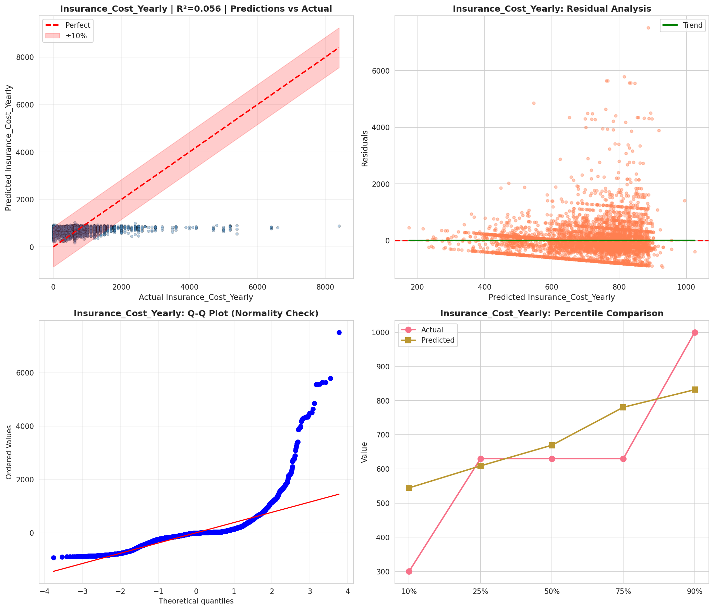
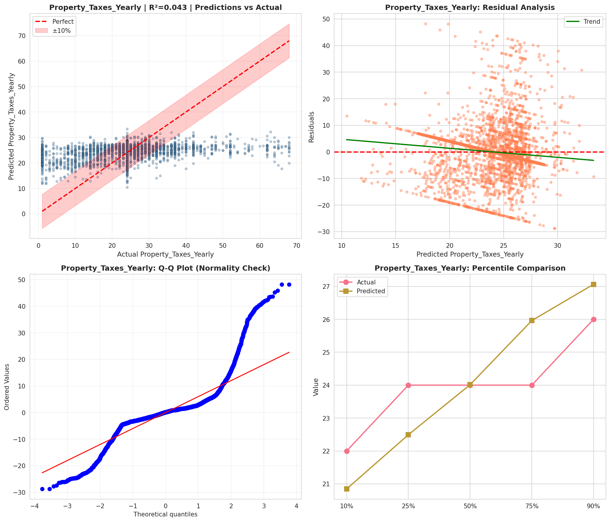
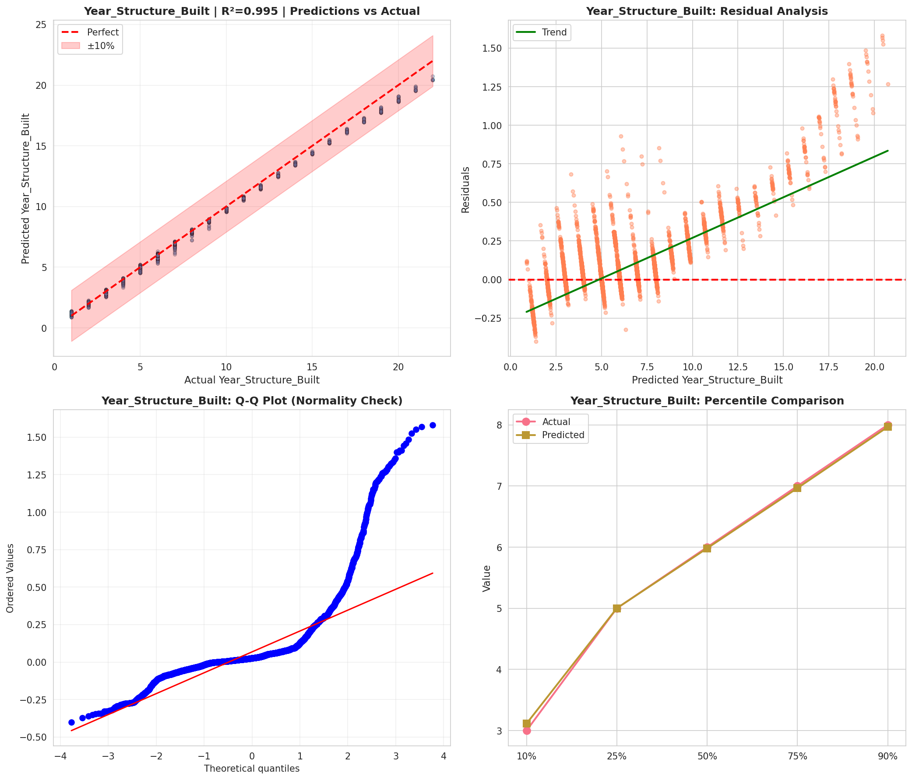
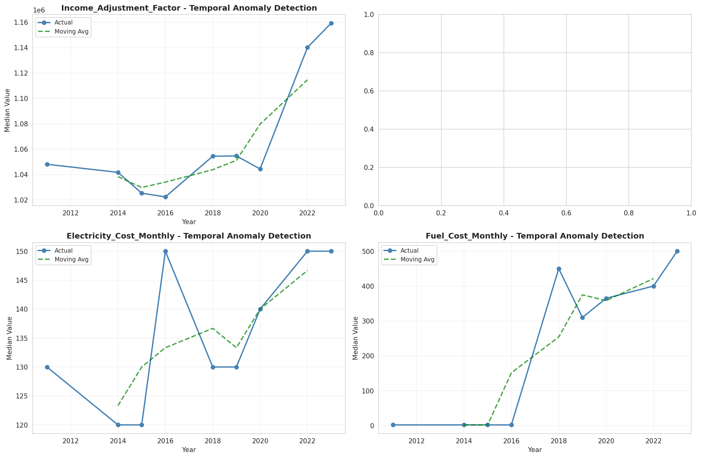
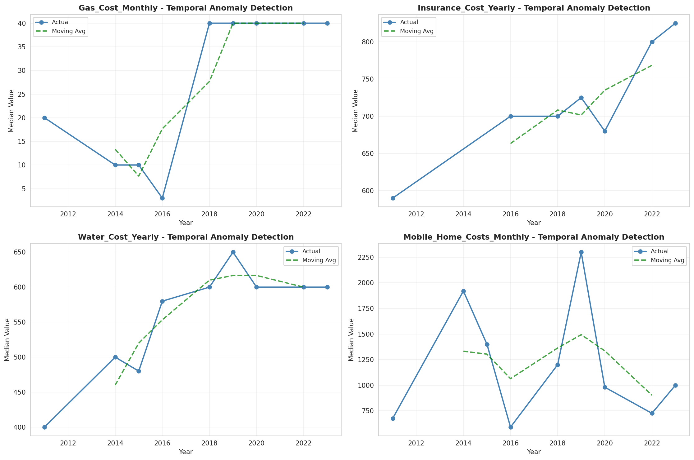
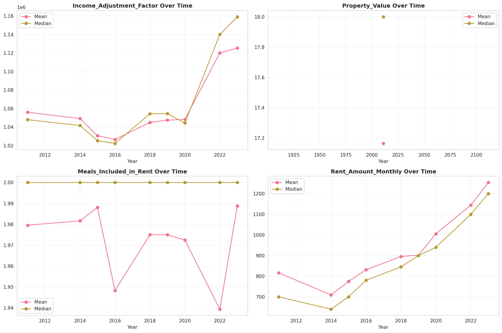
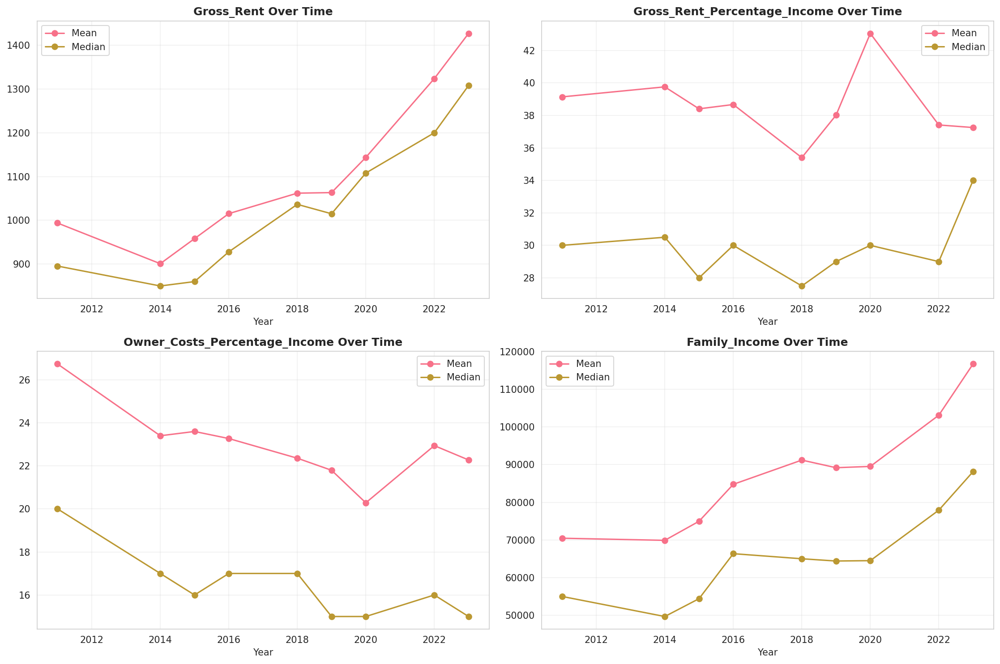

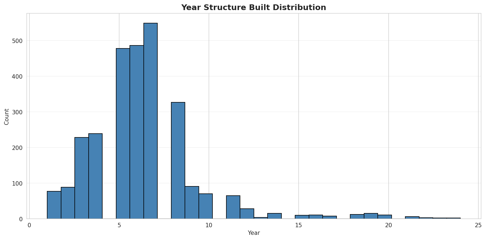
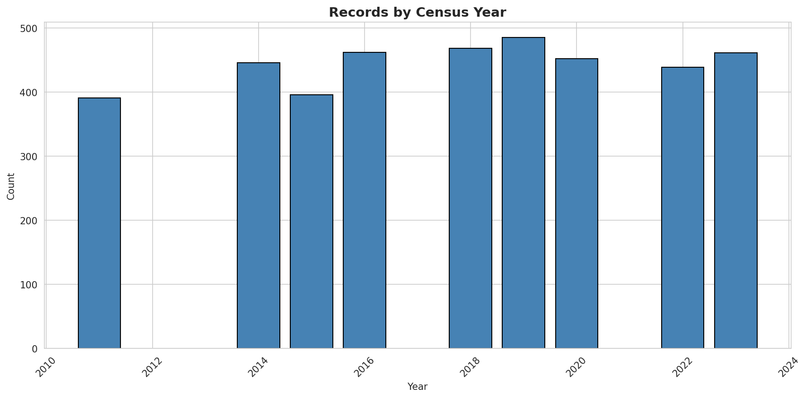
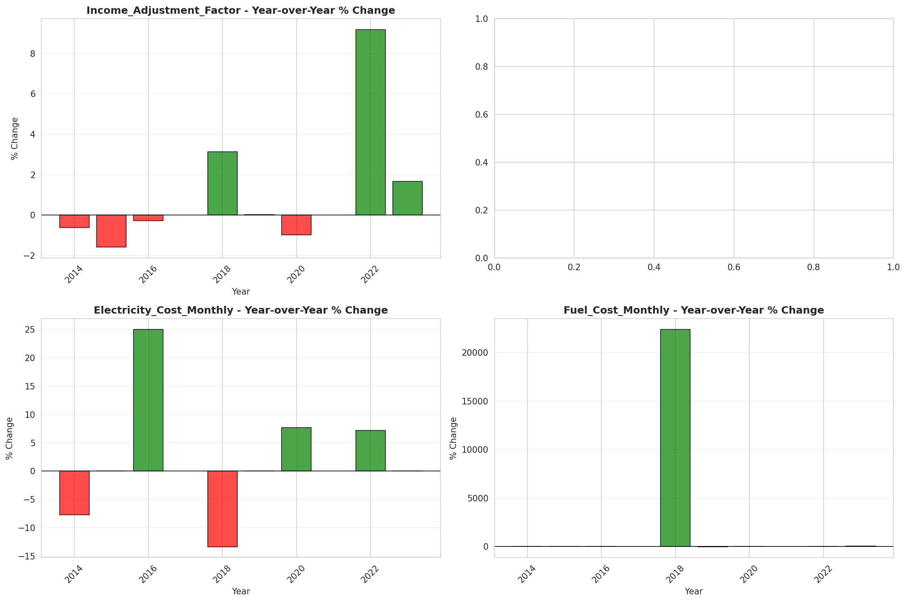
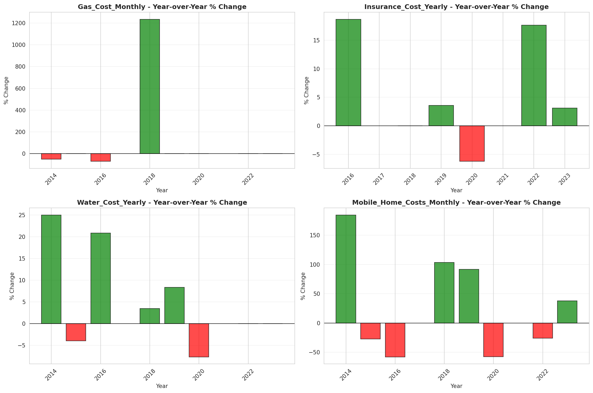
