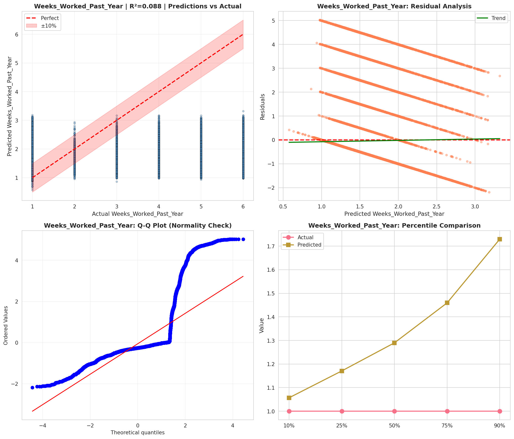
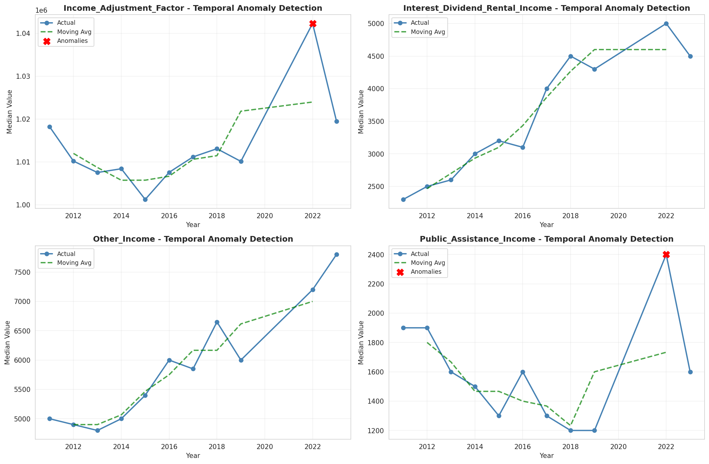
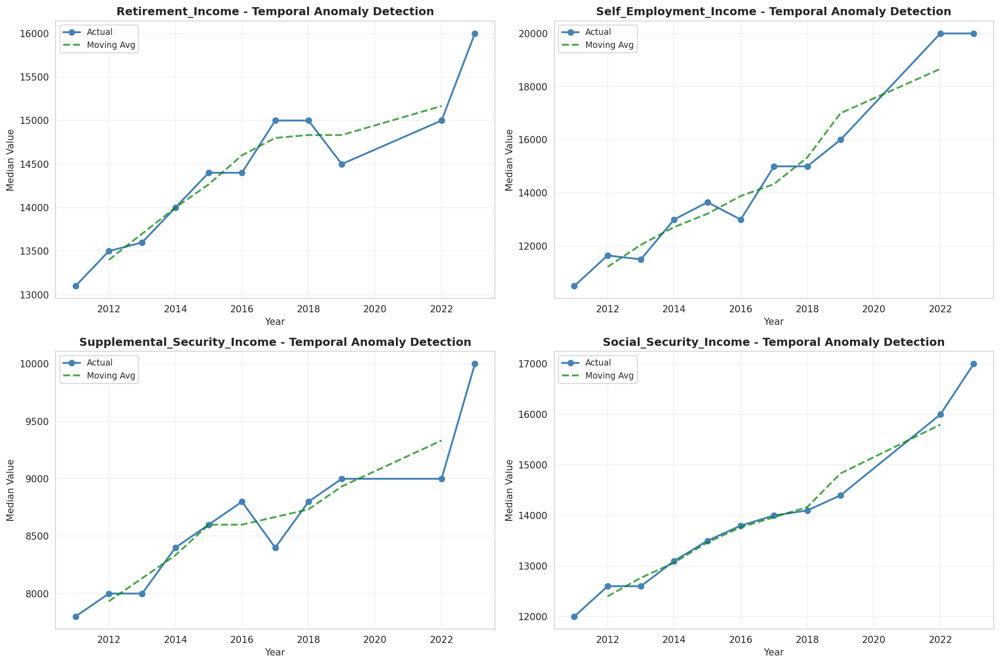
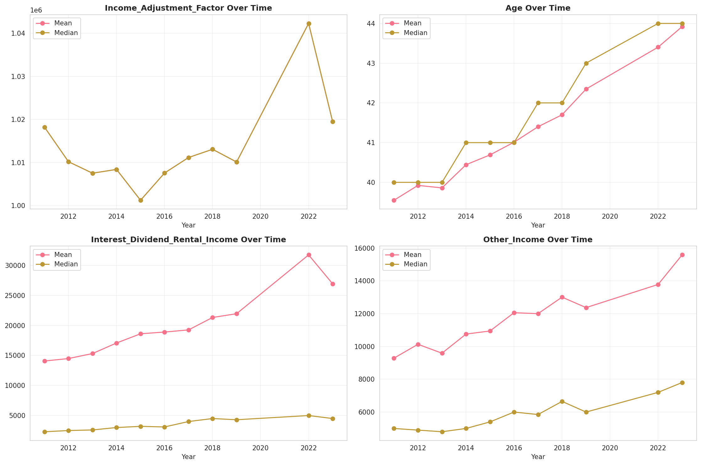
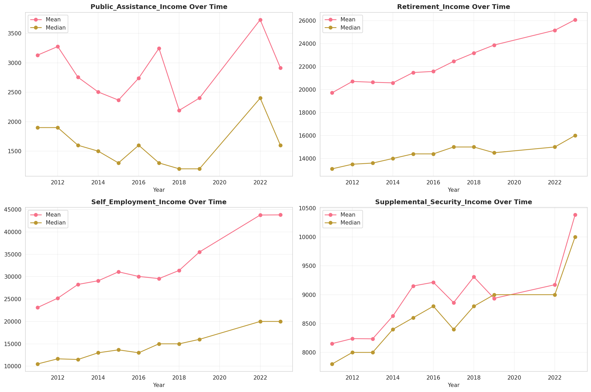
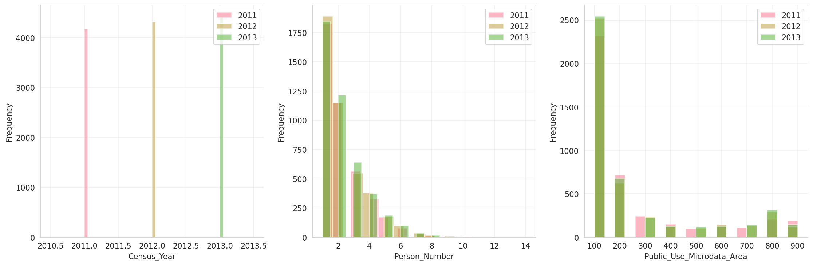
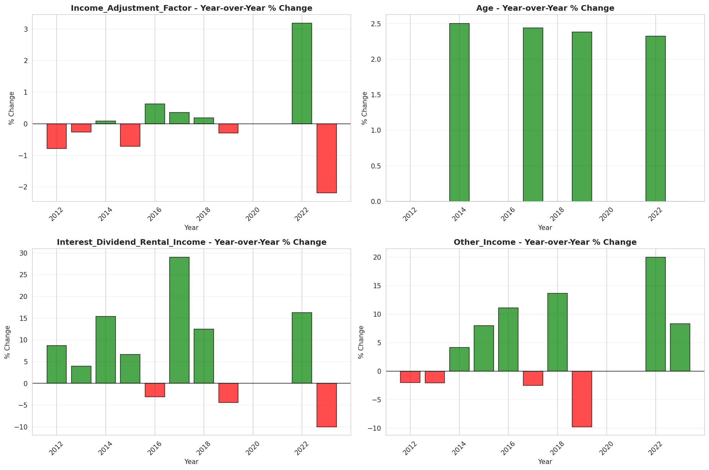
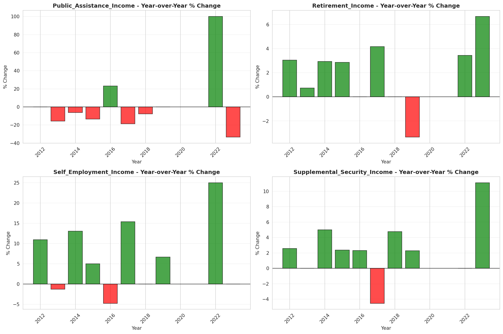

# Temporal Analysis

## Year Distribution

- 2011: 64,917 records

- 2012: 65,945 records

- 2013: 66,532 records

- 2014: 66,177 records

- 2015: 67,014 records

- 2016: 68,398 records

- 2017: 68,863 records

- 2018: 69,990 records

- 2019: 70,872 records

- 2022: 74,153 records

- 2023: 75,778 records

## Temporal Trends

- Census_Year: {np.int64(2011): {'mean': 2011.0, 'median': 2011.0, 'std': 0.0}, np.int64(2012): {'mean': 2012.0, 'median': 2012.0, 'std': 0.0}, np.int64(2013): {'mean': 2013.0, 'median': 2013.0, 'std': 0.0}, np.int64(2014): {'mean': 2014.0, 'median': 2014.0, 'std': 0.0}, np.int64(2015): {'mean': 2015.0, 'median': 2015.0, 'std': 0.0}, np.int64(2016): {'mean': 2016.0, 'median': 2016.0, 'std': 0.0}, np.int64(2017): {'mean': 2017.0, 'median': 2017.0, 'std': 0.0}, np.int64(2018): {'mean': 2018.0, 'median': 2018.0, 'std': 0.0}, np.int64(2019): {'mean': 2019.0, 'median': 2019.0, 'std': 0.0}, np.int64(2022): {'mean': 2022.0, 'median': 2022.0, 'std': 0.0}, np.int64(2023): {'mean': 2023.0, 'median': 2023.0, 'std': 0.0}}

- Person_Number: {np.int64(2011): {'mean': 2.166412495956375, 'median': 2.0, 'std': 1.4628054657559542}, np.int64(2012): {'mean': 2.15929941618015, 'median': 2.0, 'std': 1.4368482632040758}, np.int64(2013): {'mean': 2.1532345337581917, 'median': 2.0, 'std': 1.425417958076814}, np.int64(2014): {'mean': 2.1541018782960846, 'median': 2.0, 'std': 1.4394642676978757}, np.int64(2015): {'mean': 2.1575342465753424, 'median': 2.0, 'std': 1.4635780331976662}, np.int64(2016): {'mean': 2.145515950758794, 'median': 2.0, 'std': 1.429374423934703}, np.int64(2017): {'mean': 2.143400665088654, 'median': 2.0, 'std': 1.4366109974017236}, np.int64(2018): {'mean': 2.1406486640948708, 'median': 2.0, 'std': 1.4315625710390447}, np.int64(2019): {'mean': 2.1158426458968282, 'median': 2.0, 'std': 1.3974870051455506}, np.int64(2022): {'mean': 2.0875487168422047, 'median': 2.0, 'std': 1.3695557078899736}, np.int64(2023): {'mean': 2.084853123597878, 'median': 2.0, 'std': 1.3908145940545986}}

- Public_Use_Microdata_Area: {np.int64(2011): {'mean': 255.33211639478102, 'median': 120.0, 'std': 236.27038043977282}, np.int64(2012): {'mean': 265.184881340511, 'median': 130.0, 'std': 240.4192857114251}, np.int64(2013): {'mean': 261.84693080021646, 'median': 130.0, 'std': 239.2727912358655}, np.int64(2014): {'mean': 264.5514302552246, 'median': 130.0, 'std': 241.53099118981967}, np.int64(2015): {'mean': 258.51545945623303, 'median': 130.0, 'std': 236.78620822819303}, np.int64(2016): {'mean': 257.497324483172, 'median': 129.0, 'std': 236.2502351721113}, np.int64(2017): {'mean': 258.6578569042882, 'median': 129.0, 'std': 236.950593894844}, np.int64(2018): {'mean': 258.1497213887698, 'median': 129.0, 'std': 238.35346664131504}, np.int64(2019): {'mean': 258.16761203296085, 'median': 129.0, 'std': 239.7726130211664}, np.int64(2022): {'mean': 632.5773198656831, 'median': 132.0, 'std': 740.2349350362533}, np.int64(2023): {'mean': 635.0864103037821, 'median': 132.0, 'std': 741.8097242370409}}

- State_Code: {np.int64(2011): {'mean': 4.0, 'median': 4.0, 'std': 0.0}, np.int64(2012): {'mean': 4.0, 'median': 4.0, 'std': 0.0}, np.int64(2013): {'mean': 4.0, 'median': 4.0, 'std': 0.0}, np.int64(2014): {'mean': 4.0, 'median': 4.0, 'std': 0.0}, np.int64(2015): {'mean': 4.0, 'median': 4.0, 'std': 0.0}, np.int64(2016): {'mean': 4.0, 'median': 4.0, 'std': 0.0}, np.int64(2017): {'mean': 4.0, 'median': 4.0, 'std': 0.0}, np.int64(2018): {'mean': 4.0, 'median': 4.0, 'std': 0.0}, np.int64(2019): {'mean': 4.0, 'median': 4.0, 'std': 0.0}, np.int64(2022): {'mean': 4.0, 'median': 4.0, 'std': 0.0}, np.int64(2023): {'mean': None, 'median': None, 'std': None}}

- Income_Adjustment_Factor: {np.int64(2011): {'mean': 1018237.0, 'median': 1018237.0, 'std': 0.0}, np.int64(2012): {'mean': 1010207.0, 'median': 1010207.0, 'std': 0.0}, np.int64(2013): {'mean': 1007549.0, 'median': 1007549.0, 'std': 0.0}, np.int64(2014): {'mean': 1008425.0, 'median': 1008425.0, 'std': 0.0}, np.int64(2015): {'mean': 1001264.0, 'median': 1001264.0, 'std': 0.0}, np.int64(2016): {'mean': 1007588.0, 'median': 1007588.0, 'std': 0.0}, np.int64(2017): {'mean': 1011189.0, 'median': 1011189.0, 'std': 0.0}, np.int64(2018): {'mean': 1013097.0, 'median': 1013097.0, 'std': 0.0}, np.int64(2019): {'mean': 1010145.0, 'median': 1010145.0, 'std': 0.0}, np.int64(2022): {'mean': 1042311.0, 'median': 1042311.0, 'std': 0.0}, np.int64(2023): {'mean': 1019518.0, 'median': 1019518.0, 'std': 0.0}}

- Person_Weight: {np.int64(2011): {'mean': 99.85835759508295, 'median': 70.0, 'std': 98.7947275178072}, np.int64(2012): {'mean': 99.37455455303662, 'median': 74.0, 'std': 79.08855072087006}, np.int64(2013): {'mean': 99.60055311729694, 'median': 75.0, 'std': 75.88157551060176}, np.int64(2014): {'mean': 101.71938891155537, 'median': 77.0, 'std': 77.5668509885586}, np.int64(2015): {'mean': 101.89012743605814, 'median': 77.0, 'std': 76.481135346}, np.int64(2016): {'mean': 101.33441036287611, 'median': 77.0, 'std': 75.81509977630479}, np.int64(2017): {'mean': 101.88737057636176, 'median': 79.0, 'std': 77.0745362240677}, np.int64(2018): {'mean': 102.46672381768825, 'median': 81.0, 'std': 76.22148261652627}, np.int64(2019): {'mean': 102.70229427700643, 'median': 78.0, 'std': 83.11433960971031}, np.int64(2022): {'mean': 99.24341564063491, 'median': 74.0, 'std': 80.10795478904339}, np.int64(2023): {'mean': 98.06730185541979, 'median': 72.0, 'std': 82.30353482383438}}

- Age: {np.int64(2011): {'mean': 39.54950167136497, 'median': 40.0, 'std': 23.681464470104316}, np.int64(2012): {'mean': 39.924103419516264, 'median': 40.0, 'std': 23.83931075209099}, np.int64(2013): {'mean': 39.860608429026634, 'median': 40.0, 'std': 23.8076623585784}, np.int64(2014): {'mean': 40.443719116913734, 'median': 41.0, 'std': 23.865443566734942}, np.int64(2015): {'mean': 40.69093025337989, 'median': 41.0, 'std': 24.097453142562195}, np.int64(2016): {'mean': 41.010438901722274, 'median': 41.0, 'std': 23.966905113204536}, np.int64(2017): {'mean': 41.39985187981935, 'median': 42.0, 'std': 23.999542885317766}, np.int64(2018): {'mean': 41.70074296328047, 'median': 42.0, 'std': 24.11465818172415}, np.int64(2019): {'mean': 42.34795123603116, 'median': 43.0, 'std': 24.075104697081656}, np.int64(2022): {'mean': 43.40251911588203, 'median': 44.0, 'std': 24.206933704100013}, np.int64(2023): {'mean': 43.91876270157565, 'median': 44.0, 'std': 24.300870845183585}}

- Citizenship_Status: {np.int64(2011): {'mean': 1.4552428485604696, 'median': 1.0, 'std': 1.1916148290460558}, np.int64(2012): {'mean': 1.4624459777086967, 'median': 1.0, 'std': 1.199481060351603}, np.int64(2013): {'mean': 1.4424036553838755, 'median': 1.0, 'std': 1.1749355837407656}, np.int64(2014): {'mean': 1.4524683802529579, 'median': 1.0, 'std': 1.1813648351384656}, np.int64(2015): {'mean': 1.437162383979467, 'median': 1.0, 'std': 1.1599498156441483}, np.int64(2016): {'mean': 1.4506418316325038, 'median': 1.0, 'std': 1.1756609025922367}, np.int64(2017): {'mean': 1.4446219304996877, 'median': 1.0, 'std': 1.1675732985350487}, np.int64(2018): {'mean': 1.426246606658094, 'median': 1.0, 'std': 1.1406708390439264}, np.int64(2019): {'mean': 1.4072553335590925, 'median': 1.0, 'std': 1.1162128780691534}, np.int64(2022): {'mean': 1.4268337086833978, 'median': 1.0, 'std': 1.132530812945399}, np.int64(2023): {'mean': 1.4158330913985588, 'median': 1.0, 'std': 1.1196288700232757}}

- Class_of_Worker: {np.int64(2011): {'mean': 2.2482444114931597, 'median': 1.0, 'std': 2.0342757585465803}, np.int64(2012): {'mean': 2.243300462421305, 'median': 1.0, 'std': 2.0301994282322657}, np.int64(2013): {'mean': 2.23119432530518, 'median': 1.0, 'std': 2.020222247038363}, np.int64(2014): {'mean': 2.2112547402219946, 'median': 1.0, 'std': 1.996077256815324}, np.int64(2015): {'mean': 2.1898577782658832, 'median': 1.0, 'std': 1.9872892643289957}, np.int64(2016): {'mean': 2.218425159362023, 'median': 1.0, 'std': 2.007644525326317}, np.int64(2017): {'mean': 2.165028909227618, 'median': 1.0, 'std': 1.9538108574386215}, np.int64(2018): {'mean': 2.1810045894951555, 'median': 1.0, 'std': 1.9826631254841458}, np.int64(2019): {'mean': 2.1598504672897194, 'median': 1.0, 'std': 1.9322638748771919}, np.int64(2022): {'mean': 2.161976055087694, 'median': 1.0, 'std': 1.9341671176470472}, np.int64(2023): {'mean': 2.1780657103192964, 'median': 1.0, 'std': 1.9335163650683072}}

- English_Speaking_Ability: {np.int64(2011): {'mean': 1.5822845213241874, 'median': 1.0, 'std': 0.9034035996590665}, np.int64(2012): {'mean': 1.5933536871770784, 'median': 1.0, 'std': 0.9331343358002775}, np.int64(2013): {'mean': 1.578317733837476, 'median': 1.0, 'std': 0.9291907548614181}, np.int64(2014): {'mean': 1.586302230600063, 'median': 1.0, 'std': 0.9288572483170314}, np.int64(2015): {'mean': 1.5631750816377794, 'median': 1.0, 'std': 0.9076370023075424}, np.int64(2016): {'mean': 1.5645327983464041, 'median': 1.0, 'std': 0.9045439104615208}, np.int64(2017): {'mean': 1.541844654352927, 'median': 1.0, 'std': 0.8874762769629068}, np.int64(2018): {'mean': 1.512525842150067, 'median': 1.0, 'std': 0.8656450898012045}, np.int64(2019): {'mean': 1.4772801783489606, 'median': 1.0, 'std': 0.8305193943431968}, np.int64(2022): {'mean': 1.5058754059639798, 'median': 1.0, 'std': 0.865229464662986}, np.int64(2023): {'mean': 1.4867378780604896, 'median': 1.0, 'std': 0.8413440874191956}}

- Fertility_Status: {np.int64(2011): {'mean': 1.9410035691790888, 'median': 2.0, 'std': 0.23562626648840454}, np.int64(2012): {'mean': 1.9390516039051604, 'median': 2.0, 'std': 0.23924397709944667}, np.int64(2013): {'mean': 1.9435416666666667, 'median': 2.0, 'std': 0.23081267198289976}, np.int64(2014): {'mean': 1.9464387871853548, 'median': 2.0, 'std': 0.22515779929859012}, np.int64(2015): {'mean': 1.9431186202041535, 'median': 2.0, 'std': 0.23162397381087774}, np.int64(2016): {'mean': 1.947558268590455, 'median': 2.0, 'std': 0.22292385119308905}, np.int64(2017): {'mean': 1.9435741023152642, 'median': 2.0, 'std': 0.23075031247975805}, np.int64(2018): {'mean': 1.9426359803718294, 'median': 2.0, 'std': 0.2325448909945401}, np.int64(2019): {'mean': 1.949150200359265, 'median': 2.0, 'std': 0.21969850314749442}, np.int64(2022): {'mean': 1.9515775489870475, 'median': 2.0, 'std': 0.21466433816468808}, np.int64(2023): {'mean': 1.9518460123505452, 'median': 2.0, 'std': 0.21409855776017706}}

- Marital_Status: {np.int64(2011): {'mean': 3.036631390852935, 'median': 3.0, 'std': 1.8409762577895736}, np.int64(2012): {'mean': 3.009068162862992, 'median': 3.0, 'std': 1.8467151723195223}, np.int64(2013): {'mean': 3.0079961522274994, 'median': 3.0, 'std': 1.8507286309755322}, np.int64(2014): {'mean': 2.997144022847817, 'median': 3.0, 'std': 1.8501025092992436}, np.int64(2015): {'mean': 3.0038648640582566, 'median': 3.0, 'std': 1.8454935957229905}, np.int64(2016): {'mean': 2.992572882248019, 'median': 3.0, 'std': 1.846153151844854}, np.int64(2017): {'mean': 2.9805701174796333, 'median': 3.0, 'std': 1.8464320776260892}, np.int64(2018): {'mean': 2.9766680954422062, 'median': 3.0, 'std': 1.8456991383764967}, np.int64(2019): {'mean': 2.9612258719945816, 'median': 3.0, 'std': 1.84351876921424}, np.int64(2022): {'mean': 2.9482691192534354, 'median': 3.0, 'std': 1.8444454945890025}, np.int64(2023): {'mean': 2.9397450447359392, 'median': 3.0, 'std': 1.840739524153428}}

- Mobility_Status: {np.int64(2011): {'mean': 1.3398959533970904, 'median': 1.0, 'std': 0.7469588660852646}, np.int64(2012): {'mean': 1.327250682955278, 'median': 1.0, 'std': 0.7355175975924848}, np.int64(2013): {'mean': 1.3318281335522715, 'median': 1.0, 'std': 0.7387523150383917}, np.int64(2014): {'mean': 1.3244786418735306, 'median': 1.0, 'std': 0.7323390803632915}, np.int64(2015): {'mean': 1.3245273909566844, 'median': 1.0, 'std': 0.7328754701484795}, np.int64(2016): {'mean': 1.3240318318052295, 'median': 1.0, 'std': 0.7318195953137632}, np.int64(2017): {'mean': 1.3207082190374206, 'median': 1.0, 'std': 0.7294528465164567}, np.int64(2018): {'mean': 1.3128843211409105, 'median': 1.0, 'std': 0.7225288937436402}, np.int64(2019): {'mean': 1.305090054815975, 'median': 1.0, 'std': 0.7150313993935385}, np.int64(2022): {'mean': 1.2557554494893866, 'median': 1.0, 'std': 0.663233022946127}, np.int64(2023): {'mean': 1.2510969285999203, 'median': 1.0, 'std': 0.6576790835658978}}

- Military_Service: {np.int64(2011): {'mean': 4.747208900070761, 'median': 5.0, 'std': 0.6840241337152242}, np.int64(2012): {'mean': 4.748578281558281, 'median': 5.0, 'std': 0.6826308542251164}, np.int64(2013): {'mean': 3.7617840267373515, 'median': 4.0, 'std': 0.6449548512407681}, np.int64(2014): {'mean': 3.7659680447526727, 'median': 4.0, 'std': 0.6422885214571823}, np.int64(2015): {'mean': 3.769941606667045, 'median': 4.0, 'std': 0.6372016549280937}, np.int64(2016): {'mean': 3.7819624846135476, 'median': 4.0, 'std': 0.6212645973606913}, np.int64(2017): {'mean': 3.7832261813955177, 'median': 4.0, 'std': 0.6193719221170674}, np.int64(2018): {'mean': 3.781769876789758, 'median': 4.0, 'std': 0.6226998474933894}, np.int64(2019): {'mean': 3.786324041811847, 'median': 4.0, 'std': 0.6178055755722973}, np.int64(2022): {'mean': 3.799783283258632, 'median': 4.0, 'std': 0.599814953888428}, np.int64(2023): {'mean': 3.8064083314698274, 'median': 4.0, 'std': 0.5914448645747743}}

- Travel_Time_To_Work_Minutes: {np.int64(2011): {'mean': 24.122358824755157, 'median': 20.0, 'std': 19.568887298667864}, np.int64(2012): {'mean': 24.86681965332131, 'median': 20.0, 'std': 20.174723599919272}, np.int64(2013): {'mean': 25.163024335574768, 'median': 20.0, 'std': 20.42184015050404}, np.int64(2014): {'mean': 24.92347408445067, 'median': 20.0, 'std': 19.934147191226753}, np.int64(2015): {'mean': 25.361612586037364, 'median': 20.0, 'std': 20.229684638453236}, np.int64(2016): {'mean': 25.389765279682976, 'median': 20.0, 'std': 20.030172046428074}, np.int64(2017): {'mean': 25.92638837122624, 'median': 20.0, 'std': 20.634103053983598}, np.int64(2018): {'mean': 26.282163313261858, 'median': 20.0, 'std': 22.231846237921904}, np.int64(2019): {'mean': 26.802673320263768, 'median': 20.0, 'std': 22.154296347099187}, np.int64(2022): {'mean': 25.034653070979047, 'median': 20.0, 'std': 20.205922424103584}, np.int64(2023): {'mean': 25.526513998782715, 'median': 20.0, 'std': 21.08509923648841}}

- Vehicle_Occupancy: {np.int64(2011): {'mean': 1.1951131385212954, 'median': 1.0, 'std': 0.6534983766975563}, np.int64(2012): {'mean': 1.1977149411090036, 'median': 1.0, 'std': 0.6618575984206456}, np.int64(2013): {'mean': 1.188577119598164, 'median': 1.0, 'std': 0.6356840166115909}, np.int64(2014): {'mean': 1.182975784521086, 'median': 1.0, 'std': 0.6246596465805178}, np.int64(2015): {'mean': 1.1801112951871204, 'median': 1.0, 'std': 0.6268669010699428}, np.int64(2016): {'mean': 1.1831411985937372, 'median': 1.0, 'std': 0.6060191463036493}, np.int64(2017): {'mean': 1.1821460052888852, 'median': 1.0, 'std': 0.6195634007486654}, np.int64(2018): {'mean': 1.179965444121574, 'median': 1.0, 'std': 0.5831665178113382}, np.int64(2019): {'mean': 1.1837053401386455, 'median': 1.0, 'std': 0.6307001641084979}, np.int64(2022): {'mean': 1.1849169152109076, 'median': 1.0, 'std': 0.609463503405445}, np.int64(2023): {'mean': 1.197125758254285, 'median': 1.0, 'std': 0.665538135368683}}

- Transportation_To_Work: {np.int64(2011): {'mean': 2.0732061548123726, 'median': 1.0, 'std': 2.996723565892243}, np.int64(2012): {'mean': 2.060124874739844, 'median': 1.0, 'std': 2.996806967780116}, np.int64(2013): {'mean': 2.0879079560836216, 'median': 1.0, 'std': 3.020245475087523}, np.int64(2014): {'mean': 2.1163339450915766, 'median': 1.0, 'std': 3.0569461433055665}, np.int64(2015): {'mean': 2.0682078786757905, 'median': 1.0, 'std': 2.995361662212076}, np.int64(2016): {'mean': 2.1352884854072838, 'median': 1.0, 'std': 3.0966926617120225}, np.int64(2017): {'mean': 2.1353545164423475, 'median': 1.0, 'std': 3.0880952288867745}, np.int64(2018): {'mean': 2.1609731201088804, 'median': 1.0, 'std': 3.1334352209582574}, np.int64(2019): {'mean': None, 'median': None, 'std': None}, np.int64(2022): {'mean': None, 'median': None, 'std': None}, np.int64(2023): {'mean': None, 'median': None, 'std': None}}

- Language_Other_Than_English: {np.int64(2011): {'mean': 1.7252405067440222, 'median': 2.0, 'std': 0.44639666209833284}, np.int64(2012): {'mean': 1.7253700538553323, 'median': 2.0, 'std': 0.4463312121980879}, np.int64(2013): {'mean': 1.7424119046478581, 'median': 2.0, 'std': 0.43730941210698304}, np.int64(2014): {'mean': 1.7455106576906472, 'median': 2.0, 'std': 0.43557726157948473}, np.int64(2015): {'mean': 1.7479023525314252, 'median': 2.0, 'std': 0.434220460780331}, np.int64(2016): {'mean': 1.7460241484729642, 'median': 2.0, 'std': 0.43528731189955905}, np.int64(2017): {'mean': 1.7451665823405853, 'median': 2.0, 'std': 0.435770878324468}, np.int64(2018): {'mean': 1.7522334543591906, 'median': 2.0, 'std': 0.4317187654235289}, np.int64(2019): {'mean': 1.7736803834567498, 'median': 2.0, 'std': 0.41845148602845683}, np.int64(2022): {'mean': 1.7613612344113296, 'median': 2.0, 'std': 0.4262544609309778}, np.int64(2023): {'mean': 1.7706736393036537, 'median': 2.0, 'std': 0.42040244197571813}}

- Grandparents_Living_With_Grandchildren: {np.int64(2011): {'mean': 1.9551373372322611, 'median': 2.0, 'std': 0.20700501259507692}, np.int64(2012): {'mean': 1.9574167802219193, 'median': 2.0, 'std': 0.20191800628029874}, np.int64(2013): {'mean': 1.9595548382434418, 'median': 2.0, 'std': 0.1970032627693993}, np.int64(2014): {'mean': 1.958996738921926, 'median': 2.0, 'std': 0.19830011740962664}, np.int64(2015): {'mean': 1.9589424056480846, 'median': 2.0, 'std': 0.1984258075548014}, np.int64(2016): {'mean': 1.9596701959073057, 'median': 2.0, 'std': 0.1967338301066549}, np.int64(2017): {'mean': 1.9607922941256275, 'median': 2.0, 'std': 0.19409099274708105}, np.int64(2018): {'mean': 1.960591461113208, 'median': 2.0, 'std': 0.19456707438815776}, np.int64(2019): {'mean': 1.9627398916305074, 'median': 2.0, 'std': 0.18940054671135725}, np.int64(2022): {'mean': 1.9672269923811827, 'median': 2.0, 'std': 0.1780437488777904}, np.int64(2023): {'mean': 1.9671020519729008, 'median': 2.0, 'std': 0.17837122588631188}}

- Months_Responsible_For_Grandchildren: {np.int64(2011): {'mean': 3.592088998763906, 'median': 4.0, 'std': 1.4174432120533609}, np.int64(2012): {'mean': 3.724675324675325, 'median': 4.0, 'std': 1.3481341770047524}, np.int64(2013): {'mean': 3.703125, 'median': 4.0, 'std': 1.355119435404321}, np.int64(2014): {'mean': 3.7818181818181817, 'median': 4.0, 'std': 1.3932428148479856}, np.int64(2015): {'mean': 3.623268698060942, 'median': 4.0, 'std': 1.3872457900211672}, np.int64(2016): {'mean': 3.7466124661246614, 'median': 4.0, 'std': 1.3701689677643063}, np.int64(2017): {'mean': 3.7279635258358663, 'median': 4.0, 'std': 1.381716594503395}, np.int64(2018): {'mean': 3.8741830065359477, 'median': 4.0, 'std': 1.2517170475424777}, np.int64(2019): {'mean': 3.8198347107438018, 'median': 4.0, 'std': 1.3503506924135593}, np.int64(2022): {'mean': 3.775828460038986, 'median': 4.0, 'std': 1.3325992816734404}, np.int64(2023): {'mean': 4.0125, 'median': 5.0, 'std': 1.2344439130759535}}

- Grandparents_Responsible_For_Grandchildren: {np.int64(2011): {'mean': 1.5493036211699165, 'median': 2.0, 'std': 0.4977018699508204}, np.int64(2012): {'mean': 1.56, 'median': 2.0, 'std': 0.4965288314923363}, np.int64(2013): {'mean': 1.580702799285289, 'median': 2.0, 'std': 0.49359108957203934}, np.int64(2014): {'mean': 1.5818713450292399, 'median': 2.0, 'std': 0.49339583005099147}, np.int64(2015): {'mean': 1.5833814195037508, 'median': 2.0, 'std': 0.4931408181847025}, np.int64(2016): {'mean': 1.5797266514806378, 'median': 2.0, 'std': 0.49374334359115724}, np.int64(2017): {'mean': 1.6205305651672435, 'median': 2.0, 'std': 0.4853949509853136}, np.int64(2018): {'mean': 1.6552112676056339, 'median': 2.0, 'std': 0.4754332835301946}, np.int64(2019): {'mean': 1.649478563151796, 'median': 2.0, 'std': 0.4772715513657752}, np.int64(2022): {'mean': 1.6845018450184501, 'median': 2.0, 'std': 0.46485693183335103}, np.int64(2023): {'mean': 1.71513353115727, 'median': 2.0, 'std': 0.45148481280863323}}

- Interest_Dividend_Rental_Income: {np.int64(2011): {'mean': 14078.488615096694, 'median': 2300.0, 'std': 35172.47313603926}, np.int64(2012): {'mean': 14489.657285803627, 'median': 2500.0, 'std': 36593.068501682756}, np.int64(2013): {'mean': 15322.843474426807, 'median': 2600.0, 'std': 40230.73554573272}, np.int64(2014): {'mean': 17076.436200448767, 'median': 3000.0, 'std': 41792.57368677423}, np.int64(2015): {'mean': 18610.41348314607, 'median': 3200.0, 'std': 47623.210811622535}, np.int64(2016): {'mean': 18900.905211952744, 'median': 3100.0, 'std': 49228.01839782509}, np.int64(2017): {'mean': 19258.3997689197, 'median': 4000.0, 'std': 45005.57612148187}, np.int64(2018): {'mean': 21329.16783609318, 'median': 4500.0, 'std': 54961.066047738655}, np.int64(2019): {'mean': 21954.064049309927, 'median': 4300.0, 'std': 55506.77722913398}, np.int64(2022): {'mean': 31748.2462585034, 'median': 5000.0, 'std': 87620.61284002228}, np.int64(2023): {'mean': 26935.705169944, 'median': 4500.0, 'std': 66177.05369938986}}

- Military_Service_Period_1: {np.int64(2011): {'mean': 0.12022319918836659, 'median': 0.0, 'std': 0.3252498565711785}, np.int64(2012): {'mean': 0.13017851128326036, 'median': 0.0, 'std': 0.33652806532776564}, np.int64(2013): {'mean': 0.14517819706498952, 'median': 0.0, 'std': 0.3523111875220862}, np.int64(2014): {'mean': 0.15726950354609928, 'median': 0.0, 'std': 0.3640869542077296}, np.int64(2015): {'mean': 0.16201217329036877, 'median': 0.0, 'std': 0.36849496295211087}, np.int64(2016): {'mean': 0.16703017084696475, 'median': 0.0, 'std': 0.3730367070914069}, np.int64(2017): {'mean': 0.18494781175608863, 'median': 0.0, 'std': 0.388290776518536}, np.int64(2018): {'mean': 0.1986603208179094, 'median': 0.0, 'std': 0.3990268969176379}, np.int64(2019): {'mean': 0.21109535625664658, 'median': 0.0, 'std': 0.4081220759932225}, np.int64(2022): {'mean': 0.24145299145299146, 'median': 0.0, 'std': 0.42800241000764244}, np.int64(2023): {'mean': 0.23710228294085925, 'median': 0.0, 'std': 0.4253437573332589}}

- Military_Service_Period_2: {np.int64(2011): {'mean': 0.13831586066959756, 'median': 0.0, 'std': 0.34526039408153575}, np.int64(2012): {'mean': 0.14904008083529807, 'median': 0.0, 'std': 0.35615796677657996}, np.int64(2013): {'mean': 0.16334730957372467, 'median': 0.0, 'std': 0.3697145466178994}, np.int64(2014): {'mean': 0.17695035460992908, 'median': 0.0, 'std': 0.38166052153365}, np.int64(2015): {'mean': 0.16541353383458646, 'median': 0.0, 'std': 0.3715866184258621}, np.int64(2016): {'mean': 0.18138858596873864, 'median': 0.0, 'std': 0.38537482991914684}, np.int64(2017): {'mean': 0.1763413294268449, 'median': 0.0, 'std': 0.38114520411920183}, np.int64(2018): {'mean': 0.1935483870967742, 'median': 0.0, 'std': 0.39511381636904197}, np.int64(2019): {'mean': 0.19691598723856787, 'median': 0.0, 'std': 0.3977035519823061}, np.int64(2022): {'mean': 0.21634615384615385, 'median': 0.0, 'std': 0.411789618340813}, np.int64(2023): {'mean': 0.19899334891245732, 'median': 0.0, 'std': 0.3992789173713396}}

- Military_Service_Period_3: {np.int64(2011): {'mean': 0.16114305038890767, 'median': 0.0, 'std': 0.36769393319710403}, np.int64(2012): {'mean': 0.1833950825193668, 'median': 0.0, 'std': 0.38702267544874736}, np.int64(2013): {'mean': None, 'median': None, 'std': None}, np.int64(2014): {'mean': None, 'median': None, 'std': None}, np.int64(2015): {'mean': None, 'median': None, 'std': None}, np.int64(2016): {'mean': None, 'median': None, 'std': None}, np.int64(2017): {'mean': None, 'median': None, 'std': None}, np.int64(2018): {'mean': None, 'median': None, 'std': None}, np.int64(2019): {'mean': None, 'median': None, 'std': None}, np.int64(2022): {'mean': None, 'median': None, 'std': None}, np.int64(2023): {'mean': None, 'median': None, 'std': None}}

- Military_Service_Period_4: {np.int64(2011): {'mean': 0.1459249239093676, 'median': 0.0, 'std': 0.35306078502276206}, np.int64(2012): {'mean': 0.13960929605927921, 'median': 0.0, 'std': 0.3466104047888775}, np.int64(2013): {'mean': None, 'median': None, 'std': None}, np.int64(2014): {'mean': None, 'median': None, 'std': None}, np.int64(2015): {'mean': None, 'median': None, 'std': None}, np.int64(2016): {'mean': None, 'median': None, 'std': None}, np.int64(2017): {'mean': None, 'median': None, 'std': None}, np.int64(2018): {'mean': None, 'median': None, 'std': None}, np.int64(2019): {'mean': None, 'median': None, 'std': None}, np.int64(2022): {'mean': None, 'median': None, 'std': None}, np.int64(2023): {'mean': None, 'median': None, 'std': None}}

- Military_Service_Period_5: {np.int64(2011): {'mean': 0.3708150152181265, 'median': 0.0, 'std': 0.48306386435431736}, np.int64(2012): {'mean': 0.35836982148871677, 'median': 0.0, 'std': 0.4795619070396556}, np.int64(2013): {'mean': 0.3698462613556953, 'median': 0.0, 'std': 0.4828050618153086}, np.int64(2014): {'mean': 0.3774822695035461, 'median': 0.0, 'std': 0.48480003907892705}, np.int64(2015): {'mean': 0.38238453276047263, 'median': 0.0, 'std': 0.48601325881012253}, np.int64(2016): {'mean': 0.4038531443111596, 'median': 0.0, 'std': 0.4907133052631628}, np.int64(2017): {'mean': 0.38564365500824027, 'median': 0.0, 'std': 0.4867915557839265}, np.int64(2018): {'mean': 0.4054292261589988, 'median': 0.0, 'std': 0.49101819527885693}, np.int64(2019): {'mean': 0.40588443814250263, 'median': 0.0, 'std': 0.49110590421703176}, np.int64(2022): {'mean': 0.39725783475783477, 'median': 0.0, 'std': 0.4893737744535708}, np.int64(2023): {'mean': 0.40212115764875067, 'median': 0.0, 'std': 0.4903702250650041}}

- Military_Service_Period_6: {np.int64(2011): {'mean': 0.1161650321271559, 'median': 0.0, 'std': 0.32044981041635984}, np.int64(2012): {'mean': 0.11889525092623779, 'median': 0.0, 'std': 0.32369247036200005}, np.int64(2013): {'mean': None, 'median': None, 'std': None}, np.int64(2014): {'mean': None, 'median': None, 'std': None}, np.int64(2015): {'mean': None, 'median': None, 'std': None}, np.int64(2016): {'mean': None, 'median': None, 'std': None}, np.int64(2017): {'mean': None, 'median': None, 'std': None}, np.int64(2018): {'mean': None, 'median': None, 'std': None}, np.int64(2019): {'mean': None, 'median': None, 'std': None}, np.int64(2022): {'mean': None, 'median': None, 'std': None}, np.int64(2023): {'mean': None, 'median': None, 'std': None}}

- Military_Service_Period_7: {np.int64(2011): {'mean': 0.13425769360838688, 'median': 0.0, 'std': 0.34095780155004335}, np.int64(2012): {'mean': 0.1372515998652745, 'median': 0.0, 'std': 0.34414174873463466}, np.int64(2013): {'mean': None, 'median': None, 'std': None}, np.int64(2014): {'mean': None, 'median': None, 'std': None}, np.int64(2015): {'mean': None, 'median': None, 'std': None}, np.int64(2016): {'mean': None, 'median': None, 'std': None}, np.int64(2017): {'mean': None, 'median': None, 'std': None}, np.int64(2018): {'mean': None, 'median': None, 'std': None}, np.int64(2019): {'mean': None, 'median': None, 'std': None}, np.int64(2022): {'mean': None, 'median': None, 'std': None}, np.int64(2023): {'mean': None, 'median': None, 'std': None}}

- Military_Service_Period_8: {np.int64(2011): {'mean': 0.1388231315522489, 'median': 0.0, 'std': 0.3457911046808098}, np.int64(2012): {'mean': 0.12967329067025934, 'median': 0.0, 'std': 0.335971929843199}, np.int64(2013): {'mean': 0.12211740041928722, 'median': 0.0, 'std': 0.3274499552558913}, np.int64(2014): {'mean': 0.11312056737588652, 'median': 0.0, 'std': 0.3167682051029985}, np.int64(2015): {'mean': 0.10991765127103473, 'median': 0.0, 'std': 0.31281508723823503}, np.int64(2016): {'mean': 0.09123954925481643, 'median': 0.0, 'std': 0.2879756354300835}, np.int64(2017): {'mean': 0.0921076725874382, 'median': 0.0, 'std': 0.2892043653910968}, np.int64(2018): {'mean': 0.07121452494271109, 'median': 0.0, 'std': 0.25720551646794354}, np.int64(2019): {'mean': 0.06699751861042183, 'median': 0.0, 'std': 0.25003986137284545}, np.int64(2022): {'mean': 0.03863960113960114, 'median': 0.0, 'std': 0.19275164840099623}, np.int64(2023): {'mean': 0.039187488765054825, 'median': 0.0, 'std': 0.1940582360170748}}

- Military_Service_Period_9: {np.int64(2011): {'mean': 0.02874535001690903, 'median': 0.0, 'std': 0.16710408884554576}, np.int64(2012): {'mean': 0.02256652071404513, 'median': 0.0, 'std': 0.14852941822710175}, np.int64(2013): {'mean': 0.015897973445143255, 'median': 0.0, 'std': 0.12509181280722673}, np.int64(2014): {'mean': 0.019326241134751773, 'median': 0.0, 'std': 0.13768114812396864}, np.int64(2015): {'mean': 0.016469745793054064, 'median': 0.0, 'std': 0.1272846951658474}, np.int64(2016): {'mean': 0.013994910941475827, 'median': 0.0, 'std': 0.11748004882503886}, np.int64(2017): {'mean': 0.012268815235304889, 'median': 0.0, 'std': 0.11009319177550324}, np.int64(2018): {'mean': 0.010047593865679535, 'median': 0.0, 'std': 0.09974163304292327}, np.int64(2019): {'mean': 0.007975895072669267, 'median': 0.0, 'std': 0.0889588826836277}, np.int64(2022): {'mean': None, 'median': None, 'std': None}, np.int64(2023): {'mean': None, 'median': None, 'std': None}}

- Military_Service_Period_10: {np.int64(2011): {'mean': 0.08589786946229286, 'median': 0.0, 'std': 0.28023687231029837}, np.int64(2012): {'mean': 0.07999326372515998, 'median': 0.0, 'std': 0.27130561616760024}, np.int64(2013): {'mean': 0.0660377358490566, 'median': 0.0, 'std': 0.2483697451178238}, np.int64(2014): {'mean': 0.05709219858156028, 'median': 0.0, 'std': 0.23203927671117328}, np.int64(2015): {'mean': 0.05066237021124239, 'median': 0.0, 'std': 0.21932693869981001}, np.int64(2016): {'mean': 0.04143947655398037, 'median': 0.0, 'std': 0.19932252068099496}, np.int64(2017): {'mean': 0.028383080021973997, 'median': 0.0, 'std': 0.1660798952645917}, np.int64(2018): {'mean': 0.025030847875903404, 'median': 0.0, 'std': 0.15623254181825882}, np.int64(2019): {'mean': 0.017901453385324353, 'median': 0.0, 'std': 0.13260508284552722}, np.int64(2022): {'mean': 0.00641025641025641, 'median': 0.0, 'std': 0.07981415498250242}, np.int64(2023): {'mean': 0.008628437893223082, 'median': 0.0, 'std': 0.09249608579055733}}

- Military_Service_Period_11: {np.int64(2011): {'mean': 0.0028745350016909027, 'median': 0.0, 'std': 0.053542102974801}, np.int64(2012): {'mean': 0.002526103065005052, 'median': 0.0, 'std': 0.05020105853723818}, np.int64(2013): {'mean': 0.0034940600978336828, 'median': 0.0, 'std': 0.05901237190707971}, np.int64(2014): {'mean': 0.005319148936170213, 'median': 0.0, 'std': 0.07274471700464814}, np.int64(2015): {'mean': 0.0019692087361260296, 'median': 0.0, 'std': 0.0443360220093113}, np.int64(2016): {'mean': 0.0010905125408942203, 'median': 0.0, 'std': 0.03300789823775947}, np.int64(2017): {'mean': 0.0009155832265152902, 'median': 0.0, 'std': 0.030247520056573007}, np.int64(2018): {'mean': 0.00035254715318173806, 'median': 0.0, 'std': 0.018774583816365202}, np.int64(2019): {'mean': 0.0001772421127259837, 'median': 0.0, 'std': 0.013313230739605759}, np.int64(2022): {'mean': None, 'median': None, 'std': None}, np.int64(2023): {'mean': None, 'median': None, 'std': None}}

- Temporary_Absence_From_Work: {np.int64(2011): {'mean': 2.491991818146733, 'median': 3.0, 'std': 0.5261201279938948}, np.int64(2012): {'mean': 2.493335108102455, 'median': 3.0, 'std': 0.5263808362109763}, np.int64(2013): {'mean': 2.5513944524223415, 'median': 3.0, 'std': 0.5177937884652444}, np.int64(2014): {'mean': 2.5535246565791705, 'median': 3.0, 'std': 0.5185053185611979}, np.int64(2015): {'mean': 2.5547439829012175, 'median': 3.0, 'std': 0.5179120338906928}, np.int64(2016): {'mean': 2.559475660840676, 'median': 3.0, 'std': 0.5175379186415591}, np.int64(2017): {'mean': 2.5629227721358583, 'median': 3.0, 'std': 0.5164429817950178}, np.int64(2018): {'mean': 2.561316366827556, 'median': 3.0, 'std': 0.5176279853517317}, np.int64(2019): {'mean': 2.577558379120879, 'median': 3.0, 'std': 0.5115414259160742}, np.int64(2022): {'mean': 2.5729888033137014, 'median': 3.0, 'std': 0.5133013440434437}, np.int64(2023): {'mean': 2.564100951332652, 'median': 3.0, 'std': 0.5140636606285848}}

- Available_For_Work: {np.int64(2011): {'mean': 4.465921809270194, 'median': 5.0, 'std': 1.276193633420961}, np.int64(2012): {'mean': 4.467246002015631, 'median': 5.0, 'std': 1.25936690669386}, np.int64(2013): {'mean': 4.6672587106038845, 'median': 5.0, 'std': 1.0402625861793993}, np.int64(2014): {'mean': 4.685824115773804, 'median': 5.0, 'std': 1.008320191255403}, np.int64(2015): {'mean': 4.719951677353406, 'median': 5.0, 'std': 0.9502359331471253}, np.int64(2016): {'mean': 4.722988588762098, 'median': 5.0, 'std': 0.9462953989174397}, np.int64(2017): {'mean': 4.748665869460458, 'median': 5.0, 'std': 0.9054178089847232}, np.int64(2018): {'mean': 4.7447476963580515, 'median': 5.0, 'std': 0.9062765593483861}, np.int64(2019): {'mean': 4.749004120879121, 'median': 5.0, 'std': 0.8950004533812166}, np.int64(2022): {'mean': 4.822681379845965, 'median': 5.0, 'std': 0.7614500923177231}, np.int64(2023): {'mean': 4.797657048510103, 'median': 5.0, 'std': 0.8074355964121759}}

- On_Layoff_From_Work: {np.int64(2011): {'mean': 2.456910192582301, 'median': 2.0, 'std': 0.5318311908727376}, np.int64(2012): {'mean': 2.464355663731959, 'median': 2.0, 'std': 0.5235830845603121}, np.int64(2013): {'mean': 2.5331796538432467, 'median': 3.0, 'std': 0.5175296906141906}, np.int64(2014): {'mean': 2.5379788577135427, 'median': 3.0, 'std': 0.5143362597816188}, np.int64(2015): {'mean': 2.5422172660533406, 'median': 3.0, 'std': 0.510708928255657}, np.int64(2016): {'mean': 2.546890798786653, 'median': 3.0, 'std': 0.5105149808426334}, np.int64(2017): {'mean': 2.5546056506452017, 'median': 3.0, 'std': 0.5069690663656331}, np.int64(2018): {'mean': 2.552066695919263, 'median': 3.0, 'std': 0.5075913714404436}, np.int64(2019): {'mean': 2.5682692307692307, 'median': 3.0, 'std': 0.504594552078213}, np.int64(2022): {'mean': 2.566985955601579, 'median': 3.0, 'std': 0.5038190177410599}, np.int64(2023): {'mean': 2.557276515449328, 'median': 3.0, 'std': 0.5048452266823806}}

- Looking_For_Work: {np.int64(2011): {'mean': 2.4274439427270273, 'median': 2.0, 'std': 0.6224957816248916}, np.int64(2012): {'mean': 2.437524957690772, 'median': 3.0, 'std': 0.612240265503281}, np.int64(2013): {'mean': 2.505800770916786, 'median': 3.0, 'std': 0.59562138245089}, np.int64(2014): {'mean': 2.5149333886072847, 'median': 3.0, 'std': 0.5860655372293734}, np.int64(2015): {'mean': 2.524932627079268, 'median': 3.0, 'std': 0.5732657432510678}, np.int64(2016): {'mean': 2.5284919832442583, 'median': 3.0, 'std': 0.5742778571000775}, np.int64(2017): {'mean': 2.536186617644434, 'median': 3.0, 'std': 0.5685010399635169}, np.int64(2018): {'mean': 2.5367968407196138, 'median': 3.0, 'std': 0.5647060505245102}, np.int64(2019): {'mean': 2.5444883241758243, 'median': 3.0, 'std': 0.5586950505870607}, np.int64(2022): {'mean': 2.5493980972105366, 'median': 3.0, 'std': 0.5498349363053898}, np.int64(2023): {'mean': 2.5363943706266214, 'median': 3.0, 'std': 0.5548295993792512}}

- Informed_Of_Recall: {np.int64(2011): {'mean': 2.881459611747906, 'median': 3.0, 'std': 0.3424965973019527}, np.int64(2012): {'mean': 2.88204757648938, 'median': 3.0, 'std': 0.34006063012724663}, np.int64(2013): {'mean': 2.940499584309576, 'median': 3.0, 'std': 0.2504510297971495}, np.int64(2014): {'mean': 2.9433567619514216, 'median': 3.0, 'std': 0.24531989360880027}, np.int64(2015): {'mean': 2.94606449214757, 'median': 3.0, 'std': 0.24078740263949214}, np.int64(2016): {'mean': 2.948378593095479, 'median': 3.0, 'std': 0.23387893311628954}, np.int64(2017): {'mean': 2.952435345981545, 'median': 3.0, 'std': 0.22427788014099603}, np.int64(2018): {'mean': 2.9497498903027646, 'median': 3.0, 'std': 0.22958789975272118}, np.int64(2019): {'mean': 2.939697802197802, 'median': 3.0, 'std': 0.2517890000230555}, np.int64(2022): {'mean': 2.9619442107306972, 'median': 3.0, 'std': 0.1996101885219187}, np.int64(2023): {'mean': 2.9564116675839296, 'median': 3.0, 'std': 0.21144313179477894}}

- Other_Income: {np.int64(2011): {'mean': 9287.251189581768, 'median': 5000.0, 'std': 12538.27686625293}, np.int64(2012): {'mean': 10131.120146904512, 'median': 4900.0, 'std': 14261.875082553754}, np.int64(2013): {'mean': 9588.733234859676, 'median': 4800.0, 'std': 12922.475700565725}, np.int64(2014): {'mean': 10753.463354799142, 'median': 5000.0, 'std': 14896.915793950317}, np.int64(2015): {'mean': 10942.913302034429, 'median': 5400.0, 'std': 14493.051765974917}, np.int64(2016): {'mean': 12056.880224578914, 'median': 6000.0, 'std': 16144.07558214074}, np.int64(2017): {'mean': 11998.645768025079, 'median': 5850.0, 'std': 16180.252767702801}, np.int64(2018): {'mean': 13005.619692307693, 'median': 6650.0, 'std': 16151.708534217409}, np.int64(2019): {'mean': 12367.088375254929, 'median': 6000.0, 'std': 15507.871198989715}, np.int64(2022): {'mean': 13778.276629570748, 'median': 7200.0, 'std': 16887.821509882793}, np.int64(2023): {'mean': 15580.688294314381, 'median': 7800.0, 'std': 18210.177664443276}}

- Public_Assistance_Income: {np.int64(2011): {'mean': 3128.9839572192514, 'median': 1900.0, 'std': 3798.159299306907}, np.int64(2012): {'mean': 3275.362244897959, 'median': 1900.0, 'std': 4250.803952676479}, np.int64(2013): {'mean': 2754.140914709518, 'median': 1600.0, 'std': 3528.28090203754}, np.int64(2014): {'mean': 2503.918367346939, 'median': 1500.0, 'std': 3066.864243426004}, np.int64(2015): {'mean': 2366.4491654021244, 'median': 1300.0, 'std': 3259.8964803167487}, np.int64(2016): {'mean': 2739.7734627831715, 'median': 1600.0, 'std': 3569.4665823895093}, np.int64(2017): {'mean': 3245.609756097561, 'median': 1300.0, 'std': 5727.149221761703}, np.int64(2018): {'mean': 2192.504638218924, 'median': 1200.0, 'std': 2775.1096025572056}, np.int64(2019): {'mean': 2400.9922178988327, 'median': 1200.0, 'std': 3370.809966802932}, np.int64(2022): {'mean': 3730.2608695652175, 'median': 2400.0, 'std': 4019.3286908240907}, np.int64(2023): {'mean': 2913.1903945111494, 'median': 1600.0, 'std': 3743.6995562501693}}

- Retirement_Income: {np.int64(2011): {'mean': 19721.039508893435, 'median': 13100.0, 'std': 20817.099629747114}, np.int64(2012): {'mean': 20705.345497700637, 'median': 13500.0, 'std': 22313.23667344462}, np.int64(2013): {'mean': 20636.018409536744, 'median': 13600.0, 'std': 21168.611027579696}, np.int64(2014): {'mean': 20581.821135831382, 'median': 14000.0, 'std': 20901.69749560634}, np.int64(2015): {'mean': 21480.994033578467, 'median': 14400.0, 'std': 23356.289151833178}, np.int64(2016): {'mean': 21577.718788543236, 'median': 14400.0, 'std': 22035.290699201574}, np.int64(2017): {'mean': 22451.185282869577, 'median': 15000.0, 'std': 24476.682252040497}, np.int64(2018): {'mean': 23180.40891350875, 'median': 15000.0, 'std': 26291.558707744636}, np.int64(2019): {'mean': 23872.47242494226, 'median': 14500.0, 'std': 28395.0446671345}, np.int64(2022): {'mean': 25157.814142461964, 'median': 15000.0, 'std': 30068.79346656027}, np.int64(2023): {'mean': 26075.188185793253, 'median': 16000.0, 'std': 30218.53205309408}}

- Self_Employment_Income: {np.int64(2011): {'mean': 23099.672939405344, 'median': 10500.0, 'std': 36370.76556451336}, np.int64(2012): {'mean': 25197.471948445793, 'median': 11650.0, 'std': 40709.0389640942}, np.int64(2013): {'mean': 28269.32771260997, 'median': 11500.0, 'std': 53588.497107893774}, np.int64(2014): {'mean': 29087.462157221205, 'median': 13000.0, 'std': 50099.0221747133}, np.int64(2015): {'mean': 31081.244082840236, 'median': 13650.0, 'std': 56922.295186511656}, np.int64(2016): {'mean': 30049.58110396207, 'median': 13000.0, 'std': 53022.20096511054}, np.int64(2017): {'mean': 29569.706402546868, 'median': 15000.0, 'std': 45516.65899869531}, np.int64(2018): {'mean': 31405.802147738366, 'median': 15000.0, 'std': 52877.60319158165}, np.int64(2019): {'mean': 35513.85120350109, 'median': 16000.0, 'std': 58761.19105780578}, np.int64(2022): {'mean': 43770.824729126834, 'median': 20000.0, 'std': 80386.56606630815}, np.int64(2023): {'mean': 43804.446013533394, 'median': 20000.0, 'std': 76025.00315342999}}

- Supplemental_Security_Income: {np.int64(2011): {'mean': 8152.839011356045, 'median': 7800.0, 'std': 4686.922187860029}, np.int64(2012): {'mean': 8239.416058394161, 'median': 8000.0, 'std': 4868.0039653838585}, np.int64(2013): {'mean': 8235.398230088496, 'median': 8000.0, 'std': 4835.539081615761}, np.int64(2014): {'mean': 8629.993618379069, 'median': 8400.0, 'std': 4859.551712656188}, np.int64(2015): {'mean': 9150.708980418636, 'median': 8600.0, 'std': 5165.385163654213}, np.int64(2016): {'mean': 9214.530587522713, 'median': 8800.0, 'std': 5005.362791392622}, np.int64(2017): {'mean': 8862.698412698413, 'median': 8400.0, 'std': 5435.93067317559}, np.int64(2018): {'mean': 9307.893020221787, 'median': 8800.0, 'std': 5557.207495949626}, np.int64(2019): {'mean': 8936.271903323262, 'median': 9000.0, 'std': 5347.801223948088}, np.int64(2022): {'mean': 9172.401433691757, 'median': 9000.0, 'std': 5764.099631201731}, np.int64(2023): {'mean': 10382.198660714286, 'median': 10000.0, 'std': 6255.442839968057}}

- Social_Security_Income: {np.int64(2011): {'mean': 12526.630656934307, 'median': 12000.0, 'std': 6237.350980721923}, np.int64(2012): {'mean': 12879.03675048356, 'median': 12600.0, 'std': 6391.258877745957}, np.int64(2013): {'mean': 13103.203668322507, 'median': 12600.0, 'std': 6696.179610600695}, np.int64(2014): {'mean': 13605.428849902533, 'median': 13100.0, 'std': 6841.906973917262}, np.int64(2015): {'mean': 13968.443447427455, 'median': 13500.0, 'std': 7070.856162900875}, np.int64(2016): {'mean': 14135.48604292327, 'median': 13800.0, 'std': 7361.898108958836}, np.int64(2017): {'mean': 14388.525098120223, 'median': 14000.0, 'std': 7446.4247301680025}, np.int64(2018): {'mean': 14627.318099430348, 'median': 14100.0, 'std': 7575.271163670437}, np.int64(2019): {'mean': 15187.690255367806, 'median': 14400.0, 'std': 8020.003689783975}, np.int64(2022): {'mean': 16552.963156671314, 'median': 16000.0, 'std': 9185.974735551703}, np.int64(2023): {'mean': 17822.643248073273, 'median': 17000.0, 'std': 9900.199659485923}}

- Wage_Income: {np.int64(2011): {'mean': 38493.1098261744, 'median': 28000.0, 'std': 42683.61709596476}, np.int64(2012): {'mean': 40637.96444791371, 'median': 30000.0, 'std': 46303.82812667462}, np.int64(2013): {'mean': 41930.46391966759, 'median': 30000.0, 'std': 48380.694480856386}, np.int64(2014): {'mean': 42622.22817817125, 'median': 30000.0, 'std': 47664.7232675143}, np.int64(2015): {'mean': 43463.473223445726, 'median': 31000.0, 'std': 50144.10148764942}, np.int64(2016): {'mean': 45262.10699751861, 'median': 31300.0, 'std': 55952.79528953981}, np.int64(2017): {'mean': 46826.645167507144, 'median': 32900.0, 'std': 56778.13859036901}, np.int64(2018): {'mean': 47448.24596965762, 'median': 34000.0, 'std': 55186.69842452578}, np.int64(2019): {'mean': 50005.48936170213, 'median': 36000.0, 'std': 56673.41015285258}, np.int64(2022): {'mean': 57892.493464444175, 'median': 40500.0, 'std': 68706.03555829493}, np.int64(2023): {'mean': 60989.50336384373, 'median': 44000.0, 'std': 73127.95295553315}}

- Relationship_To_Householder: {np.int64(2011): {'mean': 2.687647303479828, 'median': 1.0, 'std': 4.404041243836689}, np.int64(2012): {'mean': 2.6663583289104555, 'median': 1.0, 'std': 4.398454643454465}, np.int64(2013): {'mean': 2.665619551494018, 'median': 1.0, 'std': 4.392327502947461}, np.int64(2014): {'mean': 2.650180576333167, 'median': 1.0, 'std': 4.35760856697396}, np.int64(2015): {'mean': 2.687348912167607, 'median': 1.0, 'std': 4.4153968904644225}, np.int64(2016): {'mean': 2.6860434515629112, 'median': 1.0, 'std': 4.419293637075519}, np.int64(2017): {'mean': 2.6988077777616426, 'median': 1.0, 'std': 4.437219135349911}, np.int64(2018): {'mean': 2.687383911987427, 'median': 1.0, 'std': 4.424937999296997}, np.int64(2019): {'mean': None, 'median': None, 'std': None}, np.int64(2022): {'mean': None, 'median': None, 'std': None}, np.int64(2023): {'mean': None, 'median': None, 'std': None}}

- School_Enrollment: {np.int64(2011): {'mean': 1.2962454723875476, 'median': 1.0, 'std': 0.5178157806570874}, np.int64(2012): {'mean': 1.288856420166219, 'median': 1.0, 'std': 0.5140765691151256}, np.int64(2013): {'mean': 1.291031885591572, 'median': 1.0, 'std': 0.5141496425135093}, np.int64(2014): {'mean': 1.2867418745806614, 'median': 1.0, 'std': 0.5155118565727855}, np.int64(2015): {'mean': 1.2769606328409864, 'median': 1.0, 'std': 0.5064240330934426}, np.int64(2016): {'mean': 1.2775909138901038, 'median': 1.0, 'std': 0.5095133576919392}, np.int64(2017): {'mean': 1.27177804742858, 'median': 1.0, 'std': 0.5045544407872149}, np.int64(2018): {'mean': 1.2696779898312578, 'median': 1.0, 'std': 0.5071796034705286}, np.int64(2019): {'mean': 1.2623138768757438, 'median': 1.0, 'std': 0.5034915702818751}, np.int64(2022): {'mean': 1.2512381373986665, 'median': 1.0, 'std': 0.4972117621021573}, np.int64(2023): {'mean': 1.255988650949132, 'median': 1.0, 'std': 0.5093338407281861}}

- School_Grade_Attending: {np.int64(2011): {'mean': 9.820746241839851, 'median': 11.0, 'std': 4.805329241296921}, np.int64(2012): {'mean': 9.732877127111973, 'median': 10.0, 'std': 4.779518141578607}, np.int64(2013): {'mean': 9.62382705784535, 'median': 10.0, 'std': 4.801625859201229}, np.int64(2014): {'mean': 9.649162351507767, 'median': 10.0, 'std': 4.802233130050637}, np.int64(2015): {'mean': 9.605140622089774, 'median': 10.0, 'std': 4.790823153363683}, np.int64(2016): {'mean': 9.651951842393288, 'median': 10.0, 'std': 4.796647838461591}, np.int64(2017): {'mean': 9.783028736693126, 'median': 10.0, 'std': 4.741495767407512}, np.int64(2018): {'mean': 9.697920511874, 'median': 10.0, 'std': 4.747658006889119}, np.int64(2019): {'mean': 9.754935032483758, 'median': 10.0, 'std': 4.768938631280744}, np.int64(2022): {'mean': 9.933354134165366, 'median': 11.0, 'std': 4.696550862436209}, np.int64(2023): {'mean': 9.890942360475755, 'median': 11.0, 'std': 4.765982690409003}}

- Educational_Attainment: {np.int64(2011): {'mean': 15.531856839686617, 'median': 17.0, 'std': 5.777790665331173}, np.int64(2012): {'mean': 15.564563007651097, 'median': 17.0, 'std': 5.806385720449804}, np.int64(2013): {'mean': 15.637198300680039, 'median': 17.0, 'std': 5.797970229285195}, np.int64(2014): {'mean': 15.699854889294574, 'median': 17.0, 'std': 5.7847747500800315}, np.int64(2015): {'mean': 15.784423088807861, 'median': 17.0, 'std': 5.747654905172426}, np.int64(2016): {'mean': 15.872351015852425, 'median': 18.0, 'std': 5.728392854902555}, np.int64(2017): {'mean': 15.98254760085689, 'median': 18.0, 'std': 5.650469222304599}, np.int64(2018): {'mean': 16.05844816152089, 'median': 18.0, 'std': 5.640817293559009}, np.int64(2019): {'mean': 16.2237250747395, 'median': 18.0, 'std': 5.61809387608386}, np.int64(2022): {'mean': 16.42178291785408, 'median': 18.0, 'std': 5.545514618799742}, np.int64(2023): {'mean': 16.48579342025265, 'median': 18.0, 'std': 5.527148134008746}}

- Sex: {np.int64(2011): {'mean': 1.5057226920529292, 'median': 2.0, 'std': 0.4999711005866976}, np.int64(2012): {'mean': 1.5062400485252863, 'median': 2.0, 'std': 0.4999648510639533}, np.int64(2013): {'mean': 1.505831780195996, 'median': 2.0, 'std': 0.49996974656010357}, np.int64(2014): {'mean': 1.5064448373301902, 'median': 2.0, 'std': 0.49996223982293825}, np.int64(2015): {'mean': 1.507968484197332, 'median': 2.0, 'std': 0.49994022935897187}, np.int64(2016): {'mean': 1.5052779321032779, 'median': 2.0, 'std': 0.4999757975707518}, np.int64(2017): {'mean': 1.5046541684213584, 'median': 2.0, 'std': 0.4999819685259162}, np.int64(2018): {'mean': 1.5042006000857264, 'median': 2.0, 'std': 0.49998592649862983}, np.int64(2019): {'mean': 1.5037109154532113, 'median': 2.0, 'std': 0.4999897563432016}, np.int64(2022): {'mean': 1.5052526532979111, 'median': 2.0, 'std': 0.49997578012788296}, np.int64(2023): {'mean': 1.50558209506717, 'median': 2.0, 'std': 0.49997213818127784}}

- Hours_Worked_Per_Week: {np.int64(2011): {'mean': 37.625629659480154, 'median': 40.0, 'std': 12.879234674959163}, np.int64(2012): {'mean': 37.92273635153129, 'median': 40.0, 'std': 12.663424419259647}, np.int64(2013): {'mean': 37.883434784023954, 'median': 40.0, 'std': 12.988608766185926}, np.int64(2014): {'mean': 38.07773232028054, 'median': 40.0, 'std': 12.885645930771016}, np.int64(2015): {'mean': 38.12775898179475, 'median': 40.0, 'std': 12.690106784281486}, np.int64(2016): {'mean': 38.091479124631384, 'median': 40.0, 'std': 12.84569343846157}, np.int64(2017): {'mean': 37.946529734314886, 'median': 40.0, 'std': 12.737280902903676}, np.int64(2018): {'mean': 38.140330997465334, 'median': 40.0, 'std': 12.866720716938342}, np.int64(2019): {'mean': 37.984546114742194, 'median': 40.0, 'std': 13.007749190383187}, np.int64(2022): {'mean': 37.95978248555568, 'median': 40.0, 'std': 12.4928493905907}, np.int64(2023): {'mean': 37.56744628773457, 'median': 40.0, 'std': 12.787796272381769}}

- When_Last_Worked: {np.int64(2011): {'mean': 1.7471344216741924, 'median': 1.0, 'std': 0.9123875927814824}, np.int64(2012): {'mean': 1.757420753389492, 'median': 1.0, 'std': 0.9170803086529604}, np.int64(2013): {'mean': 1.742933262791928, 'median': 1.0, 'std': 0.9153215610282662}, np.int64(2014): {'mean': 1.7479319376660574, 'median': 1.0, 'std': 0.9192862243735843}, np.int64(2015): {'mean': 1.75465105473469, 'median': 1.0, 'std': 0.9209131181514444}, np.int64(2016): {'mean': 1.7442943810486784, 'median': 1.0, 'std': 0.9177453870354274}, np.int64(2017): {'mean': 1.7290867229470452, 'median': 1.0, 'std': 0.9132306824028783}, np.int64(2018): {'mean': 1.7295831505046073, 'median': 1.0, 'std': 0.9130473618356045}, np.int64(2019): {'mean': 1.7248282967032966, 'median': 1.0, 'std': 0.9117567120183591}, np.int64(2022): {'mean': 1.758397514723966, 'median': 1.0, 'std': 0.9179428935744915}, np.int64(2023): {'mean': 1.7465838509316771, 'median': 1.0, 'std': 0.9158370564362381}}

- Weeks_Worked_Past_Year: {np.int64(2011): {'mean': 1.993888105312647, 'median': 1.0, 'std': 1.7077002979029015}, np.int64(2012): {'mean': 1.952496671105193, 'median': 1.0, 'std': 1.6749109926914751}, np.int64(2013): {'mean': 1.9521499951173464, 'median': 1.0, 'std': 1.6707663817843401}, np.int64(2014): {'mean': 1.9416195856873824, 'median': 1.0, 'std': 1.6644033166072862}, np.int64(2015): {'mean': 1.9205735459964557, 'median': 1.0, 'std': 1.6408659279340763}, np.int64(2016): {'mean': 1.8804594133167778, 'median': 1.0, 'std': 1.6145510149399516}, np.int64(2017): {'mean': 1.8697022024296404, 'median': 1.0, 'std': 1.6139519579541144}, np.int64(2018): {'mean': 1.8633368122856717, 'median': 1.0, 'std': 1.6084358988644216}}

- Year_Of_Entry: {np.int64(2011): {'mean': 1988.4656115442801, 'median': 1992.0, 'std': 16.44367144419502}, np.int64(2012): {'mean': 1989.3775372124492, 'median': 1993.0, 'std': 16.379672578553414}, np.int64(2013): {'mean': 1989.9953536996168, 'median': 1994.0, 'std': 16.792841145123994}, np.int64(2014): {'mean': 1990.5804298642533, 'median': 1994.0, 'std': 16.972125361877993}, np.int64(2015): {'mean': 1990.821703644097, 'median': 1995.0, 'std': 17.390330612119094}, np.int64(2016): {'mean': 1992.1748114135783, 'median': 1995.0, 'std': 17.111184617902893}, np.int64(2017): {'mean': 1993.078603578878, 'median': 1996.0, 'std': 17.041270140242002}, np.int64(2018): {'mean': 1992.9958719178846, 'median': 1996.0, 'std': 17.29370983416426}, np.int64(2019): {'mean': 1993.4287356321838, 'median': 1996.0, 'std': 17.98287883063018}, np.int64(2022): {'mean': 1995.7191944357937, 'median': 1999.0, 'std': 18.09664961416832}, np.int64(2023): {'mean': 1996.1182235195997, 'median': 1998.0, 'std': 18.612982483619913}}

- Ancestry_Recode: {np.int64(2011): {'mean': 1.526379838871174, 'median': 1.0, 'std': 0.8783979078038805}, np.int64(2012): {'mean': 1.5538099931761316, 'median': 1.0, 'std': 0.9106420004338958}, np.int64(2013): {'mean': 1.6515361029279143, 'median': 1.0, 'std': 1.0004674397894233}, np.int64(2014): {'mean': 1.6803118908382066, 'median': 1.0, 'std': 1.0289325652372971}, np.int64(2015): {'mean': 1.7108962306383741, 'median': 1.0, 'std': 1.0534695781963537}, np.int64(2016): {'mean': 1.7548027720108774, 'median': 1.0, 'std': 1.0672299378224126}, np.int64(2017): {'mean': 1.7841511406706068, 'median': 1.0, 'std': 1.0850907046068194}, np.int64(2018): {'mean': 1.8089584226318045, 'median': 1.0, 'std': 1.0956393290151953}, np.int64(2019): {'mean': 1.8235833615532226, 'median': 1.0, 'std': 1.1012906594213097}, np.int64(2022): {'mean': 1.918277075775761, 'median': 1.0, 'std': 1.1655891224915451}, np.int64(2023): {'mean': 1.921441579350207, 'median': 1.0, 'std': 1.1620221576905527}}

- First_Ancestry_Code: {np.int64(2011): {'mean': 413.54679051712185, 'median': 210.0, 'std': 396.5809957424187}, np.int64(2012): {'mean': 413.49204640230494, 'median': 210.0, 'std': 395.50093497751976}, np.int64(2013): {'mean': 421.9845788492755, 'median': 210.0, 'std': 402.31296303167227}, np.int64(2014): {'mean': 433.1830998685344, 'median': 210.0, 'std': 405.61447210565365}, np.int64(2015): {'mean': 434.8101143044737, 'median': 210.0, 'std': 406.59554048931636}, np.int64(2016): {'mean': 445.83360624579666, 'median': 210.0, 'std': 408.24821169842943}, np.int64(2017): {'mean': 454.2352351770908, 'median': 210.0, 'std': 409.6862935414143}, np.int64(2018): {'mean': 456.36712387483925, 'median': 210.0, 'std': 410.79045135126125}, np.int64(2019): {'mean': 452.38867253640365, 'median': 210.0, 'std': 412.2180739035387}, np.int64(2022): {'mean': 467.50281175407605, 'median': 211.0, 'std': 420.32393238489766}, np.int64(2023): {'mean': 464.98858507746314, 'median': 210.0, 'std': 420.21602208974275}}

- Second_Ancestry_Code: {np.int64(2011): {'mean': 791.4260517275906, 'median': 999.0, 'std': 384.14595150349317}, np.int64(2012): {'mean': 795.2081431495943, 'median': 999.0, 'std': 380.96088258377307}, np.int64(2013): {'mean': 792.0448956892924, 'median': 999.0, 'std': 383.6623965698777}, np.int64(2014): {'mean': 797.198981519259, 'median': 999.0, 'std': 380.30218494105634}, np.int64(2015): {'mean': 799.6783358701167, 'median': 999.0, 'std': 378.4656376898352}, np.int64(2016): {'mean': 787.1500921079564, 'median': 999.0, 'std': 385.92130305001064}, np.int64(2017): {'mean': 786.5144998039585, 'median': 999.0, 'std': 386.0791132138768}, np.int64(2018): {'mean': 782.834190598657, 'median': 999.0, 'std': 388.4309879454268}, np.int64(2019): {'mean': 777.6848402754262, 'median': 999.0, 'std': 391.8831425752676}, np.int64(2022): {'mean': 790.0304640405648, 'median': 999.0, 'std': 384.1614835231003}, np.int64(2023): {'mean': 788.5690437857953, 'median': 999.0, 'std': 384.90478118932907}}

- Decade_Of_Entry: {np.int64(2011): {'mean': 5.370068660537647, 'median': 6.0, 'std': 1.5888923409040394}, np.int64(2012): {'mean': 5.444970681100586, 'median': 6.0, 'std': 1.5690614876413291}, np.int64(2013): {'mean': 5.476478104309444, 'median': 6.0, 'std': 1.5843495293782295}, np.int64(2014): {'mean': 5.5183257918552036, 'median': 6.0, 'std': 1.5766077376953607}, np.int64(2015): {'mean': 5.510173583170479, 'median': 6.0, 'std': 1.5935548518170088}, np.int64(2016): {'mean': 5.617032906964032, 'median': 6.0, 'std': 1.5357631216252186}, np.int64(2017): {'mean': 5.862443736963443, 'median': 6.0, 'std': 1.708070756594044}, np.int64(2018): {'mean': 5.8471493919446615, 'median': 6.0, 'std': 1.7221205026212085}, np.int64(2019): {'mean': 5.870689655172414, 'median': 6.0, 'std': 1.770663266548043}, np.int64(2022): {'mean': 6.073808782310807, 'median': 6.0, 'std': 1.7387070950905934}, np.int64(2023): {'mean': 6.082464553794829, 'median': 6.0, 'std': 1.7599611651632348}}

- Drives_Alone_To_Work: {np.int64(2011): {'mean': 1.18662210378935, 'median': 1.0, 'std': 0.5667255456077251}, np.int64(2012): {'mean': 1.1889364330142485, 'median': 1.0, 'std': 0.5721996530730185}, np.int64(2013): {'mean': 1.1813891053953407, 'median': 1.0, 'std': 0.5662745921150739}, np.int64(2014): {'mean': 1.1761125739197997, 'median': 1.0, 'std': 0.5539783633319441}, np.int64(2015): {'mean': 1.1733146425385497, 'median': 1.0, 'std': 0.5577474822619376}, np.int64(2016): {'mean': 1.1776224347968278, 'median': 1.0, 'std': 0.5491735011014999}, np.int64(2017): {'mean': 1.1757753025082138, 'median': 1.0, 'std': 0.5532100333710677}, np.int64(2018): {'mean': 1.1761564438859655, 'median': 1.0, 'std': 0.5444240023316813}, np.int64(2019): {'mean': 1.1773444046621466, 'median': 1.0, 'std': 0.5669406683235889}, np.int64(2022): {'mean': 1.1806561567959097, 'median': 1.0, 'std': 0.5666614493166153}, np.int64(2023): {'mean': 1.1894312583967757, 'median': 1.0, 'std': 0.5863849061409929}}

- Employment_Status_Parents: {np.int64(2011): {'mean': 3.6067375633430876, 'median': 2.0, 'std': 2.6904160669718764}, np.int64(2012): {'mean': 3.4509956220872757, 'median': 2.0, 'std': 2.6489987684195926}, np.int64(2013): {'mean': 3.4106394861770455, 'median': 2.0, 'std': 2.6396963511443854}, np.int64(2014): {'mean': 3.395815233130611, 'median': 2.0, 'std': 2.6192654691794752}, np.int64(2015): {'mean': 3.4435230197311983, 'median': 2.0, 'std': 2.628745180030468}, np.int64(2016): {'mean': 3.370261132292641, 'median': 2.0, 'std': 2.6112549141684793}, np.int64(2017): {'mean': 3.343108504398827, 'median': 2.0, 'std': 2.603700156588558}, np.int64(2018): {'mean': 3.318549552152557, 'median': 2.0, 'std': 2.5843453788119555}, np.int64(2019): {'mean': 3.244631047038716, 'median': 2.0, 'std': 2.5775526839180447}, np.int64(2022): {'mean': 3.2291635267520724, 'median': 2.0, 'std': 2.5758244864506263}, np.int64(2023): {'mean': 3.2096762019775076, 'median': 2.0, 'std': 2.5746335439800028}}

- Employment_Status_Recode: {np.int64(2011): {'mean': 3.3276600671529466, 'median': 3.0, 'std': 2.4052181267956376}, np.int64(2012): {'mean': 3.340432409819544, 'median': 3.0, 'std': 2.4144691947690613}, np.int64(2013): {'mean': 3.3155090318192126, 'median': 2.0, 'std': 2.422057990848824}, np.int64(2014): {'mean': 3.3305131055795285, 'median': 2.0, 'std': 2.4287262278971857}, np.int64(2015): {'mean': 3.3536102592695847, 'median': 2.0, 'std': 2.438661735060142}, np.int64(2016): {'mean': 3.317420193557706, 'median': 1.0, 'std': 2.437177193852921}, np.int64(2017): {'mean': 3.307037427046708, 'median': 1.0, 'std': 2.4420426721838955}, np.int64(2018): {'mean': 3.3049232119350593, 'median': 1.0, 'std': 2.444589247133054}, np.int64(2019): {'mean': 3.2820913461538463, 'median': 1.0, 'std': 2.446047300717236}, np.int64(2022): {'mean': 3.3542489159277715, 'median': 1.0, 'std': 2.455704615429055}, np.int64(2023): {'mean': 3.367874832927117, 'median': 1.0, 'std': 2.4561204626812887}}

- Hispanic_Origin: {np.int64(2011): {'mean': 1.5700355838994409, 'median': 1.0, 'std': 2.528453012865349}, np.int64(2012): {'mean': 1.6193949503374023, 'median': 1.0, 'std': 2.6913211061955242}, np.int64(2013): {'mean': 1.5832982624902303, 'median': 1.0, 'std': 2.562335132794165}, np.int64(2014): {'mean': 1.5944059114193754, 'median': 1.0, 'std': 2.6224037573992964}, np.int64(2015): {'mean': 1.5976363147998927, 'median': 1.0, 'std': 2.6013277201639644}, np.int64(2016): {'mean': 1.6349600865522385, 'median': 1.0, 'std': 2.741841263895012}, np.int64(2017): {'mean': 1.6575664725614627, 'median': 1.0, 'std': 2.8446460581507744}, np.int64(2018): {'mean': 1.6702814687812544, 'median': 1.0, 'std': 2.904215814047625}, np.int64(2019): {'mean': 1.635991646912744, 'median': 1.0, 'std': 2.808178672460844}, np.int64(2022): {'mean': 1.8169460439901286, 'median': 1.0, 'std': 3.3642814388449063}, np.int64(2023): {'mean': 1.7399113199081528, 'median': 1.0, 'std': 3.115600740548295}}

- Time_Of_Arrival_At_Work: {np.int64(2011): {'mean': 101.16532610960617, 'median': 91.0, 'std': 42.35776603006302}, np.int64(2012): {'mean': 101.06347580215547, 'median': 91.0, 'std': 42.82807901292844}, np.int64(2013): {'mean': 101.54759045789305, 'median': 91.0, 'std': 43.17909623830895}, np.int64(2014): {'mean': 101.22669601761056, 'median': 91.0, 'std': 43.770159343250704}, np.int64(2015): {'mean': 100.77998033431662, 'median': 90.0, 'std': 42.828902253435785}, np.int64(2016): {'mean': 100.92013412589544, 'median': 91.0, 'std': 43.22855650424128}, np.int64(2017): {'mean': 100.95769660827432, 'median': 91.0, 'std': 43.04155415769644}, np.int64(2018): {'mean': 101.34443383756792, 'median': 91.0, 'std': 44.299227814399664}, np.int64(2019): {'mean': 100.35220103368384, 'median': 91.0, 'std': 41.324310199264055}, np.int64(2022): {'mean': 100.52772245678324, 'median': 91.0, 'std': 42.795296134593634}, np.int64(2023): {'mean': 100.39124315276932, 'median': 91.0, 'std': 42.489585755060276}}

- Time_Of_Departure_For_Work: {np.int64(2011): {'mean': 52.8582621379454, 'median': 46.0, 'std': 29.37322595206682}, np.int64(2012): {'mean': 52.62594762938983, 'median': 46.0, 'std': 29.62119783945596}, np.int64(2013): {'mean': 52.866274415626, 'median': 46.0, 'std': 29.69943917753954}, np.int64(2014): {'mean': 52.684530718431056, 'median': 46.0, 'std': 30.174195057287267}, np.int64(2015): {'mean': 52.301317600786625, 'median': 46.0, 'std': 29.596320792405724}, np.int64(2016): {'mean': 52.38481176649901, 'median': 46.0, 'std': 29.86530418282199}, np.int64(2017): {'mean': 52.378755124860234, 'median': 46.0, 'std': 29.884892974124636}, np.int64(2018): {'mean': 52.530951681597884, 'median': 46.0, 'std': 30.506831185046217}, np.int64(2019): {'mean': 52.07100338620567, 'median': 46.0, 'std': 29.030099061192168}, np.int64(2022): {'mean': 52.496614355134234, 'median': 47.0, 'std': 29.84130115826995}, np.int64(2023): {'mean': 52.27689440048692, 'median': 46.0, 'std': 29.70199145396193}}

- Language_Spoken_At_Home: {np.int64(2011): {'mean': 682.1947509692812, 'median': 625.0, 'std': 100.58053072155367}, np.int64(2012): {'mean': 675.4692930953499, 'median': 625.0, 'std': 95.4088205953786}, np.int64(2013): {'mean': 677.0176656542491, 'median': 625.0, 'std': 96.40771394210762}, np.int64(2014): {'mean': 676.9852340559221, 'median': 625.0, 'std': 95.82861070557257}, np.int64(2015): {'mean': 675.4724943481538, 'median': 625.0, 'std': 94.24119686937364}, np.int64(2016): {'mean': 2241.9812146635054, 'median': 1200.0, 'std': 2066.5895584366995}, np.int64(2017): {'mean': 2266.747909271404, 'median': 1200.0, 'std': 2105.1422367735922}, np.int64(2018): {'mean': 2192.923264015566, 'median': 1200.0, 'std': 2029.7049323896067}, np.int64(2019): {'mean': 2155.664546587109, 'median': 1200.0, 'std': 1982.4218515483603}, np.int64(2022): {'mean': 2188.1888396811337, 'median': 1200.0, 'std': 1995.7026125366808}, np.int64(2023): {'mean': 2126.527064330293, 'median': 1200.0, 'std': 1933.6344329717867}}

- Migration_PUMA: {np.int64(2011): {'mean': 569.6253374122728, 'median': 100.0, 'std': 1162.1644611119184}, np.int64(2012): {'mean': 1237.220034955386, 'median': 100.0, 'std': 4778.952944792852}, np.int64(2013): {'mean': 1283.3205300384993, 'median': 100.0, 'std': 5065.047527214937}, np.int64(2014): {'mean': 1271.0464666912035, 'median': 190.0, 'std': 4549.80172014173}, np.int64(2015): {'mean': 1562.0593166287015, 'median': 100.0, 'std': 5953.273834725625}, np.int64(2016): {'mean': 1428.843070894193, 'median': 100.0, 'std': 5606.297110922462}, np.int64(2017): {'mean': 1289.4720229555237, 'median': 100.0, 'std': 4868.926221478326}, np.int64(2018): {'mean': 1554.4745471014494, 'median': 200.0, 'std': 5574.405409594631}, np.int64(2019): {'mean': 1391.243428885429, 'median': 190.0, 'std': 5068.592350048433}, np.int64(2022): {'mean': 2110.242707360116, 'median': 400.0, 'std': 5749.654207793144}, np.int64(2023): {'mean': 1719.0419977298525, 'median': 400.0, 'std': 4721.30624617444}}

- Migration_State_Or_Country: {np.int64(2011): {'mean': 18.25454381860716, 'median': 4.0, 'std': 53.900512664567565}, np.int64(2012): {'mean': 18.723208536473187, 'median': 4.0, 'std': 53.49162392580287}, np.int64(2013): {'mean': 21.17262064643209, 'median': 4.0, 'std': 59.039334469745896}, np.int64(2014): {'mean': 20.673721015826278, 'median': 4.0, 'std': 58.71685133887367}, np.int64(2015): {'mean': 19.947972665148065, 'median': 4.0, 'std': 56.25859292233368}, np.int64(2016): {'mean': 21.28642679016744, 'median': 4.0, 'std': 60.318782059050946}, np.int64(2017): {'mean': 18.97847919655667, 'median': 4.0, 'std': 53.551659024618935}, np.int64(2018): {'mean': 19.60643115942029, 'median': 4.0, 'std': 54.642939128259506}, np.int64(2019): {'mean': 18.576426412675154, 'median': 4.0, 'std': 50.895206399552755}, np.int64(2022): {'mean': 23.794975604692205, 'median': 4.0, 'std': 61.39715362369584}, np.int64(2023): {'mean': 23.073676607161282, 'median': 4.0, 'std': 61.828065969072654}}

- Place_Of_Birth: {np.int64(2011): {'mean': 49.91709413558852, 'median': 11.0, 'std': 90.78259508590746}, np.int64(2012): {'mean': 50.64766092956251, 'median': 12.0, 'std': 91.33719872641828}, np.int64(2013): {'mean': 49.07848854686467, 'median': 10.0, 'std': 89.75490787131423}, np.int64(2014): {'mean': 50.10597337443523, 'median': 12.0, 'std': 90.99609954556348}, np.int64(2015): {'mean': 49.09380129525174, 'median': 9.0, 'std': 90.00254891917103}, np.int64(2016): {'mean': 49.798064270885114, 'median': 9.0, 'std': 90.81438919009553}, np.int64(2017): {'mean': 49.44681469003674, 'median': 9.0, 'std': 90.14475972311766}, np.int64(2018): {'mean': 48.600642948992714, 'median': 9.0, 'std': 89.64639677342377}, np.int64(2019): {'mean': 47.06738909583474, 'median': 9.0, 'std': 87.23530619845482}, np.int64(2022): {'mean': 48.9617008077893, 'median': 11.0, 'std': 89.19781986396798}, np.int64(2023): {'mean': 47.96945023621632, 'median': 9.0, 'std': 88.54687076949833}}

- Place_Of_Work_PUMA: {np.int64(2011): {'mean': 248.77512168315278, 'median': 100.0, 'std': 448.1605827558885}, np.int64(2012): {'mean': 321.5645186155862, 'median': 100.0, 'std': 1712.0296578320197}, np.int64(2013): {'mean': 314.89994736050534, 'median': 100.0, 'std': 1651.6567560059495}, np.int64(2014): {'mean': 303.3563429341923, 'median': 100.0, 'std': 1448.371941210768}, np.int64(2015): {'mean': 310.85648233771036, 'median': 100.0, 'std': 1721.113931575691}, np.int64(2016): {'mean': 301.2198304904429, 'median': 100.0, 'std': 1476.639510533789}, np.int64(2017): {'mean': 294.22162480921327, 'median': 100.0, 'std': 1560.182299413798}, np.int64(2018): {'mean': 297.5985709424975, 'median': 100.0, 'std': 1537.4686136839405}, np.int64(2019): {'mean': 305.3874405640269, 'median': 100.0, 'std': 1699.1992464713167}, np.int64(2022): {'mean': 459.8964128262869, 'median': 100.0, 'std': 1255.2604268966616}, np.int64(2023): {'mean': 507.01136680397684, 'median': 100.0, 'std': 1777.1256712257639}}

- Place_Of_Work_State_Or_Country: {np.int64(2011): {'mean': 4.847935311665881, 'median': 4.0, 'std': 11.97161002417993}, np.int64(2012): {'mean': 4.739767208818315, 'median': 4.0, 'std': 10.274139670555801}, np.int64(2013): {'mean': 4.737328921642352, 'median': 4.0, 'std': 10.487240530483831}, np.int64(2014): {'mean': 4.703546949323945, 'median': 4.0, 'std': 9.97252682431405}, np.int64(2015): {'mean': 4.697281302015905, 'median': 4.0, 'std': 9.888934435632509}, np.int64(2016): {'mean': 4.708322990176956, 'median': 4.0, 'std': 9.83532391882471}, np.int64(2017): {'mean': 4.739211877341473, 'median': 4.0, 'std': 11.237227259125431}, np.int64(2018): {'mean': 4.903572643756379, 'median': 4.0, 'std': 13.090773840996265}, np.int64(2019): {'mean': 4.642039678635842, 'median': 4.0, 'std': 10.364002930181023}, np.int64(2022): {'mean': 4.55060420565194, 'median': 4.0, 'std': 9.448503422128487}, np.int64(2023): {'mean': 4.47700312819401, 'median': 4.0, 'std': 7.30046614166563}}

- Married_Spouse_Present: {np.int64(2011): {'mean': 3.119274066480627, 'median': 3.0, 'std': 2.186096733401955}, np.int64(2012): {'mean': 3.0690538998334924, 'median': 2.0, 'std': 2.1861376428239}, np.int64(2013): {'mean': 3.059717294797258, 'median': 2.0, 'std': 2.19052652030561}, np.int64(2014): {'mean': 3.0676389377907083, 'median': 2.0, 'std': 2.191776150283545}, np.int64(2015): {'mean': 3.083677497167501, 'median': 3.0, 'std': 2.1890170134345017}, np.int64(2016): {'mean': 3.0868212920998843, 'median': 3.0, 'std': 2.1934509423770416}, np.int64(2017): {'mean': 3.0847773364732345, 'median': 2.0, 'std': 2.191917689345654}, np.int64(2018): {'mean': 3.07917711124557, 'median': 2.0, 'std': 2.190472643901427}, np.int64(2019): {'mean': 3.081991611419294, 'median': 2.0, 'std': 2.1930926944127997}, np.int64(2022): {'mean': 3.1108670041710447, 'median': 3.0, 'std': 2.200408831423853}, np.int64(2023): {'mean': 3.1156449938808075, 'median': 3.0, 'std': 2.1984069653838487}}

- Nativity: {np.int64(2011): {'mean': 1.1210622795261642, 'median': 1.0, 'std': 0.3262021507269473}, np.int64(2012): {'mean': 1.1238304647812571, 'median': 1.0, 'std': 0.3293905372887686}, np.int64(2013): {'mean': 1.117462273793062, 'median': 1.0, 'std': 0.32197274135021003}, np.int64(2014): {'mean': 1.1200719283134624, 'median': 1.0, 'std': 0.3250480840048346}, np.int64(2015): {'mean': 1.116468200674486, 'median': 1.0, 'std': 0.320787927577107}, np.int64(2016): {'mean': 1.1202959150852365, 'median': 1.0, 'std': 0.3253096296041914}, np.int64(2017): {'mean': 1.1185251876915034, 'median': 1.0, 'std': 0.3232313177393752}, np.int64(2018): {'mean': 1.1147021003000428, 'median': 1.0, 'std': 0.3186643678938768}, np.int64(2019): {'mean': 1.1092250818376792, 'median': 1.0, 'std': 0.3119236063223712}, np.int64(2022): {'mean': 1.1160033983790272, 'median': 1.0, 'std': 0.3202311553674022}, np.int64(2023): {'mean': 1.1129219562405976, 'median': 1.0, 'std': 0.3164994627992568}}

- Nativity_Of_Parent: {np.int64(2011): {'mean': 3.7052316037399184, 'median': 4.0, 'std': 2.672013819801112}, np.int64(2012): {'mean': 3.5781669255754838, 'median': 3.0, 'std': 2.640795166456069}, np.int64(2013): {'mean': 3.5114994757077946, 'median': 3.0, 'std': 2.6328031768914766}, np.int64(2014): {'mean': 3.475383724297712, 'median': 3.0, 'std': 2.61748948619827}, np.int64(2015): {'mean': 3.5185873605947955, 'median': 3.0, 'std': 2.6289870093044483}, np.int64(2016): {'mean': 3.4780951010718653, 'median': 3.0, 'std': 2.6221878387610755}, np.int64(2017): {'mean': 3.468035190615836, 'median': 3.0, 'std': 2.605667926040342}, np.int64(2018): {'mean': 3.4242993354521816, 'median': 3.0, 'std': 2.589852693110446}, np.int64(2019): {'mean': 3.3302370513487403, 'median': 2.0, 'std': 2.591122147284786}, np.int64(2022): {'mean': 3.3443858327053504, 'median': 2.0, 'std': 2.5792168171552565}, np.int64(2023): {'mean': 3.322137519812816, 'median': 2.0, 'std': 2.581449714546419}}

- Own_Child: {np.int64(2011): {'mean': 0.19022752129642467, 'median': 0.0, 'std': 0.3924836103152705}, np.int64(2012): {'mean': 0.19250890893926756, 'median': 0.0, 'std': 0.3942734916396909}, np.int64(2013): {'mean': 0.19395178260085372, 'median': 0.0, 'std': 0.3953945351493566}, np.int64(2014): {'mean': 0.18610695558879972, 'median': 0.0, 'std': 0.38919589615516487}, np.int64(2015): {'mean': 0.18531948548064583, 'median': 0.0, 'std': 0.388559424953798}, np.int64(2016): {'mean': 0.18199362554460657, 'median': 0.0, 'std': 0.3858420951524534}, np.int64(2017): {'mean': 0.18520604667448126, 'median': 0.0, 'std': 0.38846758454921193}, np.int64(2018): {'mean': 0.18529050797737, 'median': 0.0, 'std': 0.3885359636384872}, np.int64(2019): {'mean': 0.17855400671111177, 'median': 0.0, 'std': 0.38298125485477036}, np.int64(2022): {'mean': 0.16966898707202727, 'median': 0.0, 'std': 0.37534440633539584}, np.int64(2023): {'mean': 0.16519120578845375, 'median': 0.0, 'std': 0.3713556164946724}}

- Presence_And_Age_Own_Children: {np.int64(2011): {'mean': 3.4878325508607197, 'median': 4.0, 'std': 0.9377973266053227}, np.int64(2012): {'mean': 3.4866945153554574, 'median': 4.0, 'std': 0.9394075142903441}, np.int64(2013): {'mean': 3.4902118530437116, 'median': 4.0, 'std': 0.9330358314179868}, np.int64(2014): {'mean': 3.5063499349705456, 'median': 4.0, 'std': 0.9231278485151949}, np.int64(2015): {'mean': 3.5136710669825866, 'median': 4.0, 'std': 0.9195951305440595}, np.int64(2016): {'mean': 3.526342899190581, 'median': 4.0, 'std': 0.90791959109341}, np.int64(2017): {'mean': 3.5333430401863715, 'median': 4.0, 'std': 0.9045981209202091}, np.int64(2018): {'mean': 3.5411181276535015, 'median': 4.0, 'std': 0.897323720090503}, np.int64(2019): {'mean': 3.565504702632775, 'median': 4.0, 'std': 0.8763306952282442}, np.int64(2022): {'mean': 3.582180132715329, 'median': 4.0, 'std': 0.863976746074725}, np.int64(2023): {'mean': 3.592985739175324, 'median': 4.0, 'std': 0.8548840873572644}}

- Total_Person_Earnings: {np.int64(2011): {'mean': 38112.05339299532, 'median': 27000.0, 'std': 43258.2902931832}, np.int64(2012): {'mean': 40416.21871142104, 'median': 29000.0, 'std': 47401.2774758669}, np.int64(2013): {'mean': 41992.83501288197, 'median': 30000.0, 'std': 50735.84132841667}, np.int64(2014): {'mean': 42665.22610760523, 'median': 30000.0, 'std': 49766.16826657246}, np.int64(2015): {'mean': 43715.85315949138, 'median': 30000.0, 'std': 52827.741521479235}, np.int64(2016): {'mean': 45273.293761074325, 'median': 30000.0, 'std': 57876.693311225004}, np.int64(2017): {'mean': 46746.86994903531, 'median': 32000.0, 'std': 57987.65183150753}, np.int64(2018): {'mean': 47608.37398835299, 'median': 33000.0, 'std': 57088.822517514796}, np.int64(2019): {'mean': 50463.19826633312, 'median': 35000.0, 'std': 59728.57805997863}, np.int64(2022): {'mean': 58617.02177117587, 'median': 40000.0, 'std': 73186.91573548554}, np.int64(2023): {'mean': 61555.876916373934, 'median': 43000.0, 'std': 76938.6672947397}}

- Total_Person_Income: {np.int64(2011): {'mean': 35569.52804412, 'median': 24000.0, 'std': 42421.05944409273}, np.int64(2012): {'mean': 37319.67713195691, 'median': 24600.0, 'std': 45870.052591713546}, np.int64(2013): {'mean': 38724.61505877135, 'median': 25000.0, 'std': 48949.663564878094}, np.int64(2014): {'mean': 39654.18642048839, 'median': 26000.0, 'std': 48879.553683632126}, np.int64(2015): {'mean': 41079.88401499957, 'median': 27000.0, 'std': 52112.088617608795}, np.int64(2016): {'mean': 42166.60855857749, 'median': 27000.0, 'std': 55578.43071845676}, np.int64(2017): {'mean': 43611.301281653105, 'median': 29000.0, 'std': 55762.181029405845}, np.int64(2018): {'mean': 44735.621367072235, 'median': 30000.0, 'std': 56293.76330120333}, np.int64(2019): {'mean': 47975.19980008232, 'median': 32000.0, 'std': 59984.557460899254}, np.int64(2022): {'mean': 54777.13847502191, 'median': 36000.0, 'std': 73943.45557361546}, np.int64(2023): {'mean': 56831.24230086274, 'median': 38000.0, 'std': 73813.59469721942}}

- Poverty_Status: {np.int64(2011): {'mean': 272.7792122292339, 'median': 257.0, 'std': 168.6623212636513}, np.int64(2012): {'mean': 277.71370165745856, 'median': 264.0, 'std': 168.05975778304372}, np.int64(2013): {'mean': 281.3359460558841, 'median': 270.0, 'std': 168.35326908565457}, np.int64(2014): {'mean': 286.2242096179493, 'median': 277.0, 'std': 167.78715464225837}, np.int64(2015): {'mean': 289.2948300459, 'median': 283.0, 'std': 167.57587461906152}, np.int64(2016): {'mean': 294.03761479048836, 'median': 289.0, 'std': 168.07125946744821}, np.int64(2017): {'mean': 300.08751076137685, 'median': 302.0, 'std': 166.62509737490615}, np.int64(2018): {'mean': 305.66081610833925, 'median': 307.0, 'std': 165.0298370940124}, np.int64(2019): {'mean': 317.081575514153, 'median': 329.0, 'std': 164.04124282498657}, np.int64(2022): {'mean': 320.2199053201082, 'median': 335.0, 'std': 164.68077278334366}, np.int64(2023): {'mean': 322.78327022375214, 'median': 341.0, 'std': 164.90309575858555}}

- Quarter_Of_Birth: {np.int64(2011): {'mean': 2.526040944590785, 'median': 3.0, 'std': 1.1121228517577069}, np.int64(2012): {'mean': 2.5211009174311925, 'median': 3.0, 'std': 1.1140452461758585}, np.int64(2013): {'mean': 2.5112727709974147, 'median': 3.0, 'std': 1.1138235084790806}, np.int64(2014): {'mean': 2.522961149644136, 'median': 3.0, 'std': 1.1132347434973169}, np.int64(2015): {'mean': 2.518473751753365, 'median': 3.0, 'std': 1.110993796760604}, np.int64(2016): {'mean': 2.5173543086055146, 'median': 3.0, 'std': 1.1178682284058092}, np.int64(2017): {'mean': 2.5197711397993117, 'median': 3.0, 'std': 1.1133569253070639}, np.int64(2018): {'mean': 2.5181311615945137, 'median': 3.0, 'std': 1.116078552667008}, np.int64(2019): {'mean': 2.5291934755615757, 'median': 3.0, 'std': 1.111355777162126}, np.int64(2022): {'mean': 2.519560907852683, 'median': 3.0, 'std': 1.1130283405364396}, np.int64(2023): {'mean': 2.522367969595397, 'median': 3.0, 'std': 1.1125516502702844}}

- Race_Recode: {np.int64(2011): {'mean': 1.9853197159449758, 'median': 1.0, 'std': 2.1725401079878974}, np.int64(2012): {'mean': 1.9982864508302374, 'median': 1.0, 'std': 2.2122416682196127}, np.int64(2013): {'mean': 1.9836770275957434, 'median': 1.0, 'std': 2.207230923776102}, np.int64(2014): {'mean': 1.981791256781057, 'median': 1.0, 'std': 2.2046356972411454}, np.int64(2015): {'mean': 2.015205777897156, 'median': 1.0, 'std': 2.2513266907156986}, np.int64(2016): {'mean': 2.095938477733267, 'median': 1.0, 'std': 2.335653037193821}, np.int64(2017): {'mean': 2.047717932706969, 'median': 1.0, 'std': 2.281060157044502}, np.int64(2018): {'mean': 1.9799971424489213, 'median': 1.0, 'std': 2.22225856398332}, np.int64(2019): {'mean': 1.937888023478948, 'median': 1.0, 'std': 2.196671795635211}, np.int64(2022): {'mean': 3.2107669278383884, 'median': 1.0, 'std': 3.253911485721498}, np.int64(2023): {'mean': 3.1840507799097364, 'median': 1.0, 'std': 3.252134067807364}}

- Race_Two_Categories: {np.int64(2011): {'mean': 9.590122772155214, 'median': 1.0, 'std': 19.539754882516675}, np.int64(2012): {'mean': 9.610554249753582, 'median': 1.0, 'std': 20.08482114060135}, np.int64(2013): {'mean': 9.448956892923706, 'median': 1.0, 'std': 19.956390679065972}, np.int64(2014): {'mean': 9.43049700046844, 'median': 1.0, 'std': 19.93867250928326}, np.int64(2015): {'mean': 9.783045333810845, 'median': 1.0, 'std': 20.419620431671383}, np.int64(2016): {'mean': 10.516433229041786, 'median': 1.0, 'std': 21.229080191304284}, np.int64(2017): {'mean': 10.018355285131348, 'median': 1.0, 'std': 20.53688310575517}, np.int64(2018): {'mean': 9.363009001285898, 'median': 1.0, 'std': 19.96770529490993}, np.int64(2019): {'mean': 8.998969974037701, 'median': 1.0, 'std': 19.667302701934776}, np.int64(2022): {'mean': 20.038838617453102, 'median': 1.0, 'std': 28.568269099880943}, np.int64(2023): {'mean': 3264.9563593655153, 'median': 1000.0, 'std': 3233.491856243764}}

- Race_Three_Categories: {np.int64(2011): {'mean': 59.3220419920822, 'median': 69.0, 'std': 19.46478759133082}, np.int64(2012): {'mean': 3.0064144362726513, 'median': 1.0, 'std': 6.44657008825529}, np.int64(2013): {'mean': 3.021989418625624, 'median': 1.0, 'std': 6.720068575676128}, np.int64(2014): {'mean': 2.9994862263324116, 'median': 1.0, 'std': 6.59434394587195}, np.int64(2015): {'mean': 3.0851762318321545, 'median': 1.0, 'std': 6.6976501262833645}, np.int64(2016): {'mean': 3.3073920290066963, 'median': 1.0, 'std': 7.280576883139612}, np.int64(2017): {'mean': 3.195678375905784, 'median': 1.0, 'std': 7.1609029784699745}, np.int64(2018): {'mean': 3.066466638091156, 'median': 1.0, 'std': 7.041964294825775}, np.int64(2019): {'mean': 3.0182159385935208, 'median': 1.0, 'std': 7.102174192515241}, np.int64(2022): {'mean': 7.156514234083584, 'median': 1.0, 'std': 11.801048541540009}, np.int64(2023): {'mean': 7.140832431576447, 'median': 1.0, 'std': 11.96909388458422}}

- Number_Of_Races: {np.int64(2011): {'mean': 1.0314401466487977, 'median': 1.0, 'std': 0.18785407387108893}, np.int64(2012): {'mean': 1.0316627492607475, 'median': 1.0, 'std': 0.18885160984277855}, np.int64(2013): {'mean': 1.0338183129922442, 'median': 1.0, 'std': 0.19267635984230988}, np.int64(2014): {'mean': 1.0340299499826224, 'median': 1.0, 'std': 0.1966599022470637}, np.int64(2015): {'mean': 1.034336108872773, 'median': 1.0, 'std': 0.19960687690852488}, np.int64(2016): {'mean': 1.0373987543495424, 'median': 1.0, 'std': 0.20958277130781464}, np.int64(2017): {'mean': 1.0404861827105993, 'median': 1.0, 'std': 0.2127586666138898}, np.int64(2018): {'mean': 1.0395485069295614, 'median': 1.0, 'std': 0.21074759082969383}, np.int64(2019): {'mean': 1.0399170335252286, 'median': 1.0, 'std': 0.21262632686941016}, np.int64(2022): {'mean': 1.1658193195150568, 'median': 1.0, 'std': 0.398763558037901}, np.int64(2023): {'mean': 1.170168122674127, 'median': 1.0, 'std': 0.40450049546604216}}

- Race_American_Indian_Alaska_Native: {np.int64(2011): {'mean': 0.10436403407427947, 'median': 0.0, 'std': 0.30573456193303417}, np.int64(2012): {'mean': 0.09159147774660702, 'median': 0.0, 'std': 0.28845058617545805}, np.int64(2013): {'mean': 0.0883334335357422, 'median': 0.0, 'std': 0.28378133920029086}, np.int64(2014): {'mean': 0.08750774438248939, 'median': 0.0, 'std': 0.28257980410581746}, np.int64(2015): {'mean': 0.08383322887754797, 'median': 0.0, 'std': 0.2771396123575195}, np.int64(2016): {'mean': 0.08452001520512295, 'median': 0.0, 'std': 0.2781681389342152}, np.int64(2017): {'mean': 0.08808794272686349, 'median': 0.0, 'std': 0.28342481116969476}, np.int64(2018): {'mean': 0.07992570367195313, 'median': 0.0, 'std': 0.2711800808808471}, np.int64(2019): {'mean': 0.07098713173044362, 'median': 0.0, 'std': 0.2568051584262092}, np.int64(2022): {'mean': 0.08343559936887246, 'median': 0.0, 'std': 0.27654137383443683}, np.int64(2023): {'mean': 0.08506426667370477, 'median': 0.0, 'std': 0.2789791466753011}}

- Race_Asian: {np.int64(2011): {'mean': 0.033981853751713725, 'median': 0.0, 'std': 0.18118386532173858}, np.int64(2012): {'mean': 0.03633330805974676, 'median': 0.0, 'std': 0.1871195600109718}, np.int64(2013): {'mean': 0.03907893945770456, 'median': 0.0, 'std': 0.19378426245134114}, np.int64(2014): {'mean': 0.039031687746498026, 'median': 0.0, 'std': 0.193671840733222}, np.int64(2015): {'mean': 0.03909630823410034, 'median': 0.0, 'std': 0.19382555951429128}, np.int64(2016): {'mean': 0.04166788502587795, 'median': 0.0, 'std': 0.19983056874596167}, np.int64(2017): {'mean': 0.04536543572019808, 'median': 0.0, 'std': 0.20810584293475207}, np.int64(2018): {'mean': 0.04327761108729818, 'median': 0.0, 'std': 0.2034828028457798}, np.int64(2019): {'mean': 0.04400891748504346, 'median': 0.0, 'std': 0.20511637260511092}, np.int64(2022): {'mean': 0.05374023977452025, 'median': 0.0, 'std': 0.2255059027766437}, np.int64(2023): {'mean': 0.05348518039536541, 'median': 0.0, 'std': 0.22500040876797778}}

- Race_Black: {np.int64(2011): {'mean': 0.04265446647257267, 'median': 0.0, 'std': 0.2020784303362688}, np.int64(2012): {'mean': 0.04506785957995299, 'median': 0.0, 'std': 0.20745457391562006}, np.int64(2013): {'mean': 0.04450489989779354, 'median': 0.0, 'std': 0.20621554972112696}, np.int64(2014): {'mean': 0.045272526708675216, 'median': 0.0, 'std': 0.20790280946912318}, np.int64(2015): {'mean': 0.04536365535559734, 'median': 0.0, 'std': 0.2081019950844393}, np.int64(2016): {'mean': 0.047969238866633526, 'median': 0.0, 'std': 0.21370273438139523}, np.int64(2017): {'mean': 0.04625125248682166, 'median': 0.0, 'std': 0.2100302709535405}, np.int64(2018): {'mean': 0.050050007143877695, 'median': 0.0, 'std': 0.21804972655306687}, np.int64(2019): {'mean': 0.04800203183203522, 'median': 0.0, 'std': 0.21377203178872436}, np.int64(2022): {'mean': 0.04835947298153817, 'median': 0.0, 'std': 0.21452611725113732}, np.int64(2023): {'mean': 0.05126817809918446, 'median': 0.0, 'std': 0.22054567303332706}}

- Race_Native_Hawaiian_Pacific_Islander: {np.int64(2011): {'mean': 0.0041899656484433966, 'median': 0.0, 'std': 0.06459469103796818}, np.int64(2012): {'mean': None, 'median': None, 'std': None}, np.int64(2013): {'mean': None, 'median': None, 'std': None}, np.int64(2014): {'mean': None, 'median': None, 'std': None}, np.int64(2015): {'mean': None, 'median': None, 'std': None}, np.int64(2016): {'mean': None, 'median': None, 'std': None}, np.int64(2017): {'mean': None, 'median': None, 'std': None}, np.int64(2018): {'mean': None, 'median': None, 'std': None}, np.int64(2019): {'mean': None, 'median': None, 'std': None}, np.int64(2022): {'mean': None, 'median': None, 'std': None}, np.int64(2023): {'mean': None, 'median': None, 'std': None}}

- Race_Some_Other: {np.int64(2011): {'mean': 0.062387356162484406, 'median': 0.0, 'std': 0.24185961846446952}, np.int64(2012): {'mean': 0.06556979300932596, 'median': 0.0, 'std': 0.24753045142307945}, np.int64(2013): {'mean': 0.061383995671255936, 'median': 0.0, 'std': 0.24003513648841823}, np.int64(2014): {'mean': 0.060474182873203684, 'median': 0.0, 'std': 0.23836508690237146}, np.int64(2015): {'mean': 0.06695615841465963, 'median': 0.0, 'std': 0.24994792161054025}, np.int64(2016): {'mean': 0.07368636509839468, 'median': 0.0, 'std': 0.261261712934553}, np.int64(2017): {'mean': 0.06164413400519873, 'median': 0.0, 'std': 0.24050982256187137}, np.int64(2018): {'mean': 0.05565080725817974, 'median': 0.0, 'std': 0.22924778253276062}, np.int64(2019): {'mean': 0.0524325544643865, 'median': 0.0, 'std': 0.22289926589467454}, np.int64(2022): {'mean': 0.2048467358030019, 'median': 0.0, 'std': 0.40359230327700085}, np.int64(2023): {'mean': 0.19553168465781626, 'median': 0.0, 'std': 0.3966120532306716}}

- Race_White: {np.int64(2011): {'mean': 0.783862470539304, 'median': 1.0, 'std': 0.41161232693626587}, np.int64(2012): {'mean': 0.7896732125255895, 'median': 1.0, 'std': 0.40754379959539366}, np.int64(2013): {'mean': 0.7969999398785547, 'median': 1.0, 'std': 0.4022355870959369}, np.int64(2014): {'mean': 0.7978602837843964, 'median': 1.0, 'std': 0.401598914926194}, np.int64(2015): {'mean': 0.7955352612886859, 'median': 1.0, 'std': 0.4033129512041232}, np.int64(2016): {'mean': 0.7849498523348636, 'median': 1.0, 'std': 0.4108601339278433}, np.int64(2017): {'mean': 0.7942436431755805, 'median': 1.0, 'std': 0.4042561707787713}, np.int64(2018): {'mean': 0.8061580225746535, 'median': 1.0, 'std': 0.39530936992884136}, np.int64(2019): {'mean': 0.8205920532791512, 'median': 1.0, 'std': 0.38369625054201567}, np.int64(2022): {'mean': 0.7709330708130487, 'median': 1.0, 'std': 0.42023523492277703}, np.int64(2023): {'mean': 0.7791179498007337, 'median': 1.0, 'std': 0.41484387562863245}}

- Related_Child: {np.int64(2011): {'mean': 0.2241323536207773, 'median': 0.0, 'std': 0.41701285409700095}, np.int64(2012): {'mean': 0.22301918265221019, 'median': 0.0, 'std': 0.4162742539842165}, np.int64(2013): {'mean': 0.22467384115914146, 'median': 0.0, 'std': 0.41737048831786655}, np.int64(2014): {'mean': 0.21788536802816688, 'median': 0.0, 'std': 0.41281219646507505}, np.int64(2015): {'mean': 0.21744710060584355, 'median': 0.0, 'std': 0.41251230079883966}, np.int64(2016): {'mean': 0.21152665282610603, 'median': 0.0, 'std': 0.4083938863732709}, np.int64(2017): {'mean': 0.21673339524121238, 'median': 0.0, 'std': 0.41202259036001826}, np.int64(2018): {'mean': 0.21480528033046967, 'median': 0.0, 'std': 0.41069026807449227}, np.int64(2019): {'mean': 0.20662537509793197, 'median': 0.0, 'std': 0.40488733341826316}, np.int64(2022): {'mean': 0.19573803097030829, 'median': 0.0, 'std': 0.3967705769046951}, np.int64(2023): {'mean': 0.19152643979422548, 'median': 0.0, 'std': 0.39350504624629495}}

- Subfamily_Number: {np.int64(2011): {'mean': 1.0211430459200528, 'median': 1.0, 'std': 0.14388487386450605}, np.int64(2012): {'mean': 1.02163721601154, 'median': 1.0, 'std': 0.14552210703571397}, np.int64(2013): {'mean': 1.0229007633587786, 'median': 1.0, 'std': 0.15708536845127}, np.int64(2014): {'mean': 1.0143964562569214, 'median': 1.0, 'std': 0.11914041311687164}, np.int64(2015): {'mean': 1.0152050919377653, 'median': 1.0, 'std': 0.12238951695948573}, np.int64(2016): {'mean': 1.0274323335771762, 'median': 1.0, 'std': 0.16336940577985656}, np.int64(2017): {'mean': 1.0250447227191413, 'median': 1.0, 'std': 0.1608038030245723}, np.int64(2018): {'mean': 1.0191335740072203, 'median': 1.0, 'std': 0.13701918866867763}, np.int64(2019): {'mean': 1.0190298507462687, 'median': 1.0, 'std': 0.13665534637327675}, np.int64(2022): {'mean': 1.021730694606131, 'median': 1.0, 'std': 0.1458311490399136}, np.int64(2023): {'mean': 1.0191881918819188, 'median': 1.0, 'std': 0.13721134205715355}}

- Subfamily_Relationship: {np.int64(2011): {'mean': 3.8077304261645195, 'median': 4.0, 'std': 1.4708108545078742}, np.int64(2012): {'mean': 3.721961774251713, 'median': 4.0, 'std': 1.5254730451650993}, np.int64(2013): {'mean': 3.7740458015267175, 'median': 4.0, 'std': 1.500697955794597}, np.int64(2014): {'mean': 3.847545219638243, 'median': 4.0, 'std': 1.5047973721918382}, np.int64(2015): {'mean': 3.821074964639321, 'median': 4.0, 'std': 1.4830088169264306}, np.int64(2016): {'mean': 3.739575713240673, 'median': 4.0, 'std': 1.5493560514305342}, np.int64(2017): {'mean': 3.7255813953488373, 'median': 4.0, 'std': 1.5428177665507792}, np.int64(2018): {'mean': 3.7494584837545126, 'median': 4.0, 'std': 1.5564639605762283}, np.int64(2019): {'mean': 3.6813432835820894, 'median': 4.0, 'std': 1.5717109034214805}, np.int64(2022): {'mean': 3.6689949553744663, 'median': 4.0, 'std': 1.5893000013060963}, np.int64(2023): {'mean': 3.7014760147601478, 'median': 4.0, 'std': 1.5812548689190613}}

- Veteran_Period_Of_Service: {np.int64(2011): {'mean': 7.583868785931688, 'median': 6.0, 'std': 3.708262313144032}, np.int64(2012): {'mean': 7.52037723139104, 'median': 6.0, 'std': 3.7712518212090873}, np.int64(2013): {'mean': 7.276205450733753, 'median': 6.0, 'std': 3.7811971969534763}, np.int64(2014): {'mean': 7.041312056737588, 'median': 6.0, 'std': 3.7676198171864232}, np.int64(2015): {'mean': 7.040100250626566, 'median': 6.0, 'std': 3.801215881053138}, np.int64(2016): {'mean': 6.821337695383497, 'median': 6.0, 'std': 3.7571570181746035}, np.int64(2017): {'mean': 6.768357443691632, 'median': 6.0, 'std': 3.8587698548056935}, np.int64(2018): {'mean': 6.529173276925789, 'median': 6.0, 'std': 3.809030493100253}, np.int64(2019): {'mean': 6.415987238567884, 'median': 6.0, 'std': 3.8140773859232624}, np.int64(2022): {'mean': 6.071937321937322, 'median': 6.0, 'std': 3.840148254269709}, np.int64(2023): {'mean': 6.135718137695488, 'median': 6.0, 'std': 3.8623504907715738}}

- World_Area_Of_Birth: {np.int64(2011): {'mean': 1.3641110957068256, 'median': 1.0, 'std': 1.0230604528099896}, np.int64(2012): {'mean': 1.3696110395026158, 'median': 1.0, 'std': 1.0333301249270817}, np.int64(2013): {'mean': 1.3632988637046835, 'median': 1.0, 'std': 1.0392465614479562}, np.int64(2014): {'mean': 1.3788627468758028, 'median': 1.0, 'std': 1.0664936125639246}, np.int64(2015): {'mean': 1.3654907929686335, 'median': 1.0, 'std': 1.042420458918019}, np.int64(2016): {'mean': 1.3780666101347994, 'median': 1.0, 'std': 1.0578026184710478}, np.int64(2017): {'mean': 1.3745262332457198, 'median': 1.0, 'std': 1.054232105002675}, np.int64(2018): {'mean': 1.3636662380340048, 'median': 1.0, 'std': 1.0451973159924226}, np.int64(2019): {'mean': 1.355556496218535, 'median': 1.0, 'std': 1.0440302579525071}, np.int64(2022): {'mean': 1.3679824147370976, 'median': 1.0, 'std': 1.041419325215602}, np.int64(2023): {'mean': 1.3639710733986117, 'median': 1.0, 'std': 1.0457570183650349}}

- Flag_Age: {np.int64(2011): {'mean': 0.011352958393024939, 'median': 0.0, 'std': 0.105944521473144}, np.int64(2012): {'mean': 0.011979680036393965, 'median': 0.0, 'std': 0.10879497594457505}, np.int64(2013): {'mean': 0.013241748331629893, 'median': 0.0, 'std': 0.11430923334745761}, np.int64(2014): {'mean': 0.0161385375583662, 'median': 0.0, 'std': 0.12600922625371075}, np.int64(2015): {'mean': 0.014981944071388068, 'median': 0.0, 'std': 0.12148129749668203}, np.int64(2016): {'mean': 0.01638936811017866, 'median': 0.0, 'std': 0.12696847016894783}, np.int64(2017): {'mean': 0.01485558282386768, 'median': 0.0, 'std': 0.12097564634173681}, np.int64(2018): {'mean': 0.014059151307329619, 'median': 0.0, 'std': 0.11773567693897169}, np.int64(2019): {'mean': 0.012840049667005306, 'median': 0.0, 'std': 0.11258490858106074}, np.int64(2022): {'mean': 0.013215918438903348, 'median': 0.0, 'std': 0.1141990972411097}, np.int64(2023): {'mean': 0.014370925598458656, 'median': 0.0, 'std': 0.11901507895255627}}

- Flag_Ancestry: {np.int64(2011): {'mean': 0.0, 'median': 0.0, 'std': 0.0}, np.int64(2012): {'mean': 0.0, 'median': 0.0, 'std': 0.0}, np.int64(2013): {'mean': 0.0, 'median': 0.0, 'std': 0.0}, np.int64(2014): {'mean': 0.0, 'median': 0.0, 'std': 0.0}, np.int64(2015): {'mean': 0.0, 'median': 0.0, 'std': 0.0}, np.int64(2016): {'mean': 0.0, 'median': 0.0, 'std': 0.0}, np.int64(2017): {'mean': 0.0, 'median': 0.0, 'std': 0.0}, np.int64(2018): {'mean': 0.0, 'median': 0.0, 'std': 0.0}, np.int64(2019): {'mean': 0.0, 'median': 0.0, 'std': 0.0}, np.int64(2022): {'mean': 0.0, 'median': 0.0, 'std': 0.0}, np.int64(2023): {'mean': 0.0, 'median': 0.0, 'std': 0.0}}

- Flag_Citizenship: {np.int64(2011): {'mean': 0.03244142520449189, 'median': 0.0, 'std': 0.1771707161678732}, np.int64(2012): {'mean': 0.0371976647206005, 'median': 0.0, 'std': 0.18924730264150222}, np.int64(2013): {'mean': 0.06100823663800878, 'median': 0.0, 'std': 0.23934722213978762}, np.int64(2014): {'mean': 0.07260830802242471, 'median': 0.0, 'std': 0.2594944299261959}, np.int64(2015): {'mean': 0.08046079923598054, 'median': 0.0, 'std': 0.2720072849935152}, np.int64(2016): {'mean': 0.07821866136436738, 'median': 0.0, 'std': 0.2685173300289588}, np.int64(2017): {'mean': 0.07947664202837518, 'median': 0.0, 'std': 0.2704832117091258}, np.int64(2018): {'mean': 0.07833976282326047, 'median': 0.0, 'std': 0.26870741711481944}, np.int64(2019): {'mean': 0.08197877864318771, 'median': 0.0, 'std': 0.27433432231532173}, np.int64(2022): {'mean': 0.11017760576106159, 'median': 0.0, 'std': 0.3131131154690036}, np.int64(2023): {'mean': 0.10313019609913167, 'median': 0.0, 'std': 0.30413085894768643}}

- Flag_English_Ability: {np.int64(2011): {'mean': 0.010659765546775113, 'median': 0.0, 'std': 0.10269516738113207}, np.int64(2012): {'mean': 0.013026006520585337, 'median': 0.0, 'std': 0.11338661575778655}, np.int64(2013): {'mean': 0.014684663019298983, 'median': 0.0, 'std': 0.12028815889035613}, np.int64(2014): {'mean': 0.01970473125103888, 'median': 0.0, 'std': 0.13898469956269988}, np.int64(2015): {'mean': 0.02021965559435342, 'median': 0.0, 'std': 0.1407519688975471}, np.int64(2016): {'mean': 0.019240328664580836, 'median': 0.0, 'std': 0.1373696265874548}, np.int64(2017): {'mean': 0.021477426194037436, 'median': 0.0, 'std': 0.14497051959047688}, np.int64(2018): {'mean': 0.021660237176739535, 'median': 0.0, 'std': 0.14557257323876754}, np.int64(2019): {'mean': 0.021672875042329835, 'median': 0.0, 'std': 0.1456140814254825}, np.int64(2022): {'mean': 0.03245991396167384, 'median': 0.0, 'std': 0.17721933158188166}, np.int64(2023): {'mean': 0.02954683417350682, 'median': 0.0, 'std': 0.16933457166573113}}

- Flag_Fertility: {np.int64(2011): {'mean': 0.010043594127886378, 'median': 0.0, 'std': 0.09971395843984296}, np.int64(2012): {'mean': 0.010508757297748124, 'median': 0.0, 'std': 0.10197294249922878}, np.int64(2013): {'mean': 0.018006372873203873, 'median': 0.0, 'std': 0.13297522018088304}, np.int64(2014): {'mean': 0.020535835713314292, 'median': 0.0, 'std': 0.14182531196391096}, np.int64(2015): {'mean': 0.02350255170561375, 'median': 0.0, 'std': 0.15149430432367697}, np.int64(2016): {'mean': 0.02261762039825726, 'median': 0.0, 'std': 0.1486821672159043}, np.int64(2017): {'mean': 0.020998213844880414, 'median': 0.0, 'std': 0.14337917348410564}, np.int64(2018): {'mean': 0.022288898414059153, 'median': 0.0, 'std': 0.1476225415925326}, np.int64(2019): {'mean': 0.023690597132859238, 'median': 0.0, 'std': 0.15208444726151601}, np.int64(2022): {'mean': 0.030450554933718125, 'median': 0.0, 'std': 0.17182466872919916}, np.int64(2023): {'mean': 0.028807833408113173, 'median': 0.0, 'std': 0.16726718553444136}}

- Flag_Hispanic_Origin: {np.int64(2011): {'mean': 0.01569696689619052, 'median': 0.0, 'std': 0.1243012877453026}, np.int64(2012): {'mean': 0.01897035408294791, 'median': 0.0, 'std': 0.13642126654351847}, np.int64(2013): {'mean': 0.016578488546864667, 'median': 0.0, 'std': 0.12768667635146497}, np.int64(2014): {'mean': 0.01612342656814301, 'median': 0.0, 'std': 0.12595118657671073}, np.int64(2015): {'mean': 0.016056346435073268, 'median': 0.0, 'std': 0.1256931817068612}, np.int64(2016): {'mean': 0.014810374572355917, 'median': 0.0, 'std': 0.120794208080738}, np.int64(2017): {'mean': 0.013272729913015698, 'median': 0.0, 'std': 0.11444105355739433}, np.int64(2018): {'mean': 0.016773824832118873, 'median': 0.0, 'std': 0.12842390461387443}, np.int64(2019): {'mean': 0.016748504345862964, 'median': 0.0, 'std': 0.12832857948942525}, np.int64(2022): {'mean': 0.008833088344369074, 'median': 0.0, 'std': 0.09356913467504617}, np.int64(2023): {'mean': 0.00927709889413814, 'median': 0.0, 'std': 0.09587051486667147}}

- Flag_Marital_Status: {np.int64(2011): {'mean': 0.034289939461158096, 'median': 0.0, 'std': 0.18197431033094835}, np.int64(2012): {'mean': 0.03768291758283418, 'median': 0.0, 'std': 0.19042968573721786}, np.int64(2013): {'mean': 0.04297180304214513, 'median': 0.0, 'std': 0.20279508209462774}, np.int64(2014): {'mean': 0.0523746921135742, 'median': 0.0, 'std': 0.22278315406083143}, np.int64(2015): {'mean': 0.05679410272480377, 'median': 0.0, 'std': 0.23145049577765603}, np.int64(2016): {'mean': 0.056756045498406384, 'median': 0.0, 'std': 0.2313775691474568}, np.int64(2017): {'mean': 0.057069834308699885, 'median': 0.0, 'std': 0.23197769241942043}, np.int64(2018): {'mean': 0.05482211744534934, 'median': 0.0, 'std': 0.22763434107883945}, np.int64(2019): {'mean': 0.057145275990518114, 'median': 0.0, 'std': 0.23212163551187423}, np.int64(2022): {'mean': 0.08133184092349602, 'median': 0.0, 'std': 0.27334589844116103}, np.int64(2023): {'mean': 0.07244846789305603, 'median': 0.0, 'std': 0.25923073544913705}}

- Flag_Mobility_Status: {np.int64(2011): {'mean': 0.04516536500454427, 'median': 0.0, 'std': 0.20766829111735116}, np.int64(2012): {'mean': 0.051740086435666084, 'median': 0.0, 'std': 0.22150348507895248}, np.int64(2013): {'mean': 0.07331810256718571, 'median': 0.0, 'std': 0.2606598926181102}, np.int64(2014): {'mean': 0.08530153980990374, 'median': 0.0, 'std': 0.27933199990624}, np.int64(2015): {'mean': 0.09538305428716387, 'median': 0.0, 'std': 0.29374549329292843}, np.int64(2016): {'mean': 0.0888476271236001, 'median': 0.0, 'std': 0.28452576309365685}, np.int64(2017): {'mean': 0.08850906873066813, 'median': 0.0, 'std': 0.2840358868738059}, np.int64(2018): {'mean': 0.087912558936991, 'median': 0.0, 'std': 0.28316971339294644}, np.int64(2019): {'mean': 0.09359126312224857, 'median': 0.0, 'std': 0.2912612840394024}, np.int64(2022): {'mean': 0.11857915391150729, 'median': 0.0, 'std': 0.3232948308915523}, np.int64(2023): {'mean': 0.1173295679484811, 'median': 0.0, 'std': 0.32181470929586115}}

- Flag_Race: {np.int64(2011): {'mean': 0.020857402529383673, 'median': 0.0, 'std': 0.1429079629901507}, np.int64(2012): {'mean': 0.024004852528622337, 'median': 0.0, 'std': 0.1530652634147814}, np.int64(2013): {'mean': 0.021869175734984668, 'median': 0.0, 'std': 0.1462574319673}, np.int64(2014): {'mean': 0.020671834625323, 'median': 0.0, 'std': 0.1422842781116723}, np.int64(2015): {'mean': 0.021413435998448086, 'median': 0.0, 'std': 0.14475915672670978}, np.int64(2016): {'mean': 0.01983976139653206, 'median': 0.0, 'std': 0.13945045563604289}, np.int64(2017): {'mean': 0.02529660340095552, 'median': 0.0, 'std': 0.1570256135689773}, np.int64(2018): {'mean': 0.024760680097156738, 'median': 0.0, 'std': 0.1553960547699167}, np.int64(2019): {'mean': 0.022110283327689356, 'median': 0.0, 'std': 0.1470432717950236}, np.int64(2022): {'mean': 0.01401157067144957, 'median': 0.0, 'std': 0.11753906954114869}, np.int64(2023): {'mean': 0.01592810578268099, 'median': 0.0, 'std': 0.12519827505966857}}

- Flag_Sex: {np.int64(2011): {'mean': 0.0014171942634440902, 'median': 0.0, 'std': 0.03761924539548866}, np.int64(2012): {'mean': 0.001622564258093866, 'median': 0.0, 'std': 0.040248678345788984}, np.int64(2013): {'mean': 0.000691396621174773, 'median': 0.0, 'std': 0.026285527896528497}, np.int64(2014): {'mean': 0.0007706605013826556, 'median': 0.0, 'std': 0.02775028324934219}, np.int64(2015): {'mean': 0.0005521234368937834, 'median': 0.0, 'std': 0.02349099468104597}, np.int64(2016): {'mean': 0.0005263311792742478, 'median': 0.0, 'std': 0.022936038148545137}, np.int64(2017): {'mean': 0.0006679929715522123, 'median': 0.0, 'std': 0.025837113827221737}, np.int64(2018): {'mean': 0.0007286755250750107, 'median': 0.0, 'std': 0.02698434658749637}, np.int64(2019): {'mean': 0.0008324867366519923, 'median': 0.0, 'std': 0.02884103741570382}, np.int64(2022): {'mean': 0.00037759766968295283, 'median': 0.0, 'std': 0.019428334462107778}, np.int64(2023): {'mean': 0.0005410541318060651, 'median': 0.0, 'std': 0.02325443029732553}}

- Flag_Education: {np.int64(2011): {'mean': 0.05656453625398586, 'median': 0.0, 'std': 0.23101041438548486}, np.int64(2012): {'mean': 0.06118735309727803, 'median': 0.0, 'std': 0.2396754722803436}, np.int64(2013): {'mean': 0.08459087356460049, 'median': 0.0, 'std': 0.2782740044840241}, np.int64(2014): {'mean': 0.09663478247729573, 'median': 0.0, 'std': 0.29546204570024276}, np.int64(2015): {'mean': 0.10168024591876325, 'median': 0.0, 'std': 0.3022296089867367}, np.int64(2016): {'mean': 0.09623088394397497, 'median': 0.0, 'std': 0.29490977005460145}, np.int64(2017): {'mean': 0.09735271481056591, 'median': 0.0, 'std': 0.2964396057123383}, np.int64(2018): {'mean': 0.09629947135305043, 'median': 0.0, 'std': 0.295003604371997}, np.int64(2019): {'mean': 0.10061801557737894, 'median': 0.0, 'std': 0.3008243796676566}, np.int64(2022): {'mean': 0.1299745121572964, 'median': 0.0, 'std': 0.3362776581009296}, np.int64(2023): {'mean': 0.12698936366755523, 'median': 0.0, 'std': 0.3329632535283853}}

- Flag_School_Enrollment: {np.int64(2011): {'mean': 0.039958716514934454, 'median': 0.0, 'std': 0.19586374967815165}, np.int64(2012): {'mean': 0.045098187883842594, 'median': 0.0, 'std': 0.20752106971956905}, np.int64(2013): {'mean': 0.06640413635543799, 'median': 0.0, 'std': 0.24898907374817872}, np.int64(2014): {'mean': 0.07708116112848876, 'median': 0.0, 'std': 0.26672219767851996}, np.int64(2015): {'mean': 0.08502700928164264, 'median': 0.0, 'std': 0.27892396437825717}, np.int64(2016): {'mean': 0.08061639229217228, 'median': 0.0, 'std': 0.27224708119842367}, np.int64(2017): {'mean': 0.08094332224852242, 'median': 0.0, 'std': 0.27275003415249094}, np.int64(2018): {'mean': 0.07925417916845263, 'median': 0.0, 'std': 0.27013699651733153}, np.int64(2019): {'mean': 0.083051134439553, 'median': 0.0, 'std': 0.27596144304361586}, np.int64(2022): {'mean': 0.11129691313905034, 'median': 0.0, 'std': 0.3145015805132211}, np.int64(2023): {'mean': 0.10751141492253688, 'median': 0.0, 'std': 0.30976438922994926}}

- Flag_School_Grade: {np.int64(2011): {'mean': 0.017884375433245527, 'median': 0.0, 'std': 0.1325322418195906}, np.int64(2012): {'mean': 0.018454772916824628, 'median': 0.0, 'std': 0.1345900032096477}, np.int64(2013): {'mean': 0.02691937714182649, 'median': 0.0, 'std': 0.16184905930592008}, np.int64(2014): {'mean': 0.031219305801109147, 'median': 0.0, 'std': 0.17391123534747546}, np.int64(2015): {'mean': 0.03358999612021369, 'median': 0.0, 'std': 0.18017267464845113}, np.int64(2016): {'mean': 0.031009678645574433, 'median': 0.0, 'std': 0.1733450829834354}, np.int64(2017): {'mean': 0.03110523793619215, 'median': 0.0, 'std': 0.1736033979008584}, np.int64(2018): {'mean': 0.032718959851407346, 'median': 0.0, 'std': 0.17790132576551956}, np.int64(2019): {'mean': 0.03349700869172593, 'median': 0.0, 'std': 0.17993169791829558}, np.int64(2022): {'mean': 0.040874947743179645, 'median': 0.0, 'std': 0.19800180577584425}, np.int64(2023): {'mean': 0.0420966507429597, 'median': 0.0, 'std': 0.20081099294222385}}

- Flag_Interest_Dividend_Income: {np.int64(2011): {'mean': 0.07099835174145447, 'median': 0.0, 'std': 0.25682406786861606}, np.int64(2012): {'mean': 0.07850481461824248, 'median': 0.0, 'std': 0.26896636540432317}, np.int64(2013): {'mean': 0.10061323874225936, 'median': 0.0, 'std': 0.3008181760684044}, np.int64(2014): {'mean': 0.11011378575638062, 'median': 0.0, 'std': 0.31303389700165707}, np.int64(2015): {'mean': 0.1403885755215328, 'median': 0.0, 'std': 0.34739232032899103}, np.int64(2016): {'mean': 0.13817655487002545, 'median': 0.0, 'std': 0.34508772163290313}, np.int64(2017): {'mean': 0.14103364651554537, 'median': 0.0, 'std': 0.3480587827974389}, np.int64(2018): {'mean': 0.13917702528932704, 'median': 0.0, 'std': 0.3461336341868262}, np.int64(2019): {'mean': 0.14047860932385145, 'median': 0.0, 'std': 0.34748535705365335}, np.int64(2022): {'mean': 0.18227178940838537, 'median': 0.0, 'std': 0.38607097046821703}, np.int64(2023): {'mean': 0.17639684341101639, 'median': 0.0, 'std': 0.3811599588928916}}

- Flag_Other_Income: {np.int64(2011): {'mean': 0.05987645763051281, 'median': 0.0, 'std': 0.2372596354044353}, np.int64(2012): {'mean': 0.06854196679050724, 'median': 0.0, 'std': 0.2526755503274348}, np.int64(2013): {'mean': 0.08893464798893766, 'median': 0.0, 'std': 0.2846515312333795}, np.int64(2014): {'mean': 0.09946053764903214, 'median': 0.0, 'std': 0.2992816275405573}, np.int64(2015): {'mean': 0.12270570328588057, 'median': 0.0, 'std': 0.3281015392481517}, np.int64(2016): {'mean': 0.1230591537764262, 'median': 0.0, 'std': 0.32850749798274687}, np.int64(2017): {'mean': 0.12536485485674456, 'median': 0.0, 'std': 0.331134565270511}, np.int64(2018): {'mean': 0.12564652093156164, 'median': 0.0, 'std': 0.33145292633654433}, np.int64(2019): {'mean': 0.12755389998871206, 'median': 0.0, 'std': 0.3335947733677008}, np.int64(2022): {'mean': 0.17035049155125215, 'median': 0.0, 'std': 0.3759429578348894}, np.int64(2023): {'mean': 0.16367547309245428, 'median': 0.0, 'std': 0.36998326858112385}}

- Flag_Public_Assistance: {np.int64(2011): {'mean': 0.055948364835097124, 'median': 0.0, 'std': 0.2298237562692278}, np.int64(2012): {'mean': 0.06608537417544924, 'median': 0.0, 'std': 0.24843315682964048}, np.int64(2013): {'mean': 0.0883334335357422, 'median': 0.0, 'std': 0.28378133920028986}, np.int64(2014): {'mean': 0.09861432219653354, 'median': 0.0, 'std': 0.2981457376577503}, np.int64(2015): {'mean': 0.12458590742232967, 'median': 0.0, 'std': 0.3302512476934216}, np.int64(2016): {'mean': 0.12452118482996578, 'median': 0.0, 'std': 0.33017760860573586}, np.int64(2017): {'mean': 0.1261635421053396, 'median': 0.0, 'std': 0.33203599763162245}, np.int64(2018): {'mean': 0.12661808829832832, 'median': 0.0, 'std': 0.3325470313527931}, np.int64(2019): {'mean': 0.12790664860593748, 'median': 0.0, 'std': 0.33398819108768274}, np.int64(2022): {'mean': 0.17161814087090205, 'median': 0.0, 'std': 0.37705075495255685}, np.int64(2023): {'mean': 0.16364908020797592, 'median': 0.0, 'std': 0.3699592747186202}}

- Flag_Retirement_Income: {np.int64(2011): {'mean': 0.06266463330098433, 'median': 0.0, 'std': 0.24236064420953632}, np.int64(2012): {'mean': 0.07177193115475017, 'median': 0.0, 'std': 0.258111858145116}, np.int64(2013): {'mean': 0.09282751157337822, 'median': 0.0, 'std': 0.2901927469850205}, np.int64(2014): {'mean': 0.10317784124393671, 'median': 0.0, 'std': 0.304193314512478}, np.int64(2015): {'mean': 0.1277792700032829, 'median': 0.0, 'std': 0.333846358818907}, np.int64(2016): {'mean': 0.12667037047866897, 'median': 0.0, 'std': 0.33260578034181254}, np.int64(2017): {'mean': 0.13047645324775278, 'median': 0.0, 'std': 0.3368293275943133}, np.int64(2018): {'mean': 0.13013287612516072, 'median': 0.0, 'std': 0.3364519698997727}, np.int64(2019): {'mean': 0.13410091432441584, 'median': 0.0, 'std': 0.34076311059364767}, np.int64(2022): {'mean': 0.17725513465402615, 'median': 0.0, 'std': 0.38188704954014224}, np.int64(2023): {'mean': 0.17332207236928923, 'median': 0.0, 'std': 0.37852796783105824}}

- Flag_Self_Employment_Income: {np.int64(2011): {'mean': 0.05075712063095953, 'median': 0.0, 'std': 0.21950302398597615}, np.int64(2012): {'mean': 0.05824550761998635, 'median': 0.0, 'std': 0.23420888171339443}, np.int64(2013): {'mean': 0.07960079360307822, 'median': 0.0, 'std': 0.27067620595354763}, np.int64(2014): {'mean': 0.08835395983498799, 'median': 0.0, 'std': 0.2838111252010965}, np.int64(2015): {'mean': 0.09987465305757005, 'median': 0.0, 'std': 0.2998350350785761}, np.int64(2016): {'mean': 0.09921342729319571, 'median': 0.0, 'std': 0.29895054737529686}, np.int64(2017): {'mean': 0.0989065245487417, 'median': 0.0, 'std': 0.29853863768603317}, np.int64(2018): {'mean': 0.09951421631661667, 'median': 0.0, 'std': 0.2993533320806809}, np.int64(2019): {'mean': 0.10105542386273846, 'median': 0.0, 'std': 0.30140422522192595}, np.int64(2022): {'mean': 0.12911143176944964, 'median': 0.0, 'std': 0.33532549310068616}, np.int64(2023): {'mean': 0.12062867850827418, 'median': 0.0, 'std': 0.3256974060264887}}

- Flag_Social_Security_Income: {np.int64(2011): {'mean': 0.07577368023784217, 'median': 0.0, 'std': 0.2646376927632386}, np.int64(2012): {'mean': 0.08394874516642657, 'median': 0.0, 'std': 0.2773130352379788}, np.int64(2013): {'mean': 0.10367943245355618, 'median': 0.0, 'std': 0.3048465261935149}, np.int64(2014): {'mean': 0.11222932438762712, 'median': 0.0, 'std': 0.31565077019517984}, np.int64(2015): {'mean': 0.1336884830035515, 'median': 0.0, 'std': 0.3403198506927538}, np.int64(2016): {'mean': 0.13469692096260125, 'median': 0.0, 'std': 0.3414020569964677}, np.int64(2017): {'mean': 0.13846332573370315, 'median': 0.0, 'std': 0.34538813743897306}, np.int64(2018): {'mean': 0.13761965995142164, 'median': 0.0, 'std': 0.34450280818638174}, np.int64(2019): {'mean': 0.13789648944576138, 'median': 0.0, 'std': 0.3447937427984618}, np.int64(2022): {'mean': 0.18105808261297587, 'median': 0.0, 'std': 0.38506889377955045}, np.int64(2023): {'mean': 0.17502441341814248, 'median': 0.0, 'std': 0.37999049145560576}}

- Flag_Supplemental_Security_Income: {np.int64(2011): {'mean': 0.05499329913581959, 'median': 0.0, 'std': 0.22796893811258426}, np.int64(2012): {'mean': 0.0652210175145955, 'median': 0.0, 'std': 0.24691731595700694}, np.int64(2013): {'mean': 0.08660494198280527, 'median': 0.0, 'std': 0.28125738211545576}, np.int64(2014): {'mean': 0.09716366713510736, 'median': 0.0, 'std': 0.296182738395931}, np.int64(2015): {'mean': 0.11970633002059271, 'median': 0.0, 'std': 0.32462023512932553}, np.int64(2016): {'mean': 0.11919939179508172, 'median': 0.0, 'std': 0.32402535674345234}, np.int64(2017): {'mean': 0.12256218869349288, 'median': 0.0, 'std': 0.3279363662059622}, np.int64(2018): {'mean': 0.12160308615516502, 'median': 0.0, 'std': 0.32682916297690445}, np.int64(2019): {'mean': 0.12442149226775032, 'median': 0.0, 'std': 0.3300641175586198}, np.int64(2022): {'mean': 0.16658800048548272, 'median': 0.0, 'std': 0.3726101325809177}, np.int64(2023): {'mean': 0.16060070205072713, 'median': 0.0, 'std': 0.3671646709074015}}

- Flag_Wage_Income: {np.int64(2011): {'mean': 0.11584022675108215, 'median': 0.0, 'std': 0.3200356954592795}, np.int64(2012): {'mean': 0.11867465312002426, 'median': 0.0, 'std': 0.32340773937002026}, np.int64(2013): {'mean': 0.13812902062165575, 'median': 0.0, 'std': 0.34503794525539516}, np.int64(2014): {'mean': 0.14580594466355382, 'median': 0.0, 'std': 0.352914229260851}, np.int64(2015): {'mean': 0.15058047572149102, 'median': 0.0, 'std': 0.3576421461843637}, np.int64(2016): {'mean': 0.15162724056258955, 'median': 0.0, 'std': 0.3586618201229054}, np.int64(2017): {'mean': 0.15401594470179922, 'median': 0.0, 'std': 0.3609666544121039}, np.int64(2018): {'mean': 0.14976425203600513, 'median': 0.0, 'std': 0.3568427387579807}, np.int64(2019): {'mean': 0.15137148662377242, 'median': 0.0, 'std': 0.35841313065257957}, np.int64(2022): {'mean': 0.17477377853896672, 'median': 0.0, 'std': 0.3797760523054633}, np.int64(2023): {'mean': 0.16615640423341868, 'median': 0.0, 'std': 0.37222343012824094}}

- Flag_Class_Worker: {np.int64(2011): {'mean': 0.04491889643698877, 'median': 0.0, 'std': 0.20712761779206793}, np.int64(2012): {'mean': 0.04996588065812419, 'median': 0.0, 'std': 0.21787613745118145}, np.int64(2013): {'mean': 0.06419467323994468, 'median': 0.0, 'std': 0.24510124461293123}, np.int64(2014): {'mean': 0.07198875742327394, 'median': 0.0, 'std': 0.25847124744094835}, np.int64(2015): {'mean': 0.07661085743277524, 'median': 0.0, 'std': 0.2659749792680647}, np.int64(2016): {'mean': 0.0777654317377701, 'median': 0.0, 'std': 0.2678040662848896}, np.int64(2017): {'mean': 0.08050767465837969, 'median': 0.0, 'std': 0.272079517738446}, np.int64(2018): {'mean': 0.08274039148449779, 'median': 0.0, 'std': 0.2754913854876035}, np.int64(2019): {'mean': 0.08265605598826052, 'median': 0.0, 'std': 0.2753635819870265}, np.int64(2022): {'mean': 0.10617237333621027, 'median': 0.0, 'std': 0.3080601893742877}, np.int64(2023): {'mean': 0.10704953944416586, 'median': 0.0, 'std': 0.309178260899224}}

- Flag_Employment_Status: {np.int64(2011): {'mean': 0.04699847497573825, 'median': 0.0, 'std': 0.21163720913012568}, np.int64(2012): {'mean': 0.054484797937675335, 'median': 0.0, 'std': 0.22697353577624146}, np.int64(2013): {'mean': 0.07086815367041424, 'median': 0.0, 'std': 0.25660640710567173}, np.int64(2014): {'mean': 0.07972558441754689, 'median': 0.0, 'std': 0.2708699398384814}, np.int64(2015): {'mean': 0.08374369534724088, 'median': 0.0, 'std': 0.27700511520335336}, np.int64(2016): {'mean': 0.08336501067282669, 'median': 0.0, 'std': 0.27643516943378726}, np.int64(2017): {'mean': 0.08087071431683197, 'median': 0.0, 'std': 0.2726384442759779}, np.int64(2018): {'mean': 0.08168309758536933, 'median': 0.0, 'std': 0.273883261459916}, np.int64(2019): {'mean': 0.08434924935094254, 'median': 0.0, 'std': 0.27791283394999816}, np.int64(2022): {'mean': 0.09750111256456245, 'median': 0.0, 'std': 0.29664091473120147}, np.int64(2023): {'mean': 0.0972049935337433, 'median': 0.0, 'std': 0.29623865522670856}}

- Flag_Grandparents_Living_Grandchildren: {np.int64(2011): {'mean': 0.005222052775082028, 'median': 0.0, 'std': 0.07207539776545356}, np.int64(2012): {'mean': 0.006111153233755402, 'median': 0.0, 'std': 0.07793522403533887}, np.int64(2013): {'mean': 0.006853844766428185, 'median': 0.0, 'std': 0.08250437497244009}, np.int64(2014): {'mean': 0.006905722531997522, 'median': 0.0, 'std': 0.08281387058670918}, np.int64(2015): {'mean': 0.006744859283134868, 'median': 0.0, 'std': 0.08185026650859356}, np.int64(2016): {'mean': 0.0064475569461095355, 'median': 0.0, 'std': 0.08003798857048763}, np.int64(2017): {'mean': 0.01283708232287295, 'median': 0.0, 'std': 0.11257209096733632}, np.int64(2018): {'mean': 0.0025432204600657235, 'median': 0.0, 'std': 0.050366543804138096}, np.int64(2019): {'mean': 0.0027655491590472966, 'median': 0.0, 'std': 0.05251609097480877}, np.int64(2022): {'mean': 0.001968902134775397, 'median': 0.0, 'std': 0.044328907714110646}, np.int64(2023): {'mean': 0.0021378236427459156, 'median': 0.0, 'std': 0.04618746046866578}}

- Flag_Months_Responsible_Grandchildren: {np.int64(2011): {'mean': 0.0014171942634440902, 'median': 0.0, 'std': 0.03761924539548872}, np.int64(2012): {'mean': 0.0018045340814314959, 'median': 0.0, 'std': 0.04244178428676135}, np.int64(2013): {'mean': 0.0019539469728852283, 'median': 0.0, 'std': 0.04416059754687876}, np.int64(2014): {'mean': 0.0018284298170059084, 'median': 0.0, 'std': 0.042721355791847646}, np.int64(2015): {'mean': 0.002178649237472767, 'median': 0.0, 'std': 0.046625477638173686}, np.int64(2016): {'mean': 0.0020176028538846165, 'median': 0.0, 'std': 0.0448727263658458}, np.int64(2017): {'mean': 0.0012633780114139669, 'median': 0.0, 'std': 0.03552182724403345}, np.int64(2018): {'mean': 0.0013001857408201172, 'median': 0.0, 'std': 0.0360348971235828}, np.int64(2019): {'mean': 0.0015944237498589006, 'median': 0.0, 'std': 0.03989867196339409}, np.int64(2022): {'mean': 0.001415991261311073, 'median': 0.0, 'std': 0.03760326181081533}, np.int64(2023): {'mean': 0.0011744833592863364, 'median': 0.0, 'std': 0.03425083107207587}}

- Flag_Grandparents_Responsible: {np.int64(2011): {'mean': 0.003034644238027019, 'median': 0.0, 'std': 0.055004379623450124}, np.int64(2012): {'mean': 0.0037455455303662144, 'median': 0.0, 'std': 0.06108660250158154}, np.int64(2013): {'mean': 0.004509108398965911, 'median': 0.0, 'std': 0.06699883438804487}, np.int64(2014): {'mean': 0.005001737763875667, 'median': 0.0, 'std': 0.07054640733252514}, np.int64(2015): {'mean': 0.00479004387142985, 'median': 0.0, 'std': 0.06904469920329558}, np.int64(2016): {'mean': 0.004488435334366502, 'median': 0.0, 'std': 0.06684575238074372}, np.int64(2017): {'mean': 0.0036303965845228933, 'median': 0.0, 'std': 0.060143738939734376}, np.int64(2018): {'mean': 0.0032290327189598515, 'median': 0.0, 'std': 0.056733165379458536}, np.int64(2019): {'mean': 0.004049554125747827, 'median': 0.0, 'std': 0.06350757549718586}, np.int64(2022): {'mean': 0.003964775531671004, 'median': 0.0, 'std': 0.06284193936286558}, np.int64(2023): {'mean': 0.004222861516535142, 'median': 0.0, 'std': 0.06484662249725359}}

- Flag_Industry: {np.int64(2011): {'mean': 0.04558128071229416, 'median': 0.0, 'std': 0.20857683887129538}, np.int64(2012): {'mean': 0.05210402608234135, 'median': 0.0, 'std': 0.2222384879020512}, np.int64(2013): {'mean': 0.06825287079901401, 'median': 0.0, 'std': 0.2521812290558748}, np.int64(2014): {'mean': 0.0826722275110688, 'median': 0.0, 'std': 0.2753882283376011}, np.int64(2015): {'mean': 0.08035634345062226, 'median': 0.0, 'std': 0.2718461040314109}, np.int64(2016): {'mean': 0.08247317173016755, 'median': 0.0, 'std': 0.27508626652326856}, np.int64(2017): {'mean': 0.08710047485587326, 'median': 0.0, 'std': 0.2819842847069308}, np.int64(2018): {'mean': 0.09199885697956851, 'median': 0.0, 'std': 0.2890264016308594}, np.int64(2019): {'mean': 0.08996500733717123, 'median': 0.0, 'std': 0.2861336401192224}, np.int64(2022): {'mean': 0.11005623508152064, 'median': 0.0, 'std': 0.31296194825214485}, np.int64(2023): {'mean': 0.11422840402227559, 'median': 0.0, 'std': 0.3180905703947925}}

- Flag_Departure_Time_Work: {np.int64(2011): {'mean': 0.04975584207526534, 'median': 0.0, 'std': 0.21744177745671872}, np.int64(2012): {'mean': 0.051012207142315566, 'median': 0.0, 'std': 0.22002430768425216}, np.int64(2013): {'mean': 0.07534720134672038, 'median': 0.0, 'std': 0.2639527377712902}, np.int64(2014): {'mean': 0.08134246037142814, 'median': 0.0, 'std': 0.27336238532581725}, np.int64(2015): {'mean': 0.08429581878413465, 'median': 0.0, 'std': 0.27783301745150185}, np.int64(2016): {'mean': 0.09190327202549782, 'median': 0.0, 'std': 0.288891468898767}, np.int64(2017): {'mean': 0.0947678724423856, 'median': 0.0, 'std': 0.29289617371250437}, np.int64(2018): {'mean': 0.09644234890698672, 'median': 0.0, 'std': 0.29519903000272096}, np.int64(2019): {'mean': 0.09888249238062986, 'median': 0.0, 'std': 0.29850628529729517}, np.int64(2022): {'mean': 0.10365056032797054, 'median': 0.0, 'std': 0.30480875085819104}, np.int64(2023): {'mean': 0.10727387896223178, 'median': 0.0, 'std': 0.30946317655635497}}

- Flag_Travel_Time_Work: {np.int64(2011): {'mean': 0.03897284224471248, 'median': 0.0, 'std': 0.19353174616185892}, np.int64(2012): {'mean': 0.039366138448707254, 'median': 0.0, 'std': 0.19446598431439702}, np.int64(2013): {'mean': 0.05388384536764264, 'median': 0.0, 'std': 0.2257900415010302}, np.int64(2014): {'mean': 0.060368405941641355, 'median': 0.0, 'std': 0.23816993654825055}, np.int64(2015): {'mean': 0.06501626525800579, 'median': 0.0, 'std': 0.24655639848653546}, np.int64(2016): {'mean': 0.06823298926869206, 'median': 0.0, 'std': 0.2521471355713865}, np.int64(2017): {'mean': 0.06794650247593047, 'median': 0.0, 'std': 0.25165590583050745}, np.int64(2018): {'mean': 0.07059579939991427, 'median': 0.0, 'std': 0.2561502878566932}, np.int64(2019): {'mean': 0.07181961846709561, 'median': 0.0, 'std': 0.25819082376131347}, np.int64(2022): {'mean': 0.07852682966299408, 'median': 0.0, 'std': 0.2690006366617771}, np.int64(2023): {'mean': 0.08069624429253873, 'median': 0.0, 'std': 0.2723698577892989}}

- Flag_Vehicle_Occupancy: {np.int64(2011): {'mean': 0.02561732674029915, 'median': 0.0, 'std': 0.1579919739242926}, np.int64(2012): {'mean': 0.028114337705663812, 'median': 0.0, 'std': 0.165300744315988}, np.int64(2013): {'mean': 0.038778332231106834, 'median': 0.0, 'std': 0.19306769133960477}, np.int64(2014): {'mean': 0.044501866207292566, 'median': 0.0, 'std': 0.2062088568958356}, np.int64(2015): {'mean': 0.047810905183991406, 'median': 0.0, 'std': 0.21336752769719544}, np.int64(2016): {'mean': 0.049358168367496125, 'median': 0.0, 'std': 0.21661630964971176}, np.int64(2017): {'mean': 0.050535120456558676, 'median': 0.0, 'std': 0.21904798294444297}, np.int64(2018): {'mean': 0.05199314187741106, 'median': 0.0, 'std': 0.2220147727665462}, np.int64(2019): {'mean': 0.05454904616773902, 'median': 0.0, 'std': 0.22709948357205048}, np.int64(2022): {'mean': 0.06090110986743625, 'median': 0.0, 'std': 0.23915044630354518}, np.int64(2023): {'mean': 0.06404233418670327, 'median': 0.0, 'std': 0.24482995044696856}}

- Flag_Transportation_Work: {np.int64(2011): {'mean': 0.025848391022382428, 'median': 0.0, 'std': 0.15868408739913878}, np.int64(2012): {'mean': 0.027204488588975662, 'median': 0.0, 'std': 0.16268007163117099}, np.int64(2013): {'mean': 0.03996573077616786, 'median': 0.0, 'std': 0.19588018746250993}, np.int64(2014): {'mean': 0.04587696631760279, 'median': 0.0, 'std': 0.2092198167751789}, np.int64(2015): {'mean': 0.050273077267436656, 'median': 0.0, 'std': 0.21850951341662211}, np.int64(2016): {'mean': 0.05155121494780549, 'median': 0.0, 'std': 0.22112078607980667}, np.int64(2017): {'mean': 0.050389904593177756, 'median': 0.0, 'std': 0.21874975882805323}, np.int64(2018): {'mean': 0.05209315616516645, 'median': 0.0, 'std': 0.2222164817866435}, np.int64(2019): {'mean': None, 'median': None, 'std': None}, np.int64(2022): {'mean': None, 'median': None, 'std': None}, np.int64(2023): {'mean': None, 'median': None, 'std': None}}

- Flag_Language_Home: {np.int64(2011): {'mean': 0.01464947548407967, 'median': 0.0, 'std': 0.12014612234433174}, np.int64(2012): {'mean': 0.017165820001516414, 'median': 0.0, 'std': 0.12988999370938387}, np.int64(2013): {'mean': 0.017615583478626826, 'median': 0.0, 'std': 0.1315505028716174}, np.int64(2014): {'mean': 0.022334043549873825, 'median': 0.0, 'std': 0.14776861644334457}, np.int64(2015): {'mean': 0.02263706091264512, 'median': 0.0, 'std': 0.1487445949945639}, np.int64(2016): {'mean': 0.022047428287376825, 'median': 0.0, 'std': 0.14683887234439366}, np.int64(2017): {'mean': 0.02409131173489392, 'median': 0.0, 'std': 0.1533338248874157}, np.int64(2018): {'mean': 0.024217745392198887, 'median': 0.0, 'std': 0.1537256772390585}, np.int64(2019): {'mean': 0.023958686081950557, 'median': 0.0, 'std': 0.15292154002689465}, np.int64(2022): {'mean': 0.034752471241891764, 'median': 0.0, 'std': 0.18315345850548617}, np.int64(2023): {'mean': 0.031948586661036185, 'median': 0.0, 'std': 0.17586438699945384}}

- Flag_Language_Other: {np.int64(2011): {'mean': 0.03425913089021366, 'median': 0.0, 'std': 0.18189544388554219}, np.int64(2012): {'mean': 0.039548108272044885, 'median': 0.0, 'std': 0.1948964633051866}, np.int64(2013): {'mean': 0.06224072626705946, 'median': 0.0, 'std': 0.24159407184027193}, np.int64(2014): {'mean': 0.07478429061456397, 'median': 0.0, 'std': 0.26304495064767647}, np.int64(2015): {'mean': 0.08369892858208733, 'median': 0.0, 'std': 0.27693783127647753}, np.int64(2016): {'mean': 0.07864265036989386, 'median': 0.0, 'std': 0.26918217490466645}, np.int64(2017): {'mean': 0.08107401652556526, 'median': 0.0, 'std': 0.2729507322919054}, np.int64(2018): {'mean': 0.07856836690955851, 'median': 0.0, 'std': 0.26906581539274826}, np.int64(2019): {'mean': 0.08295236482672988, 'median': 0.0, 'std': 0.27581215233006}, np.int64(2022): {'mean': 0.11876795274634877, 'median': 0.0, 'std': 0.3235174455893262}, np.int64(2023): {'mean': 0.11178706220802871, 'median': 0.0, 'std': 0.315106371297695}}

- Flag_Migration_State: {np.int64(2011): {'mean': 0.016990926875856863, 'median': 0.0, 'std': 0.1292381235151602}, np.int64(2012): {'mean': 0.01749943134430207, 'median': 0.0, 'std': 0.13112384211575706}, np.int64(2013): {'mean': 0.02305657428004569, 'median': 0.0, 'std': 0.1500843337128206}, np.int64(2014): {'mean': 0.02594557021321607, 'median': 0.0, 'std': 0.1589741472575051}, np.int64(2015): {'mean': 0.026919748112334736, 'median': 0.0, 'std': 0.16185013490674202}, np.int64(2016): {'mean': 0.02897745548115442, 'median': 0.0, 'std': 0.16774437082606683}, np.int64(2017): {'mean': 0.028200920668573836, 'median': 0.0, 'std': 0.16554765694808776}, np.int64(2018): {'mean': 0.03234747821117302, 'median': 0.0, 'std': 0.17692248611657826}, np.int64(2019): {'mean': 0.028939496557173497, 'median': 0.0, 'std': 0.16763770047182455}, np.int64(2022): {'mean': 0.03298585357301795, 'median': 0.0, 'std': 0.17860072005640487}, np.int64(2023): {'mean': 0.031592282720578534, 'median': 0.0, 'std': 0.17491316169213836}}

- Flag_Military_Periods: {np.int64(2011): {'mean': 0.005530138484526395, 'median': 0.0, 'std': 0.0741595629093433}, np.int64(2012): {'mean': 0.0061263173857002045, 'median': 0.0, 'std': 0.07803126266862775}, np.int64(2013): {'mean': 0.008086334395478867, 'median': 0.0, 'std': 0.0895604050406534}, np.int64(2014): {'mean': 0.008129712740075857, 'median': 0.0, 'std': 0.0897983427573792}, np.int64(2015): {'mean': 0.008266929298355567, 'median': 0.0, 'std': 0.09054672562586726}, np.int64(2016): {'mean': 0.007441738062516448, 'median': 0.0, 'std': 0.08594455532237436}, np.int64(2017): {'mean': 0.007681919172850442, 'median': 0.0, 'std': 0.08730989628321673}, np.int64(2018): {'mean': 0.007729675667952565, 'median': 0.0, 'std': 0.08757874953228444}, np.int64(2019): {'mean': 0.007308951348910712, 'median': 0.0, 'std': 0.08518000326173804}, np.int64(2022): {'mean': 0.008873545237549392, 'median': 0.0, 'std': 0.09378125632325118}, np.int64(2023): {'mean': 0.008604080339940352, 'median': 0.0, 'std': 0.09235887996962468}}

- Flag_Military_Service: {np.int64(2011): {'mean': 0.033257852334519465, 'median': 0.0, 'std': 0.1793105208158484}, np.int64(2012): {'mean': 0.038456289332019104, 'median': 0.0, 'std': 0.19229655192512982}, np.int64(2013): {'mean': 0.05725064630553719, 'median': 0.0, 'std': 0.23232266581022373}, np.int64(2014): {'mean': 0.06620124816779244, 'median': 0.0, 'std': 0.24863543002525365}, np.int64(2015): {'mean': 0.0720744918972155, 'median': 0.0, 'std': 0.2586131426024125}, np.int64(2016): {'mean': 0.07108394982309424, 'median': 0.0, 'std': 0.2569668992473588}, np.int64(2017): {'mean': 0.0713445536790439, 'median': 0.0, 'std': 0.25740138009326347}, np.int64(2018): {'mean': 0.07013859122731819, 'median': 0.0, 'std': 0.25538226464814795}, np.int64(2019): {'mean': 0.07011231515972458, 'median': 0.0, 'std': 0.2553380080516107}, np.int64(2022): {'mean': 0.09611209256537159, 'median': 0.0, 'std': 0.2947468910813454}, np.int64(2023): {'mean': 0.08978859299532846, 'median': 0.0, 'std': 0.28588053462566815}}

- Flag_Occupation: {np.int64(2011): {'mean': 0.0474606035399048, 'median': 0.0, 'std': 0.21262359008505213}, np.int64(2012): {'mean': 0.053392978997649554, 'median': 0.0, 'std': 0.2248175598839103}, np.int64(2013): {'mean': 0.07038718210785787, 'median': 0.0, 'std': 0.25580033267488883}, np.int64(2014): {'mean': 0.08587575743838494, 'median': 0.0, 'std': 0.2801826153961466}, np.int64(2015): {'mean': 0.08360939505178022, 'median': 0.0, 'std': 0.27680319263720404}, np.int64(2016): {'mean': 0.08625983215883505, 'median': 0.0, 'std': 0.2807494005175117}, np.int64(2017): {'mean': 0.09060017716335332, 'median': 0.0, 'std': 0.28704177664256236}, np.int64(2018): {'mean': 0.09764252036005143, 'median': 0.0, 'std': 0.29683281063231326}, np.int64(2019): {'mean': 0.09402867140760808, 'median': 0.0, 'std': 0.29187066033724884}, np.int64(2022): {'mean': 0.11706876323277547, 'median': 0.0, 'std': 0.3215043729889427}, np.int64(2023): {'mean': 0.11907149832405184, 'median': 0.0, 'std': 0.32387476105724694}}

- Flag_Place_Birth: {np.int64(2011): {'mean': 0.06953494462159372, 'median': 0.0, 'std': 0.2543635838090109}, np.int64(2012): {'mean': 0.07589658048373644, 'median': 0.0, 'std': 0.26483457691187556}, np.int64(2013): {'mean': 0.09145974869235857, 'median': 0.0, 'std': 0.2882639624130601}, np.int64(2014): {'mean': 0.10399383471598894, 'median': 0.0, 'std': 0.30525485271663716}, np.int64(2015): {'mean': 0.1088876951084848, 'median': 0.0, 'std': 0.31150058251606044}, np.int64(2016): {'mean': 0.10536857802859732, 'median': 0.0, 'std': 0.3070299969250034}, np.int64(2017): {'mean': 0.11000101651104367, 'median': 0.0, 'std': 0.31289329582629716}, np.int64(2018): {'mean': 0.12351764537791113, 'median': 0.0, 'std': 0.3290328000177481}, np.int64(2019): {'mean': 0.11280900778868946, 'median': 0.0, 'std': 0.3163614194838773}, np.int64(2022): {'mean': 0.1366364139009885, 'median': 0.0, 'std': 0.34346542064212}, np.int64(2023): {'mean': 0.133482013249228, 'median': 0.0, 'std': 0.34009717988989374}}

- Flag_Place_Work: {np.int64(2011): {'mean': 0.028913843831353883, 'median': 0.0, 'std': 0.16756570649113955}, np.int64(2012): {'mean': 0.03025248312988096, 'median': 0.0, 'std': 0.17128255975413673}, np.int64(2013): {'mean': 0.0486382492635123, 'median': 0.0, 'std': 0.21511221600828034}, np.int64(2014): {'mean': 0.05335690647808151, 'median': 0.0, 'std': 0.22474587933045753}, np.int64(2015): {'mean': 0.05880860715671352, 'median': 0.0, 'std': 0.23526789165216472}, np.int64(2016): {'mean': 0.059914032574051874, 'median': 0.0, 'std': 0.23732923285210156}, np.int64(2017): {'mean': 0.06366263450619346, 'median': 0.0, 'std': 0.24415275774389694}, np.int64(2018): {'mean': 0.07232461780254322, 'median': 0.0, 'std': 0.25902649689808616}, np.int64(2019): {'mean': 0.06959024720623096, 'median': 0.0, 'std': 0.2544569871230917}, np.int64(2022): {'mean': 0.07917413995387915, 'median': 0.0, 'std': 0.2700121825171324}, np.int64(2023): {'mean': 0.08283406793528465, 'median': 0.0, 'std': 0.27563306714840874}}

- Flag_Relationship: {np.int64(2011): {'mean': 0.010551935548469584, 'median': 0.0, 'std': 0.10218000311700354}, np.int64(2012): {'mean': 0.010766547880809765, 'median': 0.0, 'std': 0.10320266875304435}, np.int64(2013): {'mean': 0.009469127637828414, 'median': 0.0, 'std': 0.09684835692177662}, np.int64(2014): {'mean': 0.009036372153467217, 'median': 0.0, 'std': 0.09463007687011493}, np.int64(2015): {'mean': 0.010221744710060585, 'median': 0.0, 'std': 0.100585344955116}, np.int64(2016): {'mean': 0.009503201848007252, 'median': 0.0, 'std': 0.09702076388095887}, np.int64(2017): {'mean': 0.01061527961314494, 'median': 0.0, 'std': 0.10248291549541787}, np.int64(2018): {'mean': 0.011273039005572225, 'median': 0.0, 'std': 0.10557517156103649}, np.int64(2019): {'mean': None, 'median': None, 'std': None}, np.int64(2022): {'mean': None, 'median': None, 'std': None}, np.int64(2023): {'mean': None, 'median': None, 'std': None}}

- Flag_Hours_Worked: {np.int64(2011): {'mean': 0.03892662938829582, 'median': 0.0, 'std': 0.19342162034453897}, np.int64(2012): {'mean': 0.03985139131094093, 'median': 0.0, 'std': 0.19561144690477314}, np.int64(2013): {'mean': 0.05299705404917934, 'median': 0.0, 'std': 0.22402928529972663}, np.int64(2014): {'mean': 0.060111519107847136, 'median': 0.0, 'std': 0.2376951369588798}, np.int64(2015): {'mean': 0.06435968603575372, 'median': 0.0, 'std': 0.2453944079307583}, np.int64(2016): {'mean': 0.06738501125763911, 'median': 0.0, 'std': 0.25068943003574085}, np.int64(2017): {'mean': 0.06903562145128733, 'median': 0.0, 'std': 0.25351654331372064}, np.int64(2018): {'mean': 0.06998142591798828, 'median': 0.0, 'std': 0.2551175334280307}, np.int64(2019): {'mean': 0.07263799525905859, 'median': 0.0, 'std': 0.2595431898303525}, np.int64(2022): {'mean': 0.08997613043302362, 'median': 0.0, 'std': 0.2861494899688551}, np.int64(2023): {'mean': 0.0922959170207712, 'median': 0.0, 'std': 0.2894451352156769}}

- Flag_When_Last_Worked: {np.int64(2011): {'mean': 0.048754563519571144, 'median': 0.0, 'std': 0.21535614799607122}, np.int64(2012): {'mean': 0.058624611418606414, 'median': 0.0, 'std': 0.23492254732781342}, np.int64(2013): {'mean': 0.07788733241147117, 'median': 0.0, 'std': 0.2679962226814735}, np.int64(2014): {'mean': 0.08681263883222268, 'median': 0.0, 'std': 0.28156243096561095}, np.int64(2015): {'mean': 0.09395051780225028, 'median': 0.0, 'std': 0.29176204048028237}, np.int64(2016): {'mean': 0.09247346413637826, 'median': 0.0, 'std': 0.28969527015888374}, np.int64(2017): {'mean': 0.09190711993378156, 'median': 0.0, 'std': 0.28889689031101895}, np.int64(2018): {'mean': 0.09189884269181312, 'median': 0.0, 'std': 0.2888851636605258}, np.int64(2019): {'mean': 0.0958065244384242, 'median': 0.0, 'std': 0.29432780473789666}, np.int64(2022): {'mean': 0.12049411352204227, 'median': 0.0, 'std': 0.32554064460741217}, np.int64(2023): {'mean': 0.11315949220090264, 'median': 0.0, 'std': 0.3167897502517102}}

- Flag_Weeks_Worked: {np.int64(2011): {'mean': 0.035198792304018976, 'median': 0.0, 'std': 0.18428337000240763}, np.int64(2012): {'mean': 0.03712184396087649, 'median': 0.0, 'std': 0.18906177481089786}, np.int64(2013): {'mean': 0.04938976733000661, 'median': 0.0, 'std': 0.2166820802591944}, np.int64(2014): {'mean': 0.055396890158212066, 'median': 0.0, 'std': 0.22875503373693462}, np.int64(2015): {'mean': 0.06031575491688304, 'median': 0.0, 'std': 0.23807269981745027}, np.int64(2016): {'mean': 0.06149302611187461, 'median': 0.0, 'std': 0.24023421410328705}, np.int64(2017): {'mean': 0.06274777456689369, 'median': 0.0, 'std': 0.24251050572671118}, np.int64(2018): {'mean': 0.06598085440777254, 'median': 0.0, 'std': 0.2482504013872326}, np.int64(2019): {'mean': None, 'median': None, 'std': None}, np.int64(2022): {'mean': None, 'median': None, 'std': None}, np.int64(2023): {'mean': None, 'median': None, 'std': None}}

- Flag_Year_Entry: {np.int64(2011): {'mean': 0.013324706933468891, 'median': 0.0, 'std': 0.11466194505727707}, np.int64(2012): {'mean': 0.014982182121464857, 'median': 0.0, 'std': 0.1214822626229475}, np.int64(2013): {'mean': 0.016353033126916373, 'median': 0.0, 'std': 0.12683001699381866}, np.int64(2014): {'mean': 0.02062650165465343, 'median': 0.0, 'std': 0.14213146853041334}, np.int64(2015): {'mean': 0.02126421344793625, 'median': 0.0, 'std': 0.1442648856849081}, np.int64(2016): {'mean': 0.022778443814146614, 'median': 0.0, 'std': 0.14919755949201968}, np.int64(2017): {'mean': 0.023103843863903694, 'median': 0.0, 'std': 0.15023443020957586}, np.int64(2018): {'mean': 0.0233461923131876, 'median': 0.0, 'std': 0.15100156754000227}, np.int64(2019): {'mean': 0.026470256236595553, 'median': 0.0, 'std': 0.16053020084665848}, np.int64(2022): {'mean': 0.032230658233652044, 'median': 0.0, 'std': 0.1766133164595336}, np.int64(2023): {'mean': 0.03084008551294571, 'median': 0.0, 'std': 0.17288542180251257}}

- Person_Weight_Replicate_1: {np.int64(2011): {'mean': None, 'median': None, 'std': None}, np.int64(2012): {'mean': None, 'median': None, 'std': None}, np.int64(2013): {'mean': None, 'median': None, 'std': None}, np.int64(2014): {'mean': None, 'median': None, 'std': None}, np.int64(2015): {'mean': None, 'median': None, 'std': None}, np.int64(2016): {'mean': None, 'median': None, 'std': None}, np.int64(2017): {'mean': 101.88737057636176, 'median': 75.0, 'std': 97.73273221175674}, np.int64(2018): {'mean': 102.46672381768825, 'median': 76.0, 'std': 98.06404555384842}, np.int64(2019): {'mean': 102.70229427700643, 'median': 74.0, 'std': 104.79116112118001}, np.int64(2022): {'mean': 99.24341564063491, 'median': 72.0, 'std': 100.31924835553883}, np.int64(2023): {'mean': 98.06730185541979, 'median': 69.0, 'std': 102.72366755863956}}

- Person_Weight_Replicate_2: {np.int64(2011): {'mean': None, 'median': None, 'std': None}, np.int64(2012): {'mean': None, 'median': None, 'std': None}, np.int64(2013): {'mean': None, 'median': None, 'std': None}, np.int64(2014): {'mean': None, 'median': None, 'std': None}, np.int64(2015): {'mean': None, 'median': None, 'std': None}, np.int64(2016): {'mean': None, 'median': None, 'std': None}, np.int64(2017): {'mean': 101.88737057636176, 'median': 74.0, 'std': 99.04558035560541}, np.int64(2018): {'mean': 102.46672381768825, 'median': 76.0, 'std': 97.98064431837278}, np.int64(2019): {'mean': 102.70229427700643, 'median': 75.0, 'std': 103.99585490710517}, np.int64(2022): {'mean': 99.24341564063491, 'median': 71.0, 'std': 101.01640691924524}, np.int64(2023): {'mean': 98.06730185541979, 'median': 69.0, 'std': 102.83629976011846}}

- Person_Weight_Replicate_3: {np.int64(2011): {'mean': None, 'median': None, 'std': None}, np.int64(2012): {'mean': None, 'median': None, 'std': None}, np.int64(2013): {'mean': None, 'median': None, 'std': None}, np.int64(2014): {'mean': None, 'median': None, 'std': None}, np.int64(2015): {'mean': None, 'median': None, 'std': None}, np.int64(2016): {'mean': None, 'median': None, 'std': None}, np.int64(2017): {'mean': 101.88737057636176, 'median': 74.0, 'std': 99.60286761462497}, np.int64(2018): {'mean': 102.46672381768825, 'median': 76.0, 'std': 98.74619420654363}, np.int64(2019): {'mean': 102.70229427700643, 'median': 74.0, 'std': 106.17302311175175}, np.int64(2022): {'mean': 99.24341564063491, 'median': 71.0, 'std': 101.59061572568457}, np.int64(2023): {'mean': 98.06730185541979, 'median': 69.0, 'std': 102.43810556551796}}

- Person_Weight_Replicate_4: {np.int64(2011): {'mean': None, 'median': None, 'std': None}, np.int64(2012): {'mean': None, 'median': None, 'std': None}, np.int64(2013): {'mean': None, 'median': None, 'std': None}, np.int64(2014): {'mean': None, 'median': None, 'std': None}, np.int64(2015): {'mean': None, 'median': None, 'std': None}, np.int64(2016): {'mean': None, 'median': None, 'std': None}, np.int64(2017): {'mean': 101.88737057636176, 'median': 75.0, 'std': 98.25223674303525}, np.int64(2018): {'mean': 102.46672381768825, 'median': 76.0, 'std': 98.5813298075846}, np.int64(2019): {'mean': 102.70229427700643, 'median': 75.0, 'std': 104.53253616418215}, np.int64(2022): {'mean': 99.24341564063491, 'median': 71.0, 'std': 100.7698341624309}, np.int64(2023): {'mean': 98.06730185541979, 'median': 68.0, 'std': 103.6957744280026}}

- Person_Weight_Replicate_5: {np.int64(2011): {'mean': None, 'median': None, 'std': None}, np.int64(2012): {'mean': None, 'median': None, 'std': None}, np.int64(2013): {'mean': None, 'median': None, 'std': None}, np.int64(2014): {'mean': None, 'median': None, 'std': None}, np.int64(2015): {'mean': None, 'median': None, 'std': None}, np.int64(2016): {'mean': None, 'median': None, 'std': None}, np.int64(2017): {'mean': 101.88737057636176, 'median': 75.0, 'std': 99.0246794646238}, np.int64(2018): {'mean': 102.46672381768825, 'median': 76.0, 'std': 97.9025176921589}, np.int64(2019): {'mean': 102.70229427700643, 'median': 74.0, 'std': 104.87203458085769}, np.int64(2022): {'mean': 99.24341564063491, 'median': 71.0, 'std': 101.31949686977678}, np.int64(2023): {'mean': 98.06730185541979, 'median': 69.0, 'std': 101.18297570753028}}

- Person_Weight_Replicate_6: {np.int64(2011): {'mean': None, 'median': None, 'std': None}, np.int64(2012): {'mean': None, 'median': None, 'std': None}, np.int64(2013): {'mean': None, 'median': None, 'std': None}, np.int64(2014): {'mean': None, 'median': None, 'std': None}, np.int64(2015): {'mean': None, 'median': None, 'std': None}, np.int64(2016): {'mean': None, 'median': None, 'std': None}, np.int64(2017): {'mean': 101.88737057636176, 'median': 74.0, 'std': 99.14022939191084}, np.int64(2018): {'mean': 102.46672381768825, 'median': 77.0, 'std': 97.57454195956998}, np.int64(2019): {'mean': 102.70229427700643, 'median': 74.0, 'std': 106.37202505411678}, np.int64(2022): {'mean': 99.24341564063491, 'median': 70.0, 'std': 101.74174196350705}, np.int64(2023): {'mean': 98.06730185541979, 'median': 69.0, 'std': 103.0714382197033}}

- Person_Weight_Replicate_7: {np.int64(2011): {'mean': None, 'median': None, 'std': None}, np.int64(2012): {'mean': None, 'median': None, 'std': None}, np.int64(2013): {'mean': None, 'median': None, 'std': None}, np.int64(2014): {'mean': None, 'median': None, 'std': None}, np.int64(2015): {'mean': None, 'median': None, 'std': None}, np.int64(2016): {'mean': None, 'median': None, 'std': None}, np.int64(2017): {'mean': 101.88737057636176, 'median': 74.0, 'std': 99.18303547751553}, np.int64(2018): {'mean': 102.46672381768825, 'median': 77.0, 'std': 97.1567527085064}, np.int64(2019): {'mean': 102.70229427700643, 'median': 74.0, 'std': 104.85255800325272}, np.int64(2022): {'mean': 99.24341564063491, 'median': 71.0, 'std': 101.17291717474195}, np.int64(2023): {'mean': 98.06730185541979, 'median': 69.0, 'std': 102.75284048894251}}

- Person_Weight_Replicate_8: {np.int64(2011): {'mean': None, 'median': None, 'std': None}, np.int64(2012): {'mean': None, 'median': None, 'std': None}, np.int64(2013): {'mean': None, 'median': None, 'std': None}, np.int64(2014): {'mean': None, 'median': None, 'std': None}, np.int64(2015): {'mean': None, 'median': None, 'std': None}, np.int64(2016): {'mean': None, 'median': None, 'std': None}, np.int64(2017): {'mean': 101.88737057636176, 'median': 74.0, 'std': 99.43085608440433}, np.int64(2018): {'mean': 102.46672381768825, 'median': 76.0, 'std': 98.23848742468472}, np.int64(2019): {'mean': 102.70229427700643, 'median': 74.0, 'std': 105.1953153726872}, np.int64(2022): {'mean': 99.24341564063491, 'median': 71.0, 'std': 100.75554407916533}, np.int64(2023): {'mean': 98.06730185541979, 'median': 69.0, 'std': 103.7784329169132}}

- Person_Weight_Replicate_9: {np.int64(2011): {'mean': None, 'median': None, 'std': None}, np.int64(2012): {'mean': None, 'median': None, 'std': None}, np.int64(2013): {'mean': None, 'median': None, 'std': None}, np.int64(2014): {'mean': None, 'median': None, 'std': None}, np.int64(2015): {'mean': None, 'median': None, 'std': None}, np.int64(2016): {'mean': None, 'median': None, 'std': None}, np.int64(2017): {'mean': 101.88737057636176, 'median': 74.0, 'std': 101.62282536724689}, np.int64(2018): {'mean': 102.46672381768825, 'median': 76.0, 'std': 99.37456259313338}, np.int64(2019): {'mean': 102.70229427700643, 'median': 74.0, 'std': 105.33826231217444}, np.int64(2022): {'mean': 99.24341564063491, 'median': 71.0, 'std': 102.10821650702641}, np.int64(2023): {'mean': 98.06730185541979, 'median': 69.0, 'std': 103.49514279872253}}

- Person_Weight_Replicate_10: {np.int64(2011): {'mean': None, 'median': None, 'std': None}, np.int64(2012): {'mean': None, 'median': None, 'std': None}, np.int64(2013): {'mean': None, 'median': None, 'std': None}, np.int64(2014): {'mean': None, 'median': None, 'std': None}, np.int64(2015): {'mean': None, 'median': None, 'std': None}, np.int64(2016): {'mean': None, 'median': None, 'std': None}, np.int64(2017): {'mean': 101.88737057636176, 'median': 75.0, 'std': 98.62993472759813}, np.int64(2018): {'mean': 102.46672381768825, 'median': 76.0, 'std': 99.7254441530127}, np.int64(2019): {'mean': 102.70229427700643, 'median': 74.0, 'std': 105.79204742592813}, np.int64(2022): {'mean': 99.24341564063491, 'median': 71.0, 'std': 101.82869608814929}, np.int64(2023): {'mean': 98.06730185541979, 'median': 69.0, 'std': 103.90354007432614}}

- Person_Weight_Replicate_11: {np.int64(2011): {'mean': None, 'median': None, 'std': None}, np.int64(2012): {'mean': None, 'median': None, 'std': None}, np.int64(2013): {'mean': None, 'median': None, 'std': None}, np.int64(2014): {'mean': None, 'median': None, 'std': None}, np.int64(2015): {'mean': None, 'median': None, 'std': None}, np.int64(2016): {'mean': None, 'median': None, 'std': None}, np.int64(2017): {'mean': 101.88737057636176, 'median': 74.0, 'std': 99.2428563041464}, np.int64(2018): {'mean': 102.46672381768825, 'median': 77.0, 'std': 98.51479662731332}, np.int64(2019): {'mean': 102.70229427700643, 'median': 75.0, 'std': 105.43118478496775}, np.int64(2022): {'mean': 99.24341564063491, 'median': 71.0, 'std': 101.67518221864833}, np.int64(2023): {'mean': 98.06730185541979, 'median': 69.0, 'std': 103.16418813606059}}

- Person_Weight_Replicate_12: {np.int64(2011): {'mean': None, 'median': None, 'std': None}, np.int64(2012): {'mean': None, 'median': None, 'std': None}, np.int64(2013): {'mean': None, 'median': None, 'std': None}, np.int64(2014): {'mean': None, 'median': None, 'std': None}, np.int64(2015): {'mean': None, 'median': None, 'std': None}, np.int64(2016): {'mean': None, 'median': None, 'std': None}, np.int64(2017): {'mean': 101.88737057636176, 'median': 75.0, 'std': 98.82708511025483}, np.int64(2018): {'mean': 102.46672381768825, 'median': 77.0, 'std': 97.93621090975927}, np.int64(2019): {'mean': 102.70229427700643, 'median': 75.0, 'std': 103.35319851663688}, np.int64(2022): {'mean': 99.24341564063491, 'median': 71.0, 'std': 101.14807865856449}, np.int64(2023): {'mean': 98.06730185541979, 'median': 68.0, 'std': 103.34254765745958}}

- Person_Weight_Replicate_13: {np.int64(2011): {'mean': None, 'median': None, 'std': None}, np.int64(2012): {'mean': None, 'median': None, 'std': None}, np.int64(2013): {'mean': None, 'median': None, 'std': None}, np.int64(2014): {'mean': None, 'median': None, 'std': None}, np.int64(2015): {'mean': None, 'median': None, 'std': None}, np.int64(2016): {'mean': None, 'median': None, 'std': None}, np.int64(2017): {'mean': 101.88737057636176, 'median': 76.0, 'std': 96.0836906397536}, np.int64(2018): {'mean': 102.46672381768825, 'median': 77.0, 'std': 95.34209662870884}, np.int64(2019): {'mean': 102.70229427700643, 'median': 75.0, 'std': 102.15854436099285}, np.int64(2022): {'mean': 99.24341564063491, 'median': 71.0, 'std': 98.73731226797956}, np.int64(2023): {'mean': 98.06730185541979, 'median': 69.0, 'std': 101.309956092736}}

- Person_Weight_Replicate_14: {np.int64(2011): {'mean': None, 'median': None, 'std': None}, np.int64(2012): {'mean': None, 'median': None, 'std': None}, np.int64(2013): {'mean': None, 'median': None, 'std': None}, np.int64(2014): {'mean': None, 'median': None, 'std': None}, np.int64(2015): {'mean': None, 'median': None, 'std': None}, np.int64(2016): {'mean': None, 'median': None, 'std': None}, np.int64(2017): {'mean': 101.88737057636176, 'median': 75.0, 'std': 99.23060807306966}, np.int64(2018): {'mean': 102.46672381768825, 'median': 77.0, 'std': 97.73081692939772}, np.int64(2019): {'mean': 102.70229427700643, 'median': 74.0, 'std': 104.943825439228}, np.int64(2022): {'mean': 99.24341564063491, 'median': 70.0, 'std': 101.23063437521456}, np.int64(2023): {'mean': 98.06730185541979, 'median': 69.0, 'std': 102.2068114015802}}

- Person_Weight_Replicate_15: {np.int64(2011): {'mean': None, 'median': None, 'std': None}, np.int64(2012): {'mean': None, 'median': None, 'std': None}, np.int64(2013): {'mean': None, 'median': None, 'std': None}, np.int64(2014): {'mean': None, 'median': None, 'std': None}, np.int64(2015): {'mean': None, 'median': None, 'std': None}, np.int64(2016): {'mean': None, 'median': None, 'std': None}, np.int64(2017): {'mean': 101.88737057636176, 'median': 75.0, 'std': 96.2887247904494}, np.int64(2018): {'mean': 102.46672381768825, 'median': 77.0, 'std': 96.3067293930593}, np.int64(2019): {'mean': 102.70229427700643, 'median': 75.0, 'std': 102.40520055462451}, np.int64(2022): {'mean': 99.24341564063491, 'median': 71.0, 'std': 99.66036457206725}, np.int64(2023): {'mean': 98.06730185541979, 'median': 70.0, 'std': 99.58641771788531}}

- Person_Weight_Replicate_16: {np.int64(2011): {'mean': None, 'median': None, 'std': None}, np.int64(2012): {'mean': None, 'median': None, 'std': None}, np.int64(2013): {'mean': None, 'median': None, 'std': None}, np.int64(2014): {'mean': None, 'median': None, 'std': None}, np.int64(2015): {'mean': None, 'median': None, 'std': None}, np.int64(2016): {'mean': None, 'median': None, 'std': None}, np.int64(2017): {'mean': 101.88737057636176, 'median': 75.0, 'std': 97.69808973820383}, np.int64(2018): {'mean': 102.46672381768825, 'median': 77.0, 'std': 97.17737404664189}, np.int64(2019): {'mean': 102.70229427700643, 'median': 75.0, 'std': 103.27196758533657}, np.int64(2022): {'mean': 99.24341564063491, 'median': 71.0, 'std': 100.90807186692062}, np.int64(2023): {'mean': 98.06730185541979, 'median': 70.0, 'std': 101.8079791860596}}

- Person_Weight_Replicate_17: {np.int64(2011): {'mean': None, 'median': None, 'std': None}, np.int64(2012): {'mean': None, 'median': None, 'std': None}, np.int64(2013): {'mean': None, 'median': None, 'std': None}, np.int64(2014): {'mean': None, 'median': None, 'std': None}, np.int64(2015): {'mean': None, 'median': None, 'std': None}, np.int64(2016): {'mean': None, 'median': None, 'std': None}, np.int64(2017): {'mean': 101.88737057636176, 'median': 74.0, 'std': 98.88660977817705}, np.int64(2018): {'mean': 102.46672381768825, 'median': 77.0, 'std': 97.49647005904443}, np.int64(2019): {'mean': 102.70229427700643, 'median': 75.0, 'std': 103.95763473468085}, np.int64(2022): {'mean': 99.24341564063491, 'median': 71.0, 'std': 100.54399453435944}, np.int64(2023): {'mean': 98.06730185541979, 'median': 69.0, 'std': 102.39754437153458}}

- Person_Weight_Replicate_18: {np.int64(2011): {'mean': None, 'median': None, 'std': None}, np.int64(2012): {'mean': None, 'median': None, 'std': None}, np.int64(2013): {'mean': None, 'median': None, 'std': None}, np.int64(2014): {'mean': None, 'median': None, 'std': None}, np.int64(2015): {'mean': None, 'median': None, 'std': None}, np.int64(2016): {'mean': None, 'median': None, 'std': None}, np.int64(2017): {'mean': 101.88737057636176, 'median': 74.0, 'std': 98.1976674319984}, np.int64(2018): {'mean': 102.46672381768825, 'median': 77.0, 'std': 97.87224170405837}, np.int64(2019): {'mean': 102.70229427700643, 'median': 75.0, 'std': 103.61195571936598}, np.int64(2022): {'mean': 99.24341564063491, 'median': 71.0, 'std': 100.63360393078104}, np.int64(2023): {'mean': 98.06730185541979, 'median': 69.0, 'std': 102.41454586779598}}

- Person_Weight_Replicate_19: {np.int64(2011): {'mean': None, 'median': None, 'std': None}, np.int64(2012): {'mean': None, 'median': None, 'std': None}, np.int64(2013): {'mean': None, 'median': None, 'std': None}, np.int64(2014): {'mean': None, 'median': None, 'std': None}, np.int64(2015): {'mean': None, 'median': None, 'std': None}, np.int64(2016): {'mean': None, 'median': None, 'std': None}, np.int64(2017): {'mean': 101.88737057636176, 'median': 76.0, 'std': 96.03580441137007}, np.int64(2018): {'mean': 102.46672381768825, 'median': 77.0, 'std': 95.14587597958942}, np.int64(2019): {'mean': 102.70229427700643, 'median': 75.0, 'std': 102.91888588025175}, np.int64(2022): {'mean': 99.24341564063491, 'median': 71.0, 'std': 99.23886028683707}, np.int64(2023): {'mean': 98.06730185541979, 'median': 70.0, 'std': 100.42362589595074}}

- Person_Weight_Replicate_20: {np.int64(2011): {'mean': None, 'median': None, 'std': None}, np.int64(2012): {'mean': None, 'median': None, 'std': None}, np.int64(2013): {'mean': None, 'median': None, 'std': None}, np.int64(2014): {'mean': None, 'median': None, 'std': None}, np.int64(2015): {'mean': None, 'median': None, 'std': None}, np.int64(2016): {'mean': None, 'median': None, 'std': None}, np.int64(2017): {'mean': 101.88737057636176, 'median': 74.0, 'std': 99.02847758179198}, np.int64(2018): {'mean': 102.46672381768825, 'median': 76.0, 'std': 99.36949195912543}, np.int64(2019): {'mean': 102.70229427700643, 'median': 75.0, 'std': 104.72258277799648}, np.int64(2022): {'mean': 99.24341564063491, 'median': 71.0, 'std': 101.65857029588568}, np.int64(2023): {'mean': 98.06730185541979, 'median': 69.0, 'std': 104.17567273643341}}

- Person_Weight_Replicate_21: {np.int64(2011): {'mean': None, 'median': None, 'std': None}, np.int64(2012): {'mean': None, 'median': None, 'std': None}, np.int64(2013): {'mean': None, 'median': None, 'std': None}, np.int64(2014): {'mean': None, 'median': None, 'std': None}, np.int64(2015): {'mean': None, 'median': None, 'std': None}, np.int64(2016): {'mean': None, 'median': None, 'std': None}, np.int64(2017): {'mean': 101.88737057636176, 'median': 75.0, 'std': 96.5107690758902}, np.int64(2018): {'mean': 102.46672381768825, 'median': 78.0, 'std': 96.12297450128777}, np.int64(2019): {'mean': 102.70229427700643, 'median': 74.0, 'std': 103.77475271782703}, np.int64(2022): {'mean': 99.24341564063491, 'median': 71.0, 'std': 100.04143752182262}, np.int64(2023): {'mean': 98.06730185541979, 'median': 69.0, 'std': 101.87142873837432}}

- Person_Weight_Replicate_22: {np.int64(2011): {'mean': None, 'median': None, 'std': None}, np.int64(2012): {'mean': None, 'median': None, 'std': None}, np.int64(2013): {'mean': None, 'median': None, 'std': None}, np.int64(2014): {'mean': None, 'median': None, 'std': None}, np.int64(2015): {'mean': None, 'median': None, 'std': None}, np.int64(2016): {'mean': None, 'median': None, 'std': None}, np.int64(2017): {'mean': 101.88737057636176, 'median': 75.0, 'std': 98.13088235232905}, np.int64(2018): {'mean': 102.46672381768825, 'median': 76.0, 'std': 98.14395888570196}, np.int64(2019): {'mean': 102.70229427700643, 'median': 75.0, 'std': 104.8520555128585}, np.int64(2022): {'mean': 99.24341564063491, 'median': 71.0, 'std': 100.3472640109481}, np.int64(2023): {'mean': 98.06730185541979, 'median': 69.0, 'std': 103.24221684703451}}

- Person_Weight_Replicate_23: {np.int64(2011): {'mean': None, 'median': None, 'std': None}, np.int64(2012): {'mean': None, 'median': None, 'std': None}, np.int64(2013): {'mean': None, 'median': None, 'std': None}, np.int64(2014): {'mean': None, 'median': None, 'std': None}, np.int64(2015): {'mean': None, 'median': None, 'std': None}, np.int64(2016): {'mean': None, 'median': None, 'std': None}, np.int64(2017): {'mean': 101.88737057636176, 'median': 75.0, 'std': 98.71432313689782}, np.int64(2018): {'mean': 102.46672381768825, 'median': 77.0, 'std': 97.78735808164734}, np.int64(2019): {'mean': 102.70229427700643, 'median': 74.0, 'std': 104.83499901705956}, np.int64(2022): {'mean': 99.24341564063491, 'median': 71.0, 'std': 100.31377882948667}, np.int64(2023): {'mean': 98.06730185541979, 'median': 69.0, 'std': 102.39053171430766}}

- Person_Weight_Replicate_24: {np.int64(2011): {'mean': None, 'median': None, 'std': None}, np.int64(2012): {'mean': None, 'median': None, 'std': None}, np.int64(2013): {'mean': None, 'median': None, 'std': None}, np.int64(2014): {'mean': None, 'median': None, 'std': None}, np.int64(2015): {'mean': None, 'median': None, 'std': None}, np.int64(2016): {'mean': None, 'median': None, 'std': None}, np.int64(2017): {'mean': 101.88737057636176, 'median': 75.0, 'std': 98.15570825789041}, np.int64(2018): {'mean': 102.46672381768825, 'median': 76.0, 'std': 99.00460270864097}, np.int64(2019): {'mean': 102.70229427700643, 'median': 74.0, 'std': 105.76373786908981}, np.int64(2022): {'mean': 99.24341564063491, 'median': 70.0, 'std': 101.57501547019358}, np.int64(2023): {'mean': 98.06730185541979, 'median': 69.0, 'std': 102.7613436603539}}

- Person_Weight_Replicate_25: {np.int64(2011): {'mean': None, 'median': None, 'std': None}, np.int64(2012): {'mean': None, 'median': None, 'std': None}, np.int64(2013): {'mean': None, 'median': None, 'std': None}, np.int64(2014): {'mean': None, 'median': None, 'std': None}, np.int64(2015): {'mean': None, 'median': None, 'std': None}, np.int64(2016): {'mean': None, 'median': None, 'std': None}, np.int64(2017): {'mean': 101.88737057636176, 'median': 75.0, 'std': 97.91555540828104}, np.int64(2018): {'mean': 102.46672381768825, 'median': 76.0, 'std': 97.68204189352201}, np.int64(2019): {'mean': 102.70229427700643, 'median': 74.0, 'std': 104.5223163510305}, np.int64(2022): {'mean': 99.24341564063491, 'median': 71.0, 'std': 100.38739172126897}, np.int64(2023): {'mean': 98.06730185541979, 'median': 69.0, 'std': 101.48523383059447}}

- Person_Weight_Replicate_26: {np.int64(2011): {'mean': None, 'median': None, 'std': None}, np.int64(2012): {'mean': None, 'median': None, 'std': None}, np.int64(2013): {'mean': None, 'median': None, 'std': None}, np.int64(2014): {'mean': None, 'median': None, 'std': None}, np.int64(2015): {'mean': None, 'median': None, 'std': None}, np.int64(2016): {'mean': None, 'median': None, 'std': None}, np.int64(2017): {'mean': 101.88737057636176, 'median': 74.0, 'std': 98.88492594712129}, np.int64(2018): {'mean': 102.46672381768825, 'median': 76.0, 'std': 98.30154490362796}, np.int64(2019): {'mean': 102.70229427700643, 'median': 74.0, 'std': 104.78364831700154}, np.int64(2022): {'mean': 99.24341564063491, 'median': 71.0, 'std': 101.1908595820175}, np.int64(2023): {'mean': 98.06730185541979, 'median': 69.0, 'std': 103.21626369397893}}

- Person_Weight_Replicate_27: {np.int64(2011): {'mean': None, 'median': None, 'std': None}, np.int64(2012): {'mean': None, 'median': None, 'std': None}, np.int64(2013): {'mean': None, 'median': None, 'std': None}, np.int64(2014): {'mean': None, 'median': None, 'std': None}, np.int64(2015): {'mean': None, 'median': None, 'std': None}, np.int64(2016): {'mean': None, 'median': None, 'std': None}, np.int64(2017): {'mean': 101.88737057636176, 'median': 74.0, 'std': 99.24794524107877}, np.int64(2018): {'mean': 102.46672381768825, 'median': 76.0, 'std': 98.27905055717144}, np.int64(2019): {'mean': 102.70229427700643, 'median': 75.0, 'std': 103.99430692397964}, np.int64(2022): {'mean': 99.24341564063491, 'median': 71.0, 'std': 101.75623839536672}, np.int64(2023): {'mean': 98.06730185541979, 'median': 69.0, 'std': 103.5629748903659}}

- Person_Weight_Replicate_28: {np.int64(2011): {'mean': None, 'median': None, 'std': None}, np.int64(2012): {'mean': None, 'median': None, 'std': None}, np.int64(2013): {'mean': None, 'median': None, 'std': None}, np.int64(2014): {'mean': None, 'median': None, 'std': None}, np.int64(2015): {'mean': None, 'median': None, 'std': None}, np.int64(2016): {'mean': None, 'median': None, 'std': None}, np.int64(2017): {'mean': 101.88737057636176, 'median': 74.0, 'std': 98.74881027685325}, np.int64(2018): {'mean': 102.46672381768825, 'median': 77.0, 'std': 99.280125185226}, np.int64(2019): {'mean': 102.70229427700643, 'median': 74.0, 'std': 104.48379111323916}, np.int64(2022): {'mean': 99.24341564063491, 'median': 71.0, 'std': 101.49732713964303}, np.int64(2023): {'mean': 98.06730185541979, 'median': 69.0, 'std': 104.12501703012323}}

- Person_Weight_Replicate_29: {np.int64(2011): {'mean': None, 'median': None, 'std': None}, np.int64(2012): {'mean': None, 'median': None, 'std': None}, np.int64(2013): {'mean': None, 'median': None, 'std': None}, np.int64(2014): {'mean': None, 'median': None, 'std': None}, np.int64(2015): {'mean': None, 'median': None, 'std': None}, np.int64(2016): {'mean': None, 'median': None, 'std': None}, np.int64(2017): {'mean': 101.88737057636176, 'median': 74.0, 'std': 99.19508082169607}, np.int64(2018): {'mean': 102.46672381768825, 'median': 77.0, 'std': 98.66405080907587}, np.int64(2019): {'mean': 102.70229427700643, 'median': 75.0, 'std': 104.31061513903157}, np.int64(2022): {'mean': 99.24341564063491, 'median': 71.0, 'std': 100.43365033111527}, np.int64(2023): {'mean': 98.06730185541979, 'median': 70.0, 'std': 101.87205921675331}}

- Person_Weight_Replicate_30: {np.int64(2011): {'mean': None, 'median': None, 'std': None}, np.int64(2012): {'mean': None, 'median': None, 'std': None}, np.int64(2013): {'mean': None, 'median': None, 'std': None}, np.int64(2014): {'mean': None, 'median': None, 'std': None}, np.int64(2015): {'mean': None, 'median': None, 'std': None}, np.int64(2016): {'mean': None, 'median': None, 'std': None}, np.int64(2017): {'mean': 101.88737057636176, 'median': 74.0, 'std': 100.21193745015329}, np.int64(2018): {'mean': 102.46672381768825, 'median': 76.0, 'std': 98.86253326174568}, np.int64(2019): {'mean': 102.70229427700643, 'median': 75.0, 'std': 103.3773419312933}, np.int64(2022): {'mean': 99.24341564063491, 'median': 71.0, 'std': 101.59371345405413}, np.int64(2023): {'mean': 98.06730185541979, 'median': 69.0, 'std': 102.77757634141898}}

- Person_Weight_Replicate_31: {np.int64(2011): {'mean': None, 'median': None, 'std': None}, np.int64(2012): {'mean': None, 'median': None, 'std': None}, np.int64(2013): {'mean': None, 'median': None, 'std': None}, np.int64(2014): {'mean': None, 'median': None, 'std': None}, np.int64(2015): {'mean': None, 'median': None, 'std': None}, np.int64(2016): {'mean': None, 'median': None, 'std': None}, np.int64(2017): {'mean': 101.88737057636176, 'median': 75.0, 'std': 97.9445352256713}, np.int64(2018): {'mean': 102.46672381768825, 'median': 77.0, 'std': 97.1786177628611}, np.int64(2019): {'mean': 102.70229427700643, 'median': 75.0, 'std': 104.4037540651245}, np.int64(2022): {'mean': 99.24341564063491, 'median': 71.0, 'std': 100.13549095642419}, np.int64(2023): {'mean': 98.06730185541979, 'median': 69.0, 'std': 102.19511572004312}}

- Person_Weight_Replicate_32: {np.int64(2011): {'mean': None, 'median': None, 'std': None}, np.int64(2012): {'mean': None, 'median': None, 'std': None}, np.int64(2013): {'mean': None, 'median': None, 'std': None}, np.int64(2014): {'mean': None, 'median': None, 'std': None}, np.int64(2015): {'mean': None, 'median': None, 'std': None}, np.int64(2016): {'mean': None, 'median': None, 'std': None}, np.int64(2017): {'mean': 101.88737057636176, 'median': 74.0, 'std': 98.89584346492805}, np.int64(2018): {'mean': 102.46672381768825, 'median': 77.0, 'std': 97.35520122483977}, np.int64(2019): {'mean': 102.70229427700643, 'median': 74.0, 'std': 104.7766622036727}, np.int64(2022): {'mean': 99.24341564063491, 'median': 71.0, 'std': 101.48232223671982}, np.int64(2023): {'mean': 98.06730185541979, 'median': 68.0, 'std': 103.2814407494384}}

- Person_Weight_Replicate_33: {np.int64(2011): {'mean': None, 'median': None, 'std': None}, np.int64(2012): {'mean': None, 'median': None, 'std': None}, np.int64(2013): {'mean': None, 'median': None, 'std': None}, np.int64(2014): {'mean': None, 'median': None, 'std': None}, np.int64(2015): {'mean': None, 'median': None, 'std': None}, np.int64(2016): {'mean': None, 'median': None, 'std': None}, np.int64(2017): {'mean': 101.88737057636176, 'median': 75.0, 'std': 98.33901019137195}, np.int64(2018): {'mean': 102.46672381768825, 'median': 76.0, 'std': 99.05901744328804}, np.int64(2019): {'mean': 102.70229427700643, 'median': 74.0, 'std': 104.14020656526507}, np.int64(2022): {'mean': 99.24341564063491, 'median': 70.0, 'std': 100.06623833507629}, np.int64(2023): {'mean': 98.06730185541979, 'median': 69.0, 'std': 102.81565137431623}}

- Person_Weight_Replicate_34: {np.int64(2011): {'mean': None, 'median': None, 'std': None}, np.int64(2012): {'mean': None, 'median': None, 'std': None}, np.int64(2013): {'mean': None, 'median': None, 'std': None}, np.int64(2014): {'mean': None, 'median': None, 'std': None}, np.int64(2015): {'mean': None, 'median': None, 'std': None}, np.int64(2016): {'mean': None, 'median': None, 'std': None}, np.int64(2017): {'mean': 101.88737057636176, 'median': 75.0, 'std': 98.24737573734734}, np.int64(2018): {'mean': 102.46672381768825, 'median': 76.0, 'std': 98.09111264023431}, np.int64(2019): {'mean': 102.70229427700643, 'median': 74.0, 'std': 105.73223408812633}, np.int64(2022): {'mean': 99.24341564063491, 'median': 71.0, 'std': 100.39339710923771}, np.int64(2023): {'mean': 98.06730185541979, 'median': 69.0, 'std': 103.36135723686868}}

- Person_Weight_Replicate_35: {np.int64(2011): {'mean': None, 'median': None, 'std': None}, np.int64(2012): {'mean': None, 'median': None, 'std': None}, np.int64(2013): {'mean': None, 'median': None, 'std': None}, np.int64(2014): {'mean': None, 'median': None, 'std': None}, np.int64(2015): {'mean': None, 'median': None, 'std': None}, np.int64(2016): {'mean': None, 'median': None, 'std': None}, np.int64(2017): {'mean': 101.88737057636176, 'median': 75.0, 'std': 98.0593393213821}, np.int64(2018): {'mean': 102.46672381768825, 'median': 77.0, 'std': 98.26244556507567}, np.int64(2019): {'mean': 102.70229427700643, 'median': 74.0, 'std': 104.80078533608396}, np.int64(2022): {'mean': 99.24341564063491, 'median': 71.0, 'std': 100.22028052058867}, np.int64(2023): {'mean': 98.06730185541979, 'median': 69.0, 'std': 102.80731456008421}}

- Person_Weight_Replicate_36: {np.int64(2011): {'mean': None, 'median': None, 'std': None}, np.int64(2012): {'mean': None, 'median': None, 'std': None}, np.int64(2013): {'mean': None, 'median': None, 'std': None}, np.int64(2014): {'mean': None, 'median': None, 'std': None}, np.int64(2015): {'mean': None, 'median': None, 'std': None}, np.int64(2016): {'mean': None, 'median': None, 'std': None}, np.int64(2017): {'mean': 101.88737057636176, 'median': 74.0, 'std': 99.27320564824453}, np.int64(2018): {'mean': 102.46672381768825, 'median': 77.0, 'std': 97.90440030876803}, np.int64(2019): {'mean': 102.70229427700643, 'median': 75.0, 'std': 105.05105641057278}, np.int64(2022): {'mean': 99.24341564063491, 'median': 71.0, 'std': 100.99863300650821}, np.int64(2023): {'mean': 98.06730185541979, 'median': 68.0, 'std': 103.60171330664917}}

- Person_Weight_Replicate_37: {np.int64(2011): {'mean': None, 'median': None, 'std': None}, np.int64(2012): {'mean': None, 'median': None, 'std': None}, np.int64(2013): {'mean': None, 'median': None, 'std': None}, np.int64(2014): {'mean': None, 'median': None, 'std': None}, np.int64(2015): {'mean': None, 'median': None, 'std': None}, np.int64(2016): {'mean': None, 'median': None, 'std': None}, np.int64(2017): {'mean': 101.88737057636176, 'median': 75.0, 'std': 98.09677722024708}, np.int64(2018): {'mean': 102.46672381768825, 'median': 77.0, 'std': 97.80050922562639}, np.int64(2019): {'mean': 102.70229427700643, 'median': 75.0, 'std': 105.60704729709379}, np.int64(2022): {'mean': 99.24341564063491, 'median': 71.0, 'std': 101.679695066246}, np.int64(2023): {'mean': 98.06730185541979, 'median': 69.0, 'std': 103.07913659788252}}

- Person_Weight_Replicate_38: {np.int64(2011): {'mean': None, 'median': None, 'std': None}, np.int64(2012): {'mean': None, 'median': None, 'std': None}, np.int64(2013): {'mean': None, 'median': None, 'std': None}, np.int64(2014): {'mean': None, 'median': None, 'std': None}, np.int64(2015): {'mean': None, 'median': None, 'std': None}, np.int64(2016): {'mean': None, 'median': None, 'std': None}, np.int64(2017): {'mean': 101.88737057636176, 'median': 75.0, 'std': 97.90059948778307}, np.int64(2018): {'mean': 102.46672381768825, 'median': 77.0, 'std': 97.5309765594681}, np.int64(2019): {'mean': 102.70229427700643, 'median': 74.0, 'std': 105.16377601984853}, np.int64(2022): {'mean': 99.24341564063491, 'median': 71.0, 'std': 101.086824557889}, np.int64(2023): {'mean': 98.06730185541979, 'median': 69.0, 'std': 102.49120658924093}}

- Person_Weight_Replicate_39: {np.int64(2011): {'mean': None, 'median': None, 'std': None}, np.int64(2012): {'mean': None, 'median': None, 'std': None}, np.int64(2013): {'mean': None, 'median': None, 'std': None}, np.int64(2014): {'mean': None, 'median': None, 'std': None}, np.int64(2015): {'mean': None, 'median': None, 'std': None}, np.int64(2016): {'mean': None, 'median': None, 'std': None}, np.int64(2017): {'mean': 101.88737057636176, 'median': 75.0, 'std': 97.93265102343823}, np.int64(2018): {'mean': 102.46672381768825, 'median': 77.0, 'std': 96.58404535915612}, np.int64(2019): {'mean': 102.70229427700643, 'median': 74.0, 'std': 103.11139501507638}, np.int64(2022): {'mean': 99.24341564063491, 'median': 71.0, 'std': 99.94002978108614}, np.int64(2023): {'mean': 98.06730185541979, 'median': 69.0, 'std': 102.07349037187028}}

- Person_Weight_Replicate_40: {np.int64(2011): {'mean': None, 'median': None, 'std': None}, np.int64(2012): {'mean': None, 'median': None, 'std': None}, np.int64(2013): {'mean': None, 'median': None, 'std': None}, np.int64(2014): {'mean': None, 'median': None, 'std': None}, np.int64(2015): {'mean': None, 'median': None, 'std': None}, np.int64(2016): {'mean': None, 'median': None, 'std': None}, np.int64(2017): {'mean': 101.88737057636176, 'median': 75.0, 'std': 99.11394215920788}, np.int64(2018): {'mean': 102.46672381768825, 'median': 77.0, 'std': 99.14545317933636}, np.int64(2019): {'mean': 102.70229427700643, 'median': 74.0, 'std': 105.0743834763956}, np.int64(2022): {'mean': 99.24341564063491, 'median': 71.0, 'std': 101.2524380622859}, np.int64(2023): {'mean': 98.06730185541979, 'median': 69.0, 'std': 103.62451789225126}}

- Person_Weight_Replicate_41: {np.int64(2011): {'mean': None, 'median': None, 'std': None}, np.int64(2012): {'mean': None, 'median': None, 'std': None}, np.int64(2013): {'mean': None, 'median': None, 'std': None}, np.int64(2014): {'mean': None, 'median': None, 'std': None}, np.int64(2015): {'mean': None, 'median': None, 'std': None}, np.int64(2016): {'mean': None, 'median': None, 'std': None}, np.int64(2017): {'mean': 101.88737057636176, 'median': 74.0, 'std': 98.96400671598897}, np.int64(2018): {'mean': 102.46672381768825, 'median': 77.0, 'std': 97.28454150450713}, np.int64(2019): {'mean': 102.70229427700643, 'median': 74.0, 'std': 105.67791905084515}, np.int64(2022): {'mean': 99.24341564063491, 'median': 71.0, 'std': 101.70963036822367}, np.int64(2023): {'mean': 98.06730185541979, 'median': 69.0, 'std': 103.31848659015192}}

- Person_Weight_Replicate_42: {np.int64(2011): {'mean': None, 'median': None, 'std': None}, np.int64(2012): {'mean': None, 'median': None, 'std': None}, np.int64(2013): {'mean': None, 'median': None, 'std': None}, np.int64(2014): {'mean': None, 'median': None, 'std': None}, np.int64(2015): {'mean': None, 'median': None, 'std': None}, np.int64(2016): {'mean': None, 'median': None, 'std': None}, np.int64(2017): {'mean': 101.88737057636176, 'median': 74.0, 'std': 98.6945808569332}, np.int64(2018): {'mean': 102.46672381768825, 'median': 77.0, 'std': 98.04906336019859}, np.int64(2019): {'mean': 102.70229427700643, 'median': 74.0, 'std': 104.42902401471304}, np.int64(2022): {'mean': 99.24341564063491, 'median': 71.0, 'std': 100.75968521582627}, np.int64(2023): {'mean': 98.06730185541979, 'median': 69.0, 'std': 102.57484786023169}}

- Person_Weight_Replicate_43: {np.int64(2011): {'mean': None, 'median': None, 'std': None}, np.int64(2012): {'mean': None, 'median': None, 'std': None}, np.int64(2013): {'mean': None, 'median': None, 'std': None}, np.int64(2014): {'mean': None, 'median': None, 'std': None}, np.int64(2015): {'mean': None, 'median': None, 'std': None}, np.int64(2016): {'mean': None, 'median': None, 'std': None}, np.int64(2017): {'mean': 101.88737057636176, 'median': 74.0, 'std': 99.26930659429779}, np.int64(2018): {'mean': 102.46672381768825, 'median': 75.0, 'std': 99.74551696689149}, np.int64(2019): {'mean': 102.70229427700643, 'median': 74.0, 'std': 106.10004360691427}, np.int64(2022): {'mean': 99.24341564063491, 'median': 71.0, 'std': 101.01738774790087}, np.int64(2023): {'mean': 98.06730185541979, 'median': 68.0, 'std': 104.51431327656715}}

- Person_Weight_Replicate_44: {np.int64(2011): {'mean': None, 'median': None, 'std': None}, np.int64(2012): {'mean': None, 'median': None, 'std': None}, np.int64(2013): {'mean': None, 'median': None, 'std': None}, np.int64(2014): {'mean': None, 'median': None, 'std': None}, np.int64(2015): {'mean': None, 'median': None, 'std': None}, np.int64(2016): {'mean': None, 'median': None, 'std': None}, np.int64(2017): {'mean': 101.88737057636176, 'median': 74.0, 'std': 99.16585961361321}, np.int64(2018): {'mean': 102.46672381768825, 'median': 76.0, 'std': 99.06738167292261}, np.int64(2019): {'mean': 102.70229427700643, 'median': 75.0, 'std': 105.04174568010767}, np.int64(2022): {'mean': 99.24341564063491, 'median': 71.0, 'std': 100.91267768725972}, np.int64(2023): {'mean': 98.06730185541979, 'median': 68.0, 'std': 103.8435243816085}}

- Person_Weight_Replicate_45: {np.int64(2011): {'mean': None, 'median': None, 'std': None}, np.int64(2012): {'mean': None, 'median': None, 'std': None}, np.int64(2013): {'mean': None, 'median': None, 'std': None}, np.int64(2014): {'mean': None, 'median': None, 'std': None}, np.int64(2015): {'mean': None, 'median': None, 'std': None}, np.int64(2016): {'mean': None, 'median': None, 'std': None}, np.int64(2017): {'mean': 101.88737057636176, 'median': 75.0, 'std': 99.17466404312101}, np.int64(2018): {'mean': 102.46672381768825, 'median': 76.0, 'std': 99.5138397443925}, np.int64(2019): {'mean': 102.70229427700643, 'median': 74.0, 'std': 104.37954782653661}, np.int64(2022): {'mean': 99.24341564063491, 'median': 70.0, 'std': 100.9120239258886}, np.int64(2023): {'mean': 98.06730185541979, 'median': 69.0, 'std': 102.65353729934061}}

- Person_Weight_Replicate_46: {np.int64(2011): {'mean': None, 'median': None, 'std': None}, np.int64(2012): {'mean': None, 'median': None, 'std': None}, np.int64(2013): {'mean': None, 'median': None, 'std': None}, np.int64(2014): {'mean': None, 'median': None, 'std': None}, np.int64(2015): {'mean': None, 'median': None, 'std': None}, np.int64(2016): {'mean': None, 'median': None, 'std': None}, np.int64(2017): {'mean': 101.88737057636176, 'median': 75.0, 'std': 99.96883662763622}, np.int64(2018): {'mean': 102.46672381768825, 'median': 77.0, 'std': 98.67943452980649}, np.int64(2019): {'mean': 102.70229427700643, 'median': 74.0, 'std': 105.75931757284519}, np.int64(2022): {'mean': 99.24341564063491, 'median': 70.0, 'std': 101.61997543827913}, np.int64(2023): {'mean': 98.06730185541979, 'median': 69.0, 'std': 103.02708190290664}}

- Person_Weight_Replicate_47: {np.int64(2011): {'mean': None, 'median': None, 'std': None}, np.int64(2012): {'mean': None, 'median': None, 'std': None}, np.int64(2013): {'mean': None, 'median': None, 'std': None}, np.int64(2014): {'mean': None, 'median': None, 'std': None}, np.int64(2015): {'mean': None, 'median': None, 'std': None}, np.int64(2016): {'mean': None, 'median': None, 'std': None}, np.int64(2017): {'mean': 101.88737057636176, 'median': 75.0, 'std': 97.96711479571793}, np.int64(2018): {'mean': 102.46672381768825, 'median': 77.0, 'std': 96.92687811043581}, np.int64(2019): {'mean': 102.70229427700643, 'median': 75.0, 'std': 103.8683078983085}, np.int64(2022): {'mean': 99.24341564063491, 'median': 71.0, 'std': 101.32327489547681}, np.int64(2023): {'mean': 98.06730185541979, 'median': 69.0, 'std': 101.06181740579781}}

- Person_Weight_Replicate_48: {np.int64(2011): {'mean': None, 'median': None, 'std': None}, np.int64(2012): {'mean': None, 'median': None, 'std': None}, np.int64(2013): {'mean': None, 'median': None, 'std': None}, np.int64(2014): {'mean': None, 'median': None, 'std': None}, np.int64(2015): {'mean': None, 'median': None, 'std': None}, np.int64(2016): {'mean': None, 'median': None, 'std': None}, np.int64(2017): {'mean': 101.88737057636176, 'median': 74.0, 'std': 98.67238159709912}, np.int64(2018): {'mean': 102.46672381768825, 'median': 76.0, 'std': 97.96860651149173}, np.int64(2019): {'mean': 102.70229427700643, 'median': 74.0, 'std': 105.68470727015055}, np.int64(2022): {'mean': 99.24341564063491, 'median': 71.0, 'std': 101.71206962126783}, np.int64(2023): {'mean': 98.06730185541979, 'median': 69.0, 'std': 103.89153340901312}}

- Person_Weight_Replicate_49: {np.int64(2011): {'mean': None, 'median': None, 'std': None}, np.int64(2012): {'mean': None, 'median': None, 'std': None}, np.int64(2013): {'mean': None, 'median': None, 'std': None}, np.int64(2014): {'mean': None, 'median': None, 'std': None}, np.int64(2015): {'mean': None, 'median': None, 'std': None}, np.int64(2016): {'mean': None, 'median': None, 'std': None}, np.int64(2017): {'mean': 101.88737057636176, 'median': 74.0, 'std': 100.26436972408439}, np.int64(2018): {'mean': 102.46672381768825, 'median': 76.0, 'std': 99.41898305913587}, np.int64(2019): {'mean': 102.70229427700643, 'median': 75.0, 'std': 104.34959550455922}, np.int64(2022): {'mean': 99.24341564063491, 'median': 70.0, 'std': 102.31037565785877}, np.int64(2023): {'mean': 98.06730185541979, 'median': 69.0, 'std': 103.03048964935701}}

- Person_Weight_Replicate_50: {np.int64(2011): {'mean': None, 'median': None, 'std': None}, np.int64(2012): {'mean': None, 'median': None, 'std': None}, np.int64(2013): {'mean': None, 'median': None, 'std': None}, np.int64(2014): {'mean': None, 'median': None, 'std': None}, np.int64(2015): {'mean': None, 'median': None, 'std': None}, np.int64(2016): {'mean': None, 'median': None, 'std': None}, np.int64(2017): {'mean': 101.88737057636176, 'median': 75.0, 'std': 99.08445212129237}, np.int64(2018): {'mean': 102.46672381768825, 'median': 76.0, 'std': 98.85971457970133}, np.int64(2019): {'mean': 102.70229427700643, 'median': 75.0, 'std': 105.01429802495221}, np.int64(2022): {'mean': 99.24341564063491, 'median': 70.0, 'std': 101.50738280536106}, np.int64(2023): {'mean': 98.06730185541979, 'median': 69.0, 'std': 103.22707689448485}}

- Person_Weight_Replicate_51: {np.int64(2011): {'mean': None, 'median': None, 'std': None}, np.int64(2012): {'mean': None, 'median': None, 'std': None}, np.int64(2013): {'mean': None, 'median': None, 'std': None}, np.int64(2014): {'mean': None, 'median': None, 'std': None}, np.int64(2015): {'mean': None, 'median': None, 'std': None}, np.int64(2016): {'mean': None, 'median': None, 'std': None}, np.int64(2017): {'mean': 101.88737057636176, 'median': 74.0, 'std': 98.34971101442207}, np.int64(2018): {'mean': 102.46672381768825, 'median': 77.0, 'std': 96.93674521180326}, np.int64(2019): {'mean': 102.70229427700643, 'median': 75.0, 'std': 105.34977421799994}, np.int64(2022): {'mean': 99.24341564063491, 'median': 71.0, 'std': 100.35089654571809}, np.int64(2023): {'mean': 98.06730185541979, 'median': 69.0, 'std': 102.221653074802}}

- Person_Weight_Replicate_52: {np.int64(2011): {'mean': None, 'median': None, 'std': None}, np.int64(2012): {'mean': None, 'median': None, 'std': None}, np.int64(2013): {'mean': None, 'median': None, 'std': None}, np.int64(2014): {'mean': None, 'median': None, 'std': None}, np.int64(2015): {'mean': None, 'median': None, 'std': None}, np.int64(2016): {'mean': None, 'median': None, 'std': None}, np.int64(2017): {'mean': 101.88737057636176, 'median': 75.0, 'std': 98.66491734709147}, np.int64(2018): {'mean': 102.46672381768825, 'median': 77.0, 'std': 97.67804571334806}, np.int64(2019): {'mean': 102.70229427700643, 'median': 75.0, 'std': 103.64445549835028}, np.int64(2022): {'mean': 99.24341564063491, 'median': 71.0, 'std': 99.89292225073035}, np.int64(2023): {'mean': 98.06730185541979, 'median': 68.0, 'std': 102.18113110479793}}

- Person_Weight_Replicate_53: {np.int64(2011): {'mean': None, 'median': None, 'std': None}, np.int64(2012): {'mean': None, 'median': None, 'std': None}, np.int64(2013): {'mean': None, 'median': None, 'std': None}, np.int64(2014): {'mean': None, 'median': None, 'std': None}, np.int64(2015): {'mean': None, 'median': None, 'std': None}, np.int64(2016): {'mean': None, 'median': None, 'std': None}, np.int64(2017): {'mean': 101.88737057636176, 'median': 76.0, 'std': 96.91806503731347}, np.int64(2018): {'mean': 102.46672381768825, 'median': 78.0, 'std': 96.07632778668025}, np.int64(2019): {'mean': 102.70229427700643, 'median': 75.0, 'std': 102.18441746260184}, np.int64(2022): {'mean': 99.24341564063491, 'median': 71.0, 'std': 100.08053831094966}, np.int64(2023): {'mean': 98.06730185541979, 'median': 70.0, 'std': 101.75357487127003}}

- Person_Weight_Replicate_54: {np.int64(2011): {'mean': None, 'median': None, 'std': None}, np.int64(2012): {'mean': None, 'median': None, 'std': None}, np.int64(2013): {'mean': None, 'median': None, 'std': None}, np.int64(2014): {'mean': None, 'median': None, 'std': None}, np.int64(2015): {'mean': None, 'median': None, 'std': None}, np.int64(2016): {'mean': None, 'median': None, 'std': None}, np.int64(2017): {'mean': 101.88737057636176, 'median': 75.0, 'std': 98.45988387621566}, np.int64(2018): {'mean': 102.46672381768825, 'median': 76.0, 'std': 97.37996093539104}, np.int64(2019): {'mean': 102.70229427700643, 'median': 74.0, 'std': 104.04888515905576}, np.int64(2022): {'mean': 99.24341564063491, 'median': 71.0, 'std': 100.44423728895227}, np.int64(2023): {'mean': 98.06730185541979, 'median': 69.0, 'std': 102.25617645574864}}

- Person_Weight_Replicate_55: {np.int64(2011): {'mean': None, 'median': None, 'std': None}, np.int64(2012): {'mean': None, 'median': None, 'std': None}, np.int64(2013): {'mean': None, 'median': None, 'std': None}, np.int64(2014): {'mean': None, 'median': None, 'std': None}, np.int64(2015): {'mean': None, 'median': None, 'std': None}, np.int64(2016): {'mean': None, 'median': None, 'std': None}, np.int64(2017): {'mean': 101.88737057636176, 'median': 75.0, 'std': 97.1701063746388}, np.int64(2018): {'mean': 102.46672381768825, 'median': 77.0, 'std': 96.20476472638177}, np.int64(2019): {'mean': 102.70229427700643, 'median': 75.0, 'std': 101.60473844985287}, np.int64(2022): {'mean': 99.24341564063491, 'median': 71.0, 'std': 100.20630719612384}, np.int64(2023): {'mean': 98.06730185541979, 'median': 70.0, 'std': 99.25277066559889}}

- Person_Weight_Replicate_56: {np.int64(2011): {'mean': None, 'median': None, 'std': None}, np.int64(2012): {'mean': None, 'median': None, 'std': None}, np.int64(2013): {'mean': None, 'median': None, 'std': None}, np.int64(2014): {'mean': None, 'median': None, 'std': None}, np.int64(2015): {'mean': None, 'median': None, 'std': None}, np.int64(2016): {'mean': None, 'median': None, 'std': None}, np.int64(2017): {'mean': 101.88737057636176, 'median': 75.0, 'std': 99.18568055980239}, np.int64(2018): {'mean': 102.46672381768825, 'median': 77.0, 'std': 97.01434265165193}, np.int64(2019): {'mean': 102.70229427700643, 'median': 74.0, 'std': 104.61500257634826}, np.int64(2022): {'mean': 99.24341564063491, 'median': 71.0, 'std': 101.05580946033565}, np.int64(2023): {'mean': 98.06730185541979, 'median': 69.0, 'std': 102.45703507611461}}

- Person_Weight_Replicate_57: {np.int64(2011): {'mean': None, 'median': None, 'std': None}, np.int64(2012): {'mean': None, 'median': None, 'std': None}, np.int64(2013): {'mean': None, 'median': None, 'std': None}, np.int64(2014): {'mean': None, 'median': None, 'std': None}, np.int64(2015): {'mean': None, 'median': None, 'std': None}, np.int64(2016): {'mean': None, 'median': None, 'std': None}, np.int64(2017): {'mean': 101.88737057636176, 'median': 75.0, 'std': 97.80720869050239}, np.int64(2018): {'mean': 102.46672381768825, 'median': 76.0, 'std': 97.40341059356578}, np.int64(2019): {'mean': 102.70229427700643, 'median': 74.0, 'std': 105.29074916273814}, np.int64(2022): {'mean': 99.24341564063491, 'median': 71.0, 'std': 100.02325657037181}, np.int64(2023): {'mean': 98.06730185541979, 'median': 69.0, 'std': 103.8285882794248}}

- Person_Weight_Replicate_58: {np.int64(2011): {'mean': None, 'median': None, 'std': None}, np.int64(2012): {'mean': None, 'median': None, 'std': None}, np.int64(2013): {'mean': None, 'median': None, 'std': None}, np.int64(2014): {'mean': None, 'median': None, 'std': None}, np.int64(2015): {'mean': None, 'median': None, 'std': None}, np.int64(2016): {'mean': None, 'median': None, 'std': None}, np.int64(2017): {'mean': 101.88737057636176, 'median': 74.0, 'std': 97.43431991327206}, np.int64(2018): {'mean': 102.46672381768825, 'median': 77.0, 'std': 97.58781314384001}, np.int64(2019): {'mean': 102.70229427700643, 'median': 74.0, 'std': 103.61396153321846}, np.int64(2022): {'mean': 99.24341564063491, 'median': 71.0, 'std': 100.27274410863518}, np.int64(2023): {'mean': 98.06730185541979, 'median': 69.0, 'std': 102.316411793321}}

- Person_Weight_Replicate_59: {np.int64(2011): {'mean': None, 'median': None, 'std': None}, np.int64(2012): {'mean': None, 'median': None, 'std': None}, np.int64(2013): {'mean': None, 'median': None, 'std': None}, np.int64(2014): {'mean': None, 'median': None, 'std': None}, np.int64(2015): {'mean': None, 'median': None, 'std': None}, np.int64(2016): {'mean': None, 'median': None, 'std': None}, np.int64(2017): {'mean': 101.88737057636176, 'median': 75.0, 'std': 97.79753604212918}, np.int64(2018): {'mean': 102.46672381768825, 'median': 77.0, 'std': 96.8924011107974}, np.int64(2019): {'mean': 102.70229427700643, 'median': 75.0, 'std': 103.95593606297993}, np.int64(2022): {'mean': 99.24341564063491, 'median': 71.0, 'std': 99.20002644603481}, np.int64(2023): {'mean': 98.06730185541979, 'median': 69.0, 'std': 101.76799338634414}}

- Person_Weight_Replicate_60: {np.int64(2011): {'mean': None, 'median': None, 'std': None}, np.int64(2012): {'mean': None, 'median': None, 'std': None}, np.int64(2013): {'mean': None, 'median': None, 'std': None}, np.int64(2014): {'mean': None, 'median': None, 'std': None}, np.int64(2015): {'mean': None, 'median': None, 'std': None}, np.int64(2016): {'mean': None, 'median': None, 'std': None}, np.int64(2017): {'mean': 101.88737057636176, 'median': 74.0, 'std': 100.35917840172182}, np.int64(2018): {'mean': 102.46672381768825, 'median': 77.0, 'std': 98.76586669351158}, np.int64(2019): {'mean': 102.70229427700643, 'median': 74.0, 'std': 104.8490835841735}, np.int64(2022): {'mean': 99.24341564063491, 'median': 71.0, 'std': 102.34547256210459}, np.int64(2023): {'mean': 98.06730185541979, 'median': 69.0, 'std': 104.20929347872666}}

- Person_Weight_Replicate_61: {np.int64(2011): {'mean': None, 'median': None, 'std': None}, np.int64(2012): {'mean': None, 'median': None, 'std': None}, np.int64(2013): {'mean': None, 'median': None, 'std': None}, np.int64(2014): {'mean': None, 'median': None, 'std': None}, np.int64(2015): {'mean': None, 'median': None, 'std': None}, np.int64(2016): {'mean': None, 'median': None, 'std': None}, np.int64(2017): {'mean': 101.88737057636176, 'median': 75.0, 'std': 96.77859490203896}, np.int64(2018): {'mean': 102.46672381768825, 'median': 77.0, 'std': 96.31026917113826}, np.int64(2019): {'mean': 102.70229427700643, 'median': 74.0, 'std': 103.92392064867643}, np.int64(2022): {'mean': 99.24341564063491, 'median': 71.0, 'std': 99.63430912276411}, np.int64(2023): {'mean': 98.06730185541979, 'median': 69.0, 'std': 101.43605756260176}}

- Person_Weight_Replicate_62: {np.int64(2011): {'mean': None, 'median': None, 'std': None}, np.int64(2012): {'mean': None, 'median': None, 'std': None}, np.int64(2013): {'mean': None, 'median': None, 'std': None}, np.int64(2014): {'mean': None, 'median': None, 'std': None}, np.int64(2015): {'mean': None, 'median': None, 'std': None}, np.int64(2016): {'mean': None, 'median': None, 'std': None}, np.int64(2017): {'mean': 101.88737057636176, 'median': 74.0, 'std': 98.47045166788443}, np.int64(2018): {'mean': 102.46672381768825, 'median': 76.0, 'std': 97.79045328076755}, np.int64(2019): {'mean': 102.70229427700643, 'median': 74.0, 'std': 105.95729621329349}, np.int64(2022): {'mean': 99.24341564063491, 'median': 71.0, 'std': 100.98839448061108}, np.int64(2023): {'mean': 98.06730185541979, 'median': 69.0, 'std': 103.25272007745484}}

- Person_Weight_Replicate_63: {np.int64(2011): {'mean': None, 'median': None, 'std': None}, np.int64(2012): {'mean': None, 'median': None, 'std': None}, np.int64(2013): {'mean': None, 'median': None, 'std': None}, np.int64(2014): {'mean': None, 'median': None, 'std': None}, np.int64(2015): {'mean': None, 'median': None, 'std': None}, np.int64(2016): {'mean': None, 'median': None, 'std': None}, np.int64(2017): {'mean': 101.88737057636176, 'median': 75.0, 'std': 97.24028264559873}, np.int64(2018): {'mean': 102.46672381768825, 'median': 76.0, 'std': 98.4179936448893}, np.int64(2019): {'mean': 102.70229427700643, 'median': 75.0, 'std': 103.66247449571101}, np.int64(2022): {'mean': 99.24341564063491, 'median': 71.0, 'std': 100.46174684356528}, np.int64(2023): {'mean': 98.06730185541979, 'median': 69.0, 'std': 103.43923989387676}}

- Person_Weight_Replicate_64: {np.int64(2011): {'mean': None, 'median': None, 'std': None}, np.int64(2012): {'mean': None, 'median': None, 'std': None}, np.int64(2013): {'mean': None, 'median': None, 'std': None}, np.int64(2014): {'mean': None, 'median': None, 'std': None}, np.int64(2015): {'mean': None, 'median': None, 'std': None}, np.int64(2016): {'mean': None, 'median': None, 'std': None}, np.int64(2017): {'mean': 101.88737057636176, 'median': 75.0, 'std': 97.8069766258495}, np.int64(2018): {'mean': 102.46672381768825, 'median': 76.0, 'std': 100.16209754360295}, np.int64(2019): {'mean': 102.70229427700643, 'median': 74.0, 'std': 104.35069402539303}, np.int64(2022): {'mean': 99.24341564063491, 'median': 71.0, 'std': 100.7075620743327}, np.int64(2023): {'mean': 98.06730185541979, 'median': 68.0, 'std': 102.6842003937241}}

- Person_Weight_Replicate_65: {np.int64(2011): {'mean': None, 'median': None, 'std': None}, np.int64(2012): {'mean': None, 'median': None, 'std': None}, np.int64(2013): {'mean': None, 'median': None, 'std': None}, np.int64(2014): {'mean': None, 'median': None, 'std': None}, np.int64(2015): {'mean': None, 'median': None, 'std': None}, np.int64(2016): {'mean': None, 'median': None, 'std': None}, np.int64(2017): {'mean': 101.88737057636176, 'median': 75.0, 'std': 97.83507367827681}, np.int64(2018): {'mean': 102.46672381768825, 'median': 77.0, 'std': 97.27931654478802}, np.int64(2019): {'mean': 102.70229427700643, 'median': 75.0, 'std': 104.27967622802372}, np.int64(2022): {'mean': 99.24341564063491, 'median': 70.0, 'std': 100.43611909639698}, np.int64(2023): {'mean': 98.06730185541979, 'median': 70.0, 'std': 100.02941441319304}}

- Person_Weight_Replicate_66: {np.int64(2011): {'mean': None, 'median': None, 'std': None}, np.int64(2012): {'mean': None, 'median': None, 'std': None}, np.int64(2013): {'mean': None, 'median': None, 'std': None}, np.int64(2014): {'mean': None, 'median': None, 'std': None}, np.int64(2015): {'mean': None, 'median': None, 'std': None}, np.int64(2016): {'mean': None, 'median': None, 'std': None}, np.int64(2017): {'mean': 101.88737057636176, 'median': 75.0, 'std': 98.00390172520923}, np.int64(2018): {'mean': 102.46672381768825, 'median': 76.0, 'std': 98.10909666161724}, np.int64(2019): {'mean': 102.70229427700643, 'median': 75.0, 'std': 104.50664843134294}, np.int64(2022): {'mean': 99.24341564063491, 'median': 71.0, 'std': 101.30756704683739}, np.int64(2023): {'mean': 98.06730185541979, 'median': 69.0, 'std': 102.990953883433}}

- Person_Weight_Replicate_67: {np.int64(2011): {'mean': None, 'median': None, 'std': None}, np.int64(2012): {'mean': None, 'median': None, 'std': None}, np.int64(2013): {'mean': None, 'median': None, 'std': None}, np.int64(2014): {'mean': None, 'median': None, 'std': None}, np.int64(2015): {'mean': None, 'median': None, 'std': None}, np.int64(2016): {'mean': None, 'median': None, 'std': None}, np.int64(2017): {'mean': 101.88737057636176, 'median': 75.0, 'std': 98.19304463844057}, np.int64(2018): {'mean': 102.46672381768825, 'median': 77.0, 'std': 98.61083170417173}, np.int64(2019): {'mean': 102.70229427700643, 'median': 75.0, 'std': 104.42592668017629}, np.int64(2022): {'mean': 99.24341564063491, 'median': 71.0, 'std': 101.15861510954711}, np.int64(2023): {'mean': 98.06730185541979, 'median': 69.0, 'std': 103.17181308079375}}

- Person_Weight_Replicate_68: {np.int64(2011): {'mean': None, 'median': None, 'std': None}, np.int64(2012): {'mean': None, 'median': None, 'std': None}, np.int64(2013): {'mean': None, 'median': None, 'std': None}, np.int64(2014): {'mean': None, 'median': None, 'std': None}, np.int64(2015): {'mean': None, 'median': None, 'std': None}, np.int64(2016): {'mean': None, 'median': None, 'std': None}, np.int64(2017): {'mean': 101.88737057636176, 'median': 74.0, 'std': 99.81096451620427}, np.int64(2018): {'mean': 102.46672381768825, 'median': 77.0, 'std': 98.51226807838658}, np.int64(2019): {'mean': 102.70229427700643, 'median': 74.0, 'std': 105.85135121323395}, np.int64(2022): {'mean': 99.24341564063491, 'median': 71.0, 'std': 100.93679707799919}, np.int64(2023): {'mean': 98.06730185541979, 'median': 68.0, 'std': 103.02622677845794}}

- Person_Weight_Replicate_69: {np.int64(2011): {'mean': None, 'median': None, 'std': None}, np.int64(2012): {'mean': None, 'median': None, 'std': None}, np.int64(2013): {'mean': None, 'median': None, 'std': None}, np.int64(2014): {'mean': None, 'median': None, 'std': None}, np.int64(2015): {'mean': None, 'median': None, 'std': None}, np.int64(2016): {'mean': None, 'median': None, 'std': None}, np.int64(2017): {'mean': 101.88737057636176, 'median': 75.0, 'std': 98.80295525663601}, np.int64(2018): {'mean': 102.46672381768825, 'median': 76.0, 'std': 98.87708455134093}, np.int64(2019): {'mean': 102.70229427700643, 'median': 75.0, 'std': 105.24789262520468}, np.int64(2022): {'mean': 99.24341564063491, 'median': 71.0, 'std': 101.45780789667175}, np.int64(2023): {'mean': 98.06730185541979, 'median': 70.0, 'std': 102.39904860462943}}

- Person_Weight_Replicate_70: {np.int64(2011): {'mean': None, 'median': None, 'std': None}, np.int64(2012): {'mean': None, 'median': None, 'std': None}, np.int64(2013): {'mean': None, 'median': None, 'std': None}, np.int64(2014): {'mean': None, 'median': None, 'std': None}, np.int64(2015): {'mean': None, 'median': None, 'std': None}, np.int64(2016): {'mean': None, 'median': None, 'std': None}, np.int64(2017): {'mean': 101.88737057636176, 'median': 74.0, 'std': 100.83848857970355}, np.int64(2018): {'mean': 102.46672381768825, 'median': 76.0, 'std': 98.67026285478457}, np.int64(2019): {'mean': 102.70229427700643, 'median': 74.0, 'std': 105.83354890065112}, np.int64(2022): {'mean': 99.24341564063491, 'median': 71.0, 'std': 101.64745083282415}, np.int64(2023): {'mean': 98.06730185541979, 'median': 69.0, 'std': 103.70980140510193}}

- Person_Weight_Replicate_71: {np.int64(2011): {'mean': None, 'median': None, 'std': None}, np.int64(2012): {'mean': None, 'median': None, 'std': None}, np.int64(2013): {'mean': None, 'median': None, 'std': None}, np.int64(2014): {'mean': None, 'median': None, 'std': None}, np.int64(2015): {'mean': None, 'median': None, 'std': None}, np.int64(2016): {'mean': None, 'median': None, 'std': None}, np.int64(2017): {'mean': 101.88737057636176, 'median': 74.0, 'std': 100.42779588585817}, np.int64(2018): {'mean': 102.46672381768825, 'median': 76.0, 'std': 98.00867401130253}, np.int64(2019): {'mean': 102.70229427700643, 'median': 74.0, 'std': 105.46077145272214}, np.int64(2022): {'mean': 99.24341564063491, 'median': 71.0, 'std': 100.99624862766224}, np.int64(2023): {'mean': 98.06730185541979, 'median': 69.0, 'std': 103.5100076840763}}

- Person_Weight_Replicate_72: {np.int64(2011): {'mean': None, 'median': None, 'std': None}, np.int64(2012): {'mean': None, 'median': None, 'std': None}, np.int64(2013): {'mean': None, 'median': None, 'std': None}, np.int64(2014): {'mean': None, 'median': None, 'std': None}, np.int64(2015): {'mean': None, 'median': None, 'std': None}, np.int64(2016): {'mean': None, 'median': None, 'std': None}, np.int64(2017): {'mean': 101.88737057636176, 'median': 75.0, 'std': 98.6251256145661}, np.int64(2018): {'mean': 102.46672381768825, 'median': 76.0, 'std': 98.63252188356847}, np.int64(2019): {'mean': 102.70229427700643, 'median': 74.0, 'std': 105.27667583597889}, np.int64(2022): {'mean': 99.24341564063491, 'median': 70.0, 'std': 102.35012279709339}, np.int64(2023): {'mean': 98.06730185541979, 'median': 69.0, 'std': 104.96949741987741}}

- Person_Weight_Replicate_73: {np.int64(2011): {'mean': None, 'median': None, 'std': None}, np.int64(2012): {'mean': None, 'median': None, 'std': None}, np.int64(2013): {'mean': None, 'median': None, 'std': None}, np.int64(2014): {'mean': None, 'median': None, 'std': None}, np.int64(2015): {'mean': None, 'median': None, 'std': None}, np.int64(2016): {'mean': None, 'median': None, 'std': None}, np.int64(2017): {'mean': 101.88737057636176, 'median': 75.0, 'std': 97.61938388034231}, np.int64(2018): {'mean': 102.46672381768825, 'median': 77.0, 'std': 97.61359379500995}, np.int64(2019): {'mean': 102.70229427700643, 'median': 75.0, 'std': 102.64898431957114}, np.int64(2022): {'mean': 99.24341564063491, 'median': 71.0, 'std': 99.60572819345384}, np.int64(2023): {'mean': 98.06730185541979, 'median': 69.0, 'std': 101.61862498181942}}

- Person_Weight_Replicate_74: {np.int64(2011): {'mean': None, 'median': None, 'std': None}, np.int64(2012): {'mean': None, 'median': None, 'std': None}, np.int64(2013): {'mean': None, 'median': None, 'std': None}, np.int64(2014): {'mean': None, 'median': None, 'std': None}, np.int64(2015): {'mean': None, 'median': None, 'std': None}, np.int64(2016): {'mean': None, 'median': None, 'std': None}, np.int64(2017): {'mean': 101.88737057636176, 'median': 75.0, 'std': 99.4046363573926}, np.int64(2018): {'mean': 102.46672381768825, 'median': 76.0, 'std': 97.95070201309325}, np.int64(2019): {'mean': 102.70229427700643, 'median': 74.0, 'std': 105.5654511628789}, np.int64(2022): {'mean': 99.24341564063491, 'median': 70.0, 'std': 101.64550119296726}, np.int64(2023): {'mean': 98.06730185541979, 'median': 69.0, 'std': 103.73243732758714}}

- Person_Weight_Replicate_75: {np.int64(2011): {'mean': None, 'median': None, 'std': None}, np.int64(2012): {'mean': None, 'median': None, 'std': None}, np.int64(2013): {'mean': None, 'median': None, 'std': None}, np.int64(2014): {'mean': None, 'median': None, 'std': None}, np.int64(2015): {'mean': None, 'median': None, 'std': None}, np.int64(2016): {'mean': None, 'median': None, 'std': None}, np.int64(2017): {'mean': 101.88737057636176, 'median': 75.0, 'std': 96.69011515662615}, np.int64(2018): {'mean': 102.46672381768825, 'median': 77.0, 'std': 97.46165418212809}, np.int64(2019): {'mean': 102.70229427700643, 'median': 75.0, 'std': 104.10593491492541}, np.int64(2022): {'mean': 99.24341564063491, 'median': 71.0, 'std': 100.1558596551739}, np.int64(2023): {'mean': 98.06730185541979, 'median': 70.0, 'std': 102.23989093717061}}

- Person_Weight_Replicate_76: {np.int64(2011): {'mean': None, 'median': None, 'std': None}, np.int64(2012): {'mean': None, 'median': None, 'std': None}, np.int64(2013): {'mean': None, 'median': None, 'std': None}, np.int64(2014): {'mean': None, 'median': None, 'std': None}, np.int64(2015): {'mean': None, 'median': None, 'std': None}, np.int64(2016): {'mean': None, 'median': None, 'std': None}, np.int64(2017): {'mean': 101.88737057636176, 'median': 75.0, 'std': 97.79798195170373}, np.int64(2018): {'mean': 102.46672381768825, 'median': 77.0, 'std': 97.5965161760717}, np.int64(2019): {'mean': 102.70229427700643, 'median': 75.0, 'std': 103.40445271527228}, np.int64(2022): {'mean': 99.24341564063491, 'median': 71.0, 'std': 100.71495835629165}, np.int64(2023): {'mean': 98.06730185541979, 'median': 69.0, 'std': 102.7863276966452}}

- Person_Weight_Replicate_77: {np.int64(2011): {'mean': None, 'median': None, 'std': None}, np.int64(2012): {'mean': None, 'median': None, 'std': None}, np.int64(2013): {'mean': None, 'median': None, 'std': None}, np.int64(2014): {'mean': None, 'median': None, 'std': None}, np.int64(2015): {'mean': None, 'median': None, 'std': None}, np.int64(2016): {'mean': None, 'median': None, 'std': None}, np.int64(2017): {'mean': 101.88737057636176, 'median': 75.0, 'std': 98.53115597060535}, np.int64(2018): {'mean': 102.46672381768825, 'median': 76.0, 'std': 98.05699719488638}, np.int64(2019): {'mean': 102.70229427700643, 'median': 75.0, 'std': 104.10476699120284}, np.int64(2022): {'mean': 99.24341564063491, 'median': 71.0, 'std': 100.35587826665363}, np.int64(2023): {'mean': 98.06730185541979, 'median': 69.0, 'std': 103.18736297253524}}

- Person_Weight_Replicate_78: {np.int64(2011): {'mean': None, 'median': None, 'std': None}, np.int64(2012): {'mean': None, 'median': None, 'std': None}, np.int64(2013): {'mean': None, 'median': None, 'std': None}, np.int64(2014): {'mean': None, 'median': None, 'std': None}, np.int64(2015): {'mean': None, 'median': None, 'std': None}, np.int64(2016): {'mean': None, 'median': None, 'std': None}, np.int64(2017): {'mean': 101.88737057636176, 'median': 74.0, 'std': 98.54524166400114}, np.int64(2018): {'mean': 102.46672381768825, 'median': 77.0, 'std': 97.65941538803729}, np.int64(2019): {'mean': 102.70229427700643, 'median': 74.0, 'std': 105.14846576123458}, np.int64(2022): {'mean': 99.24341564063491, 'median': 71.0, 'std': 101.56057178042504}, np.int64(2023): {'mean': 98.06730185541979, 'median': 69.0, 'std': 102.35101912429107}}

- Person_Weight_Replicate_79: {np.int64(2011): {'mean': None, 'median': None, 'std': None}, np.int64(2012): {'mean': None, 'median': None, 'std': None}, np.int64(2013): {'mean': None, 'median': None, 'std': None}, np.int64(2014): {'mean': None, 'median': None, 'std': None}, np.int64(2015): {'mean': None, 'median': None, 'std': None}, np.int64(2016): {'mean': None, 'median': None, 'std': None}, np.int64(2017): {'mean': 101.88737057636176, 'median': 75.0, 'std': 97.16562733978168}, np.int64(2018): {'mean': 102.46672381768825, 'median': 77.0, 'std': 95.73781392196182}, np.int64(2019): {'mean': 102.70229427700643, 'median': 75.0, 'std': 101.87405143710463}, np.int64(2022): {'mean': 99.24341564063491, 'median': 71.0, 'std': 99.56200378799241}, np.int64(2023): {'mean': 98.06730185541979, 'median': 69.0, 'std': 101.70667952835039}}

- Person_Weight_Replicate_80: {np.int64(2011): {'mean': None, 'median': None, 'std': None}, np.int64(2012): {'mean': None, 'median': None, 'std': None}, np.int64(2013): {'mean': None, 'median': None, 'std': None}, np.int64(2014): {'mean': None, 'median': None, 'std': None}, np.int64(2015): {'mean': None, 'median': None, 'std': None}, np.int64(2016): {'mean': None, 'median': None, 'std': None}, np.int64(2017): {'mean': 101.88737057636176, 'median': 75.0, 'std': 99.76568642546361}, np.int64(2018): {'mean': 102.46672381768825, 'median': 76.0, 'std': 99.47258665799266}, np.int64(2019): {'mean': 102.70229427700643, 'median': 74.0, 'std': 105.937675656051}, np.int64(2022): {'mean': 99.24341564063491, 'median': 71.0, 'std': 101.69068382486039}, np.int64(2023): {'mean': 98.06730185541979, 'median': 69.0, 'std': 103.51172280914982}}

- Total_Person_Income_is_zero: {np.int64(2011): {'mean': 0.1376835035506878, 'median': 0.0, 'std': 0.34457014573192285}, np.int64(2012): {'mean': 0.13424823716733641, 'median': 0.0, 'std': 0.340921413928358}, np.int64(2013): {'mean': 0.13094450790597006, 'median': 0.0, 'std': 0.3373421915602296}, np.int64(2014): {'mean': 0.12989407195853545, 'median': 0.0, 'std': 0.33618939591054364}, np.int64(2015): {'mean': 0.13168890082669293, 'median': 0.0, 'std': 0.338154758306504}, np.int64(2016): {'mean': 0.12646568613117343, 'median': 0.0, 'std': 0.33237588890111486}, np.int64(2017): {'mean': 0.12394173939561158, 'median': 0.0, 'std': 0.3295174675349154}, np.int64(2018): {'mean': 0.11863123303329047, 'median': 0.0, 'std': 0.3233563939383537}, np.int64(2019): {'mean': 0.1135850547465854, 'median': 0.0, 'std': 0.31730885701997263}, np.int64(2022): {'mean': 0.12296198400604157, 'median': 0.0, 'std': 0.3283957807842342}, np.int64(2023): {'mean': 0.11521813719021352, 'median': 0.0, 'std': 0.3192871174260164}}

- Wage_Income_is_zero: {np.int64(2011): {'mean': 0.3825346211315988, 'median': 0.0, 'std': 0.48600979758088564}, np.int64(2012): {'mean': 0.3831526271893244, 'median': 0.0, 'std': 0.48615869376031134}, np.int64(2013): {'mean': 0.37511272770997417, 'median': 0.0, 'std': 0.4841556489779316}, np.int64(2014): {'mean': 0.37848497212022303, 'median': 0.0, 'std': 0.4850130438176359}, np.int64(2015): {'mean': 0.38021905870415135, 'median': 0.0, 'std': 0.48544417044790356}, np.int64(2016): {'mean': 0.3807128863417059, 'median': 0.0, 'std': 0.4855656820705406}, np.int64(2017): {'mean': 0.37420675834628175, 'median': 0.0, 'std': 0.4839209243373472}, np.int64(2018): {'mean': 0.3753679097013859, 'median': 0.0, 'std': 0.4842212222946734}, np.int64(2019): {'mean': 0.376707303307371, 'median': 0.0, 'std': 0.484563952423884}, np.int64(2022): {'mean': 0.3972597197685866, 'median': 0.0, 'std': 0.48933389819306616}, np.int64(2023): {'mean': 0.39481115891155744, 'median': 0.0, 'std': 0.48881331901664465}}

- Income_Per_Hour: {np.int64(2011): {'mean': 22.257077094925865, 'median': 15.219780219780219, 'std': 38.14575446078954}, np.int64(2012): {'mean': 23.44140007447736, 'median': 15.48076923076923, 'std': 67.51370864697597}, np.int64(2013): {'mean': 24.203008332036816, 'median': 16.10576923076923, 'std': 56.197931859097054}, np.int64(2014): {'mean': 24.723706208563456, 'median': 16.483516483516482, 'std': 58.80016340242621}, np.int64(2015): {'mean': 25.172640392643288, 'median': 16.826923076923077, 'std': 56.36949765552192}, np.int64(2016): {'mean': 25.72766026010474, 'median': 16.826923076923077, 'std': 52.03139561423487}, np.int64(2017): {'mean': 27.349403870054413, 'median': 17.307692307692307, 'std': 81.9666123722532}, np.int64(2018): {'mean': 28.19032673940627, 'median': 17.94871794871795, 'std': 89.61781614386264}, np.int64(2019): {'mean': 29.839629165071397, 'median': 19.23076923076923, 'std': 52.16680332219844}, np.int64(2022): {'mean': 35.61054105940954, 'median': 21.794871794871796, 'std': 112.11972537706893}, np.int64(2023): {'mean': 36.111269752752136, 'median': 23.29326923076923, 'std': 59.76573074937098}}

- Income_Per_Week_Worked: {np.int64(2011): {'mean': 37281.013711583924, 'median': 25000.0, 'std': 46152.91011472387}, np.int64(2012): {'mean': 39374.80758883446, 'median': 27000.0, 'std': 49797.031056699954}, np.int64(2013): {'mean': 41089.83052297802, 'median': 28000.0, 'std': 53398.869929196575}, np.int64(2014): {'mean': 41799.499142216584, 'median': 29000.0, 'std': 53238.455772585585}, np.int64(2015): {'mean': 42734.4760833817, 'median': 30000.0, 'std': 55543.008566969875}, np.int64(2016): {'mean': 44318.477770358404, 'median': 30000.0, 'std': 60158.48197511902}, np.int64(2017): {'mean': 46223.84583371232, 'median': 30200.0, 'std': 61280.00244198006}, np.int64(2018): {'mean': 46509.42291853178, 'median': 32000.0, 'std': 59001.011277679565}}

- Total_Annual_Hours: {np.int64(2011): {'mean': 66.99261199543287, 'median': 40.0, 'std': 58.053025955319995}, np.int64(2012): {'mean': 66.05159786950732, 'median': 40.0, 'std': 56.60581228163894}, np.int64(2013): {'mean': 65.34543146381954, 'median': 40.0, 'std': 55.406348197795985}, np.int64(2014): {'mean': 65.36015325670498, 'median': 40.0, 'std': 55.631419735970034}, np.int64(2015): {'mean': 64.94254873529886, 'median': 40.0, 'std': 54.45265757879677}, np.int64(2016): {'mean': 63.35030265404315, 'median': 40.0, 'std': 52.718182815409676}, np.int64(2017): {'mean': 62.5063467539156, 'median': 40.0, 'std': 51.943487914784605}, np.int64(2018): {'mean': 62.68966751155509, 'median': 40.0, 'std': 52.59570123316878}}

- Years_Since_Start: {np.int64(2011): {'mean': 0.0, 'median': 0.0, 'std': 0.0}, np.int64(2012): {'mean': 1.0, 'median': 1.0, 'std': 0.0}, np.int64(2013): {'mean': 2.0, 'median': 2.0, 'std': 0.0}, np.int64(2014): {'mean': 3.0, 'median': 3.0, 'std': 0.0}, np.int64(2015): {'mean': 4.0, 'median': 4.0, 'std': 0.0}, np.int64(2016): {'mean': 5.0, 'median': 5.0, 'std': 0.0}, np.int64(2017): {'mean': 6.0, 'median': 6.0, 'std': 0.0}, np.int64(2018): {'mean': 7.0, 'median': 7.0, 'std': 0.0}, np.int64(2019): {'mean': 8.0, 'median': 8.0, 'std': 0.0}, np.int64(2022): {'mean': 11.0, 'median': 11.0, 'std': 0.0}, np.int64(2023): {'mean': 12.0, 'median': 12.0, 'std': 0.0}}

- Decade: {np.int64(2011): {'mean': 2010.0, 'median': 2010.0, 'std': 0.0}, np.int64(2012): {'mean': 2010.0, 'median': 2010.0, 'std': 0.0}, np.int64(2013): {'mean': 2010.0, 'median': 2010.0, 'std': 0.0}, np.int64(2014): {'mean': 2010.0, 'median': 2010.0, 'std': 0.0}, np.int64(2015): {'mean': 2010.0, 'median': 2010.0, 'std': 0.0}, np.int64(2016): {'mean': 2010.0, 'median': 2010.0, 'std': 0.0}, np.int64(2017): {'mean': 2010.0, 'median': 2010.0, 'std': 0.0}, np.int64(2018): {'mean': 2010.0, 'median': 2010.0, 'std': 0.0}, np.int64(2019): {'mean': 2010.0, 'median': 2010.0, 'std': 0.0}, np.int64(2022): {'mean': 2020.0, 'median': 2020.0, 'std': 0.0}, np.int64(2023): {'mean': 2020.0, 'median': 2020.0, 'std': 0.0}}

## Growth Rates

- sample_growth: 1673.06%

## Visualizations

