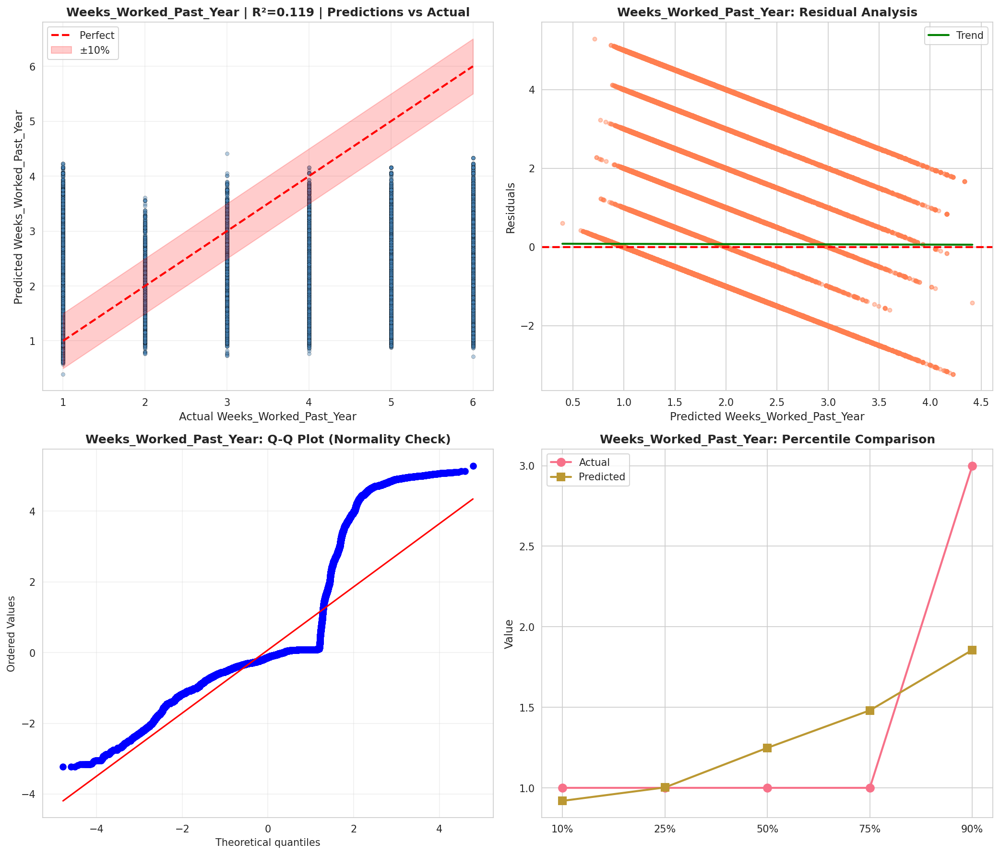
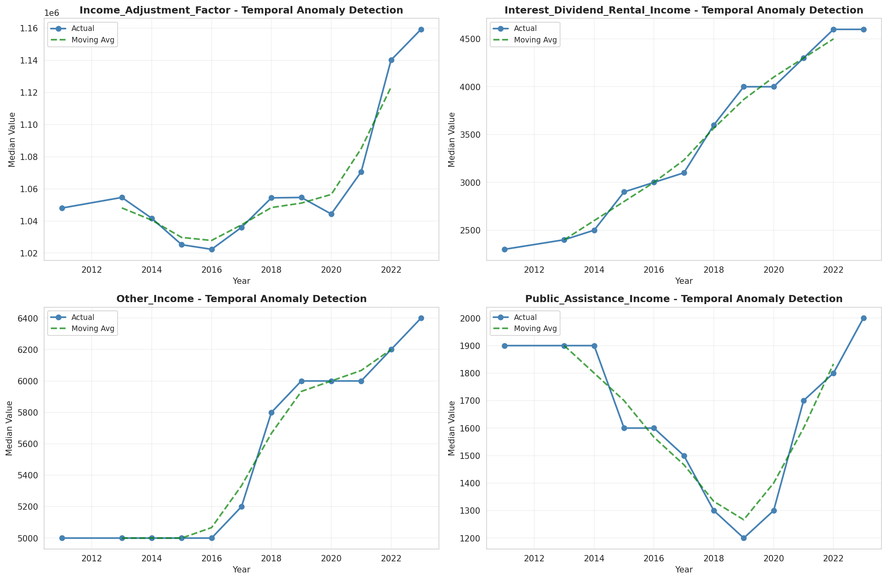
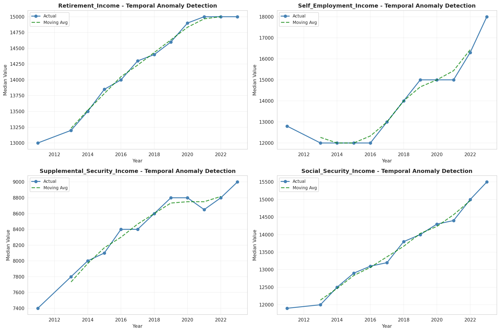
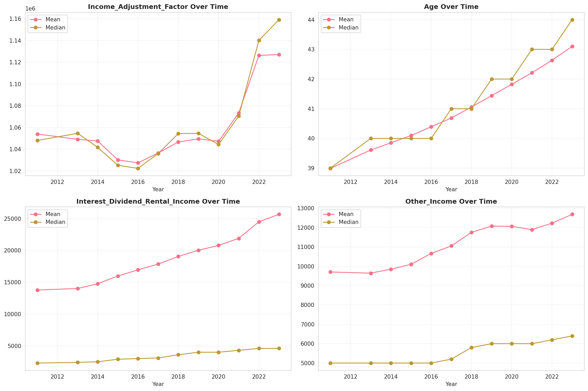
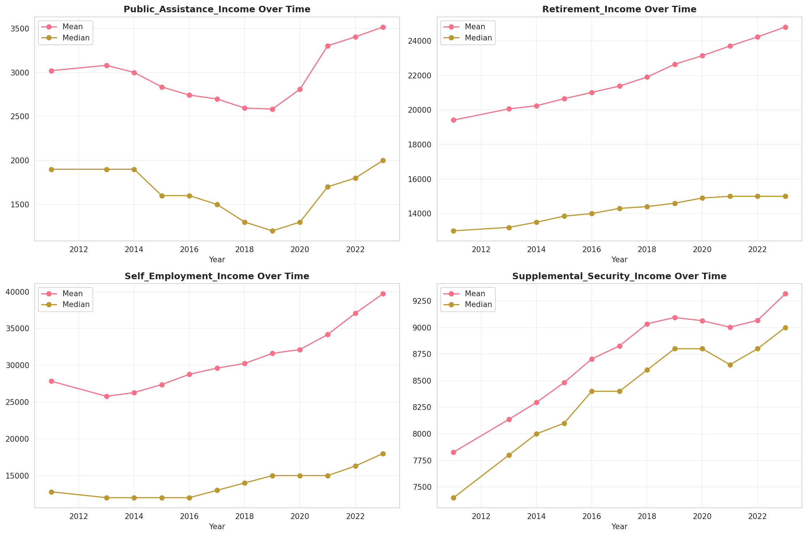
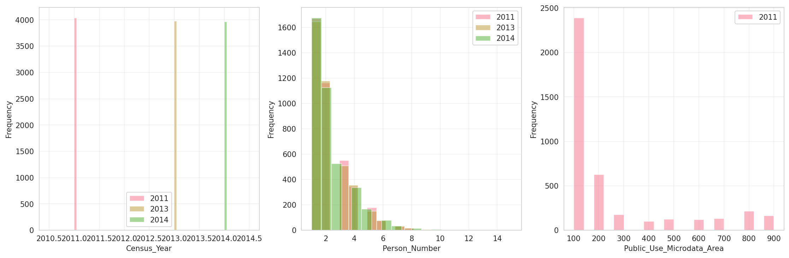
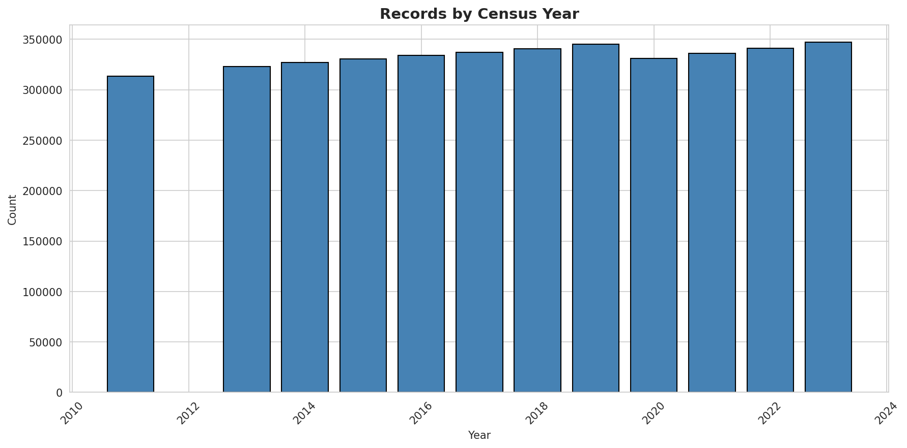
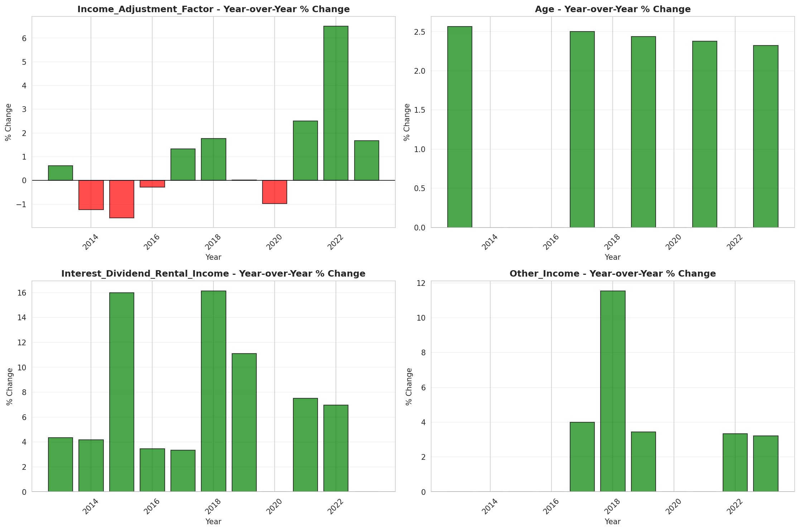
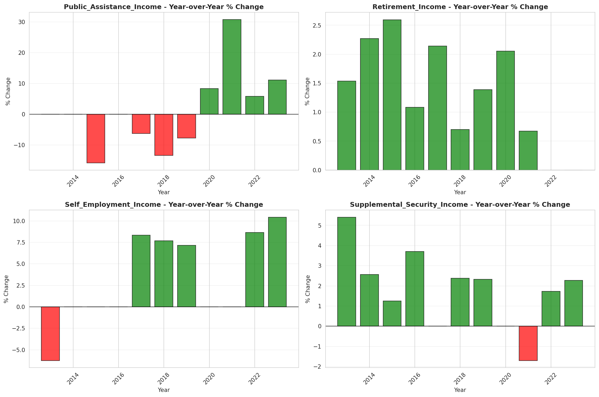

# Temporal Analysis

## Year Distribution

- 2011: 313,361 records

- 2013: 322,861 records

- 2014: 327,123 records

- 2015: 330,585 records

- 2016: 334,066 records

- 2017: 336,984 records

- 2018: 340,442 records

- 2019: 345,137 records

- 2020: 331,341 records

- 2021: 335,968 records

- 2022: 341,258 records

- 2023: 347,046 records

## Temporal Trends

- Census_Year: {np.int64(2011): {'mean': 2011.0, 'median': 2011.0, 'std': 0.0}, np.int64(2013): {'mean': 2013.0, 'median': 2013.0, 'std': 0.0}, np.int64(2014): {'mean': 2014.0, 'median': 2014.0, 'std': 0.0}, np.int64(2015): {'mean': 2015.0, 'median': 2015.0, 'std': 0.0}, np.int64(2016): {'mean': 2016.0, 'median': 2016.0, 'std': 0.0}, np.int64(2017): {'mean': 2017.0, 'median': 2017.0, 'std': 0.0}, np.int64(2018): {'mean': 2018.0, 'median': 2018.0, 'std': 0.0}, np.int64(2019): {'mean': 2019.0, 'median': 2019.0, 'std': 0.0}, np.int64(2020): {'mean': 2020.0, 'median': 2020.0, 'std': 0.0}, np.int64(2021): {'mean': 2021.0, 'median': 2021.0, 'std': 0.0}, np.int64(2022): {'mean': 2022.0, 'median': 2022.0, 'std': 0.0}, np.int64(2023): {'mean': 2023.0, 'median': 2023.0, 'std': 0.0}}

- Person_Number: {np.int64(2011): {'mean': 2.1801468593730555, 'median': 2.0, 'std': 1.4381219776850704}, np.int64(2013): {'mean': 2.1676201213525323, 'median': 2.0, 'std': 1.4388146141443934}, np.int64(2014): {'mean': 2.162929540264671, 'median': 2.0, 'std': 1.4411140892525145}, np.int64(2015): {'mean': 2.1580773477320507, 'median': 2.0, 'std': 1.445665061004015}, np.int64(2016): {'mean': 2.153885759101495, 'median': 2.0, 'std': 1.4389829733716395}, np.int64(2017): {'mean': 2.150683711986326, 'median': 2.0, 'std': 1.438918342452221}, np.int64(2018): {'mean': 2.1481221470911342, 'median': 2.0, 'std': 1.4400399668950827}, np.int64(2019): {'mean': 2.1403471664875107, 'median': 2.0, 'std': 1.4315675073258103}, np.int64(2020): {'mean': 2.1291056645570574, 'median': 2.0, 'std': 1.418027485382986}, np.int64(2021): {'mean': 2.119258381750643, 'median': 2.0, 'std': 1.4085624088185862}, np.int64(2022): {'mean': 2.107496381037221, 'median': 2.0, 'std': 1.3944032475601071}, np.int64(2023): {'mean': 2.095866254041251, 'median': 2.0, 'std': 1.3859131715701438}}

- Public_Use_Microdata_Area: {np.int64(2011): {'mean': 256.1981229316986, 'median': 120.0, 'std': 240.08261369409257}, np.int64(2013): {'mean': None, 'median': None, 'std': None}, np.int64(2014): {'mean': None, 'median': None, 'std': None}, np.int64(2015): {'mean': None, 'median': None, 'std': None}, np.int64(2016): {'mean': 261.4827429310376, 'median': 130.0, 'std': 238.85624582789004}, np.int64(2017): {'mean': 260.18099672388007, 'median': 129.0, 'std': 238.15473257274164}, np.int64(2018): {'mean': 259.43782494521827, 'median': 129.0, 'std': 237.97601107381948}, np.int64(2019): {'mean': 258.19650457644354, 'median': 129.0, 'std': 237.64629856864195}, np.int64(2020): {'mean': 257.96258235473425, 'median': 129.0, 'std': 238.07846525227043}, np.int64(2021): {'mean': 256.8036360605772, 'median': 129.0, 'std': 237.65755561055727}, np.int64(2022): {'mean': None, 'median': None, 'std': None}, np.int64(2023): {'mean': 615.8747514738681, 'median': 131.0, 'std': 729.856666775852}}

- State_Code: {np.int64(2011): {'mean': 4.0, 'median': 4.0, 'std': 0.0}, np.int64(2013): {'mean': 4.0, 'median': 4.0, 'std': 0.0}, np.int64(2014): {'mean': 4.0, 'median': 4.0, 'std': 0.0}, np.int64(2015): {'mean': 4.0, 'median': 4.0, 'std': 0.0}, np.int64(2016): {'mean': 4.0, 'median': 4.0, 'std': 0.0}, np.int64(2017): {'mean': 4.0, 'median': 4.0, 'std': 0.0}, np.int64(2018): {'mean': 4.0, 'median': 4.0, 'std': 0.0}, np.int64(2019): {'mean': 4.0, 'median': 4.0, 'std': 0.0}, np.int64(2020): {'mean': 4.0, 'median': 4.0, 'std': 0.0}, np.int64(2021): {'mean': 4.0, 'median': 4.0, 'std': 0.0}, np.int64(2022): {'mean': 4.0, 'median': 4.0, 'std': 0.0}, np.int64(2023): {'mean': None, 'median': None, 'std': None}}

- Income_Adjustment_Factor: {np.int64(2011): {'mean': 1053970.6316101877, 'median': 1048026.0, 'std': 28347.93967435986}, np.int64(2013): {'mean': 1049076.1030474415, 'median': 1054614.0, 'std': 29723.3505083303}, np.int64(2014): {'mean': 1047539.230038854, 'median': 1041654.0, 'std': 31113.403770748595}, np.int64(2015): {'mean': 1030151.2015336449, 'median': 1025215.0, 'std': 25554.561447196567}, np.int64(2016): {'mean': 1027433.2681925129, 'median': 1022342.0, 'std': 17516.047703540455}, np.int64(2017): {'mean': 1036492.0955060181, 'median': 1035988.0, 'std': 16868.732085459615}, np.int64(2018): {'mean': 1046653.2550067266, 'median': 1054346.0, 'std': 20520.473962411877}, np.int64(2019): {'mean': 1049536.955411909, 'median': 1054606.0, 'std': 26252.538909052582}, np.int64(2020): {'mean': 1047231.2778587618, 'median': 1044328.0, 'std': 28507.59417751396}, np.int64(2021): {'mean': 1073299.4748964186, 'median': 1070512.0, 'std': 30973.591546191765}, np.int64(2022): {'mean': 1126293.8571227635, 'median': 1140108.0, 'std': 50244.9323283341}, np.int64(2023): {'mean': 1127099.9957844205, 'median': 1159185.0, 'std': 70688.20762959479}}

- Person_Weight: {np.int64(2011): {'mean': 20.223872785700838, 'median': 16.0, 'std': 14.638219239752333}, np.int64(2013): {'mean': 20.069636778675655, 'median': 15.0, 'std': 15.57586411960001}, np.int64(2014): {'mean': 20.058286944054682, 'median': 15.0, 'std': 15.870895952113667}, np.int64(2015): {'mean': 20.091437905531105, 'median': 15.0, 'std': 16.191701021008512}, np.int64(2016): {'mean': 20.14148102470769, 'median': 15.0, 'std': 15.323259773813847}, np.int64(2017): {'mean': 20.208514350829713, 'median': 15.0, 'std': 15.179467000406595}, np.int64(2018): {'mean': 20.404900100457642, 'median': 16.0, 'std': 15.287839639787983}, np.int64(2019): {'mean': 20.427537470627605, 'median': 16.0, 'std': 15.540829779694764}, np.int64(2020): {'mean': 21.65160363492595, 'median': 16.0, 'std': 22.05172257906564}, np.int64(2021): {'mean': 21.07106331555386, 'median': 15.0, 'std': 19.85238607405679}, np.int64(2022): {'mean': 21.01718347994772, 'median': 15.0, 'std': 19.990150101473972}, np.int64(2023): {'mean': 20.942972977645613, 'median': 15.0, 'std': 20.06701435157697}}

- Age: {np.int64(2011): {'mean': 38.99046467173643, 'median': 39.0, 'std': 23.577022993553918}, np.int64(2013): {'mean': 39.60952546142148, 'median': 40.0, 'std': 23.721274830687282}, np.int64(2014): {'mean': 39.85139534670445, 'median': 40.0, 'std': 23.7772779927107}, np.int64(2015): {'mean': 40.09722764190753, 'median': 40.0, 'std': 23.863341786710752}, np.int64(2016): {'mean': 40.39063837684769, 'median': 40.0, 'std': 23.920283865181414}, np.int64(2017): {'mean': 40.688169171236616, 'median': 41.0, 'std': 23.953912141611532}, np.int64(2018): {'mean': 41.0580686284301, 'median': 41.0, 'std': 24.01423766221258}, np.int64(2019): {'mean': 41.44073512836931, 'median': 42.0, 'std': 24.057711820365427}, np.int64(2020): {'mean': 41.824000048288624, 'median': 42.0, 'std': 24.058568853475307}, np.int64(2021): {'mean': 42.21037420230498, 'median': 43.0, 'std': 24.107880011606508}, np.int64(2022): {'mean': 42.63297563720118, 'median': 43.0, 'std': 24.151172443325517}, np.int64(2023): {'mean': 43.10173579294964, 'median': 44.0, 'std': 24.190582260309885}}

- Citizenship_Status: {np.int64(2011): {'mean': 1.4684948031184482, 'median': 1.0, 'std': 1.2125013849795476}, np.int64(2013): {'mean': 1.4545144814641595, 'median': 1.0, 'std': 1.1919624800013058}, np.int64(2014): {'mean': 1.4536428193676385, 'median': 1.0, 'std': 1.1884503465840257}, np.int64(2015): {'mean': 1.449875221198784, 'median': 1.0, 'std': 1.181463495958711}, np.int64(2016): {'mean': 1.4489891219100417, 'median': 1.0, 'std': 1.1782903728175613}, np.int64(2017): {'mean': 1.4454632860907344, 'median': 1.0, 'std': 1.1718901909550705}, np.int64(2018): {'mean': 1.4421105504021243, 'median': 1.0, 'std': 1.1649679513804185}, np.int64(2019): {'mean': 1.4329671985327566, 'median': 1.0, 'std': 1.1519899979584447}, np.int64(2020): {'mean': 1.4289478211268754, 'median': 1.0, 'std': 1.1449017847901208}, np.int64(2021): {'mean': 1.4216830174302315, 'median': 1.0, 'std': 1.1333495859789577}, np.int64(2022): {'mean': 1.418173346851942, 'median': 1.0, 'std': 1.1260884954852288}, np.int64(2023): {'mean': 1.4160341856699112, 'median': 1.0, 'std': 1.121706342262176}}

- Class_of_Worker: {np.int64(2011): {'mean': 2.188357905439756, 'median': 1.0, 'std': 1.967309049738063}, np.int64(2013): {'mean': 2.219623371756797, 'median': 1.0, 'std': 2.0066081202984507}, np.int64(2014): {'mean': 2.22664901634694, 'median': 1.0, 'std': 2.0137098779464657}, np.int64(2015): {'mean': 2.224648597157763, 'median': 1.0, 'std': 2.013694426025447}, np.int64(2016): {'mean': 2.218742128722088, 'median': 1.0, 'std': 2.008354473270177}, np.int64(2017): {'mean': 2.202804146856128, 'median': 1.0, 'std': 1.9928984951563558}, np.int64(2018): {'mean': 2.1927715325945414, 'median': 1.0, 'std': 1.9853984929487762}, np.int64(2019): {'mean': 2.182421425708977, 'median': 1.0, 'std': 1.9724093108930505}, np.int64(2020): {'mean': 2.1799577217183104, 'median': 1.0, 'std': 1.9636103830550713}, np.int64(2021): {'mean': 2.169061054236319, 'median': 1.0, 'std': 1.950603692218553}, np.int64(2022): {'mean': 2.1683331250260385, 'median': 1.0, 'std': 1.94640382185754}, np.int64(2023): {'mean': 2.1679437211769987, 'median': 1.0, 'std': 1.9362201486354635}}

- English_Speaking_Ability: {np.int64(2011): {'mean': 1.6564461868559772, 'median': 1.0, 'std': 0.9583556501924013}, np.int64(2013): {'mean': 1.6060839090313146, 'median': 1.0, 'std': 0.9337462723349013}, np.int64(2014): {'mean': 1.5938422762821385, 'median': 1.0, 'std': 0.9266907393991637}, np.int64(2015): {'mean': 1.5808680551309175, 'median': 1.0, 'std': 0.9205785683561479}, np.int64(2016): {'mean': 1.577277693884817, 'median': 1.0, 'std': 0.920892682648141}, np.int64(2017): {'mean': 1.56663211668024, 'median': 1.0, 'std': 0.9115758758790016}, np.int64(2018): {'mean': 1.5533771741134534, 'median': 1.0, 'std': 0.8991269815084055}, np.int64(2019): {'mean': 1.5325005267006233, 'median': 1.0, 'std': 0.8807543984741807}, np.int64(2020): {'mean': 1.5167260529647468, 'median': 1.0, 'std': 0.8683944987564528}, np.int64(2021): {'mean': 1.5028764056643065, 'median': 1.0, 'std': 0.8557910919277979}, np.int64(2022): {'mean': 1.495139086926088, 'median': 1.0, 'std': 0.8506815189593873}, np.int64(2023): {'mean': 1.4896334212295124, 'median': 1.0, 'std': 0.8454096338220568}}

- Fertility_Status: {np.int64(2011): {'mean': 1.9392408635529843, 'median': 2.0, 'std': 0.23888965870893675}, np.int64(2013): {'mean': 1.9412665411738264, 'median': 2.0, 'std': 0.23512680889793044}, np.int64(2014): {'mean': 1.9425407056108304, 'median': 2.0, 'std': 0.23271975859324837}, np.int64(2015): {'mean': 1.9426128226010277, 'median': 2.0, 'std': 0.23258256347677989}, np.int64(2016): {'mean': 1.9439344032518047, 'median': 2.0, 'std': 0.23004996717926537}, np.int64(2017): {'mean': 1.9448418753762373, 'median': 2.0, 'std': 0.22829024402510692}, np.int64(2018): {'mean': 1.9446573426573426, 'median': 2.0, 'std': 0.22864946712777898}, np.int64(2019): {'mean': 1.945214613140714, 'median': 2.0, 'std': 0.22756244764320468}, np.int64(2020): {'mean': 1.9465912066808275, 'median': 2.0, 'std': 0.2248489040700917}, np.int64(2021): {'mean': 1.9477691575577538, 'median': 2.0, 'std': 0.22249380980675376}, np.int64(2022): {'mean': 1.9494533762057877, 'median': 2.0, 'std': 0.2190715601513423}, np.int64(2023): {'mean': 1.9513629679900464, 'median': 2.0, 'std': 0.21510956592774635}}

- Marital_Status: {np.int64(2011): {'mean': 2.9557092299296976, 'median': 3.0, 'std': 1.8521202448368566}, np.int64(2013): {'mean': 2.987263868971477, 'median': 3.0, 'std': 1.8486829861996499}, np.int64(2014): {'mean': 3.001143300837911, 'median': 3.0, 'std': 1.847799766083066}, np.int64(2015): {'mean': 3.010823237593962, 'median': 3.0, 'std': 1.8468673704335756}, np.int64(2016): {'mean': 3.002071446959583, 'median': 3.0, 'std': 1.847826548541035}, np.int64(2017): {'mean': 2.996308430073831, 'median': 3.0, 'std': 1.8477731004802835}, np.int64(2018): {'mean': 2.9899865469007936, 'median': 3.0, 'std': 1.8467720678971513}, np.int64(2019): {'mean': 2.9827083158282073, 'median': 3.0, 'std': 1.8454940094154473}, np.int64(2020): {'mean': 2.976860696382277, 'median': 3.0, 'std': 1.8455364209001597}, np.int64(2021): {'mean': 2.9711192732641205, 'median': 3.0, 'std': 1.845331257746577}, np.int64(2022): {'mean': 2.9642469920119088, 'median': 3.0, 'std': 1.8449296530592287}, np.int64(2023): {'mean': 2.95639194804147, 'median': 3.0, 'std': 1.8438706329143917}}

- Mobility_Status: {np.int64(2011): {'mean': 1.3313885496824382, 'median': 1.0, 'std': 0.7393171674489794}, np.int64(2013): {'mean': 1.3332247026234316, 'median': 1.0, 'std': 0.7408741999950929}, np.int64(2014): {'mean': 1.330981691821605, 'median': 1.0, 'std': 0.7387118203903636}, np.int64(2015): {'mean': 1.3295474358778276, 'median': 1.0, 'std': 0.7372800757196742}, np.int64(2016): {'mean': 1.3264062897192868, 'median': 1.0, 'std': 0.734249385592495}, np.int64(2017): {'mean': 1.3250763966568404, 'median': 1.0, 'std': 0.7330261895424952}, np.int64(2018): {'mean': 1.3212518881895046, 'median': 1.0, 'std': 0.7297589536027156}, np.int64(2019): {'mean': 1.3173112942498595, 'median': 1.0, 'std': 0.7262833447343892}, np.int64(2020): {'mean': 1.3135682556318589, 'median': 1.0, 'std': 0.7229766540647066}, np.int64(2021): {'mean': 1.3026099181696928, 'median': 1.0, 'std': 0.7128767401068788}, np.int64(2022): {'mean': 1.2887758239419131, 'median': 1.0, 'std': 0.699101265627993}, np.int64(2023): {'mean': 1.2756897473444437, 'median': 1.0, 'std': 0.6854051201476562}}

- Military_Service: {np.int64(2011): {'mean': 4.726931578252837, 'median': 5.0, 'std': 0.7068047838908279}, np.int64(2013): {'mean': 3.7485670994125604, 'median': 4.0, 'std': 0.6627342533701361}, np.int64(2014): {'mean': 3.7550837273904834, 'median': 4.0, 'std': 0.6550104693155847}, np.int64(2015): {'mean': 3.761248272383937, 'median': 4.0, 'std': 0.6476419740156375}, np.int64(2016): {'mean': 3.7670391103886733, 'median': 4.0, 'std': 0.640321703267774}, np.int64(2017): {'mean': 3.772767840401995, 'median': 4.0, 'std': 0.6329209232288904}, np.int64(2018): {'mean': 3.7767454403729714, 'median': 4.0, 'std': 0.6284505979339885}, np.int64(2019): {'mean': 3.7807773303418353, 'median': 4.0, 'std': 0.6235736467777513}, np.int64(2020): {'mean': 3.7839984698297684, 'median': 4.0, 'std': 0.6195786273350131}, np.int64(2021): {'mean': 3.7877698106269535, 'median': 4.0, 'std': 0.6156663465891754}, np.int64(2022): {'mean': 3.791304441732632, 'median': 4.0, 'std': 0.6114970321404075}, np.int64(2023): {'mean': 3.7965109735509284, 'median': 4.0, 'std': 0.6048926640255264}}

- Travel_Time_To_Work_Minutes: {np.int64(2011): {'mean': 24.896928754918218, 'median': 20.0, 'std': 20.480110195578558}, np.int64(2013): {'mean': 24.690578466239025, 'median': 20.0, 'std': 20.046038279939463}, np.int64(2014): {'mean': 24.75177171783148, 'median': 20.0, 'std': 19.989931273668894}, np.int64(2015): {'mean': 24.895356727413727, 'median': 20.0, 'std': 20.076051664050205}, np.int64(2016): {'mean': 25.145460604089145, 'median': 20.0, 'std': 20.15854548148121}, np.int64(2017): {'mean': 25.36148301522558, 'median': 20.0, 'std': 20.257351642410597}, np.int64(2018): {'mean': 25.59124082007344, 'median': 20.0, 'std': 20.65616186539029}, np.int64(2019): {'mean': 25.969975334479408, 'median': 20.0, 'std': 21.11112014091731}, np.int64(2020): {'mean': 26.000783804539733, 'median': 20.0, 'std': 21.181693521527233}, np.int64(2021): {'mean': 25.876933878894995, 'median': 20.0, 'std': 21.25554231101469}, np.int64(2022): {'mean': 25.693006506526988, 'median': 20.0, 'std': 21.18215705570931}, np.int64(2023): {'mean': 25.52455108588962, 'median': 20.0, 'std': 20.91546353729263}}

- Vehicle_Occupancy: {np.int64(2011): {'mean': 1.1975871080139373, 'median': 1.0, 'std': 0.6476945925104601}, np.int64(2013): {'mean': 1.1923722672887616, 'median': 1.0, 'std': 0.6460307128073481}, np.int64(2014): {'mean': 1.1904338877503453, 'median': 1.0, 'std': 0.641507734743181}, np.int64(2015): {'mean': 1.1887760443932573, 'median': 1.0, 'std': 0.6404563809314848}, np.int64(2016): {'mean': 1.1863973386469175, 'median': 1.0, 'std': 0.6308747678632285}, np.int64(2017): {'mean': 1.1833554209793495, 'median': 1.0, 'std': 0.6224121940287876}, np.int64(2018): {'mean': 1.181653700018093, 'median': 1.0, 'std': 0.6118098505250217}, np.int64(2019): {'mean': 1.1818400558224589, 'median': 1.0, 'std': 0.6134345204886248}, np.int64(2020): {'mean': 1.179636554817811, 'median': 1.0, 'std': 0.6054953809345853}, np.int64(2021): {'mean': 1.1769738091538475, 'median': 1.0, 'std': 0.601609963087693}, np.int64(2022): {'mean': 1.1774752085628837, 'median': 1.0, 'std': 0.5992566690971134}, np.int64(2023): {'mean': 1.181170725687742, 'median': 1.0, 'std': 0.6177356460296102}}

- Transportation_To_Work: {np.int64(2011): {'mean': 1.9830033548030492, 'median': 1.0, 'std': 2.8899174163506203}, np.int64(2013): {'mean': 2.0407074720551632, 'median': 1.0, 'std': 2.9648852519294824}, np.int64(2014): {'mean': 2.0647599027182126, 'median': 1.0, 'std': 2.994801931112916}, np.int64(2015): {'mean': 2.081311858643512, 'median': 1.0, 'std': 3.0135265260294584}, np.int64(2016): {'mean': 2.0941662018962632, 'median': 1.0, 'std': 3.034380404973724}, np.int64(2017): {'mean': 2.1092408832458482, 'median': 1.0, 'std': 3.052736245216239}, np.int64(2018): {'mean': 2.1241375373704074, 'median': 1.0, 'std': 3.0759679293325073}, np.int64(2019): {'mean': None, 'median': None, 'std': None}, np.int64(2020): {'mean': None, 'median': None, 'std': None}, np.int64(2021): {'mean': None, 'median': None, 'std': None}, np.int64(2022): {'mean': None, 'median': None, 'std': None}, np.int64(2023): {'mean': None, 'median': None, 'std': None}}

- Language_Other_Than_English: {np.int64(2011): {'mean': 1.742601260709038, 'median': 2.0, 'std': 0.43720164678108686}, np.int64(2013): {'mean': 1.738393702241614, 'median': 2.0, 'std': 0.439510045155734}, np.int64(2014): {'mean': 1.7369736320445077, 'median': 2.0, 'std': 0.44027733038195516}, np.int64(2015): {'mean': 1.7373887573907485, 'median': 2.0, 'std': 0.4400536328521524}, np.int64(2016): {'mean': 1.7415158765922607, 'median': 2.0, 'std': 0.4378021123800108}, np.int64(2017): {'mean': 1.7454095368540758, 'median': 2.0, 'std': 0.43563144444757523}, np.int64(2018): {'mean': 1.7473988493148984, 'median': 2.0, 'std': 0.43450477045718316}, np.int64(2019): {'mean': 1.7531773925651308, 'median': 2.0, 'std': 0.4311632829239251}, np.int64(2020): {'mean': 1.7564149437748577, 'median': 2.0, 'std': 0.4292458064944725}, np.int64(2021): {'mean': 1.7594339031874255, 'median': 2.0, 'std': 0.4274279142802148}, np.int64(2022): {'mean': 1.7627167647836812, 'median': 2.0, 'std': 0.42541798052690255}, np.int64(2023): {'mean': 1.7665610573006245, 'median': 2.0, 'std': 0.42301978994312933}}

- Grandparents_Living_With_Grandchildren: {np.int64(2011): {'mean': 1.9597929625991923, 'median': 2.0, 'std': 0.1964449848915503}, np.int64(2013): {'mean': 1.9580003494147302, 'median': 2.0, 'std': 0.20058883513041575}, np.int64(2014): {'mean': 1.9579841005005398, 'median': 2.0, 'std': 0.20062592357264578}, np.int64(2015): {'mean': 1.9580357618395123, 'median': 2.0, 'std': 0.20050794381956616}, np.int64(2016): {'mean': 1.958926607731966, 'median': 2.0, 'std': 0.1984604651168836}, np.int64(2017): {'mean': 1.9596046774518863, 'median': 2.0, 'std': 0.19688504841379648}, np.int64(2018): {'mean': 1.9598193068507437, 'median': 2.0, 'std': 0.19638325539965937}, np.int64(2019): {'mean': 1.9605855245323935, 'median': 2.0, 'std': 0.19457940704365548}, np.int64(2020): {'mean': 1.9613247284512145, 'median': 2.0, 'std': 0.19282030116399757}, np.int64(2021): {'mean': 1.962942141659011, 'median': 2.0, 'std': 0.18890404065115088}, np.int64(2022): {'mean': 1.964314549404276, 'median': 2.0, 'std': 0.1855051285359819}, np.int64(2023): {'mean': 1.9656622923350076, 'median': 2.0, 'std': 0.18209550637291552}}

- Months_Responsible_For_Grandchildren: {np.int64(2011): {'mean': 3.5704323570432357, 'median': 4.0, 'std': 1.3905839510240234}, np.int64(2013): {'mean': 3.636776087536696, 'median': 4.0, 'std': 1.3798810133806756}, np.int64(2014): {'mean': 3.6730717907659463, 'median': 4.0, 'std': 1.3738571373981308}, np.int64(2015): {'mean': 3.6830645161290323, 'median': 4.0, 'std': 1.382031685452841}, np.int64(2016): {'mean': 3.716086599068238, 'median': 4.0, 'std': 1.3708935607038393}, np.int64(2017): {'mean': 3.716426350014136, 'median': 4.0, 'std': 1.3778072565761141}, np.int64(2018): {'mean': 3.7471698113207546, 'median': 4.0, 'std': 1.362214594734664}, np.int64(2019): {'mean': 3.7529235382308848, 'median': 4.0, 'std': 1.353571670580172}, np.int64(2020): {'mean': 3.81479057591623, 'median': 4.0, 'std': 1.3355483945663191}, np.int64(2021): {'mean': 3.828611898016997, 'median': 4.0, 'std': 1.337363042489855}, np.int64(2022): {'mean': 3.843225083986562, 'median': 4.0, 'std': 1.3245195185120822}, np.int64(2023): {'mean': 3.867687475461327, 'median': 4.0, 'std': 1.3268646455461606}}

- Grandparents_Responsible_For_Grandchildren: {np.int64(2011): {'mean': 1.5366421093447074, 'median': 2.0, 'std': 0.4986877767776572}, np.int64(2013): {'mean': 1.5546707867839316, 'median': 2.0, 'std': 0.49703165464311316}, np.int64(2014): {'mean': 1.5623686054660126, 'median': 2.0, 'std': 0.49612388057863643}, np.int64(2015): {'mean': 1.5707857390100382, 'median': 2.0, 'std': 0.4949925750278669}, np.int64(2016): {'mean': 1.5770746407046825, 'median': 2.0, 'std': 0.4940524162007455}, np.int64(2017): {'mean': 1.5892940083604272, 'median': 2.0, 'std': 0.49199053522005853}, np.int64(2018): {'mean': 1.6043867707854846, 'median': 2.0, 'std': 0.4890100849057637}, np.int64(2019): {'mean': 1.6177212287941312, 'median': 2.0, 'std': 0.4859719986267945}, np.int64(2020): {'mean': 1.6310070031393382, 'median': 2.0, 'std': 0.4825611693487602}, np.int64(2021): {'mean': 1.6517020226936359, 'median': 2.0, 'std': 0.476460381499215}, np.int64(2022): {'mean': 1.665125, 'median': 2.0, 'std': 0.4719762489495067}, np.int64(2023): {'mean': 1.6780025284450064, 'median': 2.0, 'std': 0.4672715519299974}}

- Interest_Dividend_Rental_Income: {np.int64(2011): {'mean': 13778.165836452246, 'median': 2300.0, 'std': 35151.20484405842}, np.int64(2013): {'mean': 14018.404032729399, 'median': 2400.0, 'std': 35612.748484163036}, np.int64(2014): {'mean': 14761.500120264582, 'median': 2500.0, 'std': 37214.898458938165}, np.int64(2015): {'mean': 15975.87647006015, 'median': 2900.0, 'std': 40725.53824640821}, np.int64(2016): {'mean': 16946.976842105265, 'median': 3000.0, 'std': 43573.469768209674}, np.int64(2017): {'mean': 17860.398525685327, 'median': 3100.0, 'std': 45012.27397664725}, np.int64(2018): {'mean': 19058.229472182597, 'median': 3600.0, 'std': 48033.02868467051}, np.int64(2019): {'mean': 20031.208747348443, 'median': 4000.0, 'std': 50724.648852704995}, np.int64(2020): {'mean': 20787.497324492528, 'median': 4000.0, 'std': 52051.85062755937}, np.int64(2021): {'mean': 21900.0599325032, 'median': 4300.0, 'std': 54902.649016574476}, np.int64(2022): {'mean': 24505.813839875857, 'median': 4600.0, 'std': 64870.3112042741}, np.int64(2023): {'mean': 25673.98206557099, 'median': 4600.0, 'std': 66952.0019286643}}

- Military_Service_Period_1: {np.int64(2011): {'mean': 0.10508519089983914, 'median': 0.0, 'std': 0.3066681935844077}, np.int64(2013): {'mean': 0.12070241539393124, 'median': 0.0, 'std': 0.3257866062620327}, np.int64(2014): {'mean': 0.13198212031255332, 'median': 0.0, 'std': 0.33847710324981384}, np.int64(2015): {'mean': 0.1425942642872023, 'median': 0.0, 'std': 0.3496646752399663}, np.int64(2016): {'mean': 0.1519901373723142, 'median': 0.0, 'std': 0.359017653635855}, np.int64(2017): {'mean': 0.1630781356357253, 'median': 0.0, 'std': 0.3694435641576755}, np.int64(2018): {'mean': 0.17400043069413537, 'median': 0.0, 'std': 0.3791166567578879}, np.int64(2019): {'mean': 0.18489807637094458, 'median': 0.0, 'std': 0.38822182668994154}, np.int64(2020): {'mean': 0.19598596597125287, 'median': 0.0, 'std': 0.396965252902058}, np.int64(2021): {'mean': 0.21155951527048963, 'median': 0.0, 'std': 0.4084218212081331}, np.int64(2022): {'mean': 0.22331481759495572, 'median': 0.0, 'std': 0.4164754732444772}, np.int64(2023): {'mean': 0.2314765960654255, 'median': 0.0, 'std': 0.42178417018172704}}

- Military_Service_Period_2: {np.int64(2011): {'mean': 0.14661370276747315, 'median': 0.0, 'std': 0.3537262112834334}, np.int64(2013): {'mean': 0.1491623494583866, 'median': 0.0, 'std': 0.35625442106953464}, np.int64(2014): {'mean': 0.15467294503019757, 'median': 0.0, 'std': 0.3615987923419436}, np.int64(2015): {'mean': 0.15832233872647733, 'median': 0.0, 'std': 0.3650493152760261}, np.int64(2016): {'mean': 0.1669601972525537, 'median': 0.0, 'std': 0.3729468983980489}, np.int64(2017): {'mean': 0.1726077454949307, 'median': 0.0, 'std': 0.3779145780225167}, np.int64(2018): {'mean': 0.1787739573612806, 'median': 0.0, 'std': 0.3831698044484685}, np.int64(2019): {'mean': 0.18281653746770027, 'median': 0.0, 'std': 0.386522978428952}, np.int64(2020): {'mean': 0.18840306334175877, 'median': 0.0, 'std': 0.39104106925961735}, np.int64(2021): {'mean': 0.19128694929970932, 'median': 0.0, 'std': 0.3933218689144861}, np.int64(2022): {'mean': 0.19963218735925536, 'median': 0.0, 'std': 0.39973137751611526}, np.int64(2023): {'mean': 0.20079897490012813, 'median': 0.0, 'std': 0.40060553522029196}}

- Military_Service_Period_3: {np.int64(2011): {'mean': 0.16959390696300186, 'median': 0.0, 'std': 0.37528181035609565}, np.int64(2013): {'mean': None, 'median': None, 'std': None}, np.int64(2014): {'mean': None, 'median': None, 'std': None}, np.int64(2015): {'mean': None, 'median': None, 'std': None}, np.int64(2016): {'mean': None, 'median': None, 'std': None}, np.int64(2017): {'mean': None, 'median': None, 'std': None}, np.int64(2018): {'mean': None, 'median': None, 'std': None}, np.int64(2019): {'mean': None, 'median': None, 'std': None}, np.int64(2020): {'mean': None, 'median': None, 'std': None}, np.int64(2021): {'mean': None, 'median': None, 'std': None}, np.int64(2022): {'mean': None, 'median': None, 'std': None}, np.int64(2023): {'mean': None, 'median': None, 'std': None}}

- Military_Service_Period_4: {np.int64(2011): {'mean': 0.13430287909129707, 'median': 0.0, 'std': 0.340983038804543}, np.int64(2013): {'mean': None, 'median': None, 'std': None}, np.int64(2014): {'mean': None, 'median': None, 'std': None}, np.int64(2015): {'mean': None, 'median': None, 'std': None}, np.int64(2016): {'mean': None, 'median': None, 'std': None}, np.int64(2017): {'mean': None, 'median': None, 'std': None}, np.int64(2018): {'mean': None, 'median': None, 'std': None}, np.int64(2019): {'mean': None, 'median': None, 'std': None}, np.int64(2020): {'mean': None, 'median': None, 'std': None}, np.int64(2021): {'mean': None, 'median': None, 'std': None}, np.int64(2022): {'mean': None, 'median': None, 'std': None}, np.int64(2023): {'mean': None, 'median': None, 'std': None}}

- Military_Service_Period_5: {np.int64(2011): {'mean': 0.351859755096681, 'median': 0.0, 'std': 0.4775583261285343}, np.int64(2013): {'mean': 0.3597860458857566, 'median': 0.0, 'std': 0.4799456178631431}, np.int64(2014): {'mean': 0.36520285256082163, 'median': 0.0, 'std': 0.48149521254086486}, np.int64(2015): {'mean': 0.37160613846260676, 'median': 0.0, 'std': 0.4832423038169172}, np.int64(2016): {'mean': 0.37802042972877775, 'median': 0.0, 'std': 0.4849012956800708}, np.int64(2017): {'mean': 0.3836921864364275, 'median': 0.0, 'std': 0.4862930850595519}, np.int64(2018): {'mean': 0.3909626013925777, 'median': 0.0, 'std': 0.48797478632650887}, np.int64(2019): {'mean': 0.39671260407694514, 'median': 0.0, 'std': 0.48922418524872097}, np.int64(2020): {'mean': 0.4012147734560682, 'median': 0.0, 'std': 0.49015359090870847}, np.int64(2021): {'mean': 0.39661746385292007, 'median': 0.0, 'std': 0.48920454408605096}, np.int64(2022): {'mean': 0.39900165140369315, 'median': 0.0, 'std': 0.4897022912379928}, np.int64(2023): {'mean': 0.3982814502148187, 'median': 0.0, 'std': 0.4895532339838007}}

- Military_Service_Period_6: {np.int64(2011): {'mean': 0.12126982042611864, 'median': 0.0, 'std': 0.326445936644548}, np.int64(2013): {'mean': None, 'median': None, 'std': None}, np.int64(2014): {'mean': None, 'median': None, 'std': None}, np.int64(2015): {'mean': None, 'median': None, 'std': None}, np.int64(2016): {'mean': None, 'median': None, 'std': None}, np.int64(2017): {'mean': None, 'median': None, 'std': None}, np.int64(2018): {'mean': None, 'median': None, 'std': None}, np.int64(2019): {'mean': None, 'median': None, 'std': None}, np.int64(2020): {'mean': None, 'median': None, 'std': None}, np.int64(2021): {'mean': None, 'median': None, 'std': None}, np.int64(2022): {'mean': None, 'median': None, 'std': None}, np.int64(2023): {'mean': None, 'median': None, 'std': None}}

- Military_Service_Period_7: {np.int64(2011): {'mean': 0.14612126982042611, 'median': 0.0, 'std': 0.3532335495293571}, np.int64(2013): {'mean': None, 'median': None, 'std': None}, np.int64(2014): {'mean': None, 'median': None, 'std': None}, np.int64(2015): {'mean': None, 'median': None, 'std': None}, np.int64(2016): {'mean': None, 'median': None, 'std': None}, np.int64(2017): {'mean': None, 'median': None, 'std': None}, np.int64(2018): {'mean': None, 'median': None, 'std': None}, np.int64(2019): {'mean': None, 'median': None, 'std': None}, np.int64(2020): {'mean': None, 'median': None, 'std': None}, np.int64(2021): {'mean': None, 'median': None, 'std': None}, np.int64(2022): {'mean': None, 'median': None, 'std': None}, np.int64(2023): {'mean': None, 'median': None, 'std': None}}

- Military_Service_Period_8: {np.int64(2011): {'mean': 0.14608844095728965, 'median': 0.0, 'std': 0.3532006565675381}, np.int64(2013): {'mean': 0.13513422593016214, 'median': 0.0, 'std': 0.3418726352306478}, np.int64(2014): {'mean': 0.12781929231924113, 'median': 0.0, 'std': 0.33389418216154365}, np.int64(2015): {'mean': 0.12297757100201374, 'median': 0.0, 'std': 0.3284171628219854}, np.int64(2016): {'mean': 0.11352588939767523, 'median': 0.0, 'std': 0.3172401405723307}, np.int64(2017): {'mean': 0.10590047648049296, 'median': 0.0, 'std': 0.30771570946332627}, np.int64(2018): {'mean': 0.09550642452085277, 'median': 0.0, 'std': 0.2939184376062483}, np.int64(2019): {'mean': 0.08616853287395923, 'median': 0.0, 'std': 0.280617787947328}, np.int64(2020): {'mean': 0.07835666050477233, 'median': 0.0, 'std': 0.2687370811932257}, np.int64(2021): {'mean': 0.07025557778700593, 'median': 0.0, 'std': 0.2555820760324078}, np.int64(2022): {'mean': 0.05911274583395887, 'median': 0.0, 'std': 0.23584002344325497}, np.int64(2023): {'mean': 0.05234793095650863, 'median': 0.0, 'std': 0.22273188981077777}}

- Military_Service_Period_9: {np.int64(2011): {'mean': 0.030826302485144938, 'median': 0.0, 'std': 0.17284971041028196}, np.int64(2013): {'mean': 0.024624907488393997, 'median': 0.0, 'std': 0.15498170680390566}, np.int64(2014): {'mean': 0.022963797045074556, 'median': 0.0, 'std': 0.1497906093955666}, np.int64(2015): {'mean': 0.02069300743003958, 'median': 0.0, 'std': 0.14235698257632637}, np.int64(2016): {'mean': 0.017717506164142305, 'median': 0.0, 'std': 0.13192501347201757}, np.int64(2017): {'mean': 0.015619962024862967, 'median': 0.0, 'std': 0.12400213580669324}, np.int64(2018): {'mean': 0.014428253535281028, 'median': 0.0, 'std': 0.11925011290941558}, np.int64(2019): {'mean': 0.012130347401665232, 'median': 0.0, 'std': 0.10946977733320849}, np.int64(2020): {'mean': 0.010563247444071378, 'median': 0.0, 'std': 0.10223531464562734}, np.int64(2021): {'mean': None, 'median': None, 'std': None}, np.int64(2022): {'mean': None, 'median': None, 'std': None}, np.int64(2023): {'mean': None, 'median': None, 'std': None}}

- Military_Service_Period_10: {np.int64(2011): {'mean': 0.1096484028758084, 'median': 0.0, 'std': 0.31245613398728206}, np.int64(2013): {'mean': 0.08998856220143982, 'median': 0.0, 'std': 0.28617018680384254}, np.int64(2014): {'mean': 0.07892312416828744, 'median': 0.0, 'std': 0.2696233394288595}, np.int64(2015): {'mean': 0.06825914867023124, 'median': 0.0, 'std': 0.2521944597806515}, np.int64(2016): {'mean': 0.05938710813666784, 'median': 0.0, 'std': 0.23635195619501326}, np.int64(2017): {'mean': 0.04893777093110737, 'median': 0.0, 'std': 0.2157418202233129}, np.int64(2018): {'mean': 0.040557031081760106, 'median': 0.0, 'std': 0.19726518944030402}, np.int64(2019): {'mean': 0.032622739018087855, 'median': 0.0, 'std': 0.17765029847424024}, np.int64(2020): {'mean': 0.026068585656619007, 'median': 0.0, 'std': 0.1593423118874185}, np.int64(2021): {'mean': 0.01940428102231115, 'median': 0.0, 'std': 0.1379437322030159}, np.int64(2022): {'mean': 0.014825101336135715, 'median': 0.0, 'std': 0.1208547305339679}, np.int64(2023): {'mean': 0.01134393608200799, 'median': 0.0, 'std': 0.1059040787072531}}

- Military_Service_Period_11: {np.int64(2011): {'mean': 0.005679393322609238, 'median': 0.0, 'std': 0.07514867403552146}, np.int64(2013): {'mean': 0.003969588912063514, 'median': 0.0, 'std': 0.06288055573546207}, np.int64(2014): {'mean': 0.003548640256593988, 'median': 0.0, 'std': 0.05946568816070918}, np.int64(2015): {'mean': 0.003228942434553156, 'median': 0.0, 'std': 0.05673295440454124}, np.int64(2016): {'mean': 0.0028883409651285666, 'median': 0.0, 'std': 0.053666562208576754}, np.int64(2017): {'mean': 0.002579443270160857, 'median': 0.0, 'std': 0.05072358344614273}, np.int64(2018): {'mean': 0.0019381236092168544, 'median': 0.0, 'std': 0.0439822318135931}, np.int64(2019): {'mean': 0.0008972150445018662, 'median': 0.0, 'std': 0.029940644978418317}, np.int64(2020): {'mean': 0.0005281623722035688, 'median': 0.0, 'std': 0.02297614702973267}, np.int64(2021): {'mean': None, 'median': None, 'std': None}, np.int64(2022): {'mean': None, 'median': None, 'std': None}, np.int64(2023): {'mean': None, 'median': None, 'std': None}}

- Temporary_Absence_From_Work: {np.int64(2011): {'mean': 2.496518021264363, 'median': 3.0, 'std': 0.532611626077202}, np.int64(2013): {'mean': 2.505765356423336, 'median': 3.0, 'std': 0.5267187889620926}, np.int64(2014): {'mean': 2.5178061913235563, 'median': 3.0, 'std': 0.5241952278543424}, np.int64(2015): {'mean': 2.5292968823923485, 'median': 3.0, 'std': 0.5221559579884709}, np.int64(2016): {'mean': 2.5427585511500497, 'median': 3.0, 'std': 0.5201801534542446}, np.int64(2017): {'mean': 2.5565076637746995, 'median': 3.0, 'std': 0.5176389496741521}, np.int64(2018): {'mean': 2.558486096882243, 'median': 3.0, 'std': 0.5176028913005386}, np.int64(2019): {'mean': 2.563385906794136, 'median': 3.0, 'std': 0.516223966311943}, np.int64(2020): {'mean': 2.5663815119351647, 'median': 3.0, 'std': 0.5156761579076343}, np.int64(2021): {'mean': 2.5703976739891594, 'median': 3.0, 'std': 0.5145945282535099}, np.int64(2022): {'mean': 2.5724510207266382, 'median': 3.0, 'std': 0.5139295703008075}, np.int64(2023): {'mean': 2.5728092426258593, 'median': 3.0, 'std': 0.5132168255397557}}

- Available_For_Work: {np.int64(2011): {'mean': 4.508907387463257, 'median': 5.0, 'std': 1.2390507213478321}, np.int64(2013): {'mean': 4.506525237803904, 'median': 5.0, 'std': 1.2387768985773813}, np.int64(2014): {'mean': 4.549836626372952, 'median': 5.0, 'std': 1.1873396760357529}, np.int64(2015): {'mean': 4.60241702591509, 'median': 5.0, 'std': 1.1190709315862974}, np.int64(2016): {'mean': 4.653771319523026, 'median': 5.0, 'std': 1.0499728157517891}, np.int64(2017): {'mean': 4.7095434919675085, 'median': 5.0, 'std': 0.9707158841558359}, np.int64(2018): {'mean': 4.724960219717942, 'median': 5.0, 'std': 0.9434192895784739}, np.int64(2019): {'mean': 4.737359725852521, 'median': 5.0, 'std': 0.9204671555817063}, np.int64(2020): {'mean': 4.74652721394724, 'median': 5.0, 'std': 0.9060545764853052}, np.int64(2021): {'mean': 4.760961108838044, 'median': 5.0, 'std': 0.88170453734218}, np.int64(2022): {'mean': 4.776933280369986, 'median': 5.0, 'std': 0.8521851315243235}, np.int64(2023): {'mean': 4.787854845863828, 'median': 5.0, 'std': 0.8311706061339129}}

- On_Layoff_From_Work: {np.int64(2011): {'mean': 2.4625525333419707, 'median': 2.0, 'std': 0.5322794850575143}, np.int64(2013): {'mean': 2.471325194159435, 'median': 2.0, 'std': 0.5324638063531731}, np.int64(2014): {'mean': 2.489361538933546, 'median': 3.0, 'std': 0.5269940851801834}, np.int64(2015): {'mean': 2.507325639928996, 'median': 3.0, 'std': 0.5209389277141524}, np.int64(2016): {'mean': 2.525265992209761, 'median': 3.0, 'std': 0.5161825111761394}, np.int64(2017): {'mean': 2.5431379995649146, 'median': 3.0, 'std': 0.5119999378295783}, np.int64(2018): {'mean': 2.5469007709019045, 'median': 3.0, 'std': 0.5100022258599795}, np.int64(2019): {'mean': 2.5530269262176706, 'median': 3.0, 'std': 0.5080993499431246}, np.int64(2020): {'mean': 2.554309797611491, 'median': 3.0, 'std': 0.5102036653109516}, np.int64(2021): {'mean': 2.558231739330367, 'median': 3.0, 'std': 0.5103134248963503}, np.int64(2022): {'mean': 2.560871199761665, 'median': 3.0, 'std': 0.5095678612499891}, np.int64(2023): {'mean': 2.561817337547128, 'median': 3.0, 'std': 0.5089078817845218}}

- Looking_For_Work: {np.int64(2011): {'mean': 2.4440697043557127, 'median': 3.0, 'std': 0.6072750933758451}, np.int64(2013): {'mean': 2.445294385840487, 'median': 3.0, 'std': 0.6170540463799754}, np.int64(2014): {'mean': 2.462293673682273, 'median': 3.0, 'std': 0.6107910980215426}, np.int64(2015): {'mean': 2.4825725088850117, 'median': 3.0, 'std': 0.5993913483552977}, np.int64(2016): {'mean': 2.5027392809527544, 'median': 3.0, 'std': 0.5891955861068209}, np.int64(2017): {'mean': 2.522294449708898, 'median': 3.0, 'std': 0.5795322471550182}, np.int64(2018): {'mean': 2.5284674237635416, 'median': 3.0, 'std': 0.5732923985602292}, np.int64(2019): {'mean': 2.534355799781053, 'median': 3.0, 'std': 0.5678152558203133}, np.int64(2020): {'mean': 2.536436574600316, 'median': 3.0, 'std': 0.5661911418808264}, np.int64(2021): {'mean': 2.5398090382756235, 'median': 3.0, 'std': 0.5641149567598319}, np.int64(2022): {'mean': 2.542630765083914, 'median': 3.0, 'std': 0.5601440337311113}, np.int64(2023): {'mean': 2.5424082390774005, 'median': 3.0, 'std': 0.5580718528236751}}

- Informed_Of_Recall: {np.int64(2011): {'mean': 2.8754018446389673, 'median': 3.0, 'std': 0.3500344357178469}, np.int64(2013): {'mean': 2.890366652508193, 'median': 3.0, 'std': 0.33040051299811296}, np.int64(2014): {'mean': 2.9048214395287477, 'median': 3.0, 'std': 0.3099980662879951}, np.int64(2015): {'mean': 2.918992161508503, 'median': 3.0, 'std': 0.28877906135233683}, np.int64(2016): {'mean': 2.932333971938709, 'median': 3.0, 'std': 0.26575155840123765}, np.int64(2017): {'mean': 2.946237431372621, 'median': 3.0, 'std': 0.2389483243512634}, np.int64(2018): {'mean': 2.9480676591756216, 'median': 3.0, 'std': 0.2347319270120935}, np.int64(2019): {'mean': 2.9472209048150537, 'median': 3.0, 'std': 0.23636896587251527}, np.int64(2020): {'mean': 2.9476055859819015, 'median': 3.0, 'std': 0.2364655595772639}, np.int64(2021): {'mean': 2.9496380996520397, 'median': 3.0, 'std': 0.23190168626452617}, np.int64(2022): {'mean': 2.95177971030941, 'median': 3.0, 'std': 0.2268088194386437}, np.int64(2023): {'mean': 2.953201236416057, 'median': 3.0, 'std': 0.22295676904315606}}

- Other_Income: {np.int64(2011): {'mean': 9704.423699359184, 'median': 5000.0, 'std': 13302.389903377998}, np.int64(2013): {'mean': 9642.78397395505, 'median': 5000.0, 'std': 13189.531220545437}, np.int64(2014): {'mean': 9847.029683698296, 'median': 5000.0, 'std': 13453.786412094258}, np.int64(2015): {'mean': 10098.115040235747, 'median': 5000.0, 'std': 13818.582337727916}, np.int64(2016): {'mean': 10662.655080372502, 'median': 5000.0, 'std': 14575.53578436921}, np.int64(2017): {'mean': 11049.920059124222, 'median': 5200.0, 'std': 14979.909570466709}, np.int64(2018): {'mean': 11751.829213762265, 'median': 5800.0, 'std': 15609.448519580086}, np.int64(2019): {'mean': 12072.792498257619, 'median': 6000.0, 'std': 15726.331299927453}, np.int64(2020): {'mean': 12063.557464265112, 'median': 6000.0, 'std': 15680.923653134432}, np.int64(2021): {'mean': 11891.423469692445, 'median': 6000.0, 'std': 15192.070534322032}, np.int64(2022): {'mean': 12226.280598802396, 'median': 6200.0, 'std': 15351.771393513045}, np.int64(2023): {'mean': 12682.29197080292, 'median': 6400.0, 'std': 15806.889662821477}}

- Public_Assistance_Income: {np.int64(2011): {'mean': 3020.668951728078, 'median': 1900.0, 'std': 3751.5574099799824}, np.int64(2013): {'mean': 3081.279704797048, 'median': 1900.0, 'std': 3832.333873253545}, np.int64(2014): {'mean': 3000.3926918392203, 'median': 1900.0, 'std': 3723.854665652481}, np.int64(2015): {'mean': 2835.658847526772, 'median': 1600.0, 'std': 3643.107759215093}, np.int64(2016): {'mean': 2743.143966712899, 'median': 1600.0, 'std': 3585.106313825587}, np.int64(2017): {'mean': 2698.586762075134, 'median': 1500.0, 'std': 3843.3942113578014}, np.int64(2018): {'mean': 2595.5642023346304, 'median': 1300.0, 'std': 3765.6331860249625}, np.int64(2019): {'mean': 2584.1599720572826, 'median': 1200.0, 'std': 3860.557405122149}, np.int64(2020): {'mean': 2809.830508474576, 'median': 1300.0, 'std': 4131.701352704883}, np.int64(2021): {'mean': 3303.505221932115, 'median': 1700.0, 'std': 4520.826704852123}, np.int64(2022): {'mean': 3404.5048121701334, 'median': 1800.0, 'std': 4184.1648444709535}, np.int64(2023): {'mean': 3516.8575803981626, 'median': 2000.0, 'std': 4276.542189680218}}

- Retirement_Income: {np.int64(2011): {'mean': 19412.280448, 'median': 13000.0, 'std': 20304.932874551418}, np.int64(2013): {'mean': 20058.79554749239, 'median': 13200.0, 'std': 21070.63237503649}, np.int64(2014): {'mean': 20240.20614927004, 'median': 13500.0, 'std': 21043.702271869894}, np.int64(2015): {'mean': 20647.09472748815, 'median': 13850.0, 'std': 21772.637904717194}, np.int64(2016): {'mean': 21012.297372060857, 'median': 14000.0, 'std': 21995.626025613074}, np.int64(2017): {'mean': 21377.46503122714, 'median': 14300.0, 'std': 22494.97561285537}, np.int64(2018): {'mean': 21899.258477564974, 'median': 14400.0, 'std': 23593.881828661855}, np.int64(2019): {'mean': 22642.393293354547, 'median': 14600.0, 'std': 25357.87446697293}, np.int64(2020): {'mean': 23135.41185695616, 'median': 14900.0, 'std': 26062.50237283254}, np.int64(2021): {'mean': 23698.937637692223, 'median': 15000.0, 'std': 27695.391110155888}, np.int64(2022): {'mean': 24227.494521372668, 'median': 15000.0, 'std': 28712.18012767334}, np.int64(2023): {'mean': 24796.167604799288, 'median': 15000.0, 'std': 29396.796962780125}}

- Self_Employment_Income: {np.int64(2011): {'mean': 27833.8500482518, 'median': 12800.0, 'std': 45626.145875243885}, np.int64(2013): {'mean': 25782.824296810195, 'median': 12000.0, 'std': 43546.692597808615}, np.int64(2014): {'mean': 26293.391382540278, 'median': 12000.0, 'std': 45046.699529098005}, np.int64(2015): {'mean': 27378.055340959738, 'median': 12000.0, 'std': 48331.02297487527}, np.int64(2016): {'mean': 28777.726631777874, 'median': 12000.0, 'std': 51279.01516828285}, np.int64(2017): {'mean': 29615.443607944362, 'median': 13000.0, 'std': 51936.14316159757}, np.int64(2018): {'mean': 30257.339490624126, 'median': 14000.0, 'std': 51819.244303168656}, np.int64(2019): {'mean': 31613.750135538085, 'median': 15000.0, 'std': 53740.07915657595}, np.int64(2020): {'mean': 32142.967317989012, 'median': 15000.0, 'std': 53762.453224716424}, np.int64(2021): {'mean': 34176.26826429305, 'median': 15000.0, 'std': 57355.204690680905}, np.int64(2022): {'mean': 37067.825556449454, 'median': 16300.0, 'std': 64765.62439412173}, np.int64(2023): {'mean': 39711.64991470936, 'median': 18000.0, 'std': 69473.53145564935}}

- Supplemental_Security_Income: {np.int64(2011): {'mean': 7828.019145802651, 'median': 7400.0, 'std': 4705.62831661959}, np.int64(2013): {'mean': 8136.037934668072, 'median': 7800.0, 'std': 4746.628028933038}, np.int64(2014): {'mean': 8295.491691637157, 'median': 8000.0, 'std': 4760.560579925862}, np.int64(2015): {'mean': 8482.223108629172, 'median': 8100.0, 'std': 4897.665982731716}, np.int64(2016): {'mean': 8703.998697068404, 'median': 8400.0, 'std': 4965.403626529599}, np.int64(2017): {'mean': 8826.404947916666, 'median': 8400.0, 'std': 5074.810561207299}, np.int64(2018): {'mean': 9033.831353305784, 'median': 8600.0, 'std': 5211.012125766619}, np.int64(2019): {'mean': 9094.014300306435, 'median': 8800.0, 'std': 5304.078903902404}, np.int64(2020): {'mean': 9063.291440666755, 'median': 8800.0, 'std': 5329.9249439901}, np.int64(2021): {'mean': 9002.624404446797, 'median': 8650.0, 'std': 5553.772143708293}, np.int64(2022): {'mean': 9066.86058564395, 'median': 8800.0, 'std': 5622.483038245147}, np.int64(2023): {'mean': 9316.024821361414, 'median': 9000.0, 'std': 5810.0045408053}}

- Social_Security_Income: {np.int64(2011): {'mean': 11849.568511693711, 'median': 11900.0, 'std': 6038.015957446428}, np.int64(2013): {'mean': 12587.860398998466, 'median': 12000.0, 'std': 6324.3612389498185}, np.int64(2014): {'mean': 12939.198103432034, 'median': 12500.0, 'std': 6505.157172460764}, np.int64(2015): {'mean': 13235.254378063117, 'median': 12900.0, 'std': 6684.753364838355}, np.int64(2016): {'mean': 13555.207415647015, 'median': 13100.0, 'std': 6908.801127315335}, np.int64(2017): {'mean': 13857.161525868189, 'median': 13200.0, 'std': 7114.316692663323}, np.int64(2018): {'mean': 14162.024066343542, 'median': 13800.0, 'std': 7284.8043579126215}, np.int64(2019): {'mean': 14481.442742919095, 'median': 14000.0, 'std': 7527.6813051996805}, np.int64(2020): {'mean': 14777.610982522765, 'median': 14300.0, 'std': 7773.167491599596}, np.int64(2021): {'mean': 15129.480181063547, 'median': 14400.0, 'std': 8029.678272665474}, np.int64(2022): {'mean': 15586.557289911063, 'median': 15000.0, 'std': 8411.640696464325}, np.int64(2023): {'mean': 16275.793421449393, 'median': 15500.0, 'std': 8941.704007734807}}

- Wage_Income: {np.int64(2011): {'mean': 39795.954127927296, 'median': 30000.0, 'std': 44690.38138743613}, np.int64(2013): {'mean': 40213.50110188167, 'median': 30000.0, 'std': 45127.613737522144}, np.int64(2014): {'mean': 40726.477855034485, 'median': 30000.0, 'std': 45953.58413508123}, np.int64(2015): {'mean': 41460.0084716145, 'median': 30000.0, 'std': 47175.38116828622}, np.int64(2016): {'mean': 42818.089104622304, 'median': 30000.0, 'std': 49903.5088436912}, np.int64(2017): {'mean': 44073.129733955095, 'median': 31000.0, 'std': 52066.16686315384}, np.int64(2018): {'mean': 45187.98742463052, 'median': 32000.0, 'std': 53402.64182899016}, np.int64(2019): {'mean': 46678.40534789105, 'median': 33000.0, 'std': 55111.14765181315}, np.int64(2020): {'mean': 48225.67960195002, 'median': 35000.0, 'std': 57053.77522308159}, np.int64(2021): {'mean': 50139.85631231976, 'median': 35000.0, 'std': 59206.852154692795}, np.int64(2022): {'mean': 52492.53039802289, 'median': 38000.0, 'std': 61897.922138800415}, np.int64(2023): {'mean': 55384.62870807295, 'median': 40000.0, 'std': 65779.0264560734}}

- Relationship_To_Householder: {np.int64(2011): {'mean': 1.9066252660669323, 'median': 1.0, 'std': 2.9939592484500777}, np.int64(2013): {'mean': 2.5086647194922893, 'median': 1.0, 'std': 4.170994720665498}, np.int64(2014): {'mean': 2.596754126123813, 'median': 1.0, 'std': 4.289486354258755}, np.int64(2015): {'mean': 2.671406748642558, 'median': 1.0, 'std': 4.393616620961517}, np.int64(2016): {'mean': 2.6712475977800794, 'median': 1.0, 'std': 4.396858964404671}, np.int64(2017): {'mean': 2.6778363364432733, 'median': 1.0, 'std': 4.404836991982647}, np.int64(2018): {'mean': 2.68218668671903, 'median': 1.0, 'std': 4.411411821666155}, np.int64(2019): {'mean': None, 'median': None, 'std': None}, np.int64(2020): {'mean': None, 'median': None, 'std': None}, np.int64(2021): {'mean': None, 'median': None, 'std': None}, np.int64(2022): {'mean': None, 'median': None, 'std': None}, np.int64(2023): {'mean': None, 'median': None, 'std': None}}

- School_Enrollment: {np.int64(2011): {'mean': 1.2959477791892904, 'median': 1.0, 'std': 0.5199193176181254}, np.int64(2013): {'mean': 1.2928051338217488, 'median': 1.0, 'std': 0.5167680720899616}, np.int64(2014): {'mean': 1.2911974317003905, 'median': 1.0, 'std': 0.5158808252539216}, np.int64(2015): {'mean': 1.2879090533381758, 'median': 1.0, 'std': 0.5136126487432964}, np.int64(2016): {'mean': 1.2841739313487543, 'median': 1.0, 'std': 0.5119477342794551}, np.int64(2017): {'mean': 1.280722788124835, 'median': 1.0, 'std': 0.510040388075694}, np.int64(2018): {'mean': 1.2764406162804804, 'median': 1.0, 'std': 0.5086336053909194}, np.int64(2019): {'mean': 1.2715574062061894, 'median': 1.0, 'std': 0.5062446210475958}, np.int64(2020): {'mean': 1.2680388011441364, 'median': 1.0, 'std': 0.5062846396061638}, np.int64(2021): {'mean': 1.2626083759688735, 'median': 1.0, 'std': 0.504451522752328}, np.int64(2022): {'mean': 1.2582883205851607, 'median': 1.0, 'std': 0.5028557014801013}, np.int64(2023): {'mean': 1.2554990638947303, 'median': 1.0, 'std': 0.5033787249605294}}

- School_Grade_Attending: {np.int64(2011): {'mean': 4.322847557769822, 'median': 4.0, 'std': 1.501256233207287}, np.int64(2013): {'mean': 9.684908404316424, 'median': 10.0, 'std': 4.802850673536212}, np.int64(2014): {'mean': 9.697245038889292, 'median': 10.0, 'std': 4.804353832346094}, np.int64(2015): {'mean': 9.686847523313553, 'median': 10.0, 'std': 4.796532020899365}, np.int64(2016): {'mean': 9.652716869738457, 'median': 10.0, 'std': 4.794293559368352}, np.int64(2017): {'mean': 9.662393214472866, 'median': 10.0, 'std': 4.787064612966162}, np.int64(2018): {'mean': 9.677451425625668, 'median': 10.0, 'std': 4.776180005916367}, np.int64(2019): {'mean': 9.698480250659957, 'median': 10.0, 'std': 4.769517812489782}, np.int64(2020): {'mean': 9.773261738653288, 'median': 10.0, 'std': 4.760256070338353}, np.int64(2021): {'mean': 9.831286036600652, 'median': 10.0, 'std': 4.74169805199382}, np.int64(2022): {'mean': 9.863309733342156, 'median': 11.0, 'std': 4.732275935316165}, np.int64(2023): {'mean': 9.904802789739254, 'median': 11.0, 'std': 4.735507389065623}}

- Educational_Attainment: {np.int64(2011): {'mean': 8.741071813565338, 'median': 9.0, 'std': 3.9776935634777795}, np.int64(2013): {'mean': 15.578441417453838, 'median': 17.0, 'std': 5.796197564679043}, np.int64(2014): {'mean': 15.606143403060305, 'median': 17.0, 'std': 5.792580735405714}, np.int64(2015): {'mean': 15.644460168568173, 'median': 17.0, 'std': 5.783565789137693}, np.int64(2016): {'mean': 15.71308014265194, 'median': 17.0, 'std': 5.773709222014969}, np.int64(2017): {'mean': 15.797222545887172, 'median': 17.0, 'std': 5.742575088275572}, np.int64(2018): {'mean': 15.882169719762222, 'median': 18.0, 'std': 5.711044663907003}, np.int64(2019): {'mean': 15.987448324101669, 'median': 18.0, 'std': 5.678321489145939}, np.int64(2020): {'mean': 16.089043651287152, 'median': 18.0, 'std': 5.648954596906875}, np.int64(2021): {'mean': 16.191149168224012, 'median': 18.0, 'std': 5.618271178317411}, np.int64(2022): {'mean': 16.283322739144975, 'median': 18.0, 'std': 5.595486373629665}, np.int64(2023): {'mean': 16.372776934839383, 'median': 18.0, 'std': 5.570608117673673}}

- Sex: {np.int64(2011): {'mean': 1.5095688359432093, 'median': 2.0, 'std': 0.4999092266511427}, np.int64(2013): {'mean': 1.5079399493899852, 'median': 2.0, 'std': 0.4999377274599815}, np.int64(2014): {'mean': 1.5068093652846177, 'median': 2.0, 'std': 0.4999543945636923}, np.int64(2015): {'mean': 1.5064476609646535, 'median': 2.0, 'std': 0.49995918211368345}, np.int64(2016): {'mean': 1.5063490447995307, 'median': 2.0, 'std': 0.49996043630153514}, np.int64(2017): {'mean': 1.5060240248795196, 'median': 2.0, 'std': 0.49996445163006425}, np.int64(2018): {'mean': 1.5056867249046828, 'median': 2.0, 'std': 0.49996839440759727}, np.int64(2019): {'mean': 1.505135641788623, 'median': 2.0, 'std': 0.4999743488011544}, np.int64(2020): {'mean': 1.5038464904735604, 'median': 2.0, 'std': 0.4999859587812128}, np.int64(2021): {'mean': 1.5036164158491285, 'median': 2.0, 'std': 0.4999876654660417}, np.int64(2022): {'mean': 1.5037625491563569, 'median': 2.0, 'std': 0.4999865755878513}, np.int64(2023): {'mean': 1.5040715063709134, 'median': 2.0, 'std': 0.4999841429043388}}

- Hours_Worked_Per_Week: {np.int64(2011): {'mean': 38.26543096552538, 'median': 40.0, 'std': 12.672529597807351}, np.int64(2013): {'mean': 37.843244532171106, 'median': 40.0, 'std': 12.747181865550749}, np.int64(2014): {'mean': 37.86818959763697, 'median': 40.0, 'std': 12.816020384530086}, np.int64(2015): {'mean': 37.929836190376186, 'median': 40.0, 'std': 12.823158554844373}, np.int64(2016): {'mean': 38.02198838568817, 'median': 40.0, 'std': 12.816227174172393}, np.int64(2017): {'mean': 38.02509855619922, 'median': 40.0, 'std': 12.828647396311364}, np.int64(2018): {'mean': 38.07626158214606, 'median': 40.0, 'std': 12.80565500266777}, np.int64(2019): {'mean': 38.056759571060596, 'median': 40.0, 'std': 12.833328983617305}, np.int64(2020): {'mean': 38.03069618854607, 'median': 40.0, 'std': 12.840989369493391}, np.int64(2021): {'mean': 38.023601920493554, 'median': 40.0, 'std': 12.798839665657301}, np.int64(2022): {'mean': 38.02538460123489, 'median': 40.0, 'std': 12.745694368035071}, np.int64(2023): {'mean': 37.900971585921624, 'median': 40.0, 'std': 12.731599402502704}}

- When_Last_Worked: {np.int64(2011): {'mean': 1.6730664895986007, 'median': 1.0, 'std': 0.8951076907340543}, np.int64(2013): {'mean': 1.7249735989930597, 'median': 1.0, 'std': 0.9088325447397622}, np.int64(2014): {'mean': 1.7405465729888936, 'median': 1.0, 'std': 0.9132147200908267}, np.int64(2015): {'mean': 1.7500312252799868, 'median': 1.0, 'std': 0.9170442895082097}, np.int64(2016): {'mean': 1.7494052754032363, 'median': 1.0, 'std': 0.9180902823545233}, np.int64(2017): {'mean': 1.7436534653830413, 'median': 1.0, 'std': 0.9173060568878968}, np.int64(2018): {'mean': 1.7408795983463028, 'median': 1.0, 'std': 0.9168257286844139}, np.int64(2019): {'mean': 1.7362115014994668, 'median': 1.0, 'std': 0.9153206134520083}, np.int64(2020): {'mean': 1.7374300645104146, 'median': 1.0, 'std': 0.9151954751813836}, np.int64(2021): {'mean': 1.7393774372603474, 'median': 1.0, 'std': 0.9142495044610619}, np.int64(2022): {'mean': 1.745591510732171, 'median': 1.0, 'std': 0.9152732178912344}, np.int64(2023): {'mean': 1.7489708083832336, 'median': 1.0, 'std': 0.9158025190715232}}

- Weeks_Worked_Past_Year: {np.int64(2011): {'mean': 1.9829200487811274, 'median': 1.0, 'std': 1.6710672643620814}, np.int64(2013): {'mean': 1.9661531124564495, 'median': 1.0, 'std': 1.6759950771852383}, np.int64(2014): {'mean': 1.9630611044663684, 'median': 1.0, 'std': 1.6796454070462532}, np.int64(2015): {'mean': 1.9518152941485312, 'median': 1.0, 'std': 1.6717100956190512}, np.int64(2016): {'mean': 1.9288736442971661, 'median': 1.0, 'std': 1.6529747069287375}, np.int64(2017): {'mean': 1.9119966028216862, 'median': 1.0, 'std': 1.6407612670099103}, np.int64(2018): {'mean': 1.894154129720036, 'median': 1.0, 'std': 1.6281970009834483}, np.int64(2019): {'mean': 1.8697836425748544, 'median': 1.0, 'std': 1.617558114584309}, np.int64(2020): {'mean': 1.8681806415768574, 'median': 1.0, 'std': 1.6281559341134195}, np.int64(2021): {'mean': 1.877923030996567, 'median': 1.0, 'std': 1.652646250390825}, np.int64(2022): {'mean': 1.8530758901472184, 'median': 1.0, 'std': 1.6419626904939353}}

- Year_Of_Entry: {np.int64(2011): {'mean': 1988.0024134585808, 'median': 1992.0, 'std': 16.059020616168347}, np.int64(2013): {'mean': None, 'median': None, 'std': None}, np.int64(2014): {'mean': None, 'median': None, 'std': None}, np.int64(2015): {'mean': None, 'median': None, 'std': None}, np.int64(2016): {'mean': 1990.6025858750538, 'median': 1994.0, 'std': 16.958372154765364}, np.int64(2017): {'mean': 1991.3554409512656, 'median': 1995.0, 'std': 17.09779111706928}, np.int64(2018): {'mean': 1991.9485901961662, 'median': 1995.0, 'std': 17.1788689941007}, np.int64(2019): {'mean': 1992.5064099690708, 'median': 1996.0, 'std': 17.378844062939145}, np.int64(2020): {'mean': 1992.9203772345518, 'median': 1996.0, 'std': 17.430036272633377}, np.int64(2021): {'mean': 1993.3801652892562, 'median': 1996.0, 'std': 17.52986032186045}, np.int64(2022): {'mean': 1993.9629715290146, 'median': 1997.0, 'std': 17.78903995668862}, np.int64(2023): {'mean': 1994.6342041672365, 'median': 1997.0, 'std': 18.07402262524013}}

- Ancestry_Recode: {np.int64(2011): {'mean': 1.5331678160332651, 'median': 1.0, 'std': 0.8783294369984876}, np.int64(2013): {'mean': 1.569743635806121, 'median': 1.0, 'std': 0.9220985536682625}, np.int64(2014): {'mean': 1.5979524521357409, 'median': 1.0, 'std': 0.9526004966484898}, np.int64(2015): {'mean': 1.6252582543067593, 'median': 1.0, 'std': 0.9800225633600999}, np.int64(2016): {'mean': 1.670996150461286, 'median': 1.0, 'std': 1.016435832430641}, np.int64(2017): {'mean': 1.717051848158963, 'median': 1.0, 'std': 1.048965694142732}, np.int64(2018): {'mean': 1.74875015421129, 'median': 1.0, 'std': 1.0678128475097264}, np.int64(2019): {'mean': 1.777239183280842, 'median': 1.0, 'std': 1.081760953004903}, np.int64(2020): {'mean': 1.8009543038742564, 'median': 1.0, 'std': 1.0910952008862325}, np.int64(2021): {'mean': 1.8341598009334221, 'median': 1.0, 'std': 1.1110720095576585}, np.int64(2022): {'mean': 1.8625292300839833, 'median': 1.0, 'std': 1.1283582958142278}, np.int64(2023): {'mean': 1.8861966425200118, 'median': 1.0, 'std': 1.1420690586101911}}

- First_Ancestry_Code: {np.int64(2011): {'mean': 372.52023066048423, 'median': 210.0, 'std': 385.7602920094797}, np.int64(2013): {'mean': None, 'median': None, 'std': None}, np.int64(2014): {'mean': None, 'median': None, 'std': None}, np.int64(2015): {'mean': None, 'median': None, 'std': None}, np.int64(2016): {'mean': 429.98228194428646, 'median': 210.0, 'std': 403.8735390235558}, np.int64(2017): {'mean': 438.165399544192, 'median': 210.0, 'std': 406.68162822965417}, np.int64(2018): {'mean': 445.06960363292427, 'median': 210.0, 'std': 408.3386164078581}, np.int64(2019): {'mean': 448.8516675986637, 'median': 210.0, 'std': 409.6203697164511}, np.int64(2020): {'mean': 448.96566377236746, 'median': 210.0, 'std': 410.7460485594322}, np.int64(2021): {'mean': 452.05383846080576, 'median': 210.0, 'std': 413.01115434903863}, np.int64(2022): {'mean': 454.968469603643, 'median': 210.0, 'std': 415.32712662197815}, np.int64(2023): {'mean': 456.8735210894233, 'median': 210.0, 'std': 417.3274286498514}}

- Second_Ancestry_Code: {np.int64(2011): {'mean': 771.3536240948938, 'median': 999.0, 'std': 398.93055597826697}, np.int64(2013): {'mean': None, 'median': None, 'std': None}, np.int64(2014): {'mean': None, 'median': None, 'std': None}, np.int64(2015): {'mean': None, 'median': None, 'std': None}, np.int64(2016): {'mean': 794.2194207132723, 'median': 999.0, 'std': 381.9153508918746}, np.int64(2017): {'mean': 792.4514279609714, 'median': 999.0, 'std': 382.96748439337864}, np.int64(2018): {'mean': 790.5537095892986, 'median': 999.0, 'std': 383.98151385231444}, np.int64(2019): {'mean': 786.6369847335985, 'median': 999.0, 'std': 386.32894187461204}, np.int64(2020): {'mean': 781.6409107233937, 'median': 999.0, 'std': 389.4744859245741}, np.int64(2021): {'mean': 782.156666706353, 'median': 999.0, 'std': 389.1897249339288}, np.int64(2022): {'mean': 782.9877892972472, 'median': 999.0, 'std': 388.7404968708583}, np.int64(2023): {'mean': 784.2374526719801, 'median': 999.0, 'std': 387.9754605498181}}

- Decade_Of_Entry: {np.int64(2011): {'mean': 5.3485554740553205, 'median': 6.0, 'std': 1.5782586352409194}, np.int64(2013): {'mean': 5.397526750516238, 'median': 6.0, 'std': 1.577580365744892}, np.int64(2014): {'mean': 5.432727608580203, 'median': 6.0, 'std': 1.579482285553046}, np.int64(2015): {'mean': 5.464307826366117, 'median': 6.0, 'std': 1.5832599153464124}, np.int64(2016): {'mean': 5.51427665693001, 'median': 6.0, 'std': 1.5726287809675175}, np.int64(2017): {'mean': 5.705409422574543, 'median': 6.0, 'std': 1.7246395204510425}, np.int64(2018): {'mean': 5.759350283748157, 'median': 6.0, 'std': 1.7281892576854627}, np.int64(2019): {'mean': 5.80438388094491, 'median': 6.0, 'std': 1.7374362902164384}, np.int64(2020): {'mean': 5.8385727021066955, 'median': 6.0, 'std': 1.7373064989452323}, np.int64(2021): {'mean': 5.875237047268981, 'median': 6.0, 'std': 1.7342806584161172}, np.int64(2022): {'mean': 5.922173138746906, 'median': 6.0, 'std': 1.7426153126152621}, np.int64(2023): {'mean': 5.972552774358273, 'median': 6.0, 'std': 1.7511225074948424}}

- Drives_Alone_To_Work: {np.int64(2011): {'mean': 1.1895993031358885, 'median': 1.0, 'std': 0.5658047651406735}, np.int64(2013): {'mean': 1.1842426170404539, 'median': 1.0, 'std': 0.5628017646675999}, np.int64(2014): {'mean': 1.182579402425831, 'median': 1.0, 'std': 0.5610059330045521}, np.int64(2015): {'mean': 1.18116776602799, 'median': 1.0, 'std': 0.5633570951039398}, np.int64(2016): {'mean': 1.179393327803101, 'median': 1.0, 'std': 0.5597708132308633}, np.int64(2017): {'mean': 1.176821392024962, 'median': 1.0, 'std': 0.5559843494624788}, np.int64(2018): {'mean': 1.17581459611494, 'median': 1.0, 'std': 0.5515943201892785}, np.int64(2019): {'mean': 1.1760813596297752, 'median': 1.0, 'std': 0.5544198544112734}, np.int64(2020): {'mean': 1.1742773071476422, 'median': 1.0, 'std': 0.5500280429388245}, np.int64(2021): {'mean': 1.171906562386699, 'median': 1.0, 'std': 0.548780286457257}, np.int64(2022): {'mean': 1.1728579673644997, 'median': 1.0, 'std': 0.5515427657781352}, np.int64(2023): {'mean': 1.1757058113194243, 'median': 1.0, 'std': 0.5608772983700361}}

- Employment_Status_Parents: {np.int64(2011): {'mean': 3.278434310593424, 'median': 2.0, 'std': 2.5971046231153347}, np.int64(2013): {'mean': 3.402295100570229, 'median': 2.0, 'std': 2.638848876543081}, np.int64(2014): {'mean': 3.4379025493011817, 'median': 2.0, 'std': 2.645251587292987}, np.int64(2015): {'mean': 3.4614848428809197, 'median': 2.0, 'std': 2.6465952471512013}, np.int64(2016): {'mean': 3.414421474062148, 'median': 2.0, 'std': 2.6298677548610683}, np.int64(2017): {'mean': 3.3930237565491996, 'median': 2.0, 'std': 2.6209023444033215}, np.int64(2018): {'mean': 3.374474235744742, 'median': 2.0, 'std': 2.6098443636794877}, np.int64(2019): {'mean': 3.3448060438762166, 'median': 2.0, 'std': 2.602110502340724}, np.int64(2020): {'mean': 3.322099996892576, 'median': 2.0, 'std': 2.5983237702668434}, np.int64(2021): {'mean': 3.302921940431939, 'median': 2.0, 'std': 2.592325337961842}, np.int64(2022): {'mean': 3.278833867074729, 'median': 2.0, 'std': 2.5864634543324194}, np.int64(2023): {'mean': 3.255486192948371, 'median': 2.0, 'std': 2.5844617492831095}}

- Employment_Status_Recode: {np.int64(2011): {'mean': 3.169301093989133, 'median': 1.0, 'std': 2.3983529741685596}, np.int64(2013): {'mean': 3.274282106936743, 'median': 1.0, 'std': 2.404826176845759}, np.int64(2014): {'mean': 3.3073533472418237, 'median': 2.0, 'std': 2.4120939789639975}, np.int64(2015): {'mean': 3.3336260309073498, 'median': 2.0, 'std': 2.422008239232385}, np.int64(2016): {'mean': 3.331428720809946, 'median': 2.0, 'std': 2.4283939379973853}, np.int64(2017): {'mean': 3.324643911935725, 'median': 1.0, 'std': 2.4339200795424394}, np.int64(2018): {'mean': 3.3223183730409573, 'median': 1.0, 'std': 2.4384163237264507}, np.int64(2019): {'mean': 3.3124133037124732, 'median': 1.0, 'std': 2.441877383359329}, np.int64(2020): {'mean': 3.3201347780516968, 'median': 1.0, 'std': 2.4434397548162465}, np.int64(2021): {'mean': 3.3267712116329506, 'median': 1.0, 'std': 2.4445398430271403}, np.int64(2022): {'mean': 3.336715657762204, 'median': 1.0, 'std': 2.4474846766184855}, np.int64(2023): {'mean': 3.349859309159459, 'median': 1.0, 'std': 2.4499288660343606}}

- Hispanic_Origin: {np.int64(2011): {'mean': 1.6167232042277118, 'median': 1.0, 'std': 2.7255463014662644}, np.int64(2013): {'mean': 1.5846262013683907, 'median': 1.0, 'std': 2.5748481145544426}, np.int64(2014): {'mean': 1.5912393809056533, 'median': 1.0, 'std': 2.5980786080317673}, np.int64(2015): {'mean': 1.5930244868944448, 'median': 1.0, 'std': 2.6019629601044185}, np.int64(2016): {'mean': 1.6060778409056893, 'median': 1.0, 'std': 2.645113356268572}, np.int64(2017): {'mean': 1.613993542720129, 'median': 1.0, 'std': 2.678181425587363}, np.int64(2018): {'mean': 1.6315642605788945, 'median': 1.0, 'std': 2.747883573656057}, np.int64(2019): {'mean': 1.6395981885454183, 'median': 1.0, 'std': 2.783619028328552}, np.int64(2020): {'mean': 1.6715649436683055, 'median': 1.0, 'std': 2.903231145079252}, np.int64(2021): {'mean': 1.7148359367558814, 'median': 1.0, 'std': 3.0451794382995563}, np.int64(2022): {'mean': 1.7485802530636645, 'median': 1.0, 'std': 3.1553662612406113}, np.int64(2023): {'mean': 1.7624781729223216, 'median': 1.0, 'std': 3.1949007036742927}}

- Time_Of_Arrival_At_Work: {np.int64(2011): {'mean': 100.73757844763112, 'median': 90.0, 'std': 42.08577038138207}, np.int64(2013): {'mean': 101.34998726930753, 'median': 91.0, 'std': 42.65986044207296}, np.int64(2014): {'mean': 101.36686806009145, 'median': 91.0, 'std': 42.956913617666274}, np.int64(2015): {'mean': 101.15564010598423, 'median': 91.0, 'std': 43.000638663815934}, np.int64(2016): {'mean': 101.10475956236463, 'median': 91.0, 'std': 43.16945979788282}, np.int64(2017): {'mean': 101.08188809664664, 'median': 91.0, 'std': 43.20740150982532}, np.int64(2018): {'mean': 101.04758261933904, 'median': 91.0, 'std': 43.44219798706848}, np.int64(2019): {'mean': 100.86831601763959, 'median': 91.0, 'std': 42.945338368124986}, np.int64(2020): {'mean': 100.82559161408315, 'median': 91.0, 'std': 42.88728963634173}, np.int64(2021): {'mean': 100.84748484775118, 'median': 91.0, 'std': 42.98826761874243}, np.int64(2022): {'mean': 100.75758071776404, 'median': 91.0, 'std': 42.937088016191204}, np.int64(2023): {'mean': 100.5463101198479, 'median': 91.0, 'std': 42.52666961769112}}

- Time_Of_Departure_For_Work: {np.int64(2011): {'mean': 52.390352160764806, 'median': 46.0, 'std': 29.30533252097555}, np.int64(2013): {'mean': 52.867962185736694, 'median': 46.0, 'std': 29.530281577762214}, np.int64(2014): {'mean': 52.85894023514043, 'median': 46.0, 'std': 29.68958599972512}, np.int64(2015): {'mean': 52.66463099392529, 'median': 46.0, 'std': 29.696839518535644}, np.int64(2016): {'mean': 52.56950516101903, 'median': 46.0, 'std': 29.793131215860647}, np.int64(2017): {'mean': 52.51894635239904, 'median': 46.0, 'std': 29.844917785613724}, np.int64(2018): {'mean': 52.45506425948592, 'median': 46.0, 'std': 30.011174061145514}, np.int64(2019): {'mean': 52.33167650796024, 'median': 46.0, 'std': 29.777478992105774}, np.int64(2020): {'mean': 52.32436840396811, 'median': 46.0, 'std': 29.77883825551846}, np.int64(2021): {'mean': 52.39983374896093, 'median': 46.0, 'std': 29.878915453869567}, np.int64(2022): {'mean': 52.42434832426239, 'median': 46.0, 'std': 29.86989824367215}, np.int64(2023): {'mean': 52.3684271303315, 'median': 46.0, 'std': 29.688417693045086}}

- Language_Spoken_At_Home: {np.int64(2011): {'mean': 668.0041985642764, 'median': 625.0, 'std': 89.01115256292167}, np.int64(2013): {'mean': None, 'median': None, 'std': None}, np.int64(2014): {'mean': None, 'median': None, 'std': None}, np.int64(2015): {'mean': None, 'median': None, 'std': None}, np.int64(2016): {'mean': 2250.57441714854, 'median': 1200.0, 'std': 2092.674836048798}, np.int64(2017): {'mean': 2255.4116384097133, 'median': 1200.0, 'std': 2092.925922951828}, np.int64(2018): {'mean': 2239.491782926679, 'median': 1200.0, 'std': 2075.712407680984}, np.int64(2019): {'mean': 2218.8650902826835, 'median': 1200.0, 'std': 2053.434091006932}, np.int64(2020): {'mean': 2181.1906887505384, 'median': 1200.0, 'std': 2017.2451491973961}, np.int64(2021): {'mean': 2144.558009683465, 'median': 1200.0, 'std': 1982.137331315849}, np.int64(2022): {'mean': 2127.814559406839, 'median': 1200.0, 'std': 1956.8762454095595}, np.int64(2023): {'mean': 2113.6964608862004, 'median': 1200.0, 'std': 1935.7354715097445}}

- Migration_PUMA: {np.int64(2011): {'mean': 624.5164702731655, 'median': 100.0, 'std': 1244.902547451324}, np.int64(2013): {'mean': None, 'median': None, 'std': None}, np.int64(2014): {'mean': None, 'median': None, 'std': None}, np.int64(2015): {'mean': None, 'median': None, 'std': None}, np.int64(2016): {'mean': 1356.9634011358894, 'median': 100.0, 'std': 5221.185603532582}, np.int64(2017): {'mean': 1366.875776285384, 'median': 100.0, 'std': 5235.561108491192}, np.int64(2018): {'mean': 1421.2397987803774, 'median': 104.0, 'std': 5338.577351199788}, np.int64(2019): {'mean': 1444.8282351665039, 'median': 104.0, 'std': 5428.936115426346}, np.int64(2020): {'mean': 1425.4057448917354, 'median': 190.0, 'std': 5239.5707842278}, np.int64(2021): {'mean': 1447.8171233544613, 'median': 190.0, 'std': 5099.158238860822}, np.int64(2022): {'mean': None, 'median': None, 'std': None}, np.int64(2023): {'mean': 1892.213894684653, 'median': 400.0, 'std': 5382.963326425529}}

- Migration_State_Or_Country: {np.int64(2011): {'mean': 18.36293901599204, 'median': 4.0, 'std': 52.837851626246746}, np.int64(2013): {'mean': None, 'median': None, 'std': None}, np.int64(2014): {'mean': None, 'median': None, 'std': None}, np.int64(2015): {'mean': None, 'median': None, 'std': None}, np.int64(2016): {'mean': 20.37037977899149, 'median': 4.0, 'std': 57.644803005279734}, np.int64(2017): {'mean': 20.415475158867707, 'median': 4.0, 'std': 57.65037131746646}, np.int64(2018): {'mean': 20.100718383004903, 'median': 4.0, 'std': 56.77295822032725}, np.int64(2019): {'mean': 19.686806233503273, 'median': 4.0, 'std': 55.262859360213156}, np.int64(2020): {'mean': 19.35694952729491, 'median': 4.0, 'std': 54.07856446710382}, np.int64(2021): {'mean': 18.61663578742077, 'median': 4.0, 'std': 51.45495562863362}, np.int64(2022): {'mean': 19.53808585899188, 'median': 4.0, 'std': 53.10167698130857}, np.int64(2023): {'mean': 20.248476460016114, 'median': 4.0, 'std': 54.774628742063896}}

- Place_Of_Birth: {np.int64(2011): {'mean': 51.28906915665957, 'median': 17.0, 'std': 91.5179649711479}, np.int64(2013): {'mean': None, 'median': None, 'std': None}, np.int64(2014): {'mean': None, 'median': None, 'std': None}, np.int64(2015): {'mean': None, 'median': None, 'std': None}, np.int64(2016): {'mean': 49.74218567588441, 'median': 11.0, 'std': 90.58317075163379}, np.int64(2017): {'mean': 49.50539788239204, 'median': 10.0, 'std': 90.34774507189185}, np.int64(2018): {'mean': 49.40252377791224, 'median': 9.0, 'std': 90.31888470758392}, np.int64(2019): {'mean': 48.787997230085445, 'median': 9.0, 'std': 89.56597252952618}, np.int64(2020): {'mean': 48.59115533543992, 'median': 9.0, 'std': 89.26363960936271}, np.int64(2021): {'mean': 48.25209841413468, 'median': 9.0, 'std': 88.98993805013406}, np.int64(2022): {'mean': 48.165417367504936, 'median': 9.0, 'std': 88.80034745134861}, np.int64(2023): {'mean': 48.03478501409035, 'median': 9.0, 'std': 88.5727670528218}}

- Place_Of_Work_PUMA: {np.int64(2011): {'mean': 253.62123736191185, 'median': 100.0, 'std': 480.6935329590549}, np.int64(2013): {'mean': None, 'median': None, 'std': None}, np.int64(2014): {'mean': None, 'median': None, 'std': None}, np.int64(2015): {'mean': None, 'median': None, 'std': None}, np.int64(2016): {'mean': 310.2123517382413, 'median': 100.0, 'std': 1604.4618389863758}, np.int64(2017): {'mean': 304.7119112968396, 'median': 100.0, 'std': 1574.00834268528}, np.int64(2018): {'mean': 301.28687629770747, 'median': 100.0, 'std': 1551.164557332107}, np.int64(2019): {'mean': 301.77173543040146, 'median': 100.0, 'std': 1601.6343752077028}, np.int64(2020): {'mean': 296.476515626238, 'median': 100.0, 'std': 1554.7899860502914}, np.int64(2021): {'mean': 290.854890170139, 'median': 100.0, 'std': 1546.699370436823}, np.int64(2022): {'mean': None, 'median': None, 'std': None}, np.int64(2023): {'mean': 469.50070430681916, 'median': 100.0, 'std': 1569.0033289628877}}

- Place_Of_Work_State_Or_Country: {np.int64(2011): {'mean': 4.811340309071786, 'median': 4.0, 'std': 11.943560878634889}, np.int64(2013): {'mean': None, 'median': None, 'std': None}, np.int64(2014): {'mean': None, 'median': None, 'std': None}, np.int64(2015): {'mean': None, 'median': None, 'std': None}, np.int64(2016): {'mean': 4.716958542480015, 'median': 4.0, 'std': 10.089891083557315}, np.int64(2017): {'mean': 4.717320558835735, 'median': 4.0, 'std': 10.306919693675423}, np.int64(2018): {'mean': 4.752581144622586, 'median': 4.0, 'std': 10.917223822073106}, np.int64(2019): {'mean': 4.738257831007246, 'median': 4.0, 'std': 10.970589612265204}, np.int64(2020): {'mean': 4.694677931675274, 'median': 4.0, 'std': 10.646665652183161}, np.int64(2021): {'mean': 4.639850022991759, 'median': 4.0, 'std': 10.206119620947243}, np.int64(2022): {'mean': 4.608763258732715, 'median': 4.0, 'std': 10.109474659384585}, np.int64(2023): {'mean': 4.516124202976462, 'median': 4.0, 'std': 8.622468946694546}}

- Married_Spouse_Present: {np.int64(2011): {'mean': 2.9478997548785535, 'median': 1.0, 'std': 2.167989409065675}, np.int64(2013): {'mean': 3.0244872620252, 'median': 2.0, 'std': 2.1804569906938753}, np.int64(2014): {'mean': 3.055842847928666, 'median': 2.0, 'std': 2.1851978763169124}, np.int64(2015): {'mean': 3.0797245486692724, 'median': 3.0, 'std': 2.1888141347085006}, np.int64(2016): {'mean': 3.0735385949059277, 'median': 2.0, 'std': 2.1902229692453874}, np.int64(2017): {'mean': 3.076727762079735, 'median': 2.0, 'std': 2.1913666480919507}, np.int64(2018): {'mean': 3.0805085503241005, 'median': 2.0, 'std': 2.1913277867982957}, np.int64(2019): {'mean': 3.0832543477192464, 'median': 3.0, 'std': 2.191600530719061}, np.int64(2020): {'mean': 3.0920619804520952, 'median': 3.0, 'std': 2.1949294987472774}, np.int64(2021): {'mean': 3.098908585083996, 'median': 3.0, 'std': 2.1967569177689126}, np.int64(2022): {'mean': 3.104341174087089, 'median': 3.0, 'std': 2.198510323687465}, np.int64(2023): {'mean': 3.1117998006744303, 'median': 3.0, 'std': 2.20003630733761}}

- Nativity: {np.int64(2011): {'mean': 1.123841192745747, 'median': 1.0, 'std': 0.3294008166151252}, np.int64(2013): {'mean': 1.1207237789637026, 'median': 1.0, 'std': 0.3258065022913179}, np.int64(2014): {'mean': 1.1206121244913994, 'median': 1.0, 'std': 0.32567647159935975}, np.int64(2015): {'mean': 1.1197604247016653, 'median': 1.0, 'std': 0.3246816660371971}, np.int64(2016): {'mean': 1.1196170816545234, 'median': 1.0, 'std': 0.3245137141409387}, np.int64(2017): {'mean': 1.1185694276286116, 'median': 1.0, 'std': 0.32328165521246}, np.int64(2018): {'mean': 1.1179907296984508, 'median': 1.0, 'std': 0.3225976179270896}, np.int64(2019): {'mean': 1.1157917001074935, 'median': 1.0, 'std': 0.3199754349038946}, np.int64(2020): {'mean': 1.1150023691604722, 'median': 1.0, 'std': 0.31902528334801783}, np.int64(2021): {'mean': 1.1133887751214402, 'median': 1.0, 'std': 0.3170679107525018}, np.int64(2022): {'mean': 1.1129204297042121, 'median': 1.0, 'std': 0.3164959712071093}, np.int64(2023): {'mean': 1.1125614471856757, 'median': 1.0, 'std': 0.31605641209630664}}

- Nativity_Of_Parent: {np.int64(2011): {'mean': 3.4422832263718868, 'median': 3.0, 'std': 2.600458518617576}, np.int64(2013): {'mean': 3.5364718568651656, 'median': 3.0, 'std': 2.630595326173016}, np.int64(2014): {'mean': 3.5529624256904744, 'median': 3.0, 'std': 2.635124915573539}, np.int64(2015): {'mean': 3.5578701727425366, 'median': 3.0, 'std': 2.6396807968092584}, np.int64(2016): {'mean': 3.5126410899555354, 'median': 3.0, 'std': 2.628738895275017}, np.int64(2017): {'mean': 3.49058093788588, 'median': 3.0, 'std': 2.6215893228846485}, np.int64(2018): {'mean': 3.472992700729927, 'median': 3.0, 'std': 2.613031575494461}, np.int64(2019): {'mean': 3.444602644195845, 'median': 3.0, 'std': 2.6084749781840038}, np.int64(2020): {'mean': 3.4250178676859018, 'median': 3.0, 'std': 2.6037032507098097}, np.int64(2021): {'mean': 3.4019510971000173, 'median': 2.0, 'std': 2.595183827258976}, np.int64(2022): {'mean': 3.3756803230844468, 'median': 2.0, 'std': 2.589404548243542}, np.int64(2023): {'mean': 3.353664362837214, 'median': 2.0, 'std': 2.5875519312462854}}

- Own_Child: {np.int64(2011): {'mean': 0.20533186963278774, 'median': 0.0, 'std': 0.4039445675573639}, np.int64(2013): {'mean': 0.19608748037080972, 'median': 0.0, 'std': 0.3970361049892906}, np.int64(2014): {'mean': 0.19226101496990428, 'median': 0.0, 'std': 0.39407764695429814}, np.int64(2015): {'mean': 0.18961235385755554, 'median': 0.0, 'std': 0.3919948646786756}, np.int64(2016): {'mean': 0.18793292343429144, 'median': 0.0, 'std': 0.390659182105568}, np.int64(2017): {'mean': 0.18649231598813695, 'median': 0.0, 'std': 0.3895040263665535}, np.int64(2018): {'mean': 0.18476647151084133, 'median': 0.0, 'std': 0.3881085845159047}, np.int64(2019): {'mean': 0.1832496930540821, 'median': 0.0, 'std': 0.38687167003276784}, np.int64(2020): {'mean': 0.18073692638585806, 'median': 0.0, 'std': 0.38480066885491415}, np.int64(2021): {'mean': 0.17885812466552123, 'median': 0.0, 'std': 0.38323407409790666}, np.int64(2022): {'mean': 0.17557706305439383, 'median': 0.0, 'std': 0.38046051625538163}, np.int64(2023): {'mean': 0.17134193952172763, 'median': 0.0, 'std': 0.37680805545849894}}

- Presence_And_Age_Own_Children: {np.int64(2011): {'mean': 3.4636582459675807, 'median': 4.0, 'std': 0.9552603574982939}, np.int64(2013): {'mean': 3.4814010699363505, 'median': 4.0, 'std': 0.9427016298255109}, np.int64(2014): {'mean': 3.4901352198580464, 'median': 4.0, 'std': 0.9361016195509914}, np.int64(2015): {'mean': 3.4970748111295373, 'median': 4.0, 'std': 0.9305870166840643}, np.int64(2016): {'mean': 3.5048988382321715, 'median': 4.0, 'std': 0.9246028458482947}, np.int64(2017): {'mean': 3.5142786509446684, 'median': 4.0, 'std': 0.9176215605159759}, np.int64(2018): {'mean': 3.5244734587776563, 'median': 4.0, 'std': 0.9104058606448642}, np.int64(2019): {'mean': 3.536421727556919, 'median': 4.0, 'std': 0.9010718627758568}, np.int64(2020): {'mean': 3.547539971231257, 'median': 4.0, 'std': 0.8923199177043734}, np.int64(2021): {'mean': 3.5592283443590995, 'median': 4.0, 'std': 0.882637908753867}, np.int64(2022): {'mean': 3.569394500744615, 'median': 4.0, 'std': 0.8740676234427508}, np.int64(2023): {'mean': 3.5802304081922913, 'median': 4.0, 'std': 0.8650542146557186}}

- Total_Person_Earnings: {np.int64(2011): {'mean': 39848.460973943205, 'median': 30000.0, 'std': 46228.1145386182}, np.int64(2013): {'mean': 40045.20484311005, 'median': 29000.0, 'std': 46413.66477023852}, np.int64(2014): {'mean': 40590.13225926073, 'median': 29800.0, 'std': 47434.31618424282}, np.int64(2015): {'mean': 41410.65299667949, 'median': 30000.0, 'std': 48994.31111184856}, np.int64(2016): {'mean': 42849.209446648245, 'median': 30000.0, 'std': 51949.69221057698}, np.int64(2017): {'mean': 44127.75523094893, 'median': 30000.0, 'std': 54074.664294318376}, np.int64(2018): {'mean': 45262.87289985407, 'median': 31000.0, 'std': 55329.25897694891}, np.int64(2019): {'mean': 46840.08041736288, 'median': 32000.0, 'std': 57262.22277180014}, np.int64(2020): {'mean': 48384.29651339252, 'median': 34000.0, 'std': 59217.80589011821}, np.int64(2021): {'mean': 50419.42301559619, 'median': 35000.0, 'std': 61630.64388774552}, np.int64(2022): {'mean': 52938.3377726201, 'median': 37000.0, 'std': 65034.33516652653}, np.int64(2023): {'mean': 55918.04739256601, 'median': 40000.0, 'std': 69285.89102357233}}

- Total_Person_Income: {np.int64(2011): {'mean': 37625.62966563257, 'median': 25200.0, 'std': 45553.2707188881}, np.int64(2013): {'mean': 37310.42034003317, 'median': 25000.0, 'std': 45129.637096519036}, np.int64(2014): {'mean': 37662.55960100874, 'median': 25000.0, 'std': 46068.90698027175}, np.int64(2015): {'mean': 38500.582787797815, 'median': 25000.0, 'std': 47848.51231205746}, np.int64(2016): {'mean': 39824.87320348992, 'median': 26000.0, 'std': 50488.83094864019}, np.int64(2017): {'mean': 41093.382174823186, 'median': 27000.0, 'std': 52452.515069265704}, np.int64(2018): {'mean': 42306.71367636988, 'median': 28000.0, 'std': 53912.63971074066}, np.int64(2019): {'mean': 43997.00210120458, 'median': 29200.0, 'std': 56139.475319889476}, np.int64(2020): {'mean': 45474.66313281157, 'median': 30000.0, 'std': 57940.51096356307}, np.int64(2021): {'mean': 47300.326942899235, 'median': 30900.0, 'std': 60401.26756240457}, np.int64(2022): {'mean': 49664.50970162354, 'median': 32550.0, 'std': 64473.33921083907}, np.int64(2023): {'mean': 52225.621571921, 'median': 35000.0, 'std': 68103.12698213632}}

- Poverty_Status: {np.int64(2011): {'mean': 296.53452554792324, 'median': 292.0, 'std': 165.5789327067343}, np.int64(2013): {'mean': 284.16461428585154, 'median': 274.0, 'std': 167.51023082763626}, np.int64(2014): {'mean': 281.2584099701909, 'median': 269.0, 'std': 167.9254778823179}, np.int64(2015): {'mean': 281.53247022985323, 'median': 269.0, 'std': 168.1862192301755}, np.int64(2016): {'mean': 285.7894653290295, 'median': 277.0, 'std': 168.0673755702195}, np.int64(2017): {'mean': 290.28857035313865, 'median': 284.0, 'std': 167.80139935787213}, np.int64(2018): {'mean': 295.1961330858378, 'median': 291.0, 'std': 167.15355931378298}, np.int64(2019): {'mean': 301.4148967569391, 'median': 302.0, 'std': 166.5295186823901}, np.int64(2020): {'mean': 307.0908522268288, 'median': 311.0, 'std': 166.16198699812404}, np.int64(2021): {'mean': 312.48852352220376, 'median': 321.0, 'std': 165.55897500789703}, np.int64(2022): {'mean': 316.67595575962486, 'median': 329.0, 'std': 165.04387272890813}, np.int64(2023): {'mean': 320.2419502832405, 'median': 336.0, 'std': 164.9276245371186}}

- Quarter_Of_Birth: {np.int64(2011): {'mean': 2.523441015314605, 'median': 3.0, 'std': 1.1128643867480457}, np.int64(2013): {'mean': 2.520158829960881, 'median': 3.0, 'std': 1.1133632242577614}, np.int64(2014): {'mean': 2.51997872359938, 'median': 3.0, 'std': 1.1135431256404933}, np.int64(2015): {'mean': 2.519932846317891, 'median': 3.0, 'std': 1.11284737145952}, np.int64(2016): {'mean': 2.518217956930666, 'median': 3.0, 'std': 1.1140138341450776}, np.int64(2017): {'mean': 2.5179711796405764, 'median': 3.0, 'std': 1.1138729432467662}, np.int64(2018): {'mean': 2.519313128227422, 'median': 3.0, 'std': 1.114331652807554}, np.int64(2019): {'mean': 2.52064252746011, 'median': 3.0, 'std': 1.1139385998499807}, np.int64(2020): {'mean': 2.5214688191319516, 'median': 3.0, 'std': 1.1150600346045756}, np.int64(2021): {'mean': 2.5221896132965043, 'median': 3.0, 'std': 1.1140679617983436}, np.int64(2022): {'mean': 2.522106441460713, 'median': 3.0, 'std': 1.1139857388635204}, np.int64(2023): {'mean': 2.5229652553263833, 'median': 3.0, 'std': 1.1132483526196364}}

- Race_Recode: {np.int64(2011): {'mean': 1.9712312636224674, 'median': 1.0, 'std': 2.2293786318732742}, np.int64(2013): {'mean': 1.9564270692341286, 'median': 1.0, 'std': 2.1863708471556427}, np.int64(2014): {'mean': 1.971564212849601, 'median': 1.0, 'std': 2.191915463916701}, np.int64(2015): {'mean': 1.9929276887941074, 'median': 1.0, 'std': 2.210002840533055}, np.int64(2016): {'mean': 2.0154969377308674, 'median': 1.0, 'std': 2.243793517580848}, np.int64(2017): {'mean': 2.0254492794910144, 'median': 1.0, 'std': 2.257573071130937}, np.int64(2018): {'mean': 2.024268451013682, 'median': 1.0, 'std': 2.260115049857052}, np.int64(2019): {'mean': 2.0146753318247534, 'median': 1.0, 'std': 2.2580184036920175}, np.int64(2020): {'mean': 2.1834635617083307, 'median': 1.0, 'std': 2.462089227293273}, np.int64(2021): {'mean': 2.4375535765310983, 'median': 1.0, 'std': 2.725395881501998}, np.int64(2022): {'mean': 2.6842330436209556, 'median': 1.0, 'std': 2.932872110997339}, np.int64(2023): {'mean': 2.9353947315341484, 'median': 1.0, 'std': 3.108557327517295}}

- Race_Two_Categories: {np.int64(2011): {'mean': 9.482800986721385, 'median': 1.0, 'std': 20.081468260254397}, np.int64(2013): {'mean': None, 'median': None, 'std': None}, np.int64(2014): {'mean': None, 'median': None, 'std': None}, np.int64(2015): {'mean': None, 'median': None, 'std': None}, np.int64(2016): {'mean': 9.762777415241299, 'median': 1.0, 'std': 20.34143475505804}, np.int64(2017): {'mean': 9.844793818104124, 'median': 1.0, 'std': 20.431318752137273}, np.int64(2018): {'mean': 9.823103494868436, 'median': 1.0, 'std': 20.429230276195806}, np.int64(2019): {'mean': 9.729151032778288, 'median': 1.0, 'std': 20.371012796210685}, np.int64(2020): {'mean': 11.179431461847463, 'median': 1.0, 'std': 22.035360339087482}, np.int64(2021): {'mean': 13.337311886846367, 'median': 1.0, 'std': 24.1447213817842}, np.int64(2022): {'mean': 15.464446254739816, 'median': 1.0, 'std': 25.868624458194503}, np.int64(2023): {'mean': None, 'median': None, 'std': None}}

- Race_Three_Categories: {np.int64(2011): {'mean': 59.87138795191488, 'median': 69.0, 'std': 19.792406852720216}, np.int64(2013): {'mean': None, 'median': None, 'std': None}, np.int64(2014): {'mean': None, 'median': None, 'std': None}, np.int64(2015): {'mean': None, 'median': None, 'std': None}, np.int64(2016): {'mean': 3.085566923901265, 'median': 1.0, 'std': 6.758423466816458}, np.int64(2017): {'mean': 3.123557795028844, 'median': 1.0, 'std': 6.901214377075769}, np.int64(2018): {'mean': 3.131670005463486, 'median': 1.0, 'std': 6.964984355840273}, np.int64(2019): {'mean': 3.133717914914947, 'median': 1.0, 'std': 7.061882870554275}, np.int64(2020): {'mean': 3.700432484962622, 'median': 1.0, 'std': 8.049240742937819}, np.int64(2021): {'mean': 4.587993499380893, 'median': 1.0, 'std': 9.301985841042535}, np.int64(2022): {'mean': 5.427072771920365, 'median': 1.0, 'std': 10.26827362400815}, np.int64(2023): {'mean': 6.277346518905275, 'median': 1.0, 'std': 11.124444867870947}}

- Number_Of_Races: {np.int64(2011): {'mean': 1.0291580637028859, 'median': 1.0, 'std': 0.17971361543144268}, np.int64(2013): {'mean': 1.031245644410443, 'median': 1.0, 'std': 0.18632551118846402}, np.int64(2014): {'mean': 1.0320643916814165, 'median': 1.0, 'std': 0.18973895224363588}, np.int64(2015): {'mean': 1.0330686510277236, 'median': 1.0, 'std': 0.19322376430073349}, np.int64(2016): {'mean': 1.0342716708674333, 'median': 1.0, 'std': 0.1976969432290912}, np.int64(2017): {'mean': 1.036052156778957, 'median': 1.0, 'std': 0.20253365244246785}, np.int64(2018): {'mean': 1.0372075125865787, 'median': 1.0, 'std': 0.20610504938990892}, np.int64(2019): {'mean': 1.038373167756572, 'median': 1.0, 'std': 0.20920715320265973}, np.int64(2020): {'mean': 1.056304532188893, 'median': 1.0, 'std': 0.24815114407246244}, np.int64(2021): {'mean': 1.0860468854176588, 'median': 1.0, 'std': 0.2988590309172682}, np.int64(2022): {'mean': 1.1125746502646092, 'median': 1.0, 'std': 0.3370608770594348}, np.int64(2023): {'mean': 1.1398777107357525, 'median': 1.0, 'std': 0.37065870937330425}}

- Race_American_Indian_Alaska_Native: {np.int64(2011): {'mean': 0.0720829969268671, 'median': 0.0, 'std': 0.2586256985143093}, np.int64(2013): {'mean': 0.08339502138691264, 'median': 0.0, 'std': 0.27647880308381656}, np.int64(2014): {'mean': 0.08799748106981166, 'median': 0.0, 'std': 0.2832916690065061}, np.int64(2015): {'mean': 0.09105373807039037, 'median': 0.0, 'std': 0.2876859489227473}, np.int64(2016): {'mean': 0.08712948938233762, 'median': 0.0, 'std': 0.28202513993175793}, np.int64(2017): {'mean': 0.08645217577095649, 'median': 0.0, 'std': 0.28103101509249206}, np.int64(2018): {'mean': 0.08474277556823188, 'median': 0.0, 'std': 0.27849895041740497}, np.int64(2019): {'mean': 0.08138797057400395, 'median': 0.0, 'std': 0.2734304032868557}, np.int64(2020): {'mean': 0.08041564430601707, 'median': 0.0, 'std': 0.2719360065132934}, np.int64(2021): {'mean': 0.07935577197828364, 'median': 0.0, 'std': 0.27029363826991293}, np.int64(2022): {'mean': 0.07848021145291832, 'median': 0.0, 'std': 0.2689261604767122}, np.int64(2023): {'mean': 0.0796263319559943, 'median': 0.0, 'std': 0.27071422272690265}}

- Race_Asian: {np.int64(2011): {'mean': 0.03250244925182138, 'median': 0.0, 'std': 0.17733059633243065}, np.int64(2013): {'mean': 0.03487878684635184, 'median': 0.0, 'std': 0.1834730534361486}, np.int64(2014): {'mean': 0.03629521617251003, 'median': 0.0, 'std': 0.18702401017404652}, np.int64(2015): {'mean': 0.03752438858387404, 'median': 0.0, 'std': 0.19004320060265567}, np.int64(2016): {'mean': 0.03906114360635324, 'median': 0.0, 'std': 0.19374076242752675}, np.int64(2017): {'mean': 0.04088324668233507, 'median': 0.0, 'std': 0.19802000703066938}, np.int64(2018): {'mean': 0.04172810640285276, 'median': 0.0, 'std': 0.19996746984192984}, np.int64(2019): {'mean': 0.0427134732004972, 'median': 0.0, 'std': 0.20221065965937743}, np.int64(2020): {'mean': 0.044075438898295106, 'median': 0.0, 'std': 0.20526305498801367}, np.int64(2021): {'mean': 0.04576328697971235, 'median': 0.0, 'std': 0.2089716213378703}, np.int64(2022): {'mean': 0.047576906621969305, 'median': 0.0, 'std': 0.21286962526835118}, np.int64(2023): {'mean': 0.04973404102049872, 'median': 0.0, 'std': 0.21739526757546243}}

- Race_Black: {np.int64(2011): {'mean': 0.04030495179680943, 'median': 0.0, 'std': 0.19667380632724404}, np.int64(2013): {'mean': 0.043346827272417544, 'median': 0.0, 'std': 0.20363695214039942}, np.int64(2014): {'mean': 0.0441852147357416, 'median': 0.0, 'std': 0.20550671677313584}, np.int64(2015): {'mean': 0.04458157508658893, 'median': 0.0, 'std': 0.2063835921149599}, np.int64(2016): {'mean': 0.04564966204282986, 'median': 0.0, 'std': 0.20872446145400442}, np.int64(2017): {'mean': 0.04588645158227097, 'median': 0.0, 'std': 0.20923913368110073}, np.int64(2018): {'mean': 0.04701241327450784, 'median': 0.0, 'std': 0.21166572200815398}, np.int64(2019): {'mean': 0.04754923407226695, 'median': 0.0, 'std': 0.21281079772917827}, np.int64(2020): {'mean': 0.0487564171050368, 'median': 0.0, 'std': 0.21535869815461703}, np.int64(2021): {'mean': 0.04924873797504524, 'median': 0.0, 'std': 0.21638724350492175}, np.int64(2022): {'mean': 0.04966037426228836, 'median': 0.0, 'std': 0.2172426288408078}, np.int64(2023): {'mean': 0.049932861926084725, 'median': 0.0, 'std': 0.21780658374275358}}

- Race_Native_Hawaiian_Pacific_Islander: {np.int64(2011): {'mean': 0.00316567792418329, 'median': 0.0, 'std': 0.056175319116587574}, np.int64(2013): {'mean': 0.00333889816360601, 'median': 0.0, 'std': 0.05768674223561203}, np.int64(2014): {'mean': 0.0036591740721380033, 'median': 0.0, 'std': 0.060380424495674004}, np.int64(2015): {'mean': 0.003711602159807614, 'median': 0.0, 'std': 0.06080984587181148}, np.int64(2016): {'mean': None, 'median': None, 'std': None}, np.int64(2017): {'mean': None, 'median': None, 'std': None}, np.int64(2018): {'mean': None, 'median': None, 'std': None}, np.int64(2019): {'mean': None, 'median': None, 'std': None}, np.int64(2020): {'mean': None, 'median': None, 'std': None}, np.int64(2021): {'mean': None, 'median': None, 'std': None}, np.int64(2022): {'mean': None, 'median': None, 'std': None}, np.int64(2023): {'mean': None, 'median': None, 'std': None}}

- Race_Some_Other: {np.int64(2011): {'mean': 0.07240530889293818, 'median': 0.0, 'std': 0.25915824213810645}, np.int64(2013): {'mean': 0.06338950817844212, 'median': 0.0, 'std': 0.24366259935215945}, np.int64(2014): {'mean': 0.06268895797605183, 'median': 0.0, 'std': 0.24240303659031168}, np.int64(2015): {'mean': 0.06336343149265695, 'median': 0.0, 'std': 0.24361585861430676}, np.int64(2016): {'mean': 0.06566666467105303, 'median': 0.0, 'std': 0.24769888470188542}, np.int64(2017): {'mean': 0.06486361370272772, 'median': 0.0, 'std': 0.2462854143434545}, np.int64(2018): {'mean': 0.06364960845019123, 'median': 0.0, 'std': 0.24412806241087237}, np.int64(2019): {'mean': 0.06195510768187705, 'median': 0.0, 'std': 0.24107434683463813}, np.int64(2020): {'mean': 0.0816892566872195, 'median': 0.0, 'std': 0.2738911251416515}, np.int64(2021): {'mean': 0.11221902085912944, 'median': 0.0, 'std': 0.31563619683325833}, np.int64(2022): {'mean': 0.14255196947763862, 'median': 0.0, 'std': 0.3496158801515496}, np.int64(2023): {'mean': 0.17164583369351613, 'median': 0.0, 'std': 0.37707287248870497}}

- Race_White: {np.int64(2011): {'mean': 0.8086966789102664, 'median': 1.0, 'std': 0.3933279218812932}, np.int64(2013): {'mean': 0.8028966025627128, 'median': 1.0, 'std': 0.39781168700503566}, np.int64(2014): {'mean': 0.7972383476551633, 'median': 1.0, 'std': 0.40205703431158973}, np.int64(2015): {'mean': 0.7928339156344056, 'median': 1.0, 'std': 0.4052761955717041}, np.int64(2016): {'mean': 0.792963067178342, 'median': 1.0, 'std': 0.40518283861569687}, np.int64(2017): {'mean': 0.7938685516226289, 'median': 1.0, 'std': 0.404526587474955}, np.int64(2018): {'mean': 0.795783128991135, 'median': 1.0, 'std': 0.4031287858272149}, np.int64(2019): {'mean': 0.8004792299869328, 'median': 1.0, 'std': 0.399640707508687}, np.int64(2020): {'mean': 0.7969825647897483, 'median': 1.0, 'std': 0.4022460000238082}, np.int64(2021): {'mean': 0.7951203686065339, 'median': 1.0, 'std': 0.40361423774985755}, np.int64(2022): {'mean': 0.790041552139437, 'median': 1.0, 'std': 0.4072792458569321}, np.int64(2023): {'mean': 0.7844061017847778, 'median': 1.0, 'std': 0.41123430859089444}}

- Related_Child: {np.int64(2011): {'mean': 0.23455056627978593, 'median': 0.0, 'std': 0.42371826852048783}, np.int64(2013): {'mean': 0.2268592366374384, 'median': 0.0, 'std': 0.4188014644686026}, np.int64(2014): {'mean': 0.2237782118652617, 'median': 0.0, 'std': 0.41677578475585103}, np.int64(2015): {'mean': 0.22141355475898786, 'median': 0.0, 'std': 0.41519888487065515}, np.int64(2016): {'mean': 0.2188609436458664, 'median': 0.0, 'std': 0.41347471839459043}, np.int64(2017): {'mean': 0.21762080225277852, 'median': 0.0, 'std': 0.41262876625091394}, np.int64(2018): {'mean': 0.21565317337739306, 'median': 0.0, 'std': 0.4112753195603933}, np.int64(2019): {'mean': 0.2133929742165429, 'median': 0.0, 'std': 0.40970344518298346}, np.int64(2020): {'mean': 0.210141764918285, 'median': 0.0, 'std': 0.4074097749425146}, np.int64(2021): {'mean': 0.20728451742732226, 'median': 0.0, 'std': 0.4053617649910118}, np.int64(2022): {'mean': 0.20286341710154582, 'median': 0.0, 'std': 0.4021322541881876}, np.int64(2023): {'mean': 0.19796866407610067, 'median': 0.0, 'std': 0.3984690132455746}}

- Subfamily_Number: {np.int64(2011): {'mean': 1.023338107675457, 'median': 1.0, 'std': 0.15483863769131212}, np.int64(2013): {'mean': 1.023254069462156, 'median': 1.0, 'std': 0.15415993061122077}, np.int64(2014): {'mean': 1.0199296600234466, 'median': 1.0, 'std': 0.1413278352163281}, np.int64(2015): {'mean': 1.0190585369348715, 'median': 1.0, 'std': 0.13829884781899962}, np.int64(2016): {'mean': 1.0202722482435598, 'median': 1.0, 'std': 0.14248466604620502}, np.int64(2017): {'mean': 1.020970334648546, 'median': 1.0, 'std': 0.14581771844242733}, np.int64(2018): {'mean': 1.0202370627348945, 'median': 1.0, 'std': 0.14183821403851524}, np.int64(2019): {'mean': 1.0211486926921127, 'median': 1.0, 'std': 0.1448884192893847}, np.int64(2020): {'mean': 1.0224467756865165, 'median': 1.0, 'std': 0.14917500202542397}, np.int64(2021): {'mean': 1.0209089474514754, 'median': 1.0, 'std': 0.14418394643633173}, np.int64(2022): {'mean': 1.020150931278099, 'median': 1.0, 'std': 0.1405220856075386}, np.int64(2023): {'mean': 1.0201677960632463, 'median': 1.0, 'std': 0.14057969391631395}}

- Subfamily_Relationship: {np.int64(2011): {'mean': 3.7660291515713205, 'median': 4.0, 'std': 1.487937765123647}, np.int64(2013): {'mean': 3.763558622758983, 'median': 4.0, 'std': 1.4939421756635276}, np.int64(2014): {'mean': 3.791398007033998, 'median': 4.0, 'std': 1.4917056560681445}, np.int64(2015): {'mean': 3.794798309092212, 'median': 4.0, 'std': 1.4968750854023762}, np.int64(2016): {'mean': 3.780884074941452, 'median': 4.0, 'std': 1.51331563073502}, np.int64(2017): {'mean': 3.7815285693409324, 'median': 4.0, 'std': 1.5168947576174159}, np.int64(2018): {'mean': 3.7765250072275225, 'median': 4.0, 'std': 1.5279829393147135}, np.int64(2019): {'mean': 3.7441153038313897, 'median': 4.0, 'std': 1.540955662970056}, np.int64(2020): {'mean': 3.725161987041037, 'median': 4.0, 'std': 1.5589858222378723}, np.int64(2021): {'mean': 3.7114565251696385, 'median': 4.0, 'std': 1.5628498096562058}, np.int64(2022): {'mean': 3.6995022479126525, 'median': 4.0, 'std': 1.5728588426476762}, np.int64(2023): {'mean': 3.6887705711519847, 'median': 4.0, 'std': 1.5781197768653301}}

- Veteran_Period_Of_Service: {np.int64(2011): {'mean': 7.793604937461016, 'median': 6.0, 'std': 3.655024668369466}, np.int64(2013): {'mean': 7.597759537105564, 'median': 6.0, 'std': 3.719543144510419}, np.int64(2014): {'mean': 7.443272938205889, 'median': 6.0, 'std': 3.7525961406715265}, np.int64(2015): {'mean': 7.297930699256996, 'median': 6.0, 'std': 3.7722774702074617}, np.int64(2016): {'mean': 7.146002113420218, 'median': 6.0, 'std': 3.783075959615887}, np.int64(2017): {'mean': 6.992476623795365, 'median': 6.0, 'std': 3.797147581264774}, np.int64(2018): {'mean': 6.83985356399397, 'median': 6.0, 'std': 3.803344964720032}, np.int64(2019): {'mean': 6.713250071777203, 'median': 6.0, 'std': 3.8142967045262335}, np.int64(2020): {'mean': 6.5656619006300225, 'median': 6.0, 'std': 3.8116766587028383}, np.int64(2021): {'mean': 6.427309449205331, 'median': 6.0, 'std': 3.843895384304497}, np.int64(2022): {'mean': 6.282615222939499, 'median': 6.0, 'std': 3.837921844637846}, np.int64(2023): {'mean': 6.199103037612121, 'median': 6.0, 'std': 3.847188193362686}}

- World_Area_Of_Birth: {np.int64(2011): {'mean': 1.367212256790092, 'median': 1.0, 'std': 1.021964682681019}, np.int64(2013): {'mean': 1.3636580447932702, 'median': 1.0, 'std': 1.0259284089242273}, np.int64(2014): {'mean': 1.3672930365642282, 'median': 1.0, 'std': 1.035721128958371}, np.int64(2015): {'mean': 1.3682774475550918, 'median': 1.0, 'std': 1.041094036368743}, np.int64(2016): {'mean': 1.371091341231972, 'median': 1.0, 'std': 1.0479975032238227}, np.int64(2017): {'mean': 1.3720829475583411, 'median': 1.0, 'std': 1.052117866547476}, np.int64(2018): {'mean': 1.3720692511499757, 'median': 1.0, 'std': 1.053198995905854}, np.int64(2019): {'mean': 1.367375853646523, 'median': 1.0, 'std': 1.0487618539074377}, np.int64(2020): {'mean': 1.366082072547617, 'median': 1.0, 'std': 1.0476009677651934}, np.int64(2021): {'mean': 1.3619570911515382, 'median': 1.0, 'std': 1.0425554033351019}, np.int64(2022): {'mean': 1.360730004864355, 'median': 1.0, 'std': 1.0399237008529887}, np.int64(2023): {'mean': 1.3608455363265965, 'median': 1.0, 'std': 1.040134979118883}}

- Flag_Age: {np.int64(2011): {'mean': 0.010846914580946576, 'median': 0.0, 'std': 0.10358230188802674}, np.int64(2013): {'mean': 0.01168304626449153, 'median': 0.0, 'std': 0.10745505319814287}, np.int64(2014): {'mean': 0.012863662903556155, 'median': 0.0, 'std': 0.11268641399103822}, np.int64(2015): {'mean': 0.013551734047219323, 'median': 0.0, 'std': 0.1156206079784988}, np.int64(2016): {'mean': 0.014559997126316357, 'median': 0.0, 'std': 0.1197833317274732}, np.int64(2017): {'mean': 0.015125347197493056, 'median': 0.0, 'std': 0.12205169099751757}, np.int64(2018): {'mean': 0.01527426110761892, 'median': 0.0, 'std': 0.12264176383288813}, np.int64(2019): {'mean': 0.014608691621008469, 'median': 0.0, 'std': 0.11998049616138366}, np.int64(2020): {'mean': 0.014082169124859285, 'median': 0.0, 'std': 0.11782997725433945}, np.int64(2021): {'mean': 0.014331722068768454, 'median': 0.0, 'std': 0.11885438930923851}, np.int64(2022): {'mean': 0.013983554964279226, 'median': 0.0, 'std': 0.1174225513198013}, np.int64(2023): {'mean': 0.014052892123810676, 'median': 0.0, 'std': 0.11770916816765155}}

- Flag_Ancestry: {np.int64(2011): {'mean': 0.0, 'median': 0.0, 'std': 0.0}, np.int64(2013): {'mean': 0.0, 'median': 0.0, 'std': 0.0}, np.int64(2014): {'mean': 0.0, 'median': 0.0, 'std': 0.0}, np.int64(2015): {'mean': 0.0, 'median': 0.0, 'std': 0.0}, np.int64(2016): {'mean': 0.0, 'median': 0.0, 'std': 0.0}, np.int64(2017): {'mean': 0.0, 'median': 0.0, 'std': 0.0}, np.int64(2018): {'mean': 0.0, 'median': 0.0, 'std': 0.0}, np.int64(2019): {'mean': 0.0, 'median': 0.0, 'std': 0.0}, np.int64(2020): {'mean': 0.0, 'median': 0.0, 'std': 0.0}, np.int64(2021): {'mean': 0.0, 'median': 0.0, 'std': 0.0}, np.int64(2022): {'mean': 0.0, 'median': 0.0, 'std': 0.0}, np.int64(2023): {'mean': 0.0, 'median': 0.0, 'std': 0.0}}

- Flag_Citizenship: {np.int64(2011): {'mean': 0.028660235319647308, 'median': 0.0, 'std': 0.1668499777369683}, np.int64(2013): {'mean': 0.03921192091952884, 'median': 0.0, 'std': 0.19409910578554976}, np.int64(2014): {'mean': 0.04861779819823125, 'median': 0.0, 'std': 0.21506801085634406}, np.int64(2015): {'mean': 0.056914258057685616, 'median': 0.0, 'std': 0.23167906174638356}, np.int64(2016): {'mean': 0.06603186196739566, 'median': 0.0, 'std': 0.24833815611432458}, np.int64(2017): {'mean': 0.07442193101156137, 'median': 0.0, 'std': 0.26245668520327}, np.int64(2018): {'mean': 0.0778487965644662, 'median': 0.0, 'std': 0.26793389540455975}, np.int64(2019): {'mean': 0.07970168367923462, 'median': 0.0, 'std': 0.2708311980198958}, np.int64(2020): {'mean': 0.08286327378742746, 'median': 0.0, 'std': 0.2756758622133959}, np.int64(2021): {'mean': 0.09043718449376131, 'median': 0.0, 'std': 0.2868075051232419}, np.int64(2022): {'mean': 0.09693838679239754, 'median': 0.0, 'std': 0.2958742849329982}, np.int64(2023): {'mean': 0.1020412279640163, 'median': 0.0, 'std': 0.30270295635385003}}

- Flag_English_Ability: {np.int64(2011): {'mean': 0.009867213852393884, 'median': 0.0, 'std': 0.09884271910924973}, np.int64(2013): {'mean': 0.011918441682333884, 'median': 0.0, 'std': 0.10851925591998692}, np.int64(2014): {'mean': 0.013997792879131091, 'median': 0.0, 'std': 0.11748147456262847}, np.int64(2015): {'mean': 0.015690367076546124, 'median': 0.0, 'std': 0.12427480104758347}, np.int64(2016): {'mean': 0.017394766303664544, 'median': 0.0, 'std': 0.13073729220526603}, np.int64(2017): {'mean': 0.019083992118320157, 'median': 0.0, 'std': 0.13682049888192535}, np.int64(2018): {'mean': 0.020473384600019975, 'median': 0.0, 'std': 0.14161314921167908}, np.int64(2019): {'mean': 0.02086707597272967, 'median': 0.0, 'std': 0.14293949878144202}, np.int64(2020): {'mean': 0.022602092708116413, 'median': 0.0, 'std': 0.14863143942566517}, np.int64(2021): {'mean': 0.025484569959043718, 'median': 0.0, 'std': 0.15759181633040034}, np.int64(2022): {'mean': 0.027808871879926624, 'median': 0.0, 'std': 0.16442511288756562}, np.int64(2023): {'mean': 0.02942837548912824, 'median': 0.0, 'std': 0.16900422629852055}}

- Flag_Fertility: {np.int64(2011): {'mean': 0.008846027425237985, 'median': 0.0, 'std': 0.09363654844082006}, np.int64(2013): {'mean': 0.011710922037657072, 'median': 0.0, 'std': 0.1075816535955256}, np.int64(2014): {'mean': 0.014126184951837688, 'median': 0.0, 'std': 0.11801134870748999}, np.int64(2015): {'mean': 0.01656759986085273, 'median': 0.0, 'std': 0.12764467784266006}, np.int64(2016): {'mean': 0.01907407518274832, 'median': 0.0, 'std': 0.13678563830497092}, np.int64(2017): {'mean': 0.021143437077131257, 'median': 0.0, 'std': 0.1438626204488911}, np.int64(2018): {'mean': 0.021991998637065933, 'median': 0.0, 'std': 0.14665747103684287}, np.int64(2019): {'mean': 0.022620003071244173, 'median': 0.0, 'std': 0.14868894575317493}, np.int64(2020): {'mean': 0.0235678651298813, 'median': 0.0, 'std': 0.15169868264322617}, np.int64(2021): {'mean': 0.025832817411182016, 'median': 0.0, 'std': 0.15863655902852297}, np.int64(2022): {'mean': 0.027811802214160547, 'median': 0.0, 'std': 0.16443352791710678}, np.int64(2023): {'mean': 0.029143110711548324, 'median': 0.0, 'std': 0.16820782186726185}}

- Flag_Hispanic_Origin: {np.int64(2011): {'mean': 0.017733540549079177, 'median': 0.0, 'std': 0.1319815050554201}, np.int64(2013): {'mean': 0.01722103320004584, 'median': 0.0, 'std': 0.13009427979748964}, np.int64(2014): {'mean': 0.01724733510025281, 'median': 0.0, 'std': 0.1301918443962933}, np.int64(2015): {'mean': 0.01668557254563879, 'median': 0.0, 'std': 0.1280906469860719}, np.int64(2016): {'mean': 0.016493746744655247, 'median': 0.0, 'std': 0.12736464038932263}, np.int64(2017): {'mean': 0.015350877192982455, 'median': 0.0, 'std': 0.12294418496602066}, np.int64(2018): {'mean': 0.015403504855452617, 'median': 0.0, 'std': 0.12315145732965152}, np.int64(2019): {'mean': 0.015541654473440981, 'median': 0.0, 'std': 0.12369379847164144}, np.int64(2020): {'mean': 0.014293431842120353, 'median': 0.0, 'std': 0.118697818724539}, np.int64(2021): {'mean': 0.012914920468616059, 'median': 0.0, 'std': 0.11290776431442158}, np.int64(2022): {'mean': 0.011955763674404703, 'median': 0.0, 'std': 0.10868697256336053}, np.int64(2023): {'mean': 0.010399197800867897, 'median': 0.0, 'std': 0.10144498084842922}}

- Flag_Marital_Status: {np.int64(2011): {'mean': 0.02872405947134455, 'median': 0.0, 'std': 0.16703016766613588}, np.int64(2013): {'mean': 0.03637168936477308, 'median': 0.0, 'std': 0.18721350948786328}, np.int64(2014): {'mean': 0.04098152682630081, 'median': 0.0, 'std': 0.19824772742755292}, np.int64(2015): {'mean': 0.04489616891268509, 'median': 0.0, 'std': 0.2070763932490063}, np.int64(2016): {'mean': 0.049385450779187344, 'median': 0.0, 'std': 0.21667179918402318}, np.int64(2017): {'mean': 0.05324585143508297, 'median': 0.0, 'std': 0.22452367432928297}, np.int64(2018): {'mean': 0.055577748926395686, 'median': 0.0, 'std': 0.22910481646988004}, np.int64(2019): {'mean': 0.05651379017607501, 'median': 0.0, 'std': 0.23091153324548633}, np.int64(2020): {'mean': 0.0603124877392173, 'median': 0.0, 'std': 0.2380652486388216}, np.int64(2021): {'mean': 0.0648037908372226, 'median': 0.0, 'std': 0.24617969030341297}, np.int64(2022): {'mean': 0.06995586916643712, 'median': 0.0, 'std': 0.25507300168717}, np.int64(2023): {'mean': 0.07355220921722193, 'median': 0.0, 'std': 0.2610411425168019}}

- Flag_Mobility_Status: {np.int64(2011): {'mean': 0.03970500477085534, 'median': 0.0, 'std': 0.19526556031057712}, np.int64(2013): {'mean': 0.05228256122603845, 'median': 0.0, 'std': 0.22259660484152374}, np.int64(2014): {'mean': 0.061609853174493995, 'median': 0.0, 'std': 0.2404459521427599}, np.int64(2015): {'mean': 0.0703570942420255, 'median': 0.0, 'std': 0.25574825783307764}, np.int64(2016): {'mean': 0.07903827387402489, 'median': 0.0, 'std': 0.26979889368274684}, np.int64(2017): {'mean': 0.08631567077368658, 'median': 0.0, 'std': 0.2808300371861441}, np.int64(2018): {'mean': 0.08918406072106262, 'median': 0.0, 'std': 0.28500965358637254}, np.int64(2019): {'mean': 0.09083349510484243, 'median': 0.0, 'std': 0.28737259881190264}, np.int64(2020): {'mean': 0.09318194850622169, 'median': 0.0, 'std': 0.2906876811993552}, np.int64(2021): {'mean': 0.09990832460234308, 'median': 0.0, 'std': 0.2998781735015534}, np.int64(2022): {'mean': 0.10626564065897356, 'median': 0.0, 'std': 0.3081777613302139}, np.int64(2023): {'mean': 0.11238279651688825, 'median': 0.0, 'std': 0.3158372856377199}}

- Flag_Race: {np.int64(2011): {'mean': 0.02450528304415674, 'median': 0.0, 'std': 0.15461193496112152}, np.int64(2013): {'mean': 0.022690879356751046, 'median': 0.0, 'std': 0.14891632562246632}, np.int64(2014): {'mean': 0.02242581536608554, 'median': 0.0, 'std': 0.14806405772080597}, np.int64(2015): {'mean': 0.021764447872710497, 'median': 0.0, 'std': 0.14591374535997773}, np.int64(2016): {'mean': 0.021546640484215694, 'median': 0.0, 'std': 0.14519795410640107}, np.int64(2017): {'mean': 0.021831897063362058, 'median': 0.0, 'std': 0.1461346252806416}, np.int64(2018): {'mean': 0.02242672760705201, 'median': 0.0, 'std': 0.1480669912372026}, np.int64(2019): {'mean': 0.022698232875640687, 'median': 0.0, 'std': 0.14893987838468453}, np.int64(2020): {'mean': 0.02141298541381839, 'median': 0.0, 'std': 0.14475680540506114}, np.int64(2021): {'mean': 0.020088222687875034, 'median': 0.0, 'std': 0.14030233279688184}, np.int64(2022): {'mean': 0.017716800778296772, 'median': 0.0, 'std': 0.13192030452128226}, np.int64(2023): {'mean': 0.01590567244688024, 'median': 0.0, 'std': 0.12511085937534558}}

- Flag_Sex: {np.int64(2011): {'mean': 0.0018157971157865848, 'median': 0.0, 'std': 0.04257353380567672}, np.int64(2013): {'mean': 0.0013194532631689798, 'median': 0.0, 'std': 0.03630036346414409}, np.int64(2014): {'mean': 0.0012013829660402968, 'median': 0.0, 'std': 0.03464019793795755}, np.int64(2015): {'mean': 0.0010073052316348292, 'median': 0.0, 'std': 0.03172213126168505}, np.int64(2016): {'mean': 0.0008291774679254997, 'median': 0.0, 'std': 0.02878354412990749}, np.int64(2017): {'mean': 0.0006409799871804002, 'median': 0.0, 'std': 0.02530950479031394}, np.int64(2018): {'mean': 0.0006491560970738041, 'median': 0.0, 'std': 0.025470308184374384}, np.int64(2019): {'mean': 0.0006635046372889606, 'median': 0.0, 'std': 0.02575007417569339}, np.int64(2020): {'mean': 0.0006458603070552694, 'median': 0.0, 'std': 0.025405611968568137}, np.int64(2021): {'mean': 0.000619106581579198, 'median': 0.0, 'std': 0.024874186021638274}, np.int64(2022): {'mean': 0.0005567635044453171, 'median': 0.0, 'std': 0.02358930158875027}, np.int64(2023): {'mean': 0.0005186632319634861, 'median': 0.0, 'std': 0.02276830503469787}}

- Flag_Education: {np.int64(2011): {'mean': 0.04971263175698316, 'median': 0.0, 'std': 0.21735095297239812}, np.int64(2013): {'mean': 0.06205456837462561, 'median': 0.0, 'std': 0.24125500864048927}, np.int64(2014): {'mean': 0.07207380710008163, 'median': 0.0, 'std': 0.2586104751887879}, np.int64(2015): {'mean': 0.0802940242297745, 'median': 0.0, 'std': 0.2717482608700718}, np.int64(2016): {'mean': 0.08816820628259087, 'median': 0.0, 'std': 0.28353979321954553}, np.int64(2017): {'mean': 0.09532500059349999, 'median': 0.0, 'std': 0.29366375460345445}, np.int64(2018): {'mean': 0.09762308998302208, 'median': 0.0, 'std': 0.29680478609028205}, np.int64(2019): {'mean': 0.09842758093163005, 'median': 0.0, 'std': 0.29789234524981173}, np.int64(2020): {'mean': 0.10161434896375637, 'median': 0.0, 'std': 0.3021409415531514}, np.int64(2021): {'mean': 0.10944494713782264, 'median': 0.0, 'std': 0.31219711848754855}, np.int64(2022): {'mean': 0.11634599042366772, 'median': 0.0, 'std': 0.32063983252768286}, np.int64(2023): {'mean': 0.12271283922016102, 'median': 0.0, 'std': 0.3281077696636945}}

- Flag_School_Enrollment: {np.int64(2011): {'mean': 0.03592661499037851, 'median': 0.0, 'std': 0.18610750617960095}, np.int64(2013): {'mean': 0.04608794496702916, 'median': 0.0, 'std': 0.20967589862868502}, np.int64(2014): {'mean': 0.054853984586837365, 'median': 0.0, 'std': 0.22769537423964115}, np.int64(2015): {'mean': 0.06287339110969947, 'median': 0.0, 'std': 0.24273546512839742}, np.int64(2016): {'mean': 0.07095903204755946, 'median': 0.0, 'std': 0.25675678210481295}, np.int64(2017): {'mean': 0.07806008593879828, 'median': 0.0, 'std': 0.268266513907091}, np.int64(2018): {'mean': 0.08058347677431105, 'median': 0.0, 'std': 0.27219477892516153}, np.int64(2019): {'mean': 0.08176173519500952, 'median': 0.0, 'std': 0.2740017725872234}, np.int64(2020): {'mean': 0.0841368861686299, 'median': 0.0, 'std': 0.2775934133203157}, np.int64(2021): {'mean': 0.09040741975426231, 'median': 0.0, 'std': 0.28676499607776884}, np.int64(2022): {'mean': 0.09685633743384771, 'median': 0.0, 'std': 0.29576247846039566}, np.int64(2023): {'mean': 0.10273277893996761, 'median': 0.0, 'std': 0.3036099811956529}}

- Flag_School_Grade: {np.int64(2011): {'mean': 0.015761374261634344, 'median': 0.0, 'std': 0.12455120572773072}, np.int64(2013): {'mean': 0.01933959196062702, 'median': 0.0, 'std': 0.13771576121063964}, np.int64(2014): {'mean': 0.02284767503355007, 'median': 0.0, 'std': 0.1494179608609144}, np.int64(2015): {'mean': 0.025669646233192674, 'median': 0.0, 'std': 0.15814800394445208}, np.int64(2016): {'mean': 0.028275849682398088, 'median': 0.0, 'std': 0.1657600924697477}, np.int64(2017): {'mean': 0.030775941884481163, 'median': 0.0, 'std': 0.17271036970251602}, np.int64(2018): {'mean': 0.03192908043073416, 'median': 0.0, 'std': 0.17581156118539962}, np.int64(2019): {'mean': 0.03238713902015721, 'median': 0.0, 'std': 0.17702627783990443}, np.int64(2020): {'mean': 0.03287851488345843, 'median': 0.0, 'std': 0.1783188551694696}, np.int64(2021): {'mean': 0.03486939232307839, 'median': 0.0, 'std': 0.18344922450426002}, np.int64(2022): {'mean': 0.03693393268436198, 'median': 0.0, 'std': 0.1885998980184982}, np.int64(2023): {'mean': 0.03891126824686065, 'median': 0.0, 'std': 0.19338378734828018}}

- Flag_Interest_Dividend_Income: {np.int64(2011): {'mean': 0.06723555260546143, 'median': 0.0, 'std': 0.2504298967941108}, np.int64(2013): {'mean': 0.07812650025862523, 'median': 0.0, 'std': 0.26837096209036115}, np.int64(2014): {'mean': 0.08742277369674403, 'median': 0.0, 'std': 0.28245402496788263}, np.int64(2015): {'mean': 0.10035240558404042, 'median': 0.0, 'std': 0.3004697545102501}, np.int64(2016): {'mean': 0.11380086569719756, 'median': 0.0, 'std': 0.31756972549631984}, np.int64(2017): {'mean': 0.12627305747453885, 'median': 0.0, 'std': 0.3321573419787502}, np.int64(2018): {'mean': 0.13394058312429136, 'median': 0.0, 'std': 0.3405889664281782}, np.int64(2019): {'mean': 0.13985171105966615, 'median': 0.0, 'std': 0.346833617909116}, np.int64(2020): {'mean': 0.14583767176413423, 'median': 0.0, 'std': 0.3529439349442063}, np.int64(2021): {'mean': 0.1569554243261263, 'median': 0.0, 'std': 0.36375927885098314}, np.int64(2022): {'mean': 0.16566937624905498, 'median': 0.0, 'std': 0.3717841296548027}, np.int64(2023): {'mean': 0.17335454089659583, 'median': 0.0, 'std': 0.37855403441224694}}

- Flag_Other_Income: {np.int64(2011): {'mean': 0.05432073550952416, 'median': 0.0, 'std': 0.22664985580419628}, np.int64(2013): {'mean': 0.06638770244780262, 'median': 0.0, 'std': 0.2489589672705552}, np.int64(2014): {'mean': 0.07622820773837365, 'median': 0.0, 'std': 0.2653633044469342}, np.int64(2015): {'mean': 0.08811349577264546, 'median': 0.0, 'std': 0.2834603158972937}, np.int64(2016): {'mean': 0.1007555393245646, 'median': 0.0, 'std': 0.3010052023408248}, np.int64(2017): {'mean': 0.11208840775823184, 'median': 0.0, 'std': 0.3154756598290357}, np.int64(2018): {'mean': 0.11940066149300027, 'median': 0.0, 'std': 0.3242598531655171}, np.int64(2019): {'mean': 0.12489822881928046, 'median': 0.0, 'std': 0.3306039593531278}, np.int64(2020): {'mean': 0.13191545869662977, 'median': 0.0, 'std': 0.3383993440619154}, np.int64(2021): {'mean': 0.14403752738356035, 'median': 0.0, 'std': 0.35112830284882285}, np.int64(2022): {'mean': 0.1535231408494453, 'median': 0.0, 'std': 0.36049156284483713}, np.int64(2023): {'mean': 0.16136189438864013, 'median': 0.0, 'std': 0.36786495261272334}}

- Flag_Public_Assistance: {np.int64(2011): {'mean': 0.0523007011083064, 'median': 0.0, 'std': 0.22263309714791443}, np.int64(2013): {'mean': 0.0641762244433363, 'median': 0.0, 'std': 0.2450669759007074}, np.int64(2014): {'mean': 0.07421978888674902, 'median': 0.0, 'std': 0.2621286361159696}, np.int64(2015): {'mean': 0.08694284374669146, 'median': 0.0, 'std': 0.28175170948886313}, np.int64(2016): {'mean': 0.10065974986978621, 'median': 0.0, 'std': 0.300878107567196}, np.int64(2017): {'mean': 0.1126373952472521, 'median': 0.0, 'std': 0.3161495042575538}, np.int64(2018): {'mean': 0.1202613073592565, 'median': 0.0, 'std': 0.32526733017711146}, np.int64(2019): {'mean': 0.12598185648018034, 'median': 0.0, 'std': 0.3318293949499987}, np.int64(2020): {'mean': 0.13235005628642396, 'median': 0.0, 'std': 0.33887145861000234}, np.int64(2021): {'mean': 0.14417742165920563, 'median': 0.0, 'std': 0.35127006705951325}, np.int64(2022): {'mean': 0.15377514959356264, 'median': 0.0, 'std': 0.36073360570055546}, np.int64(2023): {'mean': 0.16140799778703688, 'median': 0.0, 'std': 0.3679073878847759}}

- Flag_Retirement_Income: {np.int64(2011): {'mean': 0.057473648603368004, 'median': 0.0, 'std': 0.23274578661969084}, np.int64(2013): {'mean': 0.06958722174558092, 'median': 0.0, 'std': 0.25445046836399127}, np.int64(2014): {'mean': 0.07970090760967587, 'median': 0.0, 'std': 0.27083001524957284}, np.int64(2015): {'mean': 0.09186139722007955, 'median': 0.0, 'std': 0.28883063076979737}, np.int64(2016): {'mean': 0.10466195302724611, 'median': 0.0, 'std': 0.30611780268965144}, np.int64(2017): {'mean': 0.11637347767253045, 'median': 0.0, 'std': 0.32067272493604526}, np.int64(2018): {'mean': 0.12380376099306196, 'median': 0.0, 'std': 0.32935802463573344}, np.int64(2019): {'mean': 0.12987306489886624, 'median': 0.0, 'std': 0.3361642148375418}, np.int64(2020): {'mean': 0.13709139526952596, 'median': 0.0, 'std': 0.3439443292738415}, np.int64(2021): {'mean': 0.15005298123630822, 'median': 0.0, 'std': 0.35712387720557637}, np.int64(2022): {'mean': 0.15991419981363075, 'median': 0.0, 'std': 0.36652700061343585}, np.int64(2023): {'mean': 0.1688479337033131, 'median': 0.0, 'std': 0.374618090017233}}

- Flag_Self_Employment_Income: {np.int64(2011): {'mean': 0.04422694591860506, 'median': 0.0, 'std': 0.20559926573078705}, np.int64(2013): {'mean': 0.05708338882677065, 'median': 0.0, 'std': 0.23200224623818433}, np.int64(2014): {'mean': 0.06637870158931045, 'median': 0.0, 'std': 0.24894328473069804}, np.int64(2015): {'mean': 0.07553881755070557, 'median': 0.0, 'std': 0.2642591830649825}, np.int64(2016): {'mean': 0.08520172660492238, 'median': 0.0, 'std': 0.27918206551193764}, np.int64(2017): {'mean': 0.09327742563445149, 'median': 0.0, 'std': 0.2908212483359789}, np.int64(2018): {'mean': 0.09723242138161567, 'median': 0.0, 'std': 0.29627442591431835}, np.int64(2019): {'mean': 0.09971982140425396, 'median': 0.0, 'std': 0.2996264987287764}, np.int64(2020): {'mean': 0.10414044745443515, 'median': 0.0, 'std': 0.30544311455303247}, np.int64(2021): {'mean': 0.11225771502047814, 'median': 0.0, 'std': 0.3156837294872761}, np.int64(2022): {'mean': 0.1186140691207239, 'median': 0.0, 'std': 0.32333431317967076}, np.int64(2023): {'mean': 0.12290589720094743, 'median': 0.0, 'std': 0.3283296335343928}}

- Flag_Social_Security_Income: {np.int64(2011): {'mean': 0.06713024275516098, 'median': 0.0, 'std': 0.2502478233849217}, np.int64(2013): {'mean': 0.08071584985489111, 'median': 0.0, 'std': 0.2723986623692386}, np.int64(2014): {'mean': 0.09084044839402916, 'median': 0.0, 'std': 0.2873825217362913}, np.int64(2015): {'mean': 0.10205847210248499, 'median': 0.0, 'std': 0.3027256473916173}, np.int64(2016): {'mean': 0.11384876042458676, 'median': 0.0, 'std': 0.3176279618880323}, np.int64(2017): {'mean': 0.12472995750540085, 'median': 0.0, 'std': 0.3304129524945109}, np.int64(2018): {'mean': 0.131493763989167, 'median': 0.0, 'std': 0.3379400678783932}, np.int64(2019): {'mean': 0.13650231647143019, 'median': 0.0, 'std': 0.34332167945713776}, np.int64(2020): {'mean': 0.14343229482617606, 'median': 0.0, 'std': 0.35051368364565394}, np.int64(2021): {'mean': 0.155148704638537, 'median': 0.0, 'std': 0.362046922701598}, np.int64(2022): {'mean': 0.16414560244741516, 'median': 0.0, 'std': 0.3704081879399676}, np.int64(2023): {'mean': 0.1718705877607003, 'median': 0.0, 'std': 0.3772684706496844}}

- Flag_Supplemental_Security_Income: {np.int64(2011): {'mean': 0.05089337856338217, 'median': 0.0, 'std': 0.21978033744617012}, np.int64(2013): {'mean': 0.06289084156959186, 'median': 0.0, 'std': 0.2427668967517757}, np.int64(2014): {'mean': 0.07298172247136399, 'median': 0.0, 'std': 0.2601068962494703}, np.int64(2015): {'mean': 0.08495545774914168, 'median': 0.0, 'std': 0.27881582290359297}, np.int64(2016): {'mean': 0.09778905964689612, 'median': 0.0, 'std': 0.29702966781056217}, np.int64(2017): {'mean': 0.1092247703155046, 'median': 0.0, 'std': 0.3119214782408587}, np.int64(2018): {'mean': 0.11619012930249499, 'median': 0.0, 'std': 0.3204532489978577}, np.int64(2019): {'mean': 0.12152855242990465, 'median': 0.0, 'std': 0.32674098717438277}, np.int64(2020): {'mean': 0.12824552349392318, 'median': 0.0, 'std': 0.3343634947347743}, np.int64(2021): {'mean': 0.14000142870749596, 'median': 0.0, 'std': 0.34698903014209503}, np.int64(2022): {'mean': 0.14929759888412872, 'median': 0.0, 'std': 0.3563820955491948}, np.int64(2023): {'mean': 0.1573508987281225, 'median': 0.0, 'std': 0.36413181055266963}}

- Flag_Wage_Income: {np.int64(2011): {'mean': 0.10577895781542694, 'median': 0.0, 'std': 0.3075549898074545}, np.int64(2013): {'mean': 0.1181684997568613, 'median': 0.0, 'std': 0.32280803610993786}, np.int64(2014): {'mean': 0.12737716394139206, 'median': 0.0, 'std': 0.33339550362282994}, np.int64(2015): {'mean': 0.13393227157917026, 'median': 0.0, 'std': 0.34058004798594016}, np.int64(2016): {'mean': 0.14107092610442248, 'median': 0.0, 'std': 0.34809522063088655}, np.int64(2017): {'mean': 0.1480990195380196, 'median': 0.0, 'std': 0.35519864068956414}, np.int64(2018): {'mean': 0.1503897873940348, 'median': 0.0, 'std': 0.3574535977674117}, np.int64(2019): {'mean': 0.15147028571263005, 'median': 0.0, 'std': 0.3585071974927472}, np.int64(2020): {'mean': 0.15585756063994496, 'median': 0.0, 'std': 0.36272079965690684}, np.int64(2021): {'mean': 0.16333400800076198, 'median': 0.0, 'std': 0.3696706866731933}, np.int64(2022): {'mean': 0.16770009787316342, 'median': 0.0, 'std': 0.3736002998584089}, np.int64(2023): {'mean': 0.17098021587916298, 'median': 0.0, 'std': 0.3764922178398533}}

- Flag_Class_Worker: {np.int64(2011): {'mean': 0.04139953599841716, 'median': 0.0, 'std': 0.1992128034614496}, np.int64(2013): {'mean': 0.04917905848027479, 'median': 0.0, 'std': 0.2162420484534123}, np.int64(2014): {'mean': 0.055676305242982, 'median': 0.0, 'std': 0.22929591143710262}, np.int64(2015): {'mean': 0.06164829015230576, 'median': 0.0, 'std': 0.2405160149766105}, np.int64(2016): {'mean': 0.0681990983817569, 'median': 0.0, 'std': 0.2520876268047878}, np.int64(2017): {'mean': 0.07428245851435084, 'median': 0.0, 'std': 0.2622303928435647}, np.int64(2018): {'mean': 0.07799272710182645, 'median': 0.0, 'std': 0.26816053558767056}, np.int64(2019): {'mean': 0.0801015249017057, 'median': 0.0, 'std': 0.27145070290287}, np.int64(2020): {'mean': 0.08310169885405067, 'median': 0.0, 'std': 0.27603629555588866}, np.int64(2021): {'mean': 0.08989248976092962, 'median': 0.0, 'std': 0.28602809924378975}, np.int64(2022): {'mean': 0.09532377262950611, 'median': 0.0, 'std': 0.2936620569729776}, np.int64(2023): {'mean': 0.10042184609533031, 'median': 0.0, 'std': 0.30056207216882214}}

- Flag_Employment_Status: {np.int64(2011): {'mean': 0.04036239353333695, 'median': 0.0, 'std': 0.19680801388129204}, np.int64(2013): {'mean': 0.05206574965697312, 'median': 0.0, 'std': 0.2221599879309059}, np.int64(2014): {'mean': 0.06028313508985916, 'median': 0.0, 'std': 0.23801103312191085}, np.int64(2015): {'mean': 0.067295854318859, 'median': 0.0, 'std': 0.25053405392829864}, np.int64(2016): {'mean': 0.07453018265851657, 'median': 0.0, 'std': 0.2626321400828571}, np.int64(2017): {'mean': 0.07974859340502813, 'median': 0.0, 'std': 0.27090399228642226}, np.int64(2018): {'mean': 0.08188178896845866, 'median': 0.0, 'std': 0.274184942012981}, np.int64(2019): {'mean': 0.08280190185346688, 'median': 0.0, 'std': 0.2755829583787285}, np.int64(2020): {'mean': 0.08465900688414654, 'median': 0.0, 'std': 0.27837401694785285}, np.int64(2021): {'mean': 0.09013953709877132, 'median': 0.0, 'std': 0.28638199151630467}, np.int64(2022): {'mean': 0.09360952710266134, 'median': 0.0, 'std': 0.2912851389419653}, np.int64(2023): {'mean': 0.09679984785878529, 'median': 0.0, 'std': 0.29568545659067985}}

- Flag_Grandparents_Living_Grandchildren: {np.int64(2011): {'mean': 0.004499602694655685, 'median': 0.0, 'std': 0.06692809996441929}, np.int64(2013): {'mean': 0.005810550050950719, 'median': 0.0, 'std': 0.07600529883898009}, np.int64(2014): {'mean': 0.006248414205054368, 'median': 0.0, 'std': 0.07879968595621575}, np.int64(2015): {'mean': 0.006373549919082838, 'median': 0.0, 'std': 0.07957981488606515}, np.int64(2016): {'mean': 0.006612465800171224, 'median': 0.0, 'std': 0.08104789176330099}, np.int64(2017): {'mean': 0.007982574840348504, 'median': 0.0, 'std': 0.08898807132719071}, np.int64(2018): {'mean': 0.00708490726761093, 'median': 0.0, 'std': 0.08387330934299633}, np.int64(2019): {'mean': 0.0062323077502556955, 'median': 0.0, 'std': 0.0786986914463223}, np.int64(2020): {'mean': 0.0053781451737032245, 'median': 0.0, 'std': 0.07313847737270963}, np.int64(2021): {'mean': 0.0044736403466996855, 'median': 0.0, 'std': 0.06673559878274872}, np.int64(2022): {'mean': 0.0022417056889508817, 'median': 0.0, 'std': 0.047293625350521784}, np.int64(2023): {'mean': 0.0021582153374480615, 'median': 0.0, 'std': 0.04640650438697117}}

- Flag_Months_Responsible_Grandchildren: {np.int64(2011): {'mean': 0.0015924125848462316, 'median': 0.0, 'std': 0.03987332291957793}, np.int64(2013): {'mean': 0.0017716602500766584, 'median': 0.0, 'std': 0.04205385770304352}, np.int64(2014): {'mean': 0.0018188876966767852, 'median': 0.0, 'std': 0.04260968075899454}, np.int64(2015): {'mean': 0.0018391639064083368, 'median': 0.0, 'std': 0.04284608425142444}, np.int64(2016): {'mean': 0.00195769698203349, 'median': 0.0, 'std': 0.04420260459876994}, np.int64(2017): {'mean': 0.0018457849630843007, 'median': 0.0, 'std': 0.04292299509851714}, np.int64(2018): {'mean': 0.0017124796587965057, 'median': 0.0, 'std': 0.04134673014617967}, np.int64(2019): {'mean': 0.0016660050936294862, 'median': 0.0, 'std': 0.040782770132899375}, np.int64(2020): {'mean': 0.0015542899912778679, 'median': 0.0, 'std': 0.03939389365791976}, np.int64(2021): {'mean': 0.0014554957615010953, 'median': 0.0, 'std': 0.03812324251086047}, np.int64(2022): {'mean': 0.0014856794565988197, 'median': 0.0, 'std': 0.03851592605965991}, np.int64(2023): {'mean': 0.0014551385118975583, 'median': 0.0, 'std': 0.03811856858076475}}

- Flag_Grandparents_Responsible: {np.int64(2011): {'mean': 0.0026295550499264428, 'median': 0.0, 'std': 0.05121180390869635}, np.int64(2013): {'mean': 0.0034751797213042144, 'median': 0.0, 'std': 0.05884822489709176}, np.int64(2014): {'mean': 0.003977097299792433, 'median': 0.0, 'std': 0.06293879651175764}, np.int64(2015): {'mean': 0.0042228171272138786, 'median': 0.0, 'std': 0.0648459533247246}, np.int64(2016): {'mean': 0.004508091215508313, 'median': 0.0, 'std': 0.06699090806160837}, np.int64(2017): {'mean': 0.004477957410440852, 'median': 0.0, 'std': 0.06676764588289838}, np.int64(2018): {'mean': 0.004215108594121759, 'median': 0.0, 'std': 0.06478698775828233}, np.int64(2019): {'mean': 0.00403028362650194, 'median': 0.0, 'std': 0.06335654718106952}, np.int64(2020): {'mean': 0.003851017531787494, 'median': 0.0, 'std': 0.06193705493123062}, np.int64(2021): {'mean': 0.0037205924373749882, 'median': 0.0, 'std': 0.06088317224296409}, np.int64(2022): {'mean': 0.0037918524986960012, 'median': 0.0, 'std': 0.06146125139158016}, np.int64(2023): {'mean': 0.003999469810918438, 'median': 0.0, 'std': 0.06311485982249983}}

- Flag_Industry: {np.int64(2011): {'mean': 0.04193885008025887, 'median': 0.0, 'std': 0.20044977215571766}, np.int64(2013): {'mean': 0.0510498325904956, 'median': 0.0, 'std': 0.22009974381778546}, np.int64(2014): {'mean': 0.05958309259819701, 'median': 0.0, 'std': 0.23671315756692818}, np.int64(2015): {'mean': 0.06591950632968828, 'median': 0.0, 'std': 0.24814171610911137}, np.int64(2016): {'mean': 0.07326097238270282, 'median': 0.0, 'std': 0.2605647818557762}, np.int64(2017): {'mean': 0.08022932839541343, 'median': 0.0, 'std': 0.27164830616216196}, np.int64(2018): {'mean': 0.08498951363227804, 'median': 0.0, 'std': 0.2788664996605777}, np.int64(2019): {'mean': 0.08645552345880042, 'median': 0.0, 'std': 0.28103593144363326}, np.int64(2020): {'mean': 0.08994962893212732, 'median': 0.0, 'std': 0.28611001422627585}, np.int64(2021): {'mean': 0.09701221544909039, 'median': 0.0, 'std': 0.2959748405610877}, np.int64(2022): {'mean': 0.1018466966342181, 'median': 0.0, 'std': 0.30244704506564424}, np.int64(2023): {'mean': 0.10653630930769985, 'median': 0.0, 'std': 0.30852325420200843}}

- Flag_Departure_Time_Work: {np.int64(2011): {'mean': 0.04610656718608889, 'median': 0.0, 'std': 0.2097162177814566}, np.int64(2013): {'mean': 0.05434846574841805, 'median': 0.0, 'std': 0.22670436520931317}, np.int64(2014): {'mean': 0.061490631964123584, 'median': 0.0, 'std': 0.2402284549355326}, np.int64(2015): {'mean': 0.06848163104799068, 'median': 0.0, 'std': 0.2525709607700069}, np.int64(2016): {'mean': 0.07691593876659103, 'median': 0.0, 'std': 0.2664584201397414}, np.int64(2017): {'mean': 0.08563314578733708, 'median': 0.0, 'std': 0.27982198356484383}, np.int64(2018): {'mean': 0.08986552775509485, 'median': 0.0, 'std': 0.28598943148788275}, np.int64(2019): {'mean': 0.09335133584634507, 'median': 0.0, 'std': 0.2909245764276775}, np.int64(2020): {'mean': 0.0952794854847423, 'median': 0.0, 'std': 0.29360103080570726}, np.int64(2021): {'mean': 0.09737534527097819, 'median': 0.0, 'std': 0.2964686307478338}, np.int64(2022): {'mean': 0.09926507217413218, 'median': 0.0, 'std': 0.29901802558841817}, np.int64(2023): {'mean': 0.10158307544244854, 'median': 0.0, 'std': 0.3020996809010457}}

- Flag_Travel_Time_Work: {np.int64(2011): {'mean': 0.03782219229578665, 'median': 0.0, 'std': 0.1907663235465938}, np.int64(2013): {'mean': 0.04183224359708977, 'median': 0.0, 'std': 0.20020597178996166}, np.int64(2014): {'mean': 0.046618550208942816, 'median': 0.0, 'std': 0.2108207695007738}, np.int64(2015): {'mean': 0.05161456206421949, 'median': 0.0, 'std': 0.22124793133482631}, np.int64(2016): {'mean': 0.05747367286703825, 'median': 0.0, 'std': 0.2327458097359175}, np.int64(2017): {'mean': 0.06315730123685398, 'median': 0.0, 'std': 0.24324603207502227}, np.int64(2018): {'mean': 0.06649884561834321, 'median': 0.0, 'std': 0.2491524262212495}, np.int64(2019): {'mean': 0.06876689546469952, 'median': 0.0, 'std': 0.2530576912427754}, np.int64(2020): {'mean': 0.07003660881086253, 'median': 0.0, 'std': 0.2552090884100148}, np.int64(2021): {'mean': 0.07261405848176017, 'median': 0.0, 'std': 0.25950232644941784}, np.int64(2022): {'mean': 0.0748407363343863, 'median': 0.0, 'std': 0.26313457282363845}, np.int64(2023): {'mean': 0.07697538654818094, 'median': 0.0, 'std': 0.2665527736545621}}

- Flag_Vehicle_Occupancy: {np.int64(2011): {'mean': 0.025536043094067228, 'median': 0.0, 'std': 0.1577467369148401}, np.int64(2013): {'mean': 0.029371772992092572, 'median': 0.0, 'std': 0.16884655828605677}, np.int64(2014): {'mean': 0.03323826206044821, 'median': 0.0, 'std': 0.1792584118710289}, np.int64(2015): {'mean': 0.03704342302282318, 'median': 0.0, 'std': 0.1888685144146255}, np.int64(2016): {'mean': 0.041785156226613905, 'median': 0.0, 'std': 0.20009816790795754}, np.int64(2017): {'mean': 0.04624848657503027, 'median': 0.0, 'std': 0.21002308196973546}, np.int64(2018): {'mean': 0.04888938497600179, 'median': 0.0, 'std': 0.21563707843944982}, np.int64(2019): {'mean': 0.05089283386017726, 'median': 0.0, 'std': 0.21977919208757749}, np.int64(2020): {'mean': 0.05214265665884995, 'median': 0.0, 'std': 0.2223149774054948}, np.int64(2021): {'mean': 0.05463615582436423, 'median': 0.0, 'std': 0.22726900369287342}, np.int64(2022): {'mean': 0.05682504146422941, 'median': 0.0, 'std': 0.23150834365383763}, np.int64(2023): {'mean': 0.05937541421021997, 'median': 0.0, 'std': 0.2363263322773171}}

- Flag_Transportation_Work: {np.int64(2011): {'mean': 0.024361678702837942, 'median': 0.0, 'std': 0.15416959221285764}, np.int64(2013): {'mean': 0.028987706784033996, 'median': 0.0, 'std': 0.16777218726874363}, np.int64(2014): {'mean': 0.033476704481189036, 'median': 0.0, 'std': 0.17987805216152217}, np.int64(2015): {'mean': 0.037920655807129784, 'median': 0.0, 'std': 0.19100468588116284}, np.int64(2016): {'mean': 0.04305735992288949, 'median': 0.0, 'std': 0.20298656856772812}, np.int64(2017): {'mean': 0.04765804904683902, 'median': 0.0, 'std': 0.21304200077330873}, np.int64(2018): {'mean': 0.050073140211842254, 'median': 0.0, 'std': 0.21809621858119796}, np.int64(2019): {'mean': None, 'median': None, 'std': None}, np.int64(2020): {'mean': None, 'median': None, 'std': None}, np.int64(2021): {'mean': None, 'median': None, 'std': None}, np.int64(2022): {'mean': None, 'median': None, 'std': None}, np.int64(2023): {'mean': None, 'median': None, 'std': None}}

- Flag_Language_Home: {np.int64(2011): {'mean': 0.013399880648836326, 'median': 0.0, 'std': 0.1149798505668085}, np.int64(2013): {'mean': 0.0155949464320559, 'median': 0.0, 'std': 0.12390234714107116}, np.int64(2014): {'mean': 0.017473549704545385, 'median': 0.0, 'std': 0.1310277728113545}, np.int64(2015): {'mean': 0.018905878972125173, 'median': 0.0, 'std': 0.13619288828913514}, np.int64(2016): {'mean': 0.020376213083642153, 'median': 0.0, 'std': 0.14128369607256794}, np.int64(2017): {'mean': 0.021763644564727107, 'median': 0.0, 'std': 0.14591110827559922}, np.int64(2018): {'mean': 0.023078821062031123, 'median': 0.0, 'std': 0.15015410519476122}, np.int64(2019): {'mean': 0.02340230111520932, 'median': 0.0, 'std': 0.15117770879641346}, np.int64(2020): {'mean': 0.024950126908532298, 'median': 0.0, 'std': 0.15597336791163133}, np.int64(2021): {'mean': 0.027773478426516812, 'median': 0.0, 'std': 0.16432343927124896}, np.int64(2022): {'mean': 0.03003299556347397, 'median': 0.0, 'std': 0.17067835277157506}, np.int64(2023): {'mean': 0.031624049837773664, 'median': 0.0, 'std': 0.17499730726986143}}

- Flag_Language_Other: {np.int64(2011): {'mean': 0.031063214631048535, 'median': 0.0, 'std': 0.17348886816748915}, np.int64(2013): {'mean': 0.04143888546464268, 'median': 0.0, 'std': 0.19930335488102033}, np.int64(2014): {'mean': 0.050470312390140715, 'median': 0.0, 'std': 0.21891369636554345}, np.int64(2015): {'mean': 0.05908011555273228, 'median': 0.0, 'std': 0.23577494280547476}, np.int64(2016): {'mean': 0.06790873659695988, 'median': 0.0, 'std': 0.25158960544164993}, np.int64(2017): {'mean': 0.07614901597701967, 'median': 0.0, 'std': 0.26523678498279907}, np.int64(2018): {'mean': 0.07936447324360683, 'median': 0.0, 'std': 0.27030717388051645}, np.int64(2019): {'mean': 0.08097943715104437, 'median': 0.0, 'std': 0.2728039287473869}, np.int64(2020): {'mean': 0.08545878717092059, 'median': 0.0, 'std': 0.27956362199594675}, np.int64(2021): {'mean': 0.0941845651966854, 'median': 0.0, 'std': 0.29208575249497026}, np.int64(2022): {'mean': 0.10217196373418352, 'median': 0.0, 'std': 0.3028747635072852}, np.int64(2023): {'mean': 0.10903165574592417, 'median': 0.0, 'std': 0.3116793764561708}}

- Flag_Migration_State: {np.int64(2011): {'mean': 0.013805164012113824, 'median': 0.0, 'std': 0.11668172481501508}, np.int64(2013): {'mean': 0.017543153245514323, 'median': 0.0, 'std': 0.13128383146145942}, np.int64(2014): {'mean': 0.01999247989288433, 'median': 0.0, 'std': 0.13997442814682753}, np.int64(2015): {'mean': 0.02211836592706868, 'median': 0.0, 'std': 0.14706872285723652}, np.int64(2016): {'mean': 0.02451910700280783, 'median': 0.0, 'std': 0.15465442764822168}, np.int64(2017): {'mean': 0.026645181967096362, 'median': 0.0, 'std': 0.16104438272730506}, np.int64(2018): {'mean': 0.028518807902667708, 'median': 0.0, 'std': 0.16644989299979854}, np.int64(2019): {'mean': 0.02909858983534075, 'median': 0.0, 'std': 0.16808314538382751}, np.int64(2020): {'mean': 0.030630075964037048, 'median': 0.0, 'std': 0.17231356308188328}, np.int64(2021): {'mean': 0.0316161062958377, 'median': 0.0, 'std': 0.17497605335616093}, np.int64(2022): {'mean': 0.03260289868662419, 'median': 0.0, 'std': 0.17759516352288024}, np.int64(2023): {'mean': 0.032433740772116665, 'median': 0.0, 'std': 0.1771493258732886}}

- Flag_Military_Periods: {np.int64(2011): {'mean': 0.00526549251502261, 'median': 0.0, 'std': 0.072372534973236}, np.int64(2013): {'mean': 0.006188421642750286, 'median': 0.0, 'std': 0.07842285463570743}, np.int64(2014): {'mean': 0.006798665945225497, 'median': 0.0, 'std': 0.082173382117116}, np.int64(2015): {'mean': 0.007238682940847286, 'median': 0.0, 'std': 0.08477208354333732}, np.int64(2016): {'mean': 0.007612268234420743, 'median': 0.0, 'std': 0.08691573056746695}, np.int64(2017): {'mean': 0.007917289841654204, 'median': 0.0, 'std': 0.0886263486319423}, np.int64(2018): {'mean': 0.007845682965086564, 'median': 0.0, 'std': 0.08822783624647963}, np.int64(2019): {'mean': 0.00768100783167264, 'median': 0.0, 'std': 0.08730424980743647}, np.int64(2020): {'mean': 0.0077533417234812475, 'median': 0.0, 'std': 0.08771117736143608}, np.int64(2021): {'mean': 0.008265668158872273, 'median': 0.0, 'std': 0.09053933558416287}, np.int64(2022): {'mean': 0.008515551283779428, 'median': 0.0, 'std': 0.09188613285531665}, np.int64(2023): {'mean': 0.008693372060187986, 'median': 0.0, 'std': 0.09283222594735999}}

- Flag_Military_Service: {np.int64(2011): {'mean': 0.029563347066163308, 'median': 0.0, 'std': 0.1693795947875353}, np.int64(2013): {'mean': 0.03906944474557163, 'median': 0.0, 'std': 0.19376052104470587}, np.int64(2014): {'mean': 0.04659715153015838, 'median': 0.0, 'std': 0.21077474423577233}, np.int64(2015): {'mean': 0.053586823358591586, 'median': 0.0, 'std': 0.2252008639683446}, np.int64(2016): {'mean': 0.06111965898954099, 'median': 0.0, 'std': 0.2395500324559282}, np.int64(2017): {'mean': 0.06764416114711677, 'median': 0.0, 'std': 0.2511346566404836}, np.int64(2018): {'mean': 0.07018816714741424, 'median': 0.0, 'std': 0.2554642441471899}, np.int64(2019): {'mean': 0.0709370481866621, 'median': 0.0, 'std': 0.2567200310355354}, np.int64(2020): {'mean': 0.07465119016360788, 'median': 0.0, 'std': 0.26282807774790234}, np.int64(2021): {'mean': 0.08099283265072864, 'median': 0.0, 'std': 0.2728245136685239}, np.int64(2022): {'mean': 0.08622508483317608, 'median': 0.0, 'std': 0.28069654515389786}, np.int64(2023): {'mean': 0.09024740236164658, 'median': 0.0, 'std': 0.2865362896832742}}

- Flag_Occupation: {np.int64(2011): {'mean': 0.04346105609823814, 'median': 0.0, 'std': 0.20389292623086128}, np.int64(2013): {'mean': 0.05263255704467248, 'median': 0.0, 'std': 0.22329918365998808}, np.int64(2014): {'mean': 0.061615967082718125, 'median': 0.0, 'std': 0.24045709894926098}, np.int64(2015): {'mean': 0.06827593508477396, 'median': 0.0, 'std': 0.2522191987205474}, np.int64(2016): {'mean': 0.07600294552573443, 'median': 0.0, 'std': 0.2650032226506173}, np.int64(2017): {'mean': 0.08341048833179024, 'median': 0.0, 'std': 0.2765020897633856}, np.int64(2018): {'mean': 0.08888151285681554, 'median': 0.0, 'std': 0.28457306162339163}, np.int64(2019): {'mean': 0.0905147810869307, 'median': 0.0, 'std': 0.28691827061336667}, np.int64(2020): {'mean': 0.09429862286888734, 'median': 0.0, 'std': 0.2922441622248508}, np.int64(2021): {'mean': 0.10200673873702257, 'median': 0.0, 'std': 0.3026576228003245}, np.int64(2022): {'mean': 0.10758136073000486, 'median': 0.0, 'std': 0.30985140452917453}, np.int64(2023): {'mean': 0.11209465027690854, 'median': 0.0, 'std': 0.3154833219797356}}

- Flag_Place_Birth: {np.int64(2011): {'mean': 0.06336142659743874, 'median': 0.0, 'std': 0.2436122854155731}, np.int64(2013): {'mean': 0.07392345312688742, 'median': 0.0, 'std': 0.2616466859015516}, np.int64(2014): {'mean': 0.08351904329564108, 'median': 0.0, 'std': 0.27666558639203354}, np.int64(2015): {'mean': 0.09009180694828864, 'median': 0.0, 'std': 0.2863136763065363}, np.int64(2016): {'mean': 0.09721432291822574, 'median': 0.0, 'std': 0.29624982878005796}, np.int64(2017): {'mean': 0.10399900292001994, 'median': 0.0, 'std': 0.30525970391398133}, np.int64(2018): {'mean': 0.1104622813871379, 'median': 0.0, 'std': 0.3134655553718688}, np.int64(2019): {'mean': 0.11218443690476536, 'median': 0.0, 'std': 0.3155936906853159}, np.int64(2020): {'mean': 0.11626692742522055, 'median': 0.0, 'std': 0.32054522163574456}, np.int64(2021): {'mean': 0.124047528336032, 'median': 0.0, 'std': 0.3296362578261022}, np.int64(2022): {'mean': 0.12961747416910374, 'median': 0.0, 'std': 0.3358825913187237}, np.int64(2023): {'mean': 0.1316914760579289, 'median': 0.0, 'std': 0.3381555273604453}}

- Flag_Place_Work: {np.int64(2011): {'mean': 0.026174284611039662, 'median': 0.0, 'std': 0.1596536024576344}, np.int64(2013): {'mean': 0.03256819498174137, 'median': 0.0, 'std': 0.1775038175536918}, np.int64(2014): {'mean': 0.038205812492548674, 'median': 0.0, 'std': 0.19169308990129227}, np.int64(2015): {'mean': 0.0441036344661736, 'median': 0.0, 'std': 0.20532567160587972}, np.int64(2016): {'mean': 0.050292457179120294, 'median': 0.0, 'std': 0.21854809288930735}, np.int64(2017): {'mean': 0.056946323861073525, 'median': 0.0, 'std': 0.23174037072813022}, np.int64(2018): {'mean': 0.06173151373802292, 'median': 0.0, 'std': 0.2406676215947266}, np.int64(2019): {'mean': 0.0649510194502473, 'median': 0.0, 'std': 0.2464397705102676}, np.int64(2020): {'mean': 0.06687672216840053, 'median': 0.0, 'std': 0.24980875593012494}, np.int64(2021): {'mean': 0.07083412705971998, 'median': 0.0, 'std': 0.2565479475761715}, np.int64(2022): {'mean': 0.074093501104736, 'median': 0.0, 'std': 0.2619233766409651}, np.int64(2023): {'mean': 0.07635875359462434, 'median': 0.0, 'std': 0.265571643005685}}

- Flag_Relationship: {np.int64(2011): {'mean': 0.01034270378253835, 'median': 0.0, 'std': 0.10117195720878204}, np.int64(2013): {'mean': 0.010620669576071436, 'median': 0.0, 'std': 0.10250806553653316}, np.int64(2014): {'mean': 0.010457840017363499, 'median': 0.0, 'std': 0.1017276031096799}, np.int64(2015): {'mean': 0.010006503622366412, 'median': 0.0, 'std': 0.09953091717604391}, np.int64(2016): {'mean': 0.009797465171552926, 'median': 0.0, 'std': 0.09849621255888606}, np.int64(2017): {'mean': 0.009774944804501104, 'median': 0.0, 'std': 0.09838406366002682}, np.int64(2018): {'mean': 0.010142696847040025, 'median': 0.0, 'std': 0.10019906206321375}, np.int64(2019): {'mean': None, 'median': None, 'std': None}, np.int64(2020): {'mean': None, 'median': None, 'std': None}, np.int64(2021): {'mean': None, 'median': None, 'std': None}, np.int64(2022): {'mean': None, 'median': None, 'std': None}, np.int64(2023): {'mean': None, 'median': None, 'std': None}}

- Flag_Hours_Worked: {np.int64(2011): {'mean': 0.03511285705623865, 'median': 0.0, 'std': 0.18406534829746646}, np.int64(2013): {'mean': 0.04084110499564828, 'median': 0.0, 'std': 0.1979222839145394}, np.int64(2014): {'mean': 0.04644736077866735, 'median': 0.0, 'std': 0.21045222462185167}, np.int64(2015): {'mean': 0.05133929246638535, 'median': 0.0, 'std': 0.2206891860542534}, np.int64(2016): {'mean': 0.05703663347961181, 'median': 0.0, 'std': 0.2319129511646623}, np.int64(2017): {'mean': 0.06285164874296703, 'median': 0.0, 'std': 0.24269629948443044}, np.int64(2018): {'mean': 0.06624329548058112, 'median': 0.0, 'std': 0.24870726361651777}, np.int64(2019): {'mean': 0.06873212666274552, 'median': 0.0, 'std': 0.25299843257330373}, np.int64(2020): {'mean': 0.07179612544176543, 'median': 0.0, 'std': 0.2581504269614531}, np.int64(2021): {'mean': 0.07791218211258215, 'median': 0.0, 'std': 0.2680337438218214}, np.int64(2022): {'mean': 0.08232480996782493, 'median': 0.0, 'std': 0.2748593404115524}, np.int64(2023): {'mean': 0.0869913498498758, 'median': 0.0, 'std': 0.28182278786266224}}

- Flag_When_Last_Worked: {np.int64(2011): {'mean': 0.0436748670064239, 'median': 0.0, 'std': 0.20437100158089128}, np.int64(2013): {'mean': 0.05620375331799134, 'median': 0.0, 'std': 0.2303151226642427}, np.int64(2014): {'mean': 0.0652140020726149, 'median': 0.0, 'std': 0.24690346769993504}, np.int64(2015): {'mean': 0.07336691017438783, 'median': 0.0, 'std': 0.26073820647281853}, np.int64(2016): {'mean': 0.08206162854046806, 'median': 0.0, 'std': 0.27445900085324326}, np.int64(2017): {'mean': 0.08865999572680008, 'median': 0.0, 'std': 0.2842527759889992}, np.int64(2018): {'mean': 0.09143113951862579, 'median': 0.0, 'std': 0.2882216686100426}, np.int64(2019): {'mean': 0.09321515803869188, 'median': 0.0, 'std': 0.29073413500505685}, np.int64(2020): {'mean': 0.09819792902176308, 'median': 0.0, 'std': 0.29758253144484903}, np.int64(2021): {'mean': 0.10699530907705496, 'median': 0.0, 'std': 0.3091077438491229}, np.int64(2022): {'mean': 0.11297317572042267, 'median': 0.0, 'std': 0.31656046963955103}, np.int64(2023): {'mean': 0.11726399382214461, 'median': 0.0, 'std': 0.3217350584644655}}

- Flag_Weeks_Worked: {np.int64(2011): {'mean': 0.033743829002332776, 'median': 0.0, 'std': 0.18056934140887362}, np.int64(2013): {'mean': 0.03782122956938125, 'median': 0.0, 'std': 0.19076398212729334}, np.int64(2014): {'mean': 0.04292880659568419, 'median': 0.0, 'std': 0.20269694067282668}, np.int64(2015): {'mean': 0.04757324137513801, 'median': 0.0, 'std': 0.21286184519720897}, np.int64(2016): {'mean': 0.05282788431028599, 'median': 0.0, 'std': 0.22369007294046175}, np.int64(2017): {'mean': 0.05792856634142867, 'median': 0.0, 'std': 0.2336086674086794}, np.int64(2018): {'mean': 0.06125272439945718, 'median': 0.0, 'std': 0.23979365515815657}, np.int64(2019): {'mean': 0.06445846142256553, 'median': 0.0, 'std': 0.24556820416673578}, np.int64(2020): {'mean': 0.06809299181206069, 'median': 0.0, 'std': 0.2519057915023127}, np.int64(2021): {'mean': 0.07530181445851986, 'median': 0.0, 'std': 0.263878112875226}, np.int64(2022): {'mean': 0.0806310767806176, 'median': 0.0, 'std': 0.2722681095230725}, np.int64(2023): {'mean': None, 'median': None, 'std': None}}

- Flag_Year_Entry: {np.int64(2011): {'mean': 0.0118744834232722, 'median': 0.0, 'std': 0.10832136220890327}, np.int64(2013): {'mean': 0.013817091565720233, 'median': 0.0, 'std': 0.11673140858822818}, np.int64(2014): {'mean': 0.015795281897023443, 'median': 0.0, 'std': 0.12468295188088968}, np.int64(2015): {'mean': 0.017335934782279898, 'median': 0.0, 'std': 0.13051992828198622}, np.int64(2016): {'mean': 0.019229733046763214, 'median': 0.0, 'std': 0.13733174021195374}, np.int64(2017): {'mean': 0.02085262208294756, 'median': 0.0, 'std': 0.14289104529390254}, np.int64(2018): {'mean': 0.022244611416922706, 'median': 0.0, 'std': 0.1474783121917736}, np.int64(2019): {'mean': 0.02342258291634916, 'median': 0.0, 'std': 0.15124163382183947}, np.int64(2020): {'mean': 0.025019541801346648, 'median': 0.0, 'std': 0.15618462776580694}, np.int64(2021): {'mean': 0.027011501095342415, 'median': 0.0, 'std': 0.16211711239558355}, np.int64(2022): {'mean': 0.028934120225752948, 'median': 0.0, 'std': 0.16762165506333457}, np.int64(2023): {'mean': 0.030477227802654404, 'median': 0.0, 'std': 0.17189663036509079}}

- Person_Weight_Replicate_1: {np.int64(2011): {'mean': 20.223872785700838, 'median': 15.0, 'std': 18.928460784979077}, np.int64(2013): {'mean': 20.069636778675655, 'median': 15.0, 'std': 19.8036581696702}, np.int64(2014): {'mean': 20.058280830146458, 'median': 14.0, 'std': 20.136753125055364}, np.int64(2015): {'mean': 20.091437905531105, 'median': 14.0, 'std': 20.504823121947304}, np.int64(2016): {'mean': 20.14149000496908, 'median': 14.0, 'std': 19.827347604400327}, np.int64(2017): {'mean': 20.208514350829713, 'median': 15.0, 'std': 19.592357118104285}, np.int64(2018): {'mean': 20.404900100457642, 'median': 15.0, 'std': 19.70013254304894}, np.int64(2019): {'mean': 20.427537470627605, 'median': 15.0, 'std': 19.922813889533725}, np.int64(2020): {'mean': 21.65160363492595, 'median': 15.0, 'std': 26.468935692814572}, np.int64(2021): {'mean': 21.07106331555386, 'median': 14.0, 'std': 24.05154670931072}, np.int64(2022): {'mean': 21.01718054961349, 'median': 14.0, 'std': 24.178287849847134}, np.int64(2023): {'mean': 20.942972977645613, 'median': 14.0, 'std': 24.279680000969144}}

- Person_Weight_Replicate_2: {np.int64(2011): {'mean': 20.223872785700838, 'median': 15.0, 'std': 19.089753614036585}, np.int64(2013): {'mean': 20.069636778675655, 'median': 15.0, 'std': 19.880853627077837}, np.int64(2014): {'mean': 20.0582655453759, 'median': 14.0, 'std': 20.10243890117906}, np.int64(2015): {'mean': 20.091437905531105, 'median': 14.0, 'std': 20.47751657401778}, np.int64(2016): {'mean': 20.141501978650926, 'median': 14.0, 'std': 19.748409629030327}, np.int64(2017): {'mean': 20.208514350829713, 'median': 15.0, 'std': 19.66098185679325}, np.int64(2018): {'mean': 20.404900100457642, 'median': 15.0, 'std': 19.77740483432303}, np.int64(2019): {'mean': 20.427537470627605, 'median': 15.0, 'std': 19.969286776144106}, np.int64(2020): {'mean': 21.65160363492595, 'median': 15.0, 'std': 26.229871334790438}, np.int64(2021): {'mean': 21.07106331555386, 'median': 14.0, 'std': 24.213547843935046}, np.int64(2022): {'mean': 21.01718054961349, 'median': 14.0, 'std': 24.279750873819044}, np.int64(2023): {'mean': 20.942972977645613, 'median': 14.0, 'std': 24.34477299344101}}

- Person_Weight_Replicate_3: {np.int64(2011): {'mean': 20.223872785700838, 'median': 15.0, 'std': 19.228217325068876}, np.int64(2013): {'mean': 20.069636778675655, 'median': 15.0, 'std': 20.04191384542837}, np.int64(2014): {'mean': 20.058302228825244, 'median': 14.0, 'std': 20.265434344932533}, np.int64(2015): {'mean': 20.091437905531105, 'median': 14.0, 'std': 20.557597060204415}, np.int64(2016): {'mean': 20.14147803128723, 'median': 14.0, 'std': 19.8513778240731}, np.int64(2017): {'mean': 20.208514350829713, 'median': 15.0, 'std': 19.71164109954326}, np.int64(2018): {'mean': 20.404900100457642, 'median': 15.0, 'std': 19.833825436181193}, np.int64(2019): {'mean': 20.427537470627605, 'median': 15.0, 'std': 20.11366986866556}, np.int64(2020): {'mean': 21.65160363492595, 'median': 15.0, 'std': 26.5823031002422}, np.int64(2021): {'mean': 21.07106331555386, 'median': 14.0, 'std': 24.385377504128364}, np.int64(2022): {'mean': 21.01718054961349, 'median': 14.0, 'std': 24.47692171221019}, np.int64(2023): {'mean': 20.942972977645613, 'median': 14.0, 'std': 24.48491039110298}}

- Person_Weight_Replicate_4: {np.int64(2011): {'mean': 20.223872785700838, 'median': 15.0, 'std': 19.017151575227512}, np.int64(2013): {'mean': 20.069636778675655, 'median': 15.0, 'std': 19.75343424304183}, np.int64(2014): {'mean': 20.058302228825244, 'median': 14.0, 'std': 20.03535127959052}, np.int64(2015): {'mean': 20.091437905531105, 'median': 14.0, 'std': 20.381906971330153}, np.int64(2016): {'mean': 20.14147503786677, 'median': 14.0, 'std': 19.61392604609994}, np.int64(2017): {'mean': 20.208514350829713, 'median': 15.0, 'std': 19.531231134377474}, np.int64(2018): {'mean': 20.404900100457642, 'median': 15.0, 'std': 19.703347706222065}, np.int64(2019): {'mean': 20.427537470627605, 'median': 15.0, 'std': 19.922332213943022}, np.int64(2020): {'mean': 21.65160363492595, 'median': 15.0, 'std': 26.466105737026368}, np.int64(2021): {'mean': 21.07106331555386, 'median': 14.0, 'std': 24.029991918596387}, np.int64(2022): {'mean': 21.01718054961349, 'median': 14.0, 'std': 24.11570663222524}, np.int64(2023): {'mean': 20.942972977645613, 'median': 14.0, 'std': 24.23327576564064}}

- Person_Weight_Replicate_5: {np.int64(2011): {'mean': 20.223872785700838, 'median': 15.0, 'std': 19.109286195623746}, np.int64(2013): {'mean': 20.069636778675655, 'median': 15.0, 'std': 19.901945981976187}, np.int64(2014): {'mean': 20.058335855320475, 'median': 14.0, 'std': 20.149876775313114}, np.int64(2015): {'mean': 20.091437905531105, 'median': 14.0, 'std': 20.494031865562118}, np.int64(2016): {'mean': 20.14148102470769, 'median': 14.0, 'std': 19.77464396414419}, np.int64(2017): {'mean': 20.208514350829713, 'median': 15.0, 'std': 19.640616211793482}, np.int64(2018): {'mean': 20.404900100457642, 'median': 15.0, 'std': 19.787437430597798}, np.int64(2019): {'mean': 20.427537470627605, 'median': 15.0, 'std': 20.013403990661065}, np.int64(2020): {'mean': 21.65160363492595, 'median': 15.0, 'std': 26.71649374955642}, np.int64(2021): {'mean': 21.07106331555386, 'median': 14.0, 'std': 24.162609890001605}, np.int64(2022): {'mean': 21.01718054961349, 'median': 14.0, 'std': 24.272244796876127}, np.int64(2023): {'mean': 20.942972977645613, 'median': 14.0, 'std': 24.269286780862984}}

- Person_Weight_Replicate_6: {np.int64(2011): {'mean': 20.223872785700838, 'median': 15.0, 'std': 19.096316716604743}, np.int64(2013): {'mean': 20.069636778675655, 'median': 15.0, 'std': 20.029844962048468}, np.int64(2014): {'mean': 20.05830834273347, 'median': 14.0, 'std': 20.259107755886212}, np.int64(2015): {'mean': 20.091437905531105, 'median': 14.0, 'std': 20.541448016323127}, np.int64(2016): {'mean': 20.14148102470769, 'median': 14.0, 'std': 19.741586745494374}, np.int64(2017): {'mean': 20.208514350829713, 'median': 15.0, 'std': 19.62261702490134}, np.int64(2018): {'mean': 20.404900100457642, 'median': 15.0, 'std': 19.730083981761826}, np.int64(2019): {'mean': 20.427537470627605, 'median': 15.0, 'std': 20.031938564423715}, np.int64(2020): {'mean': 21.65160363492595, 'median': 15.0, 'std': 26.90187193353124}, np.int64(2021): {'mean': 21.07106331555386, 'median': 14.0, 'std': 24.195026701488175}, np.int64(2022): {'mean': 21.01718054961349, 'median': 14.0, 'std': 24.300308488401008}, np.int64(2023): {'mean': 20.942972977645613, 'median': 14.0, 'std': 24.4013348389316}}

- Person_Weight_Replicate_7: {np.int64(2011): {'mean': 20.223872785700838, 'median': 15.0, 'std': 19.013595908545184}, np.int64(2013): {'mean': 20.069636778675655, 'median': 15.0, 'std': 19.814080355312516}, np.int64(2014): {'mean': 20.058293057962906, 'median': 14.0, 'std': 20.107227749093408}, np.int64(2015): {'mean': 20.091437905531105, 'median': 14.0, 'std': 20.42438939383579}, np.int64(2016): {'mean': 20.141484018128153, 'median': 14.0, 'std': 19.637987938480507}, np.int64(2017): {'mean': 20.208514350829713, 'median': 15.0, 'std': 19.5387412837759}, np.int64(2018): {'mean': 20.404900100457642, 'median': 15.0, 'std': 19.637785542895678}, np.int64(2019): {'mean': 20.427537470627605, 'median': 15.0, 'std': 19.883955621422977}, np.int64(2020): {'mean': 21.65160363492595, 'median': 15.0, 'std': 26.39871669371103}, np.int64(2021): {'mean': 21.07106331555386, 'median': 14.0, 'std': 24.297978267541982}, np.int64(2022): {'mean': 21.01718054961349, 'median': 14.0, 'std': 24.33866967476134}, np.int64(2023): {'mean': 20.942972977645613, 'median': 14.0, 'std': 24.438456411194526}}

- Person_Weight_Replicate_8: {np.int64(2011): {'mean': 20.223872785700838, 'median': 15.0, 'std': 18.963714936988037}, np.int64(2013): {'mean': 20.069636778675655, 'median': 15.0, 'std': 19.77543092334213}, np.int64(2014): {'mean': 20.058314456641693, 'median': 14.0, 'std': 20.160358346189255}, np.int64(2015): {'mean': 20.091437905531105, 'median': 14.0, 'std': 20.5167354554898}, np.int64(2016): {'mean': 20.141469051025844, 'median': 14.0, 'std': 19.78432936194983}, np.int64(2017): {'mean': 20.208514350829713, 'median': 15.0, 'std': 19.68897315071786}, np.int64(2018): {'mean': 20.404900100457642, 'median': 15.0, 'std': 19.81074576164378}, np.int64(2019): {'mean': 20.427537470627605, 'median': 15.0, 'std': 19.985090462643917}, np.int64(2020): {'mean': 21.65160363492595, 'median': 15.0, 'std': 26.474510110311904}, np.int64(2021): {'mean': 21.07106331555386, 'median': 14.0, 'std': 24.13223296442663}, np.int64(2022): {'mean': 21.01718054961349, 'median': 14.0, 'std': 24.23078321580079}, np.int64(2023): {'mean': 20.942972977645613, 'median': 14.0, 'std': 24.320813348459346}}

- Person_Weight_Replicate_9: {np.int64(2011): {'mean': 20.223872785700838, 'median': 15.0, 'std': 19.279041438007233}, np.int64(2013): {'mean': 20.069636778675655, 'median': 15.0, 'std': 20.063319619166098}, np.int64(2014): {'mean': 20.058293057962906, 'median': 14.0, 'std': 20.414153767600475}, np.int64(2015): {'mean': 20.091437905531105, 'median': 14.0, 'std': 20.73007361729696}, np.int64(2016): {'mean': 20.141466057605385, 'median': 14.0, 'std': 19.96670296800612}, np.int64(2017): {'mean': 20.208514350829713, 'median': 14.0, 'std': 19.904487791340472}, np.int64(2018): {'mean': 20.404900100457642, 'median': 15.0, 'std': 20.06993667050848}, np.int64(2019): {'mean': 20.427537470627605, 'median': 15.0, 'std': 20.21990002453967}, np.int64(2020): {'mean': 21.65160363492595, 'median': 15.0, 'std': 26.727057796540432}, np.int64(2021): {'mean': 21.07106331555386, 'median': 14.0, 'std': 24.315028705798525}, np.int64(2022): {'mean': 21.01718054961349, 'median': 14.0, 'std': 24.338260075128353}, np.int64(2023): {'mean': 20.942972977645613, 'median': 14.0, 'std': 24.41427476223983}}

- Person_Weight_Replicate_10: {np.int64(2011): {'mean': 20.223872785700838, 'median': 15.0, 'std': 19.26754094178283}, np.int64(2013): {'mean': 20.069636778675655, 'median': 15.0, 'std': 20.109347007539668}, np.int64(2014): {'mean': 20.05829917187113, 'median': 14.0, 'std': 20.3941484966008}, np.int64(2015): {'mean': 20.091437905531105, 'median': 14.0, 'std': 20.70837901193121}, np.int64(2016): {'mean': 20.141463064184922, 'median': 14.0, 'std': 19.98885480688784}, np.int64(2017): {'mean': 20.208514350829713, 'median': 15.0, 'std': 19.8420692931235}, np.int64(2018): {'mean': 20.404900100457642, 'median': 15.0, 'std': 19.985920178251003}, np.int64(2019): {'mean': 20.427537470627605, 'median': 15.0, 'std': 20.172863502842787}, np.int64(2020): {'mean': 21.65160363492595, 'median': 15.0, 'std': 26.630104411696898}, np.int64(2021): {'mean': 21.07106331555386, 'median': 14.0, 'std': 24.359947781985234}, np.int64(2022): {'mean': 21.01718054961349, 'median': 14.0, 'std': 24.46188283028935}, np.int64(2023): {'mean': 20.942972977645613, 'median': 14.0, 'std': 24.47557171655432}}

- Person_Weight_Replicate_11: {np.int64(2011): {'mean': 20.223872785700838, 'median': 15.0, 'std': 19.131304090019356}, np.int64(2013): {'mean': 20.069636778675655, 'median': 15.0, 'std': 19.887311018679547}, np.int64(2014): {'mean': 20.058283887100572, 'median': 14.0, 'std': 20.11083116854325}, np.int64(2015): {'mean': 20.091437905531105, 'median': 14.0, 'std': 20.479101110934714}, np.int64(2016): {'mean': 20.14148102470769, 'median': 14.0, 'std': 19.687373040604093}, np.int64(2017): {'mean': 20.208514350829713, 'median': 15.0, 'std': 19.578142803831184}, np.int64(2018): {'mean': 20.404900100457642, 'median': 15.0, 'std': 19.745745638879686}, np.int64(2019): {'mean': 20.427537470627605, 'median': 15.0, 'std': 19.988159421978033}, np.int64(2020): {'mean': 21.65160363492595, 'median': 15.0, 'std': 26.431364689636926}, np.int64(2021): {'mean': 21.07106331555386, 'median': 14.0, 'std': 24.08567077394977}, np.int64(2022): {'mean': 21.01718054961349, 'median': 14.0, 'std': 24.201520751126907}, np.int64(2023): {'mean': 20.942972977645613, 'median': 14.0, 'std': 24.242405991021943}}

- Person_Weight_Replicate_12: {np.int64(2011): {'mean': 20.223872785700838, 'median': 15.0, 'std': 18.859374859221244}, np.int64(2013): {'mean': 20.069636778675655, 'median': 15.0, 'std': 19.61855645572921}, np.int64(2014): {'mean': 20.058262488421786, 'median': 14.0, 'std': 19.924878987910866}, np.int64(2015): {'mean': 20.091437905531105, 'median': 14.0, 'std': 20.219602993837903}, np.int64(2016): {'mean': 20.141487011548616, 'median': 14.0, 'std': 19.529139007295672}, np.int64(2017): {'mean': 20.208514350829713, 'median': 15.0, 'std': 19.448838988436655}, np.int64(2018): {'mean': 20.404900100457642, 'median': 15.0, 'std': 19.6310002931717}, np.int64(2019): {'mean': 20.427537470627605, 'median': 15.0, 'std': 19.837860191963465}, np.int64(2020): {'mean': 21.65160363492595, 'median': 15.0, 'std': 26.281757159719483}, np.int64(2021): {'mean': 21.07106331555386, 'median': 14.0, 'std': 24.161122009908016}, np.int64(2022): {'mean': 21.01718054961349, 'median': 14.0, 'std': 24.191902591850305}, np.int64(2023): {'mean': 20.942972977645613, 'median': 14.0, 'std': 24.404285762757446}}

- Person_Weight_Replicate_13: {np.int64(2011): {'mean': 20.223872785700838, 'median': 16.0, 'std': 18.561408342769724}, np.int64(2013): {'mean': 20.069636778675655, 'median': 15.0, 'std': 19.430704427137883}, np.int64(2014): {'mean': 20.0582655453759, 'median': 15.0, 'std': 19.729020435416345}, np.int64(2015): {'mean': 20.091437905531105, 'median': 14.0, 'std': 20.010745366140377}, np.int64(2016): {'mean': 20.14147803128723, 'median': 14.0, 'std': 19.300912313205036}, np.int64(2017): {'mean': 20.208514350829713, 'median': 15.0, 'std': 19.132363661455045}, np.int64(2018): {'mean': 20.404900100457642, 'median': 15.0, 'std': 19.241960884145904}, np.int64(2019): {'mean': 20.427537470627605, 'median': 15.0, 'std': 19.42897865617242}, np.int64(2020): {'mean': 21.65160363492595, 'median': 15.0, 'std': 25.912454226875173}, np.int64(2021): {'mean': 21.07106331555386, 'median': 15.0, 'std': 23.54457713686368}, np.int64(2022): {'mean': 21.01718054961349, 'median': 14.0, 'std': 23.656246931506548}, np.int64(2023): {'mean': 20.942972977645613, 'median': 14.0, 'std': 23.758174573137637}}

- Person_Weight_Replicate_14: {np.int64(2011): {'mean': 20.223872785700838, 'median': 15.0, 'std': 18.853285487350906}, np.int64(2013): {'mean': 20.069636778675655, 'median': 15.0, 'std': 19.702029185450982}, np.int64(2014): {'mean': 20.0582655453759, 'median': 15.0, 'std': 20.004934511702007}, np.int64(2015): {'mean': 20.091437905531105, 'median': 14.0, 'std': 20.293613479489608}, np.int64(2016): {'mean': 20.141469051025844, 'median': 14.0, 'std': 19.53695302259604}, np.int64(2017): {'mean': 20.208514350829713, 'median': 15.0, 'std': 19.448455245317998}, np.int64(2018): {'mean': 20.404900100457642, 'median': 15.0, 'std': 19.597972736510968}, np.int64(2019): {'mean': 20.427537470627605, 'median': 15.0, 'std': 19.883506374217312}, np.int64(2020): {'mean': 21.65160363492595, 'median': 15.0, 'std': 26.24467717997896}, np.int64(2021): {'mean': 21.07106331555386, 'median': 14.0, 'std': 24.037720615320456}, np.int64(2022): {'mean': 21.01718054961349, 'median': 14.0, 'std': 24.129143794447483}, np.int64(2023): {'mean': 20.942972977645613, 'median': 14.0, 'std': 24.191680203194153}}

- Person_Weight_Replicate_15: {np.int64(2011): {'mean': 20.223872785700838, 'median': 16.0, 'std': 18.52506320430422}, np.int64(2013): {'mean': 20.069636778675655, 'median': 15.0, 'std': 19.320626097908114}, np.int64(2014): {'mean': 20.058286944054682, 'median': 15.0, 'std': 19.616340933645347}, np.int64(2015): {'mean': 20.091437905531105, 'median': 14.0, 'std': 19.85185540948369}, np.int64(2016): {'mean': 20.141484018128153, 'median': 15.0, 'std': 19.149663591490693}, np.int64(2017): {'mean': 20.208514350829713, 'median': 15.0, 'std': 19.035787837894258}, np.int64(2018): {'mean': 20.404900100457642, 'median': 15.0, 'std': 19.192347499974506}, np.int64(2019): {'mean': 20.427537470627605, 'median': 15.0, 'std': 19.439476234835972}, np.int64(2020): {'mean': 21.65160363492595, 'median': 15.0, 'std': 25.861898216912394}, np.int64(2021): {'mean': 21.07106331555386, 'median': 15.0, 'std': 23.85129810466346}, np.int64(2022): {'mean': 21.01718054961349, 'median': 14.0, 'std': 23.99617561442156}, np.int64(2023): {'mean': 20.942972977645613, 'median': 14.0, 'std': 24.02270907509405}}

- Person_Weight_Replicate_16: {np.int64(2011): {'mean': 20.223872785700838, 'median': 16.0, 'std': 18.874208510885612}, np.int64(2013): {'mean': 20.069636778675655, 'median': 15.0, 'std': 19.75013366302426}, np.int64(2014): {'mean': 20.05832974141225, 'median': 15.0, 'std': 20.02418353817717}, np.int64(2015): {'mean': 20.091437905531105, 'median': 14.0, 'std': 20.250458033089398}, np.int64(2016): {'mean': 20.14148102470769, 'median': 14.0, 'std': 19.48353016466428}, np.int64(2017): {'mean': 20.208514350829713, 'median': 15.0, 'std': 19.340133639915685}, np.int64(2018): {'mean': 20.404900100457642, 'median': 15.0, 'std': 19.513692004830048}, np.int64(2019): {'mean': 20.427537470627605, 'median': 15.0, 'std': 19.730554096565562}, np.int64(2020): {'mean': 21.65160363492595, 'median': 15.0, 'std': 26.183102826162457}, np.int64(2021): {'mean': 21.07106331555386, 'median': 15.0, 'std': 23.889397651624627}, np.int64(2022): {'mean': 21.01718054961349, 'median': 14.0, 'std': 24.002609467028424}, np.int64(2023): {'mean': 20.942972977645613, 'median': 14.0, 'std': 24.040434656228808}}

- Person_Weight_Replicate_17: {np.int64(2011): {'mean': 20.223872785700838, 'median': 15.0, 'std': 18.934160582959958}, np.int64(2013): {'mean': 20.069636778675655, 'median': 15.0, 'std': 19.668330645152288}, np.int64(2014): {'mean': 20.058283887100572, 'median': 14.0, 'std': 19.98596183483901}, np.int64(2015): {'mean': 20.091437905531105, 'median': 14.0, 'std': 20.31925350053745}, np.int64(2016): {'mean': 20.141469051025844, 'median': 14.0, 'std': 19.550202113636985}, np.int64(2017): {'mean': 20.208514350829713, 'median': 15.0, 'std': 19.493818443702313}, np.int64(2018): {'mean': 20.404900100457642, 'median': 15.0, 'std': 19.638020976122373}, np.int64(2019): {'mean': 20.427537470627605, 'median': 15.0, 'std': 19.859327058369015}, np.int64(2020): {'mean': 21.65160363492595, 'median': 15.0, 'std': 26.433950952586564}, np.int64(2021): {'mean': 21.07106331555386, 'median': 14.0, 'std': 23.83502012429743}, np.int64(2022): {'mean': 21.01718054961349, 'median': 14.0, 'std': 23.893638550061866}, np.int64(2023): {'mean': 20.942972977645613, 'median': 14.0, 'std': 24.040791834418062}}

- Person_Weight_Replicate_18: {np.int64(2011): {'mean': 20.223872785700838, 'median': 15.0, 'std': 18.951709729564584}, np.int64(2013): {'mean': 20.069636778675655, 'median': 15.0, 'std': 19.758972703067784}, np.int64(2014): {'mean': 20.0582655453759, 'median': 14.0, 'std': 20.010827390805986}, np.int64(2015): {'mean': 20.091437905531105, 'median': 14.0, 'std': 20.322486426075045}, np.int64(2016): {'mean': 20.14148102470769, 'median': 14.0, 'std': 19.463393822841105}, np.int64(2017): {'mean': 20.208514350829713, 'median': 15.0, 'std': 19.34599791309515}, np.int64(2018): {'mean': 20.404900100457642, 'median': 15.0, 'std': 19.49992703987062}, np.int64(2019): {'mean': 20.427537470627605, 'median': 15.0, 'std': 19.685816547330216}, np.int64(2020): {'mean': 21.65160363492595, 'median': 15.0, 'std': 25.773071640132404}, np.int64(2021): {'mean': 21.07106331555386, 'median': 14.0, 'std': 23.888653936663665}, np.int64(2022): {'mean': 21.01718054961349, 'median': 14.0, 'std': 24.01378917888736}, np.int64(2023): {'mean': 20.942972977645613, 'median': 14.0, 'std': 24.09739314001822}}

- Person_Weight_Replicate_19: {np.int64(2011): {'mean': 20.223872785700838, 'median': 16.0, 'std': 18.468123118580642}, np.int64(2013): {'mean': 20.069636778675655, 'median': 15.0, 'std': 19.252050605238818}, np.int64(2014): {'mean': 20.058286944054682, 'median': 15.0, 'std': 19.534505878945904}, np.int64(2015): {'mean': 20.091437905531105, 'median': 14.0, 'std': 19.867795024594802}, np.int64(2016): {'mean': 20.141498985230463, 'median': 15.0, 'std': 19.087343214446744}, np.int64(2017): {'mean': 20.208514350829713, 'median': 15.0, 'std': 18.965856678946615}, np.int64(2018): {'mean': 20.404900100457642, 'median': 15.0, 'std': 19.14685184475253}, np.int64(2019): {'mean': 20.427537470627605, 'median': 15.0, 'std': 19.391401680390125}, np.int64(2020): {'mean': 21.65160363492595, 'median': 15.0, 'std': 25.75978019685807}, np.int64(2021): {'mean': 21.07106331555386, 'median': 15.0, 'std': 23.708663757489322}, np.int64(2022): {'mean': 21.01718054961349, 'median': 14.0, 'std': 23.785365899220317}, np.int64(2023): {'mean': 20.942972977645613, 'median': 14.0, 'std': 23.865111750034842}}

- Person_Weight_Replicate_20: {np.int64(2011): {'mean': 20.223872785700838, 'median': 15.0, 'std': 18.99091273662974}, np.int64(2013): {'mean': 20.069636778675655, 'median': 15.0, 'std': 19.793938885178413}, np.int64(2014): {'mean': 20.05826860233001, 'median': 14.0, 'std': 20.081054408633573}, np.int64(2015): {'mean': 20.091437905531105, 'median': 14.0, 'std': 20.37860079286594}, np.int64(2016): {'mean': 20.141501978650926, 'median': 14.0, 'std': 19.618366596229475}, np.int64(2017): {'mean': 20.208514350829713, 'median': 15.0, 'std': 19.53431049446214}, np.int64(2018): {'mean': 20.404900100457642, 'median': 15.0, 'std': 19.724694771751693}, np.int64(2019): {'mean': 20.427537470627605, 'median': 15.0, 'std': 19.976704306181997}, np.int64(2020): {'mean': 21.65160363492595, 'median': 15.0, 'std': 26.46981136930373}, np.int64(2021): {'mean': 21.07106331555386, 'median': 14.0, 'std': 24.344683605045198}, np.int64(2022): {'mean': 21.01718054961349, 'median': 14.0, 'std': 24.478759443463623}, np.int64(2023): {'mean': 20.942972977645613, 'median': 14.0, 'std': 24.59191475083662}}

- Person_Weight_Replicate_21: {np.int64(2011): {'mean': 20.223872785700838, 'median': 15.0, 'std': 18.735875937413347}, np.int64(2013): {'mean': 20.069636778675655, 'median': 15.0, 'std': 19.5209130219208}, np.int64(2014): {'mean': 20.058290001008796, 'median': 14.0, 'std': 19.844861039783368}, np.int64(2015): {'mean': 20.091437905531105, 'median': 14.0, 'std': 20.107002981680417}, np.int64(2016): {'mean': 20.141487011548616, 'median': 14.0, 'std': 19.412794471981996}, np.int64(2017): {'mean': 20.208514350829713, 'median': 15.0, 'std': 19.26425969435026}, np.int64(2018): {'mean': 20.404900100457642, 'median': 15.0, 'std': 19.37713599433}, np.int64(2019): {'mean': 20.427537470627605, 'median': 15.0, 'std': 19.563813162263962}, np.int64(2020): {'mean': 21.65160363492595, 'median': 15.0, 'std': 26.362689621081714}, np.int64(2021): {'mean': 21.07106331555386, 'median': 15.0, 'std': 23.996535518546466}, np.int64(2022): {'mean': 21.01718054961349, 'median': 14.0, 'std': 24.123221573453304}, np.int64(2023): {'mean': 20.942972977645613, 'median': 14.0, 'std': 24.19603113795781}}

- Person_Weight_Replicate_22: {np.int64(2011): {'mean': 20.223872785700838, 'median': 15.0, 'std': 18.97513166796607}, np.int64(2013): {'mean': 20.069636778675655, 'median': 15.0, 'std': 19.740350211918734}, np.int64(2014): {'mean': 20.058305285779355, 'median': 14.0, 'std': 20.064503601256654}, np.int64(2015): {'mean': 20.091437905531105, 'median': 14.0, 'std': 20.361761758577494}, np.int64(2016): {'mean': 20.14149000496908, 'median': 14.0, 'std': 19.558340551079038}, np.int64(2017): {'mean': 20.208514350829713, 'median': 15.0, 'std': 19.437753009735513}, np.int64(2018): {'mean': 20.404900100457642, 'median': 15.0, 'std': 19.628206820635008}, np.int64(2019): {'mean': 20.427537470627605, 'median': 15.0, 'std': 19.887023141723414}, np.int64(2020): {'mean': 21.65160363492595, 'median': 15.0, 'std': 26.41402730511397}, np.int64(2021): {'mean': 21.07106331555386, 'median': 14.0, 'std': 24.01906364472796}, np.int64(2022): {'mean': 21.01718054961349, 'median': 14.0, 'std': 24.080334489108257}, np.int64(2023): {'mean': 20.942972977645613, 'median': 14.0, 'std': 24.245527786634412}}

- Person_Weight_Replicate_23: {np.int64(2011): {'mean': 20.223872785700838, 'median': 15.0, 'std': 18.9533697823275}, np.int64(2013): {'mean': 20.069636778675655, 'median': 15.0, 'std': 19.69174855486927}, np.int64(2014): {'mean': 20.05829917187113, 'median': 14.0, 'std': 19.989744710900162}, np.int64(2015): {'mean': 20.091437905531105, 'median': 14.0, 'std': 20.24367384296294}, np.int64(2016): {'mean': 20.141487011548616, 'median': 14.0, 'std': 19.540331229266446}, np.int64(2017): {'mean': 20.208514350829713, 'median': 15.0, 'std': 19.448885525357465}, np.int64(2018): {'mean': 20.404900100457642, 'median': 15.0, 'std': 19.608338472831853}, np.int64(2019): {'mean': 20.427537470627605, 'median': 15.0, 'std': 19.867271144930616}, np.int64(2020): {'mean': 21.65160363492595, 'median': 15.0, 'std': 26.341450531768697}, np.int64(2021): {'mean': 21.07106331555386, 'median': 14.0, 'std': 24.09936981065603}, np.int64(2022): {'mean': 21.01718054961349, 'median': 14.0, 'std': 24.196092083845404}, np.int64(2023): {'mean': 20.942972977645613, 'median': 14.0, 'std': 24.241761162844647}}

- Person_Weight_Replicate_24: {np.int64(2011): {'mean': 20.223872785700838, 'median': 15.0, 'std': 19.10364766909588}, np.int64(2013): {'mean': 20.069636778675655, 'median': 15.0, 'std': 19.8224969724825}, np.int64(2014): {'mean': 20.0582655453759, 'median': 14.0, 'std': 20.106414967629465}, np.int64(2015): {'mean': 20.091437905531105, 'median': 14.0, 'std': 20.39176013538118}, np.int64(2016): {'mean': 20.141487011548616, 'median': 14.0, 'std': 19.693179925880674}, np.int64(2017): {'mean': 20.208514350829713, 'median': 15.0, 'std': 19.552886654767747}, np.int64(2018): {'mean': 20.404900100457642, 'median': 15.0, 'std': 19.794908496452965}, np.int64(2019): {'mean': 20.427537470627605, 'median': 15.0, 'std': 20.070235604849444}, np.int64(2020): {'mean': 21.65160363492595, 'median': 15.0, 'std': 26.347443221149362}, np.int64(2021): {'mean': 21.07106331555386, 'median': 14.0, 'std': 24.223611944528518}, np.int64(2022): {'mean': 21.01718054961349, 'median': 14.0, 'std': 24.335102964792863}, np.int64(2023): {'mean': 20.942972977645613, 'median': 14.0, 'std': 24.358756520574374}}

- Person_Weight_Replicate_25: {np.int64(2011): {'mean': 20.223872785700838, 'median': 15.0, 'std': 18.934650193667572}, np.int64(2013): {'mean': 20.069636778675655, 'median': 15.0, 'std': 19.772201688217173}, np.int64(2014): {'mean': 20.058274716238234, 'median': 15.0, 'std': 19.96612186447149}, np.int64(2015): {'mean': 20.091437905531105, 'median': 14.0, 'std': 20.268457861736113}, np.int64(2016): {'mean': 20.14147503786677, 'median': 14.0, 'std': 19.41587952350588}, np.int64(2017): {'mean': 20.208514350829713, 'median': 15.0, 'std': 19.332818026891374}, np.int64(2018): {'mean': 20.404900100457642, 'median': 15.0, 'std': 19.470331968525667}, np.int64(2019): {'mean': 20.427537470627605, 'median': 15.0, 'std': 19.750865462527326}, np.int64(2020): {'mean': 21.65160363492595, 'median': 15.0, 'std': 26.56311006608974}, np.int64(2021): {'mean': 21.07106331555386, 'median': 14.0, 'std': 23.886339164120137}, np.int64(2022): {'mean': 21.01718054961349, 'median': 14.0, 'std': 23.999111129393725}, np.int64(2023): {'mean': 20.942972977645613, 'median': 14.0, 'std': 24.023677513975798}}

- Person_Weight_Replicate_26: {np.int64(2011): {'mean': 20.223872785700838, 'median': 15.0, 'std': 19.071708370314603}, np.int64(2013): {'mean': 20.069636778675655, 'median': 15.0, 'std': 19.852900266724525}, np.int64(2014): {'mean': 20.058262488421786, 'median': 14.0, 'std': 20.197365368498286}, np.int64(2015): {'mean': 20.091437905531105, 'median': 14.0, 'std': 20.483862846737967}, np.int64(2016): {'mean': 20.14148102470769, 'median': 14.0, 'std': 19.683817832933656}, np.int64(2017): {'mean': 20.208514350829713, 'median': 15.0, 'std': 19.565638927072296}, np.int64(2018): {'mean': 20.404900100457642, 'median': 15.0, 'std': 19.710397163240373}, np.int64(2019): {'mean': 20.427537470627605, 'median': 15.0, 'std': 19.95554461956347}, np.int64(2020): {'mean': 21.65160363492595, 'median': 15.0, 'std': 26.260246547637518}, np.int64(2021): {'mean': 21.07106331555386, 'median': 14.0, 'std': 24.051622570589334}, np.int64(2022): {'mean': 21.01718054961349, 'median': 14.0, 'std': 24.149209072835216}, np.int64(2023): {'mean': 20.942972977645613, 'median': 14.0, 'std': 24.152431401329103}}

- Person_Weight_Replicate_27: {np.int64(2011): {'mean': 20.223872785700838, 'median': 15.0, 'std': 18.90458382706969}, np.int64(2013): {'mean': 20.069636778675655, 'median': 15.0, 'std': 19.79883964166186}, np.int64(2014): {'mean': 20.058283887100572, 'median': 14.0, 'std': 20.075265927270845}, np.int64(2015): {'mean': 20.091437905531105, 'median': 14.0, 'std': 20.42563521328555}, np.int64(2016): {'mean': 20.141484018128153, 'median': 14.0, 'std': 19.690265295371432}, np.int64(2017): {'mean': 20.208514350829713, 'median': 15.0, 'std': 19.520876493579525}, np.int64(2018): {'mean': 20.404900100457642, 'median': 15.0, 'std': 19.698819341259295}, np.int64(2019): {'mean': 20.427537470627605, 'median': 15.0, 'std': 19.911228631893795}, np.int64(2020): {'mean': 21.65160363492595, 'median': 15.0, 'std': 26.269502168702818}, np.int64(2021): {'mean': 21.07106331555386, 'median': 15.0, 'std': 23.997281719686896}, np.int64(2022): {'mean': 21.01718054961349, 'median': 14.0, 'std': 24.112656979368985}, np.int64(2023): {'mean': 20.942972977645613, 'median': 14.0, 'std': 24.188625315597204}}

- Person_Weight_Replicate_28: {np.int64(2011): {'mean': 20.223872785700838, 'median': 15.0, 'std': 19.0701938306424}, np.int64(2013): {'mean': 20.069636778675655, 'median': 15.0, 'std': 19.88132411939257}, np.int64(2014): {'mean': 20.058302228825244, 'median': 14.0, 'std': 20.157862357793032}, np.int64(2015): {'mean': 20.091437905531105, 'median': 14.0, 'std': 20.537507381483408}, np.int64(2016): {'mean': 20.141469051025844, 'median': 14.0, 'std': 19.795542884592162}, np.int64(2017): {'mean': 20.208514350829713, 'median': 15.0, 'std': 19.641612023438043}, np.int64(2018): {'mean': 20.404900100457642, 'median': 15.0, 'std': 19.82388180896489}, np.int64(2019): {'mean': 20.427537470627605, 'median': 15.0, 'std': 19.986615433367014}, np.int64(2020): {'mean': 21.65160363492595, 'median': 15.0, 'std': 26.195741454402203}, np.int64(2021): {'mean': 21.07106331555386, 'median': 14.0, 'std': 24.17590792249309}, np.int64(2022): {'mean': 21.01718054961349, 'median': 14.0, 'std': 24.325367889249478}, np.int64(2023): {'mean': 20.942972977645613, 'median': 14.0, 'std': 24.396131742802492}}

- Person_Weight_Replicate_29: {np.int64(2011): {'mean': 20.223872785700838, 'median': 15.0, 'std': 19.024324657767583}, np.int64(2013): {'mean': 20.069636778675655, 'median': 15.0, 'std': 19.731591048394257}, np.int64(2014): {'mean': 20.058280830146458, 'median': 14.0, 'std': 20.111360378714455}, np.int64(2015): {'mean': 20.091437905531105, 'median': 14.0, 'std': 20.44775126292691}, np.int64(2016): {'mean': 20.141466057605385, 'median': 14.0, 'std': 19.69102325871863}, np.int64(2017): {'mean': 20.208514350829713, 'median': 15.0, 'std': 19.560523511134043}, np.int64(2018): {'mean': 20.404900100457642, 'median': 15.0, 'std': 19.750744662897706}, np.int64(2019): {'mean': 20.427537470627605, 'median': 15.0, 'std': 19.911837026299498}, np.int64(2020): {'mean': 21.65160363492595, 'median': 15.0, 'std': 26.320231914198118}, np.int64(2021): {'mean': 21.07106331555386, 'median': 14.0, 'std': 24.073089247778938}, np.int64(2022): {'mean': 21.01718054961349, 'median': 14.0, 'std': 24.14656279621866}, np.int64(2023): {'mean': 20.942972977645613, 'median': 14.0, 'std': 24.186406510158893}}

- Person_Weight_Replicate_30: {np.int64(2011): {'mean': 20.223872785700838, 'median': 15.0, 'std': 19.074912586570086}, np.int64(2013): {'mean': 20.069636778675655, 'median': 15.0, 'std': 19.934317387714355}, np.int64(2014): {'mean': 20.05829611491702, 'median': 14.0, 'std': 20.1696449577209}, np.int64(2015): {'mean': 20.091437905531105, 'median': 14.0, 'std': 20.476236240080734}, np.int64(2016): {'mean': 20.141469051025844, 'median': 14.0, 'std': 19.77205033485517}, np.int64(2017): {'mean': 20.208514350829713, 'median': 15.0, 'std': 19.637303275155418}, np.int64(2018): {'mean': 20.404900100457642, 'median': 15.0, 'std': 19.80427102702992}, np.int64(2019): {'mean': 20.427537470627605, 'median': 15.0, 'std': 19.967437186932845}, np.int64(2020): {'mean': 21.65160363492595, 'median': 15.0, 'std': 26.768489847440616}, np.int64(2021): {'mean': 21.07106331555386, 'median': 14.0, 'std': 24.3155611978054}, np.int64(2022): {'mean': 21.01718054961349, 'median': 14.0, 'std': 24.398547320394293}, np.int64(2023): {'mean': 20.942972977645613, 'median': 14.0, 'std': 24.419881439358328}}

- Person_Weight_Replicate_31: {np.int64(2011): {'mean': 20.223872785700838, 'median': 15.0, 'std': 18.93807205895401}, np.int64(2013): {'mean': 20.069636778675655, 'median': 15.0, 'std': 19.701987210855144}, np.int64(2014): {'mean': 20.058280830146458, 'median': 15.0, 'std': 19.965725753535146}, np.int64(2015): {'mean': 20.091437905531105, 'median': 14.0, 'std': 20.331725518334814}, np.int64(2016): {'mean': 20.14148102470769, 'median': 14.0, 'std': 19.614634288198534}, np.int64(2017): {'mean': 20.208514350829713, 'median': 15.0, 'std': 19.54163693074036}, np.int64(2018): {'mean': 20.404900100457642, 'median': 15.0, 'std': 19.624103729510814}, np.int64(2019): {'mean': 20.427537470627605, 'median': 15.0, 'std': 19.88782924711842}, np.int64(2020): {'mean': 21.65160363492595, 'median': 15.0, 'std': 26.366868104276637}, np.int64(2021): {'mean': 21.07106331555386, 'median': 14.0, 'std': 24.09672880205763}, np.int64(2022): {'mean': 21.01718054961349, 'median': 14.0, 'std': 24.192277483437188}, np.int64(2023): {'mean': 20.942972977645613, 'median': 14.0, 'std': 24.2596320654819}}

- Person_Weight_Replicate_32: {np.int64(2011): {'mean': 20.223872785700838, 'median': 15.0, 'std': 18.980242947002584}, np.int64(2013): {'mean': 20.069636778675655, 'median': 15.0, 'std': 19.787602542624803}, np.int64(2014): {'mean': 20.05829917187113, 'median': 14.0, 'std': 20.13748341733719}, np.int64(2015): {'mean': 20.091437905531105, 'median': 14.0, 'std': 20.369838866613}, np.int64(2016): {'mean': 20.14149299838954, 'median': 14.0, 'std': 19.663223229508635}, np.int64(2017): {'mean': 20.208514350829713, 'median': 15.0, 'std': 19.54493252872873}, np.int64(2018): {'mean': 20.404900100457642, 'median': 15.0, 'std': 19.69179437958683}, np.int64(2019): {'mean': 20.427537470627605, 'median': 15.0, 'std': 19.917090184780907}, np.int64(2020): {'mean': 21.65160363492595, 'median': 15.0, 'std': 26.125953549015627}, np.int64(2021): {'mean': 21.07106331555386, 'median': 14.0, 'std': 24.106421868982885}, np.int64(2022): {'mean': 21.01718054961349, 'median': 14.0, 'std': 24.181071954761254}, np.int64(2023): {'mean': 20.942972977645613, 'median': 14.0, 'std': 24.319538022530256}}

- Person_Weight_Replicate_33: {np.int64(2011): {'mean': 20.223872785700838, 'median': 15.0, 'std': 18.937921917678224}, np.int64(2013): {'mean': 20.069636778675655, 'median': 15.0, 'std': 19.820412452500438}, np.int64(2014): {'mean': 20.05830834273347, 'median': 14.0, 'std': 20.08445660124003}, np.int64(2015): {'mean': 20.091437905531105, 'median': 14.0, 'std': 20.385268111147152}, np.int64(2016): {'mean': 20.14148102470769, 'median': 14.0, 'std': 19.629724561566757}, np.int64(2017): {'mean': 20.208514350829713, 'median': 15.0, 'std': 19.526010047073306}, np.int64(2018): {'mean': 20.404900100457642, 'median': 15.0, 'std': 19.688761281889317}, np.int64(2019): {'mean': 20.427537470627605, 'median': 15.0, 'std': 19.903146470775095}, np.int64(2020): {'mean': 21.65160363492595, 'median': 15.0, 'std': 26.199190886894318}, np.int64(2021): {'mean': 21.07106331555386, 'median': 14.0, 'std': 24.22218261724185}, np.int64(2022): {'mean': 21.01718054961349, 'median': 14.0, 'std': 24.325645317367417}, np.int64(2023): {'mean': 20.942972977645613, 'median': 14.0, 'std': 24.366517671666536}}

- Person_Weight_Replicate_34: {np.int64(2011): {'mean': 20.223872785700838, 'median': 15.0, 'std': 18.89750511793462}, np.int64(2013): {'mean': 20.069636778675655, 'median': 15.0, 'std': 19.688329085091727}, np.int64(2014): {'mean': 20.05830834273347, 'median': 14.0, 'std': 20.00301300867767}, np.int64(2015): {'mean': 20.091437905531105, 'median': 14.0, 'std': 20.30632603616881}, np.int64(2016): {'mean': 20.14146007076446, 'median': 14.0, 'std': 19.56669466603059}, np.int64(2017): {'mean': 20.208514350829713, 'median': 15.0, 'std': 19.460427362911005}, np.int64(2018): {'mean': 20.404900100457642, 'median': 15.0, 'std': 19.617173596576034}, np.int64(2019): {'mean': 20.427537470627605, 'median': 15.0, 'std': 19.93990656117214}, np.int64(2020): {'mean': 21.65160363492595, 'median': 15.0, 'std': 26.248181696541074}, np.int64(2021): {'mean': 21.07106331555386, 'median': 14.0, 'std': 24.116404291211435}, np.int64(2022): {'mean': 21.01718054961349, 'median': 14.0, 'std': 24.199134128171213}, np.int64(2023): {'mean': 20.942972977645613, 'median': 14.0, 'std': 24.274963980110567}}

- Person_Weight_Replicate_35: {np.int64(2011): {'mean': 20.223872785700838, 'median': 15.0, 'std': 18.900062984442158}, np.int64(2013): {'mean': 20.069636778675655, 'median': 15.0, 'std': 19.664869932134312}, np.int64(2014): {'mean': 20.058286944054682, 'median': 14.0, 'std': 19.897462744673987}, np.int64(2015): {'mean': 20.091437905531105, 'median': 14.0, 'std': 20.212707729454525}, np.int64(2016): {'mean': 20.14148102470769, 'median': 14.0, 'std': 19.505148693625326}, np.int64(2017): {'mean': 20.208514350829713, 'median': 15.0, 'std': 19.37280962853165}, np.int64(2018): {'mean': 20.404900100457642, 'median': 15.0, 'std': 19.58511006240451}, np.int64(2019): {'mean': 20.427537470627605, 'median': 15.0, 'std': 19.880259631177417}, np.int64(2020): {'mean': 21.65160363492595, 'median': 15.0, 'std': 26.356131402827717}, np.int64(2021): {'mean': 21.07106331555386, 'median': 14.0, 'std': 24.013787967104005}, np.int64(2022): {'mean': 21.01718054961349, 'median': 14.0, 'std': 24.13085220995541}, np.int64(2023): {'mean': 20.942972977645613, 'median': 14.0, 'std': 24.2016126517314}}

- Person_Weight_Replicate_36: {np.int64(2011): {'mean': 20.223872785700838, 'median': 15.0, 'std': 19.034385300211717}, np.int64(2013): {'mean': 20.069636778675655, 'median': 15.0, 'std': 19.846854452419805}, np.int64(2014): {'mean': 20.058274716238234, 'median': 14.0, 'std': 20.096852973938958}, np.int64(2015): {'mean': 20.091437905531105, 'median': 14.0, 'std': 20.416945179383458}, np.int64(2016): {'mean': 20.141484018128153, 'median': 14.0, 'std': 19.681759283793077}, np.int64(2017): {'mean': 20.208514350829713, 'median': 15.0, 'std': 19.54017936547618}, np.int64(2018): {'mean': 20.404900100457642, 'median': 15.0, 'std': 19.653615059150617}, np.int64(2019): {'mean': 20.427537470627605, 'median': 15.0, 'std': 19.939061873527766}, np.int64(2020): {'mean': 21.65160363492595, 'median': 15.0, 'std': 26.5394053603654}, np.int64(2021): {'mean': 21.07106331555386, 'median': 14.0, 'std': 24.19590320624066}, np.int64(2022): {'mean': 21.01718054961349, 'median': 14.0, 'std': 24.283086900719912}, np.int64(2023): {'mean': 20.942972977645613, 'median': 14.0, 'std': 24.417178216382602}}

- Person_Weight_Replicate_37: {np.int64(2011): {'mean': 20.223872785700838, 'median': 15.0, 'std': 19.03070105121844}, np.int64(2013): {'mean': 20.069636778675655, 'median': 15.0, 'std': 19.847050932104697}, np.int64(2014): {'mean': 20.058283887100572, 'median': 14.0, 'std': 20.139097611544262}, np.int64(2015): {'mean': 20.091437905531105, 'median': 14.0, 'std': 20.43279586863996}, np.int64(2016): {'mean': 20.141466057605385, 'median': 14.0, 'std': 19.595998709396138}, np.int64(2017): {'mean': 20.208514350829713, 'median': 15.0, 'std': 19.511300558417734}, np.int64(2018): {'mean': 20.404900100457642, 'median': 15.0, 'std': 19.61185146231094}, np.int64(2019): {'mean': 20.427537470627605, 'median': 15.0, 'std': 19.901484512591747}, np.int64(2020): {'mean': 21.65160363492595, 'median': 15.0, 'std': 26.363730468979202}, np.int64(2021): {'mean': 21.07106331555386, 'median': 15.0, 'std': 24.02420287067794}, np.int64(2022): {'mean': 21.01718054961349, 'median': 14.0, 'std': 24.177323221420558}, np.int64(2023): {'mean': 20.942972977645613, 'median': 14.0, 'std': 24.246036915204265}}

- Person_Weight_Replicate_38: {np.int64(2011): {'mean': 20.223872785700838, 'median': 15.0, 'std': 19.146367420772894}, np.int64(2013): {'mean': 20.069636778675655, 'median': 15.0, 'std': 19.86343180759744}, np.int64(2014): {'mean': 20.058228861926555, 'median': 14.0, 'std': 20.082589336544725}, np.int64(2015): {'mean': 20.091437905531105, 'median': 14.0, 'std': 20.3922650845133}, np.int64(2016): {'mean': 20.141484018128153, 'median': 14.0, 'std': 19.57240814300352}, np.int64(2017): {'mean': 20.208514350829713, 'median': 15.0, 'std': 19.505969773196348}, np.int64(2018): {'mean': 20.404900100457642, 'median': 15.0, 'std': 19.6540604353865}, np.int64(2019): {'mean': 20.427537470627605, 'median': 15.0, 'std': 19.89665143787798}, np.int64(2020): {'mean': 21.65160363492595, 'median': 15.0, 'std': 26.332727248746473}, np.int64(2021): {'mean': 21.07106331555386, 'median': 14.0, 'std': 24.097433486343554}, np.int64(2022): {'mean': 21.01718054961349, 'median': 14.0, 'std': 24.213470426830767}, np.int64(2023): {'mean': 20.942972977645613, 'median': 14.0, 'std': 24.3459776414874}}

- Person_Weight_Replicate_39: {np.int64(2011): {'mean': 20.223872785700838, 'median': 16.0, 'std': 18.79529484774138}, np.int64(2013): {'mean': 20.069636778675655, 'median': 15.0, 'std': 19.542238863142906}, np.int64(2014): {'mean': 20.058283887100572, 'median': 15.0, 'std': 19.820650280928106}, np.int64(2015): {'mean': 20.091437905531105, 'median': 14.0, 'std': 20.127446614043595}, np.int64(2016): {'mean': 20.141501978650926, 'median': 14.0, 'std': 19.45411736860875}, np.int64(2017): {'mean': 20.208514350829713, 'median': 15.0, 'std': 19.395222537249495}, np.int64(2018): {'mean': 20.404900100457642, 'median': 15.0, 'std': 19.520463708605313}, np.int64(2019): {'mean': 20.427537470627605, 'median': 15.0, 'std': 19.71690888514905}, np.int64(2020): {'mean': 21.65160363492595, 'median': 15.0, 'std': 26.31792609993723}, np.int64(2021): {'mean': 21.07106331555386, 'median': 15.0, 'std': 23.825937100414652}, np.int64(2022): {'mean': 21.01718054961349, 'median': 14.0, 'std': 23.875609511492907}, np.int64(2023): {'mean': 20.942972977645613, 'median': 14.0, 'std': 24.031502636854484}}

- Person_Weight_Replicate_40: {np.int64(2011): {'mean': 20.223872785700838, 'median': 15.0, 'std': 19.024359380759837}, np.int64(2013): {'mean': 20.069636778675655, 'median': 15.0, 'std': 19.77650784433919}, np.int64(2014): {'mean': 20.058305285779355, 'median': 14.0, 'std': 20.027774240086245}, np.int64(2015): {'mean': 20.091437905531105, 'median': 14.0, 'std': 20.460418464892854}, np.int64(2016): {'mean': 20.14149599181, 'median': 14.0, 'std': 19.697914272792755}, np.int64(2017): {'mean': 20.208514350829713, 'median': 15.0, 'std': 19.614793296415865}, np.int64(2018): {'mean': 20.404900100457642, 'median': 15.0, 'std': 19.834934813563557}, np.int64(2019): {'mean': 20.427537470627605, 'median': 15.0, 'std': 20.042497354237607}, np.int64(2020): {'mean': 21.65160363492595, 'median': 15.0, 'std': 26.1412734810858}, np.int64(2021): {'mean': 21.07106331555386, 'median': 14.0, 'std': 24.253550556771778}, np.int64(2022): {'mean': 21.01718054961349, 'median': 14.0, 'std': 24.31133768173493}, np.int64(2023): {'mean': 20.942972977645613, 'median': 14.0, 'std': 24.386164851646374}}

- Person_Weight_Replicate_41: {np.int64(2011): {'mean': 20.223872785700838, 'median': 15.0, 'std': 19.052343286231228}, np.int64(2013): {'mean': 20.069636778675655, 'median': 15.0, 'std': 19.928509979245792}, np.int64(2014): {'mean': 20.058277773192348, 'median': 14.0, 'std': 20.242167063052417}, np.int64(2015): {'mean': 20.091437905531105, 'median': 14.0, 'std': 20.545278206803715}, np.int64(2016): {'mean': 20.14149299838954, 'median': 14.0, 'std': 19.85244974434621}, np.int64(2017): {'mean': 20.208514350829713, 'median': 15.0, 'std': 19.65740500164343}, np.int64(2018): {'mean': 20.404900100457642, 'median': 15.0, 'std': 19.756924723245255}, np.int64(2019): {'mean': 20.427537470627605, 'median': 15.0, 'std': 19.972977026873913}, np.int64(2020): {'mean': 21.65160363492595, 'median': 15.0, 'std': 26.608693134239072}, np.int64(2021): {'mean': 21.07106331555386, 'median': 14.0, 'std': 24.079837757317613}, np.int64(2022): {'mean': 21.01718054961349, 'median': 14.0, 'std': 24.20125776190189}, np.int64(2023): {'mean': 20.942972977645613, 'median': 14.0, 'std': 24.2629638698124}}

- Person_Weight_Replicate_42: {np.int64(2011): {'mean': 20.223872785700838, 'median': 15.0, 'std': 19.025316502636166}, np.int64(2013): {'mean': 20.069636778675655, 'median': 15.0, 'std': 19.860796248927322}, np.int64(2014): {'mean': 20.0582655453759, 'median': 14.0, 'std': 20.164002491279025}, np.int64(2015): {'mean': 20.091437905531105, 'median': 14.0, 'std': 20.4497305450902}, np.int64(2016): {'mean': 20.14149299838954, 'median': 14.0, 'std': 19.7059880805552}, np.int64(2017): {'mean': 20.208514350829713, 'median': 15.0, 'std': 19.548260057252765}, np.int64(2018): {'mean': 20.404900100457642, 'median': 15.0, 'std': 19.71464723167055}, np.int64(2019): {'mean': 20.427537470627605, 'median': 15.0, 'std': 19.916978897252335}, np.int64(2020): {'mean': 21.65160363492595, 'median': 15.0, 'std': 26.253763786104756}, np.int64(2021): {'mean': 21.07106331555386, 'median': 14.0, 'std': 24.140701643847482}, np.int64(2022): {'mean': 21.01718054961349, 'median': 14.0, 'std': 24.221734521271838}, np.int64(2023): {'mean': 20.942972977645613, 'median': 14.0, 'std': 24.275783955103797}}

- Person_Weight_Replicate_43: {np.int64(2011): {'mean': 20.223872785700838, 'median': 15.0, 'std': 19.210879905110435}, np.int64(2013): {'mean': 20.069636778675655, 'median': 15.0, 'std': 20.042357067022717}, np.int64(2014): {'mean': 20.05830834273347, 'median': 14.0, 'std': 20.275863562509777}, np.int64(2015): {'mean': 20.091437905531105, 'median': 14.0, 'std': 20.585836734331806}, np.int64(2016): {'mean': 20.14147803128723, 'median': 14.0, 'std': 19.841370401678336}, np.int64(2017): {'mean': 20.208514350829713, 'median': 15.0, 'std': 19.749519565242885}, np.int64(2018): {'mean': 20.404900100457642, 'median': 15.0, 'std': 19.82249011811676}, np.int64(2019): {'mean': 20.427537470627605, 'median': 15.0, 'std': 20.148687599303393}, np.int64(2020): {'mean': 21.65160363492595, 'median': 15.0, 'std': 26.569050260842438}, np.int64(2021): {'mean': 21.07106331555386, 'median': 14.0, 'std': 24.361408368402003}, np.int64(2022): {'mean': 21.01718054961349, 'median': 14.0, 'std': 24.448062572802158}, np.int64(2023): {'mean': 20.942972977645613, 'median': 14.0, 'std': 24.485086915762842}}

- Person_Weight_Replicate_44: {np.int64(2011): {'mean': 20.223872785700838, 'median': 15.0, 'std': 19.18504824716521}, np.int64(2013): {'mean': 20.069636778675655, 'median': 15.0, 'std': 20.023171189638674}, np.int64(2014): {'mean': 20.058302228825244, 'median': 14.0, 'std': 20.287712188098006}, np.int64(2015): {'mean': 20.091437905531105, 'median': 14.0, 'std': 20.581354771137782}, np.int64(2016): {'mean': 20.14148102470769, 'median': 14.0, 'std': 19.825205749093048}, np.int64(2017): {'mean': 20.208514350829713, 'median': 15.0, 'std': 19.693077714418774}, np.int64(2018): {'mean': 20.404900100457642, 'median': 15.0, 'std': 19.83301946591987}, np.int64(2019): {'mean': 20.427537470627605, 'median': 15.0, 'std': 20.033918436001194}, np.int64(2020): {'mean': 21.65160363492595, 'median': 15.0, 'std': 26.455687095058817}, np.int64(2021): {'mean': 21.07106331555386, 'median': 14.0, 'std': 24.23158671121922}, np.int64(2022): {'mean': 21.01718054961349, 'median': 14.0, 'std': 24.349429731035418}, np.int64(2023): {'mean': 20.942972977645613, 'median': 14.0, 'std': 24.428795187506427}}

- Person_Weight_Replicate_45: {np.int64(2011): {'mean': 20.223872785700838, 'median': 15.0, 'std': 19.10730265420451}, np.int64(2013): {'mean': 20.069636778675655, 'median': 15.0, 'std': 19.932566687623964}, np.int64(2014): {'mean': 20.05832974141225, 'median': 14.0, 'std': 20.275826034930258}, np.int64(2015): {'mean': 20.091437905531105, 'median': 14.0, 'std': 20.582966732566252}, np.int64(2016): {'mean': 20.14148102470769, 'median': 14.0, 'std': 19.818728683192784}, np.int64(2017): {'mean': 20.208514350829713, 'median': 15.0, 'std': 19.620798109418473}, np.int64(2018): {'mean': 20.404900100457642, 'median': 15.0, 'std': 19.796396792234827}, np.int64(2019): {'mean': 20.427537470627605, 'median': 15.0, 'std': 20.03383137146841}, np.int64(2020): {'mean': 21.65160363492595, 'median': 15.0, 'std': 26.51348205253133}, np.int64(2021): {'mean': 21.07106331555386, 'median': 14.0, 'std': 24.137309744025277}, np.int64(2022): {'mean': 21.01718054961349, 'median': 14.0, 'std': 24.26168144257318}, np.int64(2023): {'mean': 20.942972977645613, 'median': 14.0, 'std': 24.310576035658233}}

- Person_Weight_Replicate_46: {np.int64(2011): {'mean': 20.223872785700838, 'median': 15.0, 'std': 19.05977470107691}, np.int64(2013): {'mean': 20.069636778675655, 'median': 15.0, 'std': 19.921923218031402}, np.int64(2014): {'mean': 20.05830834273347, 'median': 14.0, 'std': 20.179471816597598}, np.int64(2015): {'mean': 20.091437905531105, 'median': 14.0, 'std': 20.502552752226713}, np.int64(2016): {'mean': 20.14147503786677, 'median': 14.0, 'std': 19.727763241937012}, np.int64(2017): {'mean': 20.208514350829713, 'median': 15.0, 'std': 19.64212766209309}, np.int64(2018): {'mean': 20.404900100457642, 'median': 15.0, 'std': 19.80697960725124}, np.int64(2019): {'mean': 20.427537470627605, 'median': 15.0, 'std': 20.050038667604966}, np.int64(2020): {'mean': 21.65160363492595, 'median': 15.0, 'std': 26.564509575971854}, np.int64(2021): {'mean': 21.07106331555386, 'median': 14.0, 'std': 24.178893958532186}, np.int64(2022): {'mean': 21.01718054961349, 'median': 14.0, 'std': 24.300493953127358}, np.int64(2023): {'mean': 20.942972977645613, 'median': 14.0, 'std': 24.402496311100936}}

- Person_Weight_Replicate_47: {np.int64(2011): {'mean': 20.223872785700838, 'median': 15.0, 'std': 19.000803972723205}, np.int64(2013): {'mean': 20.069636778675655, 'median': 15.0, 'std': 19.754313395183416}, np.int64(2014): {'mean': 20.05829611491702, 'median': 14.0, 'std': 19.961655538787056}, np.int64(2015): {'mean': 20.091437905531105, 'median': 14.0, 'std': 20.243979866977252}, np.int64(2016): {'mean': 20.14147803128723, 'median': 14.0, 'std': 19.508835988987386}, np.int64(2017): {'mean': 20.208514350829713, 'median': 15.0, 'std': 19.348946176981936}, np.int64(2018): {'mean': 20.404900100457642, 'median': 15.0, 'std': 19.46500046934686}, np.int64(2019): {'mean': 20.427537470627605, 'median': 15.0, 'std': 19.726994747550535}, np.int64(2020): {'mean': 21.65160363492595, 'median': 15.0, 'std': 26.22411417691979}, np.int64(2021): {'mean': 21.07106331555386, 'median': 15.0, 'std': 23.895701540731032}, np.int64(2022): {'mean': 21.01718054961349, 'median': 14.0, 'std': 24.035428451109482}, np.int64(2023): {'mean': 20.942972977645613, 'median': 14.0, 'std': 24.145809743361646}}

- Person_Weight_Replicate_48: {np.int64(2011): {'mean': 20.223872785700838, 'median': 15.0, 'std': 19.15894673897827}, np.int64(2013): {'mean': 20.069636778675655, 'median': 15.0, 'std': 19.88524045793972}, np.int64(2014): {'mean': 20.05830834273347, 'median': 14.0, 'std': 20.214756788264992}, np.int64(2015): {'mean': 20.091437905531105, 'median': 14.0, 'std': 20.512164953106197}, np.int64(2016): {'mean': 20.141469051025844, 'median': 14.0, 'std': 19.753425179777047}, np.int64(2017): {'mean': 20.208514350829713, 'median': 15.0, 'std': 19.63775782652015}, np.int64(2018): {'mean': 20.404900100457642, 'median': 15.0, 'std': 19.760913427341578}, np.int64(2019): {'mean': 20.427537470627605, 'median': 15.0, 'std': 19.99163473576848}, np.int64(2020): {'mean': 21.65160363492595, 'median': 15.0, 'std': 26.26379196414458}, np.int64(2021): {'mean': 21.07106331555386, 'median': 14.0, 'std': 24.10916008899655}, np.int64(2022): {'mean': 21.01718054961349, 'median': 14.0, 'std': 24.259119186326227}, np.int64(2023): {'mean': 20.942972977645613, 'median': 14.0, 'std': 24.389654459341706}}

- Person_Weight_Replicate_49: {np.int64(2011): {'mean': 20.223872785700838, 'median': 15.0, 'std': 19.084142927385184}, np.int64(2013): {'mean': 20.069636778675655, 'median': 15.0, 'std': 19.953043849402384}, np.int64(2014): {'mean': 20.058259431467675, 'median': 14.0, 'std': 20.230099017717176}, np.int64(2015): {'mean': 20.091437905531105, 'median': 14.0, 'std': 20.56991956539789}, np.int64(2016): {'mean': 20.141466057605385, 'median': 14.0, 'std': 19.800545980058587}, np.int64(2017): {'mean': 20.208514350829713, 'median': 15.0, 'std': 19.73407820119485}, np.int64(2018): {'mean': 20.404900100457642, 'median': 15.0, 'std': 19.91534744100087}, np.int64(2019): {'mean': 20.427537470627605, 'median': 15.0, 'std': 20.065777888128807}, np.int64(2020): {'mean': 21.65160363492595, 'median': 15.0, 'std': 26.58042026634643}, np.int64(2021): {'mean': 21.07106331555386, 'median': 14.0, 'std': 24.258561456956414}, np.int64(2022): {'mean': 21.01718054961349, 'median': 14.0, 'std': 24.339873511028465}, np.int64(2023): {'mean': 20.942972977645613, 'median': 14.0, 'std': 24.35924423778448}}

- Person_Weight_Replicate_50: {np.int64(2011): {'mean': 20.223872785700838, 'median': 15.0, 'std': 19.122986164850392}, np.int64(2013): {'mean': 20.069636778675655, 'median': 15.0, 'std': 19.864086081806267}, np.int64(2014): {'mean': 20.058317513595803, 'median': 14.0, 'std': 20.12237966582134}, np.int64(2015): {'mean': 20.091437905531105, 'median': 14.0, 'std': 20.414447958506717}, np.int64(2016): {'mean': 20.141466057605385, 'median': 14.0, 'std': 19.741394811614914}, np.int64(2017): {'mean': 20.208514350829713, 'median': 15.0, 'std': 19.659962271835266}, np.int64(2018): {'mean': 20.404900100457642, 'median': 15.0, 'std': 19.814283497339158}, np.int64(2019): {'mean': 20.427537470627605, 'median': 15.0, 'std': 20.03846204313391}, np.int64(2020): {'mean': 21.65160363492595, 'median': 15.0, 'std': 26.53817238489735}, np.int64(2021): {'mean': 21.07106331555386, 'median': 14.0, 'std': 24.193317641186663}, np.int64(2022): {'mean': 21.01718054961349, 'median': 14.0, 'std': 24.329567520862543}, np.int64(2023): {'mean': 20.942972977645613, 'median': 14.0, 'std': 24.376148256765244}}

- Person_Weight_Replicate_51: {np.int64(2011): {'mean': 20.223872785700838, 'median': 15.0, 'std': 19.08816861758329}, np.int64(2013): {'mean': 20.069636778675655, 'median': 15.0, 'std': 19.81170431998839}, np.int64(2014): {'mean': 20.058290001008796, 'median': 14.0, 'std': 20.007920592623453}, np.int64(2015): {'mean': 20.091437905531105, 'median': 14.0, 'std': 20.297646769693266}, np.int64(2016): {'mean': 20.14147803128723, 'median': 14.0, 'std': 19.437552866771433}, np.int64(2017): {'mean': 20.208514350829713, 'median': 15.0, 'std': 19.36716768177797}, np.int64(2018): {'mean': 20.404900100457642, 'median': 15.0, 'std': 19.524687872788775}, np.int64(2019): {'mean': 20.427537470627605, 'median': 15.0, 'std': 19.827197977857573}, np.int64(2020): {'mean': 21.65160363492595, 'median': 15.0, 'std': 26.23937254196785}, np.int64(2021): {'mean': 21.07106331555386, 'median': 14.0, 'std': 24.156896857310215}, np.int64(2022): {'mean': 21.01718054961349, 'median': 14.0, 'std': 24.232306461570342}, np.int64(2023): {'mean': 20.942972977645613, 'median': 14.0, 'std': 24.31932143322252}}

- Person_Weight_Replicate_52: {np.int64(2011): {'mean': 20.223872785700838, 'median': 15.0, 'std': 18.896670882745543}, np.int64(2013): {'mean': 20.069636778675655, 'median': 15.0, 'std': 19.61276735923032}, np.int64(2014): {'mean': 20.058262488421786, 'median': 14.0, 'std': 19.90062700214842}, np.int64(2015): {'mean': 20.091437905531105, 'median': 14.0, 'std': 20.19540175175472}, np.int64(2016): {'mean': 20.141487011548616, 'median': 14.0, 'std': 19.385416754730844}, np.int64(2017): {'mean': 20.208514350829713, 'median': 15.0, 'std': 19.36022954324479}, np.int64(2018): {'mean': 20.404900100457642, 'median': 15.0, 'std': 19.556394167956267}, np.int64(2019): {'mean': 20.427537470627605, 'median': 15.0, 'std': 19.80017827457837}, np.int64(2020): {'mean': 21.65160363492595, 'median': 15.0, 'std': 26.222043339363168}, np.int64(2021): {'mean': 21.07106331555386, 'median': 14.0, 'std': 24.023142552374818}, np.int64(2022): {'mean': 21.01718054961349, 'median': 14.0, 'std': 24.019013950366098}, np.int64(2023): {'mean': 20.942972977645613, 'median': 14.0, 'std': 24.145396000993482}}

- Person_Weight_Replicate_53: {np.int64(2011): {'mean': 20.223872785700838, 'median': 15.0, 'std': 18.7907499192122}, np.int64(2013): {'mean': 20.069636778675655, 'median': 15.0, 'std': 19.624753252215015}, np.int64(2014): {'mean': 20.0582655453759, 'median': 15.0, 'std': 19.88410252770358}, np.int64(2015): {'mean': 20.091437905531105, 'median': 14.0, 'std': 20.146745091928228}, np.int64(2016): {'mean': 20.14148102470769, 'median': 14.0, 'std': 19.427863141019337}, np.int64(2017): {'mean': 20.208514350829713, 'median': 15.0, 'std': 19.22910353143334}, np.int64(2018): {'mean': 20.404900100457642, 'median': 15.0, 'std': 19.358922316986433}, np.int64(2019): {'mean': 20.427537470627605, 'median': 15.0, 'std': 19.535965722134424}, np.int64(2020): {'mean': 21.65160363492595, 'median': 15.0, 'std': 26.048623332351827}, np.int64(2021): {'mean': 21.07106331555386, 'median': 15.0, 'std': 23.67692014950669}, np.int64(2022): {'mean': 21.01718054961349, 'median': 14.0, 'std': 23.7935109417907}, np.int64(2023): {'mean': 20.942972977645613, 'median': 14.0, 'std': 23.88854647958423}}

- Person_Weight_Replicate_54: {np.int64(2011): {'mean': 20.223872785700838, 'median': 15.0, 'std': 18.80233464267823}, np.int64(2013): {'mean': 20.069636778675655, 'median': 15.0, 'std': 19.68607160758242}, np.int64(2014): {'mean': 20.0582655453759, 'median': 15.0, 'std': 19.96452315503221}, np.int64(2015): {'mean': 20.091437905531105, 'median': 14.0, 'std': 20.169251992488398}, np.int64(2016): {'mean': 20.141469051025844, 'median': 14.0, 'std': 19.470911484392417}, np.int64(2017): {'mean': 20.208514350829713, 'median': 15.0, 'std': 19.35369080049047}, np.int64(2018): {'mean': 20.404900100457642, 'median': 15.0, 'std': 19.500151183082487}, np.int64(2019): {'mean': 20.427537470627605, 'median': 15.0, 'std': 19.747465301587145}, np.int64(2020): {'mean': 21.65160363492595, 'median': 15.0, 'std': 26.120977087705583}, np.int64(2021): {'mean': 21.07106331555386, 'median': 14.0, 'std': 23.92821150887006}, np.int64(2022): {'mean': 21.01718054961349, 'median': 14.0, 'std': 24.01887657688963}, np.int64(2023): {'mean': 20.942972977645613, 'median': 14.0, 'std': 24.089205214933095}}

- Person_Weight_Replicate_55: {np.int64(2011): {'mean': 20.223872785700838, 'median': 16.0, 'std': 18.471653694534993}, np.int64(2013): {'mean': 20.069636778675655, 'median': 15.0, 'std': 19.283232051016174}, np.int64(2014): {'mean': 20.058280830146458, 'median': 15.0, 'std': 19.55868373108175}, np.int64(2015): {'mean': 20.091437905531105, 'median': 14.0, 'std': 19.865017262047203}, np.int64(2016): {'mean': 20.141484018128153, 'median': 15.0, 'std': 19.22732180867949}, np.int64(2017): {'mean': 20.208514350829713, 'median': 15.0, 'std': 19.176079297532976}, np.int64(2018): {'mean': 20.404900100457642, 'median': 15.0, 'std': 19.317181992394477}, np.int64(2019): {'mean': 20.427537470627605, 'median': 15.0, 'std': 19.494187229115166}, np.int64(2020): {'mean': 21.65160363492595, 'median': 15.0, 'std': 26.254516972068153}, np.int64(2021): {'mean': 21.07106331555386, 'median': 15.0, 'std': 23.698610314369425}, np.int64(2022): {'mean': 21.01718054961349, 'median': 14.0, 'std': 23.82621995533721}, np.int64(2023): {'mean': 20.942972977645613, 'median': 14.0, 'std': 23.87157721918626}}

- Person_Weight_Replicate_56: {np.int64(2011): {'mean': 20.223872785700838, 'median': 15.0, 'std': 18.955686608537285}, np.int64(2013): {'mean': 20.069636778675655, 'median': 15.0, 'std': 19.832868966283414}, np.int64(2014): {'mean': 20.058335855320475, 'median': 14.0, 'std': 20.142059245757732}, np.int64(2015): {'mean': 20.091437905531105, 'median': 14.0, 'std': 20.47526843944917}, np.int64(2016): {'mean': 20.14148102470769, 'median': 14.0, 'std': 19.73670181496309}, np.int64(2017): {'mean': 20.208514350829713, 'median': 15.0, 'std': 19.56600626691461}, np.int64(2018): {'mean': 20.404900100457642, 'median': 15.0, 'std': 19.698561819979872}, np.int64(2019): {'mean': 20.427537470627605, 'median': 15.0, 'std': 19.920394195513676}, np.int64(2020): {'mean': 21.65160363492595, 'median': 15.0, 'std': 26.61568930283926}, np.int64(2021): {'mean': 21.07106331555386, 'median': 14.0, 'std': 24.07733046699919}, np.int64(2022): {'mean': 21.01718054961349, 'median': 14.0, 'std': 24.18366998578766}, np.int64(2023): {'mean': 20.942972977645613, 'median': 14.0, 'std': 24.248684948194647}}

- Person_Weight_Replicate_57: {np.int64(2011): {'mean': 20.223872785700838, 'median': 15.0, 'std': 18.977213272862837}, np.int64(2013): {'mean': 20.069636778675655, 'median': 15.0, 'std': 19.757680215838157}, np.int64(2014): {'mean': 20.058283887100572, 'median': 14.0, 'std': 20.00083871837552}, np.int64(2015): {'mean': 20.091437905531105, 'median': 14.0, 'std': 20.360010899963303}, np.int64(2016): {'mean': 20.141466057605385, 'median': 14.0, 'std': 19.599687906197126}, np.int64(2017): {'mean': 20.208514350829713, 'median': 15.0, 'std': 19.436689195065668}, np.int64(2018): {'mean': 20.404900100457642, 'median': 15.0, 'std': 19.578944331309454}, np.int64(2019): {'mean': 20.427537470627605, 'median': 15.0, 'std': 19.860278281506215}, np.int64(2020): {'mean': 21.65160363492595, 'median': 15.0, 'std': 26.189328924954744}, np.int64(2021): {'mean': 21.07106331555386, 'median': 14.0, 'std': 24.059255368115384}, np.int64(2022): {'mean': 21.01718054961349, 'median': 14.0, 'std': 24.1697231387968}, np.int64(2023): {'mean': 20.942972977645613, 'median': 14.0, 'std': 24.28529378412904}}

- Person_Weight_Replicate_58: {np.int64(2011): {'mean': 20.223872785700838, 'median': 15.0, 'std': 18.88714752153128}, np.int64(2013): {'mean': 20.069636778675655, 'median': 15.0, 'std': 19.71674418111639}, np.int64(2014): {'mean': 20.058262488421786, 'median': 15.0, 'std': 19.99339392486227}, np.int64(2015): {'mean': 20.091437905531105, 'median': 14.0, 'std': 20.29745869349131}, np.int64(2016): {'mean': 20.141484018128153, 'median': 14.0, 'std': 19.52839292358476}, np.int64(2017): {'mean': 20.208514350829713, 'median': 15.0, 'std': 19.39265101437771}, np.int64(2018): {'mean': 20.404900100457642, 'median': 15.0, 'std': 19.576439473509105}, np.int64(2019): {'mean': 20.427537470627605, 'median': 15.0, 'std': 19.79220784423554}, np.int64(2020): {'mean': 21.65160363492595, 'median': 15.0, 'std': 26.155234414148307}, np.int64(2021): {'mean': 21.07106331555386, 'median': 14.0, 'std': 23.916557226796087}, np.int64(2022): {'mean': 21.01718054961349, 'median': 14.0, 'std': 24.043826865699323}, np.int64(2023): {'mean': 20.942972977645613, 'median': 14.0, 'std': 24.179776281019656}}

- Person_Weight_Replicate_59: {np.int64(2011): {'mean': 20.223872785700838, 'median': 16.0, 'std': 18.68231461601437}, np.int64(2013): {'mean': 20.069636778675655, 'median': 15.0, 'std': 19.51416090587659}, np.int64(2014): {'mean': 20.058290001008796, 'median': 15.0, 'std': 19.798756305317195}, np.int64(2015): {'mean': 20.091437905531105, 'median': 14.0, 'std': 20.15575588065931}, np.int64(2016): {'mean': 20.14149599181, 'median': 14.0, 'std': 19.34851236800043}, np.int64(2017): {'mean': 20.208514350829713, 'median': 15.0, 'std': 19.22237908403794}, np.int64(2018): {'mean': 20.404900100457642, 'median': 15.0, 'std': 19.427365342588537}, np.int64(2019): {'mean': 20.427537470627605, 'median': 15.0, 'std': 19.681388945679657}, np.int64(2020): {'mean': 21.65160363492595, 'median': 15.0, 'std': 26.249060138354416}, np.int64(2021): {'mean': 21.07106331555386, 'median': 15.0, 'std': 23.800875100081505}, np.int64(2022): {'mean': 21.01718054961349, 'median': 14.0, 'std': 23.869764338085112}, np.int64(2023): {'mean': 20.942972977645613, 'median': 14.0, 'std': 23.980607574084413}}

- Person_Weight_Replicate_60: {np.int64(2011): {'mean': 20.223872785700838, 'median': 15.0, 'std': 18.95463673967586}, np.int64(2013): {'mean': 20.069636778675655, 'median': 15.0, 'std': 19.843764206261344}, np.int64(2014): {'mean': 20.0582655453759, 'median': 14.0, 'std': 20.096438264109437}, np.int64(2015): {'mean': 20.091437905531105, 'median': 14.0, 'std': 20.396869275934613}, np.int64(2016): {'mean': 20.14149000496908, 'median': 14.0, 'std': 19.701900002283693}, np.int64(2017): {'mean': 20.208514350829713, 'median': 15.0, 'std': 19.63761578034887}, np.int64(2018): {'mean': 20.404900100457642, 'median': 15.0, 'std': 19.8060399588949}, np.int64(2019): {'mean': 20.427537470627605, 'median': 15.0, 'std': 20.048584855601835}, np.int64(2020): {'mean': 21.65160363492595, 'median': 15.0, 'std': 26.51829881591828}, np.int64(2021): {'mean': 21.07106331555386, 'median': 14.0, 'std': 24.2120123223364}, np.int64(2022): {'mean': 21.01718054961349, 'median': 14.0, 'std': 24.295521368672166}, np.int64(2023): {'mean': 20.942972977645613, 'median': 14.0, 'std': 24.407353325051467}}

- Person_Weight_Replicate_61: {np.int64(2011): {'mean': 20.223872785700838, 'median': 16.0, 'std': 18.70035676898093}, np.int64(2013): {'mean': 20.069636778675655, 'median': 15.0, 'std': 19.496816837727337}, np.int64(2014): {'mean': 20.058283887100572, 'median': 15.0, 'std': 19.817969406454413}, np.int64(2015): {'mean': 20.091437905531105, 'median': 14.0, 'std': 20.142145449910778}, np.int64(2016): {'mean': 20.14149299838954, 'median': 14.0, 'std': 19.379333288081035}, np.int64(2017): {'mean': 20.208514350829713, 'median': 15.0, 'std': 19.24713753582043}, np.int64(2018): {'mean': 20.404900100457642, 'median': 15.0, 'std': 19.3634946737482}, np.int64(2019): {'mean': 20.427537470627605, 'median': 15.0, 'std': 19.59605337938613}, np.int64(2020): {'mean': 21.65160363492595, 'median': 15.0, 'std': 26.39669705553261}, np.int64(2021): {'mean': 21.07106331555386, 'median': 14.0, 'std': 23.780939806535734}, np.int64(2022): {'mean': 21.01718054961349, 'median': 14.0, 'std': 23.84053430534959}, np.int64(2023): {'mean': 20.942972977645613, 'median': 14.0, 'std': 23.94360124351184}}

- Person_Weight_Replicate_62: {np.int64(2011): {'mean': 20.223872785700838, 'median': 15.0, 'std': 19.02876164215263}, np.int64(2013): {'mean': 20.069636778675655, 'median': 15.0, 'std': 19.85093096839334}, np.int64(2014): {'mean': 20.058305285779355, 'median': 14.0, 'std': 20.148934411327794}, np.int64(2015): {'mean': 20.091437905531105, 'median': 14.0, 'std': 20.458362443144924}, np.int64(2016): {'mean': 20.141484018128153, 'median': 14.0, 'std': 19.681320646853848}, np.int64(2017): {'mean': 20.208514350829713, 'median': 15.0, 'std': 19.60124519756612}, np.int64(2018): {'mean': 20.404900100457642, 'median': 15.0, 'std': 19.68855450344643}, np.int64(2019): {'mean': 20.427537470627605, 'median': 15.0, 'std': 19.944567320614098}, np.int64(2020): {'mean': 21.65160363492595, 'median': 15.0, 'std': 26.289631433174414}, np.int64(2021): {'mean': 21.07106331555386, 'median': 14.0, 'std': 24.036931462445963}, np.int64(2022): {'mean': 21.01718054961349, 'median': 14.0, 'std': 24.106808261379715}, np.int64(2023): {'mean': 20.942972977645613, 'median': 14.0, 'std': 24.19865749378913}}

- Person_Weight_Replicate_63: {np.int64(2011): {'mean': 20.223872785700838, 'median': 15.0, 'std': 18.879259385339783}, np.int64(2013): {'mean': 20.069636778675655, 'median': 15.0, 'std': 19.586779773175117}, np.int64(2014): {'mean': 20.0582655453759, 'median': 14.0, 'std': 19.909346754923476}, np.int64(2015): {'mean': 20.091437905531105, 'median': 14.0, 'std': 20.211471384736083}, np.int64(2016): {'mean': 20.14148102470769, 'median': 14.0, 'std': 19.48090230021621}, np.int64(2017): {'mean': 20.208514350829713, 'median': 15.0, 'std': 19.352281949689093}, np.int64(2018): {'mean': 20.404900100457642, 'median': 15.0, 'std': 19.57906840308706}, np.int64(2019): {'mean': 20.427537470627605, 'median': 15.0, 'std': 19.794328941629328}, np.int64(2020): {'mean': 21.65160363492595, 'median': 15.0, 'std': 26.374936557003526}, np.int64(2021): {'mean': 21.07106331555386, 'median': 14.0, 'std': 24.078906098841752}, np.int64(2022): {'mean': 21.01718054961349, 'median': 14.0, 'std': 24.203007942587767}, np.int64(2023): {'mean': 20.942972977645613, 'median': 14.0, 'std': 24.216525222936742}}

- Person_Weight_Replicate_64: {np.int64(2011): {'mean': 20.223872785700838, 'median': 15.0, 'std': 18.96126781668873}, np.int64(2013): {'mean': 20.069636778675655, 'median': 15.0, 'std': 19.765244415705165}, np.int64(2014): {'mean': 20.05831139968758, 'median': 14.0, 'std': 20.011434261632925}, np.int64(2015): {'mean': 20.091437905531105, 'median': 14.0, 'std': 20.356016417669498}, np.int64(2016): {'mean': 20.141484018128153, 'median': 14.0, 'std': 19.62565487266872}, np.int64(2017): {'mean': 20.208514350829713, 'median': 15.0, 'std': 19.444479129391294}, np.int64(2018): {'mean': 20.404900100457642, 'median': 15.0, 'std': 19.711668614178834}, np.int64(2019): {'mean': 20.427537470627605, 'median': 15.0, 'std': 19.967598399805645}, np.int64(2020): {'mean': 21.65160363492595, 'median': 15.0, 'std': 26.468022700814807}, np.int64(2021): {'mean': 21.07106331555386, 'median': 14.0, 'std': 24.144647450768442}, np.int64(2022): {'mean': 21.01718054961349, 'median': 14.0, 'std': 24.302399647809846}, np.int64(2023): {'mean': 20.942972977645613, 'median': 14.0, 'std': 24.270723241795174}}

- Person_Weight_Replicate_65: {np.int64(2011): {'mean': 20.223872785700838, 'median': 15.0, 'std': 18.9435565391442}, np.int64(2013): {'mean': 20.069636778675655, 'median': 15.0, 'std': 19.64401858731469}, np.int64(2014): {'mean': 20.05826860233001, 'median': 15.0, 'std': 19.933960854661237}, np.int64(2015): {'mean': 20.091437905531105, 'median': 14.0, 'std': 20.22709560954681}, np.int64(2016): {'mean': 20.14147803128723, 'median': 14.0, 'std': 19.385590769749257}, np.int64(2017): {'mean': 20.208514350829713, 'median': 15.0, 'std': 19.224025915948953}, np.int64(2018): {'mean': 20.404900100457642, 'median': 15.0, 'std': 19.427010025521398}, np.int64(2019): {'mean': 20.427537470627605, 'median': 15.0, 'std': 19.72387560365428}, np.int64(2020): {'mean': 21.65160363492595, 'median': 15.0, 'std': 26.43222345610556}, np.int64(2021): {'mean': 21.07106331555386, 'median': 15.0, 'std': 23.919189632267038}, np.int64(2022): {'mean': 21.01718054961349, 'median': 14.0, 'std': 23.989079074438408}, np.int64(2023): {'mean': 20.942972977645613, 'median': 14.0, 'std': 24.02510347336446}}

- Person_Weight_Replicate_66: {np.int64(2011): {'mean': 20.223872785700838, 'median': 15.0, 'std': 19.053186951903946}, np.int64(2013): {'mean': 20.069636778675655, 'median': 15.0, 'std': 19.788587863084672}, np.int64(2014): {'mean': 20.0582655453759, 'median': 14.0, 'std': 20.117668041540192}, np.int64(2015): {'mean': 20.091437905531105, 'median': 14.0, 'std': 20.380552801734183}, np.int64(2016): {'mean': 20.141487011548616, 'median': 14.0, 'std': 19.632847209489633}, np.int64(2017): {'mean': 20.208514350829713, 'median': 15.0, 'std': 19.490860273243857}, np.int64(2018): {'mean': 20.404900100457642, 'median': 15.0, 'std': 19.667530091674465}, np.int64(2019): {'mean': 20.427537470627605, 'median': 15.0, 'std': 19.842256821238067}, np.int64(2020): {'mean': 21.65160363492595, 'median': 15.0, 'std': 26.130552077163138}, np.int64(2021): {'mean': 21.07106331555386, 'median': 14.0, 'std': 24.01582510495826}, np.int64(2022): {'mean': 21.01718054961349, 'median': 14.0, 'std': 24.13499924125661}, np.int64(2023): {'mean': 20.942972977645613, 'median': 14.0, 'std': 24.277307150133485}}

- Person_Weight_Replicate_67: {np.int64(2011): {'mean': 20.223872785700838, 'median': 15.0, 'std': 19.120501347463314}, np.int64(2013): {'mean': 20.069636778675655, 'median': 15.0, 'std': 19.962319655343716}, np.int64(2014): {'mean': 20.058290001008796, 'median': 14.0, 'std': 20.18892921845274}, np.int64(2015): {'mean': 20.091437905531105, 'median': 14.0, 'std': 20.5955670740278}, np.int64(2016): {'mean': 20.14148102470769, 'median': 14.0, 'std': 19.802324642528713}, np.int64(2017): {'mean': 20.208514350829713, 'median': 15.0, 'std': 19.611307432016982}, np.int64(2018): {'mean': 20.404900100457642, 'median': 15.0, 'std': 19.73642901588544}, np.int64(2019): {'mean': 20.427537470627605, 'median': 15.0, 'std': 19.9209675486338}, np.int64(2020): {'mean': 21.65160363492595, 'median': 15.0, 'std': 26.282032645828743}, np.int64(2021): {'mean': 21.07106331555386, 'median': 14.0, 'std': 24.159990578255908}, np.int64(2022): {'mean': 21.01718054961349, 'median': 14.0, 'std': 24.337428935111653}, np.int64(2023): {'mean': 20.942972977645613, 'median': 14.0, 'std': 24.40125359521451}}

- Person_Weight_Replicate_68: {np.int64(2011): {'mean': 20.223872785700838, 'median': 15.0, 'std': 19.009939525946585}, np.int64(2013): {'mean': 20.069636778675655, 'median': 15.0, 'std': 19.774877247851393}, np.int64(2014): {'mean': 20.058302228825244, 'median': 14.0, 'std': 20.055713516252727}, np.int64(2015): {'mean': 20.091437905531105, 'median': 14.0, 'std': 20.39962518266457}, np.int64(2016): {'mean': 20.141463064184922, 'median': 14.0, 'std': 19.591508454017628}, np.int64(2017): {'mean': 20.208514350829713, 'median': 15.0, 'std': 19.545636855797568}, np.int64(2018): {'mean': 20.404900100457642, 'median': 15.0, 'std': 19.719400763002447}, np.int64(2019): {'mean': 20.427537470627605, 'median': 15.0, 'std': 19.955356883926033}, np.int64(2020): {'mean': 21.65160363492595, 'median': 15.0, 'std': 26.168388777243884}, np.int64(2021): {'mean': 21.07106331555386, 'median': 14.0, 'std': 24.15942447295448}, np.int64(2022): {'mean': 21.01718054961349, 'median': 14.0, 'std': 24.24562606633882}, np.int64(2023): {'mean': 20.942972977645613, 'median': 14.0, 'std': 24.30414922018928}}

- Person_Weight_Replicate_69: {np.int64(2011): {'mean': 20.223872785700838, 'median': 15.0, 'std': 19.109870513642782}, np.int64(2013): {'mean': 20.069636778675655, 'median': 15.0, 'std': 19.84903778020618}, np.int64(2014): {'mean': 20.058293057962906, 'median': 14.0, 'std': 20.140735738656893}, np.int64(2015): {'mean': 20.091437905531105, 'median': 14.0, 'std': 20.527958032988565}, np.int64(2016): {'mean': 20.141466057605385, 'median': 14.0, 'std': 19.68841214203735}, np.int64(2017): {'mean': 20.208514350829713, 'median': 15.0, 'std': 19.608416171350083}, np.int64(2018): {'mean': 20.404900100457642, 'median': 15.0, 'std': 19.812724344351885}, np.int64(2019): {'mean': 20.427537470627605, 'median': 15.0, 'std': 20.01076213604839}, np.int64(2020): {'mean': 21.65160363492595, 'median': 15.0, 'std': 26.559250522470457}, np.int64(2021): {'mean': 21.07106331555386, 'median': 14.0, 'std': 24.265728797447466}, np.int64(2022): {'mean': 21.01718054961349, 'median': 14.0, 'std': 24.364884040809656}, np.int64(2023): {'mean': 20.942972977645613, 'median': 14.0, 'std': 24.420878846921077}}

- Person_Weight_Replicate_70: {np.int64(2011): {'mean': 20.223872785700838, 'median': 15.0, 'std': 19.17262520434798}, np.int64(2013): {'mean': 20.069636778675655, 'median': 15.0, 'std': 20.03754554844422}, np.int64(2014): {'mean': 20.058302228825244, 'median': 14.0, 'std': 20.382469214129724}, np.int64(2015): {'mean': 20.091437905531105, 'median': 14.0, 'std': 20.694592660330613}, np.int64(2016): {'mean': 20.141469051025844, 'median': 14.0, 'std': 19.995687512898346}, np.int64(2017): {'mean': 20.208514350829713, 'median': 14.0, 'std': 19.914738937123285}, np.int64(2018): {'mean': 20.404900100457642, 'median': 15.0, 'std': 20.023968907930147}, np.int64(2019): {'mean': 20.427537470627605, 'median': 15.0, 'std': 20.22242988103486}, np.int64(2020): {'mean': 21.65160363492595, 'median': 15.0, 'std': 27.0086781658211}, np.int64(2021): {'mean': 21.07106331555386, 'median': 14.0, 'std': 24.4854022969308}, np.int64(2022): {'mean': 21.01718054961349, 'median': 14.0, 'std': 24.499264892766835}, np.int64(2023): {'mean': 20.942972977645613, 'median': 14.0, 'std': 24.628737374427025}}

- Person_Weight_Replicate_71: {np.int64(2011): {'mean': 20.223872785700838, 'median': 15.0, 'std': 19.02589283250553}, np.int64(2013): {'mean': 20.069636778675655, 'median': 15.0, 'std': 19.811251560625664}, np.int64(2014): {'mean': 20.058280830146458, 'median': 14.0, 'std': 20.040284588522667}, np.int64(2015): {'mean': 20.091437905531105, 'median': 14.0, 'std': 20.327164459937183}, np.int64(2016): {'mean': 20.14147803128723, 'median': 15.0, 'std': 19.636032047746372}, np.int64(2017): {'mean': 20.208514350829713, 'median': 15.0, 'std': 19.586636753479123}, np.int64(2018): {'mean': 20.404900100457642, 'median': 15.0, 'std': 19.732967529160174}, np.int64(2019): {'mean': 20.427537470627605, 'median': 15.0, 'std': 20.005552981715336}, np.int64(2020): {'mean': 21.65160363492595, 'median': 15.0, 'std': 26.42557239687928}, np.int64(2021): {'mean': 21.07106331555386, 'median': 14.0, 'std': 24.335383270775708}, np.int64(2022): {'mean': 21.01718054961349, 'median': 14.0, 'std': 24.33885003126138}, np.int64(2023): {'mean': 20.942972977645613, 'median': 14.0, 'std': 24.485594475910204}}

- Person_Weight_Replicate_72: {np.int64(2011): {'mean': 20.223872785700838, 'median': 15.0, 'std': 19.23982824043481}, np.int64(2013): {'mean': 20.069636778675655, 'median': 15.0, 'std': 20.00275652783476}, np.int64(2014): {'mean': 20.058302228825244, 'median': 14.0, 'std': 20.295350103107808}, np.int64(2015): {'mean': 20.091437905531105, 'median': 14.0, 'std': 20.666315120071534}, np.int64(2016): {'mean': 20.14149299838954, 'median': 14.0, 'std': 19.836668764012863}, np.int64(2017): {'mean': 20.208514350829713, 'median': 15.0, 'std': 19.693463321008675}, np.int64(2018): {'mean': 20.404900100457642, 'median': 15.0, 'std': 19.870727549808432}, np.int64(2019): {'mean': 20.427537470627605, 'median': 15.0, 'std': 20.101285099321668}, np.int64(2020): {'mean': 21.65160363492595, 'median': 15.0, 'std': 26.4703211410641}, np.int64(2021): {'mean': 21.07106331555386, 'median': 14.0, 'std': 24.380330649137466}, np.int64(2022): {'mean': 21.01718054961349, 'median': 14.0, 'std': 24.506628616430056}, np.int64(2023): {'mean': 20.942972977645613, 'median': 14.0, 'std': 24.64800439062514}}

- Person_Weight_Replicate_73: {np.int64(2011): {'mean': 20.223872785700838, 'median': 16.0, 'std': 18.789050021996367}, np.int64(2013): {'mean': 20.069636778675655, 'median': 15.0, 'std': 19.624553757757646}, np.int64(2014): {'mean': 20.05831139968758, 'median': 15.0, 'std': 19.907742864336765}, np.int64(2015): {'mean': 20.091437905531105, 'median': 14.0, 'std': 20.26107265945376}, np.int64(2016): {'mean': 20.14148102470769, 'median': 14.0, 'std': 19.507515957829668}, np.int64(2017): {'mean': 20.208514350829713, 'median': 15.0, 'std': 19.405849901894147}, np.int64(2018): {'mean': 20.404900100457642, 'median': 15.0, 'std': 19.512269458776252}, np.int64(2019): {'mean': 20.427537470627605, 'median': 15.0, 'std': 19.712102284929195}, np.int64(2020): {'mean': 21.65160363492595, 'median': 15.0, 'std': 26.19539720049068}, np.int64(2021): {'mean': 21.07106331555386, 'median': 15.0, 'std': 23.76482179523103}, np.int64(2022): {'mean': 21.01718054961349, 'median': 14.0, 'std': 23.850708333077197}, np.int64(2023): {'mean': 20.942972977645613, 'median': 14.0, 'std': 23.967911884884533}}

- Person_Weight_Replicate_74: {np.int64(2011): {'mean': 20.223872785700838, 'median': 15.0, 'std': 19.06019210468773}, np.int64(2013): {'mean': 20.069636778675655, 'median': 15.0, 'std': 19.861732714626424}, np.int64(2014): {'mean': 20.058314456641693, 'median': 14.0, 'std': 20.154870326042683}, np.int64(2015): {'mean': 20.091437905531105, 'median': 14.0, 'std': 20.52818186790006}, np.int64(2016): {'mean': 20.141466057605385, 'median': 14.0, 'std': 19.76904875829415}, np.int64(2017): {'mean': 20.208514350829713, 'median': 15.0, 'std': 19.66839041004563}, np.int64(2018): {'mean': 20.404900100457642, 'median': 15.0, 'std': 19.77826118979009}, np.int64(2019): {'mean': 20.427537470627605, 'median': 15.0, 'std': 20.014073122133805}, np.int64(2020): {'mean': 21.65160363492595, 'median': 15.0, 'std': 26.379170076644474}, np.int64(2021): {'mean': 21.07106331555386, 'median': 14.0, 'std': 24.289393354754697}, np.int64(2022): {'mean': 21.01718054961349, 'median': 14.0, 'std': 24.357058557161732}, np.int64(2023): {'mean': 20.942972977645613, 'median': 14.0, 'std': 24.476243701224746}}

- Person_Weight_Replicate_75: {np.int64(2011): {'mean': 20.223872785700838, 'median': 15.0, 'std': 18.871539422300152}, np.int64(2013): {'mean': 20.069636778675655, 'median': 15.0, 'std': 19.717573759805713}, np.int64(2014): {'mean': 20.058290001008796, 'median': 14.0, 'std': 20.001535646856645}, np.int64(2015): {'mean': 20.091437905531105, 'median': 14.0, 'std': 20.295150668797817}, np.int64(2016): {'mean': 20.14147803128723, 'median': 14.0, 'std': 19.610449622698614}, np.int64(2017): {'mean': 20.208514350829713, 'median': 15.0, 'std': 19.46346425718107}, np.int64(2018): {'mean': 20.404900100457642, 'median': 15.0, 'std': 19.574409695972236}, np.int64(2019): {'mean': 20.427537470627605, 'median': 15.0, 'std': 19.789368526213412}, np.int64(2020): {'mean': 21.65160363492595, 'median': 15.0, 'std': 26.476556071917138}, np.int64(2021): {'mean': 21.07106331555386, 'median': 14.0, 'std': 23.981085702547325}, np.int64(2022): {'mean': 21.01718054961349, 'median': 14.0, 'std': 24.048019733398515}, np.int64(2023): {'mean': 20.942972977645613, 'median': 14.0, 'std': 24.14725832280618}}

- Person_Weight_Replicate_76: {np.int64(2011): {'mean': 20.223872785700838, 'median': 15.0, 'std': 18.92057216290303}, np.int64(2013): {'mean': 20.069636778675655, 'median': 15.0, 'std': 19.80067208747838}, np.int64(2014): {'mean': 20.058271659284124, 'median': 14.0, 'std': 19.957903896608}, np.int64(2015): {'mean': 20.091437905531105, 'median': 14.0, 'std': 20.278640325212677}, np.int64(2016): {'mean': 20.141484018128153, 'median': 14.0, 'std': 19.534576115471566}, np.int64(2017): {'mean': 20.208514350829713, 'median': 15.0, 'std': 19.37296571736424}, np.int64(2018): {'mean': 20.404900100457642, 'median': 15.0, 'std': 19.493084310437762}, np.int64(2019): {'mean': 20.427537470627605, 'median': 15.0, 'std': 19.733734732458476}, np.int64(2020): {'mean': 21.65160363492595, 'median': 15.0, 'std': 26.210939189462724}, np.int64(2021): {'mean': 21.07106331555386, 'median': 14.0, 'std': 24.14761615134898}, np.int64(2022): {'mean': 21.01718054961349, 'median': 14.0, 'std': 24.32321147945609}, np.int64(2023): {'mean': 20.942972977645613, 'median': 14.0, 'std': 24.36244899369664}}

- Person_Weight_Replicate_77: {np.int64(2011): {'mean': 20.223872785700838, 'median': 15.0, 'std': 18.953136585600614}, np.int64(2013): {'mean': 20.069636778675655, 'median': 15.0, 'std': 19.70878137211519}, np.int64(2014): {'mean': 20.058286944054682, 'median': 15.0, 'std': 19.987506081810015}, np.int64(2015): {'mean': 20.091437905531105, 'median': 14.0, 'std': 20.314492640240974}, np.int64(2016): {'mean': 20.141469051025844, 'median': 14.0, 'std': 19.568520326784476}, np.int64(2017): {'mean': 20.208514350829713, 'median': 15.0, 'std': 19.476039369154634}, np.int64(2018): {'mean': 20.404900100457642, 'median': 15.0, 'std': 19.625622938577486}, np.int64(2019): {'mean': 20.427537470627605, 'median': 15.0, 'std': 19.870480202844576}, np.int64(2020): {'mean': 21.65160363492595, 'median': 15.0, 'std': 26.372936840840218}, np.int64(2021): {'mean': 21.07106331555386, 'median': 14.0, 'std': 24.24691828073629}, np.int64(2022): {'mean': 21.01718054961349, 'median': 14.0, 'std': 24.30374888189419}, np.int64(2023): {'mean': 20.942972977645613, 'median': 14.0, 'std': 24.37409193118963}}

- Person_Weight_Replicate_78: {np.int64(2011): {'mean': 20.223872785700838, 'median': 15.0, 'std': 18.94609791373184}, np.int64(2013): {'mean': 20.069636778675655, 'median': 15.0, 'std': 19.69820582894779}, np.int64(2014): {'mean': 20.058302228825244, 'median': 15.0, 'std': 19.97429092559318}, np.int64(2015): {'mean': 20.091437905531105, 'median': 14.0, 'std': 20.394414241942854}, np.int64(2016): {'mean': 20.141484018128153, 'median': 14.0, 'std': 19.598147144391525}, np.int64(2017): {'mean': 20.208514350829713, 'median': 15.0, 'std': 19.544209652331105}, np.int64(2018): {'mean': 20.404900100457642, 'median': 15.0, 'std': 19.696918346341157}, np.int64(2019): {'mean': 20.427537470627605, 'median': 15.0, 'std': 19.92913640176122}, np.int64(2020): {'mean': 21.65160363492595, 'median': 15.0, 'std': 26.17540093510758}, np.int64(2021): {'mean': 21.07106331555386, 'median': 14.0, 'std': 23.905264824019817}, np.int64(2022): {'mean': 21.01718054961349, 'median': 14.0, 'std': 24.05915447194447}, np.int64(2023): {'mean': 20.942972977645613, 'median': 14.0, 'std': 24.132271545092784}}

- Person_Weight_Replicate_79: {np.int64(2011): {'mean': 20.223872785700838, 'median': 16.0, 'std': 18.637780824188816}, np.int64(2013): {'mean': 20.069636778675655, 'median': 15.0, 'std': 19.478193996588345}, np.int64(2014): {'mean': 20.058280830146458, 'median': 15.0, 'std': 19.764740884381148}, np.int64(2015): {'mean': 20.091437905531105, 'median': 14.0, 'std': 20.01533016745488}, np.int64(2016): {'mean': 20.141501978650926, 'median': 14.0, 'std': 19.355163912444315}, np.int64(2017): {'mean': 20.208514350829713, 'median': 15.0, 'std': 19.199107053583507}, np.int64(2018): {'mean': 20.404900100457642, 'median': 15.0, 'std': 19.327086756299273}, np.int64(2019): {'mean': 20.427537470627605, 'median': 15.0, 'std': 19.523571847246053}, np.int64(2020): {'mean': 21.65160363492595, 'median': 15.0, 'std': 26.126682695710556}, np.int64(2021): {'mean': 21.07106331555386, 'median': 15.0, 'std': 23.925107597836746}, np.int64(2022): {'mean': 21.01718054961349, 'median': 14.0, 'std': 24.018034994693036}, np.int64(2023): {'mean': 20.942972977645613, 'median': 14.0, 'std': 24.11021641012872}}

- Person_Weight_Replicate_80: {np.int64(2011): {'mean': 20.223872785700838, 'median': 15.0, 'std': 19.19181986873114}, np.int64(2013): {'mean': 20.069636778675655, 'median': 15.0, 'std': 19.957630378719927}, np.int64(2014): {'mean': 20.058314456641693, 'median': 14.0, 'std': 20.226629385985763}, np.int64(2015): {'mean': 20.091437905531105, 'median': 14.0, 'std': 20.582642381034916}, np.int64(2016): {'mean': 20.14149599181, 'median': 14.0, 'std': 19.853478419389326}, np.int64(2017): {'mean': 20.208514350829713, 'median': 15.0, 'std': 19.746200704478756}, np.int64(2018): {'mean': 20.404900100457642, 'median': 15.0, 'std': 19.94987797326067}, np.int64(2019): {'mean': 20.427537470627605, 'median': 15.0, 'std': 20.19888422006259}, np.int64(2020): {'mean': 21.65160363492595, 'median': 15.0, 'std': 26.6321131489197}, np.int64(2021): {'mean': 21.07106331555386, 'median': 14.0, 'std': 24.32897455847239}, np.int64(2022): {'mean': 21.01718054961349, 'median': 14.0, 'std': 24.492190050634562}, np.int64(2023): {'mean': 20.942972977645613, 'median': 14.0, 'std': 24.54158508976802}}

- Industry_Code_2002: {np.int64(2011): {'mean': 6296.3496950002855, 'median': 7280.0, 'std': 2685.621175121563}, np.int64(2013): {'mean': None, 'median': None, 'std': None}, np.int64(2014): {'mean': None, 'median': None, 'std': None}, np.int64(2015): {'mean': None, 'median': None, 'std': None}, np.int64(2016): {'mean': None, 'median': None, 'std': None}, np.int64(2017): {'mean': None, 'median': None, 'std': None}, np.int64(2018): {'mean': None, 'median': None, 'std': None}, np.int64(2019): {'mean': None, 'median': None, 'std': None}, np.int64(2020): {'mean': None, 'median': None, 'std': None}, np.int64(2021): {'mean': None, 'median': None, 'std': None}, np.int64(2022): {'mean': None, 'median': None, 'std': None}, np.int64(2023): {'mean': None, 'median': None, 'std': None}}

- Occupation_Code_2002: {np.int64(2011): {'mean': 4269.865578674341, 'median': 4600.0, 'std': 2483.3446750729922}, np.int64(2013): {'mean': None, 'median': None, 'std': None}, np.int64(2014): {'mean': None, 'median': None, 'std': None}, np.int64(2015): {'mean': None, 'median': None, 'std': None}, np.int64(2016): {'mean': None, 'median': None, 'std': None}, np.int64(2017): {'mean': None, 'median': None, 'std': None}, np.int64(2018): {'mean': None, 'median': None, 'std': None}, np.int64(2019): {'mean': None, 'median': None, 'std': None}, np.int64(2020): {'mean': None, 'median': None, 'std': None}, np.int64(2021): {'mean': None, 'median': None, 'std': None}, np.int64(2022): {'mean': None, 'median': None, 'std': None}, np.int64(2023): {'mean': None, 'median': None, 'std': None}}

- Occupation_Code_2010: {np.int64(2011): {'mean': 4325.417203608247, 'median': 4540.0, 'std': 2512.709970609971}, np.int64(2013): {'mean': None, 'median': None, 'std': None}, np.int64(2014): {'mean': None, 'median': None, 'std': None}, np.int64(2015): {'mean': None, 'median': None, 'std': None}, np.int64(2016): {'mean': None, 'median': None, 'std': None}, np.int64(2017): {'mean': None, 'median': None, 'std': None}, np.int64(2018): {'mean': None, 'median': None, 'std': None}, np.int64(2019): {'mean': None, 'median': None, 'std': None}, np.int64(2020): {'mean': None, 'median': None, 'std': None}, np.int64(2021): {'mean': None, 'median': None, 'std': None}, np.int64(2022): {'mean': None, 'median': None, 'std': None}, np.int64(2023): {'mean': None, 'median': None, 'std': None}}

- Industry_Code_2007: {np.int64(2011): {'mean': 6458.677515709978, 'median': 7390.0, 'std': 2626.028972600014}, np.int64(2013): {'mean': None, 'median': None, 'std': None}, np.int64(2014): {'mean': None, 'median': None, 'std': None}, np.int64(2015): {'mean': None, 'median': None, 'std': None}, np.int64(2016): {'mean': None, 'median': None, 'std': None}, np.int64(2017): {'mean': None, 'median': None, 'std': None}, np.int64(2018): {'mean': None, 'median': None, 'std': None}, np.int64(2019): {'mean': None, 'median': None, 'std': None}, np.int64(2020): {'mean': None, 'median': None, 'std': None}, np.int64(2021): {'mean': None, 'median': None, 'std': None}, np.int64(2022): {'mean': None, 'median': None, 'std': None}, np.int64(2023): {'mean': None, 'median': None, 'std': None}}

- Total_Person_Income_is_zero: {np.int64(2011): {'mean': 0.11504622464186673, 'median': 0.0, 'std': 0.3190782282407974}, np.int64(2013): {'mean': 0.1276338734006275, 'median': 0.0, 'std': 0.33368220304277285}, np.int64(2014): {'mean': 0.13099659761007326, 'median': 0.0, 'std': 0.3373971502823418}, np.int64(2015): {'mean': 0.13286749247546017, 'median': 0.0, 'std': 0.3394319820442208}, np.int64(2016): {'mean': 0.13062089527219173, 'median': 0.0, 'std': 0.3369857814827864}, np.int64(2017): {'mean': 0.12854616242907674, 'median': 0.0, 'std': 0.33469744394039613}, np.int64(2018): {'mean': 0.12603909035900387, 'median': 0.0, 'std': 0.3318939011505241}, np.int64(2019): {'mean': 0.12274256309813204, 'median': 0.0, 'std': 0.32814194837904265}, np.int64(2020): {'mean': 0.12147606242511491, 'median': 0.0, 'std': 0.3266801964731829}, np.int64(2021): {'mean': 0.12033288884655681, 'median': 0.0, 'std': 0.3253508871629105}, np.int64(2022): {'mean': 0.12017593726740472, 'median': 0.0, 'std': 0.3251676355439463}, np.int64(2023): {'mean': 0.11940492038519389, 'median': 0.0, 'std': 0.3242648429171906}}

- Wage_Income_is_zero: {np.int64(2011): {'mean': 0.3454609858916713, 'median': 0.0, 'std': 0.47551910025700106}, np.int64(2013): {'mean': 0.3697442552677468, 'median': 0.0, 'std': 0.4827361212327623}, np.int64(2014): {'mean': 0.3765189240744307, 'median': 0.0, 'std': 0.48451330375732676}, np.int64(2015): {'mean': 0.37988414477365884, 'median': 0.0, 'std': 0.4853585210102596}, np.int64(2016): {'mean': 0.37953877377524203, 'median': 0.0, 'std': 0.48527291073827983}, np.int64(2017): {'mean': 0.3777419699451606, 'median': 0.0, 'std': 0.48482334061888926}, np.int64(2018): {'mean': 0.3777677254862796, 'median': 0.0, 'std': 0.484829827385278}, np.int64(2019): {'mean': 0.3774124478105796, 'median': 0.0, 'std': 0.48474010857255956}, np.int64(2020): {'mean': 0.3802487467593808, 'median': 0.0, 'std': 0.4854486054974129}, np.int64(2021): {'mean': 0.3834680683874655, 'median': 0.0, 'std': 0.48623143935336244}, np.int64(2022): {'mean': 0.3883337533479069, 'median': 0.0, 'std': 0.48737187588623815}, np.int64(2023): {'mean': 0.39236297205557763, 'median': 0.0, 'std': 0.48827754115772015}}

- Income_Per_Hour: {np.int64(2011): {'mean': 22.69145245128275, 'median': 15.48076923076923, 'std': 46.703854417608156}, np.int64(2013): {'mean': 23.09230238293817, 'median': 15.705128205128204, 'std': 49.38569411498075}, np.int64(2014): {'mean': 23.48211732339061, 'median': 15.865384615384615, 'std': 53.391348920996805}, np.int64(2015): {'mean': 23.975412286381534, 'median': 16.025641025641026, 'std': 56.27363371371009}, np.int64(2016): {'mean': 24.67059807599805, 'median': 16.346153846153847, 'std': 58.30826913848225}, np.int64(2017): {'mean': 25.46493842618322, 'median': 16.826923076923077, 'std': 62.24322173922804}, np.int64(2018): {'mean': 26.275396723973763, 'median': 17.087912087912088, 'std': 69.85544415581482}, np.int64(2019): {'mean': 27.313533580687196, 'median': 17.628205128205128, 'std': 68.52176074993072}, np.int64(2020): {'mean': 28.343353908509126, 'median': 18.26923076923077, 'std': 68.98693184968994}, np.int64(2021): {'mean': 29.83756717301211, 'median': 19.23076923076923, 'std': 70.64382946625936}, np.int64(2022): {'mean': 31.591255754256686, 'median': 19.65811965811966, 'std': 79.27940717689565}, np.int64(2023): {'mean': 33.276160338509136, 'median': 21.153846153846153, 'std': 73.02551956538595}}

- Income_Per_Week_Worked: {np.int64(2011): {'mean': 38281.287767172566, 'median': 26333.333333333332, 'std': 48392.69289415139}, np.int64(2013): {'mean': 38963.4854307578, 'median': 26900.0, 'std': 48917.253932935055}, np.int64(2014): {'mean': 39609.071389010154, 'median': 27000.0, 'std': 50165.56883367368}, np.int64(2015): {'mean': 40485.98464304715, 'median': 28000.0, 'std': 51816.72456231863}, np.int64(2016): {'mean': 41900.064723044634, 'median': 28800.0, 'std': 54636.80396798236}, np.int64(2017): {'mean': 43285.20129935476, 'median': 30000.0, 'std': 56949.476368061885}, np.int64(2018): {'mean': 44378.36294870038, 'median': 30000.0, 'std': 58033.661751986074}, np.int64(2019): {'mean': 46114.21048115829, 'median': 31000.0, 'std': 60122.60531939973}, np.int64(2020): {'mean': 47701.23561492517, 'median': 32000.0, 'std': 62070.27988718488}, np.int64(2021): {'mean': 49799.481730857005, 'median': 34000.0, 'std': 64731.199558271735}, np.int64(2022): {'mean': 52448.36275591389, 'median': 35600.0, 'std': 68407.58804522487}}

- Total_Annual_Hours: {np.int64(2011): {'mean': 68.06454320145819, 'median': 40.0, 'std': 57.4700012419313}, np.int64(2013): {'mean': 66.37260720388942, 'median': 40.0, 'std': 56.63267756403665}, np.int64(2014): {'mean': 66.1612227501305, 'median': 40.0, 'std': 56.64863506683248}, np.int64(2015): {'mean': 65.72747617672539, 'median': 40.0, 'std': 56.028401398313044}, np.int64(2016): {'mean': 64.98944505810385, 'median': 40.0, 'std': 54.956081912597966}, np.int64(2017): {'mean': 64.26772427081089, 'median': 40.0, 'std': 54.02139141187633}, np.int64(2018): {'mean': 63.73202899272691, 'median': 40.0, 'std': 53.456429834859186}, np.int64(2019): {'mean': 62.95216144295118, 'median': 40.0, 'std': 53.06855649753993}, np.int64(2020): {'mean': 62.95432189960288, 'median': 40.0, 'std': 53.73793969586258}, np.int64(2021): {'mean': 63.41668117816807, 'median': 40.0, 'std': 54.970691409080544}, np.int64(2022): {'mean': 62.7346266808101, 'median': 40.0, 'std': 54.675324424107174}}

- Years_Since_Start: {np.int64(2011): {'mean': 0.0, 'median': 0.0, 'std': 0.0}, np.int64(2013): {'mean': 2.0, 'median': 2.0, 'std': 0.0}, np.int64(2014): {'mean': 3.0, 'median': 3.0, 'std': 0.0}, np.int64(2015): {'mean': 4.0, 'median': 4.0, 'std': 0.0}, np.int64(2016): {'mean': 5.0, 'median': 5.0, 'std': 0.0}, np.int64(2017): {'mean': 6.0, 'median': 6.0, 'std': 0.0}, np.int64(2018): {'mean': 7.0, 'median': 7.0, 'std': 0.0}, np.int64(2019): {'mean': 8.0, 'median': 8.0, 'std': 0.0}, np.int64(2020): {'mean': 9.0, 'median': 9.0, 'std': 0.0}, np.int64(2021): {'mean': 10.0, 'median': 10.0, 'std': 0.0}, np.int64(2022): {'mean': 11.0, 'median': 11.0, 'std': 0.0}, np.int64(2023): {'mean': 12.0, 'median': 12.0, 'std': 0.0}}

- Decade: {np.int64(2011): {'mean': 2010.0, 'median': 2010.0, 'std': 0.0}, np.int64(2013): {'mean': 2010.0, 'median': 2010.0, 'std': 0.0}, np.int64(2014): {'mean': 2010.0, 'median': 2010.0, 'std': 0.0}, np.int64(2015): {'mean': 2010.0, 'median': 2010.0, 'std': 0.0}, np.int64(2016): {'mean': 2010.0, 'median': 2010.0, 'std': 0.0}, np.int64(2017): {'mean': 2010.0, 'median': 2010.0, 'std': 0.0}, np.int64(2018): {'mean': 2010.0, 'median': 2010.0, 'std': 0.0}, np.int64(2019): {'mean': 2010.0, 'median': 2010.0, 'std': 0.0}, np.int64(2020): {'mean': 2020.0, 'median': 2020.0, 'std': 0.0}, np.int64(2021): {'mean': 2020.0, 'median': 2020.0, 'std': 0.0}, np.int64(2022): {'mean': 2020.0, 'median': 2020.0, 'std': 0.0}, np.int64(2023): {'mean': 2020.0, 'median': 2020.0, 'std': 0.0}}

## Growth Rates

- sample_growth: 1074.96%

## Visualizations

