# Temporal Analysis

## Year Distribution

- 2011: 14,800 records

- 2012: 14,727 records

- 2013: 14,809 records

- 2014: 14,909 records

- 2015: 15,001 records

- 2016: 15,112 records

- 2017: 15,239 records

- 2018: 15,337 records

- 2019: 15,424 records

- 2021: 15,208 records

- 2022: 15,896 records

- 2023: 15,940 records

## Temporal Trends

- Census_Year: {np.int64(2011): {'mean': 2011.0, 'median': 2011.0, 'std': 0.0}, np.int64(2012): {'mean': 2012.0, 'median': 2012.0, 'std': 0.0}, np.int64(2013): {'mean': 2013.0, 'median': 2013.0, 'std': 0.0}, np.int64(2014): {'mean': 2014.0, 'median': 2014.0, 'std': 0.0}, np.int64(2015): {'mean': 2015.0, 'median': 2015.0, 'std': 0.0}, np.int64(2016): {'mean': 2016.0, 'median': 2016.0, 'std': 0.0}, np.int64(2017): {'mean': 2017.0, 'median': 2017.0, 'std': 0.0}, np.int64(2018): {'mean': 2018.0, 'median': 2018.0, 'std': 0.0}, np.int64(2019): {'mean': 2019.0, 'median': 2019.0, 'std': 0.0}, np.int64(2021): {'mean': 2021.0, 'median': 2021.0, 'std': 0.0}, np.int64(2022): {'mean': 2022.0, 'median': 2022.0, 'std': 0.0}, np.int64(2023): {'mean': 2023.0, 'median': 2023.0, 'std': 0.0}}

- Census_Division: {np.int64(2011): {'mean': 7.0, 'median': 7.0, 'std': 0.0}, np.int64(2012): {'mean': 7.0, 'median': 7.0, 'std': 0.0}, np.int64(2013): {'mean': 7.0, 'median': 7.0, 'std': 0.0}, np.int64(2014): {'mean': 7.0, 'median': 7.0, 'std': 0.0}, np.int64(2015): {'mean': 7.0, 'median': 7.0, 'std': 0.0}, np.int64(2016): {'mean': 7.0, 'median': 7.0, 'std': 0.0}, np.int64(2017): {'mean': 7.0, 'median': 7.0, 'std': 0.0}, np.int64(2018): {'mean': 7.0, 'median': 7.0, 'std': 0.0}, np.int64(2019): {'mean': 7.0, 'median': 7.0, 'std': 0.0}, np.int64(2021): {'mean': 7.0, 'median': 7.0, 'std': 0.0}, np.int64(2022): {'mean': 7.0, 'median': 7.0, 'std': 0.0}, np.int64(2023): {'mean': 7.0, 'median': 7.0, 'std': 0.0}}

- Public_Use_Microdata_Area: {np.int64(2011): {'mean': 982.8648648648649, 'median': 1000.0, 'std': 536.9258604961723}, np.int64(2012): {'mean': 992.7955455965234, 'median': 1000.0, 'std': 584.3902744708269}, np.int64(2013): {'mean': 990.6543318252415, 'median': 1000.0, 'std': 585.3830562087186}, np.int64(2014): {'mean': 987.2627272117513, 'median': 1000.0, 'std': 583.8545892362667}, np.int64(2015): {'mean': 986.9542030531298, 'median': 1000.0, 'std': 584.7322428563607}, np.int64(2016): {'mean': 981.5974060349391, 'median': 1000.0, 'std': 586.3621269174478}, np.int64(2017): {'mean': 977.6888247260318, 'median': 1000.0, 'std': 583.2028979581855}, np.int64(2018): {'mean': 982.8519267131772, 'median': 1000.0, 'std': 587.22878048641}, np.int64(2019): {'mean': 973.3921161825726, 'median': 1000.0, 'std': 585.445604164446}, np.int64(2021): {'mean': 970.9955286691215, 'median': 900.0, 'std': 589.9208288543185}, np.int64(2022): {'mean': 926.397269753397, 'median': 1000.0, 'std': 514.4130288792138}, np.int64(2023): {'mean': 921.557340025094, 'median': 900.0, 'std': 512.9183525432024}}

- Census_Region: {np.int64(2011): {'mean': 3.0, 'median': 3.0, 'std': 0.0}, np.int64(2012): {'mean': 3.0, 'median': 3.0, 'std': 0.0}, np.int64(2013): {'mean': 3.0, 'median': 3.0, 'std': 0.0}, np.int64(2014): {'mean': 3.0, 'median': 3.0, 'std': 0.0}, np.int64(2015): {'mean': 3.0, 'median': 3.0, 'std': 0.0}, np.int64(2016): {'mean': 3.0, 'median': 3.0, 'std': 0.0}, np.int64(2017): {'mean': 3.0, 'median': 3.0, 'std': 0.0}, np.int64(2018): {'mean': 3.0, 'median': 3.0, 'std': 0.0}, np.int64(2019): {'mean': 3.0, 'median': 3.0, 'std': 0.0}, np.int64(2021): {'mean': 3.0, 'median': 3.0, 'std': 0.0}, np.int64(2022): {'mean': 3.0, 'median': 3.0, 'std': 0.0}, np.int64(2023): {'mean': 3.0, 'median': 3.0, 'std': 0.0}}

- State_Code: {np.int64(2011): {'mean': 5.0, 'median': 5.0, 'std': 0.0}, np.int64(2012): {'mean': 5.0, 'median': 5.0, 'std': 0.0}, np.int64(2013): {'mean': 5.0, 'median': 5.0, 'std': 0.0}, np.int64(2014): {'mean': 5.0, 'median': 5.0, 'std': 0.0}, np.int64(2015): {'mean': 5.0, 'median': 5.0, 'std': 0.0}, np.int64(2016): {'mean': 5.0, 'median': 5.0, 'std': 0.0}, np.int64(2017): {'mean': 5.0, 'median': 5.0, 'std': 0.0}, np.int64(2018): {'mean': 5.0, 'median': 5.0, 'std': 0.0}, np.int64(2019): {'mean': 5.0, 'median': 5.0, 'std': 0.0}, np.int64(2021): {'mean': 5.0, 'median': 5.0, 'std': 0.0}, np.int64(2022): {'mean': 5.0, 'median': 5.0, 'std': 0.0}, np.int64(2023): {'mean': None, 'median': None, 'std': None}}

- Housing_Adjustment_Factor: {np.int64(2011): {'mean': 1000000.0, 'median': 1000000.0, 'std': 0.0}, np.int64(2012): {'mean': 1000000.0, 'median': 1000000.0, 'std': 0.0}, np.int64(2013): {'mean': 1000000.0, 'median': 1000000.0, 'std': 0.0}, np.int64(2014): {'mean': 1000000.0, 'median': 1000000.0, 'std': 0.0}, np.int64(2015): {'mean': 1000000.0, 'median': 1000000.0, 'std': 0.0}, np.int64(2016): {'mean': 1000000.0, 'median': 1000000.0, 'std': 0.0}, np.int64(2017): {'mean': 1000000.0, 'median': 1000000.0, 'std': 0.0}, np.int64(2018): {'mean': 1000000.0, 'median': 1000000.0, 'std': 0.0}, np.int64(2019): {'mean': 1000000.0, 'median': 1000000.0, 'std': 0.0}, np.int64(2021): {'mean': 1000000.0, 'median': 1000000.0, 'std': 0.0}, np.int64(2022): {'mean': 1000000.0, 'median': 1000000.0, 'std': 0.0}, np.int64(2023): {'mean': 1000000.0, 'median': 1000000.0, 'std': 0.0}}

- Income_Adjustment_Factor: {np.int64(2011): {'mean': 1018237.0, 'median': 1018237.0, 'std': 0.0}, np.int64(2012): {'mean': 1010207.0, 'median': 1010207.0, 'std': 0.0}, np.int64(2013): {'mean': 1007549.0, 'median': 1007549.0, 'std': 0.0}, np.int64(2014): {'mean': 1008425.0, 'median': 1008425.0, 'std': 0.0}, np.int64(2015): {'mean': 1001264.0, 'median': 1001264.0, 'std': 0.0}, np.int64(2016): {'mean': 1007588.0, 'median': 1007588.0, 'std': 0.0}, np.int64(2017): {'mean': 1011189.0, 'median': 1011189.0, 'std': 0.0}, np.int64(2018): {'mean': 1013097.0, 'median': 1013097.0, 'std': 0.0}, np.int64(2019): {'mean': 1010145.0, 'median': 1010145.0, 'std': 0.0}, np.int64(2021): {'mean': 1029928.0, 'median': 1029928.0, 'std': 0.0}, np.int64(2022): {'mean': 1042311.0, 'median': 1042311.0, 'std': 0.0}, np.int64(2023): {'mean': 1019518.0, 'median': 1019518.0, 'std': 0.0}}

- Housing_Unit_Weight: {np.int64(2011): {'mean': 89.49128378378379, 'median': 65.0, 'std': 94.9191912815637}, np.int64(2012): {'mean': 90.18978746519997, 'median': 70.0, 'std': 85.25275175414495}, np.int64(2013): {'mean': 89.79519211290432, 'median': 69.0, 'std': 85.45366264113154}, np.int64(2014): {'mean': 89.95110336038634, 'median': 69.0, 'std': 86.03938272258203}, np.int64(2015): {'mean': 89.8338777414839, 'median': 69.0, 'std': 86.64150507438953}, np.int64(2016): {'mean': 89.65067496029646, 'median': 69.0, 'std': 85.32385718968213}, np.int64(2017): {'mean': 89.9080648336505, 'median': 69.0, 'std': 86.31438315326105}, np.int64(2018): {'mean': 90.01245354371781, 'median': 69.0, 'std': 87.38625016338052}, np.int64(2019): {'mean': 90.06476919087137, 'median': 66.0, 'std': 91.65038279521595}, np.int64(2021): {'mean': 90.79221462388217, 'median': 67.0, 'std': 90.49331325980262}, np.int64(2022): {'mean': 87.80416456970308, 'median': 65.0, 'std': 94.44274246959381}, np.int64(2023): {'mean': 88.40050188205771, 'median': 65.0, 'std': 93.11718107109492}}

- Number_of_Persons: {np.int64(2011): {'mean': 1.9869594594594595, 'median': 2.0, 'std': 1.4018435820208262}, np.int64(2012): {'mean': 1.984382426835065, 'median': 2.0, 'std': 1.3925454889860096}, np.int64(2013): {'mean': 1.9981767843878722, 'median': 2.0, 'std': 1.4201925829960647}, np.int64(2014): {'mean': 1.9698839627070897, 'median': 2.0, 'std': 1.4105442050276078}, np.int64(2015): {'mean': 1.973535097660156, 'median': 2.0, 'std': 1.4092667936145868}, np.int64(2016): {'mean': 1.9586421386977237, 'median': 2.0, 'std': 1.432188815381632}, np.int64(2017): {'mean': 1.970011155587637, 'median': 2.0, 'std': 1.4451355622978768}, np.int64(2018): {'mean': 1.9888504922735868, 'median': 2.0, 'std': 1.453080601288364}, np.int64(2019): {'mean': 1.9711488589211619, 'median': 2.0, 'std': 1.43537800152996}, np.int64(2021): {'mean': 1.975933719095213, 'median': 2.0, 'std': 1.4414595833161552}, np.int64(2022): {'mean': 1.968293910417715, 'median': 2.0, 'std': 1.4051095392501}, np.int64(2023): {'mean': 1.9816185696361355, 'median': 2.0, 'std': 1.3800768906698908}}

- Housing_Unit_Type: {np.int64(2011): {'mean': 1.1481081081081081, 'median': 1.0, 'std': 0.46057830564988045}, np.int64(2012): {'mean': 1.1379099612955796, 'median': 1.0, 'std': 0.4455176789021533}, np.int64(2013): {'mean': 1.1447768249037746, 'median': 1.0, 'std': 0.4573665079521231}, np.int64(2014): {'mean': 1.1418606211013482, 'median': 1.0, 'std': 0.452237438138598}, np.int64(2015): {'mean': 1.1469235384307712, 'median': 1.0, 'std': 0.4646274867244784}, np.int64(2016): {'mean': 1.1467707781895182, 'median': 1.0, 'std': 0.4602139330106114}, np.int64(2017): {'mean': 1.1437758383096004, 'median': 1.0, 'std': 0.457110995152096}, np.int64(2018): {'mean': 1.1397926582773685, 'median': 1.0, 'std': 0.44743840996893386}, np.int64(2019): {'mean': 1.1390689834024896, 'median': 1.0, 'std': 0.44634989923701873}, np.int64(2021): {'mean': None, 'median': None, 'std': None}, np.int64(2022): {'mean': None, 'median': None, 'std': None}, np.int64(2023): {'mean': None, 'median': None, 'std': None}}

- Number_of_Bedrooms: {np.int64(2011): {'mean': 2.722364844457868, 'median': 3.0, 'std': 0.9240645570934547}, np.int64(2012): {'mean': 2.7074235807860263, 'median': 3.0, 'std': 0.8689027252852698}, np.int64(2013): {'mean': 2.7355794540121834, 'median': 3.0, 'std': 0.8791395702036907}, np.int64(2014): {'mean': 2.7253001267616135, 'median': 3.0, 'std': 0.8809867386237171}, np.int64(2015): {'mean': 2.749851588008311, 'median': 3.0, 'std': 0.889007272037056}, np.int64(2016): {'mean': 2.7276350752878655, 'median': 3.0, 'std': 0.9168973645574338}, np.int64(2017): {'mean': 2.751350167858707, 'median': 3.0, 'std': 0.9116047852935365}, np.int64(2018): {'mean': 2.752716210343329, 'median': 3.0, 'std': 0.9124584659934617}, np.int64(2019): {'mean': 2.7577742585660814, 'median': 3.0, 'std': 0.9146072372296402}, np.int64(2021): {'mean': 2.7740440324449596, 'median': 3.0, 'std': 0.9152948771797612}, np.int64(2022): {'mean': 2.7880785212781203, 'median': 3.0, 'std': 0.9501110023632425}, np.int64(2023): {'mean': 2.78548112404201, 'median': 3.0, 'std': 0.9090540189015339}}

- Number_of_Rooms: {np.int64(2011): {'mean': 5.678193899124132, 'median': 5.0, 'std': 1.90518400003948}, np.int64(2012): {'mean': 5.708176479445867, 'median': 5.0, 'std': 1.9339070268240368}, np.int64(2013): {'mean': 5.773783560201549, 'median': 6.0, 'std': 2.0341832994914846}, np.int64(2014): {'mean': 5.761389903810305, 'median': 6.0, 'std': 1.9718837957942206}, np.int64(2015): {'mean': 5.798679133273969, 'median': 6.0, 'std': 2.0643958805559985}, np.int64(2016): {'mean': 5.794139356362563, 'median': 6.0, 'std': 2.0889084223714462}, np.int64(2017): {'mean': 5.810903517734637, 'median': 6.0, 'std': 2.0726715904053967}, np.int64(2018): {'mean': 5.850210053599884, 'median': 6.0, 'std': 2.1201886433609527}, np.int64(2019): {'mean': 5.887273250791822, 'median': 6.0, 'std': 2.1340078788865706}, np.int64(2021): {'mean': 5.909038238702202, 'median': 6.0, 'std': 2.17529988804791}, np.int64(2022): {'mean': 5.928356498065625, 'median': 6.0, 'std': 2.1995517676684493}, np.int64(2023): {'mean': 5.93343741129719, 'median': 6.0, 'std': 2.1805451411215304}}

- Building_Type: {np.int64(2011): {'mean': 2.3296587133796436, 'median': 2.0, 'std': 1.4832934078563995}, np.int64(2012): {'mean': 2.361541936455353, 'median': 2.0, 'std': 1.5161176493060364}, np.int64(2013): {'mean': 2.3566969993231557, 'median': 2.0, 'std': 1.51141828710116}, np.int64(2014): {'mean': 2.364998881515174, 'median': 2.0, 'std': 1.5191133858665098}, np.int64(2015): {'mean': 2.3878747402790146, 'median': 2.0, 'std': 1.5277174148491999}, np.int64(2016): {'mean': 2.386330085621494, 'median': 2.0, 'std': 1.5155001988532961}, np.int64(2017): {'mean': 2.376733323602394, 'median': 2.0, 'std': 1.505538096171032}, np.int64(2018): {'mean': 2.416195856873823, 'median': 2.0, 'std': 1.5626141649019663}, np.int64(2019): {'mean': 2.3951194932335156, 'median': 2.0, 'std': 1.5227544649685838}, np.int64(2021): {'mean': 2.3899913093858633, 'median': 2.0, 'std': 1.5287234854489609}, np.int64(2022): {'mean': 2.4099441180684913, 'median': 2.0, 'std': 1.565971794716614}, np.int64(2023): {'mean': 2.4213028668748224, 'median': 2.0, 'std': 1.5769641860988648}}

- Year_Structure_Built: {np.int64(2011): {'mean': 5.475913621262459, 'median': 5.0, 'std': 2.455421727081822}, np.int64(2012): {'mean': 5.613687697635898, 'median': 5.0, 'std': 2.600221121660182}, np.int64(2013): {'mean': 5.737233962547943, 'median': 6.0, 'std': 2.6847764578911324}, np.int64(2014): {'mean': 5.7912907314890765, 'median': 6.0, 'std': 2.7799863029700056}, np.int64(2015): {'mean': 5.911101216978332, 'median': 6.0, 'std': 3.043817289623583}, np.int64(2016): {'mean': 6.056908768821966, 'median': 6.0, 'std': 3.323518571473853}, np.int64(2017): {'mean': 6.310757553641804, 'median': 6.0, 'std': 3.5907006941300663}, np.int64(2018): {'mean': 6.400405620744603, 'median': 6.0, 'std': 3.8695737109803474}, np.int64(2019): {'mean': 6.557011229484595, 'median': 6.0, 'std': 4.129742445504885}, np.int64(2021): {'mean': None, 'median': None, 'std': None}, np.int64(2022): {'mean': None, 'median': None, 'std': None}, np.int64(2023): {'mean': None, 'median': None, 'std': None}}

- Bathtub_or_Shower: {np.int64(2011): {'mean': 1.0180459075807913, 'median': 1.0, 'std': 0.13312246574060788}, np.int64(2012): {'mean': 1.0147568137328715, 'median': 1.0, 'std': 0.12058252322325298}, np.int64(2013): {'mean': 1.014138527487403, 'median': 1.0, 'std': 0.11806641292271434}, np.int64(2014): {'mean': 1.0152859592871524, 'median': 1.0, 'std': 0.12269238445819211}, np.int64(2015): {'mean': 1.015509053131493, 'median': 1.0, 'std': 0.12357044752872866}, np.int64(2016): {'mean': 1.0137289636846767, 'median': 1.0, 'std': 0.11636785964981113}, np.int64(2017): {'mean': 1.014815355422566, 'median': 1.0, 'std': 0.12081773868020597}, np.int64(2018): {'mean': 1.0133275387512675, 'median': 1.0, 'std': 0.11467723405018136}, np.int64(2019): {'mean': 1.012597178232076, 'median': 1.0, 'std': 0.11153198988537376}, np.int64(2021): {'mean': 1.0167294322132097, 'median': 1.0, 'std': 0.12826047599975135}, np.int64(2022): {'mean': 1.0118928213211063, 'median': 1.0, 'std': 0.10840767543223104}, np.int64(2023): {'mean': 1.011070110701107, 'median': 1.0, 'std': 0.1046343168803168}}

- Refrigerator: {np.int64(2011): {'mean': 1.0316369676834793, 'median': 1.0, 'std': 0.1750382339309309}, np.int64(2012): {'mean': 1.0287607288059026, 'median': 1.0, 'std': 0.1671396199468973}, np.int64(2013): {'mean': 1.0320373016469881, 'median': 1.0, 'std': 0.17610577872181393}, np.int64(2014): {'mean': 1.0367608679442248, 'median': 1.0, 'std': 0.18818115490705986}, np.int64(2015): {'mean': 1.0336153161175423, 'median': 1.0, 'std': 0.1802435503000548}, np.int64(2016): {'mean': 1.0326985532919988, 'median': 1.0, 'std': 0.177853008665842}, np.int64(2017): {'mean': 1.0326959567946286, 'median': 1.0, 'std': 0.17784611204786824}, np.int64(2018): {'mean': 1.0322323627408374, 'median': 1.0, 'std': 0.1766230367429956}, np.int64(2019): {'mean': 1.028865534120357, 'median': 1.0, 'std': 0.16743456357708464}, np.int64(2021): {'mean': 1.0318655851680185, 'median': 1.0, 'std': 0.1756485241500018}, np.int64(2022): {'mean': 1.023713999140278, 'median': 1.0, 'std': 0.15216209833215663}, np.int64(2023): {'mean': 1.022282145898382, 'median': 1.0, 'std': 0.14760487099378086}}

- Hot_and_Cold_Running_Water: {np.int64(2011): {'mean': 1.028767743884023, 'median': 1.0, 'std': 0.1671594167309803}, np.int64(2012): {'mean': 1.0259750037644932, 'median': 1.0, 'std': 0.15906667766623236}, np.int64(2013): {'mean': 1.0276754155072574, 'median': 1.0, 'std': 0.1640472820931018}, np.int64(2014): {'mean': 1.0315412720900754, 'median': 1.0, 'std': 0.17478185869449495}, np.int64(2015): {'mean': 1.0327248441674086, 'median': 1.0, 'std': 0.17792211168724487}, np.int64(2016): {'mean': 1.0305580159433128, 'median': 1.0, 'std': 0.17212324183166658}, np.int64(2017): {'mean': 1.035250328419209, 'median': 1.0, 'std': 0.18441861321829484}, np.int64(2018): {'mean': 1.0385339707373606, 'median': 1.0, 'std': 0.19248840895459315}, np.int64(2019): {'mean': 1.03786351857184, 'median': 1.0, 'std': 0.19087298154897198}, np.int64(2021): {'mean': 1.0404113557358052, 'median': 1.0, 'std': 0.19692914121302385}, np.int64(2022): {'mean': 1.0306634188279122, 'median': 1.0, 'std': 0.1724102757915364}, np.int64(2023): {'mean': 1.0310814646608004, 'median': 1.0, 'std': 0.17354407055269597}}

- Running_Water: {np.int64(2011): {'mean': None, 'median': None, 'std': None}, np.int64(2012): {'mean': None, 'median': None, 'std': None}, np.int64(2013): {'mean': 9.0, 'median': 9.0, 'std': 0.0}, np.int64(2014): {'mean': 9.0, 'median': 9.0, 'std': 0.0}, np.int64(2015): {'mean': 9.0, 'median': 9.0, 'std': 0.0}, np.int64(2016): {'mean': 9.0, 'median': 9.0, 'std': 0.0}, np.int64(2017): {'mean': 9.0, 'median': 9.0, 'std': 0.0}, np.int64(2018): {'mean': 9.0, 'median': 9.0, 'std': 0.0}, np.int64(2019): {'mean': 9.0, 'median': 9.0, 'std': 0.0}, np.int64(2021): {'mean': 9.0, 'median': 9.0, 'std': 0.0}, np.int64(2022): {'mean': 9.0, 'median': 9.0, 'std': 0.0}, np.int64(2023): {'mean': 9.0, 'median': 9.0, 'std': 0.0}}

- Sink_with_Faucet: {np.int64(2011): {'mean': 1.0166112956810631, 'median': 1.0, 'std': 0.1278146863467714}, np.int64(2012): {'mean': 1.0133263062791749, 'median': 1.0, 'std': 0.11467216697927124}, np.int64(2013): {'mean': 1.0127848386854177, 'median': 1.0, 'std': 0.11234916932106334}, np.int64(2014): {'mean': 1.0143166057713817, 'median': 1.0, 'std': 0.11879685556764005}, np.int64(2015): {'mean': 1.014544375185515, 'median': 1.0, 'std': 0.11972426653482415}, np.int64(2016): {'mean': 1.0129170357248303, 'median': 1.0, 'std': 0.11292088865406355}, np.int64(2017): {'mean': 1.0143774631440665, 'median': 1.0, 'std': 0.11904531063233888}, np.int64(2018): {'mean': 1.012313486889758, 'median': 1.0, 'std': 0.11028483987266816}, np.int64(2019): {'mean': 1.0116613878491219, 'median': 1.0, 'std': 0.1073602793645345}, np.int64(2021): {'mean': 1.016367323290846, 'median': 1.0, 'std': 0.1268881399238154}, np.int64(2022): {'mean': 1.0114629603095, 'median': 1.0, 'std': 0.10645361779343696}, np.int64(2023): {'mean': 1.0114958841896111, 'median': 1.0, 'std': 0.10660457442944343}}

- Stove_or_Range: {np.int64(2011): {'mean': 1.029598308668076, 'median': 1.0, 'std': 0.16948279456856272}, np.int64(2012): {'mean': 1.0266526125583497, 'median': 1.0, 'std': 0.16107204641965886}, np.int64(2013): {'mean': 1.0288034895089118, 'median': 1.0, 'std': 0.16726013401484016}, np.int64(2014): {'mean': 1.0326597569159646, 'median': 1.0, 'std': 0.17775109881464632}, np.int64(2015): {'mean': 1.0319085782131197, 'median': 1.0, 'std': 0.17576323072272496}, np.int64(2016): {'mean': 1.0318866253321524, 'median': 1.0, 'std': 0.17570471587486736}, np.int64(2017): {'mean': 1.0314552620055466, 'median': 1.0, 'std': 0.17455100148238295}, np.int64(2018): {'mean': 1.0323047950166595, 'median': 1.0, 'std': 0.17681476103292001}, np.int64(2019): {'mean': 1.0300892600057587, 'median': 1.0, 'std': 0.17083909786482748}, np.int64(2021): {'mean': 1.0340382387022016, 'median': 1.0, 'std': 0.18133399676481443}, np.int64(2022): {'mean': 1.0257200171944405, 'median': 1.0, 'std': 0.1583044323988782}, np.int64(2023): {'mean': 1.0251206358217428, 'median': 1.0, 'std': 0.15649705248760348}}

- Telephone_Service: {np.int64(2011): {'mean': 1.0332858220843464, 'median': 1.0, 'std': 0.1793894485766933}, np.int64(2012): {'mean': 1.0363954359956693, 'median': 1.0, 'std': 0.18727981562665483}, np.int64(2013): {'mean': 1.0317540322580645, 'median': 1.0, 'std': 0.17535192247493533}, np.int64(2014): {'mean': 1.0297584218005518, 'median': 1.0, 'std': 0.16992725457510874}, np.int64(2015): {'mean': 1.4329562468807187, 'median': 1.0, 'std': 1.63516852945071}, np.int64(2016): {'mean': 1.0382723255232218, 'median': 1.0, 'std': 0.19186094955647762}, np.int64(2017): {'mean': 1.0221854304635762, 'median': 1.0, 'std': 0.14729233885429832}, np.int64(2018): {'mean': 1.0212121212121212, 'median': 1.0, 'std': 0.1440967303177548}, np.int64(2019): {'mean': 1.0150388098318242, 'median': 1.0, 'std': 0.12171212670193884}, np.int64(2021): {'mean': 1.0091690544412608, 'median': 1.0, 'std': 0.09531907835832895}, np.int64(2022): {'mean': 1.0118530225207427, 'median': 1.0, 'std': 0.10822871142519193}, np.int64(2023): {'mean': 1.0091338338880718, 'median': 1.0, 'std': 0.09513730903764754}}

- Lot_Acreage: {np.int64(2011): {'mean': 1.489032477469818, 'median': 1.0, 'std': 0.6738956104123112}, np.int64(2012): {'mean': 1.4858872686961713, 'median': 1.0, 'std': 0.6715010985163394}, np.int64(2013): {'mean': 1.4788168101611117, 'median': 1.0, 'std': 0.6629576691178719}, np.int64(2014): {'mean': 1.475609756097561, 'median': 1.0, 'std': 0.6565161334923215}, np.int64(2015): {'mean': 1.4918767981045862, 'median': 1.0, 'std': 0.6727143923589686}, np.int64(2016): {'mean': 1.4601702773328837, 'median': 1.0, 'std': 0.653185033185175}, np.int64(2017): {'mean': 1.4581600399268009, 'median': 1.0, 'std': 0.652145391141695}, np.int64(2018): {'mean': 1.4713894194834316, 'median': 1.0, 'std': 0.6602371500227047}, np.int64(2019): {'mean': 1.4779139590359465, 'median': 1.0, 'std': 0.658637893280807}, np.int64(2021): {'mean': 1.4893301474829035, 'median': 1.0, 'std': 0.663016086350582}, np.int64(2022): {'mean': 1.4994272623138603, 'median': 1.0, 'std': 0.6649424277900157}, np.int64(2023): {'mean': 1.4998378728923476, 'median': 1.0, 'std': 0.6683534739133762}}

- Agricultural_Sales: {np.int64(2011): {'mean': 1.2079467047347132, 'median': 1.0, 'std': 0.8816515834112806}, np.int64(2012): {'mean': 1.2060850962681247, 'median': 1.0, 'std': 0.8863529465040445}, np.int64(2013): {'mean': 1.2039980732177264, 'median': 1.0, 'std': 0.8840531088671433}, np.int64(2014): {'mean': 1.1661065770523285, 'median': 1.0, 'std': 0.8064943849527606}, np.int64(2015): {'mean': 1.1996206733048838, 'median': 1.0, 'std': 0.8824588109470556}, np.int64(2016): {'mean': 1.167663178873941, 'median': 1.0, 'std': 0.7999754981012743}, np.int64(2017): {'mean': 1.1711734061027042, 'median': 1.0, 'std': 0.7945050661863741}, np.int64(2018): {'mean': 1.1785457163426927, 'median': 1.0, 'std': 0.8176465276786324}, np.int64(2019): {'mean': 1.161297798377752, 'median': 1.0, 'std': 0.789026608224407}, np.int64(2021): {'mean': 1.1995386389850058, 'median': 1.0, 'std': 0.8792326694628418}, np.int64(2022): {'mean': 1.1781508940252943, 'median': 1.0, 'std': 0.8190015358478412}, np.int64(2023): {'mean': 1.1815636441955633, 'median': 1.0, 'std': 0.8211368953686201}}

- Tenure: {np.int64(2011): {'mean': 1.9288169699002264, 'median': 2.0, 'std': 0.8739319015766814}, np.int64(2012): {'mean': 1.9441992171233446, 'median': 2.0, 'std': 0.8748343397819324}, np.int64(2013): {'mean': 1.950184811827957, 'median': 2.0, 'std': 0.8687475494917244}, np.int64(2014): {'mean': 1.9653097049235142, 'median': 2.0, 'std': 0.871850916169359}, np.int64(2015): {'mean': 1.9710530693728165, 'median': 2.0, 'std': 0.8678570243245572}, np.int64(2016): {'mean': 1.9685649962478111, 'median': 2.0, 'std': 0.8655991710459275}, np.int64(2017): {'mean': 1.9543874172185431, 'median': 2.0, 'std': 0.8635659366285581}, np.int64(2018): {'mean': 1.9636363636363636, 'median': 2.0, 'std': 0.8593367823981004}, np.int64(2019): {'mean': 1.9590879689521346, 'median': 2.0, 'std': 0.8524764751712782}, np.int64(2021): {'mean': 1.951207531723291, 'median': 2.0, 'std': 0.853379208844284}, np.int64(2022): {'mean': 1.9419992097984986, 'median': 2.0, 'std': 0.8492983474289122}, np.int64(2023): {'mean': 1.9573496400650205, 'median': 2.0, 'std': 0.8359611602458121}}

- Vacancy_Status: {np.int64(2011): {'mean': 4.913439635535307, 'median': 5.0, 'std': 2.1536940976610794}, np.int64(2012): {'mean': 4.8352941176470585, 'median': 5.0, 'std': 2.18267255215752}, np.int64(2013): {'mean': 4.75448671931084, 'median': 5.0, 'std': 2.171199026824477}, np.int64(2014): {'mean': 4.7852209944751385, 'median': 5.0, 'std': 2.1617718629904}, np.int64(2015): {'mean': 5.070839064649244, 'median': 5.0, 'std': 2.153392236795905}, np.int64(2016): {'mean': 5.127331189710611, 'median': 5.0, 'std': 2.1069823896986404}, np.int64(2017): {'mean': 5.230579531442664, 'median': 5.0, 'std': 2.063125216809366}, np.int64(2018): {'mean': 5.208646616541353, 'median': 5.0, 'std': 2.119845129005089}, np.int64(2019): {'mean': 5.4015748031496065, 'median': 7.0, 'std': 2.0173632733853264}, np.int64(2021): {'mean': 5.3314500941619585, 'median': 5.0, 'std': 2.0294617621791478}, np.int64(2022): {'mean': 5.145817344589409, 'median': 5.0, 'std': 2.096426391101953}, np.int64(2023): {'mean': 5.216538789428815, 'median': 5.0, 'std': 2.1219234198152983}}

- Property_Value: {np.int64(2011): {'mean': 121461.20144534779, 'median': 90000.0, 'std': 131145.06901916882}, np.int64(2012): {'mean': 127761.07436131386, 'median': 90000.0, 'std': 149125.11565514497}, np.int64(2013): {'mean': 130367.11505633322, 'median': 95000.0, 'std': 163819.93586313433}, np.int64(2014): {'mean': 130139.09008085639, 'median': 95000.0, 'std': 152212.85178799412}, np.int64(2015): {'mean': 149984.53984928067, 'median': 100000.0, 'std': 212714.84544026144}, np.int64(2016): {'mean': 150939.80906372212, 'median': 106000.0, 'std': 197380.82863287546}, np.int64(2017): {'mean': 150272.8726442033, 'median': 120000.0, 'std': 163095.84967392837}, np.int64(2018): {'mean': 159675.05073280723, 'median': 120000.0, 'std': 196656.2780020268}, np.int64(2019): {'mean': 161718.63264855312, 'median': 120000.0, 'std': 198672.6452590458}, np.int64(2021): {'mean': 185819.07514450868, 'median': 150000.0, 'std': 198676.0378737293}, np.int64(2022): {'mean': 206138.8753574076, 'median': 153000.0, 'std': 220042.45320275467}, np.int64(2023): {'mean': 229170.11301799916, 'median': 170000.0, 'std': 293983.9342827356}}

- Vehicles_Available: {np.int64(2011): {'mean': 1.81520918923451, 'median': 2.0, 'std': 1.032862714810909}, np.int64(2012): {'mean': 1.8064462396935121, 'median': 2.0, 'std': 1.0231446668234943}, np.int64(2013): {'mean': 1.845682123655914, 'median': 2.0, 'std': 1.0351106667128707}, np.int64(2014): {'mean': 1.8348240407924434, 'median': 2.0, 'std': 1.0349846071243156}, np.int64(2015): {'mean': 1.8590084844451837, 'median': 2.0, 'std': 1.0460656472798384}, np.int64(2016): {'mean': 1.8708413241057282, 'median': 2.0, 'std': 1.057744605289951}, np.int64(2017): {'mean': 1.893543046357616, 'median': 2.0, 'std': 1.077857289065678}, np.int64(2018): {'mean': 1.915888615888616, 'median': 2.0, 'std': 1.0762789654834417}, np.int64(2019): {'mean': 1.9038648124191462, 'median': 2.0, 'std': 1.0779700870284157}, np.int64(2021): {'mean': 1.9286942284076956, 'median': 2.0, 'std': 1.087948958084587}, np.int64(2022): {'mean': 1.9201896483603318, 'median': 2.0, 'std': 1.0885190305418375}, np.int64(2023): {'mean': 1.9205046830250019, 'median': 2.0, 'std': 1.0876354124102159}}

- Condo_Fee_Monthly: {np.int64(2011): {'mean': 233.92156862745097, 'median': 150.0, 'std': 277.0204211344178}, np.int64(2012): {'mean': 310.1694915254237, 'median': 180.0, 'std': 294.52762604119357}, np.int64(2013): {'mean': 321.09090909090907, 'median': 200.0, 'std': 339.29487190497014}, np.int64(2014): {'mean': 225.86206896551724, 'median': 165.0, 'std': 191.24737799150802}, np.int64(2015): {'mean': 200.79365079365078, 'median': 180.0, 'std': 159.41730172120475}, np.int64(2016): {'mean': 196.66666666666666, 'median': 180.0, 'std': 152.62590431072528}, np.int64(2017): {'mean': 223.4848484848485, 'median': 155.0, 'std': 194.56849633715055}, np.int64(2018): {'mean': 242.90322580645162, 'median': 175.0, 'std': 217.16041586562636}, np.int64(2019): {'mean': 283.46666666666664, 'median': 170.0, 'std': 300.5152931906153}, np.int64(2021): {'mean': 320.5, 'median': 195.0, 'std': 329.60389684219354}, np.int64(2022): {'mean': 229.60493827160494, 'median': 200.0, 'std': 178.5615915456307}, np.int64(2023): {'mean': 271.0975609756098, 'median': 200.0, 'std': 235.8698432545811}}

- Electricity_Cost_Monthly: {np.int64(2011): {'mean': 142.85864006036724, 'median': 130.0, 'std': 85.71606212363059}, np.int64(2012): {'mean': 137.32789206296326, 'median': 120.0, 'std': 81.27744866965217}, np.int64(2013): {'mean': 141.32879704301075, 'median': 130.0, 'std': 82.27578810688533}, np.int64(2014): {'mean': 145.45941653431413, 'median': 130.0, 'std': 87.45466499231962}, np.int64(2015): {'mean': 150.01796706038928, 'median': 130.0, 'std': 92.37253817969481}, np.int64(2016): {'mean': 143.30309347119152, 'median': 130.0, 'std': 86.75129083906559}, np.int64(2017): {'mean': 144.8605132450331, 'median': 130.0, 'std': 86.40689018713775}, np.int64(2018): {'mean': 159.2495971503689, 'median': 140.0, 'std': 89.46071983378792}, np.int64(2019): {'mean': 153.62931972219897, 'median': 140.0, 'std': 88.06206345402003}, np.int64(2021): {'mean': 167.06527238994772, 'median': 150.0, 'std': 96.86828990020466}, np.int64(2022): {'mean': 203.2811556353546, 'median': 160.0, 'std': 252.86338985519276}, np.int64(2023): {'mean': 205.07542033626902, 'median': 160.0, 'std': 234.7308366920168}}

- Fuel_Cost_Monthly: {np.int64(2011): {'mean': 68.31072356837427, 'median': 2.0, 'std': 287.4038337381111}, np.int64(2012): {'mean': 58.93420504705588, 'median': 2.0, 'std': 244.32688899809727}, np.int64(2013): {'mean': 44.30149529569893, 'median': 2.0, 'std': 217.04596540633324}, np.int64(2014): {'mean': 43.76987377748056, 'median': 2.0, 'std': 218.34492718654653}, np.int64(2015): {'mean': 50.0677923806355, 'median': 2.0, 'std': 240.81777939776663}, np.int64(2016): {'mean': 37.84549320436921, 'median': 2.0, 'std': 207.79684047048303}, np.int64(2017): {'mean': 35.06887417218543, 'median': 2.0, 'std': 174.80084126945624}, np.int64(2018): {'mean': 510.46589716684156, 'median': 300.0, 'std': 621.472675918665}, np.int64(2019): {'mean': 476.580375782881, 'median': 300.0, 'std': 530.7844525994329}, np.int64(2021): {'mean': 478.5101311084625, 'median': 300.0, 'std': 503.2646613939608}, np.int64(2022): {'mean': 541.2757847533633, 'median': 350.0, 'std': 604.1040338201982}, np.int64(2023): {'mean': 599.3371958285052, 'median': 370.0, 'std': 744.6420003416878}}

- Gas_Cost_Monthly: {np.int64(2011): {'mean': 50.97744613062799, 'median': 30.0, 'std': 71.64352713349759}, np.int64(2012): {'mean': 44.10602148746565, 'median': 20.0, 'std': 62.89618857783357}, np.int64(2013): {'mean': 48.769741263440864, 'median': 20.0, 'std': 67.6133142748306}, np.int64(2014): {'mean': 52.810666220847615, 'median': 30.0, 'std': 75.33418949534861}, np.int64(2015): {'mean': 49.59881883214108, 'median': 20.0, 'std': 71.42422691171782}, np.int64(2016): {'mean': 39.41149003585425, 'median': 20.0, 'std': 55.24922330530975}, np.int64(2017): {'mean': 39.27971854304636, 'median': 20.0, 'std': 55.5404248173651}, np.int64(2018): {'mean': 82.93424170616113, 'median': 60.0, 'std': 80.8690711345851}, np.int64(2019): {'mean': 79.56122598621499, 'median': 60.0, 'std': 74.1071417886821}, np.int64(2021): {'mean': 83.46942341292953, 'median': 60.0, 'std': 81.22651116507573}, np.int64(2022): {'mean': 119.46801051709028, 'median': 70.0, 'std': 201.47308291716408}, np.int64(2023): {'mean': 125.50799438990182, 'median': 80.0, 'std': 197.29046141911812}}

- House_Heating_Fuel: {np.int64(2011): {'mean': 2.257566865096001, 'median': 2.0, 'std': 1.359149669505711}, np.int64(2012): {'mean': 2.26801032730907, 'median': 3.0, 'std': 1.341104998096219}, np.int64(2013): {'mean': 2.2844422043010755, 'median': 3.0, 'std': 1.3597865513986929}, np.int64(2014): {'mean': 2.259633871102566, 'median': 3.0, 'std': 1.321993081589648}, np.int64(2015): {'mean': 2.2639327898852106, 'median': 3.0, 'std': 1.3188068148261514}, np.int64(2016): {'mean': 2.252980905528225, 'median': 3.0, 'std': 1.2826930765924094}, np.int64(2017): {'mean': 2.2758278145695363, 'median': 3.0, 'std': 1.2655831124200323}, np.int64(2018): {'mean': 2.308190008190008, 'median': 3.0, 'std': 1.29937203275796}, np.int64(2019): {'mean': 2.290184346701164, 'median': 3.0, 'std': 1.3078538896573904}, np.int64(2021): {'mean': 2.295374539500614, 'median': 3.0, 'std': 1.2518951954038473}, np.int64(2022): {'mean': 2.3097589885420784, 'median': 3.0, 'std': 1.2804145487073364}, np.int64(2023): {'mean': 2.3127177026085612, 'median': 3.0, 'std': 1.3005715418457948}}

- Insurance_Cost_Yearly: {np.int64(2011): {'mean': 843.2476584022039, 'median': 790.0, 'std': 567.0578207532704}, np.int64(2012): {'mean': 902.3260109136701, 'median': 800.0, 'std': 601.7981066373766}, np.int64(2013): {'mean': 936.0220775544863, 'median': 880.0, 'std': 612.9813996011849}, np.int64(2014): {'mean': 976.6409233399829, 'median': 900.0, 'std': 637.2906544445672}, np.int64(2015): {'mean': 1043.273469387755, 'median': 1000.0, 'std': 712.6468828417126}, np.int64(2016): {'mean': 1072.344837340877, 'median': 1000.0, 'std': 717.8717483780323}, np.int64(2017): {'mean': 1115.6689419795223, 'median': 1000.0, 'std': 762.0970243056612}, np.int64(2018): {'mean': 1148.6117647058823, 'median': 1000.0, 'std': 785.3361342694559}, np.int64(2019): {'mean': 1142.6414831335378, 'median': 1100.0, 'std': 789.2761803539972}, np.int64(2021): {'mean': 1225.1019344217314, 'median': 1200.0, 'std': 819.8605659462319}, np.int64(2022): {'mean': 1273.5959463016584, 'median': 1200.0, 'std': 868.8683153816544}, np.int64(2023): {'mean': 1523.758097165992, 'median': 1300.0, 'std': 1132.2862460164865}}

- Water_Cost_Yearly: {np.int64(2011): {'mean': 395.47421816047625, 'median': 360.0, 'std': 366.0363095302474}, np.int64(2012): {'mean': 401.97284917131674, 'median': 360.0, 'std': 376.60671102403546}, np.int64(2013): {'mean': 400.45816532258067, 'median': 360.0, 'std': 385.7907746631594}, np.int64(2014): {'mean': 414.41026498369973, 'median': 370.0, 'std': 403.36362571219667}, np.int64(2015): {'mean': 419.3347196805856, 'median': 400.0, 'std': 401.8879233408382}, np.int64(2016): {'mean': 421.41974485116316, 'median': 360.0, 'std': 427.81028721260526}, np.int64(2017): {'mean': 420.3493377483444, 'median': 360.0, 'std': 421.0883440275242}, np.int64(2018): {'mean': 504.7574963609898, 'median': 480.0, 'std': 428.6644862233931}, np.int64(2019): {'mean': 500.1769370402217, 'median': 480.0, 'std': 434.98898996904137}, np.int64(2021): {'mean': 531.4261982050792, 'median': 480.0, 'std': 513.6437076815671}, np.int64(2022): {'mean': 533.2623419765617, 'median': 480.0, 'std': 554.8815964841598}, np.int64(2023): {'mean': 546.8011542970511, 'median': 480.0, 'std': 552.2997572646301}}

- Mobile_Home_Costs_Monthly: {np.int64(2011): {'mean': 425.25916230366494, 'median': 200.0, 'std': 780.1927381304818}, np.int64(2012): {'mean': 446.0595744680851, 'median': 200.0, 'std': 789.3296939581221}, np.int64(2013): {'mean': 452.71601615074024, 'median': 200.0, 'std': 884.0963308426548}, np.int64(2014): {'mean': 457.54742547425474, 'median': 230.0, 'std': 802.6081812389745}, np.int64(2015): {'mean': 459.7068214804064, 'median': 210.0, 'std': 835.3167766840285}, np.int64(2016): {'mean': 509.50974930362116, 'median': 200.0, 'std': 1064.4189747182465}, np.int64(2017): {'mean': 471.85379310344825, 'median': 200.0, 'std': 978.8038170622726}, np.int64(2018): {'mean': 439.4654255319149, 'median': 200.0, 'std': 821.0162559564164}, np.int64(2019): {'mean': 537.0746268656717, 'median': 200.0, 'std': 1051.762566258164}, np.int64(2021): {'mean': 487.8998646820027, 'median': 250.0, 'std': 924.7508216272382}, np.int64(2022): {'mean': 863.2239583333334, 'median': 300.0, 'std': 2830.6629206560433}, np.int64(2023): {'mean': 636.043530834341, 'median': 300.0, 'std': 1256.243991677483}}

- First_Mortgage_Includes_Insurance: {np.int64(2011): {'mean': 1.41328655996492, 'median': 1.0, 'std': 0.49247736488775}, np.int64(2012): {'mean': 1.3852459016393444, 'median': 1.0, 'std': 0.4867072780727201}, np.int64(2013): {'mean': 1.3698441796516956, 'median': 1.0, 'std': 0.4828176464045367}, np.int64(2014): {'mean': 1.3796791443850267, 'median': 1.0, 'std': 0.4853634354476991}, np.int64(2015): {'mean': 1.371670987508838, 'median': 1.0, 'std': 0.48330809718829526}, np.int64(2016): {'mean': 1.345621037802301, 'median': 1.0, 'std': 0.4756261681665196}, np.int64(2017): {'mean': 1.329775153304565, 'median': 1.0, 'std': 0.4701847630016058}, np.int64(2018): {'mean': 1.3401015228426396, 'median': 1.0, 'std': 0.4737977132671173}, np.int64(2019): {'mean': 1.3214695752009185, 'median': 1.0, 'std': 0.467094193354983}, np.int64(2021): {'mean': 1.291998128217127, 'median': 1.0, 'std': 0.45473465129200336}, np.int64(2022): {'mean': 1.3016949152542372, 'median': 1.0, 'std': 0.4590454381827186}, np.int64(2023): {'mean': 1.288550323176362, 'median': 1.0, 'std': 0.4531406338949438}}

- First_Mortgage_Payment_Monthly: {np.int64(2011): {'mean': 737.1339618504713, 'median': 600.0, 'std': 513.3374901181617}, np.int64(2012): {'mean': 749.8901196278246, 'median': 620.0, 'std': 511.9366135345986}, np.int64(2013): {'mean': 762.0352887259395, 'median': 630.0, 'std': 525.7649613060369}, np.int64(2014): {'mean': 751.7614508253895, 'median': 620.0, 'std': 510.3401326449204}, np.int64(2015): {'mean': 794.0410087202451, 'median': 660.0, 'std': 532.2026403249121}, np.int64(2016): {'mean': 805.1246771542616, 'median': 680.0, 'std': 522.4959772266616}, np.int64(2017): {'mean': 817.2709516238928, 'median': 680.0, 'std': 530.617726079762}, np.int64(2018): {'mean': 846.6455929856945, 'median': 700.0, 'std': 575.9404518027947}, np.int64(2019): {'mean': 859.5779563719863, 'median': 720.0, 'std': 554.0303601216883}, np.int64(2021): {'mean': 289.37166859791427, 'median': 4.0, 'std': 542.4985775477418}, np.int64(2022): {'mean': 376.9229016996671, 'median': 4.0, 'std': 617.2767712280178}, np.int64(2023): {'mean': 1030.3961218836564, 'median': 870.0, 'std': 688.8561629730503}}

- First_Mortgage_Includes_Taxes: {np.int64(2011): {'mean': 1.4078053058539794, 'median': 1.0, 'std': 0.49148051734324366}, np.int64(2012): {'mean': 1.3854674346477625, 'median': 1.0, 'std': 0.4867594686788584}, np.int64(2013): {'mean': 1.3670944087992667, 'median': 1.0, 'std': 0.4820677911703728}, np.int64(2014): {'mean': 1.3910718437572658, 'median': 1.0, 'std': 0.4880471667065573}, np.int64(2015): {'mean': 1.3634221069997643, 'median': 1.0, 'std': 0.48104159515307215}, np.int64(2016): {'mean': 1.3392815214839164, 'median': 1.0, 'std': 0.4735210843723551}, np.int64(2017): {'mean': 1.3202362025891439, 'median': 1.0, 'std': 0.466620218722859}, np.int64(2018): {'mean': 1.3163359483156438, 'median': 1.0, 'std': 0.4650993741627542}, np.int64(2019): {'mean': 1.3129735935706084, 'median': 1.0, 'std': 0.46375694930658196}, np.int64(2021): {'mean': 1.265793167992513, 'median': 1.0, 'std': 0.44180632596813135}, np.int64(2022): {'mean': 1.2863276836158193, 'median': 1.0, 'std': 0.4520954889360822}, np.int64(2023): {'mean': 1.2613111726685133, 'median': 1.0, 'std': 0.43939983221046114}}

- First_Mortgage_Status: {np.int64(2011): {'mean': 1.96663973219439, 'median': 1.0, 'std': 0.9896345074791322}, np.int64(2012): {'mean': 1.9685936954751657, 'median': 1.0, 'std': 0.9901516150441719}, np.int64(2013): {'mean': 2.0024498366775547, 'median': 2.0, 'std': 0.9896765317762601}, np.int64(2014): {'mean': 2.013587911444301, 'median': 2.0, 'std': 0.9893069224312743}, np.int64(2015): {'mean': 2.032363213038417, 'median': 3.0, 'std': 0.9893485019702772}, np.int64(2016): {'mean': 2.0223679587773744, 'median': 3.0, 'std': 0.9898008653708867}, np.int64(2017): {'mean': 1.9977950562840896, 'median': 2.0, 'std': 0.990141640008261}, np.int64(2018): {'mean': 2.027854195323246, 'median': 3.0, 'std': 0.988888828687752}, np.int64(2019): {'mean': 2.0432686918506895, 'median': 3.0, 'std': 0.9892526896412845}, np.int64(2021): {'mean': 2.0484616251549643, 'median': 3.0, 'std': 0.9929395418943985}, np.int64(2022): {'mean': 2.0639853747714807, 'median': 3.0, 'std': 0.990106398288765}, np.int64(2023): {'mean': 2.0936936936936936, 'median': 3.0, 'std': 0.9896204366986815}}

- Second_Mortgage_Payment_Monthly: {np.int64(2011): {'mean': 312.58590308370043, 'median': 250.0, 'std': 242.3250154940087}, np.int64(2012): {'mean': 360.6011235955056, 'median': 270.0, 'std': 316.7827147064091}, np.int64(2013): {'mean': 368.5459940652819, 'median': 260.0, 'std': 396.5678180798126}, np.int64(2014): {'mean': 327.0174418604651, 'median': 250.0, 'std': 297.6438863420829}, np.int64(2015): {'mean': 349.33098591549293, 'median': 250.0, 'std': 348.0352368706624}, np.int64(2016): {'mean': 325.6751592356688, 'median': 220.0, 'std': 336.8352754204145}, np.int64(2017): {'mean': 356.1513157894737, 'median': 300.0, 'std': 370.34368588492305}, np.int64(2018): {'mean': 384.7557003257329, 'median': 260.0, 'std': 419.5136332571828}, np.int64(2019): {'mean': 352.8707482993197, 'median': 285.0, 'std': 318.03037767002667}, np.int64(2021): {'mean': 389.92739273927396, 'median': 260.0, 'std': 421.37700161753753}, np.int64(2022): {'mean': 447.05205479452053, 'median': 300.0, 'std': 444.99365352604593}, np.int64(2023): {'mean': 475.5514511873351, 'median': 320.0, 'std': 569.5170509190845}}

- Second_Mortgage_Status: {np.int64(2011): {'mean': 2.8693269019951764, 'median': 3.0, 'std': 0.4423122144880633}, np.int64(2012): {'mean': 2.894550287992911, 'median': 3.0, 'std': 0.39936963877139714}, np.int64(2013): {'mean': 2.894821264894592, 'median': 3.0, 'std': 0.404740124144222}, np.int64(2014): {'mean': 2.8990932341315974, 'median': 3.0, 'std': 0.3846491798222547}, np.int64(2015): {'mean': 2.9113834551025217, 'median': 3.0, 'std': 0.3642046416626453}, np.int64(2016): {'mean': 2.9088988025358065, 'median': 3.0, 'std': 0.3628642176320769}, np.int64(2017): {'mean': 2.913013854190325, 'median': 3.0, 'std': 0.3572079579894579}, np.int64(2018): {'mean': 2.912551915089986, 'median': 3.0, 'std': 0.3483690448635376}, np.int64(2019): {'mean': 2.9152698048220436, 'median': 3.0, 'std': 0.3507766034600759}, np.int64(2021): {'mean': 2.922970797884571, 'median': 3.0, 'std': 0.31564365151293083}, np.int64(2022): {'mean': 2.9051094890510947, 'median': 3.0, 'std': 0.34637566273507}, np.int64(2023): {'mean': 2.9019918515165233, 'median': 3.0, 'std': 0.34395799524343734}}

- Property_Taxes_Yearly: {np.int64(2011): {'mean': 14.0118896456193, 'median': 11.0, 'std': 11.160174762744182}, np.int64(2012): {'mean': 14.714900546702339, 'median': 12.0, 'std': 11.640537776870808}, np.int64(2013): {'mean': 14.98273448436771, 'median': 12.0, 'std': 11.813120362802744}, np.int64(2014): {'mean': 15.342626215298115, 'median': 12.0, 'std': 12.285902280093987}, np.int64(2015): {'mean': 15.98661233993015, 'median': 13.0, 'std': 12.323271394490856}, np.int64(2016): {'mean': 16.36959831361986, 'median': 14.0, 'std': 12.683359079175222}, np.int64(2017): {'mean': 16.745619124985495, 'median': 14.0, 'std': 12.951575750818833}}

- Meals_Included_in_Rent: {np.int64(2011): {'mean': 1.9822543542556688, 'median': 2.0, 'std': 0.13204721817222698}, np.int64(2012): {'mean': 1.9819595645412131, 'median': 2.0, 'std': 0.13311833068258572}, np.int64(2013): {'mean': 1.9873297434273045, 'median': 2.0, 'std': 0.11186458313986528}, np.int64(2014): {'mean': 1.9854579207920793, 'median': 2.0, 'std': 0.11972903777921075}, np.int64(2015): {'mean': 1.9831828090937402, 'median': 2.0, 'std': 0.1286060803045353}, np.int64(2016): {'mean': 1.9825634750688284, 'median': 2.0, 'std': 0.13091117228972582}, np.int64(2017): {'mean': 1.9803387779794313, 'median': 2.0, 'std': 0.13885420533234114}, np.int64(2018): {'mean': 1.979273054971463, 'median': 2.0, 'std': 0.14249013207338448}, np.int64(2019): {'mean': 1.979320987654321, 'median': 2.0, 'std': 0.14232934747649234}, np.int64(2021): {'mean': 1.9800316957210777, 'median': 2.0, 'std': 0.1399134582034151}, np.int64(2022): {'mean': 1.979226589964845, 'median': 2.0, 'std': 0.14264774315700235}, np.int64(2023): {'mean': 1.9838562290587878, 'median': 2.0, 'std': 0.12604756671102696}}

- Rent_Amount_Monthly: {np.int64(2011): {'mean': 450.55734472559976, 'median': 400.0, 'std': 276.23913566585827}, np.int64(2012): {'mean': 474.72161741835146, 'median': 450.0, 'std': 287.48778056204765}, np.int64(2013): {'mean': 490.85650934431425, 'median': 450.0, 'std': 285.2644582715435}, np.int64(2014): {'mean': 498.38304455445547, 'median': 450.0, 'std': 297.91441869062015}, np.int64(2015): {'mean': 519.2563064465899, 'median': 480.0, 'std': 314.7455047000801}, np.int64(2016): {'mean': 521.344141939431, 'median': 480.0, 'std': 299.98558198743814}, np.int64(2017): {'mean': 556.3817301875378, 'median': 500.0, 'std': 348.0319295420866}, np.int64(2018): {'mean': 555.6899969960949, 'median': 500.0, 'std': 327.23233340106685}, np.int64(2019): {'mean': 578.1012345679012, 'median': 520.0, 'std': 356.91482323531295}, np.int64(2021): {'mean': 628.7258320126783, 'median': 560.0, 'std': 404.5206177663423}, np.int64(2022): {'mean': 661.2956216043465, 'median': 600.0, 'std': 428.0902632780057}, np.int64(2023): {'mean': 727.6356990557417, 'median': 650.0, 'std': 486.3843208673989}}

- Gross_Rent: {np.int64(2011): {'mean': 632.3171164772727, 'median': 590.5, 'std': 305.8602043220346}, np.int64(2012): {'mean': 648.8350134408602, 'median': 611.0, 'std': 313.6256152673092}, np.int64(2013): {'mean': 670.9153128240581, 'median': 640.0, 'std': 310.4441438923504}, np.int64(2014): {'mean': 682.2184760620364, 'median': 644.5, 'std': 324.95069047519735}, np.int64(2015): {'mean': 706.0852138767261, 'median': 665.0, 'std': 338.22739197105955}, np.int64(2016): {'mean': 694.1070720423, 'median': 660.0, 'std': 321.008520938711}, np.int64(2017): {'mean': 726.6587508132726, 'median': 677.0, 'std': 361.73764075440437}, np.int64(2018): {'mean': 738.1158338741077, 'median': 700.0, 'std': 353.7042389100665}, np.int64(2019): {'mean': 749.4292282430214, 'median': 702.0, 'std': 370.76055298184133}, np.int64(2021): {'mean': 823.3783691572842, 'median': 765.0, 'std': 422.45347720863595}, np.int64(2022): {'mean': 890.8919658119659, 'median': 800.0, 'std': 537.8863418779051}, np.int64(2023): {'mean': 960.9516285069333, 'median': 875.0, 'std': 558.6383880715555}}

- Gross_Rent_Percentage_Income: {np.int64(2011): {'mean': 38.78259286234523, 'median': 30.0, 'std': 26.879256483794546}, np.int64(2012): {'mean': 37.78568971448228, 'median': 29.0, 'std': 27.048855169198085}, np.int64(2013): {'mean': 37.49150743099788, 'median': 29.0, 'std': 26.58306265060778}, np.int64(2014): {'mean': 36.7149775164303, 'median': 29.0, 'std': 25.96189076581621}, np.int64(2015): {'mean': 37.08016586040083, 'median': 29.0, 'std': 26.260134754635658}, np.int64(2016): {'mean': 36.15447154471545, 'median': 28.0, 'std': 26.331177820992657}, np.int64(2017): {'mean': 35.50867244829887, 'median': 27.0, 'std': 25.76415241613503}, np.int64(2018): {'mean': 35.82592838196287, 'median': 27.0, 'std': 26.01071097400666}, np.int64(2019): {'mean': 34.99225849882195, 'median': 27.0, 'std': 25.45877252143435}, np.int64(2021): {'mean': 36.3340350877193, 'median': 28.0, 'std': 26.358039120040683}, np.int64(2022): {'mean': 37.53005272407733, 'median': 28.0, 'std': 27.842097211002717}, np.int64(2023): {'mean': 37.06849768365321, 'median': 28.0, 'std': 27.39056840707862}}

- Selected_Monthly_Owner_Costs: {np.int64(2011): {'mean': 729.5188221709006, 'median': 577.0, 'std': 587.9147787175697}, np.int64(2012): {'mean': 724.2544798696765, 'median': 568.0, 'std': 587.5436885838443}, np.int64(2013): {'mean': 726.7326721120187, 'median': 566.5, 'std': 602.3876539089754}, np.int64(2014): {'mean': 733.2796530707923, 'median': 578.0, 'std': 588.237716334766}, np.int64(2015): {'mean': 752.5569015725102, 'median': 585.0, 'std': 604.6492577434846}, np.int64(2016): {'mean': 745.835188005154, 'median': 572.0, 'std': 609.3700129548179}, np.int64(2017): {'mean': 762.3448636099826, 'median': 599.0, 'std': 609.9976944094444}, np.int64(2018): {'mean': 792.6990369181381, 'median': 610.0, 'std': 650.3036037779302}, np.int64(2019): {'mean': 779.5025227043391, 'median': 584.0, 'std': 626.6091283578124}, np.int64(2021): {'mean': 834.2202186408205, 'median': 642.0, 'std': 668.64774086437}, np.int64(2022): {'mean': 918.8619057861906, 'median': 690.5, 'std': 774.271068489549}, np.int64(2023): {'mean': 957.8178060413354, 'median': 708.0, 'std': 807.5580453365063}}

- Owner_Costs_Percentage_Income: {np.int64(2011): {'mean': 21.808069029850746, 'median': 16.0, 'std': 19.673616974364716}, np.int64(2012): {'mean': 20.60442778493616, 'median': 15.0, 'std': 18.779372970986678}, np.int64(2013): {'mean': 20.096325953838907, 'median': 15.0, 'std': 18.97939800479451}, np.int64(2014): {'mean': 20.45035460992908, 'median': 15.0, 'std': 18.928003502174743}, np.int64(2015): {'mean': 19.994710860366713, 'median': 15.0, 'std': 18.839446378807576}, np.int64(2016): {'mean': 19.00948654097, 'median': 14.0, 'std': 18.249370427512268}, np.int64(2017): {'mean': 19.217986200444393, 'median': 14.0, 'std': 18.652995224486652}, np.int64(2018): {'mean': 19.29672112153864, 'median': 14.0, 'std': 18.809612373386386}, np.int64(2019): {'mean': 18.23064753079444, 'median': 13.0, 'std': 17.75724213739667}, np.int64(2021): {'mean': 19.867327183692062, 'median': 14.0, 'std': 20.11256035034147}, np.int64(2022): {'mean': 20.713601741022853, 'median': 14.0, 'std': 21.158482457092205}, np.int64(2023): {'mean': 20.093033226152198, 'median': 14.0, 'std': 20.587863903714737}}

- Satellite_Internet: {np.int64(2011): {'mean': None, 'median': None, 'std': None}, np.int64(2012): {'mean': None, 'median': None, 'std': None}, np.int64(2013): {'mean': 1.9070388673701082, 'median': 2.0, 'std': 0.29039735545774537}, np.int64(2014): {'mean': 1.902235001960528, 'median': 2.0, 'std': 0.29701604927180203}, np.int64(2015): {'mean': 1.885532994923858, 'median': 2.0, 'std': 0.31839782497492775}, np.int64(2016): {'mean': 1.873693879894362, 'median': 2.0, 'std': 0.3322131194220055}, np.int64(2017): {'mean': 1.8696669265901749, 'median': 2.0, 'std': 0.3366882699169299}, np.int64(2018): {'mean': 1.8719499478623567, 'median': 2.0, 'std': 0.33416295451858624}, np.int64(2019): {'mean': 1.8756383298287773, 'median': 2.0, 'std': 0.3300102271366068}, np.int64(2021): {'mean': 1.8861309638786943, 'median': 2.0, 'std': 0.31766747548265206}, np.int64(2022): {'mean': 1.8901622811038783, 'median': 2.0, 'std': 0.3127017101089855}, np.int64(2023): {'mean': 1.9011612445705168, 'median': 2.0, 'std': 0.2984586271172614}}

- Smartphone: {np.int64(2011): {'mean': None, 'median': None, 'std': None}, np.int64(2012): {'mean': None, 'median': None, 'std': None}, np.int64(2013): {'mean': None, 'median': None, 'std': None}, np.int64(2014): {'mean': None, 'median': None, 'std': None}, np.int64(2015): {'mean': None, 'median': None, 'std': None}, np.int64(2016): {'mean': 1.307929625614942, 'median': 1.0, 'std': 0.4616565197328091}, np.int64(2017): {'mean': 1.2485927152317882, 'median': 1.0, 'std': 0.4322150408724012}, np.int64(2018): {'mean': 1.2094185094185095, 'median': 1.0, 'std': 0.40691025793897334}, np.int64(2019): {'mean': 1.1913809831824063, 'median': 1.0, 'std': 0.3934041381915637}, np.int64(2021): {'mean': 1.1444126074498566, 'median': 1.0, 'std': 0.3515220083059321}, np.int64(2022): {'mean': 1.1228763334650336, 'median': 1.0, 'std': 0.3283081744725028}, np.int64(2023): {'mean': 1.110457465748123, 'median': 1.0, 'std': 0.3134712429986792}}

- Tablet_Computer: {np.int64(2011): {'mean': None, 'median': None, 'std': None}, np.int64(2012): {'mean': None, 'median': None, 'std': None}, np.int64(2013): {'mean': None, 'median': None, 'std': None}, np.int64(2014): {'mean': None, 'median': None, 'std': None}, np.int64(2015): {'mean': None, 'median': None, 'std': None}, np.int64(2016): {'mean': 1.5113816392895856, 'median': 2.0, 'std': 0.4998912828968166}, np.int64(2017): {'mean': 1.4607615894039736, 'median': 1.0, 'std': 0.4984786020946229}, np.int64(2018): {'mean': 1.4533169533169532, 'median': 1.0, 'std': 0.4978363097945726}, np.int64(2019): {'mean': 1.459411384217335, 'median': 1.0, 'std': 0.49836998920997855}, np.int64(2021): {'mean': 1.451985264019648, 'median': 1.0, 'std': 0.4977096188461247}, np.int64(2022): {'mean': 1.4495456341367048, 'median': 1.0, 'std': 0.49746749882886315}, np.int64(2023): {'mean': 1.4430683489434166, 'median': 1.0, 'std': 0.4967674395954888}}

- Food_Stamp_SNAP: {np.int64(2011): {'mean': 1.8573759549061781, 'median': 2.0, 'std': 0.34970201158392406}, np.int64(2012): {'mean': 1.8618049360689861, 'median': 2.0, 'std': 0.3451174327491305}, np.int64(2013): {'mean': 1.860092426952892, 'median': 2.0, 'std': 0.34690404165679806}, np.int64(2014): {'mean': 1.8667260976153333, 'median': 2.0, 'std': 0.3398831434445735}, np.int64(2015): {'mean': 1.8750276814054772, 'median': 2.0, 'std': 0.3306997293410301}, np.int64(2016): {'mean': 1.8829387032529321, 'median': 2.0, 'std': 0.3215051695816863}, np.int64(2017): {'mean': 1.8930748329294265, 'median': 2.0, 'std': 0.30902943055662285}, np.int64(2018): {'mean': 1.8965140819445456, 'median': 2.0, 'std': 0.30460357042930153}, np.int64(2019): {'mean': 1.9014388489208633, 'median': 2.0, 'std': 0.298082610859348}, np.int64(2021): {'mean': 1.8922511935365405, 'median': 2.0, 'std': 0.3100742861700869}, np.int64(2022): {'mean': 1.9030357020489275, 'median': 2.0, 'std': 0.2959192855738012}, np.int64(2023): {'mean': 1.9162998577910204, 'median': 2.0, 'std': 0.27694696674866165}}

- Family_Type_Employment_Status: {np.int64(2011): {'mean': 3.3283229813664597, 'median': 3.0, 'std': 2.3510211779107317}, np.int64(2012): {'mean': 3.2479028421184424, 'median': 2.0, 'std': 2.332630722430863}, np.int64(2013): {'mean': 3.2842013456267134, 'median': 3.0, 'std': 2.3340026649413543}, np.int64(2014): {'mean': 3.2944521673196006, 'median': 3.0, 'std': 2.333156795681283}, np.int64(2015): {'mean': 3.32189378757515, 'median': 3.0, 'std': 2.3501230099370116}, np.int64(2016): {'mean': 3.2821193727870512, 'median': 3.0, 'std': 2.344913734516373}, np.int64(2017): {'mean': 3.2827094027795165, 'median': 3.0, 'std': 2.327538567604614}, np.int64(2018): {'mean': 3.331323818897638, 'median': 3.0, 'std': 2.3455290875603496}, np.int64(2019): {'mean': 3.281939965269164, 'median': 3.0, 'std': 2.3335588472448117}, np.int64(2021): {'mean': None, 'median': None, 'std': None}, np.int64(2022): {'mean': None, 'median': None, 'std': None}, np.int64(2023): {'mean': None, 'median': None, 'std': None}}

- Family_Income: {np.int64(2011): {'mean': 60033.73472971278, 'median': 47000.0, 'std': 53140.45343298001}, np.int64(2012): {'mean': 62904.064564943255, 'median': 49300.0, 'std': 55744.91321021889}, np.int64(2013): {'mean': 66538.58601609658, 'median': 50300.0, 'std': 61448.01085562964}, np.int64(2014): {'mean': 67327.63886063072, 'median': 51200.0, 'std': 65817.50344661453}, np.int64(2015): {'mean': 71609.58431075797, 'median': 53400.0, 'std': 69818.256984536}, np.int64(2016): {'mean': 73900.25149700599, 'median': 56000.0, 'std': 71660.90171957194}, np.int64(2017): {'mean': 76337.82279753676, 'median': 57800.0, 'std': 73270.21242518577}, np.int64(2018): {'mean': 78744.9021229326, 'median': 59000.0, 'std': 81136.33766016034}, np.int64(2019): {'mean': 81671.80672897196, 'median': 63000.0, 'std': 77831.16286492147}, np.int64(2021): {'mean': 84740.31003764116, 'median': 64700.0, 'std': 79480.16961607708}, np.int64(2022): {'mean': 89581.28283445328, 'median': 68800.0, 'std': 86162.40830185535}, np.int64(2023): {'mean': 94858.88819727077, 'median': 72500.0, 'std': 89217.67650893121}}

- Family_Presence_Children: {np.int64(2011): {'mean': 3.1719254658385094, 'median': 4.0, 'std': 1.0502385506179377}, np.int64(2012): {'mean': 3.17353198948291, 'median': 4.0, 'std': 1.0602607463780442}, np.int64(2013): {'mean': 3.17618514371034, 'median': 4.0, 'std': 1.0522985481829683}, np.int64(2014): {'mean': 3.199672667757774, 'median': 4.0, 'std': 1.0463520319587516}, np.int64(2015): {'mean': 3.190690128541121, 'median': 4.0, 'std': 1.0509146269412035}, np.int64(2016): {'mean': 3.1813941762258917, 'median': 4.0, 'std': 1.0468099717934787}, np.int64(2017): {'mean': 3.175296319401123, 'median': 4.0, 'std': 1.0498379895239782}, np.int64(2018): {'mean': 3.1789125642909624, 'median': 4.0, 'std': 1.0482311665441435}, np.int64(2019): {'mean': 3.1826151376713177, 'median': 4.0, 'std': 1.0534559088365776}, np.int64(2021): {'mean': 3.2029273133217564, 'median': 4.0, 'std': 1.039834977997477}, np.int64(2022): {'mean': 3.217937870180104, 'median': 4.0, 'std': 1.0375014868009964}, np.int64(2023): {'mean': 3.2346162984081728, 'median': 4.0, 'std': 1.0360974940538792}}

- Household_Family_Type: {np.int64(2011): {'mean': 2.67854447891339, 'median': 1.0, 'std': 1.9944485155333098}, np.int64(2012): {'mean': 2.7079203797784626, 'median': 1.0, 'std': 2.0135034060910897}, np.int64(2013): {'mean': 2.672967069892473, 'median': 1.0, 'std': 2.004025621848748}, np.int64(2014): {'mean': 2.707514837415364, 'median': 1.0, 'std': 2.0100814797584805}, np.int64(2015): {'mean': 2.708118449509233, 'median': 1.0, 'std': 2.0109670948232456}, np.int64(2016): {'mean': 2.7171683482031184, 'median': 1.0, 'std': 2.0123168734632473}, np.int64(2017): {'mean': 2.701324503311258, 'median': 1.0, 'std': 2.0020764700427693}, np.int64(2018): {'mean': 2.7047502047502046, 'median': 1.0, 'std': 2.0102657432375186}, np.int64(2019): {'mean': 2.7407826649417855, 'median': 2.0, 'std': 2.0180504532612114}, np.int64(2021): {'mean': 2.7310683585755218, 'median': 2.0, 'std': 2.021166032312043}, np.int64(2022): {'mean': 2.7239035954168314, 'median': 1.0, 'std': 2.0064562924114595}, np.int64(2023): {'mean': 2.7476584874990326, 'median': 2.0, 'std': 2.024875620378529}}

- Household_Income: {np.int64(2011): {'mean': 50697.97159380847, 'median': 37200.0, 'std': 49564.3606532498}, np.int64(2012): {'mean': 52913.49890424815, 'median': 39200.0, 'std': 51646.45227493404}, np.int64(2013): {'mean': 56238.73779708664, 'median': 40500.0, 'std': 57196.23783099592}, np.int64(2014): {'mean': 56454.19850695623, 'median': 40600.0, 'std': 60732.58099891959}, np.int64(2015): {'mean': 59992.92899358325, 'median': 42500.0, 'std': 63692.40235886026}, np.int64(2016): {'mean': 61745.593946074274, 'median': 44500.0, 'std': 65860.54594085338}, np.int64(2017): {'mean': 63491.96912233596, 'median': 45500.0, 'std': 66838.67157747243}, np.int64(2018): {'mean': 66207.21745992191, 'median': 47000.0, 'std': 74477.19725483835}, np.int64(2019): {'mean': 68218.16560144215, 'median': 49600.0, 'std': 72481.50210864913}, np.int64(2021): {'mean': 70786.92703826955, 'median': 51000.0, 'std': 73419.55642797513}, np.int64(2022): {'mean': 74467.40677012141, 'median': 54000.0, 'std': 79456.54801643817}, np.int64(2023): {'mean': 78858.47437509826, 'median': 57200.0, 'std': 82088.39037820714}}

- Number_Persons_Family: {np.int64(2011): {'mean': 2.8590062111801244, 'median': 2.0, 'std': 1.190145275096363}, np.int64(2012): {'mean': 2.8528859396519346, 'median': 2.0, 'std': 1.1819315997225128}, np.int64(2013): {'mean': 2.870474057484136, 'median': 2.0, 'std': 1.1858299077710825}, np.int64(2014): {'mean': 2.8673045448822863, 'median': 2.0, 'std': 1.1777409128527998}, np.int64(2015): {'mean': 2.854860851116935, 'median': 2.0, 'std': 1.172588142445345}, np.int64(2016): {'mean': 2.8786083448884408, 'median': 2.0, 'std': 1.2093151975876413}, np.int64(2017): {'mean': 2.8944479101684344, 'median': 2.0, 'std': 1.2160386728661114}, np.int64(2018): {'mean': 2.8983590497183442, 'median': 2.0, 'std': 1.2303389727663239}, np.int64(2019): {'mean': 2.8802321274231386, 'median': 2.0, 'std': 1.2093641981814125}, np.int64(2021): {'mean': 2.8778218804266933, 'median': 2.0, 'std': 1.2094126229176034}, np.int64(2022): {'mean': 2.869092227728756, 'median': 2.0, 'std': 1.214198464561338}, np.int64(2023): {'mean': 2.83879781420765, 'median': 2.0, 'std': 1.1903461344960466}}

- Workers_In_Family: {np.int64(2011): {'mean': 1.2879503105590062, 'median': 1.0, 'std': 0.8755688692735022}, np.int64(2012): {'mean': 1.3150118943282834, 'median': 1.0, 'std': 0.8766548212758366}, np.int64(2013): {'mean': 1.3008585293019783, 'median': 1.0, 'std': 0.8798193791278863}, np.int64(2014): {'mean': 1.308447689789752, 'median': 1.0, 'std': 0.8882613379430621}, np.int64(2015): {'mean': 1.306626731561213, 'median': 1.0, 'std': 0.8991604588576515}, np.int64(2016): {'mean': 1.3257279717635195, 'median': 1.0, 'std': 0.8849842032262741}, np.int64(2017): {'mean': 1.3310043668122271, 'median': 1.0, 'std': 0.8932856475795384}, np.int64(2018): {'mean': 1.3141072740631887, 'median': 1.0, 'std': 0.8832187170495834}, np.int64(2019): {'mean': 1.3296703296703296, 'median': 1.0, 'std': 0.8934173957868843}, np.int64(2021): {'mean': 1.3047630860828578, 'median': 1.0, 'std': 0.9060984507043042}, np.int64(2022): {'mean': 1.3082315967605465, 'median': 1.0, 'std': 0.9068038428527687}, np.int64(2023): {'mean': 1.3032786885245902, 'median': 1.0, 'std': 0.908864213200695}}

- Work_Experience_Householder_Spouse: {np.int64(2011): {'mean': 6.7791304347826085, 'median': 7.0, 'std': 4.652027345020158}, np.int64(2012): {'mean': 6.574433454363341, 'median': 6.0, 'std': 4.650689520027443}, np.int64(2013): {'mean': 6.694288913773796, 'median': 7.0, 'std': 4.626759386627421}, np.int64(2014): {'mean': 6.700113307314616, 'median': 7.0, 'std': 4.623003014772293}, np.int64(2015): {'mean': 6.6938724572569575, 'median': 7.0, 'std': 4.679173713621139}, np.int64(2016): {'mean': 6.622589184419513, 'median': 7.0, 'std': 4.659511552673711}, np.int64(2017): {'mean': 6.6006238303181535, 'median': 7.0, 'std': 4.653753766358898}, np.int64(2018): {'mean': 6.677075679647318, 'median': 7.0, 'std': 4.675606048947201}, np.int64(2019): {'mean': 6.587356463760958, 'median': 7.0, 'std': 4.669107118815191}, np.int64(2021): {'mean': 6.741875465145125, 'median': 7.0, 'std': 4.628110562005094}, np.int64(2022): {'mean': 6.664934123050888, 'median': 7.0, 'std': 4.620292017871106}, np.int64(2023): {'mean': 6.679971489665004, 'median': 7.0, 'std': 4.642216862885898}}

- Work_Status_Householder_Spouse: {np.int64(2011): {'mean': 6.353416149068323, 'median': 7.0, 'std': 4.876783815399961}, np.int64(2012): {'mean': 6.155502691874296, 'median': 5.0, 'std': 4.865571634959529}, np.int64(2013): {'mean': 6.239970097184152, 'median': 7.0, 'std': 4.868435016832861}, np.int64(2014): {'mean': 6.2439024390243905, 'median': 7.0, 'std': 4.877872339530188}, np.int64(2015): {'mean': 6.308366733466934, 'median': 7.0, 'std': 4.90427982011148}, np.int64(2016): {'mean': 6.192336874051593, 'median': 7.0, 'std': 4.899630713889163}, np.int64(2017): {'mean': 6.209590584700138, 'median': 7.0, 'std': 4.871953514709285}, np.int64(2018): {'mean': 6.304995078740157, 'median': 7.0, 'std': 4.900397339138202}, np.int64(2019): {'mean': 6.2021830811213094, 'median': 7.0, 'std': 4.884555376680572}, np.int64(2021): {'mean': 6.319077306733167, 'median': 7.0, 'std': 4.87584323571503}, np.int64(2022): {'mean': 6.262472621075688, 'median': 7.0, 'std': 4.85524732865481}, np.int64(2023): {'mean': 6.291113503169477, 'median': 7.0, 'std': 4.8657015325133885}}

- Complete_Kitchen_Facilities: {np.int64(2011): {'mean': 1.0376774388402294, 'median': 1.0, 'std': 0.19042212930898836}, np.int64(2012): {'mean': 1.0346333383526578, 'median': 1.0, 'std': 0.18285619390207478}, np.int64(2013): {'mean': 1.0381289012559225, 'median': 1.0, 'std': 0.19151461171394626}, np.int64(2014): {'mean': 1.0429498173141452, 'median': 1.0, 'std': 0.20275156168664238}, np.int64(2015): {'mean': 1.0402196497476996, 'median': 1.0, 'std': 0.19648128215301663}, np.int64(2016): {'mean': 1.0399320932979037, 'median': 1.0, 'std': 0.19580692323478044}, np.int64(2017): {'mean': 1.039045394832871, 'median': 1.0, 'std': 0.19371006820411174}, np.int64(2018): {'mean': 1.0393307257714037, 'median': 1.0, 'std': 0.19438764556421595}, np.int64(2019): {'mean': 1.036279873308379, 'median': 1.0, 'std': 0.18699240920662544}, np.int64(2021): {'mean': 1.0403389339513325, 'median': 1.0, 'std': 0.196760026765516}, np.int64(2022): {'mean': 1.0308067058317811, 'median': 1.0, 'std': 0.1727998610174172}, np.int64(2023): {'mean': 1.0302299176837921, 'median': 1.0, 'std': 0.17122543690256495}}

- Complete_Plumbing_Facilities: {np.int64(2011): {'mean': 1.0302778616732104, 'median': 1.0, 'std': 0.17135731635984458}, np.int64(2012): {'mean': 1.0277819605481102, 'median': 1.0, 'std': 0.16435375553327258}, np.int64(2013): {'mean': 1.0294051289764607, 'median': 1.0, 'std': 0.16894559453184363}, np.int64(2014): {'mean': 1.0332562821564388, 'median': 1.0, 'std': 0.17931173787752502}, np.int64(2015): {'mean': 1.0346542000593648, 'median': 1.0, 'std': 0.18290918264612369}, np.int64(2016): {'mean': 1.0324033067611456, 'median': 1.0, 'std': 0.17707525768322355}, np.int64(2017): {'mean': 1.037512771858123, 'median': 1.0, 'std': 0.1900215752379261}, np.int64(2018): {'mean': 1.040199913081269, 'median': 1.0, 'std': 0.19643491285973919}, np.int64(2019): {'mean': 1.039375179959689, 'median': 1.0, 'std': 0.19449292566248144}, np.int64(2021): {'mean': 1.04236674391657, 'median': 1.0, 'std': 0.20143172893478387}, np.int64(2022): {'mean': 1.0324545063762716, 'median': 1.0, 'std': 0.17721021766839654}, np.int64(2023): {'mean': 1.0320749361339767, 'median': 1.0, 'std': 0.17620538546205755}}

- Plumbing_Facilities_for_Project: {np.int64(2011): {'mean': None, 'median': None, 'std': None}, np.int64(2012): {'mean': None, 'median': None, 'std': None}, np.int64(2013): {'mean': None, 'median': None, 'std': None}, np.int64(2014): {'mean': 9.0, 'median': 9.0, 'std': 0.0}, np.int64(2015): {'mean': 9.0, 'median': 9.0, 'std': 0.0}, np.int64(2016): {'mean': 9.0, 'median': 9.0, 'std': 0.0}, np.int64(2017): {'mean': 9.0, 'median': 9.0, 'std': 0.0}, np.int64(2018): {'mean': 9.0, 'median': 9.0, 'std': 0.0}, np.int64(2019): {'mean': 9.0, 'median': 9.0, 'std': 0.0}, np.int64(2021): {'mean': 9.0, 'median': 9.0, 'std': 0.0}, np.int64(2022): {'mean': 9.0, 'median': 9.0, 'std': 0.0}, np.int64(2023): {'mean': 9.0, 'median': 9.0, 'std': 0.0}}

- Response_Mode: {np.int64(2011): {'mean': 1.4120356387798247, 'median': 1.0, 'std': 0.49222003693944444}, np.int64(2012): {'mean': 1.3991115795813884, 'median': 1.0, 'std': 0.48973419741282515}, np.int64(2013): {'mean': 1.9471309317891254, 'median': 2.0, 'std': 0.7809899649095327}, np.int64(2014): {'mean': 1.9543658191037208, 'median': 2.0, 'std': 0.7775787906295736}, np.int64(2015): {'mean': 1.9815969130305728, 'median': 2.0, 'std': 0.791299442531096}, np.int64(2016): {'mean': 2.0223649247121345, 'median': 2.0, 'std': 0.7924043072155558}, np.int64(2017): {'mean': 2.0488979710991098, 'median': 2.0, 'std': 0.793983211042793}, np.int64(2018): {'mean': 2.0885122410546137, 'median': 2.0, 'std': 0.8165189688371827}, np.int64(2019): {'mean': 2.102864958249352, 'median': 2.0, 'std': 0.8310616399108668}, np.int64(2021): {'mean': 2.2414542294322133, 'median': 2.0, 'std': 0.7967573705075014}, np.int64(2022): {'mean': 2.3090700673448916, 'median': 3.0, 'std': 0.8065199550406523}, np.int64(2023): {'mean': 2.282784558614817, 'median': 3.0, 'std': 0.837016353471659}}

- Specified_Rent_Unit: {np.int64(2011): {'mean': 0.2568710359408034, 'median': 0.0, 'std': 0.4369241594547729}, np.int64(2012): {'mean': 0.2681072127691613, 'median': 0.0, 'std': 0.44299041767516995}, np.int64(2013): {'mean': 0.26449575092126043, 'median': 0.0, 'std': 0.44108092224063133}, np.int64(2014): {'mean': 0.26985310565953324, 'median': 0.0, 'std': 0.44389987606613107}, np.int64(2015): {'mean': 0.26654793707331553, 'median': 0.0, 'std': 0.4421703774271148}, np.int64(2016): {'mean': 0.26719811042220254, 'median': 0.0, 'std': 0.44251297589523364}, np.int64(2017): {'mean': 0.2650707925850241, 'median': 0.0, 'std': 0.44138700258060637}, np.int64(2018): {'mean': 0.26582645226713025, 'median': 0.0, 'std': 0.44178828260637365}, np.int64(2019): {'mean': 0.25712640368557443, 'median': 0.0, 'std': 0.43706540359212026}, np.int64(2021): {'mean': 0.25318655851680183, 'median': 0.0, 'std': 0.4348526415147437}, np.int64(2022): {'mean': 0.24953431723742656, 'median': 0.0, 'std': 0.4327590082009317}, np.int64(2023): {'mean': 0.2543996593812092, 'median': 0.0, 'std': 0.4355386708386798}}

- Specified_Value_Unit: {np.int64(2011): {'mean': 0.5040773180308064, 'median': 1.0, 'std': 0.5000022521150171}, np.int64(2012): {'mean': 0.5012046378557447, 'median': 1.0, 'std': 0.5000173723203178}, np.int64(2013): {'mean': 0.5058283823418817, 'median': 1.0, 'std': 0.49998482982164855}, np.int64(2014): {'mean': 0.4987696666915219, 'median': 0.0, 'std': 0.5000171286775562}, np.int64(2015): {'mean': 0.49621549421193234, 'median': 0.0, 'std': 0.5000042293108555}, np.int64(2016): {'mean': 0.5046501328609388, 'median': 1.0, 'std': 0.4999968289284365}, np.int64(2017): {'mean': 0.5063494380382426, 'median': 1.0, 'std': 0.49997792805021074}, np.int64(2018): {'mean': 0.5028248587570622, 'median': 1.0, 'std': 0.5000101288730291}, np.int64(2019): {'mean': 0.5160524042614454, 'median': 1.0, 'std': 0.4997602415476102}, np.int64(2021): {'mean': 0.5154982618771726, 'median': 1.0, 'std': 0.49977784388619756}, np.int64(2022): {'mean': 0.5308783493337155, 'median': 1.0, 'std': 0.4990634943433547}, np.int64(2023): {'mean': 0.5305847289242123, 'median': 1.0, 'std': 0.4990814059780575}}

- Moved_When: {np.int64(2011): {'mean': 4.147222428242973, 'median': 4.0, 'std': 1.8076705203868715}, np.int64(2012): {'mean': 3.975840023788284, 'median': 4.0, 'std': 1.892178533748404}, np.int64(2013): {'mean': 4.20085685483871, 'median': 4.0, 'std': 1.8166561428346544}, np.int64(2014): {'mean': 4.2120705508651675, 'median': 4.0, 'std': 1.8252299549008766}, np.int64(2015): {'mean': 4.230909998336383, 'median': 4.0, 'std': 1.8489457184872977}, np.int64(2016): {'mean': 4.168598349036938, 'median': 4.0, 'std': 1.8598558781382986}, np.int64(2017): {'mean': 4.145115894039735, 'median': 4.0, 'std': 1.8393238335670805}, np.int64(2018): {'mean': 4.155118755118755, 'median': 4.0, 'std': 1.8473173248962642}, np.int64(2019): {'mean': 4.1797380336351875, 'median': 4.0, 'std': 1.8410484063032768}, np.int64(2021): {'mean': 4.173393368808841, 'median': 4.0, 'std': 1.8644229060561164}, np.int64(2022): {'mean': 4.189095219280917, 'median': 4.0, 'std': 1.8416552179648547}, np.int64(2023): {'mean': 4.2159609876925455, 'median': 4.0, 'std': 1.8287808650200061}}

- Household_Language: {np.int64(2011): {'mean': 1.0846818143707555, 'median': 1.0, 'std': 0.39560635868901134}, np.int64(2012): {'mean': 1.0921962188723244, 'median': 1.0, 'std': 0.4300996852739203}, np.int64(2013): {'mean': 1.0859375, 'median': 1.0, 'std': 0.41973955446377614}, np.int64(2014): {'mean': 1.0855972582128228, 'median': 1.0, 'std': 0.40647127056680565}, np.int64(2015): {'mean': 1.0919148228248212, 'median': 1.0, 'std': 0.42910443346844557}, np.int64(2016): {'mean': 1.0880513632952555, 'median': 1.0, 'std': 0.4149694122527847}, np.int64(2017): {'mean': 1.0958609271523179, 'median': 1.0, 'std': 0.4383504220417134}, np.int64(2018): {'mean': 1.0945945945945945, 'median': 1.0, 'std': 0.42850203409279125}, np.int64(2019): {'mean': 1.092415912031048, 'median': 1.0, 'std': 0.42132918667089075}, np.int64(2021): {'mean': 1.111011051985264, 'median': 1.0, 'std': 0.47255346809846266}, np.int64(2022): {'mean': 1.1086527064401421, 'median': 1.0, 'std': 0.46342456816755884}, np.int64(2023): {'mean': 1.1094511959129965, 'median': 1.0, 'std': 0.4635027560266791}}

- Household_Language_Detailed: {np.int64(2011): {'mean': None, 'median': None, 'std': None}, np.int64(2012): {'mean': None, 'median': None, 'std': None}, np.int64(2013): {'mean': None, 'median': None, 'std': None}, np.int64(2014): {'mean': None, 'median': None, 'std': None}, np.int64(2015): {'mean': None, 'median': None, 'std': None}, np.int64(2016): {'mean': 9052.152839156175, 'median': 9500.0, 'std': 1849.4638746096548}, np.int64(2017): {'mean': 9024.430877483444, 'median': 9500.0, 'std': 1899.1441885539355}, np.int64(2018): {'mean': 9020.380098280099, 'median': 9500.0, 'std': 1911.415312945795}, np.int64(2019): {'mean': 9023.209168822768, 'median': 9500.0, 'std': 1907.062352381613}, np.int64(2021): {'mean': 8955.991158411789, 'median': 9500.0, 'std': 2021.346661698548}, np.int64(2022): {'mean': 8957.597392335045, 'median': 9500.0, 'std': 2020.5730392547848}, np.int64(2023): {'mean': 8954.532316742781, 'median': 9500.0, 'std': 2024.7900199488574}}

- Limited_English_Speaking_Household: {np.int64(2011): {'mean': 1.0102288924289426, 'median': 1.0, 'std': 0.10062361110675799}, np.int64(2012): {'mean': 1.0109935870742066, 'median': 1.0, 'std': 0.1042767170816241}, np.int64(2013): {'mean': 1.0085685483870968, 'median': 1.0, 'std': 0.09217289223000735}, np.int64(2014): {'mean': 1.0121207055086516, 'median': 1.0, 'std': 0.10942940643437818}, np.int64(2015): {'mean': 1.0105639660622192, 'median': 1.0, 'std': 0.10224107879095495}, np.int64(2016): {'mean': 1.0100058367380973, 'median': 1.0, 'std': 0.09953163314553222}, np.int64(2017): {'mean': 1.01067880794702, 'median': 1.0, 'std': 0.10278932652464863}, np.int64(2018): {'mean': 1.00982800982801, 'median': 1.0, 'std': 0.09865200008215534}, np.int64(2019): {'mean': 1.009379042690815, 'median': 1.0, 'std': 0.09639412600742328}, np.int64(2021): {'mean': 1.0107245190339746, 'median': 1.0, 'std': 0.10300666172691728}, np.int64(2022): {'mean': 1.0106677202686685, 'median': 1.0, 'std': 0.10273633267344028}, np.int64(2023): {'mean': 1.0099852929793327, 'median': 1.0, 'std': 0.09943013708235368}}

- Household_Grandchildren: {np.int64(2011): {'mean': 0.043095497610463655, 'median': 0.0, 'std': 0.20308060848473647}, np.int64(2012): {'mean': 0.04089281252602649, 'median': 0.0, 'std': 0.1980501379926236}, np.int64(2013): {'mean': 0.04158266129032258, 'median': 0.0, 'std': 0.19964190883561872}, np.int64(2014): {'mean': 0.04196271838167684, 'median': 0.0, 'std': 0.2005123673100321}, np.int64(2015): {'mean': 0.04125769422725004, 'median': 0.0, 'std': 0.19889390998036105}, np.int64(2016): {'mean': 0.045026265321437504, 'median': 0.0, 'std': 0.2073704086527093}, np.int64(2017): {'mean': 0.04014900662251655, 'median': 0.0, 'std': 0.19631671938004855}, np.int64(2018): {'mean': 0.03923013923013923, 'median': 0.0, 'std': 0.19415000017007047}, np.int64(2019): {'mean': 0.04309508408796895, 'median': 0.0, 'std': 0.20307937444861857}, np.int64(2021): {'mean': 0.042734343020875976, 'median': 0.0, 'std': 0.202265835544505}, np.int64(2022): {'mean': 0.03974713551955749, 'median': 0.0, 'std': 0.19537225228195668}, np.int64(2023): {'mean': 0.03908971282607013, 'median': 0.0, 'std': 0.1938159304088074}}

- Household_Children_Present: {np.int64(2011): {'mean': 3.4275173975014672, 'median': 4.0, 'std': 0.9672261778575819}, np.int64(2012): {'mean': 3.438993920213209, 'median': 4.0, 'std': 0.9681356364551371}, np.int64(2013): {'mean': 3.4282594086021505, 'median': 4.0, 'std': 0.9699653912376414}, np.int64(2014): {'mean': 3.453230794951099, 'median': 4.0, 'std': 0.956877560395771}, np.int64(2015): {'mean': 3.444518382964565, 'median': 4.0, 'std': 0.9619883881229565}, np.int64(2016): {'mean': 3.4412574001500875, 'median': 4.0, 'std': 0.9591761216909512}, np.int64(2017): {'mean': 3.4371688741721855, 'median': 4.0, 'std': 0.9643153337355226}, np.int64(2018): {'mean': 3.435954135954136, 'median': 4.0, 'std': 0.9616453317877028}, np.int64(2019): {'mean': 3.4490620957309184, 'median': 4.0, 'std': 0.9605255293312118}, np.int64(2021): {'mean': 3.457715923045436, 'median': 4.0, 'std': 0.9488261289325988}, np.int64(2022): {'mean': 3.473172659028052, 'median': 4.0, 'std': 0.9416617726572973}, np.int64(2023): {'mean': 3.485409087390665, 'median': 4.0, 'std': 0.9376357666248096}}

- Household_Own_Children_Present: {np.int64(2011): {'mean': 3.512534585394483, 'median': 4.0, 'std': 0.9141350031119214}, np.int64(2012): {'mean': 3.5143666194719745, 'median': 4.0, 'std': 0.9187948018470411}, np.int64(2013): {'mean': 3.509996639784946, 'median': 4.0, 'std': 0.9193656335199778}, np.int64(2014): {'mean': 3.533394633453147, 'median': 4.0, 'std': 0.9031613671445685}, np.int64(2015): {'mean': 3.530776909000166, 'median': 4.0, 'std': 0.9048443206583809}, np.int64(2016): {'mean': 3.5311431668473277, 'median': 4.0, 'std': 0.9026413147871368}, np.int64(2017): {'mean': 3.5156456953642383, 'median': 4.0, 'std': 0.9139227644629536}, np.int64(2018): {'mean': 3.5155610155610155, 'median': 4.0, 'std': 0.9106869704869566}, np.int64(2019): {'mean': 3.533150064683053, 'median': 4.0, 'std': 0.9034586013125292}, np.int64(2021): {'mean': 3.542284076954564, 'median': 4.0, 'std': 0.8922601840155419}, np.int64(2022): {'mean': 3.5540892927696563, 'median': 4.0, 'std': 0.8862401905174365}, np.int64(2023): {'mean': 3.561653378744485, 'median': 4.0, 'std': 0.8839910011383976}}

- Household_Related_Children_Present: {np.int64(2011): {'mean': 3.4349794583717617, 'median': 4.0, 'std': 0.9630663412382175}, np.int64(2012): {'mean': 3.44440742899975, 'median': 4.0, 'std': 0.9662229055553574}, np.int64(2013): {'mean': 3.436323924731183, 'median': 4.0, 'std': 0.9669725964389182}, np.int64(2014): {'mean': 3.46025244503887, 'median': 4.0, 'std': 0.9530813129529673}, np.int64(2015): {'mean': 3.4534187323240726, 'median': 4.0, 'std': 0.9575211359225497}, np.int64(2016): {'mean': 3.4513466188610025, 'median': 4.0, 'std': 0.9539016449513767}, np.int64(2017): {'mean': 3.444122516556291, 'median': 4.0, 'std': 0.9609600497038733}, np.int64(2018): {'mean': 3.444799344799345, 'median': 4.0, 'std': 0.957500310182664}, np.int64(2019): {'mean': 3.45641979301423, 'median': 4.0, 'std': 0.9567551774994925}, np.int64(2021): {'mean': 3.4671305771592307, 'median': 4.0, 'std': 0.9439227125864789}, np.int64(2022): {'mean': 3.483366258395891, 'median': 4.0, 'std': 0.9343999441788239}, np.int64(2023): {'mean': 3.493691462187476, 'median': 4.0, 'std': 0.9323467509552128}}

- Number_Own_Children: {np.int64(2011): {'mean': 0.44872977278443865, 'median': 0.0, 'std': 0.9159000514508483}, np.int64(2012): {'mean': 0.438993920213209, 'median': 0.0, 'std': 0.9142413987629691}, np.int64(2013): {'mean': 0.4471606182795699, 'median': 0.0, 'std': 0.920550702373081}, np.int64(2014): {'mean': 0.42798629106411434, 'median': 0.0, 'std': 0.9004406484923145}, np.int64(2015): {'mean': 0.42763267343204125, 'median': 0.0, 'std': 0.896922820185453}, np.int64(2016): {'mean': 0.4348369882431418, 'median': 0.0, 'std': 0.9197868035775252}, np.int64(2017): {'mean': 0.44908940397350994, 'median': 0.0, 'std': 0.9283767730229143}, np.int64(2018): {'mean': 0.46568386568386566, 'median': 0.0, 'std': 0.9631647103658266}, np.int64(2019): {'mean': 0.4322445019404916, 'median': 0.0, 'std': 0.9145252892179807}, np.int64(2021): {'mean': 0.4310274252967663, 'median': 0.0, 'std': 0.9192749136904624}, np.int64(2022): {'mean': 0.4124061635717108, 'median': 0.0, 'std': 0.9082560501625133}, np.int64(2023): {'mean': 0.3984828547101169, 'median': 0.0, 'std': 0.8828504142823261}}

- Number_Related_Children: {np.int64(2011): {'mean': 0.5192420558396914, 'median': 0.0, 'std': 0.9754376524414587}, np.int64(2012): {'mean': 0.503373032397768, 'median': 0.0, 'std': 0.964798268119598}, np.int64(2013): {'mean': 0.5110047043010753, 'median': 0.0, 'std': 0.969177961733677}, np.int64(2014): {'mean': 0.49494274011535566, 'median': 0.0, 'std': 0.9582683430732304}, np.int64(2015): {'mean': 0.4961736815837631, 'median': 0.0, 'std': 0.9515911215099867}, np.int64(2016): {'mean': 0.5084632702409739, 'median': 0.0, 'std': 0.9773703238823485}, np.int64(2017): {'mean': 0.5115066225165563, 'median': 0.0, 'std': 0.9755008978865578}, np.int64(2018): {'mean': 0.5262080262080262, 'median': 0.0, 'std': 1.0054366682685907}, np.int64(2019): {'mean': 0.4983829236739974, 'median': 0.0, 'std': 0.9676571118543071}, np.int64(2021): {'mean': 0.49643880474826035, 'median': 0.0, 'std': 0.9713260518495785}, np.int64(2022): {'mean': 0.4749111023310944, 'median': 0.0, 'std': 0.9582638779535567}, np.int64(2023): {'mean': 0.45645947828779315, 'median': 0.0, 'std': 0.9305192709887516}}

- Multigenerational_Household: {np.int64(2011): {'mean': 1.0331181353232162, 'median': 1.0, 'std': 0.17895253403386022}, np.int64(2012): {'mean': 1.031981344215874, 'median': 1.0, 'std': 0.175957712041497}, np.int64(2013): {'mean': 1.0334341397849462, 'median': 1.0, 'std': 0.1797748955016842}, np.int64(2014): {'mean': 1.0347738861489593, 'median': 1.0, 'std': 0.18321427054622913}, np.int64(2015): {'mean': 1.0315255365163867, 'median': 1.0, 'std': 0.17474042727830552}, np.int64(2016): {'mean': 1.0343533728008005, 'median': 1.0, 'std': 0.18214275955161513}, np.int64(2017): {'mean': 1.0350993377483444, 'median': 1.0, 'std': 0.184038523306016}, np.int64(2018): {'mean': 1.0326781326781327, 'median': 1.0, 'std': 0.17780006023267372}, np.int64(2019): {'mean': 1.0342820181112549, 'median': 1.0, 'std': 0.18195999112420946}, np.int64(2021): {'mean': 1.0336471551371265, 'median': 1.0, 'std': 0.18032660979270865}, np.int64(2022): {'mean': 1.0333465033583564, 'median': 1.0, 'std': 0.17954682244351533}, np.int64(2023): {'mean': 1.0311943648889232, 'median': 1.0, 'std': 0.17384940597636345}}

- Grandparent_Grandchildren: {np.int64(2011): {'mean': 0.012576507084765657, 'median': 0.0, 'std': 0.11144227132063736}, np.int64(2012): {'mean': 0.011160156575331056, 'median': 0.0, 'std': 0.10505487449383141}, np.int64(2013): {'mean': 0.011256720430107527, 'median': 0.0, 'std': 0.10550327831027537}, np.int64(2014): {'mean': 0.011953523363704756, 'median': 0.0, 'std': 0.10868129548921955}, np.int64(2015): {'mean': 0.011645316918981867, 'median': 0.0, 'std': 0.10728774850481074}, np.int64(2016): {'mean': 0.012257150004169099, 'median': 0.0, 'std': 0.11003600256441472}, np.int64(2017): {'mean': 0.009602649006622516, 'median': 0.0, 'std': 0.09752551200471461}, np.int64(2018): {'mean': 0.010073710073710074, 'median': 0.0, 'std': 0.09986514523318961}, np.int64(2019): {'mean': 0.011562095730918499, 'median': 0.0, 'std': 0.1069080809798996}, np.int64(2021): {'mean': 0.012116250511665984, 'median': 0.0, 'std': 0.1094094464059292}, np.int64(2022): {'mean': 0.010430659818253654, 'median': 0.0, 'std': 0.10160057506473219}, np.int64(2023): {'mean': 0.010681941326728076, 'median': 0.0, 'std': 0.10280396649415953}}

- Nonrelative_Present: {np.int64(2011): {'mean': 0.06774545149660434, 'median': 0.0, 'std': 0.25131912174587645}, np.int64(2012): {'mean': 0.06854334971266761, 'median': 0.0, 'std': 0.2526865186230951}, np.int64(2013): {'mean': 0.07837701612903226, 'median': 0.0, 'std': 0.26877523701205036}, np.int64(2014): {'mean': 0.07489760093622001, 'median': 0.0, 'std': 0.26323704649703494}, np.int64(2015): {'mean': 0.08085177175178838, 'median': 0.0, 'std': 0.2726186802745624}, np.int64(2016): {'mean': 0.07862920036688067, 'median': 0.0, 'std': 0.2691703744189032}, np.int64(2017): {'mean': 0.08385761589403974, 'median': 0.0, 'std': 0.277185635279458}, np.int64(2018): {'mean': 0.08566748566748567, 'median': 0.0, 'std': 0.27988387450590424}, np.int64(2019): {'mean': 0.08578589909443726, 'median': 0.0, 'std': 0.28005895847125634}, np.int64(2021): {'mean': 0.0898894801473598, 'median': 0.0, 'std': 0.28603506691547115}, np.int64(2022): {'mean': 0.08004741209008297, 'median': 0.0, 'std': 0.2713773081846773}, np.int64(2023): {'mean': 0.08684882730861522, 'median': 0.0, 'std': 0.2816243023919734}}

- Unmarried_Partner_Household: {np.int64(2011): {'mean': 0.1203152511109248, 'median': 0.0, 'std': 0.6220248735959949}, np.int64(2012): {'mean': 0.11385025401848921, 'median': 0.0, 'std': 0.5964640312369625}, np.int64(2013): {'mean': 0.12693212365591397, 'median': 0.0, 'std': 0.6372200267119184}, np.int64(2014): {'mean': 0.12856306946418122, 'median': 0.0, 'std': 0.6392572965971064}, np.int64(2015): {'mean': 0.12818166694393612, 'median': 0.0, 'std': 0.6365899954687265}, np.int64(2016): {'mean': 0.13024264154089885, 'median': 0.0, 'std': 0.646523068068307}, np.int64(2017): {'mean': 0.14867549668874172, 'median': 0.0, 'std': 0.6871244276933823}, np.int64(2018): {'mean': 0.14651924651924653, 'median': 0.0, 'std': 0.6808086780110308}, np.int64(2019): {'mean': 0.14933699870633893, 'median': 0.0, 'std': 0.685605829932999}, np.int64(2021): {'mean': 0.1683176422431437, 'median': 0.0, 'std': 0.7352021923218802}, np.int64(2022): {'mean': 0.1442907941525089, 'median': 0.0, 'std': 0.6703622681512525}, np.int64(2023): {'mean': 0.1670407926310086, 'median': 0.0, 'std': 0.7289135113769233}}

- Subfamilies_Present: {np.int64(2011): {'mean': 0.029764400100612057, 'median': 0.0, 'std': 0.16994382030460878}, np.int64(2012): {'mean': 0.028483384692262848, 'median': 0.0, 'std': 0.16635620319993777}, np.int64(2013): {'mean': 0.028813844086021504, 'median': 0.0, 'std': 0.16729003988849891}, np.int64(2014): {'mean': 0.02959123965560478, 'median': 0.0, 'std': 0.16946385679419926}, np.int64(2015): {'mean': 0.02886374979204791, 'median': 0.0, 'std': 0.16743047973853362}, np.int64(2016): {'mean': 0.031184857833736347, 'median': 0.0, 'std': 0.1738242844141269}, np.int64(2017): {'mean': 0.030298013245033114, 'median': 0.0, 'std': 0.1714131732469996}, np.int64(2018): {'mean': 0.027518427518427518, 'median': 0.0, 'std': 0.16359509646182918}, np.int64(2019): {'mean': 0.027005174644243207, 'median': 0.0, 'std': 0.16210496557745582}, np.int64(2021): {'mean': 0.026770364306180926, 'median': 0.0, 'std': 0.16141823008393053}, np.int64(2022): {'mean': 0.027103911497431844, 'median': 0.0, 'std': 0.1623926517698771}, np.int64(2023): {'mean': 0.023686043811440512, 'median': 0.0, 'std': 0.15207499886229603}}

- Persons_Under_18: {np.int64(2011): {'mean': 0.2863251446298315, 'median': 0.0, 'std': 0.4520621532839891}, np.int64(2012): {'mean': 0.2785042058799034, 'median': 0.0, 'std': 0.44828155191416674}, np.int64(2013): {'mean': 0.28444220430107525, 'median': 0.0, 'std': 0.451167303968742}, np.int64(2014): {'mean': 0.27167098553874447, 'median': 0.0, 'std': 0.44483974907531504}, np.int64(2015): {'mean': 0.2766594576609549, 'median': 0.0, 'std': 0.4473652306540774}, np.int64(2016): {'mean': 0.2802468106395397, 'median': 0.0, 'std': 0.44913845974716704}, np.int64(2017): {'mean': 0.28038079470198674, 'median': 0.0, 'std': 0.4492038608992282}, np.int64(2018): {'mean': 0.28378378378378377, 'median': 0.0, 'std': 0.45085163351716623}, np.int64(2019): {'mean': 0.27336675291073737, 'median': 0.0, 'std': 0.44570554540186447}, np.int64(2021): {'mean': 0.2713876381498158, 'median': 0.0, 'std': 0.44469380176929146}, np.int64(2022): {'mean': 0.26313709996048995, 'median': 0.0, 'std': 0.44035359597042295}, np.int64(2023): {'mean': 0.25466367365895193, 'median': 0.0, 'std': 0.435688857368663}}

- Persons_60_And_Over: {np.int64(2011): {'mean': 0.6107990274167855, 'median': 0.0, 'std': 0.766748214555224}, np.int64(2012): {'mean': 0.6066461230948613, 'median': 0.0, 'std': 0.7630910709891958}, np.int64(2013): {'mean': 0.628864247311828, 'median': 0.0, 'std': 0.7750586910116015}, np.int64(2014): {'mean': 0.641143525871437, 'median': 0.0, 'std': 0.7769259125856572}, np.int64(2015): {'mean': 0.6555481617035435, 'median': 0.0, 'std': 0.7810151119380777}, np.int64(2016): {'mean': 0.6515467355957641, 'median': 0.0, 'std': 0.7788702779953294}, np.int64(2017): {'mean': 0.6533112582781457, 'median': 0.0, 'std': 0.7839808721647898}, np.int64(2018): {'mean': 0.6708435708435708, 'median': 0.0, 'std': 0.7868045333351987}, np.int64(2019): {'mean': 0.6858020698576973, 'median': 0.0, 'std': 0.7832558187766822}, np.int64(2021): {'mean': 0.6994678673761768, 'median': 0.0, 'std': 0.7915007488910961}, np.int64(2022): {'mean': 0.7086527064401422, 'median': 0.0, 'std': 0.7927681328871146}, np.int64(2023): {'mean': 0.7342673581546559, 'median': 1.0, 'std': 0.8017021990091028}}

- Persons_65_And_Over: {np.int64(2011): {'mean': 0.4430284229060116, 'median': 0.0, 'std': 0.6876304512928811}, np.int64(2012): {'mean': 0.44665611726492876, 'median': 0.0, 'std': 0.6891258881226582}, np.int64(2013): {'mean': 0.4578293010752688, 'median': 0.0, 'std': 0.6990608496449524}, np.int64(2014): {'mean': 0.4701161915907381, 'median': 0.0, 'std': 0.7038520222036357}, np.int64(2015): {'mean': 0.48926967226750956, 'median': 0.0, 'std': 0.7122419256561519}, np.int64(2016): {'mean': 0.47577753689652297, 'median': 0.0, 'std': 0.7055255431712433}, np.int64(2017): {'mean': 0.48153973509933773, 'median': 0.0, 'std': 0.7130751331052214}, np.int64(2018): {'mean': 0.4947583947583948, 'median': 0.0, 'std': 0.7222159759402973}, np.int64(2019): {'mean': 0.5071151358344114, 'median': 0.0, 'std': 0.7172049525536899}, np.int64(2021): {'mean': 0.5248465002046664, 'median': 0.0, 'std': 0.731868831713571}, np.int64(2022): {'mean': 0.5343342552350849, 'median': 0.0, 'std': 0.7336453367754114}, np.int64(2023): {'mean': 0.5563124080811208, 'median': 0.0, 'std': 0.7429694589285109}}

- Same_Sex_Married_Couple: {np.int64(2011): {'mean': None, 'median': None, 'std': None}, np.int64(2012): {'mean': None, 'median': None, 'std': None}, np.int64(2013): {'mean': 0.0016801075268817205, 'median': 0.0, 'std': 0.056476981926082054}, np.int64(2014): {'mean': 0.004848282203460671, 'median': 0.0, 'std': 0.09750215943497106}, np.int64(2015): {'mean': 0.004824488437863916, 'median': 0.0, 'std': 0.0981147385845292}, np.int64(2016): {'mean': 0.004085716668056366, 'median': 0.0, 'std': 0.08984448421857501}, np.int64(2017): {'mean': 0.004635761589403974, 'median': 0.0, 'std': 0.09618107239934234}, np.int64(2018): {'mean': 0.005978705978705979, 'median': 0.0, 'std': 0.10805981273115545}, np.int64(2019): {'mean': None, 'median': None, 'std': None}, np.int64(2021): {'mean': None, 'median': None, 'std': None}, np.int64(2022): {'mean': None, 'median': None, 'std': None}, np.int64(2023): {'mean': None, 'median': None, 'std': None}}

- Flag_Access: {np.int64(2011): {'mean': None, 'median': None, 'std': None}, np.int64(2012): {'mean': None, 'median': None, 'std': None}, np.int64(2013): {'mean': 0.04572459953372941, 'median': 0.0, 'std': 0.2088950508259804}, np.int64(2014): {'mean': 0.023786443963910223, 'median': 0.0, 'std': 0.15238891245588163}, np.int64(2015): {'mean': 0.024636390620362124, 'median': 0.0, 'std': 0.1550200701145924}, np.int64(2016): {'mean': 0.03129613227044582, 'median': 0.0, 'std': 0.17412329615680647}, np.int64(2017): {'mean': 0.032331046562545616, 'median': 0.0, 'std': 0.17688423744196646}, np.int64(2018): {'mean': 0.02962480081124149, 'median': 0.0, 'std': 0.16955605079753833}, np.int64(2019): {'mean': 0.03138496976677224, 'median': 0.0, 'std': 0.17436209996301424}, np.int64(2021): {'mean': 0.03447276940903824, 'median': 0.0, 'std': 0.18244672720650149}, np.int64(2022): {'mean': 0.0278693222524717, 'median': 0.0, 'std': 0.164604265677193}, np.int64(2023): {'mean': 0.028101050241271644, 'median': 0.0, 'std': 0.16526741793577665}}

- Flag_Lot_Acreage: {np.int64(2011): {'mean': 0.03858350951374207, 'median': 0.0, 'std': 0.19260743338821695}, np.int64(2012): {'mean': 0.04148471615720524, 'median': 0.0, 'std': 0.19941596855372867}, np.int64(2013): {'mean': 0.039407385124464164, 'median': 0.0, 'std': 0.1945694996064503}, np.int64(2014): {'mean': 0.038923271940944, 'median': 0.0, 'std': 0.19341933828107996}, np.int64(2015): {'mean': 0.0458593054318789, 'median': 0.0, 'std': 0.20918765917886883}, np.int64(2016): {'mean': 0.04642751697667553, 'median': 0.0, 'std': 0.21041689731120372}, np.int64(2017): {'mean': 0.04459203036053131, 'median': 0.0, 'std': 0.20641388207273242}, np.int64(2018): {'mean': 0.04635665652614805, 'median': 0.0, 'std': 0.21026392752766745}, np.int64(2019): {'mean': 0.04750935790382954, 'median': 0.0, 'std': 0.21273334595212173}, np.int64(2021): {'mean': 0.058082271147161066, 'median': 0.0, 'std': 0.23390742466990583}, np.int64(2022): {'mean': 0.05000716435019344, 'median': 0.0, 'std': 0.21796754720827957}, np.int64(2023): {'mean': 0.051518592108998014, 'median': 0.0, 'std': 0.22106083902799525}}

- Flag_Agricultural_Sales: {np.int64(2011): {'mean': 0.012987012987012988, 'median': 0.0, 'std': 0.11322242893847181}, np.int64(2012): {'mean': 0.01294985694925463, 'median': 0.0, 'std': 0.11306246323906421}, np.int64(2013): {'mean': 0.013837707753628638, 'median': 0.0, 'std': 0.11682145324565829}, np.int64(2014): {'mean': 0.012601595705018268, 'median': 0.0, 'std': 0.11155143820269493}, np.int64(2015): {'mean': 0.012763431285247848, 'median': 0.0, 'std': 0.11225623016587057}, np.int64(2016): {'mean': 0.012178919397697077, 'median': 0.0, 'std': 0.10968810958023784}, np.int64(2017): {'mean': 0.011239235148153554, 'median': 0.0, 'std': 0.10542165737595592}, np.int64(2018): {'mean': 0.012748080544690715, 'median': 0.0, 'std': 0.11218947657606011}, np.int64(2019): {'mean': 0.01295709761013533, 'median': 0.0, 'std': 0.11309346539443194}, np.int64(2021): {'mean': 0.013687717265353418, 'median': 0.0, 'std': 0.1161952729359414}, np.int64(2022): {'mean': 0.014113769881071787, 'median': 0.0, 'std': 0.11796426722047333}, np.int64(2023): {'mean': 0.013837638376383764, 'median': 0.0, 'std': 0.11682091666876095}}

- Flag_Bathtub: {np.int64(2011): {'mean': 0.025898520084566595, 'median': 0.0, 'std': 0.158838571299011}, np.int64(2012): {'mean': 0.023038698991115797, 'median': 0.0, 'std': 0.15003203686409677}, np.int64(2013): {'mean': 0.027600210573813642, 'median': 0.0, 'std': 0.16383057554960073}, np.int64(2014): {'mean': 0.027887554992170605, 'median': 0.0, 'std': 0.1646567972553695}, np.int64(2015): {'mean': 0.03702879192638765, 'median': 0.0, 'std': 0.18883936746195457}, np.int64(2016): {'mean': 0.042884558606436377, 'median': 0.0, 'std': 0.20260430177220154}, np.int64(2017): {'mean': 0.04357028171069917, 'median': 0.0, 'std': 0.2041444434359189}, np.int64(2018): {'mean': 0.049109083007388095, 'median': 0.0, 'std': 0.21610359463959125}, np.int64(2019): {'mean': 0.053412035704002304, 'median': 0.0, 'std': 0.22486180167918984}, np.int64(2021): {'mean': 0.06365874855156431, 'median': 0.0, 'std': 0.24415288118833864}, np.int64(2022): {'mean': 0.05136839088694655, 'median': 0.0, 'std': 0.2207559075532139}, np.int64(2023): {'mean': 0.048892988929889296, 'median': 0.0, 'std': 0.21565195273171997}}

- Flag_Bedrooms: {np.int64(2011): {'mean': 0.047417698580489276, 'median': 0.0, 'std': 0.21253863471035295}, np.int64(2012): {'mean': 0.04532449932239121, 'median': 0.0, 'std': 0.20802270822100444}, np.int64(2013): {'mean': 0.05038730540723471, 'median': 0.0, 'std': 0.21875105387010216}, np.int64(2014): {'mean': 0.05644620087987473, 'median': 0.0, 'std': 0.23078994551556312}, np.int64(2015): {'mean': 0.06433659839715049, 'median': 0.0, 'std': 0.24536068927884325}, np.int64(2016): {'mean': 0.07329495128432241, 'median': 0.0, 'std': 0.260629651543148}, np.int64(2017): {'mean': 0.07670413078382718, 'median': 0.0, 'std': 0.26613112579066084}, np.int64(2018): {'mean': 0.08076198754164855, 'median': 0.0, 'std': 0.2724791122905197}, np.int64(2019): {'mean': 0.08414915059026778, 'median': 0.0, 'std': 0.2776213592341461}, np.int64(2021): {'mean': 0.09545191193511009, 'median': 0.0, 'std': 0.29384876697708356}, np.int64(2022): {'mean': 0.08095715718584325, 'median': 0.0, 'std': 0.27277908051479505}, np.int64(2023): {'mean': 0.07663922793074085, 'median': 0.0, 'std': 0.2660275901469264}}

- Flag_Building_Type: {np.int64(2011): {'mean': 0.008532165508909695, 'median': 0.0, 'std': 0.09197829331396301}, np.int64(2012): {'mean': 0.009561812979972896, 'median': 0.0, 'std': 0.09731956530005798}, np.int64(2013): {'mean': 0.012860043618861398, 'median': 0.0, 'std': 0.11267483157326791}, np.int64(2014): {'mean': 0.012899858325255387, 'median': 0.0, 'std': 0.11284680557922552}, np.int64(2015): {'mean': 0.012243989314336599, 'median': 0.0, 'std': 0.10997714107675412}, np.int64(2016): {'mean': 0.01247416592855034, 'median': 0.0, 'std': 0.11099310984545001}, np.int64(2017): {'mean': 0.012260983797985696, 'median': 0.0, 'std': 0.11005242386687185}, np.int64(2018): {'mean': 0.012313486889758076, 'median': 0.0, 'std': 0.11028483987266798}, np.int64(2019): {'mean': 0.01540454938093867, 'median': 0.0, 'std': 0.12315981940263232}, np.int64(2021): {'mean': 0.01825028968713789, 'median': 0.0, 'std': 0.1338600549239928}, np.int64(2022): {'mean': 0.018770597506806132, 'median': 0.0, 'std': 0.1357187600127166}, np.int64(2023): {'mean': 0.017172864036332672, 'median': 0.0, 'std': 0.12991980049197896}}

- Flag_Kitchen: {np.int64(2011): {'mean': 0.03412866203563878, 'median': 0.0, 'std': 0.1815664771359635}, np.int64(2012): {'mean': 0.03154645384731215, 'median': 0.0, 'std': 0.17479581079526502}, np.int64(2013): {'mean': 0.039407385124464164, 'median': 0.0, 'std': 0.19456949960645048}, np.int64(2014): {'mean': 0.03922153456118112, 'median': 0.0, 'std': 0.19412886408339003}, np.int64(2015): {'mean': 0.04756604333630157, 'median': 0.0, 'std': 0.212854121171166}, np.int64(2016): {'mean': 0.053808680248007085, 'median': 0.0, 'std': 0.2256480987060051}, np.int64(2017): {'mean': 0.05422566048752007, 'median': 0.0, 'std': 0.22647070761366467}, np.int64(2018): {'mean': 0.059177169346660875, 'median': 0.0, 'std': 0.23596454172323014}, np.int64(2019): {'mean': 0.06464152029945293, 'median': 0.0, 'std': 0.24590109155268283}, np.int64(2021): {'mean': 0.0731460023174971, 'median': 0.0, 'std': 0.26038543527065466}, np.int64(2022): {'mean': 0.059392463103596506, 'median': 0.0, 'std': 0.23636624353103297}, np.int64(2023): {'mean': 0.05591825149020721, 'median': 0.0, 'std': 0.22977194585678135}}

- Flag_Plumbing: {np.int64(2011): {'mean': 0.027710661431591663, 'median': 0.0, 'std': 0.16414875926077196}, np.int64(2012): {'mean': 0.024544496310796568, 'median': 0.0, 'std': 0.15473805848001373}, np.int64(2013): {'mean': 0.03181168684665714, 'median': 0.0, 'std': 0.17550504235059217}, np.int64(2014): {'mean': 0.03116844381477891, 'median': 0.0, 'std': 0.17377923854662577}, np.int64(2015): {'mean': 0.04281685960225586, 'median': 0.0, 'std': 0.20245151910724454}, np.int64(2016): {'mean': 0.04554177738411574, 'median': 0.0, 'std': 0.20849684064109733}, np.int64(2017): {'mean': 0.045832725149613195, 'median': 0.0, 'std': 0.20912981218632498}, np.int64(2018): {'mean': 0.052223670867738665, 'median': 0.0, 'std': 0.22248582980151158}, np.int64(2019): {'mean': 0.055643535847970056, 'median': 0.0, 'std': 0.22924030099281056}, np.int64(2021): {'mean': 0.06735225955967555, 'median': 0.0, 'std': 0.2506401449554898}, np.int64(2022): {'mean': 0.05430577446625591, 'median': 0.0, 'std': 0.22662819100958365}, np.int64(2023): {'mean': 0.051305705364745956, 'median': 0.0, 'std': 0.22062838480780975}}

- Flag_Plumbing_Project: {np.int64(2011): {'mean': None, 'median': None, 'std': None}, np.int64(2012): {'mean': None, 'median': None, 'std': None}, np.int64(2013): {'mean': None, 'median': None, 'std': None}, np.int64(2014): {'mean': 0.0, 'median': 0.0, 'std': 0.0}, np.int64(2015): {'mean': 0.0, 'median': 0.0, 'std': 0.0}, np.int64(2016): {'mean': 0.0, 'median': 0.0, 'std': 0.0}, np.int64(2017): {'mean': 0.0, 'median': 0.0, 'std': 0.0}, np.int64(2018): {'mean': 0.0, 'median': 0.0, 'std': 0.0}, np.int64(2019): {'mean': 0.0, 'median': 0.0, 'std': 0.0}, np.int64(2021): {'mean': 0.0, 'median': 0.0, 'std': 0.0}, np.int64(2022): {'mean': 0.0, 'median': 0.0, 'std': 0.0}, np.int64(2023): {'mean': 0.0, 'median': 0.0, 'std': 0.0}}

- Flag_Refrigerator: {np.int64(2011): {'mean': 0.0320144971307762, 'median': 0.0, 'std': 0.17604519072075764}, np.int64(2012): {'mean': 0.030191236259599456, 'median': 0.0, 'std': 0.17111963693659696}, np.int64(2013): {'mean': 0.03519590885162067, 'median': 0.0, 'std': 0.1842816073012137}, np.int64(2014): {'mean': 0.03601521139363209, 'median': 0.0, 'std': 0.18633492671533697}, np.int64(2015): {'mean': 0.04311368358563372, 'median': 0.0, 'std': 0.2031205441627781}, np.int64(2016): {'mean': 0.050487156775907885, 'median': 0.0, 'std': 0.2189560285419817}, np.int64(2017): {'mean': 0.05108743249160706, 'median': 0.0, 'std': 0.22018411609127847}, np.int64(2018): {'mean': 0.05541069100391134, 'median': 0.0, 'std': 0.2287884125811494}, np.int64(2019): {'mean': 0.061258278145695365, 'median': 0.0, 'std': 0.2398120957866419}, np.int64(2021): {'mean': 0.06974217844727694, 'median': 0.0, 'std': 0.25472123179769285}, np.int64(2022): {'mean': 0.056311792520418395, 'median': 0.0, 'std': 0.23053108685710794}, np.int64(2023): {'mean': 0.05208629009367017, 'median': 0.0, 'std': 0.22220893854108825}}

- Flag_Rooms: {np.int64(2011): {'mean': 0.05368468740561764, 'median': 0.0, 'std': 0.2254029235216023}, np.int64(2012): {'mean': 0.05179942779701852, 'median': 0.0, 'std': 0.22163019945625537}, np.int64(2013): {'mean': 0.05881025795292171, 'median': 0.0, 'std': 0.23527807917392649}, np.int64(2014): {'mean': 0.06531951383192901, 'median': 0.0, 'std': 0.24709801239950208}, np.int64(2015): {'mean': 0.06292668447610567, 'median': 0.0, 'std': 0.24284005616962098}, np.int64(2016): {'mean': 0.072261588426336, 'median': 0.0, 'std': 0.2589301063039761}, np.int64(2017): {'mean': 0.07436870529849657, 'median': 0.0, 'std': 0.2623795443162215}, np.int64(2018): {'mean': 0.07525713457916848, 'median': 0.0, 'std': 0.2638153510596146}, np.int64(2019): {'mean': 0.08033400518283905, 'median': 0.0, 'std': 0.27181937270602924}, np.int64(2021): {'mean': 0.09110660486674392, 'median': 0.0, 'std': 0.2877710701632277}, np.int64(2022): {'mean': 0.07493910302335578, 'median': 0.0, 'std': 0.26330248911944826}, np.int64(2023): {'mean': 0.0702526256031791, 'median': 0.0, 'std': 0.25558135609413063}}

- Flag_Running_Water: {np.int64(2011): {'mean': 0.02265176683781335, 'median': 0.0, 'std': 0.14879629035262623}, np.int64(2012): {'mean': 0.019500075289865984, 'median': 0.0, 'std': 0.1382796513982019}, np.int64(2013): {'mean': 0.02466721816951192, 'median': 0.0, 'std': 0.1551146543360797}, np.int64(2014): {'mean': 0.023413615688613824, 'median': 0.0, 'std': 0.15121879311459496}, np.int64(2015): {'mean': 0.031314930246363906, 'median': 0.0, 'std': 0.1741739261325245}, np.int64(2016): {'mean': 0.035651018600531444, 'median': 0.0, 'std': 0.18542535238273875}, np.int64(2017): {'mean': 0.034374543862209894, 'median': 0.0, 'std': 0.18219593096877662}, np.int64(2018): {'mean': 0.0388961321164711, 'median': 0.0, 'std': 0.19335441802791303}, np.int64(2019): {'mean': 0.04045493809386697, 'median': 0.0, 'std': 0.19703078585115197}, np.int64(2021): {'mean': 0.05141946697566628, 'median': 0.0, 'std': 0.2208597701180222}, np.int64(2022): {'mean': 0.04484883221091847, 'median': 0.0, 'std': 0.2069794282109029}, np.int64(2023): {'mean': 0.04066136815214306, 'median': 0.0, 'std': 0.1975114922870753}}

- Flag_Running_Water_Project: {np.int64(2011): {'mean': None, 'median': None, 'std': None}, np.int64(2012): {'mean': None, 'median': None, 'std': None}, np.int64(2013): {'mean': 0.0, 'median': 0.0, 'std': 0.0}, np.int64(2014): {'mean': 0.0, 'median': 0.0, 'std': 0.0}, np.int64(2015): {'mean': 0.0, 'median': 0.0, 'std': 0.0}, np.int64(2016): {'mean': 0.0, 'median': 0.0, 'std': 0.0}, np.int64(2017): {'mean': 0.0, 'median': 0.0, 'std': 0.0}, np.int64(2018): {'mean': 0.0, 'median': 0.0, 'std': 0.0}, np.int64(2019): {'mean': 0.0, 'median': 0.0, 'std': 0.0}, np.int64(2021): {'mean': 0.0, 'median': 0.0, 'std': 0.0}, np.int64(2022): {'mean': 0.0, 'median': 0.0, 'std': 0.0}, np.int64(2023): {'mean': 0.0, 'median': 0.0, 'std': 0.0}}

- Flag_Sink: {np.int64(2011): {'mean': 0.02612503775294473, 'median': 0.0, 'std': 0.15951313852008753}, np.int64(2012): {'mean': 0.022511669929227526, 'median': 0.0, 'std': 0.1483460532556881}, np.int64(2013): {'mean': 0.027675415507257276, 'median': 0.0, 'std': 0.1640472820931014}, np.int64(2014): {'mean': 0.028036686302289164, 'median': 0.0, 'std': 0.16508380488745011}, np.int64(2015): {'mean': 0.037102997922232116, 'median': 0.0, 'std': 0.189021207208835}, np.int64(2016): {'mean': 0.04325361677000295, 'median': 0.0, 'std': 0.20343499246565788}, np.int64(2017): {'mean': 0.043424317617866005, 'median': 0.0, 'std': 0.20381775696431528}, np.int64(2018): {'mean': 0.04954367666232073, 'median': 0.0, 'std': 0.21700809151481565}, np.int64(2019): {'mean': 0.05398790670889721, 'median': 0.0, 'std': 0.2260019675811212}, np.int64(2021): {'mean': 0.06445538818076478, 'median': 0.0, 'std': 0.24557129011687792}, np.int64(2022): {'mean': 0.05201318240435592, 'median': 0.0, 'std': 0.22206157726608902}, np.int64(2023): {'mean': 0.049105875674141354, 'median': 0.0, 'std': 0.21609674321807348}}

- Flag_Stove: {np.int64(2011): {'mean': 0.030579885231048022, 'median': 0.0, 'std': 0.1721830257980848}, np.int64(2012): {'mean': 0.027706670682126185, 'median': 0.0, 'std': 0.16413725801623902}, np.int64(2013): {'mean': 0.033616605249304356, 'median': 0.0, 'std': 0.18024697620716496}, np.int64(2014): {'mean': 0.03430020132726866, 'median': 0.0, 'std': 0.18200595482171378}, np.int64(2015): {'mean': 0.04229741763134461, 'median': 0.0, 'std': 0.20127432096097908}, np.int64(2016): {'mean': 0.047977561263655155, 'median': 0.0, 'std': 0.21372666311624441}, np.int64(2017): {'mean': 0.04882498905269304, 'median': 0.0, 'std': 0.21550985850138618}, np.int64(2018): {'mean': 0.05367231638418079, 'median': 0.0, 'std': 0.2253780780282941}, np.int64(2019): {'mean': 0.06046645551396487, 'median': 0.0, 'std': 0.23835761575595008}, np.int64(2021): {'mean': 0.06851100811123986, 'median': 0.0, 'std': 0.2526299110807707}, np.int64(2022): {'mean': 0.05523713999140278, 'median': 0.0, 'std': 0.22845073300938717}, np.int64(2023): {'mean': 0.05201532784558615, 'median': 0.0, 'std': 0.2220658300877659}}

- Flag_Condo_Fee: {np.int64(2011): {'mean': 0.0016611295681063123, 'median': 0.0, 'std': 0.040724629437698424}, np.int64(2012): {'mean': 0.0012799277217286553, 'median': 0.0, 'std': 0.03575452078056804}, np.int64(2013): {'mean': 0.0017297134692035798, 'median': 0.0, 'std': 0.041555401914369336}, np.int64(2014): {'mean': 0.002013272686600552, 'median': 0.0, 'std': 0.04482598855155691}, np.int64(2015): {'mean': 0.0021519738794894628, 'median': 0.0, 'std': 0.04634115067037251}, np.int64(2016): {'mean': 0.0014762326542663124, 'median': 0.0, 'std': 0.038394819985719274}, np.int64(2017): {'mean': 0.0018975332068311196, 'median': 0.0, 'std': 0.04352092379216809}, np.int64(2018): {'mean': 0.001955671447196871, 'median': 0.0, 'std': 0.044181310339712496}, np.int64(2019): {'mean': 0.0020155485171321624, 'median': 0.0, 'std': 0.04485120830362045}, np.int64(2021): {'mean': 0.0020278099652375433, 'median': 0.0, 'std': 0.04498715952818369}, np.int64(2022): {'mean': 0.0018627310502937384, 'median': 0.0, 'std': 0.043120696850366826}, np.int64(2023): {'mean': 0.001632131705932444, 'median': 0.0, 'std': 0.04036809991732212}}

- Flag_Electricity: {np.int64(2011): {'mean': 0.04235880398671096, 'median': 0.0, 'std': 0.20141399853078082}, np.int64(2012): {'mean': 0.043668122270742356, 'median': 0.0, 'std': 0.2043633083537572}, np.int64(2013): {'mean': 0.059261487553583514, 'median': 0.0, 'std': 0.23612233397981366}, np.int64(2014): {'mean': 0.06196405935426143, 'median': 0.0, 'std': 0.24109925159219284}, np.int64(2015): {'mean': 0.06292668447610567, 'median': 0.0, 'std': 0.24284005616962087}, np.int64(2016): {'mean': 0.06045172719220549, 'median': 0.0, 'std': 0.23833067046388834}, np.int64(2017): {'mean': 0.0632024521967596, 'median': 0.0, 'std': 0.24333561938674664}, np.int64(2018): {'mean': 0.05809068520932928, 'median': 0.0, 'std': 0.23392332291615942}, np.int64(2019): {'mean': 0.0644975525482292, 'median': 0.0, 'std': 0.24564600935451433}, np.int64(2021): {'mean': 0.07466685979142526, 'median': 0.0, 'std': 0.2628625571441515}, np.int64(2022): {'mean': 0.06290299469838086, 'median': 0.0, 'std': 0.24279709918304307}, np.int64(2023): {'mean': 0.06315640079477718, 'median': 0.0, 'std': 0.2432526850874623}}

- Flag_Family_Income: {np.int64(2011): {'mean': 0.17283298097251584, 'median': 0.0, 'std': 0.3781170942039495}, np.int64(2012): {'mean': 0.16322842945339558, 'median': 0.0, 'std': 0.36958786980282066}, np.int64(2013): {'mean': 0.1850041362713394, 'median': 0.0, 'std': 0.3883155236485863}, np.int64(2014): {'mean': 0.17754082469614496, 'median': 0.0, 'std': 0.38213998633646246}, np.int64(2015): {'mean': 0.21593944790739092, 'median': 0.0, 'std': 0.41148774886367917}, np.int64(2016): {'mean': 0.21235606731620904, 'median': 0.0, 'std': 0.4089906046679695}, np.int64(2017): {'mean': 0.21595387534666471, 'median': 0.0, 'std': 0.4114974570162128}, np.int64(2018): {'mean': 0.21707953063885269, 'median': 0.0, 'std': 0.4122721421690353}, np.int64(2019): {'mean': 0.21839907860639216, 'median': 0.0, 'std': 0.41317455109036083}, np.int64(2021): {'mean': 0.24413383545770567, 'median': 0.0, 'std': 0.42958802472102176}, np.int64(2022): {'mean': 0.2364951998853704, 'median': 0.0, 'std': 0.42494488768325}, np.int64(2023): {'mean': 0.23956854953164916, 'median': 0.0, 'std': 0.42683531731165997}}

- Flag_Food_Stamp: {np.int64(2011): {'mean': 0.013851351351351352, 'median': 0.0, 'std': 0.11687777555235652}, np.int64(2012): {'mean': 0.01086439872343315, 'median': 0.0, 'std': 0.10366818855478142}, np.int64(2013): {'mean': 0.01809710311297184, 'median': 0.0, 'std': 0.13330715649113997}, np.int64(2014): {'mean': 0.017707425045274665, 'median': 0.0, 'std': 0.1318902532072342}, np.int64(2015): {'mean': 0.03133124458369442, 'median': 0.0, 'std': 0.17421716621229988}, np.int64(2016): {'mean': 0.02792482795129698, 'median': 0.0, 'std': 0.16476294580640255}, np.int64(2017): {'mean': 0.02979198110112212, 'median': 0.0, 'std': 0.17001857494856934}, np.int64(2018): {'mean': 0.026211123427006586, 'median': 0.0, 'std': 0.15976784645697178}, np.int64(2019): {'mean': 0.03235217842323652, 'median': 0.0, 'std': 0.1769393816216291}, np.int64(2021): {'mean': 0.04852709100473435, 'median': 0.0, 'std': 0.21488426813202613}, np.int64(2022): {'mean': 0.04579768495218923, 'median': 0.0, 'std': 0.209052640054146}, np.int64(2023): {'mean': 0.04567126725219573, 'median': 0.0, 'std': 0.2087777217826833}}

- Flag_Fuel: {np.int64(2011): {'mean': 0.11718514044095439, 'median': 0.0, 'std': 0.3216529110470654}, np.int64(2012): {'mean': 0.13732871555488632, 'median': 0.0, 'std': 0.3442070011871953}, np.int64(2013): {'mean': 0.11604121230352711, 'median': 0.0, 'std': 0.3202863783018662}, np.int64(2014): {'mean': 0.10729997763030348, 'median': 0.0, 'std': 0.3095057921282315}, np.int64(2015): {'mean': 0.10537251409913921, 'median': 0.0, 'std': 0.3070442040271372}, np.int64(2016): {'mean': 0.10459108355476823, 'median': 0.0, 'std': 0.30603709235534315}, np.int64(2017): {'mean': 0.1026857393081302, 'median': 0.0, 'std': 0.3035590608234796}, np.int64(2018): {'mean': 0.09800086918730987, 'median': 0.0, 'std': 0.29732659158527025}, np.int64(2019): {'mean': 0.1062482004031097, 'median': 0.0, 'std': 0.3081661181255873}, np.int64(2021): {'mean': 0.09900057937427578, 'median': 0.0, 'std': 0.2986736096646568}, np.int64(2022): {'mean': 0.1005158332139275, 'median': 0.0, 'std': 0.3006973202613011}, np.int64(2023): {'mean': 0.10892705080896962, 'median': 0.0, 'std': 0.3115587210043979}}

- Flag_Gas: {np.int64(2011): {'mean': 0.09340078526125038, 'median': 0.0, 'std': 0.2910042485510459}, np.int64(2012): {'mean': 0.10134015961451588, 'median': 0.0, 'std': 0.30178997473932634}, np.int64(2013): {'mean': 0.10724223509062195, 'median': 0.0, 'std': 0.3094326079550792}, np.int64(2014): {'mean': 0.10469017970322869, 'median': 0.0, 'std': 0.30616520956478666}, np.int64(2015): {'mean': 0.10396260017809439, 'median': 0.0, 'std': 0.30522334620517144}, np.int64(2016): {'mean': 0.10008857395925598, 'median': 0.0, 'std': 0.30012913902087346}, np.int64(2017): {'mean': 0.10458327251496131, 'median': 0.0, 'std': 0.3060268723040921}, np.int64(2018): {'mean': 0.09698681732580038, 'median': 0.0, 'std': 0.2959505342049234}, np.int64(2019): {'mean': 0.10668010365678088, 'median': 0.0, 'std': 0.30871721633044513}, np.int64(2021): {'mean': 0.1039252607184241, 'median': 0.0, 'std': 0.30517461502516685}, np.int64(2022): {'mean': 0.0960022925920619, 'median': 0.0, 'std': 0.2946049397023087}, np.int64(2023): {'mean': 0.1040306556911723, 'median': 0.0, 'std': 0.3053111414704793}}

- Flag_Gross_Rent: {np.int64(2011): {'mean': 0.21626420454545456, 'median': 0.0, 'std': 0.4117696071708467}, np.int64(2012): {'mean': 0.2301747311827957, 'median': 0.0, 'std': 0.42101530307714186}, np.int64(2013): {'mean': 0.22537158658831663, 'median': 0.0, 'std': 0.41789903183742355}, np.int64(2014): {'mean': 0.1495242410512007, 'median': 0.0, 'std': 0.356644863670125}, np.int64(2015): {'mean': 0.14673298666063758, 'median': 0.0, 'std': 0.35387954280162726}, np.int64(2016): {'mean': 0.14232700283780833, 'median': 0.0, 'std': 0.3494233534630447}, np.int64(2017): {'mean': 0.048168150634943806, 'median': 0.0, 'std': 0.21412922785778657}, np.int64(2018): {'mean': 0.04621179197450384, 'median': 0.0, 'std': 0.2099510777115806}, np.int64(2019): {'mean': 0.04693348689893464, 'median': 0.0, 'std': 0.211504030292291}, np.int64(2021): {'mean': 0.045915411355735805, 'median': 0.0, 'std': 0.2093092429401043}, np.int64(2022): {'mean': 0.0396905000716435, 'median': 0.0, 'std': 0.19523804745797713}, np.int64(2023): {'mean': 0.04442236730059608, 'median': 0.0, 'std': 0.20603891155728293}}

- Flag_House_Heating_Fuel: {np.int64(2011): {'mean': 0.03314708547266687, 'median': 0.0, 'std': 0.17902730579356002}, np.int64(2012): {'mean': 0.034934497816593885, 'median': 0.0, 'std': 0.18362085175297121}, np.int64(2013): {'mean': 0.03745205685492968, 'median': 0.0, 'std': 0.18987393604420102}, np.int64(2014): {'mean': 0.037655655804936246, 'median': 0.0, 'std': 0.1903691405683285}, np.int64(2015): {'mean': 0.044968833481745324, 'median': 0.0, 'std': 0.20724339466324287}, np.int64(2016): {'mean': 0.040965456155890166, 'median': 0.0, 'std': 0.19821752604330553}, np.int64(2017): {'mean': 0.038242592322288715, 'median': 0.0, 'std': 0.19178837539690866}, np.int64(2018): {'mean': 0.039330725771403736, 'median': 0.0, 'std': 0.19438764556421542}, np.int64(2019): {'mean': 0.04693348689893464, 'median': 0.0, 'std': 0.21150403029229095}, np.int64(2021): {'mean': 0.04439455388180765, 'median': 0.0, 'std': 0.2059775475346614}, np.int64(2022): {'mean': 0.03961885656970913, 'median': 0.0, 'std': 0.19506903636216338}, np.int64(2023): {'mean': 0.04718989497587284, 'median': 0.0, 'std': 0.21205235129716543}}

- Flag_Household_Income: {np.int64(2011): {'mean': 0.24569616430081545, 'median': 0.0, 'std': 0.4305154511496167}, np.int64(2012): {'mean': 0.24115344074687547, 'median': 0.0, 'std': 0.4277992960836548}, np.int64(2013): {'mean': 0.26893284199443485, 'median': 0.0, 'std': 0.4434216452683292}, np.int64(2014): {'mean': 0.2656028633211543, 'median': 0.0, 'std': 0.4416701575017213}, np.int64(2015): {'mean': 0.3233897298901751, 'median': 0.0, 'std': 0.4677873989565473}, np.int64(2016): {'mean': 0.3161352229111308, 'median': 0.0, 'std': 0.46498355082434223}, np.int64(2017): {'mean': 0.32593781929645305, 'median': 0.0, 'std': 0.4687412855154356}, np.int64(2018): {'mean': 0.3214544400985079, 'median': 0.0, 'std': 0.4670516922347327}, np.int64(2019): {'mean': 0.3320616181975238, 'median': 0.0, 'std': 0.4709699213888143}, np.int64(2021): {'mean': 0.3591396292004635, 'median': 0.0, 'std': 0.4797655944566189}, np.int64(2022): {'mean': 0.3483307064049291, 'median': 0.0, 'std': 0.47645848650687433}, np.int64(2023): {'mean': 0.3555918251490207, 'median': 0.0, 'std': 0.47870924466244635}}

- Flag_Insurance: {np.int64(2011): {'mean': 0.1638477801268499, 'median': 0.0, 'std': 0.370151361323401}, np.int64(2012): {'mean': 0.17663002559855442, 'median': 0.0, 'std': 0.3813696501103403}, np.int64(2013): {'mean': 0.1831992178686922, 'median': 0.0, 'std': 0.38684430814978255}, np.int64(2014): {'mean': 0.19051524867645964, 'median': 0.0, 'std': 0.3927221524316678}, np.int64(2015): {'mean': 0.17505194419709114, 'median': 0.0, 'std': 0.38002562784775507}, np.int64(2016): {'mean': 0.17242397401830528, 'median': 0.0, 'std': 0.3777624656483728}, np.int64(2017): {'mean': 0.1706320245219676, 'median': 0.0, 'std': 0.376200831557265}, np.int64(2018): {'mean': 0.16739098942488773, 'median': 0.0, 'std': 0.3733381065362037}, np.int64(2019): {'mean': 0.16829830118053557, 'median': 0.0, 'std': 0.37414443680938925}, np.int64(2021): {'mean': 0.1862688296639629, 'median': 0.0, 'std': 0.38933755370353834}, np.int64(2022): {'mean': 0.17695944977790515, 'median': 0.0, 'std': 0.38164805536455165}, np.int64(2023): {'mean': 0.13660232756173715, 'median': 0.0, 'std': 0.3434392256269173}}

- Flag_Mobile_Home: {np.int64(2011): {'mean': 0.021141649048625793, 'median': 0.0, 'std': 0.14386188658683144}, np.int64(2012): {'mean': 0.020855292877578677, 'median': 0.0, 'std': 0.1429051685479546}, np.int64(2013): {'mean': 0.01835000376024667, 'median': 0.0, 'std': 0.134218612389416}, np.int64(2014): {'mean': 0.018417716799642086, 'median': 0.0, 'std': 0.13446134256203907}, np.int64(2015): {'mean': 0.019219352923716237, 'median': 0.0, 'std': 0.13730028507423503}, np.int64(2016): {'mean': 0.01970770593445527, 'median': 0.0, 'std': 0.13899905883314329}, np.int64(2017): {'mean': 0.019486206393227266, 'median': 0.0, 'std': 0.1382312869304444}, np.int64(2018): {'mean': 0.018035636679704477, 'median': 0.0, 'std': 0.13308506822074928}, np.int64(2019): {'mean': 0.018139936654189462, 'median': 0.0, 'std': 0.13346221016000054}, np.int64(2021): {'mean': 0.020060834298957126, 'median': 0.0, 'std': 0.1402134837507005}, np.int64(2022): {'mean': 0.018269092993265512, 'median': 0.0, 'std': 0.1339276606105517}, np.int64(2023): {'mean': 0.018804995742265115, 'median': 0.0, 'std': 0.13584063206884872}}

- Flag_First_Mortgage_Insurance: {np.int64(2011): {'mean': 0.026653578979160375, 'median': 0.0, 'std': 0.16107490405547625}, np.int64(2012): {'mean': 0.028233699744014455, 'median': 0.0, 'std': 0.16564607992067748}, np.int64(2013): {'mean': 0.031962096713544406, 'median': 0.0, 'std': 0.1759057933726275}, np.int64(2014): {'mean': 0.031615837745134594, 'median': 0.0, 'std': 0.17498159800894658}, np.int64(2015): {'mean': 0.03168596022558623, 'median': 0.0, 'std': 0.17516916710580058}, np.int64(2016): {'mean': 0.031443755535872454, 'median': 0.0, 'std': 0.17452018185946808}, np.int64(2017): {'mean': 0.033498759305210915, 'median': 0.0, 'std': 0.17994153359537865}, np.int64(2018): {'mean': 0.02882804577719832, 'median': 0.0, 'std': 0.16732906975905484}, np.int64(2019): {'mean': 0.029081485747192628, 'median': 0.0, 'std': 0.16804102356024447}, np.int64(2021): {'mean': 0.027809965237543453, 'median': 0.0, 'std': 0.16443396622829434}, np.int64(2022): {'mean': 0.028442470267946697, 'median': 0.0, 'std': 0.16623921335017786}, np.int64(2023): {'mean': 0.02859778597785978, 'median': 0.0, 'std': 0.1666791051176283}}

- Flag_First_Mortgage_Payment: {np.int64(2011): {'mean': 0.026729084868619753, 'median': 0.0, 'std': 0.16129663758934784}, np.int64(2012): {'mean': 0.028308989609998496, 'median': 0.0, 'std': 0.1658603687323119}, np.int64(2013): {'mean': 0.033090170715198916, 'median': 0.0, 'std': 0.1788787793337909}, np.int64(2014): {'mean': 0.032361494295727385, 'median': 0.0, 'std': 0.1769648640909221}, np.int64(2015): {'mean': 0.027604630454140695, 'median': 0.0, 'std': 0.1638432386838602}, np.int64(2016): {'mean': 0.029007971656333037, 'median': 0.0, 'std': 0.16783500351899183}, np.int64(2017): {'mean': 0.030506495402131076, 'median': 0.0, 'std': 0.17198257994328794}, np.int64(2018): {'mean': 0.028103723018977258, 'median': 0.0, 'std': 0.16527517152607243}, np.int64(2019): {'mean': 0.028361646991073998, 'median': 0.0, 'std': 0.16600978221927987}, np.int64(2021): {'mean': 0.03650057937427578, 'median': 0.0, 'std': 0.18753888720527576}, np.int64(2022): {'mean': 0.035320246453646655, 'median': 0.0, 'std': 0.184594604223575}, np.int64(2023): {'mean': 0.033281294351405054, 'median': 0.0, 'std': 0.17937651204727237}}

- Flag_First_Mortgage_Taxes: {np.int64(2011): {'mean': 0.02891875566294171, 'median': 0.0, 'std': 0.16758455115307122}, np.int64(2012): {'mean': 0.030718265321487727, 'median': 0.0, 'std': 0.1725598313501439}, np.int64(2013): {'mean': 0.03466947431751523, 'median': 0.0, 'std': 0.18294813193528917}, np.int64(2014): {'mean': 0.031466706435016034, 'median': 0.0, 'std': 0.17458185900813714}, np.int64(2015): {'mean': 0.031537548233897296, 'median': 0.0, 'std': 0.17477184533591786}, np.int64(2016): {'mean': 0.0316651904340124, 'median': 0.0, 'std': 0.17511359046487082}, np.int64(2017): {'mean': 0.03379068749087724, 'median': 0.0, 'std': 0.18069659622011602}, np.int64(2018): {'mean': 0.02919020715630885, 'median': 0.0, 'std': 0.1683454534790387}, np.int64(2019): {'mean': 0.029009501871580766, 'median': 0.0, 'std': 0.1678391445907921}, np.int64(2021): {'mean': 0.02686848203939745, 'median': 0.0, 'std': 0.16170485592727757}, np.int64(2022): {'mean': 0.0278693222524717, 'median': 0.0, 'std': 0.16460426567719322}, np.int64(2023): {'mean': 0.027036616520011353, 'median': 0.0, 'std': 0.16219588381595296}}

- Flag_First_Mortgage_Status: {np.int64(2011): {'mean': 0.009664753850800362, 'median': 0.0, 'std': 0.09783695176873378}, np.int64(2012): {'mean': 0.012498117753350399, 'median': 0.0, 'std': 0.11109835325985587}, np.int64(2013): {'mean': 0.016469880424155824, 'median': 0.0, 'std': 0.12727859902981367}, np.int64(2014): {'mean': 0.015136827977033779, 'median': 0.0, 'std': 0.12210166297584243}, np.int64(2015): {'mean': 0.015138023152270703, 'median': 0.0, 'std': 0.12210638728776749}, np.int64(2016): {'mean': 0.015721877767936227, 'median': 0.0, 'std': 0.12440193979435371}, np.int64(2017): {'mean': 0.016202014304481097, 'median': 0.0, 'std': 0.12625637575921841}, np.int64(2018): {'mean': 0.01658699116326235, 'median': 0.0, 'std': 0.12772252925130095}, np.int64(2019): {'mean': 0.019291678663979267, 'median': 0.0, 'std': 0.13755315989095573}, np.int64(2021): {'mean': 0.02455098493626883, 'median': 0.0, 'std': 0.15475777387385123}, np.int64(2022): {'mean': 0.025433443186702966, 'median': 0.0, 'std': 0.1574431931816157}, np.int64(2023): {'mean': 0.02554640931024695, 'median': 0.0, 'std': 0.1577832593347185}}

- Flag_Meals_Included_Rent: {np.int64(2011): {'mean': 0.005360918151615826, 'median': 0.0, 'std': 0.07302452567107454}, np.int64(2012): {'mean': 0.005872609546755007, 'median': 0.0, 'std': 0.07641048088047823}, np.int64(2013): {'mean': 0.006918853876814319, 'median': 0.0, 'std': 0.08289451193266037}, np.int64(2014): {'mean': 0.007158302885690851, 'median': 0.0, 'std': 0.08430653336313074}, np.int64(2015): {'mean': 0.007865835559513208, 'median': 0.0, 'std': 0.08834332648465391}, np.int64(2016): {'mean': 0.008266902863891349, 'median': 0.0, 'std': 0.09054924833916286}, np.int64(2017): {'mean': 0.007517150780907897, 'median': 0.0, 'std': 0.08637816713612452}, np.int64(2018): {'mean': 0.008039982616253803, 'median': 0.0, 'std': 0.08930800081599528}, np.int64(2019): {'mean': 0.010725597466167578, 'median': 0.0, 'std': 0.10301127544743244}, np.int64(2021): {'mean': 0.011732329084588645, 'median': 0.0, 'std': 0.10768250232597902}, np.int64(2022): {'mean': 0.010101733772746813, 'median': 0.0, 'std': 0.10000202603738312}, np.int64(2023): {'mean': 0.011495884189611127, 'median': 0.0, 'std': 0.10660457442944328}}

- Flag_Rent_Amount: {np.int64(2011): {'mean': 0.016082754454847477, 'median': 0.0, 'std': 0.12579862625211619}, np.int64(2012): {'mean': 0.016262611052552327, 'median': 0.0, 'std': 0.1264885098445914}, np.int64(2013): {'mean': 0.01902684816123938, 'median': 0.0, 'std': 0.13662441583753882}, np.int64(2014): {'mean': 0.021027514726716875, 'median': 0.0, 'std': 0.14348133476633307}, np.int64(2015): {'mean': 0.024413772632828734, 'median': 0.0, 'std': 0.1543356986862232}, np.int64(2016): {'mean': 0.021331561854148213, 'median': 0.0, 'std': 0.14449244744017242}, np.int64(2017): {'mean': 0.020945847321558898, 'median': 0.0, 'std': 0.14320829432080312}, np.int64(2018): {'mean': 0.01977401129943503, 'median': 0.0, 'std': 0.1392278845384424}, np.int64(2019): {'mean': 0.02181111431039447, 'median': 0.0, 'std': 0.14607164515239054}, np.int64(2021): {'mean': 0.025420046349942063, 'median': 0.0, 'std': 0.1574028649394749}, np.int64(2022): {'mean': 0.022997564120934233, 'median': 0.0, 'std': 0.14990092066234095}, np.int64(2023): {'mean': 0.022991768379222254, 'median': 0.0, 'std': 0.1498824243016855}}

- Flag_Selected_Monthly_Owner_Costs: {np.int64(2011): {'mean': 0.3192889299318943, 'median': 0.0, 'std': 0.4662280566020419}, np.int64(2012): {'mean': 0.3486099802256601, 'median': 0.0, 'std': 0.476557949230071}, np.int64(2013): {'mean': 0.3330611292580495, 'median': 0.0, 'std': 0.471335687236604}, np.int64(2014): {'mean': 0.2814221331997997, 'median': 0.0, 'std': 0.44971543327345964}, np.int64(2015): {'mean': 0.26981282357626446, 'median': 0.0, 'std': 0.4438845354855326}, np.int64(2016): {'mean': 0.2657023974638399, 'median': 0.0, 'std': 0.44172838275772425}, np.int64(2017): {'mean': 0.20055466355276602, 'median': 0.0, 'std': 0.400430009773643}, np.int64(2018): {'mean': 0.1876720266550775, 'median': 0.0, 'std': 0.39046418562550517}, np.int64(2019): {'mean': 0.19147710912755542, 'median': 0.0, 'std': 0.39347778932837585}, np.int64(2021): {'mean': 0.18967265353418308, 'median': 0.0, 'std': 0.39205620751136094}, np.int64(2022): {'mean': 0.18312079094426137, 'median': 0.0, 'std': 0.38677937459642486}, np.int64(2023): {'mean': 0.18556627873971046, 'median': 0.0, 'std': 0.38877006098963335}}

- Flag_Second_Mortgage_Payment: {np.int64(2011): {'mean': 0.023104802174569616, 'median': 0.0, 'std': 0.15024205356996873}, np.int64(2012): {'mean': 0.023264568589067912, 'median': 0.0, 'std': 0.150748265006943}, np.int64(2013): {'mean': 0.02775062044070091, 'median': 0.0, 'std': 0.16426366831085615}, np.int64(2014): {'mean': 0.026396241890985012, 'median': 0.0, 'std': 0.16031655169227538}, np.int64(2015): {'mean': 0.024116948649450874, 'median': 0.0, 'std': 0.15341795210751283}, np.int64(2016): {'mean': 0.025391201653380574, 'median': 0.0, 'std': 0.15731597263321093}, np.int64(2017): {'mean': 0.026638446942052255, 'median': 0.0, 'std': 0.16103022251892798}, np.int64(2018): {'mean': 0.02346805736636245, 'median': 0.0, 'std': 0.15139011765238583}, np.int64(2019): {'mean': 0.02490642096170458, 'median': 0.0, 'std': 0.15584556294421617}, np.int64(2021): {'mean': 0.021798957126303593, 'median': 0.0, 'std': 0.14603186984797997}, np.int64(2022): {'mean': 0.024072216649949848, 'median': 0.0, 'std': 0.15327892307367041}, np.int64(2023): {'mean': 0.024127164348566564, 'median': 0.0, 'std': 0.1534493897573743}}

- Flag_Second_Mortgage_Home_Equity: {np.int64(2011): {'mean': 0.00800362428269405, 'median': 0.0, 'std': 0.08910760803835714}, np.int64(2012): {'mean': 0.009110073784068664, 'median': 0.0, 'std': 0.09501452540828133}, np.int64(2013): {'mean': 0.011957584417537791, 'median': 0.0, 'std': 0.10869907624038153}, np.int64(2014): {'mean': 0.011930504809484752, 'median': 0.0, 'std': 0.10857737758152909}, np.int64(2015): {'mean': 0.010240427426536063, 'median': 0.0, 'std': 0.10067925927357942}, np.int64(2016): {'mean': 0.012178919397697077, 'median': 0.0, 'std': 0.10968810958023836}, np.int64(2017): {'mean': 0.012844840169318347, 'median': 0.0, 'std': 0.11260895044047405}, np.int64(2018): {'mean': 0.012096190062291757, 'median': 0.0, 'std': 0.10931943042026036}, np.int64(2019): {'mean': 0.011877339475957385, 'median': 0.0, 'std': 0.10833795810252439}, np.int64(2021): {'mean': 0.01615005793742758, 'median': 0.0, 'std': 0.12605706793368524}, np.int64(2022): {'mean': 0.016907866456512394, 'median': 0.0, 'std': 0.12893091736016424}, np.int64(2023): {'mean': 0.01632131705932444, 'median': 0.0, 'std': 0.12671255282595384}}

- Flag_Second_Mortgage_Status: {np.int64(2011): {'mean': 0.0073240712775596494, 'median': 0.0, 'std': 0.08527003142465456}, np.int64(2012): {'mean': 0.00880891432013251, 'median': 0.0, 'std': 0.09344503613271216}, np.int64(2013): {'mean': 0.011431149883432353, 'median': 0.0, 'std': 0.10630770720620826}, np.int64(2014): {'mean': 0.011035716948773394, 'median': 0.0, 'std': 0.10447365105718542}, np.int64(2015): {'mean': 0.009869397447313744, 'median': 0.0, 'std': 0.09885705657961363}, np.int64(2016): {'mean': 0.011514614703277236, 'median': 0.0, 'std': 0.10669052694416772}, np.int64(2017): {'mean': 0.011750109473069625, 'median': 0.0, 'std': 0.10776312881991969}, np.int64(2018): {'mean': 0.011009705924960162, 'median': 0.0, 'std': 0.10435171793417453}, np.int64(2019): {'mean': 0.011877339475957385, 'median': 0.0, 'std': 0.10833795810252468}, np.int64(2021): {'mean': 0.01615005793742758, 'median': 0.0, 'std': 0.12605706793368524}, np.int64(2022): {'mean': 0.017051153460381142, 'median': 0.0, 'std': 0.1294666462324111}, np.int64(2023): {'mean': 0.01632131705932444, 'median': 0.0, 'std': 0.12671255282595384}}

- Flag_Property_Taxes: {np.int64(2011): {'mean': 0.12028088190878888, 'median': 0.0, 'std': 0.3253019850747399}, np.int64(2012): {'mean': 0.13062791748230687, 'median': 0.0, 'std': 0.33700566098895746}, np.int64(2013): {'mean': 0.13145822365947207, 'median': 0.0, 'std': 0.3379135191261019}, np.int64(2014): {'mean': 0.13242860338528073, 'median': 0.0, 'std': 0.33896878318252316}, np.int64(2015): {'mean': 0.1222172751558326, 'median': 0.0, 'std': 0.3275487356640655}, np.int64(2016): {'mean': 0.1237821080602303, 'median': 0.0, 'std': 0.3293449619961555}, np.int64(2017): {'mean': 0.1255291198365202, 'median': 0.0, 'std': 0.33133000444782673}, np.int64(2018): {'mean': 0.11654353179776909, 'median': 0.0, 'std': 0.32088720018655004}, np.int64(2019): {'mean': 0.12150878203282464, 'median': 0.0, 'std': 0.32672937172886973}, np.int64(2021): {'mean': 0.13644264194669756, 'median': 0.0, 'std': 0.34327041992566987}, np.int64(2022): {'mean': 0.12960309499928357, 'median': 0.0, 'std': 0.3358782743366004}, np.int64(2023): {'mean': 0.11893272778881635, 'median': 0.0, 'std': 0.3237208219290476}}

- Flag_Property_Value: {np.int64(2011): {'mean': 0.10110238598610692, 'median': 0.0, 'std': 0.30147563098828717}, np.int64(2012): {'mean': 0.10789037795512724, 'median': 0.0, 'std': 0.31025359224093374}, np.int64(2013): {'mean': 0.10318116868466572, 'median': 0.0, 'std': 0.30420679596540984}, np.int64(2014): {'mean': 0.10521213928864365, 'median': 0.0, 'std': 0.30683801159400825}, np.int64(2015): {'mean': 0.09290590679726922, 'median': 0.0, 'std': 0.2903113043084328}, np.int64(2016): {'mean': 0.08658104517271922, 'median': 0.0, 'std': 0.281230520385413}, np.int64(2017): {'mean': 0.08436724565756824, 'median': 0.0, 'std': 0.27794792992482736}, np.int64(2018): {'mean': 0.08329711719542228, 'median': 0.0, 'std': 0.2763408017248898}, np.int64(2019): {'mean': 0.085084940973222, 'median': 0.0, 'std': 0.27901809585857906}, np.int64(2021): {'mean': 0.10327346465816918, 'median': 0.0, 'std': 0.3043267380334934}, np.int64(2022): {'mean': 0.10065912021779624, 'median': 0.0, 'std': 0.3008876000450308}, np.int64(2023): {'mean': 0.09764405336361055, 'median': 0.0, 'std': 0.29684330060133013}}

- Flag_Water_Cost: {np.int64(2011): {'mean': 0.05391120507399577, 'median': 0.0, 'std': 0.22585092095026962}, np.int64(2012): {'mean': 0.06000602318927872, 'median': 0.0, 'std': 0.2375069418723445}, np.int64(2013): {'mean': 0.06723321049860871, 'median': 0.0, 'std': 0.25043486694006933}, np.int64(2014): {'mean': 0.06934605920513012, 'median': 0.0, 'std': 0.2540511678659462}, np.int64(2015): {'mean': 0.0732413178984862, 'median': 0.0, 'std': 0.2605418670908296}, np.int64(2016): {'mean': 0.06724239740183052, 'median': 0.0, 'std': 0.2504505685042714}, np.int64(2017): {'mean': 0.06969785432783535, 'median': 0.0, 'std': 0.2546464135538497}, np.int64(2018): {'mean': 0.06337824134434304, 'median': 0.0, 'std': 0.24365085648132961}, np.int64(2019): {'mean': 0.06860063345810538, 'median': 0.0, 'std': 0.25278288363401347}, np.int64(2021): {'mean': 0.07959154113557358, 'median': 0.0, 'std': 0.2706696020657598}, np.int64(2022): {'mean': 0.07329130247886517, 'median': 0.0, 'std': 0.26062339459979306}, np.int64(2023): {'mean': 0.07422651149588419, 'median': 0.0, 'std': 0.2621484563017457}}

- Flag_Broadband: {np.int64(2011): {'mean': None, 'median': None, 'std': None}, np.int64(2012): {'mean': None, 'median': None, 'std': None}, np.int64(2013): {'mean': 0.1697375347822817, 'median': 0.0, 'std': 0.37541617339803734}, np.int64(2014): {'mean': 0.16807098650361643, 'median': 0.0, 'std': 0.37394325342233214}, np.int64(2015): {'mean': 0.17920747996438113, 'median': 0.0, 'std': 0.38354018696789866}, np.int64(2016): {'mean': 0.05602302922940655, 'median': 0.0, 'std': 0.22997467947813122}, np.int64(2017): {'mean': 0.05561231936943512, 'median': 0.0, 'std': 0.22917989128771915}, np.int64(2018): {'mean': 0.057293930175286105, 'median': 0.0, 'std': 0.23241180733282688}, np.int64(2019): {'mean': 0.06572127843363086, 'median': 0.0, 'std': 0.24780317242969754}, np.int64(2021): {'mean': 0.06626593279258401, 'median': 0.0, 'std': 0.24875538255225943}, np.int64(2022): {'mean': 0.07544060753689641, 'median': 0.0, 'std': 0.26411043090930697}, np.int64(2023): {'mean': 0.07671019017882487, 'median': 0.0, 'std': 0.26614049524967887}}

- Flag_Computer_Other: {np.int64(2011): {'mean': None, 'median': None, 'std': None}, np.int64(2012): {'mean': None, 'median': None, 'std': None}, np.int64(2013): {'mean': 0.04046025419267504, 'median': 0.0, 'std': 0.197043502660605}, np.int64(2014): {'mean': 0.020878383416598315, 'median': 0.0, 'std': 0.1429825197107328}, np.int64(2015): {'mean': 0.021668150786583556, 'median': 0.0, 'std': 0.14560293682187642}, np.int64(2016): {'mean': 0.019191024505462062, 'median': 0.0, 'std': 0.13720101502108265}, np.int64(2017): {'mean': 0.019340242300394102, 'median': 0.0, 'std': 0.13772284349765077}, np.int64(2018): {'mean': 0.01955671447196871, 'median': 0.0, 'std': 0.13847612908423929}, np.int64(2019): {'mean': 0.02353872732507918, 'median': 0.0, 'std': 0.15161236850829518}, np.int64(2021): {'mean': 0.02310254924681344, 'median': 0.0, 'std': 0.15023466995942106}, np.int64(2022): {'mean': 0.022925920618999857, 'median': 0.0, 'std': 0.14967273544411597}, np.int64(2023): {'mean': 0.022707919386886176, 'median': 0.0, 'std': 0.14897598702179793}}

- Flag_Dialup: {np.int64(2011): {'mean': None, 'median': None, 'std': None}, np.int64(2012): {'mean': None, 'median': None, 'std': None}, np.int64(2013): {'mean': 0.03436865458374069, 'median': 0.0, 'std': 0.18218108083316478}, np.int64(2014): {'mean': 0.01938707031541272, 'median': 0.0, 'std': 0.1378862919552619}, np.int64(2015): {'mean': 0.023300682695161768, 'median': 0.0, 'std': 0.15086235371601545}, np.int64(2016): {'mean': 0.023914968999114262, 'median': 0.0, 'std': 0.1527899419863983}, np.int64(2017): {'mean': 0.026857393081302, 'median': 0.0, 'std': 0.1616724501005967}, np.int64(2018): {'mean': 0.025351296537737215, 'median': 0.0, 'std': 0.15719541383884572}, np.int64(2019): {'mean': 0.02713792110567233, 'median': 0.0, 'std': 0.16249109193907768}, np.int64(2021): {'mean': 0.033531286210892235, 'median': 0.0, 'std': 0.18002579313608097}, np.int64(2022): {'mean': 0.02973205330276544, 'median': 0.0, 'std': 0.16985324616612382}, np.int64(2023): {'mean': 0.02859778597785978, 'median': 0.0, 'std': 0.16667910511762785}}

- Flag_High_Speed: {np.int64(2011): {'mean': None, 'median': None, 'std': None}, np.int64(2012): {'mean': None, 'median': None, 'std': None}, np.int64(2013): {'mean': None, 'median': None, 'std': None}, np.int64(2014): {'mean': None, 'median': None, 'std': None}, np.int64(2015): {'mean': None, 'median': None, 'std': None}, np.int64(2016): {'mean': 0.023914968999114262, 'median': 0.0, 'std': 0.1527899419863983}, np.int64(2017): {'mean': 0.027003357174135163, 'median': 0.0, 'std': 0.16209902392840275}, np.int64(2018): {'mean': 0.025351296537737215, 'median': 0.0, 'std': 0.15719541383884572}, np.int64(2019): {'mean': 0.027281888856896055, 'median': 0.0, 'std': 0.16290947735845665}, np.int64(2021): {'mean': 0.033531286210892235, 'median': 0.0, 'std': 0.18002579313608097}, np.int64(2022): {'mean': 0.029803696804699815, 'median': 0.0, 'std': 0.17005148694742095}, np.int64(2023): {'mean': 0.02859778597785978, 'median': 0.0, 'std': 0.16667910511762785}}

- Flag_Hot_Water: {np.int64(2011): {'mean': None, 'median': None, 'std': None}, np.int64(2012): {'mean': None, 'median': None, 'std': None}, np.int64(2013): {'mean': None, 'median': None, 'std': None}, np.int64(2014): {'mean': 0.0, 'median': 0.0, 'std': 0.0}, np.int64(2015): {'mean': 0.0, 'median': 0.0, 'std': 0.0}, np.int64(2016): {'mean': 0.0, 'median': 0.0, 'std': 0.0}, np.int64(2017): {'mean': 0.0, 'median': 0.0, 'std': 0.0}, np.int64(2018): {'mean': 0.0, 'median': 0.0, 'std': 0.0}, np.int64(2019): {'mean': 0.0, 'median': 0.0, 'std': 0.0}, np.int64(2021): {'mean': 0.0, 'median': 0.0, 'std': 0.0}, np.int64(2022): {'mean': 0.0, 'median': 0.0, 'std': 0.0}, np.int64(2023): {'mean': 0.0, 'median': 0.0, 'std': 0.0}}

- Flag_Laptop: {np.int64(2011): {'mean': None, 'median': None, 'std': None}, np.int64(2012): {'mean': None, 'median': None, 'std': None}, np.int64(2013): {'mean': 0.032638941114537114, 'median': 0.0, 'std': 0.17769641332786817}, np.int64(2014): {'mean': 0.012601595705018268, 'median': 0.0, 'std': 0.11155143820269464}, np.int64(2015): {'mean': 0.012763431285247848, 'median': 0.0, 'std': 0.1122562301658703}, np.int64(2016): {'mean': 0.012695600826690287, 'median': 0.0, 'std': 0.11196136744800626}, np.int64(2017): {'mean': 0.014231499051233396, 'median': 0.0, 'std': 0.11844824786876972}, np.int64(2018): {'mean': 0.013762132406200204, 'median': 0.0, 'std': 0.1165063058088024}, np.int64(2019): {'mean': 0.01684422689317593, 'median': 0.0, 'std': 0.12869223398580973}, np.int64(2021): {'mean': 0.020422943221320974, 'median': 0.0, 'std': 0.14144714764019742}, np.int64(2022): {'mean': 0.019272102020346755, 'median': 0.0, 'std': 0.13748469846702588}, np.int64(2023): {'mean': 0.018521146749929038, 'median': 0.0, 'std': 0.13483101988922236}}

- Flag_Moved_When: {np.int64(2011): {'mean': 0.02702702702702703, 'median': 0.0, 'std': 0.16216764089122657}, np.int64(2012): {'mean': 0.021592992462823386, 'median': 0.0, 'std': 0.1453553225537502}, np.int64(2013): {'mean': 0.02809102572759808, 'median': 0.0, 'std': 0.16523850558778466}, np.int64(2014): {'mean': 0.028260383267467003, 'median': 0.0, 'std': 0.1657220017376318}, np.int64(2015): {'mean': 0.03272484416740873, 'median': 0.0, 'std': 0.17792211168724473}, np.int64(2016): {'mean': 0.030262769412459405, 'median': 0.0, 'std': 0.17131579175596962}, np.int64(2017): {'mean': 0.03189315428404613, 'median': 0.0, 'std': 0.17572203774884732}, np.int64(2018): {'mean': 0.03129074315514994, 'median': 0.0, 'std': 0.17410866792758217}, np.int64(2019): {'mean': 0.03491217967175353, 'median': 0.0, 'std': 0.18356400772654963}, np.int64(2021): {'mean': 0.045915411355735805, 'median': 0.0, 'std': 0.20930924294010414}, np.int64(2022): {'mean': 0.0444906147012466, 'median': 0.0, 'std': 0.20618982946353387}, np.int64(2023): {'mean': 0.045061027533352255, 'median': 0.0, 'std': 0.2074453785721236}}

- Flag_Other_Service: {np.int64(2011): {'mean': None, 'median': None, 'std': None}, np.int64(2012): {'mean': None, 'median': None, 'std': None}, np.int64(2013): {'mean': 0.03451906445062796, 'median': 0.0, 'std': 0.18256507119628787}, np.int64(2014): {'mean': 0.01938707031541272, 'median': 0.0, 'std': 0.1378862919552619}, np.int64(2015): {'mean': 0.023374888691006235, 'median': 0.0, 'std': 0.15109664922566352}, np.int64(2016): {'mean': 0.023914968999114262, 'median': 0.0, 'std': 0.1527899419863983}, np.int64(2017): {'mean': 0.027003357174135163, 'median': 0.0, 'std': 0.16209902392840275}, np.int64(2018): {'mean': 0.025351296537737215, 'median': 0.0, 'std': 0.15719541383884572}, np.int64(2019): {'mean': 0.027281888856896055, 'median': 0.0, 'std': 0.16290947735845665}, np.int64(2021): {'mean': 0.033531286210892235, 'median': 0.0, 'std': 0.18002579313608097}, np.int64(2022): {'mean': 0.029803696804699815, 'median': 0.0, 'std': 0.17005148694742095}, np.int64(2023): {'mean': 0.02859778597785978, 'median': 0.0, 'std': 0.16667910511762785}}

- Flag_Satellite: {np.int64(2011): {'mean': None, 'median': None, 'std': None}, np.int64(2012): {'mean': None, 'median': None, 'std': None}, np.int64(2013): {'mean': 0.03451906445062796, 'median': 0.0, 'std': 0.18256507119628787}, np.int64(2014): {'mean': 0.01938707031541272, 'median': 0.0, 'std': 0.1378862919552619}, np.int64(2015): {'mean': 0.023374888691006235, 'median': 0.0, 'std': 0.15109664922566352}, np.int64(2016): {'mean': 0.023914968999114262, 'median': 0.0, 'std': 0.1527899419863983}, np.int64(2017): {'mean': 0.027003357174135163, 'median': 0.0, 'std': 0.16209902392840275}, np.int64(2018): {'mean': 0.025351296537737215, 'median': 0.0, 'std': 0.15719541383884572}, np.int64(2019): {'mean': 0.027281888856896055, 'median': 0.0, 'std': 0.16290947735845665}, np.int64(2021): {'mean': 0.033531286210892235, 'median': 0.0, 'std': 0.18002579313608097}, np.int64(2022): {'mean': 0.029803696804699815, 'median': 0.0, 'std': 0.17005148694742095}, np.int64(2023): {'mean': 0.02859778597785978, 'median': 0.0, 'std': 0.16667910511762785}}

- Flag_Smartphone: {np.int64(2011): {'mean': None, 'median': None, 'std': None}, np.int64(2012): {'mean': None, 'median': None, 'std': None}, np.int64(2013): {'mean': None, 'median': None, 'std': None}, np.int64(2014): {'mean': None, 'median': None, 'std': None}, np.int64(2015): {'mean': None, 'median': None, 'std': None}, np.int64(2016): {'mean': 0.017936226749335694, 'median': 0.0, 'std': 0.13272459746285623}, np.int64(2017): {'mean': 0.01722376295431324, 'median': 0.0, 'std': 0.1301089559136202}, np.int64(2018): {'mean': 0.017311313921483412, 'median': 0.0, 'std': 0.13043337231053037}, np.int64(2019): {'mean': 0.021451194932335157, 'median': 0.0, 'std': 0.1448880681546385}, np.int64(2021): {'mean': 0.022523174971031287, 'median': 0.0, 'std': 0.14838286998560443}, np.int64(2022): {'mean': 0.021636337584181115, 'median': 0.0, 'std': 0.14549818951872293}, np.int64(2023): {'mean': 0.021004825432869714, 'median': 0.0, 'std': 0.14340530703520432}}

- Flag_Tablet: {np.int64(2011): {'mean': None, 'median': None, 'std': None}, np.int64(2012): {'mean': None, 'median': None, 'std': None}, np.int64(2013): {'mean': None, 'median': None, 'std': None}, np.int64(2014): {'mean': None, 'median': None, 'std': None}, np.int64(2015): {'mean': None, 'median': None, 'std': None}, np.int64(2016): {'mean': 0.01801003838204901, 'median': 0.0, 'std': 0.1329924148384981}, np.int64(2017): {'mean': 0.016566924536564005, 'median': 0.0, 'std': 0.12764658511662164}, np.int64(2018): {'mean': 0.016659423439084456, 'median': 0.0, 'std': 0.12799638164055957}, np.int64(2019): {'mean': 0.020515404549380938, 'median': 0.0, 'std': 0.1417602529318825}, np.int64(2021): {'mean': 0.0220162224797219, 'median': 0.0, 'std': 0.14674150023305263}, np.int64(2022): {'mean': 0.021134833070640492, 'median': 0.0, 'std': 0.1438389174721606}, np.int64(2023): {'mean': 0.020862900936701675, 'median': 0.0, 'std': 0.14293036764578534}}

- Flag_Telephone: {np.int64(2011): {'mean': 0.011552401087284808, 'median': 0.0, 'std': 0.10686348945718527}, np.int64(2012): {'mean': 0.010691160969733474, 'median': 0.0, 'std': 0.10284773423458757}, np.int64(2013): {'mean': 0.01541701135594495, 'median': 0.0, 'std': 0.12320904497210634}, np.int64(2014): {'mean': 0.013347252255611066, 'median': 0.0, 'std': 0.11476099140763159}, np.int64(2015): {'mean': 0.01595428910655981, 'median': 0.0, 'std': 0.12530329152774658}, np.int64(2016): {'mean': 0.01771479185119575, 'median': 0.0, 'std': 0.13191763525121228}, np.int64(2017): {'mean': 0.015691139979565026, 'median': 0.0, 'std': 0.12428216038691225}, np.int64(2018): {'mean': 0.020353469506011877, 'median': 0.0, 'std': 0.1412113668645349}, np.int64(2019): {'mean': 0.013892887993089548, 'median': 0.0, 'std': 0.1170506808926783}, np.int64(2021): {'mean': 0.01484646581691773, 'median': 0.0, 'std': 0.12094257972648943}, np.int64(2022): {'mean': 0.016478005444906147, 'median': 0.0, 'std': 0.1273092375033782}, np.int64(2023): {'mean': 0.01639227930740846, 'median': 0.0, 'std': 0.12698313562306374}}

- Flag_Tenure: {np.int64(2011): {'mean': 0.010344306855934763, 'median': 0.0, 'std': 0.10118337416087594}, np.int64(2012): {'mean': 0.009637102845956935, 'median': 0.0, 'std': 0.09769824835957387}, np.int64(2013): {'mean': 0.01346168308641047, 'median': 0.0, 'std': 0.11524523854191694}, np.int64(2014): {'mean': 0.013794646185966744, 'median': 0.0, 'std': 0.1166420525187163}, np.int64(2015): {'mean': 0.013728109231225883, 'median': 0.0, 'std': 0.11636431173605186}, np.int64(2016): {'mean': 0.013212282255683496, 'median': 0.0, 'std': 0.11418704068132274}, np.int64(2017): {'mean': 0.013209750401401255, 'median': 0.0, 'std': 0.11417619850302237}, np.int64(2018): {'mean': 0.014124293785310734, 'median': 0.0, 'std': 0.11800765563409554}, np.int64(2019): {'mean': 0.01763604952490642, 'median': 0.0, 'std': 0.1316292767353585}, np.int64(2021): {'mean': 0.022957705677867903, 'median': 0.0, 'std': 0.14977407657265027}, np.int64(2022): {'mean': 0.023499068634474853, 'median': 0.0, 'std': 0.15148764477394988}, np.int64(2023): {'mean': 0.025688333806414988, 'median': 0.0, 'std': 0.1582094166391874}}

- Flag_Vacancy_Status: {np.int64(2011): {'mean': 0.0037752944729688917, 'median': 0.0, 'std': 0.061329647209553396}, np.int64(2012): {'mean': 0.0030868845053455803, 'median': 0.0, 'std': 0.05547600707095066}, np.int64(2013): {'mean': 0.006242009475821614, 'median': 0.0, 'std': 0.07876238523770289}, np.int64(2014): {'mean': 0.006114383714860935, 'median': 0.0, 'std': 0.07795800918300769}, np.int64(2015): {'mean': 0.007643217571979816, 'median': 0.0, 'std': 0.08709398186122977}, np.int64(2016): {'mean': 0.007012105107764984, 'median': 0.0, 'std': 0.08344728559574342}, np.int64(2017): {'mean': 0.0056925996204933585, 'median': 0.0, 'std': 0.07523700587304633}, np.int64(2018): {'mean': 0.007677821237143271, 'median': 0.0, 'std': 0.08728931315131479}, np.int64(2019): {'mean': 0.009429887705154046, 'median': 0.0, 'std': 0.09665214622699642}, np.int64(2021): {'mean': 0.013832560834298957, 'median': 0.0, 'std': 0.1167998676719745}, np.int64(2022): {'mean': 0.01447198739074366, 'median': 0.0, 'std': 0.11943019243002406}, np.int64(2023): {'mean': 0.015114958841896111, 'median': 0.0, 'std': 0.12201456189879806}}

- Flag_Vehicles: {np.int64(2011): {'mean': 0.00974025974025974, 'median': 0.0, 'std': 0.09821463953493167}, np.int64(2012): {'mean': 0.00880891432013251, 'median': 0.0, 'std': 0.09344503613271204}, np.int64(2013): {'mean': 0.012484018951643227, 'median': 0.0, 'std': 0.11103645991862109}, np.int64(2014): {'mean': 0.01222876742972187, 'median': 0.0, 'std': 0.10990962396140835}, np.int64(2015): {'mean': 0.0112051053725141, 'median': 0.0, 'std': 0.10526335172430053}, np.int64(2016): {'mean': 0.011736049601417184, 'median': 0.0, 'std': 0.107699447050169}, np.int64(2017): {'mean': 0.011896073565902788, 'median': 0.0, 'std': 0.10842239129375349}, np.int64(2018): {'mean': 0.01245835144140229, 'median': 0.0, 'std': 0.11092354181964147}, np.int64(2019): {'mean': 0.01691621076878779, 'median': 0.0, 'std': 0.1289622028496256}, np.int64(2021): {'mean': 0.02100231749710313, 'median': 0.0, 'std': 0.1433970339475621}, np.int64(2022): {'mean': 0.019558676028084254, 'median': 0.0, 'std': 0.13848288040027124}, np.int64(2023): {'mean': 0.02036616520011354, 'median': 0.0, 'std': 0.14125438191690903}}

- Flag_Year_Built: {np.int64(2011): {'mean': 0.13681667170039263, 'median': 0.0, 'std': 0.3436666812527567}, np.int64(2012): {'mean': 0.14380364402951362, 'median': 0.0, 'std': 0.3509037285247065}, np.int64(2013): {'mean': 0.13762502820185005, 'median': 0.0, 'std': 0.3445189488786921}, np.int64(2014): {'mean': 0.1495041383938558, 'median': 0.0, 'std': 0.3565979990475367}, np.int64(2015): {'mean': 0.16236271890768775, 'median': 0.0, 'std': 0.36879690787764174}, np.int64(2016): {'mean': 0.18120755831118984, 'median': 0.0, 'std': 0.385204272385752}, np.int64(2017): {'mean': 0.18369581083053568, 'median': 0.0, 'std': 0.38725005421769765}, np.int64(2018): {'mean': 0.17028828045777197, 'median': 0.0, 'std': 0.37589947686484465}, np.int64(2019): {'mean': 0.17492081773682694, 'median': 0.0, 'std': 0.379913036067056}, np.int64(2021): {'mean': None, 'median': None, 'std': None}, np.int64(2022): {'mean': None, 'median': None, 'std': None}, np.int64(2023): {'mean': None, 'median': None, 'std': None}}

- Weight_Replicate_1: {np.int64(2011): {'mean': None, 'median': None, 'std': None}, np.int64(2012): {'mean': None, 'median': None, 'std': None}, np.int64(2013): {'mean': None, 'median': None, 'std': None}, np.int64(2014): {'mean': None, 'median': None, 'std': None}, np.int64(2015): {'mean': None, 'median': None, 'std': None}, np.int64(2016): {'mean': None, 'median': None, 'std': None}, np.int64(2017): {'mean': 89.9123958264978, 'median': 58.0, 'std': 102.5790268818771}, np.int64(2018): {'mean': 90.01343157071135, 'median': 58.0, 'std': 106.46137302242566}, np.int64(2019): {'mean': 90.06839989626556, 'median': 57.0, 'std': 109.5940239407183}, np.int64(2021): {'mean': 90.78116780641767, 'median': 56.0, 'std': 109.11306126453928}, np.int64(2022): {'mean': 87.79699295420231, 'median': 55.0, 'std': 110.01692623248826}, np.int64(2023): {'mean': 88.39905897114178, 'median': 55.0, 'std': 109.66238894854402}}

- Weight_Replicate_2: {np.int64(2011): {'mean': None, 'median': None, 'std': None}, np.int64(2012): {'mean': None, 'median': None, 'std': None}, np.int64(2013): {'mean': None, 'median': None, 'std': None}, np.int64(2014): {'mean': None, 'median': None, 'std': None}, np.int64(2015): {'mean': None, 'median': None, 'std': None}, np.int64(2016): {'mean': None, 'median': None, 'std': None}, np.int64(2017): {'mean': 89.90799921254676, 'median': 58.0, 'std': 103.64133276540363}, np.int64(2018): {'mean': 90.01317076351307, 'median': 58.0, 'std': 104.99540359921993}, np.int64(2019): {'mean': 90.06619553941908, 'median': 56.0, 'std': 109.50270708525852}, np.int64(2021): {'mean': 90.78577064702787, 'median': 56.0, 'std': 107.8830472931568}, np.int64(2022): {'mean': 87.79900603925516, 'median': 55.0, 'std': 111.60954127086258}, np.int64(2023): {'mean': 88.39592220828105, 'median': 55.0, 'std': 110.33949183824357}}

- Weight_Replicate_3: {np.int64(2011): {'mean': None, 'median': None, 'std': None}, np.int64(2012): {'mean': None, 'median': None, 'std': None}, np.int64(2013): {'mean': None, 'median': None, 'std': None}, np.int64(2014): {'mean': None, 'median': None, 'std': None}, np.int64(2015): {'mean': None, 'median': None, 'std': None}, np.int64(2016): {'mean': None, 'median': None, 'std': None}, np.int64(2017): {'mean': 89.90301200866199, 'median': 58.0, 'std': 104.3347536653111}, np.int64(2018): {'mean': 90.01232314011867, 'median': 59.0, 'std': 104.57148028115932}, np.int64(2019): {'mean': 90.06360217842324, 'median': 55.0, 'std': 110.22741447827369}, np.int64(2021): {'mean': 90.79280641767491, 'median': 57.0, 'std': 108.77900461066187}, np.int64(2022): {'mean': 87.79881731253145, 'median': 55.0, 'std': 109.23391174523637}, np.int64(2023): {'mean': 88.39924717691342, 'median': 56.0, 'std': 110.23114248653091}}

- Weight_Replicate_4: {np.int64(2011): {'mean': None, 'median': None, 'std': None}, np.int64(2012): {'mean': None, 'median': None, 'std': None}, np.int64(2013): {'mean': None, 'median': None, 'std': None}, np.int64(2014): {'mean': None, 'median': None, 'std': None}, np.int64(2015): {'mean': None, 'median': None, 'std': None}, np.int64(2016): {'mean': None, 'median': None, 'std': None}, np.int64(2017): {'mean': 89.91357700636524, 'median': 59.0, 'std': 104.37076415524758}, np.int64(2018): {'mean': 90.01304035991393, 'median': 58.0, 'std': 105.18868005186809}, np.int64(2019): {'mean': 90.06061981327801, 'median': 57.0, 'std': 109.97489835209366}, np.int64(2021): {'mean': 90.80036822724881, 'median': 58.0, 'std': 107.60872545005807}, np.int64(2022): {'mean': 87.8007674886764, 'median': 55.0, 'std': 111.28583762221267}, np.int64(2023): {'mean': 88.40050188205771, 'median': 56.0, 'std': 109.3239183752947}}

- Weight_Replicate_5: {np.int64(2011): {'mean': None, 'median': None, 'std': None}, np.int64(2012): {'mean': None, 'median': None, 'std': None}, np.int64(2013): {'mean': None, 'median': None, 'std': None}, np.int64(2014): {'mean': None, 'median': None, 'std': None}, np.int64(2015): {'mean': None, 'median': None, 'std': None}, np.int64(2016): {'mean': None, 'median': None, 'std': None}, np.int64(2017): {'mean': 89.90524312618938, 'median': 60.0, 'std': 102.0368829094947}, np.int64(2018): {'mean': 90.00775901414879, 'median': 58.0, 'std': 105.84033533103651}, np.int64(2019): {'mean': 90.06211099585062, 'median': 57.0, 'std': 107.69904242109524}, np.int64(2021): {'mean': 90.78748027354024, 'median': 57.0, 'std': 107.98131398626752}, np.int64(2022): {'mean': 87.80221439355813, 'median': 55.0, 'std': 112.49159632016205}, np.int64(2023): {'mean': 88.39887076537013, 'median': 56.0, 'std': 109.67131107441935}}

- Weight_Replicate_6: {np.int64(2011): {'mean': None, 'median': None, 'std': None}, np.int64(2012): {'mean': None, 'median': None, 'std': None}, np.int64(2013): {'mean': None, 'median': None, 'std': None}, np.int64(2014): {'mean': None, 'median': None, 'std': None}, np.int64(2015): {'mean': None, 'median': None, 'std': None}, np.int64(2016): {'mean': None, 'median': None, 'std': None}, np.int64(2017): {'mean': 89.90983660345167, 'median': 59.0, 'std': 103.88040215647713}, np.int64(2018): {'mean': 90.01682206428897, 'median': 58.0, 'std': 104.23055119565467}, np.int64(2019): {'mean': 90.05958246887967, 'median': 56.0, 'std': 110.34922791008027}, np.int64(2021): {'mean': 90.79484481851657, 'median': 56.0, 'std': 108.52000354580733}, np.int64(2022): {'mean': 87.80359838953196, 'median': 55.0, 'std': 111.15611019012717}, np.int64(2023): {'mean': 88.399121706399, 'median': 55.0, 'std': 111.09476123791514}}

- Weight_Replicate_7: {np.int64(2011): {'mean': None, 'median': None, 'std': None}, np.int64(2012): {'mean': None, 'median': None, 'std': None}, np.int64(2013): {'mean': None, 'median': None, 'std': None}, np.int64(2014): {'mean': None, 'median': None, 'std': None}, np.int64(2015): {'mean': None, 'median': None, 'std': None}, np.int64(2016): {'mean': None, 'median': None, 'std': None}, np.int64(2017): {'mean': 89.91331452195026, 'median': 60.0, 'std': 103.98433469370926}, np.int64(2018): {'mean': 90.01199713112082, 'median': 58.0, 'std': 105.37656343846197}, np.int64(2019): {'mean': 90.06522302904564, 'median': 56.0, 'std': 108.47641085252592}, np.int64(2021): {'mean': 90.80069700157811, 'median': 57.0, 'std': 107.83363107750763}, np.int64(2022): {'mean': 87.79938349270256, 'median': 56.0, 'std': 107.85707785785928}, np.int64(2023): {'mean': 88.4008155583438, 'median': 56.0, 'std': 109.40993406203923}}

- Weight_Replicate_8: {np.int64(2011): {'mean': None, 'median': None, 'std': None}, np.int64(2012): {'mean': None, 'median': None, 'std': None}, np.int64(2013): {'mean': None, 'median': None, 'std': None}, np.int64(2014): {'mean': None, 'median': None, 'std': None}, np.int64(2015): {'mean': None, 'median': None, 'std': None}, np.int64(2016): {'mean': None, 'median': None, 'std': None}, np.int64(2017): {'mean': 89.9101647089704, 'median': 59.0, 'std': 103.4410517581693}, np.int64(2018): {'mean': 90.01643085349156, 'median': 58.0, 'std': 105.35737734044237}, np.int64(2019): {'mean': 90.06872406639005, 'median': 57.0, 'std': 107.33778789475758}, np.int64(2021): {'mean': 90.79602840610205, 'median': 57.0, 'std': 108.69394582686964}, np.int64(2022): {'mean': 87.80460493205838, 'median': 55.0, 'std': 109.6803571982607}, np.int64(2023): {'mean': 88.40332496863238, 'median': 56.0, 'std': 109.21901977072177}}

- Weight_Replicate_9: {np.int64(2011): {'mean': None, 'median': None, 'std': None}, np.int64(2012): {'mean': None, 'median': None, 'std': None}, np.int64(2013): {'mean': None, 'median': None, 'std': None}, np.int64(2014): {'mean': None, 'median': None, 'std': None}, np.int64(2015): {'mean': None, 'median': None, 'std': None}, np.int64(2016): {'mean': None, 'median': None, 'std': None}, np.int64(2017): {'mean': 89.90957411903668, 'median': 57.0, 'std': 104.35299612899637}, np.int64(2018): {'mean': 90.01297515811436, 'median': 58.0, 'std': 104.62231749397745}, np.int64(2019): {'mean': 90.06224066390041, 'median': 56.0, 'std': 108.17409148765698}, np.int64(2021): {'mean': 90.77741977906365, 'median': 56.0, 'std': 110.76691281195153}, np.int64(2022): {'mean': 87.801019124308, 'median': 54.0, 'std': 111.70434948485166}, np.int64(2023): {'mean': 88.39284818067755, 'median': 55.0, 'std': 112.06199436868279}}

- Weight_Replicate_10: {np.int64(2011): {'mean': None, 'median': None, 'std': None}, np.int64(2012): {'mean': None, 'median': None, 'std': None}, np.int64(2013): {'mean': None, 'median': None, 'std': None}, np.int64(2014): {'mean': None, 'median': None, 'std': None}, np.int64(2015): {'mean': None, 'median': None, 'std': None}, np.int64(2016): {'mean': None, 'median': None, 'std': None}, np.int64(2017): {'mean': 89.90826169696174, 'median': 57.0, 'std': 105.1167844563795}, np.int64(2018): {'mean': 90.00964986633632, 'median': 57.0, 'std': 106.04608960366342}, np.int64(2019): {'mean': 90.05348807053942, 'median': 55.0, 'std': 109.90841231794799}, np.int64(2021): {'mean': 90.79977643345607, 'median': 56.0, 'std': 109.59436478432532}, np.int64(2022): {'mean': 87.8013336688475, 'median': 54.0, 'std': 112.8043803380402}, np.int64(2023): {'mean': 88.3866373902133, 'median': 55.0, 'std': 110.37714838275942}}

- Weight_Replicate_11: {np.int64(2011): {'mean': None, 'median': None, 'std': None}, np.int64(2012): {'mean': None, 'median': None, 'std': None}, np.int64(2013): {'mean': None, 'median': None, 'std': None}, np.int64(2014): {'mean': None, 'median': None, 'std': None}, np.int64(2015): {'mean': None, 'median': None, 'std': None}, np.int64(2016): {'mean': None, 'median': None, 'std': None}, np.int64(2017): {'mean': 89.91685806155259, 'median': 58.0, 'std': 104.43810732137848}, np.int64(2018): {'mean': 90.01356197431049, 'median': 57.0, 'std': 105.51249384566711}, np.int64(2019): {'mean': 90.06476919087137, 'median': 55.0, 'std': 110.1184676487276}, np.int64(2021): {'mean': 90.78175960021042, 'median': 56.0, 'std': 109.4479156158923}, np.int64(2022): {'mean': 87.80026421741319, 'median': 55.0, 'std': 111.51975150487358}, np.int64(2023): {'mean': 88.39905897114178, 'median': 55.0, 'std': 110.6053198112801}}

- Weight_Replicate_12: {np.int64(2011): {'mean': None, 'median': None, 'std': None}, np.int64(2012): {'mean': None, 'median': None, 'std': None}, np.int64(2013): {'mean': None, 'median': None, 'std': None}, np.int64(2014): {'mean': None, 'median': None, 'std': None}, np.int64(2015): {'mean': None, 'median': None, 'std': None}, np.int64(2016): {'mean': None, 'median': None, 'std': None}, np.int64(2017): {'mean': 89.90589933722686, 'median': 58.0, 'std': 105.01869253411827}, np.int64(2018): {'mean': 90.015909239095, 'median': 59.0, 'std': 104.04732886081975}, np.int64(2019): {'mean': 90.03475103734439, 'median': 57.0, 'std': 109.25762569946343}, np.int64(2021): {'mean': 90.78728300894267, 'median': 57.0, 'std': 108.11039370767102}, np.int64(2022): {'mean': 87.80051585304479, 'median': 55.0, 'std': 110.12341112130001}, np.int64(2023): {'mean': 88.39924717691342, 'median': 56.0, 'std': 110.10017944219922}}

- Weight_Replicate_13: {np.int64(2011): {'mean': None, 'median': None, 'std': None}, np.int64(2012): {'mean': None, 'median': None, 'std': None}, np.int64(2013): {'mean': None, 'median': None, 'std': None}, np.int64(2014): {'mean': None, 'median': None, 'std': None}, np.int64(2015): {'mean': None, 'median': None, 'std': None}, np.int64(2016): {'mean': None, 'median': None, 'std': None}, np.int64(2017): {'mean': 89.9101647089704, 'median': 60.0, 'std': 101.5384099494897}, np.int64(2018): {'mean': 90.01467040490317, 'median': 60.0, 'std': 104.08648485199413}, np.int64(2019): {'mean': 90.05588692946058, 'median': 59.0, 'std': 104.89564282859273}, np.int64(2021): {'mean': 90.79162283008942, 'median': 58.0, 'std': 106.71058332205875}, np.int64(2022): {'mean': 87.7961122294917, 'median': 57.0, 'std': 108.17270923655238}, np.int64(2023): {'mean': 88.3995608531995, 'median': 57.0, 'std': 106.56022892672307}}

- Weight_Replicate_14: {np.int64(2011): {'mean': None, 'median': None, 'std': None}, np.int64(2012): {'mean': None, 'median': None, 'std': None}, np.int64(2013): {'mean': None, 'median': None, 'std': None}, np.int64(2014): {'mean': None, 'median': None, 'std': None}, np.int64(2015): {'mean': None, 'median': None, 'std': None}, np.int64(2016): {'mean': None, 'median': None, 'std': None}, np.int64(2017): {'mean': 89.91213334208281, 'median': 59.0, 'std': 103.03672945563953}, np.int64(2018): {'mean': 90.01343157071135, 'median': 59.0, 'std': 105.07712509944223}, np.int64(2019): {'mean': 90.05335840248962, 'median': 56.0, 'std': 108.17791037066338}, np.int64(2021): {'mean': 90.79339821146765, 'median': 57.0, 'std': 107.84543898385007}, np.int64(2022): {'mean': 87.79806240563664, 'median': 55.0, 'std': 111.64433365329047}, np.int64(2023): {'mean': 88.40194479297365, 'median': 56.0, 'std': 108.97168446684309}}

- Weight_Replicate_15: {np.int64(2011): {'mean': None, 'median': None, 'std': None}, np.int64(2012): {'mean': None, 'median': None, 'std': None}, np.int64(2013): {'mean': None, 'median': None, 'std': None}, np.int64(2014): {'mean': None, 'median': None, 'std': None}, np.int64(2015): {'mean': None, 'median': None, 'std': None}, np.int64(2016): {'mean': None, 'median': None, 'std': None}, np.int64(2017): {'mean': 89.90543998950062, 'median': 60.0, 'std': 101.16230311890318}, np.int64(2018): {'mean': 90.01962574167047, 'median': 59.0, 'std': 104.26774973166982}, np.int64(2019): {'mean': 90.05342323651452, 'median': 57.0, 'std': 106.59917099782785}, np.int64(2021): {'mean': 90.79083377169911, 'median': 58.0, 'std': 105.87202349159723}, np.int64(2022): {'mean': 87.80202566683442, 'median': 56.0, 'std': 109.23055604547127}, np.int64(2023): {'mean': 88.39579673776663, 'median': 57.0, 'std': 109.04041580631136}}

- Weight_Replicate_16: {np.int64(2011): {'mean': None, 'median': None, 'std': None}, np.int64(2012): {'mean': None, 'median': None, 'std': None}, np.int64(2013): {'mean': None, 'median': None, 'std': None}, np.int64(2014): {'mean': None, 'median': None, 'std': None}, np.int64(2015): {'mean': None, 'median': None, 'std': None}, np.int64(2016): {'mean': None, 'median': None, 'std': None}, np.int64(2017): {'mean': 89.90872104468797, 'median': 59.0, 'std': 102.57367646856098}, np.int64(2018): {'mean': 90.005150942166, 'median': 59.0, 'std': 104.70261392446592}, np.int64(2019): {'mean': 90.0696317427386, 'median': 57.0, 'std': 107.92391351823187}, np.int64(2021): {'mean': 90.80043398211468, 'median': 57.5, 'std': 105.97242697183957}, np.int64(2022): {'mean': 87.79718168092602, 'median': 56.0, 'std': 110.03833531256481}, np.int64(2023): {'mean': 88.39153074027604, 'median': 57.0, 'std': 110.09186242781303}}

- Weight_Replicate_17: {np.int64(2011): {'mean': None, 'median': None, 'std': None}, np.int64(2012): {'mean': None, 'median': None, 'std': None}, np.int64(2013): {'mean': None, 'median': None, 'std': None}, np.int64(2014): {'mean': None, 'median': None, 'std': None}, np.int64(2015): {'mean': None, 'median': None, 'std': None}, np.int64(2016): {'mean': None, 'median': None, 'std': None}, np.int64(2017): {'mean': 89.9178423781088, 'median': 59.0, 'std': 102.33662695795672}, np.int64(2018): {'mean': 90.01043228793115, 'median': 59.0, 'std': 104.09486737766487}, np.int64(2019): {'mean': 90.07254927385893, 'median': 56.0, 'std': 108.71915480194616}, np.int64(2021): {'mean': 90.78945291951604, 'median': 57.0, 'std': 108.21430172365058}, np.int64(2022): {'mean': 87.80397584297937, 'median': 55.0, 'std': 109.64201096592606}, np.int64(2023): {'mean': 88.39667503136764, 'median': 57.0, 'std': 108.66717266586964}}

- Weight_Replicate_18: {np.int64(2011): {'mean': None, 'median': None, 'std': None}, np.int64(2012): {'mean': None, 'median': None, 'std': None}, np.int64(2013): {'mean': None, 'median': None, 'std': None}, np.int64(2014): {'mean': None, 'median': None, 'std': None}, np.int64(2015): {'mean': None, 'median': None, 'std': None}, np.int64(2016): {'mean': None, 'median': None, 'std': None}, np.int64(2017): {'mean': 89.91548001837391, 'median': 59.0, 'std': 102.58117486438482}, np.int64(2018): {'mean': 90.01584403729542, 'median': 59.0, 'std': 104.02917722948187}, np.int64(2019): {'mean': 90.05776711618257, 'median': 57.0, 'std': 108.62004261112983}, np.int64(2021): {'mean': 90.79182009468701, 'median': 57.0, 'std': 107.10021736503799}, np.int64(2022): {'mean': 87.80139657775541, 'median': 56.0, 'std': 109.89644014435193}, np.int64(2023): {'mean': 88.39485570890841, 'median': 56.0, 'std': 109.61413273443884}}

- Weight_Replicate_19: {np.int64(2011): {'mean': None, 'median': None, 'std': None}, np.int64(2012): {'mean': None, 'median': None, 'std': None}, np.int64(2013): {'mean': None, 'median': None, 'std': None}, np.int64(2014): {'mean': None, 'median': None, 'std': None}, np.int64(2015): {'mean': None, 'median': None, 'std': None}, np.int64(2016): {'mean': None, 'median': None, 'std': None}, np.int64(2017): {'mean': 89.90360259859571, 'median': 60.0, 'std': 102.11293908800805}, np.int64(2018): {'mean': 90.00912825193976, 'median': 60.0, 'std': 102.96591904735469}, np.int64(2019): {'mean': 90.06314834024896, 'median': 57.0, 'std': 107.99198152286979}, np.int64(2021): {'mean': 90.79990794318779, 'median': 59.0, 'std': 104.96956571831132}, np.int64(2022): {'mean': 87.80366129843986, 'median': 56.0, 'std': 109.3345211282496}, np.int64(2023): {'mean': 88.39058971141782, 'median': 56.0, 'std': 108.97605724212761}}

- Weight_Replicate_20: {np.int64(2011): {'mean': None, 'median': None, 'std': None}, np.int64(2012): {'mean': None, 'median': None, 'std': None}, np.int64(2013): {'mean': None, 'median': None, 'std': None}, np.int64(2014): {'mean': None, 'median': None, 'std': None}, np.int64(2015): {'mean': None, 'median': None, 'std': None}, np.int64(2016): {'mean': None, 'median': None, 'std': None}, np.int64(2017): {'mean': 89.91278955312028, 'median': 58.0, 'std': 104.62466528746933}, np.int64(2018): {'mean': 90.01114950772642, 'median': 58.0, 'std': 106.03094593277358}, np.int64(2019): {'mean': 90.05828578838174, 'median': 56.0, 'std': 111.17887877233113}, np.int64(2021): {'mean': 90.7855733824303, 'median': 57.0, 'std': 109.38387435607603}, np.int64(2022): {'mean': 87.80271766482134, 'median': 54.0, 'std': 111.68560593040314}, np.int64(2023): {'mean': 88.39259723964868, 'median': 55.0, 'std': 111.21690133308887}}

- Weight_Replicate_21: {np.int64(2011): {'mean': None, 'median': None, 'std': None}, np.int64(2012): {'mean': None, 'median': None, 'std': None}, np.int64(2013): {'mean': None, 'median': None, 'std': None}, np.int64(2014): {'mean': None, 'median': None, 'std': None}, np.int64(2015): {'mean': None, 'median': None, 'std': None}, np.int64(2016): {'mean': None, 'median': None, 'std': None}, np.int64(2017): {'mean': 89.90996784565917, 'median': 59.0, 'std': 103.26802558397215}, np.int64(2018): {'mean': 90.01127991132556, 'median': 59.0, 'std': 105.765118876355}, np.int64(2019): {'mean': 90.06049014522821, 'median': 58.0, 'std': 107.78018800828855}, np.int64(2021): {'mean': 90.78794055760126, 'median': 57.0, 'std': 106.09819350911296}, np.int64(2022): {'mean': 87.80391293407146, 'median': 56.0, 'std': 110.1169151321187}, np.int64(2023): {'mean': 88.40156838143037, 'median': 56.0, 'std': 108.87467391818524}}

- Weight_Replicate_22: {np.int64(2011): {'mean': None, 'median': None, 'std': None}, np.int64(2012): {'mean': None, 'median': None, 'std': None}, np.int64(2013): {'mean': None, 'median': None, 'std': None}, np.int64(2014): {'mean': None, 'median': None, 'std': None}, np.int64(2015): {'mean': None, 'median': None, 'std': None}, np.int64(2016): {'mean': None, 'median': None, 'std': None}, np.int64(2017): {'mean': 89.91108340442287, 'median': 59.0, 'std': 105.32393188901099}, np.int64(2018): {'mean': 90.01258394731694, 'median': 59.0, 'std': 104.49395487206662}, np.int64(2019): {'mean': 90.06191649377594, 'median': 57.0, 'std': 107.99523544670882}, np.int64(2021): {'mean': 90.79747501315097, 'median': 57.0, 'std': 107.97550016414233}, np.int64(2022): {'mean': 87.80485656768998, 'median': 56.0, 'std': 109.9998268937045}, np.int64(2023): {'mean': 88.39648682559599, 'median': 56.0, 'std': 109.25037715687351}}

- Weight_Replicate_23: {np.int64(2011): {'mean': None, 'median': None, 'std': None}, np.int64(2012): {'mean': None, 'median': None, 'std': None}, np.int64(2013): {'mean': None, 'median': None, 'std': None}, np.int64(2014): {'mean': None, 'median': None, 'std': None}, np.int64(2015): {'mean': None, 'median': None, 'std': None}, np.int64(2016): {'mean': None, 'median': None, 'std': None}, np.int64(2017): {'mean': 89.90688365378305, 'median': 59.0, 'std': 104.22514325948097}, np.int64(2018): {'mean': 90.01708287148725, 'median': 59.0, 'std': 104.28924603759621}, np.int64(2019): {'mean': 90.05491441908714, 'median': 56.0, 'std': 108.81197932584818}, np.int64(2021): {'mean': 90.7982640715413, 'median': 56.0, 'std': 109.61083771688436}, np.int64(2022): {'mean': 87.80208857574233, 'median': 55.0, 'std': 111.16815558149848}, np.int64(2023): {'mean': 88.40031367628607, 'median': 57.0, 'std': 108.3084746409689}}

- Weight_Replicate_24: {np.int64(2011): {'mean': None, 'median': None, 'std': None}, np.int64(2012): {'mean': None, 'median': None, 'std': None}, np.int64(2013): {'mean': None, 'median': None, 'std': None}, np.int64(2014): {'mean': None, 'median': None, 'std': None}, np.int64(2015): {'mean': None, 'median': None, 'std': None}, np.int64(2016): {'mean': None, 'median': None, 'std': None}, np.int64(2017): {'mean': 89.91364262746899, 'median': 58.0, 'std': 104.7480412366376}, np.int64(2018): {'mean': 90.0180608984808, 'median': 58.0, 'std': 106.24625741272229}, np.int64(2019): {'mean': 90.06852956431536, 'median': 56.0, 'std': 110.32425273721515}, np.int64(2021): {'mean': 90.78991320357706, 'median': 57.0, 'std': 107.67300687907998}, np.int64(2022): {'mean': 87.79976094614997, 'median': 55.0, 'std': 112.82876135568831}, np.int64(2023): {'mean': 88.40439146800502, 'median': 55.0, 'std': 109.41671099171069}}

- Weight_Replicate_25: {np.int64(2011): {'mean': None, 'median': None, 'std': None}, np.int64(2012): {'mean': None, 'median': None, 'std': None}, np.int64(2013): {'mean': None, 'median': None, 'std': None}, np.int64(2014): {'mean': None, 'median': None, 'std': None}, np.int64(2015): {'mean': None, 'median': None, 'std': None}, np.int64(2016): {'mean': None, 'median': None, 'std': None}, np.int64(2017): {'mean': 89.90517750508563, 'median': 58.0, 'std': 104.74957855762213}, np.int64(2018): {'mean': 90.00873704114234, 'median': 59.0, 'std': 104.30090406242509}, np.int64(2019): {'mean': 90.06982624481327, 'median': 58.0, 'std': 107.08084962990311}, np.int64(2021): {'mean': 90.78550762756444, 'median': 57.0, 'std': 107.84268696686809}, np.int64(2022): {'mean': 87.79705586311022, 'median': 56.0, 'std': 110.80186366504002}, np.int64(2023): {'mean': 88.40570890840652, 'median': 56.0, 'std': 110.22014066300534}}

- Weight_Replicate_26: {np.int64(2011): {'mean': None, 'median': None, 'std': None}, np.int64(2012): {'mean': None, 'median': None, 'std': None}, np.int64(2013): {'mean': None, 'median': None, 'std': None}, np.int64(2014): {'mean': None, 'median': None, 'std': None}, np.int64(2015): {'mean': None, 'median': None, 'std': None}, np.int64(2016): {'mean': None, 'median': None, 'std': None}, np.int64(2017): {'mean': 89.90570247391561, 'median': 58.0, 'std': 103.93546499128205}, np.int64(2018): {'mean': 90.00756340875009, 'median': 58.0, 'std': 104.70935789031485}, np.int64(2019): {'mean': 90.06548236514523, 'median': 56.0, 'std': 109.15300982609332}, np.int64(2021): {'mean': 90.78728300894267, 'median': 56.0, 'std': 108.4058074426717}, np.int64(2022): {'mean': 87.79925767488676, 'median': 55.0, 'std': 111.28922455672549}, np.int64(2023): {'mean': 88.39949811794229, 'median': 56.0, 'std': 108.34613745178211}}

- Weight_Replicate_27: {np.int64(2011): {'mean': None, 'median': None, 'std': None}, np.int64(2012): {'mean': None, 'median': None, 'std': None}, np.int64(2013): {'mean': None, 'median': None, 'std': None}, np.int64(2014): {'mean': None, 'median': None, 'std': None}, np.int64(2015): {'mean': None, 'median': None, 'std': None}, np.int64(2016): {'mean': None, 'median': None, 'std': None}, np.int64(2017): {'mean': 89.91659557713761, 'median': 59.0, 'std': 104.13616719131463}, np.int64(2018): {'mean': 90.01369237790963, 'median': 58.0, 'std': 103.64777651101909}, np.int64(2019): {'mean': 90.0625648340249, 'median': 57.0, 'std': 108.99643194293549}, np.int64(2021): {'mean': 90.78748027354024, 'median': 57.0, 'std': 107.9621529539742}, np.int64(2022): {'mean': 87.80498238550578, 'median': 55.0, 'std': 111.35192658260611}, np.int64(2023): {'mean': 88.39623588456713, 'median': 56.0, 'std': 110.4740168508249}}

- Weight_Replicate_28: {np.int64(2011): {'mean': None, 'median': None, 'std': None}, np.int64(2012): {'mean': None, 'median': None, 'std': None}, np.int64(2013): {'mean': None, 'median': None, 'std': None}, np.int64(2014): {'mean': None, 'median': None, 'std': None}, np.int64(2015): {'mean': None, 'median': None, 'std': None}, np.int64(2016): {'mean': None, 'median': None, 'std': None}, np.int64(2017): {'mean': 89.91121464663036, 'median': 58.0, 'std': 104.02150236380886}, np.int64(2018): {'mean': 90.01382278150876, 'median': 57.0, 'std': 106.62423570118042}, np.int64(2019): {'mean': 90.0678163900415, 'median': 56.0, 'std': 108.06727484355649}, np.int64(2021): {'mean': 90.79333245660179, 'median': 57.0, 'std': 107.47805550712296}, np.int64(2022): {'mean': 87.80517111222949, 'median': 54.0, 'std': 111.90288379666134}, np.int64(2023): {'mean': 88.37904642409033, 'median': 56.0, 'std': 109.18267089910887}}

- Weight_Replicate_29: {np.int64(2011): {'mean': None, 'median': None, 'std': None}, np.int64(2012): {'mean': None, 'median': None, 'std': None}, np.int64(2013): {'mean': None, 'median': None, 'std': None}, np.int64(2014): {'mean': None, 'median': None, 'std': None}, np.int64(2015): {'mean': None, 'median': None, 'std': None}, np.int64(2016): {'mean': None, 'median': None, 'std': None}, np.int64(2017): {'mean': 89.90570247391561, 'median': 58.0, 'std': 101.68872099106378}, np.int64(2018): {'mean': 90.01356197431049, 'median': 58.0, 'std': 104.7462514966638}, np.int64(2019): {'mean': 90.06891856846472, 'median': 57.0, 'std': 107.75211144963481}, np.int64(2021): {'mean': 90.79109679116254, 'median': 57.0, 'std': 107.75499723986849}, np.int64(2022): {'mean': 87.80284348263714, 'median': 54.5, 'std': 110.74975351023505}, np.int64(2023): {'mean': 88.39924717691342, 'median': 56.0, 'std': 108.84235773010701}}

- Weight_Replicate_30: {np.int64(2011): {'mean': None, 'median': None, 'std': None}, np.int64(2012): {'mean': None, 'median': None, 'std': None}, np.int64(2013): {'mean': None, 'median': None, 'std': None}, np.int64(2014): {'mean': None, 'median': None, 'std': None}, np.int64(2015): {'mean': None, 'median': None, 'std': None}, np.int64(2016): {'mean': None, 'median': None, 'std': None}, np.int64(2017): {'mean': 89.91088654111162, 'median': 59.0, 'std': 103.90904220820524}, np.int64(2018): {'mean': 90.01480080850232, 'median': 58.0, 'std': 104.14410135562731}, np.int64(2019): {'mean': 90.06353734439834, 'median': 57.0, 'std': 106.98167185448085}, np.int64(2021): {'mean': 90.78675697001579, 'median': 57.0, 'std': 109.44843496676195}, np.int64(2022): {'mean': 87.80378711625566, 'median': 54.0, 'std': 112.28786227636868}, np.int64(2023): {'mean': 88.40194479297365, 'median': 55.0, 'std': 111.23341532941804}}

- Weight_Replicate_31: {np.int64(2011): {'mean': None, 'median': None, 'std': None}, np.int64(2012): {'mean': None, 'median': None, 'std': None}, np.int64(2013): {'mean': None, 'median': None, 'std': None}, np.int64(2014): {'mean': None, 'median': None, 'std': None}, np.int64(2015): {'mean': None, 'median': None, 'std': None}, np.int64(2016): {'mean': None, 'median': None, 'std': None}, np.int64(2017): {'mean': 89.91488942844019, 'median': 59.0, 'std': 103.74072671087444}, np.int64(2018): {'mean': 90.0152572210993, 'median': 58.0, 'std': 104.23986299345489}, np.int64(2019): {'mean': 90.07157676348548, 'median': 56.0, 'std': 109.64283198135799}, np.int64(2021): {'mean': 90.79195160441873, 'median': 57.0, 'std': 109.1113936659042}, np.int64(2022): {'mean': 87.80196275792652, 'median': 54.0, 'std': 111.01905234208964}, np.int64(2023): {'mean': 88.39479297365119, 'median': 57.0, 'std': 109.10542211234548}}

- Weight_Replicate_32: {np.int64(2011): {'mean': None, 'median': None, 'std': None}, np.int64(2012): {'mean': None, 'median': None, 'std': None}, np.int64(2013): {'mean': None, 'median': None, 'std': None}, np.int64(2014): {'mean': None, 'median': None, 'std': None}, np.int64(2015): {'mean': None, 'median': None, 'std': None}, np.int64(2016): {'mean': None, 'median': None, 'std': None}, np.int64(2017): {'mean': 89.91390511188398, 'median': 59.0, 'std': 103.26386896512524}, np.int64(2018): {'mean': 90.01682206428897, 'median': 57.0, 'std': 105.53175386245405}, np.int64(2019): {'mean': 90.07864367219916, 'median': 56.0, 'std': 110.12898475468835}, np.int64(2021): {'mean': 90.79648869016307, 'median': 57.0, 'std': 108.8939506696187}, np.int64(2022): {'mean': 87.80284348263714, 'median': 54.0, 'std': 110.23032311527156}, np.int64(2023): {'mean': 88.3961104140527, 'median': 56.0, 'std': 110.40426229542686}}

- Weight_Replicate_33: {np.int64(2011): {'mean': None, 'median': None, 'std': None}, np.int64(2012): {'mean': None, 'median': None, 'std': None}, np.int64(2013): {'mean': None, 'median': None, 'std': None}, np.int64(2014): {'mean': None, 'median': None, 'std': None}, np.int64(2015): {'mean': None, 'median': None, 'std': None}, np.int64(2016): {'mean': None, 'median': None, 'std': None}, np.int64(2017): {'mean': 89.90950849793293, 'median': 59.0, 'std': 103.47420146885253}, np.int64(2018): {'mean': 90.015452826498, 'median': 58.0, 'std': 105.1124423827512}, np.int64(2019): {'mean': 90.06554719917013, 'median': 58.0, 'std': 107.29538178170291}, np.int64(2021): {'mean': 90.78544187269858, 'median': 57.0, 'std': 108.75745153357464}, np.int64(2022): {'mean': 87.80674383492702, 'median': 56.0, 'std': 109.38463475872588}, np.int64(2023): {'mean': 88.40050188205771, 'median': 57.0, 'std': 108.72232705509533}}

- Weight_Replicate_34: {np.int64(2011): {'mean': None, 'median': None, 'std': None}, np.int64(2012): {'mean': None, 'median': None, 'std': None}, np.int64(2013): {'mean': None, 'median': None, 'std': None}, np.int64(2014): {'mean': None, 'median': None, 'std': None}, np.int64(2015): {'mean': None, 'median': None, 'std': None}, np.int64(2016): {'mean': None, 'median': None, 'std': None}, np.int64(2017): {'mean': 89.91757989369381, 'median': 58.0, 'std': 104.62359249769361}, np.int64(2018): {'mean': 90.02321184064681, 'median': 58.0, 'std': 104.35310256107698}, np.int64(2019): {'mean': 90.06587136929461, 'median': 56.0, 'std': 109.91320368162164}, np.int64(2021): {'mean': 90.77722251446608, 'median': 56.0, 'std': 106.48877634627968}, np.int64(2022): {'mean': 87.79913185707096, 'median': 55.0, 'std': 110.89509696492476}, np.int64(2023): {'mean': 88.39585947302383, 'median': 56.0, 'std': 111.01933869662335}}

- Weight_Replicate_35: {np.int64(2011): {'mean': None, 'median': None, 'std': None}, np.int64(2012): {'mean': None, 'median': None, 'std': None}, np.int64(2013): {'mean': None, 'median': None, 'std': None}, np.int64(2014): {'mean': None, 'median': None, 'std': None}, np.int64(2015): {'mean': None, 'median': None, 'std': None}, np.int64(2016): {'mean': None, 'median': None, 'std': None}, np.int64(2017): {'mean': 89.91265831091279, 'median': 60.0, 'std': 102.62984366587268}, np.int64(2018): {'mean': 90.0152572210993, 'median': 58.0, 'std': 104.5250662025429}, np.int64(2019): {'mean': 90.06580653526972, 'median': 56.0, 'std': 108.93341495438531}, np.int64(2021): {'mean': 90.79754076801683, 'median': 57.0, 'std': 107.39200338114874}, np.int64(2022): {'mean': 87.80013839959739, 'median': 55.0, 'std': 109.95449144118825}, np.int64(2023): {'mean': 88.39585947302383, 'median': 56.0, 'std': 110.1271621892416}}

- Weight_Replicate_36: {np.int64(2011): {'mean': None, 'median': None, 'std': None}, np.int64(2012): {'mean': None, 'median': None, 'std': None}, np.int64(2013): {'mean': None, 'median': None, 'std': None}, np.int64(2014): {'mean': None, 'median': None, 'std': None}, np.int64(2015): {'mean': None, 'median': None, 'std': None}, np.int64(2016): {'mean': None, 'median': None, 'std': None}, np.int64(2017): {'mean': 89.90760548592428, 'median': 59.0, 'std': 104.36644463123294}, np.int64(2018): {'mean': 90.01088870052813, 'median': 58.0, 'std': 104.58682063454509}, np.int64(2019): {'mean': 90.0696317427386, 'median': 57.0, 'std': 108.51573855230265}, np.int64(2021): {'mean': 90.78544187269858, 'median': 58.0, 'std': 106.33207644829704}, np.int64(2022): {'mean': 87.80227730246602, 'median': 55.0, 'std': 110.82337941721582}, np.int64(2023): {'mean': 88.39636135508155, 'median': 55.0, 'std': 110.6772476706559}}

- Weight_Replicate_37: {np.int64(2011): {'mean': None, 'median': None, 'std': None}, np.int64(2012): {'mean': None, 'median': None, 'std': None}, np.int64(2013): {'mean': None, 'median': None, 'std': None}, np.int64(2014): {'mean': None, 'median': None, 'std': None}, np.int64(2015): {'mean': None, 'median': None, 'std': None}, np.int64(2016): {'mean': None, 'median': None, 'std': None}, np.int64(2017): {'mean': 89.91023033007416, 'median': 59.0, 'std': 103.77173501613579}, np.int64(2018): {'mean': 90.005150942166, 'median': 58.0, 'std': 104.09963683519695}, np.int64(2019): {'mean': 90.06113848547717, 'median': 56.0, 'std': 110.13683712048257}, np.int64(2021): {'mean': 90.78537611783273, 'median': 56.0, 'std': 107.62590794140739}, np.int64(2022): {'mean': 87.80259184700553, 'median': 55.0, 'std': 112.00631316555733}, np.int64(2023): {'mean': 88.40464240903388, 'median': 55.0, 'std': 109.61138629059548}}

- Weight_Replicate_38: {np.int64(2011): {'mean': None, 'median': None, 'std': None}, np.int64(2012): {'mean': None, 'median': None, 'std': None}, np.int64(2013): {'mean': None, 'median': None, 'std': None}, np.int64(2014): {'mean': None, 'median': None, 'std': None}, np.int64(2015): {'mean': None, 'median': None, 'std': None}, np.int64(2016): {'mean': None, 'median': None, 'std': None}, np.int64(2017): {'mean': 89.91607060830763, 'median': 58.0, 'std': 105.31894622558025}, np.int64(2018): {'mean': 90.01643085349156, 'median': 59.0, 'std': 105.05056221662117}, np.int64(2019): {'mean': 90.05666493775934, 'median': 56.0, 'std': 109.27754551548968}, np.int64(2021): {'mean': 90.79477906365071, 'median': 57.0, 'std': 107.55182677782417}, np.int64(2022): {'mean': 87.80240312028184, 'median': 55.0, 'std': 109.67597228092401}, np.int64(2023): {'mean': 88.39742785445421, 'median': 56.0, 'std': 111.13665292884347}}

- Weight_Replicate_39: {np.int64(2011): {'mean': None, 'median': None, 'std': None}, np.int64(2012): {'mean': None, 'median': None, 'std': None}, np.int64(2013): {'mean': None, 'median': None, 'std': None}, np.int64(2014): {'mean': None, 'median': None, 'std': None}, np.int64(2015): {'mean': None, 'median': None, 'std': None}, np.int64(2016): {'mean': None, 'median': None, 'std': None}, np.int64(2017): {'mean': 89.91311765863902, 'median': 59.0, 'std': 103.58247934893853}, np.int64(2018): {'mean': 90.01447479950447, 'median': 59.0, 'std': 103.3899892598252}, np.int64(2019): {'mean': 90.06476919087137, 'median': 57.0, 'std': 108.97299161957879}, np.int64(2021): {'mean': 90.79083377169911, 'median': 57.0, 'std': 108.05253114373232}, np.int64(2022): {'mean': 87.79976094614997, 'median': 55.0, 'std': 108.64980775849227}, np.int64(2023): {'mean': 88.4012547051443, 'median': 56.0, 'std': 110.10747151852436}}

- Weight_Replicate_40: {np.int64(2011): {'mean': None, 'median': None, 'std': None}, np.int64(2012): {'mean': None, 'median': None, 'std': None}, np.int64(2013): {'mean': None, 'median': None, 'std': None}, np.int64(2014): {'mean': None, 'median': None, 'std': None}, np.int64(2015): {'mean': None, 'median': None, 'std': None}, np.int64(2016): {'mean': None, 'median': None, 'std': None}, np.int64(2017): {'mean': 89.91456132292146, 'median': 58.0, 'std': 104.51976150913973}, np.int64(2018): {'mean': 90.01049748973071, 'median': 57.0, 'std': 105.83485246217423}, np.int64(2019): {'mean': 90.05627593360995, 'median': 55.0, 'std': 110.31128147544125}, np.int64(2021): {'mean': 90.78675697001579, 'median': 57.0, 'std': 109.18350866621131}, np.int64(2022): {'mean': 87.80070457976849, 'median': 55.0, 'std': 111.03679442313954}, np.int64(2023): {'mean': 88.39090338770389, 'median': 55.0, 'std': 111.79427558136932}}

- Weight_Replicate_41: {np.int64(2011): {'mean': None, 'median': None, 'std': None}, np.int64(2012): {'mean': None, 'median': None, 'std': None}, np.int64(2013): {'mean': None, 'median': None, 'std': None}, np.int64(2014): {'mean': None, 'median': None, 'std': None}, np.int64(2015): {'mean': None, 'median': None, 'std': None}, np.int64(2016): {'mean': None, 'median': None, 'std': None}, np.int64(2017): {'mean': 89.9101647089704, 'median': 59.0, 'std': 104.06105346938917}, np.int64(2018): {'mean': 90.0122579383191, 'median': 58.0, 'std': 105.17628273346021}, np.int64(2019): {'mean': 90.05893412863071, 'median': 56.0, 'std': 108.6247689457055}, np.int64(2021): {'mean': 90.79057075223567, 'median': 56.0, 'std': 108.70446516231618}, np.int64(2022): {'mean': 87.79963512833417, 'median': 54.0, 'std': 111.20881368602144}, np.int64(2023): {'mean': 88.39272271016311, 'median': 56.0, 'std': 110.27030638518521}}

- Weight_Replicate_42: {np.int64(2011): {'mean': None, 'median': None, 'std': None}, np.int64(2012): {'mean': None, 'median': None, 'std': None}, np.int64(2013): {'mean': None, 'median': None, 'std': None}, np.int64(2014): {'mean': None, 'median': None, 'std': None}, np.int64(2015): {'mean': None, 'median': None, 'std': None}, np.int64(2016): {'mean': None, 'median': None, 'std': None}, np.int64(2017): {'mean': 89.9048493995669, 'median': 59.0, 'std': 104.24110970908575}, np.int64(2018): {'mean': 90.01017148073286, 'median': 58.0, 'std': 105.35542423422935}, np.int64(2019): {'mean': 90.05614626556017, 'median': 56.0, 'std': 108.46453564907856}, np.int64(2021): {'mean': 90.78951867438191, 'median': 57.0, 'std': 108.18371048055728}, np.int64(2022): {'mean': 87.80007549068948, 'median': 55.0, 'std': 111.05056862275924}, np.int64(2023): {'mean': 88.39905897114178, 'median': 56.0, 'std': 108.41583086697369}}

- Weight_Replicate_43: {np.int64(2011): {'mean': None, 'median': None, 'std': None}, np.int64(2012): {'mean': None, 'median': None, 'std': None}, np.int64(2013): {'mean': None, 'median': None, 'std': None}, np.int64(2014): {'mean': None, 'median': None, 'std': None}, np.int64(2015): {'mean': None, 'median': None, 'std': None}, np.int64(2016): {'mean': None, 'median': None, 'std': None}, np.int64(2017): {'mean': 89.90688365378305, 'median': 59.0, 'std': 103.65269925317487}, np.int64(2018): {'mean': 90.01799569668123, 'median': 58.0, 'std': 105.25305009141742}, np.int64(2019): {'mean': 90.06567686721992, 'median': 56.0, 'std': 109.09120156689872}, np.int64(2021): {'mean': 90.79813256180958, 'median': 56.0, 'std': 109.3556088743396}, np.int64(2022): {'mean': 87.8054227478611, 'median': 54.0, 'std': 111.10757426469405}, np.int64(2023): {'mean': 88.40313676286073, 'median': 56.0, 'std': 108.7448699059364}}

- Weight_Replicate_44: {np.int64(2011): {'mean': None, 'median': None, 'std': None}, np.int64(2012): {'mean': None, 'median': None, 'std': None}, np.int64(2013): {'mean': None, 'median': None, 'std': None}, np.int64(2014): {'mean': None, 'median': None, 'std': None}, np.int64(2015): {'mean': None, 'median': None, 'std': None}, np.int64(2016): {'mean': None, 'median': None, 'std': None}, np.int64(2017): {'mean': 89.91397073298774, 'median': 59.0, 'std': 104.48845642287638}, np.int64(2018): {'mean': 90.01147551672426, 'median': 58.0, 'std': 104.1903697539866}, np.int64(2019): {'mean': 90.06282417012449, 'median': 57.0, 'std': 110.13223828106484}, np.int64(2021): {'mean': 90.79701472908995, 'median': 57.0, 'std': 108.0429159014862}, np.int64(2022): {'mean': 87.79982385505788, 'median': 55.0, 'std': 110.26131648850543}, np.int64(2023): {'mean': 88.39786700125471, 'median': 56.0, 'std': 109.85255325844155}}

- Weight_Replicate_45: {np.int64(2011): {'mean': None, 'median': None, 'std': None}, np.int64(2012): {'mean': None, 'median': None, 'std': None}, np.int64(2013): {'mean': None, 'median': None, 'std': None}, np.int64(2014): {'mean': None, 'median': None, 'std': None}, np.int64(2015): {'mean': None, 'median': None, 'std': None}, np.int64(2016): {'mean': None, 'median': None, 'std': None}, np.int64(2017): {'mean': 89.91226458429031, 'median': 59.0, 'std': 103.67347352431443}, np.int64(2018): {'mean': 90.01121470952599, 'median': 59.0, 'std': 103.66903861061661}, np.int64(2019): {'mean': 90.06885373443983, 'median': 57.0, 'std': 109.91975490099792}, np.int64(2021): {'mean': 90.7921488690163, 'median': 56.0, 'std': 109.68619730053479}, np.int64(2022): {'mean': 87.80378711625566, 'median': 55.0, 'std': 109.37473900912128}, np.int64(2023): {'mean': 88.398243412798, 'median': 56.0, 'std': 109.86156496977489}}

- Weight_Replicate_46: {np.int64(2011): {'mean': None, 'median': None, 'std': None}, np.int64(2012): {'mean': None, 'median': None, 'std': None}, np.int64(2013): {'mean': None, 'median': None, 'std': None}, np.int64(2014): {'mean': None, 'median': None, 'std': None}, np.int64(2015): {'mean': None, 'median': None, 'std': None}, np.int64(2016): {'mean': None, 'median': None, 'std': None}, np.int64(2017): {'mean': 89.90747424371678, 'median': 59.0, 'std': 103.75759302920592}, np.int64(2018): {'mean': 90.00997587533416, 'median': 58.0, 'std': 104.71551229640653}, np.int64(2019): {'mean': 90.06684387966806, 'median': 56.0, 'std': 109.69395102758338}, np.int64(2021): {'mean': 90.78629668595477, 'median': 56.0, 'std': 108.7883202823565}, np.int64(2022): {'mean': 87.80234021137393, 'median': 55.0, 'std': 110.14698719943524}, np.int64(2023): {'mean': 88.39924717691342, 'median': 56.0, 'std': 108.48411640801639}}

- Weight_Replicate_47: {np.int64(2011): {'mean': None, 'median': None, 'std': None}, np.int64(2012): {'mean': None, 'median': None, 'std': None}, np.int64(2013): {'mean': None, 'median': None, 'std': None}, np.int64(2014): {'mean': None, 'median': None, 'std': None}, np.int64(2015): {'mean': None, 'median': None, 'std': None}, np.int64(2016): {'mean': None, 'median': None, 'std': None}, np.int64(2017): {'mean': 89.91246144760154, 'median': 59.0, 'std': 104.33963783024673}, np.int64(2018): {'mean': 90.01323596531265, 'median': 58.0, 'std': 104.91645156823613}, np.int64(2019): {'mean': 90.07436462655602, 'median': 56.0, 'std': 110.41438270286908}, np.int64(2021): {'mean': 90.79089952656497, 'median': 58.0, 'std': 107.7427154734258}, np.int64(2022): {'mean': 87.80127075993961, 'median': 57.0, 'std': 107.83766976673414}, np.int64(2023): {'mean': 88.39811794228356, 'median': 56.0, 'std': 109.50114671562582}}

- Weight_Replicate_48: {np.int64(2011): {'mean': None, 'median': None, 'std': None}, np.int64(2012): {'mean': None, 'median': None, 'std': None}, np.int64(2013): {'mean': None, 'median': None, 'std': None}, np.int64(2014): {'mean': None, 'median': None, 'std': None}, np.int64(2015): {'mean': None, 'median': None, 'std': None}, np.int64(2016): {'mean': None, 'median': None, 'std': None}, np.int64(2017): {'mean': 89.90767110702802, 'median': 58.0, 'std': 103.57866467143691}, np.int64(2018): {'mean': 90.00984547173502, 'median': 58.0, 'std': 105.58752260159734}, np.int64(2019): {'mean': 90.06483402489627, 'median': 55.0, 'std': 110.48265468122023}, np.int64(2021): {'mean': 90.79964492372436, 'median': 56.0, 'std': 109.04220425751069}, np.int64(2022): {'mean': 87.79913185707096, 'median': 55.0, 'std': 110.843913003336}, np.int64(2023): {'mean': 88.39836888331241, 'median': 55.0, 'std': 110.01233222499606}}

- Weight_Replicate_49: {np.int64(2011): {'mean': None, 'median': None, 'std': None}, np.int64(2012): {'mean': None, 'median': None, 'std': None}, np.int64(2013): {'mean': None, 'median': None, 'std': None}, np.int64(2014): {'mean': None, 'median': None, 'std': None}, np.int64(2015): {'mean': None, 'median': None, 'std': None}, np.int64(2016): {'mean': None, 'median': None, 'std': None}, np.int64(2017): {'mean': 89.91416759629897, 'median': 58.0, 'std': 103.10575926492163}, np.int64(2018): {'mean': 90.01199713112082, 'median': 58.0, 'std': 107.06669469162127}, np.int64(2019): {'mean': 90.06457468879668, 'median': 56.0, 'std': 108.42289456977163}, np.int64(2021): {'mean': 90.78498158863756, 'median': 56.0, 'std': 108.3060986925173}, np.int64(2022): {'mean': 87.80240312028184, 'median': 55.0, 'std': 110.20256859281601}, np.int64(2023): {'mean': 88.39981179422836, 'median': 55.0, 'std': 111.00424357514106}}

- Weight_Replicate_50: {np.int64(2011): {'mean': None, 'median': None, 'std': None}, np.int64(2012): {'mean': None, 'median': None, 'std': None}, np.int64(2013): {'mean': None, 'median': None, 'std': None}, np.int64(2014): {'mean': None, 'median': None, 'std': None}, np.int64(2015): {'mean': None, 'median': None, 'std': None}, np.int64(2016): {'mean': None, 'median': None, 'std': None}, np.int64(2017): {'mean': 89.91095216221537, 'median': 58.0, 'std': 104.06546035794985}, np.int64(2018): {'mean': 90.01434439590533, 'median': 57.0, 'std': 105.45969398576258}, np.int64(2019): {'mean': 90.06509336099585, 'median': 56.0, 'std': 109.1939969331487}, np.int64(2021): {'mean': 90.79122830089426, 'median': 56.0, 'std': 108.7859968851289}, np.int64(2022): {'mean': 87.79925767488676, 'median': 54.0, 'std': 112.13311036651076}, np.int64(2023): {'mean': 88.39861982434128, 'median': 55.0, 'std': 111.04682356671557}}

- Weight_Replicate_51: {np.int64(2011): {'mean': None, 'median': None, 'std': None}, np.int64(2012): {'mean': None, 'median': None, 'std': None}, np.int64(2013): {'mean': None, 'median': None, 'std': None}, np.int64(2014): {'mean': None, 'median': None, 'std': None}, np.int64(2015): {'mean': None, 'median': None, 'std': None}, np.int64(2016): {'mean': None, 'median': None, 'std': None}, np.int64(2017): {'mean': 89.91003346676291, 'median': 59.0, 'std': 102.86392842532757}, np.int64(2018): {'mean': 90.02158179565755, 'median': 58.0, 'std': 104.61361885479982}, np.int64(2019): {'mean': 90.0678163900415, 'median': 57.0, 'std': 106.57710319409668}, np.int64(2021): {'mean': 90.79530510257759, 'median': 56.0, 'std': 108.00830475730363}, np.int64(2022): {'mean': 87.80410166079517, 'median': 55.0, 'std': 109.57839705210068}, np.int64(2023): {'mean': 88.39121706398996, 'median': 57.0, 'std': 108.50425624179628}}

- Weight_Replicate_52: {np.int64(2011): {'mean': None, 'median': None, 'std': None}, np.int64(2012): {'mean': None, 'median': None, 'std': None}, np.int64(2013): {'mean': None, 'median': None, 'std': None}, np.int64(2014): {'mean': None, 'median': None, 'std': None}, np.int64(2015): {'mean': None, 'median': None, 'std': None}, np.int64(2016): {'mean': None, 'median': None, 'std': None}, np.int64(2017): {'mean': 89.91213334208281, 'median': 58.0, 'std': 103.5981714884443}, np.int64(2018): {'mean': 90.01427919410575, 'median': 59.0, 'std': 104.90830505512601}, np.int64(2019): {'mean': 90.0554979253112, 'median': 57.0, 'std': 107.74640948378546}, np.int64(2021): {'mean': 90.7936612309311, 'median': 58.0, 'std': 106.8333899905361}, np.int64(2022): {'mean': 87.79963512833417, 'median': 55.0, 'std': 110.6958927673065}, np.int64(2023): {'mean': 88.39830614805521, 'median': 57.0, 'std': 108.38415786581764}}

- Weight_Replicate_53: {np.int64(2011): {'mean': None, 'median': None, 'std': None}, np.int64(2012): {'mean': None, 'median': None, 'std': None}, np.int64(2013): {'mean': None, 'median': None, 'std': None}, np.int64(2014): {'mean': None, 'median': None, 'std': None}, np.int64(2015): {'mean': None, 'median': None, 'std': None}, np.int64(2016): {'mean': None, 'median': None, 'std': None}, np.int64(2017): {'mean': 89.91567688168514, 'median': 59.0, 'std': 103.32132282550859}, np.int64(2018): {'mean': 90.02132098845928, 'median': 59.0, 'std': 103.2575830520394}, np.int64(2019): {'mean': 90.07507780082987, 'median': 57.0, 'std': 107.7771645826065}, np.int64(2021): {'mean': 90.78438979484481, 'median': 58.0, 'std': 107.58787349750567}, np.int64(2022): {'mean': 87.80177403120283, 'median': 56.0, 'std': 110.35517893070285}, np.int64(2023): {'mean': 88.39874529485571, 'median': 57.0, 'std': 108.10935701653335}}

- Weight_Replicate_54: {np.int64(2011): {'mean': None, 'median': None, 'std': None}, np.int64(2012): {'mean': None, 'median': None, 'std': None}, np.int64(2013): {'mean': None, 'median': None, 'std': None}, np.int64(2014): {'mean': None, 'median': None, 'std': None}, np.int64(2015): {'mean': None, 'median': None, 'std': None}, np.int64(2016): {'mean': None, 'median': None, 'std': None}, np.int64(2017): {'mean': 89.9135113852615, 'median': 59.0, 'std': 103.39897141749499}, np.int64(2018): {'mean': 90.0217121992567, 'median': 59.0, 'std': 103.36639942764904}, np.int64(2019): {'mean': 90.05964730290457, 'median': 57.0, 'std': 107.68898219159655}, np.int64(2021): {'mean': 90.7888611257233, 'median': 57.0, 'std': 107.266662328279}, np.int64(2022): {'mean': 87.79586059386008, 'median': 55.0, 'std': 109.53704303978822}, np.int64(2023): {'mean': 88.39498117942284, 'median': 57.0, 'std': 108.86180622197762}}

- Weight_Replicate_55: {np.int64(2011): {'mean': None, 'median': None, 'std': None}, np.int64(2012): {'mean': None, 'median': None, 'std': None}, np.int64(2013): {'mean': None, 'median': None, 'std': None}, np.int64(2014): {'mean': None, 'median': None, 'std': None}, np.int64(2015): {'mean': None, 'median': None, 'std': None}, np.int64(2016): {'mean': None, 'median': None, 'std': None}, np.int64(2017): {'mean': 89.91862983135377, 'median': 60.0, 'std': 102.54176945807527}, np.int64(2018): {'mean': 90.00958466453675, 'median': 59.0, 'std': 103.59490707800055}, np.int64(2019): {'mean': 90.0573132780083, 'median': 59.0, 'std': 105.88008155720794}, np.int64(2021): {'mean': 90.79175433982115, 'median': 58.0, 'std': 106.09699741397665}, np.int64(2022): {'mean': 87.79768495218923, 'median': 56.0, 'std': 109.76049918712108}, np.int64(2023): {'mean': 88.40119196988708, 'median': 57.0, 'std': 108.88238873508455}}

- Weight_Replicate_56: {np.int64(2011): {'mean': None, 'median': None, 'std': None}, np.int64(2012): {'mean': None, 'median': None, 'std': None}, np.int64(2013): {'mean': None, 'median': None, 'std': None}, np.int64(2014): {'mean': None, 'median': None, 'std': None}, np.int64(2015): {'mean': None, 'median': None, 'std': None}, np.int64(2016): {'mean': None, 'median': None, 'std': None}, np.int64(2017): {'mean': 89.91443008071396, 'median': 59.0, 'std': 103.04495710731833}, np.int64(2018): {'mean': 90.00717219795267, 'median': 58.0, 'std': 104.62739088803977}, np.int64(2019): {'mean': 90.06198132780084, 'median': 56.0, 'std': 109.35358235820974}, np.int64(2021): {'mean': 90.78866386112573, 'median': 57.0, 'std': 106.85141989307216}, np.int64(2022): {'mean': 87.80227730246602, 'median': 54.0, 'std': 112.4893372480207}, np.int64(2023): {'mean': 88.40257214554579, 'median': 55.0, 'std': 110.57232936403624}}

- Weight_Replicate_57: {np.int64(2011): {'mean': None, 'median': None, 'std': None}, np.int64(2012): {'mean': None, 'median': None, 'std': None}, np.int64(2013): {'mean': None, 'median': None, 'std': None}, np.int64(2014): {'mean': None, 'median': None, 'std': None}, np.int64(2015): {'mean': None, 'median': None, 'std': None}, np.int64(2016): {'mean': None, 'median': None, 'std': None}, np.int64(2017): {'mean': 89.90970536124418, 'median': 59.0, 'std': 104.07834923525863}, np.int64(2018): {'mean': 90.01219273651952, 'median': 58.0, 'std': 104.81434101504303}, np.int64(2019): {'mean': 90.06548236514523, 'median': 56.0, 'std': 109.83619801798946}, np.int64(2021): {'mean': 90.79984218832193, 'median': 56.0, 'std': 108.77025701774562}, np.int64(2022): {'mean': 87.80026421741319, 'median': 54.0, 'std': 111.36633501625958}, np.int64(2023): {'mean': 88.39861982434128, 'median': 55.0, 'std': 110.21359216295166}}

- Weight_Replicate_58: {np.int64(2011): {'mean': None, 'median': None, 'std': None}, np.int64(2012): {'mean': None, 'median': None, 'std': None}, np.int64(2013): {'mean': None, 'median': None, 'std': None}, np.int64(2014): {'mean': None, 'median': None, 'std': None}, np.int64(2015): {'mean': None, 'median': None, 'std': None}, np.int64(2016): {'mean': None, 'median': None, 'std': None}, np.int64(2017): {'mean': 89.9091803924142, 'median': 59.0, 'std': 103.43643949022749}, np.int64(2018): {'mean': 90.0118015257221, 'median': 58.0, 'std': 104.29035437991267}, np.int64(2019): {'mean': 90.06360217842324, 'median': 57.0, 'std': 108.4471068577554}, np.int64(2021): {'mean': 90.78544187269858, 'median': 56.0, 'std': 107.62584972221926}, np.int64(2022): {'mean': 87.80158530447912, 'median': 55.0, 'std': 111.46179559809843}, np.int64(2023): {'mean': 88.401756587202, 'median': 56.0, 'std': 109.23578138677283}}

- Weight_Replicate_59: {np.int64(2011): {'mean': None, 'median': None, 'std': None}, np.int64(2012): {'mean': None, 'median': None, 'std': None}, np.int64(2013): {'mean': None, 'median': None, 'std': None}, np.int64(2014): {'mean': None, 'median': None, 'std': None}, np.int64(2015): {'mean': None, 'median': None, 'std': None}, np.int64(2016): {'mean': None, 'median': None, 'std': None}, np.int64(2017): {'mean': 89.90721175930179, 'median': 59.0, 'std': 102.527224622438}, np.int64(2018): {'mean': 90.01004107713374, 'median': 59.0, 'std': 102.52355876876821}, np.int64(2019): {'mean': 90.06373184647303, 'median': 57.0, 'std': 109.03265851065933}, np.int64(2021): {'mean': 90.79043924250395, 'median': 58.0, 'std': 106.24120235351842}, np.int64(2022): {'mean': 87.80259184700553, 'median': 57.0, 'std': 109.584774526407}, np.int64(2023): {'mean': 88.40012547051442, 'median': 56.0, 'std': 109.20780737211574}}

- Weight_Replicate_60: {np.int64(2011): {'mean': None, 'median': None, 'std': None}, np.int64(2012): {'mean': None, 'median': None, 'std': None}, np.int64(2013): {'mean': None, 'median': None, 'std': None}, np.int64(2014): {'mean': None, 'median': None, 'std': None}, np.int64(2015): {'mean': None, 'median': None, 'std': None}, np.int64(2016): {'mean': None, 'median': None, 'std': None}, np.int64(2017): {'mean': 89.90990222455542, 'median': 58.0, 'std': 104.46215014139774}, np.int64(2018): {'mean': 90.0174088804851, 'median': 56.0, 'std': 106.8955115432601}, np.int64(2019): {'mean': 90.06016597510373, 'median': 56.0, 'std': 109.87850332745772}, np.int64(2021): {'mean': 90.79149132035771, 'median': 57.0, 'std': 109.74503705565259}, np.int64(2022): {'mean': 87.79787367891294, 'median': 54.0, 'std': 112.79581654261085}, np.int64(2023): {'mean': 88.39705144291092, 'median': 56.0, 'std': 109.41963664354674}}

- Weight_Replicate_61: {np.int64(2011): {'mean': None, 'median': None, 'std': None}, np.int64(2012): {'mean': None, 'median': None, 'std': None}, np.int64(2013): {'mean': None, 'median': None, 'std': None}, np.int64(2014): {'mean': None, 'median': None, 'std': None}, np.int64(2015): {'mean': None, 'median': None, 'std': None}, np.int64(2016): {'mean': None, 'median': None, 'std': None}, np.int64(2017): {'mean': 89.90753986482052, 'median': 59.0, 'std': 102.80864035962226}, np.int64(2018): {'mean': 90.01369237790963, 'median': 59.0, 'std': 104.22091705450653}, np.int64(2019): {'mean': 90.06295383817428, 'median': 58.0, 'std': 107.9259395171475}, np.int64(2021): {'mean': 90.79399000526038, 'median': 59.0, 'std': 105.83280989531437}, np.int64(2022): {'mean': 87.80127075993961, 'median': 55.0, 'std': 111.67805738116041}, np.int64(2023): {'mean': 88.39993726474279, 'median': 56.0, 'std': 108.8900883724124}}

- Weight_Replicate_62: {np.int64(2011): {'mean': None, 'median': None, 'std': None}, np.int64(2012): {'mean': None, 'median': None, 'std': None}, np.int64(2013): {'mean': None, 'median': None, 'std': None}, np.int64(2014): {'mean': None, 'median': None, 'std': None}, np.int64(2015): {'mean': None, 'median': None, 'std': None}, np.int64(2016): {'mean': None, 'median': None, 'std': None}, np.int64(2017): {'mean': 89.91285517422403, 'median': 59.0, 'std': 103.74480356976967}, np.int64(2018): {'mean': 90.01414879050662, 'median': 58.0, 'std': 105.81299446282752}, np.int64(2019): {'mean': 90.06878890041494, 'median': 56.0, 'std': 108.72134237079524}, np.int64(2021): {'mean': 90.79379274066281, 'median': 56.0, 'std': 107.58282821289934}, np.int64(2022): {'mean': 87.79919476597887, 'median': 54.0, 'std': 110.34322700755965}, np.int64(2023): {'mean': 88.39811794228356, 'median': 56.0, 'std': 110.84926043234915}}

- Weight_Replicate_63: {np.int64(2011): {'mean': None, 'median': None, 'std': None}, np.int64(2012): {'mean': None, 'median': None, 'std': None}, np.int64(2013): {'mean': None, 'median': None, 'std': None}, np.int64(2014): {'mean': None, 'median': None, 'std': None}, np.int64(2015): {'mean': None, 'median': None, 'std': None}, np.int64(2016): {'mean': None, 'median': None, 'std': None}, np.int64(2017): {'mean': 89.91121464663036, 'median': 60.0, 'std': 102.03958402403185}, np.int64(2018): {'mean': 90.01199713112082, 'median': 59.0, 'std': 103.56823337317637}, np.int64(2019): {'mean': 90.05789678423237, 'median': 56.0, 'std': 109.73361179608733}, np.int64(2021): {'mean': 90.8041820094687, 'median': 57.0, 'std': 107.06190446551713}, np.int64(2022): {'mean': 87.80416456970308, 'median': 56.0, 'std': 109.59229811669819}, np.int64(2023): {'mean': 88.39542032622333, 'median': 56.0, 'std': 110.76359048024993}}

- Weight_Replicate_64: {np.int64(2011): {'mean': None, 'median': None, 'std': None}, np.int64(2012): {'mean': None, 'median': None, 'std': None}, np.int64(2013): {'mean': None, 'median': None, 'std': None}, np.int64(2014): {'mean': None, 'median': None, 'std': None}, np.int64(2015): {'mean': None, 'median': None, 'std': None}, np.int64(2016): {'mean': None, 'median': None, 'std': None}, np.int64(2017): {'mean': 89.90504626287814, 'median': 58.0, 'std': 103.04048852764987}, np.int64(2018): {'mean': 90.01408358870705, 'median': 58.0, 'std': 104.18479934759236}, np.int64(2019): {'mean': 90.05426607883817, 'median': 56.0, 'std': 107.89855905217352}, np.int64(2021): {'mean': 90.78965018411363, 'median': 57.0, 'std': 107.27362905896413}, np.int64(2022): {'mean': 87.79969803724207, 'median': 55.0, 'std': 111.15119488550827}, np.int64(2023): {'mean': 88.37559598494354, 'median': 56.0, 'std': 110.821367018475}}

- Weight_Replicate_65: {np.int64(2011): {'mean': None, 'median': None, 'std': None}, np.int64(2012): {'mean': None, 'median': None, 'std': None}, np.int64(2013): {'mean': None, 'median': None, 'std': None}, np.int64(2014): {'mean': None, 'median': None, 'std': None}, np.int64(2015): {'mean': None, 'median': None, 'std': None}, np.int64(2016): {'mean': None, 'median': None, 'std': None}, np.int64(2017): {'mean': 89.90734300150929, 'median': 59.0, 'std': 103.67537107631651}, np.int64(2018): {'mean': 90.01467040490317, 'median': 59.0, 'std': 104.03255081363865}, np.int64(2019): {'mean': 90.06489885892117, 'median': 57.0, 'std': 108.08479733724934}, np.int64(2021): {'mean': 90.78169384534455, 'median': 58.0, 'std': 106.72739686218812}, np.int64(2022): {'mean': 87.80422747861097, 'median': 56.0, 'std': 109.11049164480721}, np.int64(2023): {'mean': 88.39598494353827, 'median': 56.0, 'std': 107.45405861358272}}

- Weight_Replicate_66: {np.int64(2011): {'mean': None, 'median': None, 'std': None}, np.int64(2012): {'mean': None, 'median': None, 'std': None}, np.int64(2013): {'mean': None, 'median': None, 'std': None}, np.int64(2014): {'mean': None, 'median': None, 'std': None}, np.int64(2015): {'mean': None, 'median': None, 'std': None}, np.int64(2016): {'mean': None, 'median': None, 'std': None}, np.int64(2017): {'mean': 89.91003346676291, 'median': 58.0, 'std': 104.43330900336588}, np.int64(2018): {'mean': 90.01245354371781, 'median': 58.0, 'std': 104.79130731865219}, np.int64(2019): {'mean': 90.05990663900415, 'median': 56.0, 'std': 108.44118471827103}, np.int64(2021): {'mean': 90.7898474487112, 'median': 56.0, 'std': 107.84311503236262}, np.int64(2022): {'mean': 87.79944640161047, 'median': 54.0, 'std': 111.75515147315662}, np.int64(2023): {'mean': 88.39968632371392, 'median': 56.0, 'std': 108.70994595474863}}

- Weight_Replicate_67: {np.int64(2011): {'mean': None, 'median': None, 'std': None}, np.int64(2012): {'mean': None, 'median': None, 'std': None}, np.int64(2013): {'mean': None, 'median': None, 'std': None}, np.int64(2014): {'mean': None, 'median': None, 'std': None}, np.int64(2015): {'mean': None, 'median': None, 'std': None}, np.int64(2016): {'mean': None, 'median': None, 'std': None}, np.int64(2017): {'mean': 89.91233020539406, 'median': 59.0, 'std': 104.73094262019875}, np.int64(2018): {'mean': 90.01362717611006, 'median': 58.0, 'std': 103.92985480790018}, np.int64(2019): {'mean': 90.06736255186722, 'median': 56.0, 'std': 108.60591466464071}, np.int64(2021): {'mean': 90.79011046817465, 'median': 56.0, 'std': 108.54269939856839}, np.int64(2022): {'mean': 87.79919476597887, 'median': 55.0, 'std': 110.16151116560444}, np.int64(2023): {'mean': 88.40025094102886, 'median': 55.0, 'std': 111.2894109155534}}

- Weight_Replicate_68: {np.int64(2011): {'mean': None, 'median': None, 'std': None}, np.int64(2012): {'mean': None, 'median': None, 'std': None}, np.int64(2013): {'mean': None, 'median': None, 'std': None}, np.int64(2014): {'mean': None, 'median': None, 'std': None}, np.int64(2015): {'mean': None, 'median': None, 'std': None}, np.int64(2016): {'mean': None, 'median': None, 'std': None}, np.int64(2017): {'mean': 89.91456132292146, 'median': 58.0, 'std': 103.17488620738193}, np.int64(2018): {'mean': 90.00697659255395, 'median': 58.0, 'std': 103.58929888682731}, np.int64(2019): {'mean': 90.06340767634855, 'median': 57.0, 'std': 107.91589547945951}, np.int64(2021): {'mean': 90.78945291951604, 'median': 58.0, 'std': 106.26239554669475}, np.int64(2022): {'mean': 87.8003271263211, 'median': 56.0, 'std': 110.81900777539055}, np.int64(2023): {'mean': 88.39491844416563, 'median': 55.0, 'std': 110.0014027790693}}

- Weight_Replicate_69: {np.int64(2011): {'mean': None, 'median': None, 'std': None}, np.int64(2012): {'mean': None, 'median': None, 'std': None}, np.int64(2013): {'mean': None, 'median': None, 'std': None}, np.int64(2014): {'mean': None, 'median': None, 'std': None}, np.int64(2015): {'mean': None, 'median': None, 'std': None}, np.int64(2016): {'mean': None, 'median': None, 'std': None}, np.int64(2017): {'mean': 89.91292079532778, 'median': 58.0, 'std': 104.73521806941895}, np.int64(2018): {'mean': 90.01101910412727, 'median': 58.0, 'std': 105.28594629052728}, np.int64(2019): {'mean': 90.06314834024896, 'median': 56.0, 'std': 108.77733148503559}, np.int64(2021): {'mean': 90.77880063124671, 'median': 56.0, 'std': 109.35623414463403}, np.int64(2022): {'mean': 87.8004529441369, 'median': 54.0, 'std': 111.67998394187794}, np.int64(2023): {'mean': 88.3956712672522, 'median': 56.0, 'std': 112.88318656460348}}

- Weight_Replicate_70: {np.int64(2011): {'mean': None, 'median': None, 'std': None}, np.int64(2012): {'mean': None, 'median': None, 'std': None}, np.int64(2013): {'mean': None, 'median': None, 'std': None}, np.int64(2014): {'mean': None, 'median': None, 'std': None}, np.int64(2015): {'mean': None, 'median': None, 'std': None}, np.int64(2016): {'mean': None, 'median': None, 'std': None}, np.int64(2017): {'mean': 89.90878666579172, 'median': 58.0, 'std': 104.47974826967605}, np.int64(2018): {'mean': 90.00625937275869, 'median': 58.0, 'std': 104.75435327688157}, np.int64(2019): {'mean': 90.06515819502074, 'median': 57.0, 'std': 109.48628297359134}, np.int64(2021): {'mean': 90.79984218832193, 'median': 56.0, 'std': 109.10019620741166}, np.int64(2022): {'mean': 87.79674131857071, 'median': 54.5, 'std': 112.1894670595536}, np.int64(2023): {'mean': 88.38462986198243, 'median': 55.0, 'std': 111.25476501631972}}

- Weight_Replicate_71: {np.int64(2011): {'mean': None, 'median': None, 'std': None}, np.int64(2012): {'mean': None, 'median': None, 'std': None}, np.int64(2013): {'mean': None, 'median': None, 'std': None}, np.int64(2014): {'mean': None, 'median': None, 'std': None}, np.int64(2015): {'mean': None, 'median': None, 'std': None}, np.int64(2016): {'mean': None, 'median': None, 'std': None}, np.int64(2017): {'mean': 89.90990222455542, 'median': 59.0, 'std': 104.7667266977105}, np.int64(2018): {'mean': 90.01512681750016, 'median': 58.0, 'std': 105.36889841365307}, np.int64(2019): {'mean': 90.06755705394191, 'median': 57.0, 'std': 107.74782335959766}, np.int64(2021): {'mean': 90.78642819568648, 'median': 56.0, 'std': 108.30763401730253}, np.int64(2022): {'mean': 87.80252893809764, 'median': 55.0, 'std': 109.53903618844372}, np.int64(2023): {'mean': 88.39642409033877, 'median': 56.0, 'std': 109.81631110330814}}

- Weight_Replicate_72: {np.int64(2011): {'mean': None, 'median': None, 'std': None}, np.int64(2012): {'mean': None, 'median': None, 'std': None}, np.int64(2013): {'mean': None, 'median': None, 'std': None}, np.int64(2014): {'mean': None, 'median': None, 'std': None}, np.int64(2015): {'mean': None, 'median': None, 'std': None}, np.int64(2016): {'mean': None, 'median': None, 'std': None}, np.int64(2017): {'mean': 89.91121464663036, 'median': 58.0, 'std': 105.8548272226912}, np.int64(2018): {'mean': 90.015909239095, 'median': 57.0, 'std': 106.40098040221254}, np.int64(2019): {'mean': 90.06463952282158, 'median': 56.0, 'std': 109.88827549140524}, np.int64(2021): {'mean': 90.79050499736981, 'median': 56.0, 'std': 109.26786144791866}, np.int64(2022): {'mean': 87.8051082033216, 'median': 54.0, 'std': 111.55654530868568}, np.int64(2023): {'mean': 88.39667503136764, 'median': 55.0, 'std': 111.76309520033664}}

- Weight_Replicate_73: {np.int64(2011): {'mean': None, 'median': None, 'std': None}, np.int64(2012): {'mean': None, 'median': None, 'std': None}, np.int64(2013): {'mean': None, 'median': None, 'std': None}, np.int64(2014): {'mean': None, 'median': None, 'std': None}, np.int64(2015): {'mean': None, 'median': None, 'std': None}, np.int64(2016): {'mean': None, 'median': None, 'std': None}, np.int64(2017): {'mean': 89.91410197519522, 'median': 60.0, 'std': 102.25414223835269}, np.int64(2018): {'mean': 90.01480080850232, 'median': 59.0, 'std': 103.59873649294862}, np.int64(2019): {'mean': 90.06159232365145, 'median': 57.0, 'std': 108.82431470793762}, np.int64(2021): {'mean': 90.79293792740663, 'median': 58.0, 'std': 107.10376070005579}, np.int64(2022): {'mean': 87.80189984901862, 'median': 55.0, 'std': 110.05826852800485}, np.int64(2023): {'mean': 88.38651191969888, 'median': 57.0, 'std': 108.48983894080216}}

- Weight_Replicate_74: {np.int64(2011): {'mean': None, 'median': None, 'std': None}, np.int64(2012): {'mean': None, 'median': None, 'std': None}, np.int64(2013): {'mean': None, 'median': None, 'std': None}, np.int64(2014): {'mean': None, 'median': None, 'std': None}, np.int64(2015): {'mean': None, 'median': None, 'std': None}, np.int64(2016): {'mean': None, 'median': None, 'std': None}, np.int64(2017): {'mean': 89.9156112605814, 'median': 58.0, 'std': 104.05890656723264}, np.int64(2018): {'mean': 90.02164699745713, 'median': 58.0, 'std': 105.48623253230767}, np.int64(2019): {'mean': 90.05407157676349, 'median': 57.0, 'std': 108.63039980683615}, np.int64(2021): {'mean': 90.78202261967385, 'median': 56.0, 'std': 108.5974884921607}, np.int64(2022): {'mean': 87.80208857574233, 'median': 54.0, 'std': 111.35558255994096}, np.int64(2023): {'mean': 88.39692597239649, 'median': 55.0, 'std': 111.35129867453253}}

- Weight_Replicate_75: {np.int64(2011): {'mean': None, 'median': None, 'std': None}, np.int64(2012): {'mean': None, 'median': None, 'std': None}, np.int64(2013): {'mean': None, 'median': None, 'std': None}, np.int64(2014): {'mean': None, 'median': None, 'std': None}, np.int64(2015): {'mean': None, 'median': None, 'std': None}, np.int64(2016): {'mean': None, 'median': None, 'std': None}, np.int64(2017): {'mean': 89.90786797033927, 'median': 60.0, 'std': 104.0832751669844}, np.int64(2018): {'mean': 90.0178652930821, 'median': 58.0, 'std': 105.22504050238744}, np.int64(2019): {'mean': 90.05575726141079, 'median': 57.0, 'std': 108.46863536639434}, np.int64(2021): {'mean': 90.7936612309311, 'median': 57.0, 'std': 107.24116815307684}, np.int64(2022): {'mean': 87.79969803724207, 'median': 55.0, 'std': 109.21010518185292}, np.int64(2023): {'mean': 88.40031367628607, 'median': 57.0, 'std': 109.18317047686098}}

- Weight_Replicate_76: {np.int64(2011): {'mean': None, 'median': None, 'std': None}, np.int64(2012): {'mean': None, 'median': None, 'std': None}, np.int64(2013): {'mean': None, 'median': None, 'std': None}, np.int64(2014): {'mean': None, 'median': None, 'std': None}, np.int64(2015): {'mean': None, 'median': None, 'std': None}, np.int64(2016): {'mean': None, 'median': None, 'std': None}, np.int64(2017): {'mean': 89.91088654111162, 'median': 59.0, 'std': 102.67040805850195}, np.int64(2018): {'mean': 90.00925865553889, 'median': 58.0, 'std': 105.30726667734842}, np.int64(2019): {'mean': 90.05873962655602, 'median': 57.0, 'std': 108.41790197821277}, np.int64(2021): {'mean': 90.79425302472383, 'median': 57.0, 'std': 107.09209274811914}, np.int64(2022): {'mean': 87.80315802717665, 'median': 55.0, 'std': 110.78980863545833}, np.int64(2023): {'mean': 88.39259723964868, 'median': 56.0, 'std': 109.09758544492952}}

- Weight_Replicate_77: {np.int64(2011): {'mean': None, 'median': None, 'std': None}, np.int64(2012): {'mean': None, 'median': None, 'std': None}, np.int64(2013): {'mean': None, 'median': None, 'std': None}, np.int64(2014): {'mean': None, 'median': None, 'std': None}, np.int64(2015): {'mean': None, 'median': None, 'std': None}, np.int64(2016): {'mean': None, 'median': None, 'std': None}, np.int64(2017): {'mean': 89.91383949078023, 'median': 59.0, 'std': 102.73799591509305}, np.int64(2018): {'mean': 90.01421399230618, 'median': 58.0, 'std': 104.8561148996873}, np.int64(2019): {'mean': 90.06113848547717, 'median': 57.0, 'std': 108.70183313377264}, np.int64(2021): {'mean': 90.78905839032089, 'median': 57.0, 'std': 107.22797541868509}, np.int64(2022): {'mean': 87.79818822345244, 'median': 55.0, 'std': 112.05976267739038}, np.int64(2023): {'mean': 88.39504391468004, 'median': 56.0, 'std': 109.15465015436249}}

- Weight_Replicate_78: {np.int64(2011): {'mean': None, 'median': None, 'std': None}, np.int64(2012): {'mean': None, 'median': None, 'std': None}, np.int64(2013): {'mean': None, 'median': None, 'std': None}, np.int64(2014): {'mean': None, 'median': None, 'std': None}, np.int64(2015): {'mean': None, 'median': None, 'std': None}, np.int64(2016): {'mean': None, 'median': None, 'std': None}, np.int64(2017): {'mean': 89.90465253625565, 'median': 59.0, 'std': 103.3519830320101}, np.int64(2018): {'mean': 90.01617004629328, 'median': 59.0, 'std': 104.93240551936083}, np.int64(2019): {'mean': 90.06366701244814, 'median': 57.0, 'std': 108.21822057255972}, np.int64(2021): {'mean': 90.78833508679642, 'median': 57.0, 'std': 107.72890287876747}, np.int64(2022): {'mean': 87.80127075993961, 'median': 55.0, 'std': 109.9500825325028}, np.int64(2023): {'mean': 88.39454203262234, 'median': 56.0, 'std': 109.79596763720117}}

- Weight_Replicate_79: {np.int64(2011): {'mean': None, 'median': None, 'std': None}, np.int64(2012): {'mean': None, 'median': None, 'std': None}, np.int64(2013): {'mean': None, 'median': None, 'std': None}, np.int64(2014): {'mean': None, 'median': None, 'std': None}, np.int64(2015): {'mean': None, 'median': None, 'std': None}, np.int64(2016): {'mean': None, 'median': None, 'std': None}, np.int64(2017): {'mean': 89.91278955312028, 'median': 59.0, 'std': 103.63677683692127}, np.int64(2018): {'mean': 90.0122579383191, 'median': 60.0, 'std': 103.7244100510955}, np.int64(2019): {'mean': 90.07092842323651, 'median': 57.0, 'std': 108.41801070850777}, np.int64(2021): {'mean': 90.79977643345607, 'median': 58.0, 'std': 106.6922149524288}, np.int64(2022): {'mean': 87.80359838953196, 'median': 56.0, 'std': 111.0397979585737}, np.int64(2023): {'mean': 88.39542032622333, 'median': 56.0, 'std': 108.72154325319251}}

- Weight_Replicate_80: {np.int64(2011): {'mean': None, 'median': None, 'std': None}, np.int64(2012): {'mean': None, 'median': None, 'std': None}, np.int64(2013): {'mean': None, 'median': None, 'std': None}, np.int64(2014): {'mean': None, 'median': None, 'std': None}, np.int64(2015): {'mean': None, 'median': None, 'std': None}, np.int64(2016): {'mean': None, 'median': None, 'std': None}, np.int64(2017): {'mean': 89.91652995603386, 'median': 58.0, 'std': 105.12928553514418}, np.int64(2018): {'mean': 90.01747408228466, 'median': 57.0, 'std': 107.26787281690488}, np.int64(2019): {'mean': 90.05005186721992, 'median': 56.0, 'std': 110.36405993444117}, np.int64(2021): {'mean': 90.79300368227248, 'median': 57.0, 'std': 108.84168572667517}, np.int64(2022): {'mean': 87.79950931051837, 'median': 54.0, 'std': 112.7641354252274}, np.int64(2023): {'mean': 88.40395232120451, 'median': 55.0, 'std': 112.12654515122172}}

- Property_Value_is_zero: {np.int64(2011): {'mean': 0.0, 'median': 0.0, 'std': 0.0}, np.int64(2012): {'mean': 0.0, 'median': 0.0, 'std': 0.0}, np.int64(2013): {'mean': 0.0, 'median': 0.0, 'std': 0.0}, np.int64(2014): {'mean': 0.0, 'median': 0.0, 'std': 0.0}, np.int64(2015): {'mean': 0.0, 'median': 0.0, 'std': 0.0}, np.int64(2016): {'mean': 0.0, 'median': 0.0, 'std': 0.0}, np.int64(2017): {'mean': 0.0, 'median': 0.0, 'std': 0.0}, np.int64(2018): {'mean': 0.0, 'median': 0.0, 'std': 0.0}, np.int64(2019): {'mean': 0.0, 'median': 0.0, 'std': 0.0}, np.int64(2021): {'mean': 0.0, 'median': 0.0, 'std': 0.0}, np.int64(2022): {'mean': 0.0, 'median': 0.0, 'std': 0.0}, np.int64(2023): {'mean': 0.0, 'median': 0.0, 'std': 0.0}}

- Gross_Rent_is_zero: {np.int64(2011): {'mean': 0.0, 'median': 0.0, 'std': 0.0}, np.int64(2012): {'mean': 0.0, 'median': 0.0, 'std': 0.0}, np.int64(2013): {'mean': 0.0, 'median': 0.0, 'std': 0.0}, np.int64(2014): {'mean': 0.0, 'median': 0.0, 'std': 0.0}, np.int64(2015): {'mean': 0.0, 'median': 0.0, 'std': 0.0}, np.int64(2016): {'mean': 0.0, 'median': 0.0, 'std': 0.0}, np.int64(2017): {'mean': 0.0, 'median': 0.0, 'std': 0.0}, np.int64(2018): {'mean': 0.0, 'median': 0.0, 'std': 0.0}, np.int64(2019): {'mean': 0.0, 'median': 0.0, 'std': 0.0}, np.int64(2021): {'mean': 0.0, 'median': 0.0, 'std': 0.0}, np.int64(2022): {'mean': 0.0, 'median': 0.0, 'std': 0.0}, np.int64(2023): {'mean': 0.0, 'median': 0.0, 'std': 0.0}}

- Annual_Rent_to_Value_Ratio: {}

- Total_Monthly_Utility_Cost: {np.int64(2011): {'mean': 193.83608619099522, 'median': 173.0, 'std': 110.30553307932496}, np.int64(2012): {'mean': 181.4339135504289, 'median': 163.0, 'std': 101.86690013539862}, np.int64(2013): {'mean': 190.09853830645162, 'median': 173.0, 'std': 106.02138194614889}, np.int64(2014): {'mean': 198.27008275516175, 'median': 180.0, 'std': 114.32350340626925}, np.int64(2015): {'mean': 199.61678589253037, 'median': 180.0, 'std': 115.39560811212448}, np.int64(2016): {'mean': 182.71458350704577, 'median': 163.0, 'std': 103.12592612612802}, np.int64(2017): {'mean': 184.14023178807946, 'median': 163.0, 'std': 103.84453888509933}, np.int64(2018): {'mean': 205.41703884722338, 'median': 180.0, 'std': 115.0986426743891}, np.int64(2019): {'mean': 197.66907670572593, 'median': 180.0, 'std': 109.97858163979707}, np.int64(2021): {'mean': 214.34320718301586, 'median': 190.0, 'std': 121.42627836577563}, np.int64(2022): {'mean': 268.5182600227236, 'median': 210.0, 'std': 319.71245074908785}, np.int64(2023): {'mean': 274.89572894297305, 'median': 220.0, 'std': 309.475483861662}}

- Property_Tax_Rate: {np.int64(2011): {'mean': 0.016401166238848925, 'median': 0.0125, 'std': 0.0222657785588464}, np.int64(2012): {'mean': 0.01643256075693864, 'median': 0.012727272727272728, 'std': 0.020829798068851282}, np.int64(2013): {'mean': 0.04293018326525403, 'median': 0.013, 'std': 0.4069721086958908}, np.int64(2014): {'mean': 0.039654187472469855, 'median': 0.013333333333333334, 'std': 0.33676591116498633}, np.int64(2015): {'mean': 0.017202534451723022, 'median': 0.0125, 'std': 0.05256975125957206}, np.int64(2016): {'mean': 0.01865914857555322, 'median': 0.0125, 'std': 0.09512387579914093}, np.int64(2017): {'mean': 0.01952656804300828, 'median': 0.012333333333333333, 'std': 0.09006551471498356}}

- Years_Since_Start: {np.int64(2011): {'mean': 0.0, 'median': 0.0, 'std': 0.0}, np.int64(2012): {'mean': 1.0, 'median': 1.0, 'std': 0.0}, np.int64(2013): {'mean': 2.0, 'median': 2.0, 'std': 0.0}, np.int64(2014): {'mean': 3.0, 'median': 3.0, 'std': 0.0}, np.int64(2015): {'mean': 4.0, 'median': 4.0, 'std': 0.0}, np.int64(2016): {'mean': 5.0, 'median': 5.0, 'std': 0.0}, np.int64(2017): {'mean': 6.0, 'median': 6.0, 'std': 0.0}, np.int64(2018): {'mean': 7.0, 'median': 7.0, 'std': 0.0}, np.int64(2019): {'mean': 8.0, 'median': 8.0, 'std': 0.0}, np.int64(2021): {'mean': 10.0, 'median': 10.0, 'std': 0.0}, np.int64(2022): {'mean': 11.0, 'median': 11.0, 'std': 0.0}, np.int64(2023): {'mean': 12.0, 'median': 12.0, 'std': 0.0}}

- Decade: {np.int64(2011): {'mean': 2010.0, 'median': 2010.0, 'std': 0.0}, np.int64(2012): {'mean': 2010.0, 'median': 2010.0, 'std': 0.0}, np.int64(2013): {'mean': 2010.0, 'median': 2010.0, 'std': 0.0}, np.int64(2014): {'mean': 2010.0, 'median': 2010.0, 'std': 0.0}, np.int64(2015): {'mean': 2010.0, 'median': 2010.0, 'std': 0.0}, np.int64(2016): {'mean': 2010.0, 'median': 2010.0, 'std': 0.0}, np.int64(2017): {'mean': 2010.0, 'median': 2010.0, 'std': 0.0}, np.int64(2018): {'mean': 2010.0, 'median': 2010.0, 'std': 0.0}, np.int64(2019): {'mean': 2010.0, 'median': 2010.0, 'std': 0.0}, np.int64(2021): {'mean': 2020.0, 'median': 2020.0, 'std': 0.0}, np.int64(2022): {'mean': 2020.0, 'median': 2020.0, 'std': 0.0}, np.int64(2023): {'mean': 2020.0, 'median': 2020.0, 'std': 0.0}}

## Growth Rates

- sample_growth: 770.27%

## Visualizations

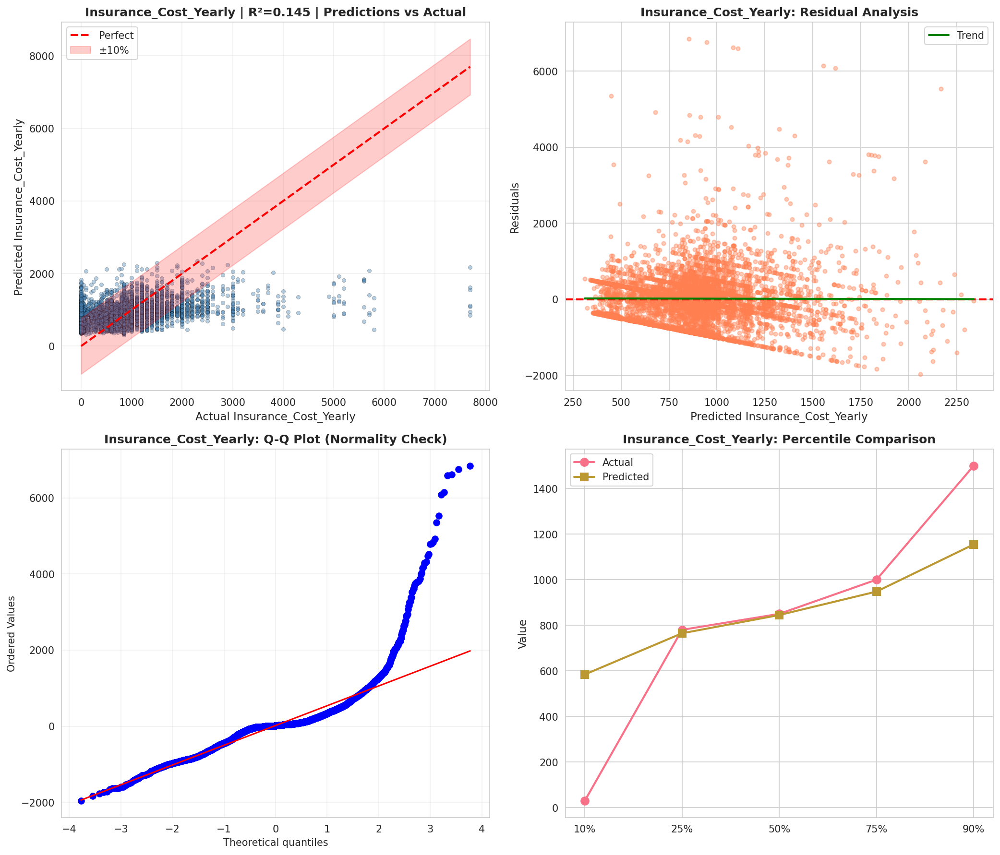
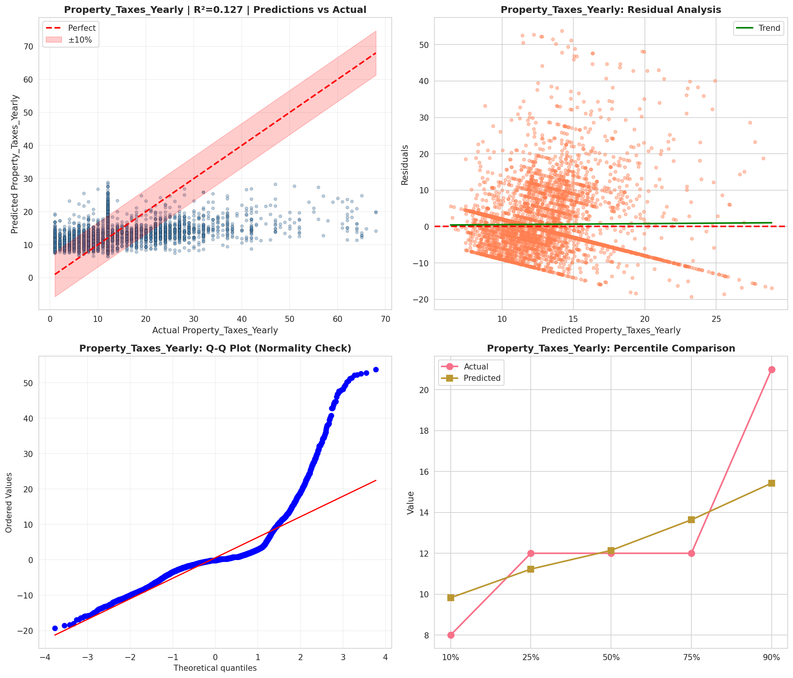
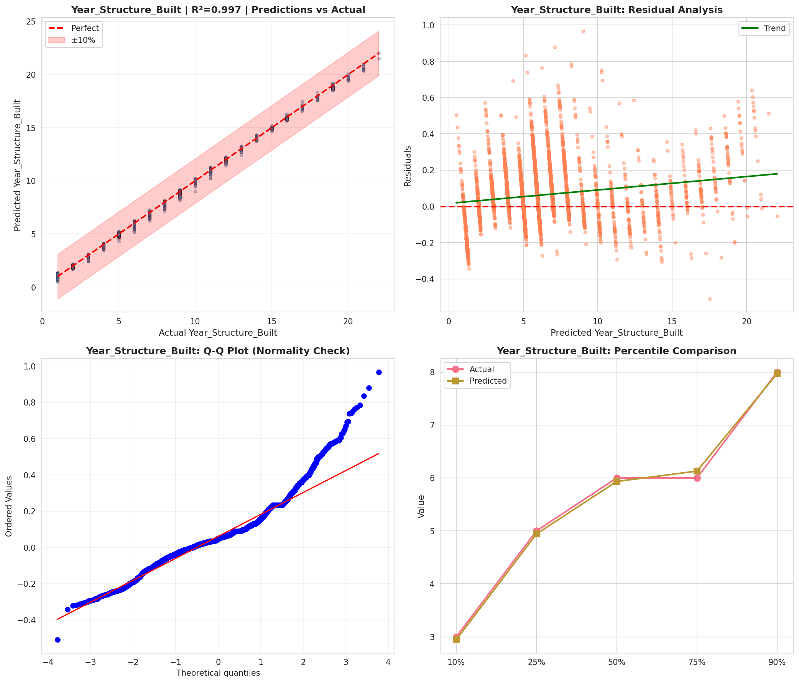
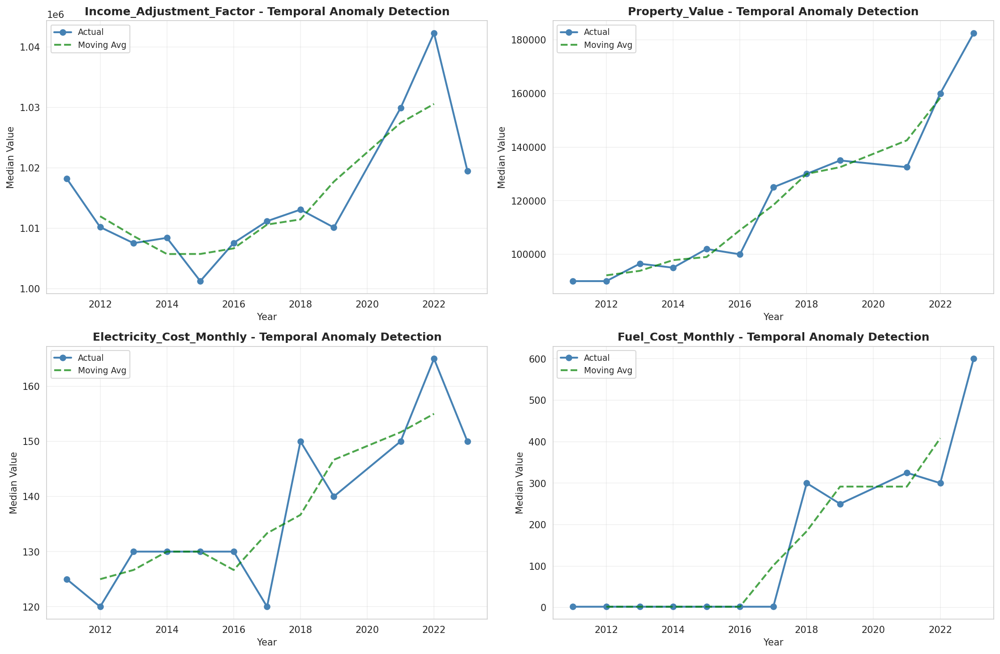
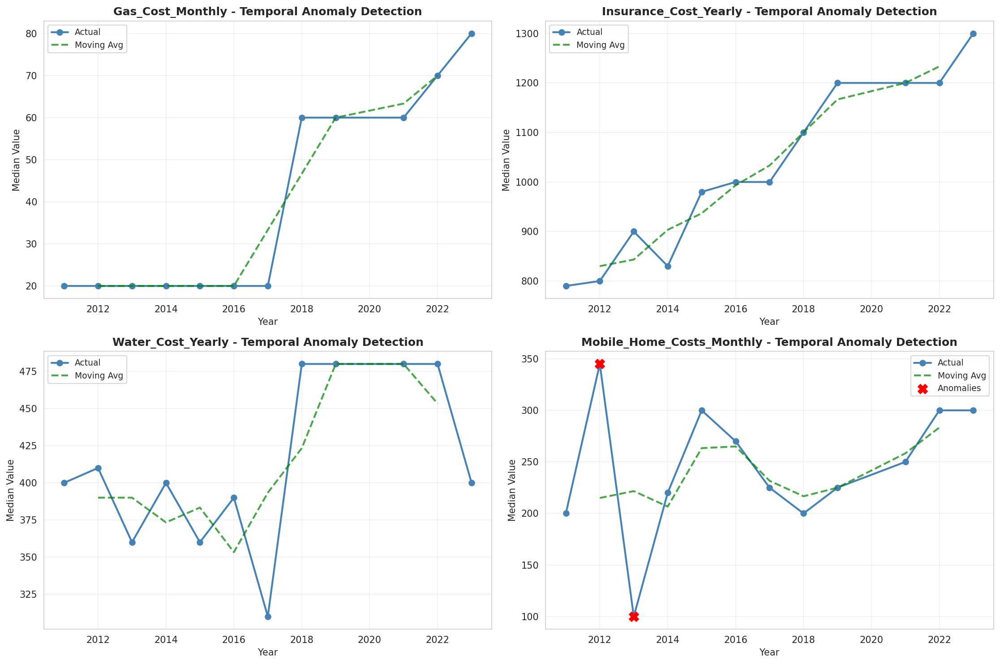
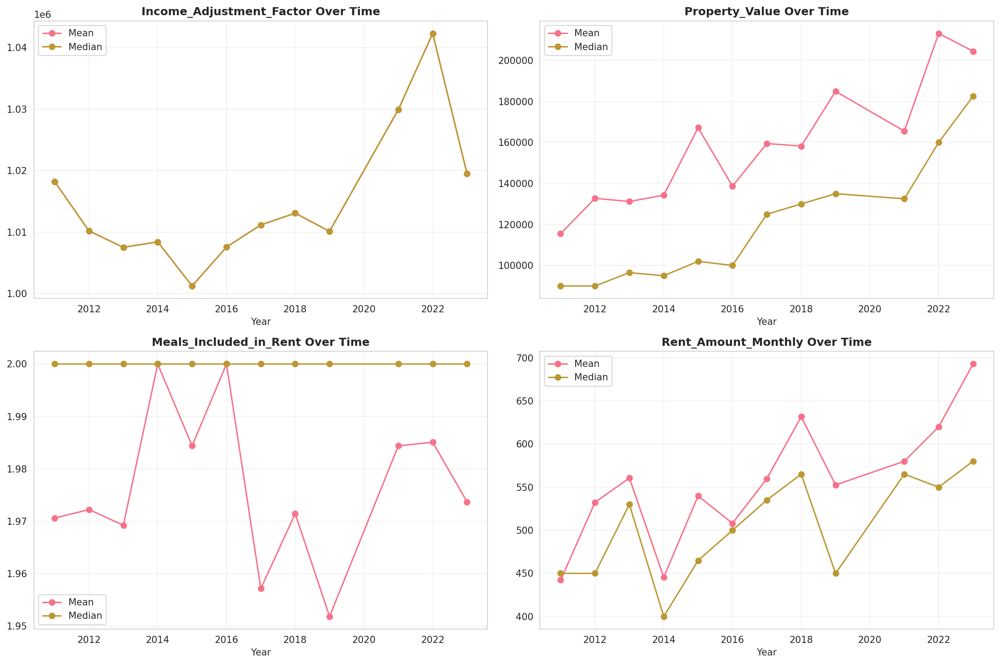
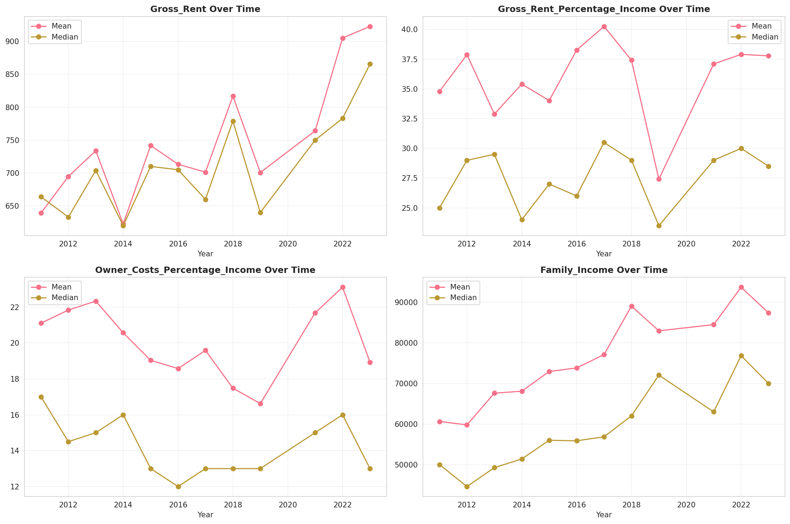
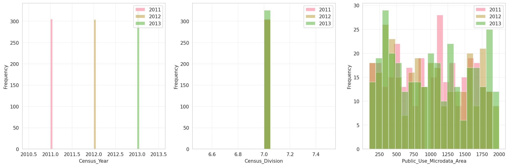
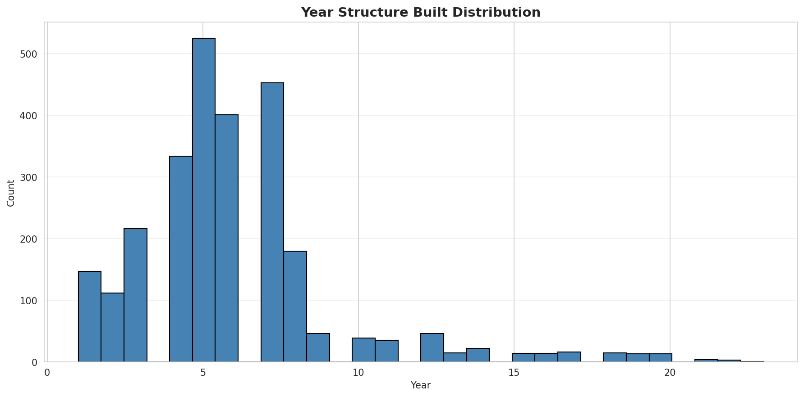
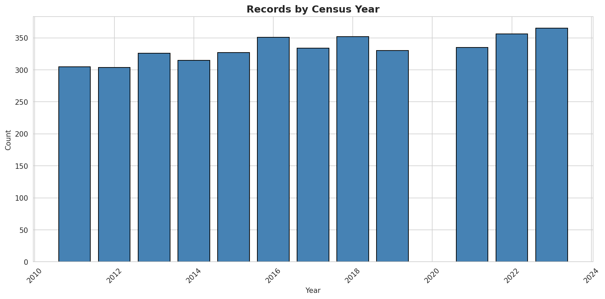
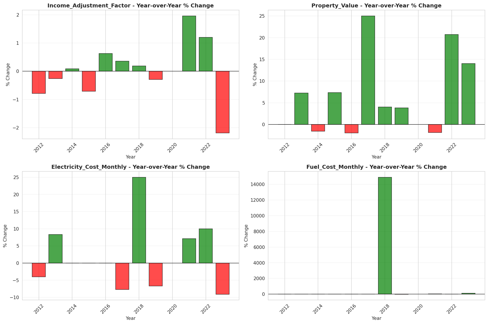
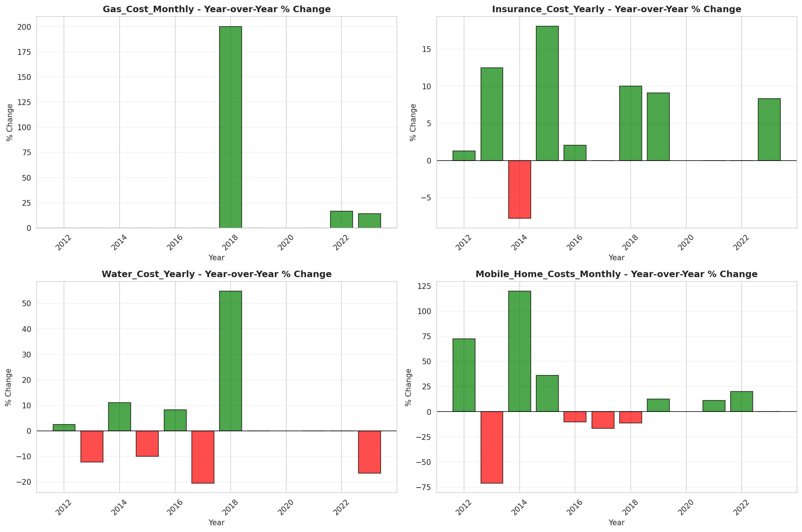
