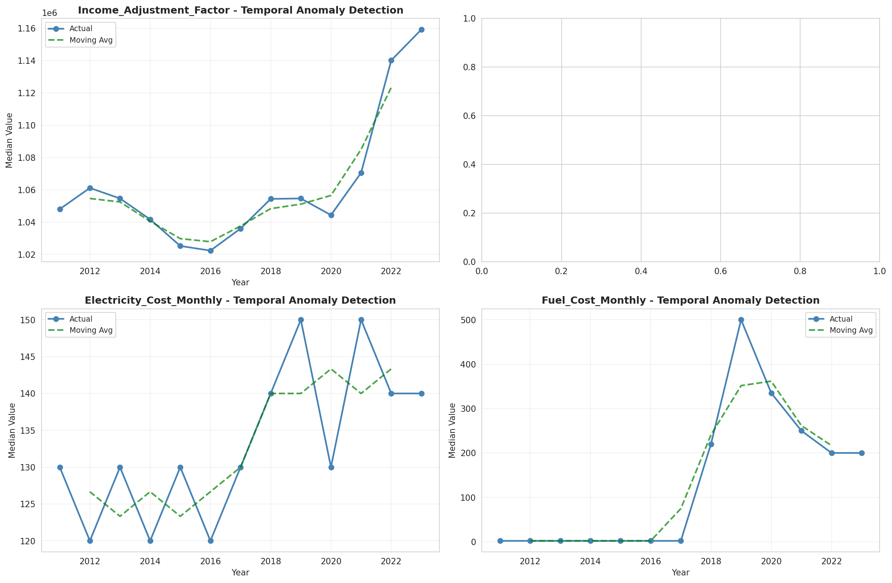
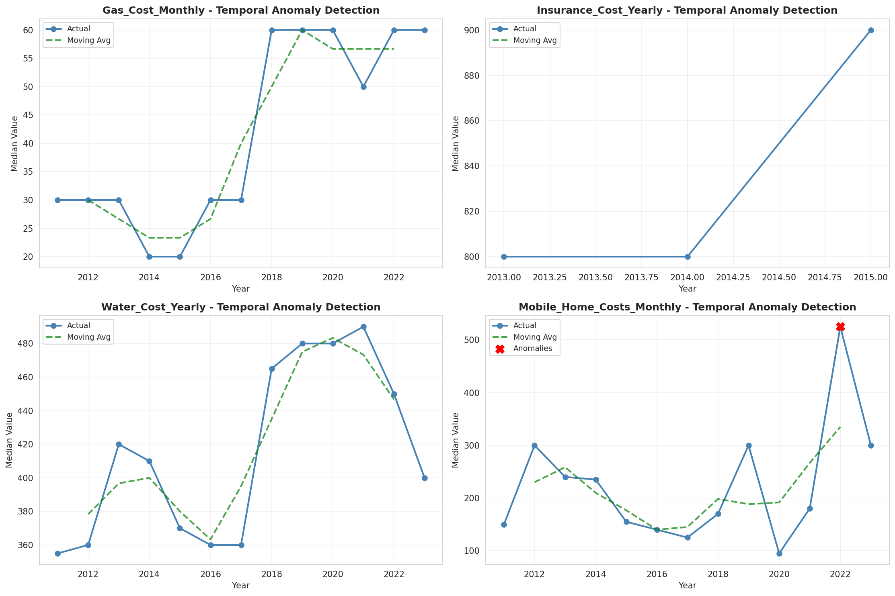
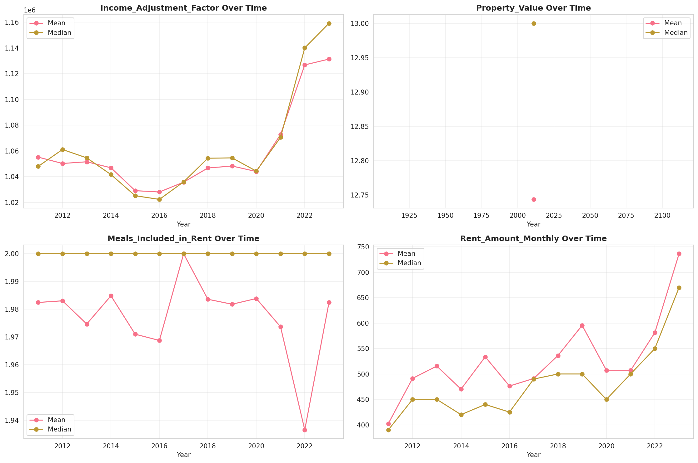
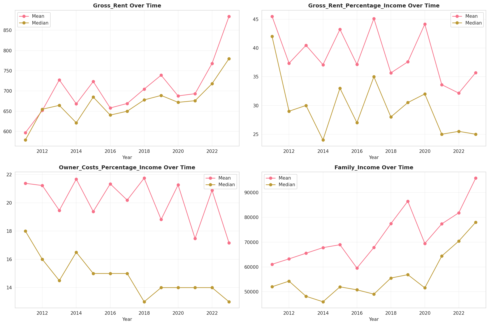
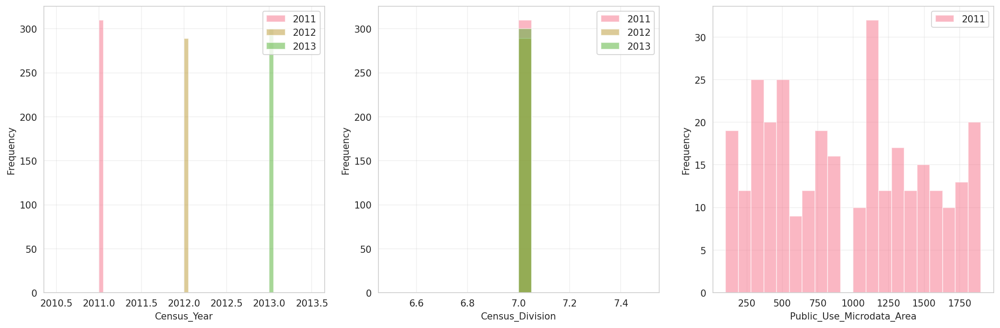
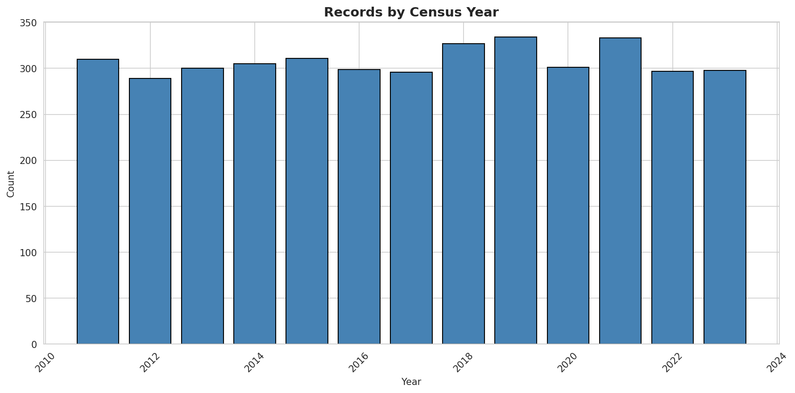
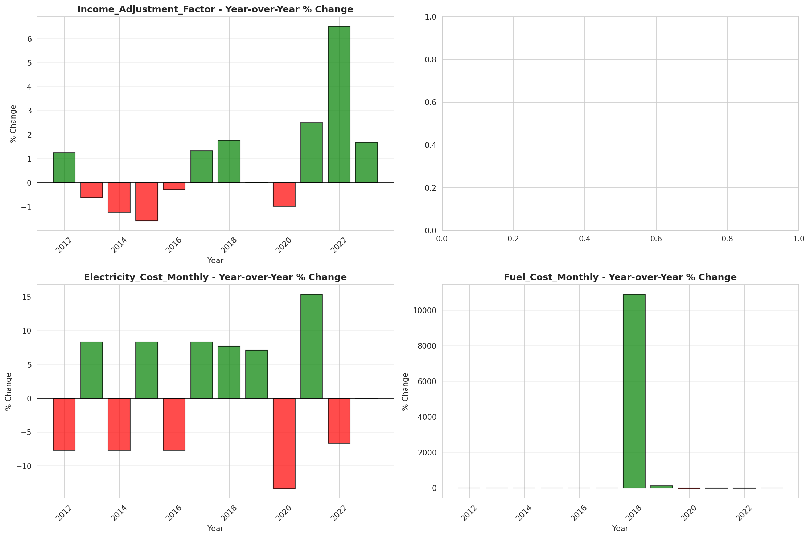

# Temporal Analysis

## Year Distribution

- 2011: 70,168 records

- 2012: 71,219 records

- 2013: 72,240 records

- 2014: 73,214 records

- 2015: 74,246 records

- 2016: 74,558 records

- 2017: 75,070 records

- 2018: 75,598 records

- 2019: 76,113 records

- 2020: 74,194 records

- 2021: 74,290 records

- 2022: 74,947 records

- 2023: 75,550 records

## Temporal Trends

- Census_Year: {np.int64(2011): {'mean': 2011.0, 'median': 2011.0, 'std': 0.0}, np.int64(2012): {'mean': 2012.0, 'median': 2012.0, 'std': 0.0}, np.int64(2013): {'mean': 2013.0, 'median': 2013.0, 'std': 0.0}, np.int64(2014): {'mean': 2014.0, 'median': 2014.0, 'std': 0.0}, np.int64(2015): {'mean': 2015.0, 'median': 2015.0, 'std': 0.0}, np.int64(2016): {'mean': 2016.0, 'median': 2016.0, 'std': 0.0}, np.int64(2017): {'mean': 2017.0, 'median': 2017.0, 'std': 0.0}, np.int64(2018): {'mean': 2018.0, 'median': 2018.0, 'std': 0.0}, np.int64(2019): {'mean': 2019.0, 'median': 2019.0, 'std': 0.0}, np.int64(2020): {'mean': 2020.0, 'median': 2020.0, 'std': 0.0}, np.int64(2021): {'mean': 2021.0, 'median': 2021.0, 'std': 0.0}, np.int64(2022): {'mean': 2022.0, 'median': 2022.0, 'std': 0.0}, np.int64(2023): {'mean': 2023.0, 'median': 2023.0, 'std': 0.0}}

- Census_Division: {np.int64(2011): {'mean': 7.0, 'median': 7.0, 'std': 0.0}, np.int64(2012): {'mean': 7.0, 'median': 7.0, 'std': 0.0}, np.int64(2013): {'mean': 7.0, 'median': 7.0, 'std': 0.0}, np.int64(2014): {'mean': 7.0, 'median': 7.0, 'std': 0.0}, np.int64(2015): {'mean': 7.0, 'median': 7.0, 'std': 0.0}, np.int64(2016): {'mean': 7.0, 'median': 7.0, 'std': 0.0}, np.int64(2017): {'mean': 7.0, 'median': 7.0, 'std': 0.0}, np.int64(2018): {'mean': 7.0, 'median': 7.0, 'std': 0.0}, np.int64(2019): {'mean': 7.0, 'median': 7.0, 'std': 0.0}, np.int64(2020): {'mean': 7.0, 'median': 7.0, 'std': 0.0}, np.int64(2021): {'mean': 7.0, 'median': 7.0, 'std': 0.0}, np.int64(2022): {'mean': 7.0, 'median': 7.0, 'std': 0.0}, np.int64(2023): {'mean': 7.0, 'median': 7.0, 'std': 0.0}}

- Public_Use_Microdata_Area: {np.int64(2011): {'mean': 957.1756356173754, 'median': 1000.0, 'std': 537.5565030696081}, np.int64(2012): {'mean': None, 'median': None, 'std': None}, np.int64(2013): {'mean': None, 'median': None, 'std': None}, np.int64(2014): {'mean': None, 'median': None, 'std': None}, np.int64(2015): {'mean': None, 'median': None, 'std': None}, np.int64(2016): {'mean': 987.8188792617827, 'median': 1000.0, 'std': 584.9462072258706}, np.int64(2017): {'mean': 984.7861995470894, 'median': 1000.0, 'std': 584.7076123107694}, np.int64(2018): {'mean': 983.2442657213154, 'median': 1000.0, 'std': 585.0805180086481}, np.int64(2019): {'mean': 980.4606309040505, 'median': 1000.0, 'std': 585.4017871469981}, np.int64(2020): {'mean': 978.3917837021862, 'median': 1000.0, 'std': 585.8847357971707}, np.int64(2021): {'mean': 976.2256023690941, 'median': 1000.0, 'std': 586.6199345935717}, np.int64(2022): {'mean': None, 'median': None, 'std': None}, np.int64(2023): {'mean': 921.37012574454, 'median': 900.0, 'std': 512.3900225459307}}

- Census_Region: {np.int64(2011): {'mean': 3.0, 'median': 3.0, 'std': 0.0}, np.int64(2012): {'mean': 3.0, 'median': 3.0, 'std': 0.0}, np.int64(2013): {'mean': 3.0, 'median': 3.0, 'std': 0.0}, np.int64(2014): {'mean': 3.0, 'median': 3.0, 'std': 0.0}, np.int64(2015): {'mean': 3.0, 'median': 3.0, 'std': 0.0}, np.int64(2016): {'mean': 3.0, 'median': 3.0, 'std': 0.0}, np.int64(2017): {'mean': 3.0, 'median': 3.0, 'std': 0.0}, np.int64(2018): {'mean': 3.0, 'median': 3.0, 'std': 0.0}, np.int64(2019): {'mean': 3.0, 'median': 3.0, 'std': 0.0}, np.int64(2020): {'mean': 3.0, 'median': 3.0, 'std': 0.0}, np.int64(2021): {'mean': 3.0, 'median': 3.0, 'std': 0.0}, np.int64(2022): {'mean': 3.0, 'median': 3.0, 'std': 0.0}, np.int64(2023): {'mean': 3.0, 'median': 3.0, 'std': 0.0}}

- State_Code: {np.int64(2011): {'mean': 5.0, 'median': 5.0, 'std': 0.0}, np.int64(2012): {'mean': 5.0, 'median': 5.0, 'std': 0.0}, np.int64(2013): {'mean': 5.0, 'median': 5.0, 'std': 0.0}, np.int64(2014): {'mean': 5.0, 'median': 5.0, 'std': 0.0}, np.int64(2015): {'mean': 5.0, 'median': 5.0, 'std': 0.0}, np.int64(2016): {'mean': 5.0, 'median': 5.0, 'std': 0.0}, np.int64(2017): {'mean': 5.0, 'median': 5.0, 'std': 0.0}, np.int64(2018): {'mean': 5.0, 'median': 5.0, 'std': 0.0}, np.int64(2019): {'mean': 5.0, 'median': 5.0, 'std': 0.0}, np.int64(2020): {'mean': 5.0, 'median': 5.0, 'std': 0.0}, np.int64(2021): {'mean': 5.0, 'median': 5.0, 'std': 0.0}, np.int64(2022): {'mean': 5.0, 'median': 5.0, 'std': 0.0}, np.int64(2023): {'mean': None, 'median': None, 'std': None}}

- Housing_Adjustment_Factor: {np.int64(2011): {'mean': 1041201.8206589898, 'median': 1044592.0, 'std': 27549.11488215998}, np.int64(2012): {'mean': 1041402.0618093486, 'median': 1053092.0, 'std': 27481.163573699832}, np.int64(2013): {'mean': 1040102.3492801771, 'median': 1035725.0, 'std': 32072.316360903627}, np.int64(2014): {'mean': 1036598.8694511979, 'median': 1031130.0, 'std': 29609.337208435507}, np.int64(2015): {'mean': 1020877.1457182879, 'median': 1017534.0, 'std': 20283.713716526123}, np.int64(2016): {'mean': 1020298.339453848, 'median': 1013801.0, 'std': 15750.176536911647}, np.int64(2017): {'mean': 1029156.1641401359, 'median': 1034680.0, 'std': 17971.043971367577}, np.int64(2018): {'mean': 1038250.697505225, 'median': 1046406.0, 'std': 23466.21411398559}, np.int64(2019): {'mean': 1040816.1871953543, 'median': 1042936.0, 'std': 29170.76999181535}, np.int64(2020): {'mean': 1036482.9412486185, 'median': 1030827.0, 'std': 28307.88389897343}, np.int64(2021): {'mean': 1058524.1715574102, 'median': 1059761.0, 'std': 35503.07956381718}, np.int64(2022): {'mean': 1104757.1281839167, 'median': 1133141.0, 'std': 61793.73480086103}, np.int64(2023): {'mean': 1105019.9839046989, 'median': 1125501.0, 'std': 76889.69592652378}}

- Income_Adjustment_Factor: {np.int64(2011): {'mean': 1053829.3035144226, 'median': 1048026.0, 'std': 28370.564543997723}, np.int64(2012): {'mean': 1052644.241705163, 'median': 1061121.0, 'std': 26390.77646746584}, np.int64(2013): {'mean': 1049096.9143826135, 'median': 1054614.0, 'std': 29671.56882903742}, np.int64(2014): {'mean': 1047443.6487557024, 'median': 1041654.0, 'std': 31049.83653806471}, np.int64(2015): {'mean': 1030279.6860167551, 'median': 1025215.0, 'std': 25651.088176883677}, np.int64(2016): {'mean': 1027454.250248129, 'median': 1022342.0, 'std': 17498.616456243675}, np.int64(2017): {'mean': 1036553.0536432663, 'median': 1035988.0, 'std': 16842.241716995544}, np.int64(2018): {'mean': 1046835.0448689118, 'median': 1054346.0, 'std': 20489.955653838908}, np.int64(2019): {'mean': 1049769.269323243, 'median': 1054606.0, 'std': 26221.492606846354}, np.int64(2020): {'mean': 1046587.2877995525, 'median': 1044328.0, 'std': 28806.474967522736}, np.int64(2021): {'mean': 1073470.3562390632, 'median': 1070512.0, 'std': 30696.997235620427}, np.int64(2022): {'mean': 1127041.9497911858, 'median': 1140108.0, 'std': 49853.58476201405}, np.int64(2023): {'mean': 1128920.8965718069, 'median': 1159185.0, 'std': 70457.45015971926}}

- Housing_Unit_Weight: {np.int64(2011): {'mean': 18.667882795576332, 'median': 15.0, 'std': 16.19761963965939}, np.int64(2012): {'mean': 18.490487089119476, 'median': 15.0, 'std': 16.520622772450587}, np.int64(2013): {'mean': 18.28311184939092, 'median': 15.0, 'std': 16.790598359014226}, np.int64(2014): {'mean': 18.15406889392739, 'median': 14.0, 'std': 17.11545170767333}, np.int64(2015): {'mean': 17.980887859278614, 'median': 14.0, 'std': 17.545076924581437}, np.int64(2016): {'mean': 17.99124171785724, 'median': 14.0, 'std': 17.231103980575927}, np.int64(2017): {'mean': 18.03310243772479, 'median': 14.0, 'std': 17.316495538539044}, np.int64(2018): {'mean': 18.016878753406175, 'median': 14.0, 'std': 17.380697927080856}, np.int64(2019): {'mean': 18.003245174937263, 'median': 14.0, 'std': 17.578355544410368}, np.int64(2020): {'mean': 18.59689462759792, 'median': 13.0, 'std': 21.573169462250902}, np.int64(2021): {'mean': 18.331942387939158, 'median': 13.0, 'std': 20.520351396849716}, np.int64(2022): {'mean': 18.302387020160914, 'median': 13.0, 'std': 20.905233015173728}, np.int64(2023): {'mean': 18.301310390469887, 'median': 13.0, 'std': 21.309247705641628}}

- Number_of_Persons: {np.int64(2011): {'mean': 2.060967962604036, 'median': 2.0, 'std': 1.4199620631172}, np.int64(2012): {'mean': 2.038936238925006, 'median': 2.0, 'std': 1.4145661375639058}, np.int64(2013): {'mean': 2.0207087486157254, 'median': 2.0, 'std': 1.4134254702144482}, np.int64(2014): {'mean': 1.9999726828202256, 'median': 2.0, 'std': 1.4126867401857242}, np.int64(2015): {'mean': 1.9825445141825822, 'median': 2.0, 'std': 1.406934605221943}, np.int64(2016): {'mean': 1.976823412645189, 'median': 2.0, 'std': 1.413122235617}, np.int64(2017): {'mean': 1.9739576395364327, 'median': 2.0, 'std': 1.4236583755313719}, np.int64(2018): {'mean': 1.972234715204106, 'median': 2.0, 'std': 1.430325647243948}, np.int64(2019): {'mean': 1.9724751356535677, 'median': 2.0, 'std': 1.4351904375327373}, np.int64(2020): {'mean': 1.9567620023182468, 'median': 2.0, 'std': 1.4431073766292148}, np.int64(2021): {'mean': 1.9603042132184683, 'median': 2.0, 'std': 1.445003017762273}, np.int64(2022): {'mean': 1.960025084392971, 'median': 2.0, 'std': 1.436605639619932}, np.int64(2023): {'mean': 1.9587293183322303, 'median': 2.0, 'std': 1.4214455525724958}}

- Housing_Unit_Type: {np.int64(2011): {'mean': 1.0918652377151978, 'median': 1.0, 'std': 0.36178088897535865}, np.int64(2012): {'mean': 1.1045507519060924, 'median': 1.0, 'std': 0.38778411700764326}, np.int64(2013): {'mean': 1.1181616832779624, 'median': 1.0, 'std': 0.4132619922169858}, np.int64(2014): {'mean': 1.130180020214713, 'median': 1.0, 'std': 0.43337241326357756}, np.int64(2015): {'mean': 1.1439269455593568, 'median': 1.0, 'std': 0.4561445367091698}, np.int64(2016): {'mean': 1.143673381796722, 'median': 1.0, 'std': 0.45608656134086034}, np.int64(2017): {'mean': 1.1448248301585187, 'median': 1.0, 'std': 0.4583298648241928}, np.int64(2018): {'mean': 1.143813328394931, 'median': 1.0, 'std': 0.4563352728073075}, np.int64(2019): {'mean': 1.143234401482007, 'median': 1.0, 'std': 0.4551352887988219}, np.int64(2020): {'mean': None, 'median': None, 'std': None}, np.int64(2021): {'mean': None, 'median': None, 'std': None}, np.int64(2022): {'mean': None, 'median': None, 'std': None}, np.int64(2023): {'mean': None, 'median': None, 'std': None}}

- Number_of_Bedrooms: {np.int64(2011): {'mean': 2.7216266230290427, 'median': 3.0, 'std': 0.8623758119248812}, np.int64(2012): {'mean': None, 'median': None, 'std': None}, np.int64(2013): {'mean': None, 'median': None, 'std': None}, np.int64(2014): {'mean': None, 'median': None, 'std': None}, np.int64(2015): {'mean': None, 'median': None, 'std': None}, np.int64(2016): {'mean': None, 'median': None, 'std': None}, np.int64(2017): {'mean': None, 'median': None, 'std': None}, np.int64(2018): {'mean': None, 'median': None, 'std': None}, np.int64(2019): {'mean': None, 'median': None, 'std': None}, np.int64(2020): {'mean': None, 'median': None, 'std': None}, np.int64(2021): {'mean': None, 'median': None, 'std': None}, np.int64(2022): {'mean': None, 'median': None, 'std': None}, np.int64(2023): {'mean': None, 'median': None, 'std': None}}

- Number_of_Rooms: {np.int64(2011): {'mean': 5.5906984568798075, 'median': 5.0, 'std': 1.6651936134605394}, np.int64(2012): {'mean': None, 'median': None, 'std': None}, np.int64(2013): {'mean': None, 'median': None, 'std': None}, np.int64(2014): {'mean': None, 'median': None, 'std': None}, np.int64(2015): {'mean': None, 'median': None, 'std': None}, np.int64(2016): {'mean': None, 'median': None, 'std': None}, np.int64(2017): {'mean': None, 'median': None, 'std': None}, np.int64(2018): {'mean': None, 'median': None, 'std': None}, np.int64(2019): {'mean': None, 'median': None, 'std': None}, np.int64(2020): {'mean': None, 'median': None, 'std': None}, np.int64(2021): {'mean': None, 'median': None, 'std': None}, np.int64(2022): {'mean': None, 'median': None, 'std': None}, np.int64(2023): {'mean': None, 'median': None, 'std': None}}

- Building_Type: {np.int64(2011): {'mean': 2.3419945860798017, 'median': 2.0, 'std': 1.4727010329519525}, np.int64(2012): {'mean': 2.3518709912758, 'median': 2.0, 'std': 1.490131560895179}, np.int64(2013): {'mean': 2.3536886051823505, 'median': 2.0, 'std': 1.501396321886808}, np.int64(2014): {'mean': 2.355322000210802, 'median': 2.0, 'std': 1.5063114395267891}, np.int64(2015): {'mean': 2.360260830460201, 'median': 2.0, 'std': 1.511754458218691}, np.int64(2016): {'mean': 2.3715790730295163, 'median': 2.0, 'std': 1.5180130020156053}, np.int64(2017): {'mean': 2.374603315834742, 'median': 2.0, 'std': 1.515852523038249}, np.int64(2018): {'mean': 2.386559321784437, 'median': 2.0, 'std': 1.5263785292737804}, np.int64(2019): {'mean': 2.39252309131299, 'median': 2.0, 'std': 1.527027379833602}, np.int64(2020): {'mean': 2.392161315227758, 'median': 2.0, 'std': 1.5241786977159038}, np.int64(2021): {'mean': 2.392900764509854, 'median': 2.0, 'std': 1.5268895788475667}, np.int64(2022): {'mean': 2.399801721418593, 'median': 2.0, 'std': 1.539486468642899}, np.int64(2023): {'mean': 2.4009482642576168, 'median': 2.0, 'std': 1.5426799719021471}}

- Year_Structure_Built: {np.int64(2011): {'mean': 4.710997598911098, 'median': 5.0, 'std': 2.1088642969731572}, np.int64(2012): {'mean': 5.44572453415205, 'median': 5.0, 'std': 2.3888756540625655}, np.int64(2013): {'mean': 5.540849203588014, 'median': 5.0, 'std': 2.4900994030958365}, np.int64(2014): {'mean': 5.624169966723382, 'median': 5.0, 'std': 2.587868237068612}, np.int64(2015): {'mean': 5.706745615350022, 'median': 6.0, 'std': 2.7252531660446326}, np.int64(2016): {'mean': 5.823156355388426, 'median': 6.0, 'std': 2.904395958628167}, np.int64(2017): {'mean': 5.963490227481686, 'median': 6.0, 'std': 3.1130297422044606}, np.int64(2018): {'mean': 6.096551521128005, 'median': 6.0, 'std': 3.35578468269593}, np.int64(2019): {'mean': 6.2498684672044895, 'median': 6.0, 'std': 3.623693517858827}, np.int64(2020): {'mean': 6.3961578636632, 'median': 6.0, 'std': 3.8635006366583204}, np.int64(2021): {'mean': None, 'median': None, 'std': None}, np.int64(2022): {'mean': None, 'median': None, 'std': None}, np.int64(2023): {'mean': None, 'median': None, 'std': None}}

- Bathtub_or_Shower: {np.int64(2011): {'mean': None, 'median': None, 'std': None}, np.int64(2012): {'mean': 1.0145605982308417, 'median': 1.0, 'std': 0.11978649880866393}, np.int64(2013): {'mean': 1.0145668517145925, 'median': 1.0, 'std': 0.1198118344956995}, np.int64(2014): {'mean': 1.015012121120865, 'median': 1.0, 'std': 0.12160172692938052}, np.int64(2015): {'mean': 1.0155448958177185, 'median': 1.0, 'std': 0.12370724083433578}, np.int64(2016): {'mean': 1.0146834989703644, 'median': 1.0, 'std': 0.12028345574174101}, np.int64(2017): {'mean': 1.014695850757778, 'median': 1.0, 'std': 0.12033327660378783}, np.int64(2018): {'mean': 1.014526882828253, 'median': 1.0, 'std': 0.11964975223756513}, np.int64(2019): {'mean': 1.013986320589267, 'median': 1.0, 'std': 0.11743468387294832}, np.int64(2020): {'mean': 1.013306689677097, 'median': 1.0, 'std': 0.11458542861964296}, np.int64(2021): {'mean': 1.0139330789993517, 'median': 1.0, 'std': 0.11721414369822956}, np.int64(2022): {'mean': 1.013323719826356, 'median': 1.0, 'std': 0.11465773323126426}, np.int64(2023): {'mean': 1.012847933711243, 'median': 1.0, 'std': 0.11261906592191434}}

- Refrigerator: {np.int64(2011): {'mean': None, 'median': None, 'std': None}, np.int64(2012): {'mean': 1.0296987567255373, 'median': 1.0, 'std': 0.16975623277357207}, np.int64(2013): {'mean': 1.0303438261053715, 'median': 1.0, 'std': 0.1715328639024291}, np.int64(2014): {'mean': 1.031981690331712, 'median': 1.0, 'std': 0.175952629928942}, np.int64(2015): {'mean': 1.0325738270124418, 'median': 1.0, 'std': 0.1775197036889956}, np.int64(2016): {'mean': 1.0327841943474498, 'median': 1.0, 'std': 0.17807263723300892}, np.int64(2017): {'mean': 1.0335587389150873, 'median': 1.0, 'std': 0.18009172917470398}, np.int64(2018): {'mean': 1.0335869773192234, 'median': 1.0, 'std': 0.18016484123690849}, np.int64(2019): {'mean': 1.0320063135741846, 'median': 1.0, 'std': 0.17601807368907063}, np.int64(2020): {'mean': 1.0318210030731034, 'median': 1.0, 'std': 0.17552462287422535}, np.int64(2021): {'mean': 1.031651009545064, 'median': 1.0, 'std': 0.17507051524799983}, np.int64(2022): {'mean': 1.0297718294203355, 'median': 1.0, 'std': 0.16995852873995831}, np.int64(2023): {'mean': 1.027685128404553, 'median': 1.0, 'std': 0.1640703041204444}}

- Hot_and_Cold_Running_Water: {np.int64(2011): {'mean': None, 'median': None, 'std': None}, np.int64(2012): {'mean': 1.0282092592029668, 'median': 1.0, 'std': 0.16557147568650343}, np.int64(2013): {'mean': 1.0281504787547837, 'median': 1.0, 'std': 0.1654038788513302}, np.int64(2014): {'mean': 1.028985289024739, 'median': 1.0, 'std': 0.16776640259874231}, np.int64(2015): {'mean': 1.0293509219007646, 'median': 1.0, 'std': 0.168789431999842}, np.int64(2016): {'mean': 1.029710209806906, 'median': 1.0, 'std': 0.16978793660934813}, np.int64(2017): {'mean': 1.0315716107601507, 'median': 1.0, 'std': 0.17485793537859892}, np.int64(2018): {'mean': 1.033748877735749, 'median': 1.0, 'std': 0.18058341826959204}, np.int64(2019): {'mean': 1.0350169531158657, 'median': 1.0, 'std': 0.18382399180013106}, np.int64(2020): {'mean': 1.0366955810890595, 'median': 1.0, 'std': 0.18801476153398872}, np.int64(2021): {'mean': 1.0387231026735226, 'median': 1.0, 'std': 0.1929357025013578}, np.int64(2022): {'mean': 1.0377480359905666, 'median': 1.0, 'std': 0.19058768950546376}, np.int64(2023): {'mean': 1.0361806189144318, 'median': 1.0, 'std': 0.18674073820728326}}

- Running_Water: {np.int64(2011): {'mean': None, 'median': None, 'std': None}, np.int64(2012): {'mean': None, 'median': None, 'std': None}, np.int64(2013): {'mean': 9.0, 'median': 9.0, 'std': 0.0}, np.int64(2014): {'mean': 9.0, 'median': 9.0, 'std': 0.0}, np.int64(2015): {'mean': 9.0, 'median': 9.0, 'std': 0.0}, np.int64(2016): {'mean': 9.0, 'median': 9.0, 'std': 0.0}, np.int64(2017): {'mean': 9.0, 'median': 9.0, 'std': 0.0}, np.int64(2018): {'mean': 9.0, 'median': 9.0, 'std': 0.0}, np.int64(2019): {'mean': 9.0, 'median': 9.0, 'std': 0.0}, np.int64(2020): {'mean': 9.0, 'median': 9.0, 'std': 0.0}, np.int64(2021): {'mean': 9.0, 'median': 9.0, 'std': 0.0}, np.int64(2022): {'mean': 9.0, 'median': 9.0, 'std': 0.0}, np.int64(2023): {'mean': 9.0, 'median': 9.0, 'std': 0.0}}

- Sink_with_Faucet: {np.int64(2011): {'mean': None, 'median': None, 'std': None}, np.int64(2012): {'mean': 1.0133750797945102, 'median': 1.0, 'std': 0.11487553092931935}, np.int64(2013): {'mean': 1.013386982105311, 'median': 1.0, 'std': 0.11492593530718938}, np.int64(2014): {'mean': 1.0137473085088762, 'median': 1.0, 'std': 0.11644107596681344}, np.int64(2015): {'mean': 1.0143156947983811, 'median': 1.0, 'std': 0.11878959216966803}, np.int64(2016): {'mean': 1.0135792520965767, 'median': 1.0, 'std': 0.1157370117702839}, np.int64(2017): {'mean': 1.013791262567844, 'median': 1.0, 'std': 0.11662446288009808}, np.int64(2018): {'mean': 1.0136879443062567, 'median': 1.0, 'std': 0.11619287066949704}, np.int64(2019): {'mean': 1.0131532795510347, 'median': 1.0, 'std': 0.11393182388752408}, np.int64(2020): {'mean': 1.0126254598301467, 'median': 1.0, 'std': 0.11165234576021676}, np.int64(2021): {'mean': 1.0133449944961321, 'median': 1.0, 'std': 0.11474800288448146}, np.int64(2022): {'mean': 1.0127378967449265, 'median': 1.0, 'std': 0.11214201547290487}, np.int64(2023): {'mean': 1.0125637535709477, 'median': 1.0, 'std': 0.11138263429815057}}

- Stove_or_Range: {np.int64(2011): {'mean': None, 'median': None, 'std': None}, np.int64(2012): {'mean': 1.027358117761498, 'median': 1.0, 'std': 0.16312588880697312}, np.int64(2013): {'mean': 1.0281656052882362, 'median': 1.0, 'std': 0.1654470248185746}, np.int64(2014): {'mean': 1.0295273515727343, 'median': 1.0, 'std': 0.16928059121587502}, np.int64(2015): {'mean': 1.0299355418977665, 'median': 1.0, 'std': 0.17041079937523682}, np.int64(2016): {'mean': 1.0303966335392605, 'median': 1.0, 'std': 0.171677366050754}, np.int64(2017): {'mean': 1.0313491710413145, 'median': 1.0, 'std': 0.17426087006531613}, np.int64(2018): {'mean': 1.0320415642523881, 'median': 1.0, 'std': 0.17611177957057292}, np.int64(2019): {'mean': 1.0315240266573131, 'median': 1.0, 'std': 0.17473038831139293}, np.int64(2020): {'mean': 1.0318361415141468, 'median': 1.0, 'std': 0.1755649971402012}, np.int64(2021): {'mean': 1.0322843313177616, 'median': 1.0, 'std': 0.17675554977979624}, np.int64(2022): {'mean': 1.0310786655250628, 'median': 1.0, 'std': 0.1735316524680423}, np.int64(2023): {'mean': 1.029569691440195, 'median': 1.0, 'std': 0.16939821128453594}}

- Telephone_Service: {np.int64(2011): {'mean': 1.0380849300705215, 'median': 1.0, 'std': 0.1914029459807399}, np.int64(2012): {'mean': 1.0313361576222178, 'median': 1.0, 'std': 0.1742260403847923}, np.int64(2013): {'mean': 1.0316533239346795, 'median': 1.0, 'std': 0.17507685586341135}, np.int64(2014): {'mean': 1.0325678846798525, 'median': 1.0, 'std': 0.177504213158779}, np.int64(2015): {'mean': 1.1132173244404326, 'median': 1.0, 'std': 0.7670387330503483}, np.int64(2016): {'mean': 1.1141278031024062, 'median': 1.0, 'std': 0.7671467705352459}, np.int64(2017): {'mean': 1.111170407925019, 'median': 1.0, 'std': 0.7652644163536084}, np.int64(2018): {'mean': 1.1086314462069424, 'median': 1.0, 'std': 0.762349610107883}, np.int64(2019): {'mean': 1.1051044121767508, 'median': 1.0, 'std': 0.7584000102929083}, np.int64(2020): {'mean': 1.0218537020823677, 'median': 1.0, 'std': 0.1462069928547947}, np.int64(2021): {'mean': 1.0158363689224086, 'median': 1.0, 'std': 0.12484328131494712}, np.int64(2022): {'mean': 1.013683782685273, 'median': 1.0, 'std': 0.11617557983273652}, np.int64(2023): {'mean': 1.0111618722492763, 'median': 1.0, 'std': 0.10505936209140011}}

- Lot_Acreage: {np.int64(2011): {'mean': 1.485612132098936, 'median': 1.0, 'std': 0.6734065473618852}, np.int64(2012): {'mean': 1.4829365625430027, 'median': 1.0, 'std': 0.6715165148306103}, np.int64(2013): {'mean': 1.481706586313753, 'median': 1.0, 'std': 0.6699406143695757}, np.int64(2014): {'mean': 1.4809932295308423, 'median': 1.0, 'std': 0.6667897346852347}, np.int64(2015): {'mean': 1.4842470176392617, 'median': 1.0, 'std': 0.6675526908370488}, np.int64(2016): {'mean': 1.4784467402921269, 'median': 1.0, 'std': 0.6634672252071806}, np.int64(2017): {'mean': 1.4728570946288106, 'median': 1.0, 'std': 0.6596095248279215}, np.int64(2018): {'mean': 1.4713863514239656, 'median': 1.0, 'std': 0.6590684718390208}, np.int64(2019): {'mean': 1.4718785996894876, 'median': 1.0, 'std': 0.6594868180068694}, np.int64(2020): {'mean': 1.4685415010198084, 'median': 1.0, 'std': 0.6569744260379355}, np.int64(2021): {'mean': 1.4745905587668593, 'median': 1.0, 'std': 0.6590393998623778}, np.int64(2022): {'mean': 1.4831813194349197, 'median': 1.0, 'std': 0.6616897048148377}, np.int64(2023): {'mean': 1.4891083704348123, 'median': 1.0, 'std': 0.6633907338661383}}

- Agricultural_Sales: {np.int64(2011): {'mean': 1.2149646009116477, 'median': 1.0, 'std': 0.9021272438211552}, np.int64(2012): {'mean': 1.206211541256844, 'median': 1.0, 'std': 0.8823177021857871}, np.int64(2013): {'mean': 1.2037923862042277, 'median': 1.0, 'std': 0.8788455598339984}, np.int64(2014): {'mean': 1.196425991040894, 'median': 1.0, 'std': 0.863601780390257}, np.int64(2015): {'mean': 1.1967917502148382, 'median': 1.0, 'std': 0.8688894854709798}, np.int64(2016): {'mean': 1.1889001300766007, 'median': 1.0, 'std': 0.8533972610903698}, np.int64(2017): {'mean': 1.1819153588261018, 'median': 1.0, 'std': 0.8351750948717451}, np.int64(2018): {'mean': 1.1767818993979413, 'median': 1.0, 'std': 0.821338893082642}, np.int64(2019): {'mean': 1.175704989154013, 'median': 1.0, 'std': 0.8177125673336785}, np.int64(2020): {'mean': 1.172082494969819, 'median': 1.0, 'std': 0.8066922219148062}, np.int64(2021): {'mean': 1.1788525320528687, 'median': 1.0, 'std': 0.8241649179411853}, np.int64(2022): {'mean': 1.1801888610522258, 'median': 1.0, 'std': 0.8286630325826077}, np.int64(2023): {'mean': 1.1808119819140919, 'median': 1.0, 'std': 0.8291718276167106}}

- Business_On_Property: {np.int64(2011): {'mean': 1.9842476164156417, 'median': 2.0, 'std': 0.12451712249793144}, np.int64(2012): {'mean': 1.9852931058208338, 'median': 2.0, 'std': 0.12037794939504401}, np.int64(2013): {'mean': 1.9859953089421152, 'median': 2.0, 'std': 0.11751083397632785}, np.int64(2014): {'mean': 1.9864078994491532, 'median': 2.0, 'std': 0.1157911223170943}, np.int64(2015): {'mean': 1.9866770893518675, 'median': 2.0, 'std': 0.11465441156117316}, np.int64(2016): {'mean': 3.398306953704175, 'median': 2.0, 'std': 2.8136249652150505}, np.int64(2017): {'mean': 4.8144390803821615, 'median': 2.0, 'std': 3.441307062447012}, np.int64(2018): {'mean': 6.217540972595379, 'median': 9.0, 'std': 3.431936193634507}, np.int64(2019): {'mean': 7.616183369225889, 'median': 9.0, 'std': 2.791785804342208}, np.int64(2020): {'mean': None, 'median': None, 'std': None}, np.int64(2021): {'mean': None, 'median': None, 'std': None}, np.int64(2022): {'mean': None, 'median': None, 'std': None}, np.int64(2023): {'mean': None, 'median': None, 'std': None}}

- Tenure: {np.int64(2011): {'mean': 1.9068678019989516, 'median': 2.0, 'std': 0.875316096035693}, np.int64(2012): {'mean': 1.9188185058166902, 'median': 2.0, 'std': 0.8741667380502629}, np.int64(2013): {'mean': 1.9307520601513855, 'median': 2.0, 'std': 0.8740482291081924}, np.int64(2014): {'mean': 1.9417700301709688, 'median': 2.0, 'std': 0.8731713952614603}, np.int64(2015): {'mean': 1.9519415609381008, 'median': 2.0, 'std': 0.8715507339321569}, np.int64(2016): {'mean': 1.9598757701748235, 'median': 2.0, 'std': 0.8698210486960943}, np.int64(2017): {'mean': 1.961909209165805, 'median': 2.0, 'std': 0.8675285995545601}, np.int64(2018): {'mean': 1.964574898785425, 'median': 2.0, 'std': 0.8656144964803568}, np.int64(2019): {'mean': 1.9633115224234832, 'median': 2.0, 'std': 0.8617166404617057}, np.int64(2020): {'mean': 1.958352646306501, 'median': 2.0, 'std': 0.8592936865980693}, np.int64(2021): {'mean': 1.9547654473004634, 'median': 2.0, 'std': 0.8567470484312876}, np.int64(2022): {'mean': 1.9521067606015445, 'median': 2.0, 'std': 0.8537683036637661}, np.int64(2023): {'mean': 1.9508844152149538, 'median': 2.0, 'std': 0.8487896683959544}}

- Vacancy_Status: {np.int64(2011): {'mean': 4.7423273657289, 'median': 5.0, 'std': 2.188942187415862}, np.int64(2012): {'mean': 4.746909667194929, 'median': 5.0, 'std': 2.196512125095945}, np.int64(2013): {'mean': 4.765553171927674, 'median': 5.0, 'std': 2.18834587728454}, np.int64(2014): {'mean': 4.800088849400266, 'median': 5.0, 'std': 2.16923638292271}, np.int64(2015): {'mean': 4.87309423551619, 'median': 5.0, 'std': 2.166704868168518}, np.int64(2016): {'mean': 4.921122807017544, 'median': 5.0, 'std': 2.158892888335328}, np.int64(2017): {'mean': 5.002944325481799, 'median': 5.0, 'std': 2.1373633778998493}, np.int64(2018): {'mean': 5.090814332247557, 'median': 5.0, 'std': 2.125147050989005}, np.int64(2019): {'mean': 5.2090052896400465, 'median': 5.0, 'std': 2.094460017585042}, np.int64(2020): {'mean': 5.260568793235972, 'median': 5.0, 'std': 2.0788432165744855}, np.int64(2021): {'mean': 5.30137684854666, 'median': 5.0, 'std': 2.062257605136195}, np.int64(2022): {'mean': 5.289700996677741, 'median': 5.0, 'std': 2.068743227573798}, np.int64(2023): {'mean': 5.2958321599549425, 'median': 5.0, 'std': 2.0658589203312245}}

- Property_Value: {np.int64(2011): {'mean': 12.396321787205235, 'median': 13.0, 'std': 5.091956672728718}}

- Vehicles_Available: {np.int64(2011): {'mean': 1.8400500583450305, 'median': 2.0, 'std': 1.0275191451443666}, np.int64(2012): {'mean': 1.831786698944254, 'median': 2.0, 'std': 1.0294068802561525}, np.int64(2013): {'mean': 1.831042411426078, 'median': 2.0, 'std': 1.0298497527174566}, np.int64(2014): {'mean': 1.8268689239021119, 'median': 2.0, 'std': 1.0304107970531988}, np.int64(2015): {'mean': 1.8322384367216622, 'median': 2.0, 'std': 1.0346084505576705}, np.int64(2016): {'mean': 1.8433602164003406, 'median': 2.0, 'std': 1.0396844705282464}, np.int64(2017): {'mean': 1.8608618791901537, 'median': 2.0, 'std': 1.050707905454568}, np.int64(2018): {'mean': 1.875008296276631, 'median': 2.0, 'std': 1.0591499521159062}, np.int64(2019): {'mean': 1.8888138051522094, 'median': 2.0, 'std': 1.067536909385401}, np.int64(2020): {'mean': 1.9055466858938044, 'median': 2.0, 'std': 1.0771789404731829}, np.int64(2021): {'mean': 1.9175003847929815, 'median': 2.0, 'std': 1.0832436059418689}, np.int64(2022): {'mean': 1.922977916271508, 'median': 2.0, 'std': 1.0854065279076974}, np.int64(2023): {'mean': 1.9238917616346203, 'median': 2.0, 'std': 1.0877388983128715}}

- Condo_Fee_Monthly: {np.int64(2011): {'mean': 202.5632183908046, 'median': 140.0, 'std': 211.5195578887191}, np.int64(2012): {'mean': 222.8377581120944, 'median': 150.0, 'std': 237.21596579508545}, np.int64(2013): {'mean': 246.87577639751552, 'median': 150.0, 'std': 265.6044246188703}, np.int64(2014): {'mean': 253.08970099667775, 'median': 150.0, 'std': 268.4897675149718}, np.int64(2015): {'mean': 257.4825174825175, 'median': 170.0, 'std': 261.0396717351694}, np.int64(2016): {'mean': 250.83916083916083, 'median': 175.0, 'std': 243.48204012730903}, np.int64(2017): {'mean': 232.73037542662115, 'median': 170.0, 'std': 219.51702667180777}, np.int64(2018): {'mean': 218.63333333333333, 'median': 170.0, 'std': 185.13612154454736}, np.int64(2019): {'mean': 232.64984227129338, 'median': 170.0, 'std': 218.57112312086605}, np.int64(2020): {'mean': 243.3546325878594, 'median': 180.0, 'std': 229.76003114023138}, np.int64(2021): {'mean': 265.12422360248445, 'median': 180.0, 'std': 260.6524585469924}, np.int64(2022): {'mean': 264.7418397626113, 'median': 180.0, 'std': 255.2216271954081}, np.int64(2023): {'mean': 269.99439775910366, 'median': 190.0, 'std': 256.8172304503092}}

- Electricity_Cost_Monthly: {np.int64(2011): {'mean': 137.86548510933352, 'median': 120.0, 'std': 83.5857356749953}, np.int64(2012): {'mean': 138.87594983524983, 'median': 120.0, 'std': 83.8950907709452}, np.int64(2013): {'mean': 139.86764681201015, 'median': 120.0, 'std': 83.89094997921597}, np.int64(2014): {'mean': 142.26253771371103, 'median': 130.0, 'std': 85.12661778902759}, np.int64(2015): {'mean': 143.40297210103137, 'median': 130.0, 'std': 86.01961123658978}, np.int64(2016): {'mean': 143.49137571173338, 'median': 130.0, 'std': 86.226462306085}, np.int64(2017): {'mean': 145.00140088722858, 'median': 130.0, 'std': 87.16509874040017}, np.int64(2018): {'mean': 152.20899765382836, 'median': 130.0, 'std': 86.65851330176483}, np.int64(2019): {'mean': 152.94823036720518, 'median': 140.0, 'std': 87.26587799467602}, np.int64(2020): {'mean': 153.67988512878694, 'median': 140.0, 'std': 88.26975055514649}, np.int64(2021): {'mean': 157.71942153867886, 'median': 140.0, 'std': 90.97684717242072}, np.int64(2022): {'mean': 169.1913598600787, 'median': 150.0, 'std': 144.07975833187416}, np.int64(2023): {'mean': 178.96112243840065, 'median': 150.0, 'std': 175.8704207524446}}

- Fuel_Cost_Monthly: {np.int64(2011): {'mean': 68.3114102585784, 'median': 2.0, 'std': 284.58304247047886}, np.int64(2012): {'mean': 67.5396577230852, 'median': 2.0, 'std': 281.29077858573515}, np.int64(2013): {'mean': 61.911233069835355, 'median': 2.0, 'std': 264.59599729200187}, np.int64(2014): {'mean': 57.09539054642977, 'median': 2.0, 'std': 251.47552023820649}, np.int64(2015): {'mean': 53.077645721545224, 'median': 2.0, 'std': 243.0953861353931}, np.int64(2016): {'mean': 46.993654928283995, 'median': 2.0, 'std': 226.25370628363552}, np.int64(2017): {'mean': 42.200260164771024, 'median': 2.0, 'std': 212.85669373965482}, np.int64(2018): {'mean': 502.56467141063206, 'median': 300.0, 'std': 587.4356816135434}, np.int64(2019): {'mean': 494.77614447711045, 'median': 300.0, 'std': 576.7190202040086}, np.int64(2020): {'mean': 467.90410958904107, 'median': 300.0, 'std': 541.7260902177117}, np.int64(2021): {'mean': 466.748959778086, 'median': 300.0, 'std': 520.336916502392}, np.int64(2022): {'mean': 488.8559460088434, 'median': 300.0, 'std': 547.79656641207}, np.int64(2023): {'mean': 506.6241977656287, 'median': 300.0, 'std': 578.6237029774444}}

- Gas_Cost_Monthly: {np.int64(2011): {'mean': 56.98315604336135, 'median': 30.0, 'std': 77.22372798630674}, np.int64(2012): {'mean': 54.653722009279804, 'median': 30.0, 'std': 75.78901374167846}, np.int64(2013): {'mean': 51.56940738130004, 'median': 20.0, 'std': 72.1437093005667}, np.int64(2014): {'mean': 50.339741870600065, 'median': 20.0, 'std': 70.85574733987413}, np.int64(2015): {'mean': 49.248533172859936, 'median': 20.0, 'std': 69.96616203213735}, np.int64(2016): {'mean': 46.93431181018217, 'median': 20.0, 'std': 67.02528691475256}, np.int64(2017): {'mean': 45.95855708615456, 'median': 20.0, 'std': 65.76843391823803}, np.int64(2018): {'mean': 77.83354181818181, 'median': 50.0, 'std': 73.45134525684884}, np.int64(2019): {'mean': 76.07142857142857, 'median': 50.0, 'std': 71.59856743817399}, np.int64(2020): {'mean': 75.57827632708103, 'median': 50.0, 'std': 72.03009256488205}, np.int64(2021): {'mean': 79.18047972517023, 'median': 60.0, 'std': 76.1849718501532}, np.int64(2022): {'mean': 89.98800306044376, 'median': 60.0, 'std': 117.1901953119286}, np.int64(2023): {'mean': 99.09109611835537, 'median': 60.0, 'std': 144.27495981527173}}

- House_Heating_Fuel: {np.int64(2011): {'mean': 2.2054083306556627, 'median': 2.0, 'std': 1.3457131416320662}, np.int64(2012): {'mean': 2.2308519938134626, 'median': 2.0, 'std': 1.3471837652381133}, np.int64(2013): {'mean': 2.254116106943256, 'median': 2.0, 'std': 1.350827941958818}, np.int64(2014): {'mean': 2.260945357023131, 'median': 2.0, 'std': 1.3453923850824943}, np.int64(2015): {'mean': 2.266703441820036, 'median': 3.0, 'std': 1.3402205577770983}, np.int64(2016): {'mean': 2.265775017114996, 'median': 3.0, 'std': 1.3250742815654197}, np.int64(2017): {'mean': 2.2673526566825655, 'median': 3.0, 'std': 1.3100509065328478}, np.int64(2018): {'mean': 2.272250613924471, 'median': 3.0, 'std': 1.2979285981150708}, np.int64(2019): {'mean': 2.278394013811745, 'median': 3.0, 'std': 1.2951666294269082}, np.int64(2020): {'mean': 2.280561707095157, 'median': 3.0, 'std': 1.2875620241467127}, np.int64(2021): {'mean': 2.289313016263917, 'median': 3.0, 'std': 1.2811229544770522}, np.int64(2022): {'mean': 2.296453732556564, 'median': 3.0, 'std': 1.2841278458736938}, np.int64(2023): {'mean': 2.2975718325886505, 'median': 3.0, 'std': 1.2845830396659366}}

- Insurance_Cost_Yearly: {np.int64(2013): {'mean': 854.5892752898006, 'median': 790.0, 'std': 574.5384113295978}, np.int64(2014): {'mean': 893.379679144385, 'median': 800.0, 'std': 591.739664417496}, np.int64(2015): {'mean': 939.7504775817507, 'median': 860.0, 'std': 631.5661720134643}}

- Water_Cost_Yearly: {np.int64(2011): {'mean': 377.6879132772996, 'median': 360.0, 'std': 354.90670254034455}, np.int64(2012): {'mean': 386.4146997511936, 'median': 360.0, 'std': 362.0410098634302}, np.int64(2013): {'mean': 392.08473893560245, 'median': 360.0, 'std': 370.1730227670348}, np.int64(2014): {'mean': 399.73908816627556, 'median': 360.0, 'std': 380.3350978831005}, np.int64(2015): {'mean': 406.3519883656788, 'median': 370.0, 'std': 387.118238130013}, np.int64(2016): {'mean': 411.53569102840254, 'median': 370.0, 'std': 399.57185220451237}, np.int64(2017): {'mean': 415.2261932557286, 'median': 370.0, 'std': 408.371892185536}, np.int64(2018): {'mean': 495.8317504454932, 'median': 480.0, 'std': 410.8849264624194}, np.int64(2019): {'mean': 497.78122144232077, 'median': 480.0, 'std': 419.02997735148335}, np.int64(2020): {'mean': 501.5670103092784, 'median': 480.0, 'std': 429.4016425107055}, np.int64(2021): {'mean': 509.1961801367109, 'median': 480.0, 'std': 449.8694949087672}, np.int64(2022): {'mean': 517.5134092761575, 'median': 480.0, 'std': 480.90999249218686}, np.int64(2023): {'mean': 526.4440442399922, 'median': 480.0, 'std': 506.89589304738814}}

- Mobile_Home_Costs_Monthly: {np.int64(2011): {'mean': 452.0066870994706, 'median': 200.0, 'std': 846.3120887543611}, np.int64(2012): {'mean': 454.7666012888764, 'median': 200.0, 'std': 852.4989378665433}, np.int64(2013): {'mean': 461.83791285040246, 'median': 200.0, 'std': 893.2700218046233}, np.int64(2014): {'mean': 436.4505100634133, 'median': 200.0, 'std': 775.8654736989829}, np.int64(2015): {'mean': 447.9653751030503, 'median': 200.0, 'std': 818.6960964948832}, np.int64(2016): {'mean': 465.09212357361537, 'median': 200.0, 'std': 880.9419972277993}, np.int64(2017): {'mean': 470.1627456407418, 'median': 200.0, 'std': 917.7558478807797}, np.int64(2018): {'mean': 467.3683048039757, 'median': 200.0, 'std': 905.5068670013062}, np.int64(2019): {'mean': 483.5575807787904, 'median': 200.0, 'std': 956.3655937781015}, np.int64(2020): {'mean': 478.25590778097984, 'median': 200.0, 'std': 940.817262891408}, np.int64(2021): {'mean': 473.86937840160414, 'median': 200.0, 'std': 909.7686604834593}, np.int64(2022): {'mean': 558.8964346349745, 'median': 240.0, 'std': 1544.8338177649891}, np.int64(2023): {'mean': 601.460238293156, 'median': 250.0, 'std': 1598.2710278364377}}

- First_Mortgage_Includes_Insurance: {np.int64(2011): {'mean': 1.4264830868604454, 'median': 1.0, 'std': 0.49457624091690305}, np.int64(2012): {'mean': 1.4135302730169668, 'median': 1.0, 'std': 0.49247683238782364}, np.int64(2013): {'mean': 1.4004561603579104, 'median': 1.0, 'std': 0.49000158695781026}, np.int64(2014): {'mean': 1.3931173184357541, 'median': 1.0, 'std': 0.4884534322500482}, np.int64(2015): {'mean': 1.3842969567392986, 'median': 1.0, 'std': 0.4864396876433936}, np.int64(2016): {'mean': 1.3706009870393432, 'median': 1.0, 'std': 0.48297686743836404}, np.int64(2017): {'mean': 1.3592025961984238, 'median': 1.0, 'std': 0.4797778263936283}, np.int64(2018): {'mean': 1.3532033426183845, 'median': 1.0, 'std': 0.4779763045988684}, np.int64(2019): {'mean': 1.3415300546448088, 'median': 1.0, 'std': 0.47423379386361536}, np.int64(2020): {'mean': 1.3301841318808445, 'median': 1.0, 'std': 0.4702905824498399}, np.int64(2021): {'mean': 1.3191561100139686, 'median': 1.0, 'std': 0.46616086760050274}, np.int64(2022): {'mean': 1.3131886638117691, 'median': 1.0, 'std': 0.46380154705227195}, np.int64(2023): {'mean': 1.3024397285982388, 'median': 1.0, 'std': 0.4593256924136348}}

- First_Mortgage_Payment_Monthly: {np.int64(2011): {'mean': 747.5068842427333, 'median': 600.0, 'std': 550.7995255736689}, np.int64(2012): {'mean': 755.0016363792955, 'median': 610.0, 'std': 546.7299763346259}, np.int64(2013): {'mean': 755.3619895609456, 'median': 620.0, 'std': 539.6332537741055}, np.int64(2014): {'mean': 751.8664581005587, 'median': 620.0, 'std': 522.7051501948882}, np.int64(2015): {'mean': 758.5423281626712, 'median': 630.0, 'std': 518.9478217559022}, np.int64(2016): {'mean': 772.1965776486325, 'median': 650.0, 'std': 520.9550149404524}, np.int64(2017): {'mean': 786.0655540101993, 'median': 650.0, 'std': 524.9144430133013}, np.int64(2018): {'mean': 803.1232126276694, 'median': 670.0, 'std': 535.7096244745497}, np.int64(2019): {'mean': 824.7388163378716, 'median': 690.0, 'std': 544.0085287440604}, np.int64(2020): {'mean': 843.1477875253061, 'median': 700.0, 'std': 551.8243532081661}, np.int64(2021): {'mean': 867.9941235971293, 'median': 730.0, 'std': 568.9473653948525}, np.int64(2022): {'mean': 899.592166674686, 'median': 750.0, 'std': 593.9968523248895}, np.int64(2023): {'mean': 937.9018334055147, 'median': 790.0, 'std': 619.7697718920447}}

- First_Mortgage_Includes_Taxes: {np.int64(2011): {'mean': 1.424655787863335, 'median': 1.0, 'std': 0.4943011559108084}, np.int64(2012): {'mean': 1.4110757040737232, 'median': 1.0, 'std': 0.4920395260315028}, np.int64(2013): {'mean': 1.3976928812667222, 'median': 1.0, 'std': 0.48943207927412136}, np.int64(2014): {'mean': 1.3923575418994414, 'median': 1.0, 'std': 0.4882865521642381}, np.int64(2015): {'mean': 1.3832961834144566, 'median': 1.0, 'std': 0.48620054766318815}, np.int64(2016): {'mean': 1.3694940270282736, 'median': 1.0, 'std': 0.4826789168629315}, np.int64(2017): {'mean': 1.3560964302271674, 'median': 1.0, 'std': 0.47885529465895865}, np.int64(2018): {'mean': 1.3458681522748375, 'median': 1.0, 'std': 0.47566151558735353}, np.int64(2019): {'mean': 1.33023061961656, 'median': 1.0, 'std': 0.47030692164001203}, np.int64(2020): {'mean': 1.3172177769208522, 'median': 1.0, 'std': 0.46540423241102946}, np.int64(2021): {'mean': 1.3021049082414142, 'median': 1.0, 'std': 0.45918154210331064}, np.int64(2022): {'mean': 1.2949044892460184, 'median': 1.0, 'std': 0.4560107861029249}, np.int64(2023): {'mean': 1.2834319811366153, 'median': 1.0, 'std': 0.45067512350298883}}

- First_Mortgage_Status: {np.int64(2011): {'mean': 1.9318392080673512, 'median': 1.0, 'std': 0.9874209431787281}, np.int64(2012): {'mean': 1.9444534450436273, 'median': 1.0, 'std': 0.9887190421716089}, np.int64(2013): {'mean': 1.9614170303649363, 'median': 1.0, 'std': 0.9892266465274955}, np.int64(2014): {'mean': 1.9790527173280577, 'median': 1.0, 'std': 0.9894371307533986}, np.int64(2015): {'mean': 1.9966479666658907, 'median': 2.0, 'std': 0.989910426516322}, np.int64(2016): {'mean': 2.007844052760593, 'median': 2.0, 'std': 0.9898556808940807}, np.int64(2017): {'mean': 2.0136973515342436, 'median': 2.0, 'std': 0.9896906356849497}, np.int64(2018): {'mean': 2.0188108912502614, 'median': 2.0, 'std': 0.9895254562128212}, np.int64(2019): {'mean': 2.0248669078841233, 'median': 3.0, 'std': 0.9895532758720903}, np.int64(2020): {'mean': 2.027047063325043, 'median': 3.0, 'std': 0.9899459880328182}, np.int64(2021): {'mean': 2.032502965599051, 'median': 3.0, 'std': 0.9906376955754171}, np.int64(2022): {'mean': 2.0463205080313784, 'median': 3.0, 'std': 0.9905120639913301}, np.int64(2023): {'mean': 2.060285235284661, 'median': 3.0, 'std': 0.9907564059225533}}

- Second_Mortgage_Payment_Monthly: {np.int64(2011): {'mean': 348.0989350738578, 'median': 280.0, 'std': 312.78993066265906}, np.int64(2012): {'mean': 342.37471087124135, 'median': 270.0, 'std': 307.4929111213926}, np.int64(2013): {'mean': 345.02000889284125, 'median': 270.0, 'std': 320.73668545493683}, np.int64(2014): {'mean': 342.8087431693989, 'median': 260.0, 'std': 311.5997931585983}, np.int64(2015): {'mean': 341.51661971830987, 'median': 250.0, 'std': 319.04840654003806}, np.int64(2016): {'mean': 346.50764525993884, 'median': 250.0, 'std': 340.23215367329215}, np.int64(2017): {'mean': 345.19014529374607, 'median': 250.0, 'std': 351.1191622476815}, np.int64(2018): {'mean': 347.94333547971667, 'median': 250.0, 'std': 355.67327165322206}, np.int64(2019): {'mean': 353.69660678642714, 'median': 260.0, 'std': 360.67340262899575}, np.int64(2020): {'mean': 356.18520986009327, 'median': 260.0, 'std': 365.91954717912034}, np.int64(2021): {'mean': 369.4765100671141, 'median': 270.0, 'std': 383.2853207783276}, np.int64(2022): {'mean': 390.34429400386847, 'median': 280.0, 'std': 402.19870883079983}, np.int64(2023): {'mean': 411.29882932840417, 'median': 300.0, 'std': 445.2198601135913}}

- Second_Mortgage_Status: {np.int64(2011): {'mean': 2.8421298657147713, 'median': 3.0, 'std': 0.4786243999047681}, np.int64(2012): {'mean': 2.856300060287658, 'median': 3.0, 'std': 0.458870966731616}, np.int64(2013): {'mean': 2.869774990131146, 'median': 3.0, 'std': 0.4396344425723002}, np.int64(2014): {'mean': 2.881251396648045, 'median': 3.0, 'std': 0.4213127908403164}, np.int64(2015): {'mean': 2.8935086202975024, 'median': 3.0, 'std': 0.4007149283856981}, np.int64(2016): {'mean': 2.9016189290161893, 'median': 3.0, 'std': 0.38389831206101854}, np.int64(2017): {'mean': 2.9054242002781643, 'median': 3.0, 'std': 0.37524253788795975}, np.int64(2018): {'mean': 2.9090064995357476, 'median': 3.0, 'std': 0.36360575266629913}, np.int64(2019): {'mean': 2.912244141891266, 'median': 3.0, 'std': 0.3566558326862393}, np.int64(2020): {'mean': 2.911698294499159, 'median': 3.0, 'std': 0.35246128128342263}, np.int64(2021): {'mean': 2.9146137287730207, 'median': 3.0, 'std': 0.3429477517655663}, np.int64(2022): {'mean': 2.912904913665985, 'median': 3.0, 'std': 0.3406559411165207}, np.int64(2023): {'mean': 2.910693134978917, 'median': 3.0, 'std': 0.3397771689849208}}

- Property_Taxes_Yearly: {np.int64(2011): {'mean': 14.030067536312332, 'median': 11.0, 'std': 10.99537094920823}, np.int64(2012): {'mean': 14.283403152266994, 'median': 11.0, 'std': 11.23784630873971}, np.int64(2013): {'mean': 14.485838982263905, 'median': 12.0, 'std': 11.435861527945415}, np.int64(2014): {'mean': 14.700314209240078, 'median': 12.0, 'std': 11.657489398111528}, np.int64(2015): {'mean': 15.00561000023278, 'median': 12.0, 'std': 11.868413949871492}, np.int64(2016): {'mean': 15.478487218396172, 'median': 12.0, 'std': 12.169355718801366}, np.int64(2017): {'mean': 15.886454322716135, 'median': 13.0, 'std': 12.434188058984619}}

- Meals_Included_in_Rent: {np.int64(2011): {'mean': 1.983286535633106, 'median': 2.0, 'std': 0.1281999346092737}, np.int64(2012): {'mean': 1.982515437114072, 'median': 2.0, 'std': 0.1310723831198784}, np.int64(2013): {'mean': 1.9833814565287136, 'median': 2.0, 'std': 0.12784137103219242}, np.int64(2014): {'mean': 1.9837909992372236, 'median': 2.0, 'std': 0.12628255121525522}, np.int64(2015): {'mean': 1.9840459074284273, 'median': 2.0, 'std': 0.12530183387732546}, np.int64(2016): {'mean': 1.9840835613031584, 'median': 2.0, 'std': 0.1251562206527952}, np.int64(2017): {'mean': 1.983740340030912, 'median': 2.0, 'std': 0.1264763708253702}, np.int64(2018): {'mean': 1.9821373952407169, 'median': 2.0, 'std': 0.13245605071862135}, np.int64(2019): {'mean': 1.9809232650565576, 'median': 2.0, 'std': 0.13679896696236188}, np.int64(2020): {'mean': 1.9801498367163988, 'median': 2.0, 'std': 0.13948971364030766}, np.int64(2021): {'mean': 1.9796168483519319, 'median': 2.0, 'std': 0.1413115948820112}, np.int64(2022): {'mean': 1.9793814432989691, 'median': 2.0, 'std': 0.14210823163938133}, np.int64(2023): {'mean': 1.9803664921465969, 'median': 2.0, 'std': 0.13874182135627783}}

- Rent_Amount_Monthly: {np.int64(2011): {'mean': 448.82444177029015, 'median': 400.0, 'std': 280.9069106494732}, np.int64(2012): {'mean': 457.476763080923, 'median': 400.0, 'std': 284.68302705521114}, np.int64(2013): {'mean': 466.7249278152069, 'median': 430.0, 'std': 284.47336039149496}, np.int64(2014): {'mean': 475.8761759471142, 'median': 440.0, 'std': 286.520838702511}, np.int64(2015): {'mean': 487.1368394501198, 'median': 450.0, 'std': 293.68464710752767}, np.int64(2016): {'mean': 501.00994777418555, 'median': 450.0, 'std': 297.7978211387221}, np.int64(2017): {'mean': 517.5525193199381, 'median': 480.0, 'std': 311.0106976982898}, np.int64(2018): {'mean': 530.4747048388083, 'median': 490.0, 'std': 319.0473281813033}, np.int64(2019): {'mean': 546.251543870376, 'median': 500.0, 'std': 330.8075910458187}, np.int64(2020): {'mean': 559.1725683549978, 'median': 500.0, 'std': 340.0634922869414}, np.int64(2021): {'mean': 581.3038766690318, 'median': 520.0, 'std': 361.9510412735356}, np.int64(2022): {'mean': 603.0112227587107, 'median': 550.0, 'std': 380.1399289091312}, np.int64(2023): {'mean': 640.0972513089005, 'median': 570.0, 'std': 417.0223674067201}}

- Gross_Rent: {np.int64(2011): {'mean': 628.7479113694152, 'median': 590.0, 'std': 305.2430310353919}, np.int64(2012): {'mean': 637.6519313607796, 'median': 600.0, 'std': 310.1670954084739}, np.int64(2013): {'mean': 645.9926783348442, 'median': 610.0, 'std': 308.887955727075}, np.int64(2014): {'mean': 656.914624887846, 'median': 621.0, 'std': 312.10326394114037}, np.int64(2015): {'mean': 668.4215458276334, 'median': 631.5, 'std': 319.9918259239139}, np.int64(2016): {'mean': 680.5182737693864, 'median': 643.0, 'std': 322.40871644576487}, np.int64(2017): {'mean': 696.3358788853162, 'median': 655.0, 'std': 332.54787488992866}, np.int64(2018): {'mean': 709.7186611100086, 'median': 670.0, 'std': 341.0565763647847}, np.int64(2019): {'mean': 723.0434982890234, 'median': 680.0, 'std': 350.1988303986912}, np.int64(2020): {'mean': 735.7737725295215, 'median': 690.0, 'std': 360.28657187417514}, np.int64(2021): {'mean': 762.3866258862784, 'median': 710.0, 'std': 381.88392993978016}, np.int64(2022): {'mean': 796.5023530238112, 'median': 738.0, 'std': 424.8457678570941}, np.int64(2023): {'mean': 844.8963243546577, 'median': 773.0, 'std': 473.1636728400684}}

- Gross_Rent_Percentage_Income: {np.int64(2011): {'mean': 38.153065006300494, 'median': 29.0, 'std': 26.866204642127073}, np.int64(2012): {'mean': 38.091138874846536, 'median': 29.0, 'std': 26.8991823406958}, np.int64(2013): {'mean': 38.12934542080092, 'median': 29.0, 'std': 26.905499144524}, np.int64(2014): {'mean': 37.85906420329865, 'median': 29.0, 'std': 26.665619164419027}, np.int64(2015): {'mean': 37.559169938306226, 'median': 29.0, 'std': 26.552104189248023}, np.int64(2016): {'mean': 37.04042847270214, 'median': 29.0, 'std': 26.44171919037653}, np.int64(2017): {'mean': 36.57626536638967, 'median': 28.0, 'std': 26.183169187789122}, np.int64(2018): {'mean': 36.2475086434818, 'median': 28.0, 'std': 26.06767378716559}, np.int64(2019): {'mean': 35.90492886521475, 'median': 28.0, 'std': 25.97053149986928}, np.int64(2020): {'mean': 35.39346118462954, 'median': 27.0, 'std': 25.832566053687888}, np.int64(2021): {'mean': 35.42440658635683, 'median': 27.0, 'std': 25.835570351902426}, np.int64(2022): {'mean': 35.837921591236665, 'median': 27.0, 'std': 26.288514925427215}, np.int64(2023): {'mean': 36.108413773231526, 'median': 27.0, 'std': 26.5964836795354}}

- Selected_Monthly_Owner_Costs: {np.int64(2011): {'mean': 753.3327549509531, 'median': 590.0, 'std': 635.4339559724394}, np.int64(2012): {'mean': 750.2525119229523, 'median': 588.0, 'std': 627.4621387796135}, np.int64(2013): {'mean': 740.9883888347034, 'median': 581.0, 'std': 616.2558085141856}, np.int64(2014): {'mean': 734.6789289871945, 'median': 577.0, 'std': 599.3413980733561}, np.int64(2015): {'mean': 733.2623366945344, 'median': 575.0, 'std': 594.2466574084423}, np.int64(2016): {'mean': 736.5262272875893, 'median': 574.0, 'std': 598.5731279862961}, np.int64(2017): {'mean': 744.1802563085039, 'median': 580.0, 'std': 603.1050344837585}, np.int64(2018): {'mean': 757.5018027028913, 'median': 589.0, 'std': 613.3095391611109}, np.int64(2019): {'mean': 766.7896399096317, 'median': 590.0, 'std': 620.7748929555746}, np.int64(2020): {'mean': 777.2054440643911, 'median': 594.0, 'std': 629.3245238531852}, np.int64(2021): {'mean': 795.564364188596, 'median': 609.0, 'std': 641.8328066897208}, np.int64(2022): {'mean': 829.0161584084435, 'median': 628.5, 'std': 680.1764208632852}, np.int64(2023): {'mean': 864.2030363582076, 'median': 651.0, 'std': 716.769037981914}}

- Owner_Costs_Percentage_Income: {np.int64(2011): {'mean': 21.544573823940382, 'median': 16.0, 'std': 19.151005868460096}, np.int64(2012): {'mean': 21.444395225216823, 'median': 16.0, 'std': 19.184488188043694}, np.int64(2013): {'mean': 21.10002574364015, 'median': 16.0, 'std': 19.125171850825822}, np.int64(2014): {'mean': 20.917423868892488, 'median': 15.0, 'std': 19.092834695058055}, np.int64(2015): {'mean': 20.593075423390413, 'median': 15.0, 'std': 19.05391651186963}, np.int64(2016): {'mean': 20.032759839736038, 'median': 15.0, 'std': 18.764943035608262}, np.int64(2017): {'mean': 19.753628310244085, 'median': 14.0, 'std': 18.73927416123212}, np.int64(2018): {'mean': 19.59267782918066, 'median': 14.0, 'std': 18.705149729157206}, np.int64(2019): {'mean': 19.14334915759099, 'median': 14.0, 'std': 18.470252844590526}, np.int64(2020): {'mean': 18.85915322969972, 'median': 14.0, 'std': 18.339204820917715}, np.int64(2021): {'mean': 19.040717158176943, 'median': 14.0, 'std': 18.748265103931004}, np.int64(2022): {'mean': 19.3674407638807, 'median': 14.0, 'std': 19.327371326684883}, np.int64(2023): {'mean': 19.538618546179894, 'median': 14.0, 'std': 19.709652366364914}}

- Satellite_Internet: {np.int64(2011): {'mean': None, 'median': None, 'std': None}, np.int64(2012): {'mean': None, 'median': None, 'std': None}, np.int64(2013): {'mean': None, 'median': None, 'std': None}, np.int64(2014): {'mean': None, 'median': None, 'std': None}, np.int64(2015): {'mean': None, 'median': None, 'std': None}, np.int64(2016): {'mean': None, 'median': None, 'std': None}, np.int64(2017): {'mean': 1.8865959119496856, 'median': 2.0, 'std': 0.31709000463662906}, np.int64(2018): {'mean': 1.8797392949751208, 'median': 2.0, 'std': 0.3252699485393474}, np.int64(2019): {'mean': 1.8750193828500543, 'median': 2.0, 'std': 0.3307005973303545}, np.int64(2020): {'mean': 1.8747039160560512, 'median': 2.0, 'std': 0.33105800323669426}, np.int64(2021): {'mean': 1.8774189414327822, 'median': 2.0, 'std': 0.32795920477368296}, np.int64(2022): {'mean': 1.8816977106753097, 'median': 2.0, 'std': 0.32296903477694977}, np.int64(2023): {'mean': 1.887904201114217, 'median': 2.0, 'std': 0.3154874071627422}}

- Smartphone: {np.int64(2011): {'mean': None, 'median': None, 'std': None}, np.int64(2012): {'mean': None, 'median': None, 'std': None}, np.int64(2013): {'mean': None, 'median': None, 'std': None}, np.int64(2014): {'mean': None, 'median': None, 'std': None}, np.int64(2015): {'mean': None, 'median': None, 'std': None}, np.int64(2016): {'mean': None, 'median': None, 'std': None}, np.int64(2017): {'mean': 1.362763083286081, 'median': 1.0, 'std': 0.4808012936379497}, np.int64(2018): {'mean': 1.310861485365368, 'median': 1.0, 'std': 0.4628500587743602}, np.int64(2019): {'mean': 1.265323949697559, 'median': 1.0, 'std': 0.4415091892779981}, np.int64(2020): {'mean': 1.2256956962112238, 'median': 1.0, 'std': 0.4180432382489662}, np.int64(2021): {'mean': 1.1918492295589418, 'median': 1.0, 'std': 0.39375849737517965}, np.int64(2022): {'mean': 1.165458609944452, 'median': 1.0, 'std': 0.37159708940018776}, np.int64(2023): {'mean': 1.1445855715648376, 'median': 1.0, 'std': 0.3516854472681472}}

- Tablet_Computer: {np.int64(2011): {'mean': None, 'median': None, 'std': None}, np.int64(2012): {'mean': None, 'median': None, 'std': None}, np.int64(2013): {'mean': None, 'median': None, 'std': None}, np.int64(2014): {'mean': None, 'median': None, 'std': None}, np.int64(2015): {'mean': None, 'median': None, 'std': None}, np.int64(2016): {'mean': None, 'median': None, 'std': None}, np.int64(2017): {'mean': 1.5313198358960676, 'median': 2.0, 'std': 0.4990222649308372}, np.int64(2018): {'mean': 1.501543107453375, 'median': 2.0, 'std': 0.5000017669838976}, np.int64(2019): {'mean': 1.4815486295386746, 'median': 1.0, 'std': 0.4996635486340822}, np.int64(2020): {'mean': 1.465794578633843, 'median': 1.0, 'std': 0.4988328987833849}, np.int64(2021): {'mean': 1.4535597626254853, 'median': 1.0, 'std': 0.49784288989503656}, np.int64(2022): {'mean': 1.4512261211217992, 'median': 1.0, 'std': 0.4976196362347741}, np.int64(2023): {'mean': 1.44903525946751, 'median': 1.0, 'std': 0.497399975307509}}

- Food_Stamp_SNAP: {np.int64(2011): {'mean': 1.878739516835649, 'median': 2.0, 'std': 0.3264322987221815}, np.int64(2012): {'mean': 1.8712967385108383, 'median': 2.0, 'std': 0.334873796567863}, np.int64(2013): {'mean': 1.8652950665002892, 'median': 2.0, 'std': 0.3414107323400845}, np.int64(2014): {'mean': 1.8626412482508539, 'median': 2.0, 'std': 0.3442282788556413}, np.int64(2015): {'mean': 1.864220074526047, 'median': 2.0, 'std': 0.34255726441402806}, np.int64(2016): {'mean': 1.8693518010469652, 'median': 2.0, 'std': 0.33701770193226227}, np.int64(2017): {'mean': 1.8756324151602117, 'median': 2.0, 'std': 0.3300028783259591}, np.int64(2018): {'mean': 1.8829262547296204, 'median': 2.0, 'std': 0.32151050572952494}, np.int64(2019): {'mean': 1.8898803428805477, 'median': 2.0, 'std': 0.31304113420367985}, np.int64(2020): {'mean': 1.8945743206603602, 'median': 2.0, 'std': 0.3071034452778456}, np.int64(2021): {'mean': 1.8964723233904224, 'median': 2.0, 'std': 0.30464913191272563}, np.int64(2022): {'mean': 1.8985790988104774, 'median': 2.0, 'std': 0.3018874851947006}, np.int64(2023): {'mean': 1.9028167367928939, 'median': 2.0, 'std': 0.2962093151943599}}

- Family_Type_Employment_Status: {np.int64(2011): {'mean': 3.182530877893647, 'median': 2.0, 'std': 2.3209861082034893}, np.int64(2012): {'mean': 3.2207252861345266, 'median': 2.0, 'std': 2.3329385318133107}, np.int64(2013): {'mean': 3.2468609920998537, 'median': 2.0, 'std': 2.3336809783009334}, np.int64(2014): {'mean': 3.278631284916201, 'median': 3.0, 'std': 2.3378403976802953}, np.int64(2015): {'mean': 3.2953953953953956, 'median': 3.0, 'std': 2.3402868809338297}, np.int64(2016): {'mean': 3.286101763021749, 'median': 3.0, 'std': 2.338973517312906}, np.int64(2017): {'mean': 3.293083530061781, 'median': 3.0, 'std': 2.3378833269681256}, np.int64(2018): {'mean': 3.3026553106212426, 'median': 3.0, 'std': 2.3402614236613224}, np.int64(2019): {'mean': 3.3001073148818287, 'median': 3.0, 'std': 2.34032991125283}, np.int64(2020): {'mean': 3.2912055001432328, 'median': 3.0, 'std': 2.3349174892673394}, np.int64(2021): {'mean': None, 'median': None, 'std': None}, np.int64(2022): {'mean': None, 'median': None, 'std': None}, np.int64(2023): {'mean': None, 'median': None, 'std': None}}

- Family_Income: {np.int64(2011): {'mean': 61545.50893610684, 'median': 47900.0, 'std': 55731.15500795213}, np.int64(2012): {'mean': 61875.2798764848, 'median': 48000.0, 'std': 55841.02287643938}, np.int64(2013): {'mean': 62591.887071806654, 'median': 48500.0, 'std': 56590.096542405736}, np.int64(2014): {'mean': 63644.22377288272, 'median': 49100.0, 'std': 58479.98898032656}, np.int64(2015): {'mean': 65674.1823294996, 'median': 50000.0, 'std': 61612.18984531028}, np.int64(2016): {'mean': 68445.60489828965, 'median': 52000.0, 'std': 65248.88356812069}, np.int64(2017): {'mean': 71144.46946979848, 'median': 53800.0, 'std': 68633.5006095223}, np.int64(2018): {'mean': 73618.07695020277, 'median': 55100.0, 'std': 72672.42052981119}, np.int64(2019): {'mean': 76480.43173950128, 'median': 57895.0, 'std': 74979.30915271307}, np.int64(2020): {'mean': 79190.50179080285, 'median': 60000.0, 'std': 77780.49887903342}, np.int64(2021): {'mean': 81425.33829354738, 'median': 61700.0, 'std': 79297.17784271772}, np.int64(2022): {'mean': 84203.51878238341, 'median': 64000.0, 'std': 81972.36635763248}, np.int64(2023): {'mean': 87632.9604653557, 'median': 67000.0, 'std': 83791.4788802611}}

- Family_Presence_Children: {np.int64(2011): {'mean': 3.1462909548110347, 'median': 4.0, 'std': 1.063256326077501}, np.int64(2012): {'mean': 3.156181247373495, 'median': 4.0, 'std': 1.0623223600094562}, np.int64(2013): {'mean': 3.1650408516959643, 'median': 4.0, 'std': 1.0593546307036033}, np.int64(2014): {'mean': 3.1764456735680295, 'median': 4.0, 'std': 1.0536534830024318}, np.int64(2015): {'mean': 3.1823632275793154, 'median': 4.0, 'std': 1.0520296124137245}, np.int64(2016): {'mean': 3.1842757998647055, 'median': 4.0, 'std': 1.0513434252874998}, np.int64(2017): {'mean': 3.1846223179189304, 'median': 4.0, 'std': 1.049245562328834}, np.int64(2018): {'mean': 3.185150985774894, 'median': 4.0, 'std': 1.0484216811837619}, np.int64(2019): {'mean': 3.1817729826480385, 'median': 4.0, 'std': 1.0498202036228896}, np.int64(2020): {'mean': 3.1869701604749436, 'median': 4.0, 'std': 1.0469578751570616}, np.int64(2021): {'mean': 3.1914371350317814, 'median': 4.0, 'std': 1.0455213843615163}, np.int64(2022): {'mean': 3.2003850102669404, 'median': 4.0, 'std': 1.0429395201064193}, np.int64(2023): {'mean': 3.2122054473120474, 'median': 4.0, 'std': 1.0403753772461108}}

- Household_Family_Type: {np.int64(2011): {'mean': 2.6198102518137696, 'median': 1.0, 'std': 1.9902941995327723}, np.int64(2012): {'mean': 2.64938470849304, 'median': 1.0, 'std': 1.9960688273245937}, np.int64(2013): {'mean': 2.6578218619404863, 'median': 1.0, 'std': 1.9961682947046746}, np.int64(2014): {'mean': 2.6804223935635267, 'median': 1.0, 'std': 2.0017296421165627}, np.int64(2015): {'mean': 2.695067114654899, 'median': 1.0, 'std': 2.0066312715519476}, np.int64(2016): {'mean': 2.7027834827764696, 'median': 1.0, 'std': 2.0101829085513274}, np.int64(2017): {'mean': 2.7014609252526602, 'median': 1.0, 'std': 2.0078848094361255}, np.int64(2018): {'mean': 2.7077553593947035, 'median': 1.0, 'std': 2.0090792934817174}, np.int64(2019): {'mean': 2.7145352957658266, 'median': 1.0, 'std': 2.0107575572470053}, np.int64(2020): {'mean': 2.7154211944859314, 'median': 1.0, 'std': 2.0128835556060003}, np.int64(2021): {'mean': 2.7183315376327535, 'median': 1.0, 'std': 2.0147430016888532}, np.int64(2022): {'mean': 2.723005012870885, 'median': 1.0, 'std': 2.015535164818116}, np.int64(2023): {'mean': 2.7320648626939104, 'median': 2.0, 'std': 2.0186272371826166}}

- Household_Income: {np.int64(2011): {'mean': 52191.03877453327, 'median': 38400.0, 'std': 52026.49469798666}, np.int64(2012): {'mean': 52383.07689297926, 'median': 38600.0, 'std': 51902.14978189734}, np.int64(2013): {'mean': 52986.118449011505, 'median': 39000.0, 'std': 52668.281815226364}, np.int64(2014): {'mean': 53721.629476045615, 'median': 39400.0, 'std': 54319.56652245468}, np.int64(2015): {'mean': 55262.44447646331, 'median': 40000.0, 'std': 56908.19073997799}, np.int64(2016): {'mean': 57466.97677412797, 'median': 41200.0, 'std': 60110.30509344118}, np.int64(2017): {'mean': 59596.66416735778, 'median': 42600.0, 'std': 63040.328161472535}, np.int64(2018): {'mean': 61600.657713487024, 'median': 44000.0, 'std': 66591.50432803087}, np.int64(2019): {'mean': 63965.68935935383, 'median': 45800.0, 'std': 68896.70820402753}, np.int64(2020): {'mean': 66157.73880869884, 'median': 47530.0, 'std': 71604.00696354928}, np.int64(2021): {'mean': 68025.26476352348, 'median': 49000.0, 'std': 73078.72865266658}, np.int64(2022): {'mean': 70331.09751108667, 'median': 50265.0, 'std': 75674.60972268559}, np.int64(2023): {'mean': 73017.64174920575, 'median': 52700.0, 'std': 77376.50966988174}}

- Number_Persons_Family: {np.int64(2011): {'mean': 2.873431452308754, 'median': 2.0, 'std': 1.1850834513864374}, np.int64(2012): {'mean': 2.8676488764739325, 'median': 2.0, 'std': 1.1868727254951597}, np.int64(2013): {'mean': 2.864025748947759, 'median': 2.0, 'std': 1.1867536387116284}, np.int64(2014): {'mean': 2.8635423673916836, 'median': 2.0, 'std': 1.1865511645900768}, np.int64(2015): {'mean': 2.860904321758681, 'median': 2.0, 'std': 1.1816410545474558}, np.int64(2016): {'mean': 2.8648059529476613, 'median': 2.0, 'std': 1.185497453527317}, np.int64(2017): {'mean': 2.8731378783705965, 'median': 2.0, 'std': 1.192429273416559}, np.int64(2018): {'mean': 2.8788120788619915, 'median': 2.0, 'std': 1.2016019099685395}, np.int64(2019): {'mean': 2.8813702580420624, 'median': 2.0, 'std': 1.2078045239561375}, np.int64(2020): {'mean': 2.890934073056283, 'median': 2.0, 'std': 1.2219279621817698}, np.int64(2021): {'mean': 2.8907291612836548, 'median': 2.0, 'std': 1.2219081168763988}, np.int64(2022): {'mean': 2.8853696098562627, 'median': 2.0, 'std': 1.2215084839661572}, np.int64(2023): {'mean': 2.8726665306538814, 'median': 2.0, 'std': 1.213140585850355}}

- Workers_In_Family: {np.int64(2011): {'mean': 1.3624978428617214, 'median': 1.0, 'std': 0.8824984999143013}, np.int64(2012): {'mean': 1.3418782290559415, 'median': 1.0, 'std': 0.8827178183679886}, np.int64(2013): {'mean': 1.3212676405050756, 'median': 1.0, 'std': 0.8805061452070657}, np.int64(2014): {'mean': 1.3084186660687147, 'median': 1.0, 'std': 0.8806476573016753}, np.int64(2015): {'mean': 1.3037471896077941, 'median': 1.0, 'std': 0.8839270252538588}, np.int64(2016): {'mean': 1.3113020820284118, 'median': 1.0, 'std': 0.8858064277426917}, np.int64(2017): {'mean': 1.314513908014321, 'median': 1.0, 'std': 0.8891641167004772}, np.int64(2018): {'mean': 1.3171699525829799, 'median': 1.0, 'std': 0.8897957245746281}, np.int64(2019): {'mean': 1.3214090389300452, 'median': 1.0, 'std': 0.8908275429430614}, np.int64(2020): {'mean': 1.326938532133876, 'median': 1.0, 'std': 0.8915875717468426}, np.int64(2021): {'mean': 1.322567309182988, 'median': 1.0, 'std': 0.8960185672980262}, np.int64(2022): {'mean': 1.317787474332649, 'median': 1.0, 'std': 0.8988825093739732}, np.int64(2023): {'mean': 1.3154391512802204, 'median': 1.0, 'std': 0.9042746881801623}}

- Work_Experience_Householder_Spouse: {np.int64(2011): {'mean': 6.471340877154057, 'median': 6.0, 'std': 4.615942327207983}, np.int64(2012): {'mean': 6.538946431661434, 'median': 6.0, 'std': 4.645208954292058}, np.int64(2013): {'mean': 6.611166130230255, 'median': 6.0, 'std': 4.636384358437905}, np.int64(2014): {'mean': 6.671749258788648, 'median': 7.0, 'std': 4.640478603596199}, np.int64(2015): {'mean': 6.688508618536098, 'median': 7.0, 'std': 4.646635526202926}, np.int64(2016): {'mean': 6.657129256132087, 'median': 7.0, 'std': 4.647918595538207}, np.int64(2017): {'mean': 6.662326932225032, 'median': 7.0, 'std': 4.64845482733732}, np.int64(2018): {'mean': 6.658921886698278, 'median': 7.0, 'std': 4.658315661251136}, np.int64(2019): {'mean': 6.636379456073186, 'median': 7.0, 'std': 4.667447595357934}, np.int64(2020): {'mean': 6.617763720737304, 'median': 7.0, 'std': 4.6592883426622445}, np.int64(2021): {'mean': 6.642628287943776, 'median': 7.0, 'std': 4.653043629049495}, np.int64(2022): {'mean': 6.656006160164271, 'median': 7.0, 'std': 4.645915659751759}, np.int64(2023): {'mean': 6.65676323574416, 'median': 7.0, 'std': 4.638917727777144}}

- Work_Status_Householder_Spouse: {np.int64(2011): {'mean': 6.022508197125459, 'median': 4.0, 'std': 4.852243227258213}, np.int64(2012): {'mean': 6.1056040343114235, 'median': 4.0, 'std': 4.866498308206693}, np.int64(2013): {'mean': 6.169840758810273, 'median': 6.0, 'std': 4.863858654234613}, np.int64(2014): {'mean': 6.232167797286512, 'median': 7.0, 'std': 4.871056524940183}, np.int64(2015): {'mean': 6.260385385385385, 'median': 7.0, 'std': 4.878815446683081}, np.int64(2016): {'mean': 6.228062685217741, 'median': 7.0, 'std': 4.883174350366898}, np.int64(2017): {'mean': 6.238912049826712, 'median': 7.0, 'std': 4.8843372503047195}, np.int64(2018): {'mean': 6.252154308617235, 'median': 7.0, 'std': 4.890872586094394}, np.int64(2019): {'mean': 6.243729566497791, 'median': 7.0, 'std': 4.892208716512956}, np.int64(2020): {'mean': 6.225344410010678, 'median': 7.0, 'std': 4.884325503831719}, np.int64(2021): {'mean': 6.2516423878891745, 'median': 7.0, 'std': 4.8795045468437435}, np.int64(2022): {'mean': 6.262609054772598, 'median': 7.0, 'std': 4.87587923124736}, np.int64(2023): {'mean': 6.259884541372675, 'median': 7.0, 'std': 4.868546091474344}}

- Complete_Kitchen_Facilities: {np.int64(2011): {'mean': 1.0351293070488017, 'median': 1.0, 'std': 0.18410800423084842}, np.int64(2012): {'mean': 1.0354439614554518, 'median': 1.0, 'std': 0.18490053184560468}, np.int64(2013): {'mean': 1.036258300685232, 'median': 1.0, 'std': 0.18693358419698347}, np.int64(2014): {'mean': 1.038230466926656, 'median': 1.0, 'std': 0.1917536231043296}, np.int64(2015): {'mean': 1.0387348223654624, 'median': 1.0, 'std': 0.1929637117799203}, np.int64(2016): {'mean': 1.0391858417644075, 'median': 1.0, 'std': 0.19403832973296323}, np.int64(2017): {'mean': 1.0400539787051042, 'median': 1.0, 'std': 0.19608729608395706}, np.int64(2018): {'mean': 1.0402837672755103, 'median': 1.0, 'std': 0.19662541646199697}, np.int64(2019): {'mean': 1.0389483222261195, 'median': 1.0, 'std': 0.1934732474527234}, np.int64(2020): {'mean': 1.0392388391843408, 'median': 1.0, 'std': 0.19416416610395987}, np.int64(2021): {'mean': 1.039326266266568, 'median': 1.0, 'std': 0.19437150187294971}, np.int64(2022): {'mean': 1.0375978249440463, 'median': 1.0, 'std': 0.19022295350133497}, np.int64(2023): {'mean': 1.0356870428812874, 'median': 1.0, 'std': 0.1855100875332235}}

- Complete_Plumbing_Facilities: {np.int64(2011): {'mean': 1.0303424228057565, 'median': 1.0, 'std': 0.17152903589295304}, np.int64(2012): {'mean': 1.0299875368574642, 'median': 1.0, 'std': 0.17055417499701653}, np.int64(2013): {'mean': 1.029769017834183, 'median': 1.0, 'std': 0.16995075850073246}, np.int64(2014): {'mean': 1.0307168777197235, 'median': 1.0, 'std': 0.17255086048958795}, np.int64(2015): {'mean': 1.031089791635437, 'median': 1.0, 'std': 0.17356171252038285}, np.int64(2016): {'mean': 1.0315158026680993, 'median': 1.0, 'std': 0.17470836363053638}, np.int64(2017): {'mean': 1.033469763027553, 'median': 1.0, 'std': 0.17986110674356973}, np.int64(2018): {'mean': 1.0356328098553198, 'median': 1.0, 'std': 0.18537426598214884}, np.int64(2019): {'mean': 1.0368584122530107, 'median': 1.0, 'std': 0.18841546785940982}, np.int64(2020): {'mean': 1.0384365018090438, 'median': 1.0, 'std': 0.1922490485019792}, np.int64(2021): {'mean': 1.040487356183181, 'median': 1.0, 'std': 0.19710077619267244}, np.int64(2022): {'mean': 1.0394153786069427, 'median': 1.0, 'std': 0.19458256671890037}, np.int64(2023): {'mean': 1.0377062175623326, 'median': 1.0, 'std': 0.1904862237243932}}

- Plumbing_Facilities_for_Project: {np.int64(2011): {'mean': None, 'median': None, 'std': None}, np.int64(2012): {'mean': None, 'median': None, 'std': None}, np.int64(2013): {'mean': None, 'median': None, 'std': None}, np.int64(2014): {'mean': None, 'median': None, 'std': None}, np.int64(2015): {'mean': None, 'median': None, 'std': None}, np.int64(2016): {'mean': None, 'median': None, 'std': None}, np.int64(2017): {'mean': 9.0, 'median': 9.0, 'std': 0.0}, np.int64(2018): {'mean': 9.0, 'median': 9.0, 'std': 0.0}, np.int64(2019): {'mean': 9.0, 'median': 9.0, 'std': 0.0}, np.int64(2020): {'mean': 9.0, 'median': 9.0, 'std': 0.0}, np.int64(2021): {'mean': 9.0, 'median': 9.0, 'std': 0.0}, np.int64(2022): {'mean': 9.0, 'median': 9.0, 'std': 0.0}, np.int64(2023): {'mean': 9.0, 'median': 9.0, 'std': 0.0}}

- Response_Mode: {np.int64(2011): {'mean': 1.4107850184287396, 'median': 1.0, 'std': 0.49198006949834144}, np.int64(2012): {'mean': 1.4044137763321884, 'median': 1.0, 'std': 0.4907819625561467}, np.int64(2013): {'mean': 1.512471826831445, 'median': 1.0, 'std': 0.6020397422053376}, np.int64(2014): {'mean': 1.622995497869393, 'median': 2.0, 'std': 0.6784221394856605}, np.int64(2015): {'mean': 1.740203867486134, 'median': 2.0, 'std': 0.734516512203283}, np.int64(2016): {'mean': 1.8621034410720148, 'median': 2.0, 'std': 0.7720582003688508}, np.int64(2017): {'mean': 1.991250704392443, 'median': 2.0, 'std': 0.7882890209532214}, np.int64(2018): {'mean': 2.0196488232783363, 'median': 2.0, 'std': 0.7959780935335059}, np.int64(2019): {'mean': 2.049339413071437, 'median': 2.0, 'std': 0.8065563564463284}, np.int64(2020): {'mean': 2.0941611032895833, 'median': 2.0, 'std': 0.8054923596201051}, np.int64(2021): {'mean': 2.1394966599816034, 'median': 2.0, 'std': 0.8072082033260998}, np.int64(2022): {'mean': 2.193697144488006, 'median': 2.0, 'std': 0.8106245920232448}, np.int64(2023): {'mean': 2.234194349302263, 'median': 2.0, 'std': 0.8136612961646781}}

- Specified_Rent_Unit: {np.int64(2011): {'mean': 0.2551577530701821, 'median': 0.0, 'std': 0.4359531864072622}, np.int64(2012): {'mean': 0.2597349302367997, 'median': 0.0, 'std': 0.43849243852092507}, np.int64(2013): {'mean': 0.26224871046302317, 'median': 0.0, 'std': 0.43986049034166774}, np.int64(2014): {'mean': 0.26396940358062426, 'median': 0.0, 'std': 0.4407862101662848}, np.int64(2015): {'mean': 0.265192624793884, 'median': 0.0, 'std': 0.4414390305312237}, np.int64(2016): {'mean': 0.26724266571164235, 'median': 0.0, 'std': 0.44252338414438885}, np.int64(2017): {'mean': 0.2666310763116529, 'median': 0.0, 'std': 0.4422011365974539}, np.int64(2018): {'mean': 0.26688547753263764, 'median': 0.0, 'std': 0.4423352791594002}, np.int64(2019): {'mean': 0.26432245995557113, 'median': 0.0, 'std': 0.4409749869191794}, np.int64(2020): {'mean': 0.260986723587205, 'median': 0.0, 'std': 0.43917601657413047}, np.int64(2021): {'mean': 0.25809370146417965, 'median': 0.0, 'std': 0.43758911108093584}, np.int64(2022): {'mean': 0.2548630826310967, 'median': 0.0, 'std': 0.435787499146129}, np.int64(2023): {'mean': 0.2525015330770726, 'median': 0.0, 'std': 0.4344506093173743}}

- Specified_Value_Unit: {np.int64(2011): {'mean': 0.5141694832306116, 'median': 1.0, 'std': 0.4998030073167059}, np.int64(2012): {'mean': 0.5112320272365262, 'median': 1.0, 'std': 0.4998776244672105}, np.int64(2013): {'mean': 0.5076464626601521, 'median': 1.0, 'std': 0.49994530942385823}, np.int64(2014): {'mean': 0.5049162061644558, 'median': 1.0, 'std': 0.4999795945165698}, np.int64(2015): {'mean': 0.5011992205066707, 'median': 1.0, 'std': 0.5000023094635464}, np.int64(2016): {'mean': 0.5013280806995554, 'median': 1.0, 'std': 0.5000019667909004}, np.int64(2017): {'mean': 0.5023726903342528, 'median': 1.0, 'std': 0.4999980776370236}, np.int64(2018): {'mean': 0.5017882636916239, 'median': 1.0, 'std': 0.5000004816747466}, np.int64(2019): {'mean': 0.5052759265754706, 'median': 1.0, 'std': 0.49997581734932095}, np.int64(2020): {'mean': 0.5074708206548889, 'median': 1.0, 'std': 0.49994796795402663}, np.int64(2021): {'mean': 0.509718473392946, 'median': 1.0, 'std': 0.4999093114555777}, np.int64(2022): {'mean': 0.5148483619485377, 'median': 1.0, 'std': 0.49978323117948625}, np.int64(2023): {'mean': 0.5206479307198731, 'median': 1.0, 'std': 0.4995772171031562}}

- Moved_When: {np.int64(2011): {'mean': 4.078783942207155, 'median': 4.0, 'std': 1.8637940750945552}, np.int64(2012): {'mean': 4.109156412295888, 'median': 4.0, 'std': 1.8509657003824675}, np.int64(2013): {'mean': 4.16454357786617, 'median': 4.0, 'std': 1.8315614688095334}, np.int64(2014): {'mean': 4.190378813275227, 'median': 4.0, 'std': 1.8297510836972066}, np.int64(2015): {'mean': 4.209701954097922, 'median': 4.0, 'std': 1.83119803195969}, np.int64(2016): {'mean': 4.1976990766250895, 'median': 4.0, 'std': 1.8375591817787815}, np.int64(2017): {'mean': 4.191437910676762, 'median': 4.0, 'std': 1.8383111831042664}, np.int64(2018): {'mean': 4.182219419924338, 'median': 4.0, 'std': 1.8444265439142473}, np.int64(2019): {'mean': 4.175827798196892, 'median': 4.0, 'std': 1.8474428397911042}, np.int64(2020): {'mean': 4.179619234004567, 'median': 4.0, 'std': 1.8451264839327541}, np.int64(2021): {'mean': 4.180579070682195, 'median': 4.0, 'std': 1.8461403311204512}, np.int64(2022): {'mean': 4.189659260262837, 'median': 4.0, 'std': 1.8464843335000383}, np.int64(2023): {'mean': 4.202403065749619, 'median': 4.0, 'std': 1.8424313915644037}}

- Household_Language: {np.int64(2011): {'mean': 1.0877373966278263, 'median': 1.0, 'std': 0.40699985490458496}, np.int64(2012): {'mean': 1.0888642323986282, 'median': 1.0, 'std': 0.4123952345624095}, np.int64(2013): {'mean': 1.0894718292130305, 'median': 1.0, 'std': 0.41682631765369776}, np.int64(2014): {'mean': 1.0880657056654375, 'median': 1.0, 'std': 0.4157371027241857}, np.int64(2015): {'mean': 1.0880764923190078, 'median': 1.0, 'std': 0.4164491863478529}, np.int64(2016): {'mean': 1.0887475162383744, 'median': 1.0, 'std': 0.4201801340265953}, np.int64(2017): {'mean': 1.089490010339882, 'median': 1.0, 'std': 0.4219150602692718}, np.int64(2018): {'mean': 1.0912258578350036, 'median': 1.0, 'std': 0.42368446312550495}, np.int64(2019): {'mean': 1.0925782473258285, 'median': 1.0, 'std': 0.4265118768312382}, np.int64(2020): {'mean': 1.0937151293540026, 'median': 1.0, 'std': 0.43001964440318585}, np.int64(2021): {'mean': 1.0984899013219778, 'median': 1.0, 'std': 0.4422412387087437}, np.int64(2022): {'mean': 1.1012057986722665, 'median': 1.0, 'std': 0.4476639025202967}, np.int64(2023): {'mean': 1.1043392405910604, 'median': 1.0, 'std': 0.45491648304040083}}

- Household_Language_Detailed: {np.int64(2011): {'mean': None, 'median': None, 'std': None}, np.int64(2012): {'mean': None, 'median': None, 'std': None}, np.int64(2013): {'mean': None, 'median': None, 'std': None}, np.int64(2014): {'mean': None, 'median': None, 'std': None}, np.int64(2015): {'mean': None, 'median': None, 'std': None}, np.int64(2016): {'mean': None, 'median': None, 'std': None}, np.int64(2017): {'mean': None, 'median': None, 'std': None}, np.int64(2018): {'mean': None, 'median': None, 'std': None}, np.int64(2019): {'mean': None, 'median': None, 'std': None}, np.int64(2020): {'mean': None, 'median': None, 'std': None}, np.int64(2021): {'mean': 9009.35002479777, 'median': 9500.0, 'std': 1928.0565945763824}, np.int64(2022): {'mean': 8995.173570654382, 'median': 9500.0, 'std': 1954.1363617167174}, np.int64(2023): {'mean': 8981.236859280085, 'median': 9500.0, 'std': 1978.179970944972}}

- Limited_English_Speaking_Household: {np.int64(2011): {'mean': 1.0119565033569533, 'median': 1.0, 'std': 0.10869105378915625}, np.int64(2012): {'mean': 1.0113812117544214, 'median': 1.0, 'std': 0.1060748270388842}, np.int64(2013): {'mean': 1.0108252353859322, 'median': 1.0, 'std': 0.10348057491293684}, np.int64(2014): {'mean': 1.0107442172309755, 'median': 1.0, 'std': 0.10309683402472905}, np.int64(2015): {'mean': 1.0104976346889991, 'median': 1.0, 'std': 0.10191961535431099}, np.int64(2016): {'mean': 1.0104526707742658, 'median': 1.0, 'std': 0.10170341764441806}, np.int64(2017): {'mean': 1.0103899136119543, 'median': 1.0, 'std': 0.101400861853369}, np.int64(2018): {'mean': 1.0106358266410036, 'median': 1.0, 'std': 0.10258109199126368}, np.int64(2019): {'mean': 1.0100868590641636, 'median': 1.0, 'std': 0.09992636745980557}, np.int64(2020): {'mean': 1.0098195739128941, 'median': 1.0, 'std': 0.09860688009511032}, np.int64(2021): {'mean': 1.0099704136952097, 'median': 1.0, 'std': 0.0993537788001909}, np.int64(2022): {'mean': 1.0099749356455765, 'median': 1.0, 'std': 0.09937607132247035}, np.int64(2023): {'mean': 1.010007195809696, 'median': 1.0, 'std': 0.09953500707526425}}

- Household_Grandchildren: {np.int64(2011): {'mean': 0.041957687169166764, 'median': 0.0, 'std': 0.20049418811486497}, np.int64(2012): {'mean': 0.04219622083249277, 'median': 0.0, 'std': 0.20103825314982984}, np.int64(2013): {'mean': 0.04190792675763221, 'median': 0.0, 'std': 0.20038045394068724}, np.int64(2014): {'mean': 0.04198793161247067, 'median': 0.0, 'std': 0.20056325550585147}, np.int64(2015): {'mean': 0.04175651505273891, 'median': 0.0, 'std': 0.20003394054385137}, np.int64(2016): {'mean': 0.042144634240010685, 'median': 0.0, 'std': 0.20092072593631807}, np.int64(2017): {'mean': 0.0419932623995197, 'median': 0.0, 'std': 0.2005754203430968}, np.int64(2018): {'mean': 0.04151456826176412, 'median': 0.0, 'std': 0.19947874355643072}, np.int64(2019): {'mean': 0.04174838890445503, 'median': 0.0, 'std': 0.20001530016737554}, np.int64(2020): {'mean': 0.04171602204254004, 'median': 0.0, 'std': 0.19994119592329707}, np.int64(2021): {'mean': 0.04124980760350931, 'median': 0.0, 'std': 0.19886914627101027}, np.int64(2022): {'mean': 0.041152960303481916, 'median': 0.0, 'std': 0.19864556987932427}, np.int64(2023): {'mean': 0.041099787472597356, 'median': 0.0, 'std': 0.19852267998297665}}

- Household_Children_Present: {np.int64(2011): {'mean': 3.401566014442509, 'median': 4.0, 'std': 0.9858959289913193}, np.int64(2012): {'mean': 3.413455719184991, 'median': 4.0, 'std': 0.9808744683013751}, np.int64(2013): {'mean': 3.4208918651293154, 'median': 4.0, 'std': 0.9763996511917697}, np.int64(2014): {'mean': 3.4322661749916192, 'median': 4.0, 'std': 0.9684446846594805}, np.int64(2015): {'mean': 3.438526987947779, 'median': 4.0, 'std': 0.9648608989975683}, np.int64(2016): {'mean': 3.441266342734058, 'median': 4.0, 'std': 0.9632373443489108}, np.int64(2017): {'mean': 3.4408959007371336, 'median': 4.0, 'std': 0.9624721885856435}, np.int64(2018): {'mean': 3.4423906550740027, 'median': 4.0, 'std': 0.9608026290784296}, np.int64(2019): {'mean': 3.441613238178432, 'median': 4.0, 'std': 0.9615105236460639}, np.int64(2020): {'mean': 3.4456919194520266, 'median': 4.0, 'std': 0.9584944058054196}, np.int64(2021): {'mean': 3.449113265951807, 'median': 4.0, 'std': 0.9563503049517073}, np.int64(2022): {'mean': 3.456713182495597, 'median': 4.0, 'std': 0.9515981077648766}, np.int64(2023): {'mean': 3.4671586592365746, 'median': 4.0, 'std': 0.9465146240509305}}

- Household_Own_Children_Present: {np.int64(2011): {'mean': 3.4810167255754174, 'median': 4.0, 'std': 0.9390295236999436}, np.int64(2012): {'mean': 3.494250554771031, 'median': 4.0, 'std': 0.9307064212786718}, np.int64(2013): {'mean': 3.5011664400919726, 'median': 4.0, 'std': 0.9263944382596377}, np.int64(2014): {'mean': 3.51280590010057, 'median': 4.0, 'std': 0.9173346240730388}, np.int64(2015): {'mean': 3.52023469234241, 'median': 4.0, 'std': 0.9120977476358247}, np.int64(2016): {'mean': 3.52395264572793, 'median': 4.0, 'std': 0.9098039823479238}, np.int64(2017): {'mean': 3.5241986591507954, 'median': 4.0, 'std': 0.9088234168939966}, np.int64(2018): {'mean': 3.52525386606491, 'median': 4.0, 'std': 0.9070912498645367}, np.int64(2019): {'mean': 3.5252583521500505, 'median': 4.0, 'std': 0.9071252100704144}, np.int64(2020): {'mean': 3.5276475940327203, 'median': 4.0, 'std': 0.9051708732985118}, np.int64(2021): {'mean': 3.5299881996819042, 'median': 4.0, 'std': 0.903029077479719}, np.int64(2022): {'mean': 3.5380876574989837, 'median': 4.0, 'std': 0.897213258586395}, np.int64(2023): {'mean': 3.5477851967133556, 'median': 4.0, 'std': 0.891541191051095}}

- Household_Related_Children_Present: {np.int64(2011): {'mean': 3.408499771693359, 'median': 4.0, 'std': 0.9828195048823473}, np.int64(2012): {'mean': 3.420230650258893, 'median': 4.0, 'std': 0.9777417479413836}, np.int64(2013): {'mean': 3.427873722370475, 'median': 4.0, 'std': 0.9733430289680329}, np.int64(2014): {'mean': 3.4393228293664095, 'median': 4.0, 'std': 0.9651510745454956}, np.int64(2015): {'mean': 3.4458987346004046, 'median': 4.0, 'std': 0.9613980636263907}, np.int64(2016): {'mean': 3.449164287264773, 'median': 4.0, 'std': 0.9595537498689507}, np.int64(2017): {'mean': 3.4491010973616625, 'median': 4.0, 'std': 0.9584969700036117}, np.int64(2018): {'mean': 3.450753301918099, 'median': 4.0, 'std': 0.9565956192609645}, np.int64(2019): {'mean': 3.4500354358610914, 'median': 4.0, 'std': 0.9573133309860578}, np.int64(2020): {'mean': 3.4538119517261507, 'median': 4.0, 'std': 0.9543258731733352}, np.int64(2021): {'mean': 3.4570998580541445, 'median': 4.0, 'std': 0.9522624925579448}, np.int64(2022): {'mean': 3.465384094296166, 'median': 4.0, 'std': 0.9466902437145717}, np.int64(2023): {'mean': 3.4757099586659304, 'median': 4.0, 'std': 0.9413661930095976}}

- Number_Own_Children: {np.int64(2011): {'mean': 0.4701425648137187, 'median': 0.0, 'std': 0.9278015809903128}, np.int64(2012): {'mean': 0.45966982718041827, 'median': 0.0, 'std': 0.9242100302099014}, np.int64(2013): {'mean': 0.4544081365490157, 'median': 0.0, 'std': 0.9233660208977144}, np.int64(2014): {'mean': 0.44599396580623535, 'median': 0.0, 'std': 0.9175335551182219}, np.int64(2015): {'mean': 0.4380756565200675, 'median': 0.0, 'std': 0.9096486433972503}, np.int64(2016): {'mean': 0.43530531483244, 'median': 0.0, 'std': 0.9104250317023467}, np.int64(2017): {'mean': 0.43734365097895334, 'median': 0.0, 'std': 0.9133238961595179}, np.int64(2018): {'mean': 0.4411462135793456, 'median': 0.0, 'std': 0.9222899976808966}, np.int64(2019): {'mean': 0.441926392299705, 'median': 0.0, 'std': 0.9249567682485267}, np.int64(2020): {'mean': 0.4413658134624298, 'median': 0.0, 'std': 0.9287074864917211}, np.int64(2021): {'mean': 0.4405452088998341, 'median': 0.0, 'std': 0.9285748519221204}, np.int64(2022): {'mean': 0.43276656279636905, 'median': 0.0, 'std': 0.9243497521939119}, np.int64(2023): {'mean': 0.4186287798918955, 'median': 0.0, 'std': 0.9072340049653393}}

- Number_Related_Children: {np.int64(2011): {'mean': 0.5365036951852666, 'median': 0.0, 'std': 0.9819093971251821}, np.int64(2012): {'mean': 0.5258725035303611, 'median': 0.0, 'std': 0.9767326800407663}, np.int64(2013): {'mean': 0.519980531359616, 'median': 0.0, 'std': 0.9751017671861997}, np.int64(2014): {'mean': 0.5124203821656051, 'median': 0.0, 'std': 0.9711108647582264}, np.int64(2015): {'mean': 0.5049228557578189, 'median': 0.0, 'std': 0.9638782177215995}, np.int64(2016): {'mean': 0.5027801432650403, 'median': 0.0, 'std': 0.9642607234330229}, np.int64(2017): {'mean': 0.5044194656615857, 'median': 0.0, 'std': 0.9664346389534346}, np.int64(2018): {'mean': 0.5075330191809916, 'median': 0.0, 'std': 0.9739635727559292}, np.int64(2019): {'mean': 0.5081502480510276, 'median': 0.0, 'std': 0.975742675518558}, np.int64(2020): {'mean': 0.5071500918439168, 'median': 0.0, 'std': 0.9804945059342899}, np.int64(2021): {'mean': 0.5046431686419373, 'median': 0.0, 'std': 0.9792360415796113}, np.int64(2022): {'mean': 0.49686695569706, 'median': 0.0, 'std': 0.9756065944430841}, np.int64(2023): {'mean': 0.48213598406881203, 'median': 0.0, 'std': 0.9597476435203187}}

- Multigenerational_Household: {np.int64(2011): {'mean': None, 'median': None, 'std': None}, np.int64(2012): {'mean': 1.032580189630825, 'median': 1.0, 'std': 0.1775366180601621}, np.int64(2013): {'mean': 1.0329456388567209, 'median': 1.0, 'std': 0.17849582198486072}, np.int64(2014): {'mean': 1.0333221589004358, 'median': 1.0, 'std': 0.179477944490327}, np.int64(2015): {'mean': 1.0329639102017618, 'median': 1.0, 'std': 0.1785436184661806}, np.int64(2016): {'mean': 1.0332114411661575, 'median': 1.0, 'std': 0.17918978063302227}, np.int64(2017): {'mean': 1.0338380974617258, 'median': 1.0, 'std': 0.180813787806624}, np.int64(2018): {'mean': 1.0336828831220548, 'median': 1.0, 'std': 0.18041309978982964}, np.int64(2019): {'mean': 1.033589899955499, 'median': 1.0, 'std': 0.18017256619992872}, np.int64(2020): {'mean': 1.0342311719970472, 'median': 1.0, 'std': 0.18182399842728136}, np.int64(2021): {'mean': 1.0340841071947737, 'median': 1.0, 'std': 0.18144680729277377}, np.int64(2022): {'mean': 1.0337183308494784, 'median': 1.0, 'std': 0.1805047279210358}, np.int64(2023): {'mean': 1.0333852101009087, 'median': 1.0, 'std': 0.179641804398515}}

- Grandparent_Grandchildren: {np.int64(2011): {'mean': 0.011753564120342968, 'median': 0.0, 'std': 0.10777575928505453}, np.int64(2012): {'mean': 0.011515701701297829, 'median': 0.0, 'std': 0.10669246310186611}, np.int64(2013): {'mean': 0.011463001191615058, 'median': 0.0, 'std': 0.10645088529582385}, np.int64(2014): {'mean': 0.011733154542406973, 'median': 0.0, 'std': 0.10768324841704162}, np.int64(2015): {'mean': 0.011717901141701353, 'median': 0.0, 'std': 0.10761405818339832}, np.int64(2016): {'mean': 0.011654894888877757, 'median': 0.0, 'std': 0.10732777206926913}, np.int64(2017): {'mean': 0.011340515659917947, 'median': 0.0, 'std': 0.10588718218540895}, np.int64(2018): {'mean': 0.011100418132342204, 'median': 0.0, 'std': 0.10477299743926462}, np.int64(2019): {'mean': 0.011026321427982794, 'median': 0.0, 'std': 0.10442663164364693}, np.int64(2020): {'mean': 0.010557758665087295, 'median': 0.0, 'std': 0.10220798272419213}, np.int64(2021): {'mean': 0.010534776734561251, 'median': 0.0, 'std': 0.10209786228699116}, np.int64(2022): {'mean': 0.010703156753827395, 'median': 0.0, 'std': 0.10290179062708807}, np.int64(2023): {'mean': 0.010827183426209482, 'median': 0.0, 'std': 0.10348978091282482}}

- Nonrelative_Present: {np.int64(2011): {'mean': 0.06717288731798887, 'median': 0.0, 'std': 0.25032329144128823}, np.int64(2012): {'mean': 0.06761482079214579, 'median': 0.0, 'std': 0.2510858750534947}, np.int64(2013): {'mean': 0.0701038886930836, 'median': 0.0, 'std': 0.255324161791223}, np.int64(2014): {'mean': 0.07239356352665102, 'median': 0.0, 'std': 0.2591406203126694}, np.int64(2015): {'mean': 0.0740852180599435, 'median': 0.0, 'std': 0.261911712612111}, np.int64(2016): {'mean': 0.0762577434921271, 'median': 0.0, 'std': 0.26541227606673795}, np.int64(2017): {'mean': 0.0793335779326907, 'median': 0.0, 'std': 0.2702609469868384}, np.int64(2018): {'mean': 0.08080573438640738, 'median': 0.0, 'std': 0.27253880481208315}, np.int64(2019): {'mean': 0.08298584213735928, 'median': 0.0, 'std': 0.27586309360647593}, np.int64(2020): {'mean': 0.08367238330672434, 'median': 0.0, 'std': 0.27689823369652844}, np.int64(2021): {'mean': 0.08600550681511125, 'median': 0.0, 'std': 0.2803745780061247}, np.int64(2022): {'mean': 0.08516799891613602, 'median': 0.0, 'std': 0.27913389333586774}, np.int64(2023): {'mean': 0.08542932208778888, 'median': 0.0, 'std': 0.2795218426500376}}

- Unmarried_Partner_Household: {np.int64(2011): {'mean': 0.11203937021190238, 'median': 0.0, 'std': 0.5979662693372527}, np.int64(2012): {'mean': 0.11345908143366283, 'median': 0.0, 'std': 0.6011390856666389}, np.int64(2013): {'mean': 0.11795310742997164, 'median': 0.0, 'std': 0.6131089194380273}, np.int64(2014): {'mean': 0.12282936640965471, 'median': 0.0, 'std': 0.6265215997787787}, np.int64(2015): {'mean': 0.12356451532019458, 'median': 0.0, 'std': 0.6265045559743099}, np.int64(2016): {'mean': 0.12554893219122043, 'median': 0.0, 'std': 0.6314487979812091}, np.int64(2017): {'mean': 0.13255061538974683, 'median': 0.0, 'std': 0.6497300917480398}, np.int64(2018): {'mean': 0.13649034313400146, 'median': 0.0, 'std': 0.6585770796552015}, np.int64(2019): {'mean': 0.14067212763502712, 'median': 0.0, 'std': 0.6678897098581972}, np.int64(2020): {'mean': 0.14492455065149096, 'median': 0.0, 'std': 0.6775688292281676}, np.int64(2021): {'mean': 0.15282267029227165, 'median': 0.0, 'std': 0.6960934202415551}, np.int64(2022): {'mean': 0.15184256875762092, 'median': 0.0, 'std': 0.6925027101256792}, np.int64(2023): {'mean': 0.1562160081664073, 'median': 0.0, 'std': 0.7028901392755925}}

- Subfamilies_Present: {np.int64(2011): {'mean': 0.02814090747661971, 'median': 0.0, 'std': 0.16537671942027304}, np.int64(2012): {'mean': 0.02910026225539641, 'median': 0.0, 'std': 0.1680890001619783}, np.int64(2013): {'mean': 0.029354010372085997, 'median': 0.0, 'std': 0.16879819504719346}, np.int64(2014): {'mean': 0.029114984914515588, 'median': 0.0, 'std': 0.16813023637198263}, np.int64(2015): {'mean': 0.029102519098005784, 'median': 0.0, 'std': 0.16809531465045385}, np.int64(2016): {'mean': 0.02938770057940523, 'median': 0.0, 'std': 0.1688920955053729}, np.int64(2017): {'mean': 0.02975217637837297, 'median': 0.0, 'std': 0.16990428425574933}, np.int64(2018): {'mean': 0.02948496714674454, 'median': 0.0, 'std': 0.16916287616646095}, np.int64(2019): {'mean': 0.028958515319829247, 'median': 0.0, 'std': 0.1676913330638033}, np.int64(2020): {'mean': 0.029201215429778028, 'median': 0.0, 'std': 0.1683715864295577}, np.int64(2021): {'mean': 0.02828655960870829, 'median': 0.0, 'std': 0.16579173752848272}, np.int64(2022): {'mean': 0.027621595989703294, 'median': 0.0, 'std': 0.16388745618129597}, np.int64(2023): {'mean': 0.02679184028649363, 'median': 0.0, 'std': 0.16147592366141253}}

- Persons_Under_18: {np.int64(2011): {'mean': 0.2982530314048469, 'median': 0.0, 'std': 0.457495027612257}, np.int64(2012): {'mean': 0.291691883531706, 'median': 0.0, 'std': 0.4545450494776398}, np.int64(2013): {'mean': 0.28810231106188006, 'median': 0.0, 'std': 0.45288277923419923}, np.int64(2014): {'mean': 0.2828528327187395, 'median': 0.0, 'std': 0.4503892847868464}, np.int64(2015): {'mean': 0.27950788158400613, 'median': 0.0, 'std': 0.4487611748919824}, np.int64(2016): {'mean': 0.2782981849755381, 'median': 0.0, 'std': 0.44816476763230045}, np.int64(2017): {'mean': 0.27867649511357195, 'median': 0.0, 'std': 0.44835171308803706}, np.int64(2018): {'mean': 0.27857237671732926, 'median': 0.0, 'std': 0.44830028140182643}, np.int64(2019): {'mean': 0.27887198589158274, 'median': 0.0, 'std': 0.448448119585558}, np.int64(2020): {'mean': 0.27714545673035657, 'median': 0.0, 'std': 0.4475927745017607}, np.int64(2021): {'mean': 0.27530655174182955, 'median': 0.0, 'std': 0.4466724374965858}, np.int64(2022): {'mean': 0.27166034412681206, 'median': 0.0, 'std': 0.4448194605259997}, np.int64(2023): {'mean': 0.2655086433388557, 'median': 0.0, 'std': 0.44160736763877667}}

- Persons_60_And_Over: {np.int64(2011): {'mean': 0.579898868613756, 'median': 0.0, 'std': 0.7595968983055054}, np.int64(2012): {'mean': 0.5904613005177863, 'median': 0.0, 'std': 0.7614016618446193}, np.int64(2013): {'mean': 0.6025040699528389, 'median': 0.0, 'std': 0.7652504014012217}, np.int64(2014): {'mean': 0.6148508213208179, 'median': 0.0, 'std': 0.7688041969612426}, np.int64(2015): {'mean': 0.6286210989084465, 'median': 0.0, 'std': 0.7727912360925211}, np.int64(2016): {'mean': 0.6367613418156923, 'median': 0.0, 'std': 0.7751925530819908}, np.int64(2017): {'mean': 0.6461258797238251, 'median': 0.0, 'std': 0.7792285258358956}, np.int64(2018): {'mean': 0.6545430410831619, 'median': 0.0, 'std': 0.7815847423443003}, np.int64(2019): {'mean': 0.6635571011817447, 'median': 0.0, 'std': 0.7828932202693621}, np.int64(2020): {'mean': 0.6708382688709207, 'median': 0.0, 'std': 0.7850387811128662}, np.int64(2021): {'mean': 0.680775742650454, 'median': 0.0, 'std': 0.7876474860350776}, np.int64(2022): {'mean': 0.6923689202005149, 'median': 0.0, 'std': 0.7894172061626077}, np.int64(2023): {'mean': 0.7058252589654769, 'median': 0.0, 'std': 0.7926855167456368}}

- Persons_65_And_Over: {np.int64(2011): {'mean': 0.4220121425309905, 'median': 0.0, 'std': 0.6783739798028506}, np.int64(2012): {'mean': 0.43028377378790933, 'median': 0.0, 'std': 0.6819619871177698}, np.int64(2013): {'mean': 0.4395549066008761, 'median': 0.0, 'std': 0.6869657972426545}, np.int64(2014): {'mean': 0.44869259135098893, 'median': 0.0, 'std': 0.6926464450991813}, np.int64(2015): {'mean': 0.4614111629306454, 'median': 0.0, 'std': 0.6986361490918686}, np.int64(2016): {'mean': 0.46794903905558616, 'median': 0.0, 'std': 0.7021389235290959}, np.int64(2017): {'mean': 0.47495080217471064, 'median': 0.0, 'std': 0.7068517293863972}, np.int64(2018): {'mean': 0.4823455233291299, 'median': 0.0, 'std': 0.7114896993828124}, np.int64(2019): {'mean': 0.4898060092627693, 'median': 0.0, 'std': 0.7141800577889685}, np.int64(2020): {'mean': 0.4960601534737601, 'median': 0.0, 'std': 0.7173609934610621}, np.int64(2021): {'mean': 0.5062336462982915, 'median': 0.0, 'std': 0.7227985272338877}, np.int64(2022): {'mean': 0.5173079528519171, 'median': 0.0, 'std': 0.7270496103511961}, np.int64(2023): {'mean': 0.5303479090315779, 'median': 0.0, 'std': 0.7315370782606442}}

- Same_Sex_Married_Couple: {np.int64(2011): {'mean': None, 'median': None, 'std': None}, np.int64(2012): {'mean': None, 'median': None, 'std': None}, np.int64(2013): {'mean': None, 'median': None, 'std': None}, np.int64(2014): {'mean': None, 'median': None, 'std': None}, np.int64(2015): {'mean': None, 'median': None, 'std': None}, np.int64(2016): {'mean': None, 'median': None, 'std': None}, np.int64(2017): {'mean': 0.004019212167706214, 'median': 0.0, 'std': 0.08910115894420861}, np.int64(2018): {'mean': 0.004878210659056216, 'median': 0.0, 'std': 0.09814901374527153}, np.int64(2019): {'mean': None, 'median': None, 'std': None}, np.int64(2020): {'mean': None, 'median': None, 'std': None}, np.int64(2021): {'mean': None, 'median': None, 'std': None}, np.int64(2022): {'mean': None, 'median': None, 'std': None}, np.int64(2023): {'mean': None, 'median': None, 'std': None}}

- Flag_Lot_Acreage: {np.int64(2011): {'mean': 0.03650572743817578, 'median': 0.0, 'std': 0.1875462535800197}, np.int64(2012): {'mean': 0.039228501079125754, 'median': 0.0, 'std': 0.19413963694675468}, np.int64(2013): {'mean': 0.038481901102724286, 'median': 0.0, 'std': 0.19235801022116636}, np.int64(2014): {'mean': 0.03966090976164305, 'median': 0.0, 'std': 0.195162741085892}, np.int64(2015): {'mean': 0.040863438764802876, 'median': 0.0, 'std': 0.19797526529419746}, np.int64(2016): {'mean': 0.0424388933655654, 'median': 0.0, 'std': 0.20158978176643658}, np.int64(2017): {'mean': 0.043064329566687425, 'median': 0.0, 'std': 0.2030034586102104}, np.int64(2018): {'mean': 0.044449023446123954, 'median': 0.0, 'std': 0.20609204958339675}, np.int64(2019): {'mean': 0.04615339646907518, 'median': 0.0, 'std': 0.209818740492874}, np.int64(2020): {'mean': 0.04889716456999258, 'median': 0.0, 'std': 0.21565466818391843}, np.int64(2021): {'mean': 0.05131414267834793, 'median': 0.0, 'std': 0.22063937888735308}, np.int64(2022): {'mean': 0.05242365523560603, 'median': 0.0, 'std': 0.22288149720909947}, np.int64(2023): {'mean': 0.05348569377346356, 'median': 0.0, 'std': 0.2250016256307531}}

- Flag_Agricultural_Sales: {np.int64(2011): {'mean': 0.012051325186963769, 'median': 0.0, 'std': 0.109115868861951}, np.int64(2012): {'mean': 0.012736723713408518, 'median': 0.0, 'std': 0.11213692837155129}, np.int64(2013): {'mean': 0.012479390098171202, 'median': 0.0, 'std': 0.111012798081785}, np.int64(2014): {'mean': 0.012828813635884541, 'median': 0.0, 'std': 0.1125363313270487}, np.int64(2015): {'mean': 0.013026532753710088, 'median': 0.0, 'std': 0.11338886598064131}, np.int64(2016): {'mean': 0.012862983854120035, 'median': 0.0, 'std': 0.11268414697312079}, np.int64(2017): {'mean': 0.01251594151318326, 'median': 0.0, 'std': 0.1111731802359712}, np.int64(2018): {'mean': 0.012304431655946897, 'median': 0.0, 'std': 0.11024160508268868}, np.int64(2019): {'mean': 0.012378697533029346, 'median': 0.0, 'std': 0.11056963441744905}, np.int64(2020): {'mean': 0.011913953101109648, 'median': 0.0, 'std': 0.10849971905587533}, np.int64(2021): {'mean': 0.012229141848997994, 'median': 0.0, 'std': 0.10990801649835874}, np.int64(2022): {'mean': 0.012828023372838839, 'median': 0.0, 'std': 0.11253290812592585}, np.int64(2023): {'mean': 0.013057329604092194, 'median': 0.0, 'std': 0.11352104869603627}}

- Flag_Bedrooms: {np.int64(2011): {'mean': 0.04257727071130347, 'median': 0.0, 'std': 0.20190361604766133}, np.int64(2012): {'mean': 0.044046569596011796, 'median': 0.0, 'std': 0.20520016882757575}, np.int64(2013): {'mean': 0.04609054742924564, 'median': 0.0, 'std': 0.2096827936033552}, np.int64(2014): {'mean': 0.04920723352355714, 'median': 0.0, 'std': 0.21630207158474402}, np.int64(2015): {'mean': 0.05282566331884275, 'median': 0.0, 'std': 0.2236869747307038}, np.int64(2016): {'mean': 0.05803264989405199, 'median': 0.0, 'std': 0.23380692285624}, np.int64(2017): {'mean': 0.0643295666874277, 'median': 0.0, 'std': 0.2453409182052656}, np.int64(2018): {'mean': 0.07039724474927513, 'median': 0.0, 'std': 0.25581719230171746}, np.int64(2019): {'mean': 0.07592365251958377, 'median': 0.0, 'std': 0.2648778527603454}, np.int64(2020): {'mean': 0.08359447144133098, 'median': 0.0, 'std': 0.27678077155999}, np.int64(2021): {'mean': 0.08816743821342944, 'median': 0.0, 'std': 0.2835403910169595}, np.int64(2022): {'mean': 0.08901506616796599, 'median': 0.0, 'std': 0.28476762853868093}, np.int64(2023): {'mean': 0.08811080034101616, 'median': 0.0, 'std': 0.2834580903141386}}

- Flag_Building_Type: {np.int64(2011): {'mean': 0.008778503372229953, 'median': 0.0, 'std': 0.09328222943745347}, np.int64(2012): {'mean': 0.009453749582028756, 'median': 0.0, 'std': 0.09677044244891306}, np.int64(2013): {'mean': 0.009892752877822989, 'median': 0.0, 'std': 0.09896986654147821}, np.int64(2014): {'mean': 0.010901480131901887, 'median': 0.0, 'std': 0.10384026301304347}, np.int64(2015): {'mean': 0.011227701993704093, 'median': 0.0, 'std': 0.10536511339423033}, np.int64(2016): {'mean': 0.012012415316202585, 'median': 0.0, 'std': 0.10894170136448289}, np.int64(2017): {'mean': 0.01254560014236142, 'median': 0.0, 'std': 0.11130315256446362}, np.int64(2018): {'mean': 0.01243689563310422, 'median': 0.0, 'std': 0.11082598989035687}, np.int64(2019): {'mean': 0.012948672980240852, 'median': 0.0, 'std': 0.11305393244941468}, np.int64(2020): {'mean': 0.017030746173759027, 'median': 0.0, 'std': 0.12938683584684513}, np.int64(2021): {'mean': 0.018215540509974818, 'median': 0.0, 'std': 0.13373108938616804}, np.int64(2022): {'mean': 0.019557478256951016, 'median': 0.0, 'std': 0.138474803971471}, np.int64(2023): {'mean': 0.02055071119819321, 'median': 0.0, 'std': 0.14187558115858767}}

- Flag_Kitchen: {np.int64(2011): {'mean': 0.029440102772722406, 'median': 0.0, 'std': 0.16903792508452997}, np.int64(2012): {'mean': 0.03190260510076907, 'median': 0.0, 'std': 0.17574213584906517}, np.int64(2013): {'mean': 0.03442799013750019, 'median': 0.0, 'std': 0.18232719623541438}, np.int64(2014): {'mean': 0.03646876364567178, 'median': 0.0, 'std': 0.187454853303123}, np.int64(2015): {'mean': 0.038405036726128015, 'median': 0.0, 'std': 0.192173472362875}, np.int64(2016): {'mean': 0.042364282090309485, 'median': 0.0, 'std': 0.20142034428399755}, np.int64(2017): {'mean': 0.04690512204525907, 'median': 0.0, 'std': 0.21143721178162164}, np.int64(2018): {'mean': 0.05086616722841205, 'median': 0.0, 'std': 0.21972599037972337}, np.int64(2019): {'mean': 0.055945282357067694, 'median': 0.0, 'std': 0.22981770957561937}, np.int64(2020): {'mean': 0.06321812979699351, 'median': 0.0, 'std': 0.24335672252519358}, np.int64(2021): {'mean': 0.06720750335509748, 'median': 0.0, 'std': 0.2503829071245529}, np.int64(2022): {'mean': 0.06824087843420006, 'median': 0.0, 'std': 0.2521606949187542}, np.int64(2023): {'mean': 0.06751521859435529, 'median': 0.0, 'std': 0.2509140400688669}}

- Flag_Plumbing: {np.int64(2011): {'mean': 0.024163824613455273, 'median': 0.0, 'std': 0.15355876666656396}, np.int64(2012): {'mean': 0.02554944219837675, 'median': 0.0, 'std': 0.15778797993130592}, np.int64(2013): {'mean': 0.027454658215976646, 'median': 0.0, 'std': 0.1634053360707245}, np.int64(2014): {'mean': 0.02907563278273832, 'median': 0.0, 'std': 0.16801983644326834}, np.int64(2015): {'mean': 0.03164443111977215, 'median': 0.0, 'std': 0.17505290758254974}, np.int64(2016): {'mean': 0.035231444175843854, 'median': 0.0, 'std': 0.18436566040066704}, np.int64(2017): {'mean': 0.03949046475071922, 'median': 0.0, 'std': 0.1947601870072251}, np.int64(2018): {'mean': 0.04358064848475928, 'median': 0.0, 'std': 0.2041616737957417}, np.int64(2019): {'mean': 0.048462527768034606, 'median': 0.0, 'std': 0.21474306769656878}, np.int64(2020): {'mean': 0.055346140454456, 'median': 0.0, 'std': 0.22865637250143925}, np.int64(2021): {'mean': 0.059848907519942096, 'median': 0.0, 'std': 0.23720848268304096}, np.int64(2022): {'mean': 0.06157150796869602, 'median': 0.0, 'std': 0.24037746424008}, np.int64(2023): {'mean': 0.06133803975530594, 'median': 0.0, 'std': 0.23995113210404329}}

- Flag_Rooms: {np.int64(2011): {'mean': 0.0529310107513726, 'median': 0.0, 'std': 0.2238974888641562}, np.int64(2012): {'mean': 0.05000455968629358, 'median': 0.0, 'std': 0.21795601785807292}, np.int64(2013): {'mean': 0.05245881801267604, 'median': 0.0, 'std': 0.22295210770410687}, np.int64(2014): {'mean': 0.0563443904054929, 'median': 0.0, 'std': 0.2305872951381621}, np.int64(2015): {'mean': 0.05853695098186179, 'median': 0.0, 'std': 0.23475775276369643}, np.int64(2016): {'mean': 0.06227057032858806, 'median': 0.0, 'std': 0.2416481280022311}, np.int64(2017): {'mean': 0.06679123290921493, 'median': 0.0, 'std': 0.24966194832813518}, np.int64(2018): {'mean': 0.07007344391622389, 'median': 0.0, 'std': 0.2552726296995249}, np.int64(2019): {'mean': 0.07308839003858296, 'median': 0.0, 'std': 0.26028343664703824}, np.int64(2020): {'mean': 0.08024887597075253, 'median': 0.0, 'std': 0.2716801635125392}, np.int64(2021): {'mean': 0.08414132122985056, 'median': 0.0, 'std': 0.2776017314917961}, np.int64(2022): {'mean': 0.08422333378396647, 'median': 0.0, 'std': 0.27772454414750264}, np.int64(2023): {'mean': 0.08313016946110471, 'median': 0.0, 'std': 0.2760809381463676}}

- Flag_Condo_Fee: {np.int64(2011): {'mean': 0.001514062428311438, 'median': 0.0, 'std': 0.03888178447517405}, np.int64(2012): {'mean': 0.0016262881113779373, 'median': 0.0, 'std': 0.04029476363514377}, np.int64(2013): {'mean': 0.0015882860124945167, 'median': 0.0, 'std': 0.039821945551446816}, np.int64(2014): {'mean': 0.0016261876439853642, 'median': 0.0, 'std': 0.040293518142066435}, np.int64(2015): {'mean': 0.0017688502473392296, 'median': 0.0, 'std': 0.04202080300464455}, np.int64(2016): {'mean': 0.001730981585937267, 'median': 0.0, 'std': 0.04156935258707322}, np.int64(2017): {'mean': 0.0018536643236349616, 'median': 0.0, 'std': 0.043014598571112346}, np.int64(2018): {'mean': 0.0018986503392549637, 'median': 0.0, 'std': 0.04353244029744043}, np.int64(2019): {'mean': 0.0018999181573716825, 'median': 0.0, 'std': 0.04354694229054198}, np.int64(2020): {'mean': 0.001967997335634376, 'median': 0.0, 'std': 0.044318777694693785}, np.int64(2021): {'mean': 0.002080914396007057, 'median': 0.0, 'std': 0.045569896914029545}, np.int64(2022): {'mean': 0.002072912441980983, 'median': 0.0, 'std': 0.04548237624998488}, np.int64(2023): {'mean': 0.0020042178315559612, 'median': 0.0, 'std': 0.044723940564216406}}

- Flag_Electricity: {np.int64(2011): {'mean': 0.04225610595378286, 'median': 0.0, 'std': 0.201174417884847}, np.int64(2012): {'mean': 0.043712192601149044, 'median': 0.0, 'std': 0.20445555058969211}, np.int64(2013): {'mean': 0.04648383729900619, 'median': 0.0, 'std': 0.21053208932087683}, np.int64(2014): {'mean': 0.05086353575354223, 'median': 0.0, 'std': 0.21972064856900725}, np.int64(2015): {'mean': 0.05408484485084695, 'median': 0.0, 'std': 0.22618673992176322}, np.int64(2016): {'mean': 0.057689438027874775, 'median': 0.0, 'std': 0.23315698139705804}, np.int64(2017): {'mean': 0.06157131417385889, 'median': 0.0, 'std': 0.2403770877174627}, np.int64(2018): {'mean': 0.061316103204156425, 'median': 0.0, 'std': 0.23991099564795157}, np.int64(2019): {'mean': 0.06183502864491991, 'median': 0.0, 'std': 0.24085743856696668}, np.int64(2020): {'mean': 0.0627034228015199, 'median': 0.0, 'std': 0.24243059480175436}, np.int64(2021): {'mean': 0.06565435710300527, 'median': 0.0, 'std': 0.24767879909260992}, np.int64(2022): {'mean': 0.06558214291078966, 'median': 0.0, 'std': 0.24755210757746524}, np.int64(2023): {'mean': 0.06661780762500187, 'median': 0.0, 'std': 0.24936079355260882}}

- Flag_Food_Stamp: {np.int64(2011): {'mean': 0.014365522745411013, 'median': 0.0, 'std': 0.118993093471341}, np.int64(2012): {'mean': 0.011836728962776787, 'median': 0.0, 'std': 0.10815167611784958}, np.int64(2013): {'mean': 0.01273532668881506, 'median': 0.0, 'std': 0.11213078164409714}, np.int64(2014): {'mean': 0.01435517797142623, 'median': 0.0, 'std': 0.1189508305827327}, np.int64(2015): {'mean': 0.01841176629043989, 'median': 0.0, 'std': 0.13443591995166473}, np.int64(2016): {'mean': 0.021245205075243436, 'median': 0.0, 'std': 0.1442016824978124}, np.int64(2017): {'mean': 0.02501665112561609, 'median': 0.0, 'std': 0.15617664103209036}, np.int64(2018): {'mean': 0.02661446070001852, 'median': 0.0, 'std': 0.16095488146979955}, np.int64(2019): {'mean': 0.029521895077056482, 'median': 0.0, 'std': 0.16926526286191337}, np.int64(2020): {'mean': 0.03295414723562552, 'median': 0.0, 'std': 0.17851778887914968}, np.int64(2021): {'mean': 0.03716516354825683, 'median': 0.0, 'std': 0.1891676395473588}, np.int64(2022): {'mean': 0.04049528333355571, 'median': 0.0, 'std': 0.19711908534379913}, np.int64(2023): {'mean': 0.04448709463931171, 'median': 0.0, 'std': 0.2061760308679777}}

- Flag_Fuel: {np.int64(2011): {'mean': 0.11707220089620261, 'median': 0.0, 'std': 0.321508758102183}, np.int64(2012): {'mean': 0.12606012706325806, 'median': 0.0, 'std': 0.3319196377237519}, np.int64(2013): {'mean': 0.12095176148482052, 'median': 0.0, 'std': 0.3260736744858536}, np.int64(2014): {'mean': 0.11990122415792089, 'median': 0.0, 'std': 0.3248484408873252}, np.int64(2015): {'mean': 0.11659421376105532, 'median': 0.0, 'std': 0.32093854099825714}, np.int64(2016): {'mean': 0.11405079535619422, 'median': 0.0, 'std': 0.3178753202906536}, np.int64(2017): {'mean': 0.10715662722068986, 'median': 0.0, 'std': 0.30931457008280844}, np.int64(2018): {'mean': 0.10355739369765833, 'median': 0.0, 'std': 0.3046877520817514}, np.int64(2019): {'mean': 0.10337016251607622, 'median': 0.0, 'std': 0.30444396299239346}, np.int64(2020): {'mean': 0.100004541532313, 'median': 0.0, 'std': 0.300008326118706}, np.int64(2021): {'mean': 0.09885851290016134, 'median': 0.0, 'std': 0.2984742043727621}, np.int64(2022): {'mean': 0.0984182776801406, 'median': 0.0, 'std': 0.29788160932340524}, np.int64(2023): {'mean': 0.10071942446043165, 'median': 0.0, 'std': 0.30095909478536403}}

- Flag_Gas: {np.int64(2011): {'mean': 0.09292366984262927, 'median': 0.0, 'std': 0.2903276606217055}, np.int64(2012): {'mean': 0.09725810864212542, 'median': 0.0, 'std': 0.29631115979368966}, np.int64(2013): {'mean': 0.09839810010739838, 'median': 0.0, 'std': 0.2978544207951156}, np.int64(2014): {'mean': 0.10148615481908663, 'median': 0.0, 'std': 0.30197365488546535}, np.int64(2015): {'mean': 0.10214360665567382, 'median': 0.0, 'std': 0.3028393386870558}, np.int64(2016): {'mean': 0.10345599426985407, 'median': 0.0, 'std': 0.3045558005060022}, np.int64(2017): {'mean': 0.10410178841533944, 'median': 0.0, 'std': 0.3053948086244427}, np.int64(2018): {'mean': 0.1020414170701912, 'median': 0.0, 'std': 0.30270499650254223}, np.int64(2019): {'mean': 0.1024640477025605, 'median': 0.0, 'std': 0.30325980725937773}, np.int64(2020): {'mean': 0.10059494073300332, 'median': 0.0, 'std': 0.3007938967335898}, np.int64(2021): {'mean': 0.10139179999095255, 'median': 0.0, 'std': 0.301849096047678}, np.int64(2022): {'mean': 0.09960494494765144, 'median': 0.0, 'std': 0.2994747853486287}, np.int64(2023): {'mean': 0.10107838884817302, 'median': 0.0, 'std': 0.30143474779603274}}

- Flag_House_Heating_Fuel: {np.int64(2011): {'mean': 0.02853778273968832, 'median': 0.0, 'std': 0.1665046596693681}, np.int64(2012): {'mean': 0.03311852144572453, 'median': 0.0, 'std': 0.17894739921691571}, np.int64(2013): {'mean': 0.033384259329289505, 'median': 0.0, 'std': 0.17963919030982547}, np.int64(2014): {'mean': 0.03515877915468357, 'median': 0.0, 'std': 0.18418238296277933}, np.int64(2015): {'mean': 0.03765552390945885, 'median': 0.0, 'std': 0.1903631493945204}, np.int64(2016): {'mean': 0.0392156862745098, 'median': 0.0, 'std': 0.1941091921339697}, np.int64(2017): {'mean': 0.039861197615446216, 'median': 0.0, 'std': 0.19563448085714127}, np.int64(2018): {'mean': 0.040224894396773764, 'median': 0.0, 'std': 0.19648771081174196}, np.int64(2019): {'mean': 0.04209049456331112, 'median': 0.0, 'std': 0.2007970968165741}, np.int64(2020): {'mean': 0.0413279440483219, 'median': 0.0, 'std': 0.1990491016868527}, np.int64(2021): {'mean': 0.042040502435273006, 'median': 0.0, 'std': 0.2006830981450396}, np.int64(2022): {'mean': 0.04231445180478573, 'median': 0.0, 'std': 0.20130709797897775}, np.int64(2023): {'mean': 0.04395818064882813, 'median': 0.0, 'std': 0.20500362822819296}}

- Flag_Insurance: {np.int64(2011): {'mean': 0.15879303225411778, 'median': 0.0, 'std': 0.36548577000078347}, np.int64(2012): {'mean': 0.1644070887922911, 'median': 0.0, 'std': 0.37064738764985844}, np.int64(2013): {'mean': 0.1683734438578711, 'median': 0.0, 'std': 0.3742004080281822}, np.int64(2014): {'mean': 0.17473988526342735, 'median': 0.0, 'std': 0.3797473227609373}, np.int64(2015): {'mean': 0.17787438165192626, 'median': 0.0, 'std': 0.3824098300752148}, np.int64(2016): {'mean': 0.17954457277583788, 'median': 0.0, 'std': 0.3838105227422661}, np.int64(2017): {'mean': 0.17830767861909422, 'median': 0.0, 'std': 0.382774376231913}, np.int64(2018): {'mean': 0.1751320960216652, 'median': 0.0, 'std': 0.380082847814093}, np.int64(2019): {'mean': 0.17072956857243074, 'median': 0.0, 'std': 0.37627523462105433}, np.int64(2020): {'mean': 0.17023176953237357, 'median': 0.0, 'std': 0.3758391312191115}, np.int64(2021): {'mean': 0.17312303029389145, 'median': 0.0, 'std': 0.37835645270277474}, np.int64(2022): {'mean': 0.17444008832409535, 'median': 0.0, 'std': 0.379490325492662}, np.int64(2023): {'mean': 0.16792054921551325, 'median': 0.0, 'std': 0.37379851286137594}}

- Flag_Mobile_Home: {np.int64(2011): {'mean': 0.0198204536069861, 'median': 0.0, 'std': 0.13938400319820352}, np.int64(2012): {'mean': 0.02035139982369213, 'median': 0.0, 'std': 0.14120029524903716}, np.int64(2013): {'mean': 0.019815758822550635, 'median': 0.0, 'std': 0.13936781670590437}, np.int64(2014): {'mean': 0.019393793383825457, 'median': 0.0, 'std': 0.13790562178901516}, np.int64(2015): {'mean': 0.019592265027731974, 'median': 0.0, 'std': 0.13859544048089648}, np.int64(2016): {'mean': 0.019309398036231235, 'median': 0.0, 'std': 0.13761114694632598}, np.int64(2017): {'mean': 0.019040839932378324, 'median': 0.0, 'std': 0.13666954063484507}, np.int64(2018): {'mean': 0.01897178517286549, 'median': 0.0, 'std': 0.136426282210011}, np.int64(2019): {'mean': 0.018911493043376592, 'median': 0.0, 'std': 0.13621350754664824}, np.int64(2020): {'mean': 0.018605144042266528, 'median': 0.0, 'std': 0.13512686288929135}, np.int64(2021): {'mean': 0.0186829922945851, 'median': 0.0, 'std': 0.1354038941713773}, np.int64(2022): {'mean': 0.018430895408048306, 'median': 0.0, 'std': 0.13450453247515087}, np.int64(2023): {'mean': 0.018591363915104922, 'median': 0.0, 'std': 0.1350777480028701}}

- Flag_First_Mortgage_Insurance: {np.int64(2011): {'mean': 0.02830837934145931, 'median': 0.0, 'std': 0.16585365744274103}, np.int64(2012): {'mean': 0.028239657111590724, 'median': 0.0, 'std': 0.16565806945806377}, np.int64(2013): {'mean': 0.028422756356925684, 'median': 0.0, 'std': 0.16617858165864063}, np.int64(2014): {'mean': 0.02958758074473371, 'median': 0.0, 'std': 0.16944789212103065}, np.int64(2015): {'mean': 0.030040473692100136, 'median': 0.0, 'std': 0.1706999719558999}, np.int64(2016): {'mean': 0.030993523741307788, 'median': 0.0, 'std': 0.17330139466565933}, np.int64(2017): {'mean': 0.032046148827001214, 'median': 0.0, 'std': 0.17612397103334382}, np.int64(2018): {'mean': 0.03140868080596971, 'median': 0.0, 'std': 0.17442082256099053}, np.int64(2019): {'mean': 0.030895592189874897, 'median': 0.0, 'std': 0.173036100743995}, np.int64(2020): {'mean': 0.02936857562408223, 'median': 0.0, 'std': 0.168838662437763}, np.int64(2021): {'mean': 0.0286201124900101, 'median': 0.0, 'std': 0.16673758086044133}, np.int64(2022): {'mean': 0.0275787481411383, 'median': 0.0, 'std': 0.16376374335168659}, np.int64(2023): {'mean': 0.02753555990966063, 'median': 0.0, 'std': 0.1636390948427326}}

- Flag_First_Mortgage_Payment: {np.int64(2011): {'mean': 0.026855491152675607, 'median': 0.0, 'std': 0.16166222019945664}, np.int64(2012): {'mean': 0.027890081162416026, 'median': 0.0, 'std': 0.1646591528549053}, np.int64(2013): {'mean': 0.028982438094661847, 'median': 0.0, 'std': 0.1677584039057297}, np.int64(2014): {'mean': 0.030370559980726665, 'median': 0.0, 'std': 0.17160603859966975}, np.int64(2015): {'mean': 0.029620746514765404, 'median': 0.0, 'std': 0.16953993266317816}, np.int64(2016): {'mean': 0.03006834392813442, 'median': 0.0, 'std': 0.1707766782211637}, np.int64(2017): {'mean': 0.03050390010973693, 'median': 0.0, 'std': 0.1719704938289372}, np.int64(2018): {'mean': 0.029510030466714746, 'median': 0.0, 'std': 0.16923241442655487}, np.int64(2019): {'mean': 0.028717993686425816, 'median': 0.0, 'std': 0.16701400595257415}, np.int64(2020): {'mean': 0.029096083685302088, 'median': 0.0, 'std': 0.16807715269889825}, np.int64(2021): {'mean': 0.030655789616538746, 'median': 0.0, 'std': 0.17238462888755166}, np.int64(2022): {'mean': 0.03166448860649212, 'median': 0.0, 'std': 0.17510656569511987}, np.int64(2023): {'mean': 0.032740543531910436, 'median': 0.0, 'std': 0.1779580681248233}}

- Flag_First_Mortgage_Taxes: {np.int64(2011): {'mean': 0.022848578463608975, 'median': 0.0, 'std': 0.14942176007197958}, np.int64(2012): {'mean': 0.026476578411405296, 'median': 0.0, 'std': 0.16054893638602247}, np.int64(2013): {'mean': 0.030510217973347048, 'median': 0.0, 'std': 0.17198776704254062}, np.int64(2014): {'mean': 0.03159020071371569, 'median': 0.0, 'std': 0.1749077487595678}, np.int64(2015): {'mean': 0.03146454804377155, 'median': 0.0, 'std': 0.17457086551896672}, np.int64(2016): {'mean': 0.032008237084788255, 'median': 0.0, 'std': 0.17602321493834872}, np.int64(2017): {'mean': 0.03262449209597532, 'median': 0.0, 'std': 0.1776530400346704}, np.int64(2018): {'mean': 0.031526426563442886, 'median': 0.0, 'std': 0.17473683178540686}, np.int64(2019): {'mean': 0.031027124985385245, 'median': 0.0, 'std': 0.17339227748493044}, np.int64(2020): {'mean': 0.02967134444494906, 'median': 0.0, 'std': 0.16968026290810193}, np.int64(2021): {'mean': 0.028680428849314654, 'median': 0.0, 'std': 0.16690800438525888}, np.int64(2022): {'mean': 0.02745857930392201, 'median': 0.0, 'std': 0.16341666642431354}, np.int64(2023): {'mean': 0.027012070177537803, 'median': 0.0, 'std': 0.16211974386334152}}

- Flag_First_Mortgage_Status: {np.int64(2011): {'mean': 0.009558474926208574, 'median': 0.0, 'std': 0.09729982153801181}, np.int64(2012): {'mean': 0.010897650241663373, 'median': 0.0, 'std': 0.10382222927313142}, np.int64(2013): {'mean': 0.011768443025911752, 'median': 0.0, 'std': 0.10784304659132}, np.int64(2014): {'mean': 0.01312995949588183, 'median': 0.0, 'std': 0.11383215173354476}, np.int64(2015): {'mean': 0.013791035826712636, 'median': 0.0, 'std': 0.11662352696056019}, np.int64(2016): {'mean': 0.014996866326439252, 'median': 0.0, 'std': 0.12154086045884016}, np.int64(2017): {'mean': 0.015733902779013553, 'median': 0.0, 'std': 0.12444507518448598}, np.int64(2018): {'mean': 0.015763213281721443, 'median': 0.0, 'std': 0.12455907330012696}, np.int64(2019): {'mean': 0.016602361744417163, 'median': 0.0, 'std': 0.12777700083925256}, np.int64(2020): {'mean': 0.01763628381549268, 'median': 0.0, 'std': 0.13162639397114617}, np.int64(2021): {'mean': 0.01946710496554428, 'median': 0.0, 'std': 0.13816086503013197}, np.int64(2022): {'mean': 0.021390053024499422, 'median': 0.0, 'std': 0.14468183400270157}, np.int64(2023): {'mean': 0.02325790095574268, 'median': 0.0, 'std': 0.15072262862050037}}

- Flag_Meals_Included_Rent: {np.int64(2011): {'mean': 0.005276278159267133, 'median': 0.0, 'std': 0.0724466653242073}, np.int64(2012): {'mean': 0.005502021460923489, 'median': 0.0, 'std': 0.07397183509213132}, np.int64(2013): {'mean': 0.005823715379146561, 'median': 0.0, 'std': 0.07609130896004579}, np.int64(2014): {'mean': 0.006188547422944303, 'median': 0.0, 'std': 0.0784241156229286}, np.int64(2015): {'mean': 0.006640683555688802, 'median': 0.0, 'std': 0.08121997145765664}, np.int64(2016): {'mean': 0.007222371444772734, 'median': 0.0, 'std': 0.08467771721514199}, np.int64(2017): {'mean': 0.007548121125841563, 'median': 0.0, 'std': 0.0865520541843696}, np.int64(2018): {'mean': 0.0077712199932296186, 'median': 0.0, 'std': 0.08781196743257248}, np.int64(2019): {'mean': 0.00849117268794575, 'median': 0.0, 'std': 0.09175617537153832}, np.int64(2020): {'mean': 0.009506940975218372, 'median': 0.0, 'std': 0.09703969086252356}, np.int64(2021): {'mean': 0.010223622902121627, 'median': 0.0, 'std': 0.10059449799070602}, np.int64(2022): {'mean': 0.010755110930857856, 'median': 0.0, 'std': 0.10314842867558881}, np.int64(2023): {'mean': 0.011471903558234494, 'median': 0.0, 'std': 0.10649163631321945}}

- Flag_Rent_Amount: {np.int64(2011): {'mean': 0.01645587043296068, 'median': 0.0, 'std': 0.12722154806655175}, np.int64(2012): {'mean': 0.01706842569231237, 'median': 0.0, 'std': 0.12952740843106253}, np.int64(2013): {'mean': 0.017486272670892013, 'median': 0.0, 'std': 0.13107540892308825}, np.int64(2014): {'mean': 0.018038637013837653, 'median': 0.0, 'std': 0.13309211586735833}, np.int64(2015): {'mean': 0.019382401439064608, 'median': 0.0, 'std': 0.13786590903285292}, np.int64(2016): {'mean': 0.020428567165069987, 'median': 0.0, 'std': 0.1414621483858764}, np.int64(2017): {'mean': 0.021354213008274756, 'median': 0.0, 'std': 0.14456320591978844}, np.int64(2018): {'mean': 0.021488600738854627, 'median': 0.0, 'std': 0.14500741449787158}, np.int64(2019): {'mean': 0.021644452238980476, 'median': 0.0, 'std': 0.14552071815515294}, np.int64(2020): {'mean': 0.021829631984498235, 'median': 0.0, 'std': 0.14612810273676227}, np.int64(2021): {'mean': 0.022678951098511695, 'median': 0.0, 'std': 0.14887897938548153}, np.int64(2022): {'mean': 0.02310245895483154, 'median': 0.0, 'std': 0.1502300714154776}, np.int64(2023): {'mean': 0.023766433838376285, 'median': 0.0, 'std': 0.15232182210330056}}

- Flag_Second_Mortgage_Payment: {np.int64(2011): {'mean': 0.023842659855934666, 'median': 0.0, 'std': 0.15255996649695408}, np.int64(2012): {'mean': 0.02412074049305408, 'median': 0.0, 'std': 0.15342518744875552}, np.int64(2013): {'mean': 0.024731882194557474, 'median': 0.0, 'std': 0.1553080199424618}, np.int64(2014): {'mean': 0.025597398099769623, 'median': 0.0, 'std': 0.15793209578020476}, np.int64(2015): {'mean': 0.02492879628241643, 'median': 0.0, 'std': 0.155909319083936}, np.int64(2016): {'mean': 0.025382755842062853, 'median': 0.0, 'std': 0.15728585666618594}, np.int64(2017): {'mean': 0.02605510573301302, 'median': 0.0, 'std': 0.15930038768326885}, np.int64(2018): {'mean': 0.025197592099259675, 'median': 0.0, 'std': 0.15672598691922135}, np.int64(2019): {'mean': 0.024903542616625744, 'median': 0.0, 'std': 0.15583231719465923}, np.int64(2020): {'mean': 0.02384304464326264, 'median': 0.0, 'std': 0.1525611556432293}, np.int64(2021): {'mean': 0.02310116561364356, 'median': 0.0, 'std': 0.1502259700033666}, np.int64(2022): {'mean': 0.022576720292010275, 'median': 0.0, 'std': 0.14855081106726437}, np.int64(2023): {'mean': 0.022719454374130633, 'median': 0.0, 'std': 0.149008767739245}}

- Flag_Second_Mortgage_Home_Equity: {np.int64(2011): {'mean': 0.008304403015890008, 'median': 0.0, 'std': 0.09075001849894801}, np.int64(2012): {'mean': 0.008830592455239079, 'median': 0.0, 'std': 0.09355611217187815}, np.int64(2013): {'mean': 0.009257438472825183, 'median': 0.0, 'std': 0.09576991722065892}, np.int64(2014): {'mean': 0.01020884465390812, 'median': 0.0, 'std': 0.10052251635985798}, np.int64(2015): {'mean': 0.010253335332034179, 'median': 0.0, 'std': 0.10073905187696305}, np.int64(2016): {'mean': 0.011087235503029218, 'median': 0.0, 'std': 0.10471137629972287}, np.int64(2017): {'mean': 0.011833793042085594, 'median': 0.0, 'std': 0.10813846585400021}, np.int64(2018): {'mean': 0.011862885065422487, 'median': 0.0, 'std': 0.10826970746782574}, np.int64(2019): {'mean': 0.011852566350987958, 'median': 0.0, 'std': 0.10822316846964694}, np.int64(2020): {'mean': 0.012231860363019816, 'median': 0.0, 'std': 0.10992008398903277}, np.int64(2021): {'mean': 0.01305849178943559, 'median': 0.0, 'std': 0.11352604072798461}, np.int64(2022): {'mean': 0.01390954290778544, 'median': 0.0, 'std': 0.11711649566761434}, np.int64(2023): {'mean': 0.01479232414484213, 'median': 0.0, 'std': 0.12072170172885759}}

- Flag_Second_Mortgage_Status: {np.int64(2011): {'mean': 0.0075703121415571905, 'median': 0.0, 'std': 0.08667824074095926}, np.int64(2012): {'mean': 0.00823783323707329, 'median': 0.0, 'std': 0.09038858068107869}, np.int64(2013): {'mean': 0.008728009801993676, 'median': 0.0, 'std': 0.09301592616907328}, np.int64(2014): {'mean': 0.009651724812913135, 'median': 0.0, 'std': 0.09776867059232475}, np.int64(2015): {'mean': 0.009698695847698996, 'median': 0.0, 'std': 0.09800395463752443}, np.int64(2016): {'mean': 0.010535112066135435, 'median': 0.0, 'std': 0.10209935863481114}, np.int64(2017): {'mean': 0.01112198594180977, 'median': 0.0, 'std': 0.10487349746242818}, np.int64(2018): {'mean': 0.011038664763110254, 'median': 0.0, 'std': 0.1044843209374955}, np.int64(2019): {'mean': 0.011209517128492927, 'median': 0.0, 'std': 0.10528070024729988}, np.int64(2020): {'mean': 0.011641461162329503, 'median': 0.0, 'std': 0.10726654524561488}, np.int64(2021): {'mean': 0.012606119094651447, 'median': 0.0, 'std': 0.11156788315359073}, np.int64(2022): {'mean': 0.013714268547308969, 'median': 0.0, 'std': 0.11630301185631252}, np.int64(2023): {'mean': 0.014822237843820578, 'median': 0.0, 'std': 0.1208418698976811}}

- Flag_Property_Taxes: {np.int64(2011): {'mean': 0.12566718154984935, 'median': 0.0, 'std': 0.3314764266668985}, np.int64(2012): {'mean': 0.12175882299297808, 'median': 0.0, 'std': 0.32700953704766544}, np.int64(2013): {'mean': 0.12368966403969202, 'median': 0.0, 'std': 0.32922966246563434}, np.int64(2014): {'mean': 0.12699320916085707, 'median': 0.0, 'std': 0.3329678713537848}, np.int64(2015): {'mean': 0.12740218857742466, 'median': 0.0, 'std': 0.33342546007757057}, np.int64(2016): {'mean': 0.12807771510430657, 'median': 0.0, 'std': 0.3341788150795456}, np.int64(2017): {'mean': 0.1270575673992348, 'median': 0.0, 'std': 0.333039917679474}, np.int64(2018): {'mean': 0.12405987371767511, 'median': 0.0, 'std': 0.3296522726888146}, np.int64(2019): {'mean': 0.12190167192797849, 'median': 0.0, 'std': 0.3271745997469286}, np.int64(2020): {'mean': 0.12327232541592867, 'median': 0.0, 'std': 0.3287520271166771}, np.int64(2021): {'mean': 0.12591040004825307, 'median': 0.0, 'std': 0.33175085650518155}, np.int64(2022): {'mean': 0.12676310215853273, 'median': 0.0, 'std': 0.3327099049684103}, np.int64(2023): {'mean': 0.12722296175533584, 'median': 0.0, 'std': 0.3332250599073504}}

- Flag_Property_Value: {np.int64(2011): {'mean': 0.09443773227094071, 'median': 0.0, 'std': 0.2924389763834342}, np.int64(2012): {'mean': 0.1001307110070827, 'median': 0.0, 'std': 0.3001764834827648}, np.int64(2013): {'mean': 0.10075783932596168, 'median': 0.0, 'std': 0.30101007908567784}, np.int64(2014): {'mean': 0.10375980606206617, 'median': 0.0, 'std': 0.30495099436242606}, np.int64(2015): {'mean': 0.10203867486134013, 'median': 0.0, 'std': 0.3027014324767029}, np.int64(2016): {'mean': 0.09909869579490853, 'median': 0.0, 'std': 0.2987967144025774}, np.int64(2017): {'mean': 0.09437375804490317, 'median': 0.0, 'std': 0.2923501655180434}, np.int64(2018): {'mean': 0.0903993053000309, 'median': 0.0, 'std': 0.2867550891582428}, np.int64(2019): {'mean': 0.08641704665029815, 'median': 0.0, 'std': 0.28098095048909444}, np.int64(2020): {'mean': 0.08494179269418835, 'median': 0.0, 'std': 0.278797168613189}, np.int64(2021): {'mean': 0.08842378274047379, 'median': 0.0, 'std': 0.28391236826697996}, np.int64(2022): {'mean': 0.09182401273789674, 'median': 0.0, 'std': 0.28877952851066335}, np.int64(2023): {'mean': 0.09481146891218833, 'median': 0.0, 'std': 0.2929565461372059}}

- Flag_Water_Cost: {np.int64(2011): {'mean': 0.054659183018031104, 'median': 0.0, 'std': 0.22731552297184923}, np.int64(2012): {'mean': 0.05719366507584278, 'median': 0.0, 'std': 0.23221405928552621}, np.int64(2013): {'mean': 0.05872120286194013, 'median': 0.0, 'std': 0.23510393297065046}, np.int64(2014): {'mean': 0.06194570340144249, 'median': 0.0, 'std': 0.24105872355179864}, np.int64(2015): {'mean': 0.06478788787288263, 'median': 0.0, 'std': 0.2461530534796561}, np.int64(2016): {'mean': 0.0674336705762975, 'median': 0.0, 'std': 0.2507734217762516}, np.int64(2017): {'mean': 0.06935670433312573, 'median': 0.0, 'std': 0.2540616245904236}, np.int64(2018): {'mean': 0.06855746728875675, 'median': 0.0, 'std': 0.25270196051458316}, np.int64(2019): {'mean': 0.06841166842043728, 'median': 0.0, 'std': 0.2524528539716285}, np.int64(2020): {'mean': 0.06772938522790924, 'median': 0.0, 'std': 0.2512828515681551}, np.int64(2021): {'mean': 0.0702987167694558, 'median': 0.0, 'std': 0.25565170198152654}, np.int64(2022): {'mean': 0.0710498250041308, 'median': 0.0, 'std': 0.2569099819101244}, np.int64(2023): {'mean': 0.07330351934668482, 'median': 0.0, 'std': 0.26063600947250776}}

- Flag_Moved_When: {np.int64(2011): {'mean': 0.025458791644441883, 'median': 0.0, 'std': 0.15751507626166328}, np.int64(2012): {'mean': 0.02467038290343869, 'median': 0.0, 'std': 0.15511960859743354}, np.int64(2013): {'mean': 0.02670265780730897, 'median': 0.0, 'std': 0.16121409878207013}, np.int64(2014): {'mean': 0.029662867209733036, 'median': 0.0, 'std': 0.1696567561841935}, np.int64(2015): {'mean': 0.02929096087543097, 'median': 0.0, 'std': 0.168622141816487}, np.int64(2016): {'mean': 0.02930730892052407, 'median': 0.0, 'std': 0.1686677653994241}, np.int64(2017): {'mean': 0.030889462289053, 'median': 0.0, 'std': 0.17301949986969953}, np.int64(2018): {'mean': 0.030893543117024566, 'median': 0.0, 'std': 0.17303055443449913}, np.int64(2019): {'mean': 0.032225534900035074, 'median': 0.0, 'std': 0.17659984597444278}, np.int64(2020): {'mean': 0.032850417064050744, 'median': 0.0, 'std': 0.17824631311055145}, np.int64(2021): {'mean': 0.036099341043774595, 'median': 0.0, 'std': 0.18653874482957974}, np.int64(2022): {'mean': 0.03872440779294909, 'median': 0.0, 'std': 0.1929388172464819}, np.int64(2023): {'mean': 0.0415949984295308, 'median': 0.0, 'std': 0.1996633436480654}}

- Flag_Telephone: {np.int64(2011): {'mean': 0.009436126447153104, 'median': 0.0, 'std': 0.09668106803936134}, np.int64(2012): {'mean': 0.01060887010973645, 'median': 0.0, 'std': 0.10245233779799341}, np.int64(2013): {'mean': 0.011571798091031479, 'median': 0.0, 'std': 0.1069488877840187}, np.int64(2014): {'mean': 0.012602954240886574, 'median': 0.0, 'std': 0.1115540548920918}, np.int64(2015): {'mean': 0.013401289162044671, 'median': 0.0, 'std': 0.11498648968640758}, np.int64(2016): {'mean': 0.014638732205210852, 'median': 0.0, 'std': 0.12010268511992343}, np.int64(2017): {'mean': 0.015630097576889997, 'median': 0.0, 'std': 0.12404041998817855}, np.int64(2018): {'mean': 0.016631588243086116, 'median': 0.0, 'std': 0.12788752572205142}, np.int64(2019): {'mean': 0.016719279784870804, 'median': 0.0, 'std': 0.1282185077697862}, np.int64(2020): {'mean': 0.016349516326808665, 'median': 0.0, 'std': 0.1268166121056557}, np.int64(2021): {'mean': 0.01575764886831431, 'median': 0.0, 'std': 0.12453746119459726}, np.int64(2022): {'mean': 0.015922370931158277, 'median': 0.0, 'std': 0.12517621340352786}, np.int64(2023): {'mean': 0.015106417984115826, 'median': 0.0, 'std': 0.12197719727204269}}

- Flag_Tenure: {np.int64(2011): {'mean': 0.00868674201293835, 'median': 0.0, 'std': 0.0927977059270225}, np.int64(2012): {'mean': 0.009499346444964587, 'median': 0.0, 'std': 0.09700129830508657}, np.int64(2013): {'mean': 0.010512940749368467, 'median': 0.0, 'std': 0.10199302025670826}, np.int64(2014): {'mean': 0.011714573953894568, 'median': 0.0, 'std': 0.10759887098403742}, np.int64(2015): {'mean': 0.012202068655374007, 'median': 0.0, 'std': 0.10978779011730987}, np.int64(2016): {'mean': 0.012773450323812935, 'median': 0.0, 'std': 0.112296382254279}, np.int64(2017): {'mean': 0.013479846961473441, 'median': 0.0, 'std': 0.11531841957209113}, np.int64(2018): {'mean': 0.01361435320783598, 'median': 0.0, 'std': 0.11588442625516043}, np.int64(2019): {'mean': 0.01439553373085467, 'median': 0.0, 'std': 0.11911553089774826}, np.int64(2020): {'mean': 0.015789394008205036, 'median': 0.0, 'std': 0.12466083707942052}, np.int64(2021): {'mean': 0.01780840508466909, 'median': 0.0, 'std': 0.13225554638409154}, np.int64(2022): {'mean': 0.019948026977903956, 'median': 0.0, 'std': 0.13982273372434856}, np.int64(2023): {'mean': 0.022360489986389266, 'median': 0.0, 'std': 0.14785406806386392}}

- Flag_Vacancy_Status: {np.int64(2011): {'mean': 0.004221022527413706, 'median': 0.0, 'std': 0.06483262897025563}, np.int64(2012): {'mean': 0.004118916618536645, 'median': 0.0, 'std': 0.06404696316564783}, np.int64(2013): {'mean': 0.004704351903674235, 'median': 0.0, 'std': 0.06842727382911183}, np.int64(2014): {'mean': 0.0050893650339541956, 'median': 0.0, 'std': 0.07115855282891399}, np.int64(2015): {'mean': 0.005381502023684605, 'median': 0.0, 'std': 0.07316161354716652}, np.int64(2016): {'mean': 0.0060285910406780675, 'median': 0.0, 'std': 0.07741018376103137}, np.int64(2017): {'mean': 0.006539727733784144, 'median': 0.0, 'std': 0.0806043177617679}, np.int64(2018): {'mean': 0.00682925393344421, 'median': 0.0, 'std': 0.08235724044458409}, np.int64(2019): {'mean': 0.007497369344089793, 'median': 0.0, 'std': 0.08626278194743464}, np.int64(2020): {'mean': 0.011232723254159287, 'median': 0.0, 'std': 0.10538841170090801}, np.int64(2021): {'mean': 0.012636277274303723, 'median': 0.0, 'std': 0.11169955196681235}, np.int64(2022): {'mean': 0.014450302675258738, 'median': 0.0, 'std': 0.11933861635698086}, np.int64(2023): {'mean': 0.015988872103980017, 'median': 0.0, 'std': 0.12543310326969728}}

- Flag_Vehicles: {np.int64(2011): {'mean': 0.008702035572820285, 'median': 0.0, 'std': 0.09287864167136657}, np.int64(2012): {'mean': 0.009164969450101833, 'median': 0.0, 'std': 0.09529486244530062}, np.int64(2013): {'mean': 0.010089397812703262, 'median': 0.0, 'std': 0.0999387459625108}, np.int64(2014): {'mean': 0.010961709303901345, 'median': 0.0, 'std': 0.10412354911303513}, np.int64(2015): {'mean': 0.01089791635436966, 'median': 0.0, 'std': 0.10382347209650244}, np.int64(2016): {'mean': 0.011296147073745785, 'median': 0.0, 'std': 0.10568212146519929}, np.int64(2017): {'mean': 0.011907939615030992, 'median': 0.0, 'std': 0.10847264666976451}, np.int64(2018): {'mean': 0.011907039724474927, 'median': 0.0, 'std': 0.10846859128676857}, np.int64(2019): {'mean': 0.01286098444990062, 'median': 0.0, 'std': 0.11267548568511661}, np.int64(2020): {'mean': 0.01395764264196073, 'median': 0.0, 'std': 0.11731596312836935}, np.int64(2021): {'mean': 0.015878281586923414, 'median': 0.0, 'std': 0.1250055894455116}, np.int64(2022): {'mean': 0.017469544710317995, 'median': 0.0, 'std': 0.13101380671306578}, np.int64(2023): {'mean': 0.019114853647227748, 'median': 0.0, 'std': 0.1369297500711876}}

- Flag_Year_Built: {np.int64(2011): {'mean': 0.13120345022710936, 'median': 0.0, 'std': 0.33762530740670954}, np.int64(2012): {'mean': 0.1332644314071192, 'median': 0.0, 'std': 0.3398628816318447}, np.int64(2013): {'mean': 0.13520095599691417, 'median': 0.0, 'std': 0.3419406763468624}, np.int64(2014): {'mean': 0.14012316865673888, 'median': 0.0, 'std': 0.3471173872378082}, np.int64(2015): {'mean': 0.14608004796882026, 'median': 0.0, 'std': 0.35318909592010406}, np.int64(2016): {'mean': 0.1550123854716925, 'median': 0.0, 'std': 0.3619191904570872}, np.int64(2017): {'mean': 0.16304831390693122, 'median': 0.0, 'std': 0.36941248615894196}, np.int64(2018): {'mean': 0.1694950178826369, 'median': 0.0, 'std': 0.3751913227377863}, np.int64(2019): {'mean': 0.17451479013211738, 'median': 0.0, 'std': 0.3795543223051922}, np.int64(2020): {'mean': 0.18191864601783309, 'median': 0.0, 'std': 0.38578038474000503}, np.int64(2021): {'mean': None, 'median': None, 'std': None}, np.int64(2022): {'mean': None, 'median': None, 'std': None}, np.int64(2023): {'mean': None, 'median': None, 'std': None}}

- Flag_Business_On_Property: {np.int64(2011): {'mean': 0.022527413706088364, 'median': 0.0, 'std': 0.14839227104556735}, np.int64(2012): {'mean': 0.025047876706082623, 'median': 0.0, 'std': 0.15627172408983586}, np.int64(2013): {'mean': 0.024278086190987612, 'median': 0.0, 'std': 0.15391237459876225}, np.int64(2014): {'mean': 0.024437986538780057, 'median': 0.0, 'std': 0.15440573284562853}, np.int64(2015): {'mean': 0.024718932693749064, 'median': 0.0, 'std': 0.15526837556100972}, np.int64(2016): {'mean': 0.019995821768585668, 'median': 0.0, 'std': 0.13998671830246168}, np.int64(2017): {'mean': 0.014651362814010737, 'median': 0.0, 'std': 0.12015371184965241}, np.int64(2018): {'mean': 0.009714024991537024, 'median': 0.0, 'std': 0.09808060101974149}, np.int64(2019): {'mean': 0.005319770840640711, 'median': 0.0, 'std': 0.0727430286249117}, np.int64(2020): {'mean': None, 'median': None, 'std': None}, np.int64(2021): {'mean': None, 'median': None, 'std': None}, np.int64(2022): {'mean': None, 'median': None, 'std': None}, np.int64(2023): {'mean': None, 'median': None, 'std': None}}

- Weight_Replicate_1: {np.int64(2011): {'mean': 18.667170220043324, 'median': 13.0, 'std': 19.880181475003077}, np.int64(2012): {'mean': 18.48956037012595, 'median': 13.0, 'std': 20.236604539181705}, np.int64(2013): {'mean': 18.284163898117388, 'median': 13.0, 'std': 20.424713147275437}, np.int64(2014): {'mean': 18.153577184691454, 'median': 12.0, 'std': 20.730288713567468}, np.int64(2015): {'mean': 17.979365891765212, 'median': 12.0, 'std': 21.056988370217223}, np.int64(2016): {'mean': 17.99041015048687, 'median': 12.0, 'std': 20.929999805815214}, np.int64(2017): {'mean': 18.03347542293859, 'median': 12.0, 'std': 20.88840202213301}, np.int64(2018): {'mean': 18.017976666049368, 'median': 12.0, 'std': 21.02190352129531}, np.int64(2019): {'mean': 18.005294759108168, 'median': 12.0, 'std': 21.20300292935538}, np.int64(2020): {'mean': 18.598094185513652, 'median': 11.0, 'std': 24.895610387830725}, np.int64(2021): {'mean': 18.32995019518105, 'median': 11.0, 'std': 23.91072595658822}, np.int64(2022): {'mean': 18.301226199847893, 'median': 11.0, 'std': 24.342454407060476}, np.int64(2023): {'mean': 18.299907346128393, 'median': 11.0, 'std': 24.717510721414435}}

- Weight_Replicate_2: {np.int64(2011): {'mean': 18.66966423440885, 'median': 13.0, 'std': 19.96622204534732}, np.int64(2012): {'mean': 18.4891391342198, 'median': 13.0, 'std': 20.219051037101586}, np.int64(2013): {'mean': 18.285866555924695, 'median': 13.0, 'std': 20.435547865787356}, np.int64(2014): {'mean': 18.15324937853416, 'median': 12.0, 'std': 20.709769385238026}, np.int64(2015): {'mean': 17.982005764620315, 'median': 12.0, 'std': 21.150901394567178}, np.int64(2016): {'mean': 17.990745459910407, 'median': 12.0, 'std': 20.793038857699422}, np.int64(2017): {'mean': 18.031317437058746, 'median': 12.0, 'std': 20.9767406876803}, np.int64(2018): {'mean': 18.017474007248868, 'median': 12.0, 'std': 21.06241693907848}, np.int64(2019): {'mean': 18.005452419429005, 'median': 12.0, 'std': 21.21891893388291}, np.int64(2020): {'mean': 18.59483246623716, 'median': 11.0, 'std': 24.91029050417521}, np.int64(2021): {'mean': 18.33038093956118, 'median': 11.0, 'std': 23.898013848315138}, np.int64(2022): {'mean': 18.303294327991782, 'median': 11.0, 'std': 24.265503307582335}, np.int64(2023): {'mean': 18.300675049636002, 'median': 11.0, 'std': 24.614504970096956}}

- Weight_Replicate_3: {np.int64(2011): {'mean': 18.66667141717022, 'median': 14.0, 'std': 19.870346196529308}, np.int64(2012): {'mean': 18.491708673247306, 'median': 13.0, 'std': 20.09469838604979}, np.int64(2013): {'mean': 18.286447951273534, 'median': 13.0, 'std': 20.30793734678761}, np.int64(2014): {'mean': 18.15499767803972, 'median': 12.0, 'std': 20.665122498148516}, np.int64(2015): {'mean': 17.979204266896534, 'median': 12.0, 'std': 21.033168566896375}, np.int64(2016): {'mean': 17.99116124359559, 'median': 12.0, 'std': 20.798993613219913}, np.int64(2017): {'mean': 18.03426135606767, 'median': 12.0, 'std': 20.866458141745348}, np.int64(2018): {'mean': 18.01682584195349, 'median': 12.0, 'std': 20.94726086093227}, np.int64(2019): {'mean': 18.00530789746824, 'median': 12.0, 'std': 21.177259559891432}, np.int64(2020): {'mean': 18.60088416853115, 'median': 11.0, 'std': 24.823683068542035}, np.int64(2021): {'mean': 18.331498182797148, 'median': 11.0, 'std': 24.145889712648415}, np.int64(2022): {'mean': 18.299758496003843, 'median': 11.0, 'std': 24.5252936338879}, np.int64(2023): {'mean': 18.299774983454665, 'median': 11.0, 'std': 24.860020748028703}}

- Weight_Replicate_4: {np.int64(2011): {'mean': 18.666984950404743, 'median': 14.0, 'std': 19.70601388667382}, np.int64(2012): {'mean': 18.49061345989132, 'median': 13.0, 'std': 20.066429203825372}, np.int64(2013): {'mean': 18.28390088593577, 'median': 13.0, 'std': 20.288790592230416}, np.int64(2014): {'mean': 18.152566449039803, 'median': 12.0, 'std': 20.582207778177814}, np.int64(2015): {'mean': 17.980510734585028, 'median': 12.0, 'std': 20.880119810810342}, np.int64(2016): {'mean': 17.993602296198933, 'median': 12.0, 'std': 20.659537800164863}, np.int64(2017): {'mean': 18.03268948980951, 'median': 12.0, 'std': 20.752607386630178}, np.int64(2018): {'mean': 18.018042805365223, 'median': 12.0, 'std': 20.887266133968573}, np.int64(2019): {'mean': 18.005846570231103, 'median': 12.0, 'std': 21.06419198347771}, np.int64(2020): {'mean': 18.599684610615412, 'median': 11.0, 'std': 24.79549371832695}, np.int64(2021): {'mean': 18.32992327365729, 'median': 11.0, 'std': 23.898541186477228}, np.int64(2022): {'mean': 18.299585040095, 'median': 11.0, 'std': 24.262568899046293}, np.int64(2023): {'mean': 18.301495698213103, 'median': 11.0, 'std': 24.579293387662638}}

- Weight_Replicate_5: {np.int64(2011): {'mean': 18.66977824649413, 'median': 13.0, 'std': 19.942532709811182}, np.int64(2012): {'mean': 18.491526137687977, 'median': 13.0, 'std': 20.190586220116014}, np.int64(2013): {'mean': 18.285548172757476, 'median': 12.0, 'std': 20.555894499782827}, np.int64(2014): {'mean': 18.155106946758817, 'median': 12.0, 'std': 20.825837876895296}, np.int64(2015): {'mean': 17.98164210866579, 'median': 12.0, 'std': 21.204693011217163}, np.int64(2016): {'mean': 17.99070522277958, 'median': 12.0, 'std': 20.879632955835216}, np.int64(2017): {'mean': 18.035007326495272, 'median': 12.0, 'std': 20.905945234489806}, np.int64(2018): {'mean': 18.018717426386942, 'median': 12.0, 'std': 20.912742167466114}, np.int64(2019): {'mean': 18.006858223956485, 'median': 12.0, 'std': 21.04622317252476}, np.int64(2020): {'mean': 18.59988678329784, 'median': 11.0, 'std': 24.405136636731434}, np.int64(2021): {'mean': 18.330609772513125, 'median': 11.0, 'std': 23.90101298585239}, np.int64(2022): {'mean': 18.30234699187426, 'median': 11.0, 'std': 24.32425372898825}, np.int64(2023): {'mean': 18.302131039046987, 'median': 11.0, 'std': 24.69299069680518}}

- Weight_Replicate_6: {np.int64(2011): {'mean': 18.66907992247178, 'median': 13.0, 'std': 19.961716760940348}, np.int64(2012): {'mean': 18.48922338140103, 'median': 13.0, 'std': 20.222350903707884}, np.int64(2013): {'mean': 18.285202104097454, 'median': 12.0, 'std': 20.455281493268643}, np.int64(2014): {'mean': 18.153071816865626, 'median': 12.0, 'std': 20.710870440443543}, np.int64(2015): {'mean': 17.98243676427013, 'median': 12.0, 'std': 21.11883233270201}, np.int64(2016): {'mean': 17.99235494514338, 'median': 12.0, 'std': 20.820698934359136}, np.int64(2017): {'mean': 18.036326095644064, 'median': 12.0, 'std': 20.925833951491313}, np.int64(2018): {'mean': 18.016085081615916, 'median': 12.0, 'std': 20.872261850165234}, np.int64(2019): {'mean': 18.003166344776844, 'median': 12.0, 'std': 21.102918519119143}, np.int64(2020): {'mean': 18.599482437932988, 'median': 11.0, 'std': 25.107179634188572}, np.int64(2021): {'mean': 18.330771301655673, 'median': 11.0, 'std': 24.159744719444518}, np.int64(2022): {'mean': 18.29929149932619, 'median': 11.0, 'std': 24.531685901432134}, np.int64(2023): {'mean': 18.299708802117802, 'median': 11.0, 'std': 24.994839291454085}}

- Weight_Replicate_7: {np.int64(2011): {'mean': 18.670790103751, 'median': 14.0, 'std': 19.876329359712678}, np.int64(2012): {'mean': 18.49059941869445, 'median': 13.0, 'std': 20.10013771567356}, np.int64(2013): {'mean': 18.28563122923588, 'median': 13.0, 'std': 20.334580202169082}, np.int64(2014): {'mean': 18.155735241893627, 'median': 12.0, 'std': 20.606104312295425}, np.int64(2015): {'mean': 17.98250410796541, 'median': 12.0, 'std': 20.984466922339685}, np.int64(2016): {'mean': 17.990946645564527, 'median': 12.0, 'std': 20.64080874761625}, np.int64(2017): {'mean': 18.033901691754362, 'median': 12.0, 'std': 20.82693934416866}, np.int64(2018): {'mean': 18.019696288261596, 'median': 12.0, 'std': 20.869794226909576}, np.int64(2019): {'mean': 18.005912262031455, 'median': 12.0, 'std': 21.072206406782357}, np.int64(2020): {'mean': 18.59973852333073, 'median': 11.0, 'std': 24.630181930716102}, np.int64(2021): {'mean': 18.33050208641809, 'median': 11.0, 'std': 23.992605488991206}, np.int64(2022): {'mean': 18.299625068381655, 'median': 11.0, 'std': 24.210261462035213}, np.int64(2023): {'mean': 18.30194573130377, 'median': 11.0, 'std': 24.574349675640786}}

- Weight_Replicate_8: {np.int64(2011): {'mean': 18.667540759320488, 'median': 14.0, 'std': 20.005405796303414}, np.int64(2012): {'mean': 18.48878810429801, 'median': 13.0, 'std': 20.258704719871023}, np.int64(2013): {'mean': 18.284343853820598, 'median': 13.0, 'std': 20.480336481781478}, np.int64(2014): {'mean': 18.15426011418581, 'median': 12.0, 'std': 20.821772864230226}, np.int64(2015): {'mean': 17.982450233009185, 'median': 12.0, 'std': 21.189282298469916}, np.int64(2016): {'mean': 17.988076396899057, 'median': 12.0, 'std': 20.91697482498814}, np.int64(2017): {'mean': 18.034647662181964, 'median': 12.0, 'std': 20.980589793493383}, np.int64(2018): {'mean': 18.01801634963888, 'median': 12.0, 'std': 21.067233939384103}, np.int64(2019): {'mean': 18.003297728377543, 'median': 12.0, 'std': 21.131801997425104}, np.int64(2020): {'mean': 18.59822896730194, 'median': 11.0, 'std': 24.93191748703309}, np.int64(2021): {'mean': 18.32916947099206, 'median': 11.0, 'std': 23.89002183749814}, np.int64(2022): {'mean': 18.3009460018413, 'median': 11.0, 'std': 24.17572675617557}, np.int64(2023): {'mean': 18.30142951687624, 'median': 11.0, 'std': 24.581409145859347}}

- Weight_Replicate_9: {np.int64(2011): {'mean': 18.667897047086992, 'median': 13.0, 'std': 20.145871618544867}, np.int64(2012): {'mean': 18.489911400047742, 'median': 13.0, 'std': 20.313907242332682}, np.int64(2013): {'mean': 18.28449612403101, 'median': 12.0, 'std': 20.610189845435688}, np.int64(2014): {'mean': 18.15368645341055, 'median': 12.0, 'std': 20.90643895458379}, np.int64(2015): {'mean': 17.980712765670877, 'median': 11.0, 'std': 21.302124673361476}, np.int64(2016): {'mean': 17.99079910941817, 'median': 12.0, 'std': 20.991799075378523}, np.int64(2017): {'mean': 18.0362594911416, 'median': 12.0, 'std': 21.121468152536934}, np.int64(2018): {'mean': 18.01670679118495, 'median': 12.0, 'std': 21.122702249720348}, np.int64(2019): {'mean': 18.004440765703624, 'median': 12.0, 'std': 21.175591417755196}, np.int64(2020): {'mean': 18.598525487236163, 'median': 11.0, 'std': 25.22631494291274}, np.int64(2021): {'mean': 18.329250235563332, 'median': 11.0, 'std': 24.012709524959256}, np.int64(2022): {'mean': 18.30224024977651, 'median': 11.0, 'std': 24.416906072140005}, np.int64(2023): {'mean': 18.299827928524156, 'median': 10.0, 'std': 24.776619008356867}}

- Weight_Replicate_10: {np.int64(2011): {'mean': 18.66786854406567, 'median': 13.0, 'std': 20.373906153195573}, np.int64(2012): {'mean': 18.49041688313512, 'median': 13.0, 'std': 20.59504665360308}, np.int64(2013): {'mean': 18.28535437430786, 'median': 12.0, 'std': 20.85711844602493}, np.int64(2014): {'mean': 18.152935230966754, 'median': 12.0, 'std': 21.018612431431556}, np.int64(2015): {'mean': 17.982746545268434, 'median': 11.0, 'std': 21.364101871803562}, np.int64(2016): {'mean': 17.990343088602163, 'median': 12.0, 'std': 21.04342011393092}, np.int64(2017): {'mean': 18.032396429998666, 'median': 12.0, 'std': 21.13088725650721}, np.int64(2018): {'mean': 18.01681261409032, 'median': 12.0, 'std': 21.195164959841023}, np.int64(2019): {'mean': 18.005675771550194, 'median': 11.0, 'std': 21.35978594198753}, np.int64(2020): {'mean': 18.598242445480768, 'median': 11.0, 'std': 25.20200821998083}, np.int64(2021): {'mean': 18.33315385650828, 'median': 11.0, 'std': 23.9292179435404}, np.int64(2022): {'mean': 18.302013422818792, 'median': 11.0, 'std': 24.312954953883644}, np.int64(2023): {'mean': 18.301813368630047, 'median': 11.0, 'std': 24.724931584880817}}

- Weight_Replicate_11: {np.int64(2011): {'mean': 18.66682818378748, 'median': 13.0, 'std': 20.051029114996105}, np.int64(2012): {'mean': 18.488338785998117, 'median': 13.0, 'std': 20.29366774274681}, np.int64(2013): {'mean': 18.28391472868217, 'median': 12.0, 'std': 20.5421018140511}, np.int64(2014): {'mean': 18.15475182342175, 'median': 12.0, 'std': 20.83184927104346}, np.int64(2015): {'mean': 17.9827869514856, 'median': 12.0, 'std': 21.26124695984094}, np.int64(2016): {'mean': 17.990960057941468, 'median': 12.0, 'std': 20.97511611148085}, np.int64(2017): {'mean': 18.03366191554549, 'median': 12.0, 'std': 21.062664935030604}, np.int64(2018): {'mean': 18.017222677848622, 'median': 12.0, 'std': 21.13707402168021}, np.int64(2019): {'mean': 18.004177998502225, 'median': 11.0, 'std': 21.317668436986544}, np.int64(2020): {'mean': 18.59907809256813, 'median': 11.0, 'std': 25.24381083626107}, np.int64(2021): {'mean': 18.330757840893796, 'median': 11.0, 'std': 24.06079076368265}, np.int64(2022): {'mean': 18.301799938623294, 'median': 11.0, 'std': 24.395416495692277}, np.int64(2023): {'mean': 18.301164791528787, 'median': 11.0, 'std': 24.864666882043036}}

- Weight_Replicate_12: {np.int64(2011): {'mean': 18.665901835594575, 'median': 13.0, 'std': 20.040912142093518}, np.int64(2012): {'mean': 18.489237422597903, 'median': 13.0, 'std': 20.307274241710527}, np.int64(2013): {'mean': 18.286198781838316, 'median': 13.0, 'std': 20.44925248213173}, np.int64(2014): {'mean': 18.152853279427433, 'median': 12.0, 'std': 20.64629821467771}, np.int64(2015): {'mean': 17.980968671712954, 'median': 12.0, 'std': 20.992262638794198}, np.int64(2016): {'mean': 17.989980954424745, 'median': 12.0, 'std': 20.75754366166041}, np.int64(2017): {'mean': 18.033994938057813, 'median': 12.0, 'std': 20.88766810411633}, np.int64(2018): {'mean': 18.016905209132517, 'median': 12.0, 'std': 20.937372447953113}, np.int64(2019): {'mean': 18.004164860142158, 'median': 12.0, 'std': 21.206527482326635}, np.int64(2020): {'mean': 18.599684610615412, 'median': 11.0, 'std': 24.903242526142577}, np.int64(2021): {'mean': 18.32977520527662, 'median': 11.0, 'std': 24.000574281058174}, np.int64(2022): {'mean': 18.298530961879727, 'median': 11.0, 'std': 24.27280612828412}, np.int64(2023): {'mean': 18.300688285903377, 'median': 11.0, 'std': 24.723603407747646}}

- Weight_Replicate_13: {np.int64(2011): {'mean': 18.667369741192566, 'median': 14.0, 'std': 19.577891444753263}, np.int64(2012): {'mean': 18.48982715286651, 'median': 13.0, 'std': 19.82793849850689}, np.int64(2013): {'mean': 18.28455149501661, 'median': 13.0, 'std': 20.04670164421631}, np.int64(2014): {'mean': 18.15324937853416, 'median': 12.0, 'std': 20.302978932809967}, np.int64(2015): {'mean': 17.98029523476012, 'median': 12.0, 'std': 20.734355666585287}, np.int64(2016): {'mean': 17.99069181040264, 'median': 12.0, 'std': 20.42449096725777}, np.int64(2017): {'mean': 18.03272945251099, 'median': 12.0, 'std': 20.497258707230124}, np.int64(2018): {'mean': 18.01738141220667, 'median': 12.0, 'std': 20.563588867098208}, np.int64(2019): {'mean': 18.002430596612932, 'median': 12.0, 'std': 20.6638786710382}, np.int64(2020): {'mean': 18.59856592177265, 'median': 11.0, 'std': 24.49403618268163}, np.int64(2021): {'mean': 18.33172701574909, 'median': 11.0, 'std': 23.50056726290574}, np.int64(2022): {'mean': 18.30153308337892, 'median': 11.0, 'std': 23.833313968478063}, np.int64(2023): {'mean': 18.299735274652548, 'median': 11.0, 'std': 24.20242923969402}}

- Weight_Replicate_14: {np.int64(2011): {'mean': 18.66898016189716, 'median': 14.0, 'std': 19.936954518201468}, np.int64(2012): {'mean': 18.488970639857342, 'median': 13.0, 'std': 20.141448503030905}, np.int64(2013): {'mean': 18.287735326688814, 'median': 13.0, 'std': 20.35217797145375}, np.int64(2014): {'mean': 18.152061081213976, 'median': 12.0, 'std': 20.625605373206067}, np.int64(2015): {'mean': 17.981453546318992, 'median': 12.0, 'std': 20.99563833032988}, np.int64(2016): {'mean': 17.990571099010168, 'median': 12.0, 'std': 20.74641483993527}, np.int64(2017): {'mean': 18.033169042227254, 'median': 12.0, 'std': 20.843445784247795}, np.int64(2018): {'mean': 18.01709039921691, 'median': 12.0, 'std': 20.917736510395653}, np.int64(2019): {'mean': 18.004309382102925, 'median': 12.0, 'std': 21.01717148167451}, np.int64(2020): {'mean': 18.598431139984367, 'median': 11.0, 'std': 25.112094244326286}, np.int64(2021): {'mean': 18.327971463184817, 'median': 11.0, 'std': 23.850634736482693}, np.int64(2022): {'mean': 18.299051329606254, 'median': 11.0, 'std': 24.237269484571424}, np.int64(2023): {'mean': 18.299205823957642, 'median': 11.0, 'std': 24.665042318967426}}

- Weight_Replicate_15: {np.int64(2011): {'mean': 18.669749743472806, 'median': 14.0, 'std': 19.619584646042078}, np.int64(2012): {'mean': 18.4899816060321, 'median': 13.0, 'std': 19.866951086766065}, np.int64(2013): {'mean': 18.284800664451826, 'median': 13.0, 'std': 20.146129490974}, np.int64(2014): {'mean': 18.152634741989235, 'median': 12.0, 'std': 20.433336073660357}, np.int64(2015): {'mean': 17.978800204724834, 'median': 12.0, 'std': 20.790258598756623}, np.int64(2016): {'mean': 17.990517449502402, 'median': 12.0, 'std': 20.515194082509787}, np.int64(2017): {'mean': 18.030531503929666, 'median': 12.0, 'std': 20.585607943816264}, np.int64(2018): {'mean': 18.018585147755232, 'median': 12.0, 'std': 20.637768659493275}, np.int64(2019): {'mean': 18.005675771550194, 'median': 12.0, 'std': 20.790031234441837}, np.int64(2020): {'mean': 18.59723158206863, 'median': 11.0, 'std': 24.579101086084798}, np.int64(2021): {'mean': 18.329869430609772, 'median': 11.0, 'std': 23.661938527185203}, np.int64(2022): {'mean': 18.30077254593246, 'median': 11.0, 'std': 24.084493871618694}, np.int64(2023): {'mean': 18.299152878888155, 'median': 11.0, 'std': 24.411745927604777}}

- Weight_Replicate_16: {np.int64(2011): {'mean': 18.66996351613271, 'median': 14.0, 'std': 19.87747360502807}, np.int64(2012): {'mean': 18.489953523638356, 'median': 13.0, 'std': 20.111269558875843}, np.int64(2013): {'mean': 18.28464839424142, 'median': 13.0, 'std': 20.316347268856614}, np.int64(2014): {'mean': 18.15558499740487, 'median': 12.0, 'std': 20.575058313821074}, np.int64(2015): {'mean': 17.982773482746545, 'median': 12.0, 'std': 20.94570328067495}, np.int64(2016): {'mean': 17.98992730491698, 'median': 12.0, 'std': 20.58705897570806}, np.int64(2017): {'mean': 18.034181430664713, 'median': 12.0, 'std': 20.64474754958383}, np.int64(2018): {'mean': 18.016746474774465, 'median': 12.0, 'std': 20.729088999409385}, np.int64(2019): {'mean': 18.004677256184884, 'median': 12.0, 'std': 20.888841720286667}, np.int64(2020): {'mean': 18.59839070544788, 'median': 11.0, 'std': 24.409106625260055}, np.int64(2021): {'mean': 18.330179028132992, 'median': 11.0, 'std': 23.749501508024657}, np.int64(2022): {'mean': 18.300932659079084, 'median': 11.0, 'std': 24.151743436641777}, np.int64(2023): {'mean': 18.299602911978823, 'median': 11.0, 'std': 24.480001632518217}}

- Weight_Replicate_17: {np.int64(2011): {'mean': 18.667897047086992, 'median': 14.0, 'std': 19.84959838026968}, np.int64(2012): {'mean': 18.491118942978698, 'median': 13.0, 'std': 20.135094138376775}, np.int64(2013): {'mean': 18.283319490586933, 'median': 13.0, 'std': 20.31880636114802}, np.int64(2014): {'mean': 18.153904990848744, 'median': 12.0, 'std': 20.558596539977998}, np.int64(2015): {'mean': 17.98214045201088, 'median': 12.0, 'std': 20.956745012906637}, np.int64(2016): {'mean': 17.99227447088173, 'median': 12.0, 'std': 20.687400874261687}, np.int64(2017): {'mean': 18.032662848008524, 'median': 12.0, 'std': 20.679164261034543}, np.int64(2018): {'mean': 18.01775179237546, 'median': 12.0, 'std': 20.725861481287016}, np.int64(2019): {'mean': 18.006884500676627, 'median': 12.0, 'std': 20.951825302461366}, np.int64(2020): {'mean': 18.599482437932988, 'median': 11.0, 'std': 24.949763448959036}, np.int64(2021): {'mean': 18.328617579755015, 'median': 11.0, 'std': 23.875183714638936}, np.int64(2022): {'mean': 18.299758496003843, 'median': 11.0, 'std': 24.26869808066398}, np.int64(2023): {'mean': 18.301244209133024, 'median': 11.0, 'std': 24.544986302831433}}

- Weight_Replicate_18: {np.int64(2011): {'mean': 18.668096568236233, 'median': 14.0, 'std': 19.912135190319272}, np.int64(2012): {'mean': 18.49198949718474, 'median': 13.0, 'std': 20.221475899702494}, np.int64(2013): {'mean': 18.28467607973422, 'median': 13.0, 'std': 20.428314400412575}, np.int64(2014): {'mean': 18.153618160461114, 'median': 12.0, 'std': 20.791825762274993}, np.int64(2015): {'mean': 17.98094173423484, 'median': 12.0, 'std': 21.131636411125303}, np.int64(2016): {'mean': 17.991375841626652, 'median': 12.0, 'std': 20.729270037814523}, np.int64(2017): {'mean': 18.032303183695216, 'median': 12.0, 'std': 20.799920106931218}, np.int64(2018): {'mean': 18.01832059049181, 'median': 12.0, 'std': 20.806014563581193}, np.int64(2019): {'mean': 18.00359991065915, 'median': 12.0, 'std': 20.932262663473278}, np.int64(2020): {'mean': 18.5975011456452, 'median': 11.0, 'std': 25.128133935379594}, np.int64(2021): {'mean': 18.331350114416477, 'median': 11.0, 'std': 23.754400732096784}, np.int64(2022): {'mean': 18.301332941945642, 'median': 11.0, 'std': 24.113810812871602}, np.int64(2023): {'mean': 18.300780939774985, 'median': 11.0, 'std': 24.566271895285293}}

- Weight_Replicate_19: {np.int64(2011): {'mean': 18.669022916429142, 'median': 14.0, 'std': 19.565345941590646}, np.int64(2012): {'mean': 18.490711748269423, 'median': 13.0, 'std': 19.901267363323377}, np.int64(2013): {'mean': 18.28578349944629, 'median': 13.0, 'std': 20.150680670207343}, np.int64(2014): {'mean': 18.152197667112848, 'median': 12.0, 'std': 20.50321049765817}, np.int64(2015): {'mean': 17.983541200872775, 'median': 12.0, 'std': 20.856272884325712}, np.int64(2016): {'mean': 17.989833418278387, 'median': 12.0, 'std': 20.54070727247349}, np.int64(2017): {'mean': 18.03398161715732, 'median': 12.0, 'std': 20.56635927225766}, np.int64(2018): {'mean': 18.017037487764227, 'median': 12.0, 'std': 20.59138428468899}, np.int64(2019): {'mean': 18.003928369660898, 'median': 12.0, 'std': 20.815981226818774}, np.int64(2020): {'mean': 18.5972181038898, 'median': 11.0, 'std': 24.12010874492655}, np.int64(2021): {'mean': 18.332426975366804, 'median': 11.0, 'std': 23.478616623136165}, np.int64(2022): {'mean': 18.30005203677265, 'median': 11.0, 'std': 23.81535013627726}, np.int64(2023): {'mean': 18.30187954996691, 'median': 11.0, 'std': 24.290879584156823}}

- Weight_Replicate_20: {np.int64(2011): {'mean': 18.66682818378748, 'median': 13.0, 'std': 20.052000717032296}, np.int64(2012): {'mean': 18.4913155197349, 'median': 13.0, 'std': 20.302009880630017}, np.int64(2013): {'mean': 18.286641749723145, 'median': 12.0, 'std': 20.57478150241513}, np.int64(2014): {'mean': 18.152730352118446, 'median': 12.0, 'std': 20.859488160997678}, np.int64(2015): {'mean': 17.98102254666918, 'median': 12.0, 'std': 21.308870001647193}, np.int64(2016): {'mean': 17.99144290351136, 'median': 12.0, 'std': 20.926886552906332}, np.int64(2017): {'mean': 18.035580125216466, 'median': 12.0, 'std': 20.99308806662233}, np.int64(2018): {'mean': 18.018333818354982, 'median': 12.0, 'std': 21.11861768506955}, np.int64(2019): {'mean': 17.996636579822106, 'median': 12.0, 'std': 21.321955897062512}, np.int64(2020): {'mean': 18.59839070544788, 'median': 11.0, 'std': 25.12797223378381}, np.int64(2021): {'mean': 18.331350114416477, 'median': 11.0, 'std': 23.99605042658288}, np.int64(2022): {'mean': 18.300345577541464, 'median': 11.0, 'std': 24.38943400287984}, np.int64(2023): {'mean': 18.300476505625415, 'median': 11.0, 'std': 24.718229680548866}}

- Weight_Replicate_21: {np.int64(2011): {'mean': 18.66977824649413, 'median': 14.0, 'std': 19.75441573154142}, np.int64(2012): {'mean': 18.49145593170362, 'median': 13.0, 'std': 20.074160278986298}, np.int64(2013): {'mean': 18.283859357696567, 'median': 13.0, 'std': 20.21811297723497}, np.int64(2014): {'mean': 18.15326303712405, 'median': 12.0, 'std': 20.56613770692751}, np.int64(2015): {'mean': 17.980685828192765, 'median': 12.0, 'std': 20.913437486761097}, np.int64(2016): {'mean': 17.99022237720969, 'median': 12.0, 'std': 20.65273284346079}, np.int64(2017): {'mean': 18.034501132276542, 'median': 12.0, 'std': 20.776243046673347}, np.int64(2018): {'mean': 18.01922008518744, 'median': 12.0, 'std': 20.8928985343011}, np.int64(2019): {'mean': 18.00604364563215, 'median': 12.0, 'std': 21.05522784392597}, np.int64(2020): {'mean': 18.597811143758257, 'median': 11.0, 'std': 24.92505950990659}, np.int64(2021): {'mean': 18.329977116704807, 'median': 11.0, 'std': 23.666010467202653}, np.int64(2022): {'mean': 18.305669339666697, 'median': 11.0, 'std': 24.040127153748614}, np.int64(2023): {'mean': 18.29872931833223, 'median': 11.0, 'std': 24.40867438691168}}

- Weight_Replicate_22: {np.int64(2011): {'mean': 18.66803956219359, 'median': 14.0, 'std': 19.881845124447104}, np.int64(2012): {'mean': 18.48808604445443, 'median': 13.0, 'std': 20.096669070762317}, np.int64(2013): {'mean': 18.284523809523808, 'median': 13.0, 'std': 20.330860746463976}, np.int64(2014): {'mean': 18.15389133225886, 'median': 12.0, 'std': 20.63969699713044}, np.int64(2015): {'mean': 17.981116827842577, 'median': 12.0, 'std': 21.044574753393885}, np.int64(2016): {'mean': 17.99265001743609, 'median': 12.0, 'std': 20.741145713390686}, np.int64(2017): {'mean': 18.03310243772479, 'median': 12.0, 'std': 20.845193439979756}, np.int64(2018): {'mean': 18.0169581205852, 'median': 12.0, 'std': 20.905833032397606}, np.int64(2019): {'mean': 18.003468527058452, 'median': 12.0, 'std': 21.125555335717085}, np.int64(2020): {'mean': 18.59899722349516, 'median': 11.0, 'std': 24.99950139418768}, np.int64(2021): {'mean': 18.331175124512047, 'median': 11.0, 'std': 23.956160041433193}, np.int64(2022): {'mean': 18.29870441778857, 'median': 11.0, 'std': 24.255161044586895}, np.int64(2023): {'mean': 18.299986763732626, 'median': 11.0, 'std': 24.61157062700252}}

- Weight_Replicate_23: {np.int64(2011): {'mean': 18.664590696613843, 'median': 14.0, 'std': 19.96272523102942}, np.int64(2012): {'mean': 18.490810036647524, 'median': 13.0, 'std': 20.19975601719944}, np.int64(2013): {'mean': 18.285714285714285, 'median': 13.0, 'std': 20.48410995049028}, np.int64(2014): {'mean': 18.15334498866337, 'median': 12.0, 'std': 20.783813001310097}, np.int64(2015): {'mean': 17.98114376532069, 'median': 12.0, 'std': 21.139817397626132}, np.int64(2016): {'mean': 17.98928351082379, 'median': 12.0, 'std': 20.842624363952602}, np.int64(2017): {'mean': 18.034474490475557, 'median': 12.0, 'std': 20.923236790137555}, np.int64(2018): {'mean': 18.0169581205852, 'median': 12.0, 'std': 20.954488202110504}, np.int64(2019): {'mean': 18.005242205667887, 'median': 12.0, 'std': 21.172265636898416}, np.int64(2020): {'mean': 18.597352885678088, 'median': 11.0, 'std': 25.1766659102529}, np.int64(2021): {'mean': 18.329532911562794, 'median': 11.0, 'std': 23.925342704201135}, np.int64(2022): {'mean': 18.30005203677265, 'median': 11.0, 'std': 24.275986461193774}, np.int64(2023): {'mean': 18.301138318994045, 'median': 11.0, 'std': 24.569166928250162}}

- Weight_Replicate_24: {np.int64(2011): {'mean': 18.6689659103865, 'median': 13.0, 'std': 20.022805680154754}, np.int64(2012): {'mean': 18.489770988079023, 'median': 13.0, 'std': 20.302169617731124}, np.int64(2013): {'mean': 18.283942414174973, 'median': 12.0, 'std': 20.586070952687145}, np.int64(2014): {'mean': 18.15494304368017, 'median': 12.0, 'std': 20.871732637921326}, np.int64(2015): {'mean': 17.982302076879563, 'median': 12.0, 'std': 21.188472662313092}, np.int64(2016): {'mean': 17.99265001743609, 'median': 12.0, 'std': 20.92286290010282}, np.int64(2017): {'mean': 18.03338217663514, 'median': 12.0, 'std': 20.944671708871166}, np.int64(2018): {'mean': 18.016984576311543, 'median': 12.0, 'std': 21.013576142916758}, np.int64(2019): {'mean': 18.005413004348796, 'median': 12.0, 'std': 21.25239966228112}, np.int64(2020): {'mean': 18.597635927433487, 'median': 11.0, 'std': 24.94394541325392}, np.int64(2021): {'mean': 18.330461704132453, 'median': 11.0, 'std': 24.05372283595094}, np.int64(2022): {'mean': 18.300025351248216, 'median': 11.0, 'std': 24.440074402707165}, np.int64(2023): {'mean': 18.30071475843812, 'median': 11.0, 'std': 24.688302444948395}}

- Weight_Replicate_25: {np.int64(2011): {'mean': 18.66886614981188, 'median': 14.0, 'std': 19.767948162417156}, np.int64(2012): {'mean': 18.489068928235444, 'median': 13.0, 'std': 20.027687398203412}, np.int64(2013): {'mean': 18.282890365448505, 'median': 13.0, 'std': 20.28779454544}, np.int64(2014): {'mean': 18.15378206353976, 'median': 12.0, 'std': 20.59221663656473}, np.int64(2015): {'mean': 17.98158823370956, 'median': 12.0, 'std': 20.939381523354104}, np.int64(2016): {'mean': 17.990933233187587, 'median': 12.0, 'std': 20.65060779044277}, np.int64(2017): {'mean': 18.03444784867457, 'median': 12.0, 'std': 20.80361006960735}, np.int64(2018): {'mean': 18.01845286912352, 'median': 12.0, 'std': 20.809324051702436}, np.int64(2019): {'mean': 18.00516337550747, 'median': 12.0, 'std': 20.96086920360337}, np.int64(2020): {'mean': 18.597528102002858, 'median': 11.0, 'std': 25.086043830483806}, np.int64(2021): {'mean': 18.33039440032306, 'median': 11.0, 'std': 23.716884645993584}, np.int64(2022): {'mean': 18.301279570896767, 'median': 11.0, 'std': 24.087188714041183}, np.int64(2023): {'mean': 18.300648577101256, 'median': 11.0, 'std': 24.55300831504821}}

- Weight_Replicate_26: {np.int64(2011): {'mean': 18.667569262341807, 'median': 14.0, 'std': 19.854151216912623}, np.int64(2012): {'mean': 18.490332635953887, 'median': 13.0, 'std': 20.100284987289143}, np.int64(2013): {'mean': 18.28421926910299, 'median': 13.0, 'std': 20.374017824321506}, np.int64(2014): {'mean': 18.15232059442183, 'median': 12.0, 'std': 20.67599379582653}, np.int64(2015): {'mean': 17.98254451418258, 'median': 12.0, 'std': 21.02191352473663}, np.int64(2016): {'mean': 17.993173100136808, 'median': 12.0, 'std': 20.758152978363405}, np.int64(2017): {'mean': 18.034367923271613, 'median': 12.0, 'std': 20.871690886495287}, np.int64(2018): {'mean': 18.01587343580518, 'median': 12.0, 'std': 20.898063610919653}, np.int64(2019): {'mean': 18.0050188535467, 'median': 12.0, 'std': 21.11431943033632}, np.int64(2020): {'mean': 18.59855244359382, 'median': 11.0, 'std': 24.938233480409068}, np.int64(2021): {'mean': 18.331659711939697, 'median': 11.0, 'std': 23.907083559049912}, np.int64(2022): {'mean': 18.29949164075947, 'median': 11.0, 'std': 24.250682677287887}, np.int64(2023): {'mean': 18.30010589013898, 'median': 11.0, 'std': 24.630036958036744}}

- Weight_Replicate_27: {np.int64(2011): {'mean': 18.669108425493103, 'median': 14.0, 'std': 19.82875630784444}, np.int64(2012): {'mean': 18.49130147853803, 'median': 13.0, 'std': 20.193244626673877}, np.int64(2013): {'mean': 18.286060354374307, 'median': 13.0, 'std': 20.38713263700507}, np.int64(2014): {'mean': 18.154519627393668, 'median': 12.0, 'std': 20.677823473122977}, np.int64(2015): {'mean': 17.980847453061443, 'median': 12.0, 'std': 21.0061087950286}, np.int64(2016): {'mean': 17.991201480726414, 'median': 12.0, 'std': 20.74353120328213}, np.int64(2017): {'mean': 18.03577993872386, 'median': 12.0, 'std': 20.816849377700986}, np.int64(2018): {'mean': 18.016653879732267, 'median': 12.0, 'std': 20.861972600245164}, np.int64(2019): {'mean': 18.004756086345303, 'median': 12.0, 'std': 20.992812705387784}, np.int64(2020): {'mean': 18.59891635442219, 'median': 11.0, 'std': 24.809029899146452}, np.int64(2021): {'mean': 18.331350114416477, 'median': 11.0, 'std': 23.748868240159798}, np.int64(2022): {'mean': 18.30018546439484, 'median': 11.0, 'std': 24.08007761196324}, np.int64(2023): {'mean': 18.3017868960953, 'median': 11.0, 'std': 24.539396178415757}}

- Weight_Replicate_28: {np.int64(2011): {'mean': 18.66648614753164, 'median': 14.0, 'std': 19.914639303587563}, np.int64(2012): {'mean': 18.489532287732207, 'median': 13.0, 'std': 20.260341471045262}, np.int64(2013): {'mean': 18.286060354374307, 'median': 13.0, 'std': 20.545827586127814}, np.int64(2014): {'mean': 18.153700112000436, 'median': 12.0, 'std': 20.812216122949792}, np.int64(2015): {'mean': 17.980510734585028, 'median': 12.0, 'std': 21.285636133242097}, np.int64(2016): {'mean': 17.991965986212076, 'median': 12.0, 'std': 20.96142684540526}, np.int64(2017): {'mean': 18.032889303316903, 'median': 12.0, 'std': 21.037167423332615}, np.int64(2018): {'mean': 18.018611603481574, 'median': 12.0, 'std': 21.093527438308055}, np.int64(2019): {'mean': 18.00399406146125, 'median': 12.0, 'std': 21.203366638418547}, np.int64(2020): {'mean': 18.59743375475106, 'median': 11.0, 'std': 25.162196783265557}, np.int64(2021): {'mean': 18.331350114416477, 'median': 11.0, 'std': 23.8328690398693}, np.int64(2022): {'mean': 18.301399655756736, 'median': 11.0, 'std': 24.217428658198376}, np.int64(2023): {'mean': 18.298742554599603, 'median': 11.0, 'std': 24.630903431751886}}

- Weight_Replicate_29: {np.int64(2011): {'mean': 18.668253334853496, 'median': 14.0, 'std': 19.870849267377142}, np.int64(2012): {'mean': 18.489756946882153, 'median': 13.0, 'std': 20.090108896304482}, np.int64(2013): {'mean': 18.284523809523808, 'median': 13.0, 'std': 20.28279896086967}, np.int64(2014): {'mean': 18.153235719944274, 'median': 12.0, 'std': 20.58757511033767}, np.int64(2015): {'mean': 17.9796487352854, 'median': 12.0, 'std': 20.987164445021424}, np.int64(2016): {'mean': 17.990557686633224, 'median': 12.0, 'std': 20.707178821676553}, np.int64(2017): {'mean': 18.032156653789798, 'median': 12.0, 'std': 20.73205920391511}, np.int64(2018): {'mean': 18.017222677848622, 'median': 12.0, 'std': 20.81185908383135}, np.int64(2019): {'mean': 18.003074376256357, 'median': 12.0, 'std': 20.92197146696708}, np.int64(2020): {'mean': 18.60043938862981, 'median': 11.0, 'std': 24.41504294308732}, np.int64(2021): {'mean': 18.331350114416477, 'median': 11.0, 'std': 23.749680455772772}, np.int64(2022): {'mean': 18.30114614327458, 'median': 11.0, 'std': 24.16200722113556}, np.int64(2023): {'mean': 18.30157511581734, 'median': 11.0, 'std': 24.5665730476339}}

- Weight_Replicate_30: {np.int64(2011): {'mean': 18.66667141717022, 'median': 13.0, 'std': 19.99853657257147}, np.int64(2012): {'mean': 18.491273396144287, 'median': 13.0, 'std': 20.272593070489883}, np.int64(2013): {'mean': 18.284814507198227, 'median': 12.0, 'std': 20.48210346291947}, np.int64(2014): {'mean': 18.155311825607125, 'median': 12.0, 'std': 20.772000569654676}, np.int64(2015): {'mean': 17.979527516633894, 'median': 12.0, 'std': 21.11644177326083}, np.int64(2016): {'mean': 17.99078569704123, 'median': 12.0, 'std': 20.905926194276997}, np.int64(2017): {'mean': 18.030744638337552, 'median': 12.0, 'std': 20.934976216390087}, np.int64(2018): {'mean': 18.01644223392153, 'median': 12.0, 'std': 20.910189115997905}, np.int64(2019): {'mean': 18.003310866737614, 'median': 12.0, 'std': 21.01578694694391}, np.int64(2020): {'mean': 18.59441464269348, 'median': 11.0, 'std': 24.843988597474766}, np.int64(2021): {'mean': 18.331996230986675, 'median': 11.0, 'std': 23.99357143914947}, np.int64(2022): {'mean': 18.30221356425207, 'median': 11.0, 'std': 24.418975770812725}, np.int64(2023): {'mean': 18.301760423560555, 'median': 11.0, 'std': 24.823272278268817}}

- Weight_Replicate_31: {np.int64(2011): {'mean': 18.66997776764337, 'median': 13.0, 'std': 19.944991361076617}, np.int64(2012): {'mean': 18.490037770819583, 'median': 13.0, 'std': 20.253139674691283}, np.int64(2013): {'mean': 18.28549280177187, 'median': 13.0, 'std': 20.393999071114155}, np.int64(2014): {'mean': 18.15326303712405, 'median': 12.0, 'std': 20.712368010933247}, np.int64(2015): {'mean': 17.979635266546346, 'median': 12.0, 'std': 21.12215742991742}, np.int64(2016): {'mean': 17.990758872287348, 'median': 12.0, 'std': 20.899085315119343}, np.int64(2017): {'mean': 18.03426135606767, 'median': 12.0, 'std': 20.97864715335778}, np.int64(2018): {'mean': 18.01788407100717, 'median': 12.0, 'std': 21.05108276350113}, np.int64(2019): {'mean': 18.004427627343556, 'median': 12.0, 'std': 21.237341351939097}, np.int64(2020): {'mean': 18.595412027926788, 'median': 11.0, 'std': 24.658281631571676}, np.int64(2021): {'mean': 18.329263696325214, 'median': 11.0, 'std': 24.077790602108024}, np.int64(2022): {'mean': 18.300692489359147, 'median': 11.0, 'std': 24.430404337078976}, np.int64(2023): {'mean': 18.302660489741893, 'median': 11.0, 'std': 24.703181352341595}}

- Weight_Replicate_32: {np.int64(2011): {'mean': 18.670277049367233, 'median': 13.0, 'std': 20.024769649502666}, np.int64(2012): {'mean': 18.488212415226275, 'median': 13.0, 'std': 20.272243126128416}, np.int64(2013): {'mean': 18.287098560354373, 'median': 12.0, 'std': 20.430747282997324}, np.int64(2014): {'mean': 18.15132351736007, 'median': 12.0, 'std': 20.656930746744536}, np.int64(2015): {'mean': 17.98284082644183, 'median': 12.0, 'std': 21.10863037330835}, np.int64(2016): {'mean': 17.99077228466429, 'median': 12.0, 'std': 20.7904514117095}, np.int64(2017): {'mean': 18.032516318103102, 'median': 12.0, 'std': 20.8520840775692}, np.int64(2018): {'mean': 18.016587740416412, 'median': 12.0, 'std': 20.956208651499683}, np.int64(2019): {'mean': 18.003284590017476, 'median': 12.0, 'std': 21.180931844525986}, np.int64(2020): {'mean': 18.60015634687441, 'median': 11.0, 'std': 24.87018206192882}, np.int64(2021): {'mean': 18.3303674787993, 'median': 11.0, 'std': 24.04816170460772}, np.int64(2022): {'mean': 18.30163982547667, 'median': 11.0, 'std': 24.398974450030362}, np.int64(2023): {'mean': 18.29913964262078, 'median': 11.0, 'std': 24.82657192933438}}

- Weight_Replicate_33: {np.int64(2011): {'mean': 18.668196328810854, 'median': 14.0, 'std': 19.94808022301245}, np.int64(2012): {'mean': 18.491076819388084, 'median': 13.0, 'std': 20.15203491485436}, np.int64(2013): {'mean': 18.28473145071982, 'median': 13.0, 'std': 20.427674609017384}, np.int64(2014): {'mean': 18.152170349933073, 'median': 12.0, 'std': 20.6795298563116}, np.int64(2015): {'mean': 17.979365891765212, 'median': 12.0, 'std': 21.06920453497544}, np.int64(2016): {'mean': 17.992502481289733, 'median': 12.0, 'std': 20.718743784079432}, np.int64(2017): {'mean': 18.033408818436126, 'median': 12.0, 'std': 20.85259532694005}, np.int64(2018): {'mean': 18.018585147755232, 'median': 12.0, 'std': 20.880575288534754}, np.int64(2019): {'mean': 18.004795501425512, 'median': 12.0, 'std': 21.041251779689834}, np.int64(2020): {'mean': 18.596032024152898, 'median': 11.0, 'std': 24.83724826824127}, np.int64(2021): {'mean': 18.329357921658367, 'median': 11.0, 'std': 23.92306272581145}, np.int64(2022): {'mean': 18.301879995196607, 'median': 11.0, 'std': 24.2411130298366}, np.int64(2023): {'mean': 18.301005956320317, 'median': 11.0, 'std': 24.519764726488614}}

- Weight_Replicate_34: {np.int64(2011): {'mean': 18.664818720784403, 'median': 13.0, 'std': 19.79430036251836}, np.int64(2012): {'mean': 18.48922338140103, 'median': 13.0, 'std': 20.069283264198837}, np.int64(2013): {'mean': 18.28637873754153, 'median': 13.0, 'std': 20.301276471967256}, np.int64(2014): {'mean': 18.15684158767449, 'median': 12.0, 'std': 20.57667713642846}, np.int64(2015): {'mean': 17.980497265845973, 'median': 12.0, 'std': 21.0166457219283}, np.int64(2016): {'mean': 17.98975294401674, 'median': 12.0, 'std': 20.662201444865765}, np.int64(2017): {'mean': 18.032942586918875, 'median': 12.0, 'std': 20.805621431092913}, np.int64(2018): {'mean': 18.017659197333263, 'median': 12.0, 'std': 20.849204587167222}, np.int64(2019): {'mean': 18.004545872584185, 'median': 12.0, 'std': 21.10218203777547}, np.int64(2020): {'mean': 18.600291128662697, 'median': 11.0, 'std': 24.630611994240184}, np.int64(2021): {'mean': 18.33008480279984, 'median': 11.0, 'std': 24.071220403023002}, np.int64(2022): {'mean': 18.301212857085673, 'median': 11.0, 'std': 24.352151059501157}, np.int64(2023): {'mean': 18.29978821972204, 'median': 11.0, 'std': 24.838279853594248}}

- Weight_Replicate_35: {np.int64(2011): {'mean': 18.669692737430168, 'median': 14.0, 'std': 19.92397920753103}, np.int64(2012): {'mean': 18.490753871860036, 'median': 13.0, 'std': 20.218230272964494}, np.int64(2013): {'mean': 18.2858942414175, 'median': 13.0, 'std': 20.477865913609115}, np.int64(2014): {'mean': 18.15378206353976, 'median': 12.0, 'std': 20.671801218769673}, np.int64(2015): {'mean': 17.981924952185977, 'median': 12.0, 'std': 21.015694645179725}, np.int64(2016): {'mean': 17.991483140642185, 'median': 12.0, 'std': 20.74086558289083}, np.int64(2017): {'mean': 18.033408818436126, 'median': 12.0, 'std': 20.788286337618874}, np.int64(2018): {'mean': 18.017434323659355, 'median': 12.0, 'std': 20.7965575447956}, np.int64(2019): {'mean': 18.00369187917964, 'median': 12.0, 'std': 20.997934008813985}, np.int64(2020): {'mean': 18.597622449254658, 'median': 11.0, 'std': 24.842452213420184}, np.int64(2021): {'mean': 18.3291425494683, 'median': 11.0, 'std': 23.846778498009677}, np.int64(2022): {'mean': 18.29930484208841, 'median': 11.0, 'std': 24.22846397414303}, np.int64(2023): {'mean': 18.299708802117802, 'median': 11.0, 'std': 24.562144201257254}}

- Weight_Replicate_36: {np.int64(2011): {'mean': 18.669250940599703, 'median': 13.0, 'std': 20.047001072389072}, np.int64(2012): {'mean': 18.492031620775354, 'median': 13.0, 'std': 20.345239176951317}, np.int64(2013): {'mean': 18.28484219269103, 'median': 12.0, 'std': 20.600522047604937}, np.int64(2014): {'mean': 18.153235719944274, 'median': 12.0, 'std': 20.817721781450683}, np.int64(2015): {'mean': 17.981493952536162, 'median': 12.0, 'std': 21.25562728617044}, np.int64(2016): {'mean': 17.991939161458195, 'median': 12.0, 'std': 20.9015468743623}, np.int64(2017): {'mean': 18.032982549620353, 'median': 12.0, 'std': 20.97897050164879}, np.int64(2018): {'mean': 18.016891981269346, 'median': 12.0, 'std': 20.972360542588206}, np.int64(2019): {'mean': 18.00350794213866, 'median': 12.0, 'std': 21.172658802262852}, np.int64(2020): {'mean': 18.59671941127315, 'median': 11.0, 'std': 24.990359345448386}, np.int64(2021): {'mean': 18.33171355498721, 'median': 11.0, 'std': 23.802115599402022}, np.int64(2022): {'mean': 18.299531669046125, 'median': 11.0, 'std': 24.201336289878906}, np.int64(2023): {'mean': 18.298941098610193, 'median': 11.0, 'std': 24.62609707834983}}

- Weight_Replicate_37: {np.int64(2011): {'mean': 18.6687521377266, 'median': 13.0, 'std': 19.93507990893869}, np.int64(2012): {'mean': 18.48932166977913, 'median': 13.0, 'std': 20.222444692912006}, np.int64(2013): {'mean': 18.28453765227021, 'median': 12.0, 'std': 20.42194217927747}, np.int64(2014): {'mean': 18.154424017264457, 'median': 12.0, 'std': 20.79243696944806}, np.int64(2015): {'mean': 17.979392829243327, 'median': 12.0, 'std': 21.142695418209037}, np.int64(2016): {'mean': 17.990571099010168, 'median': 12.0, 'std': 20.824822886951484}, np.int64(2017): {'mean': 18.033169042227254, 'median': 12.0, 'std': 20.94073539477935}, np.int64(2018): {'mean': 18.01519881478346, 'median': 12.0, 'std': 20.909315136007702}, np.int64(2019): {'mean': 18.0014846346879, 'median': 12.0, 'std': 21.080806307623043}, np.int64(2020): {'mean': 18.598592878130308, 'median': 11.0, 'std': 24.54542481241084}, np.int64(2021): {'mean': 18.32929061784897, 'median': 11.0, 'std': 23.939519934103124}, np.int64(2022): {'mean': 18.299118043417348, 'median': 11.0, 'std': 24.387631079540856}, np.int64(2023): {'mean': 18.298874917273327, 'median': 11.0, 'std': 24.804574275331642}}

- Weight_Replicate_38: {np.int64(2011): {'mean': 18.66906567096112, 'median': 13.0, 'std': 19.983172468913708}, np.int64(2012): {'mean': 18.488830227888624, 'median': 13.0, 'std': 20.268795214058677}, np.int64(2013): {'mean': 18.28359634551495, 'median': 12.0, 'std': 20.566093494673755}, np.int64(2014): {'mean': 18.154478651624007, 'median': 12.0, 'std': 20.887663698500695}, np.int64(2015): {'mean': 17.98102254666918, 'median': 12.0, 'std': 21.08412936999228}, np.int64(2016): {'mean': 17.99116124359559, 'median': 12.0, 'std': 20.827856474899082}, np.int64(2017): {'mean': 18.034794192087386, 'median': 12.0, 'std': 20.98607489396962}, np.int64(2018): {'mean': 18.01656128469007, 'median': 12.0, 'std': 21.007074002773866}, np.int64(2019): {'mean': 18.002102137611182, 'median': 12.0, 'std': 21.20037815819757}, np.int64(2020): {'mean': 18.598781572633907, 'median': 11.0, 'std': 24.521757692938063}, np.int64(2021): {'mean': 18.33070399784628, 'median': 11.0, 'std': 24.039499275078633}, np.int64(2022): {'mean': 18.29859767569082, 'median': 11.0, 'std': 24.299092098255553}, np.int64(2023): {'mean': 18.299880873593647, 'median': 11.0, 'std': 24.746878031282453}}

- Weight_Replicate_39: {np.int64(2011): {'mean': 18.668196328810854, 'median': 14.0, 'std': 19.738747505265508}, np.int64(2012): {'mean': 18.48853536275432, 'median': 13.0, 'std': 20.00324378659791}, np.int64(2013): {'mean': 18.2859496124031, 'median': 13.0, 'std': 20.275744898360365}, np.int64(2014): {'mean': 18.151883519545443, 'median': 12.0, 'std': 20.5367271338053}, np.int64(2015): {'mean': 17.98106295288635, 'median': 12.0, 'std': 20.961717982454772}, np.int64(2016): {'mean': 17.990571099010168, 'median': 12.0, 'std': 20.734183980466117}, np.int64(2017): {'mean': 18.032036765685362, 'median': 12.0, 'std': 20.841634026043796}, np.int64(2018): {'mean': 18.017328500753987, 'median': 12.0, 'std': 20.895710172064152}, np.int64(2019): {'mean': 18.00367874081957, 'median': 12.0, 'std': 21.063542216960368}, np.int64(2020): {'mean': 18.59937461250236, 'median': 11.0, 'std': 24.83254602927784}, np.int64(2021): {'mean': 18.328954098801994, 'median': 11.0, 'std': 23.861847856226298}, np.int64(2022): {'mean': 18.30166651100111, 'median': 11.0, 'std': 24.14421602313652}, np.int64(2023): {'mean': 18.301138318994045, 'median': 11.0, 'std': 24.560580034895654}}

- Weight_Replicate_40: {np.int64(2011): {'mean': 18.66792555010831, 'median': 13.0, 'std': 20.192817359668524}, np.int64(2012): {'mean': 18.49252306266586, 'median': 13.0, 'std': 20.4868359968924}, np.int64(2013): {'mean': 18.28377630121816, 'median': 12.0, 'std': 20.74475241207074}, np.int64(2014): {'mean': 18.154492310213893, 'median': 12.0, 'std': 20.9494265207542}, np.int64(2015): {'mean': 17.981803733534466, 'median': 11.0, 'std': 21.30553430127198}, np.int64(2016): {'mean': 17.99172456342713, 'median': 12.0, 'std': 21.002842277830144}, np.int64(2017): {'mean': 18.034088184361263, 'median': 12.0, 'std': 21.0721482289138}, np.int64(2018): {'mean': 18.016362866742508, 'median': 12.0, 'std': 21.107976187175858}, np.int64(2019): {'mean': 18.00496630010642, 'median': 11.0, 'std': 21.32767805711146}, np.int64(2020): {'mean': 18.60033156319918, 'median': 11.0, 'std': 25.258192731866444}, np.int64(2021): {'mean': 18.331848162606004, 'median': 11.0, 'std': 24.026760564268493}, np.int64(2022): {'mean': 18.302293620825385, 'median': 11.0, 'std': 24.345235953799634}, np.int64(2023): {'mean': 18.300953011250826, 'median': 11.0, 'std': 24.80450992678726}}

- Weight_Replicate_41: {np.int64(2011): {'mean': 18.666343632425036, 'median': 13.0, 'std': 19.968109323547345}, np.int64(2012): {'mean': 18.48852132155745, 'median': 13.0, 'std': 20.25891596615519}, np.int64(2013): {'mean': 18.288178294573644, 'median': 13.0, 'std': 20.414601945534713}, np.int64(2014): {'mean': 18.154833774961073, 'median': 12.0, 'std': 20.706682627249567}, np.int64(2015): {'mean': 17.981682514882955, 'median': 12.0, 'std': 21.129506510240336}, np.int64(2016): {'mean': 17.990718635156522, 'median': 12.0, 'std': 20.90555629783996}, np.int64(2017): {'mean': 18.03366191554549, 'median': 12.0, 'std': 20.985119821377957}, np.int64(2018): {'mean': 18.017103627080083, 'median': 12.0, 'std': 21.072557018520236}, np.int64(2019): {'mean': 18.005242205667887, 'median': 12.0, 'std': 21.234618921331798}, np.int64(2020): {'mean': 18.60097851578295, 'median': 11.0, 'std': 25.10198946650185}, np.int64(2021): {'mean': 18.328577197469375, 'median': 11.0, 'std': 24.08809762645243}, np.int64(2022): {'mean': 18.299184757228442, 'median': 11.0, 'std': 24.443979987091588}, np.int64(2023): {'mean': 18.299616148246194, 'median': 11.0, 'std': 24.95148501473231}}

- Weight_Replicate_42: {np.int64(2011): {'mean': 18.667996807661613, 'median': 14.0, 'std': 19.869558253406392}, np.int64(2012): {'mean': 18.490122018000815, 'median': 13.0, 'std': 20.156282246899536}, np.int64(2013): {'mean': 18.2859496124031, 'median': 13.0, 'std': 20.409455079800438}, np.int64(2014): {'mean': 18.152935230966754, 'median': 12.0, 'std': 20.657086826306628}, np.int64(2015): {'mean': 17.980753171888047, 'median': 12.0, 'std': 20.95018431567036}, np.int64(2016): {'mean': 17.99172456342713, 'median': 12.0, 'std': 20.70702095153489}, np.int64(2017): {'mean': 18.033502064739576, 'median': 12.0, 'std': 20.77515049851901}, np.int64(2018): {'mean': 18.019564009629885, 'median': 12.0, 'std': 20.853927828341508}, np.int64(2019): {'mean': 18.00490060830607, 'median': 12.0, 'std': 21.063139952867317}, np.int64(2020): {'mean': 18.598768094455078, 'median': 11.0, 'std': 24.985396440287147}, np.int64(2021): {'mean': 18.32902140261139, 'median': 11.0, 'std': 23.785870177551303}, np.int64(2022): {'mean': 18.3011594860368, 'median': 11.0, 'std': 24.18532606052955}, np.int64(2023): {'mean': 18.302051621442754, 'median': 11.0, 'std': 24.5261498809297}}

- Weight_Replicate_43: {np.int64(2011): {'mean': 18.66866662866264, 'median': 13.0, 'std': 19.999139117550985}, np.int64(2012): {'mean': 18.49130147853803, 'median': 13.0, 'std': 20.22256576310772}, np.int64(2013): {'mean': 18.284440753045406, 'median': 13.0, 'std': 20.455491393842156}, np.int64(2014): {'mean': 18.153413281612806, 'median': 12.0, 'std': 20.649254663669975}, np.int64(2015): {'mean': 17.983648950785227, 'median': 12.0, 'std': 21.032980381275692}, np.int64(2016): {'mean': 17.99189892432737, 'median': 12.0, 'std': 20.783305186307338}, np.int64(2017): {'mean': 18.033142400426268, 'median': 12.0, 'std': 20.89987050205644}, np.int64(2018): {'mean': 18.018743882113284, 'median': 12.0, 'std': 20.971990615694736}, np.int64(2019): {'mean': 18.003705017539712, 'median': 12.0, 'std': 21.194629153653857}, np.int64(2020): {'mean': 18.59465724991239, 'median': 11.0, 'std': 25.117684196884372}, np.int64(2021): {'mean': 18.33113474222641, 'median': 11.0, 'std': 24.213064747783456}, np.int64(2022): {'mean': 18.299838552577153, 'median': 11.0, 'std': 24.545166298949855}, np.int64(2023): {'mean': 18.301535407015223, 'median': 11.0, 'std': 24.85782727597979}}

- Weight_Replicate_44: {np.int64(2011): {'mean': 18.668281837874815, 'median': 13.0, 'std': 19.913081945230093}, np.int64(2012): {'mean': 18.492382650697145, 'median': 13.0, 'std': 20.108241669610184}, np.int64(2013): {'mean': 18.28672480620155, 'median': 13.0, 'std': 20.438149743483994}, np.int64(2014): {'mean': 18.155147922528478, 'median': 12.0, 'std': 20.717907127013294}, np.int64(2015): {'mean': 17.9809552029739, 'median': 12.0, 'std': 21.110770032453964}, np.int64(2016): {'mean': 17.989511521231794, 'median': 12.0, 'std': 20.807655780448012}, np.int64(2017): {'mean': 18.033555348341547, 'median': 12.0, 'std': 20.92943306556735}, np.int64(2018): {'mean': 18.01748723511204, 'median': 12.0, 'std': 20.94870701862092}, np.int64(2019): {'mean': 18.00643779643425, 'median': 12.0, 'std': 21.139863421677397}, np.int64(2020): {'mean': 18.60022373776855, 'median': 11.0, 'std': 25.019913688537176}, np.int64(2021): {'mean': 18.329115627944542, 'median': 11.0, 'std': 23.971564614477035}, np.int64(2022): {'mean': 18.30025217820593, 'median': 11.0, 'std': 24.32655301216704}, np.int64(2023): {'mean': 18.301257445400395, 'median': 11.0, 'std': 24.733559174343295}}

- Weight_Replicate_45: {np.int64(2011): {'mean': 18.667155968532665, 'median': 14.0, 'std': 19.793640680187206}, np.int64(2012): {'mean': 18.49198949718474, 'median': 13.0, 'std': 20.128834033815714}, np.int64(2013): {'mean': 18.283457918050942, 'median': 13.0, 'std': 20.375210283449004}, np.int64(2014): {'mean': 18.152648400579125, 'median': 12.0, 'std': 20.67425257835859}, np.int64(2015): {'mean': 17.98078010936616, 'median': 12.0, 'std': 21.13657029864864}, np.int64(2016): {'mean': 17.992220821373962, 'median': 12.0, 'std': 20.836558039799645}, np.int64(2017): {'mean': 18.033115758625282, 'median': 12.0, 'std': 20.89476071283}, np.int64(2018): {'mean': 18.017156538532767, 'median': 12.0, 'std': 20.89464834490188}, np.int64(2019): {'mean': 18.001642295008736, 'median': 12.0, 'std': 21.031130512522786}, np.int64(2020): {'mean': 18.60114025392889, 'median': 11.0, 'std': 25.052520827246912}, np.int64(2021): {'mean': 18.33160586889218, 'median': 11.0, 'std': 23.86422631246376}, np.int64(2022): {'mean': 18.301239542610112, 'median': 11.0, 'std': 24.213098581432725}, np.int64(2023): {'mean': 18.298199867637326, 'median': 11.0, 'std': 24.603922198171677}}

- Weight_Replicate_46: {np.int64(2011): {'mean': 18.667469501767187, 'median': 13.0, 'std': 19.938316834686994}, np.int64(2012): {'mean': 18.49145593170362, 'median': 13.0, 'std': 20.252206433184465}, np.int64(2013): {'mean': 18.285049833887044, 'median': 13.0, 'std': 20.372229404718723}, np.int64(2014): {'mean': 18.15402791815773, 'median': 12.0, 'std': 20.700484866753612}, np.int64(2015): {'mean': 17.9812649839722, 'median': 12.0, 'std': 21.040217507727462}, np.int64(2016): {'mean': 17.99220740899702, 'median': 12.0, 'std': 20.8211784761264}, np.int64(2017): {'mean': 18.033262288530704, 'median': 12.0, 'std': 20.87218315686021}, np.int64(2018): {'mean': 18.01587343580518, 'median': 12.0, 'std': 20.879471706486637}, np.int64(2019): {'mean': 18.00359991065915, 'median': 12.0, 'std': 21.16022411958713}, np.int64(2020): {'mean': 18.597541580181687, 'median': 11.0, 'std': 24.98689225243867}, np.int64(2021): {'mean': 18.32072957329385, 'median': 11.0, 'std': 24.004625905457875}, np.int64(2022): {'mean': 18.29823742111092, 'median': 11.0, 'std': 24.335613899734753}, np.int64(2023): {'mean': 18.299510258107215, 'median': 11.0, 'std': 24.689742379361014}}

- Weight_Replicate_47: {np.int64(2011): {'mean': 18.666357883935696, 'median': 14.0, 'std': 19.89100951868011}, np.int64(2012): {'mean': 18.48941995815723, 'median': 13.0, 'std': 20.105175996628518}, np.int64(2013): {'mean': 18.285838870431892, 'median': 13.0, 'std': 20.356102030297}, np.int64(2014): {'mean': 18.154820116371187, 'median': 12.0, 'std': 20.587246125800338}, np.int64(2015): {'mean': 17.980362578455406, 'median': 12.0, 'std': 20.88847313475863}, np.int64(2016): {'mean': 17.98910914992355, 'median': 12.0, 'std': 20.634469636671454}, np.int64(2017): {'mean': 18.033395497535633, 'median': 12.0, 'std': 20.764056828928847}, np.int64(2018): {'mean': 18.01706394349057, 'median': 12.0, 'std': 20.770762628640014}, np.int64(2019): {'mean': 18.004611564384533, 'median': 12.0, 'std': 21.053854418123493}, np.int64(2020): {'mean': 18.599051136210477, 'median': 11.0, 'std': 24.892300620542247}, np.int64(2021): {'mean': 18.329007941849508, 'median': 11.0, 'std': 23.880057289627437}, np.int64(2022): {'mean': 18.301119457750143, 'median': 11.0, 'std': 24.199234945637837}, np.int64(2023): {'mean': 18.300066181336863, 'median': 11.0, 'std': 24.54356326005946}}

- Weight_Replicate_48: {np.int64(2011): {'mean': 18.668167825789535, 'median': 13.0, 'std': 19.996255588763514}, np.int64(2012): {'mean': 18.48956037012595, 'median': 13.0, 'std': 20.270787188051592}, np.int64(2013): {'mean': 18.28608803986711, 'median': 13.0, 'std': 20.511627697060515}, np.int64(2014): {'mean': 18.15237522878138, 'median': 12.0, 'std': 20.846774611879866}, np.int64(2015): {'mean': 17.98033564097729, 'median': 12.0, 'std': 21.19290872663438}, np.int64(2016): {'mean': 17.991013707449234, 'median': 12.0, 'std': 20.97220579159254}, np.int64(2017): {'mean': 18.032662848008524, 'median': 12.0, 'std': 21.009892982142564}, np.int64(2018): {'mean': 18.01855869202889, 'median': 12.0, 'std': 21.116352105227108}, np.int64(2019): {'mean': 18.001878785489996, 'median': 11.0, 'std': 21.218182083704182}, np.int64(2020): {'mean': 18.596840714882607, 'median': 11.0, 'std': 25.019750854407505}, np.int64(2021): {'mean': 18.32916947099206, 'median': 11.0, 'std': 23.857919416547283}, np.int64(2022): {'mean': 18.300705832121366, 'median': 11.0, 'std': 24.249767767808443}, np.int64(2023): {'mean': 18.298544010589016, 'median': 11.0, 'std': 24.63578084218212}}

- Weight_Replicate_49: {np.int64(2011): {'mean': 18.667184471553984, 'median': 13.0, 'std': 20.046862010938113}, np.int64(2012): {'mean': 18.49114702537244, 'median': 13.0, 'std': 20.26589279686421}, np.int64(2013): {'mean': 18.285866555924695, 'median': 12.0, 'std': 20.480249720264695}, np.int64(2014): {'mean': 18.153536208921793, 'median': 12.0, 'std': 20.802555209516655}, np.int64(2015): {'mean': 17.98001239123993, 'median': 12.0, 'std': 21.089667219207392}, np.int64(2016): {'mean': 17.991027119826175, 'median': 12.0, 'std': 20.889236965495343}, np.int64(2017): {'mean': 18.033142400426268, 'median': 12.0, 'std': 20.96351566617931}, np.int64(2018): {'mean': 18.017394640069842, 'median': 12.0, 'std': 21.074350150578667}, np.int64(2019): {'mean': 18.004099168341806, 'median': 12.0, 'std': 21.235241917109505}, np.int64(2020): {'mean': 18.59643636951775, 'median': 11.0, 'std': 24.687117747357647}, np.int64(2021): {'mean': 18.330878987750708, 'median': 11.0, 'std': 23.88981988714208}, np.int64(2022): {'mean': 18.300492347925868, 'median': 11.0, 'std': 24.240974500061277}, np.int64(2023): {'mean': 18.301760423560555, 'median': 11.0, 'std': 24.73913575153022}}

- Weight_Replicate_50: {np.int64(2011): {'mean': 18.670277049367233, 'median': 13.0, 'std': 20.074091930699172}, np.int64(2012): {'mean': 18.489644617307178, 'median': 13.0, 'std': 20.342554597392258}, np.int64(2013): {'mean': 18.285991140642302, 'median': 12.0, 'std': 20.58204049569864}, np.int64(2014): {'mean': 18.153071816865626, 'median': 12.0, 'std': 20.81862709121814}, np.int64(2015): {'mean': 17.982086577054655, 'median': 12.0, 'std': 21.212898087191224}, np.int64(2016): {'mean': 17.98865312910754, 'median': 12.0, 'std': 20.901935178889623}, np.int64(2017): {'mean': 18.035260423604637, 'median': 12.0, 'std': 21.00648023286981}, np.int64(2018): {'mean': 18.01829413476547, 'median': 12.0, 'std': 21.042643801855693}, np.int64(2019): {'mean': 18.004138583422016, 'median': 12.0, 'std': 21.216024322271707}, np.int64(2020): {'mean': 18.60297328624956, 'median': 11.0, 'std': 24.957204832012202}, np.int64(2021): {'mean': 18.33144433974963, 'median': 11.0, 'std': 23.823920372704233}, np.int64(2022): {'mean': 18.301132800512363, 'median': 11.0, 'std': 24.226678148483874}, np.int64(2023): {'mean': 18.30112508272667, 'median': 11.0, 'std': 24.652512688897332}}

- Weight_Replicate_51: {np.int64(2011): {'mean': 18.669350701174324, 'median': 13.0, 'std': 19.981468321521884}, np.int64(2012): {'mean': 18.49040284193825, 'median': 13.0, 'std': 20.28644330438328}, np.int64(2013): {'mean': 18.284800664451826, 'median': 13.0, 'std': 20.462312147013666}, np.int64(2014): {'mean': 18.15189717813533, 'median': 12.0, 'std': 20.74328255954228}, np.int64(2015): {'mean': 17.984470543867683, 'median': 12.0, 'std': 21.213610769934224}, np.int64(2016): {'mean': 17.991107594087826, 'median': 12.0, 'std': 20.962449623608872}, np.int64(2017): {'mean': 18.034194751565206, 'median': 12.0, 'std': 20.996301559785344}, np.int64(2018): {'mean': 18.017831159554486, 'median': 12.0, 'std': 21.004625198150215}, np.int64(2019): {'mean': 18.00516337550747, 'median': 12.0, 'std': 21.06597223446923}, np.int64(2020): {'mean': 18.59996765237081, 'median': 11.0, 'std': 24.487349297778778}, np.int64(2021): {'mean': 18.3294656077534, 'median': 11.0, 'std': 23.72988194606828}, np.int64(2022): {'mean': 18.298971273032944, 'median': 11.0, 'std': 24.107679463047113}, np.int64(2023): {'mean': 18.300860357379218, 'median': 11.0, 'std': 24.367205507253033}}

- Weight_Replicate_52: {np.int64(2011): {'mean': 18.66888040132254, 'median': 14.0, 'std': 19.727546498694583}, np.int64(2012): {'mean': 18.48982715286651, 'median': 13.0, 'std': 20.02762680197854}, np.int64(2013): {'mean': 18.28642026578073, 'median': 13.0, 'std': 20.302106052271462}, np.int64(2014): {'mean': 18.153181085584723, 'median': 12.0, 'std': 20.665240805238206}, np.int64(2015): {'mean': 17.980807046844273, 'median': 12.0, 'std': 21.031883236316347}, np.int64(2016): {'mean': 17.99086617130288, 'median': 12.0, 'std': 20.756203258533247}, np.int64(2017): {'mean': 18.033035833222325, 'median': 12.0, 'std': 20.801550410380425}, np.int64(2018): {'mean': 18.016865525543004, 'median': 12.0, 'std': 20.901156290467355}, np.int64(2019): {'mean': 18.006621733475228, 'median': 12.0, 'std': 21.051988219440496}, np.int64(2020): {'mean': 18.59643636951775, 'median': 11.0, 'std': 24.823418946695025}, np.int64(2021): {'mean': 18.33268272984251, 'median': 11.0, 'std': 23.8206048709105}, np.int64(2022): {'mean': 18.29946495523503, 'median': 11.0, 'std': 24.14325944448579}, np.int64(2023): {'mean': 18.30132362673726, 'median': 11.0, 'std': 24.463657681615295}}

- Weight_Replicate_53: {np.int64(2011): {'mean': 18.67215824877437, 'median': 14.0, 'std': 19.791482282468365}, np.int64(2012): {'mean': 18.490824077844394, 'median': 13.0, 'std': 20.091254211598976}, np.int64(2013): {'mean': 18.28563122923588, 'median': 13.0, 'std': 20.332872107389043}, np.int64(2014): {'mean': 18.152006446854426, 'median': 12.0, 'std': 20.610059500404944}, np.int64(2015): {'mean': 17.980470328367858, 'median': 12.0, 'std': 20.995358700639102}, np.int64(2016): {'mean': 17.98909573754661, 'median': 12.0, 'std': 20.638420970920876}, np.int64(2017): {'mean': 18.03384840815239, 'median': 12.0, 'std': 20.754054565253156}, np.int64(2018): {'mean': 18.016746474774465, 'median': 12.0, 'std': 20.74872735563844}, np.int64(2019): {'mean': 18.00391523130083, 'median': 12.0, 'std': 20.855622632561335}, np.int64(2020): {'mean': 18.598889398064532, 'median': 11.0, 'std': 24.657719678909505}, np.int64(2021): {'mean': 18.331202046035806, 'median': 11.0, 'std': 23.76305627804331}, np.int64(2022): {'mean': 18.300612432785837, 'median': 11.0, 'std': 24.136020319746418}, np.int64(2023): {'mean': 18.299457313037724, 'median': 11.0, 'std': 24.528698122109912}}

- Weight_Replicate_54: {np.int64(2011): {'mean': 18.667683274427088, 'median': 14.0, 'std': 20.00222850133551}, np.int64(2012): {'mean': 18.49015010039456, 'median': 13.0, 'std': 20.210650273}, np.int64(2013): {'mean': 18.281589147286823, 'median': 13.0, 'std': 20.3914025630721}, np.int64(2014): {'mean': 18.15421913841615, 'median': 12.0, 'std': 20.70685047219374}, np.int64(2015): {'mean': 17.979675672763516, 'median': 12.0, 'std': 21.017591165523946}, np.int64(2016): {'mean': 17.990946645564527, 'median': 12.0, 'std': 20.724083222843266}, np.int64(2017): {'mean': 18.032476355401624, 'median': 12.0, 'std': 20.84397796162538}, np.int64(2018): {'mean': 18.01679938622715, 'median': 12.0, 'std': 20.83773264600832}, np.int64(2019): {'mean': 18.005373589268586, 'median': 12.0, 'std': 20.95788969967593}, np.int64(2020): {'mean': 18.59894331077985, 'median': 11.0, 'std': 24.353783918898117}, np.int64(2021): {'mean': 18.33005788127608, 'median': 11.0, 'std': 23.791176871456045}, np.int64(2022): {'mean': 18.299718467717188, 'median': 11.0, 'std': 24.07427374868929}, np.int64(2023): {'mean': 18.299735274652548, 'median': 11.0, 'std': 24.403227215001856}}

- Weight_Replicate_55: {np.int64(2011): {'mean': 18.66879489225858, 'median': 14.0, 'std': 19.585970883203288}, np.int64(2012): {'mean': 18.490473047922606, 'median': 13.0, 'std': 19.913337009263206}, np.int64(2013): {'mean': 18.28810908084164, 'median': 13.0, 'std': 20.066914385943353}, np.int64(2014): {'mean': 18.15286693801732, 'median': 12.0, 'std': 20.31486779999561}, np.int64(2015): {'mean': 17.982046170837485, 'median': 12.0, 'std': 20.74483970865102}, np.int64(2016): {'mean': 17.991188068349473, 'median': 12.0, 'std': 20.387537009422715}, np.int64(2017): {'mean': 18.032796057013453, 'median': 12.0, 'std': 20.464007993909334}, np.int64(2018): {'mean': 18.018254451175956, 'median': 12.0, 'std': 20.572458243667878}, np.int64(2019): {'mean': 18.003297728377543, 'median': 12.0, 'std': 20.691499239930977}, np.int64(2020): {'mean': 18.597797665579428, 'median': 11.0, 'std': 24.393925253826346}, np.int64(2021): {'mean': 18.32992327365729, 'median': 11.0, 'std': 23.591924374069425}, np.int64(2022): {'mean': 18.301973394532137, 'median': 11.0, 'std': 23.93582186063797}, np.int64(2023): {'mean': 18.302567835870285, 'median': 11.0, 'std': 24.305278640662817}}

- Weight_Replicate_56: {np.int64(2011): {'mean': 18.67020579181393, 'median': 13.0, 'std': 19.9164541282566}, np.int64(2012): {'mean': 18.491118942978698, 'median': 13.0, 'std': 20.23472899570024}, np.int64(2013): {'mean': 18.286171096345516, 'median': 13.0, 'std': 20.40706028653161}, np.int64(2014): {'mean': 18.150572294916273, 'median': 12.0, 'std': 20.698092870156607}, np.int64(2015): {'mean': 17.98231554561862, 'median': 12.0, 'std': 21.1216933849394}, np.int64(2016): {'mean': 17.99189892432737, 'median': 12.0, 'std': 20.766416549772277}, np.int64(2017): {'mean': 18.03342213933662, 'median': 12.0, 'std': 20.816189371351093}, np.int64(2018): {'mean': 18.01576761289981, 'median': 12.0, 'std': 20.841768559931733}, np.int64(2019): {'mean': 18.00356049557894, 'median': 12.0, 'std': 21.051886295171865}, np.int64(2020): {'mean': 18.59832331455374, 'median': 11.0, 'std': 24.962202967433075}, np.int64(2021): {'mean': 18.329492529277157, 'median': 11.0, 'std': 23.84761697778129}, np.int64(2022): {'mean': 18.299838552577153, 'median': 11.0, 'std': 24.300822660168766}, np.int64(2023): {'mean': 18.29962938451357, 'median': 11.0, 'std': 24.71440500151524}}

- Weight_Replicate_57: {np.int64(2011): {'mean': 18.66557405084939, 'median': 14.0, 'std': 19.903401747544017}, np.int64(2012): {'mean': 18.48783330291074, 'median': 13.0, 'std': 20.134258362066834}, np.int64(2013): {'mean': 18.286503322259136, 'median': 13.0, 'std': 20.328334289823463}, np.int64(2014): {'mean': 18.153372305843146, 'median': 12.0, 'std': 20.72493317214624}, np.int64(2015): {'mean': 17.985426824340706, 'median': 12.0, 'std': 21.10487307417222}, np.int64(2016): {'mean': 17.991469728265244, 'median': 12.0, 'std': 20.804347050248285}, np.int64(2017): {'mean': 18.032849340615424, 'median': 12.0, 'std': 20.897052935075656}, np.int64(2018): {'mean': 18.0164554617847, 'median': 12.0, 'std': 20.960084736964223}, np.int64(2019): {'mean': 18.0025751185737, 'median': 12.0, 'std': 21.13244092827154}, np.int64(2020): {'mean': 18.59901070167399, 'median': 11.0, 'std': 24.69242962108668}, np.int64(2021): {'mean': 18.33082514470319, 'median': 11.0, 'std': 23.954853369167846}, np.int64(2022): {'mean': 18.2993715558995, 'median': 11.0, 'std': 24.282267862552967}, np.int64(2023): {'mean': 18.30045003309067, 'median': 11.0, 'std': 24.7874024653602}}

- Weight_Replicate_58: {np.int64(2011): {'mean': 18.670362558431194, 'median': 14.0, 'std': 19.901609811330655}, np.int64(2012): {'mean': 18.490374759544505, 'median': 13.0, 'std': 20.177321342358763}, np.int64(2013): {'mean': 18.285589700996677, 'median': 13.0, 'std': 20.381851149853393}, np.int64(2014): {'mean': 18.151569371978038, 'median': 12.0, 'std': 20.6668567618913}, np.int64(2015): {'mean': 17.98187107722975, 'median': 12.0, 'std': 21.014023069840064}, np.int64(2016): {'mean': 17.988036159768235, 'median': 12.0, 'std': 20.72389826592817}, np.int64(2017): {'mean': 18.035073930997736, 'median': 12.0, 'std': 20.808668579181195}, np.int64(2018): {'mean': 18.01624381597397, 'median': 12.0, 'std': 20.885708985561084}, np.int64(2019): {'mean': 18.0014846346879, 'median': 12.0, 'std': 21.048792016831513}, np.int64(2020): {'mean': 18.599846348761357, 'median': 11.0, 'std': 24.5445933071936}, np.int64(2021): {'mean': 18.32992327365729, 'median': 11.0, 'std': 23.88760311170207}, np.int64(2022): {'mean': 18.30077254593246, 'median': 11.0, 'std': 24.237380584163546}, np.int64(2023): {'mean': 18.29994705493051, 'median': 11.0, 'std': 24.551171768494584}}

- Weight_Replicate_59: {np.int64(2011): {'mean': 18.6667854292555, 'median': 14.0, 'std': 19.711031890132134}, np.int64(2012): {'mean': 18.488661733526165, 'median': 13.0, 'std': 19.964851445612823}, np.int64(2013): {'mean': 18.283817829457366, 'median': 13.0, 'std': 20.235841396528706}, np.int64(2014): {'mean': 18.151145955691533, 'median': 12.0, 'std': 20.53601160516991}, np.int64(2015): {'mean': 17.98280042022466, 'median': 12.0, 'std': 20.926244883222864}, np.int64(2016): {'mean': 17.99023578958663, 'median': 12.0, 'std': 20.653060485925955}, np.int64(2017): {'mean': 18.034181430664713, 'median': 12.0, 'std': 20.785921045747056}, np.int64(2018): {'mean': 18.017936982459855, 'median': 12.0, 'std': 20.746684873271594}, np.int64(2019): {'mean': 18.00536045090852, 'median': 12.0, 'std': 20.944175820514136}, np.int64(2020): {'mean': 18.597123756638002, 'median': 11.0, 'std': 24.772458935038213}, np.int64(2021): {'mean': 18.32976174451474, 'median': 11.0, 'std': 23.56324412285873}, np.int64(2022): {'mean': 18.302093479392102, 'median': 11.0, 'std': 23.939257035258397}, np.int64(2023): {'mean': 18.30273990734613, 'median': 11.0, 'std': 24.42044257916863}}

- Weight_Replicate_60: {np.int64(2011): {'mean': 18.669094173982444, 'median': 13.0, 'std': 20.167976349906542}, np.int64(2012): {'mean': 18.49086620143501, 'median': 13.0, 'std': 20.436955251285486}, np.int64(2013): {'mean': 18.284939091915835, 'median': 12.0, 'std': 20.758141511494387}, np.int64(2014): {'mean': 18.152402545961156, 'median': 12.0, 'std': 20.97256777766046}, np.int64(2015): {'mean': 17.980968671712954, 'median': 11.0, 'std': 21.389531933908966}, np.int64(2016): {'mean': 17.99032967622522, 'median': 12.0, 'std': 21.042930279129454}, np.int64(2017): {'mean': 18.03264952710803, 'median': 12.0, 'std': 21.092239987716702}, np.int64(2018): {'mean': 18.01670679118495, 'median': 12.0, 'std': 21.22343568436881}, np.int64(2019): {'mean': 18.00517651386754, 'median': 11.0, 'std': 21.411662623583165}, np.int64(2020): {'mean': 18.599927217834328, 'median': 11.0, 'std': 24.77686646337246}, np.int64(2021): {'mean': 18.33095975232198, 'median': 11.0, 'std': 24.153443690792134}, np.int64(2022): {'mean': 18.301026058414614, 'median': 11.0, 'std': 24.54068425860092}, np.int64(2023): {'mean': 18.299364659166116, 'median': 11.0, 'std': 24.80010495983145}}

- Weight_Replicate_61: {np.int64(2011): {'mean': 18.67000627066469, 'median': 14.0, 'std': 19.78005674465074}, np.int64(2012): {'mean': 18.49190525000351, 'median': 13.0, 'std': 20.031498856485392}, np.int64(2013): {'mean': 18.284966777408638, 'median': 13.0, 'std': 20.265942407953144}, np.int64(2014): {'mean': 18.155065970989156, 'median': 12.0, 'std': 20.52144747999295}, np.int64(2015): {'mean': 17.98271960779032, 'median': 12.0, 'std': 20.868500355353135}, np.int64(2016): {'mean': 17.990557686633224, 'median': 12.0, 'std': 20.598714969460257}, np.int64(2017): {'mean': 18.034607699480485, 'median': 12.0, 'std': 20.740733450719883}, np.int64(2018): {'mean': 18.018280906902298, 'median': 12.0, 'std': 20.7662451378268}, np.int64(2019): {'mean': 18.007475726879772, 'median': 12.0, 'std': 20.979798468942565}, np.int64(2020): {'mean': 18.59899722349516, 'median': 11.0, 'std': 24.861754722636153}, np.int64(2021): {'mean': 18.329196392515815, 'median': 11.0, 'std': 23.7659369750346}, np.int64(2022): {'mean': 18.30212016491654, 'median': 11.0, 'std': 24.186312076176637}, np.int64(2023): {'mean': 18.30209133024487, 'median': 11.0, 'std': 24.511128812680425}}

- Weight_Replicate_62: {np.int64(2011): {'mean': 18.670148785771293, 'median': 13.0, 'std': 19.992056866680393}, np.int64(2012): {'mean': 18.49103469579747, 'median': 13.0, 'std': 20.32461886649988}, np.int64(2013): {'mean': 18.283831672203764, 'median': 12.0, 'std': 20.520003268401368}, np.int64(2014): {'mean': 18.153754746359986, 'median': 12.0, 'std': 20.798685912887596}, np.int64(2015): {'mean': 17.981561296231447, 'median': 12.0, 'std': 21.131063309430775}, np.int64(2016): {'mean': 17.99191233670431, 'median': 12.0, 'std': 20.767211291797373}, np.int64(2017): {'mean': 18.03324896763021, 'median': 12.0, 'std': 20.754276010005153}, np.int64(2018): {'mean': 18.018638059207916, 'median': 12.0, 'std': 20.92964369747655}, np.int64(2019): {'mean': 18.004559010944256, 'median': 12.0, 'std': 21.093140040900504}, np.int64(2020): {'mean': 18.601355904790143, 'median': 11.0, 'std': 24.82554289997313}, np.int64(2021): {'mean': 18.330300174989905, 'median': 11.0, 'std': 23.973064988878214}, np.int64(2022): {'mean': 18.300799231456896, 'median': 11.0, 'std': 24.341785472229674}, np.int64(2023): {'mean': 18.29964262078094, 'median': 11.0, 'std': 24.7308819681697}}

- Weight_Replicate_63: {np.int64(2011): {'mean': 18.668552616577358, 'median': 14.0, 'std': 19.914477360516674}, np.int64(2012): {'mean': 18.488858310282367, 'median': 13.0, 'std': 20.14616821799334}, np.int64(2013): {'mean': 18.286060354374307, 'median': 13.0, 'std': 20.381485939437226}, np.int64(2014): {'mean': 18.15461523752288, 'median': 12.0, 'std': 20.76885023978502}, np.int64(2015): {'mean': 17.978759798507664, 'median': 12.0, 'std': 21.04689660608618}, np.int64(2016): {'mean': 17.990852758925936, 'median': 12.0, 'std': 20.72769454776299}, np.int64(2017): {'mean': 18.035020647395765, 'median': 12.0, 'std': 20.774356093867514}, np.int64(2018): {'mean': 18.01694489272203, 'median': 12.0, 'std': 20.790484833405955}, np.int64(2019): {'mean': 18.004335658823067, 'median': 12.0, 'std': 20.97231969311659}, np.int64(2020): {'mean': 18.599495916111817, 'median': 11.0, 'std': 24.457868866601352}, np.int64(2021): {'mean': 18.331013595369498, 'median': 11.0, 'std': 23.60127636081926}, np.int64(2022): {'mean': 18.302160193203196, 'median': 11.0, 'std': 23.990892627115407}, np.int64(2023): {'mean': 18.300383851753807, 'median': 11.0, 'std': 24.421543228639862}}

- Weight_Replicate_64: {np.int64(2011): {'mean': 18.669037167939802, 'median': 14.0, 'std': 19.987500565632455}, np.int64(2012): {'mean': 18.489785029275897, 'median': 13.0, 'std': 20.22998691172594}, np.int64(2013): {'mean': 18.284482281284607, 'median': 13.0, 'std': 20.498094601412994}, np.int64(2014): {'mean': 18.151979129674654, 'median': 12.0, 'std': 20.7255668875212}, np.int64(2015): {'mean': 17.980174016108613, 'median': 12.0, 'std': 21.103853408261063}, np.int64(2016): {'mean': 17.990919820810642, 'median': 12.0, 'std': 20.778641264190263}, np.int64(2017): {'mean': 18.032036765685362, 'median': 12.0, 'std': 20.842532022395}, np.int64(2018): {'mean': 18.01682584195349, 'median': 12.0, 'std': 20.860779417569695}, np.int64(2019): {'mean': 18.00390209294076, 'median': 12.0, 'std': 21.001951244561024}, np.int64(2020): {'mean': 18.601099819392402, 'median': 11.0, 'std': 24.883477361183903}, np.int64(2021): {'mean': 18.329048324135147, 'median': 11.0, 'std': 23.84674959887246}, np.int64(2022): {'mean': 18.29957169733278, 'median': 11.0, 'std': 24.243022121514162}, np.int64(2023): {'mean': 18.30015883520847, 'median': 11.0, 'std': 24.716224824086392}}

- Weight_Replicate_65: {np.int64(2011): {'mean': 18.668324592406794, 'median': 14.0, 'std': 19.726372935541303}, np.int64(2012): {'mean': 18.48798775607633, 'median': 13.0, 'std': 20.02115707924324}, np.int64(2013): {'mean': 18.283803986710964, 'median': 13.0, 'std': 20.200790091022604}, np.int64(2014): {'mean': 18.15398694238807, 'median': 12.0, 'std': 20.50231276719252}, np.int64(2015): {'mean': 17.98179026479541, 'median': 12.0, 'std': 20.893987398625914}, np.int64(2016): {'mean': 17.989685882132033, 'median': 12.0, 'std': 20.634856358757176}, np.int64(2017): {'mean': 18.034274676968163, 'median': 12.0, 'std': 20.74182036900743}, np.int64(2018): {'mean': 18.015476599910052, 'median': 12.0, 'std': 20.756133900437053}, np.int64(2019): {'mean': 18.00412544506195, 'median': 12.0, 'std': 20.920977173700383}, np.int64(2020): {'mean': 18.597918969188882, 'median': 11.0, 'std': 24.539262326011595}, np.int64(2021): {'mean': 18.328442589850585, 'median': 11.0, 'std': 23.848603435174926}, np.int64(2022): {'mean': 18.300012008485997, 'median': 11.0, 'std': 24.16552578981649}, np.int64(2023): {'mean': 18.301151555261416, 'median': 11.0, 'std': 24.43323110096254}}

- Weight_Replicate_66: {np.int64(2011): {'mean': 18.668395849960095, 'median': 13.0, 'std': 20.005711354988637}, np.int64(2012): {'mean': 18.49026242996953, 'median': 13.0, 'std': 20.178584307083774}, np.int64(2013): {'mean': 18.28467607973422, 'median': 13.0, 'std': 20.338544672671567}, np.int64(2014): {'mean': 18.15286693801732, 'median': 12.0, 'std': 20.66122909809821}, np.int64(2015): {'mean': 17.982652264095034, 'median': 12.0, 'std': 21.040007126272748}, np.int64(2016): {'mean': 17.990638160894875, 'median': 12.0, 'std': 20.713339101829916}, np.int64(2017): {'mean': 18.033209004928732, 'median': 12.0, 'std': 20.860584170754848}, np.int64(2018): {'mean': 18.017169766395938, 'median': 12.0, 'std': 20.912617936874398}, np.int64(2019): {'mean': 18.00228607465216, 'median': 12.0, 'std': 21.10562642804279}, np.int64(2020): {'mean': 18.601787206512657, 'median': 11.0, 'std': 24.835598920589202}, np.int64(2021): {'mean': 18.328590658231256, 'median': 11.0, 'std': 23.925640911733506}, np.int64(2022): {'mean': 18.30154642614114, 'median': 11.0, 'std': 24.301428012514034}, np.int64(2023): {'mean': 18.30105890138981, 'median': 11.0, 'std': 24.634987816603186}}

- Weight_Replicate_67: {np.int64(2011): {'mean': 18.66905141945046, 'median': 13.0, 'std': 19.98651786379187}, np.int64(2012): {'mean': 18.490810036647524, 'median': 13.0, 'std': 20.202533553380597}, np.int64(2013): {'mean': 18.285838870431892, 'median': 13.0, 'std': 20.46688152336122}, np.int64(2014): {'mean': 18.15229327724206, 'median': 12.0, 'std': 20.73727850160326}, np.int64(2015): {'mean': 17.98098214045201, 'median': 12.0, 'std': 21.070643726027665}, np.int64(2016): {'mean': 17.991201480726414, 'median': 12.0, 'std': 20.75093527551037}, np.int64(2017): {'mean': 18.0343945650726, 'median': 12.0, 'std': 20.906275676682554}, np.int64(2018): {'mean': 18.016640651869096, 'median': 12.0, 'std': 20.91416802673332}, np.int64(2019): {'mean': 18.005386727628657, 'median': 12.0, 'std': 21.145553450461442}, np.int64(2020): {'mean': 18.5978785346524, 'median': 11.0, 'std': 24.9758034499429}, np.int64(2021): {'mean': 18.33039440032306, 'median': 11.0, 'std': 23.813534667371922}, np.int64(2022): {'mean': 18.299625068381655, 'median': 11.0, 'std': 24.103276094634342}, np.int64(2023): {'mean': 18.3020780939775, 'median': 11.0, 'std': 24.537214419010244}}

- Weight_Replicate_68: {np.int64(2011): {'mean': 18.667269980617945, 'median': 14.0, 'std': 19.808563598030002}, np.int64(2012): {'mean': 18.491427849309876, 'median': 13.0, 'std': 20.10196826141958}, np.int64(2013): {'mean': 18.285119047619048, 'median': 13.0, 'std': 20.374038884599237}, np.int64(2014): {'mean': 18.15464255470265, 'median': 12.0, 'std': 20.718433373314927}, np.int64(2015): {'mean': 17.979487110416724, 'median': 12.0, 'std': 21.124991848749374}, np.int64(2016): {'mean': 17.990919820810642, 'median': 12.0, 'std': 20.874319932002926}, np.int64(2017): {'mean': 18.02943919008925, 'median': 12.0, 'std': 20.896106902743117}, np.int64(2018): {'mean': 18.015675017857614, 'median': 12.0, 'std': 20.891017198515232}, np.int64(2019): {'mean': 18.004230551942506, 'median': 12.0, 'std': 21.024107456865295}, np.int64(2020): {'mean': 18.59689462759792, 'median': 11.0, 'std': 24.824751202578287}, np.int64(2021): {'mean': 18.330623233275002, 'median': 11.0, 'std': 23.8935873213908}, np.int64(2022): {'mean': 18.301599797190015, 'median': 11.0, 'std': 24.266698102700996}, np.int64(2023): {'mean': 18.29996029119788, 'median': 11.0, 'std': 24.70157945094575}}

- Weight_Replicate_69: {np.int64(2011): {'mean': 18.666970698894083, 'median': 13.0, 'std': 19.988610268648035}, np.int64(2012): {'mean': 18.48999564722897, 'median': 13.0, 'std': 20.267451825468633}, np.int64(2013): {'mean': 18.28406699889258, 'median': 13.0, 'std': 20.478010317454473}, np.int64(2014): {'mean': 18.15372742918021, 'median': 12.0, 'std': 20.78378586026694}, np.int64(2015): {'mean': 17.98030870349918, 'median': 12.0, 'std': 21.128721201349293}, np.int64(2016): {'mean': 17.989350572708496, 'median': 12.0, 'std': 20.83945194605277}, np.int64(2017): {'mean': 18.035260423604637, 'median': 12.0, 'std': 20.970241405369688}, np.int64(2018): {'mean': 18.016971348448372, 'median': 12.0, 'std': 21.029501809847112}, np.int64(2019): {'mean': 18.004217413582438, 'median': 12.0, 'std': 21.120479984402134}, np.int64(2020): {'mean': 18.597191147532147, 'median': 11.0, 'std': 25.065310793313106}, np.int64(2021): {'mean': 18.33172701574909, 'median': 11.0, 'std': 23.92717543812325}, np.int64(2022): {'mean': 18.300732517645802, 'median': 11.0, 'std': 24.19909777706016}, np.int64(2023): {'mean': 18.299669093315686, 'median': 11.0, 'std': 24.72983152505023}}

- Weight_Replicate_70: {np.int64(2011): {'mean': 18.669464713259604, 'median': 13.0, 'std': 20.039329158291597}, np.int64(2012): {'mean': 18.489265504991646, 'median': 13.0, 'std': 20.33436227643324}, np.int64(2013): {'mean': 18.28354097452935, 'median': 12.0, 'std': 20.597166434653523}, np.int64(2014): {'mean': 18.15270303493867, 'median': 12.0, 'std': 20.850795399766714}, np.int64(2015): {'mean': 17.98059154701937, 'median': 12.0, 'std': 21.222266102438684}, np.int64(2016): {'mean': 17.99004801630945, 'median': 12.0, 'std': 20.938550718093556}, np.int64(2017): {'mean': 18.032769415212467, 'median': 12.0, 'std': 21.036612588995805}, np.int64(2018): {'mean': 18.017553374427894, 'median': 12.0, 'std': 21.01903933673244}, np.int64(2019): {'mean': 18.005912262031455, 'median': 12.0, 'std': 21.237246027159145}, np.int64(2020): {'mean': 18.598255923659597, 'median': 11.0, 'std': 24.91160175533864}, np.int64(2021): {'mean': 18.330717458608156, 'median': 11.0, 'std': 23.979574311343146}, np.int64(2022): {'mean': 18.29919809999066, 'median': 11.0, 'std': 24.31093030819906}, np.int64(2023): {'mean': 18.30030443414957, 'median': 11.0, 'std': 24.795780453713363}}

- Weight_Replicate_71: {np.int64(2011): {'mean': 18.66662866263824, 'median': 13.0, 'std': 19.88893505426651}, np.int64(2012): {'mean': 18.490810036647524, 'median': 13.0, 'std': 20.216507191127626}, np.int64(2013): {'mean': 18.28575581395349, 'median': 13.0, 'std': 20.429545458595047}, np.int64(2014): {'mean': 18.153850356489198, 'median': 12.0, 'std': 20.662726368001515}, np.int64(2015): {'mean': 17.98037604719446, 'median': 12.0, 'std': 21.05878825024198}, np.int64(2016): {'mean': 17.989860243032272, 'median': 12.0, 'std': 20.8164025881988}, np.int64(2017): {'mean': 18.033621952844012, 'median': 12.0, 'std': 20.958196221672342}, np.int64(2018): {'mean': 18.017288817164474, 'median': 12.0, 'std': 21.00352132458456}, np.int64(2019): {'mean': 18.003100652976496, 'median': 12.0, 'std': 21.1449654941418}, np.int64(2020): {'mean': 18.5973124511416, 'median': 11.0, 'std': 24.88167025433817}, np.int64(2021): {'mean': 18.331794319558487, 'median': 11.0, 'std': 23.89235614749838}, np.int64(2022): {'mean': 18.29949164075947, 'median': 11.0, 'std': 24.189752484167165}, np.int64(2023): {'mean': 18.30035737921906, 'median': 11.0, 'std': 24.602254248612343}}

- Weight_Replicate_72: {np.int64(2011): {'mean': 18.668395849960095, 'median': 13.0, 'std': 20.182909605947664}, np.int64(2012): {'mean': 18.489602493716564, 'median': 13.0, 'std': 20.449006231602723}, np.int64(2013): {'mean': 18.284565337763013, 'median': 12.0, 'std': 20.701042567780586}, np.int64(2014): {'mean': 18.15389133225886, 'median': 12.0, 'std': 20.95549811738116}, np.int64(2015): {'mean': 17.982342483096733, 'median': 12.0, 'std': 21.31132346726501}, np.int64(2016): {'mean': 17.992261058504788, 'median': 12.0, 'std': 20.903610606608293}, np.int64(2017): {'mean': 18.032809377913946, 'median': 12.0, 'std': 21.095937848327292}, np.int64(2018): {'mean': 18.017579830154236, 'median': 12.0, 'std': 21.086665330147127}, np.int64(2019): {'mean': 18.00499257682656, 'median': 12.0, 'std': 21.261919984286067}, np.int64(2020): {'mean': 18.597986360083027, 'median': 11.0, 'std': 25.086602964219136}, np.int64(2021): {'mean': 18.332413514604927, 'median': 11.0, 'std': 24.064641028743768}, np.int64(2022): {'mean': 18.29745019814002, 'median': 11.0, 'std': 24.389047959659564}, np.int64(2023): {'mean': 18.2990337524818, 'median': 11.0, 'std': 24.807842758355907}}

- Weight_Replicate_73: {np.int64(2011): {'mean': 18.66906567096112, 'median': 14.0, 'std': 19.79413134484351}, np.int64(2012): {'mean': 18.48981311166964, 'median': 13.0, 'std': 20.009841073247898}, np.int64(2013): {'mean': 18.28455149501661, 'median': 13.0, 'std': 20.19747014726819}, np.int64(2014): {'mean': 18.153754746359986, 'median': 12.0, 'std': 20.467068868647928}, np.int64(2015): {'mean': 17.981520890014277, 'median': 12.0, 'std': 20.899813173206667}, np.int64(2016): {'mean': 17.990021191555567, 'median': 12.0, 'std': 20.55370527908988}, np.int64(2017): {'mean': 18.033488743839083, 'median': 12.0, 'std': 20.647031462377964}, np.int64(2018): {'mean': 18.016190904521284, 'median': 12.0, 'std': 20.720472774883078}, np.int64(2019): {'mean': 18.004979438466492, 'median': 12.0, 'std': 20.934290594949676}, np.int64(2020): {'mean': 18.60184111922797, 'median': 11.0, 'std': 24.811323115214545}, np.int64(2021): {'mean': 18.330798223179432, 'median': 11.0, 'std': 23.87350215685052}, np.int64(2022): {'mean': 18.301479712330046, 'median': 11.0, 'std': 24.287775100776976}, np.int64(2023): {'mean': 18.299576439444078, 'median': 11.0, 'std': 24.578349385726817}}

- Weight_Replicate_74: {np.int64(2011): {'mean': 18.669222437578384, 'median': 13.0, 'std': 19.98035029306035}, np.int64(2012): {'mean': 18.491104901781828, 'median': 13.0, 'std': 20.260945858533113}, np.int64(2013): {'mean': 18.284163898117388, 'median': 13.0, 'std': 20.45232855624722}, np.int64(2014): {'mean': 18.154779140601523, 'median': 12.0, 'std': 20.73653621779491}, np.int64(2015): {'mean': 17.980039328718046, 'median': 12.0, 'std': 21.140886106512095}, np.int64(2016): {'mean': 17.990517449502402, 'median': 12.0, 'std': 20.829835667693448}, np.int64(2017): {'mean': 18.033235646729718, 'median': 12.0, 'std': 20.956128168095436}, np.int64(2018): {'mean': 18.01735495648033, 'median': 12.0, 'std': 20.99321488254335}, np.int64(2019): {'mean': 18.00613561415264, 'median': 12.0, 'std': 21.16920584485651}, np.int64(2020): {'mean': 18.599495916111817, 'median': 11.0, 'std': 25.195502881016125}, np.int64(2021): {'mean': 18.330125185085475, 'median': 11.0, 'std': 24.1045351263049}, np.int64(2022): {'mean': 18.30175991033664, 'median': 11.0, 'std': 24.49550843570526}, np.int64(2023): {'mean': 18.30030443414957, 'median': 11.0, 'std': 24.89804826666459}}

- Weight_Replicate_75: {np.int64(2011): {'mean': 18.668609622619996, 'median': 13.0, 'std': 19.76253238758731}, np.int64(2012): {'mean': 18.489883317653998, 'median': 13.0, 'std': 20.021742324321107}, np.int64(2013): {'mean': 18.284606866002214, 'median': 13.0, 'std': 20.272929225748946}, np.int64(2014): {'mean': 18.15460157893299, 'median': 12.0, 'std': 20.60874916917589}, np.int64(2015): {'mean': 17.98061848449748, 'median': 12.0, 'std': 20.984189267287007}, np.int64(2016): {'mean': 17.98995412967086, 'median': 12.0, 'std': 20.73102472841766}, np.int64(2017): {'mean': 18.032982549620353, 'median': 12.0, 'std': 20.83170247709603}, np.int64(2018): {'mean': 18.015238498372973, 'median': 12.0, 'std': 20.882974743609516}, np.int64(2019): {'mean': 18.005610079749847, 'median': 12.0, 'std': 21.069516848053862}, np.int64(2020): {'mean': 18.59500768256193, 'median': 11.0, 'std': 24.83927518843182}, np.int64(2021): {'mean': 18.33052900794185, 'median': 11.0, 'std': 23.80395133550422}, np.int64(2022): {'mean': 18.301039401176833, 'median': 11.0, 'std': 24.125997427846016}, np.int64(2023): {'mean': 18.300727994705493, 'median': 11.0, 'std': 24.46730638061162}}

- Weight_Replicate_76: {np.int64(2011): {'mean': 18.668338843917454, 'median': 14.0, 'std': 19.92333117144896}, np.int64(2012): {'mean': 18.48982715286651, 'median': 13.0, 'std': 20.17422338583153}, np.int64(2013): {'mean': 18.286918604651163, 'median': 13.0, 'std': 20.385753016219734}, np.int64(2014): {'mean': 18.154000600977955, 'median': 12.0, 'std': 20.57772745699554}, np.int64(2015): {'mean': 17.98251757670447, 'median': 12.0, 'std': 20.97884195218394}, np.int64(2016): {'mean': 17.98949810885485, 'median': 12.0, 'std': 20.69360499590215}, np.int64(2017): {'mean': 18.03259624350606, 'median': 12.0, 'std': 20.776365700267462}, np.int64(2018): {'mean': 18.01628349956348, 'median': 12.0, 'std': 20.851462367816428}, np.int64(2019): {'mean': 18.004348797183134, 'median': 12.0, 'std': 21.01897334290602}, np.int64(2020): {'mean': 18.59956330700596, 'median': 11.0, 'std': 24.424350137163373}, np.int64(2021): {'mean': 18.330044420514202, 'median': 11.0, 'std': 23.875169670772685}, np.int64(2022): {'mean': 18.299718467717188, 'median': 11.0, 'std': 24.277672682299954}, np.int64(2023): {'mean': 18.29919258769027, 'median': 11.0, 'std': 24.708767089121306}}

- Weight_Replicate_77: {np.int64(2011): {'mean': 18.669094173982444, 'median': 13.0, 'std': 20.03634081236595}, np.int64(2012): {'mean': 18.490473047922606, 'median': 13.0, 'std': 20.25294853388926}, np.int64(2013): {'mean': 18.28612956810631, 'median': 12.0, 'std': 20.559291665473406}, np.int64(2014): {'mean': 18.15364547764089, 'median': 12.0, 'std': 20.831500446262524}, np.int64(2015): {'mean': 17.981817202273522, 'median': 12.0, 'std': 21.183052454019872}, np.int64(2016): {'mean': 17.992113522358434, 'median': 12.0, 'std': 20.803742567136766}, np.int64(2017): {'mean': 18.03272945251099, 'median': 12.0, 'std': 20.867745334480944}, np.int64(2018): {'mean': 18.01694489272203, 'median': 12.0, 'std': 20.85536236348601}, np.int64(2019): {'mean': 18.00285102413517, 'median': 12.0, 'std': 21.002886018656422}, np.int64(2020): {'mean': 18.59654419494838, 'median': 11.0, 'std': 25.0145766284}, np.int64(2021): {'mean': 18.33070399784628, 'median': 11.0, 'std': 23.83324231106663}, np.int64(2022): {'mean': 18.29929149932619, 'median': 11.0, 'std': 24.25634641100588}, np.int64(2023): {'mean': 18.301681005956322, 'median': 11.0, 'std': 24.674601018849497}}

- Weight_Replicate_78: {np.int64(2011): {'mean': 18.670362558431194, 'median': 14.0, 'std': 19.85370751476491}, np.int64(2012): {'mean': 18.488914475069855, 'median': 13.0, 'std': 20.123895920796645}, np.int64(2013): {'mean': 18.28388704318937, 'median': 13.0, 'std': 20.361678036972286}, np.int64(2014): {'mean': 18.151583030567924, 'median': 12.0, 'std': 20.669401970807193}, np.int64(2015): {'mean': 17.983460388438434, 'median': 12.0, 'std': 21.07388453016224}, np.int64(2016): {'mean': 17.9912283054803, 'median': 12.0, 'std': 20.85500894997341}, np.int64(2017): {'mean': 18.031450646063675, 'median': 12.0, 'std': 20.921440671910243}, np.int64(2018): {'mean': 18.018095716817907, 'median': 12.0, 'std': 20.94375535719338}, np.int64(2019): {'mean': 18.004453904063695, 'median': 12.0, 'std': 21.136582442030793}, np.int64(2020): {'mean': 18.599145483462273, 'median': 11.0, 'std': 25.035367590012918}, np.int64(2021): {'mean': 18.331336653654596, 'median': 11.0, 'std': 24.007495214310833}, np.int64(2022): {'mean': 18.30105274393905, 'median': 11.0, 'std': 24.36117445314932}, np.int64(2023): {'mean': 18.299152878888155, 'median': 11.0, 'std': 24.757196779593865}}

- Weight_Replicate_79: {np.int64(2011): {'mean': 18.666942195872764, 'median': 14.0, 'std': 19.709313286243844}, np.int64(2012): {'mean': 18.488745980707396, 'median': 13.0, 'std': 20.002588268697707}, np.int64(2013): {'mean': 18.28421926910299, 'median': 13.0, 'std': 20.28902323067581}, np.int64(2014): {'mean': 18.153918649438634, 'median': 12.0, 'std': 20.54195455503138}, np.int64(2015): {'mean': 17.981170702798803, 'median': 12.0, 'std': 20.894667569159452}, np.int64(2016): {'mean': 17.99220740899702, 'median': 12.0, 'std': 20.602102914026176}, np.int64(2017): {'mean': 18.035340349007594, 'median': 12.0, 'std': 20.7222360050152}, np.int64(2018): {'mean': 18.018148628270588, 'median': 12.0, 'std': 20.744620682827467}, np.int64(2019): {'mean': 18.004769224705374, 'median': 12.0, 'std': 20.916833974443854}, np.int64(2020): {'mean': 18.59632854408712, 'median': 11.0, 'std': 24.34377452571932}, np.int64(2021): {'mean': 18.33098667384574, 'median': 11.0, 'std': 23.766846928969628}, np.int64(2022): {'mean': 18.300572404499178, 'median': 11.0, 'std': 24.188030452980176}, np.int64(2023): {'mean': 18.30137657180675, 'median': 11.0, 'std': 24.505918326992706}}

- Weight_Replicate_80: {np.int64(2011): {'mean': 18.668467107513397, 'median': 13.0, 'std': 20.3432277658618}, np.int64(2012): {'mean': 18.49114702537244, 'median': 13.0, 'std': 20.67106479798758}, np.int64(2013): {'mean': 18.284233111849392, 'median': 12.0, 'std': 20.892668332420232}, np.int64(2014): {'mean': 18.15354986751168, 'median': 12.0, 'std': 21.126241567069783}, np.int64(2015): {'mean': 17.979958516283705, 'median': 11.0, 'std': 21.464891665791328}, np.int64(2016): {'mean': 17.990504037125458, 'median': 12.0, 'std': 21.080281735636635}, np.int64(2017): {'mean': 18.034607699480485, 'median': 12.0, 'std': 21.15378163142857}, np.int64(2018): {'mean': 18.01785761528083, 'median': 12.0, 'std': 21.20745325471192}, np.int64(2019): {'mean': 18.005649494830056, 'median': 11.0, 'std': 21.382882379470832}, np.int64(2020): {'mean': 18.59936113432353, 'median': 11.0, 'std': 24.915614326330896}, np.int64(2021): {'mean': 18.328159913851124, 'median': 11.0, 'std': 24.006738160127785}, np.int64(2022): {'mean': 18.301920023483262, 'median': 11.0, 'std': 24.373448850251496}, np.int64(2023): {'mean': 18.300900066181338, 'median': 11.0, 'std': 24.84660071464444}}

- Property_Value_is_zero: {np.int64(2011): {'mean': 0.0, 'median': 0.0, 'std': 0.0}, np.int64(2012): {'mean': 0.0, 'median': 0.0, 'std': 0.0}, np.int64(2013): {'mean': 0.0, 'median': 0.0, 'std': 0.0}, np.int64(2014): {'mean': 0.0, 'median': 0.0, 'std': 0.0}, np.int64(2015): {'mean': 0.0, 'median': 0.0, 'std': 0.0}, np.int64(2016): {'mean': 0.0, 'median': 0.0, 'std': 0.0}, np.int64(2017): {'mean': 0.0, 'median': 0.0, 'std': 0.0}, np.int64(2018): {'mean': 0.0, 'median': 0.0, 'std': 0.0}, np.int64(2019): {'mean': 0.0, 'median': 0.0, 'std': 0.0}, np.int64(2020): {'mean': 0.0, 'median': 0.0, 'std': 0.0}, np.int64(2021): {'mean': 0.0, 'median': 0.0, 'std': 0.0}, np.int64(2022): {'mean': 0.0, 'median': 0.0, 'std': 0.0}, np.int64(2023): {'mean': 0.0, 'median': 0.0, 'std': 0.0}}

- Gross_Rent_is_zero: {np.int64(2011): {'mean': 0.0, 'median': 0.0, 'std': 0.0}, np.int64(2012): {'mean': 0.0, 'median': 0.0, 'std': 0.0}, np.int64(2013): {'mean': 0.0, 'median': 0.0, 'std': 0.0}, np.int64(2014): {'mean': 0.0, 'median': 0.0, 'std': 0.0}, np.int64(2015): {'mean': 0.0, 'median': 0.0, 'std': 0.0}, np.int64(2016): {'mean': 0.0, 'median': 0.0, 'std': 0.0}, np.int64(2017): {'mean': 0.0, 'median': 0.0, 'std': 0.0}, np.int64(2018): {'mean': 0.0, 'median': 0.0, 'std': 0.0}, np.int64(2019): {'mean': 0.0, 'median': 0.0, 'std': 0.0}, np.int64(2020): {'mean': 0.0, 'median': 0.0, 'std': 0.0}, np.int64(2021): {'mean': 0.0, 'median': 0.0, 'std': 0.0}, np.int64(2022): {'mean': 0.0, 'median': 0.0, 'std': 0.0}, np.int64(2023): {'mean': 0.0, 'median': 0.0, 'std': 0.0}}

- Annual_Rent_to_Value_Ratio: {}

- Total_Monthly_Utility_Cost: {np.int64(2011): {'mean': 194.84864115269485, 'median': 173.0, 'std': 112.46845804988604}, np.int64(2012): {'mean': 193.52967184452962, 'median': 173.0, 'std': 111.77763495302702}, np.int64(2013): {'mean': 191.43705419331016, 'median': 170.0, 'std': 109.621249440458}, np.int64(2014): {'mean': 192.6022795843111, 'median': 173.0, 'std': 109.70225600579751}, np.int64(2015): {'mean': 192.6515052738913, 'median': 173.0, 'std': 109.89532774163924}, np.int64(2016): {'mean': 190.42568752191553, 'median': 170.0, 'std': 108.55774233600859}, np.int64(2017): {'mean': 190.95995797338315, 'median': 170.0, 'std': 108.88758550326797}, np.int64(2018): {'mean': 197.06649851733187, 'median': 180.0, 'std': 108.73168340053557}, np.int64(2019): {'mean': 196.16746533010482, 'median': 180.0, 'std': 108.37858256795892}, np.int64(2020): {'mean': 196.31190719650223, 'median': 180.0, 'std': 109.66200862231287}, np.int64(2021): {'mean': 202.12358899636607, 'median': 180.0, 'std': 114.03786090399129}, np.int64(2022): {'mean': 219.31069615411363, 'median': 190.0, 'std': 182.44062739384182}, np.int64(2023): {'mean': 234.14609597746556, 'median': 200.0, 'std': 226.42884027013648}}

- Property_Tax_Rate: {np.int64(2011): {'mean': 116.67015177156249, 'median': 100.0, 'std': 93.96635759170493}}

- Years_Since_Start: {np.int64(2011): {'mean': 0.0, 'median': 0.0, 'std': 0.0}, np.int64(2012): {'mean': 1.0, 'median': 1.0, 'std': 0.0}, np.int64(2013): {'mean': 2.0, 'median': 2.0, 'std': 0.0}, np.int64(2014): {'mean': 3.0, 'median': 3.0, 'std': 0.0}, np.int64(2015): {'mean': 4.0, 'median': 4.0, 'std': 0.0}, np.int64(2016): {'mean': 5.0, 'median': 5.0, 'std': 0.0}, np.int64(2017): {'mean': 6.0, 'median': 6.0, 'std': 0.0}, np.int64(2018): {'mean': 7.0, 'median': 7.0, 'std': 0.0}, np.int64(2019): {'mean': 8.0, 'median': 8.0, 'std': 0.0}, np.int64(2020): {'mean': 9.0, 'median': 9.0, 'std': 0.0}, np.int64(2021): {'mean': 10.0, 'median': 10.0, 'std': 0.0}, np.int64(2022): {'mean': 11.0, 'median': 11.0, 'std': 0.0}, np.int64(2023): {'mean': 12.0, 'median': 12.0, 'std': 0.0}}

- Decade: {np.int64(2011): {'mean': 2010.0, 'median': 2010.0, 'std': 0.0}, np.int64(2012): {'mean': 2010.0, 'median': 2010.0, 'std': 0.0}, np.int64(2013): {'mean': 2010.0, 'median': 2010.0, 'std': 0.0}, np.int64(2014): {'mean': 2010.0, 'median': 2010.0, 'std': 0.0}, np.int64(2015): {'mean': 2010.0, 'median': 2010.0, 'std': 0.0}, np.int64(2016): {'mean': 2010.0, 'median': 2010.0, 'std': 0.0}, np.int64(2017): {'mean': 2010.0, 'median': 2010.0, 'std': 0.0}, np.int64(2018): {'mean': 2010.0, 'median': 2010.0, 'std': 0.0}, np.int64(2019): {'mean': 2010.0, 'median': 2010.0, 'std': 0.0}, np.int64(2020): {'mean': 2020.0, 'median': 2020.0, 'std': 0.0}, np.int64(2021): {'mean': 2020.0, 'median': 2020.0, 'std': 0.0}, np.int64(2022): {'mean': 2020.0, 'median': 2020.0, 'std': 0.0}, np.int64(2023): {'mean': 2020.0, 'median': 2020.0, 'std': 0.0}}

## Growth Rates

- sample_growth: 767.02%

## Visualizations

