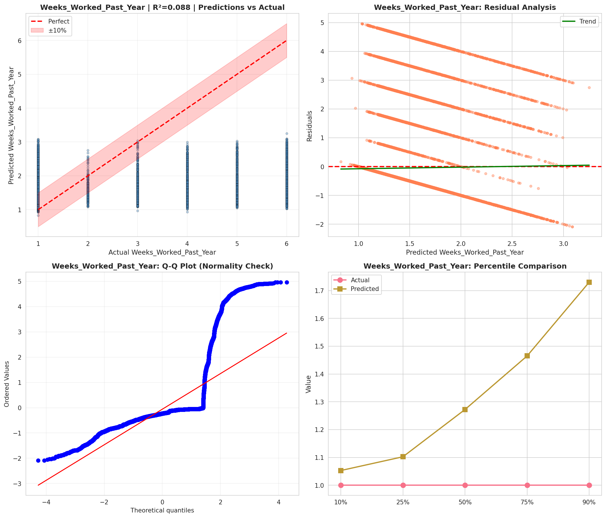
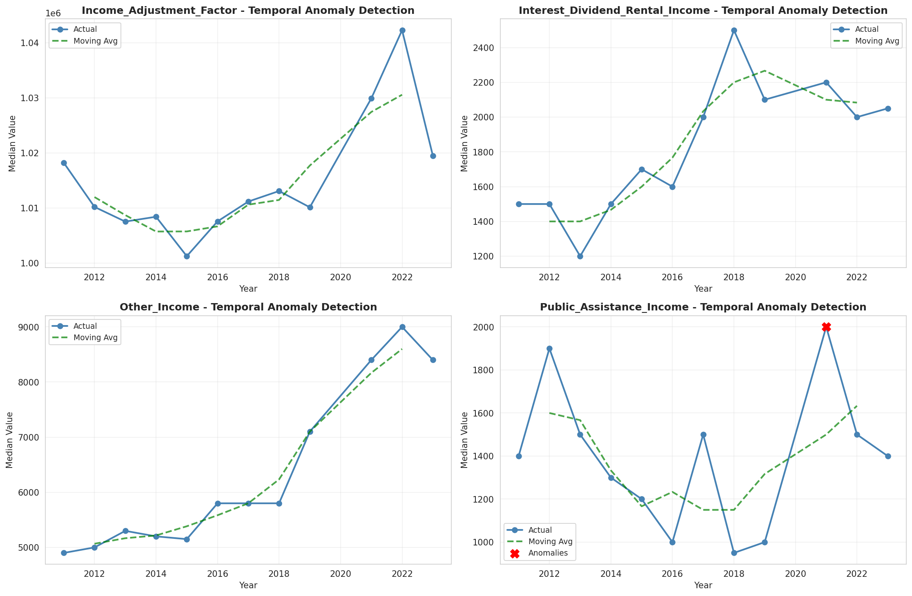
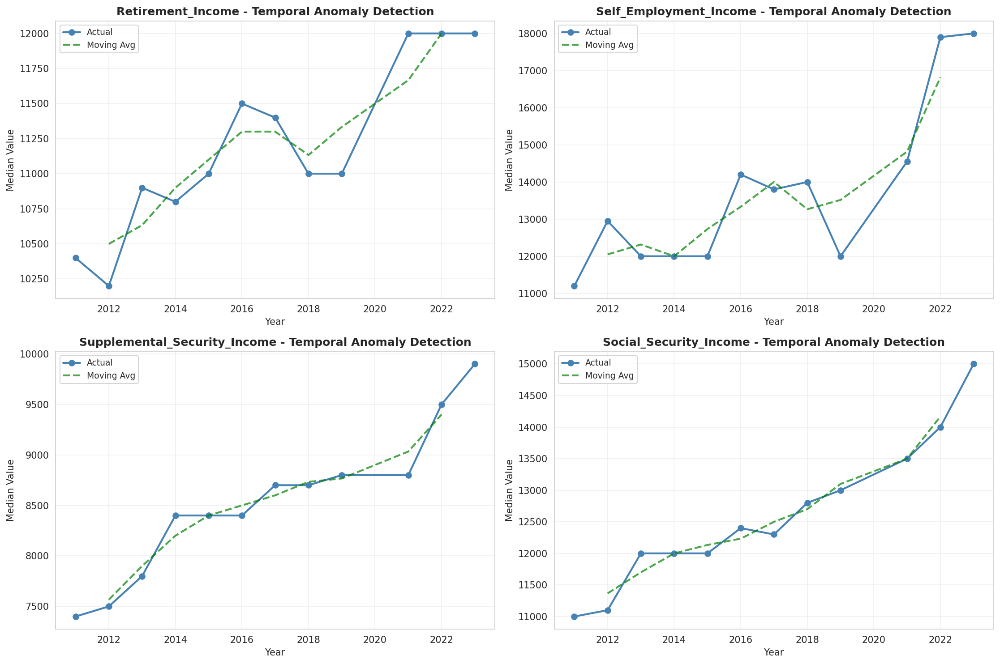
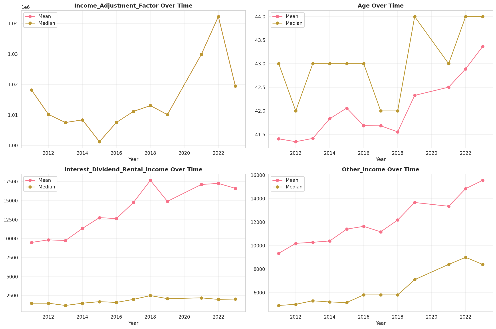
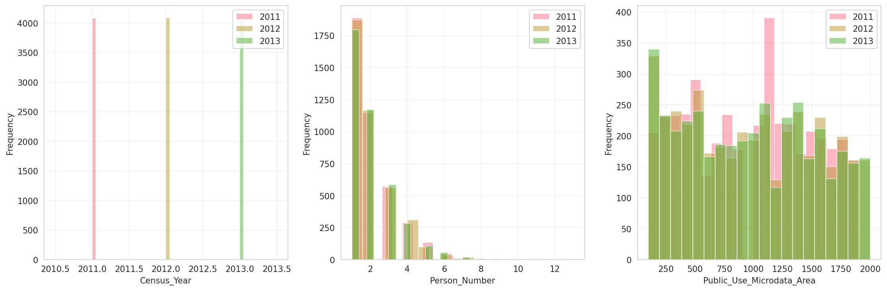
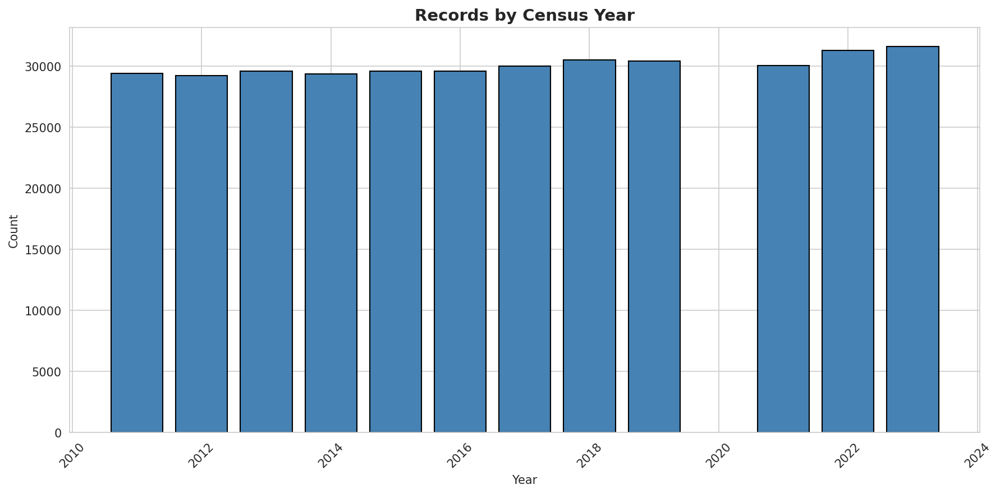
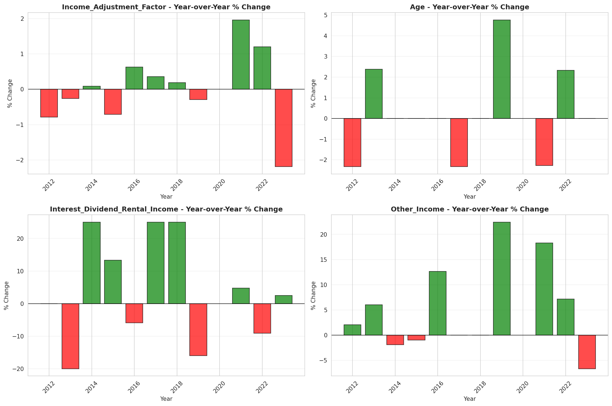
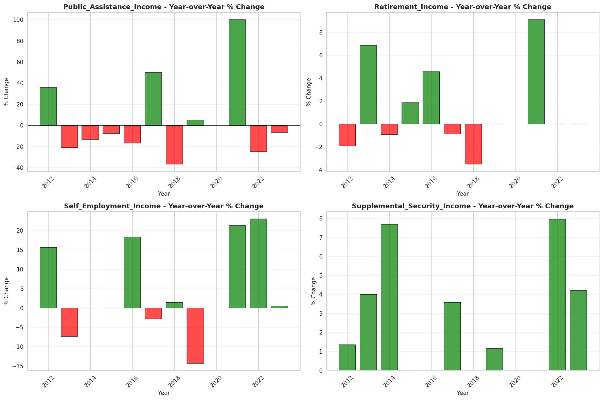

# Temporal Analysis

## Year Distribution

- 2011: 29,407 records

- 2012: 29,224 records

- 2013: 29,591 records

- 2014: 29,369 records

- 2015: 29,605 records

- 2016: 29,599 records

- 2017: 30,021 records

- 2018: 30,503 records

- 2019: 30,403 records

- 2021: 30,050 records

- 2022: 31,288 records

- 2023: 31,587 records

## Temporal Trends

- Census_Year: {np.int64(2011): {'mean': 2011.0, 'median': 2011.0, 'std': 0.0}, np.int64(2012): {'mean': 2012.0, 'median': 2012.0, 'std': 0.0}, np.int64(2013): {'mean': 2013.0, 'median': 2013.0, 'std': 0.0}, np.int64(2014): {'mean': 2014.0, 'median': 2014.0, 'std': 0.0}, np.int64(2015): {'mean': 2015.0, 'median': 2015.0, 'std': 0.0}, np.int64(2016): {'mean': 2016.0, 'median': 2016.0, 'std': 0.0}, np.int64(2017): {'mean': 2017.0, 'median': 2017.0, 'std': 0.0}, np.int64(2018): {'mean': 2018.0, 'median': 2018.0, 'std': 0.0}, np.int64(2019): {'mean': 2019.0, 'median': 2019.0, 'std': 0.0}, np.int64(2021): {'mean': 2021.0, 'median': 2021.0, 'std': 0.0}, np.int64(2022): {'mean': 2022.0, 'median': 2022.0, 'std': 0.0}, np.int64(2023): {'mean': 2023.0, 'median': 2023.0, 'std': 0.0}}

- Person_Number: {np.int64(2011): {'mean': 1.987962049852076, 'median': 2.0, 'std': 1.2407549507901263}, np.int64(2012): {'mean': 1.9807692307692308, 'median': 2.0, 'std': 1.2307747832193334}, np.int64(2013): {'mean': 2.0037511405494914, 'median': 2.0, 'std': 1.2493808351419446}, np.int64(2014): {'mean': 1.9899213456365556, 'median': 2.0, 'std': 1.2370690012755112}, np.int64(2015): {'mean': 1.9899003546698193, 'median': 2.0, 'std': 1.2315655987448768}, np.int64(2016): {'mean': 2.0029055035643095, 'median': 2.0, 'std': 1.2638281701166658}, np.int64(2017): {'mean': 2.0150228173611806, 'median': 2.0, 'std': 1.2671242064123052}, np.int64(2018): {'mean': 2.0252106350195063, 'median': 2.0, 'std': 1.2740842605414644}, np.int64(2019): {'mean': 2.008157089760879, 'median': 2.0, 'std': 1.2734218023483976}, np.int64(2021): {'mean': 2.013710482529118, 'median': 2.0, 'std': 1.2789344950974295}, np.int64(2022): {'mean': 1.9856494502684736, 'median': 2.0, 'std': 1.25905238938065}, np.int64(2023): {'mean': 1.9713489726786335, 'median': 2.0, 'std': 1.2426835306634603}}

- Public_Use_Microdata_Area: {np.int64(2011): {'mean': 975.5772435134492, 'median': 1000.0, 'std': 535.497068140867}, np.int64(2012): {'mean': 978.1446756090884, 'median': 1000.0, 'std': 582.4543072457623}, np.int64(2013): {'mean': 977.7229563042818, 'median': 1000.0, 'std': 585.1056285661424}, np.int64(2014): {'mean': 975.0451155980796, 'median': 1000.0, 'std': 582.8504736666404}, np.int64(2015): {'mean': 965.387603445364, 'median': 1000.0, 'std': 582.679754611929}, np.int64(2016): {'mean': 952.2754147099564, 'median': 900.0, 'std': 584.9274767683274}, np.int64(2017): {'mean': 953.9322474268013, 'median': 900.0, 'std': 581.4890571546883}, np.int64(2018): {'mean': 951.5916467232731, 'median': 900.0, 'std': 585.1718361441027}, np.int64(2019): {'mean': 948.1235404400882, 'median': 900.0, 'std': 583.1296113851272}, np.int64(2021): {'mean': 939.9301164725457, 'median': 900.0, 'std': 583.7522387140687}, np.int64(2022): {'mean': 899.678566862695, 'median': 900.0, 'std': 511.64976913058393}, np.int64(2023): {'mean': 897.1733941178333, 'median': 900.0, 'std': 513.4547027327595}}

- State_Code: {np.int64(2011): {'mean': 5.0, 'median': 5.0, 'std': 0.0}, np.int64(2012): {'mean': 5.0, 'median': 5.0, 'std': 0.0}, np.int64(2013): {'mean': 5.0, 'median': 5.0, 'std': 0.0}, np.int64(2014): {'mean': 5.0, 'median': 5.0, 'std': 0.0}, np.int64(2015): {'mean': 5.0, 'median': 5.0, 'std': 0.0}, np.int64(2016): {'mean': 5.0, 'median': 5.0, 'std': 0.0}, np.int64(2017): {'mean': 5.0, 'median': 5.0, 'std': 0.0}, np.int64(2018): {'mean': 5.0, 'median': 5.0, 'std': 0.0}, np.int64(2019): {'mean': 5.0, 'median': 5.0, 'std': 0.0}, np.int64(2021): {'mean': 5.0, 'median': 5.0, 'std': 0.0}, np.int64(2022): {'mean': 5.0, 'median': 5.0, 'std': 0.0}, np.int64(2023): {'mean': None, 'median': None, 'std': None}}

- Income_Adjustment_Factor: {np.int64(2011): {'mean': 1018237.0, 'median': 1018237.0, 'std': 0.0}, np.int64(2012): {'mean': 1010207.0, 'median': 1010207.0, 'std': 0.0}, np.int64(2013): {'mean': 1007549.0, 'median': 1007549.0, 'std': 0.0}, np.int64(2014): {'mean': 1008425.0, 'median': 1008425.0, 'std': 0.0}, np.int64(2015): {'mean': 1001264.0, 'median': 1001264.0, 'std': 0.0}, np.int64(2016): {'mean': 1007588.0, 'median': 1007588.0, 'std': 0.0}, np.int64(2017): {'mean': 1011189.0, 'median': 1011189.0, 'std': 0.0}, np.int64(2018): {'mean': 1013097.0, 'median': 1013097.0, 'std': 0.0}, np.int64(2019): {'mean': 1010145.0, 'median': 1010145.0, 'std': 0.0}, np.int64(2021): {'mean': 1029928.0, 'median': 1029928.0, 'std': 0.0}, np.int64(2022): {'mean': 1042311.0, 'median': 1042311.0, 'std': 0.0}, np.int64(2023): {'mean': 1019518.0, 'median': 1019518.0, 'std': 0.0}}

- Person_Weight: {np.int64(2011): {'mean': 99.90747101030367, 'median': 73.0, 'std': 99.75695678024925}, np.int64(2012): {'mean': 100.91469340268273, 'median': 78.0, 'std': 86.76364010999984}, np.int64(2013): {'mean': 100.0092257781082, 'median': 76.0, 'std': 89.3010553617632}, np.int64(2014): {'mean': 101.00340495079845, 'median': 77.0, 'std': 91.24267501739911}, np.int64(2015): {'mean': 100.59800709339639, 'median': 78.0, 'std': 89.27754986988313}, np.int64(2016): {'mean': 100.95773505861685, 'median': 77.0, 'std': 90.64921786158666}, np.int64(2017): {'mean': 100.07258252556544, 'median': 78.0, 'std': 88.35822227987391}, np.int64(2018): {'mean': 98.80421597875619, 'median': 76.0, 'std': 88.89677814211863}, np.int64(2019): {'mean': 99.26007301910995, 'median': 74.0, 'std': 94.67036537626848}, np.int64(2021): {'mean': 100.69520798668886, 'median': 75.0, 'std': 93.49444974888327}, np.int64(2022): {'mean': 97.34201610841217, 'median': 71.0, 'std': 95.99156180047639}, np.int64(2023): {'mean': 97.12008104599994, 'median': 72.0, 'std': 92.80618284705197}}

- Age: {np.int64(2011): {'mean': 41.40810011221818, 'median': 43.0, 'std': 24.022168760102222}, np.int64(2012): {'mean': 41.34752258417739, 'median': 42.0, 'std': 23.982676167152178}, np.int64(2013): {'mean': 41.41695109999662, 'median': 43.0, 'std': 23.892154943371242}, np.int64(2014): {'mean': 41.83482583676666, 'median': 43.0, 'std': 24.04621457053261}, np.int64(2015): {'mean': 42.05934808309407, 'median': 43.0, 'std': 24.294878895961716}, np.int64(2016): {'mean': 41.68846920504071, 'median': 43.0, 'std': 24.113874925750025}, np.int64(2017): {'mean': 41.68422104526831, 'median': 42.0, 'std': 24.078208137488737}, np.int64(2018): {'mean': 41.5559781005147, 'median': 42.0, 'std': 24.222791516604858}, np.int64(2019): {'mean': 42.32894780120383, 'median': 44.0, 'std': 24.21536758213052}, np.int64(2021): {'mean': 42.5032612312812, 'median': 43.0, 'std': 24.313158868799437}, np.int64(2022): {'mean': 42.89181155714651, 'median': 44.0, 'std': 24.188841117071295}, np.int64(2023): {'mean': 43.36439041377782, 'median': 44.0, 'std': 24.30884791486291}}

- Citizenship_Status: {np.int64(2011): {'mean': 1.111061992042711, 'median': 1.0, 'std': 0.6175159690616353}, np.int64(2012): {'mean': 1.121133315083493, 'median': 1.0, 'std': 0.6440892075789851}, np.int64(2013): {'mean': 1.1264911628535703, 'median': 1.0, 'std': 0.6581576274493502}, np.int64(2014): {'mean': 1.1314991998365624, 'median': 1.0, 'std': 0.671646002218488}, np.int64(2015): {'mean': 1.1352812024995778, 'median': 1.0, 'std': 0.6783166348395311}, np.int64(2016): {'mean': 1.138078989155039, 'median': 1.0, 'std': 0.6860485291442202}, np.int64(2017): {'mean': 1.1475633723060523, 'median': 1.0, 'std': 0.7078670483812756}, np.int64(2018): {'mean': 1.140641904075009, 'median': 1.0, 'std': 0.6910123539350596}, np.int64(2019): {'mean': 1.137782455678716, 'median': 1.0, 'std': 0.6751441769473171}, np.int64(2021): {'mean': 1.1621963394342762, 'median': 1.0, 'std': 0.7397891125848756}, np.int64(2022): {'mean': 1.1510483252365125, 'median': 1.0, 'std': 0.7110429315660213}, np.int64(2023): {'mean': 1.1519612498812803, 'median': 1.0, 'std': 0.7166150989501772}}

- Class_of_Worker: {np.int64(2011): {'mean': 2.191757514651207, 'median': 1.0, 'std': 1.9232415859205592}, np.int64(2012): {'mean': 2.245725695744415, 'median': 1.0, 'std': 2.005769092966602}, np.int64(2013): {'mean': 2.1876955814244585, 'median': 1.0, 'std': 1.9542892509212646}, np.int64(2014): {'mean': 2.1999247224139014, 'median': 1.0, 'std': 1.9553651686807847}, np.int64(2015): {'mean': 2.1520049735778675, 'median': 1.0, 'std': 1.9125585920548678}, np.int64(2016): {'mean': 2.1294117647058823, 'median': 1.0, 'std': 1.8897655042404238}, np.int64(2017): {'mean': 2.1807530359431255, 'median': 1.0, 'std': 1.9356580830676495}, np.int64(2018): {'mean': 2.169950588665894, 'median': 1.0, 'std': 1.9271840629890302}, np.int64(2019): {'mean': 2.1739209285455203, 'median': 1.0, 'std': 1.9110348658313374}, np.int64(2021): {'mean': 2.205318033191437, 'median': 1.0, 'std': 1.9437852085341818}, np.int64(2022): {'mean': 2.201106681739751, 'median': 1.0, 'std': 1.933043484118014}, np.int64(2023): {'mean': 2.1580692061645825, 'median': 1.0, 'std': 1.897366104085525}}

- English_Speaking_Ability: {np.int64(2011): {'mean': 1.6339869281045751, 'median': 1.0, 'std': 0.8775003361510926}, np.int64(2012): {'mean': 1.6557377049180328, 'median': 1.0, 'std': 0.8996438158216993}, np.int64(2013): {'mean': 1.6429608127721336, 'median': 1.0, 'std': 0.9155862993298972}, np.int64(2014): {'mean': 1.6793893129770991, 'median': 1.0, 'std': 0.9036491847086445}, np.int64(2015): {'mean': 1.7045454545454546, 'median': 1.0, 'std': 0.9349076840365421}, np.int64(2016): {'mean': 1.6214574898785425, 'median': 1.0, 'std': 0.876059270785764}, np.int64(2017): {'mean': 1.5975177304964538, 'median': 1.0, 'std': 0.8730506119712226}, np.int64(2018): {'mean': 1.6050917702782712, 'median': 1.0, 'std': 0.8787904395903536}, np.int64(2019): {'mean': 1.60920245398773, 'median': 1.0, 'std': 0.8954087801003386}, np.int64(2021): {'mean': 1.627597229621737, 'median': 1.0, 'std': 0.9237134381007612}, np.int64(2022): {'mean': 1.575677110993096, 'median': 1.0, 'std': 0.8939417100212821}, np.int64(2023): {'mean': 1.6181333333333334, 'median': 1.0, 'std': 0.9007833264495596}}

- Fertility_Status: {np.int64(2011): {'mean': 1.9520558818860136, 'median': 2.0, 'std': 0.21366498839847173}, np.int64(2012): {'mean': 1.94432, 'median': 2.0, 'std': 0.229321066856651}, np.int64(2013): {'mean': 1.9480478589420656, 'median': 2.0, 'std': 0.22194790215809565}, np.int64(2014): {'mean': 1.9467359532315687, 'median': 2.0, 'std': 0.22457777779285035}, np.int64(2015): {'mean': 1.9462923900697713, 'median': 2.0, 'std': 0.2254580901001536}, np.int64(2016): {'mean': 1.9471053055958716, 'median': 2.0, 'std': 0.2238412961104961}, np.int64(2017): {'mean': 1.9411294192929132, 'median': 2.0, 'std': 0.23540114742279103}, np.int64(2018): {'mean': 1.9430791184398288, 'median': 2.0, 'std': 0.2317097483323318}, np.int64(2019): {'mean': 1.9479814903462582, 'median': 2.0, 'std': 0.22208208881802224}, np.int64(2021): {'mean': 1.9471387002909797, 'median': 2.0, 'std': 0.22377461340896082}, np.int64(2022): {'mean': 1.9483325504931892, 'median': 2.0, 'std': 0.221372077909513}, np.int64(2023): {'mean': 1.9469151268399625, 'median': 2.0, 'std': 0.2242202980363004}}

- Marital_Status: {np.int64(2011): {'mean': 2.804332301832897, 'median': 2.0, 'std': 1.8073783807097958}, np.int64(2012): {'mean': 2.805810292909937, 'median': 2.0, 'std': 1.8099007708917092}, np.int64(2013): {'mean': 2.8266364773072894, 'median': 2.0, 'std': 1.818297644514839}, np.int64(2014): {'mean': 2.8201845483332764, 'median': 2.0, 'std': 1.8167682237419007}, np.int64(2015): {'mean': 2.8154365816585036, 'median': 2.0, 'std': 1.811230200708954}, np.int64(2016): {'mean': 2.8399270245616406, 'median': 3.0, 'std': 1.8142468955946023}, np.int64(2017): {'mean': 2.844775323939909, 'median': 3.0, 'std': 1.8146147109747102}, np.int64(2018): {'mean': 2.863226567878569, 'median': 3.0, 'std': 1.8195185811263757}, np.int64(2019): {'mean': 2.8325165279742133, 'median': 2.0, 'std': 1.8089746057958802}, np.int64(2021): {'mean': 2.8547420965058237, 'median': 3.0, 'std': 1.8145670670332632}, np.int64(2022): {'mean': 2.83738174379954, 'median': 3.0, 'std': 1.8108938156852326}, np.int64(2023): {'mean': 2.8447145977775667, 'median': 3.0, 'std': 1.8155226504258828}}

- Mobility_Status: {np.int64(2011): {'mean': 1.2831469922491254, 'median': 1.0, 'std': 0.6955618134332778}, np.int64(2012): {'mean': 1.2830312672938573, 'median': 1.0, 'std': 0.6951049872000714}, np.int64(2013): {'mean': 1.2732794212986658, 'median': 1.0, 'std': 0.6846810469416036}, np.int64(2014): {'mean': 1.2751839372894176, 'median': 1.0, 'std': 0.6872554251935632}, np.int64(2015): {'mean': 1.2989768076398363, 'median': 1.0, 'std': 0.7108992317236761}, np.int64(2016): {'mean': 1.2991736101625462, 'median': 1.0, 'std': 0.7111625291929985}, np.int64(2017): {'mean': 1.2933373733292934, 'median': 1.0, 'std': 0.7052987659676824}, np.int64(2018): {'mean': 1.2750770454319516, 'median': 1.0, 'std': 0.6868419786923141}, np.int64(2019): {'mean': 1.2763380562099744, 'median': 1.0, 'std': 0.6889148608898857}, np.int64(2021): {'mean': 1.2508905168358089, 'median': 1.0, 'std': 0.6608828838389469}, np.int64(2022): {'mean': 1.2510163257404658, 'median': 1.0, 'std': 0.6613318552177466}, np.int64(2023): {'mean': 1.2363049797169963, 'median': 1.0, 'std': 0.6436549491822254}}

- Military_Service: {np.int64(2011): {'mean': 4.739872524275998, 'median': 5.0, 'std': 0.6748882845457804}, np.int64(2012): {'mean': 4.746305735212233, 'median': 5.0, 'std': 0.6682187301291291}, np.int64(2013): {'mean': 3.7692112604615775, 'median': 4.0, 'std': 0.6260433142449701}, np.int64(2014): {'mean': 3.7756023460905523, 'median': 4.0, 'std': 0.6177889184808065}, np.int64(2015): {'mean': 3.7736673953253743, 'median': 4.0, 'std': 0.6200577157621576}, np.int64(2016): {'mean': 3.782898624124251, 'median': 4.0, 'std': 0.6091367570953181}, np.int64(2017): {'mean': 3.7823033124142804, 'median': 4.0, 'std': 0.6107142824301502}, np.int64(2018): {'mean': 3.800288303130148, 'median': 4.0, 'std': 0.5844265108907966}, np.int64(2019): {'mean': 3.8008266492060896, 'median': 4.0, 'std': 0.5871422015777644}, np.int64(2021): {'mean': 3.8014301657504235, 'median': 4.0, 'std': 0.5877128159333237}, np.int64(2022): {'mean': 3.8055555555555554, 'median': 4.0, 'std': 0.5806931960681782}, np.int64(2023): {'mean': 3.8134423321636524, 'median': 4.0, 'std': 0.5693951019822158}}

- Travel_Time_To_Work_Minutes: {np.int64(2011): {'mean': 22.179856767292176, 'median': 15.0, 'std': 21.156686033789363}, np.int64(2012): {'mean': 22.3169710467706, 'median': 15.0, 'std': 21.029609969220893}, np.int64(2013): {'mean': 22.449458006521546, 'median': 15.0, 'std': 20.74626954411488}, np.int64(2014): {'mean': 22.020159151193635, 'median': 15.0, 'std': 20.392517087894827}, np.int64(2015): {'mean': 22.603763767236146, 'median': 15.0, 'std': 22.513414323787742}, np.int64(2016): {'mean': 21.92941075563942, 'median': 15.0, 'std': 19.92158436238505}, np.int64(2017): {'mean': 22.24399762450157, 'median': 15.0, 'std': 20.070138897881964}, np.int64(2018): {'mean': 22.43161529391949, 'median': 15.0, 'std': 20.745251230894237}, np.int64(2019): {'mean': 22.849682369441464, 'median': 15.0, 'std': 21.048835486860032}, np.int64(2021): {'mean': 22.890271595966937, 'median': 18.0, 'std': 20.704610818968863}, np.int64(2022): {'mean': 23.354666206658617, 'median': 20.0, 'std': 22.027291112262297}, np.int64(2023): {'mean': 23.4568489713999, 'median': 20.0, 'std': 22.240482446855047}}

- Vehicle_Occupancy: {np.int64(2011): {'mean': 1.1729117508258613, 'median': 1.0, 'std': 0.6618908213312561}, np.int64(2012): {'mean': 1.1739571797711332, 'median': 1.0, 'std': 0.6000377404013777}, np.int64(2013): {'mean': 1.166819431714024, 'median': 1.0, 'std': 0.6010035786248604}, np.int64(2014): {'mean': 1.1712630998345284, 'median': 1.0, 'std': 0.6032257412735518}, np.int64(2015): {'mean': 1.1790452125259454, 'median': 1.0, 'std': 0.6543918759335047}, np.int64(2016): {'mean': 1.1741998751894447, 'median': 1.0, 'std': 0.6490977390277732}, np.int64(2017): {'mean': 1.1574651101553586, 'median': 1.0, 'std': 0.5564600500059018}, np.int64(2018): {'mean': 1.1775472849298352, 'median': 1.0, 'std': 0.6983827814790019}, np.int64(2019): {'mean': 1.1693216855087358, 'median': 1.0, 'std': 0.593054087017715}, np.int64(2021): {'mean': 1.1501078900459705, 'median': 1.0, 'std': 0.5602913364297345}, np.int64(2022): {'mean': 1.1433440975959814, 'median': 1.0, 'std': 0.5362047897691886}, np.int64(2023): {'mean': 1.1617238987166147, 'median': 1.0, 'std': 0.6007384904643425}}

- Transportation_To_Work: {np.int64(2011): {'mean': 1.6528520108648033, 'median': 1.0, 'std': 2.4271112935446264}, np.int64(2012): {'mean': 1.6435686072471234, 'median': 1.0, 'std': 2.4151634420019925}, np.int64(2013): {'mean': 1.5985963711057858, 'median': 1.0, 'std': 2.334139723674451}, np.int64(2014): {'mean': 1.642509187248953, 'median': 1.0, 'std': 2.4028404830953445}, np.int64(2015): {'mean': 1.6194839035050854, 'median': 1.0, 'std': 2.3645627495517103}, np.int64(2016): {'mean': 1.669947886508396, 'median': 1.0, 'std': 2.4573309745457577}, np.int64(2017): {'mean': 1.65739002693218, 'median': 1.0, 'std': 2.439669087004626}, np.int64(2018): {'mean': 1.6534749817533048, 'median': 1.0, 'std': 2.4419007028836894}, np.int64(2019): {'mean': None, 'median': None, 'std': None}, np.int64(2021): {'mean': None, 'median': None, 'std': None}, np.int64(2022): {'mean': None, 'median': None, 'std': None}, np.int64(2023): {'mean': None, 'median': None, 'std': None}}

- Language_Other_Than_English: {np.int64(2011): {'mean': 1.9505032350826743, 'median': 2.0, 'std': 0.2169067227091065}, np.int64(2012): {'mean': 1.949210831161309, 'median': 2.0, 'std': 0.2195708870471391}, np.int64(2013): {'mean': 1.950925925925926, 'median': 2.0, 'std': 0.21602655224492467}, np.int64(2014): {'mean': 1.9482399425287356, 'median': 2.0, 'std': 0.22154619597380076}, np.int64(2015): {'mean': 1.9481965107567163, 'median': 2.0, 'std': 0.22163402327864817}, np.int64(2016): {'mean': 1.9470808784145688, 'median': 2.0, 'std': 0.22387603233382225}, np.int64(2017): {'mean': 1.9405731947176172, 'median': 2.0, 'std': 0.23642593624893765}, np.int64(2018): {'mean': 1.9414375368399155, 'median': 2.0, 'std': 0.2348080338285659}, np.int64(2019): {'mean': 1.9434165307043427, 'median': 2.0, 'std': 0.23104898494927528}, np.int64(2021): {'mean': 1.9342119098524413, 'median': 2.0, 'std': 0.24791565413770877}, np.int64(2022): {'mean': 1.9367653972731547, 'median': 2.0, 'std': 0.24338853108770062}, np.int64(2023): {'mean': 1.9377138491180281, 'median': 2.0, 'std': 0.2416785604465279}}

- Grandparents_Living_With_Grandchildren: {np.int64(2011): {'mean': 1.9610485314243604, 'median': 2.0, 'std': 0.19348442367888408}, np.int64(2012): {'mean': 1.9622069845319725, 'median': 2.0, 'std': 0.1907003841336721}, np.int64(2013): {'mean': 1.9625163142782562, 'median': 2.0, 'std': 0.18994878950942606}, np.int64(2014): {'mean': 1.9611752360965373, 'median': 2.0, 'std': 0.1931821927740406}, np.int64(2015): {'mean': 1.9612399062255796, 'median': 2.0, 'std': 0.19302769236400316}, np.int64(2016): {'mean': 1.958074453088289, 'median': 2.0, 'std': 0.20042428182192237}, np.int64(2017): {'mean': 1.9630239983520446, 'median': 2.0, 'std': 0.18870773923458736}, np.int64(2018): {'mean': 1.9639630442550151, 'median': 2.0, 'std': 0.1863868740879121}, np.int64(2019): {'mean': 1.961583060247038, 'median': 2.0, 'std': 0.1922054655980413}, np.int64(2021): {'mean': 1.9623147351914614, 'median': 2.0, 'std': 0.19043875697907403}, np.int64(2022): {'mean': 1.965312906489377, 'median': 2.0, 'std': 0.18299047043444197}, np.int64(2023): {'mean': 1.9656695156695156, 'median': 2.0, 'std': 0.18208096115537378}}

- Months_Responsible_For_Grandchildren: {np.int64(2011): {'mean': 3.686147186147186, 'median': 4.0, 'std': 1.3654326719981325}, np.int64(2012): {'mean': 3.6879271070615034, 'median': 4.0, 'std': 1.3381016452195733}, np.int64(2013): {'mean': 3.831353919239905, 'median': 4.0, 'std': 1.3264938822629497}, np.int64(2014): {'mean': 3.836829836829837, 'median': 4.0, 'std': 1.3930552791244397}, np.int64(2015): {'mean': 3.7104072398190047, 'median': 4.0, 'std': 1.364376816285814}, np.int64(2016): {'mean': 3.745995423340961, 'median': 4.0, 'std': 1.421336020280853}, np.int64(2017): {'mean': 3.752659574468085, 'median': 4.0, 'std': 1.328655802356183}, np.int64(2018): {'mean': 3.858695652173913, 'median': 4.0, 'std': 1.2729122715211836}, np.int64(2019): {'mean': 3.891820580474934, 'median': 4.0, 'std': 1.1936390534603385}, np.int64(2021): {'mean': 3.911392405063291, 'median': 4.0, 'std': 1.292204992083893}, np.int64(2022): {'mean': 3.8722222222222222, 'median': 5.0, 'std': 1.4123630628247876}, np.int64(2023): {'mean': 4.013550135501355, 'median': 5.0, 'std': 1.2520985095058512}}

- Grandparents_Responsible_For_Grandchildren: {np.int64(2011): {'mean': 1.3756756756756756, 'median': 1.0, 'std': 0.4846244338633556}, np.int64(2012): {'mean': 1.3825597749648382, 'median': 1.0, 'std': 0.48635427475951165}, np.int64(2013): {'mean': 1.4136490250696379, 'median': 1.0, 'std': 0.4928303811602778}, np.int64(2014): {'mean': 1.4202702702702703, 'median': 1.0, 'std': 0.4939360922788269}, np.int64(2015): {'mean': 1.4059139784946237, 'median': 1.0, 'std': 0.49139839255751244}, np.int64(2016): {'mean': 1.455790784557908, 'median': 1.0, 'std': 0.4983521134622352}, np.int64(2017): {'mean': 1.4763231197771587, 'median': 1.0, 'std': 0.4997872532551571}, np.int64(2018): {'mean': 1.4787535410764872, 'median': 1.0, 'std': 0.4999025481146862}, np.int64(2019): {'mean': 1.5026246719160106, 'median': 2.0, 'std': 0.5003215137854795}, np.int64(2021): {'mean': 1.4697986577181208, 'median': 1.0, 'std': 0.499422340770376}, np.int64(2022): {'mean': 1.5, 'median': 1.5, 'std': 0.5003475843311689}, np.int64(2023): {'mean': 1.4896265560165975, 'median': 1.0, 'std': 0.5002384461491464}}

- Interest_Dividend_Rental_Income: {np.int64(2011): {'mean': 9495.619322555813, 'median': 1500.0, 'std': 26683.389573636116}, np.int64(2012): {'mean': 9837.095256312165, 'median': 1500.0, 'std': 25178.405189389698}, np.int64(2013): {'mean': 9753.626401446654, 'median': 1200.0, 'std': 27346.06777623406}, np.int64(2014): {'mean': 11340.644061302683, 'median': 1500.0, 'std': 33582.38477792039}, np.int64(2015): {'mean': 12763.572905525847, 'median': 1700.0, 'std': 35700.012085216025}, np.int64(2016): {'mean': 12637.90525923163, 'median': 1600.0, 'std': 36107.48483498861}, np.int64(2017): {'mean': 14753.767234387673, 'median': 2000.0, 'std': 43541.1532070215}, np.int64(2018): {'mean': 17671.719822365765, 'median': 2500.0, 'std': 51026.996679944845}, np.int64(2019): {'mean': 14904.988179669032, 'median': 2100.0, 'std': 42266.05393264557}, np.int64(2021): {'mean': 17128.168207837956, 'median': 2200.0, 'std': 46282.433769994175}, np.int64(2022): {'mean': 17269.825308904987, 'median': 2000.0, 'std': 49922.39662895138}, np.int64(2023): {'mean': 16618.465384615385, 'median': 2050.0, 'std': 46905.79658425891}}

- Military_Service_Period_1: {np.int64(2011): {'mean': 0.11233077204537138, 'median': 0.0, 'std': 0.31583075801668936}, np.int64(2012): {'mean': 0.11360239162929746, 'median': 0.0, 'std': 0.3173870380811756}, np.int64(2013): {'mean': 0.1270424836601307, 'median': 0.0, 'std': 0.3330885961816964}, np.int64(2014): {'mean': 0.13552188552188552, 'median': 0.0, 'std': 0.34235220575305236}, np.int64(2015): {'mean': 0.13372093023255813, 'median': 0.0, 'std': 0.3404229269604173}, np.int64(2016): {'mean': 0.14528795811518325, 'median': 0.0, 'std': 0.35246782898639356}, np.int64(2017): {'mean': 0.17508561643835616, 'median': 0.0, 'std': 0.3801216884367497}, np.int64(2018): {'mean': 0.1700838769804287, 'median': 0.0, 'std': 0.3757940372897602}, np.int64(2019): {'mean': 0.1966682091624248, 'median': 0.0, 'std': 0.3975713371265787}, np.int64(2021): {'mean': 0.21564974382859806, 'median': 0.0, 'std': 0.4113681447511592}, np.int64(2022): {'mean': 0.21999087174806026, 'median': 0.0, 'std': 0.4143346979505454}, np.int64(2023): {'mean': 0.23273415326395458, 'median': 0.0, 'std': 0.422674197053443}}

- Military_Service_Period_2: {np.int64(2011): {'mean': 0.1350164654226125, 'median': 0.0, 'std': 0.3418036970226285}, np.int64(2012): {'mean': 0.1453662182361734, 'median': 0.0, 'std': 0.35253556384851736}, np.int64(2013): {'mean': 0.16544117647058823, 'median': 0.0, 'std': 0.37165416444909466}, np.int64(2014): {'mean': 0.1553030303030303, 'median': 0.0, 'std': 0.3622695604791559}, np.int64(2015): {'mean': 0.16154485049833886, 'median': 0.0, 'std': 0.3681092016788975}, np.int64(2016): {'mean': 0.17801047120418848, 'median': 0.0, 'std': 0.38260503374909816}, np.int64(2017): {'mean': 0.2046232876712329, 'median': 0.0, 'std': 0.40351245227444416}, np.int64(2018): {'mean': 0.19850885368126747, 'median': 0.0, 'std': 0.3989702528078235}, np.int64(2019): {'mean': 0.1925034706154558, 'median': 0.0, 'std': 0.394357515591741}, np.int64(2021): {'mean': 0.20773171867722404, 'median': 0.0, 'std': 0.4057781942182896}, np.int64(2022): {'mean': 0.20584208124144227, 'median': 0.0, 'std': 0.40440791680941623}, np.int64(2023): {'mean': 0.22894985808893092, 'median': 0.0, 'std': 0.4202563100712898}}

- Military_Service_Period_3: {np.int64(2011): {'mean': 0.15916575192096596, 'median': 0.0, 'std': 0.36589752959654354}, np.int64(2012): {'mean': 0.17152466367713004, 'median': 0.0, 'std': 0.3770372347671}, np.int64(2013): {'mean': None, 'median': None, 'std': None}, np.int64(2014): {'mean': None, 'median': None, 'std': None}, np.int64(2015): {'mean': None, 'median': None, 'std': None}, np.int64(2016): {'mean': None, 'median': None, 'std': None}, np.int64(2017): {'mean': None, 'median': None, 'std': None}, np.int64(2018): {'mean': None, 'median': None, 'std': None}, np.int64(2019): {'mean': None, 'median': None, 'std': None}, np.int64(2021): {'mean': None, 'median': None, 'std': None}, np.int64(2022): {'mean': None, 'median': None, 'std': None}, np.int64(2023): {'mean': None, 'median': None, 'std': None}}

- Military_Service_Period_4: {np.int64(2011): {'mean': 0.13648005854372486, 'median': 0.0, 'std': 0.343360437805624}, np.int64(2012): {'mean': 0.1412556053811659, 'median': 0.0, 'std': 0.34835011991290343}, np.int64(2013): {'mean': None, 'median': None, 'std': None}, np.int64(2014): {'mean': None, 'median': None, 'std': None}, np.int64(2015): {'mean': None, 'median': None, 'std': None}, np.int64(2016): {'mean': None, 'median': None, 'std': None}, np.int64(2017): {'mean': None, 'median': None, 'std': None}, np.int64(2018): {'mean': None, 'median': None, 'std': None}, np.int64(2019): {'mean': None, 'median': None, 'std': None}, np.int64(2021): {'mean': None, 'median': None, 'std': None}, np.int64(2022): {'mean': None, 'median': None, 'std': None}, np.int64(2023): {'mean': None, 'median': None, 'std': None}}

- Military_Service_Period_5: {np.int64(2011): {'mean': 0.3739480424442005, 'median': 0.0, 'std': 0.4839386284727868}, np.int64(2012): {'mean': 0.3781763826606876, 'median': 0.0, 'std': 0.4850225934605999}, np.int64(2013): {'mean': 0.38643790849673204, 'median': 0.0, 'std': 0.4870323880623305}, np.int64(2014): {'mean': 0.4053030303030303, 'median': 0.0, 'std': 0.49105393928963265}, np.int64(2015): {'mean': 0.39700996677740863, 'median': 0.0, 'std': 0.4893797197261729}, np.int64(2016): {'mean': 0.42888307155322863, 'median': 0.0, 'std': 0.4950245423608603}, np.int64(2017): {'mean': 0.4066780821917808, 'median': 0.0, 'std': 0.49131899645924254}, np.int64(2018): {'mean': 0.41985088536812676, 'median': 0.0, 'std': 0.4936493438911441}, np.int64(2019): {'mean': 0.4058306339657566, 'median': 0.0, 'std': 0.491165721265553}, np.int64(2021): {'mean': 0.4131346064275734, 'median': 0.0, 'std': 0.49251130249388514}, np.int64(2022): {'mean': 0.3797352806937471, 'median': 0.0, 'std': 0.4854317131755305}, np.int64(2023): {'mean': 0.38978240302743616, 'median': 0.0, 'std': 0.4878162024532953}}

- Military_Service_Period_6: {np.int64(2011): {'mean': 0.11781924624954263, 'median': 0.0, 'std': 0.32245296722407973}, np.int64(2012): {'mean': 0.12144992526158445, 'median': 0.0, 'std': 0.3267104661723225}, np.int64(2013): {'mean': None, 'median': None, 'std': None}, np.int64(2014): {'mean': None, 'median': None, 'std': None}, np.int64(2015): {'mean': None, 'median': None, 'std': None}, np.int64(2016): {'mean': None, 'median': None, 'std': None}, np.int64(2017): {'mean': None, 'median': None, 'std': None}, np.int64(2018): {'mean': None, 'median': None, 'std': None}, np.int64(2019): {'mean': None, 'median': None, 'std': None}, np.int64(2021): {'mean': None, 'median': None, 'std': None}, np.int64(2022): {'mean': None, 'median': None, 'std': None}, np.int64(2023): {'mean': None, 'median': None, 'std': None}}

- Military_Service_Period_7: {np.int64(2011): {'mean': 0.150384193194292, 'median': 0.0, 'std': 0.35751301392174045}, np.int64(2012): {'mean': 0.1382660687593423, 'median': 0.0, 'std': 0.3452435437601312}, np.int64(2013): {'mean': None, 'median': None, 'std': None}, np.int64(2014): {'mean': None, 'median': None, 'std': None}, np.int64(2015): {'mean': None, 'median': None, 'std': None}, np.int64(2016): {'mean': None, 'median': None, 'std': None}, np.int64(2017): {'mean': None, 'median': None, 'std': None}, np.int64(2018): {'mean': None, 'median': None, 'std': None}, np.int64(2019): {'mean': None, 'median': None, 'std': None}, np.int64(2021): {'mean': None, 'median': None, 'std': None}, np.int64(2022): {'mean': None, 'median': None, 'std': None}, np.int64(2023): {'mean': None, 'median': None, 'std': None}}

- Military_Service_Period_8: {np.int64(2011): {'mean': 0.1309915843395536, 'median': 0.0, 'std': 0.3374528939559614}, np.int64(2012): {'mean': 0.12369207772795217, 'median': 0.0, 'std': 0.32929146381144375}, np.int64(2013): {'mean': 0.11356209150326797, 'median': 0.0, 'std': 0.31734347528912354}, np.int64(2014): {'mean': 0.10521885521885523, 'median': 0.0, 'std': 0.3068998027440401}, np.int64(2015): {'mean': 0.1042358803986711, 'median': 0.0, 'std': 0.30562976454982965}, np.int64(2016): {'mean': 0.0968586387434555, 'median': 0.0, 'std': 0.2958297242544925}, np.int64(2017): {'mean': 0.08090753424657535, 'median': 0.0, 'std': 0.27275144659145084}, np.int64(2018): {'mean': 0.07315936626281454, 'median': 0.0, 'std': 0.2604586053100652}, np.int64(2019): {'mean': 0.06894956038870893, 'median': 0.0, 'std': 0.2534269888121064}, np.int64(2021): {'mean': 0.05449464368886819, 'median': 0.0, 'std': 0.22704402056265152}, np.int64(2022): {'mean': 0.06024646280237335, 'median': 0.0, 'std': 0.237997224677889}, np.int64(2023): {'mean': 0.04068117313150426, 'median': 0.0, 'std': 0.19759727948713}}

- Military_Service_Period_9: {np.int64(2011): {'mean': 0.02561287961946579, 'median': 0.0, 'std': 0.15800631326536327}, np.int64(2012): {'mean': 0.023168908819133034, 'median': 0.0, 'std': 0.15046784070130598}, np.int64(2013): {'mean': 0.016748366013071895, 'median': 0.0, 'std': 0.12835337184643736}, np.int64(2014): {'mean': 0.015151515151515152, 'median': 0.0, 'std': 0.12218113465290684}, np.int64(2015): {'mean': 0.02367109634551495, 'median': 0.0, 'std': 0.15205386226200687}, np.int64(2016): {'mean': 0.013089005235602094, 'median': 0.0, 'std': 0.11368078828467393}, np.int64(2017): {'mean': 0.01113013698630137, 'median': 0.0, 'std': 0.10493317224506106}, np.int64(2018): {'mean': 0.0130475302889096, 'median': 0.0, 'std': 0.11350460625858474}, np.int64(2019): {'mean': 0.007866728366496992, 'median': 0.0, 'std': 0.08836547009167639}, np.int64(2021): {'mean': None, 'median': None, 'std': None}, np.int64(2022): {'mean': None, 'median': None, 'std': None}, np.int64(2023): {'mean': None, 'median': None, 'std': None}}

- Military_Service_Period_10: {np.int64(2011): {'mean': 0.08854738382729602, 'median': 0.0, 'std': 0.2841413132805733}, np.int64(2012): {'mean': 0.0687593423019432, 'median': 0.0, 'std': 0.2530917465182926}, np.int64(2013): {'mean': 0.056372549019607844, 'median': 0.0, 'std': 0.2306868515362721}, np.int64(2014): {'mean': 0.058922558922558925, 'median': 0.0, 'std': 0.23552927340764518}, np.int64(2015): {'mean': 0.05232558139534884, 'median': 0.0, 'std': 0.22272901999006736}, np.int64(2016): {'mean': 0.04406631762652705, 'median': 0.0, 'std': 0.20528727241691705}, np.int64(2017): {'mean': 0.030821917808219176, 'median': 0.0, 'std': 0.1728719766399762}, np.int64(2018): {'mean': 0.021435228331780055, 'median': 0.0, 'std': 0.14486386101066576}, np.int64(2019): {'mean': 0.016196205460434984, 'median': 0.0, 'std': 0.1262587232206096}, np.int64(2021): {'mean': 0.011178388448998603, 'median': 0.0, 'std': 0.10515979647472606}, np.int64(2022): {'mean': 0.005933363760839799, 'median': 0.0, 'std': 0.07681700448851553}, np.int64(2023): {'mean': 0.002838221381267739, 'median': 0.0, 'std': 0.053211890467574775}}

- Military_Service_Period_11: {np.int64(2011): {'mean': 0.005854372484449323, 'median': 0.0, 'std': 0.07630353301713064}, np.int64(2012): {'mean': 0.002615844544095665, 'median': 0.0, 'std': 0.0510879362396878}, np.int64(2013): {'mean': 0.0028594771241830064, 'median': 0.0, 'std': 0.05340848001667286}, np.int64(2014): {'mean': 0.003367003367003367, 'median': 0.0, 'std': 0.057940310385826255}, np.int64(2015): {'mean': 0.0, 'median': 0.0, 'std': 0.0}, np.int64(2016): {'mean': 0.0008726003490401396, 'median': 0.0, 'std': 0.029533361934882107}, np.int64(2017): {'mean': 0.0025684931506849314, 'median': 0.0, 'std': 0.05062601273408325}, np.int64(2018): {'mean': 0.00046598322460391424, 'median': 0.0, 'std': 0.02158664458881729}, np.int64(2019): {'mean': 0.00046274872744099955, 'median': 0.0, 'std': 0.021511595185875917}, np.int64(2021): {'mean': None, 'median': None, 'std': None}, np.int64(2022): {'mean': None, 'median': None, 'std': None}, np.int64(2023): {'mean': None, 'median': None, 'std': None}}

- Temporary_Absence_From_Work: {np.int64(2011): {'mean': 2.476959300369997, 'median': 2.0, 'std': 0.5286785974838853}, np.int64(2012): {'mean': 2.4848663936848325, 'median': 2.0, 'std': 0.5285988805484333}, np.int64(2013): {'mean': 2.5341164708822794, 'median': 3.0, 'std': 0.5199441837261827}, np.int64(2014): {'mean': 2.5363198138297873, 'median': 3.0, 'std': 0.521182298977544}, np.int64(2015): {'mean': 2.5436033276768346, 'median': 3.0, 'std': 0.5189422624759221}, np.int64(2016): {'mean': 2.554706322173299, 'median': 3.0, 'std': 0.5191650313093756}, np.int64(2017): {'mean': 2.5569278586618682, 'median': 3.0, 'std': 0.5143141998641121}, np.int64(2018): {'mean': 2.55656438733736, 'median': 3.0, 'std': 0.5168743325974341}, np.int64(2019): {'mean': 2.578313738122081, 'median': 3.0, 'std': 0.5098063828463146}, np.int64(2021): {'mean': 2.5645095645095646, 'median': 3.0, 'std': 0.5153136361536133}, np.int64(2022): {'mean': 2.567669899161612, 'median': 3.0, 'std': 0.5141617871739791}, np.int64(2023): {'mean': 2.574292005162858, 'median': 3.0, 'std': 0.5107741848091415}}

- Available_For_Work: {np.int64(2011): {'mean': 4.5423393878237475, 'median': 5.0, 'std': 1.1706254239923943}, np.int64(2012): {'mean': 4.529317404702605, 'median': 5.0, 'std': 1.1733757206589446}, np.int64(2013): {'mean': 4.660084978755311, 'median': 5.0, 'std': 1.0257727245478399}, np.int64(2014): {'mean': 4.681515957446808, 'median': 5.0, 'std': 0.9877514903063175}, np.int64(2015): {'mean': 4.705268821654733, 'median': 5.0, 'std': 0.9555133514815005}, np.int64(2016): {'mean': 4.731037633961951, 'median': 5.0, 'std': 0.9063090616041236}, np.int64(2017): {'mean': 4.717896286602323, 'median': 5.0, 'std': 0.932555451298716}, np.int64(2018): {'mean': 4.73843784200073, 'median': 5.0, 'std': 0.8942717176128269}, np.int64(2019): {'mean': 4.733491705588662, 'median': 5.0, 'std': 0.9009084648180025}, np.int64(2021): {'mean': 4.774562474562474, 'median': 5.0, 'std': 0.8447451863339657}, np.int64(2022): {'mean': 4.793918788393927, 'median': 5.0, 'std': 0.8090354738884667}, np.int64(2023): {'mean': 4.776782324804495, 'median': 5.0, 'std': 0.8278741769006626}}

- On_Layoff_From_Work: {np.int64(2011): {'mean': 2.450512949882274, 'median': 2.0, 'std': 0.5251026790351497}, np.int64(2012): {'mean': 2.461522225505509, 'median': 2.0, 'std': 0.5193477804365991}, np.int64(2013): {'mean': 2.51291343830709, 'median': 3.0, 'std': 0.5176129996611741}, np.int64(2014): {'mean': 2.5196559175531914, 'median': 3.0, 'std': 0.515669069102669}, np.int64(2015): {'mean': 2.5250196597822936, 'median': 3.0, 'std': 0.513442060015164}, np.int64(2016): {'mean': 2.540583201794467, 'median': 3.0, 'std': 0.5108733464531732}, np.int64(2017): {'mean': 2.543677408800916, 'median': 3.0, 'std': 0.5079367836463096}, np.int64(2018): {'mean': 2.54395849377812, 'median': 3.0, 'std': 0.5071869778119333}, np.int64(2019): {'mean': 2.5682879690771463, 'median': 3.0, 'std': 0.5018662013852094}, np.int64(2021): {'mean': 2.5515669515669517, 'median': 3.0, 'std': 0.5105092261707715}, np.int64(2022): {'mean': 2.56218367268091, 'median': 3.0, 'std': 0.5027805145782637}, np.int64(2023): {'mean': 2.56449776023081, 'median': 3.0, 'std': 0.5023734829889597}}

- Looking_For_Work: {np.int64(2011): {'mean': 2.4361335351496805, 'median': 2.0, 'std': 0.5948307379191371}, np.int64(2012): {'mean': 2.4465363670902107, 'median': 2.0, 'std': 0.5911703366845088}, np.int64(2013): {'mean': 2.4960843122552694, 'median': 3.0, 'std': 0.5825030535082802}, np.int64(2014): {'mean': 2.5051944813829787, 'median': 3.0, 'std': 0.5728103109425653}, np.int64(2015): {'mean': 2.518438806340797, 'median': 3.0, 'std': 0.5607186846968617}, np.int64(2016): {'mean': 2.5344770291600898, 'median': 3.0, 'std': 0.5572706506416737}, np.int64(2017): {'mean': 2.5308768198920335, 'median': 3.0, 'std': 0.5597755412098735}, np.int64(2018): {'mean': 2.5356491427181713, 'median': 3.0, 'std': 0.5552708917581242}, np.int64(2019): {'mean': 2.5439281687872444, 'median': 3.0, 'std': 0.5530840148071511}, np.int64(2021): {'mean': 2.532804232804233, 'median': 3.0, 'std': 0.556179227110845}, np.int64(2022): {'mean': 2.5441023065332455, 'median': 3.0, 'std': 0.5473629349552949}, np.int64(2023): {'mean': 2.541834333004328, 'median': 3.0, 'std': 0.5490067360493176}}

- Informed_Of_Recall: {np.int64(2011): {'mean': 2.88773965691221, 'median': 3.0, 'std': 0.33595365242301173}, np.int64(2012): {'mean': 2.89526784583562, 'median': 3.0, 'std': 0.3227263444114226}, np.int64(2013): {'mean': 2.9318087144880445, 'median': 3.0, 'std': 0.27010847147373923}, np.int64(2014): {'mean': 2.930186170212766, 'median': 3.0, 'std': 0.272948347946145}, np.int64(2015): {'mean': 2.9335292413393486, 'median': 3.0, 'std': 0.2662941628944954}, np.int64(2016): {'mean': 2.938149040458586, 'median': 3.0, 'std': 0.2564260659648864}, np.int64(2017): {'mean': 2.9390233927695077, 'median': 3.0, 'std': 0.2534037948347459}, np.int64(2018): {'mean': 2.9396457379109076, 'median': 3.0, 'std': 0.2509109874473043}, np.int64(2019): {'mean': 2.9267595425994526, 'median': 3.0, 'std': 0.2737988286867418}, np.int64(2021): {'mean': 2.9435083435083436, 'median': 3.0, 'std': 0.24688952537155134}, np.int64(2022): {'mean': 2.9516284820152223, 'median': 3.0, 'std': 0.2252713772237842}, np.int64(2023): {'mean': 2.944271505580442, 'median': 3.0, 'std': 0.23769122286866828}}

- Other_Income: {np.int64(2011): {'mean': 9342.617566830333, 'median': 4900.0, 'std': 11906.702259526166}, np.int64(2012): {'mean': 10191.968923418424, 'median': 5000.0, 'std': 13200.626316603928}, np.int64(2013): {'mean': 10283.920972644377, 'median': 5300.0, 'std': 12228.420543308875}, np.int64(2014): {'mean': 10394.50895614577, 'median': 5200.0, 'std': 13055.833947025332}, np.int64(2015): {'mean': 11406.630065359477, 'median': 5150.0, 'std': 15616.039656259145}, np.int64(2016): {'mean': 11641.213159698424, 'median': 5800.0, 'std': 15043.620000220953}, np.int64(2017): {'mean': 11174.391129032258, 'median': 5800.0, 'std': 14177.97108421384}, np.int64(2018): {'mean': 12181.162619573215, 'median': 5800.0, 'std': 15128.789133644037}, np.int64(2019): {'mean': 13674.510007412899, 'median': 7100.0, 'std': 16035.213652062634}, np.int64(2021): {'mean': 13351.479591836734, 'median': 8400.0, 'std': 14496.762762706005}, np.int64(2022): {'mean': 14852.386145910095, 'median': 9000.0, 'std': 16781.591706708365}, np.int64(2023): {'mean': 15561.23367198839, 'median': 8400.0, 'std': 16904.056937924935}}

- Public_Assistance_Income: {np.int64(2011): {'mean': 2794.95530726257, 'median': 1400.0, 'std': 3922.365734602033}, np.int64(2012): {'mean': 2879.1909385113267, 'median': 1900.0, 'std': 3518.5821643369864}, np.int64(2013): {'mean': 2697.1260997067448, 'median': 1500.0, 'std': 4200.040190136038}, np.int64(2014): {'mean': 2399.206896551724, 'median': 1300.0, 'std': 2960.3336793979624}, np.int64(2015): {'mean': 2259.153846153846, 'median': 1200.0, 'std': 2795.900759562303}, np.int64(2016): {'mean': 1966.0931899641578, 'median': 1000.0, 'std': 2423.9963743659077}, np.int64(2017): {'mean': 2614.6963562753035, 'median': 1500.0, 'std': 3559.1746509610316}, np.int64(2018): {'mean': 2108.162393162393, 'median': 950.0, 'std': 2593.3996031102256}, np.int64(2019): {'mean': 2084.963503649635, 'median': 1000.0, 'std': 2927.936208018128}, np.int64(2021): {'mean': 3672.9454545454546, 'median': 2000.0, 'std': 4150.349960700183}, np.int64(2022): {'mean': 2632.7611940298507, 'median': 1500.0, 'std': 3222.3472710537394}, np.int64(2023): {'mean': 2690.4060913705584, 'median': 1400.0, 'std': 3812.021778312666}}

- Retirement_Income: {np.int64(2011): {'mean': 15935.013333333334, 'median': 10400.0, 'std': 20219.165565172898}, np.int64(2012): {'mean': 15615.984550561798, 'median': 10200.0, 'std': 18345.468068232633}, np.int64(2013): {'mean': 15763.710082526013, 'median': 10900.0, 'std': 15841.61932421244}, np.int64(2014): {'mean': 15828.467917077985, 'median': 10800.0, 'std': 16030.428131644296}, np.int64(2015): {'mean': 16348.559542711972, 'median': 11000.0, 'std': 18301.03287995908}, np.int64(2016): {'mean': 16518.097345132745, 'median': 11500.0, 'std': 16815.680222629442}, np.int64(2017): {'mean': 17660.141254125414, 'median': 11400.0, 'std': 19452.37075101076}, np.int64(2018): {'mean': 18360.81584786054, 'median': 11000.0, 'std': 21736.893447740036}, np.int64(2019): {'mean': 18874.9557997558, 'median': 11000.0, 'std': 24789.53438731677}, np.int64(2021): {'mean': 19905.050632911392, 'median': 12000.0, 'std': 25429.269753125613}, np.int64(2022): {'mean': 19508.59582366589, 'median': 12000.0, 'std': 23478.35988254239}, np.int64(2023): {'mean': 20524.40416383797, 'median': 12000.0, 'std': 25132.174148797527}}

- Self_Employment_Income: {np.int64(2011): {'mean': 24544.51738410596, 'median': 11200.0, 'std': 36743.018523073726}, np.int64(2012): {'mean': 25164.514950166114, 'median': 12950.0, 'std': 38155.71805666303}, np.int64(2013): {'mean': 24549.112012987014, 'median': 12000.0, 'std': 40394.51075822128}, np.int64(2014): {'mean': 28067.533333333333, 'median': 12000.0, 'std': 56209.9971347675}, np.int64(2015): {'mean': 27590.40529695024, 'median': 12000.0, 'std': 42818.08917281933}, np.int64(2016): {'mean': 27361.060453400503, 'median': 14200.0, 'std': 44800.863409893915}, np.int64(2017): {'mean': 31689.49571984436, 'median': 13800.0, 'std': 58935.539605829}, np.int64(2018): {'mean': 29676.010670731706, 'median': 14000.0, 'std': 52831.352956051924}, np.int64(2019): {'mean': 30310.965197215777, 'median': 12000.0, 'std': 59420.40697806765}, np.int64(2021): {'mean': 30577.73182552504, 'median': 14550.0, 'std': 49119.84744379147}, np.int64(2022): {'mean': 36499.3893939394, 'median': 17900.0, 'std': 66260.15830983783}, np.int64(2023): {'mean': 34656.455151964416, 'median': 18000.0, 'std': 54601.49354364079}}

- Supplemental_Security_Income: {np.int64(2011): {'mean': 7440.698689956332, 'median': 7400.0, 'std': 4192.98901191775}, np.int64(2012): {'mean': 7382.1668264621285, 'median': 7500.0, 'std': 4252.706973862592}, np.int64(2013): {'mean': 7635.890410958904, 'median': 7800.0, 'std': 4574.9396362536845}, np.int64(2014): {'mean': 7865.791940018744, 'median': 8400.0, 'std': 4182.360596068297}, np.int64(2015): {'mean': 7926.118721461187, 'median': 8400.0, 'std': 4366.6964036124555}, np.int64(2016): {'mean': 8261.8009478673, 'median': 8400.0, 'std': 4828.76722968121}, np.int64(2017): {'mean': 8295.062836624775, 'median': 8700.0, 'std': 4553.91411136552}, np.int64(2018): {'mean': 8344.69696969697, 'median': 8700.0, 'std': 4475.0080412996995}, np.int64(2019): {'mean': 8366.56346749226, 'median': 8800.0, 'std': 4395.717376783517}, np.int64(2021): {'mean': 8497.598463016331, 'median': 8800.0, 'std': 4975.233275953145}, np.int64(2022): {'mean': 9392.789373814041, 'median': 9500.0, 'std': 5309.385801307288}, np.int64(2023): {'mean': 9660.394088669951, 'median': 9900.0, 'std': 5624.682138059507}}

- Social_Security_Income: {np.int64(2011): {'mean': 11388.941407345108, 'median': 11000.0, 'std': 5731.068244341238}, np.int64(2012): {'mean': 11657.824712643678, 'median': 11100.0, 'std': 5813.567870482215}, np.int64(2013): {'mean': 12240.505944152612, 'median': 12000.0, 'std': 6042.876671005015}, np.int64(2014): {'mean': 12471.914002512913, 'median': 12000.0, 'std': 6202.150943640865}, np.int64(2015): {'mean': 12779.582706252566, 'median': 12000.0, 'std': 6540.165710345671}, np.int64(2016): {'mean': 13039.653563348416, 'median': 12400.0, 'std': 6783.3375768949}, np.int64(2017): {'mean': 13108.123730878571, 'median': 12300.0, 'std': 6818.125301621394}, np.int64(2018): {'mean': 13510.720053835801, 'median': 12800.0, 'std': 7034.838762933752}, np.int64(2019): {'mean': 13722.591993530124, 'median': 13000.0, 'std': 6911.7276600884425}, np.int64(2021): {'mean': 14192.468728522337, 'median': 13500.0, 'std': 7612.125806113527}, np.int64(2022): {'mean': 14712.740190327206, 'median': 14000.0, 'std': 8185.163896060449}, np.int64(2023): {'mean': 15900.940880503145, 'median': 15000.0, 'std': 8719.73904614473}}

- Wage_Income: {np.int64(2011): {'mean': 31718.26504481434, 'median': 24000.0, 'std': 34460.97265832054}, np.int64(2012): {'mean': 33828.49888959391, 'median': 25000.0, 'std': 36990.32845847485}, np.int64(2013): {'mean': 35811.086265517515, 'median': 26000.0, 'std': 42496.84188771318}, np.int64(2014): {'mean': 35594.43694804678, 'median': 26000.0, 'std': 42021.323693094455}, np.int64(2015): {'mean': 37478.595527657904, 'median': 27000.0, 'std': 45574.59202625951}, np.int64(2016): {'mean': 38957.91705211224, 'median': 28500.0, 'std': 46700.99829845419}, np.int64(2017): {'mean': 39172.55800091701, 'median': 29400.0, 'std': 45248.16915085056}, np.int64(2018): {'mean': 41027.323140118664, 'median': 30000.0, 'std': 50269.35412047489}, np.int64(2019): {'mean': 41762.425167535366, 'median': 30000.0, 'std': 50013.58664112113}, np.int64(2021): {'mean': 44349.71662380173, 'median': 33000.0, 'std': 50565.20708001552}, np.int64(2022): {'mean': 46794.12879981986, 'median': 35000.0, 'std': 53456.07599466371}, np.int64(2023): {'mean': 49420.4463305773, 'median': 37000.0, 'std': 56403.48281877043}}

- Relationship_To_Householder: {np.int64(2011): {'mean': 2.460230557350291, 'median': 1.0, 'std': 4.322898667377965}, np.int64(2012): {'mean': 2.3793799616753355, 'median': 1.0, 'std': 4.229840619574887}, np.int64(2013): {'mean': 2.498732722787334, 'median': 1.0, 'std': 4.344888590016103}, np.int64(2014): {'mean': 2.4847968946848717, 'median': 1.0, 'std': 4.335123311200482}, np.int64(2015): {'mean': 2.5218375274446885, 'median': 1.0, 'std': 4.389029927695366}, np.int64(2016): {'mean': 2.5299503361600055, 'median': 1.0, 'std': 4.3840221194099485}, np.int64(2017): {'mean': 2.528263548849139, 'median': 1.0, 'std': 4.366462902675316}, np.int64(2018): {'mean': 2.5150968757171426, 'median': 1.0, 'std': 4.3420894358701485}, np.int64(2019): {'mean': None, 'median': None, 'std': None}, np.int64(2021): {'mean': None, 'median': None, 'std': None}, np.int64(2022): {'mean': None, 'median': None, 'std': None}, np.int64(2023): {'mean': None, 'median': None, 'std': None}}

- School_Enrollment: {np.int64(2011): {'mean': 1.2751339426410337, 'median': 1.0, 'std': 0.5048189340820941}, np.int64(2012): {'mean': 1.2685981110049878, 'median': 1.0, 'std': 0.502489012934718}, np.int64(2013): {'mean': 1.2771818625060947, 'median': 1.0, 'std': 0.5132218855462458}, np.int64(2014): {'mean': 1.2655038079528305, 'median': 1.0, 'std': 0.5028510492814676}, np.int64(2015): {'mean': 1.2628862384041293, 'median': 1.0, 'std': 0.5023004844569828}, np.int64(2016): {'mean': 1.2667457851932005, 'median': 1.0, 'std': 0.5032541656958213}, np.int64(2017): {'mean': 1.2682843002474566, 'median': 1.0, 'std': 0.5079120599794501}, np.int64(2018): {'mean': 1.2673572323211808, 'median': 1.0, 'std': 0.5075067022022532}, np.int64(2019): {'mean': 1.2616438820855524, 'median': 1.0, 'std': 0.5028901050401313}, np.int64(2021): {'mean': 1.2535245086268996, 'median': 1.0, 'std': 0.5062453112878849}, np.int64(2022): {'mean': 1.2545227287678442, 'median': 1.0, 'std': 0.5086179814659567}, np.int64(2023): {'mean': 1.2498372607733368, 'median': 1.0, 'std': 0.5083122234246313}}

- School_Grade_Attending: {np.int64(2011): {'mean': 9.481602037928106, 'median': 10.0, 'std': 4.852504015973953}, np.int64(2012): {'mean': 9.476841640935156, 'median': 10.0, 'std': 4.869481832538114}, np.int64(2013): {'mean': 9.511766373688687, 'median': 10.0, 'std': 4.89012296590986}, np.int64(2014): {'mean': 9.507046432280077, 'median': 10.0, 'std': 4.892932517351643}, np.int64(2015): {'mean': 9.466188983430362, 'median': 10.0, 'std': 4.871123372389533}, np.int64(2016): {'mean': 9.480927230046948, 'median': 10.0, 'std': 4.8591839292004435}, np.int64(2017): {'mean': 9.453321754233608, 'median': 10.0, 'std': 4.818629950048443}, np.int64(2018): {'mean': 9.279519106912838, 'median': 10.0, 'std': 4.826552121331665}, np.int64(2019): {'mean': 9.410068783843114, 'median': 10.0, 'std': 4.824450243335534}, np.int64(2021): {'mean': 9.371375116931713, 'median': 10.0, 'std': 4.7256129899293695}, np.int64(2022): {'mean': 9.562929745889386, 'median': 10.0, 'std': 4.829148653700416}, np.int64(2023): {'mean': 9.560583054965077, 'median': 10.0, 'std': 4.851231397129953}}

- Educational_Attainment: {np.int64(2011): {'mean': 15.084777812795462, 'median': 16.0, 'std': 5.401124356091061}, np.int64(2012): {'mean': 15.301213343238176, 'median': 16.0, 'std': 5.380578174661549}, np.int64(2013): {'mean': 15.297381068468344, 'median': 16.0, 'std': 5.42444185748834}, np.int64(2014): {'mean': 15.441301372266873, 'median': 16.0, 'std': 5.384275350462398}, np.int64(2015): {'mean': 15.446292808816349, 'median': 16.0, 'std': 5.407509626188844}, np.int64(2016): {'mean': 15.520716255366679, 'median': 16.0, 'std': 5.402908975867478}, np.int64(2017): {'mean': 15.617576299147649, 'median': 16.0, 'std': 5.374005689751732}, np.int64(2018): {'mean': 15.54297417149047, 'median': 16.0, 'std': 5.456843343782325}, np.int64(2019): {'mean': 15.670307676651175, 'median': 16.0, 'std': 5.4100365837849616}, np.int64(2021): {'mean': 15.713477172160669, 'median': 16.0, 'std': 5.453285783602946}, np.int64(2022): {'mean': 15.857476481810407, 'median': 16.0, 'std': 5.362806505478244}, np.int64(2023): {'mean': 15.981057154016405, 'median': 17.0, 'std': 5.312415164760713}}

- Sex: {np.int64(2011): {'mean': 1.515285476247152, 'median': 2.0, 'std': 0.4997747972204177}, np.int64(2012): {'mean': 1.5174171913495758, 'median': 2.0, 'std': 0.49970509900346477}, np.int64(2013): {'mean': 1.5173532492987734, 'median': 2.0, 'std': 0.4997072176406063}, np.int64(2014): {'mean': 1.5144540161394668, 'median': 2.0, 'std': 0.4997995467889802}, np.int64(2015): {'mean': 1.5165681472724202, 'median': 2.0, 'std': 0.4997338611983383}, np.int64(2016): {'mean': 1.51305787357681, 'median': 2.0, 'std': 0.4998379064191826}, np.int64(2017): {'mean': 1.5085773292028912, 'median': 2.0, 'std': 0.49993475049700903}, np.int64(2018): {'mean': 1.5153919286627544, 'median': 2.0, 'std': 0.4997712246106379}, np.int64(2019): {'mean': 1.5156070124658751, 'median': 2.0, 'std': 0.49976458087100295}, np.int64(2021): {'mean': 1.514342762063228, 'median': 2.0, 'std': 0.4998025590919238}, np.int64(2022): {'mean': 1.5074149833802097, 'median': 2.0, 'std': 0.4999530045947624}, np.int64(2023): {'mean': 1.5087536011650362, 'median': 2.0, 'std': 0.49993128221758304}}

- Hours_Worked_Per_Week: {np.int64(2011): {'mean': 38.31357710175333, 'median': 40.0, 'std': 13.18624315734614}, np.int64(2012): {'mean': 38.75102010534906, 'median': 40.0, 'std': 13.046592067845587}, np.int64(2013): {'mean': 38.411686291935126, 'median': 40.0, 'std': 13.181032828217225}, np.int64(2014): {'mean': 38.49583457304374, 'median': 40.0, 'std': 13.023096366062994}, np.int64(2015): {'mean': 38.68144716523274, 'median': 40.0, 'std': 13.400535485959967}, np.int64(2016): {'mean': 38.53932176312541, 'median': 40.0, 'std': 12.941473353283975}, np.int64(2017): {'mean': 38.601861797350516, 'median': 40.0, 'std': 12.61002665510378}, np.int64(2018): {'mean': 38.63042085024568, 'median': 40.0, 'std': 12.925189532145083}, np.int64(2019): {'mean': 38.556228008444755, 'median': 40.0, 'std': 13.012879747722392}, np.int64(2021): {'mean': 38.87459736456808, 'median': 40.0, 'std': 12.698731917755469}, np.int64(2022): {'mean': 38.79916907260052, 'median': 40.0, 'std': 12.937937528003662}, np.int64(2023): {'mean': 38.313286136504225, 'median': 40.0, 'std': 12.941828675283661}}

- When_Last_Worked: {np.int64(2011): {'mean': 1.778296333669694, 'median': 1.0, 'std': 0.9227386886016541}, np.int64(2012): {'mean': 1.7645320612942716, 'median': 1.0, 'std': 0.9203907918040953}, np.int64(2013): {'mean': 1.779513454969591, 'median': 1.0, 'std': 0.9251505553017677}, np.int64(2014): {'mean': 1.7857380319148937, 'median': 1.0, 'std': 0.9258613215942788}, np.int64(2015): {'mean': 1.7763751500351808, 'median': 1.0, 'std': 0.9230930526008391}, np.int64(2016): {'mean': 1.7616931129018858, 'median': 1.0, 'std': 0.9214087227404204}, np.int64(2017): {'mean': 1.76394568951415, 'median': 1.0, 'std': 0.9222237733136861}, np.int64(2018): {'mean': 1.7700133760285355, 'median': 1.0, 'std': 0.9249734249534518}, np.int64(2019): {'mean': 1.7664680302786278, 'median': 1.0, 'std': 0.9253496517965379}, np.int64(2021): {'mean': 1.7886039886039886, 'median': 1.0, 'std': 0.9251354825479338}, np.int64(2022): {'mean': 1.8053162307305954, 'median': 1.0, 'std': 0.9299303406166113}, np.int64(2023): {'mean': 1.7983068863412042, 'median': 1.0, 'std': 0.9285921080359236}}

- Weeks_Worked_Past_Year: {np.int64(2011): {'mean': 1.9778210699835157, 'median': 1.0, 'std': 1.7075732187064578}, np.int64(2012): {'mean': 1.9123822242006083, 'median': 1.0, 'std': 1.6674818965320057}, np.int64(2013): {'mean': 1.923424424202029, 'median': 1.0, 'std': 1.6674944561871792}, np.int64(2014): {'mean': 1.940196370127938, 'median': 1.0, 'std': 1.678148013261539}, np.int64(2015): {'mean': 1.9174939333774543, 'median': 1.0, 'std': 1.646718027261128}, np.int64(2016): {'mean': 1.8603587248565827, 'median': 1.0, 'std': 1.6041537818094254}, np.int64(2017): {'mean': 1.8378804153240242, 'median': 1.0, 'std': 1.5974270628611218}, np.int64(2018): {'mean': 1.8412732322153387, 'median': 1.0, 'std': 1.5988351681998045}}

- Year_Of_Entry: {np.int64(2011): {'mean': 1989.8851282051282, 'median': 1995.0, 'std': 16.667084899717437}, np.int64(2012): {'mean': 1991.8403041825095, 'median': 1996.0, 'std': 15.830187444912532}, np.int64(2013): {'mean': 1993.8231597845602, 'median': 1998.0, 'std': 16.11526770114504}, np.int64(2014): {'mean': 1992.822807017544, 'median': 1997.0, 'std': 15.964683560105884}, np.int64(2015): {'mean': 1993.829002514669, 'median': 1998.0, 'std': 16.652063089249705}, np.int64(2016): {'mean': 1994.6699669966997, 'median': 1998.0, 'std': 16.82748692173921}, np.int64(2017): {'mean': 1995.727617602428, 'median': 1998.5, 'std': 15.896380841458816}, np.int64(2018): {'mean': 1995.98285268901, 'median': 1999.0, 'std': 16.41333365447158}, np.int64(2019): {'mean': 1995.2910505836576, 'median': 1998.0, 'std': 16.29223834951698}, np.int64(2021): {'mean': 1996.848275862069, 'median': 2000.0, 'std': 17.259050509588203}, np.int64(2022): {'mean': 1998.8135949544499, 'median': 2001.0, 'std': 16.66900812519741}, np.int64(2023): {'mean': 1999.43535988819, 'median': 2002.0, 'std': 16.420134552859917}}

- Ancestry_Recode: {np.int64(2011): {'mean': 1.810895365049138, 'median': 1.0, 'std': 1.1606546711349413}, np.int64(2012): {'mean': 1.852039419655078, 'median': 1.0, 'std': 1.1850368364253703}, np.int64(2013): {'mean': 1.9061201040857016, 'median': 1.0, 'std': 1.2107606089080793}, np.int64(2014): {'mean': 1.9226735673669515, 'median': 1.0, 'std': 1.2181853193720167}, np.int64(2015): {'mean': 1.9438946123965546, 'median': 1.0, 'std': 1.2284874822704062}, np.int64(2016): {'mean': 2.0312848407040778, 'median': 1.0, 'std': 1.248514628482947}, np.int64(2017): {'mean': 2.0489324139768827, 'median': 1.0, 'std': 1.255011516623533}, np.int64(2018): {'mean': 2.0278661115300136, 'median': 1.0, 'std': 1.2286377196023845}, np.int64(2019): {'mean': 2.083807518994836, 'median': 2.0, 'std': 1.2573637902870285}, np.int64(2021): {'mean': 2.1062562396006657, 'median': 2.0, 'std': 1.2627165902763566}, np.int64(2022): {'mean': 2.1246164663768856, 'median': 2.0, 'std': 1.2764304882640936}, np.int64(2023): {'mean': 2.127805742868902, 'median': 2.0, 'std': 1.2625993683961458}}

- First_Ancestry_Code: {np.int64(2011): {'mean': 622.0214574761111, 'median': 903.0, 'std': 425.2097898088194}, np.int64(2012): {'mean': 621.3547768957021, 'median': 903.0, 'std': 425.71694566637166}, np.int64(2013): {'mean': 622.069311615018, 'median': 903.0, 'std': 426.2301777306586}, np.int64(2014): {'mean': 622.8323742721917, 'median': 917.0, 'std': 426.4929237806344}, np.int64(2015): {'mean': 630.5116027698024, 'median': 918.0, 'std': 425.785886062045}, np.int64(2016): {'mean': 654.8903341329099, 'median': 920.0, 'std': 417.8751127302683}, np.int64(2017): {'mean': 664.2990240165218, 'median': 924.0, 'std': 413.6694963219483}, np.int64(2018): {'mean': 665.6138084778546, 'median': 924.0, 'std': 412.76743655519203}, np.int64(2019): {'mean': 666.0341413676282, 'median': 924.0, 'std': 413.73805524992804}, np.int64(2021): {'mean': 619.8298502495841, 'median': 918.0, 'std': 434.01882633074115}, np.int64(2022): {'mean': 622.1170416773203, 'median': 920.0, 'std': 434.9599000607164}, np.int64(2023): {'mean': 620.8334441384113, 'median': 924.0, 'std': 434.79418754583}}

- Second_Ancestry_Code: {np.int64(2011): {'mean': 863.1280307409801, 'median': 999.0, 'std': 325.88069723387207}, np.int64(2012): {'mean': 860.891630166986, 'median': 999.0, 'std': 328.7052989975186}, np.int64(2013): {'mean': 858.7335676388091, 'median': 999.0, 'std': 330.76735209428773}, np.int64(2014): {'mean': 861.0217916851102, 'median': 999.0, 'std': 328.2439595455115}, np.int64(2015): {'mean': 864.8210437426111, 'median': 999.0, 'std': 324.10174193626887}, np.int64(2016): {'mean': 857.9661475049833, 'median': 999.0, 'std': 329.9661329559328}, np.int64(2017): {'mean': 858.6990773125478, 'median': 999.0, 'std': 329.57270720726353}, np.int64(2018): {'mean': 862.0039340392748, 'median': 999.0, 'std': 325.5583394151151}, np.int64(2019): {'mean': 867.3123047067724, 'median': 999.0, 'std': 320.0791463773022}, np.int64(2021): {'mean': 862.1046921797005, 'median': 999.0, 'std': 327.2791188561676}, np.int64(2022): {'mean': 869.2115507542828, 'median': 999.0, 'std': 320.54227377105434}, np.int64(2023): {'mean': 864.883496375091, 'median': 999.0, 'std': 324.52426745428596}}

- Decade_Of_Entry: {np.int64(2011): {'mean': 5.5087179487179485, 'median': 6.0, 'std': 1.6026402424917785}, np.int64(2012): {'mean': 5.673003802281369, 'median': 6.0, 'std': 1.5008761500780978}, np.int64(2013): {'mean': 5.8195691202872535, 'median': 6.0, 'std': 1.4844910712096302}, np.int64(2014): {'mean': 5.723684210526316, 'median': 6.0, 'std': 1.5166504978070907}, np.int64(2015): {'mean': 5.782062028499581, 'median': 6.0, 'std': 1.5181607910311758}, np.int64(2016): {'mean': 5.827557755775578, 'median': 6.0, 'std': 1.4717150353580692}, np.int64(2017): {'mean': 6.125948406676783, 'median': 6.0, 'std': 1.6168936735216393}, np.int64(2018): {'mean': 6.147310989867498, 'median': 6.0, 'std': 1.6426354872361328}, np.int64(2019): {'mean': 6.0793774319066145, 'median': 6.0, 'std': 1.6334470131649166}, np.int64(2021): {'mean': 6.205517241379311, 'median': 7.0, 'std': 1.6736408661477715}, np.int64(2022): {'mean': 6.373510861948143, 'median': 7.0, 'std': 1.6129556795680404}, np.int64(2023): {'mean': 6.446540880503145, 'median': 7.0, 'std': 1.5670694169670174}}

- Drives_Alone_To_Work: {np.int64(2011): {'mean': 1.1616800377536574, 'median': 1.0, 'std': 0.5411203404908713}, np.int64(2012): {'mean': 1.1677740863787376, 'median': 1.0, 'std': 0.5309947227294639}, np.int64(2013): {'mean': 1.16076993583868, 'median': 1.0, 'std': 0.535477914223401}, np.int64(2014): {'mean': 1.1646442360728075, 'median': 1.0, 'std': 0.5300670294705111}, np.int64(2015): {'mean': 1.1693890443100803, 'median': 1.0, 'std': 0.5530565514322459}, np.int64(2016): {'mean': 1.164928233930641, 'median': 1.0, 'std': 0.5487050934078954}, np.int64(2017): {'mean': 1.1531642236460984, 'median': 1.0, 'std': 0.5064305952794597}, np.int64(2018): {'mean': 1.1642987884598623, 'median': 1.0, 'std': 0.5618397864028302}, np.int64(2019): {'mean': 1.1636690647482015, 'median': 1.0, 'std': 0.531026916513035}, np.int64(2021): {'mean': 1.145417018482034, 'median': 1.0, 'std': 0.5061642557837012}, np.int64(2022): {'mean': 1.1396663078579117, 'median': 1.0, 'std': 0.4926607272223293}, np.int64(2023): {'mean': 1.1542663891779397, 'median': 1.0, 'std': 0.5136722402272265}}

- Employment_Status_Parents: {np.int64(2011): {'mean': 3.3924224241385224, 'median': 2.0, 'std': 2.671252007821672}, np.int64(2012): {'mean': 3.3188329839273236, 'median': 2.0, 'std': 2.663593109911699}, np.int64(2013): {'mean': 3.2869490060501296, 'median': 2.0, 'std': 2.6336234449621343}, np.int64(2014): {'mean': 3.434294871794872, 'median': 2.0, 'std': 2.700013350703853}, np.int64(2015): {'mean': 3.2918149466192173, 'median': 2.0, 'std': 2.6315343500874984}, np.int64(2016): {'mean': 3.385808926080893, 'median': 2.0, 'std': 2.6828008125701914}, np.int64(2017): {'mean': 3.270453008789723, 'median': 2.0, 'std': 2.638016980647336}, np.int64(2018): {'mean': 3.2926034538937765, 'median': 2.0, 'std': 2.662434714914003}, np.int64(2019): {'mean': 3.2917453234940792, 'median': 2.0, 'std': 2.628242948022703}, np.int64(2021): {'mean': 3.2705389848246993, 'median': 2.0, 'std': 2.64454414850809}, np.int64(2022): {'mean': 3.171509068497975, 'median': 2.0, 'std': 2.5763081216615316}, np.int64(2023): {'mean': 3.1268670145762103, 'median': 2.0, 'std': 2.5956004323704986}}

- Employment_Status_Recode: {np.int64(2011): {'mean': 3.4271779347460476, 'median': 3.0, 'std': 2.4323143765515467}, np.int64(2012): {'mean': 3.368989826501752, 'median': 3.0, 'std': 2.429742773678032}, np.int64(2013): {'mean': 3.4153128384570524, 'median': 3.0, 'std': 2.4402830786360843}, np.int64(2014): {'mean': 3.432637965425532, 'median': 3.0, 'std': 2.44773150592096}, np.int64(2015): {'mean': 3.418401556226977, 'median': 3.0, 'std': 2.453536596892112}, np.int64(2016): {'mean': 3.3789565506355403, 'median': 1.0, 'std': 2.4551794083788154}, np.int64(2017): {'mean': 3.382872566661214, 'median': 2.0, 'std': 2.4533731880063763}, np.int64(2018): {'mean': 3.3961331117506384, 'median': 2.0, 'std': 2.4591151474515627}, np.int64(2019): {'mean': 3.366564664197133, 'median': 1.0, 'std': 2.4585862764290085}, np.int64(2021): {'mean': 3.4165649165649166, 'median': 2.0, 'std': 2.4547304160666177}, np.int64(2022): {'mean': 3.4609975659699415, 'median': 3.0, 'std': 2.463828244653067}, np.int64(2023): {'mean': 3.425290410750892, 'median': 2.0, 'std': 2.4638186768731427}}

- Hispanic_Origin: {np.int64(2011): {'mean': 1.139932669092393, 'median': 1.0, 'std': 1.305886008259345}, np.int64(2012): {'mean': 1.1746851902545852, 'median': 1.0, 'std': 1.5433512686390698}, np.int64(2013): {'mean': 1.161130073333108, 'median': 1.0, 'std': 1.4477696287566728}, np.int64(2014): {'mean': 1.1653103612652798, 'median': 1.0, 'std': 1.3841144781860908}, np.int64(2015): {'mean': 1.1729437595000844, 'median': 1.0, 'std': 1.436614268946553}, np.int64(2016): {'mean': 1.1990607790803742, 'median': 1.0, 'std': 1.6260175790661715}, np.int64(2017): {'mean': 1.208254222044569, 'median': 1.0, 'std': 1.635344077951307}, np.int64(2018): {'mean': 1.2263056092843327, 'median': 1.0, 'std': 1.7176510049269589}, np.int64(2019): {'mean': 1.2243857514061112, 'median': 1.0, 'std': 1.7088912204907587}, np.int64(2021): {'mean': 1.2977371048252913, 'median': 1.0, 'std': 1.982125407130588}, np.int64(2022): {'mean': 1.2690488366146766, 'median': 1.0, 'std': 1.9403903742956896}, np.int64(2023): {'mean': 1.2674517997910533, 'median': 1.0, 'std': 1.8853560515522496}}

- Time_Of_Arrival_At_Work: {np.int64(2011): {'mean': 100.40540295530776, 'median': 89.0, 'std': 42.676083991811474}, np.int64(2012): {'mean': 101.3267706013363, 'median': 89.0, 'std': 44.10512110334222}, np.int64(2013): {'mean': 101.69295849123117, 'median': 90.0, 'std': 44.081425414533406}, np.int64(2014): {'mean': 101.03289124668434, 'median': 89.0, 'std': 43.42657413899748}, np.int64(2015): {'mean': 100.85898881276559, 'median': 89.0, 'std': 43.44590071935045}, np.int64(2016): {'mean': 100.94785144523544, 'median': 89.0, 'std': 43.57922202952302}, np.int64(2017): {'mean': 101.01917366590311, 'median': 90.0, 'std': 43.59655648728364}, np.int64(2018): {'mean': 100.35278760316658, 'median': 89.0, 'std': 42.95149659530885}, np.int64(2019): {'mean': 99.87963039353188, 'median': 89.0, 'std': 42.20862003989191}, np.int64(2021): {'mean': 99.77890816604597, 'median': 89.0, 'std': 42.17031396549911}, np.int64(2022): {'mean': 99.42936001380023, 'median': 89.0, 'std': 41.997527833914106}, np.int64(2023): {'mean': 99.42849974912193, 'median': 90.0, 'std': 41.26836431283945}}

- Time_Of_Departure_For_Work: {np.int64(2011): {'mean': 52.39670020850331, 'median': 46.0, 'std': 28.829630609457237}, np.int64(2012): {'mean': 52.83456570155902, 'median': 46.0, 'std': 29.62772972905112}, np.int64(2013): {'mean': 53.164096236890806, 'median': 46.0, 'std': 29.399646090902287}, np.int64(2014): {'mean': 52.80185676392573, 'median': 46.0, 'std': 29.395614087788537}, np.int64(2015): {'mean': 52.58555199028705, 'median': 46.0, 'std': 29.377759659577862}, np.int64(2016): {'mean': 52.63418818080453, 'median': 46.0, 'std': 29.49172971380901}, np.int64(2017): {'mean': 52.7708492406889, 'median': 46.0, 'std': 29.499645604119287}, np.int64(2018): {'mean': 52.31977429678289, 'median': 46.0, 'std': 29.16373214660988}, np.int64(2019): {'mean': 51.937216401287024, 'median': 46.0, 'std': 28.757095869454524}, np.int64(2021): {'mean': 51.940049050776636, 'median': 46.0, 'std': 28.734406211450263}, np.int64(2022): {'mean': 51.65740900465758, 'median': 46.0, 'std': 28.704163959268694}, np.int64(2023): {'mean': 51.744020739254054, 'median': 46.0, 'std': 28.240812395845836}}

- Language_Spoken_At_Home: {np.int64(2011): {'mean': 646.2512708787218, 'median': 625.0, 'std': 59.729739317374325}, np.int64(2012): {'mean': 647.5274411974341, 'median': 625.0, 'std': 60.98913453845924}, np.int64(2013): {'mean': 648.0246734397678, 'median': 625.0, 'std': 53.293647824150064}, np.int64(2014): {'mean': 649.2283136710618, 'median': 625.0, 'std': 65.61532407399108}, np.int64(2015): {'mean': 649.9669421487604, 'median': 625.0, 'std': 58.56153239084143}, np.int64(2016): {'mean': 1489.2260458839405, 'median': 1200.0, 'std': 772.8496246920553}, np.int64(2017): {'mean': 1488.78841607565, 'median': 1200.0, 'std': 718.072930448919}, np.int64(2018): {'mean': 1464.832445233866, 'median': 1200.0, 'std': 752.6471135116968}, np.int64(2019): {'mean': 1458.7521472392639, 'median': 1200.0, 'std': 773.3333475691735}, np.int64(2021): {'mean': 1560.7916888652105, 'median': 1200.0, 'std': 954.0938593822124}, np.int64(2022): {'mean': 1517.9601699415825, 'median': 1200.0, 'std': 870.854942287315}, np.int64(2023): {'mean': 1496.2906666666668, 'median': 1200.0, 'std': 769.633835994988}}

- Migration_PUMA: {np.int64(2011): {'mean': 1077.8135511773187, 'median': 990.0, 'std': 812.7872054923672}, np.int64(2012): {'mean': 1355.7163601161665, 'median': 900.0, 'std': 3566.6357417799554}, np.int64(2013): {'mean': 1228.7661728395062, 'median': 900.0, 'std': 2325.877173608737}, np.int64(2014): {'mean': 1349.8042616451933, 'median': 900.0, 'std': 3378.526952990895}, np.int64(2015): {'mean': 1481.9911963882619, 'median': 900.0, 'std': 4147.3901423301595}, np.int64(2016): {'mean': 1274.7028920018074, 'median': 900.0, 'std': 2844.9705319257896}, np.int64(2017): {'mean': 1386.6650772025432, 'median': 900.0, 'std': 3648.1154677820255}, np.int64(2018): {'mean': 1231.6154580152672, 'median': 900.0, 'std': 2458.5044687546824}, np.int64(2019): {'mean': 1273.8863961813843, 'median': 900.0, 'std': 3044.8959297791507}, np.int64(2021): {'mean': 1327.0472901168969, 'median': 900.0, 'std': 2518.051869402814}, np.int64(2022): {'mean': 1890.2270173646577, 'median': 1000.0, 'std': 4382.104051369882}, np.int64(2023): {'mean': 1727.2629748528625, 'median': 1100.0, 'std': 3487.5032237235123}}

- Migration_State_Or_Country: {np.int64(2011): {'mean': 13.132868813070639, 'median': 5.0, 'std': 32.96083451983245}, np.int64(2012): {'mean': 13.61568247821878, 'median': 5.0, 'std': 34.72435881452644}, np.int64(2013): {'mean': 15.184444444444445, 'median': 5.0, 'std': 40.959307975773726}, np.int64(2014): {'mean': 14.511645193260653, 'median': 5.0, 'std': 38.94659531857096}, np.int64(2015): {'mean': 14.848984198645597, 'median': 5.0, 'std': 38.64977251456479}, np.int64(2016): {'mean': 15.261861726163579, 'median': 5.0, 'std': 43.187583228786536}, np.int64(2017): {'mean': 15.358764759309718, 'median': 5.0, 'std': 44.270992425189874}, np.int64(2018): {'mean': 14.271946564885496, 'median': 5.0, 'std': 38.887726912766524}, np.int64(2019): {'mean': 11.373508353221958, 'median': 5.0, 'std': 28.241627263426658}, np.int64(2021): {'mean': 15.181721572794899, 'median': 5.0, 'std': 40.92910362285945}, np.int64(2022): {'mean': 14.164198161389173, 'median': 5.0, 'std': 37.773606104744296}, np.int64(2023): {'mean': 15.99732477260567, 'median': 5.0, 'std': 40.70753022055179}}

- Place_Of_Birth: {np.int64(2011): {'mean': 21.59441629543986, 'median': 5.0, 'std': 49.431082035031885}, np.int64(2012): {'mean': 22.082911305776076, 'median': 5.0, 'std': 49.89185927522044}, np.int64(2013): {'mean': 22.371160150045622, 'median': 5.0, 'std': 50.529827685336855}, np.int64(2014): {'mean': 23.31866934522796, 'median': 5.0, 'std': 53.02714767501136}, np.int64(2015): {'mean': 23.3896301300456, 'median': 5.0, 'std': 53.883040595259125}, np.int64(2016): {'mean': 24.111692962600088, 'median': 5.0, 'std': 55.78889370011995}, np.int64(2017): {'mean': 24.771759768162287, 'median': 5.0, 'std': 56.26936681863052}, np.int64(2018): {'mean': 24.339671507720553, 'median': 5.0, 'std': 56.01353484893919}, np.int64(2019): {'mean': 24.52208663618722, 'median': 5.0, 'std': 56.082842667983044}, np.int64(2021): {'mean': 25.758336106489185, 'median': 5.0, 'std': 59.75242805569675}, np.int64(2022): {'mean': 25.444771158271543, 'median': 5.0, 'std': 58.520331177627256}, np.int64(2023): {'mean': 25.160572387374554, 'median': 5.0, 'std': 57.08843207433971}}

- Place_Of_Work_PUMA: {np.int64(2011): {'mean': 991.0994479978972, 'median': 1000.0, 'std': 600.5391881634589}, np.int64(2012): {'mean': 1002.3375407865361, 'median': 900.0, 'std': 1160.7084098602197}, np.int64(2013): {'mean': 981.550667579596, 'median': 900.0, 'std': 810.0586328790911}, np.int64(2014): {'mean': 968.7074609007777, 'median': 900.0, 'std': 634.6085084077235}, np.int64(2015): {'mean': 982.1564259897453, 'median': 900.0, 'std': 998.0954641073607}, np.int64(2016): {'mean': 959.6635784597568, 'median': 900.0, 'std': 802.4375904680048}, np.int64(2017): {'mean': 954.6203378764384, 'median': 900.0, 'std': 729.8506752388257}, np.int64(2018): {'mean': 961.6177925553483, 'median': 900.0, 'std': 1010.6393825342982}, np.int64(2019): {'mean': 962.0524980174465, 'median': 900.0, 'std': 839.1274958776376}, np.int64(2021): {'mean': 951.676930676766, 'median': 900.0, 'std': 1203.685190597222}, np.int64(2022): {'mean': 1035.2144380380696, 'median': 1000.0, 'std': 1642.660170265401}, np.int64(2023): {'mean': 1013.0614128776319, 'median': 1000.0, 'std': 1411.591331312951}}

- Place_Of_Work_State_Or_Country: {np.int64(2011): {'mean': 6.291422062560239, 'median': 5.0, 'std': 7.833924683028022}, np.int64(2012): {'mean': 6.324660827752018, 'median': 5.0, 'std': 7.5184128202845475}, np.int64(2013): {'mean': 6.349709003765834, 'median': 5.0, 'std': 8.337664885327095}, np.int64(2014): {'mean': 6.396376378087343, 'median': 5.0, 'std': 9.643923760623633}, np.int64(2015): {'mean': 6.576531898798017, 'median': 5.0, 'std': 8.924629143850037}, np.int64(2016): {'mean': 6.3283977169327486, 'median': 5.0, 'std': 7.334599411879378}, np.int64(2017): {'mean': 6.478821513098833, 'median': 5.0, 'std': 10.753393325835823}, np.int64(2018): {'mean': 6.503122212310437, 'median': 5.0, 'std': 9.819236585418658}, np.int64(2019): {'mean': 6.283505154639175, 'median': 5.0, 'std': 7.909429962258594}, np.int64(2021): {'mean': 6.1151819529063065, 'median': 5.0, 'std': 8.643908610586239}, np.int64(2022): {'mean': 6.249664323513151, 'median': 5.0, 'std': 6.9489324937003225}, np.int64(2023): {'mean': 6.249847421422032, 'median': 5.0, 'std': 6.7810516819360585}}

- Married_Spouse_Present: {np.int64(2011): {'mean': 2.8241417771718926, 'median': 1.0, 'std': 2.077411748958208}, np.int64(2012): {'mean': 2.8224807812175357, 'median': 1.0, 'std': 2.084342332208361}, np.int64(2013): {'mean': 2.854554398622612, 'median': 1.0, 'std': 2.1043179269929344}, np.int64(2014): {'mean': 2.8707508098577112, 'median': 1.0, 'std': 2.1076441362719707}, np.int64(2015): {'mean': 2.861986064137566, 'median': 1.0, 'std': 2.0955919389377597}, np.int64(2016): {'mean': 2.8869821034567296, 'median': 1.0, 'std': 2.1067552163708045}, np.int64(2017): {'mean': 2.895357732415348, 'median': 2.0, 'std': 2.1099873973513024}, np.int64(2018): {'mean': 2.9019498385103075, 'median': 2.0, 'std': 2.115267310774748}, np.int64(2019): {'mean': 2.893107684990686, 'median': 2.0, 'std': 2.0993809500944507}, np.int64(2021): {'mean': 2.923511273076769, 'median': 2.0, 'std': 2.1189299417821443}, np.int64(2022): {'mean': 2.9371863117870722, 'median': 2.0, 'std': 2.1200897334437534}, np.int64(2023): {'mean': 2.964775024331811, 'median': 2.0, 'std': 2.1350700370506543}}

- Nativity: {np.int64(2011): {'mean': 1.0275444622028769, 'median': 1.0, 'std': 0.16366635481787295}, np.int64(2012): {'mean': 1.0305912948261702, 'median': 1.0, 'std': 0.17221057547637092}, np.int64(2013): {'mean': 1.0315974451691392, 'median': 1.0, 'std': 0.1749287875932842}, np.int64(2014): {'mean': 1.0334025673329021, 'median': 1.0, 'std': 0.17968843929641448}, np.int64(2015): {'mean': 1.0340820807296065, 'median': 1.0, 'std': 0.18144311651664738}, np.int64(2016): {'mean': 1.034764687996216, 'median': 1.0, 'std': 0.18318634827279803}, np.int64(2017): {'mean': 1.0368075680357083, 'median': 1.0, 'std': 0.18829219830551358}, np.int64(2018): {'mean': 1.035537488115923, 'median': 1.0, 'std': 0.18513697290711204}, np.int64(2019): {'mean': 1.0354899187580173, 'median': 1.0, 'std': 0.18501759470380214}, np.int64(2021): {'mean': 1.041297836938436, 'median': 1.0, 'std': 0.19898151470616962}, np.int64(2022): {'mean': 1.0384172845819484, 'median': 1.0, 'std': 0.19220452011858669}, np.int64(2023): {'mean': 1.0391300218444297, 'median': 1.0, 'std': 0.1939073325062899}}

- Nativity_Of_Parent: {np.int64(2011): {'mean': 3.1261786387793586, 'median': 1.0, 'std': 2.6921089700764016}, np.int64(2012): {'mean': 3.092243186582809, 'median': 1.0, 'std': 2.687175996178379}, np.int64(2013): {'mean': 3.056757224433293, 'median': 1.0, 'std': 2.6603437379690713}, np.int64(2014): {'mean': 3.236289173789174, 'median': 1.0, 'std': 2.7083671766177724}, np.int64(2015): {'mean': 3.038967971530249, 'median': 1.0, 'std': 2.652921038468195}, np.int64(2016): {'mean': 3.164400278940028, 'median': 1.0, 'std': 2.6997358693163207}, np.int64(2017): {'mean': 3.0848546315077754, 'median': 1.0, 'std': 2.6604203639837536}, np.int64(2018): {'mean': 3.113717823395243, 'median': 1.0, 'std': 2.6826810721609764}, np.int64(2019): {'mean': 3.109661918654539, 'median': 1.0, 'std': 2.6638843417325084}, np.int64(2021): {'mean': 3.1229722658294086, 'median': 1.0, 'std': 2.6562906596400486}, np.int64(2022): {'mean': 2.9783412572636028, 'median': 1.0, 'std': 2.604570182509727}, np.int64(2023): {'mean': 2.989022854057945, 'median': 1.0, 'std': 2.6008918277916804}}

- Own_Child: {np.int64(2011): {'mean': 0.18199748359234197, 'median': 0.0, 'std': 0.38584901487534645}, np.int64(2012): {'mean': 0.1803654530522858, 'median': 0.0, 'std': 0.38449813421227746}, np.int64(2013): {'mean': 0.17988577608056502, 'median': 0.0, 'std': 0.384098775505932}, np.int64(2014): {'mean': 0.17433348088120126, 'median': 0.0, 'std': 0.3794024507340458}, np.int64(2015): {'mean': 0.173653099138659, 'median': 0.0, 'std': 0.3788173010020077}, np.int64(2016): {'mean': 0.1761883847427278, 'median': 0.0, 'std': 0.3809867999526748}, np.int64(2017): {'mean': 0.19045780087066425, 'median': 0.0, 'std': 0.39266912297621825}, np.int64(2018): {'mean': 0.19625845644070136, 'median': 0.0, 'std': 0.39717316060933605}, np.int64(2019): {'mean': 0.18516850819161096, 'median': 0.0, 'std': 0.38844093243537}, np.int64(2021): {'mean': 0.1837696335078534, 'median': 0.0, 'std': 0.3873029706001205}, np.int64(2022): {'mean': 0.17781942078364565, 'median': 0.0, 'std': 0.382367174055373}, np.int64(2023): {'mean': 0.17310602239483505, 'median': 0.0, 'std': 0.37834526663694634}}

- Presence_And_Age_Own_Children: {np.int64(2011): {'mean': 3.4943887094031627, 'median': 4.0, 'std': 0.9338338797987558}, np.int64(2012): {'mean': 3.4944294395678597, 'median': 4.0, 'std': 0.9403422069175318}, np.int64(2013): {'mean': 3.504602510460251, 'median': 4.0, 'std': 0.9278628790380722}, np.int64(2014): {'mean': 3.518165076176126, 'median': 4.0, 'std': 0.9217414033263863}, np.int64(2015): {'mean': 3.524671872404054, 'median': 4.0, 'std': 0.9149316802660065}, np.int64(2016): {'mean': 3.51829729957096, 'median': 4.0, 'std': 0.9152075029520955}, np.int64(2017): {'mean': 3.5033062693563237, 'median': 4.0, 'std': 0.9274096627713904}, np.int64(2018): {'mean': 3.5103425721527266, 'median': 4.0, 'std': 0.9200430890680276}, np.int64(2019): {'mean': 3.527291954771008, 'median': 4.0, 'std': 0.9104061572004695}, np.int64(2021): {'mean': 3.5343480049362404, 'median': 4.0, 'std': 0.9018114669907317}, np.int64(2022): {'mean': 3.5460210930009586, 'median': 4.0, 'std': 0.8949850000163185}, np.int64(2023): {'mean': 3.56077694235589, 'median': 4.0, 'std': 0.8883305277627935}}

- Total_Person_Earnings: {np.int64(2011): {'mean': 31949.454825153836, 'median': 24000.0, 'std': 35627.99049148173}, np.int64(2012): {'mean': 33926.45801753604, 'median': 25000.0, 'std': 38504.60621185612}, np.int64(2013): {'mean': 35840.179875333924, 'median': 25100.0, 'std': 43449.81111964584}, np.int64(2014): {'mean': 35887.566366411076, 'median': 25000.0, 'std': 44783.93479917948}, np.int64(2015): {'mean': 37677.035632776264, 'median': 27000.0, 'std': 46810.853452841555}, np.int64(2016): {'mean': 39105.369282234016, 'median': 28000.0, 'std': 48405.22458343278}, np.int64(2017): {'mean': 39672.11433900007, 'median': 29000.0, 'std': 48456.04182367977}, np.int64(2018): {'mean': 41223.52332382311, 'median': 30000.0, 'std': 52653.563665161564}, np.int64(2019): {'mean': 42253.850852472875, 'median': 30000.0, 'std': 52990.186333902006}, np.int64(2021): {'mean': 44470.91578098659, 'median': 32400.0, 'std': 52231.343262907445}, np.int64(2022): {'mean': 47340.521334367724, 'median': 35000.0, 'std': 57440.36520395153}, np.int64(2023): {'mean': 49656.92611447441, 'median': 36700.0, 'std': 58662.85918479219}}

- Total_Person_Income: {np.int64(2011): {'mean': 28840.276223110603, 'median': 19695.0, 'std': 34122.28148255946}, np.int64(2012): {'mean': 30425.231340779446, 'median': 20220.0, 'std': 36023.97277912524}, np.int64(2013): {'mean': 31665.523759890082, 'median': 20600.0, 'std': 39555.53914272851}, np.int64(2014): {'mean': 32069.833396692644, 'median': 21000.0, 'std': 41729.70067998144}, np.int64(2015): {'mean': 33794.52876750963, 'median': 22000.0, 'std': 43496.026871847585}, np.int64(2016): {'mean': 34997.915477601324, 'median': 23200.0, 'std': 45221.895174591875}, np.int64(2017): {'mean': 35451.61358693137, 'median': 23900.0, 'std': 45537.75800090581}, np.int64(2018): {'mean': 37202.97802299275, 'median': 24500.0, 'std': 50913.448810642134}, np.int64(2019): {'mean': 38370.71489652035, 'median': 25200.0, 'std': 50180.100355109826}, np.int64(2021): {'mean': 40040.35803275629, 'median': 26800.0, 'std': 49810.451292970894}, np.int64(2022): {'mean': 41986.53158106477, 'median': 28900.0, 'std': 54126.32825731998}, np.int64(2023): {'mean': 44153.264842967284, 'median': 30000.0, 'std': 55183.43264228065}}

- Poverty_Status: {np.int64(2011): {'mean': 258.59592304660913, 'median': 233.0, 'std': 157.94076245397056}, np.int64(2012): {'mean': 262.43744616709733, 'median': 240.0, 'std': 158.21103823436675}, np.int64(2013): {'mean': 264.8257839721254, 'median': 242.0, 'std': 160.07833841566108}, np.int64(2014): {'mean': 262.40900475628507, 'median': 238.0, 'std': 158.65628733185457}, np.int64(2015): {'mean': 270.7390068906727, 'median': 251.0, 'std': 160.87665082019308}, np.int64(2016): {'mean': 275.45439982913285, 'median': 257.5, 'std': 161.39025886269582}, np.int64(2017): {'mean': 277.5929658792651, 'median': 259.0, 'std': 160.32586383076156}, np.int64(2018): {'mean': 276.4497021042119, 'median': 259.0, 'std': 161.0912050769538}, np.int64(2019): {'mean': 283.61461575707267, 'median': 267.0, 'std': 161.38800325925126}, np.int64(2021): {'mean': 282.0295420459698, 'median': 269.0, 'std': 162.4089091881117}, np.int64(2022): {'mean': 281.75018663047166, 'median': 270.0, 'std': 163.00826925527298}, np.int64(2023): {'mean': 284.79576495855565, 'median': 274.0, 'std': 160.46321704348932}}

- Quarter_Of_Birth: {np.int64(2011): {'mean': 2.5349066548780903, 'median': 3.0, 'std': 1.1129492348773042}, np.int64(2012): {'mean': 2.5291541199014507, 'median': 3.0, 'std': 1.1152822610332536}, np.int64(2013): {'mean': 2.5277618194721367, 'median': 3.0, 'std': 1.1166947751565326}, np.int64(2014): {'mean': 2.5365521468214784, 'median': 3.0, 'std': 1.114541511533415}, np.int64(2015): {'mean': 2.520418848167539, 'median': 3.0, 'std': 1.1156431935807911}, np.int64(2016): {'mean': 2.519004020406095, 'median': 3.0, 'std': 1.1157283092501633}, np.int64(2017): {'mean': 2.539855434529163, 'median': 3.0, 'std': 1.1167008336695423}, np.int64(2018): {'mean': 2.5430941218896503, 'median': 3.0, 'std': 1.1171481070189682}, np.int64(2019): {'mean': 2.54182153076999, 'median': 3.0, 'std': 1.1210465686018354}, np.int64(2021): {'mean': 2.5261231281198, 'median': 3.0, 'std': 1.1176282594708289}, np.int64(2022): {'mean': 2.5186972641268217, 'median': 3.0, 'std': 1.1158063805799308}, np.int64(2023): {'mean': 2.5304080792731187, 'median': 3.0, 'std': 1.110775994094437}}

- Race_Recode: {np.int64(2011): {'mean': 1.4405413677015677, 'median': 1.0, 'std': 1.4092969959880577}, np.int64(2012): {'mean': 1.4383041335888311, 'median': 1.0, 'std': 1.414464732631031}, np.int64(2013): {'mean': 1.47832111114866, 'median': 1.0, 'std': 1.506635576424755}, np.int64(2014): {'mean': 1.4489087132690932, 'median': 1.0, 'std': 1.4498281810047182}, np.int64(2015): {'mean': 1.4850869785509204, 'median': 1.0, 'std': 1.5258953117872969}, np.int64(2016): {'mean': 1.5270110476705294, 'median': 1.0, 'std': 1.615019990321912}, np.int64(2017): {'mean': 1.6043103161120549, 'median': 1.0, 'std': 1.76314518806602}, np.int64(2018): {'mean': 1.5446677375995803, 'median': 1.0, 'std': 1.6824185279113841}, np.int64(2019): {'mean': 1.5028451139690162, 'median': 1.0, 'std': 1.6006308363659068}, np.int64(2021): {'mean': 2.1566722129783695, 'median': 1.0, 'std': 2.5523008539909164}, np.int64(2022): {'mean': 2.131392227051905, 'median': 1.0, 'std': 2.535123211937125}, np.int64(2023): {'mean': 2.1173267483458384, 'median': 1.0, 'std': 2.534265817059241}}

- Race_Two_Categories: {np.int64(2011): {'mean': 3.67075866290339, 'median': 1.0, 'std': 12.118719854977455}, np.int64(2012): {'mean': 3.7225225841773883, 'median': 1.0, 'std': 12.28444843119}, np.int64(2013): {'mean': 4.118346794633504, 'median': 1.0, 'std': 13.223998315459863}, np.int64(2014): {'mean': 3.8499438183118255, 'median': 1.0, 'std': 12.673131854008325}, np.int64(2015): {'mean': 4.218746833305185, 'median': 1.0, 'std': 13.43444727487988}, np.int64(2016): {'mean': 4.580695293759924, 'median': 1.0, 'std': 14.234569947716057}, np.int64(2017): {'mean': 5.336964125112421, 'median': 1.0, 'std': 15.615106617009419}, np.int64(2018): {'mean': 4.877159623643576, 'median': 1.0, 'std': 14.863195702463555}, np.int64(2019): {'mean': 4.479064565996777, 'median': 1.0, 'std': 14.073848085746533}, np.int64(2021): {'mean': 10.040665557404326, 'median': 1.0, 'std': 22.226441899557926}, np.int64(2022): {'mean': 9.836263104065456, 'median': 1.0, 'std': 22.00807635404007}, np.int64(2023): {'mean': 2210.783708487669, 'median': 1000.0, 'std': 2527.472659412872}}

- Race_Three_Categories: {np.int64(2011): {'mean': 63.61641785969327, 'median': 69.0, 'std': 12.543094718037922}, np.int64(2012): {'mean': 1.7805228579249932, 'median': 1.0, 'std': 3.81084544210779}, np.int64(2013): {'mean': 1.8726301916123145, 'median': 1.0, 'std': 3.987725943671546}, np.int64(2014): {'mean': 1.833327658415336, 'median': 1.0, 'std': 4.247353795413572}, np.int64(2015): {'mean': 1.8740077689579462, 'median': 1.0, 'std': 3.9211249941017456}, np.int64(2016): {'mean': 2.0416568127301598, 'median': 1.0, 'std': 4.703857997194518}, np.int64(2017): {'mean': 2.161453649112288, 'median': 1.0, 'std': 4.70611475933241}, np.int64(2018): {'mean': 2.0778939776415433, 'median': 1.0, 'std': 4.81473340117424}, np.int64(2019): {'mean': 1.9531954083478604, 'median': 1.0, 'std': 4.221307005601427}, np.int64(2021): {'mean': 3.9679866888519135, 'median': 1.0, 'std': 8.489459597849898}, np.int64(2022): {'mean': 3.860457683456916, 'median': 1.0, 'std': 8.296166213212448}, np.int64(2023): {'mean': 3.8640263399499792, 'median': 1.0, 'std': 8.20416942215155}}

- Number_Of_Races: {np.int64(2011): {'mean': 1.0190770904886592, 'median': 1.0, 'std': 0.1438269031402693}, np.int64(2012): {'mean': 1.019572953736655, 'median': 1.0, 'std': 0.1459867337230104}, np.int64(2013): {'mean': 1.0204454056976784, 'median': 1.0, 'std': 0.14851188497265572}, np.int64(2014): {'mean': 1.0202935067588272, 'median': 1.0, 'std': 0.1505805832535323}, np.int64(2015): {'mean': 1.0203344029724708, 'median': 1.0, 'std': 0.14883217527399759}, np.int64(2016): {'mean': 1.0249332747727964, 'median': 1.0, 'std': 0.1655921076170713}, np.int64(2017): {'mean': 1.029745844575464, 'median': 1.0, 'std': 0.18016545811634235}, np.int64(2018): {'mean': 1.0276694095662722, 'median': 1.0, 'std': 0.17087898306939764}, np.int64(2019): {'mean': 1.0246028352465217, 'median': 1.0, 'std': 0.16278255625890276}, np.int64(2021): {'mean': 1.0984359400998336, 'median': 1.0, 'std': 0.3165394564682858}, np.int64(2022): {'mean': 1.0963628228074662, 'median': 1.0, 'std': 0.3126582363076696}, np.int64(2023): {'mean': 1.0981416405483269, 'median': 1.0, 'std': 0.3138743275080504}}

- Race_American_Indian_Alaska_Native: {np.int64(2011): {'mean': 0.01656068283061856, 'median': 0.0, 'std': 0.12762045471577482}, np.int64(2012): {'mean': 0.01680125923898166, 'median': 0.0, 'std': 0.12852837118747237}, np.int64(2013): {'mean': 0.015950795850089555, 'median': 0.0, 'std': 0.12528726361346473}, np.int64(2014): {'mean': 0.015390377609043548, 'median': 0.0, 'std': 0.12310170540392934}, np.int64(2015): {'mean': 0.016382367843269716, 'median': 0.0, 'std': 0.12694301944169897}, np.int64(2016): {'mean': 0.017973580188519883, 'median': 0.0, 'std': 0.1328575438043683}, np.int64(2017): {'mean': 0.02181806069084974, 'median': 0.0, 'std': 0.14609155980304261}, np.int64(2018): {'mean': 0.020358653247221584, 'median': 0.0, 'std': 0.1412261744500495}, np.int64(2019): {'mean': 0.01647863697661415, 'median': 0.0, 'std': 0.1273091693199871}, np.int64(2021): {'mean': 0.044193011647254574, 'median': 0.0, 'std': 0.20552711517574393}, np.int64(2022): {'mean': 0.04433009460496037, 'median': 0.0, 'std': 0.20583073480907838}, np.int64(2023): {'mean': 0.04185266090480261, 'median': 0.0, 'std': 0.2002555498905005}}

- Race_Asian: {np.int64(2011): {'mean': 0.010745740810011221, 'median': 0.0, 'std': 0.10310495315204143}, np.int64(2012): {'mean': 0.013618943334245825, 'median': 0.0, 'std': 0.11590482045577505}, np.int64(2013): {'mean': 0.01510594437497888, 'median': 0.0, 'std': 0.12197646336992539}, np.int64(2014): {'mean': 0.012530218938336342, 'median': 0.0, 'std': 0.11123683682952785}, np.int64(2015): {'mean': 0.015031244722175308, 'median': 0.0, 'std': 0.12167911289931854}, np.int64(2016): {'mean': 0.014324808270549681, 'median': 0.0, 'std': 0.11882796465724296}, np.int64(2017): {'mean': 0.019053329336131374, 'median': 0.0, 'std': 0.13671474892006444}, np.int64(2018): {'mean': 0.01524440218994853, 'median': 0.0, 'std': 0.12252551798139256}, np.int64(2019): {'mean': 0.014702496464164721, 'median': 0.0, 'std': 0.12036116298313015}, np.int64(2021): {'mean': 0.020299500831946756, 'median': 0.0, 'std': 0.1410251499956519}, np.int64(2022): {'mean': 0.020359243160317054, 'median': 0.0, 'std': 0.14122811991704484}, np.int64(2023): {'mean': 0.020704720296324437, 'median': 0.0, 'std': 0.14239619652521546}}

- Race_Black: {np.int64(2011): {'mean': 0.15414697180943313, 'median': 0.0, 'std': 0.3610957170525497}, np.int64(2012): {'mean': 0.1468998083766767, 'median': 0.0, 'std': 0.35401206630178195}, np.int64(2013): {'mean': 0.1434219864147883, 'median': 0.0, 'std': 0.35050859053628114}, np.int64(2014): {'mean': 0.14518710204637544, 'median': 0.0, 'std': 0.35229537805572037}, np.int64(2015): {'mean': 0.13876034453639588, 'median': 0.0, 'std': 0.34570210895638126}, np.int64(2016): {'mean': 0.1424710294266698, 'median': 0.0, 'std': 0.3495384999496928}, np.int64(2017): {'mean': 0.13413943572832351, 'median': 0.0, 'std': 0.34080774120671653}, np.int64(2018): {'mean': 0.12529915090318985, 'median': 0.0, 'std': 0.33106323696436035}, np.int64(2019): {'mean': 0.1286057296977272, 'median': 0.0, 'std': 0.3347685500990919}, np.int64(2021): {'mean': 0.13697171381031614, 'median': 0.0, 'std': 0.34382320653142984}, np.int64(2022): {'mean': 0.12934671439529533, 'median': 0.0, 'std': 0.3355886489814898}, np.int64(2023): {'mean': 0.12289866084148542, 'median': 0.0, 'std': 0.3283260463894249}}

- Race_Native_Hawaiian_Pacific_Islander: {np.int64(2011): {'mean': 0.0013262148468051824, 'median': 0.0, 'std': 0.03639369507644461}, np.int64(2012): {'mean': None, 'median': None, 'std': None}, np.int64(2013): {'mean': None, 'median': None, 'std': None}, np.int64(2014): {'mean': None, 'median': None, 'std': None}, np.int64(2015): {'mean': None, 'median': None, 'std': None}, np.int64(2016): {'mean': None, 'median': None, 'std': None}, np.int64(2017): {'mean': None, 'median': None, 'std': None}, np.int64(2018): {'mean': None, 'median': None, 'std': None}, np.int64(2019): {'mean': None, 'median': None, 'std': None}, np.int64(2021): {'mean': None, 'median': None, 'std': None}, np.int64(2022): {'mean': None, 'median': None, 'std': None}, np.int64(2023): {'mean': None, 'median': None, 'std': None}}

- Race_Some_Other: {np.int64(2011): {'mean': 0.013874247628115755, 'median': 0.0, 'std': 0.11697101415162853}, np.int64(2012): {'mean': 0.01201067615658363, 'median': 0.0, 'std': 0.10893496169384836}, np.int64(2013): {'mean': 0.017877057213341895, 'median': 0.0, 'std': 0.13250683528367793}, np.int64(2014): {'mean': 0.015015833021212843, 'median': 0.0, 'std': 0.12161768539749997}, np.int64(2015): {'mean': 0.018679277149130216, 'median': 0.0, 'std': 0.13539195300910872}, np.int64(2016): {'mean': 0.021115578228994222, 'median': 0.0, 'std': 0.1437720728558526}, np.int64(2017): {'mean': 0.02448286199660238, 'median': 0.0, 'std': 0.15454529125701874}, np.int64(2018): {'mean': 0.02121102842343376, 'median': 0.0, 'std': 0.14408956015098068}, np.int64(2019): {'mean': 0.01910995625431701, 'median': 0.0, 'std': 0.13691377720978543}, np.int64(2021): {'mean': 0.07048252911813643, 'median': 0.0, 'std': 0.25596273648890827}, np.int64(2022): {'mean': 0.06769368447967272, 'median': 0.0, 'std': 0.2512235393686156}, np.int64(2023): {'mean': 0.06774939057207079, 'median': 0.0, 'std': 0.25131933918942734}}

- Race_White: {np.int64(2011): {'mean': 0.8224232325636753, 'median': 1.0, 'std': 0.38216256429355094}, np.int64(2012): {'mean': 0.8288735286066247, 'median': 1.0, 'std': 0.37662588329574775}, np.int64(2013): {'mean': 0.8273461525463823, 'median': 1.0, 'std': 0.3779541293220123}, np.int64(2014): {'mean': 0.8305355987605979, 'median': 1.0, 'std': 0.3751679763181124}, np.int64(2015): {'mean': 0.8299273771322412, 'median': 1.0, 'std': 0.37570293276116545}, np.int64(2016): {'mean': 0.8259738504679213, 'median': 1.0, 'std': 0.37913837217534346}, np.int64(2017): {'mean': 0.8275873555178042, 'median': 1.0, 'std': 0.37774499011057294}, np.int64(2018): {'mean': 0.84270399632823, 'median': 1.0, 'std': 0.36408558972791927}, np.int64(2019): {'mean': 0.8437983093773641, 'median': 1.0, 'std': 0.36305241742745276}, np.int64(2021): {'mean': 0.8224292845257903, 'median': 1.0, 'std': 0.38215731907248646}, np.int64(2022): {'mean': 0.8307338276655587, 'median': 1.0, 'std': 0.37499283939921985}, np.int64(2023): {'mean': 0.8415487384050401, 'median': 1.0, 'std': 0.36516938662165727}}

- Related_Child: {np.int64(2011): {'mean': 0.21059611657088448, 'median': 0.0, 'std': 0.40773894308437075}, np.int64(2012): {'mean': 0.20681631535724063, 'median': 0.0, 'std': 0.4050295551683381}, np.int64(2013): {'mean': 0.20556926092392958, 'median': 0.0, 'std': 0.4041238164222118}, np.int64(2014): {'mean': 0.20160713677687359, 'median': 0.0, 'std': 0.40120715351397446}, np.int64(2015): {'mean': 0.20148623543320385, 'median': 0.0, 'std': 0.401117148831749}, np.int64(2016): {'mean': 0.20602047366465084, 'median': 0.0, 'std': 0.4044521784915554}, np.int64(2017): {'mean': 0.21692880213453167, 'median': 0.0, 'std': 0.4121609647598558}, np.int64(2018): {'mean': 0.22176584288278336, 'median': 0.0, 'std': 0.41544158554886207}, np.int64(2019): {'mean': 0.21350143742856154, 'median': 0.0, 'std': 0.40978578551912076}, np.int64(2021): {'mean': 0.21165794066317625, 'median': 0.0, 'std': 0.40849073559207844}, np.int64(2022): {'mean': 0.20477001703577513, 'median': 0.0, 'std': 0.4035403394134459}, np.int64(2023): {'mean': 0.19829180537341537, 'median': 0.0, 'std': 0.3987198403059901}}

- Subfamily_Number: {np.int64(2011): {'mean': 1.0086393088552916, 'median': 1.0, 'std': 0.09259551987970081}, np.int64(2012): {'mean': 1.0125570776255708, 'median': 1.0, 'std': 0.11141619346842192}, np.int64(2013): {'mean': 1.0167037861915367, 'median': 1.0, 'std': 0.1282305755210873}, np.int64(2014): {'mean': 1.0095137420718816, 'median': 1.0, 'std': 0.09712467480747754}, np.int64(2015): {'mean': 1.008743169398907, 'median': 1.0, 'std': 0.09314616783819785}, np.int64(2016): {'mean': 1.0101010101010102, 'median': 1.0, 'std': 0.10004543911521002}, np.int64(2017): {'mean': 1.011340206185567, 'median': 1.0, 'std': 0.10593949307964379}, np.int64(2018): {'mean': 1.0144766146993318, 'median': 1.0, 'std': 0.11951128655090765}, np.int64(2019): {'mean': 1.0217864923747277, 'median': 1.0, 'std': 0.14606533454160026}, np.int64(2021): {'mean': 1.0090191657271703, 'median': 1.0, 'std': 0.09459338354313375}, np.int64(2022): {'mean': 1.0163398692810457, 'median': 1.0, 'std': 0.14301208267652388}, np.int64(2023): {'mean': 1.0123915737298637, 'median': 1.0, 'std': 0.11069420166055317}}

- Subfamily_Relationship: {np.int64(2011): {'mean': 3.760259179265659, 'median': 4.0, 'std': 1.4626069054194002}, np.int64(2012): {'mean': 3.7728310502283104, 'median': 4.0, 'std': 1.471168002058397}, np.int64(2013): {'mean': 3.7706013363028954, 'median': 4.0, 'std': 1.5318047280734075}, np.int64(2014): {'mean': 3.7473572938689217, 'median': 4.0, 'std': 1.4944760343275996}, np.int64(2015): {'mean': 3.7956284153005466, 'median': 4.0, 'std': 1.473612730279423}, np.int64(2016): {'mean': 3.7888888888888888, 'median': 4.0, 'std': 1.4924406005552853}, np.int64(2017): {'mean': 3.6824742268041235, 'median': 4.0, 'std': 1.5500597750901741}, np.int64(2018): {'mean': 3.6425389755011137, 'median': 4.0, 'std': 1.5396125890441426}, np.int64(2019): {'mean': 3.7429193899782134, 'median': 4.0, 'std': 1.5007555262061278}, np.int64(2021): {'mean': 3.7801578354002254, 'median': 4.0, 'std': 1.510733149085602}, np.int64(2022): {'mean': 3.633986928104575, 'median': 4.0, 'std': 1.5576943814781121}, np.int64(2023): {'mean': 3.6827757125154896, 'median': 4.0, 'std': 1.5541470107497202}}

- Veteran_Period_Of_Service: {np.int64(2011): {'mean': 7.701061105012807, 'median': 6.0, 'std': 3.7249292211182947}, np.int64(2012): {'mean': 7.55119581464873, 'median': 6.0, 'std': 3.713576313580005}, np.int64(2013): {'mean': 7.334967320261438, 'median': 6.0, 'std': 3.7204812470978013}, np.int64(2014): {'mean': 7.178030303030303, 'median': 6.0, 'std': 3.6987447760909773}, np.int64(2015): {'mean': 7.193936877076412, 'median': 6.0, 'std': 3.730227278016813}, np.int64(2016): {'mean': 6.924083769633508, 'median': 6.0, 'std': 3.628467310342545}, np.int64(2017): {'mean': 6.589897260273973, 'median': 6.0, 'std': 3.7061856723367272}, np.int64(2018): {'mean': 6.62861136999068, 'median': 6.0, 'std': 3.696467365547901}, np.int64(2019): {'mean': 6.476631189264229, 'median': 6.0, 'std': 3.775595971784641}, np.int64(2021): {'mean': 6.242664182580345, 'median': 6.0, 'std': 3.7761558756297324}, np.int64(2022): {'mean': 6.367868553172068, 'median': 6.0, 'std': 3.8762535427806197}, np.int64(2023): {'mean': 6.103122043519394, 'median': 6.0, 'std': 3.797620459203284}}

- World_Area_Of_Birth: {np.int64(2011): {'mean': 1.0966776617812086, 'median': 1.0, 'std': 0.5691084476655096}, np.int64(2012): {'mean': 1.102723788666849, 'median': 1.0, 'std': 0.5770130181187146}, np.int64(2013): {'mean': 1.104457436382684, 'median': 1.0, 'std': 0.5654859130118469}, np.int64(2014): {'mean': 1.1076645442473356, 'median': 1.0, 'std': 0.582932962445127}, np.int64(2015): {'mean': 1.1150819118392163, 'median': 1.0, 'std': 0.6092593847598715}, np.int64(2016): {'mean': 1.1219297949255043, 'median': 1.0, 'std': 0.6472862615275022}, np.int64(2017): {'mean': 1.1273775024149761, 'median': 1.0, 'std': 0.6479843299784125}, np.int64(2018): {'mean': 1.1205127364521523, 'median': 1.0, 'std': 0.6332376655046412}, np.int64(2019): {'mean': 1.1204815314278196, 'median': 1.0, 'std': 0.6289842717249464}, np.int64(2021): {'mean': 1.1403993344425958, 'median': 1.0, 'std': 0.6835632020055189}, np.int64(2022): {'mean': 1.1320634108923548, 'median': 1.0, 'std': 0.6636629841021046}, np.int64(2023): {'mean': 1.1297685756798683, 'median': 1.0, 'std': 0.6504867328097157}}

- Flag_Age: {np.int64(2011): {'mean': 0.008637399258679906, 'median': 0.0, 'std': 0.09253694281105172}, np.int64(2012): {'mean': 0.009136326307144813, 'median': 0.0, 'std': 0.09514811419038594}, np.int64(2013): {'mean': 0.012841742421682269, 'median': 0.0, 'std': 0.11259334123005002}, np.int64(2014): {'mean': 0.010963941571044298, 'median': 0.0, 'std': 0.10413502193131575}, np.int64(2015): {'mean': 0.012126330011822327, 'median': 0.0, 'std': 0.1094517555047046}, np.int64(2016): {'mean': 0.01067603635257948, 'median': 0.0, 'std': 0.10277361261916154}, np.int64(2017): {'mean': 0.014389927051064256, 'median': 0.0, 'std': 0.11909378446193725}, np.int64(2018): {'mean': 0.013244598891912271, 'median': 0.0, 'std': 0.11432238609168614}, np.int64(2019): {'mean': 0.012696115514916291, 'median': 0.0, 'std': 0.11196131685387882}, np.int64(2021): {'mean': 0.016039933444259566, 'median': 0.0, 'std': 0.12563112357195816}, np.int64(2022): {'mean': 0.013231909997443109, 'median': 0.0, 'std': 0.11426829778902121}, np.int64(2023): {'mean': 0.011238800772469687, 'median': 0.0, 'std': 0.10541746509290893}}

- Flag_Ancestry: {np.int64(2011): {'mean': 0.0, 'median': 0.0, 'std': 0.0}, np.int64(2012): {'mean': 0.0, 'median': 0.0, 'std': 0.0}, np.int64(2013): {'mean': 0.0, 'median': 0.0, 'std': 0.0}, np.int64(2014): {'mean': 0.0, 'median': 0.0, 'std': 0.0}, np.int64(2015): {'mean': 0.0, 'median': 0.0, 'std': 0.0}, np.int64(2016): {'mean': 0.0, 'median': 0.0, 'std': 0.0}, np.int64(2017): {'mean': 0.0, 'median': 0.0, 'std': 0.0}, np.int64(2018): {'mean': 0.0, 'median': 0.0, 'std': 0.0}, np.int64(2019): {'mean': 0.0, 'median': 0.0, 'std': 0.0}, np.int64(2021): {'mean': 0.0, 'median': 0.0, 'std': 0.0}, np.int64(2022): {'mean': 0.0, 'median': 0.0, 'std': 0.0}, np.int64(2023): {'mean': 0.0, 'median': 0.0, 'std': 0.0}}

- Flag_Citizenship: {np.int64(2011): {'mean': 0.02179753120005441, 'median': 0.0, 'std': 0.1460243950075399}, np.int64(2012): {'mean': 0.021386531617848342, 'median': 0.0, 'std': 0.14467157312591386}, np.int64(2013): {'mean': 0.04460815788584367, 'median': 0.0, 'std': 0.20644541755360987}, np.int64(2014): {'mean': 0.05155095508869897, 'median': 0.0, 'std': 0.22112240721574367}, np.int64(2015): {'mean': 0.05610538760344536, 'median': 0.0, 'std': 0.2301290115365138}, np.int64(2016): {'mean': 0.05084631237541809, 'median': 0.0, 'std': 0.21968749495912385}, np.int64(2017): {'mean': 0.05739315812264748, 'median': 0.0, 'std': 0.23259618575563737}, np.int64(2018): {'mean': 0.054060256368226076, 'median': 0.0, 'std': 0.22614026971565612}, np.int64(2019): {'mean': 0.06160576258921817, 'median': 0.0, 'std': 0.24044208063660297}, np.int64(2021): {'mean': 0.08935108153078203, 'median': 0.0, 'std': 0.2852545768013871}, np.int64(2022): {'mean': 0.08811684991050882, 'median': 0.0, 'std': 0.28346929093683687}, np.int64(2023): {'mean': 0.08623800930762655, 'median': 0.0, 'std': 0.280719628573756}}

- Flag_English_Ability: {np.int64(2011): {'mean': 0.0019383140068691127, 'median': 0.0, 'std': 0.04398434645996752}, np.int64(2012): {'mean': 0.0020188885847248835, 'median': 0.0, 'std': 0.044887432759454095}, np.int64(2013): {'mean': 0.003210435605420567, 'median': 0.0, 'std': 0.056570636001703346}, np.int64(2014): {'mean': 0.0028601586707072083, 'median': 0.0, 'std': 0.05340482445290357}, np.int64(2015): {'mean': 0.003783144739064347, 'median': 0.0, 'std': 0.061391855023023904}, np.int64(2016): {'mean': 0.004662319672961925, 'median': 0.0, 'std': 0.06812297142122345}, np.int64(2017): {'mean': 0.005696012791046268, 'median': 0.0, 'std': 0.07525793572218767}, np.int64(2018): {'mean': 0.0049831164147788745, 'median': 0.0, 'std': 0.07041624472830393}, np.int64(2019): {'mean': 0.004802157681807717, 'median': 0.0, 'std': 0.0691321499752599}, np.int64(2021): {'mean': 0.007021630615640599, 'median': 0.0, 'std': 0.08350185238102978}, np.int64(2022): {'mean': 0.008661467655331117, 'median': 0.0, 'std': 0.09266456212997727}, np.int64(2023): {'mean': 0.008167917181118815, 'median': 0.0, 'std': 0.09000810402865773}}

- Flag_Fertility: {np.int64(2011): {'mean': 0.007753256027476451, 'median': 0.0, 'std': 0.08771205542335468}, np.int64(2012): {'mean': 0.008315083493019437, 'median': 0.0, 'std': 0.09080872784357247}, np.int64(2013): {'mean': 0.012976918657699977, 'median': 0.0, 'std': 0.1131766367511463}, np.int64(2014): {'mean': 0.015969219244781913, 'median': 0.0, 'std': 0.1253584395268354}, np.int64(2015): {'mean': 0.016179699375105557, 'median': 0.0, 'std': 0.1261683573564766}, np.int64(2016): {'mean': 0.016250549005033955, 'median': 0.0, 'std': 0.12643974368039607}, np.int64(2017): {'mean': 0.017054728356816894, 'median': 0.0, 'std': 0.12947750005578793}, np.int64(2018): {'mean': 0.017867095039832148, 'median': 0.0, 'std': 0.1324705146690435}, np.int64(2019): {'mean': 0.01792586257935072, 'median': 0.0, 'std': 0.13268423074462166}, np.int64(2021): {'mean': 0.023627287853577372, 'median': 0.0, 'std': 0.15188748084124462}, np.int64(2022): {'mean': 0.02662362567118384, 'median': 0.0, 'std': 0.16098334236954043}, np.int64(2023): {'mean': 0.02529521638648811, 'median': 0.0, 'std': 0.15702276584448702}}

- Flag_Hispanic_Origin: {np.int64(2011): {'mean': 0.019791206175400415, 'median': 0.0, 'std': 0.13928450756029642}, np.int64(2012): {'mean': 0.02337120175198467, 'median': 0.0, 'std': 0.151081996753838}, np.int64(2013): {'mean': 0.030042918454935622, 'median': 0.0, 'std': 0.1707083076752462}, np.int64(2014): {'mean': 0.028737784739010522, 'median': 0.0, 'std': 0.16707146640573076}, np.int64(2015): {'mean': 0.025941563925012668, 'median': 0.0, 'std': 0.158963683713242}, np.int64(2016): {'mean': 0.02547383357545863, 'median': 0.0, 'std': 0.15756191200522135}, np.int64(2017): {'mean': 0.024582792045568104, 'median': 0.0, 'std': 0.15485243663218534}, np.int64(2018): {'mean': 0.02580074091073009, 'median': 0.0, 'std': 0.1585430122256025}, np.int64(2019): {'mean': 0.026543433213827582, 'median': 0.0, 'std': 0.16074740829721892}, np.int64(2021): {'mean': 0.0064891846921797, 'median': 0.0, 'std': 0.08029501682097885}, np.int64(2022): {'mean': 0.00853362311429302, 'median': 0.0, 'std': 0.09198407914560554}, np.int64(2023): {'mean': 0.007281476556811346, 'median': 0.0, 'std': 0.08502167668295833}}

- Flag_Marital_Status: {np.int64(2011): {'mean': 0.02557214268711531, 'median': 0.0, 'std': 0.15785770678263247}, np.int64(2012): {'mean': 0.0281617848343827, 'median': 0.0, 'std': 0.16543770808324285}, np.int64(2013): {'mean': 0.03548376195464837, 'median': 0.0, 'std': 0.18500221950456652}, np.int64(2014): {'mean': 0.03830569648268582, 'median': 0.0, 'std': 0.1919365115624162}, np.int64(2015): {'mean': 0.046748859989866574, 'median': 0.0, 'std': 0.21110402505992457}, np.int64(2016): {'mean': 0.047400250008446235, 'median': 0.0, 'std': 0.21249703966315364}, np.int64(2017): {'mean': 0.04799973351986943, 'median': 0.0, 'std': 0.21376922434970966}, np.int64(2018): {'mean': 0.04583155755171622, 'median': 0.0, 'std': 0.2091230728404047}, np.int64(2019): {'mean': 0.05361313028319574, 'median': 0.0, 'std': 0.22525636832923565}, np.int64(2021): {'mean': 0.06405990016638935, 'median': 0.0, 'std': 0.24486368583168824}, np.int64(2022): {'mean': 0.06494502684735362, 'median': 0.0, 'std': 0.24643277238729974}, np.int64(2023): {'mean': 0.06363377338778611, 'median': 0.0, 'std': 0.24410326235823288}}

- Flag_Mobility_Status: {np.int64(2011): {'mean': 0.04220083653551875, 'median': 0.0, 'std': 0.20105049235978967}, np.int64(2012): {'mean': 0.043046810840405146, 'median': 0.0, 'std': 0.20296598865951931}, np.int64(2013): {'mean': 0.06532391605555743, 'median': 0.0, 'std': 0.24710071928314448}, np.int64(2014): {'mean': 0.07146991725969559, 'median': 0.0, 'std': 0.2576125537622223}, np.int64(2015): {'mean': 0.07836514102347576, 'median': 0.0, 'std': 0.26874985649801775}, np.int64(2016): {'mean': 0.07513767357005305, 'median': 0.0, 'std': 0.2636178132107087}, np.int64(2017): {'mean': 0.08027713933579828, 'median': 0.0, 'std': 0.27172629553817473}, np.int64(2018): {'mean': 0.07612365996787201, 'median': 0.0, 'std': 0.26520021507090513}, np.int64(2019): {'mean': 0.08337992961220932, 'median': 0.0, 'std': 0.276460179509311}, np.int64(2021): {'mean': 0.10612312811980033, 'median': 0.0, 'std': 0.30800027057666024}, np.int64(2022): {'mean': 0.10665430836103298, 'median': 0.0, 'std': 0.30867816929082476}, np.int64(2023): {'mean': 0.1082723905404122, 'median': 0.0, 'std': 0.3107290406521578}}

- Flag_Race: {np.int64(2011): {'mean': 0.009589553507668241, 'median': 0.0, 'std': 0.09745725705503581}, np.int64(2012): {'mean': 0.010265535176567205, 'median': 0.0, 'std': 0.10079931369175668}, np.int64(2013): {'mean': 0.011016863235443208, 'median': 0.0, 'std': 0.10438323704137771}, np.int64(2014): {'mean': 0.010555347475228983, 'median': 0.0, 'std': 0.10219729809424972}, np.int64(2015): {'mean': 0.009086302989359906, 'median': 0.0, 'std': 0.09488965289599025}, np.int64(2016): {'mean': 0.010371972026081961, 'median': 0.0, 'std': 0.10131505818919137}, np.int64(2017): {'mean': 0.01232470603910596, 'median': 0.0, 'std': 0.11033228516660157}, np.int64(2018): {'mean': 0.011310362915123103, 'median': 0.0, 'std': 0.10574878353504785}, np.int64(2019): {'mean': 0.01223563464131829, 'median': 0.0, 'std': 0.1099378070700632}, np.int64(2021): {'mean': 0.013444259567387687, 'median': 0.0, 'std': 0.1151692356845956}, np.int64(2022): {'mean': 0.016236256711838405, 'median': 0.0, 'std': 0.12638493264575362}, np.int64(2023): {'mean': 0.01535441795675436, 'median': 0.0, 'std': 0.12295990589060171}}

- Flag_Sex: {np.int64(2011): {'mean': 0.0009181487400958955, 'median': 0.0, 'std': 0.030287570676704092}, np.int64(2012): {'mean': 0.0014029564741308515, 'median': 0.0, 'std': 0.037430417157013805}, np.int64(2013): {'mean': 0.0009462336521239566, 'median': 0.0, 'std': 0.03074687369306494}, np.int64(2014): {'mean': 0.0008512376996152405, 'median': 0.0, 'std': 0.029164054151171615}, np.int64(2015): {'mean': 0.0007093396385745651, 'median': 0.0, 'std': 0.026624432760047372}, np.int64(2016): {'mean': 0.0007432683536605966, 'median': 0.0, 'std': 0.027253275019052576}, np.int64(2017): {'mean': 0.000799440391725792, 'median': 0.0, 'std': 0.028263543581018232}, np.int64(2018): {'mean': 0.0007868078549650854, 'median': 0.0, 'std': 0.028039517887365206}, np.int64(2019): {'mean': 0.0011183106930237148, 'median': 0.0, 'std': 0.03342299832746107}, np.int64(2021): {'mean': 0.0005990016638935109, 'median': 0.0, 'std': 0.02446758637713503}, np.int64(2022): {'mean': 0.000767067246228586, 'median': 0.0, 'std': 0.02768579694330055}, np.int64(2023): {'mean': 0.0008547820305822015, 'median': 0.0, 'std': 0.029224620052004307}}

- Flag_Education: {np.int64(2011): {'mean': 0.04753970143163192, 'median': 0.0, 'std': 0.2127938392676939}, np.int64(2012): {'mean': 0.04882972898987134, 'median': 0.0, 'std': 0.2155156047718974}, np.int64(2013): {'mean': 0.07302896150856679, 'median': 0.0, 'std': 0.2601884318728112}, np.int64(2014): {'mean': 0.07845006639654056, 'median': 0.0, 'std': 0.26888308833797925}, np.int64(2015): {'mean': 0.08461408545853741, 'median': 0.0, 'std': 0.27831126163792136}, np.int64(2016): {'mean': 0.0814892395013345, 'median': 0.0, 'std': 0.2735896054155909}, np.int64(2017): {'mean': 0.08697245261650179, 'median': 0.0, 'std': 0.2817993794890667}, np.int64(2018): {'mean': 0.0844507097662525, 'median': 0.0, 'std': 0.2780671182686241}, np.int64(2019): {'mean': 0.09433279610564747, 'median': 0.0, 'std': 0.29229596273733327}, np.int64(2021): {'mean': 0.12465890183028286, 'median': 0.0, 'std': 0.33033723888703936}, np.int64(2022): {'mean': 0.1236895934543595, 'median': 0.0, 'std': 0.32923235308654997}, np.int64(2023): {'mean': 0.11938455693798082, 'median': 0.0, 'std': 0.3242456058849455}}

- Flag_School_Enrollment: {np.int64(2011): {'mean': 0.03182915632332438, 'median': 0.0, 'std': 0.17554802500326452}, np.int64(2012): {'mean': 0.03332877087325486, 'median': 0.0, 'std': 0.17949670301112552}, np.int64(2013): {'mean': 0.055456050826264744, 'median': 0.0, 'std': 0.22887212033915352}, np.int64(2014): {'mean': 0.05975688651298989, 'median': 0.0, 'std': 0.23703990001283873}, np.int64(2015): {'mean': 0.06522546867083263, 'median': 0.0, 'std': 0.24692745182315629}, np.int64(2016): {'mean': 0.06169127335382952, 'median': 0.0, 'std': 0.24059803795506318}, np.int64(2017): {'mean': 0.0670863728723227, 'median': 0.0, 'std': 0.2501756907661853}, np.int64(2018): {'mean': 0.06192833491787693, 'median': 0.0, 'std': 0.24102929453263883}, np.int64(2019): {'mean': 0.07071670558826432, 'median': 0.0, 'std': 0.2563552509750754}, np.int64(2021): {'mean': 0.09613976705490848, 'median': 0.0, 'std': 0.2947877271630208}, np.int64(2022): {'mean': 0.09773715162362567, 'median': 0.0, 'std': 0.2969636667778829}, np.int64(2023): {'mean': 0.0945642194573717, 'median': 0.0, 'std': 0.2926167093798146}}

- Flag_School_Grade: {np.int64(2011): {'mean': 0.012752065834665215, 'median': 0.0, 'std': 0.11220462903484978}, np.int64(2012): {'mean': 0.01225020531070353, 'median': 0.0, 'std': 0.11000250834723987}, np.int64(2013): {'mean': 0.021290257172789023, 'median': 0.0, 'std': 0.14435264567130798}, np.int64(2014): {'mean': 0.021178793966427186, 'median': 0.0, 'std': 0.1439824938368994}, np.int64(2015): {'mean': 0.0222597534200304, 'median': 0.0, 'std': 0.14752963084515336}, np.int64(2016): {'mean': 0.021183148079327006, 'median': 0.0, 'std': 0.1439969543127567}, np.int64(2017): {'mean': 0.02431631191499284, 'median': 0.0, 'std': 0.1540318772114079}, np.int64(2018): {'mean': 0.024686096449529554, 'median': 0.0, 'std': 0.15516920583552374}, np.int64(2019): {'mean': 0.025161990593033583, 'median': 0.0, 'std': 0.1566195123217503}, np.int64(2021): {'mean': 0.035108153078202996, 'median': 0.0, 'std': 0.18405623599867543}, np.int64(2022): {'mean': 0.03397468678087446, 'median': 0.0, 'std': 0.1811669297913527}, np.int64(2023): {'mean': 0.035236014816221864, 'median': 0.0, 'std': 0.1843787252539439}}

- Flag_Interest_Dividend_Income: {np.int64(2011): {'mean': 0.06624273132247424, 'median': 0.0, 'std': 0.24871014321731275}, np.int64(2012): {'mean': 0.07315904735833562, 'median': 0.0, 'std': 0.2604018461359837}, np.int64(2013): {'mean': 0.09911797505998446, 'median': 0.0, 'std': 0.2988254001507067}, np.int64(2014): {'mean': 0.10487248459259764, 'median': 0.0, 'std': 0.30639426079598797}, np.int64(2015): {'mean': 0.14183414963688565, 'median': 0.0, 'std': 0.3488858483034567}, np.int64(2016): {'mean': 0.14274130882800096, 'median': 0.0, 'std': 0.34981475362767017}, np.int64(2017): {'mean': 0.13936910829086308, 'median': 0.0, 'std': 0.3463370547025846}, np.int64(2018): {'mean': 0.13713405238828968, 'median': 0.0, 'std': 0.34399445260933714}, np.int64(2019): {'mean': 0.1467618327138769, 'median': 0.0, 'std': 0.3538741528740408}, np.int64(2021): {'mean': 0.17650582362728787, 'median': 0.0, 'std': 0.38125628519784205}, np.int64(2022): {'mean': 0.17898235745333674, 'median': 0.0, 'std': 0.3833436707947007}, np.int64(2023): {'mean': 0.18070725298382245, 'median': 0.0, 'std': 0.3847815340863694}}

- Flag_Other_Income: {np.int64(2011): {'mean': 0.0544768252456898, 'median': 0.0, 'std': 0.2269600238138647}, np.int64(2012): {'mean': 0.06104571584998631, 'median': 0.0, 'std': 0.23941824881471357}, np.int64(2013): {'mean': 0.08651279105133318, 'median': 0.0, 'std': 0.28112452545816574}, np.int64(2014): {'mean': 0.09258061221015357, 'median': 0.0, 'std': 0.28984875889078754}, np.int64(2015): {'mean': 0.1218375274446884, 'median': 0.0, 'std': 0.32710358985451504}, np.int64(2016): {'mean': 0.12480151356464746, 'median': 0.0, 'std': 0.33049929817893825}, np.int64(2017): {'mean': 0.12331368042370341, 'median': 0.0, 'std': 0.3288023993583875}, np.int64(2018): {'mean': 0.12146346261023507, 'median': 0.0, 'std': 0.3266704582955602}, np.int64(2019): {'mean': 0.13100680853863106, 'median': 0.0, 'std': 0.33741335077028106}, np.int64(2021): {'mean': 0.16505823627287852, 'median': 0.0, 'std': 0.37123927758373043}, np.int64(2022): {'mean': 0.16626182562004602, 'median': 0.0, 'std': 0.3723214491784594}, np.int64(2023): {'mean': 0.1661126412764745, 'median': 0.0, 'std': 0.37218761014782}}

- Flag_Public_Assistance: {np.int64(2011): {'mean': 0.048627877716190024, 'median': 0.0, 'std': 0.21509249285461596}, np.int64(2012): {'mean': 0.0539967150287435, 'median': 0.0, 'std': 0.22601508305801957}, np.int64(2013): {'mean': 0.08137609408266026, 'median': 0.0, 'std': 0.27341644376633684}, np.int64(2014): {'mean': 0.08750723552044673, 'median': 0.0, 'std': 0.2825817371810275}, np.int64(2015): {'mean': 0.12052018240162135, 'median': 0.0, 'std': 0.3255743363137218}, np.int64(2016): {'mean': 0.12284198790499679, 'median': 0.0, 'std': 0.3282612898640111}, np.int64(2017): {'mean': 0.12211451983611472, 'median': 0.0, 'std': 0.3274234794870611}, np.int64(2018): {'mean': 0.12031603448841098, 'median': 0.0, 'std': 0.3253360666643376}, np.int64(2019): {'mean': 0.13153307239417164, 'median': 0.0, 'std': 0.33798798891256093}, np.int64(2021): {'mean': 0.16169717138103162, 'median': 0.0, 'std': 0.3681789064485284}, np.int64(2022): {'mean': 0.16536691383277935, 'median': 0.0, 'std': 0.371517306570478}, np.int64(2023): {'mean': 0.1678222053376389, 'median': 0.0, 'std': 0.37371424142832554}}

- Flag_Retirement_Income: {np.int64(2011): {'mean': 0.05859149182167511, 'median': 0.0, 'std': 0.234862522905246}, np.int64(2012): {'mean': 0.06484396386531618, 'median': 0.0, 'std': 0.24625454161670324}, np.int64(2013): {'mean': 0.0899259910107803, 'median': 0.0, 'std': 0.2860805357366203}, np.int64(2014): {'mean': 0.09663250366032211, 'median': 0.0, 'std': 0.29546173244295254}, np.int64(2015): {'mean': 0.12636378990035466, 'median': 0.0, 'std': 0.332264520514071}, np.int64(2016): {'mean': 0.1289570593601135, 'median': 0.0, 'std': 0.3351580691157733}, np.int64(2017): {'mean': 0.12807701275773625, 'median': 0.0, 'std': 0.3341811058750453}, np.int64(2018): {'mean': 0.12667606464937875, 'median': 0.0, 'std': 0.332615192444162}, np.int64(2019): {'mean': 0.13969016215505048, 'median': 0.0, 'std': 0.34667098764820037}, np.int64(2021): {'mean': 0.17207986688851915, 'median': 0.0, 'std': 0.377456126592742}, np.int64(2022): {'mean': 0.17354896445921758, 'median': 0.0, 'std': 0.3787272180839356}, np.int64(2023): {'mean': 0.17307753189603317, 'median': 0.0, 'std': 0.378320275724168}}

- Flag_Self_Employment_Income: {np.int64(2011): {'mean': 0.04682558574489067, 'median': 0.0, 'std': 0.2112687106088832}, np.int64(2012): {'mean': 0.05108814672871612, 'median': 0.0, 'std': 0.2201813046024067}, np.int64(2013): {'mean': 0.07860498124429725, 'median': 0.0, 'std': 0.26912578068101134}, np.int64(2014): {'mean': 0.08222956178283224, 'median': 0.0, 'std': 0.27471882112965623}, np.int64(2015): {'mean': 0.09836176321567303, 'median': 0.0, 'std': 0.2978081975385244}, np.int64(2016): {'mean': 0.0957464779215514, 'median': 0.0, 'std': 0.29424822013746993}, np.int64(2017): {'mean': 0.09709869757836181, 'median': 0.0, 'std': 0.29609704644146817}, np.int64(2018): {'mean': 0.09490869750516343, 'median': 0.0, 'std': 0.2930935906597013}, np.int64(2019): {'mean': 0.10337795612275104, 'median': 0.0, 'std': 0.30445689868124465}, np.int64(2021): {'mean': 0.12465890183028286, 'median': 0.0, 'std': 0.3303372388870392}, np.int64(2022): {'mean': 0.12522372794681666, 'median': 0.0, 'std': 0.3309777139451227}, np.int64(2023): {'mean': 0.12695096083831955, 'median': 0.0, 'std': 0.33292329950505384}}

- Flag_Social_Security_Income: {np.int64(2011): {'mean': 0.076104328901282, 'median': 0.0, 'std': 0.2651694762148584}, np.int64(2012): {'mean': 0.0783944702983849, 'median': 0.0, 'std': 0.26879592565892196}, np.int64(2013): {'mean': 0.10418708391064851, 'median': 0.0, 'std': 0.3055082480639915}, np.int64(2014): {'mean': 0.10844768293098164, 'median': 0.0, 'std': 0.31095027777342793}, np.int64(2015): {'mean': 0.13578787366998818, 'median': 0.0, 'std': 0.3425689580355285}, np.int64(2016): {'mean': 0.13713301125038008, 'median': 0.0, 'std': 0.3439935265353394}, np.int64(2017): {'mean': 0.1369707871156857, 'median': 0.0, 'std': 0.3438222335652755}, np.int64(2018): {'mean': 0.1352653837327476, 'median': 0.0, 'std': 0.3420124186092389}, np.int64(2019): {'mean': 0.14347268361674834, 'median': 0.0, 'std': 0.35056000168875273}, np.int64(2021): {'mean': 0.17966722129783694, 'median': 0.0, 'std': 0.3839164176935739}, np.int64(2022): {'mean': 0.17770391204295577, 'median': 0.0, 'std': 0.382269410449165}, np.int64(2023): {'mean': 0.17475543736347232, 'median': 0.0, 'std': 0.3797637953976993}}

- Flag_Supplemental_Security_Income: {np.int64(2011): {'mean': 0.04934199340293127, 'median': 0.0, 'std': 0.21658475535661628}, np.int64(2012): {'mean': 0.05348343826991514, 'median': 0.0, 'std': 0.22499931644180318}, np.int64(2013): {'mean': 0.08107194755162042, 'median': 0.0, 'std': 0.2729501870125535}, np.int64(2014): {'mean': 0.08839252272804658, 'median': 0.0, 'std': 0.28386973849327185}, np.int64(2015): {'mean': 0.11693970613072116, 'median': 0.0, 'std': 0.32135385397635857}, np.int64(2016): {'mean': 0.1191594310618602, 'median': 0.0, 'std': 0.32398149214423405}, np.int64(2017): {'mean': 0.11608540688184937, 'median': 0.0, 'std': 0.3203326446551102}, np.int64(2018): {'mean': 0.11661148083795037, 'median': 0.0, 'std': 0.3209620236673808}, np.int64(2019): {'mean': 0.1274216360227609, 'median': 0.0, 'std': 0.333450175991387}, np.int64(2021): {'mean': 0.15680532445923462, 'median': 0.0, 'std': 0.36362317684776296}, np.int64(2022): {'mean': 0.16006136537969828, 'median': 0.0, 'std': 0.36666881751789476}, np.int64(2023): {'mean': 0.16092063190553077, 'median': 0.0, 'std': 0.36746354509716234}}

- Flag_Wage_Income: {np.int64(2011): {'mean': 0.11085795898935627, 'median': 0.0, 'std': 0.31396150067023293}, np.int64(2012): {'mean': 0.11093621680810294, 'median': 0.0, 'std': 0.3140585099439457}, np.int64(2013): {'mean': 0.13629143996485418, 'median': 0.0, 'std': 0.34310357269470243}, np.int64(2014): {'mean': 0.13473390309510028, 'median': 0.0, 'std': 0.3414449415378229}, np.int64(2015): {'mean': 0.14470528626921128, 'median': 0.0, 'std': 0.3518093902989371}, np.int64(2016): {'mean': 0.14578195209297612, 'median': 0.0, 'std': 0.3528934427011065}, np.int64(2017): {'mean': 0.1482295726324906, 'median': 0.0, 'std': 0.35533332550068075}, np.int64(2018): {'mean': 0.14369078451299871, 'median': 0.0, 'std': 0.35078166559214147}, np.int64(2019): {'mean': 0.15662928000526263, 'median': 0.0, 'std': 0.3634568662794074}, np.int64(2021): {'mean': 0.1789351081530782, 'median': 0.0, 'std': 0.3833043496779594}, np.int64(2022): {'mean': 0.16996931731015086, 'median': 0.0, 'std': 0.37561184445690005}, np.int64(2023): {'mean': 0.16693576471333144, 'median': 0.0, 'std': 0.37292441327488673}}

- Flag_Class_Worker: {np.int64(2011): {'mean': 0.04073859965314381, 'median': 0.0, 'std': 0.19768736706417772}, np.int64(2012): {'mean': 0.045099917875718584, 'median': 0.0, 'std': 0.20752683918627}, np.int64(2013): {'mean': 0.062147274509141294, 'median': 0.0, 'std': 0.24142692586621342}, np.int64(2014): {'mean': 0.06462596615478906, 'median': 0.0, 'std': 0.2458688857856703}, np.int64(2015): {'mean': 0.07414288127005574, 'median': 0.0, 'std': 0.2620076968824636}, np.int64(2016): {'mean': 0.06716443123078482, 'median': 0.0, 'std': 0.250310781268361}, np.int64(2017): {'mean': 0.07481429665900537, 'median': 0.0, 'std': 0.2630958444646097}, np.int64(2018): {'mean': 0.07356653443923548, 'median': 0.0, 'std': 0.26106844672818863}, np.int64(2019): {'mean': 0.08120909120810446, 'median': 0.0, 'std': 0.273160445462802}, np.int64(2021): {'mean': 0.09816971713810316, 'median': 0.0, 'std': 0.2975489372249235}, np.int64(2022): {'mean': 0.10285093326514957, 'median': 0.0, 'std': 0.30376893854301296}, np.int64(2023): {'mean': 0.10387184601260012, 'median': 0.0, 'std': 0.30509905370621143}}

- Flag_Employment_Status: {np.int64(2011): {'mean': 0.04220083653551875, 'median': 0.0, 'std': 0.20105049235979044}, np.int64(2012): {'mean': 0.045202573227484256, 'median': 0.0, 'std': 0.20775172080161045}, np.int64(2013): {'mean': 0.06559426852759286, 'median': 0.0, 'std': 0.24757570928488276}, np.int64(2014): {'mean': 0.07143586775171099, 'median': 0.0, 'std': 0.25755590310814985}, np.int64(2015): {'mean': 0.07711535213646344, 'median': 0.0, 'std': 0.2667788946303697}, np.int64(2016): {'mean': 0.07365113686273185, 'median': 0.0, 'std': 0.2612067227534479}, np.int64(2017): {'mean': 0.0770127577362513, 'median': 0.0, 'std': 0.2666161298508813}, np.int64(2018): {'mean': 0.07491066452480084, 'median': 0.0, 'std': 0.2632514554879012}, np.int64(2019): {'mean': 0.08541920205242903, 'median': 0.0, 'std': 0.27950909042783556}, np.int64(2021): {'mean': 0.09753743760399335, 'median': 0.0, 'std': 0.29669313307620093}, np.int64(2022): {'mean': 0.09850421886985426, 'median': 0.0, 'std': 0.2979999597492983}, np.int64(2023): {'mean': 0.09807832336087631, 'median': 0.0, 'std': 0.29742522828892404}}

- Flag_Grandparents_Living_Grandchildren: {np.int64(2011): {'mean': 0.005270853878328289, 'median': 0.0, 'std': 0.0724102912376102}, np.int64(2012): {'mean': 0.0045168354776895705, 'median': 0.0, 'std': 0.06705659953513654}, np.int64(2013): {'mean': 0.006860193977898685, 'median': 0.0, 'std': 0.08254309158034151}, np.int64(2014): {'mean': 0.005822465865368246, 'median': 0.0, 'std': 0.07608391328729162}, np.int64(2015): {'mean': 0.006485390981253167, 'median': 0.0, 'std': 0.08027171566468419}, np.int64(2016): {'mean': 0.0070272644346092775, 'median': 0.0, 'std': 0.08353512880436081}, np.int64(2017): {'mean': 0.013257386496119383, 'median': 0.0, 'std': 0.11437685064372075}, np.int64(2018): {'mean': 0.0033767170442251583, 'median': 0.0, 'std': 0.05801228453685151}, np.int64(2019): {'mean': 0.003946978916554288, 'median': 0.0, 'std': 0.06270191055985838}, np.int64(2021): {'mean': 0.002995008319467554, 'median': 0.0, 'std': 0.05464556356131734}, np.int64(2022): {'mean': 0.0027166964970595756, 'median': 0.0, 'std': 0.05205192266177211}, np.int64(2023): {'mean': 0.0035774210909551396, 'median': 0.0, 'std': 0.05970541017212794}}

- Flag_Months_Responsible_Grandchildren: {np.int64(2011): {'mean': 0.002108341551331316, 'median': 0.0, 'std': 0.04586903087854123}, np.int64(2012): {'mean': 0.0014371749247194087, 'median': 0.0, 'std': 0.03788348666447574}, np.int64(2013): {'mean': 0.0022979960123010374, 'median': 0.0, 'std': 0.04788311507619974}, np.int64(2014): {'mean': 0.001906772447138139, 'median': 0.0, 'std': 0.043625697347396054}, np.int64(2015): {'mean': 0.002499577774024658, 'median': 0.0, 'std': 0.049934097645922985}, np.int64(2016): {'mean': 0.002364944761647353, 'median': 0.0, 'std': 0.04857397977455344}, np.int64(2017): {'mean': 0.001432330701842044, 'median': 0.0, 'std': 0.03781966122020165}, np.int64(2018): {'mean': 0.001606399370553716, 'median': 0.0, 'std': 0.04004836366685578}, np.int64(2019): {'mean': 0.0015459000756504293, 'median': 0.0, 'std': 0.03928817937536039}, np.int64(2021): {'mean': 0.0024292845257903495, 'median': 0.0, 'std': 0.049228688284325604}, np.int64(2022): {'mean': 0.0021094349271286116, 'median': 0.0, 'std': 0.04588085103051427}, np.int64(2023): {'mean': 0.0018995156235160034, 'median': 0.0, 'std': 0.043542708776285764}}

- Flag_Grandparents_Responsible: {np.int64(2011): {'mean': 0.0028224572380725677, 'median': 0.0, 'std': 0.05305267839293663}, np.int64(2012): {'mean': 0.0024979468929646866, 'median': 0.0, 'std': 0.04991785672042034}, np.int64(2013): {'mean': 0.003649758372478118, 'median': 0.0, 'std': 0.060303901452905866}, np.int64(2014): {'mean': 0.003404950798460962, 'median': 0.0, 'std': 0.058253520533915214}, np.int64(2015): {'mean': 0.003783144739064347, 'median': 0.0, 'std': 0.06139185502302398}, np.int64(2016): {'mean': 0.004628534747795534, 'median': 0.0, 'std': 0.0678768522403419}, np.int64(2017): {'mean': 0.0024982512241431, 'median': 0.0, 'std': 0.049920867146133426}, np.int64(2018): {'mean': 0.002753827492377799, 'median': 0.0, 'std': 0.052405476444743616}, np.int64(2019): {'mean': 0.003124691642272144, 'median': 0.0, 'std': 0.05581245741236636}, np.int64(2021): {'mean': 0.0042262895174708815, 'median': 0.0, 'std': 0.06487347721963596}, np.int64(2022): {'mean': 0.003739452825364357, 'median': 0.0, 'std': 0.06103759818313437}, np.int64(2023): {'mean': 0.003799031247032007, 'median': 0.0, 'std': 0.061520065242806184}}

- Flag_Industry: {np.int64(2011): {'mean': 0.03988846193083279, 'median': 0.0, 'std': 0.19570047241014898}, np.int64(2012): {'mean': 0.04424445661100465, 'median': 0.0, 'std': 0.20564126947524525}, np.int64(2013): {'mean': 0.061910716096110305, 'median': 0.0, 'std': 0.24099739019086355}, np.int64(2014): {'mean': 0.06905240219278831, 'median': 0.0, 'std': 0.25354754359491544}, np.int64(2015): {'mean': 0.0740077689579463, 'median': 0.0, 'std': 0.26178795618325446}, np.int64(2016): {'mean': 0.07213081523024427, 'median': 0.0, 'std': 0.2587087589491415}, np.int64(2017): {'mean': 0.07521401685486825, 'median': 0.0, 'std': 0.2637407544181022}, np.int64(2018): {'mean': 0.07694325148346064, 'median': 0.0, 'std': 0.26650575229152074}, np.int64(2019): {'mean': 0.08499161266980232, 'median': 0.0, 'std': 0.27887380019725505}, np.int64(2021): {'mean': 0.10086522462562396, 'median': 0.0, 'std': 0.3011551912302959}, np.int64(2022): {'mean': 0.10045384812068525, 'median': 0.0, 'std': 0.30060898308389417}, np.int64(2023): {'mean': 0.10225725773261152, 'median': 0.0, 'std': 0.30299111760420117}}

- Flag_Departure_Time_Work: {np.int64(2011): {'mean': 0.04250688611555072, 'median': 0.0, 'std': 0.201745966059583}, np.int64(2012): {'mean': 0.04048042704626335, 'median': 0.0, 'std': 0.1970865069526906}, np.int64(2013): {'mean': 0.06356662498732722, 'median': 0.0, 'std': 0.2439834438340386}, np.int64(2014): {'mean': 0.06493241172665055, 'median': 0.0, 'std': 0.24641075678818447}, np.int64(2015): {'mean': 0.06843438608343186, 'median': 0.0, 'std': 0.2524941075508322}, np.int64(2016): {'mean': 0.07432683536605966, 'median': 0.0, 'std': 0.2623064647917409}, np.int64(2017): {'mean': 0.07711268778521702, 'median': 0.0, 'std': 0.2667746086081688}, np.int64(2018): {'mean': 0.07736943907156674, 'median': 0.0, 'std': 0.26718111695158164}, np.int64(2019): {'mean': 0.08413643390454889, 'median': 0.0, 'std': 0.277596882211639}, np.int64(2021): {'mean': 0.09420965058236273, 'median': 0.0, 'std': 0.29212502829130005}, np.int64(2022): {'mean': 0.09684223983635899, 'median': 0.0, 'std': 0.29574755443144335}, np.int64(2023): {'mean': 0.09985120460949125, 'median': 0.0, 'std': 0.2998062493375097}}

- Flag_Travel_Time_Work: {np.int64(2011): {'mean': 0.030842996565443603, 'median': 0.0, 'std': 0.1728951203636278}, np.int64(2012): {'mean': 0.029838488913222008, 'median': 0.0, 'std': 0.1701444800381547}, np.int64(2013): {'mean': 0.04494609847588794, 'median': 0.0, 'std': 0.20718927915962396}, np.int64(2014): {'mean': 0.04797575675031496, 'median': 0.0, 'std': 0.2137185971027688}, np.int64(2015): {'mean': 0.05022800202668468, 'median': 0.0, 'std': 0.21841877502128199}, np.int64(2016): {'mean': 0.05260312848407041, 'median': 0.0, 'std': 0.22324364071906924}, np.int64(2017): {'mean': 0.05382898637620333, 'median': 0.0, 'std': 0.2256836794832063}, np.int64(2018): {'mean': 0.05579779038127397, 'median': 0.0, 'std': 0.22953458173847696}, np.int64(2019): {'mean': 0.060388777423280596, 'median': 0.0, 'std': 0.23820965424197732}, np.int64(2021): {'mean': 0.07051580698835275, 'median': 0.0, 'std': 0.2560185719202454}, np.int64(2022): {'mean': 0.07140117616977755, 'median': 0.0, 'std': 0.2574978978550571}, np.int64(2023): {'mean': 0.07518916009750846, 'median': 0.0, 'std': 0.26370049634974707}}

- Flag_Vehicle_Occupancy: {np.int64(2011): {'mean': 0.024313938858095012, 'median': 0.0, 'std': 0.15402460182594677}, np.int64(2012): {'mean': 0.023302764850807556, 'median': 0.0, 'std': 0.15086591673075161}, np.int64(2013): {'mean': 0.03582170254469264, 'median': 0.0, 'std': 0.18584852812793803}, np.int64(2014): {'mean': 0.0371480132112091, 'median': 0.0, 'std': 0.18912761895409444}, np.int64(2015): {'mean': 0.040837696335078534, 'median': 0.0, 'std': 0.19791741213045985}, np.int64(2016): {'mean': 0.04027163079833778, 'median': 0.0, 'std': 0.19659891245069253}, np.int64(2017): {'mean': 0.04360281136537757, 'median': 0.0, 'std': 0.20421311254145227}, np.int64(2018): {'mean': 0.042127003901255615, 'median': 0.0, 'std': 0.20088216044157806}, np.int64(2019): {'mean': 0.047297964016708875, 'median': 0.0, 'std': 0.21227894098195776}, np.int64(2021): {'mean': 0.05690515806988353, 'median': 0.0, 'std': 0.2316651614648251}, np.int64(2022): {'mean': 0.05839299411915111, 'median': 0.0, 'std': 0.23448882647214864}, np.int64(2023): {'mean': 0.06119606167094058, 'median': 0.0, 'std': 0.23969339287022706}}

- Flag_Transportation_Work: {np.int64(2011): {'mean': 0.021695514673377086, 'median': 0.0, 'std': 0.14568987988793508}, np.int64(2012): {'mean': 0.020428415001368737, 'median': 0.0, 'std': 0.1414629974021234}, np.int64(2013): {'mean': 0.03335473623736947, 'median': 0.0, 'std': 0.17956415967409395}, np.int64(2014): {'mean': 0.03456025060437877, 'median': 0.0, 'std': 0.1826662963210527}, np.int64(2015): {'mean': 0.03897990204357372, 'median': 0.0, 'std': 0.1935503414247667}, np.int64(2016): {'mean': 0.03736612723402818, 'median': 0.0, 'std': 0.18966052581122086}, np.int64(2017): {'mean': 0.04023849971686486, 'median': 0.0, 'std': 0.19652137113265808}, np.int64(2018): {'mean': 0.039143690784513, 'median': 0.0, 'std': 0.1939399271375507}, np.int64(2019): {'mean': None, 'median': None, 'std': None}, np.int64(2021): {'mean': None, 'median': None, 'std': None}, np.int64(2022): {'mean': None, 'median': None, 'std': None}, np.int64(2023): {'mean': None, 'median': None, 'std': None}}

- Flag_Language_Home: {np.int64(2011): {'mean': 0.004216683102662632, 'median': 0.0, 'std': 0.06480004226042346}, np.int64(2012): {'mean': 0.005030112236517931, 'median': 0.0, 'std': 0.07074589366258015}, np.int64(2013): {'mean': 0.004562197965597648, 'median': 0.0, 'std': 0.0673909325674935}, np.int64(2014): {'mean': 0.004937178657768395, 'median': 0.0, 'std': 0.07009258312323796}, np.int64(2015): {'mean': 0.004864043235939875, 'median': 0.0, 'std': 0.06957404561861337}, np.int64(2016): {'mean': 0.006655630257778979, 'median': 0.0, 'std': 0.08131147652442822}, np.int64(2017): {'mean': 0.0066620032643816, 'median': 0.0, 'std': 0.0813501162709222}, np.int64(2018): {'mean': 0.006360030160967774, 'median': 0.0, 'std': 0.07949709028061017}, np.int64(2019): {'mean': 0.0063480577574581455, 'median': 0.0, 'std': 0.07942271336726538}, np.int64(2021): {'mean': 0.008851913477537438, 'median': 0.0, 'std': 0.09366882661982391}, np.int64(2022): {'mean': 0.010003835336231143, 'median': 0.0, 'std': 0.09951922005463329}, np.int64(2023): {'mean': 0.010130749992085351, 'median': 0.0, 'std': 0.10014207598629406}}

- Flag_Language_Other: {np.int64(2011): {'mean': 0.031115040636583127, 'median': 0.0, 'std': 0.1736315641757891}, np.int64(2012): {'mean': 0.03319189707090063, 'median': 0.0, 'std': 0.17914042858624737}, np.int64(2013): {'mean': 0.05548984488526917, 'median': 0.0, 'std': 0.22893774968485775}, np.int64(2014): {'mean': 0.06139126289625115, 'median': 0.0, 'std': 0.24005069842973795}, np.int64(2015): {'mean': 0.0690761695659517, 'median': 0.0, 'std': 0.25358790295474226}, np.int64(2016): {'mean': 0.0661508834757931, 'median': 0.0, 'std': 0.24854985661541176}, np.int64(2017): {'mean': 0.06901835381899338, 'median': 0.0, 'std': 0.25348956794221583}, np.int64(2018): {'mean': 0.06786217749073861, 'median': 0.0, 'std': 0.2515133718468293}, np.int64(2019): {'mean': 0.0746636845048186, 'median': 0.0, 'std': 0.26285222319121687}, np.int64(2021): {'mean': 0.10029950083194676, 'median': 0.0, 'std': 0.3004039181560049}, np.int64(2022): {'mean': 0.10272308872411148, 'median': 0.0, 'std': 0.3036017156618648}, np.int64(2023): {'mean': 0.10203564757653465, 'median': 0.0, 'std': 0.3026999752078692}}

- Flag_Migration_State: {np.int64(2011): {'mean': 0.012514027272418132, 'median': 0.0, 'std': 0.11116585190024275}, np.int64(2012): {'mean': 0.012079113057760745, 'median': 0.0, 'std': 0.10924109316261431}, np.int64(2013): {'mean': 0.01584941367307627, 'median': 0.0, 'std': 0.12489490343457288}, np.int64(2014): {'mean': 0.016003268752766524, 'median': 0.0, 'std': 0.12548984159461624}, np.int64(2015): {'mean': 0.02229353149805776, 'median': 0.0, 'std': 0.14763897256877007}, np.int64(2016): {'mean': 0.023007534038312107, 'median': 0.0, 'std': 0.14992980646064188}, np.int64(2017): {'mean': 0.024016521768095666, 'median': 0.0, 'std': 0.15310293679091883}, np.int64(2018): {'mean': 0.02409599055830574, 'median': 0.0, 'std': 0.1533497464707011}, np.int64(2019): {'mean': 0.025129099102062298, 'median': 0.0, 'std': 0.1565197536107747}, np.int64(2021): {'mean': 0.025790349417637273, 'median': 0.0, 'std': 0.15851196622263553}, np.int64(2022): {'mean': 0.026879314753260036, 'median': 0.0, 'std': 0.16173327802263762}, np.int64(2023): {'mean': 0.024693703105708044, 'median': 0.0, 'std': 0.15519241804915546}}

- Flag_Military_Periods: {np.int64(2011): {'mean': 0.006699085251810793, 'median': 0.0, 'std': 0.08157471296920013}, np.int64(2012): {'mean': 0.006398850260060224, 'median': 0.0, 'std': 0.0797378363169677}, np.int64(2013): {'mean': 0.008211956338075766, 'median': 0.0, 'std': 0.09024851997053551}, np.int64(2014): {'mean': 0.007286594708706459, 'median': 0.0, 'std': 0.08505143474256313}, np.int64(2015): {'mean': 0.008951190677250465, 'median': 0.0, 'std': 0.09418793192559485}, np.int64(2016): {'mean': 0.0102368323254164, 'median': 0.0, 'std': 0.10065973331537433}, np.int64(2017): {'mean': 0.009360114586456147, 'median': 0.0, 'std': 0.0962954397616742}, np.int64(2018): {'mean': 0.00727797265842704, 'median': 0.0, 'std': 0.0850014155308446}, np.int64(2019): {'mean': 0.008354438706706576, 'median': 0.0, 'std': 0.09102150605101525}, np.int64(2021): {'mean': 0.009916805324459235, 'median': 0.0, 'std': 0.09908980293149998}, np.int64(2022): {'mean': 0.010515213500383534, 'median': 0.0, 'std': 0.10200478586949355}, np.int64(2023): {'mean': 0.00889606483679995, 'median': 0.0, 'std': 0.09389996809104287}}

- Flag_Military_Service: {np.int64(2011): {'mean': 0.02893868806746693, 'median': 0.0, 'std': 0.16763709622239867}, np.int64(2012): {'mean': 0.03158362989323844, 'median': 0.0, 'std': 0.17489182616953772}, np.int64(2013): {'mean': 0.05407049440708323, 'median': 0.0, 'std': 0.2261605725156736}, np.int64(2014): {'mean': 0.056317886206544314, 'median': 0.0, 'std': 0.23053848173945762}, np.int64(2015): {'mean': 0.06485390981253167, 'median': 0.0, 'std': 0.24627206263112397}, np.int64(2016): {'mean': 0.06479948646913747, 'median': 0.0, 'std': 0.24617587305713762}, np.int64(2017): {'mean': 0.06638686252956263, 'median': 0.0, 'std': 0.24896126531022678}, np.int64(2018): {'mean': 0.060190800904829034, 'median': 0.0, 'std': 0.23784390459682367}, np.int64(2019): {'mean': 0.06571719896062889, 'median': 0.0, 'std': 0.2477911787662062}, np.int64(2021): {'mean': 0.09064891846921797, 'median': 0.0, 'std': 0.28711397613494555}, np.int64(2022): {'mean': 0.09102531321912555, 'median': 0.0, 'std': 0.2876497003508418}, np.int64(2023): {'mean': 0.08725108430683509, 'median': 0.0, 'std': 0.2822071117310025}}

- Flag_Occupation: {np.int64(2011): {'mean': 0.04254089162444316, 'median': 0.0, 'std': 0.20182306432939762}, np.int64(2012): {'mean': 0.047187243361620584, 'median': 0.0, 'std': 0.2120427927577867}, np.int64(2013): {'mean': 0.06366800716434051, 'median': 0.0, 'std': 0.24416471225061967}, np.int64(2014): {'mean': 0.07317239265892608, 'median': 0.0, 'std': 0.26042369874158533}, np.int64(2015): {'mean': 0.07856780949163993, 'median': 0.0, 'std': 0.2690675644644046}, np.int64(2016): {'mean': 0.07699584445420453, 'median': 0.0, 'std': 0.2665893574052625}, np.int64(2017): {'mean': 0.0787448785849905, 'median': 0.0, 'std': 0.2693446476320451}, np.int64(2018): {'mean': 0.08363111825066387, 'median': 0.0, 'std': 0.27683834061249213}, np.int64(2019): {'mean': 0.08949774693286847, 'median': 0.0, 'std': 0.28546555058974166}, np.int64(2021): {'mean': 0.10628951747088186, 'median': 0.0, 'std': 0.3082129413006514}, np.int64(2022): {'mean': 0.10655842495525442, 'median': 0.0, 'std': 0.30855594297106187}, np.int64(2023): {'mean': 0.10691107101022572, 'median': 0.0, 'std': 0.3090050433221652}}

- Flag_Place_Birth: {np.int64(2011): {'mean': 0.06199204271091917, 'median': 0.0, 'std': 0.24114519859625203}, np.int64(2012): {'mean': 0.06422803175472215, 'median': 0.0, 'std': 0.24516290173356342}, np.int64(2013): {'mean': 0.0886756108276165, 'median': 0.0, 'std': 0.28427975295138225}, np.int64(2014): {'mean': 0.09537267186489155, 'median': 0.0, 'std': 0.293734000596324}, np.int64(2015): {'mean': 0.10646850194223949, 'median': 0.0, 'std': 0.30844152371804195}, np.int64(2016): {'mean': 0.10165883982566978, 'median': 0.0, 'std': 0.302204244842013}, np.int64(2017): {'mean': 0.10645881216481796, 'median': 0.0, 'std': 0.30842908781312367}, np.int64(2018): {'mean': 0.10775989246959315, 'median': 0.0, 'std': 0.3100820056394381}, np.int64(2019): {'mean': 0.10472650725257376, 'median': 0.0, 'std': 0.30620573133365514}, np.int64(2021): {'mean': 0.13760399334442597, 'median': 0.0, 'std': 0.34448959860577133}, np.int64(2022): {'mean': 0.12672590130401432, 'median': 0.0, 'std': 0.33267098518061256}, np.int64(2023): {'mean': 0.12780574286890176, 'median': 0.0, 'std': 0.333878666732735}}

- Flag_Place_Work: {np.int64(2011): {'mean': 0.025232087598190907, 'median': 0.0, 'std': 0.1568319666463522}, np.int64(2012): {'mean': 0.024603065973172734, 'median': 0.0, 'std': 0.1549147388468581}, np.int64(2013): {'mean': 0.03906593220911764, 'median': 0.0, 'std': 0.1937551388075635}, np.int64(2014): {'mean': 0.04171064728114679, 'median': 0.0, 'std': 0.1999305634946957}, np.int64(2015): {'mean': 0.045296402634690085, 'median': 0.0, 'std': 0.20795696505085645}, np.int64(2016): {'mean': 0.04821108821243961, 'median': 0.0, 'std': 0.2142156145559677}, np.int64(2017): {'mean': 0.049931714466540086, 'median': 0.0, 'std': 0.21780752647256418}, np.int64(2018): {'mean': 0.054552011277579256, 'median': 0.0, 'std': 0.22710742007163373}, np.int64(2019): {'mean': 0.05607999210604217, 'median': 0.0, 'std': 0.2300799160305982}, np.int64(2021): {'mean': 0.06678868552412645, 'median': 0.0, 'std': 0.24965983101166975}, np.int64(2022): {'mean': 0.07088979800562516, 'median': 0.0, 'std': 0.25664477340037906}, np.int64(2023): {'mean': 0.07560072181593694, 'median': 0.0, 'std': 0.26436237481100566}}

- Flag_Relationship: {np.int64(2011): {'mean': 0.008365355187540382, 'median': 0.0, 'std': 0.09108050350213616}, np.int64(2012): {'mean': 0.008554612647139338, 'median': 0.0, 'std': 0.09209626203578565}, np.int64(2013): {'mean': 0.009901659288297117, 'median': 0.0, 'std': 0.09901488649099338}, np.int64(2014): {'mean': 0.00817188191630631, 'median': 0.0, 'std': 0.09002987418848048}, np.int64(2015): {'mean': 0.00982942070596183, 'median': 0.0, 'std': 0.09865663668014323}, np.int64(2016): {'mean': 0.008784080543261597, 'median': 0.0, 'std': 0.09331245707228042}, np.int64(2017): {'mean': 0.009626594717031412, 'median': 0.0, 'std': 0.09764343796132913}, np.int64(2018): {'mean': 0.01003180015080484, 'median': 0.0, 'std': 0.0996568548926518}, np.int64(2019): {'mean': None, 'median': None, 'std': None}, np.int64(2021): {'mean': None, 'median': None, 'std': None}, np.int64(2022): {'mean': None, 'median': None, 'std': None}, np.int64(2023): {'mean': None, 'median': None, 'std': None}}

- Flag_Hours_Worked: {np.int64(2011): {'mean': 0.03295133811677492, 'median': 0.0, 'std': 0.17851227149441323}, np.int64(2012): {'mean': 0.0325759649603066, 'median': 0.0, 'std': 0.17752703988622023}, np.int64(2013): {'mean': 0.04721030042918455, 'median': 0.0, 'std': 0.2120919803316488}, np.int64(2014): {'mean': 0.04896319248186864, 'median': 0.0, 'std': 0.21579477255105378}, np.int64(2015): {'mean': 0.05394359060969431, 'median': 0.0, 'std': 0.2259101669240898}, np.int64(2016): {'mean': 0.05368424608939491, 'median': 0.0, 'std': 0.2253973474097185}, np.int64(2017): {'mean': 0.05546117717597682, 'median': 0.0, 'std': 0.22888202204059357}, np.int64(2018): {'mean': 0.05448644395633216, 'median': 0.0, 'std': 0.2269787663517259}, np.int64(2019): {'mean': 0.06469756274051902, 'median': 0.0, 'std': 0.24599548472350952}, np.int64(2021): {'mean': 0.07853577371048252, 'median': 0.0, 'std': 0.26901731224607944}, np.int64(2022): {'mean': 0.07779340322168243, 'median': 0.0, 'std': 0.26785048563108615}, np.int64(2023): {'mean': 0.07939975306296894, 'median': 0.0, 'std': 0.27036594912888917}}

- Flag_When_Last_Worked: {np.int64(2011): {'mean': 0.0463495086203965, 'median': 0.0, 'std': 0.2102444643921347}, np.int64(2012): {'mean': 0.050848617574596224, 'median': 0.0, 'std': 0.21969225568545472}, np.int64(2013): {'mean': 0.07745598323814673, 'median': 0.0, 'std': 0.26731810411449286}, np.int64(2014): {'mean': 0.0806632844155402, 'median': 0.0, 'std': 0.27232194925971376}, np.int64(2015): {'mean': 0.09079547373754433, 'median': 0.0, 'std': 0.2873228919121779}, np.int64(2016): {'mean': 0.08871921348694213, 'median': 0.0, 'std': 0.2843428321322489}, np.int64(2017): {'mean': 0.09023683421604876, 'median': 0.0, 'std': 0.28652553571228834}, np.int64(2018): {'mean': 0.08789299413172474, 'median': 0.0, 'std': 0.283143857420416}, np.int64(2019): {'mean': 0.09989145807979476, 'median': 0.0, 'std': 0.29986015433444824}, np.int64(2021): {'mean': 0.12299500831946755, 'median': 0.0, 'std': 0.3284369436578479}, np.int64(2022): {'mean': 0.11720148299667604, 'median': 0.0, 'std': 0.3216653577152043}, np.int64(2023): {'mean': 0.11799157881406908, 'median': 0.0, 'std': 0.3226032562505465}}

- Flag_Weeks_Worked: {np.int64(2011): {'mean': 0.03012888087870235, 'median': 0.0, 'std': 0.1709448014095056}, np.int64(2012): {'mean': 0.028230221735559814, 'median': 0.0, 'std': 0.1656327717351065}, np.int64(2013): {'mean': 0.04318880740765774, 'median': 0.0, 'std': 0.2032853434449077}, np.int64(2014): {'mean': 0.04562634069937689, 'median': 0.0, 'std': 0.20867692842212973}, np.int64(2015): {'mean': 0.050633338963013, 'median': 0.0, 'std': 0.2192515169893919}, np.int64(2016): {'mean': 0.04871786208993547, 'median': 0.0, 'std': 0.2152812063311356}, np.int64(2017): {'mean': 0.05156390526631358, 'median': 0.0, 'std': 0.22114858810969107}, np.int64(2018): {'mean': 0.05012621709340065, 'median': 0.0, 'std': 0.2182089376077674}, np.int64(2019): {'mean': None, 'median': None, 'std': None}, np.int64(2021): {'mean': None, 'median': None, 'std': None}, np.int64(2022): {'mean': None, 'median': None, 'std': None}, np.int64(2023): {'mean': None, 'median': None, 'std': None}}

- Flag_Year_Entry: {np.int64(2011): {'mean': 0.003944639031523107, 'median': 0.0, 'std': 0.06268343058020731}, np.int64(2012): {'mean': 0.004345743224746784, 'median': 0.0, 'std': 0.06577998026759861}, np.int64(2013): {'mean': 0.006488459328849988, 'median': 0.0, 'std': 0.0802905790263969}, np.int64(2014): {'mean': 0.006162960945214342, 'median': 0.0, 'std': 0.07826357656803057}, np.int64(2015): {'mean': 0.00699206215166357, 'median': 0.0, 'std': 0.08332711295550667}, np.int64(2016): {'mean': 0.006925909659110105, 'median': 0.0, 'std': 0.08293475636361099}, np.int64(2017): {'mean': 0.007894473868292196, 'median': 0.0, 'std': 0.08850091552299433}, np.int64(2018): {'mean': 0.00576992426974396, 'median': 0.0, 'std': 0.07574180033268109}, np.int64(2019): {'mean': 0.010788409038581718, 'median': 0.0, 'std': 0.10330716480075018}, np.int64(2021): {'mean': 0.010748752079866888, 'median': 0.0, 'std': 0.10311920418216873}, np.int64(2022): {'mean': 0.010547174635643058, 'median': 0.0, 'std': 0.10215804078845232}, np.int64(2023): {'mean': 0.008674454680723082, 'median': 0.0, 'std': 0.09273338538079344}}

- Person_Weight_Replicate_1: {np.int64(2011): {'mean': None, 'median': None, 'std': None}, np.int64(2012): {'mean': None, 'median': None, 'std': None}, np.int64(2013): {'mean': None, 'median': None, 'std': None}, np.int64(2014): {'mean': None, 'median': None, 'std': None}, np.int64(2015): {'mean': None, 'median': None, 'std': None}, np.int64(2016): {'mean': None, 'median': None, 'std': None}, np.int64(2017): {'mean': 100.07258252556544, 'median': 68.0, 'std': 106.13192029302898}, np.int64(2018): {'mean': 98.80421597875619, 'median': 67.0, 'std': 108.14657652263983}, np.int64(2019): {'mean': 99.26007301910995, 'median': 66.0, 'std': 113.97932523013539}, np.int64(2021): {'mean': 100.69520798668886, 'median': 66.0, 'std': 113.77031494292946}, np.int64(2022): {'mean': 97.34201610841217, 'median': 64.0, 'std': 113.60685865313633}, np.int64(2023): {'mean': 97.12008104599994, 'median': 64.0, 'std': 110.879960558868}}

- Person_Weight_Replicate_2: {np.int64(2011): {'mean': None, 'median': None, 'std': None}, np.int64(2012): {'mean': None, 'median': None, 'std': None}, np.int64(2013): {'mean': None, 'median': None, 'std': None}, np.int64(2014): {'mean': None, 'median': None, 'std': None}, np.int64(2015): {'mean': None, 'median': None, 'std': None}, np.int64(2016): {'mean': None, 'median': None, 'std': None}, np.int64(2017): {'mean': 100.07258252556544, 'median': 68.0, 'std': 106.4491456722234}, np.int64(2018): {'mean': 98.80421597875619, 'median': 67.0, 'std': 106.70711500253965}, np.int64(2019): {'mean': 99.26007301910995, 'median': 66.0, 'std': 113.42441756599614}, np.int64(2021): {'mean': 100.69520798668886, 'median': 67.0, 'std': 112.09718673625953}, np.int64(2022): {'mean': 97.34201610841217, 'median': 64.0, 'std': 113.76317644706761}, np.int64(2023): {'mean': 97.12008104599994, 'median': 65.0, 'std': 110.4018008790003}}

- Person_Weight_Replicate_3: {np.int64(2011): {'mean': None, 'median': None, 'std': None}, np.int64(2012): {'mean': None, 'median': None, 'std': None}, np.int64(2013): {'mean': None, 'median': None, 'std': None}, np.int64(2014): {'mean': None, 'median': None, 'std': None}, np.int64(2015): {'mean': None, 'median': None, 'std': None}, np.int64(2016): {'mean': None, 'median': None, 'std': None}, np.int64(2017): {'mean': 100.07258252556544, 'median': 68.0, 'std': 106.68490325424565}, np.int64(2018): {'mean': 98.80421597875619, 'median': 67.0, 'std': 107.84821639879804}, np.int64(2019): {'mean': 99.26007301910995, 'median': 65.0, 'std': 113.11741069416489}, np.int64(2021): {'mean': 100.69520798668886, 'median': 67.0, 'std': 112.14225861048175}, np.int64(2022): {'mean': 97.34201610841217, 'median': 65.0, 'std': 111.84298815573761}, np.int64(2023): {'mean': 97.12008104599994, 'median': 65.0, 'std': 110.49882544173978}}

- Person_Weight_Replicate_4: {np.int64(2011): {'mean': None, 'median': None, 'std': None}, np.int64(2012): {'mean': None, 'median': None, 'std': None}, np.int64(2013): {'mean': None, 'median': None, 'std': None}, np.int64(2014): {'mean': None, 'median': None, 'std': None}, np.int64(2015): {'mean': None, 'median': None, 'std': None}, np.int64(2016): {'mean': None, 'median': None, 'std': None}, np.int64(2017): {'mean': 100.07258252556544, 'median': 69.0, 'std': 106.61593903251723}, np.int64(2018): {'mean': 98.80421597875619, 'median': 66.0, 'std': 108.64069931067498}, np.int64(2019): {'mean': 99.26007301910995, 'median': 66.0, 'std': 112.93045222796657}, np.int64(2021): {'mean': 100.69520798668886, 'median': 67.0, 'std': 111.17855047561133}, np.int64(2022): {'mean': 97.34201610841217, 'median': 65.0, 'std': 113.54205600277893}, np.int64(2023): {'mean': 97.12008104599994, 'median': 65.0, 'std': 109.61422852987889}}

- Person_Weight_Replicate_5: {np.int64(2011): {'mean': None, 'median': None, 'std': None}, np.int64(2012): {'mean': None, 'median': None, 'std': None}, np.int64(2013): {'mean': None, 'median': None, 'std': None}, np.int64(2014): {'mean': None, 'median': None, 'std': None}, np.int64(2015): {'mean': None, 'median': None, 'std': None}, np.int64(2016): {'mean': None, 'median': None, 'std': None}, np.int64(2017): {'mean': 100.07258252556544, 'median': 70.0, 'std': 106.12332599955792}, np.int64(2018): {'mean': 98.80421597875619, 'median': 66.0, 'std': 107.90754280177114}, np.int64(2019): {'mean': 99.26007301910995, 'median': 66.0, 'std': 110.62208427789687}, np.int64(2021): {'mean': 100.69520798668886, 'median': 66.0, 'std': 112.39733841562344}, np.int64(2022): {'mean': 97.34201610841217, 'median': 64.0, 'std': 113.36033819757652}, np.int64(2023): {'mean': 97.12008104599994, 'median': 65.0, 'std': 110.93300940473152}}

- Person_Weight_Replicate_6: {np.int64(2011): {'mean': None, 'median': None, 'std': None}, np.int64(2012): {'mean': None, 'median': None, 'std': None}, np.int64(2013): {'mean': None, 'median': None, 'std': None}, np.int64(2014): {'mean': None, 'median': None, 'std': None}, np.int64(2015): {'mean': None, 'median': None, 'std': None}, np.int64(2016): {'mean': None, 'median': None, 'std': None}, np.int64(2017): {'mean': 100.07258252556544, 'median': 68.0, 'std': 107.79442658360229}, np.int64(2018): {'mean': 98.80421597875619, 'median': 67.0, 'std': 106.51498746119995}, np.int64(2019): {'mean': 99.26007301910995, 'median': 65.0, 'std': 113.83240435794318}, np.int64(2021): {'mean': 100.69520798668886, 'median': 66.0, 'std': 112.9510166302509}, np.int64(2022): {'mean': 97.34201610841217, 'median': 64.0, 'std': 114.0794864370309}, np.int64(2023): {'mean': 97.12008104599994, 'median': 65.0, 'std': 111.35086207702636}}

- Person_Weight_Replicate_7: {np.int64(2011): {'mean': None, 'median': None, 'std': None}, np.int64(2012): {'mean': None, 'median': None, 'std': None}, np.int64(2013): {'mean': None, 'median': None, 'std': None}, np.int64(2014): {'mean': None, 'median': None, 'std': None}, np.int64(2015): {'mean': None, 'median': None, 'std': None}, np.int64(2016): {'mean': None, 'median': None, 'std': None}, np.int64(2017): {'mean': 100.07258252556544, 'median': 70.0, 'std': 106.16705452153536}, np.int64(2018): {'mean': 98.80421597875619, 'median': 67.0, 'std': 107.25956467716209}, np.int64(2019): {'mean': 99.26007301910995, 'median': 66.0, 'std': 112.55072383850386}, np.int64(2021): {'mean': 100.69520798668886, 'median': 67.0, 'std': 111.58206667253272}, np.int64(2022): {'mean': 97.34201610841217, 'median': 65.0, 'std': 109.79347428721192}, np.int64(2023): {'mean': 97.12008104599994, 'median': 65.0, 'std': 110.94524670243594}}

- Person_Weight_Replicate_8: {np.int64(2011): {'mean': None, 'median': None, 'std': None}, np.int64(2012): {'mean': None, 'median': None, 'std': None}, np.int64(2013): {'mean': None, 'median': None, 'std': None}, np.int64(2014): {'mean': None, 'median': None, 'std': None}, np.int64(2015): {'mean': None, 'median': None, 'std': None}, np.int64(2016): {'mean': None, 'median': None, 'std': None}, np.int64(2017): {'mean': 100.07258252556544, 'median': 69.0, 'std': 106.6845060862323}, np.int64(2018): {'mean': 98.80421597875619, 'median': 67.0, 'std': 107.02555843632338}, np.int64(2019): {'mean': 99.26007301910995, 'median': 66.0, 'std': 110.7975893345006}, np.int64(2021): {'mean': 100.69520798668886, 'median': 66.0, 'std': 112.42531954423382}, np.int64(2022): {'mean': 97.34201610841217, 'median': 64.0, 'std': 111.26930952153073}, np.int64(2023): {'mean': 97.12008104599994, 'median': 65.0, 'std': 110.6832663946059}}

- Person_Weight_Replicate_9: {np.int64(2011): {'mean': None, 'median': None, 'std': None}, np.int64(2012): {'mean': None, 'median': None, 'std': None}, np.int64(2013): {'mean': None, 'median': None, 'std': None}, np.int64(2014): {'mean': None, 'median': None, 'std': None}, np.int64(2015): {'mean': None, 'median': None, 'std': None}, np.int64(2016): {'mean': None, 'median': None, 'std': None}, np.int64(2017): {'mean': 100.07258252556544, 'median': 68.0, 'std': 107.35856053932167}, np.int64(2018): {'mean': 98.80421597875619, 'median': 67.0, 'std': 106.91717496301925}, np.int64(2019): {'mean': 99.26007301910995, 'median': 65.0, 'std': 112.16931907224054}, np.int64(2021): {'mean': 100.69520798668886, 'median': 65.0, 'std': 115.41626555019977}, np.int64(2022): {'mean': 97.34201610841217, 'median': 63.0, 'std': 112.95288447610342}, np.int64(2023): {'mean': 97.12008104599994, 'median': 64.0, 'std': 111.842304691095}}

- Person_Weight_Replicate_10: {np.int64(2011): {'mean': None, 'median': None, 'std': None}, np.int64(2012): {'mean': None, 'median': None, 'std': None}, np.int64(2013): {'mean': None, 'median': None, 'std': None}, np.int64(2014): {'mean': None, 'median': None, 'std': None}, np.int64(2015): {'mean': None, 'median': None, 'std': None}, np.int64(2016): {'mean': None, 'median': None, 'std': None}, np.int64(2017): {'mean': 100.07258252556544, 'median': 68.0, 'std': 108.25757199149446}, np.int64(2018): {'mean': 98.80421597875619, 'median': 66.0, 'std': 108.96254087983658}, np.int64(2019): {'mean': 99.26007301910995, 'median': 65.0, 'std': 113.73023331300664}, np.int64(2021): {'mean': 100.69520798668886, 'median': 66.0, 'std': 113.6893910040616}, np.int64(2022): {'mean': 97.34201610841217, 'median': 64.0, 'std': 115.58542405631759}, np.int64(2023): {'mean': 97.12008104599994, 'median': 64.0, 'std': 111.44447157296534}}

- Person_Weight_Replicate_11: {np.int64(2011): {'mean': None, 'median': None, 'std': None}, np.int64(2012): {'mean': None, 'median': None, 'std': None}, np.int64(2013): {'mean': None, 'median': None, 'std': None}, np.int64(2014): {'mean': None, 'median': None, 'std': None}, np.int64(2015): {'mean': None, 'median': None, 'std': None}, np.int64(2016): {'mean': None, 'median': None, 'std': None}, np.int64(2017): {'mean': 100.07258252556544, 'median': 69.0, 'std': 107.45541920572539}, np.int64(2018): {'mean': 98.80421597875619, 'median': 67.0, 'std': 107.13854573261824}, np.int64(2019): {'mean': 99.26007301910995, 'median': 65.0, 'std': 113.71624974026786}, np.int64(2021): {'mean': 100.69520798668886, 'median': 66.0, 'std': 113.76724968724245}, np.int64(2022): {'mean': 97.34201610841217, 'median': 63.0, 'std': 114.15452217454857}, np.int64(2023): {'mean': 97.12008104599994, 'median': 65.0, 'std': 110.7488291472812}}

- Person_Weight_Replicate_12: {np.int64(2011): {'mean': None, 'median': None, 'std': None}, np.int64(2012): {'mean': None, 'median': None, 'std': None}, np.int64(2013): {'mean': None, 'median': None, 'std': None}, np.int64(2014): {'mean': None, 'median': None, 'std': None}, np.int64(2015): {'mean': None, 'median': None, 'std': None}, np.int64(2016): {'mean': None, 'median': None, 'std': None}, np.int64(2017): {'mean': 100.07258252556544, 'median': 69.0, 'std': 107.90188853640478}, np.int64(2018): {'mean': 98.80421597875619, 'median': 68.0, 'std': 105.03602873567951}, np.int64(2019): {'mean': 99.26007301910995, 'median': 65.0, 'std': 115.04118708286066}, np.int64(2021): {'mean': 100.69520798668886, 'median': 67.0, 'std': 111.85655261392871}, np.int64(2022): {'mean': 97.34201610841217, 'median': 64.0, 'std': 113.61380978989469}, np.int64(2023): {'mean': 97.12008104599994, 'median': 65.0, 'std': 111.32028065948933}}

- Person_Weight_Replicate_13: {np.int64(2011): {'mean': None, 'median': None, 'std': None}, np.int64(2012): {'mean': None, 'median': None, 'std': None}, np.int64(2013): {'mean': None, 'median': None, 'std': None}, np.int64(2014): {'mean': None, 'median': None, 'std': None}, np.int64(2015): {'mean': None, 'median': None, 'std': None}, np.int64(2016): {'mean': None, 'median': None, 'std': None}, np.int64(2017): {'mean': 100.07258252556544, 'median': 70.0, 'std': 104.11509717191089}, np.int64(2018): {'mean': 98.80421597875619, 'median': 69.0, 'std': 106.06443408924126}, np.int64(2019): {'mean': 99.26007301910995, 'median': 68.0, 'std': 108.21426387593921}, np.int64(2021): {'mean': 100.69520798668886, 'median': 68.0, 'std': 110.11178528390884}, np.int64(2022): {'mean': 97.34201610841217, 'median': 65.0, 'std': 111.48918728515446}, np.int64(2023): {'mean': 97.12008104599994, 'median': 67.0, 'std': 106.94416742516032}}

- Person_Weight_Replicate_14: {np.int64(2011): {'mean': None, 'median': None, 'std': None}, np.int64(2012): {'mean': None, 'median': None, 'std': None}, np.int64(2013): {'mean': None, 'median': None, 'std': None}, np.int64(2014): {'mean': None, 'median': None, 'std': None}, np.int64(2015): {'mean': None, 'median': None, 'std': None}, np.int64(2016): {'mean': None, 'median': None, 'std': None}, np.int64(2017): {'mean': 100.07258252556544, 'median': 68.0, 'std': 107.34559008617263}, np.int64(2018): {'mean': 98.80421597875619, 'median': 67.0, 'std': 106.89179499958982}, np.int64(2019): {'mean': 99.26007301910995, 'median': 66.0, 'std': 110.93457199903402}, np.int64(2021): {'mean': 100.69520798668886, 'median': 68.0, 'std': 111.52120984785827}, np.int64(2022): {'mean': 97.34201610841217, 'median': 64.0, 'std': 113.468381127508}, np.int64(2023): {'mean': 97.12008104599994, 'median': 65.0, 'std': 110.12114026484495}}

- Person_Weight_Replicate_15: {np.int64(2011): {'mean': None, 'median': None, 'std': None}, np.int64(2012): {'mean': None, 'median': None, 'std': None}, np.int64(2013): {'mean': None, 'median': None, 'std': None}, np.int64(2014): {'mean': None, 'median': None, 'std': None}, np.int64(2015): {'mean': None, 'median': None, 'std': None}, np.int64(2016): {'mean': None, 'median': None, 'std': None}, np.int64(2017): {'mean': 100.07258252556544, 'median': 71.0, 'std': 103.84325341864457}, np.int64(2018): {'mean': 98.80421597875619, 'median': 68.0, 'std': 105.48199378245255}, np.int64(2019): {'mean': 99.26007301910995, 'median': 66.0, 'std': 110.6556452140164}, np.int64(2021): {'mean': 100.69520798668886, 'median': 68.0, 'std': 110.51543361564974}, np.int64(2022): {'mean': 97.34201610841217, 'median': 65.0, 'std': 110.99303521105895}, np.int64(2023): {'mean': 97.12008104599994, 'median': 66.0, 'std': 109.92414616846189}}

- Person_Weight_Replicate_16: {np.int64(2011): {'mean': None, 'median': None, 'std': None}, np.int64(2012): {'mean': None, 'median': None, 'std': None}, np.int64(2013): {'mean': None, 'median': None, 'std': None}, np.int64(2014): {'mean': None, 'median': None, 'std': None}, np.int64(2015): {'mean': None, 'median': None, 'std': None}, np.int64(2016): {'mean': None, 'median': None, 'std': None}, np.int64(2017): {'mean': 100.07258252556544, 'median': 70.0, 'std': 105.10360943189401}, np.int64(2018): {'mean': 98.80421597875619, 'median': 68.0, 'std': 107.28897410691634}, np.int64(2019): {'mean': 99.26007301910995, 'median': 66.0, 'std': 112.17785644077706}, np.int64(2021): {'mean': 100.69520798668886, 'median': 67.0, 'std': 110.36445051510194}, np.int64(2022): {'mean': 97.34201610841217, 'median': 65.0, 'std': 111.31098261661496}, np.int64(2023): {'mean': 97.12008104599994, 'median': 66.0, 'std': 109.54153891246868}}

- Person_Weight_Replicate_17: {np.int64(2011): {'mean': None, 'median': None, 'std': None}, np.int64(2012): {'mean': None, 'median': None, 'std': None}, np.int64(2013): {'mean': None, 'median': None, 'std': None}, np.int64(2014): {'mean': None, 'median': None, 'std': None}, np.int64(2015): {'mean': None, 'median': None, 'std': None}, np.int64(2016): {'mean': None, 'median': None, 'std': None}, np.int64(2017): {'mean': 100.07258252556544, 'median': 69.0, 'std': 105.90362746014154}, np.int64(2018): {'mean': 98.80421597875619, 'median': 68.0, 'std': 107.5393456560634}, np.int64(2019): {'mean': 99.26007301910995, 'median': 65.0, 'std': 112.91820653509393}, np.int64(2021): {'mean': 100.69520798668886, 'median': 66.0, 'std': 112.604103076885}, np.int64(2022): {'mean': 97.34201610841217, 'median': 63.0, 'std': 114.0007596714356}, np.int64(2023): {'mean': 97.12008104599994, 'median': 65.0, 'std': 110.56576577955673}}

- Person_Weight_Replicate_18: {np.int64(2011): {'mean': None, 'median': None, 'std': None}, np.int64(2012): {'mean': None, 'median': None, 'std': None}, np.int64(2013): {'mean': None, 'median': None, 'std': None}, np.int64(2014): {'mean': None, 'median': None, 'std': None}, np.int64(2015): {'mean': None, 'median': None, 'std': None}, np.int64(2016): {'mean': None, 'median': None, 'std': None}, np.int64(2017): {'mean': 100.07258252556544, 'median': 69.0, 'std': 105.89879063922251}, np.int64(2018): {'mean': 98.80421597875619, 'median': 68.0, 'std': 106.97081282144121}, np.int64(2019): {'mean': 99.26007301910995, 'median': 67.0, 'std': 111.39861706875534}, np.int64(2021): {'mean': 100.69520798668886, 'median': 67.0, 'std': 111.12815447952664}, np.int64(2022): {'mean': 97.34201610841217, 'median': 65.0, 'std': 113.01328587137094}, np.int64(2023): {'mean': 97.12008104599994, 'median': 65.0, 'std': 111.44539200146325}}

- Person_Weight_Replicate_19: {np.int64(2011): {'mean': None, 'median': None, 'std': None}, np.int64(2012): {'mean': None, 'median': None, 'std': None}, np.int64(2013): {'mean': None, 'median': None, 'std': None}, np.int64(2014): {'mean': None, 'median': None, 'std': None}, np.int64(2015): {'mean': None, 'median': None, 'std': None}, np.int64(2016): {'mean': None, 'median': None, 'std': None}, np.int64(2017): {'mean': 100.07258252556544, 'median': 70.0, 'std': 105.08697879699822}, np.int64(2018): {'mean': 98.80421597875619, 'median': 69.0, 'std': 105.2996176037911}, np.int64(2019): {'mean': 99.26007301910995, 'median': 67.0, 'std': 111.78595035844558}, np.int64(2021): {'mean': 100.69520798668886, 'median': 68.0, 'std': 108.88881477372445}, np.int64(2022): {'mean': 97.34201610841217, 'median': 66.0, 'std': 110.50797569276622}, np.int64(2023): {'mean': 97.12008104599994, 'median': 65.0, 'std': 110.0118802741311}}

- Person_Weight_Replicate_20: {np.int64(2011): {'mean': None, 'median': None, 'std': None}, np.int64(2012): {'mean': None, 'median': None, 'std': None}, np.int64(2013): {'mean': None, 'median': None, 'std': None}, np.int64(2014): {'mean': None, 'median': None, 'std': None}, np.int64(2015): {'mean': None, 'median': None, 'std': None}, np.int64(2016): {'mean': None, 'median': None, 'std': None}, np.int64(2017): {'mean': 100.07258252556544, 'median': 68.0, 'std': 108.6239558548926}, np.int64(2018): {'mean': 98.80421597875619, 'median': 66.0, 'std': 108.94080428697647}, np.int64(2019): {'mean': 99.26007301910995, 'median': 65.0, 'std': 114.28057613749677}, np.int64(2021): {'mean': 100.69520798668886, 'median': 66.0, 'std': 113.24738875988349}, np.int64(2022): {'mean': 97.34201610841217, 'median': 64.0, 'std': 114.0143227846075}, np.int64(2023): {'mean': 97.12008104599994, 'median': 64.0, 'std': 111.52985327872331}}

- Person_Weight_Replicate_21: {np.int64(2011): {'mean': None, 'median': None, 'std': None}, np.int64(2012): {'mean': None, 'median': None, 'std': None}, np.int64(2013): {'mean': None, 'median': None, 'std': None}, np.int64(2014): {'mean': None, 'median': None, 'std': None}, np.int64(2015): {'mean': None, 'median': None, 'std': None}, np.int64(2016): {'mean': None, 'median': None, 'std': None}, np.int64(2017): {'mean': 100.07258252556544, 'median': 69.0, 'std': 106.13964141216621}, np.int64(2018): {'mean': 98.80421597875619, 'median': 67.0, 'std': 108.60262378227692}, np.int64(2019): {'mean': 99.26007301910995, 'median': 67.0, 'std': 112.47575396797164}, np.int64(2021): {'mean': 100.69520798668886, 'median': 67.0, 'std': 110.69521328524567}, np.int64(2022): {'mean': 97.34201610841217, 'median': 64.0, 'std': 112.56931313653811}, np.int64(2023): {'mean': 97.12008104599994, 'median': 65.0, 'std': 109.05413630621587}}

- Person_Weight_Replicate_22: {np.int64(2011): {'mean': None, 'median': None, 'std': None}, np.int64(2012): {'mean': None, 'median': None, 'std': None}, np.int64(2013): {'mean': None, 'median': None, 'std': None}, np.int64(2014): {'mean': None, 'median': None, 'std': None}, np.int64(2015): {'mean': None, 'median': None, 'std': None}, np.int64(2016): {'mean': None, 'median': None, 'std': None}, np.int64(2017): {'mean': 100.07258252556544, 'median': 69.0, 'std': 108.9714405009828}, np.int64(2018): {'mean': 98.80421597875619, 'median': 67.0, 'std': 107.02207514411984}, np.int64(2019): {'mean': 99.26007301910995, 'median': 66.0, 'std': 110.94336181601297}, np.int64(2021): {'mean': 100.69520798668886, 'median': 67.0, 'std': 111.24503524120817}, np.int64(2022): {'mean': 97.34201610841217, 'median': 65.0, 'std': 113.45071341565169}, np.int64(2023): {'mean': 97.12008104599994, 'median': 65.0, 'std': 110.03453973433376}}

- Person_Weight_Replicate_23: {np.int64(2011): {'mean': None, 'median': None, 'std': None}, np.int64(2012): {'mean': None, 'median': None, 'std': None}, np.int64(2013): {'mean': None, 'median': None, 'std': None}, np.int64(2014): {'mean': None, 'median': None, 'std': None}, np.int64(2015): {'mean': None, 'median': None, 'std': None}, np.int64(2016): {'mean': None, 'median': None, 'std': None}, np.int64(2017): {'mean': 100.07258252556544, 'median': 69.0, 'std': 107.43581273881637}, np.int64(2018): {'mean': 98.80421597875619, 'median': 68.0, 'std': 106.93222087648364}, np.int64(2019): {'mean': 99.26007301910995, 'median': 66.0, 'std': 111.59608546209141}, np.int64(2021): {'mean': 100.69520798668886, 'median': 67.0, 'std': 113.94771336338043}, np.int64(2022): {'mean': 97.34201610841217, 'median': 64.0, 'std': 112.78211181708191}, np.int64(2023): {'mean': 97.12008104599994, 'median': 66.0, 'std': 108.45280278936423}}

- Person_Weight_Replicate_24: {np.int64(2011): {'mean': None, 'median': None, 'std': None}, np.int64(2012): {'mean': None, 'median': None, 'std': None}, np.int64(2013): {'mean': None, 'median': None, 'std': None}, np.int64(2014): {'mean': None, 'median': None, 'std': None}, np.int64(2015): {'mean': None, 'median': None, 'std': None}, np.int64(2016): {'mean': None, 'median': None, 'std': None}, np.int64(2017): {'mean': 100.07258252556544, 'median': 69.0, 'std': 108.50481110101919}, np.int64(2018): {'mean': 98.80421597875619, 'median': 67.0, 'std': 109.6265883747674}, np.int64(2019): {'mean': 99.26007301910995, 'median': 65.0, 'std': 113.9102086842032}, np.int64(2021): {'mean': 100.69520798668886, 'median': 66.0, 'std': 111.50212075505439}, np.int64(2022): {'mean': 97.34201610841217, 'median': 63.0, 'std': 115.07068941603632}, np.int64(2023): {'mean': 97.12008104599994, 'median': 65.0, 'std': 109.98582041265288}}

- Person_Weight_Replicate_25: {np.int64(2011): {'mean': None, 'median': None, 'std': None}, np.int64(2012): {'mean': None, 'median': None, 'std': None}, np.int64(2013): {'mean': None, 'median': None, 'std': None}, np.int64(2014): {'mean': None, 'median': None, 'std': None}, np.int64(2015): {'mean': None, 'median': None, 'std': None}, np.int64(2016): {'mean': None, 'median': None, 'std': None}, np.int64(2017): {'mean': 100.07258252556544, 'median': 69.0, 'std': 107.81256449063845}, np.int64(2018): {'mean': 98.80421597875619, 'median': 68.0, 'std': 106.82900138972632}, np.int64(2019): {'mean': 99.26007301910995, 'median': 67.0, 'std': 110.57868437401004}, np.int64(2021): {'mean': 100.69520798668886, 'median': 67.0, 'std': 111.1361250499716}, np.int64(2022): {'mean': 97.34201610841217, 'median': 64.0, 'std': 112.97924335193952}, np.int64(2023): {'mean': 97.12008104599994, 'median': 65.0, 'std': 110.88839366314375}}

- Person_Weight_Replicate_26: {np.int64(2011): {'mean': None, 'median': None, 'std': None}, np.int64(2012): {'mean': None, 'median': None, 'std': None}, np.int64(2013): {'mean': None, 'median': None, 'std': None}, np.int64(2014): {'mean': None, 'median': None, 'std': None}, np.int64(2015): {'mean': None, 'median': None, 'std': None}, np.int64(2016): {'mean': None, 'median': None, 'std': None}, np.int64(2017): {'mean': 100.07258252556544, 'median': 69.0, 'std': 107.89763742230386}, np.int64(2018): {'mean': 98.80421597875619, 'median': 67.0, 'std': 107.01427308948064}, np.int64(2019): {'mean': 99.26007301910995, 'median': 65.0, 'std': 114.53534847237691}, np.int64(2021): {'mean': 100.69520798668886, 'median': 67.0, 'std': 112.12904651626333}, np.int64(2022): {'mean': 97.34201610841217, 'median': 64.0, 'std': 113.40110674285094}, np.int64(2023): {'mean': 97.12008104599994, 'median': 66.0, 'std': 108.63797976837577}}

- Person_Weight_Replicate_27: {np.int64(2011): {'mean': None, 'median': None, 'std': None}, np.int64(2012): {'mean': None, 'median': None, 'std': None}, np.int64(2013): {'mean': None, 'median': None, 'std': None}, np.int64(2014): {'mean': None, 'median': None, 'std': None}, np.int64(2015): {'mean': None, 'median': None, 'std': None}, np.int64(2016): {'mean': None, 'median': None, 'std': None}, np.int64(2017): {'mean': 100.07258252556544, 'median': 70.0, 'std': 107.8142307668708}, np.int64(2018): {'mean': 98.80421597875619, 'median': 67.0, 'std': 108.08951027999481}, np.int64(2019): {'mean': 99.26007301910995, 'median': 66.0, 'std': 113.75461014081495}, np.int64(2021): {'mean': 100.69520798668886, 'median': 67.0, 'std': 111.98249083012584}, np.int64(2022): {'mean': 97.34201610841217, 'median': 64.0, 'std': 113.44765916948951}, np.int64(2023): {'mean': 97.12008104599994, 'median': 65.0, 'std': 111.02199375787457}}

- Person_Weight_Replicate_28: {np.int64(2011): {'mean': None, 'median': None, 'std': None}, np.int64(2012): {'mean': None, 'median': None, 'std': None}, np.int64(2013): {'mean': None, 'median': None, 'std': None}, np.int64(2014): {'mean': None, 'median': None, 'std': None}, np.int64(2015): {'mean': None, 'median': None, 'std': None}, np.int64(2016): {'mean': None, 'median': None, 'std': None}, np.int64(2017): {'mean': 100.07258252556544, 'median': 68.0, 'std': 108.4596313550197}, np.int64(2018): {'mean': 98.80421597875619, 'median': 66.0, 'std': 107.87298475463531}, np.int64(2019): {'mean': 99.26007301910995, 'median': 66.0, 'std': 113.06616261246063}, np.int64(2021): {'mean': 100.69520798668886, 'median': 66.0, 'std': 111.44899825011333}, np.int64(2022): {'mean': 97.34201610841217, 'median': 63.0, 'std': 115.49944700294704}, np.int64(2023): {'mean': 97.12008104599994, 'median': 65.0, 'std': 110.08733222267468}}

- Person_Weight_Replicate_29: {np.int64(2011): {'mean': None, 'median': None, 'std': None}, np.int64(2012): {'mean': None, 'median': None, 'std': None}, np.int64(2013): {'mean': None, 'median': None, 'std': None}, np.int64(2014): {'mean': None, 'median': None, 'std': None}, np.int64(2015): {'mean': None, 'median': None, 'std': None}, np.int64(2016): {'mean': None, 'median': None, 'std': None}, np.int64(2017): {'mean': 100.07258252556544, 'median': 69.0, 'std': 104.66303960893916}, np.int64(2018): {'mean': 98.80421597875619, 'median': 67.0, 'std': 107.47344432888164}, np.int64(2019): {'mean': 99.26007301910995, 'median': 66.0, 'std': 112.66607731429613}, np.int64(2021): {'mean': 100.69520798668886, 'median': 67.0, 'std': 111.5593302068897}, np.int64(2022): {'mean': 97.34201610841217, 'median': 64.0, 'std': 114.49293870476126}, np.int64(2023): {'mean': 97.12008104599994, 'median': 65.0, 'std': 109.8280757175074}}

- Person_Weight_Replicate_30: {np.int64(2011): {'mean': None, 'median': None, 'std': None}, np.int64(2012): {'mean': None, 'median': None, 'std': None}, np.int64(2013): {'mean': None, 'median': None, 'std': None}, np.int64(2014): {'mean': None, 'median': None, 'std': None}, np.int64(2015): {'mean': None, 'median': None, 'std': None}, np.int64(2016): {'mean': None, 'median': None, 'std': None}, np.int64(2017): {'mean': 100.07258252556544, 'median': 69.0, 'std': 107.14032634075554}, np.int64(2018): {'mean': 98.80421597875619, 'median': 67.0, 'std': 106.69405402878941}, np.int64(2019): {'mean': 99.26007301910995, 'median': 66.0, 'std': 111.67251686536737}, np.int64(2021): {'mean': 100.69520798668886, 'median': 67.0, 'std': 112.9039588201705}, np.int64(2022): {'mean': 97.34201610841217, 'median': 64.0, 'std': 114.50495686530857}, np.int64(2023): {'mean': 97.12008104599994, 'median': 65.0, 'std': 111.79960452232282}}

- Person_Weight_Replicate_31: {np.int64(2011): {'mean': None, 'median': None, 'std': None}, np.int64(2012): {'mean': None, 'median': None, 'std': None}, np.int64(2013): {'mean': None, 'median': None, 'std': None}, np.int64(2014): {'mean': None, 'median': None, 'std': None}, np.int64(2015): {'mean': None, 'median': None, 'std': None}, np.int64(2016): {'mean': None, 'median': None, 'std': None}, np.int64(2017): {'mean': 100.07258252556544, 'median': 69.0, 'std': 107.25695156484393}, np.int64(2018): {'mean': 98.80421597875619, 'median': 68.0, 'std': 106.49562726966599}, np.int64(2019): {'mean': 99.26007301910995, 'median': 64.0, 'std': 113.89163911479152}, np.int64(2021): {'mean': 100.69520798668886, 'median': 67.0, 'std': 111.92122999168241}, np.int64(2022): {'mean': 97.34201610841217, 'median': 63.0, 'std': 115.07576177673955}, np.int64(2023): {'mean': 97.12008104599994, 'median': 66.0, 'std': 109.5454611203365}}

- Person_Weight_Replicate_32: {np.int64(2011): {'mean': None, 'median': None, 'std': None}, np.int64(2012): {'mean': None, 'median': None, 'std': None}, np.int64(2013): {'mean': None, 'median': None, 'std': None}, np.int64(2014): {'mean': None, 'median': None, 'std': None}, np.int64(2015): {'mean': None, 'median': None, 'std': None}, np.int64(2016): {'mean': None, 'median': None, 'std': None}, np.int64(2017): {'mean': 100.07258252556544, 'median': 70.0, 'std': 106.38970931403061}, np.int64(2018): {'mean': 98.80421597875619, 'median': 67.0, 'std': 107.18702953390634}, np.int64(2019): {'mean': 99.26007301910995, 'median': 66.0, 'std': 113.23469752680273}, np.int64(2021): {'mean': 100.69520798668886, 'median': 66.0, 'std': 113.07983168858313}, np.int64(2022): {'mean': 97.34201610841217, 'median': 62.0, 'std': 114.84846180264142}, np.int64(2023): {'mean': 97.12008104599994, 'median': 65.0, 'std': 110.94647032943374}}

- Person_Weight_Replicate_33: {np.int64(2011): {'mean': None, 'median': None, 'std': None}, np.int64(2012): {'mean': None, 'median': None, 'std': None}, np.int64(2013): {'mean': None, 'median': None, 'std': None}, np.int64(2014): {'mean': None, 'median': None, 'std': None}, np.int64(2015): {'mean': None, 'median': None, 'std': None}, np.int64(2016): {'mean': None, 'median': None, 'std': None}, np.int64(2017): {'mean': 100.07258252556544, 'median': 69.0, 'std': 107.14913129464813}, np.int64(2018): {'mean': 98.80421597875619, 'median': 67.0, 'std': 107.95258753692993}, np.int64(2019): {'mean': 99.26007301910995, 'median': 67.0, 'std': 110.09394302649103}, np.int64(2021): {'mean': 100.69520798668886, 'median': 66.0, 'std': 112.63247840145105}, np.int64(2022): {'mean': 97.34201610841217, 'median': 65.0, 'std': 112.09312855518091}, np.int64(2023): {'mean': 97.12008104599994, 'median': 66.0, 'std': 109.46416285040608}}

- Person_Weight_Replicate_34: {np.int64(2011): {'mean': None, 'median': None, 'std': None}, np.int64(2012): {'mean': None, 'median': None, 'std': None}, np.int64(2013): {'mean': None, 'median': None, 'std': None}, np.int64(2014): {'mean': None, 'median': None, 'std': None}, np.int64(2015): {'mean': None, 'median': None, 'std': None}, np.int64(2016): {'mean': None, 'median': None, 'std': None}, np.int64(2017): {'mean': 100.07258252556544, 'median': 68.0, 'std': 108.84019953766597}, np.int64(2018): {'mean': 98.80421597875619, 'median': 68.0, 'std': 108.46556289956617}, np.int64(2019): {'mean': 99.26007301910995, 'median': 66.0, 'std': 112.26590898486216}, np.int64(2021): {'mean': 100.69520798668886, 'median': 66.0, 'std': 112.14062821677716}, np.int64(2022): {'mean': 97.34201610841217, 'median': 64.0, 'std': 112.94080898046326}, np.int64(2023): {'mean': 97.12008104599994, 'median': 65.0, 'std': 110.65063525699685}}

- Person_Weight_Replicate_35: {np.int64(2011): {'mean': None, 'median': None, 'std': None}, np.int64(2012): {'mean': None, 'median': None, 'std': None}, np.int64(2013): {'mean': None, 'median': None, 'std': None}, np.int64(2014): {'mean': None, 'median': None, 'std': None}, np.int64(2015): {'mean': None, 'median': None, 'std': None}, np.int64(2016): {'mean': None, 'median': None, 'std': None}, np.int64(2017): {'mean': 100.07258252556544, 'median': 70.0, 'std': 105.75663785529305}, np.int64(2018): {'mean': 98.80421597875619, 'median': 67.0, 'std': 106.35541001929269}, np.int64(2019): {'mean': 99.26007301910995, 'median': 66.0, 'std': 111.9392762722348}, np.int64(2021): {'mean': 100.69520798668886, 'median': 67.0, 'std': 111.70411760917017}, np.int64(2022): {'mean': 97.34201610841217, 'median': 65.0, 'std': 110.99053333922996}, np.int64(2023): {'mean': 97.12008104599994, 'median': 65.0, 'std': 110.63649076356154}}

- Person_Weight_Replicate_36: {np.int64(2011): {'mean': None, 'median': None, 'std': None}, np.int64(2012): {'mean': None, 'median': None, 'std': None}, np.int64(2013): {'mean': None, 'median': None, 'std': None}, np.int64(2014): {'mean': None, 'median': None, 'std': None}, np.int64(2015): {'mean': None, 'median': None, 'std': None}, np.int64(2016): {'mean': None, 'median': None, 'std': None}, np.int64(2017): {'mean': 100.07258252556544, 'median': 69.0, 'std': 108.20499779149685}, np.int64(2018): {'mean': 98.80421597875619, 'median': 67.0, 'std': 106.10969459320867}, np.int64(2019): {'mean': 99.26007301910995, 'median': 66.0, 'std': 111.67392919934134}, np.int64(2021): {'mean': 100.69520798668886, 'median': 67.0, 'std': 109.90309149783339}, np.int64(2022): {'mean': 97.34201610841217, 'median': 64.0, 'std': 113.12702627328726}, np.int64(2023): {'mean': 97.12008104599994, 'median': 65.0, 'std': 109.98172363217004}}

- Person_Weight_Replicate_37: {np.int64(2011): {'mean': None, 'median': None, 'std': None}, np.int64(2012): {'mean': None, 'median': None, 'std': None}, np.int64(2013): {'mean': None, 'median': None, 'std': None}, np.int64(2014): {'mean': None, 'median': None, 'std': None}, np.int64(2015): {'mean': None, 'median': None, 'std': None}, np.int64(2016): {'mean': None, 'median': None, 'std': None}, np.int64(2017): {'mean': 100.07258252556544, 'median': 69.0, 'std': 107.70675558179875}, np.int64(2018): {'mean': 98.80421597875619, 'median': 68.0, 'std': 106.46432843243484}, np.int64(2019): {'mean': 99.26007301910995, 'median': 65.0, 'std': 114.51952677074962}, np.int64(2021): {'mean': 100.69520798668886, 'median': 66.0, 'std': 112.72430671230411}, np.int64(2022): {'mean': 97.34201610841217, 'median': 63.0, 'std': 115.0925124220672}, np.int64(2023): {'mean': 97.12008104599994, 'median': 64.0, 'std': 110.06606604601458}}

- Person_Weight_Replicate_38: {np.int64(2011): {'mean': None, 'median': None, 'std': None}, np.int64(2012): {'mean': None, 'median': None, 'std': None}, np.int64(2013): {'mean': None, 'median': None, 'std': None}, np.int64(2014): {'mean': None, 'median': None, 'std': None}, np.int64(2015): {'mean': None, 'median': None, 'std': None}, np.int64(2016): {'mean': None, 'median': None, 'std': None}, np.int64(2017): {'mean': 100.07258252556544, 'median': 68.0, 'std': 108.15156334662791}, np.int64(2018): {'mean': 98.80421597875619, 'median': 68.0, 'std': 106.91275715603926}, np.int64(2019): {'mean': 99.26007301910995, 'median': 66.0, 'std': 112.81050952180706}, np.int64(2021): {'mean': 100.69520798668886, 'median': 67.0, 'std': 111.35598738124968}, np.int64(2022): {'mean': 97.34201610841217, 'median': 64.0, 'std': 112.34976979657937}, np.int64(2023): {'mean': 97.12008104599994, 'median': 65.0, 'std': 111.64544090348201}}

- Person_Weight_Replicate_39: {np.int64(2011): {'mean': None, 'median': None, 'std': None}, np.int64(2012): {'mean': None, 'median': None, 'std': None}, np.int64(2013): {'mean': None, 'median': None, 'std': None}, np.int64(2014): {'mean': None, 'median': None, 'std': None}, np.int64(2015): {'mean': None, 'median': None, 'std': None}, np.int64(2016): {'mean': None, 'median': None, 'std': None}, np.int64(2017): {'mean': 100.07258252556544, 'median': 69.0, 'std': 107.13832933959849}, np.int64(2018): {'mean': 98.80421597875619, 'median': 68.0, 'std': 106.13905506067935}, np.int64(2019): {'mean': 99.26007301910995, 'median': 66.0, 'std': 112.03942488337246}, np.int64(2021): {'mean': 100.69520798668886, 'median': 67.0, 'std': 112.61460252021965}, np.int64(2022): {'mean': 97.34201610841217, 'median': 65.0, 'std': 110.65326221907486}, np.int64(2023): {'mean': 97.12008104599994, 'median': 65.0, 'std': 111.1914267651772}}

- Person_Weight_Replicate_40: {np.int64(2011): {'mean': None, 'median': None, 'std': None}, np.int64(2012): {'mean': None, 'median': None, 'std': None}, np.int64(2013): {'mean': None, 'median': None, 'std': None}, np.int64(2014): {'mean': None, 'median': None, 'std': None}, np.int64(2015): {'mean': None, 'median': None, 'std': None}, np.int64(2016): {'mean': None, 'median': None, 'std': None}, np.int64(2017): {'mean': 100.07258252556544, 'median': 69.0, 'std': 107.41218945008465}, np.int64(2018): {'mean': 98.80421597875619, 'median': 67.0, 'std': 108.05271664204992}, np.int64(2019): {'mean': 99.26007301910995, 'median': 65.0, 'std': 114.35448129262682}, np.int64(2021): {'mean': 100.69520798668886, 'median': 66.0, 'std': 113.62831353756225}, np.int64(2022): {'mean': 97.34201610841217, 'median': 64.0, 'std': 115.37596940173715}, np.int64(2023): {'mean': 97.12008104599994, 'median': 64.0, 'std': 113.10353429675416}}

- Person_Weight_Replicate_41: {np.int64(2011): {'mean': None, 'median': None, 'std': None}, np.int64(2012): {'mean': None, 'median': None, 'std': None}, np.int64(2013): {'mean': None, 'median': None, 'std': None}, np.int64(2014): {'mean': None, 'median': None, 'std': None}, np.int64(2015): {'mean': None, 'median': None, 'std': None}, np.int64(2016): {'mean': None, 'median': None, 'std': None}, np.int64(2017): {'mean': 100.07258252556544, 'median': 69.0, 'std': 107.28030691567423}, np.int64(2018): {'mean': 98.80421597875619, 'median': 68.0, 'std': 105.86274735036027}, np.int64(2019): {'mean': 99.26007301910995, 'median': 65.0, 'std': 113.15375907427813}, np.int64(2021): {'mean': 100.69520798668886, 'median': 67.0, 'std': 112.17618910108796}, np.int64(2022): {'mean': 97.34201610841217, 'median': 64.0, 'std': 113.91879407996157}, np.int64(2023): {'mean': 97.12008104599994, 'median': 66.0, 'std': 109.86132782283777}}

- Person_Weight_Replicate_42: {np.int64(2011): {'mean': None, 'median': None, 'std': None}, np.int64(2012): {'mean': None, 'median': None, 'std': None}, np.int64(2013): {'mean': None, 'median': None, 'std': None}, np.int64(2014): {'mean': None, 'median': None, 'std': None}, np.int64(2015): {'mean': None, 'median': None, 'std': None}, np.int64(2016): {'mean': None, 'median': None, 'std': None}, np.int64(2017): {'mean': 100.07258252556544, 'median': 68.0, 'std': 108.14743847693802}, np.int64(2018): {'mean': 98.80421597875619, 'median': 67.0, 'std': 107.41278456210533}, np.int64(2019): {'mean': 99.26007301910995, 'median': 65.0, 'std': 111.62475620740712}, np.int64(2021): {'mean': 100.69520798668886, 'median': 67.0, 'std': 111.83782784651763}, np.int64(2022): {'mean': 97.34201610841217, 'median': 64.0, 'std': 113.97327918083785}, np.int64(2023): {'mean': 97.12008104599994, 'median': 65.0, 'std': 110.45720642450047}}

- Person_Weight_Replicate_43: {np.int64(2011): {'mean': None, 'median': None, 'std': None}, np.int64(2012): {'mean': None, 'median': None, 'std': None}, np.int64(2013): {'mean': None, 'median': None, 'std': None}, np.int64(2014): {'mean': None, 'median': None, 'std': None}, np.int64(2015): {'mean': None, 'median': None, 'std': None}, np.int64(2016): {'mean': None, 'median': None, 'std': None}, np.int64(2017): {'mean': 100.07258252556544, 'median': 68.0, 'std': 106.47428850203488}, np.int64(2018): {'mean': 98.80421597875619, 'median': 67.0, 'std': 108.53368981439361}, np.int64(2019): {'mean': 99.26007301910995, 'median': 67.0, 'std': 113.44699668969649}, np.int64(2021): {'mean': 100.69520798668886, 'median': 66.0, 'std': 112.76221572590632}, np.int64(2022): {'mean': 97.34201610841217, 'median': 63.0, 'std': 113.97289077696873}, np.int64(2023): {'mean': 97.12008104599994, 'median': 65.0, 'std': 109.57260463772583}}

- Person_Weight_Replicate_44: {np.int64(2011): {'mean': None, 'median': None, 'std': None}, np.int64(2012): {'mean': None, 'median': None, 'std': None}, np.int64(2013): {'mean': None, 'median': None, 'std': None}, np.int64(2014): {'mean': None, 'median': None, 'std': None}, np.int64(2015): {'mean': None, 'median': None, 'std': None}, np.int64(2016): {'mean': None, 'median': None, 'std': None}, np.int64(2017): {'mean': 100.07258252556544, 'median': 69.0, 'std': 108.09072312247315}, np.int64(2018): {'mean': 98.80421597875619, 'median': 67.0, 'std': 107.05445580190944}, np.int64(2019): {'mean': 99.26007301910995, 'median': 66.0, 'std': 112.423889508691}, np.int64(2021): {'mean': 100.69520798668886, 'median': 67.0, 'std': 112.44954828209525}, np.int64(2022): {'mean': 97.34201610841217, 'median': 63.0, 'std': 113.14701769629445}, np.int64(2023): {'mean': 97.12008104599994, 'median': 65.0, 'std': 108.9588887290006}}

- Person_Weight_Replicate_45: {np.int64(2011): {'mean': None, 'median': None, 'std': None}, np.int64(2012): {'mean': None, 'median': None, 'std': None}, np.int64(2013): {'mean': None, 'median': None, 'std': None}, np.int64(2014): {'mean': None, 'median': None, 'std': None}, np.int64(2015): {'mean': None, 'median': None, 'std': None}, np.int64(2016): {'mean': None, 'median': None, 'std': None}, np.int64(2017): {'mean': 100.07258252556544, 'median': 68.0, 'std': 106.94212242948447}, np.int64(2018): {'mean': 98.80421597875619, 'median': 67.0, 'std': 106.47520250679582}, np.int64(2019): {'mean': 99.26007301910995, 'median': 66.0, 'std': 113.20136510947401}, np.int64(2021): {'mean': 100.69520798668886, 'median': 66.0, 'std': 114.09335972031434}, np.int64(2022): {'mean': 97.34201610841217, 'median': 64.0, 'std': 112.65239027413085}, np.int64(2023): {'mean': 97.12008104599994, 'median': 65.0, 'std': 111.2369470012598}}

- Person_Weight_Replicate_46: {np.int64(2011): {'mean': None, 'median': None, 'std': None}, np.int64(2012): {'mean': None, 'median': None, 'std': None}, np.int64(2013): {'mean': None, 'median': None, 'std': None}, np.int64(2014): {'mean': None, 'median': None, 'std': None}, np.int64(2015): {'mean': None, 'median': None, 'std': None}, np.int64(2016): {'mean': None, 'median': None, 'std': None}, np.int64(2017): {'mean': 100.07258252556544, 'median': 69.0, 'std': 108.0949872900573}, np.int64(2018): {'mean': 98.80421597875619, 'median': 67.0, 'std': 106.62482641895541}, np.int64(2019): {'mean': 99.26007301910995, 'median': 66.0, 'std': 113.16286687164936}, np.int64(2021): {'mean': 100.69520798668886, 'median': 66.0, 'std': 113.16225876535441}, np.int64(2022): {'mean': 97.34201610841217, 'median': 64.0, 'std': 112.7492952922134}, np.int64(2023): {'mean': 97.12008104599994, 'median': 65.0, 'std': 109.61917487685984}}

- Person_Weight_Replicate_47: {np.int64(2011): {'mean': None, 'median': None, 'std': None}, np.int64(2012): {'mean': None, 'median': None, 'std': None}, np.int64(2013): {'mean': None, 'median': None, 'std': None}, np.int64(2014): {'mean': None, 'median': None, 'std': None}, np.int64(2015): {'mean': None, 'median': None, 'std': None}, np.int64(2016): {'mean': None, 'median': None, 'std': None}, np.int64(2017): {'mean': 100.07258252556544, 'median': 69.0, 'std': 107.52957866511586}, np.int64(2018): {'mean': 98.80421597875619, 'median': 67.0, 'std': 107.27365824923811}, np.int64(2019): {'mean': 99.26007301910995, 'median': 66.0, 'std': 113.87793011954727}, np.int64(2021): {'mean': 100.69520798668886, 'median': 67.0, 'std': 112.06075055240476}, np.int64(2022): {'mean': 97.34201610841217, 'median': 65.0, 'std': 111.0314955452928}, np.int64(2023): {'mean': 97.12008104599994, 'median': 65.0, 'std': 110.118499565017}}

- Person_Weight_Replicate_48: {np.int64(2011): {'mean': None, 'median': None, 'std': None}, np.int64(2012): {'mean': None, 'median': None, 'std': None}, np.int64(2013): {'mean': None, 'median': None, 'std': None}, np.int64(2014): {'mean': None, 'median': None, 'std': None}, np.int64(2015): {'mean': None, 'median': None, 'std': None}, np.int64(2016): {'mean': None, 'median': None, 'std': None}, np.int64(2017): {'mean': 100.07258252556544, 'median': 68.0, 'std': 107.15446471589557}, np.int64(2018): {'mean': 98.80421597875619, 'median': 67.0, 'std': 107.7798642618969}, np.int64(2019): {'mean': 99.26007301910995, 'median': 65.0, 'std': 114.62464959799031}, np.int64(2021): {'mean': 100.69520798668886, 'median': 65.0, 'std': 113.83652700558467}, np.int64(2022): {'mean': 97.34201610841217, 'median': 64.0, 'std': 113.11898226305134}, np.int64(2023): {'mean': 97.12008104599994, 'median': 65.0, 'std': 111.4692645226341}}

- Person_Weight_Replicate_49: {np.int64(2011): {'mean': None, 'median': None, 'std': None}, np.int64(2012): {'mean': None, 'median': None, 'std': None}, np.int64(2013): {'mean': None, 'median': None, 'std': None}, np.int64(2014): {'mean': None, 'median': None, 'std': None}, np.int64(2015): {'mean': None, 'median': None, 'std': None}, np.int64(2016): {'mean': None, 'median': None, 'std': None}, np.int64(2017): {'mean': 100.07258252556544, 'median': 69.0, 'std': 105.44720931405035}, np.int64(2018): {'mean': 98.80421597875619, 'median': 66.0, 'std': 108.9846178774798}, np.int64(2019): {'mean': 99.26007301910995, 'median': 66.0, 'std': 112.3530303440577}, np.int64(2021): {'mean': 100.69520798668886, 'median': 66.0, 'std': 113.69288659356384}, np.int64(2022): {'mean': 97.34201610841217, 'median': 64.0, 'std': 113.32315985131387}, np.int64(2023): {'mean': 97.12008104599994, 'median': 65.0, 'std': 111.11126187776931}}

- Person_Weight_Replicate_50: {np.int64(2011): {'mean': None, 'median': None, 'std': None}, np.int64(2012): {'mean': None, 'median': None, 'std': None}, np.int64(2013): {'mean': None, 'median': None, 'std': None}, np.int64(2014): {'mean': None, 'median': None, 'std': None}, np.int64(2015): {'mean': None, 'median': None, 'std': None}, np.int64(2016): {'mean': None, 'median': None, 'std': None}, np.int64(2017): {'mean': 100.07258252556544, 'median': 69.0, 'std': 106.75336110875932}, np.int64(2018): {'mean': 98.80421597875619, 'median': 66.0, 'std': 108.33672781166558}, np.int64(2019): {'mean': 99.26007301910995, 'median': 66.0, 'std': 114.2408122351236}, np.int64(2021): {'mean': 100.69520798668886, 'median': 66.0, 'std': 113.42894358335421}, np.int64(2022): {'mean': 97.34201610841217, 'median': 64.0, 'std': 113.67900030897628}, np.int64(2023): {'mean': 97.12008104599994, 'median': 64.0, 'std': 111.95334573831732}}

- Person_Weight_Replicate_51: {np.int64(2011): {'mean': None, 'median': None, 'std': None}, np.int64(2012): {'mean': None, 'median': None, 'std': None}, np.int64(2013): {'mean': None, 'median': None, 'std': None}, np.int64(2014): {'mean': None, 'median': None, 'std': None}, np.int64(2015): {'mean': None, 'median': None, 'std': None}, np.int64(2016): {'mean': None, 'median': None, 'std': None}, np.int64(2017): {'mean': 100.07258252556544, 'median': 69.0, 'std': 106.0234988413012}, np.int64(2018): {'mean': 98.80421597875619, 'median': 68.0, 'std': 106.52479119066484}, np.int64(2019): {'mean': 99.26007301910995, 'median': 66.0, 'std': 111.27173498571476}, np.int64(2021): {'mean': 100.69520798668886, 'median': 66.0, 'std': 112.41105955979793}, np.int64(2022): {'mean': 97.34201610841217, 'median': 65.0, 'std': 112.32145654759125}, np.int64(2023): {'mean': 97.12008104599994, 'median': 66.0, 'std': 109.21582147519318}}

- Person_Weight_Replicate_52: {np.int64(2011): {'mean': None, 'median': None, 'std': None}, np.int64(2012): {'mean': None, 'median': None, 'std': None}, np.int64(2013): {'mean': None, 'median': None, 'std': None}, np.int64(2014): {'mean': None, 'median': None, 'std': None}, np.int64(2015): {'mean': None, 'median': None, 'std': None}, np.int64(2016): {'mean': None, 'median': None, 'std': None}, np.int64(2017): {'mean': 100.07258252556544, 'median': 69.0, 'std': 105.96087653713617}, np.int64(2018): {'mean': 98.80421597875619, 'median': 68.0, 'std': 106.3500184782622}, np.int64(2019): {'mean': 99.26007301910995, 'median': 66.0, 'std': 111.49926280606901}, np.int64(2021): {'mean': 100.69520798668886, 'median': 68.0, 'std': 110.4128718792026}, np.int64(2022): {'mean': 97.34201610841217, 'median': 63.0, 'std': 114.13882708032752}, np.int64(2023): {'mean': 97.12008104599994, 'median': 66.0, 'std': 109.96153485706833}}

- Person_Weight_Replicate_53: {np.int64(2011): {'mean': None, 'median': None, 'std': None}, np.int64(2012): {'mean': None, 'median': None, 'std': None}, np.int64(2013): {'mean': None, 'median': None, 'std': None}, np.int64(2014): {'mean': None, 'median': None, 'std': None}, np.int64(2015): {'mean': None, 'median': None, 'std': None}, np.int64(2016): {'mean': None, 'median': None, 'std': None}, np.int64(2017): {'mean': 100.07258252556544, 'median': 70.0, 'std': 105.30904660992123}, np.int64(2018): {'mean': 98.80421597875619, 'median': 68.0, 'std': 106.49005318207149}, np.int64(2019): {'mean': 99.26007301910995, 'median': 67.0, 'std': 111.60397230912749}, np.int64(2021): {'mean': 100.69520798668886, 'median': 68.0, 'std': 110.86983531919284}, np.int64(2022): {'mean': 97.34201610841217, 'median': 65.0, 'std': 112.69035462436851}, np.int64(2023): {'mean': 97.12008104599994, 'median': 66.0, 'std': 109.32944704552686}}

- Person_Weight_Replicate_54: {np.int64(2011): {'mean': None, 'median': None, 'std': None}, np.int64(2012): {'mean': None, 'median': None, 'std': None}, np.int64(2013): {'mean': None, 'median': None, 'std': None}, np.int64(2014): {'mean': None, 'median': None, 'std': None}, np.int64(2015): {'mean': None, 'median': None, 'std': None}, np.int64(2016): {'mean': None, 'median': None, 'std': None}, np.int64(2017): {'mean': 100.07258252556544, 'median': 69.0, 'std': 107.08493407580104}, np.int64(2018): {'mean': 98.80421597875619, 'median': 67.0, 'std': 106.78077289181775}, np.int64(2019): {'mean': 99.26007301910995, 'median': 66.0, 'std': 111.53508128403797}, np.int64(2021): {'mean': 100.69520798668886, 'median': 67.0, 'std': 111.48880116010568}, np.int64(2022): {'mean': 97.34201610841217, 'median': 64.5, 'std': 112.46090694690244}, np.int64(2023): {'mean': 97.12008104599994, 'median': 66.0, 'std': 110.05281877086762}}

- Person_Weight_Replicate_55: {np.int64(2011): {'mean': None, 'median': None, 'std': None}, np.int64(2012): {'mean': None, 'median': None, 'std': None}, np.int64(2013): {'mean': None, 'median': None, 'std': None}, np.int64(2014): {'mean': None, 'median': None, 'std': None}, np.int64(2015): {'mean': None, 'median': None, 'std': None}, np.int64(2016): {'mean': None, 'median': None, 'std': None}, np.int64(2017): {'mean': 100.07258252556544, 'median': 70.0, 'std': 105.2246381720409}, np.int64(2018): {'mean': 98.80421597875619, 'median': 68.0, 'std': 106.43794354661254}, np.int64(2019): {'mean': 99.26007301910995, 'median': 68.0, 'std': 108.73856782777644}, np.int64(2021): {'mean': 100.69520798668886, 'median': 68.0, 'std': 110.00200691732651}, np.int64(2022): {'mean': 97.34201610841217, 'median': 65.0, 'std': 111.51653529664937}, np.int64(2023): {'mean': 97.12008104599994, 'median': 66.0, 'std': 109.62071857894884}}

- Person_Weight_Replicate_56: {np.int64(2011): {'mean': None, 'median': None, 'std': None}, np.int64(2012): {'mean': None, 'median': None, 'std': None}, np.int64(2013): {'mean': None, 'median': None, 'std': None}, np.int64(2014): {'mean': None, 'median': None, 'std': None}, np.int64(2015): {'mean': None, 'median': None, 'std': None}, np.int64(2016): {'mean': None, 'median': None, 'std': None}, np.int64(2017): {'mean': 100.07258252556544, 'median': 69.0, 'std': 106.78871947768631}, np.int64(2018): {'mean': 98.80421597875619, 'median': 67.0, 'std': 106.94874315595975}, np.int64(2019): {'mean': 99.26007301910995, 'median': 66.0, 'std': 112.4760013731684}, np.int64(2021): {'mean': 100.69520798668886, 'median': 67.0, 'std': 112.14072080620694}, np.int64(2022): {'mean': 97.34201610841217, 'median': 63.0, 'std': 113.84389046394715}, np.int64(2023): {'mean': 97.12008104599994, 'median': 65.0, 'std': 110.68311164805826}}

- Person_Weight_Replicate_57: {np.int64(2011): {'mean': None, 'median': None, 'std': None}, np.int64(2012): {'mean': None, 'median': None, 'std': None}, np.int64(2013): {'mean': None, 'median': None, 'std': None}, np.int64(2014): {'mean': None, 'median': None, 'std': None}, np.int64(2015): {'mean': None, 'median': None, 'std': None}, np.int64(2016): {'mean': None, 'median': None, 'std': None}, np.int64(2017): {'mean': 100.07258252556544, 'median': 68.0, 'std': 107.11343007992447}, np.int64(2018): {'mean': 98.80421597875619, 'median': 68.0, 'std': 107.29333303340167}, np.int64(2019): {'mean': 99.26007301910995, 'median': 65.0, 'std': 113.92693005535315}, np.int64(2021): {'mean': 100.69520798668886, 'median': 66.0, 'std': 112.33616901683224}, np.int64(2022): {'mean': 97.34201610841217, 'median': 63.0, 'std': 113.41745881081825}, np.int64(2023): {'mean': 97.12008104599994, 'median': 65.0, 'std': 110.25872929016924}}

- Person_Weight_Replicate_58: {np.int64(2011): {'mean': None, 'median': None, 'std': None}, np.int64(2012): {'mean': None, 'median': None, 'std': None}, np.int64(2013): {'mean': None, 'median': None, 'std': None}, np.int64(2014): {'mean': None, 'median': None, 'std': None}, np.int64(2015): {'mean': None, 'median': None, 'std': None}, np.int64(2016): {'mean': None, 'median': None, 'std': None}, np.int64(2017): {'mean': 100.07258252556544, 'median': 68.0, 'std': 106.87819576011155}, np.int64(2018): {'mean': 98.80421597875619, 'median': 68.0, 'std': 107.20307124620189}, np.int64(2019): {'mean': 99.26007301910995, 'median': 66.0, 'std': 112.25686818070916}, np.int64(2021): {'mean': 100.69520798668886, 'median': 65.0, 'std': 112.81862071368394}, np.int64(2022): {'mean': 97.34201610841217, 'median': 64.0, 'std': 112.76667098655867}, np.int64(2023): {'mean': 97.12008104599994, 'median': 65.0, 'std': 110.77145332414929}}

- Person_Weight_Replicate_59: {np.int64(2011): {'mean': None, 'median': None, 'std': None}, np.int64(2012): {'mean': None, 'median': None, 'std': None}, np.int64(2013): {'mean': None, 'median': None, 'std': None}, np.int64(2014): {'mean': None, 'median': None, 'std': None}, np.int64(2015): {'mean': None, 'median': None, 'std': None}, np.int64(2016): {'mean': None, 'median': None, 'std': None}, np.int64(2017): {'mean': 100.07258252556544, 'median': 70.0, 'std': 106.04564414594145}, np.int64(2018): {'mean': 98.80421597875619, 'median': 69.0, 'std': 104.52433336667248}, np.int64(2019): {'mean': 99.26007301910995, 'median': 67.0, 'std': 112.94803359202128}, np.int64(2021): {'mean': 100.69520798668886, 'median': 68.0, 'std': 110.25626235938766}, np.int64(2022): {'mean': 97.34201610841217, 'median': 65.0, 'std': 112.8866976106879}, np.int64(2023): {'mean': 97.12008104599994, 'median': 65.0, 'std': 109.54473339390454}}

- Person_Weight_Replicate_60: {np.int64(2011): {'mean': None, 'median': None, 'std': None}, np.int64(2012): {'mean': None, 'median': None, 'std': None}, np.int64(2013): {'mean': None, 'median': None, 'std': None}, np.int64(2014): {'mean': None, 'median': None, 'std': None}, np.int64(2015): {'mean': None, 'median': None, 'std': None}, np.int64(2016): {'mean': None, 'median': None, 'std': None}, np.int64(2017): {'mean': 100.07258252556544, 'median': 68.0, 'std': 107.68037481056119}, np.int64(2018): {'mean': 98.80421597875619, 'median': 66.0, 'std': 109.5687005351842}, np.int64(2019): {'mean': 99.26007301910995, 'median': 65.0, 'std': 113.17032191265056}, np.int64(2021): {'mean': 100.69520798668886, 'median': 66.0, 'std': 114.83013010960735}, np.int64(2022): {'mean': 97.34201610841217, 'median': 64.0, 'std': 114.22067227153968}, np.int64(2023): {'mean': 97.12008104599994, 'median': 65.0, 'std': 109.95123420874783}}

- Person_Weight_Replicate_61: {np.int64(2011): {'mean': None, 'median': None, 'std': None}, np.int64(2012): {'mean': None, 'median': None, 'std': None}, np.int64(2013): {'mean': None, 'median': None, 'std': None}, np.int64(2014): {'mean': None, 'median': None, 'std': None}, np.int64(2015): {'mean': None, 'median': None, 'std': None}, np.int64(2016): {'mean': None, 'median': None, 'std': None}, np.int64(2017): {'mean': 100.07258252556544, 'median': 69.0, 'std': 107.01199862409264}, np.int64(2018): {'mean': 98.80421597875619, 'median': 68.0, 'std': 106.5147098301307}, np.int64(2019): {'mean': 99.26007301910995, 'median': 67.0, 'std': 111.31254445868207}, np.int64(2021): {'mean': 100.69520798668886, 'median': 68.0, 'std': 110.05586566605479}, np.int64(2022): {'mean': 97.34201610841217, 'median': 65.0, 'std': 113.9338506972166}, np.int64(2023): {'mean': 97.12008104599994, 'median': 66.0, 'std': 107.67723378462034}}

- Person_Weight_Replicate_62: {np.int64(2011): {'mean': None, 'median': None, 'std': None}, np.int64(2012): {'mean': None, 'median': None, 'std': None}, np.int64(2013): {'mean': None, 'median': None, 'std': None}, np.int64(2014): {'mean': None, 'median': None, 'std': None}, np.int64(2015): {'mean': None, 'median': None, 'std': None}, np.int64(2016): {'mean': None, 'median': None, 'std': None}, np.int64(2017): {'mean': 100.07258252556544, 'median': 68.0, 'std': 108.95184666399633}, np.int64(2018): {'mean': 98.80421597875619, 'median': 66.0, 'std': 108.45191865681497}, np.int64(2019): {'mean': 99.26007301910995, 'median': 66.0, 'std': 112.1805531348137}, np.int64(2021): {'mean': 100.69520798668886, 'median': 66.0, 'std': 112.13049603787665}, np.int64(2022): {'mean': 97.34201610841217, 'median': 64.0, 'std': 113.13367013226444}, np.int64(2023): {'mean': 97.12008104599994, 'median': 65.0, 'std': 111.58385603729339}}

- Person_Weight_Replicate_63: {np.int64(2011): {'mean': None, 'median': None, 'std': None}, np.int64(2012): {'mean': None, 'median': None, 'std': None}, np.int64(2013): {'mean': None, 'median': None, 'std': None}, np.int64(2014): {'mean': None, 'median': None, 'std': None}, np.int64(2015): {'mean': None, 'median': None, 'std': None}, np.int64(2016): {'mean': None, 'median': None, 'std': None}, np.int64(2017): {'mean': 100.07258252556544, 'median': 70.0, 'std': 106.48680795249088}, np.int64(2018): {'mean': 98.80421597875619, 'median': 68.0, 'std': 106.9040252637527}, np.int64(2019): {'mean': 99.26007301910995, 'median': 66.0, 'std': 113.11847291795317}, np.int64(2021): {'mean': 100.69520798668886, 'median': 67.0, 'std': 111.25797841946938}, np.int64(2022): {'mean': 97.34201610841217, 'median': 65.0, 'std': 112.16923576808314}, np.int64(2023): {'mean': 97.12008104599994, 'median': 65.0, 'std': 112.01611407445225}}

- Person_Weight_Replicate_64: {np.int64(2011): {'mean': None, 'median': None, 'std': None}, np.int64(2012): {'mean': None, 'median': None, 'std': None}, np.int64(2013): {'mean': None, 'median': None, 'std': None}, np.int64(2014): {'mean': None, 'median': None, 'std': None}, np.int64(2015): {'mean': None, 'median': None, 'std': None}, np.int64(2016): {'mean': None, 'median': None, 'std': None}, np.int64(2017): {'mean': 100.07258252556544, 'median': 69.0, 'std': 106.34370866130912}, np.int64(2018): {'mean': 98.80421597875619, 'median': 67.0, 'std': 107.25496931755403}, np.int64(2019): {'mean': 99.26007301910995, 'median': 65.0, 'std': 111.32744067031322}, np.int64(2021): {'mean': 100.69520798668886, 'median': 67.0, 'std': 110.46381051302599}, np.int64(2022): {'mean': 97.34201610841217, 'median': 65.0, 'std': 112.89418599563821}, np.int64(2023): {'mean': 97.12008104599994, 'median': 65.0, 'std': 110.9434172293434}}

- Person_Weight_Replicate_65: {np.int64(2011): {'mean': None, 'median': None, 'std': None}, np.int64(2012): {'mean': None, 'median': None, 'std': None}, np.int64(2013): {'mean': None, 'median': None, 'std': None}, np.int64(2014): {'mean': None, 'median': None, 'std': None}, np.int64(2015): {'mean': None, 'median': None, 'std': None}, np.int64(2016): {'mean': None, 'median': None, 'std': None}, np.int64(2017): {'mean': 100.07258252556544, 'median': 69.0, 'std': 106.28255504589887}, np.int64(2018): {'mean': 98.80421597875619, 'median': 68.0, 'std': 106.6806263643955}, np.int64(2019): {'mean': 99.26007301910995, 'median': 67.0, 'std': 111.73994847213282}, np.int64(2021): {'mean': 100.69520798668886, 'median': 68.0, 'std': 110.06510548536244}, np.int64(2022): {'mean': 97.34201610841217, 'median': 65.0, 'std': 111.50823494419983}, np.int64(2023): {'mean': 97.12008104599994, 'median': 66.0, 'std': 108.43589577173664}}

- Person_Weight_Replicate_66: {np.int64(2011): {'mean': None, 'median': None, 'std': None}, np.int64(2012): {'mean': None, 'median': None, 'std': None}, np.int64(2013): {'mean': None, 'median': None, 'std': None}, np.int64(2014): {'mean': None, 'median': None, 'std': None}, np.int64(2015): {'mean': None, 'median': None, 'std': None}, np.int64(2016): {'mean': None, 'median': None, 'std': None}, np.int64(2017): {'mean': 100.07258252556544, 'median': 68.0, 'std': 107.8478285610752}, np.int64(2018): {'mean': 98.80421597875619, 'median': 67.0, 'std': 108.20903758901493}, np.int64(2019): {'mean': 99.26007301910995, 'median': 65.0, 'std': 113.49749638429145}, np.int64(2021): {'mean': 100.69520798668886, 'median': 67.0, 'std': 111.9811948198269}, np.int64(2022): {'mean': 97.34201610841217, 'median': 64.0, 'std': 113.83019079722622}, np.int64(2023): {'mean': 97.12008104599994, 'median': 65.0, 'std': 109.76192000660727}}

- Person_Weight_Replicate_67: {np.int64(2011): {'mean': None, 'median': None, 'std': None}, np.int64(2012): {'mean': None, 'median': None, 'std': None}, np.int64(2013): {'mean': None, 'median': None, 'std': None}, np.int64(2014): {'mean': None, 'median': None, 'std': None}, np.int64(2015): {'mean': None, 'median': None, 'std': None}, np.int64(2016): {'mean': None, 'median': None, 'std': None}, np.int64(2017): {'mean': 100.07258252556544, 'median': 69.0, 'std': 107.7918706111118}, np.int64(2018): {'mean': 98.80421597875619, 'median': 67.0, 'std': 107.46923944239641}, np.int64(2019): {'mean': 99.26007301910995, 'median': 65.0, 'std': 113.67444408614799}, np.int64(2021): {'mean': 100.69520798668886, 'median': 67.0, 'std': 111.71736476484455}, np.int64(2022): {'mean': 97.34201610841217, 'median': 64.0, 'std': 112.87292735739331}, np.int64(2023): {'mean': 97.12008104599994, 'median': 65.0, 'std': 111.88679981137912}}

- Person_Weight_Replicate_68: {np.int64(2011): {'mean': None, 'median': None, 'std': None}, np.int64(2012): {'mean': None, 'median': None, 'std': None}, np.int64(2013): {'mean': None, 'median': None, 'std': None}, np.int64(2014): {'mean': None, 'median': None, 'std': None}, np.int64(2015): {'mean': None, 'median': None, 'std': None}, np.int64(2016): {'mean': None, 'median': None, 'std': None}, np.int64(2017): {'mean': 100.07258252556544, 'median': 68.0, 'std': 107.90257203323908}, np.int64(2018): {'mean': 98.80421597875619, 'median': 67.0, 'std': 106.44822651780426}, np.int64(2019): {'mean': 99.26007301910995, 'median': 66.0, 'std': 112.23178006182678}, np.int64(2021): {'mean': 100.69520798668886, 'median': 67.0, 'std': 110.61217350372097}, np.int64(2022): {'mean': 97.34201610841217, 'median': 64.0, 'std': 113.90202712572116}, np.int64(2023): {'mean': 97.12008104599994, 'median': 65.0, 'std': 110.34897292286433}}

- Person_Weight_Replicate_69: {np.int64(2011): {'mean': None, 'median': None, 'std': None}, np.int64(2012): {'mean': None, 'median': None, 'std': None}, np.int64(2013): {'mean': None, 'median': None, 'std': None}, np.int64(2014): {'mean': None, 'median': None, 'std': None}, np.int64(2015): {'mean': None, 'median': None, 'std': None}, np.int64(2016): {'mean': None, 'median': None, 'std': None}, np.int64(2017): {'mean': 100.07258252556544, 'median': 69.0, 'std': 107.67107869478085}, np.int64(2018): {'mean': 98.80421597875619, 'median': 66.0, 'std': 107.94544316313664}, np.int64(2019): {'mean': 99.26007301910995, 'median': 66.0, 'std': 111.7165791621285}, np.int64(2021): {'mean': 100.69520798668886, 'median': 66.0, 'std': 112.58021148098685}, np.int64(2022): {'mean': 97.34201610841217, 'median': 64.0, 'std': 113.14895184375693}, np.int64(2023): {'mean': 97.12008104599994, 'median': 65.0, 'std': 112.76532506814947}}

- Person_Weight_Replicate_70: {np.int64(2011): {'mean': None, 'median': None, 'std': None}, np.int64(2012): {'mean': None, 'median': None, 'std': None}, np.int64(2013): {'mean': None, 'median': None, 'std': None}, np.int64(2014): {'mean': None, 'median': None, 'std': None}, np.int64(2015): {'mean': None, 'median': None, 'std': None}, np.int64(2016): {'mean': None, 'median': None, 'std': None}, np.int64(2017): {'mean': 100.07258252556544, 'median': 68.0, 'std': 107.85863203789499}, np.int64(2018): {'mean': 98.80421597875619, 'median': 67.0, 'std': 106.18426677642005}, np.int64(2019): {'mean': 99.26007301910995, 'median': 66.0, 'std': 114.69684927017713}, np.int64(2021): {'mean': 100.69520798668886, 'median': 67.0, 'std': 112.50227140188352}, np.int64(2022): {'mean': 97.34201610841217, 'median': 64.0, 'std': 114.50272293899586}, np.int64(2023): {'mean': 97.12008104599994, 'median': 65.0, 'std': 111.15989265623006}}

- Person_Weight_Replicate_71: {np.int64(2011): {'mean': None, 'median': None, 'std': None}, np.int64(2012): {'mean': None, 'median': None, 'std': None}, np.int64(2013): {'mean': None, 'median': None, 'std': None}, np.int64(2014): {'mean': None, 'median': None, 'std': None}, np.int64(2015): {'mean': None, 'median': None, 'std': None}, np.int64(2016): {'mean': None, 'median': None, 'std': None}, np.int64(2017): {'mean': 100.07258252556544, 'median': 69.0, 'std': 107.59449201336862}, np.int64(2018): {'mean': 98.80421597875619, 'median': 68.0, 'std': 107.5191084901019}, np.int64(2019): {'mean': 99.26007301910995, 'median': 65.0, 'std': 113.05700192928809}, np.int64(2021): {'mean': 100.69520798668886, 'median': 66.0, 'std': 112.29127573862034}, np.int64(2022): {'mean': 97.34201610841217, 'median': 64.0, 'std': 111.99930725886408}, np.int64(2023): {'mean': 97.12008104599994, 'median': 65.0, 'std': 111.3365636994681}}

- Person_Weight_Replicate_72: {np.int64(2011): {'mean': None, 'median': None, 'std': None}, np.int64(2012): {'mean': None, 'median': None, 'std': None}, np.int64(2013): {'mean': None, 'median': None, 'std': None}, np.int64(2014): {'mean': None, 'median': None, 'std': None}, np.int64(2015): {'mean': None, 'median': None, 'std': None}, np.int64(2016): {'mean': None, 'median': None, 'std': None}, np.int64(2017): {'mean': 100.07258252556544, 'median': 68.0, 'std': 109.31412950216789}, np.int64(2018): {'mean': 98.80421597875619, 'median': 66.0, 'std': 108.89569896688215}, np.int64(2019): {'mean': 99.26007301910995, 'median': 66.0, 'std': 114.58439366215718}, np.int64(2021): {'mean': 100.69520798668886, 'median': 65.0, 'std': 112.8649554408251}, np.int64(2022): {'mean': 97.34201610841217, 'median': 63.0, 'std': 114.34679281436863}, np.int64(2023): {'mean': 97.12008104599994, 'median': 64.0, 'std': 112.74133580561096}}

- Person_Weight_Replicate_73: {np.int64(2011): {'mean': None, 'median': None, 'std': None}, np.int64(2012): {'mean': None, 'median': None, 'std': None}, np.int64(2013): {'mean': None, 'median': None, 'std': None}, np.int64(2014): {'mean': None, 'median': None, 'std': None}, np.int64(2015): {'mean': None, 'median': None, 'std': None}, np.int64(2016): {'mean': None, 'median': None, 'std': None}, np.int64(2017): {'mean': 100.07258252556544, 'median': 70.0, 'std': 105.28178977352783}, np.int64(2018): {'mean': 98.80421597875619, 'median': 68.0, 'std': 106.47487981706243}, np.int64(2019): {'mean': 99.26007301910995, 'median': 66.0, 'std': 112.3222051275147}, np.int64(2021): {'mean': 100.69520798668886, 'median': 68.0, 'std': 110.84864871928298}, np.int64(2022): {'mean': 97.34201610841217, 'median': 64.0, 'std': 113.25824200627231}, np.int64(2023): {'mean': 97.12008104599994, 'median': 65.0, 'std': 109.71514286121811}}

- Person_Weight_Replicate_74: {np.int64(2011): {'mean': None, 'median': None, 'std': None}, np.int64(2012): {'mean': None, 'median': None, 'std': None}, np.int64(2013): {'mean': None, 'median': None, 'std': None}, np.int64(2014): {'mean': None, 'median': None, 'std': None}, np.int64(2015): {'mean': None, 'median': None, 'std': None}, np.int64(2016): {'mean': None, 'median': None, 'std': None}, np.int64(2017): {'mean': 100.07258252556544, 'median': 68.0, 'std': 107.187118205577}, np.int64(2018): {'mean': 98.80421597875619, 'median': 67.0, 'std': 107.13813293353653}, np.int64(2019): {'mean': 99.26007301910995, 'median': 66.0, 'std': 112.74964663805696}, np.int64(2021): {'mean': 100.69520798668886, 'median': 65.0, 'std': 112.97907624838042}, np.int64(2022): {'mean': 97.34201610841217, 'median': 63.0, 'std': 113.21076331010113}, np.int64(2023): {'mean': 97.12008104599994, 'median': 65.0, 'std': 111.6415261141054}}

- Person_Weight_Replicate_75: {np.int64(2011): {'mean': None, 'median': None, 'std': None}, np.int64(2012): {'mean': None, 'median': None, 'std': None}, np.int64(2013): {'mean': None, 'median': None, 'std': None}, np.int64(2014): {'mean': None, 'median': None, 'std': None}, np.int64(2015): {'mean': None, 'median': None, 'std': None}, np.int64(2016): {'mean': None, 'median': None, 'std': None}, np.int64(2017): {'mean': 100.07258252556544, 'median': 69.0, 'std': 106.87463264663708}, np.int64(2018): {'mean': 98.80421597875619, 'median': 67.0, 'std': 106.79142624767461}, np.int64(2019): {'mean': 99.26007301910995, 'median': 66.0, 'std': 111.92676520731283}, np.int64(2021): {'mean': 100.69520798668886, 'median': 67.0, 'std': 112.27359036662106}, np.int64(2022): {'mean': 97.34201610841217, 'median': 64.0, 'std': 112.01149509715448}, np.int64(2023): {'mean': 97.12008104599994, 'median': 66.0, 'std': 108.8869240740122}}

- Person_Weight_Replicate_76: {np.int64(2011): {'mean': None, 'median': None, 'std': None}, np.int64(2012): {'mean': None, 'median': None, 'std': None}, np.int64(2013): {'mean': None, 'median': None, 'std': None}, np.int64(2014): {'mean': None, 'median': None, 'std': None}, np.int64(2015): {'mean': None, 'median': None, 'std': None}, np.int64(2016): {'mean': None, 'median': None, 'std': None}, np.int64(2017): {'mean': 100.07258252556544, 'median': 69.0, 'std': 106.86741909758813}, np.int64(2018): {'mean': 98.80421597875619, 'median': 67.0, 'std': 107.5394804052931}, np.int64(2019): {'mean': 99.26007301910995, 'median': 66.0, 'std': 111.31185092401094}, np.int64(2021): {'mean': 100.69520798668886, 'median': 67.0, 'std': 110.87985729533426}, np.int64(2022): {'mean': 97.34201610841217, 'median': 64.0, 'std': 114.01403852499372}, np.int64(2023): {'mean': 97.12008104599994, 'median': 65.0, 'std': 110.26922860697975}}

- Person_Weight_Replicate_77: {np.int64(2011): {'mean': None, 'median': None, 'std': None}, np.int64(2012): {'mean': None, 'median': None, 'std': None}, np.int64(2013): {'mean': None, 'median': None, 'std': None}, np.int64(2014): {'mean': None, 'median': None, 'std': None}, np.int64(2015): {'mean': None, 'median': None, 'std': None}, np.int64(2016): {'mean': None, 'median': None, 'std': None}, np.int64(2017): {'mean': 100.07258252556544, 'median': 69.0, 'std': 107.52508822761762}, np.int64(2018): {'mean': 98.80421597875619, 'median': 68.0, 'std': 107.74064315015157}, np.int64(2019): {'mean': 99.26007301910995, 'median': 66.0, 'std': 112.94149991283257}, np.int64(2021): {'mean': 100.69520798668886, 'median': 66.0, 'std': 111.62246015073282}, np.int64(2022): {'mean': 97.34201610841217, 'median': 65.0, 'std': 113.38480277513143}, np.int64(2023): {'mean': 97.12008104599994, 'median': 65.0, 'std': 109.84880953042705}}

- Person_Weight_Replicate_78: {np.int64(2011): {'mean': None, 'median': None, 'std': None}, np.int64(2012): {'mean': None, 'median': None, 'std': None}, np.int64(2013): {'mean': None, 'median': None, 'std': None}, np.int64(2014): {'mean': None, 'median': None, 'std': None}, np.int64(2015): {'mean': None, 'median': None, 'std': None}, np.int64(2016): {'mean': None, 'median': None, 'std': None}, np.int64(2017): {'mean': 100.07258252556544, 'median': 69.0, 'std': 107.10007567978433}, np.int64(2018): {'mean': 98.80421597875619, 'median': 68.0, 'std': 106.5643256621565}, np.int64(2019): {'mean': 99.26007301910995, 'median': 66.0, 'std': 111.92917584492133}, np.int64(2021): {'mean': 100.69520798668886, 'median': 66.0, 'std': 113.28555632612849}, np.int64(2022): {'mean': 97.34201610841217, 'median': 64.0, 'std': 111.48841724949702}, np.int64(2023): {'mean': 97.12008104599994, 'median': 65.0, 'std': 110.53932840653373}}

- Person_Weight_Replicate_79: {np.int64(2011): {'mean': None, 'median': None, 'std': None}, np.int64(2012): {'mean': None, 'median': None, 'std': None}, np.int64(2013): {'mean': None, 'median': None, 'std': None}, np.int64(2014): {'mean': None, 'median': None, 'std': None}, np.int64(2015): {'mean': None, 'median': None, 'std': None}, np.int64(2016): {'mean': None, 'median': None, 'std': None}, np.int64(2017): {'mean': 100.07258252556544, 'median': 69.0, 'std': 106.62937124864162}, np.int64(2018): {'mean': 98.80421597875619, 'median': 69.0, 'std': 104.83336265195891}, np.int64(2019): {'mean': 99.26007301910995, 'median': 66.0, 'std': 111.83383453011338}, np.int64(2021): {'mean': 100.69520798668886, 'median': 68.0, 'std': 110.76647868116947}, np.int64(2022): {'mean': 97.34201610841217, 'median': 65.0, 'std': 113.30039573984351}, np.int64(2023): {'mean': 97.12008104599994, 'median': 64.0, 'std': 109.88146009672374}}

- Person_Weight_Replicate_80: {np.int64(2011): {'mean': None, 'median': None, 'std': None}, np.int64(2012): {'mean': None, 'median': None, 'std': None}, np.int64(2013): {'mean': None, 'median': None, 'std': None}, np.int64(2014): {'mean': None, 'median': None, 'std': None}, np.int64(2015): {'mean': None, 'median': None, 'std': None}, np.int64(2016): {'mean': None, 'median': None, 'std': None}, np.int64(2017): {'mean': 100.07258252556544, 'median': 68.0, 'std': 108.02388896765973}, np.int64(2018): {'mean': 98.80421597875619, 'median': 66.0, 'std': 109.13054745444357}, np.int64(2019): {'mean': 99.26007301910995, 'median': 66.0, 'std': 114.88092939665036}, np.int64(2021): {'mean': 100.69520798668886, 'median': 66.0, 'std': 113.3631387107012}, np.int64(2022): {'mean': 97.34201610841217, 'median': 63.0, 'std': 115.9469096039109}, np.int64(2023): {'mean': 97.12008104599994, 'median': 64.0, 'std': 113.53983793964211}}

- Total_Person_Income_is_zero: {np.int64(2011): {'mean': 0.10810351276906859, 'median': 0.0, 'std': 0.31051637979594143}, np.int64(2012): {'mean': 0.10922529427867506, 'median': 0.0, 'std': 0.31192700872305906}, np.int64(2013): {'mean': 0.11050657294447636, 'median': 0.0, 'std': 0.31352542508614745}, np.int64(2014): {'mean': 0.11328271306479622, 'median': 0.0, 'std': 0.3169434655678545}, np.int64(2015): {'mean': 0.10988008782300288, 'median': 0.0, 'std': 0.31274551627265246}, np.int64(2016): {'mean': 0.11358491840940572, 'median': 0.0, 'std': 0.3173118125990238}, np.int64(2017): {'mean': 0.10679191232803704, 'median': 0.0, 'std': 0.3088536502148603}, np.int64(2018): {'mean': 0.11153001344130085, 'median': 0.0, 'std': 0.3147925002562516}, np.int64(2019): {'mean': 0.10614084136433904, 'median': 0.0, 'std': 0.3080228625288176}, np.int64(2021): {'mean': 0.11743760399334442, 'median': 0.0, 'std': 0.32194636571175067}, np.int64(2022): {'mean': 0.12484019432370237, 'median': 0.0, 'std': 0.3305429052849363}, np.int64(2023): {'mean': 0.11846645771994808, 'median': 0.0, 'std': 0.3231647604475304}}

- Wage_Income_is_zero: {np.int64(2011): {'mean': 0.3982385146393716, 'median': 0.0, 'std': 0.4895434093223054}, np.int64(2012): {'mean': 0.3920407883931016, 'median': 0.0, 'std': 0.4882140562277609}, np.int64(2013): {'mean': 0.3969788111250042, 'median': 0.0, 'std': 0.4892798021196403}, np.int64(2014): {'mean': 0.4023970853621165, 'median': 0.0, 'std': 0.4903894975865386}, np.int64(2015): {'mean': 0.3984462084107414, 'median': 0.0, 'std': 0.48958648250098435}, np.int64(2016): {'mean': 0.3885942092638265, 'median': 0.0, 'std': 0.48743899821390785}, np.int64(2017): {'mean': 0.3914260017987409, 'median': 0.0, 'std': 0.48807747542177266}, np.int64(2018): {'mean': 0.39120742222076516, 'median': 0.0, 'std': 0.48802867043813725}, np.int64(2019): {'mean': 0.3881524849521429, 'median': 0.0, 'std': 0.4873376088905266}, np.int64(2021): {'mean': 0.40399334442595675, 'median': 0.0, 'std': 0.4907043255243608}, np.int64(2022): {'mean': 0.4147596522628484, 'median': 0.0, 'std': 0.49268838165972284}, np.int64(2023): {'mean': 0.41304967233355494, 'median': 0.0, 'std': 0.4923893947474671}}

- Income_Per_Hour: {np.int64(2011): {'mean': 18.684542267527213, 'median': 13.305499325236166, 'std': 37.826824189489855}, np.int64(2012): {'mean': 18.912811512483668, 'median': 13.461538461538462, 'std': 28.46333753948153}, np.int64(2013): {'mean': 21.074441355120783, 'median': 14.23076923076923, 'std': 68.9129926984544}, np.int64(2014): {'mean': 20.382886234034828, 'median': 13.942307692307692, 'std': 52.69562350277464}, np.int64(2015): {'mean': 20.894297282405564, 'median': 14.423076923076923, 'std': 32.32413757169609}, np.int64(2016): {'mean': 22.52375582129167, 'median': 14.957264957264957, 'std': 55.35977453397235}, np.int64(2017): {'mean': 22.66717517355859, 'median': 15.384615384615385, 'std': 43.81856711566108}, np.int64(2018): {'mean': 23.990394726937275, 'median': 15.865384615384615, 'std': 63.5354492213799}, np.int64(2019): {'mean': 24.38887416299642, 'median': 16.346153846153847, 'std': 44.773582578032965}, np.int64(2021): {'mean': 25.27238602881765, 'median': 17.307692307692307, 'std': 39.93568287676}, np.int64(2022): {'mean': 27.303900384859034, 'median': 18.376068376068375, 'std': 55.51696776402436}, np.int64(2023): {'mean': 29.81980803619128, 'median': 19.23076923076923, 'std': 65.52586392073735}}

- Income_Per_Week_Worked: {np.int64(2011): {'mean': 31448.943279569892, 'median': 23000.0, 'std': 37936.62340204954}, np.int64(2012): {'mean': 33377.323825785694, 'median': 25000.0, 'std': 40353.849821276155}, np.int64(2013): {'mean': 35355.10841363973, 'median': 25000.0, 'std': 45462.80952072762}, np.int64(2014): {'mean': 35326.27508124333, 'median': 25000.0, 'std': 47883.42383303257}, np.int64(2015): {'mean': 36770.69846946284, 'median': 25600.0, 'std': 48445.50323393192}, np.int64(2016): {'mean': 38453.74596201826, 'median': 27000.0, 'std': 50619.0083660688}, np.int64(2017): {'mean': 39113.88873360568, 'median': 28000.0, 'std': 50508.64498618693}, np.int64(2018): {'mean': 40891.72129741799, 'median': 30000.0, 'std': 55855.1223992585}}

- Total_Annual_Hours: {np.int64(2011): {'mean': 67.97235126629701, 'median': 40.0, 'std': 59.55599724305393}, np.int64(2012): {'mean': 66.54610876177757, 'median': 40.0, 'std': 57.873351020802}, np.int64(2013): {'mean': 65.88461823298526, 'median': 40.0, 'std': 57.81349415401128}, np.int64(2014): {'mean': 66.60636715263314, 'median': 40.0, 'std': 57.95062558079151}, np.int64(2015): {'mean': 65.94080447091697, 'median': 40.0, 'std': 57.011344288010264}, np.int64(2016): {'mean': 63.585433156633506, 'median': 40.0, 'std': 53.21515517770856}, np.int64(2017): {'mean': 63.22241317579663, 'median': 40.0, 'std': 53.06884212095381}, np.int64(2018): {'mean': 63.156590472121344, 'median': 40.0, 'std': 53.782648939848656}}

- Years_Since_Start: {np.int64(2011): {'mean': 0.0, 'median': 0.0, 'std': 0.0}, np.int64(2012): {'mean': 1.0, 'median': 1.0, 'std': 0.0}, np.int64(2013): {'mean': 2.0, 'median': 2.0, 'std': 0.0}, np.int64(2014): {'mean': 3.0, 'median': 3.0, 'std': 0.0}, np.int64(2015): {'mean': 4.0, 'median': 4.0, 'std': 0.0}, np.int64(2016): {'mean': 5.0, 'median': 5.0, 'std': 0.0}, np.int64(2017): {'mean': 6.0, 'median': 6.0, 'std': 0.0}, np.int64(2018): {'mean': 7.0, 'median': 7.0, 'std': 0.0}, np.int64(2019): {'mean': 8.0, 'median': 8.0, 'std': 0.0}, np.int64(2021): {'mean': 10.0, 'median': 10.0, 'std': 0.0}, np.int64(2022): {'mean': 11.0, 'median': 11.0, 'std': 0.0}, np.int64(2023): {'mean': 12.0, 'median': 12.0, 'std': 0.0}}

- Decade: {np.int64(2011): {'mean': 2010.0, 'median': 2010.0, 'std': 0.0}, np.int64(2012): {'mean': 2010.0, 'median': 2010.0, 'std': 0.0}, np.int64(2013): {'mean': 2010.0, 'median': 2010.0, 'std': 0.0}, np.int64(2014): {'mean': 2010.0, 'median': 2010.0, 'std': 0.0}, np.int64(2015): {'mean': 2010.0, 'median': 2010.0, 'std': 0.0}, np.int64(2016): {'mean': 2010.0, 'median': 2010.0, 'std': 0.0}, np.int64(2017): {'mean': 2010.0, 'median': 2010.0, 'std': 0.0}, np.int64(2018): {'mean': 2010.0, 'median': 2010.0, 'std': 0.0}, np.int64(2019): {'mean': 2010.0, 'median': 2010.0, 'std': 0.0}, np.int64(2021): {'mean': 2020.0, 'median': 2020.0, 'std': 0.0}, np.int64(2022): {'mean': 2020.0, 'median': 2020.0, 'std': 0.0}, np.int64(2023): {'mean': 2020.0, 'median': 2020.0, 'std': 0.0}}

## Growth Rates

- sample_growth: 741.32%

## Visualizations

