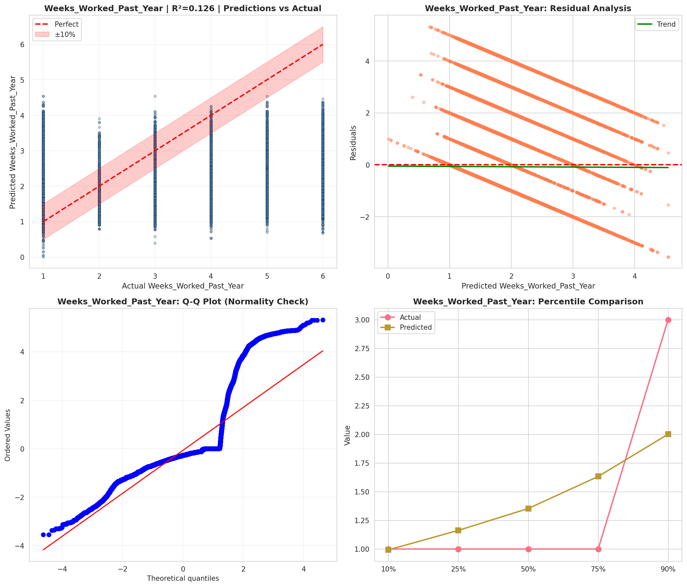
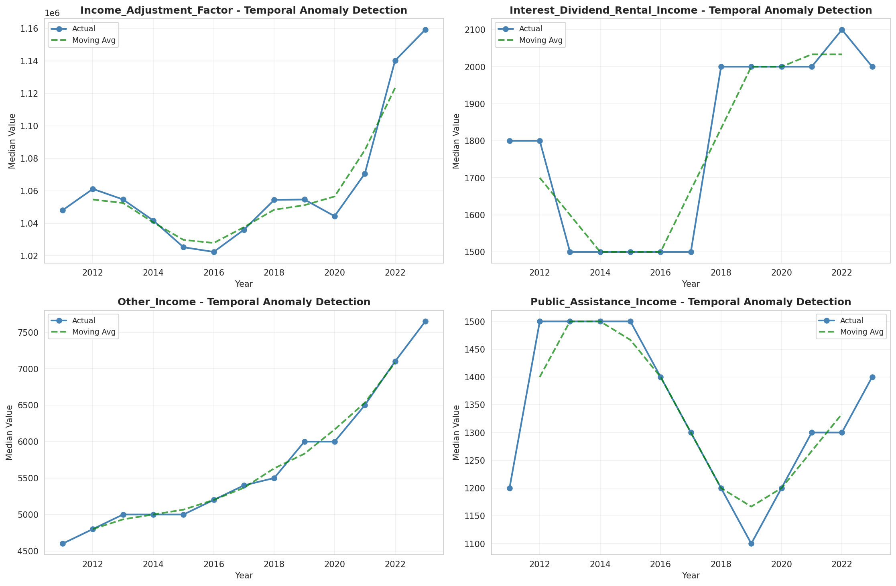
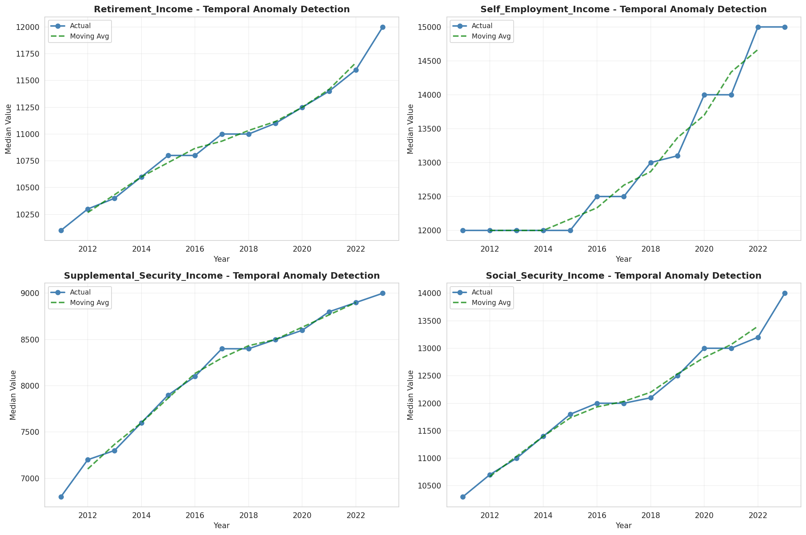
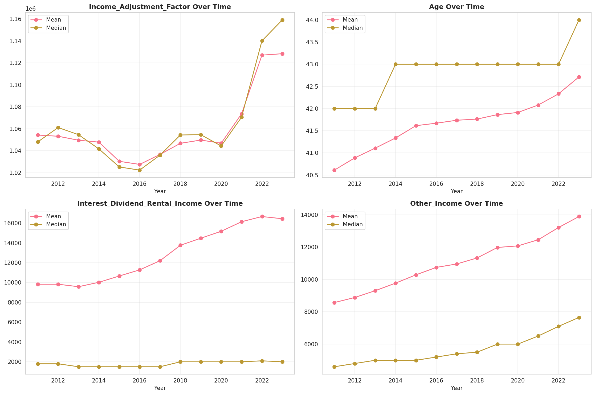
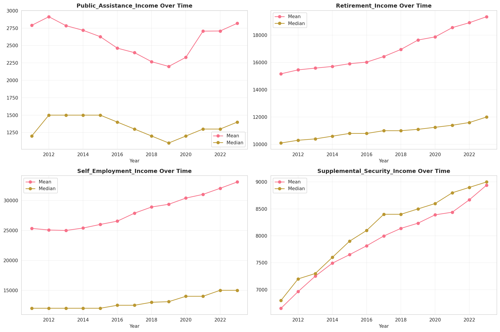
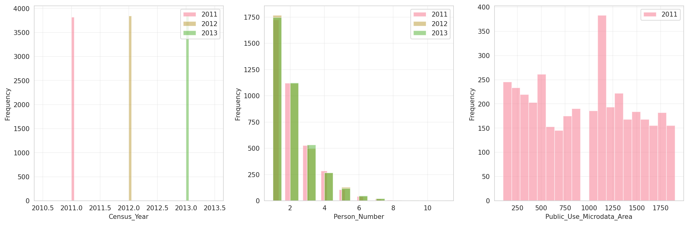
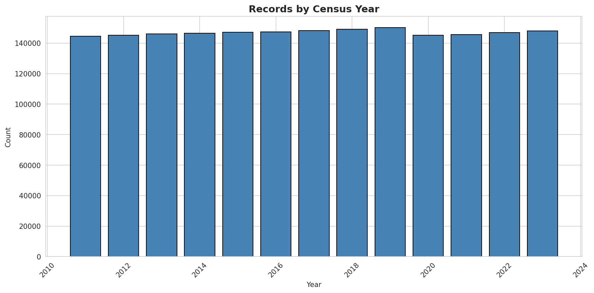
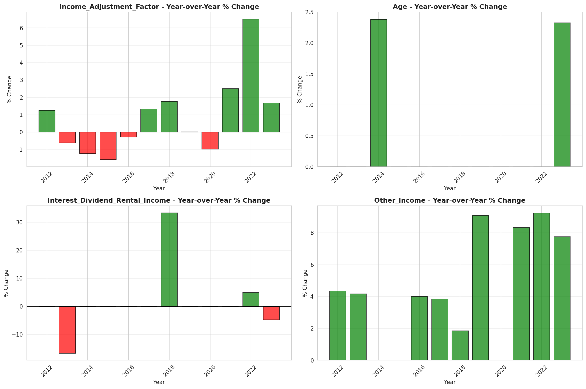
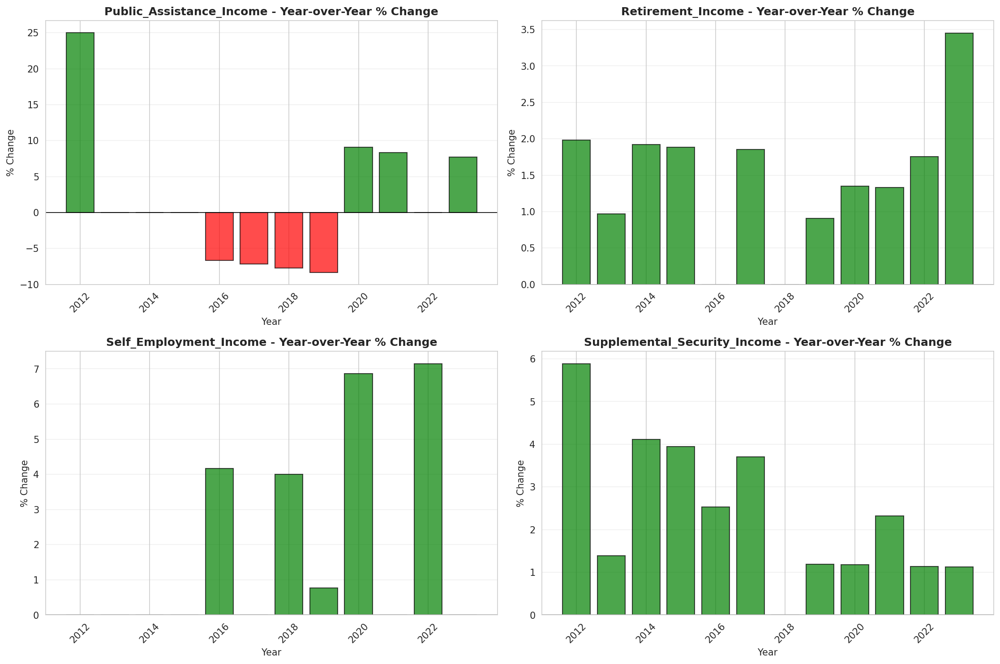

# Temporal Analysis

## Year Distribution

- 2011: 144,614 records

- 2012: 145,211 records

- 2013: 145,976 records

- 2014: 146,426 records

- 2015: 147,196 records

- 2016: 147,388 records

- 2017: 148,185 records

- 2018: 149,097 records

- 2019: 150,131 records

- 2020: 145,180 records

- 2021: 145,631 records

- 2022: 146,898 records

- 2023: 147,982 records

## Temporal Trends

- Census_Year: {np.int64(2011): {'mean': 2011.0, 'median': 2011.0, 'std': 0.0}, np.int64(2012): {'mean': 2012.0, 'median': 2012.0, 'std': 0.0}, np.int64(2013): {'mean': 2013.0, 'median': 2013.0, 'std': 0.0}, np.int64(2014): {'mean': 2014.0, 'median': 2014.0, 'std': 0.0}, np.int64(2015): {'mean': 2015.0, 'median': 2015.0, 'std': 0.0}, np.int64(2016): {'mean': 2016.0, 'median': 2016.0, 'std': 0.0}, np.int64(2017): {'mean': 2017.0, 'median': 2017.0, 'std': 0.0}, np.int64(2018): {'mean': 2018.0, 'median': 2018.0, 'std': 0.0}, np.int64(2019): {'mean': 2019.0, 'median': 2019.0, 'std': 0.0}, np.int64(2020): {'mean': 2020.0, 'median': 2020.0, 'std': 0.0}, np.int64(2021): {'mean': 2021.0, 'median': 2021.0, 'std': 0.0}, np.int64(2022): {'mean': 2022.0, 'median': 2022.0, 'std': 0.0}, np.int64(2023): {'mean': 2023.0, 'median': 2023.0, 'std': 0.0}}

- Person_Number: {np.int64(2011): {'mean': 2.019638485900397, 'median': 2.0, 'std': 1.2453455951499703}, np.int64(2012): {'mean': 2.010157632686229, 'median': 2.0, 'std': 1.2447645818976143}, np.int64(2013): {'mean': 2.0046720008768566, 'median': 2.0, 'std': 1.24333141891693}, np.int64(2014): {'mean': 1.9989072978842555, 'median': 2.0, 'std': 1.2439227721970818}, np.int64(2015): {'mean': 1.990488871980217, 'median': 2.0, 'std': 1.2379482801380672}, np.int64(2016): {'mean': 1.9934865796401335, 'median': 2.0, 'std': 1.2426386254942403}, np.int64(2017): {'mean': 2.0003576610318183, 'median': 2.0, 'std': 1.249960807688687}, np.int64(2018): {'mean': 2.0047687076198715, 'median': 2.0, 'std': 1.2550900001464438}, np.int64(2019): {'mean': 2.008359366153559, 'median': 2.0, 'std': 1.26228726526431}, np.int64(2020): {'mean': 2.0105179776828765, 'median': 2.0, 'std': 1.2737415055501469}, np.int64(2021): {'mean': 2.0127239392711718, 'median': 2.0, 'std': 1.2768127466276236}, np.int64(2022): {'mean': 2.0064874947242304, 'median': 2.0, 'std': 1.275073096455733}, np.int64(2023): {'mean': 1.995127785811788, 'median': 2.0, 'std': 1.2684584650654689}}

- Public_Use_Microdata_Area: {np.int64(2011): {'mean': 947.8992352054435, 'median': 1000.0, 'std': 535.228087580425}, np.int64(2012): {'mean': None, 'median': None, 'std': None}, np.int64(2013): {'mean': None, 'median': None, 'std': None}, np.int64(2014): {'mean': None, 'median': None, 'std': None}, np.int64(2015): {'mean': None, 'median': None, 'std': None}, np.int64(2016): {'mean': 969.6847775938339, 'median': 1000.0, 'std': 583.6842437497932}, np.int64(2017): {'mean': 964.82504976887, 'median': 900.0, 'std': 583.493374161409}, np.int64(2018): {'mean': 959.5578717210943, 'median': 900.0, 'std': 583.4954680650987}, np.int64(2019): {'mean': 954.2126542819271, 'median': 900.0, 'std': 583.5055039973757}, np.int64(2020): {'mean': 950.2817192450751, 'median': 900.0, 'std': 583.5204081868545}, np.int64(2021): {'mean': 947.7405222789104, 'median': 900.0, 'std': 583.2946110688014}, np.int64(2022): {'mean': None, 'median': None, 'std': None}, np.int64(2023): {'mean': 896.216181697774, 'median': 900.0, 'std': 511.9876983833722}}

- State_Code: {np.int64(2011): {'mean': 5.0, 'median': 5.0, 'std': 0.0}, np.int64(2012): {'mean': 5.0, 'median': 5.0, 'std': 0.0}, np.int64(2013): {'mean': 5.0, 'median': 5.0, 'std': 0.0}, np.int64(2014): {'mean': 5.0, 'median': 5.0, 'std': 0.0}, np.int64(2015): {'mean': 5.0, 'median': 5.0, 'std': 0.0}, np.int64(2016): {'mean': 5.0, 'median': 5.0, 'std': 0.0}, np.int64(2017): {'mean': 5.0, 'median': 5.0, 'std': 0.0}, np.int64(2018): {'mean': 5.0, 'median': 5.0, 'std': 0.0}, np.int64(2019): {'mean': 5.0, 'median': 5.0, 'std': 0.0}, np.int64(2020): {'mean': 5.0, 'median': 5.0, 'std': 0.0}, np.int64(2021): {'mean': 5.0, 'median': 5.0, 'std': 0.0}, np.int64(2022): {'mean': 5.0, 'median': 5.0, 'std': 0.0}, np.int64(2023): {'mean': None, 'median': None, 'std': None}}

- Income_Adjustment_Factor: {np.int64(2011): {'mean': 1054264.4138880053, 'median': 1048026.0, 'std': 28334.599935081915}, np.int64(2012): {'mean': 1053193.4182878707, 'median': 1061121.0, 'std': 26305.434739362674}, np.int64(2013): {'mean': 1049565.4430728338, 'median': 1054614.0, 'std': 29732.210717162063}, np.int64(2014): {'mean': 1047830.557243932, 'median': 1041654.0, 'std': 31172.05463708314}, np.int64(2015): {'mean': 1030346.2169895921, 'median': 1025215.0, 'std': 25642.355904622753}, np.int64(2016): {'mean': 1027543.977664396, 'median': 1022342.0, 'std': 17499.69148842979}, np.int64(2017): {'mean': 1036632.7460134291, 'median': 1035988.0, 'std': 16877.255852122962}, np.int64(2018): {'mean': 1046765.812793014, 'median': 1054346.0, 'std': 20532.03938779309}, np.int64(2019): {'mean': 1049713.096016146, 'median': 1054606.0, 'std': 26214.873976507348}, np.int64(2020): {'mean': 1046843.5833930293, 'median': 1044328.0, 'std': 28651.90410570018}, np.int64(2021): {'mean': 1073638.1019082475, 'median': 1070512.0, 'std': 30752.234892408487}, np.int64(2022): {'mean': 1127066.5145951612, 'median': 1140108.0, 'std': 50021.01925862952}, np.int64(2023): {'mean': 1128380.1983754782, 'median': 1159185.0, 'std': 70589.14927449614}}

- Person_Weight: {np.int64(2011): {'mean': 20.025225773438255, 'median': 16.0, 'std': 16.455895121407796}, np.int64(2012): {'mean': 20.08368512027326, 'median': 16.0, 'std': 16.849434521411382}, np.int64(2013): {'mean': 20.094871759741327, 'median': 16.0, 'std': 17.315895209171458}, np.int64(2014): {'mean': 20.126405146626965, 'median': 16.0, 'std': 17.800283988491913}, np.int64(2015): {'mean': 20.09702029946466, 'median': 15.0, 'std': 18.19894538667808}, np.int64(2016): {'mean': 20.140527044264118, 'median': 15.0, 'std': 17.901887291683643}, np.int64(2017): {'mean': 20.096123089381518, 'median': 15.0, 'std': 17.935699337916123}, np.int64(2018): {'mean': 20.058559193008577, 'median': 15.0, 'std': 17.956287079792844}, np.int64(2019): {'mean': 19.97835223904457, 'median': 15.0, 'std': 18.12326769223055}, np.int64(2020): {'mean': 20.745784543325527, 'median': 15.0, 'std': 22.156418287068956}, np.int64(2021): {'mean': 20.64333830022454, 'median': 15.0, 'std': 21.513871106026205}, np.int64(2022): {'mean': 20.54942204795164, 'median': 15.0, 'std': 21.759442621519423}, np.int64(2023): {'mean': 20.493377572948063, 'median': 14.0, 'std': 22.06541959200068}}

- Age: {np.int64(2011): {'mean': 40.61196702947156, 'median': 42.0, 'std': 23.806255924636083}, np.int64(2012): {'mean': 40.8882109482064, 'median': 42.0, 'std': 23.85638693008172}, np.int64(2013): {'mean': 41.10694223708007, 'median': 42.0, 'std': 23.9029254343658}, np.int64(2014): {'mean': 41.33683908595468, 'median': 43.0, 'std': 23.954238773475474}, np.int64(2015): {'mean': 41.61397728199136, 'median': 43.0, 'std': 24.049551245998984}, np.int64(2016): {'mean': 41.67001384101827, 'median': 43.0, 'std': 24.06772121077709}, np.int64(2017): {'mean': 41.7364915477275, 'median': 43.0, 'std': 24.08606402073706}, np.int64(2018): {'mean': 41.76297980509333, 'median': 43.0, 'std': 24.152056625472596}, np.int64(2019): {'mean': 41.86353917578648, 'median': 43.0, 'std': 24.186641238119257}, np.int64(2020): {'mean': 41.91194379391101, 'median': 43.0, 'std': 24.156909159292876}, np.int64(2021): {'mean': 42.07937870371006, 'median': 43.0, 'std': 24.198659134514852}, np.int64(2022): {'mean': 42.33317676210704, 'median': 43.0, 'std': 24.22202588795411}, np.int64(2023): {'mean': 42.713492181481534, 'median': 44.0, 'std': 24.239556431492577}}

- Citizenship_Status: {np.int64(2011): {'mean': 1.1269586623701717, 'median': 1.0, 'std': 0.6613063568770695}, np.int64(2012): {'mean': 1.1244464951002335, 'median': 1.0, 'std': 0.6537866657016754}, np.int64(2013): {'mean': 1.124965747794158, 'median': 1.0, 'std': 0.6551749017897383}, np.int64(2014): {'mean': 1.12426754811304, 'median': 1.0, 'std': 0.6532294719355516}, np.int64(2015): {'mean': 1.1251120954373761, 'median': 1.0, 'std': 0.6543960708450622}, np.int64(2016): {'mean': 1.1305194452736993, 'median': 1.0, 'std': 0.6678912137205915}, np.int64(2017): {'mean': 1.1358234639133515, 'median': 1.0, 'std': 0.6807290260019788}, np.int64(2018): {'mean': 1.138661408344903, 'median': 1.0, 'std': 0.6872080347714161}, np.int64(2019): {'mean': 1.1398845008692409, 'median': 1.0, 'std': 0.6877877039072983}, np.int64(2020): {'mean': 1.1423818707810993, 'median': 1.0, 'std': 0.6933962465887015}, np.int64(2021): {'mean': 1.1473450020943343, 'median': 1.0, 'std': 0.7047200170599445}, np.int64(2022): {'mean': 1.1480891502947623, 'median': 1.0, 'std': 0.705429500061014}, np.int64(2023): {'mean': 1.1504507304942493, 'median': 1.0, 'std': 0.7107474321074666}}

- Class_of_Worker: {np.int64(2011): {'mean': 2.203212980341796, 'median': 1.0, 'std': 1.9438759838821118}, np.int64(2012): {'mean': 2.206015503875969, 'median': 1.0, 'std': 1.9519114620884486}, np.int64(2013): {'mean': 2.2061903276131045, 'median': 1.0, 'std': 1.953290259682118}, np.int64(2014): {'mean': 2.2084757861517077, 'median': 1.0, 'std': 1.9584043432207234}, np.int64(2015): {'mean': 2.195396688319003, 'median': 1.0, 'std': 1.9507165574504033}, np.int64(2016): {'mean': 2.1828261411823395, 'median': 1.0, 'std': 1.9442040281666326}, np.int64(2017): {'mean': 2.1698886281521212, 'median': 1.0, 'std': 1.929726463839377}, np.int64(2018): {'mean': 2.1663866791837543, 'median': 1.0, 'std': 1.9243065271142603}, np.int64(2019): {'mean': 2.161359539953652, 'median': 1.0, 'std': 1.915423523964457}, np.int64(2020): {'mean': 2.1633816768687613, 'median': 1.0, 'std': 1.913720072571131}, np.int64(2021): {'mean': 2.1789698100277914, 'median': 1.0, 'std': 1.9247683912655469}, np.int64(2022): {'mean': 2.1832973580237565, 'median': 1.0, 'std': 1.924290769141368}, np.int64(2023): {'mean': 2.180610574459843, 'median': 1.0, 'std': 1.9179667171516397}}

- English_Speaking_Ability: {np.int64(2011): {'mean': 1.7533101045296167, 'median': 1.0, 'std': 0.9611464327324767}, np.int64(2012): {'mean': 1.7126148705096074, 'median': 1.0, 'std': 0.938347136098935}, np.int64(2013): {'mean': 1.68135687473933, 'median': 1.0, 'std': 0.9186661175908054}, np.int64(2014): {'mean': 1.6682767438556614, 'median': 1.0, 'std': 0.9114243025577247}, np.int64(2015): {'mean': 1.6638774641894767, 'median': 1.0, 'std': 0.9068212417876602}, np.int64(2016): {'mean': 1.6608440469536054, 'median': 1.0, 'std': 0.9062149341696726}, np.int64(2017): {'mean': 1.6474143720617864, 'median': 1.0, 'std': 0.9004344529234634}, np.int64(2018): {'mean': 1.6389891696750902, 'median': 1.0, 'std': 0.8932131578392882}, np.int64(2019): {'mean': 1.6255506607929515, 'median': 1.0, 'std': 0.8915947737997624}, np.int64(2020): {'mean': 1.620733409465804, 'median': 1.0, 'std': 0.8939568802054507}, np.int64(2021): {'mean': 1.6221604639922669, 'median': 1.0, 'std': 0.9039353886291717}, np.int64(2022): {'mean': 1.6167473721507026, 'median': 1.0, 'std': 0.9079631193284244}, np.int64(2023): {'mean': 1.6193227782272044, 'median': 1.0, 'std': 0.9119873357349686}}

- Fertility_Status: {np.int64(2011): {'mean': 1.9460367846139484, 'median': 2.0, 'std': 0.22594861266902047}, np.int64(2012): {'mean': 1.9458001380089078, 'median': 2.0, 'std': 0.22641520460342782}, np.int64(2013): {'mean': 1.945970695970696, 'median': 2.0, 'std': 0.22607908422229653}, np.int64(2014): {'mean': 1.9474320241691843, 'median': 2.0, 'std': 0.22317295459264339}, np.int64(2015): {'mean': 1.9475049644481455, 'median': 2.0, 'std': 0.223026679862549}, np.int64(2016): {'mean': 1.9465043053592084, 'median': 2.0, 'std': 0.22502340365474952}, np.int64(2017): {'mean': 1.945863453815261, 'median': 2.0, 'std': 0.22629057817422502}, np.int64(2018): {'mean': 1.944851994851995, 'median': 2.0, 'std': 0.2282725985855066}, np.int64(2019): {'mean': 1.945108852480041, 'median': 2.0, 'std': 0.22777131699050296}, np.int64(2020): {'mean': 1.9454026801114501, 'median': 2.0, 'std': 0.22719631314873331}, np.int64(2021): {'mean': 1.9454086881492052, 'median': 2.0, 'std': 0.22718453590584473}, np.int64(2022): {'mean': 1.9469093792328784, 'median': 2.0, 'std': 0.22421790216194107}, np.int64(2023): {'mean': 1.9477066034005537, 'median': 2.0, 'std': 0.2226217202841263}}

- Marital_Status: {np.int64(2011): {'mean': 2.762996666989365, 'median': 2.0, 'std': 1.8151584626541686}, np.int64(2012): {'mean': 2.779045664584639, 'median': 2.0, 'std': 1.8131650569979763}, np.int64(2013): {'mean': 2.7920822600975503, 'median': 2.0, 'std': 1.813236500040104}, np.int64(2014): {'mean': 2.8067897777717072, 'median': 2.0, 'std': 1.8132833518996812}, np.int64(2015): {'mean': 2.8145058289627434, 'median': 2.0, 'std': 1.8127224319419215}, np.int64(2016): {'mean': 2.8216408391456564, 'median': 2.0, 'std': 1.8141088793692324}, np.int64(2017): {'mean': 2.8294496743934947, 'median': 2.0, 'std': 1.8150394937293663}, np.int64(2018): {'mean': 2.8369182478520694, 'median': 2.0, 'std': 1.8153582240278647}, np.int64(2019): {'mean': 2.8393003443659204, 'median': 3.0, 'std': 1.8137755988695312}, np.int64(2020): {'mean': 2.8507990081278414, 'median': 3.0, 'std': 1.8159122304308832}, np.int64(2021): {'mean': 2.8538223317837548, 'median': 3.0, 'std': 1.8159648351846658}, np.int64(2022): {'mean': 2.8521695326008523, 'median': 3.0, 'std': 1.8151724177644593}, np.int64(2023): {'mean': 2.8482991174602317, 'median': 3.0, 'std': 1.814342282377731}}

- Mobility_Status: {np.int64(2011): {'mean': 1.2899939204628834, 'median': 1.0, 'std': 0.7023448582547733}, np.int64(2012): {'mean': 1.2840482900184393, 'median': 1.0, 'std': 0.6963159478644478}, np.int64(2013): {'mean': 1.279288630544599, 'median': 1.0, 'std': 0.691368478751233}, np.int64(2014): {'mean': 1.2789831583883915, 'median': 1.0, 'std': 0.6910661727596527}, np.int64(2015): {'mean': 1.2827352983544034, 'median': 1.0, 'std': 0.6948216578518736}, np.int64(2016): {'mean': 1.2859522030854849, 'median': 1.0, 'std': 0.6980159801672484}, np.int64(2017): {'mean': 1.288023176550784, 'median': 1.0, 'std': 0.7000713120801016}, np.int64(2018): {'mean': 1.2883038557972488, 'median': 1.0, 'std': 0.7004079345838997}, np.int64(2019): {'mean': 1.288445105335047, 'median': 1.0, 'std': 0.7006429885171948}, np.int64(2020): {'mean': 1.2837702454499917, 'median': 1.0, 'std': 0.6959702384800212}, np.int64(2021): {'mean': 1.2738575688232439, 'median': 1.0, 'std': 0.6857743654281419}, np.int64(2022): {'mean': 1.2650153607191703, 'median': 1.0, 'std': 0.6765233932792598}, np.int64(2023): {'mean': 1.256814725399131, 'median': 1.0, 'std': 0.6675419649852236}}

- Military_Service: {np.int64(2011): {'mean': 4.727560310908979, 'median': 5.0, 'std': 0.6918341277014156}, np.int64(2012): {'mean': 4.733326961010071, 'median': 5.0, 'std': 0.685498729430173}, np.int64(2013): {'mean': 3.744651691978831, 'median': 4.0, 'std': 0.6583478419949752}, np.int64(2014): {'mean': 3.7540481325528052, 'median': 4.0, 'std': 0.6462740643366391}, np.int64(2015): {'mean': 3.7626347894696655, 'median': 4.0, 'std': 0.634917638015901}, np.int64(2016): {'mean': 3.7704042780024705, 'median': 4.0, 'std': 0.625073808451238}, np.int64(2017): {'mean': 3.776753574432296, 'median': 4.0, 'std': 0.6167723529032813}, np.int64(2018): {'mean': 3.783027392446579, 'median': 4.0, 'std': 0.608520210275865}, np.int64(2019): {'mean': 3.7881073350019543, 'median': 4.0, 'std': 0.6024043853681589}, np.int64(2020): {'mean': 3.79493601399801, 'median': 4.0, 'std': 0.5940667047988148}, np.int64(2021): {'mean': 3.7987137769350996, 'median': 4.0, 'std': 0.5896267656098385}, np.int64(2022): {'mean': 3.8035168840812057, 'median': 4.0, 'std': 0.5832707971302523}, np.int64(2023): {'mean': 3.8063112168898283, 'median': 4.0, 'std': 0.5800792755216982}}

- Travel_Time_To_Work_Minutes: {np.int64(2011): {'mean': 21.99590851867394, 'median': 15.0, 'std': 21.22005980505272}, np.int64(2012): {'mean': 22.090187678856722, 'median': 15.0, 'std': 21.298101921031247}, np.int64(2013): {'mean': 22.121510236639192, 'median': 15.0, 'std': 20.98822152423885}, np.int64(2014): {'mean': 22.173147390515492, 'median': 15.0, 'std': 20.800174333725447}, np.int64(2015): {'mean': 22.315923747431082, 'median': 15.0, 'std': 21.185696448133385}, np.int64(2016): {'mean': 22.263263947294647, 'median': 15.0, 'std': 20.939925495071158}, np.int64(2017): {'mean': 22.248863518062254, 'median': 15.0, 'std': 20.74734195994769}, np.int64(2018): {'mean': 22.247038393425147, 'median': 15.0, 'std': 20.74709942785364}, np.int64(2019): {'mean': 22.41441701146307, 'median': 15.0, 'std': 20.877458951138635}, np.int64(2020): {'mean': 22.465188752744528, 'median': 15.0, 'std': 20.700824516296347}, np.int64(2021): {'mean': 22.66091068677677, 'median': 15.0, 'std': 20.8591201557758}, np.int64(2022): {'mean': 22.893822012115113, 'median': 16.0, 'std': 21.26954167810077}, np.int64(2023): {'mean': 23.113161153687386, 'median': 18.0, 'std': 21.590000124417653}}

- Vehicle_Occupancy: {np.int64(2011): {'mean': 1.1809439131933734, 'median': 1.0, 'std': 0.6313589922203087}, np.int64(2012): {'mean': 1.1805150808684248, 'median': 1.0, 'std': 0.6361985918133509}, np.int64(2013): {'mean': 1.1750331223318122, 'median': 1.0, 'std': 0.6278985370954958}, np.int64(2014): {'mean': 1.1736447285761797, 'median': 1.0, 'std': 0.624305927736596}, np.int64(2015): {'mean': 1.172817679558011, 'median': 1.0, 'std': 0.6246423517857883}, np.int64(2016): {'mean': 1.1730818251338262, 'median': 1.0, 'std': 0.6223311096934458}, np.int64(2017): {'mean': 1.169703851907929, 'median': 1.0, 'std': 0.6137688314163859}, np.int64(2018): {'mean': 1.171871096677492, 'median': 1.0, 'std': 0.6344012437828304}, np.int64(2019): {'mean': 1.1714637579169598, 'median': 1.0, 'std': 0.6320007443758803}, np.int64(2020): {'mean': 1.165742508813161, 'median': 1.0, 'std': 0.6094453042020603}, np.int64(2021): {'mean': 1.1608911809446072, 'median': 1.0, 'std': 0.5913388849007071}, np.int64(2022): {'mean': 1.1579732021393563, 'median': 1.0, 'std': 0.5876391860639071}, np.int64(2023): {'mean': 1.1545979151154133, 'median': 1.0, 'std': 0.5640538845328279}}

- Transportation_To_Work: {np.int64(2011): {'mean': 1.6442554340488726, 'median': 1.0, 'std': 2.416531344144571}, np.int64(2012): {'mean': 1.6378632217814397, 'median': 1.0, 'std': 2.4055521812275993}, np.int64(2013): {'mean': 1.6333687384362365, 'median': 1.0, 'std': 2.3976995406727992}, np.int64(2014): {'mean': 1.630926168031377, 'median': 1.0, 'std': 2.3912104771382388}, np.int64(2015): {'mean': 1.631254178022317, 'median': 1.0, 'std': 2.388731154716476}, np.int64(2016): {'mean': 1.6350034735754104, 'median': 1.0, 'std': 2.395535368453069}, np.int64(2017): {'mean': 1.6379310344827587, 'median': 1.0, 'std': 2.4008495468077324}, np.int64(2018): {'mean': 1.6487365399611753, 'median': 1.0, 'std': 2.4219024416066604}, np.int64(2019): {'mean': None, 'median': None, 'std': None}, np.int64(2020): {'mean': None, 'median': None, 'std': None}, np.int64(2021): {'mean': None, 'median': None, 'std': None}, np.int64(2022): {'mean': None, 'median': None, 'std': None}, np.int64(2023): {'mean': None, 'median': None, 'std': None}}

- Language_Other_Than_English: {np.int64(2011): {'mean': 1.9473108330395958, 'median': 2.0, 'std': 0.22341303717837635}, np.int64(2012): {'mean': 1.9475310671313038, 'median': 2.0, 'std': 0.22297153890251817}, np.int64(2013): {'mean': 1.9478038125784611, 'median': 2.0, 'std': 0.22242325515956918}, np.int64(2014): {'mean': 1.949178730009747, 'median': 2.0, 'std': 0.2196333690242995}, np.int64(2015): {'mean': 1.9494163982409447, 'median': 2.0, 'std': 0.2191466301894538}, np.int64(2016): {'mean': 1.9487311754001346, 'median': 2.0, 'std': 0.22054632326991103}, np.int64(2017): {'mean': 1.9469827524817342, 'median': 2.0, 'std': 0.22406868704878516}, np.int64(2018): {'mean': 1.9450657638451132, 'median': 2.0, 'std': 0.2278526575877024}, np.int64(2019): {'mean': 1.94410990897196, 'median': 2.0, 'std': 0.22971016509344014}, np.int64(2020): {'mean': 1.942709469184804, 'median': 2.0, 'std': 0.23239775925717507}, np.int64(2021): {'mean': 1.9400672035223916, 'median': 2.0, 'std': 0.23736314876963174}, np.int64(2022): {'mean': 1.9392585046702153, 'median': 2.0, 'std': 0.23885639066913755}, np.int64(2023): {'mean': 1.93848111705153, 'median': 2.0, 'std': 0.24028050369676054}}

- Grandparents_Living_With_Grandchildren: {np.int64(2011): {'mean': 1.9606398060669026, 'median': 2.0, 'std': 0.19445148049683678}, np.int64(2012): {'mean': 1.9606558785314678, 'median': 2.0, 'std': 0.19441339314683556}, np.int64(2013): {'mean': 1.9612334614197366, 'median': 2.0, 'std': 0.1930390911626666}, np.int64(2014): {'mean': 1.9613479006542591, 'median': 2.0, 'std': 0.19276542207686223}, np.int64(2015): {'mean': 1.9616366137721721, 'median': 2.0, 'std': 0.1920729659810607}, np.int64(2016): {'mean': 1.9610384163730918, 'median': 2.0, 'std': 0.19350444754944168}, np.int64(2017): {'mean': 1.9612110730248695, 'median': 2.0, 'std': 0.1930925544364226}, np.int64(2018): {'mean': 1.9615109368679797, 'median': 2.0, 'std': 0.19237473582664336}, np.int64(2019): {'mean': 1.9615914890114412, 'median': 2.0, 'std': 0.1921813655888104}, np.int64(2020): {'mean': 1.961815339791372, 'median': 2.0, 'std': 0.19164285133369885}, np.int64(2021): {'mean': 1.9626765547914091, 'median': 2.0, 'std': 0.18955417491482782}, np.int64(2022): {'mean': 1.9631763161732536, 'median': 2.0, 'std': 0.18832968327624292}, np.int64(2023): {'mean': 1.9635568961802456, 'median': 2.0, 'std': 0.1873909397042976}}

- Months_Responsible_For_Grandchildren: {np.int64(2011): {'mean': 3.636074511585643, 'median': 4.0, 'std': 1.3740278685443064}, np.int64(2012): {'mean': 3.655700766110861, 'median': 4.0, 'std': 1.3762371080909421}, np.int64(2013): {'mean': 3.688472095150961, 'median': 4.0, 'std': 1.3585645771198902}, np.int64(2014): {'mean': 3.7285254937988057, 'median': 4.0, 'std': 1.3694001220671752}, np.int64(2015): {'mean': 3.74874601003192, 'median': 4.0, 'std': 1.3583613483547705}, np.int64(2016): {'mean': 3.7615313653136533, 'median': 4.0, 'std': 1.3694052542198016}, np.int64(2017): {'mean': 3.775296912114014, 'median': 4.0, 'std': 1.3682152760271864}, np.int64(2018): {'mean': 3.7787524366471734, 'median': 4.0, 'std': 1.3603627599766404}, np.int64(2019): {'mean': 3.7877122877122877, 'median': 4.0, 'std': 1.323824990259831}, np.int64(2020): {'mean': 3.7975995635570103, 'median': 4.0, 'std': 1.333542217596934}, np.int64(2021): {'mean': 3.835287548855388, 'median': 4.0, 'std': 1.3024278632834791}, np.int64(2022): {'mean': 3.860281690140845, 'median': 4.0, 'std': 1.3192166244942964}, np.int64(2023): {'mean': 3.892454954954955, 'median': 4.0, 'std': 1.3165167221345673}}

- Grandparents_Responsible_For_Grandchildren: {np.int64(2011): {'mean': 1.3948309045916965, 'median': 1.0, 'std': 0.488881556508699}, np.int64(2012): {'mean': 1.394377729257642, 'median': 1.0, 'std': 0.48878332662125445}, np.int64(2013): {'mean': 1.399780340472268, 'median': 1.0, 'std': 0.4899203238508869}, np.int64(2014): {'mean': 1.403725006847439, 'median': 1.0, 'std': 0.49071079000419443}, np.int64(2015): {'mean': 1.3996715028743498, 'median': 1.0, 'std': 0.4898978383909132}, np.int64(2016): {'mean': 1.4165769644779334, 'median': 1.0, 'std': 0.4930578247732854}, np.int64(2017): {'mean': 1.4345957561106635, 'median': 1.0, 'std': 0.4957704143702975}, np.int64(2018): {'mean': 1.4470493128536783, 'median': 1.0, 'std': 0.49725532117907184}, np.int64(2019): {'mean': 1.4637021162603805, 'median': 1.0, 'std': 0.49874753012770784}, np.int64(2020): {'mean': 1.4895572263993317, 'median': 1.0, 'std': 0.49996055443011317}, np.int64(2021): {'mean': 1.4930653835267478, 'median': 1.0, 'std': 0.5000226783918071}, np.int64(2022): {'mean': 1.497878359264498, 'median': 1.0, 'std': 0.5000662343494238}, np.int64(2023): {'mean': 1.5, 'median': 1.5, 'std': 0.5000703977476206}}

- Interest_Dividend_Rental_Income: {np.int64(2011): {'mean': 9829.727811049055, 'median': 1800.0, 'std': 25936.38385418759}, np.int64(2012): {'mean': 9828.839856145547, 'median': 1800.0, 'std': 25852.588291144693}, np.int64(2013): {'mean': 9578.28518491608, 'median': 1500.0, 'std': 25839.703168488737}, np.int64(2014): {'mean': 10023.529996236357, 'median': 1500.0, 'std': 28088.917231554766}, np.int64(2015): {'mean': 10659.607676224612, 'median': 1500.0, 'std': 30071.922031245897}, np.int64(2016): {'mean': 11277.630500927644, 'median': 1500.0, 'std': 31952.633316993724}, np.int64(2017): {'mean': 12203.398664365573, 'median': 1500.0, 'std': 35491.68060399677}, np.int64(2018): {'mean': 13761.696985965182, 'median': 2000.0, 'std': 40316.272889407584}, np.int64(2019): {'mean': 14472.780596899822, 'median': 2000.0, 'std': 41899.99009842296}, np.int64(2020): {'mean': 15173.611028315947, 'median': 2000.0, 'std': 44346.39176386844}, np.int64(2021): {'mean': 16136.674665752485, 'median': 2000.0, 'std': 46382.56114254048}, np.int64(2022): {'mean': 16662.24002078102, 'median': 2100.0, 'std': 47693.96146052763}, np.int64(2023): {'mean': 16438.259938313913, 'median': 2000.0, 'std': 46776.47237279462}}

- Military_Service_Period_1: {np.int64(2011): {'mean': 0.09455322178711285, 'median': 0.0, 'std': 0.29260725569547935}, np.int64(2012): {'mean': 0.10116731517509728, 'median': 0.0, 'std': 0.30156100919010964}, np.int64(2013): {'mean': 0.11015198465397669, 'median': 0.0, 'std': 0.3130906532763494}, np.int64(2014): {'mean': 0.11921898928024502, 'median': 0.0, 'std': 0.32405842490659176}, np.int64(2015): {'mean': 0.12388260422434934, 'median': 0.0, 'std': 0.32946060656842185}, np.int64(2016): {'mean': 0.13049180327868853, 'median': 0.0, 'std': 0.3368575271844399}, np.int64(2017): {'mean': 0.1430860033726813, 'median': 0.0, 'std': 0.35017529638291095}, np.int64(2018): {'mean': 0.1514967987541097, 'median': 0.0, 'std': 0.3585479625690992}, np.int64(2019): {'mean': 0.16344882306268183, 'median': 0.0, 'std': 0.36979096904415426}, np.int64(2020): {'mean': 0.1742851768246802, 'median': 0.0, 'std': 0.3793723642760443}, np.int64(2021): {'mean': 0.18909125584056452, 'median': 0.0, 'std': 0.39159976469277313}, np.int64(2022): {'mean': 0.19880100560819958, 'median': 0.0, 'std': 0.3991172364887126}, np.int64(2023): {'mean': 0.21173617846750728, 'median': 0.0, 'std': 0.4085586363273062}}

- Military_Service_Period_2: {np.int64(2011): {'mean': 0.1349946600213599, 'median': 0.0, 'std': 0.3417300344544942}, np.int64(2012): {'mean': 0.13878080415045396, 'median': 0.0, 'std': 0.34573010486835065}, np.int64(2013): {'mean': 0.144680537110816, 'median': 0.0, 'std': 0.35179142964286164}, np.int64(2014): {'mean': 0.14839203675344564, 'median': 0.0, 'std': 0.35550178223707446}, np.int64(2015): {'mean': 0.15196582548848983, 'median': 0.0, 'std': 0.35900196233250947}, np.int64(2016): {'mean': 0.16065573770491803, 'median': 0.0, 'std': 0.3672281653971672}, np.int64(2017): {'mean': 0.1727655986509275, 'median': 0.0, 'std': 0.3780604422333003}, np.int64(2018): {'mean': 0.17909672953798236, 'median': 0.0, 'std': 0.38344988250830936}, np.int64(2019): {'mean': 0.18663492903112053, 'median': 0.0, 'std': 0.3896353633658208}, np.int64(2020): {'mean': 0.1973288186606471, 'median': 0.0, 'std': 0.39800132522636866}, np.int64(2021): {'mean': 0.20368074759225707, 'median': 0.0, 'std': 0.4027534834232822}, np.int64(2022): {'mean': 0.20392573970218528, 'median': 0.0, 'std': 0.4029339040927312}, np.int64(2023): {'mean': 0.210184287099903, 'median': 0.0, 'std': 0.40745914599587735}}

- Military_Service_Period_3: {np.int64(2011): {'mean': 0.16269134923460307, 'median': 0.0, 'std': 0.3690969707804253}, np.int64(2012): {'mean': 0.16637844069750685, 'median': 0.0, 'std': 0.37243341671125657}, np.int64(2013): {'mean': None, 'median': None, 'std': None}, np.int64(2014): {'mean': None, 'median': None, 'std': None}, np.int64(2015): {'mean': None, 'median': None, 'std': None}, np.int64(2016): {'mean': None, 'median': None, 'std': None}, np.int64(2017): {'mean': None, 'median': None, 'std': None}, np.int64(2018): {'mean': None, 'median': None, 'std': None}, np.int64(2019): {'mean': None, 'median': None, 'std': None}, np.int64(2020): {'mean': None, 'median': None, 'std': None}, np.int64(2021): {'mean': None, 'median': None, 'std': None}, np.int64(2022): {'mean': None, 'median': None, 'std': None}, np.int64(2023): {'mean': None, 'median': None, 'std': None}}

- Military_Service_Period_4: {np.int64(2011): {'mean': 0.12780348878604486, 'median': 0.0, 'std': 0.3338827552004439}, np.int64(2012): {'mean': 0.1320795503674881, 'median': 0.0, 'std': 0.33858943205672704}, np.int64(2013): {'mean': None, 'median': None, 'std': None}, np.int64(2014): {'mean': None, 'median': None, 'std': None}, np.int64(2015): {'mean': None, 'median': None, 'std': None}, np.int64(2016): {'mean': None, 'median': None, 'std': None}, np.int64(2017): {'mean': None, 'median': None, 'std': None}, np.int64(2018): {'mean': None, 'median': None, 'std': None}, np.int64(2019): {'mean': None, 'median': None, 'std': None}, np.int64(2020): {'mean': None, 'median': None, 'std': None}, np.int64(2021): {'mean': None, 'median': None, 'std': None}, np.int64(2022): {'mean': None, 'median': None, 'std': None}, np.int64(2023): {'mean': None, 'median': None, 'std': None}}

- Military_Service_Period_5: {np.int64(2011): {'mean': 0.3668921324314703, 'median': 0.0, 'std': 0.4819738947311014}, np.int64(2012): {'mean': 0.3712350482778498, 'median': 0.0, 'std': 0.48315257198602746}, np.int64(2013): {'mean': 0.37760070827799913, 'median': 0.0, 'std': 0.48480486185581667}, np.int64(2014): {'mean': 0.3836906584992343, 'median': 0.0, 'std': 0.4863026270355415}, np.int64(2015): {'mean': 0.38754845344513883, 'median': 0.0, 'std': 0.48720983953030705}, np.int64(2016): {'mean': 0.3983606557377049, 'median': 0.0, 'std': 0.4895805248829658}, np.int64(2017): {'mean': 0.4045531197301855, 'median': 0.0, 'std': 0.49082604441931094}, np.int64(2018): {'mean': 0.4112303166637827, 'median': 0.0, 'std': 0.49207813748329826}, np.int64(2019): {'mean': 0.4114431808163625, 'median': 0.0, 'std': 0.49211689699113287}, np.int64(2020): {'mean': 0.4123401053423627, 'median': 0.0, 'std': 0.4922789211256731}, np.int64(2021): {'mean': 0.4088871936683513, 'median': 0.0, 'std': 0.4916518139454361}, np.int64(2022): {'mean': 0.40321021079094954, 'median': 0.0, 'std': 0.49056600614242524}, np.int64(2023): {'mean': 0.39699321047526676, 'median': 0.0, 'std': 0.48929829626733046}}

- Military_Service_Period_6: {np.int64(2011): {'mean': 0.12061231755072979, 'median': 0.0, 'std': 0.32568779335480297}, np.int64(2012): {'mean': 0.11925349473987606, 'median': 0.0, 'std': 0.32409823745616884}, np.int64(2013): {'mean': None, 'median': None, 'std': None}, np.int64(2014): {'mean': None, 'median': None, 'std': None}, np.int64(2015): {'mean': None, 'median': None, 'std': None}, np.int64(2016): {'mean': None, 'median': None, 'std': None}, np.int64(2017): {'mean': None, 'median': None, 'std': None}, np.int64(2018): {'mean': None, 'median': None, 'std': None}, np.int64(2019): {'mean': None, 'median': None, 'std': None}, np.int64(2020): {'mean': None, 'median': None, 'std': None}, np.int64(2021): {'mean': None, 'median': None, 'std': None}, np.int64(2022): {'mean': None, 'median': None, 'std': None}, np.int64(2023): {'mean': None, 'median': None, 'std': None}}

- Military_Service_Period_7: {np.int64(2011): {'mean': 0.14674261302954789, 'median': 0.0, 'std': 0.35386174425372646}, np.int64(2012): {'mean': 0.14202334630350194, 'median': 0.0, 'std': 0.3490866601865898}, np.int64(2013): {'mean': None, 'median': None, 'std': None}, np.int64(2014): {'mean': None, 'median': None, 'std': None}, np.int64(2015): {'mean': None, 'median': None, 'std': None}, np.int64(2016): {'mean': None, 'median': None, 'std': None}, np.int64(2017): {'mean': None, 'median': None, 'std': None}, np.int64(2018): {'mean': None, 'median': None, 'std': None}, np.int64(2019): {'mean': None, 'median': None, 'std': None}, np.int64(2020): {'mean': None, 'median': None, 'std': None}, np.int64(2021): {'mean': None, 'median': None, 'std': None}, np.int64(2022): {'mean': None, 'median': None, 'std': None}, np.int64(2023): {'mean': None, 'median': None, 'std': None}}

- Military_Service_Period_8: {np.int64(2011): {'mean': 0.1423994304022784, 'median': 0.0, 'std': 0.3494717846725489}, np.int64(2012): {'mean': 0.13733967430465485, 'median': 0.0, 'std': 0.3442179917638745}, np.int64(2013): {'mean': 0.1302936402537996, 'median': 0.0, 'std': 0.33663863207541567}, np.int64(2014): {'mean': 0.12450229709035222, 'median': 0.0, 'std': 0.3301663549736529}, np.int64(2015): {'mean': 0.11613005300213591, 'median': 0.0, 'std': 0.3203934836270882}, np.int64(2016): {'mean': 0.10918032786885246, 'median': 0.0, 'std': 0.31187811186204517}, np.int64(2017): {'mean': 0.10033726812816189, 'median': 0.0, 'std': 0.3004618322978878}, np.int64(2018): {'mean': 0.09249005018169233, 'median': 0.0, 'std': 0.2897290174498566}, np.int64(2019): {'mean': 0.08533897557965264, 'median': 0.0, 'std': 0.27939777536473037}, np.int64(2020): {'mean': 0.07609104589917232, 'median': 0.0, 'std': 0.2651562020436787}, np.int64(2021): {'mean': 0.06713073328883379, 'median': 0.0, 'std': 0.2502602048052399}, np.int64(2022): {'mean': 0.06256043318507058, 'median': 0.0, 'std': 0.2421823623985131}, np.int64(2023): {'mean': 0.05586808923375364, 'median': 0.0, 'std': 0.2296779537119684}}

- Military_Service_Period_9: {np.int64(2011): {'mean': 0.030259878960484158, 'median': 0.0, 'std': 0.1713076417868227}, np.int64(2012): {'mean': 0.0277417495316328, 'median': 0.0, 'std': 0.1642379022112699}, np.int64(2013): {'mean': 0.02419949830308396, 'median': 0.0, 'std': 0.1536737613295382}, np.int64(2014): {'mean': 0.021592649310872895, 'median': 0.0, 'std': 0.14535482301133845}, np.int64(2015): {'mean': 0.021042639031722175, 'median': 0.0, 'std': 0.14353214312126858}, np.int64(2016): {'mean': 0.018524590163934426, 'median': 0.0, 'std': 0.13484405855091197}, np.int64(2017): {'mean': 0.016020236087689713, 'median': 0.0, 'std': 0.12555842215649157}, np.int64(2018): {'mean': 0.015314068177885448, 'median': 0.0, 'std': 0.12280412163876912}, np.int64(2019): {'mean': 0.013929295600811072, 'median': 0.0, 'std': 0.11720273603643848}, np.int64(2020): {'mean': 0.01081640331075997, 'median': 0.0, 'std': 0.10344281108425969}, np.int64(2021): {'mean': None, 'median': None, 'std': None}, np.int64(2022): {'mean': None, 'median': None, 'std': None}, np.int64(2023): {'mean': None, 'median': None, 'std': None}}

- Military_Service_Period_10: {np.int64(2011): {'mean': 0.10309718761124956, 'median': 0.0, 'std': 0.30409659927919663}, np.int64(2012): {'mean': 0.09136763222366336, 'median': 0.0, 'std': 0.2881415807149105}, np.int64(2013): {'mean': 0.08012394864984507, 'median': 0.0, 'std': 0.27149500863856507}, np.int64(2014): {'mean': 0.0725114854517611, 'median': 0.0, 'std': 0.2593428616867911}, np.int64(2015): {'mean': 0.0656593623922158, 'median': 0.0, 'std': 0.24769550666116502}, np.int64(2016): {'mean': 0.056475409836065575, 'median': 0.0, 'std': 0.23084693192195813}, np.int64(2017): {'mean': 0.04865092748735245, 'median': 0.0, 'std': 0.21514627024841573}, np.int64(2018): {'mean': 0.041962277210590065, 'median': 0.0, 'std': 0.2005116531232864}, np.int64(2019): {'mean': 0.03350083752093802, 'median': 0.0, 'std': 0.17994828743984811}, np.int64(2020): {'mean': 0.026147479307750188, 'median': 0.0, 'std': 0.15958127669894984}, np.int64(2021): {'mean': 0.019166587203203966, 'median': 0.0, 'std': 0.1371168185575784}, np.int64(2022): {'mean': 0.01373041964803713, 'median': 0.0, 'std': 0.11637527554736621}, np.int64(2023): {'mean': 0.009893307468477207, 'median': 0.0, 'std': 0.09897666451325815}}

- Military_Service_Period_11: {np.int64(2011): {'mean': 0.005695977216091136, 'median': 0.0, 'std': 0.07525912788691203}, np.int64(2012): {'mean': 0.004827784983427006, 'median': 0.0, 'std': 0.06931683557637569}, np.int64(2013): {'mean': 0.00413162166150214, 'median': 0.0, 'std': 0.06414713519448978}, np.int64(2014): {'mean': 0.003751914241960184, 'median': 0.0, 'std': 0.06114019633926349}, np.int64(2015): {'mean': 0.003006091290246025, 'median': 0.0, 'std': 0.05474752792737839}, np.int64(2016): {'mean': 0.0019672131147540984, 'median': 0.0, 'std': 0.04431144468731245}, np.int64(2017): {'mean': 0.00193929173693086, 'median': 0.0, 'std': 0.04399652368620836}, np.int64(2018): {'mean': 0.0014708427063505798, 'median': 0.0, 'std': 0.03832501023415555}, np.int64(2019): {'mean': 0.0008816009873931059, 'median': 0.0, 'std': 0.029679983616049243}, np.int64(2020): {'mean': 0.0009405568096313017, 'median': 0.0, 'std': 0.030655514223999696}, np.int64(2021): {'mean': None, 'median': None, 'std': None}, np.int64(2022): {'mean': None, 'median': None, 'std': None}, np.int64(2023): {'mean': None, 'median': None, 'std': None}}

- Temporary_Absence_From_Work: {np.int64(2011): {'mean': 2.479155895632992, 'median': 2.0, 'std': 0.5323834102141696}, np.int64(2012): {'mean': 2.4814779984440323, 'median': 2.0, 'std': 0.530949344198186}, np.int64(2013): {'mean': 2.4931995010987706, 'median': 3.0, 'std': 0.5284367114179928}, np.int64(2014): {'mean': 2.5039647428605134, 'median': 3.0, 'std': 0.5260219768720596}, np.int64(2015): {'mean': 2.5153712490810665, 'median': 3.0, 'std': 0.524208378140582}, np.int64(2016): {'mean': 2.5308765438271914, 'median': 3.0, 'std': 0.522095221910919}, np.int64(2017): {'mean': 2.5451775052377914, 'median': 3.0, 'std': 0.5187751887989885}, np.int64(2018): {'mean': 2.5496779825731744, 'median': 3.0, 'std': 0.5181404825975926}, np.int64(2019): {'mean': 2.5581288770316055, 'median': 3.0, 'std': 0.515912692500437}, np.int64(2020): {'mean': 2.562516353937184, 'median': 3.0, 'std': 0.5147662792386878}, np.int64(2021): {'mean': 2.56450840134825, 'median': 3.0, 'std': 0.5139698316479622}, np.int64(2022): {'mean': 2.5667275747508307, 'median': 3.0, 'std': 0.5139270892215652}, np.int64(2023): {'mean': 2.5704139394286933, 'median': 3.0, 'std': 0.5126283272964514}}

- Available_For_Work: {np.int64(2011): {'mean': 4.55993003136525, 'median': 5.0, 'std': 1.16464072765176}, np.int64(2012): {'mean': 4.543956090930076, 'median': 5.0, 'std': 1.1761537945485945}, np.int64(2013): {'mean': 4.559516031868589, 'median': 5.0, 'std': 1.1575087588395758}, np.int64(2014): {'mean': 4.589116127781851, 'median': 5.0, 'std': 1.1173999481962067}, np.int64(2015): {'mean': 4.624239791485665, 'median': 5.0, 'std': 1.0684074194095985}, np.int64(2016): {'mean': 4.661899761654749, 'median': 5.0, 'std': 1.0156052936923898}, np.int64(2017): {'mean': 4.699247248606706, 'median': 5.0, 'std': 0.9626726992172178}, np.int64(2018): {'mean': 4.7149528092108515, 'median': 5.0, 'std': 0.9358890355519442}, np.int64(2019): {'mean': 4.725305661489108, 'median': 5.0, 'std': 0.9181098062367993}, np.int64(2020): {'mean': 4.734563993483747, 'median': 5.0, 'std': 0.9039468696416585}, np.int64(2021): {'mean': 4.743538232648842, 'median': 5.0, 'std': 0.8916962351880499}, np.int64(2022): {'mean': 4.759576411960133, 'median': 5.0, 'std': 0.8659784487608732}, np.int64(2023): {'mean': 4.767561501093626, 'median': 5.0, 'std': 0.8519600425385766}}

- On_Layoff_From_Work: {np.int64(2011): {'mean': 2.4510564229828007, 'median': 2.0, 'std': 0.5267569072893278}, np.int64(2012): {'mean': 2.4529747197975533, 'median': 2.0, 'std': 0.5265795172772335}, np.int64(2013): {'mean': 2.4651490340152216, 'median': 2.0, 'std': 0.5264604904875626}, np.int64(2014): {'mean': 2.4798476460129266, 'median': 2.0, 'std': 0.5224830975451339}, np.int64(2015): {'mean': 2.4941438882577023, 'median': 3.0, 'std': 0.5191655655339845}, np.int64(2016): {'mean': 2.512108938780272, 'median': 3.0, 'std': 0.5160649989224042}, np.int64(2017): {'mean': 2.528424853217619, 'median': 3.0, 'std': 0.5132295444855273}, np.int64(2018): {'mean': 2.534647757408048, 'median': 3.0, 'std': 0.5110980139851428}, np.int64(2019): {'mean': 2.544437533757795, 'median': 3.0, 'std': 0.5084153809952131}, np.int64(2020): {'mean': 2.5490618115519994, 'median': 3.0, 'std': 0.508562298997808}, np.int64(2021): {'mean': 2.5512948751355395, 'median': 3.0, 'std': 0.5084785068297254}, np.int64(2022): {'mean': 2.5551827242524916, 'median': 3.0, 'std': 0.5073678362693369}, np.int64(2023): {'mean': 2.5594612971139745, 'median': 3.0, 'std': 0.5063061825401678}}

- Looking_For_Work: {np.int64(2011): {'mean': 2.440776548443801, 'median': 2.0, 'std': 0.5906174949325258}, np.int64(2012): {'mean': 2.443314040472262, 'median': 2.0, 'std': 0.5938407398498167}, np.int64(2013): {'mean': 2.4517007610789165, 'median': 3.0, 'std': 0.5948939530494407}, np.int64(2014): {'mean': 2.4646375272813072, 'median': 3.0, 'std': 0.589616561921518}, np.int64(2015): {'mean': 2.480710753191205, 'median': 3.0, 'std': 0.5813765758225917}, np.int64(2016): {'mean': 2.5003333500008336, 'median': 3.0, 'std': 0.573721700552107}, np.int64(2017): {'mean': 2.5170714741174423, 'median': 3.0, 'std': 0.5668417410617712}, np.int64(2018): {'mean': 2.524995470343101, 'median': 3.0, 'std': 0.5612781296384997}, np.int64(2019): {'mean': 2.5327430152053294, 'median': 3.0, 'std': 0.5572588170507082}, np.int64(2020): {'mean': 2.5353709283971875, 'median': 3.0, 'std': 0.557077345486855}, np.int64(2021): {'mean': 2.535021728349402, 'median': 3.0, 'std': 0.5568538175962153}, np.int64(2022): {'mean': 2.5378156146179403, 'median': 3.0, 'std': 0.5542356734813791}, np.int64(2023): {'mean': 2.5391206756723546, 'median': 3.0, 'std': 0.552902402518113}}

- Informed_Of_Recall: {np.int64(2011): {'mean': 2.884586219970358, 'median': 3.0, 'std': 0.34182810588841467}, np.int64(2012): {'mean': 2.8889705819490636, 'median': 3.0, 'std': 0.33536126581793685}, np.int64(2013): {'mean': 2.8969361694906626, 'median': 3.0, 'std': 0.3241940214898265}, np.int64(2014): {'mean': 2.9060848901585055, 'median': 3.0, 'std': 0.31062633091648584}, np.int64(2015): {'mean': 2.9158424112811603, 'median': 3.0, 'std': 0.2955523042700503}, np.int64(2016): {'mean': 2.9258879610647197, 'median': 3.0, 'std': 0.27893347870276763}, np.int64(2017): {'mean': 2.9345545185786333, 'median': 3.0, 'std': 0.26393057629492767}, np.int64(2018): {'mean': 2.9361318377229826, 'median': 3.0, 'std': 0.2600893558530866}, np.int64(2019): {'mean': 2.9353978100397726, 'median': 3.0, 'std': 0.26037403655322106}, np.int64(2020): {'mean': 2.9369560997020416, 'median': 3.0, 'std': 0.2578389019473978}, np.int64(2021): {'mean': 2.938067900041187, 'median': 3.0, 'std': 0.2559178586363911}, np.int64(2022): {'mean': 2.9407890365448504, 'median': 3.0, 'std': 0.25023158140078394}, np.int64(2023): {'mean': 2.9417715919423943, 'median': 3.0, 'std': 0.24744309677866186}}

- Other_Income: {np.int64(2011): {'mean': 8569.705740876294, 'median': 4600.0, 'std': 11345.517783373558}, np.int64(2012): {'mean': 8884.763000941719, 'median': 4800.0, 'std': 11688.13783291748}, np.int64(2013): {'mean': 9302.563358943837, 'median': 5000.0, 'std': 11875.728479597397}, np.int64(2014): {'mean': 9770.322396901343, 'median': 5000.0, 'std': 12379.593180070442}, np.int64(2015): {'mean': 10284.594851109267, 'median': 5000.0, 'std': 13214.12297476076}, np.int64(2016): {'mean': 10744.675605214152, 'median': 5200.0, 'std': 13833.373323012596}, np.int64(2017): {'mean': 10955.939542694743, 'median': 5400.0, 'std': 14039.82507806636}, np.int64(2018): {'mean': 11327.575855130784, 'median': 5500.0, 'std': 14609.37478836278}, np.int64(2019): {'mean': 11978.466527487823, 'median': 6000.0, 'std': 15222.576012380448}, np.int64(2020): {'mean': 12074.798418972332, 'median': 6000.0, 'std': 15247.193771661876}, np.int64(2021): {'mean': 12454.400288184437, 'median': 6500.0, 'std': 15129.99193584293}, np.int64(2022): {'mean': 13212.032897635483, 'median': 7100.0, 'std': 15675.542009159997}, np.int64(2023): {'mean': 13891.316930287054, 'median': 7650.0, 'std': 16049.505971844133}}

- Public_Assistance_Income: {np.int64(2011): {'mean': 2789.9327599687253, 'median': 1200.0, 'std': 4311.476386441543}, np.int64(2012): {'mean': 2913.662616154396, 'median': 1500.0, 'std': 4277.349162446108}, np.int64(2013): {'mean': 2784.982689747004, 'median': 1500.0, 'std': 3988.1714084165587}, np.int64(2014): {'mean': 2718.422279792746, 'median': 1500.0, 'std': 3727.7217794152625}, np.int64(2015): {'mean': 2627.1720154043646, 'median': 1500.0, 'std': 3578.8450733475}, np.int64(2016): {'mean': 2461.8526031102097, 'median': 1400.0, 'std': 3306.0739120114977}, np.int64(2017): {'mean': 2397.4876499647144, 'median': 1300.0, 'std': 3298.2506765629028}, np.int64(2018): {'mean': 2267.8091603053435, 'median': 1200.0, 'std': 2890.9669929865804}, np.int64(2019): {'mean': 2199.644513137558, 'median': 1100.0, 'std': 2882.8722460535364}, np.int64(2020): {'mean': 2330.596658711217, 'median': 1200.0, 'std': 3135.0343170677806}, np.int64(2021): {'mean': 2706.368715083799, 'median': 1300.0, 'std': 3542.5692128057112}, np.int64(2022): {'mean': 2708.657770800628, 'median': 1300.0, 'std': 3474.500897181547}, np.int64(2023): {'mean': 2819.345189975748, 'median': 1400.0, 'std': 3659.171786498954}}

- Retirement_Income: {np.int64(2011): {'mean': 15168.876607977003, 'median': 10100.0, 'std': 16999.131003145158}, np.int64(2012): {'mean': 15455.867122409742, 'median': 10300.0, 'std': 17706.73486908233}, np.int64(2013): {'mean': 15584.893972660953, 'median': 10400.0, 'std': 17774.280972249875}, np.int64(2014): {'mean': 15706.840493348116, 'median': 10600.0, 'std': 17323.120774156887}, np.int64(2015): {'mean': 15907.518855832153, 'median': 10800.0, 'std': 17843.81729799336}, np.int64(2016): {'mean': 16023.45925072827, 'median': 10800.0, 'std': 17117.278692978613}, np.int64(2017): {'mean': 16432.991099511477, 'median': 11000.0, 'std': 17388.41468872547}, np.int64(2018): {'mean': 16952.06714127098, 'median': 11000.0, 'std': 18632.62538075852}, np.int64(2019): {'mean': 17641.79935235535, 'median': 11100.0, 'std': 20760.800755594846}, np.int64(2020): {'mean': 17872.07522495501, 'median': 11250.0, 'std': 20834.336856829013}, np.int64(2021): {'mean': 18551.197488971837, 'median': 11400.0, 'std': 22513.07860227638}, np.int64(2022): {'mean': 18911.195759940936, 'median': 11600.0, 'std': 23181.853304943856}, np.int64(2023): {'mean': 19349.503708098488, 'median': 12000.0, 'std': 23841.826708711364}}

- Self_Employment_Income: {np.int64(2011): {'mean': 25341.372477332552, 'median': 12000.0, 'std': 41735.946169777904}, np.int64(2012): {'mean': 25071.26923076923, 'median': 12000.0, 'std': 41426.5031683694}, np.int64(2013): {'mean': 24996.00236443884, 'median': 12000.0, 'std': 41333.21664771492}, np.int64(2014): {'mean': 25402.280769852823, 'median': 12000.0, 'std': 43813.70972825173}, np.int64(2015): {'mean': 26000.66552567237, 'median': 12000.0, 'std': 43518.77617291355}, np.int64(2016): {'mean': 26553.01225890814, 'median': 12500.0, 'std': 44976.18930842428}, np.int64(2017): {'mean': 27887.442329407968, 'median': 12500.0, 'std': 49363.171936403785}, np.int64(2018): {'mean': 28916.176939003028, 'median': 13000.0, 'std': 51633.38226534301}, np.int64(2019): {'mean': 29368.211474632528, 'median': 13100.0, 'std': 52398.65977512269}, np.int64(2020): {'mean': 30404.160783678755, 'median': 14000.0, 'std': 55062.80162850839}, np.int64(2021): {'mean': 31021.10011248594, 'median': 14000.0, 'std': 55701.61271876844}, np.int64(2022): {'mean': 32039.389261744967, 'median': 15000.0, 'std': 57473.95409067448}, np.int64(2023): {'mean': 33092.792692613184, 'median': 15000.0, 'std': 57794.18777305441}}

- Supplemental_Security_Income: {np.int64(2011): {'mean': 6654.634703196347, 'median': 6800.0, 'std': 3924.6789421761387}, np.int64(2012): {'mean': 6964.791133844842, 'median': 7200.0, 'std': 4065.4107005840883}, np.int64(2013): {'mean': 7250.435816164818, 'median': 7300.0, 'std': 4240.496058728787}, np.int64(2014): {'mean': 7492.3821940771095, 'median': 7600.0, 'std': 4251.188543190884}, np.int64(2015): {'mean': 7649.6602387511475, 'median': 7900.0, 'std': 4320.48398925866}, np.int64(2016): {'mean': 7814.9393090569565, 'median': 8100.0, 'std': 4455.465616706097}, np.int64(2017): {'mean': 7996.701068927387, 'median': 8400.0, 'std': 4511.159965048352}, np.int64(2018): {'mean': 8138.258771115648, 'median': 8400.0, 'std': 4488.4802185952185}, np.int64(2019): {'mean': 8235.053885422576, 'median': 8500.0, 'std': 4529.445205229775}, np.int64(2020): {'mean': 8390.172278778387, 'median': 8600.0, 'std': 4610.687447727234}, np.int64(2021): {'mean': 8438.712210443658, 'median': 8800.0, 'std': 4641.399892418148}, np.int64(2022): {'mean': 8670.26221692491, 'median': 8900.0, 'std': 4821.161674481672}, np.int64(2023): {'mean': 8940.396555177249, 'median': 9000.0, 'std': 5072.72199281909}}

- Social_Security_Income: {np.int64(2011): {'mean': 10757.644180335325, 'median': 10300.0, 'std': 5493.923774090196}, np.int64(2012): {'mean': 11103.00501349788, 'median': 10700.0, 'std': 5620.935542946233}, np.int64(2013): {'mean': 11482.741969031662, 'median': 11000.0, 'std': 5750.176158546741}, np.int64(2014): {'mean': 11813.104701766362, 'median': 11400.0, 'std': 5911.4087034613}, np.int64(2015): {'mean': 12113.890446927375, 'median': 11800.0, 'std': 6097.899537845939}, np.int64(2016): {'mean': 12441.798645699255, 'median': 12000.0, 'std': 6305.126412071029}, np.int64(2017): {'mean': 12728.77782386285, 'median': 12000.0, 'std': 6493.530196230112}, np.int64(2018): {'mean': 12985.70116333434, 'median': 12100.0, 'std': 6693.094506205617}, np.int64(2019): {'mean': 13235.510009012207, 'median': 12500.0, 'std': 6828.936966972221}, np.int64(2020): {'mean': 13465.376599841431, 'median': 13000.0, 'std': 6985.1547446751065}, np.int64(2021): {'mean': 13699.06303668459, 'median': 13000.0, 'std': 7158.036622829089}, np.int64(2022): {'mean': 14038.173896042232, 'median': 13200.0, 'std': 7458.342123872291}, np.int64(2023): {'mean': 14553.76951243014, 'median': 14000.0, 'std': 7860.344388134093}}

- Wage_Income: {np.int64(2011): {'mean': 32218.81325468639, 'median': 25000.0, 'std': 35440.53801517883}, np.int64(2012): {'mean': 32724.76812724154, 'median': 25000.0, 'std': 35647.28143259061}, np.int64(2013): {'mean': 33419.91216344032, 'median': 25000.0, 'std': 36972.395047774946}, np.int64(2014): {'mean': 33980.93627357592, 'median': 25000.0, 'std': 38371.13288911922}, np.int64(2015): {'mean': 34897.56822326171, 'median': 25500.0, 'std': 40576.43545548932}, np.int64(2016): {'mean': 36351.73824774555, 'median': 26500.0, 'std': 42954.272493603006}, np.int64(2017): {'mean': 37425.26718630407, 'median': 27400.0, 'std': 44491.991205637125}, np.int64(2018): {'mean': 38475.627917790385, 'median': 28000.0, 'std': 46109.97710761016}, np.int64(2019): {'mean': 39704.6980528916, 'median': 30000.0, 'std': 47661.164832587594}, np.int64(2020): {'mean': 40772.18313732929, 'median': 30000.0, 'std': 49147.93163926594}, np.int64(2021): {'mean': 41872.225781410896, 'median': 30000.0, 'std': 49931.49099093459}, np.int64(2022): {'mean': 43464.750505050506, 'median': 32000.0, 'std': 51603.138832737604}, np.int64(2023): {'mean': 45240.53540176265, 'median': 34000.0, 'std': 52962.00547733195}}

- Relationship_To_Householder: {np.int64(2011): {'mean': 1.7798000193618875, 'median': 1.0, 'std': 2.980794269131174}, np.int64(2012): {'mean': 2.2072707990441494, 'median': 1.0, 'std': 3.9303185872525694}, np.int64(2013): {'mean': 2.2957609470049873, 'median': 1.0, 'std': 4.0706980666229535}, np.int64(2014): {'mean': 2.3845082157540327, 'median': 1.0, 'std': 4.2002670048844175}, np.int64(2015): {'mean': 2.4692111198673876, 'median': 1.0, 'std': 4.325117017439771}, np.int64(2016): {'mean': 2.4832008033218442, 'median': 1.0, 'std': 4.337512673957313}, np.int64(2017): {'mean': 2.512804939771232, 'median': 1.0, 'std': 4.363987905316063}, np.int64(2018): {'mean': 2.5160667216644197, 'median': 1.0, 'std': 4.363295719329062}, np.int64(2019): {'mean': None, 'median': None, 'std': None}, np.int64(2020): {'mean': None, 'median': None, 'std': None}, np.int64(2021): {'mean': None, 'median': None, 'std': None}, np.int64(2022): {'mean': None, 'median': None, 'std': None}, np.int64(2023): {'mean': None, 'median': None, 'std': None}}

- School_Enrollment: {np.int64(2011): {'mean': 1.2723949204077982, 'median': 1.0, 'std': 0.5031475883619032}, np.int64(2012): {'mean': 1.2718111245637775, 'median': 1.0, 'std': 0.5034004577053176}, np.int64(2013): {'mean': 1.2726519689053142, 'median': 1.0, 'std': 0.5049712162488936}, np.int64(2014): {'mean': 1.271852666300165, 'median': 1.0, 'std': 0.5049034713383121}, np.int64(2015): {'mean': 1.269867630880055, 'median': 1.0, 'std': 0.505189096427586}, np.int64(2016): {'mean': 1.2681881525780994, 'median': 1.0, 'std': 0.5048692047564168}, np.int64(2017): {'mean': 1.2681269408045897, 'median': 1.0, 'std': 0.5059536335142276}, np.int64(2018): {'mean': 1.2661696191840945, 'median': 1.0, 'std': 0.5047955192633093}, np.int64(2019): {'mean': 1.2653827377801004, 'median': 1.0, 'std': 0.504793660690536}, np.int64(2020): {'mean': 1.263482499396041, 'median': 1.0, 'std': 0.5042261688381794}, np.int64(2021): {'mean': 1.2607652114810042, 'median': 1.0, 'std': 0.5048511591271871}, np.int64(2022): {'mean': 1.257899093638634, 'median': 1.0, 'std': 0.5050194960285239}, np.int64(2023): {'mean': 1.2542318636898095, 'median': 1.0, 'std': 0.5051953933944056}}

- School_Grade_Attending: {np.int64(2011): {'mean': 4.1952794087576315, 'median': 4.0, 'std': 1.5229370895871326}, np.int64(2012): {'mean': 9.314356580099211, 'median': 10.0, 'std': 4.865491923700299}, np.int64(2013): {'mean': 9.387736177118349, 'median': 10.0, 'std': 4.874582877859044}, np.int64(2014): {'mean': 9.438790581829766, 'median': 10.0, 'std': 4.877605538989853}, np.int64(2015): {'mean': 9.48883909082972, 'median': 10.0, 'std': 4.874919687680098}, np.int64(2016): {'mean': 9.48875729236903, 'median': 10.0, 'std': 4.876412929738427}, np.int64(2017): {'mean': 9.483970893363336, 'median': 10.0, 'std': 4.866203171978841}, np.int64(2018): {'mean': 9.436401967673929, 'median': 10.0, 'std': 4.8537869347943365}, np.int64(2019): {'mean': 9.417240976521434, 'median': 10.0, 'std': 4.840071318048519}, np.int64(2020): {'mean': 9.459463573537919, 'median': 10.0, 'std': 4.833738719791215}, np.int64(2021): {'mean': 9.437540453074433, 'median': 10.0, 'std': 4.807272786871702}, np.int64(2022): {'mean': 9.460187426301744, 'median': 10.0, 'std': 4.8096664383339025}, np.int64(2023): {'mean': 9.52062843676355, 'median': 10.0, 'std': 4.813681336699498}}

- Educational_Attainment: {np.int64(2011): {'mean': 8.343716687533536, 'median': 9.0, 'std': 3.686639444699637}, np.int64(2012): {'mean': 15.12524748949505, 'median': 16.0, 'std': 5.430123338316896}, np.int64(2013): {'mean': 15.179792702094218, 'median': 16.0, 'std': 5.422043605922859}, np.int64(2014): {'mean': 15.244308650850707, 'median': 16.0, 'std': 5.4134586376318135}, np.int64(2015): {'mean': 15.314252279145382, 'median': 16.0, 'std': 5.401219724716125}, np.int64(2016): {'mean': 15.401564436725748, 'median': 16.0, 'std': 5.400688840664194}, np.int64(2017): {'mean': 15.465075961176945, 'median': 16.0, 'std': 5.399565673163639}, np.int64(2018): {'mean': 15.514340304458889, 'median': 16.0, 'std': 5.4057538283595346}, np.int64(2019): {'mean': 15.560262378041653, 'median': 16.0, 'std': 5.410983396942797}, np.int64(2020): {'mean': 15.619960493967515, 'median': 16.0, 'std': 5.403871272493052}, np.int64(2021): {'mean': 15.659393098370174, 'median': 16.0, 'std': 5.414140711336017}, np.int64(2022): {'mean': 15.710174818306816, 'median': 16.0, 'std': 5.411907334184724}, np.int64(2023): {'mean': 15.802443453395579, 'median': 16.0, 'std': 5.381609015039511}}

- Sex: {np.int64(2011): {'mean': 1.5186081568866086, 'median': 2.0, 'std': 0.499655344067067}, np.int64(2012): {'mean': 1.5189827216946374, 'median': 2.0, 'std': 0.4996412467361422}, np.int64(2013): {'mean': 1.5178316983613744, 'median': 2.0, 'std': 0.49968364089424255}, np.int64(2014): {'mean': 1.516848100747135, 'median': 2.0, 'std': 0.4997177672660158}, np.int64(2015): {'mean': 1.5162164732737302, 'median': 2.0, 'std': 0.4997386543336913}, np.int64(2016): {'mean': 1.5157679051211768, 'median': 2.0, 'std': 0.49975300669022504}, np.int64(2017): {'mean': 1.5139858960083679, 'median': 2.0, 'std': 0.4998060428651763}, np.int64(2018): {'mean': 1.5136052368592259, 'median': 2.0, 'std': 0.49981653940272636}, np.int64(2019): {'mean': 1.5138445757371894, 'median': 2.0, 'std': 0.4998099555525286}, np.int64(2020): {'mean': 1.5122606419617026, 'median': 2.0, 'std': 0.4998513755461623}, np.int64(2021): {'mean': 1.512528239179845, 'median': 2.0, 'std': 0.4998447347172269}, np.int64(2022): {'mean': 1.512246592873967, 'median': 2.0, 'std': 0.4998516998217936}, np.int64(2023): {'mean': 1.5108526712708303, 'median': 2.0, 'std': 0.49988389465599403}}

- Hours_Worked_Per_Week: {np.int64(2011): {'mean': 38.81706493469171, 'median': 40.0, 'std': 13.046052189178868}, np.int64(2012): {'mean': 38.687383693882296, 'median': 40.0, 'std': 13.016931784627193}, np.int64(2013): {'mean': 38.551360894512285, 'median': 40.0, 'std': 13.026794681532836}, np.int64(2014): {'mean': 38.50115761353517, 'median': 40.0, 'std': 13.088384963346527}, np.int64(2015): {'mean': 38.53138590788321, 'median': 40.0, 'std': 13.169270766123347}, np.int64(2016): {'mean': 38.57587468287215, 'median': 40.0, 'std': 13.119536262281331}, np.int64(2017): {'mean': 38.54661550628277, 'median': 40.0, 'std': 13.031163534998306}, np.int64(2018): {'mean': 38.59018918369126, 'median': 40.0, 'std': 12.979800785426525}, np.int64(2019): {'mean': 38.60148301431281, 'median': 40.0, 'std': 12.978123690487807}, np.int64(2020): {'mean': 38.52585541166687, 'median': 40.0, 'std': 12.920220604874533}, np.int64(2021): {'mean': 38.593960580141314, 'median': 40.0, 'std': 12.871931135253739}, np.int64(2022): {'mean': 38.63552274647574, 'median': 40.0, 'std': 12.939621372525124}, np.int64(2023): {'mean': 38.56759898185884, 'median': 40.0, 'std': 12.943753633370141}}

- When_Last_Worked: {np.int64(2011): {'mean': 1.708096370592493, 'median': 1.0, 'std': 0.9067730704153134}, np.int64(2012): {'mean': 1.729406936880712, 'median': 1.0, 'std': 0.9123047387721513}, np.int64(2013): {'mean': 1.7507021101485674, 'median': 1.0, 'std': 0.9175902921278727}, np.int64(2014): {'mean': 1.766901770440967, 'median': 1.0, 'std': 0.9209509448064258}, np.int64(2015): {'mean': 1.7769247477110206, 'median': 1.0, 'std': 0.9234694630637176}, np.int64(2016): {'mean': 1.7735970131839924, 'median': 1.0, 'std': 0.923220253635013}, np.int64(2017): {'mean': 1.7734210025091712, 'median': 1.0, 'std': 0.9235741811166143}, np.int64(2018): {'mean': 1.771524106010443, 'median': 1.0, 'std': 0.9235421309770436}, np.int64(2019): {'mean': 1.7676972682783116, 'median': 1.0, 'std': 0.9234259118138515}, np.int64(2020): {'mean': 1.7714922387379404, 'median': 1.0, 'std': 0.9252109181994492}, np.int64(2021): {'mean': 1.777009136833965, 'median': 1.0, 'std': 0.9259685492925916}, np.int64(2022): {'mean': 1.7857475083056478, 'median': 1.0, 'std': 0.9276126038217992}, np.int64(2023): {'mean': 1.7916376534967355, 'median': 1.0, 'std': 0.928329091562943}}

- Weeks_Worked_Past_Year: {np.int64(2011): {'mean': 1.9879585590504791, 'median': 1.0, 'std': 1.6920487373755}, np.int64(2012): {'mean': 1.9433589206792277, 'median': 1.0, 'std': 1.6767438048008843}, np.int64(2013): {'mean': 1.9415918787700457, 'median': 1.0, 'std': 1.6761265358479445}, np.int64(2014): {'mean': 1.9399525081626596, 'median': 1.0, 'std': 1.6802851353377053}, np.int64(2015): {'mean': 1.9341408024224072, 'median': 1.0, 'std': 1.6735984911144148}, np.int64(2016): {'mean': 1.910555194996755, 'median': 1.0, 'std': 1.65295510829857}, np.int64(2017): {'mean': 1.895331126797692, 'median': 1.0, 'std': 1.6391083281499572}, np.int64(2018): {'mean': 1.8787887594083288, 'median': 1.0, 'std': 1.62536837310195}, np.int64(2019): {'mean': 1.8510375352072197, 'median': 1.0, 'std': 1.611201819575627}, np.int64(2020): {'mean': 1.8526494000237614, 'median': 1.0, 'std': 1.6284121881465181}, np.int64(2021): {'mean': 1.8553811825957605, 'median': 1.0, 'std': 1.6488306121304455}, np.int64(2022): {'mean': 1.8459109707831192, 'median': 1.0, 'std': 1.6498804839576686}}

- Year_Of_Entry: {np.int64(2011): {'mean': 1989.909342177999, 'median': 1995.0, 'std': 15.933915986015005}, np.int64(2012): {'mean': None, 'median': None, 'std': None}, np.int64(2013): {'mean': None, 'median': None, 'std': None}, np.int64(2014): {'mean': None, 'median': None, 'std': None}, np.int64(2015): {'mean': None, 'median': None, 'std': None}, np.int64(2016): {'mean': 1993.4391525126948, 'median': 1998.0, 'std': 16.32350601429209}, np.int64(2017): {'mean': 1994.2246946628743, 'median': 1998.0, 'std': 16.32006691718369}, np.int64(2018): {'mean': 1994.6643345265213, 'median': 1998.0, 'std': 16.390140331987354}, np.int64(2019): {'mean': 1995.1260530917184, 'median': 1998.0, 'std': 16.423416915954963}, np.int64(2020): {'mean': 1995.7863592389551, 'median': 1999.0, 'std': 16.422615325969065}, np.int64(2021): {'mean': 1996.2347826086957, 'median': 1999.0, 'std': 16.53592196177457}, np.int64(2022): {'mean': 1996.8987631699497, 'median': 2000.0, 'std': 16.719075063552495}, np.int64(2023): {'mean': 1997.618933850978, 'median': 2000.0, 'std': 16.72503899513664}}

- Ancestry_Recode: {np.int64(2011): {'mean': 1.8089327451007509, 'median': 1.0, 'std': 1.1580381983614978}, np.int64(2012): {'mean': 1.8299577855672091, 'median': 1.0, 'std': 1.1735595626021293}, np.int64(2013): {'mean': 1.840987559598838, 'median': 1.0, 'std': 1.1785634642404252}, np.int64(2014): {'mean': 1.8656864218103342, 'median': 1.0, 'std': 1.1914597209903106}, np.int64(2015): {'mean': 1.8872591646512134, 'median': 1.0, 'std': 1.201915615603719}, np.int64(2016): {'mean': 1.9314191114609058, 'median': 1.0, 'std': 1.219849760566343}, np.int64(2017): {'mean': 1.9708809933529035, 'median': 1.0, 'std': 1.2337628448001687}, np.int64(2018): {'mean': 1.9953922614137105, 'median': 1.0, 'std': 1.2369234307156227}, np.int64(2019): {'mean': 2.0275226302362603, 'median': 1.0, 'std': 1.2445157825504436}, np.int64(2020): {'mean': 2.0483262157321946, 'median': 1.0, 'std': 1.2441971418298876}, np.int64(2021): {'mean': 2.0637432964135383, 'median': 2.0, 'std': 1.247322948036489}, np.int64(2022): {'mean': 2.0797355988509034, 'median': 2.0, 'std': 1.2522050285445614}, np.int64(2023): {'mean': 2.1006879215039667, 'median': 2.0, 'std': 1.2590265109399474}}

- First_Ancestry_Code: {np.int64(2011): {'mean': 596.1642441257417, 'median': 902.0, 'std': 431.59097056216797}, np.int64(2012): {'mean': None, 'median': None, 'std': None}, np.int64(2013): {'mean': None, 'median': None, 'std': None}, np.int64(2014): {'mean': None, 'median': None, 'std': None}, np.int64(2015): {'mean': None, 'median': None, 'std': None}, np.int64(2016): {'mean': 630.366678427009, 'median': 917.0, 'std': 424.6114537796329}, np.int64(2017): {'mean': 639.0183419374431, 'median': 918.0, 'std': 422.3667796523824}, np.int64(2018): {'mean': 647.8232157588684, 'median': 920.0, 'std': 419.65837130265186}, np.int64(2019): {'mean': 656.3998774403688, 'median': 924.0, 'std': 416.958218781774}, np.int64(2020): {'mean': 651.7834412453506, 'median': 924.0, 'std': 419.31981255001904}, np.int64(2021): {'mean': 644.5590979942457, 'median': 920.0, 'std': 422.8709370936487}, np.int64(2022): {'mean': 635.7449522798132, 'median': 920.0, 'std': 427.26050820556185}, np.int64(2023): {'mean': 626.4052992931573, 'median': 920.0, 'std': 431.53624051075474}}

- Second_Ancestry_Code: {np.int64(2011): {'mean': 845.5248108758489, 'median': 999.0, 'std': 344.44121064661067}, np.int64(2012): {'mean': None, 'median': None, 'std': None}, np.int64(2013): {'mean': None, 'median': None, 'std': None}, np.int64(2014): {'mean': None, 'median': None, 'std': None}, np.int64(2015): {'mean': None, 'median': None, 'std': None}, np.int64(2016): {'mean': 860.6860667082802, 'median': 999.0, 'std': 328.3682779672814}, np.int64(2017): {'mean': 860.2429800587104, 'median': 999.0, 'std': 328.54708635220214}, np.int64(2018): {'mean': 860.9028149459748, 'median': 999.0, 'std': 327.49422963947416}, np.int64(2019): {'mean': 862.1775249615335, 'median': 999.0, 'std': 325.86899740185834}, np.int64(2020): {'mean': 858.601081416173, 'median': 999.0, 'std': 329.5518369529109}, np.int64(2021): {'mean': 859.4530834781057, 'median': 999.0, 'std': 329.0024277949514}, np.int64(2022): {'mean': 861.6856458222712, 'median': 999.0, 'std': 327.1247725016096}, np.int64(2023): {'mean': 862.3026314011164, 'median': 999.0, 'std': 326.8966413002722}}

- Decade_Of_Entry: {np.int64(2011): {'mean': 5.540630182421228, 'median': 6.0, 'std': 1.5627783818226584}, np.int64(2012): {'mean': 5.567300521998509, 'median': 6.0, 'std': 1.5539706026470412}, np.int64(2013): {'mean': 5.643068391866914, 'median': 6.0, 'std': 1.5390261261675375}, np.int64(2014): {'mean': 5.687059695958473, 'median': 6.0, 'std': 1.528137525130698}, np.int64(2015): {'mean': 5.707891852393131, 'median': 6.0, 'std': 1.52630381594455}, np.int64(2016): {'mean': 5.767291192435651, 'median': 6.0, 'std': 1.4989622793843018}, np.int64(2017): {'mean': 5.997824995817299, 'median': 6.0, 'std': 1.6637007608675056}, np.int64(2018): {'mean': 6.030589000976245, 'median': 6.0, 'std': 1.6616210221123073}, np.int64(2019): {'mean': 6.076299475441107, 'median': 6.0, 'std': 1.6578270419676526}, np.int64(2020): {'mean': 6.13237665269268, 'median': 6.0, 'std': 1.6429526662863327}, np.int64(2021): {'mean': 6.1631987577639755, 'median': 6.0, 'std': 1.6393911586185514}, np.int64(2022): {'mean': 6.2165216063521145, 'median': 7.0, 'std': 1.6401616296510102}, np.int64(2023): {'mean': 6.278930864566224, 'median': 7.0, 'std': 1.6263473021898638}}

- Drives_Alone_To_Work: {np.int64(2011): {'mean': 1.1727422837546044, 'median': 1.0, 'std': 0.5431731580577952}, np.int64(2012): {'mean': 1.1718636164942444, 'median': 1.0, 'std': 0.543137514072416}, np.int64(2013): {'mean': 1.1668997497423819, 'median': 1.0, 'std': 0.5402010254782258}, np.int64(2014): {'mean': 1.1657920993311408, 'median': 1.0, 'std': 0.5393094705850792}, np.int64(2015): {'mean': 1.1648802946593002, 'median': 1.0, 'std': 0.538244818728118}, np.int64(2016): {'mean': 1.1655074469247295, 'median': 1.0, 'std': 0.5398410565476184}, np.int64(2017): {'mean': 1.1625299662935524, 'median': 1.0, 'std': 0.534903577643423}, np.int64(2018): {'mean': 1.1632347168195283, 'median': 1.0, 'std': 0.5404157591553355}, np.int64(2019): {'mean': 1.1630541871921183, 'median': 1.0, 'std': 0.5404650741758799}, np.int64(2020): {'mean': 1.1584532902467686, 'median': 1.0, 'std': 0.527776265727848}, np.int64(2021): {'mean': 1.154528252884651, 'median': 1.0, 'std': 0.5190871178557315}, np.int64(2022): {'mean': 1.1517303069268183, 'median': 1.0, 'std': 0.516420848485695}, np.int64(2023): {'mean': 1.149590469099032, 'median': 1.0, 'std': 0.5055563676121844}}

- Employment_Status_Parents: {np.int64(2011): {'mean': 3.2739374979199254, 'median': 2.0, 'std': 2.656787086212927}, np.int64(2012): {'mean': 3.3163801820020224, 'median': 2.0, 'std': 2.672522313769469}, np.int64(2013): {'mean': 3.330094448596861, 'median': 2.0, 'std': 2.6686883050749906}, np.int64(2014): {'mean': 3.358816829461913, 'median': 2.0, 'std': 2.6717397770840075}, np.int64(2015): {'mean': 3.3447757015886346, 'median': 2.0, 'std': 2.6605163216459697}, np.int64(2016): {'mean': 3.3432814859028825, 'median': 2.0, 'std': 2.6627946434024694}, np.int64(2017): {'mean': 3.3331357025773376, 'median': 2.0, 'std': 2.6577063219491244}, np.int64(2018): {'mean': 3.3337697236959967, 'median': 2.0, 'std': 2.663463443810413}, np.int64(2019): {'mean': 3.3060847556178814, 'median': 2.0, 'std': 2.6489416303328355}, np.int64(2020): {'mean': 3.292941889051199, 'median': 2.0, 'std': 2.6475783644768245}, np.int64(2021): {'mean': 3.2693842645381985, 'median': 2.0, 'std': 2.639281619586496}, np.int64(2022): {'mean': 3.249182448700902, 'median': 2.0, 'std': 2.6271186950433316}, np.int64(2023): {'mean': 3.214453497761139, 'median': 2.0, 'std': 2.612953517761462}}

- Employment_Status_Recode: {np.int64(2011): {'mean': 3.273041395236618, 'median': 1.0, 'std': 2.422128472784048}, np.int64(2012): {'mean': 3.303388077182843, 'median': 1.0, 'std': 2.423775851680458}, np.int64(2013): {'mean': 3.3478478520944517, 'median': 2.0, 'std': 2.4267270981221643}, np.int64(2014): {'mean': 3.3851909902166493, 'median': 3.0, 'std': 2.433224728414668}, np.int64(2015): {'mean': 3.4126094366103055, 'median': 3.0, 'std': 2.4408661065958936}, np.int64(2016): {'mean': 3.4029701485074253, 'median': 3.0, 'std': 2.445452655968342}, np.int64(2017): {'mean': 3.405566551007395, 'median': 2.0, 'std': 2.450095465005647}, np.int64(2018): {'mean': 3.4017229167696135, 'median': 2.0, 'std': 2.45386141155705}, np.int64(2019): {'mean': 3.38848879650392, 'median': 2.0, 'std': 2.4560044862325836}, np.int64(2020): {'mean': 3.4014838824035856, 'median': 2.0, 'std': 2.4563177082550127}, np.int64(2021): {'mean': 3.4091570072876127, 'median': 2.0, 'std': 2.456196960029418}, np.int64(2022): {'mean': 3.4256395348837207, 'median': 2.0, 'std': 2.4584458375453746}, np.int64(2023): {'mean': 3.4315275536368177, 'median': 3.0, 'std': 2.4594281755274263}}

- Hispanic_Origin: {np.int64(2011): {'mean': 1.1514099603081307, 'median': 1.0, 'std': 1.3924999653078842}, np.int64(2012): {'mean': 1.1515312200866326, 'median': 1.0, 'std': 1.377886955015924}, np.int64(2013): {'mean': 1.1534978352605907, 'median': 1.0, 'std': 1.3826849239578545}, np.int64(2014): {'mean': 1.1550271126712468, 'median': 1.0, 'std': 1.3820105328123546}, np.int64(2015): {'mean': 1.162796543384331, 'median': 1.0, 'std': 1.4256245495816953}, np.int64(2016): {'mean': 1.1746410833989198, 'median': 1.0, 'std': 1.490129452702316}, np.int64(2017): {'mean': 1.1814421162735769, 'median': 1.0, 'std': 1.5102239474334407}, np.int64(2018): {'mean': 1.1946518038592326, 'median': 1.0, 'std': 1.5667072649855236}, np.int64(2019): {'mean': 1.2064130659224277, 'median': 1.0, 'std': 1.6291581163253046}, np.int64(2020): {'mean': 1.222930155668825, 'median': 1.0, 'std': 1.7190672813594594}, np.int64(2021): {'mean': 1.2432174468348085, 'median': 1.0, 'std': 1.79442941190918}, np.int64(2022): {'mean': 1.255864613541369, 'median': 1.0, 'std': 1.8566961856069764}, np.int64(2023): {'mean': 1.2644308091524645, 'median': 1.0, 'std': 1.8900869316319457}}

- Time_Of_Arrival_At_Work: {np.int64(2011): {'mean': 101.28750524548887, 'median': 90.0, 'std': 43.651854331186875}, np.int64(2012): {'mean': 101.42270756157939, 'median': 90.0, 'std': 43.919139592398714}, np.int64(2013): {'mean': 101.41200035451564, 'median': 90.0, 'std': 43.91295831404369}, np.int64(2014): {'mean': 101.2161763136362, 'median': 89.0, 'std': 43.66326249641633}, np.int64(2015): {'mean': 101.06587059740627, 'median': 89.0, 'std': 43.55417095825995}, np.int64(2016): {'mean': 101.16941757779647, 'median': 89.0, 'std': 43.7258882362901}, np.int64(2017): {'mean': 101.10804386299753, 'median': 89.0, 'std': 43.62514170667656}, np.int64(2018): {'mean': 100.83973796874194, 'median': 89.0, 'std': 43.398359729303834}, np.int64(2019): {'mean': 100.60535508376857, 'median': 89.0, 'std': 43.15254938005509}, np.int64(2020): {'mean': 100.51878674127063, 'median': 89.0, 'std': 42.82349064877883}, np.int64(2021): {'mean': 100.28327302690502, 'median': 89.0, 'std': 42.53565829942614}, np.int64(2022): {'mean': 99.9494005356533, 'median': 89.0, 'std': 42.194425527910155}, np.int64(2023): {'mean': 99.75163774072546, 'median': 89.0, 'std': 41.83336068383817}}

- Time_Of_Departure_For_Work: {np.int64(2011): {'mean': 52.96695342005875, 'median': 46.0, 'std': 29.27818719913147}, np.int64(2012): {'mean': 53.01653821169613, 'median': 46.0, 'std': 29.429027102005925}, np.int64(2013): {'mean': 53.01223078968359, 'median': 46.0, 'std': 29.39588005823465}, np.int64(2014): {'mean': 52.874844355900244, 'median': 46.0, 'std': 29.33853109564343}, np.int64(2015): {'mean': 52.75781305364609, 'median': 46.0, 'std': 29.32959124445634}, np.int64(2016): {'mean': 52.802354920100925, 'median': 46.0, 'std': 29.457914964733607}, np.int64(2017): {'mean': 52.78963806086685, 'median': 46.0, 'std': 29.43327525947385}, np.int64(2018): {'mean': 52.62065645363732, 'median': 46.0, 'std': 29.384834402050277}, np.int64(2019): {'mean': 52.44543173031269, 'median': 46.0, 'std': 29.25584995455658}, np.int64(2020): {'mean': 52.437849706069834, 'median': 46.0, 'std': 29.12310116959929}, np.int64(2021): {'mean': 52.298678035324045, 'median': 46.0, 'std': 28.96946145741758}, np.int64(2022): {'mean': 52.06499739363328, 'median': 46.0, 'std': 28.800306729250124}, np.int64(2023): {'mean': 51.941813091157094, 'median': 46.0, 'std': 28.602670135058016}}

- Language_Spoken_At_Home: {np.int64(2011): {'mean': 646.8655052264809, 'median': 625.0, 'std': 60.92838942965985}, np.int64(2012): {'mean': None, 'median': None, 'std': None}, np.int64(2013): {'mean': None, 'median': None, 'std': None}, np.int64(2014): {'mean': None, 'median': None, 'std': None}, np.int64(2015): {'mean': None, 'median': None, 'std': None}, np.int64(2016): {'mean': 1489.561626607043, 'median': 1200.0, 'std': 838.176107793657}, np.int64(2017): {'mean': 1491.410073875084, 'median': 1200.0, 'std': 805.0945119459955}, np.int64(2018): {'mean': 1482.022434244456, 'median': 1200.0, 'std': 782.9714769598037}, np.int64(2019): {'mean': 1477.2348646947767, 'median': 1200.0, 'std': 759.0705579864242}, np.int64(2020): {'mean': 1489.8191853825656, 'median': 1200.0, 'std': 777.8453250244105}, np.int64(2021): {'mean': 1506.021991300145, 'median': 1200.0, 'std': 822.5037607787422}, np.int64(2022): {'mean': 1512.127908350065, 'median': 1200.0, 'std': 852.5162113868838}, np.int64(2023): {'mean': 1517.9278862822143, 'median': 1200.0, 'std': 853.5353416254801}}

- Migration_PUMA: {np.int64(2011): {'mean': 1080.1905808177303, 'median': 990.0, 'std': 871.1944931145841}, np.int64(2012): {'mean': None, 'median': None, 'std': None}, np.int64(2013): {'mean': None, 'median': None, 'std': None}, np.int64(2014): {'mean': None, 'median': None, 'std': None}, np.int64(2015): {'mean': None, 'median': None, 'std': None}, np.int64(2016): {'mean': 1339.7166650849388, 'median': 900.0, 'std': 3322.8125056802796}, np.int64(2017): {'mean': 1346.305724725944, 'median': 900.0, 'std': 3344.2655739118104}, np.int64(2018): {'mean': 1346.0848380491436, 'median': 900.0, 'std': 3357.0342795829674}, np.int64(2019): {'mean': 1331.4132242861103, 'median': 900.0, 'std': 3294.9468435881986}, np.int64(2020): {'mean': 1288.139331519627, 'median': 900.0, 'std': 2915.9452183080243}, np.int64(2021): {'mean': 1298.47560485895, 'median': 900.0, 'std': 2860.992280960845}, np.int64(2022): {'mean': None, 'median': None, 'std': None}, np.int64(2023): {'mean': 1658.3559536354057, 'median': 1000.0, 'std': 3775.1117990707676}}

- Migration_State_Or_Country: {np.int64(2011): {'mean': 13.826471150171953, 'median': 5.0, 'std': 35.019539102116966}, np.int64(2012): {'mean': None, 'median': None, 'std': None}, np.int64(2013): {'mean': None, 'median': None, 'std': None}, np.int64(2014): {'mean': None, 'median': None, 'std': None}, np.int64(2015): {'mean': None, 'median': None, 'std': None}, np.int64(2016): {'mean': 14.693745847964315, 'median': 5.0, 'std': 39.43513959267554}, np.int64(2017): {'mean': 15.04103813360817, 'median': 5.0, 'std': 41.31894243009584}, np.int64(2018): {'mean': 14.863412137006701, 'median': 5.0, 'std': 40.919101675838064}, np.int64(2019): {'mean': 14.253349967655485, 'median': 5.0, 'std': 39.19172734358016}, np.int64(2020): {'mean': 14.2939176059075, 'median': 5.0, 'std': 40.328102085696315}, np.int64(2021): {'mean': 14.245708262222669, 'median': 5.0, 'std': 39.770042181402054}, np.int64(2022): {'mean': 13.977050529998971, 'median': 5.0, 'std': 38.26763065352666}, np.int64(2023): {'mean': 14.402423603793467, 'median': 5.0, 'std': 39.659679233919285}}

- Place_Of_Birth: {np.int64(2011): {'mean': 22.80896040494005, 'median': 5.0, 'std': 52.39438232864697}, np.int64(2012): {'mean': None, 'median': None, 'std': None}, np.int64(2013): {'mean': None, 'median': None, 'std': None}, np.int64(2014): {'mean': None, 'median': None, 'std': None}, np.int64(2015): {'mean': None, 'median': None, 'std': None}, np.int64(2016): {'mean': 23.056924580020084, 'median': 5.0, 'std': 52.67991898951887}, np.int64(2017): {'mean': 23.59682828896312, 'median': 5.0, 'std': 53.95619738731131}, np.int64(2018): {'mean': 23.991817407459575, 'median': 5.0, 'std': 55.027743885244426}, np.int64(2019): {'mean': 24.230845061979206, 'median': 5.0, 'std': 55.62333996500232}, np.int64(2020): {'mean': 24.53890343022455, 'median': 5.0, 'std': 56.47730441299147}, np.int64(2021): {'mean': 24.877230809374378, 'median': 5.0, 'std': 57.30606955137784}, np.int64(2022): {'mean': 25.019721167068305, 'median': 5.0, 'std': 57.77626150221149}, np.int64(2023): {'mean': 25.189962292711275, 'median': 5.0, 'std': 57.986690903107885}}

- Place_Of_Work_PUMA: {np.int64(2011): {'mean': 957.5664574051573, 'median': 900.0, 'std': 591.2261480902632}, np.int64(2012): {'mean': None, 'median': None, 'std': None}, np.int64(2013): {'mean': None, 'median': None, 'std': None}, np.int64(2014): {'mean': None, 'median': None, 'std': None}, np.int64(2015): {'mean': None, 'median': None, 'std': None}, np.int64(2016): {'mean': 978.7450226206008, 'median': 900.0, 'std': 899.1570852341329}, np.int64(2017): {'mean': 969.1791057292365, 'median': 900.0, 'std': 804.0537707987178}, np.int64(2018): {'mean': 965.2337940302965, 'median': 900.0, 'std': 849.284846776468}, np.int64(2019): {'mean': 963.9137299771168, 'median': 900.0, 'std': 882.4226191881868}, np.int64(2020): {'mean': 959.1203531126097, 'median': 900.0, 'std': 891.4075656284098}, np.int64(2021): {'mean': 957.4787981379602, 'median': 900.0, 'std': 979.7757005064343}, np.int64(2022): {'mean': None, 'median': None, 'std': None}, np.int64(2023): {'mean': 1025.580799867242, 'median': 1000.0, 'std': 1482.3376018596482}}

- Place_Of_Work_State_Or_Country: {np.int64(2011): {'mean': 6.4022377480761445, 'median': 5.0, 'std': 10.101417764109653}, np.int64(2012): {'mean': None, 'median': None, 'std': None}, np.int64(2013): {'mean': None, 'median': None, 'std': None}, np.int64(2014): {'mean': None, 'median': None, 'std': None}, np.int64(2015): {'mean': None, 'median': None, 'std': None}, np.int64(2016): {'mean': 6.395377603063524, 'median': 5.0, 'std': 8.39266353368699}, np.int64(2017): {'mean': 6.42633838722662, 'median': 5.0, 'std': 9.079705164533623}, np.int64(2018): {'mean': 6.456902988170098, 'median': 5.0, 'std': 9.370420229094073}, np.int64(2019): {'mean': 6.432739457338999, 'median': 5.0, 'std': 9.033935725116944}, np.int64(2020): {'mean': 6.388525534582669, 'median': 5.0, 'std': 8.879155593940638}, np.int64(2021): {'mean': 6.344629707998307, 'median': 5.0, 'std': 9.117512609702484}, np.int64(2022): {'mean': 6.2968243027419595, 'median': 5.0, 'std': 8.30894826469861}, np.int64(2023): {'mean': 6.244390972452705, 'median': 5.0, 'std': 7.642680070342231}}

- Married_Spouse_Present: {np.int64(2011): {'mean': 2.7228556423331693, 'median': 1.0, 'std': 2.0635264973078136}, np.int64(2012): {'mean': 2.7615393021359584, 'median': 1.0, 'std': 2.072092480493479}, np.int64(2013): {'mean': 2.788628131728731, 'median': 1.0, 'std': 2.079723146939972}, np.int64(2014): {'mean': 2.823521118584188, 'median': 1.0, 'std': 2.088668353319839}, np.int64(2015): {'mean': 2.846900340477326, 'median': 1.0, 'std': 2.094004974137292}, np.int64(2016): {'mean': 2.8594710366729306, 'median': 1.0, 'std': 2.0998629168777856}, np.int64(2017): {'mean': 2.8739980266323095, 'median': 1.0, 'std': 2.104894550282443}, np.int64(2018): {'mean': 2.8835287630354043, 'median': 1.0, 'std': 2.1071204436784807}, np.int64(2019): {'mean': 2.8879850517871812, 'median': 2.0, 'std': 2.105439198972631}, np.int64(2020): {'mean': 2.912522224622389, 'median': 2.0, 'std': 2.114843083001118}, np.int64(2021): {'mean': 2.91996458683259, 'median': 2.0, 'std': 2.117283046685102}, np.int64(2022): {'mean': 2.928663690914145, 'median': 2.0, 'std': 2.1193327996468327}, np.int64(2023): {'mean': 2.9418508031010755, 'median': 2.0, 'std': 2.1235455671658543}}

- Nativity: {np.int64(2011): {'mean': 1.0317673254318391, 'median': 1.0, 'std': 0.17538065788357454}, np.int64(2012): {'mean': 1.0312235298978727, 'median': 1.0, 'std': 0.17392190600404422}, np.int64(2013): {'mean': 1.0313270674631447, 'median': 1.0, 'std': 0.1742007181100017}, np.int64(2014): {'mean': 1.0312444511220684, 'median': 1.0, 'std': 0.1739782805728677}, np.int64(2015): {'mean': 1.0314478654311259, 'median': 1.0, 'std': 0.17452536812691857}, np.int64(2016): {'mean': 1.0328927728173256, 'median': 1.0, 'std': 0.17835653659387743}, np.int64(2017): {'mean': 1.0341397577352633, 'median': 1.0, 'std': 0.18158870339113803}, np.int64(2018): {'mean': 1.0349302802873297, 'median': 1.0, 'std': 0.1836038722450071}, np.int64(2019): {'mean': 1.035342467578315, 'median': 1.0, 'std': 0.18464453594991842}, np.int64(2020): {'mean': 1.0360931257749002, 'median': 1.0, 'std': 0.1865225232639335}, np.int64(2021): {'mean': 1.037437084137306, 'median': 1.0, 'std': 0.1898309677437245}, np.int64(2022): {'mean': 1.0377745102043594, 'median': 1.0, 'std': 0.19065110547572306}, np.int64(2023): {'mean': 1.03852495573786, 'median': 1.0, 'std': 0.19246047342494535}}

- Nativity_Of_Parent: {np.int64(2011): {'mean': 3.0553133424301926, 'median': 1.0, 'std': 2.678383077983874}, np.int64(2012): {'mean': 3.100269632625548, 'median': 1.0, 'std': 2.690681829857708}, np.int64(2013): {'mean': 3.11159439989126, 'median': 1.0, 'std': 2.6890701193658657}, np.int64(2014): {'mean': 3.1333931715400283, 'median': 1.0, 'std': 2.692653362440471}, np.int64(2015): {'mean': 3.109827803443931, 'median': 1.0, 'std': 2.6809728507724775}, np.int64(2016): {'mean': 3.1174714661984195, 'median': 1.0, 'std': 2.6825698509680884}, np.int64(2017): {'mean': 3.1157777235148427, 'median': 1.0, 'std': 2.677109112095049}, np.int64(2018): {'mean': 3.1270929511472474, 'median': 1.0, 'std': 2.681458677835212}, np.int64(2019): {'mean': 3.1026439101138967, 'median': 1.0, 'std': 2.6722309708940917}, np.int64(2020): {'mean': 3.0988349307015355, 'median': 1.0, 'std': 2.6715617017493014}, np.int64(2021): {'mean': 3.0903648802736603, 'median': 1.0, 'std': 2.662492361708216}, np.int64(2022): {'mean': 3.0686743091242317, 'median': 1.0, 'std': 2.6516111317503337}, np.int64(2023): {'mean': 3.042281435807091, 'median': 1.0, 'std': 2.6342973535158576}}

- Own_Child: {np.int64(2011): {'mean': 0.19223588310951914, 'median': 0.0, 'std': 0.3940587800387684}, np.int64(2012): {'mean': 0.1882984071454642, 'median': 0.0, 'std': 0.39095162049941057}, np.int64(2013): {'mean': 0.18547569463473448, 'median': 0.0, 'std': 0.38868431440989865}, np.int64(2014): {'mean': 0.18171636184830564, 'median': 0.0, 'std': 0.3856119048879693}, np.int64(2015): {'mean': 0.17804152286746922, 'median': 0.0, 'std': 0.38254899452552266}, np.int64(2016): {'mean': 0.17688007164762395, 'median': 0.0, 'std': 0.3815684731905814}, np.int64(2017): {'mean': 0.1788227592602695, 'median': 0.0, 'std': 0.3832051426875968}, np.int64(2018): {'mean': 0.1820665758171322, 'median': 0.0, 'std': 0.38590070948417843}, np.int64(2019): {'mean': 0.1842425325188448, 'median': 0.0, 'std': 0.38768318829624693}, np.int64(2020): {'mean': 0.1854884673934217, 'median': 0.0, 'std': 0.38869472066336497}, np.int64(2021): {'mean': 0.18713042467564545, 'median': 0.0, 'std': 0.3900176071003721}, np.int64(2022): {'mean': 0.18447344864427825, 'median': 0.0, 'std': 0.3878712175970578}, np.int64(2023): {'mean': 0.1795952358731002, 'median': 0.0, 'std': 0.38385133179856196}}

- Presence_And_Age_Own_Children: {np.int64(2011): {'mean': 3.4696275946275947, 'median': 4.0, 'std': 0.9536514563195418}, np.int64(2012): {'mean': 3.4795189270451514, 'median': 4.0, 'std': 0.9481437830992567}, np.int64(2013): {'mean': 3.4862292426083434, 'median': 4.0, 'std': 0.9434501059790258}, np.int64(2014): {'mean': 3.498508066555404, 'median': 4.0, 'std': 0.9340289217693798}, np.int64(2015): {'mean': 3.5073391105736933, 'median': 4.0, 'std': 0.927776593328887}, np.int64(2016): {'mean': 3.5120749467897903, 'median': 4.0, 'std': 0.9240675033974759}, np.int64(2017): {'mean': 3.513820104403694, 'median': 4.0, 'std': 0.9214519227217346}, np.int64(2018): {'mean': 3.5149461273293476, 'median': 4.0, 'std': 0.9198751697466121}, np.int64(2019): {'mean': 3.5168223061129877, 'median': 4.0, 'std': 0.9175994314327891}, np.int64(2020): {'mean': 3.518793239940798, 'median': 4.0, 'std': 0.9157616271435728}, np.int64(2021): {'mean': 3.5221331414670916, 'median': 4.0, 'std': 0.9130092011218894}, np.int64(2022): {'mean': 3.5310214953429586, 'median': 4.0, 'std': 0.9062369633514431}, np.int64(2023): {'mean': 3.541661062542031, 'median': 4.0, 'std': 0.8995400926408492}}

- Total_Person_Earnings: {np.int64(2011): {'mean': 32524.164160834127, 'median': 24000.0, 'std': 37311.30525573078}, np.int64(2012): {'mean': 32936.890577197635, 'median': 24900.0, 'std': 37469.07063707587}, np.int64(2013): {'mean': 33571.82587160021, 'median': 25000.0, 'std': 38629.7336320841}, np.int64(2014): {'mean': 34136.05559602206, 'median': 25000.0, 'std': 40052.85163443251}, np.int64(2015): {'mean': 35067.004949759204, 'median': 25000.0, 'std': 42104.14070197033}, np.int64(2016): {'mean': 36500.89840622738, 'median': 26000.0, 'std': 44575.94357368656}, np.int64(2017): {'mean': 37657.42691833861, 'median': 27000.0, 'std': 46473.42737376816}, np.int64(2018): {'mean': 38741.204894657196, 'median': 28000.0, 'std': 48361.37878894841}, np.int64(2019): {'mean': 40010.34710529724, 'median': 29000.0, 'std': 49983.91533970047}, np.int64(2020): {'mean': 41133.336848054016, 'median': 30000.0, 'std': 51862.51834702046}, np.int64(2021): {'mean': 42227.00421551249, 'median': 30000.0, 'std': 52618.91186234666}, np.int64(2022): {'mean': 43831.88285760936, 'median': 31500.0, 'std': 54489.116008736375}, np.int64(2023): {'mean': 45617.82168898316, 'median': 33000.0, 'std': 55798.42523258433}}

- Total_Person_Income: {np.int64(2011): {'mean': 29591.40030128863, 'median': 20000.0, 'std': 35744.45302195972}, np.int64(2012): {'mean': 29822.62290385021, 'median': 20000.0, 'std': 35661.85823805057}, np.int64(2013): {'mean': 30167.1146816207, 'median': 20000.0, 'std': 36275.428767218495}, np.int64(2014): {'mean': 30589.89495111672, 'median': 20000.0, 'std': 37441.261966882696}, np.int64(2015): {'mean': 31366.97016087675, 'median': 20800.0, 'std': 39192.0550384944}, np.int64(2016): {'mean': 32597.606466061243, 'median': 21500.0, 'std': 41374.68418321404}, np.int64(2017): {'mean': 33605.72071724034, 'median': 22000.0, 'std': 43204.72507996703}, np.int64(2018): {'mean': 34719.92786906759, 'median': 23000.0, 'std': 45544.87631674469}, np.int64(2019): {'mean': 35983.89937001728, 'median': 24000.0, 'std': 47221.069394523765}, np.int64(2020): {'mean': 37010.71870523654, 'median': 24500.0, 'std': 48945.2791737847}, np.int64(2021): {'mean': 38039.78568348426, 'median': 25000.0, 'std': 49840.41969226065}, np.int64(2022): {'mean': 39411.785106119845, 'median': 26000.0, 'std': 51607.26418624351}, np.int64(2023): {'mean': 40884.234506413566, 'median': 27600.0, 'std': 52553.40729592227}}

- Poverty_Status: {np.int64(2011): {'mean': 269.7372680799342, 'median': 248.0, 'std': 158.6920047746065}, np.int64(2012): {'mean': 266.7276923846478, 'median': 244.0, 'std': 158.58235895512237}, np.int64(2013): {'mean': 264.8603100254904, 'median': 242.0, 'std': 158.8319565363625}, np.int64(2014): {'mean': 262.9125142938822, 'median': 239.0, 'std': 158.8852618969724}, np.int64(2015): {'mean': 263.8149121554064, 'median': 241.0, 'std': 159.209322382855}, np.int64(2016): {'mean': 267.1862210144152, 'median': 245.0, 'std': 159.93174213746502}, np.int64(2017): {'mean': 270.2356326733376, 'median': 249.0, 'std': 160.37521289127824}, np.int64(2018): {'mean': 272.5808096121167, 'median': 252.0, 'std': 160.57023914868}, np.int64(2019): {'mean': 276.8075883226403, 'median': 259.0, 'std': 161.0661615758565}, np.int64(2020): {'mean': 280.06961583236324, 'median': 263.0, 'std': 161.3097424940353}, np.int64(2021): {'mean': 281.4161238670038, 'median': 265.0, 'std': 161.5057510041017}, np.int64(2022): {'mean': 282.2734281641879, 'median': 267.0, 'std': 162.05534518929755}, np.int64(2023): {'mean': 284.02223717746784, 'median': 271.0, 'std': 161.89009720204524}}

- Quarter_Of_Birth: {np.int64(2011): {'mean': 2.536296624116614, 'median': 3.0, 'std': 1.1148216284444337}, np.int64(2012): {'mean': 2.535179841747526, 'median': 3.0, 'std': 1.1140680125210018}, np.int64(2013): {'mean': 2.5336904696662463, 'median': 3.0, 'std': 1.114663694441201}, np.int64(2014): {'mean': 2.5330064332837066, 'median': 3.0, 'std': 1.1154707925390093}, np.int64(2015): {'mean': 2.5297426560504364, 'median': 3.0, 'std': 1.1150252332461232}, np.int64(2016): {'mean': 2.5265557575922055, 'median': 3.0, 'std': 1.1155835815194537}, np.int64(2017): {'mean': 2.5287377264905353, 'median': 3.0, 'std': 1.1158827394159843}, np.int64(2018): {'mean': 2.531868515127736, 'median': 3.0, 'std': 1.1159949485607492}, np.int64(2019): {'mean': 2.532967874722742, 'median': 3.0, 'std': 1.1173101206508418}, np.int64(2020): {'mean': 2.5362997658079625, 'median': 3.0, 'std': 1.1178489944075023}, np.int64(2021): {'mean': 2.537715184267086, 'median': 3.0, 'std': 1.1182154615795223}, np.int64(2022): {'mean': 2.533227137197239, 'median': 3.0, 'std': 1.118037241212313}, np.int64(2023): {'mean': 2.5305915584327825, 'median': 3.0, 'std': 1.1166634175002772}}

- Race_Recode: {np.int64(2011): {'mean': 1.4563043688716169, 'median': 1.0, 'std': 1.4653477184381012}, np.int64(2012): {'mean': 1.4539118937270592, 'median': 1.0, 'std': 1.4556556275071832}, np.int64(2013): {'mean': 1.4550885076998958, 'median': 1.0, 'std': 1.4547853729300355}, np.int64(2014): {'mean': 1.4479464029612228, 'median': 1.0, 'std': 1.437343715808159}, np.int64(2015): {'mean': 1.4583208782847359, 'median': 1.0, 'std': 1.4623118384342677}, np.int64(2016): {'mean': 1.4756628762178738, 'median': 1.0, 'std': 1.5045546649245942}, np.int64(2017): {'mean': 1.5090933630259473, 'median': 1.0, 'std': 1.5775581494096929}, np.int64(2018): {'mean': 1.5224786548354428, 'median': 1.0, 'std': 1.6130489862894237}, np.int64(2019): {'mean': 1.53289460537797, 'median': 1.0, 'std': 1.640289666424121}, np.int64(2020): {'mean': 1.6327180052348809, 'median': 1.0, 'std': 1.8330609962514623}, np.int64(2021): {'mean': 1.7623170890813082, 'median': 1.0, 'std': 2.049709850157068}, np.int64(2022): {'mean': 1.8732181513703385, 'median': 1.0, 'std': 2.215901971834457}, np.int64(2023): {'mean': 1.9930464515954642, 'median': 1.0, 'std': 2.3744031437995314}}

- Race_Two_Categories: {np.int64(2011): {'mean': 3.9073049635581616, 'median': 1.0, 'std': 12.699898630221508}, np.int64(2012): {'mean': None, 'median': None, 'std': None}, np.int64(2013): {'mean': None, 'median': None, 'std': None}, np.int64(2014): {'mean': None, 'median': None, 'std': None}, np.int64(2015): {'mean': None, 'median': None, 'std': None}, np.int64(2016): {'mean': 4.099397508616712, 'median': 1.0, 'std': 13.193340663644133}, np.int64(2017): {'mean': 4.424442419948038, 'median': 1.0, 'std': 13.890334247389598}, np.int64(2018): {'mean': 4.577811760129312, 'median': 1.0, 'std': 14.22144933410932}, np.int64(2019): {'mean': 4.7002018237406, 'median': 1.0, 'std': 14.471799955930296}, np.int64(2020): {'mean': 5.569527483124397, 'median': 1.0, 'std': 16.127309256937973}, np.int64(2021): {'mean': 6.693162856809333, 'median': 1.0, 'std': 17.963954842176882}, np.int64(2022): {'mean': 7.64012444008768, 'median': 1.0, 'std': 19.34144110786608}, np.int64(2023): {'mean': None, 'median': None, 'std': None}}

- Race_Three_Categories: {np.int64(2011): {'mean': 63.67315750895487, 'median': 69.0, 'std': 12.892376265109531}, np.int64(2012): {'mean': None, 'median': None, 'std': None}, np.int64(2013): {'mean': None, 'median': None, 'std': None}, np.int64(2014): {'mean': None, 'median': None, 'std': None}, np.int64(2015): {'mean': None, 'median': None, 'std': None}, np.int64(2016): {'mean': 1.8807569137243194, 'median': 1.0, 'std': 4.147995689870898}, np.int64(2017): {'mean': 1.9573910989641328, 'median': 1.0, 'std': 4.329463814350187}, np.int64(2018): {'mean': 1.998866509721859, 'median': 1.0, 'std': 4.4962177057511505}, np.int64(2019): {'mean': 2.022000785980244, 'median': 1.0, 'std': 4.488969236976745}, np.int64(2020): {'mean': 2.3256509161041468, 'median': 1.0, 'std': 5.341471300917124}, np.int64(2021): {'mean': 2.7222569370532375, 'median': 1.0, 'std': 6.2609770930024995}, np.int64(2022): {'mean': 3.07929311495051, 'median': 1.0, 'std': 7.005632097002971}, np.int64(2023): {'mean': 3.4532105256044656, 'median': 1.0, 'std': 7.621862798456417}}

- Number_Of_Races: {np.int64(2011): {'mean': 1.0192858229493686, 'median': 1.0, 'std': 0.1428553548965963}, np.int64(2012): {'mean': 1.0195577470026376, 'median': 1.0, 'std': 0.1444627003389415}, np.int64(2013): {'mean': 1.0194141502712775, 'median': 1.0, 'std': 0.14485478961546863}, np.int64(2014): {'mean': 1.0192588747899962, 'median': 1.0, 'std': 0.1447431824128246}, np.int64(2015): {'mean': 1.0199461941900596, 'median': 1.0, 'std': 0.14756968826115557}, np.int64(2016): {'mean': 1.021121122479442, 'median': 1.0, 'std': 0.15208970993053933}, np.int64(2017): {'mean': 1.0231737355332862, 'median': 1.0, 'std': 0.15934302610661685}, np.int64(2018): {'mean': 1.0246349691811372, 'median': 1.0, 'std': 0.1638041862659577}, np.int64(2019): {'mean': 1.0254777494321625, 'median': 1.0, 'std': 0.16605146003699223}, np.int64(2020): {'mean': 1.036685493869679, 'median': 1.0, 'std': 0.19808722146607938}, np.int64(2021): {'mean': 1.0518158908474158, 'median': 1.0, 'std': 0.23398358103996825}, np.int64(2022): {'mean': 1.0658143746000626, 'median': 1.0, 'std': 0.26189746429737115}, np.int64(2023): {'mean': 1.080577367517671, 'median': 1.0, 'std': 0.28775422035384435}}

- Race_American_Indian_Alaska_Native: {np.int64(2011): {'mean': 0.01719750508249547, 'median': 0.0, 'std': 0.1300071835598699}, np.int64(2012): {'mean': 0.016865113524457513, 'median': 0.0, 'std': 0.1287664383852483}, np.int64(2013): {'mean': 0.016317750863155588, 'median': 0.0, 'std': 0.12669487689093464}, np.int64(2014): {'mean': 0.015769057407837406, 'median': 0.0, 'std': 0.1245812996875018}, np.int64(2015): {'mean': 0.016216473273730263, 'median': 0.0, 'std': 0.12630759142555317}, np.int64(2016): {'mean': 0.016500664911661737, 'median': 0.0, 'std': 0.12739114206447463}, np.int64(2017): {'mean': 0.01751864223774336, 'median': 0.0, 'std': 0.13119396161036584}, np.int64(2018): {'mean': 0.01841083321596008, 'median': 0.0, 'std': 0.13443212282005693}, np.int64(2019): {'mean': 0.018610413572146992, 'median': 0.0, 'std': 0.13514506181813246}, np.int64(2020): {'mean': 0.022930155668824906, 'median': 0.0, 'std': 0.14968138812882717}, np.int64(2021): {'mean': 0.028325013218339502, 'median': 0.0, 'std': 0.165900258695276}, np.int64(2022): {'mean': 0.033063758526324386, 'median': 0.0, 'std': 0.17880370252777963}, np.int64(2023): {'mean': 0.03755862199456691, 'median': 0.0, 'std': 0.19012684235228106}}

- Race_Asian: {np.int64(2011): {'mean': 0.011250639633783728, 'median': 0.0, 'std': 0.10547103708882903}, np.int64(2012): {'mean': 0.011700215548408867, 'median': 0.0, 'std': 0.107533251305068}, np.int64(2013): {'mean': 0.012474653367676879, 'median': 0.0, 'std': 0.11099153473326388}, np.int64(2014): {'mean': 0.01255924494283802, 'median': 0.0, 'std': 0.11136244880843257}, np.int64(2015): {'mean': 0.013410690507894237, 'median': 0.0, 'std': 0.11502579612634353}, np.int64(2016): {'mean': 0.014125980405460417, 'median': 0.0, 'std': 0.11801072651227743}, np.int64(2017): {'mean': 0.015224212977021966, 'median': 0.0, 'std': 0.12244401778246765}, np.int64(2018): {'mean': 0.0152518159319101, 'median': 0.0, 'std': 0.12255324874426259}, np.int64(2019): {'mean': 0.015672978931732952, 'median': 0.0, 'std': 0.12420724384266327}, np.int64(2020): {'mean': 0.016297010607521697, 'median': 0.0, 'std': 0.12661567232363333}, np.int64(2021): {'mean': 0.017523741511079372, 'median': 0.0, 'std': 0.13121272124479721}, np.int64(2022): {'mean': 0.017815082574303257, 'median': 0.0, 'std': 0.1322793427661531}, np.int64(2023): {'mean': 0.01896176562014299, 'median': 0.0, 'std': 0.13639040571647096}}

- Race_Black: {np.int64(2011): {'mean': 0.14192955038931224, 'median': 0.0, 'std': 0.3489790756816648}, np.int64(2012): {'mean': 0.14456205108428424, 'median': 0.0, 'std': 0.3516599438256283}, np.int64(2013): {'mean': 0.14561297747574944, 'median': 0.0, 'std': 0.3527189965603097}, np.int64(2014): {'mean': 0.1471664868261101, 'median': 0.0, 'std': 0.35427301496667646}, np.int64(2015): {'mean': 0.14566971928585015, 'median': 0.0, 'std': 0.3527759879108472}, np.int64(2016): {'mean': 0.1433359567943116, 'median': 0.0, 'std': 0.3504163144063858}, np.int64(2017): {'mean': 0.14076998346661268, 'median': 0.0, 'std': 0.3477852950629306}, np.int64(2018): {'mean': 0.13707854618134502, 'median': 0.0, 'std': 0.3439314055539391}, np.int64(2019): {'mean': 0.13377650185504658, 'median': 0.0, 'std': 0.3404131626027153}, np.int64(2020): {'mean': 0.1333930293428847, 'median': 0.0, 'std': 0.3400001842931894}, np.int64(2021): {'mean': 0.13228639506698436, 'median': 0.0, 'std': 0.33880302973112153}, np.int64(2022): {'mean': 0.13128156952443193, 'median': 0.0, 'std': 0.33770918761508767}, np.int64(2023): {'mean': 0.13072535848954603, 'median': 0.0, 'std': 0.33710088556444867}}

- Race_Native_Hawaiian_Pacific_Islander: {np.int64(2011): {'mean': 0.0014659714827056855, 'median': 0.0, 'std': 0.03826006446231786}, np.int64(2012): {'mean': 0.0015701289847187886, 'median': 0.0, 'std': 0.039593869165925506}, np.int64(2013): {'mean': 0.0013084342631665478, 'median': 0.0, 'std': 0.03614873738639862}, np.int64(2014): {'mean': 0.0014205127504678132, 'median': 0.0, 'std': 0.037663039992969695}, np.int64(2015): {'mean': 0.001324764259898367, 'median': 0.0, 'std': 0.036373317798821206}, np.int64(2016): {'mean': None, 'median': None, 'std': None}, np.int64(2017): {'mean': None, 'median': None, 'std': None}, np.int64(2018): {'mean': None, 'median': None, 'std': None}, np.int64(2019): {'mean': None, 'median': None, 'std': None}, np.int64(2020): {'mean': None, 'median': None, 'std': None}, np.int64(2021): {'mean': None, 'median': None, 'std': None}, np.int64(2022): {'mean': None, 'median': None, 'std': None}, np.int64(2023): {'mean': None, 'median': None, 'std': None}}

- Race_Some_Other: {np.int64(2011): {'mean': 0.016595903577800213, 'median': 0.0, 'std': 0.12775207402808603}, np.int64(2012): {'mean': 0.01563242454084057, 'median': 0.0, 'std': 0.12404901376002887}, np.int64(2013): {'mean': 0.0157765660108511, 'median': 0.0, 'std': 0.12461048249584551}, np.int64(2014): {'mean': 0.014819772444784397, 'median': 0.0, 'std': 0.12083147975681127}, np.int64(2015): {'mean': 0.015503138672246529, 'median': 0.0, 'std': 0.12354308986956364}, np.int64(2016): {'mean': 0.016955247374277418, 'median': 0.0, 'std': 0.12910414419840138}, np.int64(2017): {'mean': 0.019455410466646422, 'median': 0.0, 'std': 0.1381196083404669}, np.int64(2018): {'mean': 0.020127836240836503, 'median': 0.0, 'std': 0.14043802451981344}, np.int64(2019): {'mean': 0.020921728357234683, 'median': 0.0, 'std': 0.14312283563986455}, np.int64(2020): {'mean': 0.02853698856591817, 'median': 0.0, 'std': 0.1665017111152922}, np.int64(2021): {'mean': 0.03870055139359065, 'median': 0.0, 'std': 0.1928809844869423}, np.int64(2022): {'mean': 0.04778145379787335, 'median': 0.0, 'std': 0.21330423390240008}, np.int64(2023): {'mean': 0.05752050925112514, 'median': 0.0, 'std': 0.23283527784738706}}

- Race_White: {np.int64(2011): {'mean': 0.8308462527832713, 'median': 1.0, 'std': 0.3748889553716935}, np.int64(2012): {'mean': 0.8292278133199276, 'median': 1.0, 'std': 0.3763110709749789}, np.int64(2013): {'mean': 0.8279237682906779, 'median': 1.0, 'std': 0.3774479807227678}, np.int64(2014): {'mean': 0.8275238004179586, 'median': 1.0, 'std': 0.37779509646427295}, np.int64(2015): {'mean': 0.8278214081904399, 'median': 1.0, 'std': 0.3775368758950694}, np.int64(2016): {'mean': 0.8285274242136402, 'median': 1.0, 'std': 0.3769226650954187}, np.int64(2017): {'mean': 0.8282687181563586, 'median': 1.0, 'std': 0.37714799292229784}, np.int64(2018): {'mean': 0.8314050584518803, 'median': 1.0, 'std': 0.37439501515063833}, np.int64(2019): {'mean': 0.8340848991880424, 'median': 1.0, 'std': 0.3720056476957089}, np.int64(2020): {'mean': 0.8326560132249621, 'median': 1.0, 'std': 0.3732839892706352}, np.int64(2021): {'mean': 0.8319039215551634, 'median': 1.0, 'std': 0.3739528674800497}, np.int64(2022): {'mean': 0.8325368623126251, 'median': 1.0, 'std': 0.37339012346131945}, np.int64(2023): {'mean': 0.8323647470638321, 'median': 1.0, 'std': 0.37354332790902045}}

- Related_Child: {np.int64(2011): {'mean': 0.2193701854592225, 'median': 0.0, 'std': 0.41382132782697545}, np.int64(2012): {'mean': 0.21541756478503696, 'median': 0.0, 'std': 0.41111312492696706}, np.int64(2013): {'mean': 0.2122403682797172, 'median': 0.0, 'std': 0.4088955119775879}, np.int64(2014): {'mean': 0.2087812273776515, 'median': 0.0, 'std': 0.40643911553612133}, np.int64(2015): {'mean': 0.20520938068969266, 'median': 0.0, 'std': 0.40385591342746296}, np.int64(2016): {'mean': 0.2042975004749369, 'median': 0.0, 'std': 0.403188708573926}, np.int64(2017): {'mean': 0.20624897714254542, 'median': 0.0, 'std': 0.40461271967985674}, np.int64(2018): {'mean': 0.20946524320511678, 'median': 0.0, 'std': 0.4069283586231121}, np.int64(2019): {'mean': 0.21185177041317657, 'median': 0.0, 'std': 0.4086217628977505}, np.int64(2020): {'mean': 0.21313497875287685, 'median': 0.0, 'std': 0.4095237106081298}, np.int64(2021): {'mean': 0.21435732031556465, 'median': 0.0, 'std': 0.41037724465807}, np.int64(2022): {'mean': 0.21179723369235656, 'median': 0.0, 'std': 0.4085833704758725}, np.int64(2023): {'mean': 0.2068403558018824, 'median': 0.0, 'std': 0.40504148037646504}}

- Subfamily_Number: {np.int64(2011): {'mean': 1.0085214187010594, 'median': 1.0, 'std': 0.09192796312869009}, np.int64(2012): {'mean': 1.008900756564308, 'median': 1.0, 'std': 0.09393346843244367}, np.int64(2013): {'mean': 1.0107787065552134, 'median': 1.0, 'std': 0.1032708672885912}, np.int64(2014): {'mean': 1.0105540897097625, 'median': 1.0, 'std': 0.1022007706111373}, np.int64(2015): {'mean': 1.0111817583863187, 'median': 1.0, 'std': 0.10516249990594939}, np.int64(2016): {'mean': 1.0114594594594595, 'median': 1.0, 'std': 0.10644524463627589}, np.int64(2017): {'mean': 1.011231193049375, 'median': 1.0, 'std': 0.1053916842780322}, np.int64(2018): {'mean': 1.010807374443738, 'median': 1.0, 'std': 0.10340619427217738}, np.int64(2019): {'mean': 1.0132167981240674, 'median': 1.0, 'std': 0.11421425132633738}, np.int64(2020): {'mean': 1.014454664914586, 'median': 1.0, 'std': 0.11936853948215315}, np.int64(2021): {'mean': 1.0143401299574277, 'median': 1.0, 'std': 0.11890188551078495}, np.int64(2022): {'mean': 1.0154160054409431, 'median': 1.0, 'std': 0.12684172617427525}, np.int64(2023): {'mean': 1.0150462962962963, 'median': 1.0, 'std': 0.12549691989141462}}

- Subfamily_Relationship: {np.int64(2011): {'mean': 3.7538000921234453, 'median': 4.0, 'std': 1.475579630174196}, np.int64(2012): {'mean': 3.759457053849577, 'median': 4.0, 'std': 1.4716682693593885}, np.int64(2013): {'mean': 3.7694676638803344, 'median': 4.0, 'std': 1.478738357958356}, np.int64(2014): {'mean': 3.7634124890061567, 'median': 4.0, 'std': 1.4829454815046816}, np.int64(2015): {'mean': 3.7691295768471824, 'median': 4.0, 'std': 1.486333461530101}, np.int64(2016): {'mean': 3.775135135135135, 'median': 4.0, 'std': 1.4923493285028764}, np.int64(2017): {'mean': 3.7565162110616654, 'median': 4.0, 'std': 1.508716873993667}, np.int64(2018): {'mean': 3.7321466412375504, 'median': 4.0, 'std': 1.510836464931002}, np.int64(2019): {'mean': 3.731187380089533, 'median': 4.0, 'std': 1.5121418525231018}, np.int64(2020): {'mean': 3.7185720543144987, 'median': 4.0, 'std': 1.5187304528272387}, np.int64(2021): {'mean': 3.7152139816267087, 'median': 4.0, 'std': 1.5228012248133522}, np.int64(2022): {'mean': 3.7055089548855134, 'median': 4.0, 'std': 1.5244385704881305}, np.int64(2023): {'mean': 3.714351851851852, 'median': 4.0, 'std': 1.5266036425512077}}

- Veteran_Period_Of_Service: {np.int64(2011): {'mean': 7.863652545389819, 'median': 6.0, 'std': 3.6219045321199053}, np.int64(2012): {'mean': 7.755872604121631, 'median': 6.0, 'std': 3.6526698850619606}, np.int64(2013): {'mean': 7.627342481924155, 'median': 6.0, 'std': 3.682370760018645}, np.int64(2014): {'mean': 7.492419601837672, 'median': 6.0, 'std': 3.7030880123297574}, np.int64(2015): {'mean': 7.403528201882763, 'median': 6.0, 'std': 3.7229042469313236}, np.int64(2016): {'mean': 7.246803278688525, 'median': 6.0, 'std': 3.7047333522449413}, np.int64(2017): {'mean': 7.048735244519393, 'median': 6.0, 'std': 3.7063771698465393}, np.int64(2018): {'mean': 6.91010555459422, 'median': 6.0, 'std': 3.7010319867338755}, np.int64(2019): {'mean': 6.771400863968967, 'median': 6.0, 'std': 3.7160292557721006}, np.int64(2020): {'mean': 6.644939804364183, 'median': 6.0, 'std': 3.7236977474104473}, np.int64(2021): {'mean': 6.501287308095738, 'median': 6.0, 'std': 3.7537155935589928}, np.int64(2022): {'mean': 6.453103848385226, 'median': 6.0, 'std': 3.7907347304425247}, np.int64(2023): {'mean': 6.344907856450049, 'median': 6.0, 'std': 3.8125837315023188}}

- World_Area_Of_Birth: {np.int64(2011): {'mean': 1.1057988853084764, 'median': 1.0, 'std': 0.5851364705510123}, np.int64(2012): {'mean': 1.1050264787102906, 'median': 1.0, 'std': 0.5863331170584052}, np.int64(2013): {'mean': 1.1050035622294077, 'median': 1.0, 'std': 0.5822310668709131}, np.int64(2014): {'mean': 1.1042574406184693, 'median': 1.0, 'std': 0.5798058932995211}, np.int64(2015): {'mean': 1.1053357428190984, 'median': 1.0, 'std': 0.5810144870974652}, np.int64(2016): {'mean': 1.110395690286862, 'median': 1.0, 'std': 0.5972198619082545}, np.int64(2017): {'mean': 1.1153490569220905, 'median': 1.0, 'std': 0.6117017116483974}, np.int64(2018): {'mean': 1.1185671073193961, 'median': 1.0, 'std': 0.6248462314292385}, np.int64(2019): {'mean': 1.1210875835104008, 'median': 1.0, 'std': 0.6335275442049788}, np.int64(2020): {'mean': 1.1241286678605868, 'median': 1.0, 'std': 0.645832349760495}, np.int64(2021): {'mean': 1.127932926368699, 'median': 1.0, 'std': 0.6535336559308584}, np.int64(2022): {'mean': 1.1289261936854145, 'median': 1.0, 'std': 0.6568306906222979}, np.int64(2023): {'mean': 1.1308402373261612, 'median': 1.0, 'std': 0.660236206964321}}

- Flag_Age: {np.int64(2011): {'mean': 0.00674900078830542, 'median': 0.0, 'std': 0.08187489316686274}, np.int64(2012): {'mean': 0.007416793493605856, 'median': 0.0, 'std': 0.08580113848535911}, np.int64(2013): {'mean': 0.008672658519208638, 'median': 0.0, 'std': 0.09272271787486848}, np.int64(2014): {'mean': 0.009656754947891769, 'median': 0.0, 'std': 0.09779349336782286}, np.int64(2015): {'mean': 0.010747574662354955, 'median': 0.0, 'std': 0.1031122520963612}, np.int64(2016): {'mean': 0.011154232366271338, 'median': 0.0, 'std': 0.10502328457219595}, np.int64(2017): {'mean': 0.012207713331308837, 'median': 0.0, 'std': 0.10981241479432328}, np.int64(2018): {'mean': 0.012294009939837824, 'median': 0.0, 'std': 0.11019504844917913}, np.int64(2019): {'mean': 0.01263563154844769, 'median': 0.0, 'std': 0.11169626432852461}, np.int64(2020): {'mean': 0.013913762226201956, 'median': 0.0, 'std': 0.11713353043474733}, np.int64(2021): {'mean': 0.015010540338252158, 'median': 0.0, 'std': 0.12159492400160289}, np.int64(2022): {'mean': 0.014758539939277594, 'median': 0.0, 'std': 0.12058534083376493}, np.int64(2023): {'mean': 0.01431930910516144, 'median': 0.0, 'std': 0.11880387986434764}}

- Flag_Ancestry: {np.int64(2011): {'mean': 0.0, 'median': 0.0, 'std': 0.0}, np.int64(2012): {'mean': 0.0, 'median': 0.0, 'std': 0.0}, np.int64(2013): {'mean': 0.0, 'median': 0.0, 'std': 0.0}, np.int64(2014): {'mean': 0.0, 'median': 0.0, 'std': 0.0}, np.int64(2015): {'mean': 0.0, 'median': 0.0, 'std': 0.0}, np.int64(2016): {'mean': 0.0, 'median': 0.0, 'std': 0.0}, np.int64(2017): {'mean': 0.0, 'median': 0.0, 'std': 0.0}, np.int64(2018): {'mean': 0.0, 'median': 0.0, 'std': 0.0}, np.int64(2019): {'mean': 0.0, 'median': 0.0, 'std': 0.0}, np.int64(2020): {'mean': 0.0, 'median': 0.0, 'std': 0.0}, np.int64(2021): {'mean': 0.0, 'median': 0.0, 'std': 0.0}, np.int64(2022): {'mean': 0.0, 'median': 0.0, 'std': 0.0}, np.int64(2023): {'mean': 0.0, 'median': 0.0, 'std': 0.0}}

- Flag_Citizenship: {np.int64(2011): {'mean': 0.020336896842629345, 'median': 0.0, 'std': 0.14115043478241657}, np.int64(2012): {'mean': 0.02207821721494928, 'median': 0.0, 'std': 0.1469384844963316}, np.int64(2013): {'mean': 0.025990573792952266, 'median': 0.0, 'std': 0.15910762799881495}, np.int64(2014): {'mean': 0.03327277942441916, 'median': 0.0, 'std': 0.17934860257988267}, np.int64(2015): {'mean': 0.03913829180140765, 'median': 0.0, 'std': 0.1939245765853286}, np.int64(2016): {'mean': 0.04494938529595354, 'median': 0.0, 'std': 0.20719370001101983}, np.int64(2017): {'mean': 0.052117285825150995, 'median': 0.0, 'std': 0.2222642745020999}, np.int64(2018): {'mean': 0.05400511076681623, 'median': 0.0, 'std': 0.22602854119190888}, np.int64(2019): {'mean': 0.05602440535265868, 'median': 0.0, 'std': 0.22996961456545664}, np.int64(2020): {'mean': 0.05937456949993112, 'median': 0.0, 'std': 0.23632523074956843}, np.int64(2021): {'mean': 0.06729336473690355, 'median': 0.0, 'std': 0.2505302352782266}, np.int64(2022): {'mean': 0.07375185502865934, 'median': 0.0, 'std': 0.261367526570051}, np.int64(2023): {'mean': 0.08047600383830465, 'median': 0.0, 'std': 0.27202962468475694}}

- Flag_English_Ability: {np.int64(2011): {'mean': 0.002247361942827112, 'median': 0.0, 'std': 0.047353213330510104}, np.int64(2012): {'mean': 0.002217462864383552, 'median': 0.0, 'std': 0.047037867295376165}, np.int64(2013): {'mean': 0.002397654408943936, 'median': 0.0, 'std': 0.04890728011247876}, np.int64(2014): {'mean': 0.0025337030308824936, 'median': 0.0, 'std': 0.05027226511458387}, np.int64(2015): {'mean': 0.002765020788608386, 'median': 0.0, 'std': 0.05251089583556345}, np.int64(2016): {'mean': 0.003310988682932125, 'median': 0.0, 'std': 0.05744604796750326}, np.int64(2017): {'mean': 0.004048992813037756, 'median': 0.0, 'std': 0.06350295807040632}, np.int64(2018): {'mean': 0.004406527294311757, 'median': 0.0, 'std': 0.06623548321140245}, np.int64(2019): {'mean': 0.0047891508082940895, 'median': 0.0, 'std': 0.06903800830036289}, np.int64(2020): {'mean': 0.00546907287505166, 'median': 0.0, 'std': 0.07375092936466446}, np.int64(2021): {'mean': 0.00595340277825463, 'median': 0.0, 'std': 0.07692854093618068}, np.int64(2022): {'mean': 0.00658279894893055, 'median': 0.0, 'std': 0.08086723826298338}, np.int64(2023): {'mean': 0.007250881864010488, 'median': 0.0, 'std': 0.08484312122768735}}

- Flag_Fertility: {np.int64(2011): {'mean': 0.006659106310592335, 'median': 0.0, 'std': 0.08133147210564065}, np.int64(2012): {'mean': 0.007334155125989078, 'median': 0.0, 'std': 0.0853253504615175}, np.int64(2013): {'mean': 0.0084671452841563, 'median': 0.0, 'std': 0.09162701701923025}, np.int64(2014): {'mean': 0.010606039910944777, 'median': 0.0, 'std': 0.10243838876798513}, np.int64(2015): {'mean': 0.012248974156906439, 'median': 0.0, 'std': 0.1099955407535506}, np.int64(2016): {'mean': 0.013949575270714033, 'median': 0.0, 'std': 0.11728204443183438}, np.int64(2017): {'mean': 0.015689847150521307, 'median': 0.0, 'std': 0.12427300618599946}, np.int64(2018): {'mean': 0.016673709061885887, 'median': 0.0, 'std': 0.12804611066090804}, np.int64(2019): {'mean': 0.017065096482405367, 'median': 0.0, 'std': 0.12951444202666942}, np.int64(2020): {'mean': 0.018342746934839508, 'median': 0.0, 'std': 0.13418798231558451}, np.int64(2021): {'mean': 0.019858409267257657, 'median': 0.0, 'std': 0.13951410861548935}, np.int64(2022): {'mean': 0.02187231956868031, 'median': 0.0, 'std': 0.1462671078687579}, np.int64(2023): {'mean': 0.023428525090889434, 'median': 0.0, 'std': 0.1512606489305593}}

- Flag_Hispanic_Origin: {np.int64(2011): {'mean': 0.021789038405686863, 'median': 0.0, 'std': 0.14599460126807837}, np.int64(2012): {'mean': 0.022766870278422432, 'median': 0.0, 'std': 0.14915995814042976}, np.int64(2013): {'mean': 0.022620156738093932, 'median': 0.0, 'std': 0.14868973300518373}, np.int64(2014): {'mean': 0.02471555598049527, 'median': 0.0, 'std': 0.15525740528081067}, np.int64(2015): {'mean': 0.025584934373216663, 'median': 0.0, 'std': 0.15789399885951336}, np.int64(2016): {'mean': 0.026718593101202268, 'median': 0.0, 'std': 0.1612603060960194}, np.int64(2017): {'mean': 0.026946047170766273, 'median': 0.0, 'std': 0.16192632477312427}, np.int64(2018): {'mean': 0.02609710456950844, 'median': 0.0, 'std': 0.1594246410384962}, np.int64(2019): {'mean': 0.02567091406838028, 'median': 0.0, 'std': 0.15815209401398186}, np.int64(2020): {'mean': 0.022930155668824906, 'median': 0.0, 'std': 0.1496813881288276}, np.int64(2021): {'mean': 0.01902067554298192, 'median': 0.0, 'std': 0.136598014517723}, np.int64(2022): {'mean': 0.015650315184685973, 'median': 0.0, 'std': 0.12411884502890758}, np.int64(2023): {'mean': 0.011771701963752348, 'median': 0.0, 'std': 0.10785734842348077}}

- Flag_Marital_Status: {np.int64(2011): {'mean': 0.02204489191917795, 'median': 0.0, 'std': 0.1468300505329524}, np.int64(2012): {'mean': 0.026292773963404976, 'median': 0.0, 'std': 0.16000512587787596}, np.int64(2013): {'mean': 0.027730585849728723, 'median': 0.0, 'std': 0.1642004420160998}, np.int64(2014): {'mean': 0.031264939286738694, 'median': 0.0, 'std': 0.17403347294199867}, np.int64(2015): {'mean': 0.03487866518111905, 'median': 0.0, 'std': 0.18347308409440566}, np.int64(2016): {'mean': 0.03925014248107037, 'median': 0.0, 'std': 0.1941901765033195}, np.int64(2017): {'mean': 0.04320950163646793, 'median': 0.0, 'std': 0.2033290918652653}, np.int64(2018): {'mean': 0.04527924773804973, 'median': 0.0, 'std': 0.2079166357059645}, np.int64(2019): {'mean': 0.04833112415157429, 'median': 0.0, 'std': 0.2144656917997431}, np.int64(2020): {'mean': 0.05148780823804932, 'median': 0.0, 'std': 0.22099128994427814}, np.int64(2021): {'mean': 0.054912758959287516, 'median': 0.0, 'std': 0.22781067628003884}, np.int64(2022): {'mean': 0.058462334408909584, 'median': 0.0, 'std': 0.23461642009722336}, np.int64(2023): {'mean': 0.062169723344731115, 'median': 0.0, 'std': 0.24146437179195168}}

- Flag_Mobility_Status: {np.int64(2011): {'mean': 0.03539767933948304, 'median': 0.0, 'std': 0.18478344013360684}, np.int64(2012): {'mean': 0.04013470053921535, 'median': 0.0, 'std': 0.196275754105624}, np.int64(2013): {'mean': 0.04516495862333534, 'median': 0.0, 'std': 0.2076665128608133}, np.int64(2014): {'mean': 0.05320093426030896, 'median': 0.0, 'std': 0.22443470956346107}, np.int64(2015): {'mean': 0.060130710073643304, 'median': 0.0, 'std': 0.2377296610147773}, np.int64(2016): {'mean': 0.0667218498113822, 'median': 0.0, 'std': 0.24954051186650303}, np.int64(2017): {'mean': 0.07413705840672133, 'median': 0.0, 'std': 0.2619946911494939}, np.int64(2018): {'mean': 0.07629261487488011, 'median': 0.0, 'std': 0.2654666164561737}, np.int64(2019): {'mean': 0.07867129373680319, 'median': 0.0, 'std': 0.26922593499568287}, np.int64(2020): {'mean': 0.0818638930982229, 'median': 0.0, 'std': 0.2741581912434518}, np.int64(2021): {'mean': 0.08823670784379699, 'median': 0.0, 'std': 0.28363981326124876}, np.int64(2022): {'mean': 0.0937861645495514, 'median': 0.0, 'std': 0.2915319853111644}, np.int64(2023): {'mean': 0.10051898203835602, 'median': 0.0, 'std': 0.3006917479385859}}

- Flag_Race: {np.int64(2011): {'mean': 0.010884146763107306, 'median': 0.0, 'std': 0.10375816380950677}, np.int64(2012): {'mean': 0.01077053391272011, 'median': 0.0, 'std': 0.10322113584535035}, np.int64(2013): {'mean': 0.010419521017153505, 'median': 0.0, 'std': 0.10154321855248845}, np.int64(2014): {'mean': 0.010756286451859642, 'median': 0.0, 'std': 0.10315358172566387}, np.int64(2015): {'mean': 0.010102176689583957, 'median': 0.0, 'std': 0.100000953263658}, np.int64(2016): {'mean': 0.010258637066789698, 'median': 0.0, 'std': 0.10076440999524883}, np.int64(2017): {'mean': 0.010675844383709552, 'median': 0.0, 'std': 0.10277130925400874}, np.int64(2018): {'mean': 0.010737975948543565, 'median': 0.0, 'std': 0.10306669233203983}, np.int64(2019): {'mean': 0.011076992759656566, 'median': 0.0, 'std': 0.10466310695007275}, np.int64(2020): {'mean': 0.01248105799696928, 'median': 0.0, 'std': 0.11101966530926262}, np.int64(2021): {'mean': 0.013108472783953965, 'median': 0.0, 'std': 0.11373974484531596}, np.int64(2022): {'mean': 0.013934839140083595, 'median': 0.0, 'std': 0.11722095775772456}, np.int64(2023): {'mean': 0.014778824451622494, 'median': 0.0, 'std': 0.12066693496246657}}

- Flag_Sex: {np.int64(2011): {'mean': 0.0016181005988355208, 'median': 0.0, 'std': 0.04019320241484058}, np.int64(2012): {'mean': 0.0013497600044073796, 'median': 0.0, 'std': 0.03671440364515213}, np.int64(2013): {'mean': 0.0011508741162930892, 'median': 0.0, 'std': 0.03390512468694705}, np.int64(2014): {'mean': 0.0010995315039678745, 'median': 0.0, 'std': 0.03314106267701522}, np.int64(2015): {'mean': 0.000964700127720862, 'median': 0.0, 'std': 0.031044742372161257}, np.int64(2016): {'mean': 0.0009295193638559449, 'median': 0.0, 'std': 0.03047395048896258}, np.int64(2017): {'mean': 0.0008097985626075514, 'median': 0.0, 'std': 0.028445531270974073}, np.int64(2018): {'mean': 0.0007780169956471291, 'median': 0.0, 'std': 0.027882196817507438}, np.int64(2019): {'mean': 0.0008326061905935483, 'median': 0.0, 'std': 0.028842997396402368}, np.int64(2020): {'mean': 0.0008334481333517013, 'median': 0.0, 'std': 0.028857568047346377}, np.int64(2021): {'mean': 0.000803400374920175, 'median': 0.0, 'std': 0.028333027283519278}, np.int64(2022): {'mean': 0.0007964710207082465, 'median': 0.0, 'std': 0.028210673020547465}, np.int64(2023): {'mean': 0.0008109094349312754, 'median': 0.0, 'std': 0.028465019518652716}}

- Flag_Education: {np.int64(2011): {'mean': 0.04245093836004813, 'median': 0.0, 'std': 0.20161631203737104}, np.int64(2012): {'mean': 0.04684218137744386, 'median': 0.0, 'std': 0.2113014408212231}, np.int64(2013): {'mean': 0.05144681317476846, 'median': 0.0, 'std': 0.22090806434581067}, np.int64(2014): {'mean': 0.05960690041386093, 'median': 0.0, 'std': 0.23675789459592225}, np.int64(2015): {'mean': 0.06654392782412566, 'median': 0.0, 'std': 0.24923132927214856}, np.int64(2016): {'mean': 0.0733370423643716, 'median': 0.0, 'std': 0.2606898188881753}, np.int64(2017): {'mean': 0.08093261801126969, 'median': 0.0, 'std': 0.27273252705482154}, np.int64(2018): {'mean': 0.08322099036197911, 'median': 0.0, 'std': 0.2762168873261701}, np.int64(2019): {'mean': 0.08640454003503607, 'median': 0.0, 'std': 0.2809614231514921}, np.int64(2020): {'mean': 0.09137622262019562, 'median': 0.0, 'std': 0.28814437431810186}, np.int64(2021): {'mean': 0.10025338011824406, 'median': 0.0, 'std': 0.3003385744274527}, np.int64(2022): {'mean': 0.10795926425138531, 'median': 0.0, 'std': 0.3103300132161148}, np.int64(2023): {'mean': 0.1152437458609831, 'median': 0.0, 'std': 0.31931694901151453}}

- Flag_School_Enrollment: {np.int64(2011): {'mean': 0.02960294300690113, 'median': 0.0, 'std': 0.1694898445835339}, np.int64(2012): {'mean': 0.03240801316704657, 'median': 0.0, 'std': 0.17708176020441305}, np.int64(2013): {'mean': 0.035916863045980164, 'median': 0.0, 'std': 0.18608352749688864}, np.int64(2014): {'mean': 0.04316856296013003, 'median': 0.0, 'std': 0.20323710345838747}, np.int64(2015): {'mean': 0.049165738199407595, 'median': 0.0, 'std': 0.21621467568647312}, np.int64(2016): {'mean': 0.05514017423399463, 'median': 0.0, 'std': 0.22825443896842867}, np.int64(2017): {'mean': 0.061861861861861864, 'median': 0.0, 'std': 0.24090529996272136}, np.int64(2018): {'mean': 0.06314681046567, 'median': 0.0, 'std': 0.24322764559205665}, np.int64(2019): {'mean': 0.06534293383778167, 'median': 0.0, 'std': 0.24713081887451874}, np.int64(2020): {'mean': 0.06876980300316848, 'median': 0.0, 'std': 0.2530631508384123}, np.int64(2021): {'mean': 0.07585610206618096, 'median': 0.0, 'std': 0.264768644699078}, np.int64(2022): {'mean': 0.08230881291780691, 'median': 0.0, 'std': 0.2748355625303641}, np.int64(2023): {'mean': 0.0891257044775716, 'median': 0.0, 'std': 0.2849260638806469}}

- Flag_School_Grade: {np.int64(2011): {'mean': 0.01220490408950724, 'median': 0.0, 'std': 0.10979994431975387}, np.int64(2012): {'mean': 0.012760741266157522, 'median': 0.0, 'std': 0.11224077469863666}, np.int64(2013): {'mean': 0.014111908806927167, 'median': 0.0, 'std': 0.11795277930582403}, np.int64(2014): {'mean': 0.016561266441752147, 'median': 0.0, 'std': 0.1276209313809504}, np.int64(2015): {'mean': 0.0179624446316476, 'median': 0.0, 'std': 0.13281534193811573}, np.int64(2016): {'mean': 0.019648818085597198, 'median': 0.0, 'std': 0.138790751595426}, np.int64(2017): {'mean': 0.022053514188345648, 'median': 0.0, 'std': 0.14685810240969463}, np.int64(2018): {'mean': 0.022743583036546677, 'median': 0.0, 'std': 0.14908541692949415}, np.int64(2019): {'mean': 0.023539442220460796, 'median': 0.0, 'std': 0.15160966322533723}, np.int64(2020): {'mean': 0.024328419892547182, 'median': 0.0, 'std': 0.15406723005419679}, np.int64(2021): {'mean': 0.027192012689605922, 'median': 0.0, 'std': 0.16264313320291718}, np.int64(2022): {'mean': 0.029224359759833354, 'median': 0.0, 'std': 0.1684354169615122}, np.int64(2023): {'mean': 0.0314430133394602, 'median': 0.0, 'std': 0.1745123378178504}}

- Flag_Interest_Dividend_Income: {np.int64(2011): {'mean': 0.06478625859183758, 'median': 0.0, 'std': 0.24614917887919666}, np.int64(2012): {'mean': 0.0678185536908361, 'median': 0.0, 'std': 0.2514351463699093}, np.int64(2013): {'mean': 0.07285444182605359, 'median': 0.0, 'std': 0.25989831638535177}, np.int64(2014): {'mean': 0.08221217543332468, 'median': 0.0, 'std': 0.27468864000441}, np.int64(2015): {'mean': 0.09713579173347102, 'median': 0.0, 'std': 0.29614358934304785}, np.int64(2016): {'mean': 0.11245827340081961, 'median': 0.0, 'std': 0.31593051031969205}, np.int64(2017): {'mean': 0.1256604919526268, 'median': 0.0, 'std': 0.3314674556535925}, np.int64(2018): {'mean': 0.13327565276296638, 'median': 0.0, 'std': 0.33987354692757926}, np.int64(2019): {'mean': 0.14156303494947745, 'median': 0.0, 'std': 0.34860256960727565}, np.int64(2020): {'mean': 0.14497175919548147, 'median': 0.0, 'std': 0.35207357475242584}, np.int64(2021): {'mean': 0.15193193756823753, 'median': 0.0, 'std': 0.3589561375461327}, np.int64(2022): {'mean': 0.16026086127789352, 'median': 0.0, 'std': 0.3668490612693926}, np.int64(2023): {'mean': 0.169392223378519, 'median': 0.0, 'std': 0.37509925196537836}}

- Flag_Other_Income: {np.int64(2011): {'mean': 0.05049303663545715, 'median': 0.0, 'std': 0.21896077597685512}, np.int64(2012): {'mean': 0.05447934385136112, 'median': 0.0, 'std': 0.2269618903732153}, np.int64(2013): {'mean': 0.060366087576039895, 'median': 0.0, 'std': 0.23816467332571523}, np.int64(2014): {'mean': 0.0699602529605398, 'median': 0.0, 'std': 0.2550808897761443}, np.int64(2015): {'mean': 0.08337183075627055, 'median': 0.0, 'std': 0.27644436650878224}, np.int64(2016): {'mean': 0.09745705213450213, 'median': 0.0, 'std': 0.29658012730853905}, np.int64(2017): {'mean': 0.1098761683031346, 'median': 0.0, 'std': 0.312736400112547}, np.int64(2018): {'mean': 0.1168836395098493, 'median': 0.0, 'std': 0.3212826584844666}, np.int64(2019): {'mean': 0.12449793846707209, 'median': 0.0, 'std': 0.33014985659542073}, np.int64(2020): {'mean': 0.12950819672131147, 'median': 0.0, 'std': 0.3357627141794216}, np.int64(2021): {'mean': 0.1378003309734878, 'median': 0.0, 'std': 0.3446914788638465}, np.int64(2022): {'mean': 0.14682296559517488, 'median': 0.0, 'std': 0.35393055126119694}, np.int64(2023): {'mean': 0.15616764201051478, 'median': 0.0, 'std': 0.3630154268270852}}

- Flag_Public_Assistance: {np.int64(2011): {'mean': 0.046164271785580926, 'median': 0.0, 'std': 0.20984145511678778}, np.int64(2012): {'mean': 0.04941774383483345, 'median': 0.0, 'std': 0.21673936866765572}, np.int64(2013): {'mean': 0.05483778155313202, 'median': 0.0, 'std': 0.22766412614280343}, np.int64(2014): {'mean': 0.0644284484995834, 'median': 0.0, 'std': 0.24551544795441754}, np.int64(2015): {'mean': 0.07849398081469605, 'median': 0.0, 'std': 0.2689482611910885}, np.int64(2016): {'mean': 0.09335902515808614, 'median': 0.0, 'std': 0.29093588962386274}, np.int64(2017): {'mean': 0.10694739683503729, 'median': 0.0, 'std': 0.30904740037640527}, np.int64(2018): {'mean': 0.11475750685795154, 'median': 0.0, 'std': 0.31873014108936165}, np.int64(2019): {'mean': 0.12348548933931033, 'median': 0.0, 'std': 0.3289947480066146}, np.int64(2020): {'mean': 0.12837856454057034, 'median': 0.0, 'std': 0.3345120019708495}, np.int64(2021): {'mean': 0.13637893031016748, 'median': 0.0, 'std': 0.3431916759445281}, np.int64(2022): {'mean': 0.14546828411550872, 'median': 0.0, 'std': 0.3525735506990903}, np.int64(2023): {'mean': 0.1554243083618278, 'median': 0.0, 'std': 0.36230992228911685}}

- Flag_Retirement_Income: {np.int64(2011): {'mean': 0.05350795911875752, 'median': 0.0, 'std': 0.22504490138476715}, np.int64(2012): {'mean': 0.05744055202429568, 'median': 0.0, 'std': 0.2326832779866072}, np.int64(2013): {'mean': 0.06351729051350907, 'median': 0.0, 'std': 0.2438918854858625}, np.int64(2014): {'mean': 0.07356616994249655, 'median': 0.0, 'std': 0.2610644633746234}, np.int64(2015): {'mean': 0.08735291719883692, 'median': 0.0, 'std': 0.2823524865595736}, np.int64(2016): {'mean': 0.10144652210492035, 'median': 0.0, 'std': 0.3019200949463275}, np.int64(2017): {'mean': 0.1140601275432736, 'median': 0.0, 'std': 0.3178853516180931}, np.int64(2018): {'mean': 0.12143101470854545, 'median': 0.0, 'std': 0.3266285947748575}, np.int64(2019): {'mean': 0.12997981762594002, 'median': 0.0, 'std': 0.33628234845659805}, np.int64(2020): {'mean': 0.1358313817330211, 'median': 0.0, 'std': 0.3426106040347326}, np.int64(2021): {'mean': 0.14470820086382707, 'median': 0.0, 'std': 0.35180759989604393}, np.int64(2022): {'mean': 0.15424988767716374, 'median': 0.0, 'std': 0.36118935188158535}, np.int64(2023): {'mean': 0.16395237258585504, 'median': 0.0, 'std': 0.37023359975878767}}

- Flag_Self_Employment_Income: {np.int64(2011): {'mean': 0.04168337781957487, 'median': 0.0, 'std': 0.19986532980771848}, np.int64(2012): {'mean': 0.04648408178443782, 'median': 0.0, 'std': 0.21053174858211596}, np.int64(2013): {'mean': 0.05218666082095687, 'median': 0.0, 'std': 0.22240402896635977}, np.int64(2014): {'mean': 0.061232294811030825, 'median': 0.0, 'std': 0.23975673808870002}, np.int64(2015): {'mean': 0.07148971439441289, 'median': 0.0, 'std': 0.2576419726857189}, np.int64(2016): {'mean': 0.08128205824083372, 'median': 0.0, 'std': 0.2732687174014645}, np.int64(2017): {'mean': 0.09044100280055337, 'median': 0.0, 'std': 0.28681349853743116}, np.int64(2018): {'mean': 0.09370409867401759, 'median': 0.0, 'std': 0.291417587245589}, np.int64(2019): {'mean': 0.09790782716427653, 'median': 0.0, 'std': 0.29719097033212327}, np.int64(2020): {'mean': 0.10205951232952197, 'median': 0.0, 'std': 0.302727599528937}, np.int64(2021): {'mean': 0.10800585040273018, 'median': 0.0, 'std': 0.3103888661422299}, np.int64(2022): {'mean': 0.11390216340590069, 'median': 0.0, 'std': 0.31769348064909814}, np.int64(2023): {'mean': 0.12060250571015393, 'median': 0.0, 'std': 0.3256658686807773}}

- Flag_Social_Security_Income: {np.int64(2011): {'mean': 0.07001396821884465, 'median': 0.0, 'std': 0.2551714379062803}, np.int64(2012): {'mean': 0.07336909738242971, 'median': 0.0, 'std': 0.2607422887126578}, np.int64(2013): {'mean': 0.07937606181838111, 'median': 0.0, 'std': 0.27032573542200194}, np.int64(2014): {'mean': 0.08878204690423831, 'median': 0.0, 'std': 0.2844298640291009}, np.int64(2015): {'mean': 0.10066170276366206, 'median': 0.0, 'std': 0.3008812712475659}, np.int64(2016): {'mean': 0.11288571661193585, 'median': 0.0, 'std': 0.3164541215561782}, np.int64(2017): {'mean': 0.12456726389310659, 'median': 0.0, 'std': 0.3302287034321234}, np.int64(2018): {'mean': 0.1308007538716406, 'median': 0.0, 'std': 0.3371834503648531}, np.int64(2019): {'mean': 0.1377397073222719, 'median': 0.0, 'std': 0.3446277287837267}, np.int64(2020): {'mean': 0.14386967901914866, 'median': 0.0, 'std': 0.3509587481275294}, np.int64(2021): {'mean': 0.1526254712252199, 'median': 0.0, 'std': 0.3596273416155187}, np.int64(2022): {'mean': 0.16116625141254476, 'median': 0.0, 'std': 0.36768547854706474}, np.int64(2023): {'mean': 0.16940573853576787, 'median': 0.0, 'std': 0.37511116370336844}}

- Flag_Supplemental_Security_Income: {np.int64(2011): {'mean': 0.04689034256710969, 'median': 0.0, 'std': 0.2114047004777077}, np.int64(2012): {'mean': 0.04993423363243831, 'median': 0.0, 'std': 0.217809854342711}, np.int64(2013): {'mean': 0.05511179919986847, 'median': 0.0, 'std': 0.22819913567865943}, np.int64(2014): {'mean': 0.0646128419816153, 'median': 0.0, 'std': 0.24584229780534564}, np.int64(2015): {'mean': 0.07793010679638034, 'median': 0.0, 'std': 0.26806248045310144}, np.int64(2016): {'mean': 0.09191386001574077, 'median': 0.0, 'std': 0.2889052935751829}, np.int64(2017): {'mean': 0.10438978304146844, 'median': 0.0, 'std': 0.30576655664100133}, np.int64(2018): {'mean': 0.11151800505711047, 'median': 0.0, 'std': 0.31477357601162165}, np.int64(2019): {'mean': 0.11926251074061986, 'median': 0.0, 'std': 0.32409823190795034}, np.int64(2020): {'mean': 0.12450750792120127, 'median': 0.0, 'std': 0.33016077784446207}, np.int64(2021): {'mean': 0.13225892838749992, 'median': 0.0, 'std': 0.33877321664854193}, np.int64(2022): {'mean': 0.1414859290119675, 'median': 0.0, 'std': 0.3485232959123259}, np.int64(2023): {'mean': 0.15076157911097296, 'median': 0.0, 'std': 0.35781753809817685}}

- Flag_Wage_Income: {np.int64(2011): {'mean': 0.10350311864688067, 'median': 0.0, 'std': 0.3046159298565198}, np.int64(2012): {'mean': 0.10906198566224322, 'median': 0.0, 'std': 0.3117180426234771}, np.int64(2013): {'mean': 0.11369677207212145, 'median': 0.0, 'std': 0.3174437058990578}, np.int64(2014): {'mean': 0.12103041809514703, 'median': 0.0, 'std': 0.3261637357527389}, np.int64(2015): {'mean': 0.12755781407103453, 'median': 0.0, 'std': 0.33359792294124857}, np.int64(2016): {'mean': 0.13454962412136673, 'median': 0.0, 'std': 0.34124304072024914}, np.int64(2017): {'mean': 0.14197793298916894, 'median': 0.0, 'std': 0.34902868309165647}, np.int64(2018): {'mean': 0.1434569441370383, 'median': 0.0, 'std': 0.35053940358123786}, np.int64(2019): {'mean': 0.14783089435226568, 'median': 0.0, 'std': 0.3549334587583662}, np.int64(2020): {'mean': 0.1528447444551591, 'median': 0.0, 'std': 0.35983902016645997}, np.int64(2021): {'mean': 0.15966380784311032, 'median': 0.0, 'std': 0.36629523287143134}, np.int64(2022): {'mean': 0.16419556426908466, 'median': 0.0, 'std': 0.3704542011801946}, np.int64(2023): {'mean': 0.16900704139692665, 'median': 0.0, 'std': 0.37475940337859326}}

- Flag_Class_Worker: {np.int64(2011): {'mean': 0.03852324117996874, 'median': 0.0, 'std': 0.19245637738281757}, np.int64(2012): {'mean': 0.04182190054472457, 'median': 0.0, 'std': 0.20018267943110857}, np.int64(2013): {'mean': 0.045069052446977585, 'median': 0.0, 'std': 0.2074563274250056}, np.int64(2014): {'mean': 0.05098821247592641, 'median': 0.0, 'std': 0.2199744192627008}, np.int64(2015): {'mean': 0.05739286393652002, 'median': 0.0, 'std': 0.23259254209459596}, np.int64(2016): {'mean': 0.0626781013379651, 'median': 0.0, 'std': 0.24238390119413544}, np.int64(2017): {'mean': 0.06860343489556972, 'median': 0.0, 'std': 0.2527794192898684}, np.int64(2018): {'mean': 0.0709001522498776, 'median': 0.0, 'std': 0.25665884453683546}, np.int64(2019): {'mean': 0.07421518540474652, 'median': 0.0, 'std': 0.26212163075958755}, np.int64(2020): {'mean': 0.0770009643201543, 'median': 0.0, 'std': 0.266593895954198}, np.int64(2021): {'mean': 0.08336823890517815, 'median': 0.0, 'std': 0.276438963222699}, np.int64(2022): {'mean': 0.08926602132091656, 'median': 0.0, 'std': 0.28512830829491403}, np.int64(2023): {'mean': 0.09561973753564623, 'median': 0.0, 'std': 0.29407003877589255}}

- Flag_Employment_Status: {np.int64(2011): {'mean': 0.036365773714854714, 'median': 0.0, 'std': 0.18719921618877403}, np.int64(2012): {'mean': 0.04173926217710779, 'median': 0.0, 'std': 0.19999342892491107}, np.int64(2013): {'mean': 0.045637639063955716, 'median': 0.0, 'std': 0.2086986903087118}, np.int64(2014): {'mean': 0.05322825181320257, 'median': 0.0, 'std': 0.22448908479370988}, np.int64(2015): {'mean': 0.06035490094839534, 'median': 0.0, 'std': 0.23814401559980716}, np.int64(2016): {'mean': 0.06664721686975873, 'median': 0.0, 'std': 0.2494108806926856}, np.int64(2017): {'mean': 0.0729763471336505, 'median': 0.0, 'std': 0.26009855137061944}, np.int64(2018): {'mean': 0.0748371865295747, 'median': 0.0, 'std': 0.2631293340123122}, np.int64(2019): {'mean': 0.07764552290999194, 'median': 0.0, 'std': 0.26761385000264143}, np.int64(2020): {'mean': 0.08083758093401294, 'median': 0.0, 'std': 0.2725864601268753}, np.int64(2021): {'mean': 0.08574410668058312, 'median': 0.0, 'std': 0.27998677316292714}, np.int64(2022): {'mean': 0.09024629334640363, 'median': 0.0, 'std': 0.28653526622665537}, np.int64(2023): {'mean': 0.09507913124569205, 'median': 0.0, 'std': 0.2933251974636716}}

- Flag_Grandparents_Living_Grandchildren: {np.int64(2011): {'mean': 0.004294190050755805, 'median': 0.0, 'std': 0.06538944524468485}, np.int64(2012): {'mean': 0.004765479199234218, 'median': 0.0, 'std': 0.06886800468060339}, np.int64(2013): {'mean': 0.005233737052666191, 'median': 0.0, 'std': 0.07215525424481911}, np.int64(2014): {'mean': 0.005634245284307432, 'median': 0.0, 'std': 0.07485010906001653}, np.int64(2015): {'mean': 0.005794994429196445, 'median': 0.0, 'std': 0.07590422656296478}, np.int64(2016): {'mean': 0.0061470404646239854, 'median': 0.0, 'std': 0.07816198442068344}, np.int64(2017): {'mean': 0.007909032628133751, 'median': 0.0, 'std': 0.08858065692884458}, np.int64(2018): {'mean': 0.00718995016667002, 'median': 0.0, 'std': 0.08448847649339046}, np.int64(2019): {'mean': 0.006800727364768102, 'median': 0.0, 'std': 0.08218590185023181}, np.int64(2020): {'mean': 0.00624052899848464, 'median': 0.0, 'std': 0.07875041278063878}, np.int64(2021): {'mean': 0.0054109358584367336, 'median': 0.0, 'std': 0.07336003398235759}, np.int64(2022): {'mean': 0.003233536195183052, 'median': 0.0, 'std': 0.05677237338660802}, np.int64(2023): {'mean': 0.003277425632847238, 'median': 0.0, 'std': 0.05715510641309557}}

- Flag_Months_Responsible_Grandchildren: {np.int64(2011): {'mean': 0.0020675729874009433, 'median': 0.0, 'std': 0.0454236986281944}, np.int64(2012): {'mean': 0.002045299598515264, 'median': 0.0, 'std': 0.04517887121625175}, np.int64(2013): {'mean': 0.00197977749767085, 'median': 0.0, 'std': 0.04445077630730572}, np.int64(2014): {'mean': 0.001973693196563452, 'median': 0.0, 'std': 0.04438255495501173}, np.int64(2015): {'mean': 0.00205168618712465, 'median': 0.0, 'std': 0.04524920641155607}, np.int64(2016): {'mean': 0.0021032919912068824, 'median': 0.0, 'std': 0.045813561251346786}, np.int64(2017): {'mean': 0.0020987279414245706, 'median': 0.0, 'std': 0.045763931383944606}, np.int64(2018): {'mean': 0.00195845657524967, 'median': 0.0, 'std': 0.04421124441709182}, np.int64(2019): {'mean': 0.0018850204155037933, 'median': 0.0, 'std': 0.043376026164112215}, np.int64(2020): {'mean': 0.0017495522799283647, 'median': 0.0, 'std': 0.041791187787203435}, np.int64(2021): {'mean': 0.00176473415687594, 'median': 0.0, 'std': 0.04197179966092269}, np.int64(2022): {'mean': 0.0019060844940026413, 'median': 0.0, 'std': 0.04361724758423731}, np.int64(2023): {'mean': 0.001966455379708343, 'median': 0.0, 'std': 0.0443012606523021}}

- Flag_Grandparents_Responsible: {np.int64(2011): {'mean': 0.0024478957777255314, 'median': 0.0, 'std': 0.04941579170436162}, np.int64(2012): {'mean': 0.002582448988024323, 'median': 0.0, 'std': 0.05075231702649941}, np.int64(2013): {'mean': 0.002822381761385433, 'median': 0.0, 'std': 0.05305125071759625}, np.int64(2014): {'mean': 0.0030595659240845205, 'median': 0.0, 'std': 0.05522884945041847}, np.int64(2015): {'mean': 0.00323378352672627, 'median': 0.0, 'std': 0.05677453715503652}, np.int64(2016): {'mean': 0.003595950823676283, 'median': 0.0, 'std': 0.05985853549523991}, np.int64(2017): {'mean': 0.0035901069608934777, 'median': 0.0, 'std': 0.059810051273034126}, np.int64(2018): {'mean': 0.003407177877489151, 'median': 0.0, 'std': 0.05827170660604275}, np.int64(2019): {'mean': 0.0033504073109484386, 'median': 0.0, 'std': 0.057785848819037866}, np.int64(2020): {'mean': 0.0032649125223860034, 'median': 0.0, 'std': 0.05704625565327636}, np.int64(2021): {'mean': 0.003186134820196249, 'median': 0.0, 'std': 0.056356057116186055}, np.int64(2022): {'mean': 0.0034445669784476302, 'median': 0.0, 'std': 0.05858946411144243}, np.int64(2023): {'mean': 0.003662607614439594, 'median': 0.0, 'std': 0.06040875416507869}}

- Flag_Industry: {np.int64(2011): {'mean': 0.03813600342982007, 'median': 0.0, 'std': 0.19152520023772718}, np.int64(2012): {'mean': 0.04122965891013766, 'median': 0.0, 'std': 0.19882164459929033}, np.int64(2013): {'mean': 0.044527867594673094, 'median': 0.0, 'std': 0.20626543107631168}, np.int64(2014): {'mean': 0.051500416592681626, 'median': 0.0, 'std': 0.22101687104956522}, np.int64(2015): {'mean': 0.0578616266746379, 'median': 0.0, 'std': 0.23348239587416264}, np.int64(2016): {'mean': 0.06431324124080658, 'median': 0.0, 'std': 0.24531093847337995}, np.int64(2017): {'mean': 0.07047946823227721, 'median': 0.0, 'std': 0.2559542046729162}, np.int64(2018): {'mean': 0.07350248495945592, 'median': 0.0, 'std': 0.26096039242778296}, np.int64(2019): {'mean': 0.07669968227747767, 'median': 0.0, 'std': 0.2661152245165186}, np.int64(2020): {'mean': 0.08001102080176332, 'median': 0.0, 'std': 0.27131119471220183}, np.int64(2021): {'mean': 0.08591577342736094, 'median': 0.0, 'std': 0.2802405976589265}, np.int64(2022): {'mean': 0.09119933559340494, 'median': 0.0, 'std': 0.2878933500435642}, np.int64(2023): {'mean': 0.09649822275682178, 'median': 0.0, 'std': 0.295274287627558}}

- Flag_Departure_Time_Work: {np.int64(2011): {'mean': 0.03988548826531318, 'median': 0.0, 'std': 0.19569082987930878}, np.int64(2012): {'mean': 0.041518893196796386, 'median': 0.0, 'std': 0.19948771580324814}, np.int64(2013): {'mean': 0.045808900093166, 'median': 0.0, 'std': 0.2090711462715539}, np.int64(2014): {'mean': 0.05079016021744772, 'median': 0.0, 'std': 0.21956969074336952}, np.int64(2015): {'mean': 0.056027337699394004, 'median': 0.0, 'std': 0.2299752909276642}, np.int64(2016): {'mean': 0.0623999240100958, 'median': 0.0, 'std': 0.2418813148007974}, np.int64(2017): {'mean': 0.06970341127644498, 'median': 0.0, 'std': 0.2546473705532443}, np.int64(2018): {'mean': 0.07248972145650147, 'median': 0.0, 'std': 0.2592979226497374}, np.int64(2019): {'mean': 0.07632667470409175, 'median': 0.0, 'std': 0.2655209653338328}, np.int64(2020): {'mean': 0.07949442071910731, 'median': 0.0, 'std': 0.2705098183559921}, np.int64(2021): {'mean': 0.08358110567118264, 'median': 0.0, 'std': 0.2767595172785313}, np.int64(2022): {'mean': 0.08772753883647157, 'median': 0.0, 'std': 0.28289920922356787}, np.int64(2023): {'mean': 0.09245043316078982, 'median': 0.0, 'std': 0.2896617295337634}}

- Flag_Travel_Time_Work: {np.int64(2011): {'mean': 0.030322098828605804, 'median': 0.0, 'std': 0.17147265808552598}, np.int64(2012): {'mean': 0.03145078540881889, 'median': 0.0, 'std': 0.1745332154130109}, np.int64(2013): {'mean': 0.033642516578067626, 'median': 0.0, 'std': 0.18030784888769863}, np.int64(2014): {'mean': 0.03737724174668433, 'median': 0.0, 'std': 0.18968507919816616}, np.int64(2015): {'mean': 0.040795945541998425, 'median': 0.0, 'std': 0.19781785111127959}, np.int64(2016): {'mean': 0.04515292968219937, 'median': 0.0, 'std': 0.20764015783727435}, np.int64(2017): {'mean': 0.049930829706110604, 'median': 0.0, 'std': 0.21780280548757205}, np.int64(2018): {'mean': 0.052120431665291726, 'median': 0.0, 'std': 0.2222706089985154}, np.int64(2019): {'mean': 0.05460564440388727, 'median': 0.0, 'std': 0.22720962097637995}, np.int64(2020): {'mean': 0.05739771318363411, 'median': 0.0, 'std': 0.23260178066923695}, np.int64(2021): {'mean': 0.061079028503546635, 'median': 0.0, 'std': 0.2394760417572343}, np.int64(2022): {'mean': 0.06475922068373974, 'median': 0.0, 'std': 0.24610135375292733}, np.int64(2023): {'mean': 0.06883269586841644, 'median': 0.0, 'std': 0.2531702766443596}}

- Flag_Vehicle_Occupancy: {np.int64(2011): {'mean': 0.022522024147039705, 'median': 0.0, 'std': 0.1483743064271892}, np.int64(2012): {'mean': 0.02402021885394357, 'median': 0.0, 'std': 0.15311240767458786}, np.int64(2013): {'mean': 0.025922069381268155, 'median': 0.0, 'std': 0.15890339416097415}, np.int64(2014): {'mean': 0.028983923620122108, 'median': 0.0, 'std': 0.16776187885909996}, np.int64(2015): {'mean': 0.0323106606157776, 'median': 0.0, 'std': 0.1768244729755701}, np.int64(2016): {'mean': 0.03550492577414715, 'median': 0.0, 'std': 0.1850528528903024}, np.int64(2017): {'mean': 0.039551911462023824, 'median': 0.0, 'std': 0.1949046282562368}, np.int64(2018): {'mean': 0.04081906409921058, 'median': 0.0, 'std': 0.1978715004921341}, np.int64(2019): {'mean': 0.04284924499270637, 'median': 0.0, 'std': 0.20251780262670424}, np.int64(2020): {'mean': 0.04473067915690866, 'median': 0.0, 'std': 0.2067126987495465}, np.int64(2021): {'mean': 0.048149089136241593, 'median': 0.0, 'std': 0.21408192137220092}, np.int64(2022): {'mean': 0.05126005799942818, 'median': 0.0, 'std': 0.22052844605262575}, np.int64(2023): {'mean': 0.05526347799056642, 'median': 0.0, 'std': 0.22849459250196236}}

- Flag_Transportation_Work: {np.int64(2011): {'mean': 0.019873594534415756, 'median': 0.0, 'std': 0.13956636224250293}, np.int64(2012): {'mean': 0.021120989456721598, 'median': 0.0, 'std': 0.14378816237909484}, np.int64(2013): {'mean': 0.023127089384556366, 'median': 0.0, 'std': 0.15030762418765609}, np.int64(2014): {'mean': 0.02622485077786732, 'median': 0.0, 'std': 0.15980388726048383}, np.int64(2015): {'mean': 0.02983097366776271, 'median': 0.0, 'std': 0.1701213781249074}, np.int64(2016): {'mean': 0.032967405758949166, 'median': 0.0, 'std': 0.17855187543553758}, np.int64(2017): {'mean': 0.036913317812194216, 'median': 0.0, 'std': 0.18854963455181903}, np.int64(2018): {'mean': 0.03807588348524786, 'median': 0.0, 'std': 0.19138013542845625}, np.int64(2019): {'mean': None, 'median': None, 'std': None}, np.int64(2020): {'mean': None, 'median': None, 'std': None}, np.int64(2021): {'mean': None, 'median': None, 'std': None}, np.int64(2022): {'mean': None, 'median': None, 'std': None}, np.int64(2023): {'mean': None, 'median': None, 'std': None}}

- Flag_Language_Home: {np.int64(2011): {'mean': 0.00446706404635789, 'median': 0.0, 'std': 0.0666868812957916}, np.int64(2012): {'mean': 0.004627748586539587, 'median': 0.0, 'std': 0.06787020149835936}, np.int64(2013): {'mean': 0.004726804406203759, 'median': 0.0, 'std': 0.06858931370241497}, np.int64(2014): {'mean': 0.004691789709477825, 'median': 0.0, 'std': 0.06833599864446638}, np.int64(2015): {'mean': 0.004721595695535204, 'median': 0.0, 'std': 0.06855168966054097}, np.int64(2016): {'mean': 0.00521073628789318, 'median': 0.0, 'std': 0.07199735887600905}, np.int64(2017): {'mean': 0.005540371832506664, 'median': 0.0, 'std': 0.07422744299637545}, np.int64(2018): {'mean': 0.005902197898012703, 'median': 0.0, 'std': 0.07659896416335328}, np.int64(2019): {'mean': 0.0061812683589665025, 'median': 0.0, 'std': 0.07837793821422984}, np.int64(2020): {'mean': 0.006888001102080176, 'median': 0.0, 'std': 0.08270794194624466}, np.int64(2021): {'mean': 0.007340470092219376, 'median': 0.0, 'std': 0.08536180425682026}, np.int64(2022): {'mean': 0.00804639954253972, 'median': 0.0, 'std': 0.08934041264727749}, np.int64(2023): {'mean': 0.008838912840750902, 'median': 0.0, 'std': 0.09359938922155431}}

- Flag_Language_Other: {np.int64(2011): {'mean': 0.02846888959575145, 'median': 0.0, 'std': 0.16630875857592767}, np.int64(2012): {'mean': 0.03136814704120211, 'median': 0.0, 'std': 0.17431120341353537}, np.int64(2013): {'mean': 0.035670247163917354, 'median': 0.0, 'std': 0.18546729165395803}, np.int64(2014): {'mean': 0.04335295644216191, 'median': 0.0, 'std': 0.20365107623162518}, np.int64(2015): {'mean': 0.05010326367564336, 'median': 0.0, 'std': 0.2181587724048407}, np.int64(2016): {'mean': 0.057114554780579155, 'median': 0.0, 'std': 0.23206216364217933}, np.int64(2017): {'mean': 0.06424401930019907, 'median': 0.0, 'std': 0.24518795030358584}, np.int64(2018): {'mean': 0.06672166441980724, 'median': 0.0, 'std': 0.24954018026452543}, np.int64(2019): {'mean': 0.06937274780025444, 'median': 0.0, 'std': 0.25408777950019085}, np.int64(2020): {'mean': 0.07324011571841851, 'median': 0.0, 'std': 0.2605311280848494}, np.int64(2021): {'mean': 0.08026450412343526, 'median': 0.0, 'std': 0.27170318440684066}, np.int64(2022): {'mean': 0.08734632193767104, 'median': 0.0, 'std': 0.2823428494826711}, np.int64(2023): {'mean': 0.0944979794839913, 'median': 0.0, 'std': 0.2925212634913601}}

- Flag_Migration_State: {np.int64(2011): {'mean': 0.010662868048736637, 'median': 0.0, 'std': 0.10270951387925033}, np.int64(2012): {'mean': 0.01171398860967833, 'median': 0.0, 'std': 0.10759577503261222}, np.int64(2013): {'mean': 0.01237189675015071, 'median': 0.0, 'std': 0.11053920854576381}, np.int64(2014): {'mean': 0.013419747858986792, 'median': 0.0, 'std': 0.1150641066787183}, np.int64(2015): {'mean': 0.01576129786135493, 'median': 0.0, 'std': 0.12455113303807804}, np.int64(2016): {'mean': 0.01786441229950878, 'median': 0.0, 'std': 0.13245902806120005}, np.int64(2017): {'mean': 0.020251712386543847, 'median': 0.0, 'std': 0.14086062058013962}, np.int64(2018): {'mean': 0.02191190969637216, 'median': 0.0, 'std': 0.1463964536956122}, np.int64(2019): {'mean': 0.023719285157629003, 'median': 0.0, 'std': 0.15217369980858358}, np.int64(2020): {'mean': 0.025657804105248656, 'median': 0.0, 'std': 0.1581127869319415}, np.int64(2021): {'mean': 0.026223812237779046, 'median': 0.0, 'std': 0.15980081119579248}, np.int64(2022): {'mean': 0.0268145243638443, 'median': 0.0, 'std': 0.16154158378542674}, np.int64(2023): {'mean': 0.026922193239718343, 'median': 0.0, 'std': 0.1618566210662763}}

- Flag_Military_Periods: {np.int64(2011): {'mean': 0.005656437136100239, 'median': 0.0, 'std': 0.07499653824066815}, np.int64(2012): {'mean': 0.006046373897294282, 'median': 0.0, 'std': 0.07752326519858622}, np.int64(2013): {'mean': 0.006555872198169562, 'median': 0.0, 'std': 0.0807027716648256}, np.int64(2014): {'mean': 0.007000122928988021, 'median': 0.0, 'std': 0.08337366898605703}, np.int64(2015): {'mean': 0.007513791135628686, 'median': 0.0, 'std': 0.08635615057051041}, np.int64(2016): {'mean': 0.008223193204331425, 'median': 0.0, 'std': 0.09030851362005188}, np.int64(2017): {'mean': 0.008813307689712184, 'median': 0.0, 'std': 0.09346492523153925}, np.int64(2018): {'mean': 0.008618550339711732, 'median': 0.0, 'std': 0.09243553557442677}, np.int64(2019): {'mean': 0.008825625620291612, 'median': 0.0, 'std': 0.0935296328466527}, np.int64(2020): {'mean': 0.009064609450337512, 'median': 0.0, 'std': 0.09477607386544834}, np.int64(2021): {'mean': 0.009002204201028628, 'median': 0.0, 'std': 0.09445224073394866}, np.int64(2022): {'mean': 0.009251317240534249, 'median': 0.0, 'std': 0.09573814686673122}, np.int64(2023): {'mean': 0.009582246489437904, 'median': 0.0, 'std': 0.09741915198970917}}

- Flag_Military_Service: {np.int64(2011): {'mean': 0.025502371831219662, 'median': 0.0, 'std': 0.15764571898398527}, np.int64(2012): {'mean': 0.02846891764398014, 'median': 0.0, 'std': 0.16630883573687436}, np.int64(2013): {'mean': 0.03312873349043678, 'median': 0.0, 'std': 0.17897329392189076}, np.int64(2014): {'mean': 0.040170461530056135, 'median': 0.0, 'std': 0.19635951433949378}, np.int64(2015): {'mean': 0.0472023696296095, 'median': 0.0, 'std': 0.21207218458182378}, np.int64(2016): {'mean': 0.054380275192010205, 'median': 0.0, 'std': 0.22676730311106078}, np.int64(2017): {'mean': 0.061308499510746704, 'median': 0.0, 'std': 0.23989613536994145}, np.int64(2018): {'mean': 0.0625163484174732, 'median': 0.0, 'std': 0.2420918166469094}, np.int64(2019): {'mean': 0.06437711065669316, 'median': 0.0, 'std': 0.24542432537098002}, np.int64(2020): {'mean': 0.06722689075630252, 'median': 0.0, 'std': 0.2504153905961154}, np.int64(2021): {'mean': 0.0725532338581758, 'median': 0.0, 'std': 0.25940262946088033}, np.int64(2022): {'mean': 0.07774782502144345, 'median': 0.0, 'std': 0.2677752580879884}, np.int64(2023): {'mean': 0.08339527780405726, 'median': 0.0, 'std': 0.2764796954574753}}

- Flag_Occupation: {np.int64(2011): {'mean': 0.039954637863554014, 'median': 0.0, 'std': 0.1958533380477326}, np.int64(2012): {'mean': 0.043412689121347554, 'median': 0.0, 'std': 0.20378496885345493}, np.int64(2013): {'mean': 0.04674741053323834, 'median': 0.0, 'std': 0.21109807060639768}, np.int64(2014): {'mean': 0.05419119555270239, 'median': 0.0, 'std': 0.22639536195913543}, np.int64(2015): {'mean': 0.06106823554987907, 'median': 0.0, 'std': 0.23945625007618426}, np.int64(2016): {'mean': 0.06796347056748175, 'median': 0.0, 'std': 0.2516840619089231}, np.int64(2017): {'mean': 0.07424503154840234, 'median': 0.0, 'std': 0.2621701178096097}, np.int64(2018): {'mean': 0.07826448553626163, 'median': 0.0, 'std': 0.26858823444759317}, np.int64(2019): {'mean': 0.081535459032445, 'median': 0.0, 'std': 0.2736565854680349}, np.int64(2020): {'mean': 0.08468108554897369, 'median': 0.0, 'std': 0.27840749485822897}, np.int64(2021): {'mean': 0.09070184232752641, 'median': 0.0, 'std': 0.28718562717958135}, np.int64(2022): {'mean': 0.09652275728736946, 'median': 0.0, 'std': 0.2953078195169407}, np.int64(2023): {'mean': 0.10139746725953157, 'median': 0.0, 'std': 0.301855323989356}}

- Flag_Place_Birth: {np.int64(2011): {'mean': 0.06051281342055403, 'median': 0.0, 'std': 0.23843532866937112}, np.int64(2012): {'mean': 0.06372795449380557, 'median': 0.0, 'std': 0.2442685268495398}, np.int64(2013): {'mean': 0.06710692168575656, 'median': 0.0, 'std': 0.25020793675004854}, np.int64(2014): {'mean': 0.07508912351631541, 'median': 0.0, 'std': 0.26353599631780855}, np.int64(2015): {'mean': 0.08340579907062692, 'median': 0.0, 'std': 0.27649555353770994}, np.int64(2016): {'mean': 0.09134393573425245, 'median': 0.0, 'std': 0.2880985669586349}, np.int64(2017): {'mean': 0.09975368627054021, 'median': 0.0, 'std': 0.2996723116486034}, np.int64(2018): {'mean': 0.10359028015318886, 'median': 0.0, 'std': 0.3047293173075089}, np.int64(2019): {'mean': 0.10542792627771747, 'median': 0.0, 'std': 0.30710504204029776}, np.int64(2020): {'mean': 0.11003581760573082, 'median': 0.0, 'std': 0.3129354741507429}, np.int64(2021): {'mean': 0.11742692146589669, 'median': 0.0, 'std': 0.3219294196445199}, np.int64(2022): {'mean': 0.12164903538509714, 'median': 0.0, 'std': 0.3268811327671117}, np.int64(2023): {'mean': 0.12582611398683624, 'median': 0.0, 'std': 0.3316544079660007}}

- Flag_Place_Work: {np.int64(2011): {'mean': 0.022584258785456456, 'median': 0.0, 'std': 0.1485744348261121}, np.int64(2012): {'mean': 0.024481616406470584, 'median': 0.0, 'std': 0.15453941675731814}, np.int64(2013): {'mean': 0.02705239217405601, 'median': 0.0, 'std': 0.162236680687203}, np.int64(2014): {'mean': 0.03088249354622813, 'median': 0.0, 'std': 0.17299991195127137}, np.int64(2015): {'mean': 0.03521155466181146, 'median': 0.0, 'std': 0.18431476303856364}, np.int64(2016): {'mean': 0.03981328194968383, 'median': 0.0, 'std': 0.19552095515037998}, np.int64(2017): {'mean': 0.04486284036845835, 'median': 0.0, 'std': 0.2070035146831416}, np.int64(2018): {'mean': 0.04799560017974876, 'median': 0.0, 'std': 0.2137576408074183}, np.int64(2019): {'mean': 0.05086224697097868, 'median': 0.0, 'std': 0.21971709164412084}, np.int64(2020): {'mean': 0.053836616613858655, 'median': 0.0, 'std': 0.2256957823940628}, np.int64(2021): {'mean': 0.057652560237861444, 'median': 0.0, 'std': 0.23308606907317053}, np.int64(2022): {'mean': 0.06204985772440741, 'median': 0.0, 'std': 0.24124690479783464}, np.int64(2023): {'mean': 0.06648781608574016, 'median': 0.0, 'std': 0.24913371073505003}}

- Flag_Relationship: {np.int64(2011): {'mean': 0.008463910824678109, 'median': 0.0, 'std': 0.09160966690727693}, np.int64(2012): {'mean': 0.00896626288642045, 'median': 0.0, 'std': 0.09426521208538591}, np.int64(2013): {'mean': 0.00906998410697649, 'median': 0.0, 'std': 0.09480390849295717}, np.int64(2014): {'mean': 0.009144550831136546, 'median': 0.0, 'std': 0.0951892320709177}, np.int64(2015): {'mean': 0.008967634990081252, 'median': 0.0, 'std': 0.09427235485511586}, np.int64(2016): {'mean': 0.009050940375064456, 'median': 0.0, 'std': 0.09470523590030498}, np.int64(2017): {'mean': 0.0092654452205014, 'median': 0.0, 'std': 0.09581053539488234}, np.int64(2018): {'mean': 0.009295961689370007, 'median': 0.0, 'std': 0.09596670544975908}, np.int64(2019): {'mean': None, 'median': None, 'std': None}, np.int64(2020): {'mean': None, 'median': None, 'std': None}, np.int64(2021): {'mean': None, 'median': None, 'std': None}, np.int64(2022): {'mean': None, 'median': None, 'std': None}, np.int64(2023): {'mean': None, 'median': None, 'std': None}}

- Flag_Hours_Worked: {np.int64(2011): {'mean': 0.030979020011893732, 'median': 0.0, 'std': 0.1732614438206791}, np.int64(2012): {'mean': 0.032180757656100435, 'median': 0.0, 'std': 0.176480511604911}, np.int64(2013): {'mean': 0.03443716775360333, 'median': 0.0, 'std': 0.18234987528923693}, np.int64(2014): {'mean': 0.03874311939136492, 'median': 0.0, 'std': 0.19298275682977498}, np.int64(2015): {'mean': 0.04316014022120166, 'median': 0.0, 'std': 0.20321816621408792}, np.int64(2016): {'mean': 0.04731050017640513, 'median': 0.0, 'std': 0.2123029028489596}, np.int64(2017): {'mean': 0.051867597935013665, 'median': 0.0, 'std': 0.22176041595890794}, np.int64(2018): {'mean': 0.05332769941715796, 'median': 0.0, 'std': 0.22468688099597037}, np.int64(2019): {'mean': 0.05648400396986632, 'median': 0.0, 'std': 0.23085475140909342}, np.int64(2020): {'mean': 0.05990494558479129, 'median': 0.0, 'std': 0.23731146409092865}, np.int64(2021): {'mean': 0.06501363033969416, 'median': 0.0, 'std': 0.2465507566727428}, np.int64(2022): {'mean': 0.06968781058966085, 'median': 0.0, 'std': 0.25462101441982987}, np.int64(2023): {'mean': 0.07489424389452772, 'median': 0.0, 'std': 0.2632215119032724}}

- Flag_When_Last_Worked: {np.int64(2011): {'mean': 0.040099852019859765, 'median': 0.0, 'std': 0.19619408772771094}, np.int64(2012): {'mean': 0.04556128667938379, 'median': 0.0, 'std': 0.20853238429915022}, np.int64(2013): {'mean': 0.05098098317531649, 'median': 0.0, 'std': 0.21995966441504392}, np.int64(2014): {'mean': 0.06011227514239274, 'median': 0.0, 'std': 0.23769555186078045}, np.int64(2015): {'mean': 0.06928177396124895, 'median': 0.0, 'std': 0.25393355002575885}, np.int64(2016): {'mean': 0.0777607403587809, 'median': 0.0, 'std': 0.26779562017900593}, np.int64(2017): {'mean': 0.08559570806761818, 'median': 0.0, 'std': 0.27976706563945075}, np.int64(2018): {'mean': 0.08768117400081826, 'median': 0.0, 'std': 0.2828316146543674}, np.int64(2019): {'mean': 0.09152673331956758, 'median': 0.0, 'std': 0.28835766724333106}, np.int64(2020): {'mean': 0.09677641548422648, 'median': 0.0, 'std': 0.29565409346003596}, np.int64(2021): {'mean': 0.10382404845122262, 'median': 0.0, 'std': 0.3050332020050699}, np.int64(2022): {'mean': 0.10945009462348024, 'median': 0.0, 'std': 0.312204155868856}, np.int64(2023): {'mean': 0.115716776364693, 'median': 0.0, 'std': 0.31988606646093304}}

- Flag_Weeks_Worked: {np.int64(2011): {'mean': 0.02947847373006763, 'median': 0.0, 'std': 0.169143995316057}, np.int64(2012): {'mean': 0.028944088257776616, 'median': 0.0, 'std': 0.16764999722375337}, np.int64(2013): {'mean': 0.031025648051734533, 'median': 0.0, 'std': 0.17338760959572638}, np.int64(2014): {'mean': 0.03526696078565282, 'median': 0.0, 'std': 0.18445442424035155}, np.int64(2015): {'mean': 0.039593467213782985, 'median': 0.0, 'std': 0.19500277665756754}, np.int64(2016): {'mean': 0.04331424539311206, 'median': 0.0, 'std': 0.20356424708416948}, np.int64(2017): {'mean': 0.04796031987043223, 'median': 0.0, 'std': 0.21368302627876629}, np.int64(2018): {'mean': 0.049350422879065305, 'median': 0.0, 'std': 0.21659933818800395}, np.int64(2019): {'mean': 0.05310029241129414, 'median': 0.0, 'std': 0.224234221900254}, np.int64(2020): {'mean': 0.05731505717040915, 'median': 0.0, 'std': 0.23244443110883425}, np.int64(2021): {'mean': 0.06337936291036936, 'median': 0.0, 'std': 0.24364487865001497}, np.int64(2022): {'mean': 0.06863265667333797, 'median': 0.0, 'std': 0.2528292907501038}, np.int64(2023): {'mean': None, 'median': None, 'std': None}}

- Flag_Year_Entry: {np.int64(2011): {'mean': 0.003519714550458462, 'median': 0.0, 'std': 0.05922288757844377}, np.int64(2012): {'mean': 0.0037738187878328775, 'median': 0.0, 'std': 0.06131560136058734}, np.int64(2013): {'mean': 0.004274675289088617, 'median': 0.0, 'std': 0.06524133351408222}, np.int64(2014): {'mean': 0.004869353803286302, 'median': 0.0, 'std': 0.06961089203443215}, np.int64(2015): {'mean': 0.0055911845430582354, 'median': 0.0, 'std': 0.07456514581870101}, np.int64(2016): {'mean': 0.0061877493418731515, 'median': 0.0, 'std': 0.07841876575910399}, np.int64(2017): {'mean': 0.006896784424874312, 'median': 0.0, 'std': 0.08276028643324318}, np.int64(2018): {'mean': 0.006747285324319068, 'median': 0.0, 'std': 0.08186454919171152}, np.int64(2019): {'mean': 0.0076799595020348894, 'median': 0.0, 'std': 0.0872985022013891}, np.int64(2020): {'mean': 0.008348257335721174, 'median': 0.0, 'std': 0.09098692740349124}, np.int64(2021): {'mean': 0.009132670928579766, 'median': 0.0, 'std': 0.09512795272176267}, np.int64(2022): {'mean': 0.009686993696306281, 'median': 0.0, 'std': 0.09794499045257893}, np.int64(2023): {'mean': 0.010278277087753916, 'median': 0.0, 'std': 0.10085981782008384}}

- Person_Weight_Replicate_1: {np.int64(2011): {'mean': 20.025225773438255, 'median': 15.0, 'std': 20.345548573136313}, np.int64(2012): {'mean': 20.08368512027326, 'median': 14.0, 'std': 20.81343783887398}, np.int64(2013): {'mean': 20.094871759741327, 'median': 14.0, 'std': 21.196702965774676}, np.int64(2014): {'mean': 20.126370999685847, 'median': 14.0, 'std': 21.73654720161534}, np.int64(2015): {'mean': 20.096986331150305, 'median': 14.0, 'std': 22.037317910916414}, np.int64(2016): {'mean': 20.140527044264118, 'median': 14.0, 'std': 21.8907204882669}, np.int64(2017): {'mean': 20.096123089381518, 'median': 14.0, 'std': 21.776649081564123}, np.int64(2018): {'mean': 20.058559193008577, 'median': 14.0, 'std': 21.85432628192229}, np.int64(2019): {'mean': 19.97835223904457, 'median': 14.0, 'std': 21.9436902585225}, np.int64(2020): {'mean': 20.74575699132112, 'median': 13.0, 'std': 25.685939834708392}, np.int64(2021): {'mean': 20.643317700214926, 'median': 13.0, 'std': 25.15984393817261}, np.int64(2022): {'mean': 20.549408433062396, 'median': 13.0, 'std': 25.408421316026832}, np.int64(2023): {'mean': 20.49337081536944, 'median': 13.0, 'std': 25.73656748097079}}

- Person_Weight_Replicate_2: {np.int64(2011): {'mean': 20.025225773438255, 'median': 15.0, 'std': 20.333067137567085}, np.int64(2012): {'mean': 20.08368512027326, 'median': 15.0, 'std': 20.68792436603714}, np.int64(2013): {'mean': 20.094871759741327, 'median': 14.0, 'std': 21.17944844944527}, np.int64(2014): {'mean': 20.126398317238742, 'median': 14.0, 'std': 21.77133945306631}, np.int64(2015): {'mean': 20.097013505801787, 'median': 14.0, 'std': 22.146077053907128}, np.int64(2016): {'mean': 20.140527044264118, 'median': 14.0, 'std': 21.859508750002306}, np.int64(2017): {'mean': 20.096123089381518, 'median': 14.0, 'std': 21.91632505302367}, np.int64(2018): {'mean': 20.058559193008577, 'median': 14.0, 'std': 21.86572617019089}, np.int64(2019): {'mean': 19.97835223904457, 'median': 13.0, 'std': 21.990550649987537}, np.int64(2020): {'mean': 20.74575699132112, 'median': 13.0, 'std': 25.671400954245915}, np.int64(2021): {'mean': 20.643317700214926, 'median': 13.0, 'std': 25.14190045006315}, np.int64(2022): {'mean': 20.549408433062396, 'median': 13.0, 'std': 25.314407754638264}, np.int64(2023): {'mean': 20.49337081536944, 'median': 13.0, 'std': 25.645660727623035}}

- Person_Weight_Replicate_3: {np.int64(2011): {'mean': 20.025225773438255, 'median': 15.0, 'std': 20.257920431284226}, np.int64(2012): {'mean': 20.08368512027326, 'median': 15.0, 'std': 20.619689790124486}, np.int64(2013): {'mean': 20.094871759741327, 'median': 14.0, 'std': 20.93160787896358}, np.int64(2014): {'mean': 20.12639148785052, 'median': 14.0, 'std': 21.433172502983815}, np.int64(2015): {'mean': 20.09702029946466, 'median': 14.0, 'std': 21.888664213880272}, np.int64(2016): {'mean': 20.140527044264118, 'median': 14.0, 'std': 21.655061304298986}, np.int64(2017): {'mean': 20.096123089381518, 'median': 14.0, 'std': 21.626609007904257}, np.int64(2018): {'mean': 20.058559193008577, 'median': 14.0, 'std': 21.7272940170778}, np.int64(2019): {'mean': 19.97835223904457, 'median': 14.0, 'std': 21.850532822302327}, np.int64(2020): {'mean': 20.74575699132112, 'median': 13.0, 'std': 25.801497583323503}, np.int64(2021): {'mean': 20.643317700214926, 'median': 13.0, 'std': 25.14968885519818}, np.int64(2022): {'mean': 20.549408433062396, 'median': 13.0, 'std': 25.389965193011125}, np.int64(2023): {'mean': 20.49337081536944, 'median': 13.0, 'std': 25.613045072913312}}

- Person_Weight_Replicate_4: {np.int64(2011): {'mean': 20.025225773438255, 'median': 15.0, 'std': 20.2132405457941}, np.int64(2012): {'mean': 20.08368512027326, 'median': 15.0, 'std': 20.643283382448153}, np.int64(2013): {'mean': 20.094871759741327, 'median': 14.0, 'std': 21.04973569048205}, np.int64(2014): {'mean': 20.126370999685847, 'median': 14.0, 'std': 21.434899097195622}, np.int64(2015): {'mean': 20.096986331150305, 'median': 14.0, 'std': 21.710442560357155}, np.int64(2016): {'mean': 20.140527044264118, 'median': 14.0, 'std': 21.574208842168286}, np.int64(2017): {'mean': 20.096123089381518, 'median': 14.0, 'std': 21.58503996700803}, np.int64(2018): {'mean': 20.058559193008577, 'median': 14.0, 'std': 21.731840297230473}, np.int64(2019): {'mean': 19.97835223904457, 'median': 14.0, 'std': 21.87195950757135}, np.int64(2020): {'mean': 20.74575699132112, 'median': 13.0, 'std': 25.65356784275315}, np.int64(2021): {'mean': 20.643317700214926, 'median': 13.0, 'std': 25.14761234684864}, np.int64(2022): {'mean': 20.549408433062396, 'median': 13.0, 'std': 25.35789177017735}, np.int64(2023): {'mean': 20.49337081536944, 'median': 13.0, 'std': 25.480448891974916}}

- Person_Weight_Replicate_5: {np.int64(2011): {'mean': 20.025225773438255, 'median': 15.0, 'std': 20.26995791779842}, np.int64(2012): {'mean': 20.08368512027326, 'median': 15.0, 'std': 20.685985587195173}, np.int64(2013): {'mean': 20.094871759741327, 'median': 14.0, 'std': 21.21306475405265}, np.int64(2014): {'mean': 20.12639148785052, 'median': 14.0, 'std': 21.706840256786503}, np.int64(2015): {'mean': 20.09702029946466, 'median': 14.0, 'std': 22.185570560750527}, np.int64(2016): {'mean': 20.140527044264118, 'median': 14.0, 'std': 21.882096816465417}, np.int64(2017): {'mean': 20.096123089381518, 'median': 14.0, 'std': 21.865334735156967}, np.int64(2018): {'mean': 20.058559193008577, 'median': 14.0, 'std': 21.797816499615806}, np.int64(2019): {'mean': 19.97835223904457, 'median': 14.0, 'std': 21.85041576382468}, np.int64(2020): {'mean': 20.74575699132112, 'median': 13.0, 'std': 25.28334511459164}, np.int64(2021): {'mean': 20.643317700214926, 'median': 13.0, 'std': 24.994276141372925}, np.int64(2022): {'mean': 20.549408433062396, 'median': 13.0, 'std': 25.220762805182964}, np.int64(2023): {'mean': 20.49337081536944, 'median': 13.0, 'std': 25.529811224401712}}

- Person_Weight_Replicate_6: {np.int64(2011): {'mean': 20.025225773438255, 'median': 15.0, 'std': 20.307182639854368}, np.int64(2012): {'mean': 20.08368512027326, 'median': 15.0, 'std': 20.744486426240545}, np.int64(2013): {'mean': 20.094871759741327, 'median': 14.0, 'std': 21.20386744590393}, np.int64(2014): {'mean': 20.12643246417986, 'median': 14.0, 'std': 21.67249647213596}, np.int64(2015): {'mean': 20.097047474116145, 'median': 14.0, 'std': 22.081280895273295}, np.int64(2016): {'mean': 20.140527044264118, 'median': 14.0, 'std': 21.818809213117696}, np.int64(2017): {'mean': 20.096123089381518, 'median': 14.0, 'std': 21.866632498993795}, np.int64(2018): {'mean': 20.058559193008577, 'median': 14.0, 'std': 21.780674817649462}, np.int64(2019): {'mean': 19.97835223904457, 'median': 14.0, 'std': 21.860812317905214}, np.int64(2020): {'mean': 20.74575699132112, 'median': 13.0, 'std': 25.995297771167962}, np.int64(2021): {'mean': 20.643317700214926, 'median': 13.0, 'std': 25.380565121085937}, np.int64(2022): {'mean': 20.549408433062396, 'median': 13.0, 'std': 25.581852664598777}, np.int64(2023): {'mean': 20.49337081536944, 'median': 13.0, 'std': 25.93495903433524}}

- Person_Weight_Replicate_7: {np.int64(2011): {'mean': 20.025225773438255, 'median': 15.0, 'std': 20.14108954115457}, np.int64(2012): {'mean': 20.08368512027326, 'median': 15.0, 'std': 20.530164292602905}, np.int64(2013): {'mean': 20.094871759741327, 'median': 14.0, 'std': 21.01112520142203}, np.int64(2014): {'mean': 20.126439293568083, 'median': 14.0, 'std': 21.438579950200953}, np.int64(2015): {'mean': 20.097047474116145, 'median': 14.0, 'std': 21.899437065233514}, np.int64(2016): {'mean': 20.140527044264118, 'median': 14.0, 'std': 21.686048874207625}, np.int64(2017): {'mean': 20.096123089381518, 'median': 14.0, 'std': 21.683849698187615}, np.int64(2018): {'mean': 20.058559193008577, 'median': 14.0, 'std': 21.634121746591525}, np.int64(2019): {'mean': 19.97835223904457, 'median': 14.0, 'std': 21.828141596763455}, np.int64(2020): {'mean': 20.74575699132112, 'median': 13.0, 'std': 25.389091896755243}, np.int64(2021): {'mean': 20.643317700214926, 'median': 13.0, 'std': 25.19611636716615}, np.int64(2022): {'mean': 20.549408433062396, 'median': 13.0, 'std': 25.28349966023564}, np.int64(2023): {'mean': 20.49337081536944, 'median': 13.0, 'std': 25.561534848756875}}

- Person_Weight_Replicate_8: {np.int64(2011): {'mean': 20.025225773438255, 'median': 15.0, 'std': 20.392660957870387}, np.int64(2012): {'mean': 20.08368512027326, 'median': 15.0, 'std': 20.770654173071847}, np.int64(2013): {'mean': 20.094871759741327, 'median': 14.0, 'std': 21.180322069302882}, np.int64(2014): {'mean': 20.126439293568083, 'median': 14.0, 'std': 21.70617533064056}, np.int64(2015): {'mean': 20.097047474116145, 'median': 14.0, 'std': 21.986393347260773}, np.int64(2016): {'mean': 20.140527044264118, 'median': 14.0, 'std': 21.764897367550052}, np.int64(2017): {'mean': 20.096123089381518, 'median': 14.0, 'std': 21.725433134868936}, np.int64(2018): {'mean': 20.058559193008577, 'median': 14.0, 'std': 21.805449086409293}, np.int64(2019): {'mean': 19.97835223904457, 'median': 14.0, 'std': 21.851794819189127}, np.int64(2020): {'mean': 20.74575699132112, 'median': 13.0, 'std': 25.680581892249045}, np.int64(2021): {'mean': 20.643317700214926, 'median': 13.0, 'std': 25.004414977133628}, np.int64(2022): {'mean': 20.549408433062396, 'median': 13.0, 'std': 25.101777061573227}, np.int64(2023): {'mean': 20.49337081536944, 'median': 13.0, 'std': 25.491144350901255}}

- Person_Weight_Replicate_9: {np.int64(2011): {'mean': 20.025225773438255, 'median': 15.0, 'std': 20.62629973292693}, np.int64(2012): {'mean': 20.08368512027326, 'median': 14.0, 'std': 20.923801643866277}, np.int64(2013): {'mean': 20.094871759741327, 'median': 14.0, 'std': 21.291353664172554}, np.int64(2014): {'mean': 20.12639148785052, 'median': 14.0, 'std': 21.825720967870815}, np.int64(2015): {'mean': 20.097013505801787, 'median': 13.0, 'std': 22.192668751878966}, np.int64(2016): {'mean': 20.140527044264118, 'median': 14.0, 'std': 21.964314064423284}, np.int64(2017): {'mean': 20.096123089381518, 'median': 14.0, 'std': 21.93173017257284}, np.int64(2018): {'mean': 20.058559193008577, 'median': 14.0, 'std': 21.956503869833455}, np.int64(2019): {'mean': 19.97835223904457, 'median': 13.0, 'std': 21.95147601656378}, np.int64(2020): {'mean': 20.74575699132112, 'median': 13.0, 'std': 25.850520436631328}, np.int64(2021): {'mean': 20.643317700214926, 'median': 13.0, 'std': 25.16292560356296}, np.int64(2022): {'mean': 20.549408433062396, 'median': 13.0, 'std': 25.408319237301118}, np.int64(2023): {'mean': 20.49337081536944, 'median': 13.0, 'std': 25.652301114744738}}

- Person_Weight_Replicate_10: {np.int64(2011): {'mean': 20.025225773438255, 'median': 15.0, 'std': 20.69232719650346}, np.int64(2012): {'mean': 20.08368512027326, 'median': 14.0, 'std': 21.13200793191085}, np.int64(2013): {'mean': 20.094871759741327, 'median': 14.0, 'std': 21.62906506766566}, np.int64(2014): {'mean': 20.126398317238742, 'median': 14.0, 'std': 21.962368768699708}, np.int64(2015): {'mean': 20.09702029946466, 'median': 13.0, 'std': 22.343134269617018}, np.int64(2016): {'mean': 20.140527044264118, 'median': 14.0, 'std': 21.999395122107998}, np.int64(2017): {'mean': 20.096123089381518, 'median': 14.0, 'std': 21.963723204642875}, np.int64(2018): {'mean': 20.058559193008577, 'median': 13.0, 'std': 22.027229432052117}, np.int64(2019): {'mean': 19.97835223904457, 'median': 13.0, 'std': 22.150156330444005}, np.int64(2020): {'mean': 20.74575699132112, 'median': 13.0, 'std': 25.98765138449867}, np.int64(2021): {'mean': 20.643317700214926, 'median': 13.0, 'std': 25.295503908564122}, np.int64(2022): {'mean': 20.549408433062396, 'median': 13.0, 'std': 25.542638996285937}, np.int64(2023): {'mean': 20.49337081536944, 'median': 13.0, 'std': 25.804438454984137}}

- Person_Weight_Replicate_11: {np.int64(2011): {'mean': 20.025225773438255, 'median': 15.0, 'std': 20.469924425393785}, np.int64(2012): {'mean': 20.08368512027326, 'median': 14.0, 'std': 20.857169533729678}, np.int64(2013): {'mean': 20.094871759741327, 'median': 14.0, 'std': 21.278199365896327}, np.int64(2014): {'mean': 20.126405146626965, 'median': 14.0, 'std': 21.738808591783602}, np.int64(2015): {'mean': 20.09702029946466, 'median': 14.0, 'std': 22.152845287226498}, np.int64(2016): {'mean': 20.140527044264118, 'median': 14.0, 'std': 21.91999819963805}, np.int64(2017): {'mean': 20.096123089381518, 'median': 14.0, 'std': 21.8927969494587}, np.int64(2018): {'mean': 20.058559193008577, 'median': 14.0, 'std': 21.90133175438886}, np.int64(2019): {'mean': 19.97835223904457, 'median': 13.0, 'std': 22.028440837249946}, np.int64(2020): {'mean': 20.74575699132112, 'median': 13.0, 'std': 25.921041176016267}, np.int64(2021): {'mean': 20.643317700214926, 'median': 13.0, 'std': 25.220450063082968}, np.int64(2022): {'mean': 20.549408433062396, 'median': 13.0, 'std': 25.46643481771044}, np.int64(2023): {'mean': 20.49337081536944, 'median': 13.0, 'std': 25.812967209699586}}

- Person_Weight_Replicate_12: {np.int64(2011): {'mean': 20.025225773438255, 'median': 15.0, 'std': 20.385194459612237}, np.int64(2012): {'mean': 20.08368512027326, 'median': 15.0, 'std': 20.765533696501954}, np.int64(2013): {'mean': 20.094871759741327, 'median': 14.0, 'std': 21.168534705848923}, np.int64(2014): {'mean': 20.126398317238742, 'median': 14.0, 'std': 21.57170612568499}, np.int64(2015): {'mean': 20.097013505801787, 'median': 14.0, 'std': 21.937745875403806}, np.int64(2016): {'mean': 20.140527044264118, 'median': 14.0, 'std': 21.68288211148356}, np.int64(2017): {'mean': 20.096123089381518, 'median': 14.0, 'std': 21.65657373211088}, np.int64(2018): {'mean': 20.058559193008577, 'median': 14.0, 'std': 21.637627829271317}, np.int64(2019): {'mean': 19.97835223904457, 'median': 14.0, 'std': 21.909409053055874}, np.int64(2020): {'mean': 20.74575699132112, 'median': 13.0, 'std': 25.790299787604678}, np.int64(2021): {'mean': 20.643317700214926, 'median': 13.0, 'std': 25.085910547909315}, np.int64(2022): {'mean': 20.549408433062396, 'median': 13.0, 'std': 25.254943147233593}, np.int64(2023): {'mean': 20.49337081536944, 'median': 13.0, 'std': 25.715988286523473}}

- Person_Weight_Replicate_13: {np.int64(2011): {'mean': 20.025225773438255, 'median': 15.0, 'std': 19.954027705629134}, np.int64(2012): {'mean': 20.08368512027326, 'median': 15.0, 'std': 20.348189245753773}, np.int64(2013): {'mean': 20.094871759741327, 'median': 14.0, 'std': 20.817456992704045}, np.int64(2014): {'mean': 20.12639148785052, 'median': 14.0, 'std': 21.314109431757537}, np.int64(2015): {'mean': 20.097013505801787, 'median': 14.0, 'std': 21.790041957525688}, np.int64(2016): {'mean': 20.140527044264118, 'median': 14.0, 'std': 21.489566245363537}, np.int64(2017): {'mean': 20.096123089381518, 'median': 14.0, 'std': 21.40206574927013}, np.int64(2018): {'mean': 20.058559193008577, 'median': 14.0, 'std': 21.423278730011038}, np.int64(2019): {'mean': 19.97835223904457, 'median': 14.0, 'std': 21.402060240554164}, np.int64(2020): {'mean': 20.74575699132112, 'median': 13.0, 'std': 25.253731334666885}, np.int64(2021): {'mean': 20.643317700214926, 'median': 13.0, 'std': 24.53536595366776}, np.int64(2022): {'mean': 20.549408433062396, 'median': 13.0, 'std': 24.82082369147612}, np.int64(2023): {'mean': 20.49337081536944, 'median': 13.0, 'std': 25.04435014329284}}

- Person_Weight_Replicate_14: {np.int64(2011): {'mean': 20.025225773438255, 'median': 15.0, 'std': 20.274729642417093}, np.int64(2012): {'mean': 20.08368512027326, 'median': 15.0, 'std': 20.597250777897347}, np.int64(2013): {'mean': 20.094871759741327, 'median': 14.0, 'std': 20.983402230802618}, np.int64(2014): {'mean': 20.126370999685847, 'median': 14.0, 'std': 21.541672750429658}, np.int64(2015): {'mean': 20.096993124813174, 'median': 14.0, 'std': 21.78616237467514}, np.int64(2016): {'mean': 20.140527044264118, 'median': 14.0, 'std': 21.63777381979083}, np.int64(2017): {'mean': 20.096123089381518, 'median': 14.0, 'std': 21.735709140002754}, np.int64(2018): {'mean': 20.058559193008577, 'median': 14.0, 'std': 21.760727958097743}, np.int64(2019): {'mean': 19.97835223904457, 'median': 14.0, 'std': 21.714019253713616}, np.int64(2020): {'mean': 20.74575699132112, 'median': 13.0, 'std': 25.802002138705365}, np.int64(2021): {'mean': 20.643317700214926, 'median': 13.0, 'std': 24.92730411108778}, np.int64(2022): {'mean': 20.549408433062396, 'median': 13.0, 'std': 25.142627098301762}, np.int64(2023): {'mean': 20.49337081536944, 'median': 13.0, 'std': 25.48112304233152}}

- Person_Weight_Replicate_15: {np.int64(2011): {'mean': 20.025225773438255, 'median': 15.0, 'std': 19.9361448000549}, np.int64(2012): {'mean': 20.08368512027326, 'median': 15.0, 'std': 20.3565249313825}, np.int64(2013): {'mean': 20.094871759741327, 'median': 14.0, 'std': 20.808325484298827}, np.int64(2014): {'mean': 20.126370999685847, 'median': 14.0, 'std': 21.22677310390011}, np.int64(2015): {'mean': 20.096986331150305, 'median': 14.0, 'std': 21.6530186809477}, np.int64(2016): {'mean': 20.140527044264118, 'median': 14.0, 'std': 21.37918364356028}, np.int64(2017): {'mean': 20.096123089381518, 'median': 14.0, 'std': 21.380677416269315}, np.int64(2018): {'mean': 20.058559193008577, 'median': 14.0, 'std': 21.352780709513738}, np.int64(2019): {'mean': 19.97835223904457, 'median': 14.0, 'std': 21.48159336018454}, np.int64(2020): {'mean': 20.74575699132112, 'median': 13.0, 'std': 25.234063316654428}, np.int64(2021): {'mean': 20.643317700214926, 'median': 13.0, 'std': 24.83742932177759}, np.int64(2022): {'mean': 20.549408433062396, 'median': 13.0, 'std': 25.08866919761324}, np.int64(2023): {'mean': 20.49337081536944, 'median': 13.0, 'std': 25.38715314614244}}

- Person_Weight_Replicate_16: {np.int64(2011): {'mean': 20.025225773438255, 'median': 15.0, 'std': 20.244399890219892}, np.int64(2012): {'mean': 20.08368512027326, 'median': 15.0, 'std': 20.64031747454887}, np.int64(2013): {'mean': 20.094871759741327, 'median': 14.0, 'std': 21.037765098567956}, np.int64(2014): {'mean': 20.1263573409094, 'median': 14.0, 'std': 21.492626422035546}, np.int64(2015): {'mean': 20.09697953748743, 'median': 14.0, 'std': 21.899968461517542}, np.int64(2016): {'mean': 20.140527044264118, 'median': 14.0, 'std': 21.60055796637512}, np.int64(2017): {'mean': 20.096123089381518, 'median': 14.0, 'std': 21.543500665571106}, np.int64(2018): {'mean': 20.058559193008577, 'median': 14.0, 'std': 21.56262003724674}, np.int64(2019): {'mean': 19.97835223904457, 'median': 14.0, 'std': 21.672861826503926}, np.int64(2020): {'mean': 20.74575699132112, 'median': 13.0, 'std': 25.4923798540316}, np.int64(2021): {'mean': 20.643317700214926, 'median': 13.0, 'std': 24.98643517105452}, np.int64(2022): {'mean': 20.549408433062396, 'median': 13.0, 'std': 25.191305038677154}, np.int64(2023): {'mean': 20.49337081536944, 'median': 13.0, 'std': 25.377950336227975}}

- Person_Weight_Replicate_17: {np.int64(2011): {'mean': 20.025225773438255, 'median': 15.0, 'std': 20.143805085576336}, np.int64(2012): {'mean': 20.08368512027326, 'median': 15.0, 'std': 20.595383713439926}, np.int64(2013): {'mean': 20.094871759741327, 'median': 14.0, 'std': 21.076653115045037}, np.int64(2014): {'mean': 20.126405146626965, 'median': 14.0, 'std': 21.502984592130556}, np.int64(2015): {'mean': 20.097013505801787, 'median': 14.0, 'std': 21.915522110122517}, np.int64(2016): {'mean': 20.140527044264118, 'median': 14.0, 'std': 21.64681014428677}, np.int64(2017): {'mean': 20.096123089381518, 'median': 14.0, 'std': 21.568215203855225}, np.int64(2018): {'mean': 20.058559193008577, 'median': 14.0, 'std': 21.590078987868676}, np.int64(2019): {'mean': 19.97835223904457, 'median': 14.0, 'std': 21.769352162250776}, np.int64(2020): {'mean': 20.74575699132112, 'median': 13.0, 'std': 25.666052053447807}, np.int64(2021): {'mean': 20.643317700214926, 'median': 13.0, 'std': 25.108307105983076}, np.int64(2022): {'mean': 20.549408433062396, 'median': 13.0, 'std': 25.405223458246628}, np.int64(2023): {'mean': 20.49337081536944, 'median': 13.0, 'std': 25.597620576996622}}

- Person_Weight_Replicate_18: {np.int64(2011): {'mean': 20.025225773438255, 'median': 15.0, 'std': 20.28219657526616}, np.int64(2012): {'mean': 20.08368512027326, 'median': 15.0, 'std': 20.7334069067632}, np.int64(2013): {'mean': 20.094871759741327, 'median': 14.0, 'std': 21.206004817550347}, np.int64(2014): {'mean': 20.12643246417986, 'median': 14.0, 'std': 21.64935400047326}, np.int64(2015): {'mean': 20.097047474116145, 'median': 14.0, 'std': 22.048777050602546}, np.int64(2016): {'mean': 20.140527044264118, 'median': 14.0, 'std': 21.673545589226176}, np.int64(2017): {'mean': 20.096123089381518, 'median': 14.0, 'std': 21.650263680733634}, np.int64(2018): {'mean': 20.058559193008577, 'median': 14.0, 'std': 21.61974923927466}, np.int64(2019): {'mean': 19.97835223904457, 'median': 14.0, 'std': 21.699083101644124}, np.int64(2020): {'mean': 20.74575699132112, 'median': 13.0, 'std': 25.73739833445585}, np.int64(2021): {'mean': 20.643317700214926, 'median': 13.0, 'std': 25.023588198261006}, np.int64(2022): {'mean': 20.549408433062396, 'median': 13.0, 'std': 25.307421923766515}, np.int64(2023): {'mean': 20.49337081536944, 'median': 13.0, 'std': 25.630648707621575}}

- Person_Weight_Replicate_19: {np.int64(2011): {'mean': 20.025225773438255, 'median': 15.0, 'std': 19.960604776085948}, np.int64(2012): {'mean': 20.08368512027326, 'median': 15.0, 'std': 20.354463237054624}, np.int64(2013): {'mean': 20.094871759741327, 'median': 14.0, 'std': 20.87852717201923}, np.int64(2014): {'mean': 20.126398317238742, 'median': 14.0, 'std': 21.403298557484632}, np.int64(2015): {'mean': 20.09702029946466, 'median': 14.0, 'std': 21.76255002367012}, np.int64(2016): {'mean': 20.140527044264118, 'median': 14.0, 'std': 21.44415667136044}, np.int64(2017): {'mean': 20.096123089381518, 'median': 14.0, 'std': 21.397073749468337}, np.int64(2018): {'mean': 20.058559193008577, 'median': 14.0, 'std': 21.34277935416918}, np.int64(2019): {'mean': 19.97835223904457, 'median': 14.0, 'std': 21.48890894202547}, np.int64(2020): {'mean': 20.74575699132112, 'median': 14.0, 'std': 25.120270784771794}, np.int64(2021): {'mean': 20.643317700214926, 'median': 13.0, 'std': 24.646553561275272}, np.int64(2022): {'mean': 20.549408433062396, 'median': 13.0, 'std': 24.796073992237474}, np.int64(2023): {'mean': 20.49337081536944, 'median': 13.0, 'std': 25.186898167139738}}

- Person_Weight_Replicate_20: {np.int64(2011): {'mean': 20.025225773438255, 'median': 15.0, 'std': 20.370791978162824}, np.int64(2012): {'mean': 20.08368512027326, 'median': 15.0, 'std': 20.739296398673424}, np.int64(2013): {'mean': 20.094871759741327, 'median': 14.0, 'std': 21.221482380125817}, np.int64(2014): {'mean': 20.12643246417986, 'median': 14.0, 'std': 21.709636507016704}, np.int64(2015): {'mean': 20.097047474116145, 'median': 13.0, 'std': 22.191339526112372}, np.int64(2016): {'mean': 20.140527044264118, 'median': 14.0, 'std': 21.896500457891417}, np.int64(2017): {'mean': 20.096123089381518, 'median': 14.0, 'std': 21.899783771198766}, np.int64(2018): {'mean': 20.058559193008577, 'median': 14.0, 'std': 21.997417881708166}, np.int64(2019): {'mean': 19.97835223904457, 'median': 13.0, 'std': 22.137653865657388}, np.int64(2020): {'mean': 20.74575699132112, 'median': 13.0, 'std': 25.917919169178354}, np.int64(2021): {'mean': 20.643317700214926, 'median': 13.0, 'std': 25.161309495613036}, np.int64(2022): {'mean': 20.549408433062396, 'median': 13.0, 'std': 25.334196930089366}, np.int64(2023): {'mean': 20.49337081536944, 'median': 13.0, 'std': 25.600845855381777}}

- Person_Weight_Replicate_21: {np.int64(2011): {'mean': 20.025225773438255, 'median': 15.0, 'std': 20.124542212397373}, np.int64(2012): {'mean': 20.08368512027326, 'median': 15.0, 'std': 20.494849630145964}, np.int64(2013): {'mean': 20.094871759741327, 'median': 14.0, 'std': 20.987046971378867}, np.int64(2014): {'mean': 20.126350511521178, 'median': 14.0, 'std': 21.51545519591505}, np.int64(2015): {'mean': 20.097006712138917, 'median': 14.0, 'std': 21.94858965709268}, np.int64(2016): {'mean': 20.140527044264118, 'median': 14.0, 'std': 21.670601799480004}, np.int64(2017): {'mean': 20.096123089381518, 'median': 14.0, 'std': 21.68004225524311}, np.int64(2018): {'mean': 20.058559193008577, 'median': 14.0, 'std': 21.726794544239862}, np.int64(2019): {'mean': 19.97835223904457, 'median': 14.0, 'std': 21.80280357402035}, np.int64(2020): {'mean': 20.74575699132112, 'median': 13.0, 'std': 25.72630142327926}, np.int64(2021): {'mean': 20.643317700214926, 'median': 13.0, 'std': 24.906415857761786}, np.int64(2022): {'mean': 20.549408433062396, 'median': 13.0, 'std': 25.120045199421803}, np.int64(2023): {'mean': 20.49337081536944, 'median': 13.0, 'std': 25.35079795014569}}

- Person_Weight_Replicate_22: {np.int64(2011): {'mean': 20.025225773438255, 'median': 15.0, 'std': 20.183022933229847}, np.int64(2012): {'mean': 20.08368512027326, 'median': 15.0, 'std': 20.533907093643656}, np.int64(2013): {'mean': 20.094871759741327, 'median': 14.0, 'std': 21.027809267804894}, np.int64(2014): {'mean': 20.12639148785052, 'median': 14.0, 'std': 21.580302939757846}, np.int64(2015): {'mean': 20.09702029946466, 'median': 14.0, 'std': 22.008598761954108}, np.int64(2016): {'mean': 20.140527044264118, 'median': 14.0, 'std': 21.7500122776836}, np.int64(2017): {'mean': 20.096123089381518, 'median': 14.0, 'std': 21.820526833434307}, np.int64(2018): {'mean': 20.058559193008577, 'median': 14.0, 'std': 21.76607121764484}, np.int64(2019): {'mean': 19.97835223904457, 'median': 14.0, 'std': 21.88183960992382}, np.int64(2020): {'mean': 20.74575699132112, 'median': 13.0, 'std': 25.688039474286484}, np.int64(2021): {'mean': 20.643317700214926, 'median': 13.0, 'std': 25.020321685596215}, np.int64(2022): {'mean': 20.549408433062396, 'median': 13.0, 'std': 25.145913577952545}, np.int64(2023): {'mean': 20.49337081536944, 'median': 13.0, 'std': 25.39362615355224}}

- Person_Weight_Replicate_23: {np.int64(2011): {'mean': 20.025225773438255, 'median': 15.0, 'std': 20.356156124350314}, np.int64(2012): {'mean': 20.08368512027326, 'median': 15.0, 'std': 20.721460387406502}, np.int64(2013): {'mean': 20.094871759741327, 'median': 14.0, 'std': 21.119637050918353}, np.int64(2014): {'mean': 20.126405146626965, 'median': 14.0, 'std': 21.63042478867309}, np.int64(2015): {'mean': 20.097013505801787, 'median': 14.0, 'std': 21.954740484855765}, np.int64(2016): {'mean': 20.140527044264118, 'median': 14.0, 'std': 21.683689099476027}, np.int64(2017): {'mean': 20.096123089381518, 'median': 14.0, 'std': 21.717200750687983}, np.int64(2018): {'mean': 20.058559193008577, 'median': 14.0, 'std': 21.730622410907593}, np.int64(2019): {'mean': 19.97835223904457, 'median': 14.0, 'std': 21.872496101061017}, np.int64(2020): {'mean': 20.74575699132112, 'median': 13.0, 'std': 25.918516333892313}, np.int64(2021): {'mean': 20.643317700214926, 'median': 13.0, 'std': 25.17133904071569}, np.int64(2022): {'mean': 20.549408433062396, 'median': 13.0, 'std': 25.320040145989154}, np.int64(2023): {'mean': 20.49337081536944, 'median': 13.0, 'std': 25.555135046255323}}

- Person_Weight_Replicate_24: {np.int64(2011): {'mean': 20.025225773438255, 'median': 15.0, 'std': 20.37869062926384}, np.int64(2012): {'mean': 20.08368512027326, 'median': 15.0, 'std': 20.72815895445287}, np.int64(2013): {'mean': 20.094871759741327, 'median': 14.0, 'std': 21.247875949736777}, np.int64(2014): {'mean': 20.126370999685847, 'median': 14.0, 'std': 21.72932179927368}, np.int64(2015): {'mean': 20.096986331150305, 'median': 14.0, 'std': 22.055980184947416}, np.int64(2016): {'mean': 20.140527044264118, 'median': 14.0, 'std': 21.839320692197624}, np.int64(2017): {'mean': 20.096123089381518, 'median': 14.0, 'std': 21.90524993647488}, np.int64(2018): {'mean': 20.058559193008577, 'median': 14.0, 'std': 21.927936522070013}, np.int64(2019): {'mean': 19.97835223904457, 'median': 13.0, 'std': 22.081582390198005}, np.int64(2020): {'mean': 20.74575699132112, 'median': 13.0, 'std': 25.91767519672519}, np.int64(2021): {'mean': 20.643317700214926, 'median': 13.0, 'std': 25.220490086421098}, np.int64(2022): {'mean': 20.549408433062396, 'median': 13.0, 'std': 25.361348180554455}, np.int64(2023): {'mean': 20.49337081536944, 'median': 13.0, 'std': 25.60443230592533}}

- Person_Weight_Replicate_25: {np.int64(2011): {'mean': 20.025225773438255, 'median': 15.0, 'std': 20.0586924779425}, np.int64(2012): {'mean': 20.08368512027326, 'median': 15.0, 'std': 20.464758560527645}, np.int64(2013): {'mean': 20.094871759741327, 'median': 14.0, 'std': 20.945596698061525}, np.int64(2014): {'mean': 20.126398317238742, 'median': 14.0, 'std': 21.435595093960817}, np.int64(2015): {'mean': 20.097013505801787, 'median': 14.0, 'std': 21.773394004721673}, np.int64(2016): {'mean': 20.140527044264118, 'median': 14.0, 'std': 21.630239410962954}, np.int64(2017): {'mean': 20.096123089381518, 'median': 14.0, 'std': 21.72602548026195}, np.int64(2018): {'mean': 20.058559193008577, 'median': 14.0, 'std': 21.674813446948285}, np.int64(2019): {'mean': 19.97835223904457, 'median': 14.0, 'std': 21.738838763891604}, np.int64(2020): {'mean': 20.74575699132112, 'median': 13.0, 'std': 25.736073274097794}, np.int64(2021): {'mean': 20.643317700214926, 'median': 13.0, 'std': 24.930244301283025}, np.int64(2022): {'mean': 20.549408433062396, 'median': 13.0, 'std': 25.12205565577588}, np.int64(2023): {'mean': 20.49337081536944, 'median': 13.0, 'std': 25.4506018521636}}

- Person_Weight_Replicate_26: {np.int64(2011): {'mean': 20.025225773438255, 'median': 15.0, 'std': 20.18996997108233}, np.int64(2012): {'mean': 20.08368512027326, 'median': 15.0, 'std': 20.5568742076135}, np.int64(2013): {'mean': 20.094871759741327, 'median': 14.0, 'std': 21.041667715349607}, np.int64(2014): {'mean': 20.12643246417986, 'median': 14.0, 'std': 21.539693533396797}, np.int64(2015): {'mean': 20.097054267779015, 'median': 14.0, 'std': 21.95653684887349}, np.int64(2016): {'mean': 20.140527044264118, 'median': 14.0, 'std': 21.67787586191402}, np.int64(2017): {'mean': 20.096123089381518, 'median': 14.0, 'std': 21.71681884991109}, np.int64(2018): {'mean': 20.058559193008577, 'median': 14.0, 'std': 21.715451752673882}, np.int64(2019): {'mean': 19.97835223904457, 'median': 14.0, 'std': 21.911695770566}, np.int64(2020): {'mean': 20.74575699132112, 'median': 13.0, 'std': 25.65931932828284}, np.int64(2021): {'mean': 20.643317700214926, 'median': 13.0, 'std': 25.249797617270488}, np.int64(2022): {'mean': 20.549408433062396, 'median': 13.0, 'std': 25.43307966622368}, np.int64(2023): {'mean': 20.49337081536944, 'median': 13.0, 'std': 25.639581859253656}}

- Person_Weight_Replicate_27: {np.int64(2011): {'mean': 20.025225773438255, 'median': 15.0, 'std': 20.24859025642604}, np.int64(2012): {'mean': 20.08368512027326, 'median': 15.0, 'std': 20.68173455144224}, np.int64(2013): {'mean': 20.094871759741327, 'median': 14.0, 'std': 21.177392179327274}, np.int64(2014): {'mean': 20.126439293568083, 'median': 14.0, 'std': 21.634808252908936}, np.int64(2015): {'mean': 20.097054267779015, 'median': 14.0, 'std': 21.937165344723155}, np.int64(2016): {'mean': 20.140527044264118, 'median': 14.0, 'std': 21.721324460142544}, np.int64(2017): {'mean': 20.096123089381518, 'median': 14.0, 'std': 21.70081990529073}, np.int64(2018): {'mean': 20.058559193008577, 'median': 14.0, 'std': 21.762743314294223}, np.int64(2019): {'mean': 19.97835223904457, 'median': 14.0, 'std': 21.906861523145977}, np.int64(2020): {'mean': 20.74575699132112, 'median': 13.0, 'std': 25.766388868251934}, np.int64(2021): {'mean': 20.643317700214926, 'median': 13.0, 'std': 25.18606588058336}, np.int64(2022): {'mean': 20.549408433062396, 'median': 13.0, 'std': 25.345024875487614}, np.int64(2023): {'mean': 20.49337081536944, 'median': 13.0, 'std': 25.633102682026053}}

- Person_Weight_Replicate_28: {np.int64(2011): {'mean': 20.025225773438255, 'median': 15.0, 'std': 20.360379529098765}, np.int64(2012): {'mean': 20.08368512027326, 'median': 15.0, 'std': 20.782950164735563}, np.int64(2013): {'mean': 20.094871759741327, 'median': 14.0, 'std': 21.27644241943977}, np.int64(2014): {'mean': 20.12643246417986, 'median': 14.0, 'std': 21.69023015188163}, np.int64(2015): {'mean': 20.097054267779015, 'median': 14.0, 'std': 22.10371125650753}, np.int64(2016): {'mean': 20.140527044264118, 'median': 14.0, 'std': 21.872022055627504}, np.int64(2017): {'mean': 20.096123089381518, 'median': 14.0, 'std': 21.90985326215573}, np.int64(2018): {'mean': 20.058559193008577, 'median': 14.0, 'std': 21.864329846124782}, np.int64(2019): {'mean': 19.97835223904457, 'median': 14.0, 'std': 21.993171470239943}, np.int64(2020): {'mean': 20.74575699132112, 'median': 13.0, 'std': 26.02606675879084}, np.int64(2021): {'mean': 20.643317700214926, 'median': 13.0, 'std': 25.201161224282146}, np.int64(2022): {'mean': 20.549408433062396, 'median': 13.0, 'std': 25.441653871444935}, np.int64(2023): {'mean': 20.49337081536944, 'median': 13.0, 'std': 25.773425465908403}}

- Person_Weight_Replicate_29: {np.int64(2011): {'mean': 20.025225773438255, 'median': 15.0, 'std': 20.224208125219565}, np.int64(2012): {'mean': 20.08368512027326, 'median': 15.0, 'std': 20.58642553522067}, np.int64(2013): {'mean': 20.094871759741327, 'median': 14.0, 'std': 20.992339450590762}, np.int64(2014): {'mean': 20.126398317238742, 'median': 14.0, 'std': 21.505052611564466}, np.int64(2015): {'mean': 20.09702029946466, 'median': 14.0, 'std': 21.93856694988415}, np.int64(2016): {'mean': 20.140527044264118, 'median': 14.0, 'std': 21.698750701713074}, np.int64(2017): {'mean': 20.096123089381518, 'median': 14.0, 'std': 21.620080770046552}, np.int64(2018): {'mean': 20.058559193008577, 'median': 14.0, 'std': 21.70188103717359}, np.int64(2019): {'mean': 19.97835223904457, 'median': 14.0, 'std': 21.798889075873284}, np.int64(2020): {'mean': 20.74575699132112, 'median': 13.0, 'std': 25.37866615713742}, np.int64(2021): {'mean': 20.643317700214926, 'median': 13.0, 'std': 25.03861228779462}, np.int64(2022): {'mean': 20.549408433062396, 'median': 13.0, 'std': 25.317531309314944}, np.int64(2023): {'mean': 20.49337081536944, 'median': 13.0, 'std': 25.595127029985008}}

- Person_Weight_Replicate_30: {np.int64(2011): {'mean': 20.025225773438255, 'median': 15.0, 'std': 20.3730685889505}, np.int64(2012): {'mean': 20.08368512027326, 'median': 14.0, 'std': 20.75700030077198}, np.int64(2013): {'mean': 20.094871759741327, 'median': 14.0, 'std': 21.211569824999422}, np.int64(2014): {'mean': 20.126405146626965, 'median': 14.0, 'std': 21.631768821501126}, np.int64(2015): {'mean': 20.09702709312753, 'median': 14.0, 'std': 21.973705951570327}, np.int64(2016): {'mean': 20.140527044264118, 'median': 14.0, 'std': 21.77288813743801}, np.int64(2017): {'mean': 20.096123089381518, 'median': 14.0, 'std': 21.743886721875512}, np.int64(2018): {'mean': 20.058559193008577, 'median': 14.0, 'std': 21.68657522375042}, np.int64(2019): {'mean': 19.97835223904457, 'median': 14.0, 'std': 21.79762890521388}, np.int64(2020): {'mean': 20.74575699132112, 'median': 13.0, 'std': 25.671871039637573}, np.int64(2021): {'mean': 20.643317700214926, 'median': 13.0, 'std': 25.248484057991845}, np.int64(2022): {'mean': 20.549408433062396, 'median': 13.0, 'std': 25.50205679958952}, np.int64(2023): {'mean': 20.49337081536944, 'median': 13.0, 'std': 25.821230655541363}}

- Person_Weight_Replicate_31: {np.int64(2011): {'mean': 20.025225773438255, 'median': 15.0, 'std': 20.388281102027083}, np.int64(2012): {'mean': 20.08368512027326, 'median': 14.0, 'std': 20.808992102459335}, np.int64(2013): {'mean': 20.094871759741327, 'median': 14.0, 'std': 21.16106528899462}, np.int64(2014): {'mean': 20.126405146626965, 'median': 14.0, 'std': 21.662415807364834}, np.int64(2015): {'mean': 20.09702029946466, 'median': 14.0, 'std': 22.006271159207863}, np.int64(2016): {'mean': 20.140527044264118, 'median': 14.0, 'std': 21.764293218637913}, np.int64(2017): {'mean': 20.096123089381518, 'median': 14.0, 'std': 21.77656107261149}, np.int64(2018): {'mean': 20.058559193008577, 'median': 14.0, 'std': 21.784256760853467}, np.int64(2019): {'mean': 19.97835223904457, 'median': 14.0, 'std': 21.919680082221205}, np.int64(2020): {'mean': 20.74575699132112, 'median': 13.0, 'std': 25.455844749980393}, np.int64(2021): {'mean': 20.643317700214926, 'median': 13.0, 'std': 25.251989450170324}, np.int64(2022): {'mean': 20.549408433062396, 'median': 13.0, 'std': 25.517974737063142}, np.int64(2023): {'mean': 20.49337081536944, 'median': 13.0, 'std': 25.70227097505206}}

- Person_Weight_Replicate_32: {np.int64(2011): {'mean': 20.025225773438255, 'median': 15.0, 'std': 20.446495505882012}, np.int64(2012): {'mean': 20.08368512027326, 'median': 14.0, 'std': 20.830491260372717}, np.int64(2013): {'mean': 20.094871759741327, 'median': 14.0, 'std': 21.235439607679027}, np.int64(2014): {'mean': 20.12639148785052, 'median': 14.0, 'std': 21.590842485649443}, np.int64(2015): {'mean': 20.09702029946466, 'median': 14.0, 'std': 21.994010754605444}, np.int64(2016): {'mean': 20.140527044264118, 'median': 14.0, 'std': 21.722929615561895}, np.int64(2017): {'mean': 20.096123089381518, 'median': 14.0, 'std': 21.73412597674901}, np.int64(2018): {'mean': 20.058559193008577, 'median': 14.0, 'std': 21.77565023665429}, np.int64(2019): {'mean': 19.97835223904457, 'median': 14.0, 'std': 21.977850406969708}, np.int64(2020): {'mean': 20.74575699132112, 'median': 13.0, 'std': 25.65861224133225}, np.int64(2021): {'mean': 20.643317700214926, 'median': 13.0, 'std': 25.204112786274944}, np.int64(2022): {'mean': 20.549408433062396, 'median': 13.0, 'std': 25.48465311834687}, np.int64(2023): {'mean': 20.49337081536944, 'median': 13.0, 'std': 25.767046295502144}}

- Person_Weight_Replicate_33: {np.int64(2011): {'mean': 20.025225773438255, 'median': 15.0, 'std': 20.302354850404726}, np.int64(2012): {'mean': 20.08368512027326, 'median': 15.0, 'std': 20.674609909922623}, np.int64(2013): {'mean': 20.094871759741327, 'median': 14.0, 'std': 21.17036208961267}, np.int64(2014): {'mean': 20.126398317238742, 'median': 14.0, 'std': 21.64986286789588}, np.int64(2015): {'mean': 20.097013505801787, 'median': 14.0, 'std': 22.056998051945783}, np.int64(2016): {'mean': 20.140527044264118, 'median': 14.0, 'std': 21.713691242793058}, np.int64(2017): {'mean': 20.096123089381518, 'median': 14.0, 'std': 21.754055362932817}, np.int64(2018): {'mean': 20.058559193008577, 'median': 14.0, 'std': 21.79141395635302}, np.int64(2019): {'mean': 19.97835223904457, 'median': 14.0, 'std': 21.795210725814638}, np.int64(2020): {'mean': 20.74575699132112, 'median': 13.0, 'std': 25.56459613327081}, np.int64(2021): {'mean': 20.643317700214926, 'median': 13.0, 'std': 25.030884239161}, np.int64(2022): {'mean': 20.549408433062396, 'median': 13.0, 'std': 25.21750335716332}, np.int64(2023): {'mean': 20.49337081536944, 'median': 13.0, 'std': 25.448611442159187}}

- Person_Weight_Replicate_34: {np.int64(2011): {'mean': 20.025225773438255, 'median': 15.0, 'std': 20.097316702697224}, np.int64(2012): {'mean': 20.08368512027326, 'median': 15.0, 'std': 20.53102366437784}, np.int64(2013): {'mean': 20.094871759741327, 'median': 14.0, 'std': 20.9559070483531}, np.int64(2014): {'mean': 20.126377829074073, 'median': 14.0, 'std': 21.489504905677844}, np.int64(2015): {'mean': 20.096972743824562, 'median': 14.0, 'std': 21.87731740770479}, np.int64(2016): {'mean': 20.140527044264118, 'median': 14.0, 'std': 21.622423420967092}, np.int64(2017): {'mean': 20.096123089381518, 'median': 14.0, 'std': 21.687833834118074}, np.int64(2018): {'mean': 20.058559193008577, 'median': 14.0, 'std': 21.778478188203664}, np.int64(2019): {'mean': 19.97835223904457, 'median': 14.0, 'std': 21.888064066892674}, np.int64(2020): {'mean': 20.74575699132112, 'median': 13.0, 'std': 25.669357109637687}, np.int64(2021): {'mean': 20.643317700214926, 'median': 13.0, 'std': 25.43290887355695}, np.int64(2022): {'mean': 20.549408433062396, 'median': 13.0, 'std': 25.537126342609206}, np.int64(2023): {'mean': 20.49337081536944, 'median': 13.0, 'std': 25.82850799300875}}

- Person_Weight_Replicate_35: {np.int64(2011): {'mean': 20.025225773438255, 'median': 15.0, 'std': 20.217496883696935}, np.int64(2012): {'mean': 20.08368512027326, 'median': 15.0, 'std': 20.670457815675167}, np.int64(2013): {'mean': 20.094871759741327, 'median': 14.0, 'std': 21.1779068316529}, np.int64(2014): {'mean': 20.1263573409094, 'median': 14.0, 'std': 21.55403011064139}, np.int64(2015): {'mean': 20.096993124813174, 'median': 14.0, 'std': 21.928237773922234}, np.int64(2016): {'mean': 20.140527044264118, 'median': 14.0, 'std': 21.650446306922333}, np.int64(2017): {'mean': 20.096123089381518, 'median': 14.0, 'std': 21.6291382561781}, np.int64(2018): {'mean': 20.058559193008577, 'median': 14.0, 'std': 21.553314786307393}, np.int64(2019): {'mean': 19.97835223904457, 'median': 14.0, 'std': 21.766869333416274}, np.int64(2020): {'mean': 20.74575699132112, 'median': 13.0, 'std': 25.548647492339043}, np.int64(2021): {'mean': 20.643317700214926, 'median': 13.0, 'std': 25.219390102175964}, np.int64(2022): {'mean': 20.549408433062396, 'median': 13.0, 'std': 25.39028022897906}, np.int64(2023): {'mean': 20.49337081536944, 'median': 13.0, 'std': 25.621438671582098}}

- Person_Weight_Replicate_36: {np.int64(2011): {'mean': 20.025225773438255, 'median': 15.0, 'std': 20.36909326457874}, np.int64(2012): {'mean': 20.08368512027326, 'median': 15.0, 'std': 20.8361093947469}, np.int64(2013): {'mean': 20.094871759741327, 'median': 14.0, 'std': 21.27225407497703}, np.int64(2014): {'mean': 20.126364170297624, 'median': 14.0, 'std': 21.7311281790934}, np.int64(2015): {'mean': 20.096993124813174, 'median': 14.0, 'std': 22.14910090286055}, np.int64(2016): {'mean': 20.140527044264118, 'median': 14.0, 'std': 21.826291583946087}, np.int64(2017): {'mean': 20.096123089381518, 'median': 14.0, 'std': 21.868719870020136}, np.int64(2018): {'mean': 20.058559193008577, 'median': 14.0, 'std': 21.80959958748616}, np.int64(2019): {'mean': 19.97835223904457, 'median': 14.0, 'std': 21.878504622785588}, np.int64(2020): {'mean': 20.74575699132112, 'median': 13.0, 'std': 25.55396463226184}, np.int64(2021): {'mean': 20.643317700214926, 'median': 13.0, 'std': 24.92536252501657}, np.int64(2022): {'mean': 20.549408433062396, 'median': 13.0, 'std': 25.127538270415332}, np.int64(2023): {'mean': 20.49337081536944, 'median': 13.0, 'std': 25.39075647358608}}

- Person_Weight_Replicate_37: {np.int64(2011): {'mean': 20.025225773438255, 'median': 15.0, 'std': 20.32430495385152}, np.int64(2012): {'mean': 20.08368512027326, 'median': 14.0, 'std': 20.754605436995945}, np.int64(2013): {'mean': 20.094871759741327, 'median': 14.0, 'std': 21.164089689511172}, np.int64(2014): {'mean': 20.126398317238742, 'median': 14.0, 'std': 21.65866968391642}, np.int64(2015): {'mean': 20.097013505801787, 'median': 14.0, 'std': 22.025110449586943}, np.int64(2016): {'mean': 20.140527044264118, 'median': 14.0, 'std': 21.684940043601053}, np.int64(2017): {'mean': 20.096123089381518, 'median': 14.0, 'std': 21.72135057546325}, np.int64(2018): {'mean': 20.058559193008577, 'median': 14.0, 'std': 21.7186152005258}, np.int64(2019): {'mean': 19.97835223904457, 'median': 14.0, 'std': 21.86983980411996}, np.int64(2020): {'mean': 20.74575699132112, 'median': 13.0, 'std': 25.678913777196534}, np.int64(2021): {'mean': 20.643317700214926, 'median': 13.0, 'std': 25.302488152611176}, np.int64(2022): {'mean': 20.549408433062396, 'median': 13.0, 'std': 25.554017709212257}, np.int64(2023): {'mean': 20.49337081536944, 'median': 13.0, 'std': 25.924921085379083}}

- Person_Weight_Replicate_38: {np.int64(2011): {'mean': 20.025225773438255, 'median': 15.0, 'std': 20.33355583641905}, np.int64(2012): {'mean': 20.08368512027326, 'median': 15.0, 'std': 20.732319422782528}, np.int64(2013): {'mean': 20.094871759741327, 'median': 14.0, 'std': 21.227803978031847}, np.int64(2014): {'mean': 20.12643246417986, 'median': 14.0, 'std': 21.723795575760956}, np.int64(2015): {'mean': 20.097047474116145, 'median': 14.0, 'std': 22.00435536728593}, np.int64(2016): {'mean': 20.140527044264118, 'median': 14.0, 'std': 21.764509255237222}, np.int64(2017): {'mean': 20.096123089381518, 'median': 14.0, 'std': 21.8248706733441}, np.int64(2018): {'mean': 20.058559193008577, 'median': 14.0, 'std': 21.75807402345398}, np.int64(2019): {'mean': 19.97835223904457, 'median': 14.0, 'std': 21.92945211834979}, np.int64(2020): {'mean': 20.74575699132112, 'median': 13.0, 'std': 25.451713616903337}, np.int64(2021): {'mean': 20.643317700214926, 'median': 13.0, 'std': 25.177322721951835}, np.int64(2022): {'mean': 20.549408433062396, 'median': 13.0, 'std': 25.264480750262102}, np.int64(2023): {'mean': 20.49337081536944, 'median': 13.0, 'std': 25.640662968555127}}

- Person_Weight_Replicate_39: {np.int64(2011): {'mean': 20.025225773438255, 'median': 15.0, 'std': 20.184274809839785}, np.int64(2012): {'mean': 20.08368512027326, 'median': 15.0, 'std': 20.668728307667998}, np.int64(2013): {'mean': 20.094871759741327, 'median': 14.0, 'std': 21.158957696683977}, np.int64(2014): {'mean': 20.126398317238742, 'median': 14.0, 'std': 21.58774157810857}, np.int64(2015): {'mean': 20.097006712138917, 'median': 14.0, 'std': 21.981520428198834}, np.int64(2016): {'mean': 20.140527044264118, 'median': 14.0, 'std': 21.77248739093183}, np.int64(2017): {'mean': 20.096123089381518, 'median': 14.0, 'std': 21.78409787433556}, np.int64(2018): {'mean': 20.058559193008577, 'median': 14.0, 'std': 21.723864463355216}, np.int64(2019): {'mean': 19.97835223904457, 'median': 14.0, 'std': 21.869128926529445}, np.int64(2020): {'mean': 20.74575699132112, 'median': 13.0, 'std': 25.63294903193386}, np.int64(2021): {'mean': 20.643317700214926, 'median': 13.0, 'std': 25.084500535170097}, np.int64(2022): {'mean': 20.549408433062396, 'median': 13.0, 'std': 25.169306403978535}, np.int64(2023): {'mean': 20.49337081536944, 'median': 13.0, 'std': 25.5083451944263}}

- Person_Weight_Replicate_40: {np.int64(2011): {'mean': 20.025225773438255, 'median': 15.0, 'std': 20.448973348166287}, np.int64(2012): {'mean': 20.08368512027326, 'median': 15.0, 'std': 20.825556788872337}, np.int64(2013): {'mean': 20.094871759741327, 'median': 14.0, 'std': 21.288550395653434}, np.int64(2014): {'mean': 20.126439293568083, 'median': 14.0, 'std': 21.703324586909847}, np.int64(2015): {'mean': 20.097047474116145, 'median': 13.0, 'std': 22.147758697102766}, np.int64(2016): {'mean': 20.140527044264118, 'median': 14.0, 'std': 21.876576664055317}, np.int64(2017): {'mean': 20.096123089381518, 'median': 14.0, 'std': 21.83759354815156}, np.int64(2018): {'mean': 20.058559193008577, 'median': 14.0, 'std': 21.896946555225107}, np.int64(2019): {'mean': 19.97835223904457, 'median': 13.0, 'std': 22.04160602637167}, np.int64(2020): {'mean': 20.74575699132112, 'median': 13.0, 'std': 25.98260538702684}, np.int64(2021): {'mean': 20.643317700214926, 'median': 13.0, 'std': 25.238211190374535}, np.int64(2022): {'mean': 20.549408433062396, 'median': 13.0, 'std': 25.465345229515002}, np.int64(2023): {'mean': 20.49337081536944, 'median': 13.0, 'std': 25.893895552589083}}

- Person_Weight_Replicate_41: {np.int64(2011): {'mean': 20.025225773438255, 'median': 15.0, 'std': 20.430395575339066}, np.int64(2012): {'mean': 20.08368512027326, 'median': 14.0, 'std': 20.827983832633993}, np.int64(2013): {'mean': 20.094871759741327, 'median': 14.0, 'std': 21.13702076928526}, np.int64(2014): {'mean': 20.126370999685847, 'median': 14.0, 'std': 21.638074946482696}, np.int64(2015): {'mean': 20.096993124813174, 'median': 14.0, 'std': 22.058881369763043}, np.int64(2016): {'mean': 20.140527044264118, 'median': 14.0, 'std': 21.88617099327822}, np.int64(2017): {'mean': 20.096123089381518, 'median': 14.0, 'std': 21.85013853144409}, np.int64(2018): {'mean': 20.058559193008577, 'median': 14.0, 'std': 21.84920383107294}, np.int64(2019): {'mean': 19.97835223904457, 'median': 14.0, 'std': 21.903253003576122}, np.int64(2020): {'mean': 20.74575699132112, 'median': 13.0, 'std': 25.877814125838942}, np.int64(2021): {'mean': 20.643317700214926, 'median': 13.0, 'std': 25.26004484112026}, np.int64(2022): {'mean': 20.549408433062396, 'median': 13.0, 'std': 25.47092526825599}, np.int64(2023): {'mean': 20.49337081536944, 'median': 13.0, 'std': 25.804843053894547}}

- Person_Weight_Replicate_42: {np.int64(2011): {'mean': 20.025225773438255, 'median': 15.0, 'std': 20.18363517705872}, np.int64(2012): {'mean': 20.08368512027326, 'median': 15.0, 'std': 20.620439229155366}, np.int64(2013): {'mean': 20.094871759741327, 'median': 14.0, 'std': 21.15738706396758}, np.int64(2014): {'mean': 20.126398317238742, 'median': 14.0, 'std': 21.589282814778887}, np.int64(2015): {'mean': 20.097006712138917, 'median': 14.0, 'std': 21.882098533392995}, np.int64(2016): {'mean': 20.140527044264118, 'median': 14.0, 'std': 21.674214875398842}, np.int64(2017): {'mean': 20.096123089381518, 'median': 14.0, 'std': 21.70955928276712}, np.int64(2018): {'mean': 20.058559193008577, 'median': 14.0, 'std': 21.7566174583281}, np.int64(2019): {'mean': 19.97835223904457, 'median': 13.0, 'std': 21.849902406220764}, np.int64(2020): {'mean': 20.74575699132112, 'median': 13.0, 'std': 25.828488121525538}, np.int64(2021): {'mean': 20.643317700214926, 'median': 13.0, 'std': 25.12452411162477}, np.int64(2022): {'mean': 20.549408433062396, 'median': 13.0, 'std': 25.31723687910938}, np.int64(2023): {'mean': 20.49337081536944, 'median': 13.0, 'std': 25.622877381017396}}

- Person_Weight_Replicate_43: {np.int64(2011): {'mean': 20.025225773438255, 'median': 15.0, 'std': 20.50134260197943}, np.int64(2012): {'mean': 20.08368512027326, 'median': 15.0, 'std': 20.906419176273086}, np.int64(2013): {'mean': 20.094871759741327, 'median': 14.0, 'std': 21.348933043268698}, np.int64(2014): {'mean': 20.126398317238742, 'median': 14.0, 'std': 21.74786095623473}, np.int64(2015): {'mean': 20.09702029946466, 'median': 14.0, 'std': 22.100810542729874}, np.int64(2016): {'mean': 20.140527044264118, 'median': 14.0, 'std': 21.851197859058278}, np.int64(2017): {'mean': 20.096123089381518, 'median': 14.0, 'std': 21.83970223436345}, np.int64(2018): {'mean': 20.058559193008577, 'median': 14.0, 'std': 21.864122782569652}, np.int64(2019): {'mean': 19.97835223904457, 'median': 14.0, 'std': 22.030708245692427}, np.int64(2020): {'mean': 20.74575699132112, 'median': 13.0, 'std': 25.918222138309485}, np.int64(2021): {'mean': 20.643317700214926, 'median': 13.0, 'std': 25.4432529163086}, np.int64(2022): {'mean': 20.549408433062396, 'median': 13.0, 'std': 25.661215233102002}, np.int64(2023): {'mean': 20.49337081536944, 'median': 13.0, 'std': 25.835503409207664}}

- Person_Weight_Replicate_44: {np.int64(2011): {'mean': 20.025225773438255, 'median': 15.0, 'std': 20.344817482075744}, np.int64(2012): {'mean': 20.08368512027326, 'median': 15.0, 'std': 20.70289750930423}, np.int64(2013): {'mean': 20.094871759741327, 'median': 14.0, 'std': 21.202162175380014}, np.int64(2014): {'mean': 20.126364170297624, 'median': 14.0, 'std': 21.730143235571624}, np.int64(2015): {'mean': 20.096999918476044, 'median': 14.0, 'std': 22.017703309955916}, np.int64(2016): {'mean': 20.140527044264118, 'median': 14.0, 'std': 21.759315677702183}, np.int64(2017): {'mean': 20.096123089381518, 'median': 14.0, 'std': 21.813705194707595}, np.int64(2018): {'mean': 20.058559193008577, 'median': 14.0, 'std': 21.804335590485508}, np.int64(2019): {'mean': 19.97835223904457, 'median': 14.0, 'std': 21.890417218073377}, np.int64(2020): {'mean': 20.74575699132112, 'median': 13.0, 'std': 25.8472990389118}, np.int64(2021): {'mean': 20.643317700214926, 'median': 13.0, 'std': 25.24369809915357}, np.int64(2022): {'mean': 20.549408433062396, 'median': 13.0, 'std': 25.402088711459847}, np.int64(2023): {'mean': 20.49337081536944, 'median': 13.0, 'std': 25.671883197608253}}

- Person_Weight_Replicate_45: {np.int64(2011): {'mean': 20.025225773438255, 'median': 15.0, 'std': 20.22524034735659}, np.int64(2012): {'mean': 20.08368512027326, 'median': 15.0, 'std': 20.69024273920562}, np.int64(2013): {'mean': 20.094871759741327, 'median': 14.0, 'std': 21.14947060830296}, np.int64(2014): {'mean': 20.126398317238742, 'median': 14.0, 'std': 21.707260389735154}, np.int64(2015): {'mean': 20.09702029946466, 'median': 14.0, 'std': 22.138992156271804}, np.int64(2016): {'mean': 20.140527044264118, 'median': 14.0, 'std': 21.914909583446796}, np.int64(2017): {'mean': 20.096123089381518, 'median': 14.0, 'std': 21.86859304106717}, np.int64(2018): {'mean': 20.058559193008577, 'median': 14.0, 'std': 21.84334203338548}, np.int64(2019): {'mean': 19.97835223904457, 'median': 14.0, 'std': 21.889993651272096}, np.int64(2020): {'mean': 20.74575699132112, 'median': 13.0, 'std': 25.749801242091756}, np.int64(2021): {'mean': 20.643317700214926, 'median': 13.0, 'std': 25.195325470455344}, np.int64(2022): {'mean': 20.549408433062396, 'median': 13.0, 'std': 25.399025943752935}, np.int64(2023): {'mean': 20.49337081536944, 'median': 13.0, 'std': 25.76388982234406}}

- Person_Weight_Replicate_46: {np.int64(2011): {'mean': 20.025225773438255, 'median': 15.0, 'std': 20.23998726797363}, np.int64(2012): {'mean': 20.08368512027326, 'median': 15.0, 'std': 20.706481044947637}, np.int64(2013): {'mean': 20.094871759741327, 'median': 14.0, 'std': 21.048877154469302}, np.int64(2014): {'mean': 20.12643246417986, 'median': 14.0, 'std': 21.53642278261182}, np.int64(2015): {'mean': 20.097054267779015, 'median': 14.0, 'std': 21.910166726354102}, np.int64(2016): {'mean': 20.140527044264118, 'median': 14.0, 'std': 21.735596780283892}, np.int64(2017): {'mean': 20.096123089381518, 'median': 14.0, 'std': 21.753025124810186}, np.int64(2018): {'mean': 20.058559193008577, 'median': 14.0, 'std': 21.722669595625735}, np.int64(2019): {'mean': 19.97835223904457, 'median': 14.0, 'std': 21.920062356570963}, np.int64(2020): {'mean': 20.74575699132112, 'median': 13.0, 'std': 25.884215395077437}, np.int64(2021): {'mean': 20.643317700214926, 'median': 13.0, 'std': 25.267454684917094}, np.int64(2022): {'mean': 20.549408433062396, 'median': 13.0, 'std': 25.40019181153552}, np.int64(2023): {'mean': 20.49337081536944, 'median': 13.0, 'std': 25.646023037171805}}

- Person_Weight_Replicate_47: {np.int64(2011): {'mean': 20.025225773438255, 'median': 15.0, 'std': 20.288557854931963}, np.int64(2012): {'mean': 20.08368512027326, 'median': 15.0, 'std': 20.64176078060048}, np.int64(2013): {'mean': 20.094871759741327, 'median': 14.0, 'std': 21.040920849710826}, np.int64(2014): {'mean': 20.12643246417986, 'median': 14.0, 'std': 21.486785287458527}, np.int64(2015): {'mean': 20.097054267779015, 'median': 14.0, 'std': 21.835073708406917}, np.int64(2016): {'mean': 20.140527044264118, 'median': 14.0, 'std': 21.50190293520043}, np.int64(2017): {'mean': 20.096123089381518, 'median': 14.0, 'std': 21.526796731812393}, np.int64(2018): {'mean': 20.058559193008577, 'median': 14.0, 'std': 21.542027607072395}, np.int64(2019): {'mean': 19.97835223904457, 'median': 14.0, 'std': 21.81682180673004}, np.int64(2020): {'mean': 20.74575699132112, 'median': 13.0, 'std': 25.56194527445085}, np.int64(2021): {'mean': 20.643317700214926, 'median': 13.0, 'std': 25.12392091506971}, np.int64(2022): {'mean': 20.549408433062396, 'median': 13.0, 'std': 25.258598800603973}, np.int64(2023): {'mean': 20.49337081536944, 'median': 13.0, 'std': 25.475935178835332}}

- Person_Weight_Replicate_48: {np.int64(2011): {'mean': 20.025225773438255, 'median': 15.0, 'std': 20.34886993130567}, np.int64(2012): {'mean': 20.08368512027326, 'median': 15.0, 'std': 20.71590490554291}, np.int64(2013): {'mean': 20.094871759741327, 'median': 14.0, 'std': 21.17716703521984}, np.int64(2014): {'mean': 20.12643246417986, 'median': 14.0, 'std': 21.700452265293613}, np.int64(2015): {'mean': 20.097047474116145, 'median': 14.0, 'std': 22.114384874769282}, np.int64(2016): {'mean': 20.140527044264118, 'median': 14.0, 'std': 21.93687059164215}, np.int64(2017): {'mean': 20.096123089381518, 'median': 14.0, 'std': 21.87852050518317}, np.int64(2018): {'mean': 20.058559193008577, 'median': 14.0, 'std': 21.91322660371351}, np.int64(2019): {'mean': 19.97835223904457, 'median': 13.0, 'std': 22.03229278347092}, np.int64(2020): {'mean': 20.74575699132112, 'median': 13.0, 'std': 25.918572674490065}, np.int64(2021): {'mean': 20.643317700214926, 'median': 13.0, 'std': 25.098190266833836}, np.int64(2022): {'mean': 20.549408433062396, 'median': 13.0, 'std': 25.33328438268335}, np.int64(2023): {'mean': 20.49337081536944, 'median': 13.0, 'std': 25.66138446887244}}

- Person_Weight_Replicate_49: {np.int64(2011): {'mean': 20.025225773438255, 'median': 15.0, 'std': 20.405684411451944}, np.int64(2012): {'mean': 20.08368512027326, 'median': 14.0, 'std': 20.75483040270945}, np.int64(2013): {'mean': 20.094871759741327, 'median': 14.0, 'std': 21.2221551036737}, np.int64(2014): {'mean': 20.126411976015188, 'median': 14.0, 'std': 21.70821168582784}, np.int64(2015): {'mean': 20.09702709312753, 'median': 14.0, 'std': 22.0361832244138}, np.int64(2016): {'mean': 20.140527044264118, 'median': 14.0, 'std': 21.87902541317083}, np.int64(2017): {'mean': 20.096123089381518, 'median': 14.0, 'std': 21.792019471862982}, np.int64(2018): {'mean': 20.058559193008577, 'median': 14.0, 'std': 21.865243969938472}, np.int64(2019): {'mean': 19.97835223904457, 'median': 14.0, 'std': 21.962627534626126}, np.int64(2020): {'mean': 20.74575699132112, 'median': 13.0, 'std': 25.597720814981272}, np.int64(2021): {'mean': 20.643317700214926, 'median': 13.0, 'std': 25.18994306146982}, np.int64(2022): {'mean': 20.549408433062396, 'median': 13.0, 'std': 25.464988884495103}, np.int64(2023): {'mean': 20.49337081536944, 'median': 13.0, 'std': 25.71470510415766}}

- Person_Weight_Replicate_50: {np.int64(2011): {'mean': 20.025225773438255, 'median': 15.0, 'std': 20.361340660973053}, np.int64(2012): {'mean': 20.08368512027326, 'median': 14.0, 'std': 20.76206748967839}, np.int64(2013): {'mean': 20.094871759741327, 'median': 14.0, 'std': 21.185072817899417}, np.int64(2014): {'mean': 20.12639148785052, 'median': 14.0, 'std': 21.641520662376088}, np.int64(2015): {'mean': 20.097006712138917, 'median': 14.0, 'std': 22.10654894769799}, np.int64(2016): {'mean': 20.140527044264118, 'median': 14.0, 'std': 21.870793910807503}, np.int64(2017): {'mean': 20.096123089381518, 'median': 14.0, 'std': 21.871092454185444}, np.int64(2018): {'mean': 20.058559193008577, 'median': 14.0, 'std': 21.801435620261394}, np.int64(2019): {'mean': 19.97835223904457, 'median': 14.0, 'std': 22.01523207344612}, np.int64(2020): {'mean': 20.74575699132112, 'median': 13.0, 'std': 25.825333588694487}, np.int64(2021): {'mean': 20.643317700214926, 'median': 13.0, 'std': 25.043273746533863}, np.int64(2022): {'mean': 20.549408433062396, 'median': 13.0, 'std': 25.296930948976758}, np.int64(2023): {'mean': 20.49337081536944, 'median': 13.0, 'std': 25.6574728075886}}

- Person_Weight_Replicate_51: {np.int64(2011): {'mean': 20.025225773438255, 'median': 15.0, 'std': 20.367219898572046}, np.int64(2012): {'mean': 20.08368512027326, 'median': 15.0, 'std': 20.78835422777213}, np.int64(2013): {'mean': 20.094871759741327, 'median': 14.0, 'std': 21.199898392961373}, np.int64(2014): {'mean': 20.12639148785052, 'median': 14.0, 'std': 21.59085260761939}, np.int64(2015): {'mean': 20.097013505801787, 'median': 14.0, 'std': 21.96698507650164}, np.int64(2016): {'mean': 20.140527044264118, 'median': 14.0, 'std': 21.707453462341352}, np.int64(2017): {'mean': 20.096123089381518, 'median': 14.0, 'std': 21.698041495540178}, np.int64(2018): {'mean': 20.058559193008577, 'median': 14.0, 'std': 21.700674141462894}, np.int64(2019): {'mean': 19.97835223904457, 'median': 14.0, 'std': 21.77433043046146}, np.int64(2020): {'mean': 20.74575699132112, 'median': 13.0, 'std': 25.405927504129473}, np.int64(2021): {'mean': 20.643317700214926, 'median': 13.0, 'std': 25.054252264046237}, np.int64(2022): {'mean': 20.549408433062396, 'median': 13.0, 'std': 25.231331046884645}, np.int64(2023): {'mean': 20.49337081536944, 'median': 13.0, 'std': 25.4271153977301}}

- Person_Weight_Replicate_52: {np.int64(2011): {'mean': 20.025225773438255, 'median': 15.0, 'std': 20.068798360459333}, np.int64(2012): {'mean': 20.08368512027326, 'median': 15.0, 'std': 20.558924647856763}, np.int64(2013): {'mean': 20.094871759741327, 'median': 14.0, 'std': 21.00811171447454}, np.int64(2014): {'mean': 20.126398317238742, 'median': 14.0, 'std': 21.53500909761069}, np.int64(2015): {'mean': 20.09702709312753, 'median': 14.0, 'std': 21.889693520505336}, np.int64(2016): {'mean': 20.140527044264118, 'median': 14.0, 'std': 21.687986375801835}, np.int64(2017): {'mean': 20.096123089381518, 'median': 14.0, 'std': 21.609567094066023}, np.int64(2018): {'mean': 20.058559193008577, 'median': 14.0, 'std': 21.644354135477865}, np.int64(2019): {'mean': 19.97835223904457, 'median': 14.0, 'std': 21.738459430907486}, np.int64(2020): {'mean': 20.74575699132112, 'median': 13.0, 'std': 25.717361254995332}, np.int64(2021): {'mean': 20.643317700214926, 'median': 13.0, 'std': 24.93012586299979}, np.int64(2022): {'mean': 20.549408433062396, 'median': 13.0, 'std': 25.182945653272657}, np.int64(2023): {'mean': 20.49337081536944, 'median': 13.0, 'std': 25.45534623864797}}

- Person_Weight_Replicate_53: {np.int64(2011): {'mean': 20.025225773438255, 'median': 15.0, 'std': 20.209663885932525}, np.int64(2012): {'mean': 20.08368512027326, 'median': 15.0, 'std': 20.660522250415884}, np.int64(2013): {'mean': 20.094871759741327, 'median': 14.0, 'std': 21.192963044928945}, np.int64(2014): {'mean': 20.126398317238742, 'median': 14.0, 'std': 21.61919840311538}, np.int64(2015): {'mean': 20.09702029946466, 'median': 14.0, 'std': 22.01793972756798}, np.int64(2016): {'mean': 20.140527044264118, 'median': 14.0, 'std': 21.670028836344837}, np.int64(2017): {'mean': 20.096123089381518, 'median': 14.0, 'std': 21.629279593303064}, np.int64(2018): {'mean': 20.058559193008577, 'median': 14.0, 'std': 21.5917431080443}, np.int64(2019): {'mean': 19.97835223904457, 'median': 14.0, 'std': 21.6490644887419}, np.int64(2020): {'mean': 20.74575699132112, 'median': 13.0, 'std': 25.531865796414834}, np.int64(2021): {'mean': 20.643317700214926, 'median': 13.0, 'std': 24.899811398231478}, np.int64(2022): {'mean': 20.549408433062396, 'median': 13.0, 'std': 25.15413831779307}, np.int64(2023): {'mean': 20.49337081536944, 'median': 13.0, 'std': 25.43145735297156}}

- Person_Weight_Replicate_54: {np.int64(2011): {'mean': 20.025225773438255, 'median': 15.0, 'std': 20.314874557911196}, np.int64(2012): {'mean': 20.08368512027326, 'median': 15.0, 'std': 20.705573079453202}, np.int64(2013): {'mean': 20.094871759741327, 'median': 14.0, 'std': 21.12599950093511}, np.int64(2014): {'mean': 20.126364170297624, 'median': 14.0, 'std': 21.62887219840048}, np.int64(2015): {'mean': 20.096993124813174, 'median': 14.0, 'std': 21.891071786052223}, np.int64(2016): {'mean': 20.140527044264118, 'median': 14.0, 'std': 21.647651386361236}, np.int64(2017): {'mean': 20.096123089381518, 'median': 14.0, 'std': 21.724633272121245}, np.int64(2018): {'mean': 20.058559193008577, 'median': 14.0, 'std': 21.682737415702668}, np.int64(2019): {'mean': 19.97835223904457, 'median': 14.0, 'std': 21.753487964577968}, np.int64(2020): {'mean': 20.74575699132112, 'median': 13.0, 'std': 25.358375503561064}, np.int64(2021): {'mean': 20.643317700214926, 'median': 13.0, 'std': 25.015386941640543}, np.int64(2022): {'mean': 20.549408433062396, 'median': 13.0, 'std': 25.138711947523852}, np.int64(2023): {'mean': 20.49337081536944, 'median': 13.0, 'std': 25.386696106107912}}

- Person_Weight_Replicate_55: {np.int64(2011): {'mean': 20.025225773438255, 'median': 15.0, 'std': 19.932318938101925}, np.int64(2012): {'mean': 20.08368512027326, 'median': 15.0, 'std': 20.393956041010604}, np.int64(2013): {'mean': 20.094871759741327, 'median': 14.0, 'std': 20.75551963406389}, np.int64(2014): {'mean': 20.126377829074073, 'median': 14.0, 'std': 21.184755598091797}, np.int64(2015): {'mean': 20.096993124813174, 'median': 14.0, 'std': 21.589941872591343}, np.int64(2016): {'mean': 20.140527044264118, 'median': 14.0, 'std': 21.242193777968737}, np.int64(2017): {'mean': 20.096123089381518, 'median': 14.0, 'std': 21.241482222672584}, np.int64(2018): {'mean': 20.058559193008577, 'median': 14.0, 'std': 21.317866027679127}, np.int64(2019): {'mean': 19.97835223904457, 'median': 14.0, 'std': 21.386945466498286}, np.int64(2020): {'mean': 20.74575699132112, 'median': 14.0, 'std': 25.070769811983396}, np.int64(2021): {'mean': 20.643317700214926, 'median': 13.0, 'std': 24.784971359508052}, np.int64(2022): {'mean': 20.549408433062396, 'median': 13.0, 'std': 24.97605160682817}, np.int64(2023): {'mean': 20.49337081536944, 'median': 13.0, 'std': 25.214217135906264}}

- Person_Weight_Replicate_56: {np.int64(2011): {'mean': 20.025225773438255, 'median': 15.0, 'std': 20.280535789601476}, np.int64(2012): {'mean': 20.08368512027326, 'median': 15.0, 'std': 20.691685558190283}, np.int64(2013): {'mean': 20.094871759741327, 'median': 14.0, 'std': 21.159396714788173}, np.int64(2014): {'mean': 20.1263573409094, 'median': 14.0, 'std': 21.640927106926664}, np.int64(2015): {'mean': 20.096986331150305, 'median': 14.0, 'std': 22.045607596872184}, np.int64(2016): {'mean': 20.140527044264118, 'median': 14.0, 'std': 21.780304667481936}, np.int64(2017): {'mean': 20.096123089381518, 'median': 14.0, 'std': 21.788563264083244}, np.int64(2018): {'mean': 20.058559193008577, 'median': 14.0, 'std': 21.688149988417216}, np.int64(2019): {'mean': 19.97835223904457, 'median': 14.0, 'std': 21.806001379478964}, np.int64(2020): {'mean': 20.74575699132112, 'median': 13.0, 'std': 25.831943317021853}, np.int64(2021): {'mean': 20.643317700214926, 'median': 13.0, 'std': 25.127303493607222}, np.int64(2022): {'mean': 20.549408433062396, 'median': 13.0, 'std': 25.31689081840804}, np.int64(2023): {'mean': 20.49337081536944, 'median': 13.0, 'std': 25.653645370493436}}

- Person_Weight_Replicate_57: {np.int64(2011): {'mean': 20.025225773438255, 'median': 15.0, 'std': 20.32763522588775}, np.int64(2012): {'mean': 20.08368512027326, 'median': 15.0, 'std': 20.70592562756027}, np.int64(2013): {'mean': 20.094871759741327, 'median': 14.0, 'std': 21.09200636404773}, np.int64(2014): {'mean': 20.126398317238742, 'median': 14.0, 'std': 21.680150684899612}, np.int64(2015): {'mean': 20.097013505801787, 'median': 14.0, 'std': 22.07930187984502}, np.int64(2016): {'mean': 20.140527044264118, 'median': 14.0, 'std': 21.830090860285488}, np.int64(2017): {'mean': 20.096123089381518, 'median': 14.0, 'std': 21.859840992387184}, np.int64(2018): {'mean': 20.058559193008577, 'median': 14.0, 'std': 21.908121904559113}, np.int64(2019): {'mean': 19.97835223904457, 'median': 13.0, 'std': 22.00851788331869}, np.int64(2020): {'mean': 20.74575699132112, 'median': 13.0, 'std': 25.569581579172635}, np.int64(2021): {'mean': 20.643317700214926, 'median': 13.0, 'std': 25.10042926115866}, np.int64(2022): {'mean': 20.549408433062396, 'median': 13.0, 'std': 25.26241345238078}, np.int64(2023): {'mean': 20.49337081536944, 'median': 13.0, 'std': 25.622000714158627}}

- Person_Weight_Replicate_58: {np.int64(2011): {'mean': 20.025225773438255, 'median': 15.0, 'std': 20.2528162891428}, np.int64(2012): {'mean': 20.08368512027326, 'median': 15.0, 'std': 20.622247589525294}, np.int64(2013): {'mean': 20.094871759741327, 'median': 14.0, 'std': 21.058651589995584}, np.int64(2014): {'mean': 20.126439293568083, 'median': 14.0, 'std': 21.534817942907576}, np.int64(2015): {'mean': 20.097054267779015, 'median': 14.0, 'std': 21.93710526488455}, np.int64(2016): {'mean': 20.140527044264118, 'median': 14.0, 'std': 21.668638946427322}, np.int64(2017): {'mean': 20.096123089381518, 'median': 14.0, 'std': 21.695093205666986}, np.int64(2018): {'mean': 20.058559193008577, 'median': 14.0, 'std': 21.7511852288398}, np.int64(2019): {'mean': 19.97835223904457, 'median': 14.0, 'std': 21.86690903661989}, np.int64(2020): {'mean': 20.74575699132112, 'median': 13.0, 'std': 25.335062351652127}, np.int64(2021): {'mean': 20.643317700214926, 'median': 13.0, 'std': 25.165835536915992}, np.int64(2022): {'mean': 20.549408433062396, 'median': 13.0, 'std': 25.312680437661808}, np.int64(2023): {'mean': 20.49337081536944, 'median': 13.0, 'std': 25.6362449448111}}

- Person_Weight_Replicate_59: {np.int64(2011): {'mean': 20.025225773438255, 'median': 15.0, 'std': 20.028505471389888}, np.int64(2012): {'mean': 20.08368512027326, 'median': 15.0, 'std': 20.446220288821557}, np.int64(2013): {'mean': 20.094871759741327, 'median': 14.0, 'std': 20.913472988248564}, np.int64(2014): {'mean': 20.126398317238742, 'median': 14.0, 'std': 21.443634477076024}, np.int64(2015): {'mean': 20.097013505801787, 'median': 14.0, 'std': 21.867784469459803}, np.int64(2016): {'mean': 20.140527044264118, 'median': 14.0, 'std': 21.672062004237816}, np.int64(2017): {'mean': 20.096123089381518, 'median': 14.0, 'std': 21.719197463465754}, np.int64(2018): {'mean': 20.058559193008577, 'median': 14.0, 'std': 21.586879925804087}, np.int64(2019): {'mean': 19.97835223904457, 'median': 14.0, 'std': 21.732093125370888}, np.int64(2020): {'mean': 20.74575699132112, 'median': 13.0, 'std': 25.401514104727713}, np.int64(2021): {'mean': 20.643317700214926, 'median': 13.0, 'std': 24.823987754168186}, np.int64(2022): {'mean': 20.549408433062396, 'median': 13.0, 'std': 24.996804481177534}, np.int64(2023): {'mean': 20.49337081536944, 'median': 13.0, 'std': 25.403974321051123}}

- Person_Weight_Replicate_60: {np.int64(2011): {'mean': 20.025225773438255, 'median': 15.0, 'std': 20.547060245870284}, np.int64(2012): {'mean': 20.08368512027326, 'median': 15.0, 'std': 20.974001020552297}, np.int64(2013): {'mean': 20.094871759741327, 'median': 14.0, 'std': 21.50871673305151}, np.int64(2014): {'mean': 20.12643246417986, 'median': 14.0, 'std': 21.93166881515236}, np.int64(2015): {'mean': 20.097054267779015, 'median': 13.0, 'std': 22.364676750293462}, np.int64(2016): {'mean': 20.140527044264118, 'median': 14.0, 'std': 22.05844446099148}, np.int64(2017): {'mean': 20.096123089381518, 'median': 14.0, 'std': 21.980481939426337}, np.int64(2018): {'mean': 20.058559193008577, 'median': 13.0, 'std': 22.047401843397658}, np.int64(2019): {'mean': 19.97835223904457, 'median': 13.0, 'std': 22.164566737978742}, np.int64(2020): {'mean': 20.74575699132112, 'median': 13.0, 'std': 25.7387819340467}, np.int64(2021): {'mean': 20.643317700214926, 'median': 13.0, 'std': 25.46800000397694}, np.int64(2022): {'mean': 20.549408433062396, 'median': 13.0, 'std': 25.644959096511926}, np.int64(2023): {'mean': 20.49337081536944, 'median': 13.0, 'std': 25.85505886434804}}

- Person_Weight_Replicate_61: {np.int64(2011): {'mean': 20.025225773438255, 'median': 15.0, 'std': 20.23863326060264}, np.int64(2012): {'mean': 20.08368512027326, 'median': 15.0, 'std': 20.568545017381997}, np.int64(2013): {'mean': 20.094871759741327, 'median': 14.0, 'std': 20.949275484346973}, np.int64(2014): {'mean': 20.126364170297624, 'median': 14.0, 'std': 21.404166488517458}, np.int64(2015): {'mean': 20.096993124813174, 'median': 14.0, 'std': 21.74880014192551}, np.int64(2016): {'mean': 20.140527044264118, 'median': 14.0, 'std': 21.571432980588668}, np.int64(2017): {'mean': 20.096123089381518, 'median': 14.0, 'std': 21.677587433717495}, np.int64(2018): {'mean': 20.058559193008577, 'median': 14.0, 'std': 21.715339326443914}, np.int64(2019): {'mean': 19.97835223904457, 'median': 14.0, 'std': 21.787274963340977}, np.int64(2020): {'mean': 20.74575699132112, 'median': 13.0, 'std': 25.696058625257628}, np.int64(2021): {'mean': 20.643317700214926, 'median': 13.0, 'std': 25.052640109405928}, np.int64(2022): {'mean': 20.549408433062396, 'median': 13.0, 'std': 25.29189363848811}, np.int64(2023): {'mean': 20.49337081536944, 'median': 13.0, 'std': 25.465638278347086}}

- Person_Weight_Replicate_62: {np.int64(2011): {'mean': 20.025225773438255, 'median': 15.0, 'std': 20.287639630369977}, np.int64(2012): {'mean': 20.08368512027326, 'median': 14.0, 'std': 20.800293117583944}, np.int64(2013): {'mean': 20.094871759741327, 'median': 14.0, 'std': 21.250411860812214}, np.int64(2014): {'mean': 20.126384658462296, 'median': 14.0, 'std': 21.719734839836214}, np.int64(2015): {'mean': 20.09702709312753, 'median': 14.0, 'std': 22.041565140245332}, np.int64(2016): {'mean': 20.140527044264118, 'median': 14.0, 'std': 21.735737249242394}, np.int64(2017): {'mean': 20.096123089381518, 'median': 14.0, 'std': 21.747076957539157}, np.int64(2018): {'mean': 20.058559193008577, 'median': 14.0, 'std': 21.843662288479518}, np.int64(2019): {'mean': 19.97835223904457, 'median': 14.0, 'std': 21.959790137886092}, np.int64(2020): {'mean': 20.74575699132112, 'median': 13.0, 'std': 25.73580937794656}, np.int64(2021): {'mean': 20.643317700214926, 'median': 13.0, 'std': 25.23974728594913}, np.int64(2022): {'mean': 20.549408433062396, 'median': 13.0, 'std': 25.402567604035127}, np.int64(2023): {'mean': 20.49337081536944, 'median': 13.0, 'std': 25.69876523231631}}

- Person_Weight_Replicate_63: {np.int64(2011): {'mean': 20.025225773438255, 'median': 15.0, 'std': 20.296885079153743}, np.int64(2012): {'mean': 20.08368512027326, 'median': 15.0, 'std': 20.669184770572773}, np.int64(2013): {'mean': 20.094871759741327, 'median': 14.0, 'std': 21.116907985067396}, np.int64(2014): {'mean': 20.126398317238742, 'median': 14.0, 'std': 21.618414017215386}, np.int64(2015): {'mean': 20.09702709312753, 'median': 14.0, 'std': 21.941543727360813}, np.int64(2016): {'mean': 20.140527044264118, 'median': 14.0, 'std': 21.615668704876875}, np.int64(2017): {'mean': 20.096123089381518, 'median': 14.0, 'std': 21.61489247689507}, np.int64(2018): {'mean': 20.058559193008577, 'median': 14.0, 'std': 21.63737581946773}, np.int64(2019): {'mean': 19.97835223904457, 'median': 14.0, 'std': 21.75353328196671}, np.int64(2020): {'mean': 20.74575699132112, 'median': 13.0, 'std': 25.475240962189414}, np.int64(2021): {'mean': 20.643317700214926, 'median': 13.0, 'std': 24.92597300594977}, np.int64(2022): {'mean': 20.549408433062396, 'median': 13.0, 'std': 25.122100637862896}, np.int64(2023): {'mean': 20.49337081536944, 'median': 13.0, 'std': 25.475657455126704}}

- Person_Weight_Replicate_64: {np.int64(2011): {'mean': 20.025225773438255, 'median': 15.0, 'std': 20.31271057482285}, np.int64(2012): {'mean': 20.08368512027326, 'median': 15.0, 'std': 20.713234659645597}, np.int64(2013): {'mean': 20.094871759741327, 'median': 14.0, 'std': 21.110573298481977}, np.int64(2014): {'mean': 20.126364170297624, 'median': 14.0, 'std': 21.54568114938439}, np.int64(2015): {'mean': 20.096986331150305, 'median': 14.0, 'std': 21.99389275404474}, np.int64(2016): {'mean': 20.140527044264118, 'median': 14.0, 'std': 21.690671623873477}, np.int64(2017): {'mean': 20.096123089381518, 'median': 14.0, 'std': 21.69760700642051}, np.int64(2018): {'mean': 20.058559193008577, 'median': 14.0, 'std': 21.70191534231877}, np.int64(2019): {'mean': 19.97835223904457, 'median': 14.0, 'std': 21.73273339514541}, np.int64(2020): {'mean': 20.74575699132112, 'median': 13.0, 'std': 25.72365946305833}, np.int64(2021): {'mean': 20.643317700214926, 'median': 13.0, 'std': 24.89567527417452}, np.int64(2022): {'mean': 20.549408433062396, 'median': 13.0, 'std': 25.08309205418546}, np.int64(2023): {'mean': 20.49337081536944, 'median': 13.0, 'std': 25.455051830997895}}

- Person_Weight_Replicate_65: {np.int64(2011): {'mean': 20.025225773438255, 'median': 15.0, 'std': 20.1221110199809}, np.int64(2012): {'mean': 20.08368512027326, 'median': 15.0, 'std': 20.542138252061164}, np.int64(2013): {'mean': 20.094871759741327, 'median': 14.0, 'std': 21.05023784296534}, np.int64(2014): {'mean': 20.12639148785052, 'median': 14.0, 'std': 21.486517902650174}, np.int64(2015): {'mean': 20.097013505801787, 'median': 14.0, 'std': 21.862311296699584}, np.int64(2016): {'mean': 20.140527044264118, 'median': 14.0, 'std': 21.625348041947476}, np.int64(2017): {'mean': 20.096123089381518, 'median': 14.0, 'std': 21.60955147975674}, np.int64(2018): {'mean': 20.058559193008577, 'median': 14.0, 'std': 21.557437916533097}, np.int64(2019): {'mean': 19.97835223904457, 'median': 14.0, 'std': 21.682943855747578}, np.int64(2020): {'mean': 20.74575699132112, 'median': 13.0, 'std': 25.275351448062928}, np.int64(2021): {'mean': 20.643317700214926, 'median': 13.0, 'std': 25.011840702735313}, np.int64(2022): {'mean': 20.549408433062396, 'median': 13.0, 'std': 25.157593497786603}, np.int64(2023): {'mean': 20.49337081536944, 'median': 13.0, 'std': 25.35982674990539}}

- Person_Weight_Replicate_66: {np.int64(2011): {'mean': 20.025225773438255, 'median': 15.0, 'std': 20.372565903131736}, np.int64(2012): {'mean': 20.08368512027326, 'median': 15.0, 'std': 20.70848408223256}, np.int64(2013): {'mean': 20.094871759741327, 'median': 14.0, 'std': 21.14989459995743}, np.int64(2014): {'mean': 20.126439293568083, 'median': 14.0, 'std': 21.623958835453607}, np.int64(2015): {'mean': 20.097054267779015, 'median': 14.0, 'std': 21.973629465331623}, np.int64(2016): {'mean': 20.140527044264118, 'median': 14.0, 'std': 21.682604868661365}, np.int64(2017): {'mean': 20.096123089381518, 'median': 14.0, 'std': 21.768009802474996}, np.int64(2018): {'mean': 20.058559193008577, 'median': 14.0, 'std': 21.78142062967229}, np.int64(2019): {'mean': 19.97835223904457, 'median': 13.0, 'std': 21.943611336722697}, np.int64(2020): {'mean': 20.74575699132112, 'median': 13.0, 'std': 25.660070955916115}, np.int64(2021): {'mean': 20.643317700214926, 'median': 13.0, 'std': 25.249957252218962}, np.int64(2022): {'mean': 20.549408433062396, 'median': 13.0, 'std': 25.470024301460583}, np.int64(2023): {'mean': 20.49337081536944, 'median': 13.0, 'std': 25.67408265797937}}

- Person_Weight_Replicate_67: {np.int64(2011): {'mean': 20.025225773438255, 'median': 15.0, 'std': 20.3999582889665}, np.int64(2012): {'mean': 20.08368512027326, 'median': 15.0, 'std': 20.79014665766175}, np.int64(2013): {'mean': 20.094871759741327, 'median': 14.0, 'std': 21.28658640765487}, np.int64(2014): {'mean': 20.12643246417986, 'median': 14.0, 'std': 21.756801335262782}, np.int64(2015): {'mean': 20.097054267779015, 'median': 14.0, 'std': 22.097570966861724}, np.int64(2016): {'mean': 20.140527044264118, 'median': 14.0, 'std': 21.719010691164453}, np.int64(2017): {'mean': 20.096123089381518, 'median': 14.0, 'std': 21.715588891105675}, np.int64(2018): {'mean': 20.058559193008577, 'median': 14.0, 'std': 21.703163889088103}, np.int64(2019): {'mean': 19.97835223904457, 'median': 14.0, 'std': 21.889338202006993}, np.int64(2020): {'mean': 20.74575699132112, 'median': 13.0, 'std': 25.842489511631268}, np.int64(2021): {'mean': 20.643317700214926, 'median': 13.0, 'std': 25.009399111335046}, np.int64(2022): {'mean': 20.549408433062396, 'median': 13.0, 'std': 25.186832576085788}, np.int64(2023): {'mean': 20.49337081536944, 'median': 13.0, 'std': 25.525945584416387}}

- Person_Weight_Replicate_68: {np.int64(2011): {'mean': 20.025225773438255, 'median': 15.0, 'std': 20.273841488808024}, np.int64(2012): {'mean': 20.08368512027326, 'median': 15.0, 'std': 20.652948484398433}, np.int64(2013): {'mean': 20.094871759741327, 'median': 14.0, 'std': 21.11428206566532}, np.int64(2014): {'mean': 20.126439293568083, 'median': 14.0, 'std': 21.667062296178646}, np.int64(2015): {'mean': 20.097047474116145, 'median': 14.0, 'std': 22.01682755345127}, np.int64(2016): {'mean': 20.140527044264118, 'median': 14.0, 'std': 21.744157173482442}, np.int64(2017): {'mean': 20.096123089381518, 'median': 14.0, 'std': 21.75222224356783}, np.int64(2018): {'mean': 20.058559193008577, 'median': 14.0, 'std': 21.70941821272725}, np.int64(2019): {'mean': 19.97835223904457, 'median': 14.0, 'std': 21.775077745497843}, np.int64(2020): {'mean': 20.74575699132112, 'median': 13.0, 'std': 25.69022071883318}, np.int64(2021): {'mean': 20.643317700214926, 'median': 13.0, 'std': 25.134509324482362}, np.int64(2022): {'mean': 20.549408433062396, 'median': 13.0, 'std': 25.31539062955613}, np.int64(2023): {'mean': 20.49337081536944, 'median': 13.0, 'std': 25.62861585429404}}

- Person_Weight_Replicate_69: {np.int64(2011): {'mean': 20.025225773438255, 'median': 15.0, 'std': 20.282291015365512}, np.int64(2012): {'mean': 20.08368512027326, 'median': 15.0, 'std': 20.65381541762053}, np.int64(2013): {'mean': 20.094871759741327, 'median': 14.0, 'std': 21.04314118332725}, np.int64(2014): {'mean': 20.12639148785052, 'median': 14.0, 'std': 21.574820417103897}, np.int64(2015): {'mean': 20.097006712138917, 'median': 14.0, 'std': 21.918198941198614}, np.int64(2016): {'mean': 20.140527044264118, 'median': 14.0, 'std': 21.699774093329097}, np.int64(2017): {'mean': 20.096123089381518, 'median': 14.0, 'std': 21.765844253672153}, np.int64(2018): {'mean': 20.058559193008577, 'median': 14.0, 'std': 21.86383810532504}, np.int64(2019): {'mean': 19.97835223904457, 'median': 14.0, 'std': 21.915674309090953}, np.int64(2020): {'mean': 20.74575699132112, 'median': 13.0, 'std': 25.79775181871505}, np.int64(2021): {'mean': 20.643317700214926, 'median': 13.0, 'std': 25.138443625244538}, np.int64(2022): {'mean': 20.549408433062396, 'median': 13.0, 'std': 25.277226787469694}, np.int64(2023): {'mean': 20.49337081536944, 'median': 13.0, 'std': 25.59752210695722}}

- Person_Weight_Replicate_70: {np.int64(2011): {'mean': 20.025225773438255, 'median': 15.0, 'std': 20.457843030118006}, np.int64(2012): {'mean': 20.08368512027326, 'median': 14.0, 'std': 20.901621571100193}, np.int64(2013): {'mean': 20.094871759741327, 'median': 14.0, 'std': 21.406974536378506}, np.int64(2014): {'mean': 20.126405146626965, 'median': 14.0, 'std': 21.852375608491986}, np.int64(2015): {'mean': 20.097013505801787, 'median': 14.0, 'std': 22.255455055143894}, np.int64(2016): {'mean': 20.140527044264118, 'median': 14.0, 'std': 21.97697948211881}, np.int64(2017): {'mean': 20.096123089381518, 'median': 14.0, 'std': 21.936627267524138}, np.int64(2018): {'mean': 20.058559193008577, 'median': 14.0, 'std': 21.812870222497132}, np.int64(2019): {'mean': 19.97835223904457, 'median': 13.0, 'std': 22.020072778581444}, np.int64(2020): {'mean': 20.74575699132112, 'median': 13.0, 'std': 25.75711095485694}, np.int64(2021): {'mean': 20.643317700214926, 'median': 13.0, 'std': 25.19424237589389}, np.int64(2022): {'mean': 20.549408433062396, 'median': 13.0, 'std': 25.38903293176308}, np.int64(2023): {'mean': 20.49337081536944, 'median': 13.0, 'std': 25.693596590787568}}

- Person_Weight_Replicate_71: {np.int64(2011): {'mean': 20.025225773438255, 'median': 15.0, 'std': 20.230937990440562}, np.int64(2012): {'mean': 20.08368512027326, 'median': 15.0, 'std': 20.69082387286286}, np.int64(2013): {'mean': 20.094871759741327, 'median': 14.0, 'std': 21.093027156603505}, np.int64(2014): {'mean': 20.126405146626965, 'median': 14.0, 'std': 21.5745974871625}, np.int64(2015): {'mean': 20.097013505801787, 'median': 14.0, 'std': 22.03751971510637}, np.int64(2016): {'mean': 20.140527044264118, 'median': 14.0, 'std': 21.803485757528097}, np.int64(2017): {'mean': 20.096123089381518, 'median': 14.0, 'std': 21.861214094472544}, np.int64(2018): {'mean': 20.058559193008577, 'median': 14.0, 'std': 21.84726736754332}, np.int64(2019): {'mean': 19.97835223904457, 'median': 14.0, 'std': 21.95801623747094}, np.int64(2020): {'mean': 20.74575699132112, 'median': 13.0, 'std': 25.51648923362714}, np.int64(2021): {'mean': 20.643317700214926, 'median': 13.0, 'std': 25.03201609825225}, np.int64(2022): {'mean': 20.549408433062396, 'median': 13.0, 'std': 25.2302852684535}, np.int64(2023): {'mean': 20.49337081536944, 'median': 13.0, 'std': 25.529328150676676}}

- Person_Weight_Replicate_72: {np.int64(2011): {'mean': 20.025225773438255, 'median': 15.0, 'std': 20.598219022609314}, np.int64(2012): {'mean': 20.08368512027326, 'median': 14.0, 'std': 20.975798270071017}, np.int64(2013): {'mean': 20.094871759741327, 'median': 14.0, 'std': 21.436714671009547}, np.int64(2014): {'mean': 20.126398317238742, 'median': 14.0, 'std': 21.94895573394771}, np.int64(2015): {'mean': 20.097006712138917, 'median': 14.0, 'std': 22.251644650929297}, np.int64(2016): {'mean': 20.140527044264118, 'median': 14.0, 'std': 21.843186348726178}, np.int64(2017): {'mean': 20.096123089381518, 'median': 14.0, 'std': 21.919924284718984}, np.int64(2018): {'mean': 20.058559193008577, 'median': 14.0, 'std': 21.920513035024154}, np.int64(2019): {'mean': 19.97835223904457, 'median': 14.0, 'std': 22.056415927029246}, np.int64(2020): {'mean': 20.74575699132112, 'median': 13.0, 'std': 25.862943933527074}, np.int64(2021): {'mean': 20.643317700214926, 'median': 13.0, 'std': 25.494348064805973}, np.int64(2022): {'mean': 20.549408433062396, 'median': 13.0, 'std': 25.672806289821242}, np.int64(2023): {'mean': 20.49337081536944, 'median': 13.0, 'std': 25.997026604826342}}

- Person_Weight_Replicate_73: {np.int64(2011): {'mean': 20.025225773438255, 'median': 15.0, 'std': 20.236565687751973}, np.int64(2012): {'mean': 20.08368512027326, 'median': 15.0, 'std': 20.57036965717722}, np.int64(2013): {'mean': 20.094871759741327, 'median': 14.0, 'std': 20.980788008634427}, np.int64(2014): {'mean': 20.126405146626965, 'median': 14.0, 'std': 21.42653128491557}, np.int64(2015): {'mean': 20.09702029946466, 'median': 14.0, 'std': 21.844779968123202}, np.int64(2016): {'mean': 20.140527044264118, 'median': 14.0, 'std': 21.532741623097483}, np.int64(2017): {'mean': 20.096123089381518, 'median': 14.0, 'std': 21.522264489339825}, np.int64(2018): {'mean': 20.058559193008577, 'median': 14.0, 'std': 21.498552112377848}, np.int64(2019): {'mean': 19.97835223904457, 'median': 14.0, 'std': 21.64055065512157}, np.int64(2020): {'mean': 20.74575699132112, 'median': 13.0, 'std': 25.57781856873809}, np.int64(2021): {'mean': 20.643317700214926, 'median': 13.0, 'std': 25.084668886810178}, np.int64(2022): {'mean': 20.549408433062396, 'median': 13.0, 'std': 25.322831274106196}, np.int64(2023): {'mean': 20.49337081536944, 'median': 13.0, 'std': 25.597066447097227}}

- Person_Weight_Replicate_74: {np.int64(2011): {'mean': 20.025225773438255, 'median': 15.0, 'std': 20.305062109317348}, np.int64(2012): {'mean': 20.08368512027326, 'median': 15.0, 'std': 20.7118525259226}, np.int64(2013): {'mean': 20.094871759741327, 'median': 14.0, 'std': 21.08985841359446}, np.int64(2014): {'mean': 20.126370999685847, 'median': 14.0, 'std': 21.51245699390095}, np.int64(2015): {'mean': 20.096993124813174, 'median': 14.0, 'std': 21.90498215030644}, np.int64(2016): {'mean': 20.140527044264118, 'median': 14.0, 'std': 21.698025574680347}, np.int64(2017): {'mean': 20.096123089381518, 'median': 14.0, 'std': 21.738981597344115}, np.int64(2018): {'mean': 20.058559193008577, 'median': 14.0, 'std': 21.75303343055514}, np.int64(2019): {'mean': 19.97835223904457, 'median': 14.0, 'std': 21.964772551285705}, np.int64(2020): {'mean': 20.74575699132112, 'median': 13.0, 'std': 26.001770517404864}, np.int64(2021): {'mean': 20.643317700214926, 'median': 13.0, 'std': 25.269213734758562}, np.int64(2022): {'mean': 20.549408433062396, 'median': 13.0, 'std': 25.458386109371297}, np.int64(2023): {'mean': 20.49337081536944, 'median': 13.0, 'std': 25.79905184032026}}

- Person_Weight_Replicate_75: {np.int64(2011): {'mean': 20.025225773438255, 'median': 15.0, 'std': 20.154029894068373}, np.int64(2012): {'mean': 20.08368512027326, 'median': 15.0, 'std': 20.50383136060891}, np.int64(2013): {'mean': 20.094871759741327, 'median': 14.0, 'std': 20.87544236646359}, np.int64(2014): {'mean': 20.1263573409094, 'median': 14.0, 'std': 21.45873537265438}, np.int64(2015): {'mean': 20.09697953748743, 'median': 14.0, 'std': 21.84667622892444}, np.int64(2016): {'mean': 20.140527044264118, 'median': 14.0, 'std': 21.64804974256997}, np.int64(2017): {'mean': 20.096123089381518, 'median': 14.0, 'std': 21.68891912991014}, np.int64(2018): {'mean': 20.058559193008577, 'median': 14.0, 'std': 21.735832053827938}, np.int64(2019): {'mean': 19.97835223904457, 'median': 14.0, 'std': 21.84258239495202}, np.int64(2020): {'mean': 20.74575699132112, 'median': 13.0, 'std': 25.644736884708184}, np.int64(2021): {'mean': 20.643317700214926, 'median': 13.0, 'std': 24.96026210674503}, np.int64(2022): {'mean': 20.549408433062396, 'median': 13.0, 'std': 25.137823446449875}, np.int64(2023): {'mean': 20.49337081536944, 'median': 13.0, 'std': 25.390170681561504}}

- Person_Weight_Replicate_76: {np.int64(2011): {'mean': 20.025225773438255, 'median': 15.0, 'std': 20.321793876141268}, np.int64(2012): {'mean': 20.08368512027326, 'median': 15.0, 'std': 20.680658003133924}, np.int64(2013): {'mean': 20.094871759741327, 'median': 14.0, 'std': 21.133071253517983}, np.int64(2014): {'mean': 20.126364170297624, 'median': 14.0, 'std': 21.544080367906076}, np.int64(2015): {'mean': 20.096993124813174, 'median': 14.0, 'std': 21.871134745750965}, np.int64(2016): {'mean': 20.140527044264118, 'median': 14.0, 'std': 21.580515633222323}, np.int64(2017): {'mean': 20.096123089381518, 'median': 14.0, 'std': 21.669081814177343}, np.int64(2018): {'mean': 20.058559193008577, 'median': 14.0, 'std': 21.653760267967087}, np.int64(2019): {'mean': 19.97835223904457, 'median': 14.0, 'std': 21.755986097889622}, np.int64(2020): {'mean': 20.74575699132112, 'median': 13.0, 'std': 25.410883360797584}, np.int64(2021): {'mean': 20.643317700214926, 'median': 13.0, 'std': 24.93131820784858}, np.int64(2022): {'mean': 20.549408433062396, 'median': 13.0, 'std': 25.17736559985411}, np.int64(2023): {'mean': 20.49337081536944, 'median': 13.0, 'std': 25.461051605980998}}

- Person_Weight_Replicate_77: {np.int64(2011): {'mean': 20.025225773438255, 'median': 15.0, 'std': 20.33495555184882}, np.int64(2012): {'mean': 20.08368512027326, 'median': 15.0, 'std': 20.756745830585036}, np.int64(2013): {'mean': 20.094871759741327, 'median': 14.0, 'std': 21.21103919512052}, np.int64(2014): {'mean': 20.126398317238742, 'median': 14.0, 'std': 21.7324631142702}, np.int64(2015): {'mean': 20.09702029946466, 'median': 14.0, 'std': 22.097473503156177}, np.int64(2016): {'mean': 20.140527044264118, 'median': 14.0, 'std': 21.74954840701303}, np.int64(2017): {'mean': 20.096123089381518, 'median': 14.0, 'std': 21.740844389975802}, np.int64(2018): {'mean': 20.058559193008577, 'median': 14.0, 'std': 21.717074146619513}, np.int64(2019): {'mean': 19.97835223904457, 'median': 14.0, 'std': 21.8032575516589}, np.int64(2020): {'mean': 20.74575699132112, 'median': 13.0, 'std': 25.769867625534065}, np.int64(2021): {'mean': 20.643317700214926, 'median': 13.0, 'std': 25.26687718549721}, np.int64(2022): {'mean': 20.549408433062396, 'median': 13.0, 'std': 25.494635619221768}, np.int64(2023): {'mean': 20.49337081536944, 'median': 13.0, 'std': 25.72004422487814}}

- Person_Weight_Replicate_78: {np.int64(2011): {'mean': 20.025225773438255, 'median': 15.0, 'std': 20.124294467571755}, np.int64(2012): {'mean': 20.08368512027326, 'median': 15.0, 'std': 20.527264905313736}, np.int64(2013): {'mean': 20.094871759741327, 'median': 14.0, 'std': 21.04629384988931}, np.int64(2014): {'mean': 20.12643246417986, 'median': 14.0, 'std': 21.567682771017598}, np.int64(2015): {'mean': 20.097047474116145, 'median': 14.0, 'std': 21.990870553378617}, np.int64(2016): {'mean': 20.140527044264118, 'median': 14.0, 'std': 21.816335978175182}, np.int64(2017): {'mean': 20.096123089381518, 'median': 14.0, 'std': 21.788148853978935}, np.int64(2018): {'mean': 20.058559193008577, 'median': 14.0, 'std': 21.77552272071097}, np.int64(2019): {'mean': 19.97835223904457, 'median': 14.0, 'std': 21.88893287258436}, np.int64(2020): {'mean': 20.74575699132112, 'median': 13.0, 'std': 25.818347866133067}, np.int64(2021): {'mean': 20.643317700214926, 'median': 13.0, 'std': 25.253450747691268}, np.int64(2022): {'mean': 20.549408433062396, 'median': 13.0, 'std': 25.398397961067428}, np.int64(2023): {'mean': 20.49337081536944, 'median': 13.0, 'std': 25.734271475388002}}

- Person_Weight_Replicate_79: {np.int64(2011): {'mean': 20.025225773438255, 'median': 15.0, 'std': 20.110390097393882}, np.int64(2012): {'mean': 20.08368512027326, 'median': 15.0, 'std': 20.553874052708537}, np.int64(2013): {'mean': 20.094871759741327, 'median': 14.0, 'std': 21.01989094121744}, np.int64(2014): {'mean': 20.126398317238742, 'median': 14.0, 'std': 21.39554279023263}, np.int64(2015): {'mean': 20.09702029946466, 'median': 14.0, 'std': 21.77439412785582}, np.int64(2016): {'mean': 20.140527044264118, 'median': 14.0, 'std': 21.55499032920266}, np.int64(2017): {'mean': 20.096123089381518, 'median': 14.0, 'std': 21.55962637016076}, np.int64(2018): {'mean': 20.058559193008577, 'median': 14.0, 'std': 21.562615060419983}, np.int64(2019): {'mean': 19.97835223904457, 'median': 14.0, 'std': 21.694256435852406}, np.int64(2020): {'mean': 20.74575699132112, 'median': 13.0, 'std': 25.362108214459454}, np.int64(2021): {'mean': 20.643317700214926, 'median': 13.0, 'std': 24.778379424322697}, np.int64(2022): {'mean': 20.549408433062396, 'median': 13.0, 'std': 25.028101443914018}, np.int64(2023): {'mean': 20.49337081536944, 'median': 13.0, 'std': 25.32353265960528}}

- Person_Weight_Replicate_80: {np.int64(2011): {'mean': 20.025225773438255, 'median': 15.0, 'std': 20.6867706712068}, np.int64(2012): {'mean': 20.08368512027326, 'median': 14.0, 'std': 21.135480263905503}, np.int64(2013): {'mean': 20.094871759741327, 'median': 14.0, 'std': 21.61211453277621}, np.int64(2014): {'mean': 20.126439293568083, 'median': 14.0, 'std': 22.100067189936045}, np.int64(2015): {'mean': 20.097047474116145, 'median': 13.0, 'std': 22.44436651998712}, np.int64(2016): {'mean': 20.140527044264118, 'median': 14.0, 'std': 22.101101626992918}, np.int64(2017): {'mean': 20.096123089381518, 'median': 14.0, 'std': 22.113099458799216}, np.int64(2018): {'mean': 20.058559193008577, 'median': 13.0, 'std': 22.10801402698713}, np.int64(2019): {'mean': 19.97835223904457, 'median': 13.0, 'std': 22.22399691920103}, np.int64(2020): {'mean': 20.74575699132112, 'median': 13.0, 'std': 26.030443066737856}, np.int64(2021): {'mean': 20.643317700214926, 'median': 13.0, 'std': 25.25423384219197}, np.int64(2022): {'mean': 20.549408433062396, 'median': 13.0, 'std': 25.421901214369182}, np.int64(2023): {'mean': 20.49337081536944, 'median': 13.0, 'std': 25.86373997388438}}

- Industry_Code_2002: {np.int64(2011): {'mean': 5824.317180347879, 'median': 6870.0, 'std': 2907.4947779324493}, np.int64(2012): {'mean': None, 'median': None, 'std': None}, np.int64(2013): {'mean': None, 'median': None, 'std': None}, np.int64(2014): {'mean': None, 'median': None, 'std': None}, np.int64(2015): {'mean': None, 'median': None, 'std': None}, np.int64(2016): {'mean': None, 'median': None, 'std': None}, np.int64(2017): {'mean': None, 'median': None, 'std': None}, np.int64(2018): {'mean': None, 'median': None, 'std': None}, np.int64(2019): {'mean': None, 'median': None, 'std': None}, np.int64(2020): {'mean': None, 'median': None, 'std': None}, np.int64(2021): {'mean': None, 'median': None, 'std': None}, np.int64(2022): {'mean': None, 'median': None, 'std': None}, np.int64(2023): {'mean': None, 'median': None, 'std': None}}

- Occupation_Code_2002: {np.int64(2011): {'mean': 4835.1515954195365, 'median': 4720.0, 'std': 2629.505118102914}, np.int64(2012): {'mean': None, 'median': None, 'std': None}, np.int64(2013): {'mean': None, 'median': None, 'std': None}, np.int64(2014): {'mean': None, 'median': None, 'std': None}, np.int64(2015): {'mean': None, 'median': None, 'std': None}, np.int64(2016): {'mean': None, 'median': None, 'std': None}, np.int64(2017): {'mean': None, 'median': None, 'std': None}, np.int64(2018): {'mean': None, 'median': None, 'std': None}, np.int64(2019): {'mean': None, 'median': None, 'std': None}, np.int64(2020): {'mean': None, 'median': None, 'std': None}, np.int64(2021): {'mean': None, 'median': None, 'std': None}, np.int64(2022): {'mean': None, 'median': None, 'std': None}, np.int64(2023): {'mean': None, 'median': None, 'std': None}}

- Occupation_Code_2010: {np.int64(2011): {'mean': 4837.924747696358, 'median': 4720.0, 'std': 2607.840543371005}, np.int64(2012): {'mean': None, 'median': None, 'std': None}, np.int64(2013): {'mean': None, 'median': None, 'std': None}, np.int64(2014): {'mean': None, 'median': None, 'std': None}, np.int64(2015): {'mean': None, 'median': None, 'std': None}, np.int64(2016): {'mean': None, 'median': None, 'std': None}, np.int64(2017): {'mean': None, 'median': None, 'std': None}, np.int64(2018): {'mean': None, 'median': None, 'std': None}, np.int64(2019): {'mean': None, 'median': None, 'std': None}, np.int64(2020): {'mean': None, 'median': None, 'std': None}, np.int64(2021): {'mean': None, 'median': None, 'std': None}, np.int64(2022): {'mean': None, 'median': None, 'std': None}, np.int64(2023): {'mean': None, 'median': None, 'std': None}}

- Industry_Code_2007: {np.int64(2011): {'mean': 5892.079846437251, 'median': 6970.0, 'std': 2912.2678966200115}, np.int64(2012): {'mean': None, 'median': None, 'std': None}, np.int64(2013): {'mean': None, 'median': None, 'std': None}, np.int64(2014): {'mean': None, 'median': None, 'std': None}, np.int64(2015): {'mean': None, 'median': None, 'std': None}, np.int64(2016): {'mean': None, 'median': None, 'std': None}, np.int64(2017): {'mean': None, 'median': None, 'std': None}, np.int64(2018): {'mean': None, 'median': None, 'std': None}, np.int64(2019): {'mean': None, 'median': None, 'std': None}, np.int64(2020): {'mean': None, 'median': None, 'std': None}, np.int64(2021): {'mean': None, 'median': None, 'std': None}, np.int64(2022): {'mean': None, 'median': None, 'std': None}, np.int64(2023): {'mean': None, 'median': None, 'std': None}}

- Total_Person_Income_is_zero: {np.int64(2011): {'mean': 0.09492856846501722, 'median': 0.0, 'std': 0.29311726232319785}, np.int64(2012): {'mean': 0.09987535379551137, 'median': 0.0, 'std': 0.29983476550417054}, np.int64(2013): {'mean': 0.10433906943607169, 'median': 0.0, 'std': 0.3057009457296993}, np.int64(2014): {'mean': 0.10833458538784095, 'median': 0.0, 'std': 0.3108035757642127}, np.int64(2015): {'mean': 0.1102000054349303, 'median': 0.0, 'std': 0.31313995337670053}, np.int64(2016): {'mean': 0.1112980703992184, 'median': 0.0, 'std': 0.3145019571012574}, np.int64(2017): {'mean': 0.11079394000742315, 'median': 0.0, 'std': 0.3138778547540518}, np.int64(2018): {'mean': 0.11100156274103436, 'median': 0.0, 'std': 0.3141351264455758}, np.int64(2019): {'mean': 0.10957097468211095, 'median': 0.0, 'std': 0.31235528819056213}, np.int64(2020): {'mean': 0.11197134591541534, 'median': 0.0, 'std': 0.31533228270174773}, np.int64(2021): {'mean': 0.11277131929328234, 'median': 0.0, 'std': 0.31631414113233797}, np.int64(2022): {'mean': 0.11656387425288295, 'median': 0.0, 'std': 0.32090097925255784}, np.int64(2023): {'mean': 0.11800759551837385, 'median': 0.0, 'std': 0.32261820510328626}}

- Wage_Income_is_zero: {np.int64(2011): {'mean': 0.36851203894505374, 'median': 0.0, 'std': 0.48240286617657874}, np.int64(2012): {'mean': 0.37760913429423393, 'median': 0.0, 'std': 0.4847907739207136}, np.int64(2013): {'mean': 0.3862689757220365, 'median': 0.0, 'std': 0.4868951407945935}, np.int64(2014): {'mean': 0.393324955950446, 'median': 0.0, 'std': 0.4884895747298461}, np.int64(2015): {'mean': 0.39762629419277695, 'median': 0.0, 'std': 0.4894090840860342}, np.int64(2016): {'mean': 0.39569028686188834, 'median': 0.0, 'std': 0.4890001085245338}, np.int64(2017): {'mean': 0.3955461079056585, 'median': 0.0, 'std': 0.4889693220328159}, np.int64(2018): {'mean': 0.39437413227630336, 'median': 0.0, 'std': 0.4887174828158195}, np.int64(2019): {'mean': 0.3915447176132844, 'median': 0.0, 'std': 0.4880973658982479}, np.int64(2020): {'mean': 0.3932910869265739, 'median': 0.0, 'std': 0.4884821915382878}, np.int64(2021): {'mean': 0.39645405167855746, 'median': 0.0, 'std': 0.48916242664594783}, np.int64(2022): {'mean': 0.4013805497692276, 'median': 0.0, 'std': 0.49017939542646527}, np.int64(2023): {'mean': 0.4059682934410942, 'median': 0.0, 'std': 0.49108010325917045}}

- Income_Per_Hour: {np.int64(2011): {'mean': 18.354864137896715, 'median': 12.98076923076923, 'std': 36.89086619272169}, np.int64(2012): {'mean': 18.652338759310542, 'median': 13.27838827838828, 'std': 35.7746856252445}, np.int64(2013): {'mean': 19.202730253034467, 'median': 13.461538461538462, 'std': 42.96280075473476}, np.int64(2014): {'mean': 19.568458682459603, 'median': 13.56784188034188, 'std': 46.96010722114783}, np.int64(2015): {'mean': 19.994252206344456, 'median': 13.88888888888889, 'std': 46.51033291666079}, np.int64(2016): {'mean': 20.765742622736415, 'median': 14.423076923076923, 'std': 49.90756558530616}, np.int64(2017): {'mean': 21.5203801106338, 'median': 14.423076923076923, 'std': 52.012680723367495}, np.int64(2018): {'mean': 22.111845328920612, 'median': 14.89388518458286, 'std': 50.76404862067925}, np.int64(2019): {'mean': 22.91092830347886, 'median': 15.384615384615385, 'std': 49.20724306535776}, np.int64(2020): {'mean': 23.760592040735716, 'median': 15.811965811965813, 'std': 51.921834521388874}, np.int64(2021): {'mean': 24.321221536024986, 'median': 16.346153846153847, 'std': 48.95296715059279}, np.int64(2022): {'mean': 25.291305329157282, 'median': 16.826923076923077, 'std': 51.377551846769194}, np.int64(2023): {'mean': 26.529649191070718, 'median': 17.628205128205128, 'std': 52.035268721372326}}

- Income_Per_Week_Worked: {np.int64(2011): {'mean': 31524.16509019055, 'median': 22800.0, 'std': 39472.62067465912}, np.int64(2012): {'mean': 32308.949377674908, 'median': 24000.0, 'std': 39706.19432906563}, np.int64(2013): {'mean': 32979.42911535667, 'median': 24000.0, 'std': 40834.69899109088}, np.int64(2014): {'mean': 33592.07768014538, 'median': 24100.0, 'std': 42344.20528302211}, np.int64(2015): {'mean': 34465.890173606465, 'median': 25000.0, 'std': 44269.587564064415}, np.int64(2016): {'mean': 35869.51516034914, 'median': 25000.0, 'std': 46733.97144927793}, np.int64(2017): {'mean': 37024.98059020094, 'median': 26000.0, 'std': 48666.19095629479}, np.int64(2018): {'mean': 38141.51515277092, 'median': 27000.0, 'std': 50814.43885835417}, np.int64(2019): {'mean': 39504.48950462823, 'median': 28000.0, 'std': 52386.6630820265}, np.int64(2020): {'mean': 40748.248226997785, 'median': 29000.0, 'std': 54471.828623826616}, np.int64(2021): {'mean': 41897.55008757437, 'median': 30000.0, 'std': 55369.78542171289}, np.int64(2022): {'mean': 43598.11926912599, 'median': 30750.0, 'std': 57338.669774526315}}

- Total_Annual_Hours: {np.int64(2011): {'mean': 69.74345120917333, 'median': 40.0, 'std': 60.325762824293264}, np.int64(2012): {'mean': 67.7039427773901, 'median': 40.0, 'std': 58.814747974803275}, np.int64(2013): {'mean': 67.29273208768575, 'median': 40.0, 'std': 58.621571222525695}, np.int64(2014): {'mean': 66.93317008014247, 'median': 40.0, 'std': 58.498296803705074}, np.int64(2015): {'mean': 66.58590491457748, 'median': 40.0, 'std': 58.04514879837019}, np.int64(2016): {'mean': 65.70350758156823, 'median': 40.0, 'std': 56.796007709311596}, np.int64(2017): {'mean': 65.02974429571483, 'median': 40.0, 'std': 55.84194972370937}, np.int64(2018): {'mean': 64.47980296998053, 'median': 40.0, 'std': 55.03245018455197}, np.int64(2019): {'mean': 63.58560383974248, 'median': 40.0, 'std': 54.402920083609715}, np.int64(2020): {'mean': 63.6150498990139, 'median': 40.0, 'std': 55.17723627916944}, np.int64(2021): {'mean': 63.99104499814057, 'median': 40.0, 'std': 56.45646060535333}, np.int64(2022): {'mean': 63.809104519648386, 'median': 40.0, 'std': 56.78155013675163}}

- Years_Since_Start: {np.int64(2011): {'mean': 0.0, 'median': 0.0, 'std': 0.0}, np.int64(2012): {'mean': 1.0, 'median': 1.0, 'std': 0.0}, np.int64(2013): {'mean': 2.0, 'median': 2.0, 'std': 0.0}, np.int64(2014): {'mean': 3.0, 'median': 3.0, 'std': 0.0}, np.int64(2015): {'mean': 4.0, 'median': 4.0, 'std': 0.0}, np.int64(2016): {'mean': 5.0, 'median': 5.0, 'std': 0.0}, np.int64(2017): {'mean': 6.0, 'median': 6.0, 'std': 0.0}, np.int64(2018): {'mean': 7.0, 'median': 7.0, 'std': 0.0}, np.int64(2019): {'mean': 8.0, 'median': 8.0, 'std': 0.0}, np.int64(2020): {'mean': 9.0, 'median': 9.0, 'std': 0.0}, np.int64(2021): {'mean': 10.0, 'median': 10.0, 'std': 0.0}, np.int64(2022): {'mean': 11.0, 'median': 11.0, 'std': 0.0}, np.int64(2023): {'mean': 12.0, 'median': 12.0, 'std': 0.0}}

- Decade: {np.int64(2011): {'mean': 2010.0, 'median': 2010.0, 'std': 0.0}, np.int64(2012): {'mean': 2010.0, 'median': 2010.0, 'std': 0.0}, np.int64(2013): {'mean': 2010.0, 'median': 2010.0, 'std': 0.0}, np.int64(2014): {'mean': 2010.0, 'median': 2010.0, 'std': 0.0}, np.int64(2015): {'mean': 2010.0, 'median': 2010.0, 'std': 0.0}, np.int64(2016): {'mean': 2010.0, 'median': 2010.0, 'std': 0.0}, np.int64(2017): {'mean': 2010.0, 'median': 2010.0, 'std': 0.0}, np.int64(2018): {'mean': 2010.0, 'median': 2010.0, 'std': 0.0}, np.int64(2019): {'mean': 2010.0, 'median': 2010.0, 'std': 0.0}, np.int64(2020): {'mean': 2020.0, 'median': 2020.0, 'std': 0.0}, np.int64(2021): {'mean': 2020.0, 'median': 2020.0, 'std': 0.0}, np.int64(2022): {'mean': 2020.0, 'median': 2020.0, 'std': 0.0}, np.int64(2023): {'mean': 2020.0, 'median': 2020.0, 'std': 0.0}}

## Growth Rates

- sample_growth: 232.90%

## Visualizations

