# Temporal Analysis

## Year Distribution

- 2011: 154,453 records

- 2013: 153,589 records

- 2014: 154,324 records

- 2015: 155,218 records

- 2016: 156,082 records

- 2017: 157,734 records

- 2018: 159,685 records

- 2019: 159,756 records

- 2022: 167,262 records

- 2023: 167,075 records

## Temporal Trends

- Census_Year: {np.int64(2011): {'mean': 2011.0, 'median': 2011.0, 'std': 0.0}, np.int64(2013): {'mean': 2013.0, 'median': 2013.0, 'std': 0.0}, np.int64(2014): {'mean': 2014.0, 'median': 2014.0, 'std': 0.0}, np.int64(2015): {'mean': 2015.0, 'median': 2015.0, 'std': 0.0}, np.int64(2016): {'mean': 2016.0, 'median': 2016.0, 'std': 0.0}, np.int64(2017): {'mean': 2017.0, 'median': 2017.0, 'std': 0.0}, np.int64(2018): {'mean': 2018.0, 'median': 2018.0, 'std': 0.0}, np.int64(2019): {'mean': 2019.0, 'median': 2019.0, 'std': 0.0}, np.int64(2022): {'mean': 2022.0, 'median': 2022.0, 'std': 0.0}, np.int64(2023): {'mean': 2023.0, 'median': 2023.0, 'std': 0.0}}

- Census_Division: {np.int64(2011): {'mean': 9.0, 'median': 9.0, 'std': 0.0}, np.int64(2013): {'mean': 9.0, 'median': 9.0, 'std': 0.0}, np.int64(2014): {'mean': 9.0, 'median': 9.0, 'std': 0.0}, np.int64(2015): {'mean': 9.0, 'median': 9.0, 'std': 0.0}, np.int64(2016): {'mean': 9.0, 'median': 9.0, 'std': 0.0}, np.int64(2017): {'mean': 9.0, 'median': 9.0, 'std': 0.0}, np.int64(2018): {'mean': 9.0, 'median': 9.0, 'std': 0.0}, np.int64(2019): {'mean': 9.0, 'median': 9.0, 'std': 0.0}, np.int64(2022): {'mean': 9.0, 'median': 9.0, 'std': 0.0}, np.int64(2023): {'mean': 9.0, 'median': 9.0, 'std': 0.0}}

- Public_Use_Microdata_Area: {np.int64(2011): {'mean': 4587.452655500379, 'median': 5000.0, 'std': 2413.9617555202626}, np.int64(2013): {'mean': 5448.779222470359, 'median': 5908.0, 'std': 2709.6883446445727}, np.int64(2014): {'mean': 5447.217438635598, 'median': 5908.0, 'std': 2705.750101347761}, np.int64(2015): {'mean': 5454.47183316368, 'median': 5908.0, 'std': 2707.4667256502808}, np.int64(2016): {'mean': 5459.778052562115, 'median': 5908.0, 'std': 2706.801930693832}, np.int64(2017): {'mean': 5463.664124411985, 'median': 5909.0, 'std': 2709.0154800447044}, np.int64(2018): {'mean': 5470.645884084291, 'median': 5909.0, 'std': 2702.3060326614764}, np.int64(2019): {'mean': 5475.4689839505245, 'median': 5909.0, 'std': 2700.727564904274}, np.int64(2022): {'mean': 5529.578553407229, 'median': 5922.0, 'std': 2709.847124569677}, np.int64(2023): {'mean': 5545.513559778543, 'median': 5923.0, 'std': 2710.7330791637114}}

- Census_Region: {np.int64(2011): {'mean': 4.0, 'median': 4.0, 'std': 0.0}, np.int64(2013): {'mean': 4.0, 'median': 4.0, 'std': 0.0}, np.int64(2014): {'mean': 4.0, 'median': 4.0, 'std': 0.0}, np.int64(2015): {'mean': 4.0, 'median': 4.0, 'std': 0.0}, np.int64(2016): {'mean': 4.0, 'median': 4.0, 'std': 0.0}, np.int64(2017): {'mean': 4.0, 'median': 4.0, 'std': 0.0}, np.int64(2018): {'mean': 4.0, 'median': 4.0, 'std': 0.0}, np.int64(2019): {'mean': 4.0, 'median': 4.0, 'std': 0.0}, np.int64(2022): {'mean': 4.0, 'median': 4.0, 'std': 0.0}, np.int64(2023): {'mean': 4.0, 'median': 4.0, 'std': 0.0}}

- State_Code: {np.int64(2011): {'mean': 6.0, 'median': 6.0, 'std': 0.0}, np.int64(2013): {'mean': 6.0, 'median': 6.0, 'std': 0.0}, np.int64(2014): {'mean': 6.0, 'median': 6.0, 'std': 0.0}, np.int64(2015): {'mean': 6.0, 'median': 6.0, 'std': 0.0}, np.int64(2016): {'mean': 6.0, 'median': 6.0, 'std': 0.0}, np.int64(2017): {'mean': 6.0, 'median': 6.0, 'std': 0.0}, np.int64(2018): {'mean': 6.0, 'median': 6.0, 'std': 0.0}, np.int64(2019): {'mean': 6.0, 'median': 6.0, 'std': 0.0}, np.int64(2022): {'mean': 6.0, 'median': 6.0, 'std': 0.0}, np.int64(2023): {'mean': None, 'median': None, 'std': None}}

- Housing_Adjustment_Factor: {np.int64(2011): {'mean': 1000000.0, 'median': 1000000.0, 'std': 0.0}, np.int64(2013): {'mean': 1000000.0, 'median': 1000000.0, 'std': 0.0}, np.int64(2014): {'mean': 1000000.0, 'median': 1000000.0, 'std': 0.0}, np.int64(2015): {'mean': 1000000.0, 'median': 1000000.0, 'std': 0.0}, np.int64(2016): {'mean': 1000000.0, 'median': 1000000.0, 'std': 0.0}, np.int64(2017): {'mean': 1000000.0, 'median': 1000000.0, 'std': 0.0}, np.int64(2018): {'mean': 1000000.0, 'median': 1000000.0, 'std': 0.0}, np.int64(2019): {'mean': 1000000.0, 'median': 1000000.0, 'std': 0.0}, np.int64(2022): {'mean': 1000000.0, 'median': 1000000.0, 'std': 0.0}, np.int64(2023): {'mean': 1000000.0, 'median': 1000000.0, 'std': 0.0}}

- Income_Adjustment_Factor: {np.int64(2011): {'mean': 1018237.0, 'median': 1018237.0, 'std': 0.0}, np.int64(2013): {'mean': 1007549.0, 'median': 1007549.0, 'std': 0.0}, np.int64(2014): {'mean': 1008425.0, 'median': 1008425.0, 'std': 0.0}, np.int64(2015): {'mean': 1001264.0, 'median': 1001264.0, 'std': 0.0}, np.int64(2016): {'mean': 1007588.0, 'median': 1007588.0, 'std': 0.0}, np.int64(2017): {'mean': 1011189.0, 'median': 1011189.0, 'std': 0.0}, np.int64(2018): {'mean': 1013097.0, 'median': 1013097.0, 'std': 0.0}, np.int64(2019): {'mean': 1010145.0, 'median': 1010145.0, 'std': 0.0}, np.int64(2022): {'mean': 1042311.0, 'median': 1042311.0, 'std': 0.0}, np.int64(2023): {'mean': 1019518.0, 'median': 1019518.0, 'std': 0.0}}

- Housing_Unit_Weight: {np.int64(2011): {'mean': 88.83729678284008, 'median': 68.0, 'std': 80.00528865554298}, np.int64(2013): {'mean': 89.79329248839436, 'median': 70.0, 'std': 73.24439622109045}, np.int64(2014): {'mean': 90.08057074725902, 'median': 71.0, 'std': 72.42409347680444}, np.int64(2015): {'mean': 90.1209846796119, 'median': 71.0, 'std': 72.35311295430495}, np.int64(2016): {'mean': 90.08966440717059, 'median': 71.0, 'std': 72.43466741909994}, np.int64(2017): {'mean': 89.88087539782165, 'median': 71.0, 'std': 72.4477921101332}, np.int64(2018): {'mean': 89.41270000313116, 'median': 71.0, 'std': 72.94132188611258}, np.int64(2019): {'mean': 89.93096972883647, 'median': 68.0, 'std': 78.55372513559894}, np.int64(2022): {'mean': 87.4498750463345, 'median': 66.0, 'std': 78.21557358399241}, np.int64(2023): {'mean': 88.35868322609606, 'median': 65.0, 'std': 79.14146322835076}}

- Number_of_Persons: {np.int64(2011): {'mean': 2.3878396664357444, 'median': 2.0, 'std': 1.7058929346724054}, np.int64(2013): {'mean': 2.418161456875167, 'median': 2.0, 'std': 1.6921982106647895}, np.int64(2014): {'mean': 2.4140963168398955, 'median': 2.0, 'std': 1.6832232495175874}, np.int64(2015): {'mean': 2.4155896867631332, 'median': 2.0, 'std': 1.6737492092052213}, np.int64(2016): {'mean': 2.409214387309235, 'median': 2.0, 'std': 1.6679380877136512}, np.int64(2017): {'mean': 2.393745165912232, 'median': 2.0, 'std': 1.6630098621645288}, np.int64(2018): {'mean': 2.372276669693459, 'median': 2.0, 'std': 1.6431666603040584}, np.int64(2019): {'mean': 2.3791970254638324, 'median': 2.0, 'std': 1.6387448839911707}, np.int64(2022): {'mean': 2.338672262677715, 'median': 2.0, 'std': 1.6327970921316663}, np.int64(2023): {'mean': 2.3481550202005086, 'median': 2.0, 'std': 1.623247159404148}}

- Housing_Unit_Type: {np.int64(2011): {'mean': 1.1638686202275126, 'median': 1.0, 'std': 0.49133641789769766}, np.int64(2013): {'mean': 1.152758335557885, 'median': 1.0, 'std': 0.48032075076561653}, np.int64(2014): {'mean': 1.1500997900520982, 'median': 1.0, 'std': 0.4788313100018311}, np.int64(2015): {'mean': 1.1497700009019574, 'median': 1.0, 'std': 0.4787588672305579}, np.int64(2016): {'mean': 1.1496200715008777, 'median': 1.0, 'std': 0.4776709033759656}, np.int64(2017): {'mean': 1.1544308772997578, 'median': 1.0, 'std': 0.4868166727699562}, np.int64(2018): {'mean': 1.1603218837085512, 'median': 1.0, 'std': 0.49339084891311863}, np.int64(2019): {'mean': 1.1529207040737124, 'median': 1.0, 'std': 0.48365443496968685}, np.int64(2022): {'mean': None, 'median': None, 'std': None}, np.int64(2023): {'mean': None, 'median': None, 'std': None}}

- Number_of_Bedrooms: {np.int64(2011): {'mean': 2.665966983710506, 'median': 3.0, 'std': 1.265347554822336}, np.int64(2013): {'mean': 2.6914615133606468, 'median': 3.0, 'std': 1.2863718560381565}, np.int64(2014): {'mean': 2.677565319981584, 'median': 3.0, 'std': 1.2449619499403362}, np.int64(2015): {'mean': 2.6579995281568807, 'median': 3.0, 'std': 1.1844388075726946}, np.int64(2016): {'mean': 2.6613729143848768, 'median': 3.0, 'std': 1.1900573978458013}, np.int64(2017): {'mean': 2.660689723278337, 'median': 3.0, 'std': 1.1899891084042247}, np.int64(2018): {'mean': 2.6519555655170484, 'median': 3.0, 'std': 1.174043197515677}, np.int64(2019): {'mean': 2.6722491368749304, 'median': 3.0, 'std': 1.1977147113165931}, np.int64(2022): {'mean': 2.6847171423688256, 'median': 3.0, 'std': 1.2120943942933666}, np.int64(2023): {'mean': 2.6918778321919894, 'median': 3.0, 'std': 1.2081591462784047}}

- Number_of_Rooms: {np.int64(2011): {'mean': 5.403651470427462, 'median': 5.0, 'std': 2.2439835803267267}, np.int64(2013): {'mean': 5.45046227475436, 'median': 5.0, 'std': 2.3479054007311526}, np.int64(2014): {'mean': 5.423256215469613, 'median': 5.0, 'std': 2.2933317187104403}, np.int64(2015): {'mean': 5.4116259284943204, 'median': 5.0, 'std': 2.222886678298504}, np.int64(2016): {'mean': 5.409705133493592, 'median': 5.0, 'std': 2.2253491670347754}, np.int64(2017): {'mean': 5.409890877284559, 'median': 5.0, 'std': 2.2480840973212826}, np.int64(2018): {'mean': 5.404631160171462, 'median': 5.0, 'std': 2.2534998106857005}, np.int64(2019): {'mean': 5.419005457177859, 'median': 5.0, 'std': 2.2703564027169953}, np.int64(2022): {'mean': 5.411410015381986, 'median': 5.0, 'std': 2.290127282385226}, np.int64(2023): {'mean': 5.416356776601438, 'median': 5.0, 'std': 2.2890361276249602}}

- Building_Type: {np.int64(2011): {'mean': 3.3211180350570313, 'median': 2.0, 'std': 2.298997942011001}, np.int64(2013): {'mean': 3.3322432109060585, 'median': 2.0, 'std': 2.303448335741371}, np.int64(2014): {'mean': 3.335210923112339, 'median': 2.0, 'std': 2.3060070958582513}, np.int64(2015): {'mean': 3.346497279752926, 'median': 2.0, 'std': 2.315164225169291}, np.int64(2016): {'mean': 3.3534486437278637, 'median': 2.0, 'std': 2.3241949819126484}, np.int64(2017): {'mean': 3.356274732483582, 'median': 2.0, 'std': 2.3291034680078644}, np.int64(2018): {'mean': 3.373679713109013, 'median': 2.0, 'std': 2.342076289140043}, np.int64(2019): {'mean': 3.3843760441029067, 'median': 2.0, 'std': 2.35876374126162}, np.int64(2022): {'mean': 3.3889044607759358, 'median': 2.0, 'std': 2.3722906462511375}, np.int64(2023): {'mean': 3.3540129916753028, 'median': 2.0, 'std': 2.3464406532700943}}

- Year_Structure_Built: {np.int64(2011): {'mean': 4.7251703655114605, 'median': 5.0, 'std': 2.351552748198763}, np.int64(2013): {'mean': 4.871745041876654, 'median': 5.0, 'std': 2.504275486860156}, np.int64(2014): {'mean': 4.901595591620626, 'median': 5.0, 'std': 2.5859722790990833}, np.int64(2015): {'mean': 4.9739985844706425, 'median': 5.0, 'std': 2.731953664679948}, np.int64(2016): {'mean': 5.061426966132313, 'median': 5.0, 'std': 2.9201241955930444}, np.int64(2017): {'mean': 5.147622507353615, 'median': 5.0, 'std': 3.125095888845088}, np.int64(2018): {'mean': 5.25558933124142, 'median': 5.0, 'std': 3.3526028269483312}, np.int64(2019): {'mean': 5.3575704421427774, 'median': 5.0, 'std': 3.5854081128963906}, np.int64(2022): {'mean': None, 'median': None, 'std': None}, np.int64(2023): {'mean': None, 'median': None, 'std': None}}

- Bathtub_or_Shower: {np.int64(2011): {'mean': 1.0058889982143508, 'median': 1.0, 'std': 0.07651379341722504}, np.int64(2013): {'mean': 1.004474094485334, 'median': 1.0, 'std': 0.06673911343626678}, np.int64(2014): {'mean': 1.004711959023941, 'median': 1.0, 'std': 0.06848204292844828}, np.int64(2015): {'mean': 1.0042894829028362, 'median': 1.0, 'std': 0.06535375868337612}, np.int64(2016): {'mean': 1.0048290969090934, 'median': 1.0, 'std': 0.06932395625907065}, np.int64(2017): {'mean': 1.0049165179484647, 'median': 1.0, 'std': 0.06994555246572298}, np.int64(2018): {'mean': 1.0048538929201805, 'median': 1.0, 'std': 0.06950083795487245}, np.int64(2019): {'mean': 1.004246018487582, 'median': 1.0, 'std': 0.06502322080995271}, np.int64(2022): {'mean': 1.004471030593061, 'median': 1.0, 'std': 0.06671634663235243}, np.int64(2023): {'mean': 1.004721166676827, 'median': 1.0, 'std': 0.06854858926592135}}

- Refrigerator: {np.int64(2011): {'mean': 1.0184760030611129, 'median': 1.0, 'std': 0.13466540960775375}, np.int64(2013): {'mean': 1.014945070882129, 'median': 1.0, 'std': 0.12133351759435598}, np.int64(2014): {'mean': 1.01466822053407, 'median': 1.0, 'std': 0.12022132844913315}, np.int64(2015): {'mean': 1.0133974849331913, 'median': 1.0, 'std': 0.11496993880395621}, np.int64(2016): {'mean': 1.0133209109141856, 'median': 1.0, 'std': 0.11464535631473037}, np.int64(2017): {'mean': 1.0133740574322656, 'median': 1.0, 'std': 0.11487073211803184}, np.int64(2018): {'mean': 1.0130347687221584, 'median': 1.0, 'std': 0.11342377896586946}, np.int64(2019): {'mean': 1.0127310947767012, 'median': 1.0, 'std': 0.11211200422817046}, np.int64(2022): {'mean': 1.0118270381131431, 'median': 1.0, 'std': 0.10810753526790769}, np.int64(2023): {'mean': 1.0115624555485563, 'median': 1.0, 'std': 0.10690576497139379}}

- Hot_and_Cold_Running_Water: {np.int64(2011): {'mean': 1.0070697132028716, 'median': 1.0, 'std': 0.08378414838642909}, np.int64(2013): {'mean': 1.005119466299264, 'median': 1.0, 'std': 0.07136731953372981}, np.int64(2014): {'mean': 1.0056615446593002, 'median': 1.0, 'std': 0.07503020771176679}, np.int64(2015): {'mean': 1.0052975113850025, 'median': 1.0, 'std': 0.0725912214417672}, np.int64(2016): {'mean': 1.0054478471757962, 'median': 1.0, 'std': 0.07360846874933276}, np.int64(2017): {'mean': 1.006143883978641, 'median': 1.0, 'std': 0.07814204847736032}, np.int64(2018): {'mean': 1.0058975149188916, 'median': 1.0, 'std': 0.07656876191094052}, np.int64(2019): {'mean': 1.0056381556966254, 'median': 1.0, 'std': 0.07487593686490687}, np.int64(2022): {'mean': 1.0051683472910613, 'median': 1.0, 'std': 0.0717054435036407}, np.int64(2023): {'mean': 1.0050056559170375, 'median': 1.0, 'std': 0.07057360032236874}}

- Running_Water: {np.int64(2011): {'mean': None, 'median': None, 'std': None}, np.int64(2013): {'mean': 9.0, 'median': 9.0, 'std': 0.0}, np.int64(2014): {'mean': 9.0, 'median': 9.0, 'std': 0.0}, np.int64(2015): {'mean': 9.0, 'median': 9.0, 'std': 0.0}, np.int64(2016): {'mean': 9.0, 'median': 9.0, 'std': 0.0}, np.int64(2017): {'mean': 9.0, 'median': 9.0, 'std': 0.0}, np.int64(2018): {'mean': 9.0, 'median': 9.0, 'std': 0.0}, np.int64(2019): {'mean': 9.0, 'median': 9.0, 'std': 0.0}, np.int64(2022): {'mean': 9.0, 'median': 9.0, 'std': 0.0}, np.int64(2023): {'mean': 9.0, 'median': 9.0, 'std': 0.0}}

- Sink_with_Faucet: {np.int64(2011): {'mean': 1.005152873437557, 'median': 1.0, 'std': 0.07159859422965163}, np.int64(2013): {'mean': 1.0037707117218375, 'median': 1.0, 'std': 0.061290461695641674}, np.int64(2014): {'mean': 1.0040141574585635, 'median': 1.0, 'std': 0.06323031519705864}, np.int64(2015): {'mean': 1.0035459725330111, 'median': 1.0, 'std': 0.05944260990856441}, np.int64(2016): {'mean': 1.0037409498883405, 'median': 1.0, 'std': 0.06104901054755597}, np.int64(2017): {'mean': 1.0038020131624426, 'median': 1.0, 'std': 0.061543355249161304}, np.int64(2018): {'mean': 1.0039013251898132, 'median': 1.0, 'std': 0.062338848808135304}, np.int64(2019): {'mean': 1.0035708319411962, 'median': 1.0, 'std': 0.05964986058073992}, np.int64(2022): {'mean': 1.0034660741753547, 'median': 1.0, 'std': 0.05877145666731625}, np.int64(2023): {'mean': 1.0037525485494436, 'median': 1.0, 'std': 0.06114321100256595}}

- Stove_or_Range: {np.int64(2011): {'mean': 1.0150431835574505, 'median': 1.0, 'std': 0.12172507620682094}, np.int64(2013): {'mean': 1.0132700047133896, 'median': 1.0, 'std': 0.11442904630278998}, np.int64(2014): {'mean': 1.0135315953038675, 'median': 1.0, 'std': 0.11553608639674062}, np.int64(2015): {'mean': 1.0125467374907955, 'median': 1.0, 'std': 0.11130770612452617}, np.int64(2016): {'mean': 1.0134916006429313, 'median': 1.0, 'std': 0.1153675518261918}, np.int64(2017): {'mean': 1.01271099762286, 'median': 1.0, 'std': 0.11202462534827264}, np.int64(2018): {'mean': 1.012516459810047, 'median': 1.0, 'std': 0.11117501794314551}, np.int64(2019): {'mean': 1.012376099788395, 'median': 1.0, 'std': 0.11055775424187524}, np.int64(2022): {'mean': 1.0111775764826525, 'median': 1.0, 'std': 0.10513188777826668}, np.int64(2023): {'mean': 1.0114066638217742, 'median': 1.0, 'std': 0.10619146964363076}}

- Telephone_Service: {np.int64(2011): {'mean': 1.021266042532085, 'median': 1.0, 'std': 0.1442704379823369}, np.int64(2013): {'mean': 1.020646202312805, 'median': 1.0, 'std': 0.14219736990795653}, np.int64(2014): {'mean': 1.022370187320764, 'median': 1.0, 'std': 0.14788484994551931}, np.int64(2015): {'mean': 1.0237065052950076, 'median': 1.0, 'std': 0.15213376342857846}, np.int64(2016): {'mean': 1.0287856997643232, 'median': 1.0, 'std': 0.167204347314672}, np.int64(2017): {'mean': 1.0124463294193462, 'median': 1.0, 'std': 0.11086708441641416}, np.int64(2018): {'mean': 1.0128612813619404, 'median': 1.0, 'std': 0.1126763655466618}, np.int64(2019): {'mean': 1.0087679192967967, 'median': 1.0, 'std': 0.09322610674016972}, np.int64(2022): {'mean': 1.008787028465633, 'median': 1.0, 'std': 0.0933267356511021}, np.int64(2023): {'mean': 1.008905189699093, 'median': 1.0, 'std': 0.09394652880064529}}

- Lot_Acreage: {np.int64(2011): {'mean': 1.1219378664357313, 'median': 1.0, 'std': 0.3882899350008408}, np.int64(2013): {'mean': 1.123163482375395, 'median': 1.0, 'std': 0.3852711956341928}, np.int64(2014): {'mean': 1.1231572815150528, 'median': 1.0, 'std': 0.38736791872297677}, np.int64(2015): {'mean': 1.1231844179327424, 'median': 1.0, 'std': 0.38673123178795754}, np.int64(2016): {'mean': 1.1212011506624135, 'median': 1.0, 'std': 0.3824109211423279}, np.int64(2017): {'mean': 1.1177439514761596, 'median': 1.0, 'std': 0.37711062658235156}, np.int64(2018): {'mean': 1.1159741226755375, 'median': 1.0, 'std': 0.37440759831185483}, np.int64(2019): {'mean': 1.117498438925981, 'median': 1.0, 'std': 0.376504055486118}, np.int64(2022): {'mean': 1.1192080400496858, 'median': 1.0, 'std': 0.3783485979066483}, np.int64(2023): {'mean': 1.1166760578992583, 'median': 1.0, 'std': 0.3719797170861094}}

- Agricultural_Sales: {np.int64(2011): {'mean': 1.350109170305677, 'median': 1.0, 'std': 1.177740554037565}, np.int64(2013): {'mean': 1.3094810273755417, 'median': 1.0, 'std': 1.1158970240443717}, np.int64(2014): {'mean': 1.3256404827440187, 'median': 1.0, 'std': 1.1445236317247602}, np.int64(2015): {'mean': 1.3430012610340478, 'median': 1.0, 'std': 1.1750803634813662}, np.int64(2016): {'mean': 1.3198183929891247, 'median': 1.0, 'std': 1.1339192989446407}, np.int64(2017): {'mean': 1.3302978358688664, 'median': 1.0, 'std': 1.1462577188212884}, np.int64(2018): {'mean': 1.3244270663625501, 'median': 1.0, 'std': 1.1400866465644008}, np.int64(2019): {'mean': 1.3256846780162843, 'median': 1.0, 'std': 1.13832311992247}, np.int64(2022): {'mean': 1.3205843562950188, 'median': 1.0, 'std': 1.1263949429858007}, np.int64(2023): {'mean': 1.2718815644693409, 'median': 1.0, 'std': 1.0316628916977058}}

- Tenure: {np.int64(2011): {'mean': 1.9798499596999195, 'median': 2.0, 'std': 0.9345335691560932}, np.int64(2013): {'mean': 1.9986630296976449, 'median': 2.0, 'std': 0.9303726380814714}, np.int64(2014): {'mean': 2.004522850692538, 'median': 2.0, 'std': 0.9292961274476006}, np.int64(2015): {'mean': 2.006981845688351, 'median': 2.0, 'std': 0.9262739672906068}, np.int64(2016): {'mean': 2.003109729009329, 'median': 2.0, 'std': 0.9252517849887946}, np.int64(2017): {'mean': 2.0008242602264468, 'median': 2.0, 'std': 0.9229767826546558}, np.int64(2018): {'mean': 2.0016458269721995, 'median': 2.0, 'std': 0.9183298865585383}, np.int64(2019): {'mean': 1.994705327119344, 'median': 2.0, 'std': 0.9130824095560038}, np.int64(2022): {'mean': 1.9982208979402916, 'median': 2.0, 'std': 0.908525935000215}, np.int64(2023): {'mean': 1.9878838043997917, 'median': 2.0, 'std': 0.9045726495405518}}

- Vacancy_Status: {np.int64(2011): {'mean': 4.34271381377707, 'median': 5.0, 'std': 2.184162350809886}, np.int64(2013): {'mean': 4.44639175257732, 'median': 5.0, 'std': 2.1321739164851152}, np.int64(2014): {'mean': 4.515704154002027, 'median': 5.0, 'std': 2.0840493991325033}, np.int64(2015): {'mean': 4.606877686596326, 'median': 5.0, 'std': 2.0376714293156715}, np.int64(2016): {'mean': 4.6081826343465435, 'median': 5.0, 'std': 2.039690754005733}, np.int64(2017): {'mean': 4.680178012990137, 'median': 5.0, 'std': 2.0523813332515424}, np.int64(2018): {'mean': 4.59248793123749, 'median': 5.0, 'std': 2.083417038890292}, np.int64(2019): {'mean': 4.608366434955313, 'median': 5.0, 'std': 2.081319953810167}, np.int64(2022): {'mean': 4.54517056103961, 'median': 5.0, 'std': 2.1267749792396797}, np.int64(2023): {'mean': 4.5275033377837115, 'median': 5.0, 'std': 2.166917477503129}}

- Property_Value: {np.int64(2011): {'mean': 463007.31131479936, 'median': 350000.0, 'std': 518931.493353378}, np.int64(2013): {'mean': 489637.23517595604, 'median': 350000.0, 'std': 573596.6486493561}, np.int64(2014): {'mean': 535636.6446088955, 'median': 400000.0, 'std': 624924.7780287436}, np.int64(2015): {'mean': 588865.6717725385, 'median': 430000.0, 'std': 674347.7350763656}, np.int64(2016): {'mean': 635623.0555727651, 'median': 460000.0, 'std': 728816.6755837599}, np.int64(2017): {'mean': 668790.9943691755, 'median': 500000.0, 'std': 750550.5326161066}, np.int64(2018): {'mean': 721443.2598872802, 'median': 510000.0, 'std': 806005.4535846758}, np.int64(2019): {'mean': 748122.8366530067, 'median': 550000.0, 'std': 813490.1683435844}, np.int64(2022): {'mean': 950376.5690086087, 'median': 700000.0, 'std': 1042245.3160569165}, np.int64(2023): {'mean': 963889.0708960711, 'median': 720000.0, 'std': 1049931.590224017}}

- Vehicles_Available: {np.int64(2011): {'mean': 1.8603137206274412, 'median': 2.0, 'std': 1.1124939772409337}, np.int64(2013): {'mean': 1.887510084905298, 'median': 2.0, 'std': 1.1141343694214774}, np.int64(2014): {'mean': 1.899185429251327, 'median': 2.0, 'std': 1.1221491774652284}, np.int64(2015): {'mean': 1.9248638426626323, 'median': 2.0, 'std': 1.134782098284432}, np.int64(2016): {'mean': 1.9498452665105528, 'median': 2.0, 'std': 1.1460001576638137}, np.int64(2017): {'mean': 1.9752422201074535, 'median': 2.0, 'std': 1.1605398757558478}, np.int64(2018): {'mean': 1.9912793512016027, 'median': 2.0, 'std': 1.163648260179922}, np.int64(2019): {'mean': 1.9995649224234557, 'median': 2.0, 'std': 1.173387729800954}, np.int64(2022): {'mean': 1.9718959731543624, 'median': 2.0, 'std': 1.1675174593234001}, np.int64(2023): {'mean': 1.9678471275768323, 'median': 2.0, 'std': 1.1729929350427177}}

- Condo_Fee_Monthly: {np.int64(2011): {'mean': 319.8465780897468, 'median': 290.0, 'std': 188.33281343467303}, np.int64(2013): {'mean': 339.6543422184007, 'median': 300.0, 'std': 187.06150800981578}, np.int64(2014): {'mean': 347.26311300639657, 'median': 310.0, 'std': 191.24246496604064}, np.int64(2015): {'mean': 354.63353157745684, 'median': 320.0, 'std': 185.45393982951535}, np.int64(2016): {'mean': 359.3314152623647, 'median': 330.0, 'std': 188.9348405669534}, np.int64(2017): {'mean': 367.2328693066631, 'median': 330.0, 'std': 190.56640357689915}, np.int64(2018): {'mean': 382.27734688419366, 'median': 350.0, 'std': 203.15127266580896}, np.int64(2019): {'mean': 393.84976402726795, 'median': 350.0, 'std': 207.32894944453147}, np.int64(2022): {'mean': 464.95989206427083, 'median': 400.0, 'std': 329.02029235704714}, np.int64(2023): {'mean': 492.12289010321797, 'median': 410.0, 'std': 348.0972038135255}}

- Electricity_Cost_Monthly: {np.int64(2011): {'mean': 105.24232748465496, 'median': 80.0, 'std': 95.36866557751411}, np.int64(2013): {'mean': 112.21935533443467, 'median': 80.0, 'std': 99.6631257895801}, np.int64(2014): {'mean': 112.03920312404662, 'median': 80.0, 'std': 100.52209781999137}, np.int64(2015): {'mean': 114.39050680786687, 'median': 80.0, 'std': 103.52952130188292}, np.int64(2016): {'mean': 117.41392526108923, 'median': 90.0, 'std': 105.66214109181458}, np.int64(2017): {'mean': 124.64010550530898, 'median': 100.0, 'std': 109.62941275478627}, np.int64(2018): {'mean': 130.90073199121923, 'median': 100.0, 'std': 107.65791904497938}, np.int64(2019): {'mean': 134.0023176224284, 'median': 100.0, 'std': 108.76541489835415}, np.int64(2022): {'mean': 194.12740020594828, 'median': 140.0, 'std': 248.2366937594608}, np.int64(2023): {'mean': 208.9840095643727, 'median': 150.0, 'std': 251.5860152341004}}

- Fuel_Cost_Monthly: {np.int64(2011): {'mean': 38.25367350734702, 'median': 2.0, 'std': 223.47283024209403}, np.int64(2013): {'mean': 26.852848745629874, 'median': 2.0, 'std': 176.43309773739253}, np.int64(2014): {'mean': 24.583646043077675, 'median': 2.0, 'std': 165.72569590172458}, np.int64(2015): {'mean': 22.87610438729198, 'median': 2.0, 'std': 160.59275374316496}, np.int64(2016): {'mean': 22.984782657801805, 'median': 2.0, 'std': 161.8346943238488}, np.int64(2017): {'mean': 23.327336215746367, 'median': 2.0, 'std': 161.2708197970812}, np.int64(2018): {'mean': 531.9501449275363, 'median': 300.0, 'std': 621.6679882217711}, np.int64(2019): {'mean': 556.8654901960784, 'median': 350.0, 'std': 651.344030774843}, np.int64(2022): {'mean': 686.6500822368421, 'median': 400.0, 'std': 873.6196480265592}, np.int64(2023): {'mean': 726.9791945027677, 'median': 450.0, 'std': 863.8467504334782}}

- Gas_Cost_Monthly: {np.int64(2011): {'mean': 41.51157852315705, 'median': 30.0, 'std': 55.21850851846678}, np.int64(2013): {'mean': 37.63498405624496, 'median': 20.0, 'std': 53.89407706970364}, np.int64(2014): {'mean': 36.087535847214596, 'median': 20.0, 'std': 52.56489843660969}, np.int64(2015): {'mean': 34.647231467473524, 'median': 20.0, 'std': 51.09644296435585}, np.int64(2016): {'mean': 36.497466286170365, 'median': 20.0, 'std': 53.55461775596404}, np.int64(2017): {'mean': 39.79273601942257, 'median': 20.0, 'std': 58.87271694880763}, np.int64(2018): {'mean': 55.062525523437415, 'median': 40.0, 'std': 61.54985631680293}, np.int64(2019): {'mean': 62.93833378561737, 'median': 40.0, 'std': 68.3312290327384}, np.int64(2022): {'mean': 91.46926806546549, 'median': 50.0, 'std': 158.8616350484337}, np.int64(2023): {'mean': 117.03498857261583, 'median': 60.0, 'std': 181.23862995780547}}

- House_Heating_Fuel: {np.int64(2011): {'mean': 1.8725742451484904, 'median': 1.0, 'std': 1.6345258512192617}, np.int64(2013): {'mean': 1.9351262053862999, 'median': 1.0, 'std': 1.7011366197498596}, np.int64(2014): {'mean': 1.9572884251632192, 'median': 1.0, 'std': 1.7507960421716533}, np.int64(2015): {'mean': 1.9782602118003025, 'median': 1.0, 'std': 1.7669786731406782}, np.int64(2016): {'mean': 1.9701676844189777, 'median': 1.0, 'std': 1.7442147620574262}, np.int64(2017): {'mean': 1.9484612560227197, 'median': 1.0, 'std': 1.7099135031236077}, np.int64(2018): {'mean': 1.9643280036342243, 'median': 1.0, 'std': 1.7366692206515093}, np.int64(2019): {'mean': 1.9262432894814465, 'median': 1.0, 'std': 1.675770038171168}, np.int64(2022): {'mean': 2.0144642443878733, 'median': 1.0, 'std': 1.7163298450896296}, np.int64(2023): {'mean': 1.992721719957472, 'median': 1.0, 'std': 1.6902216751322714}}

- Insurance_Cost_Yearly: {np.int64(2011): {'mean': 1043.8626967463751, 'median': 800.0, 'std': 893.7722539630206}, np.int64(2013): {'mean': 1083.4599425924348, 'median': 840.0, 'std': 981.8798222943417}, np.int64(2014): {'mean': 1098.5866869789684, 'median': 850.0, 'std': 993.0989582119723}, np.int64(2015): {'mean': 1120.4730318072156, 'median': 890.0, 'std': 989.387942236662}, np.int64(2016): {'mean': 1169.202209216058, 'median': 900.0, 'std': 1081.7415686516765}, np.int64(2017): {'mean': 1191.5573468636196, 'median': 900.0, 'std': 1086.474959494654}, np.int64(2018): {'mean': 1245.4571482745544, 'median': 980.0, 'std': 1155.2105943833192}, np.int64(2019): {'mean': 1322.5616341739303, 'median': 1000.0, 'std': 1221.7070333700358}, np.int64(2022): {'mean': 1619.6245379677064, 'median': 1200.0, 'std': 1505.5021066235793}, np.int64(2023): {'mean': 1813.6457436362264, 'median': 1300.0, 'std': 1664.93891779253}}

- Water_Cost_Yearly: {np.int64(2011): {'mean': 481.6287122574245, 'median': 250.0, 'std': 617.3974869744301}, np.int64(2013): {'mean': 517.4445579930078, 'median': 240.0, 'std': 666.1196665484791}, np.int64(2014): {'mean': 536.2932607236561, 'median': 250.0, 'std': 689.8125841755065}, np.int64(2015): {'mean': 531.1290317700453, 'median': 250.0, 'std': 684.224105820902}, np.int64(2016): {'mean': 527.3902596962555, 'median': 220.0, 'std': 684.3375091960693}, np.int64(2017): {'mean': 545.370669823833, 'median': 230.0, 'std': 702.821877239865}, np.int64(2018): {'mean': 829.3222311136103, 'median': 700.0, 'std': 762.7655120484151}, np.int64(2019): {'mean': 846.275069637883, 'median': 710.0, 'std': 771.2557387671243}, np.int64(2022): {'mean': 938.0019810786771, 'median': 720.0, 'std': 966.9709472432884}, np.int64(2023): {'mean': 956.3257982647701, 'median': 750.0, 'std': 975.8086777934475}}

- Mobile_Home_Costs_Monthly: {np.int64(2011): {'mean': 4215.330674846626, 'median': 4200.0, 'std': 3720.733621927661}, np.int64(2013): {'mean': 4449.358213716108, 'median': 4400.0, 'std': 3870.6640925224865}, np.int64(2014): {'mean': 4460.440731399748, 'median': 4300.0, 'std': 3924.439088844299}, np.int64(2015): {'mean': 4625.052162849873, 'median': 4500.0, 'std': 4071.2850395413175}, np.int64(2016): {'mean': 4755.842302878598, 'median': 4600.0, 'std': 4186.828306459273}, np.int64(2017): {'mean': 4721.809733124019, 'median': 4300.0, 'std': 4215.692850978014}, np.int64(2018): {'mean': 4938.135360763268, 'median': 4900.0, 'std': 4318.997592446986}, np.int64(2019): {'mean': 5061.904704824693, 'median': 4900.0, 'std': 4436.968300219324}, np.int64(2022): {'mean': 6809.153076689906, 'median': 5600.0, 'std': 7633.057889628568}, np.int64(2023): {'mean': 7382.5272138864375, 'median': 6100.0, 'std': 8222.115027424537}}

- First_Mortgage_Includes_Insurance: {np.int64(2011): {'mean': 1.6147706026175752, 'median': 2.0, 'std': 0.486653846696678}, np.int64(2013): {'mean': 1.579662510787536, 'median': 2.0, 'std': 0.4936176236442206}, np.int64(2014): {'mean': 1.568332718554039, 'median': 2.0, 'std': 0.49531319827397274}, np.int64(2015): {'mean': 1.5579349269588314, 'median': 2.0, 'std': 0.49663678236526293}, np.int64(2016): {'mean': 1.5538300950427602, 'median': 2.0, 'std': 0.49709842692765305}, np.int64(2017): {'mean': 1.541093139581584, 'median': 2.0, 'std': 0.49831304118094827}, np.int64(2018): {'mean': 1.535548063180269, 'median': 2.0, 'std': 0.49873930371342984}, np.int64(2019): {'mean': 1.533270359134589, 'median': 2.0, 'std': 0.4988963866234216}, np.int64(2022): {'mean': 1.522270048585838, 'median': 2.0, 'std': 0.4995084126265344}, np.int64(2023): {'mean': 1.523257711767586, 'median': 2.0, 'std': 0.4994633147519063}}

- First_Mortgage_Payment_Monthly: {np.int64(2011): {'mean': 1776.2324536171436, 'median': 1600.0, 'std': 1111.648066281279}, np.int64(2013): {'mean': 1687.816969941793, 'median': 1500.0, 'std': 1050.369307415379}, np.int64(2014): {'mean': 1696.797860568056, 'median': 1500.0, 'std': 1060.1050648718533}, np.int64(2015): {'mean': 1753.284860557769, 'median': 1600.0, 'std': 1059.543471235275}, np.int64(2016): {'mean': 1817.403446444595, 'median': 1600.0, 'std': 1112.3256720991135}, np.int64(2017): {'mean': 1882.7202161451678, 'median': 1700.0, 'std': 1132.7390534712338}, np.int64(2018): {'mean': 1972.8540697035219, 'median': 1800.0, 'std': 1205.383766032506}, np.int64(2019): {'mean': 2063.3865828625408, 'median': 1800.0, 'std': 1251.1362137201982}, np.int64(2022): {'mean': 941.4267200627224, 'median': 4.0, 'std': 1425.3750005308714}, np.int64(2023): {'mean': 2363.2336651977585, 'median': 2000.0, 'std': 1470.824125422689}}

- First_Mortgage_Includes_Taxes: {np.int64(2011): {'mean': 1.5423198619301022, 'median': 2.0, 'std': 0.4982102885644361}, np.int64(2013): {'mean': 1.4969427663832835, 'median': 1.0, 'std': 0.4999952436535202}, np.int64(2014): {'mean': 1.4821468092954628, 'median': 1.0, 'std': 0.4996857698921715}, np.int64(2015): {'mean': 1.4745831488859378, 'median': 1.0, 'std': 0.49935817108921754}, np.int64(2016): {'mean': 1.466789971981614, 'median': 1.0, 'std': 0.49890044306752046}, np.int64(2017): {'mean': 1.4540326408412136, 'median': 1.0, 'std': 0.49788706277301864}, np.int64(2018): {'mean': 1.4453952431560817, 'median': 1.0, 'std': 0.4970139303011573}, np.int64(2019): {'mean': 1.4444404076368327, 'median': 1.0, 'std': 0.496908057000046}, np.int64(2022): {'mean': 1.4265208475734792, 'median': 1.0, 'std': 0.49457591219637304}, np.int64(2023): {'mean': 1.4259833523747347, 'median': 1.0, 'std': 0.49449567265206495}}

- First_Mortgage_Status: {np.int64(2011): {'mean': 1.581794888219845, 'median': 1.0, 'std': 0.9044714764178468}, np.int64(2013): {'mean': 1.6072741292892945, 'median': 1.0, 'std': 0.9157823219949965}, np.int64(2014): {'mean': 1.6235315126854344, 'median': 1.0, 'std': 0.9227863418490563}, np.int64(2015): {'mean': 1.6364176538262178, 'median': 1.0, 'std': 0.9276648253533096}, np.int64(2016): {'mean': 1.6384295449989978, 'median': 1.0, 'std': 0.9287965660572438}, np.int64(2017): {'mean': 1.6465777226186782, 'median': 1.0, 'std': 0.9321203973017949}, np.int64(2018): {'mean': 1.665856055023336, 'median': 1.0, 'std': 0.9391205752885128}, np.int64(2019): {'mean': 1.6814408431386703, 'median': 1.0, 'std': 0.9447175212080191}, np.int64(2022): {'mean': 1.7435843524780694, 'median': 1.0, 'std': 0.9623393344218009}, np.int64(2023): {'mean': 1.7526772694130515, 'median': 1.0, 'std': 0.9642181068519636}}

- Second_Mortgage_Payment_Monthly: {np.int64(2011): {'mean': 522.0074500983975, 'median': 350.0, 'std': 539.9023762604086}, np.int64(2013): {'mean': 499.7601133044171, 'median': 350.0, 'std': 514.2456838888273}, np.int64(2014): {'mean': 490.63502170767003, 'median': 350.0, 'std': 506.13046528111147}, np.int64(2015): {'mean': 499.0812487078768, 'median': 340.0, 'std': 527.1709508570549}, np.int64(2016): {'mean': 546.7195871761089, 'median': 360.0, 'std': 603.06647817414}, np.int64(2017): {'mean': 591.5904045828858, 'median': 390.0, 'std': 707.2610357053059}, np.int64(2018): {'mean': 638.8814194676996, 'median': 400.0, 'std': 732.3486967660772}, np.int64(2019): {'mean': 653.3596557833459, 'median': 450.0, 'std': 701.6188956853415}, np.int64(2022): {'mean': 724.5045159245761, 'median': 450.0, 'std': 882.5315892148976}, np.int64(2023): {'mean': 851.9441083261308, 'median': 530.0, 'std': 980.6414568801521}}

- Second_Mortgage_Status: {np.int64(2011): {'mean': 2.707590248813462, 'median': 3.0, 'std': 0.5930179334876989}, np.int64(2013): {'mean': 2.7637208277482967, 'median': 3.0, 'std': 0.5436435276818117}, np.int64(2014): {'mean': 2.784784212467724, 'median': 3.0, 'std': 0.5163128927447775}, np.int64(2015): {'mean': 2.8006123653534014, 'median': 3.0, 'std': 0.4976866092945549}, np.int64(2016): {'mean': 2.8146757741681467, 'median': 3.0, 'std': 0.47719326979894855}, np.int64(2017): {'mean': 2.828708605644602, 'median': 3.0, 'std': 0.45818989744778565}, np.int64(2018): {'mean': 2.8358925495657274, 'median': 3.0, 'std': 0.4481070334180908}, np.int64(2019): {'mean': 2.8401424185725443, 'median': 3.0, 'std': 0.4399166037859436}, np.int64(2022): {'mean': 2.8764169452114516, 'median': 3.0, 'std': 0.3817522981265269}, np.int64(2023): {'mean': 2.8642615357206487, 'median': 3.0, 'std': 0.399825556588884}}

- Property_Taxes_Yearly: {np.int64(2011): {'mean': 39.19636153993979, 'median': 37.0, 'std': 18.901084561476583}, np.int64(2013): {'mean': 39.92425138157049, 'median': 39.0, 'std': 19.519739648164457}, np.int64(2014): {'mean': 40.57017487914079, 'median': 40.0, 'std': 19.662781999381014}, np.int64(2015): {'mean': 42.49369777114755, 'median': 42.0, 'std': 19.248216492162157}, np.int64(2016): {'mean': 43.52890108238124, 'median': 44.0, 'std': 19.344022710579107}, np.int64(2017): {'mean': 44.501073533974555, 'median': 46.0, 'std': 19.367495426147084}}

- Meals_Included_in_Rent: {np.int64(2011): {'mean': 1.9828878684406765, 'median': 2.0, 'std': 0.12969054160360619}, np.int64(2013): {'mean': 1.9850028730128328, 'median': 2.0, 'std': 0.12154215776060562}, np.int64(2014): {'mean': 1.9832499331525268, 'median': 2.0, 'std': 0.12833478355335406}, np.int64(2015): {'mean': 1.9839571176034518, 'median': 2.0, 'std': 0.12564158698473657}, np.int64(2016): {'mean': 1.9824424428236818, 'median': 2.0, 'std': 0.13133780051885066}, np.int64(2017): {'mean': 1.9819344767851363, 'median': 2.0, 'std': 0.1331897059897334}, np.int64(2018): {'mean': 1.9829408527676047, 'median': 2.0, 'std': 0.1294930535629654}, np.int64(2019): {'mean': 1.982089951640958, 'median': 2.0, 'std': 0.13262584491357343}, np.int64(2022): {'mean': 1.9851853267830175, 'median': 2.0, 'std': 0.12081174478227183}, np.int64(2023): {'mean': 1.985731021105798, 'median': 2.0, 'std': 0.11859867309491016}}

- Rent_Amount_Monthly: {np.int64(2011): {'mean': 1133.6023784292947, 'median': 1000.0, 'std': 588.6191459653974}, np.int64(2013): {'mean': 1206.1561386707526, 'median': 1100.0, 'std': 632.0917329324379}, np.int64(2014): {'mean': 1249.1487451774324, 'median': 1100.0, 'std': 653.5691054346684}, np.int64(2015): {'mean': 1299.5722024748618, 'median': 1200.0, 'std': 685.1648576415683}, np.int64(2016): {'mean': 1363.0820177860721, 'median': 1200.0, 'std': 724.457474096744}, np.int64(2017): {'mean': 1439.4409015628867, 'median': 1300.0, 'std': 752.5341235239349}, np.int64(2018): {'mean': 1504.2608778155184, 'median': 1400.0, 'std': 779.1012135319876}, np.int64(2019): {'mean': 1586.9591910851157, 'median': 1500.0, 'std': 803.2894268667172}, np.int64(2022): {'mean': 1848.1948655209985, 'median': 1700.0, 'std': 1063.9351210311954}, np.int64(2023): {'mean': 1949.7196136045015, 'median': 1800.0, 'std': 1109.4070940695228}}

- Gross_Rent: {np.int64(2011): {'mean': 1247.3961169016964, 'median': 1140.0, 'std': 620.2864706378875}, np.int64(2013): {'mean': 1327.5486969811245, 'median': 1220.0, 'std': 665.3174556146147}, np.int64(2014): {'mean': 1371.7780785111722, 'median': 1254.0, 'std': 685.3391966961522}, np.int64(2015): {'mean': 1422.925484205785, 'median': 1300.0, 'std': 714.5956173057021}, np.int64(2016): {'mean': 1489.2563493621196, 'median': 1362.0, 'std': 753.2491015916803}, np.int64(2017): {'mean': 1572.992411732327, 'median': 1450.0, 'std': 780.748391468649}, np.int64(2018): {'mean': 1638.2328613789448, 'median': 1517.0, 'std': 808.6766479820701}, np.int64(2019): {'mean': 1728.7008233133922, 'median': 1612.0, 'std': 833.4664342741066}, np.int64(2022): {'mean': 2039.396654790182, 'median': 1860.0, 'std': 1114.8725953340952}, np.int64(2023): {'mean': 2164.7983777980994, 'median': 1981.0, 'std': 1171.834336650613}}

- Gross_Rent_Percentage_Income: {np.int64(2011): {'mean': 43.5196875, 'median': 34.0, 'std': 27.97585046499998}, np.int64(2013): {'mean': 42.3871503178009, 'median': 33.0, 'std': 27.831406390931246}, np.int64(2014): {'mean': 42.29719498197781, 'median': 33.0, 'std': 27.621773259871553}, np.int64(2015): {'mean': 41.45789977275445, 'median': 32.0, 'std': 27.44183689417277}, np.int64(2016): {'mean': 41.253542803461855, 'median': 32.0, 'std': 27.55538199235705}, np.int64(2017): {'mean': 40.97603747522671, 'median': 32.0, 'std': 27.375568143859713}, np.int64(2018): {'mean': 40.75782250320103, 'median': 31.0, 'std': 27.498579004306595}, np.int64(2019): {'mean': 39.80347099469709, 'median': 31.0, 'std': 27.291524945174427}, np.int64(2022): {'mean': 41.77602320335159, 'median': 32.0, 'std': 28.30901755471772}, np.int64(2023): {'mean': 41.49394031360647, 'median': 32.0, 'std': 28.141878567287698}}

- Selected_Monthly_Owner_Costs: {np.int64(2011): {'mean': 1912.6903684716438, 'median': 1640.0, 'std': 1522.5025281603073}, np.int64(2013): {'mean': 1813.1801758942577, 'median': 1552.0, 'std': 1422.8033613670489}, np.int64(2014): {'mean': 1803.332278400245, 'median': 1543.0, 'std': 1422.2516895152896}, np.int64(2015): {'mean': 1846.3445776732185, 'median': 1578.0, 'std': 1432.83433431458}, np.int64(2016): {'mean': 1909.5279647104528, 'median': 1632.0, 'std': 1480.4886194408623}, np.int64(2017): {'mean': 1967.7811382598331, 'median': 1680.0, 'std': 1512.4591521874368}, np.int64(2018): {'mean': 2040.354062223533, 'median': 1728.0, 'std': 1608.6082085032017}, np.int64(2019): {'mean': 2103.3388773889183, 'median': 1772.0, 'std': 1671.619483288377}, np.int64(2022): {'mean': 2348.574477529993, 'median': 1954.0, 'std': 1854.807938601666}, np.int64(2023): {'mean': 2499.58434737034, 'median': 2062.0, 'std': 1966.0332659276676}}

- Owner_Costs_Percentage_Income: {np.int64(2011): {'mean': 30.922150198853366, 'median': 24.0, 'std': 24.858014124850783}, np.int64(2013): {'mean': 28.22963010947723, 'median': 22.0, 'std': 23.72855201243002}, np.int64(2014): {'mean': 27.77402740852053, 'median': 21.0, 'std': 23.65702672105942}, np.int64(2015): {'mean': 27.379698290140915, 'median': 21.0, 'std': 23.365385888286838}, np.int64(2016): {'mean': 27.393695218368737, 'median': 21.0, 'std': 23.649453181816877}, np.int64(2017): {'mean': 27.260876633527168, 'median': 21.0, 'std': 23.46860902740505}, np.int64(2018): {'mean': 27.063011527555936, 'median': 20.0, 'std': 23.65919355276761}, np.int64(2019): {'mean': 25.880291670199494, 'median': 19.0, 'std': 22.985348956582843}, np.int64(2022): {'mean': 27.408991253919233, 'median': 20.0, 'std': 24.470607327499348}, np.int64(2023): {'mean': 27.89348650201034, 'median': 20.0, 'std': 24.847465232307062}}

- Satellite_Internet: {np.int64(2011): {'mean': None, 'median': None, 'std': None}, np.int64(2013): {'mean': 1.932932616260677, 'median': 2.0, 'std': 0.250139860091434}, np.int64(2014): {'mean': 1.9328134764805194, 'median': 2.0, 'std': 0.2503459190094778}, np.int64(2015): {'mean': 1.9275386087194206, 'median': 2.0, 'std': 0.2592515196300068}, np.int64(2016): {'mean': 1.906269527181837, 'median': 2.0, 'std': 0.29145464228018314}, np.int64(2017): {'mean': 1.900379778884294, 'median': 2.0, 'std': 0.2994942230818136}, np.int64(2018): {'mean': 1.8957234090137252, 'median': 2.0, 'std': 0.305620282762781}, np.int64(2019): {'mean': 1.9036330696688828, 'median': 2.0, 'std': 0.295094983640158}, np.int64(2022): {'mean': 1.9066368002955847, 'median': 2.0, 'std': 0.2909418571097401}, np.int64(2023): {'mean': 1.9088026574060093, 'median': 2.0, 'std': 0.2878906268077461}}

- Smartphone: {np.int64(2011): {'mean': None, 'median': None, 'std': None}, np.int64(2013): {'mean': None, 'median': None, 'std': None}, np.int64(2014): {'mean': None, 'median': None, 'std': None}, np.int64(2015): {'mean': None, 'median': None, 'std': None}, np.int64(2016): {'mean': 1.1964400003011844, 'median': 1.0, 'std': 0.3973065757708538}, np.int64(2017): {'mean': 1.1428442972432242, 'median': 1.0, 'std': 0.34991530613890887}, np.int64(2018): {'mean': 1.1187676405096851, 'median': 1.0, 'std': 0.3235161008655698}, np.int64(2019): {'mean': 1.102316972450003, 'median': 1.0, 'std': 0.30306581283672185}, np.int64(2022): {'mean': 1.0703613168248092, 'median': 1.0, 'std': 0.2557558894343903}, np.int64(2023): {'mean': 1.0647267433978151, 'median': 1.0, 'std': 0.24604394741042154}}

- Tablet_Computer: {np.int64(2011): {'mean': None, 'median': None, 'std': None}, np.int64(2013): {'mean': None, 'median': None, 'std': None}, np.int64(2014): {'mean': None, 'median': None, 'std': None}, np.int64(2015): {'mean': None, 'median': None, 'std': None}, np.int64(2016): {'mean': 1.362272135171562, 'median': 1.0, 'std': 0.4806586885062337}, np.int64(2017): {'mean': 1.314043146276217, 'median': 1.0, 'std': 0.4641353927108636}, np.int64(2018): {'mean': 1.3088420378465733, 'median': 1.0, 'std': 0.46201755722292653}, np.int64(2019): {'mean': 1.3180417084537785, 'median': 1.0, 'std': 0.46571748898607407}, np.int64(2022): {'mean': 1.30586814394816, 'median': 1.0, 'std': 0.46077582179325166}, np.int64(2023): {'mean': 1.3042963258956923, 'median': 1.0, 'std': 0.46011040257013996}}

- Food_Stamp_SNAP: {np.int64(2011): {'mean': 1.9207068635493574, 'median': 2.0, 'std': 0.2701966580992644}, np.int64(2013): {'mean': 1.9149620445864677, 'median': 2.0, 'std': 0.2789391243666388}, np.int64(2014): {'mean': 1.9156035730871146, 'median': 2.0, 'std': 0.2779823695228004}, np.int64(2015): {'mean': 1.913502009610888, 'median': 2.0, 'std': 0.28109895696144654}, np.int64(2016): {'mean': 1.9160063391442155, 'median': 2.0, 'std': 0.27737924336985087}, np.int64(2017): {'mean': 1.920064248427252, 'median': 2.0, 'std': 0.2711946153716977}, np.int64(2018): {'mean': 1.924817450658765, 'median': 2.0, 'std': 0.2636865440225275}, np.int64(2019): {'mean': 1.924726433750824, 'median': 2.0, 'std': 0.26383312022137684}, np.int64(2022): {'mean': 1.8810930622445199, 'median': 2.0, 'std': 0.3236799897435247}, np.int64(2023): {'mean': 1.8747501331578782, 'median': 2.0, 'std': 0.3310030577619977}}

- Family_Type_Employment_Status: {np.int64(2011): {'mean': 3.1943701999526337, 'median': 2.0, 'std': 2.3829093122461074}, np.int64(2013): {'mean': 3.188863336980062, 'median': 2.0, 'std': 2.3680485347149807}, np.int64(2014): {'mean': 3.209307748684123, 'median': 2.0, 'std': 2.366574933359619}, np.int64(2015): {'mean': 3.200307399708081, 'median': 2.0, 'std': 2.3526174303852225}, np.int64(2016): {'mean': 3.194763350048386, 'median': 2.0, 'std': 2.3507930649868833}, np.int64(2017): {'mean': 3.188766164679558, 'median': 2.0, 'std': 2.351458149167904}, np.int64(2018): {'mean': 3.189202781300564, 'median': 2.0, 'std': 2.3478709553482817}, np.int64(2019): {'mean': 3.1564505445582185, 'median': 2.0, 'std': 2.3256888841656087}, np.int64(2022): {'mean': None, 'median': None, 'std': None}, np.int64(2023): {'mean': None, 'median': None, 'std': None}}

- Family_Income: {np.int64(2011): {'mean': 92373.75660074461, 'median': 67570.0, 'std': 92179.08504587854}, np.int64(2013): {'mean': 99777.3815260144, 'median': 72000.0, 'std': 100591.33085112287}, np.int64(2014): {'mean': 102789.34026109776, 'median': 75000.0, 'std': 104391.97427788172}, np.int64(2015): {'mean': 108100.51066697601, 'median': 78200.0, 'std': 110762.18736209931}, np.int64(2016): {'mean': 113581.07111799196, 'median': 81915.0, 'std': 115728.9334365319}, np.int64(2017): {'mean': 118486.1301887825, 'median': 86500.0, 'std': 118057.43279465911}, np.int64(2018): {'mean': 125915.73877212872, 'median': 90600.0, 'std': 130150.54897195756}, np.int64(2019): {'mean': 135626.99321839577, 'median': 99000.0, 'std': 136628.2179142387}, np.int64(2022): {'mean': 150858.95428254327, 'median': 107160.0, 'std': 157458.7818419775}, np.int64(2023): {'mean': 158585.21117822544, 'median': 115000.0, 'std': 159928.38012826408}}

- Family_Presence_Children: {np.int64(2011): {'mean': 3.0389191505678292, 'median': 4.0, 'std': 1.0735482328152612}, np.int64(2013): {'mean': 3.059661897414836, 'median': 4.0, 'std': 1.0702192613734511}, np.int64(2014): {'mean': 3.0741732804232806, 'median': 4.0, 'std': 1.0710384694267525}, np.int64(2015): {'mean': 3.092909883657238, 'median': 4.0, 'std': 1.0642582818676096}, np.int64(2016): {'mean': 3.1006717254743994, 'median': 4.0, 'std': 1.066916312763025}, np.int64(2017): {'mean': 3.108942701153792, 'median': 4.0, 'std': 1.0617816378537737}, np.int64(2018): {'mean': 3.126380991503254, 'median': 4.0, 'std': 1.058483759473974}, np.int64(2019): {'mean': 3.1373785104440746, 'median': 4.0, 'std': 1.0610114829300308}, np.int64(2022): {'mean': 3.159844693884028, 'median': 4.0, 'std': 1.0518291798988195}, np.int64(2023): {'mean': 3.1729510425162597, 'median': 4.0, 'std': 1.0519501315954192}}

- Household_Family_Type: {np.int64(2011): {'mean': 2.6611383222766447, 'median': 1.0, 'std': 1.9940227582103707}, np.int64(2013): {'mean': 2.6355757040224366, 'median': 1.0, 'std': 1.990217818090119}, np.int64(2014): {'mean': 2.6378363536518394, 'median': 1.0, 'std': 1.9900428308612987}, np.int64(2015): {'mean': 2.6396217851739787, 'median': 1.0, 'std': 1.9984200544073754}, np.int64(2016): {'mean': 2.6318020616072704, 'median': 1.0, 'std': 1.994229826107276}, np.int64(2017): {'mean': 2.635152450675519, 'median': 1.0, 'std': 1.994202197981366}, np.int64(2018): {'mean': 2.6426991562344075, 'median': 1.0, 'std': 2.0009817146248223}, np.int64(2019): {'mean': 2.6416804318329303, 'median': 1.0, 'std': 2.0065925802066555}, np.int64(2022): {'mean': 2.66971621152511, 'median': 1.0, 'std': 2.0101414048419115}, np.int64(2023): {'mean': 2.6712429447064783, 'median': 1.0, 'std': 2.00996180453182}}

- Household_Income: {np.int64(2011): {'mean': 82274.40878232547, 'median': 58220.0, 'std': 86323.94491501732}, np.int64(2013): {'mean': 89538.30038608836, 'median': 62800.0, 'std': 95055.33616091611}, np.int64(2014): {'mean': 91720.33110737115, 'median': 65000.0, 'std': 98241.19704878324}, np.int64(2015): {'mean': 96675.93466059191, 'median': 68000.0, 'std': 104004.58792376285}, np.int64(2016): {'mean': 101368.46835925587, 'median': 71000.0, 'std': 108732.93805551858}, np.int64(2017): {'mean': 105905.79004309299, 'median': 75000.0, 'std': 111423.35153144464}, np.int64(2018): {'mean': 112270.1705696465, 'median': 79000.0, 'std': 122547.83590136332}, np.int64(2019): {'mean': 121063.9001819619, 'median': 85600.0, 'std': 128973.3598017663}, np.int64(2022): {'mean': 134220.6965901183, 'median': 93300.0, 'std': 147933.46965643892}, np.int64(2023): {'mean': 140577.27393578592, 'median': 100000.0, 'std': 150244.1969140697}}

- Number_Persons_Family: {np.int64(2011): {'mean': 3.2788961441734052, 'median': 3.0, 'std': 1.4862510307736088}, np.int64(2013): {'mean': 3.26428833068786, 'median': 3.0, 'std': 1.4591765835533608}, np.int64(2014): {'mean': 3.254265873015873, 'median': 3.0, 'std': 1.4545357386334703}, np.int64(2015): {'mean': 3.241734405468767, 'median': 3.0, 'std': 1.4404244774142787}, np.int64(2016): {'mean': 3.2363668034794726, 'median': 3.0, 'std': 1.4437561829462588}, np.int64(2017): {'mean': 3.229412467030641, 'median': 3.0, 'std': 1.4307228041400395}, np.int64(2018): {'mean': 3.2137158670788923, 'median': 3.0, 'std': 1.4160119554334232}, np.int64(2019): {'mean': 3.198496482843795, 'median': 3.0, 'std': 1.408110734060133}, np.int64(2022): {'mean': 3.1994329422468604, 'median': 3.0, 'std': 1.4182008169211717}, np.int64(2023): {'mean': 3.185540707279838, 'median': 3.0, 'std': 1.4122889563775314}}

- Workers_In_Family: {np.int64(2011): {'mean': 1.484487600230064, 'median': 2.0, 'std': 0.8926754358609406}, np.int64(2013): {'mean': 1.5037795118269306, 'median': 2.0, 'std': 0.8929085269117498}, np.int64(2014): {'mean': 1.5126984126984127, 'median': 2.0, 'std': 0.8933800822171323}, np.int64(2015): {'mean': 1.5208365285598475, 'median': 2.0, 'std': 0.899350116491809}, np.int64(2016): {'mean': 1.5365529705072234, 'median': 2.0, 'std': 0.9030215564821883}, np.int64(2017): {'mean': 1.5500862901737742, 'median': 2.0, 'std': 0.9014600769985032}, np.int64(2018): {'mean': 1.5575638336972737, 'median': 2.0, 'std': 0.906229887441417}, np.int64(2019): {'mean': 1.5586962358374055, 'median': 2.0, 'std': 0.9092812439258534}, np.int64(2022): {'mean': 1.5454228071474667, 'median': 2.0, 'std': 0.9238460576524046}, np.int64(2023): {'mean': 1.548162787293222, 'median': 2.0, 'std': 0.9282875848001989}}

- Work_Experience_Householder_Spouse: {np.int64(2011): {'mean': 6.661354896189284, 'median': 6.0, 'std': 4.626209850411785}, np.int64(2013): {'mean': 6.598739052735567, 'median': 6.0, 'std': 4.606257618024112}, np.int64(2014): {'mean': 6.5965608465608465, 'median': 6.0, 'std': 4.608948825341697}, np.int64(2015): {'mean': 6.552956771324029, 'median': 6.0, 'std': 4.599357584887164}, np.int64(2016): {'mean': 6.522628547788314, 'median': 6.0, 'std': 4.601897624778007}, np.int64(2017): {'mean': 6.486079604042071, 'median': 6.0, 'std': 4.61106519712825}, np.int64(2018): {'mean': 6.47299634618295, 'median': 6.0, 'std': 4.612782072037893}, np.int64(2019): {'mean': 6.386275036245503, 'median': 6.0, 'std': 4.60248835105421}, np.int64(2022): {'mean': 6.573035134305936, 'median': 6.0, 'std': 4.636947914808436}, np.int64(2023): {'mean': 6.574210008992618, 'median': 6.0, 'std': 4.633653610710604}}

- Work_Status_Householder_Spouse: {np.int64(2011): {'mean': 6.018754722513561, 'median': 3.0, 'std': 4.904133183724614}, np.int64(2013): {'mean': 5.972537899930787, 'median': 3.0, 'std': 4.896481837080088}, np.int64(2014): {'mean': 5.992504497301619, 'median': 3.0, 'std': 4.903820987693437}, np.int64(2015): {'mean': 5.965876420894334, 'median': 3.0, 'std': 4.889068185447372}, np.int64(2016): {'mean': 5.948535233570863, 'median': 3.0, 'std': 4.8930241378454795}, np.int64(2017): {'mean': 5.9257987737328754, 'median': 3.0, 'std': 4.896252849659618}, np.int64(2018): {'mean': 5.92793107972187, 'median': 3.0, 'std': 4.8940013609895}, np.int64(2019): {'mean': 5.8644305213208385, 'median': 3.0, 'std': 4.865442182992767}, np.int64(2022): {'mean': 6.070880651382044, 'median': 3.0, 'std': 4.903507638943492}, np.int64(2023): {'mean': 6.091872754062563, 'median': 3.0, 'std': 4.896673132257001}}

- Complete_Kitchen_Facilities: {np.int64(2011): {'mean': 1.0245326336503773, 'median': 1.0, 'std': 0.15469634111409822}, np.int64(2013): {'mean': 1.02111598564229, 'median': 1.0, 'std': 0.14377152249403574}, np.int64(2014): {'mean': 1.021077923572744, 'median': 1.0, 'std': 0.14364467670824946}, np.int64(2015): {'mean': 1.019316971339105, 'median': 1.0, 'std': 0.13763706401397474}, np.int64(2016): {'mean': 1.02009160348776, 'median': 1.0, 'std': 0.14031418666702877}, np.int64(2017): {'mean': 1.019489726099868, 'median': 1.0, 'std': 0.13823896511168565}, np.int64(2018): {'mean': 1.019135404701202, 'median': 1.0, 'std': 0.13700135930742754}, np.int64(2019): {'mean': 1.0187242454616328, 'median': 1.0, 'std': 0.13554990220436003}, np.int64(2022): {'mean': 1.0172825158092633, 'median': 1.0, 'std': 0.13032247145549114}, np.int64(2023): {'mean': 1.0174486733995787, 'median': 1.0, 'std': 0.13093637128097751}}

- Complete_Plumbing_Facilities: {np.int64(2011): {'mean': 1.009015706424693, 'median': 1.0, 'std': 0.09452242368963396}, np.int64(2013): {'mean': 1.0070628331097495, 'median': 1.0, 'std': 0.08374365857821367}, np.int64(2014): {'mean': 1.0078700506445673, 'median': 1.0, 'std': 0.08836384508420289}, np.int64(2015): {'mean': 1.007213480414936, 'median': 1.0, 'std': 0.0846256303596798}, np.int64(2016): {'mean': 1.0072400893276248, 'median': 1.0, 'std': 0.08478043143170566}, np.int64(2017): {'mean': 1.0077874258466357, 'median': 1.0, 'std': 0.0879024251604676}, np.int64(2018): {'mean': 1.0075224834001064, 'median': 1.0, 'std': 0.0864057170354108}, np.int64(2019): {'mean': 1.0069537253591714, 'median': 1.0, 'std': 0.08309885155196295}, np.int64(2022): {'mean': 1.0067954195863955, 'median': 1.0, 'std': 0.08215405041828885}, np.int64(2023): {'mean': 1.0066719500382706, 'median': 1.0, 'std': 0.08140933615100115}}

- Plumbing_Facilities_for_Project: {np.int64(2011): {'mean': None, 'median': None, 'std': None}, np.int64(2013): {'mean': None, 'median': None, 'std': None}, np.int64(2014): {'mean': 9.0, 'median': 9.0, 'std': 0.0}, np.int64(2015): {'mean': 9.0, 'median': 9.0, 'std': 0.0}, np.int64(2016): {'mean': 9.0, 'median': 9.0, 'std': 0.0}, np.int64(2017): {'mean': 9.0, 'median': 9.0, 'std': 0.0}, np.int64(2018): {'mean': 9.0, 'median': 9.0, 'std': 0.0}, np.int64(2019): {'mean': 9.0, 'median': 9.0, 'std': 0.0}, np.int64(2022): {'mean': 9.0, 'median': 9.0, 'std': 0.0}, np.int64(2023): {'mean': 9.0, 'median': 9.0, 'std': 0.0}}

- Response_Mode: {np.int64(2011): {'mean': 1.362472213111767, 'median': 1.0, 'std': 0.48071591619749937}, np.int64(2013): {'mean': 2.120655523730104, 'median': 2.0, 'std': 0.8094564011879642}, np.int64(2014): {'mean': 2.146423227440147, 'median': 2.0, 'std': 0.8092856652347404}, np.int64(2015): {'mean': 2.1933126961544787, 'median': 2.0, 'std': 0.809674165749774}, np.int64(2016): {'mean': 2.239072301324268, 'median': 2.0, 'std': 0.8061787309916896}, np.int64(2017): {'mean': 2.2719673831004394, 'median': 2.0, 'std': 0.8016374055168681}, np.int64(2018): {'mean': 2.297439273807189, 'median': 3.0, 'std': 0.8082725711248123}, np.int64(2019): {'mean': 2.311052177302595, 'median': 3.0, 'std': 0.8184111167192967}, np.int64(2022): {'mean': 2.5117757648265253, 'median': 3.0, 'std': 0.7402070234349722}, np.int64(2023): {'mean': 2.5139365859936462, 'median': 3.0, 'std': 0.7506255089754871}}

- Specified_Rent_Unit: {np.int64(2011): {'mean': 0.38346270179658176, 'median': 0.0, 'std': 0.48623120143424725}, np.int64(2013): {'mean': 0.390036619411914, 'median': 0.0, 'std': 0.4877599615601603}, np.int64(2014): {'mean': 0.3891934277163904, 'median': 0.0, 'std': 0.4875690860607936}, np.int64(2015): {'mean': 0.3879765794233505, 'median': 0.0, 'std': 0.48729093037187643}, np.int64(2016): {'mean': 0.3852324936346955, 'median': 0.0, 'std': 0.48665193294124237}, np.int64(2017): {'mean': 0.3824091643330253, 'median': 0.0, 'std': 0.48597742879509453}, np.int64(2018): {'mean': 0.380382708094024, 'median': 0.0, 'std': 0.48548259939410854}, np.int64(2019): {'mean': 0.3746658870698296, 'median': 0.0, 'std': 0.48403821230969046}, np.int64(2022): {'mean': 0.3698376345923774, 'median': 0.0, 'std': 0.4827622105419564}, np.int64(2023): {'mean': 0.3643900753896487, 'median': 0.0, 'std': 0.4812603424136879}}

- Specified_Value_Unit: {np.int64(2011): {'mean': 0.5017018330235778, 'median': 1.0, 'std': 0.49999892584640576}, np.int64(2013): {'mean': 0.4981400239295167, 'median': 0.0, 'std': 0.49999835331653264}, np.int64(2014): {'mean': 0.49599303637200737, 'median': 0.0, 'std': 0.49998574239428134}, np.int64(2015): {'mean': 0.4982520357170943, 'median': 0.0, 'std': 0.4999987318947299}, np.int64(2016): {'mean': 0.5070693995988791, 'median': 1.0, 'std': 0.49995179894118597}, np.int64(2017): {'mean': 0.5075158534778897, 'median': 1.0, 'std': 0.49994527202226474}, np.int64(2018): {'mean': 0.5088602807273135, 'median': 1.0, 'std': 0.4999232400393639}, np.int64(2019): {'mean': 0.5157381111482348, 'median': 1.0, 'std': 0.49975398979600566}, np.int64(2022): {'mean': 0.5209571013501966, 'median': 1.0, 'std': 0.49956231445301}, np.int64(2023): {'mean': 0.5304708296925484, 'median': 1.0, 'std': 0.4990723551235429}}

- Moved_When: {np.int64(2011): {'mean': 3.968608148755811, 'median': 4.0, 'std': 1.7602291902478098}, np.int64(2013): {'mean': 4.071305630686009, 'median': 4.0, 'std': 1.8215669386826334}, np.int64(2014): {'mean': 4.091143449874916, 'median': 4.0, 'std': 1.8218320172794729}, np.int64(2015): {'mean': 4.1284844358712505, 'median': 4.0, 'std': 1.8090048894996036}, np.int64(2016): {'mean': 4.156542953308184, 'median': 4.0, 'std': 1.8127845744054072}, np.int64(2017): {'mean': 4.146620907735308, 'median': 4.0, 'std': 1.8158361580796398}, np.int64(2018): {'mean': 4.143119921953544, 'median': 4.0, 'std': 1.8164428707314455}, np.int64(2019): {'mean': 4.18858769394136, 'median': 4.0, 'std': 1.8200738048557517}, np.int64(2022): {'mean': 4.2365771812080535, 'median': 4.0, 'std': 1.8208665158895392}, np.int64(2023): {'mean': 4.2948202907030675, 'median': 4.0, 'std': 1.7947353911239385}}

- Household_Language: {np.int64(2011): {'mean': 1.7087931675863353, 'median': 1.0, 'std': 1.0391910457462699}, np.int64(2013): {'mean': 1.7198663029697645, 'median': 1.0, 'std': 1.050830713024709}, np.int64(2014): {'mean': 1.7237323814753798, 'median': 1.0, 'std': 1.0539990109546342}, np.int64(2015): {'mean': 1.7322541603630863, 'median': 1.0, 'std': 1.0597290468284217}, np.int64(2016): {'mean': 1.7389860626915346, 'median': 1.0, 'std': 1.0619866915182556}, np.int64(2017): {'mean': 1.7413921005897208, 'median': 1.0, 'std': 1.066653333754243}, np.int64(2018): {'mean': 1.7514726800169795, 'median': 1.0, 'std': 1.0763608831807916}, np.int64(2019): {'mean': 1.7526989558138162, 'median': 1.0, 'std': 1.083396739496983}, np.int64(2022): {'mean': 1.7949114788243463, 'median': 1.0, 'std': 1.0960289091161663}, np.int64(2023): {'mean': 1.8014528017810378, 'median': 1.0, 'std': 1.0964999377546716}}

- Household_Language_Detailed: {np.int64(2011): {'mean': None, 'median': None, 'std': None}, np.int64(2013): {'mean': None, 'median': None, 'std': None}, np.int64(2014): {'mean': None, 'median': None, 'std': None}, np.int64(2015): {'mean': None, 'median': None, 'std': None}, np.int64(2016): {'mean': 6194.366631779473, 'median': 9500.0, 'std': 3926.316069037639}, np.int64(2017): {'mean': 6203.949899964781, 'median': 9500.0, 'std': 3922.2895714465744}, np.int64(2018): {'mean': 6188.77846871067, 'median': 9500.0, 'std': 3922.263381785776}, np.int64(2019): {'mean': 6230.663898885022, 'median': 9500.0, 'std': 3910.2693033413357}, np.int64(2022): {'mean': 6036.924995660726, 'median': 9500.0, 'std': 3941.120809285505}, np.int64(2023): {'mean': 5997.705786232634, 'median': 9500.0, 'std': 3947.415298424071}}

- Limited_English_Speaking_Household: {np.int64(2011): {'mean': 1.0969294438588877, 'median': 1.0, 'std': 0.2958628147777096}, np.int64(2013): {'mean': 1.0902454954089669, 'median': 1.0, 'std': 0.2865342506867493}, np.int64(2014): {'mean': 1.08807736896699, 'median': 1.0, 'std': 0.28340846609019393}, np.int64(2015): {'mean': 1.086232980332829, 'median': 1.0, 'std': 0.2807088339953353}, np.int64(2016): {'mean': 1.0854987237310725, 'median': 1.0, 'std': 0.279623462367224}, np.int64(2017): {'mean': 1.0814219238233684, 'median': 1.0, 'std': 0.273483006032241}, np.int64(2018): {'mean': 1.0806082857334356, 'median': 1.0, 'std': 0.272233616446668}, np.int64(2019): {'mean': 1.0747079818299805, 'median': 1.0, 'std': 0.2629205374984529}, np.int64(2022): {'mean': 1.0773113862531822, 'median': 1.0, 'std': 0.26708585082545633}, np.int64(2023): {'mean': 1.078098799083793, 'median': 1.0, 'std': 0.2683279531201023}}

- Household_Grandchildren: {np.int64(2011): {'mean': 0.056241862483724966, 'median': 0.0, 'std': 0.2303890768941569}, np.int64(2013): {'mean': 0.055384378961927085, 'median': 0.0, 'std': 0.22872986582804916}, np.int64(2014): {'mean': 0.05597504423698822, 'median': 0.0, 'std': 0.2298744041666427}, np.int64(2015): {'mean': 0.05417549167927383, 'median': 0.0, 'std': 0.22636451882287026}, np.int64(2016): {'mean': 0.05400989390779239, 'median': 0.0, 'std': 0.2260380719697806}, np.int64(2017): {'mean': 0.05337459629982091, 'median': 0.0, 'std': 0.2247801756734959}, np.int64(2018): {'mean': 0.0522419738008177, 'median': 0.0, 'std': 0.2225154347620928}, np.int64(2019): {'mean': 0.051929089729219516, 'median': 0.0, 'std': 0.22188470524487916}, np.int64(2022): {'mean': 0.05165904883128905, 'median': 0.0, 'std': 0.2213385321452078}, np.int64(2023): {'mean': 0.05092655359168849, 'median': 0.0, 'std': 0.2198485492723267}}

- Household_Children_Present: {np.int64(2011): {'mean': 3.324717899435799, 'median': 4.0, 'std': 1.017877128335958}, np.int64(2013): {'mean': 3.334411617810903, 'median': 4.0, 'std': 1.0128710406727262}, np.int64(2014): {'mean': 3.3454985050948807, 'median': 4.0, 'std': 1.008768080119572}, np.int64(2015): {'mean': 3.358819969742814, 'median': 4.0, 'std': 1.0009073709820884}, np.int64(2016): {'mean': 3.362370020104059, 'median': 4.0, 'std': 1.0029644798396142}, np.int64(2017): {'mean': 3.3710669673967613, 'median': 4.0, 'std': 0.9946156477020252}, np.int64(2018): {'mean': 3.3842224026094923, 'median': 4.0, 'std': 0.9891418636088675}, np.int64(2019): {'mean': 3.3911199929207716, 'median': 4.0, 'std': 0.9903647943056653}, np.int64(2022): {'mean': 3.4125853390418883, 'median': 4.0, 'std': 0.9730826998348431}, np.int64(2023): {'mean': 3.4228395281961994, 'median': 4.0, 'std': 0.9704551289759648}}

- Household_Own_Children_Present: {np.int64(2011): {'mean': 3.402295554591109, 'median': 4.0, 'std': 0.9809361560459168}, np.int64(2013): {'mean': 3.415697875446617, 'median': 4.0, 'std': 0.9717919157946062}, np.int64(2014): {'mean': 3.4288547196290193, 'median': 4.0, 'std': 0.9657762944757441}, np.int64(2015): {'mean': 3.4389561270801816, 'median': 4.0, 'std': 0.9584653273181578}, np.int64(2016): {'mean': 3.444375004706006, 'median': 4.0, 'std': 0.9587578505920133}, np.int64(2017): {'mean': 3.453185765775217, 'median': 4.0, 'std': 0.9495832323378118}, np.int64(2018): {'mean': 3.464190230788135, 'median': 4.0, 'std': 0.9449131028125849}, np.int64(2019): {'mean': 3.473924842192201, 'median': 4.0, 'std': 0.9422623219871666}, np.int64(2022): {'mean': 3.4898171719509374, 'median': 4.0, 'std': 0.9279021489525329}, np.int64(2023): {'mean': 3.5012308855954277, 'median': 4.0, 'std': 0.9223987412953217}}

- Household_Related_Children_Present: {np.int64(2011): {'mean': 3.3311039122078245, 'median': 4.0, 'std': 1.0161762822311284}, np.int64(2013): {'mean': 3.3416343309385685, 'median': 4.0, 'std': 1.0105565794511837}, np.int64(2014): {'mean': 3.3527518457501984, 'median': 4.0, 'std': 1.0061522850961269}, np.int64(2015): {'mean': 3.3660287443267776, 'median': 4.0, 'std': 0.9984035361674709}, np.int64(2016): {'mean': 3.3695833866680722, 'median': 4.0, 'std': 1.0003364030002144}, np.int64(2017): {'mean': 3.3778259012536247, 'median': 4.0, 'std': 0.9922113070989768}, np.int64(2018): {'mean': 3.3904929289017645, 'median': 4.0, 'std': 0.9866605464356184}, np.int64(2019): {'mean': 3.3991209958114568, 'median': 4.0, 'std': 0.9865958637654281}, np.int64(2022): {'mean': 3.4203454061559824, 'median': 4.0, 'std': 0.9692224174742726}, np.int64(2023): {'mean': 3.429896605609984, 'median': 4.0, 'std': 0.9667187277361746}}

- Number_Own_Children: {np.int64(2011): {'mean': 0.5508866017732036, 'median': 0.0, 'std': 0.9880040872494396}, np.int64(2013): {'mean': 0.5397902339698029, 'median': 0.0, 'std': 0.9785244575260923}, np.int64(2014): {'mean': 0.5252227103545061, 'median': 0.0, 'std': 0.9672213530279828}, np.int64(2015): {'mean': 0.5144780635400907, 'median': 0.0, 'std': 0.9586741034520085}, np.int64(2016): {'mean': 0.5070665391652674, 'median': 0.0, 'std': 0.9530955863461401}, np.int64(2017): {'mean': 0.5031808951466059, 'median': 0.0, 'std': 0.9509282057350045}, np.int64(2018): {'mean': 0.4883042024441648, 'median': 0.0, 'std': 0.9371885875192748}, np.int64(2019): {'mean': 0.47321691935579024, 'median': 0.0, 'std': 0.921061276158854}, np.int64(2022): {'mean': 0.45620950011571393, 'median': 0.0, 'std': 0.9033020136535873}, np.int64(2023): {'mean': 0.43913003146785784, 'median': 0.0, 'std': 0.8853215717019824}}

- Number_Related_Children: {np.int64(2011): {'mean': 0.6351525203050407, 'median': 0.0, 'std': 1.0670170726893693}, np.int64(2013): {'mean': 0.6192247108993815, 'median': 0.0, 'std': 1.0472321602311032}, np.int64(2014): {'mean': 0.6070763927024223, 'median': 0.0, 'std': 1.0388152760875802}, np.int64(2015): {'mean': 0.5908093797276853, 'median': 0.0, 'std': 1.0236126036363649}, np.int64(2016): {'mean': 0.5842224548035149, 'median': 0.0, 'std': 1.0214780529184522}, np.int64(2017): {'mean': 0.5794774190164328, 'median': 0.0, 'std': 1.0158364207046748}, np.int64(2018): {'mean': 0.5626419618853283, 'median': 0.0, 'std': 1.0005317295920664}, np.int64(2019): {'mean': 0.5449752227007256, 'median': 0.0, 'std': 0.9819647480792687}, np.int64(2022): {'mean': 0.5245458227262207, 'median': 0.0, 'std': 0.9650272776629425}, np.int64(2023): {'mean': 0.5078241510457175, 'median': 0.0, 'std': 0.9481316944073577}}

- Multigenerational_Household: {np.int64(2011): {'mean': 1.0583421166842333, 'median': 1.0, 'std': 0.23439014459042953}, np.int64(2013): {'mean': 1.0579814821929387, 'median': 1.0, 'std': 0.23370932716039416}, np.int64(2014): {'mean': 1.0595673927634388, 'median': 1.0, 'std': 0.23668448565047356}, np.int64(2015): {'mean': 1.0587745839636913, 'median': 1.0, 'std': 0.2352032115100396}, np.int64(2016): {'mean': 1.058648133786114, 'median': 1.0, 'std': 0.23496583983924288}, np.int64(2017): {'mean': 1.0589271129161577, 'median': 1.0, 'std': 0.2354891161391641}, np.int64(2018): {'mean': 1.0575145778565525, 'median': 1.0, 'std': 0.23282408569621035}, np.int64(2019): {'mean': 1.057710459559908, 'median': 1.0, 'std': 0.2331959764420525}, np.int64(2022): {'mean': 1.058847778292062, 'median': 1.0, 'std': 0.23534042966326524}, np.int64(2023): {'mean': 1.058583018773681, 'median': 1.0, 'std': 0.23484344193940582}}

- Grandparent_Grandchildren: {np.int64(2011): {'mean': 0.003960257920515841, 'median': 0.0, 'std': 0.06280608926264679}, np.int64(2013): {'mean': 0.004110799492873333, 'median': 0.0, 'std': 0.06398384387564697}, np.int64(2014): {'mean': 0.0038364146683751298, 'median': 0.0, 'std': 0.06182010788914472}, np.int64(2015): {'mean': 0.0036081694402420577, 'median': 0.0, 'std': 0.05995980110476614}, np.int64(2016): {'mean': 0.0034410318577807225, 'median': 0.0, 'std': 0.05855951654685639}, np.int64(2017): {'mean': 0.003319520730144695, 'median': 0.0, 'std': 0.05751979054172186}, np.int64(2018): {'mean': 0.0032991011252690296, 'median': 0.0, 'std': 0.057343190922408374}, np.int64(2019): {'mean': 0.0030897882130847738, 'median': 0.0, 'std': 0.05550012735440524}, np.int64(2022): {'mean': 0.002863920388798889, 'median': 0.0, 'std': 0.05343911490527203}, np.int64(2023): {'mean': 0.0026401604075836824, 'median': 0.0, 'std': 0.05131480049700812}}

- Nonrelative_Present: {np.int64(2011): {'mean': 0.12093899187798375, 'median': 0.0, 'std': 0.3260576268903731}, np.int64(2013): {'mean': 0.1253678589265819, 'median': 0.0, 'std': 0.33113683185180903}, np.int64(2014): {'mean': 0.12495423759838917, 'median': 0.0, 'std': 0.3306682779759942}, np.int64(2015): {'mean': 0.12894856278366112, 'median': 0.0, 'std': 0.33514426829976784}, np.int64(2016): {'mean': 0.12661039537983118, 'median': 0.0, 'std': 0.332537269781428}, np.int64(2017): {'mean': 0.12759548305395907, 'median': 0.0, 'std': 0.3336400903329624}, np.int64(2018): {'mean': 0.128434081278532, 'median': 0.0, 'std': 0.3345737611934509}, np.int64(2019): {'mean': 0.13078874402690108, 'median': 0.0, 'std': 0.3371704120916531}, np.int64(2022): {'mean': 0.1320947118722518, 'median': 0.0, 'std': 0.3385949321908685}, np.int64(2023): {'mean': 0.13024553491790528, 'median': 0.0, 'std': 0.3365745740345084}}

- Unmarried_Partner_Household: {np.int64(2011): {'mean': 0.17901760803521607, 'median': 0.0, 'std': 0.7427727709696996}, np.int64(2013): {'mean': 0.18637673364324409, 'median': 0.0, 'std': 0.7619592264505761}, np.int64(2014): {'mean': 0.1807386051619989, 'median': 0.0, 'std': 0.7499394878811887}, np.int64(2015): {'mean': 0.18370650529500757, 'median': 0.0, 'std': 0.7569400376880979}, np.int64(2016): {'mean': 0.17870776829883517, 'median': 0.0, 'std': 0.7452162046272368}, np.int64(2017): {'mean': 0.18169692700801032, 'median': 0.0, 'std': 0.752570617416659}, np.int64(2018): {'mean': 0.18127927672979394, 'median': 0.0, 'std': 0.7506943808205299}, np.int64(2019): {'mean': 0.1869211255973099, 'median': 0.0, 'std': 0.7608113172187212}, np.int64(2022): {'mean': 0.20778610275399212, 'median': 0.0, 'std': 0.8029581740782366}, np.int64(2023): {'mean': 0.20378470562211456, 'median': 0.0, 'std': 0.7970253051471083}}

- Subfamilies_Present: {np.int64(2011): {'mean': 0.05152210304420609, 'median': 0.0, 'std': 0.2210609750035367}, np.int64(2013): {'mean': 0.05052057320680779, 'median': 0.0, 'std': 0.21901738165700835}, np.int64(2014): {'mean': 0.050811519921898834, 'median': 0.0, 'std': 0.21961347230794442}, np.int64(2015): {'mean': 0.04936459909228442, 'median': 0.0, 'std': 0.21662892333835326}, np.int64(2016): {'mean': 0.04968789765753827, 'median': 0.0, 'std': 0.21730017493626635}, np.int64(2017): {'mean': 0.04986774370002922, 'median': 0.0, 'std': 0.21767247616418794}, np.int64(2018): {'mean': 0.04883861214337313, 'median': 0.0, 'std': 0.2155313157217434}, np.int64(2019): {'mean': 0.048433720724441034, 'median': 0.0, 'std': 0.2146817069172837}, np.int64(2022): {'mean': 0.04742825734783615, 'median': 0.0, 'std': 0.21255386257106013}, np.int64(2023): {'mean': 0.047158973334379885, 'median': 0.0, 'std': 0.2119795395964549}}

- Persons_Under_18: {np.int64(2011): {'mean': 0.33969092938185874, 'median': 0.0, 'std': 0.47360610239656}, np.int64(2013): {'mean': 0.3348880095278343, 'median': 0.0, 'std': 0.47195311427725656}, np.int64(2014): {'mean': 0.3281621819513088, 'median': 0.0, 'std': 0.4695459997210007}, np.int64(2015): {'mean': 0.3216565809379728, 'median': 0.0, 'std': 0.46711377133523563}, np.int64(2016): {'mean': 0.3180883825644346, 'median': 0.0, 'std': 0.4657357584384043}, np.int64(2017): {'mean': 0.3155942541568942, 'median': 0.0, 'std': 0.4647538482018972}, np.int64(2018): {'mean': 0.3085367034309162, 'median': 0.0, 'std': 0.4618911071602798}, np.int64(2019): {'mean': 0.3022683027549997, 'median': 0.0, 'std': 0.4592425624330842}, np.int64(2022): {'mean': 0.29329871557509835, 'median': 0.0, 'std': 0.4552758263547684}, np.int64(2023): {'mean': 0.2862433371627552, 'median': 0.0, 'std': 0.45200613597326983}}

- Persons_60_And_Over: {np.int64(2011): {'mean': 0.5518708537417075, 'median': 0.0, 'std': 0.747167894751203}, np.int64(2013): {'mean': 0.5678358753697799, 'median': 0.0, 'std': 0.7566064300573506}, np.int64(2014): {'mean': 0.5875053389468546, 'median': 0.0, 'std': 0.7620562292668814}, np.int64(2015): {'mean': 0.6018532526475038, 'median': 0.0, 'std': 0.7691141607111758}, np.int64(2016): {'mean': 0.6184972403978646, 'median': 0.0, 'std': 0.775046608107251}, np.int64(2017): {'mean': 0.6248566911197201, 'median': 0.0, 'std': 0.7785799151228237}, np.int64(2018): {'mean': 0.6396085761734895, 'median': 0.0, 'std': 0.7843409383283706}, np.int64(2019): {'mean': 0.662217568285057, 'median': 0.0, 'std': 0.7904815562342625}, np.int64(2022): {'mean': 0.6931916801666281, 'median': 0.0, 'std': 0.8008666260484838}, np.int64(2023): {'mean': 0.7127434120862262, 'median': 0.0, 'std': 0.806529345933043}}

- Persons_65_And_Over: {np.int64(2011): {'mean': 0.3894305288610577, 'median': 0.0, 'std': 0.6573207962569725}, np.int64(2013): {'mean': 0.4037266126243805, 'median': 0.0, 'std': 0.6684060154994079}, np.int64(2014): {'mean': 0.4194429190310574, 'median': 0.0, 'std': 0.6771531030929803}, np.int64(2015): {'mean': 0.4345688350983359, 'median': 0.0, 'std': 0.6877273706952917}, np.int64(2016): {'mean': 0.44585080830365414, 'median': 0.0, 'std': 0.6924017520146629}, np.int64(2017): {'mean': 0.4504132541044413, 'median': 0.0, 'std': 0.6973059394252002}, np.int64(2018): {'mean': 0.4631774141898584, 'median': 0.0, 'std': 0.7049374498122125}, np.int64(2019): {'mean': 0.486534717715769, 'median': 0.0, 'std': 0.7168217687023954}, np.int64(2022): {'mean': 0.5189770886368896, 'median': 0.0, 'std': 0.7330627327314257}, np.int64(2023): {'mean': 0.5386640788337627, 'median': 0.0, 'std': 0.7424667871589332}}

- Same_Sex_Married_Couple: {np.int64(2011): {'mean': None, 'median': None, 'std': None}, np.int64(2013): {'mean': 0.007706788581966269, 'median': 0.0, 'std': 0.12319729394213663}, np.int64(2014): {'mean': 0.009976203551162365, 'median': 0.0, 'std': 0.1402497161596525}, np.int64(2015): {'mean': 0.012715582450832073, 'median': 0.0, 'std': 0.1587024326238998}, np.int64(2016): {'mean': 0.013636124057857526, 'median': 0.0, 'std': 0.16405281420575546}, np.int64(2017): {'mean': 0.014297168291458415, 'median': 0.0, 'std': 0.16822669326138254}, np.int64(2018): {'mean': 0.01529650950632638, 'median': 0.0, 'std': 0.17376830177341596}, np.int64(2019): {'mean': None, 'median': None, 'std': None}, np.int64(2022): {'mean': None, 'median': None, 'std': None}, np.int64(2023): {'mean': None, 'median': None, 'std': None}}

- Flag_Access: {np.int64(2011): {'mean': None, 'median': None, 'std': None}, np.int64(2013): {'mean': 0.04564736594032123, 'median': 0.0, 'std': 0.20871990758347939}, np.int64(2014): {'mean': 0.02310658379373849, 'median': 0.0, 'std': 0.15024257706871977}, np.int64(2015): {'mean': 0.021947854186177857, 'median': 0.0, 'std': 0.14651381964968427}, np.int64(2016): {'mean': 0.026136864714165826, 'median': 0.0, 'std': 0.1595428157176654}, np.int64(2017): {'mean': 0.023729076583407987, 'median': 0.0, 'std': 0.15220437220423877}, np.int64(2018): {'mean': 0.02328888017258286, 'median': 0.0, 'std': 0.15081998393620893}, np.int64(2019): {'mean': 0.02194704310056799, 'median': 0.0, 'std': 0.14651115935127246}, np.int64(2022): {'mean': 0.024385575115364894, 'median': 0.0, 'std': 0.15424357843332245}, np.int64(2023): {'mean': 0.025299221718721423, 'median': 0.0, 'std': 0.15703292053098483}}

- Flag_Lot_Acreage: {np.int64(2011): {'mean': 0.03872307860500711, 'median': 0.0, 'std': 0.19293489339541306}, np.int64(2013): {'mean': 0.033378050106957685, 'median': 0.0, 'std': 0.17962235339052582}, np.int64(2014): {'mean': 0.03232907458563536, 'median': 0.0, 'std': 0.17687320479599716}, np.int64(2015): {'mean': 0.030498223439164408, 'median': 0.0, 'std': 0.1719543346183302}, np.int64(2016): {'mean': 0.032509281254000544, 'median': 0.0, 'std': 0.17734895426777292}, np.int64(2017): {'mean': 0.030641827787849078, 'median': 0.0, 'std': 0.17234591871678046}, np.int64(2018): {'mean': 0.030180987868769788, 'median': 0.0, 'std': 0.17108565356081018}, np.int64(2019): {'mean': 0.030383394587370532, 'median': 0.0, 'std': 0.1716404643015608}, np.int64(2022): {'mean': 0.030449495812681592, 'median': 0.0, 'std': 0.17182120313383537}, np.int64(2023): {'mean': 0.03209309571708222, 'median': 0.0, 'std': 0.17624794845206607}}

- Flag_Agricultural_Sales: {np.int64(2011): {'mean': 0.003483838052549105, 'median': 0.0, 'std': 0.05892135629954191}, np.int64(2013): {'mean': 0.0034589028679163194, 'median': 0.0, 'std': 0.05871084954309869}, np.int64(2014): {'mean': 0.0033523250460405158, 'median': 0.0, 'std': 0.05780234422765784}, np.int64(2015): {'mean': 0.003224261315298441, 'median': 0.0, 'std': 0.056691167132116235}, np.int64(2016): {'mean': 0.003051078901327113, 'median': 0.0, 'std': 0.05515243831694865}, np.int64(2017): {'mean': 0.002821531103853506, 'median': 0.0, 'std': 0.053043283388777}, np.int64(2018): {'mean': 0.002437452721822206, 'median': 0.0, 'std': 0.049310532109291684}, np.int64(2019): {'mean': 0.002742510301815347, 'median': 0.0, 'std': 0.05229730372200503}, np.int64(2022): {'mean': 0.0031515980174329173, 'median': 0.0, 'std': 0.05605075311998942}, np.int64(2023): {'mean': 0.0031835700690225083, 'median': 0.0, 'std': 0.0563334398578202}}

- Flag_Bathtub: {np.int64(2011): {'mean': 0.011399001494114646, 'median': 0.0, 'std': 0.10615623576923866}, np.int64(2013): {'mean': 0.013596316304702512, 'median': 0.0, 'std': 0.11580826283027465}, np.int64(2014): {'mean': 0.0144236302946593, 'median': 0.0, 'std': 0.11922957455706217}, np.int64(2015): {'mean': 0.014877356534669746, 'median': 0.0, 'std': 0.12106248624523075}, np.int64(2016): {'mean': 0.014643756311963928, 'median': 0.0, 'std': 0.12012251802268172}, np.int64(2017): {'mean': 0.014940007194904315, 'median': 0.0, 'std': 0.12131326057133753}, np.int64(2018): {'mean': 0.015773400946964392, 'median': 0.0, 'std': 0.12459819223128797}, np.int64(2019): {'mean': 0.016420258380666, 'median': 0.0, 'std': 0.1270855850033731}, np.int64(2022): {'mean': 0.02355836609126645, 'median': 0.0, 'std': 0.1516691357546602}, np.int64(2023): {'mean': 0.02362615404415002, 'median': 0.0, 'std': 0.1518819118339635}}

- Flag_Bedrooms: {np.int64(2011): {'mean': 0.02427754090594366, 'median': 0.0, 'std': 0.1539100859676389}, np.int64(2013): {'mean': 0.0275914578876763, 'median': 0.0, 'std': 0.16379976769266139}, np.int64(2014): {'mean': 0.02788328729281768, 'median': 0.0, 'std': 0.1646390129300102}, np.int64(2015): {'mean': 0.030469626886478834, 'median': 0.0, 'std': 0.17187623430746263}, np.int64(2016): {'mean': 0.03513363583346372, 'median': 0.0, 'std': 0.18411818096620194}, np.int64(2017): {'mean': 0.03545959214767894, 'median': 0.0, 'std': 0.184939045987036}, np.int64(2018): {'mean': 0.03702406634354075, 'median': 0.0, 'std': 0.18882143569655113}, np.int64(2019): {'mean': 0.03642527007461856, 'median': 0.0, 'std': 0.18734650806924003}, np.int64(2022): {'mean': 0.04968039651341651, 'median': 0.0, 'std': 0.21728455417160938}, np.int64(2023): {'mean': 0.05094389465769848, 'median': 0.0, 'std': 0.21988392790047173}}

- Flag_Building_Type: {np.int64(2011): {'mean': 0.01450384461207682, 'median': 0.0, 'std': 0.11955579149674975}, np.int64(2013): {'mean': 0.015539683115187991, 'median': 0.0, 'std': 0.12368634644765862}, np.int64(2014): {'mean': 0.015006330570902395, 'median': 0.0, 'std': 0.12157815160416484}, np.int64(2015): {'mean': 0.01501319015992622, 'median': 0.0, 'std': 0.12160550975136156}, np.int64(2016): {'mean': 0.015070480633827859, 'median': 0.0, 'std': 0.12183376713825483}, np.int64(2017): {'mean': 0.014086494035988628, 'median': 0.0, 'std': 0.11784804914155499}, np.int64(2018): {'mean': 0.012712576695710643, 'median': 0.0, 'std': 0.11203149110516053}, np.int64(2019): {'mean': 0.012745016148791624, 'median': 0.0, 'std': 0.11217249349177512}, np.int64(2022): {'mean': 0.01630490514441976, 'median': 0.0, 'std': 0.12664582450049738}, np.int64(2023): {'mean': 0.015511437144811797, 'median': 0.0, 'std': 0.12357562826469146}}

- Flag_Kitchen: {np.int64(2011): {'mean': 0.016865274589118472, 'median': 0.0, 'std': 0.12876706857815437}, np.int64(2013): {'mean': 0.021891882092745004, 'median': 0.0, 'std': 0.14633107278758606}, np.int64(2014): {'mean': 0.022646178637200736, 'median': 0.0, 'std': 0.14877327869916335}, np.int64(2015): {'mean': 0.023106014569943593, 'median': 0.0, 'std': 0.15024076688117355}, np.int64(2016): {'mean': 0.022893759867999942, 'median': 0.0, 'std': 0.14956535268135415}, np.int64(2017): {'mean': 0.023411654334224468, 'median': 0.0, 'std': 0.15120750660014126}, np.int64(2018): {'mean': 0.02395427674894237, 'median': 0.0, 'std': 0.15290726973042035}, np.int64(2019): {'mean': 0.021035193228644614, 'median': 0.0, 'std': 0.14350211571573418}, np.int64(2022): {'mean': 0.028631003247308152, 'median': 0.0, 'std': 0.16676767981740914}, np.int64(2023): {'mean': 0.02853020666111235, 'median': 0.0, 'std': 0.16648249670054763}}

- Flag_Plumbing: {np.int64(2011): {'mean': 0.0125724281185088, 'median': 0.0, 'std': 0.1114201626760841}, np.int64(2013): {'mean': 0.01639534462129727, 'median': 0.0, 'std': 0.1269907643742725}, np.int64(2014): {'mean': 0.01716447974217311, 'median': 0.0, 'std': 0.12988449382872522}, np.int64(2015): {'mean': 0.02043938603201384, 'median': 0.0, 'std': 0.1414982709045655}, np.int64(2016): {'mean': 0.015511429099753922, 'median': 0.0, 'std': 0.12357561763962467}, np.int64(2017): {'mean': 0.015899327770214508, 'median': 0.0, 'std': 0.12508656808562754}, np.int64(2018): {'mean': 0.016796010422211637, 'median': 0.0, 'std': 0.12850688745427974}, np.int64(2019): {'mean': 0.01751308608976501, 'median': 0.0, 'std': 0.13117354029836112}, np.int64(2022): {'mean': 0.024563322508972824, 'median': 0.0, 'std': 0.15479059886904722}, np.int64(2023): {'mean': 0.024655734151578578, 'median': 0.0, 'std': 0.15507414941046863}}

- Flag_Plumbing_Project: {np.int64(2011): {'mean': None, 'median': None, 'std': None}, np.int64(2013): {'mean': None, 'median': None, 'std': None}, np.int64(2014): {'mean': 0.0, 'median': 0.0, 'std': 0.0}, np.int64(2015): {'mean': 0.0, 'median': 0.0, 'std': 0.0}, np.int64(2016): {'mean': 0.0, 'median': 0.0, 'std': 0.0}, np.int64(2017): {'mean': 0.0, 'median': 0.0, 'std': 0.0}, np.int64(2018): {'mean': 0.0, 'median': 0.0, 'std': 0.0}, np.int64(2019): {'mean': 0.0, 'median': 0.0, 'std': 0.0}, np.int64(2022): {'mean': 0.0, 'median': 0.0, 'std': 0.0}, np.int64(2023): {'mean': 0.0, 'median': 0.0, 'std': 0.0}}

- Flag_Refrigerator: {np.int64(2011): {'mean': 0.015305564666010714, 'median': 0.0, 'std': 0.12276568821221938}, np.int64(2013): {'mean': 0.01693919727348537, 'median': 0.0, 'std': 0.1290441072725693}, np.int64(2014): {'mean': 0.01757452808471455, 'median': 0.0, 'std': 0.1313993464765691}, np.int64(2015): {'mean': 0.01769411697419876, 'median': 0.0, 'std': 0.1318376253541158}, np.int64(2016): {'mean': 0.018768758089981935, 'median': 0.0, 'std': 0.13570785824737425}, np.int64(2017): {'mean': 0.019129980884126773, 'median': 0.0, 'std': 0.1369823239495951}, np.int64(2018): {'mean': 0.019331521586865772, 'median': 0.0, 'std': 0.13768785946759676}, np.int64(2019): {'mean': 0.01861983517095445, 'median': 0.0, 'std': 0.13517863774877853}, np.int64(2022): {'mean': 0.0253700222184242, 'median': 0.0, 'std': 0.15724679084997029}, np.int64(2023): {'mean': 0.025549843192240216, 'median': 0.0, 'std': 0.15778852096309712}}

- Flag_Rooms: {np.int64(2011): {'mean': 0.05577785066141904, 'median': 0.0, 'std': 0.22949306284453191}, np.int64(2013): {'mean': 0.05819223378412675, 'median': 0.0, 'std': 0.23410744356383148}, np.int64(2014): {'mean': 0.06088858195211786, 'median': 0.0, 'std': 0.23912669005055112}, np.int64(2015): {'mean': 0.030390986366593507, 'median': 0.0, 'std': 0.1716612506714768}, np.int64(2016): {'mean': 0.03160604810605522, 'median': 0.0, 'std': 0.1749494884549905}, np.int64(2017): {'mean': 0.03253930745519056, 'median': 0.0, 'std': 0.17742807834478938}, np.int64(2018): {'mean': 0.03429243829322276, 'median': 0.0, 'std': 0.18197994099423723}, np.int64(2019): {'mean': 0.03421177191223967, 'median': 0.0, 'std': 0.18177336594442675}, np.int64(2022): {'mean': 0.043917279097590155, 'median': 0.0, 'std': 0.2049117828441223}, np.int64(2023): {'mean': 0.04417711487269106, 'median': 0.0, 'std': 0.20548913210389425}}

- Flag_Running_Water: {np.int64(2011): {'mean': 0.010473379250027332, 'median': 0.0, 'std': 0.10180256927991391}, np.int64(2013): {'mean': 0.011188861897683188, 'median': 0.0, 'std': 0.10518436905956673}, np.int64(2014): {'mean': 0.011941758747697975, 'median': 0.0, 'std': 0.1086242975923379}, np.int64(2015): {'mean': 0.012096341785997698, 'median': 0.0, 'std': 0.10931653916197281}, np.int64(2016): {'mean': 0.012815953799980085, 'median': 0.0, 'std': 0.11248019874028921}, np.int64(2017): {'mean': 0.013183604082755507, 'median': 0.0, 'std': 0.1140608979258752}, np.int64(2018): {'mean': 0.013917294707645756, 'median': 0.0, 'std': 0.11714819562782014}, np.int64(2019): {'mean': 0.01433901325314623, 'median': 0.0, 'std': 0.11888441584563884}, np.int64(2022): {'mean': 0.020755426422833703, 'median': 0.0, 'std': 0.1425649944619169}, np.int64(2023): {'mean': 0.020794808748721492, 'median': 0.0, 'std': 0.14269731113254697}}

- Flag_Running_Water_Project: {np.int64(2011): {'mean': None, 'median': None, 'std': None}, np.int64(2013): {'mean': 0.0, 'median': 0.0, 'std': 0.0}, np.int64(2014): {'mean': 0.0, 'median': 0.0, 'std': 0.0}, np.int64(2015): {'mean': 0.0, 'median': 0.0, 'std': 0.0}, np.int64(2016): {'mean': 0.0, 'median': 0.0, 'std': 0.0}, np.int64(2017): {'mean': 0.0, 'median': 0.0, 'std': 0.0}, np.int64(2018): {'mean': 0.0, 'median': 0.0, 'std': 0.0}, np.int64(2019): {'mean': 0.0, 'median': 0.0, 'std': 0.0}, np.int64(2022): {'mean': 0.0, 'median': 0.0, 'std': 0.0}, np.int64(2023): {'mean': 0.0, 'median': 0.0, 'std': 0.0}}

- Flag_Sink: {np.int64(2011): {'mean': 0.011355271309354615, 'median': 0.0, 'std': 0.10595475895407604}, np.int64(2013): {'mean': 0.013458540299481528, 'median': 0.0, 'std': 0.11522805332282446}, np.int64(2014): {'mean': 0.014222203038674034, 'median': 0.0, 'std': 0.11840621958808438}, np.int64(2015): {'mean': 0.014684329804042122, 'median': 0.0, 'std': 0.12028634046193747}, np.int64(2016): {'mean': 0.01546875666756753, 'median': 0.0, 'std': 0.12340819481953146}, np.int64(2017): {'mean': 0.016054511980926448, 'median': 0.0, 'std': 0.1256856238971797}, np.int64(2018): {'mean': 0.01688706469055557, 'median': 0.0, 'std': 0.12884877966070798}, np.int64(2019): {'mean': 0.016956231206147677, 'median': 0.0, 'std': 0.12910783653964614}, np.int64(2022): {'mean': 0.024173645530678516, 'median': 0.0, 'std': 0.1535885466439337}, np.int64(2023): {'mean': 0.024242547397939487, 'median': 0.0, 'std': 0.15380184173814873}}

- Flag_Stove: {np.int64(2011): {'mean': 0.013293976167049306, 'median': 0.0, 'std': 0.11453096510849871}, np.int64(2013): {'mean': 0.015169863311700083, 'median': 0.0, 'std': 0.12222866641317169}, np.int64(2014): {'mean': 0.0162220879373849, 'median': 0.0, 'std': 0.1263291201861779}, np.int64(2015): {'mean': 0.01637867555066237, 'median': 0.0, 'std': 0.12692726150938433}, np.int64(2016): {'mean': 0.016542679544258424, 'median': 0.0, 'std': 0.12755051942275233}, np.int64(2017): {'mean': 0.017098478489352247, 'median': 0.0, 'std': 0.12963887947300756}, np.int64(2018): {'mean': 0.017587482139355057, 'median': 0.0, 'std': 0.13144688521021106}, np.int64(2019): {'mean': 0.017847199019935405, 'median': 0.0, 'std': 0.13239636898171128}, np.int64(2022): {'mean': 0.02485728935224748, 'median': 0.0, 'std': 0.15569062345122178}, np.int64(2023): {'mean': 0.02495377049846579, 'median': 0.0, 'std': 0.15598475773407766}}

- Flag_Condo_Fee: {np.int64(2011): {'mean': 0.0037899493458693197, 'median': 0.0, 'std': 0.061446018161216004}, np.int64(2013): {'mean': 0.005598056633189514, 'median': 0.0, 'std': 0.07461071479178648}, np.int64(2014): {'mean': 0.005848584254143647, 'median': 0.0, 'std': 0.07625234517258607}, np.int64(2015): {'mean': 0.006491417459625243, 'median': 0.0, 'std': 0.08030768995623107}, np.int64(2016): {'mean': 0.005974140506095045, 'median': 0.0, 'std': 0.07706161422066128}, np.int64(2017): {'mean': 0.006045130390006137, 'median': 0.0, 'std': 0.07751534797966934}, np.int64(2018): {'mean': 0.006359790435099319, 'median': 0.0, 'std': 0.0794945769396603}, np.int64(2019): {'mean': 0.006431673905780154, 'median': 0.0, 'std': 0.07993967699323992}, np.int64(2022): {'mean': 0.006843274653905315, 'median': 0.0, 'std': 0.08244083156849809}, np.int64(2023): {'mean': 0.006712591358300651, 'median': 0.0, 'std': 0.0816552364441487}}

- Flag_Electricity: {np.int64(2011): {'mean': 0.05729383039976677, 'median': 0.0, 'std': 0.2324040469836894}, np.int64(2013): {'mean': 0.06749573982089119, 'median': 0.0, 'std': 0.2508794956385407}, np.int64(2014): {'mean': 0.07172249079189687, 'median': 0.0, 'std': 0.2580287853389594}, np.int64(2015): {'mean': 0.07508739821414528, 'median': 0.0, 'std': 0.263533256629272}, np.int64(2016): {'mean': 0.0717608067934512, 'median': 0.0, 'std': 0.25809236166298843}, np.int64(2017): {'mean': 0.0679777381195906, 'median': 0.0, 'std': 0.2517085857705226}, np.int64(2018): {'mean': 0.07252122264869862, 'median': 0.0, 'std': 0.2593498911347073}, np.int64(2019): {'mean': 0.07163938077736942, 'median': 0.0, 'std': 0.2578907575661171}, np.int64(2022): {'mean': 0.08017774739360793, 'median': 0.0, 'std': 0.2715691079675875}, np.int64(2023): {'mean': 0.08284055732796868, 'median': 0.0, 'std': 0.2756420033922192}}

- Flag_Family_Income: {np.int64(2011): {'mean': 0.18551073211617652, 'median': 0.0, 'std': 0.3887127495210792}, np.int64(2013): {'mean': 0.20863638011674704, 'median': 0.0, 'std': 0.40633537659264396}, np.int64(2014): {'mean': 0.2094267955801105, 'median': 0.0, 'std': 0.4069009755999631}, np.int64(2015): {'mean': 0.24176240554201192, 'median': 0.0, 'std': 0.42815260754822837}, np.int64(2016): {'mean': 0.23787036115101773, 'median': 0.0, 'std': 0.4257808612182531}, np.int64(2017): {'mean': 0.23865920841944882, 'median': 0.0, 'std': 0.4262654951466072}, np.int64(2018): {'mean': 0.23958479253635168, 'median': 0.0, 'std': 0.42683157776641667}, np.int64(2019): {'mean': 0.24134786724579574, 'median': 0.0, 'std': 0.42790226538982484}, np.int64(2022): {'mean': 0.2623824987181678, 'median': 0.0, 'std': 0.439930956177987}, np.int64(2023): {'mean': 0.2605785969261615, 'median': 0.0, 'std': 0.43895181611378087}}

- Flag_Food_Stamp: {np.int64(2011): {'mean': 0.014664655267298142, 'median': 0.0, 'std': 0.12020689126333}, np.int64(2013): {'mean': 0.019050843484884984, 'median': 0.0, 'std': 0.1367041715639236}, np.int64(2014): {'mean': 0.020061688395842513, 'median': 0.0, 'std': 0.14021178425730194}, np.int64(2015): {'mean': 0.02056462523676378, 'median': 0.0, 'std': 0.1419219898062103}, np.int64(2016): {'mean': 0.021950000640688867, 'median': 0.0, 'std': 0.14652076869099212}, np.int64(2017): {'mean': 0.022398468307403604, 'median': 0.0, 'std': 0.1479760647762763}, np.int64(2018): {'mean': 0.025481416538810784, 'median': 0.0, 'std': 0.15758257980445406}, np.int64(2019): {'mean': 0.025983374646335662, 'median': 0.0, 'std': 0.15908613172554065}, np.int64(2022): {'mean': 0.051547871004770957, 'median': 0.0, 'std': 0.22111304869099538}, np.int64(2023): {'mean': 0.04974412688912165, 'median': 0.0, 'std': 0.21741649352241105}}

- Flag_Fuel: {np.int64(2011): {'mean': 0.11707299296672861, 'median': 0.0, 'std': 0.32150841461101604}, np.int64(2013): {'mean': 0.08522533628222327, 'median': 0.0, 'std': 0.27921773524071497}, np.int64(2014): {'mean': 0.08598785681399632, 'median': 0.0, 'std': 0.28034712534664225}, np.int64(2015): {'mean': 0.07766823709401832, 'median': 0.0, 'std': 0.26764976028236037}, np.int64(2016): {'mean': 0.07400110948323685, 'median': 0.0, 'std': 0.2617736286112468}, np.int64(2017): {'mean': 0.07100383022847348, 'median': 0.0, 'std': 0.2568321467636959}, np.int64(2018): {'mean': 0.07293446894349032, 'median': 0.0, 'std': 0.26002981708685113}, np.int64(2019): {'mean': 0.07285054014923711, 'median': 0.0, 'std': 0.25989191811299217}, np.int64(2022): {'mean': 0.06971116048538711, 'median': 0.0, 'std': 0.2546604758213796}, np.int64(2023): {'mean': 0.07408912641482596, 'median': 0.0, 'std': 0.26191676622608767}}

- Flag_Gas: {np.int64(2011): {'mean': 0.06446558070041179, 'median': 0.0, 'std': 0.24558136974969333}, np.int64(2013): {'mean': 0.07191182335665856, 'median': 0.0, 'std': 0.2583427896840853}, np.int64(2014): {'mean': 0.07352814226519337, 'median': 0.0, 'std': 0.26100238431882006}, np.int64(2015): {'mean': 0.0765958663683093, 'median': 0.0, 'std': 0.2659500804252079}, np.int64(2016): {'mean': 0.07415046299588922, 'median': 0.0, 'std': 0.2620165263796305}, np.int64(2017): {'mean': 0.07111669147262763, 'median': 0.0, 'std': 0.25702057045977705}, np.int64(2018): {'mean': 0.07410416608298546, 'median': 0.0, 'std': 0.2619412514879835}, np.int64(2019): {'mean': 0.07594108475331329, 'median': 0.0, 'std': 0.2649047467725681}, np.int64(2022): {'mean': 0.0855375149547086, 'median': 0.0, 'std': 0.27968085963421946}, np.int64(2023): {'mean': 0.0852858100831115, 'median': 0.0, 'std': 0.2793074812899806}}

- Flag_Gross_Rent: {np.int64(2011): {'mean': 0.19632127529123236, 'median': 0.0, 'std': 0.3972183993926364}, np.int64(2013): {'mean': 0.18532044538832543, 'median': 0.0, 'std': 0.38856115934382324}, np.int64(2014): {'mean': 0.16683472048946388, 'median': 0.0, 'std': 0.37283142588181367}, np.int64(2015): {'mean': 0.16780728634661218, 'median': 0.0, 'std': 0.37369824514973005}, np.int64(2016): {'mean': 0.17064701176230276, 'median': 0.0, 'std': 0.3762034267075263}, np.int64(2017): {'mean': 0.07078516156792483, 'median': 0.0, 'std': 0.2564665405776323}, np.int64(2018): {'mean': 0.07450340402880117, 'median': 0.0, 'std': 0.2625892796301386}, np.int64(2019): {'mean': 0.07666499610201581, 'median': 0.0, 'std': 0.2660600819505027}, np.int64(2022): {'mean': 0.07282173987352589, 'median': 0.0, 'std': 0.2598445605859918}, np.int64(2023): {'mean': 0.07459036936186354, 'median': 0.0, 'std': 0.26273011574458066}}

- Flag_House_Heating_Fuel: {np.int64(2011): {'mean': 0.040034984147808025, 'median': 0.0, 'std': 0.1960419962709191}, np.int64(2013): {'mean': 0.03805518291577535, 'median': 0.0, 'std': 0.1913302156526742}, np.int64(2014): {'mean': 0.03833592311233886, 'median': 0.0, 'std': 0.19200662833127544}, np.int64(2015): {'mean': 0.045454220493719485, 'median': 0.0, 'std': 0.20829893068139663}, np.int64(2016): {'mean': 0.039706698149438856, 'median': 0.0, 'std': 0.19526993485246577}, np.int64(2017): {'mean': 0.03731474884846262, 'median': 0.0, 'std': 0.18953261397119636}, np.int64(2018): {'mean': 0.038361863670747766, 'median': 0.0, 'std': 0.19206897061701586}, np.int64(2019): {'mean': 0.04057383895756766, 'median': 0.0, 'std': 0.1973014787438716}, np.int64(2022): {'mean': 0.04167492736284396, 'median': 0.0, 'std': 0.1998459427372886}, np.int64(2023): {'mean': 0.04415002065933768, 'median': 0.0, 'std': 0.20542901982533657}}

- Flag_Household_Income: {np.int64(2011): {'mean': 0.2614992165008564, 'median': 0.0, 'std': 0.4394528231679838}, np.int64(2013): {'mean': 0.28992422319712846, 'median': 0.0, 'std': 0.453728620253874}, np.int64(2014): {'mean': 0.2921198779926335, 'median': 0.0, 'std': 0.4547387628818442}, np.int64(2015): {'mean': 0.33974134418095897, 'median': 0.0, 'std': 0.47362302194987543}, np.int64(2016): {'mean': 0.33448785969304295, 'median': 0.0, 'std': 0.4718127961493464}, np.int64(2017): {'mean': 0.3352966487264314, 'median': 0.0, 'std': 0.47209572990732546}, np.int64(2018): {'mean': 0.33715294315411987, 'median': 0.0, 'std': 0.47273925306279413}, np.int64(2019): {'mean': 0.33995990644837953, 'median': 0.0, 'std': 0.4736968760246239}, np.int64(2022): {'mean': 0.3638694240300803, 'median': 0.0, 'std': 0.48111334290038715}, np.int64(2023): {'mean': 0.3605291499867916, 'median': 0.0, 'std': 0.48015564521886933}}

- Flag_Insurance: {np.int64(2011): {'mean': 0.10001093254619, 'median': 0.0, 'std': 0.30001566948865704}, np.int64(2013): {'mean': 0.1089300605489286, 'median': 0.0, 'std': 0.31155257391311036}, np.int64(2014): {'mean': 0.11038213627992634, 'median': 0.0, 'std': 0.31336660111519155}, np.int64(2015): {'mean': 0.10249719396326773, 'median': 0.0, 'std': 0.30330212141972746}, np.int64(2016): {'mean': 0.10003129311693669, 'median': 0.0, 'std': 0.30004278658778905}, np.int64(2017): {'mean': 0.09765319150436985, 'median': 0.0, 'std': 0.296846201357249}, np.int64(2018): {'mean': 0.09798139691255989, 'median': 0.0, 'std': 0.29729053434679753}, np.int64(2019): {'mean': 0.09555629802873371, 'median': 0.0, 'std': 0.2939828116051852}, np.int64(2022): {'mean': 0.10757135532387627, 'median': 0.0, 'std': 0.3098393376228499}, np.int64(2023): {'mean': 0.10289027520947214, 'median': 0.0, 'std': 0.30381654284483683}}

- Flag_Mobile_Home: {np.int64(2011): {'mean': 0.005284063991837032, 'median': 0.0, 'std': 0.0724995239193203}, np.int64(2013): {'mean': 0.005242739567093289, 'median': 0.0, 'std': 0.07221697215283503}, np.int64(2014): {'mean': 0.005546443370165746, 'median': 0.0, 'std': 0.07426789356958031}, np.int64(2015): {'mean': 0.005369002766716473, 'median': 0.0, 'std': 0.07307677301263772}, np.int64(2016): {'mean': 0.005646985192666031, 'median': 0.0, 'std': 0.07493421572390338}, np.int64(2017): {'mean': 0.005664223690985914, 'median': 0.0, 'std': 0.07504785133094688}, np.int64(2018): {'mean': 0.006275740341243381, 'median': 0.0, 'std': 0.07897087504415871}, np.int64(2019): {'mean': 0.00596530794075064, 'median': 0.0, 'std': 0.07700496293843893}, np.int64(2022): {'mean': 0.0052914031789437705, 'median': 0.0, 'std': 0.07254957073977378}, np.int64(2023): {'mean': 0.0052901451572480405, 'median': 0.0, 'std': 0.0725409895522729}}

- Flag_First_Mortgage_Insurance: {np.int64(2011): {'mean': 0.03604096060639189, 'median': 0.0, 'std': 0.1863927653618118}, np.int64(2013): {'mean': 0.03933867517493927, 'median': 0.0, 'std': 0.1944001487908999}, np.int64(2014): {'mean': 0.03929989640883978, 'median': 0.0, 'std': 0.19430822463061947}, np.int64(2015): {'mean': 0.040349735839344564, 'median': 0.0, 'std': 0.19677883901816054}, np.int64(2016): {'mean': 0.03718902465044166, 'median': 0.0, 'std': 0.18922540990221326}, np.int64(2017): {'mean': 0.03683508856080752, 'median': 0.0, 'std': 0.18835741310301582}, np.int64(2018): {'mean': 0.037073095564956714, 'median': 0.0, 'std': 0.18894160788913464}, np.int64(2019): {'mean': 0.03588929724913688, 'median': 0.0, 'std': 0.18601477479558648}, np.int64(2022): {'mean': 0.033279781233977096, 'median': 0.0, 'std': 0.1793668234094923}, np.int64(2023): {'mean': 0.03551374015294684, 'median': 0.0, 'std': 0.18507497514818366}}

- Flag_First_Mortgage_Payment: {np.int64(2011): {'mean': 0.03722896395903939, 'median': 0.0, 'std': 0.18932308216401786}, np.int64(2013): {'mean': 0.0451325187629165, 'median': 0.0, 'std': 0.20759548891340873}, np.int64(2014): {'mean': 0.04509812384898711, 'median': 0.0, 'std': 0.20752010233631035}, np.int64(2015): {'mean': 0.04175096692093768, 'median': 0.0, 'std': 0.20002027323651161}, np.int64(2016): {'mean': 0.039109284098829356, 'median': 0.0, 'std': 0.19385565575417613}, np.int64(2017): {'mean': 0.038577384017437065, 'median': 0.0, 'std': 0.1925861653449346}, np.int64(2018): {'mean': 0.03902025607261928, 'median': 0.0, 'std': 0.19364384403008944}, np.int64(2019): {'mean': 0.038945038422986966, 'median': 0.0, 'std': 0.19346468136027695}, np.int64(2022): {'mean': 0.04264570158947188, 'median': 0.0, 'std': 0.20205772650135692}, np.int64(2023): {'mean': 0.04570116437381886, 'median': 0.0, 'std': 0.20883693007404505}}

- Flag_First_Mortgage_Taxes: {np.int64(2011): {'mean': 0.0324769505484494, 'median': 0.0, 'std': 0.17726372231681847}, np.int64(2013): {'mean': 0.03744606794532468, 'median': 0.0, 'std': 0.1898528938677831}, np.int64(2014): {'mean': 0.03687557550644567, 'median': 0.0, 'std': 0.1884569524686363}, np.int64(2015): {'mean': 0.03777604609764293, 'median': 0.0, 'std': 0.19065486173940155}, np.int64(2016): {'mean': 0.03565992916376257, 'median': 0.0, 'std': 0.1854414818469532}, np.int64(2017): {'mean': 0.034803586166033, 'median': 0.0, 'std': 0.18328266015082276}, np.int64(2018): {'mean': 0.03499985991651024, 'median': 0.0, 'std': 0.18378004866979752}, np.int64(2019): {'mean': 0.03412824367969707, 'median': 0.0, 'std': 0.18155918074626284}, np.int64(2022): {'mean': 0.03090070073491711, 'median': 0.0, 'std': 0.17304927666229514}, np.int64(2023): {'mean': 0.03266207419750327, 'median': 0.0, 'std': 0.17775116629791662}}

- Flag_First_Mortgage_Status: {np.int64(2011): {'mean': 0.010648299989067455, 'median': 0.0, 'std': 0.10264010171106132}, np.int64(2013): {'mean': 0.013357021137739749, 'median': 0.0, 'std': 0.11479854828231435}, np.int64(2014): {'mean': 0.014459599447513813, 'median': 0.0, 'std': 0.11937596888775853}, np.int64(2015): {'mean': 0.014548496178785647, 'median': 0.0, 'std': 0.1197369614383379}, np.int64(2016): {'mean': 0.013783195596204998, 'median': 0.0, 'std': 0.11659037606939442}, np.int64(2017): {'mean': 0.014432131596210684, 'median': 0.0, 'std': 0.11926418367247621}, np.int64(2018): {'mean': 0.015178046115484829, 'median': 0.0, 'std': 0.12226110472445523}, np.int64(2019): {'mean': 0.015605858113375655, 'median': 0.0, 'std': 0.12394523887152258}, np.int64(2022): {'mean': 0.02046829601777474, 'median': 0.0, 'std': 0.1415961932502009}, np.int64(2023): {'mean': 0.022135972309713953, 'median': 0.0, 'std': 0.1471261963783128}}

- Flag_Meals_Included_Rent: {np.int64(2011): {'mean': 0.007025983018111585, 'median': 0.0, 'std': 0.08352645945595838}, np.int64(2013): {'mean': 0.007874986403683695, 'median': 0.0, 'std': 0.08839133242558132}, np.int64(2014): {'mean': 0.007891632136279926, 'median': 0.0, 'std': 0.08848395674899984}, np.int64(2015): {'mean': 0.008085675271845979, 'median': 0.0, 'std': 0.08955643173924825}, np.int64(2016): {'mean': 0.007709486081675035, 'median': 0.0, 'std': 0.08746487474480541}, np.int64(2017): {'mean': 0.007872071779751282, 'median': 0.0, 'std': 0.08837509466558126}, np.int64(2018): {'mean': 0.008727201412041577, 'median': 0.0, 'std': 0.09301127867820606}, np.int64(2019): {'mean': 0.008979284998329435, 'median': 0.0, 'std': 0.09433302380630032}, np.int64(2022): {'mean': 0.013843787386771491, 'median': 0.0, 'std': 0.11684275874092463}, np.int64(2023): {'mean': 0.014177047137157681, 'median': 0.0, 'std': 0.11822078133664703}}

- Flag_Rent_Amount: {np.int64(2011): {'mean': 0.02567690681826464, 'median': 0.0, 'std': 0.15817011605623182}, np.int64(2013): {'mean': 0.02807729959029767, 'median': 0.0, 'std': 0.16519431806752574}, np.int64(2014): {'mean': 0.029667357274401472, 'median': 0.0, 'std': 0.1696685365013837}, np.int64(2015): {'mean': 0.03383687096520514, 'median': 0.0, 'std': 0.18080976425330392}, np.int64(2016): {'mean': 0.034742471871755116, 'median': 0.0, 'std': 0.1831274720736968}, np.int64(2017): {'mean': 0.03684214238856716, 'median': 0.0, 'std': 0.18837475743371976}, np.int64(2018): {'mean': 0.04001484884991455, 'median': 0.0, 'std': 0.19599471875359364}, np.int64(2019): {'mean': 0.04264812339904221, 'median': 0.0, 'std': 0.20206322072863275}, np.int64(2022): {'mean': 0.04321996239958981, 'median': 0.0, 'std': 0.20335260006224357}, np.int64(2023): {'mean': 0.045809541227232395, 'median': 0.0, 'std': 0.20907253105265386}}

- Flag_Selected_Monthly_Owner_Costs: {np.int64(2011): {'mean': 0.34124655691499584, 'median': 0.0, 'std': 0.4741310202170136}, np.int64(2013): {'mean': 0.3120293021462537, 'median': 0.0, 'std': 0.46332469785818275}, np.int64(2014): {'mean': 0.2848666751648454, 'median': 0.0, 'std': 0.45135353475913437}, np.int64(2015): {'mean': 0.26833456255185767, 'median': 0.0, 'std': 0.44309523538730655}, np.int64(2016): {'mean': 0.2666255806256491, 'median': 0.0, 'std': 0.44219748079634963}, np.int64(2017): {'mean': 0.16262599899835645, 'median': 0.0, 'std': 0.36902539754955255}, np.int64(2018): {'mean': 0.1633233407110638, 'median': 0.0, 'std': 0.3696617159092568}, np.int64(2019): {'mean': 0.1620726138768237, 'median': 0.0, 'std': 0.3685186928923332}, np.int64(2022): {'mean': 0.16622799521449325, 'median': 0.0, 'std': 0.37228644392810767}, np.int64(2023): {'mean': 0.17116769285999742, 'median': 0.0, 'std': 0.376656706759428}}

- Flag_Second_Mortgage_Payment: {np.int64(2011): {'mean': 0.03625232316606538, 'median': 0.0, 'std': 0.18691802180239966}, np.int64(2013): {'mean': 0.03806968565316703, 'median': 0.0, 'std': 0.19136522734622635}, np.int64(2014): {'mean': 0.03859490101289134, 'median': 0.0, 'std': 0.192628143219281}, np.int64(2015): {'mean': 0.0395561815023199, 'median': 0.0, 'std': 0.1949147547407039}, np.int64(2016): {'mean': 0.03753751617996387, 'median': 0.0, 'std': 0.19007553237851804}, np.int64(2017): {'mean': 0.03658820458922034, 'median': 0.0, 'std': 0.18774918513769662}, np.int64(2018): {'mean': 0.03636567394166924, 'median': 0.0, 'std': 0.18719897743023572}, np.int64(2019): {'mean': 0.03496352600512306, 'median': 0.0, 'std': 0.18368808539776643}, np.int64(2022): {'mean': 0.03087335498205435, 'median': 0.0, 'std': 0.17297512966649758}, np.int64(2023): {'mean': 0.031977945310330345, 'median': 0.0, 'std': 0.1759419392960001}}

- Flag_Second_Mortgage_Home_Equity: {np.int64(2011): {'mean': 0.014285193688276666, 'median': 0.0, 'std': 0.11866435673231326}, np.int64(2013): {'mean': 0.01569196185780066, 'median': 0.0, 'std': 0.12428127853505173}, np.int64(2014): {'mean': 0.016207700276243093, 'median': 0.0, 'std': 0.12627400933893485}, np.int64(2015): {'mean': 0.01640012296517655, 'median': 0.0, 'std': 0.12700895345058205}, np.int64(2016): {'mean': 0.015070480633827859, 'median': 0.0, 'std': 0.12183376713825395}, np.int64(2017): {'mean': 0.014587315806922626, 'median': 0.0, 'std': 0.11989423430931821}, np.int64(2018): {'mean': 0.01487686661250105, 'median': 0.0, 'std': 0.12106051421917749}, np.int64(2019): {'mean': 0.015049003229758325, 'median': 0.0, 'std': 0.12174823985277987}, np.int64(2022): {'mean': 0.01756280977610665, 'median': 0.0, 'std': 0.1313562920001563}, np.int64(2023): {'mean': 0.018396970866947093, 'median': 0.0, 'std': 0.13438245663426737}}

- Flag_Second_Mortgage_Status: {np.int64(2011): {'mean': 0.011748842972194891, 'median': 0.0, 'std': 0.10775385044359402}, np.int64(2013): {'mean': 0.013516551249048258, 'median': 0.0, 'std': 0.11547272743281586}, np.int64(2014): {'mean': 0.014236590699815838, 'median': 0.0, 'std': 0.11846523179127448}, np.int64(2015): {'mean': 0.014319723757301058, 'median': 0.0, 'std': 0.1188055982572288}, np.int64(2016): {'mean': 0.013306686770123607, 'median': 0.0, 'std': 0.1145849564156865}, np.int64(2017): {'mean': 0.01316949642723624, 'median': 0.0, 'std': 0.11400066869852249}, np.int64(2018): {'mean': 0.01376320286890987, 'median': 0.0, 'std': 0.11650696197853716}, np.int64(2019): {'mean': 0.014116271299699298, 'median': 0.0, 'std': 0.11797075509146249}, np.int64(2022): {'mean': 0.017521791146812512, 'median': 0.0, 'std': 0.13120554740707605}, np.int64(2023): {'mean': 0.01844438574031551, 'median': 0.0, 'std': 0.1345522686746971}}

- Flag_Property_Taxes: {np.int64(2011): {'mean': 0.07435589082030539, 'median': 0.0, 'std': 0.2623501361943459}, np.int64(2013): {'mean': 0.08865523367535623, 'median': 0.0, 'std': 0.2842464935569308}, np.int64(2014): {'mean': 0.08941931399631677, 'median': 0.0, 'std': 0.2853490599806191}, np.int64(2015): {'mean': 0.0818361846479407, 'median': 0.0, 'std': 0.2741159621643917}, np.int64(2016): {'mean': 0.07834658549421789, 'median': 0.0, 'std': 0.26871715909222416}, np.int64(2017): {'mean': 0.07673859219705573, 'median': 0.0, 'std': 0.2661771598585144}, np.int64(2018): {'mean': 0.07788642030650268, 'median': 0.0, 'std': 0.26799371052798354}, np.int64(2019): {'mean': 0.07553040427664551, 'median': 0.0, 'std': 0.264246188891443}, np.int64(2022): {'mean': 0.09019996581780892, 'median': 0.0, 'std': 0.28646900881790177}, np.int64(2023): {'mean': 0.08615282491041976, 'median': 0.0, 'std': 0.2805905361186201}}

- Flag_Property_Value: {np.int64(2011): {'mean': 0.06504864983054554, 'median': 0.0, 'std': 0.24661258331195224}, np.int64(2013): {'mean': 0.06513904499474275, 'median': 0.0, 'std': 0.24677194207223296}, np.int64(2014): {'mean': 0.06477325046040516, 'median': 0.0, 'std': 0.24612621208208385}, np.int64(2015): {'mean': 0.06050315634450267, 'median': 0.0, 'std': 0.23841755555080504}, np.int64(2016): {'mean': 0.059904982717664965, 'median': 0.0, 'std': 0.23731155954194696}, np.int64(2017): {'mean': 0.05785549528451614, 'median': 0.0, 'std': 0.23347081497336308}, np.int64(2018): {'mean': 0.05713305129857395, 'median': 0.0, 'std': 0.23209748610759798}, np.int64(2019): {'mean': 0.0552539258269295, 'median': 0.0, 'std': 0.22847602251538976}, np.int64(2022): {'mean': 0.06749615450350367, 'median': 0.0, 'std': 0.2508801584860821}, np.int64(2023): {'mean': 0.0689005845576531, 'median': 0.0, 'std': 0.2532858633125224}}

- Flag_Water_Cost: {np.int64(2011): {'mean': 0.06963303086622208, 'median': 0.0, 'std': 0.25452847395411565}, np.int64(2013): {'mean': 0.07588557340197963, 'median': 0.0, 'std': 0.2648159014702742}, np.int64(2014): {'mean': 0.07885877071823204, 'median': 0.0, 'std': 0.26951917846995505}, np.int64(2015): {'mean': 0.07941262680783831, 'median': 0.0, 'std': 0.2703826624652891}, np.int64(2016): {'mean': 0.07605649830021478, 'median': 0.0, 'std': 0.2650894323599979}, np.int64(2017): {'mean': 0.07203368908138001, 'median': 0.0, 'std': 0.2585445962189084}, np.int64(2018): {'mean': 0.07291345642002633, 'median': 0.0, 'std': 0.2599953033383481}, np.int64(2019): {'mean': 0.07250250584697628, 'median': 0.0, 'std': 0.25931903241700116}, np.int64(2022): {'mean': 0.09091779183045633, 'median': 0.0, 'std': 0.28749315123417213}, np.int64(2023): {'mean': 0.09226934357494598, 'median': 0.0, 'std': 0.28940677106594875}}

- Flag_Broadband: {np.int64(2011): {'mean': None, 'median': None, 'std': None}, np.int64(2013): {'mean': 0.24535731119248758, 'median': 0.0, 'std': 0.43030041097938154}, np.int64(2014): {'mean': 0.24202923572744015, 'median': 0.0, 'std': 0.42831344189290227}, np.int64(2015): {'mean': 0.2470027238216433, 'median': 0.0, 'std': 0.43126987831408886}, np.int64(2016): {'mean': 0.06834701221853975, 'median': 0.0, 'std': 0.2523413382874678}, np.int64(2017): {'mean': 0.06234878356740285, 'median': 0.0, 'std': 0.24178880274883047}, np.int64(2018): {'mean': 0.0629114952511697, 'median': 0.0, 'std': 0.24280455502502202}, np.int64(2019): {'mean': 0.06475526227865018, 'median': 0.0, 'std': 0.24609437182106195}, np.int64(2022): {'mean': 0.07068193471201505, 'median': 0.0, 'std': 0.2562936750657799}, np.int64(2023): {'mean': 0.07125778111939743, 'median': 0.0, 'std': 0.2572558221437894}}

- Flag_Computer_Other: {np.int64(2011): {'mean': None, 'median': None, 'std': None}, np.int64(2013): {'mean': 0.037801385011420906, 'median': 0.0, 'std': 0.19071629205321378}, np.int64(2014): {'mean': 0.01666810543278085, 'median': 0.0, 'std': 0.1280249882007649}, np.int64(2015): {'mean': 0.01723657213122958, 'median': 0.0, 'std': 0.13015219481780335}, np.int64(2016): {'mean': 0.014138799197758276, 'median': 0.0, 'std': 0.1180635112561186}, np.int64(2017): {'mean': 0.014149978485825334, 'median': 0.0, 'std': 0.11810950425156466}, np.int64(2018): {'mean': 0.013742190345445885, 'median': 0.0, 'std': 0.11641923157535629}, np.int64(2019): {'mean': 0.01479145784608531, 'median': 0.0, 'std': 0.12071773712824442}, np.int64(2022): {'mean': 0.02065287984959836, 'median': 0.0, 'std': 0.14221981817093768}, np.int64(2023): {'mean': 0.021207995502360584, 'median': 0.0, 'std': 0.14407760768756278}}

- Flag_Dialup: {np.int64(2011): {'mean': None, 'median': None, 'std': None}, np.int64(2013): {'mean': 0.04808382582212393, 'median': 0.0, 'std': 0.21394415959971788}, np.int64(2014): {'mean': 0.03101260359116022, 'median': 0.0, 'std': 0.17335235271473995}, np.int64(2015): {'mean': 0.032128226942242114, 'median': 0.0, 'std': 0.17634122117930306}, np.int64(2016): {'mean': 0.028263374251454417, 'median': 0.0, 'std': 0.1657249264856242}, np.int64(2017): {'mean': 0.025231541896209977, 'median': 0.0, 'std': 0.15682820116050902}, np.int64(2018): {'mean': 0.02576135376684504, 'median': 0.0, 'std': 0.15842311134708503}, np.int64(2019): {'mean': 0.024835727809332887, 'median': 0.0, 'std': 0.15562481490734945}, np.int64(2022): {'mean': 0.02936933857460263, 'median': 0.0, 'std': 0.16884008828613342}, np.int64(2023): {'mean': 0.03046744291587924, 'median': 0.0, 'std': 0.1718702357146193}}

- Flag_High_Speed: {np.int64(2011): {'mean': None, 'median': None, 'std': None}, np.int64(2013): {'mean': None, 'median': None, 'std': None}, np.int64(2014): {'mean': None, 'median': None, 'std': None}, np.int64(2015): {'mean': None, 'median': None, 'std': None}, np.int64(2016): {'mean': 0.028320270827702942, 'median': 0.0, 'std': 0.1658867951375165}, np.int64(2017): {'mean': 0.025295026346046683, 'median': 0.0, 'std': 0.15702025953002308}, np.int64(2018): {'mean': 0.025817387162749, 'median': 0.0, 'std': 0.1585907495568753}, np.int64(2019): {'mean': 0.024849649181423322, 'median': 0.0, 'std': 0.1556673144578039}, np.int64(2022): {'mean': 0.029383011451034013, 'median': 0.0, 'std': 0.16887819593796302}, np.int64(2023): {'mean': 0.030474216469217587, 'median': 0.0, 'std': 0.1718887393910433}}

- Flag_Hot_Water: {np.int64(2011): {'mean': None, 'median': None, 'std': None}, np.int64(2013): {'mean': None, 'median': None, 'std': None}, np.int64(2014): {'mean': 0.0, 'median': 0.0, 'std': 0.0}, np.int64(2015): {'mean': 0.0, 'median': 0.0, 'std': 0.0}, np.int64(2016): {'mean': 0.0, 'median': 0.0, 'std': 0.0}, np.int64(2017): {'mean': 0.0, 'median': 0.0, 'std': 0.0}, np.int64(2018): {'mean': 0.0, 'median': 0.0, 'std': 0.0}, np.int64(2019): {'mean': 0.0, 'median': 0.0, 'std': 0.0}, np.int64(2022): {'mean': 0.0, 'median': 0.0, 'std': 0.0}, np.int64(2023): {'mean': 0.0, 'median': 0.0, 'std': 0.0}}

- Flag_Laptop: {np.int64(2011): {'mean': None, 'median': None, 'std': None}, np.int64(2013): {'mean': 0.033465066531307784, 'median': 0.0, 'std': 0.17984824269843197}, np.int64(2014): {'mean': 0.012517265193370165, 'median': 0.0, 'std': 0.11117855992065365}, np.int64(2015): {'mean': 0.012789808188622862, 'median': 0.0, 'std': 0.11236689575859125}, np.int64(2016): {'mean': 0.011550004978450422, 'median': 0.0, 'std': 0.10684888188335924}, np.int64(2017): {'mean': 0.011603546664597545, 'median': 0.0, 'std': 0.10709334839123572}, np.int64(2018): {'mean': 0.011823046535735298, 'median': 0.0, 'std': 0.10808951817141507}, np.int64(2019): {'mean': 0.01244570664884731, 'median': 0.0, 'std': 0.11086431611628074}, np.int64(2022): {'mean': 0.01865663989061699, 'median': 0.0, 'std': 0.13530962583966413}, np.int64(2023): {'mean': 0.018932081580676406, 'median': 0.0, 'std': 0.13628566937948206}}

- Flag_Moved_When: {np.int64(2011): {'mean': 0.0292127702278363, 'median': 0.0, 'std': 0.16840299253986557}, np.int64(2013): {'mean': 0.02503434490751291, 'median': 0.0, 'std': 0.15622991198486316}, np.int64(2014): {'mean': 0.02878251611418048, 'median': 0.0, 'std': 0.1671953467615055}, np.int64(2015): {'mean': 0.030054976872538015, 'median': 0.0, 'std': 0.17073922703518932}, np.int64(2016): {'mean': 0.02929462469595892, 'median': 0.0, 'std': 0.1686317049175475}, np.int64(2017): {'mean': 0.02926633137472049, 'median': 0.0, 'std': 0.1685527028022044}, np.int64(2018): {'mean': 0.029718712352562127, 'median': 0.0, 'std': 0.1698108137281886}, np.int64(2019): {'mean': 0.02966644392471322, 'median': 0.0, 'std': 0.1696659848163071}, np.int64(2022): {'mean': 0.03790121346778329, 'median': 0.0, 'std': 0.190958007886298}, np.int64(2023): {'mean': 0.039632060582661055, 'median': 0.0, 'std': 0.19509387014725668}}

- Flag_Other_Service: {np.int64(2011): {'mean': None, 'median': None, 'std': None}, np.int64(2013): {'mean': 0.04815633950908234, 'median': 0.0, 'std': 0.21409726495167633}, np.int64(2014): {'mean': 0.031062960405156537, 'median': 0.0, 'std': 0.17348852820251653}, np.int64(2015): {'mean': 0.032221165738470225, 'median': 0.0, 'std': 0.17658761324006642}, np.int64(2016): {'mean': 0.028320270827702942, 'median': 0.0, 'std': 0.1658867951375165}, np.int64(2017): {'mean': 0.025295026346046683, 'median': 0.0, 'std': 0.15702025953002308}, np.int64(2018): {'mean': 0.025817387162749, 'median': 0.0, 'std': 0.1585907495568753}, np.int64(2019): {'mean': 0.024849649181423322, 'median': 0.0, 'std': 0.1556673144578039}, np.int64(2022): {'mean': 0.029383011451034013, 'median': 0.0, 'std': 0.16887819593796302}, np.int64(2023): {'mean': 0.030474216469217587, 'median': 0.0, 'std': 0.1718887393910433}}

- Flag_Satellite: {np.int64(2011): {'mean': None, 'median': None, 'std': None}, np.int64(2013): {'mean': 0.04815633950908234, 'median': 0.0, 'std': 0.21409726495167633}, np.int64(2014): {'mean': 0.031062960405156537, 'median': 0.0, 'std': 0.17348852820251653}, np.int64(2015): {'mean': 0.032221165738470225, 'median': 0.0, 'std': 0.17658761324006642}, np.int64(2016): {'mean': 0.028320270827702942, 'median': 0.0, 'std': 0.1658867951375165}, np.int64(2017): {'mean': 0.025295026346046683, 'median': 0.0, 'std': 0.15702025953002308}, np.int64(2018): {'mean': 0.025817387162749, 'median': 0.0, 'std': 0.1585907495568753}, np.int64(2019): {'mean': 0.024849649181423322, 'median': 0.0, 'std': 0.1556673144578039}, np.int64(2022): {'mean': 0.029383011451034013, 'median': 0.0, 'std': 0.16887819593796302}, np.int64(2023): {'mean': 0.030474216469217587, 'median': 0.0, 'std': 0.1718887393910433}}

- Flag_Smartphone: {np.int64(2011): {'mean': None, 'median': None, 'std': None}, np.int64(2013): {'mean': None, 'median': None, 'std': None}, np.int64(2014): {'mean': None, 'median': None, 'std': None}, np.int64(2015): {'mean': None, 'median': None, 'std': None}, np.int64(2016): {'mean': 0.013235566049812953, 'median': 0.0, 'std': 0.11428245153224209}, np.int64(2017): {'mean': 0.01262635168974444, 'median': 0.0, 'std': 0.11165578745827316}, np.int64(2018): {'mean': 0.012628526601854706, 'median': 0.0, 'std': 0.11166527774430574}, np.int64(2019): {'mean': 0.01343412406726807, 'median': 0.0, 'std': 0.11512489145680393}, np.int64(2022): {'mean': 0.019196718509656468, 'median': 0.0, 'std': 0.13721637375639478}, np.int64(2023): {'mean': 0.01962975757452602, 'median': 0.0, 'std': 0.13872476543915585}}

- Flag_Tablet: {np.int64(2011): {'mean': None, 'median': None, 'std': None}, np.int64(2013): {'mean': None, 'median': None, 'std': None}, np.int64(2014): {'mean': None, 'median': None, 'std': None}, np.int64(2015): {'mean': None, 'median': None, 'std': None}, np.int64(2016): {'mean': 0.013676514515739015, 'median': 0.0, 'std': 0.11614457974949388}, np.int64(2017): {'mean': 0.012464113651272863, 'median': 0.0, 'std': 0.11094524030639202}, np.int64(2018): {'mean': 0.012299330400918948, 'median': 0.0, 'std': 0.11021860986382487}, np.int64(2019): {'mean': 0.01328794966031852, 'median': 0.0, 'std': 0.11450533314644684}, np.int64(2022): {'mean': 0.019162536318578022, 'median': 0.0, 'std': 0.137096542678624}, np.int64(2023): {'mean': 0.01961621046784933, 'median': 0.0, 'std': 0.1386778461782061}}

- Flag_Telephone: {np.int64(2011): {'mean': 0.010531686163040706, 'median': 0.0, 'std': 0.10208254356412733}, np.int64(2013): {'mean': 0.012196802146405134, 'median': 0.0, 'std': 0.10976396279845876}, np.int64(2014): {'mean': 0.012481296040515654, 'median': 0.0, 'std': 0.11102072760506047}, np.int64(2015): {'mean': 0.014820163429298597, 'median': 0.0, 'std': 0.12083306901321761}, np.int64(2016): {'mean': 0.016315093239264326, 'median': 0.0, 'std': 0.1266847469653747}, np.int64(2017): {'mean': 0.014227570591181304, 'median': 0.0, 'std': 0.11842823040948598}, np.int64(2018): {'mean': 0.014204465861653545, 'median': 0.0, 'std': 0.11833341493117212}, np.int64(2019): {'mean': 0.011492092660652634, 'median': 0.0, 'std': 0.10658378648296224}, np.int64(2022): {'mean': 0.015990428986498034, 'median': 0.0, 'std': 0.12543860146544217}, np.int64(2023): {'mean': 0.016093962731909533, 'median': 0.0, 'std': 0.125837412382323}}

- Flag_Tenure: {np.int64(2011): {'mean': 0.009154185343099742, 'median': 0.0, 'std': 0.09523892241391341}, np.int64(2013): {'mean': 0.010790036619411913, 'median': 0.0, 'std': 0.10331354764995225}, np.int64(2014): {'mean': 0.012013697053406998, 'median': 0.0, 'std': 0.10894702163599365}, np.int64(2015): {'mean': 0.012153534891368846, 'median': 0.0, 'std': 0.10957149407094573}, np.int64(2016): {'mean': 0.011884272363910502, 'median': 0.0, 'std': 0.10836567700248013}, np.int64(2017): {'mean': 0.0119703457080985, 'median': 0.0, 'std': 0.1087526549484434}, np.int64(2018): {'mean': 0.01334295239963018, 'median': 0.0, 'std': 0.11473887846288251}, np.int64(2019): {'mean': 0.014485187660095778, 'median': 0.0, 'std': 0.11947998311678515}, np.int64(2022): {'mean': 0.021842420099128353, 'median': 0.0, 'std': 0.14616933620664255}, np.int64(2023): {'mean': 0.023368759017292882, 'median': 0.0, 'std': 0.15107221687271613}}

- Flag_Vacancy_Status: {np.int64(2011): {'mean': 0.001574286651361102, 'median': 0.0, 'std': 0.03964618176943379}, np.int64(2013): {'mean': 0.0022261701896232914, 'median': 0.0, 'std': 0.04712993170874724}, np.int64(2014): {'mean': 0.0018128453038674032, 'median': 0.0, 'std': 0.04253906338326415}, np.int64(2015): {'mean': 0.0025808388798730314, 'median': 0.0, 'std': 0.050736540617546975}, np.int64(2016): {'mean': 0.0023398716982205594, 'median': 0.0, 'std': 0.04831576658992366}, np.int64(2017): {'mean': 0.0024476782325929167, 'median': 0.0, 'std': 0.049413604677501666}, np.int64(2018): {'mean': 0.0029977866808617937, 'median': 0.0, 'std': 0.05467010965876039}, np.int64(2019): {'mean': 0.002874763336674463, 'median': 0.0, 'std': 0.05353988256777883}, np.int64(2022): {'mean': 0.0052914031789437705, 'median': 0.0, 'std': 0.07254957073977403}, np.int64(2023): {'mean': 0.005439163330691647, 'median': 0.0, 'std': 0.07355008820710233}}

- Flag_Vehicles: {np.int64(2011): {'mean': 0.010057942494807041, 'median': 0.0, 'std': 0.09978403107084455}, np.int64(2013): {'mean': 0.011500670751604365, 'median': 0.0, 'std': 0.10662311082013988}, np.int64(2014): {'mean': 0.012150379834254144, 'median': 0.0, 'std': 0.10955744817443806}, np.int64(2015): {'mean': 0.011588752975828764, 'median': 0.0, 'std': 0.10702586449243097}, np.int64(2016): {'mean': 0.011685134347040667, 'median': 0.0, 'std': 0.10746475755955749}, np.int64(2017): {'mean': 0.011420147142847066, 'median': 0.0, 'std': 0.10625350355840942}, np.int64(2018): {'mean': 0.012292326226430953, 'median': 0.0, 'std': 0.11018761265327162}, np.int64(2019): {'mean': 0.013921372090433233, 'median': 0.0, 'std': 0.11716511018005986}, np.int64(2022): {'mean': 0.020420440950264913, 'median': 0.0, 'std': 0.14143402453060236}, np.int64(2023): {'mean': 0.021384107889157573, 'median': 0.0, 'std': 0.14466156908068903}}

- Flag_Year_Built: {np.int64(2011): {'mean': 0.15228308006267993, 'median': 0.0, 'std': 0.359296374143324}, np.int64(2013): {'mean': 0.1446575541133389, 'median': 0.0, 'std': 0.3517565114995048}, np.int64(2014): {'mean': 0.1463225138121547, 'median': 0.0, 'std': 0.3534305226883688}, np.int64(2015): {'mean': 0.14711496529093418, 'median': 0.0, 'std': 0.3542217515943185}, np.int64(2016): {'mean': 0.1417933800833535, 'median': 0.0, 'std': 0.3488393368127955}, np.int64(2017): {'mean': 0.13709819633624187, 'median': 0.0, 'std': 0.3439521992768633}, np.int64(2018): {'mean': 0.13194463900484688, 'median': 0.0, 'std': 0.3384317560058917}, np.int64(2019): {'mean': 0.12593969261610424, 'median': 0.0, 'std': 0.33178253822310516}, np.int64(2022): {'mean': None, 'median': None, 'std': None}, np.int64(2023): {'mean': None, 'median': None, 'std': None}}

- Weight_Replicate_1: {np.int64(2011): {'mean': 88.83769172499078, 'median': 63.0, 'std': 99.38796253662333}, np.int64(2013): {'mean': 89.79150199558562, 'median': 66.0, 'std': 92.85354765859812}, np.int64(2014): {'mean': 90.08095953966979, 'median': 66.0, 'std': 92.04593551733585}, np.int64(2015): {'mean': 90.12046927547063, 'median': 67.0, 'std': 91.81918587889217}, np.int64(2016): {'mean': 90.08871618764496, 'median': 67.0, 'std': 91.92117640669386}, np.int64(2017): {'mean': None, 'median': None, 'std': None}, np.int64(2018): {'mean': None, 'median': None, 'std': None}, np.int64(2019): {'mean': None, 'median': None, 'std': None}, np.int64(2022): {'mean': None, 'median': None, 'std': None}, np.int64(2023): {'mean': None, 'median': None, 'std': None}}

- Weight_Replicate_2: {np.int64(2011): {'mean': 88.83708312561103, 'median': 62.0, 'std': 99.15187004464673}, np.int64(2013): {'mean': 89.79437980584547, 'median': 66.0, 'std': 92.7899867156432}, np.int64(2014): {'mean': 90.07973484357585, 'median': 66.0, 'std': 92.17796778237653}, np.int64(2015): {'mean': 90.12128103699314, 'median': 67.0, 'std': 91.99821531028122}, np.int64(2016): {'mean': 90.08795376789124, 'median': 67.0, 'std': 91.93625008285025}, np.int64(2017): {'mean': None, 'median': None, 'std': None}, np.int64(2018): {'mean': None, 'median': None, 'std': None}, np.int64(2019): {'mean': None, 'median': None, 'std': None}, np.int64(2022): {'mean': None, 'median': None, 'std': None}, np.int64(2023): {'mean': None, 'median': None, 'std': None}}

- Weight_Replicate_3: {np.int64(2011): {'mean': 88.83645510284683, 'median': 62.0, 'std': 99.89835583642517}, np.int64(2013): {'mean': 89.79220517094323, 'median': 66.0, 'std': 93.13960333823333}, np.int64(2014): {'mean': 90.0821712760167, 'median': 66.0, 'std': 92.80728189173294}, np.int64(2015): {'mean': 90.12050148822946, 'median': 66.0, 'std': 92.13789763654938}, np.int64(2016): {'mean': 90.08842787765406, 'median': 66.0, 'std': 93.1256397792818}, np.int64(2017): {'mean': None, 'median': None, 'std': None}, np.int64(2018): {'mean': None, 'median': None, 'std': None}, np.int64(2019): {'mean': None, 'median': None, 'std': None}, np.int64(2022): {'mean': None, 'median': None, 'std': None}, np.int64(2023): {'mean': None, 'median': None, 'std': None}}

- Weight_Replicate_4: {np.int64(2011): {'mean': 88.83781473975903, 'median': 62.0, 'std': 99.36866030435678}, np.int64(2013): {'mean': 89.79144339763916, 'median': 66.0, 'std': 92.95670779534102}, np.int64(2014): {'mean': 90.07977372281692, 'median': 66.0, 'std': 91.64870773871517}, np.int64(2015): {'mean': 90.12113930085428, 'median': 67.0, 'std': 91.79639523995876}, np.int64(2016): {'mean': 90.08865211875809, 'median': 67.0, 'std': 92.2634052142384}, np.int64(2017): {'mean': None, 'median': None, 'std': None}, np.int64(2018): {'mean': None, 'median': None, 'std': None}, np.int64(2019): {'mean': None, 'median': None, 'std': None}, np.int64(2022): {'mean': None, 'median': None, 'std': None}, np.int64(2023): {'mean': None, 'median': None, 'std': None}}

- Weight_Replicate_5: {np.int64(2011): {'mean': 88.83514078716503, 'median': 62.0, 'std': 99.1811077248488}, np.int64(2013): {'mean': 89.79370267401963, 'median': 66.0, 'std': 92.56854152885843}, np.int64(2014): {'mean': 90.07972836370234, 'median': 66.0, 'std': 91.62568742895019}, np.int64(2015): {'mean': 90.12117795616487, 'median': 67.0, 'std': 91.55758252050478}, np.int64(2016): {'mean': 90.0872938583565, 'median': 67.0, 'std': 91.7312085080225}, np.int64(2017): {'mean': None, 'median': None, 'std': None}, np.int64(2018): {'mean': None, 'median': None, 'std': None}, np.int64(2019): {'mean': None, 'median': None, 'std': None}, np.int64(2022): {'mean': None, 'median': None, 'std': None}, np.int64(2023): {'mean': None, 'median': None, 'std': None}}

- Weight_Replicate_6: {np.int64(2011): {'mean': 88.83749749114618, 'median': 62.0, 'std': 99.56740906518945}, np.int64(2013): {'mean': 89.79330551016024, 'median': 66.0, 'std': 92.68502569061133}, np.int64(2014): {'mean': 90.08219071563722, 'median': 66.0, 'std': 92.32961080976457}, np.int64(2015): {'mean': 90.11814351428313, 'median': 66.0, 'std': 92.26558844644579}, np.int64(2016): {'mean': 90.08833177432375, 'median': 67.0, 'std': 92.6313433878196}, np.int64(2017): {'mean': None, 'median': None, 'std': None}, np.int64(2018): {'mean': None, 'median': None, 'std': None}, np.int64(2019): {'mean': None, 'median': None, 'std': None}, np.int64(2022): {'mean': None, 'median': None, 'std': None}, np.int64(2023): {'mean': None, 'median': None, 'std': None}}

- Weight_Replicate_7: {np.int64(2011): {'mean': 88.83872116436716, 'median': 63.0, 'std': 98.42298823107394}, np.int64(2013): {'mean': 89.79463373028017, 'median': 66.0, 'std': 92.4974045094479}, np.int64(2014): {'mean': 90.08036987118011, 'median': 66.0, 'std': 91.50480993335528}, np.int64(2015): {'mean': 90.12180288368617, 'median': 66.0, 'std': 92.07022446785508}, np.int64(2016): {'mean': 90.08866493253547, 'median': 67.0, 'std': 91.64977260941049}, np.int64(2017): {'mean': None, 'median': None, 'std': None}, np.int64(2018): {'mean': None, 'median': None, 'std': None}, np.int64(2019): {'mean': None, 'median': None, 'std': None}, np.int64(2022): {'mean': None, 'median': None, 'std': None}, np.int64(2023): {'mean': None, 'median': None, 'std': None}}

- Weight_Replicate_8: {np.int64(2011): {'mean': 88.83734210407049, 'median': 63.0, 'std': 99.19209332632558}, np.int64(2013): {'mean': 89.79335108634082, 'median': 66.0, 'std': 92.69263441273957}, np.int64(2014): {'mean': 90.07932013167103, 'median': 66.0, 'std': 92.13938530023437}, np.int64(2015): {'mean': 90.12056591374711, 'median': 67.0, 'std': 91.57024347532304}, np.int64(2016): {'mean': 90.0872490101357, 'median': 67.0, 'std': 92.14748643368641}, np.int64(2017): {'mean': None, 'median': None, 'std': None}, np.int64(2018): {'mean': None, 'median': None, 'std': None}, np.int64(2019): {'mean': None, 'median': None, 'std': None}, np.int64(2022): {'mean': None, 'median': None, 'std': None}, np.int64(2023): {'mean': None, 'median': None, 'std': None}}

- Weight_Replicate_9: {np.int64(2011): {'mean': 88.83725146160968, 'median': 62.0, 'std': 100.58996560475978}, np.int64(2013): {'mean': 89.792120529465, 'median': 66.0, 'std': 94.0999079248245}, np.int64(2014): {'mean': 90.08235271247506, 'median': 66.0, 'std': 93.2957017275253}, np.int64(2015): {'mean': 90.12154518161553, 'median': 66.0, 'std': 93.27257157498342}, np.int64(2016): {'mean': 90.0907663920247, 'median': 66.0, 'std': 93.20941536257752}, np.int64(2017): {'mean': None, 'median': None, 'std': None}, np.int64(2018): {'mean': None, 'median': None, 'std': None}, np.int64(2019): {'mean': None, 'median': None, 'std': None}, np.int64(2022): {'mean': None, 'median': None, 'std': None}, np.int64(2023): {'mean': None, 'median': None, 'std': None}}

- Weight_Replicate_10: {np.int64(2011): {'mean': 88.8355422037772, 'median': 62.0, 'std': 99.89723443130322}, np.int64(2013): {'mean': 89.79200333357207, 'median': 65.0, 'std': 93.59313652556801}, np.int64(2014): {'mean': 90.07964412534668, 'median': 66.0, 'std': 93.28372554117064}, np.int64(2015): {'mean': 90.12119084126842, 'median': 66.0, 'std': 92.85352876007762}, np.int64(2016): {'mean': 90.08930562140414, 'median': 66.0, 'std': 93.27821444750903}, np.int64(2017): {'mean': None, 'median': None, 'std': None}, np.int64(2018): {'mean': None, 'median': None, 'std': None}, np.int64(2019): {'mean': None, 'median': None, 'std': None}, np.int64(2022): {'mean': None, 'median': None, 'std': None}, np.int64(2023): {'mean': None, 'median': None, 'std': None}}

- Weight_Replicate_11: {np.int64(2011): {'mean': 88.83560694839207, 'median': 62.0, 'std': 99.6054226577384}, np.int64(2013): {'mean': 89.79249164979262, 'median': 66.0, 'std': 92.95139953830368}, np.int64(2014): {'mean': 90.08001995801042, 'median': 66.0, 'std': 91.81057782840475}, np.int64(2015): {'mean': 90.11970905436225, 'median': 66.0, 'std': 92.01175301441374}, np.int64(2016): {'mean': 90.085749798183, 'median': 67.0, 'std': 92.29264394883586}, np.int64(2017): {'mean': None, 'median': None, 'std': None}, np.int64(2018): {'mean': None, 'median': None, 'std': None}, np.int64(2019): {'mean': None, 'median': None, 'std': None}, np.int64(2022): {'mean': None, 'median': None, 'std': None}, np.int64(2023): {'mean': None, 'median': None, 'std': None}}

- Weight_Replicate_12: {np.int64(2011): {'mean': 88.83584650346707, 'median': 63.0, 'std': 98.35558715282723}, np.int64(2013): {'mean': 89.79556478654071, 'median': 66.0, 'std': 92.02445022743423}, np.int64(2014): {'mean': 90.08020787434229, 'median': 66.0, 'std': 91.54897627307032}, np.int64(2015): {'mean': 90.12073342009303, 'median': 67.0, 'std': 91.27300665011273}, np.int64(2016): {'mean': 90.0891326354096, 'median': 67.0, 'std': 91.82862026104424}, np.int64(2017): {'mean': None, 'median': None, 'std': None}, np.int64(2018): {'mean': None, 'median': None, 'std': None}, np.int64(2019): {'mean': None, 'median': None, 'std': None}, np.int64(2022): {'mean': None, 'median': None, 'std': None}, np.int64(2023): {'mean': None, 'median': None, 'std': None}}

- Weight_Replicate_13: {np.int64(2011): {'mean': 88.83640330715492, 'median': 63.0, 'std': 97.65970315316719}, np.int64(2013): {'mean': 89.79374173931727, 'median': 67.0, 'std': 90.6527454649698}, np.int64(2014): {'mean': 90.08287110235608, 'median': 67.0, 'std': 89.99909385706715}, np.int64(2015): {'mean': 90.12035330953884, 'median': 67.0, 'std': 89.92306369362743}, np.int64(2016): {'mean': 90.0891326354096, 'median': 68.0, 'std': 89.79940306718231}, np.int64(2017): {'mean': None, 'median': None, 'std': None}, np.int64(2018): {'mean': None, 'median': None, 'std': None}, np.int64(2019): {'mean': None, 'median': None, 'std': None}, np.int64(2022): {'mean': None, 'median': None, 'std': None}, np.int64(2023): {'mean': None, 'median': None, 'std': None}}

- Weight_Replicate_14: {np.int64(2011): {'mean': 88.83791185668132, 'median': 63.0, 'std': 98.65112032731237}, np.int64(2013): {'mean': 89.79428214260136, 'median': 66.0, 'std': 92.29244651029994}, np.int64(2014): {'mean': 90.08070034472927, 'median': 66.0, 'std': 91.2804562818364}, np.int64(2015): {'mean': 90.11978636498344, 'median': 67.0, 'std': 91.20131653062283}, np.int64(2016): {'mean': 90.08681974859368, 'median': 67.0, 'std': 91.60959069780583}, np.int64(2017): {'mean': None, 'median': None, 'std': None}, np.int64(2018): {'mean': None, 'median': None, 'std': None}, np.int64(2019): {'mean': None, 'median': None, 'std': None}, np.int64(2022): {'mean': None, 'median': None, 'std': None}, np.int64(2023): {'mean': None, 'median': None, 'std': None}}

- Weight_Replicate_15: {np.int64(2011): {'mean': 88.83566521854544, 'median': 64.0, 'std': 96.0795825271088}, np.int64(2013): {'mean': 89.79499182884192, 'median': 67.0, 'std': 90.3311607930967}, np.int64(2014): {'mean': 90.078549026723, 'median': 67.0, 'std': 89.68428698714152}, np.int64(2015): {'mean': 90.11954154801634, 'median': 67.0, 'std': 89.7216579792294}, np.int64(2016): {'mean': 90.0886008636486, 'median': 67.0, 'std': 89.9610686180076}, np.int64(2017): {'mean': None, 'median': None, 'std': None}, np.int64(2018): {'mean': None, 'median': None, 'std': None}, np.int64(2019): {'mean': None, 'median': None, 'std': None}, np.int64(2022): {'mean': None, 'median': None, 'std': None}, np.int64(2023): {'mean': None, 'median': None, 'std': None}}

- Weight_Replicate_16: {np.int64(2011): {'mean': 88.8377240972982, 'median': 63.0, 'std': 98.1523561482875}, np.int64(2013): {'mean': 89.79242003008028, 'median': 66.0, 'std': 91.56754107675637}, np.int64(2014): {'mean': 90.07843238899977, 'median': 67.0, 'std': 91.02017392971948}, np.int64(2015): {'mean': 90.12371632156065, 'median': 67.0, 'std': 90.99348766008416}, np.int64(2016): {'mean': 90.08807549877629, 'median': 67.0, 'std': 90.97534804845851}, np.int64(2017): {'mean': None, 'median': None, 'std': None}, np.int64(2018): {'mean': None, 'median': None, 'std': None}, np.int64(2019): {'mean': None, 'median': None, 'std': None}, np.int64(2022): {'mean': None, 'median': None, 'std': None}, np.int64(2023): {'mean': None, 'median': None, 'std': None}}

- Weight_Replicate_17: {np.int64(2011): {'mean': 88.84074767081248, 'median': 63.0, 'std': 98.72861256704962}, np.int64(2013): {'mean': 89.79383289167843, 'median': 66.0, 'std': 92.52325064422864}, np.int64(2014): {'mean': 90.08020787434229, 'median': 66.0, 'std': 91.56947317803673}, np.int64(2015): {'mean': 90.12112641575075, 'median': 67.0, 'std': 91.2092156648463}, np.int64(2016): {'mean': 90.0887418151997, 'median': 67.0, 'std': 91.18294287684213}, np.int64(2017): {'mean': None, 'median': None, 'std': None}, np.int64(2018): {'mean': None, 'median': None, 'std': None}, np.int64(2019): {'mean': None, 'median': None, 'std': None}, np.int64(2022): {'mean': None, 'median': None, 'std': None}, np.int64(2023): {'mean': None, 'median': None, 'std': None}}

- Weight_Replicate_18: {np.int64(2011): {'mean': 88.83870821544419, 'median': 63.0, 'std': 98.13135112845141}, np.int64(2013): {'mean': 89.79228981242146, 'median': 67.0, 'std': 91.73767093426171}, np.int64(2014): {'mean': 90.0808169824525, 'median': 67.0, 'std': 91.01601249364018}, np.int64(2015): {'mean': 90.1196446288446, 'median': 67.0, 'std': 90.88807451303087}, np.int64(2016): {'mean': 90.0888891736395, 'median': 67.0, 'std': 91.30963142529329}, np.int64(2017): {'mean': None, 'median': None, 'std': None}, np.int64(2018): {'mean': None, 'median': None, 'std': None}, np.int64(2019): {'mean': None, 'median': None, 'std': None}, np.int64(2022): {'mean': None, 'median': None, 'std': None}, np.int64(2023): {'mean': None, 'median': None, 'std': None}}

- Weight_Replicate_19: {np.int64(2011): {'mean': 88.83883770467392, 'median': 64.0, 'std': 96.67084326791881}, np.int64(2013): {'mean': 89.79381986991255, 'median': 67.0, 'std': 90.37397249562437}, np.int64(2014): {'mean': 90.0805642673855, 'median': 67.0, 'std': 89.35771090730621}, np.int64(2015): {'mean': 90.12245358141453, 'median': 68.0, 'std': 89.54387112799179}, np.int64(2016): {'mean': 90.08785125767226, 'median': 68.0, 'std': 89.79773714605858}, np.int64(2017): {'mean': None, 'median': None, 'std': None}, np.int64(2018): {'mean': None, 'median': None, 'std': None}, np.int64(2019): {'mean': None, 'median': None, 'std': None}, np.int64(2022): {'mean': None, 'median': None, 'std': None}, np.int64(2023): {'mean': None, 'median': None, 'std': None}}

- Weight_Replicate_20: {np.int64(2011): {'mean': 88.83611195638802, 'median': 62.0, 'std': 99.12519647818712}, np.int64(2013): {'mean': 89.79505693767132, 'median': 66.0, 'std': 92.09749262079582}, np.int64(2014): {'mean': 90.08180840309997, 'median': 66.0, 'std': 91.60565310223478}, np.int64(2015): {'mean': 90.1195673182234, 'median': 67.0, 'std': 92.07657588556991}, np.int64(2016): {'mean': 90.08979254494433, 'median': 67.0, 'std': 91.83546179214792}, np.int64(2017): {'mean': None, 'median': None, 'std': None}, np.int64(2018): {'mean': None, 'median': None, 'std': None}, np.int64(2019): {'mean': None, 'median': None, 'std': None}, np.int64(2022): {'mean': None, 'median': None, 'std': None}, np.int64(2023): {'mean': None, 'median': None, 'std': None}}

- Weight_Replicate_21: {np.int64(2011): {'mean': 88.83446744317041, 'median': 63.0, 'std': 97.92948806313346}, np.int64(2013): {'mean': 89.79491369824662, 'median': 67.0, 'std': 91.31452238985638}, np.int64(2014): {'mean': 90.08200927917888, 'median': 67.0, 'std': 90.65778048354322}, np.int64(2015): {'mean': 90.12028888402118, 'median': 67.0, 'std': 90.77045179404863}, np.int64(2016): {'mean': 90.08909419407748, 'median': 67.0, 'std': 90.49298646954048}, np.int64(2017): {'mean': None, 'median': None, 'std': None}, np.int64(2018): {'mean': None, 'median': None, 'std': None}, np.int64(2019): {'mean': None, 'median': None, 'std': None}, np.int64(2022): {'mean': None, 'median': None, 'std': None}, np.int64(2023): {'mean': None, 'median': None, 'std': None}}

- Weight_Replicate_22: {np.int64(2011): {'mean': 88.83571053977586, 'median': 63.0, 'std': 98.48698864756498}, np.int64(2013): {'mean': 89.79316227073554, 'median': 66.0, 'std': 91.87736436087465}, np.int64(2014): {'mean': 90.08032451206553, 'median': 67.0, 'std': 91.06796863001792}, np.int64(2015): {'mean': 90.11972193946579, 'median': 67.0, 'std': 91.29654871860276}, np.int64(2016): {'mean': 90.08702476903166, 'median': 67.0, 'std': 91.03664025964198}, np.int64(2017): {'mean': None, 'median': None, 'std': None}, np.int64(2018): {'mean': None, 'median': None, 'std': None}, np.int64(2019): {'mean': None, 'median': None, 'std': None}, np.int64(2022): {'mean': None, 'median': None, 'std': None}, np.int64(2023): {'mean': None, 'median': None, 'std': None}}

- Weight_Replicate_23: {np.int64(2011): {'mean': 88.83825500314012, 'median': 63.0, 'std': 98.65419880548787}, np.int64(2013): {'mean': 89.79522622062778, 'median': 66.0, 'std': 91.80387581741437}, np.int64(2014): {'mean': 90.0812640937249, 'median': 67.0, 'std': 91.60009355504116}, np.int64(2015): {'mean': 90.12084294347305, 'median': 67.0, 'std': 91.46512759245614}, np.int64(2016): {'mean': 90.08871618764496, 'median': 67.0, 'std': 91.46120150114575}, np.int64(2017): {'mean': None, 'median': None, 'std': None}, np.int64(2018): {'mean': None, 'median': None, 'std': None}, np.int64(2019): {'mean': None, 'median': None, 'std': None}, np.int64(2022): {'mean': None, 'median': None, 'std': None}, np.int64(2023): {'mean': None, 'median': None, 'std': None}}

- Weight_Replicate_24: {np.int64(2011): {'mean': 88.83960816559083, 'median': 63.0, 'std': 99.35595120493872}, np.int64(2013): {'mean': 89.79430818613312, 'median': 66.0, 'std': 92.62305554038944}, np.int64(2014): {'mean': 90.08197687981131, 'median': 66.0, 'std': 92.61524559535707}, np.int64(2015): {'mean': 90.12032753933178, 'median': 67.0, 'std': 92.22144475104369}, np.int64(2016): {'mean': 90.0901449238221, 'median': 67.0, 'std': 92.03607952745139}, np.int64(2017): {'mean': None, 'median': None, 'std': None}, np.int64(2018): {'mean': None, 'median': None, 'std': None}, np.int64(2019): {'mean': None, 'median': None, 'std': None}, np.int64(2022): {'mean': None, 'median': None, 'std': None}, np.int64(2023): {'mean': None, 'median': None, 'std': None}}

- Weight_Replicate_25: {np.int64(2011): {'mean': 88.84051459019896, 'median': 63.0, 'std': 98.30815062440257}, np.int64(2013): {'mean': 89.79227679065558, 'median': 66.0, 'std': 91.97230029274745}, np.int64(2014): {'mean': 90.08228791373992, 'median': 67.0, 'std': 90.96359606648461}, np.int64(2015): {'mean': 90.12023734360706, 'median': 67.0, 'std': 90.64750433414416}, np.int64(2016): {'mean': 90.08910060096616, 'median': 67.0, 'std': 90.9304062018568}, np.int64(2017): {'mean': None, 'median': None, 'std': None}, np.int64(2018): {'mean': None, 'median': None, 'std': None}, np.int64(2019): {'mean': None, 'median': None, 'std': None}, np.int64(2022): {'mean': None, 'median': None, 'std': None}, np.int64(2023): {'mean': None, 'median': None, 'std': None}}

- Weight_Replicate_26: {np.int64(2011): {'mean': 88.83576233546775, 'median': 63.0, 'std': 98.77537166465956}, np.int64(2013): {'mean': 89.79429516436724, 'median': 66.0, 'std': 92.62714053726712}, np.int64(2014): {'mean': 90.08335061299603, 'median': 66.0, 'std': 91.53838300945823}, np.int64(2015): {'mean': 90.12139700292492, 'median': 67.0, 'std': 91.76121611346571}, np.int64(2016): {'mean': 90.08851116720697, 'median': 67.0, 'std': 91.35691752475432}, np.int64(2017): {'mean': None, 'median': None, 'std': None}, np.int64(2018): {'mean': None, 'median': None, 'std': None}, np.int64(2019): {'mean': None, 'median': None, 'std': None}, np.int64(2022): {'mean': None, 'median': None, 'std': None}, np.int64(2023): {'mean': None, 'median': None, 'std': None}}

- Weight_Replicate_27: {np.int64(2011): {'mean': 88.83679824930562, 'median': 63.0, 'std': 98.72524967191312}, np.int64(2013): {'mean': 89.79362454342433, 'median': 66.0, 'std': 92.432603788801}, np.int64(2014): {'mean': 90.08035043155958, 'median': 67.0, 'std': 91.48685236575992}, np.int64(2015): {'mean': 90.12148075609788, 'median': 67.0, 'std': 91.61899516455341}, np.int64(2016): {'mean': 90.08960033828372, 'median': 67.0, 'std': 91.84853974261756}, np.int64(2017): {'mean': None, 'median': None, 'std': None}, np.int64(2018): {'mean': None, 'median': None, 'std': None}, np.int64(2019): {'mean': None, 'median': None, 'std': None}, np.int64(2022): {'mean': None, 'median': None, 'std': None}, np.int64(2023): {'mean': None, 'median': None, 'std': None}}

- Weight_Replicate_28: {np.int64(2011): {'mean': 88.83909020867189, 'median': 62.0, 'std': 99.08661293877695}, np.int64(2013): {'mean': 89.79281719393967, 'median': 66.0, 'std': 92.511373543688}, np.int64(2014): {'mean': 90.08060962650009, 'median': 66.0, 'std': 91.86546215967122}, np.int64(2015): {'mean': 90.12081073071423, 'median': 67.0, 'std': 92.20112417246803}, np.int64(2016): {'mean': 90.09026665470714, 'median': 67.0, 'std': 92.27589939619469}, np.int64(2017): {'mean': None, 'median': None, 'std': None}, np.int64(2018): {'mean': None, 'median': None, 'std': None}, np.int64(2019): {'mean': None, 'median': None, 'std': None}, np.int64(2022): {'mean': None, 'median': None, 'std': None}, np.int64(2023): {'mean': None, 'median': None, 'std': None}}

- Weight_Replicate_29: {np.int64(2011): {'mean': 88.8371996659178, 'median': 63.0, 'std': 98.65835830579788}, np.int64(2013): {'mean': 89.79444491467488, 'median': 66.0, 'std': 92.4426131481474}, np.int64(2014): {'mean': 90.08274150488583, 'median': 66.0, 'std': 91.79038719688198}, np.int64(2015): {'mean': 90.12286590472755, 'median': 67.0, 'std': 91.72162210629713}, np.int64(2016): {'mean': 90.08901731141323, 'median': 67.0, 'std': 91.39928396438708}, np.int64(2017): {'mean': None, 'median': None, 'std': None}, np.int64(2018): {'mean': None, 'median': None, 'std': None}, np.int64(2019): {'mean': None, 'median': None, 'std': None}, np.int64(2022): {'mean': None, 'median': None, 'std': None}, np.int64(2023): {'mean': None, 'median': None, 'std': None}}

- Weight_Replicate_30: {np.int64(2011): {'mean': 88.83531559762517, 'median': 62.0, 'std': 99.15751214791989}, np.int64(2013): {'mean': 89.79221168182617, 'median': 66.0, 'std': 92.84952463860175}, np.int64(2014): {'mean': 90.08276742437988, 'median': 66.0, 'std': 92.1310405784193}, np.int64(2015): {'mean': 90.11887152263269, 'median': 66.0, 'std': 92.57825281675314}, np.int64(2016): {'mean': 90.08587152906806, 'median': 67.0, 'std': 92.34428158583565}, np.int64(2017): {'mean': None, 'median': None, 'std': None}, np.int64(2018): {'mean': None, 'median': None, 'std': None}, np.int64(2019): {'mean': None, 'median': None, 'std': None}, np.int64(2022): {'mean': None, 'median': None, 'std': None}, np.int64(2023): {'mean': None, 'median': None, 'std': None}}

- Weight_Replicate_31: {np.int64(2011): {'mean': 88.83830032437052, 'median': 62.0, 'std': 98.84630706620463}, np.int64(2013): {'mean': 89.79210099681617, 'median': 66.0, 'std': 92.65197556328917}, np.int64(2014): {'mean': 90.07928773230347, 'median': 66.0, 'std': 91.84964726784948}, np.int64(2015): {'mean': 90.11963174374107, 'median': 67.0, 'std': 91.48891036840966}, np.int64(2016): {'mean': 90.08667879704258, 'median': 67.0, 'std': 91.49979042917705}, np.int64(2017): {'mean': None, 'median': None, 'std': None}, np.int64(2018): {'mean': None, 'median': None, 'std': None}, np.int64(2019): {'mean': None, 'median': None, 'std': None}, np.int64(2022): {'mean': None, 'median': None, 'std': None}, np.int64(2023): {'mean': None, 'median': None, 'std': None}}

- Weight_Replicate_32: {np.int64(2011): {'mean': 88.83679824930562, 'median': 62.0, 'std': 99.19362240566116}, np.int64(2013): {'mean': 89.79461419763135, 'median': 66.0, 'std': 92.75856731007593}, np.int64(2014): {'mean': 90.08225551437236, 'median': 66.0, 'std': 91.6871924174826}, np.int64(2015): {'mean': 90.11912278215155, 'median': 67.0, 'std': 91.68876089544321}, np.int64(2016): {'mean': 90.09026665470714, 'median': 67.0, 'std': 91.85732108194273}, np.int64(2017): {'mean': None, 'median': None, 'std': None}, np.int64(2018): {'mean': None, 'median': None, 'std': None}, np.int64(2019): {'mean': None, 'median': None, 'std': None}, np.int64(2022): {'mean': None, 'median': None, 'std': None}, np.int64(2023): {'mean': None, 'median': None, 'std': None}}

- Weight_Replicate_33: {np.int64(2011): {'mean': 88.83925854467054, 'median': 63.0, 'std': 98.70494734095148}, np.int64(2013): {'mean': 89.7950048506078, 'median': 66.0, 'std': 92.84624400007817}, np.int64(2014): {'mean': 90.08215831626967, 'median': 66.0, 'std': 91.71344034703043}, np.int64(2015): {'mean': 90.11844631421613, 'median': 67.0, 'std': 91.82624898262783}, np.int64(2016): {'mean': 90.0874412167963, 'median': 67.0, 'std': 91.51054031010767}, np.int64(2017): {'mean': None, 'median': None, 'std': None}, np.int64(2018): {'mean': None, 'median': None, 'std': None}, np.int64(2019): {'mean': None, 'median': None, 'std': None}, np.int64(2022): {'mean': None, 'median': None, 'std': None}, np.int64(2023): {'mean': None, 'median': None, 'std': None}}

- Weight_Replicate_34: {np.int64(2011): {'mean': 88.83901251513406, 'median': 63.0, 'std': 98.91111663852051}, np.int64(2013): {'mean': 89.79639817955713, 'median': 66.0, 'std': 92.8485333520826}, np.int64(2014): {'mean': 90.079559886991, 'median': 66.0, 'std': 91.62737490658498}, np.int64(2015): {'mean': 90.12037263719414, 'median': 67.0, 'std': 91.62791937348264}, np.int64(2016): {'mean': 90.08783844389488, 'median': 67.0, 'std': 91.8326749457437}, np.int64(2017): {'mean': None, 'median': None, 'std': None}, np.int64(2018): {'mean': None, 'median': None, 'std': None}, np.int64(2019): {'mean': None, 'median': None, 'std': None}, np.int64(2022): {'mean': None, 'median': None, 'std': None}, np.int64(2023): {'mean': None, 'median': None, 'std': None}}

- Weight_Replicate_35: {np.int64(2011): {'mean': 88.8372903083786, 'median': 63.0, 'std': 98.87168112302825}, np.int64(2013): {'mean': 89.79257629127086, 'median': 66.0, 'std': 91.63542241566164}, np.int64(2014): {'mean': 90.08183432259402, 'median': 67.0, 'std': 91.39239118608877}, np.int64(2015): {'mean': 90.12153873906377, 'median': 67.0, 'std': 91.31145374107794}, np.int64(2016): {'mean': 90.08926077318333, 'median': 67.0, 'std': 91.18095797200515}, np.int64(2017): {'mean': None, 'median': None, 'std': None}, np.int64(2018): {'mean': None, 'median': None, 'std': None}, np.int64(2019): {'mean': None, 'median': None, 'std': None}, np.int64(2022): {'mean': None, 'median': None, 'std': None}, np.int64(2023): {'mean': None, 'median': None, 'std': None}}

- Weight_Replicate_36: {np.int64(2011): {'mean': 88.83706370222657, 'median': 62.0, 'std': 99.34299899938875}, np.int64(2013): {'mean': 89.79436678407959, 'median': 66.0, 'std': 92.95165825436199}, np.int64(2014): {'mean': 90.08105025789897, 'median': 66.0, 'std': 92.47573746702844}, np.int64(2015): {'mean': 90.12052081588476, 'median': 67.0, 'std': 91.96448032319856}, np.int64(2016): {'mean': 90.08939531784574, 'median': 67.0, 'std': 91.79472568999795}, np.int64(2017): {'mean': None, 'median': None, 'std': None}, np.int64(2018): {'mean': None, 'median': None, 'std': None}, np.int64(2019): {'mean': None, 'median': None, 'std': None}, np.int64(2022): {'mean': None, 'median': None, 'std': None}, np.int64(2023): {'mean': None, 'median': None, 'std': None}}

- Weight_Replicate_37: {np.int64(2011): {'mean': 88.83838449236984, 'median': 63.0, 'std': 99.13908560620266}, np.int64(2013): {'mean': 89.7940477508155, 'median': 66.0, 'std': 92.95363342979074}, np.int64(2014): {'mean': 90.08165936600918, 'median': 66.0, 'std': 91.69024581130941}, np.int64(2015): {'mean': 90.1221185687227, 'median': 67.0, 'std': 91.84002403230564}, np.int64(2016): {'mean': 90.0882164503274, 'median': 67.0, 'std': 91.90346155703398}, np.int64(2017): {'mean': None, 'median': None, 'std': None}, np.int64(2018): {'mean': None, 'median': None, 'std': None}, np.int64(2019): {'mean': None, 'median': None, 'std': None}, np.int64(2022): {'mean': None, 'median': None, 'std': None}, np.int64(2023): {'mean': None, 'median': None, 'std': None}}

- Weight_Replicate_38: {np.int64(2011): {'mean': 88.83820320744822, 'median': 63.0, 'std': 98.34531827055008}, np.int64(2013): {'mean': 89.79316878161848, 'median': 66.0, 'std': 92.3207097580049}, np.int64(2014): {'mean': 90.07983852155206, 'median': 66.0, 'std': 91.48414254035382}, np.int64(2015): {'mean': 90.12053370098829, 'median': 67.0, 'std': 91.44009016962158}, np.int64(2016): {'mean': 90.0886008636486, 'median': 67.0, 'std': 91.60492755108568}, np.int64(2017): {'mean': None, 'median': None, 'std': None}, np.int64(2018): {'mean': None, 'median': None, 'std': None}, np.int64(2019): {'mean': None, 'median': None, 'std': None}, np.int64(2022): {'mean': None, 'median': None, 'std': None}, np.int64(2023): {'mean': None, 'median': None, 'std': None}}

- Weight_Replicate_39: {np.int64(2011): {'mean': 88.84079299204289, 'median': 63.0, 'std': 98.33520382480515}, np.int64(2013): {'mean': 89.79456862145075, 'median': 66.0, 'std': 91.6597832318297}, np.int64(2014): {'mean': 90.0797024442083, 'median': 67.0, 'std': 90.80673425722846}, np.int64(2015): {'mean': 90.12064966692007, 'median': 67.0, 'std': 90.64045853998527}, np.int64(2016): {'mean': 90.08955549006292, 'median': 67.0, 'std': 90.98586800351497}, np.int64(2017): {'mean': None, 'median': None, 'std': None}, np.int64(2018): {'mean': None, 'median': None, 'std': None}, np.int64(2019): {'mean': None, 'median': None, 'std': None}, np.int64(2022): {'mean': None, 'median': None, 'std': None}, np.int64(2023): {'mean': None, 'median': None, 'std': None}}

- Weight_Replicate_40: {np.int64(2011): {'mean': 88.83863699636782, 'median': 62.0, 'std': 99.30300997480822}, np.int64(2013): {'mean': 89.79508949208602, 'median': 66.0, 'std': 92.78127075007146}, np.int64(2014): {'mean': 90.0784971877349, 'median': 66.0, 'std': 91.87132733223942}, np.int64(2015): {'mean': 90.11970905436225, 'median': 66.0, 'std': 92.48026316678578}, np.int64(2016): {'mean': 90.08730667213388, 'median': 67.0, 'std': 92.2364184000084}, np.int64(2017): {'mean': None, 'median': None, 'std': None}, np.int64(2018): {'mean': None, 'median': None, 'std': None}, np.int64(2019): {'mean': None, 'median': None, 'std': None}, np.int64(2022): {'mean': None, 'median': None, 'std': None}, np.int64(2023): {'mean': None, 'median': None, 'std': None}}

- Weight_Replicate_41: {np.int64(2011): {'mean': 88.83554867823868, 'median': 63.0, 'std': 99.4311898442595}, np.int64(2013): {'mean': 89.79453606703605, 'median': 66.0, 'std': 92.91908528656651}, np.int64(2014): {'mean': 90.07812135507115, 'median': 66.0, 'std': 92.42035772513132}, np.int64(2015): {'mean': 90.12049504567769, 'median': 66.0, 'std': 91.8904831874576}, np.int64(2016): {'mean': 90.0907663920247, 'median': 67.0, 'std': 92.25936593667056}, np.int64(2017): {'mean': None, 'median': None, 'std': None}, np.int64(2018): {'mean': None, 'median': None, 'std': None}, np.int64(2019): {'mean': None, 'median': None, 'std': None}, np.int64(2022): {'mean': None, 'median': None, 'std': None}, np.int64(2023): {'mean': None, 'median': None, 'std': None}}

- Weight_Replicate_42: {np.int64(2011): {'mean': 88.84017791820165, 'median': 63.0, 'std': 98.86974794894111}, np.int64(2013): {'mean': 89.79361152165845, 'median': 66.0, 'std': 92.61701254723963}, np.int64(2014): {'mean': 90.0820222389259, 'median': 66.0, 'std': 91.89861804477198}, np.int64(2015): {'mean': 90.12148075609788, 'median': 67.0, 'std': 91.89877225325884}, np.int64(2016): {'mean': 90.08980535872169, 'median': 67.0, 'std': 91.69292402098127}, np.int64(2017): {'mean': None, 'median': None, 'std': None}, np.int64(2018): {'mean': None, 'median': None, 'std': None}, np.int64(2019): {'mean': None, 'median': None, 'std': None}, np.int64(2022): {'mean': None, 'median': None, 'std': None}, np.int64(2023): {'mean': None, 'median': None, 'std': None}}

- Weight_Replicate_43: {np.int64(2011): {'mean': 88.83815141175633, 'median': 62.0, 'std': 100.60441245715386}, np.int64(2013): {'mean': 89.79493974177838, 'median': 66.0, 'std': 93.41507245945901}, np.int64(2014): {'mean': 90.07897021850134, 'median': 66.0, 'std': 92.75310150127297}, np.int64(2015): {'mean': 90.12276926645106, 'median': 66.0, 'std': 92.64451129473343}, np.int64(2016): {'mean': 90.08642252149511, 'median': 66.0, 'std': 92.70541749022054}, np.int64(2017): {'mean': None, 'median': None, 'std': None}, np.int64(2018): {'mean': None, 'median': None, 'std': None}, np.int64(2019): {'mean': None, 'median': None, 'std': None}, np.int64(2022): {'mean': None, 'median': None, 'std': None}, np.int64(2023): {'mean': None, 'median': None, 'std': None}}

- Weight_Replicate_44: {np.int64(2011): {'mean': 88.83561989731504, 'median': 62.0, 'std': 99.11003273260357}, np.int64(2013): {'mean': 89.79484858941721, 'median': 66.0, 'std': 93.33536665750069}, np.int64(2014): {'mean': 90.0805189082709, 'median': 66.0, 'std': 92.53957886773763}, np.int64(2015): {'mean': 90.11876199925267, 'median': 67.0, 'std': 92.62367607155217}, np.int64(2016): {'mean': 90.0880242436668, 'median': 66.0, 'std': 92.67342011852185}, np.int64(2017): {'mean': None, 'median': None, 'std': None}, np.int64(2018): {'mean': None, 'median': None, 'std': None}, np.int64(2019): {'mean': None, 'median': None, 'std': None}, np.int64(2022): {'mean': None, 'median': None, 'std': None}, np.int64(2023): {'mean': None, 'median': None, 'std': None}}

- Weight_Replicate_45: {np.int64(2011): {'mean': 88.83578823331369, 'median': 62.0, 'std': 99.97801910859037}, np.int64(2013): {'mean': 89.79367663048787, 'median': 66.0, 'std': 92.63999909666371}, np.int64(2014): {'mean': 90.0810178585314, 'median': 66.0, 'std': 92.16190958111335}, np.int64(2015): {'mean': 90.11829813552552, 'median': 66.0, 'std': 92.17758437114719}, np.int64(2016): {'mean': 90.08931843518151, 'median': 67.0, 'std': 92.13509370987813}, np.int64(2017): {'mean': None, 'median': None, 'std': None}, np.int64(2018): {'mean': None, 'median': None, 'std': None}, np.int64(2019): {'mean': None, 'median': None, 'std': None}, np.int64(2022): {'mean': None, 'median': None, 'std': None}, np.int64(2023): {'mean': None, 'median': None, 'std': None}}

- Weight_Replicate_46: {np.int64(2011): {'mean': 88.83825500314012, 'median': 62.0, 'std': 99.27634926540526}, np.int64(2013): {'mean': 89.79316227073554, 'median': 66.0, 'std': 92.82803467450942}, np.int64(2014): {'mean': 90.08113449625463, 'median': 66.0, 'std': 91.95183398128869}, np.int64(2015): {'mean': 90.1193418289116, 'median': 66.0, 'std': 92.09992838092825}, np.int64(2016): {'mean': 90.08884432541869, 'median': 67.0, 'std': 92.20735659059777}, np.int64(2017): {'mean': None, 'median': None, 'std': None}, np.int64(2018): {'mean': None, 'median': None, 'std': None}, np.int64(2019): {'mean': None, 'median': None, 'std': None}, np.int64(2022): {'mean': None, 'median': None, 'std': None}, np.int64(2023): {'mean': None, 'median': None, 'std': None}}

- Weight_Replicate_47: {np.int64(2011): {'mean': 88.83626086900222, 'median': 63.0, 'std': 98.28066379380068}, np.int64(2013): {'mean': 89.79189915944501, 'median': 66.0, 'std': 91.6636836204377}, np.int64(2014): {'mean': 90.08073922397035, 'median': 66.0, 'std': 91.57856655519869}, np.int64(2015): {'mean': 90.12204770065327, 'median': 67.0, 'std': 91.54053400353122}, np.int64(2016): {'mean': 90.08824207788214, 'median': 67.0, 'std': 91.05710636018847}, np.int64(2017): {'mean': None, 'median': None, 'std': None}, np.int64(2018): {'mean': None, 'median': None, 'std': None}, np.int64(2019): {'mean': None, 'median': None, 'std': None}, np.int64(2022): {'mean': None, 'median': None, 'std': None}, np.int64(2023): {'mean': None, 'median': None, 'std': None}}

- Weight_Replicate_48: {np.int64(2011): {'mean': 88.83624144561776, 'median': 62.0, 'std': 99.52979849228055}, np.int64(2013): {'mean': 89.79343572781904, 'median': 66.0, 'std': 93.29482074738458}, np.int64(2014): {'mean': 90.07954044737046, 'median': 66.0, 'std': 92.30838166642859}, np.int64(2015): {'mean': 90.12044350526357, 'median': 66.0, 'std': 92.39388133451797}, np.int64(2016): {'mean': 90.0865250317141, 'median': 67.0, 'std': 92.6146091008227}, np.int64(2017): {'mean': None, 'median': None, 'std': None}, np.int64(2018): {'mean': None, 'median': None, 'std': None}, np.int64(2019): {'mean': None, 'median': None, 'std': None}, np.int64(2022): {'mean': None, 'median': None, 'std': None}, np.int64(2023): {'mean': None, 'median': None, 'std': None}}

- Weight_Replicate_49: {np.int64(2011): {'mean': 88.83855930282999, 'median': 62.0, 'std': 99.85959523628941}, np.int64(2013): {'mean': 89.7932534230967, 'median': 66.0, 'std': 93.21517885535947}, np.int64(2014): {'mean': 90.08149736917136, 'median': 66.0, 'std': 92.73943987245573}, np.int64(2015): {'mean': 90.12041129250474, 'median': 67.0, 'std': 92.3650027554661}, np.int64(2016): {'mean': 90.08795376789124, 'median': 66.0, 'std': 92.79485310194231}, np.int64(2017): {'mean': None, 'median': None, 'std': None}, np.int64(2018): {'mean': None, 'median': None, 'std': None}, np.int64(2019): {'mean': None, 'median': None, 'std': None}, np.int64(2022): {'mean': None, 'median': None, 'std': None}, np.int64(2023): {'mean': None, 'median': None, 'std': None}}

- Weight_Replicate_50: {np.int64(2011): {'mean': 88.83703780438061, 'median': 62.0, 'std': 99.4913244783185}, np.int64(2013): {'mean': 89.79120249497035, 'median': 66.0, 'std': 93.07225884923892}, np.int64(2014): {'mean': 90.08279982374744, 'median': 66.0, 'std': 92.30528990659016}, np.int64(2015): {'mean': 90.12075919030009, 'median': 66.0, 'std': 92.74087971966068}, np.int64(2016): {'mean': 90.08680052792762, 'median': 66.0, 'std': 92.77169068755995}, np.int64(2017): {'mean': None, 'median': None, 'std': None}, np.int64(2018): {'mean': None, 'median': None, 'std': None}, np.int64(2019): {'mean': None, 'median': None, 'std': None}, np.int64(2022): {'mean': None, 'median': None, 'std': None}, np.int64(2023): {'mean': None, 'median': None, 'std': None}}

- Weight_Replicate_51: {np.int64(2011): {'mean': 88.83808019267997, 'median': 63.0, 'std': 98.78625535959252}, np.int64(2013): {'mean': 89.79332504280906, 'median': 66.0, 'std': 92.19756397066928}, np.int64(2014): {'mean': 90.08083642207305, 'median': 66.0, 'std': 92.08997465695252}, np.int64(2015): {'mean': 90.12016647553763, 'median': 67.0, 'std': 91.65574597241861}, np.int64(2016): {'mean': 90.08935046962495, 'median': 67.0, 'std': 91.58176573330059}, np.int64(2017): {'mean': None, 'median': None, 'std': None}, np.int64(2018): {'mean': None, 'median': None, 'std': None}, np.int64(2019): {'mean': None, 'median': None, 'std': None}, np.int64(2022): {'mean': None, 'median': None, 'std': None}, np.int64(2023): {'mean': None, 'median': None, 'std': None}}

- Weight_Replicate_52: {np.int64(2011): {'mean': 88.83681119822859, 'median': 63.0, 'std': 97.54532270449268}, np.int64(2013): {'mean': 89.79189264856207, 'median': 66.0, 'std': 91.65538533021517}, np.int64(2014): {'mean': 90.08218423576372, 'median': 67.0, 'std': 90.66263313891425}, np.int64(2015): {'mean': 90.12066899457537, 'median': 67.0, 'std': 91.02658798573763}, np.int64(2016): {'mean': 90.08892120808294, 'median': 67.0, 'std': 90.68866528374248}, np.int64(2017): {'mean': None, 'median': None, 'std': None}, np.int64(2018): {'mean': None, 'median': None, 'std': None}, np.int64(2019): {'mean': None, 'median': None, 'std': None}, np.int64(2022): {'mean': None, 'median': None, 'std': None}, np.int64(2023): {'mean': None, 'median': None, 'std': None}}

- Weight_Replicate_53: {np.int64(2011): {'mean': 88.83854635390702, 'median': 63.0, 'std': 97.34413265481595}, np.int64(2013): {'mean': 89.79363756519021, 'median': 67.0, 'std': 91.31485499100499}, np.int64(2014): {'mean': 90.08130297296597, 'median': 67.0, 'std': 90.79235723787383}, np.int64(2015): {'mean': 90.11923230553157, 'median': 67.0, 'std': 90.19933722784323}, np.int64(2016): {'mean': 90.09099063312874, 'median': 67.0, 'std': 89.97744341923332}, np.int64(2017): {'mean': None, 'median': None, 'std': None}, np.int64(2018): {'mean': None, 'median': None, 'std': None}, np.int64(2019): {'mean': None, 'median': None, 'std': None}, np.int64(2022): {'mean': None, 'median': None, 'std': None}, np.int64(2023): {'mean': None, 'median': None, 'std': None}}

- Weight_Replicate_54: {np.int64(2011): {'mean': 88.83576880992923, 'median': 63.0, 'std': 98.00795691141617}, np.int64(2013): {'mean': 89.79463373028017, 'median': 66.0, 'std': 92.13717805406388}, np.int64(2014): {'mean': 90.07997459889583, 'median': 67.0, 'std': 91.08101002334925}, np.int64(2015): {'mean': 90.1209846796119, 'median': 67.0, 'std': 90.87418872635689}, np.int64(2016): {'mean': 90.09175945977114, 'median': 67.0, 'std': 91.06265998417952}, np.int64(2017): {'mean': None, 'median': None, 'std': None}, np.int64(2018): {'mean': None, 'median': None, 'std': None}, np.int64(2019): {'mean': None, 'median': None, 'std': None}, np.int64(2022): {'mean': None, 'median': None, 'std': None}, np.int64(2023): {'mean': None, 'median': None, 'std': None}}

- Weight_Replicate_55: {np.int64(2011): {'mean': 88.83790538221983, 'median': 63.0, 'std': 97.27017713805579}, np.int64(2013): {'mean': 89.79692556107534, 'median': 67.0, 'std': 90.82046759023476}, np.int64(2014): {'mean': 90.081315932713, 'median': 67.0, 'std': 89.56400460943861}, np.int64(2015): {'mean': 90.12195106237678, 'median': 67.0, 'std': 90.0609041549512}, np.int64(2016): {'mean': 90.08929280762676, 'median': 68.0, 'std': 89.87916172616946}, np.int64(2017): {'mean': None, 'median': None, 'std': None}, np.int64(2018): {'mean': None, 'median': None, 'std': None}, np.int64(2019): {'mean': None, 'median': None, 'std': None}, np.int64(2022): {'mean': None, 'median': None, 'std': None}, np.int64(2023): {'mean': None, 'median': None, 'std': None}}

- Weight_Replicate_56: {np.int64(2011): {'mean': 88.83917437667122, 'median': 63.0, 'std': 98.91091617531072}, np.int64(2013): {'mean': 89.79462721939723, 'median': 66.0, 'std': 92.53459061612672}, np.int64(2014): {'mean': 90.07950804800291, 'median': 67.0, 'std': 91.4935257931179}, np.int64(2015): {'mean': 90.1204370627118, 'median': 67.0, 'std': 91.50272318026764}, np.int64(2016): {'mean': 90.08908778718879, 'median': 67.0, 'std': 91.66892958615504}, np.int64(2017): {'mean': None, 'median': None, 'std': None}, np.int64(2018): {'mean': None, 'median': None, 'std': None}, np.int64(2019): {'mean': None, 'median': None, 'std': None}, np.int64(2022): {'mean': None, 'median': None, 'std': None}, np.int64(2023): {'mean': None, 'median': None, 'std': None}}

- Weight_Replicate_57: {np.int64(2011): {'mean': 88.83593714592789, 'median': 63.0, 'std': 98.69549643627708}, np.int64(2013): {'mean': 89.7952457532766, 'median': 66.0, 'std': 92.36920678907958}, np.int64(2014): {'mean': 90.0812640937249, 'median': 66.0, 'std': 91.77763575613083}, np.int64(2015): {'mean': 90.12240848355216, 'median': 67.0, 'std': 91.73100320312253}, np.int64(2016): {'mean': 90.09077279891339, 'median': 67.0, 'std': 91.62271697325309}, np.int64(2017): {'mean': None, 'median': None, 'std': None}, np.int64(2018): {'mean': None, 'median': None, 'std': None}, np.int64(2019): {'mean': None, 'median': None, 'std': None}, np.int64(2022): {'mean': None, 'median': None, 'std': None}, np.int64(2023): {'mean': None, 'median': None, 'std': None}}

- Weight_Replicate_58: {np.int64(2011): {'mean': 88.83744569545428, 'median': 63.0, 'std': 98.17580971538693}, np.int64(2013): {'mean': 89.7940021746349, 'median': 66.0, 'std': 92.02575310075143}, np.int64(2014): {'mean': 90.08062258624712, 'median': 67.0, 'std': 90.90096197592659}, np.int64(2015): {'mean': 90.12244713886277, 'median': 67.0, 'std': 90.91042708290523}, np.int64(2016): {'mean': 90.08708243102984, 'median': 67.0, 'std': 91.03599480549336}, np.int64(2017): {'mean': None, 'median': None, 'std': None}, np.int64(2018): {'mean': None, 'median': None, 'std': None}, np.int64(2019): {'mean': None, 'median': None, 'std': None}, np.int64(2022): {'mean': None, 'median': None, 'std': None}, np.int64(2023): {'mean': None, 'median': None, 'std': None}}

- Weight_Replicate_59: {np.int64(2011): {'mean': 88.83673350469074, 'median': 63.0, 'std': 97.9847236029404}, np.int64(2013): {'mean': 89.79426912083548, 'median': 67.0, 'std': 91.0182705882534}, np.int64(2014): {'mean': 90.07929421217698, 'median': 67.0, 'std': 90.23877208470758}, np.int64(2015): {'mean': 90.12048216057416, 'median': 67.0, 'std': 89.99009732761434}, np.int64(2016): {'mean': 90.08884432541869, 'median': 67.0, 'std': 90.55083751356335}, np.int64(2017): {'mean': None, 'median': None, 'std': None}, np.int64(2018): {'mean': None, 'median': None, 'std': None}, np.int64(2019): {'mean': None, 'median': None, 'std': None}, np.int64(2022): {'mean': None, 'median': None, 'std': None}, np.int64(2023): {'mean': None, 'median': None, 'std': None}}

- Weight_Replicate_60: {np.int64(2011): {'mean': 88.83912258097932, 'median': 62.0, 'std': 99.27134860267283}, np.int64(2013): {'mean': 89.79461419763135, 'median': 66.0, 'std': 92.86602179016256}, np.int64(2014): {'mean': 90.0816723257562, 'median': 66.0, 'std': 91.81830104587846}, np.int64(2015): {'mean': 90.11961241608576, 'median': 66.0, 'std': 92.1620795318629}, np.int64(2016): {'mean': 90.08875462897707, 'median': 67.0, 'std': 92.46293694449831}, np.int64(2017): {'mean': None, 'median': None, 'std': None}, np.int64(2018): {'mean': None, 'median': None, 'std': None}, np.int64(2019): {'mean': None, 'median': None, 'std': None}, np.int64(2022): {'mean': None, 'median': None, 'std': None}, np.int64(2023): {'mean': None, 'median': None, 'std': None}}

- Weight_Replicate_61: {np.int64(2011): {'mean': 88.8366622856144, 'median': 63.0, 'std': 97.75928714507063}, np.int64(2013): {'mean': 89.79210750769911, 'median': 67.0, 'std': 91.5588542461833}, np.int64(2014): {'mean': 90.07906093673051, 'median': 67.0, 'std': 90.69278572059171}, np.int64(2015): {'mean': 90.11915499491039, 'median': 67.0, 'std': 90.49889254270495}, np.int64(2016): {'mean': 90.09082405402289, 'median': 67.0, 'std': 90.53364960198165}, np.int64(2017): {'mean': None, 'median': None, 'std': None}, np.int64(2018): {'mean': None, 'median': None, 'std': None}, np.int64(2019): {'mean': None, 'median': None, 'std': None}, np.int64(2022): {'mean': None, 'median': None, 'std': None}, np.int64(2023): {'mean': None, 'median': None, 'std': None}}

- Weight_Replicate_62: {np.int64(2011): {'mean': 88.8384557114462, 'median': 63.0, 'std': 98.75485457998091}, np.int64(2013): {'mean': 89.79410634876196, 'median': 66.0, 'std': 92.43650425261309}, np.int64(2014): {'mean': 90.08178896347944, 'median': 67.0, 'std': 91.78181219329483}, np.int64(2015): {'mean': 90.12416085763249, 'median': 67.0, 'std': 91.68684232654013}, np.int64(2016): {'mean': 90.08916466985302, 'median': 67.0, 'std': 91.43651547658389}, np.int64(2017): {'mean': None, 'median': None, 'std': None}, np.int64(2018): {'mean': None, 'median': None, 'std': None}, np.int64(2019): {'mean': None, 'median': None, 'std': None}, np.int64(2022): {'mean': None, 'median': None, 'std': None}, np.int64(2023): {'mean': None, 'median': None, 'std': None}}

- Weight_Replicate_63: {np.int64(2011): {'mean': 88.83830032437052, 'median': 63.0, 'std': 98.46556505478426}, np.int64(2013): {'mean': 89.79339015163846, 'median': 66.0, 'std': 91.35214642479092}, np.int64(2014): {'mean': 90.07992275990773, 'median': 67.0, 'std': 90.8957511221402}, np.int64(2015): {'mean': 90.12087515623188, 'median': 67.0, 'std': 90.91435140458813}, np.int64(2016): {'mean': 90.08937609717968, 'median': 67.0, 'std': 91.41663296659425}, np.int64(2017): {'mean': None, 'median': None, 'std': None}, np.int64(2018): {'mean': None, 'median': None, 'std': None}, np.int64(2019): {'mean': None, 'median': None, 'std': None}, np.int64(2022): {'mean': None, 'median': None, 'std': None}, np.int64(2023): {'mean': None, 'median': None, 'std': None}}

- Weight_Replicate_64: {np.int64(2011): {'mean': 88.83817083514079, 'median': 63.0, 'std': 98.71233955998333}, np.int64(2013): {'mean': 89.79126109291681, 'median': 66.0, 'std': 92.53106269686452}, np.int64(2014): {'mean': 90.08160104714756, 'median': 66.0, 'std': 91.60860085346282}, np.int64(2015): {'mean': 90.11983790539757, 'median': 67.0, 'std': 91.85187239115287}, np.int64(2016): {'mean': 90.09073435758127, 'median': 67.0, 'std': 91.42473091694292}, np.int64(2017): {'mean': None, 'median': None, 'std': None}, np.int64(2018): {'mean': None, 'median': None, 'std': None}, np.int64(2019): {'mean': None, 'median': None, 'std': None}, np.int64(2022): {'mean': None, 'median': None, 'std': None}, np.int64(2023): {'mean': None, 'median': None, 'std': None}}

- Weight_Replicate_65: {np.int64(2011): {'mean': 88.83815788621781, 'median': 63.0, 'std': 98.04066582782019}, np.int64(2013): {'mean': 89.79447746908959, 'median': 67.0, 'std': 91.53055581091128}, np.int64(2014): {'mean': 90.07912573546564, 'median': 67.0, 'std': 90.57941078713955}, np.int64(2015): {'mean': 90.119303173601, 'median': 67.0, 'std': 90.54273471881338}, np.int64(2016): {'mean': 90.08990786894068, 'median': 67.0, 'std': 90.8977847440248}, np.int64(2017): {'mean': None, 'median': None, 'std': None}, np.int64(2018): {'mean': None, 'median': None, 'std': None}, np.int64(2019): {'mean': None, 'median': None, 'std': None}, np.int64(2022): {'mean': None, 'median': None, 'std': None}, np.int64(2023): {'mean': None, 'median': None, 'std': None}}

- Weight_Replicate_66: {np.int64(2011): {'mean': 88.8383585945239, 'median': 62.0, 'std': 99.27255001598998}, np.int64(2013): {'mean': 89.79490067648074, 'median': 66.0, 'std': 92.55841746616419}, np.int64(2014): {'mean': 90.08213887664913, 'median': 66.0, 'std': 91.89051319529771}, np.int64(2015): {'mean': 90.1209846796119, 'median': 67.0, 'std': 91.3779078949}, np.int64(2016): {'mean': 90.08738355479812, 'median': 67.0, 'std': 91.97697622576685}, np.int64(2017): {'mean': None, 'median': None, 'std': None}, np.int64(2018): {'mean': None, 'median': None, 'std': None}, np.int64(2019): {'mean': None, 'median': None, 'std': None}, np.int64(2022): {'mean': None, 'median': None, 'std': None}, np.int64(2023): {'mean': None, 'median': None, 'std': None}}

- Weight_Replicate_67: {np.int64(2011): {'mean': 88.8358335545441, 'median': 62.0, 'std': 98.98965763070342}, np.int64(2013): {'mean': 89.79266093274909, 'median': 66.0, 'std': 92.98136429466958}, np.int64(2014): {'mean': 90.0796117259791, 'median': 66.0, 'std': 92.10863460893272}, np.int64(2015): {'mean': 90.11868468863148, 'median': 67.0, 'std': 91.97024972231603}, np.int64(2016): {'mean': 90.08797939544598, 'median': 67.0, 'std': 92.05994417546111}, np.int64(2017): {'mean': None, 'median': None, 'std': None}, np.int64(2018): {'mean': None, 'median': None, 'std': None}, np.int64(2019): {'mean': None, 'median': None, 'std': None}, np.int64(2022): {'mean': None, 'median': None, 'std': None}, np.int64(2023): {'mean': None, 'median': None, 'std': None}}

- Weight_Replicate_68: {np.int64(2011): {'mean': 88.83698600868873, 'median': 63.0, 'std': 98.82489725110813}, np.int64(2013): {'mean': 89.79490067648074, 'median': 66.0, 'std': 92.60651158535435}, np.int64(2014): {'mean': 90.08130945283948, 'median': 67.0, 'std': 91.3584819135596}, np.int64(2015): {'mean': 90.11976059477638, 'median': 67.0, 'std': 91.61901068444818}, np.int64(2016): {'mean': 90.0872938583565, 'median': 67.0, 'std': 91.80594928989197}, np.int64(2017): {'mean': None, 'median': None, 'std': None}, np.int64(2018): {'mean': None, 'median': None, 'std': None}, np.int64(2019): {'mean': None, 'median': None, 'std': None}, np.int64(2022): {'mean': None, 'median': None, 'std': None}, np.int64(2023): {'mean': None, 'median': None, 'std': None}}

- Weight_Replicate_69: {np.int64(2011): {'mean': 88.83929091697799, 'median': 62.0, 'std': 99.4060872849791}, np.int64(2013): {'mean': 89.79465977381193, 'median': 66.0, 'std': 93.09470212751313}, np.int64(2014): {'mean': 90.08101137865789, 'median': 66.0, 'std': 92.04777616850052}, np.int64(2015): {'mean': 90.12034042443531, 'median': 67.0, 'std': 92.05232646832468}, np.int64(2016): {'mean': 90.08620468727976, 'median': 67.0, 'std': 92.12564091156392}, np.int64(2017): {'mean': None, 'median': None, 'std': None}, np.int64(2018): {'mean': None, 'median': None, 'std': None}, np.int64(2019): {'mean': None, 'median': None, 'std': None}, np.int64(2022): {'mean': None, 'median': None, 'std': None}, np.int64(2023): {'mean': None, 'median': None, 'std': None}}

- Weight_Replicate_70: {np.int64(2011): {'mean': 88.83898014282661, 'median': 62.0, 'std': 99.93595485678289}, np.int64(2013): {'mean': 89.79311669455495, 'median': 66.0, 'std': 93.55074791869465}, np.int64(2014): {'mean': 90.07974132344937, 'median': 66.0, 'std': 92.7473558778795}, np.int64(2015): {'mean': 90.1218737517556, 'median': 67.0, 'std': 92.63756732965048}, np.int64(2016): {'mean': 90.08765905101164, 'median': 66.0, 'std': 93.09006564030263}, np.int64(2017): {'mean': None, 'median': None, 'std': None}, np.int64(2018): {'mean': None, 'median': None, 'std': None}, np.int64(2019): {'mean': None, 'median': None, 'std': None}, np.int64(2022): {'mean': None, 'median': None, 'std': None}, np.int64(2023): {'mean': None, 'median': None, 'std': None}}

- Weight_Replicate_71: {np.int64(2011): {'mean': 88.8377758929901, 'median': 63.0, 'std': 99.28337751632914}, np.int64(2013): {'mean': 89.79212704034794, 'median': 66.0, 'std': 92.96378899343333}, np.int64(2014): {'mean': 90.08197039993779, 'median': 66.0, 'std': 92.24972394067937}, np.int64(2015): {'mean': 90.12275638134753, 'median': 67.0, 'std': 91.87775373291589}, np.int64(2016): {'mean': 90.08902371830192, 'median': 67.0, 'std': 91.7736515788595}, np.int64(2017): {'mean': None, 'median': None, 'std': None}, np.int64(2018): {'mean': None, 'median': None, 'std': None}, np.int64(2019): {'mean': None, 'median': None, 'std': None}, np.int64(2022): {'mean': None, 'median': None, 'std': None}, np.int64(2023): {'mean': None, 'median': None, 'std': None}}

- Weight_Replicate_72: {np.int64(2011): {'mean': 88.83692773853535, 'median': 62.0, 'std': 99.55487156801289}, np.int64(2013): {'mean': 89.79079230934506, 'median': 66.0, 'std': 92.91363650227689}, np.int64(2014): {'mean': 90.08265726653016, 'median': 66.0, 'std': 92.72387876682129}, np.int64(2015): {'mean': 90.1207205349895, 'median': 66.0, 'std': 92.65072184425657}, np.int64(2016): {'mean': 90.08775515434195, 'median': 66.0, 'std': 92.59877490728032}, np.int64(2017): {'mean': None, 'median': None, 'std': None}, np.int64(2018): {'mean': None, 'median': None, 'std': None}, np.int64(2019): {'mean': None, 'median': None, 'std': None}, np.int64(2022): {'mean': None, 'median': None, 'std': None}, np.int64(2023): {'mean': None, 'median': None, 'std': None}}

- Weight_Replicate_73: {np.int64(2011): {'mean': 88.8373874253009, 'median': 63.0, 'std': 98.24513542116156}, np.int64(2013): {'mean': 89.79437980584547, 'median': 66.0, 'std': 91.80892223596476}, np.int64(2014): {'mean': 90.08147144967731, 'median': 67.0, 'std': 90.96756614725014}, np.int64(2015): {'mean': 90.1221765516886, 'median': 67.0, 'std': 91.21821110204698}, np.int64(2016): {'mean': 90.08979254494433, 'median': 67.0, 'std': 91.40269892477798}, np.int64(2017): {'mean': None, 'median': None, 'std': None}, np.int64(2018): {'mean': None, 'median': None, 'std': None}, np.int64(2019): {'mean': None, 'median': None, 'std': None}, np.int64(2022): {'mean': None, 'median': None, 'std': None}, np.int64(2023): {'mean': None, 'median': None, 'std': None}}

- Weight_Replicate_74: {np.int64(2011): {'mean': 88.83928444251649, 'median': 63.0, 'std': 98.87310629177752}, np.int64(2013): {'mean': 89.79196426827443, 'median': 66.0, 'std': 92.87111895277886}, np.int64(2014): {'mean': 90.07874342292838, 'median': 66.0, 'std': 92.4383523208928}, np.int64(2015): {'mean': 90.11968972670695, 'median': 66.0, 'std': 92.02921652709256}, np.int64(2016): {'mean': 90.08918389051908, 'median': 67.0, 'std': 91.62126004825615}, np.int64(2017): {'mean': None, 'median': None, 'std': None}, np.int64(2018): {'mean': None, 'median': None, 'std': None}, np.int64(2019): {'mean': None, 'median': None, 'std': None}, np.int64(2022): {'mean': None, 'median': None, 'std': None}, np.int64(2023): {'mean': None, 'median': None, 'std': None}}

- Weight_Replicate_75: {np.int64(2011): {'mean': 88.83757518468401, 'median': 63.0, 'std': 97.96392496696657}, np.int64(2013): {'mean': 89.79540852535013, 'median': 66.0, 'std': 91.9843260933933}, np.int64(2014): {'mean': 90.08037635105363, 'median': 67.0, 'std': 91.15246894034965}, np.int64(2015): {'mean': 90.12251800693218, 'median': 67.0, 'std': 91.26124936340204}, np.int64(2016): {'mean': 90.08977332427827, 'median': 67.0, 'std': 91.42621745274943}, np.int64(2017): {'mean': None, 'median': None, 'std': None}, np.int64(2018): {'mean': None, 'median': None, 'std': None}, np.int64(2019): {'mean': None, 'median': None, 'std': None}, np.int64(2022): {'mean': None, 'median': None, 'std': None}, np.int64(2023): {'mean': None, 'median': None, 'std': None}}

- Weight_Replicate_76: {np.int64(2011): {'mean': 88.83602131392722, 'median': 63.0, 'std': 98.63035306602511}, np.int64(2013): {'mean': 89.79372220666845, 'median': 66.0, 'std': 92.43944376605054}, np.int64(2014): {'mean': 90.08036987118011, 'median': 67.0, 'std': 91.53673535503549}, np.int64(2015): {'mean': 90.11951577780927, 'median': 67.0, 'std': 91.44549884911856}, np.int64(2016): {'mean': 90.08699273458824, 'median': 67.0, 'std': 91.51094695221695}, np.int64(2017): {'mean': None, 'median': None, 'std': None}, np.int64(2018): {'mean': None, 'median': None, 'std': None}, np.int64(2019): {'mean': None, 'median': None, 'std': None}, np.int64(2022): {'mean': None, 'median': None, 'std': None}, np.int64(2023): {'mean': None, 'median': None, 'std': None}}

- Weight_Replicate_77: {np.int64(2011): {'mean': 88.83912258097932, 'median': 63.0, 'std': 98.52653970358523}, np.int64(2013): {'mean': 89.79380033726373, 'median': 66.0, 'std': 91.98897399510062}, np.int64(2014): {'mean': 90.08295534071175, 'median': 66.0, 'std': 91.54817321885787}, np.int64(2015): {'mean': 90.11903902897859, 'median': 67.0, 'std': 91.57504772918242}, np.int64(2016): {'mean': 90.0908689022437, 'median': 67.0, 'std': 91.76552633068813}, np.int64(2017): {'mean': None, 'median': None, 'std': None}, np.int64(2018): {'mean': None, 'median': None, 'std': None}, np.int64(2019): {'mean': None, 'median': None, 'std': None}, np.int64(2022): {'mean': None, 'median': None, 'std': None}, np.int64(2023): {'mean': None, 'median': None, 'std': None}}

- Weight_Replicate_78: {np.int64(2011): {'mean': 88.83763345483739, 'median': 63.0, 'std': 99.09832713530379}, np.int64(2013): {'mean': 89.7933641081067, 'median': 66.0, 'std': 92.14453519913334}, np.int64(2014): {'mean': 90.07906741660403, 'median': 67.0, 'std': 91.45033303345943}, np.int64(2015): {'mean': 90.1210233349225, 'median': 67.0, 'std': 91.56622903154002}, np.int64(2016): {'mean': 90.08924795940595, 'median': 67.0, 'std': 91.44315800739695}, np.int64(2017): {'mean': None, 'median': None, 'std': None}, np.int64(2018): {'mean': None, 'median': None, 'std': None}, np.int64(2019): {'mean': None, 'median': None, 'std': None}, np.int64(2022): {'mean': None, 'median': None, 'std': None}, np.int64(2023): {'mean': None, 'median': None, 'std': None}}

- Weight_Replicate_79: {np.int64(2011): {'mean': 88.83527675085625, 'median': 63.0, 'std': 97.50116700104176}, np.int64(2013): {'mean': 89.79341619517022, 'median': 67.0, 'std': 91.06121846389152}, np.int64(2014): {'mean': 90.07979964231099, 'median': 67.0, 'std': 90.0896630801265}, np.int64(2015): {'mean': 90.1217577858238, 'median': 67.0, 'std': 89.94620609050698}, np.int64(2016): {'mean': 90.08930562140414, 'median': 67.0, 'std': 90.21194951499949}, np.int64(2017): {'mean': None, 'median': None, 'std': None}, np.int64(2018): {'mean': None, 'median': None, 'std': None}, np.int64(2019): {'mean': None, 'median': None, 'std': None}, np.int64(2022): {'mean': None, 'median': None, 'std': None}, np.int64(2023): {'mean': None, 'median': None, 'std': None}}

- Weight_Replicate_80: {np.int64(2011): {'mean': 88.83574938654478, 'median': 62.0, 'std': 99.60412571404075}, np.int64(2013): {'mean': 89.79188613767913, 'median': 66.0, 'std': 93.21977032334473}, np.int64(2014): {'mean': 90.08213239677562, 'median': 66.0, 'std': 92.56118474580444}, np.int64(2015): {'mean': 90.12150652630494, 'median': 66.0, 'std': 92.69946799653604}, np.int64(2016): {'mean': 90.08719134813752, 'median': 66.0, 'std': 92.49903141132427}, np.int64(2017): {'mean': None, 'median': None, 'std': None}, np.int64(2018): {'mean': None, 'median': None, 'std': None}, np.int64(2019): {'mean': None, 'median': None, 'std': None}, np.int64(2022): {'mean': None, 'median': None, 'std': None}, np.int64(2023): {'mean': None, 'median': None, 'std': None}}

- Property_Value_is_zero: {np.int64(2011): {'mean': 0.0, 'median': 0.0, 'std': 0.0}, np.int64(2013): {'mean': 0.0, 'median': 0.0, 'std': 0.0}, np.int64(2014): {'mean': 0.0, 'median': 0.0, 'std': 0.0}, np.int64(2015): {'mean': 0.0, 'median': 0.0, 'std': 0.0}, np.int64(2016): {'mean': 0.0, 'median': 0.0, 'std': 0.0}, np.int64(2017): {'mean': 0.0, 'median': 0.0, 'std': 0.0}, np.int64(2018): {'mean': 0.0, 'median': 0.0, 'std': 0.0}, np.int64(2019): {'mean': 0.0, 'median': 0.0, 'std': 0.0}, np.int64(2022): {'mean': 0.0, 'median': 0.0, 'std': 0.0}, np.int64(2023): {'mean': 0.0, 'median': 0.0, 'std': 0.0}}

- Gross_Rent_is_zero: {np.int64(2011): {'mean': 0.0, 'median': 0.0, 'std': 0.0}, np.int64(2013): {'mean': 0.0, 'median': 0.0, 'std': 0.0}, np.int64(2014): {'mean': 0.0, 'median': 0.0, 'std': 0.0}, np.int64(2015): {'mean': 0.0, 'median': 0.0, 'std': 0.0}, np.int64(2016): {'mean': 0.0, 'median': 0.0, 'std': 0.0}, np.int64(2017): {'mean': 0.0, 'median': 0.0, 'std': 0.0}, np.int64(2018): {'mean': 0.0, 'median': 0.0, 'std': 0.0}, np.int64(2019): {'mean': 0.0, 'median': 0.0, 'std': 0.0}, np.int64(2022): {'mean': 0.0, 'median': 0.0, 'std': 0.0}, np.int64(2023): {'mean': 0.0, 'median': 0.0, 'std': 0.0}}

- Annual_Rent_to_Value_Ratio: {}

- Total_Monthly_Utility_Cost: {np.int64(2011): {'mean': 146.75390600781202, 'median': 110.0, 'std': 122.89751045444076}, np.int64(2013): {'mean': 149.85433939067963, 'median': 112.0, 'std': 124.75086556239896}, np.int64(2014): {'mean': 148.1267389712612, 'median': 110.0, 'std': 124.16887156213072}, np.int64(2015): {'mean': 149.0377382753404, 'median': 112.0, 'std': 126.20081880458257}, np.int64(2016): {'mean': 153.9113915472596, 'median': 120.0, 'std': 129.37255553801253}, np.int64(2017): {'mean': 164.43284152473154, 'median': 130.0, 'std': 135.27813450626383}, np.int64(2018): {'mean': 167.95297788693992, 'median': 130.0, 'std': 131.53480529095808}, np.int64(2019): {'mean': 176.88399749315968, 'median': 140.0, 'std': 136.6799073180923}, np.int64(2022): {'mean': 256.39441423517354, 'median': 180.0, 'std': 314.4807599988304}, np.int64(2023): {'mean': 289.3691632555224, 'median': 200.0, 'std': 330.37027349222325}}

- Property_Tax_Rate: {np.int64(2011): {'mean': 0.01396003504129897, 'median': 0.01096774193548387, 'std': 0.025209951288223655}, np.int64(2013): {'mean': 0.0434360541617811, 'median': 0.010864197530864197, 'std': 0.38608748551089395}, np.int64(2014): {'mean': 0.04401002822691852, 'median': 0.01005586592178771, 'std': 0.4052699828731743}, np.int64(2015): {'mean': 0.02140627535920447, 'median': 0.009538461538461539, 'std': 0.1974051079711153}, np.int64(2016): {'mean': 0.021424709992996373, 'median': 0.009142857142857144, 'std': 0.1993989082376802}, np.int64(2017): {'mean': 0.021877697055517512, 'median': 0.008714285714285714, 'std': 0.2042198140947203}}

- Years_Since_Start: {np.int64(2011): {'mean': 0.0, 'median': 0.0, 'std': 0.0}, np.int64(2013): {'mean': 2.0, 'median': 2.0, 'std': 0.0}, np.int64(2014): {'mean': 3.0, 'median': 3.0, 'std': 0.0}, np.int64(2015): {'mean': 4.0, 'median': 4.0, 'std': 0.0}, np.int64(2016): {'mean': 5.0, 'median': 5.0, 'std': 0.0}, np.int64(2017): {'mean': 6.0, 'median': 6.0, 'std': 0.0}, np.int64(2018): {'mean': 7.0, 'median': 7.0, 'std': 0.0}, np.int64(2019): {'mean': 8.0, 'median': 8.0, 'std': 0.0}, np.int64(2022): {'mean': 11.0, 'median': 11.0, 'std': 0.0}, np.int64(2023): {'mean': 12.0, 'median': 12.0, 'std': 0.0}}

- Decade: {np.int64(2011): {'mean': 2010.0, 'median': 2010.0, 'std': 0.0}, np.int64(2013): {'mean': 2010.0, 'median': 2010.0, 'std': 0.0}, np.int64(2014): {'mean': 2010.0, 'median': 2010.0, 'std': 0.0}, np.int64(2015): {'mean': 2010.0, 'median': 2010.0, 'std': 0.0}, np.int64(2016): {'mean': 2010.0, 'median': 2010.0, 'std': 0.0}, np.int64(2017): {'mean': 2010.0, 'median': 2010.0, 'std': 0.0}, np.int64(2018): {'mean': 2010.0, 'median': 2010.0, 'std': 0.0}, np.int64(2019): {'mean': 2010.0, 'median': 2010.0, 'std': 0.0}, np.int64(2022): {'mean': 2020.0, 'median': 2020.0, 'std': 0.0}, np.int64(2023): {'mean': 2020.0, 'median': 2020.0, 'std': 0.0}}

## Growth Rates

- sample_growth: 817.21%

## Visualizations

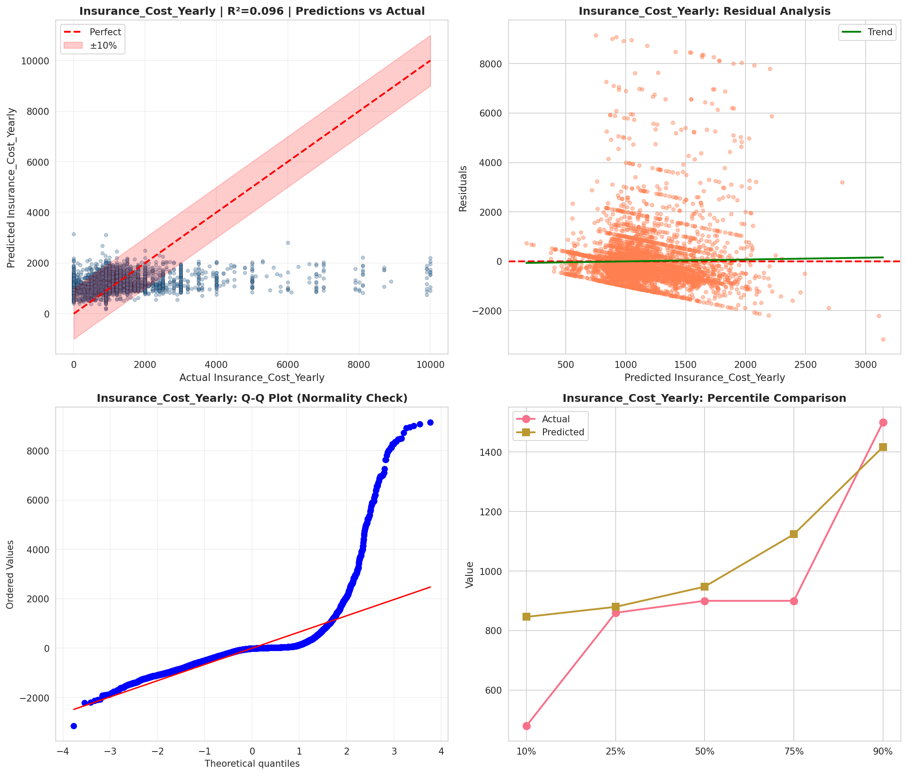
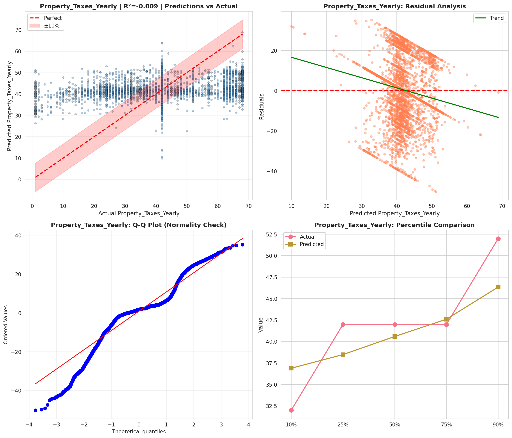
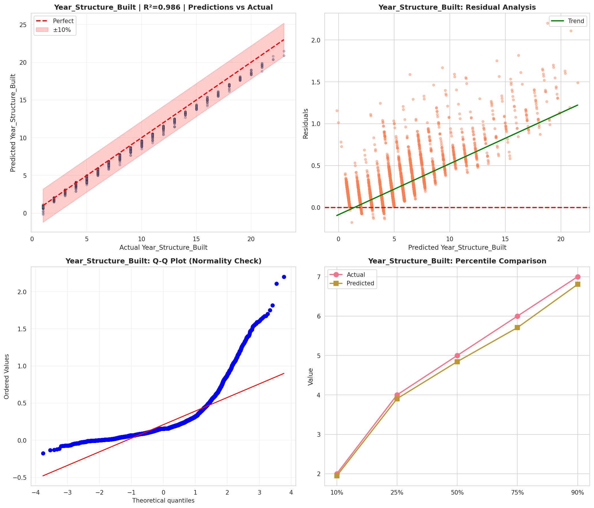
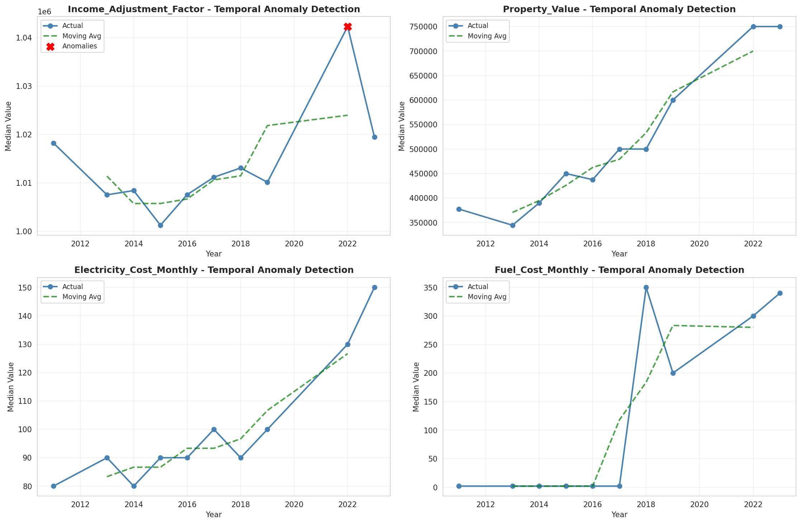
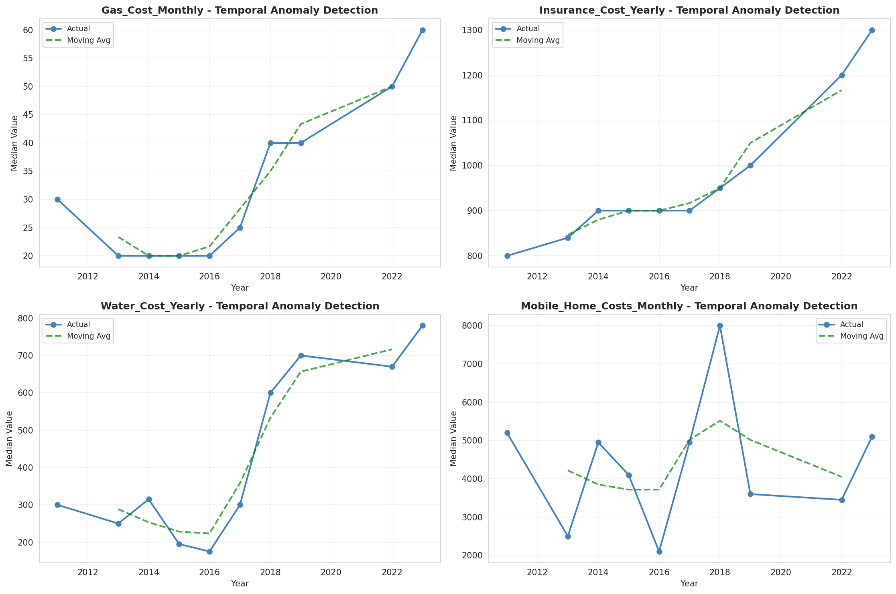
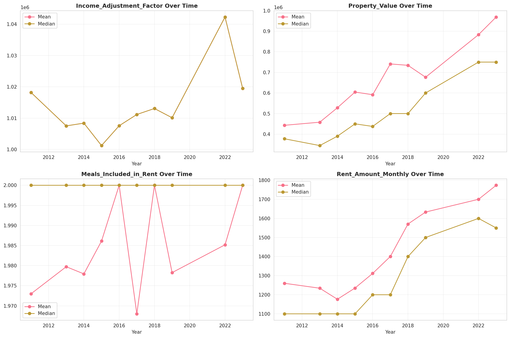
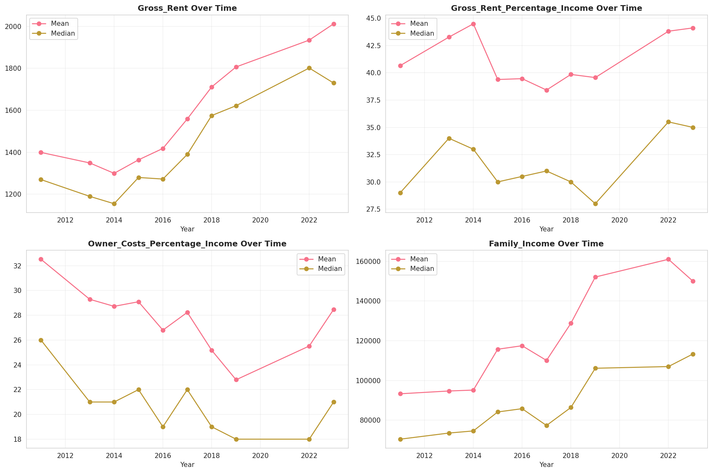
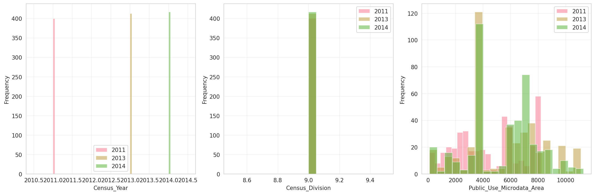
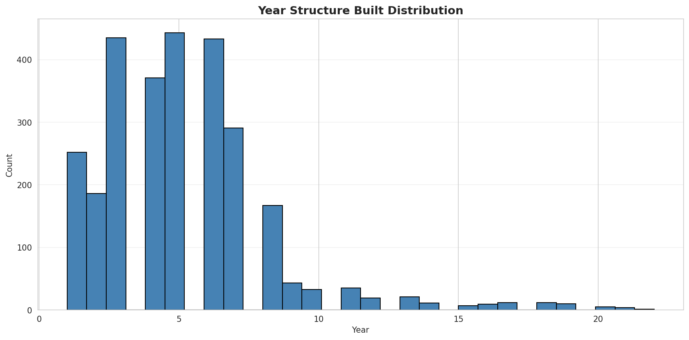

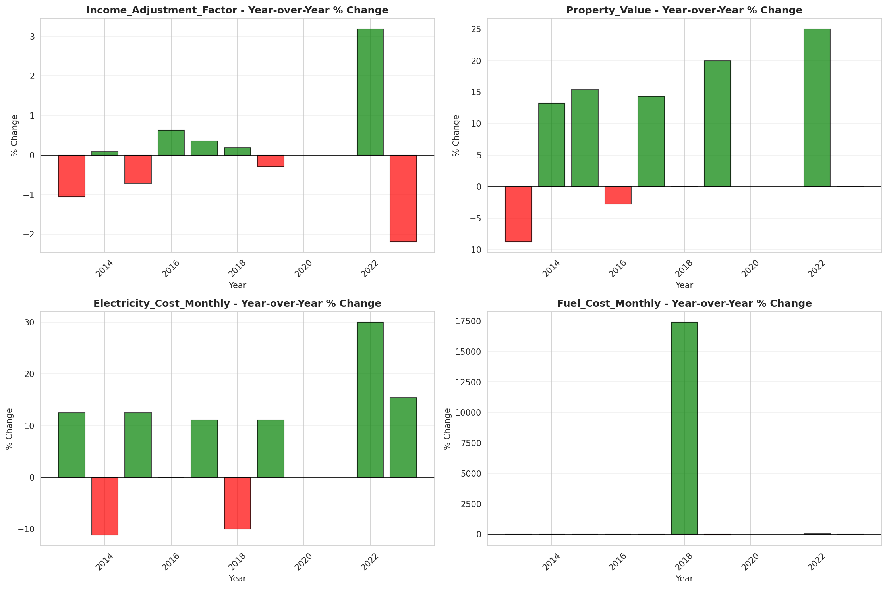
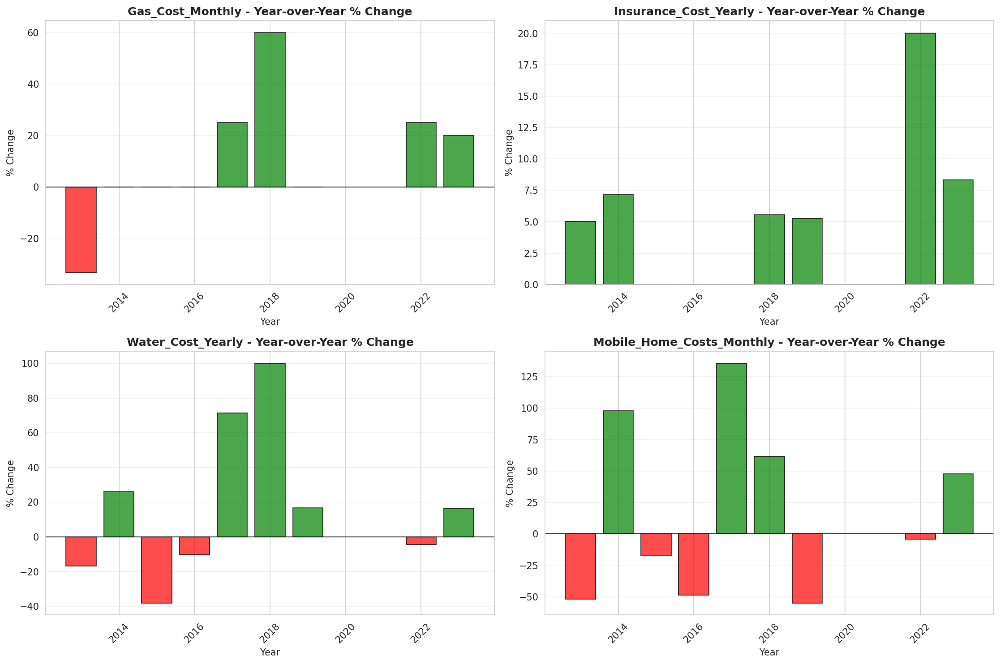
