# Temporal Analysis

## Year Distribution

- 2011: 726,560 records

- 2012: 737,966 records

- 2014: 760,502 records

- 2015: 770,699 records

- 2016: 772,328 records

- 2017: 776,947 records

- 2018: 783,043 records

- 2019: 788,475 records

- 2020: 763,819 records

- 2021: 769,914 records

- 2022: 779,442 records

- 2023: 786,832 records

## Temporal Trends

- Census_Year: {np.int64(2011): {'mean': 2011.0, 'median': 2011.0, 'std': 0.0}, np.int64(2012): {'mean': 2012.0, 'median': 2012.0, 'std': 0.0}, np.int64(2014): {'mean': 2014.0, 'median': 2014.0, 'std': 0.0}, np.int64(2015): {'mean': 2015.0, 'median': 2015.0, 'std': 0.0}, np.int64(2016): {'mean': 2016.0, 'median': 2016.0, 'std': 0.0}, np.int64(2017): {'mean': 2017.0, 'median': 2017.0, 'std': 0.0}, np.int64(2018): {'mean': 2018.0, 'median': 2018.0, 'std': 0.0}, np.int64(2019): {'mean': 2019.0, 'median': 2019.0, 'std': 0.0}, np.int64(2020): {'mean': 2020.0, 'median': 2020.0, 'std': 0.0}, np.int64(2021): {'mean': 2021.0, 'median': 2021.0, 'std': 0.0}, np.int64(2022): {'mean': 2022.0, 'median': 2022.0, 'std': 0.0}, np.int64(2023): {'mean': 2023.0, 'median': 2023.0, 'std': 0.0}}

- Census_Division: {np.int64(2011): {'mean': 9.0, 'median': 9.0, 'std': 0.0}, np.int64(2012): {'mean': 9.0, 'median': 9.0, 'std': 0.0}, np.int64(2014): {'mean': 9.0, 'median': 9.0, 'std': 0.0}, np.int64(2015): {'mean': 9.0, 'median': 9.0, 'std': 0.0}, np.int64(2016): {'mean': 9.0, 'median': 9.0, 'std': 0.0}, np.int64(2017): {'mean': 9.0, 'median': 9.0, 'std': 0.0}, np.int64(2018): {'mean': 9.0, 'median': 9.0, 'std': 0.0}, np.int64(2019): {'mean': 9.0, 'median': 9.0, 'std': 0.0}, np.int64(2020): {'mean': 9.0, 'median': 9.0, 'std': 0.0}, np.int64(2021): {'mean': 9.0, 'median': 9.0, 'std': 0.0}, np.int64(2022): {'mean': 9.0, 'median': 9.0, 'std': 0.0}, np.int64(2023): {'mean': 9.0, 'median': 9.0, 'std': 0.0}}

- Public_Use_Microdata_Area: {np.int64(2011): {'mean': 4562.83646085664, 'median': 4700.0, 'std': 2422.5592627857395}, np.int64(2012): {'mean': None, 'median': None, 'std': None}, np.int64(2014): {'mean': None, 'median': None, 'std': None}, np.int64(2015): {'mean': None, 'median': None, 'std': None}, np.int64(2016): {'mean': 5451.4850620461775, 'median': 5908.0, 'std': 2707.5497426241805}, np.int64(2017): {'mean': 5454.837743115038, 'median': 5908.0, 'std': 2707.746513926955}, np.int64(2018): {'mean': 5459.249818975459, 'median': 5908.0, 'std': 2706.26122969378}, np.int64(2019): {'mean': 5464.891080883985, 'median': 5908.0, 'std': 2705.239754263922}, np.int64(2020): {'mean': 5467.975401240346, 'median': 5909.0, 'std': 2705.962002612326}, np.int64(2021): {'mean': 5470.27438259338, 'median': 5909.0, 'std': 2705.9951568387833}, np.int64(2022): {'mean': None, 'median': None, 'std': None}, np.int64(2023): {'mean': 5502.660542530045, 'median': 5920.0, 'std': 2707.6664075439257}}

- Census_Region: {np.int64(2011): {'mean': 4.0, 'median': 4.0, 'std': 0.0}, np.int64(2012): {'mean': 4.0, 'median': 4.0, 'std': 0.0}, np.int64(2014): {'mean': 4.0, 'median': 4.0, 'std': 0.0}, np.int64(2015): {'mean': 4.0, 'median': 4.0, 'std': 0.0}, np.int64(2016): {'mean': 4.0, 'median': 4.0, 'std': 0.0}, np.int64(2017): {'mean': 4.0, 'median': 4.0, 'std': 0.0}, np.int64(2018): {'mean': 4.0, 'median': 4.0, 'std': 0.0}, np.int64(2019): {'mean': 4.0, 'median': 4.0, 'std': 0.0}, np.int64(2020): {'mean': 4.0, 'median': 4.0, 'std': 0.0}, np.int64(2021): {'mean': 4.0, 'median': 4.0, 'std': 0.0}, np.int64(2022): {'mean': 4.0, 'median': 4.0, 'std': 0.0}, np.int64(2023): {'mean': 4.0, 'median': 4.0, 'std': 0.0}}

- State_Code: {np.int64(2011): {'mean': 6.0, 'median': 6.0, 'std': 0.0}, np.int64(2012): {'mean': 6.0, 'median': 6.0, 'std': 0.0}, np.int64(2014): {'mean': 6.0, 'median': 6.0, 'std': 0.0}, np.int64(2015): {'mean': 6.0, 'median': 6.0, 'std': 0.0}, np.int64(2016): {'mean': 6.0, 'median': 6.0, 'std': 0.0}, np.int64(2017): {'mean': 6.0, 'median': 6.0, 'std': 0.0}, np.int64(2018): {'mean': 6.0, 'median': 6.0, 'std': 0.0}, np.int64(2019): {'mean': 6.0, 'median': 6.0, 'std': 0.0}, np.int64(2020): {'mean': 6.0, 'median': 6.0, 'std': 0.0}, np.int64(2021): {'mean': 6.0, 'median': 6.0, 'std': 0.0}, np.int64(2022): {'mean': 6.0, 'median': 6.0, 'std': 0.0}, np.int64(2023): {'mean': None, 'median': None, 'std': None}}

- Housing_Adjustment_Factor: {np.int64(2011): {'mean': 1041118.2781215592, 'median': 1044592.0, 'std': 27603.367402912627}, np.int64(2012): {'mean': 1041274.208150511, 'median': 1053092.0, 'std': 27476.893564701884}, np.int64(2014): {'mean': 1036640.2458783804, 'median': 1031130.0, 'std': 29590.73819255953}, np.int64(2015): {'mean': 1020941.2679567509, 'median': 1017534.0, 'std': 20300.776273689065}, np.int64(2016): {'mean': 1020333.7616401322, 'median': 1013801.0, 'std': 15756.919063210515}, np.int64(2017): {'mean': 1029168.9516749533, 'median': 1034680.0, 'std': 17977.850754283958}, np.int64(2018): {'mean': 1038200.1483136942, 'median': 1046406.0, 'std': 23493.82152861917}, np.int64(2019): {'mean': 1040770.6203646279, 'median': 1042936.0, 'std': 29166.7422049374}, np.int64(2020): {'mean': 1036685.4474620296, 'median': 1030827.0, 'std': 28222.65473373823}, np.int64(2021): {'mean': 1058261.5355974822, 'median': 1059761.0, 'std': 35771.91470403858}, np.int64(2022): {'mean': 1104151.5876973527, 'median': 1133141.0, 'std': 61984.47943630751}, np.int64(2023): {'mean': 1104195.9058541087, 'median': 1125501.0, 'std': 76729.32553669416}}

- Income_Adjustment_Factor: {np.int64(2011): {'mean': 1053779.301815404, 'median': 1048026.0, 'std': 28413.443230883066}, np.int64(2012): {'mean': 1052548.2323223564, 'median': 1061121.0, 'std': 26399.511220452685}, np.int64(2014): {'mean': 1047495.8574625708, 'median': 1041654.0, 'std': 31034.8563020435}, np.int64(2015): {'mean': 1030360.7624883385, 'median': 1025215.0, 'std': 25674.5558407435}, np.int64(2016): {'mean': 1027493.2364125086, 'median': 1022342.0, 'std': 17508.22468963269}, np.int64(2017): {'mean': 1036566.3285693877, 'median': 1035988.0, 'std': 16849.862333367153}, np.int64(2018): {'mean': 1046790.6599216135, 'median': 1054346.0, 'std': 20514.935602538895}, np.int64(2019): {'mean': 1049729.9461897968, 'median': 1054606.0, 'std': 26216.330332453566}, np.int64(2020): {'mean': 1046819.9229529509, 'median': 1044328.0, 'std': 28692.18529902478}, np.int64(2021): {'mean': 1073352.4056907655, 'median': 1070512.0, 'std': 30833.424021560466}, np.int64(2022): {'mean': 1126653.3856348516, 'median': 1140108.0, 'std': 50027.538358751524}, np.int64(2023): {'mean': 1128315.2099088496, 'median': 1159185.0, 'std': 70406.89736930057}}

- Housing_Unit_Weight: {np.int64(2011): {'mean': 18.761188339572783, 'median': 15.0, 'std': 13.585400108744933}, np.int64(2012): {'mean': 18.52012965366968, 'median': 15.0, 'std': 13.95229298018227}, np.int64(2014): {'mean': 18.12214695030388, 'median': 14.0, 'std': 14.543653072332305}, np.int64(2015): {'mean': 17.96523675261029, 'median': 14.0, 'std': 14.850804396509202}, np.int64(2016): {'mean': 18.01273163733543, 'median': 14.0, 'std': 14.56360373889669}, np.int64(2017): {'mean': 18.01448361342537, 'median': 14.0, 'std': 14.508848202394283}, np.int64(2018): {'mean': 17.987293162699878, 'median': 14.0, 'std': 14.49332339337425}, np.int64(2019): {'mean': 17.97897967595675, 'median': 14.0, 'std': 14.754769781891596}, np.int64(2020): {'mean': 18.605121108534874, 'median': 14.0, 'std': 18.069335025962925}, np.int64(2021): {'mean': 18.610570791023413, 'median': 14.0, 'std': 18.207091381062288}, np.int64(2022): {'mean': 18.506113347753907, 'median': 14.0, 'std': 18.392156113971375}, np.int64(2023): {'mean': 18.46986777355268, 'median': 13.0, 'std': 18.623113763485044}}

- Number_of_Persons: {np.int64(2011): {'mean': 2.4455337480731116, 'median': 2.0, 'std': 1.700109738977852}, np.int64(2012): {'mean': 2.434957708078692, 'median': 2.0, 'std': 1.7043572424922513}, np.int64(2014): {'mean': 2.42162150789873, 'median': 2.0, 'std': 1.7035140581456927}, np.int64(2015): {'mean': 2.407885568814803, 'median': 2.0, 'std': 1.689200089329425}, np.int64(2016): {'mean': 2.4121629670295524, 'median': 2.0, 'std': 1.6815289651647891}, np.int64(2017): {'mean': 2.4100858874543567, 'median': 2.0, 'std': 1.6759818829759117}, np.int64(2018): {'mean': 2.400791527412926, 'median': 2.0, 'std': 1.6661881265988834}, np.int64(2019): {'mean': 2.3938121056469766, 'median': 2.0, 'std': 1.657301985027233}, np.int64(2020): {'mean': 2.37792723145143, 'median': 2.0, 'std': 1.6587887815892728}, np.int64(2021): {'mean': 2.3721246788602364, 'median': 2.0, 'std': 1.6565139120169796}, np.int64(2022): {'mean': 2.360570767292499, 'median': 2.0, 'std': 1.6501351444608976}, np.int64(2023): {'mean': 2.355558746975212, 'median': 2.0, 'std': 1.64587193373265}}

- Housing_Unit_Type: {np.int64(2011): {'mean': 1.0982424025545034, 'median': 1.0, 'std': 0.37975622795518044}, np.int64(2012): {'mean': 1.1131027716724076, 'median': 1.0, 'std': 0.409553320608247}, np.int64(2014): {'mean': 1.140554528456204, 'median': 1.0, 'std': 0.4596480288345781}, np.int64(2015): {'mean': 1.1542859144750415, 'median': 1.0, 'std': 0.4820895375109823}, np.int64(2016): {'mean': 1.1514265959540506, 'median': 1.0, 'std': 0.47930269152100474}, np.int64(2017): {'mean': 1.1513423695567393, 'median': 1.0, 'std': 0.48051328693099954}, np.int64(2018): {'mean': 1.1528958179818989, 'median': 1.0, 'std': 0.4832188978901394}, np.int64(2019): {'mean': 1.1534481118615048, 'median': 1.0, 'std': 0.4841592253563869}, np.int64(2020): {'mean': None, 'median': None, 'std': None}, np.int64(2021): {'mean': None, 'median': None, 'std': None}, np.int64(2022): {'mean': None, 'median': None, 'std': None}, np.int64(2023): {'mean': None, 'median': None, 'std': None}}

- Number_of_Bedrooms: {np.int64(2011): {'mean': 2.6453727338951833, 'median': 3.0, 'std': 1.1267919131186646}, np.int64(2012): {'mean': None, 'median': None, 'std': None}, np.int64(2014): {'mean': None, 'median': None, 'std': None}, np.int64(2015): {'mean': None, 'median': None, 'std': None}, np.int64(2016): {'mean': None, 'median': None, 'std': None}, np.int64(2017): {'mean': None, 'median': None, 'std': None}, np.int64(2018): {'mean': None, 'median': None, 'std': None}, np.int64(2019): {'mean': None, 'median': None, 'std': None}, np.int64(2020): {'mean': None, 'median': None, 'std': None}, np.int64(2021): {'mean': None, 'median': None, 'std': None}, np.int64(2022): {'mean': None, 'median': None, 'std': None}, np.int64(2023): {'mean': None, 'median': None, 'std': None}}

- Number_of_Rooms: {np.int64(2011): {'mean': 5.327168975462993, 'median': 5.0, 'std': 1.91039975434005}, np.int64(2012): {'mean': None, 'median': None, 'std': None}, np.int64(2014): {'mean': None, 'median': None, 'std': None}, np.int64(2015): {'mean': None, 'median': None, 'std': None}, np.int64(2016): {'mean': None, 'median': None, 'std': None}, np.int64(2017): {'mean': None, 'median': None, 'std': None}, np.int64(2018): {'mean': None, 'median': None, 'std': None}, np.int64(2019): {'mean': None, 'median': None, 'std': None}, np.int64(2020): {'mean': None, 'median': None, 'std': None}, np.int64(2021): {'mean': None, 'median': None, 'std': None}, np.int64(2022): {'mean': None, 'median': None, 'std': None}, np.int64(2023): {'mean': None, 'median': None, 'std': None}}

- Building_Type: {np.int64(2011): {'mean': 3.322121506452587, 'median': 2.0, 'std': 2.3004299810307303}, np.int64(2012): {'mean': 3.3302609151311935, 'median': 2.0, 'std': 2.3064133005507683}, np.int64(2014): {'mean': 3.3355222422799535, 'median': 2.0, 'std': 2.3082119078546026}, np.int64(2015): {'mean': 3.333709079701159, 'median': 2.0, 'std': 2.3060556190943733}, np.int64(2016): {'mean': 3.3401932408887354, 'median': 2.0, 'std': 2.3111304746200556}, np.int64(2017): {'mean': 3.3448223089608575, 'median': 2.0, 'std': 2.315709890942432}, np.int64(2018): {'mean': 3.3531383605812253, 'median': 2.0, 'std': 2.3234844100931666}, np.int64(2019): {'mean': 3.3629872750414145, 'median': 2.0, 'std': 2.3340896188570635}, np.int64(2020): {'mean': 3.365052268797539, 'median': 2.0, 'std': 2.3389297967500635}, np.int64(2021): {'mean': 3.3704883180738494, 'median': 2.0, 'std': 2.3456985765108795}, np.int64(2022): {'mean': 3.3773096473908137, 'median': 2.0, 'std': 2.3547404125319553}, np.int64(2023): {'mean': 3.373107662564085, 'median': 2.0, 'std': 2.35559481673078}}

- Year_Structure_Built: {np.int64(2011): {'mean': 5.308490823052823, 'median': 5.0, 'std': 2.143253646356765}, np.int64(2012): {'mean': 4.769072592871715, 'median': 5.0, 'std': 2.3259064718590725}, np.int64(2014): {'mean': 4.8247942629074405, 'median': 5.0, 'std': 2.447403741967132}, np.int64(2015): {'mean': 4.858892527374256, 'median': 5.0, 'std': 2.5288300167022553}, np.int64(2016): {'mean': 4.926317911500857, 'median': 5.0, 'std': 2.6453394691604792}, np.int64(2017): {'mean': 4.992222128459315, 'median': 5.0, 'std': 2.7866182721364487}, np.int64(2018): {'mean': 5.069230004403221, 'median': 5.0, 'std': 2.9610447767893366}, np.int64(2019): {'mean': 5.160563352457929, 'median': 5.0, 'std': 3.1634569400809363}, np.int64(2020): {'mean': 5.247084190780377, 'median': 5.0, 'std': 3.3518956106007876}, np.int64(2021): {'mean': None, 'median': None, 'std': None}, np.int64(2022): {'mean': None, 'median': None, 'std': None}, np.int64(2023): {'mean': None, 'median': None, 'std': None}}

- Bathtub_or_Shower: {np.int64(2011): {'mean': None, 'median': None, 'std': None}, np.int64(2012): {'mean': 1.0053755052415592, 'median': 1.0, 'std': 0.07312056519767902}, np.int64(2014): {'mean': 1.0049562944940074, 'median': 1.0, 'std': 0.07022632559782913}, np.int64(2015): {'mean': 1.004724564406738, 'median': 1.0, 'std': 0.06857295168079992}, np.int64(2016): {'mean': 1.0045156738232033, 'median': 1.0, 'std': 0.06704691630569885}, np.int64(2017): {'mean': 1.004645554756187, 'median': 1.0, 'std': 0.06799985434387598}, np.int64(2018): {'mean': 1.0047213897135066, 'median': 1.0, 'std': 0.06855001726666558}, np.int64(2019): {'mean': 1.0046268728322558, 'median': 1.0, 'std': 0.067863623382901}, np.int64(2020): {'mean': 1.0047248879325277, 'median': 1.0, 'std': 0.06857528905548396}, np.int64(2021): {'mean': 1.004759384254662, 'median': 1.0, 'std': 0.06882397418799523}, np.int64(2022): {'mean': 1.0046660128550755, 'median': 1.0, 'std': 0.06814871904059183}, np.int64(2023): {'mean': 1.0046391396661545, 'median': 1.0, 'std': 0.06795310656425493}}

- Refrigerator: {np.int64(2011): {'mean': None, 'median': None, 'std': None}, np.int64(2012): {'mean': 1.0174836394466704, 'median': 1.0, 'std': 0.13106482015873774}, np.int64(2014): {'mean': 1.016360132206612, 'median': 1.0, 'std': 0.126856224406146}, np.int64(2015): {'mean': 1.015329872993869, 'median': 1.0, 'std': 0.12286126253084005}, np.int64(2016): {'mean': 1.0143015537028237, 'median': 1.0, 'std': 0.1187309545295541}, np.int64(2017): {'mean': 1.0139352339869243, 'median': 1.0, 'std': 0.11722227985431562}, np.int64(2018): {'mean': 1.0135548201070976, 'median': 1.0, 'std': 0.11563349839558068}, np.int64(2019): {'mean': 1.0131694431666494, 'median': 1.0, 'std': 0.11400011961192097}, np.int64(2020): {'mean': 1.013141323908021, 'median': 1.0, 'std': 0.11387997431290324}, np.int64(2021): {'mean': 1.0131451743430693, 'median': 1.0, 'std': 0.11389643387829221}, np.int64(2022): {'mean': 1.0128188599051733, 'median': 1.0, 'std': 0.11249246671478606}, np.int64(2023): {'mean': 1.0125076959371206, 'median': 1.0, 'std': 0.11113627331650418}}

- Hot_and_Cold_Running_Water: {np.int64(2011): {'mean': None, 'median': None, 'std': None}, np.int64(2012): {'mean': 1.0062851608382961, 'median': 1.0, 'std': 0.07902953109278939}, np.int64(2014): {'mean': 1.0059126703817074, 'median': 1.0, 'std': 0.07666628498686513}, np.int64(2015): {'mean': 1.0056752654221215, 'median': 1.0, 'std': 0.07512033646233156}, np.int64(2016): {'mean': 1.0053537229829943, 'median': 1.0, 'std': 0.07297306558609001}, np.int64(2017): {'mean': 1.0055366202158866, 'median': 1.0, 'std': 0.07420225015163096}, np.int64(2018): {'mean': 1.0056915188273228, 'median': 1.0, 'std': 0.07522721235670167}, np.int64(2019): {'mean': 1.0056865805166182, 'median': 1.0, 'std': 0.07519475578221022}, np.int64(2020): {'mean': 1.0057670346961483, 'median': 1.0, 'std': 0.07572175660324591}, np.int64(2021): {'mean': 1.0058121647178564, 'median': 1.0, 'std': 0.07601573445596753}, np.int64(2022): {'mean': 1.005607617436199, 'median': 1.0, 'std': 0.07467382500359623}, np.int64(2023): {'mean': 1.0054202413215723, 'median': 1.0, 'std': 0.07342254463253577}}

- Running_Water: {np.int64(2011): {'mean': None, 'median': None, 'std': None}, np.int64(2012): {'mean': None, 'median': None, 'std': None}, np.int64(2014): {'mean': 9.0, 'median': 9.0, 'std': 0.0}, np.int64(2015): {'mean': 9.0, 'median': 9.0, 'std': 0.0}, np.int64(2016): {'mean': 9.0, 'median': 9.0, 'std': 0.0}, np.int64(2017): {'mean': 9.0, 'median': 9.0, 'std': 0.0}, np.int64(2018): {'mean': 9.0, 'median': 9.0, 'std': 0.0}, np.int64(2019): {'mean': 9.0, 'median': 9.0, 'std': 0.0}, np.int64(2020): {'mean': 9.0, 'median': 9.0, 'std': 0.0}, np.int64(2021): {'mean': 9.0, 'median': 9.0, 'std': 0.0}, np.int64(2022): {'mean': 9.0, 'median': 9.0, 'std': 0.0}, np.int64(2023): {'mean': 9.0, 'median': 9.0, 'std': 0.0}}

- Sink_with_Faucet: {np.int64(2011): {'mean': None, 'median': None, 'std': None}, np.int64(2012): {'mean': 1.004745517223107, 'median': 1.0, 'std': 0.06872411688298286}, np.int64(2014): {'mean': 1.0042789826951195, 'median': 1.0, 'std': 0.06527387835065487}, np.int64(2015): {'mean': 1.0040039417192783, 'median': 1.0, 'std': 0.06314994806518068}, np.int64(2016): {'mean': 1.0037237029677308, 'median': 1.0, 'std': 0.0609084751567074}, np.int64(2017): {'mean': 1.003774513239402, 'median': 1.0, 'std': 0.06132105403085512}, np.int64(2018): {'mean': 1.0038009743902958, 'median': 1.0, 'std': 0.061534806104740124}, np.int64(2019): {'mean': 1.0037125045506754, 'median': 1.0, 'std': 0.06081716106306166}, np.int64(2020): {'mean': 1.0037942949069847, 'median': 1.0, 'std': 0.06148092209241001}, np.int64(2021): {'mean': 1.003899078890002, 'median': 1.0, 'std': 0.06232079698682632}, np.int64(2022): {'mean': 1.0038272604666592, 'median': 1.0, 'std': 0.06174640124755289}, np.int64(2023): {'mean': 1.0037961828151882, 'median': 1.0, 'std': 0.06149615639437727}}

- Stove_or_Range: {np.int64(2011): {'mean': None, 'median': None, 'std': None}, np.int64(2012): {'mean': 1.013825881909629, 'median': 1.0, 'std': 0.11676791926084076}, np.int64(2014): {'mean': 1.0138209396901807, 'median': 1.0, 'std': 0.11674733884255745}, np.int64(2015): {'mean': 1.0134718819683708, 'median': 1.0, 'std': 0.11528403877497298}, np.int64(2016): {'mean': 1.0131654355119732, 'median': 1.0, 'std': 0.11398300543381776}, np.int64(2017): {'mean': 1.0131085312008787, 'median': 1.0, 'std': 0.11373968574680647}, np.int64(2018): {'mean': 1.0129568342258142, 'median': 1.0, 'std': 0.11308834085810755}, np.int64(2019): {'mean': 1.0127263696474884, 'median': 1.0, 'std': 0.11209115438905662}, np.int64(2020): {'mean': 1.012692173331024, 'median': 1.0, 'std': 0.11194239795744765}, np.int64(2021): {'mean': 1.0125225465622052, 'median': 1.0, 'std': 0.11120139576847042}, np.int64(2022): {'mean': 1.0121988495040641, 'median': 1.0, 'std': 0.10977274265873575}, np.int64(2023): {'mean': 1.0119653841063794, 'median': 1.0, 'std': 0.10873008183461104}}

- Telephone_Service: {np.int64(2011): {'mean': 1.0198935949569163, 'median': 1.0, 'std': 0.13963477529839716}, np.int64(2012): {'mean': 1.0185664784334074, 'median': 1.0, 'std': 0.13498812092936147}, np.int64(2014): {'mean': 1.0212517471944609, 'median': 1.0, 'std': 0.14422254513638416}, np.int64(2015): {'mean': 1.0219979347687662, 'median': 1.0, 'std': 0.14667671473246427}, np.int64(2016): {'mean': 1.0235172077129606, 'median': 1.0, 'std': 0.15153937998539302}, np.int64(2017): {'mean': 1.0215819159369368, 'median': 1.0, 'std': 0.14531403527963477}, np.int64(2018): {'mean': 1.0200014159761273, 'median': 1.0, 'std': 0.14000496013276664}, np.int64(2019): {'mean': 1.0172574508228485, 'median': 1.0, 'std': 0.13022924629051774}, np.int64(2020): {'mean': 1.014222521906617, 'median': 1.0, 'std': 0.11840719429514704}, np.int64(2021): {'mean': 1.0100825997595688, 'median': 1.0, 'std': 0.09990473674360664}, np.int64(2022): {'mean': 1.009321102273462, 'median': 1.0, 'std': 0.09609491944661304}, np.int64(2023): {'mean': 1.0085068008630398, 'median': 1.0, 'std': 0.09183925126056869}}

- Lot_Acreage: {np.int64(2011): {'mean': 1.1244950102869211, 'median': 1.0, 'std': 0.3923249982313813}, np.int64(2012): {'mean': 1.123279198473667, 'median': 1.0, 'std': 0.3902205385471881}, np.int64(2014): {'mean': 1.122513276805197, 'median': 1.0, 'std': 0.38732124666793893}, np.int64(2015): {'mean': 1.1229267712083792, 'median': 1.0, 'std': 0.3873517881825557}, np.int64(2016): {'mean': 1.1227745203085524, 'median': 1.0, 'std': 0.38617206068509646}, np.int64(2017): {'mean': 1.1216736536474397, 'median': 1.0, 'std': 0.38377419565883736}, np.int64(2018): {'mean': 1.1202293618309873, 'median': 1.0, 'std': 0.3816093245780229}, np.int64(2019): {'mean': 1.1191008659867527, 'median': 1.0, 'std': 0.37943385852913447}, np.int64(2020): {'mean': 1.1181750428690016, 'median': 1.0, 'std': 0.37796258272873356}, np.int64(2021): {'mean': 1.1165503503531615, 'median': 1.0, 'std': 0.37538876755064104}, np.int64(2022): {'mean': 1.1168678398111485, 'median': 1.0, 'std': 0.37566459722870976}, np.int64(2023): {'mean': 1.1170093443179754, 'median': 1.0, 'std': 0.3751363789132034}}

- Agricultural_Sales: {np.int64(2011): {'mean': 1.3588845682858186, 'median': 1.0, 'std': 1.193191642910982}, np.int64(2012): {'mean': 1.3548645546869924, 'median': 1.0, 'std': 1.1863092231486014}, np.int64(2014): {'mean': 1.3382713922742346, 'median': 1.0, 'std': 1.1615095256547672}, np.int64(2015): {'mean': 1.3346351665706297, 'median': 1.0, 'std': 1.1566788392148935}, np.int64(2016): {'mean': 1.3286550203527816, 'median': 1.0, 'std': 1.147977948133163}, np.int64(2017): {'mean': 1.3256542728889642, 'median': 1.0, 'std': 1.1433312789141135}, np.int64(2018): {'mean': 1.3286711798015924, 'median': 1.0, 'std': 1.1481181307982888}, np.int64(2019): {'mean': 1.3286793657550282, 'median': 1.0, 'std': 1.1468759578445604}, np.int64(2020): {'mean': 1.322773915181865, 'median': 1.0, 'std': 1.1344038638737346}, np.int64(2021): {'mean': 1.3202734919706716, 'median': 1.0, 'std': 1.1273402168049524}, np.int64(2022): {'mean': 1.3182616427698122, 'median': 1.0, 'std': 1.1231565810671902}, np.int64(2023): {'mean': 1.3068924085199345, 'median': 1.0, 'std': 1.1004788838817914}}

- Business_On_Property: {np.int64(2011): {'mean': 1.9856468622361765, 'median': 2.0, 'std': 0.11894180854415445}, np.int64(2012): {'mean': 1.9860764415647734, 'median': 2.0, 'std': 0.11717389050863511}, np.int64(2014): {'mean': 1.9867022707571516, 'median': 2.0, 'std': 0.11454660966947307}, np.int64(2015): {'mean': 1.98684599438609, 'median': 2.0, 'std': 0.11393420689509111}, np.int64(2016): {'mean': 3.4038897213776527, 'median': 2.0, 'std': 2.8177218455457256}, np.int64(2017): {'mean': 4.816930626549479, 'median': 2.0, 'std': 3.4416791584481627}, np.int64(2018): {'mean': 6.218180930146233, 'median': 9.0, 'std': 3.4315517963339977}, np.int64(2019): {'mean': 7.613393358501417, 'median': 9.0, 'std': 2.79364619573454}, np.int64(2020): {'mean': None, 'median': None, 'std': None}, np.int64(2021): {'mean': None, 'median': None, 'std': None}, np.int64(2022): {'mean': None, 'median': None, 'std': None}, np.int64(2023): {'mean': None, 'median': None, 'std': None}}

- Tenure: {np.int64(2011): {'mean': 1.9400348188977368, 'median': 2.0, 'std': 0.9338785295562249}, np.int64(2012): {'mean': 1.9576951871574173, 'median': 2.0, 'std': 0.9347055695638398}, np.int64(2014): {'mean': 1.9871409573237147, 'median': 2.0, 'std': 0.9330391799505269}, np.int64(2015): {'mean': 1.9963574599190173, 'median': 2.0, 'std': 0.9312115917119527}, np.int64(2016): {'mean': 2.000974798633146, 'median': 2.0, 'std': 0.9293157248843217}, np.int64(2017): {'mean': 2.0028269611758946, 'median': 2.0, 'std': 0.9268159588834783}, np.int64(2018): {'mean': 2.0034043681357168, 'median': 2.0, 'std': 0.9244037278919632}, np.int64(2019): {'mean': 2.0014199168398545, 'median': 2.0, 'std': 0.9211587687899391}, np.int64(2020): {'mean': 1.9969282349525657, 'median': 2.0, 'std': 0.9184533884782193}, np.int64(2021): {'mean': 1.9951091635320122, 'median': 2.0, 'std': 0.9153545728165755}, np.int64(2022): {'mean': 1.9945973326928348, 'median': 2.0, 'std': 0.9123258844798896}, np.int64(2023): {'mean': 1.9917175040207031, 'median': 2.0, 'std': 0.9094313131992784}}

- Vacancy_Status: {np.int64(2011): {'mean': 4.241142945163278, 'median': 5.0, 'std': 2.1860519773256764}, np.int64(2012): {'mean': 4.262023301069019, 'median': 5.0, 'std': 2.1819605496519543}, np.int64(2014): {'mean': 4.372062663185378, 'median': 5.0, 'std': 2.1585961476160147}, np.int64(2015): {'mean': 4.451889335299802, 'median': 5.0, 'std': 2.1196052999077493}, np.int64(2016): {'mean': 4.5060847240051345, 'median': 5.0, 'std': 2.089821443466691}, np.int64(2017): {'mean': 4.572761383226854, 'median': 5.0, 'std': 2.070862461410822}, np.int64(2018): {'mean': 4.601339074594917, 'median': 5.0, 'std': 2.0605604088381866}, np.int64(2019): {'mean': 4.619505664774277, 'median': 5.0, 'std': 2.05967697995948}, np.int64(2020): {'mean': 4.591820151679307, 'median': 5.0, 'std': 2.075456030126464}, np.int64(2021): {'mean': 4.580067107566621, 'median': 5.0, 'std': 2.0948659899410242}, np.int64(2022): {'mean': 4.552833378249259, 'median': 5.0, 'std': 2.1090790167273523}, np.int64(2023): {'mean': 4.539609182699553, 'median': 5.0, 'std': 2.125392730445641}}

- Property_Value: {np.int64(2011): {'mean': 19.654459339451094, 'median': 21.0, 'std': 4.180072343834295}}

- Vehicles_Available: {np.int64(2011): {'mean': 1.8898192434117491, 'median': 2.0, 'std': 1.1137626687460893}, np.int64(2012): {'mean': 1.8810410606915502, 'median': 2.0, 'std': 1.1139801802854143}, np.int64(2014): {'mean': 1.8786097114699267, 'median': 2.0, 'std': 1.1146296883034246}, np.int64(2015): {'mean': 1.8878975301614287, 'median': 2.0, 'std': 1.119286303212404}, np.int64(2016): {'mean': 1.905877776421772, 'median': 2.0, 'std': 1.12621061518917}, np.int64(2017): {'mean': 1.9276116043345728, 'median': 2.0, 'std': 1.1362412077252904}, np.int64(2018): {'mean': 1.9483515175799462, 'median': 2.0, 'std': 1.146133195514961}, np.int64(2019): {'mean': 1.9683877734536896, 'median': 2.0, 'std': 1.1561906392291974}, np.int64(2020): {'mean': 1.9854075551684631, 'median': 2.0, 'std': 1.1650717857700057}, np.int64(2021): {'mean': 1.9905704424710124, 'median': 2.0, 'std': 1.1686677788858109}, np.int64(2022): {'mean': 1.9897443240430244, 'median': 2.0, 'std': 1.17009719159327}, np.int64(2023): {'mean': 1.9847472679054807, 'median': 2.0, 'std': 1.17206616598795}}

- Condo_Fee_Monthly: {np.int64(2011): {'mean': 309.1556317785454, 'median': 270.0, 'std': 191.05355391464101}, np.int64(2012): {'mean': 316.32526256518224, 'median': 280.0, 'std': 193.33006844277486}, np.int64(2014): {'mean': 330.04302772079325, 'median': 300.0, 'std': 191.06667599216985}, np.int64(2015): {'mean': 336.7543983877118, 'median': 300.0, 'std': 189.5441835003997}, np.int64(2016): {'mean': 344.89851932105455, 'median': 310.0, 'std': 189.3760291803935}, np.int64(2017): {'mean': 353.6676272277089, 'median': 320.0, 'std': 188.6700203299447}, np.int64(2018): {'mean': 362.3722764631254, 'median': 330.0, 'std': 192.36749816749952}, np.int64(2019): {'mean': 371.79789485106613, 'median': 330.0, 'std': 195.96918313300296}, np.int64(2020): {'mean': 384.01685660683785, 'median': 350.0, 'std': 214.3707816870474}, np.int64(2021): {'mean': 399.962037744082, 'median': 350.0, 'std': 239.14142542262806}, np.int64(2022): {'mean': 420.5940355940356, 'median': 360.0, 'std': 269.67120011977386}, np.int64(2023): {'mean': 443.52738416406925, 'median': 380.0, 'std': 299.3686831797012}}

- Electricity_Cost_Monthly: {np.int64(2011): {'mean': 105.1385968109912, 'median': 80.0, 'std': 95.88626856752433}, np.int64(2012): {'mean': 105.96900012347434, 'median': 80.0, 'std': 96.30813129554642}, np.int64(2014): {'mean': 108.29885587689877, 'median': 80.0, 'std': 97.5794835006788}, np.int64(2015): {'mean': 110.3270200063522, 'median': 80.0, 'std': 99.30485607933252}, np.int64(2016): {'mean': 112.76370057359043, 'median': 80.0, 'std': 101.36779135796976}, np.int64(2017): {'mean': 116.17691623251717, 'median': 90.0, 'std': 104.00056058345041}, np.int64(2018): {'mean': 124.42332542423217, 'median': 90.0, 'std': 105.04609495922918}, np.int64(2019): {'mean': 127.75152576303842, 'median': 100.0, 'std': 106.78249024171873}, np.int64(2020): {'mean': 133.7670698502461, 'median': 100.0, 'std': 114.94169392811149}, np.int64(2021): {'mean': 142.54578922400069, 'median': 100.0, 'std': 134.63230548767905}, np.int64(2022): {'mean': 155.97114411178674, 'median': 110.0, 'std': 170.39841988578593}, np.int64(2023): {'mean': 172.42718403186473, 'median': 120.0, 'std': 200.3146776573225}}

- Fuel_Cost_Monthly: {np.int64(2011): {'mean': 37.621303634615266, 'median': 2.0, 'std': 216.74768465911606}, np.int64(2012): {'mean': 38.020018474263416, 'median': 2.0, 'std': 219.614586920284}, np.int64(2014): {'mean': 32.96589383845895, 'median': 2.0, 'std': 200.93895345925264}, np.int64(2015): {'mean': 30.048104851145315, 'median': 2.0, 'std': 191.8111935597614}, np.int64(2016): {'mean': 27.001891628020502, 'median': 2.0, 'std': 179.00613916703455}, np.int64(2017): {'mean': 24.11312240514522, 'median': 2.0, 'std': 165.23585464194744}, np.int64(2018): {'mean': 514.1364907565467, 'median': 300.0, 'std': 615.6328561446849}, np.int64(2019): {'mean': 523.7330893063908, 'median': 300.0, 'std': 624.2884985432796}, np.int64(2020): {'mean': 528.4459513362585, 'median': 300.0, 'std': 622.8985046863226}, np.int64(2021): {'mean': 542.0775538797544, 'median': 350.0, 'std': 636.8292052521941}, np.int64(2022): {'mean': 577.2220623095158, 'median': 350.0, 'std': 699.616802700024}, np.int64(2023): {'mean': 620.2337048294495, 'median': 400.0, 'std': 755.9120863501837}}

- Gas_Cost_Monthly: {np.int64(2011): {'mean': 43.348913323570635, 'median': 30.0, 'std': 57.01554925237633}, np.int64(2012): {'mean': 42.402149704052306, 'median': 30.0, 'std': 56.298618667839605}, np.int64(2014): {'mean': 39.44304994584854, 'median': 20.0, 'std': 54.32644586250342}, np.int64(2015): {'mean': 37.97637872597021, 'median': 20.0, 'std': 53.40069757609307}, np.int64(2016): {'mean': 36.98088387844764, 'median': 20.0, 'std': 53.03863135396864}, np.int64(2017): {'mean': 36.93622587798745, 'median': 20.0, 'std': 54.09970407164218}, np.int64(2018): {'mean': 53.678958881993395, 'median': 40.0, 'std': 59.60844444885885}, np.int64(2019): {'mean': 55.85059206303535, 'median': 40.0, 'std': 62.031041432380576}, np.int64(2020): {'mean': 59.19531410976189, 'median': 40.0, 'std': 67.19781487183155}, np.int64(2021): {'mean': 62.98215462622542, 'median': 40.0, 'std': 75.53798718700288}, np.int64(2022): {'mean': 70.1455252299053, 'median': 40.0, 'std': 101.69005931217491}, np.int64(2023): {'mean': 83.34414785684785, 'median': 50.0, 'std': 129.57958201084176}}

- House_Heating_Fuel: {np.int64(2011): {'mean': 1.8522600858530944, 'median': 1.0, 'std': 1.6237886143561164}, np.int64(2012): {'mean': 1.865656781945862, 'median': 1.0, 'std': 1.6327040845729492}, np.int64(2014): {'mean': 1.9025181199107657, 'median': 1.0, 'std': 1.6710650642598797}, np.int64(2015): {'mean': 1.9263544065682332, 'median': 1.0, 'std': 1.699512900074889}, np.int64(2016): {'mean': 1.9458170612643397, 'median': 1.0, 'std': 1.72093639011722}, np.int64(2017): {'mean': 1.9579260260808011, 'median': 1.0, 'std': 1.7348897127810314}, np.int64(2018): {'mean': 1.96369075683924, 'median': 1.0, 'std': 1.7417524194609302}, np.int64(2019): {'mean': 1.957348630730352, 'median': 1.0, 'std': 1.7268435640247153}, np.int64(2020): {'mean': 1.9518975329106534, 'median': 1.0, 'std': 1.7089452548397914}, np.int64(2021): {'mean': 1.957766316360957, 'median': 1.0, 'std': 1.7025954298134849}, np.int64(2022): {'mean': 1.9717487767400468, 'median': 1.0, 'std': 1.7041618880073175}, np.int64(2023): {'mean': 1.977754143536815, 'median': 1.0, 'std': 1.6944551093685434}}

- Insurance_Cost_Yearly: {np.int64(2014): {'mean': 1058.6664553271705, 'median': 800.0, 'std': 924.0264239901927}, np.int64(2015): {'mean': 1078.0123769497645, 'median': 840.0, 'std': 948.2064766538034}}

- Water_Cost_Yearly: {np.int64(2011): {'mean': 454.3673802236203, 'median': 240.0, 'std': 584.9224959026502}, np.int64(2012): {'mean': 470.83342528785937, 'median': 250.0, 'std': 604.7631329172245}, np.int64(2014): {'mean': 500.9339429357804, 'median': 250.0, 'std': 644.4200463342983}, np.int64(2015): {'mean': 513.3004497171431, 'median': 250.0, 'std': 660.7423943016748}, np.int64(2016): {'mean': 522.3892970466195, 'median': 240.0, 'std': 673.5544803031958}, np.int64(2017): {'mean': 531.5840335051741, 'median': 240.0, 'std': 685.7101371058839}, np.int64(2018): {'mean': 794.2184517450536, 'median': 650.0, 'std': 721.2151645385318}, np.int64(2019): {'mean': 805.3733308068103, 'median': 660.0, 'std': 734.632793956143}, np.int64(2020): {'mean': 827.5340891659974, 'median': 690.0, 'std': 771.5273799608273}, np.int64(2021): {'mean': 860.725110695617, 'median': 700.0, 'std': 826.3497830269662}, np.int64(2022): {'mean': 890.9233899253283, 'median': 720.0, 'std': 876.8870536300602}, np.int64(2023): {'mean': 917.3705351691457, 'median': 720.0, 'std': 919.4529786358983}}

- Mobile_Home_Costs_Monthly: {np.int64(2011): {'mean': 4049.206047616289, 'median': 4000.0, 'std': 3565.5358846809863}, np.int64(2012): {'mean': 4168.325183812541, 'median': 4200.0, 'std': 3646.5444668180858}, np.int64(2014): {'mean': 4333.724146586345, 'median': 4300.0, 'std': 3797.842678060986}, np.int64(2015): {'mean': 4427.507872016252, 'median': 4300.0, 'std': 3885.5893334997095}, np.int64(2016): {'mean': 4538.487888832228, 'median': 4400.0, 'std': 3981.69290565678}, np.int64(2017): {'mean': 4603.149065184437, 'median': 4500.0, 'std': 4058.3521054611674}, np.int64(2018): {'mean': 4703.185097501713, 'median': 4500.0, 'std': 4150.396563577738}, np.int64(2019): {'mean': 4824.487049827331, 'median': 4700.0, 'std': 4253.132638382206}, np.int64(2020): {'mean': 5102.989431627787, 'median': 4800.0, 'std': 4650.804253146656}, np.int64(2021): {'mean': 5518.514340960361, 'median': 5000.0, 'std': 5636.711815064465}, np.int64(2022): {'mean': 5953.303602277817, 'median': 5200.0, 'std': 6344.17787744368}, np.int64(2023): {'mean': 6480.46995023606, 'median': 5500.0, 'std': 7123.457997295693}}

- First_Mortgage_Includes_Insurance: {np.int64(2011): {'mean': 1.6518547556190786, 'median': 2.0, 'std': 0.4763831656105954}, np.int64(2012): {'mean': 1.6347439929285068, 'median': 2.0, 'std': 0.48150272361482516}, np.int64(2014): {'mean': 1.5973974278249417, 'median': 2.0, 'std': 0.4904228903756003}, np.int64(2015): {'mean': 1.5815134159134188, 'median': 2.0, 'std': 0.49331171941238044}, np.int64(2016): {'mean': 1.5691807055646865, 'median': 2.0, 'std': 0.49519181091570097}, np.int64(2017): {'mean': 1.5601398550032686, 'median': 2.0, 'std': 0.4963709325957127}, np.int64(2018): {'mean': 1.551309678958865, 'median': 2.0, 'std': 0.49736126203028563}, np.int64(2019): {'mean': 1.5442969870875178, 'median': 2.0, 'std': 0.49803482283541767}, np.int64(2020): {'mean': 1.5385157602782757, 'median': 2.0, 'std': 0.4985152838711727}, np.int64(2021): {'mean': 1.5330048088002581, 'median': 2.0, 'std': 0.4989104515235918}, np.int64(2022): {'mean': 1.5290613725361848, 'median': 2.0, 'std': 0.4991556831229141}, np.int64(2023): {'mean': 1.526471695648499, 'median': 2.0, 'std': 0.49929971675569074}}

- First_Mortgage_Payment_Monthly: {np.int64(2011): {'mean': 1835.754096142705, 'median': 1600.0, 'std': 1154.712025350873}, np.int64(2012): {'mean': 1813.261493817726, 'median': 1600.0, 'std': 1132.8723939897363}, np.int64(2014): {'mean': 1741.4469389379826, 'median': 1500.0, 'std': 1082.4525631912757}, np.int64(2015): {'mean': 1726.6150230451804, 'median': 1500.0, 'std': 1066.8126098447287}, np.int64(2016): {'mean': 1734.67796137591, 'median': 1500.0, 'std': 1067.2911991548015}, np.int64(2017): {'mean': 1767.8409516604108, 'median': 1600.0, 'std': 1086.153548926154}, np.int64(2018): {'mean': 1824.9145836010205, 'median': 1600.0, 'std': 1119.6591507570913}, np.int64(2019): {'mean': 1898.385925101748, 'median': 1700.0, 'std': 1159.741806264183}, np.int64(2020): {'mean': 1964.969812592899, 'median': 1700.0, 'std': 1193.8543201290627}, np.int64(2021): {'mean': 2033.1680775553473, 'median': 1800.0, 'std': 1230.7707227116964}, np.int64(2022): {'mean': 2111.5509589579106, 'median': 1900.0, 'std': 1283.5230488214775}, np.int64(2023): {'mean': 2193.9543257593805, 'median': 1900.0, 'std': 1341.6786661232761}}

- First_Mortgage_Includes_Taxes: {np.int64(2011): {'mean': 1.5857787614610472, 'median': 2.0, 'std': 0.49258790670813246}, np.int64(2012): {'mean': 1.5650045605496608, 'median': 2.0, 'std': 0.4957572719029786}, np.int64(2014): {'mean': 1.5194432985213975, 'median': 2.0, 'std': 0.49962271911307743}, np.int64(2015): {'mean': 1.5010946917501544, 'median': 2.0, 'std': 0.4999997154149213}, np.int64(2016): {'mean': 1.4858094623150975, 'median': 1.0, 'std': 0.4997995048819066}, np.int64(2017): {'mean': 1.4748642951058095, 'median': 1.0, 'std': 0.49936871366572744}, np.int64(2018): {'mean': 1.4645459718423612, 'median': 1.0, 'std': 0.49874234336077866}, np.int64(2019): {'mean': 1.4570023131203702, 'median': 1.0, 'std': 0.498148679773276}, np.int64(2020): {'mean': 1.4504666023077277, 'median': 1.0, 'std': 0.49754134585951354}, np.int64(2021): {'mean': 1.4438192321283165, 'median': 1.0, 'std': 0.4968346499850366}, np.int64(2022): {'mean': 1.4380595204632878, 'median': 1.0, 'std': 0.49614949847952594}, np.int64(2023): {'mean': 1.4339629165738172, 'median': 1.0, 'std': 0.4956208705985673}}

- First_Mortgage_Status: {np.int64(2011): {'mean': 1.5509063119734232, 'median': 1.0, 'std': 0.8893537832222452}, np.int64(2012): {'mean': 1.560324536376605, 'median': 1.0, 'std': 0.8942424102507674}, np.int64(2014): {'mean': 1.5904509283819628, 'median': 1.0, 'std': 0.908510043129845}, np.int64(2015): {'mean': 1.6064606619350248, 'median': 1.0, 'std': 0.9155062904405463}, np.int64(2016): {'mean': 1.6178682810493488, 'median': 1.0, 'std': 0.9203737524750232}, np.int64(2017): {'mean': 1.6306086604920331, 'median': 1.0, 'std': 0.9256115476359054}, np.int64(2018): {'mean': 1.642342511551031, 'median': 1.0, 'std': 0.9302845765928333}, np.int64(2019): {'mean': 1.654035778989991, 'median': 1.0, 'std': 0.9347735552056805}, np.int64(2020): {'mean': 1.6678393673570386, 'median': 1.0, 'std': 0.9397487449640461}, np.int64(2021): {'mean': 1.6880498366633747, 'median': 1.0, 'std': 0.9465802068271284}, np.int64(2022): {'mean': 1.7082935343038461, 'median': 1.0, 'std': 0.952801552417001}, np.int64(2023): {'mean': 1.7263870907399295, 'median': 1.0, 'std': 0.9578535652567366}}

- Second_Mortgage_Payment_Monthly: {np.int64(2011): {'mean': 585.8517478497358, 'median': 420.0, 'std': 590.3293332539846}, np.int64(2012): {'mean': 556.6159795994828, 'median': 400.0, 'std': 571.8467184615018}, np.int64(2014): {'mean': 510.9245750326898, 'median': 350.0, 'std': 525.4532609628722}, np.int64(2015): {'mean': 502.53404525632664, 'median': 350.0, 'std': 517.9005306055216}, np.int64(2016): {'mean': 504.89398787787525, 'median': 350.0, 'std': 527.8082465519818}, np.int64(2017): {'mean': 522.2086311779284, 'median': 350.0, 'std': 570.6830202125025}, np.int64(2018): {'mean': 548.2872454918843, 'median': 360.0, 'std': 616.0223711449833}, np.int64(2019): {'mean': 581.4421121069986, 'median': 390.0, 'std': 655.7282465076371}, np.int64(2020): {'mean': 609.0451279975716, 'median': 400.0, 'std': 686.3534656045148}, np.int64(2021): {'mean': 640.0573635455208, 'median': 400.0, 'std': 743.6856128586618}, np.int64(2022): {'mean': 666.9188477931291, 'median': 420.0, 'std': 778.776870376183}, np.int64(2023): {'mean': 711.4297008673078, 'median': 460.0, 'std': 837.0340136246114}}

- Second_Mortgage_Status: {np.int64(2011): {'mean': 2.6383876999503917, 'median': 3.0, 'std': 0.6441327369941164}, np.int64(2012): {'mean': 2.664209721894512, 'median': 3.0, 'std': 0.6262498862700592}, np.int64(2014): {'mean': 2.7313980502420914, 'median': 3.0, 'std': 0.5726588279582675}, np.int64(2015): {'mean': 2.758363700825679, 'median': 3.0, 'std': 0.5458100890015595}, np.int64(2016): {'mean': 2.780006310166706, 'median': 3.0, 'std': 0.5220307547654844}, np.int64(2017): {'mean': 2.798554439882181, 'median': 3.0, 'std': 0.4999355808801237}, np.int64(2018): {'mean': 2.8129995043961893, 'median': 3.0, 'std': 0.480416614185323}, np.int64(2019): {'mean': 2.8240674318507892, 'median': 3.0, 'std': 0.4648207200195508}, np.int64(2020): {'mean': 2.831927126680767, 'median': 3.0, 'std': 0.45169920909721556}, np.int64(2021): {'mean': 2.8428250095310714, 'median': 3.0, 'std': 0.4352962109556212}, np.int64(2022): {'mean': 2.852812583311117, 'median': 3.0, 'std': 0.41968920162395146}, np.int64(2023): {'mean': 2.8587416611768623, 'median': 3.0, 'std': 0.4092894417769094}}

- Property_Taxes_Yearly: {np.int64(2011): {'mean': 39.35816943928657, 'median': 37.0, 'std': 19.02344407859055}, np.int64(2012): {'mean': 39.54001426533524, 'median': 37.0, 'std': 18.96478072332226}, np.int64(2014): {'mean': 39.78052768487551, 'median': 38.0, 'std': 19.157445132026375}, np.int64(2015): {'mean': 40.36060895360414, 'median': 39.0, 'std': 19.26674368987385}, np.int64(2016): {'mean': 41.236546810982695, 'median': 42.0, 'std': 19.38026533923495}, np.int64(2017): {'mean': 42.22494029643295, 'median': 42.0, 'std': 19.50474967415229}}

- Meals_Included_in_Rent: {np.int64(2011): {'mean': 1.9843369646804152, 'median': 2.0, 'std': 0.12416830747376227}, np.int64(2012): {'mean': 1.9839388068135948, 'median': 2.0, 'std': 0.12571115722032797}, np.int64(2014): {'mean': 1.9834201193534118, 'median': 2.0, 'std': 0.1276912349003525}, np.int64(2015): {'mean': 1.983622891788748, 'median': 2.0, 'std': 0.12692107985155254}, np.int64(2016): {'mean': 1.9835290698341435, 'median': 2.0, 'std': 0.12727804436194778}, np.int64(2017): {'mean': 1.9833156001998313, 'median': 2.0, 'std': 0.12808627236896866}, np.int64(2018): {'mean': 1.9829051044878383, 'median': 2.0, 'std': 0.12962532167288615}, np.int64(2019): {'mean': 1.982674011779083, 'median': 2.0, 'std': 0.1304831911465452}, np.int64(2020): {'mean': 1.9824468042540593, 'median': 2.0, 'std': 0.13132079068475816}, np.int64(2021): {'mean': 1.9825654397753485, 'median': 2.0, 'std': 0.13088416656104135}, np.int64(2022): {'mean': 1.983248814528401, 'median': 2.0, 'std': 0.12833802783642365}, np.int64(2023): {'mean': 1.9838344154667933, 'median': 2.0, 'std': 0.1261123405123198}}

- Rent_Amount_Monthly: {np.int64(2011): {'mean': 1119.9516963104575, 'median': 1000.0, 'std': 578.1820008999839}, np.int64(2012): {'mean': 1136.7810042786793, 'median': 1000.0, 'std': 586.4923591016545}, np.int64(2014): {'mean': 1177.8335648489458, 'median': 1100.0, 'std': 613.7864210350871}, np.int64(2015): {'mean': 1209.7172919487873, 'median': 1100.0, 'std': 636.1032873356814}, np.int64(2016): {'mean': 1255.3490942326887, 'median': 1100.0, 'std': 664.5396693589098}, np.int64(2017): {'mean': 1311.642972912162, 'median': 1200.0, 'std': 695.9884918417483}, np.int64(2018): {'mean': 1371.245723421263, 'median': 1200.0, 'std': 726.3165377150157}, np.int64(2019): {'mean': 1438.5480509690904, 'median': 1300.0, 'std': 756.8103136160291}, np.int64(2020): {'mean': 1512.4614805982571, 'median': 1400.0, 'std': 818.5285062533612}, np.int64(2021): {'mean': 1590.4216307291144, 'median': 1500.0, 'std': 879.0596777227588}, np.int64(2022): {'mean': 1676.4102193473784, 'median': 1500.0, 'std': 945.2466775830043}, np.int64(2023): {'mean': 1770.2140490844467, 'median': 1600.0, 'std': 1012.6849233736165}}

- Gross_Rent: {np.int64(2011): {'mean': 1229.848818945337, 'median': 1122.0, 'std': 607.8863755800116}, np.int64(2012): {'mean': 1249.8093877310528, 'median': 1140.0, 'std': 617.4854264907922}, np.int64(2014): {'mean': 1295.8900055249287, 'median': 1180.0, 'std': 646.3838878632854}, np.int64(2015): {'mean': 1329.9657061081634, 'median': 1214.0, 'std': 668.3012571214798}, np.int64(2016): {'mean': 1378.0357005864419, 'median': 1260.0, 'std': 695.995565938767}, np.int64(2017): {'mean': 1437.1796629129394, 'median': 1310.0, 'std': 726.4320185103925}, np.int64(2018): {'mean': 1499.1311880701671, 'median': 1370.0, 'std': 756.1012996506867}, np.int64(2019): {'mean': 1570.16082734336, 'median': 1444.0, 'std': 786.5597259958596}, np.int64(2020): {'mean': 1648.1049847566028, 'median': 1513.0, 'std': 847.8135346387419}, np.int64(2021): {'mean': 1732.8340341814219, 'median': 1590.0, 'std': 911.1161756885207}, np.int64(2022): {'mean': 1831.2131542226387, 'median': 1678.0, 'std': 984.0825566059548}, np.int64(2023): {'mean': 1942.3290235285274, 'median': 1775.0, 'std': 1059.9204558291362}}

- Gross_Rent_Percentage_Income: {np.int64(2011): {'mean': 41.72567352431548, 'median': 32.0, 'std': 27.452553352847747}, np.int64(2012): {'mean': 42.32415036486348, 'median': 33.0, 'std': 27.68188733111939}, np.int64(2014): {'mean': 42.789501810812254, 'median': 33.0, 'std': 27.834900524449015}, np.int64(2015): {'mean': 42.549804568466044, 'median': 33.0, 'std': 27.78066520616957}, np.int64(2016): {'mean': 42.10085713249487, 'median': 33.0, 'std': 27.69661110944839}, np.int64(2017): {'mean': 41.671742645849136, 'median': 32.0, 'std': 27.570479144130232}, np.int64(2018): {'mean': 41.34738085229888, 'median': 32.0, 'std': 27.503469831247706}, np.int64(2019): {'mean': 40.85109515921222, 'median': 32.0, 'std': 27.43867458656752}, np.int64(2020): {'mean': 40.61143454561551, 'median': 31.0, 'std': 27.463242707908098}, np.int64(2021): {'mean': 40.72733857133781, 'median': 31.0, 'std': 27.620756328107465}, np.int64(2022): {'mean': 40.89546206370075, 'median': 31.0, 'std': 27.821903222488892}, np.int64(2023): {'mean': 41.05045678503259, 'median': 31.0, 'std': 27.95833605075482}}

- Selected_Monthly_Owner_Costs: {np.int64(2011): {'mean': 2027.56822058634, 'median': 1742.0, 'std': 1616.456414055611}, np.int64(2012): {'mean': 1985.5983956210853, 'median': 1705.0, 'std': 1575.1149202494287}, np.int64(2014): {'mean': 1874.1220949162798, 'median': 1608.0, 'std': 1476.0205273187219}, np.int64(2015): {'mean': 1845.4546169170026, 'median': 1581.0, 'std': 1446.882990568831}, np.int64(2016): {'mean': 1845.1150710910138, 'median': 1580.0, 'std': 1438.317819096773}, np.int64(2017): {'mean': 1868.7771901127323, 'median': 1597.0, 'std': 1456.3742765900695}, np.int64(2018): {'mean': 1914.5937005980222, 'median': 1630.0, 'std': 1496.0932506961144}, np.int64(2019): {'mean': 1975.0124938409772, 'median': 1675.0, 'std': 1547.828679649808}, np.int64(2020): {'mean': 2035.6884809837604, 'median': 1721.0, 'std': 1605.379314235755}, np.int64(2021): {'mean': 2099.1937029015794, 'median': 1762.0, 'std': 1676.2465876927292}, np.int64(2022): {'mean': 2179.055439121257, 'median': 1820.0, 'std': 1747.4123812374658}, np.int64(2023): {'mean': 2276.095165768977, 'median': 1890.0, 'std': 1825.1303713889247}}

- Owner_Costs_Percentage_Income: {np.int64(2011): {'mean': 31.731964502245937, 'median': 25.0, 'std': 25.087924759435957}, np.int64(2012): {'mean': 31.281358357783294, 'median': 24.0, 'std': 24.904362134996592}, np.int64(2014): {'mean': 29.662401173268886, 'median': 23.0, 'std': 24.320626476329853}, np.int64(2015): {'mean': 28.81895293359123, 'median': 22.0, 'std': 23.982985936668577}, np.int64(2016): {'mean': 28.111018681126826, 'median': 21.0, 'std': 23.716841042951984}, np.int64(2017): {'mean': 27.60357600344307, 'median': 21.0, 'std': 23.575826477783277}, np.int64(2018): {'mean': 27.371451428513744, 'median': 21.0, 'std': 23.561499730382863}, np.int64(2019): {'mean': 26.98623522575078, 'median': 20.0, 'std': 23.431269165169486}, np.int64(2020): {'mean': 26.79613797664907, 'median': 20.0, 'std': 23.451715314943513}, np.int64(2021): {'mean': 26.779279313768278, 'median': 20.0, 'std': 23.70603493028709}, np.int64(2022): {'mean': 26.81687144247203, 'median': 20.0, 'std': 23.919614110480964}, np.int64(2023): {'mean': 27.000106704782606, 'median': 20.0, 'std': 24.178711756976334}}

- Satellite_Internet: {np.int64(2011): {'mean': None, 'median': None, 'std': None}, np.int64(2012): {'mean': None, 'median': None, 'std': None}, np.int64(2014): {'mean': None, 'median': None, 'std': None}, np.int64(2015): {'mean': None, 'median': None, 'std': None}, np.int64(2016): {'mean': None, 'median': None, 'std': None}, np.int64(2017): {'mean': 1.9193572508383019, 'median': 2.0, 'std': 0.27228593382036326}, np.int64(2018): {'mean': 1.9118856152816304, 'median': 2.0, 'std': 0.2834614269050376}, np.int64(2019): {'mean': 1.906333037333415, 'median': 2.0, 'std': 0.29136507544328955}, np.int64(2020): {'mean': 1.9023425880666647, 'median': 2.0, 'std': 0.29685113291650717}, np.int64(2021): {'mean': 1.9028955770295006, 'median': 2.0, 'std': 0.2961001575511265}, np.int64(2022): {'mean': 1.9042052991747078, 'median': 2.0, 'std': 0.29430973615729666}, np.int64(2023): {'mean': 1.9068803957865768, 'median': 2.0, 'std': 0.29060020968191946}}

- Smartphone: {np.int64(2011): {'mean': None, 'median': None, 'std': None}, np.int64(2012): {'mean': None, 'median': None, 'std': None}, np.int64(2014): {'mean': None, 'median': None, 'std': None}, np.int64(2015): {'mean': None, 'median': None, 'std': None}, np.int64(2016): {'mean': None, 'median': None, 'std': None}, np.int64(2017): {'mean': 1.2432611460333869, 'median': 1.0, 'std': 0.42905179162899243}, np.int64(2018): {'mean': 1.1981553145048678, 'median': 1.0, 'std': 0.39861011676014135}, np.int64(2019): {'mean': 1.1609608153823825, 'median': 1.0, 'std': 0.36749507937229803}, np.int64(2020): {'mean': 1.1311837221426186, 'median': 1.0, 'std': 0.3376014382161286}, np.int64(2021): {'mean': 1.107354868732307, 'median': 1.0, 'std': 0.3095641283163155}, np.int64(2022): {'mean': 1.0921871487650385, 'median': 1.0, 'std': 0.2892901782292827}, np.int64(2023): {'mean': 1.0808687770653598, 'median': 1.0, 'std': 0.2726336945040189}}

- Tablet_Computer: {np.int64(2011): {'mean': None, 'median': None, 'std': None}, np.int64(2012): {'mean': None, 'median': None, 'std': None}, np.int64(2014): {'mean': None, 'median': None, 'std': None}, np.int64(2015): {'mean': None, 'median': None, 'std': None}, np.int64(2016): {'mean': None, 'median': None, 'std': None}, np.int64(2017): {'mean': 1.4151085537933574, 'median': 1.0, 'std': 0.49274111903416934}, np.int64(2018): {'mean': 1.3756343648367937, 'median': 1.0, 'std': 0.48428663215272555}, np.int64(2019): {'mean': 1.346634767165059, 'median': 1.0, 'std': 0.4758985650551236}, np.int64(2020): {'mean': 1.322582155667313, 'median': 1.0, 'std': 0.4674647041175554}, np.int64(2021): {'mean': 1.3109923604917206, 'median': 1.0, 'std': 0.46290003735853236}, np.int64(2022): {'mean': 1.3092746045383021, 'median': 1.0, 'std': 0.46219492904462317}, np.int64(2023): {'mean': 1.3082986703450634, 'median': 1.0, 'std': 0.46179099775180493}}

- Food_Stamp_SNAP: {np.int64(2011): {'mean': 1.9431580202673617, 'median': 2.0, 'std': 0.2315405947996363}, np.int64(2012): {'mean': 1.9335850526276601, 'median': 2.0, 'std': 0.2490062065861982}, np.int64(2014): {'mean': 1.920004995351548, 'median': 2.0, 'std': 0.2712856538802834}, np.int64(2015): {'mean': 1.9162205878532568, 'median': 2.0, 'std': 0.277056902460663}, np.int64(2016): {'mean': 1.915282432797275, 'median': 2.0, 'std': 0.27846114045001885}, np.int64(2017): {'mean': 1.916041019494158, 'median': 2.0, 'std': 0.27732647616581346}, np.int64(2018): {'mean': 1.918039054149739, 'median': 2.0, 'std': 0.2743053963990587}, np.int64(2019): {'mean': 1.9198717348938297, 'median': 2.0, 'std': 0.2714918502624797}, np.int64(2020): {'mean': 1.9193398293987751, 'median': 2.0, 'std': 0.2723127063048179}, np.int64(2021): {'mean': 1.9145633972112528, 'median': 2.0, 'std': 0.2795304937003422}, np.int64(2022): {'mean': 1.9062338805212389, 'median': 2.0, 'std': 0.2915032578897701}, np.int64(2023): {'mean': 1.8957468227003902, 'median': 2.0, 'std': 0.3055889025019616}}

- Family_Type_Employment_Status: {np.int64(2011): {'mean': 3.107009643064728, 'median': 2.0, 'std': 2.3521816672479092}, np.int64(2012): {'mean': 3.1322454495198704, 'median': 2.0, 'std': 2.3641950717929796}, np.int64(2014): {'mean': 3.1860628896963172, 'median': 2.0, 'std': 2.373974754594551}, np.int64(2015): {'mean': 3.199323585221565, 'median': 2.0, 'std': 2.370202158448851}, np.int64(2016): {'mean': 3.1993780749197605, 'median': 2.0, 'std': 2.3637796995512876}, np.int64(2017): {'mean': 3.196390777906784, 'median': 2.0, 'std': 2.357868370052855}, np.int64(2018): {'mean': 3.1964278242101902, 'median': 2.0, 'std': 2.35384249038166}, np.int64(2019): {'mean': 3.185812884780664, 'median': 2.0, 'std': 2.3456948353070337}, np.int64(2020): {'mean': 3.1822559843405562, 'median': 2.0, 'std': 2.341229828448886}, np.int64(2021): {'mean': None, 'median': None, 'std': None}, np.int64(2022): {'mean': None, 'median': None, 'std': None}, np.int64(2023): {'mean': None, 'median': None, 'std': None}}

- Family_Income: {np.int64(2011): {'mean': 94931.4383541744, 'median': 70600.0, 'std': 92939.20385244933}, np.int64(2012): {'mean': 94718.241044206, 'median': 70000.0, 'std': 92934.39433163167}, np.int64(2014): {'mean': 96463.80795708296, 'median': 70200.0, 'std': 96270.33743210217}, np.int64(2015): {'mean': 99537.12071730573, 'median': 72000.0, 'std': 100797.84382461807}, np.int64(2016): {'mean': 103786.28049024892, 'median': 75000.0, 'std': 105608.0210562874}, np.int64(2017): {'mean': 108604.24277142143, 'median': 78900.0, 'std': 110372.5598271215}, np.int64(2018): {'mean': 113830.04962760599, 'median': 82000.0, 'std': 116468.44944644866}, np.int64(2019): {'mean': 120410.16733092131, 'median': 87000.0, 'std': 123086.50591192042}, np.int64(2020): {'mean': 126075.69848036511, 'median': 91100.0, 'std': 127914.58032853618}, np.int64(2021): {'mean': 131730.6098480122, 'median': 95300.0, 'std': 134058.78755019463}, np.int64(2022): {'mean': 138507.2353020831, 'median': 100000.0, 'std': 142272.96703381662}, np.int64(2023): {'mean': 145364.3262493361, 'median': 104400.0, 'std': 148529.10713259593}}

- Family_Presence_Children: {np.int64(2011): {'mean': 3.0178719353406653, 'median': 4.0, 'std': 1.076193281366284}, np.int64(2012): {'mean': 3.0291126080319586, 'median': 4.0, 'std': 1.0749668548487123}, np.int64(2014): {'mean': 3.049103098387389, 'median': 4.0, 'std': 1.0728450124010542}, np.int64(2015): {'mean': 3.0628057114284126, 'median': 4.0, 'std': 1.0705137331417454}, np.int64(2016): {'mean': 3.075154968366372, 'median': 4.0, 'std': 1.069202740776247}, np.int64(2017): {'mean': 3.087417256296634, 'median': 4.0, 'std': 1.0669714896844757}, np.int64(2018): {'mean': 3.1007324010015442, 'median': 4.0, 'std': 1.0646136039892864}, np.int64(2019): {'mean': 3.1133640133047797, 'median': 4.0, 'std': 1.0626040105202998}, np.int64(2020): {'mean': 3.1237602375820193, 'median': 4.0, 'std': 1.0605857576696602}, np.int64(2021): {'mean': 3.135470236474245, 'median': 4.0, 'std': 1.0575533959058647}, np.int64(2022): {'mean': 3.1460989319716774, 'median': 4.0, 'std': 1.0554069007447158}, np.int64(2023): {'mean': 3.1558624307807905, 'median': 4.0, 'std': 1.0540282469639048}}

- Household_Family_Type: {np.int64(2011): {'mean': 2.646154522999956, 'median': 1.0, 'std': 1.9989477691851574}, np.int64(2012): {'mean': 2.650927073548512, 'median': 1.0, 'std': 1.9973631167175125}, np.int64(2014): {'mean': 2.648083408672256, 'median': 1.0, 'std': 1.9929345957625517}, np.int64(2015): {'mean': 2.6446943043500277, 'median': 1.0, 'std': 1.9923860930232067}, np.int64(2016): {'mean': 2.638845496704906, 'median': 1.0, 'std': 1.9924240237453177}, np.int64(2017): {'mean': 2.635990474732424, 'median': 1.0, 'std': 1.9934384437942625}, np.int64(2018): {'mean': 2.637428768115833, 'median': 1.0, 'std': 1.9955985744597162}, np.int64(2019): {'mean': 2.638211473347009, 'median': 1.0, 'std': 1.9989217426472647}, np.int64(2020): {'mean': 2.6347315483381566, 'median': 1.0, 'std': 1.9995514398810228}, np.int64(2021): {'mean': 2.6397471594214137, 'median': 1.0, 'std': 2.0013609687603995}, np.int64(2022): {'mean': 2.6470714125149732, 'median': 1.0, 'std': 2.004733074335047}, np.int64(2023): {'mean': 2.6531361484867815, 'median': 1.0, 'std': 2.0066406588743027}}

- Household_Income: {np.int64(2011): {'mean': 84443.78206850128, 'median': 60800.0, 'std': 87210.08585351765}, np.int64(2012): {'mean': 84314.74587772263, 'median': 60100.0, 'std': 87165.19046645827}, np.int64(2014): {'mean': 86166.45550088258, 'median': 60800.0, 'std': 90548.71098566725}, np.int64(2015): {'mean': 88941.45253228967, 'median': 62370.0, 'std': 94757.22243798271}, np.int64(2016): {'mean': 92771.41239349246, 'median': 65000.0, 'std': 99315.40434743179}, np.int64(2017): {'mean': 97095.1952059893, 'median': 68390.0, 'std': 103904.43439905313}, np.int64(2018): {'mean': 101644.45250623011, 'median': 71200.0, 'std': 109587.82208453736}, np.int64(2019): {'mean': 107535.45514412766, 'median': 75300.0, 'std': 115904.8481698886}, np.int64(2020): {'mean': 112604.66931661125, 'median': 80000.0, 'std': 120601.08257012958}, np.int64(2021): {'mean': 117535.97547711736, 'median': 82800.0, 'std': 126311.59356055094}, np.int64(2022): {'mean': 123476.21894466096, 'median': 86710.0, 'std': 133939.87307607546}, np.int64(2023): {'mean': 129428.15373979833, 'median': 90800.0, 'std': 139751.5478778375}}

- Number_Persons_Family: {np.int64(2011): {'mean': 3.272568753175072, 'median': 3.0, 'std': 1.4696520162093512}, np.int64(2012): {'mean': 3.275219590098483, 'median': 3.0, 'std': 1.4758722123060115}, np.int64(2014): {'mean': 3.273642791792215, 'median': 3.0, 'std': 1.475334747320743}, np.int64(2015): {'mean': 3.26157453191844, 'median': 3.0, 'std': 1.4616700516167194}, np.int64(2016): {'mean': 3.253075644864804, 'median': 3.0, 'std': 1.4531856556444906}, np.int64(2017): {'mean': 3.2451121192254817, 'median': 3.0, 'std': 1.4457303031045032}, np.int64(2018): {'mean': 3.2350095530565417, 'median': 3.0, 'std': 1.4371244679259239}, np.int64(2019): {'mean': 3.22384228672104, 'median': 3.0, 'std': 1.4278691183428915}, np.int64(2020): {'mean': 3.2222626837449475, 'median': 3.0, 'std': 1.4293471826130975}, np.int64(2021): {'mean': 3.2180437928605348, 'median': 3.0, 'std': 1.4270844325380239}, np.int64(2022): {'mean': 3.2117610714757414, 'median': 3.0, 'std': 1.424459302522749}, np.int64(2023): {'mean': 3.205784736316771, 'median': 3.0, 'std': 1.4236532401645698}}

- Workers_In_Family: {np.int64(2011): {'mean': 1.5354189264024092, 'median': 2.0, 'std': 0.8867749979274688}, np.int64(2012): {'mean': 1.5191039404507598, 'median': 2.0, 'std': 0.8890639772389085}, np.int64(2014): {'mean': 1.4996096537438568, 'median': 2.0, 'std': 0.892761589135381}, np.int64(2015): {'mean': 1.5020612256236459, 'median': 2.0, 'std': 0.894996790452172}, np.int64(2016): {'mean': 1.512491255789936, 'median': 2.0, 'std': 0.8971219497589881}, np.int64(2017): {'mean': 1.5249223267123753, 'median': 2.0, 'std': 0.8982154020470288}, np.int64(2018): {'mean': 1.5356625633598842, 'median': 2.0, 'std': 0.9008818964326087}, np.int64(2019): {'mean': 1.544836369869404, 'median': 2.0, 'std': 0.9040069789544969}, np.int64(2020): {'mean': 1.5547915615860817, 'median': 2.0, 'std': 0.9076224452702275}, np.int64(2021): {'mean': 1.5489006772161442, 'median': 2.0, 'std': 0.9127085160034011}, np.int64(2022): {'mean': 1.5479202437370023, 'median': 2.0, 'std': 0.9173739415472084}, np.int64(2023): {'mean': 1.545988675948506, 'median': 2.0, 'std': 0.9219617507713693}}

- Work_Experience_Householder_Spouse: {np.int64(2011): {'mean': 6.426342912324541, 'median': 5.0, 'std': 4.590581803558487}, np.int64(2012): {'mean': 6.486003335085049, 'median': 6.0, 'std': 4.615653596736456}, np.int64(2014): {'mean': 6.609546370674594, 'median': 6.0, 'std': 4.616179927367381}, np.int64(2015): {'mean': 6.609758319906661, 'median': 6.0, 'std': 4.615804949243186}, np.int64(2016): {'mean': 6.582001381419684, 'median': 6.0, 'std': 4.610976295871323}, np.int64(2017): {'mean': 6.551056071672108, 'median': 6.0, 'std': 4.605690664454465}, np.int64(2018): {'mean': 6.525937202830147, 'median': 6.0, 'std': 4.607027389511889}, np.int64(2019): {'mean': 6.483819244196517, 'median': 6.0, 'std': 4.605860991470443}, np.int64(2020): {'mean': 6.4678787028890286, 'median': 6.0, 'std': 4.601641716340775}, np.int64(2021): {'mean': 6.506370423051907, 'median': 6.0, 'std': 4.601250608307664}, np.int64(2022): {'mean': 6.524661358238324, 'median': 6.0, 'std': 4.606860166340176}, np.int64(2023): {'mean': 6.545819726613299, 'median': 6.0, 'std': 4.611300640785271}}

- Work_Status_Householder_Spouse: {np.int64(2011): {'mean': 5.79896704332743, 'median': 3.0, 'std': 4.87122998398823}, np.int64(2012): {'mean': 5.863823427038758, 'median': 3.0, 'std': 4.884230485620346}, np.int64(2014): {'mean': 5.979809805768627, 'median': 3.0, 'std': 4.898980457951147}, np.int64(2015): {'mean': 5.992639803549503, 'median': 3.0, 'std': 4.900946454812313}, np.int64(2016): {'mean': 5.978588007951757, 'median': 3.0, 'std': 4.898725485257741}, np.int64(2017): {'mean': 5.960931055454194, 'median': 3.0, 'std': 4.895752020961823}, np.int64(2018): {'mean': 5.951993657295762, 'median': 3.0, 'std': 4.89526695012077}, np.int64(2019): {'mean': 5.926315050953291, 'median': 3.0, 'std': 4.8876246881608365}, np.int64(2020): {'mean': 5.9258028666294695, 'median': 3.0, 'std': 4.88149122748085}, np.int64(2021): {'mean': 5.968286857306796, 'median': 3.0, 'std': 4.879266756582331}, np.int64(2022): {'mean': 5.998760637671177, 'median': 3.0, 'std': 4.880985550407353}, np.int64(2023): {'mean': 6.033118352186392, 'median': 3.0, 'std': 4.881600599026188}}

- Complete_Kitchen_Facilities: {np.int64(2011): {'mean': 1.0214632181797723, 'median': 1.0, 'std': 0.14492266745474336}, np.int64(2012): {'mean': 1.0232006335206616, 'median': 1.0, 'std': 0.15054035167512145}, np.int64(2014): {'mean': 1.0224850075725203, 'median': 1.0, 'std': 0.1482547265797258}, np.int64(2015): {'mean': 1.0215130471776335, 'median': 1.0, 'std': 0.14508709949271062}, np.int64(2016): {'mean': 1.0206286808645442, 'median': 1.0, 'std': 0.14213784676089344}, np.int64(2017): {'mean': 1.0202127400906513, 'median': 1.0, 'std': 0.14072744421143177}, np.int64(2018): {'mean': 1.019817337329375, 'median': 1.0, 'std': 0.1393723001933641}, np.int64(2019): {'mean': 1.0193484843781309, 'median': 1.0, 'std': 0.13774667801475995}, np.int64(2020): {'mean': 1.0193252173096174, 'median': 1.0, 'std': 0.13766546808554492}, np.int64(2021): {'mean': 1.0191614793169468, 'median': 1.0, 'std': 0.13709246672303332}, np.int64(2022): {'mean': 1.018695921113817, 'median': 1.0, 'std': 0.13544892109036466}, np.int64(2023): {'mean': 1.0183407847266577, 'median': 1.0, 'std': 0.1341805732641922}}

- Complete_Plumbing_Facilities: {np.int64(2011): {'mean': 1.0079480239506773, 'median': 1.0, 'std': 0.08879675974114512}, np.int64(2012): {'mean': 1.0081662932859174, 'median': 1.0, 'std': 0.08999787143034055}, np.int64(2014): {'mean': 1.0078908278029226, 'median': 1.0, 'std': 0.0884792293027974}, np.int64(2015): {'mean': 1.0076953242006226, 'median': 1.0, 'std': 0.08738487990371899}, np.int64(2016): {'mean': 1.0073422898037352, 'median': 1.0, 'std': 0.08537207435145389}, np.int64(2017): {'mean': 1.0074360342295001, 'median': 1.0, 'std': 0.08591129251145986}, np.int64(2018): {'mean': 1.0075266678976749, 'median': 1.0, 'std': 0.08642932244565985}, np.int64(2019): {'mean': 1.0073431674959008, 'median': 1.0, 'std': 0.08537713788023556}, np.int64(2020): {'mean': 1.007365482337814, 'median': 1.0, 'std': 0.08550580529576797}, np.int64(2021): {'mean': 1.0073446747827, 'median': 1.0, 'std': 0.08538583703397191}, np.int64(2022): {'mean': 1.0071373627249167, 'median': 1.0, 'std': 0.08418094228394343}, np.int64(2023): {'mean': 1.0069594287456918, 'median': 1.0, 'std': 0.08313245478546222}}

- Plumbing_Facilities_for_Project: {np.int64(2011): {'mean': None, 'median': None, 'std': None}, np.int64(2012): {'mean': None, 'median': None, 'std': None}, np.int64(2014): {'mean': None, 'median': None, 'std': None}, np.int64(2015): {'mean': None, 'median': None, 'std': None}, np.int64(2016): {'mean': None, 'median': None, 'std': None}, np.int64(2017): {'mean': 9.0, 'median': 9.0, 'std': 0.0}, np.int64(2018): {'mean': 9.0, 'median': 9.0, 'std': 0.0}, np.int64(2019): {'mean': 9.0, 'median': 9.0, 'std': 0.0}, np.int64(2020): {'mean': 9.0, 'median': 9.0, 'std': 0.0}, np.int64(2021): {'mean': 9.0, 'median': 9.0, 'std': 0.0}, np.int64(2022): {'mean': 9.0, 'median': 9.0, 'std': 0.0}, np.int64(2023): {'mean': 9.0, 'median': 9.0, 'std': 0.0}}

- Response_Mode: {np.int64(2011): {'mean': 1.3626567247271197, 'median': 1.0, 'std': 0.4807672690252897}, np.int64(2012): {'mean': 1.3572723873896417, 'median': 1.0, 'std': 0.47919637581858426}, np.int64(2014): {'mean': 1.6685547096425364, 'median': 2.0, 'std': 0.7390965631475782}, np.int64(2015): {'mean': 1.838150749056896, 'median': 2.0, 'std': 0.7989219584671132}, np.int64(2016): {'mean': 2.0133022304779185, 'median': 2.0, 'std': 0.8235554270727378}, np.int64(2017): {'mean': 2.1948100800528634, 'median': 2.0, 'std': 0.809174870791773}, np.int64(2018): {'mean': 2.230147863017201, 'median': 2.0, 'std': 0.8088194084056595}, np.int64(2019): {'mean': 2.2629711889327573, 'median': 2.0, 'std': 0.8099872906072422}, np.int64(2020): {'mean': 2.3075947546258107, 'median': 3.0, 'std': 0.8014884866197124}, np.int64(2021): {'mean': 2.3612407644760958, 'median': 3.0, 'std': 0.7903720026946048}, np.int64(2022): {'mean': 2.41147251021641, 'median': 3.0, 'std': 0.7780596783121995}, np.int64(2023): {'mean': 2.4566524543566195, 'median': 3.0, 'std': 0.7642938869758036}}

- Specified_Rent_Unit: {np.int64(2011): {'mean': 0.36814394096430497, 'median': 0.0, 'std': 0.48230107206123474}, np.int64(2012): {'mean': 0.375905607776525, 'median': 0.0, 'std': 0.4843561986141118}, np.int64(2014): {'mean': 0.38637585863078366, 'median': 0.0, 'std': 0.48691878080282724}, np.int64(2015): {'mean': 0.38809294006821315, 'median': 0.0, 'std': 0.48731627673904804}, np.int64(2016): {'mean': 0.3884285858280415, 'median': 0.0, 'std': 0.48739323097698956}, np.int64(2017): {'mean': 0.38694410316335387, 'median': 0.0, 'std': 0.4870510275936358}, np.int64(2018): {'mean': 0.3850077411473943, 'median': 0.0, 'std': 0.4865974894312293}, np.int64(2019): {'mean': 0.3820902346031952, 'median': 0.0, 'std': 0.48589877584995417}, np.int64(2020): {'mean': 0.3780673608440508, 'median': 0.0, 'std': 0.48490491504960864}, np.int64(2021): {'mean': 0.3748321310930398, 'median': 0.0, 'std': 0.48407989659271855}, np.int64(2022): {'mean': 0.3722177395405839, 'median': 0.0, 'std': 0.48339635126304575}, np.int64(2023): {'mean': 0.36887849338005557, 'median': 0.0, 'std': 0.4825012801989571}}

- Specified_Value_Unit: {np.int64(2011): {'mean': 0.5151335232488584, 'median': 1.0, 'std': 0.49977129398668146}, np.int64(2012): {'mean': 0.5087565390695606, 'median': 1.0, 'std': 0.49992368507088597}, np.int64(2014): {'mean': 0.49988953713151185, 'median': 0.0, 'std': 0.5000003511630368}, np.int64(2015): {'mean': 0.49840030445585026, 'median': 0.0, 'std': 0.49999780272454036}, np.int64(2016): {'mean': 0.49950321828156724, 'median': 0.0, 'std': 0.5000001131948265}, np.int64(2017): {'mean': 0.5014324270592122, 'median': 1.0, 'std': 0.49999830571783443}, np.int64(2018): {'mean': 0.5035836541056489, 'median': 1.0, 'std': 0.49998751234807115}, np.int64(2019): {'mean': 0.5075364830122227, 'median': 1.0, 'std': 0.4999435509232001}, np.int64(2020): {'mean': 0.5112287644249258, 'median': 1.0, 'std': 0.4998742658089521}, np.int64(2021): {'mean': 0.5143342913343919, 'median': 1.0, 'std': 0.4997948502426151}, np.int64(2022): {'mean': 0.5171379276876654, 'median': 1.0, 'std': 0.49970656706234584}, np.int64(2023): {'mean': 0.5216694573429309, 'median': 1.0, 'std': 0.499530573205229}}

- Moved_When: {np.int64(2011): {'mean': 3.983450849589625, 'median': 4.0, 'std': 1.7685268267352565}, np.int64(2012): {'mean': 3.9995218258624736, 'median': 4.0, 'std': 1.7780321840228057}, np.int64(2014): {'mean': 4.074636559849795, 'median': 4.0, 'std': 1.8256105518563743}, np.int64(2015): {'mean': 4.093049803831914, 'median': 4.0, 'std': 1.8227381961086107}, np.int64(2016): {'mean': 4.104922564346648, 'median': 4.0, 'std': 1.8183123360284676}, np.int64(2017): {'mean': 4.119100636490827, 'median': 4.0, 'std': 1.816467974678503}, np.int64(2018): {'mean': 4.133329115487628, 'median': 4.0, 'std': 1.8153146288352964}, np.int64(2019): {'mean': 4.1528169709519975, 'median': 4.0, 'std': 1.8149705533701885}, np.int64(2020): {'mean': 4.176509977024125, 'median': 4.0, 'std': 1.815634530292795}, np.int64(2021): {'mean': 4.195191375499283, 'median': 4.0, 'std': 1.818424681184855}, np.int64(2022): {'mean': 4.213981961342214, 'median': 4.0, 'std': 1.8193460224559177}, np.int64(2023): {'mean': 4.2457877984246775, 'median': 4.0, 'std': 1.8145301234908187}}

- Household_Language: {np.int64(2011): {'mean': 1.6832014530919055, 'median': 1.0, 'std': 1.0287227958364178}, np.int64(2012): {'mean': 1.697248710161939, 'median': 1.0, 'std': 1.0356648728265951}, np.int64(2014): {'mean': 1.7164206966561861, 'median': 1.0, 'std': 1.0467215840994661}, np.int64(2015): {'mean': 1.7218980487707578, 'median': 1.0, 'std': 1.0498225763901254}, np.int64(2016): {'mean': 1.72793965096412, 'median': 1.0, 'std': 1.0543682432036376}, np.int64(2017): {'mean': 1.7313204561335962, 'median': 1.0, 'std': 1.058734839681792}, np.int64(2018): {'mean': 1.7376422189852272, 'median': 1.0, 'std': 1.0638688498155304}, np.int64(2019): {'mean': 1.7434259645783865, 'median': 1.0, 'std': 1.0697663132834139}, np.int64(2020): {'mean': 1.7509685112865514, 'median': 1.0, 'std': 1.0753119728559488}, np.int64(2021): {'mean': 1.7628200255942916, 'median': 1.0, 'std': 1.0824693420964344}, np.int64(2022): {'mean': 1.7740548796447697, 'median': 1.0, 'std': 1.088582249692212}, np.int64(2023): {'mean': 1.7845406632710672, 'median': 1.0, 'std': 1.0927388444804038}}

- Household_Language_Detailed: {np.int64(2011): {'mean': None, 'median': None, 'std': None}, np.int64(2012): {'mean': None, 'median': None, 'std': None}, np.int64(2014): {'mean': None, 'median': None, 'std': None}, np.int64(2015): {'mean': None, 'median': None, 'std': None}, np.int64(2016): {'mean': None, 'median': None, 'std': None}, np.int64(2017): {'mean': None, 'median': None, 'std': None}, np.int64(2018): {'mean': None, 'median': None, 'std': None}, np.int64(2019): {'mean': None, 'median': None, 'std': None}, np.int64(2020): {'mean': None, 'median': None, 'std': None}, np.int64(2021): {'mean': 6157.016442393454, 'median': 9500.0, 'std': 3925.615331176806}, np.int64(2022): {'mean': 6121.806517073291, 'median': 9500.0, 'std': 3929.7790736870393}, np.int64(2023): {'mean': 6081.546376179126, 'median': 9500.0, 'std': 3935.1895177995752}}

- Limited_English_Speaking_Household: {np.int64(2011): {'mean': 1.0960442212571255, 'median': 1.0, 'std': 0.29465210882656456}, np.int64(2012): {'mean': 1.0962740442850913, 'median': 1.0, 'std': 0.2949669280932082}, np.int64(2014): {'mean': 1.0933827227537944, 'median': 1.0, 'std': 0.29096824648101427}, np.int64(2015): {'mean': 1.0916005235192399, 'median': 1.0, 'std': 0.2884614277217264}, np.int64(2016): {'mean': 1.0893153526970953, 'median': 1.0, 'std': 0.28519860545189585}, np.int64(2017): {'mean': 1.0862700634664153, 'median': 1.0, 'std': 0.28076263836670273}, np.int64(2018): {'mean': 1.0843454800987569, 'median': 1.0, 'std': 0.2779054451136667}, np.int64(2019): {'mean': 1.0816579361980043, 'median': 1.0, 'std': 0.2738430752379737}, np.int64(2020): {'mean': 1.0793258349800368, 'median': 1.0, 'std': 0.27024685174730845}, np.int64(2021): {'mean': 1.0778888587272657, 'median': 1.0, 'std': 0.26799682054449997}, np.int64(2022): {'mean': 1.0770399726556366, 'median': 1.0, 'std': 0.26665506698030406}, np.int64(2023): {'mean': 1.0765352677467888, 'median': 1.0, 'std': 0.2658528321904849}}

- Household_Grandchildren: {np.int64(2011): {'mean': 0.05216235410944698, 'median': 0.0, 'std': 0.22235449311446664}, np.int64(2012): {'mean': 0.053791053267459504, 'median': 0.0, 'std': 0.2256050872812166}, np.int64(2014): {'mean': 0.05573743177070638, 'median': 0.0, 'std': 0.22941414879635957}, np.int64(2015): {'mean': 0.05552802254876539, 'median': 0.0, 'std': 0.22900816956831047}, np.int64(2016): {'mean': 0.055079936538930924, 'median': 0.0, 'std': 0.228136398951678}, np.int64(2017): {'mean': 0.05457626656197563, 'median': 0.0, 'std': 0.22715143825623788}, np.int64(2018): {'mean': 0.05394567773287159, 'median': 0.0, 'std': 0.22591064265479688}, np.int64(2019): {'mean': 0.05313840523439101, 'median': 0.0, 'std': 0.22430958607635756}, np.int64(2020): {'mean': 0.05334226143093055, 'median': 0.0, 'std': 0.22471524958229272}, np.int64(2021): {'mean': 0.05287935781595378, 'median': 0.0, 'std': 0.22379278143062675}, np.int64(2022): {'mean': 0.05251780616911011, 'median': 0.0, 'std': 0.22306896426310782}, np.int64(2023): {'mean': 0.05223404612440834, 'median': 0.0, 'std': 0.2224988226707168}}

- Household_Children_Present: {np.int64(2011): {'mean': 3.3109173585403715, 'median': 4.0, 'std': 1.02324057444989}, np.int64(2012): {'mean': 3.318534125027938, 'median': 4.0, 'std': 1.0202230691790295}, np.int64(2014): {'mean': 3.3301788695150436, 'median': 4.0, 'std': 1.0151794696199479}, np.int64(2015): {'mean': 3.338498457213963, 'median': 4.0, 'std': 1.0113909608676384}, np.int64(2016): {'mean': 3.3460474127410302, 'median': 4.0, 'std': 1.0084161007861216}, np.int64(2017): {'mean': 3.35454943695725, 'median': 4.0, 'std': 1.0040713514154804}, np.int64(2018): {'mean': 3.364499369589352, 'median': 4.0, 'std': 0.9993299195213773}, np.int64(2019): {'mean': 3.3736281493650773, 'median': 4.0, 'std': 0.9956468450138966}, np.int64(2020): {'mean': 3.380493043263813, 'median': 4.0, 'std': 0.9921991899264472}, np.int64(2021): {'mean': 3.3895994105557063, 'median': 4.0, 'std': 0.9870375905541486}, np.int64(2022): {'mean': 3.3983008311085245, 'median': 4.0, 'std': 0.9824971107317017}, np.int64(2023): {'mean': 3.4064328199243774, 'median': 4.0, 'std': 0.9785751395836302}}

- Household_Own_Children_Present: {np.int64(2011): {'mean': 3.3818891451772055, 'median': 4.0, 'std': 0.9917717582088452}, np.int64(2012): {'mean': 3.391834125496828, 'median': 4.0, 'std': 0.9862470942381234}, np.int64(2014): {'mean': 3.4087154533757493, 'median': 4.0, 'std': 0.9767257692002839}, np.int64(2015): {'mean': 3.4185821711932465, 'median': 4.0, 'std': 0.9709987011107699}, np.int64(2016): {'mean': 3.4270136685379544, 'median': 4.0, 'std': 0.9665640477494861}, np.int64(2017): {'mean': 3.4363297100735313, 'median': 4.0, 'std': 0.9609226171731786}, np.int64(2018): {'mean': 3.446009884718454, 'median': 4.0, 'std': 0.955542878946682}, np.int64(2019): {'mean': 3.455039208557206, 'median': 4.0, 'std': 0.950847061984802}, np.int64(2020): {'mean': 3.4623068830637735, 'median': 4.0, 'std': 0.9465952245941652}, np.int64(2021): {'mean': 3.4710078721836584, 'median': 4.0, 'std': 0.9407298615669564}, np.int64(2022): {'mean': 3.4786741678906963, 'median': 4.0, 'std': 0.9361528817321192}, np.int64(2023): {'mean': 3.4864654127972803, 'median': 4.0, 'std': 0.9314207605846145}}

- Household_Related_Children_Present: {np.int64(2011): {'mean': 3.317390908119591, 'median': 4.0, 'std': 1.021586485876875}, np.int64(2012): {'mean': 3.3248688280408683, 'median': 4.0, 'std': 1.0185021824212148}, np.int64(2014): {'mean': 3.3368251509606868, 'median': 4.0, 'std': 1.0131520864479702}, np.int64(2015): {'mean': 3.3453431797503, 'median': 4.0, 'std': 1.0092225524769296}, np.int64(2016): {'mean': 3.3530571149621675, 'median': 4.0, 'std': 1.006061448269467}, np.int64(2017): {'mean': 3.3616797454673883, 'median': 4.0, 'std': 1.0015764625336547}, np.int64(2018): {'mean': 3.3714376526128524, 'median': 4.0, 'std': 0.9967990619809391}, np.int64(2019): {'mean': 3.38072025244296, 'median': 4.0, 'std': 0.9928887424946864}, np.int64(2020): {'mean': 3.3876261562042473, 'median': 4.0, 'std': 0.9893648403774082}, np.int64(2021): {'mean': 3.396874394074534, 'median': 4.0, 'std': 0.9839237258732432}, np.int64(2022): {'mean': 3.405785118877157, 'median': 4.0, 'std': 0.979076730516407}, np.int64(2023): {'mean': 3.4140744448072655, 'median': 4.0, 'std': 0.9748858351498845}}

- Number_Own_Children: {np.int64(2011): {'mean': 0.5756164013349339, 'median': 0.0, 'std': 1.0090136875947935}, np.int64(2012): {'mean': 0.565506268276939, 'median': 0.0, 'std': 1.0014499965982886}, np.int64(2014): {'mean': 0.5470053164080458, 'median': 0.0, 'std': 0.9858531954880357}, np.int64(2015): {'mean': 0.5359443829853179, 'median': 0.0, 'std': 0.9761979923715182}, np.int64(2016): {'mean': 0.527152489626556, 'median': 0.0, 'std': 0.9692344946570977}, np.int64(2017): {'mean': 0.5178295607675389, 'median': 0.0, 'std': 0.9617399509319275}, np.int64(2018): {'mean': 0.5075521237382372, 'median': 0.0, 'std': 0.9534701483626042}, np.int64(2019): {'mean': 0.4971190201526448, 'median': 0.0, 'std': 0.9442810865494374}, np.int64(2020): {'mean': 0.4885355110399361, 'median': 0.0, 'std': 0.9355573524817119}, np.int64(2021): {'mean': 0.47836817000814363, 'median': 0.0, 'std': 0.9253184737062367}, np.int64(2022): {'mean': 0.468552442362824, 'median': 0.0, 'std': 0.9152333651600333}, np.int64(2023): {'mean': 0.4582136786306111, 'median': 0.0, 'std': 0.9043231426651451}}

- Number_Related_Children: {np.int64(2011): {'mean': 0.6525526525840776, 'median': 0.0, 'std': 1.0792620441379044}, np.int64(2012): {'mean': 0.6440875323729426, 'median': 0.0, 'std': 1.073288033906321}, np.int64(2014): {'mean': 0.6279980005615706, 'median': 0.0, 'std': 1.0586556536088783}, np.int64(2015): {'mean': 0.6161523790819388, 'median': 0.0, 'std': 1.0469819705766366}, np.int64(2016): {'mean': 0.6059433731999023, 'median': 0.0, 'std': 1.0378717135237825}, np.int64(2017): {'mean': 0.5960295216599795, 'median': 0.0, 'std': 1.029460656301155}, np.int64(2018): {'mean': 0.5847288481034205, 'median': 0.0, 'std': 1.020131313131538}, np.int64(2019): {'mean': 0.5722788543111458, 'median': 0.0, 'std': 1.0088036764688244}, np.int64(2020): {'mean': 0.5635767956870421, 'median': 0.0, 'std': 1.0006848965299742}, np.int64(2021): {'mean': 0.5522674215690077, 'median': 0.0, 'std': 0.9899346494094596}, np.int64(2022): {'mean': 0.5407748185510567, 'median': 0.0, 'std': 0.9791878711746146}, np.int64(2023): {'mean': 0.529248136133228, 'median': 0.0, 'std': 0.9681699402069145}}

- Multigenerational_Household: {np.int64(2011): {'mean': None, 'median': None, 'std': None}, np.int64(2012): {'mean': 1.0551695896744184, 'median': 1.0, 'std': 0.2283111638110246}, np.int64(2014): {'mean': 1.0582891842106075, 'median': 1.0, 'std': 0.23428964957975365}, np.int64(2015): {'mean': 1.0586780372017806, 'median': 1.0, 'std': 0.2350212966979945}, np.int64(2016): {'mean': 1.0587381010495485, 'median': 1.0, 'std': 0.23513404874002172}, np.int64(2017): {'mean': 1.0587810870992043, 'median': 1.0, 'std': 0.23521469928886324}, np.int64(2018): {'mean': 1.0586816659712315, 'median': 1.0, 'std': 0.23502810737988597}, np.int64(2019): {'mean': 1.0583108525635558, 'median': 1.0, 'std': 0.23433049139134168}, np.int64(2020): {'mean': 1.0589004704420657, 'median': 1.0, 'std': 0.23543850905076014}, np.int64(2021): {'mean': 1.0590173343157405, 'median': 1.0, 'std': 0.23565732475188741}, np.int64(2022): {'mean': 1.0589997752096247, 'median': 1.0, 'std': 0.23562446225944494}, np.int64(2023): {'mean': 1.0592149634245709, 'median': 1.0, 'std': 0.23602677080384543}}

- Grandparent_Grandchildren: {np.int64(2011): {'mean': 0.004445065961070712, 'median': 0.0, 'std': 0.0665230358819197}, np.int64(2012): {'mean': 0.004315350362373771, 'median': 0.0, 'std': 0.06554948382158289}, np.int64(2014): {'mean': 0.00402973238997689, 'median': 0.0, 'std': 0.06335218890279579}, np.int64(2015): {'mean': 0.003901844745551544, 'median': 0.0, 'std': 0.062342812870185775}, np.int64(2016): {'mean': 0.0037969855992189406, 'median': 0.0, 'std': 0.0615026362843084}, np.int64(2017): {'mean': 0.003660649458329986, 'median': 0.0, 'std': 0.06039250476980126}, np.int64(2018): {'mean': 0.0034992686633938536, 'median': 0.0, 'std': 0.05905107141219331}, np.int64(2019): {'mean': 0.003350046158518977, 'median': 0.0, 'std': 0.057782595518813755}, np.int64(2020): {'mean': 0.0032481418006661735, 'median': 0.0, 'std': 0.05689988074619774}, np.int64(2021): {'mean': 0.003069763834490247, 'median': 0.0, 'std': 0.05532038622066753}, np.int64(2022): {'mean': 0.002974623322155401, 'median': 0.0, 'std': 0.05445897083620934}, np.int64(2023): {'mean': 0.002836617543388499, 'median': 0.0, 'std': 0.05318435352975477}}

- Nonrelative_Present: {np.int64(2011): {'mean': 0.11602737745822046, 'median': 0.0, 'std': 0.3202579995783471}, np.int64(2012): {'mean': 0.11826810813852259, 'median': 0.0, 'std': 0.3229255730403598}, np.int64(2014): {'mean': 0.12306265832744508, 'median': 0.0, 'std': 0.32850937117047213}, np.int64(2015): {'mean': 0.12443555205042478, 'median': 0.0, 'std': 0.3300780401749984}, np.int64(2016): {'mean': 0.12556443739321455, 'median': 0.0, 'std': 0.33135807965578407}, np.int64(2017): {'mean': 0.12670394516453218, 'median': 0.0, 'std': 0.3326412830175156}, np.int64(2018): {'mean': 0.12731583648789718, 'median': 0.0, 'std': 0.33332668905096446}, np.int64(2019): {'mean': 0.1284837712033683, 'median': 0.0, 'std': 0.3346279415735173}, np.int64(2020): {'mean': 0.12937156806737904, 'median': 0.0, 'std': 0.3356109969142906}, np.int64(2021): {'mean': 0.13064722534610462, 'median': 0.0, 'std': 0.3370143973708779}, np.int64(2022): {'mean': 0.13158243186234206, 'median': 0.0, 'std': 0.3380364942168988}, np.int64(2023): {'mean': 0.1319416257984186, 'median': 0.0, 'std': 0.3384275519877583}}

- Unmarried_Partner_Household: {np.int64(2011): {'mean': 0.16833428655827137, 'median': 0.0, 'std': 0.7199888380682241}, np.int64(2012): {'mean': 0.17297974864373586, 'median': 0.0, 'std': 0.7306056198631393}, np.int64(2014): {'mean': 0.18078718631495475, 'median': 0.0, 'std': 0.7483463777523163}, np.int64(2015): {'mean': 0.18206102712265418, 'median': 0.0, 'std': 0.7516790614310921}, np.int64(2016): {'mean': 0.1819807175982426, 'median': 0.0, 'std': 0.7521181970121148}, np.int64(2017): {'mean': 0.18223061636848414, 'median': 0.0, 'std': 0.7533190047393986}, np.int64(2018): {'mean': 0.18122536163879654, 'median': 0.0, 'std': 0.751079354059136}, np.int64(2019): {'mean': 0.18247652050051694, 'median': 0.0, 'std': 0.7532902451706595}, np.int64(2020): {'mean': 0.18525802514227205, 'median': 0.0, 'std': 0.7590927229985236}, np.int64(2021): {'mean': 0.19158956063132587, 'median': 0.0, 'std': 0.7716440821855522}, np.int64(2022): {'mean': 0.19707033475289995, 'median': 0.0, 'std': 0.7822472796244047}, np.int64(2023): {'mean': 0.2017416434986679, 'median': 0.0, 'std': 0.7916746023758461}}

- Subfamilies_Present: {np.int64(2011): {'mean': 0.044593643351413186, 'median': 0.0, 'std': 0.20641007065389708}, np.int64(2012): {'mean': 0.04716094959589503, 'median': 0.0, 'std': 0.2119831707091865}, np.int64(2014): {'mean': 0.050348513226223496, 'median': 0.0, 'std': 0.21866324384280592}, np.int64(2015): {'mean': 0.05037108185281622, 'median': 0.0, 'std': 0.21870964624271583}, np.int64(2016): {'mean': 0.05000610202587259, 'median': 0.0, 'std': 0.21795771208217113}, np.int64(2017): {'mean': 0.05004706549303567, 'median': 0.0, 'std': 0.21804226377754157}, np.int64(2018): {'mean': 0.04970980021179388, 'median': 0.0, 'std': 0.2173449036283849}, np.int64(2019): {'mean': 0.049234756092999314, 'median': 0.0, 'std': 0.21635795553864792}, np.int64(2020): {'mean': 0.04946197285983199, 'median': 0.0, 'std': 0.21683071619393415}, np.int64(2021): {'mean': 0.049345794392523366, 'median': 0.0, 'std': 0.2165891496242908}, np.int64(2022): {'mean': 0.04883032021850856, 'median': 0.0, 'std': 0.215513321066022}, np.int64(2023): {'mean': 0.04847121725835345, 'median': 0.0, 'std': 0.21475993279098352}}

- Persons_Under_18: {np.int64(2011): {'mean': 0.34687855495289394, 'median': 0.0, 'std': 0.47597707827154084}, np.int64(2012): {'mean': 0.3430351870636393, 'median': 0.0, 'std': 0.4747234981899712}, np.int64(2014): {'mean': 0.3369794286172711, 'median': 0.0, 'std': 0.47267815477377856}, np.int64(2015): {'mean': 0.33236260305058896, 'median': 0.0, 'std': 0.47106055195976454}, np.int64(2016): {'mean': 0.32802813033927264, 'median': 0.0, 'std': 0.46949548699289506}, np.int64(2017): {'mean': 0.32361505428826515, 'median': 0.0, 'std': 0.4678554079168598}, np.int64(2018): {'mean': 0.31835511777456754, 'median': 0.0, 'std': 0.46583845230845267}, np.int64(2019): {'mean': 0.31316722251398593, 'median': 0.0, 'std': 0.46378209871175435}, np.int64(2020): {'mean': 0.3095864667522016, 'median': 0.0, 'std': 0.4623235014340215}, np.int64(2021): {'mean': 0.3049784775274363, 'median': 0.0, 'std': 0.4603986691651766}, np.int64(2022): {'mean': 0.3003107034091154, 'median': 0.0, 'std': 0.45839339910972365}, np.int64(2023): {'mean': 0.29561705205399186, 'median': 0.0, 'std': 0.4563199845727428}}

- Persons_60_And_Over: {np.int64(2011): {'mean': 0.5164054201836477, 'median': 0.0, 'std': 0.7325434725699831}, np.int64(2012): {'mean': 0.5320212750992874, 'median': 0.0, 'std': 0.7390926612821094}, np.int64(2014): {'mean': 0.5599198990407015, 'median': 0.0, 'std': 0.7512665379804476}, np.int64(2015): {'mean': 0.5741419547275537, 'median': 0.0, 'std': 0.7575095873925948}, np.int64(2016): {'mean': 0.5875122040517452, 'median': 0.0, 'std': 0.7631848522707275}, np.int64(2017): {'mean': 0.6002949740722944, 'median': 0.0, 'std': 0.7686728079222584}, np.int64(2018): {'mean': 0.6146104634610373, 'median': 0.0, 'std': 0.7741375544758403}, np.int64(2019): {'mean': 0.6295872366084186, 'median': 0.0, 'std': 0.779878029808952}, np.int64(2020): {'mean': 0.6447616104290169, 'median': 0.0, 'std': 0.785546473209222}, np.int64(2021): {'mean': 0.6602706790243146, 'median': 0.0, 'std': 0.791065603182733}, np.int64(2022): {'mean': 0.6745558850428179, 'median': 0.0, 'std': 0.7955515330033377}, np.int64(2023): {'mean': 0.6898824764479872, 'median': 0.0, 'std': 0.8000742449685936}}

- Persons_65_And_Over: {np.int64(2011): {'mean': 0.3677526098460804, 'median': 0.0, 'std': 0.6440971318793633}, np.int64(2012): {'mean': 0.3778549535877113, 'median': 0.0, 'std': 0.6504588647981554}, np.int64(2014): {'mean': 0.3974022728184368, 'median': 0.0, 'std': 0.6631422461300879}, np.int64(2015): {'mean': 0.40927942455845323, 'median': 0.0, 'std': 0.6712523885513407}, np.int64(2016): {'mean': 0.4205958628264584, 'median': 0.0, 'std': 0.6783299282952968}, np.int64(2017): {'mean': 0.43095469434713873, 'median': 0.0, 'std': 0.6849873017503217}, np.int64(2018): {'mean': 0.4428103812139133, 'median': 0.0, 'std': 0.6921993608656014}, np.int64(2019): {'mean': 0.4562661124651941, 'median': 0.0, 'std': 0.7002291099544842}, np.int64(2020): {'mean': 0.4692355238389571, 'median': 0.0, 'std': 0.7075124181692244}, np.int64(2021): {'mean': 0.4841400705781983, 'median': 0.0, 'std': 0.7160071448943116}, np.int64(2022): {'mean': 0.4984865141171435, 'median': 0.0, 'std': 0.7233099805207936}, np.int64(2023): {'mean': 0.5143127878197871, 'median': 0.0, 'std': 0.7310250735419518}}

- Same_Sex_Married_Couple: {np.int64(2011): {'mean': None, 'median': None, 'std': None}, np.int64(2012): {'mean': None, 'median': None, 'std': None}, np.int64(2014): {'mean': None, 'median': None, 'std': None}, np.int64(2015): {'mean': None, 'median': None, 'std': None}, np.int64(2016): {'mean': None, 'median': None, 'std': None}, np.int64(2017): {'mean': 0.011688309719744315, 'median': 0.0, 'std': 0.15198377794786186}, np.int64(2018): {'mean': 0.013198705135022361, 'median': 0.0, 'std': 0.16150745756176585}, np.int64(2019): {'mean': None, 'median': None, 'std': None}, np.int64(2020): {'mean': None, 'median': None, 'std': None}, np.int64(2021): {'mean': None, 'median': None, 'std': None}, np.int64(2022): {'mean': None, 'median': None, 'std': None}, np.int64(2023): {'mean': None, 'median': None, 'std': None}}

- Flag_Lot_Acreage: {np.int64(2011): {'mean': 0.036075559530225586, 'median': 0.0, 'std': 0.18647832319734148}, np.int64(2012): {'mean': 0.039215282214025184, 'median': 0.0, 'std': 0.19410692752633776}, np.int64(2014): {'mean': 0.03686988927550893, 'median': 0.0, 'std': 0.18844243724131254}, np.int64(2015): {'mean': 0.03536984005938625, 'median': 0.0, 'std': 0.18471292278749676}, np.int64(2016): {'mean': 0.03412818408282575, 'median': 0.0, 'std': 0.18155852665112418}, np.int64(2017): {'mean': 0.031863814303674534, 'median': 0.0, 'std': 0.1756375693404421}, np.int64(2018): {'mean': 0.031225942076331975, 'median': 0.0, 'std': 0.17392793216160243}, np.int64(2019): {'mean': 0.03083876357089035, 'median': 0.0, 'std': 0.17288081560953622}, np.int64(2020): {'mean': 0.031428797891047223, 'median': 0.0, 'std': 0.17447370356576403}, np.int64(2021): {'mean': 0.030901002182842596, 'median': 0.0, 'std': 0.17304962846765512}, np.int64(2022): {'mean': 0.03085855505706848, 'median': 0.0, 'std': 0.17293451928364417}, np.int64(2023): {'mean': 0.031259889638823195, 'median': 0.0, 'std': 0.17401940265417834}}

- Flag_Agricultural_Sales: {np.int64(2011): {'mean': 0.0035535129436708975, 'median': 0.0, 'std': 0.05950538406043964}, np.int64(2012): {'mean': 0.0037504894182619985, 'median': 0.0, 'std': 0.061126334318068284}, np.int64(2014): {'mean': 0.0035842293906810036, 'median': 0.0, 'std': 0.059761090027049206}, np.int64(2015): {'mean': 0.0034786685555277404, 'median': 0.0, 'std': 0.05887760556319301}, np.int64(2016): {'mean': 0.00339107520843233, 'median': 0.0, 'std': 0.058134161074020745}, np.int64(2017): {'mean': 0.0031795160785110196, 'median': 0.0, 'std': 0.05629752471617459}, np.int64(2018): {'mean': 0.002974305072227036, 'median': 0.0, 'std': 0.05445606296538552}, np.int64(2019): {'mean': 0.002853167693449567, 'median': 0.0, 'std': 0.05333883334005793}, np.int64(2020): {'mean': 0.0027903112642854834, 'median': 0.0, 'std': 0.052749687312486526}, np.int64(2021): {'mean': 0.0027952633628024375, 'median': 0.0, 'std': 0.05279634390794634}, np.int64(2022): {'mean': 0.0028653751714806807, 'median': 0.0, 'std': 0.05345249232324413}, np.int64(2023): {'mean': 0.003020835131449483, 'median': 0.0, 'std': 0.05487908544142702}}

- Flag_Bedrooms: {np.int64(2011): {'mean': 0.024006941195283304, 'median': 0.0, 'std': 0.15307071131294808}, np.int64(2012): {'mean': 0.02419124552163891, 'median': 0.0, 'std': 0.15364265003030547}, np.int64(2014): {'mean': 0.02580906783873584, 'median': 0.0, 'std': 0.15856543255180364}, np.int64(2015): {'mean': 0.026777355083211662, 'median': 0.0, 'std': 0.1614322336095956}, np.int64(2016): {'mean': 0.02896309415813498, 'median': 0.0, 'std': 0.16770293328497768}, np.int64(2017): {'mean': 0.03133747066134793, 'median': 0.0, 'std': 0.17422823253072095}, np.int64(2018): {'mean': 0.03322443645867364, 'median': 0.0, 'std': 0.17922226118596973}, np.int64(2019): {'mean': 0.03492096640825415, 'median': 0.0, 'std': 0.18357979210233494}, np.int64(2020): {'mean': 0.03905555082593801, 'median': 0.0, 'std': 0.19372730799506202}, np.int64(2021): {'mean': 0.04193186673140829, 'median': 0.0, 'std': 0.20043363954888707}, np.int64(2022): {'mean': 0.04490294954013481, 'median': 0.0, 'std': 0.20709113160495213}, np.int64(2023): {'mean': 0.0478039967087282, 'median': 0.0, 'std': 0.2133514473490373}}

- Flag_Building_Type: {np.int64(2011): {'mean': 0.013626241508584694, 'median': 0.0, 'std': 0.1159335454106166}, np.int64(2012): {'mean': 0.013992210521977456, 'median': 0.0, 'std': 0.11745828567690181}, np.int64(2014): {'mean': 0.014924114916266239, 'median': 0.0, 'std': 0.12124935908334385}, np.int64(2015): {'mean': 0.014969561650139133, 'median': 0.0, 'std': 0.12143103067736725}, np.int64(2016): {'mean': 0.015082004982216655, 'median': 0.0, 'std': 0.12187928247947452}, np.int64(2017): {'mean': 0.014939291695927845, 'median': 0.0, 'std': 0.12131005855972073}, np.int64(2018): {'mean': 0.014370126273028139, 'median': 0.0, 'std': 0.11901111654750106}, np.int64(2019): {'mean': 0.013915895050840569, 'median': 0.0, 'std': 0.11714206024626501}, np.int64(2020): {'mean': 0.016311798569176528, 'median': 0.0, 'std': 0.12667180960561514}, np.int64(2021): {'mean': 0.016759915019327706, 'median': 0.0, 'std': 0.1283707299064075}, np.int64(2022): {'mean': 0.017212531742939054, 'median': 0.0, 'std': 0.1300626195309295}, np.int64(2023): {'mean': 0.0177754570092006, 'median': 0.0, 'std': 0.13213445899046897}}

- Flag_Kitchen: {np.int64(2011): {'mean': 0.01505356920762584, 'median': 0.0, 'std': 0.12176609222199719}, np.int64(2012): {'mean': 0.01646653262248704, 'median': 0.0, 'std': 0.12726118718786222}, np.int64(2014): {'mean': 0.01908682090771409, 'median': 0.0, 'std': 0.13683033796564698}, np.int64(2015): {'mean': 0.02018322338290388, 'median': 0.0, 'std': 0.1406267737422526}, np.int64(2016): {'mean': 0.021387532938787854, 'median': 0.0, 'std': 0.14467251470776404}, np.int64(2017): {'mean': 0.022794398444997803, 'median': 0.0, 'std': 0.14924759865348583}, np.int64(2018): {'mean': 0.023206397454653922, 'median': 0.0, 'std': 0.1505586024416094}, np.int64(2019): {'mean': 0.02287613978546211, 'median': 0.0, 'std': 0.1495087072890528}, np.int64(2020): {'mean': 0.025026200450324828, 'median': 0.0, 'std': 0.15620475522805677}, np.int64(2021): {'mean': 0.026129952770693625, 'median': 0.0, 'std': 0.1595218337551862}, np.int64(2022): {'mean': 0.027218166884201467, 'median': 0.0, 'std': 0.1627187039998375}, np.int64(2023): {'mean': 0.028167129861386822, 'median': 0.0, 'std': 0.16545024035567255}}

- Flag_Plumbing: {np.int64(2011): {'mean': 0.011551878327716808, 'median': 0.0, 'std': 0.10685714454972964}, np.int64(2012): {'mean': 0.012124325485959216, 'median': 0.0, 'std': 0.10944105192904961}, np.int64(2014): {'mean': 0.014174130177583595, 'median': 0.0, 'std': 0.11820847905640129}, np.int64(2015): {'mean': 0.01565979663391065, 'median': 0.0, 'std': 0.12415550615548021}, np.int64(2016): {'mean': 0.01623972237821648, 'median': 0.0, 'std': 0.12639626893192946}, np.int64(2017): {'mean': 0.01707899302451646, 'median': 0.0, 'std': 0.12956590999328504}, np.int64(2018): {'mean': 0.017155518940954222, 'median': 0.0, 'std': 0.12985080307958205}, np.int64(2019): {'mean': 0.017226246885080277, 'median': 0.0, 'std': 0.13011351656130696}, np.int64(2020): {'mean': 0.01909183514706012, 'median': 0.0, 'std': 0.13684796113217973}, np.int64(2021): {'mean': 0.02079314322042919, 'median': 0.0, 'std': 0.14269133857548025}, np.int64(2022): {'mean': 0.022597061324533436, 'median': 0.0, 'std': 0.14861516120160478}, np.int64(2023): {'mean': 0.024225659261305117, 'median': 0.0, 'std': 0.1537491811325271}}

- Flag_Rooms: {np.int64(2011): {'mean': 0.062031010322955105, 'median': 0.0, 'std': 0.24121204412126118}, np.int64(2012): {'mean': 0.05240970417057956, 'median': 0.0, 'std': 0.22285196920831093}, np.int64(2014): {'mean': 0.05717325519538847, 'median': 0.0, 'std': 0.232173539478118}, np.int64(2015): {'mean': 0.052220545271166846, 'median': 0.0, 'std': 0.22247164210679402}, np.int64(2016): {'mean': 0.04734401774014716, 'median': 0.0, 'std': 0.21237378997833306}, np.int64(2017): {'mean': 0.042618101930451124, 'median': 0.0, 'std': 0.2019946971493151}, np.int64(2018): {'mean': 0.03787906765336704, 'median': 0.0, 'std': 0.1909038911398515}, np.int64(2019): {'mean': 0.03262234614483706, 'median': 0.0, 'std': 0.17764620234439957}, np.int64(2020): {'mean': 0.0359922264658308, 'median': 0.0, 'std': 0.18627087004764933}, np.int64(2021): {'mean': 0.038497935996197157, 'median': 0.0, 'std': 0.19239516338714446}, np.int64(2022): {'mean': 0.04086998468806089, 'median': 0.0, 'std': 0.19798910531946534}, np.int64(2023): {'mean': 0.04292319023205768, 'median': 0.0, 'std': 0.2026841115304055}}

- Flag_Condo_Fee: {np.int64(2011): {'mean': 0.004397472267792735, 'median': 0.0, 'std': 0.06616752215290558}, np.int64(2012): {'mean': 0.004421691606145622, 'median': 0.0, 'std': 0.0663486754137397}, np.int64(2014): {'mean': 0.004890888848192043, 'median': 0.0, 'std': 0.06976370925068807}, np.int64(2015): {'mean': 0.005252731637506529, 'median': 0.0, 'std': 0.0722851852651372}, np.int64(2016): {'mean': 0.005687790689302634, 'median': 0.0, 'std': 0.07520271185218395}, np.int64(2017): {'mean': 0.005992880058012223, 'median': 0.0, 'std': 0.07718143537647582}, np.int64(2018): {'mean': 0.006144624518841527, 'median': 0.0, 'std': 0.07814650844749912}, np.int64(2019): {'mean': 0.006260882816931617, 'median': 0.0, 'std': 0.07887770878061803}, np.int64(2020): {'mean': 0.006213249648458944, 'median': 0.0, 'std': 0.0785789681816867}, np.int64(2021): {'mean': 0.006377924855971759, 'median': 0.0, 'std': 0.07960688519933298}, np.int64(2022): {'mean': 0.006544876150025134, 'median': 0.0, 'std': 0.08063529106552249}, np.int64(2023): {'mean': 0.0066185059237138435, 'median': 0.0, 'std': 0.08108459015575392}}

- Flag_Electricity: {np.int64(2011): {'mean': 0.05552363974485777, 'median': 0.0, 'std': 0.22899965681163786}, np.int64(2012): {'mean': 0.056999196323696086, 'median': 0.0, 'std': 0.23184125400621552}, np.int64(2014): {'mean': 0.06281122186467136, 'median': 0.0, 'std': 0.24262328377946504}, np.int64(2015): {'mean': 0.06610483178958976, 'median': 0.0, 'std': 0.2484654348926229}, np.int64(2016): {'mean': 0.06899074114072602, 'median': 0.0, 'std': 0.2534385749387376}, np.int64(2017): {'mean': 0.07081038327257021, 'median': 0.0, 'std': 0.256508025216943}, np.int64(2018): {'mean': 0.07180659915060437, 'median': 0.0, 'std': 0.25816759312316895}, np.int64(2019): {'mean': 0.07178919860135519, 'median': 0.0, 'std': 0.25813872935402304}, np.int64(2020): {'mean': 0.07138558549566555, 'median': 0.0, 'std': 0.2574680193345696}, np.int64(2021): {'mean': 0.07361297632118845, 'median': 0.0, 'std': 0.2611402027175076}, np.int64(2022): {'mean': 0.07616132438857269, 'median': 0.0, 'std': 0.26525625154235205}, np.int64(2023): {'mean': 0.07832737797264562, 'median': 0.0, 'std': 0.2686862551019211}}

- Flag_Food_Stamp: {np.int64(2011): {'mean': 0.015844527637084344, 'median': 0.0, 'std': 0.12487393660462949}, np.int64(2012): {'mean': 0.014386841670212449, 'median': 0.0, 'std': 0.11907929992985125}, np.int64(2014): {'mean': 0.01669949585931398, 'median': 0.0, 'std': 0.1281430618067472}, np.int64(2015): {'mean': 0.017955129045191445, 'median': 0.0, 'std': 0.13278842293320478}, np.int64(2016): {'mean': 0.01942050527755047, 'median': 0.0, 'std': 0.13799773153723438}, np.int64(2017): {'mean': 0.020816091702522823, 'median': 0.0, 'std': 0.14276837276947996}, np.int64(2018): {'mean': 0.02211372810943971, 'median': 0.0, 'std': 0.1470535234356059}, np.int64(2019): {'mean': 0.0232994070832937, 'median': 0.0, 'std': 0.15085282090290753}, np.int64(2020): {'mean': 0.027443674483090888, 'median': 0.0, 'std': 0.16337244001824888}, np.int64(2021): {'mean': 0.03181654054868466, 'median': 0.0, 'std': 0.17551150476888017}, np.int64(2022): {'mean': 0.03795664077635026, 'median': 0.0, 'std': 0.19109155147782136}, np.int64(2023): {'mean': 0.04299138825060496, 'median': 0.0, 'std': 0.20283781964060607}}

- Flag_Fuel: {np.int64(2011): {'mean': 0.11432391454985875, 'median': 0.0, 'std': 0.3182045050462987}, np.int64(2012): {'mean': 0.12110783687431739, 'median': 0.0, 'std': 0.32625279369833543}, np.int64(2014): {'mean': 0.10672457246509519, 'median': 0.0, 'std': 0.3087629781274199}, np.int64(2015): {'mean': 0.09833171506752582, 'median': 0.0, 'std': 0.29776285392460283}, np.int64(2016): {'mean': 0.0897029389318473, 'median': 0.0, 'std': 0.28575590852996063}, np.int64(2017): {'mean': 0.0787241315687472, 'median': 0.0, 'std': 0.26930790261551474}, np.int64(2018): {'mean': 0.07627657912304873, 'median': 0.0, 'std': 0.26544031848846084}, np.int64(2019): {'mean': 0.0736771997753589, 'median': 0.0, 'std': 0.26124503117218484}, np.int64(2020): {'mean': 0.07110229771344193, 'median': 0.0, 'std': 0.2569958324909267}, np.int64(2021): {'mean': 0.07007260102390919, 'median': 0.0, 'std': 0.25526951762019345}, np.int64(2022): {'mean': 0.06980476915477227, 'median': 0.0, 'std': 0.2548178906988304}, np.int64(2023): {'mean': 0.0700718671062701, 'median': 0.0, 'std': 0.2552682790348885}}

- Flag_Gas: {np.int64(2011): {'mean': 0.062454470615409215, 'median': 0.0, 'std': 0.24197933054785162}, np.int64(2012): {'mean': 0.06447368033701414, 'median': 0.0, 'std': 0.245595019622484}, np.int64(2014): {'mean': 0.06853784952050394, 'median': 0.0, 'std': 0.2526667874754335}, np.int64(2015): {'mean': 0.07080334959316653, 'median': 0.0, 'std': 0.2564962582190345}, np.int64(2016): {'mean': 0.07273316341958616, 'median': 0.0, 'std': 0.2596981853481482}, np.int64(2017): {'mean': 0.07345926486384434, 'median': 0.0, 'std': 0.260889054233608}, np.int64(2018): {'mean': 0.07389315796201866, 'median': 0.0, 'std': 0.26159712607427754}, np.int64(2019): {'mean': 0.0743799087324993, 'median': 0.0, 'std': 0.2623883287376461}, np.int64(2020): {'mean': 0.0740305833379814, 'median': 0.0, 'std': 0.2618208484582232}, np.int64(2021): {'mean': 0.07639657452650396, 'median': 0.0, 'std': 0.2656317767402078}, np.int64(2022): {'mean': 0.07941782761682778, 'median': 0.0, 'std': 0.27038998166225114}, np.int64(2023): {'mean': 0.08175530660038091, 'median': 0.0, 'std': 0.27399175979006907}}

- Flag_House_Heating_Fuel: {np.int64(2011): {'mean': 0.035342647485593466, 'median': 0.0, 'std': 0.18464451043644578}, np.int64(2012): {'mean': 0.04070782392129271, 'median': 0.0, 'std': 0.19761263743253163}, np.int64(2014): {'mean': 0.04045557212498583, 'median': 0.0, 'std': 0.1970253162180126}, np.int64(2015): {'mean': 0.04133161811628072, 'median': 0.0, 'std': 0.1990562051193554}, np.int64(2016): {'mean': 0.04125880167609832, 'median': 0.0, 'std': 0.19888833530329555}, np.int64(2017): {'mean': 0.03977327175494127, 'median': 0.0, 'std': 0.19542623476218954}, np.int64(2018): {'mean': 0.03982358706305129, 'median': 0.0, 'std': 0.19554468361250607}, np.int64(2019): {'mean': 0.04026748094360549, 'median': 0.0, 'std': 0.1965860255818352}, np.int64(2020): {'mean': 0.03880161929057694, 'median': 0.0, 'std': 0.1931220038594633}, np.int64(2021): {'mean': 0.038855181444233985, 'median': 0.0, 'std': 0.19324986616897707}, np.int64(2022): {'mean': 0.039769031639362545, 'median': 0.0, 'std': 0.19541625081122568}, np.int64(2023): {'mean': 0.04098841725501027, 'median': 0.0, 'std': 0.1982635202220215}}

- Flag_Insurance: {np.int64(2011): {'mean': 0.10143058508590617, 'median': 0.0, 'std': 0.3018982551183087}, np.int64(2012): {'mean': 0.09865789001115727, 'median': 0.0, 'std': 0.29820235016002017}, np.int64(2014): {'mean': 0.10422026295976536, 'median': 0.0, 'std': 0.3055462901773593}, np.int64(2015): {'mean': 0.10484915399185898, 'median': 0.0, 'std': 0.3063591759875128}, np.int64(2016): {'mean': 0.10482958227137242, 'median': 0.0, 'std': 0.30633392903414886}, np.int64(2017): {'mean': 0.10385561020820609, 'median': 0.0, 'std': 0.30507336093544357}, np.int64(2018): {'mean': 0.10167038336434527, 'median': 0.0, 'std': 0.3022145698682571}, np.int64(2019): {'mean': 0.09872214210524831, 'median': 0.0, 'std': 0.2982887968301203}, np.int64(2020): {'mean': 0.09847699791277084, 'median': 0.0, 'std': 0.2979587372546226}, np.int64(2021): {'mean': 0.09950525150808615, 'median': 0.0, 'std': 0.29933941786226687}, np.int64(2022): {'mean': 0.10159478843593685, 'median': 0.0, 'std': 0.30211491128264156}, np.int64(2023): {'mean': 0.10261201544365998, 'median': 0.0, 'std': 0.3034516801582835}}

- Flag_Mobile_Home: {np.int64(2011): {'mean': 0.005453161738141631, 'median': 0.0, 'std': 0.07364395966607691}, np.int64(2012): {'mean': 0.005391696522407261, 'median': 0.0, 'std': 0.07323000767761961}, np.int64(2014): {'mean': 0.005332740322144608, 'median': 0.0, 'std': 0.07283069347738613}, np.int64(2015): {'mean': 0.005313507044882639, 'median': 0.0, 'std': 0.07269994041088164}, np.int64(2016): {'mean': 0.005386841764223076, 'median': 0.0, 'std': 0.07319720906580832}, np.int64(2017): {'mean': 0.005495142048420754, 'median': 0.0, 'std': 0.07392532231049603}, np.int64(2018): {'mean': 0.005702881979461102, 'median': 0.0, 'std': 0.07530184042070322}, np.int64(2019): {'mean': 0.005786765930186288, 'median': 0.0, 'std': 0.07585042774105942}, np.int64(2020): {'mean': 0.005681901580246769, 'median': 0.0, 'std': 0.07516399315676185}, np.int64(2021): {'mean': 0.005609482606521114, 'median': 0.0, 'std': 0.0746861730508065}, np.int64(2022): {'mean': 0.005530840447276662, 'median': 0.0, 'std': 0.07416372576280639}, np.int64(2023): {'mean': 0.005326739281789255, 'median': 0.0, 'std': 0.07278992205027242}}

- Flag_First_Mortgage_Insurance: {np.int64(2011): {'mean': 0.03556770330535929, 'median': 0.0, 'std': 0.18520986090527325}, np.int64(2012): {'mean': 0.03584749579762665, 'median': 0.0, 'std': 0.1859099344209741}, np.int64(2014): {'mean': 0.03761987401419157, 'median': 0.0, 'std': 0.19027525250369914}, np.int64(2015): {'mean': 0.038253777842733504, 'median': 0.0, 'std': 0.19180844496671598}, np.int64(2016): {'mean': 0.0384753841058649, 'median': 0.0, 'std': 0.19234105696581766}, np.int64(2017): {'mean': 0.03859328940461666, 'median': 0.0, 'std': 0.19262372773512682}, np.int64(2018): {'mean': 0.038138999758533014, 'median': 0.0, 'std': 0.19153189959469505}, np.int64(2019): {'mean': 0.03745523405288097, 'median': 0.0, 'std': 0.18987467015662632}, np.int64(2020): {'mean': 0.0361522180112317, 'median': 0.0, 'std': 0.18666892159767942}, np.int64(2021): {'mean': 0.03549707423268781, 'median': 0.0, 'std': 0.18503265083824094}, np.int64(2022): {'mean': 0.03475245215562261, 'median': 0.0, 'std': 0.18315230770727067}, np.int64(2023): {'mean': 0.0344375204985241, 'median': 0.0, 'std': 0.18235028245841872}}

- Flag_First_Mortgage_Payment: {np.int64(2011): {'mean': 0.03589196136146926, 'median': 0.0, 'std': 0.18602091201395873}, np.int64(2012): {'mean': 0.03687490616416781, 'median': 0.0, 'std': 0.18845476840771083}, np.int64(2014): {'mean': 0.04087271479940815, 'median': 0.0, 'std': 0.19799543672293826}, np.int64(2015): {'mean': 0.0413837113226031, 'median': 0.0, 'std': 0.1991761962817464}, np.int64(2016): {'mean': 0.04174406381845148, 'median': 0.0, 'std': 0.20000388634846925}, np.int64(2017): {'mean': 0.041908682238619606, 'median': 0.0, 'std': 0.2003806428298055}, np.int64(2018): {'mean': 0.040691447807621836, 'median': 0.0, 'std': 0.197574566503459}, np.int64(2019): {'mean': 0.03947305294587448, 'median': 0.0, 'std': 0.1947177047353573}, np.int64(2020): {'mean': 0.039516443901680055, 'median': 0.0, 'std': 0.19482030251949795}, np.int64(2021): {'mean': 0.0406341179609888, 'median': 0.0, 'std': 0.19744124002203461}, np.int64(2022): {'mean': 0.041482751977007466, 'median': 0.0, 'std': 0.1994040893901968}, np.int64(2023): {'mean': 0.042884350923224755, 'median': 0.0, 'std': 0.20259650148152447}}

- Flag_First_Mortgage_Taxes: {np.int64(2011): {'mean': 0.02582811657891464, 'median': 0.0, 'std': 0.15862238879532273}, np.int64(2012): {'mean': 0.029313578008119193, 'median': 0.0, 'std': 0.16868412502485663}, np.int64(2014): {'mean': 0.03477690860941783, 'median': 0.0, 'std': 0.1832144209007671}, np.int64(2015): {'mean': 0.03554493111396981, 'median': 0.0, 'std': 0.18515274395106412}, np.int64(2016): {'mean': 0.03617434878396475, 'median': 0.0, 'std': 0.1867239017344786}, np.int64(2017): {'mean': 0.03650364793331455, 'median': 0.0, 'std': 0.18753981424105798}, np.int64(2018): {'mean': 0.03601409030865162, 'median': 0.0, 'std': 0.1863253201255508}, np.int64(2019): {'mean': 0.03546281427882024, 'median': 0.0, 'std': 0.18494661756296796}, np.int64(2020): {'mean': 0.03421617353064645, 'median': 0.0, 'std': 0.1817841453596101}, np.int64(2021): {'mean': 0.03332735494012129, 'median': 0.0, 'std': 0.17949008142348843}, np.int64(2022): {'mean': 0.03250998463011599, 'median': 0.0, 'std': 0.177350306154729}, np.int64(2023): {'mean': 0.032030921843802684, 'median': 0.0, 'std': 0.1760823287274773}}

- Flag_First_Mortgage_Status: {np.int64(2011): {'mean': 0.009678880880323606, 'median': 0.0, 'std': 0.09790410786778854}, np.int64(2012): {'mean': 0.010486062251059056, 'median': 0.0, 'std': 0.10186324176314177}, np.int64(2014): {'mean': 0.012270099154959056, 'median': 0.0, 'std': 0.11008887971530029}, np.int64(2015): {'mean': 0.01282505798986787, 'median': 0.0, 'std': 0.1125193058889375}, np.int64(2016): {'mean': 0.013449105072933317, 'median': 0.0, 'std': 0.11518787154575458}, np.int64(2017): {'mean': 0.014118310036429273, 'median': 0.0, 'std': 0.11797882549949244}, np.int64(2018): {'mean': 0.01448233740039487, 'median': 0.0, 'std': 0.119468069276103}, np.int64(2019): {'mean': 0.01471455623506038, 'median': 0.0, 'std': 0.12040788399240233}, np.int64(2020): {'mean': 0.015636604891337853, 'median': 0.0, 'std': 0.12406499938161342}, np.int64(2021): {'mean': 0.01710841159924935, 'median': 0.0, 'std': 0.1296755118423642}, np.int64(2022): {'mean': 0.018369981066504806, 'median': 0.0, 'std': 0.13428533421218627}, np.int64(2023): {'mean': 0.019825309419827037, 'median': 0.0, 'std': 0.1393997649906673}}

- Flag_Meals_Included_Rent: {np.int64(2011): {'mean': 0.006064662090531665, 'median': 0.0, 'std': 0.07763949310330225}, np.int64(2012): {'mean': 0.0067046622057234705, 'median': 0.0, 'std': 0.08160710455041432}, np.int64(2014): {'mean': 0.007597229126151503, 'median': 0.0, 'std': 0.08683042205437543}, np.int64(2015): {'mean': 0.007692430133604604, 'median': 0.0, 'std': 0.08736857385718394}, np.int64(2016): {'mean': 0.007827551946088383, 'median': 0.0, 'std': 0.08812657124652863}, np.int64(2017): {'mean': 0.007886572945078616, 'median': 0.0, 'std': 0.08845556004760796}, np.int64(2018): {'mean': 0.008059315654162465, 'median': 0.0, 'std': 0.08941126573598479}, np.int64(2019): {'mean': 0.008278701709925129, 'median': 0.0, 'std': 0.09061002368939265}, np.int64(2020): {'mean': 0.009310333692458086, 'median': 0.0, 'std': 0.09603991314866141}, np.int64(2021): {'mean': 0.010137021856130697, 'median': 0.0, 'std': 0.10017123976195486}, np.int64(2022): {'mean': 0.011387620941865333, 'median': 0.0, 'std': 0.10610353123097353}, np.int64(2023): {'mean': 0.01252639634507719, 'median': 0.0, 'std': 0.11121826978121313}}

- Flag_Rent_Amount: {np.int64(2011): {'mean': 0.022772095447357667, 'median': 0.0, 'std': 0.14917627179143367}, np.int64(2012): {'mean': 0.02413236813673684, 'median': 0.0, 'std': 0.15346019551974074}, np.int64(2014): {'mean': 0.027045961274043843, 'median': 0.0, 'std': 0.16221749443222724}, np.int64(2015): {'mean': 0.028675863046960577, 'median': 0.0, 'std': 0.16689397302048387}, np.int64(2016): {'mean': 0.030496637723731766, 'median': 0.0, 'std': 0.17194951406057024}, np.int64(2017): {'mean': 0.03266334173862175, 'median': 0.0, 'std': 0.17775402396843626}, np.int64(2018): {'mean': 0.03505248355893925, 'median': 0.0, 'std': 0.1839126287085582}, np.int64(2019): {'mean': 0.03764854956920272, 'median': 0.0, 'std': 0.19034491695077446}, np.int64(2020): {'mean': 0.03902032332970294, 'median': 0.0, 'std': 0.19364346809709912}, np.int64(2021): {'mean': 0.040183551253056636, 'median': 0.0, 'std': 0.19638963745771193}, np.int64(2022): {'mean': 0.04151317304808992, 'median': 0.0, 'std': 0.19947402625928892}, np.int64(2023): {'mean': 0.04273330916665228, 'median': 0.0, 'std': 0.20225536407987896}}

- Flag_Second_Mortgage_Payment: {np.int64(2011): {'mean': 0.03810550379929759, 'median': 0.0, 'std': 0.19145111295008851}, np.int64(2012): {'mean': 0.03704270671113872, 'median': 0.0, 'std': 0.1888666119128473}, np.int64(2014): {'mean': 0.037300113079094324, 'median': 0.0, 'std': 0.18949635045415075}, np.int64(2015): {'mean': 0.03754328438983662, 'median': 0.0, 'std': 0.19008902775788075}, np.int64(2016): {'mean': 0.03779716906417844, 'median': 0.0, 'std': 0.19070552022362727}, np.int64(2017): {'mean': 0.03806408519901654, 'median': 0.0, 'std': 0.19135115099501487}, np.int64(2018): {'mean': 0.037718563129412096, 'median': 0.0, 'std': 0.1905148935893935}, np.int64(2019): {'mean': 0.0369881724769503, 'median': 0.0, 'std': 0.1887328742851571}, np.int64(2020): {'mean': 0.035595917133186356, 'median': 0.0, 'std': 0.18528059316888554}, np.int64(2021): {'mean': 0.03423869536878666, 'median': 0.0, 'std': 0.18184184151043614}, np.int64(2022): {'mean': 0.03304307768527519, 'median': 0.0, 'std': 0.1787492069568386}, np.int64(2023): {'mean': 0.03213449333402381, 'median': 0.0, 'std': 0.176357342949112}}

- Flag_Second_Mortgage_Home_Equity: {np.int64(2011): {'mean': 0.014289563924736596, 'median': 0.0, 'std': 0.11868189896879172}, np.int64(2012): {'mean': 0.014692851402312116, 'median': 0.0, 'std': 0.12032037578551714}, np.int64(2014): {'mean': 0.01538486135456546, 'median': 0.0, 'std': 0.12307798102396492}, np.int64(2015): {'mean': 0.015431165339495767, 'median': 0.0, 'std': 0.12326015763675208}, np.int64(2016): {'mean': 0.015584546488689217, 'median': 0.0, 'std': 0.12386157794349381}, np.int64(2017): {'mean': 0.015587209277378809, 'median': 0.0, 'std': 0.12387199090573331}, np.int64(2018): {'mean': 0.015422638239847734, 'median': 0.0, 'std': 0.12322662876980821}, np.int64(2019): {'mean': 0.015192906308294505, 'median': 0.0, 'std': 0.12231967551730576}, np.int64(2020): {'mean': 0.015359188358486745, 'median': 0.0, 'std': 0.12297685103152688}, np.int64(2021): {'mean': 0.01596814245490323, 'median': 0.0, 'std': 0.12535223888522548}, np.int64(2022): {'mean': 0.016589624096964992, 'median': 0.0, 'std': 0.1277279613191205}, np.int64(2023): {'mean': 0.017325208725322654, 'median': 0.0, 'std': 0.13048015312065767}}

- Flag_Second_Mortgage_Status: {np.int64(2011): {'mean': 0.011519304459066492, 'median': 0.0, 'std': 0.10670813906741942}, np.int64(2012): {'mean': 0.012008042650777623, 'median': 0.0, 'std': 0.10892138001931131}, np.int64(2014): {'mean': 0.013056420363539115, 'median': 0.0, 'std': 0.11351638198980152}, np.int64(2015): {'mean': 0.013195498568160343, 'median': 0.0, 'std': 0.11411133260152027}, np.int64(2016): {'mean': 0.013503823059311417, 'median': 0.0, 'std': 0.1154187549938596}, np.int64(2017): {'mean': 0.013707819206679987, 'median': 0.0, 'std': 0.11627525203838583}, np.int64(2018): {'mean': 0.013756516057554366, 'median': 0.0, 'std': 0.11647872593059763}, np.int64(2019): {'mean': 0.013735279093985206, 'median': 0.0, 'std': 0.11639003530091034}, np.int64(2020): {'mean': 0.014267135975199843, 'median': 0.0, 'std': 0.11859007314694775}, np.int64(2021): {'mean': 0.015239070111970931, 'median': 0.0, 'std': 0.12250250093884035}, np.int64(2022): {'mean': 0.016147794255053156, 'median': 0.0, 'std': 0.1260439050890991}, np.int64(2023): {'mean': 0.017125258209479095, 'median': 0.0, 'std': 0.129738228573776}}

- Flag_Property_Taxes: {np.int64(2011): {'mean': 0.07512866678116875, 'median': 0.0, 'std': 0.2635990384839214}, np.int64(2012): {'mean': 0.07318311749865318, 'median': 0.0, 'std': 0.26043703394372425}, np.int64(2014): {'mean': 0.08097218951939932, 'median': 0.0, 'std': 0.2727925992473733}, np.int64(2015): {'mean': 0.08249248627850475, 'median': 0.0, 'std': 0.275113768300625}, np.int64(2016): {'mean': 0.08326061600933085, 'median': 0.0, 'std': 0.2762759412976878}, np.int64(2017): {'mean': 0.08295347436863793, 'median': 0.0, 'std': 0.27581208143160335}, np.int64(2018): {'mean': 0.0808090564322543, 'median': 0.0, 'std': 0.2725418469452241}, np.int64(2019): {'mean': 0.0780500814182868, 'median': 0.0, 'std': 0.26825056895860633}, np.int64(2020): {'mean': 0.07797606291630828, 'median': 0.0, 'std': 0.26813411207466614}, np.int64(2021): {'mean': 0.07996173828344291, 'median': 0.0, 'std': 0.27123415339309587}, np.int64(2022): {'mean': 0.08279311788454768, 'median': 0.0, 'std': 0.27556946043013747}, np.int64(2023): {'mean': 0.0845143360204381, 'median': 0.0, 'std': 0.278157822694626}}

- Flag_Property_Value: {np.int64(2011): {'mean': 0.0591437810562225, 'median': 0.0, 'std': 0.23589378247332404}, np.int64(2012): {'mean': 0.06466208796870078, 'median': 0.0, 'std': 0.24592883395871892}, np.int64(2014): {'mean': 0.06562075771713947, 'median': 0.0, 'std': 0.24761817985004944}, np.int64(2015): {'mean': 0.06496167531751533, 'median': 0.0, 'std': 0.24645840207385597}, np.int64(2016): {'mean': 0.06392068771869196, 'median': 0.0, 'std': 0.24461177314139124}, np.int64(2017): {'mean': 0.06160938150331182, 'median': 0.0, 'std': 0.24044489660633822}, np.int64(2018): {'mean': 0.060010226836924564, 'median': 0.0, 'std': 0.2375059570516618}, np.int64(2019): {'mean': 0.05811177305605021, 'median': 0.0, 'std': 0.23395485060720494}, np.int64(2020): {'mean': 0.05819142034329195, 'median': 0.0, 'std': 0.23410523143569048}, np.int64(2021): {'mean': 0.059505426485448445, 'median': 0.0, 'std': 0.2365684093634123}, np.int64(2022): {'mean': 0.06153748093250723, 'median': 0.0, 'std': 0.24031375955603151}, np.int64(2023): {'mean': 0.0640057424637356, 'median': 0.0, 'std': 0.24476334197385072}}

- Flag_Water_Cost: {np.int64(2011): {'mean': 0.0665247235663056, 'median': 0.0, 'std': 0.24919726456525942}, np.int64(2012): {'mean': 0.06904550927466006, 'median': 0.0, 'std': 0.2535316973026277}, np.int64(2014): {'mean': 0.07322234721967867, 'median': 0.0, 'std': 0.26050131231990337}, np.int64(2015): {'mean': 0.0751936492593359, 'median': 0.0, 'std': 0.2637037447527574}, np.int64(2016): {'mean': 0.0764669460163866, 'median': 0.0, 'std': 0.26574396300229103}, np.int64(2017): {'mean': 0.07643568094993586, 'median': 0.0, 'std': 0.2656941260096937}, np.int64(2018): {'mean': 0.07582915500759911, 'median': 0.0, 'std': 0.26472475101225335}, np.int64(2019): {'mean': 0.07456052468935466, 'median': 0.0, 'std': 0.2626810808044583}, np.int64(2020): {'mean': 0.07334951841077023, 'median': 0.0, 'std': 0.2607095439873686}, np.int64(2021): {'mean': 0.076428653709593, 'median': 0.0, 'std': 0.2656829266783987}, np.int64(2022): {'mean': 0.0804014422484938, 'median': 0.0, 'std': 0.27191387871876316}, np.int64(2023): {'mean': 0.08445967328948807, 'median': 0.0, 'std': 0.2780761552358082}}

- Flag_Moved_When: {np.int64(2011): {'mean': 0.026347789145256883, 'median': 0.0, 'std': 0.16016747136957382}, np.int64(2012): {'mean': 0.025730182691343504, 'median': 0.0, 'std': 0.15832932248732362}, np.int64(2014): {'mean': 0.030425252974503426, 'median': 0.0, 'std': 0.17175447543628425}, np.int64(2015): {'mean': 0.029191006976148546, 'median': 0.0, 'std': 0.16834171525576472}, np.int64(2016): {'mean': 0.02848215185681167, 'median': 0.0, 'std': 0.16634590084258263}, np.int64(2017): {'mean': 0.029060462295630633, 'median': 0.0, 'std': 0.16797616552240782}, np.int64(2018): {'mean': 0.02942488246239507, 'median': 0.0, 'std': 0.16899437659177693}, np.int64(2019): {'mean': 0.029599850991835593, 'median': 0.0, 'std': 0.16948079638732153}, np.int64(2020): {'mean': 0.03015767240189876, 'median': 0.0, 'std': 0.17102113941882283}, np.int64(2021): {'mean': 0.032364979447450655, 'median': 0.0, 'std': 0.17696760499682113}, np.int64(2022): {'mean': 0.03417445180505598, 'median': 0.0, 'std': 0.18167720402678414}, np.int64(2023): {'mean': 0.03624858308447406, 'median': 0.0, 'std': 0.18690819554563107}}

- Flag_Telephone: {np.int64(2011): {'mean': 0.008657245909018224, 'median': 0.0, 'std': 0.09264076159833334}, np.int64(2012): {'mean': 0.010115134726176003, 'median': 0.0, 'std': 0.10006414699523274}, np.int64(2014): {'mean': 0.011592787356071242, 'median': 0.0, 'std': 0.10704396896470633}, np.int64(2015): {'mean': 0.012298337792608263, 'median': 0.0, 'std': 0.11021391136066713}, np.int64(2016): {'mean': 0.013460624649012915, 'median': 0.0, 'std': 0.11523651918894096}, np.int64(2017): {'mean': 0.014018190321856278, 'median': 0.0, 'std': 0.11756572813061154}, np.int64(2018): {'mean': 0.01441273809354715, 'median': 0.0, 'std': 0.11918486166848279}, np.int64(2019): {'mean': 0.014199518545590007, 'median': 0.0, 'std': 0.11831277179826133}, np.int64(2020): {'mean': 0.014353736903444369, 'median': 0.0, 'std': 0.11894422182922904}, np.int64(2021): {'mean': 0.014085677665452032, 'median': 0.0, 'std': 0.11784435327938872}, np.int64(2022): {'mean': 0.014460149121193202, 'median': 0.0, 'std': 0.11937786165370547}, np.int64(2023): {'mean': 0.01485963186089198, 'median': 0.0, 'std': 0.12099109165440386}}

- Flag_Tenure: {np.int64(2011): {'mean': 0.007786635237818854, 'median': 0.0, 'std': 0.08789775303649373}, np.int64(2012): {'mean': 0.008663807188339923, 'median': 0.0, 'std': 0.09267555381778833}, np.int64(2014): {'mean': 0.010425659942966277, 'median': 0.0, 'std': 0.10157253838034191}, np.int64(2015): {'mean': 0.010693577631177205, 'median': 0.0, 'std': 0.102855434164358}, np.int64(2016): {'mean': 0.011238786412660014, 'median': 0.0, 'std': 0.10541580571257006}, np.int64(2017): {'mean': 0.011765496743963854, 'median': 0.0, 'std': 0.10782896855826736}, np.int64(2018): {'mean': 0.01227646549152735, 'median': 0.0, 'std': 0.11011707910190686}, np.int64(2019): {'mean': 0.01277575682319109, 'median': 0.0, 'std': 0.1123056305707101}, np.int64(2020): {'mean': 0.014183470671641572, 'median': 0.0, 'std': 0.11824686192356529}, np.int64(2021): {'mean': 0.016045424123254055, 'median': 0.0, 'std': 0.12565027460827638}, np.int64(2022): {'mean': 0.0181106776510877, 'median': 0.0, 'std': 0.13335181576016766}, np.int64(2023): {'mean': 0.020206510043557564, 'median': 0.0, 'std': 0.14070620268857487}}

- Flag_Vacancy_Status: {np.int64(2011): {'mean': 0.0012407682694984216, 'median': 0.0, 'std': 0.035202707260129446}, np.int64(2012): {'mean': 0.0013394605065221424, 'median': 0.0, 'std': 0.03657414826122245}, np.int64(2014): {'mean': 0.0016787449092605675, 'median': 0.0, 'std': 0.04093811379001516}, np.int64(2015): {'mean': 0.0019042960977847365, 'median': 0.0, 'std': 0.04359670290851659}, np.int64(2016): {'mean': 0.0020576842772185985, 'median': 0.0, 'std': 0.045315043523069594}, np.int64(2017): {'mean': 0.0022827294922643216, 'median': 0.0, 'std': 0.047723389400034004}, np.int64(2018): {'mean': 0.002438816527704785, 'median': 0.0, 'std': 0.049324153893260274}, np.int64(2019): {'mean': 0.0026499747419872835, 'median': 0.0, 'std': 0.05140968882642145}, np.int64(2020): {'mean': 0.0044797632712253, 'median': 0.0, 'std': 0.06678099683490919}, np.int64(2021): {'mean': 0.004747719097175136, 'median': 0.0, 'std': 0.06873998218324698}, np.int64(2022): {'mean': 0.005335276418889457, 'median': 0.0, 'std': 0.0728479164561374}, np.int64(2023): {'mean': 0.005837404268296192, 'median': 0.0, 'std': 0.07617963853789442}}

- Flag_Vehicles: {np.int64(2011): {'mean': 0.008867495424852085, 'median': 0.0, 'std': 0.09374900512975619}, np.int64(2012): {'mean': 0.009666194666297702, 'median': 0.0, 'std': 0.09784055108934812}, np.int64(2014): {'mean': 0.011217794986729921, 'median': 0.0, 'std': 0.10531843230930739}, np.int64(2015): {'mean': 0.011136369884917424, 'median': 0.0, 'std': 0.10493982602409775}, np.int64(2016): {'mean': 0.01146053825219232, 'median': 0.0, 'std': 0.10643876468949325}, np.int64(2017): {'mean': 0.011668237592664372, 'median': 0.0, 'std': 0.10738764509153571}, np.int64(2018): {'mean': 0.011827620982060423, 'median': 0.0, 'std': 0.10810987450352688}, np.int64(2019): {'mean': 0.012188754963411158, 'median': 0.0, 'std': 0.10972787342025908}, np.int64(2020): {'mean': 0.013324800450911951, 'median': 0.0, 'std': 0.11466154299319342}, np.int64(2021): {'mean': 0.014956190042913198, 'median': 0.0, 'std': 0.1213776087442235}, np.int64(2022): {'mean': 0.016840235777787115, 'median': 0.0, 'std': 0.12867270969826416}, np.int64(2023): {'mean': 0.01873924726542496, 'median': 0.0, 'std': 0.1356027814188298}}

- Flag_Year_Built: {np.int64(2011): {'mean': 0.1447182952613905, 'median': 0.0, 'std': 0.35181684658809637}, np.int64(2012): {'mean': 0.14686816470359654, 'median': 0.0, 'std': 0.3539747043657135}, np.int64(2014): {'mean': 0.14830512169810497, 'median': 0.0, 'std': 0.35540244254070513}, np.int64(2015): {'mean': 0.14884331376461685, 'median': 0.0, 'std': 0.35593421447740853}, np.int64(2016): {'mean': 0.14673636010194824, 'median': 0.0, 'std': 0.35384315877874645}, np.int64(2017): {'mean': 0.14337143126853108, 'median': 0.0, 'std': 0.3504514797034746}, np.int64(2018): {'mean': 0.14080223854097126, 'median': 0.0, 'std': 0.34781768212388087}, np.int64(2019): {'mean': 0.13670652446922896, 'median': 0.0, 'std': 0.34353750474661393}, np.int64(2020): {'mean': 0.13445307844282725, 'median': 0.0, 'std': 0.34113870926302536}, np.int64(2021): {'mean': None, 'median': None, 'std': None}, np.int64(2022): {'mean': None, 'median': None, 'std': None}, np.int64(2023): {'mean': None, 'median': None, 'std': None}}

- Flag_Business_On_Property: {np.int64(2011): {'mean': 0.02871238458486085, 'median': 0.0, 'std': 0.16699708035821817}, np.int64(2012): {'mean': 0.03075460200359741, 'median': 0.0, 'std': 0.17265225262302036}, np.int64(2014): {'mean': 0.027240724752693984, 'median': 0.0, 'std': 0.16278423198338246}, np.int64(2015): {'mean': 0.02576298459343423, 'median': 0.0, 'std': 0.1584275529628159}, np.int64(2016): {'mean': 0.019734473771365214, 'median': 0.0, 'std': 0.13908649169557125}, np.int64(2017): {'mean': 0.013331655136212872, 'median': 0.0, 'std': 0.11469063135837597}, np.int64(2018): {'mean': 0.008871781032058292, 'median': 0.0, 'std': 0.09377145100201066}, np.int64(2019): {'mean': 0.004482944491636634, 'median': 0.0, 'std': 0.06680459563298144}, np.int64(2020): {'mean': None, 'median': None, 'std': None}, np.int64(2021): {'mean': None, 'median': None, 'std': None}, np.int64(2022): {'mean': None, 'median': None, 'std': None}, np.int64(2023): {'mean': None, 'median': None, 'std': None}}

- Weight_Replicate_1: {np.int64(2011): {'mean': 18.76047814358071, 'median': 14.0, 'std': 17.80602090927086}, np.int64(2012): {'mean': 18.52083158302686, 'median': 14.0, 'std': 18.062571845437713}, np.int64(2014): {'mean': 18.123223870548664, 'median': 14.0, 'std': 18.50772804128131}, np.int64(2015): {'mean': 17.96522896746979, 'median': 13.0, 'std': 18.752353825089184}, np.int64(2016): {'mean': 18.01241441460105, 'median': 13.0, 'std': 18.51653710703307}, np.int64(2017): {'mean': 18.013856801043058, 'median': 13.0, 'std': 18.434764183739524}, np.int64(2018): {'mean': 17.986745300066534, 'median': 13.0, 'std': 18.40491030318573}, np.int64(2019): {'mean': 17.978471099273914, 'median': 13.0, 'std': 18.65504227238897}, np.int64(2020): {'mean': 18.60569454281708, 'median': 13.0, 'std': 21.960062641855288}, np.int64(2021): {'mean': 18.61095395070099, 'median': 13.0, 'std': 22.09272207678657}, np.int64(2022): {'mean': 18.50561042386733, 'median': 13.0, 'std': 22.244052387820958}, np.int64(2023): {'mean': 18.47042697805885, 'median': 12.0, 'std': 22.473628359362902}}

- Weight_Replicate_2: {np.int64(2011): {'mean': 18.761883395727814, 'median': 14.0, 'std': 17.82414518383736}, np.int64(2012): {'mean': 18.520918307889524, 'median': 14.0, 'std': 18.076239957913764}, np.int64(2014): {'mean': 18.12218639793189, 'median': 13.0, 'std': 18.540629419593305}, np.int64(2015): {'mean': 17.965618224494907, 'median': 13.0, 'std': 18.786321588218353}, np.int64(2016): {'mean': 18.01306828186988, 'median': 13.0, 'std': 18.551874297610915}, np.int64(2017): {'mean': 18.014916075356492, 'median': 13.0, 'std': 18.50713007009579}, np.int64(2018): {'mean': 17.98699815974346, 'median': 13.0, 'std': 18.476933600810657}, np.int64(2019): {'mean': 17.97832271156346, 'median': 13.0, 'std': 18.71257155984534}, np.int64(2020): {'mean': 18.60527952302836, 'median': 13.0, 'std': 22.006506797875783}, np.int64(2021): {'mean': 18.61118644420026, 'median': 13.0, 'std': 22.146230253669756}, np.int64(2022): {'mean': 18.505380772398716, 'median': 13.0, 'std': 22.260713250032797}, np.int64(2023): {'mean': 18.47039393415621, 'median': 12.0, 'std': 22.478331960214035}}

- Weight_Replicate_3: {np.int64(2011): {'mean': 18.761063091829993, 'median': 14.0, 'std': 17.93213128313227}, np.int64(2012): {'mean': 18.52083022795088, 'median': 14.0, 'std': 18.193288323962015}, np.int64(2014): {'mean': 18.121981270266218, 'median': 13.0, 'std': 18.638243145042555}, np.int64(2015): {'mean': 17.965446951403855, 'median': 13.0, 'std': 18.875974105017043}, np.int64(2016): {'mean': 18.013048860069816, 'median': 13.0, 'std': 18.664284984478563}, np.int64(2017): {'mean': 18.015118148342165, 'median': 13.0, 'std': 18.59733637090411}, np.int64(2018): {'mean': 17.987036471815724, 'median': 13.0, 'std': 18.563608705896907}, np.int64(2019): {'mean': 17.978449538666414, 'median': 13.0, 'std': 18.775191777323418}, np.int64(2020): {'mean': 18.60538818751563, 'median': 13.0, 'std': 22.108102299162454}, np.int64(2021): {'mean': 18.61122800728393, 'median': 13.0, 'std': 22.268559680843012}, np.int64(2022): {'mean': 18.505565519948888, 'median': 12.0, 'std': 22.42189768876371}, np.int64(2023): {'mean': 18.469813124021393, 'median': 12.0, 'std': 22.61304042605434}}

- Weight_Replicate_4: {np.int64(2011): {'mean': 18.761196597665712, 'median': 14.0, 'std': 17.78049786506802}, np.int64(2012): {'mean': 18.52065135792164, 'median': 14.0, 'std': 18.048053420002535}, np.int64(2014): {'mean': 18.122546686267754, 'median': 13.0, 'std': 18.503034264529465}, np.int64(2015): {'mean': 17.96516279377552, 'median': 13.0, 'std': 18.74862886480991}, np.int64(2016): {'mean': 18.013243078070456, 'median': 13.0, 'std': 18.516860427565646}, np.int64(2017): {'mean': 18.014244214856355, 'median': 13.0, 'std': 18.45838067071589}, np.int64(2018): {'mean': 17.9870377488848, 'median': 13.0, 'std': 18.405743801779394}, np.int64(2019): {'mean': 17.97848124544215, 'median': 13.0, 'std': 18.66480360583251}, np.int64(2020): {'mean': 18.605564930958774, 'median': 13.0, 'std': 21.999672896375078}, np.int64(2021): {'mean': 18.611230604976658, 'median': 13.0, 'std': 22.095596484128098}, np.int64(2022): {'mean': 18.50521655235412, 'median': 13.0, 'std': 22.245256285943864}, np.int64(2023): {'mean': 18.469799143908737, 'median': 12.0, 'std': 22.498935806939674}}

- Weight_Replicate_5: {np.int64(2011): {'mean': 18.761302576524994, 'median': 15.0, 'std': 17.76364692182344}, np.int64(2012): {'mean': 18.520983351536522, 'median': 14.0, 'std': 18.01401397547238}, np.int64(2014): {'mean': 18.122828079347588, 'median': 13.0, 'std': 18.48385210831321}, np.int64(2015): {'mean': 17.965012281059142, 'median': 13.0, 'std': 18.72561052393611}, np.int64(2016): {'mean': 18.012773070508903, 'median': 13.0, 'std': 18.465841456800124}, np.int64(2017): {'mean': 18.014268669548887, 'median': 13.0, 'std': 18.43362076280632}, np.int64(2018): {'mean': 17.98764691083376, 'median': 13.0, 'std': 18.40917360461871}, np.int64(2019): {'mean': 17.978934018199688, 'median': 13.0, 'std': 18.67632280829704}, np.int64(2020): {'mean': 18.605389496726318, 'median': 13.0, 'std': 21.955457428328224}, np.int64(2021): {'mean': 18.61145920193684, 'median': 13.0, 'std': 22.195433576882706}, np.int64(2022): {'mean': 18.504687969085577, 'median': 13.0, 'std': 22.29971574480495}, np.int64(2023): {'mean': 18.470503233218782, 'median': 12.0, 'std': 22.487340880832342}}

- Weight_Replicate_6: {np.int64(2011): {'mean': 18.761510405197093, 'median': 14.0, 'std': 17.865684789373585}, np.int64(2012): {'mean': 18.521480664420853, 'median': 14.0, 'std': 18.08430713590465}, np.int64(2014): {'mean': 18.121997049317425, 'median': 13.0, 'std': 18.55532984158201}, np.int64(2015): {'mean': 17.965520910238627, 'median': 13.0, 'std': 18.794292634397532}, np.int64(2016): {'mean': 18.012585326441616, 'median': 13.0, 'std': 18.572695940907128}, np.int64(2017): {'mean': 18.014227482698306, 'median': 13.0, 'std': 18.537274174487614}, np.int64(2018): {'mean': 17.986567787465056, 'median': 13.0, 'std': 18.51836655740086}, np.int64(2019): {'mean': 17.97827198072228, 'median': 13.0, 'std': 18.73731552402281}, np.int64(2020): {'mean': 18.605153838802124, 'median': 13.0, 'std': 22.047029930493256}, np.int64(2021): {'mean': 18.611893016622634, 'median': 13.0, 'std': 22.202600651076057}, np.int64(2022): {'mean': 18.505674572322253, 'median': 13.0, 'std': 22.32689994123614}, np.int64(2023): {'mean': 18.46992623584196, 'median': 12.0, 'std': 22.543785715127733}}

- Weight_Replicate_7: {np.int64(2011): {'mean': 18.761630147544594, 'median': 15.0, 'std': 17.71684666536398}, np.int64(2012): {'mean': 18.520502299563937, 'median': 14.0, 'std': 17.96304784241757}, np.int64(2014): {'mean': 18.122202176983098, 'median': 14.0, 'std': 18.419624816487193}, np.int64(2015): {'mean': 17.965432678646266, 'median': 13.0, 'std': 18.68023659181251}, np.int64(2016): {'mean': 18.01282615676241, 'median': 13.0, 'std': 18.461354548294363}, np.int64(2017): {'mean': 18.013964916525836, 'median': 13.0, 'std': 18.41206625187783}, np.int64(2018): {'mean': 17.987093939924115, 'median': 13.0, 'std': 18.40201495633646}, np.int64(2019): {'mean': 17.97816417768477, 'median': 13.0, 'std': 18.635774456584354}, np.int64(2020): {'mean': 18.60535022040562, 'median': 13.0, 'std': 21.981345138506903}, np.int64(2021): {'mean': 18.611200731510273, 'median': 13.0, 'std': 22.072218094893532}, np.int64(2022): {'mean': 18.504899658986815, 'median': 13.0, 'std': 22.200366665046904}, np.int64(2023): {'mean': 18.470757417085224, 'median': 12.0, 'std': 22.428773229853814}}

- Weight_Replicate_8: {np.int64(2011): {'mean': 18.761950836820084, 'median': 14.0, 'std': 17.80127497977221}, np.int64(2012): {'mean': 18.51997788516002, 'median': 14.0, 'std': 18.076241246628467}, np.int64(2014): {'mean': 18.122663714230864, 'median': 13.0, 'std': 18.51055922520007}, np.int64(2015): {'mean': 17.96476185903965, 'median': 13.0, 'std': 18.753646188481138}, np.int64(2016): {'mean': 18.01308252452326, 'median': 13.0, 'std': 18.51273864344872}, np.int64(2017): {'mean': 18.013926303853417, 'median': 13.0, 'std': 18.456117883143246}, np.int64(2018): {'mean': 17.987432363229093, 'median': 13.0, 'std': 18.449094154517674}, np.int64(2019): {'mean': 17.978450806937442, 'median': 13.0, 'std': 18.667688570959683}, np.int64(2020): {'mean': 18.60532796382389, 'median': 13.0, 'std': 21.953647986089727}, np.int64(2021): {'mean': 18.61097083570373, 'median': 13.0, 'std': 22.120653700405256}, np.int64(2022): {'mean': 18.50477264504607, 'median': 13.0, 'std': 22.2296548532825}, np.int64(2023): {'mean': 18.47025032027167, 'median': 12.0, 'std': 22.4902471511283}}

- Weight_Replicate_9: {np.int64(2011): {'mean': 18.761035564853557, 'median': 14.0, 'std': 17.991960336127438}, np.int64(2012): {'mean': 18.52150099056054, 'median': 14.0, 'std': 18.28583423152034}, np.int64(2014): {'mean': 18.122179823327222, 'median': 13.0, 'std': 18.746354907378954}, np.int64(2015): {'mean': 17.964781321890907, 'median': 13.0, 'std': 19.00089004925541}, np.int64(2016): {'mean': 18.012855936855843, 'median': 13.0, 'std': 18.752639332331274}, np.int64(2017): {'mean': 18.014173424956915, 'median': 13.0, 'std': 18.689470256922256}, np.int64(2018): {'mean': 17.98704924250648, 'median': 13.0, 'std': 18.661168238497343}, np.int64(2019): {'mean': 17.97835061352611, 'median': 13.0, 'std': 18.898189601898046}, np.int64(2020): {'mean': 18.605951148112315, 'median': 13.0, 'std': 22.226169097465664}, np.int64(2021): {'mean': 18.611338409224928, 'median': 13.0, 'std': 22.3152497471122}, np.int64(2022): {'mean': 18.504820114902714, 'median': 12.0, 'std': 22.45077884940691}, np.int64(2023): {'mean': 18.47043460357484, 'median': 12.0, 'std': 22.68480500801594}}

- Weight_Replicate_10: {np.int64(2011): {'mean': 18.761305329222637, 'median': 14.0, 'std': 17.978210961045523}, np.int64(2012): {'mean': 18.521282823327905, 'median': 14.0, 'std': 18.26655389766485}, np.int64(2014): {'mean': 18.12257692944923, 'median': 13.0, 'std': 18.726297003942474}, np.int64(2015): {'mean': 17.96441412276388, 'median': 13.0, 'std': 18.97282787799389}, np.int64(2016): {'mean': 18.012545188054816, 'median': 13.0, 'std': 18.74417187377863}, np.int64(2017): {'mean': 18.01427510499429, 'median': 13.0, 'std': 18.66386604619886}, np.int64(2018): {'mean': 17.98703391767757, 'median': 13.0, 'std': 18.64569811437241}, np.int64(2019): {'mean': 17.97864104759187, 'median': 13.0, 'std': 18.89708213549902}, np.int64(2020): {'mean': 18.605538746744976, 'median': 13.0, 'std': 22.197899319075916}, np.int64(2021): {'mean': 18.61063962988074, 'median': 13.0, 'std': 22.354432012968743}, np.int64(2022): {'mean': 18.504816265995416, 'median': 12.0, 'std': 22.480291442874325}, np.int64(2023): {'mean': 18.470613803200685, 'median': 12.0, 'std': 22.72090286348765}}

- Weight_Replicate_11: {np.int64(2011): {'mean': 18.76101629597005, 'median': 14.0, 'std': 17.8291888127127}, np.int64(2012): {'mean': 18.5208939165219, 'median': 14.0, 'std': 18.057649329592646}, np.int64(2014): {'mean': 18.122219270955238, 'median': 13.0, 'std': 18.514190487982805}, np.int64(2015): {'mean': 17.965157603681853, 'median': 13.0, 'std': 18.778262385440268}, np.int64(2016): {'mean': 18.012335432614123, 'median': 13.0, 'std': 18.538351622295874}, np.int64(2017): {'mean': 18.014249363212677, 'median': 13.0, 'std': 18.504382572573927}, np.int64(2018): {'mean': 17.987259958903916, 'median': 13.0, 'std': 18.483643240685375}, np.int64(2019): {'mean': 17.978912457592187, 'median': 13.0, 'std': 18.709297088342176}, np.int64(2020): {'mean': 18.605879141524365, 'median': 13.0, 'std': 22.057445427183616}, np.int64(2021): {'mean': 18.61088251415093, 'median': 13.0, 'std': 22.14292878739628}, np.int64(2022): {'mean': 18.504808568180827, 'median': 13.0, 'std': 22.27054654195874}, np.int64(2023): {'mean': 18.47001901295321, 'median': 12.0, 'std': 22.496468228855683}}

- Weight_Replicate_12: {np.int64(2011): {'mean': 18.761346619687295, 'median': 15.0, 'std': 17.68495123040996}, np.int64(2012): {'mean': 18.520766539379864, 'median': 14.0, 'std': 17.93525822416706}, np.int64(2014): {'mean': 18.122638730733122, 'median': 14.0, 'std': 18.4075030444953}, np.int64(2015): {'mean': 17.965088834940747, 'median': 13.0, 'std': 18.65892753448587}, np.int64(2016): {'mean': 18.01276789136222, 'median': 13.0, 'std': 18.437898127966783}, np.int64(2017): {'mean': 18.013918581318933, 'median': 13.0, 'std': 18.3777362896247}, np.int64(2018): {'mean': 17.987174395275865, 'median': 13.0, 'std': 18.373290206380002}, np.int64(2019): {'mean': 17.979122990583086, 'median': 13.0, 'std': 18.606629099275136}, np.int64(2020): {'mean': 18.60531225329561, 'median': 13.0, 'std': 21.87305443368605}, np.int64(2021): {'mean': 18.611346202303114, 'median': 13.0, 'std': 21.990392186383367}, np.int64(2022): {'mean': 18.505743852653566, 'median': 13.0, 'std': 22.117880164949483}, np.int64(2023): {'mean': 18.470015200195213, 'median': 12.0, 'std': 22.358541696585185}}

- Weight_Replicate_13: {np.int64(2011): {'mean': 18.761510405197093, 'median': 15.0, 'std': 17.373042407258875}, np.int64(2012): {'mean': 18.519769203459237, 'median': 14.0, 'std': 17.639224009723108}, np.int64(2014): {'mean': 18.12227186779259, 'median': 14.0, 'std': 18.111703298796662}, np.int64(2015): {'mean': 17.964969462786378, 'median': 13.0, 'std': 18.360765414482486}, np.int64(2016): {'mean': 18.012976352016242, 'median': 13.0, 'std': 18.103607074037615}, np.int64(2017): {'mean': 18.013760269362002, 'median': 13.0, 'std': 18.062510134385565}, np.int64(2018): {'mean': 17.986853850937944, 'median': 13.0, 'std': 18.042801102480603}, np.int64(2019): {'mean': 17.978685437077903, 'median': 13.0, 'std': 18.271031969675605}, np.int64(2020): {'mean': 18.605473286210476, 'median': 13.0, 'std': 21.63726130602217}, np.int64(2021): {'mean': 18.611143582270227, 'median': 13.0, 'std': 21.710364823944655}, np.int64(2022): {'mean': 18.504986900885505, 'median': 13.0, 'std': 21.819433237888568}, np.int64(2023): {'mean': 18.469930048599956, 'median': 12.0, 'std': 22.04966429181623}}

- Weight_Replicate_14: {np.int64(2011): {'mean': 18.76150902884827, 'median': 15.0, 'std': 17.671286159806208}, np.int64(2012): {'mean': 18.52083429317882, 'median': 14.0, 'std': 17.92709269326814}, np.int64(2014): {'mean': 18.12204701631291, 'median': 14.0, 'std': 18.389460177354735}, np.int64(2015): {'mean': 17.964878636147187, 'median': 13.0, 'std': 18.63303798980804}, np.int64(2016): {'mean': 18.01267207714857, 'median': 13.0, 'std': 18.4069424100415}, np.int64(2017): {'mean': 18.014268669548887, 'median': 13.0, 'std': 18.342764995133628}, np.int64(2018): {'mean': 17.98716545579234, 'median': 13.0, 'std': 18.33319507294006}, np.int64(2019): {'mean': 17.979318304321634, 'median': 13.0, 'std': 18.58206270466698}, np.int64(2020): {'mean': 18.606282378416875, 'median': 13.0, 'std': 21.940701392130734}, np.int64(2021): {'mean': 18.610925376080964, 'median': 13.0, 'std': 22.032916497843175}, np.int64(2022): {'mean': 18.504158102847935, 'median': 13.0, 'std': 22.149837789073114}, np.int64(2023): {'mean': 18.47041172702686, 'median': 12.0, 'std': 22.383657898769474}}

- Weight_Replicate_15: {np.int64(2011): {'mean': 18.76126954415327, 'median': 15.0, 'std': 17.283540029569068}, np.int64(2012): {'mean': 18.52052533585558, 'median': 14.0, 'std': 17.529265086172437}, np.int64(2014): {'mean': 18.122011513447696, 'median': 14.0, 'std': 18.000517580878505}, np.int64(2015): {'mean': 17.965706456087265, 'median': 13.0, 'std': 18.266134471080345}, np.int64(2016): {'mean': 18.01291938140272, 'median': 13.0, 'std': 18.056811083246455}, np.int64(2017): {'mean': 18.01380917874707, 'median': 13.0, 'std': 17.9816065432812}, np.int64(2018): {'mean': 17.987531974616974, 'median': 13.0, 'std': 17.97460034430508}, np.int64(2019): {'mean': 17.97833158946067, 'median': 13.0, 'std': 18.227796905851047}, np.int64(2020): {'mean': 18.605537437534284, 'median': 13.0, 'std': 21.543794973080427}, np.int64(2021): {'mean': 18.611089030722912, 'median': 13.0, 'std': 21.64295414833945}, np.int64(2022): {'mean': 18.505519333061343, 'median': 13.0, 'std': 21.784879121724412}, np.int64(2023): {'mean': 18.470787919149195, 'median': 12.0, 'std': 22.0307140086752}}

- Weight_Replicate_16: {np.int64(2011): {'mean': 18.761331479850252, 'median': 15.0, 'std': 17.59077041402629}, np.int64(2012): {'mean': 18.51978139914305, 'median': 14.0, 'std': 17.827947252164236}, np.int64(2014): {'mean': 18.12225214397858, 'median': 14.0, 'std': 18.276204582836012}, np.int64(2015): {'mean': 17.96483711539784, 'median': 13.0, 'std': 18.52719943712004}, np.int64(2016): {'mean': 18.01286370557587, 'median': 13.0, 'std': 18.306826512521358}, np.int64(2017): {'mean': 18.014043428959763, 'median': 13.0, 'std': 18.27636725231519}, np.int64(2018): {'mean': 17.987256127696693, 'median': 13.0, 'std': 18.2300787798588}, np.int64(2019): {'mean': 17.978414027077587, 'median': 13.0, 'std': 18.467330275808994}, np.int64(2020): {'mean': 18.605832009939526, 'median': 13.0, 'std': 21.775156611136847}, np.int64(2021): {'mean': 18.610655216037117, 'median': 13.0, 'std': 21.902927470084624}, np.int64(2022): {'mean': 18.504594312341393, 'median': 13.0, 'std': 22.019032862111057}, np.int64(2023): {'mean': 18.470067307887835, 'median': 12.0, 'std': 22.24748837815563}}

- Weight_Replicate_17: {np.int64(2011): {'mean': 18.76084425236732, 'median': 15.0, 'std': 17.67081822440101}, np.int64(2012): {'mean': 18.52046706758848, 'median': 14.0, 'std': 17.93372793322886}, np.int64(2014): {'mean': 18.122041756629173, 'median': 14.0, 'std': 18.397529615390845}, np.int64(2015): {'mean': 17.964794297125078, 'median': 13.0, 'std': 18.642232735141338}, np.int64(2016): {'mean': 18.012792492308968, 'median': 13.0, 'std': 18.40084252517945}, np.int64(2017): {'mean': 18.014354904517297, 'median': 13.0, 'std': 18.342116100094223}, np.int64(2018): {'mean': 17.986770841448042, 'median': 13.0, 'std': 18.303768526040542}, np.int64(2019): {'mean': 17.979421034275024, 'median': 13.0, 'std': 18.54809398915812}, np.int64(2020): {'mean': 18.605232391443522, 'median': 13.0, 'std': 21.85459354117361}, np.int64(2021): {'mean': 18.610648721805294, 'median': 13.0, 'std': 22.03813832544002}, np.int64(2022): {'mean': 18.505097236227968, 'median': 13.0, 'std': 22.138552196236166}, np.int64(2023): {'mean': 18.469827104134048, 'median': 12.0, 'std': 22.37327676522815}}

- Weight_Replicate_18: {np.int64(2011): {'mean': 18.76112089848051, 'median': 15.0, 'std': 17.617641226276803}, np.int64(2012): {'mean': 18.52115409110989, 'median': 14.0, 'std': 17.894416269578148}, np.int64(2014): {'mean': 18.121869501986847, 'median': 14.0, 'std': 18.321187629096816}, np.int64(2015): {'mean': 17.96504861171482, 'median': 13.0, 'std': 18.558215150983187}, np.int64(2016): {'mean': 18.01273940605546, 'median': 13.0, 'std': 18.35601139853223}, np.int64(2017): {'mean': 18.01466380589667, 'median': 13.0, 'std': 18.290745939254737}, np.int64(2018): {'mean': 17.987432363229093, 'median': 13.0, 'std': 18.266529816907997}, np.int64(2019): {'mean': 17.97887948254542, 'median': 13.0, 'std': 18.512377654736415}, np.int64(2020): {'mean': 18.60484093744722, 'median': 13.0, 'std': 21.902780619319525}, np.int64(2021): {'mean': 18.611163064965698, 'median': 13.0, 'std': 21.949486736451547}, np.int64(2022): {'mean': 18.505700231704218, 'median': 13.0, 'std': 22.044249166365642}, np.int64(2023): {'mean': 18.470432061736176, 'median': 12.0, 'std': 22.331570072470914}}

- Weight_Replicate_19: {np.int64(2011): {'mean': 18.761437458709537, 'median': 15.0, 'std': 17.289596069494173}, np.int64(2012): {'mean': 18.521025358891873, 'median': 14.0, 'std': 17.5572050779959}, np.int64(2014): {'mean': 18.122971405729373, 'median': 14.0, 'std': 18.01644770932326}, np.int64(2015): {'mean': 17.965090132464166, 'median': 13.0, 'std': 18.275060474643453}, np.int64(2016): {'mean': 18.012461026921205, 'median': 13.0, 'std': 18.05345100403087}, np.int64(2017): {'mean': 18.01452222609779, 'median': 13.0, 'std': 17.975683342847105}, np.int64(2018): {'mean': 17.98685768214517, 'median': 13.0, 'std': 17.952176428657847}, np.int64(2019): {'mean': 17.97882367862012, 'median': 13.0, 'std': 18.22508773581756}, np.int64(2020): {'mean': 18.604652411107867, 'median': 13.0, 'std': 21.497526627842223}, np.int64(2021): {'mean': 18.611376075769503, 'median': 13.0, 'std': 21.59034736374495}, np.int64(2022): {'mean': 18.50435439711999, 'median': 13.0, 'std': 21.72827502230626}, np.int64(2023): {'mean': 18.47017406511174, 'median': 12.0, 'std': 21.947758929673597}}

- Weight_Replicate_20: {np.int64(2011): {'mean': 18.761542061219995, 'median': 15.0, 'std': 17.733374398358745}, np.int64(2012): {'mean': 18.520698785580908, 'median': 14.0, 'std': 18.016743207809128}, np.int64(2014): {'mean': 18.122450697039586, 'median': 14.0, 'std': 18.45475781187818}, np.int64(2015): {'mean': 17.96468660268146, 'median': 13.0, 'std': 18.713946292096377}, np.int64(2016): {'mean': 18.012608632601694, 'median': 13.0, 'std': 18.474099171104456}, np.int64(2017): {'mean': 18.014141247729896, 'median': 13.0, 'std': 18.42028420713684}, np.int64(2018): {'mean': 17.986864067490547, 'median': 13.0, 'std': 18.414639379002868}, np.int64(2019): {'mean': 17.97840261263832, 'median': 13.0, 'std': 18.658971817970496}, np.int64(2020): {'mean': 18.605618608597062, 'median': 13.0, 'std': 21.987832210863438}, np.int64(2021): {'mean': 18.61125008767213, 'median': 13.0, 'std': 21.99786747141687}, np.int64(2022): {'mean': 18.50512032967174, 'median': 13.0, 'std': 22.117057429033526}, np.int64(2023): {'mean': 18.47050831689611, 'median': 12.0, 'std': 22.378353560988092}}

- Weight_Replicate_21: {np.int64(2011): {'mean': 18.761397544593702, 'median': 15.0, 'std': 17.529528772708538}, np.int64(2012): {'mean': 18.520151334885348, 'median': 14.0, 'std': 17.775184062883152}, np.int64(2014): {'mean': 18.122457271644254, 'median': 14.0, 'std': 18.225900698454755}, np.int64(2015): {'mean': 17.96466454478337, 'median': 13.0, 'std': 18.489993593064895}, np.int64(2016): {'mean': 18.01250763924136, 'median': 13.0, 'std': 18.24578849835069}, np.int64(2017): {'mean': 18.014115505948283, 'median': 13.0, 'std': 18.183510737820338}, np.int64(2018): {'mean': 17.986676338336466, 'median': 13.0, 'std': 18.18299403024632}, np.int64(2019): {'mean': 17.97892640857351, 'median': 13.0, 'std': 18.434927075333217}, np.int64(2020): {'mean': 18.605888305999198, 'median': 13.0, 'std': 21.78142175362402}, np.int64(2021): {'mean': 18.61123320266939, 'median': 13.0, 'std': 21.838904938842933}, np.int64(2022): {'mean': 18.50610821587751, 'median': 13.0, 'std': 21.981098194424572}, np.int64(2023): {'mean': 18.469971988937917, 'median': 12.0, 'std': 22.208984007966926}}

- Weight_Replicate_22: {np.int64(2011): {'mean': 18.761488383615944, 'median': 15.0, 'std': 17.655296577563664}, np.int64(2012): {'mean': 18.520411509473337, 'median': 14.0, 'std': 17.91457282749502}, np.int64(2014): {'mean': 18.122563780239894, 'median': 14.0, 'std': 18.370939316190658}, np.int64(2015): {'mean': 17.96534444705391, 'median': 13.0, 'std': 18.626880479729405}, np.int64(2016): {'mean': 18.013939673299426, 'median': 13.0, 'std': 18.37581190917007}, np.int64(2017): {'mean': 18.01475390213232, 'median': 13.0, 'std': 18.315654734453474}, np.int64(2018): {'mean': 17.986837249039965, 'median': 13.0, 'std': 18.31615750997078}, np.int64(2019): {'mean': 17.978467294460827, 'median': 13.0, 'std': 18.552017087628794}, np.int64(2020): {'mean': 18.605609444122233, 'median': 13.0, 'std': 21.868872744503772}, np.int64(2021): {'mean': 18.610847445299086, 'median': 13.0, 'std': 22.013930884216208}, np.int64(2022): {'mean': 18.505471863204704, 'median': 13.0, 'std': 22.153475249940893}, np.int64(2023): {'mean': 18.470151188563758, 'median': 12.0, 'std': 22.333301218014338}}

- Weight_Replicate_23: {np.int64(2011): {'mean': 18.761248898920943, 'median': 15.0, 'std': 17.643703358407887}, np.int64(2012): {'mean': 18.520746213240177, 'median': 14.0, 'std': 17.90099365421766}, np.int64(2014): {'mean': 18.12157364477674, 'median': 14.0, 'std': 18.383921479482478}, np.int64(2015): {'mean': 17.965074562183162, 'median': 13.0, 'std': 18.642814424750316}, np.int64(2016): {'mean': 18.012628054401755, 'median': 13.0, 'std': 18.378974301049677}, np.int64(2017): {'mean': 18.014300846775907, 'median': 13.0, 'std': 18.32718988940622}, np.int64(2018): {'mean': 17.987853796023973, 'median': 13.0, 'std': 18.31709653009909}, np.int64(2019): {'mean': 17.97848124544215, 'median': 13.0, 'std': 18.526277202196546}, np.int64(2020): {'mean': 18.605589805961884, 'median': 13.0, 'std': 21.87423478166667}, np.int64(2021): {'mean': 18.611066950334713, 'median': 13.0, 'std': 21.964118132162614}, np.int64(2022): {'mean': 18.505548841350606, 'median': 13.0, 'std': 22.121840686885943}, np.int64(2023): {'mean': 18.469804227586067, 'median': 12.0, 'std': 22.33909000306479}}

- Weight_Replicate_24: {np.int64(2011): {'mean': 18.761407179035455, 'median': 14.0, 'std': 17.80355828020563}, np.int64(2012): {'mean': 18.520944054333125, 'median': 14.0, 'std': 18.058155721258526}, np.int64(2014): {'mean': 18.12289514031521, 'median': 13.0, 'std': 18.524060542414762}, np.int64(2015): {'mean': 17.964791702078244, 'median': 13.0, 'std': 18.77813725850696}, np.int64(2016): {'mean': 18.01244031033447, 'median': 13.0, 'std': 18.531424305349148}, np.int64(2017): {'mean': 18.014210750540254, 'median': 13.0, 'std': 18.489986771448823}, np.int64(2018): {'mean': 17.98717056406864, 'median': 13.0, 'std': 18.475388787530285}, np.int64(2019): {'mean': 17.978686705348935, 'median': 13.0, 'std': 18.709602148834165}, np.int64(2020): {'mean': 18.605005897994157, 'median': 13.0, 'std': 21.982856107659632}, np.int64(2021): {'mean': 18.61115267419478, 'median': 13.0, 'std': 22.145841813364875}, np.int64(2022): {'mean': 18.505533445721426, 'median': 13.0, 'std': 22.28172541769946}, np.int64(2023): {'mean': 18.470365973930903, 'median': 12.0, 'std': 22.533954830959534}}

- Weight_Replicate_25: {np.int64(2011): {'mean': 18.7614856309183, 'median': 15.0, 'std': 17.5807125377023}, np.int64(2012): {'mean': 18.520309878774903, 'median': 14.0, 'std': 17.832281815179382}, np.int64(2014): {'mean': 18.12313314100423, 'median': 14.0, 'std': 18.321522060988897}, np.int64(2015): {'mean': 17.964292155562678, 'median': 13.0, 'std': 18.564098312816675}, np.int64(2016): {'mean': 18.012872769082566, 'median': 13.0, 'std': 18.312798469184543}, np.int64(2017): {'mean': 18.014322727290278, 'median': 13.0, 'std': 18.25418455720884}, np.int64(2018): {'mean': 17.986903656631885, 'median': 13.0, 'std': 18.234975764093548}, np.int64(2019): {'mean': 17.978552268619804, 'median': 13.0, 'std': 18.475655627009942}, np.int64(2020): {'mean': 18.60572858229502, 'median': 13.0, 'std': 21.794510347335496}, np.int64(2021): {'mean': 18.611081237644726, 'median': 13.0, 'std': 21.97372403620898}, np.int64(2022): {'mean': 18.505380772398716, 'median': 13.0, 'std': 22.10049997916173}, np.int64(2023): {'mean': 18.47012322833845, 'median': 12.0, 'std': 22.32764112014629}}

- Weight_Replicate_26: {np.int64(2011): {'mean': 18.761071349922926, 'median': 15.0, 'std': 17.736111025820055}, np.int64(2012): {'mean': 18.520912887585606, 'median': 14.0, 'std': 17.994506231419965}, np.int64(2014): {'mean': 18.122311315420603, 'median': 14.0, 'std': 18.455344767526167}, np.int64(2015): {'mean': 17.965535182996216, 'median': 13.0, 'std': 18.69169840011796}, np.int64(2016): {'mean': 18.013024259123068, 'median': 13.0, 'std': 18.449223193851623}, np.int64(2017): {'mean': 18.015062803511693, 'median': 13.0, 'std': 18.391063285150707}, np.int64(2018): {'mean': 17.986889608872055, 'median': 13.0, 'std': 18.343379040404603}, np.int64(2019): {'mean': 17.979500935349883, 'median': 13.0, 'std': 18.59224980661348}, np.int64(2020): {'mean': 18.60575476650882, 'median': 13.0, 'std': 21.897875600131265}, np.int64(2021): {'mean': 18.61135659307403, 'median': 13.0, 'std': 22.010739128060045}, np.int64(2022): {'mean': 18.505098519197066, 'median': 13.0, 'std': 22.18589265817171}, np.int64(2023): {'mean': 18.470377412204893, 'median': 12.0, 'std': 22.41184777895478}}

- Weight_Replicate_27: {np.int64(2011): {'mean': 18.761491136313587, 'median': 15.0, 'std': 17.730947385642104}, np.int64(2012): {'mean': 18.520807191659237, 'median': 14.0, 'std': 17.968267122457927}, np.int64(2014): {'mean': 18.12262426660285, 'median': 14.0, 'std': 18.42752661063742}, np.int64(2015): {'mean': 17.965288653546974, 'median': 13.0, 'std': 18.69398489209767}, np.int64(2016): {'mean': 18.012928444909416, 'median': 13.0, 'std': 18.46506708919443}, np.int64(2017): {'mean': 18.014977855632367, 'median': 13.0, 'std': 18.41033869261308}, np.int64(2018): {'mean': 17.987487277199335, 'median': 13.0, 'std': 18.367473058402815}, np.int64(2019): {'mean': 17.97848378198421, 'median': 13.0, 'std': 18.625979704499475}, np.int64(2020): {'mean': 18.605068740107278, 'median': 13.0, 'std': 21.9280453282492}, np.int64(2021): {'mean': 18.611689097743383, 'median': 13.0, 'std': 22.02207395497248}, np.int64(2022): {'mean': 18.505597594176347, 'median': 13.0, 'std': 22.147409697282953}, np.int64(2023): {'mean': 18.469884295503995, 'median': 12.0, 'std': 22.355478964679843}}

- Weight_Replicate_28: {np.int64(2011): {'mean': 18.76179668575204, 'median': 14.0, 'std': 17.788881019478087}, np.int64(2012): {'mean': 18.52052669093156, 'median': 14.0, 'std': 18.030340915460453}, np.int64(2014): {'mean': 18.122177193485356, 'median': 13.0, 'std': 18.476321161635877}, np.int64(2015): {'mean': 17.96439985000629, 'median': 13.0, 'std': 18.77070760564529}, np.int64(2016): {'mean': 18.012457142561193, 'median': 13.0, 'std': 18.52666648785381}, np.int64(2017): {'mean': 18.013834920528684, 'median': 13.0, 'std': 18.46120703532782}, np.int64(2018): {'mean': 17.98745918167968, 'median': 13.0, 'std': 18.457240519983788}, np.int64(2019): {'mean': 17.978865531564097, 'median': 13.0, 'std': 18.697367326790168}, np.int64(2020): {'mean': 18.60575214808744, 'median': 13.0, 'std': 21.95368309962644}, np.int64(2021): {'mean': 18.611014996480126, 'median': 13.0, 'std': 22.11377922964258}, np.int64(2022): {'mean': 18.504608425001475, 'median': 13.0, 'std': 22.215626906342337}, np.int64(2023): {'mean': 18.469813124021393, 'median': 12.0, 'std': 22.47416522996117}}

- Weight_Replicate_29: {np.int64(2011): {'mean': 18.761142920061662, 'median': 14.0, 'std': 17.73197728248718}, np.int64(2012): {'mean': 18.52031394400284, 'median': 14.0, 'std': 17.976952044570535}, np.int64(2014): {'mean': 18.12326331817668, 'median': 14.0, 'std': 18.442668950696014}, np.int64(2015): {'mean': 17.964706065532717, 'median': 13.0, 'std': 18.6860165181858}, np.int64(2016): {'mean': 18.012028568173108, 'median': 13.0, 'std': 18.445308642824525}, np.int64(2017): {'mean': 18.014071744919537, 'median': 13.0, 'std': 18.39892522663585}, np.int64(2018): {'mean': 17.987245911144086, 'median': 13.0, 'std': 18.357310061865306}, np.int64(2019): {'mean': 17.977946035067696, 'median': 13.0, 'std': 18.59552636203996}, np.int64(2020): {'mean': 18.605063503264518, 'median': 13.0, 'std': 21.891569155895542}, np.int64(2021): {'mean': 18.61122281189847, 'median': 13.0, 'std': 21.995517521832042}, np.int64(2022): {'mean': 18.504591746403197, 'median': 13.0, 'std': 22.132336094919523}, np.int64(2023): {'mean': 18.470418081623524, 'median': 12.0, 'std': 22.388153043983873}}

- Weight_Replicate_30: {np.int64(2011): {'mean': 18.761114016736403, 'median': 14.0, 'std': 17.8306650158411}, np.int64(2012): {'mean': 18.520994192144354, 'median': 14.0, 'std': 18.08355425887641}, np.int64(2014): {'mean': 18.122052275996644, 'median': 13.0, 'std': 18.544580189832963}, np.int64(2015): {'mean': 17.965770034734703, 'median': 13.0, 'std': 18.816860709333003}, np.int64(2016): {'mean': 18.012432541614444, 'median': 13.0, 'std': 18.57196765123312}, np.int64(2017): {'mean': 18.013962342347675, 'median': 13.0, 'std': 18.53366429429696}, np.int64(2018): {'mean': 17.9881015474246, 'median': 13.0, 'std': 18.490861773956475}, np.int64(2019): {'mean': 17.97808300833888, 'median': 13.0, 'std': 18.716290180560122}, np.int64(2020): {'mean': 18.605132891431087, 'median': 13.0, 'std': 22.05935485185669}, np.int64(2021): {'mean': 18.611287754216704, 'median': 13.0, 'std': 22.144728052035845}, np.int64(2022): {'mean': 18.50484705725378, 'median': 13.0, 'std': 22.25270307319387}, np.int64(2023): {'mean': 18.46995038330927, 'median': 12.0, 'std': 22.508714789635828}}

- Weight_Replicate_31: {np.int64(2011): {'mean': 18.761069973574102, 'median': 15.0, 'std': 17.754282474618634}, np.int64(2012): {'mean': 18.52060528533835, 'median': 14.0, 'std': 17.981214245512405}, np.int64(2014): {'mean': 18.122062795364116, 'median': 14.0, 'std': 18.46136086848098}, np.int64(2015): {'mean': 17.964276585281674, 'median': 13.0, 'std': 18.696260076901474}, np.int64(2016): {'mean': 18.012753648708838, 'median': 13.0, 'std': 18.474802588301962}, np.int64(2017): {'mean': 18.014490048870773, 'median': 13.0, 'std': 18.439747029285495}, np.int64(2018): {'mean': 17.986925366806165, 'median': 13.0, 'std': 18.401834331167986}, np.int64(2019): {'mean': 17.97935888899458, 'median': 13.0, 'std': 18.620389808584886}, np.int64(2020): {'mean': 18.605248101971803, 'median': 13.0, 'std': 21.937803396153775}, np.int64(2021): {'mean': 18.611138386884768, 'median': 13.0, 'std': 22.061308368528415}, np.int64(2022): {'mean': 18.504625103599754, 'median': 13.0, 'std': 22.164049426079355}, np.int64(2023): {'mean': 18.470484169428797, 'median': 12.0, 'std': 22.425466976407883}}

- Weight_Replicate_32: {np.int64(2011): {'mean': 18.761615007707555, 'median': 14.0, 'std': 17.81069238372751}, np.int64(2012): {'mean': 18.520823452570987, 'median': 14.0, 'std': 18.062503960398708}, np.int64(2014): {'mean': 18.123024002566726, 'median': 14.0, 'std': 18.494859452995374}, np.int64(2015): {'mean': 17.965783009968874, 'median': 13.0, 'std': 18.737042729079423}, np.int64(2016): {'mean': 18.01293621362944, 'median': 13.0, 'std': 18.481805716006146}, np.int64(2017): {'mean': 18.014976568543286, 'median': 13.0, 'std': 18.43704637695389}, np.int64(2018): {'mean': 17.98766862100804, 'median': 13.0, 'std': 18.415575107650096}, np.int64(2019): {'mean': 17.978226322965217, 'median': 13.0, 'std': 18.65723836901409}, np.int64(2020): {'mean': 18.605875213892297, 'median': 13.0, 'std': 21.97051465085642}, np.int64(2021): {'mean': 18.6117436492907, 'median': 13.0, 'std': 22.051226345771138}, np.int64(2022): {'mean': 18.505009994329278, 'median': 13.0, 'std': 22.172851530466065}, np.int64(2023): {'mean': 18.47008891351648, 'median': 12.0, 'std': 22.417719203710227}}

- Weight_Replicate_33: {np.int64(2011): {'mean': 18.76121173750275, 'median': 15.0, 'std': 17.714361275295516}, np.int64(2012): {'mean': 18.520789575671508, 'median': 14.0, 'std': 17.960474701113405}, np.int64(2014): {'mean': 18.122809670454515, 'median': 14.0, 'std': 18.454691122248697}, np.int64(2015): {'mean': 17.965186149197027, 'median': 13.0, 'std': 18.71381628912271}, np.int64(2016): {'mean': 18.01328969039061, 'median': 13.0, 'std': 18.466997056893327}, np.int64(2017): {'mean': 18.01443212986214, 'median': 13.0, 'std': 18.411241241814693}, np.int64(2018): {'mean': 17.98702370112497, 'median': 13.0, 'std': 18.37774460627548}, np.int64(2019): {'mean': 17.97818827483433, 'median': 13.0, 'std': 18.630974673387264}, np.int64(2020): {'mean': 18.605464121735647, 'median': 13.0, 'std': 21.90947180886327}, np.int64(2021): {'mean': 18.610560400252496, 'median': 13.0, 'std': 22.040123126114395}, np.int64(2022): {'mean': 18.50586060284152, 'median': 13.0, 'std': 22.157594397681063}, np.int64(2023): {'mean': 18.47028463509364, 'median': 12.0, 'std': 22.41440071140202}}

- Weight_Replicate_34: {np.int64(2011): {'mean': 18.761196597665712, 'median': 15.0, 'std': 17.723210051563484}, np.int64(2012): {'mean': 18.520506364791874, 'median': 14.0, 'std': 17.984313151738547}, np.int64(2014): {'mean': 18.12240335988597, 'median': 14.0, 'std': 18.468833196212042}, np.int64(2015): {'mean': 17.96472293333714, 'median': 13.0, 'std': 18.70825145451496}, np.int64(2016): {'mean': 18.013196465750305, 'median': 13.0, 'std': 18.475967177102586}, np.int64(2017): {'mean': 18.01395204563503, 'median': 13.0, 'std': 18.417110525967537}, np.int64(2018): {'mean': 17.98629321761385, 'median': 13.0, 'std': 18.372102979246247}, np.int64(2019): {'mean': 17.979308158153398, 'median': 13.0, 'std': 18.627865999262355}, np.int64(2020): {'mean': 18.605830700728838, 'median': 13.0, 'std': 21.84648218267369}, np.int64(2021): {'mean': 18.610813675293603, 'median': 13.0, 'std': 22.06948732853756}, np.int64(2022): {'mean': 18.504655894858118, 'median': 13.0, 'std': 22.214390416906323}, np.int64(2023): {'mean': 18.470062224210505, 'median': 12.0, 'std': 22.481496114857627}}

- Weight_Replicate_35: {np.int64(2011): {'mean': 18.761371393966087, 'median': 15.0, 'std': 17.674148415729828}, np.int64(2012): {'mean': 18.520560567831037, 'median': 14.0, 'std': 17.92976311700335}, np.int64(2014): {'mean': 18.12229290652753, 'median': 14.0, 'std': 18.365667272100165}, np.int64(2015): {'mean': 17.96554686070697, 'median': 13.0, 'std': 18.622561303350587}, np.int64(2016): {'mean': 18.012893485669302, 'median': 13.0, 'std': 18.365639859016177}, np.int64(2017): {'mean': 18.014671528431155, 'median': 13.0, 'std': 18.31613004880976}, np.int64(2018): {'mean': 17.987404267709437, 'median': 13.0, 'std': 18.293314024880587}, np.int64(2019): {'mean': 17.978675290909667, 'median': 13.0, 'std': 18.520850339365403}, np.int64(2020): {'mean': 18.605139437484535, 'median': 13.0, 'std': 21.84965721014081}, np.int64(2021): {'mean': 18.611034479175597, 'median': 13.0, 'std': 21.994887154576794}, np.int64(2022): {'mean': 18.50565276184758, 'median': 13.0, 'std': 22.14833171526331}, np.int64(2023): {'mean': 18.46989827561665, 'median': 12.0, 'std': 22.386886512115254}}

- Weight_Replicate_36: {np.int64(2011): {'mean': 18.761382404756663, 'median': 15.0, 'std': 17.815593923319135}, np.int64(2012): {'mean': 18.520868170078295, 'median': 14.0, 'std': 18.071766850415386}, np.int64(2014): {'mean': 18.122934587943227, 'median': 13.0, 'std': 18.53292044473479}, np.int64(2015): {'mean': 17.96529903373431, 'median': 13.0, 'std': 18.797500884660817}, np.int64(2016): {'mean': 18.012949161496152, 'median': 13.0, 'std': 18.55781161687721}, np.int64(2017): {'mean': 18.01415283153162, 'median': 13.0, 'std': 18.50483680694953}, np.int64(2018): {'mean': 17.98665462816218, 'median': 13.0, 'std': 18.466423369062664}, np.int64(2019): {'mean': 17.978687973619962, 'median': 13.0, 'std': 18.686120516672574}, np.int64(2020): {'mean': 18.60575869414089, 'median': 13.0, 'std': 22.01412566100112}, np.int64(2021): {'mean': 18.610861732609095, 'median': 13.0, 'std': 22.159815157058762}, np.int64(2022): {'mean': 18.504501938566307, 'median': 13.0, 'std': 22.28199558107483}, np.int64(2023): {'mean': 18.469591984057587, 'median': 12.0, 'std': 22.510859762864456}}

- Weight_Replicate_37: {np.int64(2011): {'mean': 18.76084562871614, 'median': 15.0, 'std': 17.756082877569053}, np.int64(2012): {'mean': 18.52118254770545, 'median': 14.0, 'std': 17.99157969896209}, np.int64(2014): {'mean': 18.122294221448463, 'median': 14.0, 'std': 18.476432369900188}, np.int64(2015): {'mean': 17.96559357154998, 'median': 13.0, 'std': 18.717682077481747}, np.int64(2016): {'mean': 18.013008721683015, 'median': 13.0, 'std': 18.471397520327283}, np.int64(2017): {'mean': 18.01475647631048, 'median': 13.0, 'std': 18.427411265071946}, np.int64(2018): {'mean': 17.986830863694586, 'median': 13.0, 'std': 18.408052968401112}, np.int64(2019): {'mean': 17.978463489647737, 'median': 13.0, 'std': 18.65546812000457}, np.int64(2020): {'mean': 18.60572727308433, 'median': 13.0, 'std': 21.97362363057775}, np.int64(2021): {'mean': 18.61071236527716, 'median': 13.0, 'std': 22.057763568269074}, np.int64(2022): {'mean': 18.504827812717302, 'median': 13.0, 'std': 22.20120653453441}, np.int64(2023): {'mean': 18.470407914268865, 'median': 12.0, 'std': 22.419799472195134}}

- Weight_Replicate_38: {np.int64(2011): {'mean': 18.76136726491962, 'median': 15.0, 'std': 17.681625103429216}, np.int64(2012): {'mean': 18.520884430990044, 'median': 14.0, 'std': 17.94633320451622}, np.int64(2014): {'mean': 18.122565095160827, 'median': 14.0, 'std': 18.39956156900729}, np.int64(2015): {'mean': 17.964637296791615, 'median': 13.0, 'std': 18.66825559625659}, np.int64(2016): {'mean': 18.01275494349551, 'median': 13.0, 'std': 18.44106069759774}, np.int64(2017): {'mean': 18.01436005287362, 'median': 13.0, 'std': 18.379482723085506}, np.int64(2018): {'mean': 17.987429809090944, 'median': 13.0, 'std': 18.34946868310357}, np.int64(2019): {'mean': 17.979027870255873, 'median': 13.0, 'std': 18.56953453477078}, np.int64(2020): {'mean': 18.605414371729427, 'median': 13.0, 'std': 21.847995762834174}, np.int64(2021): {'mean': 18.611100720340193, 'median': 13.0, 'std': 22.00793007987167}, np.int64(2022): {'mean': 18.50541926147167, 'median': 13.0, 'std': 22.145697882274725}, np.int64(2023): {'mean': 18.470360890253573, 'median': 12.0, 'std': 22.374318639020988}}

- Weight_Replicate_39: {np.int64(2011): {'mean': 18.76109061880643, 'median': 15.0, 'std': 17.603136149839354}, np.int64(2012): {'mean': 18.521309924847486, 'median': 14.0, 'std': 17.8696404484987}, np.int64(2014): {'mean': 18.12227581255539, 'median': 14.0, 'std': 18.316663927929422}, np.int64(2015): {'mean': 17.964774834273822, 'median': 13.0, 'std': 18.549851331782957}, np.int64(2016): {'mean': 18.012858526429184, 'median': 13.0, 'std': 18.315829132703982}, np.int64(2017): {'mean': 18.015060229333532, 'median': 13.0, 'std': 18.25507394628361}, np.int64(2018): {'mean': 17.987138637341754, 'median': 13.0, 'std': 18.254497231122663}, np.int64(2019): {'mean': 17.97832778464758, 'median': 13.0, 'std': 18.50436094415808}, np.int64(2020): {'mean': 18.605589805961884, 'median': 13.0, 'std': 21.847514562122292}, np.int64(2021): {'mean': 18.61168260351156, 'median': 13.0, 'std': 21.951184824469916}, np.int64(2022): {'mean': 18.505375640522324, 'median': 13.0, 'std': 22.05983051892686}, np.int64(2023): {'mean': 18.470184232466398, 'median': 12.0, 'std': 22.288182847516847}}

- Weight_Replicate_40: {np.int64(2011): {'mean': 18.76165767452103, 'median': 14.0, 'std': 17.834825289062884}, np.int64(2012): {'mean': 18.52083293810284, 'median': 14.0, 'std': 18.066404801104937}, np.int64(2014): {'mean': 18.122474365616394, 'median': 13.0, 'std': 18.50763085013144}, np.int64(2015): {'mean': 17.96483711539784, 'median': 13.0, 'std': 18.789219512568554}, np.int64(2016): {'mean': 18.01215416248019, 'median': 13.0, 'std': 18.54545537805776}, np.int64(2017): {'mean': 18.014224908520145, 'median': 13.0, 'std': 18.52810055732559}, np.int64(2018): {'mean': 17.98679638282955, 'median': 13.0, 'std': 18.510006007391915}, np.int64(2019): {'mean': 17.97864358413393, 'median': 13.0, 'std': 18.76056267453989}, np.int64(2020): {'mean': 18.605160384855573, 'median': 13.0, 'std': 22.02689019909761}, np.int64(2021): {'mean': 18.611260478443047, 'median': 13.0, 'std': 22.226241607675878}, np.int64(2022): {'mean': 18.50514470608461, 'median': 13.0, 'std': 22.32973126469996}, np.int64(2023): {'mean': 18.470298615206296, 'median': 12.0, 'std': 22.536224174533178}}

- Weight_Replicate_41: {np.int64(2011): {'mean': 18.761309458269103, 'median': 14.0, 'std': 17.837057364036557}, np.int64(2012): {'mean': 18.52074350308822, 'median': 14.0, 'std': 18.07794035111944}, np.int64(2014): {'mean': 18.12233366907648, 'median': 13.0, 'std': 18.54318653965613}, np.int64(2015): {'mean': 17.965227669946373, 'median': 13.0, 'std': 18.79752418725562}, np.int64(2016): {'mean': 18.012967288509547, 'median': 13.0, 'std': 18.566145497214972}, np.int64(2017): {'mean': 18.014567274215615, 'median': 13.0, 'std': 18.500411677569797}, np.int64(2018): {'mean': 17.987268898387445, 'median': 13.0, 'std': 18.4680122215322}, np.int64(2019): {'mean': 17.978312565395225, 'median': 13.0, 'std': 18.69562367889747}, np.int64(2020): {'mean': 18.605083141424867, 'median': 13.0, 'std': 22.054911794783813}, np.int64(2021): {'mean': 18.610551308327942, 'median': 13.0, 'std': 22.149564898719273}, np.int64(2022): {'mean': 18.50510493404256, 'median': 13.0, 'std': 22.277392586365522}, np.int64(2023): {'mean': 18.46983472965004, 'median': 12.0, 'std': 22.52049221250958}}

- Weight_Replicate_42: {np.int64(2011): {'mean': 18.761594362475225, 'median': 14.0, 'std': 17.735693810890524}, np.int64(2012): {'mean': 18.52061612594618, 'median': 14.0, 'std': 18.004512741033086}, np.int64(2014): {'mean': 18.122175878564423, 'median': 14.0, 'std': 18.489720553644233}, np.int64(2015): {'mean': 17.964812462452915, 'median': 13.0, 'std': 18.730226886960384}, np.int64(2016): {'mean': 18.012748469562155, 'median': 13.0, 'std': 18.49941246221041}, np.int64(2017): {'mean': 18.01377700152005, 'median': 13.0, 'std': 18.428181750973245}, np.int64(2018): {'mean': 17.98733658304844, 'median': 13.0, 'std': 18.408881580525595}, np.int64(2019): {'mean': 17.97869304670408, 'median': 13.0, 'std': 18.64862947320897}, np.int64(2020): {'mean': 18.60532927303458, 'median': 13.0, 'std': 21.947533734773184}, np.int64(2021): {'mean': 18.61118904189299, 'median': 13.0, 'std': 22.124004712479394}, np.int64(2022): {'mean': 18.505591179330853, 'median': 13.0, 'std': 22.237512702480757}, np.int64(2023): {'mean': 18.47003553490453, 'median': 12.0, 'std': 22.47195492395152}}

- Weight_Replicate_43: {np.int64(2011): {'mean': 18.761042446597667, 'median': 14.0, 'std': 17.957521722271615}, np.int64(2012): {'mean': 18.52077466983574, 'median': 14.0, 'std': 18.22328040228332}, np.int64(2014): {'mean': 18.122119336964268, 'median': 13.0, 'std': 18.68849953375182}, np.int64(2015): {'mean': 17.96551053005129, 'median': 13.0, 'std': 18.932909800102703}, np.int64(2016): {'mean': 18.012833925482436, 'median': 13.0, 'std': 18.66754944910076}, np.int64(2017): {'mean': 18.014493910138015, 'median': 13.0, 'std': 18.621721560554256}, np.int64(2018): {'mean': 17.9869598476712, 'median': 13.0, 'std': 18.568522667558643}, np.int64(2019): {'mean': 17.97829988268493, 'median': 13.0, 'std': 18.8097240620217}, np.int64(2020): {'mean': 18.605664430971213, 'median': 13.0, 'std': 22.15479025451802}, np.int64(2021): {'mean': 18.610933169159154, 'median': 13.0, 'std': 22.25993671958272}, np.int64(2022): {'mean': 18.505081840598788, 'median': 12.0, 'std': 22.39147596463368}, np.int64(2023): {'mean': 18.47004697317852, 'median': 12.0, 'std': 22.66707388291282}}

- Weight_Replicate_44: {np.int64(2011): {'mean': 18.761953589517727, 'median': 14.0, 'std': 17.870056492521375}, np.int64(2012): {'mean': 18.520213668380386, 'median': 14.0, 'std': 18.142700925386457}, np.int64(2014): {'mean': 18.12208251917812, 'median': 13.0, 'std': 18.620089914017832}, np.int64(2015): {'mean': 17.96517576900969, 'median': 13.0, 'std': 18.879537860342896}, np.int64(2016): {'mean': 18.01255295677484, 'median': 13.0, 'std': 18.66665955184858}, np.int64(2017): {'mean': 18.014067883652295, 'median': 13.0, 'std': 18.589285276870644}, np.int64(2018): {'mean': 17.98742725495279, 'median': 13.0, 'std': 18.5334060598866}, np.int64(2019): {'mean': 17.97875138717144, 'median': 13.0, 'std': 18.764497528326018}, np.int64(2020): {'mean': 18.6057442928233, 'median': 13.0, 'std': 22.173856167860414}, np.int64(2021): {'mean': 18.610944858776435, 'median': 13.0, 'std': 22.15145861901399}, np.int64(2022): {'mean': 18.50506387903141, 'median': 12.0, 'std': 22.303356689881497}, np.int64(2023): {'mean': 18.47096457693637, 'median': 12.0, 'std': 22.547444489102777}}

- Weight_Replicate_45: {np.int64(2011): {'mean': 18.76193156793658, 'median': 14.0, 'std': 17.8460920118078}, np.int64(2012): {'mean': 18.520476553120332, 'median': 14.0, 'std': 18.101442330363213}, np.int64(2014): {'mean': 18.1219339331126, 'median': 13.0, 'std': 18.538484387298308}, np.int64(2015): {'mean': 17.96523675261029, 'median': 13.0, 'std': 18.823026820879573}, np.int64(2016): {'mean': 18.011998788079676, 'median': 13.0, 'std': 18.542216804009417}, np.int64(2017): {'mean': 18.0140807545431, 'median': 13.0, 'std': 18.509515256991627}, np.int64(2018): {'mean': 17.98711437302932, 'median': 13.0, 'std': 18.501358390397066}, np.int64(2019): {'mean': 17.978941627825865, 'median': 13.0, 'std': 18.728484912644596}, np.int64(2020): {'mean': 18.6060441020713, 'median': 13.0, 'std': 22.025388811863838}, np.int64(2021): {'mean': 18.611027984943775, 'median': 13.0, 'std': 22.15289084080647}, np.int64(2022): {'mean': 18.505516767123147, 'median': 13.0, 'std': 22.250979093161558}, np.int64(2023): {'mean': 18.470055869613844, 'median': 12.0, 'std': 22.498610324673862}}

- Weight_Replicate_46: {np.int64(2011): {'mean': 18.76188064303017, 'median': 14.0, 'std': 17.80846215443078}, np.int64(2012): {'mean': 18.52060393026237, 'median': 14.0, 'std': 18.030847893841962}, np.int64(2014): {'mean': 18.122629526286584, 'median': 14.0, 'std': 18.484385503081604}, np.int64(2015): {'mean': 17.9652069095717, 'median': 13.0, 'std': 18.741070084182045}, np.int64(2016): {'mean': 18.012516702748055, 'median': 13.0, 'std': 18.503652211214828}, np.int64(2017): {'mean': 18.014446287842027, 'median': 13.0, 'std': 18.47172289872712}, np.int64(2018): {'mean': 17.986773395586194, 'median': 13.0, 'std': 18.454580882917412}, np.int64(2019): {'mean': 17.97821617679698, 'median': 13.0, 'std': 18.7239430467785}, np.int64(2020): {'mean': 18.60534760198424, 'median': 13.0, 'std': 22.03330293157391}, np.int64(2021): {'mean': 18.611752741215252, 'median': 13.0, 'std': 22.140888611276683}, np.int64(2022): {'mean': 18.505229382045105, 'median': 13.0, 'std': 22.257892218273597}, np.int64(2023): {'mean': 18.46955385647762, 'median': 12.0, 'std': 22.49971110036556}}

- Weight_Replicate_47: {np.int64(2011): {'mean': 18.76118696322396, 'median': 15.0, 'std': 17.636210792326967}, np.int64(2012): {'mean': 18.520174371176992, 'median': 14.0, 'std': 17.90928447388198}, np.int64(2014): {'mean': 18.122966146045638, 'median': 14.0, 'std': 18.358304516878096}, np.int64(2015): {'mean': 17.965535182996216, 'median': 13.0, 'std': 18.62101858071306}, np.int64(2016): {'mean': 18.01321977191038, 'median': 13.0, 'std': 18.374483770032914}, np.int64(2017): {'mean': 18.01453638407768, 'median': 13.0, 'std': 18.32435594128911}, np.int64(2018): {'mean': 17.987626477728554, 'median': 13.0, 'std': 18.293947070202275}, np.int64(2019): {'mean': 17.978448270395383, 'median': 13.0, 'std': 18.537198410519686}, np.int64(2020): {'mean': 18.604804279547903, 'median': 13.0, 'std': 21.827575552741646}, np.int64(2021): {'mean': 18.6117878100671, 'median': 13.0, 'std': 21.97031697980233}, np.int64(2022): {'mean': 18.50518319515756, 'median': 13.0, 'std': 22.094821263796195}, np.int64(2023): {'mean': 18.470327846350937, 'median': 12.0, 'std': 22.380758409163054}}

- Weight_Replicate_48: {np.int64(2011): {'mean': 18.761192468619246, 'median': 14.0, 'std': 17.87943333993513}, np.int64(2012): {'mean': 18.52058495919866, 'median': 14.0, 'std': 18.150215003711878}, np.int64(2014): {'mean': 18.1228556926872, 'median': 13.0, 'std': 18.604386990285086}, np.int64(2015): {'mean': 17.964946107364874, 'median': 13.0, 'std': 18.84684151382479}, np.int64(2016): {'mean': 18.013240488497114, 'median': 13.0, 'std': 18.642815652735855}, np.int64(2017): {'mean': 18.013093557218188, 'median': 13.0, 'std': 18.584874257852388}, np.int64(2018): {'mean': 17.986789997484173, 'median': 13.0, 'std': 18.56195839279059}, np.int64(2019): {'mean': 17.97901011446146, 'median': 13.0, 'std': 18.761198580592808}, np.int64(2020): {'mean': 18.60623524683204, 'median': 13.0, 'std': 22.125473343647684}, np.int64(2021): {'mean': 18.61126177728941, 'median': 13.0, 'std': 22.248165689160327}, np.int64(2022): {'mean': 18.504609707970573, 'median': 12.0, 'std': 22.381890471473703}, np.int64(2023): {'mean': 18.46985125160136, 'median': 12.0, 'std': 22.60800643118673}}

- Weight_Replicate_49: {np.int64(2011): {'mean': 18.761905417308963, 'median': 14.0, 'std': 17.893673544277508}, np.int64(2012): {'mean': 18.5205565026031, 'median': 14.0, 'std': 18.141593376924806}, np.int64(2014): {'mean': 18.12275575869623, 'median': 13.0, 'std': 18.60306648809342}, np.int64(2015): {'mean': 17.96493832222437, 'median': 13.0, 'std': 18.860498578869137}, np.int64(2016): {'mean': 18.012833925482436, 'median': 13.0, 'std': 18.612405152000274}, np.int64(2017): {'mean': 18.01493152042546, 'median': 13.0, 'std': 18.56895512268162}, np.int64(2018): {'mean': 17.987124589581924, 'median': 13.0, 'std': 18.545636530837566}, np.int64(2019): {'mean': 17.97874377754526, 'median': 13.0, 'std': 18.759143238042924}, np.int64(2020): {'mean': 18.606059812599582, 'median': 13.0, 'std': 22.09636179058788}, np.int64(2021): {'mean': 18.610459090236052, 'median': 13.0, 'std': 22.213601374886203}, np.int64(2022): {'mean': 18.505330736603877, 'median': 13.0, 'std': 22.331021122136928}, np.int64(2023): {'mean': 18.469808040344063, 'median': 12.0, 'std': 22.604755420834643}}

- Weight_Replicate_50: {np.int64(2011): {'mean': 18.761524168685312, 'median': 14.0, 'std': 17.89838405356999}, np.int64(2012): {'mean': 18.520403379017463, 'median': 14.0, 'std': 18.127513021629426}, np.int64(2014): {'mean': 18.122340243681148, 'median': 13.0, 'std': 18.588260875980936}, np.int64(2015): {'mean': 17.965529992902546, 'median': 13.0, 'std': 18.839871219539262}, np.int64(2016): {'mean': 18.012707036388683, 'median': 13.0, 'std': 18.618941892622487}, np.int64(2017): {'mean': 18.013967490703997, 'median': 13.0, 'std': 18.578604143742382}, np.int64(2018): {'mean': 17.987695439458626, 'median': 13.0, 'std': 18.56858506796624}, np.int64(2019): {'mean': 17.978382320301847, 'median': 13.0, 'std': 18.79545613287943}, np.int64(2020): {'mean': 18.605186569069375, 'median': 13.0, 'std': 22.094595440936217}, np.int64(2021): {'mean': 18.611292949602163, 'median': 13.0, 'std': 22.211038614648235}, np.int64(2022): {'mean': 18.505330736603877, 'median': 12.0, 'std': 22.31686404033356}, np.int64(2023): {'mean': 18.470351993818248, 'median': 12.0, 'std': 22.56137060181218}}

- Weight_Replicate_51: {np.int64(2011): {'mean': 18.76073276811275, 'median': 14.0, 'std': 17.74654825631037}, np.int64(2012): {'mean': 18.521327540835216, 'median': 14.0, 'std': 17.979439399029182}, np.int64(2014): {'mean': 18.122400730044102, 'median': 14.0, 'std': 18.44508518908062}, np.int64(2015): {'mean': 17.964716445720054, 'median': 13.0, 'std': 18.68990641330362}, np.int64(2016): {'mean': 18.0124700904279, 'median': 13.0, 'std': 18.43791476426005}, np.int64(2017): {'mean': 18.014018974267227, 'median': 13.0, 'std': 18.399989071803557}, np.int64(2018): {'mean': 17.986839803178114, 'median': 13.0, 'std': 18.39981884469117}, np.int64(2019): {'mean': 17.978878214274392, 'median': 13.0, 'std': 18.644544078197214}, np.int64(2020): {'mean': 18.604448174240233, 'median': 13.0, 'std': 21.956506029665167}, np.int64(2021): {'mean': 18.61077860644176, 'median': 13.0, 'std': 22.080490679972673}, np.int64(2022): {'mean': 18.505193458910348, 'median': 13.0, 'std': 22.22594347222233}, np.int64(2023): {'mean': 18.470223630965695, 'median': 12.0, 'std': 22.40081853216154}}

- Weight_Replicate_52: {np.int64(2011): {'mean': 18.760961242017178, 'median': 15.0, 'std': 17.53893693931793}, np.int64(2012): {'mean': 18.521205583997094, 'median': 14.0, 'std': 17.789193896952614}, np.int64(2014): {'mean': 18.122405989727838, 'median': 14.0, 'std': 18.268945691776544}, np.int64(2015): {'mean': 17.96472163581372, 'median': 13.0, 'std': 18.53604013657221}, np.int64(2016): {'mean': 18.013189991816947, 'median': 13.0, 'std': 18.290257187928386}, np.int64(2017): {'mean': 18.014166989511512, 'median': 13.0, 'std': 18.25110636866678}, np.int64(2018): {'mean': 17.987138637341754, 'median': 13.0, 'std': 18.232703392262895}, np.int64(2019): {'mean': 17.979049430863377, 'median': 13.0, 'std': 18.439768222102195}, np.int64(2020): {'mean': 18.604505779510593, 'median': 13.0, 'std': 21.71357429944462}, np.int64(2021): {'mean': 18.61072015835535, 'median': 13.0, 'std': 21.84137920662538}, np.int64(2022): {'mean': 18.50586830065611, 'median': 13.0, 'std': 21.964745798689297}, np.int64(2023): {'mean': 18.470200754417714, 'median': 12.0, 'std': 22.188934312006197}}

- Weight_Replicate_53: {np.int64(2011): {'mean': 18.761185586875136, 'median': 15.0, 'std': 17.456635103280924}, np.int64(2012): {'mean': 18.520914242661586, 'median': 14.0, 'std': 17.712989123360508}, np.int64(2014): {'mean': 18.122482255142, 'median': 14.0, 'std': 18.187626626507473}, np.int64(2015): {'mean': 17.964467321223978, 'median': 13.0, 'std': 18.441950845583236}, np.int64(2016): {'mean': 18.013189991816947, 'median': 13.0, 'std': 18.19910867837208}, np.int64(2017): {'mean': 18.014044716048843, 'median': 13.0, 'std': 18.148028731535646}, np.int64(2018): {'mean': 17.987060736128157, 'median': 13.0, 'std': 18.143841492072653}, np.int64(2019): {'mean': 17.978599194647895, 'median': 13.0, 'std': 18.357344365988098}, np.int64(2020): {'mean': 18.605108016427977, 'median': 13.0, 'std': 21.653918992009583}, np.int64(2021): {'mean': 18.61128125998488, 'median': 13.0, 'std': 21.768093271332706}, np.int64(2022): {'mean': 18.504852189130172, 'median': 13.0, 'std': 21.892361305221097}, np.int64(2023): {'mean': 18.47010670638713, 'median': 12.0, 'std': 22.126774397161654}}

- Weight_Replicate_54: {np.int64(2011): {'mean': 18.761153930852235, 'median': 15.0, 'std': 17.574340184626855}, np.int64(2012): {'mean': 18.52037356734592, 'median': 14.0, 'std': 17.837179547147286}, np.int64(2014): {'mean': 18.12289382539428, 'median': 14.0, 'std': 18.3083446707266}, np.int64(2015): {'mean': 17.96503433895723, 'median': 13.0, 'std': 18.53894204205127}, np.int64(2016): {'mean': 18.01288183258926, 'median': 13.0, 'std': 18.320257242454375}, np.int64(2017): {'mean': 18.014586580551825, 'median': 13.0, 'std': 18.27877931575792}, np.int64(2018): {'mean': 17.987013484572365, 'median': 13.0, 'std': 18.237067572161017}, np.int64(2019): {'mean': 17.97855607343289, 'median': 13.0, 'std': 18.498028551134265}, np.int64(2020): {'mean': 18.60581106256849, 'median': 13.0, 'std': 21.805955524220522}, np.int64(2021): {'mean': 18.61102928379014, 'median': 13.0, 'std': 21.92589680952381}, np.int64(2022): {'mean': 18.505302511283713, 'median': 13.0, 'std': 22.039557688461205}, np.int64(2023): {'mean': 18.47046256380015, 'median': 12.0, 'std': 22.261239458976174}}

- Weight_Replicate_55: {np.int64(2011): {'mean': 18.760668079718123, 'median': 15.0, 'std': 17.34388678486034}, np.int64(2012): {'mean': 18.52003886357908, 'median': 14.0, 'std': 17.60000310918275}, np.int64(2014): {'mean': 18.122563780239894, 'median': 14.0, 'std': 18.069450331231984}, np.int64(2015): {'mean': 17.964937024700955, 'median': 13.0, 'std': 18.328449283641522}, np.int64(2016): {'mean': 18.013610797485008, 'median': 13.0, 'std': 18.07488143367239}, np.int64(2017): {'mean': 18.014621331957006, 'median': 13.0, 'std': 18.038992507588045}, np.int64(2018): {'mean': 17.987454073403377, 'median': 13.0, 'std': 18.011164689279397}, np.int64(2019): {'mean': 17.978868068106156, 'median': 13.0, 'std': 18.237332136544044}, np.int64(2020): {'mean': 18.605547911219805, 'median': 13.0, 'std': 21.575498299113388}, np.int64(2021): {'mean': 18.611155271887508, 'median': 13.0, 'std': 21.666946295146225}, np.int64(2022): {'mean': 18.50473287300402, 'median': 13.0, 'std': 21.78807794769751}, np.int64(2023): {'mean': 18.469941486873946, 'median': 12.0, 'std': 22.015139231911654}}

- Weight_Replicate_56: {np.int64(2011): {'mean': 18.760946102180135, 'median': 15.0, 'std': 17.713702501310305}, np.int64(2012): {'mean': 18.520631031781953, 'median': 14.0, 'std': 17.96402110725943}, np.int64(2014): {'mean': 18.122231105243642, 'median': 14.0, 'std': 18.408347872500112}, np.int64(2015): {'mean': 17.96497465288005, 'median': 13.0, 'std': 18.668364589227025}, np.int64(2016): {'mean': 18.012596979521653, 'median': 13.0, 'std': 18.42904273178036}, np.int64(2017): {'mean': 18.014178573313238, 'median': 13.0, 'std': 18.38966973760831}, np.int64(2018): {'mean': 17.986558847981527, 'median': 13.0, 'std': 18.362118415969046}, np.int64(2019): {'mean': 17.979068454928818, 'median': 13.0, 'std': 18.589003263341365}, np.int64(2020): {'mean': 18.605928891530585, 'median': 13.0, 'std': 21.927783919837633}, np.int64(2021): {'mean': 18.610804583369053, 'median': 13.0, 'std': 22.043765248092154}, np.int64(2022): {'mean': 18.505071576846, 'median': 13.0, 'std': 22.156385621883647}, np.int64(2023): {'mean': 18.469578003944935, 'median': 12.0, 'std': 22.395985096766587}}

- Weight_Replicate_57: {np.int64(2011): {'mean': 18.761325974454966, 'median': 15.0, 'std': 17.731761673512956}, np.int64(2012): {'mean': 18.52019469731668, 'median': 14.0, 'std': 17.978760571774718}, np.int64(2014): {'mean': 18.121835314042567, 'median': 14.0, 'std': 18.421036836977848}, np.int64(2015): {'mean': 17.964885123764272, 'median': 13.0, 'std': 18.695174772054212}, np.int64(2016): {'mean': 18.01264747620182, 'median': 13.0, 'std': 18.457887148750004}, np.int64(2017): {'mean': 18.01405758693965, 'median': 13.0, 'std': 18.39941963544484}, np.int64(2018): {'mean': 17.987063290266306, 'median': 13.0, 'std': 18.366332107174713}, np.int64(2019): {'mean': 17.978516757030977, 'median': 13.0, 'std': 18.59913960219446}, np.int64(2020): {'mean': 18.60576654940503, 'median': 13.0, 'std': 21.88173321074188}, np.int64(2021): {'mean': 18.611379972308594, 'median': 13.0, 'std': 21.992420722897542}, np.int64(2022): {'mean': 18.504569935928522, 'median': 13.0, 'std': 22.11933843051994}, np.int64(2023): {'mean': 18.468755719136993, 'median': 12.0, 'std': 22.379603647872727}}

- Weight_Replicate_58: {np.int64(2011): {'mean': 18.76124064082801, 'median': 15.0, 'std': 17.620091341102444}, np.int64(2012): {'mean': 18.520610705642266, 'median': 14.0, 'std': 17.877420471626273}, np.int64(2014): {'mean': 18.12271105138448, 'median': 14.0, 'std': 18.332549033857184}, np.int64(2015): {'mean': 17.964620428987192, 'median': 13.0, 'std': 18.573384840350847}, np.int64(2016): {'mean': 18.01306957665655, 'median': 13.0, 'std': 18.330013947591503}, np.int64(2017): {'mean': 18.014446287842027, 'median': 13.0, 'std': 18.272015886110676}, np.int64(2018): {'mean': 17.98727528373282, 'median': 13.0, 'std': 18.2411614781418}, np.int64(2019): {'mean': 17.978148958432417, 'median': 13.0, 'std': 18.476866503806225}, np.int64(2020): {'mean': 18.605546602009113, 'median': 13.0, 'std': 21.774987784339007}, np.int64(2021): {'mean': 18.611773522757087, 'median': 13.0, 'std': 21.937560953117153}, np.int64(2022): {'mean': 18.50441213072942, 'median': 13.0, 'std': 22.05901056365695}, np.int64(2023): {'mean': 18.470062224210505, 'median': 12.0, 'std': 22.304333840925207}}

- Weight_Replicate_59: {np.int64(2011): {'mean': 18.761414060779565, 'median': 15.0, 'std': 17.46956763538675}, np.int64(2012): {'mean': 18.520484683576207, 'median': 14.0, 'std': 17.726199412755754}, np.int64(2014): {'mean': 18.12247305069546, 'median': 14.0, 'std': 18.1839576103165}, np.int64(2015): {'mean': 17.964998008301556, 'median': 13.0, 'std': 18.429946869898803}, np.int64(2016): {'mean': 18.012286230720626, 'median': 13.0, 'std': 18.16681408977351}, np.int64(2017): {'mean': 18.0143278756466, 'median': 13.0, 'std': 18.125076824803976}, np.int64(2018): {'mean': 17.98684363438534, 'median': 13.0, 'std': 18.095371220746927}, np.int64(2019): {'mean': 17.978756460255557, 'median': 13.0, 'std': 18.35383267579907}, np.int64(2020): {'mean': 18.60603886522854, 'median': 13.0, 'std': 21.58246404610883}, np.int64(2021): {'mean': 18.61125658190395, 'median': 13.0, 'std': 21.767374034021454}, np.int64(2022): {'mean': 18.504899658986815, 'median': 13.0, 'std': 21.876878848958288}, np.int64(2023): {'mean': 18.47011687374179, 'median': 12.0, 'std': 22.162958887369776}}

- Weight_Replicate_60: {np.int64(2011): {'mean': 18.761210361153932, 'median': 15.0, 'std': 17.802045179554153}, np.int64(2012): {'mean': 18.5209847066125, 'median': 14.0, 'std': 18.041548515070826}, np.int64(2014): {'mean': 18.1230424114598, 'median': 13.0, 'std': 18.509528573950977}, np.int64(2015): {'mean': 17.964808569882663, 'median': 13.0, 'std': 18.773768808789306}, np.int64(2016): {'mean': 18.012665603215215, 'median': 13.0, 'std': 18.545247154488802}, np.int64(2017): {'mean': 18.014572422571938, 'median': 13.0, 'std': 18.46967858408326}, np.int64(2018): {'mean': 17.98691004197726, 'median': 13.0, 'std': 18.443488677599916}, np.int64(2019): {'mean': 17.97874504581629, 'median': 13.0, 'std': 18.688937720457663}, np.int64(2020): {'mean': 18.605701088870532, 'median': 13.0, 'std': 22.017094731622635}, np.int64(2021): {'mean': 18.610973433396456, 'median': 13.0, 'std': 22.095777946762112}, np.int64(2022): {'mean': 18.505371791615026, 'median': 13.0, 'std': 22.26835113660796}, np.int64(2023): {'mean': 18.470015200195213, 'median': 12.0, 'std': 22.516342650174042}}

- Weight_Replicate_61: {np.int64(2011): {'mean': 18.761481501871835, 'median': 15.0, 'std': 17.483272390649603}, np.int64(2012): {'mean': 18.520532111235475, 'median': 14.0, 'std': 17.7214089014982}, np.int64(2014): {'mean': 18.122349448127682, 'median': 14.0, 'std': 18.213594456670187}, np.int64(2015): {'mean': 17.96429475060951, 'median': 13.0, 'std': 18.475206090317126}, np.int64(2016): {'mean': 18.01305533400317, 'median': 13.0, 'std': 18.23846265969462}, np.int64(2017): {'mean': 18.01482597912084, 'median': 13.0, 'std': 18.15618154033743}, np.int64(2018): {'mean': 17.987581780310915, 'median': 13.0, 'std': 18.119822886639277}, np.int64(2019): {'mean': 17.978387393385965, 'median': 13.0, 'std': 18.36845311617964}, np.int64(2020): {'mean': 18.606233937621347, 'median': 13.0, 'std': 21.744075350993295}, np.int64(2021): {'mean': 18.61087731876547, 'median': 13.0, 'std': 21.800209042836926}, np.int64(2022): {'mean': 18.505033087773047, 'median': 13.0, 'std': 21.946014139251126}, np.int64(2023): {'mean': 18.469969447099253, 'median': 12.0, 'std': 22.171644199804224}}

- Weight_Replicate_62: {np.int64(2011): {'mean': 18.760976381854217, 'median': 15.0, 'std': 17.741934536803864}, np.int64(2012): {'mean': 18.520794995975425, 'median': 14.0, 'std': 18.004393619028654}, np.int64(2014): {'mean': 18.122951681915367, 'median': 14.0, 'std': 18.46658155437009}, np.int64(2015): {'mean': 17.965179661579942, 'median': 13.0, 'std': 18.695938719704284}, np.int64(2016): {'mean': 18.01269926766866, 'median': 13.0, 'std': 18.46435785585607}, np.int64(2017): {'mean': 18.013758982272922, 'median': 13.0, 'std': 18.409989909299505}, np.int64(2018): {'mean': 17.987483445992112, 'median': 13.0, 'std': 18.384232276051545}, np.int64(2019): {'mean': 17.97906465011573, 'median': 13.0, 'std': 18.662369191740396}, np.int64(2020): {'mean': 18.60527952302836, 'median': 13.0, 'std': 21.90893967076376}, np.int64(2021): {'mean': 18.611457903090475, 'median': 13.0, 'std': 22.098292672719495}, np.int64(2022): {'mean': 18.505306360191007, 'median': 13.0, 'std': 22.215817558501115}, np.int64(2023): {'mean': 18.47046256380015, 'median': 12.0, 'std': 22.440247864430237}}

- Weight_Replicate_63: {np.int64(2011): {'mean': 18.760440982162518, 'median': 15.0, 'std': 17.624016728522975}, np.int64(2012): {'mean': 18.520925083269418, 'median': 14.0, 'std': 17.883039969256227}, np.int64(2014): {'mean': 18.123208091497457, 'median': 14.0, 'std': 18.326549059938056}, np.int64(2015): {'mean': 17.965275678312803, 'median': 13.0, 'std': 18.569805893126006}, np.int64(2016): {'mean': 18.01316798044354, 'median': 13.0, 'std': 18.333274077973634}, np.int64(2017): {'mean': 18.015226263824946, 'median': 13.0, 'std': 18.294137239381698}, np.int64(2018): {'mean': 17.987340414255666, 'median': 13.0, 'std': 18.27531174075734}, np.int64(2019): {'mean': 17.978700656330258, 'median': 13.0, 'std': 18.52860026256624}, np.int64(2020): {'mean': 18.605664430971213, 'median': 13.0, 'std': 21.828313162840928}, np.int64(2021): {'mean': 18.611768327371628, 'median': 13.0, 'std': 21.97097009008993}, np.int64(2022): {'mean': 18.50565789372397, 'median': 13.0, 'std': 22.094742525045977}, np.int64(2023): {'mean': 18.469522083494315, 'median': 12.0, 'std': 22.303177221903162}}

- Weight_Replicate_64: {np.int64(2011): {'mean': 18.760853886809073, 'median': 15.0, 'std': 17.685466702013517}, np.int64(2012): {'mean': 18.52101587336002, 'median': 14.0, 'std': 17.941872511457657}, np.int64(2014): {'mean': 18.122688697728606, 'median': 14.0, 'std': 18.398725730464616}, np.int64(2015): {'mean': 17.965104405221755, 'median': 13.0, 'std': 18.68861786181606}, np.int64(2016): {'mean': 18.012709625962028, 'median': 13.0, 'std': 18.445584195043974}, np.int64(2017): {'mean': 18.014604599798957, 'median': 13.0, 'std': 18.381916985943146}, np.int64(2018): {'mean': 17.98697644956918, 'median': 13.0, 'std': 18.33089194049668}, np.int64(2019): {'mean': 17.9789517739941, 'median': 13.0, 'std': 18.585916966440646}, np.int64(2020): {'mean': 18.605681450710183, 'median': 13.0, 'std': 21.88402767273187}, np.int64(2021): {'mean': 18.61141504116044, 'median': 13.0, 'std': 22.035961667520063}, np.int64(2022): {'mean': 18.504536578731965, 'median': 13.0, 'std': 22.18121728054009}, np.int64(2023): {'mean': 18.47004697317852, 'median': 12.0, 'std': 22.423606704816056}}

- Weight_Replicate_65: {np.int64(2011): {'mean': 18.76068872495045, 'median': 15.0, 'std': 17.542285548523413}, np.int64(2012): {'mean': 18.52055785767908, 'median': 14.0, 'std': 17.801189726812048}, np.int64(2014): {'mean': 18.122592708500438, 'median': 14.0, 'std': 18.26131866315658}, np.int64(2015): {'mean': 17.964623024034026, 'median': 13.0, 'std': 18.49596453548151}, np.int64(2016): {'mean': 18.01238592929429, 'median': 13.0, 'std': 18.26869143159686}, np.int64(2017): {'mean': 18.01473330870703, 'median': 13.0, 'std': 18.228566317444866}, np.int64(2018): {'mean': 17.987027532332196, 'median': 13.0, 'std': 18.211370241579438}, np.int64(2019): {'mean': 17.97871841212467, 'median': 13.0, 'std': 18.48277330669437}, np.int64(2020): {'mean': 18.60615145734788, 'median': 13.0, 'std': 21.85388016199394}, np.int64(2021): {'mean': 18.610362975605067, 'median': 13.0, 'std': 21.932374827343992}, np.int64(2022): {'mean': 18.504981769009113, 'median': 13.0, 'std': 22.057864178599594}, np.int64(2023): {'mean': 18.470332930028267, 'median': 12.0, 'std': 22.255948986683347}}

- Weight_Replicate_66: {np.int64(2011): {'mean': 18.761569588196434, 'median': 15.0, 'std': 17.793548083121586}, np.int64(2012): {'mean': 18.519866768929734, 'median': 14.0, 'std': 18.039500773460343}, np.int64(2014): {'mean': 18.12232709447181, 'median': 13.0, 'std': 18.509000789522933}, np.int64(2015): {'mean': 17.96524713279763, 'median': 13.0, 'std': 18.730028706768213}, np.int64(2016): {'mean': 18.012732932122102, 'median': 13.0, 'std': 18.501092315394054}, np.int64(2017): {'mean': 18.01475261504324, 'median': 13.0, 'std': 18.423768167030925}, np.int64(2018): {'mean': 17.987152685101584, 'median': 13.0, 'std': 18.432099186867585}, np.int64(2019): {'mean': 17.97880465455468, 'median': 13.0, 'std': 18.683454972711264}, np.int64(2020): {'mean': 18.605439246732537, 'median': 13.0, 'std': 21.99092109053085}, np.int64(2021): {'mean': 18.6110123987874, 'median': 13.0, 'std': 22.10113484493948}, np.int64(2022): {'mean': 18.505437223039046, 'median': 13.0, 'std': 22.23293471319698}, np.int64(2023): {'mean': 18.47056423734673, 'median': 12.0, 'std': 22.480149074233495}}

- Weight_Replicate_67: {np.int64(2011): {'mean': 18.761407179035455, 'median': 14.0, 'std': 17.803358129652636}, np.int64(2012): {'mean': 18.520931858649316, 'median': 14.0, 'std': 18.041805897139618}, np.int64(2014): {'mean': 18.122995074306182, 'median': 13.0, 'std': 18.496369961078084}, np.int64(2015): {'mean': 17.965017471152812, 'median': 13.0, 'std': 18.757914139803596}, np.int64(2016): {'mean': 18.01302943826975, 'median': 13.0, 'std': 18.53414733306702}, np.int64(2017): {'mean': 18.013743537203954, 'median': 13.0, 'std': 18.508462694781656}, np.int64(2018): {'mean': 17.987205044933674, 'median': 13.0, 'std': 18.47357787799379}, np.int64(2019): {'mean': 17.978128666095945, 'median': 13.0, 'std': 18.703072452376144}, np.int64(2020): {'mean': 18.605517799373935, 'median': 13.0, 'std': 21.934399512831167}, np.int64(2021): {'mean': 18.61085393953091, 'median': 13.0, 'std': 22.121639586659363}, np.int64(2022): {'mean': 18.504871433666647, 'median': 13.0, 'std': 22.233065086122746}, np.int64(2023): {'mean': 18.47028463509364, 'median': 12.0, 'std': 22.467482032089784}}

- Weight_Replicate_68: {np.int64(2011): {'mean': 18.761273673199735, 'median': 15.0, 'std': 17.719194935060653}, np.int64(2012): {'mean': 18.52099961244827, 'median': 14.0, 'std': 17.99845213605197}, np.int64(2014): {'mean': 18.12189580040552, 'median': 14.0, 'std': 18.44120468302059}, np.int64(2015): {'mean': 17.965851778709975, 'median': 13.0, 'std': 18.68023045139741}, np.int64(2016): {'mean': 18.01299965817632, 'median': 13.0, 'std': 18.472539966270006}, np.int64(2017): {'mean': 18.013850365597655, 'median': 13.0, 'std': 18.383435947594737}, np.int64(2018): {'mean': 17.987689054113247, 'median': 13.0, 'std': 18.35366832263428}, np.int64(2019): {'mean': 17.9790633818447, 'median': 13.0, 'std': 18.61872437143765}, np.int64(2020): {'mean': 18.605416990150808, 'median': 13.0, 'std': 21.922654863194726}, np.int64(2021): {'mean': 18.61087861761184, 'median': 13.0, 'std': 22.09601343448082}, np.int64(2022): {'mean': 18.50464434813623, 'median': 13.0, 'std': 22.262531459229233}, np.int64(2023): {'mean': 18.47004061858186, 'median': 12.0, 'std': 22.4621187303505}}

- Weight_Replicate_69: {np.int64(2011): {'mean': 18.76108373706232, 'median': 14.0, 'std': 17.84431701319394}, np.int64(2012): {'mean': 18.52109175761485, 'median': 14.0, 'std': 18.116387808324664}, np.int64(2014): {'mean': 18.12198258518715, 'median': 13.0, 'std': 18.552164589669115}, np.int64(2015): {'mean': 17.96591535735741, 'median': 13.0, 'std': 18.816497367533323}, np.int64(2016): {'mean': 18.012633233548442, 'median': 13.0, 'std': 18.56241423503449}, np.int64(2017): {'mean': 18.01415025735346, 'median': 13.0, 'std': 18.493141941897257}, np.int64(2018): {'mean': 17.98725357355854, 'median': 13.0, 'std': 18.49739774323528}, np.int64(2019): {'mean': 17.97901011446146, 'median': 13.0, 'std': 18.73913834306872}, np.int64(2020): {'mean': 18.60578749677607, 'median': 13.0, 'std': 22.040521334420053}, np.int64(2021): {'mean': 18.61034089521687, 'median': 13.0, 'std': 22.112867555481763}, np.int64(2022): {'mean': 18.505117763733544, 'median': 13.0, 'std': 22.275067410135712}, np.int64(2023): {'mean': 18.470006303759888, 'median': 12.0, 'std': 22.478141641329064}}

- Weight_Replicate_70: {np.int64(2011): {'mean': 18.761054833737063, 'median': 14.0, 'std': 17.941069326473446}, np.int64(2012): {'mean': 18.5211337649702, 'median': 14.0, 'std': 18.194190602421614}, np.int64(2014): {'mean': 18.12269001264954, 'median': 13.0, 'std': 18.653107372709037}, np.int64(2015): {'mean': 17.965793390156207, 'median': 13.0, 'std': 18.90810129532282}, np.int64(2016): {'mean': 18.013470960524543, 'median': 13.0, 'std': 18.671376954127965}, np.int64(2017): {'mean': 18.014175999135077, 'median': 13.0, 'std': 18.62371038836675}, np.int64(2018): {'mean': 17.98697134129288, 'median': 13.0, 'std': 18.57216432289771}, np.int64(2019): {'mean': 17.978312565395225, 'median': 13.0, 'std': 18.80368405823784}, np.int64(2020): {'mean': 18.605117180902806, 'median': 13.0, 'std': 22.146692089446113}, np.int64(2021): {'mean': 18.611120203035664, 'median': 13.0, 'std': 22.20405299877096}, np.int64(2022): {'mean': 18.50520115672494, 'median': 12.0, 'std': 22.317674303986625}, np.int64(2023): {'mean': 18.470407914268865, 'median': 12.0, 'std': 22.602630243287834}}

- Weight_Replicate_71: {np.int64(2011): {'mean': 18.76168657784629, 'median': 14.0, 'std': 17.80460637879686}, np.int64(2012): {'mean': 18.52067710436524, 'median': 14.0, 'std': 18.070096743432124}, np.int64(2014): {'mean': 18.122417824016242, 'median': 13.0, 'std': 18.554411330594057}, np.int64(2015): {'mean': 17.965047314191402, 'median': 13.0, 'std': 18.794082468958866}, np.int64(2016): {'mean': 18.01270315202867, 'median': 13.0, 'std': 18.53429426417726}, np.int64(2017): {'mean': 18.014351043250056, 'median': 13.0, 'std': 18.486401706097745}, np.int64(2018): {'mean': 17.987557515998482, 'median': 13.0, 'std': 18.436722940735574}, np.int64(2019): {'mean': 17.978809727638797, 'median': 13.0, 'std': 18.68727662281482}, np.int64(2020): {'mean': 18.605114562481425, 'median': 13.0, 'std': 22.044350369507356}, np.int64(2021): {'mean': 18.610327906753223, 'median': 13.0, 'std': 22.119968513170754}, np.int64(2022): {'mean': 18.50529866237642, 'median': 13.0, 'std': 22.247153714685947}, np.int64(2023): {'mean': 18.470193128901723, 'median': 12.0, 'std': 22.50486685203387}}

- Weight_Replicate_72: {np.int64(2011): {'mean': 18.76146223298833, 'median': 14.0, 'std': 17.908108227627764}, np.int64(2012): {'mean': 18.520460292208583, 'median': 14.0, 'std': 18.177553364763508}, np.int64(2014): {'mean': 18.122290276685664, 'median': 13.0, 'std': 18.626537091987757}, np.int64(2015): {'mean': 17.965258810508384, 'median': 13.0, 'std': 18.87775365088804}, np.int64(2016): {'mean': 18.01237298142758, 'median': 13.0, 'std': 18.64420725891584}, np.int64(2017): {'mean': 18.01418372166956, 'median': 13.0, 'std': 18.579188885871762}, np.int64(2018): {'mean': 17.98759710513982, 'median': 13.0, 'std': 18.565860555823754}, np.int64(2019): {'mean': 17.978918798947333, 'median': 13.0, 'std': 18.816609834746423}, np.int64(2020): {'mean': 18.60497054930553, 'median': 13.0, 'std': 22.11768615825622}, np.int64(2021): {'mean': 18.611304639219444, 'median': 13.0, 'std': 22.303362379049688}, np.int64(2022): {'mean': 18.50505618121682, 'median': 12.0, 'std': 22.454373503320703}, np.int64(2023): {'mean': 18.47001265835655, 'median': 12.0, 'std': 22.668985654928033}}

- Weight_Replicate_73: {np.int64(2011): {'mean': 18.760765800484474, 'median': 15.0, 'std': 17.599690042694352}, np.int64(2012): {'mean': 18.520930503573336, 'median': 14.0, 'std': 17.83545013735364}, np.int64(2014): {'mean': 18.122277127476323, 'median': 14.0, 'std': 18.319542297227944}, np.int64(2015): {'mean': 17.965341852007075, 'median': 13.0, 'std': 18.573745134533006}, np.int64(2016): {'mean': 18.013293574750623, 'median': 13.0, 'std': 18.33911484302805}, np.int64(2017): {'mean': 18.014638064115054, 'median': 13.0, 'std': 18.30173019653205}, np.int64(2018): {'mean': 17.9872037678646, 'median': 13.0, 'std': 18.260624712669586}, np.int64(2019): {'mean': 17.97890992105013, 'median': 13.0, 'std': 18.517373614339373}, np.int64(2020): {'mean': 18.605597661226025, 'median': 13.0, 'std': 21.802140733026356}, np.int64(2021): {'mean': 18.611168260351157, 'median': 13.0, 'std': 21.892044910222957}, np.int64(2022): {'mean': 18.5051511209301, 'median': 13.0, 'std': 22.024990900302544}, np.int64(2023): {'mean': 18.469872857230005, 'median': 12.0, 'std': 22.300576860880938}}

- Weight_Replicate_74: {np.int64(2011): {'mean': 18.76090343536666, 'median': 14.0, 'std': 17.805508457780775}, np.int64(2012): {'mean': 18.520384407953753, 'median': 14.0, 'std': 18.055455857779155}, np.int64(2014): {'mean': 18.122647935179657, 'median': 13.0, 'std': 18.53804420133179}, np.int64(2015): {'mean': 17.965505339957623, 'median': 13.0, 'std': 18.792594602363703}, np.int64(2016): {'mean': 18.01316668565687, 'median': 13.0, 'std': 18.534827376784143}, np.int64(2017): {'mean': 18.013518296614826, 'median': 13.0, 'std': 18.47218365086981}, np.int64(2018): {'mean': 17.987083723371512, 'median': 13.0, 'std': 18.454390003885038}, np.int64(2019): {'mean': 17.978545927264655, 'median': 13.0, 'std': 18.689178096862527}, np.int64(2020): {'mean': 18.605443174364606, 'median': 13.0, 'std': 22.022636253577584}, np.int64(2021): {'mean': 18.611160467272967, 'median': 13.0, 'std': 22.152004887935774}, np.int64(2022): {'mean': 18.505349981140355, 'median': 13.0, 'std': 22.272063657068205}, np.int64(2023): {'mean': 18.470521026089433, 'median': 12.0, 'std': 22.49929732466053}}

- Weight_Replicate_75: {np.int64(2011): {'mean': 18.76120072671218, 'median': 15.0, 'std': 17.614250800028692}, np.int64(2012): {'mean': 18.52057276351485, 'median': 14.0, 'std': 17.887070898043465}, np.int64(2014): {'mean': 18.122207436666834, 'median': 14.0, 'std': 18.316190646970966}, np.int64(2015): {'mean': 17.965659745244253, 'median': 13.0, 'std': 18.586137093863506}, np.int64(2016): {'mean': 18.01218005821361, 'median': 13.0, 'std': 18.375116387462302}, np.int64(2017): {'mean': 18.01420302800577, 'median': 13.0, 'std': 18.309313084115317}, np.int64(2018): {'mean': 17.987257404765767, 'median': 13.0, 'std': 18.27452220170587}, np.int64(2019): {'mean': 17.97879324011541, 'median': 13.0, 'std': 18.514875858370125}, np.int64(2020): {'mean': 18.605589805961884, 'median': 13.0, 'std': 21.798702593570813}, np.int64(2021): {'mean': 18.610652618344385, 'median': 13.0, 'std': 22.008833276606953}, np.int64(2022): {'mean': 18.505429525224457, 'median': 13.0, 'std': 22.118010293513283}, np.int64(2023): {'mean': 18.469698741281494, 'median': 12.0, 'std': 22.370831216667828}}

- Weight_Replicate_76: {np.int64(2011): {'mean': 18.761767782426777, 'median': 15.0, 'std': 17.684632137695814}, np.int64(2012): {'mean': 18.520780090139652, 'median': 14.0, 'std': 17.958661384228577}, np.int64(2014): {'mean': 18.122334983997412, 'median': 14.0, 'std': 18.40569008697846}, np.int64(2015): {'mean': 17.964829330257338, 'median': 13.0, 'std': 18.678773870383328}, np.int64(2016): {'mean': 18.01240017194767, 'median': 13.0, 'std': 18.43760975484228}, np.int64(2017): {'mean': 18.013944323100546, 'median': 13.0, 'std': 18.3646152303504}, np.int64(2018): {'mean': 17.987293162699878, 'median': 13.0, 'std': 18.344965205199777}, np.int64(2019): {'mean': 17.97903294333999, 'median': 13.0, 'std': 18.605470848584496}, np.int64(2020): {'mean': 18.605159075644885, 'median': 13.0, 'std': 21.945580505892327}, np.int64(2021): {'mean': 18.61037206752962, 'median': 13.0, 'std': 22.02280072128269}, np.int64(2022): {'mean': 18.50490350789411, 'median': 13.0, 'std': 22.148144385615687}, np.int64(2023): {'mean': 18.469603422331577, 'median': 12.0, 'std': 22.403531646229013}}

- Weight_Replicate_77: {np.int64(2011): {'mean': 18.761915051750716, 'median': 15.0, 'std': 17.713123547156545}, np.int64(2012): {'mean': 18.520916952813543, 'median': 14.0, 'std': 17.955270090780477}, np.int64(2014): {'mean': 18.122933273022294, 'median': 14.0, 'std': 18.399512446135862}, np.int64(2015): {'mean': 17.964717743243472, 'median': 13.0, 'std': 18.641251498355096}, np.int64(2016): {'mean': 18.01312395769673, 'median': 13.0, 'std': 18.418438745694022}, np.int64(2017): {'mean': 18.01452351318687, 'median': 13.0, 'std': 18.347890124165446}, np.int64(2018): {'mean': 17.987491108406562, 'median': 13.0, 'std': 18.355539863086516}, np.int64(2019): {'mean': 17.978945432638955, 'median': 13.0, 'std': 18.593763431777678}, np.int64(2020): {'mean': 18.605698470449152, 'median': 13.0, 'std': 21.96656066640138}, np.int64(2021): {'mean': 18.611413742314078, 'median': 13.0, 'std': 22.029518939248018}, np.int64(2022): {'mean': 18.504881697419435, 'median': 13.0, 'std': 22.15049545582663}, np.int64(2023): {'mean': 18.47021346361104, 'median': 12.0, 'std': 22.396668558758382}}

- Weight_Replicate_78: {np.int64(2011): {'mean': 18.761795309403215, 'median': 15.0, 'std': 17.713183205448367}, np.int64(2012): {'mean': 18.520686589897096, 'median': 14.0, 'std': 17.948582124422373}, np.int64(2014): {'mean': 18.122979295254975, 'median': 14.0, 'std': 18.401614771318}, np.int64(2015): {'mean': 17.96493961974779, 'median': 13.0, 'std': 18.65102013045925}, np.int64(2016): {'mean': 18.012805440175676, 'median': 13.0, 'std': 18.41171713790582}, np.int64(2017): {'mean': 18.01390957169537, 'median': 13.0, 'std': 18.364565601157327}, np.int64(2018): {'mean': 17.987280392009122, 'median': 13.0, 'std': 18.344454151137334}, np.int64(2019): {'mean': 17.979419766003996, 'median': 13.0, 'std': 18.591365559684228}, np.int64(2020): {'mean': 18.6056657401819, 'median': 13.0, 'std': 21.931643744799153}, np.int64(2021): {'mean': 18.61054741178885, 'median': 13.0, 'std': 22.041885395546547}, np.int64(2022): {'mean': 18.505074142784196, 'median': 13.0, 'std': 22.14953414087267}, np.int64(2023): {'mean': 18.470170252353743, 'median': 12.0, 'std': 22.392220706753626}}

- Weight_Replicate_79: {np.int64(2011): {'mean': 18.76140304998899, 'median': 15.0, 'std': 17.453592147319224}, np.int64(2012): {'mean': 18.52096438047281, 'median': 14.0, 'std': 17.713325592875112}, np.int64(2014): {'mean': 18.12310552766462, 'median': 14.0, 'std': 18.163245021339765}, np.int64(2015): {'mean': 17.96499152068447, 'median': 13.0, 'std': 18.412450320653342}, np.int64(2016): {'mean': 18.012670782361898, 'median': 13.0, 'std': 18.162034219321253}, np.int64(2017): {'mean': 18.013980361594808, 'median': 13.0, 'std': 18.091328302965767}, np.int64(2018): {'mean': 17.986856405076093, 'median': 13.0, 'std': 18.06933706942291}, np.int64(2019): {'mean': 17.978505342591713, 'median': 13.0, 'std': 18.294998228047287}, np.int64(2020): {'mean': 18.60563300991465, 'median': 13.0, 'std': 21.595397074074548}, np.int64(2021): {'mean': 18.611412443467714, 'median': 13.0, 'std': 21.75496859226122}, np.int64(2022): {'mean': 18.50527300299445, 'median': 13.0, 'std': 21.88463208242522}, np.int64(2023): {'mean': 18.4707841063912, 'median': 12.0, 'std': 22.119977831801478}}

- Weight_Replicate_80: {np.int64(2011): {'mean': 18.76080020920502, 'median': 14.0, 'std': 17.874333824845635}, np.int64(2012): {'mean': 18.52020418284853, 'median': 14.0, 'std': 18.123111130663627}, np.int64(2014): {'mean': 18.123342213432707, 'median': 13.0, 'std': 18.598362506111993}, np.int64(2015): {'mean': 17.964558147863173, 'median': 13.0, 'std': 18.873372446659005}, np.int64(2016): {'mean': 18.012787313162285, 'median': 13.0, 'std': 18.6096569897959}, np.int64(2017): {'mean': 18.014047290227005, 'median': 13.0, 'std': 18.566706953298382}, np.int64(2018): {'mean': 17.986673784198313, 'median': 13.0, 'std': 18.5570414894214}, np.int64(2019): {'mean': 17.97847870890009, 'median': 13.0, 'std': 18.8104959809008}, np.int64(2020): {'mean': 18.605622536229134, 'median': 13.0, 'std': 22.10523848325791}, np.int64(2021): {'mean': 18.610290240208645, 'median': 13.0, 'std': 22.285443361499084}, np.int64(2022): {'mean': 18.504704647683855, 'median': 12.0, 'std': 22.398776536226958}, np.int64(2023): {'mean': 18.47026557130366, 'median': 12.0, 'std': 22.64326344363657}}

- Property_Value_is_zero: {np.int64(2011): {'mean': 0.0, 'median': 0.0, 'std': 0.0}, np.int64(2012): {'mean': 0.0, 'median': 0.0, 'std': 0.0}, np.int64(2014): {'mean': 0.0, 'median': 0.0, 'std': 0.0}, np.int64(2015): {'mean': 0.0, 'median': 0.0, 'std': 0.0}, np.int64(2016): {'mean': 0.0, 'median': 0.0, 'std': 0.0}, np.int64(2017): {'mean': 0.0, 'median': 0.0, 'std': 0.0}, np.int64(2018): {'mean': 0.0, 'median': 0.0, 'std': 0.0}, np.int64(2019): {'mean': 0.0, 'median': 0.0, 'std': 0.0}, np.int64(2020): {'mean': 0.0, 'median': 0.0, 'std': 0.0}, np.int64(2021): {'mean': 0.0, 'median': 0.0, 'std': 0.0}, np.int64(2022): {'mean': 0.0, 'median': 0.0, 'std': 0.0}, np.int64(2023): {'mean': 0.0, 'median': 0.0, 'std': 0.0}}

- Gross_Rent_is_zero: {np.int64(2011): {'mean': 0.0, 'median': 0.0, 'std': 0.0}, np.int64(2012): {'mean': 0.0, 'median': 0.0, 'std': 0.0}, np.int64(2014): {'mean': 0.0, 'median': 0.0, 'std': 0.0}, np.int64(2015): {'mean': 0.0, 'median': 0.0, 'std': 0.0}, np.int64(2016): {'mean': 0.0, 'median': 0.0, 'std': 0.0}, np.int64(2017): {'mean': 0.0, 'median': 0.0, 'std': 0.0}, np.int64(2018): {'mean': 0.0, 'median': 0.0, 'std': 0.0}, np.int64(2019): {'mean': 0.0, 'median': 0.0, 'std': 0.0}, np.int64(2020): {'mean': 0.0, 'median': 0.0, 'std': 0.0}, np.int64(2021): {'mean': 0.0, 'median': 0.0, 'std': 0.0}, np.int64(2022): {'mean': 0.0, 'median': 0.0, 'std': 0.0}, np.int64(2023): {'mean': 0.0, 'median': 0.0, 'std': 0.0}}

- Annual_Rent_to_Value_Ratio: {}

- Total_Monthly_Utility_Cost: {np.int64(2011): {'mean': 148.48751013456183, 'median': 110.0, 'std': 124.55145968634969}, np.int64(2012): {'mean': 148.37114982752666, 'median': 110.0, 'std': 124.37471583720527}, np.int64(2014): {'mean': 147.74190582274733, 'median': 110.0, 'std': 123.66108690897511}, np.int64(2015): {'mean': 148.3033987323224, 'median': 110.0, 'std': 124.23183748638151}, np.int64(2016): {'mean': 149.74458445203808, 'median': 112.0, 'std': 125.56436680851253}, np.int64(2017): {'mean': 153.1131421105046, 'median': 120.0, 'std': 128.19279817037076}, np.int64(2018): {'mean': 160.73048993588603, 'median': 120.0, 'std': 128.93010876384676}, np.int64(2019): {'mean': 165.5248300692138, 'median': 130.0, 'std': 131.65518990706948}, np.int64(2020): {'mean': 173.64537758562665, 'median': 140.0, 'std': 141.7249935873184}, np.int64(2021): {'mean': 184.9945978940943, 'median': 140.0, 'std': 164.34641095716833}, np.int64(2022): {'mean': 203.37642483743466, 'median': 150.0, 'std': 211.82251809315025}, np.int64(2023): {'mean': 229.01849250419065, 'median': 170.0, 'std': 254.80636595243007}}

- Property_Tax_Rate: {np.int64(2011): {'mean': 197.91345360061376, 'median': 194.44444444444443, 'std': 94.40767569715481}}

- Years_Since_Start: {np.int64(2011): {'mean': 0.0, 'median': 0.0, 'std': 0.0}, np.int64(2012): {'mean': 1.0, 'median': 1.0, 'std': 0.0}, np.int64(2014): {'mean': 3.0, 'median': 3.0, 'std': 0.0}, np.int64(2015): {'mean': 4.0, 'median': 4.0, 'std': 0.0}, np.int64(2016): {'mean': 5.0, 'median': 5.0, 'std': 0.0}, np.int64(2017): {'mean': 6.0, 'median': 6.0, 'std': 0.0}, np.int64(2018): {'mean': 7.0, 'median': 7.0, 'std': 0.0}, np.int64(2019): {'mean': 8.0, 'median': 8.0, 'std': 0.0}, np.int64(2020): {'mean': 9.0, 'median': 9.0, 'std': 0.0}, np.int64(2021): {'mean': 10.0, 'median': 10.0, 'std': 0.0}, np.int64(2022): {'mean': 11.0, 'median': 11.0, 'std': 0.0}, np.int64(2023): {'mean': 12.0, 'median': 12.0, 'std': 0.0}}

- Decade: {np.int64(2011): {'mean': 2010.0, 'median': 2010.0, 'std': 0.0}, np.int64(2012): {'mean': 2010.0, 'median': 2010.0, 'std': 0.0}, np.int64(2014): {'mean': 2010.0, 'median': 2010.0, 'std': 0.0}, np.int64(2015): {'mean': 2010.0, 'median': 2010.0, 'std': 0.0}, np.int64(2016): {'mean': 2010.0, 'median': 2010.0, 'std': 0.0}, np.int64(2017): {'mean': 2010.0, 'median': 2010.0, 'std': 0.0}, np.int64(2018): {'mean': 2010.0, 'median': 2010.0, 'std': 0.0}, np.int64(2019): {'mean': 2010.0, 'median': 2010.0, 'std': 0.0}, np.int64(2020): {'mean': 2020.0, 'median': 2020.0, 'std': 0.0}, np.int64(2021): {'mean': 2020.0, 'median': 2020.0, 'std': 0.0}, np.int64(2022): {'mean': 2020.0, 'median': 2020.0, 'std': 0.0}, np.int64(2023): {'mean': 2020.0, 'median': 2020.0, 'std': 0.0}}

## Growth Rates

- sample_growth: 829.55%

## Visualizations

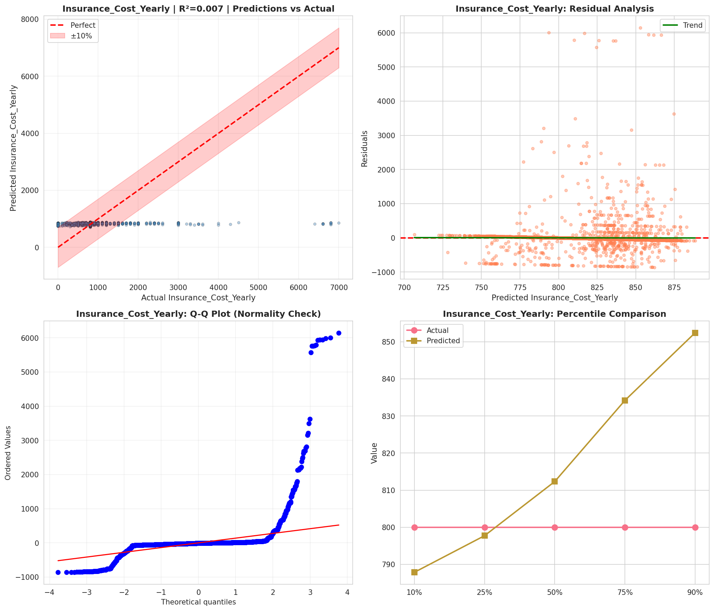
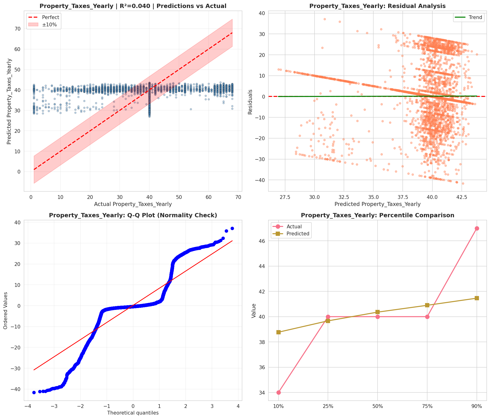
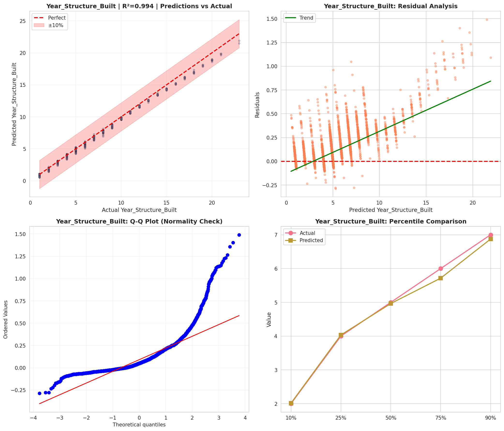

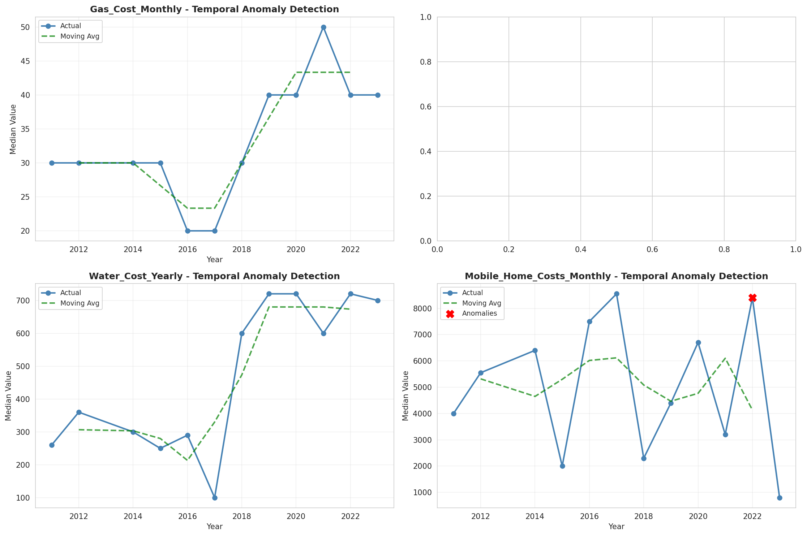
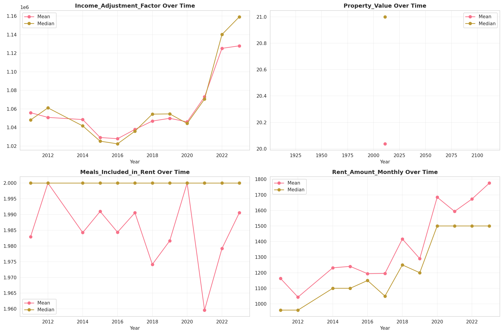
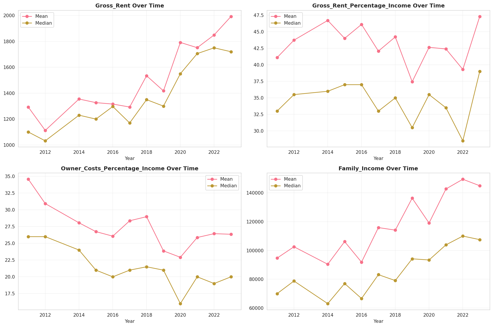
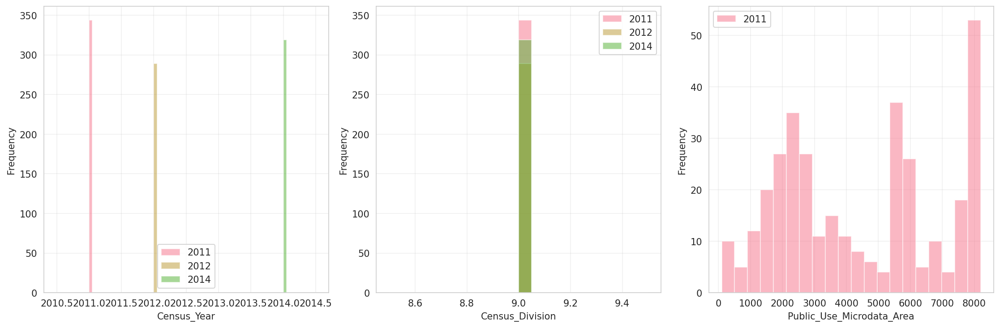
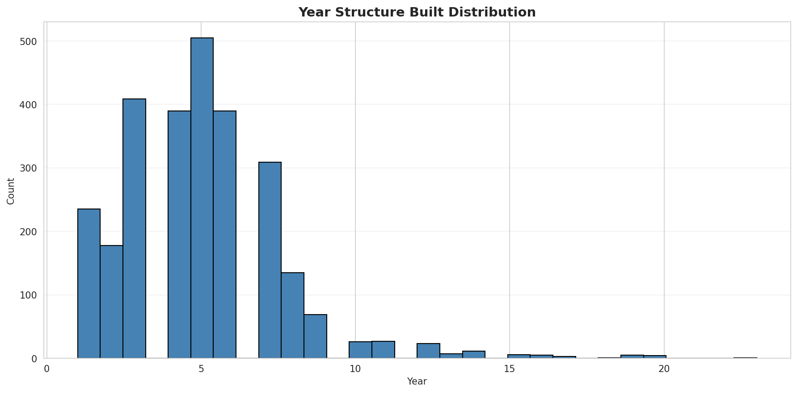
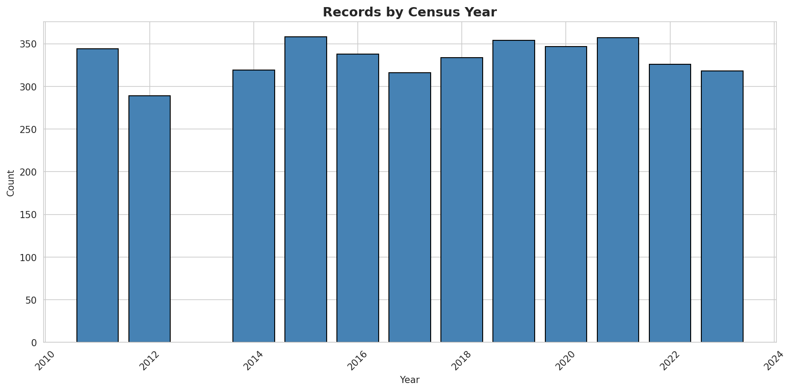
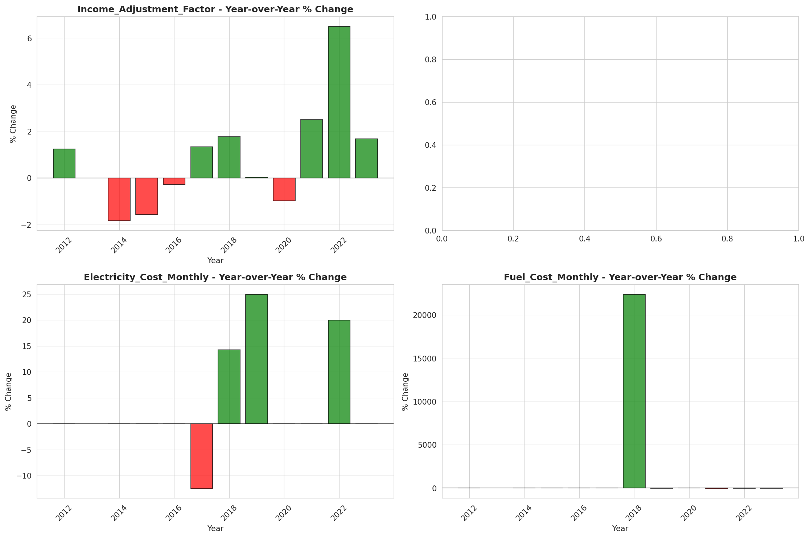
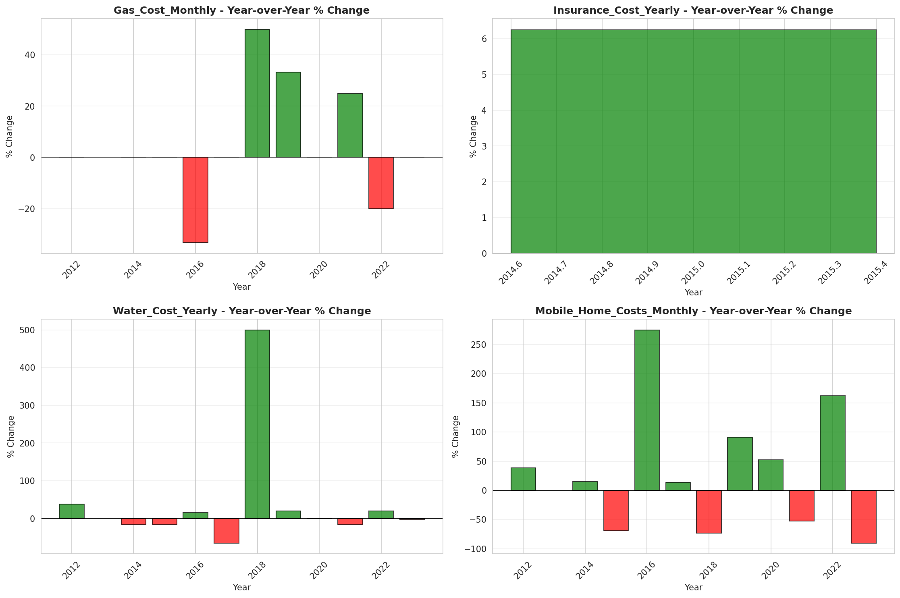
