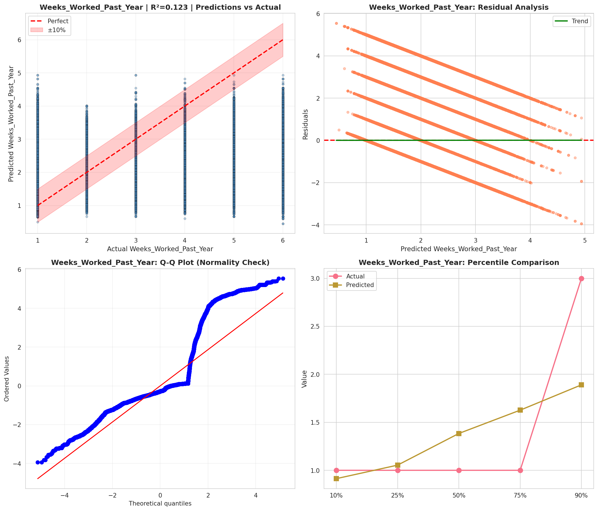
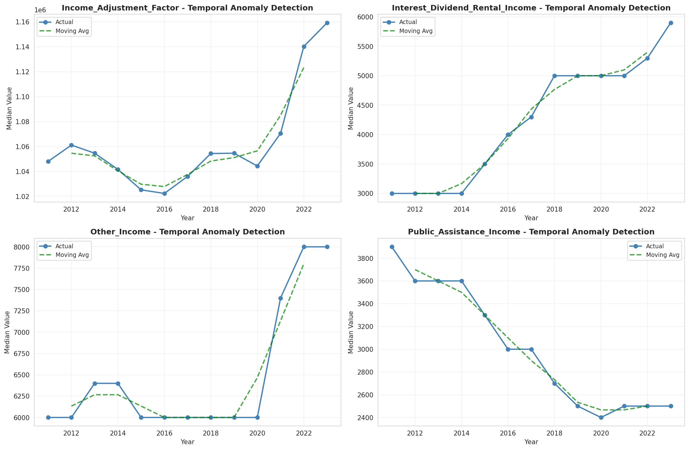
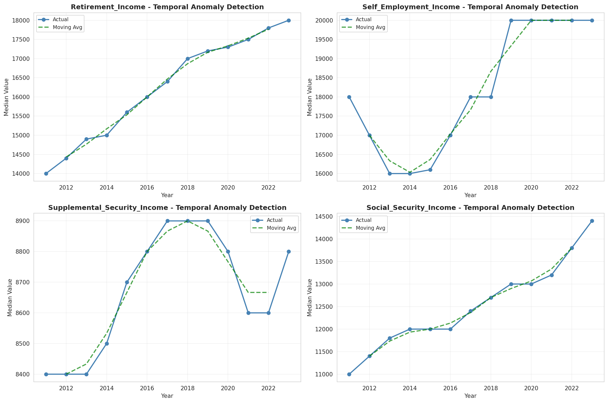
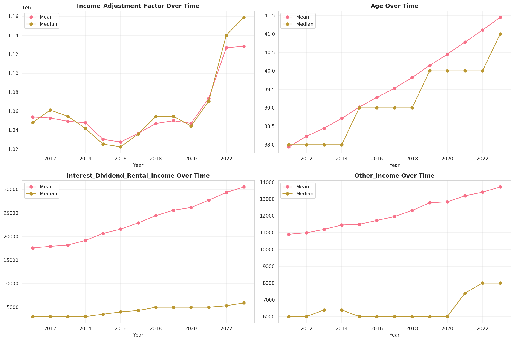
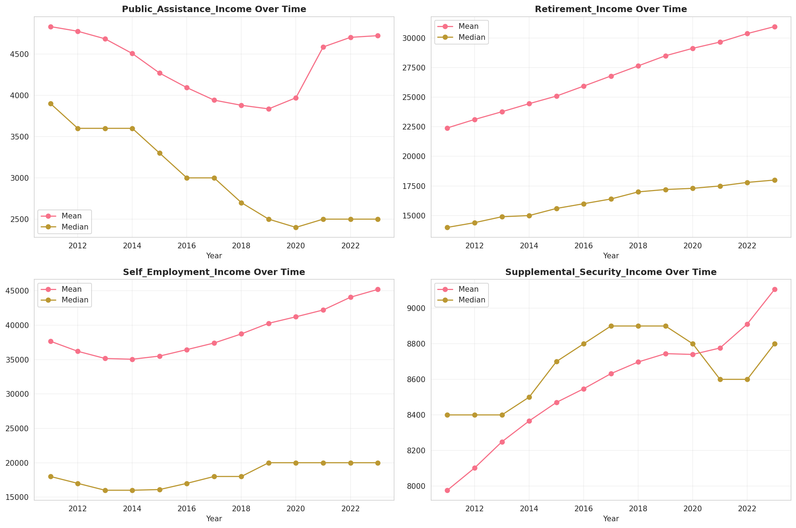
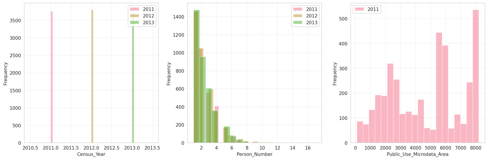
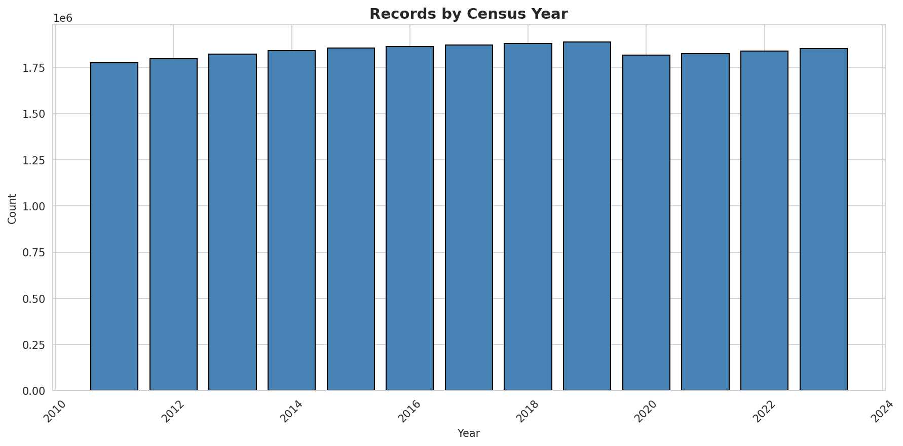
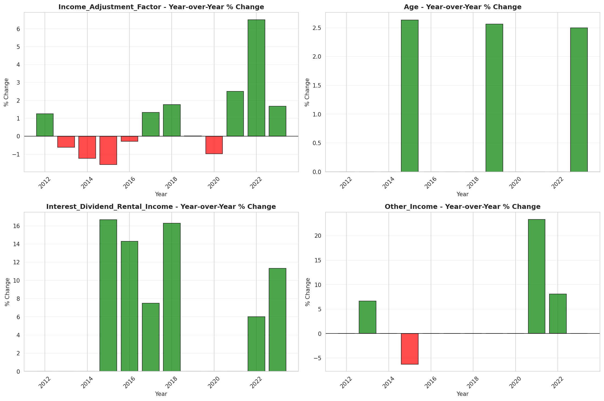
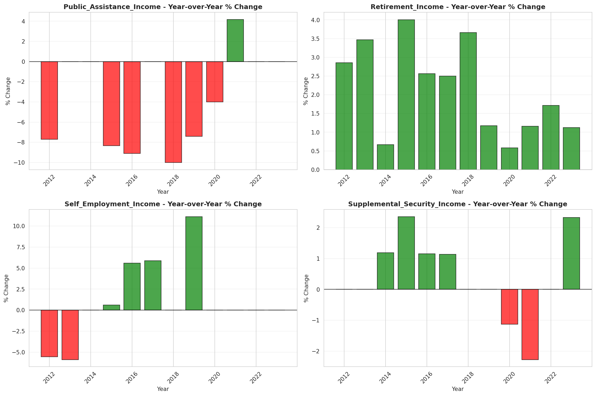

# Temporal Analysis

## Year Distribution

- 2011: 1,776,827 records

- 2012: 1,796,916 records

- 2013: 1,821,970 records

- 2014: 1,841,648 records

- 2015: 1,855,755 records

- 2016: 1,862,981 records

- 2017: 1,872,509 records

- 2018: 1,879,923 records

- 2019: 1,887,461 records

- 2020: 1,816,306 records

- 2021: 1,826,332 records

- 2022: 1,839,928 records

- 2023: 1,853,429 records

## Temporal Trends

- Census_Year: {np.int64(2011): {'mean': 2011.0, 'median': 2011.0, 'std': 0.0}, np.int64(2012): {'mean': 2012.0, 'median': 2012.0, 'std': 0.0}, np.int64(2013): {'mean': 2013.0, 'median': 2013.0, 'std': 0.0}, np.int64(2014): {'mean': 2014.0, 'median': 2014.0, 'std': 0.0}, np.int64(2015): {'mean': 2015.0, 'median': 2015.0, 'std': 0.0}, np.int64(2016): {'mean': 2016.0, 'median': 2016.0, 'std': 0.0}, np.int64(2017): {'mean': 2017.0, 'median': 2017.0, 'std': 0.0}, np.int64(2018): {'mean': 2018.0, 'median': 2018.0, 'std': 0.0}, np.int64(2019): {'mean': 2019.0, 'median': 2019.0, 'std': 0.0}, np.int64(2020): {'mean': 2020.0, 'median': 2020.0, 'std': 0.0}, np.int64(2021): {'mean': 2021.0, 'median': 2021.0, 'std': 0.0}, np.int64(2022): {'mean': 2022.0, 'median': 2022.0, 'std': 0.0}, np.int64(2023): {'mean': 2023.0, 'median': 2023.0, 'std': 0.0}}

- Person_Number: {np.int64(2011): {'mean': 2.3137154039194585, 'median': 2.0, 'std': 1.539411293306587}, np.int64(2012): {'mean': 2.3139634796506905, 'median': 2.0, 'std': 1.545198718990374}, np.int64(2013): {'mean': 2.3165397893488917, 'median': 2.0, 'std': 1.5525903428868166}, np.int64(2014): {'mean': 2.309987033352736, 'median': 2.0, 'std': 1.5484635364829897}, np.int64(2015): {'mean': 2.296452926167517, 'median': 2.0, 'std': 1.5341348053636539}, np.int64(2016): {'mean': 2.29218118703304, 'median': 2.0, 'std': 1.5263370796765734}, np.int64(2017): {'mean': 2.287783930544526, 'median': 2.0, 'std': 1.5208017470193325}, np.int64(2018): {'mean': 2.278575771454469, 'median': 2.0, 'std': 1.508959799664795}, np.int64(2019): {'mean': 2.270603207165605, 'median': 2.0, 'std': 1.500829563050871}, np.int64(2020): {'mean': 2.2675298105054984, 'median': 2.0, 'std': 1.502841312713238}, np.int64(2021): {'mean': 2.26445410801541, 'median': 2.0, 'std': 1.501425121592642}, np.int64(2022): {'mean': 2.2570404928888523, 'median': 2.0, 'std': 1.4982290560074334}, np.int64(2023): {'mean': 2.252779038204323, 'median': 2.0, 'std': 1.4978028192001587}}

- Public_Use_Microdata_Area: {np.int64(2011): {'mean': 4653.25862056351, 'median': 5200.0, 'std': 2371.8835368971363}, np.int64(2012): {'mean': None, 'median': None, 'std': None}, np.int64(2013): {'mean': None, 'median': None, 'std': None}, np.int64(2014): {'mean': None, 'median': None, 'std': None}, np.int64(2015): {'mean': None, 'median': None, 'std': None}, np.int64(2016): {'mean': 5480.964005000587, 'median': 5908.0, 'std': 2686.3567216956744}, np.int64(2017): {'mean': 5482.522980129868, 'median': 5908.0, 'std': 2687.5277177929374}, np.int64(2018): {'mean': 5486.708015700643, 'median': 5908.0, 'std': 2687.0197180964533}, np.int64(2019): {'mean': 5491.850983411048, 'median': 5909.0, 'std': 2686.2685846259956}, np.int64(2020): {'mean': 5494.0124835793085, 'median': 5909.0, 'std': 2687.012485507049}, np.int64(2021): {'mean': 5495.6385859745105, 'median': 5909.0, 'std': 2686.310051967423}, np.int64(2022): {'mean': None, 'median': None, 'std': None}, np.int64(2023): {'mean': 5526.929110853451, 'median': 5919.0, 'std': 2688.5437619953696}}

- State_Code: {np.int64(2011): {'mean': 6.0, 'median': 6.0, 'std': 0.0}, np.int64(2012): {'mean': 6.0, 'median': 6.0, 'std': 0.0}, np.int64(2013): {'mean': 6.0, 'median': 6.0, 'std': 0.0}, np.int64(2014): {'mean': 6.0, 'median': 6.0, 'std': 0.0}, np.int64(2015): {'mean': 6.0, 'median': 6.0, 'std': 0.0}, np.int64(2016): {'mean': 6.0, 'median': 6.0, 'std': 0.0}, np.int64(2017): {'mean': 6.0, 'median': 6.0, 'std': 0.0}, np.int64(2018): {'mean': 6.0, 'median': 6.0, 'std': 0.0}, np.int64(2019): {'mean': 6.0, 'median': 6.0, 'std': 0.0}, np.int64(2020): {'mean': 6.0, 'median': 6.0, 'std': 0.0}, np.int64(2021): {'mean': 6.0, 'median': 6.0, 'std': 0.0}, np.int64(2022): {'mean': 6.0, 'median': 6.0, 'std': 0.0}, np.int64(2023): {'mean': None, 'median': None, 'std': None}}

- Income_Adjustment_Factor: {np.int64(2011): {'mean': 1053920.906136613, 'median': 1048026.0, 'std': 28346.603415926784}, np.int64(2012): {'mean': 1052784.6405914356, 'median': 1061121.0, 'std': 26307.093811084775}, np.int64(2013): {'mean': 1049332.8631794157, 'median': 1054614.0, 'std': 29694.096762234563}, np.int64(2014): {'mean': 1047711.3128670625, 'median': 1041654.0, 'std': 31171.4511868276}, np.int64(2015): {'mean': 1030251.3263830624, 'median': 1025215.0, 'std': 25629.301762194293}, np.int64(2016): {'mean': 1027478.9519667672, 'median': 1022342.0, 'std': 17492.524142614155}, np.int64(2017): {'mean': 1036621.2068951337, 'median': 1035988.0, 'std': 16836.76170680816}, np.int64(2018): {'mean': 1046927.7702246315, 'median': 1054346.0, 'std': 20468.044489317672}, np.int64(2019): {'mean': 1049897.4515786022, 'median': 1054606.0, 'std': 26213.147232675405}, np.int64(2020): {'mean': 1047104.431815454, 'median': 1044328.0, 'std': 28671.41418062603}, np.int64(2021): {'mean': 1073466.8880898983, 'median': 1070512.0, 'std': 30893.890815249717}, np.int64(2022): {'mean': 1126877.8545241987, 'median': 1140108.0, 'std': 49935.861101942326}, np.int64(2023): {'mean': 1128563.1911386948, 'median': 1159185.0, 'std': 70386.45848372752}}

- Person_Weight: {np.int64(2011): {'mean': 20.80630247064008, 'median': 16.0, 'std': 13.737440419457801}, np.int64(2012): {'mean': 20.771737799652293, 'median': 16.0, 'std': 14.167255516828266}, np.int64(2013): {'mean': 20.66948467867199, 'median': 16.0, 'std': 14.438811414519146}, np.int64(2014): {'mean': 20.670030320669312, 'median': 16.0, 'std': 14.800373568533109}, np.int64(2015): {'mean': 20.703952838602078, 'median': 16.0, 'std': 15.167927852680128}, np.int64(2016): {'mean': 20.748577682756828, 'median': 16.0, 'std': 14.85429886842815}, np.int64(2017): {'mean': 20.81850981757631, 'median': 16.0, 'std': 14.862635453359793}, np.int64(2018): {'mean': 20.824661435601353, 'median': 16.0, 'std': 14.874854509524845}, np.int64(2019): {'mean': 20.81287878266094, 'median': 16.0, 'std': 15.17289312556946}, np.int64(2020): {'mean': 21.662662018404387, 'median': 16.0, 'std': 18.832852170413922}, np.int64(2021): {'mean': 21.603603835447224, 'median': 16.0, 'std': 18.951216808282922}, np.int64(2022): {'mean': 21.390023957459206, 'median': 15.0, 'std': 18.96202842324136}, np.int64(2023): {'mean': 21.17307164180554, 'median': 15.0, 'std': 19.092864668124964}}

- Age: {np.int64(2011): {'mean': 37.942252115709636, 'median': 38.0, 'std': 22.876166281553136}, np.int64(2012): {'mean': 38.22892222007039, 'median': 38.0, 'std': 22.947546561543643}, np.int64(2013): {'mean': 38.448810902484674, 'median': 38.0, 'std': 22.988319669273537}, np.int64(2014): {'mean': 38.71212739893834, 'median': 38.0, 'std': 23.024644810570063}, np.int64(2015): {'mean': 39.01997731381567, 'median': 39.0, 'std': 23.058595224631976}, np.int64(2016): {'mean': 39.28214995214659, 'median': 39.0, 'std': 23.091862378231735}, np.int64(2017): {'mean': 39.527999598399795, 'median': 39.0, 'std': 23.103610281231205}, np.int64(2018): {'mean': 39.8200282671152, 'median': 39.0, 'std': 23.142123609992943}, np.int64(2019): {'mean': 40.14630553955817, 'median': 40.0, 'std': 23.188445815158445}, np.int64(2020): {'mean': 40.45126096593856, 'median': 40.0, 'std': 23.232028664948437}, np.int64(2021): {'mean': 40.77786952208032, 'median': 40.0, 'std': 23.260240526802676}, np.int64(2022): {'mean': 41.10369373149384, 'median': 40.0, 'std': 23.296773094447904}, np.int64(2023): {'mean': 41.45404328949207, 'median': 41.0, 'std': 23.341132436915743}}

- Citizenship_Status: {np.int64(2011): {'mean': 1.9334414661641228, 'median': 1.0, 'std': 1.5593197702607005}, np.int64(2012): {'mean': 1.93886748184111, 'median': 1.0, 'std': 1.559586888521436}, np.int64(2013): {'mean': 1.9433574647222511, 'median': 1.0, 'std': 1.5597511783417355}, np.int64(2014): {'mean': 1.9452229742057114, 'median': 1.0, 'std': 1.5587547898484884}, np.int64(2015): {'mean': 1.9429660704133898, 'median': 1.0, 'std': 1.554894806275906}, np.int64(2016): {'mean': 1.939924776473834, 'median': 1.0, 'std': 1.5503705016701113}, np.int64(2017): {'mean': 1.9351559858991332, 'median': 1.0, 'std': 1.544754245660603}, np.int64(2018): {'mean': 1.9316009219526544, 'median': 1.0, 'std': 1.5398609456328776}, np.int64(2019): {'mean': 1.9267889508710379, 'median': 1.0, 'std': 1.5336384576969948}, np.int64(2020): {'mean': 1.9250252986005663, 'median': 1.0, 'std': 1.5300030219311327}, np.int64(2021): {'mean': 1.9297997297315055, 'median': 1.0, 'std': 1.5299299367967778}, np.int64(2022): {'mean': 1.9336653390784857, 'median': 1.0, 'std': 1.5303657838751037}, np.int64(2023): {'mean': 1.940292830208225, 'median': 1.0, 'std': 1.532404888619759}}

- Class_of_Worker: {np.int64(2011): {'mean': 2.2444880079382368, 'median': 1.0, 'std': 2.01932976852277}, np.int64(2012): {'mean': 2.254821748981388, 'median': 1.0, 'std': 2.037183580148383}, np.int64(2013): {'mean': 2.261502165797362, 'median': 1.0, 'std': 2.0512500748198472}, np.int64(2014): {'mean': 2.2633314077879643, 'median': 1.0, 'std': 2.0571059197864727}, np.int64(2015): {'mean': 2.2612077007250635, 'median': 1.0, 'std': 2.055432322183008}, np.int64(2016): {'mean': 2.254533544783838, 'median': 1.0, 'std': 2.047112320551931}, np.int64(2017): {'mean': 2.2438322038355256, 'median': 1.0, 'std': 2.033701974318636}, np.int64(2018): {'mean': 2.2372972384445697, 'median': 1.0, 'std': 2.0231262702852235}, np.int64(2019): {'mean': 2.2291672710131265, 'median': 1.0, 'std': 2.007709092259947}, np.int64(2020): {'mean': 2.227693387796783, 'median': 1.0, 'std': 1.9963751161810122}, np.int64(2021): {'mean': 2.2261834265894835, 'median': 1.0, 'std': 1.9882054922752126}, np.int64(2022): {'mean': 2.230944275746458, 'median': 1.0, 'std': 1.9835523249637568}, np.int64(2023): {'mean': 2.238310822661097, 'median': 1.0, 'std': 1.9816335956474276}}

- English_Speaking_Ability: {np.int64(2011): {'mean': 1.7935679568700085, 'median': 1.0, 'std': 0.9978223871350254}, np.int64(2012): {'mean': 1.7857211488130833, 'median': 1.0, 'std': 0.9948611477749914}, np.int64(2013): {'mean': 1.7753164999846054, 'median': 1.0, 'std': 0.9899085458312304}, np.int64(2014): {'mean': 1.7645587439239567, 'median': 1.0, 'std': 0.9870732744944096}, np.int64(2015): {'mean': 1.7521036208065732, 'median': 1.0, 'std': 0.9825446560671537}, np.int64(2016): {'mean': 1.7382055416096927, 'median': 1.0, 'std': 0.9755940439252317}, np.int64(2017): {'mean': 1.720583830704888, 'median': 1.0, 'std': 0.9659306775530146}, np.int64(2018): {'mean': 1.7025962132056145, 'median': 1.0, 'std': 0.9566292781682101}, np.int64(2019): {'mean': 1.6832702742258094, 'median': 1.0, 'std': 0.9445184178771145}, np.int64(2020): {'mean': 1.669042991974625, 'median': 1.0, 'std': 0.9350715673365002}, np.int64(2021): {'mean': 1.6603858363450714, 'median': 1.0, 'std': 0.9292547988803866}, np.int64(2022): {'mean': 1.6570421926513745, 'median': 1.0, 'std': 0.9278144149844324}, np.int64(2023): {'mean': 1.658266062341611, 'median': 1.0, 'std': 0.9286882931295757}}

- Fertility_Status: {np.int64(2011): {'mean': 1.9438168172200332, 'median': 2.0, 'std': 0.2302753905883084}, np.int64(2012): {'mean': 1.9444716141087452, 'median': 2.0, 'std': 0.22900896321976424}, np.int64(2013): {'mean': 1.94628909602283, 'median': 2.0, 'std': 0.22544657701188334}, np.int64(2014): {'mean': 1.9476175593642566, 'median': 2.0, 'std': 0.22279729304400803}, np.int64(2015): {'mean': 1.9486691841798016, 'median': 2.0, 'std': 0.22067187000572502}, np.int64(2016): {'mean': 1.9497220356945453, 'median': 2.0, 'std': 0.21851819071372625}, np.int64(2017): {'mean': 1.9506230917316172, 'median': 2.0, 'std': 0.21665395539885093}, np.int64(2018): {'mean': 1.9513717533951125, 'median': 2.0, 'std': 0.21508985549550302}, np.int64(2019): {'mean': 1.9519118715639097, 'median': 2.0, 'std': 0.2139527165938478}, np.int64(2020): {'mean': 1.9525788958169092, 'median': 2.0, 'std': 0.212538116527107}, np.int64(2021): {'mean': 1.9530969104807137, 'median': 2.0, 'std': 0.21143154044973134}, np.int64(2022): {'mean': 1.9531991055702465, 'median': 2.0, 'std': 0.21121239690181384}, np.int64(2023): {'mean': 1.9531657615771756, 'median': 2.0, 'std': 0.2112839279538788}}

- Marital_Status: {np.int64(2011): {'mean': 3.0552135914188607, 'median': 3.0, 'std': 1.8702301371463121}, np.int64(2012): {'mean': 3.066541786037856, 'median': 3.0, 'std': 1.8688264289606409}, np.int64(2013): {'mean': 3.0768536254713306, 'median': 3.0, 'std': 1.8684573073058794}, np.int64(2014): {'mean': 3.0821514209012797, 'median': 3.0, 'std': 1.8679270000707513}, np.int64(2015): {'mean': 3.0823955748468954, 'median': 3.0, 'std': 1.8681561540671445}, np.int64(2016): {'mean': 3.075549348060984, 'median': 3.0, 'std': 1.8693366493170698}, np.int64(2017): {'mean': 3.069664818700471, 'median': 3.0, 'std': 1.8705995084488771}, np.int64(2018): {'mean': 3.0639510235259637, 'median': 3.0, 'std': 1.8711351238971718}, np.int64(2019): {'mean': 3.05561757302535, 'median': 3.0, 'std': 1.8717827508060738}, np.int64(2020): {'mean': 3.054012374566841, 'median': 3.0, 'std': 1.8724193559346467}, np.int64(2021): {'mean': 3.054969195086107, 'median': 3.0, 'std': 1.8727428415719485}, np.int64(2022): {'mean': 3.0576359509719944, 'median': 3.0, 'std': 1.872722088090491}, np.int64(2023): {'mean': 3.0573008191843334, 'median': 3.0, 'std': 1.8728604235324589}}

- Mobility_Status: {np.int64(2011): {'mean': 1.2738852777801504, 'median': 1.0, 'std': 0.6825170118651788}, np.int64(2012): {'mean': 1.2773913410533129, 'median': 1.0, 'std': 0.6863008739840832}, np.int64(2013): {'mean': 1.2799776285112197, 'median': 1.0, 'std': 0.689020290513587}, np.int64(2014): {'mean': 1.2771461795241437, 'median': 1.0, 'std': 0.6858517084809428}, np.int64(2015): {'mean': 1.2704080965946214, 'median': 1.0, 'std': 0.6784796036692562}, np.int64(2016): {'mean': 1.2624789874955265, 'median': 1.0, 'std': 0.6697391690198269}, np.int64(2017): {'mean': 1.2569687430722503, 'median': 1.0, 'std': 0.6634063248905763}, np.int64(2018): {'mean': 1.2516159249579166, 'median': 1.0, 'std': 0.6573741634116894}, np.int64(2019): {'mean': 1.2453847095991943, 'median': 1.0, 'std': 0.6503875862853298}, np.int64(2020): {'mean': 1.2401462628085527, 'median': 1.0, 'std': 0.644566148045238}, np.int64(2021): {'mean': 1.233245577596988, 'median': 1.0, 'std': 0.6368084332299941}, np.int64(2022): {'mean': 1.2268679806309681, 'median': 1.0, 'std': 0.6290444424465573}, np.int64(2023): {'mean': 1.2167490499262141, 'median': 1.0, 'std': 0.6162841481093084}}

- Military_Service: {np.int64(2011): {'mean': 4.808562345256091, 'median': 5.0, 'std': 0.617541477267253}, np.int64(2012): {'mean': 4.81527451032128, 'median': 5.0, 'std': 0.6093428587383948}, np.int64(2013): {'mean': 3.829222130963309, 'median': 4.0, 'std': 0.564560942046532}, np.int64(2014): {'mean': 3.836024833587938, 'median': 4.0, 'std': 0.5541580665679102}, np.int64(2015): {'mean': 3.841648700736603, 'median': 4.0, 'std': 0.5455503251804881}, np.int64(2016): {'mean': 3.847580409322166, 'median': 4.0, 'std': 0.5357445128761883}, np.int64(2017): {'mean': 3.8534574914937467, 'median': 4.0, 'std': 0.5260194944040486}, np.int64(2018): {'mean': 3.8576549830514777, 'median': 4.0, 'std': 0.5193461814439333}, np.int64(2019): {'mean': 3.8612501110939212, 'median': 4.0, 'std': 0.5134930084819157}, np.int64(2020): {'mean': 3.864652530121138, 'median': 4.0, 'std': 0.5087123157194852}, np.int64(2021): {'mean': 3.8691832522423053, 'median': 4.0, 'std': 0.5011838055010005}, np.int64(2022): {'mean': 3.8725763985740485, 'median': 4.0, 'std': 0.49683943401834907}, np.int64(2023): {'mean': 3.8759894025238726, 'median': 4.0, 'std': 0.4922855072521747}}

- Travel_Time_To_Work_Minutes: {np.int64(2011): {'mean': 27.006545071460792, 'median': 20.0, 'std': 22.58894188933458}, np.int64(2012): {'mean': 27.101149942887268, 'median': 20.0, 'std': 22.57260241869109}, np.int64(2013): {'mean': 27.30209124589004, 'median': 20.0, 'std': 22.585392200187613}, np.int64(2014): {'mean': 27.65590368113638, 'median': 20.0, 'std': 22.717783293426393}, np.int64(2015): {'mean': 28.108612397399156, 'median': 20.0, 'std': 23.033441965096447}, np.int64(2016): {'mean': 28.63240739770799, 'median': 20.0, 'std': 23.415399818759422}, np.int64(2017): {'mean': 29.074509622537512, 'median': 20.0, 'std': 23.658819649469987}, np.int64(2018): {'mean': 29.53523267552532, 'median': 22.0, 'std': 23.993101425158503}, np.int64(2019): {'mean': 30.054238320079524, 'median': 25.0, 'std': 24.44955682738623}, np.int64(2020): {'mean': 30.035973064737266, 'median': 25.0, 'std': 24.48286288498477}, np.int64(2021): {'mean': 29.644986664951606, 'median': 24.0, 'std': 24.205428442663763}, np.int64(2022): {'mean': 29.286829068268926, 'median': 20.0, 'std': 24.039061022869834}, np.int64(2023): {'mean': 28.98843581744395, 'median': 20.0, 'std': 23.88139382528814}}

- Vehicle_Occupancy: {np.int64(2011): {'mean': 1.2068383968853493, 'median': 1.0, 'std': 0.6912922697104855}, np.int64(2012): {'mean': 1.208070758847918, 'median': 1.0, 'std': 0.6997571179793156}, np.int64(2013): {'mean': 1.2063021745061913, 'median': 1.0, 'std': 0.6974339811997318}, np.int64(2014): {'mean': 1.2042202560126487, 'median': 1.0, 'std': 0.6935624435787672}, np.int64(2015): {'mean': 1.2013917333201303, 'median': 1.0, 'std': 0.6878863436346929}, np.int64(2016): {'mean': 1.199737890311513, 'median': 1.0, 'std': 0.683880585942851}, np.int64(2017): {'mean': 1.1958973914174815, 'median': 1.0, 'std': 0.6693826233932388}, np.int64(2018): {'mean': 1.193928342684941, 'median': 1.0, 'std': 0.6641842904637031}, np.int64(2019): {'mean': 1.192402411001767, 'median': 1.0, 'std': 0.6584741683426406}, np.int64(2020): {'mean': 1.1919108775306266, 'median': 1.0, 'std': 0.6542425795732966}, np.int64(2021): {'mean': 1.1883345453656569, 'median': 1.0, 'std': 0.6396021729314871}, np.int64(2022): {'mean': 1.1920464196932785, 'median': 1.0, 'std': 0.6475618899770254}, np.int64(2023): {'mean': 1.196587667600749, 'median': 1.0, 'std': 0.6550259618616536}}

- Transportation_To_Work: {np.int64(2011): {'mean': 2.043306091718358, 'median': 1.0, 'std': 2.891006325005541}, np.int64(2012): {'mean': 2.0591466726261163, 'median': 1.0, 'std': 2.9082314990026825}, np.int64(2013): {'mean': 2.080450518757574, 'median': 1.0, 'std': 2.9325088952409684}, np.int64(2014): {'mean': 2.101030972737125, 'median': 1.0, 'std': 2.954474731043427}, np.int64(2015): {'mean': 2.125393255030768, 'median': 1.0, 'std': 2.9814015841064547}, np.int64(2016): {'mean': 2.1381749238101233, 'median': 1.0, 'std': 2.995895137378965}, np.int64(2017): {'mean': 2.15863873332753, 'median': 1.0, 'std': 3.0201276117894515}, np.int64(2018): {'mean': 2.1722152714634024, 'median': 1.0, 'std': 3.038847924442417}, np.int64(2019): {'mean': None, 'median': None, 'std': None}, np.int64(2020): {'mean': None, 'median': None, 'std': None}, np.int64(2021): {'mean': None, 'median': None, 'std': None}, np.int64(2022): {'mean': None, 'median': None, 'std': None}, np.int64(2023): {'mean': None, 'median': None, 'std': None}}

- Language_Other_Than_English: {np.int64(2011): {'mean': 1.5932602708175387, 'median': 2.0, 'std': 0.4912256778896678}, np.int64(2012): {'mean': 1.586955633230918, 'median': 2.0, 'std': 0.4923808093897971}, np.int64(2013): {'mean': 1.5831618223566308, 'median': 2.0, 'std': 0.49303575236543784}, np.int64(2014): {'mean': 1.5816879018508692, 'median': 2.0, 'std': 0.4932820966667477}, np.int64(2015): {'mean': 1.5817952431329452, 'median': 2.0, 'std': 0.4932643074830587}, np.int64(2016): {'mean': 1.5827966816049317, 'median': 2.0, 'std': 0.4930971988693317}, np.int64(2017): {'mean': 1.585737739404286, 'median': 2.0, 'std': 0.49259433298827754}, np.int64(2018): {'mean': 1.5864713542616395, 'median': 2.0, 'std': 0.4924660810295195}, np.int64(2019): {'mean': 1.5880933495506286, 'median': 2.0, 'std': 0.4921785214541952}, np.int64(2020): {'mean': 1.5883409983681267, 'median': 2.0, 'std': 0.49213413650162163}, np.int64(2021): {'mean': 1.5865387878352146, 'median': 2.0, 'std': 0.4924542391780761}, np.int64(2022): {'mean': 1.5845113296280462, 'median': 2.0, 'std': 0.49280622317932826}, np.int64(2023): {'mean': 1.581476994431831, 'median': 2.0, 'std': 0.4933169740582273}}

- Grandparents_Living_With_Grandchildren: {np.int64(2011): {'mean': 1.9547518390911631, 'median': 2.0, 'std': 0.20784803359945994}, np.int64(2012): {'mean': 1.9537527277193105, 'median': 2.0, 'std': 0.2100202431017649}, np.int64(2013): {'mean': 1.95297121550544, 'median': 2.0, 'std': 0.2117005391766213}, np.int64(2014): {'mean': 1.95271219506142, 'median': 2.0, 'std': 0.21225387717159525}, np.int64(2015): {'mean': 1.9532674911506358, 'median': 2.0, 'std': 0.2110654410414021}, np.int64(2016): {'mean': 1.9538526635677373, 'median': 2.0, 'std': 0.20980418933159645}, np.int64(2017): {'mean': 1.9543150118208368, 'median': 2.0, 'std': 0.20880111910351987}, np.int64(2018): {'mean': 1.95515119387654, 'median': 2.0, 'std': 0.20697204397687846}, np.int64(2019): {'mean': 1.956025682440903, 'median': 2.0, 'std': 0.20503807484860762}, np.int64(2020): {'mean': 1.9563222440100125, 'median': 2.0, 'std': 0.2043772142097225}, np.int64(2021): {'mean': 1.9570342603575994, 'median': 2.0, 'std': 0.20277997897924643}, np.int64(2022): {'mean': 1.9578575962395492, 'median': 2.0, 'std': 0.20091404981366126}, np.int64(2023): {'mean': 1.958323600999342, 'median': 2.0, 'std': 0.19984871711208546}}

- Months_Responsible_For_Grandchildren: {np.int64(2011): {'mean': 3.6325236167341433, 'median': 4.0, 'std': 1.3618222831739293}, np.int64(2012): {'mean': 3.6542834479111583, 'median': 4.0, 'std': 1.3637620000060462}, np.int64(2013): {'mean': 3.662159501148671, 'median': 4.0, 'std': 1.3608040910492485}, np.int64(2014): {'mean': 3.696884984025559, 'median': 4.0, 'std': 1.356988371753363}, np.int64(2015): {'mean': 3.730588635590337, 'median': 4.0, 'std': 1.347087770450492}, np.int64(2016): {'mean': 3.7411116675012517, 'median': 4.0, 'std': 1.3524137582777587}, np.int64(2017): {'mean': 3.7585508550855087, 'median': 4.0, 'std': 1.3438188731345744}, np.int64(2018): {'mean': 3.7795476266326857, 'median': 4.0, 'std': 1.3440367233454809}, np.int64(2019): {'mean': 3.781614906832298, 'median': 4.0, 'std': 1.3434273189058037}, np.int64(2020): {'mean': 3.7940255791074144, 'median': 4.0, 'std': 1.345390358017262}, np.int64(2021): {'mean': 3.8290471785383904, 'median': 4.0, 'std': 1.3309053380913405}, np.int64(2022): {'mean': 3.848870597243492, 'median': 4.0, 'std': 1.3331869517674297}, np.int64(2023): {'mean': 3.865889498432602, 'median': 4.0, 'std': 1.333833812989266}}

- Grandparents_Responsible_For_Grandchildren: {np.int64(2011): {'mean': 1.6950115245307869, 'median': 2.0, 'std': 0.4604072845221368}, np.int64(2012): {'mean': 1.7002041180317473, 'median': 2.0, 'std': 0.4581729708488825}, np.int64(2013): {'mean': 1.708236781124921, 'median': 2.0, 'std': 0.4545782664684413}, np.int64(2014): {'mean': 1.7183932822252628, 'median': 2.0, 'std': 0.4497868009411669}, np.int64(2015): {'mean': 1.725167854270699, 'median': 2.0, 'std': 0.44643383032176487}, np.int64(2016): {'mean': 1.7378822823498528, 'median': 2.0, 'std': 0.43979045742951844}, np.int64(2017): {'mean': 1.750299670362601, 'median': 2.0, 'std': 0.4328436022816447}, np.int64(2018): {'mean': 1.7629243608625051, 'median': 2.0, 'std': 0.4252930702872148}, np.int64(2019): {'mean': 1.7701969740222667, 'median': 2.0, 'std': 0.42071007084769996}, np.int64(2020): {'mean': 1.778966096668973, 'median': 2.0, 'std': 0.4149473710137332}, np.int64(2021): {'mean': 1.785753924211194, 'median': 2.0, 'std': 0.41030236573698275}, np.int64(2022): {'mean': 1.7921209709510546, 'median': 2.0, 'std': 0.40579380806754717}, np.int64(2023): {'mean': 1.797841370432716, 'median': 2.0, 'std': 0.4016138846079901}}

- Interest_Dividend_Rental_Income: {np.int64(2011): {'mean': 17563.556189289586, 'median': 3000.0, 'std': 45199.162010423956}, np.int64(2012): {'mean': 17915.677935495114, 'median': 3000.0, 'std': 46479.84574669534}, np.int64(2013): {'mean': 18188.958242596364, 'median': 3000.0, 'std': 47445.950249642796}, np.int64(2014): {'mean': 19187.152368337287, 'median': 3000.0, 'std': 50073.0968162706}, np.int64(2015): {'mean': 20664.55980432544, 'median': 3500.0, 'std': 53697.49273694409}, np.int64(2016): {'mean': 21570.060881138277, 'median': 4000.0, 'std': 55595.164930903535}, np.int64(2017): {'mean': 22899.76844232568, 'median': 4300.0, 'std': 58114.4403609805}, np.int64(2018): {'mean': 24438.799095839066, 'median': 5000.0, 'std': 61041.365550818366}, np.int64(2019): {'mean': 25584.29818843066, 'median': 5000.0, 'std': 63241.218411143374}, np.int64(2020): {'mean': 26164.982970065364, 'median': 5000.0, 'std': 63844.173287348}, np.int64(2021): {'mean': 27732.582192409245, 'median': 5000.0, 'std': 67780.950395043}, np.int64(2022): {'mean': 29344.744883310774, 'median': 5300.0, 'std': 71575.11366100419}, np.int64(2023): {'mean': 30532.60449471465, 'median': 5900.0, 'std': 74439.94682373165}}

- Military_Service_Period_1: {np.int64(2011): {'mean': 0.12428546022712837, 'median': 0.0, 'std': 0.3299083301822303}, np.int64(2012): {'mean': 0.13463117055931428, 'median': 0.0, 'std': 0.3413306683776161}, np.int64(2013): {'mean': 0.1458692905820181, 'median': 0.0, 'std': 0.35297669767568135}, np.int64(2014): {'mean': 0.1585784515668342, 'median': 0.0, 'std': 0.3652842014187473}, np.int64(2015): {'mean': 0.17021216593500596, 'median': 0.0, 'std': 0.3758208512319576}, np.int64(2016): {'mean': 0.181350626118068, 'median': 0.0, 'std': 0.38531029046845394}, np.int64(2017): {'mean': 0.19415913000613663, 'median': 0.0, 'std': 0.39555396125901165}, np.int64(2018): {'mean': 0.2074611974532775, 'median': 0.0, 'std': 0.4054907399637236}, np.int64(2019): {'mean': 0.21828012196527552, 'median': 0.0, 'std': 0.41308074060747235}, np.int64(2020): {'mean': 0.23378634287623928, 'median': 0.0, 'std': 0.4232402204646999}, np.int64(2021): {'mean': 0.24616880146386094, 'median': 0.0, 'std': 0.43078050666907863}, np.int64(2022): {'mean': 0.2654933271169649, 'median': 0.0, 'std': 0.4415981129224971}, np.int64(2023): {'mean': 0.28437715563378607, 'median': 0.0, 'std': 0.4511199500724461}}

- Military_Service_Period_2: {np.int64(2011): {'mean': 0.12781687457127613, 'median': 0.0, 'std': 0.3338872043571694}, np.int64(2012): {'mean': 0.12960226732681823, 'median': 0.0, 'std': 0.33586678067458486}, np.int64(2013): {'mean': 0.13211508692016155, 'median': 0.0, 'std': 0.3386173516405668}, np.int64(2014): {'mean': 0.13527047687054278, 'median': 0.0, 'std': 0.3420138093988996}, np.int64(2015): {'mean': 0.13935081172035835, 'median': 0.0, 'std': 0.34631386112648144}, np.int64(2016): {'mean': 0.14275297503305592, 'median': 0.0, 'std': 0.3498224591557157}, np.int64(2017): {'mean': 0.1480438216150418, 'median': 0.0, 'std': 0.3551452060114275}, np.int64(2018): {'mean': 0.15259763636176624, 'median': 0.0, 'std': 0.35960106757872273}, np.int64(2019): {'mean': 0.1564801911208441, 'median': 0.0, 'std': 0.36331188250881585}, np.int64(2020): {'mean': 0.15821543945638855, 'median': 0.0, 'std': 0.36494492433321585}, np.int64(2021): {'mean': 0.16245425434583716, 'median': 0.0, 'std': 0.3688691172757843}, np.int64(2022): {'mean': 0.16436855294597588, 'median': 0.0, 'std': 0.37061183560982003}, np.int64(2023): {'mean': 0.16464879522371018, 'median': 0.0, 'std': 0.37086548134538033}}

- Military_Service_Period_3: {np.int64(2011): {'mean': 0.14248452359780833, 'median': 0.0, 'std': 0.3495478777797704}, np.int64(2012): {'mean': 0.14418781484649748, 'median': 0.0, 'std': 0.35128158954216504}, np.int64(2013): {'mean': None, 'median': None, 'std': None}, np.int64(2014): {'mean': None, 'median': None, 'std': None}, np.int64(2015): {'mean': None, 'median': None, 'std': None}, np.int64(2016): {'mean': None, 'median': None, 'std': None}, np.int64(2017): {'mean': None, 'median': None, 'std': None}, np.int64(2018): {'mean': None, 'median': None, 'std': None}, np.int64(2019): {'mean': None, 'median': None, 'std': None}, np.int64(2020): {'mean': None, 'median': None, 'std': None}, np.int64(2021): {'mean': None, 'median': None, 'std': None}, np.int64(2022): {'mean': None, 'median': None, 'std': None}, np.int64(2023): {'mean': None, 'median': None, 'std': None}}

- Military_Service_Period_4: {np.int64(2011): {'mean': 0.1129121041978947, 'median': 0.0, 'std': 0.31648666507878154}, np.int64(2012): {'mean': 0.11367740709058075, 'median': 0.0, 'std': 0.31742042279991056}, np.int64(2013): {'mean': None, 'median': None, 'std': None}, np.int64(2014): {'mean': None, 'median': None, 'std': None}, np.int64(2015): {'mean': None, 'median': None, 'std': None}, np.int64(2016): {'mean': None, 'median': None, 'std': None}, np.int64(2017): {'mean': None, 'median': None, 'std': None}, np.int64(2018): {'mean': None, 'median': None, 'std': None}, np.int64(2019): {'mean': None, 'median': None, 'std': None}, np.int64(2020): {'mean': None, 'median': None, 'std': None}, np.int64(2021): {'mean': None, 'median': None, 'std': None}, np.int64(2022): {'mean': None, 'median': None, 'std': None}, np.int64(2023): {'mean': None, 'median': None, 'std': None}}

- Military_Service_Period_5: {np.int64(2011): {'mean': 0.338219726802334, 'median': 0.0, 'std': 0.4731057373643425}, np.int64(2012): {'mean': 0.3413605689054791, 'median': 0.0, 'std': 0.474168191303467}, np.int64(2013): {'mean': 0.3467287058949129, 'median': 0.0, 'std': 0.47593058903621305}, np.int64(2014): {'mean': 0.3508188917268591, 'median': 0.0, 'std': 0.4772285426295343}, np.int64(2015): {'mean': 0.35612291899717047, 'median': 0.0, 'std': 0.47885440488441644}, np.int64(2016): {'mean': 0.36129151435015944, 'median': 0.0, 'std': 0.4803771430397602}, np.int64(2017): {'mean': 0.36432502037161857, 'median': 0.0, 'std': 0.4812427970976544}, np.int64(2018): {'mean': 0.36333995042325373, 'median': 0.0, 'std': 0.4809640425104645}, np.int64(2019): {'mean': 0.3640097656045349, 'median': 0.0, 'std': 0.48115390669533903}, np.int64(2020): {'mean': 0.36116742787122647, 'median': 0.0, 'std': 0.48034163584874356}, np.int64(2021): {'mean': 0.36053293687099724, 'median': 0.0, 'std': 0.4801578646500822}, np.int64(2022): {'mean': 0.35506731161489596, 'median': 0.0, 'std': 0.47853650326580977}, np.int64(2023): {'mean': 0.3532028258128969, 'median': 0.0, 'std': 0.47796789293901715}}

- Military_Service_Period_6: {np.int64(2011): {'mean': 0.10622189476893372, 'median': 0.0, 'std': 0.30812271556645804}, np.int64(2012): {'mean': 0.10599580060657905, 'median': 0.0, 'std': 0.30783357462872946}, np.int64(2013): {'mean': None, 'median': None, 'std': None}, np.int64(2014): {'mean': None, 'median': None, 'std': None}, np.int64(2015): {'mean': None, 'median': None, 'std': None}, np.int64(2016): {'mean': None, 'median': None, 'std': None}, np.int64(2017): {'mean': None, 'median': None, 'std': None}, np.int64(2018): {'mean': None, 'median': None, 'std': None}, np.int64(2019): {'mean': None, 'median': None, 'std': None}, np.int64(2020): {'mean': None, 'median': None, 'std': None}, np.int64(2021): {'mean': None, 'median': None, 'std': None}, np.int64(2022): {'mean': None, 'median': None, 'std': None}, np.int64(2023): {'mean': None, 'median': None, 'std': None}}

- Military_Service_Period_7: {np.int64(2011): {'mean': 0.12726641430180466, 'median': 0.0, 'std': 0.3332725831918113}, np.int64(2012): {'mean': 0.1254115146330715, 'median': 0.0, 'std': 0.3311863740911073}, np.int64(2013): {'mean': None, 'median': None, 'std': None}, np.int64(2014): {'mean': None, 'median': None, 'std': None}, np.int64(2015): {'mean': None, 'median': None, 'std': None}, np.int64(2016): {'mean': None, 'median': None, 'std': None}, np.int64(2017): {'mean': None, 'median': None, 'std': None}, np.int64(2018): {'mean': None, 'median': None, 'std': None}, np.int64(2019): {'mean': None, 'median': None, 'std': None}, np.int64(2020): {'mean': None, 'median': None, 'std': None}, np.int64(2021): {'mean': None, 'median': None, 'std': None}, np.int64(2022): {'mean': None, 'median': None, 'std': None}, np.int64(2023): {'mean': None, 'median': None, 'std': None}}

- Military_Service_Period_8: {np.int64(2011): {'mean': 0.1400540297926035, 'median': 0.0, 'std': 0.34704454828062714}, np.int64(2012): {'mean': 0.13565077636933925, 'median': 0.0, 'std': 0.34241883179911514}, np.int64(2013): {'mean': 0.12993541040195014, 'median': 0.0, 'std': 0.3362338551055862}, np.int64(2014): {'mean': 0.12468759440828321, 'median': 0.0, 'std': 0.33036585382298533}, np.int64(2015): {'mean': 0.12020229556585417, 'median': 0.0, 'std': 0.3251994739200727}, np.int64(2016): {'mean': 0.11484988722096912, 'median': 0.0, 'std': 0.3188422478312413}, np.int64(2017): {'mean': 0.10854803174954478, 'median': 0.0, 'std': 0.3110728693213065}, np.int64(2018): {'mean': 0.10207461197453277, 'median': 0.0, 'std': 0.3027479616909815}, np.int64(2019): {'mean': 0.09465930404350514, 'median': 0.0, 'std': 0.29274531281333976}, np.int64(2020): {'mean': 0.08642085329174558, 'median': 0.0, 'std': 0.2809860653362147}, np.int64(2021): {'mean': 0.07812214089661482, 'median': 0.0, 'std': 0.26836522808973234}, np.int64(2022): {'mean': 0.06954950754705985, 'median': 0.0, 'std': 0.2543877509300238}, np.int64(2023): {'mean': 0.0610237625175424, 'median': 0.0, 'std': 0.23937532122135075}}

- Military_Service_Period_9: {np.int64(2011): {'mean': 0.03023297172327939, 'median': 0.0, 'std': 0.17122846561568636}, np.int64(2012): {'mean': 0.02862672922553162, 'median': 0.0, 'std': 0.16675574915494595}, np.int64(2013): {'mean': 0.026227291329335777, 'median': 0.0, 'std': 0.15981128788632074}, np.int64(2014): {'mean': 0.024553019691851363, 'median': 0.0, 'std': 0.15475912953846063}, np.int64(2015): {'mean': 0.022983859596348903, 'median': 0.0, 'std': 0.14985263723718836}, np.int64(2016): {'mean': 0.02091273236369293, 'median': 0.0, 'std': 0.14309293853721933}, np.int64(2017): {'mean': 0.018681528726497188, 'median': 0.0, 'std': 0.13539835168535466}, np.int64(2018): {'mean': 0.016724437633070365, 'median': 0.0, 'std': 0.1282376698365854}, np.int64(2019): {'mean': 0.014637928685939416, 'median': 0.0, 'std': 0.12009917095506849}, np.int64(2020): {'mean': 0.01306672607775426, 'median': 0.0, 'std': 0.11356113069543482}, np.int64(2021): {'mean': None, 'median': None, 'std': None}, np.int64(2022): {'mean': None, 'median': None, 'std': None}, np.int64(2023): {'mean': None, 'median': None, 'std': None}}

- Military_Service_Period_10: {np.int64(2011): {'mean': 0.12606387032849775, 'median': 0.0, 'std': 0.3319227379029766}, np.int64(2012): {'mean': 0.11495623471671376, 'median': 0.0, 'std': 0.31897049697875324}, np.int64(2013): {'mean': 0.10256934929983452, 'median': 0.0, 'std': 0.30339692947844876}, np.int64(2014): {'mean': 0.09152911665888513, 'median': 0.0, 'std': 0.28836140293115003}, np.int64(2015): {'mean': 0.08082422282593368, 'median': 0.0, 'std': 0.2725662602100272}, np.int64(2016): {'mean': 0.07012716807964534, 'median': 0.0, 'std': 0.25536245293652465}, np.int64(2017): {'mean': 0.05959578684747945, 'median': 0.0, 'std': 0.23673760337217303}, np.int64(2018): {'mean': 0.050646451971241374, 'median': 0.0, 'std': 0.21927581587244047}, np.int64(2019): {'mean': 0.04211155002776701, 'median': 0.0, 'std': 0.20084469137736702}, np.int64(2020): {'mean': 0.03515651108388103, 'median': 0.0, 'std': 0.18417629781524417}, np.int64(2021): {'mean': 0.028282250686184812, 'median': 0.0, 'std': 0.16577900737305165}, np.int64(2022): {'mean': 0.02237892651086893, 'median': 0.0, 'std': 0.14791337047931633}, np.int64(2023): {'mean': 0.01676934421160296, 'median': 0.0, 'std': 0.12840689001966468}}

- Military_Service_Period_11: {np.int64(2011): {'mean': 0.006647866331309333, 'median': 0.0, 'std': 0.081263325854972}, np.int64(2012): {'mean': 0.006290449404221859, 'median': 0.0, 'std': 0.07906284628779377}, np.int64(2013): {'mean': 0.005284603476806463, 'median': 0.0, 'std': 0.07250326344425642}, np.int64(2014): {'mean': 0.004348502741845413, 'median': 0.0, 'std': 0.06579994606703274}, np.int64(2015): {'mean': 0.003731939574540088, 'median': 0.0, 'std': 0.0609757915282983}, np.int64(2016): {'mean': 0.0030625340281558683, 'median': 0.0, 'std': 0.055255629555288156}, np.int64(2017): {'mean': 0.0022836332907457523, 'median': 0.0, 'std': 0.04773302034222585}, np.int64(2018): {'mean': 0.0018925562881211236, 'median': 0.0, 'std': 0.043462558004724046}, np.int64(2019): {'mean': 0.0015193268857990087, 'median': 0.0, 'std': 0.038949126142655374}, np.int64(2020): {'mean': 0.0012142141027069178, 'median': 0.0, 'std': 0.03482460762708993}, np.int64(2021): {'mean': None, 'median': None, 'std': None}, np.int64(2022): {'mean': None, 'median': None, 'std': None}, np.int64(2023): {'mean': None, 'median': None, 'std': None}}

- Temporary_Absence_From_Work: {np.int64(2011): {'mean': 2.5060335815322907, 'median': 3.0, 'std': 0.5409067043199095}, np.int64(2012): {'mean': 2.5062400918288428, 'median': 3.0, 'std': 0.5387106591247919}, np.int64(2013): {'mean': 2.517058416654405, 'median': 3.0, 'std': 0.5366943242522283}, np.int64(2014): {'mean': 2.5293489854032147, 'median': 3.0, 'std': 0.5344915756935902}, np.int64(2015): {'mean': 2.543463111163426, 'median': 3.0, 'std': 0.5323277194927385}, np.int64(2016): {'mean': 2.5605566381287823, 'median': 3.0, 'std': 0.5292364469873981}, np.int64(2017): {'mean': 2.577177572492505, 'median': 3.0, 'std': 0.5259675071716455}, np.int64(2018): {'mean': 2.583484297347953, 'median': 3.0, 'std': 0.5247505987072614}, np.int64(2019): {'mean': 2.590940600858814, 'median': 3.0, 'std': 0.5230454950735411}, np.int64(2020): {'mean': 2.594712853113878, 'median': 3.0, 'std': 0.5228044639816838}, np.int64(2021): {'mean': 2.5975269209043486, 'median': 3.0, 'std': 0.5215150913686515}, np.int64(2022): {'mean': 2.60059735746369, 'median': 3.0, 'std': 0.5203958052460226}, np.int64(2023): {'mean': 2.6018244623854447, 'median': 3.0, 'std': 0.5196031184089516}}

- Available_For_Work: {np.int64(2011): {'mean': 4.510043879299922, 'median': 5.0, 'std': 1.244409086098023}, np.int64(2012): {'mean': 4.478772629125562, 'median': 5.0, 'std': 1.2734071751898433}, np.int64(2013): {'mean': 4.496627507711009, 'median': 5.0, 'std': 1.2567858778529761}, np.int64(2014): {'mean': 4.537807062392708, 'median': 5.0, 'std': 1.2081700159626612}, np.int64(2015): {'mean': 4.588208306191321, 'median': 5.0, 'std': 1.1438573652662962}, np.int64(2016): {'mean': 4.643542459923582, 'median': 5.0, 'std': 1.0705701118306847}, np.int64(2017): {'mean': 4.699816691294317, 'median': 5.0, 'std': 0.9913245732158541}, np.int64(2018): {'mean': 4.723371449842288, 'median': 5.0, 'std': 0.9510761753842812}, np.int64(2019): {'mean': 4.739831061907687, 'median': 5.0, 'std': 0.9213170722566533}, np.int64(2020): {'mean': 4.743168332894235, 'median': 5.0, 'std': 0.9167165977932963}, np.int64(2021): {'mean': 4.741530776088037, 'median': 5.0, 'std': 0.9213407177947694}, np.int64(2022): {'mean': 4.751183239893774, 'median': 5.0, 'std': 0.9043669695255455}, np.int64(2023): {'mean': 4.755043152986114, 'median': 5.0, 'std': 0.8981784282713267}}

- On_Layoff_From_Work: {np.int64(2011): {'mean': 2.465770590201475, 'median': 2.0, 'std': 0.5442959008959739}, np.int64(2012): {'mean': 2.4631225306125306, 'median': 2.0, 'std': 0.5459639680034568}, np.int64(2013): {'mean': 2.4756678634831624, 'median': 2.0, 'std': 0.5456451629071134}, np.int64(2014): {'mean': 2.4951537047257557, 'median': 3.0, 'std': 0.5392527555797813}, np.int64(2015): {'mean': 2.5175799981541203, 'median': 3.0, 'std': 0.5313370524580052}, np.int64(2016): {'mean': 2.5406228318566444, 'median': 3.0, 'std': 0.5245083080881965}, np.int64(2017): {'mean': 2.5624384994355935, 'median': 3.0, 'std': 0.5178917506687216}, np.int64(2018): {'mean': 2.5714929437656324, 'median': 3.0, 'std': 0.5138943223825835}, np.int64(2019): {'mean': 2.580846815469018, 'median': 3.0, 'std': 0.5106296155267773}, np.int64(2020): {'mean': 2.5809680678262885, 'median': 3.0, 'std': 0.5149947648626185}, np.int64(2021): {'mean': 2.580797229153101, 'median': 3.0, 'std': 0.518209706903287}, np.int64(2022): {'mean': 2.584880495721452, 'median': 3.0, 'std': 0.5167717502755023}, np.int64(2023): {'mean': 2.5860461861985593, 'median': 3.0, 'std': 0.5166908831255196}}

- Looking_For_Work: {np.int64(2011): {'mean': 2.448483426141253, 'median': 3.0, 'std': 0.6231867536321792}, np.int64(2012): {'mean': 2.442727708583407, 'median': 3.0, 'std': 0.632378172395133}, np.int64(2013): {'mean': 2.450952067293082, 'median': 3.0, 'std': 0.6354626827495936}, np.int64(2014): {'mean': 2.470030710471695, 'median': 3.0, 'std': 0.6281018706359713}, np.int64(2015): {'mean': 2.49445299761507, 'median': 3.0, 'std': 0.6159766097688756}, np.int64(2016): {'mean': 2.5207215581087317, 'median': 3.0, 'std': 0.6024654604386999}, np.int64(2017): {'mean': 2.5455892371132665, 'median': 3.0, 'std': 0.5891168140247623}, np.int64(2018): {'mean': 2.558119077628374, 'median': 3.0, 'std': 0.5790298793635189}, np.int64(2019): {'mean': 2.568101305842993, 'median': 3.0, 'std': 0.5715810164700177}, np.int64(2020): {'mean': 2.5698203316634185, 'median': 3.0, 'std': 0.5714041253887607}, np.int64(2021): {'mean': 2.567045879208227, 'median': 3.0, 'std': 0.5758865569018695}, np.int64(2022): {'mean': 2.5694128061375037, 'median': 3.0, 'std': 0.5743206603049907}, np.int64(2023): {'mean': 2.5681565816563854, 'median': 3.0, 'std': 0.5749903899439517}}

- Informed_Of_Recall: {np.int64(2011): {'mean': 2.8743138970081, 'median': 3.0, 'std': 0.3562707861296499}, np.int64(2012): {'mean': 2.876451011202139, 'median': 3.0, 'std': 0.35354560301803184}, np.int64(2013): {'mean': 2.8873862600332507, 'median': 3.0, 'std': 0.33914573296209166}, np.int64(2014): {'mean': 2.901092642691957, 'median': 3.0, 'std': 0.3201571129597474}, np.int64(2015): {'mean': 2.9158586484147504, 'median': 3.0, 'std': 0.2978008325230065}, np.int64(2016): {'mean': 2.929905024947135, 'median': 3.0, 'std': 0.27426566463988067}, np.int64(2017): {'mean': 2.943807489658032, 'median': 3.0, 'std': 0.24807034665989708}, np.int64(2018): {'mean': 2.9465156373467773, 'median': 3.0, 'std': 0.24231208562044296}, np.int64(2019): {'mean': 2.9465729071915954, 'median': 3.0, 'std': 0.24157825075188147}, np.int64(2020): {'mean': 2.9452662176466604, 'median': 3.0, 'std': 0.24706861397769536}, np.int64(2021): {'mean': 2.945360338204751, 'median': 3.0, 'std': 0.2476208085814563}, np.int64(2022): {'mean': 2.947170256712895, 'median': 3.0, 'std': 0.24329798600536282}, np.int64(2023): {'mean': 2.947983840142837, 'median': 3.0, 'std': 0.24104310715893315}}

- Other_Income: {np.int64(2011): {'mean': 10903.010206370569, 'median': 6000.0, 'std': 14223.520768102275}, np.int64(2012): {'mean': 10995.353920913345, 'median': 6000.0, 'std': 14127.14260741474}, np.int64(2013): {'mean': 11191.705531087033, 'median': 6400.0, 'std': 14201.049658776104}, np.int64(2014): {'mean': 11454.278552220227, 'median': 6400.0, 'std': 14593.380382835314}, np.int64(2015): {'mean': 11494.560874650395, 'median': 6000.0, 'std': 15102.14405626492}, np.int64(2016): {'mean': 11731.39518622513, 'median': 6000.0, 'std': 15720.524812268957}, np.int64(2017): {'mean': 11959.265819264683, 'median': 6000.0, 'std': 16173.735358902546}, np.int64(2018): {'mean': 12319.728929412475, 'median': 6000.0, 'std': 16759.01689915332}, np.int64(2019): {'mean': 12779.631765148664, 'median': 6000.0, 'std': 17241.858186982805}, np.int64(2020): {'mean': 12839.594170089917, 'median': 6000.0, 'std': 17082.521811878312}, np.int64(2021): {'mean': 13193.342468866467, 'median': 7400.0, 'std': 16307.335092812833}, np.int64(2022): {'mean': 13408.469737619935, 'median': 8000.0, 'std': 16287.827707009788}, np.int64(2023): {'mean': 13723.503072993808, 'median': 8000.0, 'std': 16599.598426488334}}

- Public_Assistance_Income: {np.int64(2011): {'mean': 4832.681133066634, 'median': 3900.0, 'std': 4580.031240648099}, np.int64(2012): {'mean': 4776.349870609982, 'median': 3600.0, 'std': 4596.877311453515}, np.int64(2013): {'mean': 4684.588791216427, 'median': 3600.0, 'std': 4603.936086413595}, np.int64(2014): {'mean': 4506.387303099377, 'median': 3600.0, 'std': 4479.426691522226}, np.int64(2015): {'mean': 4269.549617799617, 'median': 3300.0, 'std': 4248.9914041923985}, np.int64(2016): {'mean': 4093.3428611958293, 'median': 3000.0, 'std': 4084.5761265612755}, np.int64(2017): {'mean': 3941.7403049141503, 'median': 3000.0, 'std': 4004.92177243701}, np.int64(2018): {'mean': 3879.317011299869, 'median': 2700.0, 'std': 3965.2941286062596}, np.int64(2019): {'mean': 3835.7704497131626, 'median': 2500.0, 'std': 3990.9275492223314}, np.int64(2020): {'mean': 3970.206904945434, 'median': 2400.0, 'std': 4264.9565202705235}, np.int64(2021): {'mean': 4585.669774021546, 'median': 2500.0, 'std': 5256.798960502875}, np.int64(2022): {'mean': 4702.369906387666, 'median': 2500.0, 'std': 5415.937618993812}, np.int64(2023): {'mean': 4722.709703128113, 'median': 2500.0, 'std': 5473.42195879663}}

- Retirement_Income: {np.int64(2011): {'mean': 22402.96698451526, 'median': 14000.0, 'std': 24903.172716163317}, np.int64(2012): {'mean': 23116.388074393355, 'median': 14400.0, 'std': 25755.64568414722}, np.int64(2013): {'mean': 23768.866616737887, 'median': 14900.0, 'std': 26698.103455104825}, np.int64(2014): {'mean': 24450.224309472163, 'median': 15000.0, 'std': 27479.111233276908}, np.int64(2015): {'mean': 25091.909815634688, 'median': 15600.0, 'std': 28249.517691162728}, np.int64(2016): {'mean': 25934.654373647478, 'median': 16000.0, 'std': 29512.097921524153}, np.int64(2017): {'mean': 26790.981774231208, 'median': 16400.0, 'std': 30723.27884358171}, np.int64(2018): {'mean': 27643.734439553456, 'median': 17000.0, 'std': 31704.09199674915}, np.int64(2019): {'mean': 28498.668336204773, 'median': 17200.0, 'std': 33319.719597834206}, np.int64(2020): {'mean': 29126.329511814412, 'median': 17300.0, 'std': 34585.192988687624}, np.int64(2021): {'mean': 29655.03524556518, 'median': 17500.0, 'std': 35584.080673858654}, np.int64(2022): {'mean': 30371.440896248787, 'median': 17800.0, 'std': 36951.990952632645}, np.int64(2023): {'mean': 30961.978651395355, 'median': 18000.0, 'std': 38017.986579356475}}

- Self_Employment_Income: {np.int64(2011): {'mean': 37661.37479820451, 'median': 18000.0, 'std': 61116.60591241245}, np.int64(2012): {'mean': 36201.83083997731, 'median': 17000.0, 'std': 59412.375327150534}, np.int64(2013): {'mean': 35160.203107857415, 'median': 16000.0, 'std': 57690.65467570111}, np.int64(2014): {'mean': 35048.21916166469, 'median': 16000.0, 'std': 57757.180991035995}, np.int64(2015): {'mean': 35509.3185303609, 'median': 16100.0, 'std': 58769.798995177305}, np.int64(2016): {'mean': 36444.18217483346, 'median': 17000.0, 'std': 61138.064165160744}, np.int64(2017): {'mean': 37408.7901336429, 'median': 18000.0, 'std': 62677.45258952268}, np.int64(2018): {'mean': 38730.19302596333, 'median': 18000.0, 'std': 65142.192092263416}, np.int64(2019): {'mean': 40274.15013799966, 'median': 20000.0, 'std': 67946.15838434701}, np.int64(2020): {'mean': 41216.330627096926, 'median': 20000.0, 'std': 70039.92729186124}, np.int64(2021): {'mean': 42207.84030365358, 'median': 20000.0, 'std': 72219.70449881432}, np.int64(2022): {'mean': 44063.19312612074, 'median': 20000.0, 'std': 76240.19907605204}, np.int64(2023): {'mean': 45197.22692840925, 'median': 20000.0, 'std': 77845.01370571283}}

- Supplemental_Security_Income: {np.int64(2011): {'mean': 7976.319477136132, 'median': 8400.0, 'std': 4312.458637177323}, np.int64(2012): {'mean': 8101.90814915658, 'median': 8400.0, 'std': 4361.557159076442}, np.int64(2013): {'mean': 8248.755083614666, 'median': 8400.0, 'std': 4425.422818424379}, np.int64(2014): {'mean': 8366.094366787556, 'median': 8500.0, 'std': 4450.654287797573}, np.int64(2015): {'mean': 8470.316151325163, 'median': 8700.0, 'std': 4511.736004092779}, np.int64(2016): {'mean': 8547.038775583613, 'median': 8800.0, 'std': 4580.544161913195}, np.int64(2017): {'mean': 8632.128464837977, 'median': 8900.0, 'std': 4641.115556198652}, np.int64(2018): {'mean': 8697.735658509315, 'median': 8900.0, 'std': 4727.891368031223}, np.int64(2019): {'mean': 8744.53395861465, 'median': 8900.0, 'std': 4826.561910213964}, np.int64(2020): {'mean': 8740.067324013504, 'median': 8800.0, 'std': 4876.991683831454}, np.int64(2021): {'mean': 8776.261178977813, 'median': 8600.0, 'std': 4974.556632903806}, np.int64(2022): {'mean': 8911.3065913371, 'median': 8600.0, 'std': 5159.052263672287}, np.int64(2023): {'mean': 9105.654136464947, 'median': 8800.0, 'std': 5350.636161558971}}

- Social_Security_Income: {np.int64(2011): {'mean': 11620.26347135794, 'median': 11000.0, 'std': 6355.220402470134}, np.int64(2012): {'mean': 11978.30572918099, 'median': 11400.0, 'std': 6565.199402074102}, np.int64(2013): {'mean': 12308.848760031262, 'median': 11800.0, 'std': 6770.6067949766375}, np.int64(2014): {'mean': 12611.15349852766, 'median': 12000.0, 'std': 6953.322399673463}, np.int64(2015): {'mean': 12903.01114957174, 'median': 12000.0, 'std': 7154.531062984165}, np.int64(2016): {'mean': 13224.832791229972, 'median': 12000.0, 'std': 7403.117670602737}, np.int64(2017): {'mean': 13482.723945880762, 'median': 12400.0, 'std': 7600.114231087832}, np.int64(2018): {'mean': 13732.756598943073, 'median': 12700.0, 'std': 7796.427182461425}, np.int64(2019): {'mean': 14007.638520352679, 'median': 13000.0, 'std': 8043.962201423852}, np.int64(2020): {'mean': 14268.645861945834, 'median': 13000.0, 'std': 8290.05147703274}, np.int64(2021): {'mean': 14605.09938613948, 'median': 13200.0, 'std': 8570.807187331238}, np.int64(2022): {'mean': 15054.506151466889, 'median': 13800.0, 'std': 8962.445929031239}, np.int64(2023): {'mean': 15690.668703861556, 'median': 14400.0, 'std': 9522.621350764328}}

- Wage_Income: {np.int64(2011): {'mean': 46914.91657734101, 'median': 32000.0, 'std': 55965.412379912384}, np.int64(2012): {'mean': 47185.41956494948, 'median': 31500.0, 'std': 56248.77883942931}, np.int64(2013): {'mean': 47561.514793417475, 'median': 31000.0, 'std': 57043.95018695875}, np.int64(2014): {'mean': 48313.09994614216, 'median': 31200.0, 'std': 58817.98866658231}, np.int64(2015): {'mean': 49512.686773691006, 'median': 32000.0, 'std': 61196.84185924053}, np.int64(2016): {'mean': 51291.16113225276, 'median': 33000.0, 'std': 64026.96340771074}, np.int64(2017): {'mean': 53228.57025617125, 'median': 35000.0, 'std': 66623.02010920495}, np.int64(2018): {'mean': 55323.47713074799, 'median': 35400.0, 'std': 69748.50623207938}, np.int64(2019): {'mean': 57998.33827917076, 'median': 37700.0, 'std': 73318.86427239985}, np.int64(2020): {'mean': 60187.06371488536, 'median': 40000.0, 'std': 76008.95290093002}, np.int64(2021): {'mean': 62707.1763346642, 'median': 40000.0, 'std': 79323.97925685023}, np.int64(2022): {'mean': 65731.1217834392, 'median': 41300.0, 'std': 83929.07450883847}, np.int64(2023): {'mean': 68939.71716985086, 'median': 45000.0, 'std': 87435.99293312582}}

- Relationship_To_Householder: {np.int64(2011): {'mean': 2.104008437512487, 'median': 1.0, 'std': 3.1121085203211165}, np.int64(2012): {'mean': 2.645298945526669, 'median': 1.0, 'std': 4.150766994176261}, np.int64(2013): {'mean': 2.724117301602112, 'median': 1.0, 'std': 4.248901660218636}, np.int64(2014): {'mean': 2.791665942677428, 'median': 1.0, 'std': 4.337112959279012}, np.int64(2015): {'mean': 2.8507599332886078, 'median': 1.0, 'std': 4.4219246239129735}, np.int64(2016): {'mean': 2.84125602998635, 'median': 1.0, 'std': 4.408938324514654}, np.int64(2017): {'mean': 2.8490549311111457, 'median': 1.0, 'std': 4.416974292130009}, np.int64(2018): {'mean': 2.857969714717039, 'median': 1.0, 'std': 4.431423741480585}, np.int64(2019): {'mean': None, 'median': None, 'std': None}, np.int64(2020): {'mean': None, 'median': None, 'std': None}, np.int64(2021): {'mean': None, 'median': None, 'std': None}, np.int64(2022): {'mean': None, 'median': None, 'std': None}, np.int64(2023): {'mean': None, 'median': None, 'std': None}}

- School_Enrollment: {np.int64(2011): {'mean': 1.32748340947968, 'median': 1.0, 'std': 0.5529997029405161}, np.int64(2012): {'mean': 1.3251473471739974, 'median': 1.0, 'std': 0.5520159955417605}, np.int64(2013): {'mean': 1.3227570991615016, 'median': 1.0, 'std': 0.5506699867672369}, np.int64(2014): {'mean': 1.3195375388768529, 'median': 1.0, 'std': 0.5491424644836805}, np.int64(2015): {'mean': 1.3159001442850373, 'median': 1.0, 'std': 0.5473898923532102}, np.int64(2016): {'mean': 1.3123257661301275, 'median': 1.0, 'std': 0.5452562288661639}, np.int64(2017): {'mean': 1.3087291416918139, 'median': 1.0, 'std': 0.5432777392638141}, np.int64(2018): {'mean': 1.3049207687703372, 'median': 1.0, 'std': 0.5411991816324881}, np.int64(2019): {'mean': 1.30108351229879, 'median': 1.0, 'std': 0.5393782488946774}, np.int64(2020): {'mean': 1.2968361760639193, 'median': 1.0, 'std': 0.5377476805532525}, np.int64(2021): {'mean': 1.2915654982666904, 'median': 1.0, 'std': 0.5355376351566161}, np.int64(2022): {'mean': 1.2871021004582535, 'median': 1.0, 'std': 0.5337479335695752}, np.int64(2023): {'mean': 1.2829252156394046, 'median': 1.0, 'std': 0.531654016522171}}

- School_Grade_Attending: {np.int64(2011): {'mean': 4.401289486154332, 'median': 5.0, 'std': 1.5251995239636784}, np.int64(2012): {'mean': 9.913212078144047, 'median': 11.0, 'std': 4.858773392998458}, np.int64(2013): {'mean': 9.94259270142814, 'median': 11.0, 'std': 4.864698233026289}, np.int64(2014): {'mean': 9.975420555071965, 'median': 11.0, 'std': 4.865593066766492}, np.int64(2015): {'mean': 10.008870967741936, 'median': 11.0, 'std': 4.862616081268691}, np.int64(2016): {'mean': 10.020552609567904, 'median': 11.0, 'std': 4.864555123561546}, np.int64(2017): {'mean': 10.047058775113788, 'median': 11.0, 'std': 4.861244437934674}, np.int64(2018): {'mean': 10.077397697944415, 'median': 11.0, 'std': 4.8627992683360315}, np.int64(2019): {'mean': 10.097238126539986, 'median': 11.0, 'std': 4.869218907006564}, np.int64(2020): {'mean': 10.145520780635227, 'median': 11.0, 'std': 4.8628878405719576}, np.int64(2021): {'mean': 10.190606534389994, 'median': 11.0, 'std': 4.84461561555382}, np.int64(2022): {'mean': 10.22642930317442, 'median': 11.0, 'std': 4.83560722497855}, np.int64(2023): {'mean': 10.265694678765218, 'median': 11.0, 'std': 4.824608919472224}}

- Educational_Attainment: {np.int64(2011): {'mean': 8.713445227484168, 'median': 9.0, 'std': 4.146179494688217}, np.int64(2012): {'mean': 15.438000543412109, 'median': 17.0, 'std': 6.035156092572982}, np.int64(2013): {'mean': 15.46704770586517, 'median': 17.0, 'std': 6.0374427023029655}, np.int64(2014): {'mean': 15.513778288053537, 'median': 17.0, 'std': 6.034473754247021}, np.int64(2015): {'mean': 15.580054807153108, 'median': 17.0, 'std': 6.019848148734264}, np.int64(2016): {'mean': 15.656782350472763, 'median': 18.0, 'std': 6.016964558324356}, np.int64(2017): {'mean': 15.748049550108167, 'median': 18.0, 'std': 6.0036195593375306}, np.int64(2018): {'mean': 15.835199152028608, 'median': 18.0, 'std': 5.990813354795701}, np.int64(2019): {'mean': 15.932464907208253, 'median': 18.0, 'std': 5.977051534998485}, np.int64(2020): {'mean': 16.005177516889432, 'median': 18.0, 'std': 5.973403390941351}, np.int64(2021): {'mean': 16.06753909451114, 'median': 18.0, 'std': 5.9779351178499684}, np.int64(2022): {'mean': 16.120618831956637, 'median': 18.0, 'std': 5.984853524905425}, np.int64(2023): {'mean': 16.176003422082516, 'median': 18.0, 'std': 5.980739713343797}}

- Sex: {np.int64(2011): {'mean': 1.5075834619802604, 'median': 2.0, 'std': 0.4999426284808563}, np.int64(2012): {'mean': 1.507506193945627, 'median': 2.0, 'std': 0.4999437929892083}, np.int64(2013): {'mean': 1.5071258033886397, 'median': 2.0, 'std': 0.4999493575477203}, np.int64(2014): {'mean': 1.5068579880628654, 'median': 2.0, 'std': 0.4999531015227797}, np.int64(2015): {'mean': 1.506664942301112, 'median': 2.0, 'std': 0.4999557112748326}, np.int64(2016): {'mean': 1.5068790288253073, 'median': 2.0, 'std': 0.49995281090382515}, np.int64(2017): {'mean': 1.5067062428004352, 'median': 2.0, 'std': 0.49995515778342936}, np.int64(2018): {'mean': 1.5067276691651732, 'median': 2.0, 'std': 0.4999548693910044}, np.int64(2019): {'mean': 1.506828485462746, 'median': 2.0, 'std': 0.499953502052662}, np.int64(2020): {'mean': 1.5056334119911512, 'median': 2.0, 'std': 0.4999684012954797}, np.int64(2021): {'mean': 1.5054234388928192, 'median': 2.0, 'std': 0.4999707223237526}, np.int64(2022): {'mean': 1.505412168302238, 'median': 2.0, 'std': 0.49997084344319376}, np.int64(2023): {'mean': 1.5052505383265289, 'median': 2.0, 'std': 0.49997256596499573}}

- Hours_Worked_Per_Week: {np.int64(2011): {'mean': 37.855778625197324, 'median': 40.0, 'std': 13.011573361418703}, np.int64(2012): {'mean': 37.56297393881287, 'median': 40.0, 'std': 13.063638523985553}, np.int64(2013): {'mean': 37.38104159654406, 'median': 40.0, 'std': 13.130200293010224}, np.int64(2014): {'mean': 37.35109566389296, 'median': 40.0, 'std': 13.17959820148992}, np.int64(2015): {'mean': 37.373199529297295, 'median': 40.0, 'std': 13.196993792213005}, np.int64(2016): {'mean': 37.478114503569465, 'median': 40.0, 'std': 13.16557890450673}, np.int64(2017): {'mean': 37.57030772679989, 'median': 40.0, 'std': 13.124366214974811}, np.int64(2018): {'mean': 37.649778044931374, 'median': 40.0, 'std': 13.09306790481045}, np.int64(2019): {'mean': 37.672513309339514, 'median': 40.0, 'std': 13.091434862993014}, np.int64(2020): {'mean': 37.61983822130958, 'median': 40.0, 'std': 13.08241555581271}, np.int64(2021): {'mean': 37.56029726681923, 'median': 40.0, 'std': 13.075989082916001}, np.int64(2022): {'mean': 37.49236249911572, 'median': 40.0, 'std': 13.081892764846522}, np.int64(2023): {'mean': 37.3759421331035, 'median': 40.0, 'std': 13.063170957354332}}

- When_Last_Worked: {np.int64(2011): {'mean': 1.636601167744092, 'median': 1.0, 'std': 0.8838987649709683}, np.int64(2012): {'mean': 1.6571648544701818, 'median': 1.0, 'std': 0.89012856882914}, np.int64(2013): {'mean': 1.6735234946858322, 'median': 1.0, 'std': 0.8948468542984864}, np.int64(2014): {'mean': 1.68502229641192, 'median': 1.0, 'std': 0.8988011577447695}, np.int64(2015): {'mean': 1.6889191036514979, 'median': 1.0, 'std': 0.9016323833653604}, np.int64(2016): {'mean': 1.6837758973831236, 'median': 1.0, 'std': 0.9018070064685031}, np.int64(2017): {'mean': 1.6771245873908622, 'median': 1.0, 'std': 0.9009862434245742}, np.int64(2018): {'mean': 1.6714374342865725, 'median': 1.0, 'std': 0.9003969575318946}, np.int64(2019): {'mean': 1.6658827462352384, 'median': 1.0, 'std': 0.8993980325112111}, np.int64(2020): {'mean': 1.6647205557711942, 'median': 1.0, 'std': 0.8991910208923412}, np.int64(2021): {'mean': 1.6692016092471307, 'median': 1.0, 'std': 0.8980285156466203}, np.int64(2022): {'mean': 1.6716015868332186, 'median': 1.0, 'std': 0.897673754324227}, np.int64(2023): {'mean': 1.6744388686545157, 'median': 1.0, 'std': 0.8975967816461052}}

- Weeks_Worked_Past_Year: {np.int64(2011): {'mean': 1.9837081549463196, 'median': 1.0, 'std': 1.66479273711966}, np.int64(2012): {'mean': 1.9545007565141794, 'median': 1.0, 'std': 1.6604251348809258}, np.int64(2013): {'mean': 1.9624113111571289, 'median': 1.0, 'std': 1.6692870856584372}, np.int64(2014): {'mean': 1.9539224900363965, 'median': 1.0, 'std': 1.6659648524165498}, np.int64(2015): {'mean': 1.935426294925483, 'median': 1.0, 'std': 1.651725692071598}, np.int64(2016): {'mean': 1.9124709745007613, 'median': 1.0, 'std': 1.632293817421717}, np.int64(2017): {'mean': 1.890089222814774, 'median': 1.0, 'std': 1.6120327954559126}, np.int64(2018): {'mean': 1.8680260083797333, 'median': 1.0, 'std': 1.593233391937763}, np.int64(2019): {'mean': 1.8367673408688379, 'median': 1.0, 'std': 1.5782919628811836}, np.int64(2020): {'mean': 1.842838373930983, 'median': 1.0, 'std': 1.5968179452723257}, np.int64(2021): {'mean': 1.858125268212065, 'median': 1.0, 'std': 1.6300155798043587}, np.int64(2022): {'mean': 1.8433084891505993, 'median': 1.0, 'std': 1.6305939564689915}}

- Year_Of_Entry: {np.int64(2011): {'mean': 1987.2725114707143, 'median': 1989.0, 'std': 14.3678154665066}, np.int64(2012): {'mean': None, 'median': None, 'std': None}, np.int64(2013): {'mean': None, 'median': None, 'std': None}, np.int64(2014): {'mean': None, 'median': None, 'std': None}, np.int64(2015): {'mean': None, 'median': None, 'std': None}, np.int64(2016): {'mean': 1989.802317228774, 'median': 1991.0, 'std': 15.091622496872109}, np.int64(2017): {'mean': 1990.401302724141, 'median': 1991.0, 'std': 15.31766449926726}, np.int64(2018): {'mean': 1991.0324068195723, 'median': 1992.0, 'std': 15.533240118525745}, np.int64(2019): {'mean': 1991.6008980743213, 'median': 1992.0, 'std': 15.749449153013032}, np.int64(2020): {'mean': 1992.0800471873886, 'median': 1993.0, 'std': 15.922503619367046}, np.int64(2021): {'mean': 1992.6540255183224, 'median': 1993.0, 'std': 16.085985112821565}, np.int64(2022): {'mean': 1993.2702443513053, 'median': 1994.0, 'std': 16.274404156787522}, np.int64(2023): {'mean': 1993.8908387654053, 'median': 1995.0, 'std': 16.466354772594812}}

- Ancestry_Recode: {np.int64(2011): {'mean': 1.438509770506639, 'median': 1.0, 'std': 0.8096243446859288}, np.int64(2012): {'mean': 1.4541408724726141, 'median': 1.0, 'std': 0.8286623727742022}, np.int64(2013): {'mean': 1.4774260827565766, 'median': 1.0, 'std': 0.855728022689084}, np.int64(2014): {'mean': 1.5074797138215337, 'median': 1.0, 'std': 0.8904179382341508}, np.int64(2015): {'mean': 1.534728991704185, 'median': 1.0, 'std': 0.921009914195055}, np.int64(2016): {'mean': 1.5759752783308043, 'median': 1.0, 'std': 0.9617321357083808}, np.int64(2017): {'mean': 1.6161631265857734, 'median': 1.0, 'std': 0.9982044980939949}, np.int64(2018): {'mean': 1.644233301044777, 'median': 1.0, 'std': 1.0207948323482774}, np.int64(2019): {'mean': 1.6733018589523174, 'median': 1.0, 'std': 1.0418713538368036}, np.int64(2020): {'mean': 1.7073565797833625, 'median': 1.0, 'std': 1.064476884407143}, np.int64(2021): {'mean': 1.7407749521992715, 'median': 1.0, 'std': 1.091280195433142}, np.int64(2022): {'mean': 1.7734471131479057, 'median': 1.0, 'std': 1.1157170974141335}, np.int64(2023): {'mean': 1.8023614608382625, 'median': 1.0, 'std': 1.1362020258285122}}

- First_Ancestry_Code: {np.int64(2011): {'mean': 391.3606929656067, 'median': 210.0, 'std': 352.3933287155355}, np.int64(2012): {'mean': None, 'median': None, 'std': None}, np.int64(2013): {'mean': None, 'median': None, 'std': None}, np.int64(2014): {'mean': None, 'median': None, 'std': None}, np.int64(2015): {'mean': None, 'median': None, 'std': None}, np.int64(2016): {'mean': 434.9757447875206, 'median': 211.0, 'std': 366.42464291992655}, np.int64(2017): {'mean': 443.6777564219985, 'median': 212.0, 'std': 369.60725418466853}, np.int64(2018): {'mean': 451.1358321590831, 'median': 218.0, 'std': 371.48875954101067}, np.int64(2019): {'mean': 459.1939494378957, 'median': 223.0, 'std': 373.40831814386996}, np.int64(2020): {'mean': 465.64684640143236, 'median': 226.0, 'std': 375.77222104745306}, np.int64(2021): {'mean': 473.2668605708053, 'median': 234.0, 'std': 378.0828934064844}, np.int64(2022): {'mean': 480.2079815079721, 'median': 252.0, 'std': 380.4028239755843}, np.int64(2023): {'mean': 486.1517759784702, 'median': 290.0, 'std': 382.3235927670665}}

- Second_Ancestry_Code: {np.int64(2011): {'mean': 811.5658440579753, 'median': 999.0, 'std': 367.5520350209396}, np.int64(2012): {'mean': None, 'median': None, 'std': None}, np.int64(2013): {'mean': None, 'median': None, 'std': None}, np.int64(2014): {'mean': None, 'median': None, 'std': None}, np.int64(2015): {'mean': None, 'median': None, 'std': None}, np.int64(2016): {'mean': 826.1669517831905, 'median': 999.0, 'std': 352.9830371296111}, np.int64(2017): {'mean': 826.3445665681713, 'median': 999.0, 'std': 352.6960489468577}, np.int64(2018): {'mean': 826.1373146666114, 'median': 999.0, 'std': 352.48148554657973}, np.int64(2019): {'mean': 825.0434864614422, 'median': 999.0, 'std': 352.92568879672024}, np.int64(2020): {'mean': 822.3880557571247, 'median': 999.0, 'std': 354.8018433735591}, np.int64(2021): {'mean': 825.0360936565751, 'median': 999.0, 'std': 352.63138656783286}, np.int64(2022): {'mean': 827.2926429729858, 'median': 999.0, 'std': 350.76789221390663}, np.int64(2023): {'mean': 829.5226334539926, 'median': 999.0, 'std': 348.87860027926735}}

- Decade_Of_Entry: {np.int64(2011): {'mean': 5.282503461392794, 'median': 5.0, 'std': 1.424850502860391}, np.int64(2012): {'mean': 5.320242219097076, 'median': 5.0, 'std': 1.4253360092249543}, np.int64(2013): {'mean': 5.357399136119774, 'median': 6.0, 'std': 1.4238842337633584}, np.int64(2014): {'mean': 5.3961306195043885, 'median': 6.0, 'std': 1.423713933947686}, np.int64(2015): {'mean': 5.428167503250141, 'median': 6.0, 'std': 1.423053759418716}, np.int64(2016): {'mean': 5.467837027255706, 'median': 6.0, 'std': 1.4199367557646418}, np.int64(2017): {'mean': 5.611431163091413, 'median': 6.0, 'std': 1.55618690867626}, np.int64(2018): {'mean': 5.670598963443491, 'median': 6.0, 'std': 1.5735285691515675}, np.int64(2019): {'mean': 5.7209982441495635, 'median': 6.0, 'std': 1.5871860881831514}, np.int64(2020): {'mean': 5.763092607242706, 'median': 6.0, 'std': 1.5969420661960723}, np.int64(2021): {'mean': 5.813710738583727, 'median': 6.0, 'std': 1.6019944727668034}, np.int64(2022): {'mean': 5.865510687821649, 'median': 6.0, 'std': 1.6061220578454523}, np.int64(2023): {'mean': 5.915492823167667, 'median': 6.0, 'std': 1.609419419261087}}

- Drives_Alone_To_Work: {np.int64(2011): {'mean': 1.1967271068885936, 'median': 1.0, 'std': 0.5937754891586686}, np.int64(2012): {'mean': 1.1974759166375768, 'median': 1.0, 'std': 0.598310198906358}, np.int64(2013): {'mean': 1.1958864339386062, 'median': 1.0, 'std': 0.5978367671686026}, np.int64(2014): {'mean': 1.1941120131350909, 'median': 1.0, 'std': 0.5963679270655381}, np.int64(2015): {'mean': 1.1916679044631189, 'median': 1.0, 'std': 0.5941054422226669}, np.int64(2016): {'mean': 1.1903402272108143, 'median': 1.0, 'std': 0.5931380358341695}, np.int64(2017): {'mean': 1.187501355248607, 'median': 1.0, 'std': 0.5874506877618271}, np.int64(2018): {'mean': 1.185941487480775, 'median': 1.0, 'std': 0.5861501803998326}, np.int64(2019): {'mean': 1.1847936470243126, 'median': 1.0, 'std': 0.5841123253280642}, np.int64(2020): {'mean': 1.1847011362374624, 'median': 1.0, 'std': 0.5837274755314169}, np.int64(2021): {'mean': 1.1819499868611623, 'median': 1.0, 'std': 0.5762846378713398}, np.int64(2022): {'mean': 1.1854458672405468, 'median': 1.0, 'std': 0.5829583261226421}, np.int64(2023): {'mean': 1.1898914914738814, 'median': 1.0, 'std': 0.589701180914013}}

- Employment_Status_Parents: {np.int64(2011): {'mean': 3.0411629324608436, 'median': 2.0, 'std': 2.5095918643318837}, np.int64(2012): {'mean': 3.0807802998073024, 'median': 2.0, 'std': 2.534297342066859}, np.int64(2013): {'mean': 3.1217614240703204, 'median': 2.0, 'std': 2.5505025856913317}, np.int64(2014): {'mean': 3.1493888167766064, 'median': 2.0, 'std': 2.5578866343567555}, np.int64(2015): {'mean': 3.155049374453496, 'median': 2.0, 'std': 2.5561391806181137}, np.int64(2016): {'mean': 3.1363645790128576, 'median': 2.0, 'std': 2.5462698506567443}, np.int64(2017): {'mean': 3.1183400968713184, 'median': 2.0, 'std': 2.5379875865860226}, np.int64(2018): {'mean': 3.0981675149656924, 'median': 2.0, 'std': 2.5326750724539924}, np.int64(2019): {'mean': 3.0661606986664514, 'median': 2.0, 'std': 2.5202875635361286}, np.int64(2020): {'mean': 3.0507424472246614, 'median': 2.0, 'std': 2.5149055900054242}, np.int64(2021): {'mean': 3.0491582822653647, 'median': 2.0, 'std': 2.517082827786083}, np.int64(2022): {'mean': 3.0464917811633945, 'median': 2.0, 'std': 2.518727201249201}, np.int64(2023): {'mean': 3.0521316879761216, 'median': 2.0, 'std': 2.523946760636141}}

- Employment_Status_Recode: {np.int64(2011): {'mean': 3.035525875985862, 'median': 1.0, 'std': 2.3604693363918092}, np.int64(2012): {'mean': 3.0616016154037284, 'median': 1.0, 'std': 2.359928624541941}, np.int64(2013): {'mean': 3.095175789011932, 'median': 1.0, 'std': 2.3627945761118165}, np.int64(2014): {'mean': 3.116342914413606, 'median': 1.0, 'std': 2.371550227166695}, np.int64(2015): {'mean': 3.125231570964044, 'median': 1.0, 'std': 2.381740721075203}, np.int64(2016): {'mean': 3.1118388511371444, 'median': 1.0, 'std': 2.3886635889481633}, np.int64(2017): {'mean': 3.097080553809497, 'median': 1.0, 'std': 2.3940845051524415}, np.int64(2018): {'mean': 3.084562487347104, 'median': 1.0, 'std': 2.3986492601399476}, np.int64(2019): {'mean': 3.0675849549472507, 'median': 1.0, 'std': 2.4007603321490687}, np.int64(2020): {'mean': 3.0766102676623137, 'median': 1.0, 'std': 2.4019491942356495}, np.int64(2021): {'mean': 3.090302766001369, 'median': 1.0, 'std': 2.4013423574104706}, np.int64(2022): {'mean': 3.0992492049441003, 'median': 1.0, 'std': 2.4034688843308496}, np.int64(2023): {'mean': 3.1075546554822626, 'median': 1.0, 'std': 2.4044122775912173}}

- Hispanic_Origin: {np.int64(2011): {'mean': 1.9481502701163367, 'median': 1.0, 'std': 3.1820229587140187}, np.int64(2012): {'mean': 1.9465389589719275, 'median': 1.0, 'std': 3.116859661291948}, np.int64(2013): {'mean': 1.956472389775902, 'median': 1.0, 'std': 3.1157116572384935}, np.int64(2014): {'mean': 1.9703276630496165, 'median': 1.0, 'std': 3.136400852810117}, np.int64(2015): {'mean': 1.9831917467553637, 'median': 1.0, 'std': 3.169409858354974}, np.int64(2016): {'mean': 1.991443820414701, 'median': 1.0, 'std': 3.1938880534496508}, np.int64(2017): {'mean': 1.9988982696478361, 'median': 1.0, 'std': 3.22719513964231}, np.int64(2018): {'mean': 2.012902124182746, 'median': 1.0, 'std': 3.2740811759946884}, np.int64(2019): {'mean': 2.0177926855177404, 'median': 1.0, 'std': 3.2965372283315317}, np.int64(2020): {'mean': 2.0567118095739376, 'median': 1.0, 'std': 3.415370204058985}, np.int64(2021): {'mean': 2.088881430101427, 'median': 1.0, 'std': 3.4949989284721275}, np.int64(2022): {'mean': 2.122634690053089, 'median': 1.0, 'std': 3.57686511020478}, np.int64(2023): {'mean': 2.155401151055692, 'median': 1.0, 'std': 3.6467886191784458}}

- Time_Of_Arrival_At_Work: {np.int64(2011): {'mean': 102.48346609600722, 'median': 94.0, 'std': 39.666167805172385}, np.int64(2012): {'mean': 102.77691437483526, 'median': 94.0, 'std': 39.953754560118924}, np.int64(2013): {'mean': 103.0362046601931, 'median': 94.0, 'std': 40.19929966010342}, np.int64(2014): {'mean': 103.15815538958626, 'median': 94.0, 'std': 40.42692967447279}, np.int64(2015): {'mean': 103.27410460781081, 'median': 94.0, 'std': 40.6130957169417}, np.int64(2016): {'mean': 103.3257159917035, 'median': 94.0, 'std': 40.69748985549381}, np.int64(2017): {'mean': 103.32615513491082, 'median': 94.0, 'std': 40.66352212093652}, np.int64(2018): {'mean': 103.2291567431112, 'median': 94.0, 'std': 40.60092236096329}, np.int64(2019): {'mean': 103.17724900596421, 'median': 94.0, 'std': 40.31737428990344}, np.int64(2020): {'mean': 103.01741713368794, 'median': 94.0, 'std': 40.207516980631695}, np.int64(2021): {'mean': 102.93234908953572, 'median': 94.0, 'std': 40.40926363304101}, np.int64(2022): {'mean': 102.9870806763851, 'median': 94.0, 'std': 40.594774905665496}, np.int64(2023): {'mean': 103.00404131498934, 'median': 94.0, 'std': 40.56864612438539}}

- Time_Of_Departure_For_Work: {np.int64(2011): {'mean': 54.17816925040434, 'median': 49.0, 'std': 27.71747993840363}, np.int64(2012): {'mean': 54.38298342632458, 'median': 49.0, 'std': 27.880458830107433}, np.int64(2013): {'mean': 54.552954371570465, 'median': 49.0, 'std': 28.041718198972294}, np.int64(2014): {'mean': 54.57663676144641, 'median': 49.0, 'std': 28.175618323954183}, np.int64(2015): {'mean': 54.578481220491206, 'median': 49.0, 'std': 28.31523411404004}, np.int64(2016): {'mean': 54.54202719406675, 'median': 49.0, 'std': 28.385932016443086}, np.int64(2017): {'mean': 54.48749564772738, 'median': 49.0, 'std': 28.395836266469733}, np.int64(2018): {'mean': 54.35609696929878, 'median': 49.0, 'std': 28.384427633916538}, np.int64(2019): {'mean': 54.30908051689861, 'median': 49.0, 'std': 28.25211477643614}, np.int64(2020): {'mean': 54.230093808927485, 'median': 49.0, 'std': 28.20508633936105}, np.int64(2021): {'mean': 54.24338208026755, 'median': 49.0, 'std': 28.331466004966217}, np.int64(2022): {'mean': 54.373600394985694, 'median': 49.0, 'std': 28.41462516210938}, np.int64(2023): {'mean': 54.4943748118223, 'median': 49.0, 'std': 28.396073334014996}}

- Language_Spoken_At_Home: {np.int64(2011): {'mean': 654.5159997404651, 'median': 625.0, 'std': 49.29874918237981}, np.int64(2012): {'mean': None, 'median': None, 'std': None}, np.int64(2013): {'mean': None, 'median': None, 'std': None}, np.int64(2014): {'mean': None, 'median': None, 'std': None}, np.int64(2015): {'mean': None, 'median': None, 'std': None}, np.int64(2016): {'mean': 1564.80456607958, 'median': 1200.0, 'std': 732.1223215258776}, np.int64(2017): {'mean': 1568.9210213906074, 'median': 1200.0, 'std': 736.4949712108278}, np.int64(2018): {'mean': 1573.274033119187, 'median': 1200.0, 'std': 742.611284185301}, np.int64(2019): {'mean': 1578.7651504474668, 'median': 1200.0, 'std': 746.627112590174}, np.int64(2020): {'mean': 1582.276859254089, 'median': 1200.0, 'std': 747.0702915581477}, np.int64(2021): {'mean': 1587.2311526401745, 'median': 1200.0, 'std': 752.6669234696226}, np.int64(2022): {'mean': 1590.6641065428587, 'median': 1200.0, 'std': 755.5189984029672}, np.int64(2023): {'mean': 1590.783018141903, 'median': 1200.0, 'std': 753.1540244012116}}

- Migration_PUMA: {np.int64(2011): {'mean': 3822.808683732399, 'median': 3890.0, 'std': 2407.6342981289336}, np.int64(2012): {'mean': None, 'median': None, 'std': None}, np.int64(2013): {'mean': None, 'median': None, 'std': None}, np.int64(2014): {'mean': None, 'median': None, 'std': None}, np.int64(2015): {'mean': None, 'median': None, 'std': None}, np.int64(2016): {'mean': 5152.978276849662, 'median': 4700.0, 'std': 4302.742531940984}, np.int64(2017): {'mean': 5149.221817040972, 'median': 4700.0, 'std': 4389.399931478348}, np.int64(2018): {'mean': 5142.127084109828, 'median': 4700.0, 'std': 4419.550175636781}, np.int64(2019): {'mean': 5158.748531457885, 'median': 5300.0, 'std': 4469.751971556228}, np.int64(2020): {'mean': 5170.490583926846, 'median': 5300.0, 'std': 4457.068239294189}, np.int64(2021): {'mean': 5208.002266591728, 'median': 5300.0, 'std': 4490.220459368415}, np.int64(2022): {'mean': None, 'median': None, 'std': None}, np.int64(2023): {'mean': 5318.9929383002245, 'median': 5304.0, 'std': 4840.773496612465}}

- Migration_State_Or_Country: {np.int64(2011): {'mean': 20.049611478813834, 'median': 6.0, 'std': 56.1731183015624}, np.int64(2012): {'mean': None, 'median': None, 'std': None}, np.int64(2013): {'mean': None, 'median': None, 'std': None}, np.int64(2014): {'mean': None, 'median': None, 'std': None}, np.int64(2015): {'mean': None, 'median': None, 'std': None}, np.int64(2016): {'mean': 21.574245534261763, 'median': 6.0, 'std': 58.81966917925166}, np.int64(2017): {'mean': 22.488448939013658, 'median': 6.0, 'std': 60.51489957799959}, np.int64(2018): {'mean': 22.866182134426637, 'median': 6.0, 'std': 61.081383783398685}, np.int64(2019): {'mean': 22.938940788889404, 'median': 6.0, 'std': 61.29144356547661}, np.int64(2020): {'mean': 22.538673077355142, 'median': 6.0, 'std': 60.49594492858878}, np.int64(2021): {'mean': 21.88504418011112, 'median': 6.0, 'std': 59.31302388998057}, np.int64(2022): {'mean': 22.411637617242725, 'median': 6.0, 'std': 60.44204592585985}, np.int64(2023): {'mean': 23.709048228974396, 'median': 6.0, 'std': 63.91368476457571}}

- Place_Of_Birth: {np.int64(2011): {'mean': 80.88800654199875, 'median': 6.0, 'std': 117.24842913892553}, np.int64(2012): {'mean': None, 'median': None, 'std': None}, np.int64(2013): {'mean': None, 'median': None, 'std': None}, np.int64(2014): {'mean': None, 'median': None, 'std': None}, np.int64(2015): {'mean': None, 'median': None, 'std': None}, np.int64(2016): {'mean': 81.58582937775533, 'median': 6.0, 'std': 117.72808893812437}, np.int64(2017): {'mean': 81.2229564717713, 'median': 6.0, 'std': 117.41433620406963}, np.int64(2018): {'mean': 80.99820364983034, 'median': 6.0, 'std': 117.2242879047107}, np.int64(2019): {'mean': 80.68154997639687, 'median': 6.0, 'std': 116.94949751994221}, np.int64(2020): {'mean': 80.56951912287907, 'median': 6.0, 'std': 116.82166322051364}, np.int64(2021): {'mean': 80.94317900578865, 'median': 6.0, 'std': 116.99621103928662}, np.int64(2022): {'mean': 81.22359733641751, 'median': 6.0, 'std': 117.12961853163809}, np.int64(2023): {'mean': 81.72056226594059, 'median': 6.0, 'std': 117.38299468758268}}

- Place_Of_Work_PUMA: {np.int64(2011): {'mean': 4415.082794275874, 'median': 4890.0, 'std': 2243.1313838278334}, np.int64(2012): {'mean': None, 'median': None, 'std': None}, np.int64(2013): {'mean': None, 'median': None, 'std': None}, np.int64(2014): {'mean': None, 'median': None, 'std': None}, np.int64(2015): {'mean': None, 'median': None, 'std': None}, np.int64(2016): {'mean': 5533.113906488576, 'median': 5900.0, 'std': 2692.962270891781}, np.int64(2017): {'mean': 5537.004183230324, 'median': 5900.0, 'std': 2687.2172579550192}, np.int64(2018): {'mean': 5542.655162303516, 'median': 5900.0, 'std': 2684.5238789498167}, np.int64(2019): {'mean': 5551.635125814667, 'median': 5900.0, 'std': 2676.3490587604138}, np.int64(2020): {'mean': 5552.575478818757, 'median': 5900.0, 'std': 2690.4599574787794}, np.int64(2021): {'mean': 5543.3829121293475, 'median': 5900.0, 'std': 2696.5590034504353}, np.int64(2022): {'mean': None, 'median': None, 'std': None}, np.int64(2023): {'mean': 5566.950719297706, 'median': 5900.0, 'std': 2696.827589141955}}

- Place_Of_Work_State_Or_Country: {np.int64(2011): {'mean': 6.403073864983366, 'median': 6.0, 'std': 10.075460031334078}, np.int64(2012): {'mean': None, 'median': None, 'std': None}, np.int64(2013): {'mean': None, 'median': None, 'std': None}, np.int64(2014): {'mean': None, 'median': None, 'std': None}, np.int64(2015): {'mean': None, 'median': None, 'std': None}, np.int64(2016): {'mean': 6.330425219126899, 'median': 6.0, 'std': 8.708870828344034}, np.int64(2017): {'mean': 6.328968749093231, 'median': 6.0, 'std': 8.770727312642512}, np.int64(2018): {'mean': 6.332862871156673, 'median': 6.0, 'std': 8.83708879418928}, np.int64(2019): {'mean': 6.343801772286986, 'median': 6.0, 'std': 9.073952498207259}, np.int64(2020): {'mean': 6.319686666134444, 'median': 6.0, 'std': 8.671367086286606}, np.int64(2021): {'mean': 6.300056106904769, 'median': 6.0, 'std': 8.401276595706172}, np.int64(2022): {'mean': 6.291713128004068, 'median': 6.0, 'std': 8.509226666029871}, np.int64(2023): {'mean': 6.277196264334517, 'median': 6.0, 'std': 8.4264741747241}}

- Married_Spouse_Present: {np.int64(2011): {'mean': 3.1126908892065672, 'median': 2.0, 'std': 2.2279212654807123}, np.int64(2012): {'mean': 3.143147343563252, 'median': 2.0, 'std': 2.2321611848635143}, np.int64(2013): {'mean': 3.169275486509646, 'median': 3.0, 'std': 2.237067479757824}, np.int64(2014): {'mean': 3.1899894522073122, 'median': 3.0, 'std': 2.2396441055830154}, np.int64(2015): {'mean': 3.2032619593333984, 'median': 3.0, 'std': 2.2425788128200703}, np.int64(2016): {'mean': 3.2011365700122685, 'median': 3.0, 'std': 2.2443463654043336}, np.int64(2017): {'mean': 3.2012836508127758, 'median': 3.0, 'std': 2.246479104242368}, np.int64(2018): {'mean': 3.2031484147030596, 'median': 3.0, 'std': 2.2477164345559433}, np.int64(2019): {'mean': 3.2012699295631792, 'median': 3.0, 'std': 2.2486493029480994}, np.int64(2020): {'mean': 3.210955780210958, 'median': 3.0, 'std': 2.2507051078902487}, np.int64(2021): {'mean': 3.224647621189673, 'median': 3.0, 'std': 2.253417492737373}, np.int64(2022): {'mean': 3.242057119232036, 'median': 3.0, 'std': 2.2560866141181717}, np.int64(2023): {'mean': 3.2549793014519306, 'median': 3.0, 'std': 2.2580843497236684}}

- Nativity: {np.int64(2011): {'mean': 1.2601176141515185, 'median': 1.0, 'std': 0.43869869987769766}, np.int64(2012): {'mean': 1.2620211517956321, 'median': 1.0, 'std': 0.4397342099693234}, np.int64(2013): {'mean': 1.2637919394940642, 'median': 1.0, 'std': 0.44068793805046036}, np.int64(2014): {'mean': 1.2646151707601019, 'median': 1.0, 'std': 0.4411281988569006}, np.int64(2015): {'mean': 1.2644136752965773, 'median': 1.0, 'std': 0.4410206213108284}, np.int64(2016): {'mean': 1.263961897625365, 'median': 1.0, 'std': 0.4407789905555194}, np.int64(2017): {'mean': 1.263019296569469, 'median': 1.0, 'std': 0.4402729263997091}, np.int64(2018): {'mean': 1.2624586219754745, 'median': 1.0, 'std': 0.439970677085908}, np.int64(2019): {'mean': 1.2616949436306233, 'median': 1.0, 'std': 0.43955750758489515}, np.int64(2020): {'mean': 1.2616756207379154, 'median': 1.0, 'std': 0.43954703573105874}, np.int64(2021): {'mean': 1.2634531947093957, 'median': 1.0, 'std': 0.4405062033112315}, np.int64(2022): {'mean': 1.2647402507054624, 'median': 1.0, 'std': 0.441194918551482}, np.int64(2023): {'mean': 1.2668076306133118, 'median': 1.0, 'std': 0.4422911082143551}}

- Nativity_Of_Parent: {np.int64(2011): {'mean': 3.736369630394486, 'median': 4.0, 'std': 2.4064339217869555}, np.int64(2012): {'mean': 3.78382091643935, 'median': 4.0, 'std': 2.4180197709518545}, np.int64(2013): {'mean': 3.817651605649638, 'median': 4.0, 'std': 2.425622700563633}, np.int64(2014): {'mean': 3.831751689013879, 'median': 4.0, 'std': 2.431591957702922}, np.int64(2015): {'mean': 3.827641317035004, 'median': 4.0, 'std': 2.431728012170541}, np.int64(2016): {'mean': 3.797344889469808, 'median': 4.0, 'std': 2.429492477408811}, np.int64(2017): {'mean': 3.7637027025611207, 'median': 4.0, 'std': 2.4294443875601126}, np.int64(2018): {'mean': 3.733336162470261, 'median': 4.0, 'std': 2.428832359341735}, np.int64(2019): {'mean': 3.696634505402823, 'median': 4.0, 'std': 2.423794482195493}, np.int64(2020): {'mean': 3.673619743850005, 'median': 4.0, 'std': 2.4209574156125018}, np.int64(2021): {'mean': 3.667812864211741, 'median': 4.0, 'std': 2.421765434336097}, np.int64(2022): {'mean': 3.6577034180389165, 'median': 4.0, 'std': 2.4243122580017387}, np.int64(2023): {'mean': 3.660551521361429, 'median': 4.0, 'std': 2.4283687972364976}}

- Own_Child: {np.int64(2011): {'mean': 0.20617820418082344, 'median': 0.0, 'std': 0.4045600628022655}, np.int64(2012): {'mean': 0.20135387519505643, 'median': 0.0, 'std': 0.4010119469935136}, np.int64(2013): {'mean': 0.19701586744018837, 'median': 0.0, 'std': 0.39774451881385536}, np.int64(2014): {'mean': 0.1925226753429537, 'median': 0.0, 'std': 0.3942813452777878}, np.int64(2015): {'mean': 0.1882241998539678, 'median': 0.0, 'std': 0.39089120325170235}, np.int64(2016): {'mean': 0.18548713057191674, 'median': 0.0, 'std': 0.38869234113997875}, np.int64(2017): {'mean': 0.18400984195348125, 'median': 0.0, 'std': 0.3874923236582374}, np.int64(2018): {'mean': 0.18242130800419915, 'median': 0.0, 'std': 0.38619147470859005}, np.int64(2019): {'mean': 0.18071851395357819, 'median': 0.0, 'std': 0.38478489211661204}, np.int64(2020): {'mean': 0.17892935768435483, 'median': 0.0, 'std': 0.3832932645243779}, np.int64(2021): {'mean': 0.17701083846423618, 'median': 0.0, 'std': 0.38167798619613313}, np.int64(2022): {'mean': 0.17381912351917442, 'median': 0.0, 'std': 0.3789539785270541}, np.int64(2023): {'mean': 0.17045026901937768, 'median': 0.0, 'std': 0.37602799771981243}}

- Presence_And_Age_Own_Children: {np.int64(2011): {'mean': 3.4259423500179507, 'median': 4.0, 'std': 0.9765973749271023}, np.int64(2012): {'mean': 3.4342042901893257, 'median': 4.0, 'std': 0.972118333435663}, np.int64(2013): {'mean': 3.4414545424356846, 'median': 4.0, 'std': 0.9678724644646878}, np.int64(2014): {'mean': 3.451497255077969, 'median': 4.0, 'std': 0.9617428794900587}, np.int64(2015): {'mean': 3.462122250556776, 'median': 4.0, 'std': 0.9547663544108088}, np.int64(2016): {'mean': 3.471203525956001, 'median': 4.0, 'std': 0.9489250780897941}, np.int64(2017): {'mean': 3.4805806827350008, 'median': 4.0, 'std': 0.9421679721659281}, np.int64(2018): {'mean': 3.4902640594515084, 'median': 4.0, 'std': 0.9354278403742959}, np.int64(2019): {'mean': 3.4990005556857717, 'median': 4.0, 'std': 0.9299501010842733}, np.int64(2020): {'mean': 3.5067301738639665, 'median': 4.0, 'std': 0.9244963146410757}, np.int64(2021): {'mean': 3.516590283396413, 'median': 4.0, 'std': 0.9170799243804544}, np.int64(2022): {'mean': 3.5253660806507146, 'median': 4.0, 'std': 0.9108087866254414}, np.int64(2023): {'mean': 3.533373527971209, 'median': 4.0, 'std': 0.9051121003848287}}

- Total_Person_Earnings: {np.int64(2011): {'mean': 47305.92175083934, 'median': 30900.0, 'std': 58524.5387561576}, np.int64(2012): {'mean': 47364.53619529939, 'median': 30000.0, 'std': 58507.56510443562}, np.int64(2013): {'mean': 47608.8359474131, 'median': 30000.0, 'std': 59003.93346519328}, np.int64(2014): {'mean': 48316.18149378054, 'median': 30000.0, 'std': 60695.90313417293}, np.int64(2015): {'mean': 49502.84015975462, 'median': 30700.0, 'std': 63065.041068592094}, np.int64(2016): {'mean': 51296.830816389906, 'median': 32000.0, 'std': 66040.52721215485}, np.int64(2017): {'mean': 53253.4415129167, 'median': 34000.0, 'std': 68689.88212375663}, np.int64(2018): {'mean': 55359.41925771123, 'median': 35000.0, 'std': 71937.63136937412}, np.int64(2019): {'mean': 58060.381188707805, 'median': 36000.0, 'std': 75695.80181489149}, np.int64(2020): {'mean': 60234.271029396354, 'median': 38000.0, 'std': 78489.60309125177}, np.int64(2021): {'mean': 62703.345515853885, 'median': 40000.0, 'std': 81834.89454305846}, np.int64(2022): {'mean': 65741.59685828991, 'median': 40000.0, 'std': 86567.13678058781}, np.int64(2023): {'mean': 68883.00924034117, 'median': 43000.0, 'std': 90013.86298417658}}

- Total_Person_Income: {np.int64(2011): {'mean': 44580.6277678057, 'median': 27050.0, 'std': 59095.474995319484}, np.int64(2012): {'mean': 44409.694853866094, 'median': 26800.0, 'std': 58817.35621148637}, np.int64(2013): {'mean': 44426.52652402231, 'median': 26100.0, 'std': 59020.88597760142}, np.int64(2014): {'mean': 44989.58559457962, 'median': 26100.0, 'std': 60584.2505718644}, np.int64(2015): {'mean': 46154.253078655376, 'median': 27000.0, 'std': 63069.08250560489}, np.int64(2016): {'mean': 47888.67657169162, 'median': 28000.0, 'std': 65954.70812572981}, np.int64(2017): {'mean': 49799.47368015402, 'median': 29700.0, 'std': 68705.4233039283}, np.int64(2018): {'mean': 51817.888652863134, 'median': 30000.0, 'std': 71989.98226174728}, np.int64(2019): {'mean': 54470.40974244674, 'median': 31500.0, 'std': 75796.16526188972}, np.int64(2020): {'mean': 56501.39223843517, 'median': 33000.0, 'std': 78383.03401918271}, np.int64(2021): {'mean': 58754.122894829045, 'median': 35000.0, 'std': 81635.20035409935}, np.int64(2022): {'mean': 61450.64315461556, 'median': 36000.0, 'std': 86167.0107187639}, np.int64(2023): {'mean': 64236.6851283108, 'median': 38000.0, 'std': 89517.31520522757}}

- Poverty_Status: {np.int64(2011): {'mean': 315.9062382753041, 'median': 326.0, 'std': 167.4732736438297}, np.int64(2012): {'mean': 309.89290205701525, 'median': 314.0, 'std': 168.76916971809027}, np.int64(2013): {'mean': 305.35766148075413, 'median': 306.0, 'std': 169.6307340249868}, np.int64(2014): {'mean': 303.25053443633806, 'median': 302.0, 'std': 170.28388898551438}, np.int64(2015): {'mean': 304.3195296138163, 'median': 305.0, 'std': 170.5190780880501}, np.int64(2016): {'mean': 308.8396180182823, 'median': 314.0, 'std': 170.21458122750352}, np.int64(2017): {'mean': 314.516862613332, 'median': 325.0, 'std': 169.67641974108912}, np.int64(2018): {'mean': 320.2899299628891, 'median': 337.0, 'std': 168.9634545663601}, np.int64(2019): {'mean': 327.61386554091746, 'median': 354.0, 'std': 167.92871022965898}, np.int64(2020): {'mean': 333.1018930038331, 'median': 366.0, 'std': 167.11272609574866}, np.int64(2021): {'mean': 336.9008319000356, 'median': 376.0, 'std': 166.66895790919028}, np.int64(2022): {'mean': 339.39940715917163, 'median': 382.0, 'std': 166.44602522271515}, np.int64(2023): {'mean': 341.3788641688811, 'median': 386.0, 'std': 166.09686897003877}}

- Quarter_Of_Birth: {np.int64(2011): {'mean': 2.5173345519850834, 'median': 3.0, 'std': 1.114449260896768}, np.int64(2012): {'mean': 2.518620792513395, 'median': 3.0, 'std': 1.114095317117415}, np.int64(2013): {'mean': 2.518644653863675, 'median': 3.0, 'std': 1.1142741236689866}, np.int64(2014): {'mean': 2.519082365359721, 'median': 3.0, 'std': 1.1141673762388962}, np.int64(2015): {'mean': 2.5190291821926927, 'median': 3.0, 'std': 1.1139374706089726}, np.int64(2016): {'mean': 2.5188802247580626, 'median': 3.0, 'std': 1.114278576708071}, np.int64(2017): {'mean': 2.5175943079579324, 'median': 3.0, 'std': 1.1146212771846125}, np.int64(2018): {'mean': 2.516699886112357, 'median': 3.0, 'std': 1.1147104830268173}, np.int64(2019): {'mean': 2.515713967070048, 'median': 3.0, 'std': 1.1147205002735077}, np.int64(2020): {'mean': 2.5146957616172605, 'median': 3.0, 'std': 1.1147364014411059}, np.int64(2021): {'mean': 2.513442243797951, 'median': 3.0, 'std': 1.1144431407185906}, np.int64(2022): {'mean': 2.513645099156054, 'median': 3.0, 'std': 1.1144773820311467}, np.int64(2023): {'mean': 2.5132918498631454, 'median': 3.0, 'std': 1.1147797520535394}}

- Race_Recode: {np.int64(2011): {'mean': 2.9200586213514317, 'median': 1.0, 'std': 2.8793676968231083}, np.int64(2012): {'mean': 2.90461101131049, 'median': 1.0, 'std': 2.8684258870321977}, np.int64(2013): {'mean': 2.9243083036493465, 'median': 1.0, 'std': 2.87658113118622}, np.int64(2014): {'mean': 2.945266956551958, 'median': 1.0, 'std': 2.8850345943616427}, np.int64(2015): {'mean': 2.9687949109661567, 'median': 1.0, 'std': 2.895211561897447}, np.int64(2016): {'mean': 3.00979290717404, 'median': 1.0, 'std': 2.914946516126124}, np.int64(2017): {'mean': 3.0454876318351474, 'median': 1.0, 'std': 2.930244557504627}, np.int64(2018): {'mean': 3.0699177572698457, 'median': 1.0, 'std': 2.9406389977066074}, np.int64(2019): {'mean': 3.0885724261322487, 'median': 1.0, 'std': 2.9463980459680537}, np.int64(2020): {'mean': 3.3057535459333396, 'median': 1.0, 'std': 3.0571150579111084}, np.int64(2021): {'mean': 3.6149632158884586, 'median': 1.0, 'std': 3.18515081821936}, np.int64(2022): {'mean': 3.919129987695171, 'median': 1.0, 'std': 3.279731661646106}, np.int64(2023): {'mean': 4.223943296452144, 'median': 2.0, 'std': 3.3438476678815574}}

- Race_Two_Categories: {np.int64(2011): {'mean': 17.872658396118474, 'median': 1.0, 'std': 26.133786078245123}, np.int64(2012): {'mean': None, 'median': None, 'std': None}, np.int64(2013): {'mean': None, 'median': None, 'std': None}, np.int64(2014): {'mean': None, 'median': None, 'std': None}, np.int64(2015): {'mean': None, 'median': None, 'std': None}, np.int64(2016): {'mean': 18.876918229439806, 'median': 1.0, 'std': 26.795751747468934}, np.int64(2017): {'mean': 19.200949634955027, 'median': 1.0, 'std': 26.928064917790792}, np.int64(2018): {'mean': 19.420824150776387, 'median': 1.0, 'std': 27.008923204872264}, np.int64(2019): {'mean': 19.5860560827482, 'median': 1.0, 'std': 27.046275609160332}, np.int64(2020): {'mean': 21.483225844103362, 'median': 1.0, 'std': 27.922277070055515}, np.int64(2021): {'mean': 24.17256501008579, 'median': 1.0, 'std': 28.91873404283223}, np.int64(2022): {'mean': 26.82054732576492, 'median': 1.0, 'std': 29.643316969277414}, np.int64(2023): {'mean': None, 'median': None, 'std': None}}

- Race_Three_Categories: {np.int64(2011): {'mean': 51.7289128316938, 'median': 69.0, 'std': 25.92385166280048}, np.int64(2012): {'mean': None, 'median': None, 'std': None}, np.int64(2013): {'mean': None, 'median': None, 'std': None}, np.int64(2014): {'mean': None, 'median': None, 'std': None}, np.int64(2015): {'mean': None, 'median': None, 'std': None}, np.int64(2016): {'mean': 5.151090107735935, 'median': 1.0, 'std': 9.397355518894758}, np.int64(2017): {'mean': 5.235404476026551, 'median': 1.0, 'std': 9.533437810511233}, np.int64(2018): {'mean': 5.296075424365785, 'median': 1.0, 'std': 9.634555992349302}, np.int64(2019): {'mean': 5.351151096631931, 'median': 1.0, 'std': 9.756865052058096}, np.int64(2020): {'mean': 6.0579505876212485, 'median': 1.0, 'std': 10.559920675761084}, np.int64(2021): {'mean': 7.071175996478187, 'median': 1.0, 'std': 11.50424360244866}, np.int64(2022): {'mean': 8.069701096999447, 'median': 1.0, 'std': 12.274846612619935}, np.int64(2023): {'mean': 9.064208556141077, 'median': 2.0, 'std': 12.924726446045774}}

- Number_Of_Races: {np.int64(2011): {'mean': 1.0435878113063344, 'median': 1.0, 'std': 0.2217832900098957}, np.int64(2012): {'mean': 1.045763407972326, 'median': 1.0, 'std': 0.22785216993358956}, np.int64(2013): {'mean': 1.0475205409529247, 'median': 1.0, 'std': 0.2326342980801303}, np.int64(2014): {'mean': 1.048923572800014, 'median': 1.0, 'std': 0.23656029048227498}, np.int64(2015): {'mean': 1.0495755096982091, 'median': 1.0, 'std': 0.23817848688791607}, np.int64(2016): {'mean': 1.0506070646989958, 'median': 1.0, 'std': 0.2407136517910299}, np.int64(2017): {'mean': 1.0515329966371323, 'median': 1.0, 'std': 0.24326967077407252}, np.int64(2018): {'mean': 1.0527234360130708, 'median': 1.0, 'std': 0.24647839072851352}, np.int64(2019): {'mean': 1.053872371402641, 'median': 1.0, 'std': 0.24918477226769128}, np.int64(2020): {'mean': 1.0734672461578612, 'median': 1.0, 'std': 0.2871672104893217}, np.int64(2021): {'mean': 1.102035664928392, 'median': 1.0, 'std': 0.33156517795420326}, np.int64(2022): {'mean': 1.1304072768064837, 'median': 1.0, 'std': 0.36807073971272536}, np.int64(2023): {'mean': 1.1580848254775338, 'median': 1.0, 'std': 0.39837255295348156}}

- Race_American_Indian_Alaska_Native: {np.int64(2011): {'mean': 0.019275371209464962, 'median': 0.0, 'std': 0.1374912430422512}, np.int64(2012): {'mean': 0.020215747425032668, 'median': 0.0, 'std': 0.1407376353499651}, np.int64(2013): {'mean': 0.020619988254471807, 'median': 0.0, 'std': 0.14210846358648602}, np.int64(2014): {'mean': 0.02090356028947986, 'median': 0.0, 'std': 0.1430615691578621}, np.int64(2015): {'mean': 0.02117844219738058, 'median': 0.0, 'std': 0.14397891149084463}, np.int64(2016): {'mean': 0.021162319959248107, 'median': 0.0, 'std': 0.14392528371412602}, np.int64(2017): {'mean': 0.02111818955209294, 'median': 0.0, 'std': 0.14377838037057888}, np.int64(2018): {'mean': 0.021286510138979097, 'median': 0.0, 'std': 0.14433781800739567}, np.int64(2019): {'mean': 0.021101892966265263, 'median': 0.0, 'std': 0.14372408992104752}, np.int64(2020): {'mean': 0.024003664580747958, 'median': 0.0, 'std': 0.15306045069146976}, np.int64(2021): {'mean': 0.027371803155176604, 'median': 0.0, 'std': 0.16316434084780493}, np.int64(2022): {'mean': 0.030657177889569592, 'median': 0.0, 'std': 0.17238715579988745}, np.int64(2023): {'mean': 0.034052019257279346, 'median': 0.0, 'std': 0.18136288757244973}}

- Race_Asian: {np.int64(2011): {'mean': 0.15115596509958482, 'median': 0.0, 'std': 0.35820093736087943}, np.int64(2012): {'mean': 0.15453588258994855, 'median': 0.0, 'std': 0.3614617770837903}, np.int64(2013): {'mean': 0.1581447554021197, 'median': 0.0, 'std': 0.3648767803148874}, np.int64(2014): {'mean': 0.16176326855077627, 'median': 0.0, 'std': 0.36823360401527244}, np.int64(2015): {'mean': 0.16400117472403417, 'median': 0.0, 'std': 0.37027673879691314}, np.int64(2016): {'mean': 0.16704142446970743, 'median': 0.0, 'std': 0.3730129510712356}, np.int64(2017): {'mean': 0.17072654924489014, 'median': 0.0, 'std': 0.37626994330815267}, np.int64(2018): {'mean': 0.1737608402046254, 'median': 0.0, 'std': 0.37890379647758876}, np.int64(2019): {'mean': 0.1780603678698527, 'median': 0.0, 'std': 0.3825636558856046}, np.int64(2020): {'mean': 0.18279849320544006, 'median': 0.0, 'std': 0.3865013406612242}, np.int64(2021): {'mean': 0.18864861372412026, 'median': 0.0, 'std': 0.3912293420381962}, np.int64(2022): {'mean': 0.19346735307033752, 'median': 0.0, 'std': 0.3950162289992393}, np.int64(2023): {'mean': 0.19801190118423742, 'median': 0.0, 'std': 0.398501284633357}}

- Race_Black: {np.int64(2011): {'mean': 0.06215292766262557, 'median': 0.0, 'std': 0.24143316684176885}, np.int64(2012): {'mean': 0.06313483768857309, 'median': 0.0, 'std': 0.24320539236514485}, np.int64(2013): {'mean': 0.06367009336048343, 'median': 0.0, 'std': 0.24416438170361507}, np.int64(2014): {'mean': 0.06388300044308141, 'median': 0.0, 'std': 0.24454446460608095}, np.int64(2015): {'mean': 0.06392600316313306, 'median': 0.0, 'std': 0.24462113875967315}, np.int64(2016): {'mean': 0.06323306571564605, 'median': 0.0, 'std': 0.24338175139374763}, np.int64(2017): {'mean': 0.062418391580494406, 'median': 0.0, 'std': 0.24191396657995456}, np.int64(2018): {'mean': 0.061554648780827725, 'median': 0.0, 'std': 0.24034497024483886}, np.int64(2019): {'mean': 0.06072920182191844, 'median': 0.0, 'std': 0.23883298785787077}, np.int64(2020): {'mean': 0.060643966380114364, 'median': 0.0, 'std': 0.23867615525148078}, np.int64(2021): {'mean': 0.060690498770212646, 'median': 0.0, 'std': 0.23876179205071785}, np.int64(2022): {'mean': 0.06078879173532877, 'median': 0.0, 'std': 0.23894255704039033}, np.int64(2023): {'mean': 0.0606632355488125, 'median': 0.0, 'std': 0.23871162130555268}}

- Race_Native_Hawaiian_Pacific_Islander: {np.int64(2011): {'mean': 0.006117083992982998, 'median': 0.0, 'std': 0.07797223030059702}, np.int64(2012): {'mean': 0.006485556364348695, 'median': 0.0, 'std': 0.08027139907126338}, np.int64(2013): {'mean': 0.006850826303396873, 'median': 0.0, 'std': 0.08248573341323992}, np.int64(2014): {'mean': 0.007074641842523653, 'median': 0.0, 'std': 0.08381285760324754}, np.int64(2015): {'mean': 0.007035411463258889, 'median': 0.0, 'std': 0.0835818055156928}, np.int64(2016): {'mean': None, 'median': None, 'std': None}, np.int64(2017): {'mean': None, 'median': None, 'std': None}, np.int64(2018): {'mean': None, 'median': None, 'std': None}, np.int64(2019): {'mean': None, 'median': None, 'std': None}, np.int64(2020): {'mean': None, 'median': None, 'std': None}, np.int64(2021): {'mean': None, 'median': None, 'std': None}, np.int64(2022): {'mean': None, 'median': None, 'std': None}, np.int64(2023): {'mean': None, 'median': None, 'std': None}}

- Race_Some_Other: {np.int64(2011): {'mean': 0.1300301042251159, 'median': 0.0, 'std': 0.3363366466588036}, np.int64(2012): {'mean': 0.12391174657023478, 'median': 0.0, 'std': 0.329480934267051}, np.int64(2013): {'mean': 0.12317820820320861, 'median': 0.0, 'std': 0.3286417449237309}, np.int64(2014): {'mean': 0.1229692101856598, 'median': 0.0, 'std': 0.3284019520229402}, np.int64(2015): {'mean': 0.12434831106476879, 'median': 0.0, 'std': 0.32997858608522634}, np.int64(2016): {'mean': 0.12763415193176958, 'median': 0.0, 'std': 0.33368208666162974}, np.int64(2017): {'mean': 0.12990217937537282, 'median': 0.0, 'std': 0.3361958707814841}, np.int64(2018): {'mean': 0.13095855521742114, 'median': 0.0, 'std': 0.3373551134512286}, np.int64(2019): {'mean': 0.13041223103417765, 'median': 0.0, 'std': 0.3367565012203777}, np.int64(2020): {'mean': 0.154496544084532, 'median': 0.0, 'std': 0.3614241744401677}, np.int64(2021): {'mean': 0.18989154217305507, 'median': 0.0, 'std': 0.39221528350471296}, np.int64(2022): {'mean': 0.22503271867160018, 'median': 0.0, 'std': 0.41760398583040076}, np.int64(2023): {'mean': 0.26076531661045554, 'median': 0.0, 'std': 0.43905224093386186}}

- Race_White: {np.int64(2011): {'mean': 0.6748563591165601, 'median': 1.0, 'std': 0.4684286254802567}, np.int64(2012): {'mean': 0.6774796373341881, 'median': 1.0, 'std': 0.46744101224598567}, np.int64(2013): {'mean': 0.6750566694292441, 'median': 1.0, 'std': 0.46835380096983387}, np.int64(2014): {'mean': 0.6723298914884929, 'median': 1.0, 'std': 0.4693639612518958}, np.int64(2015): {'mean': 0.6690861670856336, 'median': 1.0, 'std': 0.4705422270213562}, np.int64(2016): {'mean': 0.6644238454391107, 'median': 1.0, 'std': 0.4721916123067054}, np.int64(2017): {'mean': 0.6602083087451115, 'median': 1.0, 'std': 0.47363848831432853}, np.int64(2018): {'mean': 0.6579024779206383, 'median': 1.0, 'std': 0.4744121912302363}, np.int64(2019): {'mean': 0.6561581934673087, 'median': 1.0, 'std': 0.474989197926111}, np.int64(2020): {'mean': 0.6439366494412285, 'median': 1.0, 'std': 0.47883438387732913}, np.int64(2021): {'mean': 0.6277385491794482, 'median': 1.0, 'std': 0.4834076861259375}, np.int64(2022): {'mean': 0.6126288637381463, 'median': 1.0, 'std': 0.48714973882121165}, np.int64(2023): {'mean': 0.5967889786984018, 'median': 1.0, 'std': 0.49054258065251877}}

- Related_Child: {np.int64(2011): {'mean': 0.23373575480336578, 'median': 0.0, 'std': 0.42320615842572284}, np.int64(2012): {'mean': 0.22933348025172018, 'median': 0.0, 'std': 0.42040425003157367}, np.int64(2013): {'mean': 0.225325334665225, 'median': 0.0, 'std': 0.4177965103112731}, np.int64(2014): {'mean': 0.22102866562991408, 'median': 0.0, 'std': 0.4149398608105213}, np.int64(2015): {'mean': 0.2163933277830317, 'median': 0.0, 'std': 0.4117855592997453}, np.int64(2016): {'mean': 0.21321097746031764, 'median': 0.0, 'std': 0.4095755688462573}, np.int64(2017): {'mean': 0.21179806328108924, 'median': 0.0, 'std': 0.4085825909056655}, np.int64(2018): {'mean': 0.2101596985018757, 'median': 0.0, 'std': 0.40742200418839913}, np.int64(2019): {'mean': 0.20804149494503366, 'median': 0.0, 'std': 0.40590678849129663}, np.int64(2020): {'mean': 0.20641372383234177, 'median': 0.0, 'std': 0.4047310120194726}, np.int64(2021): {'mean': 0.20435581938227124, 'median': 0.0, 'std': 0.4032302218248548}, np.int64(2022): {'mean': 0.20061149293721658, 'median': 0.0, 'std': 0.40045800458358766}, np.int64(2023): {'mean': 0.19687427806937233, 'median': 0.0, 'std': 0.39763662614483414}}

- Subfamily_Number: {np.int64(2011): {'mean': 1.0306393338599604, 'median': 1.0, 'std': 0.17788606366374696}, np.int64(2012): {'mean': 1.0324604905628192, 'median': 1.0, 'std': 0.18250493830840223}, np.int64(2013): {'mean': 1.0329098706492965, 'median': 1.0, 'std': 0.18338615105263195}, np.int64(2014): {'mean': 1.032323415235918, 'median': 1.0, 'std': 0.18351662153328685}, np.int64(2015): {'mean': 1.0315113483742087, 'median': 1.0, 'std': 0.18116610841356287}, np.int64(2016): {'mean': 1.0314746057158428, 'median': 1.0, 'std': 0.1808585178678637}, np.int64(2017): {'mean': 1.030884159051729, 'median': 1.0, 'std': 0.17996389371953306}, np.int64(2018): {'mean': 1.0311915440265038, 'median': 1.0, 'std': 0.1812618527292781}, np.int64(2019): {'mean': 1.0316019918556245, 'median': 1.0, 'std': 0.1810567893099287}, np.int64(2020): {'mean': 1.0320374751362358, 'median': 1.0, 'std': 0.18143366583419443}, np.int64(2021): {'mean': 1.0322918382231843, 'median': 1.0, 'std': 0.1826662681520189}, np.int64(2022): {'mean': 1.0326025056947608, 'median': 1.0, 'std': 0.18279634620610447}, np.int64(2023): {'mean': 1.0320636279335187, 'median': 1.0, 'std': 0.18116080142732024}}

- Subfamily_Relationship: {np.int64(2011): {'mean': 3.3670763134380546, 'median': 3.0, 'std': 1.621664607650379}, np.int64(2012): {'mean': 3.362158671361903, 'median': 3.0, 'std': 1.6156265228651963}, np.int64(2013): {'mean': 3.353350518443168, 'median': 3.0, 'std': 1.6139419407924356}, np.int64(2014): {'mean': 3.3641024480233597, 'median': 3.0, 'std': 1.615088059742977}, np.int64(2015): {'mean': 3.3607101339683756, 'median': 3.0, 'std': 1.6198070579044406}, np.int64(2016): {'mean': 3.3525791690794926, 'median': 3.0, 'std': 1.6252091484546103}, np.int64(2017): {'mean': 3.3392525154646147, 'median': 3.0, 'std': 1.6311076199133634}, np.int64(2018): {'mean': 3.3228460030199907, 'median': 3.0, 'std': 1.6372446353500234}, np.int64(2019): {'mean': 3.295375401263626, 'median': 3.0, 'std': 1.6464015297403132}, np.int64(2020): {'mean': 3.286218706966562, 'median': 3.0, 'std': 1.652625426313705}, np.int64(2021): {'mean': 3.267863444933299, 'median': 3.0, 'std': 1.6656490606469712}, np.int64(2022): {'mean': 3.2482203872437356, 'median': 3.0, 'std': 1.6762780816959126}, np.int64(2023): {'mean': 3.241731459685665, 'median': 3.0, 'std': 1.681461905507152}}

- Veteran_Period_Of_Service: {np.int64(2011): {'mean': 7.751928728098033, 'median': 6.0, 'std': 3.749331617554854}, np.int64(2012): {'mean': 7.624810984092421, 'median': 6.0, 'std': 3.792074848635499}, np.int64(2013): {'mean': 7.474297610362805, 'median': 6.0, 'std': 3.8267712174026687}, np.int64(2014): {'mean': 7.31145349848489, 'median': 6.0, 'std': 3.8587308438599073}, np.int64(2015): {'mean': 7.147782927081473, 'median': 6.0, 'std': 3.8744972541204974}, np.int64(2016): {'mean': 6.998541650462783, 'median': 6.0, 'std': 3.8849976524435754}, np.int64(2017): {'mean': 6.839843867891311, 'median': 6.0, 'std': 3.8987279489463504}, np.int64(2018): {'mean': 6.698774981228722, 'median': 6.0, 'std': 3.9232289471597155}, np.int64(2019): {'mean': 6.586323962404518, 'median': 6.0, 'std': 3.9416296128293595}, np.int64(2020): {'mean': 6.451019271471538, 'median': 6.0, 'std': 3.975068415560086}, np.int64(2021): {'mean': 6.318195333943275, 'median': 6.0, 'std': 3.9852365550266806}, np.int64(2022): {'mean': 6.149857217786584, 'median': 6.0, 'std': 4.0134316033604405}, np.int64(2023): {'mean': 5.973169049261435, 'median': 6.0, 'std': 4.019388834968127}}

- World_Area_Of_Birth: {np.int64(2011): {'mean': 1.7301459286694765, 'median': 1.0, 'std': 1.2871346335875402}, np.int64(2012): {'mean': 1.7363816672565662, 'median': 1.0, 'std': 1.2899511954240637}, np.int64(2013): {'mean': 1.7417268121868088, 'median': 1.0, 'std': 1.2928120184786682}, np.int64(2014): {'mean': 1.745065289349539, 'median': 1.0, 'std': 1.2941934563658888}, np.int64(2015): {'mean': 1.7468146387858312, 'median': 1.0, 'std': 1.2969187268462734}, np.int64(2016): {'mean': 1.7486828904857323, 'median': 1.0, 'std': 1.3001375681364482}, np.int64(2017): {'mean': 1.7498377844912896, 'median': 1.0, 'std': 1.3030910522462011}, np.int64(2018): {'mean': 1.7517169586201138, 'median': 1.0, 'std': 1.3068276827828813}, np.int64(2019): {'mean': 1.754173993528873, 'median': 1.0, 'std': 1.312135471263736}, np.int64(2020): {'mean': 1.7565977318799806, 'median': 1.0, 'std': 1.3150788246722054}, np.int64(2021): {'mean': 1.76376036777541, 'median': 1.0, 'std': 1.320070682089587}, np.int64(2022): {'mean': 1.7685637698866477, 'median': 1.0, 'std': 1.3226497084328155}, np.int64(2023): {'mean': 1.774747238766632, 'median': 1.0, 'std': 1.3249239922436693}}

- Flag_Age: {np.int64(2011): {'mean': 0.012063076484092149, 'median': 0.0, 'std': 0.10916760223183665}, np.int64(2012): {'mean': 0.012632755231741495, 'median': 0.0, 'std': 0.1116833723901288}, np.int64(2013): {'mean': 0.012886600767301328, 'median': 0.0, 'std': 0.11278538588717318}, np.int64(2014): {'mean': 0.01357914215963094, 'median': 0.0, 'std': 0.11573571761165236}, np.int64(2015): {'mean': 0.01440545761698069, 'median': 0.0, 'std': 0.11915514281218924}, np.int64(2016): {'mean': 0.015153133606837644, 'median': 0.0, 'std': 0.12216187686545973}, np.int64(2017): {'mean': 0.016289374310083423, 'median': 0.0, 'std': 0.1265860938341651}, np.int64(2018): {'mean': 0.016724621167994648, 'median': 0.0, 'std': 0.12823773610929104}, np.int64(2019): {'mean': 0.016994788236684096, 'median': 0.0, 'std': 0.129251592874147}, np.int64(2020): {'mean': 0.01695969731972476, 'median': 0.0, 'std': 0.12912039020100288}, np.int64(2021): {'mean': 0.016647028032143116, 'median': 0.0, 'std': 0.12794496259374336}, np.int64(2022): {'mean': 0.01587290372231957, 'median': 0.0, 'std': 0.12498385151581924}, np.int64(2023): {'mean': 0.015317554651405585, 'median': 0.0, 'std': 0.12281260240203774}}

- Flag_Ancestry: {np.int64(2011): {'mean': 0.0, 'median': 0.0, 'std': 0.0}, np.int64(2012): {'mean': 0.0, 'median': 0.0, 'std': 0.0}, np.int64(2013): {'mean': 0.0, 'median': 0.0, 'std': 0.0}, np.int64(2014): {'mean': 0.0, 'median': 0.0, 'std': 0.0}, np.int64(2015): {'mean': 0.0, 'median': 0.0, 'std': 0.0}, np.int64(2016): {'mean': 0.0, 'median': 0.0, 'std': 0.0}, np.int64(2017): {'mean': 0.0, 'median': 0.0, 'std': 0.0}, np.int64(2018): {'mean': 0.0, 'median': 0.0, 'std': 0.0}, np.int64(2019): {'mean': 0.0, 'median': 0.0, 'std': 0.0}, np.int64(2020): {'mean': 0.0, 'median': 0.0, 'std': 0.0}, np.int64(2021): {'mean': 0.0, 'median': 0.0, 'std': 0.0}, np.int64(2022): {'mean': 0.0, 'median': 0.0, 'std': 0.0}, np.int64(2023): {'mean': 0.0, 'median': 0.0, 'std': 0.0}}

- Flag_Citizenship: {np.int64(2011): {'mean': 0.031760548438311664, 'median': 0.0, 'std': 0.17536200645627595}, np.int64(2012): {'mean': 0.03437667648348615, 'median': 0.0, 'std': 0.1821947833246583}, np.int64(2013): {'mean': 0.04113020521742949, 'median': 0.0, 'std': 0.19859137212450823}, np.int64(2014): {'mean': 0.05012467094689105, 'median': 0.0, 'std': 0.2182022322580676}, np.int64(2015): {'mean': 0.05863920614520775, 'median': 0.0, 'std': 0.23494824833042716}, np.int64(2016): {'mean': 0.06835442766190315, 'median': 0.0, 'std': 0.252353193092215}, np.int64(2017): {'mean': 0.07743781204789937, 'median': 0.0, 'std': 0.26728493310662343}, np.int64(2018): {'mean': 0.08181452112666317, 'median': 0.0, 'std': 0.2740820045516785}, np.int64(2019): {'mean': 0.08679914445914379, 'median': 0.0, 'std': 0.2815405742977799}, np.int64(2020): {'mean': 0.09404362480771412, 'median': 0.0, 'std': 0.2918894796816772}, np.int64(2021): {'mean': 0.10268341134032585, 'median': 0.0, 'std': 0.30354501943940027}, np.int64(2022): {'mean': 0.11017931136435774, 'median': 0.0, 'std': 0.31311321274622744}, np.int64(2023): {'mean': 0.11622511571794765, 'median': 0.0, 'std': 0.3204947637859636}}

- Flag_English_Ability: {np.int64(2011): {'mean': 0.015641365197624754, 'median': 0.0, 'std': 0.12408352653623755}, np.int64(2012): {'mean': 0.016891162413824577, 'median': 0.0, 'std': 0.12886372758633977}, np.int64(2013): {'mean': 0.019469585119403724, 'median': 0.0, 'std': 0.13816848719097705}, np.int64(2014): {'mean': 0.022865933120770093, 'median': 0.0, 'std': 0.1494760661624669}, np.int64(2015): {'mean': 0.02603091464121072, 'median': 0.0, 'std': 0.15922725830130563}, np.int64(2016): {'mean': 0.0298129717909093, 'median': 0.0, 'std': 0.17007108522512882}, np.int64(2017): {'mean': 0.03338782350311801, 'median': 0.0, 'std': 0.1796471374112529}, np.int64(2018): {'mean': 0.03534134110811985, 'median': 0.0, 'std': 0.1846411353186833}, np.int64(2019): {'mean': 0.037570577617232884, 'median': 0.0, 'std': 0.19015532722553766}, np.int64(2020): {'mean': 0.04139555779697914, 'median': 0.0, 'std': 0.19920338209801888}, np.int64(2021): {'mean': 0.046092933814881415, 'median': 0.0, 'std': 0.20968643099142484}, np.int64(2022): {'mean': 0.050288924349213664, 'median': 0.0, 'std': 0.2185405554915019}, np.int64(2023): {'mean': 0.05436679797283845, 'median': 0.0, 'std': 0.22674010891189142}}

- Flag_Fertility: {np.int64(2011): {'mean': 0.009058844783425736, 'median': 0.0, 'std': 0.09474590844337084}, np.int64(2012): {'mean': 0.00962482386488851, 'median': 0.0, 'std': 0.09763294492746602}, np.int64(2013): {'mean': 0.011712596804557704, 'median': 0.0, 'std': 0.10758911763693654}, np.int64(2014): {'mean': 0.014183492176572287, 'median': 0.0, 'std': 0.11824689559790291}, np.int64(2015): {'mean': 0.016661682172485055, 'median': 0.0, 'std': 0.12800030995455633}, np.int64(2016): {'mean': 0.01952891629061166, 'median': 0.0, 'std': 0.13837466530052825}, np.int64(2017): {'mean': 0.022250360345397537, 'median': 0.0, 'std': 0.147496757347937}, np.int64(2018): {'mean': 0.02339936263346956, 'median': 0.0, 'std': 0.15116826590773774}, np.int64(2019): {'mean': 0.02464368800203024, 'median': 0.0, 'std': 0.15503673557729436}, np.int64(2020): {'mean': 0.026292926412179445, 'median': 0.0, 'std': 0.16000507032059683}, np.int64(2021): {'mean': 0.028511793036534432, 'median': 0.0, 'std': 0.16642982263037093}, np.int64(2022): {'mean': 0.0308033792626668, 'median': 0.0, 'std': 0.1727846848380922}, np.int64(2023): {'mean': 0.03294811940462786, 'median': 0.0, 'std': 0.17850086280874786}}

- Flag_Hispanic_Origin: {np.int64(2011): {'mean': 0.02263698154069023, 'median': 0.0, 'std': 0.14874327231556822}, np.int64(2012): {'mean': 0.02414804030906286, 'median': 0.0, 'std': 0.15350871497211335}, np.int64(2013): {'mean': 0.022776445276266898, 'median': 0.0, 'std': 0.1491901170759017}, np.int64(2014): {'mean': 0.022966386627629166, 'median': 0.0, 'std': 0.14979634140079848}, np.int64(2015): {'mean': 0.022112832782344653, 'median': 0.0, 'std': 0.1470505595399582}, np.int64(2016): {'mean': 0.02156919474755781, 'median': 0.0, 'std': 0.1452720754775958}, np.int64(2017): {'mean': 0.02004956985520497, 'median': 0.0, 'std': 0.14016987941952558}, np.int64(2018): {'mean': 0.019486968349235582, 'median': 0.0, 'std': 0.1382289281504811}, np.int64(2019): {'mean': 0.018991650688411577, 'median': 0.0, 'std': 0.1364953397133442}, np.int64(2020): {'mean': 0.017614322696726213, 'median': 0.0, 'std': 0.13154492715315502}, np.int64(2021): {'mean': 0.015619284993089975, 'median': 0.0, 'std': 0.12399730379362327}, np.int64(2022): {'mean': 0.013975003369697075, 'median': 0.0, 'std': 0.11738701009813601}, np.int64(2023): {'mean': 0.012377598494466202, 'median': 0.0, 'std': 0.11056400926854175}}

- Flag_Marital_Status: {np.int64(2011): {'mean': 0.032115675864898496, 'median': 0.0, 'std': 0.17630733598719575}, np.int64(2012): {'mean': 0.037829815083175844, 'median': 0.0, 'std': 0.19078453928496178}, np.int64(2013): {'mean': 0.040900783218164954, 'median': 0.0, 'std': 0.19806042179296263}, np.int64(2014): {'mean': 0.04530073064993962, 'median': 0.0, 'std': 0.20796297251232213}, np.int64(2015): {'mean': 0.04918591085568946, 'median': 0.0, 'std': 0.21625605709407725}, np.int64(2016): {'mean': 0.053635007549728095, 'median': 0.0, 'std': 0.22529607355793385}, np.int64(2017): {'mean': 0.05734551876653196, 'median': 0.0, 'std': 0.23250169701037435}, np.int64(2018): {'mean': 0.05955456686257895, 'median': 0.0, 'std': 0.23665977736197216}, np.int64(2019): {'mean': 0.06179571392468507, 'median': 0.0, 'std': 0.24078420708627943}, np.int64(2020): {'mean': 0.06587436257987365, 'median': 0.0, 'std': 0.24806242120433328}, np.int64(2021): {'mean': 0.07073741247484028, 'median': 0.0, 'std': 0.256385777576262}, np.int64(2022): {'mean': 0.07594808057706606, 'median': 0.0, 'std': 0.2649150954108245}, np.int64(2023): {'mean': 0.08068882055908265, 'median': 0.0, 'std': 0.2723567051092982}}

- Flag_Mobility_Status: {np.int64(2011): {'mean': 0.04126682001117723, 'median': 0.0, 'std': 0.19890674157488555}, np.int64(2012): {'mean': 0.04546122356303801, 'median': 0.0, 'std': 0.20831352540013612}, np.int64(2013): {'mean': 0.05216386658397229, 'median': 0.0, 'std': 0.22235742565517164}, np.int64(2014): {'mean': 0.06100079928411944, 'median': 0.0, 'std': 0.23933184675936733}, np.int64(2015): {'mean': 0.06925213727027545, 'median': 0.0, 'std': 0.25388247967706434}, np.int64(2016): {'mean': 0.07838941996724605, 'median': 0.0, 'std': 0.2687834771399686}, np.int64(2017): {'mean': 0.08670665935384023, 'median': 0.0, 'std': 0.2814047918349435}, np.int64(2018): {'mean': 0.09088989283071701, 'median': 0.0, 'std': 0.28745254245755597}, np.int64(2019): {'mean': 0.09503295697235599, 'median': 0.0, 'std': 0.29326053199540586}, np.int64(2020): {'mean': 0.1017328577893813, 'median': 0.0, 'std': 0.3022967643692628}, np.int64(2021): {'mean': 0.11037806926670507, 'median': 0.0, 'std': 0.3133605030277297}, np.int64(2022): {'mean': 0.11887312981812331, 'median': 0.0, 'std': 0.3236392524907835}, np.int64(2023): {'mean': 0.12640462623601983, 'median': 0.0, 'std': 0.3323049146217286}}

- Flag_Race: {np.int64(2011): {'mean': 0.029369207019028863, 'median': 0.0, 'std': 0.16883919195993988}, np.int64(2012): {'mean': 0.029826102054853983, 'median': 0.0, 'std': 0.17010738312754603}, np.int64(2013): {'mean': 0.029234839212500755, 'median': 0.0, 'std': 0.16846417709817368}, np.int64(2014): {'mean': 0.029691884659826417, 'median': 0.0, 'std': 0.1697359487230908}, np.int64(2015): {'mean': 0.029535687631179763, 'median': 0.0, 'std': 0.16930252872590293}, np.int64(2016): {'mean': 0.029628858265328524, 'median': 0.0, 'std': 0.1695612115314553}, np.int64(2017): {'mean': 0.028655670012801008, 'median': 0.0, 'std': 0.16683685879851104}, np.int64(2018): {'mean': 0.028382013518638796, 'median': 0.0, 'std': 0.1660617038820591}, np.int64(2019): {'mean': 0.02845727673313515, 'median': 0.0, 'std': 0.16627529817155765}, np.int64(2020): {'mean': 0.02650764794038009, 'median': 0.0, 'std': 0.1606393686132418}, np.int64(2021): {'mean': 0.02360578470946137, 'median': 0.0, 'std': 0.15181753606830223}, np.int64(2022): {'mean': 0.020930710332143432, 'median': 0.0, 'std': 0.14315246010763194}, np.int64(2023): {'mean': 0.018397251796534963, 'median': 0.0, 'std': 0.13438304456412853}}

- Flag_Sex: {np.int64(2011): {'mean': 0.0023108608772829317, 'median': 0.0, 'std': 0.04801585255765993}, np.int64(2012): {'mean': 0.001863748778462655, 'median': 0.0, 'std': 0.04313091993238692}, np.int64(2013): {'mean': 0.0015384446505705364, 'median': 0.0, 'std': 0.039192839674033066}, np.int64(2014): {'mean': 0.001334674161403265, 'median': 0.0, 'std': 0.03650881441565091}, np.int64(2015): {'mean': 0.0010815005213511482, 'median': 0.0, 'std': 0.03286839606864668}, np.int64(2016): {'mean': 0.000842198605353463, 'median': 0.0, 'std': 0.02900844288397038}, np.int64(2017): {'mean': 0.0005639492253441772, 'median': 0.0, 'std': 0.023740924321070014}, np.int64(2018): {'mean': 0.0005798109816199919, 'median': 0.0, 'std': 0.024072289236581557}, np.int64(2019): {'mean': 0.000599747491471347, 'median': 0.0, 'std': 0.024482404129926146}, np.int64(2020): {'mean': 0.0005560737012375668, 'median': 0.0, 'std': 0.02357466413891586}, np.int64(2021): {'mean': 0.0004944336517128321, 'median': 0.0, 'std': 0.02223037241406745}, np.int64(2022): {'mean': 0.00045925710136483604, 'median': 0.0, 'std': 0.021425368929640382}, np.int64(2023): {'mean': 0.000417064802590226, 'median': 0.0, 'std': 0.020417910874285614}}

- Flag_Education: {np.int64(2011): {'mean': 0.05533684483632903, 'median': 0.0, 'std': 0.22863662843066632}, np.int64(2012): {'mean': 0.0604713854181275, 'median': 0.0, 'std': 0.23835819386292448}, np.int64(2013): {'mean': 0.06714215931107538, 'median': 0.0, 'std': 0.2502681045024814}, np.int64(2014): {'mean': 0.07613995725567535, 'median': 0.0, 'std': 0.2652219869473425}, np.int64(2015): {'mean': 0.08391732744893587, 'median': 0.0, 'std': 0.27726386534867614}, np.int64(2016): {'mean': 0.09218183116199252, 'median': 0.0, 'std': 0.28928253677887905}, np.int64(2017): {'mean': 0.09968763835046988, 'median': 0.0, 'std': 0.2995831454554007}, np.int64(2018): {'mean': 0.10266271544100476, 'median': 0.0, 'std': 0.3035179258346258}, np.int64(2019): {'mean': 0.10603132991886985, 'median': 0.0, 'std': 0.3078777959105634}, np.int64(2020): {'mean': 0.11271118412866554, 'median': 0.0, 'std': 0.3162395107539033}, np.int64(2021): {'mean': 0.12067137847883079, 'median': 0.0, 'std': 0.3257450767008353}, np.int64(2022): {'mean': 0.12801968337891484, 'median': 0.0, 'std': 0.33411181469340046}, np.int64(2023): {'mean': 0.1342808383811843, 'median': 0.0, 'std': 0.34095389357826145}}

- Flag_School_Enrollment: {np.int64(2011): {'mean': 0.03784780397866534, 'median': 0.0, 'std': 0.19082811167976324}, np.int64(2012): {'mean': 0.04117666045602577, 'median': 0.0, 'std': 0.198698679062895}, np.int64(2013): {'mean': 0.04700571359572331, 'median': 0.0, 'std': 0.211651130570485}, np.int64(2014): {'mean': 0.055361285109858126, 'median': 0.0, 'std': 0.22868415252786478}, np.int64(2015): {'mean': 0.06326535560998084, 'median': 0.0, 'std': 0.24343968929525098}, np.int64(2016): {'mean': 0.07213331751638906, 'median': 0.0, 'std': 0.2587085965847209}, np.int64(2017): {'mean': 0.08010001554064626, 'median': 0.0, 'std': 0.27144804733405553}, np.int64(2018): {'mean': 0.0840912101187123, 'median': 0.0, 'std': 0.2775246285813229}, np.int64(2019): {'mean': 0.08809082677734799, 'median': 0.0, 'std': 0.2834270198398838}, np.int64(2020): {'mean': 0.09436735880407816, 'median': 0.0, 'std': 0.2923391993031088}, np.int64(2021): {'mean': 0.10249177039004956, 'median': 0.0, 'std': 0.3032940120733965}, np.int64(2022): {'mean': 0.11009615593653664, 'median': 0.0, 'std': 0.3130096574131843}, np.int64(2023): {'mean': 0.11676573529387961, 'median': 0.0, 'std': 0.3211410188668098}}

- Flag_School_Grade: {np.int64(2011): {'mean': 0.017946598064977625, 'median': 0.0, 'std': 0.13275740130770067}, np.int64(2012): {'mean': 0.018820579259130645, 'median': 0.0, 'std': 0.135891042133714}, np.int64(2013): {'mean': 0.02120287381241184, 'median': 0.0, 'std': 0.144060137946287}, np.int64(2014): {'mean': 0.024334183296699476, 'median': 0.0, 'std': 0.15408453430412744}, np.int64(2015): {'mean': 0.026781013657514056, 'median': 0.0, 'std': 0.1614428846677356}, np.int64(2016): {'mean': 0.02995790080521487, 'median': 0.0, 'std': 0.17047123095540834}, np.int64(2017): {'mean': 0.032874074303514696, 'median': 0.0, 'std': 0.17830700076337586}, np.int64(2018): {'mean': 0.03404501141802085, 'median': 0.0, 'std': 0.18134488167252058}, np.int64(2019): {'mean': 0.035311987903326215, 'median': 0.0, 'std': 0.18456724915795278}, np.int64(2020): {'mean': 0.03727675843167396, 'median': 0.0, 'std': 0.18943922896501092}, np.int64(2021): {'mean': 0.039650512612164714, 'median': 0.0, 'std': 0.19513679896780128}, np.int64(2022): {'mean': 0.042139692422746976, 'median': 0.0, 'std': 0.200907841268221}, np.int64(2023): {'mean': 0.04437019168255164, 'median': 0.0, 'std': 0.20591624668766112}}

- Flag_Interest_Dividend_Income: {np.int64(2011): {'mean': 0.06893242842437672, 'median': 0.0, 'std': 0.2533392682884107}, np.int64(2012): {'mean': 0.07110349064730906, 'median': 0.0, 'std': 0.25699770625685353}, np.int64(2013): {'mean': 0.07795518038167477, 'median': 0.0, 'std': 0.2681011183940711}, np.int64(2014): {'mean': 0.0882204416913547, 'median': 0.0, 'std': 0.283615301131874}, np.int64(2015): {'mean': 0.10131994794571482, 'median': 0.0, 'std': 0.30175199280183884}, np.int64(2016): {'mean': 0.11521105153514717, 'median': 0.0, 'std': 0.3192765570109042}, np.int64(2017): {'mean': 0.1281895040290861, 'median': 0.0, 'std': 0.33430078487628045}, np.int64(2018): {'mean': 0.13594173803927076, 'median': 0.0, 'std': 0.34272677803215074}, np.int64(2019): {'mean': 0.1435568734930152, 'median': 0.0, 'std': 0.350639933130094}, np.int64(2020): {'mean': 0.15101034737538718, 'median': 0.0, 'std': 0.3580590634898595}, np.int64(2021): {'mean': 0.16062523133800427, 'median': 0.0, 'std': 0.36718502177833795}, np.int64(2022): {'mean': 0.17038221060824119, 'median': 0.0, 'std': 0.37596833608873975}, np.int64(2023): {'mean': 0.17931682303449445, 'median': 0.0, 'std': 0.38361749101334663}}

- Flag_Other_Income: {np.int64(2011): {'mean': 0.05717326447650784, 'median': 0.0, 'std': 0.23217345378643453}, np.int64(2012): {'mean': 0.06045524665593717, 'median': 0.0, 'std': 0.2383284318281467}, np.int64(2013): {'mean': 0.06774699912731823, 'median': 0.0, 'std': 0.25131131669882223}, np.int64(2014): {'mean': 0.07796712509665256, 'median': 0.0, 'std': 0.2681199200648505}, np.int64(2015): {'mean': 0.09017731327680648, 'median': 0.0, 'std': 0.28643569899424653}, np.int64(2016): {'mean': 0.10296025563331027, 'median': 0.0, 'std': 0.30390704330340973}, np.int64(2017): {'mean': 0.11491533552041673, 'median': 0.0, 'std': 0.3189198261320041}, np.int64(2018): {'mean': 0.12246565417838923, 'median': 0.0, 'std': 0.3278229322227941}, np.int64(2019): {'mean': 0.12987023308031265, 'median': 0.0, 'std': 0.33616069893860123}, np.int64(2020): {'mean': 0.13821679827077596, 'median': 0.0, 'std': 0.34512748445515345}, np.int64(2021): {'mean': 0.1496305162478673, 'median': 0.0, 'std': 0.35670897735503243}, np.int64(2022): {'mean': 0.1602492054036897, 'median': 0.0, 'std': 0.3668371174099209}, np.int64(2023): {'mean': 0.1694108595473579, 'median': 0.0, 'std': 0.37511451069507823}}

- Flag_Public_Assistance: {np.int64(2011): {'mean': 0.05436207351644251, 'median': 0.0, 'std': 0.22673082589553456}, np.int64(2012): {'mean': 0.05720912941951655, 'median': 0.0, 'std': 0.23224184581293944}, np.int64(2013): {'mean': 0.06451423459222709, 'median': 0.0, 'std': 0.24566680942261965}, np.int64(2014): {'mean': 0.0750186789223565, 'median': 0.0, 'std': 0.2634215526751811}, np.int64(2015): {'mean': 0.0881113077965572, 'median': 0.0, 'std': 0.28345678423961623}, np.int64(2016): {'mean': 0.10193716414713838, 'median': 0.0, 'std': 0.30256574137254577}, np.int64(2017): {'mean': 0.11471293328897218, 'median': 0.0, 'std': 0.31867527431439546}, np.int64(2018): {'mean': 0.12284918052494703, 'median': 0.0, 'std': 0.32826409594923445}, np.int64(2019): {'mean': 0.13061514913420727, 'median': 0.0, 'std': 0.33697906776775677}, np.int64(2020): {'mean': 0.13832636130696038, 'median': 0.0, 'std': 0.3452422985353655}, np.int64(2021): {'mean': 0.14889680518109522, 'median': 0.0, 'std': 0.3559868199478036}, np.int64(2022): {'mean': 0.15923829628115882, 'median': 0.0, 'std': 0.3658982564090519}, np.int64(2023): {'mean': 0.1684235004416139, 'median': 0.0, 'std': 0.37424203466083517}}

- Flag_Retirement_Income: {np.int64(2011): {'mean': 0.057861570090954266, 'median': 0.0, 'std': 0.23348156132314474}, np.int64(2012): {'mean': 0.06072515354084442, 'median': 0.0, 'std': 0.23882554513755197}, np.int64(2013): {'mean': 0.06798520282990389, 'median': 0.0, 'std': 0.251720578823838}, np.int64(2014): {'mean': 0.0785426965413586, 'median': 0.0, 'std': 0.26902375482427854}, np.int64(2015): {'mean': 0.09109661566316675, 'median': 0.0, 'std': 0.2877465323766839}, np.int64(2016): {'mean': 0.10444711996525997, 'median': 0.0, 'std': 0.305839777179138}, np.int64(2017): {'mean': 0.11675831731649888, 'median': 0.0, 'std': 0.32113216551375184}, np.int64(2018): {'mean': 0.12445616123639107, 'median': 0.0, 'std': 0.3301013225211002}, np.int64(2019): {'mean': 0.13233544958015026, 'median': 0.0, 'std': 0.3388551891282161}, np.int64(2020): {'mean': 0.14095146963121852, 'median': 0.0, 'std': 0.3479715785881411}, np.int64(2021): {'mean': 0.15227844663511345, 'median': 0.0, 'std': 0.35929067898855055}, np.int64(2022): {'mean': 0.16344987412550926, 'median': 0.0, 'std': 0.3697757253914406}, np.int64(2023): {'mean': 0.17353294892871537, 'median': 0.0, 'std': 0.3787074622256109}}

- Flag_Self_Employment_Income: {np.int64(2011): {'mean': 0.047298921054216306, 'median': 0.0, 'std': 0.21227755058443243}, np.int64(2012): {'mean': 0.05197015330711063, 'median': 0.0, 'std': 0.22196685313610717}, np.int64(2013): {'mean': 0.058661229328693665, 'median': 0.0, 'std': 0.23498961638816834}, np.int64(2014): {'mean': 0.06807272616699825, 'median': 0.0, 'std': 0.25187072987146386}, np.int64(2015): {'mean': 0.07753178625411221, 'median': 0.0, 'std': 0.2674334438963811}, np.int64(2016): {'mean': 0.0875462498007226, 'median': 0.0, 'std': 0.28263394492720456}, np.int64(2017): {'mean': 0.09628151319966953, 'median': 0.0, 'std': 0.2949769989058102}, np.int64(2018): {'mean': 0.10090040921888822, 'median': 0.0, 'std': 0.30119688726049965}, np.int64(2019): {'mean': 0.10543899979920116, 'median': 0.0, 'std': 0.3071183275112798}, np.int64(2020): {'mean': 0.11134632600453888, 'median': 0.0, 'std': 0.31456060809904385}, np.int64(2021): {'mean': 0.11930634736729138, 'median': 0.0, 'std': 0.3241487318764248}, np.int64(2022): {'mean': 0.12692670582761933, 'median': 0.0, 'std': 0.3328909392038501}, np.int64(2023): {'mean': 0.1333949128884894, 'median': 0.0, 'std': 0.3400011359911304}}

- Flag_Social_Security_Income: {np.int64(2011): {'mean': 0.06520162064173946, 'median': 0.0, 'std': 0.24688135533162356}, np.int64(2012): {'mean': 0.06851628011548676, 'median': 0.0, 'std': 0.2526298378894493}, np.int64(2013): {'mean': 0.07604461105287134, 'median': 0.0, 'std': 0.2650695507718067}, np.int64(2014): {'mean': 0.08642042344682589, 'median': 0.0, 'std': 0.2809839438978433}, np.int64(2015): {'mean': 0.09862778222340772, 'median': 0.0, 'std': 0.2981616855035805}, np.int64(2016): {'mean': 0.11125287912222401, 'median': 0.0, 'std': 0.3144451129898105}, np.int64(2017): {'mean': 0.12292010345477646, 'median': 0.0, 'std': 0.32834556369323686}, np.int64(2018): {'mean': 0.130268101406281, 'median': 0.0, 'std': 0.3365982522679674}, np.int64(2019): {'mean': 0.13731303587199947, 'median': 0.0, 'std': 0.3441776123053861}, np.int64(2020): {'mean': 0.14542813821019146, 'median': 0.0, 'std': 0.3525320740739347}, np.int64(2021): {'mean': 0.15586760786100226, 'median': 0.0, 'std': 0.3627298839672398}, np.int64(2022): {'mean': 0.16612715280163137, 'median': 0.0, 'std': 0.3721948376779339}, np.int64(2023): {'mean': 0.175175849735814, 'median': 0.0, 'std': 0.38011754677073983}}

- Flag_Supplemental_Security_Income: {np.int64(2011): {'mean': 0.05428328137742166, 'median': 0.0, 'std': 0.22657589375887122}, np.int64(2012): {'mean': 0.05726978890499055, 'median': 0.0, 'std': 0.23235746217775616}, np.int64(2013): {'mean': 0.06459272106565969, 'median': 0.0, 'std': 0.24580588807674011}, np.int64(2014): {'mean': 0.07507134913946639, 'median': 0.0, 'std': 0.26350650728370567}, np.int64(2015): {'mean': 0.0873542035451878, 'median': 0.0, 'std': 0.28235348347118616}, np.int64(2016): {'mean': 0.10014916952990932, 'median': 0.0, 'std': 0.30019887032785303}, np.int64(2017): {'mean': 0.11236047463590296, 'median': 0.0, 'std': 0.31580951796709}, np.int64(2018): {'mean': 0.11990650680905547, 'median': 0.0, 'std': 0.32485226268050654}, np.int64(2019): {'mean': 0.12701613437310758, 'median': 0.0, 'std': 0.3329911331090519}, np.int64(2020): {'mean': 0.13511544860832922, 'median': 0.0, 'std': 0.34184693723173437}, np.int64(2021): {'mean': 0.1455638952830044, 'median': 0.0, 'std': 0.35266856363175086}, np.int64(2022): {'mean': 0.15559413194429347, 'median': 0.0, 'std': 0.36247023251061006}, np.int64(2023): {'mean': 0.1644972642599204, 'median': 0.0, 'std': 0.3707262985873589}}

- Flag_Wage_Income: {np.int64(2011): {'mean': 0.10837633601920728, 'median': 0.0, 'std': 0.3108552077644148}, np.int64(2012): {'mean': 0.11329077152187414, 'median': 0.0, 'std': 0.31694799023584214}, np.int64(2013): {'mean': 0.11935981382788959, 'median': 0.0, 'std': 0.324211514852365}, np.int64(2014): {'mean': 0.12842682206371683, 'median': 0.0, 'std': 0.3345645441723995}, np.int64(2015): {'mean': 0.13541819906183736, 'median': 0.0, 'std': 0.3421698021669935}, np.int64(2016): {'mean': 0.14236967526775635, 'median': 0.0, 'std': 0.3494289861650864}, np.int64(2017): {'mean': 0.14878326352503513, 'median': 0.0, 'std': 0.3558747977234875}, np.int64(2018): {'mean': 0.15136364627700177, 'median': 0.0, 'std': 0.3584030708454815}, np.int64(2019): {'mean': 0.15379178695612783, 'median': 0.0, 'std': 0.36074914022171395}, np.int64(2020): {'mean': 0.159317317676647, 'median': 0.0, 'std': 0.3659718345795299}, np.int64(2021): {'mean': 0.16742410470823488, 'median': 0.0, 'std': 0.37335418866685854}, np.int64(2022): {'mean': 0.1743872586318595, 'median': 0.0, 'std': 0.3794422497691121}, np.int64(2023): {'mean': 0.1799572576019907, 'median': 0.0, 'std': 0.3841519525654224}}

- Flag_Class_Worker: {np.int64(2011): {'mean': 0.041805420561484036, 'median': 0.0, 'std': 0.20014432272164318}, np.int64(2012): {'mean': 0.04451849724750628, 'median': 0.0, 'std': 0.2062440891815953}, np.int64(2013): {'mean': 0.04885042014961827, 'median': 0.0, 'std': 0.21555528781019387}, np.int64(2014): {'mean': 0.05570499900089485, 'median': 0.0, 'std': 0.22935121680439974}, np.int64(2015): {'mean': 0.06196884825852551, 'median': 0.0, 'std': 0.24109902825921378}, np.int64(2016): {'mean': 0.06926962754853645, 'median': 0.0, 'std': 0.25391215184467736}, np.int64(2017): {'mean': 0.07605731134002561, 'median': 0.0, 'std': 0.26508986072716423}, np.int64(2018): {'mean': 0.08020434879513683, 'median': 0.0, 'std': 0.2716093711036691}, np.int64(2019): {'mean': 0.08367060299524069, 'median': 0.0, 'std': 0.2768932534575276}, np.int64(2020): {'mean': 0.08844489860188756, 'median': 0.0, 'std': 0.28394091445462566}, np.int64(2021): {'mean': 0.09525267037975571, 'median': 0.0, 'std': 0.29356370067255516}, np.int64(2022): {'mean': 0.10273499832602145, 'median': 0.0, 'std': 0.30361253028337837}, np.int64(2023): {'mean': 0.1091528189102469, 'median': 0.0, 'std': 0.3118309373656097}}

- Flag_Employment_Status: {np.int64(2011): {'mean': 0.04076086191846477, 'median': 0.0, 'std': 0.1977357733424307}, np.int64(2012): {'mean': 0.04583742367478502, 'median': 0.0, 'std': 0.2091324427374531}, np.int64(2013): {'mean': 0.05072311838284933, 'median': 0.0, 'std': 0.21943178910990663}, np.int64(2014): {'mean': 0.058792451109006716, 'median': 0.0, 'std': 0.23523590042458561}, np.int64(2015): {'mean': 0.06614073517247697, 'median': 0.0, 'std': 0.24852800970293307}, np.int64(2016): {'mean': 0.07383435472503477, 'median': 0.0, 'std': 0.2615012036177457}, np.int64(2017): {'mean': 0.08074994566114235, 'median': 0.0, 'std': 0.27245078744345635}, np.int64(2018): {'mean': 0.08395769401193559, 'median': 0.0, 'std': 0.2773244319182203}, np.int64(2019): {'mean': 0.08725107432683377, 'median': 0.0, 'std': 0.2822027047160119}, np.int64(2020): {'mean': 0.09179785784994379, 'median': 0.0, 'std': 0.28874046658815244}, np.int64(2021): {'mean': 0.0974850136776884, 'median': 0.0, 'std': 0.29661715048182197}, np.int64(2022): {'mean': 0.10291000517411551, 'median': 0.0, 'std': 0.30384138326572185}, np.int64(2023): {'mean': 0.1078795033421836, 'median': 0.0, 'std': 0.31022825149726135}}

- Flag_Grandparents_Living_Grandchildren: {np.int64(2011): {'mean': 0.0064795278324789075, 'median': 0.0, 'std': 0.08023432666013104}, np.int64(2012): {'mean': 0.007383761956596747, 'median': 0.0, 'std': 0.08561101619976826}, np.int64(2013): {'mean': 0.007664780429974149, 'median': 0.0, 'std': 0.08721258937536581}, np.int64(2014): {'mean': 0.00802922165364934, 'median': 0.0, 'std': 0.08924549051960905}, np.int64(2015): {'mean': 0.008112601070723237, 'median': 0.0, 'std': 0.08970390800137226}, np.int64(2016): {'mean': 0.008330197677807771, 'median': 0.0, 'std': 0.09088899778655848}, np.int64(2017): {'mean': 0.00990222209879899, 'median': 0.0, 'std': 0.0990160256329901}, np.int64(2018): {'mean': 0.00896472887453369, 'median': 0.0, 'std': 0.09425692142575334}, np.int64(2019): {'mean': 0.007996986427799039, 'median': 0.0, 'std': 0.08906760824729698}, np.int64(2020): {'mean': 0.007020843404140051, 'median': 0.0, 'std': 0.0834958382217346}, np.int64(2021): {'mean': 0.005711447863805705, 'median': 0.0, 'std': 0.07535801441468162}, np.int64(2022): {'mean': 0.0030376188633468265, 'median': 0.0, 'std': 0.05503084027087156}, np.int64(2023): {'mean': 0.00294750972386857, 'median': 0.0, 'std': 0.05421091675954619}}

- Flag_Months_Responsible_Grandchildren: {np.int64(2011): {'mean': 0.0012865630700118807, 'median': 0.0, 'std': 0.035845621052320586}, np.int64(2012): {'mean': 0.00130779624645782, 'median': 0.0, 'std': 0.036139820728450914}, np.int64(2013): {'mean': 0.0013501868856238028, 'median': 0.0, 'std': 0.036720084709274736}, np.int64(2014): {'mean': 0.0013721406045020547, 'median': 0.0, 'std': 0.03701700391310628}, np.int64(2015): {'mean': 0.0013444662684459964, 'median': 0.0, 'std': 0.036642317099360375}, np.int64(2016): {'mean': 0.001373604991140543, 'median': 0.0, 'std': 0.0370367241636215}, np.int64(2017): {'mean': 0.0013399134530194515, 'median': 0.0, 'std': 0.036580306171088234}, np.int64(2018): {'mean': 0.001234625035174313, 'median': 0.0, 'std': 0.03511554345483931}, np.int64(2019): {'mean': 0.0011814813657076888, 'median': 0.0, 'std': 0.03435238117968398}, np.int64(2020): {'mean': 0.0011611479563465627, 'median': 0.0, 'std': 0.03405584135385552}, np.int64(2021): {'mean': 0.0011208257863301963, 'median': 0.0, 'std': 0.03345997831593108}, np.int64(2022): {'mean': 0.00115493649751512, 'median': 0.0, 'std': 0.033964735332173646}, np.int64(2023): {'mean': 0.001180514602933266, 'median': 0.0, 'std': 0.034338340443146174}}

- Flag_Grandparents_Responsible: {np.int64(2011): {'mean': 0.003382996768959499, 'median': 0.0, 'std': 0.05806508416711818}, np.int64(2012): {'mean': 0.0035755705887197844, 'median': 0.0, 'std': 0.05968909336226018}, np.int64(2013): {'mean': 0.0038886480018880663, 'median': 0.0, 'std': 0.06223767785366716}, np.int64(2014): {'mean': 0.004311355916005665, 'median': 0.0, 'std': 0.06551923730562585}, np.int64(2015): {'mean': 0.0046358490210184, 'median': 0.0, 'std': 0.06792908369311826}, np.int64(2016): {'mean': 0.005029036796403184, 'median': 0.0, 'std': 0.07073717743298912}, np.int64(2017): {'mean': 0.005109721769027545, 'median': 0.0, 'std': 0.07129947564560885}, np.int64(2018): {'mean': 0.004937436267336481, 'median': 0.0, 'std': 0.0700932279459257}, np.int64(2019): {'mean': 0.004804867491301807, 'median': 0.0, 'std': 0.06915043942839519}, np.int64(2020): {'mean': 0.004701850899573089, 'median': 0.0, 'std': 0.0684086695836859}, np.int64(2021): {'mean': 0.004627855176386331, 'median': 0.0, 'std': 0.06787076436205024}, np.int64(2022): {'mean': 0.004893126252766412, 'median': 0.0, 'std': 0.06977955441704571}, np.int64(2023): {'mean': 0.005228147395988732, 'median': 0.0, 'std': 0.07211668792204787}}

- Flag_Industry: {np.int64(2011): {'mean': 0.04455188940735367, 'median': 0.0, 'std': 0.20631781918768502}, np.int64(2012): {'mean': 0.04708901250809721, 'median': 0.0, 'std': 0.21182932370329485}, np.int64(2013): {'mean': 0.0518757169437477, 'median': 0.0, 'std': 0.2217761347184055}, np.int64(2014): {'mean': 0.06022866476112699, 'median': 0.0, 'std': 0.23791007426382144}, np.int64(2015): {'mean': 0.06702608911197869, 'median': 0.0, 'std': 0.2500672433316081}, np.int64(2016): {'mean': 0.0749583597470935, 'median': 0.0, 'std': 0.26332421322552746}, np.int64(2017): {'mean': 0.0829186935817131, 'median': 0.0, 'std': 0.2757593596720689}, np.int64(2018): {'mean': 0.08873714508519764, 'median': 0.0, 'std': 0.28436403988774095}, np.int64(2019): {'mean': 0.09184560634630332, 'median': 0.0, 'std': 0.28880795545282767}, np.int64(2020): {'mean': 0.09774123963693343, 'median': 0.0, 'std': 0.29696454041623954}, np.int64(2021): {'mean': 0.10536255182518842, 'median': 0.0, 'std': 0.3070200907277087}, np.int64(2022): {'mean': 0.11260440625937537, 'median': 0.0, 'std': 0.3161086969056471}, np.int64(2023): {'mean': 0.11826242062684894, 'median': 0.0, 'std': 0.32291868443263555}}

- Flag_Departure_Time_Work: {np.int64(2011): {'mean': 0.047179044442706014, 'median': 0.0, 'std': 0.212021714708395}, np.int64(2012): {'mean': 0.04944805433309069, 'median': 0.0, 'std': 0.21680168452606538}, np.int64(2013): {'mean': 0.05520068936371071, 'median': 0.0, 'std': 0.22837163108040315}, np.int64(2014): {'mean': 0.06283231106052839, 'median': 0.0, 'std': 0.24266117060852746}, np.int64(2015): {'mean': 0.0704295556256079, 'median': 0.0, 'std': 0.25586963203755747}, np.int64(2016): {'mean': 0.0794522327388202, 'median': 0.0, 'std': 0.2704433669201211}, np.int64(2017): {'mean': 0.08908688823391503, 'median': 0.0, 'std': 0.28486919439724456}, np.int64(2018): {'mean': 0.09443259112208319, 'median': 0.0, 'std': 0.292429687864768}, np.int64(2019): {'mean': 0.09995915147385827, 'median': 0.0, 'std': 0.299945607029504}, np.int64(2020): {'mean': 0.10389438783993446, 'median': 0.0, 'std': 0.30512357377527766}, np.int64(2021): {'mean': 0.10676864885464417, 'median': 0.0, 'std': 0.3088189707504351}, np.int64(2022): {'mean': 0.11082390180485323, 'median': 0.0, 'std': 0.3139140298730559}, np.int64(2023): {'mean': 0.11500305649690384, 'median': 0.0, 'std': 0.3190257174685281}}

- Flag_Travel_Time_Work: {np.int64(2011): {'mean': 0.03787144162037159, 'median': 0.0, 'std': 0.19088534788418624}, np.int64(2012): {'mean': 0.03906470864525665, 'median': 0.0, 'std': 0.1937490079312118}, np.int64(2013): {'mean': 0.04229652518976712, 'median': 0.0, 'std': 0.20126487865364878}, np.int64(2014): {'mean': 0.04713224242634857, 'median': 0.0, 'std': 0.21192172738165266}, np.int64(2015): {'mean': 0.052401313751007005, 'median': 0.0, 'std': 0.2228350125669573}, np.int64(2016): {'mean': 0.05861144048167963, 'median': 0.0, 'std': 0.23489608158392827}, np.int64(2017): {'mean': 0.06535989947177824, 'median': 0.0, 'std': 0.24715989892462847}, np.int64(2018): {'mean': 0.06939699125974841, 'median': 0.0, 'std': 0.25412808427423333}, np.int64(2019): {'mean': 0.07334933013185438, 'median': 0.0, 'std': 0.26070911359598437}, np.int64(2020): {'mean': 0.07684443039884249, 'median': 0.0, 'std': 0.26634451932127706}, np.int64(2021): {'mean': 0.08029317780118839, 'median': 0.0, 'std': 0.2717466169687258}, np.int64(2022): {'mean': 0.08416090194833711, 'median': 0.0, 'std': 0.27762904463217014}, np.int64(2023): {'mean': 0.08811937225542495, 'median': 0.0, 'std': 0.2834685023828667}}

- Flag_Vehicle_Occupancy: {np.int64(2011): {'mean': 0.025838193588908768, 'median': 0.0, 'std': 0.15865243618364894}, np.int64(2012): {'mean': 0.027198266363035333, 'median': 0.0, 'std': 0.1626607985788083}, np.int64(2013): {'mean': 0.029620685302172923, 'median': 0.0, 'std': 0.16953853862870527}, np.int64(2014): {'mean': 0.03339346063960105, 'median': 0.0, 'std': 0.17966177933271618}, np.int64(2015): {'mean': 0.03755183200368583, 'median': 0.0, 'std': 0.19010973513297516}, np.int64(2016): {'mean': 0.042666028263304887, 'median': 0.0, 'std': 0.20210309305014013}, np.int64(2017): {'mean': 0.04783261388863819, 'median': 0.0, 'std': 0.21341199418033877}, np.int64(2018): {'mean': 0.05102868574936314, 'median': 0.0, 'std': 0.22005632174280707}, np.int64(2019): {'mean': 0.05440642217243164, 'median': 0.0, 'std': 0.2268179681060497}, np.int64(2020): {'mean': 0.0575624371664246, 'median': 0.0, 'std': 0.23291421781777824}, np.int64(2021): {'mean': 0.06026998377074924, 'median': 0.0, 'std': 0.2379864362493301}, np.int64(2022): {'mean': 0.06353183385436821, 'median': 0.0, 'std': 0.2439171422374423}, np.int64(2023): {'mean': 0.06694942185538265, 'median': 0.0, 'std': 0.24993445235143572}}

- Flag_Transportation_Work: {np.int64(2011): {'mean': 0.024982173278546533, 'median': 0.0, 'std': 0.15607074679637498}, np.int64(2012): {'mean': 0.026337903385578402, 'median': 0.0, 'std': 0.160138166912447}, np.int64(2013): {'mean': 0.02935723420253901, 'median': 0.0, 'std': 0.1688058134141158}, np.int64(2014): {'mean': 0.033740432482211584, 'median': 0.0, 'std': 0.18056033174749941}, np.int64(2015): {'mean': 0.038596150892763324, 'median': 0.0, 'std': 0.19263049609133984}, np.int64(2016): {'mean': 0.04416148098128752, 'median': 0.0, 'std': 0.20545380803660987}, np.int64(2017): {'mean': 0.04981711703388342, 'median': 0.0, 'std': 0.2175669946555491}, np.int64(2018): {'mean': 0.05311972883995781, 'median': 0.0, 'std': 0.22427226757515367}, np.int64(2019): {'mean': None, 'median': None, 'std': None}, np.int64(2020): {'mean': None, 'median': None, 'std': None}, np.int64(2021): {'mean': None, 'median': None, 'std': None}, np.int64(2022): {'mean': None, 'median': None, 'std': None}, np.int64(2023): {'mean': None, 'median': None, 'std': None}}

- Flag_Language_Home: {np.int64(2011): {'mean': 0.019017045553675175, 'median': 0.0, 'std': 0.13658480161191563}, np.int64(2012): {'mean': 0.02071938810717919, 'median': 0.0, 'std': 0.14244334436986128}, np.int64(2013): {'mean': 0.02331597117405885, 'median': 0.0, 'std': 0.15090509985093553}, np.int64(2014): {'mean': 0.026599545624353838, 'median': 0.0, 'std': 0.16090998681279192}, np.int64(2015): {'mean': 0.029598734746774224, 'median': 0.0, 'std': 0.16947762426285484}, np.int64(2016): {'mean': 0.03326550297614415, 'median': 0.0, 'std': 0.17932910123560064}, np.int64(2017): {'mean': 0.036374725034699434, 'median': 0.0, 'std': 0.1872207871269022}, np.int64(2018): {'mean': 0.03839625346357271, 'median': 0.0, 'std': 0.1921509844463482}, np.int64(2019): {'mean': 0.040657263911678176, 'median': 0.0, 'std': 0.1974949909942963}, np.int64(2020): {'mean': 0.04451232336401465, 'median': 0.0, 'std': 0.20623045325305445}, np.int64(2021): {'mean': 0.04931852478081751, 'median': 0.0, 'std': 0.21653229220282194}, np.int64(2022): {'mean': 0.05375536434034375, 'median': 0.0, 'std': 0.22553437163877119}, np.int64(2023): {'mean': 0.05809933911684775, 'median': 0.0, 'std': 0.23393126220485846}}

- Flag_Language_Other: {np.int64(2011): {'mean': 0.02976091651016109, 'median': 0.0, 'std': 0.1699271038111367}, np.int64(2012): {'mean': 0.03240774749626583, 'median': 0.0, 'std': 0.17708049821823296}, np.int64(2013): {'mean': 0.03918780221408695, 'median': 0.0, 'std': 0.1940415909987776}, np.int64(2014): {'mean': 0.04810691293884608, 'median': 0.0, 'std': 0.2139922025013676}, np.int64(2015): {'mean': 0.05683778300476087, 'median': 0.0, 'std': 0.23153245628833505}, np.int64(2016): {'mean': 0.0664397543506885, 'median': 0.0, 'std': 0.24904928565691203}, np.int64(2017): {'mean': 0.07536198757923193, 'median': 0.0, 'std': 0.2639746116974629}, np.int64(2018): {'mean': 0.07983039730882595, 'median': 0.0, 'std': 0.27103052235698877}, np.int64(2019): {'mean': 0.08423220400315556, 'median': 0.0, 'std': 0.27773581094297606}, np.int64(2020): {'mean': 0.09132767275998648, 'median': 0.0, 'std': 0.2880745990853901}, np.int64(2021): {'mean': 0.1006136890773419, 'median': 0.0, 'std': 0.3008165956115596}, np.int64(2022): {'mean': 0.10931623411350878, 'median': 0.0, 'std': 0.31203565179520365}, np.int64(2023): {'mean': 0.11688497374326182, 'median': 0.0, 'std': 0.32128325874412983}}

- Flag_Migration_State: {np.int64(2011): {'mean': 0.0110944959751287, 'median': 0.0, 'std': 0.10474451923088611}, np.int64(2012): {'mean': 0.012050090265766457, 'median': 0.0, 'std': 0.10910954227533437}, np.int64(2013): {'mean': 0.013274642282803778, 'median': 0.0, 'std': 0.11444838725044129}, np.int64(2014): {'mean': 0.014977346376723457, 'median': 0.0, 'std': 0.12146206602480182}, np.int64(2015): {'mean': 0.016526427249286678, 'median': 0.0, 'std': 0.1274884826562395}, np.int64(2016): {'mean': 0.01801682357469024, 'median': 0.0, 'std': 0.13301213155084374}, np.int64(2017): {'mean': 0.019808182497387194, 'median': 0.0, 'std': 0.13934069316757597}, np.int64(2018): {'mean': 0.021137567868471208, 'median': 0.0, 'std': 0.14384290771276143}, np.int64(2019): {'mean': 0.021902969120951372, 'median': 0.0, 'std': 0.14636680093153903}, np.int64(2020): {'mean': 0.023306094898106377, 'median': 0.0, 'std': 0.15087389890650563}, np.int64(2021): {'mean': 0.024334020320511275, 'median': 0.0, 'std': 0.15408403153902245}, np.int64(2022): {'mean': 0.0255477388245627, 'median': 0.0, 'std': 0.1577817017146504}, np.int64(2023): {'mean': 0.02570478826003046, 'median': 0.0, 'std': 0.1582531694242644}}

- Flag_Military_Periods: {np.int64(2011): {'mean': 0.003803971911728041, 'median': 0.0, 'std': 0.06155894607739221}, np.int64(2012): {'mean': 0.003963457390328763, 'median': 0.0, 'std': 0.0628311275786337}, np.int64(2013): {'mean': 0.004179541924400511, 'median': 0.0, 'std': 0.06451415068095322}, np.int64(2014): {'mean': 0.004559503227544026, 'median': 0.0, 'std': 0.06736999793935325}, np.int64(2015): {'mean': 0.004831456738631985, 'median': 0.0, 'std': 0.06934058231177985}, np.int64(2016): {'mean': 0.005129413558162966, 'median': 0.0, 'std': 0.07143602322307221}, np.int64(2017): {'mean': 0.005301977186758515, 'median': 0.0, 'std': 0.07262140897243272}, np.int64(2018): {'mean': 0.005306600323523889, 'median': 0.0, 'std': 0.07265289481037714}, np.int64(2019): {'mean': 0.005341567322450636, 'median': 0.0, 'std': 0.0728905878416624}, np.int64(2020): {'mean': 0.0054930171457893105, 'median': 0.0, 'std': 0.0739110743805969}, np.int64(2021): {'mean': 0.005644099758422894, 'median': 0.0, 'std': 0.07491493155106663}, np.int64(2022): {'mean': 0.0058225104460609325, 'median': 0.0, 'std': 0.07608292820517684}, np.int64(2023): {'mean': 0.00590527071714104, 'median': 0.0, 'std': 0.07661854646374895}}

- Flag_Military_Service: {np.int64(2011): {'mean': 0.030351857552817465, 'median': 0.0, 'std': 0.1715536034582315}, np.int64(2012): {'mean': 0.03309281012579331, 'median': 0.0, 'std': 0.17887899220081024}, np.int64(2013): {'mean': 0.039175727372020394, 'median': 0.0, 'std': 0.19401291301458706}, np.int64(2014): {'mean': 0.047217492159196545, 'median': 0.0, 'std': 0.21210380718300736}, np.int64(2015): {'mean': 0.05474213999153983, 'median': 0.0, 'std': 0.22747629763222793}, np.int64(2016): {'mean': 0.06282028641193872, 'median': 0.0, 'std': 0.24263950549954763}, np.int64(2017): {'mean': 0.07009418913340336, 'median': 0.0, 'std': 0.25530575511060705}, np.int64(2018): {'mean': 0.0733051300505393, 'median': 0.0, 'std': 0.2606367665815393}, np.int64(2019): {'mean': 0.07638091595005142, 'median': 0.0, 'std': 0.2656066810253387}, np.int64(2020): {'mean': 0.08172136192910226, 'median': 0.0, 'std': 0.27393981501388354}, np.int64(2021): {'mean': 0.08853647639093001, 'median': 0.0, 'std': 0.2840736047663268}, np.int64(2022): {'mean': 0.09513687492119256, 'median': 0.0, 'std': 0.29340398214588836}, np.int64(2023): {'mean': 0.10116330326114462, 'median': 0.0, 'std': 0.3015449193644346}}

- Flag_Occupation: {np.int64(2011): {'mean': 0.04597465031767302, 'median': 0.0, 'std': 0.20943019488808193}, np.int64(2012): {'mean': 0.048437433914551374, 'median': 0.0, 'std': 0.21468878536275868}, np.int64(2013): {'mean': 0.05332195370944637, 'median': 0.0, 'std': 0.2246747664239197}, np.int64(2014): {'mean': 0.06203845686037723, 'median': 0.0, 'std': 0.2412254512428324}, np.int64(2015): {'mean': 0.06920902813140743, 'median': 0.0, 'std': 0.2538093246311147}, np.int64(2016): {'mean': 0.077541853620622, 'median': 0.0, 'std': 0.26744934651761415}, np.int64(2017): {'mean': 0.08602575474937638, 'median': 0.0, 'std': 0.28040215095197507}, np.int64(2018): {'mean': 0.09242346628026786, 'median': 0.0, 'std': 0.28962288200453534}, np.int64(2019): {'mean': 0.09562316784293821, 'median': 0.0, 'std': 0.2940738401022485}, np.int64(2020): {'mean': 0.10171964415687665, 'median': 0.0, 'std': 0.3022793549953821}, np.int64(2021): {'mean': 0.10989732425429768, 'median': 0.0, 'std': 0.3127618198196878}, np.int64(2022): {'mean': 0.11767199586070759, 'median': 0.0, 'std': 0.32221941853323094}, np.int64(2023): {'mean': 0.12331521736198149, 'median': 0.0, 'std': 0.32879877259188967}}

- Flag_Place_Birth: {np.int64(2011): {'mean': 0.06226323665725476, 'median': 0.0, 'std': 0.24163310799274115}, np.int64(2012): {'mean': 0.06540706410316342, 'median': 0.0, 'std': 0.24724282413735948}, np.int64(2013): {'mean': 0.07017184695686537, 'median': 0.0, 'std': 0.25543647872455244}, np.int64(2014): {'mean': 0.07836459518865711, 'median': 0.0, 'std': 0.26874453413309973}, np.int64(2015): {'mean': 0.08558403453042024, 'median': 0.0, 'std': 0.27974890479702247}, np.int64(2016): {'mean': 0.0936805045247375, 'median': 0.0, 'std': 0.2913837901656089}, np.int64(2017): {'mean': 0.1006622665098005, 'median': 0.0, 'std': 0.3008810777657788}, np.int64(2018): {'mean': 0.10773313587843758, 'median': 0.0, 'std': 0.31004315577929514}, np.int64(2019): {'mean': 0.11190482876202475, 'median': 0.0, 'std': 0.31524941033357945}, np.int64(2020): {'mean': 0.11903390728214298, 'median': 0.0, 'std': 0.32382849463032826}, np.int64(2021): {'mean': 0.12675734751403359, 'median': 0.0, 'std': 0.3327010414366775}, np.int64(2022): {'mean': 0.13385143331695587, 'median': 0.0, 'std': 0.3404927167014373}, np.int64(2023): {'mean': 0.13633648766691359, 'median': 0.0, 'std': 0.34314561534116794}}

- Flag_Place_Work: {np.int64(2011): {'mean': 0.026717288739984253, 'median': 0.0, 'std': 0.1612559761905237}, np.int64(2012): {'mean': 0.028768178367825765, 'median': 0.0, 'std': 0.16715437723975746}, np.int64(2013): {'mean': 0.03303841446346537, 'median': 0.0, 'std': 0.1787369440475721}, np.int64(2014): {'mean': 0.03875170499465696, 'median': 0.0, 'std': 0.19300266988083262}, np.int64(2015): {'mean': 0.04503072873304935, 'median': 0.0, 'std': 0.20737161178808747}, np.int64(2016): {'mean': 0.05245786188909066, 'median': 0.0, 'std': 0.2229485619959113}, np.int64(2017): {'mean': 0.060387960752124555, 'median': 0.0, 'std': 0.23820429309860058}, np.int64(2018): {'mean': 0.0664527217338157, 'median': 0.0, 'std': 0.2490718581205589}, np.int64(2019): {'mean': 0.07133763293652161, 'median': 0.0, 'std': 0.2573880536521899}, np.int64(2020): {'mean': 0.07586552045745595, 'median': 0.0, 'std': 0.26478289571550895}, np.int64(2021): {'mean': 0.07987813825744716, 'median': 0.0, 'std': 0.27110452141063224}, np.int64(2022): {'mean': 0.08488701731806897, 'median': 0.0, 'std': 0.27871356950933085}, np.int64(2023): {'mean': 0.08873660658163868, 'median': 0.0, 'std': 0.2843632621535222}}

- Flag_Relationship: {np.int64(2011): {'mean': 0.013655240493306327, 'median': 0.0, 'std': 0.1160550838206591}, np.int64(2012): {'mean': 0.01445866139541303, 'median': 0.0, 'std': 0.11937175727996527}, np.int64(2013): {'mean': 0.014264779332261234, 'median': 0.0, 'std': 0.11858036566186109}, np.int64(2014): {'mean': 0.013950005647116062, 'median': 0.0, 'std': 0.11728346199971233}, np.int64(2015): {'mean': 0.013360599863667348, 'median': 0.0, 'std': 0.11481333258081622}, np.int64(2016): {'mean': 0.013003353227971729, 'median': 0.0, 'std': 0.11328845008166821}, np.int64(2017): {'mean': 0.012630112859270636, 'median': 0.0, 'std': 0.11167183963859244}, np.int64(2018): {'mean': 0.012722329584775547, 'median': 0.0, 'std': 0.11207354101700925}, np.int64(2019): {'mean': None, 'median': None, 'std': None}, np.int64(2020): {'mean': None, 'median': None, 'std': None}, np.int64(2021): {'mean': None, 'median': None, 'std': None}, np.int64(2022): {'mean': None, 'median': None, 'std': None}, np.int64(2023): {'mean': None, 'median': None, 'std': None}}

- Flag_Hours_Worked: {np.int64(2011): {'mean': 0.03869819627909751, 'median': 0.0, 'std': 0.19287474386350836}, np.int64(2012): {'mean': 0.040210004251729076, 'median': 0.0, 'std': 0.1964514731104285}, np.int64(2013): {'mean': 0.043987551935542296, 'median': 0.0, 'std': 0.20506747740960188}, np.int64(2014): {'mean': 0.04961425853366116, 'median': 0.0, 'std': 0.21714674643511855}, np.int64(2015): {'mean': 0.0548472185175306, 'median': 0.0, 'std': 0.2276818593402174}, np.int64(2016): {'mean': 0.06131463498554199, 'median': 0.0, 'std': 0.23990660978027148}, np.int64(2017): {'mean': 0.06777484113561003, 'median': 0.0, 'std': 0.2513591967409322}, np.int64(2018): {'mean': 0.07168378704872487, 'median': 0.0, 'std': 0.2579636740336591}, np.int64(2019): {'mean': 0.07540235268437334, 'median': 0.0, 'std': 0.2640395327046486}, np.int64(2020): {'mean': 0.08023537884034959, 'median': 0.0, 'std': 0.2716573272587244}, np.int64(2021): {'mean': 0.08645799339879058, 'median': 0.0, 'std': 0.281039235735981}, np.int64(2022): {'mean': 0.09265199507806827, 'median': 0.0, 'std': 0.2899442163190211}, np.int64(2023): {'mean': 0.09848610332524202, 'median': 0.0, 'std': 0.2979708688463232}}

- Flag_When_Last_Worked: {np.int64(2011): {'mean': 0.045932440243197564, 'median': 0.0, 'std': 0.20933866303182588}, np.int64(2012): {'mean': 0.05077532839598512, 'median': 0.0, 'std': 0.21953865546744344}, np.int64(2013): {'mean': 0.05700093854454245, 'median': 0.0, 'std': 0.23184447599984453}, np.int64(2014): {'mean': 0.06622655360850717, 'median': 0.0, 'std': 0.24867776495820954}, np.int64(2015): {'mean': 0.07435787590495513, 'median': 0.0, 'std': 0.2623524714677671}, np.int64(2016): {'mean': 0.08311947357487812, 'median': 0.0, 'std': 0.2760627964710692}, np.int64(2017): {'mean': 0.09042146125866418, 'median': 0.0, 'std': 0.2867847006468574}, np.int64(2018): {'mean': 0.09397672138699298, 'median': 0.0, 'std': 0.29179640593428874}, np.int64(2019): {'mean': 0.09791672516677166, 'median': 0.0, 'std': 0.29720209773354517}, np.int64(2020): {'mean': 0.10454956378495694, 'median': 0.0, 'std': 0.3059722275647875}, np.int64(2021): {'mean': 0.1128036961516307, 'median': 0.0, 'std': 0.3163527731568309}, np.int64(2022): {'mean': 0.12009980825336644, 'median': 0.0, 'std': 0.32507830094558426}, np.int64(2023): {'mean': 0.12644671039462532, 'median': 0.0, 'std': 0.33235222192964126}}

- Flag_Weeks_Worked: {np.int64(2011): {'mean': 0.03744483846767299, 'median': 0.0, 'std': 0.1898492634294291}, np.int64(2012): {'mean': 0.03723824597254407, 'median': 0.0, 'std': 0.18934513186549184}, np.int64(2013): {'mean': 0.040509448563917076, 'median': 0.0, 'std': 0.19715084193115834}, np.int64(2014): {'mean': 0.04566670721006403, 'median': 0.0, 'std': 0.20876130562663436}, np.int64(2015): {'mean': 0.05063222246471113, 'median': 0.0, 'std': 0.2192455847114307}, np.int64(2016): {'mean': 0.056574382669495826, 'median': 0.0, 'std': 0.2310275969331545}, np.int64(2017): {'mean': 0.06245257032142436, 'median': 0.0, 'std': 0.24197577988529942}, np.int64(2018): {'mean': 0.06643623169672375, 'median': 0.0, 'std': 0.2490431524991209}, np.int64(2019): {'mean': 0.07083113240485499, 'median': 0.0, 'std': 0.2565426240534487}, np.int64(2020): {'mean': 0.07674642929109962, 'median': 0.0, 'std': 0.266188756136444}, np.int64(2021): {'mean': 0.08443974041959512, 'median': 0.0, 'std': 0.2780462425354068}, np.int64(2022): {'mean': 0.09176989534373084, 'median': 0.0, 'std': 0.2887009299466296}, np.int64(2023): {'mean': None, 'median': None, 'std': None}}

- Flag_Year_Entry: {np.int64(2011): {'mean': 0.02603686233943991, 'median': 0.0, 'std': 0.1592449635341845}, np.int64(2012): {'mean': 0.027260038866591427, 'median': 0.0, 'std': 0.16284024043369133}, np.int64(2013): {'mean': 0.029504327733167943, 'median': 0.0, 'std': 0.16921536010081428}, np.int64(2014): {'mean': 0.0325773437703622, 'median': 0.0, 'std': 0.17752768109848158}, np.int64(2015): {'mean': 0.035217472133983206, 'median': 0.0, 'std': 0.18432910811801603}, np.int64(2016): {'mean': 0.038486704910033975, 'median': 0.0, 'std': 0.1923681322849359}, np.int64(2017): {'mean': 0.04199178748940593, 'median': 0.0, 'std': 0.20057043340581016}, np.int64(2018): {'mean': 0.04427947314863428, 'median': 0.0, 'std': 0.20571539543079492}, np.int64(2019): {'mean': 0.0492343947768987, 'median': 0.0, 'std': 0.2163570982162852}, np.int64(2020): {'mean': 0.054766652755648, 'median': 0.0, 'std': 0.2275242734369427}, np.int64(2021): {'mean': 0.06144775429659011, 'median': 0.0, 'std': 0.24014986855404574}, np.int64(2022): {'mean': 0.06709990825727963, 'median': 0.0, 'std': 0.2501950131215349}, np.int64(2023): {'mean': 0.07175295088185196, 'median': 0.0, 'std': 0.258078478098083}}

- Person_Weight_Replicate_1: {np.int64(2011): {'mean': 20.80630247064008, 'median': 16.0, 'std': 18.424963218662427}, np.int64(2012): {'mean': 20.771737799652293, 'median': 16.0, 'std': 18.75934908109956}, np.int64(2013): {'mean': 20.66948467867199, 'median': 16.0, 'std': 18.990751640442227}, np.int64(2014): {'mean': 20.670030320669312, 'median': 15.0, 'std': 19.309412266632325}, np.int64(2015): {'mean': 20.703952838602078, 'median': 15.0, 'std': 19.66596435562059}, np.int64(2016): {'mean': 20.748577682756828, 'median': 15.0, 'std': 19.434094108237826}, np.int64(2017): {'mean': 20.81850981757631, 'median': 15.0, 'std': 19.437102335122052}, np.int64(2018): {'mean': 20.824661435601353, 'median': 15.0, 'std': 19.444192281636578}, np.int64(2019): {'mean': 20.81287878266094, 'median': 15.0, 'std': 19.69049451520189}, np.int64(2020): {'mean': 21.662662018404387, 'median': 15.0, 'std': 23.271707494704547}, np.int64(2021): {'mean': 21.603603835447224, 'median': 15.0, 'std': 23.394301801728137}, np.int64(2022): {'mean': 21.390023957459206, 'median': 15.0, 'std': 23.308790507377402}, np.int64(2023): {'mean': 21.17307164180554, 'median': 14.0, 'std': 23.415339156058646}}

- Person_Weight_Replicate_2: {np.int64(2011): {'mean': 20.80630247064008, 'median': 16.0, 'std': 18.486233537207696}, np.int64(2012): {'mean': 20.771737799652293, 'median': 16.0, 'std': 18.811869979921727}, np.int64(2013): {'mean': 20.66948467867199, 'median': 16.0, 'std': 19.01649247730126}, np.int64(2014): {'mean': 20.670030320669312, 'median': 15.0, 'std': 19.350404441187596}, np.int64(2015): {'mean': 20.703952838602078, 'median': 15.0, 'std': 19.721548232547647}, np.int64(2016): {'mean': 20.748577682756828, 'median': 15.0, 'std': 19.471849302141457}, np.int64(2017): {'mean': 20.81850981757631, 'median': 15.0, 'std': 19.51161221313829}, np.int64(2018): {'mean': 20.824661435601353, 'median': 15.0, 'std': 19.52480825621781}, np.int64(2019): {'mean': 20.81287878266094, 'median': 15.0, 'std': 19.795458709757643}, np.int64(2020): {'mean': 21.662662018404387, 'median': 15.0, 'std': 23.398383898902974}, np.int64(2021): {'mean': 21.603603835447224, 'median': 15.0, 'std': 23.493533582077937}, np.int64(2022): {'mean': 21.390023957459206, 'median': 15.0, 'std': 23.408878132591116}, np.int64(2023): {'mean': 21.17307164180554, 'median': 14.0, 'std': 23.47619805196153}}

- Person_Weight_Replicate_3: {np.int64(2011): {'mean': 20.80630247064008, 'median': 16.0, 'std': 18.578026358110673}, np.int64(2012): {'mean': 20.771737799652293, 'median': 16.0, 'std': 18.949553015849247}, np.int64(2013): {'mean': 20.66948467867199, 'median': 16.0, 'std': 19.140901715956602}, np.int64(2014): {'mean': 20.670030320669312, 'median': 15.0, 'std': 19.47575254105299}, np.int64(2015): {'mean': 20.703952838602078, 'median': 15.0, 'std': 19.8100055360032}, np.int64(2016): {'mean': 20.748577682756828, 'median': 15.0, 'std': 19.599241562016843}, np.int64(2017): {'mean': 20.81850981757631, 'median': 15.0, 'std': 19.610035516784148}, np.int64(2018): {'mean': 20.824661435601353, 'median': 15.0, 'std': 19.62208717274948}, np.int64(2019): {'mean': 20.81287878266094, 'median': 15.0, 'std': 19.865891244224194}, np.int64(2020): {'mean': 21.662662018404387, 'median': 15.0, 'std': 23.45560574397347}, np.int64(2021): {'mean': 21.603603835447224, 'median': 15.0, 'std': 23.60134606416462}, np.int64(2022): {'mean': 21.390023957459206, 'median': 15.0, 'std': 23.529052792326038}, np.int64(2023): {'mean': 21.17307164180554, 'median': 14.0, 'std': 23.55908331783157}}

- Person_Weight_Replicate_4: {np.int64(2011): {'mean': 20.80630247064008, 'median': 16.0, 'std': 18.415241109112632}, np.int64(2012): {'mean': 20.771737799652293, 'median': 16.0, 'std': 18.75133961799442}, np.int64(2013): {'mean': 20.66948467867199, 'median': 16.0, 'std': 18.97240654513795}, np.int64(2014): {'mean': 20.670030320669312, 'median': 15.0, 'std': 19.301745857043187}, np.int64(2015): {'mean': 20.703952838602078, 'median': 15.0, 'std': 19.6474586093598}, np.int64(2016): {'mean': 20.748577682756828, 'median': 15.0, 'std': 19.43910413372525}, np.int64(2017): {'mean': 20.81850981757631, 'median': 15.0, 'std': 19.463955653780463}, np.int64(2018): {'mean': 20.824661435601353, 'median': 15.0, 'std': 19.443387883806643}, np.int64(2019): {'mean': 20.81287878266094, 'median': 15.0, 'std': 19.72487967534086}, np.int64(2020): {'mean': 21.662662018404387, 'median': 15.0, 'std': 23.344621968285196}, np.int64(2021): {'mean': 21.603603835447224, 'median': 15.0, 'std': 23.405637443357655}, np.int64(2022): {'mean': 21.390023957459206, 'median': 15.0, 'std': 23.335629909658895}, np.int64(2023): {'mean': 21.17307164180554, 'median': 14.0, 'std': 23.46189598523046}}

- Person_Weight_Replicate_5: {np.int64(2011): {'mean': 20.80630247064008, 'median': 16.0, 'std': 18.40769136857104}, np.int64(2012): {'mean': 20.771737799652293, 'median': 16.0, 'std': 18.76317363914816}, np.int64(2013): {'mean': 20.66948467867199, 'median': 16.0, 'std': 18.958755464647155}, np.int64(2014): {'mean': 20.670030320669312, 'median': 15.0, 'std': 19.288647594185797}, np.int64(2015): {'mean': 20.703952838602078, 'median': 15.0, 'std': 19.639503316956503}, np.int64(2016): {'mean': 20.748577682756828, 'median': 15.0, 'std': 19.400890986938627}, np.int64(2017): {'mean': 20.81850981757631, 'median': 15.0, 'std': 19.426072703617642}, np.int64(2018): {'mean': 20.824661435601353, 'median': 15.0, 'std': 19.43341477792386}, np.int64(2019): {'mean': 20.81287878266094, 'median': 15.0, 'std': 19.70504365905284}, np.int64(2020): {'mean': 21.662662018404387, 'median': 15.0, 'std': 23.290286771664515}, np.int64(2021): {'mean': 21.603603835447224, 'median': 15.0, 'std': 23.47616310461187}, np.int64(2022): {'mean': 21.390023957459206, 'median': 15.0, 'std': 23.41606380693185}, np.int64(2023): {'mean': 21.17307164180554, 'median': 14.0, 'std': 23.455842027354056}}

- Person_Weight_Replicate_6: {np.int64(2011): {'mean': 20.80630247064008, 'median': 16.0, 'std': 18.487126874543176}, np.int64(2012): {'mean': 20.771737799652293, 'median': 16.0, 'std': 18.82875195326541}, np.int64(2013): {'mean': 20.66948467867199, 'median': 16.0, 'std': 19.045384135797946}, np.int64(2014): {'mean': 20.670030320669312, 'median': 15.0, 'std': 19.38914314181364}, np.int64(2015): {'mean': 20.703952838602078, 'median': 15.0, 'std': 19.76281005401162}, np.int64(2016): {'mean': 20.748577682756828, 'median': 15.0, 'std': 19.52666805567219}, np.int64(2017): {'mean': 20.81850981757631, 'median': 15.0, 'std': 19.556183803203133}, np.int64(2018): {'mean': 20.824661435601353, 'median': 15.0, 'std': 19.56305453293889}, np.int64(2019): {'mean': 20.81287878266094, 'median': 15.0, 'std': 19.816530360696394}, np.int64(2020): {'mean': 21.662662018404387, 'median': 15.0, 'std': 23.453797706715687}, np.int64(2021): {'mean': 21.603603835447224, 'median': 15.0, 'std': 23.506770126753352}, np.int64(2022): {'mean': 21.390023957459206, 'median': 15.0, 'std': 23.423472465151754}, np.int64(2023): {'mean': 21.17307164180554, 'median': 14.0, 'std': 23.50628758444695}}

- Person_Weight_Replicate_7: {np.int64(2011): {'mean': 20.80630247064008, 'median': 16.0, 'std': 18.340111905929692}, np.int64(2012): {'mean': 20.771737799652293, 'median': 16.0, 'std': 18.68647710847934}, np.int64(2013): {'mean': 20.66948467867199, 'median': 16.0, 'std': 18.884742590661546}, np.int64(2014): {'mean': 20.670030320669312, 'median': 15.0, 'std': 19.230524157950164}, np.int64(2015): {'mean': 20.703952838602078, 'median': 15.0, 'std': 19.605783289923554}, np.int64(2016): {'mean': 20.748577682756828, 'median': 15.0, 'std': 19.38531431484445}, np.int64(2017): {'mean': 20.81850981757631, 'median': 15.0, 'std': 19.41861908264362}, np.int64(2018): {'mean': 20.824661435601353, 'median': 15.0, 'std': 19.446989782899657}, np.int64(2019): {'mean': 20.81287878266094, 'median': 15.0, 'std': 19.720149820801847}, np.int64(2020): {'mean': 21.662662018404387, 'median': 15.0, 'std': 23.33368068803116}, np.int64(2021): {'mean': 21.603603835447224, 'median': 15.0, 'std': 23.379145275620957}, np.int64(2022): {'mean': 21.390023957459206, 'median': 15.0, 'std': 23.31615120026127}, np.int64(2023): {'mean': 21.17307164180554, 'median': 14.0, 'std': 23.399871260268643}}

- Person_Weight_Replicate_8: {np.int64(2011): {'mean': 20.80630247064008, 'median': 16.0, 'std': 18.457587933328455}, np.int64(2012): {'mean': 20.771737799652293, 'median': 16.0, 'std': 18.816063122942445}, np.int64(2013): {'mean': 20.66948467867199, 'median': 16.0, 'std': 19.033385318444417}, np.int64(2014): {'mean': 20.670030320669312, 'median': 15.0, 'std': 19.370607963619246}, np.int64(2015): {'mean': 20.703952838602078, 'median': 15.0, 'std': 19.69470596352554}, np.int64(2016): {'mean': 20.748577682756828, 'median': 15.0, 'std': 19.442091312990943}, np.int64(2017): {'mean': 20.81850981757631, 'median': 15.0, 'std': 19.467589170206917}, np.int64(2018): {'mean': 20.824661435601353, 'median': 15.0, 'std': 19.474486354827942}, np.int64(2019): {'mean': 20.81287878266094, 'median': 15.0, 'std': 19.71264332656592}, np.int64(2020): {'mean': 21.662662018404387, 'median': 15.0, 'std': 23.305180739033073}, np.int64(2021): {'mean': 21.603603835447224, 'median': 15.0, 'std': 23.462960726999707}, np.int64(2022): {'mean': 21.390023957459206, 'median': 15.0, 'std': 23.376431064858906}, np.int64(2023): {'mean': 21.17307164180554, 'median': 14.0, 'std': 23.46603976715506}}

- Person_Weight_Replicate_9: {np.int64(2011): {'mean': 20.80630247064008, 'median': 16.0, 'std': 18.660077626860335}, np.int64(2012): {'mean': 20.771737799652293, 'median': 16.0, 'std': 19.025342543822052}, np.int64(2013): {'mean': 20.66948467867199, 'median': 15.0, 'std': 19.24489162907464}, np.int64(2014): {'mean': 20.670030320669312, 'median': 15.0, 'std': 19.596770452037294}, np.int64(2015): {'mean': 20.703952838602078, 'median': 15.0, 'std': 19.957770965384647}, np.int64(2016): {'mean': 20.748577682756828, 'median': 15.0, 'std': 19.70344625138472}, np.int64(2017): {'mean': 20.81850981757631, 'median': 15.0, 'std': 19.72728261586314}, np.int64(2018): {'mean': 20.824661435601353, 'median': 15.0, 'std': 19.7166861196661}, np.int64(2019): {'mean': 20.81287878266094, 'median': 15.0, 'std': 19.995887063185812}, np.int64(2020): {'mean': 21.662662018404387, 'median': 15.0, 'std': 23.607753623250545}, np.int64(2021): {'mean': 21.603603835447224, 'median': 15.0, 'std': 23.644885795202292}, np.int64(2022): {'mean': 21.390023957459206, 'median': 15.0, 'std': 23.61931881587641}, np.int64(2023): {'mean': 21.17307164180554, 'median': 14.0, 'std': 23.693243501950093}}

- Person_Weight_Replicate_10: {np.int64(2011): {'mean': 20.80630247064008, 'median': 16.0, 'std': 18.649468866692654}, np.int64(2012): {'mean': 20.771737799652293, 'median': 16.0, 'std': 19.007129262903383}, np.int64(2013): {'mean': 20.66948467867199, 'median': 16.0, 'std': 19.235942462568076}, np.int64(2014): {'mean': 20.670030320669312, 'median': 15.0, 'std': 19.579053684987073}, np.int64(2015): {'mean': 20.703952838602078, 'median': 15.0, 'std': 19.942535775212562}, np.int64(2016): {'mean': 20.748577682756828, 'median': 15.0, 'std': 19.714103996455098}, np.int64(2017): {'mean': 20.81850981757631, 'median': 15.0, 'std': 19.714399862811913}, np.int64(2018): {'mean': 20.824661435601353, 'median': 15.0, 'std': 19.702342548862937}, np.int64(2019): {'mean': 20.81287878266094, 'median': 15.0, 'std': 19.99016772954872}, np.int64(2020): {'mean': 21.662662018404387, 'median': 15.0, 'std': 23.61631197351388}, np.int64(2021): {'mean': 21.603603835447224, 'median': 15.0, 'std': 23.710969751608175}, np.int64(2022): {'mean': 21.390023957459206, 'median': 15.0, 'std': 23.636102649223847}, np.int64(2023): {'mean': 21.17307164180554, 'median': 14.0, 'std': 23.721929284087334}}

- Person_Weight_Replicate_11: {np.int64(2011): {'mean': 20.80630247064008, 'median': 16.0, 'std': 18.49807256677231}, np.int64(2012): {'mean': 20.771737799652293, 'median': 16.0, 'std': 18.821439235813983}, np.int64(2013): {'mean': 20.66948467867199, 'median': 16.0, 'std': 19.021202138400763}, np.int64(2014): {'mean': 20.670030320669312, 'median': 15.0, 'std': 19.337818400815337}, np.int64(2015): {'mean': 20.703952838602078, 'median': 15.0, 'std': 19.694739371133444}, np.int64(2016): {'mean': 20.748577682756828, 'median': 15.0, 'std': 19.457213112010134}, np.int64(2017): {'mean': 20.81850981757631, 'median': 15.0, 'std': 19.494724268819912}, np.int64(2018): {'mean': 20.824661435601353, 'median': 15.0, 'std': 19.508545466317834}, np.int64(2019): {'mean': 20.81287878266094, 'median': 15.0, 'std': 19.739683203423088}, np.int64(2020): {'mean': 21.662662018404387, 'median': 15.0, 'std': 23.391308525804927}, np.int64(2021): {'mean': 21.603603835447224, 'median': 15.0, 'std': 23.46588121483817}, np.int64(2022): {'mean': 21.390023957459206, 'median': 15.0, 'std': 23.395313011146815}, np.int64(2023): {'mean': 21.17307164180554, 'median': 14.0, 'std': 23.47289245883804}}

- Person_Weight_Replicate_12: {np.int64(2011): {'mean': 20.80630247064008, 'median': 16.0, 'std': 18.318802690178295}, np.int64(2012): {'mean': 20.771737799652293, 'median': 16.0, 'std': 18.66355051957179}, np.int64(2013): {'mean': 20.66948467867199, 'median': 16.0, 'std': 18.86577427355184}, np.int64(2014): {'mean': 20.670030320669312, 'median': 15.0, 'std': 19.192189268276525}, np.int64(2015): {'mean': 20.703952838602078, 'median': 15.0, 'std': 19.542847961839126}, np.int64(2016): {'mean': 20.748577682756828, 'median': 15.0, 'std': 19.33013529447223}, np.int64(2017): {'mean': 20.81850981757631, 'median': 15.0, 'std': 19.355447844292488}, np.int64(2018): {'mean': 20.824661435601353, 'median': 15.0, 'std': 19.39380232081606}, np.int64(2019): {'mean': 20.81287878266094, 'median': 15.0, 'std': 19.681860257808648}, np.int64(2020): {'mean': 21.662662018404387, 'median': 15.0, 'std': 23.318067297019986}, np.int64(2021): {'mean': 21.603603835447224, 'median': 15.0, 'std': 23.343371854250485}, np.int64(2022): {'mean': 21.390023957459206, 'median': 15.0, 'std': 23.247569781607474}, np.int64(2023): {'mean': 21.17307164180554, 'median': 14.0, 'std': 23.320759203705922}}

- Person_Weight_Replicate_13: {np.int64(2011): {'mean': 20.80630247064008, 'median': 16.0, 'std': 17.976262064418968}, np.int64(2012): {'mean': 20.771737799652293, 'median': 16.0, 'std': 18.33799304549094}, np.int64(2013): {'mean': 20.66948467867199, 'median': 16.0, 'std': 18.54524425647357}, np.int64(2014): {'mean': 20.670030320669312, 'median': 15.0, 'std': 18.871696590716194}, np.int64(2015): {'mean': 20.703952838602078, 'median': 15.0, 'std': 19.21134455714492}, np.int64(2016): {'mean': 20.748577682756828, 'median': 15.0, 'std': 18.977420050214107}, np.int64(2017): {'mean': 20.81850981757631, 'median': 15.0, 'std': 19.013785341569488}, np.int64(2018): {'mean': 20.824661435601353, 'median': 15.0, 'std': 19.024760137907386}, np.int64(2019): {'mean': 20.81287878266094, 'median': 15.0, 'std': 19.285142212888466}, np.int64(2020): {'mean': 21.662662018404387, 'median': 15.0, 'std': 22.955884433798495}, np.int64(2021): {'mean': 21.603603835447224, 'median': 15.0, 'std': 22.97667898947808}, np.int64(2022): {'mean': 21.390023957459206, 'median': 15.0, 'std': 22.86694800161083}, np.int64(2023): {'mean': 21.17307164180554, 'median': 14.0, 'std': 22.947773053156556}}

- Person_Weight_Replicate_14: {np.int64(2011): {'mean': 20.80630247064008, 'median': 16.0, 'std': 18.317462582645316}, np.int64(2012): {'mean': 20.771737799652293, 'median': 16.0, 'std': 18.67746052189657}, np.int64(2013): {'mean': 20.66948467867199, 'median': 16.0, 'std': 18.900976385423686}, np.int64(2014): {'mean': 20.670030320669312, 'median': 15.0, 'std': 19.247907080632572}, np.int64(2015): {'mean': 20.703952838602078, 'median': 15.0, 'std': 19.563923121332262}, np.int64(2016): {'mean': 20.748577682756828, 'median': 15.0, 'std': 19.374986639246316}, np.int64(2017): {'mean': 20.81850981757631, 'median': 15.0, 'std': 19.37319281823635}, np.int64(2018): {'mean': 20.824661435601353, 'median': 15.0, 'std': 19.38199942209823}, np.int64(2019): {'mean': 20.81287878266094, 'median': 15.0, 'std': 19.64338844386951}, np.int64(2020): {'mean': 21.662662018404387, 'median': 15.0, 'std': 23.264303147482902}, np.int64(2021): {'mean': 21.603603835447224, 'median': 15.0, 'std': 23.34204286074503}, np.int64(2022): {'mean': 21.390023957459206, 'median': 15.0, 'std': 23.256906350089253}, np.int64(2023): {'mean': 21.17307164180554, 'median': 14.0, 'std': 23.32440842724053}}

- Person_Weight_Replicate_15: {np.int64(2011): {'mean': 20.80630247064008, 'median': 16.0, 'std': 17.862664283441802}, np.int64(2012): {'mean': 20.771737799652293, 'median': 16.0, 'std': 18.195813368743714}, np.int64(2013): {'mean': 20.66948467867199, 'median': 16.0, 'std': 18.40107724406619}, np.int64(2014): {'mean': 20.670030320669312, 'median': 15.0, 'std': 18.739718815543537}, np.int64(2015): {'mean': 20.703952838602078, 'median': 15.0, 'std': 19.10321159692957}, np.int64(2016): {'mean': 20.748577682756828, 'median': 15.0, 'std': 18.910345132093845}, np.int64(2017): {'mean': 20.81850981757631, 'median': 15.0, 'std': 18.9173288377498}, np.int64(2018): {'mean': 20.824661435601353, 'median': 15.0, 'std': 18.960100256122193}, np.int64(2019): {'mean': 20.81287878266094, 'median': 15.0, 'std': 19.249916296727598}, np.int64(2020): {'mean': 21.662662018404387, 'median': 15.0, 'std': 22.84226682817422}, np.int64(2021): {'mean': 21.603603835447224, 'median': 15.0, 'std': 22.876754179095446}, np.int64(2022): {'mean': 21.390023957459206, 'median': 15.0, 'std': 22.81439830495997}, np.int64(2023): {'mean': 21.17307164180554, 'median': 14.0, 'std': 22.896026553396513}}

- Person_Weight_Replicate_16: {np.int64(2011): {'mean': 20.80630247064008, 'median': 16.0, 'std': 18.205824037930153}, np.int64(2012): {'mean': 20.771737799652293, 'median': 16.0, 'std': 18.529463192348658}, np.int64(2013): {'mean': 20.66948467867199, 'median': 16.0, 'std': 18.730922831834373}, np.int64(2014): {'mean': 20.670030320669312, 'median': 15.0, 'std': 19.06371855419828}, np.int64(2015): {'mean': 20.703952838602078, 'median': 15.0, 'std': 19.417219244810784}, np.int64(2016): {'mean': 20.748577682756828, 'median': 15.0, 'std': 19.17513214656418}, np.int64(2017): {'mean': 20.81850981757631, 'median': 15.0, 'std': 19.2170150416329}, np.int64(2018): {'mean': 20.824661435601353, 'median': 15.0, 'std': 19.240458157452643}, np.int64(2019): {'mean': 20.81287878266094, 'median': 15.0, 'std': 19.506618609922494}, np.int64(2020): {'mean': 21.662662018404387, 'median': 15.0, 'std': 23.10832873947674}, np.int64(2021): {'mean': 21.603603835447224, 'median': 15.0, 'std': 23.17791496582456}, np.int64(2022): {'mean': 21.390023957459206, 'median': 15.0, 'std': 23.091501441579872}, np.int64(2023): {'mean': 21.17307164180554, 'median': 14.0, 'std': 23.18196551477114}}

- Person_Weight_Replicate_17: {np.int64(2011): {'mean': 20.80630247064008, 'median': 16.0, 'std': 18.28323907581901}, np.int64(2012): {'mean': 20.771737799652293, 'median': 16.0, 'std': 18.62914804604925}, np.int64(2013): {'mean': 20.66948467867199, 'median': 16.0, 'std': 18.86651132330999}, np.int64(2014): {'mean': 20.670030320669312, 'median': 15.0, 'std': 19.20865995095645}, np.int64(2015): {'mean': 20.703952838602078, 'median': 15.0, 'std': 19.539245484194062}, np.int64(2016): {'mean': 20.748577682756828, 'median': 15.0, 'std': 19.295104494899466}, np.int64(2017): {'mean': 20.81850981757631, 'median': 15.0, 'std': 19.33238378461519}, np.int64(2018): {'mean': 20.824661435601353, 'median': 15.0, 'std': 19.32308322410209}, np.int64(2019): {'mean': 20.81287878266094, 'median': 15.0, 'std': 19.559417218150553}, np.int64(2020): {'mean': 21.662662018404387, 'median': 15.0, 'std': 23.215939075709286}, np.int64(2021): {'mean': 21.603603835447224, 'median': 15.0, 'std': 23.312765543128368}, np.int64(2022): {'mean': 21.390023957459206, 'median': 15.0, 'std': 23.221269464098476}, np.int64(2023): {'mean': 21.17307164180554, 'median': 14.0, 'std': 23.285914884265768}}

- Person_Weight_Replicate_18: {np.int64(2011): {'mean': 20.80630247064008, 'median': 16.0, 'std': 18.252616562165308}, np.int64(2012): {'mean': 20.771737799652293, 'median': 16.0, 'std': 18.595389807100027}, np.int64(2013): {'mean': 20.66948467867199, 'median': 16.0, 'std': 18.798372612324467}, np.int64(2014): {'mean': 20.670030320669312, 'median': 15.0, 'std': 19.115880147177986}, np.int64(2015): {'mean': 20.703952838602078, 'median': 15.0, 'std': 19.443380006931413}, np.int64(2016): {'mean': 20.748577682756828, 'median': 15.0, 'std': 19.226097999431047}, np.int64(2017): {'mean': 20.81850981757631, 'median': 15.0, 'std': 19.233157238367856}, np.int64(2018): {'mean': 20.824661435601353, 'median': 15.0, 'std': 19.256228364579467}, np.int64(2019): {'mean': 20.81287878266094, 'median': 15.0, 'std': 19.509280498489687}, np.int64(2020): {'mean': 21.662662018404387, 'median': 15.0, 'std': 23.209700763026262}, np.int64(2021): {'mean': 21.603603835447224, 'median': 15.0, 'std': 23.209767886845015}, np.int64(2022): {'mean': 21.390023957459206, 'median': 15.0, 'std': 23.113754615939964}, np.int64(2023): {'mean': 21.17307164180554, 'median': 14.0, 'std': 23.225888816077333}}

- Person_Weight_Replicate_19: {np.int64(2011): {'mean': 20.80630247064008, 'median': 16.0, 'std': 17.893826766526026}, np.int64(2012): {'mean': 20.771737799652293, 'median': 16.0, 'std': 18.236841539723148}, np.int64(2013): {'mean': 20.66948467867199, 'median': 16.0, 'std': 18.468256025265262}, np.int64(2014): {'mean': 20.670030320669312, 'median': 15.0, 'std': 18.791999093534407}, np.int64(2015): {'mean': 20.703952838602078, 'median': 15.0, 'std': 19.12018857708313}, np.int64(2016): {'mean': 20.748577682756828, 'median': 15.0, 'std': 18.919006376261823}, np.int64(2017): {'mean': 20.81850981757631, 'median': 15.0, 'std': 18.91194708220996}, np.int64(2018): {'mean': 20.824661435601353, 'median': 16.0, 'std': 18.927012940788646}, np.int64(2019): {'mean': 20.81287878266094, 'median': 15.0, 'std': 19.22963288497051}, np.int64(2020): {'mean': 21.662662018404387, 'median': 15.0, 'std': 22.810349129962002}, np.int64(2021): {'mean': 21.603603835447224, 'median': 15.0, 'std': 22.864181590794345}, np.int64(2022): {'mean': 21.390023957459206, 'median': 15.0, 'std': 22.792314676666372}, np.int64(2023): {'mean': 21.17307164180554, 'median': 14.0, 'std': 22.878179590163708}}

- Person_Weight_Replicate_20: {np.int64(2011): {'mean': 20.80630247064008, 'median': 16.0, 'std': 18.391922764598366}, np.int64(2012): {'mean': 20.771737799652293, 'median': 16.0, 'std': 18.744159904435378}, np.int64(2013): {'mean': 20.66948467867199, 'median': 16.0, 'std': 18.95874426097772}, np.int64(2014): {'mean': 20.670030320669312, 'median': 15.0, 'std': 19.280564573823238}, np.int64(2015): {'mean': 20.703952838602078, 'median': 15.0, 'std': 19.61813057391804}, np.int64(2016): {'mean': 20.748577682756828, 'median': 15.0, 'std': 19.382012474562337}, np.int64(2017): {'mean': 20.81850981757631, 'median': 15.0, 'std': 19.399893013987786}, np.int64(2018): {'mean': 20.824661435601353, 'median': 15.0, 'std': 19.42506334167878}, np.int64(2019): {'mean': 20.81287878266094, 'median': 15.0, 'std': 19.701743065081477}, np.int64(2020): {'mean': 21.662662018404387, 'median': 15.0, 'std': 23.319756643170958}, np.int64(2021): {'mean': 21.603603835447224, 'median': 15.0, 'std': 23.314616265197458}, np.int64(2022): {'mean': 21.390023957459206, 'median': 15.0, 'std': 23.21954178745352}, np.int64(2023): {'mean': 21.17307164180554, 'median': 14.0, 'std': 23.333714457899337}}

- Person_Weight_Replicate_21: {np.int64(2011): {'mean': 20.80630247064008, 'median': 16.0, 'std': 18.155055107910464}, np.int64(2012): {'mean': 20.771737799652293, 'median': 16.0, 'std': 18.486666696994885}, np.int64(2013): {'mean': 20.66948467867199, 'median': 16.0, 'std': 18.688643239517805}, np.int64(2014): {'mean': 20.670030320669312, 'median': 15.0, 'std': 19.014313576118763}, np.int64(2015): {'mean': 20.703952838602078, 'median': 15.0, 'std': 19.374636787271225}, np.int64(2016): {'mean': 20.748577682756828, 'median': 15.0, 'std': 19.121602512328767}, np.int64(2017): {'mean': 20.81850981757631, 'median': 15.0, 'std': 19.143765307362173}, np.int64(2018): {'mean': 20.824661435601353, 'median': 15.0, 'std': 19.18760254911296}, np.int64(2019): {'mean': 20.81287878266094, 'median': 15.0, 'std': 19.45614873713584}, np.int64(2020): {'mean': 21.662662018404387, 'median': 15.0, 'std': 23.12740569139346}, np.int64(2021): {'mean': 21.603603835447224, 'median': 15.0, 'std': 23.111025946163554}, np.int64(2022): {'mean': 21.390023957459206, 'median': 15.0, 'std': 23.038739347918007}, np.int64(2023): {'mean': 21.17307164180554, 'median': 14.0, 'std': 23.135278201341833}}

- Person_Weight_Replicate_22: {np.int64(2011): {'mean': 20.80630247064008, 'median': 16.0, 'std': 18.274665593431752}, np.int64(2012): {'mean': 20.771737799652293, 'median': 16.0, 'std': 18.642202323810174}, np.int64(2013): {'mean': 20.66948467867199, 'median': 16.0, 'std': 18.87836181237768}, np.int64(2014): {'mean': 20.670030320669312, 'median': 15.0, 'std': 19.174936219846117}, np.int64(2015): {'mean': 20.703952838602078, 'median': 15.0, 'std': 19.53680200765239}, np.int64(2016): {'mean': 20.748577682756828, 'median': 15.0, 'std': 19.2848114265268}, np.int64(2017): {'mean': 20.81850981757631, 'median': 15.0, 'std': 19.314159387717773}, np.int64(2018): {'mean': 20.824661435601353, 'median': 15.0, 'std': 19.32588064066621}, np.int64(2019): {'mean': 20.81287878266094, 'median': 15.0, 'std': 19.58319241286296}, np.int64(2020): {'mean': 21.662662018404387, 'median': 15.0, 'std': 23.203101530668967}, np.int64(2021): {'mean': 21.603603835447224, 'median': 15.0, 'std': 23.30086650472599}, np.int64(2022): {'mean': 21.390023957459206, 'median': 15.0, 'std': 23.22283480186475}, np.int64(2023): {'mean': 21.17307164180554, 'median': 14.0, 'std': 23.25711483382868}}

- Person_Weight_Replicate_23: {np.int64(2011): {'mean': 20.80630247064008, 'median': 16.0, 'std': 18.31441556081043}, np.int64(2012): {'mean': 20.771737799652293, 'median': 16.0, 'std': 18.654914278448505}, np.int64(2013): {'mean': 20.66948467867199, 'median': 16.0, 'std': 18.869463393893053}, np.int64(2014): {'mean': 20.670030320669312, 'median': 15.0, 'std': 19.207209658129415}, np.int64(2015): {'mean': 20.703952838602078, 'median': 15.0, 'std': 19.557406608380166}, np.int64(2016): {'mean': 20.748577682756828, 'median': 15.0, 'std': 19.30821484742113}, np.int64(2017): {'mean': 20.81850981757631, 'median': 15.0, 'std': 19.311862696710513}, np.int64(2018): {'mean': 20.824661435601353, 'median': 15.0, 'std': 19.333610284615677}, np.int64(2019): {'mean': 20.81287878266094, 'median': 15.0, 'std': 19.559277446985224}, np.int64(2020): {'mean': 21.662662018404387, 'median': 15.0, 'std': 23.193191790686875}, np.int64(2021): {'mean': 21.603603835447224, 'median': 15.0, 'std': 23.254359898140734}, np.int64(2022): {'mean': 21.390023957459206, 'median': 15.0, 'std': 23.197718946633593}, np.int64(2023): {'mean': 21.17307164180554, 'median': 14.0, 'std': 23.29304254206298}}

- Person_Weight_Replicate_24: {np.int64(2011): {'mean': 20.80630247064008, 'median': 16.0, 'std': 18.432240397750554}, np.int64(2012): {'mean': 20.771737799652293, 'median': 16.0, 'std': 18.782325280799615}, np.int64(2013): {'mean': 20.66948467867199, 'median': 16.0, 'std': 18.984915231235252}, np.int64(2014): {'mean': 20.670030320669312, 'median': 15.0, 'std': 19.347146281640388}, np.int64(2015): {'mean': 20.703952838602078, 'median': 15.0, 'std': 19.70516054517986}, np.int64(2016): {'mean': 20.748577682756828, 'median': 15.0, 'std': 19.456366352737252}, np.int64(2017): {'mean': 20.81850981757631, 'median': 15.0, 'std': 19.481646776934188}, np.int64(2018): {'mean': 20.824661435601353, 'median': 15.0, 'std': 19.497676427419247}, np.int64(2019): {'mean': 20.81287878266094, 'median': 15.0, 'std': 19.718784925545798}, np.int64(2020): {'mean': 21.662662018404387, 'median': 15.0, 'std': 23.294595007803206}, np.int64(2021): {'mean': 21.603603835447224, 'median': 15.0, 'std': 23.439241453072174}, np.int64(2022): {'mean': 21.390023957459206, 'median': 15.0, 'std': 23.386778540108367}, np.int64(2023): {'mean': 21.17307164180554, 'median': 14.0, 'std': 23.48002673252829}}

- Person_Weight_Replicate_25: {np.int64(2011): {'mean': 20.80630247064008, 'median': 16.0, 'std': 18.1975053894577}, np.int64(2012): {'mean': 20.771737799652293, 'median': 16.0, 'std': 18.534501660778766}, np.int64(2013): {'mean': 20.66948467867199, 'median': 16.0, 'std': 18.788122475730678}, np.int64(2014): {'mean': 20.670030320669312, 'median': 15.0, 'std': 19.118957840428212}, np.int64(2015): {'mean': 20.703952838602078, 'median': 15.0, 'std': 19.45802996951697}, np.int64(2016): {'mean': 20.748577682756828, 'median': 15.0, 'std': 19.233159636245517}, np.int64(2017): {'mean': 20.81850981757631, 'median': 15.0, 'std': 19.26030857563262}, np.int64(2018): {'mean': 20.824661435601353, 'median': 15.0, 'std': 19.28868502432636}, np.int64(2019): {'mean': 20.81287878266094, 'median': 15.0, 'std': 19.541228037135145}, np.int64(2020): {'mean': 21.662662018404387, 'median': 15.0, 'std': 23.154259183132545}, np.int64(2021): {'mean': 21.603603835447224, 'median': 15.0, 'std': 23.259752542138376}, np.int64(2022): {'mean': 21.390023957459206, 'median': 15.0, 'std': 23.16007892838981}, np.int64(2023): {'mean': 21.17307164180554, 'median': 14.0, 'std': 23.237227098701446}}

- Person_Weight_Replicate_26: {np.int64(2011): {'mean': 20.80630247064008, 'median': 16.0, 'std': 18.37740035614083}, np.int64(2012): {'mean': 20.771737799652293, 'median': 16.0, 'std': 18.71467834552019}, np.int64(2013): {'mean': 20.66948467867199, 'median': 16.0, 'std': 18.93784452121299}, np.int64(2014): {'mean': 20.670030320669312, 'median': 15.0, 'std': 19.26415923062987}, np.int64(2015): {'mean': 20.703952838602078, 'median': 15.0, 'std': 19.610306136008504}, np.int64(2016): {'mean': 20.748577682756828, 'median': 15.0, 'std': 19.358917457598885}, np.int64(2017): {'mean': 20.81850981757631, 'median': 15.0, 'std': 19.38791953000741}, np.int64(2018): {'mean': 20.824661435601353, 'median': 15.0, 'std': 19.37000305835674}, np.int64(2019): {'mean': 20.81287878266094, 'median': 15.0, 'std': 19.657627711501586}, np.int64(2020): {'mean': 21.662662018404387, 'median': 15.0, 'std': 23.272916069669844}, np.int64(2021): {'mean': 21.603603835447224, 'median': 15.0, 'std': 23.30536936121545}, np.int64(2022): {'mean': 21.390023957459206, 'median': 15.0, 'std': 23.25968176748967}, np.int64(2023): {'mean': 21.17307164180554, 'median': 14.0, 'std': 23.33549646396153}}

- Person_Weight_Replicate_27: {np.int64(2011): {'mean': 20.80630247064008, 'median': 16.0, 'std': 18.359662302204374}, np.int64(2012): {'mean': 20.771737799652293, 'median': 16.0, 'std': 18.685617597659792}, np.int64(2013): {'mean': 20.66948467867199, 'median': 16.0, 'std': 18.92162849217234}, np.int64(2014): {'mean': 20.670030320669312, 'median': 15.0, 'std': 19.251432641515997}, np.int64(2015): {'mean': 20.703952838602078, 'median': 15.0, 'std': 19.610004500666616}, np.int64(2016): {'mean': 20.748577682756828, 'median': 15.0, 'std': 19.405240994437975}, np.int64(2017): {'mean': 20.81850981757631, 'median': 15.0, 'std': 19.456864061881966}, np.int64(2018): {'mean': 20.824661435601353, 'median': 15.0, 'std': 19.431041127404757}, np.int64(2019): {'mean': 20.81287878266094, 'median': 15.0, 'std': 19.707953387173703}, np.int64(2020): {'mean': 21.662662018404387, 'median': 15.0, 'std': 23.257637051447947}, np.int64(2021): {'mean': 21.603603835447224, 'median': 15.0, 'std': 23.326757126929508}, np.int64(2022): {'mean': 21.390023957459206, 'median': 15.0, 'std': 23.253178258919245}, np.int64(2023): {'mean': 21.17307164180554, 'median': 14.0, 'std': 23.30804084831832}}

- Person_Weight_Replicate_28: {np.int64(2011): {'mean': 20.80630247064008, 'median': 16.0, 'std': 18.451632268745172}, np.int64(2012): {'mean': 20.771737799652293, 'median': 16.0, 'std': 18.773526334719143}, np.int64(2013): {'mean': 20.66948467867199, 'median': 16.0, 'std': 18.979593369729702}, np.int64(2014): {'mean': 20.670030320669312, 'median': 15.0, 'std': 19.315806506841763}, np.int64(2015): {'mean': 20.703952838602078, 'median': 15.0, 'std': 19.68522844552486}, np.int64(2016): {'mean': 20.748577682756828, 'median': 15.0, 'std': 19.44646097674112}, np.int64(2017): {'mean': 20.81850501119087, 'median': 15.0, 'std': 19.483779495964583}, np.int64(2018): {'mean': 20.824661435601353, 'median': 15.0, 'std': 19.51052611297453}, np.int64(2019): {'mean': 20.81287878266094, 'median': 15.0, 'std': 19.754714038524774}, np.int64(2020): {'mean': 21.662662018404387, 'median': 15.0, 'std': 23.30751975700262}, np.int64(2021): {'mean': 21.603603835447224, 'median': 15.0, 'std': 23.43712249176293}, np.int64(2022): {'mean': 21.390023957459206, 'median': 15.0, 'std': 23.341563519389858}, np.int64(2023): {'mean': 21.17307164180554, 'median': 14.0, 'std': 23.45572614095}}

- Person_Weight_Replicate_29: {np.int64(2011): {'mean': 20.80630247064008, 'median': 16.0, 'std': 18.373301035581687}, np.int64(2012): {'mean': 20.771737799652293, 'median': 16.0, 'std': 18.7013391426974}, np.int64(2013): {'mean': 20.66948467867199, 'median': 16.0, 'std': 18.91207813062595}, np.int64(2014): {'mean': 20.670030320669312, 'median': 15.0, 'std': 19.25995430921294}, np.int64(2015): {'mean': 20.703952838602078, 'median': 15.0, 'std': 19.615277683143095}, np.int64(2016): {'mean': 20.748577682756828, 'median': 15.0, 'std': 19.378754002548416}, np.int64(2017): {'mean': 20.81850981757631, 'median': 15.0, 'std': 19.415543362532627}, np.int64(2018): {'mean': 20.824661435601353, 'median': 15.0, 'std': 19.410778537961214}, np.int64(2019): {'mean': 20.81287878266094, 'median': 15.0, 'std': 19.661321029526526}, np.int64(2020): {'mean': 21.662662018404387, 'median': 15.0, 'std': 23.263042270536115}, np.int64(2021): {'mean': 21.603603835447224, 'median': 15.0, 'std': 23.335696323110795}, np.int64(2022): {'mean': 21.390023957459206, 'median': 15.0, 'std': 23.25924674731499}, np.int64(2023): {'mean': 21.17307164180554, 'median': 14.0, 'std': 23.380026703881914}}

- Person_Weight_Replicate_30: {np.int64(2011): {'mean': 20.80630247064008, 'median': 16.0, 'std': 18.526459149406758}, np.int64(2012): {'mean': 20.771737799652293, 'median': 16.0, 'std': 18.864409915690356}, np.int64(2013): {'mean': 20.66948467867199, 'median': 16.0, 'std': 19.09978130977698}, np.int64(2014): {'mean': 20.670030320669312, 'median': 15.0, 'std': 19.421823240565786}, np.int64(2015): {'mean': 20.703952838602078, 'median': 15.0, 'std': 19.770170309448982}, np.int64(2016): {'mean': 20.748577682756828, 'median': 15.0, 'std': 19.533435408130895}, np.int64(2017): {'mean': 20.81850981757631, 'median': 15.0, 'std': 19.565582046296953}, np.int64(2018): {'mean': 20.824661435601353, 'median': 15.0, 'std': 19.563674230812882}, np.int64(2019): {'mean': 20.81287878266094, 'median': 15.0, 'std': 19.81108284299426}, np.int64(2020): {'mean': 21.662662018404387, 'median': 15.0, 'std': 23.48838206623636}, np.int64(2021): {'mean': 21.603603835447224, 'median': 15.0, 'std': 23.455482183185673}, np.int64(2022): {'mean': 21.390023957459206, 'median': 15.0, 'std': 23.333746233107995}, np.int64(2023): {'mean': 21.17307164180554, 'median': 14.0, 'std': 23.42744573610295}}

- Person_Weight_Replicate_31: {np.int64(2011): {'mean': 20.80630247064008, 'median': 16.0, 'std': 18.41812804782789}, np.int64(2012): {'mean': 20.771737799652293, 'median': 16.0, 'std': 18.730830466262063}, np.int64(2013): {'mean': 20.66948467867199, 'median': 16.0, 'std': 18.934549212072653}, np.int64(2014): {'mean': 20.670030320669312, 'median': 15.0, 'std': 19.287715440032784}, np.int64(2015): {'mean': 20.703952838602078, 'median': 15.0, 'std': 19.614867938835456}, np.int64(2016): {'mean': 20.748577682756828, 'median': 15.0, 'std': 19.39078738952763}, np.int64(2017): {'mean': 20.81850981757631, 'median': 15.0, 'std': 19.451644842864486}, np.int64(2018): {'mean': 20.824661435601353, 'median': 15.0, 'std': 19.442756582061932}, np.int64(2019): {'mean': 20.81287878266094, 'median': 15.0, 'std': 19.666529022709945}, np.int64(2020): {'mean': 21.662662018404387, 'median': 15.0, 'std': 23.281479596727333}, np.int64(2021): {'mean': 21.603603835447224, 'median': 15.0, 'std': 23.409738337793517}, np.int64(2022): {'mean': 21.390023957459206, 'median': 15.0, 'std': 23.314687192145474}, np.int64(2023): {'mean': 21.17307164180554, 'median': 14.0, 'std': 23.419824120007068}}

- Person_Weight_Replicate_32: {np.int64(2011): {'mean': 20.80630247064008, 'median': 16.0, 'std': 18.439587803693904}, np.int64(2012): {'mean': 20.771737799652293, 'median': 16.0, 'std': 18.771753166386407}, np.int64(2013): {'mean': 20.66948467867199, 'median': 16.0, 'std': 18.98880564742163}, np.int64(2014): {'mean': 20.670030320669312, 'median': 15.0, 'std': 19.2780862965144}, np.int64(2015): {'mean': 20.703952838602078, 'median': 15.0, 'std': 19.628005493689205}, np.int64(2016): {'mean': 20.748577682756828, 'median': 15.0, 'std': 19.392959773371523}, np.int64(2017): {'mean': 20.81850981757631, 'median': 15.0, 'std': 19.43621862217039}, np.int64(2018): {'mean': 20.824661435601353, 'median': 15.0, 'std': 19.4467326066246}, np.int64(2019): {'mean': 20.81287878266094, 'median': 15.0, 'std': 19.720874344833792}, np.int64(2020): {'mean': 21.662662018404387, 'median': 15.0, 'std': 23.336977987756534}, np.int64(2021): {'mean': 21.603603835447224, 'median': 15.0, 'std': 23.415138504888418}, np.int64(2022): {'mean': 21.390023957459206, 'median': 15.0, 'std': 23.339605804754825}, np.int64(2023): {'mean': 21.17307164180554, 'median': 14.0, 'std': 23.412445499841198}}

- Person_Weight_Replicate_33: {np.int64(2011): {'mean': 20.80630247064008, 'median': 16.0, 'std': 18.339996983102008}, np.int64(2012): {'mean': 20.771737799652293, 'median': 16.0, 'std': 18.649706861428378}, np.int64(2013): {'mean': 20.66948467867199, 'median': 16.0, 'std': 18.88716650557156}, np.int64(2014): {'mean': 20.670030320669312, 'median': 15.0, 'std': 19.23227267470928}, np.int64(2015): {'mean': 20.703952838602078, 'median': 15.0, 'std': 19.588299335567857}, np.int64(2016): {'mean': 20.748577682756828, 'median': 15.0, 'std': 19.363146687365493}, np.int64(2017): {'mean': 20.81850981757631, 'median': 15.0, 'std': 19.3930722670178}, np.int64(2018): {'mean': 20.824661435601353, 'median': 15.0, 'std': 19.38169873348388}, np.int64(2019): {'mean': 20.81287878266094, 'median': 15.0, 'std': 19.666046686439262}, np.int64(2020): {'mean': 21.662662018404387, 'median': 15.0, 'std': 23.288806685658567}, np.int64(2021): {'mean': 21.603603835447224, 'median': 15.0, 'std': 23.329369698528996}, np.int64(2022): {'mean': 21.390023957459206, 'median': 15.0, 'std': 23.246952456719853}, np.int64(2023): {'mean': 21.17307164180554, 'median': 14.0, 'std': 23.333756934442366}}

- Person_Weight_Replicate_34: {np.int64(2011): {'mean': 20.80630247064008, 'median': 16.0, 'std': 18.333688809387098}, np.int64(2012): {'mean': 20.771737799652293, 'median': 16.0, 'std': 18.694934867632657}, np.int64(2013): {'mean': 20.66948467867199, 'median': 16.0, 'std': 18.93650254873788}, np.int64(2014): {'mean': 20.670030320669312, 'median': 15.0, 'std': 19.27075724510917}, np.int64(2015): {'mean': 20.703952838602078, 'median': 15.0, 'std': 19.645310461910224}, np.int64(2016): {'mean': 20.748577682756828, 'median': 15.0, 'std': 19.418850345145483}, np.int64(2017): {'mean': 20.81850981757631, 'median': 15.0, 'std': 19.438048017069118}, np.int64(2018): {'mean': 20.824661435601353, 'median': 15.0, 'std': 19.407673420525306}, np.int64(2019): {'mean': 20.81287878266094, 'median': 15.0, 'std': 19.707590568372716}, np.int64(2020): {'mean': 21.662662018404387, 'median': 15.0, 'std': 23.28228431215128}, np.int64(2021): {'mean': 21.603603835447224, 'median': 15.0, 'std': 23.361737863095783}, np.int64(2022): {'mean': 21.390023957459206, 'median': 15.0, 'std': 23.306310012876867}, np.int64(2023): {'mean': 21.17307164180554, 'median': 14.0, 'std': 23.412009137906672}}

- Person_Weight_Replicate_35: {np.int64(2011): {'mean': 20.80630247064008, 'median': 16.0, 'std': 18.32740195621411}, np.int64(2012): {'mean': 20.771737799652293, 'median': 16.0, 'std': 18.67108471768238}, np.int64(2013): {'mean': 20.66948467867199, 'median': 16.0, 'std': 18.839632874508595}, np.int64(2014): {'mean': 20.670030320669312, 'median': 15.0, 'std': 19.154945572944445}, np.int64(2015): {'mean': 20.703952838602078, 'median': 15.0, 'std': 19.52131507269206}, np.int64(2016): {'mean': 20.748577682756828, 'median': 15.0, 'std': 19.256195161591744}, np.int64(2017): {'mean': 20.81850981757631, 'median': 15.0, 'std': 19.27743908580467}, np.int64(2018): {'mean': 20.824661435601353, 'median': 15.0, 'std': 19.30442713151899}, np.int64(2019): {'mean': 20.81287878266094, 'median': 15.0, 'std': 19.595881466502195}, np.int64(2020): {'mean': 21.662662018404387, 'median': 15.0, 'std': 23.21644941905864}, np.int64(2021): {'mean': 21.603603835447224, 'median': 15.0, 'std': 23.292458050597993}, np.int64(2022): {'mean': 21.390023957459206, 'median': 15.0, 'std': 23.222841659141466}, np.int64(2023): {'mean': 21.17307164180554, 'median': 14.0, 'std': 23.323392747329496}}

- Person_Weight_Replicate_36: {np.int64(2011): {'mean': 20.80630247064008, 'median': 16.0, 'std': 18.45831581435008}, np.int64(2012): {'mean': 20.771737799652293, 'median': 16.0, 'std': 18.80535694989113}, np.int64(2013): {'mean': 20.66948467867199, 'median': 16.0, 'std': 18.993020427682776}, np.int64(2014): {'mean': 20.670030320669312, 'median': 15.0, 'std': 19.33842451088546}, np.int64(2015): {'mean': 20.703952838602078, 'median': 15.0, 'std': 19.7059966972633}, np.int64(2016): {'mean': 20.748577682756828, 'median': 15.0, 'std': 19.477749168388414}, np.int64(2017): {'mean': 20.81850981757631, 'median': 15.0, 'std': 19.502517440154758}, np.int64(2018): {'mean': 20.824661435601353, 'median': 15.0, 'std': 19.51189305987141}, np.int64(2019): {'mean': 20.81287878266094, 'median': 15.0, 'std': 19.758534704065973}, np.int64(2020): {'mean': 21.662662018404387, 'median': 15.0, 'std': 23.369464511727287}, np.int64(2021): {'mean': 21.603603835447224, 'median': 15.0, 'std': 23.46721913115154}, np.int64(2022): {'mean': 21.390023957459206, 'median': 15.0, 'std': 23.39398580162534}, np.int64(2023): {'mean': 21.17307164180554, 'median': 14.0, 'std': 23.472941395333983}}

- Person_Weight_Replicate_37: {np.int64(2011): {'mean': 20.80630247064008, 'median': 16.0, 'std': 18.377636041875636}, np.int64(2012): {'mean': 20.771737799652293, 'median': 16.0, 'std': 18.710151335105483}, np.int64(2013): {'mean': 20.66948467867199, 'median': 16.0, 'std': 18.921242059027527}, np.int64(2014): {'mean': 20.670030320669312, 'median': 15.0, 'std': 19.30094883948801}, np.int64(2015): {'mean': 20.703952838602078, 'median': 15.0, 'std': 19.666740826136742}, np.int64(2016): {'mean': 20.748577682756828, 'median': 15.0, 'std': 19.419110951470497}, np.int64(2017): {'mean': 20.81850981757631, 'median': 15.0, 'std': 19.43178508098262}, np.int64(2018): {'mean': 20.824661435601353, 'median': 15.0, 'std': 19.43785996653194}, np.int64(2019): {'mean': 20.81287878266094, 'median': 15.0, 'std': 19.69964666806726}, np.int64(2020): {'mean': 21.662662018404387, 'median': 15.0, 'std': 23.300042693021073}, np.int64(2021): {'mean': 21.603603835447224, 'median': 15.0, 'std': 23.394511463636707}, np.int64(2022): {'mean': 21.390023957459206, 'median': 15.0, 'std': 23.347430277672977}, np.int64(2023): {'mean': 21.17307164180554, 'median': 14.0, 'std': 23.418384721273572}}

- Person_Weight_Replicate_38: {np.int64(2011): {'mean': 20.80630247064008, 'median': 16.0, 'std': 18.301127836944186}, np.int64(2012): {'mean': 20.771737799652293, 'median': 16.0, 'std': 18.654098600010983}, np.int64(2013): {'mean': 20.66948467867199, 'median': 16.0, 'std': 18.86804069333426}, np.int64(2014): {'mean': 20.670030320669312, 'median': 15.0, 'std': 19.22095049188145}, np.int64(2015): {'mean': 20.703952838602078, 'median': 15.0, 'std': 19.585114850874763}, np.int64(2016): {'mean': 20.748577682756828, 'median': 15.0, 'std': 19.352680066281707}, np.int64(2017): {'mean': 20.81850981757631, 'median': 15.0, 'std': 19.34352219241156}, np.int64(2018): {'mean': 20.824661435601353, 'median': 15.0, 'std': 19.335216928783435}, np.int64(2019): {'mean': 20.81287878266094, 'median': 15.0, 'std': 19.59042046157179}, np.int64(2020): {'mean': 21.662662018404387, 'median': 15.0, 'std': 23.19234680838909}, np.int64(2021): {'mean': 21.603603835447224, 'median': 15.0, 'std': 23.28690105357062}, np.int64(2022): {'mean': 21.390023957459206, 'median': 15.0, 'std': 23.23282202417846}, np.int64(2023): {'mean': 21.17307164180554, 'median': 14.0, 'std': 23.320483378925147}}

- Person_Weight_Replicate_39: {np.int64(2011): {'mean': 20.80630247064008, 'median': 16.0, 'std': 18.218465335028753}, np.int64(2012): {'mean': 20.771737799652293, 'median': 16.0, 'std': 18.557999265120483}, np.int64(2013): {'mean': 20.66948467867199, 'median': 16.0, 'std': 18.781853642259744}, np.int64(2014): {'mean': 20.670030320669312, 'median': 15.0, 'std': 19.120506582722523}, np.int64(2015): {'mean': 20.703952838602078, 'median': 15.0, 'std': 19.44575959886253}, np.int64(2016): {'mean': 20.748577682756828, 'median': 15.0, 'std': 19.2222454544295}, np.int64(2017): {'mean': 20.81850981757631, 'median': 15.0, 'std': 19.251148259197397}, np.int64(2018): {'mean': 20.824661435601353, 'median': 15.0, 'std': 19.266821467535333}, np.int64(2019): {'mean': 20.81287878266094, 'median': 15.0, 'std': 19.554021515820775}, np.int64(2020): {'mean': 21.662662018404387, 'median': 15.0, 'std': 23.177542314895877}, np.int64(2021): {'mean': 21.603603835447224, 'median': 15.0, 'std': 23.24627969233151}, np.int64(2022): {'mean': 21.390023957459206, 'median': 15.0, 'std': 23.16246529189803}, np.int64(2023): {'mean': 21.17307164180554, 'median': 14.0, 'std': 23.239198733274403}}

- Person_Weight_Replicate_40: {np.int64(2011): {'mean': 20.80630247064008, 'median': 16.0, 'std': 18.49888200252281}, np.int64(2012): {'mean': 20.771737799652293, 'median': 16.0, 'std': 18.82943702764592}, np.int64(2013): {'mean': 20.66948467867199, 'median': 16.0, 'std': 19.02673526065787}, np.int64(2014): {'mean': 20.670030320669312, 'median': 15.0, 'std': 19.33518160373081}, np.int64(2015): {'mean': 20.703952838602078, 'median': 15.0, 'std': 19.699977699940533}, np.int64(2016): {'mean': 20.748577682756828, 'median': 15.0, 'std': 19.4587670220451}, np.int64(2017): {'mean': 20.81850981757631, 'median': 15.0, 'std': 19.51224993599879}, np.int64(2018): {'mean': 20.824661435601353, 'median': 15.0, 'std': 19.536897024132927}, np.int64(2019): {'mean': 20.81287878266094, 'median': 15.0, 'std': 19.808405583492764}, np.int64(2020): {'mean': 21.662662018404387, 'median': 15.0, 'std': 23.365629166341}, np.int64(2021): {'mean': 21.603603835447224, 'median': 15.0, 'std': 23.54178534634553}, np.int64(2022): {'mean': 21.390023957459206, 'median': 15.0, 'std': 23.441848304415924}, np.int64(2023): {'mean': 21.17307164180554, 'median': 14.0, 'std': 23.52543545272815}}

- Person_Weight_Replicate_41: {np.int64(2011): {'mean': 20.80630247064008, 'median': 16.0, 'std': 18.49392321505522}, np.int64(2012): {'mean': 20.771737799652293, 'median': 16.0, 'std': 18.819748736772492}, np.int64(2013): {'mean': 20.66948467867199, 'median': 16.0, 'std': 19.024994951794763}, np.int64(2014): {'mean': 20.670030320669312, 'median': 15.0, 'std': 19.363053865661442}, np.int64(2015): {'mean': 20.703952838602078, 'median': 15.0, 'std': 19.708986395223604}, np.int64(2016): {'mean': 20.748577682756828, 'median': 15.0, 'std': 19.4808776704866}, np.int64(2017): {'mean': 20.81850981757631, 'median': 15.0, 'std': 19.521175129918817}, np.int64(2018): {'mean': 20.824661435601353, 'median': 15.0, 'std': 19.54721570585696}, np.int64(2019): {'mean': 20.81287878266094, 'median': 15.0, 'std': 19.791895385174357}, np.int64(2020): {'mean': 21.662662018404387, 'median': 15.0, 'std': 23.435623044517566}, np.int64(2021): {'mean': 21.603603835447224, 'median': 15.0, 'std': 23.462437071053294}, np.int64(2022): {'mean': 21.390023957459206, 'median': 15.0, 'std': 23.393024957073152}, np.int64(2023): {'mean': 21.17307164180554, 'median': 14.0, 'std': 23.4761823319542}}

- Person_Weight_Replicate_42: {np.int64(2011): {'mean': 20.80630247064008, 'median': 16.0, 'std': 18.38640727556333}, np.int64(2012): {'mean': 20.771737799652293, 'median': 16.0, 'std': 18.751986684512378}, np.int64(2013): {'mean': 20.66948467867199, 'median': 16.0, 'std': 18.96342421304338}, np.int64(2014): {'mean': 20.670030320669312, 'median': 15.0, 'std': 19.32324475547047}, np.int64(2015): {'mean': 20.703952838602078, 'median': 15.0, 'std': 19.66849860837249}, np.int64(2016): {'mean': 20.748577682756828, 'median': 15.0, 'std': 19.452201845364012}, np.int64(2017): {'mean': 20.81850981757631, 'median': 15.0, 'std': 19.45255017483059}, np.int64(2018): {'mean': 20.824661435601353, 'median': 15.0, 'std': 19.46436865453364}, np.int64(2019): {'mean': 20.81287878266094, 'median': 15.0, 'std': 19.715496467500166}, np.int64(2020): {'mean': 21.662662018404387, 'median': 15.0, 'std': 23.35515282311105}, np.int64(2021): {'mean': 21.603603835447224, 'median': 15.0, 'std': 23.42688194549113}, np.int64(2022): {'mean': 21.390023957459206, 'median': 15.0, 'std': 23.326856267881823}, np.int64(2023): {'mean': 21.17307164180554, 'median': 14.0, 'std': 23.40472674253133}}

- Person_Weight_Replicate_43: {np.int64(2011): {'mean': 20.80630247064008, 'median': 16.0, 'std': 18.61193088575804}, np.int64(2012): {'mean': 20.771737799652293, 'median': 16.0, 'std': 18.962829428854906}, np.int64(2013): {'mean': 20.66948467867199, 'median': 15.0, 'std': 19.175744279093152}, np.int64(2014): {'mean': 20.670030320669312, 'median': 15.0, 'std': 19.506207858328697}, np.int64(2015): {'mean': 20.703952838602078, 'median': 15.0, 'std': 19.856171888233646}, np.int64(2016): {'mean': 20.748577682756828, 'median': 15.0, 'std': 19.588666500457336}, np.int64(2017): {'mean': 20.81850981757631, 'median': 15.0, 'std': 19.60475318026494}, np.int64(2018): {'mean': 20.824661435601353, 'median': 15.0, 'std': 19.597549623812203}, np.int64(2019): {'mean': 20.81287878266094, 'median': 15.0, 'std': 19.865305547623137}, np.int64(2020): {'mean': 21.662662018404387, 'median': 15.0, 'std': 23.512913683593872}, np.int64(2021): {'mean': 21.603603835447224, 'median': 15.0, 'std': 23.584413853551695}, np.int64(2022): {'mean': 21.390023957459206, 'median': 15.0, 'std': 23.51238749979345}, np.int64(2023): {'mean': 21.17307164180554, 'median': 14.0, 'std': 23.623405217289566}}

- Person_Weight_Replicate_44: {np.int64(2011): {'mean': 20.80630247064008, 'median': 16.0, 'std': 18.478754649164127}, np.int64(2012): {'mean': 20.771737799652293, 'median': 16.0, 'std': 18.83716562594917}, np.int64(2013): {'mean': 20.66948467867199, 'median': 16.0, 'std': 19.066174831929054}, np.int64(2014): {'mean': 20.670030320669312, 'median': 15.0, 'std': 19.42197745539747}, np.int64(2015): {'mean': 20.703952838602078, 'median': 15.0, 'std': 19.802853669793855}, np.int64(2016): {'mean': 20.748577682756828, 'median': 15.0, 'std': 19.60894214519653}, np.int64(2017): {'mean': 20.81850981757631, 'median': 15.0, 'std': 19.60787929499192}, np.int64(2018): {'mean': 20.824661435601353, 'median': 15.0, 'std': 19.577225129102008}, np.int64(2019): {'mean': 20.81287878266094, 'median': 15.0, 'std': 19.842055277894538}, np.int64(2020): {'mean': 21.662662018404387, 'median': 15.0, 'std': 23.52561584639753}, np.int64(2021): {'mean': 21.603603835447224, 'median': 15.0, 'std': 23.51592945408964}, np.int64(2022): {'mean': 21.390023957459206, 'median': 15.0, 'std': 23.442825416902608}, np.int64(2023): {'mean': 21.17307164180554, 'median': 14.0, 'std': 23.558366120298988}}

- Person_Weight_Replicate_45: {np.int64(2011): {'mean': 20.80630247064008, 'median': 16.0, 'std': 18.49888562292297}, np.int64(2012): {'mean': 20.771737799652293, 'median': 16.0, 'std': 18.857168899034278}, np.int64(2013): {'mean': 20.66948467867199, 'median': 16.0, 'std': 19.065285899402483}, np.int64(2014): {'mean': 20.670030320669312, 'median': 15.0, 'std': 19.390432251392273}, np.int64(2015): {'mean': 20.703952838602078, 'median': 15.0, 'std': 19.75344437720707}, np.int64(2016): {'mean': 20.748577682756828, 'median': 15.0, 'std': 19.481612106202018}, np.int64(2017): {'mean': 20.81850981757631, 'median': 15.0, 'std': 19.53031185621353}, np.int64(2018): {'mean': 20.824661435601353, 'median': 15.0, 'std': 19.53592811662353}, np.int64(2019): {'mean': 20.81287878266094, 'median': 15.0, 'std': 19.794841969271147}, np.int64(2020): {'mean': 21.662662018404387, 'median': 15.0, 'std': 23.34883521972779}, np.int64(2021): {'mean': 21.603603835447224, 'median': 15.0, 'std': 23.47804542075114}, np.int64(2022): {'mean': 21.390023957459206, 'median': 15.0, 'std': 23.371098532461293}, np.int64(2023): {'mean': 21.17307164180554, 'median': 14.0, 'std': 23.4590526443768}}

- Person_Weight_Replicate_46: {np.int64(2011): {'mean': 20.80630247064008, 'median': 16.0, 'std': 18.465867593698903}, np.int64(2012): {'mean': 20.771737799652293, 'median': 16.0, 'std': 18.79095935288306}, np.int64(2013): {'mean': 20.66948467867199, 'median': 16.0, 'std': 18.990976317553177}, np.int64(2014): {'mean': 20.670030320669312, 'median': 15.0, 'std': 19.312324441144135}, np.int64(2015): {'mean': 20.703952838602078, 'median': 15.0, 'std': 19.66779086757382}, np.int64(2016): {'mean': 20.748577682756828, 'median': 15.0, 'std': 19.425300429435573}, np.int64(2017): {'mean': 20.81850981757631, 'median': 15.0, 'std': 19.46092296543511}, np.int64(2018): {'mean': 20.824661435601353, 'median': 15.0, 'std': 19.460348288776057}, np.int64(2019): {'mean': 20.81287878266094, 'median': 15.0, 'std': 19.74386746056749}, np.int64(2020): {'mean': 21.662662018404387, 'median': 15.0, 'std': 23.374999067767376}, np.int64(2021): {'mean': 21.603603835447224, 'median': 15.0, 'std': 23.391385602504144}, np.int64(2022): {'mean': 21.390023957459206, 'median': 15.0, 'std': 23.313221506813637}, np.int64(2023): {'mean': 21.17307164180554, 'median': 14.0, 'std': 23.431289866435286}}

- Person_Weight_Replicate_47: {np.int64(2011): {'mean': 20.80630247064008, 'median': 16.0, 'std': 18.255045565295234}, np.int64(2012): {'mean': 20.771737799652293, 'median': 16.0, 'std': 18.605385942738373}, np.int64(2013): {'mean': 20.66948467867199, 'median': 16.0, 'std': 18.792382411563285}, np.int64(2014): {'mean': 20.670030320669312, 'median': 15.0, 'std': 19.137734732528962}, np.int64(2015): {'mean': 20.703952838602078, 'median': 15.0, 'std': 19.500004488519284}, np.int64(2016): {'mean': 20.748577682756828, 'median': 15.0, 'std': 19.271169753910762}, np.int64(2017): {'mean': 20.81850981757631, 'median': 15.0, 'std': 19.31666661329475}, np.int64(2018): {'mean': 20.824661435601353, 'median': 15.0, 'std': 19.316361255914853}, np.int64(2019): {'mean': 20.81287878266094, 'median': 15.0, 'std': 19.58097942297641}, np.int64(2020): {'mean': 21.662662018404387, 'median': 15.0, 'std': 23.194298304180457}, np.int64(2021): {'mean': 21.603603835447224, 'median': 15.0, 'std': 23.25610941374927}, np.int64(2022): {'mean': 21.390023957459206, 'median': 15.0, 'std': 23.17740149345408}, np.int64(2023): {'mean': 21.17307164180554, 'median': 14.0, 'std': 23.300550902270704}}

- Person_Weight_Replicate_48: {np.int64(2011): {'mean': 20.80630247064008, 'median': 16.0, 'std': 18.52702624180039}, np.int64(2012): {'mean': 20.771737799652293, 'median': 16.0, 'std': 18.901261276049613}, np.int64(2013): {'mean': 20.66948467867199, 'median': 16.0, 'std': 19.126283726325013}, np.int64(2014): {'mean': 20.670030320669312, 'median': 15.0, 'std': 19.453464137788835}, np.int64(2015): {'mean': 20.703952838602078, 'median': 15.0, 'std': 19.8029999036314}, np.int64(2016): {'mean': 20.748577682756828, 'median': 15.0, 'std': 19.571314998851967}, np.int64(2017): {'mean': 20.81850981757631, 'median': 15.0, 'std': 19.58800835438002}, np.int64(2018): {'mean': 20.824661435601353, 'median': 15.0, 'std': 19.60060737380573}, np.int64(2019): {'mean': 20.81287878266094, 'median': 15.0, 'std': 19.86870936598276}, np.int64(2020): {'mean': 21.662662018404387, 'median': 15.0, 'std': 23.54130798728702}, np.int64(2021): {'mean': 21.603603835447224, 'median': 15.0, 'std': 23.619980120087405}, np.int64(2022): {'mean': 21.390023957459206, 'median': 15.0, 'std': 23.49831581661009}, np.int64(2023): {'mean': 21.17307164180554, 'median': 14.0, 'std': 23.564840924771428}}

- Person_Weight_Replicate_49: {np.int64(2011): {'mean': 20.80630247064008, 'median': 16.0, 'std': 18.5358049374913}, np.int64(2012): {'mean': 20.771737799652293, 'median': 16.0, 'std': 18.88267435641242}, np.int64(2013): {'mean': 20.66948467867199, 'median': 16.0, 'std': 19.09754845612783}, np.int64(2014): {'mean': 20.670030320669312, 'median': 15.0, 'std': 19.439952148559946}, np.int64(2015): {'mean': 20.703952838602078, 'median': 15.0, 'std': 19.823580674997704}, np.int64(2016): {'mean': 20.748577682756828, 'median': 15.0, 'std': 19.597264193629858}, np.int64(2017): {'mean': 20.81850981757631, 'median': 15.0, 'std': 19.60803225260563}, np.int64(2018): {'mean': 20.824661435601353, 'median': 15.0, 'std': 19.605942841312523}, np.int64(2019): {'mean': 20.81287878266094, 'median': 15.0, 'std': 19.843496278586233}, np.int64(2020): {'mean': 21.662662018404387, 'median': 15.0, 'std': 23.43967595324083}, np.int64(2021): {'mean': 21.603603835447224, 'median': 15.0, 'std': 23.535780709291434}, np.int64(2022): {'mean': 21.390023957459206, 'median': 15.0, 'std': 23.464408857711092}, np.int64(2023): {'mean': 21.17307164180554, 'median': 14.0, 'std': 23.55922006291021}}

- Person_Weight_Replicate_50: {np.int64(2011): {'mean': 20.80630247064008, 'median': 16.0, 'std': 18.560122716794798}, np.int64(2012): {'mean': 20.771737799652293, 'median': 16.0, 'std': 18.886802926128013}, np.int64(2013): {'mean': 20.66948467867199, 'median': 16.0, 'std': 19.108375261278898}, np.int64(2014): {'mean': 20.670030320669312, 'median': 15.0, 'std': 19.443088772664456}, np.int64(2015): {'mean': 20.703952838602078, 'median': 15.0, 'std': 19.795558757361917}, np.int64(2016): {'mean': 20.748577682756828, 'median': 15.0, 'std': 19.572484104575164}, np.int64(2017): {'mean': 20.81850981757631, 'median': 15.0, 'std': 19.61278535508361}, np.int64(2018): {'mean': 20.824661435601353, 'median': 15.0, 'std': 19.616449650765567}, np.int64(2019): {'mean': 20.81287878266094, 'median': 15.0, 'std': 19.868955435310948}, np.int64(2020): {'mean': 21.662662018404387, 'median': 15.0, 'std': 23.43366432122976}, np.int64(2021): {'mean': 21.603603835447224, 'median': 15.0, 'std': 23.512227093211386}, np.int64(2022): {'mean': 21.390023957459206, 'median': 15.0, 'std': 23.43212733530844}, np.int64(2023): {'mean': 21.17307164180554, 'median': 14.0, 'std': 23.5329566514473}}

- Person_Weight_Replicate_51: {np.int64(2011): {'mean': 20.80630247064008, 'median': 16.0, 'std': 18.372955907511233}, np.int64(2012): {'mean': 20.771737799652293, 'median': 16.0, 'std': 18.697931423656254}, np.int64(2013): {'mean': 20.66948467867199, 'median': 16.0, 'std': 18.870679745443574}, np.int64(2014): {'mean': 20.670030320669312, 'median': 15.0, 'std': 19.23117727274483}, np.int64(2015): {'mean': 20.703952838602078, 'median': 15.0, 'std': 19.60147009258024}, np.int64(2016): {'mean': 20.748577682756828, 'median': 15.0, 'std': 19.354826497940824}, np.int64(2017): {'mean': 20.81850981757631, 'median': 15.0, 'std': 19.403141971739704}, np.int64(2018): {'mean': 20.824661435601353, 'median': 15.0, 'std': 19.45773415176504}, np.int64(2019): {'mean': 20.81287878266094, 'median': 15.0, 'std': 19.722662892857173}, np.int64(2020): {'mean': 21.662662018404387, 'median': 15.0, 'std': 23.329799152237268}, np.int64(2021): {'mean': 21.603603835447224, 'median': 15.0, 'std': 23.421333370579173}, np.int64(2022): {'mean': 21.390023957459206, 'median': 15.0, 'std': 23.35618986147051}, np.int64(2023): {'mean': 21.17307164180554, 'median': 14.0, 'std': 23.40036369252143}}

- Person_Weight_Replicate_52: {np.int64(2011): {'mean': 20.80630247064008, 'median': 16.0, 'std': 18.161781882177536}, np.int64(2012): {'mean': 20.771737799652293, 'median': 16.0, 'std': 18.495006104480076}, np.int64(2013): {'mean': 20.66948467867199, 'median': 16.0, 'std': 18.704360506345186}, np.int64(2014): {'mean': 20.670030320669312, 'median': 15.0, 'std': 19.054694166163646}, np.int64(2015): {'mean': 20.703952838602078, 'median': 15.0, 'std': 19.41162446263098}, np.int64(2016): {'mean': 20.748577682756828, 'median': 15.0, 'std': 19.17877850953735}, np.int64(2017): {'mean': 20.81850981757631, 'median': 15.0, 'std': 19.20476628408139}, np.int64(2018): {'mean': 20.824661435601353, 'median': 15.0, 'std': 19.23325523433008}, np.int64(2019): {'mean': 20.81287878266094, 'median': 15.0, 'std': 19.48148538485845}, np.int64(2020): {'mean': 21.662662018404387, 'median': 15.0, 'std': 23.107998467533097}, np.int64(2021): {'mean': 21.603603835447224, 'median': 15.0, 'std': 23.1582921940226}, np.int64(2022): {'mean': 21.390023957459206, 'median': 15.0, 'std': 23.08506808187734}, np.int64(2023): {'mean': 21.17307164180554, 'median': 14.0, 'std': 23.15825077036978}}

- Person_Weight_Replicate_53: {np.int64(2011): {'mean': 20.80630247064008, 'median': 16.0, 'std': 18.040567914062496}, np.int64(2012): {'mean': 20.771737799652293, 'median': 16.0, 'std': 18.389250539702918}, np.int64(2013): {'mean': 20.66948467867199, 'median': 16.0, 'std': 18.6222313337376}, np.int64(2014): {'mean': 20.670030320669312, 'median': 15.0, 'std': 18.984430983742325}, np.int64(2015): {'mean': 20.703952838602078, 'median': 15.0, 'std': 19.326197781868785}, np.int64(2016): {'mean': 20.748577682756828, 'median': 15.0, 'std': 19.084607570037747}, np.int64(2017): {'mean': 20.81850981757631, 'median': 15.0, 'std': 19.12320451270143}, np.int64(2018): {'mean': 20.824661435601353, 'median': 15.0, 'std': 19.13280532403982}, np.int64(2019): {'mean': 20.81287878266094, 'median': 15.0, 'std': 19.359969105609647}, np.int64(2020): {'mean': 21.662662018404387, 'median': 15.0, 'std': 22.991684052969816}, np.int64(2021): {'mean': 21.603603835447224, 'median': 15.0, 'std': 23.05700195879771}, np.int64(2022): {'mean': 21.390023957459206, 'median': 15.0, 'std': 22.989394695345023}, np.int64(2023): {'mean': 21.17307164180554, 'median': 14.0, 'std': 23.053568965076405}}

- Person_Weight_Replicate_54: {np.int64(2011): {'mean': 20.80630247064008, 'median': 16.0, 'std': 18.214541838447985}, np.int64(2012): {'mean': 20.771737799652293, 'median': 16.0, 'std': 18.56935730098795}, np.int64(2013): {'mean': 20.66948467867199, 'median': 16.0, 'std': 18.773206988325384}, np.int64(2014): {'mean': 20.670030320669312, 'median': 15.0, 'std': 19.12475883045186}, np.int64(2015): {'mean': 20.703952838602078, 'median': 15.0, 'std': 19.44388160610123}, np.int64(2016): {'mean': 20.748577682756828, 'median': 15.0, 'std': 19.219704115652032}, np.int64(2017): {'mean': 20.81850981757631, 'median': 15.0, 'std': 19.24600983030998}, np.int64(2018): {'mean': 20.824661435601353, 'median': 15.0, 'std': 19.23292071823071}, np.int64(2019): {'mean': 20.81287878266094, 'median': 15.0, 'std': 19.49485982532763}, np.int64(2020): {'mean': 21.662662018404387, 'median': 15.0, 'std': 23.126559614820373}, np.int64(2021): {'mean': 21.603603835447224, 'median': 15.0, 'std': 23.192334013588475}, np.int64(2022): {'mean': 21.390023957459206, 'median': 15.0, 'std': 23.122276799289928}, np.int64(2023): {'mean': 21.17307164180554, 'median': 14.0, 'std': 23.199091903120255}}

- Person_Weight_Replicate_55: {np.int64(2011): {'mean': 20.80630247064008, 'median': 16.0, 'std': 17.963454804304135}, np.int64(2012): {'mean': 20.771737799652293, 'median': 16.0, 'std': 18.2731178197091}, np.int64(2013): {'mean': 20.66948467867199, 'median': 16.0, 'std': 18.47976489790392}, np.int64(2014): {'mean': 20.670030320669312, 'median': 15.0, 'std': 18.79510405228127}, np.int64(2015): {'mean': 20.703952838602078, 'median': 15.0, 'std': 19.148908917233996}, np.int64(2016): {'mean': 20.748577682756828, 'median': 15.0, 'std': 18.912638831465372}, np.int64(2017): {'mean': 20.81850981757631, 'median': 15.0, 'std': 18.97036856043573}, np.int64(2018): {'mean': 20.824661435601353, 'median': 16.0, 'std': 18.98749712268763}, np.int64(2019): {'mean': 20.81287878266094, 'median': 15.0, 'std': 19.23464612274547}, np.int64(2020): {'mean': 21.662662018404387, 'median': 15.0, 'std': 22.86329698979259}, np.int64(2021): {'mean': 21.603603835447224, 'median': 15.0, 'std': 22.924458101578253}, np.int64(2022): {'mean': 21.390023957459206, 'median': 15.0, 'std': 22.852800999182787}, np.int64(2023): {'mean': 21.17307164180554, 'median': 14.0, 'std': 22.94314903815744}}

- Person_Weight_Replicate_56: {np.int64(2011): {'mean': 20.80630247064008, 'median': 16.0, 'std': 18.343455522716354}, np.int64(2012): {'mean': 20.771737799652293, 'median': 16.0, 'std': 18.68087969088351}, np.int64(2013): {'mean': 20.66948467867199, 'median': 16.0, 'std': 18.895282609168294}, np.int64(2014): {'mean': 20.670030320669312, 'median': 15.0, 'std': 19.211546556725068}, np.int64(2015): {'mean': 20.703952838602078, 'median': 15.0, 'std': 19.573696933860784}, np.int64(2016): {'mean': 20.748577682756828, 'median': 15.0, 'std': 19.32388289059064}, np.int64(2017): {'mean': 20.81850981757631, 'median': 15.0, 'std': 19.345433176977238}, np.int64(2018): {'mean': 20.824661435601353, 'median': 15.0, 'std': 19.35631632300512}, np.int64(2019): {'mean': 20.81287878266094, 'median': 15.0, 'std': 19.628835437276916}, np.int64(2020): {'mean': 21.662662018404387, 'median': 15.0, 'std': 23.257673317815485}, np.int64(2021): {'mean': 21.603603835447224, 'median': 15.0, 'std': 23.360042668488948}, np.int64(2022): {'mean': 21.390023957459206, 'median': 15.0, 'std': 23.278943344319366}, np.int64(2023): {'mean': 21.17307164180554, 'median': 14.0, 'std': 23.384023044221266}}

- Person_Weight_Replicate_57: {np.int64(2011): {'mean': 20.80630247064008, 'median': 16.0, 'std': 18.403271605678267}, np.int64(2012): {'mean': 20.771737799652293, 'median': 16.0, 'std': 18.73632964694005}, np.int64(2013): {'mean': 20.66948467867199, 'median': 16.0, 'std': 18.92988125754284}, np.int64(2014): {'mean': 20.670030320669312, 'median': 15.0, 'std': 19.2716993484204}, np.int64(2015): {'mean': 20.703952838602078, 'median': 15.0, 'std': 19.627998959668687}, np.int64(2016): {'mean': 20.748577682756828, 'median': 15.0, 'std': 19.37996397309292}, np.int64(2017): {'mean': 20.81850981757631, 'median': 15.0, 'std': 19.378680807138796}, np.int64(2018): {'mean': 20.824661435601353, 'median': 15.0, 'std': 19.371292268973544}, np.int64(2019): {'mean': 20.81287878266094, 'median': 15.0, 'std': 19.623366647726403}, np.int64(2020): {'mean': 21.662662018404387, 'median': 15.0, 'std': 23.24606036075564}, np.int64(2021): {'mean': 21.603603835447224, 'median': 15.0, 'std': 23.229687282854943}, np.int64(2022): {'mean': 21.390023957459206, 'median': 15.0, 'std': 23.17818368716669}, np.int64(2023): {'mean': 21.17307164180554, 'median': 14.0, 'std': 23.274482302581482}}

- Person_Weight_Replicate_58: {np.int64(2011): {'mean': 20.80630247064008, 'median': 16.0, 'std': 18.231345106124756}, np.int64(2012): {'mean': 20.771737799652293, 'median': 16.0, 'std': 18.56736148272968}, np.int64(2013): {'mean': 20.66948467867199, 'median': 16.0, 'std': 18.76855011137311}, np.int64(2014): {'mean': 20.670030320669312, 'median': 15.0, 'std': 19.110492806637268}, np.int64(2015): {'mean': 20.703952838602078, 'median': 15.0, 'std': 19.46803691824517}, np.int64(2016): {'mean': 20.748577682756828, 'median': 15.0, 'std': 19.22944252254382}, np.int64(2017): {'mean': 20.81850981757631, 'median': 15.0, 'std': 19.259429117650484}, np.int64(2018): {'mean': 20.824661435601353, 'median': 15.0, 'std': 19.266050830744003}, np.int64(2019): {'mean': 20.81287878266094, 'median': 15.0, 'std': 19.513531021443725}, np.int64(2020): {'mean': 21.662662018404387, 'median': 15.0, 'std': 23.116688584834513}, np.int64(2021): {'mean': 21.603603835447224, 'median': 15.0, 'std': 23.220729654247275}, np.int64(2022): {'mean': 21.390023957459206, 'median': 15.0, 'std': 23.11971373906818}, np.int64(2023): {'mean': 21.17307164180554, 'median': 14.0, 'std': 23.207153650378324}}

- Person_Weight_Replicate_59: {np.int64(2011): {'mean': 20.80630247064008, 'median': 16.0, 'std': 18.091289670813556}, np.int64(2012): {'mean': 20.771737799652293, 'median': 16.0, 'std': 18.441075018667526}, np.int64(2013): {'mean': 20.66948467867199, 'median': 16.0, 'std': 18.65073486214813}, np.int64(2014): {'mean': 20.670030320669312, 'median': 15.0, 'std': 18.986397896886963}, np.int64(2015): {'mean': 20.703952838602078, 'median': 15.0, 'std': 19.314748725172276}, np.int64(2016): {'mean': 20.748577682756828, 'median': 15.0, 'std': 19.085471104273775}, np.int64(2017): {'mean': 20.81850981757631, 'median': 15.0, 'std': 19.109978862202148}, np.int64(2018): {'mean': 20.824661435601353, 'median': 15.0, 'std': 19.11532305913109}, np.int64(2019): {'mean': 20.81287878266094, 'median': 15.0, 'std': 19.39677721819377}, np.int64(2020): {'mean': 21.662662018404387, 'median': 15.0, 'std': 22.899527106605486}, np.int64(2021): {'mean': 21.603603835447224, 'median': 15.0, 'std': 23.05945477758541}, np.int64(2022): {'mean': 21.390023957459206, 'median': 15.0, 'std': 22.98332693875901}, np.int64(2023): {'mean': 21.17307164180554, 'median': 14.0, 'std': 23.11355923141178}}

- Person_Weight_Replicate_60: {np.int64(2011): {'mean': 20.80630247064008, 'median': 16.0, 'std': 18.47078516151128}, np.int64(2012): {'mean': 20.771737799652293, 'median': 16.0, 'std': 18.789187592787176}, np.int64(2013): {'mean': 20.66948467867199, 'median': 16.0, 'std': 19.03490990232083}, np.int64(2014): {'mean': 20.670030320669312, 'median': 15.0, 'std': 19.369142940434482}, np.int64(2015): {'mean': 20.703952838602078, 'median': 15.0, 'std': 19.725974302524737}, np.int64(2016): {'mean': 20.748577682756828, 'median': 15.0, 'std': 19.51314275979752}, np.int64(2017): {'mean': 20.81850981757631, 'median': 15.0, 'std': 19.507772297735062}, np.int64(2018): {'mean': 20.824661435601353, 'median': 15.0, 'std': 19.494972368567673}, np.int64(2019): {'mean': 20.81287878266094, 'median': 15.0, 'std': 19.749105649858148}, np.int64(2020): {'mean': 21.662662018404387, 'median': 15.0, 'std': 23.37266190312124}, np.int64(2021): {'mean': 21.603603835447224, 'median': 15.0, 'std': 23.39932174978168}, np.int64(2022): {'mean': 21.390023957459206, 'median': 15.0, 'std': 23.362078281453943}, np.int64(2023): {'mean': 21.17307164180554, 'median': 14.0, 'std': 23.458835001395677}}

- Person_Weight_Replicate_61: {np.int64(2011): {'mean': 20.80630247064008, 'median': 16.0, 'std': 18.10701078652284}, np.int64(2012): {'mean': 20.771737799652293, 'median': 16.0, 'std': 18.425450380123976}, np.int64(2013): {'mean': 20.66948467867199, 'median': 16.0, 'std': 18.65833951931158}, np.int64(2014): {'mean': 20.670030320669312, 'median': 15.0, 'std': 19.0009912834008}, np.int64(2015): {'mean': 20.703952838602078, 'median': 15.0, 'std': 19.347162764791456}, np.int64(2016): {'mean': 20.748577682756828, 'median': 15.0, 'std': 19.09492343815001}, np.int64(2017): {'mean': 20.81850981757631, 'median': 15.0, 'std': 19.09561162616941}, np.int64(2018): {'mean': 20.824661435601353, 'median': 15.0, 'std': 19.094174994613752}, np.int64(2019): {'mean': 20.81287878266094, 'median': 15.0, 'std': 19.373715209372108}, np.int64(2020): {'mean': 21.662662018404387, 'median': 15.0, 'std': 23.02805715545667}, np.int64(2021): {'mean': 21.603603835447224, 'median': 15.0, 'std': 23.06183952699897}, np.int64(2022): {'mean': 21.390023957459206, 'median': 15.0, 'std': 23.003955553665964}, np.int64(2023): {'mean': 21.17307164180554, 'median': 14.0, 'std': 23.0938592293897}}

- Person_Weight_Replicate_62: {np.int64(2011): {'mean': 20.80630247064008, 'median': 16.0, 'std': 18.419416740947533}, np.int64(2012): {'mean': 20.771737799652293, 'median': 16.0, 'std': 18.770432860349974}, np.int64(2013): {'mean': 20.66948467867199, 'median': 16.0, 'std': 18.988713211476675}, np.int64(2014): {'mean': 20.670030320669312, 'median': 15.0, 'std': 19.2960003262279}, np.int64(2015): {'mean': 20.703952838602078, 'median': 15.0, 'std': 19.644700855304222}, np.int64(2016): {'mean': 20.748577682756828, 'median': 15.0, 'std': 19.396080836077704}, np.int64(2017): {'mean': 20.81850981757631, 'median': 15.0, 'std': 19.39680168708663}, np.int64(2018): {'mean': 20.824661435601353, 'median': 15.0, 'std': 19.387377409077768}, np.int64(2019): {'mean': 20.81287878266094, 'median': 15.0, 'std': 19.69760193291946}, np.int64(2020): {'mean': 21.662662018404387, 'median': 15.0, 'std': 23.24914973433178}, np.int64(2021): {'mean': 21.603603835447224, 'median': 15.0, 'std': 23.38488389560999}, np.int64(2022): {'mean': 21.390023957459206, 'median': 15.0, 'std': 23.316648117856598}, np.int64(2023): {'mean': 21.17307164180554, 'median': 14.0, 'std': 23.394530020631038}}

- Person_Weight_Replicate_63: {np.int64(2011): {'mean': 20.80630247064008, 'median': 16.0, 'std': 18.246430551250498}, np.int64(2012): {'mean': 20.771737799652293, 'median': 16.0, 'std': 18.603737104715705}, np.int64(2013): {'mean': 20.66948467867199, 'median': 16.0, 'std': 18.784427139694653}, np.int64(2014): {'mean': 20.670030320669312, 'median': 15.0, 'std': 19.107019362465053}, np.int64(2015): {'mean': 20.703952838602078, 'median': 15.0, 'std': 19.459733665735193}, np.int64(2016): {'mean': 20.748577682756828, 'median': 15.0, 'std': 19.249524980761}, np.int64(2017): {'mean': 20.81850981757631, 'median': 15.0, 'std': 19.271555398072557}, np.int64(2018): {'mean': 20.824661435601353, 'median': 15.0, 'std': 19.284195960614163}, np.int64(2019): {'mean': 20.81287878266094, 'median': 15.0, 'std': 19.55175070318051}, np.int64(2020): {'mean': 21.662662018404387, 'median': 15.0, 'std': 23.168764214042525}, np.int64(2021): {'mean': 21.603603835447224, 'median': 15.0, 'std': 23.267953025497583}, np.int64(2022): {'mean': 21.390023957459206, 'median': 15.0, 'std': 23.170530598674773}, np.int64(2023): {'mean': 21.17307164180554, 'median': 14.0, 'std': 23.255348421429833}}

- Person_Weight_Replicate_64: {np.int64(2011): {'mean': 20.80630247064008, 'median': 16.0, 'std': 18.330921329428435}, np.int64(2012): {'mean': 20.771737799652293, 'median': 16.0, 'std': 18.664869829040878}, np.int64(2013): {'mean': 20.66948467867199, 'median': 16.0, 'std': 18.89027218776137}, np.int64(2014): {'mean': 20.670030320669312, 'median': 15.0, 'std': 19.21550647893559}, np.int64(2015): {'mean': 20.703952838602078, 'median': 15.0, 'std': 19.598651812380023}, np.int64(2016): {'mean': 20.748577682756828, 'median': 15.0, 'std': 19.341099828325707}, np.int64(2017): {'mean': 20.81850981757631, 'median': 15.0, 'std': 19.367517866478494}, np.int64(2018): {'mean': 20.824661435601353, 'median': 15.0, 'std': 19.368341515068266}, np.int64(2019): {'mean': 20.81287878266094, 'median': 15.0, 'std': 19.63876764760666}, np.int64(2020): {'mean': 21.662662018404387, 'median': 15.0, 'std': 23.19587914962609}, np.int64(2021): {'mean': 21.603603835447224, 'median': 15.0, 'std': 23.31355231935269}, np.int64(2022): {'mean': 21.390023957459206, 'median': 15.0, 'std': 23.247171146608657}, np.int64(2023): {'mean': 21.17307164180554, 'median': 14.0, 'std': 23.339256681434527}}

- Person_Weight_Replicate_65: {np.int64(2011): {'mean': 20.80630247064008, 'median': 16.0, 'std': 18.136717768993016}, np.int64(2012): {'mean': 20.771737799652293, 'median': 16.0, 'std': 18.48753003897858}, np.int64(2013): {'mean': 20.66948467867199, 'median': 16.0, 'std': 18.71715688639577}, np.int64(2014): {'mean': 20.670030320669312, 'median': 15.0, 'std': 19.037286304362688}, np.int64(2015): {'mean': 20.703952838602078, 'median': 15.0, 'std': 19.397021793731476}, np.int64(2016): {'mean': 20.748577682756828, 'median': 15.0, 'std': 19.1927258996772}, np.int64(2017): {'mean': 20.81850981757631, 'median': 15.0, 'std': 19.20931004853691}, np.int64(2018): {'mean': 20.824661435601353, 'median': 15.0, 'std': 19.22352852200252}, np.int64(2019): {'mean': 20.81287878266094, 'median': 15.0, 'std': 19.526118525283366}, np.int64(2020): {'mean': 21.662662018404387, 'median': 15.0, 'std': 23.146464232543934}, np.int64(2021): {'mean': 21.603603835447224, 'median': 15.0, 'std': 23.20468357166114}, np.int64(2022): {'mean': 21.390023957459206, 'median': 15.0, 'std': 23.13668661132561}, np.int64(2023): {'mean': 21.17307164180554, 'median': 14.0, 'std': 23.192695119502932}}

- Person_Weight_Replicate_66: {np.int64(2011): {'mean': 20.80630247064008, 'median': 16.0, 'std': 18.410141211715395}, np.int64(2012): {'mean': 20.771737799652293, 'median': 16.0, 'std': 18.756656992026397}, np.int64(2013): {'mean': 20.66948467867199, 'median': 16.0, 'std': 18.968973523248266}, np.int64(2014): {'mean': 20.670030320669312, 'median': 15.0, 'std': 19.29888098656474}, np.int64(2015): {'mean': 20.703952838602078, 'median': 15.0, 'std': 19.646038843488295}, np.int64(2016): {'mean': 20.748577682756828, 'median': 15.0, 'std': 19.450432155090997}, np.int64(2017): {'mean': 20.81850981757631, 'median': 15.0, 'std': 19.457250244978226}, np.int64(2018): {'mean': 20.824661435601353, 'median': 15.0, 'std': 19.487250361490613}, np.int64(2019): {'mean': 20.81287878266094, 'median': 15.0, 'std': 19.772753910862154}, np.int64(2020): {'mean': 21.662662018404387, 'median': 15.0, 'std': 23.384605977449986}, np.int64(2021): {'mean': 21.603603835447224, 'median': 15.0, 'std': 23.394456813163202}, np.int64(2022): {'mean': 21.390023957459206, 'median': 15.0, 'std': 23.308514288108608}, np.int64(2023): {'mean': 21.17307164180554, 'median': 14.0, 'std': 23.38284741958256}}

- Person_Weight_Replicate_67: {np.int64(2011): {'mean': 20.80630247064008, 'median': 16.0, 'std': 18.41608590716154}, np.int64(2012): {'mean': 20.771737799652293, 'median': 16.0, 'std': 18.751717182521848}, np.int64(2013): {'mean': 20.66948467867199, 'median': 16.0, 'std': 18.969743916189497}, np.int64(2014): {'mean': 20.670030320669312, 'median': 15.0, 'std': 19.30103458846489}, np.int64(2015): {'mean': 20.703952838602078, 'median': 15.0, 'std': 19.65478151168936}, np.int64(2016): {'mean': 20.748577682756828, 'median': 15.0, 'std': 19.448086347759375}, np.int64(2017): {'mean': 20.81850981757631, 'median': 15.0, 'std': 19.520440303870934}, np.int64(2018): {'mean': 20.824661435601353, 'median': 15.0, 'std': 19.497409470542337}, np.int64(2019): {'mean': 20.81287878266094, 'median': 15.0, 'std': 19.77378244010977}, np.int64(2020): {'mean': 21.662662018404387, 'median': 15.0, 'std': 23.306991706662686}, np.int64(2021): {'mean': 21.603603835447224, 'median': 15.0, 'std': 23.46092458977961}, np.int64(2022): {'mean': 21.390023957459206, 'median': 15.0, 'std': 23.369693084790754}, np.int64(2023): {'mean': 21.17307164180554, 'median': 14.0, 'std': 23.448731481155654}}

- Person_Weight_Replicate_68: {np.int64(2011): {'mean': 20.80630247064008, 'median': 16.0, 'std': 18.368459184887477}, np.int64(2012): {'mean': 20.771737799652293, 'median': 16.0, 'std': 18.7287409324726}, np.int64(2013): {'mean': 20.66948467867199, 'median': 16.0, 'std': 18.965865795872297}, np.int64(2014): {'mean': 20.670030320669312, 'median': 15.0, 'std': 19.272824283870502}, np.int64(2015): {'mean': 20.703952838602078, 'median': 15.0, 'std': 19.602398799915107}, np.int64(2016): {'mean': 20.748577682756828, 'median': 15.0, 'std': 19.36883548432986}, np.int64(2017): {'mean': 20.81850981757631, 'median': 15.0, 'std': 19.371611397563253}, np.int64(2018): {'mean': 20.824661435601353, 'median': 15.0, 'std': 19.36502115973386}, np.int64(2019): {'mean': 20.81287878266094, 'median': 15.0, 'std': 19.667851992272713}, np.int64(2020): {'mean': 21.662662018404387, 'median': 15.0, 'std': 23.277259286342634}, np.int64(2021): {'mean': 21.603603835447224, 'median': 15.0, 'std': 23.389411802338433}, np.int64(2022): {'mean': 21.390023957459206, 'median': 15.0, 'std': 23.344321118999236}, np.int64(2023): {'mean': 21.17307164180554, 'median': 14.0, 'std': 23.41360523589242}}

- Person_Weight_Replicate_69: {np.int64(2011): {'mean': 20.80630247064008, 'median': 16.0, 'std': 18.510508899472775}, np.int64(2012): {'mean': 20.771737799652293, 'median': 16.0, 'std': 18.84592036066926}, np.int64(2013): {'mean': 20.66948467867199, 'median': 15.0, 'std': 19.076328993922854}, np.int64(2014): {'mean': 20.670030320669312, 'median': 15.0, 'std': 19.40553289605727}, np.int64(2015): {'mean': 20.703952838602078, 'median': 15.0, 'std': 19.740144133225755}, np.int64(2016): {'mean': 20.748577682756828, 'median': 15.0, 'std': 19.48673808499537}, np.int64(2017): {'mean': 20.81850981757631, 'median': 15.0, 'std': 19.52244683888975}, np.int64(2018): {'mean': 20.824661435601353, 'median': 15.0, 'std': 19.548953691057626}, np.int64(2019): {'mean': 20.81287878266094, 'median': 15.0, 'std': 19.800336419816652}, np.int64(2020): {'mean': 21.662662018404387, 'median': 15.0, 'std': 23.397541950171018}, np.int64(2021): {'mean': 21.603603835447224, 'median': 15.0, 'std': 23.48583144926049}, np.int64(2022): {'mean': 21.390023957459206, 'median': 15.0, 'std': 23.431874164415422}, np.int64(2023): {'mean': 21.17307164180554, 'median': 14.0, 'std': 23.47506579375813}}

- Person_Weight_Replicate_70: {np.int64(2011): {'mean': 20.80630247064008, 'median': 16.0, 'std': 18.57737230078813}, np.int64(2012): {'mean': 20.771737799652293, 'median': 16.0, 'std': 18.929299663776625}, np.int64(2013): {'mean': 20.66948467867199, 'median': 16.0, 'std': 19.145617611151362}, np.int64(2014): {'mean': 20.670030320669312, 'median': 15.0, 'std': 19.50647756812149}, np.int64(2015): {'mean': 20.703952838602078, 'median': 15.0, 'std': 19.856475374523058}, np.int64(2016): {'mean': 20.748577682756828, 'median': 15.0, 'std': 19.63618451117888}, np.int64(2017): {'mean': 20.81850981757631, 'median': 15.0, 'std': 19.664330472658648}, np.int64(2018): {'mean': 20.824661435601353, 'median': 15.0, 'std': 19.658584439253463}, np.int64(2019): {'mean': 20.81287878266094, 'median': 15.0, 'std': 19.891037402847378}, np.int64(2020): {'mean': 21.662662018404387, 'median': 15.0, 'std': 23.590581888137166}, np.int64(2021): {'mean': 21.603603835447224, 'median': 15.0, 'std': 23.537436843826416}, np.int64(2022): {'mean': 21.390023957459206, 'median': 15.0, 'std': 23.426916102516767}, np.int64(2023): {'mean': 21.17307164180554, 'median': 14.0, 'std': 23.54039114830679}}

- Person_Weight_Replicate_71: {np.int64(2011): {'mean': 20.80630247064008, 'median': 16.0, 'std': 18.465731234962902}, np.int64(2012): {'mean': 20.771737799652293, 'median': 16.0, 'std': 18.79897384201289}, np.int64(2013): {'mean': 20.66948467867199, 'median': 16.0, 'std': 19.014913941087954}, np.int64(2014): {'mean': 20.670030320669312, 'median': 15.0, 'std': 19.380056847093606}, np.int64(2015): {'mean': 20.703952838602078, 'median': 15.0, 'std': 19.713954268074485}, np.int64(2016): {'mean': 20.748577682756828, 'median': 15.0, 'std': 19.464465211917712}, np.int64(2017): {'mean': 20.81850981757631, 'median': 15.0, 'std': 19.487541710593085}, np.int64(2018): {'mean': 20.824661435601353, 'median': 15.0, 'std': 19.476201169148236}, np.int64(2019): {'mean': 20.81287878266094, 'median': 15.0, 'std': 19.761005573706196}, np.int64(2020): {'mean': 21.662662018404387, 'median': 15.0, 'std': 23.408754036277557}, np.int64(2021): {'mean': 21.603603835447224, 'median': 15.0, 'std': 23.436268582917403}, np.int64(2022): {'mean': 21.390023957459206, 'median': 15.0, 'std': 23.351108548183852}, np.int64(2023): {'mean': 21.17307164180554, 'median': 14.0, 'std': 23.451988899989846}}

- Person_Weight_Replicate_72: {np.int64(2011): {'mean': 20.80630247064008, 'median': 16.0, 'std': 18.576376356587645}, np.int64(2012): {'mean': 20.771737799652293, 'median': 16.0, 'std': 18.921980570969488}, np.int64(2013): {'mean': 20.66948467867199, 'median': 16.0, 'std': 19.12233675143433}, np.int64(2014): {'mean': 20.670030320669312, 'median': 15.0, 'std': 19.46240305708517}, np.int64(2015): {'mean': 20.703952838602078, 'median': 15.0, 'std': 19.809824807520773}, np.int64(2016): {'mean': 20.748577682756828, 'median': 15.0, 'std': 19.58764521770713}, np.int64(2017): {'mean': 20.81850981757631, 'median': 15.0, 'std': 19.58812455225622}, np.int64(2018): {'mean': 20.824661435601353, 'median': 15.0, 'std': 19.603672922898078}, np.int64(2019): {'mean': 20.81287878266094, 'median': 15.0, 'std': 19.904605816801688}, np.int64(2020): {'mean': 21.662662018404387, 'median': 15.0, 'std': 23.49206905728475}, np.int64(2021): {'mean': 21.603603835447224, 'median': 15.0, 'std': 23.647087210588634}, np.int64(2022): {'mean': 21.390023957459206, 'median': 15.0, 'std': 23.570858784930238}, np.int64(2023): {'mean': 21.17307164180554, 'median': 14.0, 'std': 23.670146384255503}}

- Person_Weight_Replicate_73: {np.int64(2011): {'mean': 20.80630247064008, 'median': 16.0, 'std': 18.22574390602928}, np.int64(2012): {'mean': 20.771737799652293, 'median': 16.0, 'std': 18.54118808441907}, np.int64(2013): {'mean': 20.66948467867199, 'median': 16.0, 'std': 18.757302555070712}, np.int64(2014): {'mean': 20.670030320669312, 'median': 15.0, 'std': 19.0992000123556}, np.int64(2015): {'mean': 20.703952838602078, 'median': 15.0, 'std': 19.439928768015697}, np.int64(2016): {'mean': 20.748577682756828, 'median': 15.0, 'std': 19.23372151591822}, np.int64(2017): {'mean': 20.81850981757631, 'median': 15.0, 'std': 19.25060908059068}, np.int64(2018): {'mean': 20.824661435601353, 'median': 15.0, 'std': 19.261270714185297}, np.int64(2019): {'mean': 20.81287878266094, 'median': 15.0, 'std': 19.513006782229468}, np.int64(2020): {'mean': 21.662662018404387, 'median': 15.0, 'std': 23.129773112943116}, np.int64(2021): {'mean': 21.603603835447224, 'median': 15.0, 'std': 23.183041429549792}, np.int64(2022): {'mean': 21.390023957459206, 'median': 15.0, 'std': 23.117816277947288}, np.int64(2023): {'mean': 21.17307164180554, 'median': 14.0, 'std': 23.22565209968528}}

- Person_Weight_Replicate_74: {np.int64(2011): {'mean': 20.80630247064008, 'median': 16.0, 'std': 18.42384998167328}, np.int64(2012): {'mean': 20.771737799652293, 'median': 16.0, 'std': 18.760033011503925}, np.int64(2013): {'mean': 20.66948467867199, 'median': 16.0, 'std': 18.99069412683611}, np.int64(2014): {'mean': 20.670030320669312, 'median': 15.0, 'std': 19.350015427259287}, np.int64(2015): {'mean': 20.703952838602078, 'median': 15.0, 'std': 19.708909019881137}, np.int64(2016): {'mean': 20.748577682756828, 'median': 15.0, 'std': 19.460834562547138}, np.int64(2017): {'mean': 20.81850981757631, 'median': 15.0, 'std': 19.492241316140483}, np.int64(2018): {'mean': 20.824661435601353, 'median': 15.0, 'std': 19.52147263247515}, np.int64(2019): {'mean': 20.81287878266094, 'median': 15.0, 'std': 19.787198953924847}, np.int64(2020): {'mean': 21.662662018404387, 'median': 15.0, 'std': 23.451445575532777}, np.int64(2021): {'mean': 21.603603835447224, 'median': 15.0, 'std': 23.480203223730832}, np.int64(2022): {'mean': 21.390023957459206, 'median': 15.0, 'std': 23.385584713648228}, np.int64(2023): {'mean': 21.17307164180554, 'median': 14.0, 'std': 23.46652747706851}}

- Person_Weight_Replicate_75: {np.int64(2011): {'mean': 20.80630247064008, 'median': 16.0, 'std': 18.247492001646442}, np.int64(2012): {'mean': 20.771737799652293, 'median': 16.0, 'std': 18.589214186175873}, np.int64(2013): {'mean': 20.66948467867199, 'median': 16.0, 'std': 18.794788276063553}, np.int64(2014): {'mean': 20.670030320669312, 'median': 15.0, 'std': 19.112633373421026}, np.int64(2015): {'mean': 20.703952838602078, 'median': 15.0, 'std': 19.495623083974348}, np.int64(2016): {'mean': 20.748577682756828, 'median': 15.0, 'std': 19.27121370708461}, np.int64(2017): {'mean': 20.81850981757631, 'median': 15.0, 'std': 19.293392798539344}, np.int64(2018): {'mean': 20.824661435601353, 'median': 15.0, 'std': 19.320960406537587}, np.int64(2019): {'mean': 20.81287878266094, 'median': 15.0, 'std': 19.57071969293599}, np.int64(2020): {'mean': 21.662662018404387, 'median': 15.0, 'std': 23.134507848010582}, np.int64(2021): {'mean': 21.603603835447224, 'median': 15.0, 'std': 23.290588170899905}, np.int64(2022): {'mean': 21.390023957459206, 'median': 15.0, 'std': 23.20072450777723}, np.int64(2023): {'mean': 21.17307164180554, 'median': 14.0, 'std': 23.288734789474955}}

- Person_Weight_Replicate_76: {np.int64(2011): {'mean': 20.80630247064008, 'median': 16.0, 'std': 18.31838879058951}, np.int64(2012): {'mean': 20.771737799652293, 'median': 16.0, 'std': 18.68119090774524}, np.int64(2013): {'mean': 20.66948467867199, 'median': 16.0, 'std': 18.896870673983013}, np.int64(2014): {'mean': 20.670030320669312, 'median': 15.0, 'std': 19.212823672756834}, np.int64(2015): {'mean': 20.703952838602078, 'median': 15.0, 'std': 19.595024394007478}, np.int64(2016): {'mean': 20.748577682756828, 'median': 15.0, 'std': 19.354043291943082}, np.int64(2017): {'mean': 20.81850981757631, 'median': 15.0, 'std': 19.369552264166018}, np.int64(2018): {'mean': 20.824661435601353, 'median': 15.0, 'std': 19.39812682593784}, np.int64(2019): {'mean': 20.81287878266094, 'median': 15.0, 'std': 19.667135994198723}, np.int64(2020): {'mean': 21.662662018404387, 'median': 15.0, 'std': 23.292464780181522}, np.int64(2021): {'mean': 21.603603835447224, 'median': 15.0, 'std': 23.293857617540407}, np.int64(2022): {'mean': 21.390023957459206, 'median': 15.0, 'std': 23.227610112896187}, np.int64(2023): {'mean': 21.17307164180554, 'median': 14.0, 'std': 23.325452629715755}}

- Person_Weight_Replicate_77: {np.int64(2011): {'mean': 20.80630247064008, 'median': 16.0, 'std': 18.34332009489846}, np.int64(2012): {'mean': 20.771737799652293, 'median': 16.0, 'std': 18.674049875843824}, np.int64(2013): {'mean': 20.66948467867199, 'median': 16.0, 'std': 18.865564688405463}, np.int64(2014): {'mean': 20.670030320669312, 'median': 15.0, 'std': 19.221808595316013}, np.int64(2015): {'mean': 20.703952838602078, 'median': 15.0, 'std': 19.570169743508213}, np.int64(2016): {'mean': 20.748577682756828, 'median': 15.0, 'std': 19.360427493898783}, np.int64(2017): {'mean': 20.81850981757631, 'median': 15.0, 'std': 19.38701726768985}, np.int64(2018): {'mean': 20.824661435601353, 'median': 15.0, 'std': 19.413926094231183}, np.int64(2019): {'mean': 20.81287878266094, 'median': 15.0, 'std': 19.66315244729594}, np.int64(2020): {'mean': 21.662662018404387, 'median': 15.0, 'std': 23.337114821536215}, np.int64(2021): {'mean': 21.603603835447224, 'median': 15.0, 'std': 23.307829095998837}, np.int64(2022): {'mean': 21.390023957459206, 'median': 15.0, 'std': 23.22447108280521}, np.int64(2023): {'mean': 21.17307164180554, 'median': 14.0, 'std': 23.313686050501662}}

- Person_Weight_Replicate_78: {np.int64(2011): {'mean': 20.80630247064008, 'median': 16.0, 'std': 18.35082630126802}, np.int64(2012): {'mean': 20.771737799652293, 'median': 16.0, 'std': 18.697328739904226}, np.int64(2013): {'mean': 20.66948467867199, 'median': 16.0, 'std': 18.896167194641002}, np.int64(2014): {'mean': 20.670030320669312, 'median': 15.0, 'std': 19.239111590000284}, np.int64(2015): {'mean': 20.703952838602078, 'median': 15.0, 'std': 19.57731566998239}, np.int64(2016): {'mean': 20.748577682756828, 'median': 15.0, 'std': 19.34209408336301}, np.int64(2017): {'mean': 20.81850981757631, 'median': 15.0, 'std': 19.37130643421833}, np.int64(2018): {'mean': 20.824661435601353, 'median': 15.0, 'std': 19.37810363922242}, np.int64(2019): {'mean': 20.81287878266094, 'median': 15.0, 'std': 19.64251810674692}, np.int64(2020): {'mean': 21.662662018404387, 'median': 15.0, 'std': 23.26353591329011}, np.int64(2021): {'mean': 21.603603835447224, 'median': 15.0, 'std': 23.36209453559696}, np.int64(2022): {'mean': 21.390023957459206, 'median': 15.0, 'std': 23.2716872821378}, np.int64(2023): {'mean': 21.17307164180554, 'median': 14.0, 'std': 23.36824082671415}}

- Person_Weight_Replicate_79: {np.int64(2011): {'mean': 20.80630247064008, 'median': 16.0, 'std': 18.018903491829512}, np.int64(2012): {'mean': 20.771737799652293, 'median': 16.0, 'std': 18.36992388024358}, np.int64(2013): {'mean': 20.66948467867199, 'median': 16.0, 'std': 18.61641353515675}, np.int64(2014): {'mean': 20.670030320669312, 'median': 15.0, 'std': 18.953562518894028}, np.int64(2015): {'mean': 20.703952838602078, 'median': 15.0, 'std': 19.310263811236663}, np.int64(2016): {'mean': 20.748577682756828, 'median': 15.0, 'std': 19.05118005839172}, np.int64(2017): {'mean': 20.81850981757631, 'median': 15.0, 'std': 19.083443646530903}, np.int64(2018): {'mean': 20.824661435601353, 'median': 15.0, 'std': 19.07635430826152}, np.int64(2019): {'mean': 20.81287878266094, 'median': 15.0, 'std': 19.326989769568762}, np.int64(2020): {'mean': 21.662662018404387, 'median': 15.0, 'std': 22.90404093436937}, np.int64(2021): {'mean': 21.603603835447224, 'median': 15.0, 'std': 23.067737171234864}, np.int64(2022): {'mean': 21.390023957459206, 'median': 15.0, 'std': 22.974849116660195}, np.int64(2023): {'mean': 21.17307164180554, 'median': 14.0, 'std': 23.072079825616555}}

- Person_Weight_Replicate_80: {np.int64(2011): {'mean': 20.80630247064008, 'median': 16.0, 'std': 18.585606350825078}, np.int64(2012): {'mean': 20.771737799652293, 'median': 16.0, 'std': 18.919577061311262}, np.int64(2013): {'mean': 20.66948467867199, 'median': 16.0, 'std': 19.123123955669566}, np.int64(2014): {'mean': 20.670030320669312, 'median': 15.0, 'std': 19.45726875165566}, np.int64(2015): {'mean': 20.703949605416664, 'median': 15.0, 'std': 19.82829862750061}, np.int64(2016): {'mean': 20.748577682756828, 'median': 15.0, 'std': 19.59375532248722}, np.int64(2017): {'mean': 20.81850981757631, 'median': 15.0, 'std': 19.63301084275408}, np.int64(2018): {'mean': 20.824661435601353, 'median': 15.0, 'std': 19.63242778650501}, np.int64(2019): {'mean': 20.81287878266094, 'median': 15.0, 'std': 19.891297339360005}, np.int64(2020): {'mean': 21.662662018404387, 'median': 15.0, 'std': 23.49018748841686}, np.int64(2021): {'mean': 21.603603835447224, 'median': 15.0, 'std': 23.62131637815574}, np.int64(2022): {'mean': 21.390023957459206, 'median': 15.0, 'std': 23.524664710066702}, np.int64(2023): {'mean': 21.17307164180554, 'median': 14.0, 'std': 23.627734045618094}}

- Industry_Code_2002: {np.int64(2011): {'mean': 6265.715728666153, 'median': 7280.0, 'std': 2671.200036832119}, np.int64(2012): {'mean': None, 'median': None, 'std': None}, np.int64(2013): {'mean': None, 'median': None, 'std': None}, np.int64(2014): {'mean': None, 'median': None, 'std': None}, np.int64(2015): {'mean': None, 'median': None, 'std': None}, np.int64(2016): {'mean': None, 'median': None, 'std': None}, np.int64(2017): {'mean': None, 'median': None, 'std': None}, np.int64(2018): {'mean': None, 'median': None, 'std': None}, np.int64(2019): {'mean': None, 'median': None, 'std': None}, np.int64(2020): {'mean': None, 'median': None, 'std': None}, np.int64(2021): {'mean': None, 'median': None, 'std': None}, np.int64(2022): {'mean': None, 'median': None, 'std': None}, np.int64(2023): {'mean': None, 'median': None, 'std': None}}

- Occupation_Code_2002: {np.int64(2011): {'mean': 4254.0129549007115, 'median': 4520.0, 'std': 2580.756180218674}, np.int64(2012): {'mean': None, 'median': None, 'std': None}, np.int64(2013): {'mean': None, 'median': None, 'std': None}, np.int64(2014): {'mean': None, 'median': None, 'std': None}, np.int64(2015): {'mean': None, 'median': None, 'std': None}, np.int64(2016): {'mean': None, 'median': None, 'std': None}, np.int64(2017): {'mean': None, 'median': None, 'std': None}, np.int64(2018): {'mean': None, 'median': None, 'std': None}, np.int64(2019): {'mean': None, 'median': None, 'std': None}, np.int64(2020): {'mean': None, 'median': None, 'std': None}, np.int64(2021): {'mean': None, 'median': None, 'std': None}, np.int64(2022): {'mean': None, 'median': None, 'std': None}, np.int64(2023): {'mean': None, 'median': None, 'std': None}}

- Occupation_Code_2010: {np.int64(2011): {'mean': 4324.7221440797975, 'median': 4600.0, 'std': 2612.4276890762444}, np.int64(2012): {'mean': None, 'median': None, 'std': None}, np.int64(2013): {'mean': None, 'median': None, 'std': None}, np.int64(2014): {'mean': None, 'median': None, 'std': None}, np.int64(2015): {'mean': None, 'median': None, 'std': None}, np.int64(2016): {'mean': None, 'median': None, 'std': None}, np.int64(2017): {'mean': None, 'median': None, 'std': None}, np.int64(2018): {'mean': None, 'median': None, 'std': None}, np.int64(2019): {'mean': None, 'median': None, 'std': None}, np.int64(2020): {'mean': None, 'median': None, 'std': None}, np.int64(2021): {'mean': None, 'median': None, 'std': None}, np.int64(2022): {'mean': None, 'median': None, 'std': None}, np.int64(2023): {'mean': None, 'median': None, 'std': None}}

- Industry_Code_2007: {np.int64(2011): {'mean': 6361.822374117551, 'median': 7380.0, 'std': 2656.8401089701183}, np.int64(2012): {'mean': None, 'median': None, 'std': None}, np.int64(2013): {'mean': None, 'median': None, 'std': None}, np.int64(2014): {'mean': None, 'median': None, 'std': None}, np.int64(2015): {'mean': None, 'median': None, 'std': None}, np.int64(2016): {'mean': None, 'median': None, 'std': None}, np.int64(2017): {'mean': None, 'median': None, 'std': None}, np.int64(2018): {'mean': None, 'median': None, 'std': None}, np.int64(2019): {'mean': None, 'median': None, 'std': None}, np.int64(2020): {'mean': None, 'median': None, 'std': None}, np.int64(2021): {'mean': None, 'median': None, 'std': None}, np.int64(2022): {'mean': None, 'median': None, 'std': None}, np.int64(2023): {'mean': None, 'median': None, 'std': None}}

- Total_Person_Income_is_zero: {np.int64(2011): {'mean': 0.12805973794860165, 'median': 0.0, 'std': 0.33415640695304866}, np.int64(2012): {'mean': 0.13365900242415338, 'median': 0.0, 'std': 0.3402856710702578}, np.int64(2013): {'mean': 0.13818339489673265, 'median': 0.0, 'std': 0.34509246533967475}, np.int64(2014): {'mean': 0.14128269897396245, 'median': 0.0, 'std': 0.34831302562700633}, np.int64(2015): {'mean': 0.14191582401771785, 'median': 0.0, 'std': 0.3489638785486327}, np.int64(2016): {'mean': 0.1399987439485427, 'median': 0.0, 'std': 0.346985821422902}, np.int64(2017): {'mean': 0.13770774933525018, 'median': 0.0, 'std': 0.34459307671928224}, np.int64(2018): {'mean': 0.13523160257095637, 'median': 0.0, 'std': 0.341970873677709}, np.int64(2019): {'mean': 0.13200325728584592, 'median': 0.0, 'std': 0.33849439885594856}, np.int64(2020): {'mean': 0.13087497371037699, 'median': 0.0, 'std': 0.3372636618315515}, np.int64(2021): {'mean': 0.1315910798255739, 'median': 0.0, 'std': 0.33804575149918126}, np.int64(2022): {'mean': 0.1317768956176546, 'median': 0.0, 'std': 0.3382481449790897}, np.int64(2023): {'mean': 0.13198293541322598, 'median': 0.0, 'std': 0.3384723060821614}}

- Wage_Income_is_zero: {np.int64(2011): {'mean': 0.34331873615157804, 'median': 0.0, 'std': 0.4748169209737303}, np.int64(2012): {'mean': 0.3531767762099063, 'median': 0.0, 'std': 0.4779571822731931}, np.int64(2013): {'mean': 0.3607990252309314, 'median': 0.0, 'std': 0.4802324595468165}, np.int64(2014): {'mean': 0.36577565311069216, 'median': 0.0, 'std': 0.4816471225571216}, np.int64(2015): {'mean': 0.36737284824774824, 'median': 0.0, 'std': 0.48208937330708357}, np.int64(2016): {'mean': 0.36465535612011074, 'median': 0.0, 'std': 0.481333514035636}, np.int64(2017): {'mean': 0.36148290876038514, 'median': 0.0, 'std': 0.48043016006347095}, np.int64(2018): {'mean': 0.3592822684758897, 'median': 0.0, 'std': 0.47979020674229267}, np.int64(2019): {'mean': 0.35696790556202224, 'median': 0.0, 'std': 0.4791053554019311}, np.int64(2020): {'mean': 0.35697839460971886, 'median': 0.0, 'std': 0.47910849165058306}, np.int64(2021): {'mean': 0.36116051188940457, 'median': 0.0, 'std': 0.48033709295966515}, np.int64(2022): {'mean': 0.36380390971820636, 'median': 0.0, 'std': 0.48109328698842685}, np.int64(2023): {'mean': 0.3663053723665703, 'median': 0.0, 'std': 0.4817944289666034}}

- Income_Per_Hour: {np.int64(2011): {'mean': 26.835903493471204, 'median': 17.307692307692307, 'std': 60.376026892068815}, np.int64(2012): {'mean': 27.127896557315317, 'median': 17.307692307692307, 'std': 59.47805335671858}, np.int64(2013): {'mean': 27.444475485147795, 'median': 17.307692307692307, 'std': 60.93266638764614}, np.int64(2014): {'mean': 27.966833814456916, 'median': 17.35576923076923, 'std': 67.2750760265171}, np.int64(2015): {'mean': 28.697639490966107, 'median': 17.779118287373002, 'std': 69.98306724216165}, np.int64(2016): {'mean': 29.61851971891693, 'median': 18.26923076923077, 'std': 71.14941122678174}, np.int64(2017): {'mean': 30.721244275493753, 'median': 19.23076923076923, 'std': 76.01425803911005}, np.int64(2018): {'mean': 31.948023725650888, 'median': 19.23076923076923, 'std': 79.6700893406645}, np.int64(2019): {'mean': 33.65265828558255, 'median': 19.723865877712033, 'std': 80.54103170760601}, np.int64(2020): {'mean': 35.14115604405872, 'median': 20.715315934065934, 'std': 85.25601600947483}, np.int64(2021): {'mean': 36.841512941985194, 'median': 21.634615384615383, 'std': 86.80782064587198}, np.int64(2022): {'mean': 38.77562916467955, 'median': 23.076923076923077, 'std': 89.62615823982567}, np.int64(2023): {'mean': 40.84763479411776, 'median': 24.03846153846154, 'std': 92.2677381931223}}

- Income_Per_Week_Worked: {np.int64(2011): {'mean': 45137.45806188553, 'median': 28000.0, 'std': 61909.546575056585}, np.int64(2012): {'mean': 45752.59276398637, 'median': 28400.0, 'std': 62168.09095053774}, np.int64(2013): {'mean': 46005.40248465274, 'median': 28000.0, 'std': 62621.457791442495}, np.int64(2014): {'mean': 46794.962509672674, 'median': 28300.0, 'std': 64369.54778984736}, np.int64(2015): {'mean': 48059.12230707777, 'median': 29000.0, 'std': 66813.20178190296}, np.int64(2016): {'mean': 49808.51731563521, 'median': 30000.0, 'std': 69687.37481868833}, np.int64(2017): {'mean': 51726.71915773745, 'median': 30000.0, 'std': 72304.64580458874}, np.int64(2018): {'mean': 53859.38396050697, 'median': 32000.0, 'std': 75706.42848557275}, np.int64(2019): {'mean': 56740.65228414581, 'median': 34300.0, 'std': 79710.12638983433}, np.int64(2020): {'mean': 58916.99524823392, 'median': 35000.0, 'std': 82614.1751522005}, np.int64(2021): {'mean': 61542.268913236105, 'median': 36500.0, 'std': 86448.99256224316}, np.int64(2022): {'mean': 64816.6493282195, 'median': 39400.0, 'std': 91692.04267403125}}

- Total_Annual_Hours: {np.int64(2011): {'mean': 67.34386888986182, 'median': 40.0, 'std': 57.066743097938804}, np.int64(2012): {'mean': 65.43330718498504, 'median': 40.0, 'std': 55.775928401217556}, np.int64(2013): {'mean': 65.26859762961443, 'median': 40.0, 'std': 55.90765752234676}, np.int64(2014): {'mean': 64.77710454801371, 'median': 40.0, 'std': 55.46227679875877}, np.int64(2015): {'mean': 64.0360159881141, 'median': 40.0, 'std': 54.4706257241163}, np.int64(2016): {'mean': 63.388256958019674, 'median': 40.0, 'std': 53.49174800133172}, np.int64(2017): {'mean': 62.76516878168409, 'median': 40.0, 'std': 52.64238306033977}, np.int64(2018): {'mean': 62.15797713532923, 'median': 40.0, 'std': 51.820521645866144}, np.int64(2019): {'mean': 61.24128864355756, 'median': 40.0, 'std': 51.29818825868953}, np.int64(2020): {'mean': 61.483664706780125, 'median': 40.0, 'std': 52.27511251109331}, np.int64(2021): {'mean': 62.042275013337395, 'median': 40.0, 'std': 53.908688316552535}, np.int64(2022): {'mean': 61.52642109675505, 'median': 40.0, 'std': 53.952153364221076}}

- Years_Since_Start: {np.int64(2011): {'mean': 0.0, 'median': 0.0, 'std': 0.0}, np.int64(2012): {'mean': 1.0, 'median': 1.0, 'std': 0.0}, np.int64(2013): {'mean': 2.0, 'median': 2.0, 'std': 0.0}, np.int64(2014): {'mean': 3.0, 'median': 3.0, 'std': 0.0}, np.int64(2015): {'mean': 4.0, 'median': 4.0, 'std': 0.0}, np.int64(2016): {'mean': 5.0, 'median': 5.0, 'std': 0.0}, np.int64(2017): {'mean': 6.0, 'median': 6.0, 'std': 0.0}, np.int64(2018): {'mean': 7.0, 'median': 7.0, 'std': 0.0}, np.int64(2019): {'mean': 8.0, 'median': 8.0, 'std': 0.0}, np.int64(2020): {'mean': 9.0, 'median': 9.0, 'std': 0.0}, np.int64(2021): {'mean': 10.0, 'median': 10.0, 'std': 0.0}, np.int64(2022): {'mean': 11.0, 'median': 11.0, 'std': 0.0}, np.int64(2023): {'mean': 12.0, 'median': 12.0, 'std': 0.0}}

- Decade: {np.int64(2011): {'mean': 2010.0, 'median': 2010.0, 'std': 0.0}, np.int64(2012): {'mean': 2010.0, 'median': 2010.0, 'std': 0.0}, np.int64(2013): {'mean': 2010.0, 'median': 2010.0, 'std': 0.0}, np.int64(2014): {'mean': 2010.0, 'median': 2010.0, 'std': 0.0}, np.int64(2015): {'mean': 2010.0, 'median': 2010.0, 'std': 0.0}, np.int64(2016): {'mean': 2010.0, 'median': 2010.0, 'std': 0.0}, np.int64(2017): {'mean': 2010.0, 'median': 2010.0, 'std': 0.0}, np.int64(2018): {'mean': 2010.0, 'median': 2010.0, 'std': 0.0}, np.int64(2019): {'mean': 2010.0, 'median': 2010.0, 'std': 0.0}, np.int64(2020): {'mean': 2020.0, 'median': 2020.0, 'std': 0.0}, np.int64(2021): {'mean': 2020.0, 'median': 2020.0, 'std': 0.0}, np.int64(2022): {'mean': 2020.0, 'median': 2020.0, 'std': 0.0}, np.int64(2023): {'mean': 2020.0, 'median': 2020.0, 'std': 0.0}}

## Growth Rates

- sample_growth: 431.12%

## Visualizations

