# Temporal Analysis

## Year Distribution

- 2011: 24,619 records

- 2012: 24,417 records

- 2014: 24,869 records

- 2015: 25,189 records

- 2016: 25,585 records

- 2018: 26,443 records

- 2019: 26,753 records

- 2022: 28,708 records

- 2023: 29,639 records

## Temporal Trends

- Census_Year: {np.int64(2011): {'mean': 2011.0, 'median': 2011.0, 'std': 0.0}, np.int64(2012): {'mean': 2012.0, 'median': 2012.0, 'std': 0.0}, np.int64(2014): {'mean': 2014.0, 'median': 2014.0, 'std': 0.0}, np.int64(2015): {'mean': 2015.0, 'median': 2015.0, 'std': 0.0}, np.int64(2016): {'mean': 2016.0, 'median': 2016.0, 'std': 0.0}, np.int64(2018): {'mean': 2018.0, 'median': 2018.0, 'std': 0.0}, np.int64(2019): {'mean': 2019.0, 'median': 2019.0, 'std': 0.0}, np.int64(2022): {'mean': 2022.0, 'median': 2022.0, 'std': 0.0}, np.int64(2023): {'mean': 2023.0, 'median': 2023.0, 'std': 0.0}}

- Census_Division: {np.int64(2011): {'mean': 8.0, 'median': 8.0, 'std': 0.0}, np.int64(2012): {'mean': 8.0, 'median': 8.0, 'std': 0.0}, np.int64(2014): {'mean': 8.0, 'median': 8.0, 'std': 0.0}, np.int64(2015): {'mean': 8.0, 'median': 8.0, 'std': 0.0}, np.int64(2016): {'mean': 8.0, 'median': 8.0, 'std': 0.0}, np.int64(2018): {'mean': 8.0, 'median': 8.0, 'std': 0.0}, np.int64(2019): {'mean': 8.0, 'median': 8.0, 'std': 0.0}, np.int64(2022): {'mean': 8.0, 'median': 8.0, 'std': 0.0}, np.int64(2023): {'mean': 8.0, 'median': 8.0, 'std': 0.0}}

- Public_Use_Microdata_Area: {np.int64(2011): {'mean': 678.20671026443, 'median': 807.0, 'std': 247.75717114198963}, np.int64(2012): {'mean': 1061.6901339230865, 'median': 810.0, 'std': 1096.7257313318853}, np.int64(2014): {'mean': 1064.5171498652942, 'median': 810.0, 'std': 1099.4022686882893}, np.int64(2015): {'mean': 1064.9678034062488, 'median': 811.0, 'std': 1096.8784868142748}, np.int64(2016): {'mean': 1067.434121555599, 'median': 811.0, 'std': 1101.8843662342429}, np.int64(2018): {'mean': 1059.381575464206, 'median': 811.0, 'std': 1089.295737512583}, np.int64(2019): {'mean': 1072.1097820805144, 'median': 811.0, 'std': 1102.9265772412325}, np.int64(2022): {'mean': 1350.4671171798802, 'median': 1601.0, 'std': 683.2666626485224}, np.int64(2023): {'mean': 1355.4655352744694, 'median': 1601.0, 'std': 686.4446297087591}}

- Census_Region: {np.int64(2011): {'mean': 4.0, 'median': 4.0, 'std': 0.0}, np.int64(2012): {'mean': 4.0, 'median': 4.0, 'std': 0.0}, np.int64(2014): {'mean': 4.0, 'median': 4.0, 'std': 0.0}, np.int64(2015): {'mean': 4.0, 'median': 4.0, 'std': 0.0}, np.int64(2016): {'mean': 4.0, 'median': 4.0, 'std': 0.0}, np.int64(2018): {'mean': 4.0, 'median': 4.0, 'std': 0.0}, np.int64(2019): {'mean': 4.0, 'median': 4.0, 'std': 0.0}, np.int64(2022): {'mean': 4.0, 'median': 4.0, 'std': 0.0}, np.int64(2023): {'mean': 4.0, 'median': 4.0, 'std': 0.0}}

- State_Code: {np.int64(2011): {'mean': 8.0, 'median': 8.0, 'std': 0.0}, np.int64(2012): {'mean': 8.0, 'median': 8.0, 'std': 0.0}, np.int64(2014): {'mean': 8.0, 'median': 8.0, 'std': 0.0}, np.int64(2015): {'mean': 8.0, 'median': 8.0, 'std': 0.0}, np.int64(2016): {'mean': 8.0, 'median': 8.0, 'std': 0.0}, np.int64(2018): {'mean': 8.0, 'median': 8.0, 'std': 0.0}, np.int64(2019): {'mean': 8.0, 'median': 8.0, 'std': 0.0}, np.int64(2022): {'mean': 8.0, 'median': 8.0, 'std': 0.0}, np.int64(2023): {'mean': None, 'median': None, 'std': None}}

- Housing_Adjustment_Factor: {np.int64(2011): {'mean': 1000000.0, 'median': 1000000.0, 'std': 0.0}, np.int64(2012): {'mean': 1000000.0, 'median': 1000000.0, 'std': 0.0}, np.int64(2014): {'mean': 1000000.0, 'median': 1000000.0, 'std': 0.0}, np.int64(2015): {'mean': 1000000.0, 'median': 1000000.0, 'std': 0.0}, np.int64(2016): {'mean': 1000000.0, 'median': 1000000.0, 'std': 0.0}, np.int64(2018): {'mean': 1000000.0, 'median': 1000000.0, 'std': 0.0}, np.int64(2019): {'mean': 1000000.0, 'median': 1000000.0, 'std': 0.0}, np.int64(2022): {'mean': 1000000.0, 'median': 1000000.0, 'std': 0.0}, np.int64(2023): {'mean': 1000000.0, 'median': 1000000.0, 'std': 0.0}}

- Income_Adjustment_Factor: {np.int64(2011): {'mean': 1018237.0, 'median': 1018237.0, 'std': 0.0}, np.int64(2012): {'mean': 1010207.0, 'median': 1010207.0, 'std': 0.0}, np.int64(2014): {'mean': 1008425.0, 'median': 1008425.0, 'std': 0.0}, np.int64(2015): {'mean': 1001264.0, 'median': 1001264.0, 'std': 0.0}, np.int64(2016): {'mean': 1007588.0, 'median': 1007588.0, 'std': 0.0}, np.int64(2018): {'mean': 1013097.0, 'median': 1013097.0, 'std': 0.0}, np.int64(2019): {'mean': 1010145.0, 'median': 1010145.0, 'std': 0.0}, np.int64(2022): {'mean': 1042311.0, 'median': 1042311.0, 'std': 0.0}, np.int64(2023): {'mean': 1019518.0, 'median': 1019518.0, 'std': 0.0}}

- Housing_Unit_Weight: {np.int64(2011): {'mean': 90.36358097404444, 'median': 68.0, 'std': 86.49818780230228}, np.int64(2012): {'mean': 91.3517631158619, 'median': 73.0, 'std': 76.90666515496018}, np.int64(2014): {'mean': 91.53082150468455, 'median': 73.0, 'std': 76.85913000797596}, np.int64(2015): {'mean': 91.67184088292508, 'median': 73.0, 'std': 75.48460437550554}, np.int64(2016): {'mean': 91.42622630447528, 'median': 74.0, 'std': 75.19027640468283}, np.int64(2018): {'mean': 91.67371327005256, 'median': 73.0, 'std': 76.96638536491078}, np.int64(2019): {'mean': 92.10589466601877, 'median': 72.0, 'std': 81.87429804485865}, np.int64(2022): {'mean': 90.22589522084436, 'median': 69.0, 'std': 82.1930052549901}, np.int64(2023): {'mean': 89.00749013124599, 'median': 68.0, 'std': 85.21943673146433}}

- Number_of_Persons: {np.int64(2011): {'mean': 2.0644624070839597, 'median': 2.0, 'std': 1.4225859690091247}, np.int64(2012): {'mean': 2.101896219846828, 'median': 2.0, 'std': 1.4507037515337746}, np.int64(2014): {'mean': 2.1283123567493667, 'median': 2.0, 'std': 1.466032145662457}, np.int64(2015): {'mean': 2.12672198181746, 'median': 2.0, 'std': 1.4550256179033076}, np.int64(2016): {'mean': 2.1329294508501073, 'median': 2.0, 'std': 1.4349141224613604}, np.int64(2018): {'mean': 2.1150398971372386, 'median': 2.0, 'std': 1.4382645164701104}, np.int64(2019): {'mean': 2.1359099914028334, 'median': 2.0, 'std': 1.418302369565594}, np.int64(2022): {'mean': 2.0844712275323953, 'median': 2.0, 'std': 1.3855742411537455}, np.int64(2023): {'mean': 2.0545902358379164, 'median': 2.0, 'std': 1.3592707647450628}}

- Housing_Unit_Type: {np.int64(2011): {'mean': 1.1413136195621267, 'median': 1.0, 'std': 0.4596555276071074}, np.int64(2012): {'mean': 1.1290084776999632, 'median': 1.0, 'std': 0.444292814277208}, np.int64(2014): {'mean': 1.129558888576139, 'median': 1.0, 'std': 0.44994598986941625}, np.int64(2015): {'mean': 1.1278335781491922, 'median': 1.0, 'std': 0.4480462359003932}, np.int64(2016): {'mean': 1.131014266171585, 'median': 1.0, 'std': 0.4521697473830367}, np.int64(2018): {'mean': 1.1269523125212721, 'median': 1.0, 'std': 0.44519729454959817}, np.int64(2019): {'mean': 1.1202108174784136, 'median': 1.0, 'std': 0.4340216309453837}, np.int64(2022): {'mean': None, 'median': None, 'std': None}, np.int64(2023): {'mean': None, 'median': None, 'std': None}}

- Number_of_Bedrooms: {np.int64(2011): {'mean': 2.87930956982964, 'median': 3.0, 'std': 1.2560193323718956}, np.int64(2012): {'mean': 2.904102219233356, 'median': 3.0, 'std': 1.2630217476478338}, np.int64(2014): {'mean': 2.9261488445655037, 'median': 3.0, 'std': 1.2730344370791011}, np.int64(2015): {'mean': 2.8989304118131036, 'median': 3.0, 'std': 1.185360635569479}, np.int64(2016): {'mean': 2.9145861833105333, 'median': 3.0, 'std': 1.1823836108183086}, np.int64(2018): {'mean': 2.929458355678396, 'median': 3.0, 'std': 1.2021256920062893}, np.int64(2019): {'mean': 2.949354760165571, 'median': 3.0, 'std': 1.2089582621290516}, np.int64(2022): {'mean': 2.961956941122, 'median': 3.0, 'std': 1.230951078673405}, np.int64(2023): {'mean': 2.966272548127937, 'median': 3.0, 'std': 1.2222278853885389}}

- Number_of_Rooms: {np.int64(2011): {'mean': 6.215085180024273, 'median': 6.0, 'std': 2.6753510526897752}, np.int64(2012): {'mean': 6.281820219681686, 'median': 6.0, 'std': 2.7867673688601697}, np.int64(2014): {'mean': 6.365389684561989, 'median': 6.0, 'std': 2.8587721611842176}, np.int64(2015): {'mean': 6.341661975490409, 'median': 6.0, 'std': 2.759079361831093}, np.int64(2016): {'mean': 6.348495212038304, 'median': 6.0, 'std': 2.7438885264734383}, np.int64(2018): {'mean': 6.377459675755951, 'median': 6.0, 'std': 2.8076704516321622}, np.int64(2019): {'mean': 6.4632335037740445, 'median': 6.0, 'std': 2.872061886715837}, np.int64(2022): {'mean': 6.451037888725982, 'median': 6.0, 'std': 2.9381567126138637}, np.int64(2023): {'mean': 6.446036077004699, 'median': 6.0, 'std': 2.880590919663744}}

- Building_Type: {np.int64(2011): {'mean': 3.0361397042297837, 'median': 2.0, 'std': 2.1378475497342806}, np.int64(2012): {'mean': 3.0390943734588656, 'median': 2.0, 'std': 2.1297357318239745}, np.int64(2014): {'mean': 3.0428784816799928, 'median': 2.0, 'std': 2.137410334597004}, np.int64(2015): {'mean': 3.0623998614298706, 'median': 2.0, 'std': 2.1494793882196452}, np.int64(2016): {'mean': 3.0519835841313268, 'median': 2.0, 'std': 2.149760284641064}, np.int64(2018): {'mean': 3.0807722453694155, 'median': 2.0, 'std': 2.1678898040011965}, np.int64(2019): {'mean': 3.066471877282688, 'median': 2.0, 'std': 2.1619912964710286}, np.int64(2022): {'mean': 3.1209198240604983, 'median': 2.0, 'std': 2.2316637817131517}, np.int64(2023): {'mean': 3.1218735788995, 'median': 2.0, 'std': 2.229491319720684}}

- Year_Structure_Built: {np.int64(2011): {'mean': 5.287454488245606, 'median': 5.0, 'std': 2.5183916548783465}, np.int64(2012): {'mean': 5.51508630351939, 'median': 5.0, 'std': 2.626764398649183}, np.int64(2014): {'mean': 5.694007556453739, 'median': 6.0, 'std': 2.8565560113496495}, np.int64(2015): {'mean': 5.817650370242065, 'median': 6.0, 'std': 3.0770261014226614}, np.int64(2016): {'mean': 6.047366621067032, 'median': 6.0, 'std': 3.453295496723387}, np.int64(2018): {'mean': 6.409430304030362, 'median': 6.0, 'std': 4.0631128846269915}, np.int64(2019): {'mean': 6.625923220517815, 'median': 6.0, 'std': 4.42109857237012}, np.int64(2022): {'mean': None, 'median': None, 'std': None}, np.int64(2023): {'mean': None, 'median': None, 'std': None}}

- Bathtub_or_Shower: {np.int64(2011): {'mean': 1.0088551265339147, 'median': 1.0, 'std': 0.0936862198934992}, np.int64(2012): {'mean': 1.0069491145483076, 'median': 1.0, 'std': 0.08307306274486029}, np.int64(2014): {'mean': 1.0058870046568842, 'median': 1.0, 'std': 0.0765023199307714}, np.int64(2015): {'mean': 1.0087472394232018, 'median': 1.0, 'std': 0.09311874522234434}, np.int64(2016): {'mean': 1.005685704514364, 'median': 1.0, 'std': 0.07519055106073268}, np.int64(2018): {'mean': 1.0058990965719237, 'median': 1.0, 'std': 0.07658027917167791}, np.int64(2019): {'mean': 1.005234964694424, 'median': 1.0, 'std': 0.07216488880520767}, np.int64(2022): {'mean': 1.0057874836021299, 'median': 1.0, 'std': 0.07585651357453423}, np.int64(2023): {'mean': 1.0038274973472792, 'median': 1.0, 'std': 0.06174943002599662}}

- Refrigerator: {np.int64(2011): {'mean': 1.0115071695060007, 'median': 1.0, 'std': 0.10665489146216874}, np.int64(2012): {'mean': 1.0098184263618022, 'median': 1.0, 'std': 0.0986025392808658}, np.int64(2014): {'mean': 1.00852297689131, 'median': 1.0, 'std': 0.09192772715583708}, np.int64(2015): {'mean': 1.0095699995669682, 'median': 1.0, 'std': 0.09735925810312002}, np.int64(2016): {'mean': 1.0070536935704515, 'median': 1.0, 'std': 0.08369132814253868}, np.int64(2018): {'mean': 1.0080854750216575, 'median': 1.0, 'std': 0.08955685890844797}, np.int64(2019): {'mean': 1.0062900738576415, 'median': 1.0, 'std': 0.07906176377655638}, np.int64(2022): {'mean': 1.0061347326182575, 'median': 1.0, 'std': 0.07808542071809789}, np.int64(2023): {'mean': 1.005532817947552, 'median': 1.0, 'std': 0.07417826091706665}}

- Hot_and_Cold_Running_Water: {np.int64(2011): {'mean': 1.0108778711736415, 'median': 1.0, 'std': 0.10373054879972445}, np.int64(2012): {'mean': 1.0101770903384892, 'median': 1.0, 'std': 0.10036916267931068}, np.int64(2014): {'mean': 1.0088744398559002, 'median': 1.0, 'std': 0.09378736913772484}, np.int64(2015): {'mean': 1.011605248343654, 'median': 1.0, 'std': 0.10710304985334286}, np.int64(2016): {'mean': 1.0086781805745555, 'median': 1.0, 'std': 0.09275363896868645}, np.int64(2018): {'mean': 1.0088692710696754, 'median': 1.0, 'std': 0.09376017144382619}, np.int64(2019): {'mean': 1.0069393718042368, 'median': 1.0, 'std': 0.08301503832355143}, np.int64(2022): {'mean': 1.006211899066286, 'median': 1.0, 'std': 0.07857193883138172}, np.int64(2023): {'mean': 1.0054949219342124, 'median': 1.0, 'std': 0.07392519777717207}}

- Running_Water: {np.int64(2011): {'mean': None, 'median': None, 'std': None}, np.int64(2012): {'mean': None, 'median': None, 'std': None}, np.int64(2014): {'mean': 9.0, 'median': 9.0, 'std': 0.0}, np.int64(2015): {'mean': 9.0, 'median': 9.0, 'std': 0.0}, np.int64(2016): {'mean': 9.0, 'median': 9.0, 'std': 0.0}, np.int64(2018): {'mean': 9.0, 'median': 9.0, 'std': 0.0}, np.int64(2019): {'mean': 9.0, 'median': 9.0, 'std': 0.0}, np.int64(2022): {'mean': 9.0, 'median': 9.0, 'std': 0.0}, np.int64(2023): {'mean': 9.0, 'median': 9.0, 'std': 0.0}}

- Sink_with_Faucet: {np.int64(2011): {'mean': 1.008046028678024, 'median': 1.0, 'std': 0.08934007429313331}, np.int64(2012): {'mean': 1.0063662855861915, 'median': 1.0, 'std': 0.07953640430231848}, np.int64(2014): {'mean': 1.0048765486336877, 'median': 1.0, 'std': 0.0696633412384316}, np.int64(2015): {'mean': 1.00744814445936, 'median': 1.0, 'std': 0.08598249672654641}, np.int64(2016): {'mean': 1.0046169630642954, 'median': 1.0, 'std': 0.06779264847373144}, np.int64(2018): {'mean': 1.0049502908295862, 'median': 1.0, 'std': 0.070185387790191}, np.int64(2019): {'mean': 1.0043015988961934, 'median': 1.0, 'std': 0.06544668794514094}, np.int64(2022): {'mean': 1.0054788178100162, 'median': 1.0, 'std': 0.07381741397405961}, np.int64(2023): {'mean': 1.0033727451872063, 'median': 1.0, 'std': 0.05797841981677187}}

- Stove_or_Range: {np.int64(2011): {'mean': 1.013664763788376, 'median': 1.0, 'std': 0.11609756191419696}, np.int64(2012): {'mean': 1.0113427482627213, 'median': 1.0, 'std': 0.10589897595534166}, np.int64(2014): {'mean': 1.0107196204199982, 'median': 1.0, 'std': 0.10298143557883263}, np.int64(2015): {'mean': 1.011951673667345, 'median': 1.0, 'std': 0.10867079895633665}, np.int64(2016): {'mean': 1.0103454172366622, 'median': 1.0, 'std': 0.10118709050677482}, np.int64(2018): {'mean': 1.0110143970958294, 'median': 1.0, 'std': 0.10437207259099295}, np.int64(2019): {'mean': 1.0091713334956578, 'median': 1.0, 'std': 0.09532884622254131}, np.int64(2022): {'mean': 1.0095686395555212, 'median': 1.0, 'std': 0.09735217698137966}, np.int64(2023): {'mean': 1.0088676671214187, 'median': 1.0, 'std': 0.09375161162947436}}

- Telephone_Service: {np.int64(2011): {'mean': 1.0252596674306333, 'median': 1.0, 'std': 0.15691659356158574}, np.int64(2012): {'mean': 1.025505246793626, 'median': 1.0, 'std': 0.1576576567007922}, np.int64(2014): {'mean': 1.022301644031451, 'median': 1.0, 'std': 0.1476662446049024}, np.int64(2015): {'mean': 1.023733583489681, 'median': 1.0, 'std': 0.1522215074898248}, np.int64(2016): {'mean': 1.0293914086651594, 'median': 1.0, 'std': 0.16890491435758845}, np.int64(2018): {'mean': 1.0128423125111867, 'median': 1.0, 'std': 0.11259642453300697}, np.int64(2019): {'mean': 1.0078335799460354, 'median': 1.0, 'std': 0.08816208500208651}, np.int64(2022): {'mean': 1.0058113176441494, 'median': 1.0, 'std': 0.07601173832296693}, np.int64(2023): {'mean': 1.0071411280561606, 'median': 1.0, 'std': 0.08420462227041352}}

- Lot_Acreage: {np.int64(2011): {'mean': 1.2529758530778823, 'median': 1.0, 'std': 0.5589742141484184}, np.int64(2012): {'mean': 1.254920814479638, 'median': 1.0, 'std': 0.5616106491581361}, np.int64(2014): {'mean': 1.2428673914243142, 'median': 1.0, 'std': 0.5469229906898428}, np.int64(2015): {'mean': 1.2413509512582928, 'median': 1.0, 'std': 0.5465286434363122}, np.int64(2016): {'mean': 1.2437214304920678, 'median': 1.0, 'std': 0.5495485194103242}, np.int64(2018): {'mean': 1.2412007740180953, 'median': 1.0, 'std': 0.5455018624310269}, np.int64(2019): {'mean': 1.2417155986724535, 'median': 1.0, 'std': 0.5479331315969349}, np.int64(2022): {'mean': 1.2376633508874586, 'median': 1.0, 'std': 0.5341796259807333}, np.int64(2023): {'mean': 1.240496620487992, 'median': 1.0, 'std': 0.5391849809412947}}

- Agricultural_Sales: {np.int64(2011): {'mean': 1.4440666439986398, 'median': 1.0, 'std': 1.263303218315937}, np.int64(2012): {'mean': 1.4681421864520456, 'median': 1.0, 'std': 1.3059964799621717}, np.int64(2014): {'mean': 1.4501032346868548, 'median': 1.0, 'std': 1.280230316121501}, np.int64(2015): {'mean': 1.3911095796002757, 'median': 1.0, 'std': 1.1822965381641826}, np.int64(2016): {'mean': 1.3988782580006598, 'median': 1.0, 'std': 1.2035091959947652}, np.int64(2018): {'mean': 1.3988153998025665, 'median': 1.0, 'std': 1.2030020238829682}, np.int64(2019): {'mean': 1.428302478820207, 'median': 1.0, 'std': 1.2505324812384002}, np.int64(2022): {'mean': 1.360759493670886, 'median': 1.0, 'std': 1.1449743291315642}, np.int64(2023): {'mean': 1.3454699407281965, 'median': 1.0, 'std': 1.1202596084020082}}

- Tenure: {np.int64(2011): {'mean': 1.8201102062710295, 'median': 2.0, 'std': 0.8966757683129681}, np.int64(2012): {'mean': 1.8213661095996891, 'median': 2.0, 'std': 0.8965366861900259}, np.int64(2014): {'mean': 1.8204431736954967, 'median': 2.0, 'std': 0.8901071773636448}, np.int64(2015): {'mean': 1.8231707317073171, 'median': 2.0, 'std': 0.8910159148946559}, np.int64(2016): {'mean': 1.8123933004198773, 'median': 2.0, 'std': 0.8837253136723263}, np.int64(2018): {'mean': 1.809736889207088, 'median': 2.0, 'std': 0.8778485268587837}, np.int64(2019): {'mean': 1.7943250065279832, 'median': 2.0, 'std': 0.8704673254672298}, np.int64(2022): {'mean': 1.8008902444050612, 'median': 2.0, 'std': 0.8639908125044075}, np.int64(2023): {'mean': 1.805131929314936, 'median': 2.0, 'std': 0.8618230935212676}}

- Vacancy_Status: {np.int64(2011): {'mean': 4.527011494252873, 'median': 5.0, 'std': 1.8972651331565984}, np.int64(2012): {'mean': 4.543869843114468, 'median': 5.0, 'std': 1.901183509432404}, np.int64(2014): {'mean': 4.6814856499718625, 'median': 5.0, 'std': 1.8456365753251565}, np.int64(2015): {'mean': 4.738860688099267, 'median': 5.0, 'std': 1.8275068590147676}, np.int64(2016): {'mean': 4.729493891797556, 'median': 5.0, 'std': 1.7750722918407287}, np.int64(2018): {'mean': 4.673534072900159, 'median': 5.0, 'std': 1.8725574727971033}, np.int64(2019): {'mean': 4.697115384615385, 'median': 5.0, 'std': 1.8496308246567026}, np.int64(2022): {'mean': 4.5987915407854985, 'median': 5.0, 'std': 1.9272747333664644}, np.int64(2023): {'mean': 4.599875156054932, 'median': 5.0, 'std': 1.8629696252231787}}

- Property_Value: {np.int64(2011): {'mean': 280864.0046533908, 'median': 210000.0, 'std': 311948.3377803315}, np.int64(2012): {'mean': 285900.0, 'median': 220000.0, 'std': 297204.56053327996}, np.int64(2014): {'mean': 304451.5204756497, 'median': 249000.0, 'std': 296272.57848282746}, np.int64(2015): {'mean': 339112.50658935163, 'median': 270000.0, 'std': 341578.9039091834}, np.int64(2016): {'mean': 370864.5762603293, 'median': 300000.0, 'std': 370915.9136464755}, np.int64(2018): {'mean': 431138.55190750014, 'median': 360000.0, 'std': 395804.1041091362}, np.int64(2019): {'mean': 458230.88706804416, 'median': 385500.0, 'std': 413386.2589571919}, np.int64(2022): {'mean': 638886.0904567563, 'median': 500000.0, 'std': 739181.1076805735}, np.int64(2023): {'mean': 647556.2862457599, 'median': 510000.0, 'std': 684780.8911738273}}

- Vehicles_Available: {np.int64(2011): {'mean': 1.9147608133807967, 'median': 2.0, 'std': 1.0766263286423339}, np.int64(2012): {'mean': 1.9321803342401866, 'median': 2.0, 'std': 1.0671776702528402}, np.int64(2014): {'mean': 1.9700262091970455, 'median': 2.0, 'std': 1.07217045725049}, np.int64(2015): {'mean': 1.9932926829268294, 'median': 2.0, 'std': 1.076335928765769}, np.int64(2016): {'mean': 2.0210861440502006, 'median': 2.0, 'std': 1.090060543023666}, np.int64(2018): {'mean': 2.045328441023805, 'median': 2.0, 'std': 1.1038013921348662}, np.int64(2019): {'mean': 2.0647575942205587, 'median': 2.0, 'std': 1.12231537284992}, np.int64(2022): {'mean': 2.0194534888513376, 'median': 2.0, 'std': 1.1132185507446952}, np.int64(2023): {'mean': 2.018962317437263, 'median': 2.0, 'std': 1.1320177117384302}}

- Condo_Fee_Monthly: {np.int64(2011): {'mean': 224.62781662781663, 'median': 200.0, 'std': 138.9005392956172}, np.int64(2012): {'mean': 222.37951807228916, 'median': 200.0, 'std': 130.180330329088}, np.int64(2014): {'mean': 248.32177777777778, 'median': 220.0, 'std': 129.64528501130425}, np.int64(2015): {'mean': 259.48902546093063, 'median': 230.0, 'std': 150.58431771725458}, np.int64(2016): {'mean': 270.86695278969955, 'median': 240.0, 'std': 156.56159481340742}, np.int64(2018): {'mean': 287.52180936995154, 'median': 260.0, 'std': 153.96113093649902}, np.int64(2019): {'mean': 302.1240310077519, 'median': 270.0, 'std': 159.3768415492596}, np.int64(2022): {'mean': 347.51891506067096, 'median': 320.0, 'std': 200.43572491084612}, np.int64(2023): {'mean': 403.09750889679714, 'median': 350.0, 'std': 291.135471889575}}

- Electricity_Cost_Monthly: {np.int64(2011): {'mean': 101.08402009070073, 'median': 80.0, 'std': 74.09293362064051}, np.int64(2012): {'mean': 103.90856976292265, 'median': 90.0, 'std': 76.51424616256698}, np.int64(2014): {'mean': 115.12070526566595, 'median': 100.0, 'std': 79.06501112535722}, np.int64(2015): {'mean': 113.79099437148217, 'median': 100.0, 'std': 79.92753316156157}, np.int64(2016): {'mean': 111.70400959719467, 'median': 100.0, 'std': 77.7538360290812}, np.int64(2018): {'mean': 118.49072242629745, 'median': 100.0, 'std': 76.11251164601067}, np.int64(2019): {'mean': 122.1222906684919, 'median': 100.0, 'std': 80.98258952175924}, np.int64(2022): {'mean': 158.82904650558586, 'median': 120.0, 'std': 199.62744357670346}, np.int64(2023): {'mean': 172.1337849280271, 'median': 130.0, 'std': 244.01487653490997}}

- Fuel_Cost_Monthly: {np.int64(2011): {'mean': 62.761788657531575, 'median': 2.0, 'std': 288.33994823041303}, np.int64(2012): {'mean': 55.30747182277497, 'median': 2.0, 'std': 269.68525031509984}, np.int64(2014): {'mean': 38.23912318322611, 'median': 2.0, 'std': 202.96936680687514}, np.int64(2015): {'mean': 39.34263602251407, 'median': 2.0, 'std': 212.08037855194468}, np.int64(2016): {'mean': 33.98431227794952, 'median': 2.0, 'std': 191.05805783321944}, np.int64(2018): {'mean': 483.82280431432974, 'median': 300.0, 'std': 519.164665663256}, np.int64(2019): {'mean': 563.1783166904422, 'median': 375.0, 'std': 630.6611768051156}, np.int64(2022): {'mean': 619.4724467303454, 'median': 400.0, 'std': 700.0065384236399}, np.int64(2023): {'mean': 684.3543956043956, 'median': 405.0, 'std': 792.2540608907262}}

- Gas_Cost_Monthly: {np.int64(2011): {'mean': 55.69161749646462, 'median': 40.0, 'std': 67.78766086266737}, np.int64(2012): {'mean': 53.04979595802565, 'median': 30.0, 'std': 66.03067572332412}, np.int64(2014): {'mean': 50.158637121753635, 'median': 30.0, 'std': 68.40690823459047}, np.int64(2015): {'mean': 47.261491557223266, 'median': 20.0, 'std': 66.593397385087}, np.int64(2016): {'mean': 41.919531213952844, 'median': 20.0, 'std': 60.648618845054585}, np.int64(2018): {'mean': 74.56166892268493, 'median': 50.0, 'std': 68.11497474121084}, np.int64(2019): {'mean': 79.66001707676783, 'median': 60.0, 'std': 71.60006773707072}, np.int64(2022): {'mean': 118.1364716044051, 'median': 80.0, 'std': 191.51214031599523}, np.int64(2023): {'mean': 135.2086203369024, 'median': 90.0, 'std': 204.7109931076314}}

- House_Heating_Fuel: {np.int64(2011): {'mean': 1.640951870093139, 'median': 1.0, 'std': 1.2813384322924324}, np.int64(2012): {'mean': 1.6470073843762145, 'median': 1.0, 'std': 1.2725000813444753}, np.int64(2014): {'mean': 1.678103407195616, 'median': 1.0, 'std': 1.3232824580425635}, np.int64(2015): {'mean': 1.6962945590994372, 'median': 1.0, 'std': 1.3072574192679867}, np.int64(2016): {'mean': 1.7033636321690582, 'median': 1.0, 'std': 1.3263925935620007}, np.int64(2018): {'mean': 1.689949883658493, 'median': 1.0, 'std': 1.2853610327321887}, np.int64(2019): {'mean': 1.690007833579946, 'median': 1.0, 'std': 1.2930479862606032}, np.int64(2022): {'mean': 1.73585294481309, 'median': 1.0, 'std': 1.3228691362959466}, np.int64(2023): {'mean': 1.7170983619785363, 'median': 1.0, 'std': 1.3265996386774972}}

- Insurance_Cost_Yearly: {np.int64(2011): {'mean': 958.178675679828, 'median': 830.0, 'std': 677.3763763204894}, np.int64(2012): {'mean': 1006.5734458940906, 'median': 900.0, 'std': 703.5141956214981}, np.int64(2014): {'mean': 1167.9033086568968, 'median': 1000.0, 'std': 855.7962839442777}, np.int64(2015): {'mean': 1248.224097446434, 'median': 1100.0, 'std': 867.0929506372815}, np.int64(2016): {'mean': 1324.3502469047448, 'median': 1200.0, 'std': 939.0453367244677}, np.int64(2018): {'mean': 1501.0604992048675, 'median': 1300.0, 'std': 1052.6641542980863}, np.int64(2019): {'mean': 1597.5343010538875, 'median': 1400.0, 'std': 1157.8292819591118}, np.int64(2022): {'mean': 1969.783951768289, 'median': 1700.0, 'std': 1448.698501637237}, np.int64(2023): {'mean': 2307.8741342968983, 'median': 2000.0, 'std': 1695.6296090111246}}

- Water_Cost_Yearly: {np.int64(2011): {'mean': 412.51436094991953, 'median': 300.0, 'std': 493.9995199645328}, np.int64(2012): {'mean': 430.92873105324526, 'median': 260.0, 'std': 523.5979747486455}, np.int64(2014): {'mean': 443.214724803431, 'median': 300.0, 'std': 528.0389132464568}, np.int64(2015): {'mean': 427.81088180112573, 'median': 250.0, 'std': 507.8927744005228}, np.int64(2016): {'mean': 446.2209661791169, 'median': 250.0, 'std': 532.7753022979708}, np.int64(2018): {'mean': 657.4472430224642, 'median': 600.0, 'std': 580.1542213779557}, np.int64(2019): {'mean': 667.725990040313, 'median': 600.0, 'std': 590.9501831973037}, np.int64(2022): {'mean': 721.056305564702, 'median': 600.0, 'std': 704.9561732500184}, np.int64(2023): {'mean': 737.2302751311423, 'median': 600.0, 'std': 722.3922345338228}}

- Mobile_Home_Costs_Monthly: {np.int64(2011): {'mean': 2654.431683168317, 'median': 1000.0, 'std': 2792.462705941397}, np.int64(2012): {'mean': 2546.4814090019568, 'median': 900.0, 'std': 2740.884965707597}, np.int64(2014): {'mean': 2743.991967871486, 'median': 1000.0, 'std': 2923.5914546836275}, np.int64(2015): {'mean': 3068.460921843687, 'median': 1000.0, 'std': 3252.359312308744}, np.int64(2016): {'mean': 3136.8193277310925, 'median': 750.0, 'std': 3497.1728938378324}, np.int64(2018): {'mean': 3447.9918032786886, 'median': 1400.0, 'std': 3607.2747031972667}, np.int64(2019): {'mean': 3293.4684095860566, 'median': 870.0, 'std': 3609.729080028738}, np.int64(2022): {'mean': 4405.067669172932, 'median': 1050.0, 'std': 5872.99241678513}, np.int64(2023): {'mean': 5758.179439252336, 'median': 1400.0, 'std': 10683.836111861669}}

- First_Mortgage_Includes_Insurance: {np.int64(2011): {'mean': 1.3038575667655787, 'median': 1.0, 'std': 0.4599446386467154}, np.int64(2012): {'mean': 1.3076467686235818, 'median': 1.0, 'std': 0.46154225457289866}, np.int64(2014): {'mean': 1.2931185944363104, 'median': 1.0, 'std': 0.45521457634200285}, np.int64(2015): {'mean': 1.2818462131431876, 'median': 1.0, 'std': 0.4499204716546387}, np.int64(2016): {'mean': 1.272272083136514, 'median': 1.0, 'std': 0.44515021800638654}, np.int64(2018): {'mean': 1.2819119543193958, 'median': 1.0, 'std': 0.4499513864245498}, np.int64(2019): {'mean': 1.2743150988562817, 'median': 1.0, 'std': 0.4461882744416506}, np.int64(2022): {'mean': 1.2801402893467777, 'median': 1.0, 'std': 0.4490872866718092}, np.int64(2023): {'mean': 1.2811959903214656, 'median': 1.0, 'std': 0.449602350495789}}

- First_Mortgage_Payment_Monthly: {np.int64(2011): {'mean': 1289.2081107814045, 'median': 1200.0, 'std': 758.3142646046869}, np.int64(2012): {'mean': 1301.6434139121855, 'median': 1200.0, 'std': 743.8873786663692}, np.int64(2014): {'mean': 1307.3924841386042, 'median': 1200.0, 'std': 753.767451947037}, np.int64(2015): {'mean': 1351.6068606667952, 'median': 1200.0, 'std': 779.634935064958}, np.int64(2016): {'mean': 1395.4598016060463, 'median': 1300.0, 'std': 773.2791952633013}, np.int64(2018): {'mean': 1547.0478909559772, 'median': 1400.0, 'std': 867.3443367534954}, np.int64(2019): {'mean': 1631.4377161095842, 'median': 1500.0, 'std': 927.3200268345507}, np.int64(2022): {'mean': 927.7160422840461, 'median': 180.0, 'std': 1163.8056854276856}, np.int64(2023): {'mean': 1987.2526788800553, 'median': 1800.0, 'std': 1131.2291419659994}}

- First_Mortgage_Includes_Taxes: {np.int64(2011): {'mean': 1.1926805143422354, 'median': 1.0, 'std': 0.39442378412309104}, np.int64(2012): {'mean': 1.1923038973852984, 'median': 1.0, 'std': 0.394129972681227}, np.int64(2014): {'mean': 1.1759882869692533, 'median': 1.0, 'std': 0.3808287883654219}, np.int64(2015): {'mean': 1.1717093852380034, 'median': 1.0, 'std': 0.3771458313134076}, np.int64(2016): {'mean': 1.1607935758148322, 'median': 1.0, 'std': 0.36735779715463523}, np.int64(2018): {'mean': 1.1625529563455517, 'median': 1.0, 'std': 0.36897429603781734}, np.int64(2019): {'mean': 1.1556875609539854, 'median': 1.0, 'std': 0.36257495729840544}, np.int64(2022): {'mean': 1.1547566856641824, 'median': 1.0, 'std': 0.3616884352377533}, np.int64(2023): {'mean': 1.1614241272035948, 'median': 1.0, 'std': 0.36793759949539606}}

- First_Mortgage_Status: {np.int64(2011): {'mean': 1.601486524034454, 'median': 1.0, 'std': 0.9138936920301246}, np.int64(2012): {'mean': 1.6006237006237005, 'median': 1.0, 'std': 0.9139039046794315}, np.int64(2014): {'mean': 1.6215029057980808, 'median': 1.0, 'std': 0.9223057811824147}, np.int64(2015): {'mean': 1.622843822843823, 'median': 1.0, 'std': 0.9233716462330004}, np.int64(2016): {'mean': 1.6347921792049722, 'median': 1.0, 'std': 0.9280654343821865}, np.int64(2018): {'mean': 1.6493603744149765, 'median': 1.0, 'std': 0.9341377449285001}, np.int64(2019): {'mean': 1.6539520958083833, 'median': 1.0, 'std': 0.935720438265478}, np.int64(2022): {'mean': 1.7215531795160384, 'median': 1.0, 'std': 0.9577795812012774}, np.int64(2023): {'mean': 1.7297014432081084, 'median': 1.0, 'std': 0.9604256898619659}}

- Second_Mortgage_Payment_Monthly: {np.int64(2011): {'mean': 369.21287128712873, 'median': 280.0, 'std': 345.0977755413992}, np.int64(2012): {'mean': 375.06989492919143, 'median': 290.0, 'std': 340.2994610260546}, np.int64(2014): {'mean': 374.3800856531049, 'median': 270.0, 'std': 376.0052978429845}, np.int64(2015): {'mean': 374.43954802259884, 'median': 280.0, 'std': 388.402772151905}, np.int64(2016): {'mean': 414.95226730310264, 'median': 280.0, 'std': 507.65493991365514}, np.int64(2018): {'mean': 474.0249835634451, 'median': 300.0, 'std': 620.1102549730813}, np.int64(2019): {'mean': 469.4756464221287, 'median': 300.0, 'std': 522.7512925061931}, np.int64(2022): {'mean': 570.5573770491803, 'median': 350.0, 'std': 686.8850655869938}, np.int64(2023): {'mean': 642.7501497902936, 'median': 400.0, 'std': 771.5548305870401}}

- Second_Mortgage_Status: {np.int64(2011): {'mean': 2.69515331355094, 'median': 3.0, 'std': 0.6260780602270573}, np.int64(2012): {'mean': 2.7271830291070547, 'median': 3.0, 'std': 0.5985527143314365}, np.int64(2014): {'mean': 2.766422645192777, 'median': 3.0, 'std': 0.5611781087784804}, np.int64(2015): {'mean': 2.7949508575833493, 'median': 3.0, 'std': 0.5225617420961183}, np.int64(2016): {'mean': 2.8115257439773265, 'median': 3.0, 'std': 0.487465123588655}, np.int64(2018): {'mean': 2.8391048075151963, 'median': 3.0, 'std': 0.4395812289877995}, np.int64(2019): {'mean': 2.833141235925171, 'median': 3.0, 'std': 0.44922859597618514}, np.int64(2022): {'mean': 2.859426018216188, 'median': 3.0, 'std': 0.39329485458114105}, np.int64(2023): {'mean': 2.847231657608696, 'median': 3.0, 'std': 0.4071723998878198}}

- Property_Taxes_Yearly: {np.int64(2011): {'mean': 26.574534592942484, 'median': 25.0, 'std': 13.544085003483058}, np.int64(2012): {'mean': 27.263409563409564, 'median': 25.0, 'std': 13.881037144237494}, np.int64(2014): {'mean': 27.103122043519395, 'median': 25.0, 'std': 14.471913489261086}, np.int64(2015): {'mean': 27.797935397935397, 'median': 26.0, 'std': 14.7273405885019}, np.int64(2016): {'mean': 28.971060468729767, 'median': 27.0, 'std': 15.11792014422562}}

- Meals_Included_in_Rent: {np.int64(2011): {'mean': 1.9751186773612703, 'median': 2.0, 'std': 0.15577616836286456}, np.int64(2012): {'mean': 1.9735346647182985, 'median': 2.0, 'std': 0.16052758418931642}, np.int64(2014): {'mean': 1.9770003239390994, 'median': 2.0, 'std': 0.14991441264696984}, np.int64(2015): {'mean': 1.9711461820500558, 'median': 2.0, 'std': 0.16740890901458091}, np.int64(2016): {'mean': 1.9739271255060729, 'median': 2.0, 'std': 0.15936496671237924}, np.int64(2018): {'mean': 1.970278345651832, 'median': 2.0, 'std': 0.16983172070520428}, np.int64(2019): {'mean': 1.9703065134099618, 'median': 2.0, 'std': 0.1697538917399477}, np.int64(2022): {'mean': 1.968422674060382, 'median': 2.0, 'std': 0.17488541847504022}, np.int64(2023): {'mean': 1.9719654493105017, 'median': 2.0, 'std': 0.16508405279304858}}

- Rent_Amount_Monthly: {np.int64(2011): {'mean': 839.9620232443935, 'median': 750.0, 'std': 467.60582068084796}, np.int64(2012): {'mean': 889.4349732099366, 'median': 800.0, 'std': 495.30286608314174}, np.int64(2014): {'mean': 961.3984450923226, 'median': 880.0, 'std': 500.5587873557628}, np.int64(2015): {'mean': 1046.8235294117646, 'median': 950.0, 'std': 547.6829529680358}, np.int64(2016): {'mean': 1098.182995951417, 'median': 1000.0, 'std': 552.8456544615691}, np.int64(2018): {'mean': 1218.2723698694763, 'median': 1200.0, 'std': 596.7509725367516}, np.int64(2019): {'mean': 1268.808109833972, 'median': 1200.0, 'std': 594.1078049320768}, np.int64(2022): {'mean': 1590.249537892791, 'median': 1500.0, 'std': 887.6048199505328}, np.int64(2023): {'mean': 1674.2654947719352, 'median': 1600.0, 'std': 882.5109303072251}}

- Gross_Rent: {np.int64(2011): {'mean': 961.9813825202551, 'median': 875.0, 'std': 492.22578572854917}, np.int64(2012): {'mean': 1007.2974358974359, 'median': 920.0, 'std': 510.75468425529226}, np.int64(2014): {'mean': 1088.5228082075632, 'median': 1000.0, 'std': 526.5815963447043}, np.int64(2015): {'mean': 1172.0599800066645, 'median': 1090.0, 'std': 569.2436347311394}, np.int64(2016): {'mean': 1216.9122156697556, 'median': 1150.0, 'std': 571.9198763863627}, np.int64(2018): {'mean': 1333.2360927152317, 'median': 1286.5, 'std': 610.9928015659893}, np.int64(2019): {'mean': 1393.1809095452275, 'median': 1365.0, 'std': 613.7813064042778}, np.int64(2022): {'mean': 1720.7305389221558, 'median': 1643.0, 'std': 877.5006044649817}, np.int64(2023): {'mean': 1836.4814814814815, 'median': 1756.0, 'std': 925.4440095128841}}

- Gross_Rent_Percentage_Income: {np.int64(2011): {'mean': 40.335032518896114, 'median': 31.0, 'std': 27.516110317549582}, np.int64(2012): {'mean': 38.76649305555556, 'median': 30.0, 'std': 26.666386812806817}, np.int64(2014): {'mean': 38.544906050680915, 'median': 30.0, 'std': 26.45363723108985}, np.int64(2015): {'mean': 38.68956183386906, 'median': 30.0, 'std': 26.292257408896855}, np.int64(2016): {'mean': 39.035885167464116, 'median': 30.0, 'std': 26.62186537993613}, np.int64(2018): {'mean': 38.504705882352944, 'median': 30.0, 'std': 26.20894797868635}, np.int64(2019): {'mean': 38.09473150962513, 'median': 29.0, 'std': 26.330162599709187}, np.int64(2022): {'mean': 39.86606557377049, 'median': 30.5, 'std': 27.11149598519903}, np.int64(2023): {'mean': 39.772946084724005, 'median': 31.0, 'std': 27.033137408906395}}

- Selected_Monthly_Owner_Costs: {np.int64(2011): {'mean': 1313.6908914055443, 'median': 1181.0, 'std': 954.1168925930967}, np.int64(2012): {'mean': 1323.2202273672535, 'median': 1195.0, 'std': 945.1218094800151}, np.int64(2014): {'mean': 1315.8525554353705, 'median': 1182.0, 'std': 937.600585996885}, np.int64(2015): {'mean': 1342.9222207411358, 'median': 1216.5, 'std': 958.2724313427616}, np.int64(2016): {'mean': 1367.7146095065407, 'median': 1240.0, 'std': 967.8386241727072}, np.int64(2018): {'mean': 1481.6720973782772, 'median': 1325.5, 'std': 1078.1864120967837}, np.int64(2019): {'mean': 1549.4726630337145, 'median': 1390.0, 'std': 1123.5630898105767}, np.int64(2022): {'mean': 1755.7320202588633, 'median': 1560.0, 'std': 1267.2600023034076}, np.int64(2023): {'mean': 1920.809728419545, 'median': 1666.0, 'std': 1410.039977537815}}

- Owner_Costs_Percentage_Income: {np.int64(2011): {'mean': 26.029196060627225, 'median': 20.0, 'std': 21.631331142830845}, np.int64(2012): {'mean': 24.701276061641448, 'median': 19.0, 'std': 20.73616940332941}, np.int64(2014): {'mean': 23.47937478763167, 'median': 18.0, 'std': 20.555144505155848}, np.int64(2015): {'mean': 23.091980974073827, 'median': 17.0, 'std': 20.46036996867767}, np.int64(2016): {'mean': 23.063468298398647, 'median': 18.0, 'std': 20.39211206291226}, np.int64(2018): {'mean': 23.066047795270652, 'median': 18.0, 'std': 20.58274629313299}, np.int64(2019): {'mean': 22.61222035121482, 'median': 17.0, 'std': 20.247060063118603}, np.int64(2022): {'mean': 23.71789211524311, 'median': 17.0, 'std': 21.59602806761997}, np.int64(2023): {'mean': 24.669273866977314, 'median': 18.0, 'std': 22.40438367843157}}

- Satellite_Internet: {np.int64(2011): {'mean': None, 'median': None, 'std': None}, np.int64(2012): {'mean': None, 'median': None, 'std': None}, np.int64(2014): {'mean': 1.9078932228742378, 'median': 2.0, 'std': 0.28918494067502676}, np.int64(2015): {'mean': 1.9080138593942104, 'median': 2.0, 'std': 0.28901446080005827}, np.int64(2016): {'mean': 1.8971765697429415, 'median': 2.0, 'std': 0.3037361224799468}, np.int64(2018): {'mean': 1.897037037037037, 'median': 2.0, 'std': 0.30391800294213067}, np.int64(2019): {'mean': 1.902836308537336, 'median': 2.0, 'std': 0.2961875460990602}, np.int64(2022): {'mean': 1.9108171069403543, 'median': 2.0, 'std': 0.2850138157424003}, np.int64(2023): {'mean': 1.9084155245292687, 'median': 2.0, 'std': 0.28844464235676875}}

- Smartphone: {np.int64(2011): {'mean': None, 'median': None, 'std': None}, np.int64(2012): {'mean': None, 'median': None, 'std': None}, np.int64(2014): {'mean': None, 'median': None, 'std': None}, np.int64(2015): {'mean': None, 'median': None, 'std': None}, np.int64(2016): {'mean': 1.2059244220920038, 'median': 1.0, 'std': 0.4043848410575729}, np.int64(2018): {'mean': 1.1324055843923393, 'median': 1.0, 'std': 0.33893876452216304}, np.int64(2019): {'mean': 1.1068848463747933, 'median': 1.0, 'std': 0.30897351116288}, np.int64(2022): {'mean': 1.0736100234925607, 'median': 1.0, 'std': 0.2611405724268083}, np.int64(2023): {'mean': 1.0645929153554425, 'median': 1.0, 'std': 0.24581112349355203}}

- Tablet_Computer: {np.int64(2011): {'mean': None, 'median': None, 'std': None}, np.int64(2012): {'mean': None, 'median': None, 'std': None}, np.int64(2014): {'mean': None, 'median': None, 'std': None}, np.int64(2015): {'mean': None, 'median': None, 'std': None}, np.int64(2016): {'mean': 1.3730448022885617, 'median': 1.0, 'std': 0.48362503004792834}, np.int64(2018): {'mean': 1.3069178449973151, 'median': 1.0, 'std': 0.46122532491012885}, np.int64(2019): {'mean': 1.3129079989555226, 'median': 1.0, 'std': 0.4636873301910835}, np.int64(2022): {'mean': 1.307999835139925, 'median': 1.0, 'std': 0.46167599185727104}, np.int64(2023): {'mean': 1.3117889130961027, 'median': 1.0, 'std': 0.46323346628301865}}

- Food_Stamp_SNAP: {np.int64(2011): {'mean': 1.9255649285370864, 'median': 2.0, 'std': 0.2624833384909248}, np.int64(2012): {'mean': 1.9179591117377512, 'median': 2.0, 'std': 0.2744330506251417}, np.int64(2014): {'mean': 1.92140135111727, 'median': 2.0, 'std': 0.2691171447575125}, np.int64(2015): {'mean': 1.9285958319098053, 'median': 2.0, 'std': 0.2575042613773838}, np.int64(2016): {'mean': 1.9308220900025141, 'median': 2.0, 'std': 0.25376174841138893}, np.int64(2018): {'mean': 1.9366191446028513, 'median': 2.0, 'std': 0.24365167912208807}, np.int64(2019): {'mean': 1.9410100043843916, 'median': 2.0, 'std': 0.23561067176913378}, np.int64(2022): {'mean': 1.9260710457250583, 'median': 2.0, 'std': 0.2616600749148691}, np.int64(2023): {'mean': 1.921603595249135, 'median': 2.0, 'std': 0.2687991546329221}}

- Family_Type_Employment_Status: {np.int64(2011): {'mean': 2.855146221040638, 'median': 2.0, 'std': 2.227230646780799}, np.int64(2012): {'mean': 2.845143965388632, 'median': 2.0, 'std': 2.2257943085061105}, np.int64(2014): {'mean': 2.870970094821298, 'median': 2.0, 'std': 2.2140992463938853}, np.int64(2015): {'mean': 2.8208534912268033, 'median': 2.0, 'std': 2.191255030146942}, np.int64(2016): {'mean': 2.8208178968367057, 'median': 2.0, 'std': 2.165446777053102}, np.int64(2018): {'mean': 2.812199036918138, 'median': 2.0, 'std': 2.1774571468779502}, np.int64(2019): {'mean': 2.7785588752196837, 'median': 2.0, 'std': 2.136910556980592}, np.int64(2022): {'mean': None, 'median': None, 'std': None}, np.int64(2023): {'mean': None, 'median': None, 'std': None}}

- Family_Income: {np.int64(2011): {'mean': 88561.08553084155, 'median': 68600.0, 'std': 81230.57951595611}, np.int64(2012): {'mean': 92826.29718362748, 'median': 73000.0, 'std': 83278.34824392633}, np.int64(2014): {'mean': 100320.24349985392, 'median': 78000.0, 'std': 91141.09506544175}, np.int64(2015): {'mean': 105167.98653222903, 'median': 80700.0, 'std': 96159.62340570419}, np.int64(2016): {'mean': 107357.7702798693, 'median': 83000.0, 'std': 96096.3978896623}, np.int64(2018): {'mean': 117644.8019733185, 'median': 90600.0, 'std': 108557.6944557392}, np.int64(2019): {'mean': 126562.65614294351, 'median': 99000.0, 'std': 113533.19379923139}, np.int64(2022): {'mean': 143648.2545287477, 'median': 110000.0, 'std': 130578.82876133357}, np.int64(2023): {'mean': 150755.47957085958, 'median': 117100.0, 'std': 134600.2685776139}}

- Family_Presence_Children: {np.int64(2011): {'mean': 3.102088872009115, 'median': 4.0, 'std': 1.083802199311916}, np.int64(2012): {'mean': 3.1096523944502463, 'median': 4.0, 'std': 1.0807325827150296}, np.int64(2014): {'mean': 3.1081257715489072, 'median': 4.0, 'std': 1.0790135333908661}, np.int64(2015): {'mean': 3.1230747188193995, 'median': 4.0, 'std': 1.0738779064314057}, np.int64(2016): {'mean': 3.136010179556058, 'median': 4.0, 'std': 1.0719046590337526}, np.int64(2018): {'mean': 3.1528988515289886, 'median': 4.0, 'std': 1.0626306062354445}, np.int64(2019): {'mean': 3.191823899371069, 'median': 4.0, 'std': 1.0494319985618108}, np.int64(2022): {'mean': 3.1858597728162947, 'median': 4.0, 'std': 1.0603595107391137}, np.int64(2023): {'mean': 3.2155271565495207, 'median': 4.0, 'std': 1.0554329499309847}}

- Household_Family_Type: {np.int64(2011): {'mean': 2.7562295801433656, 'median': 1.0, 'std': 2.0696022022799614}, np.int64(2012): {'mean': 2.718519238243296, 'median': 1.0, 'std': 2.0545812253077607}, np.int64(2014): {'mean': 2.69401953776507, 'median': 1.0, 'std': 2.046964540987957}, np.int64(2015): {'mean': 2.6884615384615387, 'median': 1.0, 'std': 2.056438551440959}, np.int64(2016): {'mean': 2.698934157707747, 'median': 1.0, 'std': 2.0644442174713054}, np.int64(2018): {'mean': 2.7223465187041347, 'median': 1.0, 'std': 2.0720472674788177}, np.int64(2019): {'mean': 2.696622856645487, 'median': 1.0, 'std': 2.0765705137887283}, np.int64(2022): {'mean': 2.785640687466513, 'median': 1.0, 'std': 2.101988228765795}, np.int64(2023): {'mean': 2.7786653756152666, 'median': 1.0, 'std': 2.105467662802087}}

- Household_Income: {np.int64(2011): {'mean': 73837.74015166437, 'median': 54800.0, 'std': 74141.48197033476}, np.int64(2012): {'mean': 78552.72214324231, 'median': 58700.0, 'std': 77604.10422937376}, np.int64(2014): {'mean': 84918.2769844704, 'median': 63000.0, 'std': 83751.44693727166}, np.int64(2015): {'mean': 88919.5896076854, 'median': 66000.0, 'std': 88891.8420904778}, np.int64(2016): {'mean': 91378.24395236323, 'median': 68001.0, 'std': 89966.20349633221}, np.int64(2018): {'mean': 99303.07654833327, 'median': 74000.0, 'std': 99649.75569555085}, np.int64(2019): {'mean': 107507.9133064516, 'median': 80000.0, 'std': 106093.22042399755}, np.int64(2022): {'mean': 120590.5645650638, 'median': 90000.0, 'std': 119644.2981615405}, np.int64(2023): {'mean': 126933.75100794136, 'median': 94600.0, 'std': 124848.25624215006}}

- Number_Persons_Family: {np.int64(2011): {'mean': 2.9356627421192556, 'median': 2.0, 'std': 1.2214066771284653}, np.int64(2012): {'mean': 2.9414441294942564, 'median': 2.0, 'std': 1.2590895522887973}, np.int64(2014): {'mean': 2.964200130709462, 'median': 2.0, 'std': 1.2702778092766638}, np.int64(2015): {'mean': 2.945913031019414, 'median': 2.0, 'std': 1.2557409172896563}, np.int64(2016): {'mean': 2.9435176021490173, 'median': 2.0, 'std': 1.226486028898067}, np.int64(2018): {'mean': 2.938148609381486, 'median': 2.0, 'std': 1.2237050918652166}, np.int64(2019): {'mean': 2.9094071992506354, 'median': 2.0, 'std': 1.2201425731506437}, np.int64(2022): {'mean': 2.8962005483744613, 'median': 2.0, 'std': 1.1983252788967245}, np.int64(2023): {'mean': 2.861405750798722, 'median': 2.0, 'std': 1.1842359526644173}}

- Workers_In_Family: {np.int64(2011): {'mean': 1.4972274971515382, 'median': 2.0, 'std': 0.8440880973978941}, np.int64(2012): {'mean': 1.5062658511114426, 'median': 2.0, 'std': 0.844976540420499}, np.int64(2014): {'mean': 1.515358361774744, 'median': 2.0, 'std': 0.8456605324408554}, np.int64(2015): {'mean': 1.5243212264488861, 'median': 2.0, 'std': 0.8520557031721894}, np.int64(2016): {'mean': 1.5330835571893116, 'median': 2.0, 'std': 0.8554409435279191}, np.int64(2018): {'mean': 1.5404040404040404, 'median': 2.0, 'std': 0.8628299224156806}, np.int64(2019): {'mean': 1.5485748695303092, 'median': 2.0, 'std': 0.868975109750794}, np.int64(2022): {'mean': 1.51560255908082, 'median': 2.0, 'std': 0.8887217794553565}, np.int64(2023): {'mean': 1.5114376996805112, 'median': 2.0, 'std': 0.8982503228597004}}

- Work_Experience_Householder_Spouse: {np.int64(2011): {'mean': 5.884542347132548, 'median': 5.0, 'std': 4.455155740090635}, np.int64(2012): {'mean': 5.813441742503357, 'median': 4.0, 'std': 4.4542384359854665}, np.int64(2014): {'mean': 5.859705177547019, 'median': 5.0, 'std': 4.428082221129389}, np.int64(2015): {'mean': 5.758220502901354, 'median': 4.0, 'std': 4.394428748560025}, np.int64(2016): {'mean': 5.732998727555493, 'median': 4.0, 'std': 4.371705485363618}, np.int64(2018): {'mean': 5.710806697108067, 'median': 4.0, 'std': 4.394532906085232}, np.int64(2019): {'mean': 5.631473303894018, 'median': 4.0, 'std': 4.326814283505937}, np.int64(2022): {'mean': 5.77536231884058, 'median': 4.0, 'std': 4.407374965470096}, np.int64(2023): {'mean': 5.742364217252396, 'median': 4.0, 'std': 4.383052051068961}}

- Work_Status_Householder_Spouse: {np.int64(2011): {'mean': 5.300645651348272, 'median': 3.0, 'std': 4.695256148843047}, np.int64(2012): {'mean': 5.2446665672087125, 'median': 3.0, 'std': 4.693369052901439}, np.int64(2014): {'mean': 5.275127644055434, 'median': 3.0, 'std': 4.687523918010315}, np.int64(2015): {'mean': 5.176330420969023, 'median': 3.0, 'std': 4.657952278982153}, np.int64(2016): {'mean': 5.18666286691365, 'median': 3.0, 'std': 4.619076808033168}, np.int64(2018): {'mean': 5.142787354316421, 'median': 3.0, 'std': 4.648263674079916}, np.int64(2019): {'mean': 5.102338785994322, 'median': 3.0, 'std': 4.582723642600806}, np.int64(2022): {'mean': 5.27841845140033, 'median': 3.0, 'std': 4.648801325700911}, np.int64(2023): {'mean': 5.2658088710720286, 'median': 3.0, 'std': 4.623113886390019}}

- Complete_Kitchen_Facilities: {np.int64(2011): {'mean': 1.0177102530678295, 'median': 1.0, 'std': 0.13189913576044354}, np.int64(2012): {'mean': 1.0152432190091907, 'median': 1.0, 'std': 0.12252157481681121}, np.int64(2014): {'mean': 1.013750988489588, 'median': 1.0, 'std': 0.11645812399514674}, np.int64(2015): {'mean': 1.0151994110769498, 'median': 1.0, 'std': 0.12234801668420159}, np.int64(2016): {'mean': 1.0133806429548564, 'median': 1.0, 'std': 0.11490067770488245}, np.int64(2018): {'mean': 1.0127057464626046, 'median': 1.0, 'std': 0.11200369625146304}, np.int64(2019): {'mean': 1.010794578362146, 'median': 1.0, 'std': 0.10333677363447118}, np.int64(2022): {'mean': 1.0113048846361603, 'median': 1.0, 'std': 0.10572376972141723}, np.int64(2023): {'mean': 1.0101940275882977, 'median': 1.0, 'std': 0.10045143990624403}}

- Complete_Plumbing_Facilities: {np.int64(2011): {'mean': 1.01245111700454, 'median': 1.0, 'std': 0.11089021337501555}, np.int64(2012): {'mean': 1.0115669132481506, 'median': 1.0, 'std': 0.10692816453146065}, np.int64(2014): {'mean': 1.0108953519022934, 'median': 1.0, 'std': 0.10381289264292116}, np.int64(2015): {'mean': 1.0131208591348027, 'median': 1.0, 'std': 0.11379482824119437}, np.int64(2016): {'mean': 1.0096614227086183, 'median': 1.0, 'std': 0.09781865195085235}, np.int64(2018): {'mean': 1.009694319541273, 'median': 1.0, 'std': 0.0979833443168945}, np.int64(2019): {'mean': 1.0079133187241296, 'median': 1.0, 'std': 0.08860596319641398}, np.int64(2022): {'mean': 1.0073308125626976, 'median': 1.0, 'std': 0.08530740022759686}, np.int64(2023): {'mean': 1.0062528422010004, 'median': 1.0, 'std': 0.07882879962593359}}

- Plumbing_Facilities_for_Project: {np.int64(2011): {'mean': None, 'median': None, 'std': None}, np.int64(2012): {'mean': None, 'median': None, 'std': None}, np.int64(2014): {'mean': 9.0, 'median': 9.0, 'std': 0.0}, np.int64(2015): {'mean': 9.0, 'median': 9.0, 'std': 0.0}, np.int64(2016): {'mean': 9.0, 'median': 9.0, 'std': 0.0}, np.int64(2018): {'mean': 9.0, 'median': 9.0, 'std': 0.0}, np.int64(2019): {'mean': 9.0, 'median': 9.0, 'std': 0.0}, np.int64(2022): {'mean': 9.0, 'median': 9.0, 'std': 0.0}, np.int64(2023): {'mean': 9.0, 'median': 9.0, 'std': 0.0}}

- Response_Mode: {np.int64(2011): {'mean': 1.345529734346204, 'median': 1.0, 'std': 0.4755513667355616}, np.int64(2012): {'mean': 1.3298811925577225, 'median': 1.0, 'std': 0.47018028729709727}, np.int64(2014): {'mean': 2.1906686582901327, 'median': 2.0, 'std': 0.8231017605343545}, np.int64(2015): {'mean': 2.230069718096393, 'median': 2.0, 'std': 0.8222566466057419}, np.int64(2016): {'mean': 2.2715885772913817, 'median': 3.0, 'std': 0.8216013399766772}, np.int64(2018): {'mean': 2.3336908543376924, 'median': 3.0, 'std': 0.8230831987805289}, np.int64(2019): {'mean': 2.356870383897411, 'median': 3.0, 'std': 0.8305498108312555}, np.int64(2022): {'mean': 2.566015896288294, 'median': 3.0, 'std': 0.7356699525082202}, np.int64(2023): {'mean': 2.559534636956192, 'median': 3.0, 'std': 0.7531963718202115}}

- Specified_Rent_Unit: {np.int64(2011): {'mean': 0.28367869825144965, 'median': 0.0, 'std': 0.4507928891022966}, np.int64(2012): {'mean': 0.2837032055592916, 'median': 0.0, 'std': 0.4508046227490294}, np.int64(2014): {'mean': 0.27976451981372463, 'median': 0.0, 'std': 0.4488932901797205}, np.int64(2015): {'mean': 0.2806911185207639, 'median': 0.0, 'std': 0.449346590004389}, np.int64(2016): {'mean': 0.27193057455540354, 'median': 0.0, 'std': 0.4449638202167841}, np.int64(2018): {'mean': 0.26979085021245, 'median': 0.0, 'std': 0.4438601971019625}, np.int64(2019): {'mean': 0.2616670724778833, 'median': 0.0, 'std': 0.4395511985477251}, np.int64(2022): {'mean': 0.258932016359287, 'median': 0.0, 'std': 0.43805665288676826}, np.int64(2023): {'mean': 0.2582613309079885, 'median': 0.0, 'std': 0.43768673225562105}}

- Specified_Value_Unit: {np.int64(2011): {'mean': 0.5516249381939138, 'median': 1.0, 'std': 0.49733890248902796}, np.int64(2012): {'mean': 0.5499663752521856, 'median': 1.0, 'std': 0.4975082493377765}, np.int64(2014): {'mean': 0.5570687988753185, 'median': 1.0, 'std': 0.49674338727974743}, np.int64(2015): {'mean': 0.5567054951716971, 'median': 1.0, 'std': 0.4967848365535942}, np.int64(2016): {'mean': 0.5755813953488372, 'median': 1.0, 'std': 0.4942650061744645}, np.int64(2018): {'mean': 0.576626376799637, 'median': 1.0, 'std': 0.4941037033681527}, np.int64(2019): {'mean': 0.5916321727132537, 'median': 1.0, 'std': 0.49154180886735804}, np.int64(2022): {'mean': 0.5990045528204336, 'median': 1.0, 'std': 0.49010954540332763}, np.int64(2023): {'mean': 0.6007654994694558, 'median': 1.0, 'std': 0.489750348320702}}

- Moved_When: {np.int64(2011): {'mean': 3.971283709952358, 'median': 4.0, 'std': 1.7890563648738007}, np.int64(2012): {'mean': 4.1935583362707085, 'median': 4.0, 'std': 1.936223708267818}, np.int64(2014): {'mean': 3.8989706443004195, 'median': 4.0, 'std': 1.8263745471195}, np.int64(2015): {'mean': 3.870497185741088, 'median': 4.0, 'std': 1.8276177981125603}, np.int64(2016): {'mean': 3.8745443639551516, 'median': 4.0, 'std': 1.8322241450538874}, np.int64(2018): {'mean': 3.8520672990871665, 'median': 4.0, 'std': 1.8239141537466288}, np.int64(2019): {'mean': 3.8955957872747846, 'median': 4.0, 'std': 1.8319593219531016}, np.int64(2022): {'mean': 3.896096937724107, 'median': 4.0, 'std': 1.8224171773081521}, np.int64(2023): {'mean': 3.953441458888082, 'median': 4.0, 'std': 1.8216002896445933}}

- Household_Language: {np.int64(2011): {'mean': 1.2553274491637, 'median': 1.0, 'std': 0.6821884865561996}, np.int64(2012): {'mean': 1.248056743101438, 'median': 1.0, 'std': 0.6713659716410787}, np.int64(2014): {'mean': 1.2377888968310697, 'median': 1.0, 'std': 0.6721912590012651}, np.int64(2015): {'mean': 1.245356472795497, 'median': 1.0, 'std': 0.6742376310147953}, np.int64(2016): {'mean': 1.2497116227564251, 'median': 1.0, 'std': 0.682554342790406}, np.int64(2018): {'mean': 1.239395024163236, 'median': 1.0, 'std': 0.6721228138265342}, np.int64(2019): {'mean': 1.2407520236748193, 'median': 1.0, 'std': 0.6788339927563299}, np.int64(2022): {'mean': 1.2559040514363433, 'median': 1.0, 'std': 0.6952650172846458}, np.int64(2023): {'mean': 1.242717663196966, 'median': 1.0, 'std': 0.6795022011769786}}

- Household_Language_Detailed: {np.int64(2011): {'mean': None, 'median': None, 'std': None}, np.int64(2012): {'mean': None, 'median': None, 'std': None}, np.int64(2014): {'mean': None, 'median': None, 'std': None}, np.int64(2015): {'mean': None, 'median': None, 'std': None}, np.int64(2016): {'mean': 8272.969593503438, 'median': 9500.0, 'std': 2898.326339123742}, np.int64(2018): {'mean': 8335.645247896904, 'median': 9500.0, 'std': 2838.1056936749706}, np.int64(2019): {'mean': 8349.068630864305, 'median': 9500.0, 'std': 2820.193204159201}, np.int64(2022): {'mean': 8276.834686559783, 'median': 9500.0, 'std': 2893.5730434803177}, np.int64(2023): {'mean': 8326.903493907852, 'median': 9500.0, 'std': 2842.840601458321}}

- Limited_English_Speaking_Household: {np.int64(2011): {'mean': 1.0261861803286683, 'median': 1.0, 'std': 0.1596925416216454}, np.int64(2012): {'mean': 1.0231247570928876, 'median': 1.0, 'std': 0.1503033606080248}, np.int64(2014): {'mean': 1.022301644031451, 'median': 1.0, 'std': 0.1476662446049025}, np.int64(2015): {'mean': 1.0226078799249532, 'median': 1.0, 'std': 0.14865328846828915}, np.int64(2016): {'mean': 1.0237161445116043, 'median': 1.0, 'std': 0.15216687343152605}, np.int64(2018): {'mean': 1.019554322534455, 'median': 1.0, 'std': 0.13846591250284174}, np.int64(2019): {'mean': 1.0157106797806597, 'median': 1.0, 'std': 0.1243564527316377}, np.int64(2022): {'mean': 1.0169393727074145, 'median': 1.0, 'std': 0.12904695547827488}, np.int64(2023): {'mean': 1.0168240135560398, 'median': 1.0, 'std': 0.1286142818741472}}

- Household_Grandchildren: {np.int64(2011): {'mean': 0.02818549763495392, 'median': 0.0, 'std': 0.16550652892586323}, np.int64(2012): {'mean': 0.029537504858142247, 'median': 0.0, 'std': 0.16931164555636793}, np.int64(2014): {'mean': 0.028258279723612105, 'median': 0.0, 'std': 0.16571378323729694}, np.int64(2015): {'mean': 0.03025328330206379, 'median': 0.0, 'std': 0.1712874726764749}, np.int64(2016): {'mean': 0.030452636921515248, 'median': 0.0, 'std': 0.1718331638410789}, np.int64(2018): {'mean': 0.02881689636656524, 'median': 0.0, 'std': 0.16729535322325034}, np.int64(2019): {'mean': 0.029506484463399773, 'median': 0.0, 'std': 0.16922499260254245}, np.int64(2022): {'mean': 0.025306021514239788, 'median': 0.0, 'std': 0.1570561792020034}, np.int64(2023): {'mean': 0.024973775518437828, 'median': 0.0, 'std': 0.15604828902402804}}

- Household_Children_Present: {np.int64(2011): {'mean': 3.410445213829424, 'median': 4.0, 'std': 0.9916820407913911}, np.int64(2012): {'mean': 3.406335017489312, 'median': 4.0, 'std': 0.9923042044405931}, np.int64(2014): {'mean': 3.4000476530855375, 'median': 4.0, 'std': 0.9957639968851549}, np.int64(2015): {'mean': 3.4118667917448406, 'median': 4.0, 'std': 0.9865267530865506}, np.int64(2016): {'mean': 3.4211691966963502, 'median': 4.0, 'std': 0.9817353697038343}, np.int64(2018): {'mean': 3.4365491319133703, 'median': 4.0, 'std': 0.9716762686552807}, np.int64(2019): {'mean': 3.4584820262860125, 'median': 4.0, 'std': 0.9554850746865113}, np.int64(2022): {'mean': 3.475332811276429, 'median': 4.0, 'std': 0.949447354917843}, np.int64(2023): {'mean': 3.4928588719438394, 'median': 4.0, 'std': 0.9397254720897251}}

- Household_Own_Children_Present: {np.int64(2011): {'mean': 3.45989174428244, 'median': 4.0, 'std': 0.9624208155382077}, np.int64(2012): {'mean': 3.4557909055577145, 'median': 4.0, 'std': 0.962539115593815}, np.int64(2014): {'mean': 3.4493209435310934, 'median': 4.0, 'std': 0.9676021635883284}, np.int64(2015): {'mean': 3.4656660412757976, 'median': 4.0, 'std': 0.9542483789226371}, np.int64(2016): {'mean': 3.4726156969501223, 'median': 4.0, 'std': 0.9518685703395512}, np.int64(2018): {'mean': 3.484562376946483, 'median': 4.0, 'std': 0.9431809378224504}, np.int64(2019): {'mean': 3.513578205239795, 'median': 4.0, 'std': 0.9197759963894465}, np.int64(2022): {'mean': 3.52145241726085, 'median': 4.0, 'std': 0.9184581708623177}, np.int64(2023): {'mean': 3.5380456709432746, 'median': 4.0, 'std': 0.9092496009838392}}

- Household_Related_Children_Present: {np.int64(2011): {'mean': 3.415565416686985, 'median': 4.0, 'std': 0.9890789471563262}, np.int64(2012): {'mean': 3.412116206762534, 'median': 4.0, 'std': 0.9896470892303267}, np.int64(2014): {'mean': 3.4051465332380273, 'median': 4.0, 'std': 0.9938201195217291}, np.int64(2015): {'mean': 3.4167448405253285, 'median': 4.0, 'std': 0.9846188481278324}, np.int64(2016): {'mean': 3.4277211276703734, 'median': 4.0, 'std': 0.9787570453136869}, np.int64(2018): {'mean': 3.4408895650617506, 'median': 4.0, 'std': 0.9700604969153245}, np.int64(2019): {'mean': 3.465880407346157, 'median': 4.0, 'std': 0.9511219186732468}, np.int64(2022): {'mean': 3.479000947945431, 'median': 4.0, 'std': 0.9477976890017151}, np.int64(2023): {'mean': 3.4987896393125153, 'median': 4.0, 'std': 0.9364831840732767}}

- Number_Own_Children: {np.int64(2011): {'mean': 0.48534646706002826, 'median': 0.0, 'std': 0.9428812216884936}, np.int64(2012): {'mean': 0.49800816167897394, 'median': 0.0, 'std': 0.965818130326388}, np.int64(2014): {'mean': 0.5055515844650941, 'median': 0.0, 'std': 0.9747968506996226}, np.int64(2015): {'mean': 0.4875234521575985, 'median': 0.0, 'std': 0.9466931055635092}, np.int64(2016): {'mean': 0.48179762838554885, 'median': 0.0, 'std': 0.9459621880702622}, np.int64(2018): {'mean': 0.4728834795059961, 'median': 0.0, 'std': 0.9373484248482611}, np.int64(2019): {'mean': 0.44429454260597095, 'median': 0.0, 'std': 0.9129113814774751}, np.int64(2022): {'mean': 0.4247207682479496, 'median': 0.0, 'std': 0.8874567282581944}, np.int64(2023): {'mean': 0.39881384652626484, 'median': 0.0, 'std': 0.8544871446043201}}

- Number_Related_Children: {np.int64(2011): {'mean': 0.5287950455941873, 'median': 0.0, 'std': 0.9803926417807174}, np.int64(2012): {'mean': 0.540031092110377, 'median': 0.0, 'std': 1.0019418153058426}, np.int64(2014): {'mean': 0.5484870145341911, 'median': 0.0, 'std': 1.0133241778316389}, np.int64(2015): {'mean': 0.5312382739212007, 'median': 0.0, 'std': 0.9843085060701863}, np.int64(2016): {'mean': 0.5238314954090343, 'median': 0.0, 'std': 0.9783070914879857}, np.int64(2018): {'mean': 0.5132002863790943, 'median': 0.0, 'std': 0.9700648976937613}, np.int64(2019): {'mean': 0.48589955609713636, 'median': 0.0, 'std': 0.9440991079161044}, np.int64(2022): {'mean': 0.46074269463792605, 'median': 0.0, 'std': 0.9166562793699683}, np.int64(2023): {'mean': 0.43415637860082307, 'median': 0.0, 'std': 0.8862030174702384}}

- Multigenerational_Household: {np.int64(2011): {'mean': 1.0253084312673721, 'median': 1.0, 'std': 0.1570640555155017}, np.int64(2012): {'mean': 1.0277399922269723, 'median': 1.0, 'std': 0.16423092092053249}, np.int64(2014): {'mean': 1.026781034071956, 'median': 1.0, 'std': 0.1614467477720217}, np.int64(2015): {'mean': 1.0279080675422139, 'median': 1.0, 'std': 0.16471332625155446}, np.int64(2016): {'mean': 1.0285608822036636, 'median': 1.0, 'std': 0.16657262212633245}, np.int64(2018): {'mean': 1.02810094863075, 'median': 1.0, 'std': 0.16526496138714358}, np.int64(2019): {'mean': 1.0287231264687962, 'median': 1.0, 'std': 0.16703090327860676}, np.int64(2022): {'mean': 1.026954622264353, 'median': 1.0, 'std': 0.16195416523793374}, np.int64(2023): {'mean': 1.0250544662309369, 'median': 1.0, 'std': 0.15629371547860507}}

- Grandparent_Grandchildren: {np.int64(2011): {'mean': 0.004291217633003365, 'median': 0.0, 'std': 0.06536827558275052}, np.int64(2012): {'mean': 0.004323746599300428, 'median': 0.0, 'std': 0.06561448750350402}, np.int64(2014): {'mean': 0.0044793900405051225, 'median': 0.0, 'std': 0.06677976951216329}, np.int64(2015): {'mean': 0.004924953095684803, 'median': 0.0, 'std': 0.0700066268816942}, np.int64(2016): {'mean': 0.00461403589719928, 'median': 0.0, 'std': 0.06777136925496031}, np.int64(2018): {'mean': 0.0037587256130302486, 'median': 0.0, 'std': 0.06119448635951458}, np.int64(2019): {'mean': 0.00400382975019584, 'median': 0.0, 'std': 0.06315039709814062}, np.int64(2022): {'mean': 0.003091126406462515, 'median': 0.0, 'std': 0.05551304672108456}, np.int64(2023): {'mean': 0.003308319212458646, 'median': 0.0, 'std': 0.05742392598519265}}

- Nonrelative_Present: {np.int64(2011): {'mean': 0.0998195738040669, 'median': 0.0, 'std': 0.2997665898802283}, np.int64(2012): {'mean': 0.10250680139914496, 'median': 0.0, 'std': 0.30332099619564723}, np.int64(2014): {'mean': 0.10702883011675006, 'median': 0.0, 'std': 0.3091572645716229}, np.int64(2015): {'mean': 0.11158536585365854, 'median': 0.0, 'std': 0.31486302103427294}, np.int64(2016): {'mean': 0.11719651178886172, 'median': 0.0, 'std': 0.32166172197499504}, np.int64(2018): {'mean': 0.1185340970109182, 'median': 0.0, 'std': 0.3232467174978247}, np.int64(2019): {'mean': 0.1212464096091914, 'median': 0.0, 'std': 0.3264205183894588}, np.int64(2022): {'mean': 0.12430449655854593, 'median': 0.0, 'std': 0.3299354107285766}, np.int64(2023): {'mean': 0.12224642943597192, 'median': 0.0, 'std': 0.3275768142709306}}

- Unmarried_Partner_Household: {np.int64(2011): {'mean': 0.15692202662505486, 'median': 0.0, 'std': 0.7028881397282704}, np.int64(2012): {'mean': 0.15123396813058687, 'median': 0.0, 'std': 0.6840116702794187}, np.int64(2014): {'mean': 0.1629735525375268, 'median': 0.0, 'std': 0.7190238878057571}, np.int64(2015): {'mean': 0.16909005628517823, 'median': 0.0, 'std': 0.7324547779486834}, np.int64(2016): {'mean': 0.17385687260646887, 'median': 0.0, 'std': 0.7369169994535035}, np.int64(2018): {'mean': 0.17598890281009485, 'median': 0.0, 'std': 0.7397465349837081}, np.int64(2019): {'mean': 0.18891983636521892, 'median': 0.0, 'std': 0.7718019454758894}, np.int64(2022): {'mean': 0.21135061616453035, 'median': 0.0, 'std': 0.8130447176997619}, np.int64(2023): {'mean': 0.21056241426611796, 'median': 0.0, 'std': 0.8097667573624089}}

- Subfamilies_Present: {np.int64(2011): {'mean': 0.022333837226312967, 'median': 0.0, 'std': 0.1477704359916501}, np.int64(2012): {'mean': 0.021618732996502136, 'median': 0.0, 'std': 0.14543861589471688}, np.int64(2014): {'mean': 0.022349297116988326, 'median': 0.0, 'std': 0.1478203209834837}, np.int64(2015): {'mean': 0.02326454033771107, 'median': 0.0, 'std': 0.15074603600584677}, np.int64(2016): {'mean': 0.023577723434688322, 'median': 0.0, 'std': 0.15173291230356079}, np.int64(2018): {'mean': 0.022910327546089137, 'median': 0.0, 'std': 0.1496210084117875}, np.int64(2019): {'mean': 0.021846984071720775, 'median': 0.0, 'std': 0.1461869467696776}, np.int64(2022): {'mean': 0.021184519638956435, 'median': 0.0, 'std': 0.1440020500742482}, np.int64(2023): {'mean': 0.02065682239974179, 'median': 0.0, 'std': 0.14223548893415947}}

- Persons_Under_18: {np.int64(2011): {'mean': 0.2885356219827376, 'median': 0.0, 'std': 0.45309251560327674}, np.int64(2012): {'mean': 0.2910998834045861, 'median': 0.0, 'std': 0.454280493827154}, np.int64(2014): {'mean': 0.29373361925184654, 'median': 0.0, 'std': 0.4554822350827334}, np.int64(2015): {'mean': 0.2885553470919325, 'median': 0.0, 'std': 0.4531013002072153}, np.int64(2016): {'mean': 0.28422461126747567, 'median': 0.0, 'std': 0.45105472937369934}, np.int64(2018): {'mean': 0.27693753356005013, 'median': 0.0, 'std': 0.44749535940937735}, np.int64(2019): {'mean': 0.2668639568282705, 'median': 0.0, 'std': 0.4423303067911092}, np.int64(2022): {'mean': 0.2555331162675679, 'median': 0.0, 'std': 0.43616944374779887}, np.int64(2023): {'mean': 0.2458646009844267, 'median': 0.0, 'std': 0.43060733843174903}}

- Persons_60_And_Over: {np.int64(2011): {'mean': 0.5154825181645292, 'median': 0.0, 'std': 0.7386395130700405}, np.int64(2012): {'mean': 0.5186066848037311, 'median': 0.0, 'std': 0.7433284751479053}, np.int64(2014): {'mean': 0.5464379318560877, 'median': 0.0, 'std': 0.7548608599032488}, np.int64(2015): {'mean': 0.5559099437148217, 'median': 0.0, 'std': 0.7630643765100193}, np.int64(2016): {'mean': 0.5733862409449546, 'median': 0.0, 'std': 0.7700659265167068}, np.int64(2018): {'mean': 0.592670485054591, 'median': 0.0, 'std': 0.7772748785823993}, np.int64(2019): {'mean': 0.620027852728697, 'median': 0.0, 'std': 0.7870061292249408}, np.int64(2022): {'mean': 0.6381321353501216, 'median': 0.0, 'std': 0.7953268046872152}, np.int64(2023): {'mean': 0.6527878641168402, 'median': 0.0, 'std': 0.7998358808503949}}

- Persons_65_And_Over: {np.int64(2011): {'mean': 0.3537816355390842, 'median': 0.0, 'std': 0.6401926217222706}, np.int64(2012): {'mean': 0.3569277108433735, 'median': 0.0, 'std': 0.6494890942773244}, np.int64(2014): {'mean': 0.37769835596854895, 'median': 0.0, 'std': 0.661721018250686}, np.int64(2015): {'mean': 0.3878048780487805, 'median': 0.0, 'std': 0.6709629976836606}, np.int64(2016): {'mean': 0.4016979652101693, 'median': 0.0, 'std': 0.6765879123660469}, np.int64(2018): {'mean': 0.4201270807231072, 'median': 0.0, 'std': 0.6891245789630128}, np.int64(2019): {'mean': 0.4447297414918618, 'median': 0.0, 'std': 0.7032744054142861}, np.int64(2022): {'mean': 0.47549767135144044, 'median': 0.0, 'std': 0.7221652748950314}, np.int64(2023): {'mean': 0.4922133462438473, 'median': 0.0, 'std': 0.7324573251309504}}

- Same_Sex_Married_Couple: {np.int64(2011): {'mean': None, 'median': None, 'std': None}, np.int64(2012): {'mean': None, 'median': None, 'std': None}, np.int64(2014): {'mean': 0.005718370264474625, 'median': 0.0, 'std': 0.10634506815631632}, np.int64(2015): {'mean': 0.01022514071294559, 'median': 0.0, 'std': 0.1423125758317237}, np.int64(2016): {'mean': 0.01005859825589443, 'median': 0.0, 'std': 0.14115473681716673}, np.int64(2018): {'mean': 0.011186683372113836, 'median': 0.0, 'std': 0.14916172578546058}, np.int64(2019): {'mean': None, 'median': None, 'std': None}, np.int64(2022): {'mean': None, 'median': None, 'std': None}, np.int64(2023): {'mean': None, 'median': None, 'std': None}}

- Flag_Access: {np.int64(2011): {'mean': None, 'median': None, 'std': None}, np.int64(2012): {'mean': None, 'median': None, 'std': None}, np.int64(2014): {'mean': 0.018671469993849398, 'median': 0.0, 'std': 0.13536488175562858}, np.int64(2015): {'mean': 0.017581085177326462, 'median': 0.0, 'std': 0.1314257911734643}, np.int64(2016): {'mean': 0.022443570451436388, 'median': 0.0, 'std': 0.14812425378138275}, np.int64(2018): {'mean': 0.020791221484262202, 'median': 0.0, 'std': 0.14268772366251636}, np.int64(2019): {'mean': 0.0207369531693856, 'median': 0.0, 'std': 0.1425052843025666}, np.int64(2022): {'mean': 0.019561694575198702, 'median': 0.0, 'std': 0.1384910636037177}, np.int64(2023): {'mean': 0.01997119902986206, 'median': 0.0, 'std': 0.1399038669277108}}

- Flag_Lot_Acreage: {np.int64(2011): {'mean': 0.03775789994156516, 'median': 0.0, 'std': 0.19061446465806983}, np.int64(2012): {'mean': 0.04129119031607263, 'median': 0.0, 'std': 0.19896734095616614}, np.int64(2014): {'mean': 0.030401546437044197, 'median': 0.0, 'std': 0.1716932948319456}, np.int64(2015): {'mean': 0.028753301866366432, 'median': 0.0, 'std': 0.167116004196219}, np.int64(2016): {'mean': 0.029198016415868673, 'median': 0.0, 'std': 0.16836479461321935}, np.int64(2018): {'mean': 0.025741512313848438, 'median': 0.0, 'std': 0.15836641520596445}, np.int64(2019): {'mean': 0.027473419365311256, 'median': 0.0, 'std': 0.16346166189565803}, np.int64(2022): {'mean': 0.022841268616405588, 'median': 0.0, 'std': 0.14940015481127716}, np.int64(2023): {'mean': 0.024253448537213885, 'median': 0.0, 'std': 0.15383795247824888}}

- Flag_Agricultural_Sales: {np.int64(2011): {'mean': 0.006607632489773902, 'median': 0.0, 'std': 0.08102016258723668}, np.int64(2012): {'mean': 0.006276619592019726, 'median': 0.0, 'std': 0.0789778657883546}, np.int64(2014): {'mean': 0.005535541692294175, 'median': 0.0, 'std': 0.07419663959458322}, np.int64(2015): {'mean': 0.004330316546139523, 'median': 0.0, 'std': 0.06566392934666235}, np.int64(2016): {'mean': 0.005300957592339261, 'median': 0.0, 'std': 0.07261599591985608}, np.int64(2018): {'mean': 0.004950290829586238, 'median': 0.0, 'std': 0.07018538779019066}, np.int64(2019): {'mean': 0.0037334631929226525, 'median': 0.0, 'std': 0.060989141608235584}, np.int64(2022): {'mean': 0.0048229030017748285, 'median': 0.0, 'std': 0.06928078955411507}, np.int64(2023): {'mean': 0.004206457480673033, 'median': 0.0, 'std': 0.06472188145888534}}

- Flag_Bathtub: {np.int64(2011): {'mean': 0.012361217242774307, 'median': 0.0, 'std': 0.11049419144296234}, np.int64(2012): {'mean': 0.013315400134498992, 'median': 0.0, 'std': 0.11462412180940083}, np.int64(2014): {'mean': 0.017661013970652843, 'median': 0.0, 'std': 0.13171888545514374}, np.int64(2015): {'mean': 0.018100723162863205, 'median': 0.0, 'std': 0.133318628286147}, np.int64(2016): {'mean': 0.01744186046511628, 'median': 0.0, 'std': 0.13091361513718}, np.int64(2018): {'mean': 0.017202260632812178, 'median': 0.0, 'std': 0.1300270753278778}, np.int64(2019): {'mean': 0.017368720071422775, 'median': 0.0, 'std': 0.13064356188709575}, np.int64(2022): {'mean': 0.018712863646886332, 'median': 0.0, 'std': 0.13551162643932055}, np.int64(2023): {'mean': 0.02053963922995301, 'median': 0.0, 'std': 0.14183978589289736}}

- Flag_Bedrooms: {np.int64(2011): {'mean': 0.028318424956173868, 'median': 0.0, 'std': 0.1658846848952664}, np.int64(2012): {'mean': 0.032369423895987445, 'median': 0.0, 'std': 0.1769831873336449}, np.int64(2014): {'mean': 0.03475090062384676, 'median': 0.0, 'std': 0.1831522570071287}, np.int64(2015): {'mean': 0.039275971073485474, 'median': 0.0, 'std': 0.19425499534068116}, np.int64(2016): {'mean': 0.040740424076607384, 'median': 0.0, 'std': 0.19769246995818143}, np.int64(2018): {'mean': 0.03898354028299163, 'median': 0.0, 'std': 0.19355973085144632}, np.int64(2019): {'mean': 0.038511484457430405, 'median': 0.0, 'std': 0.1924314234611242}, np.int64(2022): {'mean': 0.04294312832780307, 'median': 0.0, 'std': 0.20273283367761016}, np.int64(2023): {'mean': 0.04445202364711232, 'median': 0.0, 'std': 0.20610106980415396}}

- Flag_Building_Type: {np.int64(2011): {'mean': 0.013170315098664988, 'median': 0.0, 'std': 0.11400632496639143}, np.int64(2012): {'mean': 0.014212060076216095, 'median': 0.0, 'std': 0.1183668262923692}, np.int64(2014): {'mean': 0.012257270890079958, 'median': 0.0, 'std': 0.11003436790551703}, np.int64(2015): {'mean': 0.011821764170960897, 'median': 0.0, 'std': 0.10808568801080189}, np.int64(2016): {'mean': 0.012867647058823529, 'median': 0.0, 'std': 0.11270587274133795}, np.int64(2018): {'mean': 0.012210717379646054, 'median': 0.0, 'std': 0.1098276529482886}, np.int64(2019): {'mean': 0.011038065092119145, 'median': 0.0, 'std': 0.10448286568535134}, np.int64(2022): {'mean': 0.012693880700671348, 'median': 0.0, 'std': 0.11195190782579936}, np.int64(2023): {'mean': 0.01318781264211005, 'median': 0.0, 'std': 0.1140806181313305}}

- Flag_Kitchen: {np.int64(2011): {'mean': 0.017170854497235582, 'median': 0.0, 'std': 0.12991064183541678}, np.int64(2012): {'mean': 0.017978031831427932, 'median': 0.0, 'std': 0.1328744285292559}, np.int64(2014): {'mean': 0.02600825937966787, 'median': 0.0, 'std': 0.15916325823695585}, np.int64(2015): {'mean': 0.026804659420603647, 'median': 0.0, 'std': 0.1615156318025835}, np.int64(2016): {'mean': 0.025051299589603282, 'median': 0.0, 'std': 0.15628427985341822}, np.int64(2018): {'mean': 0.025081473536570274, 'median': 0.0, 'std': 0.15637583567770663}, np.int64(2019): {'mean': 0.020006492979465954, 'median': 0.0, 'std': 0.1400251009403441}, np.int64(2022): {'mean': 0.023497183424646965, 'median': 0.0, 'std': 0.1514792102056519}, np.int64(2023): {'mean': 0.024215552523874487, 'median': 0.0, 'std': 0.1537207046064987}}

- Flag_Plumbing: {np.int64(2011): {'mean': 0.013844563311907223, 'median': 0.0, 'std': 0.11684821394457759}, np.int64(2012): {'mean': 0.01416722707913024, 'median': 0.0, 'std': 0.11818266770088431}, np.int64(2014): {'mean': 0.020077321852209822, 'median': 0.0, 'std': 0.14026791287575444}, np.int64(2015): {'mean': 0.023556922010999005, 'median': 0.0, 'std': 0.15166736477775578}, np.int64(2016): {'mean': 0.018467852257181942, 'median': 0.0, 'std': 0.13463864837935763}, np.int64(2018): {'mean': 0.018481085763788624, 'median': 0.0, 'std': 0.13468586994722775}, np.int64(2019): {'mean': 0.01834266699131564, 'median': 0.0, 'std': 0.1341899560360568}, np.int64(2022): {'mean': 0.019523111351184504, 'median': 0.0, 'std': 0.13835713953880832}, np.int64(2023): {'mean': 0.02133545551008034, 'median': 0.0, 'std': 0.14450275138080748}}

- Flag_Plumbing_Project: {np.int64(2011): {'mean': None, 'median': None, 'std': None}, np.int64(2012): {'mean': None, 'median': None, 'std': None}, np.int64(2014): {'mean': 0.0, 'median': 0.0, 'std': 0.0}, np.int64(2015): {'mean': 0.0, 'median': 0.0, 'std': 0.0}, np.int64(2016): {'mean': 0.0, 'median': 0.0, 'std': 0.0}, np.int64(2018): {'mean': 0.0, 'median': 0.0, 'std': 0.0}, np.int64(2019): {'mean': 0.0, 'median': 0.0, 'std': 0.0}, np.int64(2022): {'mean': 0.0, 'median': 0.0, 'std': 0.0}, np.int64(2023): {'mean': 0.0, 'median': 0.0, 'std': 0.0}}

- Flag_Refrigerator: {np.int64(2011): {'mean': 0.016181957117813638, 'median': 0.0, 'std': 0.12617771998447094}, np.int64(2012): {'mean': 0.016902039901367405, 'median': 0.0, 'std': 0.12890735410829843}, np.int64(2014): {'mean': 0.019594060275898426, 'median': 0.0, 'std': 0.13860366903935875}, np.int64(2015): {'mean': 0.02095873208331529, 'median': 0.0, 'std': 0.14324926606786828}, np.int64(2016): {'mean': 0.020861833105335157, 'median': 0.0, 'std': 0.1429247714465343}, np.int64(2018): {'mean': 0.020584959366362773, 'median': 0.0, 'std': 0.14199313556541232}, np.int64(2019): {'mean': 0.0177339501663826, 'median': 0.0, 'std': 0.13198546930506352}, np.int64(2022): {'mean': 0.02017902615942588, 'median': 0.0, 'std': 0.14061506303800433}, np.int64(2023): {'mean': 0.021259663483401546, 'median': 0.0, 'std': 0.14425144280166663}}

- Flag_Rooms: {np.int64(2011): {'mean': 0.04175843934013575, 'median': 0.0, 'std': 0.20004117281102055}, np.int64(2012): {'mean': 0.043846671149966376, 'median': 0.0, 'std': 0.20475844365538776}, np.int64(2014): {'mean': 0.048633687725155965, 'median': 0.0, 'std': 0.21510575291849843}, np.int64(2015): {'mean': 0.03472913870003897, 'median': 0.0, 'std': 0.18309690696781764}, np.int64(2016): {'mean': 0.03278898768809849, 'median': 0.0, 'std': 0.17808769129152116}, np.int64(2018): {'mean': 0.03164060888577204, 'median': 0.0, 'std': 0.17504497924845275}, np.int64(2019): {'mean': 0.0310851391932473, 'median': 0.0, 'std': 0.17355136306303373}, np.int64(2022): {'mean': 0.03190832625974226, 'median': 0.0, 'std': 0.17575942894751856}, np.int64(2023): {'mean': 0.0332348036986509, 'median': 0.0, 'std': 0.1792525290654156}}

- Flag_Running_Water: {np.int64(2011): {'mean': 0.01159706926776644, 'median': 0.0, 'std': 0.10706583263024791}, np.int64(2012): {'mean': 0.011566913248150639, 'median': 0.0, 'std': 0.10692816453146052}, np.int64(2014): {'mean': 0.013311659783850276, 'median': 0.0, 'std': 0.11460818713124427}, np.int64(2015): {'mean': 0.014679773091412981, 'median': 0.0, 'std': 0.1202701281678757}, np.int64(2016): {'mean': 0.014834131326949385, 'median': 0.0, 'std': 0.12089129269037477}, np.int64(2018): {'mean': 0.015552163689616766, 'median': 0.0, 'std': 0.1237373246315453}, np.int64(2019): {'mean': 0.014487460433406379, 'median': 0.0, 'std': 0.11949122707159274}, np.int64(2022): {'mean': 0.016475036654062813, 'median': 0.0, 'std': 0.12729585630703144}, np.int64(2023): {'mean': 0.017849022282855842, 'median': 0.0, 'std': 0.13240505672052377}}

- Flag_Running_Water_Project: {np.int64(2011): {'mean': None, 'median': None, 'std': None}, np.int64(2012): {'mean': None, 'median': None, 'std': None}, np.int64(2014): {'mean': 0.0, 'median': 0.0, 'std': 0.0}, np.int64(2015): {'mean': 0.0, 'median': 0.0, 'std': 0.0}, np.int64(2016): {'mean': 0.0, 'median': 0.0, 'std': 0.0}, np.int64(2018): {'mean': 0.0, 'median': 0.0, 'std': 0.0}, np.int64(2019): {'mean': 0.0, 'median': 0.0, 'std': 0.0}, np.int64(2022): {'mean': 0.0, 'median': 0.0, 'std': 0.0}, np.int64(2023): {'mean': 0.0, 'median': 0.0, 'std': 0.0}}

- Flag_Sink: {np.int64(2011): {'mean': 0.012316267361891491, 'median': 0.0, 'std': 0.11029561977261368}, np.int64(2012): {'mean': 0.01286707016364044, 'median': 0.0, 'std': 0.11270349657963911}, np.int64(2014): {'mean': 0.01739741674721026, 'median': 0.0, 'std': 0.13074975216810758}, np.int64(2015): {'mean': 0.017364569350019485, 'median': 0.0, 'std': 0.13062840425036448}, np.int64(2016): {'mean': 0.018339603283173734, 'median': 0.0, 'std': 0.13417910381574316}, np.int64(2018): {'mean': 0.018274823645889195, 'median': 0.0, 'std': 0.1339462377256678}, np.int64(2019): {'mean': 0.017246976706436167, 'median': 0.0, 'std': 0.13019295817865997}, np.int64(2022): {'mean': 0.0196388610232271, 'median': 0.0, 'std': 0.13875849177332827}, np.int64(2023): {'mean': 0.02144914355009853, 'median': 0.0, 'std': 0.14487882255036966}}

- Flag_Stove: {np.int64(2011): {'mean': 0.01429406212073538, 'median': 0.0, 'std': 0.11870288652561806}, np.int64(2012): {'mean': 0.014615557049988792, 'median': 0.0, 'std': 0.12001078390421654}, np.int64(2014): {'mean': 0.018671469993849398, 'median': 0.0, 'std': 0.135364881755629}, np.int64(2015): {'mean': 0.020265881435932966, 'median': 0.0, 'std': 0.1409114449387995}, np.int64(2016): {'mean': 0.019066347469220247, 'median': 0.0, 'std': 0.136761183955182}, np.int64(2018): {'mean': 0.018811105152427704, 'median': 0.0, 'std': 0.13586025508946378}, np.int64(2019): {'mean': 0.017409301193084977, 'median': 0.0, 'std': 0.13079339296277956}, np.int64(2022): {'mean': 0.0196388610232271, 'median': 0.0, 'std': 0.13875849177332822}, np.int64(2023): {'mean': 0.021070183416704562, 'median': 0.0, 'std': 0.1436210725103754}}

- Flag_Condo_Fee: {np.int64(2011): {'mean': 0.003326291185328359, 'median': 0.0, 'std': 0.0575793018196204}, np.int64(2012): {'mean': 0.002555480833893746, 'median': 0.0, 'std': 0.050488262336989116}, np.int64(2014): {'mean': 0.005184078727704068, 'median': 0.0, 'std': 0.07181525350635226}, np.int64(2015): {'mean': 0.004416922877062314, 'median': 0.0, 'std': 0.06631443356870612}, np.int64(2016): {'mean': 0.005343707250341998, 'median': 0.0, 'std': 0.07290664766542722}, np.int64(2018): {'mean': 0.005857844148343715, 'median': 0.0, 'std': 0.07631362954876804}, np.int64(2019): {'mean': 0.0060465871276682084, 'median': 0.0, 'std': 0.07752592995421805}, np.int64(2022): {'mean': 0.006096149394243383, 'median': 0.0, 'std': 0.07784099267773037}, np.int64(2023): {'mean': 0.005532817947551918, 'median': 0.0, 'std': 0.0741782609170665}}

- Flag_Electricity: {np.int64(2011): {'mean': 0.049759518137276935, 'median': 0.0, 'std': 0.21745260167594588}, np.int64(2012): {'mean': 0.050930284689531494, 'median': 0.0, 'std': 0.21986031463955133}, np.int64(2014): {'mean': 0.06119848870925226, 'median': 0.0, 'std': 0.23969930722747354}, np.int64(2015): {'mean': 0.06512796085393842, 'median': 0.0, 'std': 0.246756856547211}, np.int64(2016): {'mean': 0.05835328317373461, 'median': 0.0, 'std': 0.23441528668753855}, np.int64(2018): {'mean': 0.059774761767253826, 'median': 0.0, 'std': 0.23707395086035157}, np.int64(2019): {'mean': 0.058112166220274326, 'median': 0.0, 'std': 0.23396017537409128}, np.int64(2022): {'mean': 0.060266995910178256, 'median': 0.0, 'std': 0.23798544147681308}, np.int64(2023): {'mean': 0.06093678944974989, 'median': 0.0, 'std': 0.2392188658235384}}

- Flag_Family_Income: {np.int64(2011): {'mean': 0.1375466355014159, 'median': 0.0, 'std': 0.3444312574346001}, np.int64(2012): {'mean': 0.14113427482627214, 'median': 0.0, 'std': 0.3481678129702292}, np.int64(2014): {'mean': 0.16022317898251473, 'median': 0.0, 'std': 0.3668209691414949}, np.int64(2015): {'mean': 0.19183302299398086, 'median': 0.0, 'std': 0.3937509720601287}, np.int64(2016): {'mean': 0.18519151846785226, 'median': 0.0, 'std': 0.38846115760439753}, np.int64(2018): {'mean': 0.1808918773977971, 'median': 0.0, 'std': 0.38493651257487993}, np.int64(2019): {'mean': 0.18472526580634688, 'median': 0.0, 'std': 0.38808240596401633}, np.int64(2022): {'mean': 0.19287753684697892, 'median': 0.0, 'std': 0.39456532961292995}, np.int64(2023): {'mean': 0.19220857965742003, 'median': 0.0, 'std': 0.3940435581123378}}

- Flag_Food_Stamp: {np.int64(2011): {'mean': 0.009261139770096268, 'median': 0.0, 'std': 0.09579010267300016}, np.int64(2012): {'mean': 0.011344555023139616, 'median': 0.0, 'std': 0.10590710769101867}, np.int64(2014): {'mean': 0.016767863605291727, 'median': 0.0, 'std': 0.12840313595848912}, np.int64(2015): {'mean': 0.015562348644249473, 'median': 0.0, 'std': 0.12377709877636241}, np.int64(2016): {'mean': 0.01575141684580809, 'median': 0.0, 'std': 0.12451472077601451}, np.int64(2018): {'mean': 0.018946413039367695, 'median': 0.0, 'std': 0.13633836372759955}, np.int64(2019): {'mean': 0.017493365230067656, 'median': 0.0, 'std': 0.13110297430882265}, np.int64(2022): {'mean': 0.0346244949143096, 'median': 0.0, 'std': 0.18282998561140232}, np.int64(2023): {'mean': 0.03809170349876852, 'median': 0.0, 'std': 0.19142090245992566}}

- Flag_Fuel: {np.int64(2011): {'mean': 0.12051063064682879, 'median': 0.0, 'std': 0.32556502100487994}, np.int64(2012): {'mean': 0.1321676754091011, 'median': 0.0, 'std': 0.33868056267466073}, np.int64(2014): {'mean': 0.08272559529039628, 'median': 0.0, 'std': 0.2754730568275672}, np.int64(2015): {'mean': 0.07045425020569003, 'median': 0.0, 'std': 0.2559165584720859}, np.int64(2016): {'mean': 0.07241792065663474, 'median': 0.0, 'std': 0.259184176203177}, np.int64(2018): {'mean': 0.07252176065343839, 'median': 0.0, 'std': 0.25935521921640153}, np.int64(2019): {'mean': 0.07036766496225956, 'median': 0.0, 'std': 0.25577081822347736}, np.int64(2022): {'mean': 0.0647812331198395, 'median': 0.0, 'std': 0.24614419065999196}, np.int64(2023): {'mean': 0.0688191602243444, 'median': 0.0, 'std': 0.25315116431843293}}

- Flag_Gas: {np.int64(2011): {'mean': 0.07281880703016137, 'median': 0.0, 'std': 0.2598446908361047}, np.int64(2012): {'mean': 0.07249495628782784, 'median': 0.0, 'std': 0.2593114966238888}, np.int64(2014): {'mean': 0.07943062999736403, 'median': 0.0, 'std': 0.27041563858243517}, np.int64(2015): {'mean': 0.0771662408522063, 'median': 0.0, 'std': 0.2668608175560952}, np.int64(2016): {'mean': 0.07169117647058823, 'median': 0.0, 'std': 0.2579813886011081}, np.int64(2018): {'mean': 0.07458438183243266, 'median': 0.0, 'std': 0.26272494979133787}, np.int64(2019): {'mean': 0.07182858534209885, 'median': 0.0, 'std': 0.25820911155916876}, np.int64(2022): {'mean': 0.07635620032409908, 'median': 0.0, 'std': 0.2655723107158443}, np.int64(2023): {'mean': 0.07594361073215097, 'median': 0.0, 'std': 0.2649128879826407}}

- Flag_Gross_Rent: {np.int64(2011): {'mean': 0.20048267540079295, 'median': 0.0, 'std': 0.400396064370766}, np.int64(2012): {'mean': 0.20170940170940171, 'median': 0.0, 'std': 0.4013106638609524}, np.int64(2014): {'mean': 0.1462079749804535, 'median': 0.0, 'std': 0.3533376174763732}, np.int64(2015): {'mean': 0.14057877813504824, 'median': 0.0, 'std': 0.34760886979028627}, np.int64(2016): {'mean': 0.14097204076299974, 'median': 0.0, 'std': 0.3480154424813707}, np.int64(2018): {'mean': 0.046986510457489375, 'median': 0.0, 'std': 0.21161433222221263}, np.int64(2019): {'mean': 0.04488272055839623, 'median': 0.0, 'std': 0.2070507224484531}, np.int64(2022): {'mean': 0.0420942973994907, 'median': 0.0, 'std': 0.20080817551310384}, np.int64(2023): {'mean': 0.04373199939366379, 'median': 0.0, 'std': 0.20450206961184084}}

- Flag_House_Heating_Fuel: {np.int64(2011): {'mean': 0.039735694700409045, 'median': 0.0, 'std': 0.19534196806220905}, np.int64(2012): {'mean': 0.03721138758125981, 'median': 0.0, 'std': 0.18928366677000535}, np.int64(2014): {'mean': 0.034882699235568054, 'median': 0.0, 'std': 0.18348671786825674}, np.int64(2015): {'mean': 0.04066167236825012, 'median': 0.0, 'std': 0.1975094681895532}, np.int64(2016): {'mean': 0.033558481532147744, 'median': 0.0, 'std': 0.1800935767284119}, np.int64(2018): {'mean': 0.03263066705168929, 'median': 0.0, 'std': 0.17767163207254497}, np.int64(2019): {'mean': 0.03368233097962828, 'median': 0.0, 'std': 0.180413836610506}, np.int64(2022): {'mean': 0.03202407593178486, 'median': 0.0, 'std': 0.17606740346256297}, np.int64(2023): {'mean': 0.035508564499014704, 'median': 0.0, 'std': 0.18506486497159755}}

- Flag_Household_Income: {np.int64(2011): {'mean': 0.2109497909830539, 'median': 0.0, 'std': 0.4079919838798421}, np.int64(2012): {'mean': 0.21519838601210492, 'median': 0.0, 'std': 0.4109691141270887}, np.int64(2014): {'mean': 0.24000527194446886, 'median': 0.0, 'std': 0.4270957213686759}, np.int64(2015): {'mean': 0.28995799592950244, 'median': 0.0, 'std': 0.45375243500159645}, np.int64(2016): {'mean': 0.28283173734610123, 'median': 0.0, 'std': 0.45038496568980274}, np.int64(2018): {'mean': 0.280227713378161, 'median': 0.0, 'std': 0.4491196533174236}, np.int64(2019): {'mean': 0.2869085301517734, 'median': 0.0, 'std': 0.4523276781148168}, np.int64(2022): {'mean': 0.29716799135735783, 'median': 0.0, 'std': 0.45701995037559456}, np.int64(2023): {'mean': 0.29297407912687584, 'median': 0.0, 'std': 0.45513527458820835}}

- Flag_Insurance: {np.int64(2011): {'mean': 0.13129860205870456, 'median': 0.0, 'std': 0.33773422440968565}, np.int64(2012): {'mean': 0.1287603676305761, 'median': 0.0, 'std': 0.3349420322984605}, np.int64(2014): {'mean': 0.13351199367366665, 'median': 0.0, 'std': 0.3401347143178543}, np.int64(2015): {'mean': 0.12094574113367687, 'median': 0.0, 'std': 0.3260712697171282}, np.int64(2016): {'mean': 0.11969904240766074, 'median': 0.0, 'std': 0.3246162140573196}, np.int64(2018): {'mean': 0.11480549482282085, 'median': 0.0, 'std': 0.31879364115329056}, np.int64(2019): {'mean': 0.11147634120607093, 'median': 0.0, 'std': 0.3147274793450629}, np.int64(2022): {'mean': 0.11756308357126322, 'median': 0.0, 'std': 0.3220962710245788}, np.int64(2023): {'mean': 0.10781415795058359, 'median': 0.0, 'std': 0.31015143182276583}}

- Flag_Mobile_Home: {np.int64(2011): {'mean': 0.005618735110351957, 'median': 0.0, 'std': 0.07474902059424514}, np.int64(2012): {'mean': 0.006231786594933872, 'median': 0.0, 'std': 0.0786970716849802}, np.int64(2014): {'mean': 0.006458131974343204, 'median': 0.0, 'std': 0.0801043470111166}, np.int64(2015): {'mean': 0.005412895682674403, 'median': 0.0, 'std': 0.073374582655422}, np.int64(2016): {'mean': 0.0056002051983584135, 'median': 0.0, 'std': 0.07462627537537835}, np.int64(2018): {'mean': 0.005981601419083371, 'median': 0.0, 'std': 0.07711074602950903}, np.int64(2019): {'mean': 0.005843681519357195, 'median': 0.0, 'std': 0.07622183855422837}, np.int64(2022): {'mean': 0.005401651361987807, 'median': 0.0, 'std': 0.07329857310956969}, np.int64(2023): {'mean': 0.00481279369410338, 'median': 0.0, 'std': 0.06920846932095365}}

- Flag_First_Mortgage_Insurance: {np.int64(2011): {'mean': 0.035375556254775925, 'median': 0.0, 'std': 0.1847313189981687}, np.int64(2012): {'mean': 0.032414256893073305, 'median': 0.0, 'std': 0.17710160651207185}, np.int64(2014): {'mean': 0.036815745540813634, 'median': 0.0, 'std': 0.18831331435759532}, np.int64(2015): {'mean': 0.038669726757025936, 'median': 0.0, 'std': 0.19281075910736503}, np.int64(2016): {'mean': 0.035353967168262654, 'median': 0.0, 'std': 0.1846768046429675}, np.int64(2018): {'mean': 0.03419825914772493, 'median': 0.0, 'std': 0.18174185206137558}, np.int64(2019): {'mean': 0.03522441360279198, 'median': 0.0, 'std': 0.18435030089454238}, np.int64(2022): {'mean': 0.03175399336368547, 'median': 0.0, 'std': 0.1753478359782912}, np.int64(2023): {'mean': 0.03152948309837805, 'median': 0.0, 'std': 0.17474705149658923}}

- Flag_First_Mortgage_Payment: {np.int64(2011): {'mean': 0.03510585696947903, 'median': 0.0, 'std': 0.18405151032052053}, np.int64(2012): {'mean': 0.035059403721138756, 'median': 0.0, 'std': 0.1839341151363623}, np.int64(2014): {'mean': 0.04011071083384588, 'median': 0.0, 'std': 0.1962231721305965}, np.int64(2015): {'mean': 0.03840990776425757, 'median': 0.0, 'std': 0.19218789296826577}, np.int64(2016): {'mean': 0.03411422708618331, 'median': 0.0, 'std': 0.181526458889715}, np.int64(2018): {'mean': 0.03514706489006229, 'median': 0.0, 'std': 0.18415522723835684}, np.int64(2019): {'mean': 0.034656277899521144, 'median': 0.0, 'std': 0.18291139386909414}, np.int64(2022): {'mean': 0.03916197237441161, 'median': 0.0, 'std': 0.19398392761200045}, np.int64(2023): {'mean': 0.03819918144611187, 'median': 0.0, 'std': 0.19168045371243372}}

- Flag_First_Mortgage_Taxes: {np.int64(2011): {'mean': 0.03141996673708815, 'median': 0.0, 'std': 0.17445377736643203}, np.int64(2012): {'mean': 0.028872450123290743, 'median': 0.0, 'std': 0.16745175086690284}, np.int64(2014): {'mean': 0.03281785431860118, 'median': 0.0, 'std': 0.17816351277443637}, np.int64(2015): {'mean': 0.03472913870003897, 'median': 0.0, 'std': 0.1830969069678174}, np.int64(2016): {'mean': 0.03176299589603283, 'median': 0.0, 'std': 0.17537224059567266}, np.int64(2018): {'mean': 0.03131058949713296, 'median': 0.0, 'std': 0.17415937451040284}, np.int64(2019): {'mean': 0.03303303303303303, 'median': 0.0, 'std': 0.17872646152836077}, np.int64(2022): {'mean': 0.02832008642642179, 'median': 0.0, 'std': 0.16588888120554787}, np.int64(2023): {'mean': 0.029407306351371836, 'median': 0.0, 'std': 0.16894850805234424}}

- Flag_First_Mortgage_Status: {np.int64(2011): {'mean': 0.009484424866274105, 'median': 0.0, 'std': 0.09692725545760904}, np.int64(2012): {'mean': 0.010759919300605245, 'median': 0.0, 'std': 0.1031727709596723}, np.int64(2014): {'mean': 0.012389069501801247, 'median': 0.0, 'std': 0.11061698796509699}, np.int64(2015): {'mean': 0.013640497120339497, 'median': 0.0, 'std': 0.11599576114436125}, np.int64(2016): {'mean': 0.013808139534883721, 'median': 0.0, 'std': 0.11669643089978225}, np.int64(2018): {'mean': 0.013077018274823646, 'median': 0.0, 'std': 0.11360696410877781}, np.int64(2019): {'mean': 0.012985958931904878, 'median': 0.0, 'std': 0.11321591745425709}, np.int64(2022): {'mean': 0.01940736167914191, 'median': 0.0, 'std': 0.13795452253009516}, np.int64(2023): {'mean': 0.01849325450962559, 'median': 0.0, 'std': 0.13472914285150567}}

- Flag_Meals_Included_Rent: {np.int64(2011): {'mean': 0.00507933653975817, 'median': 0.0, 'std': 0.07108983082105284}, np.int64(2012): {'mean': 0.005110961667787492, 'median': 0.0, 'std': 0.07130966075816149}, np.int64(2014): {'mean': 0.005667340304015465, 'median': 0.0, 'std': 0.07506976182345541}, np.int64(2015): {'mean': 0.0052829861862902176, 'median': 0.0, 'std': 0.07249347428932024}, np.int64(2016): {'mean': 0.0055147058823529415, 'median': 0.0, 'std': 0.07405760165638584}, np.int64(2018): {'mean': 0.006724145043521307, 'median': 0.0, 'std': 0.08172641219586642}, np.int64(2019): {'mean': 0.006290073857641425, 'median': 0.0, 'std': 0.07906176377655647}, np.int64(2022): {'mean': 0.008565475731152095, 'median': 0.0, 'std': 0.09215441401372276}, np.int64(2023): {'mean': 0.009019251174776413, 'median': 0.0, 'std': 0.0945422815823634}}

- Flag_Rent_Amount: {np.int64(2011): {'mean': 0.01762035330606374, 'median': 0.0, 'std': 0.13156996073304109}, np.int64(2012): {'mean': 0.018336695808114773, 'median': 0.0, 'std': 0.13416880578499285}, np.int64(2014): {'mean': 0.018759335734996926, 'median': 0.0, 'std': 0.13567693902886716}, np.int64(2015): {'mean': 0.023037284025462262, 'median': 0.0, 'std': 0.15002513862022396}, np.int64(2016): {'mean': 0.020562585499316006, 'median': 0.0, 'std': 0.14191767536779115}, np.int64(2018): {'mean': 0.022276308733138073, 'median': 0.0, 'std': 0.14758378406959652}, np.int64(2019): {'mean': 0.021345669994318642, 'median': 0.0, 'std': 0.1445367778185226}, np.int64(2022): {'mean': 0.024346014352959335, 'median': 0.0, 'std': 0.1541239840251975}, np.int64(2023): {'mean': 0.025276640897377595, 'median': 0.0, 'std': 0.1569670858159099}}

- Flag_Selected_Monthly_Owner_Costs: {np.int64(2011): {'mean': 0.3163378716310086, 'median': 0.0, 'std': 0.46506262636999074}, np.int64(2012): {'mean': 0.3268884268884269, 'median': 0.0, 'std': 0.46909234972553404}, np.int64(2014): {'mean': 0.24633484162895927, 'median': 0.0, 'std': 0.43088883595225647}, np.int64(2015): {'mean': 0.22635215630212055, 'median': 0.0, 'std': 0.4184821254655033}, np.int64(2016): {'mean': 0.22575007282260415, 'median': 0.0, 'std': 0.41808750374861586}, np.int64(2018): {'mean': 0.16872241244173095, 'median': 0.0, 'std': 0.37451428021576494}, np.int64(2019): {'mean': 0.16699131563996428, 'median': 0.0, 'std': 0.37297568475115095}, np.int64(2022): {'mean': 0.17536075314453275, 'median': 0.0, 'std': 0.38028270945667036}, np.int64(2023): {'mean': 0.1695846596938002, 'median': 0.0, 'std': 0.37527461921278726}}

- Flag_Second_Mortgage_Payment: {np.int64(2011): {'mean': 0.033173012091517955, 'median': 0.0, 'std': 0.17909216923975754}, np.int64(2012): {'mean': 0.032593588881416724, 'median': 0.0, 'std': 0.1775743803281437}, np.int64(2014): {'mean': 0.034706967753273, 'median': 0.0, 'std': 0.18304061315363288}, np.int64(2015): {'mean': 0.037803663447798036, 'median': 0.0, 'std': 0.19072525181249445}, np.int64(2016): {'mean': 0.03488372093023256, 'median': 0.0, 'std': 0.18348919927891363}, np.int64(2018): {'mean': 0.034157006724145046, 'median': 0.0, 'std': 0.1816360828745132}, np.int64(2019): {'mean': 0.034818602386169954, 'median': 0.0, 'std': 0.1833238422830271}, np.int64(2022): {'mean': 0.03210124237981326, 'median': 0.0, 'std': 0.17627237864608808}, np.int64(2023): {'mean': 0.03130210701834167, 'median': 0.0, 'std': 0.17413625197477586}}

- Flag_Second_Mortgage_Home_Equity: {np.int64(2011): {'mean': 0.012990515575133726, 'median': 0.0, 'std': 0.11323576485727292}, np.int64(2012): {'mean': 0.01192557722483748, 'median': 0.0, 'std': 0.1085536095190982}, np.int64(2014): {'mean': 0.01269659959581759, 'median': 0.0, 'std': 0.11196404197171836}, np.int64(2015): {'mean': 0.015112804746026935, 'median': 0.0, 'std': 0.12200431323778871}, np.int64(2016): {'mean': 0.013508891928864569, 'median': 0.0, 'std': 0.1154425029665954}, np.int64(2018): {'mean': 0.012458231921125365, 'median': 0.0, 'std': 0.11092128708699474}, np.int64(2019): {'mean': 0.013107702296891486, 'median': 0.0, 'std': 0.11373836385158333}, np.int64(2022): {'mean': 0.01543328960567945, 'median': 0.0, 'std': 0.12327079733788456}, np.int64(2023): {'mean': 0.015651053509170836, 'median': 0.0, 'std': 0.12412365562231145}}

- Flag_Second_Mortgage_Status: {np.int64(2011): {'mean': 0.011057670697172653, 'median': 0.0, 'std': 0.1045748066356644}, np.int64(2012): {'mean': 0.010580587312261825, 'median': 0.0, 'std': 0.10231865834671103}, np.int64(2014): {'mean': 0.011905807925489852, 'median': 0.0, 'std': 0.10846463255249904}, np.int64(2015): {'mean': 0.013294071796648335, 'median': 0.0, 'std': 0.11453343397730124}, np.int64(2016): {'mean': 0.012311901504787962, 'median': 0.0, 'std': 0.11027619170886115}, np.int64(2018): {'mean': 0.011261911637308691, 'median': 0.0, 'std': 0.10552506977779971}, np.int64(2019): {'mean': 0.011890268647025404, 'median': 0.0, 'std': 0.10839449691297535}, np.int64(2022): {'mean': 0.015394706381665253, 'median': 0.0, 'std': 0.123119024740088}, np.int64(2023): {'mean': 0.01561315749583144, 'median': 0.0, 'std': 0.12397568015301359}}

- Flag_Property_Taxes: {np.int64(2011): {'mean': 0.08711286915089675, 'median': 0.0, 'std': 0.282006723224766}, np.int64(2012): {'mean': 0.0893521631921094, 'median': 0.0, 'std': 0.28525778214755404}, np.int64(2014): {'mean': 0.09691591248572182, 'median': 0.0, 'std': 0.29584973163405676}, np.int64(2015): {'mean': 0.0879920322175551, 'median': 0.0, 'std': 0.28328944507130305}, np.int64(2016): {'mean': 0.08618331053351573, 'median': 0.0, 'std': 0.2806405431227041}, np.int64(2018): {'mean': 0.08266985685409017, 'median': 0.0, 'std': 0.2753882353172917}, np.int64(2019): {'mean': 0.08051294537781024, 'median': 0.0, 'std': 0.27209118944124716}, np.int64(2022): {'mean': 0.08959024616096921, 'median': 0.0, 'std': 0.2855993366079301}, np.int64(2023): {'mean': 0.08697135061391542, 'median': 0.0, 'std': 0.2817984104315832}}

- Flag_Property_Value: {np.int64(2011): {'mean': 0.057445947768238415, 'median': 0.0, 'std': 0.23269796908202076}, np.int64(2012): {'mean': 0.06101770903384891, 'median': 0.0, 'std': 0.23936816208424574}, np.int64(2014): {'mean': 0.05394956506458132, 'median': 0.0, 'std': 0.22592311055453487}, np.int64(2015): {'mean': 0.05291646819382497, 'median': 0.0, 'std': 0.22387158345087768}, np.int64(2016): {'mean': 0.05271032831737346, 'median': 0.0, 'std': 0.22345935708999348}, np.int64(2018): {'mean': 0.049544160719442266, 'median': 0.0, 'std': 0.2170057130485448}, np.int64(2019): {'mean': 0.0487785082379677, 'median': 0.0, 'std': 0.21540902575945087}, np.int64(2022): {'mean': 0.056601589628829385, 'median': 0.0, 'std': 0.23108420547715916}, np.int64(2023): {'mean': 0.05403971502197969, 'median': 0.0, 'std': 0.22610033506857233}}

- Flag_Water_Cost: {np.int64(2011): {'mean': 0.063154582640356, 'median': 0.0, 'std': 0.24324625579798043}, np.int64(2012): {'mean': 0.06599417171037884, 'median': 0.0, 'std': 0.2482774750012618}, np.int64(2014): {'mean': 0.07183024338810298, 'median': 0.0, 'std': 0.25821229383019567}, np.int64(2015): {'mean': 0.07058415970207423, 'median': 0.0, 'std': 0.2561344900634637}, np.int64(2016): {'mean': 0.06476573187414501, 'median': 0.0, 'std': 0.24611729186471865}, np.int64(2018): {'mean': 0.06645765438719525, 'median': 0.0, 'std': 0.24908551545436744}, np.int64(2019): {'mean': 0.06371236100965831, 'median': 0.0, 'std': 0.24424478899666252}, np.int64(2022): {'mean': 0.08661933791187591, 'median': 0.0, 'std': 0.28128185312287757}, np.int64(2023): {'mean': 0.08242382901318782, 'median': 0.0, 'std': 0.275014558911811}}

- Flag_Broadband: {np.int64(2011): {'mean': None, 'median': None, 'std': None}, np.int64(2012): {'mean': None, 'median': None, 'std': None}, np.int64(2014): {'mean': 0.22278358667955364, 'median': 0.0, 'std': 0.4161233801927949}, np.int64(2015): {'mean': 0.22664876802494263, 'median': 0.0, 'std': 0.418672538443173}, np.int64(2016): {'mean': 0.06279924760601915, 'median': 0.0, 'std': 0.24260671521268437}, np.int64(2018): {'mean': 0.06369374200734293, 'median': 0.0, 'std': 0.24421160804208805}, np.int64(2019): {'mean': 0.06464572680788896, 'median': 0.0, 'std': 0.24590467811269423}, np.int64(2022): {'mean': 0.0670962265606914, 'median': 0.0, 'std': 0.2501934014437193}, np.int64(2023): {'mean': 0.0699560406245263, 'median': 0.0, 'std': 0.25507775029555113}}

- Flag_Computer_Other: {np.int64(2011): {'mean': None, 'median': None, 'std': None}, np.int64(2012): {'mean': None, 'median': None, 'std': None}, np.int64(2014): {'mean': 0.014673578771636938, 'median': 0.0, 'std': 0.12024516655007476}, np.int64(2015): {'mean': 0.014463257264106006, 'median': 0.0, 'std': 0.1193930011623914}, np.int64(2016): {'mean': 0.013124145006839946, 'median': 0.0, 'std': 0.11380885526936808}, np.int64(2018): {'mean': 0.01419083371148055, 'median': 0.0, 'std': 0.11827946175368466}, np.int64(2019): {'mean': 0.012336660985309634, 'median': 0.0, 'std': 0.11038551653400513}, np.int64(2022): {'mean': 0.01547187282969365, 'median': 0.0, 'std': 0.12342237123892923}, np.int64(2023): {'mean': 0.017280582082764895, 'median': 0.0, 'std': 0.13031733245716917}}

- Flag_Dialup: {np.int64(2011): {'mean': None, 'median': None, 'std': None}, np.int64(2012): {'mean': None, 'median': None, 'std': None}, np.int64(2014): {'mean': 0.024953870485897547, 'median': 0.0, 'std': 0.15598796049371605}, np.int64(2015): {'mean': 0.02494262330576365, 'median': 0.0, 'std': 0.15595365352613585}, np.int64(2016): {'mean': 0.022657318741450067, 'median': 0.0, 'std': 0.1488116639792878}, np.int64(2018): {'mean': 0.02351388144053463, 'median': 0.0, 'std': 0.15153193081075345}, np.int64(2019): {'mean': 0.022238454670887104, 'median': 0.0, 'std': 0.1474611414326999}, np.int64(2022): {'mean': 0.023188517632533375, 'median': 0.0, 'std': 0.1505047648998106}, np.int64(2023): {'mean': 0.02455661664392906, 'median': 0.0, 'std': 0.15477240388024605}}

- Flag_High_Speed: {np.int64(2011): {'mean': None, 'median': None, 'std': None}, np.int64(2012): {'mean': None, 'median': None, 'std': None}, np.int64(2014): {'mean': None, 'median': None, 'std': None}, np.int64(2015): {'mean': None, 'median': None, 'std': None}, np.int64(2016): {'mean': 0.022657318741450067, 'median': 0.0, 'std': 0.1488116639792878}, np.int64(2018): {'mean': 0.02351388144053463, 'median': 0.0, 'std': 0.15153193081075345}, np.int64(2019): {'mean': 0.022238454670887104, 'median': 0.0, 'std': 0.1474611414326999}, np.int64(2022): {'mean': 0.023227100856547573, 'median': 0.0, 'std': 0.15062694990265849}, np.int64(2023): {'mean': 0.02455661664392906, 'median': 0.0, 'std': 0.15477240388024605}}

- Flag_Hot_Water: {np.int64(2011): {'mean': None, 'median': None, 'std': None}, np.int64(2012): {'mean': None, 'median': None, 'std': None}, np.int64(2014): {'mean': 0.0, 'median': 0.0, 'std': 0.0}, np.int64(2015): {'mean': 0.0, 'median': 0.0, 'std': 0.0}, np.int64(2016): {'mean': 0.0, 'median': 0.0, 'std': 0.0}, np.int64(2018): {'mean': 0.0, 'median': 0.0, 'std': 0.0}, np.int64(2019): {'mean': 0.0, 'median': 0.0, 'std': 0.0}, np.int64(2022): {'mean': 0.0, 'median': 0.0, 'std': 0.0}, np.int64(2023): {'mean': 0.0, 'median': 0.0, 'std': 0.0}}

- Flag_Laptop: {np.int64(2011): {'mean': None, 'median': None, 'std': None}, np.int64(2012): {'mean': None, 'median': None, 'std': None}, np.int64(2014): {'mean': 0.011115016255162112, 'median': 0.0, 'std': 0.10484252752090308}, np.int64(2015): {'mean': 0.01052266920711904, 'median': 0.0, 'std': 0.10204113645719788}, np.int64(2016): {'mean': 0.009960670314637482, 'median': 0.0, 'std': 0.09930698340694667}, np.int64(2018): {'mean': 0.011591931025947775, 'median': 0.0, 'std': 0.10704219183377514}, np.int64(2019): {'mean': 0.010510510510510511, 'median': 0.0, 'std': 0.10198265412177798}, np.int64(2022): {'mean': 0.013735627749054711, 'median': 0.0, 'std': 0.11639365526077869}, np.int64(2023): {'mean': 0.015347885402455661, 'median': 0.0, 'std': 0.12293453759952473}}

- Flag_Moved_When: {np.int64(2011): {'mean': 0.022218611641415167, 'median': 0.0, 'std': 0.14739683653412464}, np.int64(2012): {'mean': 0.019085063685137404, 'median': 0.0, 'std': 0.1368268642240077}, np.int64(2014): {'mean': 0.021878569545734118, 'median': 0.0, 'std': 0.14629025237728602}, np.int64(2015): {'mean': 0.0208721257523925, 'median': 0.0, 'std': 0.1429593128186207}, np.int64(2016): {'mean': 0.02167407660738714, 'median': 0.0, 'std': 0.14562011374257836}, np.int64(2018): {'mean': 0.023307619322635205, 'median': 0.0, 'std': 0.15088178594016843}, np.int64(2019): {'mean': 0.02085869653437221, 'median': 0.0, 'std': 0.14291410063373752}, np.int64(2022): {'mean': 0.026005092985569873, 'median': 0.0, 'std': 0.15915340219404314}, np.int64(2023): {'mean': 0.02694406548431105, 'median': 0.0, 'std': 0.1619230570918108}}

- Flag_Other_Service: {np.int64(2011): {'mean': None, 'median': None, 'std': None}, np.int64(2012): {'mean': None, 'median': None, 'std': None}, np.int64(2014): {'mean': 0.024997803356471313, 'median': 0.0, 'std': 0.15612169613127755}, np.int64(2015): {'mean': 0.025072532802147836, 'median': 0.0, 'std': 0.15634883896325097}, np.int64(2016): {'mean': 0.022657318741450067, 'median': 0.0, 'std': 0.1488116639792878}, np.int64(2018): {'mean': 0.02351388144053463, 'median': 0.0, 'std': 0.15153193081075345}, np.int64(2019): {'mean': 0.022238454670887104, 'median': 0.0, 'std': 0.1474611414326999}, np.int64(2022): {'mean': 0.023227100856547573, 'median': 0.0, 'std': 0.15062694990265849}, np.int64(2023): {'mean': 0.02455661664392906, 'median': 0.0, 'std': 0.15477240388024605}}

- Flag_Satellite: {np.int64(2011): {'mean': None, 'median': None, 'std': None}, np.int64(2012): {'mean': None, 'median': None, 'std': None}, np.int64(2014): {'mean': 0.024997803356471313, 'median': 0.0, 'std': 0.15612169613127755}, np.int64(2015): {'mean': 0.025072532802147836, 'median': 0.0, 'std': 0.15634883896325097}, np.int64(2016): {'mean': 0.022657318741450067, 'median': 0.0, 'std': 0.1488116639792878}, np.int64(2018): {'mean': 0.02351388144053463, 'median': 0.0, 'std': 0.15153193081075345}, np.int64(2019): {'mean': 0.022238454670887104, 'median': 0.0, 'std': 0.1474611414326999}, np.int64(2022): {'mean': 0.023227100856547573, 'median': 0.0, 'std': 0.15062694990265849}, np.int64(2023): {'mean': 0.02455661664392906, 'median': 0.0, 'std': 0.15477240388024605}}

- Flag_Smartphone: {np.int64(2011): {'mean': None, 'median': None, 'std': None}, np.int64(2012): {'mean': None, 'median': None, 'std': None}, np.int64(2014): {'mean': None, 'median': None, 'std': None}, np.int64(2015): {'mean': None, 'median': None, 'std': None}, np.int64(2016): {'mean': 0.012098153214774282, 'median': 0.0, 'std': 0.1093265697817997}, np.int64(2018): {'mean': 0.012540736768285137, 'median': 0.0, 'std': 0.11128332111633601}, np.int64(2019): {'mean': 0.011443876308741174, 'median': 0.0, 'std': 0.1063643413609194}, np.int64(2022): {'mean': 0.014237209661239293, 'median': 0.0, 'std': 0.11846962918780723}, np.int64(2023): {'mean': 0.015651053509170836, 'median': 0.0, 'std': 0.12412365562231148}}

- Flag_Tablet: {np.int64(2011): {'mean': None, 'median': None, 'std': None}, np.int64(2012): {'mean': None, 'median': None, 'std': None}, np.int64(2014): {'mean': None, 'median': None, 'std': None}, np.int64(2015): {'mean': None, 'median': None, 'std': None}, np.int64(2016): {'mean': 0.012824897400820793, 'median': 0.0, 'std': 0.11252093431543055}, np.int64(2018): {'mean': 0.01233447465038571, 'median': 0.0, 'std': 0.11037589391292144}, np.int64(2019): {'mean': 0.011403295187078971, 'median': 0.0, 'std': 0.10617776389648896}, np.int64(2022): {'mean': 0.014507292229338683, 'median': 0.0, 'std': 0.11957166194637006}, np.int64(2023): {'mean': 0.01584053357586782, 'median': 0.0, 'std': 0.12486072992898112}}

- Flag_Telephone: {np.int64(2011): {'mean': 0.008989976176563132, 'median': 0.0, 'std': 0.09439044966750253}, np.int64(2012): {'mean': 0.009908092355973997, 'median': 0.0, 'std': 0.09904727098595646}, np.int64(2014): {'mean': 0.010807486161145768, 'median': 0.0, 'std': 0.1033980372014461}, np.int64(2015): {'mean': 0.012601221149266012, 'median': 0.0, 'std': 0.1115480577812417}, np.int64(2016): {'mean': 0.014577633378932968, 'median': 0.0, 'std': 0.11985716546990087}, np.int64(2018): {'mean': 0.012004455261746627, 'median': 0.0, 'std': 0.10890747267250425}, np.int64(2019): {'mean': 0.007953899845791737, 'median': 0.0, 'std': 0.08883105057839816}, np.int64(2022): {'mean': 0.011459217532216992, 'median': 0.0, 'std': 0.10643467926236684}, np.int64(2023): {'mean': 0.012316204335303926, 'median': 0.0, 'std': 0.11029495206121089}}

- Flag_Tenure: {np.int64(2011): {'mean': 0.008046028678024003, 'median': 0.0, 'std': 0.08934007429313337}, np.int64(2012): {'mean': 0.008787267428827617, 'median': 0.0, 'std': 0.09332974807196832}, np.int64(2014): {'mean': 0.01014849310253932, 'median': 0.0, 'std': 0.10022944945164694}, np.int64(2015): {'mean': 0.009829818559736716, 'median': 0.0, 'std': 0.09865908332813679}, np.int64(2016): {'mean': 0.010687414500683995, 'median': 0.0, 'std': 0.10282823392294431}, np.int64(2018): {'mean': 0.011798193143847202, 'median': 0.0, 'std': 0.10797905706229272}, np.int64(2019): {'mean': 0.010753997240483726, 'median': 0.0, 'std': 0.1031444643084731}, np.int64(2022): {'mean': 0.017786866270545567, 'median': 0.0, 'std': 0.13217854497912415}, np.int64(2023): {'mean': 0.01675003789601334, 'median': 0.0, 'std': 0.12833588070979757}}

- Flag_Vacancy_Status: {np.int64(2011): {'mean': 0.0012585966647188384, 'median': 0.0, 'std': 0.03545517034595806}, np.int64(2012): {'mean': 0.0014794889038332213, 'median': 0.0, 'std': 0.03843652236055544}, np.int64(2014): {'mean': 0.0020209120463931113, 'median': 0.0, 'std': 0.04491009429770188}, np.int64(2015): {'mean': 0.0033776469059888276, 'median': 0.0, 'std': 0.05802054965663925}, np.int64(2016): {'mean': 0.0026504787961696306, 'median': 0.0, 'std': 0.0514156276816302}, np.int64(2018): {'mean': 0.0031351841920712843, 'median': 0.0, 'std': 0.05590602602521878}, np.int64(2019): {'mean': 0.0032464897329762196, 'median': 0.0, 'std': 0.056886565735693104}, np.int64(2022): {'mean': 0.005208735241916815, 'median': 0.0, 'std': 0.07198475011980389}, np.int64(2023): {'mean': 0.005949674094285281, 'median': 0.0, 'std': 0.07690578397242388}}

- Flag_Vehicles: {np.int64(2011): {'mean': 0.010338472603047603, 'median': 0.0, 'std': 0.10115358874822795}, np.int64(2012): {'mean': 0.010311589329746693, 'median': 0.0, 'std': 0.10102335377607997}, np.int64(2014): {'mean': 0.010807486161145768, 'median': 0.0, 'std': 0.10339803720144622}, np.int64(2015): {'mean': 0.00935348373966137, 'median': 0.0, 'std': 0.09626212830563655}, np.int64(2016): {'mean': 0.009404924760601915, 'median': 0.0, 'std': 0.09652393715485515}, np.int64(2018): {'mean': 0.011261911637308691, 'median': 0.0, 'std': 0.10552506977779962}, np.int64(2019): {'mean': 0.010997483970456943, 'median': 0.0, 'std': 0.1042927644511075}, np.int64(2022): {'mean': 0.014545875453352883, 'median': 0.0, 'std': 0.11972821741437849}, np.int64(2023): {'mean': 0.016333181749279977, 'median': 0.0, 'std': 0.12675574069503032}}

- Flag_Year_Built: {np.int64(2011): {'mean': 0.0964174944936396, 'median': 0.0, 'std': 0.29516957416214995}, np.int64(2012): {'mean': 0.09486662183366958, 'median': 0.0, 'std': 0.29303719173625714}, np.int64(2014): {'mean': 0.0912046393111326, 'median': 0.0, 'std': 0.28790622548786027}, np.int64(2015): {'mean': 0.09496384185683973, 'median': 0.0, 'std': 0.293171336387316}, np.int64(2016): {'mean': 0.09298050615595076, 'median': 0.0, 'std': 0.290411323958107}, np.int64(2018): {'mean': 0.08337114805494823, 'median': 0.0, 'std': 0.27644810070554326}, np.int64(2019): {'mean': 0.07937667397126856, 'median': 0.0, 'std': 0.2703312472276129}, np.int64(2022): {'mean': None, 'median': None, 'std': None}, np.int64(2023): {'mean': None, 'median': None, 'std': None}}

- Weight_Replicate_1: {np.int64(2011): {'mean': None, 'median': None, 'std': None}, np.int64(2012): {'mean': None, 'median': None, 'std': None}, np.int64(2014): {'mean': None, 'median': None, 'std': None}, np.int64(2015): {'mean': None, 'median': None, 'std': None}, np.int64(2016): {'mean': None, 'median': None, 'std': None}, np.int64(2018): {'mean': 91.67254093711001, 'median': 68.0, 'std': 96.45200760622882}, np.int64(2019): {'mean': 92.114865622547, 'median': 67.0, 'std': 101.16571008894236}, np.int64(2022): {'mean': 90.22432771352933, 'median': 64.0, 'std': 99.98544697280322}, np.int64(2023): {'mean': 88.96757650393063, 'median': 63.0, 'std': 102.67766000380963}}

- Weight_Replicate_2: {np.int64(2011): {'mean': None, 'median': None, 'std': None}, np.int64(2012): {'mean': None, 'median': None, 'std': None}, np.int64(2014): {'mean': None, 'median': None, 'std': None}, np.int64(2015): {'mean': None, 'median': None, 'std': None}, np.int64(2016): {'mean': None, 'median': None, 'std': None}, np.int64(2018): {'mean': 91.67114170101728, 'median': 67.0, 'std': 96.32755245558893}, np.int64(2019): {'mean': 92.10492281239488, 'median': 66.0, 'std': 101.0875410572443}, np.int64(2022): {'mean': 90.20433328688867, 'median': 64.0, 'std': 99.88091411050942}, np.int64(2023): {'mean': 89.00361010830325, 'median': 63.0, 'std': 103.16149950384207}}

- Weight_Replicate_3: {np.int64(2011): {'mean': None, 'median': None, 'std': None}, np.int64(2012): {'mean': None, 'median': None, 'std': None}, np.int64(2014): {'mean': None, 'median': None, 'std': None}, np.int64(2015): {'mean': None, 'median': None, 'std': None}, np.int64(2016): {'mean': None, 'median': None, 'std': None}, np.int64(2018): {'mean': 91.66804069129826, 'median': 67.0, 'std': 95.94633181053662}, np.int64(2019): {'mean': 92.1049601913804, 'median': 67.0, 'std': 100.97549164510366}, np.int64(2022): {'mean': 90.24275463285495, 'median': 64.0, 'std': 102.02631990362293}, np.int64(2023): {'mean': 88.98110597523534, 'median': 62.0, 'std': 103.0846546746874}}

- Weight_Replicate_4: {np.int64(2011): {'mean': None, 'median': None, 'std': None}, np.int64(2012): {'mean': None, 'median': None, 'std': None}, np.int64(2014): {'mean': None, 'median': None, 'std': None}, np.int64(2015): {'mean': None, 'median': None, 'std': None}, np.int64(2016): {'mean': None, 'median': None, 'std': None}, np.int64(2018): {'mean': 91.67382672162765, 'median': 67.0, 'std': 96.30058137128883}, np.int64(2019): {'mean': 92.09307367398048, 'median': 66.0, 'std': 99.46624753738499}, np.int64(2022): {'mean': 90.24480980911244, 'median': 64.0, 'std': 100.92243478838229}, np.int64(2023): {'mean': 88.93748102162691, 'median': 63.0, 'std': 103.41165348907427}}

- Weight_Replicate_5: {np.int64(2011): {'mean': None, 'median': None, 'std': None}, np.int64(2012): {'mean': None, 'median': None, 'std': None}, np.int64(2014): {'mean': None, 'median': None, 'std': None}, np.int64(2015): {'mean': None, 'median': None, 'std': None}, np.int64(2016): {'mean': None, 'median': None, 'std': None}, np.int64(2018): {'mean': 91.67590666717089, 'median': 67.0, 'std': 96.16822987132163}, np.int64(2019): {'mean': 92.10817478413635, 'median': 67.0, 'std': 100.2581001121089}, np.int64(2022): {'mean': 90.20374111745855, 'median': 64.0, 'std': 100.54898655787657}, np.int64(2023): {'mean': 88.98906845710044, 'median': 63.0, 'std': 102.66129850770865}}

- Weight_Replicate_6: {np.int64(2011): {'mean': None, 'median': None, 'std': None}, np.int64(2012): {'mean': None, 'median': None, 'std': None}, np.int64(2014): {'mean': None, 'median': None, 'std': None}, np.int64(2015): {'mean': None, 'median': None, 'std': None}, np.int64(2016): {'mean': None, 'median': None, 'std': None}, np.int64(2018): {'mean': 91.66403206897856, 'median': 67.0, 'std': 97.02770837085039}, np.int64(2019): {'mean': 92.10611893993197, 'median': 66.0, 'std': 100.45405025647804}, np.int64(2022): {'mean': 90.2156890065487, 'median': 64.0, 'std': 101.3631174087741}, np.int64(2023): {'mean': 89.01474408718242, 'median': 63.0, 'std': 102.64556412578055}}

- Weight_Replicate_7: {np.int64(2011): {'mean': None, 'median': None, 'std': None}, np.int64(2012): {'mean': None, 'median': None, 'std': None}, np.int64(2014): {'mean': None, 'median': None, 'std': None}, np.int64(2015): {'mean': None, 'median': None, 'std': None}, np.int64(2016): {'mean': None, 'median': None, 'std': None}, np.int64(2018): {'mean': 91.6750368717619, 'median': 67.0, 'std': 95.79647698291755}, np.int64(2019): {'mean': 92.09793294209994, 'median': 66.0, 'std': 100.50104765242415}, np.int64(2022): {'mean': 90.2284728995402, 'median': 64.0, 'std': 100.42772087642142}, np.int64(2023): {'mean': 89.01923141806404, 'median': 63.0, 'std': 102.90386572893487}}

- Weight_Replicate_8: {np.int64(2011): {'mean': None, 'median': None, 'std': None}, np.int64(2012): {'mean': None, 'median': None, 'std': None}, np.int64(2014): {'mean': None, 'median': None, 'std': None}, np.int64(2015): {'mean': None, 'median': None, 'std': None}, np.int64(2016): {'mean': None, 'median': None, 'std': None}, np.int64(2018): {'mean': 91.66906175547403, 'median': 67.0, 'std': 96.52063548605598}, np.int64(2019): {'mean': 92.10372668485778, 'median': 67.0, 'std': 99.85902240410827}, np.int64(2022): {'mean': 90.22889090149087, 'median': 64.0, 'std': 100.42185221037111}, np.int64(2023): {'mean': 89.0242248388947, 'median': 62.0, 'std': 103.25145340032203}}

- Weight_Replicate_9: {np.int64(2011): {'mean': None, 'median': None, 'std': None}, np.int64(2012): {'mean': None, 'median': None, 'std': None}, np.int64(2014): {'mean': None, 'median': None, 'std': None}, np.int64(2015): {'mean': None, 'median': None, 'std': None}, np.int64(2016): {'mean': None, 'median': None, 'std': None}, np.int64(2018): {'mean': 91.68986121090647, 'median': 67.0, 'std': 97.00407215194927}, np.int64(2019): {'mean': 92.10656748775838, 'median': 65.0, 'std': 101.63648752880273}, np.int64(2022): {'mean': 90.23530026473456, 'median': 63.0, 'std': 101.03122165383596}, np.int64(2023): {'mean': 89.00435237356186, 'median': 62.0, 'std': 104.34139839395083}}

- Weight_Replicate_10: {np.int64(2011): {'mean': None, 'median': None, 'std': None}, np.int64(2012): {'mean': None, 'median': None, 'std': None}, np.int64(2014): {'mean': None, 'median': None, 'std': None}, np.int64(2015): {'mean': None, 'median': None, 'std': None}, np.int64(2016): {'mean': None, 'median': None, 'std': None}, np.int64(2018): {'mean': 91.67605793593768, 'median': 66.0, 'std': 97.65167484271308}, np.int64(2019): {'mean': 92.1085485739917, 'median': 66.0, 'std': 101.17534919607876}, np.int64(2022): {'mean': 90.17186846871952, 'median': 63.0, 'std': 101.78006412866277}, np.int64(2023): {'mean': 88.9926785654037, 'median': 62.0, 'std': 103.23935119373249}}

- Weight_Replicate_11: {np.int64(2011): {'mean': None, 'median': None, 'std': None}, np.int64(2012): {'mean': None, 'median': None, 'std': None}, np.int64(2014): {'mean': None, 'median': None, 'std': None}, np.int64(2015): {'mean': None, 'median': None, 'std': None}, np.int64(2016): {'mean': None, 'median': None, 'std': None}, np.int64(2018): {'mean': 91.67133078697576, 'median': 67.0, 'std': 96.51337668257662}, np.int64(2019): {'mean': 92.10802526819423, 'median': 66.0, 'std': 101.15670464826637}, np.int64(2022): {'mean': 90.24961683154521, 'median': 64.0, 'std': 100.59812990683596}, np.int64(2023): {'mean': 89.02135699585006, 'median': 62.0, 'std': 104.04850091138448}}

- Weight_Replicate_12: {np.int64(2011): {'mean': None, 'median': None, 'std': None}, np.int64(2012): {'mean': None, 'median': None, 'std': None}, np.int64(2014): {'mean': None, 'median': None, 'std': None}, np.int64(2015): {'mean': None, 'median': None, 'std': None}, np.int64(2016): {'mean': None, 'median': None, 'std': None}, np.int64(2018): {'mean': 91.6587376621412, 'median': 67.0, 'std': 94.27177977056415}, np.int64(2019): {'mean': 92.09404552760438, 'median': 67.0, 'std': 100.96184285127906}, np.int64(2022): {'mean': 90.21931169012122, 'median': 64.0, 'std': 101.97778007280964}, np.int64(2023): {'mean': 89.00661290866763, 'median': 63.0, 'std': 102.93298612378534}}

- Weight_Replicate_13: {np.int64(2011): {'mean': None, 'median': None, 'std': None}, np.int64(2012): {'mean': None, 'median': None, 'std': None}, np.int64(2014): {'mean': None, 'median': None, 'std': None}, np.int64(2015): {'mean': None, 'median': None, 'std': None}, np.int64(2016): {'mean': None, 'median': None, 'std': None}, np.int64(2018): {'mean': 91.6767008281965, 'median': 69.0, 'std': 92.8521941405375}, np.int64(2019): {'mean': 92.10660486674392, 'median': 67.0, 'std': 98.39540841998426}, np.int64(2022): {'mean': 90.22269053922251, 'median': 65.0, 'std': 99.50062257472179}, np.int64(2023): {'mean': 88.98211815513343, 'median': 63.0, 'std': 101.78566118076861}}

- Weight_Replicate_14: {np.int64(2011): {'mean': None, 'median': None, 'std': None}, np.int64(2012): {'mean': None, 'median': None, 'std': None}, np.int64(2014): {'mean': None, 'median': None, 'std': None}, np.int64(2015): {'mean': None, 'median': None, 'std': None}, np.int64(2016): {'mean': None, 'median': None, 'std': None}, np.int64(2018): {'mean': 91.66070415610936, 'median': 68.0, 'std': 94.96373215200391}, np.int64(2019): {'mean': 92.10069898702949, 'median': 66.0, 'std': 100.95273990172386}, np.int64(2022): {'mean': 90.25320468162185, 'median': 65.0, 'std': 98.52417580579154}, np.int64(2023): {'mean': 88.99517527581902, 'median': 63.0, 'std': 102.36678157409334}}

- Weight_Replicate_15: {np.int64(2011): {'mean': None, 'median': None, 'std': None}, np.int64(2012): {'mean': None, 'median': None, 'std': None}, np.int64(2014): {'mean': None, 'median': None, 'std': None}, np.int64(2015): {'mean': None, 'median': None, 'std': None}, np.int64(2016): {'mean': None, 'median': None, 'std': None}, np.int64(2018): {'mean': 91.6636917142533, 'median': 68.0, 'std': 93.64315901471674}, np.int64(2019): {'mean': 92.0960266138377, 'median': 67.0, 'std': 98.54682484048097}, np.int64(2022): {'mean': 90.26065904974223, 'median': 65.0, 'std': 99.29005671113437}, np.int64(2023): {'mean': 89.00546577144978, 'median': 64.0, 'std': 101.36712244213444}}

- Weight_Replicate_16: {np.int64(2011): {'mean': None, 'median': None, 'std': None}, np.int64(2012): {'mean': None, 'median': None, 'std': None}, np.int64(2014): {'mean': None, 'median': None, 'std': None}, np.int64(2015): {'mean': None, 'median': None, 'std': None}, np.int64(2016): {'mean': None, 'median': None, 'std': None}, np.int64(2018): {'mean': 91.67462088265326, 'median': 68.0, 'std': 94.98238930836645}, np.int64(2019): {'mean': 92.10129705079804, 'median': 66.0, 'std': 100.48994277622938}, np.int64(2022): {'mean': 90.22697505921694, 'median': 64.0, 'std': 99.57914419093098}, np.int64(2023): {'mean': 89.01693714362833, 'median': 63.0, 'std': 102.01436969789351}}

- Weight_Replicate_17: {np.int64(2011): {'mean': None, 'median': None, 'std': None}, np.int64(2012): {'mean': None, 'median': None, 'std': None}, np.int64(2014): {'mean': None, 'median': None, 'std': None}, np.int64(2015): {'mean': None, 'median': None, 'std': None}, np.int64(2016): {'mean': None, 'median': None, 'std': None}, np.int64(2018): {'mean': 91.67428052792799, 'median': 67.0, 'std': 95.83147364109223}, np.int64(2019): {'mean': 92.10671700370052, 'median': 66.0, 'std': 101.36854922627482}, np.int64(2022): {'mean': 90.23296642050997, 'median': 64.0, 'std': 99.70739298076154}, np.int64(2023): {'mean': 88.99230743277438, 'median': 63.0, 'std': 102.63141943125311}}

- Weight_Replicate_18: {np.int64(2011): {'mean': None, 'median': None, 'std': None}, np.int64(2012): {'mean': None, 'median': None, 'std': None}, np.int64(2014): {'mean': None, 'median': None, 'std': None}, np.int64(2015): {'mean': None, 'median': None, 'std': None}, np.int64(2016): {'mean': None, 'median': None, 'std': None}, np.int64(2018): {'mean': 91.66690617554741, 'median': 67.0, 'std': 95.47532750996035}, np.int64(2019): {'mean': 92.11056703921055, 'median': 67.0, 'std': 100.47857614291387}, np.int64(2022): {'mean': 90.24369513724398, 'median': 64.0, 'std': 99.67545221797089}, np.int64(2023): {'mean': 88.9829953777118, 'median': 63.0, 'std': 102.40134970039536}}

- Weight_Replicate_19: {np.int64(2011): {'mean': None, 'median': None, 'std': None}, np.int64(2012): {'mean': None, 'median': None, 'std': None}, np.int64(2014): {'mean': None, 'median': None, 'std': None}, np.int64(2015): {'mean': None, 'median': None, 'std': None}, np.int64(2016): {'mean': None, 'median': None, 'std': None}, np.int64(2018): {'mean': 91.66599856294671, 'median': 68.0, 'std': 94.0162823427962}, np.int64(2019): {'mean': 92.11251074645834, 'median': 67.0, 'std': 99.82160960118176}, np.int64(2022): {'mean': 90.19778458966142, 'median': 65.0, 'std': 97.9220101282035}, np.int64(2023): {'mean': 88.98630183204561, 'median': 63.0, 'std': 101.29316544582339}}

- Weight_Replicate_20: {np.int64(2011): {'mean': None, 'median': None, 'std': None}, np.int64(2012): {'mean': None, 'median': None, 'std': None}, np.int64(2014): {'mean': None, 'median': None, 'std': None}, np.int64(2015): {'mean': None, 'median': None, 'std': None}, np.int64(2016): {'mean': None, 'median': None, 'std': None}, np.int64(2018): {'mean': 91.68165488030859, 'median': 67.0, 'std': 95.94611898315995}, np.int64(2019): {'mean': 92.10421261166972, 'median': 67.0, 'std': 101.22939078146162}, np.int64(2022): {'mean': 90.2015466072175, 'median': 64.0, 'std': 99.84933852973538}, np.int64(2023): {'mean': 89.0177468875468, 'median': 62.0, 'std': 103.2907065563315}}

- Weight_Replicate_21: {np.int64(2011): {'mean': None, 'median': None, 'std': None}, np.int64(2012): {'mean': None, 'median': None, 'std': None}, np.int64(2014): {'mean': None, 'median': None, 'std': None}, np.int64(2015): {'mean': None, 'median': None, 'std': None}, np.int64(2016): {'mean': None, 'median': None, 'std': None}, np.int64(2018): {'mean': 91.67375108724426, 'median': 68.0, 'std': 94.3335166366674}, np.int64(2019): {'mean': 92.1098568384854, 'median': 67.0, 'std': 98.61428088992878}, np.int64(2022): {'mean': 90.23017974083879, 'median': 64.0, 'std': 99.34671357303462}, np.int64(2023): {'mean': 89.00371132629306, 'median': 63.0, 'std': 101.8894048778544}}

- Weight_Replicate_22: {np.int64(2011): {'mean': None, 'median': None, 'std': None}, np.int64(2012): {'mean': None, 'median': None, 'std': None}, np.int64(2014): {'mean': None, 'median': None, 'std': None}, np.int64(2015): {'mean': None, 'median': None, 'std': None}, np.int64(2016): {'mean': None, 'median': None, 'std': None}, np.int64(2018): {'mean': 91.67564194682903, 'median': 67.0, 'std': 96.35145296126048}, np.int64(2019): {'mean': 92.11303405225583, 'median': 66.0, 'std': 101.56606631298803}, np.int64(2022): {'mean': 90.24477497561655, 'median': 64.0, 'std': 100.92555803365171}, np.int64(2023): {'mean': 88.95350720334694, 'median': 62.0, 'std': 102.73593912337014}}

- Weight_Replicate_23: {np.int64(2011): {'mean': None, 'median': None, 'std': None}, np.int64(2012): {'mean': None, 'median': None, 'std': None}, np.int64(2014): {'mean': None, 'median': None, 'std': None}, np.int64(2015): {'mean': None, 'median': None, 'std': None}, np.int64(2016): {'mean': None, 'median': None, 'std': None}, np.int64(2018): {'mean': 91.66520440192112, 'median': 68.0, 'std': 96.09360923427447}, np.int64(2019): {'mean': 92.10383882181438, 'median': 67.0, 'std': 99.03205878328924}, np.int64(2022): {'mean': 90.21502717012679, 'median': 64.0, 'std': 99.93368401249533}, np.int64(2023): {'mean': 88.96750902527076, 'median': 62.0, 'std': 103.04865728369853}}

- Weight_Replicate_24: {np.int64(2011): {'mean': None, 'median': None, 'std': None}, np.int64(2012): {'mean': None, 'median': None, 'std': None}, np.int64(2014): {'mean': None, 'median': None, 'std': None}, np.int64(2015): {'mean': None, 'median': None, 'std': None}, np.int64(2016): {'mean': None, 'median': None, 'std': None}, np.int64(2018): {'mean': 91.67730590326363, 'median': 67.0, 'std': 95.62654497363981}, np.int64(2019): {'mean': 92.10477329645273, 'median': 67.0, 'std': 100.88466995186499}, np.int64(2022): {'mean': 90.19896892852167, 'median': 64.0, 'std': 101.20017441597923}, np.int64(2023): {'mean': 88.93997773204224, 'median': 63.0, 'std': 102.07011211901326}}

- Weight_Replicate_25: {np.int64(2011): {'mean': None, 'median': None, 'std': None}, np.int64(2012): {'mean': None, 'median': None, 'std': None}, np.int64(2014): {'mean': None, 'median': None, 'std': None}, np.int64(2015): {'mean': None, 'median': None, 'std': None}, np.int64(2016): {'mean': None, 'median': None, 'std': None}, np.int64(2018): {'mean': 91.67760844079719, 'median': 68.0, 'std': 95.42677925707336}, np.int64(2019): {'mean': 92.10869808993384, 'median': 67.0, 'std': 100.0562323030437}, np.int64(2022): {'mean': 90.2055872927407, 'median': 65.0, 'std': 99.45465095653253}, np.int64(2023): {'mean': 89.01734201558757, 'median': 63.0, 'std': 102.93354244564345}}

- Weight_Replicate_26: {np.int64(2011): {'mean': None, 'median': None, 'std': None}, np.int64(2012): {'mean': None, 'median': None, 'std': None}, np.int64(2014): {'mean': None, 'median': None, 'std': None}, np.int64(2015): {'mean': None, 'median': None, 'std': None}, np.int64(2016): {'mean': None, 'median': None, 'std': None}, np.int64(2018): {'mean': 91.6717467760844, 'median': 67.0, 'std': 96.24229257787363}, np.int64(2019): {'mean': 92.1150898964602, 'median': 67.0, 'std': 99.57683729187558}, np.int64(2022): {'mean': 90.22687055872927, 'median': 64.0, 'std': 100.76951794270465}, np.int64(2023): {'mean': 89.01420425790344, 'median': 63.0, 'std': 102.51197791033476}}

- Weight_Replicate_27: {np.int64(2011): {'mean': None, 'median': None, 'std': None}, np.int64(2012): {'mean': None, 'median': None, 'std': None}, np.int64(2014): {'mean': None, 'median': None, 'std': None}, np.int64(2015): {'mean': None, 'median': None, 'std': None}, np.int64(2016): {'mean': None, 'median': None, 'std': None}, np.int64(2018): {'mean': 91.66667927239723, 'median': 67.0, 'std': 95.14906002793957}, np.int64(2019): {'mean': 92.10705341457033, 'median': 67.0, 'std': 100.46796518776833}, np.int64(2022): {'mean': 90.2025916120942, 'median': 64.0, 'std': 100.32705734484159}, np.int64(2023): {'mean': 89.00334019366376, 'median': 63.0, 'std': 103.4051048964654}}

- Weight_Replicate_28: {np.int64(2011): {'mean': None, 'median': None, 'std': None}, np.int64(2012): {'mean': None, 'median': None, 'std': None}, np.int64(2014): {'mean': None, 'median': None, 'std': None}, np.int64(2015): {'mean': None, 'median': None, 'std': None}, np.int64(2016): {'mean': None, 'median': None, 'std': None}, np.int64(2018): {'mean': 91.6758688499792, 'median': 67.0, 'std': 96.83810702683358}, np.int64(2019): {'mean': 92.10380144282884, 'median': 66.0, 'std': 101.16884276637668}, np.int64(2022): {'mean': 90.21864985369932, 'median': 64.0, 'std': 99.95862043766068}, np.int64(2023): {'mean': 89.02236917574817, 'median': 62.0, 'std': 104.1679399795871}}

- Weight_Replicate_29: {np.int64(2011): {'mean': None, 'median': None, 'std': None}, np.int64(2012): {'mean': None, 'median': None, 'std': None}, np.int64(2014): {'mean': None, 'median': None, 'std': None}, np.int64(2015): {'mean': None, 'median': None, 'std': None}, np.int64(2016): {'mean': None, 'median': None, 'std': None}, np.int64(2018): {'mean': 91.67227621676814, 'median': 68.0, 'std': 95.42140857213658}, np.int64(2019): {'mean': 92.10264269427728, 'median': 66.0, 'std': 100.88946793002286}, np.int64(2022): {'mean': 90.24846732618086, 'median': 64.0, 'std': 100.02797370302156}, np.int64(2023): {'mean': 88.99520901514896, 'median': 63.0, 'std': 102.38008466957068}}

- Weight_Replicate_30: {np.int64(2011): {'mean': None, 'median': None, 'std': None}, np.int64(2012): {'mean': None, 'median': None, 'std': None}, np.int64(2014): {'mean': None, 'median': None, 'std': None}, np.int64(2015): {'mean': None, 'median': None, 'std': None}, np.int64(2016): {'mean': None, 'median': None, 'std': None}, np.int64(2018): {'mean': 91.6587376621412, 'median': 67.0, 'std': 96.17509033650705}, np.int64(2019): {'mean': 92.11157627181998, 'median': 66.0, 'std': 100.75358102244675}, np.int64(2022): {'mean': 90.19259439877386, 'median': 64.0, 'std': 101.54412948340024}, np.int64(2023): {'mean': 88.98309659570161, 'median': 62.0, 'std': 103.44977205775425}}

- Weight_Replicate_31: {np.int64(2011): {'mean': None, 'median': None, 'std': None}, np.int64(2012): {'mean': None, 'median': None, 'std': None}, np.int64(2014): {'mean': None, 'median': None, 'std': None}, np.int64(2015): {'mean': None, 'median': None, 'std': None}, np.int64(2016): {'mean': None, 'median': None, 'std': None}, np.int64(2018): {'mean': 91.67783534394736, 'median': 67.0, 'std': 96.96613949898814}, np.int64(2019): {'mean': 92.09875527978171, 'median': 67.0, 'std': 100.55594325104165}, np.int64(2022): {'mean': 90.20496028981468, 'median': 64.0, 'std': 100.63393102264871}, np.int64(2023): {'mean': 88.94982961638382, 'median': 62.0, 'std': 103.65771202920573}}

- Weight_Replicate_32: {np.int64(2011): {'mean': None, 'median': None, 'std': None}, np.int64(2012): {'mean': None, 'median': None, 'std': None}, np.int64(2014): {'mean': None, 'median': None, 'std': None}, np.int64(2015): {'mean': None, 'median': None, 'std': None}, np.int64(2016): {'mean': None, 'median': None, 'std': None}, np.int64(2018): {'mean': 91.67813788148092, 'median': 67.0, 'std': 97.32102329897191}, np.int64(2019): {'mean': 92.10907187978918, 'median': 66.0, 'std': 101.55676579842121}, np.int64(2022): {'mean': 90.24606381496447, 'median': 64.0, 'std': 99.82916326784205}, np.int64(2023): {'mean': 88.99888660211208, 'median': 63.0, 'std': 103.45964790011057}}

- Weight_Replicate_33: {np.int64(2011): {'mean': None, 'median': None, 'std': None}, np.int64(2012): {'mean': None, 'median': None, 'std': None}, np.int64(2014): {'mean': None, 'median': None, 'std': None}, np.int64(2015): {'mean': None, 'median': None, 'std': None}, np.int64(2016): {'mean': None, 'median': None, 'std': None}, np.int64(2018): {'mean': 91.65696025413153, 'median': 67.0, 'std': 95.75685305414206}, np.int64(2019): {'mean': 92.11052966022503, 'median': 67.0, 'std': 98.37455849513704}, np.int64(2022): {'mean': 90.20698063257629, 'median': 65.0, 'std': 99.64254923844976}, np.int64(2023): {'mean': 89.00165322716691, 'median': 63.0, 'std': 103.03535474871406}}

- Weight_Replicate_34: {np.int64(2011): {'mean': None, 'median': None, 'std': None}, np.int64(2012): {'mean': None, 'median': None, 'std': None}, np.int64(2014): {'mean': None, 'median': None, 'std': None}, np.int64(2015): {'mean': None, 'median': None, 'std': None}, np.int64(2016): {'mean': None, 'median': None, 'std': None}, np.int64(2018): {'mean': 91.66891048670726, 'median': 67.0, 'std': 95.2589920073295}, np.int64(2019): {'mean': 92.10196987253767, 'median': 66.0, 'std': 100.52776994138446}, np.int64(2022): {'mean': 90.21809251776509, 'median': 64.0, 'std': 100.1533946510191}, np.int64(2023): {'mean': 89.00178818448666, 'median': 63.0, 'std': 102.00985585976828}}

- Weight_Replicate_35: {np.int64(2011): {'mean': None, 'median': None, 'std': None}, np.int64(2012): {'mean': None, 'median': None, 'std': None}, np.int64(2014): {'mean': None, 'median': None, 'std': None}, np.int64(2015): {'mean': None, 'median': None, 'std': None}, np.int64(2016): {'mean': None, 'median': None, 'std': None}, np.int64(2018): {'mean': 91.67847823620617, 'median': 68.0, 'std': 95.81585754806962}, np.int64(2019): {'mean': 92.09845624789743, 'median': 66.0, 'std': 101.26761813353919}, np.int64(2022): {'mean': 90.2705517625749, 'median': 64.0, 'std': 101.15473014622812}, np.int64(2023): {'mean': 89.00509463882047, 'median': 63.0, 'std': 102.61097416646508}}

- Weight_Replicate_36: {np.int64(2011): {'mean': None, 'median': None, 'std': None}, np.int64(2012): {'mean': None, 'median': None, 'std': None}, np.int64(2014): {'mean': None, 'median': None, 'std': None}, np.int64(2015): {'mean': None, 'median': None, 'std': None}, np.int64(2016): {'mean': None, 'median': None, 'std': None}, np.int64(2018): {'mean': 91.67144423855085, 'median': 67.0, 'std': 95.8315513705628}, np.int64(2019): {'mean': 92.10111015587037, 'median': 66.0, 'std': 101.2217762764629}, np.int64(2022): {'mean': 90.25038316845479, 'median': 64.0, 'std': 100.52413590818193}, np.int64(2023): {'mean': 88.99092412024697, 'median': 63.0, 'std': 102.65739662097846}}

- Weight_Replicate_37: {np.int64(2011): {'mean': None, 'median': None, 'std': None}, np.int64(2012): {'mean': None, 'median': None, 'std': None}, np.int64(2014): {'mean': None, 'median': None, 'std': None}, np.int64(2015): {'mean': None, 'median': None, 'std': None}, np.int64(2016): {'mean': None, 'median': None, 'std': None}, np.int64(2018): {'mean': 91.6782891502477, 'median': 67.0, 'std': 96.01159508129072}, np.int64(2019): {'mean': 92.10320337906029, 'median': 66.0, 'std': 100.5973724397733}, np.int64(2022): {'mean': 90.28114114532535, 'median': 64.0, 'std': 99.5297897479159}, np.int64(2023): {'mean': 89.017645669557, 'median': 63.0, 'std': 102.32211835321291}}

- Weight_Replicate_38: {np.int64(2011): {'mean': None, 'median': None, 'std': None}, np.int64(2012): {'mean': None, 'median': None, 'std': None}, np.int64(2014): {'mean': None, 'median': None, 'std': None}, np.int64(2015): {'mean': None, 'median': None, 'std': None}, np.int64(2016): {'mean': None, 'median': None, 'std': None}, np.int64(2018): {'mean': 91.66758688499792, 'median': 67.0, 'std': 96.15799871758357}, np.int64(2019): {'mean': 92.09176540948678, 'median': 66.0, 'std': 101.54828612644468}, np.int64(2022): {'mean': 90.24282429984673, 'median': 65.0, 'std': 99.56977650545748}, np.int64(2023): {'mean': 88.99865042680253, 'median': 62.0, 'std': 103.98548603511554}}

- Weight_Replicate_39: {np.int64(2011): {'mean': None, 'median': None, 'std': None}, np.int64(2012): {'mean': None, 'median': None, 'std': None}, np.int64(2014): {'mean': None, 'median': None, 'std': None}, np.int64(2015): {'mean': None, 'median': None, 'std': None}, np.int64(2016): {'mean': None, 'median': None, 'std': None}, np.int64(2018): {'mean': 91.65775441515713, 'median': 68.0, 'std': 95.18169970830652}, np.int64(2019): {'mean': 92.10084850297163, 'median': 67.0, 'std': 100.08298551146588}, np.int64(2022): {'mean': 90.19259439877386, 'median': 64.0, 'std': 99.44413139168678}, np.int64(2023): {'mean': 89.01794932352644, 'median': 63.0, 'std': 102.44615037834198}}

- Weight_Replicate_40: {np.int64(2011): {'mean': None, 'median': None, 'std': None}, np.int64(2012): {'mean': None, 'median': None, 'std': None}, np.int64(2014): {'mean': None, 'median': None, 'std': None}, np.int64(2015): {'mean': None, 'median': None, 'std': None}, np.int64(2016): {'mean': None, 'median': None, 'std': None}, np.int64(2018): {'mean': 91.67496123737851, 'median': 67.0, 'std': 95.91933943017015}, np.int64(2019): {'mean': 92.10062422905843, 'median': 66.0, 'std': 101.32969224805032}, np.int64(2022): {'mean': 90.22697505921694, 'median': 64.0, 'std': 99.39716666250682}, np.int64(2023): {'mean': 88.9980768581936, 'median': 62.0, 'std': 104.63604880267128}}

- Weight_Replicate_41: {np.int64(2011): {'mean': None, 'median': None, 'std': None}, np.int64(2012): {'mean': None, 'median': None, 'std': None}, np.int64(2014): {'mean': None, 'median': None, 'std': None}, np.int64(2015): {'mean': None, 'median': None, 'std': None}, np.int64(2016): {'mean': None, 'median': None, 'std': None}, np.int64(2018): {'mean': 91.6700828196498, 'median': 68.0, 'std': 95.87788554134525}, np.int64(2019): {'mean': 92.1009232609427, 'median': 66.0, 'std': 100.8792249614734}, np.int64(2022): {'mean': 90.27204960289815, 'median': 64.0, 'std': 101.26279128945593}, np.int64(2023): {'mean': 88.99514153648909, 'median': 63.0, 'std': 102.58394676899898}}

- Weight_Replicate_42: {np.int64(2011): {'mean': None, 'median': None, 'std': None}, np.int64(2012): {'mean': None, 'median': None, 'std': None}, np.int64(2014): {'mean': None, 'median': None, 'std': None}, np.int64(2015): {'mean': None, 'median': None, 'std': None}, np.int64(2016): {'mean': None, 'median': None, 'std': None}, np.int64(2018): {'mean': 91.68260031010097, 'median': 67.0, 'std': 95.94081197215236}, np.int64(2019): {'mean': 92.10163346166784, 'median': 67.0, 'std': 100.20726887379813}, np.int64(2022): {'mean': 90.23059774278947, 'median': 64.0, 'std': 101.99412667209427}, np.int64(2023): {'mean': 88.98960828637944, 'median': 63.0, 'std': 101.71347853661493}}

- Weight_Replicate_43: {np.int64(2011): {'mean': None, 'median': None, 'std': None}, np.int64(2012): {'mean': None, 'median': None, 'std': None}, np.int64(2014): {'mean': None, 'median': None, 'std': None}, np.int64(2015): {'mean': None, 'median': None, 'std': None}, np.int64(2016): {'mean': None, 'median': None, 'std': None}, np.int64(2018): {'mean': 91.67204931361798, 'median': 67.0, 'std': 96.63387157828946}, np.int64(2019): {'mean': 92.10918401674579, 'median': 66.0, 'std': 101.66784719891878}, np.int64(2022): {'mean': 90.21558450606103, 'median': 64.0, 'std': 101.53278875091699}, np.int64(2023): {'mean': 88.99790816154392, 'median': 62.0, 'std': 102.53531415816863}}

- Weight_Replicate_44: {np.int64(2011): {'mean': None, 'median': None, 'std': None}, np.int64(2012): {'mean': None, 'median': None, 'std': None}, np.int64(2014): {'mean': None, 'median': None, 'std': None}, np.int64(2015): {'mean': None, 'median': None, 'std': None}, np.int64(2016): {'mean': None, 'median': None, 'std': None}, np.int64(2018): {'mean': 91.67791097833074, 'median': 67.0, 'std': 96.53987635108693}, np.int64(2019): {'mean': 92.1009232609427, 'median': 66.0, 'std': 100.84084022031726}, np.int64(2022): {'mean': 90.22829873206075, 'median': 64.0, 'std': 101.07673322573231}, np.int64(2023): {'mean': 88.97806943554102, 'median': 63.0, 'std': 103.61012510853453}}

- Weight_Replicate_45: {np.int64(2011): {'mean': None, 'median': None, 'std': None}, np.int64(2012): {'mean': None, 'median': None, 'std': None}, np.int64(2014): {'mean': None, 'median': None, 'std': None}, np.int64(2015): {'mean': None, 'median': None, 'std': None}, np.int64(2016): {'mean': None, 'median': None, 'std': None}, np.int64(2018): {'mean': 91.6782891502477, 'median': 67.0, 'std': 96.13755064512297}, np.int64(2019): {'mean': 92.09819459499869, 'median': 66.0, 'std': 100.26444643841701}, np.int64(2022): {'mean': 90.2240838790581, 'median': 64.0, 'std': 100.76335174876387}, np.int64(2023): {'mean': 88.98120719322515, 'median': 63.0, 'std': 102.03498526937621}}

- Weight_Replicate_46: {np.int64(2011): {'mean': None, 'median': None, 'std': None}, np.int64(2012): {'mean': None, 'median': None, 'std': None}, np.int64(2014): {'mean': None, 'median': None, 'std': None}, np.int64(2015): {'mean': None, 'median': None, 'std': None}, np.int64(2016): {'mean': None, 'median': None, 'std': None}, np.int64(2018): {'mean': 91.66342699391143, 'median': 67.0, 'std': 96.27360297409514}, np.int64(2019): {'mean': 92.10357716891563, 'median': 67.0, 'std': 100.64926673788425}, np.int64(2022): {'mean': 90.23484742928801, 'median': 64.0, 'std': 101.22431228819288}, np.int64(2023): {'mean': 89.02452849286414, 'median': 63.0, 'std': 103.5064068505883}}

- Weight_Replicate_47: {np.int64(2011): {'mean': None, 'median': None, 'std': None}, np.int64(2012): {'mean': None, 'median': None, 'std': None}, np.int64(2014): {'mean': None, 'median': None, 'std': None}, np.int64(2015): {'mean': None, 'median': None, 'std': None}, np.int64(2016): {'mean': None, 'median': None, 'std': None}, np.int64(2018): {'mean': 91.66917520704912, 'median': 68.0, 'std': 95.91925754958888}, np.int64(2019): {'mean': 92.10129705079804, 'median': 67.0, 'std': 99.7094503411177}, np.int64(2022): {'mean': 90.22568621986903, 'median': 64.0, 'std': 99.78396436116317}, np.int64(2023): {'mean': 88.99473666452984, 'median': 62.0, 'std': 103.2444944878157}}

- Weight_Replicate_48: {np.int64(2011): {'mean': None, 'median': None, 'std': None}, np.int64(2012): {'mean': None, 'median': None, 'std': None}, np.int64(2014): {'mean': None, 'median': None, 'std': None}, np.int64(2015): {'mean': None, 'median': None, 'std': None}, np.int64(2016): {'mean': None, 'median': None, 'std': None}, np.int64(2018): {'mean': 91.67636047347123, 'median': 67.0, 'std': 97.02466908730922}, np.int64(2019): {'mean': 92.10761409935334, 'median': 66.0, 'std': 100.30210891324757}, np.int64(2022): {'mean': 90.24035112163857, 'median': 64.0, 'std': 101.05740725098084}, np.int64(2023): {'mean': 88.98559330611694, 'median': 62.0, 'std': 102.62994111379925}}

- Weight_Replicate_49: {np.int64(2011): {'mean': None, 'median': None, 'std': None}, np.int64(2012): {'mean': None, 'median': None, 'std': None}, np.int64(2014): {'mean': None, 'median': None, 'std': None}, np.int64(2015): {'mean': None, 'median': None, 'std': None}, np.int64(2016): {'mean': None, 'median': None, 'std': None}, np.int64(2018): {'mean': 91.67859168778126, 'median': 67.0, 'std': 96.91577749750651}, np.int64(2019): {'mean': 92.09509213919934, 'median': 66.0, 'std': 101.12651555026727}, np.int64(2022): {'mean': 90.26163438762714, 'median': 64.0, 'std': 101.0722487420702}, np.int64(2023): {'mean': 89.02270656904754, 'median': 62.0, 'std': 103.45111403666662}}

- Weight_Replicate_50: {np.int64(2011): {'mean': None, 'median': None, 'std': None}, np.int64(2012): {'mean': None, 'median': None, 'std': None}, np.int64(2014): {'mean': None, 'median': None, 'std': None}, np.int64(2015): {'mean': None, 'median': None, 'std': None}, np.int64(2016): {'mean': None, 'median': None, 'std': None}, np.int64(2018): {'mean': 91.67590666717089, 'median': 67.0, 'std': 97.05362222283138}, np.int64(2019): {'mean': 92.10163346166784, 'median': 66.0, 'std': 102.02319347714436}, np.int64(2022): {'mean': 90.26469973526544, 'median': 64.0, 'std': 100.44435526241887}, np.int64(2023): {'mean': 89.01514895914167, 'median': 62.0, 'std': 103.98298728047794}}

- Weight_Replicate_51: {np.int64(2011): {'mean': None, 'median': None, 'std': None}, np.int64(2012): {'mean': None, 'median': None, 'std': None}, np.int64(2014): {'mean': None, 'median': None, 'std': None}, np.int64(2015): {'mean': None, 'median': None, 'std': None}, np.int64(2016): {'mean': None, 'median': None, 'std': None}, np.int64(2018): {'mean': 91.6700828196498, 'median': 67.0, 'std': 95.86698480856003}, np.int64(2019): {'mean': 92.10398833775652, 'median': 66.0, 'std': 100.99657514098183}, np.int64(2022): {'mean': 90.2338720914031, 'median': 64.0, 'std': 99.76502259790071}, np.int64(2023): {'mean': 88.99426431391072, 'median': 62.0, 'std': 103.16714880219503}}

- Weight_Replicate_52: {np.int64(2011): {'mean': None, 'median': None, 'std': None}, np.int64(2012): {'mean': None, 'median': None, 'std': None}, np.int64(2014): {'mean': None, 'median': None, 'std': None}, np.int64(2015): {'mean': None, 'median': None, 'std': None}, np.int64(2016): {'mean': None, 'median': None, 'std': None}, np.int64(2018): {'mean': 91.66478841281247, 'median': 67.0, 'std': 95.6442311398075}, np.int64(2019): {'mean': 92.09505476021381, 'median': 67.0, 'std': 99.85219176462665}, np.int64(2022): {'mean': 90.2103246481817, 'median': 64.0, 'std': 99.81122392542878}, np.int64(2023): {'mean': 88.99338709133237, 'median': 63.0, 'std': 101.99789330012372}}

- Weight_Replicate_53: {np.int64(2011): {'mean': None, 'median': None, 'std': None}, np.int64(2012): {'mean': None, 'median': None, 'std': None}, np.int64(2014): {'mean': None, 'median': None, 'std': None}, np.int64(2015): {'mean': None, 'median': None, 'std': None}, np.int64(2016): {'mean': None, 'median': None, 'std': None}, np.int64(2018): {'mean': 91.66520440192112, 'median': 68.0, 'std': 94.16509846353513}, np.int64(2019): {'mean': 92.10581990804769, 'median': 67.0, 'std': 99.07166348646264}, np.int64(2022): {'mean': 90.23913194928242, 'median': 65.0, 'std': 99.03745155146267}, np.int64(2023): {'mean': 88.9882924525119, 'median': 63.0, 'std': 102.83655973436633}}

- Weight_Replicate_54: {np.int64(2011): {'mean': None, 'median': None, 'std': None}, np.int64(2012): {'mean': None, 'median': None, 'std': None}, np.int64(2014): {'mean': None, 'median': None, 'std': None}, np.int64(2015): {'mean': None, 'median': None, 'std': None}, np.int64(2016): {'mean': None, 'median': None, 'std': None}, np.int64(2018): {'mean': 91.66717089588927, 'median': 68.0, 'std': 94.56992802687088}, np.int64(2019): {'mean': 92.10653010877284, 'median': 67.0, 'std': 100.53561968255207}, np.int64(2022): {'mean': 90.23063257628536, 'median': 64.0, 'std': 100.3539814179405}, np.int64(2023): {'mean': 89.00816491784474, 'median': 63.0, 'std': 102.37771686351388}}

- Weight_Replicate_55: {np.int64(2011): {'mean': None, 'median': None, 'std': None}, np.int64(2012): {'mean': None, 'median': None, 'std': None}, np.int64(2014): {'mean': None, 'median': None, 'std': None}, np.int64(2015): {'mean': None, 'median': None, 'std': None}, np.int64(2016): {'mean': None, 'median': None, 'std': None}, np.int64(2018): {'mean': 91.66743561623115, 'median': 68.0, 'std': 93.50187128082514}, np.int64(2019): {'mean': 92.10716555152693, 'median': 68.0, 'std': 98.4236897459823}, np.int64(2022): {'mean': 90.20395011843388, 'median': 65.0, 'std': 98.814946907148}, np.int64(2023): {'mean': 89.02000742265258, 'median': 63.0, 'std': 101.5611664412236}}

- Weight_Replicate_56: {np.int64(2011): {'mean': None, 'median': None, 'std': None}, np.int64(2012): {'mean': None, 'median': None, 'std': None}, np.int64(2014): {'mean': None, 'median': None, 'std': None}, np.int64(2015): {'mean': None, 'median': None, 'std': None}, np.int64(2016): {'mean': None, 'median': None, 'std': None}, np.int64(2018): {'mean': 91.66354044548652, 'median': 67.0, 'std': 96.3832820916721}, np.int64(2019): {'mean': 92.10163346166784, 'median': 67.0, 'std': 100.28815329283576}, np.int64(2022): {'mean': 90.22540755190191, 'median': 64.0, 'std': 101.29505932698119}, np.int64(2023): {'mean': 89.00391376227269, 'median': 62.0, 'std': 103.6613170535807}}

- Weight_Replicate_57: {np.int64(2011): {'mean': None, 'median': None, 'std': None}, np.int64(2012): {'mean': None, 'median': None, 'std': None}, np.int64(2014): {'mean': None, 'median': None, 'std': None}, np.int64(2015): {'mean': None, 'median': None, 'std': None}, np.int64(2016): {'mean': None, 'median': None, 'std': None}, np.int64(2018): {'mean': 91.6564686306395, 'median': 67.0, 'std': 96.0365962034328}, np.int64(2019): {'mean': 92.09961499644899, 'median': 66.0, 'std': 101.02263471375029}, np.int64(2022): {'mean': 90.20060610282847, 'median': 64.0, 'std': 101.25550477034444}, np.int64(2023): {'mean': 88.98704409730422, 'median': 63.0, 'std': 103.12229768945286}}

- Weight_Replicate_58: {np.int64(2011): {'mean': None, 'median': None, 'std': None}, np.int64(2012): {'mean': None, 'median': None, 'std': None}, np.int64(2014): {'mean': None, 'median': None, 'std': None}, np.int64(2015): {'mean': None, 'median': None, 'std': None}, np.int64(2016): {'mean': None, 'median': None, 'std': None}, np.int64(2018): {'mean': 91.67235185115153, 'median': 68.0, 'std': 95.70839731712299}, np.int64(2019): {'mean': 92.1109408290659, 'median': 67.0, 'std': 100.50501679221988}, np.int64(2022): {'mean': 90.23056290929358, 'median': 64.0, 'std': 99.28375202786846}, np.int64(2023): {'mean': 88.99126151354633, 'median': 63.0, 'std': 102.5200311966873}}

- Weight_Replicate_59: {np.int64(2011): {'mean': None, 'median': None, 'std': None}, np.int64(2012): {'mean': None, 'median': None, 'std': None}, np.int64(2014): {'mean': None, 'median': None, 'std': None}, np.int64(2015): {'mean': None, 'median': None, 'std': None}, np.int64(2016): {'mean': None, 'median': None, 'std': None}, np.int64(2018): {'mean': 91.67484778580342, 'median': 68.0, 'std': 94.80126792490037}, np.int64(2019): {'mean': 92.10806264717975, 'median': 67.0, 'std': 99.64371274591733}, np.int64(2022): {'mean': 90.245262644559, 'median': 65.0, 'std': 99.08409135917685}, np.int64(2023): {'mean': 88.99453422855022, 'median': 64.0, 'std': 101.89421295373926}}

- Weight_Replicate_60: {np.int64(2011): {'mean': None, 'median': None, 'std': None}, np.int64(2012): {'mean': None, 'median': None, 'std': None}, np.int64(2014): {'mean': None, 'median': None, 'std': None}, np.int64(2015): {'mean': None, 'median': None, 'std': None}, np.int64(2016): {'mean': None, 'median': None, 'std': None}, np.int64(2018): {'mean': 91.67159550731763, 'median': 67.0, 'std': 96.58865347602216}, np.int64(2019): {'mean': 92.11531417037341, 'median': 66.0, 'std': 101.13457654954371}, np.int64(2022): {'mean': 90.25153267381914, 'median': 64.0, 'std': 100.51860762598405}, np.int64(2023): {'mean': 88.99487162184958, 'median': 63.0, 'std': 103.13036948221455}}

- Weight_Replicate_61: {np.int64(2011): {'mean': None, 'median': None, 'std': None}, np.int64(2012): {'mean': None, 'median': None, 'std': None}, np.int64(2014): {'mean': None, 'median': None, 'std': None}, np.int64(2015): {'mean': None, 'median': None, 'std': None}, np.int64(2016): {'mean': None, 'median': None, 'std': None}, np.int64(2018): {'mean': 91.66894830389896, 'median': 68.0, 'std': 94.94806839642024}, np.int64(2019): {'mean': 92.10032519717414, 'median': 67.0, 'std': 98.77534778684189}, np.int64(2022): {'mean': 90.2459941479727, 'median': 65.0, 'std': 98.76665683570579}, np.int64(2023): {'mean': 88.97938526940855, 'median': 63.0, 'std': 101.30500002488769}}

- Weight_Replicate_62: {np.int64(2011): {'mean': None, 'median': None, 'std': None}, np.int64(2012): {'mean': None, 'median': None, 'std': None}, np.int64(2014): {'mean': None, 'median': None, 'std': None}, np.int64(2015): {'mean': None, 'median': None, 'std': None}, np.int64(2016): {'mean': None, 'median': None, 'std': None}, np.int64(2018): {'mean': 91.67462088265326, 'median': 67.0, 'std': 96.11534062523451}, np.int64(2019): {'mean': 92.10716555152693, 'median': 66.0, 'std': 100.41653339609908}, np.int64(2022): {'mean': 90.23902744879476, 'median': 65.0, 'std': 100.2438844727304}, np.int64(2023): {'mean': 89.01214615877728, 'median': 62.0, 'std': 103.07836463225189}}

- Weight_Replicate_63: {np.int64(2011): {'mean': None, 'median': None, 'std': None}, np.int64(2012): {'mean': None, 'median': None, 'std': None}, np.int64(2014): {'mean': None, 'median': None, 'std': None}, np.int64(2015): {'mean': None, 'median': None, 'std': None}, np.int64(2016): {'mean': None, 'median': None, 'std': None}, np.int64(2018): {'mean': 91.67711681730515, 'median': 68.0, 'std': 95.13570481428914}, np.int64(2019): {'mean': 92.11460396964826, 'median': 66.0, 'std': 100.46428639232761}, np.int64(2022): {'mean': 90.17169430124007, 'median': 64.0, 'std': 100.51888937690178}, np.int64(2023): {'mean': 88.95897297479672, 'median': 63.0, 'std': 103.60571416707008}}

- Weight_Replicate_64: {np.int64(2011): {'mean': None, 'median': None, 'std': None}, np.int64(2012): {'mean': None, 'median': None, 'std': None}, np.int64(2014): {'mean': None, 'median': None, 'std': None}, np.int64(2015): {'mean': None, 'median': None, 'std': None}, np.int64(2016): {'mean': None, 'median': None, 'std': None}, np.int64(2018): {'mean': 91.66622546609689, 'median': 68.0, 'std': 95.54067538475391}, np.int64(2019): {'mean': 92.10544611819235, 'median': 67.0, 'std': 101.8283447517196}, np.int64(2022): {'mean': 90.23314058798941, 'median': 64.0, 'std': 100.14817227978469}, np.int64(2023): {'mean': 88.97246870677148, 'median': 63.0, 'std': 103.00672159190574}}

- Weight_Replicate_65: {np.int64(2011): {'mean': None, 'median': None, 'std': None}, np.int64(2012): {'mean': None, 'median': None, 'std': None}, np.int64(2014): {'mean': None, 'median': None, 'std': None}, np.int64(2015): {'mean': None, 'median': None, 'std': None}, np.int64(2016): {'mean': None, 'median': None, 'std': None}, np.int64(2018): {'mean': 91.67204931361798, 'median': 68.0, 'std': 94.76402565659257}, np.int64(2019): {'mean': 92.10574515007663, 'median': 67.0, 'std': 100.07852812431098}, np.int64(2022): {'mean': 90.2237355440992, 'median': 65.0, 'std': 98.28119715366888}, np.int64(2023): {'mean': 89.02172812847937, 'median': 63.0, 'std': 102.52573177859054}}

- Weight_Replicate_66: {np.int64(2011): {'mean': None, 'median': None, 'std': None}, np.int64(2012): {'mean': None, 'median': None, 'std': None}, np.int64(2014): {'mean': None, 'median': None, 'std': None}, np.int64(2015): {'mean': None, 'median': None, 'std': None}, np.int64(2016): {'mean': None, 'median': None, 'std': None}, np.int64(2018): {'mean': 91.6710660666339, 'median': 67.0, 'std': 96.18156980441668}, np.int64(2019): {'mean': 92.11295929428475, 'median': 67.0, 'std': 100.22884413211914}, np.int64(2022): {'mean': 90.22481538247179, 'median': 64.0, 'std': 100.55921997909269}, np.int64(2023): {'mean': 88.99811059752354, 'median': 62.0, 'std': 104.24962772451632}}

- Weight_Replicate_67: {np.int64(2011): {'mean': None, 'median': None, 'std': None}, np.int64(2012): {'mean': None, 'median': None, 'std': None}, np.int64(2014): {'mean': None, 'median': None, 'std': None}, np.int64(2015): {'mean': None, 'median': None, 'std': None}, np.int64(2016): {'mean': None, 'median': None, 'std': None}, np.int64(2018): {'mean': 91.67076352910033, 'median': 67.0, 'std': 96.5258494197562}, np.int64(2019): {'mean': 92.10028781818862, 'median': 66.0, 'std': 101.51500038085203}, np.int64(2022): {'mean': 90.23404625888254, 'median': 64.0, 'std': 100.47689789323667}, np.int64(2023): {'mean': 89.01022301697088, 'median': 63.0, 'std': 101.8865573482162}}

- Weight_Replicate_68: {np.int64(2011): {'mean': None, 'median': None, 'std': None}, np.int64(2012): {'mean': None, 'median': None, 'std': None}, np.int64(2014): {'mean': None, 'median': None, 'std': None}, np.int64(2015): {'mean': None, 'median': None, 'std': None}, np.int64(2016): {'mean': None, 'median': None, 'std': None}, np.int64(2018): {'mean': 91.66528003630451, 'median': 67.0, 'std': 96.34397686719777}, np.int64(2019): {'mean': 92.10305386311815, 'median': 66.0, 'std': 100.68148747349292}, np.int64(2022): {'mean': 90.22192420231295, 'median': 64.0, 'std': 100.33244060966108}, np.int64(2023): {'mean': 89.0078612638753, 'median': 62.0, 'std': 101.41201620010379}}

- Weight_Replicate_69: {np.int64(2011): {'mean': None, 'median': None, 'std': None}, np.int64(2012): {'mean': None, 'median': None, 'std': None}, np.int64(2014): {'mean': None, 'median': None, 'std': None}, np.int64(2015): {'mean': None, 'median': None, 'std': None}, np.int64(2016): {'mean': None, 'median': None, 'std': None}, np.int64(2018): {'mean': 91.66388080021177, 'median': 67.0, 'std': 95.85601433885746}, np.int64(2019): {'mean': 92.10406309572758, 'median': 66.0, 'std': 101.34044086128748}, np.int64(2022): {'mean': 90.22993590636756, 'median': 64.0, 'std': 101.02455344945322}, np.int64(2023): {'mean': 89.02243665440804, 'median': 62.0, 'std': 103.52533657400734}}

- Weight_Replicate_70: {np.int64(2011): {'mean': None, 'median': None, 'std': None}, np.int64(2012): {'mean': None, 'median': None, 'std': None}, np.int64(2014): {'mean': None, 'median': None, 'std': None}, np.int64(2015): {'mean': None, 'median': None, 'std': None}, np.int64(2016): {'mean': None, 'median': None, 'std': None}, np.int64(2018): {'mean': 91.66751125061452, 'median': 66.0, 'std': 97.18160437857401}, np.int64(2019): {'mean': 92.11157627181998, 'median': 65.0, 'std': 102.33807410935236}, np.int64(2022): {'mean': 90.21927685662533, 'median': 64.0, 'std': 100.01767960415364}, np.int64(2023): {'mean': 89.0210196025507, 'median': 62.0, 'std': 103.4066970743389}}

- Weight_Replicate_71: {np.int64(2011): {'mean': None, 'median': None, 'std': None}, np.int64(2012): {'mean': None, 'median': None, 'std': None}, np.int64(2014): {'mean': None, 'median': None, 'std': None}, np.int64(2015): {'mean': None, 'median': None, 'std': None}, np.int64(2016): {'mean': None, 'median': None, 'std': None}, np.int64(2018): {'mean': 91.67167114170101, 'median': 68.0, 'std': 96.42966209142415}, np.int64(2019): {'mean': 92.10458640152507, 'median': 66.0, 'std': 100.24209879330235}, np.int64(2022): {'mean': 90.2452974780549, 'median': 64.0, 'std': 100.86673512763818}, np.int64(2023): {'mean': 89.00826613583455, 'median': 62.0, 'std': 102.49394554261609}}

- Weight_Replicate_72: {np.int64(2011): {'mean': None, 'median': None, 'std': None}, np.int64(2012): {'mean': None, 'median': None, 'std': None}, np.int64(2014): {'mean': None, 'median': None, 'std': None}, np.int64(2015): {'mean': None, 'median': None, 'std': None}, np.int64(2016): {'mean': None, 'median': None, 'std': None}, np.int64(2018): {'mean': 91.67359981847748, 'median': 67.0, 'std': 96.90550173517958}, np.int64(2019): {'mean': 92.11161365080552, 'median': 66.0, 'std': 101.11967007707594}, np.int64(2022): {'mean': 90.22760206214296, 'median': 64.0, 'std': 101.26732747965585}, np.int64(2023): {'mean': 88.96831876918924, 'median': 63.0, 'std': 102.94485876097771}}

- Weight_Replicate_73: {np.int64(2011): {'mean': None, 'median': None, 'std': None}, np.int64(2012): {'mean': None, 'median': None, 'std': None}, np.int64(2014): {'mean': None, 'median': None, 'std': None}, np.int64(2015): {'mean': None, 'median': None, 'std': None}, np.int64(2016): {'mean': None, 'median': None, 'std': None}, np.int64(2018): {'mean': 91.66577165979655, 'median': 68.0, 'std': 95.20734503251552}, np.int64(2019): {'mean': 92.1086607109483, 'median': 67.0, 'std': 99.83697745079947}, np.int64(2022): {'mean': 90.22136686637872, 'median': 64.0, 'std': 100.0029807988466}, np.int64(2023): {'mean': 88.97661864435372, 'median': 63.0, 'std': 102.93165071131605}}

- Weight_Replicate_74: {np.int64(2011): {'mean': None, 'median': None, 'std': None}, np.int64(2012): {'mean': None, 'median': None, 'std': None}, np.int64(2014): {'mean': None, 'median': None, 'std': None}, np.int64(2015): {'mean': None, 'median': None, 'std': None}, np.int64(2016): {'mean': None, 'median': None, 'std': None}, np.int64(2018): {'mean': 91.67923458004009, 'median': 67.0, 'std': 96.74962702024858}, np.int64(2019): {'mean': 92.10327813703137, 'median': 67.0, 'std': 101.11916565357005}, np.int64(2022): {'mean': 90.23185174864149, 'median': 64.0, 'std': 101.7306275937301}, np.int64(2023): {'mean': 88.97226627079186, 'median': 62.0, 'std': 103.26093424569729}}

- Weight_Replicate_75: {np.int64(2011): {'mean': None, 'median': None, 'std': None}, np.int64(2012): {'mean': None, 'median': None, 'std': None}, np.int64(2014): {'mean': None, 'median': None, 'std': None}, np.int64(2015): {'mean': None, 'median': None, 'std': None}, np.int64(2016): {'mean': None, 'median': None, 'std': None}, np.int64(2018): {'mean': 91.68702492152933, 'median': 67.0, 'std': 95.48494171823238}, np.int64(2019): {'mean': 92.10727768848353, 'median': 67.0, 'std': 99.4762210022831}, np.int64(2022): {'mean': 90.18322418837954, 'median': 64.0, 'std': 100.1889374502131}, np.int64(2023): {'mean': 88.9842774722494, 'median': 63.0, 'std': 102.82372271223386}}

- Weight_Replicate_76: {np.int64(2011): {'mean': None, 'median': None, 'std': None}, np.int64(2012): {'mean': None, 'median': None, 'std': None}, np.int64(2014): {'mean': None, 'median': None, 'std': None}, np.int64(2015): {'mean': None, 'median': None, 'std': None}, np.int64(2016): {'mean': None, 'median': None, 'std': None}, np.int64(2018): {'mean': 91.66739779903945, 'median': 67.0, 'std': 95.04045248863488}, np.int64(2019): {'mean': 92.09939072253579, 'median': 67.0, 'std': 99.95043267653955}, np.int64(2022): {'mean': 90.16476243555803, 'median': 64.0, 'std': 99.6314556636845}, np.int64(2023): {'mean': 88.99814433685347, 'median': 63.0, 'std': 102.56158293770208}}

- Weight_Replicate_77: {np.int64(2011): {'mean': None, 'median': None, 'std': None}, np.int64(2012): {'mean': None, 'median': None, 'std': None}, np.int64(2014): {'mean': None, 'median': None, 'std': None}, np.int64(2015): {'mean': None, 'median': None, 'std': None}, np.int64(2016): {'mean': None, 'median': None, 'std': None}, np.int64(2018): {'mean': 91.68002874106568, 'median': 67.0, 'std': 95.70544049931829}, np.int64(2019): {'mean': 92.11351997906777, 'median': 67.0, 'std': 99.9032599202685}, np.int64(2022): {'mean': 90.19903859551344, 'median': 65.0, 'std': 98.88653386961045}, np.int64(2023): {'mean': 89.00124835520766, 'median': 63.0, 'std': 103.48405459993035}}

- Weight_Replicate_78: {np.int64(2011): {'mean': None, 'median': None, 'std': None}, np.int64(2012): {'mean': None, 'median': None, 'std': None}, np.int64(2014): {'mean': None, 'median': None, 'std': None}, np.int64(2015): {'mean': None, 'median': None, 'std': None}, np.int64(2016): {'mean': None, 'median': None, 'std': None}, np.int64(2018): {'mean': 91.68278939605945, 'median': 67.0, 'std': 95.14548536544861}, np.int64(2019): {'mean': 92.1098568384854, 'median': 66.0, 'std': 101.33837298485567}, np.int64(2022): {'mean': 90.21338999581998, 'median': 64.0, 'std': 101.3530579610798}, np.int64(2023): {'mean': 89.02081716657108, 'median': 63.0, 'std': 102.89444604702115}}

- Weight_Replicate_79: {np.int64(2011): {'mean': None, 'median': None, 'std': None}, np.int64(2012): {'mean': None, 'median': None, 'std': None}, np.int64(2014): {'mean': None, 'median': None, 'std': None}, np.int64(2015): {'mean': None, 'median': None, 'std': None}, np.int64(2016): {'mean': None, 'median': None, 'std': None}, np.int64(2018): {'mean': 91.67242748553493, 'median': 68.0, 'std': 93.60243438997934}, np.int64(2019): {'mean': 92.10320337906029, 'median': 67.0, 'std': 99.74841709320397}, np.int64(2022): {'mean': 90.22276020621429, 'median': 65.0, 'std': 99.41807909944245}, np.int64(2023): {'mean': 89.01639731434933, 'median': 64.0, 'std': 101.53704069618733}}

- Weight_Replicate_80: {np.int64(2011): {'mean': None, 'median': None, 'std': None}, np.int64(2012): {'mean': None, 'median': None, 'std': None}, np.int64(2014): {'mean': None, 'median': None, 'std': None}, np.int64(2015): {'mean': None, 'median': None, 'std': None}, np.int64(2016): {'mean': None, 'median': None, 'std': None}, np.int64(2018): {'mean': 91.68104980524146, 'median': 67.0, 'std': 97.67050975827428}, np.int64(2019): {'mean': 92.10032519717414, 'median': 66.0, 'std': 100.87968836880735}, np.int64(2022): {'mean': 90.22613905531558, 'median': 63.0, 'std': 101.66107575428605}, np.int64(2023): {'mean': 89.01329329599514, 'median': 63.0, 'std': 104.2502599529833}}

- Property_Value_is_zero: {np.int64(2011): {'mean': 0.0, 'median': 0.0, 'std': 0.0}, np.int64(2012): {'mean': 0.0, 'median': 0.0, 'std': 0.0}, np.int64(2014): {'mean': 0.0, 'median': 0.0, 'std': 0.0}, np.int64(2015): {'mean': 0.0, 'median': 0.0, 'std': 0.0}, np.int64(2016): {'mean': 0.0, 'median': 0.0, 'std': 0.0}, np.int64(2018): {'mean': 0.0, 'median': 0.0, 'std': 0.0}, np.int64(2019): {'mean': 0.0, 'median': 0.0, 'std': 0.0}, np.int64(2022): {'mean': 0.0, 'median': 0.0, 'std': 0.0}, np.int64(2023): {'mean': 0.0, 'median': 0.0, 'std': 0.0}}

- Gross_Rent_is_zero: {np.int64(2011): {'mean': 0.0, 'median': 0.0, 'std': 0.0}, np.int64(2012): {'mean': 0.0, 'median': 0.0, 'std': 0.0}, np.int64(2014): {'mean': 0.0, 'median': 0.0, 'std': 0.0}, np.int64(2015): {'mean': 0.0, 'median': 0.0, 'std': 0.0}, np.int64(2016): {'mean': 0.0, 'median': 0.0, 'std': 0.0}, np.int64(2018): {'mean': 0.0, 'median': 0.0, 'std': 0.0}, np.int64(2019): {'mean': 0.0, 'median': 0.0, 'std': 0.0}, np.int64(2022): {'mean': 0.0, 'median': 0.0, 'std': 0.0}, np.int64(2023): {'mean': 0.0, 'median': 0.0, 'std': 0.0}}

- Annual_Rent_to_Value_Ratio: {}

- Total_Monthly_Utility_Cost: {np.int64(2011): {'mean': 156.77563758716536, 'median': 133.0, 'std': 108.33555575892251}, np.int64(2012): {'mean': 156.9583657209483, 'median': 140.0, 'std': 109.32627423421783}, np.int64(2014): {'mean': 165.27934238741958, 'median': 150.0, 'std': 110.46219366923441}, np.int64(2015): {'mean': 161.05248592870544, 'median': 140.0, 'std': 111.19748906171975}, np.int64(2016): {'mean': 153.6235408111475, 'median': 132.0, 'std': 105.98921853568238}, np.int64(2018): {'mean': 161.33707182578624, 'median': 140.0, 'std': 105.81817297777559}, np.int64(2019): {'mean': 167.93223875181422, 'median': 140.0, 'std': 111.20079275350416}, np.int64(2022): {'mean': 228.1103329752954, 'median': 180.0, 'std': 285.5557294439031}, np.int64(2023): {'mean': 254.03687681128986, 'median': 190.0, 'std': 335.27409769060273}}

- Property_Tax_Rate: {np.int64(2011): {'mean': 0.014826096156384673, 'median': 0.011333333333333332, 'std': 0.036441749269753146}, np.int64(2012): {'mean': 0.014476738381169009, 'median': 0.011343283582089553, 'std': 0.02913342591865488}, np.int64(2014): {'mean': 0.07468947831749595, 'median': 0.010333333333333333, 'std': 0.6346468735199791}, np.int64(2015): {'mean': 0.016257397755389803, 'median': 0.0095, 'std': 0.13141945143849826}, np.int64(2016): {'mean': 0.014625707736198876, 'median': 0.009000000000000001, 'std': 0.08806110339458594}}

- Years_Since_Start: {np.int64(2011): {'mean': 0.0, 'median': 0.0, 'std': 0.0}, np.int64(2012): {'mean': 1.0, 'median': 1.0, 'std': 0.0}, np.int64(2014): {'mean': 3.0, 'median': 3.0, 'std': 0.0}, np.int64(2015): {'mean': 4.0, 'median': 4.0, 'std': 0.0}, np.int64(2016): {'mean': 5.0, 'median': 5.0, 'std': 0.0}, np.int64(2018): {'mean': 7.0, 'median': 7.0, 'std': 0.0}, np.int64(2019): {'mean': 8.0, 'median': 8.0, 'std': 0.0}, np.int64(2022): {'mean': 11.0, 'median': 11.0, 'std': 0.0}, np.int64(2023): {'mean': 12.0, 'median': 12.0, 'std': 0.0}}

- Decade: {np.int64(2011): {'mean': 2010.0, 'median': 2010.0, 'std': 0.0}, np.int64(2012): {'mean': 2010.0, 'median': 2010.0, 'std': 0.0}, np.int64(2014): {'mean': 2010.0, 'median': 2010.0, 'std': 0.0}, np.int64(2015): {'mean': 2010.0, 'median': 2010.0, 'std': 0.0}, np.int64(2016): {'mean': 2010.0, 'median': 2010.0, 'std': 0.0}, np.int64(2018): {'mean': 2010.0, 'median': 2010.0, 'std': 0.0}, np.int64(2019): {'mean': 2010.0, 'median': 2010.0, 'std': 0.0}, np.int64(2022): {'mean': 2020.0, 'median': 2020.0, 'std': 0.0}, np.int64(2023): {'mean': 2020.0, 'median': 2020.0, 'std': 0.0}}

## Growth Rates

- sample_growth: 2039.08%

## Visualizations

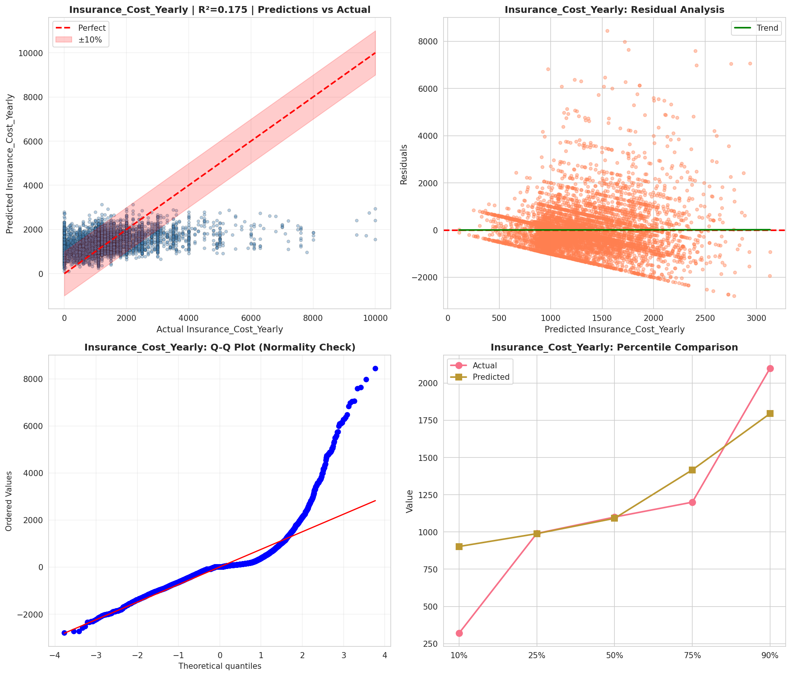
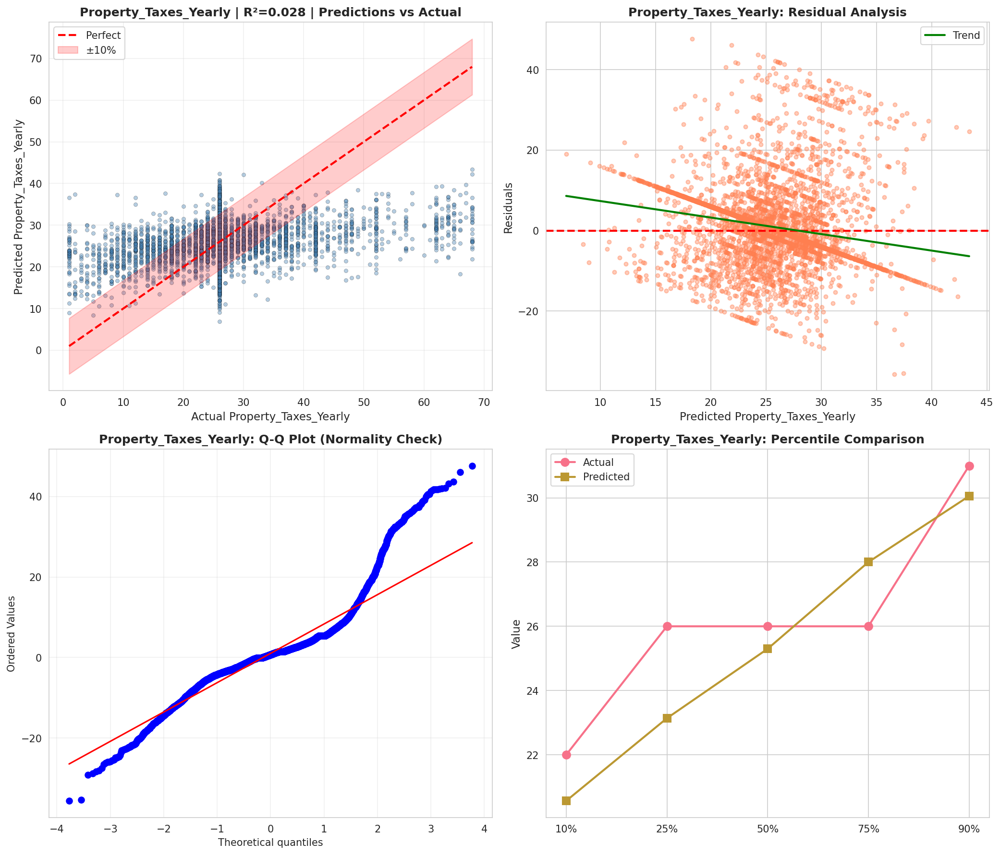
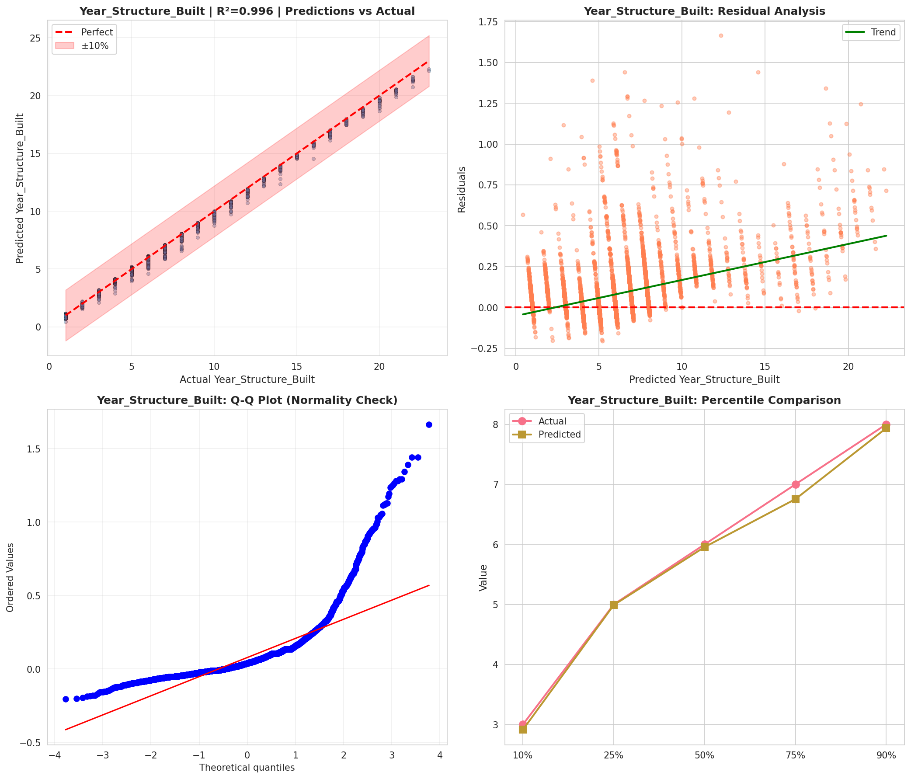
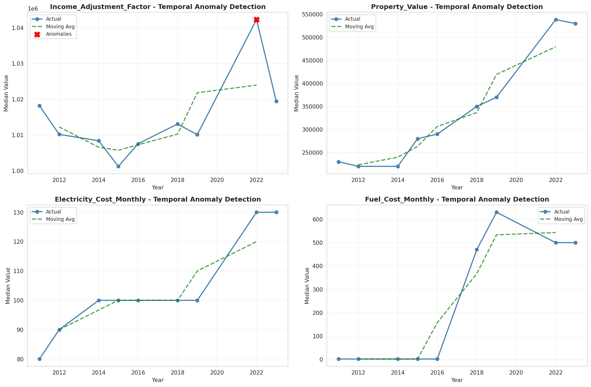
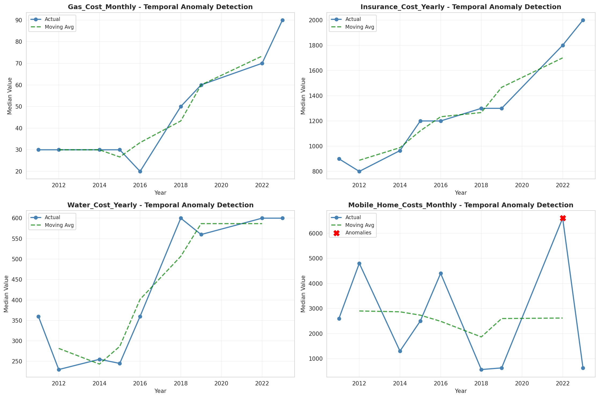
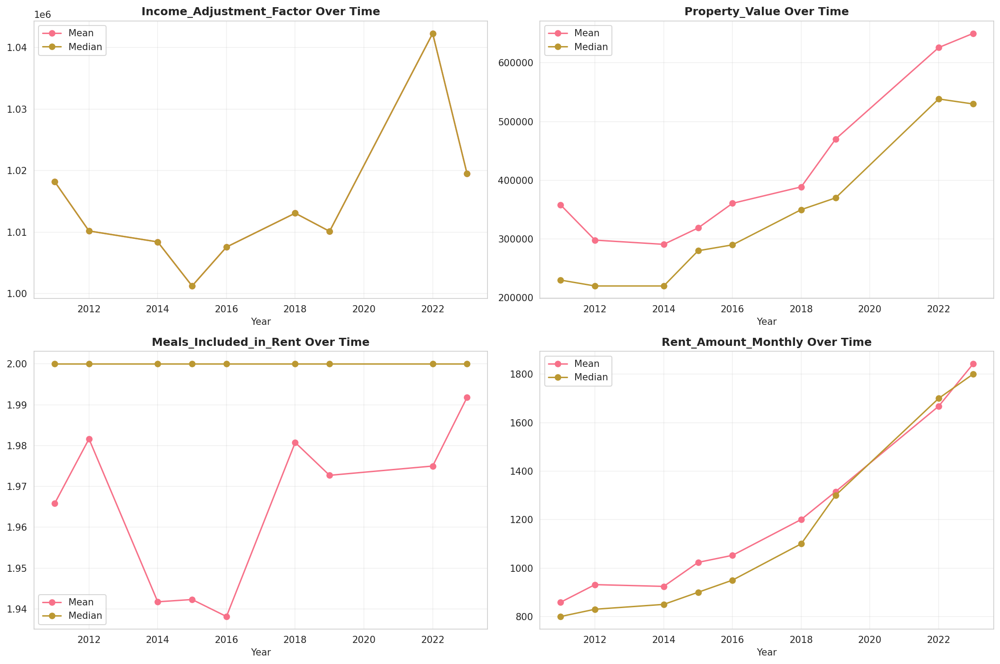
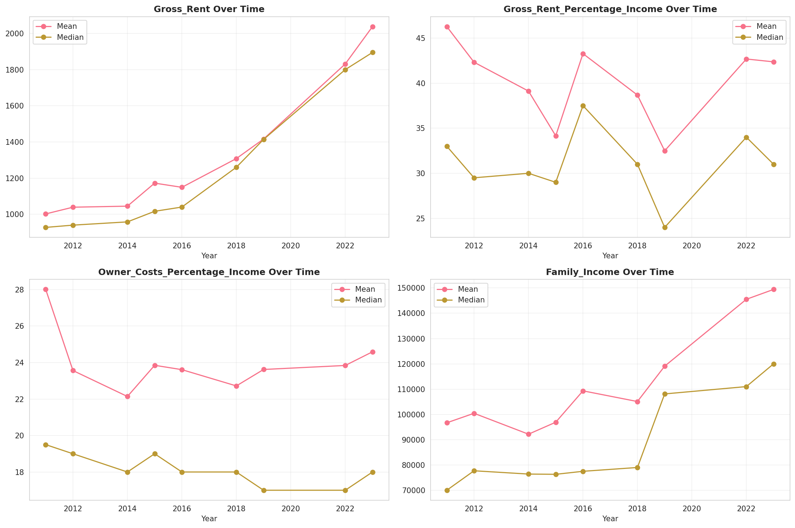
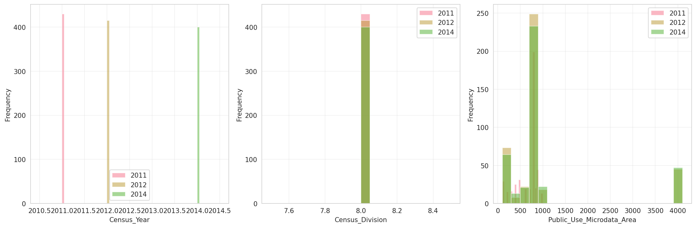
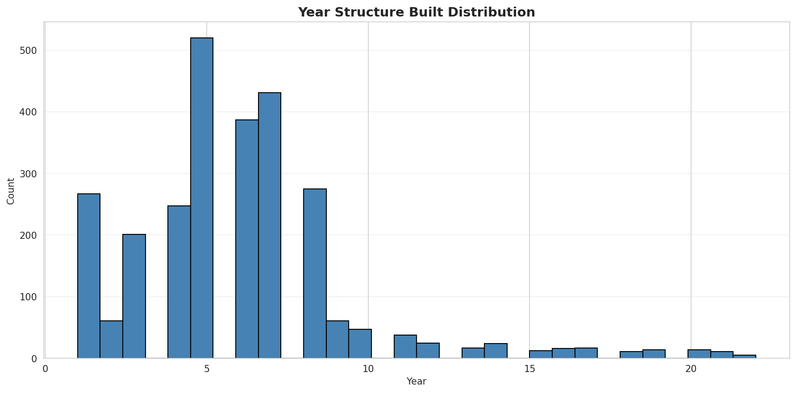
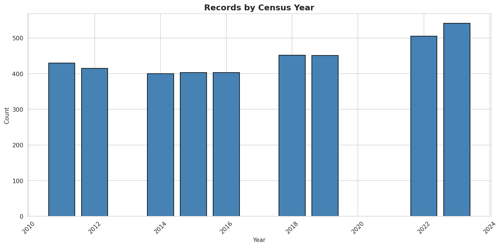
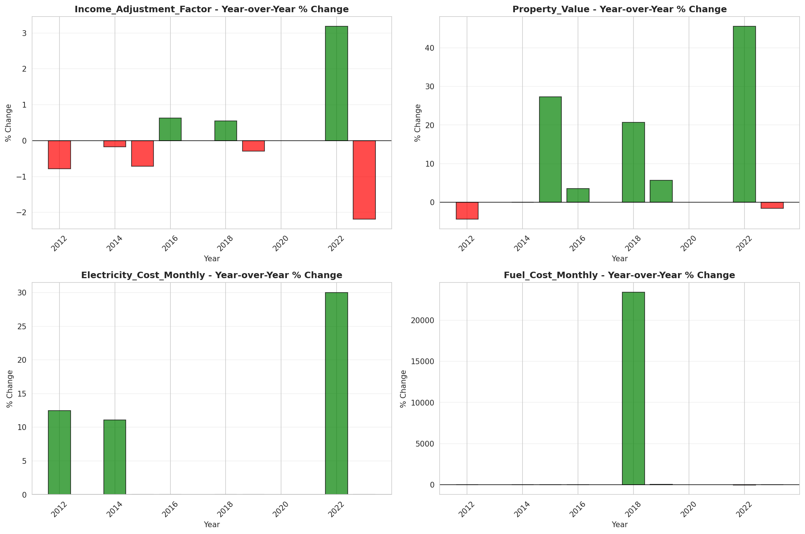
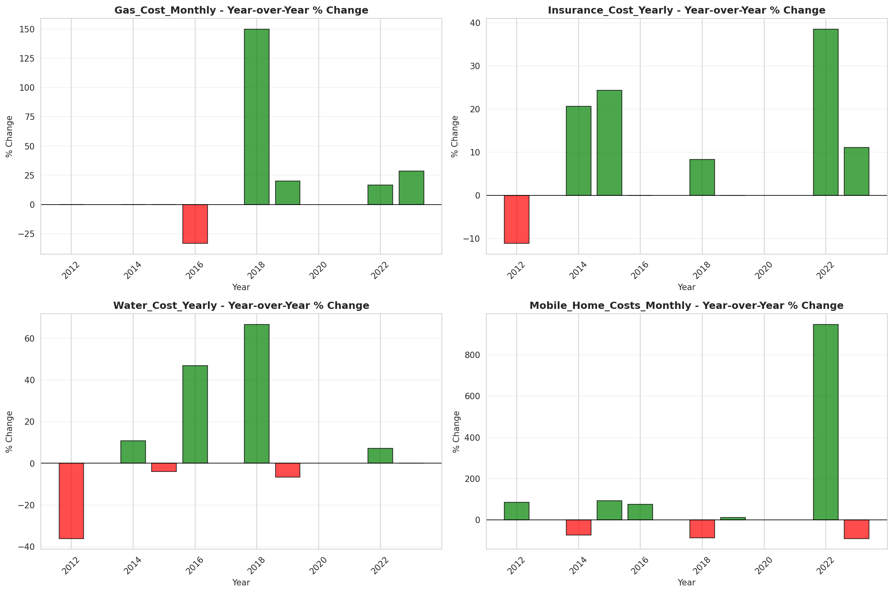
