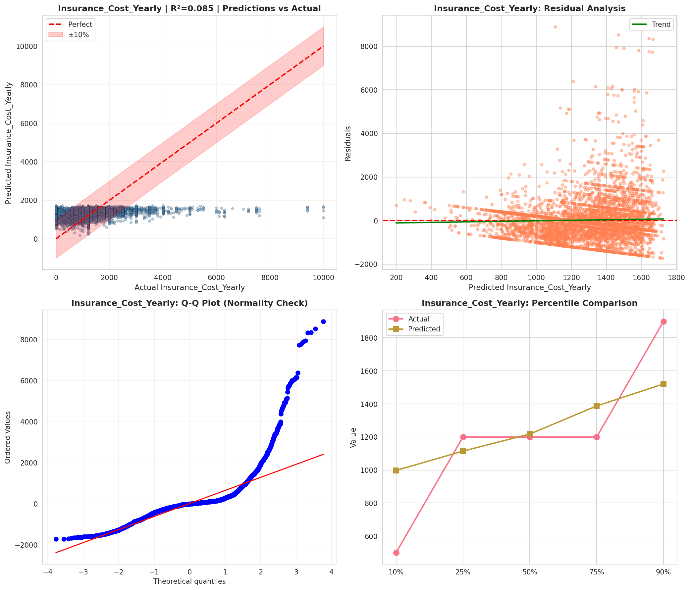
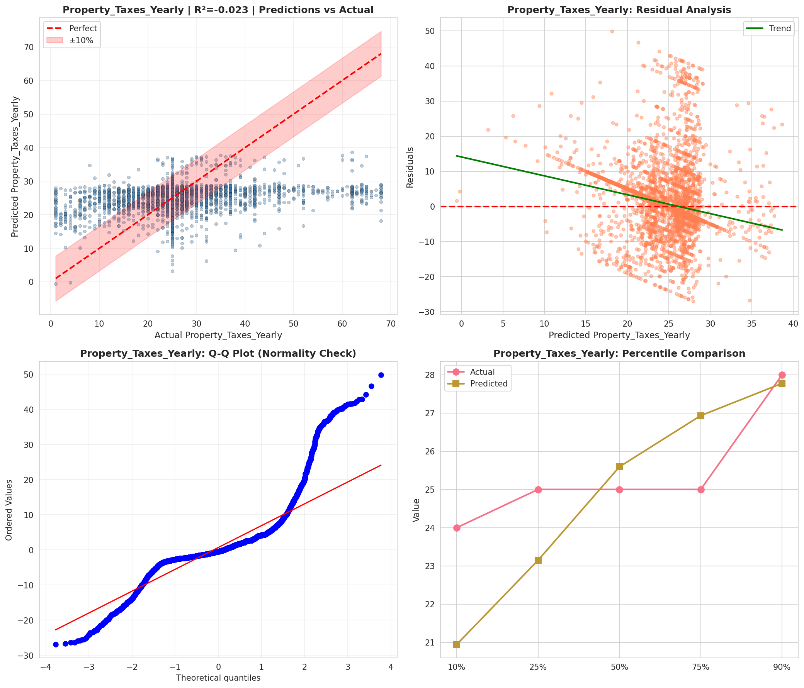
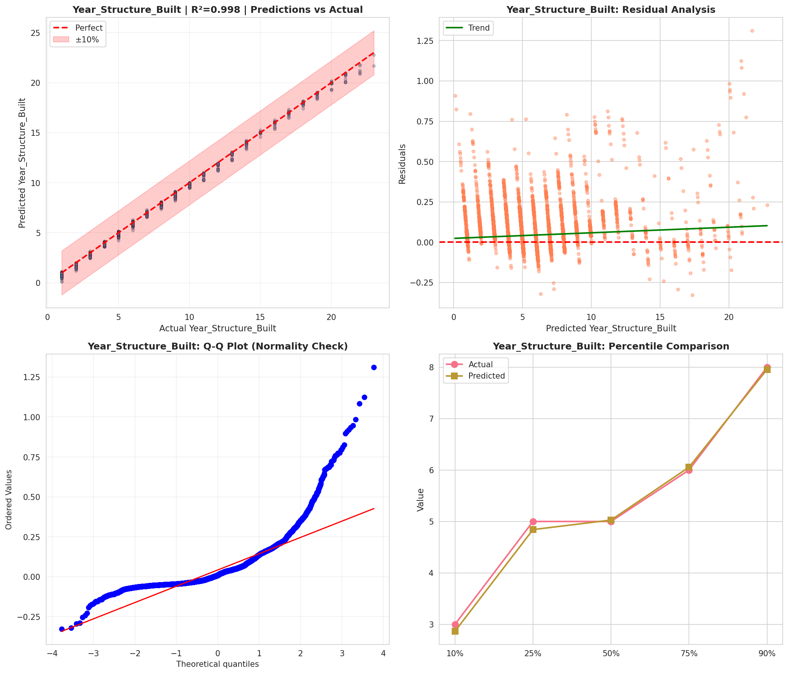
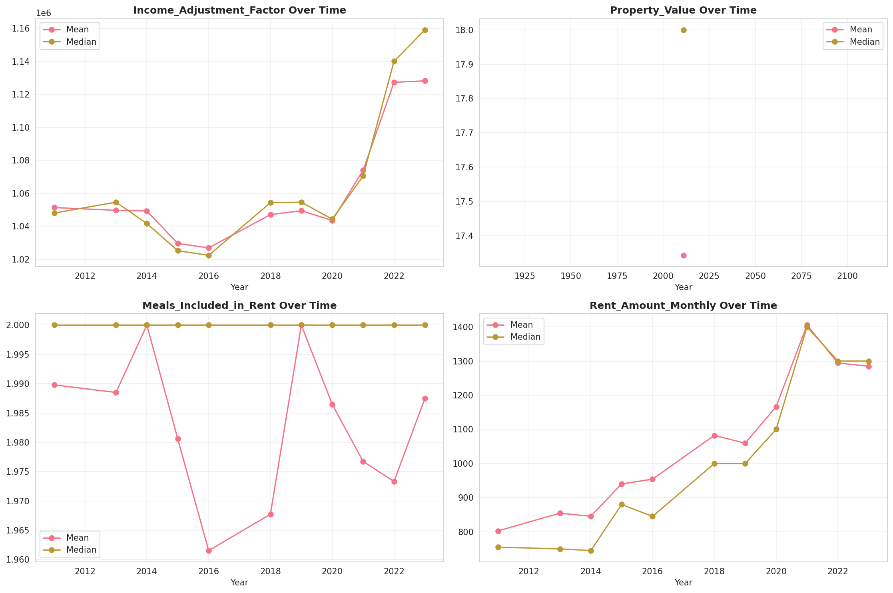
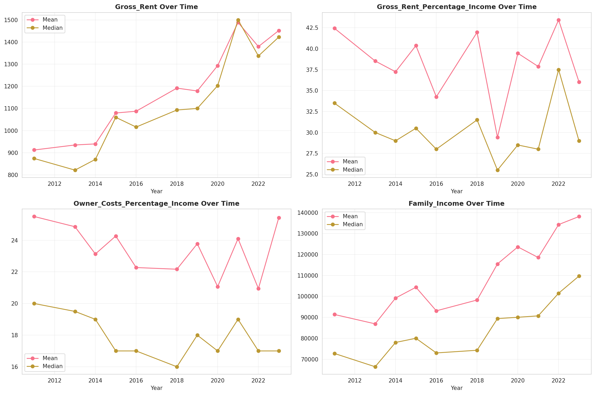
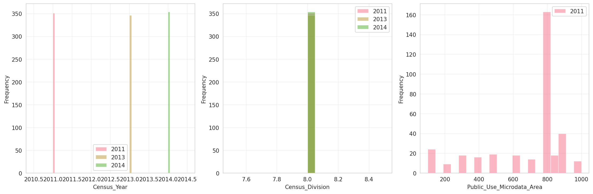
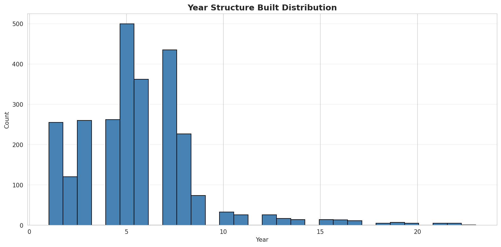
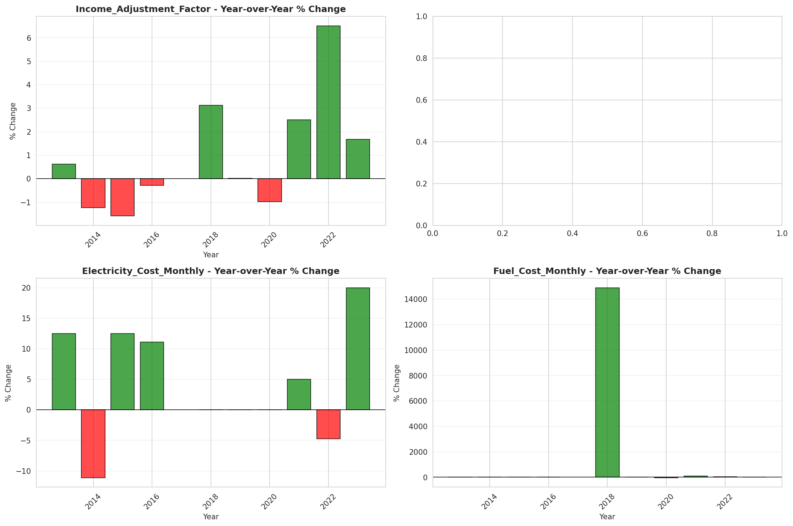
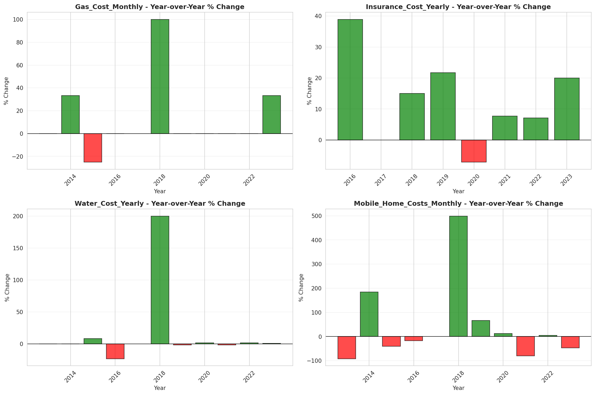

# Temporal Analysis

## Year Distribution

- 2011: 115,701 records

- 2013: 119,723 records

- 2014: 121,787 records

- 2015: 123,674 records

- 2016: 124,640 records

- 2018: 128,202 records

- 2019: 130,086 records

- 2020: 128,280 records

- 2021: 130,318 records

- 2022: 132,910 records

- 2023: 136,106 records

## Temporal Trends

- Census_Year: {np.int64(2011): {'mean': 2011.0, 'median': 2011.0, 'std': 0.0}, np.int64(2013): {'mean': 2013.0, 'median': 2013.0, 'std': 0.0}, np.int64(2014): {'mean': 2014.0, 'median': 2014.0, 'std': 0.0}, np.int64(2015): {'mean': 2015.0, 'median': 2015.0, 'std': 0.0}, np.int64(2016): {'mean': 2016.0, 'median': 2016.0, 'std': 0.0}, np.int64(2018): {'mean': 2018.0, 'median': 2018.0, 'std': 0.0}, np.int64(2019): {'mean': 2019.0, 'median': 2019.0, 'std': 0.0}, np.int64(2020): {'mean': 2020.0, 'median': 2020.0, 'std': 0.0}, np.int64(2021): {'mean': 2021.0, 'median': 2021.0, 'std': 0.0}, np.int64(2022): {'mean': 2022.0, 'median': 2022.0, 'std': 0.0}, np.int64(2023): {'mean': 2023.0, 'median': 2023.0, 'std': 0.0}}

- Census_Division: {np.int64(2011): {'mean': 8.0, 'median': 8.0, 'std': 0.0}, np.int64(2013): {'mean': 8.0, 'median': 8.0, 'std': 0.0}, np.int64(2014): {'mean': 8.0, 'median': 8.0, 'std': 0.0}, np.int64(2015): {'mean': 8.0, 'median': 8.0, 'std': 0.0}, np.int64(2016): {'mean': 8.0, 'median': 8.0, 'std': 0.0}, np.int64(2018): {'mean': 8.0, 'median': 8.0, 'std': 0.0}, np.int64(2019): {'mean': 8.0, 'median': 8.0, 'std': 0.0}, np.int64(2020): {'mean': 8.0, 'median': 8.0, 'std': 0.0}, np.int64(2021): {'mean': 8.0, 'median': 8.0, 'std': 0.0}, np.int64(2022): {'mean': 8.0, 'median': 8.0, 'std': 0.0}, np.int64(2023): {'mean': 8.0, 'median': 8.0, 'std': 0.0}}

- Public_Use_Microdata_Area: {np.int64(2011): {'mean': 679.9614782931867, 'median': 807.0, 'std': 248.60241870693417}, np.int64(2013): {'mean': None, 'median': None, 'std': None}, np.int64(2014): {'mean': None, 'median': None, 'std': None}, np.int64(2015): {'mean': None, 'median': None, 'std': None}, np.int64(2016): {'mean': 1064.3366254813864, 'median': 810.0, 'std': 1098.5177078370843}, np.int64(2018): {'mean': 1063.9674576059656, 'median': 811.0, 'std': 1096.6921428398964}, np.int64(2019): {'mean': 1065.5368909798133, 'median': 811.0, 'std': 1097.4639671671234}, np.int64(2020): {'mean': 1067.5777128157156, 'median': 811.0, 'std': 1099.8881631827896}, np.int64(2021): {'mean': 1069.2886017280805, 'median': 811.0, 'std': 1100.4806515966961}, np.int64(2022): {'mean': None, 'median': None, 'std': None}, np.int64(2023): {'mean': 1350.8974696192674, 'median': 1601.0, 'std': 683.2087084634529}}

- Census_Region: {np.int64(2011): {'mean': 4.0, 'median': 4.0, 'std': 0.0}, np.int64(2013): {'mean': 4.0, 'median': 4.0, 'std': 0.0}, np.int64(2014): {'mean': 4.0, 'median': 4.0, 'std': 0.0}, np.int64(2015): {'mean': 4.0, 'median': 4.0, 'std': 0.0}, np.int64(2016): {'mean': 4.0, 'median': 4.0, 'std': 0.0}, np.int64(2018): {'mean': 4.0, 'median': 4.0, 'std': 0.0}, np.int64(2019): {'mean': 4.0, 'median': 4.0, 'std': 0.0}, np.int64(2020): {'mean': 4.0, 'median': 4.0, 'std': 0.0}, np.int64(2021): {'mean': 4.0, 'median': 4.0, 'std': 0.0}, np.int64(2022): {'mean': 4.0, 'median': 4.0, 'std': 0.0}, np.int64(2023): {'mean': 4.0, 'median': 4.0, 'std': 0.0}}

- State_Code: {np.int64(2011): {'mean': 8.0, 'median': 8.0, 'std': 0.0}, np.int64(2013): {'mean': 8.0, 'median': 8.0, 'std': 0.0}, np.int64(2014): {'mean': 8.0, 'median': 8.0, 'std': 0.0}, np.int64(2015): {'mean': 8.0, 'median': 8.0, 'std': 0.0}, np.int64(2016): {'mean': 8.0, 'median': 8.0, 'std': 0.0}, np.int64(2018): {'mean': 8.0, 'median': 8.0, 'std': 0.0}, np.int64(2019): {'mean': 8.0, 'median': 8.0, 'std': 0.0}, np.int64(2020): {'mean': 8.0, 'median': 8.0, 'std': 0.0}, np.int64(2021): {'mean': 8.0, 'median': 8.0, 'std': 0.0}, np.int64(2022): {'mean': 8.0, 'median': 8.0, 'std': 0.0}, np.int64(2023): {'mean': None, 'median': None, 'std': None}}

- Housing_Adjustment_Factor: {np.int64(2011): {'mean': 1041016.6304612752, 'median': 1044592.0, 'std': 27551.295989926475}, np.int64(2013): {'mean': 1040009.1649223624, 'median': 1035725.0, 'std': 32017.16397282863}, np.int64(2014): {'mean': 1036617.2343599892, 'median': 1031130.0, 'std': 29640.634736020773}, np.int64(2015): {'mean': 1020820.4184468846, 'median': 1017534.0, 'std': 20293.23201256836}, np.int64(2016): {'mean': 1020186.9043084083, 'median': 1013801.0, 'std': 15747.65178291099}, np.int64(2018): {'mean': 1037970.8393082791, 'median': 1046406.0, 'std': 23520.753803772925}, np.int64(2019): {'mean': 1040476.1112571683, 'median': 1042936.0, 'std': 29164.203570845777}, np.int64(2020): {'mean': 1036038.9881197381, 'median': 1030827.0, 'std': 28305.629947025303}, np.int64(2021): {'mean': 1057764.053254347, 'median': 1059761.0, 'std': 35684.636014511445}, np.int64(2022): {'mean': 1103709.05996539, 'median': 1133141.0, 'std': 61903.30520381212}, np.int64(2023): {'mean': 1103519.370211453, 'median': 1125501.0, 'std': 76924.62365458824}}

- Income_Adjustment_Factor: {np.int64(2011): {'mean': 1053647.114908255, 'median': 1048026.0, 'std': 28347.188084534435}, np.int64(2013): {'mean': 1049032.9542360283, 'median': 1054614.0, 'std': 29643.789027798062}, np.int64(2014): {'mean': 1047460.8910146403, 'median': 1041654.0, 'std': 31078.192780822894}, np.int64(2015): {'mean': 1030206.9265245727, 'median': 1025215.0, 'std': 25666.98301504701}, np.int64(2016): {'mean': 1027331.4779525032, 'median': 1022342.0, 'std': 17489.093154681737}, np.int64(2018): {'mean': 1046589.7814698679, 'median': 1054346.0, 'std': 20533.535433915196}, np.int64(2019): {'mean': 1049469.8600310565, 'median': 1054606.0, 'std': 26239.311632596546}, np.int64(2020): {'mean': 1046122.9419005301, 'median': 1044328.0, 'std': 28845.01061712385}, np.int64(2021): {'mean': 1072815.3757117207, 'median': 1070512.0, 'std': 30763.73328001438}, np.int64(2022): {'mean': 1126187.9136709052, 'median': 1140108.0, 'std': 49902.47984903857}, np.int64(2023): {'mean': 1127529.2571745552, 'median': 1159185.0, 'std': 70669.37834597394}}

- Housing_Unit_Weight: {np.int64(2011): {'mean': 18.99571308804591, 'median': 16.0, 'std': 14.70359931995886}, np.int64(2013): {'mean': 18.56603994219991, 'median': 15.0, 'std': 15.14088093810071}, np.int64(2014): {'mean': 18.381469286541257, 'median': 15.0, 'std': 15.408649627358203}, np.int64(2015): {'mean': 18.282444167731292, 'median': 14.0, 'std': 15.73943644903285}, np.int64(2016): {'mean': 18.331699293966622, 'median': 15.0, 'std': 15.285461201574622}, np.int64(2018): {'mean': 18.34762328200808, 'median': 15.0, 'std': 15.243713174349342}, np.int64(2019): {'mean': 18.345363836231417, 'median': 15.0, 'std': 15.42477261571804}, np.int64(2020): {'mean': 18.407951356407857, 'median': 14.0, 'std': 18.445456664610187}, np.int64(2021): {'mean': 18.837558894396782, 'median': 14.0, 'std': 19.006390482300574}, np.int64(2022): {'mean': 18.810435633135203, 'median': 14.0, 'std': 19.334036989523696}, np.int64(2023): {'mean': 18.699572392106152, 'median': 14.0, 'std': 19.537780595948853}}

- Number_of_Persons: {np.int64(2011): {'mean': 2.1352710866803224, 'median': 2.0, 'std': 1.4439510289796182}, np.int64(2013): {'mean': 2.116711074730837, 'median': 2.0, 'std': 1.444588570606518}, np.int64(2014): {'mean': 2.10953550050498, 'median': 2.0, 'std': 1.4455584297507547}, np.int64(2015): {'mean': 2.108389798987661, 'median': 2.0, 'std': 1.4479786710757632}, np.int64(2016): {'mean': 2.1221036585365853, 'median': 2.0, 'std': 1.4501250645553623}, np.int64(2018): {'mean': 2.126316282117284, 'median': 2.0, 'std': 1.4501017537386005}, np.int64(2019): {'mean': 2.1279076918346327, 'median': 2.0, 'std': 1.4405457147027225}, np.int64(2020): {'mean': 2.1169161209853447, 'median': 2.0, 'std': 1.4379336757757992}, np.int64(2021): {'mean': 2.111128163415645, 'median': 2.0, 'std': 1.4316663154475315}, np.int64(2022): {'mean': 2.101865924309683, 'median': 2.0, 'std': 1.4168017143798761}, np.int64(2023): {'mean': 2.0890115057381746, 'median': 2.0, 'std': 1.400332753960243}}

- Housing_Unit_Type: {np.int64(2011): {'mean': 1.08355156826648, 'median': 1.0, 'std': 0.3541982679902025}, np.int64(2013): {'mean': 1.1088930280731355, 'median': 1.0, 'std': 0.4081019246595948}, np.int64(2014): {'mean': 1.1205136837265062, 'median': 1.0, 'std': 0.4302862367980963}, np.int64(2015): {'mean': 1.1315393696330676, 'median': 1.0, 'std': 0.4502904128384777}, np.int64(2016): {'mean': 1.1295009627727857, 'median': 1.0, 'std': 0.44877996039363144}, np.int64(2018): {'mean': 1.1297717664311009, 'median': 1.0, 'std': 0.4506173964186574}, np.int64(2019): {'mean': 1.1278461940562396, 'median': 1.0, 'std': 0.4474008330920282}, np.int64(2020): {'mean': None, 'median': None, 'std': None}, np.int64(2021): {'mean': None, 'median': None, 'std': None}, np.int64(2022): {'mean': None, 'median': None, 'std': None}, np.int64(2023): {'mean': None, 'median': None, 'std': None}}

- Number_of_Bedrooms: {np.int64(2011): {'mean': 2.8661791993533097, 'median': 3.0, 'std': 1.1174432852060345}, np.int64(2013): {'mean': None, 'median': None, 'std': None}, np.int64(2014): {'mean': None, 'median': None, 'std': None}, np.int64(2015): {'mean': None, 'median': None, 'std': None}, np.int64(2016): {'mean': None, 'median': None, 'std': None}, np.int64(2018): {'mean': None, 'median': None, 'std': None}, np.int64(2019): {'mean': None, 'median': None, 'std': None}, np.int64(2020): {'mean': None, 'median': None, 'std': None}, np.int64(2021): {'mean': None, 'median': None, 'std': None}, np.int64(2022): {'mean': None, 'median': None, 'std': None}, np.int64(2023): {'mean': None, 'median': None, 'std': None}}

- Number_of_Rooms: {np.int64(2011): {'mean': 6.011326266282082, 'median': 6.0, 'std': 2.0797721129296494}, np.int64(2013): {'mean': None, 'median': None, 'std': None}, np.int64(2014): {'mean': None, 'median': None, 'std': None}, np.int64(2015): {'mean': None, 'median': None, 'std': None}, np.int64(2016): {'mean': None, 'median': None, 'std': None}, np.int64(2018): {'mean': None, 'median': None, 'std': None}, np.int64(2019): {'mean': None, 'median': None, 'std': None}, np.int64(2020): {'mean': None, 'median': None, 'std': None}, np.int64(2021): {'mean': None, 'median': None, 'std': None}, np.int64(2022): {'mean': None, 'median': None, 'std': None}, np.int64(2023): {'mean': None, 'median': None, 'std': None}}

- Building_Type: {np.int64(2011): {'mean': 3.0235435689221215, 'median': 2.0, 'std': 2.113229181150887}, np.int64(2013): {'mean': 3.0410565915180383, 'median': 2.0, 'std': 2.1286716300660604}, np.int64(2014): {'mean': 3.043956043956044, 'median': 2.0, 'std': 2.134004176436281}, np.int64(2015): {'mean': 3.041238483345145, 'median': 2.0, 'std': 2.1335039262578874}, np.int64(2016): {'mean': 3.0444376233282173, 'median': 2.0, 'std': 2.136003676079548}, np.int64(2018): {'mean': 3.0600296569003427, 'median': 2.0, 'std': 2.152369796827748}, np.int64(2019): {'mean': 3.0646357215950077, 'median': 2.0, 'std': 2.157187522596139}, np.int64(2020): {'mean': 3.0678559805416143, 'median': 2.0, 'std': 2.1629465099101384}, np.int64(2021): {'mean': 3.074988002929811, 'median': 2.0, 'std': 2.171065424902169}, np.int64(2022): {'mean': 3.087617818160754, 'median': 2.0, 'std': 2.187183059749993}, np.int64(2023): {'mean': 3.096316773721441, 'median': 2.0, 'std': 2.200133547244443}}

- Year_Structure_Built: {np.int64(2011): {'mean': 4.756765446161195, 'median': 5.0, 'std': 2.2415033764545864}, np.int64(2013): {'mean': 5.433678854637473, 'median': 5.0, 'std': 2.5490447335857285}, np.int64(2014): {'mean': 5.503001876172608, 'median': 5.0, 'std': 2.641419506861193}, np.int64(2015): {'mean': 5.588004961020553, 'median': 6.0, 'std': 2.7724271455477028}, np.int64(2016): {'mean': 5.740881385661039, 'median': 6.0, 'std': 2.9699228987749606}, np.int64(2018): {'mean': 6.0320771761176735, 'median': 6.0, 'std': 3.4800524245557924}, np.int64(2019): {'mean': 6.219363875794736, 'median': 6.0, 'std': 3.7970772083222983}, np.int64(2020): {'mean': 6.410690121786198, 'median': 6.0, 'std': 4.113587491087377}, np.int64(2021): {'mean': None, 'median': None, 'std': None}, np.int64(2022): {'mean': None, 'median': None, 'std': None}, np.int64(2023): {'mean': None, 'median': None, 'std': None}}

- Bathtub_or_Shower: {np.int64(2011): {'mean': None, 'median': None, 'std': None}, np.int64(2013): {'mean': 1.0072712838416917, 'median': 1.0, 'std': 0.08496162306638634}, np.int64(2014): {'mean': 1.007147324220495, 'median': 1.0, 'std': 0.08423955945076138}, np.int64(2015): {'mean': 1.0075389794472005, 'median': 1.0, 'std': 0.08649976601546099}, np.int64(2016): {'mean': 1.0069019951764964, 'median': 1.0, 'std': 0.08279141110265412}, np.int64(2018): {'mean': 1.006468272229892, 'median': 1.0, 'std': 0.0801653818765634}, np.int64(2019): {'mean': 1.0063243361124625, 'median': 1.0, 'std': 0.0792741546588572}, np.int64(2020): {'mean': 1.0056696527979994, 'median': 1.0, 'std': 0.07508366078985117}, np.int64(2021): {'mean': 1.0058091076705478, 'median': 1.0, 'std': 0.0759961220180462}, np.int64(2022): {'mean': 1.005734713636702, 'median': 1.0, 'std': 0.075510753408731}, np.int64(2023): {'mean': 1.0052931132612408, 'median': 1.0, 'std': 0.07256127770879754}}

- Refrigerator: {np.int64(2011): {'mean': None, 'median': None, 'std': None}, np.int64(2013): {'mean': 1.009743159490108, 'median': 1.0, 'std': 0.09822584881289126}, np.int64(2014): {'mean': 1.0096399535423926, 'median': 1.0, 'std': 0.09770931446621356}, np.int64(2015): {'mean': 1.0096474131821402, 'median': 1.0, 'std': 0.09774674032086612}, np.int64(2016): {'mean': 1.00875246656435, 'median': 1.0, 'std': 0.09314470989494869}, np.int64(2018): {'mean': 1.0082664348656065, 'median': 1.0, 'std': 0.09054375067243685}, np.int64(2019): {'mean': 1.0078089614332926, 'median': 1.0, 'std': 0.08802298871898113}, np.int64(2020): {'mean': 1.0074253609907333, 'median': 1.0, 'std': 0.08585038221935197}, np.int64(2021): {'mean': 1.0074423930156005, 'median': 1.0, 'std': 0.08594804240635966}, np.int64(2022): {'mean': 1.0070256448449642, 'median': 1.0, 'std': 0.08352450472831079}, np.int64(2023): {'mean': 1.0064964631270834, 'median': 1.0, 'std': 0.0803387302131808}}

- Hot_and_Cold_Running_Water: {np.int64(2011): {'mean': None, 'median': None, 'std': None}, np.int64(2013): {'mean': 1.0098604382617482, 'median': 1.0, 'std': 0.09880940288293}, np.int64(2014): {'mean': 1.0099258465112124, 'median': 1.0, 'std': 0.09913330359607705}, np.int64(2015): {'mean': 1.010409284195606, 'median': 1.0, 'std': 0.10149395181260622}, np.int64(2016): {'mean': 1.0099627274720455, 'median': 1.0, 'std': 0.09931544712094054}, np.int64(2018): {'mean': 1.0093146528949566, 'median': 1.0, 'std': 0.09606231715951605}, np.int64(2019): {'mean': 1.0089077519249803, 'median': 1.0, 'std': 0.09395998047769288}, np.int64(2020): {'mean': 1.0081362086980352, 'median': 1.0, 'std': 0.08983362355874097}, np.int64(2021): {'mean': 1.008065398765775, 'median': 1.0, 'std': 0.08944504158417675}, np.int64(2022): {'mean': 1.0075635328484067, 'median': 1.0, 'std': 0.08663941329510218}, np.int64(2023): {'mean': 1.0068623465322384, 'median': 1.0, 'std': 0.08255489171357738}}

- Running_Water: {np.int64(2011): {'mean': None, 'median': None, 'std': None}, np.int64(2013): {'mean': 9.0, 'median': 9.0, 'std': 0.0}, np.int64(2014): {'mean': 9.0, 'median': 9.0, 'std': 0.0}, np.int64(2015): {'mean': 9.0, 'median': 9.0, 'std': 0.0}, np.int64(2016): {'mean': 9.0, 'median': 9.0, 'std': 0.0}, np.int64(2018): {'mean': 9.0, 'median': 9.0, 'std': 0.0}, np.int64(2019): {'mean': 9.0, 'median': 9.0, 'std': 0.0}, np.int64(2020): {'mean': 9.0, 'median': 9.0, 'std': 0.0}, np.int64(2021): {'mean': 9.0, 'median': 9.0, 'std': 0.0}, np.int64(2022): {'mean': 9.0, 'median': 9.0, 'std': 0.0}, np.int64(2023): {'mean': 9.0, 'median': 9.0, 'std': 0.0}}

- Sink_with_Faucet: {np.int64(2011): {'mean': None, 'median': None, 'std': None}, np.int64(2013): {'mean': 1.00672097575938, 'median': 1.0, 'std': 0.08170596349201958}, np.int64(2014): {'mean': 1.0064415259537212, 'median': 1.0, 'std': 0.08000056172618646}, np.int64(2015): {'mean': 1.0066619418851879, 'median': 1.0, 'std': 0.08134874947264677}, np.int64(2016): {'mean': 1.0059723744792808, 'median': 1.0, 'std': 0.07705035553299189}, np.int64(2018): {'mean': 1.0054115321027424, 'median': 1.0, 'std': 0.07336411446663262}, np.int64(2019): {'mean': 1.0052842596165137, 'median': 1.0, 'std': 0.072500898655341}, np.int64(2020): {'mean': 1.004727565475069, 'median': 1.0, 'std': 0.06859486786621541}, np.int64(2021): {'mean': 1.004832504062166, 'median': 1.0, 'std': 0.06934833419211862}, np.int64(2022): {'mean': 1.004898918431353, 'median': 1.0, 'std': 0.0698209092666382}, np.int64(2023): {'mean': 1.0045613464509309, 'median': 1.0, 'std': 0.06738380731118647}}

- Stove_or_Range: {np.int64(2011): {'mean': None, 'median': None, 'std': None}, np.int64(2013): {'mean': 1.011754941495936, 'median': 1.0, 'std': 0.10778157378366467}, np.int64(2014): {'mean': 1.0119538997587778, 'median': 1.0, 'std': 0.10867892878392597}, np.int64(2015): {'mean': 1.0118710134656272, 'median': 1.0, 'std': 0.10830603132941795}, np.int64(2016): {'mean': 1.0112080684060514, 'median': 1.0, 'std': 0.10527366623542332}, np.int64(2018): {'mean': 1.0109423735746792, 'median': 1.0, 'std': 0.10403235202376752}, np.int64(2019): {'mean': 1.0106188455150895, 'median': 1.0, 'std': 0.10249962808612298}, np.int64(2020): {'mean': 1.0102516229595244, 'median': 1.0, 'std': 0.10073040298831541}, np.int64(2021): {'mean': 1.0103301088576264, 'median': 1.0, 'std': 0.10111124457789748}, np.int64(2022): {'mean': 1.0100957440646128, 'median': 1.0, 'std': 0.09996950894117214}, np.int64(2023): {'mean': 1.0096511911537522, 'median': 1.0, 'std': 0.0977656554097827}}

- Telephone_Service: {np.int64(2011): {'mean': 1.0264791764248626, 'median': 1.0, 'std': 0.16055617877371256}, np.int64(2013): {'mean': 1.023208712073031, 'median': 1.0, 'std': 0.1505665619359932}, np.int64(2014): {'mean': 1.023768919206992, 'median': 1.0, 'std': 0.15232919132292477}, np.int64(2015): {'mean': 1.024036106976521, 'median': 1.0, 'std': 0.15316199857978954}, np.int64(2016): {'mean': 1.0249000484325885, 'median': 1.0, 'std': 0.15582126491683446}, np.int64(2018): {'mean': 1.0203891380997212, 'median': 1.0, 'std': 0.14132800679365173}, np.int64(2019): {'mean': 1.017410613132732, 'median': 1.0, 'std': 0.13079617247786682}, np.int64(2020): {'mean': 1.0142760531021002, 'median': 1.0, 'std': 0.11862705331637435}, np.int64(2021): {'mean': 1.009691774277212, 'median': 1.0, 'std': 0.09796903149575799}, np.int64(2022): {'mean': 1.0079815221074786, 'median': 1.0, 'std': 0.08898251526718182}, np.int64(2023): {'mean': 1.0068515867751282, 'median': 1.0, 'std': 0.08249061720071715}}

- Lot_Acreage: {np.int64(2011): {'mean': 1.2416515646462665, 'median': 1.0, 'std': 0.5481904736814224}, np.int64(2013): {'mean': 1.2490326398688942, 'median': 1.0, 'std': 0.5556295374158512}, np.int64(2014): {'mean': 1.25014928063633, 'median': 1.0, 'std': 0.5564521255267523}, np.int64(2015): {'mean': 1.2495171967269845, 'median': 1.0, 'std': 0.5553208456000218}, np.int64(2016): {'mean': 1.2476528155168225, 'median': 1.0, 'std': 0.5534249863993211}, np.int64(2018): {'mean': 1.2420100653819683, 'median': 1.0, 'std': 0.5467524249790741}, np.int64(2019): {'mean': 1.2417845345981198, 'median': 1.0, 'std': 0.5469645671038714}, np.int64(2020): {'mean': 1.2407489391109048, 'median': 1.0, 'std': 0.5460567446709543}, np.int64(2021): {'mean': 1.2385183769666859, 'median': 1.0, 'std': 0.5433468881143186}, np.int64(2022): {'mean': 1.2378531309377154, 'median': 1.0, 'std': 0.5409955859532851}, np.int64(2023): {'mean': 1.2377622377622377, 'median': 1.0, 'std': 0.5397196499062645}}

- Agricultural_Sales: {np.int64(2011): {'mean': 1.4730251860331998, 'median': 1.0, 'std': 1.3121103867109722}, np.int64(2013): {'mean': 1.4410688393288684, 'median': 1.0, 'std': 1.2667453774492317}, np.int64(2014): {'mean': 1.4344295851528384, 'median': 1.0, 'std': 1.254265647836079}, np.int64(2015): {'mean': 1.426489527553718, 'median': 1.0, 'std': 1.2415803174566564}, np.int64(2016): {'mean': 1.4173684565114868, 'median': 1.0, 'std': 1.2295326756341929}, np.int64(2018): {'mean': 1.4076608304823237, 'median': 1.0, 'std': 1.2134263074202087}, np.int64(2019): {'mean': 1.4038714774822227, 'median': 1.0, 'std': 1.2080765811617231}, np.int64(2020): {'mean': 1.410254682657324, 'median': 1.0, 'std': 1.2173354018432203}, np.int64(2021): {'mean': 1.4090667375697952, 'median': 1.0, 'std': 1.216032283367652}, np.int64(2022): {'mean': 1.3999096249435157, 'median': 1.0, 'std': 1.2043486910994947}, np.int64(2023): {'mean': 1.388058768365114, 'median': 1.0, 'std': 1.1867173476953568}}

- Business_On_Property: {np.int64(2011): {'mean': 1.979869102997703, 'median': 2.0, 'std': 0.1404488222906916}, np.int64(2013): {'mean': 1.9805845131333364, 'median': 2.0, 'std': 0.13798094944865075}, np.int64(2014): {'mean': 1.9811737401277616, 'median': 2.0, 'std': 0.135911882946333}, np.int64(2015): {'mean': 1.981558589433027, 'median': 2.0, 'std': 0.13454191544679975}, np.int64(2016): {'mean': 3.4234541719133142, 'median': 2.0, 'std': 2.8376733690778684}, np.int64(2018): {'mean': 6.256140313145217, 'median': 9.0, 'std': 3.4253727408616097}, np.int64(2019): {'mean': 7.645221055306174, 'median': 9.0, 'std': 2.770019555944345}, np.int64(2020): {'mean': None, 'median': None, 'std': None}, np.int64(2021): {'mean': None, 'median': None, 'std': None}, np.int64(2022): {'mean': None, 'median': None, 'std': None}, np.int64(2023): {'mean': None, 'median': None, 'std': None}}

- Tenure: {np.int64(2011): {'mean': 1.7611990871311403, 'median': 1.0, 'std': 0.8863474110816}, np.int64(2013): {'mean': 1.7995655704822755, 'median': 1.0, 'std': 0.8926833870918216}, np.int64(2014): {'mean': 1.8131528458750799, 'median': 2.0, 'std': 0.89379443001468}, np.int64(2015): {'mean': 1.8205214385173092, 'median': 2.0, 'std': 0.893107484458331}, np.int64(2016): {'mean': 1.8189285951700365, 'median': 2.0, 'std': 0.8904927385542812}, np.int64(2018): {'mean': 1.8156393642354764, 'median': 2.0, 'std': 0.8850323357713827}, np.int64(2019): {'mean': 1.8102868536729053, 'median': 2.0, 'std': 0.8810821769692844}, np.int64(2020): {'mean': 1.8038409160390205, 'median': 2.0, 'std': 0.8762454644613554}, np.int64(2021): {'mean': 1.8008681645690574, 'median': 2.0, 'std': 0.8725583700274154}, np.int64(2022): {'mean': 1.7985000089179017, 'median': 2.0, 'std': 0.8686388918813049}, np.int64(2023): {'mean': 1.7977429040254163, 'median': 2.0, 'std': 0.8653491076841128}}

- Vacancy_Status: {np.int64(2011): {'mean': 4.400046953867825, 'median': 5.0, 'std': 1.956519615185131}, np.int64(2013): {'mean': 4.497686256362795, 'median': 5.0, 'std': 1.9232933919136777}, np.int64(2014): {'mean': 4.57000458295142, 'median': 5.0, 'std': 1.8968842152636174}, np.int64(2015): {'mean': 4.632475700400229, 'median': 5.0, 'std': 1.8737843543535424}, np.int64(2016): {'mean': 4.672627235213205, 'median': 5.0, 'std': 1.8494594388507803}, np.int64(2018): {'mean': 4.700555555555556, 'median': 5.0, 'std': 1.8334957179227607}, np.int64(2019): {'mean': 4.7037245414650615, 'median': 5.0, 'std': 1.8340720398389743}, np.int64(2020): {'mean': 4.70075972332464, 'median': 5.0, 'std': 1.8417582874070841}, np.int64(2021): {'mean': 4.687246963562753, 'median': 5.0, 'std': 1.8721728975150982}, np.int64(2022): {'mean': 4.67137444023424, 'median': 5.0, 'std': 1.8894417386084137}, np.int64(2023): {'mean': 4.65728201473034, 'median': 5.0, 'std': 1.8884244539929371}}

- Property_Value: {np.int64(2011): {'mean': 17.393142053597987, 'median': 18.0, 'std': 4.301264017786353}}

- Vehicles_Available: {np.int64(2011): {'mean': 1.9462643134050208, 'median': 2.0, 'std': 1.0746964992984902}, np.int64(2013): {'mean': 1.9394440476306958, 'median': 2.0, 'std': 1.0750411077746123}, np.int64(2014): {'mean': 1.9423945272378442, 'median': 2.0, 'std': 1.0741653584881978}, np.int64(2015): {'mean': 1.9554232486675949, 'median': 2.0, 'std': 1.074549774472328}, np.int64(2016): {'mean': 1.9768568199732197, 'median': 2.0, 'std': 1.0774058749936286}, np.int64(2018): {'mean': 2.015801812778055, 'median': 2.0, 'std': 1.0920600324467142}, np.int64(2019): {'mean': 2.034703403271854, 'median': 2.0, 'std': 1.1020331842240076}, np.int64(2020): {'mean': 2.048608988077041, 'median': 2.0, 'std': 1.1116038508847546}, np.int64(2021): {'mean': 2.0507976375731434, 'median': 2.0, 'std': 1.1184528859459353}, np.int64(2022): {'mean': 2.0449462250521697, 'median': 2.0, 'std': 1.1183020503657397}, np.int64(2023): {'mean': 2.039250427678665, 'median': 2.0, 'std': 1.1241329309287822}}

- Condo_Fee_Monthly: {np.int64(2011): {'mean': 211.34011332267906, 'median': 180.0, 'std': 133.9747005978284}, np.int64(2013): {'mean': 223.06129862267292, 'median': 200.0, 'std': 137.05752915996052}, np.int64(2014): {'mean': 230.03589010639988, 'median': 200.0, 'std': 136.8330282458822}, np.int64(2015): {'mean': 238.205, 'median': 210.0, 'std': 138.26612345455118}, np.int64(2016): {'mean': 247.52452316076295, 'median': 220.0, 'std': 142.02863421240093}, np.int64(2018): {'mean': 268.43188801638786, 'median': 240.0, 'std': 148.01314107390877}, np.int64(2019): {'mean': 279.4042835796115, 'median': 250.0, 'std': 153.80081673086542}, np.int64(2020): {'mean': 294.6352742616034, 'median': 260.0, 'std': 184.0409163306032}, np.int64(2021): {'mean': 308.46974392431906, 'median': 270.0, 'std': 197.51125895076493}, np.int64(2022): {'mean': 323.61772591073964, 'median': 290.0, 'std': 206.32714573571275}, np.int64(2023): {'mean': 347.64290104486787, 'median': 300.0, 'std': 236.21885766610234}}

- Electricity_Cost_Monthly: {np.int64(2011): {'mean': 97.15585541592338, 'median': 80.0, 'std': 72.01192015802762}, np.int64(2013): {'mean': 102.82111092629376, 'median': 90.0, 'std': 75.02108653632176}, np.int64(2014): {'mean': 107.25727214588865, 'median': 90.0, 'std': 77.05955325583841}, np.int64(2015): {'mean': 109.90925241273347, 'median': 90.0, 'std': 78.227272725838}, np.int64(2016): {'mean': 111.99733145934037, 'median': 100.0, 'std': 78.79135744530346}, np.int64(2018): {'mean': 119.04790204018217, 'median': 100.0, 'std': 76.4596942107161}, np.int64(2019): {'mean': 119.31008394553545, 'median': 100.0, 'std': 77.40801644167578}, np.int64(2020): {'mean': 120.66789358884475, 'median': 100.0, 'std': 81.2302508960376}, np.int64(2021): {'mean': 124.2240617890531, 'median': 100.0, 'std': 86.90256358168617}, np.int64(2022): {'mean': 132.76670256098132, 'median': 110.0, 'std': 122.68413703167117}, np.int64(2023): {'mean': 144.0597539864995, 'median': 110.0, 'std': 163.23292459931577}}

- Fuel_Cost_Monthly: {np.int64(2011): {'mean': 62.925674934973046, 'median': 2.0, 'std': 296.25498157598236}, np.int64(2013): {'mean': 56.14880189426925, 'median': 2.0, 'std': 271.58292676467016}, np.int64(2014): {'mean': 50.81834654367164, 'median': 2.0, 'std': 251.09491570844608}, np.int64(2015): {'mean': 46.683295721899455, 'median': 2.0, 'std': 237.80977759767651}, np.int64(2016): {'mean': 40.93836715700706, 'median': 2.0, 'std': 217.25405952891435}, np.int64(2018): {'mean': 524.1070389761489, 'median': 320.0, 'std': 573.8218535360403}, np.int64(2019): {'mean': 527.8897614892379, 'median': 330.0, 'std': 583.8056813002344}, np.int64(2020): {'mean': 521.5923350332251, 'median': 320.0, 'std': 571.2584833537966}, np.int64(2021): {'mean': 533.9635792778649, 'median': 335.0, 'std': 596.4204101377553}, np.int64(2022): {'mean': 557.5580844001896, 'median': 350.0, 'std': 629.578254420228}, np.int64(2023): {'mean': 600.7845797995374, 'median': 400.0, 'std': 688.6914565167375}}

- Gas_Cost_Monthly: {np.int64(2011): {'mean': 60.23014061768135, 'median': 40.0, 'std': 71.02938217046064}, np.int64(2013): {'mean': 55.23129458039392, 'median': 30.0, 'std': 67.82166755343218}, np.int64(2014): {'mean': 53.287717292300535, 'median': 30.0, 'std': 67.86265773334455}, np.int64(2015): {'mean': 50.976319201037114, 'median': 30.0, 'std': 67.2344580488231}, np.int64(2016): {'mean': 48.19396776858719, 'median': 30.0, 'std': 65.85893246807233}, np.int64(2018): {'mean': 77.2379916209282, 'median': 60.0, 'std': 68.78089098242643}, np.int64(2019): {'mean': 76.36084446802695, 'median': 60.0, 'std': 68.62757593100015}, np.int64(2020): {'mean': 76.34269700185726, 'median': 60.0, 'std': 72.98508688796409}, np.int64(2021): {'mean': 78.91978731732776, 'median': 60.0, 'std': 78.58429116265711}, np.int64(2022): {'mean': 88.64040490856134, 'median': 60.0, 'std': 116.34461649960382}, np.int64(2023): {'mean': 101.87935256341152, 'median': 70.0, 'std': 148.11813360080447}}

- House_Heating_Fuel: {np.int64(2011): {'mean': 1.5943912380534766, 'median': 1.0, 'std': 1.2486253364394135}, np.int64(2013): {'mean': 1.6376427306439145, 'median': 1.0, 'std': 1.281477164556615}, np.int64(2014): {'mean': 1.6544446813046259, 'median': 1.0, 'std': 1.2936530088969294}, np.int64(2015): {'mean': 1.6702165458299323, 'median': 1.0, 'std': 1.3039169904909638}, np.int64(2016): {'mean': 1.682738055668987, 'median': 1.0, 'std': 1.3128733375371306}, np.int64(2018): {'mean': 1.6953074523268907, 'median': 1.0, 'std': 1.3160202815955477}, np.int64(2019): {'mean': 1.697475868944578, 'median': 1.0, 'std': 1.3098577096151618}, np.int64(2020): {'mean': 1.699211620948093, 'median': 1.0, 'std': 1.3071707759307427}, np.int64(2021): {'mean': 1.703959522054474, 'median': 1.0, 'std': 1.299864073052236}, np.int64(2022): {'mean': 1.7100165872973407, 'median': 1.0, 'std': 1.2974003451646978}, np.int64(2023): {'mean': 1.7154627657717418, 'median': 1.0, 'std': 1.306059024398023}}

- Insurance_Cost_Yearly: {np.int64(2011): {'mean': 899.2566780356766, 'median': 800.0, 'std': 653.3364598658726}, np.int64(2016): {'mean': 1169.1063646106215, 'median': 1000.0, 'std': 844.0016924111684}, np.int64(2018): {'mean': 1332.802238108252, 'median': 1200.0, 'std': 952.9755120528905}, np.int64(2019): {'mean': 1419.3480076220367, 'median': 1200.0, 'std': 1017.0759147144049}, np.int64(2020): {'mean': 1501.3993242859576, 'median': 1300.0, 'std': 1080.899539597161}, np.int64(2021): {'mean': 1597.351098177787, 'median': 1400.0, 'std': 1162.8300278650754}, np.int64(2022): {'mean': 1715.3265705833885, 'median': 1500.0, 'std': 1263.0611732453076}, np.int64(2023): {'mean': 1885.1747161142107, 'median': 1600.0, 'std': 1416.2518865552906}}

- Water_Cost_Yearly: {np.int64(2011): {'mean': 386.232024157141, 'median': 260.0, 'std': 462.5270574640436}, np.int64(2013): {'mean': 411.1456121640265, 'median': 280.0, 'std': 491.72974128181744}, np.int64(2014): {'mean': 422.4877134164067, 'median': 280.0, 'std': 506.687470688577}, np.int64(2015): {'mean': 430.46176597685695, 'median': 280.0, 'std': 516.3030420147351}, np.int64(2016): {'mean': 437.2005109163256, 'median': 270.0, 'std': 523.8859503449019}, np.int64(2018): {'mean': 626.9018595571994, 'median': 550.0, 'std': 543.0213584130839}, np.int64(2019): {'mean': 636.817078369906, 'median': 560.0, 'std': 556.0738362336249}, np.int64(2020): {'mean': 654.7799304520616, 'median': 600.0, 'std': 581.809090473282}, np.int64(2021): {'mean': 671.9360723802441, 'median': 600.0, 'std': 610.5454402396754}, np.int64(2022): {'mean': 689.4954158283435, 'median': 600.0, 'std': 642.6111149608819}, np.int64(2023): {'mean': 705.9775273016393, 'median': 600.0, 'std': 671.7116386291307}}

- Mobile_Home_Costs_Monthly: {np.int64(2011): {'mean': 2663.5806201550386, 'median': 1300.0, 'std': 2682.691923691087}, np.int64(2013): {'mean': 2639.512156237545, 'median': 1000.0, 'std': 2758.54140743307}, np.int64(2014): {'mean': 2680.0032258064516, 'median': 1000.0, 'std': 2819.6959339855807}, np.int64(2015): {'mean': 2754.6324173636003, 'median': 1000.0, 'std': 2939.901624754737}, np.int64(2016): {'mean': 2848.3158742949236, 'median': 975.0, 'std': 3085.239164387913}, np.int64(2018): {'mean': 3102.5016233766232, 'median': 1000.0, 'std': 3380.3072648846396}, np.int64(2019): {'mean': 3212.2713402061854, 'median': 950.0, 'std': 3505.4577697526247}, np.int64(2020): {'mean': 3491.396933560477, 'median': 1000.0, 'std': 4160.53247971029}, np.int64(2021): {'mean': 3768.348305084746, 'median': 1000.0, 'std': 4687.427414373976}, np.int64(2022): {'mean': 4045.8978652155715, 'median': 1100.0, 'std': 5161.224436900272}, np.int64(2023): {'mean': 4541.730706075534, 'median': 1200.0, 'std': 6991.439961998919}}

- First_Mortgage_Includes_Insurance: {np.int64(2011): {'mean': 1.3159776071415061, 'median': 1.0, 'std': 0.46490842835464313}, np.int64(2013): {'mean': 1.3071669706258973, 'median': 1.0, 'std': 0.4613236952872749}, np.int64(2014): {'mean': 1.303317628198862, 'median': 1.0, 'std': 0.4596957427730304}, np.int64(2015): {'mean': 1.295708406819518, 'median': 1.0, 'std': 0.456365014282876}, np.int64(2016): {'mean': 1.2892923017182798, 'median': 1.0, 'std': 0.4534382624479016}, np.int64(2018): {'mean': 1.2810256992973883, 'median': 1.0, 'std': 0.449504262711985}, np.int64(2019): {'mean': 1.2773185727287926, 'median': 1.0, 'std': 0.4476792429919238}, np.int64(2020): {'mean': 1.27241064291424, 'median': 1.0, 'std': 0.4452042866955685}, np.int64(2021): {'mean': 1.271208443867472, 'median': 1.0, 'std': 0.4445876096409913}, np.int64(2022): {'mean': 1.272060053141084, 'median': 1.0, 'std': 0.44502478638666754}, np.int64(2023): {'mean': 1.2720371151412906, 'median': 1.0, 'std': 0.44501298253675337}}

- First_Mortgage_Payment_Monthly: {np.int64(2011): {'mean': 1327.1646177705488, 'median': 1200.0, 'std': 796.9796073237695}, np.int64(2013): {'mean': 1318.7971751193202, 'median': 1200.0, 'std': 778.7775400909883}, np.int64(2014): {'mean': 1305.2581572207778, 'median': 1200.0, 'std': 761.8536904617988}, np.int64(2015): {'mean': 1309.1488928081521, 'median': 1200.0, 'std': 759.8358344669916}, np.int64(2016): {'mean': 1330.8012037666247, 'median': 1200.0, 'std': 763.5596861602131}, np.int64(2018): {'mean': 1415.2363312690568, 'median': 1300.0, 'std': 805.5621221219845}, np.int64(2019): {'mean': 1481.0534390846444, 'median': 1300.0, 'std': 843.6507009124181}, np.int64(2020): {'mean': 1541.4399147348788, 'median': 1400.0, 'std': 864.2447779951355}, np.int64(2021): {'mean': 1611.7737013414612, 'median': 1500.0, 'std': 896.0184674013981}, np.int64(2022): {'mean': 1688.2249019862875, 'median': 1500.0, 'std': 935.5871472386509}, np.int64(2023): {'mean': 1779.7887150899455, 'median': 1600.0, 'std': 996.1128703441835}}

- First_Mortgage_Includes_Taxes: {np.int64(2011): {'mean': 1.2034459280553769, 'median': 1.0, 'std': 0.4025652088940115}, np.int64(2013): {'mean': 1.1932210624345194, 'median': 1.0, 'std': 0.39482870714300716}, np.int64(2014): {'mean': 1.1887548630525306, 'median': 1.0, 'std': 0.3913175927572434}, np.int64(2015): {'mean': 1.182716049382716, 'median': 1.0, 'std': 0.38643734430489524}, np.int64(2016): {'mean': 1.176254732550238, 'median': 1.0, 'std': 0.38104044508273593}, np.int64(2018): {'mean': 1.1664299376929341, 'median': 1.0, 'std': 0.3724696509975762}, np.int64(2019): {'mean': 1.1623604584207887, 'median': 1.0, 'std': 0.3687845795912396}, np.int64(2020): {'mean': 1.1580259601842335, 'median': 1.0, 'std': 0.3647688151030403}, np.int64(2021): {'mean': 1.1563281970235744, 'median': 1.0, 'std': 0.36316962056410984}, np.int64(2022): {'mean': 1.1549266987495121, 'median': 1.0, 'std': 0.3618381537227818}, np.int64(2023): {'mean': 1.1547870097005484, 'median': 1.0, 'std': 0.3617048388305913}}

- First_Mortgage_Status: {np.int64(2011): {'mean': 1.5533688576372675, 'median': 1.0, 'std': 0.8915489626579194}, np.int64(2013): {'mean': 1.5861665358505115, 'median': 1.0, 'std': 0.9072526926869464}, np.int64(2014): {'mean': 1.601389193938063, 'median': 1.0, 'std': 0.9140078624447011}, np.int64(2015): {'mean': 1.6136146648844758, 'median': 1.0, 'std': 0.9192849955876989}, np.int64(2016): {'mean': 1.6203609079173837, 'median': 1.0, 'std': 0.9221637150303562}, np.int64(2018): {'mean': 1.633293923527654, 'median': 1.0, 'std': 0.9274616028903201}, np.int64(2019): {'mean': 1.6398803108873985, 'median': 1.0, 'std': 0.9301898770851331}, np.int64(2020): {'mean': 1.6537244714234272, 'median': 1.0, 'std': 0.9353724555888121}, np.int64(2021): {'mean': 1.6696731402155616, 'median': 1.0, 'std': 0.9412069629017595}, np.int64(2022): {'mean': 1.6873217367886304, 'median': 1.0, 'std': 0.9472580548793836}, np.int64(2023): {'mean': 1.7037580529706513, 'median': 1.0, 'std': 0.9525232005318504}}

- Second_Mortgage_Payment_Monthly: {np.int64(2011): {'mean': 406.46239729034687, 'median': 300.0, 'std': 402.10093404473986}, np.int64(2013): {'mean': 384.4578688907943, 'median': 300.0, 'std': 372.0321404231166}, np.int64(2014): {'mean': 378.6005769735117, 'median': 290.0, 'std': 359.77423002971915}, np.int64(2015): {'mean': 376.3797541856189, 'median': 280.0, 'std': 369.823369471818}, np.int64(2016): {'mean': 384.93688054251436, 'median': 280.0, 'std': 403.17461880481306}, np.int64(2018): {'mean': 406.9621060087357, 'median': 280.0, 'std': 469.6986281429216}, np.int64(2019): {'mean': 426.9020082264699, 'median': 300.0, 'std': 499.2517225523272}, np.int64(2020): {'mean': 453.9591732584843, 'median': 300.0, 'std': 543.3883443798659}, np.int64(2021): {'mean': 471.88297590680435, 'median': 300.0, 'std': 574.9824458145919}, np.int64(2022): {'mean': 505.9626494693, 'median': 300.0, 'std': 624.7780855821293}, np.int64(2023): {'mean': 542.4368330918193, 'median': 330.0, 'std': 662.6696412394956}}

- Second_Mortgage_Status: {np.int64(2011): {'mean': 2.61185081514544, 'median': 3.0, 'std': 0.6900846792587781}, np.int64(2013): {'mean': 2.6830739979046214, 'median': 3.0, 'std': 0.6384341012378666}, np.int64(2014): {'mean': 2.715117984008133, 'median': 3.0, 'std': 0.6111492509204393}, np.int64(2015): {'mean': 2.7456006270821085, 'median': 3.0, 'std': 0.5809323195088074}, np.int64(2016): {'mean': 2.7690515483933598, 'median': 3.0, 'std': 0.5532717117169814}, np.int64(2018): {'mean': 2.808533606045111, 'median': 3.0, 'std': 0.4949323653101584}, np.int64(2019): {'mean': 2.821702546575775, 'median': 3.0, 'std': 0.4714038743589409}, np.int64(2020): {'mean': 2.830330728969127, 'median': 3.0, 'std': 0.45203806957067183}, np.int64(2021): {'mean': 2.8414773045540267, 'median': 3.0, 'std': 0.43241705343034986}, np.int64(2022): {'mean': 2.8479745859194243, 'median': 3.0, 'std': 0.4195662053421831}, np.int64(2023): {'mean': 2.8495557642299914, 'median': 3.0, 'std': 0.4128773465912321}}

- Property_Taxes_Yearly: {np.int64(2011): {'mean': 26.429422913176037, 'median': 25.0, 'std': 13.299114622116837}, np.int64(2013): {'mean': 26.952685862216164, 'median': 25.0, 'std': 13.79672997621773}, np.int64(2014): {'mean': 26.998215462332528, 'median': 25.0, 'std': 13.993440573927979}, np.int64(2015): {'mean': 27.18946234212608, 'median': 25.0, 'std': 14.241274747787307}, np.int64(2016): {'mean': 27.678531088640277, 'median': 26.0, 'std': 14.569002521775099}}

- Meals_Included_in_Rent: {np.int64(2011): {'mean': 1.976936341428366, 'median': 2.0, 'std': 0.15010841315379786}, np.int64(2013): {'mean': 1.974793875147232, 'median': 2.0, 'std': 0.156753319045388}, np.int64(2014): {'mean': 1.9746426924850162, 'median': 2.0, 'std': 0.15721045887125334}, np.int64(2015): {'mean': 1.9739178509870239, 'median': 2.0, 'std': 0.1593822344135724}, np.int64(2016): {'mean': 1.9736816485477853, 'median': 2.0, 'std': 0.1600828768299482}, np.int64(2018): {'mean': 1.9730204342273308, 'median': 2.0, 'std': 0.16202625406407958}, np.int64(2019): {'mean': 1.971696911811525, 'median': 2.0, 'std': 0.165839980092609}, np.int64(2020): {'mean': 1.9713699400920133, 'median': 2.0, 'std': 0.1667672032666589}, np.int64(2021): {'mean': 1.9699973653010143, 'median': 2.0, 'std': 0.1705972892369381}, np.int64(2022): {'mean': 1.9690664219942982, 'median': 2.0, 'std': 0.17314061939504702}, np.int64(2023): {'mean': 1.9694378515459896, 'median': 2.0, 'std': 0.17213095846907187}}

- Rent_Amount_Monthly: {np.int64(2011): {'mean': 806.8865497916368, 'median': 730.0, 'std': 434.39156508906007}, np.int64(2013): {'mean': 859.1747602221101, 'median': 780.0, 'std': 469.1961915300118}, np.int64(2014): {'mean': 888.3951788184154, 'median': 800.0, 'std': 485.20029037516616}, np.int64(2015): {'mean': 933.8361572734073, 'median': 850.0, 'std': 508.4603128732403}, np.int64(2016): {'mean': 985.3798474768781, 'median': 900.0, 'std': 526.1971730703943}, np.int64(2018): {'mean': 1096.3886973180076, 'median': 1000.0, 'std': 565.6868782652446}, np.int64(2019): {'mean': 1157.3076727156956, 'median': 1100.0, 'std': 582.1151393738724}, np.int64(2020): {'mean': 1218.8164035349023, 'median': 1200.0, 'std': 630.037741535363}, np.int64(2021): {'mean': 1292.4029772098538, 'median': 1200.0, 'std': 700.4418685538645}, np.int64(2022): {'mean': 1384.7429957073107, 'median': 1300.0, 'std': 768.0753694434802}, np.int64(2023): {'mean': 1481.2786032447898, 'median': 1400.0, 'std': 825.6722756502743}}

- Gross_Rent: {np.int64(2011): {'mean': 927.7188862541116, 'median': 850.0, 'std': 462.43403415646355}, np.int64(2013): {'mean': 981.3220550040915, 'median': 892.0, 'std': 492.7077168914914}, np.int64(2014): {'mean': 1011.6320041608876, 'median': 920.0, 'std': 508.39328696398167}, np.int64(2015): {'mean': 1057.944391342937, 'median': 965.0, 'std': 530.649008226571}, np.int64(2016): {'mean': 1108.921537311404, 'median': 1020.0, 'std': 546.9856582721751}, np.int64(2018): {'mean': 1217.7292175017549, 'median': 1140.0, 'std': 584.6563611354021}, np.int64(2019): {'mean': 1278.1884222096394, 'median': 1214.0, 'std': 600.5795260751223}, np.int64(2020): {'mean': 1334.6070238756247, 'median': 1280.0, 'std': 634.6923732595994}, np.int64(2021): {'mean': 1404.644753695434, 'median': 1350.0, 'std': 686.8744079354086}, np.int64(2022): {'mean': 1499.0319746408022, 'median': 1430.0, 'std': 751.764913448062}, np.int64(2023): {'mean': 1605.9707518514726, 'median': 1527.0, 'std': 821.5499808213248}}

- Gross_Rent_Percentage_Income: {np.int64(2011): {'mean': 39.359409105082634, 'median': 30.0, 'std': 26.944351647429407}, np.int64(2013): {'mean': 39.45804347826087, 'median': 30.0, 'std': 26.892268034055895}, np.int64(2014): {'mean': 39.319438071370584, 'median': 30.0, 'std': 26.829752495526293}, np.int64(2015): {'mean': 39.10582028945268, 'median': 30.0, 'std': 26.70909245313642}, np.int64(2016): {'mean': 38.85035891772501, 'median': 30.0, 'std': 26.52328727966553}, np.int64(2018): {'mean': 38.731466395112015, 'median': 30.0, 'std': 26.396774976067718}, np.int64(2019): {'mean': 38.64058010209256, 'median': 30.0, 'std': 26.373538077749934}, np.int64(2020): {'mean': 38.57999225597522, 'median': 30.0, 'std': 26.39134277322089}, np.int64(2021): {'mean': 38.796488764044945, 'median': 30.0, 'std': 26.546952779580305}, np.int64(2022): {'mean': 39.00649577425438, 'median': 30.0, 'std': 26.699145456348553}, np.int64(2023): {'mean': 39.27493429243326, 'median': 30.0, 'std': 26.870994844016238}}

- Selected_Monthly_Owner_Costs: {np.int64(2011): {'mean': 1390.0480454907563, 'median': 1264.0, 'std': 1029.264184842516}, np.int64(2013): {'mean': 1350.8136370522373, 'median': 1220.0, 'std': 989.2336247618116}, np.int64(2014): {'mean': 1329.2672726274166, 'median': 1197.0, 'std': 961.5237006604717}, np.int64(2015): {'mean': 1321.5618152297009, 'median': 1190.0, 'std': 952.3765741080394}, np.int64(2016): {'mean': 1332.6726257734733, 'median': 1200.0, 'std': 955.4333262876493}, np.int64(2018): {'mean': 1387.6860938170191, 'median': 1245.0, 'std': 994.5668505470422}, np.int64(2019): {'mean': 1435.4289229364315, 'median': 1285.0, 'std': 1034.3961892132795}, np.int64(2020): {'mean': 1478.166953949061, 'median': 1325.0, 'std': 1063.8768215870273}, np.int64(2021): {'mean': 1529.9278211925523, 'median': 1372.0, 'std': 1102.487426437324}, np.int64(2022): {'mean': 1599.7791516190243, 'median': 1426.0, 'std': 1158.552490488662}, np.int64(2023): {'mean': 1691.880407549691, 'median': 1493.0, 'std': 1235.988042513971}}

- Owner_Costs_Percentage_Income: {np.int64(2011): {'mean': 26.27996961955396, 'median': 21.0, 'std': 21.397221291956363}, np.int64(2013): {'mean': 25.437910398138143, 'median': 20.0, 'std': 21.244961090688918}, np.int64(2014): {'mean': 24.922374744517484, 'median': 19.0, 'std': 21.120342472905257}, np.int64(2015): {'mean': 24.20252695695119, 'median': 19.0, 'std': 20.815592484737092}, np.int64(2016): {'mean': 23.612166786134516, 'median': 18.0, 'std': 20.548335570338434}, np.int64(2018): {'mean': 23.0856388609365, 'median': 18.0, 'std': 20.431273588286864}, np.int64(2019): {'mean': 22.91140095879233, 'median': 17.0, 'std': 20.368700329080244}, np.int64(2020): {'mean': 22.843637257057143, 'median': 17.0, 'std': 20.424171613248454}, np.int64(2021): {'mean': 22.974714735206035, 'median': 17.0, 'std': 20.713329253086773}, np.int64(2022): {'mean': 23.179535158558203, 'median': 17.0, 'std': 21.01289126655658}, np.int64(2023): {'mean': 23.52358490566038, 'median': 17.0, 'std': 21.410181665770487}}

- Satellite_Internet: {np.int64(2011): {'mean': None, 'median': None, 'std': None}, np.int64(2013): {'mean': None, 'median': None, 'std': None}, np.int64(2014): {'mean': None, 'median': None, 'std': None}, np.int64(2015): {'mean': None, 'median': None, 'std': None}, np.int64(2016): {'mean': None, 'median': None, 'std': None}, np.int64(2018): {'mean': 1.9019174354831851, 'median': 2.0, 'std': 0.2974278321097211}, np.int64(2019): {'mean': 1.9010539659173389, 'median': 2.0, 'std': 0.29859107128015555}, np.int64(2020): {'mean': 1.901069573607604, 'median': 2.0, 'std': 0.29857011263156524}, np.int64(2021): {'mean': 1.9032521458586422, 'median': 2.0, 'std': 0.2956155899799768}, np.int64(2022): {'mean': 1.905398492321651, 'median': 2.0, 'std': 0.2926651485311028}, np.int64(2023): {'mean': 1.9076460561559931, 'median': 2.0, 'std': 0.28952629927925266}}

- Smartphone: {np.int64(2011): {'mean': None, 'median': None, 'std': None}, np.int64(2013): {'mean': None, 'median': None, 'std': None}, np.int64(2014): {'mean': None, 'median': None, 'std': None}, np.int64(2015): {'mean': None, 'median': None, 'std': None}, np.int64(2016): {'mean': None, 'median': None, 'std': None}, np.int64(2018): {'mean': 1.2047497738642448, 'median': 1.0, 'std': 0.4035205160604513}, np.int64(2019): {'mean': 1.1679158925091766, 'median': 1.0, 'std': 0.3737932742708212}, np.int64(2020): {'mean': 1.1388140036871313, 'median': 1.0, 'std': 0.34575393498468493}, np.int64(2021): {'mean': 1.113953424881924, 'median': 1.0, 'std': 0.31775613398194347}, np.int64(2022): {'mean': 1.09789180801541, 'median': 1.0, 'std': 0.2971696308119569}, np.int64(2023): {'mean': 1.0839559403693748, 'median': 1.0, 'std': 0.27732293758298265}}

- Tablet_Computer: {np.int64(2011): {'mean': None, 'median': None, 'std': None}, np.int64(2013): {'mean': None, 'median': None, 'std': None}, np.int64(2014): {'mean': None, 'median': None, 'std': None}, np.int64(2015): {'mean': None, 'median': None, 'std': None}, np.int64(2016): {'mean': None, 'median': None, 'std': None}, np.int64(2018): {'mean': 1.3795296376289896, 'median': 1.0, 'std': 0.4852721559718136}, np.int64(2019): {'mean': 1.3487198078578873, 'median': 1.0, 'std': 0.4765672690091109}, np.int64(2020): {'mean': 1.3245323920958283, 'median': 1.0, 'std': 0.4682020390809831}, np.int64(2021): {'mean': 1.312521044345555, 'median': 1.0, 'std': 0.46352302683877417}, np.int64(2022): {'mean': 1.3100130201366222, 'median': 1.0, 'std': 0.4625006541430154}, np.int64(2023): {'mean': 1.3110009426386902, 'median': 1.0, 'std': 0.4629052025979269}}

- Food_Stamp_SNAP: {np.int64(2011): {'mean': 1.9430874587150828, 'median': 2.0, 'std': 0.23167650874406262}, np.int64(2013): {'mean': 1.9279611807812458, 'median': 2.0, 'std': 0.25855333988698315}, np.int64(2014): {'mean': 1.9233055307405869, 'median': 2.0, 'std': 0.26610722271595694}, np.int64(2015): {'mean': 1.9226739987296504, 'median': 2.0, 'std': 0.2671091754181525}, np.int64(2016): {'mean': 1.9237810138376066, 'median': 2.0, 'std': 0.26534931644085236}, np.int64(2018): {'mean': 1.9300934548078053, 'median': 2.0, 'std': 0.25499052059541666}, np.int64(2019): {'mean': 1.9340093565128424, 'median': 2.0, 'std': 0.24826676582771243}, np.int64(2020): {'mean': 1.9350499326139912, 'median': 2.0, 'std': 0.24643876423280298}, np.int64(2021): {'mean': 1.9340174262513794, 'median': 2.0, 'std': 0.24825265609245226}, np.int64(2022): {'mean': 1.9325850838560077, 'median': 2.0, 'std': 0.2507402070393549}, np.int64(2023): {'mean': 1.9293982206628657, 'median': 2.0, 'std': 0.2561594854427894}}

- Family_Type_Employment_Status: {np.int64(2011): {'mean': 2.7460743770124063, 'median': 2.0, 'std': 2.1909274161128507}, np.int64(2013): {'mean': 2.8036251504211793, 'median': 2.0, 'std': 2.2117119943562185}, np.int64(2014): {'mean': 2.8408046320062077, 'median': 2.0, 'std': 2.2189870651143395}, np.int64(2015): {'mean': 2.8472536408664153, 'median': 2.0, 'std': 2.214069808121424}, np.int64(2016): {'mean': 2.84032055586372, 'median': 2.0, 'std': 2.2016650298999494}, np.int64(2018): {'mean': 2.832872652665774, 'median': 2.0, 'std': 2.1872375099643366}, np.int64(2019): {'mean': 2.8142696786866845, 'median': 2.0, 'std': 2.171654336386584}, np.int64(2020): {'mean': 2.8186277330264673, 'median': 2.0, 'std': 2.1668425729809435}, np.int64(2021): {'mean': None, 'median': None, 'std': None}, np.int64(2022): {'mean': None, 'median': None, 'std': None}, np.int64(2023): {'mean': None, 'median': None, 'std': None}}

- Family_Income: {np.int64(2011): {'mean': 90240.07732465299, 'median': 70400.0, 'std': 81456.37289376518}, np.int64(2013): {'mean': 91941.1544047565, 'median': 72000.0, 'std': 83249.58165136208}, np.int64(2014): {'mean': 93656.40887076217, 'median': 73000.0, 'std': 85150.53363193499}, np.int64(2015): {'mean': 96955.73584262334, 'median': 75000.0, 'std': 88821.34195063586}, np.int64(2016): {'mean': 100699.53872112898, 'median': 78010.0, 'std': 91691.66620660797}, np.int64(2018): {'mean': 108767.69936906724, 'median': 84000.0, 'std': 99769.55784498987}, np.int64(2019): {'mean': 114085.45877289813, 'median': 88000.0, 'std': 104420.77326013293}, np.int64(2020): {'mean': 118618.15120791625, 'median': 91960.0, 'std': 108553.99703066878}, np.int64(2021): {'mean': 123933.33139715651, 'median': 96000.0, 'std': 113701.77562129554}, np.int64(2022): {'mean': 130350.19151934588, 'median': 100000.0, 'std': 119269.65675851889}, np.int64(2023): {'mean': 137220.92282031217, 'median': 105400.0, 'std': 124695.32325202411}}

- Family_Presence_Children: {np.int64(2011): {'mean': 3.0744838320794736, 'median': 4.0, 'std': 1.0868120591619703}, np.int64(2013): {'mean': 3.0962359449221335, 'median': 4.0, 'std': 1.0824710479276627}, np.int64(2014): {'mean': 3.102343668519153, 'median': 4.0, 'std': 1.0815295651640489}, np.int64(2015): {'mean': 3.109476787030214, 'median': 4.0, 'std': 1.0794521635377967}, np.int64(2016): {'mean': 3.116342926878877, 'median': 4.0, 'std': 1.0771106970730373}, np.int64(2018): {'mean': 3.1329997031256624, 'median': 4.0, 'std': 1.0697825866761423}, np.int64(2019): {'mean': 3.1499888752920238, 'median': 4.0, 'std': 1.0639481419709242}, np.int64(2020): {'mean': 3.1608884073672807, 'median': 4.0, 'std': 1.0601011589720168}, np.int64(2021): {'mean': 3.173733879020576, 'median': 4.0, 'std': 1.056442516728462}, np.int64(2022): {'mean': 3.1823673174660483, 'median': 4.0, 'std': 1.0561425444207224}, np.int64(2023): {'mean': 3.195273869689933, 'median': 4.0, 'std': 1.054656303658957}}

- Household_Family_Type: {np.int64(2011): {'mean': 2.6954745223882086, 'median': 1.0, 'std': 2.055816607488944}, np.int64(2013): {'mean': 2.713912507460642, 'median': 1.0, 'std': 2.0592153785463054}, np.int64(2014): {'mean': 2.7195500087207614, 'median': 1.0, 'std': 2.0574634952689}, np.int64(2015): {'mean': 2.7126518461612332, 'median': 1.0, 'std': 2.0569668486308297}, np.int64(2016): {'mean': 2.7013418675985985, 'median': 1.0, 'std': 2.0559285879909406}, np.int64(2018): {'mean': 2.700402429344114, 'median': 1.0, 'std': 2.060525276406444}, np.int64(2019): {'mean': 2.700829292608873, 'median': 1.0, 'std': 2.0664405829340886}, np.int64(2020): {'mean': 2.7071232039131763, 'median': 1.0, 'std': 2.0693964325400316}, np.int64(2021): {'mean': 2.7186200369470455, 'median': 1.0, 'std': 2.0730997305014007}, np.int64(2022): {'mean': 2.737323202596893, 'median': 1.0, 'std': 2.081717810808239}, np.int64(2023): {'mean': 2.749188283350208, 'median': 1.0, 'std': 2.0887991905344414}}

- Household_Income: {np.int64(2011): {'mean': 76005.73537133717, 'median': 57000.0, 'std': 74869.07704785297}, np.int64(2013): {'mean': 77434.49258066429, 'median': 57900.0, 'std': 76763.5482162134}, np.int64(2014): {'mean': 78908.27534729015, 'median': 58800.0, 'std': 78471.56520654044}, np.int64(2015): {'mean': 81832.52250593537, 'median': 60100.0, 'std': 81943.99586421366}, np.int64(2016): {'mean': 85353.71722406906, 'median': 63050.0, 'std': 85027.46960400254}, np.int64(2018): {'mean': 92166.01564435173, 'median': 68600.0, 'std': 92252.86439154873}, np.int64(2019): {'mean': 96743.42098095134, 'median': 72000.0, 'std': 96879.67717207212}, np.int64(2020): {'mean': 100729.34592716438, 'median': 75000.0, 'std': 100780.5870834741}, np.int64(2021): {'mean': 104880.15877153531, 'median': 77930.0, 'std': 105233.61554373759}, np.int64(2022): {'mean': 110068.31445449477, 'median': 81000.0, 'std': 110085.509018672}, np.int64(2023): {'mean': 115814.46206999753, 'median': 85900.0, 'std': 115331.6789206187}}

- Number_Persons_Family: {np.int64(2011): {'mean': 2.9580198684592025, 'median': 2.0, 'std': 1.2269266027026728}, np.int64(2013): {'mean': 2.9511454512657087, 'median': 2.0, 'std': 1.236840735861695}, np.int64(2014): {'mean': 2.9489995083212897, 'median': 2.0, 'std': 1.2429695330065296}, np.int64(2015): {'mean': 2.9481945467943995, 'median': 2.0, 'std': 1.2485656486722623}, np.int64(2016): {'mean': 2.9496302538100565, 'median': 2.0, 'std': 1.2491948189238933}, np.int64(2018): {'mean': 2.948555918401968, 'median': 2.0, 'std': 1.2456994273356314}, np.int64(2019): {'mean': 2.937423517632662, 'median': 2.0, 'std': 1.23570889874938}, np.int64(2020): {'mean': 2.937489308319553, 'median': 2.0, 'std': 1.234728317002286}, np.int64(2021): {'mean': 2.9288637610227415, 'median': 2.0, 'std': 1.2301027743278354}, np.int64(2022): {'mean': 2.9173771766600938, 'median': 2.0, 'std': 1.2187942768468016}, np.int64(2023): {'mean': 2.9013112962710013, 'median': 2.0, 'std': 1.2106471145768467}}

- Workers_In_Family: {np.int64(2011): {'mean': 1.5592162487982786, 'median': 2.0, 'std': 0.8375529287072287}, np.int64(2013): {'mean': 1.5246828212374481, 'median': 2.0, 'std': 0.839909102847852}, np.int64(2014): {'mean': 1.5123292161449409, 'median': 2.0, 'std': 0.8424442135947363}, np.int64(2015): {'mean': 1.5117022844509949, 'median': 2.0, 'std': 0.8449766809385646}, np.int64(2016): {'mean': 1.518865046272755, 'median': 2.0, 'std': 0.8473086305510477}, np.int64(2018): {'mean': 1.531970538756238, 'median': 2.0, 'std': 0.8553980951524202}, np.int64(2019): {'mean': 1.5386027366781623, 'median': 2.0, 'std': 0.860060337351618}, np.int64(2020): {'mean': 1.5414694645606433, 'median': 2.0, 'std': 0.8658946538985061}, np.int64(2021): {'mean': 1.5342390616429686, 'median': 2.0, 'std': 0.8731248366967214}, np.int64(2022): {'mean': 1.527980670425195, 'median': 2.0, 'std': 0.8790388827154727}, np.int64(2023): {'mean': 1.521991531211583, 'median': 2.0, 'std': 0.8863261764677405}}

- Work_Experience_Householder_Spouse: {np.int64(2011): {'mean': 5.636324792846134, 'median': 4.0, 'std': 4.389277218539726}, np.int64(2013): {'mean': 5.764776621971018, 'median': 4.0, 'std': 4.421916533469477}, np.int64(2014): {'mean': 5.835466424303828, 'median': 4.0, 'std': 4.433481815308242}, np.int64(2015): {'mean': 5.835519528371408, 'median': 4.0, 'std': 4.427012274305393}, np.int64(2016): {'mean': 5.8050732954628, 'median': 4.0, 'std': 4.410373814921932}, np.int64(2018): {'mean': 5.767872541951172, 'median': 4.0, 'std': 4.395778552034822}, np.int64(2019): {'mean': 5.721937924129492, 'median': 4.0, 'std': 4.375318455651492}, np.int64(2020): {'mean': 5.7310400866738895, 'median': 4.0, 'std': 4.367435636440649}, np.int64(2021): {'mean': 5.771078576150092, 'median': 4.0, 'std': 4.3716556407522384}, np.int64(2022): {'mean': 5.770016941150332, 'median': 4.0, 'std': 4.375589048354203}, np.int64(2023): {'mean': 5.775795656331102, 'median': 5.0, 'std': 4.373372878362535}}

- Work_Status_Householder_Spouse: {np.int64(2011): {'mean': 5.022218492011414, 'median': 3.0, 'std': 4.636783988309637}, np.int64(2013): {'mean': 5.166456077015644, 'median': 3.0, 'std': 4.666745812626461}, np.int64(2014): {'mean': 5.240568853339701, 'median': 3.0, 'std': 4.682679401325674}, np.int64(2015): {'mean': 5.2446366526206845, 'median': 3.0, 'std': 4.68163830955804}, np.int64(2016): {'mean': 5.221995153709164, 'median': 3.0, 'std': 4.666215005777811}, np.int64(2018): {'mean': 5.199484227623743, 'median': 3.0, 'std': 4.654668658408513}, np.int64(2019): {'mean': 5.164767784481549, 'median': 3.0, 'std': 4.633422786029222}, np.int64(2020): {'mean': 5.183947065592635, 'median': 3.0, 'std': 4.627902165998145}, np.int64(2021): {'mean': 5.2234349054059805, 'median': 3.0, 'std': 4.636684459353878}, np.int64(2022): {'mean': 5.236044947598498, 'median': 3.0, 'std': 4.634502850985202}, np.int64(2023): {'mean': 5.2608227944117285, 'median': 3.0, 'std': 4.629119063233912}}

- Complete_Kitchen_Facilities: {np.int64(2011): {'mean': 1.0143025114364976, 'median': 1.0, 'std': 0.11873533217724709}, np.int64(2013): {'mean': 1.0152462403132245, 'median': 1.0, 'std': 0.12253133442856796}, np.int64(2014): {'mean': 1.015465022782096, 'median': 1.0, 'std': 0.12339364604314594}, np.int64(2015): {'mean': 1.0152994330262226, 'median': 1.0, 'std': 0.12274157339705742}, np.int64(2016): {'mean': 1.014435430826573, 'median': 1.0, 'std': 0.11927771768370453}, np.int64(2018): {'mean': 1.013635356479351, 'median': 1.0, 'std': 0.1159721869734147}, np.int64(2019): {'mean': 1.0130261193403902, 'median': 1.0, 'std': 0.1133867161194752}, np.int64(2020): {'mean': 1.0123327795001797, 'median': 1.0, 'std': 0.11036659989088395}, np.int64(2021): {'mean': 1.0121233551385347, 'median': 1.0, 'std': 0.10943710626961137}, np.int64(2022): {'mean': 1.0117342336750992, 'median': 1.0, 'std': 0.10768768453101701}, np.int64(2023): {'mean': 1.0112122936824133, 'median': 1.0, 'std': 0.10529324905062022}}

- Complete_Plumbing_Facilities: {np.int64(2011): {'mean': 1.0103066267384395, 'median': 1.0, 'std': 0.10099749444841487}, np.int64(2013): {'mean': 1.0112136548575965, 'median': 1.0, 'std': 0.10529961458705246}, np.int64(2014): {'mean': 1.0114982578397214, 'median': 1.0, 'std': 0.10661214496161549}, np.int64(2015): {'mean': 1.01206591070163, 'median': 1.0, 'std': 0.10918072221434869}, np.int64(2016): {'mean': 1.011497478623109, 'median': 1.0, 'std': 0.10660856571088778}, np.int64(2018): {'mean': 1.0106014896626954, 'median': 1.0, 'std': 0.10241673432358961}, np.int64(2019): {'mean': 1.009989766989314, 'median': 1.0, 'std': 0.0994487531332522}, np.int64(2020): {'mean': 1.0090954248813826, 'median': 1.0, 'std': 0.09493563775998472}, np.int64(2021): {'mean': 1.0090251643809092, 'median': 1.0, 'std': 0.09457159238646341}, np.int64(2022): {'mean': 1.0085234560545502, 'median': 1.0, 'std': 0.09192864996360701}, np.int64(2023): {'mean': 1.0078055126433043, 'median': 1.0, 'std': 0.0880036907489103}}

- Plumbing_Facilities_for_Project: {np.int64(2011): {'mean': None, 'median': None, 'std': None}, np.int64(2013): {'mean': None, 'median': None, 'std': None}, np.int64(2014): {'mean': None, 'median': None, 'std': None}, np.int64(2015): {'mean': None, 'median': None, 'std': None}, np.int64(2016): {'mean': None, 'median': None, 'std': None}, np.int64(2018): {'mean': 9.0, 'median': 9.0, 'std': 0.0}, np.int64(2019): {'mean': 9.0, 'median': 9.0, 'std': 0.0}, np.int64(2020): {'mean': 9.0, 'median': 9.0, 'std': 0.0}, np.int64(2021): {'mean': 9.0, 'median': 9.0, 'std': 0.0}, np.int64(2022): {'mean': 9.0, 'median': 9.0, 'std': 0.0}, np.int64(2023): {'mean': 9.0, 'median': 9.0, 'std': 0.0}}

- Response_Mode: {np.int64(2011): {'mean': 1.3328066726681487, 'median': 1.0, 'std': 0.471220151330225}, np.int64(2013): {'mean': 1.5024583434824579, 'median': 1.0, 'std': 0.6542790860717}, np.int64(2014): {'mean': 1.6776110068792995, 'median': 1.0, 'std': 0.7607602216779403}, np.int64(2015): {'mean': 1.8589032600992204, 'median': 2.0, 'std': 0.8213812398210024}, np.int64(2016): {'mean': 2.0437272527954398, 'median': 2.0, 'std': 0.8435664545668934}, np.int64(2018): {'mean': 2.2652417719145745, 'median': 3.0, 'std': 0.8240459826262343}, np.int64(2019): {'mean': 2.2984180772005165, 'median': 3.0, 'std': 0.8253155670003738}, np.int64(2020): {'mean': 2.3478528973467396, 'median': 3.0, 'std': 0.8121789801782241}, np.int64(2021): {'mean': 2.4005253453893367, 'median': 3.0, 'std': 0.7982484277755504}, np.int64(2022): {'mean': 2.456915170924257, 'median': 3.0, 'std': 0.7805523167468742}, np.int64(2023): {'mean': 2.503219773965363, 'median': 3.0, 'std': 0.7641598197885033}}

- Specified_Rent_Unit: {np.int64(2011): {'mean': 0.2635354852933071, 'median': 0.0, 'std': 0.4405522853761412}, np.int64(2013): {'mean': 0.2762997645403123, 'median': 0.0, 'std': 0.4471688815014928}, np.int64(2014): {'mean': 0.2798445456982042, 'median': 0.0, 'std': 0.4489246890867618}, np.int64(2015): {'mean': 0.28106839121190647, 'median': 0.0, 'std': 0.44952279231551107}, np.int64(2016): {'mean': 0.2786844990133743, 'median': 0.0, 'std': 0.44835389145226423}, np.int64(2018): {'mean': 0.27496548550391164, 'median': 0.0, 'std': 0.44649878640469676}, np.int64(2019): {'mean': 0.27130059888275654, 'median': 0.0, 'std': 0.44463270478549355}, np.int64(2020): {'mean': 0.266242441890341, 'median': 0.0, 'std': 0.44199443114794085}, np.int64(2021): {'mean': 0.263346214398168, 'median': 0.0, 'std': 0.44045047283117356}, np.int64(2022): {'mean': 0.2604784720670622, 'median': 0.0, 'std': 0.43889751846757513}, np.int64(2023): {'mean': 0.25816733067729086, 'median': 0.0, 'std': 0.43762828660402225}}

- Specified_Value_Unit: {np.int64(2011): {'mean': 0.570217339383807, 'median': 1.0, 'std': 0.49504724669968675}, np.int64(2013): {'mean': 0.5583010816711322, 'median': 1.0, 'std': 0.4965915913434416}, np.int64(2014): {'mean': 0.5555168408826946, 'median': 1.0, 'std': 0.4969105416478887}, np.int64(2015): {'mean': 0.5543674698795181, 'median': 1.0, 'std': 0.4970375909265669}, np.int64(2016): {'mean': 0.5592545494409121, 'median': 1.0, 'std': 0.4964786602652494}, np.int64(2018): {'mean': 0.5679892962451637, 'median': 1.0, 'std': 0.4953579985672821}, np.int64(2019): {'mean': 0.5749609971314019, 'median': 1.0, 'std': 0.4943509873792601}, np.int64(2020): {'mean': 0.5813706514105617, 'median': 1.0, 'std': 0.4933364992657297}, np.int64(2021): {'mean': 0.5853139022891252, 'median': 1.0, 'std': 0.4926698504731271}, np.int64(2022): {'mean': 0.5906589541802173, 'median': 1.0, 'std': 0.4917143020385577}, np.int64(2023): {'mean': 0.5955931376534678, 'median': 1.0, 'std': 0.49077888140786846}}

- Moved_When: {np.int64(2011): {'mean': 3.833470172230412, 'median': 4.0, 'std': 1.8044060679100957}, np.int64(2013): {'mean': 3.8778313748128723, 'median': 4.0, 'std': 1.793590918156716}, np.int64(2014): {'mean': 3.897268437321344, 'median': 4.0, 'std': 1.8058819700234654}, np.int64(2015): {'mean': 3.898621007547967, 'median': 4.0, 'std': 1.8148867963837265}, np.int64(2016): {'mean': 3.8905413105413107, 'median': 4.0, 'std': 1.819211836574932}, np.int64(2018): {'mean': 3.8732889672423183, 'median': 4.0, 'std': 1.8286747212980194}, np.int64(2019): {'mean': 3.8730502560384283, 'median': 4.0, 'std': 1.8297901985828249}, np.int64(2020): {'mean': 3.8856062922097774, 'median': 4.0, 'std': 1.829631678469485}, np.int64(2021): {'mean': 3.8927352644079827, 'median': 4.0, 'std': 1.8310873545126198}, np.int64(2022): {'mean': 3.8975689799703925, 'median': 4.0, 'std': 1.8287941489513313}, np.int64(2023): {'mean': 3.918531578396118, 'median': 4.0, 'std': 1.8281455120527137}}

- Household_Language: {np.int64(2011): {'mean': 1.2486272086742474, 'median': 1.0, 'std': 0.6657452087130206}, np.int64(2013): {'mean': 1.248153185327241, 'median': 1.0, 'std': 0.669940568040529}, np.int64(2014): {'mean': 1.2457026026627391, 'median': 1.0, 'std': 0.6708078919610132}, np.int64(2015): {'mean': 1.2452873673596774, 'median': 1.0, 'std': 0.672702542621054}, np.int64(2016): {'mean': 1.2442426947512368, 'median': 1.0, 'std': 0.6728722726392669}, np.int64(2018): {'mean': 1.2434789832198039, 'median': 1.0, 'std': 0.6770575713391068}, np.int64(2019): {'mean': 1.2439932931526714, 'median': 1.0, 'std': 0.6783453508248869}, np.int64(2020): {'mean': 1.2442307514150988, 'median': 1.0, 'std': 0.6819044296851365}, np.int64(2021): {'mean': 1.2451154367668604, 'median': 1.0, 'std': 0.6849704887585809}, np.int64(2022): {'mean': 1.2474539390372232, 'median': 1.0, 'std': 0.6874304999126022}, np.int64(2023): {'mean': 1.2480012568515868, 'median': 1.0, 'std': 0.6886707613058202}}

- Household_Language_Detailed: {np.int64(2011): {'mean': None, 'median': None, 'std': None}, np.int64(2013): {'mean': None, 'median': None, 'std': None}, np.int64(2014): {'mean': None, 'median': None, 'std': None}, np.int64(2015): {'mean': None, 'median': None, 'std': None}, np.int64(2016): {'mean': None, 'median': None, 'std': None}, np.int64(2018): {'mean': None, 'median': None, 'std': None}, np.int64(2019): {'mean': None, 'median': None, 'std': None}, np.int64(2020): {'mean': None, 'median': None, 'std': None}, np.int64(2021): {'mean': 8326.401976575937, 'median': 9500.0, 'std': 2843.340735750172}, np.int64(2022): {'mean': 8318.035002764549, 'median': 9500.0, 'std': 2851.931767001352}, np.int64(2023): {'mean': 8316.518582201585, 'median': 9500.0, 'std': 2852.6503350563453}}

- Limited_English_Speaking_Household: {np.int64(2011): {'mean': 1.0280039464636297, 'median': 1.0, 'std': 0.16498483783549495}, np.int64(2013): {'mean': 1.0256254708765888, 'median': 1.0, 'std': 0.15801598155671434}, np.int64(2014): {'mean': 1.0245634774519874, 'median': 1.0, 'std': 0.15479129561070612}, np.int64(2015): {'mean': 1.023479137657848, 'median': 1.0, 'std': 0.1514202361947355}, np.int64(2016): {'mean': 1.0230007312371203, 'median': 1.0, 'std': 0.14990634078021203}, np.int64(2018): {'mean': 1.0215982721382288, 'median': 1.0, 'std': 0.14536843477081077}, np.int64(2019): {'mean': 1.020238364979381, 'median': 1.0, 'std': 0.14081531620614587}, np.int64(2020): {'mean': 1.0190748821137081, 'median': 1.0, 'std': 0.13678890426286422}, np.int64(2021): {'mean': 1.0181004122416664, 'median': 1.0, 'std': 0.13331522439977198}, np.int64(2022): {'mean': 1.0174880054220843, 'median': 1.0, 'std': 0.13108138051896656}, np.int64(2023): {'mean': 1.0169413120134063, 'median': 1.0, 'std': 0.12905211863030405}}

- Household_Grandchildren: {np.int64(2011): {'mean': 0.027386065794325464, 'median': 0.0, 'std': 0.1632064172987006}, np.int64(2013): {'mean': 0.028423823175444948, 'median': 0.0, 'std': 0.16618116518013193}, np.int64(2014): {'mean': 0.02864285575860933, 'median': 0.0, 'std': 0.16680141536359966}, np.int64(2015): {'mean': 0.029317712584625726, 'median': 0.0, 'std': 0.1686963473158279}, np.int64(2016): {'mean': 0.029771797038964494, 'median': 0.0, 'std': 0.16995796967390972}, np.int64(2018): {'mean': 0.029739159328792158, 'median': 0.0, 'std': 0.1698676192328099}, np.int64(2019): {'mean': 0.029972356913037568, 'median': 0.0, 'std': 0.1705118126207981}, np.int64(2020): {'mean': 0.02979350212612212, 'median': 0.0, 'std': 0.17001799065907552}, np.int64(2021): {'mean': 0.02922092695223275, 'median': 0.0, 'std': 0.16842601500429175}, np.int64(2022): {'mean': 0.02804680114862575, 'median': 0.0, 'std': 0.16510730207872043}, np.int64(2023): {'mean': 0.02723178438012778, 'median': 0.0, 'std': 0.16275885693815045}}

- Household_Children_Present: {np.int64(2011): {'mean': 3.3811626122400167, 'median': 4.0, 'std': 1.0057768677932053}, np.int64(2013): {'mean': 3.3985988669608522, 'median': 4.0, 'std': 0.9957340337661311}, np.int64(2014): {'mean': 3.4029185480901534, 'median': 4.0, 'std': 0.9937832600262456}, np.int64(2015): {'mean': 3.4059634128775147, 'median': 4.0, 'std': 0.9920115010139516}, np.int64(2016): {'mean': 3.4082202448219867, 'median': 4.0, 'std': 0.9899890382621539}, np.int64(2018): {'mean': 3.4186741983718227, 'median': 4.0, 'std': 0.9824750756959968}, np.int64(2019): {'mean': 3.430507092037885, 'median': 4.0, 'std': 0.974417232927937}, np.int64(2020): {'mean': 3.4386481754259193, 'median': 4.0, 'std': 0.9692682302476662}, np.int64(2021): {'mean': 3.450080537279205, 'median': 4.0, 'std': 0.9620689472854804}, np.int64(2022): {'mean': 3.4609752617404177, 'median': 4.0, 'std': 0.9562907335570507}, np.int64(2023): {'mean': 3.472637293579583, 'median': 4.0, 'std': 0.9496732809002766}}

- Household_Own_Children_Present: {np.int64(2011): {'mean': 3.428221201279611, 'median': 4.0, 'std': 0.9804793979151581}, np.int64(2013): {'mean': 3.4466502940226804, 'median': 4.0, 'std': 0.9682533434866314}, np.int64(2014): {'mean': 3.4517451212185812, 'median': 4.0, 'std': 0.9655161815942129}, np.int64(2015): {'mean': 3.456657223796034, 'median': 4.0, 'std': 0.9622192714754282}, np.int64(2016): {'mean': 3.459311877380082, 'median': 4.0, 'std': 0.9600813204449818}, np.int64(2018): {'mean': 3.470510051503572, 'median': 4.0, 'std': 0.952016472272326}, np.int64(2019): {'mean': 3.483509312548149, 'median': 4.0, 'std': 0.9424488561261333}, np.int64(2020): {'mean': 3.4911758983908174, 'median': 4.0, 'std': 0.9372452439283326}, np.int64(2021): {'mean': 3.501560694167645, 'median': 4.0, 'std': 0.9296333745427411}, np.int64(2022): {'mean': 3.5102823407708637, 'median': 4.0, 'std': 0.9244013197436175}, np.int64(2023): {'mean': 3.5213053800230423, 'median': 4.0, 'std': 0.9173782711723804}}

- Household_Related_Children_Present: {np.int64(2011): {'mean': 3.386504290284325, 'median': 4.0, 'std': 1.003636945888063}, np.int64(2013): {'mean': 3.4039020381006426, 'median': 4.0, 'std': 0.9933878768425366}, np.int64(2014): {'mean': 3.408228522703048, 'median': 4.0, 'std': 0.991467226367979}, np.int64(2015): {'mean': 3.411321841839919, 'median': 4.0, 'std': 0.989627052325917}, np.int64(2016): {'mean': 3.4138707134785045, 'median': 4.0, 'std': 0.9875295585555051}, np.int64(2018): {'mean': 3.424110686529693, 'median': 4.0, 'std': 0.9802864763035876}, np.int64(2019): {'mean': 3.4364163683328046, 'median': 4.0, 'std': 0.9717476524425165}, np.int64(2020): {'mean': 3.4449200040762253, 'median': 4.0, 'std': 0.9662471437824726}, np.int64(2021): {'mean': 3.4561049077688897, 'median': 4.0, 'std': 0.9589903001487989}, np.int64(2022): {'mean': 3.4664330176396096, 'median': 4.0, 'std': 0.9533974086976713}, np.int64(2023): {'mean': 3.478415319624341, 'median': 4.0, 'std': 0.9464436879419288}}

- Number_Own_Children: {np.int64(2011): {'mean': 0.5164186839141743, 'median': 0.0, 'std': 0.9636447229360616}, np.int64(2013): {'mean': 0.5022944531960901, 'median': 0.0, 'std': 0.9564508674170319}, np.int64(2014): {'mean': 0.49785856863239086, 'median': 0.0, 'std': 0.9564099945880784}, np.int64(2015): {'mean': 0.4942622557257406, 'median': 0.0, 'std': 0.9555102328273121}, np.int64(2016): {'mean': 0.4934331107966686, 'median': 0.0, 'std': 0.956006199621272}, np.int64(2018): {'mean': 0.4852042605822303, 'median': 0.0, 'std': 0.949844678114276}, np.int64(2019): {'mean': 0.4728146100512077, 'median': 0.0, 'std': 0.937475662600219}, np.int64(2020): {'mean': 0.4662923950603559, 'median': 0.0, 'std': 0.9333513454313568}, np.int64(2021): {'mean': 0.45445776115464065, 'median': 0.0, 'std': 0.9202191905320555}, np.int64(2022): {'mean': 0.44312162234469477, 'median': 0.0, 'std': 0.9082214885477174}, np.int64(2023): {'mean': 0.42773103376043015, 'median': 0.0, 'std': 0.8910140713565246}}

- Number_Related_Children: {np.int64(2011): {'mean': 0.5575575775091436, 'median': 0.0, 'std': 0.9981412545895949}, np.int64(2013): {'mean': 0.5442208154359461, 'median': 0.0, 'std': 0.992461428735147}, np.int64(2014): {'mean': 0.540386814209027, 'median': 0.0, 'std': 0.9932191674908111}, np.int64(2015): {'mean': 0.5374177750036011, 'median': 0.0, 'std': 0.9928197462046705}, np.int64(2016): {'mean': 0.5363006998983866, 'median': 0.0, 'std': 0.9922706536482551}, np.int64(2018): {'mean': 0.5280500636872127, 'median': 0.0, 'std': 0.9852394344590267}, np.int64(2019): {'mean': 0.5153849639733539, 'median': 0.0, 'std': 0.9714022860213473}, np.int64(2020): {'mean': 0.5082126677968928, 'median': 0.0, 'std': 0.9661330300329939}, np.int64(2021): {'mean': 0.4952633159518414, 'median': 0.0, 'std': 0.952722224301285}, np.int64(2022): {'mean': 0.48201259207733604, 'median': 0.0, 'std': 0.9393285426182513}, np.int64(2023): {'mean': 0.46557623153999234, 'median': 0.0, 'std': 0.9219254886019156}}

- Multigenerational_Household: {np.int64(2011): {'mean': None, 'median': None, 'std': None}, np.int64(2013): {'mean': 1.0260168488204848, 'median': 1.0, 'std': 0.15918611854687664}, np.int64(2014): {'mean': 1.0262785604930138, 'median': 1.0, 'std': 0.15996326357867505}, np.int64(2015): {'mean': 1.0269938061170596, 'median': 1.0, 'std': 0.1620660136266113}, np.int64(2016): {'mean': 1.02764456178004, 'median': 1.0, 'std': 0.16395302759605634}, np.int64(2018): {'mean': 1.028271584427092, 'median': 1.0, 'std': 0.16574847062222958}, np.int64(2019): {'mean': 1.028649114061721, 'median': 1.0, 'std': 0.1668190473066575}, np.int64(2020): {'mean': 1.0290523702324375, 'median': 1.0, 'std': 0.1679541346466317}, np.int64(2021): {'mean': 1.0290116210288751, 'median': 1.0, 'std': 0.1678398141987053}, np.int64(2022): {'mean': 1.0283856814168761, 'median': 1.0, 'std': 0.1660728167543286}, np.int64(2023): {'mean': 1.027720559997207, 'median': 1.0, 'std': 0.16417175699420117}}

- Grandparent_Grandchildren: {np.int64(2011): {'mean': 0.004863318816459543, 'median': 0.0, 'std': 0.0695680614813003}, np.int64(2013): {'mean': 0.004412786317427081, 'median': 0.0, 'std': 0.06628240053676268}, np.int64(2014): {'mean': 0.004418519020949206, 'median': 0.0, 'std': 0.06632524659679066}, np.int64(2015): {'mean': 0.004513372065107793, 'median': 0.0, 'std': 0.06703017741327515}, np.int64(2016): {'mean': 0.004577354441078432, 'median': 0.0, 'std': 0.06750144841465214}, np.int64(2018): {'mean': 0.004310424396817485, 'median': 0.0, 'std': 0.06551247402259142}, np.int64(2019): {'mean': 0.004214437848370871, 'median': 0.0, 'std': 0.06478205305564905}, np.int64(2020): {'mean': 0.003992848077225944, 'median': 0.0, 'std': 0.06306300091528254}, np.int64(2021): {'mean': 0.0037675066204373585, 'median': 0.0, 'std': 0.06126456292771238}, np.int64(2022): {'mean': 0.003611750227406496, 'median': 0.0, 'std': 0.05998947891830523}, np.int64(2023): {'mean': 0.003517438815766505, 'median': 0.0, 'std': 0.05920385994939467}}

- Nonrelative_Present: {np.int64(2011): {'mean': 0.09531307614880959, 'median': 0.0, 'std': 0.29364834923737504}, np.int64(2013): {'mean': 0.10017318474017396, 'median': 0.0, 'std': 0.30023224304446205}, np.int64(2014): {'mean': 0.10304063874731109, 'median': 0.0, 'std': 0.30401342253173225}, np.int64(2015): {'mean': 0.10584337638642147, 'median': 0.0, 'std': 0.3076385296023434}, np.int64(2016): {'mean': 0.1093531875290833, 'median': 0.0, 'std': 0.31208331072925255}, np.int64(2018): {'mean': 0.11422163150024921, 'median': 0.0, 'std': 0.3180817257484696}, np.int64(2019): {'mean': 0.11705261249830062, 'median': 0.0, 'std': 0.32148442437959823}, np.int64(2020): {'mean': 0.11921106509917272, 'median': 0.0, 'std': 0.3240382073147304}, np.int64(2021): {'mean': 0.12043280824847344, 'median': 0.0, 'std': 0.32546844844548145}, np.int64(2022): {'mean': 0.12207715768633956, 'median': 0.0, 'std': 0.32737635992263625}, np.int64(2023): {'mean': 0.12280487379115317, 'median': 0.0, 'std': 0.328214528930088}}

- Unmarried_Partner_Household: {np.int64(2011): {'mean': 0.14865013005391506, 'median': 0.0, 'std': 0.6835855597343949}, np.int64(2013): {'mean': 0.1536843341193507, 'median': 0.0, 'std': 0.6949926729143724}, np.int64(2014): {'mean': 0.15768105269277727, 'median': 0.0, 'std': 0.703070245821632}, np.int64(2015): {'mean': 0.16016709079560187, 'median': 0.0, 'std': 0.7093344001163827}, np.int64(2016): {'mean': 0.1636166798036106, 'median': 0.0, 'std': 0.7163538588762585}, np.int64(2018): {'mean': 0.16975872699414815, 'median': 0.0, 'std': 0.7303847728956447}, np.int64(2019): {'mean': 0.17503965196900348, 'median': 0.0, 'std': 0.7413433516455881}, np.int64(2020): {'mean': 0.18113263481652353, 'median': 0.0, 'std': 0.7529779109731882}, np.int64(2021): {'mean': 0.1881660250985103, 'median': 0.0, 'std': 0.7682659199116139}, np.int64(2022): {'mean': 0.19743342786309237, 'median': 0.0, 'std': 0.7865937545485988}, np.int64(2023): {'mean': 0.20445658625144014, 'median': 0.0, 'std': 0.8003608545578847}}

- Subfamilies_Present: {np.int64(2011): {'mean': 0.020240574828338798, 'median': 0.0, 'std': 0.14082290861927202}, np.int64(2013): {'mean': 0.021819320372200423, 'median': 0.0, 'std': 0.1460939645041871}, np.int64(2014): {'mean': 0.02198600802310033, 'median': 0.0, 'std': 0.14663843913191515}, np.int64(2015): {'mean': 0.022490036971239257, 'median': 0.0, 'std': 0.1482715290375569}, np.int64(2016): {'mean': 0.022744323415732043, 'median': 0.0, 'std': 0.14908799499254072}, np.int64(2018): {'mean': 0.02342581824223293, 'median': 0.0, 'std': 0.15125230722119162}, np.int64(2019): {'mean': 0.023301762813250554, 'median': 0.0, 'std': 0.15086085289042525}, np.int64(2020): {'mean': 0.023456824435118536, 'median': 0.0, 'std': 0.15134997203392306}, np.int64(2021): {'mean': 0.02315105517486145, 'median': 0.0, 'std': 0.15038380771915646}, np.int64(2022): {'mean': 0.022366097704532076, 'median': 0.0, 'std': 0.14787173623547306}, np.int64(2023): {'mean': 0.021890165136333486, 'median': 0.0, 'std': 0.14632557085576353}}

- Persons_Under_18: {np.int64(2011): {'mean': 0.30359865660783514, 'median': 0.0, 'std': 0.4598136789752308}, np.int64(2013): {'mean': 0.29540228760408205, 'median': 0.0, 'std': 0.4562256159349461}, np.int64(2014): {'mean': 0.2929303695664813, 'median': 0.0, 'std': 0.45510897061080646}, np.int64(2015): {'mean': 0.2911317040380276, 'median': 0.0, 'std': 0.4542862718090582}, np.int64(2016): {'mean': 0.2902156674675454, 'median': 0.0, 'std': 0.4538639554418305}, np.int64(2018): {'mean': 0.28551254361189565, 'median': 0.0, 'std': 0.451660286001425}, np.int64(2019): {'mean': 0.28006525581184577, 'median': 0.0, 'std': 0.44903288937268004}, np.int64(2020): {'mean': 0.2761457435868931, 'median': 0.0, 'std': 0.44709185153257186}, np.int64(2021): {'mean': 0.27046875426574574, 'median': 0.0, 'std': 0.44420401041531005}, np.int64(2022): {'mean': 0.26444254195872796, 'median': 0.0, 'std': 0.4410378879661234}, np.int64(2023): {'mean': 0.25798624445763363, 'median': 0.0, 'std': 0.4375282996152348}}

- Persons_60_And_Over: {np.int64(2011): {'mean': 0.4667390849386604, 'median': 0.0, 'std': 0.7196362137093654}, np.int64(2013): {'mean': 0.4997602810093637, 'median': 0.0, 'std': 0.7341519740652493}, np.int64(2014): {'mean': 0.5176256274103215, 'median': 0.0, 'std': 0.7419587558335019}, np.int64(2015): {'mean': 0.5335381956114659, 'median': 0.0, 'std': 0.7500847760476462}, np.int64(2016): {'mean': 0.5452559804750192, 'median': 0.0, 'std': 0.7565201398411318}, np.int64(2018): {'mean': 0.5699082534935667, 'median': 0.0, 'std': 0.7677108608862974}, np.int64(2019): {'mean': 0.5848098971314633, 'median': 0.0, 'std': 0.7743025807962971}, np.int64(2020): {'mean': 0.5991032304086416, 'median': 0.0, 'std': 0.7799862246309686}, np.int64(2021): {'mean': 0.6124200314868911, 'median': 0.0, 'std': 0.7848404020105174}, np.int64(2022): {'mean': 0.6244849911712772, 'median': 0.0, 'std': 0.7895800021842513}, np.int64(2023): {'mean': 0.6368135321020842, 'median': 0.0, 'std': 0.794070157481648}}

- Persons_65_And_Over: {np.int64(2011): {'mean': 0.3202216397755698, 'median': 0.0, 'std': 0.6205717596466812}, np.int64(2013): {'mean': 0.3426024676379363, 'median': 0.0, 'std': 0.6368185012411312}, np.int64(2014): {'mean': 0.35522567392104804, 'median': 0.0, 'std': 0.6453847049400212}, np.int64(2015): {'mean': 0.36798386709559705, 'median': 0.0, 'std': 0.655034957422317}, np.int64(2016): {'mean': 0.3776887209048347, 'median': 0.0, 'std': 0.6624363065362735}, np.int64(2018): {'mean': 0.39962341474220525, 'median': 0.0, 'std': 0.6765777810390423}, np.int64(2019): {'mean': 0.41318711197716046, 'median': 0.0, 'std': 0.6850975177879123}, np.int64(2020): {'mean': 0.4263175935447412, 'median': 0.0, 'std': 0.6927906168700846}, np.int64(2021): {'mean': 0.44061626944042515, 'median': 0.0, 'std': 0.7013773560160326}, np.int64(2022): {'mean': 0.4543492607059411, 'median': 0.0, 'std': 0.7094946891764646}, np.int64(2023): {'mean': 0.46921586426002865, 'median': 0.0, 'std': 0.7183058122091244}}

- Same_Sex_Married_Couple: {np.int64(2011): {'mean': None, 'median': None, 'std': None}, np.int64(2013): {'mean': None, 'median': None, 'std': None}, np.int64(2014): {'mean': None, 'median': None, 'std': None}, np.int64(2015): {'mean': None, 'median': None, 'std': None}, np.int64(2016): {'mean': None, 'median': None, 'std': None}, np.int64(2018): {'mean': 0.010069963633678536, 'median': 0.0, 'std': 0.14119906791979372}, np.int64(2019): {'mean': None, 'median': None, 'std': None}, np.int64(2020): {'mean': None, 'median': None, 'std': None}, np.int64(2021): {'mean': None, 'median': None, 'std': None}, np.int64(2022): {'mean': None, 'median': None, 'std': None}, np.int64(2023): {'mean': None, 'median': None, 'std': None}}

- Flag_Lot_Acreage: {np.int64(2011): {'mean': 0.03382263783505723, 'median': 0.0, 'std': 0.18077324799877884}, np.int64(2013): {'mean': 0.03562568224670041, 'median': 0.0, 'std': 0.1853558819113395}, np.int64(2014): {'mean': 0.035352452425623154, 'median': 0.0, 'std': 0.1846698708892918}, np.int64(2015): {'mean': 0.03380581148121899, 'median': 0.0, 'std': 0.18072982032324386}, np.int64(2016): {'mean': 0.03208945406709055, 'median': 0.0, 'std': 0.17623845607900998}, np.int64(2018): {'mean': 0.028489372944043904, 'median': 0.0, 'std': 0.16636695719889633}, np.int64(2019): {'mean': 0.027914311117075707, 'median': 0.0, 'std': 0.16472804847782674}, np.int64(2020): {'mean': 0.02744899881810863, 'median': 0.0, 'std': 0.16338843262647543}, np.int64(2021): {'mean': 0.02658719133853627, 'median': 0.0, 'std': 0.16087426917740294}, np.int64(2022): {'mean': 0.02540486416259113, 'median': 0.0, 'std': 0.15735203186049807}, np.int64(2023): {'mean': 0.02509147085128872, 'median': 0.0, 'std': 0.15640360557461763}}

- Flag_Agricultural_Sales: {np.int64(2011): {'mean': 0.0058606308904852016, 'median': 0.0, 'std': 0.0763304488159692}, np.int64(2013): {'mean': 0.006305989336653225, 'median': 0.0, 'std': 0.07915984061401599}, np.int64(2014): {'mean': 0.006307513624586795, 'median': 0.0, 'std': 0.07916934314383253}, np.int64(2015): {'mean': 0.005758327427356485, 'median': 0.0, 'std': 0.07566518229753641}, np.int64(2016): {'mean': 0.005498794124095593, 'median': 0.0, 'std': 0.07395001924936388}, np.int64(2018): {'mean': 0.0049854272127626935, 'median': 0.0, 'std': 0.07043163354001578}, np.int64(2019): {'mean': 0.004621630236030263, 'median': 0.0, 'std': 0.06782558039611093}, np.int64(2020): {'mean': 0.0044963258594405715, 'median': 0.0, 'std': 0.06690401519234088}, np.int64(2021): {'mean': 0.004394716237718789, 'median': 0.0, 'std': 0.06614710533137069}, np.int64(2022): {'mean': 0.004402406428175401, 'median': 0.0, 'std': 0.06620469406716945}, np.int64(2023): {'mean': 0.004252378242133507, 'median': 0.0, 'std': 0.06507172926598108}}

- Flag_Bedrooms: {np.int64(2011): {'mean': 0.025702265253256418, 'median': 0.0, 'std': 0.1582462917336198}, np.int64(2013): {'mean': 0.028715256163901595, 'median': 0.0, 'std': 0.16700581380272944}, np.int64(2014): {'mean': 0.0306888233717502, 'median': 0.0, 'std': 0.17247401328511353}, np.int64(2015): {'mean': 0.033416017009213324, 'median': 0.0, 'std': 0.17972109769900182}, np.int64(2016): {'mean': 0.035913176934882704, 'median': 0.0, 'std': 0.18607451278349832}, np.int64(2018): {'mean': 0.03915051729133644, 'median': 0.0, 'std': 0.19395379571452243}, np.int64(2019): {'mean': 0.03985841539313214, 'median': 0.0, 'std': 0.1956273066666432}, np.int64(2020): {'mean': 0.04097223411726418, 'median': 0.0, 'std': 0.19822675570697357}, np.int64(2021): {'mean': 0.04191818419080814, 'median': 0.0, 'std': 0.20040306420697326}, np.int64(2022): {'mean': 0.042153869069784765, 'median': 0.0, 'std': 0.20094092296516136}, np.int64(2023): {'mean': 0.0432718107163184, 'median': 0.0, 'std': 0.20346915668947188}}

- Flag_Building_Type: {np.int64(2011): {'mean': 0.011418125700428066, 'median': 0.0, 'std': 0.10624432123885032}, np.int64(2013): {'mean': 0.012963814988227016, 'median': 0.0, 'std': 0.11311883099821063}, np.int64(2014): {'mean': 0.01343696953453051, 'median': 0.0, 'std': 0.11513703062094295}, np.int64(2015): {'mean': 0.013022678951098512, 'median': 0.0, 'std': 0.11337196589153395}, np.int64(2016): {'mean': 0.012962069721552292, 'median': 0.0, 'std': 0.1131113021541688}, np.int64(2018): {'mean': 0.01227182083141586, 'median': 0.0, 'std': 0.11009689615982736}, np.int64(2019): {'mean': 0.012019593699149485, 'median': 0.0, 'std': 0.10897349527488018}, np.int64(2020): {'mean': 0.01341189770644559, 'median': 0.0, 'std': 0.11503100465539237}, np.int64(2021): {'mean': 0.013647193527475395, 'median': 0.0, 'std': 0.11602181245320135}, np.int64(2022): {'mean': 0.013728556887862764, 'median': 0.0, 'std': 0.11636234640753627}, np.int64(2023): {'mean': 0.01391170013822262, 'median': 0.0, 'std': 0.11712504547387141}}

- Flag_Kitchen: {np.int64(2011): {'mean': 0.013834028402932153, 'median': 0.0, 'std': 0.11680228329447112}, np.int64(2013): {'mean': 0.01887286079009806, 'median': 0.0, 'std': 0.1360766069695932}, np.int64(2014): {'mean': 0.021263289555972485, 'median': 0.0, 'std': 0.1442613877828923}, np.int64(2015): {'mean': 0.022909284195605954, 'median': 0.0, 'std': 0.14961499656806937}, np.int64(2016): {'mean': 0.024468318351238763, 'median': 0.0, 'std': 0.15449863781554696}, np.int64(2018): {'mean': 0.025506638714185886, 'median': 0.0, 'std': 0.15765868806756217}, np.int64(2019): {'mean': 0.024274043381255137, 'median': 0.0, 'std': 0.15389935952526174}, np.int64(2020): {'mean': 0.024511399256607457, 'median': 0.0, 'std': 0.15463115903797817}, np.int64(2021): {'mean': 0.024457185192668738, 'median': 0.0, 'std': 0.15446433943119295}, np.int64(2022): {'mean': 0.024213235354964707, 'median': 0.0, 'std': 0.1537112556321214}, np.int64(2023): {'mean': 0.024042605089844703, 'median': 0.0, 'std': 0.15318207798618944}}

- Flag_Plumbing: {np.int64(2011): {'mean': 0.01113336150355496, 'median': 0.0, 'std': 0.10492621644714403}, np.int64(2013): {'mean': 0.014876361110359324, 'median': 0.0, 'std': 0.12105861060421814}, np.int64(2014): {'mean': 0.016769409452336282, 'median': 0.0, 'std': 0.1284069455612851}, np.int64(2015): {'mean': 0.01842664776754075, 'median': 0.0, 'std': 0.13448890903735958}, np.int64(2016): {'mean': 0.019329094496820874, 'median': 0.0, 'std': 0.13767950771230114}, np.int64(2018): {'mean': 0.019609347036866596, 'median': 0.0, 'std': 0.138654189921731}, np.int64(2019): {'mean': 0.019258190602405596, 'median': 0.0, 'std': 0.13743169619788104}, np.int64(2020): {'mean': 0.01950977201486785, 'median': 0.0, 'std': 0.13830872945114603}, np.int64(2021): {'mean': 0.020079306948197914, 'median': 0.0, 'std': 0.14027221405300155}, np.int64(2022): {'mean': 0.020448019330867324, 'median': 0.0, 'std': 0.14152760716233137}, np.int64(2023): {'mean': 0.021026099682901048, 'median': 0.0, 'std': 0.1434718445535904}}

- Flag_Rooms: {np.int64(2011): {'mean': 0.04335764545938895, 'median': 0.0, 'std': 0.20366183013858477}, np.int64(2013): {'mean': 0.040515304879699045, 'median': 0.0, 'std': 0.1971653256820567}, np.int64(2014): {'mean': 0.043437862950058075, 'median': 0.0, 'std': 0.20384157141988138}, np.int64(2015): {'mean': 0.04260276399716513, 'median': 0.0, 'std': 0.20196071359943496}, np.int64(2016): {'mean': 0.040754220565665425, 'median': 0.0, 'std': 0.19772115952365643}, np.int64(2018): {'mean': 0.03593768642088937, 'median': 0.0, 'std': 0.18613560749131533}, np.int64(2019): {'mean': 0.03251077821207495, 'median': 0.0, 'std': 0.17735301333789844}, np.int64(2020): {'mean': 0.0329302341515219, 'median': 0.0, 'std': 0.17845477459010495}, np.int64(2021): {'mean': 0.033431835593833927, 'median': 0.0, 'std': 0.17976212064184696}, np.int64(2022): {'mean': 0.03329940501311619, 'median': 0.0, 'std': 0.1794180064106509}, np.int64(2023): {'mean': 0.03361248882022929, 'median': 0.0, 'std': 0.18023027915992523}}

- Flag_Condo_Fee: {np.int64(2011): {'mean': 0.003398798478808032, 'median': 0.0, 'std': 0.05820032442388106}, np.int64(2013): {'mean': 0.0035905347009842397, 'median': 0.0, 'std': 0.05981366931847761}, np.int64(2014): {'mean': 0.003984633252925936, 'median': 0.0, 'std': 0.06299834449066344}, np.int64(2015): {'mean': 0.00407512402551382, 'median': 0.0, 'std': 0.06370677628222636}, np.int64(2016): {'mean': 0.004481473361105021, 'median': 0.0, 'std': 0.06679392849937324}, np.int64(2018): {'mean': 0.005155869168754581, 'median': 0.0, 'std': 0.07161934022678718}, np.int64(2019): {'mean': 0.005334585898575766, 'median': 0.0, 'std': 0.07284348013736719}, np.int64(2020): {'mean': 0.005763861530292389, 'median': 0.0, 'std': 0.07570131115531524}, np.int64(2021): {'mean': 0.005825945663795789, 'median': 0.0, 'std': 0.07610553714540827}, np.int64(2022): {'mean': 0.006057446438767657, 'median': 0.0, 'std': 0.07759383741485847}, np.int64(2023): {'mean': 0.005984226359866656, 'median': 0.0, 'std': 0.07712628449605666}}

- Flag_Electricity: {np.int64(2011): {'mean': 0.04594808105675075, 'median': 0.0, 'std': 0.20937348827024627}, np.int64(2013): {'mean': 0.050348678809530256, 'median': 0.0, 'std': 0.21866440200470655}, np.int64(2014): {'mean': 0.05471276690788886, 'median': 0.0, 'std': 0.22741974874091045}, np.int64(2015): {'mean': 0.05739723600283487, 'median': 0.0, 'std': 0.23260110189137703}, np.int64(2016): {'mean': 0.05908353431265073, 'median': 0.0, 'std': 0.23578201338977603}, np.int64(2018): {'mean': 0.06005522319374137, 'median': 0.0, 'std': 0.2375901395795368}, np.int64(2019): {'mean': 0.05943533911526396, 'median': 0.0, 'std': 0.2364386780540753}, np.int64(2020): {'mean': 0.058315205289392096, 'median': 0.0, 'std': 0.2343395238478559}, np.int64(2021): {'mean': 0.0598759039897625, 'median': 0.0, 'std': 0.23725777969762815}, np.int64(2022): {'mean': 0.060723417988629874, 'median': 0.0, 'std': 0.23882327458881214}, np.int64(2023): {'mean': 0.06095617529880478, 'median': 0.0, 'std': 0.2392508838091285}}

- Flag_Food_Stamp: {np.int64(2011): {'mean': 0.014736259842179411, 'median': 0.0, 'std': 0.12049575916712198}, np.int64(2013): {'mean': 0.011426375884333002, 'median': 0.0, 'std': 0.10628221002991534}, np.int64(2014): {'mean': 0.0124808066542406, 'median': 0.0, 'std': 0.11101863502090532}, np.int64(2015): {'mean': 0.013381955786988373, 'median': 0.0, 'std': 0.11490424623425104}, np.int64(2016): {'mean': 0.014682284980744545, 'median': 0.0, 'std': 0.12027814247576238}, np.int64(2018): {'mean': 0.01691081262382802, 'median': 0.0, 'std': 0.1289378405206717}, np.int64(2019): {'mean': 0.017057946281690575, 'median': 0.0, 'std': 0.12948784361004476}, np.int64(2020): {'mean': 0.021312753352042406, 'median': 0.0, 'std': 0.14442535268906623}, np.int64(2021): {'mean': 0.025368713454779847, 'median': 0.0, 'std': 0.15724290624119253}, np.int64(2022): {'mean': 0.028929350688435784, 'median': 0.0, 'std': 0.16760863558653105}, np.int64(2023): {'mean': 0.03286409122301735, 'median': 0.0, 'std': 0.1782814523639612}}

- Flag_Fuel: {np.int64(2011): {'mean': 0.1195091032683581, 'median': 0.0, 'std': 0.3243881072409567}, np.int64(2013): {'mean': 0.11383258004276164, 'median': 0.0, 'std': 0.31760924704335647}, np.int64(2014): {'mean': 0.10711158759939247, 'median': 0.0, 'std': 0.3092564467556327}, np.int64(2015): {'mean': 0.09649184975194897, 'median': 0.0, 'std': 0.29526588869224285}, np.int64(2016): {'mean': 0.08686691515018637, 'median': 0.0, 'std': 0.28164117215837614}, np.int64(2018): {'mean': 0.07436382539926029, 'median': 0.0, 'std': 0.26236317097684064}, np.int64(2019): {'mean': 0.0719414202076798, 'median': 0.0, 'std': 0.2583919741085833}, np.int64(2020): {'mean': 0.06953460886247238, 'median': 0.0, 'std': 0.2543621456748536}, np.int64(2021): {'mean': 0.06832857660024079, 'median': 0.0, 'std': 0.25230996448025655}, np.int64(2022): {'mean': 0.06645813162533204, 'median': 0.0, 'std': 0.2490822389811197}, np.int64(2023): {'mean': 0.06576957476217579, 'median': 0.0, 'std': 0.24787988499808866}}

- Flag_Gas: {np.int64(2011): {'mean': 0.0652477448512796, 'median': 0.0, 'std': 0.24696363477892871}, np.int64(2013): {'mean': 0.07024096276850073, 'median': 0.0, 'std': 0.2555538281617883}, np.int64(2014): {'mean': 0.07448405253283302, 'median': 0.0, 'std': 0.2625581732552688}, np.int64(2015): {'mean': 0.07601878100637846, 'median': 0.0, 'std': 0.2650293346013994}, np.int64(2016): {'mean': 0.07575531681648762, 'median': 0.0, 'std': 0.26460737487950364}, np.int64(2018): {'mean': 0.075105247907825, 'median': 0.0, 'std': 0.26356221586639944}, np.int64(2019): {'mean': 0.07360218751572696, 'median': 0.0, 'std': 0.26112349076421437}, np.int64(2020): {'mean': 0.07228379095938747, 'median': 0.0, 'std': 0.2589583341961403}, np.int64(2021): {'mean': 0.07410400828429267, 'median': 0.0, 'std': 0.26194118021922513}, np.int64(2022): {'mean': 0.07483263407892886, 'median': 0.0, 'std': 0.26312218430799766}, np.int64(2023): {'mean': 0.07511992844946744, 'median': 0.0, 'std': 0.26358582985961393}}

- Flag_House_Heating_Fuel: {np.int64(2011): {'mean': 0.03083720673880693, 'median': 0.0, 'std': 0.17287726269074935}, np.int64(2013): {'mean': 0.035219717267945906, 'median': 0.0, 'std': 0.18433555090792325}, np.int64(2014): {'mean': 0.03615652640042884, 'median': 0.0, 'std': 0.1866803239506391}, np.int64(2015): {'mean': 0.037012756909992915, 'median': 0.0, 'std': 0.18879387833600936}, np.int64(2016): {'mean': 0.035772856829642624, 'median': 0.0, 'std': 0.18572415581118656}, np.int64(2018): {'mean': 0.03520478601012425, 'median': 0.0, 'std': 0.18429785270347213}, np.int64(2019): {'mean': 0.034951602892083676, 'median': 0.0, 'std': 0.18365802805000198}, np.int64(2020): {'mean': 0.0328274609890204, 'median': 0.0, 'std': 0.17818555136562197}, np.int64(2021): {'mean': 0.03322977967485835, 'median': 0.0, 'std': 0.17923680393515445}, np.int64(2022): {'mean': 0.03272841620946186, 'median': 0.0, 'std': 0.17792562759273195}, np.int64(2023): {'mean': 0.0333441743231157, 'median': 0.0, 'std': 0.1795344046048304}}

- Flag_Insurance: {np.int64(2011): {'mean': 0.13098234461979386, 'median': 0.0, 'std': 0.33738259532174897}, np.int64(2013): {'mean': 0.12885328425667814, 'median': 0.0, 'std': 0.33503899483524396}, np.int64(2014): {'mean': 0.13194853926561242, 'median': 0.0, 'std': 0.3384363242351441}, np.int64(2015): {'mean': 0.12985471296952517, 'median': 0.0, 'std': 0.33614500962282845}, np.int64(2016): {'mean': 0.1274895856171892, 'median': 0.0, 'std': 0.3335220633260681}, np.int64(2018): {'mean': 0.1204854186906649, 'median': 0.0, 'std': 0.32552970011471166}, np.int64(2019): {'mean': 0.116136283571824, 'median': 0.0, 'std': 0.3203896193771479}, np.int64(2020): {'mean': 0.11595382059231599, 'median': 0.0, 'std': 0.3201709075119879}, np.int64(2021): {'mean': 0.11630001936369223, 'median': 0.0, 'std': 0.32058569856385716}, np.int64(2022): {'mean': 0.11699477834876658, 'median': 0.0, 'std': 0.3214153933480103}, np.int64(2023): {'mean': 0.11545654118220994, 'median': 0.0, 'std': 0.31957340103654325}}

- Flag_Mobile_Home: {np.int64(2011): {'mean': 0.006108651320019842, 'median': 0.0, 'std': 0.07791913417459916}, np.int64(2013): {'mean': 0.006170667677068391, 'median': 0.0, 'std': 0.07831121160350357}, np.int64(2014): {'mean': 0.006218172071830608, 'median': 0.0, 'std': 0.07861018774356607}, np.int64(2015): {'mean': 0.006094968107725017, 'median': 0.0, 'std': 0.07783233992357312}, np.int64(2016): {'mean': 0.006086384564788424, 'median': 0.0, 'std': 0.07777784736632334}, np.int64(2018): {'mean': 0.005777982308124968, 'median': 0.0, 'std': 0.07579344420864187}, np.int64(2019): {'mean': 0.005661706731978997, 'median': 0.0, 'std': 0.07503132032133956}, np.int64(2020): {'mean': 0.005524057484455559, 'median': 0.0, 'std': 0.07411875149263028}, np.int64(2021): {'mean': 0.005362900849476759, 'median': 0.0, 'std': 0.07303550542333051}, np.int64(2022): {'mean': 0.005354054434265948, 'median': 0.0, 'std': 0.0729755616929463}, np.int64(2023): {'mean': 0.005114236929831694, 'median': 0.0, 'std': 0.07133107934605615}}

- Flag_First_Mortgage_Insurance: {np.int64(2011): {'mean': 0.03332659697598795, 'median': 0.0, 'std': 0.17948880423695238}, np.int64(2013): {'mean': 0.03409203677140563, 'median': 0.0, 'std': 0.18146643457382472}, np.int64(2014): {'mean': 0.03558474046278924, 'median': 0.0, 'std': 0.18525326803658593}, np.int64(2015): {'mean': 0.0360471296952516, 'median': 0.0, 'std': 0.1864082668973738}, np.int64(2016): {'mean': 0.03603595702696777, 'median': 0.0, 'std': 0.18638044821741867}, np.int64(2018): {'mean': 0.03563941299790356, 'median': 0.0, 'std': 0.18539023205022}, np.int64(2019): {'mean': 0.03532905000754894, 'median': 0.0, 'std': 0.18461092626497214}, np.int64(2020): {'mean': 0.03403504564841301, 'median': 0.0, 'std': 0.18132000134680706}, np.int64(2021): {'mean': 0.03358337753306561, 'median': 0.0, 'std': 0.18015495422516303}, np.int64(2022): {'mean': 0.03324147861274546, 'median': 0.0, 'std': 0.17926725481918948}, np.int64(2023): {'mean': 0.032685584193836895, 'median': 0.0, 'std': 0.17781308684526204}}

- Flag_First_Mortgage_Payment: {np.int64(2011): {'mean': 0.03289485770976098, 'median': 0.0, 'std': 0.17836221090551302}, np.int64(2013): {'mean': 0.03650076231201566, 'median': 0.0, 'std': 0.18753339418829149}, np.int64(2014): {'mean': 0.038568748324845886, 'median': 0.0, 'std': 0.19256565443935836}, np.int64(2015): {'mean': 0.03826187101346563, 'median': 0.0, 'std': 0.19182863768015077}, np.int64(2016): {'mean': 0.03802674852006139, 'median': 0.0, 'std': 0.1912616943692006}, np.int64(2018): {'mean': 0.035878031736292205, 'median': 0.0, 'std': 0.18598680964977707}, np.int64(2019): {'mean': 0.03481739947325158, 'median': 0.0, 'std': 0.18331783884798808}, np.int64(2020): {'mean': 0.034848666518216546, 'median': 0.0, 'std': 0.1833971783334213}, np.int64(2021): {'mean': 0.036706825280563064, 'median': 0.0, 'std': 0.1880418356426283}, np.int64(2022): {'mean': 0.03819004824441631, 'median': 0.0, 'std': 0.19165560890069938}, np.int64(2023): {'mean': 0.03879177168875518, 'median': 0.0, 'std': 0.19309912819900185}}

- Flag_First_Mortgage_Taxes: {np.int64(2011): {'mean': 0.022726020098840734, 'median': 0.0, 'std': 0.1490293666590549}, np.int64(2013): {'mean': 0.03008651564769457, 'median': 0.0, 'std': 0.17082617037172385}, np.int64(2014): {'mean': 0.03180559278120254, 'median': 0.0, 'std': 0.1754829683184311}, np.int64(2015): {'mean': 0.0322909284195606, 'median': 0.0, 'std': 0.17677245597306787}, np.int64(2016): {'mean': 0.032352554264415696, 'median': 0.0, 'std': 0.1769354149175533}, np.int64(2018): {'mean': 0.03225614017146461, 'median': 0.0, 'std': 0.1766803543636408}, np.int64(2019): {'mean': 0.03230947308382681, 'median': 0.0, 'std': 0.17682147290905975}, np.int64(2020): {'mean': 0.03143145886504171, 'median': 0.0, 'std': 0.17448146890805255}, np.int64(2021): {'mean': 0.031242896471598516, 'median': 0.0, 'std': 0.17397423001614354}, np.int64(2022): {'mean': 0.03070926739653931, 'median': 0.0, 'std': 0.17252957606124794}, np.int64(2023): {'mean': 0.030311407431498495, 'median': 0.0, 'std': 0.1714434746405719}}

- Flag_First_Mortgage_Status: {np.int64(2011): {'mean': 0.00832246330216237, 'median': 0.0, 'std': 0.09084754108316413}, np.int64(2013): {'mean': 0.010031845697222297, 'median': 0.0, 'std': 0.09965589477683794}, np.int64(2014): {'mean': 0.0111855624050746, 'median': 0.0, 'std': 0.10516912291817358}, np.int64(2015): {'mean': 0.01167611622962438, 'median': 0.0, 'std': 0.10742386499690315}, np.int64(2016): {'mean': 0.012541109405832054, 'median': 0.0, 'std': 0.11128314601917887}, np.int64(2018): {'mean': 0.012945066557583814, 'median': 0.0, 'std': 0.11303804979459918}, np.int64(2019): {'mean': 0.01305967019509822, 'median': 0.0, 'std': 0.11353071531796168}, np.int64(2020): {'mean': 0.0140456655418715, 'median': 0.0, 'std': 0.11767966445354336}, np.int64(2021): {'mean': 0.015154193923168236, 'median': 0.0, 'std': 0.1221665665411519}, np.int64(2022): {'mean': 0.016724179307034747, 'median': 0.0, 'std': 0.12823656739026662}, np.int64(2023): {'mean': 0.01782258720221156, 'median': 0.0, 'std': 0.13230678333693224}}

- Flag_Meals_Included_Rent: {np.int64(2011): {'mean': 0.004611342800977384, 'median': 0.0, 'std': 0.06775042791842023}, np.int64(2013): {'mean': 0.0052685232798361705, 'median': 0.0, 'std': 0.07239346118254682}, np.int64(2014): {'mean': 0.005574912891986063, 'median': 0.0, 'std': 0.074457254637425}, np.int64(2015): {'mean': 0.005412827781715096, 'median': 0.0, 'std': 0.07337286126382278}, np.int64(2016): {'mean': 0.005498794124095593, 'median': 0.0, 'std': 0.07395001924936363}, np.int64(2018): {'mean': 0.005812070699323346, 'median': 0.0, 'std': 0.07601539171171909}, np.int64(2019): {'mean': 0.0059385012833201925, 'median': 0.0, 'std': 0.07683283803747237}, np.int64(2020): {'mean': 0.006466144807385965, 'median': 0.0, 'std': 0.08015228505754203}, np.int64(2021): {'mean': 0.007206661110128895, 'median': 0.0, 'std': 0.08458596444970376}, np.int64(2022): {'mean': 0.007770412849730643, 'median': 0.0, 'std': 0.08780715993854515}, np.int64(2023): {'mean': 0.008244572729490203, 'median': 0.0, 'std': 0.09042492041668991}}

- Flag_Rent_Amount: {np.int64(2011): {'mean': 0.015358894747478459, 'median': 0.0, 'std': 0.12297616850382209}, np.int64(2013): {'mean': 0.017357258202747933, 'median': 0.0, 'std': 0.13059914877755277}, np.int64(2014): {'mean': 0.018118466898954706, 'median': 0.0, 'std': 0.133380459580513}, np.int64(2015): {'mean': 0.019294826364280652, 'median': 0.0, 'std': 0.1375598185351653}, np.int64(2016): {'mean': 0.019881604911203683, 'median': 0.0, 'std': 0.139594045697052}, np.int64(2018): {'mean': 0.021296722401186276, 'median': 0.0, 'std': 0.1443722606500886}, np.int64(2019): {'mean': 0.021791280132861385, 'median': 0.0, 'std': 0.14600205149436038}, np.int64(2020): {'mean': 0.021539541974272453, 'median': 0.0, 'std': 0.1451749654994875}, np.int64(2021): {'mean': 0.02246188299278492, 'median': 0.0, 'std': 0.14818073986044314}, np.int64(2022): {'mean': 0.023005056147232358, 'median': 0.0, 'std': 0.14992001044680572}, np.int64(2023): {'mean': 0.023636067973005936, 'median': 0.0, 'std': 0.1519131064185538}}

- Flag_Second_Mortgage_Payment: {np.int64(2011): {'mean': 0.03347357204534181, 'median': 0.0, 'std': 0.1798704790014703}, np.int64(2013): {'mean': 0.033577814464983265, 'median': 0.0, 'std': 0.18014060506267632}, np.int64(2014): {'mean': 0.034575180916644334, 'median': 0.0, 'std': 0.18270204159683093}, np.int64(2015): {'mean': 0.03477143869596031, 'median': 0.0, 'std': 0.18320120926898292}, np.int64(2016): {'mean': 0.03510633632975225, 'median': 0.0, 'std': 0.18404939162089975}, np.int64(2018): {'mean': 0.03461676126195224, 'median': 0.0, 'std': 0.1828078934273239}, np.int64(2019): {'mean': 0.03464125748603446, 'median': 0.0, 'std': 0.18287023066569963}, np.int64(2020): {'mean': 0.03358969527757318, 'median': 0.0, 'std': 0.18017132309206574}, np.int64(2021): {'mean': 0.03280041084703525, 'median': 0.0, 'std': 0.1781146007108277}, np.int64(2022): {'mean': 0.03287736981041517, 'median': 0.0, 'std': 0.17831632423564864}, np.int64(2023): {'mean': 0.032287177819334906, 'median': 0.0, 'std': 0.17676246777129517}}

- Flag_Second_Mortgage_Home_Equity: {np.int64(2011): {'mean': 0.011840679024820415, 'median': 0.0, 'std': 0.10816924158901779}, np.int64(2013): {'mean': 0.01261197867330645, 'median': 0.0, 'std': 0.11159314052196045}, np.int64(2014): {'mean': 0.013213615652640042, 'median': 0.0, 'std': 0.11418902095936699}, np.int64(2015): {'mean': 0.0133681785967399, 'median': 0.0, 'std': 0.11484592828585938}, np.int64(2016): {'mean': 0.013470730103047578, 'median': 0.0, 'std': 0.1152795995896152}, np.int64(2018): {'mean': 0.012919500264185032, 'median': 0.0, 'std': 0.11292783295904817}, np.int64(2019): {'mean': 0.01300095619935918, 'median': 0.0, 'std': 0.11327859007213271}, np.int64(2020): {'mean': 0.013154964800191843, 'median': 0.0, 'std': 0.1139386803720602}, np.int64(2021): {'mean': 0.013647193527475395, 'median': 0.0, 'std': 0.11602181245320188}, np.int64(2022): {'mean': 0.014572627293264815, 'median': 0.0, 'std': 0.11983482241023383}, np.int64(2023): {'mean': 0.015220749654443451, 'median': 0.0, 'std': 0.12243038964132055}}

- Flag_Second_Mortgage_Status: {np.int64(2011): {'mean': 0.009599309217174036, 'median': 0.0, 'std': 0.0975051271101729}, np.int64(2013): {'mean': 0.010771604102952718, 'median': 0.0, 'std': 0.1032263182408292}, np.int64(2014): {'mean': 0.011703743411060485, 'median': 0.0, 'std': 0.10754938001417512}, np.int64(2015): {'mean': 0.01195074415308292, 'median': 0.0, 'std': 0.10866475267622273}, np.int64(2016): {'mean': 0.012199079149309362, 'median': 0.0, 'std': 0.10977416498893723}, np.int64(2018): {'mean': 0.01177753915903939, 'median': 0.0, 'std': 0.10788386310509333}, np.int64(2019): {'mean': 0.011776350002516315, 'median': 0.0, 'std': 0.10787847420767868}, np.int64(2020): {'mean': 0.012272828488720645, 'median': 0.0, 'std': 0.11010136234527243}, np.int64(2021): {'mean': 0.013074701757044595, 'median': 0.0, 'std': 0.11359516965339805}, np.int64(2022): {'mean': 0.014142316890510829, 'median': 0.0, 'std': 0.11807805528485377}, np.int64(2023): {'mean': 0.015025611838360842, 'median': 0.0, 'std': 0.12165509920233901}}

- Flag_Property_Taxes: {np.int64(2011): {'mean': 0.0864305267219048, 'median': 0.0, 'std': 0.2810000286544127}, np.int64(2013): {'mean': 0.08735464198399596, 'median': 0.0, 'std': 0.28235532178127015}, np.int64(2014): {'mean': 0.09171803805950147, 'median': 0.0, 'std': 0.2886287993738209}, np.int64(2015): {'mean': 0.09151311126860383, 'median': 0.0, 'std': 0.28833868672416046}, np.int64(2016): {'mean': 0.09127822845867134, 'median': 0.0, 'std': 0.28800562653525286}, np.int64(2018): {'mean': 0.0872918477612449, 'median': 0.0, 'std': 0.28226345858766927}, np.int64(2019): {'mean': 0.08405327875727635, 'median': 0.0, 'std': 0.2774688646476755}, np.int64(2020): {'mean': 0.084890632226238, 'median': 0.0, 'std': 0.278720071242071}, np.int64(2021): {'mean': 0.08658938027765851, 'median': 0.0, 'std': 0.28123357797177945}, np.int64(2022): {'mean': 0.08789917496255471, 'median': 0.0, 'std': 0.2831493836401837}, np.int64(2023): {'mean': 0.08873079112122936, 'median': 0.0, 'std': 0.2843559305978943}}

- Flag_Property_Value: {np.int64(2011): {'mean': 0.048786537083647184, 'median': 0.0, 'std': 0.21542246209144525}, np.int64(2013): {'mean': 0.054724079136106524, 'median': 0.0, 'std': 0.22744190681686932}, np.int64(2014): {'mean': 0.0568837666398642, 'median': 0.0, 'std': 0.23162142179989137}, np.int64(2015): {'mean': 0.05605953224663359, 'median': 0.0, 'std': 0.230037670575299}, np.int64(2016): {'mean': 0.0551019513264635, 'median': 0.0, 'std': 0.2281801544991279}, np.int64(2018): {'mean': 0.051320072949157164, 'median': 0.0, 'std': 0.22065071487487414}, np.int64(2019): {'mean': 0.05029273120732751, 'median': 0.0, 'std': 0.21854924622127375}, np.int64(2020): {'mean': 0.0505643959507374, 'median': 0.0, 'std': 0.21910739141904756}, np.int64(2021): {'mean': 0.05191995218009918, 'median': 0.0, 'std': 0.22186636781669436}, np.int64(2022): {'mean': 0.05375569954403648, 'median': 0.0, 'std': 0.22553590676559496}, np.int64(2023): {'mean': 0.05464671924546711, 'median': 0.0, 'std': 0.2272902887552402}}

- Flag_Water_Cost: {np.int64(2011): {'mean': 0.05864305267219048, 'median': 0.0, 'std': 0.23495648991096565}, np.int64(2013): {'mean': 0.0632403222459787, 'median': 0.0, 'std': 0.2433958059052015}, np.int64(2014): {'mean': 0.06706870365406951, 'median': 0.0, 'std': 0.25014206296367564}, np.int64(2015): {'mean': 0.0683380581148122, 'median': 0.0, 'std': 0.2523262411348076}, np.int64(2016): {'mean': 0.0686165314623986, 'median': 0.0, 'std': 0.252802024425483}, np.int64(2018): {'mean': 0.06767397862657872, 'median': 0.0, 'std': 0.2511866814603212}, np.int64(2019): {'mean': 0.06606163292009865, 'median': 0.0, 'std': 0.24839084339258488}, np.int64(2020): {'mean': 0.0649783319915726, 'median': 0.0, 'std': 0.24648867866377602}, np.int64(2021): {'mean': 0.07023968883388478, 'median': 0.0, 'std': 0.25555160880467415}, np.int64(2022): {'mean': 0.07479125807866405, 'median': 0.0, 'std': 0.2630553143766201}, np.int64(2023): {'mean': 0.07807138791771688, 'median': 0.0, 'std': 0.26828498193411765}}

- Flag_Moved_When: {np.int64(2011): {'mean': 0.019770881139137796, 'median': 0.0, 'std': 0.13921265204823877}, np.int64(2013): {'mean': 0.020372025425356866, 'median': 0.0, 'std': 0.14126985771913322}, np.int64(2014): {'mean': 0.023121593853301172, 'median': 0.0, 'std': 0.15029034416230794}, np.int64(2015): {'mean': 0.021695605953224662, 'median': 0.0, 'std': 0.14568834774244643}, np.int64(2016): {'mean': 0.021126945845209383, 'median': 0.0, 'std': 0.14380813389733557}, np.int64(2018): {'mean': 0.02163760631317005, 'median': 0.0, 'std': 0.1454977687650707}, np.int64(2019): {'mean': 0.02143060844475013, 'median': 0.0, 'std': 0.14481544589403111}, np.int64(2020): {'mean': 0.0217964748805262, 'median': 0.0, 'std': 0.14601907810425738}, np.int64(2021): {'mean': 0.02300069877671979, 'median': 0.0, 'std': 0.1499061567213995}, np.int64(2022): {'mean': 0.024155308954593977, 'median': 0.0, 'std': 0.1535318373078552}, np.int64(2023): {'mean': 0.02492072526221644, 'median': 0.0, 'std': 0.15588418871292492}}

- Flag_Telephone: {np.int64(2011): {'mean': 0.007100733038158402, 'median': 0.0, 'std': 0.0839665254302917}, np.int64(2013): {'mean': 0.009147744187934721, 'median': 0.0, 'std': 0.09520580200744425}, np.int64(2014): {'mean': 0.009988385598141697, 'median': 0.0, 'std': 0.09944197352486628}, np.int64(2015): {'mean': 0.01050673281360737, 'median': 0.0, 'std': 0.10196290247356656}, np.int64(2016): {'mean': 0.011637798728349046, 'median': 0.0, 'std': 0.10724952795126116}, np.int64(2018): {'mean': 0.012126945168822758, 'median': 0.0, 'std': 0.10945311537043836}, np.int64(2019): {'mean': 0.011516330878529131, 'median': 0.0, 'std': 0.10669489437496296}, np.int64(2020): {'mean': 0.011527723060584779, 'median': 0.0, 'std': 0.10674704798131548}, np.int64(2021): {'mean': 0.010919438621305113, 'median': 0.0, 'std': 0.10392446973235535}, np.int64(2022): {'mean': 0.011088768070968116, 'median': 0.0, 'std': 0.10471818389676375}, np.int64(2023): {'mean': 0.011171639970729327, 'median': 0.0, 'std': 0.10510434934287159}}

- Flag_Tenure: {np.int64(2011): {'mean': 0.006549576528081425, 'median': 0.0, 'std': 0.08066436230401479}, np.int64(2013): {'mean': 0.008362878562342689, 'median': 0.0, 'std': 0.0910659960658768}, np.int64(2014): {'mean': 0.009246850710265344, 'median': 0.0, 'std': 0.09571535045033494}, np.int64(2015): {'mean': 0.009284195605953225, 'median': 0.0, 'std': 0.09590662544048789}, np.int64(2016): {'mean': 0.00981363736022802, 'median': 0.0, 'std': 0.09857695016475458}, np.int64(2018): {'mean': 0.010516268684699426, 'median': 0.0, 'std': 0.10200865383192553}, np.int64(2019): {'mean': 0.010635620942443509, 'median': 0.0, 'std': 0.10257968985187818}, np.int64(2020): {'mean': 0.011947380140799232, 'median': 0.0, 'std': 0.10864962654999749}, np.int64(2021): {'mean': 0.013411461622003889, 'median': 0.0, 'std': 0.1150291515958064}, np.int64(2022): {'mean': 0.015011212896071763, 'median': 0.0, 'std': 0.12159769216789515}, np.int64(2023): {'mean': 0.016017562403447434, 'median': 0.0, 'std': 0.1255433321517786}}

- Flag_Vacancy_Status: {np.int64(2011): {'mean': 0.0012768459150116662, 'median': 0.0, 'std': 0.03571032474907964}, np.int64(2013): {'mean': 0.0016238599150179979, 'median': 0.0, 'std': 0.04026459511653803}, np.int64(2014): {'mean': 0.0018136335209505941, 'median': 0.0, 'std': 0.04254833050124817}, np.int64(2015): {'mean': 0.002117292700212615, 'median': 0.0, 'std': 0.04596551413079678}, np.int64(2016): {'mean': 0.002394211795658847, 'median': 0.0, 'std': 0.04887228757385294}, np.int64(2018): {'mean': 0.002854902762864107, 'median': 0.0, 'std': 0.053355192377002335}, np.int64(2019): {'mean': 0.003095066346815185, 'median': 0.0, 'std': 0.05554739230172622}, np.int64(2020): {'mean': 0.003622753978177832, 'median': 0.0, 'std': 0.06008045061812738}, np.int64(2021): {'mean': 0.003763291490920112, 'median': 0.0, 'std': 0.06123039026697205}, np.int64(2022): {'mean': 0.004212076826957292, 'median': 0.0, 'std': 0.06476395560040674}, np.int64(2023): {'mean': 0.0047971379786974555, 'median': 0.0, 'std': 0.06909532736307314}}

- Flag_Vehicles: {np.int64(2011): {'mean': 0.008285719534823906, 'median': 0.0, 'std': 0.0906484521037254}, np.int64(2013): {'mean': 0.00995967414544372, 'median': 0.0, 'std': 0.09930039271282787}, np.int64(2014): {'mean': 0.01057803984633253, 'median': 0.0, 'std': 0.10230463540984532}, np.int64(2015): {'mean': 0.01023210489014883, 'median': 0.0, 'std': 0.10063547405773242}, np.int64(2016): {'mean': 0.01004165753124315, 'median': 0.0, 'std': 0.09970411138520255}, np.int64(2018): {'mean': 0.010098685892519303, 'median': 0.0, 'std': 0.09998393685670419}, np.int64(2019): {'mean': 0.010149133549177165, 'median': 0.0, 'std': 0.10023079817169753}, np.int64(2020): {'mean': 0.011450643188708655, 'median': 0.0, 'std': 0.10639371647514653}, np.int64(2021): {'mean': 0.012965254800932824, 'median': 0.0, 'std': 0.11312499595141705}, np.int64(2022): {'mean': 0.01396026248934568, 'median': 0.0, 'std': 0.11732641421579708}, np.int64(2023): {'mean': 0.015001219611350517, 'median': 0.0, 'std': 0.12155781819297445}}

- Flag_Year_Built: {np.int64(2011): {'mean': 0.07935735150925025, 'median': 0.0, 'std': 0.27029693560893353}, np.int64(2013): {'mean': 0.08776962840672278, 'median': 0.0, 'std': 0.2829608507454825}, np.int64(2014): {'mean': 0.09156615741981596, 'median': 0.0, 'std': 0.2884138335810354}, np.int64(2015): {'mean': 0.09302799433026222, 'median': 0.0, 'std': 0.29047294895087644}, np.int64(2016): {'mean': 0.09235693926770445, 'median': 0.0, 'std': 0.2895304305384491}, np.int64(2018): {'mean': 0.08965246885173254, 'median': 0.0, 'std': 0.28568443992741405}, np.int64(2019): {'mean': 0.08723222224086159, 'median': 0.0, 'std': 0.2821762383729562}, np.int64(2020): {'mean': 0.08668059813980576, 'median': 0.0, 'std': 0.28136764219185256}, np.int64(2021): {'mean': None, 'median': None, 'std': None}, np.int64(2022): {'mean': None, 'median': None, 'std': None}, np.int64(2023): {'mean': None, 'median': None, 'std': None}}

- Flag_Business_On_Property: {np.int64(2011): {'mean': 0.0286233947566644, 'median': 0.0, 'std': 0.16674636859141356}, np.int64(2013): {'mean': 0.028561891616372116, 'median': 0.0, 'std': 0.1665723874953496}, np.int64(2014): {'mean': 0.02749039578307871, 'median': 0.0, 'std': 0.16350814284502915}, np.int64(2015): {'mean': 0.025575832742735647, 'median': 0.0, 'std': 0.15786681191677632}, np.int64(2016): {'mean': 0.019548344661258495, 'median': 0.0, 'std': 0.13844267756547263}, np.int64(2018): {'mean': 0.008539141995193537, 'median': 0.0, 'std': 0.09201248393447604}, np.int64(2019): {'mean': 0.004227407693210984, 'median': 0.0, 'std': 0.06488121473963936}, np.int64(2020): {'mean': None, 'median': None, 'std': None}, np.int64(2021): {'mean': None, 'median': None, 'std': None}, np.int64(2022): {'mean': None, 'median': None, 'std': None}, np.int64(2023): {'mean': None, 'median': None, 'std': None}}

- Weight_Replicate_1: {np.int64(2011): {'mean': 18.997735542475866, 'median': 15.0, 'std': 18.89977052508075}, np.int64(2013): {'mean': 18.567326244748294, 'median': 14.0, 'std': 19.131308109767186}, np.int64(2014): {'mean': 18.38454022186276, 'median': 14.0, 'std': 19.357626276855093}, np.int64(2015): {'mean': 18.28432006727364, 'median': 13.0, 'std': 19.644259966851017}, np.int64(2016): {'mean': 18.332100449293968, 'median': 14.0, 'std': 19.159027121377136}, np.int64(2018): {'mean': 18.348122494188857, 'median': 14.0, 'std': 19.139312928480443}, np.int64(2019): {'mean': 18.346493857909383, 'median': 14.0, 'std': 19.29205666401263}, np.int64(2020): {'mean': 18.408902400997817, 'median': 13.0, 'std': 22.250938418549097}, np.int64(2021): {'mean': 18.83413649687687, 'median': 13.0, 'std': 22.614452796779506}, np.int64(2022): {'mean': 18.809668196523962, 'median': 13.0, 'std': 22.912596266368556}, np.int64(2023): {'mean': 18.701262251480465, 'median': 12.0, 'std': 23.118433061006666}}

- Weight_Replicate_2: {np.int64(2011): {'mean': 18.994580859283843, 'median': 15.0, 'std': 18.86705057112085}, np.int64(2013): {'mean': 18.566240404934724, 'median': 14.0, 'std': 19.137138280401132}, np.int64(2014): {'mean': 18.38385049307397, 'median': 14.0, 'std': 19.286303540455712}, np.int64(2015): {'mean': 18.283657033814706, 'median': 13.0, 'std': 19.595133524991216}, np.int64(2016): {'mean': 18.332276957637998, 'median': 14.0, 'std': 19.10090608430491}, np.int64(2018): {'mean': 18.3488323115084, 'median': 14.0, 'std': 19.108773075821585}, np.int64(2019): {'mean': 18.34880771182141, 'median': 14.0, 'std': 19.329487910827982}, np.int64(2020): {'mean': 18.40983785469286, 'median': 13.0, 'std': 21.90278057641717}, np.int64(2021): {'mean': 18.836254393099956, 'median': 13.0, 'std': 22.856887903210275}, np.int64(2022): {'mean': 18.810051914829582, 'median': 13.0, 'std': 23.059260034282836}, np.int64(2023): {'mean': 18.699741378043583, 'median': 12.0, 'std': 23.32309632458664}}

- Weight_Replicate_3: {np.int64(2011): {'mean': 18.994701860830936, 'median': 15.0, 'std': 18.828315844691367}, np.int64(2013): {'mean': 18.566833440525212, 'median': 14.0, 'std': 19.140212174233657}, np.int64(2014): {'mean': 18.384170724297338, 'median': 14.0, 'std': 19.400504902311358}, np.int64(2015): {'mean': 18.283285088215795, 'median': 13.0, 'std': 19.628661583873978}, np.int64(2016): {'mean': 18.331282092426186, 'median': 14.0, 'std': 19.27692081515047}, np.int64(2018): {'mean': 18.35119576917677, 'median': 14.0, 'std': 19.19806144255982}, np.int64(2019): {'mean': 18.347516258475164, 'median': 14.0, 'std': 19.34956416795132}, np.int64(2020): {'mean': 18.409650763953852, 'median': 13.0, 'std': 22.245584398810873}, np.int64(2021): {'mean': 18.836975705581732, 'median': 13.0, 'std': 22.851199151151473}, np.int64(2022): {'mean': 18.80914152433978, 'median': 13.0, 'std': 23.149240433197168}, np.int64(2023): {'mean': 18.69932993402201, 'median': 12.0, 'std': 23.293751970343546}}

- Weight_Replicate_4: {np.int64(2011): {'mean': 18.995635301337067, 'median': 15.0, 'std': 18.74067876535513}, np.int64(2013): {'mean': 18.565781011167445, 'median': 14.0, 'std': 19.060659862083185}, np.int64(2014): {'mean': 18.383226452741262, 'median': 14.0, 'std': 19.285380983713274}, np.int64(2015): {'mean': 18.28360043339748, 'median': 13.0, 'std': 19.57512961315264}, np.int64(2016): {'mean': 18.329525032092427, 'median': 14.0, 'std': 19.13270866409039}, np.int64(2018): {'mean': 18.348496903324442, 'median': 14.0, 'std': 19.108761847216947}, np.int64(2019): {'mean': 18.345901941792352, 'median': 14.0, 'std': 19.190818720430574}, np.int64(2020): {'mean': 18.410710944808233, 'median': 13.0, 'std': 22.011354643963998}, np.int64(2021): {'mean': 18.837198238155896, 'median': 13.0, 'std': 22.788957228756434}, np.int64(2022): {'mean': 18.809705815965692, 'median': 13.0, 'std': 23.09068041277144}, np.int64(2023): {'mean': 18.70147532070592, 'median': 12.0, 'std': 23.220481042047464}}

- Weight_Replicate_5: {np.int64(2011): {'mean': 18.994943863925116, 'median': 15.0, 'std': 18.666455486608605}, np.int64(2013): {'mean': 18.56772717021792, 'median': 14.0, 'std': 19.084555451907196}, np.int64(2014): {'mean': 18.383185397456213, 'median': 14.0, 'std': 19.352932507558545}, np.int64(2015): {'mean': 18.2819024208807, 'median': 14.0, 'std': 19.58782291904839}, np.int64(2016): {'mean': 18.331506739409498, 'median': 14.0, 'std': 19.2403076608398}, np.int64(2018): {'mean': 18.348941514172946, 'median': 14.0, 'std': 19.087746876088797}, np.int64(2019): {'mean': 18.34727795458389, 'median': 14.0, 'std': 19.190590578147454}, np.int64(2020): {'mean': 18.409050514499533, 'median': 13.0, 'std': 21.95446766692178}, np.int64(2021): {'mean': 18.835763286729385, 'median': 13.0, 'std': 22.701780899350137}, np.int64(2022): {'mean': 18.80798284553457, 'median': 13.0, 'std': 23.003520532830382}, np.int64(2023): {'mean': 18.69932993402201, 'median': 12.0, 'std': 23.153030877824715}}

- Weight_Replicate_6: {np.int64(2011): {'mean': 18.996914460549174, 'median': 15.0, 'std': 18.794260672161546}, np.int64(2013): {'mean': 18.566557804264846, 'median': 14.0, 'std': 19.115197492142286}, np.int64(2014): {'mean': 18.383834070959956, 'median': 14.0, 'std': 19.320976352425795}, np.int64(2015): {'mean': 18.284554554716433, 'median': 13.0, 'std': 19.62076801089233}, np.int64(2016): {'mean': 18.333223684210527, 'median': 14.0, 'std': 19.27495022637878}, np.int64(2018): {'mean': 18.348457902372818, 'median': 14.0, 'std': 19.203789187207523}, np.int64(2019): {'mean': 18.34846178681795, 'median': 14.0, 'std': 19.36572836327591}, np.int64(2020): {'mean': 18.408980355472405, 'median': 13.0, 'std': 22.262845884982486}, np.int64(2021): {'mean': 18.836714805322366, 'median': 13.0, 'std': 22.787659869917803}, np.int64(2022): {'mean': 18.81075916033406, 'median': 13.0, 'std': 23.10503605216871}, np.int64(2023): {'mean': 18.700711210380145, 'median': 12.0, 'std': 23.23870243473412}}

- Weight_Replicate_7: {np.int64(2011): {'mean': 18.99506486547221, 'median': 15.0, 'std': 18.663928618548983}, np.int64(2013): {'mean': 18.56711742939953, 'median': 14.0, 'std': 18.943075907968314}, np.int64(2014): {'mean': 18.38193731679079, 'median': 14.0, 'std': 19.158962135498268}, np.int64(2015): {'mean': 18.28180539159403, 'median': 14.0, 'std': 19.41636405504588}, np.int64(2016): {'mean': 18.330824775353015, 'median': 14.0, 'std': 19.018874587400553}, np.int64(2018): {'mean': 18.349565529398916, 'median': 14.0, 'std': 19.045583812671723}, np.int64(2019): {'mean': 18.34704733791492, 'median': 14.0, 'std': 19.19056390575766}, np.int64(2020): {'mean': 18.410056127221704, 'median': 13.0, 'std': 22.024496189073293}, np.int64(2021): {'mean': 18.83597814576651, 'median': 13.0, 'std': 22.799722630275696}, np.int64(2022): {'mean': 18.809592957640508, 'median': 13.0, 'std': 23.09261474803675}, np.int64(2023): {'mean': 18.69877154570702, 'median': 12.0, 'std': 23.292493143420224}}

- Weight_Replicate_8: {np.int64(2011): {'mean': 18.99391535077484, 'median': 15.0, 'std': 18.79691715018633}, np.int64(2013): {'mean': 18.56538843831177, 'median': 14.0, 'std': 19.07764064907557}, np.int64(2014): {'mean': 18.38405576949921, 'median': 14.0, 'std': 19.29085038746903}, np.int64(2015): {'mean': 18.284206866439188, 'median': 13.0, 'std': 19.526764246741163}, np.int64(2016): {'mean': 18.332365211810014, 'median': 14.0, 'std': 19.195726032193505}, np.int64(2018): {'mean': 18.348574905227686, 'median': 14.0, 'std': 19.131311756605704}, np.int64(2019): {'mean': 18.34711652291561, 'median': 14.0, 'std': 19.24871211583308}, np.int64(2020): {'mean': 18.410812285625195, 'median': 13.0, 'std': 21.931741453127813}, np.int64(2021): {'mean': 18.83687594960021, 'median': 13.0, 'std': 22.56581329547755}, np.int64(2022): {'mean': 18.809066285456325, 'median': 13.0, 'std': 22.894631904326054}, np.int64(2023): {'mean': 18.700894890746916, 'median': 12.0, 'std': 23.011527280825973}}

- Weight_Replicate_9: {np.int64(2011): {'mean': 18.995168581084002, 'median': 15.0, 'std': 19.115673518458056}, np.int64(2013): {'mean': 18.566198641864972, 'median': 14.0, 'std': 19.39422118599343}, np.int64(2014): {'mean': 18.38224933695715, 'median': 14.0, 'std': 19.529049037659426}, np.int64(2015): {'mean': 18.28276759868687, 'median': 13.0, 'std': 19.769177008972715}, np.int64(2016): {'mean': 18.33183568677792, 'median': 14.0, 'std': 19.386118098173093}, np.int64(2018): {'mean': 18.347412676869315, 'median': 14.0, 'std': 19.29466944859086}, np.int64(2019): {'mean': 18.345686699567977, 'median': 13.0, 'std': 19.445428415968713}, np.int64(2020): {'mean': 18.40834112878079, 'median': 13.0, 'std': 22.271989956255396}, np.int64(2021): {'mean': 18.837604935619023, 'median': 13.0, 'std': 22.946853533202063}, np.int64(2022): {'mean': 18.80893837935445, 'median': 13.0, 'std': 23.216636226597064}, np.int64(2023): {'mean': 18.70004996105976, 'median': 12.0, 'std': 23.446020196281303}}

- Weight_Replicate_10: {np.int64(2011): {'mean': 18.997925687764152, 'median': 15.0, 'std': 19.120799062892228}, np.int64(2013): {'mean': 18.565480317065227, 'median': 14.0, 'std': 19.37175544052768}, np.int64(2014): {'mean': 18.382766633548737, 'median': 14.0, 'std': 19.563720003680228}, np.int64(2015): {'mean': 18.284457525429758, 'median': 13.0, 'std': 19.814397332775982}, np.int64(2016): {'mean': 18.3298459563543, 'median': 14.0, 'std': 19.37674561089795}, np.int64(2018): {'mean': 18.347763685433925, 'median': 14.0, 'std': 19.333328172046084}, np.int64(2019): {'mean': 18.3480620512584, 'median': 13.0, 'std': 19.467576316214984}, np.int64(2020): {'mean': 18.408473651387588, 'median': 13.0, 'std': 22.248349910297204}, np.int64(2021): {'mean': 18.838165103822956, 'median': 13.0, 'std': 22.990267471216065}, np.int64(2022): {'mean': 18.808735234369124, 'median': 13.0, 'std': 23.2741504115448}, np.int64(2023): {'mean': 18.700395280149294, 'median': 12.0, 'std': 23.381209338686688}}

- Weight_Replicate_11: {np.int64(2011): {'mean': 18.99433885618966, 'median': 15.0, 'std': 18.762589272182847}, np.int64(2013): {'mean': 18.567635291464462, 'median': 14.0, 'std': 19.066111009891532}, np.int64(2014): {'mean': 18.38426925698145, 'median': 14.0, 'std': 19.291925125384815}, np.int64(2015): {'mean': 18.283681291136375, 'median': 13.0, 'std': 19.576304407906896}, np.int64(2016): {'mean': 18.33191591784339, 'median': 14.0, 'std': 19.221095551316026}, np.int64(2018): {'mean': 18.348301898566326, 'median': 14.0, 'std': 19.16346730700252}, np.int64(2019): {'mean': 18.346409298464092, 'median': 14.0, 'std': 19.333088107944562}, np.int64(2020): {'mean': 18.410516058621766, 'median': 13.0, 'std': 22.030964435546768}, np.int64(2021): {'mean': 18.8374284442671, 'median': 13.0, 'std': 22.975618198095923}, np.int64(2022): {'mean': 18.808494469942065, 'median': 13.0, 'std': 23.357500725394676}, np.int64(2023): {'mean': 18.699983836127725, 'median': 12.0, 'std': 23.49019558689674}}

- Weight_Replicate_12: {np.int64(2011): {'mean': 18.99543651308113, 'median': 15.0, 'std': 18.677622991407382}, np.int64(2013): {'mean': 18.5666329777904, 'median': 14.0, 'std': 18.97958456531559}, np.int64(2014): {'mean': 18.381740251422567, 'median': 14.0, 'std': 19.22845493877148}, np.int64(2015): {'mean': 18.284392839238645, 'median': 13.0, 'std': 19.555784872848665}, np.int64(2016): {'mean': 18.329276315789475, 'median': 14.0, 'std': 19.164612829205755}, np.int64(2018): {'mean': 18.34816149514048, 'median': 14.0, 'std': 19.08361407769218}, np.int64(2019): {'mean': 18.34617868179512, 'median': 14.0, 'std': 19.258831902809877}, np.int64(2020): {'mean': 18.41089803554724, 'median': 13.0, 'std': 21.947707160378364}, np.int64(2021): {'mean': 18.83692966435949, 'median': 13.0, 'std': 22.63885113950147}, np.int64(2022): {'mean': 18.809103904898052, 'median': 13.0, 'std': 22.98284024477404}, np.int64(2023): {'mean': 18.699337281236684, 'median': 12.0, 'std': 23.20738743357464}}

- Weight_Replicate_13: {np.int64(2011): {'mean': 18.99724289331985, 'median': 15.0, 'std': 18.183239055383627}, np.int64(2013): {'mean': 18.566691446088054, 'median': 14.0, 'std': 18.525735850260002}, np.int64(2014): {'mean': 18.382142593216024, 'median': 14.0, 'std': 18.7429731266957}, np.int64(2015): {'mean': 18.284789042159225, 'median': 14.0, 'std': 19.074016476850623}, np.int64(2016): {'mean': 18.330367458279845, 'median': 14.0, 'std': 18.751612913544566}, np.int64(2018): {'mean': 18.348052292475938, 'median': 14.0, 'std': 18.710058965502913}, np.int64(2019): {'mean': 18.346555355687777, 'median': 14.0, 'std': 18.816029773830312}, np.int64(2020): {'mean': 18.407826629248518, 'median': 13.0, 'std': 21.72517599345982}, np.int64(2021): {'mean': 18.837106155711414, 'median': 13.0, 'std': 22.369097628008355}, np.int64(2022): {'mean': 18.80902114212625, 'median': 13.0, 'std': 22.71227442945644}, np.int64(2023): {'mean': 18.699572392106152, 'median': 13.0, 'std': 22.951941542081734}}

- Weight_Replicate_14: {np.int64(2011): {'mean': 18.997182392546303, 'median': 15.0, 'std': 18.641883003443887}, np.int64(2013): {'mean': 18.566065000041764, 'median': 14.0, 'std': 18.97612274413249}, np.int64(2014): {'mean': 18.38259420135154, 'median': 14.0, 'std': 19.21279503708522}, np.int64(2015): {'mean': 18.284134094474183, 'median': 14.0, 'std': 19.521593671410965}, np.int64(2016): {'mean': 18.33145057766367, 'median': 14.0, 'std': 19.095556814809047}, np.int64(2018): {'mean': 18.348247297234053, 'median': 14.0, 'std': 18.976228263546105}, np.int64(2019): {'mean': 18.345210091785436, 'median': 14.0, 'std': 19.225756387075425}, np.int64(2020): {'mean': 18.410040536326786, 'median': 13.0, 'std': 21.97724942437781}, np.int64(2021): {'mean': 18.837835141730228, 'median': 13.0, 'std': 22.557266061177398}, np.int64(2022): {'mean': 18.809314573771726, 'median': 13.0, 'std': 22.822076497345524}, np.int64(2023): {'mean': 18.70059365494541, 'median': 13.0, 'std': 23.014189091537265}}

- Weight_Replicate_15: {np.int64(2011): {'mean': 18.998556624402553, 'median': 15.0, 'std': 18.308714116775537}, np.int64(2013): {'mean': 18.565722542869793, 'median': 14.0, 'std': 18.626647189834944}, np.int64(2014): {'mean': 18.383341407539394, 'median': 14.0, 'std': 18.89770471298501}, np.int64(2015): {'mean': 18.283802577744716, 'median': 14.0, 'std': 19.12896147607301}, np.int64(2016): {'mean': 18.332381258023105, 'median': 14.0, 'std': 18.729594567638912}, np.int64(2018): {'mean': 18.350049141199044, 'median': 14.0, 'std': 18.71640548214456}, np.int64(2019): {'mean': 18.347977491813108, 'median': 14.0, 'std': 18.858724307713473}, np.int64(2020): {'mean': 18.41007171811662, 'median': 13.0, 'std': 21.868355743998638}, np.int64(2021): {'mean': 18.835939778081308, 'median': 13.0, 'std': 22.259048275063773}, np.int64(2022): {'mean': 18.81020991648484, 'median': 13.0, 'std': 22.53262563484026}, np.int64(2023): {'mean': 18.699734030828914, 'median': 13.0, 'std': 22.75144141866698}}

- Weight_Replicate_16: {np.int64(2011): {'mean': 18.99820226272893, 'median': 15.0, 'std': 18.603046568385043}, np.int64(2013): {'mean': 18.565555490590782, 'median': 14.0, 'std': 18.860681738181484}, np.int64(2014): {'mean': 18.383193608513224, 'median': 14.0, 'std': 19.08793281257436}, np.int64(2015): {'mean': 18.284279638404193, 'median': 14.0, 'std': 19.379503869264216}, np.int64(2016): {'mean': 18.332052310654685, 'median': 14.0, 'std': 18.986451920192415}, np.int64(2018): {'mean': 18.348941514172946, 'median': 14.0, 'std': 18.93794786632468}, np.int64(2019): {'mean': 18.345017911227956, 'median': 14.0, 'std': 19.12972505005002}, np.int64(2020): {'mean': 18.4088868101029, 'median': 13.0, 'std': 22.190365665191045}, np.int64(2021): {'mean': 18.83639251676668, 'median': 13.0, 'std': 22.533544670356555}, np.int64(2022): {'mean': 18.809675720412308, 'median': 13.0, 'std': 22.860292184680326}, np.int64(2023): {'mean': 18.700233641426536, 'median': 12.0, 'std': 23.047042856629638}}

- Weight_Replicate_17: {np.int64(2011): {'mean': 18.99493522095747, 'median': 15.0, 'std': 18.72674980995352}, np.int64(2013): {'mean': 18.566006531744108, 'median': 14.0, 'std': 19.011155280598032}, np.int64(2014): {'mean': 18.382273970128175, 'median': 14.0, 'std': 19.206914449001385}, np.int64(2015): {'mean': 18.282250109157946, 'median': 13.0, 'std': 19.494243327577074}, np.int64(2016): {'mean': 18.33130616174583, 'median': 14.0, 'std': 19.07461551462457}, np.int64(2018): {'mean': 18.35054835337982, 'median': 14.0, 'std': 19.03039707609709}, np.int64(2019): {'mean': 18.346470796242485, 'median': 14.0, 'std': 19.213205334174397}, np.int64(2020): {'mean': 18.406821016526347, 'median': 13.0, 'std': 22.07317490377321}, np.int64(2021): {'mean': 18.837067788026214, 'median': 13.0, 'std': 22.600009938381362}, np.int64(2022): {'mean': 18.809028666014598, 'median': 13.0, 'std': 22.849461202319585}, np.int64(2023): {'mean': 18.700145474850483, 'median': 13.0, 'std': 23.054874433147038}}

- Weight_Replicate_18: {np.int64(2011): {'mean': 18.9958859473989, 'median': 15.0, 'std': 18.69295090396203}, np.int64(2013): {'mean': 18.566749914385706, 'median': 14.0, 'std': 19.033898651017353}, np.int64(2014): {'mean': 18.383267508026307, 'median': 14.0, 'std': 19.219050660375487}, np.int64(2015): {'mean': 18.282977828807994, 'median': 14.0, 'std': 19.440184461934688}, np.int64(2016): {'mean': 18.329067715019256, 'median': 14.0, 'std': 19.034523858765223}, np.int64(2018): {'mean': 18.348200496092105, 'median': 14.0, 'std': 19.03071992311774}, np.int64(2019): {'mean': 18.345717448457176, 'median': 14.0, 'std': 19.15336417199671}, np.int64(2020): {'mean': 18.409650763953852, 'median': 13.0, 'std': 22.028271884475444}, np.int64(2021): {'mean': 18.837589588544944, 'median': 13.0, 'std': 22.748085613811547}, np.int64(2022): {'mean': 18.80863742382063, 'median': 13.0, 'std': 23.008258808460795}, np.int64(2023): {'mean': 18.700938974034944, 'median': 13.0, 'std': 23.18002263420386}}

- Weight_Replicate_19: {np.int64(2011): {'mean': 18.99643045436081, 'median': 15.0, 'std': 18.354482124311343}, np.int64(2013): {'mean': 18.566900261436817, 'median': 14.0, 'std': 18.63994575702757}, np.int64(2014): {'mean': 18.385394171791734, 'median': 14.0, 'std': 18.89978409379963}, np.int64(2015): {'mean': 18.28321231625079, 'median': 14.0, 'std': 19.208114759122324}, np.int64(2016): {'mean': 18.332204749679075, 'median': 14.0, 'std': 18.776944547296868}, np.int64(2018): {'mean': 18.349456326734373, 'median': 14.0, 'std': 18.677403435094487}, np.int64(2019): {'mean': 18.346916655135832, 'median': 14.0, 'std': 18.874737137975657}, np.int64(2020): {'mean': 18.4086607421266, 'median': 13.0, 'std': 21.690361869220247}, np.int64(2021): {'mean': 18.837604935619023, 'median': 13.0, 'std': 22.293174841011677}, np.int64(2022): {'mean': 18.80908885712136, 'median': 13.0, 'std': 22.632191040680645}, np.int64(2023): {'mean': 18.70257740290656, 'median': 13.0, 'std': 22.84354927654203}}

- Weight_Replicate_20: {np.int64(2011): {'mean': 18.99631809578137, 'median': 15.0, 'std': 18.87210570264371}, np.int64(2013): {'mean': 18.56649098335324, 'median': 14.0, 'std': 19.152577666121182}, np.int64(2014): {'mean': 18.382914432574907, 'median': 14.0, 'std': 19.34744198786577}, np.int64(2015): {'mean': 18.285072044245354, 'median': 13.0, 'std': 19.625584434602967}, np.int64(2016): {'mean': 18.33056001283697, 'median': 14.0, 'std': 19.210168063397376}, np.int64(2018): {'mean': 18.3493393238795, 'median': 14.0, 'std': 19.075870481710453}, np.int64(2019): {'mean': 18.34863859293083, 'median': 14.0, 'std': 19.2501542205024}, np.int64(2020): {'mean': 18.40799812909261, 'median': 13.0, 'std': 22.065350870181724}, np.int64(2021): {'mean': 18.836139290044354, 'median': 13.0, 'std': 22.637272786712828}, np.int64(2022): {'mean': 18.80917161989316, 'median': 13.0, 'std': 22.87746904732183}, np.int64(2023): {'mean': 18.699932405625027, 'median': 12.0, 'std': 23.09814257546774}}

- Weight_Replicate_21: {np.int64(2011): {'mean': 18.99475371863683, 'median': 15.0, 'std': 18.578283950175233}, np.int64(2013): {'mean': 18.567075666329778, 'median': 14.0, 'std': 18.89040976403857}, np.int64(2014): {'mean': 18.383858704130983, 'median': 14.0, 'std': 19.098537703854937}, np.int64(2015): {'mean': 18.287101573491597, 'median': 14.0, 'std': 19.374590616165186}, np.int64(2016): {'mean': 18.330961168164315, 'median': 14.0, 'std': 18.995826547052307}, np.int64(2018): {'mean': 18.349159919502036, 'median': 14.0, 'std': 18.85554744485131}, np.int64(2019): {'mean': 18.34626324124041, 'median': 14.0, 'std': 18.96285838740743}, np.int64(2020): {'mean': 18.410048331774245, 'median': 13.0, 'std': 21.74902358802532}, np.int64(2021): {'mean': 18.83693733789653, 'median': 13.0, 'std': 22.42244892068325}, np.int64(2022): {'mean': 18.80855466104883, 'median': 13.0, 'std': 22.640554768982827}, np.int64(2023): {'mean': 18.70083611302955, 'median': 13.0, 'std': 22.86139359021237}}

- Weight_Replicate_22: {np.int64(2011): {'mean': 18.995272296695795, 'median': 15.0, 'std': 18.58778941721481}, np.int64(2013): {'mean': 18.56538843831177, 'median': 14.0, 'std': 18.926120819807238}, np.int64(2014): {'mean': 18.385049307397342, 'median': 14.0, 'std': 19.129260528321538}, np.int64(2015): {'mean': 18.28525801704481, 'median': 13.0, 'std': 19.421663601669298}, np.int64(2016): {'mean': 18.33173940949936, 'median': 14.0, 'std': 19.074865402583026}, np.int64(2018): {'mean': 18.349409525592424, 'median': 14.0, 'std': 19.0367234402503}, np.int64(2019): {'mean': 18.34820810848208, 'median': 14.0, 'std': 19.257520367099193}, np.int64(2020): {'mean': 18.40940910508263, 'median': 13.0, 'std': 22.057799210263095}, np.int64(2021): {'mean': 18.836185331266595, 'median': 13.0, 'std': 22.658211757959542}, np.int64(2022): {'mean': 18.807772176660897, 'median': 13.0, 'std': 22.983208402581447}, np.int64(2023): {'mean': 18.699520961603458, 'median': 12.0, 'std': 23.192742979381467}}

- Weight_Replicate_23: {np.int64(2011): {'mean': 18.9972342503522, 'median': 15.0, 'std': 18.573143759223363}, np.int64(2013): {'mean': 18.566566156878796, 'median': 14.0, 'std': 18.86622821796632}, np.int64(2014): {'mean': 18.38362058347771, 'median': 14.0, 'std': 19.10516383834733}, np.int64(2015): {'mean': 18.284069408283067, 'median': 14.0, 'std': 19.373139710246512}, np.int64(2016): {'mean': 18.33005455712452, 'median': 14.0, 'std': 19.03293132632128}, np.int64(2018): {'mean': 18.351304971841312, 'median': 14.0, 'std': 19.041191771656}, np.int64(2019): {'mean': 18.34607874790523, 'median': 14.0, 'std': 19.179528332747946}, np.int64(2020): {'mean': 18.411155285313377, 'median': 13.0, 'std': 21.99404049002215}, np.int64(2021): {'mean': 18.836047207599872, 'median': 13.0, 'std': 22.514151413183022}, np.int64(2022): {'mean': 18.809404860431872, 'median': 13.0, 'std': 22.80127165708087}, np.int64(2023): {'mean': 18.700211599782524, 'median': 13.0, 'std': 22.979306809582344}}

- Weight_Replicate_24: {np.int64(2011): {'mean': 18.99710460583746, 'median': 15.0, 'std': 18.710017937432376}, np.int64(2013): {'mean': 18.566232052320775, 'median': 14.0, 'std': 19.014065452839386}, np.int64(2014): {'mean': 18.383678060876775, 'median': 14.0, 'std': 19.275439435839353}, np.int64(2015): {'mean': 18.282403738861845, 'median': 13.0, 'std': 19.584326819003614}, np.int64(2016): {'mean': 18.330471758664956, 'median': 14.0, 'std': 19.20795359991913}, np.int64(2018): {'mean': 18.34814589475983, 'median': 14.0, 'std': 19.159476280615984}, np.int64(2019): {'mean': 18.346194056239717, 'median': 14.0, 'std': 19.267725566256615}, np.int64(2020): {'mean': 18.408621764889304, 'median': 13.0, 'std': 22.14754950337269}, np.int64(2021): {'mean': 18.83690664374837, 'median': 13.0, 'std': 22.879775608098353}, np.int64(2022): {'mean': 18.80847189827703, 'median': 13.0, 'std': 23.122902636957225}, np.int64(2023): {'mean': 18.69955769767681, 'median': 12.0, 'std': 23.25903163374149}}

- Weight_Replicate_25: {np.int64(2011): {'mean': 18.9979689026024, 'median': 15.0, 'std': 18.60719475969835}, np.int64(2013): {'mean': 18.567543412711007, 'median': 14.0, 'std': 18.89293711382385}, np.int64(2014): {'mean': 18.383522050793598, 'median': 14.0, 'std': 19.079325535797068}, np.int64(2015): {'mean': 18.282937399938547, 'median': 14.0, 'std': 19.3358982583914}, np.int64(2016): {'mean': 18.328915275994866, 'median': 14.0, 'std': 18.95591024833833}, np.int64(2018): {'mean': 18.348301898566326, 'median': 14.0, 'std': 18.91115623890989}, np.int64(2019): {'mean': 18.347716126254937, 'median': 14.0, 'std': 19.114040007242746}, np.int64(2020): {'mean': 18.41103055815404, 'median': 13.0, 'std': 21.876632938976613}, np.int64(2021): {'mean': 18.834865482895687, 'median': 13.0, 'std': 22.662530949908184}, np.int64(2022): {'mean': 18.808795425475886, 'median': 13.0, 'std': 22.993815944575694}, np.int64(2023): {'mean': 18.70027037749989, 'median': 13.0, 'std': 23.14347693877859}}

- Weight_Replicate_26: {np.int64(2011): {'mean': 18.993439987554126, 'median': 15.0, 'std': 18.86069983994419}, np.int64(2013): {'mean': 18.567827401585326, 'median': 14.0, 'std': 19.14240754378706}, np.int64(2014): {'mean': 18.383669849819768, 'median': 14.0, 'std': 19.33958754177773}, np.int64(2015): {'mean': 18.2835842618497, 'median': 13.0, 'std': 19.635588792916106}, np.int64(2016): {'mean': 18.331627086007703, 'median': 14.0, 'std': 19.1905402662286}, np.int64(2018): {'mean': 18.34884791188905, 'median': 14.0, 'std': 19.135715172365202}, np.int64(2019): {'mean': 18.348923020155897, 'median': 14.0, 'std': 19.23662498907361}, np.int64(2020): {'mean': 18.407452447770503, 'median': 13.0, 'std': 21.896789739132995}, np.int64(2021): {'mean': 18.836246719562915, 'median': 13.0, 'std': 22.748697507677456}, np.int64(2022): {'mean': 18.809434955985253, 'median': 13.0, 'std': 23.067106692871622}, np.int64(2023): {'mean': 18.70130633476849, 'median': 12.0, 'std': 23.10597593708717}}

- Weight_Replicate_27: {np.int64(2011): {'mean': 18.99614523642838, 'median': 15.0, 'std': 18.734100900944647}, np.int64(2013): {'mean': 18.56746823918545, 'median': 14.0, 'std': 19.017921193809705}, np.int64(2014): {'mean': 18.38348920656556, 'median': 14.0, 'std': 19.25157367660639}, np.int64(2015): {'mean': 18.28415026602196, 'median': 13.0, 'std': 19.51573660127567}, np.int64(2016): {'mean': 18.330367458279845, 'median': 14.0, 'std': 19.079851185908435}, np.int64(2018): {'mean': 18.34906631721814, 'median': 14.0, 'std': 19.03073090850705}, np.int64(2019): {'mean': 18.346340113463402, 'median': 14.0, 'std': 19.18934607401789}, np.int64(2020): {'mean': 18.409206423448705, 'median': 13.0, 'std': 22.003012142449766}, np.int64(2021): {'mean': 18.83600116637763, 'median': 13.0, 'std': 22.685001461755263}, np.int64(2022): {'mean': 18.808667519374012, 'median': 13.0, 'std': 22.994707345029635}, np.int64(2023): {'mean': 18.699932405625027, 'median': 12.0, 'std': 23.18361340452051}}

- Weight_Replicate_28: {np.int64(2011): {'mean': 18.995410584178185, 'median': 15.0, 'std': 18.814901173343117}, np.int64(2013): {'mean': 18.565822774237198, 'median': 14.0, 'std': 19.089883842087463}, np.int64(2014): {'mean': 18.383957236815096, 'median': 14.0, 'std': 19.272150499247804}, np.int64(2015): {'mean': 18.28178113427236, 'median': 13.0, 'std': 19.5250145956336}, np.int64(2016): {'mean': 18.32962130937099, 'median': 14.0, 'std': 19.1647611686933}, np.int64(2018): {'mean': 18.349206720643984, 'median': 14.0, 'std': 19.20864672858655}, np.int64(2019): {'mean': 18.346355487908, 'median': 14.0, 'std': 19.364986916534704}, np.int64(2020): {'mean': 18.410921421889615, 'median': 13.0, 'std': 22.205419979975467}, np.int64(2021): {'mean': 18.836645743489004, 'median': 13.0, 'std': 22.8280373663041}, np.int64(2022): {'mean': 18.809540290422092, 'median': 13.0, 'std': 23.085369145447903}, np.int64(2023): {'mean': 18.699675253111547, 'median': 12.0, 'std': 23.24865704848806}}

- Weight_Replicate_29: {np.int64(2011): {'mean': 18.997061390999214, 'median': 15.0, 'std': 18.647000820311177}, np.int64(2013): {'mean': 18.566223699706825, 'median': 14.0, 'std': 19.03851995137226}, np.int64(2014): {'mean': 18.383694482990794, 'median': 14.0, 'std': 19.238799052902337}, np.int64(2015): {'mean': 18.28372980577971, 'median': 13.0, 'std': 19.546479993503883}, np.int64(2016): {'mean': 18.33157894736842, 'median': 14.0, 'std': 19.147368057304323}, np.int64(2018): {'mean': 18.348457902372818, 'median': 14.0, 'std': 19.078152831903544}, np.int64(2019): {'mean': 18.34610180957213, 'median': 14.0, 'std': 19.230591839949394}, np.int64(2020): {'mean': 18.407187402556907, 'median': 13.0, 'std': 22.18006344888198}, np.int64(2021): {'mean': 18.83741309719302, 'median': 13.0, 'std': 22.679544906518377}, np.int64(2022): {'mean': 18.808449326611992, 'median': 13.0, 'std': 22.977967074359437}, np.int64(2023): {'mean': 18.7005716133014, 'median': 13.0, 'std': 23.115494684875312}}

- Weight_Replicate_30: {np.int64(2011): {'mean': 18.996905817581524, 'median': 15.0, 'std': 18.870191355685723}, np.int64(2013): {'mean': 18.567075666329778, 'median': 14.0, 'std': 19.10789040534422}, np.int64(2014): {'mean': 18.38365342770575, 'median': 14.0, 'std': 19.295594215518907}, np.int64(2015): {'mean': 18.283956207448615, 'median': 13.0, 'std': 19.608080119673335}, np.int64(2016): {'mean': 18.33007862644416, 'median': 14.0, 'std': 19.20958953071868}, np.int64(2018): {'mean': 18.349315923308527, 'median': 14.0, 'std': 19.16987815702574}, np.int64(2019): {'mean': 18.349422689605337, 'median': 14.0, 'std': 19.347163061876277}, np.int64(2020): {'mean': 18.409027128157156, 'median': 13.0, 'std': 22.05755766956977}, np.int64(2021): {'mean': 18.836453905063, 'median': 13.0, 'std': 22.775686990248808}, np.int64(2022): {'mean': 18.810947257542697, 'median': 13.0, 'std': 23.062045071450463}, np.int64(2023): {'mean': 18.70051283558403, 'median': 12.0, 'std': 23.283639623106843}}

- Weight_Replicate_31: {np.int64(2011): {'mean': 18.997484896414033, 'median': 15.0, 'std': 18.730330338066032}, np.int64(2013): {'mean': 18.568295147966555, 'median': 14.0, 'std': 19.015274069997773}, np.int64(2014): {'mean': 18.383875126245, 'median': 14.0, 'std': 19.258356434601048}, np.int64(2015): {'mean': 18.284481782751428, 'median': 13.0, 'std': 19.55670829546934}, np.int64(2016): {'mean': 18.330872913992298, 'median': 14.0, 'std': 19.1213992115107}, np.int64(2018): {'mean': 18.347982090763015, 'median': 14.0, 'std': 19.11438278363186}, np.int64(2019): {'mean': 18.345809695124764, 'median': 14.0, 'std': 19.28728652607018}, np.int64(2020): {'mean': 18.410282195198004, 'median': 13.0, 'std': 22.065209066133352}, np.int64(2021): {'mean': 18.83830322748968, 'median': 13.0, 'std': 22.806592861023884}, np.int64(2022): {'mean': 18.809630577082235, 'median': 13.0, 'std': 23.093674750629983}, np.int64(2023): {'mean': 18.700072002703774, 'median': 12.0, 'std': 23.28288607113481}}

- Weight_Replicate_32: {np.int64(2011): {'mean': 18.99806397524654, 'median': 15.0, 'std': 18.838881428277887}, np.int64(2013): {'mean': 18.565789363781395, 'median': 14.0, 'std': 19.075319090391698}, np.int64(2014): {'mean': 18.384096824784255, 'median': 14.0, 'std': 19.278014759724265}, np.int64(2015): {'mean': 18.28318805892912, 'median': 13.0, 'std': 19.53842267996514}, np.int64(2016): {'mean': 18.330776636713736, 'median': 14.0, 'std': 19.185074816089312}, np.int64(2018): {'mean': 18.34762328200808, 'median': 14.0, 'std': 19.186966552850937}, np.int64(2019): {'mean': 18.348438725151055, 'median': 14.0, 'std': 19.403495955270547}, np.int64(2020): {'mean': 18.408099469909573, 'median': 13.0, 'std': 22.05631506368135}, np.int64(2021): {'mean': 18.838510412989763, 'median': 13.0, 'std': 22.766835903371444}, np.int64(2022): {'mean': 18.808659995485666, 'median': 13.0, 'std': 22.987768052222105}, np.int64(2023): {'mean': 18.700645085448105, 'median': 12.0, 'std': 23.213210852899753}}

- Weight_Replicate_33: {np.int64(2011): {'mean': 18.997078676934514, 'median': 15.0, 'std': 18.656665713963957}, np.int64(2013): {'mean': 18.56768540714817, 'median': 14.0, 'std': 18.93535593431732}, np.int64(2014): {'mean': 18.383333196482383, 'median': 14.0, 'std': 19.18322873436848}, np.int64(2015): {'mean': 18.282759512912982, 'median': 13.0, 'std': 19.513644050751157}, np.int64(2016): {'mean': 18.330736521181002, 'median': 14.0, 'std': 19.117002281237063}, np.int64(2018): {'mean': 18.34976833434736, 'median': 14.0, 'std': 19.118606630122944}, np.int64(2019): {'mean': 18.346632227910767, 'median': 14.0, 'std': 19.183594911140112}, np.int64(2020): {'mean': 18.40806049267228, 'median': 13.0, 'std': 21.842252850477486}, np.int64(2021): {'mean': 18.838472045304563, 'median': 13.0, 'std': 22.586624107571488}, np.int64(2022): {'mean': 18.808095703859756, 'median': 13.0, 'std': 22.835846308930453}, np.int64(2023): {'mean': 18.700079349918447, 'median': 12.0, 'std': 23.031522608827288}}

- Weight_Replicate_34: {np.int64(2011): {'mean': 18.997917044796502, 'median': 15.0, 'std': 18.750073119536513}, np.int64(2013): {'mean': 18.56597312128831, 'median': 14.0, 'std': 19.078500257956936}, np.int64(2014): {'mean': 18.38272557826369, 'median': 14.0, 'std': 19.25927253104441}, np.int64(2015): {'mean': 18.28331743131135, 'median': 13.0, 'std': 19.515254622328705}, np.int64(2016): {'mean': 18.330736521181002, 'median': 14.0, 'std': 19.04046253734606}, np.int64(2018): {'mean': 18.346890064117563, 'median': 14.0, 'std': 19.008277158902956}, np.int64(2019): {'mean': 18.346386236797194, 'median': 14.0, 'std': 19.221573013013078}, np.int64(2020): {'mean': 18.40872310570627, 'median': 13.0, 'std': 22.13343170267655}, np.int64(2021): {'mean': 18.83679154069277, 'median': 13.0, 'std': 22.71975257018544}, np.int64(2022): {'mean': 18.810556015348734, 'median': 13.0, 'std': 23.02133291982612}, np.int64(2023): {'mean': 18.70202636180624, 'median': 12.0, 'std': 23.187133990602053}}

- Weight_Replicate_35: {np.int64(2011): {'mean': 18.995687159142964, 'median': 15.0, 'std': 18.678009210611105}, np.int64(2013): {'mean': 18.566424162441635, 'median': 14.0, 'std': 18.92893975618838}, np.int64(2014): {'mean': 18.383464573394534, 'median': 14.0, 'std': 19.196402544910192}, np.int64(2015): {'mean': 18.284077494056955, 'median': 14.0, 'std': 19.4964908976289}, np.int64(2016): {'mean': 18.331314184852374, 'median': 14.0, 'std': 19.09883214991806}, np.int64(2018): {'mean': 18.34753747991451, 'median': 14.0, 'std': 19.04270466502316}, np.int64(2019): {'mean': 18.34882308626601, 'median': 14.0, 'std': 19.212080856844803}, np.int64(2020): {'mean': 18.40993919550982, 'median': 13.0, 'std': 21.910775855945417}, np.int64(2021): {'mean': 18.83586304271091, 'median': 13.0, 'std': 22.72080284553001}, np.int64(2022): {'mean': 18.80957790986382, 'median': 13.0, 'std': 22.988976841222815}, np.int64(2023): {'mean': 18.70012343320647, 'median': 12.0, 'std': 23.210648932247377}}

- Weight_Replicate_36: {np.int64(2011): {'mean': 18.996266237975473, 'median': 15.0, 'std': 18.805983064532057}, np.int64(2013): {'mean': 18.567050608487925, 'median': 14.0, 'std': 19.092458285726195}, np.int64(2014): {'mean': 18.383407095995466, 'median': 14.0, 'std': 19.315199071066907}, np.int64(2015): {'mean': 18.28376214887527, 'median': 13.0, 'std': 19.63371617213277}, np.int64(2016): {'mean': 18.330431643132222, 'median': 14.0, 'std': 19.20503371541978}, np.int64(2018): {'mean': 18.3483252991373, 'median': 14.0, 'std': 19.169314508942783}, np.int64(2019): {'mean': 18.346486170687083, 'median': 14.0, 'std': 19.34024301888242}, np.int64(2020): {'mean': 18.409666354848767, 'median': 13.0, 'std': 22.038363895416662}, np.int64(2021): {'mean': 18.835717245507144, 'median': 13.0, 'std': 22.853330809481704}, np.int64(2022): {'mean': 18.809013618237906, 'median': 13.0, 'std': 23.097324530823283}, np.int64(2023): {'mean': 18.70027772471456, 'median': 12.0, 'std': 23.281693328799932}}

- Weight_Replicate_37: {np.int64(2011): {'mean': 18.996344024684316, 'median': 15.0, 'std': 18.683675655114044}, np.int64(2013): {'mean': 18.56535502785597, 'median': 14.0, 'std': 18.984322442081623}, np.int64(2014): {'mean': 18.384499166577715, 'median': 14.0, 'std': 19.23021604532513}, np.int64(2015): {'mean': 18.28486181412423, 'median': 13.0, 'std': 19.566691587533242}, np.int64(2016): {'mean': 18.33203626444159, 'median': 14.0, 'std': 19.156436308873094}, np.int64(2018): {'mean': 18.349674732063463, 'median': 14.0, 'std': 19.108613174276535}, np.int64(2019): {'mean': 18.34685515735744, 'median': 14.0, 'std': 19.265411469526594}, np.int64(2020): {'mean': 18.410406922357343, 'median': 13.0, 'std': 22.003260106942346}, np.int64(2021): {'mean': 18.835847695636826, 'median': 13.0, 'std': 22.64964889577721}, np.int64(2022): {'mean': 18.808351516063503, 'median': 13.0, 'std': 22.925134194407224}, np.int64(2023): {'mean': 18.700321808002585, 'median': 12.0, 'std': 23.087387829091835}}

- Weight_Replicate_38: {np.int64(2011): {'mean': 18.993215270395243, 'median': 15.0, 'std': 18.70925608857691}, np.int64(2013): {'mean': 18.56336710573574, 'median': 14.0, 'std': 19.004563977085667}, np.int64(2014): {'mean': 18.384638754546874, 'median': 14.0, 'std': 19.234759954983957}, np.int64(2015): {'mean': 18.2845788120381, 'median': 13.0, 'std': 19.573295974737228}, np.int64(2016): {'mean': 18.33122593068036, 'median': 14.0, 'std': 19.157620703684305}, np.int64(2018): {'mean': 18.34972153320541, 'median': 14.0, 'std': 19.131904646224463}, np.int64(2019): {'mean': 18.346993527358823, 'median': 14.0, 'std': 19.26975142089141}, np.int64(2020): {'mean': 18.410734331150607, 'median': 13.0, 'std': 22.089104313398913}, np.int64(2021): {'mean': 18.836707131785325, 'median': 13.0, 'std': 22.676895822578317}, np.int64(2022): {'mean': 18.80872018659243, 'median': 13.0, 'std': 22.924578184266846}, np.int64(2023): {'mean': 18.699454836671418, 'median': 12.0, 'std': 23.12436685676689}}

- Weight_Replicate_39: {np.int64(2011): {'mean': 18.998089904149488, 'median': 15.0, 'std': 18.629638883386978}, np.int64(2013): {'mean': 18.566916966664717, 'median': 14.0, 'std': 18.917178618598765}, np.int64(2014): {'mean': 18.382553146066492, 'median': 14.0, 'std': 19.140591655851093}, np.int64(2015): {'mean': 18.282985914581886, 'median': 14.0, 'std': 19.418812499022724}, np.int64(2016): {'mean': 18.330295250320923, 'median': 14.0, 'std': 19.028902689076062}, np.int64(2018): {'mean': 18.349783934728006, 'median': 14.0, 'std': 18.918838830319697}, np.int64(2019): {'mean': 18.347308703473086, 'median': 14.0, 'std': 19.098891096139166}, np.int64(2020): {'mean': 18.409985968194576, 'median': 13.0, 'std': 21.993538808646466}, np.int64(2021): {'mean': 18.83594745161835, 'median': 13.0, 'std': 22.512303118108182}, np.int64(2022): {'mean': 18.808878188247686, 'median': 13.0, 'std': 22.86556280771873}, np.int64(2023): {'mean': 18.699998530557068, 'median': 13.0, 'std': 22.99203215854279}}

- Weight_Replicate_40: {np.int64(2011): {'mean': 18.994701860830936, 'median': 15.0, 'std': 18.921863112533075}, np.int64(2013): {'mean': 18.56787751726903, 'median': 14.0, 'std': 19.21689784421552}, np.int64(2014): {'mean': 18.382438191268363, 'median': 14.0, 'std': 19.480294094377022}, np.int64(2015): {'mean': 18.282403738861845, 'median': 13.0, 'std': 19.77197863414049}, np.int64(2016): {'mean': 18.331570924261875, 'median': 14.0, 'std': 19.32482988810758}, np.int64(2018): {'mean': 18.349050716837493, 'median': 14.0, 'std': 19.278926369726822}, np.int64(2019): {'mean': 18.34607874790523, 'median': 13.0, 'std': 19.44387783063311}, np.int64(2020): {'mean': 18.40978328656065, 'median': 13.0, 'std': 22.195646653012496}, np.int64(2021): {'mean': 18.83841833054528, 'median': 13.0, 'std': 22.775647778178143}, np.int64(2022): {'mean': 18.809216763223233, 'median': 13.0, 'std': 23.006294114305714}, np.int64(2023): {'mean': 18.70060100216008, 'median': 12.0, 'std': 23.198521361116672}}

- Weight_Replicate_41: {np.int64(2011): {'mean': 18.993578275036516, 'median': 15.0, 'std': 18.825281881856718}, np.int64(2013): {'mean': 18.565187975576958, 'median': 14.0, 'std': 19.01698747751184}, np.int64(2014): {'mean': 18.383981869986123, 'median': 14.0, 'std': 19.31805524805546}, np.int64(2015): {'mean': 18.283010171903552, 'median': 13.0, 'std': 19.61359510582215}, np.int64(2016): {'mean': 18.332236842105264, 'median': 14.0, 'std': 19.16018659098948}, np.int64(2018): {'mean': 18.3472488728725, 'median': 14.0, 'std': 19.126317796134575}, np.int64(2019): {'mean': 18.348953769045092, 'median': 14.0, 'std': 19.235965451651246}, np.int64(2020): {'mean': 18.411825693794825, 'median': 13.0, 'std': 22.09356481822034}, np.int64(2021): {'mean': 18.835172424377294, 'median': 13.0, 'std': 22.759233289067495}, np.int64(2022): {'mean': 18.809487623203673, 'median': 13.0, 'std': 23.103717628300885}, np.int64(2023): {'mean': 18.70035119686127, 'median': 12.0, 'std': 23.23070740005541}}

- Weight_Replicate_42: {np.int64(2011): {'mean': 18.996637885584395, 'median': 15.0, 'std': 18.696310557275467}, np.int64(2013): {'mean': 18.567359655204097, 'median': 14.0, 'std': 18.947921637613916}, np.int64(2014): {'mean': 18.383390673881447, 'median': 14.0, 'std': 19.161379068084862}, np.int64(2015): {'mean': 18.28500735805424, 'median': 13.0, 'std': 19.48822632703019}, np.int64(2016): {'mean': 18.328907252888317, 'median': 14.0, 'std': 19.09720341716131}, np.int64(2018): {'mean': 18.34975273396671, 'median': 14.0, 'std': 19.043164245619117}, np.int64(2019): {'mean': 18.34702427624802, 'median': 14.0, 'std': 19.206166628293445}, np.int64(2020): {'mean': 18.40990021827253, 'median': 13.0, 'std': 21.93913753518927}, np.int64(2021): {'mean': 18.83656133458156, 'median': 13.0, 'std': 22.806636129278324}, np.int64(2022): {'mean': 18.81071401700399, 'median': 13.0, 'std': 23.160709214001937}, np.int64(2023): {'mean': 18.700233641426536, 'median': 12.0, 'std': 23.261934663629972}}

- Weight_Replicate_43: {np.int64(2011): {'mean': 18.9966033137138, 'median': 15.0, 'std': 18.885451376200116}, np.int64(2013): {'mean': 18.566549451650893, 'median': 14.0, 'std': 19.19914697132725}, np.int64(2014): {'mean': 18.382758422491726, 'median': 14.0, 'std': 19.399155961880407}, np.int64(2015): {'mean': 18.284813299480895, 'median': 13.0, 'std': 19.684065923315558}, np.int64(2016): {'mean': 18.33293485237484, 'median': 14.0, 'std': 19.20218498678012}, np.int64(2018): {'mean': 18.34960453035054, 'median': 14.0, 'std': 19.147735044281134}, np.int64(2019): {'mean': 18.34685515735744, 'median': 14.0, 'std': 19.328627811722566}, np.int64(2020): {'mean': 18.408317742438417, 'median': 13.0, 'std': 22.137474029651845}, np.int64(2021): {'mean': 18.837014073266932, 'median': 13.0, 'std': 23.05596670304057}, np.int64(2022): {'mean': 18.808878188247686, 'median': 13.0, 'std': 23.351695141467122}, np.int64(2023): {'mean': 18.700167516494496, 'median': 12.0, 'std': 23.558552457563174}}

- Weight_Replicate_44: {np.int64(2011): {'mean': 18.994943863925116, 'median': 15.0, 'std': 18.72544385469692}, np.int64(2013): {'mean': 18.56569748502794, 'median': 14.0, 'std': 19.14579939586925}, np.int64(2014): {'mean': 18.382676311921635, 'median': 14.0, 'std': 19.38143596825327}, np.int64(2015): {'mean': 18.283802577744716, 'median': 13.0, 'std': 19.61451162466609}, np.int64(2016): {'mean': 18.33168324775353, 'median': 14.0, 'std': 19.223448008514765}, np.int64(2018): {'mean': 18.348114693998532, 'median': 14.0, 'std': 19.148314372353457}, np.int64(2019): {'mean': 18.348254231815876, 'median': 14.0, 'std': 19.29699941455458}, np.int64(2020): {'mean': 18.411747739320237, 'median': 13.0, 'std': 22.075933433098204}, np.int64(2021): {'mean': 18.83875596617505, 'median': 13.0, 'std': 22.82399184894213}, np.int64(2022): {'mean': 18.807471221127077, 'median': 13.0, 'std': 23.145635510144416}, np.int64(2023): {'mean': 18.701614917784667, 'median': 12.0, 'std': 23.33538043513476}}

- Weight_Replicate_45: {np.int64(2011): {'mean': 18.998980129817372, 'median': 15.0, 'std': 18.804842670498182}, np.int64(2013): {'mean': 18.567042255873975, 'median': 14.0, 'std': 19.06848039872001}, np.int64(2014): {'mean': 18.384720865116968, 'median': 14.0, 'std': 19.30758914968762}, np.int64(2015): {'mean': 18.283721720005822, 'median': 13.0, 'std': 19.592901701028904}, np.int64(2016): {'mean': 18.332156611039796, 'median': 14.0, 'std': 19.225362743421346}, np.int64(2018): {'mean': 18.34861390617931, 'median': 14.0, 'std': 19.208308670820454}, np.int64(2019): {'mean': 18.345525267899696, 'median': 14.0, 'std': 19.3118753232973}, np.int64(2020): {'mean': 18.408099469909573, 'median': 13.0, 'std': 22.08099233725736}, np.int64(2021): {'mean': 18.83402906735831, 'median': 13.0, 'std': 22.846809002342074}, np.int64(2022): {'mean': 18.80762169889399, 'median': 13.0, 'std': 23.084858650062653}, np.int64(2023): {'mean': 18.700490793940016, 'median': 12.0, 'std': 23.256461292742316}}

- Weight_Replicate_46: {np.int64(2011): {'mean': 18.997165106611007, 'median': 15.0, 'std': 18.69031314006261}, np.int64(2013): {'mean': 18.569205582887164, 'median': 14.0, 'std': 19.00623872659345}, np.int64(2014): {'mean': 18.38481118674407, 'median': 14.0, 'std': 19.189363173545857}, np.int64(2015): {'mean': 18.28432815304753, 'median': 13.0, 'std': 19.488211768737774}, np.int64(2016): {'mean': 18.33222079589217, 'median': 14.0, 'std': 19.143051830622593}, np.int64(2018): {'mean': 18.34918332007301, 'median': 14.0, 'std': 19.11745267401889}, np.int64(2019): {'mean': 18.347754562366436, 'median': 14.0, 'std': 19.267583158376343}, np.int64(2020): {'mean': 18.412363579669474, 'median': 13.0, 'std': 22.229672704118006}, np.int64(2021): {'mean': 18.837014073266932, 'median': 13.0, 'std': 22.72019408273724}, np.int64(2022): {'mean': 18.809600481528854, 'median': 13.0, 'std': 23.076741623460844}, np.int64(2023): {'mean': 18.7005716133014, 'median': 12.0, 'std': 23.308426967155953}}

- Weight_Replicate_47: {np.int64(2011): {'mean': 18.99783061512001, 'median': 15.0, 'std': 18.579101477614635}, np.int64(2013): {'mean': 18.56805292216199, 'median': 14.0, 'std': 18.93575999810093}, np.int64(2014): {'mean': 18.38351383973659, 'median': 14.0, 'std': 19.153877452265057}, np.int64(2015): {'mean': 18.284530297394763, 'median': 13.0, 'std': 19.455318379246613}, np.int64(2016): {'mean': 18.331691270860077, 'median': 14.0, 'std': 19.087864276254354}, np.int64(2018): {'mean': 18.348567105037365, 'median': 14.0, 'std': 19.084142525212826}, np.int64(2019): {'mean': 18.346993527358823, 'median': 14.0, 'std': 19.220112058231614}, np.int64(2020): {'mean': 18.409448082319926, 'median': 13.0, 'std': 22.18072193900604}, np.int64(2021): {'mean': 18.83639251676668, 'median': 13.0, 'std': 22.610011791939733}, np.int64(2022): {'mean': 18.809781054849147, 'median': 13.0, 'std': 22.878113949937052}, np.int64(2023): {'mean': 18.69939605895405, 'median': 12.0, 'std': 23.077284505331598}}

- Weight_Replicate_48: {np.int64(2011): {'mean': 18.99570444507826, 'median': 15.0, 'std': 18.823137361518285}, np.int64(2013): {'mean': 18.564979160228194, 'median': 14.0, 'std': 19.13284250941207}, np.int64(2014): {'mean': 18.38470444300295, 'median': 14.0, 'std': 19.34294844476767}, np.int64(2015): {'mean': 18.283277002441903, 'median': 13.0, 'std': 19.59682893802363}, np.int64(2016): {'mean': 18.33331996148909, 'median': 14.0, 'std': 19.245639440940103}, np.int64(2018): {'mean': 18.348387700659895, 'median': 14.0, 'std': 19.234876270528236}, np.int64(2019): {'mean': 18.346217117906615, 'median': 13.0, 'std': 19.35178490857661}, np.int64(2020): {'mean': 18.40884003741815, 'median': 13.0, 'std': 22.229673963767596}, np.int64(2021): {'mean': 18.836615049340843, 'median': 13.0, 'std': 22.75182521302319}, np.int64(2022): {'mean': 18.808629899932285, 'median': 13.0, 'std': 23.02191833938885}, np.int64(2023): {'mean': 18.70067447430679, 'median': 12.0, 'std': 23.19208644609441}}

- Weight_Replicate_49: {np.int64(2011): {'mean': 18.9958686614636, 'median': 15.0, 'std': 18.84990709857924}, np.int64(2013): {'mean': 18.56588124253485, 'median': 14.0, 'std': 19.172492795046615}, np.int64(2014): {'mean': 18.38390797047304, 'median': 14.0, 'std': 19.385923909077803}, np.int64(2015): {'mean': 18.28531461746204, 'median': 13.0, 'std': 19.719263573196066}, np.int64(2016): {'mean': 18.32940468549422, 'median': 14.0, 'std': 19.32652008458741}, np.int64(2018): {'mean': 18.349932138344176, 'median': 14.0, 'std': 19.18116629974121}, np.int64(2019): {'mean': 18.347162646249405, 'median': 13.0, 'std': 19.33555282205533}, np.int64(2020): {'mean': 18.409331150608043, 'median': 13.0, 'std': 22.05958743957925}, np.int64(2021): {'mean': 18.833798861247104, 'median': 13.0, 'std': 22.630137872064058}, np.int64(2022): {'mean': 18.809465051538634, 'median': 13.0, 'std': 22.96115277944735}, np.int64(2023): {'mean': 18.70107122389902, 'median': 12.0, 'std': 23.106903927222977}}

- Weight_Replicate_50: {np.int64(2011): {'mean': 18.995168581084002, 'median': 15.0, 'std': 19.025376380154377}, np.int64(2013): {'mean': 18.568286795352606, 'median': 14.0, 'std': 19.306036940691023}, np.int64(2014): {'mean': 18.383710905104813, 'median': 14.0, 'std': 19.507025626373284}, np.int64(2015): {'mean': 18.28038229538949, 'median': 13.0, 'std': 19.822581845589003}, np.int64(2016): {'mean': 18.328987483953785, 'median': 14.0, 'std': 19.33230919487269}, np.int64(2018): {'mean': 18.349074117408463, 'median': 14.0, 'std': 19.2602581775717}, np.int64(2019): {'mean': 18.348354165705764, 'median': 13.0, 'std': 19.4156498630437}, np.int64(2020): {'mean': 18.411451512316805, 'median': 13.0, 'std': 22.08005562627025}, np.int64(2021): {'mean': 18.83634647554444, 'median': 13.0, 'std': 22.836321613216846}, np.int64(2022): {'mean': 18.809592957640508, 'median': 13.0, 'std': 23.11854720154346}, np.int64(2023): {'mean': 18.7001160859918, 'median': 12.0, 'std': 23.311440402750147}}

- Weight_Replicate_51: {np.int64(2011): {'mean': 18.99765775576702, 'median': 15.0, 'std': 18.747545011335575}, np.int64(2013): {'mean': 18.567159192469283, 'median': 14.0, 'std': 18.952813092215322}, np.int64(2014): {'mean': 18.381855206220695, 'median': 14.0, 'std': 19.17671627887651}, np.int64(2015): {'mean': 18.28390769280528, 'median': 13.0, 'std': 19.512309227480646}, np.int64(2016): {'mean': 18.32956514762516, 'median': 14.0, 'std': 19.127731189809452}, np.int64(2018): {'mean': 18.34864510694061, 'median': 14.0, 'std': 19.12760331602034}, np.int64(2019): {'mean': 18.345655950678783, 'median': 14.0, 'std': 19.2407602195888}, np.int64(2020): {'mean': 18.40883224197069, 'median': 13.0, 'std': 22.025266641699996}, np.int64(2021): {'mean': 18.836599702266764, 'median': 13.0, 'std': 22.563106344655356}, np.int64(2022): {'mean': 18.80869009103905, 'median': 13.0, 'std': 22.919733782331498}, np.int64(2023): {'mean': 18.69907278150853, 'median': 12.0, 'std': 23.08006942187257}}

- Weight_Replicate_52: {np.int64(2011): {'mean': 18.99463271708974, 'median': 15.0, 'std': 18.550793096781337}, np.int64(2013): {'mean': 18.566065000041764, 'median': 14.0, 'std': 18.82284726333738}, np.int64(2014): {'mean': 18.384499166577715, 'median': 14.0, 'std': 19.056188198385364}, np.int64(2015): {'mean': 18.28389960703139, 'median': 14.0, 'std': 19.340375490793672}, np.int64(2016): {'mean': 18.331041399229782, 'median': 14.0, 'std': 18.931774065381372}, np.int64(2018): {'mean': 18.34819269590178, 'median': 14.0, 'std': 18.93804320192553}, np.int64(2019): {'mean': 18.347646941254247, 'median': 14.0, 'std': 19.121115304901902}, np.int64(2020): {'mean': 18.410212036170876, 'median': 13.0, 'std': 21.902132560738554}, np.int64(2021): {'mean': 18.836753173007565, 'median': 13.0, 'std': 22.597122586245053}, np.int64(2022): {'mean': 18.808268753291703, 'median': 13.0, 'std': 22.95043480124067}, np.int64(2023): {'mean': 18.70060834937475, 'median': 13.0, 'std': 23.161073672726854}}

- Weight_Replicate_53: {np.int64(2011): {'mean': 18.996905817581524, 'median': 15.0, 'std': 18.42075998371266}, np.int64(2013): {'mean': 18.566816735297312, 'median': 14.0, 'std': 18.775021003657088}, np.int64(2014): {'mean': 18.38350562867958, 'median': 14.0, 'std': 19.049725888950384}, np.int64(2015): {'mean': 18.28400472209195, 'median': 14.0, 'std': 19.28941907229154}, np.int64(2016): {'mean': 18.327719833119385, 'median': 14.0, 'std': 18.940426961651426}, np.int64(2018): {'mean': 18.34681206221432, 'median': 14.0, 'std': 18.842954915885535}, np.int64(2019): {'mean': 18.346678351244563, 'median': 14.0, 'std': 19.019060258310525}, np.int64(2020): {'mean': 18.407616152167133, 'median': 13.0, 'std': 21.822868751264576}, np.int64(2021): {'mean': 18.835809327951626, 'median': 13.0, 'std': 22.491920906741196}, np.int64(2022): {'mean': 18.809893913174328, 'median': 13.0, 'std': 22.818656210556114}, np.int64(2023): {'mean': 18.698639295842945, 'median': 13.0, 'std': 23.03348413689281}}

- Weight_Replicate_54: {np.int64(2011): {'mean': 18.995531585725274, 'median': 15.0, 'std': 18.537952541773613}, np.int64(2013): {'mean': 18.56399355178203, 'median': 14.0, 'std': 18.911215087657357}, np.int64(2014): {'mean': 18.383448151280515, 'median': 14.0, 'std': 19.13547558810969}, np.int64(2015): {'mean': 18.28459498358588, 'median': 14.0, 'std': 19.396776197773683}, np.int64(2016): {'mean': 18.33193998716303, 'median': 14.0, 'std': 19.05782550119365}, np.int64(2018): {'mean': 18.347490678772562, 'median': 14.0, 'std': 18.98137159406354}, np.int64(2019): {'mean': 18.346547668465476, 'median': 14.0, 'std': 19.147023580911394}, np.int64(2020): {'mean': 18.409214218896164, 'median': 13.0, 'std': 21.82064523653591}, np.int64(2021): {'mean': 18.8373900765819, 'median': 13.0, 'std': 22.644112079124834}, np.int64(2022): {'mean': 18.809570385975473, 'median': 13.0, 'std': 22.953689494227675}, np.int64(2023): {'mean': 18.700556918872056, 'median': 13.0, 'std': 23.134915575991265}}

- Weight_Replicate_55: {np.int64(2011): {'mean': 18.9958859473989, 'median': 15.0, 'std': 18.344412680490677}, np.int64(2013): {'mean': 18.566098410497567, 'median': 14.0, 'std': 18.64358599207142}, np.int64(2014): {'mean': 18.383177186399205, 'median': 14.0, 'std': 18.95734386941354}, np.int64(2015): {'mean': 18.28303442922522, 'median': 14.0, 'std': 19.217981717694737}, np.int64(2016): {'mean': 18.332004172015406, 'median': 14.0, 'std': 18.822623289990492}, np.int64(2018): {'mean': 18.3493393238795, 'median': 14.0, 'std': 18.742917371005948}, np.int64(2019): {'mean': 18.346801346801346, 'median': 14.0, 'std': 18.8760455585881}, np.int64(2020): {'mean': 18.409970377299658, 'median': 13.0, 'std': 21.646476192188075}, np.int64(2021): {'mean': 18.835901410396108, 'median': 13.0, 'std': 22.376138479491566}, np.int64(2022): {'mean': 18.809871341509293, 'median': 13.0, 'std': 22.598208931967644}, np.int64(2023): {'mean': 18.701497362349933, 'median': 13.0, 'std': 22.83006003646097}}

- Weight_Replicate_56: {np.int64(2011): {'mean': 18.997277465190447, 'median': 15.0, 'std': 18.69779685171637}, np.int64(2013): {'mean': 18.56615687879522, 'median': 14.0, 'std': 18.973940825534548}, np.int64(2014): {'mean': 18.382380713869296, 'median': 14.0, 'std': 19.212580895907195}, np.int64(2015): {'mean': 18.283155715833562, 'median': 14.0, 'std': 19.493475692961642}, np.int64(2016): {'mean': 18.329228177150192, 'median': 14.0, 'std': 19.146063307102676}, np.int64(2018): {'mean': 18.347482878582237, 'median': 14.0, 'std': 19.180869635152632}, np.int64(2019): {'mean': 18.345532955121996, 'median': 14.0, 'std': 19.26354338568457}, np.int64(2020): {'mean': 18.409331150608043, 'median': 13.0, 'std': 22.041824855796538}, np.int64(2021): {'mean': 18.837175217544775, 'median': 13.0, 'std': 22.698728427727215}, np.int64(2022): {'mean': 18.80922428711158, 'median': 13.0, 'std': 23.013900326452486}, np.int64(2023): {'mean': 18.698874406712417, 'median': 12.0, 'std': 23.23932841699257}}

- Weight_Replicate_57: {np.int64(2011): {'mean': 18.995531585725274, 'median': 15.0, 'std': 18.67984153040238}, np.int64(2013): {'mean': 18.566883556208914, 'median': 14.0, 'std': 19.018735762862185}, np.int64(2014): {'mean': 18.382659889807616, 'median': 14.0, 'std': 19.23870741027103}, np.int64(2015): {'mean': 18.283657033814706, 'median': 13.0, 'std': 19.556190217879216}, np.int64(2016): {'mean': 18.33018292682927, 'median': 14.0, 'std': 19.15183874170701}, np.int64(2018): {'mean': 18.347592081246784, 'median': 14.0, 'std': 19.107727177289412}, np.int64(2019): {'mean': 18.347746875144136, 'median': 14.0, 'std': 19.30297278224263}, np.int64(2020): {'mean': 18.40865294667914, 'median': 13.0, 'std': 22.15887452883608}, np.int64(2021): {'mean': 18.838579474823124, 'median': 13.0, 'std': 22.75908744054963}, np.int64(2022): {'mean': 18.809480099315326, 'median': 13.0, 'std': 23.07297618883854}, np.int64(2023): {'mean': 18.6989037955711, 'median': 12.0, 'std': 23.223928446269866}}

- Weight_Replicate_58: {np.int64(2011): {'mean': 18.99504757953691, 'median': 15.0, 'std': 18.76820997885523}, np.int64(2013): {'mean': 18.567042255873975, 'median': 14.0, 'std': 19.071598961086096}, np.int64(2014): {'mean': 18.384080402670236, 'median': 14.0, 'std': 19.233463504966895}, np.int64(2015): {'mean': 18.28277568446076, 'median': 14.0, 'std': 19.487032329435436}, np.int64(2016): {'mean': 18.330367458279845, 'median': 14.0, 'std': 19.030706140631267}, np.int64(2018): {'mean': 18.349713733015086, 'median': 14.0, 'std': 18.95667232754109}, np.int64(2019): {'mean': 18.34777762403333, 'median': 14.0, 'std': 19.17094868329334}, np.int64(2020): {'mean': 18.410352354225132, 'median': 13.0, 'std': 22.00292437064357}, np.int64(2021): {'mean': 18.83502662717353, 'median': 13.0, 'std': 22.55465607254682}, np.int64(2022): {'mean': 18.808675043262358, 'median': 13.0, 'std': 22.877196203103043}, np.int64(2023): {'mean': 18.69940340616872, 'median': 12.0, 'std': 23.04695601032888}}

- Weight_Replicate_59: {np.int64(2011): {'mean': 18.9972342503522, 'median': 15.0, 'std': 18.523615032485825}, np.int64(2013): {'mean': 18.56722601338089, 'median': 14.0, 'std': 18.756122532445456}, np.int64(2014): {'mean': 18.38414609112631, 'median': 14.0, 'std': 18.908354178195584}, np.int64(2015): {'mean': 18.283721720005822, 'median': 14.0, 'std': 19.195452180910994}, np.int64(2016): {'mean': 18.331803594351733, 'median': 14.0, 'std': 18.805229648281966}, np.int64(2018): {'mean': 18.349175519882685, 'median': 14.0, 'std': 18.810131936525483}, np.int64(2019): {'mean': 18.346993527358823, 'median': 14.0, 'std': 18.997953668844488}, np.int64(2020): {'mean': 18.409112878079203, 'median': 13.0, 'std': 21.852398364217873}, np.int64(2021): {'mean': 18.83651529335932, 'median': 13.0, 'std': 22.522913406666614}, np.int64(2022): {'mean': 18.807388458355277, 'median': 13.0, 'std': 22.891074410827876}, np.int64(2023): {'mean': 18.69841887940282, 'median': 13.0, 'std': 23.027797565303562}}

- Weight_Replicate_60: {np.int64(2011): {'mean': 18.996525527004952, 'median': 15.0, 'std': 18.928479455939698}, np.int64(2013): {'mean': 18.566090057883613, 'median': 14.0, 'std': 19.212945282735546}, np.int64(2014): {'mean': 18.383201819570232, 'median': 14.0, 'std': 19.376732140965675}, np.int64(2015): {'mean': 18.28486181412423, 'median': 13.0, 'std': 19.677425881207853}, np.int64(2016): {'mean': 18.33066431322208, 'median': 14.0, 'std': 19.303794813538946}, np.int64(2018): {'mean': 18.350805759660535, 'median': 14.0, 'std': 19.198942919409532}, np.int64(2019): {'mean': 18.3463478006857, 'median': 14.0, 'std': 19.389782279296586}, np.int64(2020): {'mean': 18.409058309946992, 'median': 13.0, 'std': 22.108441290894056}, np.int64(2021): {'mean': 18.83694501143357, 'median': 13.0, 'std': 22.791120958000075}, np.int64(2022): {'mean': 18.810082010382967, 'median': 13.0, 'std': 23.06293496381392}, np.int64(2023): {'mean': 18.69940340616872, 'median': 12.0, 'std': 23.2100942007604}}

- Weight_Replicate_61: {np.int64(2011): {'mean': 18.998383765049567, 'median': 15.0, 'std': 18.472601285473203}, np.int64(2013): {'mean': 18.566699798702004, 'median': 14.0, 'std': 18.7499083416029}, np.int64(2014): {'mean': 18.384080402670236, 'median': 14.0, 'std': 18.940449981936776}, np.int64(2015): {'mean': 18.283527661432476, 'median': 14.0, 'std': 19.230168145375565}, np.int64(2016): {'mean': 18.331161745827984, 'median': 14.0, 'std': 18.835057335874314}, np.int64(2018): {'mean': 18.347287873824122, 'median': 14.0, 'std': 18.813954628013875}, np.int64(2019): {'mean': 18.347108835693312, 'median': 14.0, 'std': 18.968666222175987}, np.int64(2020): {'mean': 18.409432491425008, 'median': 13.0, 'std': 21.751558929146963}, np.int64(2021): {'mean': 18.837182891081817, 'median': 13.0, 'std': 22.357793386255626}, np.int64(2022): {'mean': 18.810382965916787, 'median': 13.0, 'std': 22.65862744462695}, np.int64(2023): {'mean': 18.700218946997193, 'median': 13.0, 'std': 22.801117391233078}}

- Weight_Replicate_62: {np.int64(2011): {'mean': 18.997588612025826, 'median': 15.0, 'std': 18.783850418273214}, np.int64(2013): {'mean': 18.566365694143983, 'median': 14.0, 'std': 19.047477440091754}, np.int64(2014): {'mean': 18.38337425176743, 'median': 14.0, 'std': 19.28806276131764}, np.int64(2015): {'mean': 18.28318805892912, 'median': 13.0, 'std': 19.56899872001243}, np.int64(2016): {'mean': 18.33137836970475, 'median': 14.0, 'std': 19.153108129829697}, np.int64(2018): {'mean': 18.350860360992808, 'median': 14.0, 'std': 19.145164807673943}, np.int64(2019): {'mean': 18.34685515735744, 'median': 14.0, 'std': 19.27589565621553}, np.int64(2020): {'mean': 18.4099625818522, 'median': 13.0, 'std': 21.959487013610325}, np.int64(2021): {'mean': 18.837182891081817, 'median': 13.0, 'std': 22.791792161480203}, np.int64(2022): {'mean': 18.80841923105861, 'median': 13.0, 'std': 23.02495251344335}, np.int64(2023): {'mean': 18.699961794483713, 'median': 12.0, 'std': 23.223317623997143}}

- Weight_Replicate_63: {np.int64(2011): {'mean': 18.99506486547221, 'median': 15.0, 'std': 18.608977346274017}, np.int64(2013): {'mean': 18.567493297027305, 'median': 14.0, 'std': 18.918586354715423}, np.int64(2014): {'mean': 18.383407095995466, 'median': 14.0, 'std': 19.15497465296648}, np.int64(2015): {'mean': 18.282363309992398, 'median': 14.0, 'std': 19.371249857847094}, np.int64(2016): {'mean': 18.33142650834403, 'median': 14.0, 'std': 18.986203815406085}, np.int64(2018): {'mean': 18.348294098376, 'median': 14.0, 'std': 18.95711158277915}, np.int64(2019): {'mean': 18.34676291068985, 'median': 14.0, 'std': 19.143844059123758}, np.int64(2020): {'mean': 18.409042719052074, 'median': 13.0, 'std': 21.92873651955398}, np.int64(2021): {'mean': 18.837259626452216, 'median': 13.0, 'std': 22.84791355470107}, np.int64(2022): {'mean': 18.809457527650288, 'median': 13.0, 'std': 23.179853892884847}, np.int64(2023): {'mean': 18.69883767063906, 'median': 12.0, 'std': 23.34563575408676}}

- Weight_Replicate_64: {np.int64(2011): {'mean': 18.992376902533255, 'median': 15.0, 'std': 18.660605919407143}, np.int64(2013): {'mean': 18.568228327054953, 'median': 14.0, 'std': 18.959939493985715}, np.int64(2014): {'mean': 18.38353026185061, 'median': 14.0, 'std': 19.144435415077965}, np.int64(2015): {'mean': 18.285209502401475, 'median': 13.0, 'std': 19.48705432850805}, np.int64(2016): {'mean': 18.331843709884467, 'median': 14.0, 'std': 19.096336718811802}, np.int64(2018): {'mean': 18.347545280104836, 'median': 14.0, 'std': 19.06215210303381}, np.int64(2019): {'mean': 18.346224805128916, 'median': 14.0, 'std': 19.280453998197665}, np.int64(2020): {'mean': 18.410983785469288, 'median': 13.0, 'std': 22.023020763279366}, np.int64(2021): {'mean': 18.837505179637503, 'median': 13.0, 'std': 22.665015938721602}, np.int64(2022): {'mean': 18.809299525995034, 'median': 13.0, 'std': 22.909269302434268}, np.int64(2023): {'mean': 18.69891849000044, 'median': 12.0, 'std': 23.087920911023886}}

- Weight_Replicate_65: {np.int64(2011): {'mean': 18.99681938790503, 'median': 15.0, 'std': 18.64217781501284}, np.int64(2013): {'mean': 18.567526707483108, 'median': 14.0, 'std': 18.886558715606412}, np.int64(2014): {'mean': 18.383595950306685, 'median': 14.0, 'std': 19.072811690902807}, np.int64(2015): {'mean': 18.282533111244078, 'median': 14.0, 'std': 19.360983153623007}, np.int64(2016): {'mean': 18.33004653401797, 'median': 14.0, 'std': 18.91744652269338}, np.int64(2018): {'mean': 18.34921452083431, 'median': 14.0, 'std': 18.84776610813324}, np.int64(2019): {'mean': 18.346824408468244, 'median': 14.0, 'std': 19.06549610121897}, np.int64(2020): {'mean': 18.407608356719674, 'median': 13.0, 'std': 21.890651899612152}, np.int64(2021): {'mean': 18.834857809358645, 'median': 13.0, 'std': 22.46875456675525}, np.int64(2022): {'mean': 18.807546460010535, 'median': 13.0, 'std': 22.708385101236548}, np.int64(2023): {'mean': 18.70145327906191, 'median': 13.0, 'std': 22.88674345535565}}

- Weight_Replicate_66: {np.int64(2011): {'mean': 18.995756302884157, 'median': 15.0, 'std': 18.770896144298085}, np.int64(2013): {'mean': 18.56507103898165, 'median': 14.0, 'std': 19.0947591732703}, np.int64(2014): {'mean': 18.385517337646874, 'median': 14.0, 'std': 19.33736262138472}, np.int64(2015): {'mean': 18.282589711661302, 'median': 13.0, 'std': 19.60727984156966}, np.int64(2016): {'mean': 18.32959724005135, 'median': 14.0, 'std': 19.14813324147849}, np.int64(2018): {'mean': 18.34762328200808, 'median': 14.0, 'std': 19.06701136890767}, np.int64(2019): {'mean': 18.348999892378888, 'median': 14.0, 'std': 19.221304172011738}, np.int64(2020): {'mean': 18.410048331774245, 'median': 13.0, 'std': 22.06057735536517}, np.int64(2021): {'mean': 18.83561748952562, 'median': 13.0, 'std': 22.716235455805805}, np.int64(2022): {'mean': 18.807967797757883, 'median': 13.0, 'std': 22.991411410000058}, np.int64(2023): {'mean': 18.69938871173938, 'median': 12.0, 'std': 23.241772831016377}}

- Weight_Replicate_67: {np.int64(2011): {'mean': 18.995894590366547, 'median': 15.0, 'std': 18.75036411053674}, np.int64(2013): {'mean': 18.565897947762753, 'median': 14.0, 'std': 19.138637786992817}, np.int64(2014): {'mean': 18.38311149794313, 'median': 14.0, 'std': 19.292265877846855}, np.int64(2015): {'mean': 18.28305868654689, 'median': 13.0, 'std': 19.565530674541876}, np.int64(2016): {'mean': 18.330977214377405, 'median': 14.0, 'std': 19.19218589672245}, np.int64(2018): {'mean': 18.349869736821578, 'median': 14.0, 'std': 19.086256839345573}, np.int64(2019): {'mean': 18.347923681257015, 'median': 14.0, 'std': 19.29690319594646}, np.int64(2020): {'mean': 18.408567196757094, 'median': 13.0, 'std': 22.198919352034345}, np.int64(2021): {'mean': 18.836768520081648, 'median': 13.0, 'std': 22.84596603710582}, np.int64(2022): {'mean': 18.809216763223233, 'median': 13.0, 'std': 23.114572935757444}, np.int64(2023): {'mean': 18.700285071929233, 'median': 12.0, 'std': 23.255978117358723}}

- Weight_Replicate_68: {np.int64(2011): {'mean': 18.99559208649882, 'median': 15.0, 'std': 18.746684582008758}, np.int64(2013): {'mean': 18.56524644387461, 'median': 14.0, 'std': 18.96082797301832}, np.int64(2014): {'mean': 18.383300352254345, 'median': 14.0, 'std': 19.18093925811192}, np.int64(2015): {'mean': 18.28317997315523, 'median': 13.0, 'std': 19.486868782831415}, np.int64(2016): {'mean': 18.329043645699613, 'median': 14.0, 'std': 19.143136043687722}, np.int64(2018): {'mean': 18.348754309605155, 'median': 14.0, 'std': 19.13058823288416}, np.int64(2019): {'mean': 18.346709100133758, 'median': 14.0, 'std': 19.30992063048095}, np.int64(2020): {'mean': 18.40869971936389, 'median': 13.0, 'std': 22.06195662231748}, np.int64(2021): {'mean': 18.836783867155727, 'median': 13.0, 'std': 22.723042805974917}, np.int64(2022): {'mean': 18.808178466631556, 'median': 13.0, 'std': 22.96504884686028}, np.int64(2023): {'mean': 18.70162226499934, 'median': 12.0, 'std': 23.11599632460519}}

- Weight_Replicate_69: {np.int64(2011): {'mean': 18.994684574895636, 'median': 15.0, 'std': 18.88638407141808}, np.int64(2013): {'mean': 18.566106763111517, 'median': 14.0, 'std': 19.192196369800843}, np.int64(2014): {'mean': 18.383965447872104, 'median': 14.0, 'std': 19.437406674124052}, np.int64(2015): {'mean': 18.282880799521323, 'median': 13.0, 'std': 19.702626664767187}, np.int64(2016): {'mean': 18.330736521181002, 'median': 14.0, 'std': 19.27101540717757}, np.int64(2018): {'mean': 18.34992433815385, 'median': 14.0, 'std': 19.1514703462468}, np.int64(2019): {'mean': 18.348077425702996, 'median': 14.0, 'std': 19.28287832716949}, np.int64(2020): {'mean': 18.40990021827253, 'median': 13.0, 'std': 22.14563777229532}, np.int64(2021): {'mean': 18.83636949615556, 'median': 13.0, 'std': 22.739852134984204}, np.int64(2022): {'mean': 18.809984199834474, 'median': 13.0, 'std': 23.07847257125063}, np.int64(2023): {'mean': 18.700439363437322, 'median': 12.0, 'std': 23.18814175777781}}

- Weight_Replicate_70: {np.int64(2011): {'mean': 18.99645638326376, 'median': 15.0, 'std': 18.969870699535793}, np.int64(2013): {'mean': 18.56588124253485, 'median': 14.0, 'std': 19.18055211378843}, np.int64(2014): {'mean': 18.382397135983314, 'median': 14.0, 'std': 19.422657815039134}, np.int64(2015): {'mean': 18.286575998188788, 'median': 13.0, 'std': 19.7473770684023}, np.int64(2016): {'mean': 18.330584082156612, 'median': 14.0, 'std': 19.36985713864725}, np.int64(2018): {'mean': 18.35081355985086, 'median': 14.0, 'std': 19.37611950892561}, np.int64(2019): {'mean': 18.348077425702996, 'median': 13.0, 'std': 19.53413433529278}, np.int64(2020): {'mean': 18.409448082319926, 'median': 13.0, 'std': 22.336818280748755}, np.int64(2021): {'mean': 18.83592443100723, 'median': 13.0, 'std': 22.96648847029607}, np.int64(2022): {'mean': 18.809735911519073, 'median': 13.0, 'std': 23.176497567875366}, np.int64(2023): {'mean': 18.70129898755382, 'median': 12.0, 'std': 23.33167166824681}}

- Weight_Replicate_71: {np.int64(2011): {'mean': 18.995790874754757, 'median': 15.0, 'std': 18.683547861032988}, np.int64(2013): {'mean': 18.567008845418172, 'median': 14.0, 'std': 19.01161133605207}, np.int64(2014): {'mean': 18.385238161708557, 'median': 14.0, 'std': 19.255292388547296}, np.int64(2015): {'mean': 18.285468247165937, 'median': 13.0, 'std': 19.572862889562483}, np.int64(2016): {'mean': 18.328610397946086, 'median': 14.0, 'std': 19.214237900050588}, np.int64(2018): {'mean': 18.35012714310229, 'median': 14.0, 'std': 19.151716715651908}, np.int64(2019): {'mean': 18.347424011807572, 'median': 14.0, 'std': 19.296943470497624}, np.int64(2020): {'mean': 18.410508263174307, 'median': 13.0, 'std': 22.0004146878717}, np.int64(2021): {'mean': 18.83702942034101, 'median': 13.0, 'std': 22.797062228778593}, np.int64(2022): {'mean': 18.809434955985253, 'median': 13.0, 'std': 23.074017986975765}, np.int64(2023): {'mean': 18.70003526663042, 'median': 12.0, 'std': 23.23768354932946}}

- Weight_Replicate_72: {np.int64(2011): {'mean': 18.998573910337853, 'median': 15.0, 'std': 18.842375963062764}, np.int64(2013): {'mean': 18.56505433375375, 'median': 14.0, 'std': 19.10325054730443}, np.int64(2014): {'mean': 18.382651678750605, 'median': 14.0, 'std': 19.339642529356873}, np.int64(2015): {'mean': 18.284659669776996, 'median': 13.0, 'std': 19.673143887813488}, np.int64(2016): {'mean': 18.329180038510913, 'median': 14.0, 'std': 19.265583158553607}, np.int64(2018): {'mean': 18.347693483721002, 'median': 14.0, 'std': 19.233380418148318}, np.int64(2019): {'mean': 18.346393924019495, 'median': 13.0, 'std': 19.395768669559004}, np.int64(2020): {'mean': 18.4103211724353, 'median': 13.0, 'std': 22.20217560828795}, np.int64(2021): {'mean': 18.835586795377463, 'median': 13.0, 'std': 22.830766180634626}, np.int64(2022): {'mean': 18.809397336543526, 'median': 13.0, 'std': 23.15592071921907}, np.int64(2023): {'mean': 18.7015561400673, 'median': 12.0, 'std': 23.298161495859883}}

- Weight_Replicate_73: {np.int64(2011): {'mean': 18.997649112799373, 'median': 15.0, 'std': 18.511272316364398}, np.int64(2013): {'mean': 18.56490398670264, 'median': 14.0, 'std': 18.747950426410014}, np.int64(2014): {'mean': 18.384203568525376, 'median': 14.0, 'std': 18.993638712823287}, np.int64(2015): {'mean': 18.28483755680256, 'median': 14.0, 'std': 19.309172787961682}, np.int64(2016): {'mean': 18.331314184852374, 'median': 14.0, 'std': 18.94219218136072}, np.int64(2018): {'mean': 18.345579632143025, 'median': 14.0, 'std': 18.98316009613907}, np.int64(2019): {'mean': 18.344633550113002, 'median': 14.0, 'std': 19.12242294123559}, np.int64(2020): {'mean': 18.408847832865607, 'median': 13.0, 'std': 22.00354138403422}, np.int64(2021): {'mean': 18.835203118525452, 'median': 13.0, 'std': 22.632779475815838}, np.int64(2022): {'mean': 18.80958543375216, 'median': 13.0, 'std': 22.922338555623938}, np.int64(2023): {'mean': 18.70057896051607, 'median': 13.0, 'std': 23.084526056642808}}

- Weight_Replicate_74: {np.int64(2011): {'mean': 18.996862602743278, 'median': 15.0, 'std': 18.863040433391053}, np.int64(2013): {'mean': 18.565647369344237, 'median': 14.0, 'std': 19.16352431468365}, np.int64(2014): {'mean': 18.38380122673192, 'median': 14.0, 'std': 19.390826640710802}, np.int64(2015): {'mean': 18.283115286964115, 'median': 13.0, 'std': 19.58395280089082}, np.int64(2016): {'mean': 18.332100449293968, 'median': 14.0, 'std': 19.141559500404526}, np.int64(2018): {'mean': 18.34899611550522, 'median': 14.0, 'std': 19.150173517797057}, np.int64(2019): {'mean': 18.34650923235398, 'median': 14.0, 'std': 19.329847604581975}, np.int64(2020): {'mean': 18.408044901777362, 'median': 13.0, 'std': 22.217784357341372}, np.int64(2021): {'mean': 18.838126736137756, 'median': 13.0, 'std': 22.689419017783045}, np.int64(2022): {'mean': 18.809796102625835, 'median': 13.0, 'std': 22.970067058228302}, np.int64(2023): {'mean': 18.70002057220108, 'median': 12.0, 'std': 23.128641694645612}}

- Weight_Replicate_75: {np.int64(2011): {'mean': 18.998867771237933, 'median': 15.0, 'std': 18.655002005940332}, np.int64(2013): {'mean': 18.566891908822868, 'median': 14.0, 'std': 18.950389980618617}, np.int64(2014): {'mean': 18.381083366861816, 'median': 14.0, 'std': 19.153919104152774}, np.int64(2015): {'mean': 18.28525801704481, 'median': 14.0, 'std': 19.396377102028687}, np.int64(2016): {'mean': 18.329356546854942, 'median': 14.0, 'std': 18.987179627075527}, np.int64(2018): {'mean': 18.349698132634437, 'median': 14.0, 'std': 19.016631751164326}, np.int64(2019): {'mean': 18.346124871239027, 'median': 14.0, 'std': 19.16652212704775}, np.int64(2020): {'mean': 18.408964764577487, 'median': 13.0, 'std': 21.90116283479405}, np.int64(2021): {'mean': 18.837589588544944, 'median': 13.0, 'std': 22.56501845187338}, np.int64(2022): {'mean': 18.808562184937177, 'median': 13.0, 'std': 22.87720298774308}, np.int64(2023): {'mean': 18.699895669551672, 'median': 12.0, 'std': 23.019013411197466}}

- Weight_Replicate_76: {np.int64(2011): {'mean': 18.995471084951728, 'median': 15.0, 'std': 18.75663031761398}, np.int64(2013): {'mean': 18.56540514353967, 'median': 14.0, 'std': 19.069788320976045}, np.int64(2014): {'mean': 18.38507394056837, 'median': 14.0, 'std': 19.268091709225505}, np.int64(2015): {'mean': 18.283551918754142, 'median': 13.0, 'std': 19.574616453944504}, np.int64(2016): {'mean': 18.332180680359436, 'median': 14.0, 'std': 19.13767974589538}, np.int64(2018): {'mean': 18.348886912840673, 'median': 14.0, 'std': 19.055541995770856}, np.int64(2019): {'mean': 18.34752394569746, 'median': 14.0, 'std': 19.214519215511636}, np.int64(2020): {'mean': 18.4120751481135, 'median': 13.0, 'std': 22.003770274896816}, np.int64(2021): {'mean': 18.837612609156064, 'median': 13.0, 'std': 22.730616713226873}, np.int64(2022): {'mean': 18.80907380934467, 'median': 13.0, 'std': 22.97777105800284}, np.int64(2023): {'mean': 18.700490793940016, 'median': 12.0, 'std': 23.09968805023545}}

- Weight_Replicate_77: {np.int64(2011): {'mean': 18.997493539381683, 'median': 15.0, 'std': 18.73653784035603}, np.int64(2013): {'mean': 18.56680003006941, 'median': 14.0, 'std': 19.106412056704}, np.int64(2014): {'mean': 18.383546683964628, 'median': 14.0, 'std': 19.315484311042912}, np.int64(2015): {'mean': 18.284085579830844, 'median': 13.0, 'std': 19.586801458408083}, np.int64(2016): {'mean': 18.332453465982027, 'median': 14.0, 'std': 19.111952367634945}, np.int64(2018): {'mean': 18.349549929018266, 'median': 14.0, 'std': 19.040909251894497}, np.int64(2019): {'mean': 18.347931368479312, 'median': 14.0, 'std': 19.172204547412807}, np.int64(2020): {'mean': 18.409611786716557, 'median': 13.0, 'std': 22.058205402470715}, np.int64(2021): {'mean': 18.838034653693274, 'median': 13.0, 'std': 22.5516554801099}, np.int64(2022): {'mean': 18.808517041607104, 'median': 13.0, 'std': 22.78154569929623}, np.int64(2023): {'mean': 18.699895669551672, 'median': 13.0, 'std': 23.00326146704925}}

- Weight_Replicate_78: {np.int64(2011): {'mean': 18.997147820675707, 'median': 15.0, 'std': 18.71712619378362}, np.int64(2013): {'mean': 18.567317892134344, 'median': 14.0, 'std': 19.047086882173158}, np.int64(2014): {'mean': 18.382922643631915, 'median': 14.0, 'std': 19.20536008165816}, np.int64(2015): {'mean': 18.28331743131135, 'median': 13.0, 'std': 19.49273457533336}, np.int64(2016): {'mean': 18.332309050064186, 'median': 14.0, 'std': 19.101620843091744}, np.int64(2018): {'mean': 18.349081917598788, 'median': 14.0, 'std': 19.02896397220479}, np.int64(2019): {'mean': 18.346709100133758, 'median': 14.0, 'std': 19.20978964458955}, np.int64(2020): {'mean': 18.410516058621766, 'median': 13.0, 'std': 22.126274014404625}, np.int64(2021): {'mean': 18.837712365137588, 'median': 13.0, 'std': 22.68015319362398}, np.int64(2022): {'mean': 18.808644947708977, 'median': 13.0, 'std': 22.929353416072964}, np.int64(2023): {'mean': 18.700733252024158, 'median': 12.0, 'std': 23.16628305768528}}

- Weight_Replicate_79: {np.int64(2011): {'mean': 18.995151295148702, 'median': 15.0, 'std': 18.477907638556378}, np.int64(2013): {'mean': 18.565639016730287, 'median': 14.0, 'std': 18.82533049705037}, np.int64(2014): {'mean': 18.383587739249673, 'median': 14.0, 'std': 18.984364407527785}, np.int64(2015): {'mean': 18.284789042159225, 'median': 14.0, 'std': 19.245241238278272}, np.int64(2016): {'mean': 18.331185815147624, 'median': 14.0, 'std': 18.886224584639013}, np.int64(2018): {'mean': 18.348590505608335, 'median': 14.0, 'std': 18.712548312806987}, np.int64(2019): {'mean': 18.348100487369894, 'median': 14.0, 'std': 18.93862534317496}, np.int64(2020): {'mean': 18.409689741191144, 'median': 13.0, 'std': 21.956446570483113}, np.int64(2021): {'mean': 18.835609815988583, 'median': 13.0, 'std': 22.538132064476716}, np.int64(2022): {'mean': 18.81044315702355, 'median': 13.0, 'std': 22.881716351235415}, np.int64(2023): {'mean': 18.69997648891305, 'median': 13.0, 'std': 23.034018019292915}}

- Weight_Replicate_80: {np.int64(2011): {'mean': 18.996629242616745, 'median': 15.0, 'std': 18.92904612639021}, np.int64(2013): {'mean': 18.566181936637072, 'median': 14.0, 'std': 19.188713224239308}, np.int64(2014): {'mean': 18.38325108591229, 'median': 14.0, 'std': 19.439304125576243}, np.int64(2015): {'mean': 18.284554554716433, 'median': 13.0, 'std': 19.79421717526078}, np.int64(2016): {'mean': 18.332108472400513, 'median': 14.0, 'std': 19.395600541679}, np.int64(2018): {'mean': 18.348099093617883, 'median': 14.0, 'std': 19.427448326703836}, np.int64(2019): {'mean': 18.348999892378888, 'median': 13.0, 'std': 19.54695811497276}, np.int64(2020): {'mean': 18.40926099158092, 'median': 13.0, 'std': 22.3807160450478}, np.int64(2021): {'mean': 18.837459138415262, 'median': 13.0, 'std': 23.04220576552711}, np.int64(2022): {'mean': 18.808599804378904, 'median': 13.0, 'std': 23.33381689824489}, np.int64(2023): {'mean': 18.700630391018766, 'median': 12.0, 'std': 23.446962533814645}}

- Property_Value_is_zero: {np.int64(2011): {'mean': 0.0, 'median': 0.0, 'std': 0.0}, np.int64(2013): {'mean': 0.0, 'median': 0.0, 'std': 0.0}, np.int64(2014): {'mean': 0.0, 'median': 0.0, 'std': 0.0}, np.int64(2015): {'mean': 0.0, 'median': 0.0, 'std': 0.0}, np.int64(2016): {'mean': 0.0, 'median': 0.0, 'std': 0.0}, np.int64(2018): {'mean': 0.0, 'median': 0.0, 'std': 0.0}, np.int64(2019): {'mean': 0.0, 'median': 0.0, 'std': 0.0}, np.int64(2020): {'mean': 0.0, 'median': 0.0, 'std': 0.0}, np.int64(2021): {'mean': 0.0, 'median': 0.0, 'std': 0.0}, np.int64(2022): {'mean': 0.0, 'median': 0.0, 'std': 0.0}, np.int64(2023): {'mean': 0.0, 'median': 0.0, 'std': 0.0}}

- Gross_Rent_is_zero: {np.int64(2011): {'mean': 0.0, 'median': 0.0, 'std': 0.0}, np.int64(2013): {'mean': 0.0, 'median': 0.0, 'std': 0.0}, np.int64(2014): {'mean': 0.0, 'median': 0.0, 'std': 0.0}, np.int64(2015): {'mean': 0.0, 'median': 0.0, 'std': 0.0}, np.int64(2016): {'mean': 0.0, 'median': 0.0, 'std': 0.0}, np.int64(2018): {'mean': 0.0, 'median': 0.0, 'std': 0.0}, np.int64(2019): {'mean': 0.0, 'median': 0.0, 'std': 0.0}, np.int64(2020): {'mean': 0.0, 'median': 0.0, 'std': 0.0}, np.int64(2021): {'mean': 0.0, 'median': 0.0, 'std': 0.0}, np.int64(2022): {'mean': 0.0, 'median': 0.0, 'std': 0.0}, np.int64(2023): {'mean': 0.0, 'median': 0.0, 'std': 0.0}}

- Annual_Rent_to_Value_Ratio: {}

- Total_Monthly_Utility_Cost: {np.int64(2011): {'mean': 157.38599603360473, 'median': 140.0, 'std': 108.31339929013055}, np.int64(2013): {'mean': 158.05240550668768, 'median': 140.0, 'std': 108.02116684704629}, np.int64(2014): {'mean': 160.5449894381892, 'median': 140.0, 'std': 109.32210356743121}, np.int64(2015): {'mean': 160.8855716137706, 'median': 140.0, 'std': 109.91606902072041}, np.int64(2016): {'mean': 160.19129922792757, 'median': 140.0, 'std': 109.45915682570698}, np.int64(2018): {'mean': 164.05686408731114, 'median': 140.0, 'std': 106.055103802563}, np.int64(2019): {'mean': 163.4311237284126, 'median': 140.0, 'std': 106.81227379793911}, np.int64(2020): {'mean': 164.3225369815334, 'median': 140.0, 'std': 112.25575079771781}, np.int64(2021): {'mean': 169.24447692074096, 'median': 140.0, 'std': 120.5358206495039}, np.int64(2022): {'mean': 183.55043731236464, 'median': 150.0, 'std': 174.0188298519053}, np.int64(2023): {'mean': 203.1283920762916, 'median': 160.0, 'std': 228.83771635890744}}

- Property_Tax_Rate: {np.int64(2011): {'mean': 152.99584390701293, 'median': 143.75, 'std': 83.30088641982495}}

- Years_Since_Start: {np.int64(2011): {'mean': 0.0, 'median': 0.0, 'std': 0.0}, np.int64(2013): {'mean': 2.0, 'median': 2.0, 'std': 0.0}, np.int64(2014): {'mean': 3.0, 'median': 3.0, 'std': 0.0}, np.int64(2015): {'mean': 4.0, 'median': 4.0, 'std': 0.0}, np.int64(2016): {'mean': 5.0, 'median': 5.0, 'std': 0.0}, np.int64(2018): {'mean': 7.0, 'median': 7.0, 'std': 0.0}, np.int64(2019): {'mean': 8.0, 'median': 8.0, 'std': 0.0}, np.int64(2020): {'mean': 9.0, 'median': 9.0, 'std': 0.0}, np.int64(2021): {'mean': 10.0, 'median': 10.0, 'std': 0.0}, np.int64(2022): {'mean': 11.0, 'median': 11.0, 'std': 0.0}, np.int64(2023): {'mean': 12.0, 'median': 12.0, 'std': 0.0}}

- Decade: {np.int64(2011): {'mean': 2010.0, 'median': 2010.0, 'std': 0.0}, np.int64(2013): {'mean': 2010.0, 'median': 2010.0, 'std': 0.0}, np.int64(2014): {'mean': 2010.0, 'median': 2010.0, 'std': 0.0}, np.int64(2015): {'mean': 2010.0, 'median': 2010.0, 'std': 0.0}, np.int64(2016): {'mean': 2010.0, 'median': 2010.0, 'std': 0.0}, np.int64(2018): {'mean': 2010.0, 'median': 2010.0, 'std': 0.0}, np.int64(2019): {'mean': 2010.0, 'median': 2010.0, 'std': 0.0}, np.int64(2020): {'mean': 2020.0, 'median': 2020.0, 'std': 0.0}, np.int64(2021): {'mean': 2020.0, 'median': 2020.0, 'std': 0.0}, np.int64(2022): {'mean': 2020.0, 'median': 2020.0, 'std': 0.0}, np.int64(2023): {'mean': 2020.0, 'median': 2020.0, 'std': 0.0}}

## Growth Rates

- sample_growth: 1763.60%

## Visualizations

