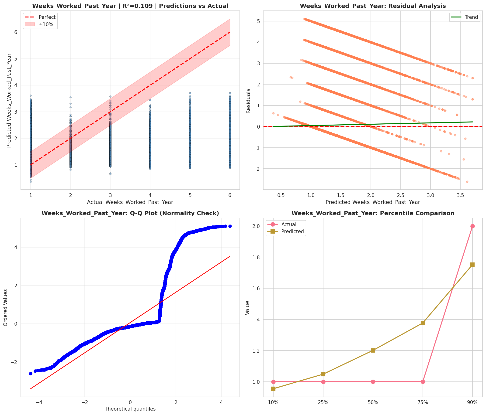
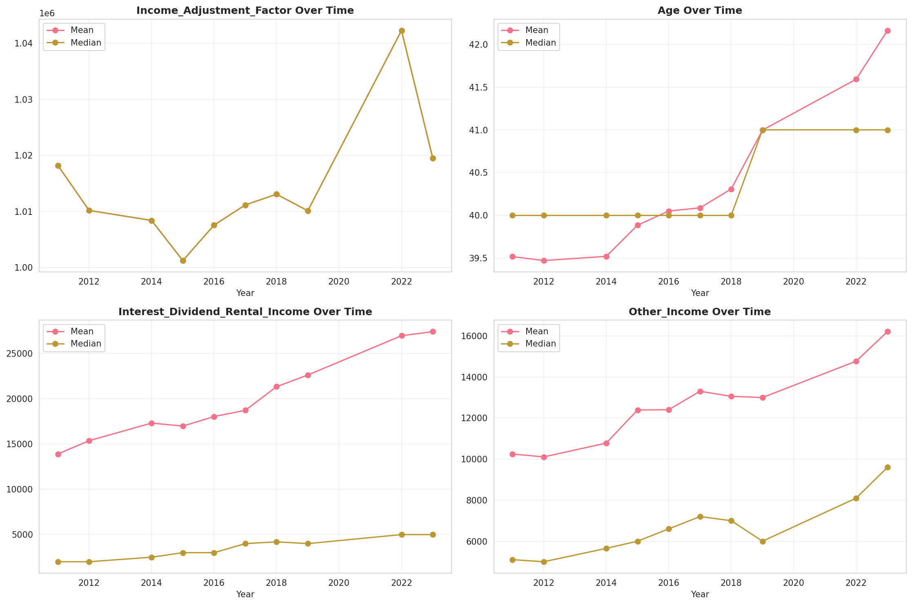
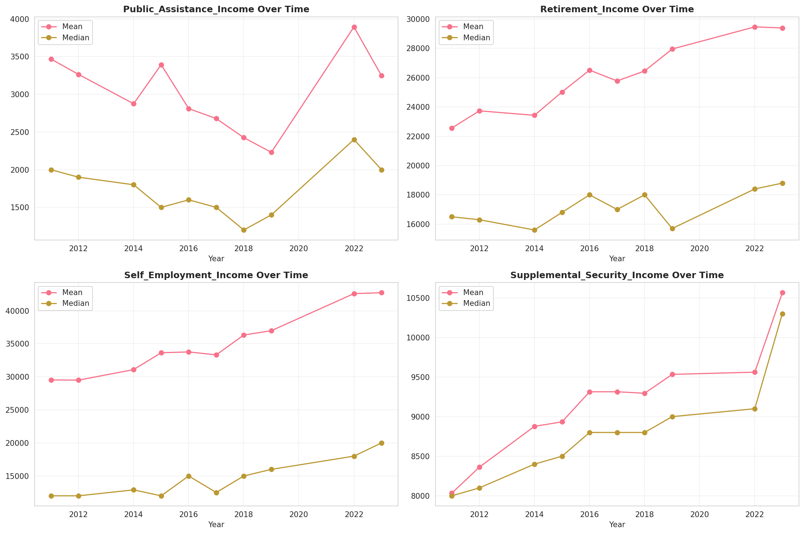
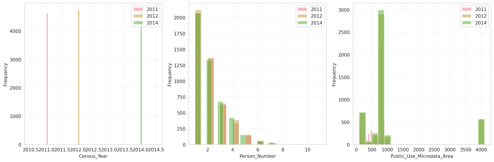
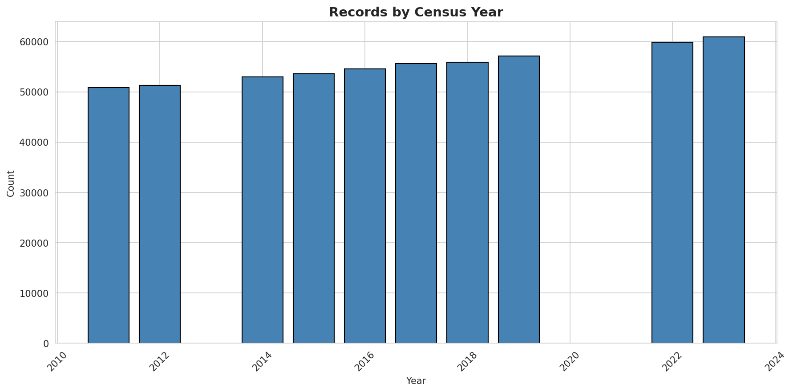
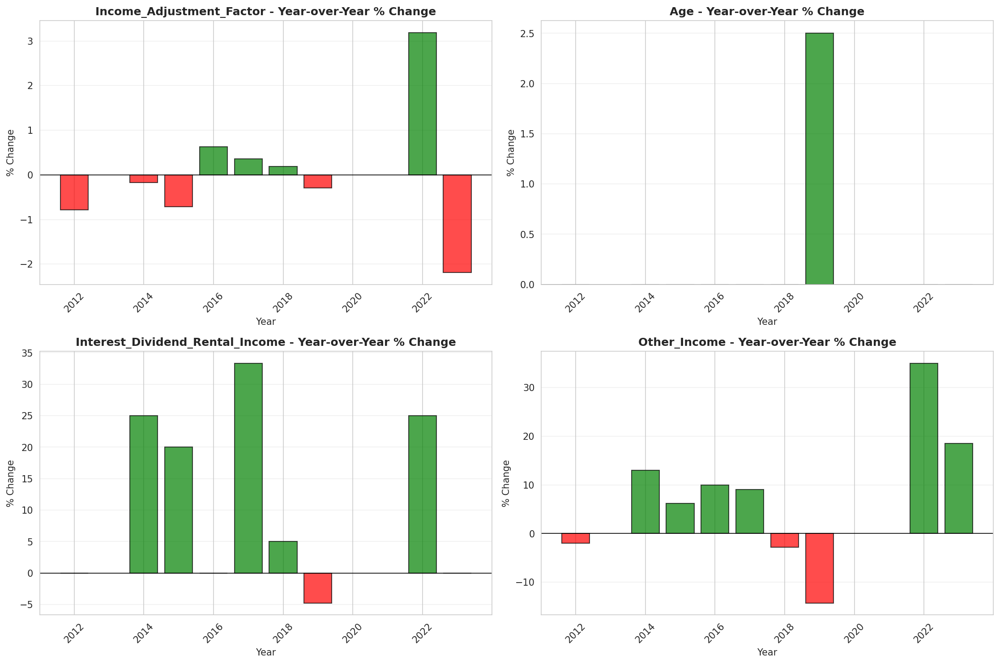
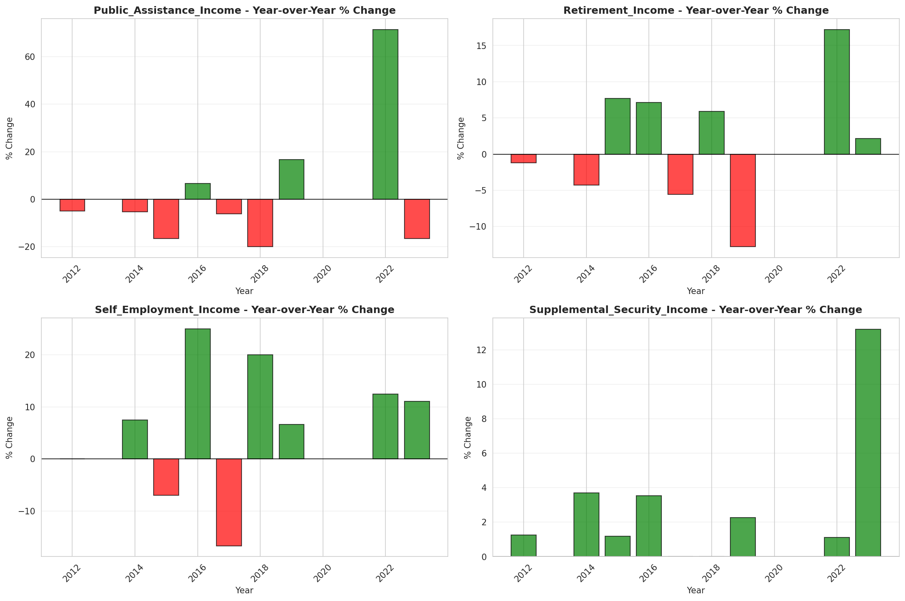

# Temporal Analysis

## Year Distribution

- 2011: 50,825 records

- 2012: 51,322 records

- 2014: 52,929 records

- 2015: 53,570 records

- 2016: 54,571 records

- 2017: 55,600 records

- 2018: 55,928 records

- 2019: 57,142 records

- 2022: 59,841 records

- 2023: 60,896 records

## Temporal Trends

- Census_Year: {np.int64(2011): {'mean': 2011.0, 'median': 2011.0, 'std': 0.0}, np.int64(2012): {'mean': 2012.0, 'median': 2012.0, 'std': 0.0}, np.int64(2014): {'mean': 2014.0, 'median': 2014.0, 'std': 0.0}, np.int64(2015): {'mean': 2015.0, 'median': 2015.0, 'std': 0.0}, np.int64(2016): {'mean': 2016.0, 'median': 2016.0, 'std': 0.0}, np.int64(2017): {'mean': 2017.0, 'median': 2017.0, 'std': 0.0}, np.int64(2018): {'mean': 2018.0, 'median': 2018.0, 'std': 0.0}, np.int64(2019): {'mean': 2019.0, 'median': 2019.0, 'std': 0.0}, np.int64(2022): {'mean': 2022.0, 'median': 2022.0, 'std': 0.0}, np.int64(2023): {'mean': 2023.0, 'median': 2023.0, 'std': 0.0}}

- Person_Number: {np.int64(2011): {'mean': 2.0223512051155925, 'median': 2.0, 'std': 1.2636521049536464}, np.int64(2012): {'mean': 2.0515568372238024, 'median': 2.0, 'std': 1.3025537298193783}, np.int64(2014): {'mean': 2.0690547714863308, 'median': 2.0, 'std': 1.31884625394597}, np.int64(2015): {'mean': 2.061078962105656, 'median': 2.0, 'std': 1.3103447246257944}, np.int64(2016): {'mean': 2.049110333327225, 'median': 2.0, 'std': 1.2724537057698884}, np.int64(2017): {'mean': 2.062931654676259, 'median': 2.0, 'std': 1.3094462885325335}, np.int64(2018): {'mean': 2.046524102417394, 'median': 2.0, 'std': 1.2848391612616181}, np.int64(2019): {'mean': 2.0388330824962373, 'median': 2.0, 'std': 1.276968092932648}, np.int64(2022): {'mean': 2.0027238849618154, 'median': 2.0, 'std': 1.252647970746571}, np.int64(2023): {'mean': 1.9769114555964267, 'median': 2.0, 'std': 1.22922200581402}}

- Public_Use_Microdata_Area: {np.int64(2011): {'mean': 682.1744613871126, 'median': 808.0, 'std': 247.03778258583552}, np.int64(2012): {'mean': 1085.2836600288376, 'median': 811.0, 'std': 1113.0961619783072}, np.int64(2014): {'mean': 1088.3157248389352, 'median': 811.0, 'std': 1116.5091043295085}, np.int64(2015): {'mean': 1085.9219712525667, 'median': 811.0, 'std': 1108.4301213945876}, np.int64(2016): {'mean': 1086.2944421029486, 'median': 811.0, 'std': 1113.2492349574293}, np.int64(2017): {'mean': 1091.865071942446, 'median': 811.0, 'std': 1114.7878348138884}, np.int64(2018): {'mean': 1077.2355886139321, 'median': 811.0, 'std': 1100.5919642638912}, np.int64(2019): {'mean': 1097.9470617059255, 'median': 811.0, 'std': 1127.5478721551983}, np.int64(2022): {'mean': 1339.7561872294914, 'median': 1501.0, 'std': 660.453005650913}, np.int64(2023): {'mean': 1349.0849316868103, 'median': 1501.0, 'std': 663.0446504340586}}

- State_Code: {np.int64(2011): {'mean': 8.0, 'median': 8.0, 'std': 0.0}, np.int64(2012): {'mean': 8.0, 'median': 8.0, 'std': 0.0}, np.int64(2014): {'mean': 8.0, 'median': 8.0, 'std': 0.0}, np.int64(2015): {'mean': 8.0, 'median': 8.0, 'std': 0.0}, np.int64(2016): {'mean': 8.0, 'median': 8.0, 'std': 0.0}, np.int64(2017): {'mean': 8.0, 'median': 8.0, 'std': 0.0}, np.int64(2018): {'mean': 8.0, 'median': 8.0, 'std': 0.0}, np.int64(2019): {'mean': 8.0, 'median': 8.0, 'std': 0.0}, np.int64(2022): {'mean': 8.0, 'median': 8.0, 'std': 0.0}, np.int64(2023): {'mean': None, 'median': None, 'std': None}}

- Income_Adjustment_Factor: {np.int64(2011): {'mean': 1018237.0, 'median': 1018237.0, 'std': 0.0}, np.int64(2012): {'mean': 1010207.0, 'median': 1010207.0, 'std': 0.0}, np.int64(2014): {'mean': 1008425.0, 'median': 1008425.0, 'std': 0.0}, np.int64(2015): {'mean': 1001264.0, 'median': 1001264.0, 'std': 0.0}, np.int64(2016): {'mean': 1007588.0, 'median': 1007588.0, 'std': 0.0}, np.int64(2017): {'mean': 1011189.0, 'median': 1011189.0, 'std': 0.0}, np.int64(2018): {'mean': 1013097.0, 'median': 1013097.0, 'std': 0.0}, np.int64(2019): {'mean': 1010145.0, 'median': 1010145.0, 'std': 0.0}, np.int64(2022): {'mean': 1042311.0, 'median': 1042311.0, 'std': 0.0}, np.int64(2023): {'mean': 1019518.0, 'median': 1019518.0, 'std': 0.0}}

- Person_Weight: {np.int64(2011): {'mean': 100.6747860304968, 'median': 75.0, 'std': 88.39458256069881}, np.int64(2012): {'mean': 101.07910837457621, 'median': 78.0, 'std': 78.68141287607804}, np.int64(2014): {'mean': 101.18963139299817, 'median': 79.0, 'std': 78.42595414762374}, np.int64(2015): {'mean': 101.8587642337129, 'median': 79.0, 'std': 76.31217668135933}, np.int64(2016): {'mean': 101.52910886734712, 'median': 80.0, 'std': 76.01636959383278}, np.int64(2017): {'mean': 100.84809352517986, 'median': 80.0, 'std': 76.31190782094987}, np.int64(2018): {'mean': 101.83743384351308, 'median': 79.0, 'std': 80.5838429966858}, np.int64(2019): {'mean': 100.77939169087536, 'median': 78.0, 'std': 83.39383145632243}, np.int64(2022): {'mean': 97.59071539579887, 'median': 74.0, 'std': 80.48763126586181}, np.int64(2023): {'mean': 96.51881897004729, 'median': 72.0, 'std': 84.66160345548901}}

- Age: {np.int64(2011): {'mean': 39.51883915395967, 'median': 40.0, 'std': 23.006364740653893}, np.int64(2012): {'mean': 39.472292584077, 'median': 40.0, 'std': 23.059453032452716}, np.int64(2014): {'mean': 39.52164219992821, 'median': 40.0, 'std': 23.06952169794702}, np.int64(2015): {'mean': 39.885738286354304, 'median': 40.0, 'std': 23.02830063917412}, np.int64(2016): {'mean': 40.051290978724964, 'median': 40.0, 'std': 23.054082043221875}, np.int64(2017): {'mean': 40.08809352517986, 'median': 40.0, 'std': 23.049488437038768}, np.int64(2018): {'mean': 40.30886139321986, 'median': 40.0, 'std': 23.06884465752272}, np.int64(2019): {'mean': 40.996902453536805, 'median': 41.0, 'std': 23.129432752486252}, np.int64(2022): {'mean': 41.59170134188934, 'median': 41.0, 'std': 23.233183153554954}, np.int64(2023): {'mean': 42.161718339464, 'median': 41.0, 'std': 23.158645767033086}}

- Citizenship_Status: {np.int64(2011): {'mean': 1.312582390555829, 'median': 1.0, 'std': 1.0021522129645697}, np.int64(2012): {'mean': 1.3090487510229531, 'median': 1.0, 'std': 0.98981758655844}, np.int64(2014): {'mean': 1.305276880349147, 'median': 1.0, 'std': 0.9823039002138167}, np.int64(2015): {'mean': 1.3078402090722419, 'median': 1.0, 'std': 0.9882205578960422}, np.int64(2016): {'mean': 1.3055652269520441, 'median': 1.0, 'std': 0.9818930589020056}, np.int64(2017): {'mean': 1.3166906474820144, 'median': 1.0, 'std': 0.9942704535305582}, np.int64(2018): {'mean': 1.2906594192533256, 'median': 1.0, 'std': 0.9516823123510557}, np.int64(2019): {'mean': 1.2805117076756152, 'median': 1.0, 'std': 0.9305213608156835}, np.int64(2022): {'mean': 1.311007503216858, 'median': 1.0, 'std': 0.9774773080030804}, np.int64(2023): {'mean': 1.2967354177614294, 'median': 1.0, 'std': 0.9560674905092195}}

- Class_of_Worker: {np.int64(2011): {'mean': 2.311051637279597, 'median': 1.0, 'std': 2.037527892247981}, np.int64(2012): {'mean': 2.298428339777972, 'median': 1.0, 'std': 2.03448947765619}, np.int64(2014): {'mean': 2.239539590948914, 'median': 1.0, 'std': 1.9970649958588726}, np.int64(2015): {'mean': 2.2544526984695246, 'median': 1.0, 'std': 2.0100200465635574}, np.int64(2016): {'mean': 2.2697686614999126, 'median': 1.0, 'std': 2.0099343316862273}, np.int64(2017): {'mean': 2.2692274885559125, 'median': 1.0, 'std': 2.013500672023036}, np.int64(2018): {'mean': 2.2640728010367948, 'median': 1.0, 'std': 2.0107888476452147}, np.int64(2019): {'mean': 2.25264887063655, 'median': 1.0, 'std': 1.9867494210425876}, np.int64(2022): {'mean': 2.241594708800294, 'median': 1.0, 'std': 1.965937767226148}, np.int64(2023): {'mean': 2.261995273810747, 'median': 1.0, 'std': 1.9789784774766617}}

- English_Speaking_Ability: {np.int64(2011): {'mean': 1.6214681036993883, 'median': 1.0, 'std': 0.9114626201955822}, np.int64(2012): {'mean': 1.5722050830027912, 'median': 1.0, 'std': 0.8705739998928672}, np.int64(2014): {'mean': 1.5760643048526348, 'median': 1.0, 'std': 0.8856481567017203}, np.int64(2015): {'mean': 1.559052844354606, 'median': 1.0, 'std': 0.8683232014572809}, np.int64(2016): {'mean': 1.555174875089222, 'median': 1.0, 'std': 0.8659367780257962}, np.int64(2017): {'mean': 1.5132155477031801, 'median': 1.0, 'std': 0.8305308556347568}, np.int64(2018): {'mean': 1.5014287862836517, 'median': 1.0, 'std': 0.8176229475594468}, np.int64(2019): {'mean': 1.4560851318944845, 'median': 1.0, 'std': 0.7790862644995535}, np.int64(2022): {'mean': 1.4865900383141764, 'median': 1.0, 'std': 0.7963056287955604}, np.int64(2023): {'mean': 1.4961974649766512, 'median': 1.0, 'std': 0.7966135982688642}}

- Fertility_Status: {np.int64(2011): {'mean': 1.943788501026694, 'median': 2.0, 'std': 0.23033954445392915}, np.int64(2012): {'mean': 1.947714112868378, 'median': 2.0, 'std': 0.22261256915356006}, np.int64(2014): {'mean': 1.9456457220384975, 'median': 2.0, 'std': 0.2267250522259855}, np.int64(2015): {'mean': 1.9523088569265707, 'median': 2.0, 'std': 0.21312090072891382}, np.int64(2016): {'mean': 1.9479970141826326, 'median': 2.0, 'std': 0.22204225819364193}, np.int64(2017): {'mean': 1.9478827361563518, 'median': 2.0, 'std': 0.22227230986545063}, np.int64(2018): {'mean': 1.948865913280436, 'median': 2.0, 'std': 0.22028000570452774}, np.int64(2019): {'mean': 1.9550666978703486, 'median': 2.0, 'std': 0.2071657511776921}, np.int64(2022): {'mean': 1.9514671013633669, 'median': 2.0, 'std': 0.2148973666805272}, np.int64(2023): {'mean': 1.9555425133885995, 'median': 2.0, 'std': 0.20611679995759913}}

- Marital_Status: {np.int64(2011): {'mean': 2.90756517461879, 'median': 3.0, 'std': 1.8528300851774813}, np.int64(2012): {'mean': 2.902420014808464, 'median': 3.0, 'std': 1.8539097447387187}, np.int64(2014): {'mean': 2.919325889399006, 'median': 3.0, 'std': 1.8569288443531482}, np.int64(2015): {'mean': 2.891749113309688, 'median': 3.0, 'std': 1.8590560509938978}, np.int64(2016): {'mean': 2.8971981455351745, 'median': 3.0, 'std': 1.8578751924795953}, np.int64(2017): {'mean': 2.900701438848921, 'median': 3.0, 'std': 1.857689752573988}, np.int64(2018): {'mean': 2.8972071234444288, 'median': 3.0, 'std': 1.8571859999976974}, np.int64(2019): {'mean': 2.8636379545693185, 'median': 3.0, 'std': 1.8560462362191013}, np.int64(2022): {'mean': 2.901773031867783, 'median': 3.0, 'std': 1.8594705464882588}, np.int64(2023): {'mean': 2.8687270099842355, 'median': 3.0, 'std': 1.8561831646812095}}

- Mobility_Status: {np.int64(2011): {'mean': 1.3311242462236552, 'median': 1.0, 'std': 0.7388432312543636}, np.int64(2012): {'mean': 1.3269912550224534, 'median': 1.0, 'std': 0.7354223131581831}, np.int64(2014): {'mean': 1.339118978060377, 'median': 1.0, 'std': 0.7463902943141699}, np.int64(2015): {'mean': 1.3250570292027224, 'median': 1.0, 'std': 0.7340343012338907}, np.int64(2016): {'mean': 1.3334444629660498, 'median': 1.0, 'std': 0.7418383393630211}, np.int64(2017): {'mean': 1.3247987497955698, 'median': 1.0, 'std': 0.7336632778795688}, np.int64(2018): {'mean': 1.3225119167990755, 'median': 1.0, 'std': 0.7317502253672288}, np.int64(2019): {'mean': 1.304289496910856, 'median': 1.0, 'std': 0.7150033654253143}, np.int64(2022): {'mean': 1.2985278494460464, 'median': 1.0, 'std': 0.7085857644058783}, np.int64(2023): {'mean': 1.2735283400139132, 'median': 1.0, 'std': 0.6840373242650571}}

- Military_Service: {np.int64(2011): {'mean': 4.725607643185981, 'median': 5.0, 'std': 0.736655938711759}, np.int64(2012): {'mean': 4.733605850919747, 'median': 5.0, 'std': 0.7325953346366644}, np.int64(2014): {'mean': 3.7665176116119468, 'median': 4.0, 'std': 0.6518767345537403}, np.int64(2015): {'mean': 3.7685543440028137, 'median': 4.0, 'std': 0.649937608849461}, np.int64(2016): {'mean': 3.772293796708083, 'median': 4.0, 'std': 0.6457418330150958}, np.int64(2017): {'mean': 3.782743581673486, 'median': 4.0, 'std': 0.6314600535815228}, np.int64(2018): {'mean': 3.7912589984176157, 'median': 4.0, 'std': 0.6218606056751681}, np.int64(2019): {'mean': 3.7844706694569696, 'median': 4.0, 'std': 0.6318559158036224}, np.int64(2022): {'mean': 3.8057932716739504, 'median': 4.0, 'std': 0.6053411915921949}, np.int64(2023): {'mean': 3.8077249659366914, 'median': 4.0, 'std': 0.604139518265546}}

- Travel_Time_To_Work_Minutes: {np.int64(2011): {'mean': 24.21786670296266, 'median': 20.0, 'std': 22.03562719516755}, np.int64(2012): {'mean': 24.731490448102825, 'median': 20.0, 'std': 22.24004361660248}, np.int64(2014): {'mean': 25.27067574382249, 'median': 20.0, 'std': 21.113825716212983}, np.int64(2015): {'mean': 25.585343762865378, 'median': 20.0, 'std': 21.717552548520374}, np.int64(2016): {'mean': 25.058833076361275, 'median': 20.0, 'std': 20.19404616687673}, np.int64(2017): {'mean': 25.944881578427108, 'median': 20.0, 'std': 21.61521325926691}, np.int64(2018): {'mean': 25.93949998055912, 'median': 20.0, 'std': 22.056169292423576}, np.int64(2019): {'mean': 26.469663603918292, 'median': 20.0, 'std': 22.269444802685516}, np.int64(2022): {'mean': 24.9343792749658, 'median': 20.0, 'std': 20.453822811558833}, np.int64(2023): {'mean': 25.371880680879194, 'median': 20.0, 'std': 21.314921949148143}}

- Vehicle_Occupancy: {np.int64(2011): {'mean': 1.1661895434684346, 'median': 1.0, 'std': 0.5745777302415669}, np.int64(2012): {'mean': 1.1696750902527075, 'median': 1.0, 'std': 0.5932517204773986}, np.int64(2014): {'mean': 1.153061695353237, 'median': 1.0, 'std': 0.5286134074989033}, np.int64(2015): {'mean': 1.1447439596105302, 'median': 1.0, 'std': 0.5396519548061817}, np.int64(2016): {'mean': 1.152826145191535, 'median': 1.0, 'std': 0.5592091932943822}, np.int64(2017): {'mean': 1.1465891338309322, 'median': 1.0, 'std': 0.5420647737047669}, np.int64(2018): {'mean': 1.1406994554118448, 'median': 1.0, 'std': 0.5246632592331983}, np.int64(2019): {'mean': 1.154147724903032, 'median': 1.0, 'std': 0.5602009241695103}, np.int64(2022): {'mean': 1.154458302308265, 'median': 1.0, 'std': 0.5450929315515844}, np.int64(2023): {'mean': 1.1554248248607868, 'median': 1.0, 'std': 0.5517652618370915}}

- Transportation_To_Work: {np.int64(2011): {'mean': 2.27546325608881, 'median': 1.0, 'std': 3.2042495447828636}, np.int64(2012): {'mean': 2.31659174499387, 'median': 1.0, 'std': 3.253635544128545}, np.int64(2014): {'mean': 2.236360800218383, 'median': 1.0, 'std': 3.1625268711125964}, np.int64(2015): {'mean': 2.265339524969549, 'median': 1.0, 'std': 3.2083768383984492}, np.int64(2016): {'mean': 2.379417995317204, 'median': 1.0, 'std': 3.3316825461971535}, np.int64(2017): {'mean': 2.389564903412168, 'median': 1.0, 'std': 3.347736065003652}, np.int64(2018): {'mean': 2.408849181025314, 'median': 1.0, 'std': 3.3701672050059317}, np.int64(2019): {'mean': None, 'median': None, 'std': None}, np.int64(2022): {'mean': None, 'median': None, 'std': None}, np.int64(2023): {'mean': None, 'median': None, 'std': None}}

- Language_Other_Than_English: {np.int64(2011): {'mean': 1.8566776604183193, 'median': 2.0, 'std': 0.35040492229649073}, np.int64(2012): {'mean': 1.8591849400082747, 'median': 2.0, 'std': 0.34783427338336625}, np.int64(2014): {'mean': 1.8655566451199743, 'median': 2.0, 'std': 0.34113145276547324}, np.int64(2015): {'mean': 1.8633466842925637, 'median': 2.0, 'std': 0.3434843735102217}, np.int64(2016): {'mean': 1.8643204400627553, 'median': 2.0, 'std': 0.34245129348023234}, np.int64(2017): {'mean': 1.8658208162646033, 'median': 2.0, 'std': 0.3408479627639513}, np.int64(2018): {'mean': 1.8745542705129898, 'median': 2.0, 'std': 0.33122676272511986}, np.int64(2019): {'mean': 1.8773055775207341, 'median': 2.0, 'std': 0.3280891352330296}, np.int64(2022): {'mean': 1.8675914911482752, 'median': 2.0, 'std': 0.3389373176055818}, np.int64(2023): {'mean': 1.8713989121669155, 'median': 2.0, 'std': 0.3347607666329006}}

- Grandparents_Living_With_Grandchildren: {np.int64(2011): {'mean': 1.9733929464732367, 'median': 2.0, 'std': 0.16093454572287014}, np.int64(2012): {'mean': 1.9729972162078564, 'median': 2.0, 'std': 0.1620939423764446}, np.int64(2014): {'mean': 1.974421254647955, 'median': 2.0, 'std': 0.15787723257648384}, np.int64(2015): {'mean': 1.971792618629174, 'median': 2.0, 'std': 0.165567291309626}, np.int64(2016): {'mean': 1.9723725271264565, 'median': 2.0, 'std': 0.1639053530145459}, np.int64(2017): {'mean': 1.9719284428442845, 'median': 2.0, 'std': 0.16517963640411817}, np.int64(2018): {'mean': 1.9744044812955825, 'median': 2.0, 'std': 0.15792745094663577}, np.int64(2019): {'mean': 1.9733677669276088, 'median': 2.0, 'std': 0.161008243927343}, np.int64(2022): {'mean': 1.9780280836448125, 'median': 2.0, 'std': 0.14659363550553037}, np.int64(2023): {'mean': 1.9777718068345587, 'median': 2.0, 'std': 0.14742669872477074}}

- Months_Responsible_For_Grandchildren: {np.int64(2011): {'mean': 3.6344647519582245, 'median': 4.0, 'std': 1.3564129871897979}, np.int64(2012): {'mean': 3.6149584487534625, 'median': 4.0, 'std': 1.3778800386994787}, np.int64(2014): {'mean': 3.7195121951219514, 'median': 4.0, 'std': 1.3480023978771802}, np.int64(2015): {'mean': 3.654891304347826, 'median': 4.0, 'std': 1.374317958812036}, np.int64(2016): {'mean': 3.726063829787234, 'median': 4.0, 'std': 1.3414266778005024}, np.int64(2017): {'mean': 3.691131498470948, 'median': 4.0, 'std': 1.324386976311383}, np.int64(2018): {'mean': 3.8419354838709676, 'median': 4.0, 'std': 1.266004134399295}, np.int64(2019): {'mean': 3.800578034682081, 'median': 4.0, 'std': 1.3696925333526218}, np.int64(2022): {'mean': 3.948717948717949, 'median': 5.0, 'std': 1.3439434556804704}, np.int64(2023): {'mean': 3.9765625, 'median': 5.0, 'std': 1.3944699955995652}}

- Grandparents_Responsible_For_Grandchildren: {np.int64(2011): {'mean': 1.5499412455934196, 'median': 2.0, 'std': 0.4977921809022193}, np.int64(2012): {'mean': 1.5864833906071019, 'median': 2.0, 'std': 0.4927461244188282}, np.int64(2014): {'mean': 1.615474794841735, 'median': 2.0, 'std': 0.4867682695584531}, np.int64(2015): {'mean': 1.6178608515057114, 'median': 2.0, 'std': 0.4861627865703461}, np.int64(2016): {'mean': 1.610362694300518, 'median': 2.0, 'std': 0.487920871689332}, np.int64(2017): {'mean': 1.6723446893787575, 'median': 2.0, 'std': 0.46959372678044603}, np.int64(2018): {'mean': 1.6641386782231853, 'median': 2.0, 'std': 0.47254674188249457}, np.int64(2019): {'mean': 1.6505050505050505, 'median': 2.0, 'std': 0.47705147169658096}, np.int64(2022): {'mean': 1.686206896551724, 'median': 2.0, 'std': 0.4643003109826871}, np.int64(2023): {'mean': 1.7186813186813186, 'median': 2.0, 'std': 0.4498898747811539}}

- Interest_Dividend_Rental_Income: {np.int64(2011): {'mean': 13902.738512198772, 'median': 2000.0, 'std': 37998.157437928036}, np.int64(2012): {'mean': 15369.976447644765, 'median': 2000.0, 'std': 43149.22394128057}, np.int64(2014): {'mean': 17314.24288617886, 'median': 2500.0, 'std': 45512.5016809174}, np.int64(2015): {'mean': 16983.293713163064, 'median': 3000.0, 'std': 44220.69349085775}, np.int64(2016): {'mean': 18032.353267656446, 'median': 3000.0, 'std': 48358.469443709524}, np.int64(2017): {'mean': 18723.60915987637, 'median': 4000.0, 'std': 43883.942777733224}, np.int64(2018): {'mean': 21335.69103448276, 'median': 4200.0, 'std': 52618.12404808985}, np.int64(2019): {'mean': 22620.96724271344, 'median': 4000.0, 'std': 62302.32944454939}, np.int64(2022): {'mean': 26962.840693578975, 'median': 5000.0, 'std': 65694.55599394566}, np.int64(2023): {'mean': 27412.49208960891, 'median': 5000.0, 'std': 69848.57576180958}}

- Military_Service_Period_1: {np.int64(2011): {'mean': 0.1671726371179923, 'median': 0.0, 'std': 0.3731676967624498}, np.int64(2012): {'mean': 0.19404237465911475, 'median': 0.0, 'std': 0.3955031544268992}, np.int64(2014): {'mean': 0.22080251064783682, 'median': 0.0, 'std': 0.41483410888575717}, np.int64(2015): {'mean': 0.2400088809946714, 'median': 0.0, 'std': 0.42713595656771663}, np.int64(2016): {'mean': 0.24728321135506764, 'median': 0.0, 'std': 0.431480607320923}, np.int64(2017): {'mean': 0.2695099818511797, 'median': 0.0, 'std': 0.44375559110136176}, np.int64(2018): {'mean': 0.27132867132867133, 'median': 0.0, 'std': 0.4446971107411969}, np.int64(2019): {'mean': 0.3010092145677929, 'median': 0.0, 'std': 0.4587470311890313}, np.int64(2022): {'mean': 0.3402325581395349, 'median': 0.0, 'std': 0.47384235775739303}, np.int64(2023): {'mean': 0.354978354978355, 'median': 0.0, 'std': 0.4785612846147456}}

- Military_Service_Period_2: {np.int64(2011): {'mean': 0.16433920259056872, 'median': 0.0, 'std': 0.370620599869821}, np.int64(2012): {'mean': 0.17935808684707363, 'median': 0.0, 'std': 0.38369212477000697}, np.int64(2014): {'mean': 0.19995516700291416, 'median': 0.0, 'std': 0.4000112080922448}, np.int64(2015): {'mean': 0.20182060390763765, 'median': 0.0, 'std': 0.4014035643377059}, np.int64(2016): {'mean': 0.20470170769571966, 'median': 0.0, 'std': 0.40352822936957944}, np.int64(2017): {'mean': 0.213021778584392, 'median': 0.0, 'std': 0.409489365808277}, np.int64(2018): {'mean': 0.22867132867132867, 'median': 0.0, 'std': 0.42002604216341105}, np.int64(2019): {'mean': 0.234093900833699, 'median': 0.0, 'std': 0.4234776158886728}, np.int64(2022): {'mean': 0.23604651162790696, 'median': 0.0, 'std': 0.42470048575992486}, np.int64(2023): {'mean': 0.24219640009113694, 'median': 0.0, 'std': 0.4284613529497624}}

- Military_Service_Period_3: {np.int64(2011): {'mean': 0.19712608783647034, 'median': 0.0, 'std': 0.39786861055457867}, np.int64(2012): {'mean': 0.1986574365428991, 'median': 0.0, 'std': 0.39903140375426177}, np.int64(2014): {'mean': None, 'median': None, 'std': None}, np.int64(2015): {'mean': None, 'median': None, 'std': None}, np.int64(2016): {'mean': None, 'median': None, 'std': None}, np.int64(2017): {'mean': None, 'median': None, 'std': None}, np.int64(2018): {'mean': None, 'median': None, 'std': None}, np.int64(2019): {'mean': None, 'median': None, 'std': None}, np.int64(2022): {'mean': None, 'median': None, 'std': None}, np.int64(2023): {'mean': None, 'median': None, 'std': None}}

- Military_Service_Period_4: {np.int64(2011): {'mean': 0.13924306820481683, 'median': 0.0, 'std': 0.34623503316870946}, np.int64(2012): {'mean': 0.14684287812041116, 'median': 0.0, 'std': 0.3539863464450509}, np.int64(2014): {'mean': None, 'median': None, 'std': None}, np.int64(2015): {'mean': None, 'median': None, 'std': None}, np.int64(2016): {'mean': None, 'median': None, 'std': None}, np.int64(2017): {'mean': None, 'median': None, 'std': None}, np.int64(2018): {'mean': None, 'median': None, 'std': None}, np.int64(2019): {'mean': None, 'median': None, 'std': None}, np.int64(2022): {'mean': None, 'median': None, 'std': None}, np.int64(2023): {'mean': None, 'median': None, 'std': None}}

- Military_Service_Period_5: {np.int64(2011): {'mean': 0.36247723132969034, 'median': 0.0, 'std': 0.4807642529774826}, np.int64(2012): {'mean': 0.35703796937277116, 'median': 0.0, 'std': 0.4791764021379076}, np.int64(2014): {'mean': 0.36673391616229545, 'median': 0.0, 'std': 0.48196703484914283}, np.int64(2015): {'mean': 0.3465808170515098, 'median': 0.0, 'std': 0.47593365691851275}, np.int64(2016): {'mean': 0.37037037037037035, 'median': 0.0, 'std': 0.48295743966460597}, np.int64(2017): {'mean': 0.3532214156079855, 'median': 0.0, 'std': 0.47802498524770975}, np.int64(2018): {'mean': 0.35104895104895106, 'median': 0.0, 'std': 0.47735385281513537}, np.int64(2019): {'mean': 0.33238262395787627, 'median': 0.0, 'std': 0.4711189982733483}, np.int64(2022): {'mean': 0.3253488372093023, 'median': 0.0, 'std': 0.4685595255856224}, np.int64(2023): {'mean': 0.31510594668489406, 'median': 0.0, 'std': 0.4646109898215805}}

- Military_Service_Period_6: {np.int64(2011): {'mean': 0.10706334750050597, 'median': 0.0, 'std': 0.30922506287257684}, np.int64(2012): {'mean': 0.09838472834067548, 'median': 0.0, 'std': 0.2978653817583844}, np.int64(2014): {'mean': None, 'median': None, 'std': None}, np.int64(2015): {'mean': None, 'median': None, 'std': None}, np.int64(2016): {'mean': None, 'median': None, 'std': None}, np.int64(2017): {'mean': None, 'median': None, 'std': None}, np.int64(2018): {'mean': None, 'median': None, 'std': None}, np.int64(2019): {'mean': None, 'median': None, 'std': None}, np.int64(2022): {'mean': None, 'median': None, 'std': None}, np.int64(2023): {'mean': None, 'median': None, 'std': None}}

- Military_Service_Period_7: {np.int64(2011): {'mean': 0.1196114146933819, 'median': 0.0, 'std': 0.3245394288429789}, np.int64(2012): {'mean': 0.10908328088944828, 'median': 0.0, 'std': 0.3117763779512531}, np.int64(2014): {'mean': None, 'median': None, 'std': None}, np.int64(2015): {'mean': None, 'median': None, 'std': None}, np.int64(2016): {'mean': None, 'median': None, 'std': None}, np.int64(2017): {'mean': None, 'median': None, 'std': None}, np.int64(2018): {'mean': None, 'median': None, 'std': None}, np.int64(2019): {'mean': None, 'median': None, 'std': None}, np.int64(2022): {'mean': None, 'median': None, 'std': None}, np.int64(2023): {'mean': None, 'median': None, 'std': None}}

- Military_Service_Period_8: {np.int64(2011): {'mean': 0.10564663023679417, 'median': 0.0, 'std': 0.30741591754428405}, np.int64(2012): {'mean': 0.10299979022445983, 'median': 0.0, 'std': 0.3039904913673323}, np.int64(2014): {'mean': 0.08832100425913472, 'median': 0.0, 'std': 0.28379298505801626}, np.int64(2015): {'mean': 0.07948490230905861, 'median': 0.0, 'std': 0.2705241230032204}, np.int64(2016): {'mean': 0.07274340208471945, 'median': 0.0, 'std': 0.2597436471336912}, np.int64(2017): {'mean': 0.06941923774954628, 'median': 0.0, 'std': 0.25419454306627837}, np.int64(2018): {'mean': 0.06060606060606061, 'median': 0.0, 'std': 0.23863411366722356}, np.int64(2019): {'mean': 0.0515577007459412, 'median': 0.0, 'std': 0.22115658451615844}, np.int64(2022): {'mean': 0.037674418604651164, 'median': 0.0, 'std': 0.19042975123981182}, np.int64(2023): {'mean': 0.02437912964228754, 'median': 0.0, 'std': 0.15424074719959663}}

- Military_Service_Period_9: {np.int64(2011): {'mean': 0.025500910746812388, 'median': 0.0, 'std': 0.15765673086367032}, np.int64(2012): {'mean': 0.017830920914621354, 'median': 0.0, 'std': 0.13235049580359737}, np.int64(2014): {'mean': 0.014794889038332213, 'median': 0.0, 'std': 0.12074464152987151}, np.int64(2015): {'mean': 0.014431616341030195, 'median': 0.0, 'std': 0.11927490695173046}, np.int64(2016): {'mean': 0.011976047904191617, 'median': 0.0, 'std': 0.1087899213441363}, np.int64(2017): {'mean': 0.011116152450090745, 'median': 0.0, 'std': 0.10485741724348699}, np.int64(2018): {'mean': 0.008857808857808859, 'median': 0.0, 'std': 0.09370909787888634}, np.int64(2019): {'mean': 0.006801228609039052, 'median': 0.0, 'std': 0.08219765341631956}, np.int64(2022): {'mean': None, 'median': None, 'std': None}, np.int64(2023): {'mean': None, 'median': None, 'std': None}}

- Military_Service_Period_10: {np.int64(2011): {'mean': 0.0720501922687715, 'median': 0.0, 'std': 0.25859716987169695}, np.int64(2012): {'mean': 0.06167400881057269, 'median': 0.0, 'std': 0.24058775482918865}, np.int64(2014): {'mean': 0.0466263169692894, 'median': 0.0, 'std': 0.21086078445118525}, np.int64(2015): {'mean': 0.043516873889875664, 'median': 0.0, 'std': 0.20404018967980578}, np.int64(2016): {'mean': 0.02949656243069417, 'median': 0.0, 'std': 0.16921248592856708}, np.int64(2017): {'mean': 0.02586206896551724, 'median': 0.0, 'std': 0.15874173676775255}, np.int64(2018): {'mean': 0.019580419580419582, 'median': 0.0, 'std': 0.13856948662751079}, np.int64(2019): {'mean': 0.015357612988152698, 'median': 0.0, 'std': 0.12298404396224089}, np.int64(2022): {'mean': 0.005813953488372093, 'median': 0.0, 'std': 0.07603614908155854}, np.int64(2023): {'mean': 0.00455684666210982, 'median': 0.0, 'std': 0.06735811426696894}}

- Military_Service_Period_11: {np.int64(2011): {'mean': 0.0038453754300748835, 'median': 0.0, 'std': 0.06189801241278738}, np.int64(2012): {'mean': 0.0023075309418921753, 'median': 0.0, 'std': 0.04798634483615307}, np.int64(2014): {'mean': 0.0017933198834342075, 'median': 0.0, 'std': 0.0423143622876969}, np.int64(2015): {'mean': 0.0015541740674955595, 'median': 0.0, 'std': 0.03939674118468739}, np.int64(2016): {'mean': 0.00044355732978487467, 'median': 0.0, 'std': 0.021058464721126286}, np.int64(2017): {'mean': 0.001134301270417423, 'median': 0.0, 'std': 0.033664101433974324}, np.int64(2018): {'mean': 0.0, 'median': 0.0, 'std': 0.0}, np.int64(2019): {'mean': 0.0008775778850372971, 'median': 0.0, 'std': 0.02961418834068274}, np.int64(2022): {'mean': None, 'median': None, 'std': None}, np.int64(2023): {'mean': None, 'median': None, 'std': None}}

- Temporary_Absence_From_Work: {np.int64(2011): {'mean': 2.5487516745828764, 'median': 3.0, 'std': 0.5282069850641429}, np.int64(2012): {'mean': 2.5570215862236236, 'median': 3.0, 'std': 0.527849688934485}, np.int64(2014): {'mean': 2.6217864205669086, 'median': 3.0, 'std': 0.5108130104450771}, np.int64(2015): {'mean': 2.627541119940861, 'median': 3.0, 'std': 0.509748464943353}, np.int64(2016): {'mean': 2.624794022708291, 'median': 3.0, 'std': 0.5074462741181714}, np.int64(2017): {'mean': 2.628407206808887, 'median': 3.0, 'std': 0.5061608488066991}, np.int64(2018): {'mean': 2.6408455341659898, 'median': 3.0, 'std': 0.502420050590715}, np.int64(2019): {'mean': 2.640324602213583, 'median': 3.0, 'std': 0.5027823638237081}, np.int64(2022): {'mean': 2.63301227497547, 'median': 3.0, 'std': 0.5057880366088165}, np.int64(2023): {'mean': 2.6374432957576466, 'median': 3.0, 'std': 0.5007386983883753}}

- Available_For_Work: {np.int64(2011): {'mean': 4.473876507124589, 'median': 5.0, 'std': 1.2706685798001807}, np.int64(2012): {'mean': 4.501673538685424, 'median': 5.0, 'std': 1.2289547315203257}, np.int64(2014): {'mean': 4.722972972972973, 'median': 5.0, 'std': 0.9522962301810409}, np.int64(2015): {'mean': 4.745472186287193, 'median': 5.0, 'std': 0.9114160666905503}, np.int64(2016): {'mean': 4.749621904697411, 'median': 5.0, 'std': 0.9054488450437497}, np.int64(2017): {'mean': 4.755432740134851, 'median': 5.0, 'std': 0.8933408811683579}, np.int64(2018): {'mean': 4.774721777114384, 'median': 5.0, 'std': 0.8578245072319667}, np.int64(2019): {'mean': 4.7722473604826545, 'median': 5.0, 'std': 0.8632645572358136}, np.int64(2022): {'mean': 4.815735196940267, 'median': 5.0, 'std': 0.7800528340122008}, np.int64(2023): {'mean': 4.8099994159219674, 'median': 5.0, 'std': 0.7909822380919993}}

- On_Layoff_From_Work: {np.int64(2011): {'mean': 2.513140908537328, 'median': 3.0, 'std': 0.5343617388672398}, np.int64(2012): {'mean': 2.526412806209071, 'median': 3.0, 'std': 0.5262688007703824}, np.int64(2014): {'mean': 2.6094735850833413, 'median': 3.0, 'std': 0.5031729302619328}, np.int64(2015): {'mean': 2.617214932544816, 'median': 3.0, 'std': 0.49943372262856617}, np.int64(2016): {'mean': 2.6141396356741384, 'median': 3.0, 'std': 0.4995280601670086}, np.int64(2017): {'mean': 2.6185917983862055, 'median': 3.0, 'std': 0.49791900805761075}, np.int64(2018): {'mean': 2.6325701867989553, 'median': 3.0, 'std': 0.4923818700765302}, np.int64(2019): {'mean': 2.6326131752809467, 'median': 3.0, 'std': 0.4925173497935376}, np.int64(2022): {'mean': 2.632111175634274, 'median': 3.0, 'std': 0.4897758487806401}, np.int64(2023): {'mean': 2.6314856998228295, 'median': 3.0, 'std': 0.4917203442724637}}

- Looking_For_Work: {np.int64(2011): {'mean': 2.4926074777737184, 'median': 3.0, 'std': 0.6193386132496057}, np.int64(2012): {'mean': 2.508828522920204, 'median': 3.0, 'std': 0.6059902614637814}, np.int64(2014): {'mean': 2.5938412279875696, 'median': 3.0, 'std': 0.5680309715014258}, np.int64(2015): {'mean': 2.6060109037146555, 'median': 3.0, 'std': 0.5574926616970711}, np.int64(2016): {'mean': 2.6017697117446557, 'median': 3.0, 'std': 0.5568863222869813}, np.int64(2017): {'mean': 2.6070741682325633, 'median': 3.0, 'std': 0.5529034863758947}, np.int64(2018): {'mean': 2.623460719538161, 'median': 3.0, 'std': 0.5419216754004248}, np.int64(2019): {'mean': 2.617424001019693, 'median': 3.0, 'std': 0.5418261359264485}, np.int64(2022): {'mean': 2.615010312581349, 'median': 3.0, 'std': 0.5409312318352263}, np.int64(2023): {'mean': 2.6109845608706657, 'median': 3.0, 'std': 0.5442543644142898}}

- Informed_Of_Recall: {np.int64(2011): {'mean': 2.8805991962002193, 'median': 3.0, 'std': 0.34295508763053445}, np.int64(2012): {'mean': 2.8834586466165413, 'median': 3.0, 'std': 0.337887064439896}, np.int64(2014): {'mean': 2.9463697146623975, 'median': 3.0, 'std': 0.23779595221772531}, np.int64(2015): {'mean': 2.948600073923489, 'median': 3.0, 'std': 0.23263421253647348}, np.int64(2016): {'mean': 2.952032685492427, 'median': 3.0, 'std': 0.22310498478603102}, np.int64(2017): {'mean': 2.9486680667624627, 'median': 3.0, 'std': 0.23229199590761992}, np.int64(2018): {'mean': 2.95311368176131, 'median': 3.0, 'std': 0.22163726092191785}, np.int64(2019): {'mean': 2.9446179338474283, 'median': 3.0, 'std': 0.2401447590542952}, np.int64(2022): {'mean': 2.962133803239953, 'median': 3.0, 'std': 0.20029389985711518}, np.int64(2023): {'mean': 2.9608278332651907, 'median': 3.0, 'std': 0.2014890250056449}}

- Other_Income: {np.int64(2011): {'mean': 10247.7465715853, 'median': 5100.0, 'std': 13922.501700581597}, np.int64(2012): {'mean': 10107.554488141699, 'median': 5000.0, 'std': 14061.478516732683}, np.int64(2014): {'mean': 10782.158253751706, 'median': 5650.0, 'std': 14705.726035256092}, np.int64(2015): {'mean': 12393.909604519775, 'median': 6000.0, 'std': 16355.763697884442}, np.int64(2016): {'mean': 12408.227624309393, 'median': 6600.0, 'std': 15834.635536942897}, np.int64(2017): {'mean': 13307.226361031519, 'median': 7200.0, 'std': 16621.597947613755}, np.int64(2018): {'mean': 13058.706812194205, 'median': 7000.0, 'std': 16346.697319113062}, np.int64(2019): {'mean': 13000.880067567568, 'median': 6000.0, 'std': 16567.809249563692}, np.int64(2022): {'mean': 14773.569010906356, 'median': 8100.0, 'std': 17322.112852962764}, np.int64(2023): {'mean': 16211.929717341482, 'median': 9600.0, 'std': 18699.8252477032}}

- Public_Assistance_Income: {np.int64(2011): {'mean': 3467.932075471698, 'median': 2000.0, 'std': 4343.991611208622}, np.int64(2012): {'mean': 3263.843058350101, 'median': 1900.0, 'std': 4398.946024736547}, np.int64(2014): {'mean': 2874.739776951673, 'median': 1800.0, 'std': 3653.967771094198}, np.int64(2015): {'mean': 3393.083003952569, 'median': 1500.0, 'std': 4577.694865130836}, np.int64(2016): {'mean': 2810.0391389432484, 'median': 1600.0, 'std': 3668.0650450797248}, np.int64(2017): {'mean': 2678.406374501992, 'median': 1500.0, 'std': 3619.7948589054163}, np.int64(2018): {'mean': 2425.2966101694915, 'median': 1200.0, 'std': 3184.0432035427366}, np.int64(2019): {'mean': 2230.194384449244, 'median': 1400.0, 'std': 2542.0055834665914}, np.int64(2022): {'mean': 3894.4151565074135, 'median': 2400.0, 'std': 4531.13952099401}, np.int64(2023): {'mean': 3246.917808219178, 'median': 2000.0, 'std': 4000.757186492837}}

- Retirement_Income: {np.int64(2011): {'mean': 22561.354625550663, 'median': 16500.0, 'std': 20703.00331867574}, np.int64(2012): {'mean': 23735.24189307625, 'median': 16300.0, 'std': 22689.40891605826}, np.int64(2014): {'mean': 23428.10720486111, 'median': 15600.0, 'std': 23212.863464090908}, np.int64(2015): {'mean': 25021.241591468417, 'median': 16800.0, 'std': 25714.56914884337}, np.int64(2016): {'mean': 26512.8408, 'median': 18000.0, 'std': 28710.742699315993}, np.int64(2017): {'mean': 25776.547572048952, 'median': 17000.0, 'std': 27012.51218005824}, np.int64(2018): {'mean': 26455.1946937183, 'median': 18000.0, 'std': 26756.374294125755}, np.int64(2019): {'mean': 27954.174895735236, 'median': 15700.0, 'std': 35713.41629495882}, np.int64(2022): {'mean': 29465.999230670597, 'median': 18400.0, 'std': 33946.44041309297}, np.int64(2023): {'mean': 29394.33406060606, 'median': 18800.0, 'std': 33967.56924064834}}

- Self_Employment_Income: {np.int64(2011): {'mean': 29529.7031096563, 'median': 12000.0, 'std': 48624.08184958393}, np.int64(2012): {'mean': 29501.998712169992, 'median': 12000.0, 'std': 51064.3683193582}, np.int64(2014): {'mean': 31091.38934802571, 'median': 12900.0, 'std': 56566.306322818695}, np.int64(2015): {'mean': 33644.64468412943, 'median': 12000.0, 'std': 60691.78307139884}, np.int64(2016): {'mean': 33766.27514053717, 'median': 15000.0, 'std': 58563.0214526436}, np.int64(2017): {'mean': 33322.812481773115, 'median': 12500.0, 'std': 59583.179414986735}, np.int64(2018): {'mean': 36320.51016318351, 'median': 15000.0, 'std': 65005.99757429852}, np.int64(2019): {'mean': 36979.00586756077, 'median': 16000.0, 'std': 59880.46504271148}, np.int64(2022): {'mean': 42590.426853146855, 'median': 18000.0, 'std': 72178.2760110895}, np.int64(2023): {'mean': 42723.49528039978, 'median': 20000.0, 'std': 73938.57128238866}}

- Supplemental_Security_Income: {np.int64(2011): {'mean': 8033.7278106508875, 'median': 8000.0, 'std': 4694.966588002911}, np.int64(2012): {'mean': 8362.087326943558, 'median': 8100.0, 'std': 4708.150885880877}, np.int64(2014): {'mean': 8877.502691065662, 'median': 8400.0, 'std': 5278.871741212881}, np.int64(2015): {'mean': 8933.587786259543, 'median': 8500.0, 'std': 5224.466448195673}, np.int64(2016): {'mean': 9313.685344827587, 'median': 8800.0, 'std': 5158.087270416702}, np.int64(2017): {'mean': 9314.22805247225, 'median': 8800.0, 'std': 5552.161230344228}, np.int64(2018): {'mean': 9295.113636363636, 'median': 8800.0, 'std': 5787.219549335788}, np.int64(2019): {'mean': 9533.598183881952, 'median': 9000.0, 'std': 5849.6236761006}, np.int64(2022): {'mean': 9561.619348054679, 'median': 9100.0, 'std': 6308.1358582809935}, np.int64(2023): {'mean': 10564.995269631032, 'median': 10300.0, 'std': 6140.432384786655}}

- Social_Security_Income: {np.int64(2011): {'mean': 12064.506451223924, 'median': 11800.0, 'std': 6449.96411954204}, np.int64(2012): {'mean': 12277.252180232557, 'median': 12000.0, 'std': 6677.860327309572}, np.int64(2014): {'mean': 13235.535756995934, 'median': 12600.0, 'std': 7077.657978808616}, np.int64(2015): {'mean': 13540.169626593806, 'median': 12900.0, 'std': 7403.696224072869}, np.int64(2016): {'mean': 13766.39672939068, 'median': 13000.0, 'std': 7694.13587847324}, np.int64(2017): {'mean': 14194.344638949671, 'median': 13200.0, 'std': 7906.837680567189}, np.int64(2018): {'mean': 14578.490907157291, 'median': 13800.0, 'std': 8161.662484594742}, np.int64(2019): {'mean': 14790.49848024316, 'median': 14000.0, 'std': 8398.60315303855}, np.int64(2022): {'mean': 16482.204562453255, 'median': 15400.0, 'std': 9685.905781615054}, np.int64(2023): {'mean': 17708.542857142857, 'median': 16550.0, 'std': 10623.400292402}}

- Wage_Income: {np.int64(2011): {'mean': 42559.72565853658, 'median': 30000.0, 'std': 48974.194557244904}, np.int64(2012): {'mean': 44890.39125300011, 'median': 32000.0, 'std': 51889.190165371016}, np.int64(2014): {'mean': 47862.19329085183, 'median': 35000.0, 'std': 56458.37803277164}, np.int64(2015): {'mean': 49624.50808214759, 'median': 35500.0, 'std': 59546.2572897546}, np.int64(2016): {'mean': 50739.74208477964, 'median': 36000.0, 'std': 59811.37397298003}, np.int64(2017): {'mean': 52911.88300303578, 'median': 38000.0, 'std': 64145.58862184856}, np.int64(2018): {'mean': 54772.41729525862, 'median': 40000.0, 'std': 64469.77124614703}, np.int64(2019): {'mean': 57963.22214962431, 'median': 40600.0, 'std': 67996.13529366761}, np.int64(2022): {'mean': 66969.01080689373, 'median': 50000.0, 'std': 78212.52852697817}, np.int64(2023): {'mean': 70574.16321491404, 'median': 50000.0, 'std': 81815.12178128658}}

- Relationship_To_Householder: {np.int64(2011): {'mean': 2.445371372356124, 'median': 1.0, 'std': 4.308444986984767}, np.int64(2012): {'mean': 2.3955223880597014, 'median': 1.0, 'std': 4.214500376815259}, np.int64(2014): {'mean': 2.4291976043378867, 'median': 1.0, 'std': 4.21971327961387}, np.int64(2015): {'mean': 2.4427291394437183, 'median': 1.0, 'std': 4.24387424537695}, np.int64(2016): {'mean': 2.482124205163915, 'median': 1.0, 'std': 4.282962295918556}, np.int64(2017): {'mean': 2.488992805755396, 'median': 1.0, 'std': 4.296681262940697}, np.int64(2018): {'mean': 2.4757903018166214, 'median': 1.0, 'std': 4.290202388948763}, np.int64(2019): {'mean': None, 'median': None, 'std': None}, np.int64(2022): {'mean': None, 'median': None, 'std': None}, np.int64(2023): {'mean': None, 'median': None, 'std': None}}

- School_Enrollment: {np.int64(2011): {'mean': 1.2968960039105462, 'median': 1.0, 'std': 0.5309560353601271}, np.int64(2012): {'mean': 1.2979212916246217, 'median': 1.0, 'std': 0.533184749760047}, np.int64(2014): {'mean': 1.296614145521367, 'median': 1.0, 'std': 0.5310611574250369}, np.int64(2015): {'mean': 1.2881052002390914, 'median': 1.0, 'std': 0.5231727181280298}, np.int64(2016): {'mean': 1.2776283896379337, 'median': 1.0, 'std': 0.5161561247009876}, np.int64(2017): {'mean': 1.2796949794055439, 'median': 1.0, 'std': 0.5142747405212262}, np.int64(2018): {'mean': 1.27788126371701, 'median': 1.0, 'std': 0.5204090515725167}, np.int64(2019): {'mean': 1.2698529808713177, 'median': 1.0, 'std': 0.5127716465848757}, np.int64(2022): {'mean': 1.2621504231832306, 'median': 1.0, 'std': 0.514034642562974}, np.int64(2023): {'mean': 1.253194215015339, 'median': 1.0, 'std': 0.5054739498428568}}

- School_Grade_Attending: {np.int64(2011): {'mean': 9.809091620373993, 'median': 11.0, 'std': 4.93164689765383}, np.int64(2012): {'mean': 9.646616541353383, 'median': 10.0, 'std': 4.94358816437182}, np.int64(2014): {'mean': 9.541290613718411, 'median': 10.0, 'std': 4.93694982712681}, np.int64(2015): {'mean': 9.617032591354555, 'median': 10.0, 'std': 4.903586949040443}, np.int64(2016): {'mean': 9.56260640767683, 'median': 10.0, 'std': 4.905167165227813}, np.int64(2017): {'mean': 9.684159378036929, 'median': 10.0, 'std': 4.86137506338417}, np.int64(2018): {'mean': 9.563691606532473, 'median': 10.0, 'std': 4.90114867401708}, np.int64(2019): {'mean': 9.670565894417015, 'median': 10.0, 'std': 4.8876487208618045}, np.int64(2022): {'mean': 9.85682919442762, 'median': 11.0, 'std': 4.8671941154355585}, np.int64(2023): {'mean': 9.969963987433912, 'median': 11.0, 'std': 4.858347683447777}}

- Educational_Attainment: {np.int64(2011): {'mean': 16.26838160413866, 'median': 18.0, 'std': 5.694481941493546}, np.int64(2012): {'mean': 16.29194752774975, 'median': 18.0, 'std': 5.7604375844701465}, np.int64(2014): {'mean': 16.37570864448528, 'median': 18.0, 'std': 5.7699670370850775}, np.int64(2015): {'mean': 16.518982704432833, 'median': 19.0, 'std': 5.701509680087325}, np.int64(2016): {'mean': 16.59286471746705, 'median': 19.0, 'std': 5.694401171047815}, np.int64(2017): {'mean': 16.64171212289881, 'median': 19.0, 'std': 5.687787841556207}, np.int64(2018): {'mean': 16.744434813079803, 'median': 19.0, 'std': 5.674256765557615}, np.int64(2019): {'mean': 16.873477173345808, 'median': 19.0, 'std': 5.611806973333336}, np.int64(2022): {'mean': 17.058936634105308, 'median': 19.0, 'std': 5.558532033790513}, np.int64(2023): {'mean': 17.18329231702795, 'median': 19.0, 'std': 5.449409327637011}}

- Sex: {np.int64(2011): {'mean': 1.5060501721593704, 'median': 2.0, 'std': 0.49996831262846414}, np.int64(2012): {'mean': 1.5050270839016406, 'median': 2.0, 'std': 0.49997959881906257}, np.int64(2014): {'mean': 1.5003684180694894, 'median': 2.0, 'std': 0.5000045876423391}, np.int64(2015): {'mean': 1.5021467239126376, 'median': 2.0, 'std': 0.5000000583686421}, np.int64(2016): {'mean': 1.5013285444650089, 'median': 2.0, 'std': 0.5000028162010922}, np.int64(2017): {'mean': 1.5038489208633095, 'median': 2.0, 'std': 0.49998968191902926}, np.int64(2018): {'mean': 1.50216349592333, 'median': 2.0, 'std': 0.4999997893144753}, np.int64(2019): {'mean': 1.5012775191627874, 'median': 2.0, 'std': 0.5000027430508953}, np.int64(2022): {'mean': 1.4996741364616233, 'median': 1.0, 'std': 0.5000040716020876}, np.int64(2023): {'mean': 1.4998193641618498, 'median': 1.0, 'std': 0.5000040727809445}}

- Hours_Worked_Per_Week: {np.int64(2011): {'mean': 38.04889886989278, 'median': 40.0, 'std': 13.855028718452214}, np.int64(2012): {'mean': 38.24224771782759, 'median': 40.0, 'std': 13.612168425607319}, np.int64(2014): {'mean': 38.42290975050481, 'median': 40.0, 'std': 13.699034013315455}, np.int64(2015): {'mean': 38.49592158705649, 'median': 40.0, 'std': 13.578339649451994}, np.int64(2016): {'mean': 38.52157339555059, 'median': 40.0, 'std': 13.443751670943792}, np.int64(2017): {'mean': 38.32863639274963, 'median': 40.0, 'std': 13.481416243627828}, np.int64(2018): {'mean': 38.58654271801682, 'median': 40.0, 'std': 13.45442388134252}, np.int64(2019): {'mean': 38.38119647625771, 'median': 40.0, 'std': 13.53563306318942}, np.int64(2022): {'mean': 38.15661184015201, 'median': 40.0, 'std': 13.24076063245322}, np.int64(2023): {'mean': 37.952958984659276, 'median': 40.0, 'std': 13.161062011244912}}

- When_Last_Worked: {np.int64(2011): {'mean': 1.560735598587261, 'median': 1.0, 'std': 0.8442317695838362}, np.int64(2012): {'mean': 1.5458646616541354, 'median': 1.0, 'std': 0.839820777453613}, np.int64(2014): {'mean': 1.5373622751671532, 'median': 1.0, 'std': 0.8361421834210074}, np.int64(2015): {'mean': 1.5417205692108666, 'median': 1.0, 'std': 0.8415022623398964}, np.int64(2016): {'mean': 1.541816211823661, 'median': 1.0, 'std': 0.8400766581649574}, np.int64(2017): {'mean': 1.5356913894108544, 'median': 1.0, 'std': 0.8371002044328287}, np.int64(2018): {'mean': 1.5300392914371008, 'median': 1.0, 'std': 0.8352281426941518}, np.int64(2019): {'mean': 1.5347439083975951, 'median': 1.0, 'std': 0.8381444467195311}, np.int64(2022): {'mean': 1.5649892869300546, 'median': 1.0, 'std': 0.8512902956059921}, np.int64(2023): {'mean': 1.5758035940268287, 'median': 1.0, 'std': 0.856464123749483}}

- Weeks_Worked_Past_Year: {np.int64(2011): {'mean': 1.9925021732831063, 'median': 1.0, 'std': 1.6914257503440913}, np.int64(2012): {'mean': 1.9473235534401308, 'median': 1.0, 'std': 1.6708268712125902}, np.int64(2014): {'mean': 1.9011944282829665, 'median': 1.0, 'std': 1.6302566090919208}, np.int64(2015): {'mean': 1.8791245678224968, 'median': 1.0, 'std': 1.608843130686897}, np.int64(2016): {'mean': 1.8561335480266834, 'median': 1.0, 'std': 1.591715248584091}, np.int64(2017): {'mean': 1.8636392749631716, 'median': 1.0, 'std': 1.5965673348948564}, np.int64(2018): {'mean': 1.8213179029912097, 'median': 1.0, 'std': 1.5614654864736273}}

- Year_Of_Entry: {np.int64(2011): {'mean': 1989.8672995780591, 'median': 1994.0, 'std': 16.296288182660042}, np.int64(2012): {'mean': 1990.2774421995418, 'median': 1995.0, 'std': 16.432845963383652}, np.int64(2014): {'mean': 1991.2039111835404, 'median': 1995.0, 'std': 16.4709673011524}, np.int64(2015): {'mean': 1992.9361233480176, 'median': 1997.0, 'std': 16.548641189079238}, np.int64(2016): {'mean': 1992.9948738170347, 'median': 1998.0, 'std': 16.850192337248227}, np.int64(2017): {'mean': 1994.1575735158128, 'median': 1998.0, 'std': 16.983407646510642}, np.int64(2018): {'mean': 1994.3725723345224, 'median': 1998.0, 'std': 17.222185682573986}, np.int64(2019): {'mean': 1994.4247717348153, 'median': 1998.0, 'std': 17.345883892331685}, np.int64(2022): {'mean': 1996.8589589417627, 'median': 2000.0, 'std': 17.99041939234807}, np.int64(2023): {'mean': 1997.4827221438645, 'median': 2000.0, 'std': 17.797754384976887}}

- Ancestry_Recode: {np.int64(2011): {'mean': 1.6540678799803246, 'median': 1.0, 'std': 0.9000260313519209}, np.int64(2012): {'mean': 1.6891781302365458, 'median': 1.0, 'std': 0.939010023645748}, np.int64(2014): {'mean': 1.799675036369476, 'median': 1.0, 'std': 1.0369983964906095}, np.int64(2015): {'mean': 1.8047974612656337, 'median': 1.0, 'std': 1.0438478725429396}, np.int64(2016): {'mean': 1.8573784610873907, 'median': 2.0, 'std': 1.046954942705286}, np.int64(2017): {'mean': 1.8981654676258992, 'median': 2.0, 'std': 1.0754334029688946}, np.int64(2018): {'mean': 1.9414962094121013, 'median': 2.0, 'std': 1.0988201156678865}, np.int64(2019): {'mean': 1.9414616219243288, 'median': 2.0, 'std': 1.099781850685521}, np.int64(2022): {'mean': 1.9770725756588292, 'median': 2.0, 'std': 1.1243428233068407}, np.int64(2023): {'mean': 2.000032842879664, 'median': 2.0, 'std': 1.1250712720437506}}

- First_Ancestry_Code: {np.int64(2011): {'mean': 352.98890309886866, 'median': 144.0, 'std': 392.53164267780016}, np.int64(2012): {'mean': 366.25934297182494, 'median': 152.0, 'std': 398.52849255251704}, np.int64(2014): {'mean': 385.4974777532166, 'median': 195.0, 'std': 409.12069551535296}, np.int64(2015): {'mean': 384.6545454545454, 'median': 195.0, 'std': 409.0322446899585}, np.int64(2016): {'mean': 396.08449542797456, 'median': 195.0, 'std': 410.9497482772738}, np.int64(2017): {'mean': 405.97393884892085, 'median': 195.0, 'std': 414.17713901292865}, np.int64(2018): {'mean': 416.48748390788154, 'median': 195.0, 'std': 418.68859031893066}, np.int64(2019): {'mean': 420.2083756256344, 'median': 195.0, 'std': 420.32963227714816}, np.int64(2022): {'mean': 416.8413295232366, 'median': 195.0, 'std': 423.6982206234663}, np.int64(2023): {'mean': 420.9010936678928, 'median': 195.0, 'std': 424.02028860033266}}

- Second_Ancestry_Code: {np.int64(2011): {'mean': 708.333162813576, 'median': 999.0, 'std': 429.3061073155321}, np.int64(2012): {'mean': 717.816082771521, 'median': 999.0, 'std': 424.86965404731853}, np.int64(2014): {'mean': 729.517825766593, 'median': 999.0, 'std': 419.97887745564765}, np.int64(2015): {'mean': 731.1670151204032, 'median': 999.0, 'std': 419.5927808617631}, np.int64(2016): {'mean': 709.6635392424548, 'median': 999.0, 'std': 428.2345951095862}, np.int64(2017): {'mean': 714.3990287769784, 'median': 999.0, 'std': 425.4638276142913}, np.int64(2018): {'mean': 716.0060434844801, 'median': 999.0, 'std': 425.04864161440855}, np.int64(2019): {'mean': 716.9614469217038, 'median': 999.0, 'std': 424.58612627591555}, np.int64(2022): {'mean': 725.1415250413596, 'median': 999.0, 'std': 421.6233933689746}, np.int64(2023): {'mean': 718.6654952706253, 'median': 999.0, 'std': 423.89517397318355}}

- Decade_Of_Entry: {np.int64(2011): {'mean': 5.509915611814346, 'median': 6.0, 'std': 1.5656508890968626}, np.int64(2012): {'mean': 5.526140387419288, 'median': 6.0, 'std': 1.5834409644149263}, np.int64(2014): {'mean': 5.585658993685068, 'median': 6.0, 'std': 1.5522173319842123}, np.int64(2015): {'mean': 5.7148578293952745, 'median': 6.0, 'std': 1.5256638621006742}, np.int64(2016): {'mean': 5.700118296529968, 'median': 6.0, 'std': 1.5319434407909147}, np.int64(2017): {'mean': 5.9648603661919735, 'median': 6.0, 'std': 1.708790111707874}, np.int64(2018): {'mean': 5.991280221957987, 'median': 6.0, 'std': 1.7038181532252463}, np.int64(2019): {'mean': 5.9771734815402935, 'median': 6.0, 'std': 1.7237422843483101}, np.int64(2022): {'mean': 6.181240336711905, 'median': 7.0, 'std': 1.726575750474113}, np.int64(2023): {'mean': 6.2244358251057825, 'median': 7.0, 'std': 1.6995903950533382}}

- Drives_Alone_To_Work: {np.int64(2011): {'mean': 1.1613680879915624, 'median': 1.0, 'std': 0.5203312091510848}, np.int64(2012): {'mean': 1.16450385403454, 'median': 1.0, 'std': 0.5403778727092096}, np.int64(2014): {'mean': 1.1502468737021827, 'median': 1.0, 'std': 0.49663362270583966}, np.int64(2015): {'mean': 1.1410926794085827, 'median': 1.0, 'std': 0.49586396945614397}, np.int64(2016): {'mean': 1.148272167157782, 'median': 1.0, 'std': 0.5054769076602295}, np.int64(2017): {'mean': 1.1427703523693804, 'median': 1.0, 'std': 0.4995456661105429}, np.int64(2018): {'mean': 1.13678522804629, 'median': 1.0, 'std': 0.47429951089163697}, np.int64(2019): {'mean': 1.150227301163615, 'median': 1.0, 'std': 0.5164495193043399}, np.int64(2022): {'mean': 1.151759121370067, 'median': 1.0, 'std': 0.5138792926888363}, np.int64(2023): {'mean': 1.151877133105802, 'median': 1.0, 'std': 0.5116135221966853}}

- Employment_Status_Parents: {np.int64(2011): {'mean': 2.8552880970432146, 'median': 2.0, 'std': 2.4366103379061492}, np.int64(2012): {'mean': 2.8483477939819086, 'median': 2.0, 'std': 2.448619718033065}, np.int64(2014): {'mean': 2.807445671535447, 'median': 2.0, 'std': 2.3956943344773522}, np.int64(2015): {'mean': 2.734220773340578, 'median': 2.0, 'std': 2.3815336248402605}, np.int64(2016): {'mean': 2.7187471793483167, 'median': 2.0, 'std': 2.3536724465084573}, np.int64(2017): {'mean': 2.6879992898988108, 'median': 2.0, 'std': 2.3553834325698877}, np.int64(2018): {'mean': 2.666042279903666, 'median': 2.0, 'std': 2.338668893646294}, np.int64(2019): {'mean': 2.6244710211591538, 'median': 1.0, 'std': 2.3218985094594426}, np.int64(2022): {'mean': 2.6124827902707666, 'median': 1.0, 'std': 2.3216619131493985}, np.int64(2023): {'mean': 2.5916110581506198, 'median': 1.0, 'std': 2.3243204617758972}}

- Employment_Status_Recode: {np.int64(2011): {'mean': 2.9307514310071854, 'median': 1.0, 'std': 2.3436552618333892}, np.int64(2012): {'mean': 2.873611447974776, 'median': 1.0, 'std': 2.339247757548856}, np.int64(2014): {'mean': 2.858155193521047, 'median': 1.0, 'std': 2.353864917120545}, np.int64(2015): {'mean': 2.850836259471447, 'median': 1.0, 'std': 2.355887923547944}, np.int64(2016): {'mean': 2.861650978533216, 'median': 1.0, 'std': 2.3620927460676793}, np.int64(2017): {'mean': 2.843638775284625, 'median': 1.0, 'std': 2.361712554197535}, np.int64(2018): {'mean': 2.8124108259982, 'median': 1.0, 'std': 2.3546091745161233}, np.int64(2019): {'mean': 2.8151594332207424, 'median': 1.0, 'std': 2.357381257532283}, np.int64(2022): {'mean': 2.895852940587517, 'median': 1.0, 'std': 2.378958665856534}, np.int64(2023): {'mean': 2.931954909175866, 'median': 1.0, 'std': 2.3871157018304974}}

- Hispanic_Origin: {np.int64(2011): {'mean': 1.9453812100344319, 'median': 1.0, 'std': 4.074816741649056}, np.int64(2012): {'mean': 1.9628229609134484, 'median': 1.0, 'std': 4.14027686558664}, np.int64(2014): {'mean': 2.0160592491828675, 'median': 1.0, 'std': 4.273293865771079}, np.int64(2015): {'mean': 1.9617696471905917, 'median': 1.0, 'std': 4.12514410754293}, np.int64(2016): {'mean': 2.013505341664987, 'median': 1.0, 'std': 4.251962318082358}, np.int64(2017): {'mean': 1.9671223021582733, 'median': 1.0, 'std': 4.122117243006106}, np.int64(2018): {'mean': 1.9166070662280075, 'median': 1.0, 'std': 4.010725191073953}, np.int64(2019): {'mean': 1.8680655209828148, 'median': 1.0, 'std': 3.8924713836693763}, np.int64(2022): {'mean': 2.0155411841379656, 'median': 1.0, 'std': 4.206790305062508}, np.int64(2023): {'mean': 2.140518260641093, 'median': 1.0, 'std': 4.486116535194887}}

- Time_Of_Arrival_At_Work: {np.int64(2011): {'mean': 101.80658772288008, 'median': 92.0, 'std': 39.29549537287877}, np.int64(2012): {'mean': 101.38471696452153, 'median': 92.0, 'std': 38.46080023387468}, np.int64(2014): {'mean': 101.79559589847032, 'median': 92.0, 'std': 39.789950580478184}, np.int64(2015): {'mean': 101.10317002881844, 'median': 92.0, 'std': 38.39958701071227}, np.int64(2016): {'mean': 100.65832183721497, 'median': 92.0, 'std': 38.29138251316319}, np.int64(2017): {'mean': 100.89130520738603, 'median': 92.0, 'std': 38.17683262851787}, np.int64(2018): {'mean': 101.38473502080174, 'median': 92.0, 'std': 38.73115768859667}, np.int64(2019): {'mean': 100.76945857696104, 'median': 92.0, 'std': 37.15464182390303}, np.int64(2022): {'mean': 100.87512824897401, 'median': 92.0, 'std': 37.64454777005888}, np.int64(2023): {'mean': 100.87605354486861, 'median': 93.0, 'std': 36.993953327049255}}

- Time_Of_Departure_For_Work: {np.int64(2011): {'mean': 53.893062928179305, 'median': 49.0, 'std': 27.23705086136159}, np.int64(2012): {'mean': 53.6029580068668, 'median': 49.0, 'std': 26.816194266040608}, np.int64(2014): {'mean': 53.590309295679944, 'median': 49.0, 'std': 27.508136621509266}, np.int64(2015): {'mean': 53.26467682173734, 'median': 49.0, 'std': 26.776237875482533}, np.int64(2016): {'mean': 53.04499715978252, 'median': 49.0, 'std': 26.79148695966373}, np.int64(2017): {'mean': 53.07002491004705, 'median': 49.0, 'std': 26.72689446119604}, np.int64(2018): {'mean': 53.35872312298301, 'median': 49.0, 'std': 27.009091697301077}, np.int64(2019): {'mean': 53.104525780241474, 'median': 49.0, 'std': 26.138130278299233}, np.int64(2022): {'mean': 53.501838235294116, 'median': 49.0, 'std': 26.436438761392314}, np.int64(2023): {'mean': 53.55957692943315, 'median': 49.0, 'std': 26.13171538936762}}

- Language_Spoken_At_Home: {np.int64(2011): {'mean': 647.4857267695893, 'median': 625.0, 'std': 56.406054518463606}, np.int64(2012): {'mean': 647.3362714852358, 'median': 625.0, 'std': 55.79165684613197}, np.int64(2014): {'mean': 648.2530515034236, 'median': 625.0, 'std': 54.36972472131224}, np.int64(2015): {'mean': 648.0697372220618, 'median': 625.0, 'std': 54.947961357244296}, np.int64(2016): {'mean': 1538.0723768736616, 'median': 1200.0, 'std': 931.3635656497919}, np.int64(2017): {'mean': 1578.086077738516, 'median': 1200.0, 'std': 1018.7091183565715}, np.int64(2018): {'mean': 1532.8464430741465, 'median': 1200.0, 'std': 927.9910474829684}, np.int64(2019): {'mean': 1567.538818944844, 'median': 1200.0, 'std': 975.294058100956}, np.int64(2022): {'mean': 1535.2787686616462, 'median': 1200.0, 'std': 899.1200960490235}, np.int64(2023): {'mean': 1547.6881921280853, 'median': 1200.0, 'std': 935.0794597167239}}

- Migration_PUMA: {np.int64(2011): {'mean': 926.0631479736098, 'median': 800.0, 'std': 1063.977674829672}, np.int64(2012): {'mean': 1518.9541316940536, 'median': 190.0, 'std': 4831.945087558396}, np.int64(2014): {'mean': 1648.9508903882313, 'median': 190.0, 'std': 4980.961525798179}, np.int64(2015): {'mean': 1746.4200205221753, 'median': 190.0, 'std': 5578.940656450116}, np.int64(2016): {'mean': 1495.194599322182, 'median': 190.0, 'std': 4581.9648874933955}, np.int64(2017): {'mean': 1591.7406023301824, 'median': 190.0, 'std': 4937.053484176513}, np.int64(2018): {'mean': 1764.737699504678, 'median': 190.0, 'std': 5538.585696253541}, np.int64(2019): {'mean': 1721.9580763079734, 'median': 190.0, 'std': 5033.006146685192}, np.int64(2022): {'mean': 1928.5313019390583, 'median': 490.0, 'std': 4656.738408691449}, np.int64(2023): {'mean': 1983.469003338102, 'median': 490.0, 'std': 4430.614342759633}}

- Migration_State_Or_Country: {np.int64(2011): {'mean': 22.11639962299717, 'median': 8.0, 'std': 53.27705252999665}, np.int64(2012): {'mean': 21.79276510225795, 'median': 8.0, 'std': 55.78256409479882}, np.int64(2014): {'mean': 21.16347749142794, 'median': 8.0, 'std': 49.80945371345836}, np.int64(2015): {'mean': 21.407593204879717, 'median': 8.0, 'std': 50.09058596269176}, np.int64(2016): {'mean': 19.80080900841806, 'median': 8.0, 'std': 46.55741792206942}, np.int64(2017): {'mean': 21.435370411079358, 'median': 8.0, 'std': 49.750862760024596}, np.int64(2018): {'mean': 20.584920198128785, 'median': 8.0, 'std': 46.41181006374956}, np.int64(2019): {'mean': 21.04112405757368, 'median': 8.0, 'std': 47.75423008442457}, np.int64(2022): {'mean': 22.484653739612188, 'median': 8.0, 'std': 52.11955207824373}, np.int64(2023): {'mean': 21.47341440152599, 'median': 8.0, 'std': 49.56432949216421}}

- Place_Of_Birth: {np.int64(2011): {'mean': 40.866128873585836, 'median': 8.0, 'std': 75.57399472173176}, np.int64(2012): {'mean': 40.83813958925997, 'median': 9.0, 'std': 75.64282436682022}, np.int64(2014): {'mean': 40.069394849704324, 'median': 8.0, 'std': 74.57202256806939}, np.int64(2015): {'mean': 40.553817435131606, 'median': 8.0, 'std': 74.88655689506557}, np.int64(2016): {'mean': 40.45635960491836, 'median': 8.0, 'std': 74.96059032025977}, np.int64(2017): {'mean': 41.62922661870503, 'median': 9.0, 'std': 76.64539059648601}, np.int64(2018): {'mean': 39.49206122157059, 'median': 8.0, 'std': 72.7574746938442}, np.int64(2019): {'mean': 39.21187567813517, 'median': 9.0, 'std': 72.60361773798145}, np.int64(2022): {'mean': 41.592587022275694, 'median': 12.0, 'std': 76.40333198818692}, np.int64(2023): {'mean': 40.78433723068839, 'median': 12.0, 'std': 75.07506260441666}}

- Place_Of_Work_PUMA: {np.int64(2011): {'mean': 695.6708032586214, 'median': 800.0, 'std': 310.89712897273074}, np.int64(2012): {'mean': 761.3712300776461, 'median': 190.0, 'std': 1730.1351530648126}, np.int64(2014): {'mean': 756.3325273953906, 'median': 190.0, 'std': 1640.1875926116309}, np.int64(2015): {'mean': 740.0972898903776, 'median': 190.0, 'std': 1528.4670714208785}, np.int64(2016): {'mean': 747.6611662392686, 'median': 190.0, 'std': 1505.4728633398759}, np.int64(2017): {'mean': 738.9914786062466, 'median': 190.0, 'std': 1582.183921585648}, np.int64(2018): {'mean': 721.2312628518755, 'median': 190.0, 'std': 1445.2901793099998}, np.int64(2019): {'mean': 744.7669690227623, 'median': 190.0, 'std': 1589.1096882870293}, np.int64(2022): {'mean': 939.3647086108074, 'median': 490.0, 'std': 1150.135791282935}, np.int64(2023): {'mean': 957.5723684210526, 'median': 490.0, 'std': 1171.4688439560023}}

- Place_Of_Work_State_Or_Country: {np.int64(2011): {'mean': 8.517918196783588, 'median': 8.0, 'std': 8.123433430105184}, np.int64(2012): {'mean': 8.759869227625664, 'median': 8.0, 'std': 12.198129024289967}, np.int64(2014): {'mean': 8.52427563077643, 'median': 8.0, 'std': 8.94443680654527}, np.int64(2015): {'mean': 8.508373934226553, 'median': 8.0, 'std': 9.147978724286439}, np.int64(2016): {'mean': 8.427323744750437, 'median': 8.0, 'std': 7.868277027312573}, np.int64(2017): {'mean': 8.43942949990973, 'median': 8.0, 'std': 5.922363506764041}, np.int64(2018): {'mean': 8.478479756080267, 'median': 8.0, 'std': 9.487566270978716}, np.int64(2019): {'mean': 8.473831935649494, 'median': 8.0, 'std': 7.580601656856421}, np.int64(2022): {'mean': 8.379584534340523, 'median': 8.0, 'std': 8.930258836904502}, np.int64(2023): {'mean': 8.349531005732151, 'median': 8.0, 'std': 7.958833013538091}}

- Married_Spouse_Present: {np.int64(2011): {'mean': 2.940609490013667, 'median': 1.0, 'std': 2.1782301001110937}, np.int64(2012): {'mean': 2.9116874432822275, 'median': 1.0, 'std': 2.1735938693593226}, np.int64(2014): {'mean': 2.9342906774753907, 'median': 1.0, 'std': 2.184184629822082}, np.int64(2015): {'mean': 2.9114651997999728, 'median': 1.0, 'std': 2.184956704396411}, np.int64(2016): {'mean': 2.9336118023462494, 'median': 1.0, 'std': 2.189713670494128}, np.int64(2017): {'mean': 2.9434401951389493, 'median': 1.0, 'std': 2.191666048787083}, np.int64(2018): {'mean': 2.943208114362335, 'median': 1.0, 'std': 2.190112541221044}, np.int64(2019): {'mean': 2.9270068411473043, 'median': 1.0, 'std': 2.1914818550011366}, np.int64(2022): {'mean': 3.021986263519381, 'median': 2.0, 'std': 2.2167448989532743}, np.int64(2023): {'mean': 3.0063368922344265, 'median': 1.0, 'std': 2.211652068981623}}

- Nativity: {np.int64(2011): {'mean': 1.0800393507132318, 'median': 1.0, 'std': 0.2713567796015405}, np.int64(2012): {'mean': 1.0795565254666615, 'median': 1.0, 'std': 0.2706080404768016}, np.int64(2014): {'mean': 1.0785958548243875, 'median': 1.0, 'std': 0.26910948455085976}, np.int64(2015): {'mean': 1.0791301101362702, 'median': 1.0, 'std': 0.2699442462443428}, np.int64(2016): {'mean': 1.0792911986219786, 'median': 1.0, 'std': 0.27019519286922405}, np.int64(2017): {'mean': 1.0821043165467625, 'median': 1.0, 'std': 0.27452605200368013}, np.int64(2018): {'mean': 1.0751144328422257, 'median': 1.0, 'std': 0.2635782559625994}, np.int64(2019): {'mean': 1.0727135907038605, 'median': 1.0, 'std': 0.25966806586455626}, np.int64(2022): {'mean': 1.0805467823064454, 'median': 1.0, 'std': 0.27214010322529053}, np.int64(2023): {'mean': 1.0772300315291645, 'median': 1.0, 'std': 0.2669582814999183}}

- Nativity_Of_Parent: {np.int64(2011): {'mean': 2.861068991660349, 'median': 1.0, 'std': 2.491352252881176}, np.int64(2012): {'mean': 2.874561565442127, 'median': 1.0, 'std': 2.493572077309751}, np.int64(2014): {'mean': 2.8161738510865693, 'median': 1.0, 'std': 2.469310749120701}, np.int64(2015): {'mean': 2.7641945123607714, 'median': 1.0, 'std': 2.442454206197933}, np.int64(2016): {'mean': 2.756656737972741, 'median': 1.0, 'std': 2.4207225545291267}, np.int64(2017): {'mean': 2.756435292029114, 'median': 1.0, 'std': 2.4220040716633475}, np.int64(2018): {'mean': 2.6834359111586834, 'median': 1.0, 'std': 2.4047884517466582}, np.int64(2019): {'mean': 2.6377184912603497, 'median': 1.0, 'std': 2.3834181869715696}, np.int64(2022): {'mean': 2.6570904084442404, 'median': 1.0, 'std': 2.3785516141079532}, np.int64(2023): {'mean': 2.6183031458531936, 'median': 1.0, 'std': 2.3719305457519875}}

- Own_Child: {np.int64(2011): {'mean': 0.1958288243974422, 'median': 0.0, 'std': 0.39684127112314466}, np.int64(2012): {'mean': 0.19973890339425587, 'median': 0.0, 'std': 0.39980793944522225}, np.int64(2014): {'mean': 0.20043832303652062, 'median': 0.0, 'std': 0.40033214913956466}, np.int64(2015): {'mean': 0.19402650737352997, 'median': 0.0, 'std': 0.395453083234627}, np.int64(2016): {'mean': 0.1913470524637628, 'median': 0.0, 'std': 0.39336521640766187}, np.int64(2017): {'mean': 0.19788893471821214, 'median': 0.0, 'std': 0.39841169686225214}, np.int64(2018): {'mean': 0.196701783121766, 'median': 0.0, 'std': 0.39750865742890246}, np.int64(2019): {'mean': 0.18551361959622759, 'median': 0.0, 'std': 0.3887172009121469}, np.int64(2022): {'mean': 0.1806278592837987, 'median': 0.0, 'std': 0.38471291890852455}, np.int64(2023): {'mean': 0.1714806141035649, 'median': 0.0, 'std': 0.37693166195951494}}

- Presence_And_Age_Own_Children: {np.int64(2011): {'mean': 3.4520049813200497, 'median': 4.0, 'std': 0.9727918283949235}, np.int64(2012): {'mean': 3.4521897630425142, 'median': 4.0, 'std': 0.9701513911740088}, np.int64(2014): {'mean': 3.453926069098816, 'median': 4.0, 'std': 0.9686747880594511}, np.int64(2015): {'mean': 3.4622910334346506, 'median': 4.0, 'std': 0.9599943372484754}, np.int64(2016): {'mean': 3.476177182207333, 'median': 4.0, 'std': 0.953109439425479}, np.int64(2017): {'mean': 3.4807160661681396, 'median': 4.0, 'std': 0.9472596225532357}, np.int64(2018): {'mean': 3.4858473503345992, 'median': 4.0, 'std': 0.9456534601434037}, np.int64(2019): {'mean': 3.515057746785792, 'median': 4.0, 'std': 0.9222533467280802}, np.int64(2022): {'mean': 3.5245683930942895, 'median': 4.0, 'std': 0.9202581697744694}, np.int64(2023): {'mean': 3.5401771205719856, 'median': 4.0, 'std': 0.9109500396404157}}

- Total_Person_Earnings: {np.int64(2011): {'mean': 42834.924827586205, 'median': 30000.0, 'std': 50926.09974105835}, np.int64(2012): {'mean': 45227.318274129764, 'median': 32000.0, 'std': 54170.72054152723}, np.int64(2014): {'mean': 48268.4947895242, 'median': 34000.0, 'std': 58772.39844358256}, np.int64(2015): {'mean': 50222.77430964314, 'median': 35000.0, 'std': 62509.75711575848}, np.int64(2016): {'mean': 51206.33104970192, 'median': 36000.0, 'std': 62163.27917697547}, np.int64(2017): {'mean': 53425.916147872405, 'median': 38000.0, 'std': 66927.27279213356}, np.int64(2018): {'mean': 55536.189791198, 'median': 40000.0, 'std': 67805.59752102257}, np.int64(2019): {'mean': 58621.072034940946, 'median': 40000.0, 'std': 70405.66904451879}, np.int64(2022): {'mean': 67713.68151540383, 'median': 49000.0, 'std': 81806.82865810694}, np.int64(2023): {'mean': 71129.03559870551, 'median': 50000.0, 'std': 84960.18872536987}}

- Total_Person_Income: {np.int64(2011): {'mean': 41113.29186925986, 'median': 27600.0, 'std': 51269.53204024949}, np.int64(2012): {'mean': 43460.612444801285, 'median': 29400.0, 'std': 54788.24645983136}, np.int64(2014): {'mean': 46333.654963178094, 'median': 30000.0, 'std': 58770.04199985128}, np.int64(2015): {'mean': 48596.14508568354, 'median': 32000.0, 'std': 62085.05289844557}, np.int64(2016): {'mean': 49564.11959211217, 'median': 33000.0, 'std': 62448.97571364333}, np.int64(2017): {'mean': 51590.70568201308, 'median': 35000.0, 'std': 65905.14257617792}, np.int64(2018): {'mean': 53647.39517938572, 'median': 36000.0, 'std': 67898.3192847959}, np.int64(2019): {'mean': 57682.67780963704, 'median': 38400.0, 'std': 73291.62929820603}, np.int64(2022): {'mean': 64961.6866594288, 'median': 44000.0, 'std': 81412.83652331664}, np.int64(2023): {'mean': 68043.5851378484, 'median': 46000.0, 'std': 85171.67571186848}}

- Poverty_Status: {np.int64(2011): {'mean': 318.9467493276949, 'median': 334.0, 'std': 164.22123809302494}, np.int64(2012): {'mean': 323.831263400623, 'median': 341.0, 'std': 163.32320128674365}, np.int64(2014): {'mean': 330.5467648441172, 'median': 353.0, 'std': 162.0455019255707}, np.int64(2015): {'mean': 337.4555495376997, 'median': 367.0, 'std': 160.99576452382613}, np.int64(2016): {'mean': 339.9368357005685, 'median': 372.0, 'std': 160.30869064455166}, np.int64(2017): {'mean': 344.5891454060208, 'median': 384.0, 'std': 159.5034025133762}, np.int64(2018): {'mean': 350.9863161017578, 'median': 397.0, 'std': 157.99037922750497}, np.int64(2019): {'mean': 359.80821942608856, 'median': 418.0, 'std': 156.30620218714702}, np.int64(2022): {'mean': 362.79734584263394, 'median': 430.0, 'std': 157.49614579680275}, np.int64(2023): {'mean': 364.21398516985687, 'median': 428.0, 'std': 155.98148840929724}}

- Quarter_Of_Birth: {np.int64(2011): {'mean': 2.4899163797343826, 'median': 2.0, 'std': 1.1069543393231072}, np.int64(2012): {'mean': 2.5109114999415456, 'median': 3.0, 'std': 1.1130308617410853}, np.int64(2014): {'mean': 2.5058096695573315, 'median': 3.0, 'std': 1.1098287080941425}, np.int64(2015): {'mean': 2.496527907410864, 'median': 3.0, 'std': 1.1130523083101398}, np.int64(2016): {'mean': 2.505543237250554, 'median': 3.0, 'std': 1.1129460676224014}, np.int64(2017): {'mean': 2.491798561151079, 'median': 2.0, 'std': 1.1112205273215356}, np.int64(2018): {'mean': 2.5053640394793306, 'median': 3.0, 'std': 1.1113581968233084}, np.int64(2019): {'mean': 2.5164852472787094, 'median': 3.0, 'std': 1.1119261095225663}, np.int64(2022): {'mean': 2.505339148744172, 'median': 3.0, 'std': 1.1106146836930577}, np.int64(2023): {'mean': 2.5134491592222807, 'median': 3.0, 'std': 1.1104012654602768}}

- Race_Recode: {np.int64(2011): {'mean': 1.6912936546974915, 'median': 1.0, 'std': 2.0103736822401537}, np.int64(2012): {'mean': 1.6701024901601653, 'median': 1.0, 'std': 1.9750075456217884}, np.int64(2014): {'mean': 1.6673846095713125, 'median': 1.0, 'std': 1.9789805086847663}, np.int64(2015): {'mean': 1.663412357662871, 'median': 1.0, 'std': 1.9682274761330483}, np.int64(2016): {'mean': 1.676476516831284, 'median': 1.0, 'std': 1.9821319890466815}, np.int64(2017): {'mean': 1.6826438848920864, 'median': 1.0, 'std': 1.991498195179347}, np.int64(2018): {'mean': 1.674134601630668, 'median': 1.0, 'std': 1.9954626195739351}, np.int64(2019): {'mean': 1.6665149977249658, 'median': 1.0, 'std': 1.9812173003373656}, np.int64(2022): {'mean': 2.571313982052439, 'median': 1.0, 'std': 2.9837570459603424}, np.int64(2023): {'mean': 2.5792334471886496, 'median': 1.0, 'std': 2.9906488593073925}}

- Race_Two_Categories: {np.int64(2011): {'mean': 6.877324151500246, 'median': 1.0, 'std': 17.7753572874841}, np.int64(2012): {'mean': 6.711488250652741, 'median': 1.0, 'std': 17.6704155193012}, np.int64(2014): {'mean': 6.70263938483629, 'median': 1.0, 'std': 17.6671596501176}, np.int64(2015): {'mean': 6.684114243046481, 'median': 1.0, 'std': 17.58646038970974}, np.int64(2016): {'mean': 6.798775906617068, 'median': 1.0, 'std': 17.74645476535221}, np.int64(2017): {'mean': 6.87660071942446, 'median': 1.0, 'std': 17.822584897014835}, np.int64(2018): {'mean': 6.75929766843084, 'median': 1.0, 'std': 17.689217852203914}, np.int64(2019): {'mean': 6.694025410381156, 'median': 1.0, 'std': 17.576122463656286}, np.int64(2022): {'mean': 14.44895640112966, 'median': 1.0, 'std': 25.951908918088726}, np.int64(2023): {'mean': 2561.178320415134, 'median': 1000.0, 'std': 2947.030330405956}}

- Race_Three_Categories: {np.int64(2011): {'mean': 63.77884899163797, 'median': 69.0, 'std': 15.618499127829896}, np.int64(2012): {'mean': 2.5164062195549666, 'median': 1.0, 'std': 6.207998616166325}, np.int64(2014): {'mean': 2.539080655217367, 'median': 1.0, 'std': 6.391549179633372}, np.int64(2015): {'mean': 2.505040134403584, 'median': 1.0, 'std': 6.292955044271871}, np.int64(2016): {'mean': 2.535467556027927, 'median': 1.0, 'std': 6.4033075430041295}, np.int64(2017): {'mean': 2.5660611510791367, 'median': 1.0, 'std': 6.503565228319519}, np.int64(2018): {'mean': 2.6296667143470174, 'median': 1.0, 'std': 6.965973378682506}, np.int64(2019): {'mean': 2.5287354310314654, 'median': 1.0, 'std': 6.3747973515814875}, np.int64(2022): {'mean': 5.561688474457312, 'median': 1.0, 'std': 10.903554870167861}, np.int64(2023): {'mean': 5.62437598528639, 'median': 1.0, 'std': 11.173149973920689}}

- Number_Of_Races: {np.int64(2011): {'mean': 1.0349434333497294, 'median': 1.0, 'std': 0.19657565786317824}, np.int64(2012): {'mean': 1.0334749230349558, 'median': 1.0, 'std': 0.1929411393178872}, np.int64(2014): {'mean': 1.0357459993576301, 'median': 1.0, 'std': 0.20370883652256197}, np.int64(2015): {'mean': 1.033600896023894, 'median': 1.0, 'std': 0.19598150701102698}, np.int64(2016): {'mean': 1.033772516538088, 'median': 1.0, 'std': 0.19750863763179222}, np.int64(2017): {'mean': 1.035269784172662, 'median': 1.0, 'std': 0.20276315462361236}, np.int64(2018): {'mean': 1.0407488199113146, 'median': 1.0, 'std': 0.2230376683004388}, np.int64(2019): {'mean': 1.0383080746211193, 'median': 1.0, 'std': 0.20762084286005358}, np.int64(2022): {'mean': 1.1347905282331512, 'median': 1.0, 'std': 0.3673411202832108}, np.int64(2023): {'mean': 1.1363800578034682, 'median': 1.0, 'std': 0.37383782460541826}}

- Race_American_Indian_Alaska_Native: {np.int64(2011): {'mean': 0.024987702902115102, 'median': 0.0, 'std': 0.15608906743325957}, np.int64(2012): {'mean': 0.0211020614940961, 'median': 0.0, 'std': 0.14372601363707052}, np.int64(2014): {'mean': 0.022294016512686806, 'median': 0.0, 'std': 0.14763944311701513}, np.int64(2015): {'mean': 0.01857382863543028, 'median': 0.0, 'std': 0.13501548730566684}, np.int64(2016): {'mean': 0.018489674002675413, 'median': 0.0, 'std': 0.13471502706852767}, np.int64(2017): {'mean': 0.02095323741007194, 'median': 0.0, 'std': 0.14322907602565663}, np.int64(2018): {'mean': 0.02134887712773566, 'median': 0.0, 'std': 0.1445457579841877}, np.int64(2019): {'mean': 0.019092786391795877, 'median': 0.0, 'std': 0.13685240098242107}, np.int64(2022): {'mean': 0.03327150281579519, 'median': 0.0, 'std': 0.17934616646222235}, np.int64(2023): {'mean': 0.03638991066736731, 'median': 0.0, 'std': 0.18725987532699653}}

- Race_Asian: {np.int64(2011): {'mean': 0.03311362518445647, 'median': 0.0, 'std': 0.17893502444214504}, np.int64(2012): {'mean': 0.035189587311484354, 'median': 0.0, 'std': 0.18426052698245343}, np.int64(2014): {'mean': 0.035198095561979253, 'median': 0.0, 'std': 0.18428193411682742}, np.int64(2015): {'mean': 0.040339742393130484, 'median': 0.0, 'std': 0.1967566269326186}, np.int64(2016): {'mean': 0.03978303494530062, 'median': 0.0, 'std': 0.19545087643827527}, np.int64(2017): {'mean': 0.0414568345323741, 'median': 0.0, 'std': 0.19934613146732796}, np.int64(2018): {'mean': 0.042894435703046775, 'median': 0.0, 'std': 0.20262091985233774}, np.int64(2019): {'mean': 0.04462566938504078, 'median': 0.0, 'std': 0.2064823603605392}, np.int64(2022): {'mean': 0.05131932955665848, 'median': 0.0, 'std': 0.22065010665690868}, np.int64(2023): {'mean': 0.050216763005780346, 'median': 0.0, 'std': 0.2183937337770668}}

- Race_Black: {np.int64(2011): {'mean': 0.04084604033448106, 'median': 0.0, 'std': 0.1979353737276538}, np.int64(2012): {'mean': 0.04366548458750633, 'median': 0.0, 'std': 0.20435171573062796}, np.int64(2014): {'mean': 0.04169736817245744, 'median': 0.0, 'std': 0.19989860585619454}, np.int64(2015): {'mean': 0.03839835728952772, 'median': 0.0, 'std': 0.192157780807366}, np.int64(2016): {'mean': 0.04220190210917887, 'median': 0.0, 'std': 0.2010513424080678}, np.int64(2017): {'mean': 0.038794964028776975, 'median': 0.0, 'std': 0.1931077043744412}, np.int64(2018): {'mean': 0.038460163066800175, 'median': 0.0, 'std': 0.19230611056403868}, np.int64(2019): {'mean': 0.03799306989604844, 'median': 0.0, 'std': 0.19118116061644272}, np.int64(2022): {'mean': 0.04261292424926054, 'median': 0.0, 'std': 0.20198451600379566}, np.int64(2023): {'mean': 0.04184182869153968, 'median': 0.0, 'std': 0.20022923969171466}}

- Race_Native_Hawaiian_Pacific_Islander: {np.int64(2011): {'mean': 0.003128381701918347, 'median': 0.0, 'std': 0.05584493075042858}, np.int64(2012): {'mean': None, 'median': None, 'std': None}, np.int64(2014): {'mean': None, 'median': None, 'std': None}, np.int64(2015): {'mean': None, 'median': None, 'std': None}, np.int64(2016): {'mean': None, 'median': None, 'std': None}, np.int64(2017): {'mean': None, 'median': None, 'std': None}, np.int64(2018): {'mean': None, 'median': None, 'std': None}, np.int64(2019): {'mean': None, 'median': None, 'std': None}, np.int64(2022): {'mean': None, 'median': None, 'std': None}, np.int64(2023): {'mean': None, 'median': None, 'std': None}}

- Race_Some_Other: {np.int64(2011): {'mean': 0.039960649286768325, 'median': 0.0, 'std': 0.19586870763744527}, np.int64(2012): {'mean': 0.0396710962160477, 'median': 0.0, 'std': 0.19518719905418705}, np.int64(2014): {'mean': 0.03659619490260538, 'median': 0.0, 'std': 0.1877700177104117}, np.int64(2015): {'mean': 0.03546761246966586, 'median': 0.0, 'std': 0.1849602647723424}, np.int64(2016): {'mean': 0.0366678272342453, 'median': 0.0, 'std': 0.1879466546195217}, np.int64(2017): {'mean': 0.03580935251798561, 'median': 0.0, 'std': 0.1858162097110372}, np.int64(2018): {'mean': 0.031612072664854815, 'median': 0.0, 'std': 0.17496655936625155}, np.int64(2019): {'mean': 0.030362955444331666, 'median': 0.0, 'std': 0.1715854353261775}, np.int64(2022): {'mean': 0.13159873665212815, 'median': 0.0, 'std': 0.3380568279617467}, np.int64(2023): {'mean': 0.13055044666316343, 'median': 0.0, 'std': 0.3369108064735302}}

- Race_White: {np.int64(2011): {'mean': 0.8929070339399902, 'median': 1.0, 'std': 0.3092344485257621}, np.int64(2012): {'mean': 0.8912162425470559, 'median': 1.0, 'std': 0.31137074469947706}, np.int64(2014): {'mean': 0.8965028623250014, 'median': 1.0, 'std': 0.3046099690079447}, np.int64(2015): {'mean': 0.8974612656337503, 'median': 1.0, 'std': 0.30335830331499203}, np.int64(2016): {'mean': 0.893423246779425, 'median': 1.0, 'std': 0.30857720877343103}, np.int64(2017): {'mean': 0.8949100719424461, 'median': 1.0, 'std': 0.3066720179349359}, np.int64(2018): {'mean': 0.9031075668716921, 'median': 1.0, 'std': 0.29581388430391836}, np.int64(2019): {'mean': 0.9033460501907529, 'median': 1.0, 'std': 0.2954885645918377}, np.int64(2022): {'mean': 0.8726959776741698, 'median': 1.0, 'std': 0.333316013423962}, np.int64(2023): {'mean': 0.8730622700998424, 'median': 1.0, 'std': 0.3329059364991798}}

- Related_Child: {np.int64(2011): {'mean': 0.21335956714215445, 'median': 0.0, 'std': 0.40968349316762726}, np.int64(2012): {'mean': 0.21659327383967888, 'median': 0.0, 'std': 0.4119270977105305}, np.int64(2014): {'mean': 0.21746112717036029, 'median': 0.0, 'std': 0.41252272724823386}, np.int64(2015): {'mean': 0.21142430464812395, 'median': 0.0, 'std': 0.40832239759273214}, np.int64(2016): {'mean': 0.20804090084477103, 'median': 0.0, 'std': 0.40590996989442335}, np.int64(2017): {'mean': 0.21658104915819865, 'median': 0.0, 'std': 0.4119185349882556}, np.int64(2018): {'mean': 0.21347206194393775, 'median': 0.0, 'std': 0.40976196251023944}, np.int64(2019): {'mean': 0.20288564627210118, 'median': 0.0, 'std': 0.40215171219969803}, np.int64(2022): {'mean': 0.1959474855830748, 'median': 0.0, 'std': 0.39693177011373526}, np.int64(2023): {'mean': 0.18667707520166538, 'median': 0.0, 'std': 0.38965546152917674}}

- Subfamily_Number: {np.int64(2011): {'mean': 1.0084388185654007, 'median': 1.0, 'std': 0.09151323478325374}, np.int64(2012): {'mean': 1.026006711409396, 'median': 1.0, 'std': 0.15922195362911365}, np.int64(2014): {'mean': 1.0152487961476726, 'median': 1.0, 'std': 0.1225900959501036}, np.int64(2015): {'mean': 1.0120481927710843, 'median': 1.0, 'std': 0.10914212616740902}, np.int64(2016): {'mean': 1.011127596439169, 'median': 1.0, 'std': 0.10493780125957526}, np.int64(2017): {'mean': 1.0237610319076713, 'median': 1.0, 'std': 0.15235551754045992}, np.int64(2018): {'mean': 1.0066864784546805, 'median': 1.0, 'std': 0.08152734252454001}, np.int64(2019): {'mean': 1.0135746606334841, 'median': 1.0, 'std': 0.1157605078439959}, np.int64(2022): {'mean': 1.0149700598802396, 'median': 1.0, 'std': 0.12147840486372927}, np.int64(2023): {'mean': 1.0323291697281411, 'median': 1.0, 'std': 0.21790701695495535}}

- Subfamily_Relationship: {np.int64(2011): {'mean': 3.6877637130801686, 'median': 4.0, 'std': 1.5130269279368023}, np.int64(2012): {'mean': 3.5696308724832213, 'median': 3.0, 'std': 1.5404483840206988}, np.int64(2014): {'mean': 3.6219903691813804, 'median': 3.0, 'std': 1.5939034109510248}, np.int64(2015): {'mean': 3.5376506024096384, 'median': 3.0, 'std': 1.5514578480634427}, np.int64(2016): {'mean': 3.486646884272997, 'median': 3.0, 'std': 1.6570829827792455}, np.int64(2017): {'mean': 3.5179904955872368, 'median': 3.0, 'std': 1.5515974525632956}, np.int64(2018): {'mean': 3.484398216939079, 'median': 3.0, 'std': 1.5983663506054395}, np.int64(2019): {'mean': 3.619155354449472, 'median': 3.0, 'std': 1.5537352325373572}, np.int64(2022): {'mean': 3.2994011976047903, 'median': 3.0, 'std': 1.6485698082588687}, np.int64(2023): {'mean': 3.298310066127847, 'median': 3.0, 'std': 1.6620518221976877}}

- Veteran_Period_Of_Service: {np.int64(2011): {'mean': 7.134183363691561, 'median': 6.0, 'std': 3.8780508802140417}, np.int64(2012): {'mean': 6.828613383679463, 'median': 6.0, 'std': 3.895966073238346}, np.int64(2014): {'mean': 6.444967496077113, 'median': 6.0, 'std': 3.867182249021831}, np.int64(2015): {'mean': 6.3667850799289525, 'median': 6.0, 'std': 3.9691814953247744}, np.int64(2016): {'mean': 6.133954313595032, 'median': 6.0, 'std': 3.852628241132531}, np.int64(2017): {'mean': 6.018375680580762, 'median': 6.0, 'std': 3.9197622787271182}, np.int64(2018): {'mean': 5.9125874125874125, 'median': 6.0, 'std': 3.8808381446530644}, np.int64(2019): {'mean': 5.799254058797718, 'median': 6.0, 'std': 3.978914070296292}, np.int64(2022): {'mean': 5.365813953488372, 'median': 6.0, 'std': 3.906251205012335}, np.int64(2023): {'mean': 5.249715197083618, 'median': 5.0, 'std': 3.916060709721365}}

- World_Area_Of_Birth: {np.int64(2011): {'mean': 1.276812592228234, 'median': 1.0, 'std': 0.9346096889809532}, np.int64(2012): {'mean': 1.2856474806126028, 'median': 1.0, 'std': 0.9643638429159995}, np.int64(2014): {'mean': 1.2855334504713862, 'median': 1.0, 'std': 0.9638035402846123}, np.int64(2015): {'mean': 1.283330222139257, 'median': 1.0, 'std': 0.9578822410173848}, np.int64(2016): {'mean': 1.2833006541936194, 'median': 1.0, 'std': 0.9574239677134213}, np.int64(2017): {'mean': 1.2994604316546763, 'median': 1.0, 'std': 0.9894312259308978}, np.int64(2018): {'mean': 1.277660563581748, 'median': 1.0, 'std': 0.9510260812337669}, np.int64(2019): {'mean': 1.2749991249868748, 'median': 1.0, 'std': 0.9557386160996401}, np.int64(2022): {'mean': 1.3011647532628132, 'median': 1.0, 'std': 0.993666514475691}, np.int64(2023): {'mean': 1.2851090383604835, 'median': 1.0, 'std': 0.9659439185400115}}

- Flag_Age: {np.int64(2011): {'mean': 0.009739301524840137, 'median': 0.0, 'std': 0.09820711426534492}, np.int64(2012): {'mean': 0.009235805307665329, 'median': 0.0, 'std': 0.09565920503232997}, np.int64(2014): {'mean': 0.012412854956640027, 'median': 0.0, 'std': 0.11072040282065758}, np.int64(2015): {'mean': 0.011610976292701138, 'median': 0.0, 'std': 0.10712784770369004}, np.int64(2016): {'mean': 0.010958201242418135, 'median': 0.0, 'std': 0.10410724123433512}, np.int64(2017): {'mean': 0.0125, 'median': 0.0, 'std': 0.11110342935249566}, np.int64(2018): {'mean': 0.013338578171935345, 'median': 0.0, 'std': 0.11472094762002162}, np.int64(2019): {'mean': 0.011882678240173602, 'median': 0.0, 'std': 0.10835905906104845}, np.int64(2022): {'mean': 0.010611453685600174, 'median': 0.0, 'std': 0.10246475581870777}, np.int64(2023): {'mean': 0.010854571728849186, 'median': 0.0, 'std': 0.10361914068945924}}

- Flag_Ancestry: {np.int64(2011): {'mean': 0.0, 'median': 0.0, 'std': 0.0}, np.int64(2012): {'mean': 0.0, 'median': 0.0, 'std': 0.0}, np.int64(2014): {'mean': 0.0, 'median': 0.0, 'std': 0.0}, np.int64(2015): {'mean': 0.0, 'median': 0.0, 'std': 0.0}, np.int64(2016): {'mean': 0.0, 'median': 0.0, 'std': 0.0}, np.int64(2017): {'mean': 0.0, 'median': 0.0, 'std': 0.0}, np.int64(2018): {'mean': 0.0, 'median': 0.0, 'std': 0.0}, np.int64(2019): {'mean': 0.0, 'median': 0.0, 'std': 0.0}, np.int64(2022): {'mean': 0.0, 'median': 0.0, 'std': 0.0}, np.int64(2023): {'mean': 0.0, 'median': 0.0, 'std': 0.0}}

- Flag_Citizenship: {np.int64(2011): {'mean': 0.02424003935071323, 'median': 0.0, 'std': 0.15379507541767304}, np.int64(2012): {'mean': 0.03370874089084603, 'median': 0.0, 'std': 0.18048018273307115}, np.int64(2014): {'mean': 0.06368909293581969, 'median': 0.0, 'std': 0.24420057136386678}, np.int64(2015): {'mean': 0.0675564681724846, 'median': 0.0, 'std': 0.25098559260556247}, np.int64(2016): {'mean': 0.06254237598724598, 'median': 0.0, 'std': 0.24214025193702926}, np.int64(2017): {'mean': 0.06496402877697842, 'median': 0.0, 'std': 0.24646459436265675}, np.int64(2018): {'mean': 0.073934344156773, 'median': 0.0, 'std': 0.26166635464009946}, np.int64(2019): {'mean': 0.07642364635469533, 'median': 0.0, 'std': 0.2656770744277039}, np.int64(2022): {'mean': 0.08841764007954413, 'median': 0.0, 'std': 0.2839036948100371}, np.int64(2023): {'mean': 0.08672162375197057, 'median': 0.0, 'std': 0.28142900408689053}}

- Flag_English_Ability: {np.int64(2011): {'mean': 0.005941957697983276, 'median': 0.0, 'std': 0.07685549462756024}, np.int64(2012): {'mean': 0.008027746385565644, 'median': 0.0, 'std': 0.08923820280613157}, np.int64(2014): {'mean': 0.010315705945700844, 'median': 0.0, 'std': 0.10104199645066464}, np.int64(2015): {'mean': 0.012021653910770954, 'median': 0.0, 'std': 0.10898328066528586}, np.int64(2016): {'mean': 0.011269722013523666, 'median': 0.0, 'std': 0.10556002828007717}, np.int64(2017): {'mean': 0.012535971223021582, 'median': 0.0, 'std': 0.11126114907361276}, np.int64(2018): {'mean': 0.014947790015734515, 'median': 0.0, 'std': 0.1213450323147487}, np.int64(2019): {'mean': 0.014297714465716985, 'median': 0.0, 'std': 0.11871620136848057}, np.int64(2022): {'mean': 0.01691148209421634, 'median': 0.0, 'std': 0.12894092329387663}, np.int64(2023): {'mean': 0.016700604308985813, 'median': 0.0, 'std': 0.12814821027619094}}

- Flag_Fertility: {np.int64(2011): {'mean': 0.008027545499262174, 'median': 0.0, 'std': 0.08923710378824194}, np.int64(2012): {'mean': 0.009781380304742605, 'median': 0.0, 'std': 0.09841693772914985}, np.int64(2014): {'mean': 0.0180241455534773, 'median': 0.0, 'std': 0.13303988174012443}, np.int64(2015): {'mean': 0.019637857009520254, 'median': 0.0, 'std': 0.1387536340875523}, np.int64(2016): {'mean': 0.01777500870425684, 'median': 0.0, 'std': 0.13213393851911653}, np.int64(2017): {'mean': 0.02025179856115108, 'median': 0.0, 'std': 0.14086170553792945}, np.int64(2018): {'mean': 0.022564726076383924, 'median': 0.0, 'std': 0.14851246943214694}, np.int64(2019): {'mean': 0.02136782051730776, 'median': 0.0, 'std': 0.14460844623390762}, np.int64(2022): {'mean': 0.028057686201768017, 'median': 0.0, 'std': 0.1651390570688013}, np.int64(2023): {'mean': 0.027210325801366265, 'median': 0.0, 'std': 0.16269713781302825}}

- Flag_Hispanic_Origin: {np.int64(2011): {'mean': 0.017825873093949826, 'median': 0.0, 'std': 0.1323195217173203}, np.int64(2012): {'mean': 0.021394333813958926, 'median': 0.0, 'std': 0.14469631732975285}, np.int64(2014): {'mean': 0.01677719208751346, 'median': 0.0, 'std': 0.12843687000438905}, np.int64(2015): {'mean': 0.01573641963785701, 'median': 0.0, 'std': 0.1244551078579241}, np.int64(2016): {'mean': 0.015740961316450128, 'median': 0.0, 'std': 0.12447275753039057}, np.int64(2017): {'mean': 0.016726618705035973, 'median': 0.0, 'std': 0.12824638296462088}, np.int64(2018): {'mean': 0.016610642254326992, 'median': 0.0, 'std': 0.12780853215082644}, np.int64(2019): {'mean': 0.015505232578488678, 'median': 0.0, 'std': 0.12355196268863433}, np.int64(2022): {'mean': 0.00812152203338848, 'median': 0.0, 'std': 0.08975353771085513}, np.int64(2023): {'mean': 0.00862125591171834, 'median': 0.0, 'std': 0.09245036621572832}}

- Flag_Marital_Status: {np.int64(2011): {'mean': 0.02605017215937039, 'median': 0.0, 'std': 0.15928609447834377}, np.int64(2012): {'mean': 0.03117571411870153, 'median': 0.0, 'std': 0.17379406633941563}, np.int64(2014): {'mean': 0.04271760282642786, 'median': 0.0, 'std': 0.20222161567749383}, np.int64(2015): {'mean': 0.04607056188165018, 'median': 0.0, 'std': 0.20963989508353292}, np.int64(2016): {'mean': 0.04212860310421286, 'median': 0.0, 'std': 0.20088435327646395}, np.int64(2017): {'mean': 0.04552158273381295, 'median': 0.0, 'std': 0.20844699498130026}, np.int64(2018): {'mean': 0.05011800886854527, 'median': 0.0, 'std': 0.21819038767973312}, np.int64(2019): {'mean': 0.05010325154877323, 'median': 0.0, 'std': 0.21815991528259357}, np.int64(2022): {'mean': 0.05803713173242426, 'median': 0.0, 'std': 0.23381560396169146}, np.int64(2023): {'mean': 0.06025026274303731, 'median': 0.0, 'std': 0.2379518824939039}}

- Flag_Mobility_Status: {np.int64(2011): {'mean': 0.039134284308903096, 'median': 0.0, 'std': 0.19391630143810573}, np.int64(2012): {'mean': 0.04834184170531156, 'median': 0.0, 'std': 0.21448963718727734}, np.int64(2014): {'mean': 0.07765119310774811, 'median': 0.0, 'std': 0.26762443555057386}, np.int64(2015): {'mean': 0.07916744446518574, 'median': 0.0, 'std': 0.27000244640185506}, np.int64(2016): {'mean': 0.07513148009015777, 'median': 0.0, 'std': 0.2636057930702468}, np.int64(2017): {'mean': 0.07753597122302158, 'median': 0.0, 'std': 0.26744238784855234}, np.int64(2018): {'mean': 0.08745172364468602, 'median': 0.0, 'std': 0.2824984010686784}, np.int64(2019): {'mean': 0.08543628154422317, 'median': 0.0, 'std': 0.27953227144771503}, np.int64(2022): {'mean': 0.10103440784746244, 'median': 0.0, 'std': 0.3013767975478068}, np.int64(2023): {'mean': 0.09985877561744613, 'median': 0.0, 'std': 0.29981407012987477}}

- Flag_Race: {np.int64(2011): {'mean': 0.021977373339891786, 'median': 0.0, 'std': 0.14661102045431443}, np.int64(2012): {'mean': 0.022271150773547407, 'median': 0.0, 'std': 0.1475654800753821}, np.int64(2014): {'mean': 0.018912127567118214, 'median': 0.0, 'std': 0.13621604001867182}, np.int64(2015): {'mean': 0.018312488333022212, 'median': 0.0, 'std': 0.13408011296455952}, np.int64(2016): {'mean': 0.019625808579648532, 'median': 0.0, 'std': 0.1387118913560658}, np.int64(2017): {'mean': 0.021241007194244606, 'median': 0.0, 'std': 0.14418807416736007}, np.int64(2018): {'mean': 0.02136675725933343, 'median': 0.0, 'std': 0.14460495436777265}, np.int64(2019): {'mean': 0.020912813692205382, 'median': 0.0, 'std': 0.14309376732763332}, np.int64(2022): {'mean': 0.0144716832940626, 'median': 0.0, 'std': 0.11942567570040992}, np.int64(2023): {'mean': 0.015025617446137677, 'median': 0.0, 'std': 0.12165562586789418}}

- Flag_Sex: {np.int64(2011): {'mean': 0.001515002459419577, 'median': 0.0, 'std': 0.038893919712562855}, np.int64(2012): {'mean': 0.0017146642765285842, 'median': 0.0, 'std': 0.04137339188702702}, np.int64(2014): {'mean': 0.0005856902643163484, 'median': 0.0, 'std': 0.024194178856534593}, np.int64(2015): {'mean': 0.0004106776180698152, 'median': 0.0, 'std': 0.020261209863805998}, np.int64(2016): {'mean': 0.000696340547177072, 'median': 0.0, 'std': 0.026379317819741115}, np.int64(2017): {'mean': 0.0005035971223021583, 'median': 0.0, 'std': 0.022435520171020327}, np.int64(2018): {'mean': 0.00046488342154198255, 'median': 0.0, 'std': 0.0215563358066132}, np.int64(2019): {'mean': 0.000595008925133877, 'median': 0.0, 'std': 0.024385760113469275}, np.int64(2022): {'mean': 0.0008188365836132418, 'median': 0.0, 'std': 0.02860384174939175}, np.int64(2023): {'mean': 0.0004433788754598003, 'median': 0.0, 'std': 0.021052068032462415}}

- Flag_Education: {np.int64(2011): {'mean': 0.04344318740777177, 'median': 0.0, 'std': 0.2038545916049215}, np.int64(2012): {'mean': 0.05157632204512685, 'median': 0.0, 'std': 0.22117223648439943}, np.int64(2014): {'mean': 0.08214778287895105, 'median': 0.0, 'std': 0.27459233276773487}, np.int64(2015): {'mean': 0.08433824901997386, 'median': 0.0, 'std': 0.2778970139758035}, np.int64(2016): {'mean': 0.07846658481611112, 'median': 0.0, 'std': 0.26890687042683054}, np.int64(2017): {'mean': 0.0808273381294964, 'median': 0.0, 'std': 0.272572221241417}, np.int64(2018): {'mean': 0.0887748533829209, 'median': 0.0, 'std': 0.28442103510257777}, np.int64(2019): {'mean': 0.0897413461201918, 'median': 0.0, 'std': 0.28581334206144876}, np.int64(2022): {'mean': 0.10090072024197456, 'median': 0.0, 'std': 0.30119973594855237}, np.int64(2023): {'mean': 0.09956318970047294, 'median': 0.0, 'std': 0.29941915965636706}}

- Flag_School_Enrollment: {np.int64(2011): {'mean': 0.03234628627643876, 'median': 0.0, 'std': 0.1769198120376009}, np.int64(2012): {'mean': 0.04276918280659366, 'median': 0.0, 'std': 0.20233827500595478}, np.int64(2014): {'mean': 0.06899809178333238, 'median': 0.0, 'std': 0.25345328719100063}, np.int64(2015): {'mean': 0.07287661004293448, 'median': 0.0, 'std': 0.259936282641492}, np.int64(2016): {'mean': 0.06827802312583607, 'median': 0.0, 'std': 0.2522247023094073}, np.int64(2017): {'mean': 0.07046762589928057, 'median': 0.0, 'std': 0.2559357687253351}, np.int64(2018): {'mean': 0.07879773995136605, 'median': 0.0, 'std': 0.2694252290485329}, np.int64(2019): {'mean': 0.08029120436806553, 'median': 0.0, 'std': 0.2717458724441124}, np.int64(2022): {'mean': 0.09134205644959141, 'median': 0.0, 'std': 0.2880973310936154}, np.int64(2023): {'mean': 0.09035076195480819, 'median': 0.0, 'std': 0.28668598052271915}}

- Flag_School_Grade: {np.int64(2011): {'mean': 0.013753074274471224, 'median': 0.0, 'std': 0.1164654202019991}, np.int64(2012): {'mean': 0.01626982580569736, 'median': 0.0, 'std': 0.1265125702722934}, np.int64(2014): {'mean': 0.02856657031117157, 'median': 0.0, 'std': 0.16658645106621725}, np.int64(2015): {'mean': 0.02815008400224006, 'median': 0.0, 'std': 0.16540304553519666}, np.int64(2016): {'mean': 0.025672976489344156, 'median': 0.0, 'std': 0.15815920191046137}, np.int64(2017): {'mean': 0.02818345323741007, 'median': 0.0, 'std': 0.16549815352573466}, np.int64(2018): {'mean': 0.0295737376627092, 'median': 0.0, 'std': 0.16940969528569905}, np.int64(2019): {'mean': 0.030870463056945855, 'median': 0.0, 'std': 0.17296820846753644}, np.int64(2022): {'mean': 0.033371768519911096, 'median': 0.0, 'std': 0.1796068836603546}, np.int64(2023): {'mean': 0.033450472937467154, 'median': 0.0, 'std': 0.17981120581561372}}

- Flag_Interest_Dividend_Income: {np.int64(2011): {'mean': 0.06457452041318248, 'median': 0.0, 'std': 0.24577599604729153}, np.int64(2012): {'mean': 0.0695608121273528, 'median': 0.0, 'std': 0.2544078746162751}, np.int64(2014): {'mean': 0.10251468948969374, 'median': 0.0, 'std': 0.3033268307312726}, np.int64(2015): {'mean': 0.1269927198058615, 'median': 0.0, 'std': 0.332967924140767}, np.int64(2016): {'mean': 0.12510307672573345, 'median': 0.0, 'std': 0.3308387864842282}, np.int64(2017): {'mean': 0.12377697841726619, 'median': 0.0, 'std': 0.32932990862963746}, np.int64(2018): {'mean': 0.1302388785581462, 'median': 0.0, 'std': 0.336569069447586}, np.int64(2019): {'mean': 0.1303594553918309, 'median': 0.0, 'std': 0.33670142819557775}, np.int64(2022): {'mean': 0.15641449842081517, 'median': 0.0, 'std': 0.36325088869087707}, np.int64(2023): {'mean': 0.15941933788754598, 'median': 0.0, 'std': 0.36606968350731617}}

- Flag_Other_Income: {np.int64(2011): {'mean': 0.05158878504672897, 'median': 0.0, 'std': 0.221197524820618}, np.int64(2012): {'mean': 0.057460738085031764, 'median': 0.0, 'std': 0.23272313370782008}, np.int64(2014): {'mean': 0.08961061044040129, 'median': 0.0, 'std': 0.28562578715243625}, np.int64(2015): {'mean': 0.10933358222885943, 'median': 0.0, 'std': 0.31206019910204513}, np.int64(2016): {'mean': 0.10938044016052482, 'median': 0.0, 'std': 0.3121187989116991}, np.int64(2017): {'mean': 0.10847122302158273, 'median': 0.0, 'std': 0.31097742061366457}, np.int64(2018): {'mean': 0.11636389643827778, 'median': 0.0, 'std': 0.3206636533374248}, np.int64(2019): {'mean': 0.11613174197612965, 'median': 0.0, 'std': 0.32038563767810996}, np.int64(2022): {'mean': 0.14327969118163134, 'median': 0.0, 'std': 0.3503607749026503}, np.int64(2023): {'mean': 0.14519837099316868, 'median': 0.0, 'std': 0.3523036222461768}}

- Flag_Public_Assistance: {np.int64(2011): {'mean': 0.04883423512051156, 'median': 0.0, 'std': 0.21552347094512048}, np.int64(2012): {'mean': 0.05514204434745333, 'median': 0.0, 'std': 0.2282595332048018}, np.int64(2014): {'mean': 0.08789132611611782, 'median': 0.0, 'std': 0.28313946305952853}, np.int64(2015): {'mean': 0.11060294941198431, 'median': 0.0, 'std': 0.31364274790822655}, np.int64(2016): {'mean': 0.11062652324494696, 'median': 0.0, 'std': 0.3136719601331356}, np.int64(2017): {'mean': 0.109568345323741, 'median': 0.0, 'std': 0.31235377025217165}, np.int64(2018): {'mean': 0.11804462880846803, 'median': 0.0, 'std': 0.3226638435793708}, np.int64(2019): {'mean': 0.11740926113891709, 'median': 0.0, 'std': 0.3219101427764947}, np.int64(2022): {'mean': 0.14348022258986315, 'median': 0.0, 'std': 0.3505648328333034}, np.int64(2023): {'mean': 0.14597017866526538, 'median': 0.0, 'std': 0.35307921601729797}}

- Flag_Retirement_Income: {np.int64(2011): {'mean': 0.05243482538121003, 'median': 0.0, 'std': 0.2229044460434449}, np.int64(2012): {'mean': 0.05962355325201668, 'median': 0.0, 'std': 0.23679036647902718}, np.int64(2014): {'mean': 0.0924634888246519, 'median': 0.0, 'std': 0.289681855654951}, np.int64(2015): {'mean': 0.11284300914691059, 'median': 0.0, 'std': 0.31640375033855506}, np.int64(2016): {'mean': 0.11157941030950505, 'median': 0.0, 'std': 0.31485117446216576}, np.int64(2017): {'mean': 0.11142086330935252, 'median': 0.0, 'std': 0.31465542304052274}, np.int64(2018): {'mean': 0.11908167644113861, 'median': 0.0, 'std': 0.3238874904321798}, np.int64(2019): {'mean': 0.12171432571488572, 'median': 0.0, 'std': 0.3269584368701314}, np.int64(2022): {'mean': 0.149011547266924, 'median': 0.0, 'std': 0.356102829461868}, np.int64(2023): {'mean': 0.15091303205465056, 'median': 0.0, 'std': 0.3579670278956945}}

- Flag_Self_Employment_Income: {np.int64(2011): {'mean': 0.041574028529267094, 'median': 0.0, 'std': 0.19961566239524817}, np.int64(2012): {'mean': 0.04990062741124664, 'median': 0.0, 'std': 0.21774177045160575}, np.int64(2014): {'mean': 0.07838802924672675, 'median': 0.0, 'std': 0.2687837626304771}, np.int64(2015): {'mean': 0.0857569535187605, 'median': 0.0, 'std': 0.28000743208945117}, np.int64(2016): {'mean': 0.08152681827344194, 'median': 0.0, 'std': 0.27364496772599983}, np.int64(2017): {'mean': 0.08379496402877698, 'median': 0.0, 'std': 0.2770825668875616}, np.int64(2018): {'mean': 0.09068802746388213, 'median': 0.0, 'std': 0.28716751840507343}, np.int64(2019): {'mean': 0.08935634034510517, 'median': 0.0, 'std': 0.28525989700227816}, np.int64(2022): {'mean': 0.10623151351080364, 'median': 0.0, 'std': 0.3081362778362536}, np.int64(2023): {'mean': 0.10665725170782975, 'median': 0.0, 'std': 0.30867952159284356}}

- Flag_Social_Security_Income: {np.int64(2011): {'mean': 0.06154451549434334, 'median': 0.0, 'std': 0.24032878419921266}, np.int64(2012): {'mean': 0.06809945052803866, 'median': 0.0, 'std': 0.2519189392125843}, np.int64(2014): {'mean': 0.09973738404277428, 'median': 0.0, 'std': 0.29965235643923394}, np.int64(2015): {'mean': 0.11877916744446519, 'median': 0.0, 'std': 0.32353149887897836}, np.int64(2016): {'mean': 0.11568415458760148, 'median': 0.0, 'std': 0.3198487230641205}, np.int64(2017): {'mean': 0.11600719424460432, 'median': 0.0, 'std': 0.32023642762370413}, np.int64(2018): {'mean': 0.12501788013159776, 'median': 0.0, 'std': 0.33074214381166217}, np.int64(2019): {'mean': 0.12414686220293304, 'median': 0.0, 'std': 0.32975190935349064}, np.int64(2022): {'mean': 0.15024815761768687, 'median': 0.0, 'std': 0.3573174811479023}, np.int64(2023): {'mean': 0.1511593536521282, 'median': 0.0, 'std': 0.35820707771970023}}

- Flag_Supplemental_Security_Income: {np.int64(2011): {'mean': 0.04857845548450566, 'median': 0.0, 'std': 0.2149872055085175}, np.int64(2012): {'mean': 0.05457698452905187, 'median': 0.0, 'std': 0.2271548870104716}, np.int64(2014): {'mean': 0.08709781027414083, 'median': 0.0, 'std': 0.2819809993292073}, np.int64(2015): {'mean': 0.10604816128430092, 'median': 0.0, 'std': 0.3079021248532164}, np.int64(2016): {'mean': 0.10498249986256436, 'median': 0.0, 'std': 0.3065336791151542}, np.int64(2017): {'mean': 0.10586330935251799, 'median': 0.0, 'std': 0.3076653564621067}, np.int64(2018): {'mean': 0.11260906880274639, 'median': 0.0, 'std': 0.3161171510510398}, np.int64(2019): {'mean': 0.11163417451261769, 'median': 0.0, 'std': 0.314918594496511}, np.int64(2022): {'mean': 0.1383165388278939, 'median': 0.0, 'std': 0.34523479784596167}, np.int64(2023): {'mean': 0.14066605359957962, 'median': 0.0, 'std': 0.34767959388783337}}

- Flag_Wage_Income: {np.int64(2011): {'mean': 0.09851451057550419, 'median': 0.0, 'std': 0.2980119950146369}, np.int64(2012): {'mean': 0.10287985659171506, 'median': 0.0, 'std': 0.30380485528960405}, np.int64(2014): {'mean': 0.13077896805154074, 'median': 0.0, 'std': 0.33716164863693754}, np.int64(2015): {'mean': 0.13031547507933544, 'median': 0.0, 'std': 0.336653334583212}, np.int64(2016): {'mean': 0.12305070458668524, 'median': 0.0, 'std': 0.3284984111581263}, np.int64(2017): {'mean': 0.12755395683453238, 'median': 0.0, 'std': 0.33359548329704014}, np.int64(2018): {'mean': 0.13007795737376626, 'median': 0.0, 'std': 0.3363921902923174}, np.int64(2019): {'mean': 0.1272094081411221, 'median': 0.0, 'std': 0.33321032045873306}, np.int64(2022): {'mean': 0.1417924165705787, 'median': 0.0, 'std': 0.3488400216697612}, np.int64(2023): {'mean': 0.1393687598528639, 'median': 0.0, 'std': 0.3463337672443574}}

- Flag_Class_Worker: {np.int64(2011): {'mean': 0.03942941465814068, 'median': 0.0, 'std': 0.19461624066725583}, np.int64(2012): {'mean': 0.049023810451658156, 'median': 0.0, 'std': 0.21591985751619167}, np.int64(2014): {'mean': 0.07347578832020253, 'median': 0.0, 'std': 0.26091834560216665}, np.int64(2015): {'mean': 0.07173791301101362, 'median': 0.0, 'std': 0.25805586206693487}, np.int64(2016): {'mean': 0.07362885048835462, 'median': 0.0, 'std': 0.26116832268694284}, np.int64(2017): {'mean': 0.07622302158273381, 'median': 0.0, 'std': 0.2653570029384519}, np.int64(2018): {'mean': 0.08176584179659563, 'median': 0.0, 'std': 0.274010093572393}, np.int64(2019): {'mean': 0.0807462111931679, 'median': 0.0, 'std': 0.27244735192857716}, np.int64(2022): {'mean': 0.10170284587490182, 'median': 0.0, 'std': 0.3022596627792146}, np.int64(2023): {'mean': 0.10273252758801892, 'median': 0.0, 'std': 0.30361170776644186}}

- Flag_Employment_Status: {np.int64(2011): {'mean': 0.03771765863256272, 'median': 0.0, 'std': 0.1905144377512743}, np.int64(2012): {'mean': 0.04485405868828183, 'median': 0.0, 'std': 0.20698552339669662}, np.int64(2014): {'mean': 0.06788339095769805, 'median': 0.0, 'std': 0.2515480703289819}, np.int64(2015): {'mean': 0.07336195631883517, 'median': 0.0, 'std': 0.26073213975468557}, np.int64(2016): {'mean': 0.06657382126037639, 'median': 0.0, 'std': 0.24928474950566337}, np.int64(2017): {'mean': 0.0677158273381295, 'median': 0.0, 'std': 0.25125988443284325}, np.int64(2018): {'mean': 0.07436346731511943, 'median': 0.0, 'std': 0.262363817663161}, np.int64(2019): {'mean': 0.073431101466522, 'median': 0.0, 'std': 0.26084509871702244}, np.int64(2022): {'mean': 0.08388897244364232, 'median': 0.0, 'std': 0.2772235506427348}, np.int64(2023): {'mean': 0.08619613767735156, 'median': 0.0, 'std': 0.28065576246569107}}

- Flag_Grandparents_Living_Grandchildren: {np.int64(2011): {'mean': 0.0036399409739301526, 'median': 0.0, 'std': 0.06022261337317599}, np.int64(2012): {'mean': 0.003819024979540938, 'median': 0.0, 'std': 0.061680743818676435}, np.int64(2014): {'mean': 0.004817774754860285, 'median': 0.0, 'std': 0.0692434429227824}, np.int64(2015): {'mean': 0.004778794101176031, 'median': 0.0, 'std': 0.06896409217852159}, np.int64(2016): {'mean': 0.005240878855069542, 'median': 0.0, 'std': 0.07220462298305795}, np.int64(2017): {'mean': 0.010377697841726619, 'median': 0.0, 'std': 0.10134192589845106}, np.int64(2018): {'mean': 0.001948934344156773, 'median': 0.0, 'std': 0.04410409027503518}, np.int64(2019): {'mean': 0.0021875328129921947, 'median': 0.0, 'std': 0.04672029229903476}, np.int64(2022): {'mean': 0.0016042512658545145, 'median': 0.0, 'std': 0.040021299450841395}, np.int64(2023): {'mean': 0.0016257225433526012, 'median': 0.0, 'std': 0.0402877924848932}}

- Flag_Months_Responsible_Grandchildren: {np.int64(2011): {'mean': 0.0006492867683226759, 'median': 0.0, 'std': 0.025473083086278697}, np.int64(2012): {'mean': 0.0008768169595884806, 'median': 0.0, 'std': 0.029598398969913467}, np.int64(2014): {'mean': 0.0010391278883031987, 'median': 0.0, 'std': 0.03221905824184671}, np.int64(2015): {'mean': 0.0013067015120403211, 'median': 0.0, 'std': 0.03612503846630376}, np.int64(2016): {'mean': 0.0014843048505616535, 'median': 0.0, 'std': 0.03849842658232577}, np.int64(2017): {'mean': 0.0006654676258992805, 'median': 0.0, 'std': 0.025788306261377594}, np.int64(2018): {'mean': 0.0008224860534973538, 'median': 0.0, 'std': 0.028667477470387077}, np.int64(2019): {'mean': 0.0009450141752126281, 'median': 0.0, 'std': 0.030726822908949025}, np.int64(2022): {'mean': 0.0007018599288113501, 'median': 0.0, 'std': 0.026483561734824544}, np.int64(2023): {'mean': 0.0007718076720966894, 'median': 0.0, 'std': 0.027770931738657245}}

- Flag_Grandparents_Responsible: {np.int64(2011): {'mean': 0.001751106738809641, 'median': 0.0, 'std': 0.04180998395112313}, np.int64(2012): {'mean': 0.0016562098125560188, 'median': 0.0, 'std': 0.040663238923447254}, np.int64(2014): {'mean': 0.0030607039619112396, 'median': 0.0, 'std': 0.05523942164672823}, np.int64(2015): {'mean': 0.0030987492999813328, 'median': 0.0, 'std': 0.05558061460122372}, np.int64(2016): {'mean': 0.003206831467262832, 'median': 0.0, 'std': 0.056538537973830294}, np.int64(2017): {'mean': 0.0018705035971223023, 'median': 0.0, 'std': 0.04320923967443382}, np.int64(2018): {'mean': 0.0020919753969389217, 'median': 0.0, 'std': 0.045690659473140154}, np.int64(2019): {'mean': 0.002730040950614259, 'median': 0.0, 'std': 0.052178879576489104}, np.int64(2022): {'mean': 0.002255978342607911, 'median': 0.0, 'std': 0.0474439302698214}, np.int64(2023): {'mean': 0.002167630057803468, 'median': 0.0, 'std': 0.04650770857360876}}

- Flag_Industry: {np.int64(2011): {'mean': 0.04037383177570093, 'median': 0.0, 'std': 0.19683634775173772}, np.int64(2012): {'mean': 0.04869256848914696, 'median': 0.0, 'std': 0.2152266360114535}, np.int64(2014): {'mean': 0.08706002380547526, 'median': 0.0, 'std': 0.2819256599424482}, np.int64(2015): {'mean': 0.07584468919171178, 'median': 0.0, 'std': 0.2647519230553841}, np.int64(2016): {'mean': 0.0782466878012131, 'median': 0.0, 'std': 0.2685618463791214}, np.int64(2017): {'mean': 0.08131294964028778, 'median': 0.0, 'std': 0.2733175761475682}, np.int64(2018): {'mean': 0.09222571878129023, 'median': 0.0, 'std': 0.28934690689615505}, np.int64(2019): {'mean': 0.08797381960729411, 'median': 0.0, 'std': 0.2832592996162676}, np.int64(2022): {'mean': 0.10693337343961498, 'median': 0.0, 'std': 0.30903110358660385}, np.int64(2023): {'mean': 0.1084143457698371, 'median': 0.0, 'std': 0.31090555275624693}}

- Flag_Departure_Time_Work: {np.int64(2011): {'mean': 0.050211510083620264, 'median': 0.0, 'std': 0.21838327014940226}, np.int64(2012): {'mean': 0.05268695686060559, 'median': 0.0, 'std': 0.22340996836320637}, np.int64(2014): {'mean': 0.08575639063651307, 'median': 0.0, 'std': 0.2800066309951249}, np.int64(2015): {'mean': 0.08663431024827328, 'median': 0.0, 'std': 0.2813010552310422}, np.int64(2016): {'mean': 0.09098238991405691, 'median': 0.0, 'std': 0.2875867003330967}, np.int64(2017): {'mean': 0.09829136690647482, 'median': 0.0, 'std': 0.297710880208771}, np.int64(2018): {'mean': 0.10252467458160493, 'median': 0.0, 'std': 0.3033397615282982}, np.int64(2019): {'mean': 0.10069651044765672, 'median': 0.0, 'std': 0.3009290747426778}, np.int64(2022): {'mean': 0.10741799100950854, 'median': 0.0, 'std': 0.3096465218262996}, np.int64(2023): {'mean': 0.10834866001050972, 'median': 0.0, 'std': 0.31082280220909303}}

- Flag_Travel_Time_Work: {np.int64(2011): {'mean': 0.036851942941465814, 'median': 0.0, 'std': 0.18840004143135933}, np.int64(2012): {'mean': 0.04078173103152644, 'median': 0.0, 'std': 0.19778610587961126}, np.int64(2014): {'mean': 0.06351905382682461, 'median': 0.0, 'std': 0.24389650981800068}, np.int64(2015): {'mean': 0.06372969945865223, 'median': 0.0, 'std': 0.24427308227252761}, np.int64(2016): {'mean': 0.06179106118634439, 'median': 0.0, 'std': 0.24077788167255723}, np.int64(2017): {'mean': 0.06807553956834532, 'median': 0.0, 'std': 0.251877751163558}, np.int64(2018): {'mean': 0.07255757402374481, 'median': 0.0, 'std': 0.25941120967346604}, np.int64(2019): {'mean': 0.07187357810367155, 'median': 0.0, 'std': 0.25828072769393556}, np.int64(2022): {'mean': 0.07944385956117044, 'median': 0.0, 'std': 0.2704325329426304}, np.int64(2023): {'mean': 0.08051431949553337, 'median': 0.0, 'std': 0.2720900210956381}}

- Flag_Vehicle_Occupancy: {np.int64(2011): {'mean': 0.025558288243974422, 'median': 0.0, 'std': 0.1578149301290383}, np.int64(2012): {'mean': 0.029987140017926035, 'median': 0.0, 'std': 0.17055344685837442}, np.int64(2014): {'mean': 0.04762984375295207, 'median': 0.0, 'std': 0.2129837993223505}, np.int64(2015): {'mean': 0.04752660070935225, 'median': 0.0, 'std': 0.21276434845160555}, np.int64(2016): {'mean': 0.04676476516831284, 'median': 0.0, 'std': 0.21113654065445991}, np.int64(2017): {'mean': 0.05005395683453238, 'median': 0.0, 'std': 0.21805827992767596}, np.int64(2018): {'mean': 0.056393935059362035, 'median': 0.0, 'std': 0.23068292228104695}, np.int64(2019): {'mean': 0.05598333975009625, 'median': 0.0, 'std': 0.22989156207150188}, np.int64(2022): {'mean': 0.05989204725856854, 'median': 0.0, 'std': 0.23728870782104225}, np.int64(2023): {'mean': 0.06184314240672622, 'median': 0.0, 'std': 0.24087241624573638}}

- Flag_Transportation_Work: {np.int64(2011): {'mean': 0.02453516969995081, 'median': 0.0, 'std': 0.15470509381128933}, np.int64(2012): {'mean': 0.029889715911305095, 'median': 0.0, 'std': 0.1702847197877275}, np.int64(2014): {'mean': 0.04955695365489618, 'median': 0.0, 'std': 0.21702984105315373}, np.int64(2015): {'mean': 0.050774687324995335, 'median': 0.0, 'std': 0.21953933169945258}, np.int64(2016): {'mean': 0.04938520459584761, 'median': 0.0, 'std': 0.21667294814540422}, np.int64(2017): {'mean': 0.05106115107913669, 'median': 0.0, 'std': 0.22012446801408597}, np.int64(2018): {'mean': 0.05845015019310542, 'median': 0.0, 'std': 0.23459478716169296}, np.int64(2019): {'mean': None, 'median': None, 'std': None}, np.int64(2022): {'mean': None, 'median': None, 'std': None}, np.int64(2023): {'mean': None, 'median': None, 'std': None}}

- Flag_Language_Home: {np.int64(2011): {'mean': 0.01029021151008362, 'median': 0.0, 'std': 0.10091839991444534}, np.int64(2012): {'mean': 0.012859982073964382, 'median': 0.0, 'std': 0.11267142624424079}, np.int64(2014): {'mean': 0.012998545220956375, 'median': 0.0, 'std': 0.11326881936346678}, np.int64(2015): {'mean': 0.014485719619189845, 'median': 0.0, 'std': 0.11948284413063155}, np.int64(2016): {'mean': 0.01392681094354144, 'median': 0.0, 'std': 0.11718833788498471}, np.int64(2017): {'mean': 0.015089928057553957, 'median': 0.0, 'std': 0.12191181009128269}, np.int64(2018): {'mean': 0.016986125017880133, 'median': 0.0, 'std': 0.1292203356106125}, np.int64(2019): {'mean': 0.01676525147877218, 'median': 0.0, 'std': 0.12839184671977133}, np.int64(2022): {'mean': 0.018732975718988652, 'median': 0.0, 'std': 0.1355815567338977}, np.int64(2023): {'mean': 0.019328034682080924, 'median': 0.0, 'std': 0.13767633428470552}}

- Flag_Language_Other: {np.int64(2011): {'mean': 0.028785046728971964, 'median': 0.0, 'std': 0.16720352232557642}, np.int64(2012): {'mean': 0.037722614083628855, 'median': 0.0, 'std': 0.19052644377011801}, np.int64(2014): {'mean': 0.06879026620567175, 'median': 0.0, 'std': 0.253099537276983}, np.int64(2015): {'mean': 0.07100989359716259, 'median': 0.0, 'std': 0.25684376585276336}, np.int64(2016): {'mean': 0.06745340931996849, 'median': 0.0, 'std': 0.25080789381959334}, np.int64(2017): {'mean': 0.06980215827338129, 'median': 0.0, 'std': 0.2548155897845072}, np.int64(2018): {'mean': 0.07915534258332141, 'median': 0.0, 'std': 0.2699834765793994}, np.int64(2019): {'mean': 0.08020370305554583, 'median': 0.0, 'std': 0.2716106774546824}, np.int64(2022): {'mean': 0.0953693955649137, 'median': 0.0, 'std': 0.29372694071260447}, np.int64(2023): {'mean': 0.0968208092485549, 'median': 0.0, 'std': 0.29571603975213934}}

- Flag_Migration_State: {np.int64(2011): {'mean': 0.014382685686178062, 'median': 0.0, 'std': 0.11906344089816907}, np.int64(2012): {'mean': 0.016152916877752232, 'median': 0.0, 'std': 0.12606470486583407}, np.int64(2014): {'mean': 0.024787923444614484, 'median': 0.0, 'std': 0.1554797061349589}, np.int64(2015): {'mean': 0.025238006346835914, 'median': 0.0, 'std': 0.15684868065393567}, np.int64(2016): {'mean': 0.026131095270381703, 'median': 0.0, 'std': 0.1595265729336411}, np.int64(2017): {'mean': 0.02877697841726619, 'median': 0.0, 'std': 0.1671806406761509}, np.int64(2018): {'mean': 0.03313188385066514, 'median': 0.0, 'std': 0.17898249888871104}, np.int64(2019): {'mean': 0.027352910293654404, 'median': 0.0, 'std': 0.1631109873368568}, np.int64(2022): {'mean': 0.03186778295817249, 'median': 0.0, 'std': 0.17564948888672852}, np.int64(2023): {'mean': 0.02944364161849711, 'median': 0.0, 'std': 0.16904787151936448}}

- Flag_Military_Periods: {np.int64(2011): {'mean': 0.005253320216428923, 'median': 0.0, 'std': 0.07228987247959498}, np.int64(2012): {'mean': 0.0051050231869373755, 'median': 0.0, 'std': 0.07126753040334821}, np.int64(2014): {'mean': 0.007255001983789605, 'median': 0.0, 'std': 0.08486756158027582}, np.int64(2015): {'mean': 0.007522867276460706, 'median': 0.0, 'std': 0.08640840885679552}, np.int64(2016): {'mean': 0.006340363929559657, 'median': 0.0, 'std': 0.07937429789200565}, np.int64(2017): {'mean': 0.006510791366906475, 'median': 0.0, 'std': 0.08042709309009219}, np.int64(2018): {'mean': 0.006794450007152053, 'median': 0.0, 'std': 0.08214868300004484}, np.int64(2019): {'mean': 0.0070001050015750235, 'median': 0.0, 'std': 0.08337400781902804}, np.int64(2022): {'mean': 0.00686820073193964, 'median': 0.0, 'std': 0.08259020849000254}, np.int64(2023): {'mean': 0.0076195480819758275, 'median': 0.0, 'std': 0.08695754562775951}}

- Flag_Military_Service: {np.int64(2011): {'mean': 0.02605017215937039, 'median': 0.0, 'std': 0.1592860944783449}, np.int64(2012): {'mean': 0.03255913643271891, 'median': 0.0, 'std': 0.17748141545689186}, np.int64(2014): {'mean': 0.05749211207466606, 'median': 0.0, 'std': 0.2327827160820347}, np.int64(2015): {'mean': 0.061694978532760875, 'median': 0.0, 'std': 0.24060296921445226}, np.int64(2016): {'mean': 0.05673342984368987, 'median': 0.0, 'std': 0.23133466762306068}, np.int64(2017): {'mean': 0.05962230215827338, 'median': 0.0, 'std': 0.2367878621672379}, np.int64(2018): {'mean': 0.06730081533400085, 'median': 0.0, 'std': 0.2505444830177262}, np.int64(2019): {'mean': 0.06627349410241154, 'median': 0.0, 'std': 0.24876173548223127}, np.int64(2022): {'mean': 0.07887568723784696, 'median': 0.0, 'std': 0.26954689266162746}, np.int64(2023): {'mean': 0.078757225433526, 'median': 0.0, 'std': 0.2693616831415883}}

- Flag_Occupation: {np.int64(2011): {'mean': 0.04145597638957206, 'median': 0.0, 'std': 0.1993443259128128}, np.int64(2012): {'mean': 0.04954990062741125, 'median': 0.0, 'std': 0.2170152658802492}, np.int64(2014): {'mean': 0.090252980407716, 'median': 0.0, 'std': 0.2865465603327298}, np.int64(2015): {'mean': 0.07935411610976292, 'median': 0.0, 'std': 0.2702931818589716}, np.int64(2016): {'mean': 0.08235143207930952, 'median': 0.0, 'std': 0.2749019071135089}, np.int64(2017): {'mean': 0.08546762589928057, 'median': 0.0, 'std': 0.2795788201124233}, np.int64(2018): {'mean': 0.09791160062938063, 'median': 0.0, 'std': 0.29719774289349327}, np.int64(2019): {'mean': 0.09199887998319975, 'median': 0.0, 'std': 0.2890268983616476}, np.int64(2022): {'mean': 0.11248140906736184, 'median': 0.0, 'std': 0.31596045631165137}, np.int64(2023): {'mean': 0.11357067787703626, 'median': 0.0, 'std': 0.31729171469824036}}

- Flag_Place_Birth: {np.int64(2011): {'mean': 0.06083620265617314, 'median': 0.0, 'std': 0.23903197124924408}, np.int64(2012): {'mean': 0.0761271969136043, 'median': 0.0, 'std': 0.26520410485860235}, np.int64(2014): {'mean': 0.09629881539420733, 'median': 0.0, 'std': 0.2950033860302981}, np.int64(2015): {'mean': 0.09729326115363077, 'median': 0.0, 'std': 0.29635944730116554}, np.int64(2016): {'mean': 0.09233842150592805, 'median': 0.0, 'std': 0.289505739636716}, np.int64(2017): {'mean': 0.09357913669064748, 'median': 0.0, 'std': 0.2912449269452283}, np.int64(2018): {'mean': 0.116810899728222, 'median': 0.0, 'std': 0.3211976931573021}, np.int64(2019): {'mean': 0.09894648419726296, 'median': 0.0, 'std': 0.2985927623776696}, np.int64(2022): {'mean': 0.11233101051118798, 'median': 0.0, 'std': 0.31577590299371217}, np.int64(2023): {'mean': 0.11401405675249605, 'median': 0.0, 'std': 0.31783094634079045}}

- Flag_Place_Work: {np.int64(2011): {'mean': 0.03043777668470241, 'median': 0.0, 'std': 0.17179027647784292}, np.int64(2012): {'mean': 0.0346050426717587, 'median': 0.0, 'std': 0.18277905964839877}, np.int64(2014): {'mean': 0.05775661735532506, 'median': 0.0, 'std': 0.2332848445809743}, np.int64(2015): {'mean': 0.06022027254060108, 'median': 0.0, 'std': 0.23789671662523568}, np.int64(2016): {'mean': 0.06081984937054479, 'median': 0.0, 'std': 0.23900176157642733}, np.int64(2017): {'mean': 0.06678057553956834, 'median': 0.0, 'std': 0.24964384865318173}, np.int64(2018): {'mean': 0.08156916034902018, 'median': 0.0, 'std': 0.27370964899742484}, np.int64(2019): {'mean': 0.07400861012915194, 'median': 0.0, 'std': 0.26178719428814246}, np.int64(2022): {'mean': 0.0828361825504253, 'median': 0.0, 'std': 0.2756367519684573}, np.int64(2023): {'mean': 0.08478389385181292, 'median': 0.0, 'std': 0.27856212852305406}}

- Flag_Relationship: {np.int64(2011): {'mean': 0.008145597638957206, 'median': 0.0, 'std': 0.0898855152026872}, np.int64(2012): {'mean': 0.010054167803281245, 'median': 0.0, 'std': 0.09976610371693603}, np.int64(2014): {'mean': 0.008010731357101022, 'median': 0.0, 'std': 0.089144319388694}, np.int64(2015): {'mean': 0.008400224005973492, 'median': 0.0, 'std': 0.0912678242134825}, np.int64(2016): {'mean': 0.008521009327298382, 'median': 0.0, 'std': 0.0919160298589938}, np.int64(2017): {'mean': 0.008507194244604317, 'median': 0.0, 'std': 0.09184211233876939}, np.int64(2018): {'mean': 0.009011586325275354, 'median': 0.0, 'std': 0.09450152018015297}, np.int64(2019): {'mean': None, 'median': None, 'std': None}, np.int64(2022): {'mean': None, 'median': None, 'std': None}, np.int64(2023): {'mean': None, 'median': None, 'std': None}}

- Flag_Hours_Worked: {np.int64(2011): {'mean': 0.034786030496802754, 'median': 0.0, 'std': 0.18323925128398008}, np.int64(2012): {'mean': 0.04039203460504267, 'median': 0.0, 'std': 0.1968788292376663}, np.int64(2014): {'mean': 0.061913128908537854, 'median': 0.0, 'std': 0.24099998073663914}, np.int64(2015): {'mean': 0.06322568601829383, 'median': 0.0, 'std': 0.2433707137043687}, np.int64(2016): {'mean': 0.06393505708160012, 'median': 0.0, 'std': 0.24463945361645234}, np.int64(2017): {'mean': 0.06615107913669065, 'median': 0.0, 'std': 0.2485482346526009}, np.int64(2018): {'mean': 0.0718781290230296, 'median': 0.0, 'std': 0.2582883203434295}, np.int64(2019): {'mean': 0.07322109831647475, 'median': 0.0, 'std': 0.26050135635416327}, np.int64(2022): {'mean': 0.08990491469059675, 'median': 0.0, 'std': 0.28604787772623236}, np.int64(2023): {'mean': 0.08979243300052549, 'median': 0.0, 'std': 0.2858865056602298}}

- Flag_When_Last_Worked: {np.int64(2011): {'mean': 0.04094441711756026, 'median': 0.0, 'std': 0.19816342864165076}, np.int64(2012): {'mean': 0.05023186937375784, 'median': 0.0, 'std': 0.21842517777306342}, np.int64(2014): {'mean': 0.07719775548376126, 'median': 0.0, 'std': 0.266907489551413}, np.int64(2015): {'mean': 0.07860742953145418, 'median': 0.0, 'std': 0.26912757868744597}, np.int64(2016): {'mean': 0.07511315533891627, 'median': 0.0, 'std': 0.2635762551884584}, np.int64(2017): {'mean': 0.07714028776978417, 'median': 0.0, 'std': 0.2668163116926026}, np.int64(2018): {'mean': 0.08341081390359033, 'median': 0.0, 'std': 0.2765046420039286}, np.int64(2019): {'mean': 0.0860137902068531, 'median': 0.0, 'std': 0.2803868647344867}, np.int64(2022): {'mean': 0.09759195200614963, 'median': 0.0, 'std': 0.2967646114859637}, np.int64(2023): {'mean': 0.09948108250131371, 'median': 0.0, 'std': 0.29930931802719407}}

- Flag_Weeks_Worked: {np.int64(2011): {'mean': 0.0329758976881456, 'median': 0.0, 'std': 0.17857523705576334}, np.int64(2012): {'mean': 0.037936947118194925, 'median': 0.0, 'std': 0.19104566555473484}, np.int64(2014): {'mean': 0.059003570821288896, 'median': 0.0, 'std': 0.23563361064250957}, np.int64(2015): {'mean': 0.058894903864103045, 'median': 0.0, 'std': 0.23543009330585546}, np.int64(2016): {'mean': 0.058236059445493024, 'median': 0.0, 'std': 0.23419142994184142}, np.int64(2017): {'mean': 0.061097122302158274, 'median': 0.0, 'std': 0.23951053358563446}, np.int64(2018): {'mean': 0.06867758546702904, 'median': 0.0, 'std': 0.2529073315911212}, np.int64(2019): {'mean': None, 'median': None, 'std': None}, np.int64(2022): {'mean': None, 'median': None, 'std': None}, np.int64(2023): {'mean': None, 'median': None, 'std': None}}

- Flag_Year_Entry: {np.int64(2011): {'mean': 0.009208066896212494, 'median': 0.0, 'std': 0.09551679385079517}, np.int64(2012): {'mean': 0.009547562448852343, 'median': 0.0, 'std': 0.0972450037797254}, np.int64(2014): {'mean': 0.012016097035651534, 'median': 0.0, 'std': 0.10895840833513684}, np.int64(2015): {'mean': 0.01422437931678178, 'median': 0.0, 'std': 0.11841582709488484}, np.int64(2016): {'mean': 0.013248795147605871, 'median': 0.0, 'std': 0.11433942514921917}, np.int64(2017): {'mean': 0.014460431654676259, 'median': 0.0, 'std': 0.11937999788276143}, np.int64(2018): {'mean': 0.015662995279645257, 'median': 0.0, 'std': 0.12416900391538362}, np.int64(2019): {'mean': 0.018042770641559625, 'median': 0.0, 'std': 0.13310724672504248}, np.int64(2022): {'mean': 0.020253672231413247, 'median': 0.0, 'std': 0.14086799707951847}, np.int64(2023): {'mean': 0.019656463478717814, 'median': 0.0, 'std': 0.1388178784234839}}

- Person_Weight_Replicate_1: {np.int64(2011): {'mean': None, 'median': None, 'std': None}, np.int64(2012): {'mean': None, 'median': None, 'std': None}, np.int64(2014): {'mean': None, 'median': None, 'std': None}, np.int64(2015): {'mean': None, 'median': None, 'std': None}, np.int64(2016): {'mean': None, 'median': None, 'std': None}, np.int64(2017): {'mean': 100.84809352517986, 'median': 75.0, 'std': 96.81370840304078}, np.int64(2018): {'mean': 101.83743384351308, 'median': 75.0, 'std': 101.04392085572314}, np.int64(2019): {'mean': 100.77939169087536, 'median': 74.0, 'std': 104.65000850689468}, np.int64(2022): {'mean': 97.59071539579887, 'median': 70.0, 'std': 98.91533726989566}, np.int64(2023): {'mean': 96.51881897004729, 'median': 68.0, 'std': 103.6215763893515}}

- Person_Weight_Replicate_2: {np.int64(2011): {'mean': None, 'median': None, 'std': None}, np.int64(2012): {'mean': None, 'median': None, 'std': None}, np.int64(2014): {'mean': None, 'median': None, 'std': None}, np.int64(2015): {'mean': None, 'median': None, 'std': None}, np.int64(2016): {'mean': None, 'median': None, 'std': None}, np.int64(2017): {'mean': 100.84809352517986, 'median': 75.0, 'std': 97.66852159419679}, np.int64(2018): {'mean': 101.83743384351308, 'median': 75.0, 'std': 101.6340100033072}, np.int64(2019): {'mean': 100.77939169087536, 'median': 74.0, 'std': 103.50613192986503}, np.int64(2022): {'mean': 97.59071539579887, 'median': 71.0, 'std': 99.26235289657771}, np.int64(2023): {'mean': 96.51881897004729, 'median': 68.0, 'std': 104.15907122343643}}

- Person_Weight_Replicate_3: {np.int64(2011): {'mean': None, 'median': None, 'std': None}, np.int64(2012): {'mean': None, 'median': None, 'std': None}, np.int64(2014): {'mean': None, 'median': None, 'std': None}, np.int64(2015): {'mean': None, 'median': None, 'std': None}, np.int64(2016): {'mean': None, 'median': None, 'std': None}, np.int64(2017): {'mean': 100.84809352517986, 'median': 75.0, 'std': 97.48805100346013}, np.int64(2018): {'mean': 101.83743384351308, 'median': 75.0, 'std': 100.7709545094202}, np.int64(2019): {'mean': 100.77939169087536, 'median': 74.0, 'std': 104.27084362846102}, np.int64(2022): {'mean': 97.59071539579887, 'median': 70.0, 'std': 101.13817864603594}, np.int64(2023): {'mean': 96.51881897004729, 'median': 68.0, 'std': 104.05353239857867}}

- Person_Weight_Replicate_4: {np.int64(2011): {'mean': None, 'median': None, 'std': None}, np.int64(2012): {'mean': None, 'median': None, 'std': None}, np.int64(2014): {'mean': None, 'median': None, 'std': None}, np.int64(2015): {'mean': None, 'median': None, 'std': None}, np.int64(2016): {'mean': None, 'median': None, 'std': None}, np.int64(2017): {'mean': 100.84809352517986, 'median': 75.0, 'std': 98.01480580236912}, np.int64(2018): {'mean': 101.83743384351308, 'median': 75.0, 'std': 101.05634178129}, np.int64(2019): {'mean': 100.77939169087536, 'median': 74.0, 'std': 102.66584581383788}, np.int64(2022): {'mean': 97.59071539579887, 'median': 69.0, 'std': 101.9457540135353}, np.int64(2023): {'mean': 96.51881897004729, 'median': 68.0, 'std': 104.2683581301594}}

- Person_Weight_Replicate_5: {np.int64(2011): {'mean': None, 'median': None, 'std': None}, np.int64(2012): {'mean': None, 'median': None, 'std': None}, np.int64(2014): {'mean': None, 'median': None, 'std': None}, np.int64(2015): {'mean': None, 'median': None, 'std': None}, np.int64(2016): {'mean': None, 'median': None, 'std': None}, np.int64(2017): {'mean': 100.84809352517986, 'median': 76.0, 'std': 97.02451006379727}, np.int64(2018): {'mean': 101.83743384351308, 'median': 75.0, 'std': 100.88024868115475}, np.int64(2019): {'mean': 100.77939169087536, 'median': 74.0, 'std': 103.0485862618485}, np.int64(2022): {'mean': 97.59071539579887, 'median': 70.0, 'std': 99.8758979099236}, np.int64(2023): {'mean': 96.51881897004729, 'median': 68.0, 'std': 103.44545767415774}}

- Person_Weight_Replicate_6: {np.int64(2011): {'mean': None, 'median': None, 'std': None}, np.int64(2012): {'mean': None, 'median': None, 'std': None}, np.int64(2014): {'mean': None, 'median': None, 'std': None}, np.int64(2015): {'mean': None, 'median': None, 'std': None}, np.int64(2016): {'mean': None, 'median': None, 'std': None}, np.int64(2017): {'mean': 100.84809352517986, 'median': 75.0, 'std': 97.53447259716351}, np.int64(2018): {'mean': 101.83743384351308, 'median': 75.0, 'std': 101.95644618831246}, np.int64(2019): {'mean': 100.77939169087536, 'median': 74.0, 'std': 103.91825645830883}, np.int64(2022): {'mean': 97.59071539579887, 'median': 70.0, 'std': 101.08434654783754}, np.int64(2023): {'mean': 96.51881897004729, 'median': 68.0, 'std': 103.87577456026692}}

- Person_Weight_Replicate_7: {np.int64(2011): {'mean': None, 'median': None, 'std': None}, np.int64(2012): {'mean': None, 'median': None, 'std': None}, np.int64(2014): {'mean': None, 'median': None, 'std': None}, np.int64(2015): {'mean': None, 'median': None, 'std': None}, np.int64(2016): {'mean': None, 'median': None, 'std': None}, np.int64(2017): {'mean': 100.84809352517986, 'median': 75.0, 'std': 98.02802624611655}, np.int64(2018): {'mean': 101.83743384351308, 'median': 76.0, 'std': 100.75733018693157}, np.int64(2019): {'mean': 100.77939169087536, 'median': 74.0, 'std': 103.09473696440426}, np.int64(2022): {'mean': 97.59071539579887, 'median': 70.0, 'std': 100.51197731405335}, np.int64(2023): {'mean': 96.51881897004729, 'median': 68.0, 'std': 103.55218683129883}}

- Person_Weight_Replicate_8: {np.int64(2011): {'mean': None, 'median': None, 'std': None}, np.int64(2012): {'mean': None, 'median': None, 'std': None}, np.int64(2014): {'mean': None, 'median': None, 'std': None}, np.int64(2015): {'mean': None, 'median': None, 'std': None}, np.int64(2016): {'mean': None, 'median': None, 'std': None}, np.int64(2017): {'mean': 100.84809352517986, 'median': 75.0, 'std': 97.59344622472898}, np.int64(2018): {'mean': 101.83743384351308, 'median': 75.0, 'std': 102.17152073692148}, np.int64(2019): {'mean': 100.77939169087536, 'median': 74.0, 'std': 103.08978449183533}, np.int64(2022): {'mean': 97.59071539579887, 'median': 70.0, 'std': 99.59548479525668}, np.int64(2023): {'mean': 96.51881897004729, 'median': 68.0, 'std': 104.87114434653753}}

- Person_Weight_Replicate_9: {np.int64(2011): {'mean': None, 'median': None, 'std': None}, np.int64(2012): {'mean': None, 'median': None, 'std': None}, np.int64(2014): {'mean': None, 'median': None, 'std': None}, np.int64(2015): {'mean': None, 'median': None, 'std': None}, np.int64(2016): {'mean': None, 'median': None, 'std': None}, np.int64(2017): {'mean': 100.84809352517986, 'median': 75.0, 'std': 96.83310771155007}, np.int64(2018): {'mean': 101.83743384351308, 'median': 75.0, 'std': 102.60475854943562}, np.int64(2019): {'mean': 100.77939169087536, 'median': 73.0, 'std': 104.24442197037664}, np.int64(2022): {'mean': 97.59071539579887, 'median': 70.0, 'std': 101.0031252661389}, np.int64(2023): {'mean': 96.51881897004729, 'median': 68.0, 'std': 105.29700474078516}}

- Person_Weight_Replicate_10: {np.int64(2011): {'mean': None, 'median': None, 'std': None}, np.int64(2012): {'mean': None, 'median': None, 'std': None}, np.int64(2014): {'mean': None, 'median': None, 'std': None}, np.int64(2015): {'mean': None, 'median': None, 'std': None}, np.int64(2016): {'mean': None, 'median': None, 'std': None}, np.int64(2017): {'mean': 100.84809352517986, 'median': 75.0, 'std': 97.2463261355822}, np.int64(2018): {'mean': 101.83743384351308, 'median': 74.0, 'std': 103.17417870337839}, np.int64(2019): {'mean': 100.77939169087536, 'median': 74.0, 'std': 103.58229805188402}, np.int64(2022): {'mean': 97.59071539579887, 'median': 69.0, 'std': 102.54690607006818}, np.int64(2023): {'mean': 96.51881897004729, 'median': 68.0, 'std': 103.72607761706662}}

- Person_Weight_Replicate_11: {np.int64(2011): {'mean': None, 'median': None, 'std': None}, np.int64(2012): {'mean': None, 'median': None, 'std': None}, np.int64(2014): {'mean': None, 'median': None, 'std': None}, np.int64(2015): {'mean': None, 'median': None, 'std': None}, np.int64(2016): {'mean': None, 'median': None, 'std': None}, np.int64(2017): {'mean': 100.84809352517986, 'median': 75.0, 'std': 97.26133127051112}, np.int64(2018): {'mean': 101.83743384351308, 'median': 75.0, 'std': 101.39872341136946}, np.int64(2019): {'mean': 100.77939169087536, 'median': 74.0, 'std': 103.38323931259116}, np.int64(2022): {'mean': 97.59071539579887, 'median': 70.0, 'std': 100.87484417761898}, np.int64(2023): {'mean': 96.51881897004729, 'median': 68.0, 'std': 104.5235762975387}}

- Person_Weight_Replicate_12: {np.int64(2011): {'mean': None, 'median': None, 'std': None}, np.int64(2012): {'mean': None, 'median': None, 'std': None}, np.int64(2014): {'mean': None, 'median': None, 'std': None}, np.int64(2015): {'mean': None, 'median': None, 'std': None}, np.int64(2016): {'mean': None, 'median': None, 'std': None}, np.int64(2017): {'mean': 100.84809352517986, 'median': 75.0, 'std': 97.5270934991952}, np.int64(2018): {'mean': 101.83743384351308, 'median': 75.0, 'std': 100.34174889633664}, np.int64(2019): {'mean': 100.77939169087536, 'median': 74.0, 'std': 104.24825997562036}, np.int64(2022): {'mean': 97.59071539579887, 'median': 70.0, 'std': 101.52385011613924}, np.int64(2023): {'mean': 96.51881897004729, 'median': 69.0, 'std': 103.5338111946471}}

- Person_Weight_Replicate_13: {np.int64(2011): {'mean': None, 'median': None, 'std': None}, np.int64(2012): {'mean': None, 'median': None, 'std': None}, np.int64(2014): {'mean': None, 'median': None, 'std': None}, np.int64(2015): {'mean': None, 'median': None, 'std': None}, np.int64(2016): {'mean': None, 'median': None, 'std': None}, np.int64(2017): {'mean': 100.84809352517986, 'median': 76.0, 'std': 94.72389786956184}, np.int64(2018): {'mean': 101.83743384351308, 'median': 76.0, 'std': 98.30715054881072}, np.int64(2019): {'mean': 100.77939169087536, 'median': 74.0, 'std': 101.06836440829649}, np.int64(2022): {'mean': 97.59071539579887, 'median': 71.0, 'std': 98.33334864925247}, np.int64(2023): {'mean': 96.51881897004729, 'median': 68.0, 'std': 102.52672534607323}}

- Person_Weight_Replicate_14: {np.int64(2011): {'mean': None, 'median': None, 'std': None}, np.int64(2012): {'mean': None, 'median': None, 'std': None}, np.int64(2014): {'mean': None, 'median': None, 'std': None}, np.int64(2015): {'mean': None, 'median': None, 'std': None}, np.int64(2016): {'mean': None, 'median': None, 'std': None}, np.int64(2017): {'mean': 100.84809352517986, 'median': 76.0, 'std': 95.72168436050613}, np.int64(2018): {'mean': 101.83743384351308, 'median': 75.0, 'std': 100.57655292357441}, np.int64(2019): {'mean': 100.77939169087536, 'median': 74.0, 'std': 104.47853202942095}, np.int64(2022): {'mean': 97.59071539579887, 'median': 70.0, 'std': 99.0372588460048}, np.int64(2023): {'mean': 96.51881897004729, 'median': 68.0, 'std': 102.6318667910506}}

- Person_Weight_Replicate_15: {np.int64(2011): {'mean': None, 'median': None, 'std': None}, np.int64(2012): {'mean': None, 'median': None, 'std': None}, np.int64(2014): {'mean': None, 'median': None, 'std': None}, np.int64(2015): {'mean': None, 'median': None, 'std': None}, np.int64(2016): {'mean': None, 'median': None, 'std': None}, np.int64(2017): {'mean': 100.84809352517986, 'median': 76.0, 'std': 94.8535890145624}, np.int64(2018): {'mean': 101.83743384351308, 'median': 76.0, 'std': 98.81162333510541}, np.int64(2019): {'mean': 100.77939169087536, 'median': 75.0, 'std': 101.20734720283727}, np.int64(2022): {'mean': 97.59071539579887, 'median': 71.0, 'std': 98.41611681437908}, np.int64(2023): {'mean': 96.51881897004729, 'median': 68.0, 'std': 102.08818770727837}}

- Person_Weight_Replicate_16: {np.int64(2011): {'mean': None, 'median': None, 'std': None}, np.int64(2012): {'mean': None, 'median': None, 'std': None}, np.int64(2014): {'mean': None, 'median': None, 'std': None}, np.int64(2015): {'mean': None, 'median': None, 'std': None}, np.int64(2016): {'mean': None, 'median': None, 'std': None}, np.int64(2017): {'mean': 100.84809352517986, 'median': 76.0, 'std': 96.03777961023741}, np.int64(2018): {'mean': 101.83743384351308, 'median': 75.0, 'std': 100.4446158489822}, np.int64(2019): {'mean': 100.77939169087536, 'median': 74.0, 'std': 103.93620188154401}, np.int64(2022): {'mean': 97.59071539579887, 'median': 70.0, 'std': 99.11046912544276}, np.int64(2023): {'mean': 96.51881897004729, 'median': 68.0, 'std': 102.49833672234652}}

- Person_Weight_Replicate_17: {np.int64(2011): {'mean': None, 'median': None, 'std': None}, np.int64(2012): {'mean': None, 'median': None, 'std': None}, np.int64(2014): {'mean': None, 'median': None, 'std': None}, np.int64(2015): {'mean': None, 'median': None, 'std': None}, np.int64(2016): {'mean': None, 'median': None, 'std': None}, np.int64(2017): {'mean': 100.84809352517986, 'median': 76.0, 'std': 96.35347516348709}, np.int64(2018): {'mean': 101.83743384351308, 'median': 76.0, 'std': 100.3609723926419}, np.int64(2019): {'mean': 100.77939169087536, 'median': 74.0, 'std': 104.59989371257241}, np.int64(2022): {'mean': 97.59071539579887, 'median': 70.0, 'std': 99.38818538307812}, np.int64(2023): {'mean': 96.51881897004729, 'median': 69.0, 'std': 102.02651040575728}}

- Person_Weight_Replicate_18: {np.int64(2011): {'mean': None, 'median': None, 'std': None}, np.int64(2012): {'mean': None, 'median': None, 'std': None}, np.int64(2014): {'mean': None, 'median': None, 'std': None}, np.int64(2015): {'mean': None, 'median': None, 'std': None}, np.int64(2016): {'mean': None, 'median': None, 'std': None}, np.int64(2017): {'mean': 100.84809352517986, 'median': 76.0, 'std': 97.15702139978956}, np.int64(2018): {'mean': 101.83743384351308, 'median': 75.0, 'std': 101.23007153504562}, np.int64(2019): {'mean': 100.77939169087536, 'median': 74.0, 'std': 102.47743900748506}, np.int64(2022): {'mean': 97.59071539579887, 'median': 71.0, 'std': 98.65169850034646}, np.int64(2023): {'mean': 96.51881897004729, 'median': 68.0, 'std': 103.43859002862581}}

- Person_Weight_Replicate_19: {np.int64(2011): {'mean': None, 'median': None, 'std': None}, np.int64(2012): {'mean': None, 'median': None, 'std': None}, np.int64(2014): {'mean': None, 'median': None, 'std': None}, np.int64(2015): {'mean': None, 'median': None, 'std': None}, np.int64(2016): {'mean': None, 'median': None, 'std': None}, np.int64(2017): {'mean': 100.84809352517986, 'median': 76.0, 'std': 94.49573040876066}, np.int64(2018): {'mean': 101.83743384351308, 'median': 76.0, 'std': 98.7177257180242}, np.int64(2019): {'mean': 100.77939169087536, 'median': 74.0, 'std': 103.25734872301369}, np.int64(2022): {'mean': 97.59071539579887, 'median': 71.0, 'std': 97.33322805074701}, np.int64(2023): {'mean': 96.51881897004729, 'median': 69.0, 'std': 101.42514997086421}}

- Person_Weight_Replicate_20: {np.int64(2011): {'mean': None, 'median': None, 'std': None}, np.int64(2012): {'mean': None, 'median': None, 'std': None}, np.int64(2014): {'mean': None, 'median': None, 'std': None}, np.int64(2015): {'mean': None, 'median': None, 'std': None}, np.int64(2016): {'mean': None, 'median': None, 'std': None}, np.int64(2017): {'mean': 100.84809352517986, 'median': 75.0, 'std': 97.46256336706188}, np.int64(2018): {'mean': 101.83743384351308, 'median': 75.0, 'std': 101.39903288414209}, np.int64(2019): {'mean': 100.77939169087536, 'median': 73.0, 'std': 104.93263320136971}, np.int64(2022): {'mean': 97.59071539579887, 'median': 70.0, 'std': 100.43461485790435}, np.int64(2023): {'mean': 96.51881897004729, 'median': 68.0, 'std': 103.90755619963309}}

- Person_Weight_Replicate_21: {np.int64(2011): {'mean': None, 'median': None, 'std': None}, np.int64(2012): {'mean': None, 'median': None, 'std': None}, np.int64(2014): {'mean': None, 'median': None, 'std': None}, np.int64(2015): {'mean': None, 'median': None, 'std': None}, np.int64(2016): {'mean': None, 'median': None, 'std': None}, np.int64(2017): {'mean': 100.84809352517986, 'median': 75.0, 'std': 95.9254571101166}, np.int64(2018): {'mean': 101.83743384351308, 'median': 76.0, 'std': 99.27981732239513}, np.int64(2019): {'mean': 100.77939169087536, 'median': 75.0, 'std': 100.8314493081996}, np.int64(2022): {'mean': 97.59071539579887, 'median': 70.0, 'std': 98.8218380647746}, np.int64(2023): {'mean': 96.51881897004729, 'median': 68.0, 'std': 103.38456007658732}}

- Person_Weight_Replicate_22: {np.int64(2011): {'mean': None, 'median': None, 'std': None}, np.int64(2012): {'mean': None, 'median': None, 'std': None}, np.int64(2014): {'mean': None, 'median': None, 'std': None}, np.int64(2015): {'mean': None, 'median': None, 'std': None}, np.int64(2016): {'mean': None, 'median': None, 'std': None}, np.int64(2017): {'mean': 100.84809352517986, 'median': 76.0, 'std': 96.7688589997945}, np.int64(2018): {'mean': 101.83743384351308, 'median': 75.0, 'std': 101.1533455681125}, np.int64(2019): {'mean': 100.77939169087536, 'median': 74.0, 'std': 104.89230026808548}, np.int64(2022): {'mean': 97.59071539579887, 'median': 70.0, 'std': 100.3830887252922}, np.int64(2023): {'mean': 96.51881897004729, 'median': 68.0, 'std': 103.5175144277889}}

- Person_Weight_Replicate_23: {np.int64(2011): {'mean': None, 'median': None, 'std': None}, np.int64(2012): {'mean': None, 'median': None, 'std': None}, np.int64(2014): {'mean': None, 'median': None, 'std': None}, np.int64(2015): {'mean': None, 'median': None, 'std': None}, np.int64(2016): {'mean': None, 'median': None, 'std': None}, np.int64(2017): {'mean': 100.84809352517986, 'median': 75.0, 'std': 96.49414267435255}, np.int64(2018): {'mean': 101.83743384351308, 'median': 76.0, 'std': 101.05103003888959}, np.int64(2019): {'mean': 100.77939169087536, 'median': 74.0, 'std': 102.87755917084124}, np.int64(2022): {'mean': 97.59071539579887, 'median': 71.0, 'std': 98.8177224797969}, np.int64(2023): {'mean': 96.51881897004729, 'median': 68.0, 'std': 103.9950111887021}}

- Person_Weight_Replicate_24: {np.int64(2011): {'mean': None, 'median': None, 'std': None}, np.int64(2012): {'mean': None, 'median': None, 'std': None}, np.int64(2014): {'mean': None, 'median': None, 'std': None}, np.int64(2015): {'mean': None, 'median': None, 'std': None}, np.int64(2016): {'mean': None, 'median': None, 'std': None}, np.int64(2017): {'mean': 100.84809352517986, 'median': 75.0, 'std': 98.05087973852488}, np.int64(2018): {'mean': 101.83743384351308, 'median': 75.0, 'std': 99.95675285169526}, np.int64(2019): {'mean': 100.77939169087536, 'median': 74.0, 'std': 104.10580131906521}, np.int64(2022): {'mean': 97.59071539579887, 'median': 70.0, 'std': 100.50954022959107}, np.int64(2023): {'mean': 96.51881897004729, 'median': 68.0, 'std': 102.98278521657903}}

- Person_Weight_Replicate_25: {np.int64(2011): {'mean': None, 'median': None, 'std': None}, np.int64(2012): {'mean': None, 'median': None, 'std': None}, np.int64(2014): {'mean': None, 'median': None, 'std': None}, np.int64(2015): {'mean': None, 'median': None, 'std': None}, np.int64(2016): {'mean': None, 'median': None, 'std': None}, np.int64(2017): {'mean': 100.84809352517986, 'median': 76.0, 'std': 95.12811451864322}, np.int64(2018): {'mean': 101.83743384351308, 'median': 75.0, 'std': 100.5209647506412}, np.int64(2019): {'mean': 100.77939169087536, 'median': 74.0, 'std': 103.14780094815993}, np.int64(2022): {'mean': 97.59071539579887, 'median': 71.0, 'std': 98.68847367476413}, np.int64(2023): {'mean': 96.51881897004729, 'median': 68.0, 'std': 103.55421430659551}}

- Person_Weight_Replicate_26: {np.int64(2011): {'mean': None, 'median': None, 'std': None}, np.int64(2012): {'mean': None, 'median': None, 'std': None}, np.int64(2014): {'mean': None, 'median': None, 'std': None}, np.int64(2015): {'mean': None, 'median': None, 'std': None}, np.int64(2016): {'mean': None, 'median': None, 'std': None}, np.int64(2017): {'mean': 100.84809352517986, 'median': 75.0, 'std': 97.65672368280836}, np.int64(2018): {'mean': 101.83743384351308, 'median': 75.0, 'std': 101.44356225438138}, np.int64(2019): {'mean': 100.77939169087536, 'median': 75.0, 'std': 101.46319676643223}, np.int64(2022): {'mean': 97.59071539579887, 'median': 70.0, 'std': 100.66387487693099}, np.int64(2023): {'mean': 96.51881897004729, 'median': 69.0, 'std': 102.8165979758909}}

- Person_Weight_Replicate_27: {np.int64(2011): {'mean': None, 'median': None, 'std': None}, np.int64(2012): {'mean': None, 'median': None, 'std': None}, np.int64(2014): {'mean': None, 'median': None, 'std': None}, np.int64(2015): {'mean': None, 'median': None, 'std': None}, np.int64(2016): {'mean': None, 'median': None, 'std': None}, np.int64(2017): {'mean': 100.84809352517986, 'median': 76.0, 'std': 96.62162785881772}, np.int64(2018): {'mean': 101.83743384351308, 'median': 76.0, 'std': 100.09194156521121}, np.int64(2019): {'mean': 100.77939169087536, 'median': 74.0, 'std': 103.04264668467354}, np.int64(2022): {'mean': 97.59071539579887, 'median': 71.0, 'std': 99.52405889442706}, np.int64(2023): {'mean': 96.51881897004729, 'median': 68.0, 'std': 103.93586927589456}}

- Person_Weight_Replicate_28: {np.int64(2011): {'mean': None, 'median': None, 'std': None}, np.int64(2012): {'mean': None, 'median': None, 'std': None}, np.int64(2014): {'mean': None, 'median': None, 'std': None}, np.int64(2015): {'mean': None, 'median': None, 'std': None}, np.int64(2016): {'mean': None, 'median': None, 'std': None}, np.int64(2017): {'mean': 100.84809352517986, 'median': 76.0, 'std': 97.48576546823494}, np.int64(2018): {'mean': 101.83743384351308, 'median': 74.0, 'std': 101.39358426187827}, np.int64(2019): {'mean': 100.77939169087536, 'median': 74.0, 'std': 104.48609522987803}, np.int64(2022): {'mean': 97.59071539579887, 'median': 70.0, 'std': 99.87860695044556}, np.int64(2023): {'mean': 96.51881897004729, 'median': 68.0, 'std': 104.63997971151775}}

- Person_Weight_Replicate_29: {np.int64(2011): {'mean': None, 'median': None, 'std': None}, np.int64(2012): {'mean': None, 'median': None, 'std': None}, np.int64(2014): {'mean': None, 'median': None, 'std': None}, np.int64(2015): {'mean': None, 'median': None, 'std': None}, np.int64(2016): {'mean': None, 'median': None, 'std': None}, np.int64(2017): {'mean': 100.84809352517986, 'median': 75.0, 'std': 96.82936290302494}, np.int64(2018): {'mean': 101.83743384351308, 'median': 75.0, 'std': 101.66552962517899}, np.int64(2019): {'mean': 100.77939169087536, 'median': 74.0, 'std': 103.24765084600925}, np.int64(2022): {'mean': 97.59071539579887, 'median': 70.0, 'std': 99.4699745262051}, np.int64(2023): {'mean': 96.51881897004729, 'median': 69.0, 'std': 102.56804585462719}}

- Person_Weight_Replicate_30: {np.int64(2011): {'mean': None, 'median': None, 'std': None}, np.int64(2012): {'mean': None, 'median': None, 'std': None}, np.int64(2014): {'mean': None, 'median': None, 'std': None}, np.int64(2015): {'mean': None, 'median': None, 'std': None}, np.int64(2016): {'mean': None, 'median': None, 'std': None}, np.int64(2017): {'mean': 100.84809352517986, 'median': 74.0, 'std': 98.12870368214465}, np.int64(2018): {'mean': 101.83743384351308, 'median': 75.0, 'std': 102.05945007138901}, np.int64(2019): {'mean': 100.77939169087536, 'median': 74.0, 'std': 103.45220342917723}, np.int64(2022): {'mean': 97.59071539579887, 'median': 70.0, 'std': 100.884396848229}, np.int64(2023): {'mean': 96.51881897004729, 'median': 68.0, 'std': 103.77397850404108}}

- Person_Weight_Replicate_31: {np.int64(2011): {'mean': None, 'median': None, 'std': None}, np.int64(2012): {'mean': None, 'median': None, 'std': None}, np.int64(2014): {'mean': None, 'median': None, 'std': None}, np.int64(2015): {'mean': None, 'median': None, 'std': None}, np.int64(2016): {'mean': None, 'median': None, 'std': None}, np.int64(2017): {'mean': 100.84809352517986, 'median': 75.0, 'std': 97.33668737504829}, np.int64(2018): {'mean': 101.83743384351308, 'median': 75.0, 'std': 101.92346609038145}, np.int64(2019): {'mean': 100.77939169087536, 'median': 74.0, 'std': 103.27927131065582}, np.int64(2022): {'mean': 97.59071539579887, 'median': 69.0, 'std': 101.34428367491027}, np.int64(2023): {'mean': 96.51881897004729, 'median': 68.0, 'std': 104.08514143211067}}

- Person_Weight_Replicate_32: {np.int64(2011): {'mean': None, 'median': None, 'std': None}, np.int64(2012): {'mean': None, 'median': None, 'std': None}, np.int64(2014): {'mean': None, 'median': None, 'std': None}, np.int64(2015): {'mean': None, 'median': None, 'std': None}, np.int64(2016): {'mean': None, 'median': None, 'std': None}, np.int64(2017): {'mean': 100.84809352517986, 'median': 76.0, 'std': 96.38887624756961}, np.int64(2018): {'mean': 101.83743384351308, 'median': 75.0, 'std': 102.25146728037885}, np.int64(2019): {'mean': 100.77939169087536, 'median': 74.0, 'std': 104.27095440122199}, np.int64(2022): {'mean': 97.59071539579887, 'median': 70.0, 'std': 99.25340228087582}, np.int64(2023): {'mean': 96.51881897004729, 'median': 68.0, 'std': 104.23568704443039}}

- Person_Weight_Replicate_33: {np.int64(2011): {'mean': None, 'median': None, 'std': None}, np.int64(2012): {'mean': None, 'median': None, 'std': None}, np.int64(2014): {'mean': None, 'median': None, 'std': None}, np.int64(2015): {'mean': None, 'median': None, 'std': None}, np.int64(2016): {'mean': None, 'median': None, 'std': None}, np.int64(2017): {'mean': 100.84809352517986, 'median': 75.0, 'std': 97.53195487052342}, np.int64(2018): {'mean': 101.83743384351308, 'median': 75.0, 'std': 101.24105425881459}, np.int64(2019): {'mean': 100.77939169087536, 'median': 74.0, 'std': 102.13566126841503}, np.int64(2022): {'mean': 97.59071539579887, 'median': 71.0, 'std': 99.44479410989508}, np.int64(2023): {'mean': 96.51881897004729, 'median': 68.0, 'std': 103.69370269948728}}

- Person_Weight_Replicate_34: {np.int64(2011): {'mean': None, 'median': None, 'std': None}, np.int64(2012): {'mean': None, 'median': None, 'std': None}, np.int64(2014): {'mean': None, 'median': None, 'std': None}, np.int64(2015): {'mean': None, 'median': None, 'std': None}, np.int64(2016): {'mean': None, 'median': None, 'std': None}, np.int64(2017): {'mean': 100.84809352517986, 'median': 75.0, 'std': 97.2388650571579}, np.int64(2018): {'mean': 101.83743384351308, 'median': 76.0, 'std': 99.50952292410548}, np.int64(2019): {'mean': 100.77939169087536, 'median': 74.0, 'std': 104.0132313561773}, np.int64(2022): {'mean': 97.59071539579887, 'median': 70.0, 'std': 99.6074863330098}, np.int64(2023): {'mean': 96.51881897004729, 'median': 68.0, 'std': 102.7645072961654}}

- Person_Weight_Replicate_35: {np.int64(2011): {'mean': None, 'median': None, 'std': None}, np.int64(2012): {'mean': None, 'median': None, 'std': None}, np.int64(2014): {'mean': None, 'median': None, 'std': None}, np.int64(2015): {'mean': None, 'median': None, 'std': None}, np.int64(2016): {'mean': None, 'median': None, 'std': None}, np.int64(2017): {'mean': 100.84809352517986, 'median': 76.0, 'std': 96.70219026850003}, np.int64(2018): {'mean': 101.83743384351308, 'median': 76.0, 'std': 100.45169731406777}, np.int64(2019): {'mean': 100.77939169087536, 'median': 74.0, 'std': 103.12137699479021}, np.int64(2022): {'mean': 97.59071539579887, 'median': 70.0, 'std': 99.80689910513158}, np.int64(2023): {'mean': 96.51881897004729, 'median': 68.0, 'std': 103.72535362613499}}

- Person_Weight_Replicate_36: {np.int64(2011): {'mean': None, 'median': None, 'std': None}, np.int64(2012): {'mean': None, 'median': None, 'std': None}, np.int64(2014): {'mean': None, 'median': None, 'std': None}, np.int64(2015): {'mean': None, 'median': None, 'std': None}, np.int64(2016): {'mean': None, 'median': None, 'std': None}, np.int64(2017): {'mean': 100.84809352517986, 'median': 75.0, 'std': 97.28329293048833}, np.int64(2018): {'mean': 101.83743384351308, 'median': 75.0, 'std': 101.54116497632786}, np.int64(2019): {'mean': 100.77939169087536, 'median': 74.0, 'std': 103.5901757057607}, np.int64(2022): {'mean': 97.59071539579887, 'median': 70.0, 'std': 100.9462107424537}, np.int64(2023): {'mean': 96.51881897004729, 'median': 68.0, 'std': 103.706533154975}}

- Person_Weight_Replicate_37: {np.int64(2011): {'mean': None, 'median': None, 'std': None}, np.int64(2012): {'mean': None, 'median': None, 'std': None}, np.int64(2014): {'mean': None, 'median': None, 'std': None}, np.int64(2015): {'mean': None, 'median': None, 'std': None}, np.int64(2016): {'mean': None, 'median': None, 'std': None}, np.int64(2017): {'mean': 100.84809352517986, 'median': 75.0, 'std': 96.04509148393107}, np.int64(2018): {'mean': 101.83743384351308, 'median': 75.0, 'std': 101.20512062926811}, np.int64(2019): {'mean': 100.77939169087536, 'median': 73.0, 'std': 103.99186923861983}, np.int64(2022): {'mean': 97.59071539579887, 'median': 71.0, 'std': 98.3805904208168}, np.int64(2023): {'mean': 96.51881897004729, 'median': 68.0, 'std': 103.2397576730442}}

- Person_Weight_Replicate_38: {np.int64(2011): {'mean': None, 'median': None, 'std': None}, np.int64(2012): {'mean': None, 'median': None, 'std': None}, np.int64(2014): {'mean': None, 'median': None, 'std': None}, np.int64(2015): {'mean': None, 'median': None, 'std': None}, np.int64(2016): {'mean': None, 'median': None, 'std': None}, np.int64(2017): {'mean': 100.84809352517986, 'median': 75.0, 'std': 97.81876406227532}, np.int64(2018): {'mean': 101.83743384351308, 'median': 75.0, 'std': 100.770282377497}, np.int64(2019): {'mean': 100.77939169087536, 'median': 73.0, 'std': 104.29165593211438}, np.int64(2022): {'mean': 97.59071539579887, 'median': 71.0, 'std': 99.88468684003334}, np.int64(2023): {'mean': 96.51881897004729, 'median': 68.0, 'std': 103.55433324212215}}

- Person_Weight_Replicate_39: {np.int64(2011): {'mean': None, 'median': None, 'std': None}, np.int64(2012): {'mean': None, 'median': None, 'std': None}, np.int64(2014): {'mean': None, 'median': None, 'std': None}, np.int64(2015): {'mean': None, 'median': None, 'std': None}, np.int64(2016): {'mean': None, 'median': None, 'std': None}, np.int64(2017): {'mean': 100.84809352517986, 'median': 76.0, 'std': 95.39697007199759}, np.int64(2018): {'mean': 101.83743384351308, 'median': 76.0, 'std': 99.72949107639738}, np.int64(2019): {'mean': 100.77939169087536, 'median': 74.0, 'std': 102.26299689340824}, np.int64(2022): {'mean': 97.59071539579887, 'median': 70.0, 'std': 99.29410412672765}, np.int64(2023): {'mean': 96.51881897004729, 'median': 69.0, 'std': 103.25063817794258}}

- Person_Weight_Replicate_40: {np.int64(2011): {'mean': None, 'median': None, 'std': None}, np.int64(2012): {'mean': None, 'median': None, 'std': None}, np.int64(2014): {'mean': None, 'median': None, 'std': None}, np.int64(2015): {'mean': None, 'median': None, 'std': None}, np.int64(2016): {'mean': None, 'median': None, 'std': None}, np.int64(2017): {'mean': 100.84809352517986, 'median': 75.0, 'std': 98.82544631485432}, np.int64(2018): {'mean': 101.83743384351308, 'median': 74.0, 'std': 101.0362680509555}, np.int64(2019): {'mean': 100.77939169087536, 'median': 73.0, 'std': 104.14990708976313}, np.int64(2022): {'mean': 97.59071539579887, 'median': 70.0, 'std': 99.64097665100358}, np.int64(2023): {'mean': 96.51881897004729, 'median': 67.0, 'std': 106.0088323764061}}

- Person_Weight_Replicate_41: {np.int64(2011): {'mean': None, 'median': None, 'std': None}, np.int64(2012): {'mean': None, 'median': None, 'std': None}, np.int64(2014): {'mean': None, 'median': None, 'std': None}, np.int64(2015): {'mean': None, 'median': None, 'std': None}, np.int64(2016): {'mean': None, 'median': None, 'std': None}, np.int64(2017): {'mean': 100.84809352517986, 'median': 75.0, 'std': 97.30465389152438}, np.int64(2018): {'mean': 101.83743384351308, 'median': 75.0, 'std': 101.29699199025251}, np.int64(2019): {'mean': 100.77939169087536, 'median': 74.0, 'std': 102.96558592481345}, np.int64(2022): {'mean': 97.59071539579887, 'median': 70.0, 'std': 100.7592541796142}, np.int64(2023): {'mean': 96.51881897004729, 'median': 68.0, 'std': 102.69708017882095}}

- Person_Weight_Replicate_42: {np.int64(2011): {'mean': None, 'median': None, 'std': None}, np.int64(2012): {'mean': None, 'median': None, 'std': None}, np.int64(2014): {'mean': None, 'median': None, 'std': None}, np.int64(2015): {'mean': None, 'median': None, 'std': None}, np.int64(2016): {'mean': None, 'median': None, 'std': None}, np.int64(2017): {'mean': 100.84809352517986, 'median': 76.0, 'std': 96.80108149472554}, np.int64(2018): {'mean': 101.83743384351308, 'median': 75.0, 'std': 100.60979557792933}, np.int64(2019): {'mean': 100.77939169087536, 'median': 74.0, 'std': 103.52148472844881}, np.int64(2022): {'mean': 97.59071539579887, 'median': 70.0, 'std': 101.39563169929212}, np.int64(2023): {'mean': 96.51881897004729, 'median': 68.0, 'std': 102.12830297740332}}

- Person_Weight_Replicate_43: {np.int64(2011): {'mean': None, 'median': None, 'std': None}, np.int64(2012): {'mean': None, 'median': None, 'std': None}, np.int64(2014): {'mean': None, 'median': None, 'std': None}, np.int64(2015): {'mean': None, 'median': None, 'std': None}, np.int64(2016): {'mean': None, 'median': None, 'std': None}, np.int64(2017): {'mean': 100.84809352517986, 'median': 75.0, 'std': 97.53916690592183}, np.int64(2018): {'mean': 101.83743384351308, 'median': 75.0, 'std': 101.72752135136118}, np.int64(2019): {'mean': 100.77939169087536, 'median': 73.0, 'std': 104.2307818234137}, np.int64(2022): {'mean': 97.59071539579887, 'median': 70.0, 'std': 101.23306138446402}, np.int64(2023): {'mean': 96.51881897004729, 'median': 68.0, 'std': 104.08266217510175}}

- Person_Weight_Replicate_44: {np.int64(2011): {'mean': None, 'median': None, 'std': None}, np.int64(2012): {'mean': None, 'median': None, 'std': None}, np.int64(2014): {'mean': None, 'median': None, 'std': None}, np.int64(2015): {'mean': None, 'median': None, 'std': None}, np.int64(2016): {'mean': None, 'median': None, 'std': None}, np.int64(2017): {'mean': 100.84809352517986, 'median': 75.0, 'std': 98.60687335709562}, np.int64(2018): {'mean': 101.83743384351308, 'median': 75.0, 'std': 101.50906420883705}, np.int64(2019): {'mean': 100.77939169087536, 'median': 74.0, 'std': 103.05326509580401}, np.int64(2022): {'mean': 97.59071539579887, 'median': 70.0, 'std': 100.90562944074134}, np.int64(2023): {'mean': 96.51881897004729, 'median': 68.0, 'std': 103.40753213141714}}

- Person_Weight_Replicate_45: {np.int64(2011): {'mean': None, 'median': None, 'std': None}, np.int64(2012): {'mean': None, 'median': None, 'std': None}, np.int64(2014): {'mean': None, 'median': None, 'std': None}, np.int64(2015): {'mean': None, 'median': None, 'std': None}, np.int64(2016): {'mean': None, 'median': None, 'std': None}, np.int64(2017): {'mean': 100.84809352517986, 'median': 75.0, 'std': 98.53071019076864}, np.int64(2018): {'mean': 101.83743384351308, 'median': 75.0, 'std': 101.30665308496451}, np.int64(2019): {'mean': 100.77939169087536, 'median': 74.0, 'std': 103.6043567773243}, np.int64(2022): {'mean': 97.59071539579887, 'median': 70.0, 'std': 100.36949715550642}, np.int64(2023): {'mean': 96.51881897004729, 'median': 69.0, 'std': 102.33284889087491}}

- Person_Weight_Replicate_46: {np.int64(2011): {'mean': None, 'median': None, 'std': None}, np.int64(2012): {'mean': None, 'median': None, 'std': None}, np.int64(2014): {'mean': None, 'median': None, 'std': None}, np.int64(2015): {'mean': None, 'median': None, 'std': None}, np.int64(2016): {'mean': None, 'median': None, 'std': None}, np.int64(2017): {'mean': 100.84809352517986, 'median': 75.0, 'std': 96.62713880308658}, np.int64(2018): {'mean': 101.83743384351308, 'median': 75.0, 'std': 101.6149900360171}, np.int64(2019): {'mean': 100.77939169087536, 'median': 74.0, 'std': 105.00891091247257}, np.int64(2022): {'mean': 97.59071539579887, 'median': 70.0, 'std': 100.82986691546506}, np.int64(2023): {'mean': 96.51881897004729, 'median': 69.0, 'std': 103.55319478565299}}

- Person_Weight_Replicate_47: {np.int64(2011): {'mean': None, 'median': None, 'std': None}, np.int64(2012): {'mean': None, 'median': None, 'std': None}, np.int64(2014): {'mean': None, 'median': None, 'std': None}, np.int64(2015): {'mean': None, 'median': None, 'std': None}, np.int64(2016): {'mean': None, 'median': None, 'std': None}, np.int64(2017): {'mean': 100.84809352517986, 'median': 75.0, 'std': 96.69285445484671}, np.int64(2018): {'mean': 101.83743384351308, 'median': 75.0, 'std': 100.85830486537103}, np.int64(2019): {'mean': 100.77939169087536, 'median': 74.0, 'std': 103.0399898728071}, np.int64(2022): {'mean': 97.59071539579887, 'median': 71.0, 'std': 98.67507969915333}, np.int64(2023): {'mean': 96.51881897004729, 'median': 68.0, 'std': 103.60343908902884}}

- Person_Weight_Replicate_48: {np.int64(2011): {'mean': None, 'median': None, 'std': None}, np.int64(2012): {'mean': None, 'median': None, 'std': None}, np.int64(2014): {'mean': None, 'median': None, 'std': None}, np.int64(2015): {'mean': None, 'median': None, 'std': None}, np.int64(2016): {'mean': None, 'median': None, 'std': None}, np.int64(2017): {'mean': 100.84809352517986, 'median': 75.0, 'std': 97.07437299647347}, np.int64(2018): {'mean': 101.83743384351308, 'median': 74.0, 'std': 102.96281088330693}, np.int64(2019): {'mean': 100.77939169087536, 'median': 73.0, 'std': 104.70682586194616}, np.int64(2022): {'mean': 97.59071539579887, 'median': 70.0, 'std': 100.48658620620742}, np.int64(2023): {'mean': 96.51881897004729, 'median': 68.0, 'std': 103.75734230168275}}

- Person_Weight_Replicate_49: {np.int64(2011): {'mean': None, 'median': None, 'std': None}, np.int64(2012): {'mean': None, 'median': None, 'std': None}, np.int64(2014): {'mean': None, 'median': None, 'std': None}, np.int64(2015): {'mean': None, 'median': None, 'std': None}, np.int64(2016): {'mean': None, 'median': None, 'std': None}, np.int64(2017): {'mean': 100.84809352517986, 'median': 76.0, 'std': 96.9577145646648}, np.int64(2018): {'mean': 101.83743384351308, 'median': 75.0, 'std': 101.62172179525201}, np.int64(2019): {'mean': 100.77939169087536, 'median': 73.0, 'std': 104.47688779752541}, np.int64(2022): {'mean': 97.59071539579887, 'median': 70.0, 'std': 100.04442243616651}, np.int64(2023): {'mean': 96.51881897004729, 'median': 68.0, 'std': 103.81362110681158}}

- Person_Weight_Replicate_50: {np.int64(2011): {'mean': None, 'median': None, 'std': None}, np.int64(2012): {'mean': None, 'median': None, 'std': None}, np.int64(2014): {'mean': None, 'median': None, 'std': None}, np.int64(2015): {'mean': None, 'median': None, 'std': None}, np.int64(2016): {'mean': None, 'median': None, 'std': None}, np.int64(2017): {'mean': 100.84809352517986, 'median': 75.0, 'std': 98.40273893810325}, np.int64(2018): {'mean': 101.83743384351308, 'median': 75.0, 'std': 101.95983960763988}, np.int64(2019): {'mean': 100.77939169087536, 'median': 73.0, 'std': 105.06868177106993}, np.int64(2022): {'mean': 97.59071539579887, 'median': 70.0, 'std': 100.30341268178694}, np.int64(2023): {'mean': 96.51881897004729, 'median': 68.0, 'std': 104.81194044367797}}

- Person_Weight_Replicate_51: {np.int64(2011): {'mean': None, 'median': None, 'std': None}, np.int64(2012): {'mean': None, 'median': None, 'std': None}, np.int64(2014): {'mean': None, 'median': None, 'std': None}, np.int64(2015): {'mean': None, 'median': None, 'std': None}, np.int64(2016): {'mean': None, 'median': None, 'std': None}, np.int64(2017): {'mean': 100.84809352517986, 'median': 75.0, 'std': 96.8873921908918}, np.int64(2018): {'mean': 101.83743384351308, 'median': 75.0, 'std': 101.33269206162845}, np.int64(2019): {'mean': 100.77939169087536, 'median': 73.0, 'std': 103.75937732550496}, np.int64(2022): {'mean': 97.59071539579887, 'median': 70.0, 'std': 99.33758223355595}, np.int64(2023): {'mean': 96.51881897004729, 'median': 68.0, 'std': 104.42286938424247}}

- Person_Weight_Replicate_52: {np.int64(2011): {'mean': None, 'median': None, 'std': None}, np.int64(2012): {'mean': None, 'median': None, 'std': None}, np.int64(2014): {'mean': None, 'median': None, 'std': None}, np.int64(2015): {'mean': None, 'median': None, 'std': None}, np.int64(2016): {'mean': None, 'median': None, 'std': None}, np.int64(2017): {'mean': 100.84809352517986, 'median': 75.0, 'std': 97.18180019721753}, np.int64(2018): {'mean': 101.83743384351308, 'median': 74.0, 'std': 101.60989649110427}, np.int64(2019): {'mean': 100.77939169087536, 'median': 74.0, 'std': 102.56477890852615}, np.int64(2022): {'mean': 97.59071539579887, 'median': 70.0, 'std': 99.83668966015091}, np.int64(2023): {'mean': 96.51881897004729, 'median': 69.0, 'std': 103.30868596271986}}

- Person_Weight_Replicate_53: {np.int64(2011): {'mean': None, 'median': None, 'std': None}, np.int64(2012): {'mean': None, 'median': None, 'std': None}, np.int64(2014): {'mean': None, 'median': None, 'std': None}, np.int64(2015): {'mean': None, 'median': None, 'std': None}, np.int64(2016): {'mean': None, 'median': None, 'std': None}, np.int64(2017): {'mean': 100.84809352517986, 'median': 75.0, 'std': 96.2604598702155}, np.int64(2018): {'mean': 101.83743384351308, 'median': 76.0, 'std': 98.94482875803396}, np.int64(2019): {'mean': 100.77939169087536, 'median': 74.0, 'std': 101.95257367197988}, np.int64(2022): {'mean': 97.59071539579887, 'median': 71.0, 'std': 97.8210337422598}, np.int64(2023): {'mean': 96.51881897004729, 'median': 68.0, 'std': 103.42242227345966}}

- Person_Weight_Replicate_54: {np.int64(2011): {'mean': None, 'median': None, 'std': None}, np.int64(2012): {'mean': None, 'median': None, 'std': None}, np.int64(2014): {'mean': None, 'median': None, 'std': None}, np.int64(2015): {'mean': None, 'median': None, 'std': None}, np.int64(2016): {'mean': None, 'median': None, 'std': None}, np.int64(2017): {'mean': 100.84809352517986, 'median': 76.0, 'std': 95.79101155207206}, np.int64(2018): {'mean': 101.83743384351308, 'median': 76.0, 'std': 99.83599116471764}, np.int64(2019): {'mean': 100.77939169087536, 'median': 74.0, 'std': 103.21402419043932}, np.int64(2022): {'mean': 97.59071539579887, 'median': 70.0, 'std': 99.80421591326709}, np.int64(2023): {'mean': 96.51881897004729, 'median': 68.0, 'std': 103.34919331480953}}

- Person_Weight_Replicate_55: {np.int64(2011): {'mean': None, 'median': None, 'std': None}, np.int64(2012): {'mean': None, 'median': None, 'std': None}, np.int64(2014): {'mean': None, 'median': None, 'std': None}, np.int64(2015): {'mean': None, 'median': None, 'std': None}, np.int64(2016): {'mean': None, 'median': None, 'std': None}, np.int64(2017): {'mean': 100.84809352517986, 'median': 76.0, 'std': 94.9529746414555}, np.int64(2018): {'mean': 101.83743384351308, 'median': 76.0, 'std': 98.21309614476361}, np.int64(2019): {'mean': 100.77939169087536, 'median': 75.0, 'std': 100.90277011656885}, np.int64(2022): {'mean': 97.59071539579887, 'median': 71.0, 'std': 98.76700471283159}, np.int64(2023): {'mean': 96.51881897004729, 'median': 69.0, 'std': 101.95321818514543}}

- Person_Weight_Replicate_56: {np.int64(2011): {'mean': None, 'median': None, 'std': None}, np.int64(2012): {'mean': None, 'median': None, 'std': None}, np.int64(2014): {'mean': None, 'median': None, 'std': None}, np.int64(2015): {'mean': None, 'median': None, 'std': None}, np.int64(2016): {'mean': None, 'median': None, 'std': None}, np.int64(2017): {'mean': 100.84809352517986, 'median': 75.0, 'std': 98.29549663295693}, np.int64(2018): {'mean': 101.83743384351308, 'median': 75.0, 'std': 100.75888277732766}, np.int64(2019): {'mean': 100.77939169087536, 'median': 74.0, 'std': 104.0692207417349}, np.int64(2022): {'mean': 97.59071539579887, 'median': 70.0, 'std': 101.10689396563222}, np.int64(2023): {'mean': 96.51881897004729, 'median': 68.0, 'std': 103.84676923701798}}

- Person_Weight_Replicate_57: {np.int64(2011): {'mean': None, 'median': None, 'std': None}, np.int64(2012): {'mean': None, 'median': None, 'std': None}, np.int64(2014): {'mean': None, 'median': None, 'std': None}, np.int64(2015): {'mean': None, 'median': None, 'std': None}, np.int64(2016): {'mean': None, 'median': None, 'std': None}, np.int64(2017): {'mean': 100.84809352517986, 'median': 75.0, 'std': 98.3741492765459}, np.int64(2018): {'mean': 101.83743384351308, 'median': 75.0, 'std': 101.51490787199019}, np.int64(2019): {'mean': 100.77939169087536, 'median': 74.0, 'std': 103.63175610199012}, np.int64(2022): {'mean': 97.59071539579887, 'median': 70.0, 'std': 100.68046257745695}, np.int64(2023): {'mean': 96.51881897004729, 'median': 68.0, 'std': 103.59565142369017}}

- Person_Weight_Replicate_58: {np.int64(2011): {'mean': None, 'median': None, 'std': None}, np.int64(2012): {'mean': None, 'median': None, 'std': None}, np.int64(2014): {'mean': None, 'median': None, 'std': None}, np.int64(2015): {'mean': None, 'median': None, 'std': None}, np.int64(2016): {'mean': None, 'median': None, 'std': None}, np.int64(2017): {'mean': 100.84809352517986, 'median': 76.0, 'std': 96.06594067600273}, np.int64(2018): {'mean': 101.83743384351308, 'median': 75.0, 'std': 100.20233949844923}, np.int64(2019): {'mean': 100.77939169087536, 'median': 74.0, 'std': 103.3771845480335}, np.int64(2022): {'mean': 97.59071539579887, 'median': 71.0, 'std': 98.76182591828915}, np.int64(2023): {'mean': 96.51881897004729, 'median': 68.0, 'std': 103.22951281892021}}

- Person_Weight_Replicate_59: {np.int64(2011): {'mean': None, 'median': None, 'std': None}, np.int64(2012): {'mean': None, 'median': None, 'std': None}, np.int64(2014): {'mean': None, 'median': None, 'std': None}, np.int64(2015): {'mean': None, 'median': None, 'std': None}, np.int64(2016): {'mean': None, 'median': None, 'std': None}, np.int64(2017): {'mean': 100.84809352517986, 'median': 76.0, 'std': 94.65824909630972}, np.int64(2018): {'mean': 101.83743384351308, 'median': 76.0, 'std': 100.04574632186747}, np.int64(2019): {'mean': 100.77939169087536, 'median': 75.0, 'std': 102.75571705101868}, np.int64(2022): {'mean': 97.59071539579887, 'median': 70.0, 'std': 98.8285773307354}, np.int64(2023): {'mean': 96.51881897004729, 'median': 69.0, 'std': 103.02098524011191}}

- Person_Weight_Replicate_60: {np.int64(2011): {'mean': None, 'median': None, 'std': None}, np.int64(2012): {'mean': None, 'median': None, 'std': None}, np.int64(2014): {'mean': None, 'median': None, 'std': None}, np.int64(2015): {'mean': None, 'median': None, 'std': None}, np.int64(2016): {'mean': None, 'median': None, 'std': None}, np.int64(2017): {'mean': 100.84809352517986, 'median': 75.0, 'std': 97.5926314553604}, np.int64(2018): {'mean': 101.83743384351308, 'median': 74.0, 'std': 102.24358727547664}, np.int64(2019): {'mean': 100.77939169087536, 'median': 73.0, 'std': 103.9894017727938}, np.int64(2022): {'mean': 97.59071539579887, 'median': 70.0, 'std': 100.1402695869104}, np.int64(2023): {'mean': 96.51881897004729, 'median': 67.0, 'std': 104.29147971984047}}

- Person_Weight_Replicate_61: {np.int64(2011): {'mean': None, 'median': None, 'std': None}, np.int64(2012): {'mean': None, 'median': None, 'std': None}, np.int64(2014): {'mean': None, 'median': None, 'std': None}, np.int64(2015): {'mean': None, 'median': None, 'std': None}, np.int64(2016): {'mean': None, 'median': None, 'std': None}, np.int64(2017): {'mean': 100.84809352517986, 'median': 76.0, 'std': 95.16927612684562}, np.int64(2018): {'mean': 101.83743384351308, 'median': 75.0, 'std': 101.0579154331051}, np.int64(2019): {'mean': 100.77939169087536, 'median': 74.0, 'std': 101.63546450502598}, np.int64(2022): {'mean': 97.59071539579887, 'median': 71.0, 'std': 97.68922230438947}, np.int64(2023): {'mean': 96.51881897004729, 'median': 68.0, 'std': 102.77104208600589}}

- Person_Weight_Replicate_62: {np.int64(2011): {'mean': None, 'median': None, 'std': None}, np.int64(2012): {'mean': None, 'median': None, 'std': None}, np.int64(2014): {'mean': None, 'median': None, 'std': None}, np.int64(2015): {'mean': None, 'median': None, 'std': None}, np.int64(2016): {'mean': None, 'median': None, 'std': None}, np.int64(2017): {'mean': 100.84809352517986, 'median': 75.0, 'std': 97.37766106362852}, np.int64(2018): {'mean': 101.83743384351308, 'median': 76.0, 'std': 100.75679549687452}, np.int64(2019): {'mean': 100.77939169087536, 'median': 74.0, 'std': 103.19373531606304}, np.int64(2022): {'mean': 97.59071539579887, 'median': 71.0, 'std': 99.72447686896862}, np.int64(2023): {'mean': 96.51881897004729, 'median': 68.0, 'std': 103.09700864772368}}

- Person_Weight_Replicate_63: {np.int64(2011): {'mean': None, 'median': None, 'std': None}, np.int64(2012): {'mean': None, 'median': None, 'std': None}, np.int64(2014): {'mean': None, 'median': None, 'std': None}, np.int64(2015): {'mean': None, 'median': None, 'std': None}, np.int64(2016): {'mean': None, 'median': None, 'std': None}, np.int64(2017): {'mean': 100.84809352517986, 'median': 76.0, 'std': 97.11732213406836}, np.int64(2018): {'mean': 101.83743384351308, 'median': 75.0, 'std': 100.48811441904179}, np.int64(2019): {'mean': 100.77939169087536, 'median': 73.0, 'std': 103.2538150703858}, np.int64(2022): {'mean': 97.59071539579887, 'median': 70.0, 'std': 100.61071317196352}, np.int64(2023): {'mean': 96.51881897004729, 'median': 68.0, 'std': 104.31984837498537}}

- Person_Weight_Replicate_64: {np.int64(2011): {'mean': None, 'median': None, 'std': None}, np.int64(2012): {'mean': None, 'median': None, 'std': None}, np.int64(2014): {'mean': None, 'median': None, 'std': None}, np.int64(2015): {'mean': None, 'median': None, 'std': None}, np.int64(2016): {'mean': None, 'median': None, 'std': None}, np.int64(2017): {'mean': 100.84809352517986, 'median': 76.0, 'std': 97.12286328570931}, np.int64(2018): {'mean': 101.83743384351308, 'median': 75.0, 'std': 101.10426223820942}, np.int64(2019): {'mean': 100.77939169087536, 'median': 74.0, 'std': 104.31238959313218}, np.int64(2022): {'mean': 97.59071539579887, 'median': 70.0, 'std': 100.33881137862285}, np.int64(2023): {'mean': 96.51881897004729, 'median': 68.0, 'std': 103.50184767837659}}

- Person_Weight_Replicate_65: {np.int64(2011): {'mean': None, 'median': None, 'std': None}, np.int64(2012): {'mean': None, 'median': None, 'std': None}, np.int64(2014): {'mean': None, 'median': None, 'std': None}, np.int64(2015): {'mean': None, 'median': None, 'std': None}, np.int64(2016): {'mean': None, 'median': None, 'std': None}, np.int64(2017): {'mean': 100.84809352517986, 'median': 76.0, 'std': 95.69279440604541}, np.int64(2018): {'mean': 101.83743384351308, 'median': 76.0, 'std': 99.73106863229323}, np.int64(2019): {'mean': 100.77939169087536, 'median': 74.0, 'std': 102.28160933105765}, np.int64(2022): {'mean': 97.59071539579887, 'median': 70.0, 'std': 98.33737642573811}, np.int64(2023): {'mean': 96.51881897004729, 'median': 68.0, 'std': 102.94206461056423}}

- Person_Weight_Replicate_66: {np.int64(2011): {'mean': None, 'median': None, 'std': None}, np.int64(2012): {'mean': None, 'median': None, 'std': None}, np.int64(2014): {'mean': None, 'median': None, 'std': None}, np.int64(2015): {'mean': None, 'median': None, 'std': None}, np.int64(2016): {'mean': None, 'median': None, 'std': None}, np.int64(2017): {'mean': 100.84809352517986, 'median': 76.0, 'std': 96.32083553383745}, np.int64(2018): {'mean': 101.83743384351308, 'median': 75.0, 'std': 101.37644629676052}, np.int64(2019): {'mean': 100.77939169087536, 'median': 74.0, 'std': 102.57582622727449}, np.int64(2022): {'mean': 97.59071539579887, 'median': 70.0, 'std': 99.2586141853592}, np.int64(2023): {'mean': 96.51881897004729, 'median': 68.0, 'std': 105.77958533592133}}

- Person_Weight_Replicate_67: {np.int64(2011): {'mean': None, 'median': None, 'std': None}, np.int64(2012): {'mean': None, 'median': None, 'std': None}, np.int64(2014): {'mean': None, 'median': None, 'std': None}, np.int64(2015): {'mean': None, 'median': None, 'std': None}, np.int64(2016): {'mean': None, 'median': None, 'std': None}, np.int64(2017): {'mean': 100.84809352517986, 'median': 76.0, 'std': 96.8156337954248}, np.int64(2018): {'mean': 101.83743384351308, 'median': 75.0, 'std': 101.59336965850298}, np.int64(2019): {'mean': 100.77939169087536, 'median': 73.0, 'std': 104.84062937776078}, np.int64(2022): {'mean': 97.59071539579887, 'median': 70.0, 'std': 99.90346358086089}, np.int64(2023): {'mean': 96.51881897004729, 'median': 69.0, 'std': 102.7838869022796}}

- Person_Weight_Replicate_68: {np.int64(2011): {'mean': None, 'median': None, 'std': None}, np.int64(2012): {'mean': None, 'median': None, 'std': None}, np.int64(2014): {'mean': None, 'median': None, 'std': None}, np.int64(2015): {'mean': None, 'median': None, 'std': None}, np.int64(2016): {'mean': None, 'median': None, 'std': None}, np.int64(2017): {'mean': 100.84809352517986, 'median': 76.0, 'std': 96.91804222310815}, np.int64(2018): {'mean': 101.83743384351308, 'median': 75.0, 'std': 101.6132715694403}, np.int64(2019): {'mean': 100.77939169087536, 'median': 73.0, 'std': 103.6840952626353}, np.int64(2022): {'mean': 97.59071539579887, 'median': 70.0, 'std': 100.03200990035064}, np.int64(2023): {'mean': 96.51881897004729, 'median': 68.0, 'std': 102.0664528240099}}

- Person_Weight_Replicate_69: {np.int64(2011): {'mean': None, 'median': None, 'std': None}, np.int64(2012): {'mean': None, 'median': None, 'std': None}, np.int64(2014): {'mean': None, 'median': None, 'std': None}, np.int64(2015): {'mean': None, 'median': None, 'std': None}, np.int64(2016): {'mean': None, 'median': None, 'std': None}, np.int64(2017): {'mean': 100.84809352517986, 'median': 76.0, 'std': 96.50403428650532}, np.int64(2018): {'mean': 101.83743384351308, 'median': 75.0, 'std': 101.97396063103935}, np.int64(2019): {'mean': 100.77939169087536, 'median': 73.0, 'std': 105.00273805425934}, np.int64(2022): {'mean': 97.59071539579887, 'median': 70.0, 'std': 100.74410684266931}, np.int64(2023): {'mean': 96.51881897004729, 'median': 68.0, 'std': 104.4045361024733}}

- Person_Weight_Replicate_70: {np.int64(2011): {'mean': None, 'median': None, 'std': None}, np.int64(2012): {'mean': None, 'median': None, 'std': None}, np.int64(2014): {'mean': None, 'median': None, 'std': None}, np.int64(2015): {'mean': None, 'median': None, 'std': None}, np.int64(2016): {'mean': None, 'median': None, 'std': None}, np.int64(2017): {'mean': 100.84809352517986, 'median': 75.0, 'std': 98.66952988248659}, np.int64(2018): {'mean': 101.83743384351308, 'median': 74.0, 'std': 102.93870223749747}, np.int64(2019): {'mean': 100.77939169087536, 'median': 73.0, 'std': 104.59092419373786}, np.int64(2022): {'mean': 97.59071539579887, 'median': 70.0, 'std': 100.20948444176094}, np.int64(2023): {'mean': 96.51881897004729, 'median': 68.0, 'std': 103.00021168306822}}

- Person_Weight_Replicate_71: {np.int64(2011): {'mean': None, 'median': None, 'std': None}, np.int64(2012): {'mean': None, 'median': None, 'std': None}, np.int64(2014): {'mean': None, 'median': None, 'std': None}, np.int64(2015): {'mean': None, 'median': None, 'std': None}, np.int64(2016): {'mean': None, 'median': None, 'std': None}, np.int64(2017): {'mean': 100.84809352517986, 'median': 75.0, 'std': 96.61124451685221}, np.int64(2018): {'mean': 101.83743384351308, 'median': 75.0, 'std': 101.07776657249214}, np.int64(2019): {'mean': 100.77939169087536, 'median': 74.0, 'std': 102.91497841043058}, np.int64(2022): {'mean': 97.59071539579887, 'median': 70.0, 'std': 101.11312989315213}, np.int64(2023): {'mean': 96.51881897004729, 'median': 68.0, 'std': 103.43181004362991}}

- Person_Weight_Replicate_72: {np.int64(2011): {'mean': None, 'median': None, 'std': None}, np.int64(2012): {'mean': None, 'median': None, 'std': None}, np.int64(2014): {'mean': None, 'median': None, 'std': None}, np.int64(2015): {'mean': None, 'median': None, 'std': None}, np.int64(2016): {'mean': None, 'median': None, 'std': None}, np.int64(2017): {'mean': 100.84809352517986, 'median': 75.0, 'std': 96.7582406985395}, np.int64(2018): {'mean': 101.83743384351308, 'median': 75.0, 'std': 101.92416061607075}, np.int64(2019): {'mean': 100.77939169087536, 'median': 73.0, 'std': 104.10817037733372}, np.int64(2022): {'mean': 97.59071539579887, 'median': 70.0, 'std': 100.44637305706384}, np.int64(2023): {'mean': 96.51881897004729, 'median': 68.0, 'std': 103.35495454186768}}

- Person_Weight_Replicate_73: {np.int64(2011): {'mean': None, 'median': None, 'std': None}, np.int64(2012): {'mean': None, 'median': None, 'std': None}, np.int64(2014): {'mean': None, 'median': None, 'std': None}, np.int64(2015): {'mean': None, 'median': None, 'std': None}, np.int64(2016): {'mean': None, 'median': None, 'std': None}, np.int64(2017): {'mean': 100.84809352517986, 'median': 75.0, 'std': 97.30238197852675}, np.int64(2018): {'mean': 101.83743384351308, 'median': 76.0, 'std': 100.2440525010818}, np.int64(2019): {'mean': 100.77939169087536, 'median': 74.0, 'std': 102.47809853781463}, np.int64(2022): {'mean': 97.59071539579887, 'median': 70.0, 'std': 99.04104168403482}, np.int64(2023): {'mean': 96.51881897004729, 'median': 69.0, 'std': 102.32222852508735}}

- Person_Weight_Replicate_74: {np.int64(2011): {'mean': None, 'median': None, 'std': None}, np.int64(2012): {'mean': None, 'median': None, 'std': None}, np.int64(2014): {'mean': None, 'median': None, 'std': None}, np.int64(2015): {'mean': None, 'median': None, 'std': None}, np.int64(2016): {'mean': None, 'median': None, 'std': None}, np.int64(2017): {'mean': 100.84809352517986, 'median': 76.0, 'std': 96.68835920841666}, np.int64(2018): {'mean': 101.83743384351308, 'median': 75.0, 'std': 102.54631370400269}, np.int64(2019): {'mean': 100.77939169087536, 'median': 74.0, 'std': 105.0824829520655}, np.int64(2022): {'mean': 97.59071539579887, 'median': 70.0, 'std': 100.77342499481267}, np.int64(2023): {'mean': 96.51881897004729, 'median': 68.0, 'std': 104.36831900791212}}

- Person_Weight_Replicate_75: {np.int64(2011): {'mean': None, 'median': None, 'std': None}, np.int64(2012): {'mean': None, 'median': None, 'std': None}, np.int64(2014): {'mean': None, 'median': None, 'std': None}, np.int64(2015): {'mean': None, 'median': None, 'std': None}, np.int64(2016): {'mean': None, 'median': None, 'std': None}, np.int64(2017): {'mean': 100.84809352517986, 'median': 76.0, 'std': 96.43391300415504}, np.int64(2018): {'mean': 101.83743384351308, 'median': 75.0, 'std': 101.25178078996227}, np.int64(2019): {'mean': 100.77939169087536, 'median': 74.0, 'std': 101.39062939761865}, np.int64(2022): {'mean': 97.59071539579887, 'median': 70.0, 'std': 100.89764710107343}, np.int64(2023): {'mean': 96.51881897004729, 'median': 68.0, 'std': 103.58066854718643}}

- Person_Weight_Replicate_76: {np.int64(2011): {'mean': None, 'median': None, 'std': None}, np.int64(2012): {'mean': None, 'median': None, 'std': None}, np.int64(2014): {'mean': None, 'median': None, 'std': None}, np.int64(2015): {'mean': None, 'median': None, 'std': None}, np.int64(2016): {'mean': None, 'median': None, 'std': None}, np.int64(2017): {'mean': 100.84809352517986, 'median': 75.0, 'std': 97.21840764213873}, np.int64(2018): {'mean': 101.83743384351308, 'median': 76.0, 'std': 98.5020389129456}, np.int64(2019): {'mean': 100.77939169087536, 'median': 74.0, 'std': 103.28832525142091}, np.int64(2022): {'mean': 97.59071539579887, 'median': 70.0, 'std': 100.02641176956845}, np.int64(2023): {'mean': 96.51881897004729, 'median': 68.0, 'std': 103.02338436560211}}

- Person_Weight_Replicate_77: {np.int64(2011): {'mean': None, 'median': None, 'std': None}, np.int64(2012): {'mean': None, 'median': None, 'std': None}, np.int64(2014): {'mean': None, 'median': None, 'std': None}, np.int64(2015): {'mean': None, 'median': None, 'std': None}, np.int64(2016): {'mean': None, 'median': None, 'std': None}, np.int64(2017): {'mean': 100.84809352517986, 'median': 75.0, 'std': 96.19749983260841}, np.int64(2018): {'mean': 101.83743384351308, 'median': 75.0, 'std': 101.02459952701925}, np.int64(2019): {'mean': 100.77939169087536, 'median': 75.0, 'std': 102.63707095720757}, np.int64(2022): {'mean': 97.59071539579887, 'median': 70.0, 'std': 98.64044096756628}, np.int64(2023): {'mean': 96.51881897004729, 'median': 69.0, 'std': 103.64307736440782}}

- Person_Weight_Replicate_78: {np.int64(2011): {'mean': None, 'median': None, 'std': None}, np.int64(2012): {'mean': None, 'median': None, 'std': None}, np.int64(2014): {'mean': None, 'median': None, 'std': None}, np.int64(2015): {'mean': None, 'median': None, 'std': None}, np.int64(2016): {'mean': None, 'median': None, 'std': None}, np.int64(2017): {'mean': 100.84809352517986, 'median': 75.0, 'std': 98.160003575155}, np.int64(2018): {'mean': 101.83743384351308, 'median': 76.0, 'std': 100.34069593341465}, np.int64(2019): {'mean': 100.77939169087536, 'median': 74.0, 'std': 103.21640354395008}, np.int64(2022): {'mean': 97.59071539579887, 'median': 70.0, 'std': 99.76322233890478}, np.int64(2023): {'mean': 96.51881897004729, 'median': 68.0, 'std': 102.81796803178008}}

- Person_Weight_Replicate_79: {np.int64(2011): {'mean': None, 'median': None, 'std': None}, np.int64(2012): {'mean': None, 'median': None, 'std': None}, np.int64(2014): {'mean': None, 'median': None, 'std': None}, np.int64(2015): {'mean': None, 'median': None, 'std': None}, np.int64(2016): {'mean': None, 'median': None, 'std': None}, np.int64(2017): {'mean': 100.84809352517986, 'median': 76.0, 'std': 94.3431584170155}, np.int64(2018): {'mean': 101.83743384351308, 'median': 76.0, 'std': 98.21514172388225}, np.int64(2019): {'mean': 100.77939169087536, 'median': 74.0, 'std': 102.10329653300474}, np.int64(2022): {'mean': 97.59071539579887, 'median': 70.0, 'std': 99.25989152825558}, np.int64(2023): {'mean': 96.51881897004729, 'median': 69.0, 'std': 102.32528019972541}}

- Person_Weight_Replicate_80: {np.int64(2011): {'mean': None, 'median': None, 'std': None}, np.int64(2012): {'mean': None, 'median': None, 'std': None}, np.int64(2014): {'mean': None, 'median': None, 'std': None}, np.int64(2015): {'mean': None, 'median': None, 'std': None}, np.int64(2016): {'mean': None, 'median': None, 'std': None}, np.int64(2017): {'mean': 100.84809352517986, 'median': 75.0, 'std': 98.8944189476487}, np.int64(2018): {'mean': 101.83743384351308, 'median': 74.0, 'std': 102.93438604971665}, np.int64(2019): {'mean': 100.77939169087536, 'median': 73.0, 'std': 103.6548591886726}, np.int64(2022): {'mean': 97.59071539579887, 'median': 69.0, 'std': 101.19013644254045}, np.int64(2023): {'mean': 96.51881897004729, 'median': 68.0, 'std': 104.98506311387897}}

- Total_Person_Income_is_zero: {np.int64(2011): {'mean': 0.09131333005410723, 'median': 0.0, 'std': 0.28805700548228946}, np.int64(2012): {'mean': 0.08664900042866606, 'median': 0.0, 'std': 0.2813227563328626}, np.int64(2014): {'mean': 0.08656879971282284, 'median': 0.0, 'std': 0.28120479482591265}, np.int64(2015): {'mean': 0.09178644763860369, 'median': 0.0, 'std': 0.2887269502904436}, np.int64(2016): {'mean': 0.09089076615784941, 'median': 0.0, 'std': 0.28745634273805615}, np.int64(2017): {'mean': 0.09071942446043166, 'median': 0.0, 'std': 0.2872122806134429}, np.int64(2018): {'mean': 0.08455514232584752, 'median': 0.0, 'std': 0.27822105290331994}, np.int64(2019): {'mean': 0.08506877603164048, 'median': 0.0, 'std': 0.27898645393957117}, np.int64(2022): {'mean': 0.09120836884410354, 'median': 0.0, 'std': 0.2879076023323528}, np.int64(2023): {'mean': 0.09304387808723069, 'median': 0.0, 'std': 0.2904963005131668}}

- Wage_Income_is_zero: {np.int64(2011): {'mean': 0.3164190850959174, 'median': 0.0, 'std': 0.46508311462354485}, np.int64(2012): {'mean': 0.3044503331904446, 'median': 0.0, 'std': 0.460178719633166}, np.int64(2014): {'mean': 0.299816735626972, 'median': 0.0, 'std': 0.4581818710222893}, np.int64(2015): {'mean': 0.30041067761806983, 'median': 0.0, 'std': 0.4584408638332978}, np.int64(2016): {'mean': 0.30212017371864175, 'median': 0.0, 'std': 0.4591812693019086}, np.int64(2017): {'mean': 0.2985431654676259, 'median': 0.0, 'std': 0.45762310949881047}, np.int64(2018): {'mean': 0.29579101702188526, 'median': 0.0, 'std': 0.4564015948105903}, np.int64(2019): {'mean': 0.3008120121801827, 'median': 0.0, 'std': 0.4586151178280814}, np.int64(2022): {'mean': 0.31632158553500106, 'median': 0.0, 'std': 0.4650439270301761}, np.int64(2023): {'mean': 0.32312467157120334, 'median': 0.0, 'std': 0.46767372159373977}}

- Income_Per_Hour: {np.int64(2011): {'mean': 24.881588841468112, 'median': 16.826923076923077, 'std': 43.24165581630796}, np.int64(2012): {'mean': 25.977222717343153, 'median': 17.307692307692307, 'std': 64.81737239555335}, np.int64(2014): {'mean': 28.059042767161156, 'median': 18.315018315018314, 'std': 75.79493477544744}, np.int64(2015): {'mean': 28.450070112188726, 'median': 19.23076923076923, 'std': 53.387213561923964}, np.int64(2016): {'mean': 29.373786568774893, 'median': 19.23076923076923, 'std': 84.07467648119795}, np.int64(2017): {'mean': 30.585541699052865, 'median': 19.78021978021978, 'std': 77.75112602534603}, np.int64(2018): {'mean': 32.115109625303326, 'median': 20.833333333333332, 'std': 66.32663363524122}, np.int64(2019): {'mean': 34.333298769243676, 'median': 21.978021978021978, 'std': 77.36896207227969}, np.int64(2022): {'mean': 39.72140176683975, 'median': 25.48076923076923, 'std': 124.74669288514639}, np.int64(2023): {'mean': 42.80471911251451, 'median': 26.923076923076923, 'std': 122.4544968346796}}

- Income_Per_Week_Worked: {np.int64(2011): {'mean': 42182.1742438529, 'median': 29000.0, 'std': 54538.864659641746}, np.int64(2012): {'mean': 44697.42498250732, 'median': 30000.0, 'std': 57879.99489441529}, np.int64(2014): {'mean': 47524.59756001506, 'median': 32000.0, 'std': 61678.80940877778}, np.int64(2015): {'mean': 49348.7637663632, 'median': 34000.0, 'std': 64854.687483186986}, np.int64(2016): {'mean': 50379.2553748232, 'median': 35000.0, 'std': 65064.09745100864}, np.int64(2017): {'mean': 52486.92582125759, 'median': 36000.0, 'std': 69193.84130788666}, np.int64(2018): {'mean': 54824.680202992124, 'median': 38000.0, 'std': 71172.80787525882}}

- Total_Annual_Hours: {np.int64(2011): {'mean': 66.36753839466822, 'median': 41.0, 'std': 55.89146916888218}, np.int64(2012): {'mean': 65.1156537491564, 'median': 40.0, 'std': 54.666608001455494}, np.int64(2014): {'mean': 63.515486498511244, 'median': 40.0, 'std': 52.59884375903559}, np.int64(2015): {'mean': 63.06545601020442, 'median': 41.0, 'std': 52.42788693681968}, np.int64(2016): {'mean': 62.63284151030199, 'median': 40.0, 'std': 51.57214165496591}, np.int64(2017): {'mean': 62.09918017037084, 'median': 40.0, 'std': 50.95829275916851}, np.int64(2018): {'mean': 61.12454942136217, 'median': 40.0, 'std': 49.461609307133486}}

- Years_Since_Start: {np.int64(2011): {'mean': 0.0, 'median': 0.0, 'std': 0.0}, np.int64(2012): {'mean': 1.0, 'median': 1.0, 'std': 0.0}, np.int64(2014): {'mean': 3.0, 'median': 3.0, 'std': 0.0}, np.int64(2015): {'mean': 4.0, 'median': 4.0, 'std': 0.0}, np.int64(2016): {'mean': 5.0, 'median': 5.0, 'std': 0.0}, np.int64(2017): {'mean': 6.0, 'median': 6.0, 'std': 0.0}, np.int64(2018): {'mean': 7.0, 'median': 7.0, 'std': 0.0}, np.int64(2019): {'mean': 8.0, 'median': 8.0, 'std': 0.0}, np.int64(2022): {'mean': 11.0, 'median': 11.0, 'std': 0.0}, np.int64(2023): {'mean': 12.0, 'median': 12.0, 'std': 0.0}}

- Decade: {np.int64(2011): {'mean': 2010.0, 'median': 2010.0, 'std': 0.0}, np.int64(2012): {'mean': 2010.0, 'median': 2010.0, 'std': 0.0}, np.int64(2014): {'mean': 2010.0, 'median': 2010.0, 'std': 0.0}, np.int64(2015): {'mean': 2010.0, 'median': 2010.0, 'std': 0.0}, np.int64(2016): {'mean': 2010.0, 'median': 2010.0, 'std': 0.0}, np.int64(2017): {'mean': 2010.0, 'median': 2010.0, 'std': 0.0}, np.int64(2018): {'mean': 2010.0, 'median': 2010.0, 'std': 0.0}, np.int64(2019): {'mean': 2010.0, 'median': 2010.0, 'std': 0.0}, np.int64(2022): {'mean': 2020.0, 'median': 2020.0, 'std': 0.0}, np.int64(2023): {'mean': 2020.0, 'median': 2020.0, 'std': 0.0}}

## Growth Rates

- sample_growth: 1981.51%

## Visualizations

