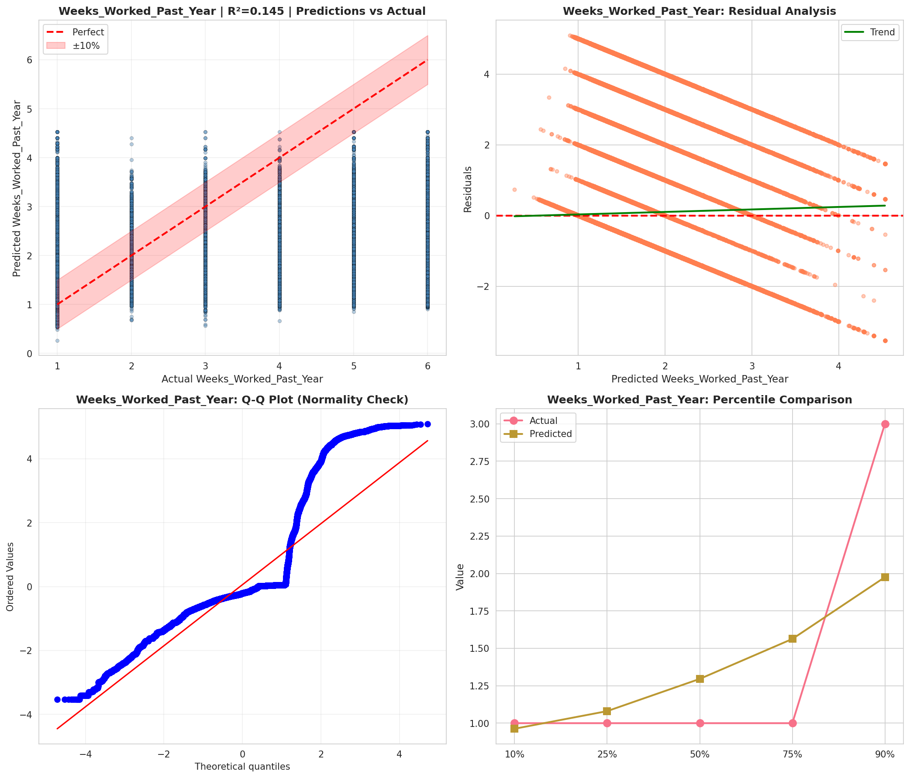
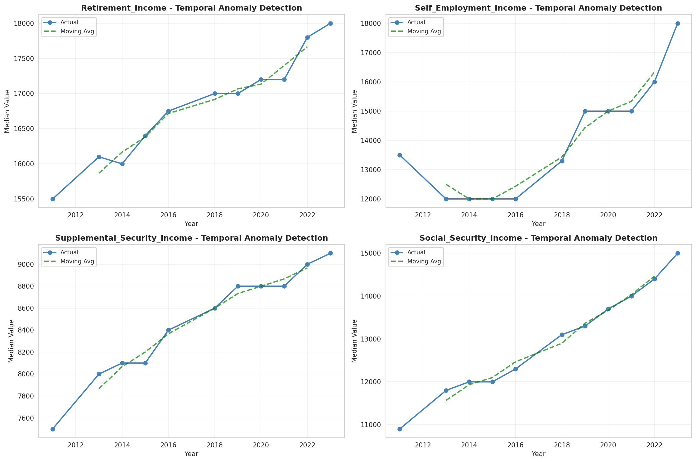
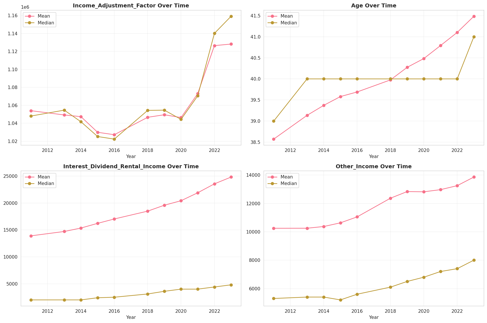
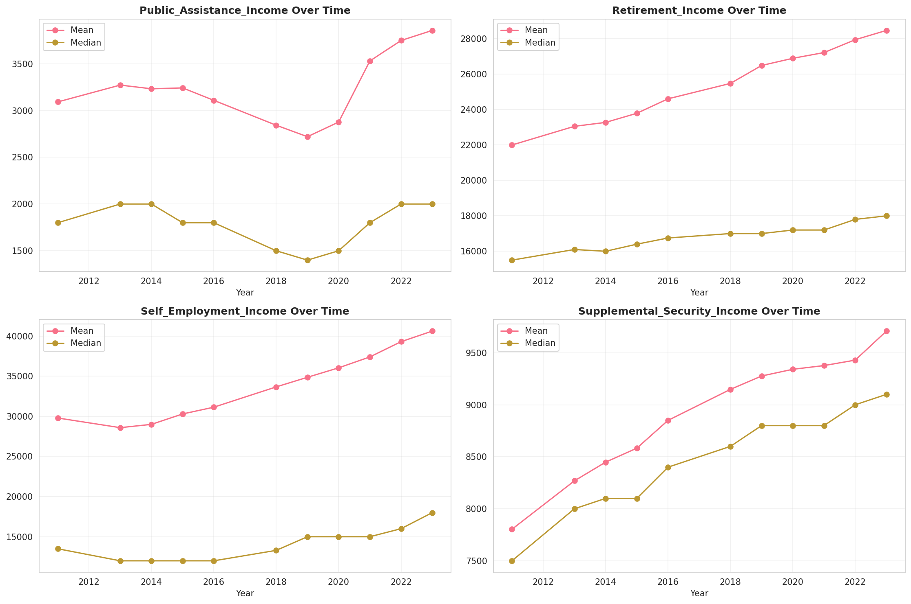
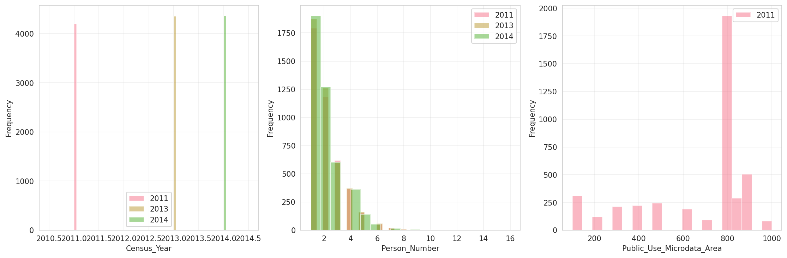
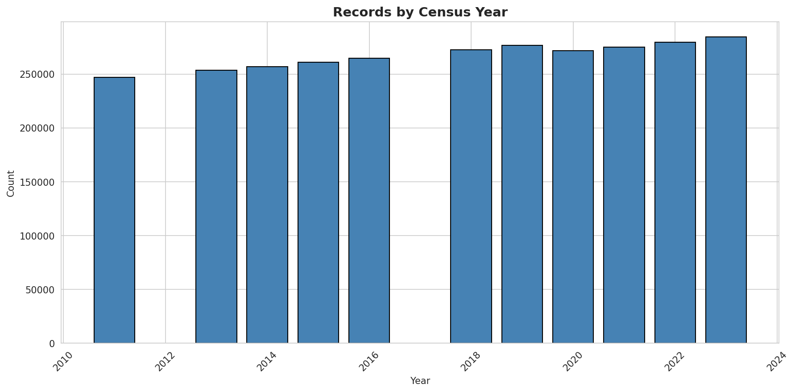
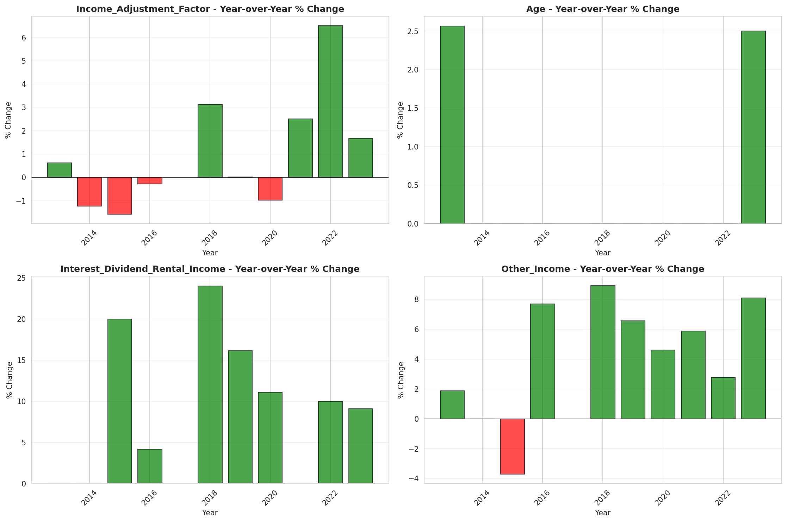
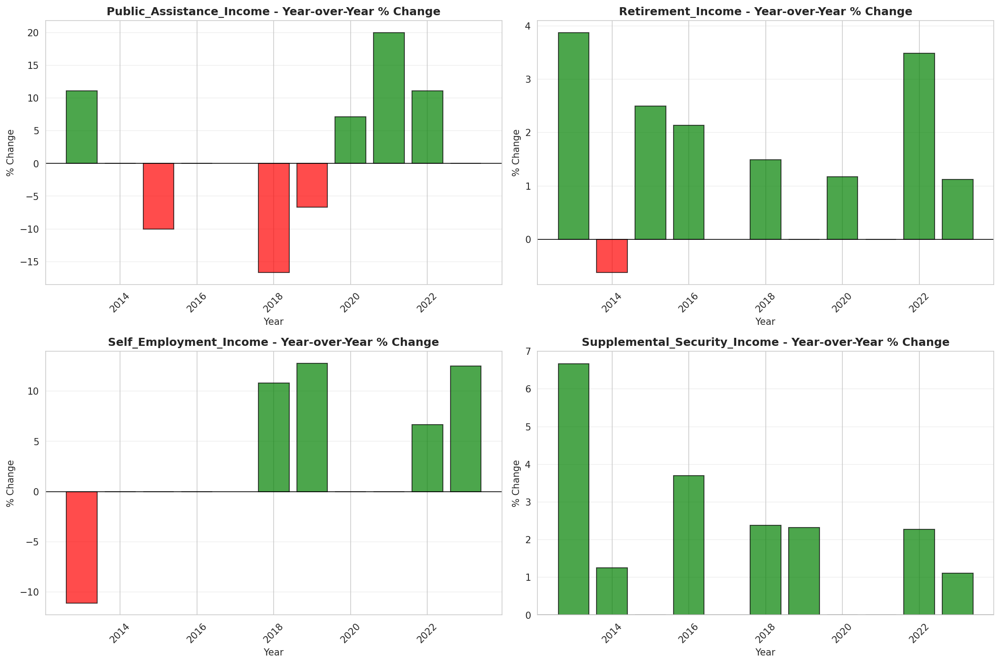

# Temporal Analysis

## Year Distribution

- 2011: 247,053 records

- 2013: 253,419 records

- 2014: 256,914 records

- 2015: 260,753 records

- 2016: 264,499 records

- 2018: 272,598 records

- 2019: 276,811 records

- 2020: 271,558 records

- 2021: 275,118 records

- 2022: 279,359 records

- 2023: 284,327 records

## Temporal Trends

- Census_Year: {np.int64(2011): {'mean': 2011.0, 'median': 2011.0, 'std': 0.0}, np.int64(2013): {'mean': 2013.0, 'median': 2013.0, 'std': 0.0}, np.int64(2014): {'mean': 2014.0, 'median': 2014.0, 'std': 0.0}, np.int64(2015): {'mean': 2015.0, 'median': 2015.0, 'std': 0.0}, np.int64(2016): {'mean': 2016.0, 'median': 2016.0, 'std': 0.0}, np.int64(2018): {'mean': 2018.0, 'median': 2018.0, 'std': 0.0}, np.int64(2019): {'mean': 2019.0, 'median': 2019.0, 'std': 0.0}, np.int64(2020): {'mean': 2020.0, 'median': 2020.0, 'std': 0.0}, np.int64(2021): {'mean': 2021.0, 'median': 2021.0, 'std': 0.0}, np.int64(2022): {'mean': 2022.0, 'median': 2022.0, 'std': 0.0}, np.int64(2023): {'mean': 2023.0, 'median': 2023.0, 'std': 0.0}}

- Person_Number: {np.int64(2011): {'mean': 2.0558584595208313, 'median': 2.0, 'std': 1.2712407762981666}, np.int64(2013): {'mean': 2.0512944964663267, 'median': 2.0, 'std': 1.2826364700231767}, np.int64(2014): {'mean': 2.0500478759429224, 'median': 2.0, 'std': 1.2896885142648895}, np.int64(2015): {'mean': 2.0514049694538508, 'median': 2.0, 'std': 1.2981816285494066}, np.int64(2016): {'mean': 2.0565143913587574, 'median': 2.0, 'std': 1.29940018117946}, np.int64(2018): {'mean': 2.0576233134505757, 'median': 2.0, 'std': 1.299130467440242}, np.int64(2019): {'mean': 2.0515586447070384, 'median': 2.0, 'std': 1.2907735812574266}, np.int64(2020): {'mean': 2.0468187274909964, 'median': 2.0, 'std': 1.2879069212406036}, np.int64(2021): {'mean': 2.041004223642219, 'median': 2.0, 'std': 1.2862869054689234}, np.int64(2022): {'mean': 2.0284401075318854, 'median': 2.0, 'std': 1.274494110517536}, np.int64(2023): {'mean': 2.0138467328111647, 'median': 2.0, 'std': 1.2629895076107855}}

- Public_Use_Microdata_Area: {np.int64(2011): {'mean': 682.7763678239082, 'median': 808.0, 'std': 249.25446123987115}, np.int64(2013): {'mean': None, 'median': None, 'std': None}, np.int64(2014): {'mean': None, 'median': None, 'std': None}, np.int64(2015): {'mean': None, 'median': None, 'std': None}, np.int64(2016): {'mean': 1085.5375559075837, 'median': 811.0, 'std': 1111.8159792643567}, np.int64(2018): {'mean': 1085.891338160955, 'median': 811.0, 'std': 1110.6696579788168}, np.int64(2019): {'mean': 1087.9164303441698, 'median': 811.0, 'std': 1113.0693307741144}, np.int64(2020): {'mean': 1087.6579920311683, 'median': 811.0, 'std': 1113.0948873029567}, np.int64(2021): {'mean': 1089.414269513445, 'median': 811.0, 'std': 1113.785937626547}, np.int64(2022): {'mean': None, 'median': None, 'std': None}, np.int64(2023): {'mean': 1336.512223601698, 'median': 1501.0, 'std': 659.473886647129}}

- State_Code: {np.int64(2011): {'mean': 8.0, 'median': 8.0, 'std': 0.0}, np.int64(2013): {'mean': 8.0, 'median': 8.0, 'std': 0.0}, np.int64(2014): {'mean': 8.0, 'median': 8.0, 'std': 0.0}, np.int64(2015): {'mean': 8.0, 'median': 8.0, 'std': 0.0}, np.int64(2016): {'mean': 8.0, 'median': 8.0, 'std': 0.0}, np.int64(2018): {'mean': 8.0, 'median': 8.0, 'std': 0.0}, np.int64(2019): {'mean': 8.0, 'median': 8.0, 'std': 0.0}, np.int64(2020): {'mean': 8.0, 'median': 8.0, 'std': 0.0}, np.int64(2021): {'mean': 8.0, 'median': 8.0, 'std': 0.0}, np.int64(2022): {'mean': 8.0, 'median': 8.0, 'std': 0.0}, np.int64(2023): {'mean': None, 'median': None, 'std': None}}

- Income_Adjustment_Factor: {np.int64(2011): {'mean': 1054004.9052672908, 'median': 1048026.0, 'std': 28282.548265531266}, np.int64(2013): {'mean': 1049237.623560191, 'median': 1054614.0, 'std': 29758.270851289577}, np.int64(2014): {'mean': 1047369.9452462692, 'median': 1041654.0, 'std': 31167.797156474448}, np.int64(2015): {'mean': 1029925.5151196726, 'median': 1025215.0, 'std': 25559.83153838329}, np.int64(2016): {'mean': 1027246.2294224175, 'median': 1022342.0, 'std': 17458.556490532057}, np.int64(2018): {'mean': 1046633.440227001, 'median': 1054346.0, 'std': 20507.942389929183}, np.int64(2019): {'mean': 1049469.8907377236, 'median': 1054606.0, 'std': 26257.59806400284}, np.int64(2020): {'mean': 1046340.1859124018, 'median': 1044328.0, 'std': 28793.928817895543}, np.int64(2021): {'mean': 1072997.059817969, 'median': 1070512.0, 'std': 30777.067748469322}, np.int64(2022): {'mean': 1126475.5036995406, 'median': 1140108.0, 'std': 49849.51770977235}, np.int64(2023): {'mean': 1128226.2672029037, 'median': 1159185.0, 'std': 70528.16988458895}}

- Person_Weight: {np.int64(2011): {'mean': 20.101200956879698, 'median': 16.0, 'std': 14.398047547780058}, np.int64(2013): {'mean': 20.201050434261045, 'median': 16.0, 'std': 15.187286814886653}, np.int64(2014): {'mean': 20.230820430182863, 'median': 16.0, 'std': 15.590968518260686}, np.int64(2015): {'mean': 20.2448562432647, 'median': 16.0, 'std': 15.925578889139452}, np.int64(2016): {'mean': 20.262061482274035, 'median': 16.0, 'std': 15.458531165257995}, np.int64(2018): {'mean': 20.290468015172525, 'median': 16.0, 'std': 15.484520086225661}, np.int64(2019): {'mean': 20.26779643872534, 'median': 16.0, 'std': 15.715751099483102}, np.int64(2020): {'mean': 20.93448176816739, 'median': 15.0, 'std': 19.831594548802254}, np.int64(2021): {'mean': 20.802622874548376, 'median': 15.0, 'std': 19.568345344738542}, np.int64(2022): {'mean': 20.657254643666395, 'median': 15.0, 'std': 19.70657973111435}, np.int64(2023): {'mean': 20.436940564912934, 'median': 15.0, 'std': 19.822921183948324}}

- Age: {np.int64(2011): {'mean': 38.57304707896686, 'median': 39.0, 'std': 22.69420636277636}, np.int64(2013): {'mean': 39.13606319968116, 'median': 40.0, 'std': 22.87782866816445}, np.int64(2014): {'mean': 39.373171567139195, 'median': 40.0, 'std': 22.962948396733765}, np.int64(2015): {'mean': 39.581186026622895, 'median': 40.0, 'std': 23.014268305027283}, np.int64(2016): {'mean': 39.69015761874336, 'median': 40.0, 'std': 23.024722043725976}, np.int64(2018): {'mean': 39.97626908487957, 'median': 40.0, 'std': 23.055418269857935}, np.int64(2019): {'mean': 40.273887237140144, 'median': 40.0, 'std': 23.069904765806278}, np.int64(2020): {'mean': 40.482489928486736, 'median': 40.0, 'std': 23.0945762091388}, np.int64(2021): {'mean': 40.79002464397095, 'median': 40.0, 'std': 23.13224364091394}, np.int64(2022): {'mean': 41.10145368504326, 'median': 40.0, 'std': 23.169083798454444}, np.int64(2023): {'mean': 41.48444220914651, 'median': 41.0, 'std': 23.185880857020557}}

- Citizenship_Status: {np.int64(2011): {'mean': 1.3121718821467458, 'median': 1.0, 'std': 1.0031913358349063}, np.int64(2013): {'mean': 1.313109908886074, 'median': 1.0, 'std': 1.00037747681794}, np.int64(2014): {'mean': 1.3115556178332048, 'median': 1.0, 'std': 0.9958932024499914}, np.int64(2015): {'mean': 1.3094230938857847, 'median': 1.0, 'std': 0.9916774474593015}, np.int64(2016): {'mean': 1.308020068128802, 'median': 1.0, 'std': 0.9876367085041566}, np.int64(2018): {'mean': 1.3051673159744386, 'median': 1.0, 'std': 0.9796847320033483}, np.int64(2019): {'mean': 1.3000567173992363, 'median': 1.0, 'std': 0.9692847796342999}, np.int64(2020): {'mean': 1.2988017292806693, 'median': 1.0, 'std': 0.9644731731108491}, np.int64(2021): {'mean': 1.3010962568788664, 'median': 1.0, 'std': 0.9653337824239943}, np.int64(2022): {'mean': 1.3001156218342707, 'median': 1.0, 'std': 0.9620858056958763}, np.int64(2023): {'mean': 1.3012517277641589, 'median': 1.0, 'std': 0.9628273553538115}}

- Class_of_Worker: {np.int64(2011): {'mean': 2.2913338645418326, 'median': 1.0, 'std': 2.02708084413452}, np.int64(2013): {'mean': 2.291963153997716, 'median': 1.0, 'std': 2.0294234583631345}, np.int64(2014): {'mean': 2.2823707621725986, 'median': 1.0, 'std': 2.0232090692607727}, np.int64(2015): {'mean': 2.2747526269970697, 'median': 1.0, 'std': 2.0199004508567873}, np.int64(2016): {'mean': 2.266761631135469, 'median': 1.0, 'std': 2.0143624977951564}, np.int64(2018): {'mean': 2.2596572400892736, 'median': 1.0, 'std': 2.0083925474568587}, np.int64(2019): {'mean': 2.2619993029806147, 'median': 1.0, 'std': 2.0060173945838797}, np.int64(2020): {'mean': 2.2677440349592644, 'median': 1.0, 'std': 2.0039660440731324}, np.int64(2021): {'mean': 2.270726989722343, 'median': 1.0, 'std': 2.0012545305759075}, np.int64(2022): {'mean': 2.2647767309402402, 'median': 1.0, 'std': 1.9913286734085274}, np.int64(2023): {'mean': 2.2643167914485742, 'median': 1.0, 'std': 1.9848397430989437}}

- English_Speaking_Ability: {np.int64(2011): {'mean': 1.644439684191199, 'median': 1.0, 'std': 0.9195663374663975}, np.int64(2013): {'mean': 1.6081880032086515, 'median': 1.0, 'std': 0.8946660490398882}, np.int64(2014): {'mean': 1.595960192540531, 'median': 1.0, 'std': 0.8873387911968215}, np.int64(2015): {'mean': 1.5812580758839423, 'median': 1.0, 'std': 0.8806182485741801}, np.int64(2016): {'mean': 1.5678394899242492, 'median': 1.0, 'std': 0.8710748891497075}, np.int64(2018): {'mean': 1.5410060221685626, 'median': 1.0, 'std': 0.8544325866596244}, np.int64(2019): {'mean': 1.517639176158709, 'median': 1.0, 'std': 0.8343390099985221}, np.int64(2020): {'mean': 1.5018449077546123, 'median': 1.0, 'std': 0.8202533997688731}, np.int64(2021): {'mean': 1.4935530722945134, 'median': 1.0, 'std': 0.8097558416936477}, np.int64(2022): {'mean': 1.487949519441442, 'median': 1.0, 'std': 0.8023624767927855}, np.int64(2023): {'mean': 1.4871568264104684, 'median': 1.0, 'std': 0.7981951671544997}}

- Fertility_Status: {np.int64(2011): {'mean': 1.9437512749031074, 'median': 2.0, 'std': 0.23040336024096633}, np.int64(2013): {'mean': 1.9459123565664476, 'median': 2.0, 'std': 0.22619248727477412}, np.int64(2014): {'mean': 1.946385634624239, 'median': 2.0, 'std': 0.2252570320289443}, np.int64(2015): {'mean': 1.947464106702914, 'median': 2.0, 'std': 0.22310696753868822}, np.int64(2016): {'mean': 1.9482979873024449, 'median': 2.0, 'std': 0.22142660736700778}, np.int64(2018): {'mean': 1.9485387234182523, 'median': 2.0, 'std': 0.22093849011327565}, np.int64(2019): {'mean': 1.950443966423523, 'median': 2.0, 'std': 0.217027636275173}, np.int64(2020): {'mean': 1.9508415621239346, 'median': 2.0, 'std': 0.21620050050120695}, np.int64(2021): {'mean': 1.9522765653416472, 'median': 2.0, 'std': 0.2131821906367302}, np.int64(2022): {'mean': 1.9529867345142655, 'median': 2.0, 'std': 0.21166892850431313}, np.int64(2023): {'mean': 1.9543419171367071, 'median': 2.0, 'std': 0.20874411837002443}}

- Marital_Status: {np.int64(2011): {'mean': 2.87267104629371, 'median': 3.0, 'std': 1.8584504597709555}, np.int64(2013): {'mean': 2.8922811628173104, 'median': 3.0, 'std': 1.856957970484204}, np.int64(2014): {'mean': 2.9030920852892406, 'median': 3.0, 'std': 1.8554135603290316}, np.int64(2015): {'mean': 2.9040778054327276, 'median': 3.0, 'std': 1.8559101059172396}, np.int64(2016): {'mean': 2.9019882872903113, 'median': 3.0, 'std': 1.8569076480815359}, np.int64(2018): {'mean': 2.901140140426562, 'median': 3.0, 'std': 1.8577544442682303}, np.int64(2019): {'mean': 2.8899212820299773, 'median': 3.0, 'std': 1.8575870484744659}, np.int64(2020): {'mean': 2.8970054279380464, 'median': 3.0, 'std': 1.85804860226147}, np.int64(2021): {'mean': 2.8960155278825814, 'median': 3.0, 'std': 1.8579786849749018}, np.int64(2022): {'mean': 2.896316209608425, 'median': 3.0, 'std': 1.8583565502431516}, np.int64(2023): {'mean': 2.8902320215807853, 'median': 3.0, 'std': 1.8581553662626373}}

- Mobility_Status: {np.int64(2011): {'mean': 1.3202202538491163, 'median': 1.0, 'std': 0.7293959196871611}, np.int64(2013): {'mean': 1.3259743473090215, 'median': 1.0, 'std': 0.7346573191056004}, np.int64(2014): {'mean': 1.331664856526735, 'median': 1.0, 'std': 0.7396867326052636}, np.int64(2015): {'mean': 1.3332532222114546, 'median': 1.0, 'std': 0.741115772584998}, np.int64(2016): {'mean': 1.3337014125837252, 'median': 1.0, 'std': 0.7416995821511934}, np.int64(2018): {'mean': 1.3288896301237862, 'median': 1.0, 'std': 0.7374918711271787}, np.int64(2019): {'mean': 1.3218508641038458, 'median': 1.0, 'std': 0.7312154673754386}, np.int64(2020): {'mean': 1.3169643521066017, 'median': 1.0, 'std': 0.7267683169259669}, np.int64(2021): {'mean': 1.309289280696155, 'median': 1.0, 'std': 0.7196107147585556}, np.int64(2022): {'mean': 1.30390134836899, 'median': 1.0, 'std': 0.714391737877243}, np.int64(2023): {'mean': 1.2937380030726326, 'median': 1.0, 'std': 0.7045254991834323}}

- Military_Service: {np.int64(2011): {'mean': 4.722590348991068, 'median': 5.0, 'std': 0.7315258393978665}, np.int64(2013): {'mean': 3.7452510447701504, 'median': 4.0, 'std': 0.6777277770245309}, np.int64(2014): {'mean': 3.7512911825756756, 'median': 4.0, 'std': 0.6708353736913004}, np.int64(2015): {'mean': 3.7560000580066033, 'median': 4.0, 'std': 0.6657506300322116}, np.int64(2016): {'mean': 3.763062072510745, 'median': 4.0, 'std': 0.6570451522534873}, np.int64(2018): {'mean': 3.7765007795361414, 'median': 4.0, 'std': 0.6400640342572992}, np.int64(2019): {'mean': 3.7800458622600455, 'median': 4.0, 'std': 0.6360885775009442}, np.int64(2020): {'mean': 3.783967298116624, 'median': 4.0, 'std': 0.6324819303101571}, np.int64(2021): {'mean': 3.7892929447095423, 'median': 4.0, 'std': 0.6269142971733362}, np.int64(2022): {'mean': 3.794141954088675, 'median': 4.0, 'std': 0.6214347490251111}, np.int64(2023): {'mean': 3.7976454851792467, 'median': 4.0, 'std': 0.6176598035869216}}

- Travel_Time_To_Work_Minutes: {np.int64(2011): {'mean': 24.281047622455187, 'median': 20.0, 'std': 21.74878659915825}, np.int64(2013): {'mean': 24.415732837268916, 'median': 20.0, 'std': 21.657809277957828}, np.int64(2014): {'mean': 24.56119625839884, 'median': 20.0, 'std': 21.413168156239024}, np.int64(2015): {'mean': 24.90433373276895, 'median': 20.0, 'std': 21.624606013108842}, np.int64(2016): {'mean': 25.06401241125782, 'median': 20.0, 'std': 21.25439588862645}, np.int64(2018): {'mean': 25.5670588805741, 'median': 20.0, 'std': 21.359958248314868}, np.int64(2019): {'mean': 25.8111558075449, 'median': 20.0, 'std': 21.600624683511217}, np.int64(2020): {'mean': 25.733826308982987, 'median': 20.0, 'std': 21.612983519294794}, np.int64(2021): {'mean': 25.657107157731897, 'median': 20.0, 'std': 21.878453343985814}, np.int64(2022): {'mean': 25.448172786177107, 'median': 20.0, 'std': 21.656981398897617}, np.int64(2023): {'mean': 25.321390116864357, 'median': 20.0, 'std': 21.49215705268139}}

- Vehicle_Occupancy: {np.int64(2011): {'mean': 1.1662493002975576, 'median': 1.0, 'std': 0.5653520570890943}, np.int64(2013): {'mean': 1.163234284593508, 'median': 1.0, 'std': 0.5669485718984068}, np.int64(2014): {'mean': 1.1609645686428136, 'median': 1.0, 'std': 0.560378093539612}, np.int64(2015): {'mean': 1.1578342327278255, 'median': 1.0, 'std': 0.5542096651705324}, np.int64(2016): {'mean': 1.1552490649044485, 'median': 1.0, 'std': 0.5514005052858783}, np.int64(2018): {'mean': 1.1474809620482087, 'median': 1.0, 'std': 0.5389320500479144}, np.int64(2019): {'mean': 1.1478189858132, 'median': 1.0, 'std': 0.5453386356660935}, np.int64(2020): {'mean': 1.148441550173262, 'median': 1.0, 'std': 0.5545864872346274}, np.int64(2021): {'mean': 1.1460633399990698, 'median': 1.0, 'std': 0.5500442741317901}, np.int64(2022): {'mean': 1.1476514500891855, 'median': 1.0, 'std': 0.5507776150766386}, np.int64(2023): {'mean': 1.1508646620131204, 'median': 1.0, 'std': 0.5566706855082167}}

- Transportation_To_Work: {np.int64(2011): {'mean': 2.2156046900614967, 'median': 1.0, 'std': 3.1452198830424605}, np.int64(2013): {'mean': 2.262456001189827, 'median': 1.0, 'std': 3.197204092018065}, np.int64(2014): {'mean': 2.2525378639509075, 'median': 1.0, 'std': 3.184092806440689}, np.int64(2015): {'mean': 2.2751664974375783, 'median': 1.0, 'std': 3.2102453032312397}, np.int64(2016): {'mean': 2.2969764523395666, 'median': 1.0, 'std': 3.237467047183195}, np.int64(2018): {'mean': 2.3381902125101135, 'median': 1.0, 'std': 3.2885275151453413}, np.int64(2019): {'mean': None, 'median': None, 'std': None}, np.int64(2020): {'mean': None, 'median': None, 'std': None}, np.int64(2021): {'mean': None, 'median': None, 'std': None}, np.int64(2022): {'mean': None, 'median': None, 'std': None}, np.int64(2023): {'mean': None, 'median': None, 'std': None}}

- Language_Other_Than_English: {np.int64(2011): {'mean': 1.8590651496985329, 'median': 2.0, 'std': 0.34795508393875324}, np.int64(2013): {'mean': 1.858877442779937, 'median': 2.0, 'std': 0.3481486597016562}, np.int64(2014): {'mean': 1.860132090356743, 'median': 2.0, 'std': 0.34685065144125476}, np.int64(2015): {'mean': 1.8616357312355751, 'median': 2.0, 'std': 0.345282612251749}, np.int64(2016): {'mean': 1.8631412937752925, 'median': 2.0, 'std': 0.34369881233124217}, np.int64(2018): {'mean': 1.8667775142241445, 'median': 2.0, 'std': 0.33981568918328237}, np.int64(2019): {'mean': 1.869191607410964, 'median': 2.0, 'std': 0.33719132592824946}, np.int64(2020): {'mean': 1.8706873142839409, 'median': 2.0, 'std': 0.3355463482021824}, np.int64(2021): {'mean': 1.871031002714171, 'median': 2.0, 'std': 0.3351662639078007}, np.int64(2022): {'mean': 1.8713246073692045, 'median': 2.0, 'std': 0.33484094346251736}, np.int64(2023): {'mean': 1.8707096098841152, 'median': 2.0, 'std': 0.3355216834710749}}

- Grandparents_Living_With_Grandchildren: {np.int64(2011): {'mean': 1.9736312268623757, 'median': 2.0, 'std': 0.16022992131681174}, np.int64(2013): {'mean': 1.9731891525082939, 'median': 2.0, 'std': 0.16153077073294209}, np.int64(2014): {'mean': 1.9733676975945018, 'median': 2.0, 'std': 0.16100677965691107}, np.int64(2015): {'mean': 1.9728546622466698, 'median': 2.0, 'std': 0.1625073190031009}, np.int64(2016): {'mean': 1.9726515201221586, 'median': 2.0, 'std': 0.16309720780356798}, np.int64(2018): {'mean': 1.9729816698270413, 'median': 2.0, 'std': 0.1621372599523661}, np.int64(2019): {'mean': 1.9727924432824493, 'median': 2.0, 'std': 0.16268821220298144}, np.int64(2020): {'mean': 1.973123098265104, 'median': 2.0, 'std': 0.16172409591390327}, np.int64(2021): {'mean': 1.9737064549897279, 'median': 2.0, 'std': 0.1600073055254967}, np.int64(2022): {'mean': 1.9749891888045281, 'median': 2.0, 'std': 0.15615826588778264}, np.int64(2023): {'mean': 1.9757089769085994, 'median': 2.0, 'std': 0.15395160166316574}}

- Months_Responsible_For_Grandchildren: {np.int64(2011): {'mean': 3.545356951154053, 'median': 4.0, 'std': 1.4103951457089832}, np.int64(2013): {'mean': 3.59679203539823, 'median': 4.0, 'std': 1.3875606337540125}, np.int64(2014): {'mean': 3.644029428409734, 'median': 4.0, 'std': 1.3721659789005731}, np.int64(2015): {'mean': 3.653631284916201, 'median': 4.0, 'std': 1.3596540917102975}, np.int64(2016): {'mean': 3.6730229949523276, 'median': 4.0, 'std': 1.3567746641833809}, np.int64(2018): {'mean': 3.7238150965476886, 'median': 4.0, 'std': 1.3331568611293194}, np.int64(2019): {'mean': 3.740011580775912, 'median': 4.0, 'std': 1.338065828758287}, np.int64(2020): {'mean': 3.8039579468150895, 'median': 4.0, 'std': 1.3127456557331565}, np.int64(2021): {'mean': 3.802197802197802, 'median': 4.0, 'std': 1.3179702649614156}, np.int64(2022): {'mean': 3.853315472203617, 'median': 4.0, 'std': 1.3208160428474882}, np.int64(2023): {'mean': 3.8776928422515637, 'median': 4.0, 'std': 1.3463167547269863}}

- Grandparents_Responsible_For_Grandchildren: {np.int64(2011): {'mean': 1.5411330049261083, 'median': 2.0, 'std': 0.49836658254543315}, np.int64(2013): {'mean': 1.5762831028825872, 'median': 2.0, 'std': 0.49420453969368655}, np.int64(2014): {'mean': 1.589928057553957, 'median': 2.0, 'std': 0.49190354625236793}, np.int64(2015): {'mean': 1.5996421382241108, 'median': 2.0, 'std': 0.49002566417317117}, np.int64(2016): {'mean': 1.611123227917121, 'median': 2.0, 'std': 0.48754843035406475}, np.int64(2018): {'mean': 1.6365376435559336, 'median': 2.0, 'std': 0.48104748873166137}, np.int64(2019): {'mean': 1.6431080801818558, 'median': 2.0, 'std': 0.4791320470329857}, np.int64(2020): {'mean': 1.6565420560747663, 'median': 2.0, 'std': 0.474913140375586}, np.int64(2021): {'mean': 1.6706408345752608, 'median': 2.0, 'std': 0.47003057529673953}, np.int64(2022): {'mean': 1.673232654847888, 'median': 2.0, 'std': 0.46908272865665246}, np.int64(2023): {'mean': 1.6841527655838455, 'median': 2.0, 'std': 0.4649034293393089}}

- Interest_Dividend_Rental_Income: {np.int64(2011): {'mean': 13903.50897020903, 'median': 2000.0, 'std': 38616.87576808331}, np.int64(2013): {'mean': 14715.490242425989, 'median': 2000.0, 'std': 41647.788311320124}, np.int64(2014): {'mean': 15355.517097508315, 'median': 2000.0, 'std': 42975.6091747491}, np.int64(2015): {'mean': 16224.140867142609, 'median': 2400.0, 'std': 44758.08414707956}, np.int64(2016): {'mean': 17039.973130573977, 'median': 2500.0, 'std': 46670.6024458654}, np.int64(2018): {'mean': 18494.507741155976, 'median': 3100.0, 'std': 47089.08720662527}, np.int64(2019): {'mean': 19595.213578384308, 'median': 3600.0, 'std': 51000.49900287115}, np.int64(2020): {'mean': 20430.574210879786, 'median': 4000.0, 'std': 52499.91693202963}, np.int64(2021): {'mean': 21906.640411912053, 'median': 4000.0, 'std': 56282.89961539308}, np.int64(2022): {'mean': 23563.867768138367, 'median': 4400.0, 'std': 60386.91083665195}, np.int64(2023): {'mean': 24827.601302754785, 'median': 4800.0, 'std': 63907.151425375756}}

- Military_Service_Period_1: {np.int64(2011): {'mean': 0.1427027925531915, 'median': 0.0, 'std': 0.3497767711712906}, np.int64(2013): {'mean': 0.1729348841157993, 'median': 0.0, 'std': 0.37819899730187134}, np.int64(2014): {'mean': 0.1881090362738785, 'median': 0.0, 'std': 0.390807603704925}, np.int64(2015): {'mean': 0.20541380650174848, 'median': 0.0, 'std': 0.40401240258571686}, np.int64(2016): {'mean': 0.22203158681976157, 'median': 0.0, 'std': 0.4156214150387735}, np.int64(2018): {'mean': 0.2495489806963738, 'median': 0.0, 'std': 0.43276175170940295}, np.int64(2019): {'mean': 0.26584040594548475, 'median': 0.0, 'std': 0.44178959819695673}, np.int64(2020): {'mean': 0.28394085921517576, 'median': 0.0, 'std': 0.45091895200511833}, np.int64(2021): {'mean': 0.3001499109903495, 'median': 0.0, 'std': 0.4583337027763931}, np.int64(2022): {'mean': 0.3146247292588756, 'median': 0.0, 'std': 0.4643771772883313}, np.int64(2023): {'mean': 0.3316305010076393, 'median': 0.0, 'std': 0.47081004708318885}}

- Military_Service_Period_2: {np.int64(2011): {'mean': 0.1854222074468085, 'median': 0.0, 'std': 0.3886477702531045}, np.int64(2013): {'mean': 0.184353510484761, 'median': 0.0, 'std': 0.3877804492009251}, np.int64(2014): {'mean': 0.18587679759605066, 'median': 0.0, 'std': 0.3890155653554569}, np.int64(2015): {'mean': 0.18922419375728533, 'median': 0.0, 'std': 0.39169506247253894}, np.int64(2016): {'mean': 0.1977035766134354, 'median': 0.0, 'std': 0.39827609859578533}, np.int64(2018): {'mean': 0.20945336460400504, 'median': 0.0, 'std': 0.40692766076315995}, np.int64(2019): {'mean': 0.21639947909650187, 'median': 0.0, 'std': 0.41179893096009373}, np.int64(2020): {'mean': 0.22019713594941417, 'median': 0.0, 'std': 0.4143891180978532}, np.int64(2021): {'mean': 0.22332052843624098, 'median': 0.0, 'std': 0.4164812072211066}, np.int64(2022): {'mean': 0.22803465486392316, 'median': 0.0, 'std': 0.4195749517177599}, np.int64(2023): {'mean': 0.23081970286357031, 'median': 0.0, 'std': 0.4213671663444148}}

- Military_Service_Period_3: {np.int64(2011): {'mean': 0.19967586436170212, 'median': 0.0, 'std': 0.39976499931716314}, np.int64(2013): {'mean': None, 'median': None, 'std': None}, np.int64(2014): {'mean': None, 'median': None, 'std': None}, np.int64(2015): {'mean': None, 'median': None, 'std': None}, np.int64(2016): {'mean': None, 'median': None, 'std': None}, np.int64(2018): {'mean': None, 'median': None, 'std': None}, np.int64(2019): {'mean': None, 'median': None, 'std': None}, np.int64(2020): {'mean': None, 'median': None, 'std': None}, np.int64(2021): {'mean': None, 'median': None, 'std': None}, np.int64(2022): {'mean': None, 'median': None, 'std': None}, np.int64(2023): {'mean': None, 'median': None, 'std': None}}

- Military_Service_Period_4: {np.int64(2011): {'mean': 0.1370096409574468, 'median': 0.0, 'std': 0.34386467240331214}, np.int64(2013): {'mean': None, 'median': None, 'std': None}, np.int64(2014): {'mean': None, 'median': None, 'std': None}, np.int64(2015): {'mean': None, 'median': None, 'std': None}, np.int64(2016): {'mean': None, 'median': None, 'std': None}, np.int64(2018): {'mean': None, 'median': None, 'std': None}, np.int64(2019): {'mean': None, 'median': None, 'std': None}, np.int64(2020): {'mean': None, 'median': None, 'std': None}, np.int64(2021): {'mean': None, 'median': None, 'std': None}, np.int64(2022): {'mean': None, 'median': None, 'std': None}, np.int64(2023): {'mean': None, 'median': None, 'std': None}}

- Military_Service_Period_5: {np.int64(2011): {'mean': 0.35970744680851063, 'median': 0.0, 'std': 0.479924547170959}, np.int64(2013): {'mean': 0.3625519993208252, 'median': 0.0, 'std': 0.480747186885565}, np.int64(2014): {'mean': 0.3632109894827216, 'median': 0.0, 'std': 0.48093523027021423}, np.int64(2015): {'mean': 0.3585891292146959, 'median': 0.0, 'std': 0.47959659695376505}, np.int64(2016): {'mean': 0.3600809467247371, 'median': 0.0, 'std': 0.4800341611917263}, np.int64(2018): {'mean': 0.3576583077755728, 'median': 0.0, 'std': 0.47932160893008013}, np.int64(2019): {'mean': 0.3506668462885626, 'median': 0.0, 'std': 0.4771895164613834}, np.int64(2020): {'mean': 0.3487074576901618, 'median': 0.0, 'std': 0.47657226785190143}, np.int64(2021): {'mean': 0.3404853368312564, 'median': 0.0, 'std': 0.47388352208101087}, np.int64(2022): {'mean': 0.3347772859967982, 'median': 0.0, 'std': 0.4719236604167412}, np.int64(2023): {'mean': 0.3274593429254347, 'median': 0.0, 'std': 0.4692973935941185}}

- Military_Service_Period_6: {np.int64(2011): {'mean': 0.1065907579787234, 'median': 0.0, 'std': 0.3085986483862748}, np.int64(2013): {'mean': None, 'median': None, 'std': None}, np.int64(2014): {'mean': None, 'median': None, 'std': None}, np.int64(2015): {'mean': None, 'median': None, 'std': None}, np.int64(2016): {'mean': None, 'median': None, 'std': None}, np.int64(2018): {'mean': None, 'median': None, 'std': None}, np.int64(2019): {'mean': None, 'median': None, 'std': None}, np.int64(2020): {'mean': None, 'median': None, 'std': None}, np.int64(2021): {'mean': None, 'median': None, 'std': None}, np.int64(2022): {'mean': None, 'median': None, 'std': None}, np.int64(2023): {'mean': None, 'median': None, 'std': None}}

- Military_Service_Period_7: {np.int64(2011): {'mean': 0.11627327127659574, 'median': 0.0, 'std': 0.3205589927957073}, np.int64(2013): {'mean': None, 'median': None, 'std': None}, np.int64(2014): {'mean': None, 'median': None, 'std': None}, np.int64(2015): {'mean': None, 'median': None, 'std': None}, np.int64(2016): {'mean': None, 'median': None, 'std': None}, np.int64(2018): {'mean': None, 'median': None, 'std': None}, np.int64(2019): {'mean': None, 'median': None, 'std': None}, np.int64(2020): {'mean': None, 'median': None, 'std': None}, np.int64(2021): {'mean': None, 'median': None, 'std': None}, np.int64(2022): {'mean': None, 'median': None, 'std': None}, np.int64(2023): {'mean': None, 'median': None, 'std': None}}

- Military_Service_Period_8: {np.int64(2011): {'mean': 0.11614860372340426, 'median': 0.0, 'std': 0.3204096936716189}, np.int64(2013): {'mean': 0.10654554716020036, 'median': 0.0, 'std': 0.3085411391211858}, np.int64(2014): {'mean': 0.10105172783859197, 'median': 0.0, 'std': 0.30140367593635436}, np.int64(2015): {'mean': 0.09385658161723438, 'median': 0.0, 'std': 0.29163538118710564}, np.int64(2016): {'mean': 0.0871057146627953, 'median': 0.0, 'std': 0.28199611260028834}, np.int64(2018): {'mean': 0.07423777737687173, 'median': 0.0, 'std': 0.26216336438561266}, np.int64(2019): {'mean': 0.06677443980421213, 'median': 0.0, 'std': 0.24963656068551648}, np.int64(2020): {'mean': 0.06002417705039985, 'median': 0.0, 'std': 0.23753715206479528}, np.int64(2021): {'mean': 0.05481120584652863, 'median': 0.0, 'std': 0.22761670563261238}, np.int64(2022): {'mean': 0.04830963367548734, 'median': 0.0, 'std': 0.21442476037459196}, np.int64(2023): {'mean': 0.04091484276140039, 'median': 0.0, 'std': 0.1980975961153367}}

- Military_Service_Period_9: {np.int64(2011): {'mean': 0.025681515957446808, 'median': 0.0, 'std': 0.15818664781921896}, np.int64(2013): {'mean': 0.0213515578572035, 'median': 0.0, 'std': 0.14455641065051936}, np.int64(2014): {'mean': 0.019446233097231164, 'median': 0.0, 'std': 0.1380901723467733}, np.int64(2015): {'mean': 0.01761429866597591, 'median': 0.0, 'std': 0.13154764245604347}, np.int64(2016): {'mean': 0.014781575821565264, 'median': 0.0, 'std': 0.12068024501329773}, np.int64(2018): {'mean': 0.012267725058632509, 'median': 0.0, 'std': 0.11008076360355004}, np.int64(2019): {'mean': 0.010642597332614846, 'median': 0.0, 'std': 0.10261483957268848}, np.int64(2020): {'mean': 0.009624325832248466, 'median': 0.0, 'std': 0.0976326859972}, np.int64(2021): {'mean': None, 'median': None, 'std': None}, np.int64(2022): {'mean': None, 'median': None, 'std': None}, np.int64(2023): {'mean': None, 'median': None, 'std': None}}

- Military_Service_Period_10: {np.int64(2011): {'mean': 0.0893035239361702, 'median': 0.0, 'std': 0.2851872794503114}, np.int64(2013): {'mean': 0.07233211647847865, 'median': 0.0, 'std': 0.2590425251231204}, np.int64(2014): {'mean': 0.0643915003219575, 'median': 0.0, 'std': 0.24545431612959798}, np.int64(2015): {'mean': 0.05595130164486466, 'median': 0.0, 'std': 0.22983262166414622}, np.int64(2016): {'mean': 0.047204258501605735, 'median': 0.0, 'std': 0.2120801621750597}, np.int64(2018): {'mean': 0.03314991881652535, 'median': 0.0, 'std': 0.17903197291609754}, np.int64(2019): {'mean': 0.026808567964434864, 'median': 0.0, 'std': 0.16152721219243943}, np.int64(2020): {'mean': 0.02096894178910173, 'median': 0.0, 'std': 0.14328363412192063}, np.int64(2021): {'mean': 0.01672444486086386, 'median': 0.0, 'std': 0.12824004144851903}, np.int64(2022): {'mean': 0.012618890667671155, 'median': 0.0, 'std': 0.1116254494350617}, np.int64(2023): {'mean': 0.009560856727749917, 'median': 0.0, 'std': 0.09731336275774015}}

- Military_Service_Period_11: {np.int64(2011): {'mean': 0.004114029255319149, 'median': 0.0, 'std': 0.06400995457212474}, np.int64(2013): {'mean': 0.0025893539349690128, 'median': 0.0, 'std': 0.050820850201593055}, np.int64(2014): {'mean': 0.002275166344709165, 'median': 0.0, 'std': 0.047645434328687626}, np.int64(2015): {'mean': 0.002158615032595087, 'median': 0.0, 'std': 0.04641172706290607}, np.int64(2016): {'mean': 0.0014517619110465884, 'median': 0.0, 'std': 0.03807516349979471}, np.int64(2018): {'mean': 0.0009922424679776295, 'median': 0.0, 'std': 0.03148495882996633}, np.int64(2019): {'mean': 0.000808298531591001, 'median': 0.0, 'std': 0.028419737057076472}, np.int64(2020): {'mean': 0.0005114376046122373, 'median': 0.0, 'std': 0.022609728085052905}, np.int64(2021): {'mean': None, 'median': None, 'std': None}, np.int64(2022): {'mean': None, 'median': None, 'std': None}, np.int64(2023): {'mean': None, 'median': None, 'std': None}}

- Temporary_Absence_From_Work: {np.int64(2011): {'mean': 2.5573119115487604, 'median': 3.0, 'std': 0.5332897837421907}, np.int64(2013): {'mean': 2.568336261151543, 'median': 3.0, 'std': 0.5256822088624818}, np.int64(2014): {'mean': 2.579776260351591, 'median': 3.0, 'std': 0.5224701453004833}, np.int64(2015): {'mean': 2.594173370781168, 'median': 3.0, 'std': 0.5187985053650133}, np.int64(2016): {'mean': 2.6092745035534137, 'median': 3.0, 'std': 0.5142044466762229}, np.int64(2018): {'mean': 2.6288050639101317, 'median': 3.0, 'std': 0.5072912964824018}, np.int64(2019): {'mean': 2.6325325787078517, 'median': 3.0, 'std': 0.5056902179178053}, np.int64(2020): {'mean': 2.6339825446623486, 'median': 3.0, 'std': 0.504918324172781}, np.int64(2021): {'mean': 2.6361707676056025, 'median': 3.0, 'std': 0.5035368388589311}, np.int64(2022): {'mean': 2.6370083956475994, 'median': 3.0, 'std': 0.5034991429565513}, np.int64(2023): {'mean': 2.6363644043098677, 'median': 3.0, 'std': 0.5031060109825248}}

- Available_For_Work: {np.int64(2011): {'mean': 4.520555462402634, 'median': 5.0, 'std': 1.229537801427139}, np.int64(2013): {'mean': 4.528143960083258, 'median': 5.0, 'std': 1.2175920249963914}, np.int64(2014): {'mean': 4.574657368395564, 'median': 5.0, 'std': 1.1606594110604318}, np.int64(2015): {'mean': 4.628676155567192, 'median': 5.0, 'std': 1.0878235216594667}, np.int64(2016): {'mean': 4.683586791426803, 'median': 5.0, 'std': 1.010089907594548}, np.int64(2018): {'mean': 4.7500509379372176, 'median': 5.0, 'std': 0.9039799776998169}, np.int64(2019): {'mean': 4.759786918839319, 'median': 5.0, 'std': 0.8860752828369356}, np.int64(2020): {'mean': 4.764010856697889, 'median': 5.0, 'std': 0.8806722921147956}, np.int64(2021): {'mean': 4.772684078161672, 'median': 5.0, 'std': 0.866706841542888}, np.int64(2022): {'mean': 4.785371915497959, 'median': 5.0, 'std': 0.8434012877018919}, np.int64(2023): {'mean': 4.792763949839288, 'median': 5.0, 'std': 0.8295021053646054}}

- On_Layoff_From_Work: {np.int64(2011): {'mean': 2.524518695791351, 'median': 3.0, 'std': 0.5331665496056622}, np.int64(2013): {'mean': 2.5345261117097966, 'median': 3.0, 'std': 0.5320869112976023}, np.int64(2014): {'mean': 2.552365731996707, 'median': 3.0, 'std': 0.5246712214783128}, np.int64(2015): {'mean': 2.573780168515257, 'median': 3.0, 'std': 0.5160362063981953}, np.int64(2016): {'mean': 2.593832623900692, 'median': 3.0, 'std': 0.508267195747658}, np.int64(2018): {'mean': 2.618558614850333, 'median': 3.0, 'std': 0.4984756527366768}, np.int64(2019): {'mean': 2.6232047335598394, 'median': 3.0, 'std': 0.4963495172999773}, np.int64(2020): {'mean': 2.622239126422916, 'median': 3.0, 'std': 0.49990340038993963}, np.int64(2021): {'mean': 2.6239099399334362, 'median': 3.0, 'std': 0.5002408139232614}, np.int64(2022): {'mean': 2.6267249180569205, 'median': 3.0, 'std': 0.4984532540349263}, np.int64(2023): {'mean': 2.6266329896645955, 'median': 3.0, 'std': 0.49816184907253774}}

- Looking_For_Work: {np.int64(2011): {'mean': 2.507888358764081, 'median': 3.0, 'std': 0.606934254157275}, np.int64(2013): {'mean': 2.5140067807285593, 'median': 3.0, 'std': 0.6134547857516023}, np.int64(2014): {'mean': 2.532485834665117, 'median': 3.0, 'std': 0.6035752734161223}, np.int64(2015): {'mean': 2.5562669586328366, 'median': 3.0, 'std': 0.5891659702602356}, np.int64(2016): {'mean': 2.5779688349678413, 'median': 3.0, 'std': 0.5758430026172022}, np.int64(2018): {'mean': 2.6066368736331653, 'median': 3.0, 'std': 0.5553899189476017}, np.int64(2019): {'mean': 2.611299866048063, 'median': 3.0, 'std': 0.5501335329362895}, np.int64(2020): {'mean': 2.610374177983229, 'median': 3.0, 'std': 0.5512751862467243}, np.int64(2021): {'mean': 2.610221481641908, 'median': 3.0, 'std': 0.5513307245921479}, np.int64(2022): {'mean': 2.61187341147333, 'median': 3.0, 'std': 0.5487892098494819}, np.int64(2023): {'mean': 2.609450960681537, 'median': 3.0, 'std': 0.5490938315942002}}

- Informed_Of_Recall: {np.int64(2011): {'mean': 2.8775360882886454, 'median': 3.0, 'std': 0.34734335549877143}, np.int64(2013): {'mean': 2.89315185781137, 'median': 3.0, 'std': 0.3263641580987559}, np.int64(2014): {'mean': 2.9065862753644245, 'median': 3.0, 'std': 0.3075024974890237}, np.int64(2015): {'mean': 2.921192935688104, 'median': 3.0, 'std': 0.2843101226390337}, np.int64(2016): {'mean': 2.935410377093139, 'median': 3.0, 'std': 0.2588071690771307}, np.int64(2018): {'mean': 2.9498046247119176, 'median': 3.0, 'std': 0.22947033863455157}, np.int64(2019): {'mean': 2.949368829118135, 'median': 3.0, 'std': 0.23015983014135108}, np.int64(2020): {'mean': 2.9499205552579815, 'median': 3.0, 'std': 0.23134868393862057}, np.int64(2021): {'mean': 2.9512616630349746, 'median': 3.0, 'std': 0.22891207663136925}, np.int64(2022): {'mean': 2.954120535347019, 'median': 3.0, 'std': 0.22238606752314355}, np.int64(2023): {'mean': 2.9557693688518705, 'median': 3.0, 'std': 0.21818523845035204}}

- Other_Income: {np.int64(2011): {'mean': 10247.1889615858, 'median': 5300.0, 'std': 13936.378605125754}, np.int64(2013): {'mean': 10250.624624263557, 'median': 5400.0, 'std': 13723.315677884215}, np.int64(2014): {'mean': 10371.831623931625, 'median': 5400.0, 'std': 13902.663866583007}, np.int64(2015): {'mean': 10630.747752311005, 'median': 5200.0, 'std': 14469.489387671478}, np.int64(2016): {'mean': 11049.390028930902, 'median': 5600.0, 'std': 14869.280895334783}, np.int64(2018): {'mean': 12366.970838484474, 'median': 6100.0, 'std': 15991.467801566234}, np.int64(2019): {'mean': 12833.169940092515, 'median': 6500.0, 'std': 16345.183919729934}, np.int64(2020): {'mean': 12818.500758035172, 'median': 6800.0, 'std': 16166.998099439068}, np.int64(2021): {'mean': 12968.240272444025, 'median': 7200.0, 'std': 15800.613842366953}, np.int64(2022): {'mean': 13250.206906643254, 'median': 7400.0, 'std': 15954.808403638555}, np.int64(2023): {'mean': 13856.458727712965, 'median': 8000.0, 'std': 16482.313983365933}}

- Public_Assistance_Income: {np.int64(2011): {'mean': 3092.039704524469, 'median': 1800.0, 'std': 3918.9694573523707}, np.int64(2013): {'mean': 3271.990078544853, 'median': 2000.0, 'std': 4158.946636842878}, np.int64(2014): {'mean': 3232.455577299413, 'median': 2000.0, 'std': 4148.560036890156}, np.int64(2015): {'mean': 3241.7580457541685, 'median': 1800.0, 'std': 4203.568703707411}, np.int64(2016): {'mean': 3108.7578125, 'median': 1800.0, 'std': 4073.168575803164}, np.int64(2018): {'mean': 2842.522736259391, 'median': 1500.0, 'std': 3784.328344967546}, np.int64(2019): {'mean': 2719.9307253463735, 'median': 1400.0, 'std': 3620.5920379614636}, np.int64(2020): {'mean': 2876.513725490196, 'median': 1500.0, 'std': 3639.2000782454365}, np.int64(2021): {'mean': 3529.881035689293, 'median': 1800.0, 'std': 4565.877234178457}, np.int64(2022): {'mean': 3748.8187647654404, 'median': 2000.0, 'std': 4684.963501100409}, np.int64(2023): {'mean': 3856.653658536585, 'median': 2000.0, 'std': 4732.726736643808}}

- Retirement_Income: {np.int64(2011): {'mean': 22001.0491005392, 'median': 15500.0, 'std': 21461.455897920227}, np.int64(2013): {'mean': 23055.878907324226, 'median': 16100.0, 'std': 22296.441235700717}, np.int64(2014): {'mean': 23276.382263271164, 'median': 16000.0, 'std': 22611.686796266313}, np.int64(2015): {'mean': 23790.844515904744, 'median': 16400.0, 'std': 23378.591098178946}, np.int64(2016): {'mean': 24608.493865030676, 'median': 16750.0, 'std': 25082.69165364172}, np.int64(2018): {'mean': 25478.91935483871, 'median': 17000.0, 'std': 26419.24252556652}, np.int64(2019): {'mean': 26491.56314315843, 'median': 17000.0, 'std': 29675.355585937632}, np.int64(2020): {'mean': 26896.696928870002, 'median': 17200.0, 'std': 30393.090784190157}, np.int64(2021): {'mean': 27220.257081995358, 'median': 17200.0, 'std': 30983.43203675074}, np.int64(2022): {'mean': 27946.530275551395, 'median': 17800.0, 'std': 32222.586017113525}, np.int64(2023): {'mean': 28471.562905387294, 'median': 18000.0, 'std': 33286.63691507097}}

- Self_Employment_Income: {np.int64(2011): {'mean': 29786.623257566243, 'median': 13500.0, 'std': 49063.51915202382}, np.int64(2013): {'mean': 28583.83908782269, 'median': 12000.0, 'std': 48724.96121793385}, np.int64(2014): {'mean': 28994.68204735465, 'median': 12000.0, 'std': 50757.88351295738}, np.int64(2015): {'mean': 30291.14565684663, 'median': 12000.0, 'std': 53425.11886024445}, np.int64(2016): {'mean': 31133.837269025993, 'median': 12000.0, 'std': 55361.94910956606}, np.int64(2018): {'mean': 33662.14955518153, 'median': 13300.0, 'std': 60232.45336872788}, np.int64(2019): {'mean': 34858.14332074581, 'median': 15000.0, 'std': 60837.18816442888}, np.int64(2020): {'mean': 36036.29173390712, 'median': 15000.0, 'std': 63604.87136869803}, np.int64(2021): {'mean': 37393.11353197503, 'median': 15000.0, 'std': 65891.35251326986}, np.int64(2022): {'mean': 39292.77825782345, 'median': 16000.0, 'std': 68410.11606747485}, np.int64(2023): {'mean': 40612.00870221036, 'median': 18000.0, 'std': 70251.70520010241}}

- Supplemental_Security_Income: {np.int64(2011): {'mean': 7803.38202247191, 'median': 7500.0, 'std': 4709.1774262174295}, np.int64(2013): {'mean': 8268.53098166628, 'median': 8000.0, 'std': 4821.091967859691}, np.int64(2014): {'mean': 8448.215430647575, 'median': 8100.0, 'std': 4883.27240921327}, np.int64(2015): {'mean': 8582.596685082874, 'median': 8100.0, 'std': 5025.765382170403}, np.int64(2016): {'mean': 8849.91341991342, 'median': 8400.0, 'std': 5118.960462515142}, np.int64(2018): {'mean': 9148.008611410118, 'median': 8600.0, 'std': 5404.914782583408}, np.int64(2019): {'mean': 9276.57167718077, 'median': 8800.0, 'std': 5517.290386129844}, np.int64(2020): {'mean': 9341.15290451814, 'median': 8800.0, 'std': 5567.887126977435}, np.int64(2021): {'mean': 9376.88617531618, 'median': 8800.0, 'std': 5777.491921015639}, np.int64(2022): {'mean': 9429.190497140344, 'median': 9000.0, 'std': 5939.657226593417}, np.int64(2023): {'mean': 9708.36332839297, 'median': 9100.0, 'std': 6030.104447356175}}

- Social_Security_Income: {np.int64(2011): {'mean': 11336.753705910061, 'median': 10900.0, 'std': 6171.821282640271}, np.int64(2013): {'mean': 12099.357305789785, 'median': 11800.0, 'std': 6572.106170443231}, np.int64(2014): {'mean': 12477.507676307448, 'median': 12000.0, 'std': 6742.20030783}, np.int64(2015): {'mean': 12810.006347842687, 'median': 12000.0, 'std': 6976.807944223045}, np.int64(2016): {'mean': 13156.067232422012, 'median': 12300.0, 'std': 7226.835994325144}, np.int64(2018): {'mean': 13881.180940000448, 'median': 13100.0, 'std': 7687.181107348812}, np.int64(2019): {'mean': 14192.809105691056, 'median': 13300.0, 'std': 7948.393107160368}, np.int64(2020): {'mean': 14491.879996505177, 'median': 13700.0, 'std': 8216.11836615816}, np.int64(2021): {'mean': 14918.344850977233, 'median': 14000.0, 'std': 8530.088198836047}, np.int64(2022): {'mean': 15397.400985019494, 'median': 14400.0, 'std': 8917.045402825825}, np.int64(2023): {'mean': 16062.095117461951, 'median': 15000.0, 'std': 9482.727860122186}}

- Wage_Income: {np.int64(2011): {'mean': 43079.852606434215, 'median': 31200.0, 'std': 49539.585286286965}, np.int64(2013): {'mean': 44351.039669839134, 'median': 32000.0, 'std': 51315.05050304551}, np.int64(2014): {'mean': 45167.74143690028, 'median': 32000.0, 'std': 52600.00537980763}, np.int64(2015): {'mean': 46420.922572746684, 'median': 33200.0, 'std': 54706.437505778675}, np.int64(2016): {'mean': 48043.9677320356, 'median': 35000.0, 'std': 56783.503508152105}, np.int64(2018): {'mean': 51256.37351566824, 'median': 36900.0, 'std': 61100.216356596}, np.int64(2019): {'mean': 53296.69069122531, 'median': 38500.0, 'std': 63442.52793121481}, np.int64(2020): {'mean': 55069.914512174735, 'median': 40000.0, 'std': 65233.49624575501}, np.int64(2021): {'mean': 57322.66144224352, 'median': 40000.0, 'std': 67672.81777173218}, np.int64(2022): {'mean': 60269.74819476872, 'median': 43000.0, 'std': 70778.20380979984}, np.int64(2023): {'mean': 63573.45051439509, 'median': 45000.0, 'std': 74475.14419117765}}

- Relationship_To_Householder: {np.int64(2011): {'mean': 1.7803952997939714, 'median': 1.0, 'std': 2.9649807837246516}, np.int64(2013): {'mean': 2.2812614681614245, 'median': 1.0, 'std': 4.0440896599499}, np.int64(2014): {'mean': 2.357578800688168, 'median': 1.0, 'std': 4.150295980984604}, np.int64(2015): {'mean': 2.4283862505896385, 'median': 1.0, 'std': 4.246009649341253}, np.int64(2016): {'mean': 2.4362095886940973, 'median': 1.0, 'std': 4.241635571596207}, np.int64(2018): {'mean': 2.464207367625588, 'median': 1.0, 'std': 4.2674194840871165}, np.int64(2019): {'mean': None, 'median': None, 'std': None}, np.int64(2020): {'mean': None, 'median': None, 'std': None}, np.int64(2021): {'mean': None, 'median': None, 'std': None}, np.int64(2022): {'mean': None, 'median': None, 'std': None}, np.int64(2023): {'mean': None, 'median': None, 'std': None}}

- School_Enrollment: {np.int64(2011): {'mean': 1.3007085823732258, 'median': 1.0, 'std': 0.5348583594212429}, np.int64(2013): {'mean': 1.2995323320442487, 'median': 1.0, 'std': 0.533394726156621}, np.int64(2014): {'mean': 1.2979221574743494, 'median': 1.0, 'std': 0.5319570104871418}, np.int64(2015): {'mean': 1.2955751018643051, 'median': 1.0, 'std': 0.5297259864819305}, np.int64(2016): {'mean': 1.2916160008758177, 'median': 1.0, 'std': 0.5267630635419733}, np.int64(2018): {'mean': 1.2838405116236777, 'median': 1.0, 'std': 0.5209937631102604}, np.int64(2019): {'mean': 1.2785091723462052, 'median': 1.0, 'std': 0.5173360176769424}, np.int64(2020): {'mean': 1.2749949715942512, 'median': 1.0, 'std': 0.5165157712038297}, np.int64(2021): {'mean': 1.2715036764018035, 'median': 1.0, 'std': 0.5154519042913107}, np.int64(2022): {'mean': 1.2678721336102152, 'median': 1.0, 'std': 0.5153741892255133}, np.int64(2023): {'mean': 1.2627637775071285, 'median': 1.0, 'std': 0.5122716474663983}}

- School_Grade_Attending: {np.int64(2011): {'mean': 4.303543174953253, 'median': 4.0, 'std': 1.5716838926960432}, np.int64(2013): {'mean': 9.633881655882124, 'median': 10.0, 'std': 4.945037632469887}, np.int64(2014): {'mean': 9.66675415708132, 'median': 10.0, 'std': 4.935533051399635}, np.int64(2015): {'mean': 9.677832843857074, 'median': 10.0, 'std': 4.925237640772782}, np.int64(2016): {'mean': 9.629500740265884, 'median': 10.0, 'std': 4.919720780459421}, np.int64(2018): {'mean': 9.594056702516573, 'median': 10.0, 'std': 4.9017586144439065}, np.int64(2019): {'mean': 9.620029790856032, 'median': 10.0, 'std': 4.891785638202516}, np.int64(2020): {'mean': 9.670619691726959, 'median': 10.0, 'std': 4.882140245475806}, np.int64(2021): {'mean': 9.72626604709774, 'median': 10.0, 'std': 4.874447620956882}, np.int64(2022): {'mean': 9.76239813001453, 'median': 10.0, 'std': 4.875885958316811}, np.int64(2023): {'mean': 9.846650422454985, 'median': 11.0, 'std': 4.86632716808811}}

- Educational_Attainment: {np.int64(2011): {'mean': 9.258487657561922, 'median': 10.0, 'std': 3.999141693797764}, np.int64(2013): {'mean': 16.258312961433745, 'median': 18.0, 'std': 5.762451136097639}, np.int64(2014): {'mean': 16.308432268620386, 'median': 18.0, 'std': 5.748895095543409}, np.int64(2015): {'mean': 16.37232544207323, 'median': 18.0, 'std': 5.732588887895476}, np.int64(2016): {'mean': 16.43781499133957, 'median': 18.0, 'std': 5.732342305985227}, np.int64(2018): {'mean': 16.577372472948806, 'median': 19.0, 'std': 5.706337502152206}, np.int64(2019): {'mean': 16.677128941984865, 'median': 19.0, 'std': 5.674680540217109}, np.int64(2020): {'mean': 16.74286440761585, 'median': 19.0, 'std': 5.661130637168666}, np.int64(2021): {'mean': 16.817175251174017, 'median': 19.0, 'std': 5.63878495393069}, np.int64(2022): {'mean': 16.903846153846153, 'median': 19.0, 'std': 5.611768155727767}, np.int64(2023): {'mean': 16.994998211065372, 'median': 19.0, 'std': 5.565263827131092}}

- Sex: {np.int64(2011): {'mean': 1.5059966889695733, 'median': 2.0, 'std': 0.499965050287065}, np.int64(2013): {'mean': 1.5058934018364842, 'median': 2.0, 'std': 0.499966253051283}, np.int64(2014): {'mean': 1.5045540531072654, 'median': 2.0, 'std': 0.4999802332209016}, np.int64(2015): {'mean': 1.503652882229543, 'median': 2.0, 'std': 0.4999876150122673}, np.int64(2016): {'mean': 1.50271267566229, 'median': 2.0, 'std': 0.4999935865085311}, np.int64(2018): {'mean': 1.5019882757760512, 'median': 2.0, 'std': 0.4999969638404588}, np.int64(2019): {'mean': 1.5021512873404597, 'median': 2.0, 'std': 0.49999627507874495}, np.int64(2020): {'mean': 1.5006002400960383, 'median': 2.0, 'std': 0.5000005603272212}, np.int64(2021): {'mean': 1.4997710073495736, 'median': 1.0, 'std': 0.500000856265737}, np.int64(2022): {'mean': 1.4989386416761228, 'median': 1.0, 'std': 0.4999997684234671}, np.int64(2023): {'mean': 1.4984929324334306, 'median': 1.0, 'std': 0.4999986080098092}}

- Hours_Worked_Per_Week: {np.int64(2011): {'mean': 38.494648776863286, 'median': 40.0, 'std': 13.500650466211205}, np.int64(2013): {'mean': 38.20158418098413, 'median': 40.0, 'std': 13.612137395822055}, np.int64(2014): {'mean': 38.241114184061054, 'median': 40.0, 'std': 13.69114190251172}, np.int64(2015): {'mean': 38.30999567950273, 'median': 40.0, 'std': 13.701403349814669}, np.int64(2016): {'mean': 38.403259866735006, 'median': 40.0, 'std': 13.618480049513495}, np.int64(2018): {'mean': 38.471558114949474, 'median': 40.0, 'std': 13.529450967503827}, np.int64(2019): {'mean': 38.46177715816592, 'median': 40.0, 'std': 13.498720933153274}, np.int64(2020): {'mean': 38.37323207236412, 'median': 40.0, 'std': 13.471218360090953}, np.int64(2021): {'mean': 38.28742576813839, 'median': 40.0, 'std': 13.401894901923262}, np.int64(2022): {'mean': 38.25125177917853, 'median': 40.0, 'std': 13.351773435535394}, np.int64(2023): {'mean': 38.121015846049104, 'median': 40.0, 'std': 13.289896289324062}}

- When_Last_Worked: {np.int64(2011): {'mean': 1.49641530621059, 'median': 1.0, 'std': 0.8155949479327202}, np.int64(2013): {'mean': 1.530889712286503, 'median': 1.0, 'std': 0.8321321574628842}, np.int64(2014): {'mean': 1.5411351639304567, 'median': 1.0, 'std': 0.8366102392988715}, np.int64(2015): {'mean': 1.545989432094064, 'median': 1.0, 'std': 0.840296079817551}, np.int64(2016): {'mean': 1.5422846856307075, 'median': 1.0, 'std': 0.8394599589571307}, np.int64(2018): {'mean': 1.5372571392348895, 'median': 1.0, 'std': 0.8379969708979819}, np.int64(2019): {'mean': 1.5367125888207793, 'median': 1.0, 'std': 0.8383773396508297}, np.int64(2020): {'mean': 1.5399181696651618, 'median': 1.0, 'std': 0.8400144841976727}, np.int64(2021): {'mean': 1.5459073852260121, 'median': 1.0, 'std': 0.8421253073866504}, np.int64(2022): {'mean': 1.552034396608834, 'median': 1.0, 'std': 0.8451061268131161}, np.int64(2023): {'mean': 1.5614232193918711, 'median': 1.0, 'std': 0.8494304709161268}}

- Weeks_Worked_Past_Year: {np.int64(2011): {'mean': 1.9869613054412436, 'median': 1.0, 'std': 1.6698015626585414}, np.int64(2013): {'mean': 1.9631521212639258, 'median': 1.0, 'std': 1.6706505161918908}, np.int64(2014): {'mean': 1.952156291334517, 'median': 1.0, 'std': 1.6661812392879116}, np.int64(2015): {'mean': 1.9337918635280344, 'median': 1.0, 'std': 1.652621664119717}, np.int64(2016): {'mean': 1.9065641551341193, 'median': 1.0, 'std': 1.6326190007044206}, np.int64(2018): {'mean': 1.8635853256551516, 'median': 1.0, 'std': 1.597530517878065}, np.int64(2019): {'mean': 1.8460871297051775, 'median': 1.0, 'std': 1.5898987553003672}, np.int64(2020): {'mean': 1.860036338919244, 'median': 1.0, 'std': 1.6099890431239265}, np.int64(2021): {'mean': 1.8746449780531886, 'median': 1.0, 'std': 1.6360187841579312}, np.int64(2022): {'mean': 1.8558611224074828, 'median': 1.0, 'std': 1.6286949388442735}}

- Year_Of_Entry: {np.int64(2011): {'mean': 1988.684486144447, 'median': 1993.0, 'std': 16.005542641625027}, np.int64(2013): {'mean': None, 'median': None, 'std': None}, np.int64(2014): {'mean': None, 'median': None, 'std': None}, np.int64(2015): {'mean': None, 'median': None, 'std': None}, np.int64(2016): {'mean': 1991.665167537782, 'median': 1996.0, 'std': 16.552765373576015}, np.int64(2018): {'mean': 1993.1601777568035, 'median': 1997.0, 'std': 16.849884685487083}, np.int64(2019): {'mean': 1993.7846382595767, 'median': 1998.0, 'std': 16.99888205951498}, np.int64(2020): {'mean': 1994.2346735668789, 'median': 1998.0, 'std': 17.132723663362444}, np.int64(2021): {'mean': 1994.9239303308896, 'median': 1998.0, 'std': 17.263289783683778}, np.int64(2022): {'mean': 1995.5106707899056, 'median': 1999.0, 'std': 17.500241367035212}, np.int64(2023): {'mean': 1996.1438159513777, 'median': 1999.0, 'std': 17.61388510628437}}

- Ancestry_Recode: {np.int64(2011): {'mean': 1.6317308431793986, 'median': 1.0, 'std': 0.8904779731880383}, np.int64(2013): {'mean': 1.675493944810768, 'median': 1.0, 'std': 0.9310870568624038}, np.int64(2014): {'mean': 1.712783265995625, 'median': 1.0, 'std': 0.9638991604835299}, np.int64(2015): {'mean': 1.7447162640506533, 'median': 1.0, 'std': 0.9905649247592035}, np.int64(2016): {'mean': 1.7853791507718366, 'median': 1.0, 'std': 1.018430707727644}, np.int64(2018): {'mean': 1.861418645771429, 'median': 2.0, 'std': 1.062505792029414}, np.int64(2019): {'mean': 1.8897478785163884, 'median': 2.0, 'std': 1.0749826245873972}, np.int64(2020): {'mean': 1.919527320130506, 'median': 2.0, 'std': 1.0848722790603682}, np.int64(2021): {'mean': 1.949087300721872, 'median': 2.0, 'std': 1.102353992401941}, np.int64(2022): {'mean': 1.9652167998883157, 'median': 2.0, 'std': 1.1120845832195752}, np.int64(2023): {'mean': 1.977339471805351, 'median': 2.0, 'std': 1.1174636677632561}}

- First_Ancestry_Code: {np.int64(2011): {'mean': 329.78909383816426, 'median': 111.0, 'std': 383.6480988514151}, np.int64(2013): {'mean': None, 'median': None, 'std': None}, np.int64(2014): {'mean': None, 'median': None, 'std': None}, np.int64(2015): {'mean': None, 'median': None, 'std': None}, np.int64(2016): {'mean': 381.7651333275362, 'median': 190.0, 'std': 406.7357707089951}, np.int64(2018): {'mean': 397.98578859712836, 'median': 195.0, 'std': 412.6579311384982}, np.int64(2019): {'mean': 404.96107813634575, 'median': 195.0, 'std': 414.95180224798537}, np.int64(2020): {'mean': 407.5309289359916, 'median': 195.0, 'std': 416.64667996442415}, np.int64(2021): {'mean': 411.6389222079253, 'median': 195.0, 'std': 419.3149303398607}, np.int64(2022): {'mean': 413.88075200727377, 'median': 195.0, 'std': 421.26380154919417}, np.int64(2023): {'mean': 414.87142972703964, 'median': 195.0, 'std': 422.36926454933274}}

- Second_Ancestry_Code: {np.int64(2011): {'mean': 700.8335579814858, 'median': 999.0, 'std': 434.3897096461286}, np.int64(2013): {'mean': None, 'median': None, 'std': None}, np.int64(2014): {'mean': None, 'median': None, 'std': None}, np.int64(2015): {'mean': None, 'median': None, 'std': None}, np.int64(2016): {'mean': 722.3897821919932, 'median': 999.0, 'std': 423.02115568891605}, np.int64(2018): {'mean': 720.0114711039699, 'median': 999.0, 'std': 423.81091640270824}, np.int64(2019): {'mean': 717.5641466560216, 'median': 999.0, 'std': 424.6744203107191}, np.int64(2020): {'mean': 712.1357868300695, 'median': 999.0, 'std': 426.8891335021641}, np.int64(2021): {'mean': 714.9860423527359, 'median': 999.0, 'std': 425.65659481284183}, np.int64(2022): {'mean': 717.2782656008935, 'median': 999.0, 'std': 424.85404150328543}, np.int64(2023): {'mean': 717.825683104313, 'median': 999.0, 'std': 424.61039384637206}}

- Decade_Of_Entry: {np.int64(2011): {'mean': 5.41208815186559, 'median': 6.0, 'std': 1.5744819023961263}, np.int64(2013): {'mean': 5.496109358569926, 'median': 6.0, 'std': 1.5661756353583922}, np.int64(2014): {'mean': 5.531928135762001, 'median': 6.0, 'std': 1.5647395989201116}, np.int64(2015): {'mean': 5.580188098073843, 'median': 6.0, 'std': 1.5562225417378879}, np.int64(2016): {'mean': 5.6183298893885985, 'median': 6.0, 'std': 1.5496204841758285}, np.int64(2018): {'mean': 5.878834355828221, 'median': 6.0, 'std': 1.700343031126046}, np.int64(2019): {'mean': 5.934147200375631, 'median': 6.0, 'std': 1.707548286616866}, np.int64(2020): {'mean': 5.97109872611465, 'median': 6.0, 'std': 1.711379422005046}, np.int64(2021): {'mean': 6.030102021024865, 'median': 6.0, 'std': 1.7120540008545477}, np.int64(2022): {'mean': 6.077158019318138, 'median': 6.0, 'std': 1.7165409446654072}, np.int64(2023): {'mean': 6.1244639994034085, 'median': 6.0, 'std': 1.7156387531165023}}

- Drives_Alone_To_Work: {np.int64(2011): {'mean': 1.1615453358080703, 'median': 1.0, 'std': 0.5114912687489557}, np.int64(2013): {'mean': 1.1586741198391683, 'median': 1.0, 'std': 0.5154561019115922}, np.int64(2014): {'mean': 1.156824623003782, 'median': 1.0, 'std': 0.5137109703043191}, np.int64(2015): {'mean': 1.1540244736642091, 'median': 1.0, 'std': 0.5110805396121242}, np.int64(2016): {'mean': 1.1514715573169487, 'median': 1.0, 'std': 0.5081795009231488}, np.int64(2018): {'mean': 1.1437221301229599, 'median': 1.0, 'std': 0.4943114060912417}, np.int64(2019): {'mean': 1.1438487667995865, 'median': 1.0, 'std': 0.4985701596060409}, np.int64(2020): {'mean': 1.1438667018344868, 'median': 1.0, 'std': 0.5006118833059375}, np.int64(2021): {'mean': 1.1416081477003208, 'median': 1.0, 'std': 0.4968323862920659}, np.int64(2022): {'mean': 1.1434139620041714, 'median': 1.0, 'std': 0.4997657148813808}, np.int64(2023): {'mean': 1.1467012977091948, 'median': 1.0, 'std': 0.5078143392014651}}

- Employment_Status_Parents: {np.int64(2011): {'mean': 2.738116657792792, 'median': 2.0, 'std': 2.382479962941507}, np.int64(2013): {'mean': 2.8053139740566038, 'median': 2.0, 'std': 2.4201532779664867}, np.int64(2014): {'mean': 2.822383667463675, 'median': 2.0, 'std': 2.4212201081845364}, np.int64(2015): {'mean': 2.8072825947452373, 'median': 2.0, 'std': 2.4133663491463464}, np.int64(2016): {'mean': 2.7802716641243554, 'median': 2.0, 'std': 2.397059987358919}, np.int64(2018): {'mean': 2.722858115248894, 'median': 2.0, 'std': 2.365472130920724}, np.int64(2019): {'mean': 2.6864554976653627, 'median': 2.0, 'std': 2.3506244059805916}, np.int64(2020): {'mean': 2.6712594750009333, 'median': 2.0, 'std': 2.3414553730640875}, np.int64(2021): {'mean': 2.670290604721151, 'median': 1.0, 'std': 2.347546788404524}, np.int64(2022): {'mean': 2.65458196007122, 'median': 1.0, 'std': 2.3406297167131096}, np.int64(2023): {'mean': 2.6394292627657325, 'median': 1.0, 'std': 2.337891845730645}}

- Employment_Status_Recode: {np.int64(2011): {'mean': 2.7752897479281944, 'median': 1.0, 'std': 2.3112776411959333}, np.int64(2013): {'mean': 2.84585898249706, 'median': 1.0, 'std': 2.32660435364063}, np.int64(2014): {'mean': 2.8679693931909536, 'median': 1.0, 'std': 2.3377454062173726}, np.int64(2015): {'mean': 2.877493216546865, 'median': 1.0, 'std': 2.348121685337365}, np.int64(2016): {'mean': 2.8639530086819556, 'median': 1.0, 'std': 2.351743545080079}, np.int64(2018): {'mean': 2.8450128363601785, 'median': 1.0, 'std': 2.3577207946935035}, np.int64(2019): {'mean': 2.836303636218475, 'median': 1.0, 'std': 2.3583921358022066}, np.int64(2020): {'mean': 2.8519582116155866, 'median': 1.0, 'std': 2.361366302793055}, np.int64(2021): {'mean': 2.8637076848958447, 'median': 1.0, 'std': 2.3634738569862686}, np.int64(2022): {'mean': 2.8745892021320354, 'median': 1.0, 'std': 2.3671805171175073}, np.int64(2023): {'mean': 2.898998559716843, 'median': 1.0, 'std': 2.3737945183690945}}

- Hispanic_Origin: {np.int64(2011): {'mean': 1.95341080658806, 'median': 1.0, 'std': 4.12372296200921}, np.int64(2013): {'mean': 1.9459985241832696, 'median': 1.0, 'std': 4.08500135467495}, np.int64(2014): {'mean': 1.9685225406167044, 'median': 1.0, 'std': 4.143422922718061}, np.int64(2015): {'mean': 1.9827614639141256, 'median': 1.0, 'std': 4.183577676923534}, np.int64(2016): {'mean': 1.9962873205569776, 'median': 1.0, 'std': 4.218254479793409}, np.int64(2018): {'mean': 1.9744935766219855, 'median': 1.0, 'std': 4.1564539717289595}, np.int64(2019): {'mean': 1.9445759019692137, 'median': 1.0, 'std': 4.080476204706992}, np.int64(2020): {'mean': 1.9755227244271942, 'median': 1.0, 'std': 4.155539467665111}, np.int64(2021): {'mean': 1.984719284089009, 'median': 1.0, 'std': 4.165917661685579}, np.int64(2022): {'mean': 1.9948238646329632, 'median': 1.0, 'std': 4.183355545215089}, np.int64(2023): {'mean': 2.041413583655439, 'median': 1.0, 'std': 4.282760171809591}}

- Time_Of_Arrival_At_Work: {np.int64(2011): {'mean': 101.18798525886436, 'median': 92.0, 'std': 38.35102293040669}, np.int64(2013): {'mean': 101.4669117319828, 'median': 92.0, 'std': 38.665324326142205}, np.int64(2014): {'mean': 101.6614729260902, 'median': 92.0, 'std': 39.16856698716605}, np.int64(2015): {'mean': 101.55571264774089, 'median': 92.0, 'std': 39.08407487961357}, np.int64(2016): {'mean': 101.3226083877169, 'median': 92.0, 'std': 38.8824063306307}, np.int64(2018): {'mean': 101.16294386707827, 'median': 92.0, 'std': 38.67448228253913}, np.int64(2019): {'mean': 100.96166576921858, 'median': 92.0, 'std': 38.14583075240833}, np.int64(2020): {'mean': 100.92340915873595, 'median': 92.0, 'std': 38.11996347653996}, np.int64(2021): {'mean': 100.8816989519673, 'median': 92.0, 'std': 38.005508617589214}, np.int64(2022): {'mean': 100.87827213822894, 'median': 92.0, 'std': 37.895233423556675}, np.int64(2023): {'mean': 100.76377642578895, 'median': 92.0, 'std': 37.51341870636109}}

- Time_Of_Departure_For_Work: {np.int64(2011): {'mean': 53.51254964399442, 'median': 49.0, 'std': 26.665404515199366}, np.int64(2013): {'mean': 53.688262676789705, 'median': 49.0, 'std': 26.86377272333419}, np.int64(2014): {'mean': 53.73730622282728, 'median': 49.0, 'std': 27.14592076878697}, np.int64(2015): {'mean': 53.60738639792408, 'median': 49.0, 'std': 27.1303764448633}, np.int64(2016): {'mean': 53.43742938567647, 'median': 49.0, 'std': 27.04078472315055}, np.int64(2018): {'mean': 53.26330591068513, 'median': 49.0, 'std': 26.960146660930928}, np.int64(2019): {'mean': 53.16857242406005, 'median': 49.0, 'std': 26.68517446200591}, np.int64(2020): {'mean': 53.17185064827403, 'median': 49.0, 'std': 26.67568574880576}, np.int64(2021): {'mean': 53.2018461695382, 'median': 49.0, 'std': 26.593610363971113}, np.int64(2022): {'mean': 53.29127429805616, 'median': 49.0, 'std': 26.532798835619595}, np.int64(2023): {'mean': 53.33293649056769, 'median': 49.0, 'std': 26.339803891937446}}

- Language_Spoken_At_Home: {np.int64(2011): {'mean': 645.4925332027664, 'median': 625.0, 'std': 53.53262394946637}, np.int64(2013): {'mean': None, 'median': None, 'std': None}, np.int64(2014): {'mean': None, 'median': None, 'std': None}, np.int64(2015): {'mean': None, 'median': None, 'std': None}, np.int64(2016): {'mean': 1527.4726974934924, 'median': 1200.0, 'std': 938.8930419392262}, np.int64(2018): {'mean': 1541.8321356878946, 'median': 1200.0, 'std': 954.3680956765842}, np.int64(2019): {'mean': 1545.5307775220672, 'median': 1200.0, 'std': 951.467573159072}, np.int64(2020): {'mean': 1563.5829608519573, 'median': 1200.0, 'std': 981.434239644373}, np.int64(2021): {'mean': 1565.0392743871714, 'median': 1200.0, 'std': 977.1143242652926}, np.int64(2022): {'mean': 1555.7646869796383, 'median': 1200.0, 'std': 951.4959940783316}, np.int64(2023): {'mean': 1558.383214071899, 'median': 1200.0, 'std': 952.3697501963001}}

- Migration_PUMA: {np.int64(2011): {'mean': 932.1298055178652, 'median': 800.0, 'std': 1063.5578329364248}, np.int64(2013): {'mean': None, 'median': None, 'std': None}, np.int64(2014): {'mean': None, 'median': None, 'std': None}, np.int64(2015): {'mean': None, 'median': None, 'std': None}, np.int64(2016): {'mean': 1606.1733417334174, 'median': 190.0, 'std': 5051.65168821825}, np.int64(2018): {'mean': 1648.5060032785432, 'median': 190.0, 'std': 5134.606570332865}, np.int64(2019): {'mean': 1662.7513989521792, 'median': 190.0, 'std': 5145.549845539543}, np.int64(2020): {'mean': 1647.377708549671, 'median': 190.0, 'std': 5079.113724964957}, np.int64(2021): {'mean': 1717.7098212201838, 'median': 190.0, 'std': 5345.6983716767845}, np.int64(2022): {'mean': None, 'median': None, 'std': None}, np.int64(2023): {'mean': 1963.5992965110752, 'median': 490.0, 'std': 4754.928155982958}}

- Migration_State_Or_Country: {np.int64(2011): {'mean': 21.006432484044424, 'median': 8.0, 'std': 50.32051561603186}, np.int64(2013): {'mean': None, 'median': None, 'std': None}, np.int64(2014): {'mean': None, 'median': None, 'std': None}, np.int64(2015): {'mean': None, 'median': None, 'std': None}, np.int64(2016): {'mean': 21.01570515705157, 'median': 8.0, 'std': 50.3921585453915}, np.int64(2018): {'mean': 20.877940720393426, 'median': 8.0, 'std': 48.58398468409814}, np.int64(2019): {'mean': 20.850763571508192, 'median': 8.0, 'std': 48.15787310726894}, np.int64(2020): {'mean': 20.493504095996308, 'median': 8.0, 'std': 47.15357893621442}, np.int64(2021): {'mean': 20.63777248751342, 'median': 8.0, 'std': 47.3607963203896}, np.int64(2022): {'mean': 20.857807495382602, 'median': 8.0, 'std': 47.896701498429856}, np.int64(2023): {'mean': 21.206578572107613, 'median': 8.0, 'std': 49.99607409876695}}

- Place_Of_Birth: {np.int64(2011): {'mean': 40.50776149247328, 'median': 9.0, 'std': 74.53446368252217}, np.int64(2013): {'mean': None, 'median': None, 'std': None}, np.int64(2014): {'mean': None, 'median': None, 'std': None}, np.int64(2015): {'mean': None, 'median': None, 'std': None}, np.int64(2016): {'mean': 40.509446160476976, 'median': 8.0, 'std': 75.08848470814279}, np.int64(2018): {'mean': 40.442086882515646, 'median': 8.0, 'std': 74.7773860348731}, np.int64(2019): {'mean': 40.2592454779615, 'median': 8.0, 'std': 74.37413425219955}, np.int64(2020): {'mean': 40.3469387755102, 'median': 8.0, 'std': 74.59971994901217}, np.int64(2021): {'mean': 40.56432149114198, 'median': 9.0, 'std': 74.85149617570119}, np.int64(2022): {'mean': 40.572725417831535, 'median': 9.0, 'std': 74.82652901132143}, np.int64(2023): {'mean': 40.83061756357996, 'median': 10.0, 'std': 75.27792647204089}}

- Place_Of_Work_PUMA: {np.int64(2011): {'mean': 697.7933743311503, 'median': 800.0, 'std': 323.26243050160895}, np.int64(2013): {'mean': None, 'median': None, 'std': None}, np.int64(2014): {'mean': None, 'median': None, 'std': None}, np.int64(2015): {'mean': None, 'median': None, 'std': None}, np.int64(2016): {'mean': 749.6785171443493, 'median': 190.0, 'std': 1571.417810558649}, np.int64(2018): {'mean': 740.5209800850635, 'median': 190.0, 'std': 1540.2236022482168}, np.int64(2019): {'mean': 738.4861347120286, 'median': 190.0, 'std': 1531.5383538487722}, np.int64(2020): {'mean': 740.3930246968222, 'median': 190.0, 'std': 1539.3476389360421}, np.int64(2021): {'mean': 737.9876945454546, 'median': 190.0, 'std': 1544.9664134422928}, np.int64(2022): {'mean': None, 'median': None, 'std': None}, np.int64(2023): {'mean': 948.5356596437545, 'median': 490.0, 'std': 1201.1906234393985}}

- Place_Of_Work_State_Or_Country: {np.int64(2011): {'mean': 8.599131223526866, 'median': 8.0, 'std': 9.853724017666778}, np.int64(2013): {'mean': None, 'median': None, 'std': None}, np.int64(2014): {'mean': None, 'median': None, 'std': None}, np.int64(2015): {'mean': None, 'median': None, 'std': None}, np.int64(2016): {'mean': 8.523894522694146, 'median': 8.0, 'std': 9.097213810248718}, np.int64(2018): {'mean': 8.474781588889796, 'median': 8.0, 'std': 8.36461410513926}, np.int64(2019): {'mean': 8.465403666076142, 'median': 8.0, 'std': 8.091014722546296}, np.int64(2020): {'mean': 8.444004307928358, 'median': 8.0, 'std': 7.929442889387472}, np.int64(2021): {'mean': 8.424916363636363, 'median': 8.0, 'std': 7.818225309521166}, np.int64(2022): {'mean': 8.418635883075693, 'median': 8.0, 'std': 8.638857584398599}, np.int64(2023): {'mean': 8.389125949216064, 'median': 8.0, 'std': 8.201349843469611}}

- Married_Spouse_Present: {np.int64(2011): {'mean': 2.8374184068213397, 'median': 1.0, 'std': 2.1617106222951863}, np.int64(2013): {'mean': 2.8892849186901315, 'median': 1.0, 'std': 2.1733850112013844}, np.int64(2014): {'mean': 2.914636645711099, 'median': 1.0, 'std': 2.1769824887782674}, np.int64(2015): {'mean': 2.9238891621577308, 'median': 1.0, 'std': 2.180365406688092}, np.int64(2016): {'mean': 2.922690827897364, 'median': 1.0, 'std': 2.182711761035369}, np.int64(2018): {'mean': 2.933388905729009, 'median': 1.0, 'std': 2.1882118359197023}, np.int64(2019): {'mean': 2.931886476004123, 'median': 1.0, 'std': 2.1896546416972464}, np.int64(2020): {'mean': 2.9558284384351103, 'median': 1.0, 'std': 2.1967288509484266}, np.int64(2021): {'mean': 2.9691748904702595, 'median': 1.0, 'std': 2.200795192429898}, np.int64(2022): {'mean': 2.985633826854973, 'median': 1.0, 'std': 2.2060801603646225}, np.int64(2023): {'mean': 2.9982889757584084, 'median': 1.0, 'std': 2.2102544541203537}}

- Nativity: {np.int64(2011): {'mean': 1.079869501685873, 'median': 1.0, 'std': 0.27109161155509265}, np.int64(2013): {'mean': 1.0804043895682645, 'median': 1.0, 'std': 0.2719187663171629}, np.int64(2014): {'mean': 1.0800073176237963, 'median': 1.0, 'std': 0.27130505570790336}, np.int64(2015): {'mean': 1.0795158636717506, 'median': 1.0, 'std': 0.27054273561917297}, np.int64(2016): {'mean': 1.0793689201093388, 'median': 1.0, 'std': 0.27031420770518527}, np.int64(2018): {'mean': 1.0788413708097637, 'median': 1.0, 'std': 0.2694915128144657}, np.int64(2019): {'mean': 1.077623360343339, 'median': 1.0, 'std': 0.2675784612524074}, np.int64(2020): {'mean': 1.0774862092076094, 'median': 1.0, 'std': 0.2673618518427508}, np.int64(2021): {'mean': 1.0782464251702906, 'median': 1.0, 'std': 0.2685594613407481}, np.int64(2022): {'mean': 1.077971355853937, 'median': 1.0, 'std': 0.26812698645754696}, np.int64(2023): {'mean': 1.0783745476159492, 'median': 1.0, 'std': 0.26876054760377144}}

- Nativity_Of_Parent: {np.int64(2011): {'mean': 2.757376025850515, 'median': 1.0, 'std': 2.4511483942101724}, np.int64(2013): {'mean': 2.82886054484462, 'median': 1.0, 'std': 2.482215028300257}, np.int64(2014): {'mean': 2.844734324403886, 'median': 1.0, 'std': 2.4846485037938293}, np.int64(2015): {'mean': 2.8278708068154725, 'median': 1.0, 'std': 2.475008304564307}, np.int64(2016): {'mean': 2.8071752951861946, 'median': 1.0, 'std': 2.461098691924552}, np.int64(2018): {'mean': 2.75536926576746, 'median': 1.0, 'std': 2.432236709374442}, np.int64(2019): {'mean': 2.7200057689880834, 'median': 1.0, 'std': 2.4152931895081173}, np.int64(2020): {'mean': 2.701467458272656, 'median': 1.0, 'std': 2.4070420041995075}, np.int64(2021): {'mean': 2.7011191573403557, 'median': 1.0, 'std': 2.408848331900225}, np.int64(2022): {'mean': 2.6802288138803654, 'median': 1.0, 'std': 2.3996603745860248}, np.int64(2023): {'mean': 2.6670635454074088, 'median': 1.0, 'std': 2.3931172780764145}}

- Own_Child: {np.int64(2011): {'mean': 0.20974851550072252, 'median': 0.0, 'std': 0.4071298891924408}, np.int64(2013): {'mean': 0.20257360339990294, 'median': 0.0, 'std': 0.4019181210652522}, np.int64(2014): {'mean': 0.19998910141136722, 'median': 0.0, 'std': 0.3999926042835166}, np.int64(2015): {'mean': 0.1973898670389219, 'median': 0.0, 'std': 0.3980297916073707}, np.int64(2016): {'mean': 0.19644308674134875, 'median': 0.0, 'std': 0.39730818921321076}, np.int64(2018): {'mean': 0.19605122811728465, 'median': 0.0, 'std': 0.39700847836725234}, np.int64(2019): {'mean': 0.1930460782427212, 'median': 0.0, 'std': 0.3946895823003563}, np.int64(2020): {'mean': 0.1919399922969268, 'median': 0.0, 'std': 0.3938268948551969}, np.int64(2021): {'mean': 0.18946501807807148, 'median': 0.0, 'std': 0.3918783071709027}, np.int64(2022): {'mean': 0.1858978196130075, 'median': 0.0, 'std': 0.389024917550089}, np.int64(2023): {'mean': 0.18069326096655372, 'median': 0.0, 'std': 0.38476454133629173}}

- Presence_And_Age_Own_Children: {np.int64(2011): {'mean': 3.4231843006194977, 'median': 4.0, 'std': 0.9879545489271505}, np.int64(2013): {'mean': 3.4411328750634183, 'median': 4.0, 'std': 0.9762932972106856}, np.int64(2014): {'mean': 3.448961903636292, 'median': 4.0, 'std': 0.9719475924915891}, np.int64(2015): {'mean': 3.4539195637355147, 'median': 4.0, 'std': 0.9683640547295949}, np.int64(2016): {'mean': 3.4588836485538916, 'median': 4.0, 'std': 0.9644157313604277}, np.int64(2018): {'mean': 3.4720918975275543, 'median': 4.0, 'std': 0.9548141428909528}, np.int64(2019): {'mean': 3.4845086346809637, 'median': 4.0, 'std': 0.9455278741070574}, np.int64(2020): {'mean': 3.4934537204069107, 'median': 4.0, 'std': 0.9393650143621993}, np.int64(2021): {'mean': 3.5040339508989686, 'median': 4.0, 'std': 0.9317279911395645}, np.int64(2022): {'mean': 3.513077839804303, 'median': 4.0, 'std': 0.9261008314085113}, np.int64(2023): {'mean': 3.524202241873428, 'median': 4.0, 'std': 0.9189428037172106}}

- Total_Person_Earnings: {np.int64(2011): {'mean': 43427.80713569279, 'median': 30300.0, 'std': 51516.14326266854}, np.int64(2013): {'mean': 44531.86574252618, 'median': 31000.0, 'std': 53160.528108727136}, np.int64(2014): {'mean': 45382.84143324046, 'median': 32000.0, 'std': 54598.83440168868}, np.int64(2015): {'mean': 46752.80407835469, 'median': 32500.0, 'std': 56994.75525331211}, np.int64(2016): {'mean': 48418.15417174637, 'median': 34000.0, 'std': 59148.0877463231}, np.int64(2018): {'mean': 51804.255199457846, 'median': 36000.0, 'std': 63864.45830974573}, np.int64(2019): {'mean': 53895.157306842986, 'median': 38000.0, 'std': 66202.63070981191}, np.int64(2020): {'mean': 55715.44601055817, 'median': 40000.0, 'std': 68454.58337473564}, np.int64(2021): {'mean': 57980.71391607532, 'median': 40000.0, 'std': 71082.04672649462}, np.int64(2022): {'mean': 60968.398912496734, 'median': 42000.0, 'std': 74328.5774264508}, np.int64(2023): {'mean': 64222.228067211116, 'median': 45000.0, 'std': 77955.6615326957}}

- Total_Person_Income: {np.int64(2011): {'mean': 42482.63421005726, 'median': 29200.0, 'std': 52771.21011513758}, np.int64(2013): {'mean': 43078.78883185312, 'median': 29000.0, 'std': 54035.79226429561}, np.int64(2014): {'mean': 43688.91131742294, 'median': 29600.0, 'std': 55160.68395688493}, np.int64(2015): {'mean': 44991.10287641466, 'median': 30000.0, 'std': 57397.099593106555}, np.int64(2016): {'mean': 46682.4821552519, 'median': 30400.0, 'std': 59549.79385482515}, np.int64(2018): {'mean': 50012.31288711888, 'median': 33600.0, 'std': 63632.275095289064}, np.int64(2019): {'mean': 52318.303417610565, 'median': 35000.0, 'std': 66661.60974407803}, np.int64(2020): {'mean': 54144.40167796576, 'median': 36000.0, 'std': 68841.29127549648}, np.int64(2021): {'mean': 56327.13555863631, 'median': 38000.0, 'std': 71643.96147640448}, np.int64(2022): {'mean': 59114.31528951696, 'median': 40000.0, 'std': 74922.74198009695}, np.int64(2023): {'mean': 62105.15046625056, 'median': 41000.0, 'std': 78519.10837666373}}

- Poverty_Status: {np.int64(2011): {'mean': 331.983350109391, 'median': 356.0, 'std': 160.92644720023418}, np.int64(2013): {'mean': 326.22204052670855, 'median': 346.0, 'std': 162.66544816503762}, np.int64(2014): {'mean': 325.4806235936479, 'median': 344.0, 'std': 162.86595898071704}, np.int64(2015): {'mean': 327.88786769829926, 'median': 349.0, 'std': 162.63185932596465}, np.int64(2016): {'mean': 332.0809166950977, 'median': 357.0, 'std': 161.84017451117106}, np.int64(2018): {'mean': 340.8400413895948, 'median': 375.0, 'std': 160.29271256289144}, np.int64(2019): {'mean': 346.7317770063549, 'median': 388.0, 'std': 159.19832365798885}, np.int64(2020): {'mean': 351.0566637955785, 'median': 397.0, 'std': 158.30557647108904}, np.int64(2021): {'mean': 355.23332199931997, 'median': 407.0, 'std': 157.70691886537125}, np.int64(2022): {'mean': 358.97355589246536, 'median': 417.0, 'std': 157.22328523178143}, np.int64(2023): {'mean': 361.6694482057605, 'median': 423.0, 'std': 156.7625419155158}}

- Quarter_Of_Birth: {np.int64(2011): {'mean': 2.499317960113822, 'median': 3.0, 'std': 1.1126049326121314}, np.int64(2013): {'mean': 2.503636270366468, 'median': 3.0, 'std': 1.1128493746867714}, np.int64(2014): {'mean': 2.5051184443043195, 'median': 3.0, 'std': 1.1116175940803121}, np.int64(2015): {'mean': 2.5035608411024994, 'median': 3.0, 'std': 1.1115060617392918}, np.int64(2016): {'mean': 2.5065917073410486, 'median': 3.0, 'std': 1.1126557296135875}, np.int64(2018): {'mean': 2.500983132671553, 'median': 3.0, 'std': 1.1116915919023371}, np.int64(2019): {'mean': 2.5032603473127875, 'median': 3.0, 'std': 1.1121138018461805}, np.int64(2020): {'mean': 2.505667297593884, 'median': 3.0, 'std': 1.112183113237599}, np.int64(2021): {'mean': 2.5045762182045523, 'median': 3.0, 'std': 1.1116591229960864}, np.int64(2022): {'mean': 2.5072827437097067, 'median': 3.0, 'std': 1.111504912548533}, np.int64(2023): {'mean': 2.5089808565489737, 'median': 3.0, 'std': 1.1112995370401944}}

- Race_Recode: {np.int64(2011): {'mean': 1.7172873836788058, 'median': 1.0, 'std': 2.050010768232066}, np.int64(2013): {'mean': 1.7046314601509753, 'median': 1.0, 'std': 2.0309977727998305}, np.int64(2014): {'mean': 1.6979495083958056, 'median': 1.0, 'std': 2.020296505981272}, np.int64(2015): {'mean': 1.6820899471914033, 'median': 1.0, 'std': 1.9966535329950454}, np.int64(2016): {'mean': 1.6791632482542467, 'median': 1.0, 'std': 1.9910104213064528}, np.int64(2018): {'mean': 1.6729212980285988, 'median': 1.0, 'std': 1.9834533219593933}, np.int64(2019): {'mean': 1.6726575172229428, 'median': 1.0, 'std': 1.9838468776005496}, np.int64(2020): {'mean': 1.8220785246613982, 'median': 1.0, 'std': 2.2059572531964946}, np.int64(2021): {'mean': 2.0174070762363785, 'median': 1.0, 'std': 2.4555644796502407}, np.int64(2022): {'mean': 2.2026854334386936, 'median': 1.0, 'std': 2.658013017747221}, np.int64(2023): {'mean': 2.387300537761099, 'median': 1.0, 'std': 2.8311207499393847}}

- Race_Two_Categories: {np.int64(2011): {'mean': 7.143195994381772, 'median': 1.0, 'std': 18.22481931681808}, np.int64(2013): {'mean': None, 'median': None, 'std': None}, np.int64(2014): {'mean': None, 'median': None, 'std': None}, np.int64(2015): {'mean': None, 'median': None, 'std': None}, np.int64(2016): {'mean': 6.823802736494278, 'median': 1.0, 'std': 17.82715925915335}, np.int64(2018): {'mean': 6.765350442776543, 'median': 1.0, 'std': 17.703584274226987}, np.int64(2019): {'mean': 6.762617815043478, 'median': 1.0, 'std': 17.684322669941288}, np.int64(2020): {'mean': 8.034589295841036, 'median': 1.0, 'std': 19.497117155824874}, np.int64(2021): {'mean': 9.708997593759769, 'median': 1.0, 'std': 21.55903520218538}, np.int64(2022): {'mean': 11.289584369932596, 'median': 1.0, 'std': 23.227682869422598}, np.int64(2023): {'mean': None, 'median': None, 'std': None}}

- Race_Three_Categories: {np.int64(2011): {'mean': 63.395364557402665, 'median': 69.0, 'std': 16.45153653317216}, np.int64(2013): {'mean': None, 'median': None, 'std': None}, np.int64(2014): {'mean': None, 'median': None, 'std': None}, np.int64(2015): {'mean': None, 'median': None, 'std': None}, np.int64(2016): {'mean': 2.5493971621820877, 'median': 1.0, 'std': 6.360279700931148}, np.int64(2018): {'mean': 2.555756095055723, 'median': 1.0, 'std': 6.519681693395502}, np.int64(2019): {'mean': 2.5533667375935205, 'median': 1.0, 'std': 6.514369959340417}, np.int64(2020): {'mean': 3.0592691064155724, 'median': 1.0, 'std': 7.552207492819916}, np.int64(2021): {'mean': 3.7247762778153373, 'median': 1.0, 'std': 8.684543645952328}, np.int64(2022): {'mean': 4.348873671512283, 'median': 1.0, 'std': 9.55985024465468}, np.int64(2023): {'mean': 4.960228891382106, 'median': 1.0, 'std': 10.31404664583285}}

- Number_Of_Races: {np.int64(2011): {'mean': 1.032478860811243, 'median': 1.0, 'std': 0.19049798969981177}, np.int64(2013): {'mean': 1.0345790962792845, 'median': 1.0, 'std': 0.19713099951704527}, np.int64(2014): {'mean': 1.0351168095160248, 'median': 1.0, 'std': 0.19973374188065418}, np.int64(2015): {'mean': 1.0346764946136766, 'median': 1.0, 'std': 0.19834769487366186}, np.int64(2016): {'mean': 1.0344386935300323, 'median': 1.0, 'std': 0.19851410939973033}, np.int64(2018): {'mean': 1.0358586636732479, 'median': 1.0, 'std': 0.2049695108234068}, np.int64(2019): {'mean': 1.0363858372680277, 'median': 1.0, 'std': 0.2057614723095654}, np.int64(2020): {'mean': 1.0531157248175345, 'median': 1.0, 'std': 0.2443803352035309}, np.int64(2021): {'mean': 1.0749896408086712, 'median': 1.0, 'std': 0.2865613117729542}, np.int64(2022): {'mean': 1.095704809939898, 'median': 1.0, 'std': 0.3187726107325438}, np.int64(2023): {'mean': 1.1152264821842457, 'median': 1.0, 'std': 0.3454943211474629}}

- Race_American_Indian_Alaska_Native: {np.int64(2011): {'mean': 0.02168765406613156, 'median': 0.0, 'std': 0.14566188797745833}, np.int64(2013): {'mean': 0.022078060445349403, 'median': 0.0, 'std': 0.146937758557756}, np.int64(2014): {'mean': 0.022248690223187526, 'median': 0.0, 'std': 0.14749159528561845}, np.int64(2015): {'mean': 0.0213803868028364, 'median': 0.0, 'std': 0.14464904460456407}, np.int64(2016): {'mean': 0.020090813197781467, 'median': 0.0, 'std': 0.14031124992333938}, np.int64(2018): {'mean': 0.020333971635888744, 'median': 0.0, 'std': 0.1411402646665503}, np.int64(2019): {'mean': 0.019702974231515367, 'median': 0.0, 'std': 0.13897782849868223}, np.int64(2020): {'mean': 0.022573446556536723, 'median': 0.0, 'std': 0.14853944700534336}, np.int64(2021): {'mean': 0.02604337048102996, 'median': 0.0, 'std': 0.15926457714309045}, np.int64(2022): {'mean': 0.028604770206078916, 'median': 0.0, 'std': 0.16669324159434398}, np.int64(2023): {'mean': 0.031699416516897796, 'median': 0.0, 'std': 0.17519894824146173}}

- Race_Asian: {np.int64(2011): {'mean': 0.032296713660631526, 'median': 0.0, 'std': 0.17678733680232894}, np.int64(2013): {'mean': 0.03454752800697659, 'median': 0.0, 'std': 0.18263112531030426}, np.int64(2014): {'mean': 0.03521411834310314, 'median': 0.0, 'std': 0.18432096042519552}, np.int64(2015): {'mean': 0.03636775032310271, 'median': 0.0, 'std': 0.1872038233044445}, np.int64(2016): {'mean': 0.037697685057410425, 'median': 0.0, 'std': 0.19046445009831042}, np.int64(2018): {'mean': 0.039981951444984926, 'median': 0.0, 'std': 0.19591716568491324}, np.int64(2019): {'mean': 0.041855273092471036, 'median': 0.0, 'std': 0.20025871787228186}, np.int64(2020): {'mean': 0.04370705337349664, 'median': 0.0, 'std': 0.20444290345740024}, np.int64(2021): {'mean': 0.04564586831832159, 'median': 0.0, 'std': 0.20871627000516582}, np.int64(2022): {'mean': 0.0476949015424597, 'median': 0.0, 'std': 0.21312029583486383}, np.int64(2023): {'mean': 0.04917929004280283, 'median': 0.0, 'std': 0.21624257660140286}}

- Race_Black: {np.int64(2011): {'mean': 0.03889853594168053, 'median': 0.0, 'std': 0.19335353932491658}, np.int64(2013): {'mean': 0.04113740485125425, 'median': 0.0, 'std': 0.19860834430041663}, np.int64(2014): {'mean': 0.04176105622893264, 'median': 0.0, 'std': 0.200043060796295}, np.int64(2015): {'mean': 0.041253600150333844, 'median': 0.0, 'std': 0.19887657556468363}, np.int64(2016): {'mean': 0.041527567211974335, 'median': 0.0, 'std': 0.19950734036271983}, np.int64(2018): {'mean': 0.03989390971320406, 'median': 0.0, 'std': 0.1957103119158428}, np.int64(2019): {'mean': 0.039156680912246986, 'median': 0.0, 'std': 0.1939679642881502}, np.int64(2020): {'mean': 0.04027132325322767, 'median': 0.0, 'std': 0.19659523418021815}, np.int64(2021): {'mean': 0.040266358435289584, 'median': 0.0, 'std': 0.19658361905581737}, np.int64(2022): {'mean': 0.04106185947114645, 'median': 0.0, 'std': 0.1984336768769273}, np.int64(2023): {'mean': 0.04174067183208067, 'median': 0.0, 'std': 0.19999632202867926}}

- Race_Native_Hawaiian_Pacific_Islander: {np.int64(2011): {'mean': 0.0022748155254135754, 'median': 0.0, 'std': 0.047640843051248806}, np.int64(2013): {'mean': 0.0025609760909797606, 'median': 0.0, 'std': 0.05054134517698701}, np.int64(2014): {'mean': 0.0028608795161026647, 'median': 0.0, 'std': 0.05341072914907605}, np.int64(2015): {'mean': 0.003022017004598221, 'median': 0.0, 'std': 0.05488985309162026}, np.int64(2016): {'mean': None, 'median': None, 'std': None}, np.int64(2018): {'mean': None, 'median': None, 'std': None}, np.int64(2019): {'mean': None, 'median': None, 'std': None}, np.int64(2020): {'mean': None, 'median': None, 'std': None}, np.int64(2021): {'mean': None, 'median': None, 'std': None}, np.int64(2022): {'mean': None, 'median': None, 'std': None}, np.int64(2023): {'mean': None, 'median': None, 'std': None}}

- Race_Some_Other: {np.int64(2011): {'mean': 0.04815565890719805, 'median': 0.0, 'std': 0.21409548560630787}, np.int64(2013): {'mean': 0.04343794269569369, 'median': 0.0, 'std': 0.2038412416384722}, np.int64(2014): {'mean': 0.041648177989521785, 'median': 0.0, 'std': 0.19978429021855554}, np.int64(2015): {'mean': 0.03899859253776562, 'median': 0.0, 'std': 0.19359195759932254}, np.int64(2016): {'mean': 0.03833284813931244, 'median': 0.0, 'std': 0.19199890693486144}, np.int64(2018): {'mean': 0.03520568749587304, 'median': 0.0, 'std': 0.18429967896401714}, np.int64(2019): {'mean': 0.0339401252117871, 'median': 0.0, 'std': 0.18107543058783737}, np.int64(2020): {'mean': 0.049484824604688504, 'median': 0.0, 'std': 0.21687842204190316}, np.int64(2021): {'mean': 0.07069330251019562, 'median': 0.0, 'std': 0.2563123061471527}, np.int64(2022): {'mean': 0.09068259837699877, 'median': 0.0, 'std': 0.28715772652457056}, np.int64(2023): {'mean': 0.1108406869555125, 'median': 0.0, 'std': 0.3139353049556641}}

- Race_White: {np.int64(2011): {'mean': 0.8891654827101877, 'median': 1.0, 'std': 0.313927740048155}, np.int64(2013): {'mean': 0.8908171841890308, 'median': 1.0, 'std': 0.311869062817959}, np.int64(2014): {'mean': 0.891383887215177, 'median': 1.0, 'std': 0.3111575640767711}, np.int64(2015): {'mean': 0.8936541477950397, 'median': 1.0, 'std': 0.3082803535651613}, np.int64(2016): {'mean': 0.8937500708887368, 'median': 1.0, 'std': 0.3081578178436768}, np.int64(2018): {'mean': 0.8971048943866059, 'median': 1.0, 'std': 0.30382238475386947}, np.int64(2019): {'mean': 0.8985083685258173, 'median': 1.0, 'std': 0.3019791543311129}, np.int64(2020): {'mean': 0.893875341547662, 'median': 1.0, 'std': 0.3079976698739732}, np.int64(2021): {'mean': 0.8889967214068145, 'median': 1.0, 'std': 0.31413676866000056}, np.int64(2022): {'mean': 0.8843280510024735, 'median': 1.0, 'std': 0.31983169852377014}, np.int64(2023): {'mean': 0.8782212030514162, 'median': 1.0, 'std': 0.3270307290004546}}

- Related_Child: {np.int64(2011): {'mean': 0.2264574807834756, 'median': 0.0, 'std': 0.4185393640266839}, np.int64(2013): {'mean': 0.21948235925483092, 'median': 0.0, 'std': 0.4138967615576942}, np.int64(2014): {'mean': 0.21707263909323743, 'median': 0.0, 'std': 0.4122532837546902}, np.int64(2015): {'mean': 0.21462456807783611, 'median': 0.0, 'std': 0.41056243044942814}, np.int64(2016): {'mean': 0.2135093138348349, 'median': 0.0, 'std': 0.40978496997243724}, np.int64(2018): {'mean': 0.21336346751997134, 'median': 0.0, 'std': 0.40968295571571794}, np.int64(2019): {'mean': 0.21042718216669873, 'median': 0.0, 'std': 0.40761280401672517}, np.int64(2020): {'mean': 0.2091956389928041, 'median': 0.0, 'std': 0.40673511587218975}, np.int64(2021): {'mean': 0.20647699551178206, 'median': 0.0, 'std': 0.40477755304858076}, np.int64(2022): {'mean': 0.20221330978854585, 'median': 0.0, 'std': 0.4016512052533003}, np.int64(2023): {'mean': 0.19668081309386418, 'median': 0.0, 'std': 0.39748968970234283}}

- Subfamily_Number: {np.int64(2011): {'mean': 1.012598721323806, 'median': 1.0, 'std': 0.11154520701859716}, np.int64(2013): {'mean': 1.0159403086315075, 'median': 1.0, 'std': 0.1252552421118533}, np.int64(2014): {'mean': 1.0148111166583458, 'median': 1.0, 'std': 0.12080635828175387}, np.int64(2015): {'mean': 1.013841944310317, 'median': 1.0, 'std': 0.11684409400348514}, np.int64(2016): {'mean': 1.0142722710163112, 'median': 1.0, 'std': 0.118620319217978}, np.int64(2018): {'mean': 1.0139445186174159, 'median': 1.0, 'std': 0.11726938683020206}, np.int64(2019): {'mean': 1.0136343644626888, 'median': 1.0, 'std': 0.11597603409584077}, np.int64(2020): {'mean': 1.0159249888376247, 'median': 1.0, 'std': 0.12519471360062248}, np.int64(2021): {'mean': 1.0167730443817724, 'median': 1.0, 'std': 0.12842958248816694}, np.int64(2022): {'mean': 1.0148484848484849, 'median': 1.0, 'std': 0.12095546307133986}, np.int64(2023): {'mean': 1.0201058201058202, 'median': 1.0, 'std': 0.15175912646482015}}

- Subfamily_Relationship: {np.int64(2011): {'mean': 3.621286197818729, 'median': 3.0, 'std': 1.5274597937604815}, np.int64(2013): {'mean': 3.618619637103612, 'median': 3.0, 'std': 1.532178345472488}, np.int64(2014): {'mean': 3.615909469129639, 'median': 3.0, 'std': 1.5430743354050525}, np.int64(2015): {'mean': 3.593594076935458, 'median': 3.0, 'std': 1.5480511939455701}, np.int64(2016): {'mean': 3.553481806775408, 'median': 3.0, 'std': 1.5777751873402632}, np.int64(2018): {'mean': 3.5281115561489393, 'median': 3.0, 'std': 1.5905844464604595}, np.int64(2019): {'mean': 3.528661486585545, 'median': 3.0, 'std': 1.5828834577958384}, np.int64(2020): {'mean': 3.5115344545319243, 'median': 3.0, 'std': 1.5980812437953338}, np.int64(2021): {'mean': 3.50437880362179, 'median': 3.0, 'std': 1.597676870154643}, np.int64(2022): {'mean': 3.459848484848485, 'median': 3.0, 'std': 1.6201376996589423}, np.int64(2023): {'mean': 3.42161753590325, 'median': 3.0, 'std': 1.6343709907128259}}

- Veteran_Period_Of_Service: {np.int64(2011): {'mean': 7.258311170212766, 'median': 6.0, 'std': 3.757065890245044}, np.int64(2013): {'mean': 6.977035401986586, 'median': 6.0, 'std': 3.8302953604640306}, np.int64(2014): {'mean': 6.82631465979824, 'median': 6.0, 'std': 3.8582756876094138}, np.int64(2015): {'mean': 6.680870353581143, 'median': 6.0, 'std': 3.9053155102604147}, np.int64(2016): {'mean': 6.47384628920857, 'median': 6.0, 'std': 3.8972234050925176}, np.int64(2018): {'mean': 6.178017319141259, 'median': 6.0, 'std': 3.903129743692974}, np.int64(2019): {'mean': 6.04701603125421, 'median': 6.0, 'std': 3.925625318259537}, np.int64(2020): {'mean': 5.863260182257765, 'median': 6.0, 'std': 3.9147518928145533}, np.int64(2021): {'mean': 5.741122458540242, 'median': 6.0, 'std': 3.9316569755313115}, np.int64(2022): {'mean': 5.607590168565778, 'median': 6.0, 'std': 3.9283241088207563}, np.int64(2023): {'mean': 5.4726531377419505, 'median': 6.0, 'std': 3.9339449664379997}}

- World_Area_Of_Birth: {np.int64(2011): {'mean': 1.277774404682396, 'median': 1.0, 'std': 0.9420122044539269}, np.int64(2013): {'mean': 1.2830411295127833, 'median': 1.0, 'std': 0.9534667814056672}, np.int64(2014): {'mean': 1.2847411974435026, 'median': 1.0, 'std': 0.9584357403244922}, np.int64(2015): {'mean': 1.284077268526153, 'median': 1.0, 'std': 0.9583131226121752}, np.int64(2016): {'mean': 1.2853129879508052, 'median': 1.0, 'std': 0.9626124437492767}, np.int64(2018): {'mean': 1.2858788399034475, 'median': 1.0, 'std': 0.9640840204362078}, np.int64(2019): {'mean': 1.2836989859507029, 'median': 1.0, 'std': 0.9624311629855915}, np.int64(2020): {'mean': 1.2854491489847473, 'median': 1.0, 'std': 0.9672344769968203}, np.int64(2021): {'mean': 1.2893158571958214, 'median': 1.0, 'std': 0.9730044318848454}, np.int64(2022): {'mean': 1.2898349435672378, 'median': 1.0, 'std': 0.9741845033630518}, np.int64(2023): {'mean': 1.2912175066033125, 'median': 1.0, 'std': 0.9769108749410286}}

- Flag_Age: {np.int64(2011): {'mean': 0.008508295790781734, 'median': 0.0, 'std': 0.09184736708142521}, np.int64(2013): {'mean': 0.009872977164301019, 'median': 0.0, 'std': 0.0988713308337057}, np.int64(2014): {'mean': 0.01063390862311902, 'median': 0.0, 'std': 0.10257129014228526}, np.int64(2015): {'mean': 0.010941388977308028, 'median': 0.0, 'std': 0.10402747947704066}, np.int64(2016): {'mean': 0.011175845655371098, 'median': 0.0, 'std': 0.1051236791122184}, np.int64(2018): {'mean': 0.012171769418704466, 'median': 0.0, 'std': 0.1096524580462673}, np.int64(2019): {'mean': 0.012065994487213298, 'median': 0.0, 'std': 0.10918081025410815}, np.int64(2020): {'mean': 0.012085815921460609, 'median': 0.0, 'std': 0.10926935957860458}, np.int64(2021): {'mean': 0.012100262432846997, 'median': 0.0, 'std': 0.10933384440304127}, np.int64(2022): {'mean': 0.01170178873778901, 'median': 0.0, 'std': 0.10754021701719568}, np.int64(2023): {'mean': 0.01119837370351743, 'median': 0.0, 'std': 0.10522836630177876}}

- Flag_Ancestry: {np.int64(2011): {'mean': 0.0, 'median': 0.0, 'std': 0.0}, np.int64(2013): {'mean': 0.0, 'median': 0.0, 'std': 0.0}, np.int64(2014): {'mean': 0.0, 'median': 0.0, 'std': 0.0}, np.int64(2015): {'mean': 0.0, 'median': 0.0, 'std': 0.0}, np.int64(2016): {'mean': 0.0, 'median': 0.0, 'std': 0.0}, np.int64(2018): {'mean': 0.0, 'median': 0.0, 'std': 0.0}, np.int64(2019): {'mean': 0.0, 'median': 0.0, 'std': 0.0}, np.int64(2020): {'mean': 0.0, 'median': 0.0, 'std': 0.0}, np.int64(2021): {'mean': 0.0, 'median': 0.0, 'std': 0.0}, np.int64(2022): {'mean': 0.0, 'median': 0.0, 'std': 0.0}, np.int64(2023): {'mean': 0.0, 'median': 0.0, 'std': 0.0}}

- Flag_Citizenship: {np.int64(2011): {'mean': 0.020538103160050676, 'median': 0.0, 'std': 0.1418321927630076}, np.int64(2013): {'mean': 0.0318839550309961, 'median': 0.0, 'std': 0.1756914632153323}, np.int64(2014): {'mean': 0.041566438574775995, 'median': 0.0, 'std': 0.19959665534712248}, np.int64(2015): {'mean': 0.0500818782525992, 'median': 0.0, 'std': 0.2181143419660932}, np.int64(2016): {'mean': 0.057618365286825284, 'median': 0.0, 'std': 0.23302080284246107}, np.int64(2018): {'mean': 0.06658155965927849, 'median': 0.0, 'std': 0.24929637694757967}, np.int64(2019): {'mean': 0.06916632648269036, 'median': 0.0, 'std': 0.25373722302878315}, np.int64(2020): {'mean': 0.07367855117507126, 'median': 0.0, 'std': 0.26124753319475813}, np.int64(2021): {'mean': 0.08068537863753007, 'median': 0.0, 'std': 0.27235182746791886}, np.int64(2022): {'mean': 0.08547066677644179, 'median': 0.0, 'std': 0.27958131500699757}, np.int64(2023): {'mean': 0.08800782197962205, 'median': 0.0, 'std': 0.2833067728456723}}

- Flag_English_Ability: {np.int64(2011): {'mean': 0.006314434554528786, 'median': 0.0, 'std': 0.07921229619525927}, np.int64(2013): {'mean': 0.007315947107359748, 'median': 0.0, 'std': 0.08522002513005734}, np.int64(2014): {'mean': 0.008208972652327238, 'median': 0.0, 'std': 0.09023090994980125}, np.int64(2015): {'mean': 0.009468730944610418, 'median': 0.0, 'std': 0.09684580552732472}, np.int64(2016): {'mean': 0.010517998177686873, 'median': 0.0, 'std': 0.10201671059023958}, np.int64(2018): {'mean': 0.012245137528521853, 'median': 0.0, 'std': 0.1099783547143195}, np.int64(2019): {'mean': 0.013037776677949937, 'median': 0.0, 'std': 0.11343650004852047}, np.int64(2020): {'mean': 0.013882853754998932, 'median': 0.0, 'std': 0.11700500220096369}, np.int64(2021): {'mean': 0.01534614238254131, 'median': 0.0, 'std': 0.1229255596730149}, np.int64(2022): {'mean': 0.01624075114816419, 'median': 0.0, 'std': 0.12640034154271693}, np.int64(2023): {'mean': 0.016593570079521114, 'median': 0.0, 'std': 0.12774302683195982}}

- Flag_Fertility: {np.int64(2011): {'mean': 0.00728588602445629, 'median': 0.0, 'std': 0.08504605320489751}, np.int64(2013): {'mean': 0.009837462857954614, 'median': 0.0, 'std': 0.09869511446727264}, np.int64(2014): {'mean': 0.012194742209455304, 'median': 0.0, 'std': 0.109754623408248}, np.int64(2015): {'mean': 0.014446621898885152, 'median': 0.0, 'std': 0.11932297187836743}, np.int64(2016): {'mean': 0.01636679155686789, 'median': 0.0, 'std': 0.12688175817249298}, np.int64(2018): {'mean': 0.019677327053023132, 'median': 0.0, 'std': 0.13888916666662285}, np.int64(2019): {'mean': 0.020342399687873675, 'median': 0.0, 'std': 0.14116890045810399}, np.int64(2020): {'mean': 0.02149816982007527, 'median': 0.0, 'std': 0.14503818800183907}, np.int64(2021): {'mean': 0.023764348388691396, 'median': 0.0, 'std': 0.15231443943589615}, np.int64(2022): {'mean': 0.025383109189251105, 'median': 0.0, 'std': 0.15728603088979604}, np.int64(2023): {'mean': 0.026328839681071442, 'median': 0.0, 'std': 0.1601115924751643}}

- Flag_Hispanic_Origin: {np.int64(2011): {'mean': 0.017716846182802882, 'median': 0.0, 'std': 0.13192054421746963}, np.int64(2013): {'mean': 0.01838851861936161, 'median': 0.0, 'std': 0.1343519714408602}, np.int64(2014): {'mean': 0.01880395774461493, 'median': 0.0, 'std': 0.13583239942437753}, np.int64(2015): {'mean': 0.018063071182306628, 'median': 0.0, 'std': 0.13317982078182192}, np.int64(2016): {'mean': 0.017629556255411172, 'median': 0.0, 'std': 0.13160098965994982}, np.int64(2018): {'mean': 0.016320736028877687, 'median': 0.0, 'std': 0.12670607127721578}, np.int64(2019): {'mean': 0.016065113019352553, 'median': 0.0, 'std': 0.12572621949008675}, np.int64(2020): {'mean': 0.015160665493191141, 'median': 0.0, 'std': 0.12219195839850716}, np.int64(2021): {'mean': 0.01371775020173162, 'median': 0.0, 'std': 0.11631690637504653}, np.int64(2022): {'mean': 0.011920145762262895, 'median': 0.0, 'std': 0.10852694618583916}, np.int64(2023): {'mean': 0.01029096779412437, 'median': 0.0, 'std': 0.10092125444011281}}

- Flag_Marital_Status: {np.int64(2011): {'mean': 0.022691487251723316, 'median': 0.0, 'std': 0.14891834481644473}, np.int64(2013): {'mean': 0.029970128522328634, 'median': 0.0, 'std': 0.17050523346197385}, np.int64(2014): {'mean': 0.03420210654148859, 'median': 0.0, 'std': 0.18174831780122738}, np.int64(2015): {'mean': 0.03755661488074921, 'median': 0.0, 'std': 0.19012168256679943}, np.int64(2016): {'mean': 0.040710928963814605, 'median': 0.0, 'std': 0.1976200821736085}, np.int64(2018): {'mean': 0.045348828678126764, 'median': 0.0, 'std': 0.20806842920055738}, np.int64(2019): {'mean': 0.046833398961746465, 'median': 0.0, 'std': 0.21128225900297773}, np.int64(2020): {'mean': 0.04914235632903468, 'median': 0.0, 'std': 0.21616557823939445}, np.int64(2021): {'mean': 0.05291911107233987, 'median': 0.0, 'std': 0.2238724210971257}, np.int64(2022): {'mean': 0.05548774157983097, 'median': 0.0, 'std': 0.22893020709120745}, np.int64(2023): {'mean': 0.05756400201176814, 'median': 0.0, 'std': 0.23291753580962413}}

- Flag_Mobility_Status: {np.int64(2011): {'mean': 0.03415866231132591, 'median': 0.0, 'std': 0.1816369501025268}, np.int64(2013): {'mean': 0.045513556599939234, 'median': 0.0, 'std': 0.20842803120055073}, np.int64(2014): {'mean': 0.05526362907432059, 'median': 0.0, 'std': 0.228494559223388}, np.int64(2015): {'mean': 0.0633511407347183, 'median': 0.0, 'std': 0.24359392698987745}, np.int64(2016): {'mean': 0.07043504890377657, 'median': 0.0, 'std': 0.2558792690511422}, np.int64(2018): {'mean': 0.07943198409379379, 'median': 0.0, 'std': 0.2704123004614316}, np.int64(2019): {'mean': 0.08101195400471801, 'median': 0.0, 'std': 0.27285396509222737}, np.int64(2020): {'mean': 0.08483638854314732, 'median': 0.0, 'std': 0.2786385860319678}, np.int64(2021): {'mean': 0.0914443984035941, 'median': 0.0, 'std': 0.28824056340710674}, np.int64(2022): {'mean': 0.09626681080616697, 'median': 0.0, 'std': 0.29495732465896507}, np.int64(2023): {'mean': 0.0987700781142839, 'median': 0.0, 'std': 0.2983535869664136}}

- Flag_Race: {np.int64(2011): {'mean': 0.02080120459982271, 'median': 0.0, 'std': 0.14271859350933583}, np.int64(2013): {'mean': 0.020598297680915794, 'median': 0.0, 'std': 0.14203551464756892}, np.int64(2014): {'mean': 0.02113158488832839, 'median': 0.0, 'std': 0.14382323012028406}, np.int64(2015): {'mean': 0.02018001710430944, 'median': 0.0, 'std': 0.14061600137902325}, np.int64(2016): {'mean': 0.019720301400005292, 'median': 0.0, 'std': 0.13903770783449898}, np.int64(2018): {'mean': 0.01991577340992964, 'median': 0.0, 'std': 0.139711155545218}, np.int64(2019): {'mean': 0.02031349910227556, 'median': 0.0, 'std': 0.14107066580289895}, np.int64(2020): {'mean': 0.019962586261498463, 'median': 0.0, 'std': 0.1398719180370296}, np.int64(2021): {'mean': 0.01908272086886354, 'median': 0.0, 'std': 0.13681607607180823}, np.int64(2022): {'mean': 0.017665441242272487, 'median': 0.0, 'std': 0.1317324392348053}, np.int64(2023): {'mean': 0.016371994217925137, 'median': 0.0, 'std': 0.12690157076369962}}

- Flag_Sex: {np.int64(2011): {'mean': 0.0018295669350301353, 'median': 0.0, 'std': 0.04273437740164077}, np.int64(2013): {'mean': 0.001377165879432876, 'median': 0.0, 'std': 0.03708469658031761}, np.int64(2014): {'mean': 0.0012883688705169823, 'median': 0.0, 'std': 0.035870795705080505}, np.int64(2015): {'mean': 0.001004782303559307, 'median': 0.0, 'std': 0.03168243307594974}, np.int64(2016): {'mean': 0.0008431033765723122, 'median': 0.0, 'std': 0.02902405447455247}, np.int64(2018): {'mean': 0.0005319187961760542, 'median': 0.0, 'std': 0.023057272363256096}, np.int64(2019): {'mean': 0.0005346608335651402, 'median': 0.0, 'std': 0.023116593646856278}, np.int64(2020): {'mean': 0.0005523681865384191, 'median': 0.0, 'std': 0.02349606581705993}, np.int64(2021): {'mean': 0.0005161421644530711, 'median': 0.0, 'std': 0.022712939854479933}, np.int64(2022): {'mean': 0.0005834786063810365, 'median': 0.0, 'std': 0.02414829696933853}, np.int64(2023): {'mean': 0.0005768006555831841, 'median': 0.0, 'std': 0.0240097893384413}}

- Flag_Education: {np.int64(2011): {'mean': 0.040501430867060914, 'median': 0.0, 'std': 0.1971324992585263}, np.int64(2013): {'mean': 0.05104589632190167, 'median': 0.0, 'std': 0.22009180797584985}, np.int64(2014): {'mean': 0.06010960866282102, 'median': 0.0, 'std': 0.23769026802582163}, np.int64(2015): {'mean': 0.06793785689905774, 'median': 0.0, 'std': 0.251639717342002}, np.int64(2016): {'mean': 0.07481691802237438, 'median': 0.0, 'std': 0.2630961962872903}, np.int64(2018): {'mean': 0.08293164293208315, 'median': 0.0, 'std': 0.2757793765504399}, np.int64(2019): {'mean': 0.08448724942289143, 'median': 0.0, 'std': 0.2781176613204148}, np.int64(2020): {'mean': 0.0887434728492624, 'median': 0.0, 'std': 0.2843736391967496}, np.int64(2021): {'mean': 0.09515553326209117, 'median': 0.0, 'std': 0.2934301803034928}, np.int64(2022): {'mean': 0.09923789818835262, 'median': 0.0, 'std': 0.29898170133680424}, np.int64(2023): {'mean': 0.10136568106440823, 'median': 0.0, 'std': 0.30181285615565556}}

- Flag_School_Enrollment: {np.int64(2011): {'mean': 0.030289047289448014, 'median': 0.0, 'std': 0.17138185374234285}, np.int64(2013): {'mean': 0.0400522454906696, 'median': 0.0, 'std': 0.19608216349221916}, np.int64(2014): {'mean': 0.04896580178581159, 'median': 0.0, 'std': 0.2157969724108292}, np.int64(2015): {'mean': 0.0566589837892565, 'median': 0.0, 'std': 0.2311902859647268}, np.int64(2016): {'mean': 0.06372802921750177, 'median': 0.0, 'std': 0.2442682809832324}, np.int64(2018): {'mean': 0.07192642645947513, 'median': 0.0, 'std': 0.25836652359443074}, np.int64(2019): {'mean': 0.0742130912427613, 'median': 0.0, 'std': 0.262117829488054}, np.int64(2020): {'mean': 0.07800175284837861, 'median': 0.0, 'std': 0.2681748389293555}, np.int64(2021): {'mean': 0.08410572917802543, 'median': 0.0, 'std': 0.2775468167616675}, np.int64(2022): {'mean': 0.0883701616915868, 'median': 0.0, 'std': 0.2838329871470462}, np.int64(2023): {'mean': 0.09067728355027838, 'median': 0.0, 'std': 0.28715014156279445}}

- Flag_School_Grade: {np.int64(2011): {'mean': 0.012422435671697976, 'median': 0.0, 'std': 0.11076176425880523}, np.int64(2013): {'mean': 0.01591435527722862, 'median': 0.0, 'std': 0.12514451794933404}, np.int64(2014): {'mean': 0.01967195248215356, 'median': 0.0, 'std': 0.13887059383428021}, np.int64(2015): {'mean': 0.022400509294236308, 'median': 0.0, 'std': 0.14798246673360427}, np.int64(2016): {'mean': 0.024737333600505104, 'median': 0.0, 'std': 0.15532382025583327}, np.int64(2018): {'mean': 0.028033954761223487, 'median': 0.0, 'std': 0.1650701429663783}, np.int64(2019): {'mean': 0.02851765283894065, 'median': 0.0, 'std': 0.1664466773474898}, np.int64(2020): {'mean': 0.029467001524536195, 'median': 0.0, 'std': 0.1691118052043708}, np.int64(2021): {'mean': 0.03190994409671486, 'median': 0.0, 'std': 0.175760666390803}, np.int64(2022): {'mean': 0.03296475144885255, 'median': 0.0, 'std': 0.1785446463008173}, np.int64(2023): {'mean': 0.033735804197279895, 'median': 0.0, 'std': 0.18054864818510963}}

- Flag_Interest_Dividend_Income: {np.int64(2011): {'mean': 0.06308767754287542, 'median': 0.0, 'std': 0.24312108451730272}, np.int64(2013): {'mean': 0.07142716213070054, 'median': 0.0, 'std': 0.2575375397173561}, np.int64(2014): {'mean': 0.08095315942299758, 'median': 0.0, 'std': 0.27276369808615797}, np.int64(2015): {'mean': 0.0931878060846855, 'median': 0.0, 'std': 0.29069599749435715}, np.int64(2016): {'mean': 0.10527071935999759, 'median': 0.0, 'std': 0.3069025107577713}, np.int64(2018): {'mean': 0.12187176721766117, 'median': 0.0, 'std': 0.3271382462561922}, np.int64(2019): {'mean': 0.1273251424256984, 'median': 0.0, 'std': 0.33333744454965875}, np.int64(2020): {'mean': 0.13118744430287452, 'median': 0.0, 'std': 0.3376058626237523}, np.int64(2021): {'mean': 0.13891130351340153, 'median': 0.0, 'std': 0.34585457644521084}, np.int64(2022): {'mean': 0.14567277231089745, 'median': 0.0, 'std': 0.35277848745608875}, np.int64(2023): {'mean': 0.15165285041519097, 'median': 0.0, 'std': 0.3586847025797237}}

- Flag_Other_Income: {np.int64(2011): {'mean': 0.04899353580001052, 'median': 0.0, 'std': 0.2158549463098564}, np.int64(2013): {'mean': 0.05827503068041465, 'median': 0.0, 'std': 0.23426324516464542}, np.int64(2014): {'mean': 0.06762185011326748, 'median': 0.0, 'std': 0.25109635782101414}, np.int64(2015): {'mean': 0.07927809076022135, 'median': 0.0, 'std': 0.2701728243524501}, np.int64(2016): {'mean': 0.09080941704883572, 'median': 0.0, 'std': 0.28733843977816037}, np.int64(2018): {'mean': 0.10677994702822471, 'median': 0.0, 'std': 0.3088338385399178}, np.int64(2019): {'mean': 0.11199338176589803, 'median': 0.0, 'std': 0.31535888045425403}, np.int64(2020): {'mean': 0.11665279608776026, 'median': 0.0, 'std': 0.3210066988589246}, np.int64(2021): {'mean': 0.1249754650731686, 'median': 0.0, 'std': 0.33069169281092625}, np.int64(2022): {'mean': 0.132181171897093, 'median': 0.0, 'std': 0.3386882346799163}, np.int64(2023): {'mean': 0.13808044962314517, 'median': 0.0, 'std': 0.34498501074503257}}

- Flag_Public_Assistance: {np.int64(2011): {'mean': 0.04632204425770988, 'median': 0.0, 'std': 0.21018204320854733}, np.int64(2013): {'mean': 0.0557101085553964, 'median': 0.0, 'std': 0.2293615049391944}, np.int64(2014): {'mean': 0.06523583767330703, 'median': 0.0, 'std': 0.24694201852553138}, np.int64(2015): {'mean': 0.07779776263360345, 'median': 0.0, 'std': 0.2678535904376642}, np.int64(2016): {'mean': 0.09013644664063002, 'median': 0.0, 'std': 0.28637768365176086}, np.int64(2018): {'mean': 0.10751362812639859, 'median': 0.0, 'std': 0.3097657177523192}, np.int64(2019): {'mean': 0.11330835841061229, 'median': 0.0, 'std': 0.31696993119207134}, np.int64(2020): {'mean': 0.11782749909779863, 'median': 0.0, 'std': 0.32240434600868234}, np.int64(2021): {'mean': 0.1259495925384744, 'median': 0.0, 'std': 0.33179314764084433}, np.int64(2022): {'mean': 0.13296510941118775, 'median': 0.0, 'std': 0.33953762938768045}, np.int64(2023): {'mean': 0.13868538689607388, 'median': 0.0, 'std': 0.34561853318371555}}

- Flag_Retirement_Income: {np.int64(2011): {'mean': 0.05020785013741991, 'median': 0.0, 'std': 0.21837402534694386}, np.int64(2013): {'mean': 0.05964430449177054, 'median': 0.0, 'std': 0.2368271157511379}, np.int64(2014): {'mean': 0.06936951664759414, 'median': 0.0, 'std': 0.25408195152114477}, np.int64(2015): {'mean': 0.08155227360759032, 'median': 0.0, 'std': 0.2736819093928148}, np.int64(2016): {'mean': 0.09334250791118302, 'median': 0.0, 'std': 0.29091236496830575}, np.int64(2018): {'mean': 0.10962296128364844, 'median': 0.0, 'std': 0.3124197908294165}, np.int64(2019): {'mean': 0.11540003829327591, 'median': 0.0, 'std': 0.31950467639513114}, np.int64(2020): {'mean': 0.12060038739422149, 'median': 0.0, 'std': 0.325662900100983}, np.int64(2021): {'mean': 0.1296461881810714, 'median': 0.0, 'std': 0.3359143703637691}, np.int64(2022): {'mean': 0.13742174048446623, 'median': 0.0, 'std': 0.3442926517456338}, np.int64(2023): {'mean': 0.1439187977223408, 'median': 0.0, 'std': 0.3510079923757502}}

- Flag_Self_Employment_Income: {np.int64(2011): {'mean': 0.03900782423204738, 'median': 0.0, 'std': 0.19361396027878}, np.int64(2013): {'mean': 0.04909260947284931, 'median': 0.0, 'std': 0.2160618184213843}, np.int64(2014): {'mean': 0.05768467269202924, 'median': 0.0, 'std': 0.23314665514755123}, np.int64(2015): {'mean': 0.06635398250451577, 'median': 0.0, 'std': 0.24890031959946726}, np.int64(2016): {'mean': 0.07424602739518864, 'median': 0.0, 'std': 0.2621713460227804}, np.int64(2018): {'mean': 0.08409085906719785, 'median': 0.0, 'std': 0.27752453770549684}, np.int64(2019): {'mean': 0.0862682480103753, 'median': 0.0, 'std': 0.2807602574465499}, np.int64(2020): {'mean': 0.08939158485480081, 'median': 0.0, 'std': 0.28530865596322086}, np.int64(2021): {'mean': 0.0955480920913935, 'median': 0.0, 'std': 0.2939710331054715}, np.int64(2022): {'mean': 0.10017575950658472, 'median': 0.0, 'std': 0.3002347404687395}, np.int64(2023): {'mean': 0.10343020536213585, 'median': 0.0, 'std': 0.304520482281618}}

- Flag_Social_Security_Income: {np.int64(2011): {'mean': 0.05767993102694564, 'median': 0.0, 'std': 0.23313767732781954}, np.int64(2013): {'mean': 0.06753242653471128, 'median': 0.0, 'std': 0.25094231685963736}, np.int64(2014): {'mean': 0.0774033334111804, 'median': 0.0, 'std': 0.2672308652645523}, np.int64(2015): {'mean': 0.08905746050860393, 'median': 0.0, 'std': 0.2848272114115071}, np.int64(2016): {'mean': 0.09983780657015716, 'median': 0.0, 'std': 0.2997841869178074}, np.int64(2018): {'mean': 0.11517692719682462, 'median': 0.0, 'std': 0.31923592606614826}, np.int64(2019): {'mean': 0.11998078111057725, 'median': 0.0, 'std': 0.3249396477978878}, np.int64(2020): {'mean': 0.1245774383372981, 'median': 0.0, 'std': 0.33023976410610517}, np.int64(2021): {'mean': 0.13313923480106718, 'median': 0.0, 'std': 0.3397257695016083}, np.int64(2022): {'mean': 0.14021384669905032, 'median': 0.0, 'std': 0.34720938269593243}, np.int64(2023): {'mean': 0.14554720445121286, 'median': 0.0, 'std': 0.35265231195075863}}

- Flag_Supplemental_Security_Income: {np.int64(2011): {'mean': 0.045597503369722285, 'median': 0.0, 'std': 0.20861099493272928}, np.int64(2013): {'mean': 0.05515766379000785, 'median': 0.0, 'std': 0.22828819847898235}, np.int64(2014): {'mean': 0.06464809235775396, 'median': 0.0, 'std': 0.2459043551439639}, np.int64(2015): {'mean': 0.07644782610363064, 'median': 0.0, 'std': 0.26571380610847417}, np.int64(2016): {'mean': 0.0876903126287812, 'median': 0.0, 'std': 0.2828445229491455}, np.int64(2018): {'mean': 0.10346370846447883, 'median': 0.0, 'std': 0.30456413080666306}, np.int64(2019): {'mean': 0.10827965651654016, 'median': 0.0, 'std': 0.31073384320843767}, np.int64(2020): {'mean': 0.11270520478129903, 'median': 0.0, 'std': 0.3162326830885927}, np.int64(2021): {'mean': 0.12073001403034335, 'median': 0.0, 'std': 0.3258138480696753}, np.int64(2022): {'mean': 0.1274560690724122, 'median': 0.0, 'std': 0.33348375916078227}, np.int64(2023): {'mean': 0.13320578066803362, 'median': 0.0, 'std': 0.3397975967467234}}

- Flag_Wage_Income: {np.int64(2011): {'mean': 0.09138929703343007, 'median': 0.0, 'std': 0.2881625054266758}, np.int64(2013): {'mean': 0.10167351303572345, 'median': 0.0, 'std': 0.3022190764977025}, np.int64(2014): {'mean': 0.11127458994060269, 'median': 0.0, 'std': 0.3144724797186468}, np.int64(2015): {'mean': 0.11749433371811638, 'median': 0.0, 'std': 0.3220090261429859}, np.int64(2016): {'mean': 0.12228779692928896, 'median': 0.0, 'std': 0.32761852428127386}, np.int64(2018): {'mean': 0.1283391660980638, 'median': 0.0, 'std': 0.33446768890705947}, np.int64(2019): {'mean': 0.1276394362940779, 'median': 0.0, 'std': 0.33368849672929485}, np.int64(2020): {'mean': 0.13002747111114385, 'median': 0.0, 'std': 0.3363342748361906}, np.int64(2021): {'mean': 0.1359343990578588, 'median': 0.0, 'std': 0.3427195138047887}, np.int64(2022): {'mean': 0.1388571694486306, 'median': 0.0, 'std': 0.34579803929375397}, np.int64(2023): {'mean': 0.14069363795911047, 'median': 0.0, 'std': 0.34770585759996997}}

- Flag_Class_Worker: {np.int64(2011): {'mean': 0.03897544251638312, 'median': 0.0, 'std': 0.1935368414806031}, np.int64(2013): {'mean': 0.04675655732206346, 'median': 0.0, 'std': 0.21111740228221185}, np.int64(2014): {'mean': 0.054383957277532556, 'median': 0.0, 'std': 0.2267742107000472}, np.int64(2015): {'mean': 0.060444175138924576, 'median': 0.0, 'std': 0.23830840234126727}, np.int64(2016): {'mean': 0.06720252250481099, 'median': 0.0, 'std': 0.250372882866738}, np.int64(2018): {'mean': 0.07542608529776447, 'median': 0.0, 'std': 0.2640781073450021}, np.int64(2019): {'mean': 0.0768972331301863, 'median': 0.0, 'std': 0.2664287993125111}, np.int64(2020): {'mean': 0.07966622231714772, 'median': 0.0, 'std': 0.27077626435055346}, np.int64(2021): {'mean': 0.08542516302095828, 'median': 0.0, 'std': 0.27951384317010636}, np.int64(2022): {'mean': 0.0907434519739833, 'median': 0.0, 'std': 0.28724444859789316}, np.int64(2023): {'mean': 0.09507714708768425, 'median': 0.0, 'std': 0.29332198313608243}}

- Flag_Employment_Status: {np.int64(2011): {'mean': 0.03204980307869162, 'median': 0.0, 'std': 0.17613273055425197}, np.int64(2013): {'mean': 0.04283814552184327, 'median': 0.0, 'std': 0.20249247050228256}, np.int64(2014): {'mean': 0.050857485384214175, 'median': 0.0, 'std': 0.21970705371726465}, np.int64(2015): {'mean': 0.05808178621147216, 'median': 0.0, 'std': 0.2338984868091989}, np.int64(2016): {'mean': 0.06374693288065361, 'median': 0.0, 'std': 0.2443020406715218}, np.int64(2018): {'mean': 0.06999317676578698, 'median': 0.0, 'std': 0.25513598484840955}, np.int64(2019): {'mean': 0.07110627829096387, 'median': 0.0, 'std': 0.2570027511341635}, np.int64(2020): {'mean': 0.07276161998541748, 'median': 0.0, 'std': 0.25974528886766046}, np.int64(2021): {'mean': 0.07771937859391242, 'median': 0.0, 'std': 0.2677299709132878}, np.int64(2022): {'mean': 0.08103193381992346, 'median': 0.0, 'std': 0.27288463877919494}, np.int64(2023): {'mean': 0.08344968996964762, 'median': 0.0, 'std': 0.27656121966241604}}

- Flag_Grandparents_Living_Grandchildren: {np.int64(2011): {'mean': 0.0030398335579814857, 'median': 0.0, 'std': 0.055050933116032354}, np.int64(2013): {'mean': 0.0038000307790655003, 'median': 0.0, 'std': 0.06152727430393614}, np.int64(2014): {'mean': 0.004192064270534109, 'median': 0.0, 'std': 0.06461042575576702}, np.int64(2015): {'mean': 0.004345108205849981, 'median': 0.0, 'std': 0.06577419579045812}, np.int64(2016): {'mean': 0.004665424065875485, 'median': 0.0, 'std': 0.06814451878659301}, np.int64(2018): {'mean': 0.005440245342959229, 'median': 0.0, 'std': 0.07355724928309368}, np.int64(2019): {'mean': 0.004887811539281315, 'median': 0.0, 'std': 0.06974194153428304}, np.int64(2020): {'mean': 0.004242187672615058, 'median': 0.0, 'std': 0.06499390026622447}, np.int64(2021): {'mean': 0.003402176520620243, 'median': 0.0, 'std': 0.05822897938106225}, np.int64(2022): {'mean': 0.001628728625174059, 'median': 0.0, 'std': 0.040324703210309364}, np.int64(2023): {'mean': 0.0015650993398446155, 'median': 0.0, 'std': 0.03953043510866429}}

- Flag_Months_Responsible_Grandchildren: {np.int64(2011): {'mean': 0.0009309743253471928, 'median': 0.0, 'std': 0.030497727406776275}, np.int64(2013): {'mean': 0.0009075878288526117, 'median': 0.0, 'std': 0.030112583604229203}, np.int64(2014): {'mean': 0.0009030259152868275, 'median': 0.0, 'std': 0.030036876855267094}, np.int64(2015): {'mean': 0.000977936974838257, 'median': 0.0, 'std': 0.031256749045484485}, np.int64(2016): {'mean': 0.0011455619870018412, 'median': 0.0, 'std': 0.03382682368851984}, np.int64(2018): {'mean': 0.0010601691868612389, 'median': 0.0, 'std': 0.03254303478746346}, np.int64(2019): {'mean': 0.0010404210815321646, 'median': 0.0, 'std': 0.03223883310862231}, np.int64(2020): {'mean': 0.0009868978266153088, 'median': 0.0, 'std': 0.031399482319431946}, np.int64(2021): {'mean': 0.0008832573659302554, 'median': 0.0, 'std': 0.02970657216844758}, np.int64(2022): {'mean': 0.0008877465913036631, 'median': 0.0, 'std': 0.029781901757308857}, np.int64(2023): {'mean': 0.0008757522148793467, 'median': 0.0, 'std': 0.029580201999631597}}

- Flag_Grandparents_Responsible: {np.int64(2011): {'mean': 0.0016433720699606967, 'median': 0.0, 'std': 0.04050528408981469}, np.int64(2013): {'mean': 0.0018940963384750157, 'median': 0.0, 'std': 0.043480066669416}, np.int64(2014): {'mean': 0.0021952871388869425, 'median': 0.0, 'std': 0.04680252535250872}, np.int64(2015): {'mean': 0.0024429249136155673, 'median': 0.0, 'std': 0.04936563964300008}, np.int64(2016): {'mean': 0.0027334696917568685, 'median': 0.0, 'std': 0.052211187895977756}, np.int64(2018): {'mean': 0.0026559255753894014, 'median': 0.0, 'std': 0.051467284287188636}, np.int64(2019): {'mean': 0.0025938275574308826, 'median': 0.0, 'std': 0.050863631035875746}, np.int64(2020): {'mean': 0.0025261638397690365, 'median': 0.0, 'std': 0.050197525985270046}, np.int64(2021): {'mean': 0.002406240231464317, 'median': 0.0, 'std': 0.04899447891967569}, np.int64(2022): {'mean': 0.0024806789829574134, 'median': 0.0, 'std': 0.0497446888887733}, np.int64(2023): {'mean': 0.002490090635078624, 'median': 0.0, 'std': 0.049838728111495416}}

- Flag_Industry: {np.int64(2011): {'mean': 0.03914949423807847, 'median': 0.0, 'std': 0.19395093091219473}, np.int64(2013): {'mean': 0.047541818095722894, 'median': 0.0, 'std': 0.21279514165340158}, np.int64(2014): {'mean': 0.057883182699269016, 'median': 0.0, 'std': 0.23352287280114625}, np.int64(2015): {'mean': 0.06469340717077081, 'median': 0.0, 'std': 0.24598455701928093}, np.int64(2016): {'mean': 0.07216284371585525, 'median': 0.0, 'std': 0.2587578420917855}, np.int64(2018): {'mean': 0.08297933220346444, 'median': 0.0, 'std': 0.2758514849956939}, np.int64(2019): {'mean': 0.0832300739493734, 'median': 0.0, 'std': 0.2762301656052566}, np.int64(2020): {'mean': 0.08671812283195487, 'median': 0.0, 'std': 0.28142207029459826}, np.int64(2021): {'mean': 0.09298192048502825, 'median': 0.0, 'std': 0.2904076264406913}, np.int64(2022): {'mean': 0.09829287762341646, 'median': 0.0, 'std': 0.2977107742424626}, np.int64(2023): {'mean': 0.10165408139219982, 'median': 0.0, 'std': 0.3021933988540791}}

- Flag_Departure_Time_Work: {np.int64(2011): {'mean': 0.04532630650103419, 'median': 0.0, 'std': 0.20801924813040434}, np.int64(2013): {'mean': 0.055315505151547435, 'median': 0.0, 'std': 0.22859550792822106}, np.int64(2014): {'mean': 0.06402142351136957, 'median': 0.0, 'std': 0.24479157273911165}, np.int64(2015): {'mean': 0.07151979075983786, 'median': 0.0, 'std': 0.2576916082367937}, np.int64(2016): {'mean': 0.07962979066083425, 'median': 0.0, 'std': 0.2707197151795208}, np.int64(2018): {'mean': 0.09297206876059252, 'median': 0.0, 'std': 0.29039382318218365}, np.int64(2019): {'mean': 0.0959463316125443, 'median': 0.0, 'std': 0.29451815974682705}, np.int64(2020): {'mean': 0.09782440583595402, 'median': 0.0, 'std': 0.2970776269836776}, np.int64(2021): {'mean': 0.10033876373047201, 'median': 0.0, 'std': 0.3004517005139331}, np.int64(2022): {'mean': 0.10226267992081874, 'median': 0.0, 'std': 0.3029939815323307}, np.int64(2023): {'mean': 0.10351461521417242, 'median': 0.0, 'std': 0.3046303760868605}}

- Flag_Travel_Time_Work: {np.int64(2011): {'mean': 0.03414651916795182, 'median': 0.0, 'std': 0.18160580357739423}, np.int64(2013): {'mean': 0.04098350952375315, 'median': 0.0, 'std': 0.19825240620445658}, np.int64(2014): {'mean': 0.04732322878472952, 'median': 0.0, 'std': 0.21232973481036163}, np.int64(2015): {'mean': 0.05271272046726212, 'median': 0.0, 'std': 0.2234597974323668}, np.int64(2016): {'mean': 0.057633488217346755, 'median': 0.0, 'std': 0.2330495110329137}, np.int64(2018): {'mean': 0.06599828318623027, 'median': 0.0, 'std': 0.248279551983749}, np.int64(2019): {'mean': 0.06768517147078693, 'median': 0.0, 'std': 0.25120532837103543}, np.int64(2020): {'mean': 0.06906443559018699, 'median': 0.0, 'std': 0.2535641459066884}, np.int64(2021): {'mean': 0.07235440792678051, 'median': 0.0, 'std': 0.2590742973483434}, np.int64(2022): {'mean': 0.07472463747364502, 'median': 0.0, 'std': 0.26294697854742943}, np.int64(2023): {'mean': 0.07639091609309, 'median': 0.0, 'std': 0.2656230264510422}}

- Flag_Vehicle_Occupancy: {np.int64(2011): {'mean': 0.024355097893974168, 'median': 0.0, 'std': 0.15414935381776423}, np.int64(2013): {'mean': 0.02977677285444264, 'median': 0.0, 'std': 0.1699712642026617}, np.int64(2014): {'mean': 0.034715897148462134, 'median': 0.0, 'std': 0.18305964620756202}, np.int64(2015): {'mean': 0.03889888131680173, 'median': 0.0, 'std': 0.19335434240221375}, np.int64(2016): {'mean': 0.04308522905568641, 'median': 0.0, 'std': 0.20304937322954908}, np.int64(2018): {'mean': 0.049728904834224756, 'median': 0.0, 'std': 0.21738471476348428}, np.int64(2019): {'mean': 0.051421366925447326, 'median': 0.0, 'std': 0.2208560303927518}, np.int64(2020): {'mean': 0.05287268281545747, 'median': 0.0, 'std': 0.22377968324874334}, np.int64(2021): {'mean': 0.05499821894605224, 'median': 0.0, 'std': 0.22797720011588157}, np.int64(2022): {'mean': 0.057030559244556286, 'median': 0.0, 'std': 0.23190141668983194}, np.int64(2023): {'mean': 0.058186524670537795, 'median': 0.0, 'std': 0.23409623182958622}}

- Flag_Transportation_Work: {np.int64(2011): {'mean': 0.023484839285497446, 'median': 0.0, 'std': 0.15143775763350345}, np.int64(2013): {'mean': 0.029693906139634362, 'median': 0.0, 'std': 0.1697418386022985}, np.int64(2014): {'mean': 0.03513627128144048, 'median': 0.0, 'std': 0.18412453850541155}, np.int64(2015): {'mean': 0.04017211690757153, 'median': 0.0, 'std': 0.19636309684933995}, np.int64(2016): {'mean': 0.045077675151890935, 'median': 0.0, 'std': 0.20747491679624264}, np.int64(2018): {'mean': 0.05189326407383767, 'median': 0.0, 'std': 0.22181193318915116}, np.int64(2019): {'mean': None, 'median': None, 'std': None}, np.int64(2020): {'mean': None, 'median': None, 'std': None}, np.int64(2021): {'mean': None, 'median': None, 'std': None}, np.int64(2022): {'mean': None, 'median': None, 'std': None}, np.int64(2023): {'mean': None, 'median': None, 'std': None}}

- Flag_Language_Home: {np.int64(2011): {'mean': 0.009969520710131024, 'median': 0.0, 'std': 0.09934872580243992}, np.int64(2013): {'mean': 0.01120279063527202, 'median': 0.0, 'std': 0.10524890416903557}, np.int64(2014): {'mean': 0.011828861019640813, 'median': 0.0, 'std': 0.10811560740371352}, np.int64(2015): {'mean': 0.01280905684690109, 'median': 0.0, 'std': 0.11245013741161328}, np.int64(2016): {'mean': 0.013523680618830317, 'median': 0.0, 'std': 0.11550255893054344}, np.int64(2018): {'mean': 0.014721311234858656, 'median': 0.0, 'std': 0.1204352416832952}, np.int64(2019): {'mean': 0.015472651014591183, 'median': 0.0, 'std': 0.12342326813285358}, np.int64(2020): {'mean': 0.01617334050184491, 'median': 0.0, 'std': 0.12614207130620092}, np.int64(2021): {'mean': 0.017407076236378573, 'median': 0.0, 'std': 0.1307827668442869}, np.int64(2022): {'mean': 0.01815227001814869, 'median': 0.0, 'std': 0.13350216818595487}, np.int64(2023): {'mean': 0.0186334748370714, 'median': 0.0, 'std': 0.13522696760266115}}

- Flag_Language_Other: {np.int64(2011): {'mean': 0.02671086770854837, 'median': 0.0, 'std': 0.1612374103155694}, np.int64(2013): {'mean': 0.03696250083853223, 'median': 0.0, 'std': 0.18867012173356515}, np.int64(2014): {'mean': 0.046038752267295674, 'median': 0.0, 'std': 0.20956945508973632}, np.int64(2015): {'mean': 0.05426207943916273, 'median': 0.0, 'std': 0.22653455140589132}, np.int64(2016): {'mean': 0.06187925096125127, 'median': 0.0, 'std': 0.24093656579040648}, np.int64(2018): {'mean': 0.07129179230955474, 'median': 0.0, 'std': 0.25731209754342577}, np.int64(2019): {'mean': 0.07360979151840064, 'median': 0.0, 'std': 0.2611352838248732}, np.int64(2020): {'mean': 0.07816746330434014, 'median': 0.0, 'std': 0.26843542302322315}, np.int64(2021): {'mean': 0.08558872919983425, 'median': 0.0, 'std': 0.2797562923449185}, np.int64(2022): {'mean': 0.09082578331108, 'median': 0.0, 'std': 0.28736171629270657}, np.int64(2023): {'mean': 0.09440538534855994, 'median': 0.0, 'std': 0.29239238918329574}}

- Flag_Migration_State: {np.int64(2011): {'mean': 0.012863636547623384, 'median': 0.0, 'std': 0.11268635587834863}, np.int64(2013): {'mean': 0.015298773967224242, 'median': 0.0, 'std': 0.12273866924674631}, np.int64(2014): {'mean': 0.018029379481071486, 'median': 0.0, 'std': 0.13305784406916923}, np.int64(2015): {'mean': 0.020816634899694347, 'median': 0.0, 'std': 0.14277037781826343}, np.int64(2016): {'mean': 0.02314942589575008, 'median': 0.0, 'std': 0.150378241353202}, np.int64(2018): {'mean': 0.027670782617627423, 'median': 0.0, 'std': 0.16402807414029005}, np.int64(2019): {'mean': 0.028156395518964202, 'median': 0.0, 'std': 0.1654198046297831}, np.int64(2020): {'mean': 0.029411764705882353, 'median': 0.0, 'std': 0.16895803598861006}, np.int64(2021): {'mean': 0.030903103395633874, 'median': 0.0, 'std': 0.17305551263114097}, np.int64(2022): {'mean': 0.03153290210804019, 'median': 0.0, 'std': 0.17475321888218134}, np.int64(2023): {'mean': 0.0307709081444956, 'median': 0.0, 'std': 0.1726967407056267}}

- Flag_Military_Periods: {np.int64(2011): {'mean': 0.004646776197819901, 'median': 0.0, 'std': 0.06800884053037437}, np.int64(2013): {'mean': 0.0051495744202289485, 'median': 0.0, 'std': 0.07157566988407199}, np.int64(2014): {'mean': 0.005861883743198113, 'median': 0.0, 'std': 0.07633835697106152}, np.int64(2015): {'mean': 0.006381518141689645, 'median': 0.0, 'std': 0.0796292577212324}, np.int64(2016): {'mean': 0.0065898169747333635, 'median': 0.0, 'std': 0.08090992545554364}, np.int64(2018): {'mean': 0.00687826029538001, 'median': 0.0, 'std': 0.0826497119745413}, np.int64(2019): {'mean': 0.006831375920754594, 'median': 0.0, 'std': 0.08236948909716212}, np.int64(2020): {'mean': 0.006967204059537925, 'median': 0.0, 'std': 0.08317864873201251}, np.int64(2021): {'mean': 0.007393191285193989, 'median': 0.0, 'std': 0.08566538788820585}, np.int64(2022): {'mean': 0.007456355442280363, 'median': 0.0, 'std': 0.08602781351295913}, np.int64(2023): {'mean': 0.007621506223468049, 'median': 0.0, 'std': 0.08696807154108428}}

- Flag_Military_Service: {np.int64(2011): {'mean': 0.024707249051822887, 'median': 0.0, 'std': 0.15523175716804513}, np.int64(2013): {'mean': 0.03289019371081095, 'median': 0.0, 'std': 0.17834952869608117}, np.int64(2014): {'mean': 0.03978763321578427, 'median': 0.0, 'std': 0.19546029306525242}, np.int64(2015): {'mean': 0.04698699535575813, 'median': 0.0, 'std': 0.2116114112099293}, np.int64(2016): {'mean': 0.05302099440829644, 'median': 0.0, 'std': 0.22407578715845217}, np.int64(2018): {'mean': 0.060613063925634085, 'median': 0.0, 'std': 0.23861963306427503}, np.int64(2019): {'mean': 0.062378301440332934, 'median': 0.0, 'std': 0.24184180829621754}, np.int64(2020): {'mean': 0.06565448265195649, 'median': 0.0, 'std': 0.24767760790366294}, np.int64(2021): {'mean': 0.07142753291314999, 'median': 0.0, 'std': 0.2575381166675507}, np.int64(2022): {'mean': 0.07537254930036262, 'median': 0.0, 'std': 0.2639920028763021}, np.int64(2023): {'mean': 0.07768520049098397, 'median': 0.0, 'std': 0.26767603948778046}}

- Flag_Occupation: {np.int64(2011): {'mean': 0.040076420848967634, 'median': 0.0, 'std': 0.19613887186972756}, np.int64(2013): {'mean': 0.04875325054553921, 'median': 0.0, 'std': 0.21535216300340293}, np.int64(2014): {'mean': 0.05958803334968121, 'median': 0.0, 'std': 0.23672244876437812}, np.int64(2015): {'mean': 0.06693690964245858, 'median': 0.0, 'std': 0.24991318351372924}, np.int64(2016): {'mean': 0.07501351611915356, 'median': 0.0, 'std': 0.26341364970583653}, np.int64(2018): {'mean': 0.08712463040814679, 'median': 0.0, 'std': 0.28201812166625584}, np.int64(2019): {'mean': 0.08753264863029288, 'median': 0.0, 'std': 0.28261453004718945}, np.int64(2020): {'mean': 0.09123281214326222, 'median': 0.0, 'std': 0.2879404303720924}, np.int64(2021): {'mean': 0.0979652367347829, 'median': 0.0, 'std': 0.29726817913793807}, np.int64(2022): {'mean': 0.10356208319760594, 'median': 0.0, 'std': 0.30469215684684475}, np.int64(2023): {'mean': 0.10681715067510296, 'median': 0.0, 'std': 0.3088811786959255}}

- Flag_Place_Birth: {np.int64(2011): {'mean': 0.05675300441605648, 'median': 0.0, 'std': 0.23137052013889706}, np.int64(2013): {'mean': 0.06795465217682968, 'median': 0.0, 'std': 0.25166856648095615}, np.int64(2014): {'mean': 0.07729045517176954, 'median': 0.0, 'std': 0.26705227634629297}, np.int64(2015): {'mean': 0.08413709525873145, 'median': 0.0, 'std': 0.27759383995778447}, np.int64(2016): {'mean': 0.09030657960899663, 'median': 0.0, 'std': 0.2866210248422142}, np.int64(2018): {'mean': 0.09935509431470517, 'median': 0.0, 'std': 0.299138743415112}, np.int64(2019): {'mean': 0.09985513581468944, 'median': 0.0, 'std': 0.2998072920729911}, np.int64(2020): {'mean': 0.10376420506853049, 'median': 0.0, 'std': 0.30495497581484543}, np.int64(2021): {'mean': 0.10969474916217768, 'median': 0.0, 'std': 0.31250946569865024}, np.int64(2022): {'mean': 0.11346690101267545, 'median': 0.0, 'std': 0.3171632441986286}, np.int64(2023): {'mean': 0.11292631371624925, 'median': 0.0, 'std': 0.3165032601846298}}

- Flag_Place_Work: {np.int64(2011): {'mean': 0.026119901397675803, 'median': 0.0, 'std': 0.15949217884717964}, np.int64(2013): {'mean': 0.034468607326206796, 'median': 0.0, 'std': 0.18242985984150428}, np.int64(2014): {'mean': 0.041118817970215715, 'median': 0.0, 'std': 0.19856539035662568}, np.int64(2015): {'mean': 0.047600602869382135, 'median': 0.0, 'std': 0.21292007734723387}, np.int64(2016): {'mean': 0.0536259116291555, 'median': 0.0, 'std': 0.2252784168638002}, np.int64(2018): {'mean': 0.06558008496027116, 'median': 0.0, 'std': 0.2475470909042494}, np.int64(2019): {'mean': 0.0688159068823132, 'median': 0.0, 'std': 0.2531412833534028}, np.int64(2020): {'mean': 0.07140647670110989, 'median': 0.0, 'std': 0.2575030795191353}, np.int64(2021): {'mean': 0.0749423883569959, 'median': 0.0, 'std': 0.2632988392906005}, np.int64(2022): {'mean': 0.07825772572209952, 'median': 0.0, 'std': 0.268577199885666}, np.int64(2023): {'mean': 0.07900410442905528, 'median': 0.0, 'std': 0.2697456428276271}}

- Flag_Relationship: {np.int64(2011): {'mean': 0.007897090907619014, 'median': 0.0, 'std': 0.08851417160930417}, np.int64(2013): {'mean': 0.008586570067753405, 'median': 0.0, 'std': 0.09226523979439663}, np.int64(2014): {'mean': 0.008796717967880303, 'median': 0.0, 'std': 0.09337756507716034}, np.int64(2015): {'mean': 0.008559824815054861, 'median': 0.0, 'std': 0.09212267234860935}, np.int64(2016): {'mean': 0.008631412595132684, 'median': 0.0, 'std': 0.09250374945515102}, np.int64(2018): {'mean': 0.008496027116853388, 'median': 0.0, 'std': 0.091781673237496}, np.int64(2019): {'mean': None, 'median': None, 'std': None}, np.int64(2020): {'mean': None, 'median': None, 'std': None}, np.int64(2021): {'mean': None, 'median': None, 'std': None}, np.int64(2022): {'mean': None, 'median': None, 'std': None}, np.int64(2023): {'mean': None, 'median': None, 'std': None}}

- Flag_Hours_Worked: {np.int64(2011): {'mean': 0.0334462645667124, 'median': 0.0, 'std': 0.17979917354292244}, np.int64(2013): {'mean': 0.040123274103362416, 'median': 0.0, 'std': 0.196248691599114}, np.int64(2014): {'mean': 0.04649804993110535, 'median': 0.0, 'std': 0.21056152035848116}, np.int64(2015): {'mean': 0.05203775220227572, 'median': 0.0, 'std': 0.2221036103509592}, np.int64(2016): {'mean': 0.057807401918343736, 'median': 0.0, 'std': 0.2333793309675156}, np.int64(2018): {'mean': 0.06548470641750856, 'median': 0.0, 'std': 0.24737963565575594}, np.int64(2019): {'mean': 0.06776464808118174, 'median': 0.0, 'std': 0.2513420553112533}, np.int64(2020): {'mean': 0.07088356815118685, 'median': 0.0, 'std': 0.2566307277808678}, np.int64(2021): {'mean': 0.07647991043843005, 'median': 0.0, 'std': 0.2657649157950789}, np.int64(2022): {'mean': 0.08141137389523874, 'median': 0.0, 'std': 0.27346632296074885}, np.int64(2023): {'mean': 0.08508161377568785, 'median': 0.0, 'std': 0.2790035959497199}}

- Flag_When_Last_Worked: {np.int64(2011): {'mean': 0.03897949023084116, 'median': 0.0, 'std': 0.19354648330709817}, np.int64(2013): {'mean': 0.048903199839001814, 'median': 0.0, 'std': 0.21566608546985924}, np.int64(2014): {'mean': 0.05704243443331231, 'median': 0.0, 'std': 0.23192413516547292}, np.int64(2015): {'mean': 0.0642332015355528, 'median': 0.0, 'std': 0.24516836637551495}, np.int64(2016): {'mean': 0.07095300927413714, 'median': 0.0, 'std': 0.25674681881364425}, np.int64(2018): {'mean': 0.07832045723006038, 'median': 0.0, 'std': 0.26867569301884514}, np.int64(2019): {'mean': 0.08012326099757597, 'median': 0.0, 'std': 0.2714844200042196}, np.int64(2020): {'mean': 0.08443868344883966, 'median': 0.0, 'std': 0.278045098632274}, np.int64(2021): {'mean': 0.09164431262222028, 'median': 0.0, 'std': 0.28852371682216266}, np.int64(2022): {'mean': 0.095805039393755, 'median': 0.0, 'std': 0.29432421563920036}, np.int64(2023): {'mean': 0.09903034182472997, 'median': 0.0, 'std': 0.2987032758930843}}

- Flag_Weeks_Worked: {np.int64(2011): {'mean': 0.033126495124527935, 'median': 0.0, 'std': 0.1789672039525456}, np.int64(2013): {'mean': 0.03778722195257656, 'median': 0.0, 'std': 0.19068164905274498}, np.int64(2014): {'mean': 0.044010836310983445, 'median': 0.0, 'std': 0.2051195903984678}, np.int64(2015): {'mean': 0.048977384728075994, 'median': 0.0, 'std': 0.21582117399615558}, np.int64(2016): {'mean': 0.05396239683325835, 'median': 0.0, 'std': 0.2259439080172861}, np.int64(2018): {'mean': 0.06124036126457274, 'median': 0.0, 'std': 0.2397711206840534}, np.int64(2019): {'mean': 0.06376914212224226, 'median': 0.0, 'std': 0.24434167535679735}, np.int64(2020): {'mean': 0.068014936035764, 'median': 0.0, 'std': 0.25177199593965005}, np.int64(2021): {'mean': 0.07523680747897266, 'median': 0.0, 'std': 0.26377354525467867}, np.int64(2022): {'mean': 0.08078493980863334, 'median': 0.0, 'std': 0.27250504422486593}, np.int64(2023): {'mean': None, 'median': None, 'std': None}}

- Flag_Year_Entry: {np.int64(2011): {'mean': 0.007808041189542325, 'median': 0.0, 'std': 0.08801765186825906}, np.int64(2013): {'mean': 0.009091662424680074, 'median': 0.0, 'std': 0.09491596098134857}, np.int64(2014): {'mean': 0.010279704492553929, 'median': 0.0, 'std': 0.10086660383486308}, np.int64(2015): {'mean': 0.011531986209171131, 'median': 0.0, 'std': 0.10676630188926108}, np.int64(2016): {'mean': 0.012332749840264046, 'median': 0.0, 'std': 0.11036620485279108}, np.int64(2018): {'mean': 0.013943609270794357, 'median': 0.0, 'std': 0.11725713397942272}, np.int64(2019): {'mean': 0.015158357146211675, 'median': 0.0, 'std': 0.12218279455646493}, np.int64(2020): {'mean': 0.016177022956421833, 'median': 0.0, 'std': 0.12615619482361226}, np.int64(2021): {'mean': 0.017886870361081428, 'median': 0.0, 'std': 0.13254053750587833}, np.int64(2022): {'mean': 0.01907581284297266, 'median': 0.0, 'std': 0.13679178772587192}, np.int64(2023): {'mean': 0.019871486000274333, 'median': 0.0, 'std': 0.13955887125294836}}

- Person_Weight_Replicate_1: {np.int64(2011): {'mean': 20.101188813736325, 'median': 16.0, 'std': 18.88737719385493}, np.int64(2013): {'mean': 20.20104254219297, 'median': 15.0, 'std': 19.533562197045516}, np.int64(2014): {'mean': 20.23080486077053, 'median': 15.0, 'std': 19.913940341522185}, np.int64(2015): {'mean': 20.24484090307686, 'median': 15.0, 'std': 20.19290346619587}, np.int64(2016): {'mean': 20.262061482274035, 'median': 15.0, 'std': 19.6893111537716}, np.int64(2018): {'mean': 20.290468015172525, 'median': 15.0, 'std': 19.702103895571586}, np.int64(2019): {'mean': 20.26779282615214, 'median': 15.0, 'std': 19.914754301000073}, np.int64(2020): {'mean': 20.934474403258235, 'median': 15.0, 'std': 23.973570492708692}, np.int64(2021): {'mean': 20.802619239744402, 'median': 14.0, 'std': 23.439376219030297}, np.int64(2022): {'mean': 20.65725106404304, 'median': 14.0, 'std': 23.518253190345263}, np.int64(2023): {'mean': 20.436940564912934, 'median': 14.0, 'std': 23.641843108931496}}

- Person_Weight_Replicate_2: {np.int64(2011): {'mean': 20.101188813736325, 'median': 16.0, 'std': 18.6898475590674}, np.int64(2013): {'mean': 20.20104254219297, 'median': 15.0, 'std': 19.47503332593688}, np.int64(2014): {'mean': 20.23080486077053, 'median': 15.0, 'std': 19.760457936481956}, np.int64(2015): {'mean': 20.24484090307686, 'median': 15.0, 'std': 20.12966493069564}, np.int64(2016): {'mean': 20.262061482274035, 'median': 15.0, 'std': 19.687136596104985}, np.int64(2018): {'mean': 20.290468015172525, 'median': 15.0, 'std': 19.716853153942854}, np.int64(2019): {'mean': 20.26779282615214, 'median': 15.0, 'std': 19.95319955579099}, np.int64(2020): {'mean': 20.934474403258235, 'median': 15.0, 'std': 23.62622888632554}, np.int64(2021): {'mean': 20.802619239744402, 'median': 14.0, 'std': 23.655511861515205}, np.int64(2022): {'mean': 20.65725106404304, 'median': 14.0, 'std': 23.68143410954904}, np.int64(2023): {'mean': 20.436940564912934, 'median': 14.0, 'std': 23.759568609972252}}

- Person_Weight_Replicate_3: {np.int64(2011): {'mean': 20.101188813736325, 'median': 16.0, 'std': 18.59620948626231}, np.int64(2013): {'mean': 20.20104254219297, 'median': 15.0, 'std': 19.445919046121443}, np.int64(2014): {'mean': 20.23080486077053, 'median': 15.0, 'std': 19.88603419499332}, np.int64(2015): {'mean': 20.24484090307686, 'median': 15.0, 'std': 20.17993793741575}, np.int64(2016): {'mean': 20.262061482274035, 'median': 15.0, 'std': 19.867005410617327}, np.int64(2018): {'mean': 20.290468015172525, 'median': 15.0, 'std': 19.795377954102303}, np.int64(2019): {'mean': 20.26779282615214, 'median': 15.0, 'std': 20.00490881680904}, np.int64(2020): {'mean': 20.934474403258235, 'median': 14.0, 'std': 23.93118234069479}, np.int64(2021): {'mean': 20.802619239744402, 'median': 14.0, 'std': 23.775967769256766}, np.int64(2022): {'mean': 20.65725106404304, 'median': 14.0, 'std': 23.841782518940484}, np.int64(2023): {'mean': 20.436940564912934, 'median': 14.0, 'std': 23.87774284319744}}

- Person_Weight_Replicate_4: {np.int64(2011): {'mean': 20.101188813736325, 'median': 16.0, 'std': 18.660080695184213}, np.int64(2013): {'mean': 20.20104254219297, 'median': 15.0, 'std': 19.430258347385504}, np.int64(2014): {'mean': 20.23080486077053, 'median': 15.0, 'std': 19.83524395174618}, np.int64(2015): {'mean': 20.24484090307686, 'median': 15.0, 'std': 20.12034225474921}, np.int64(2016): {'mean': 20.262061482274035, 'median': 15.0, 'std': 19.7764512562001}, np.int64(2018): {'mean': 20.290468015172525, 'median': 15.0, 'std': 19.846312574859038}, np.int64(2019): {'mean': 20.26779282615214, 'median': 15.0, 'std': 19.971621701761762}, np.int64(2020): {'mean': 20.934474403258235, 'median': 14.0, 'std': 23.918256225637073}, np.int64(2021): {'mean': 20.802619239744402, 'median': 14.0, 'std': 23.60919047160421}, np.int64(2022): {'mean': 20.65725106404304, 'median': 14.0, 'std': 23.693582880311858}, np.int64(2023): {'mean': 20.436940564912934, 'median': 14.0, 'std': 23.802466688275352}}

- Person_Weight_Replicate_5: {np.int64(2011): {'mean': 20.101188813736325, 'median': 16.0, 'std': 18.58078941361881}, np.int64(2013): {'mean': 20.20104254219297, 'median': 15.0, 'std': 19.42317355422266}, np.int64(2014): {'mean': 20.23080486077053, 'median': 15.0, 'std': 19.762465627504174}, np.int64(2015): {'mean': 20.24484090307686, 'median': 15.0, 'std': 20.125489678748576}, np.int64(2016): {'mean': 20.262061482274035, 'median': 15.0, 'std': 19.78599351639306}, np.int64(2018): {'mean': 20.290468015172525, 'median': 15.0, 'std': 19.760377147823665}, np.int64(2019): {'mean': 20.26779282615214, 'median': 15.0, 'std': 19.868070796594928}, np.int64(2020): {'mean': 20.934474403258235, 'median': 15.0, 'std': 23.894945398744504}, np.int64(2021): {'mean': 20.802619239744402, 'median': 14.0, 'std': 23.506859784490285}, np.int64(2022): {'mean': 20.65725106404304, 'median': 14.0, 'std': 23.59985545729054}, np.int64(2023): {'mean': 20.436940564912934, 'median': 14.0, 'std': 23.640714696028297}}

- Person_Weight_Replicate_6: {np.int64(2011): {'mean': 20.101188813736325, 'median': 16.0, 'std': 18.674480313259302}, np.int64(2013): {'mean': 20.20104254219297, 'median': 15.0, 'std': 19.42918276430251}, np.int64(2014): {'mean': 20.23080486077053, 'median': 15.0, 'std': 19.753372759655484}, np.int64(2015): {'mean': 20.24484090307686, 'median': 15.0, 'std': 20.137870769655883}, np.int64(2016): {'mean': 20.262061482274035, 'median': 15.0, 'std': 19.77925902329295}, np.int64(2018): {'mean': 20.290468015172525, 'median': 15.0, 'std': 19.792643969746067}, np.int64(2019): {'mean': 20.26779282615214, 'median': 15.0, 'std': 20.00719453102698}, np.int64(2020): {'mean': 20.934474403258235, 'median': 14.0, 'std': 23.91057359150093}, np.int64(2021): {'mean': 20.802619239744402, 'median': 14.0, 'std': 23.648268011515107}, np.int64(2022): {'mean': 20.65725106404304, 'median': 14.0, 'std': 23.76870847007231}, np.int64(2023): {'mean': 20.436940564912934, 'median': 14.0, 'std': 23.83447883279394}}

- Person_Weight_Replicate_7: {np.int64(2011): {'mean': 20.101188813736325, 'median': 16.0, 'std': 18.518866631288272}, np.int64(2013): {'mean': 20.20104254219297, 'median': 15.0, 'std': 19.28119378563822}, np.int64(2014): {'mean': 20.23080486077053, 'median': 15.0, 'std': 19.71672048453415}, np.int64(2015): {'mean': 20.24484090307686, 'median': 15.0, 'std': 19.948921322953495}, np.int64(2016): {'mean': 20.262061482274035, 'median': 15.0, 'std': 19.609230230076996}, np.int64(2018): {'mean': 20.290468015172525, 'median': 15.0, 'std': 19.692977145011863}, np.int64(2019): {'mean': 20.26779282615214, 'median': 15.0, 'std': 19.908468619356697}, np.int64(2020): {'mean': 20.934474403258235, 'median': 15.0, 'std': 23.772843862782228}, np.int64(2021): {'mean': 20.802619239744402, 'median': 14.0, 'std': 23.622510677150757}, np.int64(2022): {'mean': 20.65725106404304, 'median': 14.0, 'std': 23.65740216750518}, np.int64(2023): {'mean': 20.436940564912934, 'median': 14.0, 'std': 23.748032773389674}}

- Person_Weight_Replicate_8: {np.int64(2011): {'mean': 20.101188813736325, 'median': 16.0, 'std': 18.679791282408377}, np.int64(2013): {'mean': 20.20104254219297, 'median': 15.0, 'std': 19.408157942860527}, np.int64(2014): {'mean': 20.23080486077053, 'median': 15.0, 'std': 19.759334344118663}, np.int64(2015): {'mean': 20.24484090307686, 'median': 15.0, 'std': 20.05200634862269}, np.int64(2016): {'mean': 20.262061482274035, 'median': 15.0, 'std': 19.66720777462313}, np.int64(2018): {'mean': 20.290468015172525, 'median': 15.0, 'std': 19.76730959394378}, np.int64(2019): {'mean': 20.26779282615214, 'median': 15.0, 'std': 19.89519912460611}, np.int64(2020): {'mean': 20.934474403258235, 'median': 15.0, 'std': 23.914664056012327}, np.int64(2021): {'mean': 20.802619239744402, 'median': 14.0, 'std': 23.447942598574294}, np.int64(2022): {'mean': 20.65725106404304, 'median': 14.0, 'std': 23.505012958220647}, np.int64(2023): {'mean': 20.436940564912934, 'median': 14.0, 'std': 23.55706677464213}}

- Person_Weight_Replicate_9: {np.int64(2011): {'mean': 20.101188813736325, 'median': 16.0, 'std': 19.011221404068298}, np.int64(2013): {'mean': 20.20104254219297, 'median': 15.0, 'std': 19.658820662187114}, np.int64(2014): {'mean': 20.23080486077053, 'median': 15.0, 'std': 20.05934112701622}, np.int64(2015): {'mean': 20.24484090307686, 'median': 15.0, 'std': 20.31924137378343}, np.int64(2016): {'mean': 20.262061482274035, 'median': 15.0, 'std': 19.98572222560818}, np.int64(2018): {'mean': 20.290468015172525, 'median': 15.0, 'std': 19.94983652571818}, np.int64(2019): {'mean': 20.26779282615214, 'median': 15.0, 'std': 20.150739251422493}, np.int64(2020): {'mean': 20.934474403258235, 'median': 14.0, 'std': 24.15311408502064}, np.int64(2021): {'mean': 20.802619239744402, 'median': 14.0, 'std': 23.804464996282338}, np.int64(2022): {'mean': 20.65725106404304, 'median': 14.0, 'std': 23.899779125646305}, np.int64(2023): {'mean': 20.436940564912934, 'median': 14.0, 'std': 23.996115875526424}}

- Person_Weight_Replicate_10: {np.int64(2011): {'mean': 20.101188813736325, 'median': 16.0, 'std': 19.011520756994578}, np.int64(2013): {'mean': 20.20104254219297, 'median': 15.0, 'std': 19.695617360765976}, np.int64(2014): {'mean': 20.23080486077053, 'median': 15.0, 'std': 20.07599316709355}, np.int64(2015): {'mean': 20.24484090307686, 'median': 15.0, 'std': 20.399222943637668}, np.int64(2016): {'mean': 20.262061482274035, 'median': 15.0, 'std': 19.955791658105234}, np.int64(2018): {'mean': 20.290468015172525, 'median': 15.0, 'std': 19.958374553766888}, np.int64(2019): {'mean': 20.26779282615214, 'median': 15.0, 'std': 20.098426661908206}, np.int64(2020): {'mean': 20.934474403258235, 'median': 14.0, 'std': 24.02877489730297}, np.int64(2021): {'mean': 20.802619239744402, 'median': 14.0, 'std': 23.826860280546665}, np.int64(2022): {'mean': 20.65725106404304, 'median': 14.0, 'std': 23.942012760996768}, np.int64(2023): {'mean': 20.436940564912934, 'median': 14.0, 'std': 23.985114074002816}}

- Person_Weight_Replicate_11: {np.int64(2011): {'mean': 20.101188813736325, 'median': 16.0, 'std': 18.679290937648474}, np.int64(2013): {'mean': 20.20104254219297, 'median': 15.0, 'std': 19.40035705364653}, np.int64(2014): {'mean': 20.23080486077053, 'median': 15.0, 'std': 19.784076016644985}, np.int64(2015): {'mean': 20.24484090307686, 'median': 15.0, 'std': 20.04726589683965}, np.int64(2016): {'mean': 20.262061482274035, 'median': 15.0, 'std': 19.713153125370493}, np.int64(2018): {'mean': 20.290468015172525, 'median': 15.0, 'std': 19.77777947644738}, np.int64(2019): {'mean': 20.26779282615214, 'median': 15.0, 'std': 19.92724266860522}, np.int64(2020): {'mean': 20.934474403258235, 'median': 14.0, 'std': 23.82731697545721}, np.int64(2021): {'mean': 20.802619239744402, 'median': 14.0, 'std': 23.763159582194533}, np.int64(2022): {'mean': 20.65725106404304, 'median': 14.0, 'std': 23.92988420493589}, np.int64(2023): {'mean': 20.436940564912934, 'median': 14.0, 'std': 23.960790166916556}}

- Person_Weight_Replicate_12: {np.int64(2011): {'mean': 20.101188813736325, 'median': 16.0, 'std': 18.54840141029357}, np.int64(2013): {'mean': 20.20104254219297, 'median': 15.0, 'std': 19.322428996371094}, np.int64(2014): {'mean': 20.23080486077053, 'median': 15.0, 'std': 19.702866194113387}, np.int64(2015): {'mean': 20.24484090307686, 'median': 15.0, 'std': 20.115926568550083}, np.int64(2016): {'mean': 20.262061482274035, 'median': 15.0, 'std': 19.720498581150334}, np.int64(2018): {'mean': 20.290468015172525, 'median': 15.0, 'std': 19.77172943180923}, np.int64(2019): {'mean': 20.26779282615214, 'median': 15.0, 'std': 19.967081490394218}, np.int64(2020): {'mean': 20.934474403258235, 'median': 15.0, 'std': 23.876085278466547}, np.int64(2021): {'mean': 20.802619239744402, 'median': 14.0, 'std': 23.563542370726232}, np.int64(2022): {'mean': 20.65725106404304, 'median': 14.0, 'std': 23.62469355620423}, np.int64(2023): {'mean': 20.436940564912934, 'median': 14.0, 'std': 23.740091050685386}}

- Person_Weight_Replicate_13: {np.int64(2011): {'mean': 20.101188813736325, 'median': 16.0, 'std': 18.03250938190796}, np.int64(2013): {'mean': 20.20104254219297, 'median': 16.0, 'std': 18.805154278796934}, np.int64(2014): {'mean': 20.23080486077053, 'median': 15.0, 'std': 19.227409533043318}, np.int64(2015): {'mean': 20.24484090307686, 'median': 15.0, 'std': 19.59349450925122}, np.int64(2016): {'mean': 20.262061482274035, 'median': 15.0, 'std': 19.30109405332454}, np.int64(2018): {'mean': 20.290468015172525, 'median': 15.0, 'std': 19.325488082811514}, np.int64(2019): {'mean': 20.26779282615214, 'median': 15.0, 'std': 19.517420867710694}, np.int64(2020): {'mean': 20.934474403258235, 'median': 15.0, 'std': 23.5592242964439}, np.int64(2021): {'mean': 20.802619239744402, 'median': 15.0, 'std': 23.183136039361333}, np.int64(2022): {'mean': 20.65725106404304, 'median': 14.0, 'std': 23.274124463787217}, np.int64(2023): {'mean': 20.436940564912934, 'median': 14.0, 'std': 23.416345493340906}}

- Person_Weight_Replicate_14: {np.int64(2011): {'mean': 20.101188813736325, 'median': 16.0, 'std': 18.48773682264544}, np.int64(2013): {'mean': 20.20104254219297, 'median': 15.0, 'std': 19.283089029774498}, np.int64(2014): {'mean': 20.23080486077053, 'median': 15.0, 'std': 19.677610782735062}, np.int64(2015): {'mean': 20.24484090307686, 'median': 15.0, 'std': 19.968702465017873}, np.int64(2016): {'mean': 20.262061482274035, 'median': 15.0, 'std': 19.598552125724705}, np.int64(2018): {'mean': 20.290468015172525, 'median': 15.0, 'std': 19.526923617934923}, np.int64(2019): {'mean': 20.26779282615214, 'median': 15.0, 'std': 19.819952829390328}, np.int64(2020): {'mean': 20.934474403258235, 'median': 15.0, 'std': 23.750207126303376}, np.int64(2021): {'mean': 20.802619239744402, 'median': 14.0, 'std': 23.381785125964864}, np.int64(2022): {'mean': 20.65725106404304, 'median': 14.0, 'std': 23.42621558162362}, np.int64(2023): {'mean': 20.436940564912934, 'median': 14.0, 'std': 23.50819770102812}}

- Person_Weight_Replicate_15: {np.int64(2011): {'mean': 20.101188813736325, 'median': 16.0, 'std': 18.231899844361802}, np.int64(2013): {'mean': 20.20104254219297, 'median': 16.0, 'std': 18.906160627614057}, np.int64(2014): {'mean': 20.23080486077053, 'median': 15.0, 'std': 19.34269658131189}, np.int64(2015): {'mean': 20.24484090307686, 'median': 15.0, 'std': 19.6003200393709}, np.int64(2016): {'mean': 20.262061482274035, 'median': 15.0, 'std': 19.19990188625118}, np.int64(2018): {'mean': 20.290468015172525, 'median': 15.0, 'std': 19.236665551511162}, np.int64(2019): {'mean': 20.26779282615214, 'median': 15.0, 'std': 19.438862061249022}, np.int64(2020): {'mean': 20.934474403258235, 'median': 15.0, 'std': 23.65867983790069}, np.int64(2021): {'mean': 20.802619239744402, 'median': 15.0, 'std': 23.09729672289608}, np.int64(2022): {'mean': 20.65725106404304, 'median': 14.0, 'std': 23.183356426473658}, np.int64(2023): {'mean': 20.436940564912934, 'median': 14.0, 'std': 23.310601159359173}}

- Person_Weight_Replicate_16: {np.int64(2011): {'mean': 20.101188813736325, 'median': 16.0, 'std': 18.47568367300869}, np.int64(2013): {'mean': 20.20104254219297, 'median': 15.0, 'std': 19.23738651297051}, np.int64(2014): {'mean': 20.23080486077053, 'median': 15.0, 'std': 19.618085100139226}, np.int64(2015): {'mean': 20.24484090307686, 'median': 15.0, 'std': 19.975800081730497}, np.int64(2016): {'mean': 20.262061482274035, 'median': 15.0, 'std': 19.546204318901125}, np.int64(2018): {'mean': 20.290468015172525, 'median': 15.0, 'std': 19.533697030824648}, np.int64(2019): {'mean': 20.26779282615214, 'median': 15.0, 'std': 19.807525580615984}, np.int64(2020): {'mean': 20.934474403258235, 'median': 15.0, 'std': 23.939838379429958}, np.int64(2021): {'mean': 20.802619239744402, 'median': 14.0, 'std': 23.485108414827327}, np.int64(2022): {'mean': 20.65725106404304, 'median': 14.0, 'std': 23.593624512848038}, np.int64(2023): {'mean': 20.436940564912934, 'median': 14.0, 'std': 23.65559515332745}}

- Person_Weight_Replicate_17: {np.int64(2011): {'mean': 20.101188813736325, 'median': 16.0, 'std': 18.53942974342058}, np.int64(2013): {'mean': 20.20104254219297, 'median': 15.0, 'std': 19.28844734094934}, np.int64(2014): {'mean': 20.23080486077053, 'median': 15.0, 'std': 19.665780150777344}, np.int64(2015): {'mean': 20.24484090307686, 'median': 15.0, 'std': 19.99353262062692}, np.int64(2016): {'mean': 20.262061482274035, 'median': 15.0, 'std': 19.641281491599866}, np.int64(2018): {'mean': 20.290468015172525, 'median': 15.0, 'std': 19.63339794783672}, np.int64(2019): {'mean': 20.26779282615214, 'median': 15.0, 'std': 19.844373471093878}, np.int64(2020): {'mean': 20.934474403258235, 'median': 15.0, 'std': 23.764876212206232}, np.int64(2021): {'mean': 20.802619239744402, 'median': 14.0, 'std': 23.42419755473837}, np.int64(2022): {'mean': 20.65725106404304, 'median': 14.0, 'std': 23.473611818032083}, np.int64(2023): {'mean': 20.436940564912934, 'median': 14.0, 'std': 23.566842905131992}}

- Person_Weight_Replicate_18: {np.int64(2011): {'mean': 20.101188813736325, 'median': 16.0, 'std': 18.539705493328018}, np.int64(2013): {'mean': 20.20104254219297, 'median': 15.0, 'std': 19.332950875259026}, np.int64(2014): {'mean': 20.23080486077053, 'median': 15.0, 'std': 19.747906080823785}, np.int64(2015): {'mean': 20.24484090307686, 'median': 15.0, 'std': 19.993535497853692}, np.int64(2016): {'mean': 20.262061482274035, 'median': 15.0, 'std': 19.59844737558547}, np.int64(2018): {'mean': 20.290468015172525, 'median': 15.0, 'std': 19.65561293595106}, np.int64(2019): {'mean': 20.26779282615214, 'median': 15.0, 'std': 19.788113637377112}, np.int64(2020): {'mean': 20.934474403258235, 'median': 15.0, 'std': 23.785905353998942}, np.int64(2021): {'mean': 20.802619239744402, 'median': 14.0, 'std': 23.603704474539185}, np.int64(2022): {'mean': 20.65725106404304, 'median': 14.0, 'std': 23.646539141789827}, np.int64(2023): {'mean': 20.436940564912934, 'median': 14.0, 'std': 23.698148794871567}}

- Person_Weight_Replicate_19: {np.int64(2011): {'mean': 20.101188813736325, 'median': 16.0, 'std': 18.295616766937663}, np.int64(2013): {'mean': 20.20104254219297, 'median': 15.0, 'std': 19.03194852800598}, np.int64(2014): {'mean': 20.23080486077053, 'median': 15.0, 'std': 19.477447623018133}, np.int64(2015): {'mean': 20.24484090307686, 'median': 15.0, 'std': 19.789492197506497}, np.int64(2016): {'mean': 20.262061482274035, 'median': 15.0, 'std': 19.346785981286633}, np.int64(2018): {'mean': 20.290468015172525, 'median': 15.0, 'std': 19.26580883824265}, np.int64(2019): {'mean': 20.26779282615214, 'median': 15.0, 'std': 19.512054582408435}, np.int64(2020): {'mean': 20.934474403258235, 'median': 15.0, 'std': 23.421132948129046}, np.int64(2021): {'mean': 20.802619239744402, 'median': 15.0, 'std': 23.1264097300676}, np.int64(2022): {'mean': 20.65725106404304, 'median': 14.0, 'std': 23.18525399157563}, np.int64(2023): {'mean': 20.436940564912934, 'median': 14.0, 'std': 23.346818631582344}}

- Person_Weight_Replicate_20: {np.int64(2011): {'mean': 20.101188813736325, 'median': 16.0, 'std': 18.77573396412028}, np.int64(2013): {'mean': 20.20104254219297, 'median': 15.0, 'std': 19.49319570035283}, np.int64(2014): {'mean': 20.23080486077053, 'median': 15.0, 'std': 19.84325068431353}, np.int64(2015): {'mean': 20.24484090307686, 'median': 15.0, 'std': 20.183754025819134}, np.int64(2016): {'mean': 20.262061482274035, 'median': 15.0, 'std': 19.769718484780224}, np.int64(2018): {'mean': 20.290468015172525, 'median': 15.0, 'std': 19.755705205642258}, np.int64(2019): {'mean': 20.26779282615214, 'median': 15.0, 'std': 19.967369705192358}, np.int64(2020): {'mean': 20.934474403258235, 'median': 15.0, 'std': 23.96699943150126}, np.int64(2021): {'mean': 20.802619239744402, 'median': 14.0, 'std': 23.554404017360717}, np.int64(2022): {'mean': 20.65725106404304, 'median': 14.0, 'std': 23.63973888746291}, np.int64(2023): {'mean': 20.436940564912934, 'median': 14.0, 'std': 23.703829770343898}}

- Person_Weight_Replicate_21: {np.int64(2011): {'mean': 20.101188813736325, 'median': 16.0, 'std': 18.53939284545772}, np.int64(2013): {'mean': 20.20104254219297, 'median': 15.0, 'std': 19.24062186683453}, np.int64(2014): {'mean': 20.23080486077053, 'median': 15.0, 'std': 19.621954451490474}, np.int64(2015): {'mean': 20.24484090307686, 'median': 15.0, 'std': 19.9244707729607}, np.int64(2016): {'mean': 20.262061482274035, 'median': 15.0, 'std': 19.47521237558894}, np.int64(2018): {'mean': 20.290468015172525, 'median': 15.0, 'std': 19.478726635032295}, np.int64(2019): {'mean': 20.26779282615214, 'median': 15.0, 'std': 19.562573949553446}, np.int64(2020): {'mean': 20.934474403258235, 'median': 15.0, 'std': 23.45937521656495}, np.int64(2021): {'mean': 20.802619239744402, 'median': 14.0, 'std': 23.140710605224882}, np.int64(2022): {'mean': 20.65725106404304, 'median': 14.0, 'std': 23.220005850606707}, np.int64(2023): {'mean': 20.436940564912934, 'median': 14.0, 'std': 23.34644337101349}}

- Person_Weight_Replicate_22: {np.int64(2011): {'mean': 20.101188813736325, 'median': 16.0, 'std': 18.534220727420763}, np.int64(2013): {'mean': 20.20104254219297, 'median': 15.0, 'std': 19.30833443108332}, np.int64(2014): {'mean': 20.23080486077053, 'median': 15.0, 'std': 19.63886973783471}, np.int64(2015): {'mean': 20.24484090307686, 'median': 15.0, 'std': 19.978342766326616}, np.int64(2016): {'mean': 20.262061482274035, 'median': 15.0, 'std': 19.619579363034504}, np.int64(2018): {'mean': 20.290468015172525, 'median': 15.0, 'std': 19.59653677505617}, np.int64(2019): {'mean': 20.26779282615214, 'median': 15.0, 'std': 19.902224335054512}, np.int64(2020): {'mean': 20.934474403258235, 'median': 15.0, 'std': 23.810024488155705}, np.int64(2021): {'mean': 20.802619239744402, 'median': 14.0, 'std': 23.432071136761408}, np.int64(2022): {'mean': 20.65725106404304, 'median': 14.0, 'std': 23.540122281862217}, np.int64(2023): {'mean': 20.436940564912934, 'median': 14.0, 'std': 23.67945263944532}}

- Person_Weight_Replicate_23: {np.int64(2011): {'mean': 20.101188813736325, 'median': 16.0, 'std': 18.434197753046586}, np.int64(2013): {'mean': 20.20104254219297, 'median': 15.0, 'std': 19.237731118198752}, np.int64(2014): {'mean': 20.23080486077053, 'median': 15.0, 'std': 19.631650664977716}, np.int64(2015): {'mean': 20.24484090307686, 'median': 15.0, 'std': 19.972658761851694}, np.int64(2016): {'mean': 20.262061482274035, 'median': 15.0, 'std': 19.60801938072243}, np.int64(2018): {'mean': 20.290468015172525, 'median': 15.0, 'std': 19.59791300134605}, np.int64(2019): {'mean': 20.26779282615214, 'median': 15.0, 'std': 19.83390361771883}, np.int64(2020): {'mean': 20.934474403258235, 'median': 15.0, 'std': 23.691716006072586}, np.int64(2021): {'mean': 20.802619239744402, 'median': 14.0, 'std': 23.35748855403817}, np.int64(2022): {'mean': 20.65725106404304, 'median': 14.0, 'std': 23.456225236741755}, np.int64(2023): {'mean': 20.436940564912934, 'median': 14.0, 'std': 23.534545176712566}}

- Person_Weight_Replicate_24: {np.int64(2011): {'mean': 20.101188813736325, 'median': 16.0, 'std': 18.566671619717795}, np.int64(2013): {'mean': 20.20104254219297, 'median': 15.0, 'std': 19.346818853365193}, np.int64(2014): {'mean': 20.23080486077053, 'median': 15.0, 'std': 19.71171144018399}, np.int64(2015): {'mean': 20.24484090307686, 'median': 15.0, 'std': 20.05302437717871}, np.int64(2016): {'mean': 20.262061482274035, 'median': 15.0, 'std': 19.661426770536107}, np.int64(2018): {'mean': 20.290468015172525, 'median': 15.0, 'std': 19.692161778090284}, np.int64(2019): {'mean': 20.26779282615214, 'median': 15.0, 'std': 19.904687545873216}, np.int64(2020): {'mean': 20.934474403258235, 'median': 14.0, 'std': 24.00464897550499}, np.int64(2021): {'mean': 20.802619239744402, 'median': 14.0, 'std': 23.675781806671292}, np.int64(2022): {'mean': 20.65725106404304, 'median': 14.0, 'std': 23.763452149245154}, np.int64(2023): {'mean': 20.436940564912934, 'median': 14.0, 'std': 23.82318610492267}}

- Person_Weight_Replicate_25: {np.int64(2011): {'mean': 20.101188813736325, 'median': 16.0, 'std': 18.39268758181418}, np.int64(2013): {'mean': 20.20104254219297, 'median': 15.0, 'std': 19.205554264867}, np.int64(2014): {'mean': 20.23080486077053, 'median': 15.0, 'std': 19.621361917271287}, np.int64(2015): {'mean': 20.24484090307686, 'median': 15.0, 'std': 19.850149219295062}, np.int64(2016): {'mean': 20.262061482274035, 'median': 15.0, 'std': 19.502240177958942}, np.int64(2018): {'mean': 20.290468015172525, 'median': 15.0, 'std': 19.526101692730894}, np.int64(2019): {'mean': 20.26779282615214, 'median': 15.0, 'std': 19.704868335240818}, np.int64(2020): {'mean': 20.934474403258235, 'median': 15.0, 'std': 23.798855851118546}, np.int64(2021): {'mean': 20.802619239744402, 'median': 14.0, 'std': 23.482021146592153}, np.int64(2022): {'mean': 20.65725106404304, 'median': 14.0, 'std': 23.60660548443891}, np.int64(2023): {'mean': 20.436940564912934, 'median': 14.0, 'std': 23.64308125138879}}

- Person_Weight_Replicate_26: {np.int64(2011): {'mean': 20.101188813736325, 'median': 16.0, 'std': 18.720929720799493}, np.int64(2013): {'mean': 20.20104254219297, 'median': 15.0, 'std': 19.453246885492685}, np.int64(2014): {'mean': 20.23080486077053, 'median': 15.0, 'std': 19.907112944606208}, np.int64(2015): {'mean': 20.24484090307686, 'median': 15.0, 'std': 20.23232094565393}, np.int64(2016): {'mean': 20.262061482274035, 'median': 15.0, 'std': 19.784169363672582}, np.int64(2018): {'mean': 20.290468015172525, 'median': 15.0, 'std': 19.79825886699466}, np.int64(2019): {'mean': 20.26779282615214, 'median': 15.0, 'std': 19.83114834692431}, np.int64(2020): {'mean': 20.934474403258235, 'median': 15.0, 'std': 23.691226698780422}, np.int64(2021): {'mean': 20.802619239744402, 'median': 14.0, 'std': 23.533368785414915}, np.int64(2022): {'mean': 20.65725106404304, 'median': 14.0, 'std': 23.63922721846493}, np.int64(2023): {'mean': 20.436940564912934, 'median': 14.0, 'std': 23.636109290534293}}

- Person_Weight_Replicate_27: {np.int64(2011): {'mean': 20.101188813736325, 'median': 16.0, 'std': 18.737553320228386}, np.int64(2013): {'mean': 20.20104254219297, 'median': 15.0, 'std': 19.393291654669383}, np.int64(2014): {'mean': 20.23080486077053, 'median': 15.0, 'std': 19.75551455840381}, np.int64(2015): {'mean': 20.24484090307686, 'median': 15.0, 'std': 20.08113066289646}, np.int64(2016): {'mean': 20.262061482274035, 'median': 15.0, 'std': 19.616960936023563}, np.int64(2018): {'mean': 20.290468015172525, 'median': 15.0, 'std': 19.632257968204314}, np.int64(2019): {'mean': 20.26779282615214, 'median': 15.0, 'std': 19.838760202997808}, np.int64(2020): {'mean': 20.934474403258235, 'median': 15.0, 'std': 23.686529269790345}, np.int64(2021): {'mean': 20.802619239744402, 'median': 14.0, 'std': 23.491358480285978}, np.int64(2022): {'mean': 20.65725106404304, 'median': 14.0, 'std': 23.52444718817118}, np.int64(2023): {'mean': 20.436940564912934, 'median': 14.0, 'std': 23.630311122435362}}

- Person_Weight_Replicate_28: {np.int64(2011): {'mean': 20.101188813736325, 'median': 16.0, 'std': 18.686789070537305}, np.int64(2013): {'mean': 20.20104254219297, 'median': 15.0, 'std': 19.446184266379642}, np.int64(2014): {'mean': 20.23080486077053, 'median': 15.0, 'std': 19.83128392749314}, np.int64(2015): {'mean': 20.24484090307686, 'median': 15.0, 'std': 20.138137574715284}, np.int64(2016): {'mean': 20.262061482274035, 'median': 15.0, 'std': 19.772296413569016}, np.int64(2018): {'mean': 20.290468015172525, 'median': 15.0, 'std': 19.785114108708353}, np.int64(2019): {'mean': 20.26779282615214, 'median': 15.0, 'std': 20.007557823218615}, np.int64(2020): {'mean': 20.934474403258235, 'median': 15.0, 'std': 24.039815271303716}, np.int64(2021): {'mean': 20.802619239744402, 'median': 14.0, 'std': 23.679109681131997}, np.int64(2022): {'mean': 20.65725106404304, 'median': 14.0, 'std': 23.756709770816727}, np.int64(2023): {'mean': 20.436940564912934, 'median': 14.0, 'std': 23.767833519152532}}

- Person_Weight_Replicate_29: {np.int64(2011): {'mean': 20.101188813736325, 'median': 16.0, 'std': 18.528678194424003}, np.int64(2013): {'mean': 20.20104254219297, 'median': 15.0, 'std': 19.301044597847167}, np.int64(2014): {'mean': 20.23080486077053, 'median': 15.0, 'std': 19.699713187096314}, np.int64(2015): {'mean': 20.24484090307686, 'median': 15.0, 'std': 20.076959835020823}, np.int64(2016): {'mean': 20.262061482274035, 'median': 15.0, 'std': 19.68246520891902}, np.int64(2018): {'mean': 20.290468015172525, 'median': 15.0, 'std': 19.64058403208715}, np.int64(2019): {'mean': 20.26779282615214, 'median': 15.0, 'std': 19.86945773780328}, np.int64(2020): {'mean': 20.934474403258235, 'median': 15.0, 'std': 23.82170219723583}, np.int64(2021): {'mean': 20.802619239744402, 'median': 14.0, 'std': 23.643850626779155}, np.int64(2022): {'mean': 20.65725106404304, 'median': 14.0, 'std': 23.739673474967443}, np.int64(2023): {'mean': 20.436940564912934, 'median': 14.0, 'std': 23.704106787512423}}

- Person_Weight_Replicate_30: {np.int64(2011): {'mean': 20.101188813736325, 'median': 16.0, 'std': 18.71381924757588}, np.int64(2013): {'mean': 20.20104254219297, 'median': 15.0, 'std': 19.496699081268968}, np.int64(2014): {'mean': 20.23080486077053, 'median': 15.0, 'std': 19.84347037756678}, np.int64(2015): {'mean': 20.24484090307686, 'median': 15.0, 'std': 20.177941433959788}, np.int64(2016): {'mean': 20.262061482274035, 'median': 15.0, 'std': 19.829529700025702}, np.int64(2018): {'mean': 20.290468015172525, 'median': 15.0, 'std': 19.85176556936754}, np.int64(2019): {'mean': 20.26779282615214, 'median': 15.0, 'std': 20.05391427659129}, np.int64(2020): {'mean': 20.934474403258235, 'median': 14.0, 'std': 23.98126534549511}, np.int64(2021): {'mean': 20.802619239744402, 'median': 14.0, 'std': 23.772925918347568}, np.int64(2022): {'mean': 20.65725106404304, 'median': 14.0, 'std': 23.816481846748967}, np.int64(2023): {'mean': 20.436940564912934, 'median': 14.0, 'std': 23.846228304598917}}

- Person_Weight_Replicate_31: {np.int64(2011): {'mean': 20.101188813736325, 'median': 16.0, 'std': 18.63852903496921}, np.int64(2013): {'mean': 20.20104254219297, 'median': 15.0, 'std': 19.271348452546725}, np.int64(2014): {'mean': 20.23080486077053, 'median': 15.0, 'std': 19.67438211057584}, np.int64(2015): {'mean': 20.24484090307686, 'median': 15.0, 'std': 20.045819991869113}, np.int64(2016): {'mean': 20.262061482274035, 'median': 15.0, 'std': 19.636980605433948}, np.int64(2018): {'mean': 20.290468015172525, 'median': 15.0, 'std': 19.73847521451975}, np.int64(2019): {'mean': 20.26779282615214, 'median': 15.0, 'std': 19.943171589201153}, np.int64(2020): {'mean': 20.934474403258235, 'median': 15.0, 'std': 23.826499710739782}, np.int64(2021): {'mean': 20.802619239744402, 'median': 14.0, 'std': 23.658410255406224}, np.int64(2022): {'mean': 20.65725106404304, 'median': 14.0, 'std': 23.766535472257704}, np.int64(2023): {'mean': 20.436940564912934, 'median': 14.0, 'std': 23.859069342878108}}

- Person_Weight_Replicate_32: {np.int64(2011): {'mean': 20.101188813736325, 'median': 16.0, 'std': 18.779215523899804}, np.int64(2013): {'mean': 20.20104254219297, 'median': 15.0, 'std': 19.441213879796976}, np.int64(2014): {'mean': 20.23080486077053, 'median': 15.0, 'std': 19.783604222546042}, np.int64(2015): {'mean': 20.24484090307686, 'median': 15.0, 'std': 20.067283776359933}, np.int64(2016): {'mean': 20.262061482274035, 'median': 15.0, 'std': 19.72833305748966}, np.int64(2018): {'mean': 20.290468015172525, 'median': 15.0, 'std': 19.74914353465844}, np.int64(2019): {'mean': 20.26779282615214, 'median': 15.0, 'std': 19.978241754782392}, np.int64(2020): {'mean': 20.934474403258235, 'median': 15.0, 'std': 23.77102740904312}, np.int64(2021): {'mean': 20.802619239744402, 'median': 14.0, 'std': 23.458937353968537}, np.int64(2022): {'mean': 20.65725106404304, 'median': 14.0, 'std': 23.493033931540744}, np.int64(2023): {'mean': 20.436940564912934, 'median': 14.0, 'std': 23.59778742087461}}

- Person_Weight_Replicate_33: {np.int64(2011): {'mean': 20.101188813736325, 'median': 16.0, 'std': 18.609460955773205}, np.int64(2013): {'mean': 20.20104254219297, 'median': 15.0, 'std': 19.372961783963845}, np.int64(2014): {'mean': 20.23080486077053, 'median': 15.0, 'std': 19.736112853478943}, np.int64(2015): {'mean': 20.24484090307686, 'median': 15.0, 'std': 20.133339495252176}, np.int64(2016): {'mean': 20.262061482274035, 'median': 15.0, 'std': 19.71716358062615}, np.int64(2018): {'mean': 20.290468015172525, 'median': 15.0, 'std': 19.732448255659197}, np.int64(2019): {'mean': 20.26779282615214, 'median': 15.0, 'std': 19.851309844921783}, np.int64(2020): {'mean': 20.934474403258235, 'median': 15.0, 'std': 23.72405797873986}, np.int64(2021): {'mean': 20.802619239744402, 'median': 14.0, 'std': 23.53172425882097}, np.int64(2022): {'mean': 20.65725106404304, 'median': 14.0, 'std': 23.618257129830855}, np.int64(2023): {'mean': 20.436940564912934, 'median': 14.0, 'std': 23.626048313729985}}

- Person_Weight_Replicate_34: {np.int64(2011): {'mean': 20.101188813736325, 'median': 16.0, 'std': 18.73256880494208}, np.int64(2013): {'mean': 20.20104254219297, 'median': 15.0, 'std': 19.38436681628013}, np.int64(2014): {'mean': 20.23080486077053, 'median': 15.0, 'std': 19.754046062172048}, np.int64(2015): {'mean': 20.24484090307686, 'median': 15.0, 'std': 20.021736020121754}, np.int64(2016): {'mean': 20.262061482274035, 'median': 15.0, 'std': 19.537556450659043}, np.int64(2018): {'mean': 20.290468015172525, 'median': 15.0, 'std': 19.56103915829875}, np.int64(2019): {'mean': 20.26779282615214, 'median': 15.0, 'std': 19.863267755392656}, np.int64(2020): {'mean': 20.934474403258235, 'median': 15.0, 'std': 23.884277165833137}, np.int64(2021): {'mean': 20.802619239744402, 'median': 14.0, 'std': 23.5294403896261}, np.int64(2022): {'mean': 20.65725106404304, 'median': 14.0, 'std': 23.59858767822512}, np.int64(2023): {'mean': 20.436940564912934, 'median': 14.0, 'std': 23.64312677118988}}

- Person_Weight_Replicate_35: {np.int64(2011): {'mean': 20.101188813736325, 'median': 16.0, 'std': 18.681020526418745}, np.int64(2013): {'mean': 20.20104254219297, 'median': 15.0, 'std': 19.22064295443853}, np.int64(2014): {'mean': 20.23080486077053, 'median': 15.0, 'std': 19.705758163669213}, np.int64(2015): {'mean': 20.24484090307686, 'median': 15.0, 'std': 20.00151092100525}, np.int64(2016): {'mean': 20.262061482274035, 'median': 15.0, 'std': 19.5695398261221}, np.int64(2018): {'mean': 20.290468015172525, 'median': 15.0, 'std': 19.598640198328948}, np.int64(2019): {'mean': 20.26779282615214, 'median': 15.0, 'std': 19.77499338199028}, np.int64(2020): {'mean': 20.934474403258235, 'median': 15.0, 'std': 23.643976949954553}, np.int64(2021): {'mean': 20.802619239744402, 'median': 14.0, 'std': 23.485786457438333}, np.int64(2022): {'mean': 20.65725106404304, 'median': 14.0, 'std': 23.552887441333827}, np.int64(2023): {'mean': 20.436940564912934, 'median': 14.0, 'std': 23.646113928143976}}

- Person_Weight_Replicate_36: {np.int64(2011): {'mean': 20.101188813736325, 'median': 16.0, 'std': 18.644986554510556}, np.int64(2013): {'mean': 20.20104254219297, 'median': 15.0, 'std': 19.364439008044336}, np.int64(2014): {'mean': 20.23080486077053, 'median': 15.0, 'std': 19.74544253595447}, np.int64(2015): {'mean': 20.24484090307686, 'median': 15.0, 'std': 20.106382180000224}, np.int64(2016): {'mean': 20.262061482274035, 'median': 15.0, 'std': 19.69804306768201}, np.int64(2018): {'mean': 20.290468015172525, 'median': 15.0, 'std': 19.716144085620034}, np.int64(2019): {'mean': 20.26779282615214, 'median': 15.0, 'std': 19.95068855505924}, np.int64(2020): {'mean': 20.934474403258235, 'median': 15.0, 'std': 23.789812929715303}, np.int64(2021): {'mean': 20.802619239744402, 'median': 14.0, 'std': 23.722850060236002}, np.int64(2022): {'mean': 20.65725106404304, 'median': 14.0, 'std': 23.79501252303951}, np.int64(2023): {'mean': 20.436940564912934, 'median': 14.0, 'std': 23.873114215474693}}

- Person_Weight_Replicate_37: {np.int64(2011): {'mean': 20.101188813736325, 'median': 16.0, 'std': 18.685929545376666}, np.int64(2013): {'mean': 20.20104254219297, 'median': 15.0, 'std': 19.402693175448317}, np.int64(2014): {'mean': 20.23080486077053, 'median': 15.0, 'std': 19.803330294021293}, np.int64(2015): {'mean': 20.24484090307686, 'median': 15.0, 'std': 20.126741983241732}, np.int64(2016): {'mean': 20.262061482274035, 'median': 15.0, 'std': 19.7006958167528}, np.int64(2018): {'mean': 20.290468015172525, 'median': 15.0, 'std': 19.746673823525445}, np.int64(2019): {'mean': 20.26779282615214, 'median': 15.0, 'std': 19.910446614110167}, np.int64(2020): {'mean': 20.934474403258235, 'median': 14.0, 'std': 23.862425008935823}, np.int64(2021): {'mean': 20.802619239744402, 'median': 14.0, 'std': 23.494348601380747}, np.int64(2022): {'mean': 20.65725106404304, 'median': 14.0, 'std': 23.576607171535716}, np.int64(2023): {'mean': 20.436940564912934, 'median': 14.0, 'std': 23.631307274538237}}

- Person_Weight_Replicate_38: {np.int64(2011): {'mean': 20.101188813736325, 'median': 16.0, 'std': 18.640377495030847}, np.int64(2013): {'mean': 20.20104254219297, 'median': 15.0, 'std': 19.309120014437564}, np.int64(2014): {'mean': 20.23080486077053, 'median': 15.0, 'std': 19.75918207116313}, np.int64(2015): {'mean': 20.24484090307686, 'median': 15.0, 'std': 20.16024668759846}, np.int64(2016): {'mean': 20.262061482274035, 'median': 15.0, 'std': 19.69756706274913}, np.int64(2018): {'mean': 20.290468015172525, 'median': 15.0, 'std': 19.722411879567986}, np.int64(2019): {'mean': 20.26779282615214, 'median': 15.0, 'std': 19.9334740412635}, np.int64(2020): {'mean': 20.934474403258235, 'median': 15.0, 'std': 23.816424249124726}, np.int64(2021): {'mean': 20.802619239744402, 'median': 14.0, 'std': 23.522492573297015}, np.int64(2022): {'mean': 20.65725106404304, 'median': 14.0, 'std': 23.584407968999912}, np.int64(2023): {'mean': 20.436940564912934, 'median': 14.0, 'std': 23.67545612476524}}

- Person_Weight_Replicate_39: {np.int64(2011): {'mean': 20.101188813736325, 'median': 16.0, 'std': 18.435480917961293}, np.int64(2013): {'mean': 20.20104254219297, 'median': 15.0, 'std': 19.197666321102844}, np.int64(2014): {'mean': 20.23080486077053, 'median': 15.0, 'std': 19.633769264346803}, np.int64(2015): {'mean': 20.24484090307686, 'median': 15.0, 'std': 19.96489483096299}, np.int64(2016): {'mean': 20.262061482274035, 'median': 15.0, 'std': 19.573986294865698}, np.int64(2018): {'mean': 20.290468015172525, 'median': 15.0, 'std': 19.49229086474708}, np.int64(2019): {'mean': 20.26779282615214, 'median': 15.0, 'std': 19.72322185866672}, np.int64(2020): {'mean': 20.934474403258235, 'median': 15.0, 'std': 23.728666969010927}, np.int64(2021): {'mean': 20.802619239744402, 'median': 14.0, 'std': 23.377271674027856}, np.int64(2022): {'mean': 20.65725106404304, 'median': 14.0, 'std': 23.494222083613778}, np.int64(2023): {'mean': 20.436940564912934, 'median': 14.0, 'std': 23.577432756241606}}

- Person_Weight_Replicate_40: {np.int64(2011): {'mean': 20.101188813736325, 'median': 16.0, 'std': 18.764022640514202}, np.int64(2013): {'mean': 20.20104254219297, 'median': 15.0, 'std': 19.53417832949385}, np.int64(2014): {'mean': 20.23080486077053, 'median': 15.0, 'std': 19.985343265439234}, np.int64(2015): {'mean': 20.24484090307686, 'median': 15.0, 'std': 20.266427912907442}, np.int64(2016): {'mean': 20.262061482274035, 'median': 15.0, 'std': 19.953917280650803}, np.int64(2018): {'mean': 20.290468015172525, 'median': 15.0, 'std': 19.937381425312825}, np.int64(2019): {'mean': 20.26779282615214, 'median': 15.0, 'std': 20.14617664506587}, np.int64(2020): {'mean': 20.934474403258235, 'median': 14.0, 'std': 24.08948562493089}, np.int64(2021): {'mean': 20.802619239744402, 'median': 14.0, 'std': 23.67448817224754}, np.int64(2022): {'mean': 20.65725106404304, 'median': 14.0, 'std': 23.650154751356464}, np.int64(2023): {'mean': 20.436940564912934, 'median': 14.0, 'std': 23.79142293944038}}

- Person_Weight_Replicate_41: {np.int64(2011): {'mean': 20.101188813736325, 'median': 16.0, 'std': 18.67551202425055}, np.int64(2013): {'mean': 20.20104254219297, 'median': 15.0, 'std': 19.27150919044376}, np.int64(2014): {'mean': 20.23080486077053, 'median': 15.0, 'std': 19.734484335706476}, np.int64(2015): {'mean': 20.24484090307686, 'median': 15.0, 'std': 20.06014033629013}, np.int64(2016): {'mean': 20.262061482274035, 'median': 15.0, 'std': 19.61159849697624}, np.int64(2018): {'mean': 20.290468015172525, 'median': 15.0, 'std': 19.71515886439341}, np.int64(2019): {'mean': 20.26779282615214, 'median': 15.0, 'std': 19.889786554071293}, np.int64(2020): {'mean': 20.934474403258235, 'median': 15.0, 'std': 23.931671819701183}, np.int64(2021): {'mean': 20.802619239744402, 'median': 14.0, 'std': 23.74840398003115}, np.int64(2022): {'mean': 20.65725106404304, 'median': 14.0, 'std': 23.854387902681523}, np.int64(2023): {'mean': 20.436940564912934, 'median': 14.0, 'std': 23.85741135362733}}

- Person_Weight_Replicate_42: {np.int64(2011): {'mean': 20.101188813736325, 'median': 16.0, 'std': 18.619209344430903}, np.int64(2013): {'mean': 20.20104254219297, 'median': 15.0, 'std': 19.3834719077859}, np.int64(2014): {'mean': 20.23080486077053, 'median': 15.0, 'std': 19.75504700798412}, np.int64(2015): {'mean': 20.24484090307686, 'median': 15.0, 'std': 20.140588930710596}, np.int64(2016): {'mean': 20.262061482274035, 'median': 15.0, 'std': 19.690803094775944}, np.int64(2018): {'mean': 20.290468015172525, 'median': 15.0, 'std': 19.680686056880237}, np.int64(2019): {'mean': 20.26779282615214, 'median': 15.0, 'std': 19.864167823020463}, np.int64(2020): {'mean': 20.934474403258235, 'median': 15.0, 'std': 23.804698779982008}, np.int64(2021): {'mean': 20.802619239744402, 'median': 14.0, 'std': 23.6409464503458}, np.int64(2022): {'mean': 20.65725106404304, 'median': 14.0, 'std': 23.780155298363944}, np.int64(2023): {'mean': 20.436940564912934, 'median': 14.0, 'std': 23.79779785174898}}

- Person_Weight_Replicate_43: {np.int64(2011): {'mean': 20.101188813736325, 'median': 16.0, 'std': 18.78621290558479}, np.int64(2013): {'mean': 20.20104254219297, 'median': 15.0, 'std': 19.51513347929786}, np.int64(2014): {'mean': 20.23080486077053, 'median': 15.0, 'std': 19.93118490971449}, np.int64(2015): {'mean': 20.24484090307686, 'median': 15.0, 'std': 20.28318658239788}, np.int64(2016): {'mean': 20.262061482274035, 'median': 15.0, 'std': 19.755682658080097}, np.int64(2018): {'mean': 20.290468015172525, 'median': 15.0, 'std': 19.763856946138752}, np.int64(2019): {'mean': 20.26779282615214, 'median': 15.0, 'std': 19.942774155263507}, np.int64(2020): {'mean': 20.934474403258235, 'median': 15.0, 'std': 23.946910520940886}, np.int64(2021): {'mean': 20.802619239744402, 'median': 14.0, 'std': 23.891336087117363}, np.int64(2022): {'mean': 20.65725106404304, 'median': 14.0, 'std': 23.992525285749878}, np.int64(2023): {'mean': 20.436940564912934, 'median': 14.0, 'std': 24.10287297465138}}

- Person_Weight_Replicate_44: {np.int64(2011): {'mean': 20.101188813736325, 'median': 16.0, 'std': 18.617014825731758}, np.int64(2013): {'mean': 20.20104254219297, 'median': 15.0, 'std': 19.46651226426214}, np.int64(2014): {'mean': 20.23080486077053, 'median': 15.0, 'std': 19.875985620976664}, np.int64(2015): {'mean': 20.24484090307686, 'median': 15.0, 'std': 20.157973894747688}, np.int64(2016): {'mean': 20.262061482274035, 'median': 15.0, 'std': 19.798090849238253}, np.int64(2018): {'mean': 20.290468015172525, 'median': 15.0, 'std': 19.800372727504513}, np.int64(2019): {'mean': 20.26779282615214, 'median': 15.0, 'std': 19.96335748236735}, np.int64(2020): {'mean': 20.934474403258235, 'median': 14.0, 'std': 23.91613902026195}, np.int64(2021): {'mean': 20.802619239744402, 'median': 14.0, 'std': 23.67536697931117}, np.int64(2022): {'mean': 20.65725106404304, 'median': 14.0, 'std': 23.77555901068891}, np.int64(2023): {'mean': 20.436940564912934, 'median': 14.0, 'std': 23.803312608157167}}

- Person_Weight_Replicate_45: {np.int64(2011): {'mean': 20.101188813736325, 'median': 16.0, 'std': 18.723204588396598}, np.int64(2013): {'mean': 20.20104254219297, 'median': 15.0, 'std': 19.42877737426181}, np.int64(2014): {'mean': 20.23080486077053, 'median': 15.0, 'std': 19.824999411339057}, np.int64(2015): {'mean': 20.24484090307686, 'median': 15.0, 'std': 20.134174365532466}, np.int64(2016): {'mean': 20.262061482274035, 'median': 15.0, 'std': 19.774321078722473}, np.int64(2018): {'mean': 20.290468015172525, 'median': 15.0, 'std': 19.867417996658215}, np.int64(2019): {'mean': 20.26779282615214, 'median': 15.0, 'std': 19.97586574021343}, np.int64(2020): {'mean': 20.934474403258235, 'median': 15.0, 'std': 23.930988300505568}, np.int64(2021): {'mean': 20.802619239744402, 'median': 14.0, 'std': 23.7989600188605}, np.int64(2022): {'mean': 20.65725106404304, 'median': 14.0, 'std': 23.783618148497766}, np.int64(2023): {'mean': 20.436940564912934, 'median': 14.0, 'std': 23.839206285623124}}

- Person_Weight_Replicate_46: {np.int64(2011): {'mean': 20.101188813736325, 'median': 16.0, 'std': 18.560655733205007}, np.int64(2013): {'mean': 20.20104254219297, 'median': 15.0, 'std': 19.35052492755533}, np.int64(2014): {'mean': 20.23080486077053, 'median': 15.0, 'std': 19.724590820391974}, np.int64(2015): {'mean': 20.24484090307686, 'median': 15.0, 'std': 20.09011876734966}, np.int64(2016): {'mean': 20.262061482274035, 'median': 15.0, 'std': 19.75275956901244}, np.int64(2018): {'mean': 20.290468015172525, 'median': 15.0, 'std': 19.741320019409045}, np.int64(2019): {'mean': 20.26779282615214, 'median': 15.0, 'std': 20.005204432252977}, np.int64(2020): {'mean': 20.934474403258235, 'median': 15.0, 'std': 24.013932719673313}, np.int64(2021): {'mean': 20.802619239744402, 'median': 14.0, 'std': 23.718963007797957}, np.int64(2022): {'mean': 20.65725106404304, 'median': 14.0, 'std': 23.85622789145222}, np.int64(2023): {'mean': 20.436940564912934, 'median': 14.0, 'std': 23.909762025657567}}

- Person_Weight_Replicate_47: {np.int64(2011): {'mean': 20.101188813736325, 'median': 16.0, 'std': 18.40468775978659}, np.int64(2013): {'mean': 20.20104254219297, 'median': 15.0, 'std': 19.312710728932895}, np.int64(2014): {'mean': 20.23080486077053, 'median': 15.0, 'std': 19.725340879569142}, np.int64(2015): {'mean': 20.24484090307686, 'median': 15.0, 'std': 20.073159553331816}, np.int64(2016): {'mean': 20.262061482274035, 'median': 15.0, 'std': 19.68788189499628}, np.int64(2018): {'mean': 20.290468015172525, 'median': 15.0, 'std': 19.681980540806155}, np.int64(2019): {'mean': 20.26779282615214, 'median': 15.0, 'std': 19.88956750682321}, np.int64(2020): {'mean': 20.934474403258235, 'median': 15.0, 'std': 23.84427924466044}, np.int64(2021): {'mean': 20.802619239744402, 'median': 14.0, 'std': 23.51468682987575}, np.int64(2022): {'mean': 20.65725106404304, 'median': 14.0, 'std': 23.538346852329198}, np.int64(2023): {'mean': 20.436940564912934, 'median': 14.0, 'std': 23.588298914134917}}

- Person_Weight_Replicate_48: {np.int64(2011): {'mean': 20.101188813736325, 'median': 16.0, 'std': 18.804753598936852}, np.int64(2013): {'mean': 20.20104254219297, 'median': 15.0, 'std': 19.490546290696283}, np.int64(2014): {'mean': 20.23080486077053, 'median': 15.0, 'std': 19.903345965591143}, np.int64(2015): {'mean': 20.24484090307686, 'median': 15.0, 'std': 20.192326287238153}, np.int64(2016): {'mean': 20.262061482274035, 'median': 15.0, 'std': 19.82998518741273}, np.int64(2018): {'mean': 20.290468015172525, 'median': 15.0, 'std': 19.89618332449635}, np.int64(2019): {'mean': 20.26779282615214, 'median': 15.0, 'std': 20.080713101553112}, np.int64(2020): {'mean': 20.934474403258235, 'median': 14.0, 'std': 24.122988026111788}, np.int64(2021): {'mean': 20.802619239744402, 'median': 14.0, 'std': 23.711393019465888}, np.int64(2022): {'mean': 20.65725106404304, 'median': 14.0, 'std': 23.818489179580933}, np.int64(2023): {'mean': 20.436940564912934, 'median': 14.0, 'std': 23.81635074770705}}

- Person_Weight_Replicate_49: {np.int64(2011): {'mean': 20.101188813736325, 'median': 16.0, 'std': 18.765915036018992}, np.int64(2013): {'mean': 20.20104254219297, 'median': 15.0, 'std': 19.542040897283083}, np.int64(2014): {'mean': 20.23080486077053, 'median': 15.0, 'std': 19.870093903844328}, np.int64(2015): {'mean': 20.24484090307686, 'median': 15.0, 'std': 20.220322774708674}, np.int64(2016): {'mean': 20.262061482274035, 'median': 15.0, 'std': 19.852048069073046}, np.int64(2018): {'mean': 20.290468015172525, 'median': 15.0, 'std': 19.763444510854736}, np.int64(2019): {'mean': 20.26779282615214, 'median': 15.0, 'std': 20.04173899160623}, np.int64(2020): {'mean': 20.934474403258235, 'median': 14.0, 'std': 23.89576956886292}, np.int64(2021): {'mean': 20.802619239744402, 'median': 14.0, 'std': 23.538822996648342}, np.int64(2022): {'mean': 20.65725106404304, 'median': 14.0, 'std': 23.64045390324367}, np.int64(2023): {'mean': 20.436940564912934, 'median': 14.0, 'std': 23.70806286854465}}

- Person_Weight_Replicate_50: {np.int64(2011): {'mean': 20.101188813736325, 'median': 16.0, 'std': 18.907854655839323}, np.int64(2013): {'mean': 20.20104254219297, 'median': 15.0, 'std': 19.667481916560728}, np.int64(2014): {'mean': 20.23080486077053, 'median': 15.0, 'std': 20.05486445103014}, np.int64(2015): {'mean': 20.24484090307686, 'median': 15.0, 'std': 20.386244156596366}, np.int64(2016): {'mean': 20.262061482274035, 'median': 15.0, 'std': 19.958290238496538}, np.int64(2018): {'mean': 20.290468015172525, 'median': 15.0, 'std': 19.92573690076176}, np.int64(2019): {'mean': 20.26779282615214, 'median': 15.0, 'std': 20.16438683644868}, np.int64(2020): {'mean': 20.934474403258235, 'median': 14.0, 'std': 23.9964180750117}, np.int64(2021): {'mean': 20.802619239744402, 'median': 14.0, 'std': 23.837942076913524}, np.int64(2022): {'mean': 20.65725106404304, 'median': 14.0, 'std': 23.889106782235743}, np.int64(2023): {'mean': 20.436940564912934, 'median': 14.0, 'std': 23.954801022325896}}

- Person_Weight_Replicate_51: {np.int64(2011): {'mean': 20.101188813736325, 'median': 16.0, 'std': 18.609441814944976}, np.int64(2013): {'mean': 20.20104254219297, 'median': 15.0, 'std': 19.26636778000338}, np.int64(2014): {'mean': 20.23080486077053, 'median': 15.0, 'std': 19.664760013968074}, np.int64(2015): {'mean': 20.24484090307686, 'median': 15.0, 'std': 20.034459370659135}, np.int64(2016): {'mean': 20.262061482274035, 'median': 15.0, 'std': 19.626838096421697}, np.int64(2018): {'mean': 20.290468015172525, 'median': 15.0, 'std': 19.687795628215863}, np.int64(2019): {'mean': 20.26779282615214, 'median': 15.0, 'std': 19.86267375025378}, np.int64(2020): {'mean': 20.934474403258235, 'median': 15.0, 'std': 23.827039405334475}, np.int64(2021): {'mean': 20.802619239744402, 'median': 14.0, 'std': 23.465700451211628}, np.int64(2022): {'mean': 20.65725106404304, 'median': 14.0, 'std': 23.537544633605542}, np.int64(2023): {'mean': 20.436940564912934, 'median': 14.0, 'std': 23.664160039053975}}

- Person_Weight_Replicate_52: {np.int64(2011): {'mean': 20.101188813736325, 'median': 16.0, 'std': 18.452183994579904}, np.int64(2013): {'mean': 20.20104254219297, 'median': 15.0, 'std': 19.170062908651307}, np.int64(2014): {'mean': 20.23080486077053, 'median': 15.0, 'std': 19.509524067175786}, np.int64(2015): {'mean': 20.24484090307686, 'median': 15.0, 'std': 19.837552404197286}, np.int64(2016): {'mean': 20.262061482274035, 'median': 15.0, 'std': 19.447409827663947}, np.int64(2018): {'mean': 20.290468015172525, 'median': 15.0, 'std': 19.582709621999264}, np.int64(2019): {'mean': 20.26779282615214, 'median': 15.0, 'std': 19.782117527858393}, np.int64(2020): {'mean': 20.934474403258235, 'median': 15.0, 'std': 23.660048115485413}, np.int64(2021): {'mean': 20.802619239744402, 'median': 14.0, 'std': 23.41913555512688}, np.int64(2022): {'mean': 20.65725106404304, 'median': 14.0, 'std': 23.53598209157746}, np.int64(2023): {'mean': 20.436940564912934, 'median': 14.0, 'std': 23.618444410314353}}

- Person_Weight_Replicate_53: {np.int64(2011): {'mean': 20.101188813736325, 'median': 16.0, 'std': 18.335736331161417}, np.int64(2013): {'mean': 20.20104254219297, 'median': 15.0, 'std': 19.082155592867775}, np.int64(2014): {'mean': 20.23080486077053, 'median': 15.0, 'std': 19.483108460311488}, np.int64(2015): {'mean': 20.24484090307686, 'median': 15.0, 'std': 19.82375920915653}, np.int64(2016): {'mean': 20.262061482274035, 'median': 15.0, 'std': 19.449258567143996}, np.int64(2018): {'mean': 20.290468015172525, 'median': 15.0, 'std': 19.51781982851214}, np.int64(2019): {'mean': 20.26779282615214, 'median': 15.0, 'std': 19.67970369496698}, np.int64(2020): {'mean': 20.934474403258235, 'median': 15.0, 'std': 23.5085053373372}, np.int64(2021): {'mean': 20.802619239744402, 'median': 14.0, 'std': 23.288790561827007}, np.int64(2022): {'mean': 20.65725106404304, 'median': 14.0, 'std': 23.278589713038674}, np.int64(2023): {'mean': 20.436940564912934, 'median': 14.0, 'std': 23.448758930308376}}

- Person_Weight_Replicate_54: {np.int64(2011): {'mean': 20.101188813736325, 'median': 16.0, 'std': 18.4884332620968}, np.int64(2013): {'mean': 20.20104254219297, 'median': 15.0, 'std': 19.24129495881577}, np.int64(2014): {'mean': 20.23080486077053, 'median': 15.0, 'std': 19.673278927072662}, np.int64(2015): {'mean': 20.24484090307686, 'median': 15.0, 'std': 19.978331632588425}, np.int64(2016): {'mean': 20.262061482274035, 'median': 15.0, 'std': 19.64817622959952}, np.int64(2018): {'mean': 20.290468015172525, 'median': 15.0, 'std': 19.52031003750693}, np.int64(2019): {'mean': 20.26779282615214, 'median': 15.0, 'std': 19.726089633711076}, np.int64(2020): {'mean': 20.934474403258235, 'median': 15.0, 'std': 23.613155798251764}, np.int64(2021): {'mean': 20.802619239744402, 'median': 14.0, 'std': 23.50049350884072}, np.int64(2022): {'mean': 20.65725106404304, 'median': 14.0, 'std': 23.624205199113646}, np.int64(2023): {'mean': 20.436940564912934, 'median': 14.0, 'std': 23.70444700823877}}

- Person_Weight_Replicate_55: {np.int64(2011): {'mean': 20.101188813736325, 'median': 16.0, 'std': 18.21589207027208}, np.int64(2013): {'mean': 20.20104254219297, 'median': 16.0, 'std': 18.968442913572048}, np.int64(2014): {'mean': 20.23080486077053, 'median': 15.0, 'std': 19.472544337288305}, np.int64(2015): {'mean': 20.24484090307686, 'median': 15.0, 'std': 19.734876942721172}, np.int64(2016): {'mean': 20.262061482274035, 'median': 15.0, 'std': 19.312279425857852}, np.int64(2018): {'mean': 20.290468015172525, 'median': 15.0, 'std': 19.242449926970327}, np.int64(2019): {'mean': 20.26779282615214, 'median': 15.0, 'std': 19.43280782382109}, np.int64(2020): {'mean': 20.934474403258235, 'median': 15.0, 'std': 23.409360812162408}, np.int64(2021): {'mean': 20.802619239744402, 'median': 14.0, 'std': 23.10227347906412}, np.int64(2022): {'mean': 20.65725106404304, 'median': 14.0, 'std': 23.16833655915568}, np.int64(2023): {'mean': 20.436940564912934, 'median': 14.0, 'std': 23.340779081118452}}

- Person_Weight_Replicate_56: {np.int64(2011): {'mean': 20.101188813736325, 'median': 16.0, 'std': 18.528266615706617}, np.int64(2013): {'mean': 20.20104254219297, 'median': 15.0, 'std': 19.336621037954075}, np.int64(2014): {'mean': 20.23080486077053, 'median': 15.0, 'std': 19.726604924238874}, np.int64(2015): {'mean': 20.24484090307686, 'median': 15.0, 'std': 20.041982998022753}, np.int64(2016): {'mean': 20.262061482274035, 'median': 15.0, 'std': 19.66791173054962}, np.int64(2018): {'mean': 20.290468015172525, 'median': 15.0, 'std': 19.72725776674358}, np.int64(2019): {'mean': 20.26779282615214, 'median': 15.0, 'std': 19.955896157717845}, np.int64(2020): {'mean': 20.934474403258235, 'median': 15.0, 'std': 23.913825600139987}, np.int64(2021): {'mean': 20.802619239744402, 'median': 14.0, 'std': 23.548594699166102}, np.int64(2022): {'mean': 20.65725106404304, 'median': 14.0, 'std': 23.631113081508758}, np.int64(2023): {'mean': 20.436940564912934, 'median': 14.0, 'std': 23.78030262658033}}

- Person_Weight_Replicate_57: {np.int64(2011): {'mean': 20.101188813736325, 'median': 16.0, 'std': 18.614618691602406}, np.int64(2013): {'mean': 20.20104254219297, 'median': 15.0, 'std': 19.405306182677727}, np.int64(2014): {'mean': 20.23080486077053, 'median': 15.0, 'std': 19.77687078184783}, np.int64(2015): {'mean': 20.24484090307686, 'median': 15.0, 'std': 20.09608786613485}, np.int64(2016): {'mean': 20.262061482274035, 'median': 15.0, 'std': 19.634528364911954}, np.int64(2018): {'mean': 20.290468015172525, 'median': 15.0, 'std': 19.676824839036804}, np.int64(2019): {'mean': 20.26779282615214, 'median': 15.0, 'std': 19.904631645567044}, np.int64(2020): {'mean': 20.934474403258235, 'median': 15.0, 'std': 23.843393988327513}, np.int64(2021): {'mean': 20.802619239744402, 'median': 14.0, 'std': 23.520101329256907}, np.int64(2022): {'mean': 20.65725106404304, 'median': 14.0, 'std': 23.6567089995318}, np.int64(2023): {'mean': 20.436940564912934, 'median': 14.0, 'std': 23.708983658697104}}

- Person_Weight_Replicate_58: {np.int64(2011): {'mean': 20.101188813736325, 'median': 16.0, 'std': 18.525817052597233}, np.int64(2013): {'mean': 20.20104254219297, 'median': 15.0, 'std': 19.318038558688816}, np.int64(2014): {'mean': 20.23080486077053, 'median': 15.0, 'std': 19.710370608906945}, np.int64(2015): {'mean': 20.24484090307686, 'median': 15.0, 'std': 19.960648992844792}, np.int64(2016): {'mean': 20.262061482274035, 'median': 15.0, 'std': 19.533777768145324}, np.int64(2018): {'mean': 20.290468015172525, 'median': 15.0, 'std': 19.52077553038971}, np.int64(2019): {'mean': 20.26779282615214, 'median': 15.0, 'std': 19.80416066498289}, np.int64(2020): {'mean': 20.934474403258235, 'median': 15.0, 'std': 23.718848195416797}, np.int64(2021): {'mean': 20.802619239744402, 'median': 14.0, 'std': 23.41040274894276}, np.int64(2022): {'mean': 20.65725106404304, 'median': 14.0, 'std': 23.510677555036033}, np.int64(2023): {'mean': 20.436940564912934, 'median': 14.0, 'std': 23.60297653424719}}

- Person_Weight_Replicate_59: {np.int64(2011): {'mean': 20.101188813736325, 'median': 16.0, 'std': 18.29678421564734}, np.int64(2013): {'mean': 20.20104254219297, 'median': 15.0, 'std': 18.992317698572137}, np.int64(2014): {'mean': 20.23080486077053, 'median': 15.0, 'std': 19.357625449376464}, np.int64(2015): {'mean': 20.24484090307686, 'median': 15.0, 'std': 19.637839921664536}, np.int64(2016): {'mean': 20.262061482274035, 'median': 15.0, 'std': 19.318579617169878}, np.int64(2018): {'mean': 20.290468015172525, 'median': 15.0, 'std': 19.338979397570203}, np.int64(2019): {'mean': 20.26779282615214, 'median': 15.0, 'std': 19.578689403701077}, np.int64(2020): {'mean': 20.934474403258235, 'median': 15.0, 'std': 23.64184748705628}, np.int64(2021): {'mean': 20.802619239744402, 'median': 14.0, 'std': 23.4415578412199}, np.int64(2022): {'mean': 20.65725106404304, 'median': 14.0, 'std': 23.580464097097277}, np.int64(2023): {'mean': 20.436940564912934, 'median': 14.0, 'std': 23.623323184402363}}

- Person_Weight_Replicate_60: {np.int64(2011): {'mean': 20.101188813736325, 'median': 16.0, 'std': 18.824140250221742}, np.int64(2013): {'mean': 20.20104254219297, 'median': 15.0, 'std': 19.51041628485722}, np.int64(2014): {'mean': 20.23080486077053, 'median': 15.0, 'std': 19.864559022481973}, np.int64(2015): {'mean': 20.24484090307686, 'median': 15.0, 'std': 20.222814233525046}, np.int64(2016): {'mean': 20.262061482274035, 'median': 15.0, 'std': 19.83943080834711}, np.int64(2018): {'mean': 20.290468015172525, 'median': 15.0, 'std': 19.86162243801446}, np.int64(2019): {'mean': 20.26779282615214, 'median': 15.0, 'std': 20.074364030524894}, np.int64(2020): {'mean': 20.934474403258235, 'median': 14.0, 'std': 24.056841247614916}, np.int64(2021): {'mean': 20.802619239744402, 'median': 14.0, 'std': 23.54971358393057}, np.int64(2022): {'mean': 20.65725106404304, 'median': 14.0, 'std': 23.655920327924708}, np.int64(2023): {'mean': 20.436940564912934, 'median': 14.0, 'std': 23.63372194681046}}

- Person_Weight_Replicate_61: {np.int64(2011): {'mean': 20.101188813736325, 'median': 16.0, 'std': 18.35786506400626}, np.int64(2013): {'mean': 20.20104254219297, 'median': 15.0, 'std': 19.071351340269242}, np.int64(2014): {'mean': 20.23080486077053, 'median': 15.0, 'std': 19.439771166582}, np.int64(2015): {'mean': 20.24484090307686, 'median': 15.0, 'std': 19.7733054267018}, np.int64(2016): {'mean': 20.262061482274035, 'median': 15.0, 'std': 19.38328803226261}, np.int64(2018): {'mean': 20.290468015172525, 'median': 15.0, 'std': 19.44366051036084}, np.int64(2019): {'mean': 20.26779282615214, 'median': 15.0, 'std': 19.60307685747842}, np.int64(2020): {'mean': 20.934474403258235, 'median': 15.0, 'std': 23.543184410615606}, np.int64(2021): {'mean': 20.802619239744402, 'median': 14.0, 'std': 23.226977106499806}, np.int64(2022): {'mean': 20.65725106404304, 'median': 14.0, 'std': 23.286660820914207}, np.int64(2023): {'mean': 20.436940564912934, 'median': 14.0, 'std': 23.337080542700946}}

- Person_Weight_Replicate_62: {np.int64(2011): {'mean': 20.101188813736325, 'median': 16.0, 'std': 18.678308628071793}, np.int64(2013): {'mean': 20.20104254219297, 'median': 15.0, 'std': 19.398345314683365}, np.int64(2014): {'mean': 20.23080486077053, 'median': 15.0, 'std': 19.720956546522956}, np.int64(2015): {'mean': 20.24484090307686, 'median': 15.0, 'std': 20.094837468248357}, np.int64(2016): {'mean': 20.262061482274035, 'median': 15.0, 'std': 19.68553471291787}, np.int64(2018): {'mean': 20.290468015172525, 'median': 15.0, 'std': 19.730432352813505}, np.int64(2019): {'mean': 20.26779282615214, 'median': 15.0, 'std': 19.934742082247}, np.int64(2020): {'mean': 20.934474403258235, 'median': 15.0, 'std': 23.68680833099426}, np.int64(2021): {'mean': 20.802619239744402, 'median': 14.0, 'std': 23.587946911124234}, np.int64(2022): {'mean': 20.65725106404304, 'median': 14.0, 'std': 23.6239182107462}, np.int64(2023): {'mean': 20.436940564912934, 'median': 14.0, 'std': 23.693935449022444}}

- Person_Weight_Replicate_63: {np.int64(2011): {'mean': 20.101188813736325, 'median': 16.0, 'std': 18.53219262568662}, np.int64(2013): {'mean': 20.20104254219297, 'median': 15.0, 'std': 19.22858796340721}, np.int64(2014): {'mean': 20.23080486077053, 'median': 15.0, 'std': 19.626820609076155}, np.int64(2015): {'mean': 20.24484090307686, 'median': 15.0, 'std': 19.872102254679497}, np.int64(2016): {'mean': 20.262061482274035, 'median': 15.0, 'std': 19.453765955566627}, np.int64(2018): {'mean': 20.290468015172525, 'median': 15.0, 'std': 19.55235595495918}, np.int64(2019): {'mean': 20.26779282615214, 'median': 15.0, 'std': 19.814455527652232}, np.int64(2020): {'mean': 20.934474403258235, 'median': 15.0, 'std': 23.762234560596283}, np.int64(2021): {'mean': 20.802619239744402, 'median': 14.0, 'std': 23.619342724327392}, np.int64(2022): {'mean': 20.65725106404304, 'median': 14.0, 'std': 23.736966089258907}, np.int64(2023): {'mean': 20.436940564912934, 'median': 14.0, 'std': 23.839919305987372}}

- Person_Weight_Replicate_64: {np.int64(2011): {'mean': 20.101188813736325, 'median': 16.0, 'std': 18.5478809356017}, np.int64(2013): {'mean': 20.20104254219297, 'median': 15.0, 'std': 19.301350653273143}, np.int64(2014): {'mean': 20.23080486077053, 'median': 15.0, 'std': 19.639649231800522}, np.int64(2015): {'mean': 20.24484090307686, 'median': 15.0, 'std': 19.958707989988408}, np.int64(2016): {'mean': 20.262061482274035, 'median': 15.0, 'std': 19.621288369302942}, np.int64(2018): {'mean': 20.290468015172525, 'median': 15.0, 'std': 19.66171382321773}, np.int64(2019): {'mean': 20.26779282615214, 'median': 15.0, 'std': 19.882639937400796}, np.int64(2020): {'mean': 20.934474403258235, 'median': 15.0, 'std': 23.758406147234226}, np.int64(2021): {'mean': 20.802619239744402, 'median': 14.0, 'std': 23.496268786874342}, np.int64(2022): {'mean': 20.65725106404304, 'median': 14.0, 'std': 23.539990744994938}, np.int64(2023): {'mean': 20.436940564912934, 'median': 14.0, 'std': 23.634248900425405}}

- Person_Weight_Replicate_65: {np.int64(2011): {'mean': 20.101188813736325, 'median': 16.0, 'std': 18.527092342732868}, np.int64(2013): {'mean': 20.20104254219297, 'median': 15.0, 'std': 19.213160268067607}, np.int64(2014): {'mean': 20.23080486077053, 'median': 15.0, 'std': 19.57541647932333}, np.int64(2015): {'mean': 20.24484090307686, 'median': 15.0, 'std': 19.870094700265025}, np.int64(2016): {'mean': 20.262061482274035, 'median': 15.0, 'std': 19.46471694870664}, np.int64(2018): {'mean': 20.290468015172525, 'median': 15.0, 'std': 19.452515001579663}, np.int64(2019): {'mean': 20.26779282615214, 'median': 15.0, 'std': 19.65307733581893}, np.int64(2020): {'mean': 20.934474403258235, 'median': 15.0, 'std': 23.620438780768698}, np.int64(2021): {'mean': 20.802619239744402, 'median': 14.0, 'std': 23.33817537405521}, np.int64(2022): {'mean': 20.65725106404304, 'median': 14.0, 'std': 23.340069697327895}, np.int64(2023): {'mean': 20.436940564912934, 'median': 14.0, 'std': 23.458383041387886}}

- Person_Weight_Replicate_66: {np.int64(2011): {'mean': 20.101188813736325, 'median': 16.0, 'std': 18.72544459373196}, np.int64(2013): {'mean': 20.20104254219297, 'median': 15.0, 'std': 19.507842844098846}, np.int64(2014): {'mean': 20.23080486077053, 'median': 15.0, 'std': 19.956272329394274}, np.int64(2015): {'mean': 20.24484090307686, 'median': 15.0, 'std': 20.20729304120381}, np.int64(2016): {'mean': 20.262061482274035, 'median': 15.0, 'std': 19.696490634983515}, np.int64(2018): {'mean': 20.290468015172525, 'median': 15.0, 'std': 19.731354900730807}, np.int64(2019): {'mean': 20.26779282615214, 'median': 15.0, 'std': 19.82693965411122}, np.int64(2020): {'mean': 20.934474403258235, 'median': 15.0, 'std': 23.793694327233204}, np.int64(2021): {'mean': 20.802619239744402, 'median': 14.0, 'std': 23.560654213375248}, np.int64(2022): {'mean': 20.65725106404304, 'median': 14.0, 'std': 23.585877910324758}, np.int64(2023): {'mean': 20.436940564912934, 'median': 14.0, 'std': 23.753803983091416}}

- Person_Weight_Replicate_67: {np.int64(2011): {'mean': 20.101188813736325, 'median': 16.0, 'std': 18.625587720522187}, np.int64(2013): {'mean': 20.20104254219297, 'median': 15.0, 'std': 19.45476676517549}, np.int64(2014): {'mean': 20.23080486077053, 'median': 15.0, 'std': 19.775056662520388}, np.int64(2015): {'mean': 20.24484090307686, 'median': 15.0, 'std': 20.119528731107714}, np.int64(2016): {'mean': 20.262061482274035, 'median': 15.0, 'std': 19.765554001858867}, np.int64(2018): {'mean': 20.290468015172525, 'median': 15.0, 'std': 19.72895324855037}, np.int64(2019): {'mean': 20.26779282615214, 'median': 15.0, 'std': 19.98598810613745}, np.int64(2020): {'mean': 20.934474403258235, 'median': 15.0, 'std': 23.944305715709024}, np.int64(2021): {'mean': 20.802619239744402, 'median': 14.0, 'std': 23.726832835328654}, np.int64(2022): {'mean': 20.65725106404304, 'median': 14.0, 'std': 23.755901515160765}, np.int64(2023): {'mean': 20.436940564912934, 'median': 14.0, 'std': 23.81954430984562}}

- Person_Weight_Replicate_68: {np.int64(2011): {'mean': 20.101188813736325, 'median': 16.0, 'std': 18.608129098663913}, np.int64(2013): {'mean': 20.20104254219297, 'median': 15.0, 'std': 19.28757232821719}, np.int64(2014): {'mean': 20.23080486077053, 'median': 15.0, 'std': 19.66208056676949}, np.int64(2015): {'mean': 20.24484090307686, 'median': 15.0, 'std': 20.081587477969574}, np.int64(2016): {'mean': 20.262061482274035, 'median': 15.0, 'std': 19.71495354923687}, np.int64(2018): {'mean': 20.290468015172525, 'median': 15.0, 'std': 19.72675939605856}, np.int64(2019): {'mean': 20.26779282615214, 'median': 15.0, 'std': 19.942785929856075}, np.int64(2020): {'mean': 20.934474403258235, 'median': 15.0, 'std': 23.915907749910154}, np.int64(2021): {'mean': 20.802619239744402, 'median': 14.0, 'std': 23.460271537196917}, np.int64(2022): {'mean': 20.65725106404304, 'median': 14.0, 'std': 23.545967707227614}, np.int64(2023): {'mean': 20.436940564912934, 'median': 14.0, 'std': 23.586519300975574}}

- Person_Weight_Replicate_69: {np.int64(2011): {'mean': 20.101188813736325, 'median': 16.0, 'std': 18.804846802131966}, np.int64(2013): {'mean': 20.20104254219297, 'median': 15.0, 'std': 19.505974697352865}, np.int64(2014): {'mean': 20.23080486077053, 'median': 15.0, 'std': 19.899576708684428}, np.int64(2015): {'mean': 20.24484090307686, 'median': 15.0, 'std': 20.235015995339726}, np.int64(2016): {'mean': 20.262061482274035, 'median': 15.0, 'std': 19.752286988166876}, np.int64(2018): {'mean': 20.290468015172525, 'median': 15.0, 'std': 19.73729112112315}, np.int64(2019): {'mean': 20.26779282615214, 'median': 15.0, 'std': 19.96790107335928}, np.int64(2020): {'mean': 20.934474403258235, 'median': 15.0, 'std': 23.95571598028906}, np.int64(2021): {'mean': 20.802619239744402, 'median': 14.0, 'std': 23.532048477676565}, np.int64(2022): {'mean': 20.65725106404304, 'median': 14.0, 'std': 23.686347441297887}, np.int64(2023): {'mean': 20.436940564912934, 'median': 14.0, 'std': 23.69669119584381}}

- Person_Weight_Replicate_70: {np.int64(2011): {'mean': 20.101188813736325, 'median': 16.0, 'std': 18.864040623502788}, np.int64(2013): {'mean': 20.20104254219297, 'median': 15.0, 'std': 19.590798552044127}, np.int64(2014): {'mean': 20.23080486077053, 'median': 15.0, 'std': 19.968491074581923}, np.int64(2015): {'mean': 20.24484090307686, 'median': 15.0, 'std': 20.30174270022651}, np.int64(2016): {'mean': 20.262061482274035, 'median': 15.0, 'std': 19.95364443634058}, np.int64(2018): {'mean': 20.290468015172525, 'median': 15.0, 'std': 19.963814579559298}, np.int64(2019): {'mean': 20.26779282615214, 'median': 15.0, 'std': 20.191245866547675}, np.int64(2020): {'mean': 20.934474403258235, 'median': 14.0, 'std': 24.080739326153438}, np.int64(2021): {'mean': 20.802619239744402, 'median': 14.0, 'std': 23.82609476610461}, np.int64(2022): {'mean': 20.65725106404304, 'median': 14.0, 'std': 23.841110176729362}, np.int64(2023): {'mean': 20.436940564912934, 'median': 14.0, 'std': 23.768112009984115}}

- Person_Weight_Replicate_71: {np.int64(2011): {'mean': 20.101188813736325, 'median': 16.0, 'std': 18.612451250900413}, np.int64(2013): {'mean': 20.20104254219297, 'median': 15.0, 'std': 19.33943762912885}, np.int64(2014): {'mean': 20.23080486077053, 'median': 15.0, 'std': 19.745077846851075}, np.int64(2015): {'mean': 20.24484090307686, 'median': 15.0, 'std': 20.081797548302738}, np.int64(2016): {'mean': 20.262061482274035, 'median': 15.0, 'std': 19.72443815547723}, np.int64(2018): {'mean': 20.290468015172525, 'median': 15.0, 'std': 19.72916391844376}, np.int64(2019): {'mean': 20.26779282615214, 'median': 15.0, 'std': 19.911648085119342}, np.int64(2020): {'mean': 20.934474403258235, 'median': 15.0, 'std': 23.81407841101696}, np.int64(2021): {'mean': 20.802619239744402, 'median': 14.0, 'std': 23.548842435855693}, np.int64(2022): {'mean': 20.65725106404304, 'median': 14.0, 'std': 23.681001189328043}, np.int64(2023): {'mean': 20.436940564912934, 'median': 14.0, 'std': 23.764908872391036}}

- Person_Weight_Replicate_72: {np.int64(2011): {'mean': 20.101188813736325, 'median': 16.0, 'std': 18.789564992897198}, np.int64(2013): {'mean': 20.20104254219297, 'median': 15.0, 'std': 19.479129282806117}, np.int64(2014): {'mean': 20.23080486077053, 'median': 15.0, 'std': 19.803153004050163}, np.int64(2015): {'mean': 20.24484090307686, 'median': 15.0, 'std': 20.227457613449616}, np.int64(2016): {'mean': 20.262061482274035, 'median': 15.0, 'std': 19.880147752596187}, np.int64(2018): {'mean': 20.290468015172525, 'median': 15.0, 'std': 19.873928065902728}, np.int64(2019): {'mean': 20.26779282615214, 'median': 15.0, 'std': 20.04606279786578}, np.int64(2020): {'mean': 20.934474403258235, 'median': 14.0, 'std': 24.05027502329478}, np.int64(2021): {'mean': 20.802619239744402, 'median': 14.0, 'std': 23.666646706675508}, np.int64(2022): {'mean': 20.65725106404304, 'median': 14.0, 'std': 23.764107257055386}, np.int64(2023): {'mean': 20.436940564912934, 'median': 14.0, 'std': 23.80872873814609}}

- Person_Weight_Replicate_73: {np.int64(2011): {'mean': 20.101188813736325, 'median': 16.0, 'std': 18.424261399356965}, np.int64(2013): {'mean': 20.20104254219297, 'median': 15.0, 'std': 19.124835980667687}, np.int64(2014): {'mean': 20.23080486077053, 'median': 15.0, 'std': 19.528368972052274}, np.int64(2015): {'mean': 20.24484090307686, 'median': 15.0, 'std': 19.902398802338475}, np.int64(2016): {'mean': 20.262061482274035, 'median': 15.0, 'std': 19.551754281015292}, np.int64(2018): {'mean': 20.290468015172525, 'median': 15.0, 'std': 19.633965764167147}, np.int64(2019): {'mean': 20.26779282615214, 'median': 15.0, 'std': 19.73888935445585}, np.int64(2020): {'mean': 20.934474403258235, 'median': 15.0, 'std': 23.79443317130282}, np.int64(2021): {'mean': 20.802619239744402, 'median': 14.0, 'std': 23.4022847060111}, np.int64(2022): {'mean': 20.65725106404304, 'median': 14.0, 'std': 23.467761487971075}, np.int64(2023): {'mean': 20.436940564912934, 'median': 14.0, 'std': 23.494236027507984}}

- Person_Weight_Replicate_74: {np.int64(2011): {'mean': 20.101188813736325, 'median': 16.0, 'std': 18.742700642537827}, np.int64(2013): {'mean': 20.20104254219297, 'median': 15.0, 'std': 19.454664131903872}, np.int64(2014): {'mean': 20.23080486077053, 'median': 15.0, 'std': 19.865846733671678}, np.int64(2015): {'mean': 20.24484090307686, 'median': 15.0, 'std': 20.131632312998427}, np.int64(2016): {'mean': 20.262061482274035, 'median': 15.0, 'std': 19.68629101929247}, np.int64(2018): {'mean': 20.290468015172525, 'median': 15.0, 'std': 19.783799671720303}, np.int64(2019): {'mean': 20.26779282615214, 'median': 15.0, 'std': 20.000357557349215}, np.int64(2020): {'mean': 20.934474403258235, 'median': 15.0, 'std': 23.966706731338547}, np.int64(2021): {'mean': 20.802619239744402, 'median': 14.0, 'std': 23.490907283361114}, np.int64(2022): {'mean': 20.65725106404304, 'median': 14.0, 'std': 23.612291340944644}, np.int64(2023): {'mean': 20.436940564912934, 'median': 14.0, 'std': 23.623741539348515}}

- Person_Weight_Replicate_75: {np.int64(2011): {'mean': 20.101188813736325, 'median': 16.0, 'std': 18.57529912798922}, np.int64(2013): {'mean': 20.20104254219297, 'median': 15.0, 'std': 19.236285170705717}, np.int64(2014): {'mean': 20.23080486077053, 'median': 15.0, 'std': 19.70669677730674}, np.int64(2015): {'mean': 20.24484090307686, 'median': 15.0, 'std': 19.958213198130572}, np.int64(2016): {'mean': 20.262061482274035, 'median': 15.0, 'std': 19.50916467526316}, np.int64(2018): {'mean': 20.290468015172525, 'median': 15.0, 'std': 19.59385573899681}, np.int64(2019): {'mean': 20.26779282615214, 'median': 15.0, 'std': 19.7535415195022}, np.int64(2020): {'mean': 20.934474403258235, 'median': 15.0, 'std': 23.733325181024874}, np.int64(2021): {'mean': 20.802619239744402, 'median': 14.0, 'std': 23.343360035079726}, np.int64(2022): {'mean': 20.65725106404304, 'median': 14.0, 'std': 23.46036424396464}, np.int64(2023): {'mean': 20.436940564912934, 'median': 14.0, 'std': 23.525613921990864}}

- Person_Weight_Replicate_76: {np.int64(2011): {'mean': 20.101188813736325, 'median': 16.0, 'std': 18.644132483749825}, np.int64(2013): {'mean': 20.20104254219297, 'median': 15.0, 'std': 19.438426246006685}, np.int64(2014): {'mean': 20.23080486077053, 'median': 15.0, 'std': 19.833946011278076}, np.int64(2015): {'mean': 20.24484090307686, 'median': 15.0, 'std': 20.187221362179983}, np.int64(2016): {'mean': 20.262061482274035, 'median': 15.0, 'std': 19.721784190760218}, np.int64(2018): {'mean': 20.290468015172525, 'median': 15.0, 'std': 19.61070417492475}, np.int64(2019): {'mean': 20.26779282615214, 'median': 15.0, 'std': 19.840708913447333}, np.int64(2020): {'mean': 20.934474403258235, 'median': 15.0, 'std': 23.713170929932673}, np.int64(2021): {'mean': 20.802619239744402, 'median': 14.0, 'std': 23.549353181964296}, np.int64(2022): {'mean': 20.65725106404304, 'median': 14.0, 'std': 23.60765751889398}, np.int64(2023): {'mean': 20.436940564912934, 'median': 14.0, 'std': 23.60894290258058}}

- Person_Weight_Replicate_77: {np.int64(2011): {'mean': 20.101188813736325, 'median': 16.0, 'std': 18.719154518051486}, np.int64(2013): {'mean': 20.20104254219297, 'median': 15.0, 'std': 19.51793179022862}, np.int64(2014): {'mean': 20.23080486077053, 'median': 15.0, 'std': 19.90362483720518}, np.int64(2015): {'mean': 20.24484090307686, 'median': 15.0, 'std': 20.175219751374513}, np.int64(2016): {'mean': 20.262061482274035, 'median': 15.0, 'std': 19.72529244719449}, np.int64(2018): {'mean': 20.290468015172525, 'median': 15.0, 'std': 19.665211266755986}, np.int64(2019): {'mean': 20.26779282615214, 'median': 15.0, 'std': 19.796105199088064}, np.int64(2020): {'mean': 20.934474403258235, 'median': 15.0, 'std': 23.710904333392214}, np.int64(2021): {'mean': 20.802619239744402, 'median': 14.0, 'std': 23.26449264423631}, np.int64(2022): {'mean': 20.65725106404304, 'median': 14.0, 'std': 23.385001819271675}, np.int64(2023): {'mean': 20.436940564912934, 'median': 14.0, 'std': 23.43208906769415}}

- Person_Weight_Replicate_78: {np.int64(2011): {'mean': 20.101188813736325, 'median': 16.0, 'std': 18.638074926800023}, np.int64(2013): {'mean': 20.20104254219297, 'median': 15.0, 'std': 19.382688727166766}, np.int64(2014): {'mean': 20.23080486077053, 'median': 15.0, 'std': 19.714065276966757}, np.int64(2015): {'mean': 20.24484090307686, 'median': 15.0, 'std': 20.06732887830525}, np.int64(2016): {'mean': 20.262061482274035, 'median': 15.0, 'std': 19.656194754148334}, np.int64(2018): {'mean': 20.290468015172525, 'median': 15.0, 'std': 19.70783077153012}, np.int64(2019): {'mean': 20.26779282615214, 'median': 15.0, 'std': 19.86707853239036}, np.int64(2020): {'mean': 20.934474403258235, 'median': 15.0, 'std': 23.85069451766285}, np.int64(2021): {'mean': 20.802619239744402, 'median': 14.0, 'std': 23.47877927929684}, np.int64(2022): {'mean': 20.65725106404304, 'median': 14.0, 'std': 23.526600704104485}, np.int64(2023): {'mean': 20.436940564912934, 'median': 14.0, 'std': 23.6486917247976}}

- Person_Weight_Replicate_79: {np.int64(2011): {'mean': 20.101188813736325, 'median': 16.0, 'std': 18.355165182460365}, np.int64(2013): {'mean': 20.20104254219297, 'median': 15.0, 'std': 19.10938605902784}, np.int64(2014): {'mean': 20.23080486077053, 'median': 15.0, 'std': 19.466022831181895}, np.int64(2015): {'mean': 20.24484090307686, 'median': 15.0, 'std': 19.79999569448685}, np.int64(2016): {'mean': 20.262061482274035, 'median': 15.0, 'std': 19.439110885252667}, np.int64(2018): {'mean': 20.290468015172525, 'median': 15.0, 'std': 19.300417484568563}, np.int64(2019): {'mean': 20.26779282615214, 'median': 15.0, 'std': 19.53373021937476}, np.int64(2020): {'mean': 20.934474403258235, 'median': 15.0, 'std': 23.538428495434655}, np.int64(2021): {'mean': 20.802619239744402, 'median': 14.0, 'std': 23.363603648678566}, np.int64(2022): {'mean': 20.65725106404304, 'median': 14.0, 'std': 23.513270632202584}, np.int64(2023): {'mean': 20.436940564912934, 'median': 14.0, 'std': 23.599701653979185}}

- Person_Weight_Replicate_80: {np.int64(2011): {'mean': 20.101188813736325, 'median': 16.0, 'std': 18.86824601783723}, np.int64(2013): {'mean': 20.20104254219297, 'median': 15.0, 'std': 19.504611757769776}, np.int64(2014): {'mean': 20.23080486077053, 'median': 15.0, 'std': 19.9438807934272}, np.int64(2015): {'mean': 20.24484090307686, 'median': 15.0, 'std': 20.27041748212429}, np.int64(2016): {'mean': 20.262061482274035, 'median': 15.0, 'std': 19.914346204845558}, np.int64(2018): {'mean': 20.290468015172525, 'median': 15.0, 'std': 20.059070740424655}, np.int64(2019): {'mean': 20.26779282615214, 'median': 15.0, 'std': 20.196769933457944}, np.int64(2020): {'mean': 20.934474403258235, 'median': 14.0, 'std': 24.138838826130044}, np.int64(2021): {'mean': 20.802619239744402, 'median': 14.0, 'std': 23.872528952284764}, np.int64(2022): {'mean': 20.65725106404304, 'median': 14.0, 'std': 23.899618114876194}, np.int64(2023): {'mean': 20.436940564912934, 'median': 14.0, 'std': 23.950905814116815}}

- Industry_Code_2002: {np.int64(2011): {'mean': 6243.409649492559, 'median': 7280.0, 'std': 2735.217157980849}, np.int64(2013): {'mean': None, 'median': None, 'std': None}, np.int64(2014): {'mean': None, 'median': None, 'std': None}, np.int64(2015): {'mean': None, 'median': None, 'std': None}, np.int64(2016): {'mean': None, 'median': None, 'std': None}, np.int64(2018): {'mean': None, 'median': None, 'std': None}, np.int64(2019): {'mean': None, 'median': None, 'std': None}, np.int64(2020): {'mean': None, 'median': None, 'std': None}, np.int64(2021): {'mean': None, 'median': None, 'std': None}, np.int64(2022): {'mean': None, 'median': None, 'std': None}, np.int64(2023): {'mean': None, 'median': None, 'std': None}}

- Occupation_Code_2002: {np.int64(2011): {'mean': 4084.261943159851, 'median': 4250.0, 'std': 2558.234136794454}, np.int64(2013): {'mean': None, 'median': None, 'std': None}, np.int64(2014): {'mean': None, 'median': None, 'std': None}, np.int64(2015): {'mean': None, 'median': None, 'std': None}, np.int64(2016): {'mean': None, 'median': None, 'std': None}, np.int64(2018): {'mean': None, 'median': None, 'std': None}, np.int64(2019): {'mean': None, 'median': None, 'std': None}, np.int64(2020): {'mean': None, 'median': None, 'std': None}, np.int64(2021): {'mean': None, 'median': None, 'std': None}, np.int64(2022): {'mean': None, 'median': None, 'std': None}, np.int64(2023): {'mean': None, 'median': None, 'std': None}}

- Occupation_Code_2010: {np.int64(2011): {'mean': 4109.0522579217, 'median': 4230.0, 'std': 2575.0858883457604}, np.int64(2013): {'mean': None, 'median': None, 'std': None}, np.int64(2014): {'mean': None, 'median': None, 'std': None}, np.int64(2015): {'mean': None, 'median': None, 'std': None}, np.int64(2016): {'mean': None, 'median': None, 'std': None}, np.int64(2018): {'mean': None, 'median': None, 'std': None}, np.int64(2019): {'mean': None, 'median': None, 'std': None}, np.int64(2020): {'mean': None, 'median': None, 'std': None}, np.int64(2021): {'mean': None, 'median': None, 'std': None}, np.int64(2022): {'mean': None, 'median': None, 'std': None}, np.int64(2023): {'mean': None, 'median': None, 'std': None}}

- Industry_Code_2007: {np.int64(2011): {'mean': 6357.141922021042, 'median': 7380.0, 'std': 2702.05745835196}, np.int64(2013): {'mean': None, 'median': None, 'std': None}, np.int64(2014): {'mean': None, 'median': None, 'std': None}, np.int64(2015): {'mean': None, 'median': None, 'std': None}, np.int64(2016): {'mean': None, 'median': None, 'std': None}, np.int64(2018): {'mean': None, 'median': None, 'std': None}, np.int64(2019): {'mean': None, 'median': None, 'std': None}, np.int64(2020): {'mean': None, 'median': None, 'std': None}, np.int64(2021): {'mean': None, 'median': None, 'std': None}, np.int64(2022): {'mean': None, 'median': None, 'std': None}, np.int64(2023): {'mean': None, 'median': None, 'std': None}}

- Total_Person_Income_is_zero: {np.int64(2011): {'mean': 0.08201479034862964, 'median': 0.0, 'std': 0.2743878081470369}, np.int64(2013): {'mean': 0.08727838086331333, 'median': 0.0, 'std': 0.2822431211613797}, np.int64(2014): {'mean': 0.08829413733778618, 'median': 0.0, 'std': 0.28372274490868776}, np.int64(2015): {'mean': 0.08892323386499867, 'median': 0.0, 'std': 0.2846334538400802}, np.int64(2016): {'mean': 0.08886990120945637, 'median': 0.0, 'std': 0.2845564056620002}, np.int64(2018): {'mean': 0.08889280185474581, 'median': 0.0, 'std': 0.2845894740527244}, np.int64(2019): {'mean': 0.08854778169942669, 'median': 0.0, 'std': 0.2840904145105848}, np.int64(2020): {'mean': 0.08884289912283932, 'median': 0.0, 'std': 0.28451737467769345}, np.int64(2021): {'mean': 0.08900181013237957, 'median': 0.0, 'std': 0.28474687467695065}, np.int64(2022): {'mean': 0.0891326214655694, 'median': 0.0, 'std': 0.284935585492116}, np.int64(2023): {'mean': 0.09087072279452883, 'median': 0.0, 'std': 0.2874256862068378}}

- Wage_Income_is_zero: {np.int64(2011): {'mean': 0.28456646954297254, 'median': 0.0, 'std': 0.45120861918390115}, np.int64(2013): {'mean': 0.29946846921501546, 'median': 0.0, 'std': 0.458026126974607}, np.int64(2014): {'mean': 0.3039188210840982, 'median': 0.0, 'std': 0.4599489044599382}, np.int64(2015): {'mean': 0.3049130786606482, 'median': 0.0, 'std': 0.46037148687716883}, np.int64(2016): {'mean': 0.30212590595805655, 'median': 0.0, 'std': 0.45918040034593566}, np.int64(2018): {'mean': 0.29930887240552023, 'median': 0.0, 'std': 0.45795615582383936}, np.int64(2019): {'mean': 0.29952205656567116, 'median': 0.0, 'std': 0.45804950840273195}, np.int64(2020): {'mean': 0.30195759285309215, 'median': 0.0, 'std': 0.4591078099522666}, np.int64(2021): {'mean': 0.30632310499494764, 'median': 0.0, 'std': 0.4609664116839932}, np.int64(2022): {'mean': 0.31001328040263604, 'median': 0.0, 'std': 0.46249952657151455}, np.int64(2023): {'mean': 0.3156189879962156, 'median': 0.0, 'std': 0.4647627374441846}}

- Income_Per_Hour: {np.int64(2011): {'mean': 24.514078413684647, 'median': 16.826923076923077, 'std': 44.525622114673986}, np.int64(2013): {'mean': 25.563124360118678, 'median': 17.307692307692307, 'std': 55.77123025144233}, np.int64(2014): {'mean': 26.20589753523121, 'median': 17.347381342062192, 'std': 62.25813163902624}, np.int64(2015): {'mean': 26.981309174863767, 'median': 17.837711069418386, 'std': 63.87634238469549}, np.int64(2016): {'mean': 27.874943007982825, 'median': 18.376068376068375, 'std': 71.54122197091645}, np.int64(2018): {'mean': 29.758383362554046, 'median': 19.23076923076923, 'std': 72.29992104443332}, np.int64(2019): {'mean': 31.035236238293578, 'median': 20.011778846153845, 'std': 72.74011337712851}, np.int64(2020): {'mean': 32.40590485017435, 'median': 20.897435897435898, 'std': 77.05357431288095}, np.int64(2021): {'mean': 33.96402926793731, 'median': 21.634615384615383, 'std': 75.86159284805208}, np.int64(2022): {'mean': 35.86632650397355, 'median': 23.076923076923077, 'std': 88.30164661134252}, np.int64(2023): {'mean': 38.09567063366792, 'median': 24.03846153846154, 'std': 100.07469609511182}}

- Income_Per_Week_Worked: {np.int64(2011): {'mean': 42233.17928021087, 'median': 29666.666666666668, 'std': 54873.79008833679}, np.int64(2013): {'mean': 43797.47827682226, 'median': 30000.0, 'std': 56814.871943426115}, np.int64(2014): {'mean': 44683.24765879143, 'median': 30000.0, 'std': 58119.80205165873}, np.int64(2015): {'mean': 46027.692250946966, 'median': 31000.0, 'std': 60252.89194981051}, np.int64(2016): {'mean': 47658.067022164454, 'median': 32000.0, 'std': 62273.68595603475}, np.int64(2018): {'mean': 50984.93840874985, 'median': 35000.0, 'std': 66621.6490818617}, np.int64(2019): {'mean': 53240.6638548432, 'median': 36000.0, 'std': 69474.78053599616}, np.int64(2020): {'mean': 55078.82975150742, 'median': 38000.0, 'std': 72017.43805883186}, np.int64(2021): {'mean': 57452.487598098756, 'median': 40000.0, 'std': 75139.04950945113}, np.int64(2022): {'mean': 60602.9367900308, 'median': 41000.0, 'std': 78635.4570536167}}

- Total_Annual_Hours: {np.int64(2011): {'mean': 67.58545524691358, 'median': 45.0, 'std': 56.33445683173135}, np.int64(2013): {'mean': 65.74103912015272, 'median': 41.0, 'std': 55.114405439462615}, np.int64(2014): {'mean': 65.26697411884535, 'median': 41.0, 'std': 54.65294475630431}, np.int64(2015): {'mean': 64.63269501470363, 'median': 41.0, 'std': 53.971272641520635}, np.int64(2016): {'mean': 63.88946523150521, 'median': 40.0, 'std': 53.10507868618388}, np.int64(2018): {'mean': 62.46417103872141, 'median': 40.0, 'std': 51.39112570530653}, np.int64(2019): {'mean': 62.02189485586529, 'median': 40.0, 'std': 51.38417892048154}, np.int64(2020): {'mean': 62.414433609578836, 'median': 40.0, 'std': 52.23569291953699}, np.int64(2021): {'mean': 62.846533694810226, 'median': 40.0, 'std': 53.34300981813955}, np.int64(2022): {'mean': 62.29694489629931, 'median': 40.0, 'std': 53.195269407591525}}

- Years_Since_Start: {np.int64(2011): {'mean': 0.0, 'median': 0.0, 'std': 0.0}, np.int64(2013): {'mean': 2.0, 'median': 2.0, 'std': 0.0}, np.int64(2014): {'mean': 3.0, 'median': 3.0, 'std': 0.0}, np.int64(2015): {'mean': 4.0, 'median': 4.0, 'std': 0.0}, np.int64(2016): {'mean': 5.0, 'median': 5.0, 'std': 0.0}, np.int64(2018): {'mean': 7.0, 'median': 7.0, 'std': 0.0}, np.int64(2019): {'mean': 8.0, 'median': 8.0, 'std': 0.0}, np.int64(2020): {'mean': 9.0, 'median': 9.0, 'std': 0.0}, np.int64(2021): {'mean': 10.0, 'median': 10.0, 'std': 0.0}, np.int64(2022): {'mean': 11.0, 'median': 11.0, 'std': 0.0}, np.int64(2023): {'mean': 12.0, 'median': 12.0, 'std': 0.0}}

- Decade: {np.int64(2011): {'mean': 2010.0, 'median': 2010.0, 'std': 0.0}, np.int64(2013): {'mean': 2010.0, 'median': 2010.0, 'std': 0.0}, np.int64(2014): {'mean': 2010.0, 'median': 2010.0, 'std': 0.0}, np.int64(2015): {'mean': 2010.0, 'median': 2010.0, 'std': 0.0}, np.int64(2016): {'mean': 2010.0, 'median': 2010.0, 'std': 0.0}, np.int64(2018): {'mean': 2010.0, 'median': 2010.0, 'std': 0.0}, np.int64(2019): {'mean': 2010.0, 'median': 2010.0, 'std': 0.0}, np.int64(2020): {'mean': 2020.0, 'median': 2020.0, 'std': 0.0}, np.int64(2021): {'mean': 2020.0, 'median': 2020.0, 'std': 0.0}, np.int64(2022): {'mean': 2020.0, 'median': 2020.0, 'std': 0.0}, np.int64(2023): {'mean': 2020.0, 'median': 2020.0, 'std': 0.0}}

## Growth Rates

- sample_growth: 1508.75%

## Visualizations

