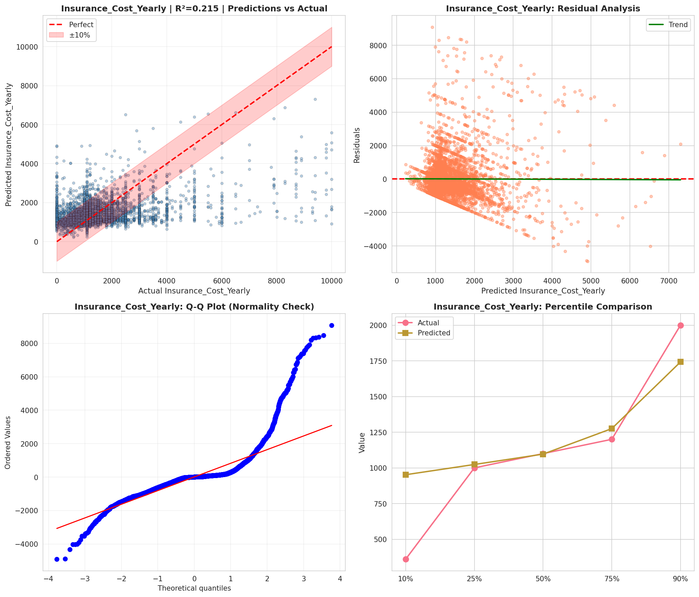
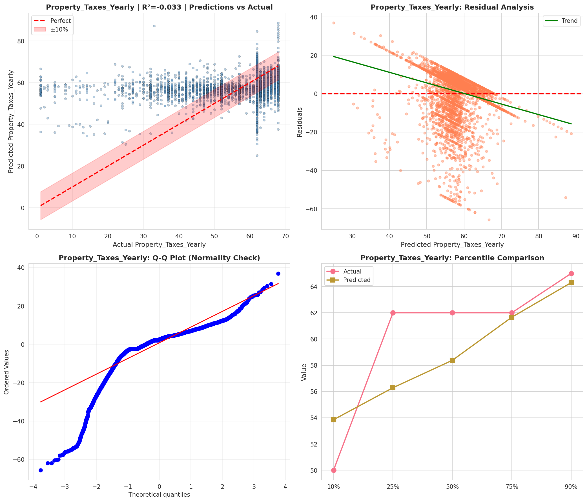
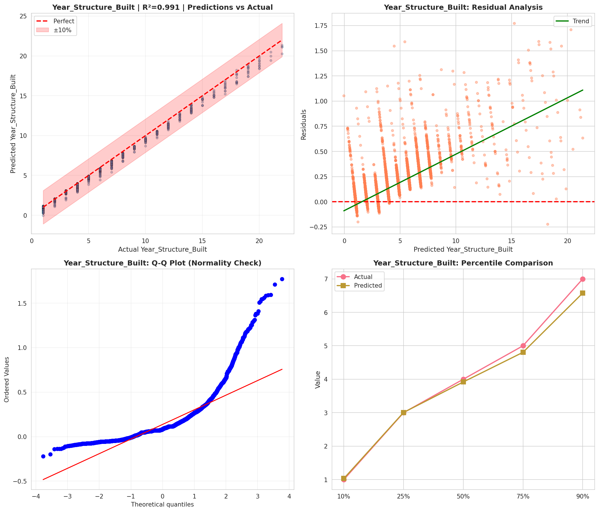
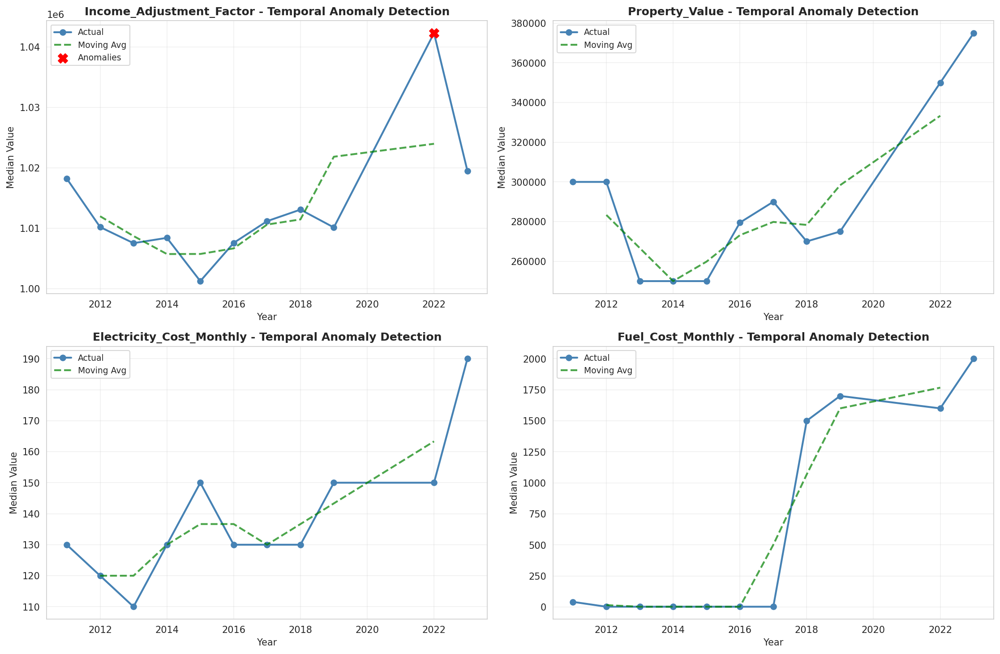
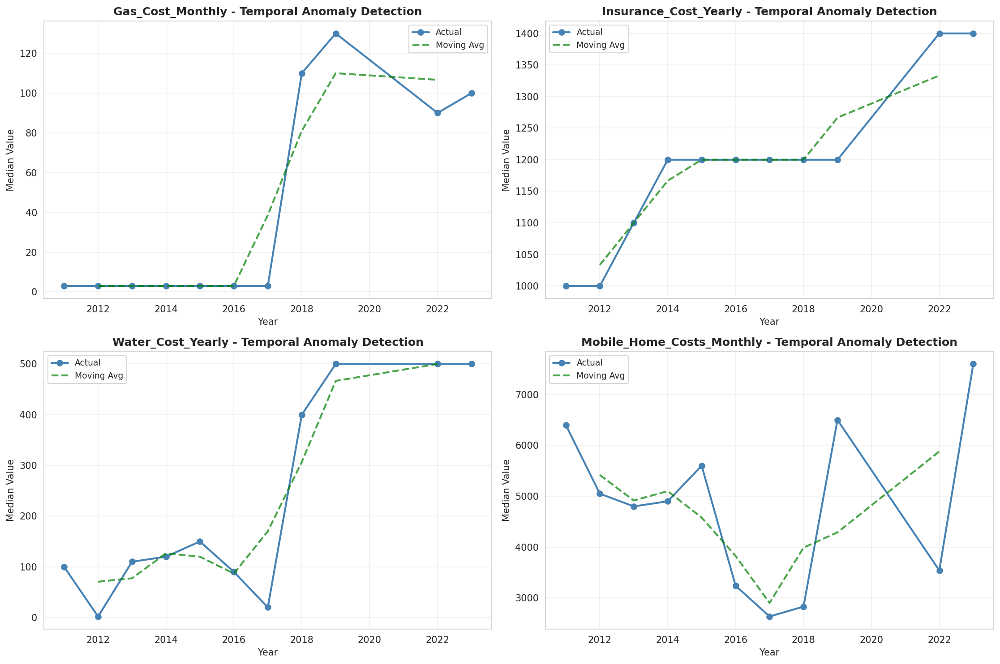
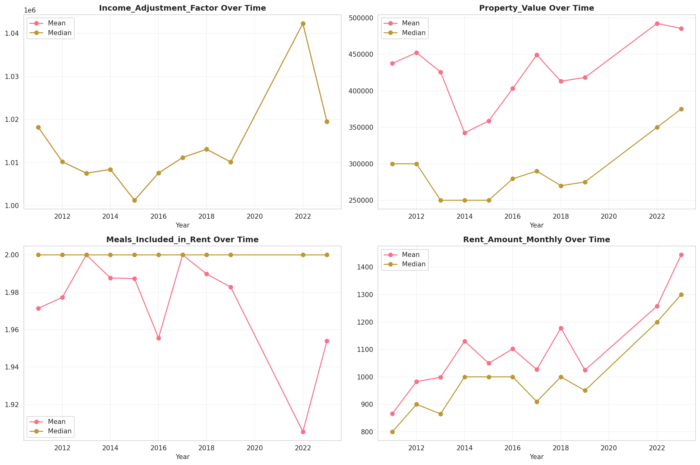
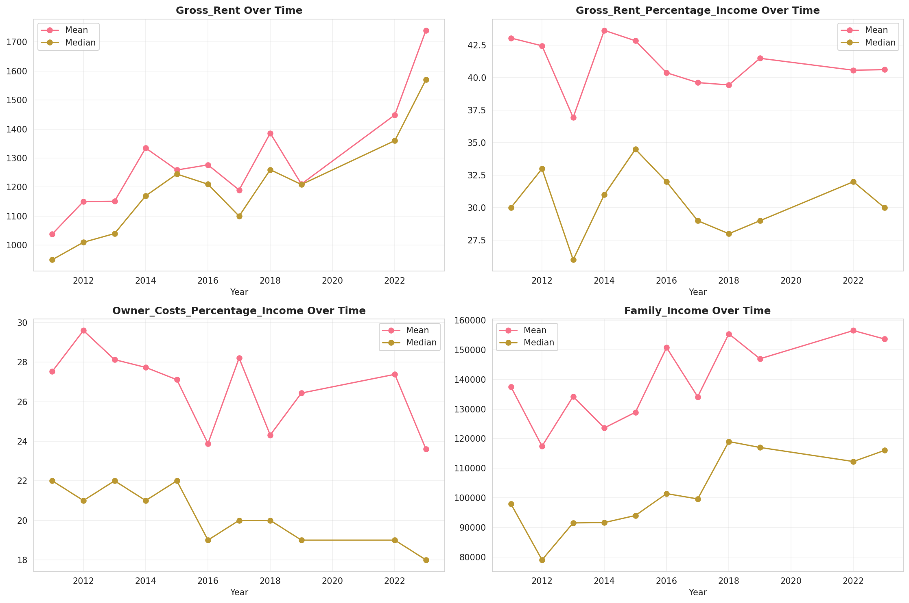
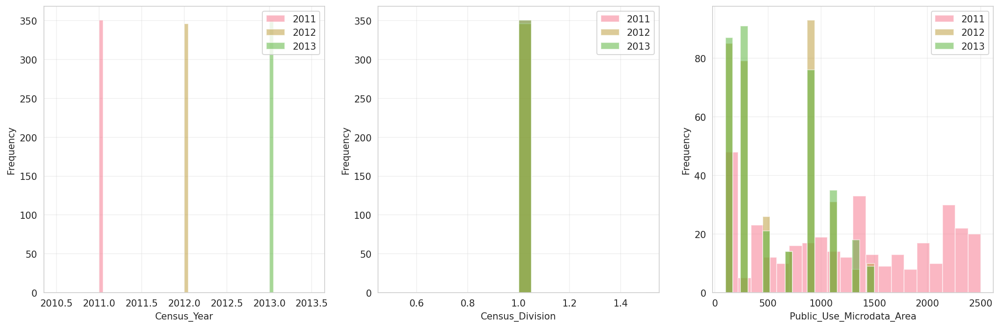
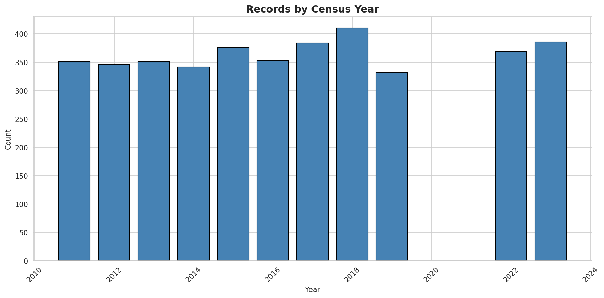
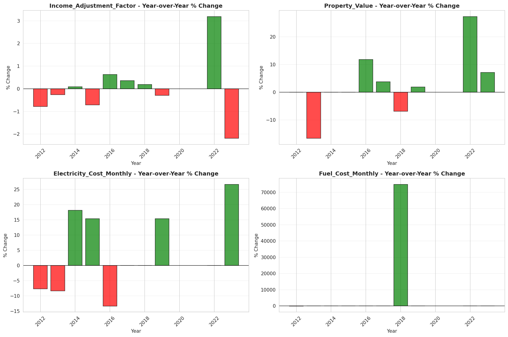

# Temporal Analysis

## Year Distribution

- 2011: 17,324 records

- 2012: 17,091 records

- 2013: 17,137 records

- 2014: 17,082 records

- 2015: 17,170 records

- 2016: 17,051 records

- 2017: 17,338 records

- 2018: 17,337 records

- 2019: 17,331 records

- 2022: 18,162 records

- 2023: 17,617 records

## Temporal Trends

- Census_Year: {np.int64(2011): {'mean': 2011.0, 'median': 2011.0, 'std': 0.0}, np.int64(2012): {'mean': 2012.0, 'median': 2012.0, 'std': 0.0}, np.int64(2013): {'mean': 2013.0, 'median': 2013.0, 'std': 0.0}, np.int64(2014): {'mean': 2014.0, 'median': 2014.0, 'std': 0.0}, np.int64(2015): {'mean': 2015.0, 'median': 2015.0, 'std': 0.0}, np.int64(2016): {'mean': 2016.0, 'median': 2016.0, 'std': 0.0}, np.int64(2017): {'mean': 2017.0, 'median': 2017.0, 'std': 0.0}, np.int64(2018): {'mean': 2018.0, 'median': 2018.0, 'std': 0.0}, np.int64(2019): {'mean': 2019.0, 'median': 2019.0, 'std': 0.0}, np.int64(2022): {'mean': 2022.0, 'median': 2022.0, 'std': 0.0}, np.int64(2023): {'mean': 2023.0, 'median': 2023.0, 'std': 0.0}}

- Census_Division: {np.int64(2011): {'mean': 1.0, 'median': 1.0, 'std': 0.0}, np.int64(2012): {'mean': 1.0, 'median': 1.0, 'std': 0.0}, np.int64(2013): {'mean': 1.0, 'median': 1.0, 'std': 0.0}, np.int64(2014): {'mean': 1.0, 'median': 1.0, 'std': 0.0}, np.int64(2015): {'mean': 1.0, 'median': 1.0, 'std': 0.0}, np.int64(2016): {'mean': 1.0, 'median': 1.0, 'std': 0.0}, np.int64(2017): {'mean': 1.0, 'median': 1.0, 'std': 0.0}, np.int64(2018): {'mean': 1.0, 'median': 1.0, 'std': 0.0}, np.int64(2019): {'mean': 1.0, 'median': 1.0, 'std': 0.0}, np.int64(2022): {'mean': 1.0, 'median': 1.0, 'std': 0.0}, np.int64(2023): {'mean': 1.0, 'median': 1.0, 'std': 0.0}}

- Public_Use_Microdata_Area: {np.int64(2011): {'mean': 1292.7788039713691, 'median': 1300.0, 'std': 749.0102622370204}, np.int64(2012): {'mean': 580.1983500087765, 'median': 500.0, 'std': 420.48869083711594}, np.int64(2013): {'mean': 580.83596895606, 'median': 500.0, 'std': 419.66026772553323}, np.int64(2014): {'mean': 583.0220700152207, 'median': 500.0, 'std': 419.8915163087271}, np.int64(2015): {'mean': 580.5618520675597, 'median': 500.0, 'std': 419.3053385138726}, np.int64(2016): {'mean': 579.5545129317928, 'median': 500.0, 'std': 419.65562966798996}, np.int64(2017): {'mean': 581.6392317452993, 'median': 500.0, 'std': 419.91318469220596}, np.int64(2018): {'mean': 582.6393262963604, 'median': 500.0, 'std': 422.17862061938035}, np.int64(2019): {'mean': 582.039582251457, 'median': 500.0, 'std': 422.71471603314734}, np.int64(2022): {'mean': 20508.734225305583, 'median': 20500.0, 'std': 268.660795817664}, np.int64(2023): {'mean': 20509.662768916387, 'median': 20500.0, 'std': 268.13383651909777}}

- Census_Region: {np.int64(2011): {'mean': 1.0, 'median': 1.0, 'std': 0.0}, np.int64(2012): {'mean': 1.0, 'median': 1.0, 'std': 0.0}, np.int64(2013): {'mean': 1.0, 'median': 1.0, 'std': 0.0}, np.int64(2014): {'mean': 1.0, 'median': 1.0, 'std': 0.0}, np.int64(2015): {'mean': 1.0, 'median': 1.0, 'std': 0.0}, np.int64(2016): {'mean': 1.0, 'median': 1.0, 'std': 0.0}, np.int64(2017): {'mean': 1.0, 'median': 1.0, 'std': 0.0}, np.int64(2018): {'mean': 1.0, 'median': 1.0, 'std': 0.0}, np.int64(2019): {'mean': 1.0, 'median': 1.0, 'std': 0.0}, np.int64(2022): {'mean': 1.0, 'median': 1.0, 'std': 0.0}, np.int64(2023): {'mean': 1.0, 'median': 1.0, 'std': 0.0}}

- State_Code: {np.int64(2011): {'mean': 9.0, 'median': 9.0, 'std': 0.0}, np.int64(2012): {'mean': 9.0, 'median': 9.0, 'std': 0.0}, np.int64(2013): {'mean': 9.0, 'median': 9.0, 'std': 0.0}, np.int64(2014): {'mean': 9.0, 'median': 9.0, 'std': 0.0}, np.int64(2015): {'mean': 9.0, 'median': 9.0, 'std': 0.0}, np.int64(2016): {'mean': 9.0, 'median': 9.0, 'std': 0.0}, np.int64(2017): {'mean': 9.0, 'median': 9.0, 'std': 0.0}, np.int64(2018): {'mean': 9.0, 'median': 9.0, 'std': 0.0}, np.int64(2019): {'mean': 9.0, 'median': 9.0, 'std': 0.0}, np.int64(2022): {'mean': 9.0, 'median': 9.0, 'std': 0.0}, np.int64(2023): {'mean': None, 'median': None, 'std': None}}

- Housing_Adjustment_Factor: {np.int64(2011): {'mean': 1000000.0, 'median': 1000000.0, 'std': 0.0}, np.int64(2012): {'mean': 1000000.0, 'median': 1000000.0, 'std': 0.0}, np.int64(2013): {'mean': 1000000.0, 'median': 1000000.0, 'std': 0.0}, np.int64(2014): {'mean': 1000000.0, 'median': 1000000.0, 'std': 0.0}, np.int64(2015): {'mean': 1000000.0, 'median': 1000000.0, 'std': 0.0}, np.int64(2016): {'mean': 1000000.0, 'median': 1000000.0, 'std': 0.0}, np.int64(2017): {'mean': 1000000.0, 'median': 1000000.0, 'std': 0.0}, np.int64(2018): {'mean': 1000000.0, 'median': 1000000.0, 'std': 0.0}, np.int64(2019): {'mean': 1000000.0, 'median': 1000000.0, 'std': 0.0}, np.int64(2022): {'mean': 1000000.0, 'median': 1000000.0, 'std': 0.0}, np.int64(2023): {'mean': 1000000.0, 'median': 1000000.0, 'std': 0.0}}

- Income_Adjustment_Factor: {np.int64(2011): {'mean': 1018237.0, 'median': 1018237.0, 'std': 0.0}, np.int64(2012): {'mean': 1010207.0, 'median': 1010207.0, 'std': 0.0}, np.int64(2013): {'mean': 1007549.0, 'median': 1007549.0, 'std': 0.0}, np.int64(2014): {'mean': 1008425.0, 'median': 1008425.0, 'std': 0.0}, np.int64(2015): {'mean': 1001264.0, 'median': 1001264.0, 'std': 0.0}, np.int64(2016): {'mean': 1007588.0, 'median': 1007588.0, 'std': 0.0}, np.int64(2017): {'mean': 1011189.0, 'median': 1011189.0, 'std': 0.0}, np.int64(2018): {'mean': 1013097.0, 'median': 1013097.0, 'std': 0.0}, np.int64(2019): {'mean': 1010145.0, 'median': 1010145.0, 'std': 0.0}, np.int64(2022): {'mean': 1042311.0, 'median': 1042311.0, 'std': 0.0}, np.int64(2023): {'mean': 1019518.0, 'median': 1019518.0, 'std': 0.0}}

- Housing_Unit_Weight: {np.int64(2011): {'mean': 86.24116832140383, 'median': 71.0, 'std': 73.70464247984813}, np.int64(2012): {'mean': 87.06348370487392, 'median': 71.0, 'std': 71.64592988969402}, np.int64(2013): {'mean': 86.83386823831476, 'median': 70.0, 'std': 72.82474278658644}, np.int64(2014): {'mean': 87.43894157592787, 'median': 71.0, 'std': 71.36757175189219}, np.int64(2015): {'mean': 87.13197437390798, 'median': 69.0, 'std': 72.3869354407938}, np.int64(2016): {'mean': 87.92123629112662, 'median': 70.0, 'std': 72.91977724332645}, np.int64(2017): {'mean': 87.52422424731803, 'median': 70.0, 'std': 72.91180730715243}, np.int64(2018): {'mean': 87.73853607890638, 'median': 70.0, 'std': 71.98894707951898}, np.int64(2019): {'mean': 87.99024868732329, 'median': 68.0, 'std': 79.55390894766474}, np.int64(2022): {'mean': 84.80850126638036, 'median': 64.0, 'std': 84.90766060319068}, np.int64(2023): {'mean': 87.75671226656071, 'median': 64.0, 'std': 83.48223570219535}}

- Number_of_Persons: {np.int64(2011): {'mean': 2.1090972061879474, 'median': 2.0, 'std': 1.396133697788834}, np.int64(2012): {'mean': 2.1286642092329298, 'median': 2.0, 'std': 1.3968967404379824}, np.int64(2013): {'mean': 2.1230086946373343, 'median': 2.0, 'std': 1.4131959807476924}, np.int64(2014): {'mean': 2.1066034422198805, 'median': 2.0, 'std': 1.3864717918962959}, np.int64(2015): {'mean': 2.0842748980780432, 'median': 2.0, 'std': 1.3734935774459542}, np.int64(2016): {'mean': 2.0911969972435633, 'median': 2.0, 'std': 1.3766206374416585}, np.int64(2017): {'mean': 2.0750951666858923, 'median': 2.0, 'std': 1.3878282116336798}, np.int64(2018): {'mean': 2.0930380111899405, 'median': 2.0, 'std': 1.3784996510528562}, np.int64(2019): {'mean': 2.0528532687092493, 'median': 2.0, 'std': 1.3349487176722965}, np.int64(2022): {'mean': 2.0575377161105606, 'median': 2.0, 'std': 1.348335878334942}, np.int64(2023): {'mean': 2.1066015780212295, 'median': 2.0, 'std': 1.3518203960171193}}

- Housing_Unit_Type: {np.int64(2011): {'mean': 1.215019625952436, 'median': 1.0, 'std': 0.5689766699279594}, np.int64(2012): {'mean': 1.204142531156749, 'median': 1.0, 'std': 0.5586045216718053}, np.int64(2013): {'mean': 1.2108303670420728, 'median': 1.0, 'std': 0.569784115375944}, np.int64(2014): {'mean': 1.2007961597002692, 'median': 1.0, 'std': 0.5575203519292334}, np.int64(2015): {'mean': 1.2093185789167151, 'median': 1.0, 'std': 0.5716071693862251}, np.int64(2016): {'mean': 1.1982874904697671, 'median': 1.0, 'std': 0.5604036037570721}, np.int64(2017): {'mean': 1.2045218594993656, 'median': 1.0, 'std': 0.5675648561740321}, np.int64(2018): {'mean': 1.197439003287766, 'median': 1.0, 'std': 0.5551686018649197}, np.int64(2019): {'mean': 1.194737753159079, 'median': 1.0, 'std': 0.5533176486060968}, np.int64(2022): {'mean': None, 'median': None, 'std': None}, np.int64(2023): {'mean': None, 'median': None, 'std': None}}

- Number_of_Bedrooms: {np.int64(2011): {'mean': 2.8110568235057896, 'median': 3.0, 'std': 1.2116020298619181}, np.int64(2012): {'mean': 2.8151209677419353, 'median': 3.0, 'std': 1.282796721781935}, np.int64(2013): {'mean': 2.818548387096774, 'median': 3.0, 'std': 1.1745354886784047}, np.int64(2014): {'mean': 2.819630423138725, 'median': 3.0, 'std': 1.219034516735277}, np.int64(2015): {'mean': 2.795655080213904, 'median': 3.0, 'std': 1.1620005058062355}, np.int64(2016): {'mean': 2.7904882604055494, 'median': 3.0, 'std': 1.1352686360451656}, np.int64(2017): {'mean': 2.767497034400949, 'median': 3.0, 'std': 1.1319616660018723}, np.int64(2018): {'mean': 2.7956876150407575, 'median': 3.0, 'std': 1.1325009865284776}, np.int64(2019): {'mean': 2.796590163934426, 'median': 3.0, 'std': 1.1336379224618085}, np.int64(2022): {'mean': 2.8044014541677487, 'median': 3.0, 'std': 1.132856735141106}, np.int64(2023): {'mean': 2.8003363301209494, 'median': 3.0, 'std': 1.1764352455085372}}

- Number_of_Rooms: {np.int64(2011): {'mean': 6.164246034401981, 'median': 6.0, 'std': 2.4540071897315596}, np.int64(2012): {'mean': 6.160013440860215, 'median': 6.0, 'std': 2.5088325455886262}, np.int64(2013): {'mean': 6.219153225806451, 'median': 6.0, 'std': 2.5337342434415926}, np.int64(2014): {'mean': 6.215452597750402, 'median': 6.0, 'std': 2.710154910912076}, np.int64(2015): {'mean': 6.157620320855615, 'median': 6.0, 'std': 2.463590492026235}, np.int64(2016): {'mean': 6.148946104589114, 'median': 6.0, 'std': 2.454011721110266}, np.int64(2017): {'mean': 6.132858837485172, 'median': 6.0, 'std': 2.458167192777133}, np.int64(2018): {'mean': 6.1746647383644495, 'median': 6.0, 'std': 2.5050460650310433}, np.int64(2019): {'mean': 6.199934426229508, 'median': 6.0, 'std': 2.5387985467828513}, np.int64(2022): {'mean': 6.2126071150350555, 'median': 6.0, 'std': 2.5694118037697264}, np.int64(2023): {'mean': 6.19254899424358, 'median': 6.0, 'std': 2.565692924721782}}

- Building_Type: {np.int64(2011): {'mean': 3.2037346897798007, 'median': 2.0, 'std': 2.041140315797958}, np.int64(2012): {'mean': 3.230577956989247, 'median': 2.0, 'std': 2.061913626606829}, np.int64(2013): {'mean': 3.2057123655913977, 'median': 2.0, 'std': 2.0496445320520817}, np.int64(2014): {'mean': 3.2258971612212104, 'median': 2.0, 'std': 2.0561554475547}, np.int64(2015): {'mean': 3.2296122994652405, 'median': 2.0, 'std': 2.0668078645752095}, np.int64(2016): {'mean': 3.2497331910352187, 'median': 2.0, 'std': 2.0905873805085537}, np.int64(2017): {'mean': 3.252075919335706, 'median': 2.0, 'std': 2.0884168282812525}, np.int64(2018): {'mean': 3.2386273994215093, 'median': 2.0, 'std': 2.076629769553586}, np.int64(2019): {'mean': 3.243016393442623, 'median': 2.0, 'std': 2.0991456132093878}, np.int64(2022): {'mean': 3.2087120228512074, 'median': 2.0, 'std': 2.10538414484384}, np.int64(2023): {'mean': 3.2030269710885455, 'median': 2.0, 'std': 2.1038327977748312}}

- Year_Structure_Built: {np.int64(2011): {'mean': 4.028244428083796, 'median': 4.0, 'std': 2.4349650804880256}, np.int64(2012): {'mean': 4.072513440860215, 'median': 4.0, 'std': 2.5228941366494846}, np.int64(2013): {'mean': 4.133064516129032, 'median': 4.0, 'std': 2.598325602723606}, np.int64(2014): {'mean': 4.106186395286556, 'median': 4.0, 'std': 2.6182587279449105}, np.int64(2015): {'mean': 4.22038770053476, 'median': 4.0, 'std': 2.7703073290633644}, np.int64(2016): {'mean': 4.24899946638207, 'median': 4.0, 'std': 2.922628506538604}, np.int64(2017): {'mean': 4.3194279688941615, 'median': 4.0, 'std': 3.081257803185509}, np.int64(2018): {'mean': 4.415330002629503, 'median': 4.0, 'std': 3.2573725064044132}, np.int64(2019): {'mean': 4.5580983606557375, 'median': 4.0, 'std': 3.5231825931662697}, np.int64(2022): {'mean': None, 'median': None, 'std': None}, np.int64(2023): {'mean': None, 'median': None, 'std': None}}

- Bathtub_or_Shower: {np.int64(2011): {'mean': 1.004350445083997, 'median': 1.0, 'std': 0.0658164769582265}, np.int64(2012): {'mean': 1.0041666666666667, 'median': 1.0, 'std': 0.06441726806902486}, np.int64(2013): {'mean': 1.0039650537634408, 'median': 1.0, 'std': 0.06284582358467612}, np.int64(2014): {'mean': 1.0036823781467594, 'median': 1.0, 'std': 0.06057279827051049}, np.int64(2015): {'mean': 1.0046122994652407, 'median': 1.0, 'std': 0.06775937622332524}, np.int64(2016): {'mean': 1.0044023479188902, 'median': 1.0, 'std': 0.06620619023121509}, np.int64(2017): {'mean': 1.0050744694872809, 'median': 1.0, 'std': 0.07105668153202295}, np.int64(2018): {'mean': 1.0053247436234551, 'median': 1.0, 'std': 0.07277869828167495}, np.int64(2019): {'mean': 1.0045245901639344, 'median': 1.0, 'std': 0.06711492843747748}, np.int64(2022): {'mean': 1.0039600103869124, 'median': 1.0, 'std': 0.06280592949717229}, np.int64(2023): {'mean': 1.0031692646012547, 'median': 1.0, 'std': 0.05620876009271416}}

- Refrigerator: {np.int64(2011): {'mean': 1.008633960243625, 'median': 1.0, 'std': 0.09252020262342021}, np.int64(2012): {'mean': 1.007258064516129, 'median': 1.0, 'std': 0.08488739176707821}, np.int64(2013): {'mean': 1.007997311827957, 'median': 1.0, 'std': 0.08907237519502209}, np.int64(2014): {'mean': 1.0071638993036958, 'median': 1.0, 'std': 0.08433892390827796}, np.int64(2015): {'mean': 1.0079545454545455, 'median': 1.0, 'std': 0.08883579339305656}, np.int64(2016): {'mean': 1.0079375667022412, 'median': 1.0, 'std': 0.08874168706443827}, np.int64(2017): {'mean': 1.0086990905496243, 'median': 1.0, 'std': 0.09286541182167286}, np.int64(2018): {'mean': 1.009268998159348, 'median': 1.0, 'std': 0.09583155819365659}, np.int64(2019): {'mean': 1.0067540983606558, 'median': 1.0, 'std': 0.08190799988523609}, np.int64(2022): {'mean': 1.0062970656972214, 'median': 1.0, 'std': 0.07910637715876599}, np.int64(2023): {'mean': 1.0050449518142424, 'median': 1.0, 'std': 0.07085072301703652}}

- Hot_and_Cold_Running_Water: {np.int64(2011): {'mean': 1.006492202663811, 'median': 1.0, 'std': 0.0803149157934125}, np.int64(2012): {'mean': 1.0052419354838709, 'median': 1.0, 'std': 0.07221362789518607}, np.int64(2013): {'mean': 1.0054435483870967, 'median': 1.0, 'std': 0.07358179143619324}, np.int64(2014): {'mean': 1.0053561863952865, 'median': 1.0, 'std': 0.0729921528306261}, np.int64(2015): {'mean': 1.0074866310160429, 'median': 1.0, 'std': 0.08620370120761656}, np.int64(2016): {'mean': 1.0081376734258272, 'median': 1.0, 'std': 0.08984425477944252}, np.int64(2017): {'mean': 1.008633188348491, 'median': 1.0, 'std': 0.0925160552493451}, np.int64(2018): {'mean': 1.0080857217985801, 'median': 1.0, 'std': 0.08955931092932497}, np.int64(2019): {'mean': 1.007344262295082, 'median': 1.0, 'std': 0.08538619438651998}, np.int64(2022): {'mean': 1.005518047260452, 'median': 1.0, 'std': 0.07408073084844524}, np.int64(2023): {'mean': 1.0038160532953884, 'median': 1.0, 'std': 0.06165822673967552}}

- Running_Water: {np.int64(2011): {'mean': None, 'median': None, 'std': None}, np.int64(2012): {'mean': None, 'median': None, 'std': None}, np.int64(2013): {'mean': 9.0, 'median': 9.0, 'std': 0.0}, np.int64(2014): {'mean': 9.0, 'median': 9.0, 'std': 0.0}, np.int64(2015): {'mean': 9.0, 'median': 9.0, 'std': 0.0}, np.int64(2016): {'mean': 9.0, 'median': 9.0, 'std': 0.0}, np.int64(2017): {'mean': 9.0, 'median': 9.0, 'std': 0.0}, np.int64(2018): {'mean': 9.0, 'median': 9.0, 'std': 0.0}, np.int64(2019): {'mean': 9.0, 'median': 9.0, 'std': 0.0}, np.int64(2022): {'mean': 9.0, 'median': 9.0, 'std': 0.0}, np.int64(2023): {'mean': 9.0, 'median': 9.0, 'std': 0.0}}

- Sink_with_Faucet: {np.int64(2011): {'mean': 1.004685094705843, 'median': 1.0, 'std': 0.06828950664813531}, np.int64(2012): {'mean': 1.0036962365591398, 'median': 1.0, 'std': 0.060686257883561474}, np.int64(2013): {'mean': 1.0040322580645162, 'median': 1.0, 'std': 0.06337403940068517}, np.int64(2014): {'mean': 1.003213711837172, 'median': 1.0, 'std': 0.05660033906060479}, np.int64(2015): {'mean': 1.0045454545454546, 'median': 1.0, 'std': 0.06726883281357038}, np.int64(2016): {'mean': 1.003935432230523, 'median': 1.0, 'std': 0.0626115491759635}, np.int64(2017): {'mean': 1.0046790562804797, 'median': 1.0, 'std': 0.06824565664059164}, np.int64(2018): {'mean': 1.0053247436234551, 'median': 1.0, 'std': 0.07277869828167487}, np.int64(2019): {'mean': 1.0035409836065574, 'median': 1.0, 'std': 0.05940266349477813}, np.int64(2022): {'mean': 1.0038301739807842, 'median': 1.0, 'std': 0.061771769116557136}, np.int64(2023): {'mean': 1.0023931181682944, 'median': 1.0, 'std': 0.04886251710130814}}

- Stove_or_Range: {np.int64(2011): {'mean': 1.0105079981259621, 'median': 1.0, 'std': 0.10197193759646321}, np.int64(2012): {'mean': 1.009274193548387, 'median': 1.0, 'std': 0.09585823078548532}, np.int64(2013): {'mean': 1.0093413978494623, 'median': 1.0, 'std': 0.09620165328740372}, np.int64(2014): {'mean': 1.0085029459025174, 'median': 1.0, 'std': 0.09182162219581093}, np.int64(2015): {'mean': 1.0103609625668448, 'median': 1.0, 'std': 0.10126351005812487}, np.int64(2016): {'mean': 1.0106056563500534, 'median': 1.0, 'std': 0.1024396230396741}, np.int64(2017): {'mean': 1.0112692763938316, 'median': 1.0, 'std': 0.10556047628042846}, np.int64(2018): {'mean': 1.0117012884564818, 'median': 1.0, 'std': 0.10754128773849352}, np.int64(2019): {'mean': 1.0091803278688525, 'median': 1.0, 'std': 0.09537633852505875}, np.int64(2022): {'mean': 1.0087639574136589, 'median': 1.0, 'std': 0.09320790983023637}, np.int64(2023): {'mean': 1.0079555009378436, 'median': 1.0, 'std': 0.0888409896104867}}

- Telephone_Service: {np.int64(2011): {'mean': 1.0160671121854117, 'median': 1.0, 'std': 0.1257381568352644}, np.int64(2012): {'mean': 1.014585556741373, 'median': 1.0, 'std': 0.11989095445925474}, np.int64(2013): {'mean': 1.0131852382658546, 'median': 1.0, 'std': 0.11407155739414922}, np.int64(2014): {'mean': 1.0163491612169462, 'median': 1.0, 'std': 0.12681880530104397}, np.int64(2015): {'mean': 1.016561964591662, 'median': 1.0, 'std': 0.12762769583371553}, np.int64(2016): {'mean': 1.022155943757989, 'median': 1.0, 'std': 0.147195776150016}, np.int64(2017): {'mean': 1.0099548150240045, 'median': 1.0, 'std': 0.09927946695868187}, np.int64(2018): {'mean': 1.0115433048831677, 'median': 1.0, 'std': 0.10682160498887971}, np.int64(2019): {'mean': 1.006763352391577, 'median': 1.0, 'std': 0.08196388153254781}, np.int64(2022): {'mean': 1.007230559345157, 'median': 1.0, 'std': 0.08472761085238968}, np.int64(2023): {'mean': 1.0076439153081242, 'median': 1.0, 'std': 0.08709764074775529}}

- Lot_Acreage: {np.int64(2011): {'mean': 1.3571094699448443, 'median': 1.0, 'std': 0.5285281266207809}, np.int64(2012): {'mean': 1.3608276643990929, 'median': 1.0, 'std': 0.5300208990422101}, np.int64(2013): {'mean': 1.359421921921922, 'median': 1.0, 'std': 0.5289741130701587}, np.int64(2014): {'mean': 1.3643747638836419, 'median': 1.0, 'std': 0.5314552770714155}, np.int64(2015): {'mean': 1.3591071764927483, 'median': 1.0, 'std': 0.5245884329845697}, np.int64(2016): {'mean': 1.3613707165109035, 'median': 1.0, 'std': 0.5286962475442039}, np.int64(2017): {'mean': 1.367862133209129, 'median': 1.0, 'std': 0.5267497424965252}, np.int64(2018): {'mean': 1.3610440274939626, 'median': 1.0, 'std': 0.5246919220934987}, np.int64(2019): {'mean': 1.3526818515797208, 'median': 1.0, 'std': 0.5201639744303749}, np.int64(2022): {'mean': 1.368931175529077, 'median': 1.0, 'std': 0.53214203855536}, np.int64(2023): {'mean': 1.3678059146449442, 'median': 1.0, 'std': 0.5289907780841281}}

- Agricultural_Sales: {np.int64(2011): {'mean': 1.0486233157586409, 'median': 1.0, 'std': 0.38653294102663593}, np.int64(2012): {'mean': 1.0473407364114553, 'median': 1.0, 'std': 0.3959495303766367}, np.int64(2013): {'mean': 1.0556531927357937, 'median': 1.0, 'std': 0.4321621291638656}, np.int64(2014): {'mean': 1.0468977570637925, 'median': 1.0, 'std': 0.38528039811636755}, np.int64(2015): {'mean': 1.0392156862745099, 'median': 1.0, 'std': 0.35510046490453184}, np.int64(2016): {'mean': 1.0448456610366919, 'median': 1.0, 'std': 0.36886303461419334}, np.int64(2017): {'mean': 1.048911506926774, 'median': 1.0, 'std': 0.3814632718148424}, np.int64(2018): {'mean': 1.0526013222190285, 'median': 1.0, 'std': 0.42131736975729595}, np.int64(2019): {'mean': 1.0628227194492255, 'median': 1.0, 'std': 0.47346878454647817}, np.int64(2022): {'mean': 1.0596256684491978, 'median': 1.0, 'std': 0.4429784056384117}, np.int64(2023): {'mean': 1.0712950600801068, 'median': 1.0, 'std': 0.5005243561827012}}

- Tenure: {np.int64(2011): {'mean': 1.7789705673254657, 'median': 1.0, 'std': 0.8704093734226325}, np.int64(2012): {'mean': 1.7961579509071506, 'median': 2.0, 'std': 0.8781210992568619}, np.int64(2013): {'mean': 1.8002149767108564, 'median': 2.0, 'std': 0.8771051318332495}, np.int64(2014): {'mean': 1.8107762297412568, 'median': 2.0, 'std': 0.8767952497428655}, np.int64(2015): {'mean': 1.807609937178755, 'median': 2.0, 'std': 0.8725651507030934}, np.int64(2016): {'mean': 1.8242437153813378, 'median': 2.0, 'std': 0.8751313757154715}, np.int64(2017): {'mean': 1.8202485173679752, 'median': 2.0, 'std': 0.8730938012580918}, np.int64(2018): {'mean': 1.8342661256471247, 'median': 2.0, 'std': 0.8684708909082676}, np.int64(2019): {'mean': 1.8263840468553898, 'median': 2.0, 'std': 0.8632005234941317}, np.int64(2022): {'mean': 1.819713506139154, 'median': 2.0, 'std': 0.8544575716664571}, np.int64(2023): {'mean': 1.8277075018602449, 'median': 2.0, 'std': 0.8461781856082964}}

- Vacancy_Status: {np.int64(2011): {'mean': 4.2788571428571425, 'median': 5.0, 'std': 2.360031138806435}, np.int64(2012): {'mean': 4.2703030303030305, 'median': 5.0, 'std': 2.3282567816009685}, np.int64(2013): {'mean': 4.448648648648649, 'median': 5.0, 'std': 2.320809963387542}, np.int64(2014): {'mean': 4.375576036866359, 'median': 5.0, 'std': 2.34054632666076}, np.int64(2015): {'mean': 4.444327731092437, 'median': 5.0, 'std': 2.3399446751590864}, np.int64(2016): {'mean': 4.581318681318681, 'median': 5.0, 'std': 2.2785850553196583}, np.int64(2017): {'mean': 4.5594059405940595, 'median': 5.0, 'std': 2.3509978573442427}, np.int64(2018): {'mean': 4.5588235294117645, 'median': 5.0, 'std': 2.339813190870132}, np.int64(2019): {'mean': 4.527533039647577, 'median': 5.0, 'std': 2.3578229998871687}, np.int64(2022): {'mean': 4.745967741935484, 'median': 5.0, 'std': 2.197817314170607}, np.int64(2023): {'mean': 4.572271386430678, 'median': 5.0, 'std': 2.291193951283946}}

- Property_Value: {np.int64(2011): {'mean': 391397.4430185788, 'median': 275000.0, 'std': 491381.5843640585}, np.int64(2012): {'mean': 390534.4867807154, 'median': 260000.0, 'std': 536765.3085057669}, np.int64(2013): {'mean': 393103.652589486, 'median': 260000.0, 'std': 541188.6800124312}, np.int64(2014): {'mean': 398580.78591576696, 'median': 258000.0, 'std': 615726.5206844412}, np.int64(2015): {'mean': 397166.21253405995, 'median': 269000.0, 'std': 518238.6523121052}, np.int64(2016): {'mean': 396651.78571428574, 'median': 275000.0, 'std': 532965.1291896221}, np.int64(2017): {'mean': 401778.12318419525, 'median': 275000.0, 'std': 536582.1157612059}, np.int64(2018): {'mean': 414357.76409467, 'median': 275000.0, 'std': 581502.7874214633}, np.int64(2019): {'mean': 402462.8797257404, 'median': 280000.0, 'std': 480642.2267728792}, np.int64(2022): {'mean': 502436.39031548053, 'median': 350000.0, 'std': 693499.319906018}, np.int64(2023): {'mean': 514292.93270107603, 'median': 350000.0, 'std': 624212.2299070664}}

- Vehicles_Available: {np.int64(2011): {'mean': 1.7976681359306128, 'median': 2.0, 'std': 1.0602927214511806}, np.int64(2012): {'mean': 1.808466737815724, 'median': 2.0, 'std': 1.064197771154033}, np.int64(2013): {'mean': 1.842923683267646, 'median': 2.0, 'std': 1.0770678507230207}, np.int64(2014): {'mean': 1.8260591413136196, 'median': 2.0, 'std': 1.07457635697408}, np.int64(2015): {'mean': 1.8348800685322673, 'median': 2.0, 'std': 1.0826182931715038}, np.int64(2016): {'mean': 1.8476778866638262, 'median': 2.0, 'std': 1.0815176162031066}, np.int64(2017): {'mean': 1.8535018356396498, 'median': 2.0, 'std': 1.0689369960652655}, np.int64(2018): {'mean': 1.858891842731216, 'median': 2.0, 'std': 1.1022192825061592}, np.int64(2019): {'mean': 1.8529493794449867, 'median': 2.0, 'std': 1.0597145495471043}, np.int64(2022): {'mean': 1.8375170532060028, 'median': 2.0, 'std': 1.051344586570879}, np.int64(2023): {'mean': 1.8437394304268417, 'median': 2.0, 'std': 1.060509896057127}}

- Condo_Fee_Monthly: {np.int64(2011): {'mean': 290.55454545454546, 'median': 250.0, 'std': 164.15266681658295}, np.int64(2012): {'mean': 289.46854460093897, 'median': 250.0, 'std': 153.99472453444633}, np.int64(2013): {'mean': 308.39884947267495, 'median': 270.0, 'std': 162.61368702507207}, np.int64(2014): {'mean': 303.19348659003833, 'median': 270.0, 'std': 148.40109455947888}, np.int64(2015): {'mean': 326.02700096432017, 'median': 290.0, 'std': 167.66978729455857}, np.int64(2016): {'mean': 335.28848114169216, 'median': 300.0, 'std': 163.07728028996664}, np.int64(2017): {'mean': 351.3865628042843, 'median': 310.0, 'std': 182.81276847718027}, np.int64(2018): {'mean': 349.03861003861005, 'median': 310.0, 'std': 169.33076129393916}, np.int64(2019): {'mean': 358.686679174484, 'median': 320.0, 'std': 181.23665267570254}, np.int64(2022): {'mean': 399.95733788395904, 'median': 340.0, 'std': 242.924288541078}, np.int64(2023): {'mean': 421.1516155758078, 'median': 370.0, 'std': 237.61721250831897}}

- Electricity_Cost_Monthly: {np.int64(2011): {'mean': 146.81401962178302, 'median': 130.0, 'std': 96.88731400826563}, np.int64(2012): {'mean': 137.20889363215937, 'median': 120.0, 'std': 92.0862720833646}, np.int64(2013): {'mean': 139.72031529917592, 'median': 120.0, 'std': 94.22379175038401}, np.int64(2014): {'mean': 147.79030423656525, 'median': 130.0, 'std': 101.24537641613924}, np.int64(2015): {'mean': 158.50621073672187, 'median': 130.0, 'std': 110.87338180880987}, np.int64(2016): {'mean': 149.95391279647777, 'median': 130.0, 'std': 102.12740868758752}, np.int64(2017): {'mean': 147.4808669867269, 'median': 130.0, 'std': 100.90687210435274}, np.int64(2018): {'mean': 166.6811295778791, 'median': 140.0, 'std': 106.47065578181005}, np.int64(2019): {'mean': 168.8811946416807, 'median': 140.0, 'std': 110.13298369705751}, np.int64(2022): {'mean': 218.64439208966945, 'median': 160.0, 'std': 279.0561839991093}, np.int64(2023): {'mean': 239.96876766534766, 'median': 180.0, 'std': 261.52456567610363}}

- Fuel_Cost_Monthly: {np.int64(2011): {'mean': 1057.8057016920234, 'median': 2.0, 'std': 1427.015973275401}, np.int64(2012): {'mean': 1048.0352899324084, 'median': 2.0, 'std': 1446.734256327498}, np.int64(2013): {'mean': 859.0284485847367, 'median': 2.0, 'std': 1382.303791274057}, np.int64(2014): {'mean': 913.3080039806654, 'median': 2.0, 'std': 1453.0550547026019}, np.int64(2015): {'mean': 830.8971302113079, 'median': 2.0, 'std': 1391.5624839863801}, np.int64(2016): {'mean': 608.2485442408748, 'median': 2.0, 'std': 1076.6720584302282}, np.int64(2017): {'mean': 577.1873764473313, 'median': 2.0, 'std': 1023.9955464261918}, np.int64(2018): {'mean': 1709.981495468278, 'median': 1500.0, 'std': 1225.8333047623178}, np.int64(2019): {'mean': 1834.3172465394687, 'median': 1500.0, 'std': 1341.582010019171}, np.int64(2022): {'mean': 2050.2512542644995, 'median': 1800.0, 'std': 1537.0639880035988}, np.int64(2023): {'mean': 2221.488512696493, 'median': 2000.0, 'std': 1632.826685614253}}

- Gas_Cost_Monthly: {np.int64(2011): {'mean': 54.55360443622921, 'median': 3.0, 'std': 93.71885939297002}, np.int64(2012): {'mean': 52.35069370330843, 'median': 3.0, 'std': 87.70787640361371}, np.int64(2013): {'mean': 53.1404514510928, 'median': 3.0, 'std': 88.2309440744656}, np.int64(2014): {'mean': 57.03156098947967, 'median': 3.0, 'std': 94.68855233895924}, np.int64(2015): {'mean': 55.81203597944032, 'median': 3.0, 'std': 94.52994035276886}, np.int64(2016): {'mean': 48.447663684135776, 'median': 3.0, 'std': 81.56498258227708}, np.int64(2017): {'mean': 52.51637955379836, 'median': 3.0, 'std': 86.16866347618321}, np.int64(2018): {'mean': 124.7563204386232, 'median': 100.0, 'std': 109.68527996814814}, np.int64(2019): {'mean': 130.0426626323752, 'median': 100.0, 'std': 112.75438176909589}, np.int64(2022): {'mean': 180.07294832826747, 'median': 110.0, 'std': 270.38671913695384}, np.int64(2023): {'mean': 171.4494256094144, 'median': 110.0, 'std': 222.24275210561615}}

- House_Heating_Fuel: {np.int64(2011): {'mean': 2.952296317361012, 'median': 4.0, 'std': 1.483191542252569}, np.int64(2012): {'mean': 2.9649946638207045, 'median': 4.0, 'std': 1.5067510280385492}, np.int64(2013): {'mean': 2.933142242923683, 'median': 4.0, 'std': 1.5430988023334493}, np.int64(2014): {'mean': 2.9025447824850725, 'median': 3.0, 'std': 1.5379234590574782}, np.int64(2015): {'mean': 2.8719303255282695, 'median': 3.0, 'std': 1.5226390153986709}, np.int64(2016): {'mean': 2.854069024286323, 'median': 3.0, 'std': 1.538076069253144}, np.int64(2017): {'mean': 2.833309799491669, 'median': 3.0, 'std': 1.5315054793100824}, np.int64(2018): {'mean': 2.8111095564572546, 'median': 3.0, 'std': 1.5272426612676053}, np.int64(2019): {'mean': 2.7994003625714683, 'median': 3.0, 'std': 1.5166572698954242}, np.int64(2022): {'mean': 2.787175989085948, 'median': 3.0, 'std': 1.5343796246884263}, np.int64(2023): {'mean': 2.7820469458161403, 'median': 3.0, 'std': 1.5584007371309099}}

- Insurance_Cost_Yearly: {np.int64(2011): {'mean': 1220.5262160454834, 'median': 1000.0, 'std': 1070.2127446116983}, np.int64(2012): {'mean': 1250.5557835619397, 'median': 1000.0, 'std': 1108.0800172755762}, np.int64(2013): {'mean': 1358.8331713637835, 'median': 1000.0, 'std': 1268.565785432832}, np.int64(2014): {'mean': 1408.6511426405286, 'median': 1100.0, 'std': 1315.968913647497}, np.int64(2015): {'mean': 1461.4269954574952, 'median': 1200.0, 'std': 1284.3652161519292}, np.int64(2016): {'mean': 1502.2611513122367, 'median': 1200.0, 'std': 1287.2875422000009}, np.int64(2017): {'mean': 1540.6522304027717, 'median': 1200.0, 'std': 1345.8033930767533}, np.int64(2018): {'mean': 1600.5580690550926, 'median': 1200.0, 'std': 1431.846506934086}, np.int64(2019): {'mean': 1644.8869136860142, 'median': 1200.0, 'std': 1398.1215854559193}, np.int64(2022): {'mean': 1812.0130407783067, 'median': 1400.0, 'std': 1602.9032487322138}, np.int64(2023): {'mean': 1997.5808358817533, 'median': 1500.0, 'std': 1743.0251801133713}}

- Water_Cost_Yearly: {np.int64(2011): {'mean': 252.22820986776625, 'median': 50.0, 'std': 389.0951185318209}, np.int64(2012): {'mean': 252.97225186766275, 'median': 50.0, 'std': 378.19274983162376}, np.int64(2013): {'mean': 269.4038695807954, 'median': 60.0, 'std': 406.0219748290431}, np.int64(2014): {'mean': 286.0352573215809, 'median': 70.0, 'std': 426.6372982628501}, np.int64(2015): {'mean': 287.2806253569389, 'median': 50.0, 'std': 425.01323896091606}, np.int64(2016): {'mean': 295.6807271694362, 'median': 50.0, 'std': 438.0468354862229}, np.int64(2017): {'mean': 293.3817424456368, 'median': 50.0, 'std': 438.32237409295925}, np.int64(2018): {'mean': 562.2662216288385, 'median': 450.0, 'std': 489.87990019825344}, np.int64(2019): {'mean': 586.9631299734748, 'median': 500.0, 'std': 497.2460208182092}, np.int64(2022): {'mean': 629.260025220681, 'median': 500.0, 'std': 592.8979116505234}, np.int64(2023): {'mean': 644.7910898565316, 'median': 500.0, 'std': 591.4692038964104}}

- Mobile_Home_Costs_Monthly: {np.int64(2011): {'mean': 4179.325301204819, 'median': 4500.0, 'std': 2001.2884210198538}, np.int64(2012): {'mean': 4198.333333333333, 'median': 4800.0, 'std': 2118.6555662614683}, np.int64(2013): {'mean': 4153.323529411765, 'median': 4900.0, 'std': 2057.8622906305704}, np.int64(2014): {'mean': 4077.7966101694915, 'median': 5000.0, 'std': 2413.7108844642967}, np.int64(2015): {'mean': 4095.810810810811, 'median': 4800.0, 'std': 2463.2821443393873}, np.int64(2016): {'mean': 4029.5454545454545, 'median': 4950.0, 'std': 2570.744538556385}, np.int64(2017): {'mean': 4820.515151515152, 'median': 5300.0, 'std': 2477.1600938445886}, np.int64(2018): {'mean': 4747.816091954023, 'median': 5400.0, 'std': 2407.2165849201824}, np.int64(2019): {'mean': 5066.868421052632, 'median': 5700.0, 'std': 3031.437332760837}, np.int64(2022): {'mean': 6069.615384615385, 'median': 6000.0, 'std': 3520.156225247659}, np.int64(2023): {'mean': 6705.523809523809, 'median': 6500.0, 'std': 5477.783665954008}}

- First_Mortgage_Includes_Insurance: {np.int64(2011): {'mean': 1.5194657573174197, 'median': 2.0, 'std': 0.49965643891441136}, np.int64(2012): {'mean': 1.5257167555107334, 'median': 2.0, 'std': 0.49937418460023336}, np.int64(2013): {'mean': 1.5325435132367997, 'median': 2.0, 'std': 0.4989762879271113}, np.int64(2014): {'mean': 1.5301755939206139, 'median': 2.0, 'std': 0.4991254291995931}, np.int64(2015): {'mean': 1.5144423048437268, 'median': 2.0, 'std': 0.4998283965193173}, np.int64(2016): {'mean': 1.502030991424703, 'median': 2.0, 'std': 0.5000334899430899}, np.int64(2017): {'mean': 1.5011162375353475, 'median': 2.0, 'std': 0.5000359659911285}, np.int64(2018): {'mean': 1.4856404801701868, 'median': 1.0, 'std': 0.499831738462535}, np.int64(2019): {'mean': 1.4804646251319957, 'median': 1.0, 'std': 0.4996559119224346}, np.int64(2022): {'mean': 1.4244423499842915, 'median': 1.0, 'std': 0.49429689650247577}, np.int64(2023): {'mean': 1.4306372159542349, 'median': 1.0, 'std': 0.49520477838045646}}

- First_Mortgage_Payment_Monthly: {np.int64(2011): {'mean': 1669.516339869281, 'median': 1500.0, 'std': 1101.109950528123}, np.int64(2012): {'mean': 1642.6532199971186, 'median': 1400.0, 'std': 1085.0662154791016}, np.int64(2013): {'mean': 1675.240602603481, 'median': 1500.0, 'std': 1172.2091770542265}, np.int64(2014): {'mean': 1623.8863804043087, 'median': 1400.0, 'std': 1088.9596849613908}, np.int64(2015): {'mean': 1688.0035550288846, 'median': 1500.0, 'std': 1135.3551978004698}, np.int64(2016): {'mean': 1709.483075071461, 'median': 1500.0, 'std': 1134.2394382125863}, np.int64(2017): {'mean': 1717.797291263581, 'median': 1500.0, 'std': 1145.189618216884}, np.int64(2018): {'mean': 1771.3882388694726, 'median': 1500.0, 'std': 1204.2070617530624}, np.int64(2019): {'mean': 1806.740986574144, 'median': 1500.0, 'std': 1251.37436432078}, np.int64(2022): {'mean': 949.4531726662599, 'median': 4.0, 'std': 1304.6756157384461}, np.int64(2023): {'mean': 2040.1503257587797, 'median': 1700.0, 'std': 1315.1129735319023}}

- First_Mortgage_Includes_Taxes: {np.int64(2011): {'mean': 1.2709576584256892, 'median': 1.0, 'std': 0.44448585729082957}, np.int64(2012): {'mean': 1.2712865581328339, 'median': 1.0, 'std': 0.4446556500521768}, np.int64(2013): {'mean': 1.2740968260933159, 'median': 1.0, 'std': 0.4460906431355457}, np.int64(2014): {'mean': 1.265161575918548, 'median': 1.0, 'std': 0.4414517760900969}, np.int64(2015): {'mean': 1.265294030513998, 'median': 1.0, 'std': 0.44152234813610464}, np.int64(2016): {'mean': 1.2629757785467128, 'median': 1.0, 'std': 0.4402825022398294}, np.int64(2017): {'mean': 1.2546509897306146, 'median': 1.0, 'std': 0.435697275859016}, np.int64(2018): {'mean': 1.24069290381401, 'median': 1.0, 'std': 0.4275366708455799}, np.int64(2019): {'mean': 1.2371398400965454, 'median': 1.0, 'std': 0.4253608236792576}, np.int64(2022): {'mean': 1.1839459629280553, 'median': 1.0, 'std': 0.3874705527997195}, np.int64(2023): {'mean': 1.1957730812013347, 'median': 1.0, 'std': 0.39682616481207367}}

- First_Mortgage_Status: {np.int64(2011): {'mean': 1.6379661016949152, 'median': 1.0, 'std': 0.9315344442264478}, np.int64(2012): {'mean': 1.63864060504862, 'median': 1.0, 'std': 0.9313128862733994}, np.int64(2013): {'mean': 1.6497180730042535, 'median': 1.0, 'std': 0.935422368542179}, np.int64(2014): {'mean': 1.670076726342711, 'median': 1.0, 'std': 0.9422810044817461}, np.int64(2015): {'mean': 1.672879684418146, 'median': 1.0, 'std': 0.9426781352061865}, np.int64(2016): {'mean': 1.6900098911968349, 'median': 1.0, 'std': 0.9481821875455164}, np.int64(2017): {'mean': 1.6850176956350766, 'median': 1.0, 'std': 0.9459275604625279}, np.int64(2018): {'mean': 1.7218652647975077, 'median': 1.0, 'std': 0.9589149958091512}, np.int64(2019): {'mean': 1.725284255155136, 'median': 1.0, 'std': 0.9601175510371146}, np.int64(2022): {'mean': 1.8243243243243243, 'median': 1.0, 'std': 0.9830822756385084}, np.int64(2023): {'mean': 1.8480954566314822, 'median': 1.0, 'std': 0.9867675075166809}}

- Second_Mortgage_Payment_Monthly: {np.int64(2011): {'mean': 414.853249475891, 'median': 300.0, 'std': 396.5839045466827}, np.int64(2012): {'mean': 411.5253303964758, 'median': 300.0, 'std': 405.7690551037381}, np.int64(2013): {'mean': 406.22641509433964, 'median': 280.0, 'std': 438.38713956391535}, np.int64(2014): {'mean': 389.5601328903654, 'median': 280.0, 'std': 386.0082824943499}, np.int64(2015): {'mean': 424.2074966532798, 'median': 290.0, 'std': 509.084699103576}, np.int64(2016): {'mean': 396.24202898550726, 'median': 290.0, 'std': 424.50731341873154}, np.int64(2017): {'mean': 474.24848484848485, 'median': 300.0, 'std': 555.8321879399307}, np.int64(2018): {'mean': 458.7168520102652, 'median': 300.0, 'std': 532.5829372016163}, np.int64(2019): {'mean': 486.0685302073941, 'median': 340.0, 'std': 482.4604310215899}, np.int64(2022): {'mean': 484.07002561912896, 'median': 300.0, 'std': 604.148200430718}, np.int64(2023): {'mean': 633.1292281006071, 'median': 450.0, 'std': 679.6853475349138}}

- Second_Mortgage_Status: {np.int64(2011): {'mean': 2.692242114236999, 'median': 3.0, 'std': 0.5743556261686183}, np.int64(2012): {'mean': 2.7019161504106037, 'median': 3.0, 'std': 0.5734601628588517}, np.int64(2013): {'mean': 2.737604212373848, 'median': 3.0, 'std': 0.542686622989906}, np.int64(2014): {'mean': 2.7509222369780137, 'median': 3.0, 'std': 0.5249889997187478}, np.int64(2015): {'mean': 2.7536661235372537, 'median': 3.0, 'std': 0.5200209060530313}, np.int64(2016): {'mean': 2.7740333985256505, 'median': 3.0, 'std': 0.5004659527023322}, np.int64(2017): {'mean': 2.782408096442923, 'median': 3.0, 'std': 0.4919538115455434}, np.int64(2018): {'mean': 2.7971432912931165, 'median': 3.0, 'std': 0.48849783607244773}, np.int64(2019): {'mean': 2.811887162467944, 'median': 3.0, 'std': 0.4677956001675717}, np.int64(2022): {'mean': 2.809992542878449, 'median': 3.0, 'std': 0.4440555562725857}, np.int64(2023): {'mean': 2.8063540090771557, 'median': 3.0, 'std': 0.45231589668250877}}

- Property_Taxes_Yearly: {np.int64(2011): {'mean': 54.507409200968524, 'median': 62.0, 'std': 14.191427620210122}, np.int64(2012): {'mean': 54.634613495727336, 'median': 62.0, 'std': 14.21618367949176}, np.int64(2013): {'mean': 54.40182016025324, 'median': 62.0, 'std': 15.608441543561673}, np.int64(2014): {'mean': 54.45150501672241, 'median': 62.0, 'std': 15.628047459150627}, np.int64(2015): {'mean': 56.52031558185404, 'median': 62.0, 'std': 13.136280732588196}, np.int64(2016): {'mean': 56.952225519287836, 'median': 63.0, 'std': 12.826686328777738}, np.int64(2017): {'mean': 57.30534801415651, 'median': 63.0, 'std': 12.622801916149166}}

- Meals_Included_in_Rent: {np.int64(2011): {'mean': 1.972390218248751, 'median': 2.0, 'std': 0.16387355830984332}, np.int64(2012): {'mean': 1.977755049859371, 'median': 2.0, 'std': 0.14749805091066928}, np.int64(2013): {'mean': 1.9747552807831015, 'median': 2.0, 'std': 0.15688774284129958}, np.int64(2014): {'mean': 1.9750445632798574, 'median': 2.0, 'std': 0.1560091687169244}, np.int64(2015): {'mean': 1.9758515505846466, 'median': 2.0, 'std': 0.1535294548039001}, np.int64(2016): {'mean': 1.9763937719738824, 'median': 2.0, 'std': 0.1518379523350152}, np.int64(2017): {'mean': 1.9736323311976343, 'median': 2.0, 'std': 0.16024588224036568}, np.int64(2018): {'mean': 1.9743968488429344, 'median': 2.0, 'std': 0.15796763285936333}, np.int64(2019): {'mean': 1.974894357444693, 'median': 2.0, 'std': 0.15646544230272083}, np.int64(2022): {'mean': 1.9663423612937154, 'median': 2.0, 'std': 0.18037005493980673}, np.int64(2023): {'mean': 1.9706261272867818, 'median': 2.0, 'std': 0.1688739071715181}}

- Rent_Amount_Monthly: {np.int64(2011): {'mean': 887.4104654220353, 'median': 800.0, 'std': 515.0409416327889}, np.int64(2012): {'mean': 929.8777806187676, 'median': 850.0, 'std': 560.0150366950764}, np.int64(2013): {'mean': 958.8114374034003, 'median': 870.0, 'std': 556.1093450961031}, np.int64(2014): {'mean': 990.3091418385536, 'median': 890.0, 'std': 588.6985180556588}, np.int64(2015): {'mean': 1005.5175394001017, 'median': 900.0, 'std': 565.9132156798462}, np.int64(2016): {'mean': 1033.2194876946257, 'median': 935.0, 'std': 584.6365546833606}, np.int64(2017): {'mean': 1052.0335140463283, 'median': 950.0, 'std': 587.8243848126336}, np.int64(2018): {'mean': 1084.0723781388479, 'median': 980.0, 'std': 612.9169126139695}, np.int64(2019): {'mean': 1125.937360178971, 'median': 1000.0, 'std': 646.481757983135}, np.int64(2022): {'mean': 1339.9032342887194, 'median': 1200.0, 'std': 923.7858449445355}, np.int64(2023): {'mean': 1425.1497036846174, 'median': 1300.0, 'std': 970.7575426988667}}

- Gross_Rent: {np.int64(2011): {'mean': 1055.5451730931607, 'median': 990.0, 'std': 562.3711271289616}, np.int64(2012): {'mean': 1083.3099128540305, 'median': 1000.0, 'std': 600.4973552284689}, np.int64(2013): {'mean': 1123.0263519077682, 'median': 1030.0, 'std': 610.0434841655317}, np.int64(2014): {'mean': 1165.030089455137, 'median': 1060.0, 'std': 639.4586943788646}, np.int64(2015): {'mean': 1185.682608695652, 'median': 1080.0, 'std': 628.9734262155158}, np.int64(2016): {'mean': 1191.7799575821846, 'median': 1100.0, 'std': 626.6815866308982}, np.int64(2017): {'mean': 1209.6174232484911, 'median': 1120.0, 'std': 630.9810247516267}, np.int64(2018): {'mean': 1259.3520354906054, 'median': 1160.0, 'std': 665.8754613434461}, np.int64(2019): {'mean': 1297.9012932172077, 'median': 1192.0, 'std': 689.8667726168873}, np.int64(2022): {'mean': 1565.9654794520548, 'median': 1394.5, 'std': 1014.5752555652897}, np.int64(2023): {'mean': 1655.1995690816052, 'median': 1480.0, 'std': 1038.1509327346118}}

- Gross_Rent_Percentage_Income: {np.int64(2011): {'mean': 42.23502436228146, 'median': 32.0, 'std': 28.672578643394072}, np.int64(2012): {'mean': 41.55898720089037, 'median': 31.0, 'std': 28.95765978658231}, np.int64(2013): {'mean': 40.465037910699245, 'median': 31.0, 'std': 28.049864793781133}, np.int64(2014): {'mean': 41.046550290939315, 'median': 31.0, 'std': 28.429894810644754}, np.int64(2015): {'mean': 41.1175492098697, 'median': 31.0, 'std': 28.382402580538574}, np.int64(2016): {'mean': 39.829321071138764, 'median': 30.0, 'std': 28.149162548171645}, np.int64(2017): {'mean': 39.65213903743315, 'median': 30.0, 'std': 27.533103579060807}, np.int64(2018): {'mean': 39.60372836218375, 'median': 30.0, 'std': 27.66673359932803}, np.int64(2019): {'mean': 38.58549083063646, 'median': 29.0, 'std': 28.03106248123682}, np.int64(2022): {'mean': 41.30407876230661, 'median': 31.0, 'std': 28.9302048105797}, np.int64(2023): {'mean': 40.13797851831451, 'median': 30.0, 'std': 28.21071769819892}}

- Selected_Monthly_Owner_Costs: {np.int64(2011): {'mean': 1919.3870373958534, 'median': 1665.5, 'std': 1332.4470193128884}, np.int64(2012): {'mean': 1889.8014344664964, 'median': 1629.0, 'std': 1310.8209403849555}, np.int64(2013): {'mean': 1894.8969816922315, 'median': 1620.0, 'std': 1385.0716570010065}, np.int64(2014): {'mean': 1863.5713020372011, 'median': 1602.0, 'std': 1296.9804169030033}, np.int64(2015): {'mean': 1930.7228416378885, 'median': 1637.0, 'std': 1351.751613119205}, np.int64(2016): {'mean': 1889.1156624121895, 'median': 1622.0, 'std': 1299.236912688739}, np.int64(2017): {'mean': 1914.6581768118792, 'median': 1640.0, 'std': 1324.6508861890857}, np.int64(2018): {'mean': 1949.1747979355341, 'median': 1638.0, 'std': 1390.011864330625}, np.int64(2019): {'mean': 1968.056278307796, 'median': 1649.0, 'std': 1425.1548761733643}, np.int64(2022): {'mean': 2104.001203480837, 'median': 1730.0, 'std': 1536.0669288615215}, np.int64(2023): {'mean': 2199.803487838458, 'median': 1810.0, 'std': 1606.3701389021633}}

- Owner_Costs_Percentage_Income: {np.int64(2011): {'mean': 29.454925605368082, 'median': 23.0, 'std': 22.64996245609702}, np.int64(2012): {'mean': 28.56419887318375, 'median': 22.0, 'std': 22.031429867799243}, np.int64(2013): {'mean': 27.306031050955415, 'median': 21.0, 'std': 21.84918481612815}, np.int64(2014): {'mean': 26.923054099495598, 'median': 21.0, 'std': 21.721850449546494}, np.int64(2015): {'mean': 26.995037220843674, 'median': 21.0, 'std': 21.71421247050693}, np.int64(2016): {'mean': 25.690237362200815, 'median': 19.0, 'std': 21.136653702773383}, np.int64(2017): {'mean': 26.107291049199763, 'median': 19.0, 'std': 21.876415604926027}, np.int64(2018): {'mean': 25.976127580471577, 'median': 19.0, 'std': 21.77910400690093}, np.int64(2019): {'mean': 25.08064359794514, 'median': 19.0, 'std': 21.524472542582306}, np.int64(2022): {'mean': 25.13327120223672, 'median': 18.0, 'std': 21.97804219923685}, np.int64(2023): {'mean': 25.557697629369983, 'median': 19.0, 'std': 22.47872745962586}}

- Satellite_Internet: {np.int64(2011): {'mean': None, 'median': None, 'std': None}, np.int64(2012): {'mean': None, 'median': None, 'std': None}, np.int64(2013): {'mean': 1.9691951566951567, 'median': 2.0, 'std': 0.17279630575240348}, np.int64(2014): {'mean': 1.9658747300215982, 'median': 2.0, 'std': 0.18155876115768477}, np.int64(2015): {'mean': 1.9670461354104254, 'median': 2.0, 'std': 0.178523486824007}, np.int64(2016): {'mean': 1.9590157188708748, 'median': 2.0, 'std': 0.1982619599758689}, np.int64(2017): {'mean': 1.956105796285875, 'median': 2.0, 'std': 0.20486794949515535}, np.int64(2018): {'mean': 1.9596285511922562, 'median': 2.0, 'std': 0.19683659214608312}, np.int64(2019): {'mean': 1.9584040747028864, 'median': 2.0, 'std': 0.19967168318376063}, np.int64(2022): {'mean': 1.962436177972283, 'median': 2.0, 'std': 0.19014578212280803}, np.int64(2023): {'mean': 1.9656986380341572, 'median': 2.0, 'std': 0.18200869685953575}}

- Smartphone: {np.int64(2011): {'mean': None, 'median': None, 'std': None}, np.int64(2012): {'mean': None, 'median': None, 'std': None}, np.int64(2013): {'mean': None, 'median': None, 'std': None}, np.int64(2014): {'mean': None, 'median': None, 'std': None}, np.int64(2015): {'mean': None, 'median': None, 'std': None}, np.int64(2016): {'mean': 1.2606874023576196, 'median': 1.0, 'std': 0.4390252473501875}, np.int64(2017): {'mean': 1.1922479525557752, 'median': 1.0, 'std': 0.3940807552842705}, np.int64(2018): {'mean': 1.167622778788303, 'median': 1.0, 'std': 0.37354403303743244}, np.int64(2019): {'mean': 1.1493515548737971, 'median': 1.0, 'std': 0.35644708842034145}, np.int64(2022): {'mean': 1.1038881309686221, 'median': 1.0, 'std': 0.3051257739767883}, np.int64(2023): {'mean': 1.0934181154028275, 'median': 1.0, 'std': 0.291027319099015}}

- Tablet_Computer: {np.int64(2011): {'mean': None, 'median': None, 'std': None}, np.int64(2012): {'mean': None, 'median': None, 'std': None}, np.int64(2013): {'mean': None, 'median': None, 'std': None}, np.int64(2014): {'mean': None, 'median': None, 'std': None}, np.int64(2015): {'mean': None, 'median': None, 'std': None}, np.int64(2016): {'mean': 1.3768640818065616, 'median': 1.0, 'std': 0.4846176051993234}, np.int64(2017): {'mean': 1.3302033323919797, 'median': 1.0, 'std': 0.47030278294613326}, np.int64(2018): {'mean': 1.3198544843990485, 'median': 1.0, 'std': 0.46643629123161284}, np.int64(2019): {'mean': 1.3372611909078231, 'median': 1.0, 'std': 0.4727913554875782}, np.int64(2022): {'mean': 1.3199863574351978, 'median': 1.0, 'std': 0.4664867975394005}, np.int64(2023): {'mean': 1.322126767232632, 'median': 1.0, 'std': 0.4673070566128946}}

- Food_Stamp_SNAP: {np.int64(2011): {'mean': 1.9044318803574685, 'median': 2.0, 'std': 0.2940069883316755}, np.int64(2012): {'mean': 1.8963482109922538, 'median': 2.0, 'std': 0.3048176631885986}, np.int64(2013): {'mean': 1.9016160868492475, 'median': 2.0, 'std': 0.2978422244343615}, np.int64(2014): {'mean': 1.9010114715677808, 'median': 2.0, 'std': 0.29865582331464113}, np.int64(2015): {'mean': 1.8988777901097547, 'median': 2.0, 'std': 0.3014997737494075}, np.int64(2016): {'mean': 1.8992007930115855, 'median': 2.0, 'std': 0.3010719891342525}, np.int64(2017): {'mean': 1.9025600195982362, 'median': 2.0, 'std': 0.2965650301769099}, np.int64(2018): {'mean': 1.9152201717522384, 'median': 2.0, 'std': 0.2785622641622032}, np.int64(2019): {'mean': 1.912135419838032, 'median': 2.0, 'std': 0.28310647470796924}, np.int64(2022): {'mean': 1.9137099552187393, 'median': 2.0, 'std': 0.2807999284164594}, np.int64(2023): {'mean': 1.9074325520987072, 'median': 2.0, 'std': 0.28983387427575413}}

- Family_Type_Employment_Status: {np.int64(2011): {'mean': 2.9195755968169763, 'median': 2.0, 'std': 2.334301644220936}, np.int64(2012): {'mean': 2.988415347008184, 'median': 2.0, 'std': 2.35067965983943}, np.int64(2013): {'mean': 2.892597347026102, 'median': 2.0, 'std': 2.321034467401868}, np.int64(2014): {'mean': 2.9627155172413793, 'median': 2.0, 'std': 2.3193451562376057}, np.int64(2015): {'mean': 2.956390001082134, 'median': 2.0, 'std': 2.331541330355397}, np.int64(2016): {'mean': 2.9661840968020745, 'median': 2.0, 'std': 2.328143080289823}, np.int64(2017): {'mean': 2.983858736864912, 'median': 2.0, 'std': 2.3088832867023745}, np.int64(2018): {'mean': 2.9992487658295772, 'median': 2.0, 'std': 2.329215235416625}, np.int64(2019): {'mean': 2.9547413793103448, 'median': 2.0, 'std': 2.295757469319963}, np.int64(2022): {'mean': None, 'median': None, 'std': None}, np.int64(2023): {'mean': None, 'median': None, 'std': None}}

- Family_Income: {np.int64(2011): {'mean': 117330.90464, 'median': 87500.0, 'std': 117693.84248151124}, np.int64(2012): {'mean': 121009.11226344488, 'median': 89900.0, 'std': 128742.6619848339}, np.int64(2013): {'mean': 128463.94420049267, 'median': 93000.0, 'std': 134919.60815031684}, np.int64(2014): {'mean': 130548.87928994083, 'median': 94900.0, 'std': 137525.3895587136}, np.int64(2015): {'mean': 132938.95936892155, 'median': 99000.0, 'std': 135562.88462168264}, np.int64(2016): {'mean': 138748.82768666378, 'median': 101600.0, 'std': 144517.39378440956}, np.int64(2017): {'mean': 139789.65929919138, 'median': 100210.0, 'std': 147858.08726859355}, np.int64(2018): {'mean': 145419.8805460751, 'median': 105000.0, 'std': 152964.09102481176}, np.int64(2019): {'mean': 155790.69024364065, 'median': 112000.0, 'std': 165830.37277958659}, np.int64(2022): {'mean': 169266.7968503937, 'median': 120200.0, 'std': 181322.79644826704}, np.int64(2023): {'mean': 172747.78996475224, 'median': 125350.0, 'std': 177341.1583518317}}

- Family_Presence_Children: {np.int64(2011): {'mean': 3.1223342175066313, 'median': 4.0, 'std': 1.0667428094337712}, np.int64(2012): {'mean': 3.1171219045594643, 'median': 4.0, 'std': 1.0693895111560243}, np.int64(2013): {'mean': 3.1272069772388855, 'median': 4.0, 'std': 1.0688390021873142}, np.int64(2014): {'mean': 3.16247457989939, 'median': 4.0, 'std': 1.057709845105231}, np.int64(2015): {'mean': 3.1711431027073487, 'median': 4.0, 'std': 1.0506854627805686}, np.int64(2016): {'mean': 3.1979166666666665, 'median': 4.0, 'std': 1.0459448358537662}, np.int64(2017): {'mean': 3.176931330472103, 'median': 4.0, 'std': 1.058906712055654}, np.int64(2018): {'mean': 3.1774946921443736, 'median': 4.0, 'std': 1.0560886152491136}, np.int64(2019): {'mean': 3.235488689714042, 'median': 4.0, 'std': 1.0351457259598846}, np.int64(2022): {'mean': 3.217436646157055, 'median': 4.0, 'std': 1.0529199616478337}, np.int64(2023): {'mean': 3.2313717406987528, 'median': 4.0, 'std': 1.0536803422625465}}

- Household_Family_Type: {np.int64(2011): {'mean': 2.686691312384473, 'median': 1.0, 'std': 2.035452726170477}, np.int64(2012): {'mean': 2.696833866951263, 'median': 1.0, 'std': 2.027581431132846}, np.int64(2013): {'mean': 2.6641347187388034, 'median': 1.0, 'std': 2.0328532741427647}, np.int64(2014): {'mean': 2.7153113448962185, 'median': 1.0, 'std': 2.048998526699388}, np.int64(2015): {'mean': 2.710665334094803, 'median': 1.0, 'std': 2.0455009529635313}, np.int64(2016): {'mean': 2.7231217156653886, 'median': 1.0, 'std': 2.055743504351526}, np.int64(2017): {'mean': 2.734750070601525, 'median': 1.0, 'std': 2.0603144357229954}, np.int64(2018): {'mean': 2.7304463411221493, 'median': 1.0, 'std': 2.0470299493512862}, np.int64(2019): {'mean': 2.736926509552364, 'median': 1.0, 'std': 2.0566623694334822}, np.int64(2022): {'mean': 2.739017735334243, 'median': 1.0, 'std': 2.0583526750119314}, np.int64(2023): {'mean': 2.739903943719137, 'median': 1.0, 'std': 2.0609198893682716}}

- Household_Income: {np.int64(2011): {'mean': 97614.11365102114, 'median': 69980.0, 'std': 107487.32332633434}, np.int64(2012): {'mean': 100189.25799956857, 'median': 70700.0, 'std': 116352.1322697984}, np.int64(2013): {'mean': 106454.03510930939, 'median': 74000.0, 'std': 122471.41819666096}, np.int64(2014): {'mean': 107858.4841281241, 'median': 75000.0, 'std': 124624.97814987483}, np.int64(2015): {'mean': 110611.86227544911, 'median': 78000.0, 'std': 124134.18480939804}, np.int64(2016): {'mean': 114872.18299061403, 'median': 80000.0, 'std': 131321.51250026745}, np.int64(2017): {'mean': 116023.81920501497, 'median': 80000.0, 'std': 133574.0356934816}, np.int64(2018): {'mean': 120103.3766692574, 'median': 82380.0, 'std': 138378.13922478666}, np.int64(2019): {'mean': 127668.53082505461, 'median': 88200.0, 'std': 149920.4974786462}, np.int64(2022): {'mean': 138692.36442725954, 'median': 95000.0, 'std': 163727.6119245422}, np.int64(2023): {'mean': 143482.1405737705, 'median': 100000.0, 'std': 161524.143157845}}

- Number_Persons_Family: {np.int64(2011): {'mean': 2.986100795755968, 'median': 3.0, 'std': 1.1703022263328728}, np.int64(2012): {'mean': 2.9899032840897015, 'median': 3.0, 'std': 1.1740552365852297}, np.int64(2013): {'mean': 2.984896830461604, 'median': 3.0, 'std': 1.1954001541546129}, np.int64(2014): {'mean': 2.958899711013593, 'median': 3.0, 'std': 1.161181595815962}, np.int64(2015): {'mean': 2.9434894714224322, 'median': 3.0, 'std': 1.1457769973626706}, np.int64(2016): {'mean': 2.9278350515463916, 'median': 3.0, 'std': 1.1655706549288691}, np.int64(2017): {'mean': 2.929077253218884, 'median': 2.0, 'std': 1.1743640044444625}, np.int64(2018): {'mean': 2.9367303609341824, 'median': 3.0, 'std': 1.15449937514518}, np.int64(2019): {'mean': 2.867797695262484, 'median': 2.0, 'std': 1.1216289844445693}, np.int64(2022): {'mean': 2.903743873188028, 'median': 2.0, 'std': 1.148730757146662}, np.int64(2023): {'mean': 2.8964237864577966, 'median': 2.0, 'std': 1.1502693394266905}}

- Workers_In_Family: {np.int64(2011): {'mean': 1.553315649867374, 'median': 2.0, 'std': 0.8881326438996557}, np.int64(2012): {'mean': 1.5494739079604634, 'median': 2.0, 'std': 0.8870777173867814}, np.int64(2013): {'mean': 1.5746649649010849, 'median': 2.0, 'std': 0.8814463601638677}, np.int64(2014): {'mean': 1.5710157337043775, 'median': 2.0, 'std': 0.8887261648996133}, np.int64(2015): {'mean': 1.5646755479157715, 'median': 2.0, 'std': 0.8817518557016353}, np.int64(2016): {'mean': 1.567762027491409, 'median': 2.0, 'std': 0.8919286374496312}, np.int64(2017): {'mean': 1.5515021459227467, 'median': 2.0, 'std': 0.880892479391577}, np.int64(2018): {'mean': 1.555095541401274, 'median': 2.0, 'std': 0.8789335567960787}, np.int64(2019): {'mean': 1.5585787451984634, 'median': 2.0, 'std': 0.8807235186020428}, np.int64(2022): {'mean': 1.5468766294712692, 'median': 2.0, 'std': 0.904617722769359}, np.int64(2023): {'mean': 1.5342677522415749, 'median': 2.0, 'std': 0.9168904529431965}}

- Work_Experience_Householder_Spouse: {np.int64(2011): {'mean': 6.04159151193634, 'median': 4.0, 'std': 4.620804619068202}, np.int64(2012): {'mean': 6.1620788606653205, 'median': 5.0, 'std': 4.6423515033439635}, np.int64(2013): {'mean': 5.958838544990428, 'median': 4.0, 'std': 4.583667356744429}, np.int64(2014): {'mean': 6.080274001926576, 'median': 5.0, 'std': 4.579278518150487}, np.int64(2015): {'mean': 6.0342715943274605, 'median': 4.0, 'std': 4.615436367158548}, np.int64(2016): {'mean': 6.0356529209622, 'median': 5.0, 'std': 4.611885054253899}, np.int64(2017): {'mean': 6.03744635193133, 'median': 5.0, 'std': 4.593812716291954}, np.int64(2018): {'mean': 6.064755838641189, 'median': 5.0, 'std': 4.629889219401386}, np.int64(2019): {'mean': 5.974071702944943, 'median': 5.0, 'std': 4.579683755451713}, np.int64(2022): {'mean': 6.065804567733862, 'median': 5.0, 'std': 4.582251102758075}, np.int64(2023): {'mean': 6.145006698959085, 'median': 5.0, 'std': 4.587285085340925}}

- Work_Status_Householder_Spouse: {np.int64(2011): {'mean': 5.4064721485411145, 'median': 3.0, 'std': 4.860160418679952}, np.int64(2012): {'mean': 5.541821660112658, 'median': 3.0, 'std': 4.89013863887234}, np.int64(2013): {'mean': 5.313222079589217, 'median': 3.0, 'std': 4.846183152440172}, np.int64(2014): {'mean': 5.465948275862069, 'median': 3.0, 'std': 4.847065563793687}, np.int64(2015): {'mean': 5.430148252353641, 'median': 3.0, 'std': 4.87365433416526}, np.int64(2016): {'mean': 5.458837510803803, 'median': 3.0, 'std': 4.872355752319404}, np.int64(2017): {'mean': 5.51251218719532, 'median': 3.0, 'std': 4.842417141769757}, np.int64(2018): {'mean': 5.5213565142734495, 'median': 3.0, 'std': 4.877365345963505}, np.int64(2019): {'mean': 5.442564655172414, 'median': 3.0, 'std': 4.828510665340544}, np.int64(2022): {'mean': 5.583456425406204, 'median': 3.0, 'std': 4.826782037305518}, np.int64(2023): {'mean': 5.634425377015081, 'median': 3.0, 'std': 4.835229796112678}}

- Complete_Kitchen_Facilities: {np.int64(2011): {'mean': 1.0125158958570377, 'median': 1.0, 'std': 0.11117587628100646}, np.int64(2012): {'mean': 1.010483870967742, 'median': 1.0, 'std': 0.10185605842963882}, np.int64(2013): {'mean': 1.011760752688172, 'median': 1.0, 'std': 0.10781103150724494}, np.int64(2014): {'mean': 1.0103106588109265, 'median': 1.0, 'std': 0.10101996028758878}, np.int64(2015): {'mean': 1.0118983957219252, 'median': 1.0, 'std': 0.10843251282551755}, np.int64(2016): {'mean': 1.0126067235859124, 'median': 1.0, 'std': 0.11157340389847374}, np.int64(2017): {'mean': 1.0130486358244366, 'median': 1.0, 'std': 0.11348664104797875}, np.int64(2018): {'mean': 1.0140021036024192, 'median': 1.0, 'std': 0.11750298861177551}, np.int64(2019): {'mean': 1.010688524590164, 'median': 1.0, 'std': 0.10283469002789289}, np.int64(2022): {'mean': 1.0106465853025188, 'median': 1.0, 'std': 0.10263488377267986}, np.int64(2023): {'mean': 1.0095077938037642, 'median': 1.0, 'std': 0.09704640542880716}}

- Complete_Plumbing_Facilities: {np.int64(2011): {'mean': 1.0074292216049796, 'median': 1.0, 'std': 0.08587503623005471}, np.int64(2012): {'mean': 1.0065860215053763, 'median': 1.0, 'std': 0.08088934138437706}, np.int64(2013): {'mean': 1.0063844086021505, 'median': 1.0, 'std': 0.07964969728774329}, np.int64(2014): {'mean': 1.006561328334226, 'median': 1.0, 'std': 0.0807385518063717}, np.int64(2015): {'mean': 1.008355614973262, 'median': 1.0, 'std': 0.09102940498681529}, np.int64(2016): {'mean': 1.009004802561366, 'median': 1.0, 'std': 0.09446857341870879}, np.int64(2017): {'mean': 1.0100171345722948, 'median': 1.0, 'std': 0.09958637039636253}, np.int64(2018): {'mean': 1.0089403102813568, 'median': 1.0, 'std': 0.09413269162037433}, np.int64(2019): {'mean': 1.0086557377049181, 'median': 1.0, 'std': 0.09263573081189592}, np.int64(2022): {'mean': 1.0068164113217346, 'median': 1.0, 'std': 0.08228236372279463}, np.int64(2023): {'mean': 1.0051096306836556, 'median': 1.0, 'std': 0.0713011302552674}}

- Plumbing_Facilities_for_Project: {np.int64(2011): {'mean': None, 'median': None, 'std': None}, np.int64(2012): {'mean': None, 'median': None, 'std': None}, np.int64(2013): {'mean': None, 'median': None, 'std': None}, np.int64(2014): {'mean': 9.0, 'median': 9.0, 'std': 0.0}, np.int64(2015): {'mean': 9.0, 'median': 9.0, 'std': 0.0}, np.int64(2016): {'mean': 9.0, 'median': 9.0, 'std': 0.0}, np.int64(2017): {'mean': 9.0, 'median': 9.0, 'std': 0.0}, np.int64(2018): {'mean': 9.0, 'median': 9.0, 'std': 0.0}, np.int64(2019): {'mean': 9.0, 'median': 9.0, 'std': 0.0}, np.int64(2022): {'mean': 9.0, 'median': 9.0, 'std': 0.0}, np.int64(2023): {'mean': 9.0, 'median': 9.0, 'std': 0.0}}

- Response_Mode: {np.int64(2011): {'mean': 1.3180510006023693, 'median': 1.0, 'std': 0.46573498829965204}, np.int64(2012): {'mean': 1.3014112903225807, 'median': 1.0, 'std': 0.45888634327793465}, np.int64(2013): {'mean': 2.1084005376344086, 'median': 2.0, 'std': 0.8409406980666783}, np.int64(2014): {'mean': 2.114421531869309, 'median': 2.0, 'std': 0.8413268333081295}, np.int64(2015): {'mean': 2.141109625668449, 'median': 2.0, 'std': 0.8415125850068481}, np.int64(2016): {'mean': 2.1790288153681963, 'median': 2.0, 'std': 0.8431640801388596}, np.int64(2017): {'mean': 2.2361275866613943, 'median': 2.0, 'std': 0.8404269524472695}, np.int64(2018): {'mean': 2.268537996318696, 'median': 3.0, 'std': 0.8502348898358428}, np.int64(2019): {'mean': 2.275213114754098, 'median': 3.0, 'std': 0.8600674877622161}, np.int64(2022): {'mean': 2.513567904440405, 'median': 3.0, 'std': 0.7802903950216259}, np.int64(2023): {'mean': 2.50798784037255, 'median': 3.0, 'std': 0.7886756507772873}}

- Specified_Rent_Unit: {np.int64(2011): {'mean': 0.2651094304263436, 'median': 0.0, 'std': 0.4414062311700479}, np.int64(2012): {'mean': 0.27399193548387096, 'median': 0.0, 'std': 0.44601986948515404}, np.int64(2013): {'mean': 0.27231182795698927, 'median': 0.0, 'std': 0.44516448003305714}, np.int64(2014): {'mean': 0.2752410283877879, 'median': 0.0, 'std': 0.44665060332749507}, np.int64(2015): {'mean': 0.2735294117647059, 'median': 0.0, 'std': 0.44578510111714387}, np.int64(2016): {'mean': 0.27654749199573103, 'median': 0.0, 'std': 0.4473056255022332}, np.int64(2017): {'mean': 0.27731646236984314, 'median': 0.0, 'std': 0.44768878758987457}, np.int64(2018): {'mean': 0.2774125690244544, 'median': 0.0, 'std': 0.4477365451389051}, np.int64(2019): {'mean': 0.2740327868852459, 'median': 0.0, 'std': 0.4460402051621134}, np.int64(2022): {'mean': 0.257920020773825, 'median': 0.0, 'std': 0.43750395384756635}, np.int64(2023): {'mean': 0.2610439169523317, 'median': 0.0, 'std': 0.43921801845419006}}

- Specified_Value_Unit: {np.int64(2011): {'mean': 0.6054480958436517, 'median': 1.0, 'std': 0.4887705887430594}, np.int64(2012): {'mean': 0.5985887096774194, 'median': 1.0, 'std': 0.4902003827791055}, np.int64(2013): {'mean': 0.5986559139784946, 'median': 1.0, 'std': 0.4901868610018109}, np.int64(2014): {'mean': 0.5946705945366899, 'median': 1.0, 'std': 0.4909721149224372}, np.int64(2015): {'mean': 0.5972593582887701, 'median': 1.0, 'std': 0.4904657961758256}, np.int64(2016): {'mean': 0.6017876200640342, 'median': 1.0, 'std': 0.4895459793983111}, np.int64(2017): {'mean': 0.6012257809410835, 'median': 1.0, 'std': 0.48966227400845175}, np.int64(2018): {'mean': 0.6024191427820142, 'median': 1.0, 'std': 0.48941400169448235}, np.int64(2019): {'mean': 0.6127868852459016, 'median': 1.0, 'std': 0.48712901660990743}, np.int64(2022): {'mean': 0.6278888600363542, 'median': 1.0, 'std': 0.4833835001740322}, np.int64(2023): {'mean': 0.627967143134338, 'median': 1.0, 'std': 0.48336272282640563}}

- Moved_When: {np.int64(2011): {'mean': 4.637728737309259, 'median': 5.0, 'std': 1.7812357164698944}, np.int64(2012): {'mean': 4.60943071437354, 'median': 5.0, 'std': 1.71081285438013}, np.int64(2013): {'mean': 4.444643496954496, 'median': 5.0, 'std': 1.7931195857347844}, np.int64(2014): {'mean': 4.464102928632357, 'median': 5.0, 'std': 1.8078773623392674}, np.int64(2015): {'mean': 4.467946887492861, 'median': 5.0, 'std': 1.8243259224199084}, np.int64(2016): {'mean': 4.477346967760261, 'median': 5.0, 'std': 1.8494442738453085}, np.int64(2017): {'mean': 4.407865009884214, 'median': 5.0, 'std': 1.8577295077078473}, np.int64(2018): {'mean': 4.4041555897579405, 'median': 5.0, 'std': 1.8710660245280073}, np.int64(2019): {'mean': 4.4269976293403985, 'median': 5.0, 'std': 1.8828581748940036}, np.int64(2022): {'mean': 4.401159618008186, 'median': 5.0, 'std': 1.8732934847149336}, np.int64(2023): {'mean': 4.439897179192315, 'median': 5.0, 'std': 1.836474592439982}}

- Household_Language: {np.int64(2011): {'mean': 1.3782169771079198, 'median': 1.0, 'std': 0.8037366379196849}, np.int64(2012): {'mean': 1.3907506225542512, 'median': 1.0, 'std': 0.8264000665172193}, np.int64(2013): {'mean': 1.3673235399498387, 'median': 1.0, 'std': 0.7991278899034012}, np.int64(2014): {'mean': 1.3702729599090133, 'median': 1.0, 'std': 0.8048445830470411}, np.int64(2015): {'mean': 1.382424328954883, 'median': 1.0, 'std': 0.8139724026684797}, np.int64(2016): {'mean': 1.3825450930265588, 'median': 1.0, 'std': 0.8275934045498748}, np.int64(2017): {'mean': 1.3748234961875176, 'median': 1.0, 'std': 0.8244593699831311}, np.int64(2018): {'mean': 1.3765216174618722, 'median': 1.0, 'std': 0.8109462698432026}, np.int64(2019): {'mean': 1.3657091061218798, 'median': 1.0, 'std': 0.8101603478958643}, np.int64(2022): {'mean': 1.3927012278308322, 'median': 1.0, 'std': 0.8399524344792353}, np.int64(2023): {'mean': 1.392883717783941, 'median': 1.0, 'std': 0.8357997249905835}}

- Household_Language_Detailed: {np.int64(2011): {'mean': None, 'median': None, 'std': None}, np.int64(2012): {'mean': None, 'median': None, 'std': None}, np.int64(2013): {'mean': None, 'median': None, 'std': None}, np.int64(2014): {'mean': None, 'median': None, 'std': None}, np.int64(2015): {'mean': None, 'median': None, 'std': None}, np.int64(2016): {'mean': 7771.939071154666, 'median': 9500.0, 'std': 3323.6639757054186}, np.int64(2017): {'mean': 7799.2300903699515, 'median': 9500.0, 'std': 3305.785019756488}, np.int64(2018): {'mean': 7759.039457114874, 'median': 9500.0, 'std': 3337.0830223208854}, np.int64(2019): {'mean': 7838.161832380421, 'median': 9500.0, 'std': 3277.104286808168}, np.int64(2022): {'mean': 7736.43690313779, 'median': 9500.0, 'std': 3341.2858461340566}, np.int64(2023): {'mean': 7710.060880741392, 'median': 9500.0, 'std': 3364.786722846701}}

- Limited_English_Speaking_Household: {np.int64(2011): {'mean': 1.0430115171335135, 'median': 1.0, 'std': 0.20289024877751752}, np.int64(2012): {'mean': 1.0432586268231947, 'median': 1.0, 'std': 0.20344597048541493}, np.int64(2013): {'mean': 1.042565388749552, 'median': 1.0, 'std': 0.20188238406567774}, np.int64(2014): {'mean': 1.041939152686949, 'median': 1.0, 'std': 0.2004572685331286}, np.int64(2015): {'mean': 1.0432609937178754, 'median': 1.0, 'std': 0.2034513088048319}, np.int64(2016): {'mean': 1.03998011646073, 'median': 1.0, 'std': 0.19591945418567971}, np.int64(2017): {'mean': 1.0439141485456085, 'median': 1.0, 'std': 0.20491134806689262}, np.int64(2018): {'mean': 1.0427452077794879, 'median': 1.0, 'std': 0.20228919347111846}, np.int64(2019): {'mean': 1.0382791800306792, 'median': 1.0, 'std': 0.19187613568219317}, np.int64(2022): {'mean': 1.037244201909959, 'median': 1.0, 'std': 0.18936609362026707}, np.int64(2023): {'mean': 1.0368666711763512, 'median': 1.0, 'std': 0.18844076472703866}}

- Household_Grandchildren: {np.int64(2011): {'mean': 0.02879283378359164, 'median': 0.0, 'std': 0.1672297661608087}, np.int64(2012): {'mean': 0.029953753112771257, 'median': 0.0, 'std': 0.17046581263921493}, np.int64(2013): {'mean': 0.03109996417054819, 'median': 0.0, 'std': 0.17359411232575844}, np.int64(2014): {'mean': 0.02964174011941996, 'median': 0.0, 'std': 0.16960292475168387}, np.int64(2015): {'mean': 0.028555111364934323, 'median': 0.0, 'std': 0.16655839035610656}, np.int64(2016): {'mean': 0.02904416986223548, 'median': 0.0, 'std': 0.16793632364965563}, np.int64(2017): {'mean': 0.030570460321942956, 'median': 0.0, 'std': 0.17215690449595253}, np.int64(2018): {'mean': 0.02679445921365608, 'median': 0.0, 'std': 0.16148789612468958}, np.int64(2019): {'mean': 0.026356156742434807, 'median': 0.0, 'std': 0.16019768763930803}, np.int64(2022): {'mean': 0.02796725784447476, 'median': 0.0, 'std': 0.16488464098095548}, np.int64(2023): {'mean': 0.024825813434350266, 'median': 0.0, 'std': 0.15559926153445763}}

- Household_Children_Present: {np.int64(2011): {'mean': 3.403312953220532, 'median': 4.0, 'std': 0.9815578358024737}, np.int64(2012): {'mean': 3.3957310565635006, 'median': 4.0, 'std': 0.9910279116016305}, np.int64(2013): {'mean': 3.398351845216768, 'median': 4.0, 'std': 0.989139900135967}, np.int64(2014): {'mean': 3.4333238555587147, 'median': 4.0, 'std': 0.9657700880531472}, np.int64(2015): {'mean': 3.43368075385494, 'median': 4.0, 'std': 0.9646566925444042}, np.int64(2016): {'mean': 3.4567533020877717, 'median': 4.0, 'std': 0.9538816062114436}, np.int64(2017): {'mean': 3.441541937305846, 'median': 4.0, 'std': 0.9698773416068809}, np.int64(2018): {'mean': 3.4464810409962223, 'median': 4.0, 'std': 0.9610972732670297}, np.int64(2019): {'mean': 3.487379723887882, 'median': 4.0, 'std': 0.9358183187292924}, np.int64(2022): {'mean': 3.475648021828104, 'median': 4.0, 'std': 0.9509530889186941}, np.int64(2023): {'mean': 3.4820401812893187, 'median': 4.0, 'std': 0.9508622036497245}}

- Household_Own_Children_Present: {np.int64(2011): {'mean': 3.446751030854543, 'median': 4.0, 'std': 0.9568959965681376}, np.int64(2012): {'mean': 3.4438989683386696, 'median': 4.0, 'std': 0.9627883028499407}, np.int64(2013): {'mean': 3.4555356503045505, 'median': 4.0, 'std': 0.9551786939225729}, np.int64(2014): {'mean': 3.4843616718794426, 'median': 4.0, 'std': 0.9326338499357759}, np.int64(2015): {'mean': 3.4829383209594518, 'median': 4.0, 'std': 0.9336495346042801}, np.int64(2016): {'mean': 3.503834682573498, 'median': 4.0, 'std': 0.9228569024381543}, np.int64(2017): {'mean': 3.4893391697260663, 'median': 4.0, 'std': 0.9398108236687935}, np.int64(2018): {'mean': 3.491604869175878, 'median': 4.0, 'std': 0.9317465983421048}, np.int64(2019): {'mean': 3.5330497838516246, 'median': 4.0, 'std': 0.9026158980120719}, np.int64(2022): {'mean': 3.5171896316507505, 'median': 4.0, 'std': 0.9229349953175621}, np.int64(2023): {'mean': 3.5236420212406143, 'median': 4.0, 'std': 0.9220566944606975}}

- Household_Related_Children_Present: {np.int64(2011): {'mean': 3.4084316792265037, 'median': 4.0, 'std': 0.9792936216264497}, np.int64(2012): {'mean': 3.4004268943436498, 'median': 4.0, 'std': 0.9892836011221043}, np.int64(2013): {'mean': 3.4053027588677893, 'median': 4.0, 'std': 0.9856941306993258}, np.int64(2014): {'mean': 3.4381575206141597, 'median': 4.0, 'std': 0.9641028739337327}, np.int64(2015): {'mean': 3.4408195316961736, 'median': 4.0, 'std': 0.9615637248846658}, np.int64(2016): {'mean': 3.4611560857832693, 'median': 4.0, 'std': 0.9517607236978677}, np.int64(2017): {'mean': 3.447190059305281, 'median': 4.0, 'std': 0.96670178050984}, np.int64(2018): {'mean': 3.451867916608367, 'median': 4.0, 'std': 0.9585397079382252}, np.int64(2019): {'mean': 3.4921210430902243, 'median': 4.0, 'std': 0.9329598997787423}, np.int64(2022): {'mean': 3.4796725784447475, 'median': 4.0, 'std': 0.9493245838242406}, np.int64(2023): {'mean': 3.4869782858689033, 'median': 4.0, 'std': 0.9481641434187178}}

- Number_Own_Children: {np.int64(2011): {'mean': 0.49317503199203755, 'median': 0.0, 'std': 0.9256715091445213}, np.int64(2012): {'mean': 0.49320526503023837, 'median': 0.0, 'std': 0.9253902020000881}, np.int64(2013): {'mean': 0.4839125761375851, 'median': 0.0, 'std': 0.9177567033730306}, np.int64(2014): {'mean': 0.455217514927495, 'median': 0.0, 'std': 0.8872126590037245}, np.int64(2015): {'mean': 0.451313535122787, 'median': 0.0, 'std': 0.8820977090507268}, np.int64(2016): {'mean': 0.4318278653600341, 'median': 0.0, 'std': 0.8679219182210539}, np.int64(2017): {'mean': 0.44281276475571874, 'median': 0.0, 'std': 0.8868276059486443}, np.int64(2018): {'mean': 0.4480201483139779, 'median': 0.0, 'std': 0.8864314919445011}, np.int64(2019): {'mean': 0.4041974619997211, 'median': 0.0, 'std': 0.8447538368610136}, np.int64(2022): {'mean': 0.4125511596180082, 'median': 0.0, 'std': 0.8476598519943892}, np.int64(2023): {'mean': 0.4023540553338294, 'median': 0.0, 'std': 0.8428388672622626}}

- Number_Related_Children: {np.int64(2011): {'mean': 0.5282951798663443, 'median': 0.0, 'std': 0.9517039378088611}, np.int64(2012): {'mean': 0.5290643898968339, 'median': 0.0, 'std': 0.9489561647030399}, np.int64(2013): {'mean': 0.5251164457183805, 'median': 0.0, 'std': 0.9460866906436038}, np.int64(2014): {'mean': 0.49246516917827693, 'median': 0.0, 'std': 0.9148817927310138}, np.int64(2015): {'mean': 0.4869360365505426, 'median': 0.0, 'std': 0.9093098396977775}, np.int64(2016): {'mean': 0.4682573498082659, 'median': 0.0, 'std': 0.901131666873849}, np.int64(2017): {'mean': 0.47952555775204747, 'median': 0.0, 'std': 0.9157499249238836}, np.int64(2018): {'mean': 0.48020148313977895, 'median': 0.0, 'std': 0.9097640789427415}, np.int64(2019): {'mean': 0.43536466322688605, 'median': 0.0, 'std': 0.8682702609984131}, np.int64(2022): {'mean': 0.44201909959072305, 'median': 0.0, 'std': 0.8714227445645002}, np.int64(2023): {'mean': 0.43252384495704527, 'median': 0.0, 'std': 0.8697646219454563}}

- Multigenerational_Household: {np.int64(2011): {'mean': 1.0302857955353335, 'median': 1.0, 'std': 0.17137868649363458}, np.int64(2012): {'mean': 1.031163287086446, 'median': 1.0, 'std': 0.17376502789491588}, np.int64(2013): {'mean': 1.0326764600501612, 'median': 1.0, 'std': 0.17779475306236153}, np.int64(2014): {'mean': 1.0307790730736424, 'median': 1.0, 'std': 0.17272475914769234}, np.int64(2015): {'mean': 1.0296259280411193, 'median': 1.0, 'std': 0.169559089546346}, np.int64(2016): {'mean': 1.0314585996307342, 'median': 1.0, 'std': 0.1745597891116057}, np.int64(2017): {'mean': 1.0324060999717595, 'median': 1.0, 'std': 0.17708234974213882}, np.int64(2018): {'mean': 1.030362389813908, 'median': 1.0, 'std': 0.17158838796451972}, np.int64(2019): {'mean': 1.027959838237345, 'median': 1.0, 'std': 0.16486352178369856}, np.int64(2022): {'mean': 1.0319236016371078, 'median': 1.0, 'std': 0.1758027119291612}, np.int64(2023): {'mean': 1.0301021443550025, 'median': 1.0, 'std': 0.1708741652955357}}

- Grandparent_Grandchildren: {np.int64(2011): {'mean': 0.0037679510877292764, 'median': 0.0, 'std': 0.06127006217129993}, np.int64(2012): {'mean': 0.002419067947349698, 'median': 0.0, 'std': 0.04912624316880269}, np.int64(2013): {'mean': 0.002866356144750985, 'median': 0.0, 'std': 0.05346349196479194}, np.int64(2014): {'mean': 0.002701165766278078, 'median': 0.0, 'std': 0.05190434444775759}, np.int64(2015): {'mean': 0.003355225585379783, 'median': 0.0, 'std': 0.057829117079060834}, np.int64(2016): {'mean': 0.0027694929697486153, 'median': 0.0, 'std': 0.052554914296399864}, np.int64(2017): {'mean': 0.002753459474724654, 'median': 0.0, 'std': 0.05240297522568149}, np.int64(2018): {'mean': 0.0022387015530992023, 'median': 0.0, 'std': 0.04726358055667257}, np.int64(2019): {'mean': 0.0031376377074327153, 'median': 0.0, 'std': 0.05592862450036289}, np.int64(2022): {'mean': 0.002251023192360164, 'median': 0.0, 'std': 0.04739313558318387}, np.int64(2023): {'mean': 0.0016911317053372116, 'median': 0.0, 'std': 0.04108997432726841}}

- Nonrelative_Present: {np.int64(2011): {'mean': 0.08182852267879995, 'median': 0.0, 'std': 0.27411303757596456}, np.int64(2012): {'mean': 0.0848808253290644, 'median': 0.0, 'std': 0.2787141865656858}, np.int64(2013): {'mean': 0.09122178430670011, 'median': 0.0, 'std': 0.28793456088142033}, np.int64(2014): {'mean': 0.0883565538811487, 'median': 0.0, 'std': 0.28382283102632105}, np.int64(2015): {'mean': 0.08844945745288407, 'median': 0.0, 'std': 0.28395757968733454}, np.int64(2016): {'mean': 0.0926004828859537, 'median': 0.0, 'std': 0.2898820462896522}, np.int64(2017): {'mean': 0.09877153346512285, 'median': 0.0, 'std': 0.29836555218594174}, np.int64(2018): {'mean': 0.09493493773611306, 'median': 0.0, 'std': 0.29313530464269283}, np.int64(2019): {'mean': 0.09698786780086459, 'median': 0.0, 'std': 0.2959515641984506}, np.int64(2022): {'mean': 0.09768076398362892, 'median': 0.0, 'std': 0.2968926488939841}, np.int64(2023): {'mean': 0.10227964553879457, 'median': 0.0, 'std': 0.3030259578911033}}

- Unmarried_Partner_Household: {np.int64(2011): {'mean': 0.1486563344234324, 'median': 0.0, 'std': 0.6858562781812938}, np.int64(2012): {'mean': 0.1511917467093561, 'median': 0.0, 'std': 0.687655569329224}, np.int64(2013): {'mean': 0.16223575779290578, 'median': 0.0, 'std': 0.7148528778535846}, np.int64(2014): {'mean': 0.1528291157236281, 'median': 0.0, 'std': 0.6991152743705369}, np.int64(2015): {'mean': 0.15576813249571672, 'median': 0.0, 'std': 0.7069358238745588}, np.int64(2016): {'mean': 0.16105666808691946, 'median': 0.0, 'std': 0.7218289998957288}, np.int64(2017): {'mean': 0.17777463993222253, 'median': 0.0, 'std': 0.7544901227864936}, np.int64(2018): {'mean': 0.1677626976353715, 'median': 0.0, 'std': 0.7309082691124932}, np.int64(2019): {'mean': 0.17229117277924977, 'median': 0.0, 'std': 0.7396294381263805}, np.int64(2022): {'mean': 0.18656207366984992, 'median': 0.0, 'std': 0.7690883418597791}, np.int64(2023): {'mean': 0.19799770006088074, 'median': 0.0, 'std': 0.7846734367722562}}

- Subfamilies_Present: {np.int64(2011): {'mean': 0.022892080193374093, 'median': 0.0, 'std': 0.1495647792454435}, np.int64(2012): {'mean': 0.022981145499822126, 'median': 0.0, 'std': 0.14984862386981196}, np.int64(2013): {'mean': 0.026728771049802938, 'median': 0.0, 'std': 0.1612954064470581}, np.int64(2014): {'mean': 0.025092408302530567, 'median': 0.0, 'std': 0.15641137544003617}, np.int64(2015): {'mean': 0.0221302113078241, 'median': 0.0, 'std': 0.14711223616787136}, np.int64(2016): {'mean': 0.02258201959948871, 'median': 0.0, 'std': 0.14857200105577653}, np.int64(2017): {'mean': 0.02266308952273369, 'median': 0.0, 'std': 0.14883224715452822}, np.int64(2018): {'mean': 0.021757380719182873, 'median': 0.0, 'std': 0.14589546334197387}, np.int64(2019): {'mean': 0.019523079068470228, 'median': 0.0, 'std': 0.1383591819200678}, np.int64(2022): {'mean': 0.020463847203274217, 'median': 0.0, 'std': 0.1415854709551089}, np.int64(2023): {'mean': 0.021917066901170262, 'median': 0.0, 'std': 0.14641775599172988}}

- Persons_Under_18: {np.int64(2011): {'mean': 0.29553533342812455, 'median': 0.0, 'std': 0.45629924656198084}, np.int64(2012): {'mean': 0.295908929206688, 'median': 0.0, 'std': 0.4564664933574956}, np.int64(2013): {'mean': 0.2949480472948764, 'median': 0.0, 'std': 0.45603574365793204}, np.int64(2014): {'mean': 0.27921524026158656, 'median': 0.0, 'std': 0.44862946480476995}, np.int64(2015): {'mean': 0.278912050256996, 'median': 0.0, 'std': 0.4484801857628849}, np.int64(2016): {'mean': 0.266084363016617, 'median': 0.0, 'std': 0.4419245901221658}, np.int64(2017): {'mean': 0.27047444224795253, 'median': 0.0, 'std': 0.4442206099172253}, np.int64(2018): {'mean': 0.2712326850426752, 'median': 0.0, 'std': 0.4446114541262368}, np.int64(2019): {'mean': 0.25135964300655417, 'median': 0.0, 'std': 0.43380997516353015}, np.int64(2022): {'mean': 0.25450204638472035, 'median': 0.0, 'std': 0.43559579626549416}, np.int64(2023): {'mean': 0.24967868497598594, 'median': 0.0, 'std': 0.4328416716479987}}

- Persons_60_And_Over: {np.int64(2011): {'mean': 0.5863074079340254, 'median': 0.0, 'std': 0.7624181228245048}, np.int64(2012): {'mean': 0.5980789754535752, 'median': 0.0, 'std': 0.7661058557265721}, np.int64(2013): {'mean': 0.6001433178072375, 'median': 0.0, 'std': 0.7692305353740454}, np.int64(2014): {'mean': 0.6280210406596531, 'median': 0.0, 'std': 0.7784523522182976}, np.int64(2015): {'mean': 0.6262135922330098, 'median': 0.0, 'std': 0.7730584450930399}, np.int64(2016): {'mean': 0.6511859110921744, 'median': 0.0, 'std': 0.7862457098528219}, np.int64(2017): {'mean': 0.6529935046597006, 'median': 0.0, 'std': 0.7850840217655372}, np.int64(2018): {'mean': 0.674059045753463, 'median': 0.0, 'std': 0.7902736014099073}, np.int64(2019): {'mean': 0.701366615534793, 'median': 0.0, 'std': 0.8003360816238091}, np.int64(2022): {'mean': 0.7339017735334242, 'median': 1.0, 'std': 0.8051505026489194}, np.int64(2023): {'mean': 0.7610769126699587, 'median': 1.0, 'std': 0.8139014938529103}}

- Persons_65_And_Over: {np.int64(2011): {'mean': 0.41746054315370396, 'median': 0.0, 'std': 0.680157636869517}, np.int64(2012): {'mean': 0.4283173247954465, 'median': 0.0, 'std': 0.6823482224490207}, np.int64(2013): {'mean': 0.4313865997850233, 'median': 0.0, 'std': 0.6849731657011825}, np.int64(2014): {'mean': 0.45457776514074494, 'median': 0.0, 'std': 0.6989402448254827}, np.int64(2015): {'mean': 0.4538121073672187, 'median': 0.0, 'std': 0.6970711726281514}, np.int64(2016): {'mean': 0.4696065899730152, 'median': 0.0, 'std': 0.7108626668795864}, np.int64(2017): {'mean': 0.4664642756283536, 'median': 0.0, 'std': 0.7079834700513501}, np.int64(2018): {'mean': 0.4834895760458934, 'median': 0.0, 'std': 0.7143472537056823}, np.int64(2019): {'mean': 0.5037651652489192, 'median': 0.0, 'std': 0.7244856686450055}, np.int64(2022): {'mean': 0.5482946793997272, 'median': 0.0, 'std': 0.7456725264337898}, np.int64(2023): {'mean': 0.5736318744503822, 'median': 0.0, 'std': 0.7573927223968447}}

- Same_Sex_Married_Couple: {np.int64(2011): {'mean': None, 'median': None, 'std': None}, np.int64(2012): {'mean': None, 'median': None, 'std': None}, np.int64(2013): {'mean': 0.007595843783590111, 'median': 0.0, 'std': 0.12244079062684271}, np.int64(2014): {'mean': 0.0088854137048621, 'median': 0.0, 'std': 0.13274805519005595}, np.int64(2015): {'mean': 0.009565962307252998, 'median': 0.0, 'std': 0.1379919429885364}, np.int64(2016): {'mean': 0.007811390427496095, 'median': 0.0, 'std': 0.12418064594829362}, np.int64(2017): {'mean': 0.012425868398757414, 'median': 0.0, 'std': 0.1567094935375998}, np.int64(2018): {'mean': 0.014271722401007415, 'median': 0.0, 'std': 0.16835006835134186}, np.int64(2019): {'mean': None, 'median': None, 'std': None}, np.int64(2022): {'mean': None, 'median': None, 'std': None}, np.int64(2023): {'mean': None, 'median': None, 'std': None}}

- Flag_Access: {np.int64(2011): {'mean': None, 'median': None, 'std': None}, np.int64(2012): {'mean': None, 'median': None, 'std': None}, np.int64(2013): {'mean': 0.047379032258064516, 'median': 0.0, 'std': 0.21245539056606952}, np.int64(2014): {'mean': 0.021759507230851634, 'median': 0.0, 'std': 0.14590221492740035}, np.int64(2015): {'mean': 0.020655080213903745, 'median': 0.0, 'std': 0.14223150190667422}, np.int64(2016): {'mean': 0.026147278548559232, 'median': 0.0, 'std': 0.15957849781672845}, np.int64(2017): {'mean': 0.024779227626202716, 'median': 0.0, 'std': 0.1554567790430349}, np.int64(2018): {'mean': 0.0231396266105706, 'median': 0.0, 'std': 0.15035182184748005}, np.int64(2019): {'mean': 0.025245901639344263, 'median': 0.0, 'std': 0.15687625655508203}, np.int64(2022): {'mean': 0.02304596208776941, 'median': 0.0, 'std': 0.15005434827900552}, np.int64(2023): {'mean': 0.025289437940624798, 'median': 0.0, 'std': 0.15700788737803695}}

- Flag_Lot_Acreage: {np.int64(2011): {'mean': 0.030051536041764273, 'median': 0.0, 'std': 0.1707348595244802}, np.int64(2012): {'mean': 0.03595430107526882, 'median': 0.0, 'std': 0.18618248809675492}, np.int64(2013): {'mean': 0.027083333333333334, 'median': 0.0, 'std': 0.1623317508362725}, np.int64(2014): {'mean': 0.027383502945902517, 'median': 0.0, 'std': 0.163203645842894}, np.int64(2015): {'mean': 0.02540106951871658, 'median': 0.0, 'std': 0.15734519407912875}, np.int64(2016): {'mean': 0.030016008537886874, 'median': 0.0, 'std': 0.17063701221548053}, np.int64(2017): {'mean': 0.025174640833003824, 'median': 0.0, 'std': 0.15666044713462568}, np.int64(2018): {'mean': 0.027083881146463318, 'median': 0.0, 'std': 0.1623332278067301}, np.int64(2019): {'mean': 0.02780327868852459, 'median': 0.0, 'std': 0.1644141994316696}, np.int64(2022): {'mean': 0.02642170864710465, 'median': 0.0, 'std': 0.16039099724642789}, np.int64(2023): {'mean': 0.0268417308065455, 'median': 0.0, 'std': 0.16162593200412478}}

- Flag_Agricultural_Sales: {np.int64(2011): {'mean': 0.00796466099993307, 'median': 0.0, 'std': 0.0888918108651713}, np.int64(2012): {'mean': 0.008669354838709677, 'median': 0.0, 'std': 0.09270800791311892}, np.int64(2013): {'mean': 0.006115591397849463, 'median': 0.0, 'std': 0.0779653733892897}, np.int64(2014): {'mean': 0.0067621853240492765, 'median': 0.0, 'std': 0.08195674399538773}, np.int64(2015): {'mean': 0.004946524064171123, 'median': 0.0, 'std': 0.07015971066277421}, np.int64(2016): {'mean': 0.0064034151547491995, 'median': 0.0, 'std': 0.07976738584481943}, np.int64(2017): {'mean': 0.006326611308817715, 'median': 0.0, 'std': 0.07929060237681823}, np.int64(2018): {'mean': 0.006705232711017617, 'median': 0.0, 'std': 0.08161317555556664}, np.int64(2019): {'mean': 0.005836065573770492, 'median': 0.0, 'std': 0.07617339690957103}, np.int64(2022): {'mean': 0.006491820306413918, 'median': 0.0, 'std': 0.08031248535638708}, np.int64(2023): {'mean': 0.006920639027229804, 'median': 0.0, 'std': 0.08290469427442106}}

- Flag_Bathtub: {np.int64(2011): {'mean': 0.011846596613345826, 'median': 0.0, 'std': 0.10819906798681474}, np.int64(2012): {'mean': 0.0125, 'median': 0.0, 'std': 0.11110616368521006}, np.int64(2013): {'mean': 0.01801075268817204, 'median': 0.0, 'std': 0.13299456438325713}, np.int64(2014): {'mean': 0.017206748794858062, 'median': 0.0, 'std': 0.13004541082166818}, np.int64(2015): {'mean': 0.020454545454545454, 'median': 0.0, 'std': 0.14155386405759102}, np.int64(2016): {'mean': 0.019610458911419423, 'median': 0.0, 'std': 0.1386620759548952}, np.int64(2017): {'mean': 0.019507051535521288, 'median': 0.0, 'std': 0.13830324305373512}, np.int64(2018): {'mean': 0.021561924796213515, 'median': 0.0, 'std': 0.14525286624587558}, np.int64(2019): {'mean': 0.022360655737704918, 'median': 0.0, 'std': 0.1478583456974364}, np.int64(2022): {'mean': 0.0255128538042067, 'median': 0.0, 'std': 0.15768183850003498}, np.int64(2023): {'mean': 0.024319254899424356, 'median': 0.0, 'std': 0.1540433819706844}}

- Flag_Bedrooms: {np.int64(2011): {'mean': 0.023693193226691653, 'median': 0.0, 'std': 0.15209659475608125}, np.int64(2012): {'mean': 0.0271505376344086, 'median': 0.0, 'std': 0.1625274166195172}, np.int64(2013): {'mean': 0.029637096774193548, 'median': 0.0, 'std': 0.1695897169932725}, np.int64(2014): {'mean': 0.028253883235136584, 'median': 0.0, 'std': 0.16570286556614236}, np.int64(2015): {'mean': 0.034157754010695186, 'median': 0.0, 'std': 0.18164032393698884}, np.int64(2016): {'mean': 0.03755336179295624, 'median': 0.0, 'std': 0.1901197459446277}, np.int64(2017): {'mean': 0.04026624489257941, 'median': 0.0, 'std': 0.19658947419677955}, np.int64(2018): {'mean': 0.03970549566132001, 'median': 0.0, 'std': 0.19527282439292878}, np.int64(2019): {'mean': 0.04222950819672131, 'median': 0.0, 'std': 0.20111894295771385}, np.int64(2022): {'mean': 0.05011685276551545, 'median': 0.0, 'std': 0.21819313572172125}, np.int64(2023): {'mean': 0.04902658301532889, 'median': 0.0, 'std': 0.2159305279243193}}

- Flag_Building_Type: {np.int64(2011): {'mean': 0.011378087142761529, 'median': 0.0, 'std': 0.10606309063869503}, np.int64(2012): {'mean': 0.01243279569892473, 'median': 0.0, 'std': 0.11081085910131325}, np.int64(2013): {'mean': 0.014045698924731183, 'median': 0.0, 'std': 0.11768325285358029}, np.int64(2014): {'mean': 0.013591322978039637, 'median': 0.0, 'std': 0.1157907447980235}, np.int64(2015): {'mean': 0.014772727272727272, 'median': 0.0, 'std': 0.12064603914203306}, np.int64(2016): {'mean': 0.014474386339381003, 'median': 0.0, 'std': 0.11943965021011972}, np.int64(2017): {'mean': 0.014696190852774483, 'median': 0.0, 'std': 0.12033772130128081}, np.int64(2018): {'mean': 0.013147515119642388, 'median': 0.0, 'std': 0.11391010027408817}, np.int64(2019): {'mean': 0.013508196721311476, 'median': 0.0, 'std': 0.11544089058045402}, np.int64(2022): {'mean': 0.016489223578291353, 'median': 0.0, 'std': 0.12735141126932753}, np.int64(2023): {'mean': 0.01532889205096695, 'median': 0.0, 'std': 0.12286127721987268}}

- Flag_Kitchen: {np.int64(2011): {'mean': 0.016732481092296365, 'median': 0.0, 'std': 0.12827161185322647}, np.int64(2012): {'mean': 0.01760752688172043, 'median': 0.0, 'std': 0.13152438718154885}, np.int64(2013): {'mean': 0.026411290322580647, 'median': 0.0, 'std': 0.16036041361802678}, np.int64(2014): {'mean': 0.025642742367434388, 'median': 0.0, 'std': 0.15807234122434416}, np.int64(2015): {'mean': 0.028676470588235293, 'median': 0.0, 'std': 0.16690114635445744}, np.int64(2016): {'mean': 0.0288153681963714, 'median': 0.0, 'std': 0.16729288550822924}, np.int64(2017): {'mean': 0.029392381705548965, 'median': 0.0, 'std': 0.1689092946408705}, np.int64(2018): {'mean': 0.030436497501972127, 'median': 0.0, 'std': 0.17179073657468913}, np.int64(2019): {'mean': 0.02760655737704918, 'median': 0.0, 'std': 0.1638480874869068}, np.int64(2022): {'mean': 0.030511555440145416, 'median': 0.0, 'std': 0.1719957001464431}, np.int64(2023): {'mean': 0.02949356445249337, 'median': 0.0, 'std': 0.16919085547482823}}

- Flag_Plumbing: {np.int64(2011): {'mean': 0.01311826517636035, 'median': 0.0, 'std': 0.11378507300925338}, np.int64(2012): {'mean': 0.013440860215053764, 'median': 0.0, 'std': 0.11515682652076507}, np.int64(2013): {'mean': 0.021303763440860216, 'median': 0.0, 'std': 0.14439984211254125}, np.int64(2014): {'mean': 0.02088912694161757, 'median': 0.0, 'std': 0.1430179735893918}, np.int64(2015): {'mean': 0.026470588235294117, 'median': 0.0, 'std': 0.16053541321331388}, np.int64(2016): {'mean': 0.02114461045891142, 'median': 0.0, 'std': 0.1438711109647928}, np.int64(2017): {'mean': 0.021484117569526822, 'median': 0.0, 'std': 0.14499633024814912}, np.int64(2018): {'mean': 0.023271101761767027, 'median': 0.0, 'std': 0.15076820576236005}, np.int64(2019): {'mean': 0.023934426229508195, 'median': 0.0, 'std': 0.1528499312306903}, np.int64(2022): {'mean': 0.02707089067774604, 'median': 0.0, 'std': 0.1622953095010263}, np.int64(2023): {'mean': 0.02554815341827825, 'median': 0.0, 'std': 0.15778800838023646}}

- Flag_Plumbing_Project: {np.int64(2011): {'mean': None, 'median': None, 'std': None}, np.int64(2012): {'mean': None, 'median': None, 'std': None}, np.int64(2013): {'mean': None, 'median': None, 'std': None}, np.int64(2014): {'mean': 0.0, 'median': 0.0, 'std': 0.0}, np.int64(2015): {'mean': 0.0, 'median': 0.0, 'std': 0.0}, np.int64(2016): {'mean': 0.0, 'median': 0.0, 'std': 0.0}, np.int64(2017): {'mean': 0.0, 'median': 0.0, 'std': 0.0}, np.int64(2018): {'mean': 0.0, 'median': 0.0, 'std': 0.0}, np.int64(2019): {'mean': 0.0, 'median': 0.0, 'std': 0.0}, np.int64(2022): {'mean': 0.0, 'median': 0.0, 'std': 0.0}, np.int64(2023): {'mean': 0.0, 'median': 0.0, 'std': 0.0}}

- Flag_Refrigerator: {np.int64(2011): {'mean': 0.015862392075496955, 'median': 0.0, 'std': 0.12494727484491952}, np.int64(2012): {'mean': 0.016330645161290323, 'median': 0.0, 'std': 0.1267479184418574}, np.int64(2013): {'mean': 0.02049731182795699, 'median': 0.0, 'std': 0.14169869935458723}, np.int64(2014): {'mean': 0.020755222281735406, 'median': 0.0, 'std': 0.14256859363022234}, np.int64(2015): {'mean': 0.022393048128342245, 'median': 0.0, 'std': 0.14796304594019952}, np.int64(2016): {'mean': 0.023946104589114194, 'median': 0.0, 'std': 0.15288638846815183}, np.int64(2017): {'mean': 0.024383814419401607, 'median': 0.0, 'std': 0.15424270446485167}, np.int64(2018): {'mean': 0.025506179332106232, 'median': 0.0, 'std': 0.15766181593276687}, np.int64(2019): {'mean': 0.024918032786885248, 'median': 0.0, 'std': 0.1558804599283068}, np.int64(2022): {'mean': 0.027200727083874318, 'median': 0.0, 'std': 0.16267318596554017}, np.int64(2023): {'mean': 0.0258068688959317, 'median': 0.0, 'std': 0.1585638691576147}}

- Flag_Rooms: {np.int64(2011): {'mean': 0.030185395890502644, 'median': 0.0, 'std': 0.1711028848941537}, np.int64(2012): {'mean': 0.03514784946236559, 'median': 0.0, 'std': 0.1841595975182965}, np.int64(2013): {'mean': 0.03373655913978495, 'median': 0.0, 'std': 0.18055634748567737}, np.int64(2014): {'mean': 0.03508302088912694, 'median': 0.0, 'std': 0.1839958400888727}, np.int64(2015): {'mean': 0.03054812834224599, 'median': 0.0, 'std': 0.17209567088590333}, np.int64(2016): {'mean': 0.03161686232657417, 'median': 0.0, 'std': 0.1749836527156495}, np.int64(2017): {'mean': 0.033610122578094107, 'median': 0.0, 'std': 0.18022936196615755}, np.int64(2018): {'mean': 0.032934525374704184, 'median': 0.0, 'std': 0.17847110769566185}, np.int64(2019): {'mean': 0.036655737704918034, 'median': 0.0, 'std': 0.18792128750426912}, np.int64(2022): {'mean': 0.041872240976369775, 'median': 0.0, 'std': 0.2003036720373165}, np.int64(2023): {'mean': 0.0408770454692452, 'median': 0.0, 'std': 0.19801173852580736}}

- Flag_Running_Water: {np.int64(2011): {'mean': 0.010708787899069674, 'median': 0.0, 'std': 0.10293113654880198}, np.int64(2012): {'mean': 0.011827956989247311, 'median': 0.0, 'std': 0.10811494791730843}, np.int64(2013): {'mean': 0.01599462365591398, 'median': 0.0, 'std': 0.12545857266791385}, np.int64(2014): {'mean': 0.015265131226566685, 'median': 0.0, 'std': 0.1226095978999087}, np.int64(2015): {'mean': 0.016644385026737967, 'median': 0.0, 'std': 0.12793921846377115}, np.int64(2016): {'mean': 0.018943436499466382, 'median': 0.0, 'std': 0.1363298295644339}, np.int64(2017): {'mean': 0.01818900751285093, 'median': 0.0, 'std': 0.13363885845314988}, np.int64(2018): {'mean': 0.019589797528267158, 'median': 0.0, 'std': 0.13859040371686862}, np.int64(2019): {'mean': 0.019344262295081967, 'median': 0.0, 'std': 0.1377363635043251}, np.int64(2022): {'mean': 0.023175798493897688, 'median': 0.0, 'std': 0.15046644348811794}, np.int64(2023): {'mean': 0.021732100122889852, 'median': 0.0, 'std': 0.14581217746450756}}

- Flag_Running_Water_Project: {np.int64(2011): {'mean': None, 'median': None, 'std': None}, np.int64(2012): {'mean': None, 'median': None, 'std': None}, np.int64(2013): {'mean': 0.0, 'median': 0.0, 'std': 0.0}, np.int64(2014): {'mean': 0.0, 'median': 0.0, 'std': 0.0}, np.int64(2015): {'mean': 0.0, 'median': 0.0, 'std': 0.0}, np.int64(2016): {'mean': 0.0, 'median': 0.0, 'std': 0.0}, np.int64(2017): {'mean': 0.0, 'median': 0.0, 'std': 0.0}, np.int64(2018): {'mean': 0.0, 'median': 0.0, 'std': 0.0}, np.int64(2019): {'mean': 0.0, 'median': 0.0, 'std': 0.0}, np.int64(2022): {'mean': 0.0, 'median': 0.0, 'std': 0.0}, np.int64(2023): {'mean': 0.0, 'median': 0.0, 'std': 0.0}}

- Flag_Sink: {np.int64(2011): {'mean': 0.011110367445284788, 'median': 0.0, 'std': 0.10482205199260933}, np.int64(2012): {'mean': 0.012231182795698925, 'median': 0.0, 'std': 0.10991993882772486}, np.int64(2013): {'mean': 0.017876344086021505, 'median': 0.0, 'std': 0.1325064541016595}, np.int64(2014): {'mean': 0.017608462774504553, 'median': 0.0, 'std': 0.13152780336977138}, np.int64(2015): {'mean': 0.019318181818181818, 'median': 0.0, 'std': 0.1376453999608882}, np.int64(2016): {'mean': 0.02101120597652081, 'median': 0.0, 'std': 0.14342631327234343}, np.int64(2017): {'mean': 0.02089099775932516, 'median': 0.0, 'std': 0.14302416600552542}, np.int64(2018): {'mean': 0.02235077570339206, 'median': 0.0, 'std': 0.14782643562439482}, np.int64(2019): {'mean': 0.022688524590163933, 'median': 0.0, 'std': 0.14891342973079127}, np.int64(2022): {'mean': 0.026032199428719812, 'median': 0.0, 'std': 0.15923620850366435}, np.int64(2023): {'mean': 0.02509540133238471, 'median': 0.0, 'std': 0.1564199625223309}}

- Flag_Stove: {np.int64(2011): {'mean': 0.013252125025098722, 'median': 0.0, 'std': 0.11435637925175395}, np.int64(2012): {'mean': 0.014314516129032258, 'median': 0.0, 'std': 0.11878787415928645}, np.int64(2013): {'mean': 0.019556451612903227, 'median': 0.0, 'std': 0.13847485502745152}, np.int64(2014): {'mean': 0.018679700053561864, 'median': 0.0, 'std': 0.1353957024034765}, np.int64(2015): {'mean': 0.021323529411764706, 'median': 0.0, 'std': 0.14446533000739586}, np.int64(2016): {'mean': 0.02274546424759872, 'median': 0.0, 'std': 0.14909591163842031}, np.int64(2017): {'mean': 0.02247265058652959, 'median': 0.0, 'std': 0.1482196963050694}, np.int64(2018): {'mean': 0.023205364186168816, 'median': 0.0, 'std': 0.1505601720992034}, np.int64(2019): {'mean': 0.02439344262295082, 'median': 0.0, 'std': 0.15427236704373976}, np.int64(2022): {'mean': 0.027265645286938457, 'median': 0.0, 'std': 0.16286175659531532}, np.int64(2023): {'mean': 0.02535411681003816, 'median': 0.0, 'std': 0.15720332048724814}}

- Flag_Condo_Fee: {np.int64(2011): {'mean': 0.00428351515962787, 'median': 0.0, 'std': 0.06531042905918222}, np.int64(2012): {'mean': 0.00450268817204301, 'median': 0.0, 'std': 0.06695308229657726}, np.int64(2013): {'mean': 0.006518817204301075, 'median': 0.0, 'std': 0.08047830448337302}, np.int64(2014): {'mean': 0.005958757364756293, 'median': 0.0, 'std': 0.07696523356298332}, np.int64(2015): {'mean': 0.007286096256684492, 'median': 0.0, 'std': 0.08504994168283816}, np.int64(2016): {'mean': 0.005269477054429029, 'median': 0.0, 'std': 0.07240206711902095}, np.int64(2017): {'mean': 0.004481349677079215, 'median': 0.0, 'std': 0.06679491903472239}, np.int64(2018): {'mean': 0.004798843018669472, 'median': 0.0, 'std': 0.0691095369354577}, np.int64(2019): {'mean': 0.006295081967213114, 'median': 0.0, 'std': 0.07909402082861852}, np.int64(2022): {'mean': 0.005777720072708387, 'median': 0.0, 'std': 0.07579387151862907}, np.int64(2023): {'mean': 0.005627061638962551, 'median': 0.0, 'std': 0.07480481096619124}}

- Flag_Electricity: {np.int64(2011): {'mean': 0.05126832206679607, 'median': 0.0, 'std': 0.22055189162808161}, np.int64(2012): {'mean': 0.05698924731182796, 'median': 0.0, 'std': 0.23182986197538538}, np.int64(2013): {'mean': 0.062298387096774197, 'median': 0.0, 'std': 0.2417048287052955}, np.int64(2014): {'mean': 0.06795661489019818, 'median': 0.0, 'std': 0.25167986476444715}, np.int64(2015): {'mean': 0.06925133689839572, 'median': 0.0, 'std': 0.253889539077323}, np.int64(2016): {'mean': 0.06530149413020278, 'median': 0.0, 'std': 0.24706533667187372}, np.int64(2017): {'mean': 0.06227758007117438, 'median': 0.0, 'std': 0.24166698569192802}, np.int64(2018): {'mean': 0.0650144622666316, 'median': 0.0, 'std': 0.2465594821818533}, np.int64(2019): {'mean': 0.06714754098360656, 'median': 0.0, 'std': 0.25028554982610085}, np.int64(2022): {'mean': 0.06719034017138406, 'median': 0.0, 'std': 0.25035947640023426}, np.int64(2023): {'mean': 0.0659724468016299, 'median': 0.0, 'std': 0.24824195624377624}}

- Flag_Family_Income: {np.int64(2011): {'mean': 0.17662807041028045, 'median': 0.0, 'std': 0.38136639792156984}, np.int64(2012): {'mean': 0.17567204301075268, 'median': 0.0, 'std': 0.3805536872986346}, np.int64(2013): {'mean': 0.19038978494623657, 'median': 0.0, 'std': 0.3926217956295099}, np.int64(2014): {'mean': 0.19175147295125872, 'median': 0.0, 'std': 0.3936917864645758}, np.int64(2015): {'mean': 0.22292780748663102, 'median': 0.0, 'std': 0.4162241950226253}, np.int64(2016): {'mean': 0.21638207043756671, 'median': 0.0, 'std': 0.41179142885109515}, np.int64(2017): {'mean': 0.21220508764992752, 'median': 0.0, 'std': 0.4088827537227704}, np.int64(2018): {'mean': 0.21489613463055482, 'median': 0.0, 'std': 0.41076377353325194}, np.int64(2019): {'mean': 0.21862295081967212, 'median': 0.0, 'std': 0.41332572953638047}, np.int64(2022): {'mean': 0.2383796416515191, 'median': 0.0, 'std': 0.42610629551017054}, np.int64(2023): {'mean': 0.23892374361296165, 'median': 0.0, 'std': 0.42643985538970725}}

- Flag_Food_Stamp: {np.int64(2011): {'mean': 0.018413761256060954, 'median': 0.0, 'std': 0.1344460413895989}, np.int64(2012): {'mean': 0.01767011877596396, 'median': 0.0, 'std': 0.13175318346591547}, np.int64(2013): {'mean': 0.019606698955476454, 'median': 0.0, 'std': 0.13864846937379585}, np.int64(2014): {'mean': 0.019728369043437537, 'median': 0.0, 'std': 0.13906938089092502}, np.int64(2015): {'mean': 0.019161327897495632, 'median': 0.0, 'std': 0.13709582804744075}, np.int64(2016): {'mean': 0.02774030848630579, 'median': 0.0, 'std': 0.16423265703124126}, np.int64(2017): {'mean': 0.03004960203022263, 'median': 0.0, 'std': 0.17072874575882543}, np.int64(2018): {'mean': 0.03351214166234066, 'median': 0.0, 'std': 0.17997484917834083}, np.int64(2019): {'mean': 0.03583174658127056, 'median': 0.0, 'std': 0.18587583502370728}, np.int64(2022): {'mean': 0.06772381896266931, 'median': 0.0, 'std': 0.251278291621247}, np.int64(2023): {'mean': 0.06079355168303344, 'median': 0.0, 'std': 0.2389580235051172}}

- Flag_Fuel: {np.int64(2011): {'mean': 0.08319389599089753, 'median': 0.0, 'std': 0.2761843169453945}, np.int64(2012): {'mean': 0.09119623655913979, 'median': 0.0, 'std': 0.28789764366639187}, np.int64(2013): {'mean': 0.08239247311827957, 'median': 0.0, 'std': 0.2749709707297625}, np.int64(2014): {'mean': 0.08282003213711837, 'median': 0.0, 'std': 0.2756192310271141}, np.int64(2015): {'mean': 0.07640374331550802, 'median': 0.0, 'std': 0.26565189370857}, np.int64(2016): {'mean': 0.08131003201707578, 'median': 0.0, 'std': 0.27331976440471223}, np.int64(2017): {'mean': 0.07295373665480427, 'median': 0.0, 'std': 0.2600691183524947}, np.int64(2018): {'mean': 0.07513804890875625, 'median': 0.0, 'std': 0.2636226300454348}, np.int64(2019): {'mean': 0.07678688524590165, 'median': 0.0, 'std': 0.26626172908026846}, np.int64(2022): {'mean': 0.07699298883406908, 'median': 0.0, 'std': 0.2665889761796764}, np.int64(2023): {'mean': 0.0810426233749434, 'median': 0.0, 'std': 0.27290938756937744}}

- Flag_Gas: {np.int64(2011): {'mean': 0.11445017067130714, 'median': 0.0, 'std': 0.31836788939127103}, np.int64(2012): {'mean': 0.123252688172043, 'median': 0.0, 'std': 0.32873808071713845}, np.int64(2013): {'mean': 0.10625, 'median': 0.0, 'std': 0.3081676811613226}, np.int64(2014): {'mean': 0.11080610605249062, 'median': 0.0, 'std': 0.31390238935438614}, np.int64(2015): {'mean': 0.11036096256684493, 'median': 0.0, 'std': 0.3133496192371555}, np.int64(2016): {'mean': 0.10819103521878336, 'median': 0.0, 'std': 0.31063189044455586}, np.int64(2017): {'mean': 0.09957822591274548, 'median': 0.0, 'std': 0.2994466766821105}, np.int64(2018): {'mean': 0.1029450433867999, 'median': 0.0, 'std': 0.3038970755365069}, np.int64(2019): {'mean': 0.10144262295081967, 'median': 0.0, 'std': 0.301923822798244}, np.int64(2022): {'mean': 0.09387172163074527, 'median': 0.0, 'std': 0.29165963690248187}, np.int64(2023): {'mean': 0.09229674665286851, 'median': 0.0, 'std': 0.28945375490859077}}

- Flag_Gross_Rent: {np.int64(2011): {'mean': 0.215311004784689, 'median': 0.0, 'std': 0.41109578125804525}, np.int64(2012): {'mean': 0.21840958605664487, 'median': 0.0, 'std': 0.41322311192565225}, np.int64(2013): {'mean': 0.21712874004940982, 'median': 0.0, 'std': 0.412347576092443}, np.int64(2014): {'mean': 0.18301514154048718, 'median': 0.0, 'std': 0.3867213698525359}, np.int64(2015): {'mean': 0.17573402417962003, 'median': 0.0, 'std': 0.3806348060902769}, np.int64(2016): {'mean': 0.16915847928235797, 'median': 0.0, 'std': 0.37493187714452647}, np.int64(2017): {'mean': 0.05252405430341373, 'median': 0.0, 'std': 0.22308867716775133}, np.int64(2018): {'mean': 0.05311596108335524, 'median': 0.0, 'std': 0.22427207188511253}, np.int64(2019): {'mean': 0.05239344262295082, 'median': 0.0, 'std': 0.2228264473471905}, np.int64(2022): {'mean': 0.04862373409504025, 'median': 0.0, 'std': 0.215087121544056}, np.int64(2023): {'mean': 0.04799172110471509, 'median': 0.0, 'std': 0.21375563403759382}}

- Flag_House_Heating_Fuel: {np.int64(2011): {'mean': 0.03011846596613346, 'median': 0.0, 'std': 0.1709189843694603}, np.int64(2012): {'mean': 0.030846774193548386, 'median': 0.0, 'std': 0.1729082413879077}, np.int64(2013): {'mean': 0.032795698924731186, 'median': 0.0, 'std': 0.17810747578344477}, np.int64(2014): {'mean': 0.0322710230316015, 'median': 0.0, 'std': 0.17672491374690996}, np.int64(2015): {'mean': 0.037165775401069516, 'median': 0.0, 'std': 0.18917418616328818}, np.int64(2016): {'mean': 0.03348452508004269, 'median': 0.0, 'std': 0.17990405918051683}, np.int64(2017): {'mean': 0.03328061157242652, 'median': 0.0, 'std': 0.17937428153966295}, np.int64(2018): {'mean': 0.03201419931632921, 'median': 0.0, 'std': 0.17604353908396647}, np.int64(2019): {'mean': 0.03632786885245902, 'median': 0.0, 'std': 0.18711079756216012}, np.int64(2022): {'mean': 0.03336795637496754, 'median': 0.0, 'std': 0.1796013081933873}, np.int64(2023): {'mean': 0.03570273591617618, 'median': 0.0, 'std': 0.18555397456184156}}

- Flag_Household_Income: {np.int64(2011): {'mean': 0.2574124891238873, 'median': 0.0, 'std': 0.43722316288743923}, np.int64(2012): {'mean': 0.2529569892473118, 'median': 0.0, 'std': 0.43472111896226234}, np.int64(2013): {'mean': 0.2791666666666667, 'median': 0.0, 'std': 0.4486046851033223}, np.int64(2014): {'mean': 0.27912426352437064, 'median': 0.0, 'std': 0.4485837510191372}, np.int64(2015): {'mean': 0.32727272727272727, 'median': 0.0, 'std': 0.46923342503610704}, np.int64(2016): {'mean': 0.32297225186766276, 'median': 0.0, 'std': 0.4676278034448458}, np.int64(2017): {'mean': 0.3147489126136813, 'median': 0.0, 'std': 0.46443110304952945}, np.int64(2018): {'mean': 0.31948461740731005, 'median': 0.0, 'std': 0.46629227944413204}, np.int64(2019): {'mean': 0.32524590163934425, 'median': 0.0, 'std': 0.4684820134599209}, np.int64(2022): {'mean': 0.3475720592054012, 'median': 0.0, 'std': 0.47621470477516775}, np.int64(2023): {'mean': 0.3480369963133044, 'median': 0.0, 'std': 0.47636322545292514}}

- Flag_Insurance: {np.int64(2011): {'mean': 0.11016665551167927, 'median': 0.0, 'std': 0.3131078489949758}, np.int64(2012): {'mean': 0.11639784946236559, 'median': 0.0, 'std': 0.3207121801379268}, np.int64(2013): {'mean': 0.1209005376344086, 'median': 0.0, 'std': 0.3260226078496214}, np.int64(2014): {'mean': 0.12346009641135512, 'median': 0.0, 'std': 0.3289756023139218}, np.int64(2015): {'mean': 0.11276737967914438, 'median': 0.0, 'std': 0.31631880453232697}, np.int64(2016): {'mean': 0.11179295624332977, 'median': 0.0, 'std': 0.3151220633944584}, np.int64(2017): {'mean': 0.10794780545670225, 'median': 0.0, 'std': 0.31032470612174495}, np.int64(2018): {'mean': 0.10826978701025507, 'median': 0.0, 'std': 0.3107310532323893}, np.int64(2019): {'mean': 0.10721311475409837, 'median': 0.0, 'std': 0.3093941496068425}, np.int64(2022): {'mean': 0.12568164113217345, 'median': 0.0, 'std': 0.33150098078906454}, np.int64(2023): {'mean': 0.10924261043916952, 'median': 0.0, 'std': 0.31195345281785675}}

- Flag_Mobile_Home: {np.int64(2011): {'mean': 0.0006023693193226692, 'median': 0.0, 'std': 0.02453664128340079}, np.int64(2012): {'mean': 0.0012096774193548388, 'median': 0.0, 'std': 0.03476054232225437}, np.int64(2013): {'mean': 0.001478494623655914, 'median': 0.0, 'std': 0.03842405364175721}, np.int64(2014): {'mean': 0.0006695232994108195, 'median': 0.0, 'std': 0.02586735079389593}, np.int64(2015): {'mean': 0.001002673796791444, 'median': 0.0, 'std': 0.03165020383775331}, np.int64(2016): {'mean': 0.0010005336179295624, 'median': 0.0, 'std': 0.031616439172013344}, np.int64(2017): {'mean': 0.0009885330170027679, 'median': 0.0, 'std': 0.03142643641695075}, np.int64(2018): {'mean': 0.001183276360767815, 'median': 0.0, 'std': 0.034379556666815934}, np.int64(2019): {'mean': 0.0010491803278688525, 'median': 0.0, 'std': 0.032375118216667415}, np.int64(2022): {'mean': 0.0013632822643469228, 'median': 0.0, 'std': 0.03689867359044836}, np.int64(2023): {'mean': 0.0010348619106138024, 'median': 0.0, 'std': 0.03215365982584258}}

- Flag_First_Mortgage_Insurance: {np.int64(2011): {'mean': 0.0524730607054414, 'median': 0.0, 'std': 0.2229864716973556}, np.int64(2012): {'mean': 0.05389784946236559, 'median': 0.0, 'std': 0.22582360030849988}, np.int64(2013): {'mean': 0.049126344086021505, 'median': 0.0, 'std': 0.21613904303634485}, np.int64(2014): {'mean': 0.04880824852704874, 'median': 0.0, 'std': 0.21547415608372167}, np.int64(2015): {'mean': 0.04926470588235294, 'median': 0.0, 'std': 0.21642741440934757}, np.int64(2016): {'mean': 0.04935965848452508, 'median': 0.0, 'std': 0.21662505094220794}, np.int64(2017): {'mean': 0.04481349677079215, 'median': 0.0, 'std': 0.2069011078363323}, np.int64(2018): {'mean': 0.04161188535366816, 'median': 0.0, 'std': 0.19970718104254176}, np.int64(2019): {'mean': 0.04085245901639344, 'median': 0.0, 'std': 0.19795480592644252}, np.int64(2022): {'mean': 0.03265385614126201, 'median': 0.0, 'std': 0.17773472525803508}, np.int64(2023): {'mean': 0.035961451393829634, 'median': 0.0, 'std': 0.186200074796284}}

- Flag_First_Mortgage_Payment: {np.int64(2011): {'mean': 0.0465162974365839, 'median': 0.0, 'std': 0.2106074552803161}, np.int64(2012): {'mean': 0.046303763440860214, 'median': 0.0, 'std': 0.21014921568966177}, np.int64(2013): {'mean': 0.05315860215053764, 'median': 0.0, 'std': 0.22435718837064603}, np.int64(2014): {'mean': 0.055436529191215854, 'median': 0.0, 'std': 0.22883799182717324}, np.int64(2015): {'mean': 0.04538770053475936, 'median': 0.0, 'std': 0.208159923141574}, np.int64(2016): {'mean': 0.048759338313767345, 'median': 0.0, 'std': 0.21537167692551568}, np.int64(2017): {'mean': 0.04586793198892843, 'median': 0.0, 'std': 0.20920551890969005}, np.int64(2018): {'mean': 0.041874835656061, 'median': 0.0, 'std': 0.20030968885065248}, np.int64(2019): {'mean': 0.0420983606557377, 'median': 0.0, 'std': 0.2008201513616887}, np.int64(2022): {'mean': 0.04407945988055051, 'median': 0.0, 'std': 0.20527833957365677}, np.int64(2023): {'mean': 0.04508117198111377, 'median': 0.0, 'std': 0.20748890198179806}}

- Flag_First_Mortgage_Taxes: {np.int64(2011): {'mean': 0.0372799678736363, 'median': 0.0, 'std': 0.18945335614934564}, np.int64(2012): {'mean': 0.03756720430107527, 'median': 0.0, 'std': 0.19015346291353177}, np.int64(2013): {'mean': 0.04428763440860215, 'median': 0.0, 'std': 0.20574033280724113}, np.int64(2014): {'mean': 0.04505891805034815, 'median': 0.0, 'std': 0.20744033603231118}, np.int64(2015): {'mean': 0.04378342245989305, 'median': 0.0, 'std': 0.20461972808876744}, np.int64(2016): {'mean': 0.04582443970117396, 'median': 0.0, 'std': 0.20911115978822126}, np.int64(2017): {'mean': 0.042902332937920125, 'median': 0.0, 'std': 0.20264360094181005}, np.int64(2018): {'mean': 0.0402313962661057, 'median': 0.0, 'std': 0.19650793750217088}, np.int64(2019): {'mean': 0.03842622950819672, 'median': 0.0, 'std': 0.1922292315987038}, np.int64(2022): {'mean': 0.02875876395741366, 'median': 0.0, 'std': 0.16713321287639044}, np.int64(2023): {'mean': 0.033503654356121855, 'median': 0.0, 'std': 0.17995347735780193}}

- Flag_First_Mortgage_Status: {np.int64(2011): {'mean': 0.01077571782343886, 'median': 0.0, 'std': 0.10324880252535673}, np.int64(2012): {'mean': 0.012096774193548387, 'median': 0.0, 'std': 0.10932175182805272}, np.int64(2013): {'mean': 0.011559139784946236, 'median': 0.0, 'std': 0.10689384439002227}, np.int64(2014): {'mean': 0.01272094268880557, 'median': 0.0, 'std': 0.11207123281458825}, np.int64(2015): {'mean': 0.013235294117647059, 'median': 0.0, 'std': 0.11428470662505093}, np.int64(2016): {'mean': 0.014140875133404483, 'median': 0.0, 'std': 0.11807557213873371}, np.int64(2017): {'mean': 0.01383946223803875, 'median': 0.0, 'std': 0.11682821153731301}, np.int64(2018): {'mean': 0.014659479358401261, 'median': 0.0, 'std': 0.12018955294605596}, np.int64(2019): {'mean': 0.014688524590163935, 'median': 0.0, 'std': 0.12030677841245101}, np.int64(2022): {'mean': 0.019475460919241756, 'median': 0.0, 'std': 0.13819336854776196}, np.int64(2023): {'mean': 0.023543108466464006, 'median': 0.0, 'std': 0.15162558325673034}}

- Flag_Meals_Included_Rent: {np.int64(2011): {'mean': 0.006626062512549361, 'median': 0.0, 'std': 0.08113321379645284}, np.int64(2012): {'mean': 0.00799731182795699, 'median': 0.0, 'std': 0.08907237519502192}, np.int64(2013): {'mean': 0.00799731182795699, 'median': 0.0, 'std': 0.08907237519502213}, np.int64(2014): {'mean': 0.008235136582753079, 'median': 0.0, 'std': 0.09037624669056332}, np.int64(2015): {'mean': 0.007219251336898396, 'median': 0.0, 'std': 0.08466175562519433}, np.int64(2016): {'mean': 0.006803628601921024, 'median': 0.0, 'std': 0.08220577838270628}, np.int64(2017): {'mean': 0.008105970739422697, 'median': 0.0, 'std': 0.08967047386854915}, np.int64(2018): {'mean': 0.008611622403365764, 'median': 0.0, 'std': 0.09240142656864987}, np.int64(2019): {'mean': 0.008327868852459017, 'median': 0.0, 'std': 0.09087935425796878}, np.int64(2022): {'mean': 0.011880031160737471, 'median': 0.0, 'std': 0.10834970298929415}, np.int64(2023): {'mean': 0.011060086669685014, 'median': 0.0, 'std': 0.10458713420076507}}

- Flag_Rent_Amount: {np.int64(2011): {'mean': 0.026370390201459072, 'median': 0.0, 'std': 0.16023954337935684}, np.int64(2012): {'mean': 0.02560483870967742, 'median': 0.0, 'std': 0.15795856340396894}, np.int64(2013): {'mean': 0.028158602150537636, 'median': 0.0, 'std': 0.16543135885161905}, np.int64(2014): {'mean': 0.03086502410283878, 'median': 0.0, 'std': 0.1729577324875188}, np.int64(2015): {'mean': 0.03295454545454545, 'median': 0.0, 'std': 0.17852359446600372}, np.int64(2016): {'mean': 0.02934898612593383, 'median': 0.0, 'std': 0.16878839845907234}, np.int64(2017): {'mean': 0.030051403716884143, 'median': 0.0, 'std': 0.17073440753512795}, np.int64(2018): {'mean': 0.030633710228766764, 'median': 0.0, 'std': 0.17232886656283478}, np.int64(2019): {'mean': 0.029901639344262296, 'median': 0.0, 'std': 0.1703215593127506}, np.int64(2022): {'mean': 0.030576473643209555, 'median': 0.0, 'std': 0.17217281232539194}, np.int64(2023): {'mean': 0.029687601060733457, 'median': 0.0, 'std': 0.16972952212276152}}

- Flag_Selected_Monthly_Owner_Costs: {np.int64(2011): {'mean': 0.3396610169491525, 'median': 0.0, 'std': 0.47361707713868656}, np.int64(2012): {'mean': 0.347804734309007, 'median': 0.0, 'std': 0.47629705402724143}, np.int64(2013): {'mean': 0.31664853101196955, 'median': 0.0, 'std': 0.46519205264913105}, np.int64(2014): {'mean': 0.3020663404023926, 'median': 0.0, 'std': 0.45917466691213815}, np.int64(2015): {'mean': 0.2739812477461233, 'median': 0.0, 'std': 0.4460195718674496}, np.int64(2016): {'mean': 0.28185117967332124, 'median': 0.0, 'std': 0.44992161702868194}, np.int64(2017): {'mean': 0.19362066693027546, 'median': 0.0, 'std': 0.3951480663863473}, np.int64(2018): {'mean': 0.19418879831711808, 'median': 0.0, 'std': 0.39558791208159816}, np.int64(2019): {'mean': 0.1874754098360656, 'median': 0.0, 'std': 0.3903054828517952}, np.int64(2022): {'mean': 0.18014801350298623, 'median': 0.0, 'std': 0.3843231653587365}, np.int64(2023): {'mean': 0.18556367634693746, 'median': 0.0, 'std': 0.3887667345649696}}

- Flag_Second_Mortgage_Payment: {np.int64(2011): {'mean': 0.045110769024831, 'median': 0.0, 'std': 0.20755401898059714}, np.int64(2012): {'mean': 0.04254032258064516, 'median': 0.0, 'std': 0.2018251247832635}, np.int64(2013): {'mean': 0.042876344086021506, 'median': 0.0, 'std': 0.20258509648251538}, np.int64(2014): {'mean': 0.044456347080878415, 'median': 0.0, 'std': 0.20611362062996483}, np.int64(2015): {'mean': 0.04090909090909091, 'median': 0.0, 'std': 0.19808624399928532}, np.int64(2016): {'mean': 0.04208911419423693, 'median': 0.0, 'std': 0.20079917857310023}, np.int64(2017): {'mean': 0.04000263608804534, 'median': 0.0, 'std': 0.1959718249269483}, np.int64(2018): {'mean': 0.034380752037864844, 'median': 0.0, 'std': 0.18221113707386016}, np.int64(2019): {'mean': 0.035147540983606555, 'median': 0.0, 'std': 0.18415866865964706}, np.int64(2022): {'mean': 0.03349779278109582, 'median': 0.0, 'std': 0.17993830211492848}, np.int64(2023): {'mean': 0.03427980078908221, 'median': 0.0, 'std': 0.1819528437803411}}

- Flag_Second_Mortgage_Home_Equity: {np.int64(2011): {'mean': 0.016263971621712066, 'median': 0.0, 'std': 0.1264931846495275}, np.int64(2012): {'mean': 0.01606182795698925, 'median': 0.0, 'std': 0.1257175715540651}, np.int64(2013): {'mean': 0.01606182795698925, 'median': 0.0, 'std': 0.12571757155406474}, np.int64(2014): {'mean': 0.016671130155329405, 'median': 0.0, 'std': 0.12804023278382956}, np.int64(2015): {'mean': 0.016711229946524065, 'median': 0.0, 'std': 0.12819150988653785}, np.int64(2016): {'mean': 0.016608858057630738, 'median': 0.0, 'std': 0.12780490370987607}, np.int64(2017): {'mean': 0.01535521286410966, 'median': 0.0, 'std': 0.12296514453866114}, np.int64(2018): {'mean': 0.014856692085195898, 'median': 0.0, 'std': 0.12098319297311513}, np.int64(2019): {'mean': 0.014950819672131148, 'median': 0.0, 'std': 0.12136003646465364}, np.int64(2022): {'mean': 0.01661905998441963, 'median': 0.0, 'std': 0.12784337232755122}, np.int64(2023): {'mean': 0.01953301856283552, 'median': 0.0, 'std': 0.138393347111918}}

- Flag_Second_Mortgage_Status: {np.int64(2011): {'mean': 0.010708787899069674, 'median': 0.0, 'std': 0.10293113654880215}, np.int64(2012): {'mean': 0.011760752688172043, 'median': 0.0, 'std': 0.1078110315072452}, np.int64(2013): {'mean': 0.012634408602150538, 'median': 0.0, 'std': 0.11169430932980502}, np.int64(2014): {'mean': 0.0137252276379218, 'median': 0.0, 'std': 0.1163518463465774}, np.int64(2015): {'mean': 0.012433155080213905, 'median': 0.0, 'std': 0.11081242055823533}, np.int64(2016): {'mean': 0.013673959445037354, 'median': 0.0, 'std': 0.11613734089468329}, np.int64(2017): {'mean': 0.012916831422169501, 'median': 0.0, 'std': 0.11291956073134174}, np.int64(2018): {'mean': 0.013410465422035235, 'median': 0.0, 'std': 0.11502823412353659}, np.int64(2019): {'mean': 0.013114754098360656, 'median': 0.0, 'std': 0.11376997004638281}, np.int64(2022): {'mean': 0.016489223578291353, 'median': 0.0, 'std': 0.12735141126932767}, np.int64(2023): {'mean': 0.01972705517107561, 'median': 0.0, 'std': 0.13906526992626564}}

- Flag_Property_Taxes: {np.int64(2011): {'mean': 0.07609932400776387, 'median': 0.0, 'std': 0.26516584043186864}, np.int64(2012): {'mean': 0.07620967741935483, 'median': 0.0, 'std': 0.26534222073808805}, np.int64(2013): {'mean': 0.08729838709677419, 'median': 0.0, 'std': 0.2822813024794659}, np.int64(2014): {'mean': 0.08683717193358328, 'median': 0.0, 'std': 0.28160572960002933}, np.int64(2015): {'mean': 0.07526737967914439, 'median': 0.0, 'std': 0.26383110904508417}, np.int64(2016): {'mean': 0.07510672358591249, 'median': 0.0, 'std': 0.26357226235950726}, np.int64(2017): {'mean': 0.07282193225253723, 'median': 0.0, 'std': 0.25985255121478}, np.int64(2018): {'mean': 0.07204838285564029, 'median': 0.0, 'std': 0.2585765045721132}, np.int64(2019): {'mean': 0.07554098360655738, 'median': 0.0, 'std': 0.26427092730176616}, np.int64(2022): {'mean': 0.09146974811737212, 'median': 0.0, 'std': 0.2882853248893491}, np.int64(2023): {'mean': 0.08673436388331932, 'median': 0.0, 'std': 0.2814545036904501}}

- Flag_Property_Value: {np.int64(2011): {'mean': 0.06378421792383375, 'median': 0.0, 'std': 0.24437632558946198}, np.int64(2012): {'mean': 0.07580645161290323, 'median': 0.0, 'std': 0.26469707619342703}, np.int64(2013): {'mean': 0.06720430107526881, 'median': 0.0, 'std': 0.250383897586805}, np.int64(2014): {'mean': 0.06480985538296732, 'median': 0.0, 'std': 0.2461982864475325}, np.int64(2015): {'mean': 0.060762032085561496, 'median': 0.0, 'std': 0.2389012822014374}, np.int64(2016): {'mean': 0.06109925293489861, 'median': 0.0, 'std': 0.23952027248370297}, np.int64(2017): {'mean': 0.05621457756689074, 'median': 0.0, 'std': 0.2303432123474799}, np.int64(2018): {'mean': 0.05660005259006048, 'median': 0.0, 'std': 0.23108439372489967}, np.int64(2019): {'mean': 0.057639344262295084, 'median': 0.0, 'std': 0.23306782760104308}, np.int64(2022): {'mean': 0.07121526876136068, 'median': 0.0, 'std': 0.25719243469153263}, np.int64(2023): {'mean': 0.06791281288403078, 'median': 0.0, 'std': 0.251604366437338}}

- Flag_Water_Cost: {np.int64(2011): {'mean': 0.07188273877250519, 'median': 0.0, 'std': 0.2583022961739278}, np.int64(2012): {'mean': 0.07755376344086022, 'median': 0.0, 'std': 0.2674770743083349}, np.int64(2013): {'mean': 0.07426075268817205, 'median': 0.0, 'std': 0.2622035729009363}, np.int64(2014): {'mean': 0.07297803963577933, 'median': 0.0, 'std': 0.2601091600567541}, np.int64(2015): {'mean': 0.07520053475935828, 'median': 0.0, 'std': 0.26372346008589037}, np.int64(2016): {'mean': 0.07463980789754536, 'median': 0.0, 'std': 0.26281802510374935}, np.int64(2017): {'mean': 0.06629761434031897, 'median': 0.0, 'std': 0.24880980775661207}, np.int64(2018): {'mean': 0.06790691559295294, 'median': 0.0, 'std': 0.25159437111794003}, np.int64(2019): {'mean': 0.06937704918032787, 'median': 0.0, 'std': 0.2541025544965392}, np.int64(2022): {'mean': 0.08335497273435472, 'median': 0.0, 'std': 0.27642699176612184}, np.int64(2023): {'mean': 0.08162473319966367, 'median': 0.0, 'std': 0.2738009950850697}}

- Flag_Broadband: {np.int64(2011): {'mean': None, 'median': None, 'std': None}, np.int64(2012): {'mean': None, 'median': None, 'std': None}, np.int64(2013): {'mean': 0.2680779569892473, 'median': 0.0, 'std': 0.4429733097528902}, np.int64(2014): {'mean': 0.26995179432244243, 'median': 0.0, 'std': 0.44394934256900775}, np.int64(2015): {'mean': 0.26437165775401067, 'median': 0.0, 'std': 0.4410127947708628}, np.int64(2016): {'mean': 0.07950907150480256, 'median': 0.0, 'std': 0.2705406829685747}, np.int64(2017): {'mean': 0.07354685646500593, 'median': 0.0, 'std': 0.2610406234488404}, np.int64(2018): {'mean': 0.07231133315803313, 'median': 0.0, 'std': 0.259011224427578}, np.int64(2019): {'mean': 0.0798688524590164, 'median': 0.0, 'std': 0.2710989453805255}, np.int64(2022): {'mean': 0.08608153726304855, 'median': 0.0, 'std': 0.28049351819581647}, np.int64(2023): {'mean': 0.08686372162214605, 'median': 0.0, 'std': 0.28164436093302536}}

- Flag_Computer_Other: {np.int64(2011): {'mean': None, 'median': None, 'std': None}, np.int64(2012): {'mean': None, 'median': None, 'std': None}, np.int64(2013): {'mean': 0.038911290322580644, 'median': 0.0, 'std': 0.19339005980074292}, np.int64(2014): {'mean': 0.01653722549544724, 'median': 0.0, 'std': 0.12753366079955109}, np.int64(2015): {'mean': 0.017446524064171125, 'median': 0.0, 'std': 0.13093238256449147}, np.int64(2016): {'mean': 0.01587513340448239, 'median': 0.0, 'std': 0.12499662279467774}, np.int64(2017): {'mean': 0.015289310662976143, 'median': 0.0, 'std': 0.12270509321763343}, np.int64(2018): {'mean': 0.014067841178017355, 'median': 0.0, 'std': 0.11777456796177542}, np.int64(2019): {'mean': 0.018032786885245903, 'median': 0.0, 'std': 0.13307429020288364}, np.int64(2022): {'mean': 0.0207089067774604, 'median': 0.0, 'std': 0.14241265599407799}, np.int64(2023): {'mean': 0.0214733846452364, 'median': 0.0, 'std': 0.14496081379266654}}

- Flag_Dialup: {np.int64(2011): {'mean': None, 'median': None, 'std': None}, np.int64(2012): {'mean': None, 'median': None, 'std': None}, np.int64(2013): {'mean': 0.04543010752688172, 'median': 0.0, 'std': 0.20825255688436634}, np.int64(2014): {'mean': 0.028253883235136584, 'median': 0.0, 'std': 0.16570286556614328}, np.int64(2015): {'mean': 0.028810160427807485, 'median': 0.0, 'std': 0.16727822792834407}, np.int64(2016): {'mean': 0.027147812166488795, 'median': 0.0, 'std': 0.16251944572478882}, np.int64(2017): {'mean': 0.02682219586134177, 'median': 0.0, 'std': 0.1615688274810627}, np.int64(2018): {'mean': 0.026229292663686562, 'median': 0.0, 'std': 0.1598217632385529}, np.int64(2019): {'mean': 0.027409836065573772, 'median': 0.0, 'std': 0.1632797757465785}, np.int64(2022): {'mean': 0.028239418332900546, 'median': 0.0, 'std': 0.1656615078498727}, np.int64(2023): {'mean': 0.03091649957958735, 'median': 0.0, 'std': 0.17309710448449347}}

- Flag_High_Speed: {np.int64(2011): {'mean': None, 'median': None, 'std': None}, np.int64(2012): {'mean': None, 'median': None, 'std': None}, np.int64(2013): {'mean': None, 'median': None, 'std': None}, np.int64(2014): {'mean': None, 'median': None, 'std': None}, np.int64(2015): {'mean': None, 'median': None, 'std': None}, np.int64(2016): {'mean': 0.027281216648879402, 'median': 0.0, 'std': 0.16290709640551573}, np.int64(2017): {'mean': 0.02682219586134177, 'median': 0.0, 'std': 0.1615688274810627}, np.int64(2018): {'mean': 0.026360767814882988, 'median': 0.0, 'std': 0.1602110016777604}, np.int64(2019): {'mean': 0.02754098360655738, 'median': 0.0, 'std': 0.16365889579171997}, np.int64(2022): {'mean': 0.028239418332900546, 'median': 0.0, 'std': 0.1656615078498727}, np.int64(2023): {'mean': 0.03091649957958735, 'median': 0.0, 'std': 0.17309710448449347}}

- Flag_Hot_Water: {np.int64(2011): {'mean': None, 'median': None, 'std': None}, np.int64(2012): {'mean': None, 'median': None, 'std': None}, np.int64(2013): {'mean': None, 'median': None, 'std': None}, np.int64(2014): {'mean': 0.0, 'median': 0.0, 'std': 0.0}, np.int64(2015): {'mean': 0.0, 'median': 0.0, 'std': 0.0}, np.int64(2016): {'mean': 0.0, 'median': 0.0, 'std': 0.0}, np.int64(2017): {'mean': 0.0, 'median': 0.0, 'std': 0.0}, np.int64(2018): {'mean': 0.0, 'median': 0.0, 'std': 0.0}, np.int64(2019): {'mean': 0.0, 'median': 0.0, 'std': 0.0}, np.int64(2022): {'mean': 0.0, 'median': 0.0, 'std': 0.0}, np.int64(2023): {'mean': 0.0, 'median': 0.0, 'std': 0.0}}

- Flag_Laptop: {np.int64(2011): {'mean': None, 'median': None, 'std': None}, np.int64(2012): {'mean': None, 'median': None, 'std': None}, np.int64(2013): {'mean': 0.032661290322580645, 'median': 0.0, 'std': 0.17775447636581299}, np.int64(2014): {'mean': 0.010913229780396359, 'median': 0.0, 'std': 0.10389828649587554}, np.int64(2015): {'mean': 0.010962566844919787, 'median': 0.0, 'std': 0.10413027312055463}, np.int64(2016): {'mean': 0.011406083244397012, 'median': 0.0, 'std': 0.1061919803611817}, np.int64(2017): {'mean': 0.011335178594965072, 'median': 0.0, 'std': 0.10586515439724081}, np.int64(2018): {'mean': 0.010715224822508546, 'median': 0.0, 'std': 0.10296167088046447}, np.int64(2019): {'mean': 0.01357377049180328, 'median': 0.0, 'std': 0.11571690155522282}, np.int64(2022): {'mean': 0.01765775123344586, 'median': 0.0, 'std': 0.1317083186293232}, np.int64(2023): {'mean': 0.019338981954595432, 'median': 0.0, 'std': 0.13771787264089358}}

- Flag_Moved_When: {np.int64(2011): {'mean': 0.023724313091664742, 'median': 0.0, 'std': 0.15219332145573822}, np.int64(2012): {'mean': 0.021414779708618572, 'median': 0.0, 'std': 0.14476675427648228}, np.int64(2013): {'mean': 0.023224601738927465, 'median': 0.0, 'std': 0.15062052797346925}, np.int64(2014): {'mean': 0.024906266738082484, 'median': 0.0, 'std': 0.15584470066287975}, np.int64(2015): {'mean': 0.025066844919786096, 'median': 0.0, 'std': 0.15633339983576836}, np.int64(2016): {'mean': 0.027347918890074707, 'median': 0.0, 'std': 0.16310053531828317}, np.int64(2017): {'mean': 0.025833662844339002, 'median': 0.0, 'std': 0.15864407751708748}, np.int64(2018): {'mean': 0.024454378122534842, 'median': 0.0, 'std': 0.1544601239014253}, np.int64(2019): {'mean': 0.02714754098360656, 'median': 0.0, 'std': 0.16251856495550343}, np.int64(2022): {'mean': 0.034861075045442745, 'median': 0.0, 'std': 0.1834338160142075}, np.int64(2023): {'mean': 0.035896772524416275, 'median': 0.0, 'std': 0.18603879383185296}}

- Flag_Other_Service: {np.int64(2011): {'mean': None, 'median': None, 'std': None}, np.int64(2012): {'mean': None, 'median': None, 'std': None}, np.int64(2013): {'mean': 0.045564516129032256, 'median': 0.0, 'std': 0.20854571154139467}, np.int64(2014): {'mean': 0.028253883235136584, 'median': 0.0, 'std': 0.16570286556614328}, np.int64(2015): {'mean': 0.028810160427807485, 'median': 0.0, 'std': 0.16727822792834407}, np.int64(2016): {'mean': 0.027281216648879402, 'median': 0.0, 'std': 0.16290709640551573}, np.int64(2017): {'mean': 0.02682219586134177, 'median': 0.0, 'std': 0.1615688274810627}, np.int64(2018): {'mean': 0.026360767814882988, 'median': 0.0, 'std': 0.1602110016777604}, np.int64(2019): {'mean': 0.02754098360655738, 'median': 0.0, 'std': 0.16365889579171997}, np.int64(2022): {'mean': 0.028239418332900546, 'median': 0.0, 'std': 0.1656615078498727}, np.int64(2023): {'mean': 0.03091649957958735, 'median': 0.0, 'std': 0.17309710448449347}}

- Flag_Satellite: {np.int64(2011): {'mean': None, 'median': None, 'std': None}, np.int64(2012): {'mean': None, 'median': None, 'std': None}, np.int64(2013): {'mean': 0.045564516129032256, 'median': 0.0, 'std': 0.20854571154139467}, np.int64(2014): {'mean': 0.028253883235136584, 'median': 0.0, 'std': 0.16570286556614328}, np.int64(2015): {'mean': 0.028810160427807485, 'median': 0.0, 'std': 0.16727822792834407}, np.int64(2016): {'mean': 0.027281216648879402, 'median': 0.0, 'std': 0.16290709640551573}, np.int64(2017): {'mean': 0.02682219586134177, 'median': 0.0, 'std': 0.1615688274810627}, np.int64(2018): {'mean': 0.026360767814882988, 'median': 0.0, 'std': 0.1602110016777604}, np.int64(2019): {'mean': 0.02754098360655738, 'median': 0.0, 'std': 0.16365889579171997}, np.int64(2022): {'mean': 0.028239418332900546, 'median': 0.0, 'std': 0.1656615078498727}, np.int64(2023): {'mean': 0.03091649957958735, 'median': 0.0, 'std': 0.17309710448449347}}

- Flag_Smartphone: {np.int64(2011): {'mean': None, 'median': None, 'std': None}, np.int64(2012): {'mean': None, 'median': None, 'std': None}, np.int64(2013): {'mean': None, 'median': None, 'std': None}, np.int64(2014): {'mean': None, 'median': None, 'std': None}, np.int64(2015): {'mean': None, 'median': None, 'std': None}, np.int64(2016): {'mean': 0.013874066168623266, 'median': 0.0, 'std': 0.11697217237129799}, np.int64(2017): {'mean': 0.012719124818768947, 'median': 0.0, 'std': 0.11206326915663953}, np.int64(2018): {'mean': 0.012029976334472784, 'median': 0.0, 'std': 0.10902310472163422}, np.int64(2019): {'mean': 0.015081967213114755, 'median': 0.0, 'std': 0.1218830406892006}, np.int64(2022): {'mean': 0.018631524279407945, 'median': 0.0, 'std': 0.1352241755355778}, np.int64(2023): {'mean': 0.019921091779315697, 'median': 0.0, 'std': 0.13973369231938607}}

- Flag_Tablet: {np.int64(2011): {'mean': None, 'median': None, 'std': None}, np.int64(2012): {'mean': None, 'median': None, 'std': None}, np.int64(2013): {'mean': None, 'median': None, 'std': None}, np.int64(2014): {'mean': None, 'median': None, 'std': None}, np.int64(2015): {'mean': None, 'median': None, 'std': None}, np.int64(2016): {'mean': 0.014474386339381003, 'median': 0.0, 'std': 0.11943965021011958}, np.int64(2017): {'mean': 0.012587320416501912, 'median': 0.0, 'std': 0.11148855961825345}, np.int64(2018): {'mean': 0.012095713910070997, 'median': 0.0, 'std': 0.1093169391805547}, np.int64(2019): {'mean': 0.015016393442622952, 'median': 0.0, 'std': 0.12162183738693905}, np.int64(2022): {'mean': 0.018436769670215528, 'median': 0.0, 'std': 0.13452891914356238}, np.int64(2023): {'mean': 0.01998577064872906, 'median': 0.0, 'std': 0.1399557305884615}}

- Flag_Telephone: {np.int64(2011): {'mean': 0.009035539789840038, 'median': 0.0, 'std': 0.09462821003500581}, np.int64(2012): {'mean': 0.010080645161290322, 'median': 0.0, 'std': 0.09989843058299855}, np.int64(2013): {'mean': 0.012634408602150538, 'median': 0.0, 'std': 0.11169430932980524}, np.int64(2014): {'mean': 0.012118371719335833, 'median': 0.0, 'std': 0.10941808973299118}, np.int64(2015): {'mean': 0.014171122994652407, 'median': 0.0, 'std': 0.11819998381507578}, np.int64(2016): {'mean': 0.016742262540021344, 'median': 0.0, 'std': 0.12830844597251465}, np.int64(2017): {'mean': 0.012719124818768947, 'median': 0.0, 'std': 0.11206326915663983}, np.int64(2018): {'mean': 0.014002103602419142, 'median': 0.0, 'std': 0.1175029886117755}, np.int64(2019): {'mean': 0.01121311475409836, 'median': 0.0, 'std': 0.10530008499831549}, np.int64(2022): {'mean': 0.01428200467411062, 'median': 0.0, 'std': 0.11865472176141839}, np.int64(2023): {'mean': 0.015393570920380312, 'median': 0.0, 'std': 0.12311616169470455}}

- Flag_Tenure: {np.int64(2011): {'mean': 0.00856703031925574, 'median': 0.0, 'std': 0.0921640104772538}, np.int64(2012): {'mean': 0.009610215053763442, 'median': 0.0, 'std': 0.09756279262312606}, np.int64(2013): {'mean': 0.009543010752688172, 'median': 0.0, 'std': 0.09722436398500969}, np.int64(2014): {'mean': 0.010779325120514193, 'median': 0.0, 'std': 0.10326589582115364}, np.int64(2015): {'mean': 0.011229946524064172, 'median': 0.0, 'std': 0.10537825729104187}, np.int64(2016): {'mean': 0.011139274279615795, 'median': 0.0, 'std': 0.10495677984326682}, np.int64(2017): {'mean': 0.011532885198365626, 'median': 0.0, 'std': 0.10677372843503137}, np.int64(2018): {'mean': 0.012621614514856692, 'median': 0.0, 'std': 0.11163838344296016}, np.int64(2019): {'mean': 0.014163934426229508, 'median': 0.0, 'std': 0.1181703561609834}, np.int64(2022): {'mean': 0.020189561152947285, 'median': 0.0, 'std': 0.1406528601378248}, np.int64(2023): {'mean': 0.021085311428756224, 'median': 0.0, 'std': 0.14367343587303974}}

- Flag_Vacancy_Status: {np.int64(2011): {'mean': 0.00294491667224416, 'median': 0.0, 'std': 0.05418893497560095}, np.int64(2012): {'mean': 0.0030241935483870967, 'median': 0.0, 'std': 0.054911296101688746}, np.int64(2013): {'mean': 0.00510752688172043, 'median': 0.0, 'std': 0.0712866156333114}, np.int64(2014): {'mean': 0.004284949116229245, 'median': 0.0, 'std': 0.06532131355428131}, np.int64(2015): {'mean': 0.005213903743315508, 'median': 0.0, 'std': 0.07202128629829016}, np.int64(2016): {'mean': 0.005536286019210246, 'median': 0.0, 'std': 0.07420244483203911}, np.int64(2017): {'mean': 0.004547251878212732, 'median': 0.0, 'std': 0.0672820385351442}, np.int64(2018): {'mean': 0.004798843018669472, 'median': 0.0, 'std': 0.0691095369354577}, np.int64(2019): {'mean': 0.006032786885245902, 'median': 0.0, 'std': 0.07743891527833857}, np.int64(2022): {'mean': 0.009413139444300183, 'median': 0.0, 'std': 0.09656675215248785}, np.int64(2023): {'mean': 0.006791281288403079, 'median': 0.0, 'std': 0.08213157787594914}}

- Flag_Vehicles: {np.int64(2011): {'mean': 0.008433170470517368, 'median': 0.0, 'std': 0.09144731715752444}, np.int64(2012): {'mean': 0.009274193548387096, 'median': 0.0, 'std': 0.09585823078548522}, np.int64(2013): {'mean': 0.01028225806451613, 'median': 0.0, 'std': 0.10088219459537276}, np.int64(2014): {'mean': 0.010444563470808785, 'median': 0.0, 'std': 0.10166693953861919}, np.int64(2015): {'mean': 0.008957219251336898, 'median': 0.0, 'std': 0.0942209153840231}, np.int64(2016): {'mean': 0.009805229455709712, 'median': 0.0, 'std': 0.09853798552887773}, np.int64(2017): {'mean': 0.010873863187030448, 'median': 0.0, 'std': 0.10371273380023902}, np.int64(2018): {'mean': 0.010255061793321063, 'median': 0.0, 'std': 0.1007500013614091}, np.int64(2019): {'mean': 0.014491803278688525, 'median': 0.0, 'std': 0.11951036561200308}, np.int64(2022): {'mean': 0.01759283303038172, 'median': 0.0, 'std': 0.13147032871187525}, np.int64(2023): {'mean': 0.01901558760752862, 'median': 0.0, 'std': 0.1365840460405947}}

- Flag_Year_Built: {np.int64(2011): {'mean': 0.12502509872163844, 'median': 0.0, 'std': 0.3307584399855654}, np.int64(2012): {'mean': 0.12150537634408602, 'median': 0.0, 'std': 0.3267246453132831}, np.int64(2013): {'mean': 0.11129032258064517, 'median': 0.0, 'std': 0.3145018822746993}, np.int64(2014): {'mean': 0.11140867702196036, 'median': 0.0, 'std': 0.3146480767703769}, np.int64(2015): {'mean': 0.11985294117647059, 'median': 0.0, 'std': 0.32480034712170497}, np.int64(2016): {'mean': 0.11586179295624333, 'median': 0.0, 'std': 0.3200697911055867}, np.int64(2017): {'mean': 0.10682746803743245, 'median': 0.0, 'std': 0.3089039472179387}, np.int64(2018): {'mean': 0.1084669997370497, 'median': 0.0, 'std': 0.31097952838106574}, np.int64(2019): {'mean': 0.104, 'median': 0.0, 'std': 0.305270553488114}, np.int64(2022): {'mean': None, 'median': None, 'std': None}, np.int64(2023): {'mean': None, 'median': None, 'std': None}}

- Weight_Replicate_1: {np.int64(2011): {'mean': None, 'median': None, 'std': None}, np.int64(2012): {'mean': None, 'median': None, 'std': None}, np.int64(2013): {'mean': None, 'median': None, 'std': None}, np.int64(2014): {'mean': None, 'median': None, 'std': None}, np.int64(2015): {'mean': None, 'median': None, 'std': None}, np.int64(2016): {'mean': None, 'median': None, 'std': None}, np.int64(2017): {'mean': 87.52266697427616, 'median': 66.0, 'std': 91.35282110696608}, np.int64(2018): {'mean': 87.74090096325777, 'median': 66.0, 'std': 90.8667177263004}, np.int64(2019): {'mean': 87.9931336910738, 'median': 63.0, 'std': 97.72283372956188}, np.int64(2022): {'mean': 84.80976764673494, 'median': 58.0, 'std': 103.99239989596538}, np.int64(2023): {'mean': 87.76096951807912, 'median': 61.0, 'std': 102.11518125680824}}

- Weight_Replicate_2: {np.int64(2011): {'mean': None, 'median': None, 'std': None}, np.int64(2012): {'mean': None, 'median': None, 'std': None}, np.int64(2013): {'mean': None, 'median': None, 'std': None}, np.int64(2014): {'mean': None, 'median': None, 'std': None}, np.int64(2015): {'mean': None, 'median': None, 'std': None}, np.int64(2016): {'mean': None, 'median': None, 'std': None}, np.int64(2017): {'mean': 87.52480101511132, 'median': 65.0, 'std': 91.38810895714148}, np.int64(2018): {'mean': 87.73830535848185, 'median': 66.0, 'std': 90.56345429079518}, np.int64(2019): {'mean': 87.99561479429923, 'median': 63.0, 'std': 98.22594091360328}, np.int64(2022): {'mean': 84.8132364277062, 'median': 57.0, 'std': 102.76512553250959}, np.int64(2023): {'mean': 87.75693931997502, 'median': 61.0, 'std': 101.85508418921044}}

- Weight_Replicate_3: {np.int64(2011): {'mean': None, 'median': None, 'std': None}, np.int64(2012): {'mean': None, 'median': None, 'std': None}, np.int64(2013): {'mean': None, 'median': None, 'std': None}, np.int64(2014): {'mean': None, 'median': None, 'std': None}, np.int64(2015): {'mean': None, 'median': None, 'std': None}, np.int64(2016): {'mean': None, 'median': None, 'std': None}, np.int64(2017): {'mean': 87.52128273157227, 'median': 65.0, 'std': 93.27490569152475}, np.int64(2018): {'mean': 87.74078560304551, 'median': 65.0, 'std': 91.78754457617228}, np.int64(2019): {'mean': 87.99128728867348, 'median': 64.0, 'std': 97.34278006704889}, np.int64(2022): {'mean': 84.80734500605661, 'median': 58.0, 'std': 103.94904914440691}, np.int64(2023): {'mean': 87.75341999205313, 'median': 61.0, 'std': 101.28149448399617}}

- Weight_Replicate_4: {np.int64(2011): {'mean': None, 'median': None, 'std': None}, np.int64(2012): {'mean': None, 'median': None, 'std': None}, np.int64(2013): {'mean': None, 'median': None, 'std': None}, np.int64(2014): {'mean': None, 'median': None, 'std': None}, np.int64(2015): {'mean': None, 'median': None, 'std': None}, np.int64(2016): {'mean': None, 'median': None, 'std': None}, np.int64(2017): {'mean': 87.51984081208906, 'median': 65.0, 'std': 91.31657099036251}, np.int64(2018): {'mean': 87.74332352771529, 'median': 66.0, 'std': 90.49966594209619}, np.int64(2019): {'mean': 87.99347989152386, 'median': 63.0, 'std': 98.42984275508611}, np.int64(2022): {'mean': 84.80817090628786, 'median': 58.0, 'std': 104.44633147272344}, np.int64(2023): {'mean': 87.75478231253902, 'median': 60.0, 'std': 101.20389999604282}}

- Weight_Replicate_5: {np.int64(2011): {'mean': None, 'median': None, 'std': None}, np.int64(2012): {'mean': None, 'median': None, 'std': None}, np.int64(2013): {'mean': None, 'median': None, 'std': None}, np.int64(2014): {'mean': None, 'median': None, 'std': None}, np.int64(2015): {'mean': None, 'median': None, 'std': None}, np.int64(2016): {'mean': None, 'median': None, 'std': None}, np.int64(2017): {'mean': 87.52180182258623, 'median': 65.0, 'std': 92.13224326227171}, np.int64(2018): {'mean': 87.73761319720828, 'median': 66.0, 'std': 90.74761251085891}, np.int64(2019): {'mean': 87.99399919219896, 'median': 63.0, 'std': 98.26710522145511}, np.int64(2022): {'mean': 84.80850126638036, 'median': 58.0, 'std': 103.62599314312037}, np.int64(2023): {'mean': 87.75591757961061, 'median': 61.0, 'std': 102.37491992945675}}

- Weight_Replicate_6: {np.int64(2011): {'mean': None, 'median': None, 'std': None}, np.int64(2012): {'mean': None, 'median': None, 'std': None}, np.int64(2013): {'mean': None, 'median': None, 'std': None}, np.int64(2014): {'mean': None, 'median': None, 'std': None}, np.int64(2015): {'mean': None, 'median': None, 'std': None}, np.int64(2016): {'mean': None, 'median': None, 'std': None}, np.int64(2017): {'mean': 87.51718768023994, 'median': 65.5, 'std': 90.35647851585772}, np.int64(2018): {'mean': 87.74309280729076, 'median': 65.0, 'std': 92.18010254133944}, np.int64(2019): {'mean': 87.9931336910738, 'median': 63.0, 'std': 98.68424415871347}, np.int64(2022): {'mean': 84.81119920713577, 'median': 58.0, 'std': 101.79472829668667}, np.int64(2023): {'mean': 87.7594369075325, 'median': 62.0, 'std': 101.83622230049075}}

- Weight_Replicate_7: {np.int64(2011): {'mean': None, 'median': None, 'std': None}, np.int64(2012): {'mean': None, 'median': None, 'std': None}, np.int64(2013): {'mean': None, 'median': None, 'std': None}, np.int64(2014): {'mean': None, 'median': None, 'std': None}, np.int64(2015): {'mean': None, 'median': None, 'std': None}, np.int64(2016): {'mean': None, 'median': None, 'std': None}, np.int64(2017): {'mean': 87.52583919713923, 'median': 65.0, 'std': 90.69785169078247}, np.int64(2018): {'mean': 87.7413047240007, 'median': 66.0, 'std': 90.4025443497095}, np.int64(2019): {'mean': 87.99705729617449, 'median': 63.0, 'std': 97.9133797772652}, np.int64(2022): {'mean': 84.80789560621076, 'median': 58.0, 'std': 101.80683427059151}, np.int64(2023): {'mean': 87.75324970199239, 'median': 61.0, 'std': 101.48499807939923}}

- Weight_Replicate_8: {np.int64(2011): {'mean': None, 'median': None, 'std': None}, np.int64(2012): {'mean': None, 'median': None, 'std': None}, np.int64(2013): {'mean': None, 'median': None, 'std': None}, np.int64(2014): {'mean': None, 'median': None, 'std': None}, np.int64(2015): {'mean': None, 'median': None, 'std': None}, np.int64(2016): {'mean': None, 'median': None, 'std': None}, np.int64(2017): {'mean': 87.52439727765602, 'median': 65.0, 'std': 91.53806660302585}, np.int64(2018): {'mean': 87.7402088019842, 'median': 66.0, 'std': 92.00986644179791}, np.int64(2019): {'mean': 87.99157578904853, 'median': 63.0, 'std': 98.13854943777751}, np.int64(2022): {'mean': 84.81709062878538, 'median': 58.0, 'std': 102.25882810008258}, np.int64(2023): {'mean': 87.75398762558892, 'median': 61.0, 'std': 102.16894705987016}}

- Weight_Replicate_9: {np.int64(2011): {'mean': None, 'median': None, 'std': None}, np.int64(2012): {'mean': None, 'median': None, 'std': None}, np.int64(2013): {'mean': None, 'median': None, 'std': None}, np.int64(2014): {'mean': None, 'median': None, 'std': None}, np.int64(2015): {'mean': None, 'median': None, 'std': None}, np.int64(2016): {'mean': None, 'median': None, 'std': None}, np.int64(2017): {'mean': 87.52485869189064, 'median': 65.0, 'std': 94.01813735064955}, np.int64(2018): {'mean': 87.7392859202861, 'median': 65.0, 'std': 92.20052031697675}, np.int64(2019): {'mean': 87.98921008597311, 'median': 62.0, 'std': 98.47930617103643}, np.int64(2022): {'mean': 84.80778548617994, 'median': 58.0, 'std': 104.406042788623}, np.int64(2023): {'mean': 87.7502412442527, 'median': 61.0, 'std': 102.36565514676306}}

- Weight_Replicate_10: {np.int64(2011): {'mean': None, 'median': None, 'std': None}, np.int64(2012): {'mean': None, 'median': None, 'std': None}, np.int64(2013): {'mean': None, 'median': None, 'std': None}, np.int64(2014): {'mean': None, 'median': None, 'std': None}, np.int64(2015): {'mean': None, 'median': None, 'std': None}, np.int64(2016): {'mean': None, 'median': None, 'std': None}, np.int64(2017): {'mean': 87.52468566155265, 'median': 65.0, 'std': 93.15191291399893}, np.int64(2018): {'mean': 87.73657495529791, 'median': 65.0, 'std': 91.60942715978736}, np.int64(2019): {'mean': 87.99128728867348, 'median': 63.0, 'std': 98.58616627239029}, np.int64(2022): {'mean': 84.81241052747495, 'median': 58.0, 'std': 103.42947655468956}, np.int64(2023): {'mean': 87.75994777771471, 'median': 61.0, 'std': 103.44950267507902}}

- Weight_Replicate_11: {np.int64(2011): {'mean': None, 'median': None, 'std': None}, np.int64(2012): {'mean': None, 'median': None, 'std': None}, np.int64(2013): {'mean': None, 'median': None, 'std': None}, np.int64(2014): {'mean': None, 'median': None, 'std': None}, np.int64(2015): {'mean': None, 'median': None, 'std': None}, np.int64(2016): {'mean': None, 'median': None, 'std': None}, np.int64(2017): {'mean': 87.52220556004153, 'median': 65.0, 'std': 92.24513423063975}, np.int64(2018): {'mean': 87.74378496856434, 'median': 66.0, 'std': 90.83039524224958}, np.int64(2019): {'mean': 87.9925566903237, 'median': 62.0, 'std': 99.095578906372}, np.int64(2022): {'mean': 84.81053848695078, 'median': 57.0, 'std': 103.06283077752562}, np.int64(2023): {'mean': 87.75234148833513, 'median': 60.0, 'std': 100.95427076532212}}

- Weight_Replicate_12: {np.int64(2011): {'mean': None, 'median': None, 'std': None}, np.int64(2012): {'mean': None, 'median': None, 'std': None}, np.int64(2013): {'mean': None, 'median': None, 'std': None}, np.int64(2014): {'mean': None, 'median': None, 'std': None}, np.int64(2015): {'mean': None, 'median': None, 'std': None}, np.int64(2016): {'mean': None, 'median': None, 'std': None}, np.int64(2017): {'mean': 87.52284000461414, 'median': 66.0, 'std': 90.81351499792854}, np.int64(2018): {'mean': 87.74309280729076, 'median': 66.0, 'std': 89.96444323236842}, np.int64(2019): {'mean': 87.98765218394784, 'median': 63.0, 'std': 97.66422905203409}, np.int64(2022): {'mean': 84.80833608633411, 'median': 59.0, 'std': 102.4439572409957}, np.int64(2023): {'mean': 87.75347675540671, 'median': 60.0, 'std': 102.08846583407448}}

- Weight_Replicate_13: {np.int64(2011): {'mean': None, 'median': None, 'std': None}, np.int64(2012): {'mean': None, 'median': None, 'std': None}, np.int64(2013): {'mean': None, 'median': None, 'std': None}, np.int64(2014): {'mean': None, 'median': None, 'std': None}, np.int64(2015): {'mean': None, 'median': None, 'std': None}, np.int64(2016): {'mean': None, 'median': None, 'std': None}, np.int64(2017): {'mean': 87.5185142461645, 'median': 66.0, 'std': 89.33142445340171}, np.int64(2018): {'mean': 87.73934360039223, 'median': 67.0, 'std': 88.52226596788347}, np.int64(2019): {'mean': 87.99976919969995, 'median': 63.0, 'std': 95.27327718510651}, np.int64(2022): {'mean': 84.8086664464266, 'median': 59.0, 'std': 102.35584399241637}, np.int64(2023): {'mean': 87.76000454106828, 'median': 61.0, 'std': 100.01946657120304}}

- Weight_Replicate_14: {np.int64(2011): {'mean': None, 'median': None, 'std': None}, np.int64(2012): {'mean': None, 'median': None, 'std': None}, np.int64(2013): {'mean': None, 'median': None, 'std': None}, np.int64(2014): {'mean': None, 'median': None, 'std': None}, np.int64(2015): {'mean': None, 'median': None, 'std': None}, np.int64(2016): {'mean': None, 'median': None, 'std': None}, np.int64(2017): {'mean': 87.51868727650248, 'median': 65.0, 'std': 92.23351698664666}, np.int64(2018): {'mean': 87.74401568898887, 'median': 66.0, 'std': 89.97790451405265}, np.int64(2019): {'mean': 87.99365299174889, 'median': 63.0, 'std': 96.69658117749269}, np.int64(2022): {'mean': 84.8092721065962, 'median': 58.0, 'std': 103.51234590671461}, np.int64(2023): {'mean': 87.75813135040018, 'median': 61.0, 'std': 99.49792397550914}}

- Weight_Replicate_15: {np.int64(2011): {'mean': None, 'median': None, 'std': None}, np.int64(2012): {'mean': None, 'median': None, 'std': None}, np.int64(2013): {'mean': None, 'median': None, 'std': None}, np.int64(2014): {'mean': None, 'median': None, 'std': None}, np.int64(2015): {'mean': None, 'median': None, 'std': None}, np.int64(2016): {'mean': None, 'median': None, 'std': None}, np.int64(2017): {'mean': 87.52532010612528, 'median': 66.0, 'std': 90.07079479760846}, np.int64(2018): {'mean': 87.73818999826959, 'median': 66.0, 'std': 89.39891655286503}, np.int64(2019): {'mean': 87.99065258784836, 'median': 64.0, 'std': 96.02668005559558}, np.int64(2022): {'mean': 84.80949234665786, 'median': 59.0, 'std': 100.34257845619305}, np.int64(2023): {'mean': 87.7543282057104, 'median': 61.0, 'std': 98.9269628509326}}

- Weight_Replicate_16: {np.int64(2011): {'mean': None, 'median': None, 'std': None}, np.int64(2012): {'mean': None, 'median': None, 'std': None}, np.int64(2013): {'mean': None, 'median': None, 'std': None}, np.int64(2014): {'mean': None, 'median': None, 'std': None}, np.int64(2015): {'mean': None, 'median': None, 'std': None}, np.int64(2016): {'mean': None, 'median': None, 'std': None}, np.int64(2017): {'mean': 87.52220556004153, 'median': 66.0, 'std': 89.54819975982171}, np.int64(2018): {'mean': 87.74182384495587, 'median': 65.0, 'std': 89.78535985721221}, np.int64(2019): {'mean': 87.98938318619814, 'median': 63.0, 'std': 97.72767019343686}, np.int64(2022): {'mean': 84.80822596630327, 'median': 59.0, 'std': 100.58996693888564}, np.int64(2023): {'mean': 87.75444173241755, 'median': 61.0, 'std': 101.06016019365988}}

- Weight_Replicate_17: {np.int64(2011): {'mean': None, 'median': None, 'std': None}, np.int64(2012): {'mean': None, 'median': None, 'std': None}, np.int64(2013): {'mean': None, 'median': None, 'std': None}, np.int64(2014): {'mean': None, 'median': None, 'std': None}, np.int64(2015): {'mean': None, 'median': None, 'std': None}, np.int64(2016): {'mean': None, 'median': None, 'std': None}, np.int64(2017): {'mean': 87.51845656938517, 'median': 65.0, 'std': 92.10040533302656}, np.int64(2018): {'mean': 87.7378439176328, 'median': 66.0, 'std': 90.18632122973162}, np.int64(2019): {'mean': 87.99117188852345, 'median': 63.0, 'std': 97.04432918142248}, np.int64(2022): {'mean': 84.80938222662702, 'median': 59.0, 'std': 100.46907441818458}, np.int64(2023): {'mean': 87.75285235851734, 'median': 61.0, 'std': 101.00086608538696}}

- Weight_Replicate_18: {np.int64(2011): {'mean': None, 'median': None, 'std': None}, np.int64(2012): {'mean': None, 'median': None, 'std': None}, np.int64(2013): {'mean': None, 'median': None, 'std': None}, np.int64(2014): {'mean': None, 'median': None, 'std': None}, np.int64(2015): {'mean': None, 'median': None, 'std': None}, np.int64(2016): {'mean': None, 'median': None, 'std': None}, np.int64(2017): {'mean': 87.51874495328181, 'median': 66.0, 'std': 90.67925036514018}, np.int64(2018): {'mean': 87.74153544442522, 'median': 65.0, 'std': 90.45841593079774}, np.int64(2019): {'mean': 87.99573019444925, 'median': 63.0, 'std': 99.25203415033597}, np.int64(2022): {'mean': 84.80822596630327, 'median': 58.0, 'std': 103.16415968740623}, np.int64(2023): {'mean': 87.75739342680366, 'median': 61.0, 'std': 100.17436237899108}}

- Weight_Replicate_19: {np.int64(2011): {'mean': None, 'median': None, 'std': None}, np.int64(2012): {'mean': None, 'median': None, 'std': None}, np.int64(2013): {'mean': None, 'median': None, 'std': None}, np.int64(2014): {'mean': None, 'median': None, 'std': None}, np.int64(2015): {'mean': None, 'median': None, 'std': None}, np.int64(2016): {'mean': None, 'median': None, 'std': None}, np.int64(2017): {'mean': 87.52128273157227, 'median': 66.0, 'std': 89.44406839396412}, np.int64(2018): {'mean': 87.74118936378844, 'median': 66.0, 'std': 87.73567434691394}, np.int64(2019): {'mean': 87.99180658934857, 'median': 63.0, 'std': 97.0184707182299}, np.int64(2022): {'mean': 84.80822596630327, 'median': 59.0, 'std': 100.32393846868484}, np.int64(2023): {'mean': 87.75166032809219, 'median': 61.0, 'std': 99.6813857359295}}

- Weight_Replicate_20: {np.int64(2011): {'mean': None, 'median': None, 'std': None}, np.int64(2012): {'mean': None, 'median': None, 'std': None}, np.int64(2013): {'mean': None, 'median': None, 'std': None}, np.int64(2014): {'mean': None, 'median': None, 'std': None}, np.int64(2015): {'mean': None, 'median': None, 'std': None}, np.int64(2016): {'mean': None, 'median': None, 'std': None}, np.int64(2017): {'mean': 87.52284000461414, 'median': 65.5, 'std': 91.33935485014167}, np.int64(2018): {'mean': 87.74090096325777, 'median': 66.0, 'std': 91.57226177140238}, np.int64(2019): {'mean': 87.99371069182389, 'median': 63.0, 'std': 98.29208340060038}, np.int64(2022): {'mean': 84.80817090628786, 'median': 59.0, 'std': 101.65263918524248}, np.int64(2023): {'mean': 87.75801782369302, 'median': 60.0, 'std': 101.32788306235453}}

- Weight_Replicate_21: {np.int64(2011): {'mean': None, 'median': None, 'std': None}, np.int64(2012): {'mean': None, 'median': None, 'std': None}, np.int64(2013): {'mean': None, 'median': None, 'std': None}, np.int64(2014): {'mean': None, 'median': None, 'std': None}, np.int64(2015): {'mean': None, 'median': None, 'std': None}, np.int64(2016): {'mean': None, 'median': None, 'std': None}, np.int64(2017): {'mean': 87.52503172222863, 'median': 66.0, 'std': 90.08783714821767}, np.int64(2018): {'mean': 87.74061256272712, 'median': 66.0, 'std': 90.46780071260781}, np.int64(2019): {'mean': 87.99180658934857, 'median': 63.0, 'std': 96.67141831012955}, np.int64(2022): {'mean': 84.80883162647285, 'median': 59.0, 'std': 100.6868193769429}, np.int64(2023): {'mean': 87.75506612930693, 'median': 61.0, 'std': 101.10485248538511}}

- Weight_Replicate_22: {np.int64(2011): {'mean': None, 'median': None, 'std': None}, np.int64(2012): {'mean': None, 'median': None, 'std': None}, np.int64(2013): {'mean': None, 'median': None, 'std': None}, np.int64(2014): {'mean': None, 'median': None, 'std': None}, np.int64(2015): {'mean': None, 'median': None, 'std': None}, np.int64(2016): {'mean': None, 'median': None, 'std': None}, np.int64(2017): {'mean': 87.52284000461414, 'median': 66.0, 'std': 90.84025146693196}, np.int64(2018): {'mean': 87.74240064601719, 'median': 66.0, 'std': 91.03481497836519}, np.int64(2019): {'mean': 87.99174888927355, 'median': 64.0, 'std': 96.95931289263744}, np.int64(2022): {'mean': 84.81048342693536, 'median': 59.0, 'std': 100.21644317049036}, np.int64(2023): {'mean': 87.76227507521145, 'median': 61.0, 'std': 100.58701921071885}}

- Weight_Replicate_23: {np.int64(2011): {'mean': None, 'median': None, 'std': None}, np.int64(2012): {'mean': None, 'median': None, 'std': None}, np.int64(2013): {'mean': None, 'median': None, 'std': None}, np.int64(2014): {'mean': None, 'median': None, 'std': None}, np.int64(2015): {'mean': None, 'median': None, 'std': None}, np.int64(2016): {'mean': None, 'median': None, 'std': None}, np.int64(2017): {'mean': 87.51257353789364, 'median': 65.0, 'std': 90.89991902857027}, np.int64(2018): {'mean': 87.74026648209033, 'median': 66.0, 'std': 90.2572936779383}, np.int64(2019): {'mean': 87.99284519069874, 'median': 63.0, 'std': 97.91345705707708}, np.int64(2022): {'mean': 84.80932716661161, 'median': 59.0, 'std': 101.30140635644395}, np.int64(2023): {'mean': 87.76119657149344, 'median': 60.0, 'std': 101.34107523871583}}

- Weight_Replicate_24: {np.int64(2011): {'mean': None, 'median': None, 'std': None}, np.int64(2012): {'mean': None, 'median': None, 'std': None}, np.int64(2013): {'mean': None, 'median': None, 'std': None}, np.int64(2014): {'mean': None, 'median': None, 'std': None}, np.int64(2015): {'mean': None, 'median': None, 'std': None}, np.int64(2016): {'mean': None, 'median': None, 'std': None}, np.int64(2017): {'mean': 87.51874495328181, 'median': 65.0, 'std': 91.64035386358663}, np.int64(2018): {'mean': 87.74188152506201, 'median': 65.0, 'std': 91.89389971477522}, np.int64(2019): {'mean': 87.98967168657319, 'median': 63.0, 'std': 98.06733945104797}, np.int64(2022): {'mean': 84.8096575267041, 'median': 58.0, 'std': 102.51542367408958}, np.int64(2023): {'mean': 87.7556337628427, 'median': 60.0, 'std': 102.32899577669103}}

- Weight_Replicate_25: {np.int64(2011): {'mean': None, 'median': None, 'std': None}, np.int64(2012): {'mean': None, 'median': None, 'std': None}, np.int64(2013): {'mean': None, 'median': None, 'std': None}, np.int64(2014): {'mean': None, 'median': None, 'std': None}, np.int64(2015): {'mean': None, 'median': None, 'std': None}, np.int64(2016): {'mean': None, 'median': None, 'std': None}, np.int64(2017): {'mean': 87.51966778175107, 'median': 66.0, 'std': 90.21968336701634}, np.int64(2018): {'mean': 87.74436176962566, 'median': 66.0, 'std': 91.41098142391053}, np.int64(2019): {'mean': 87.99244129017367, 'median': 63.0, 'std': 98.14520373480255}, np.int64(2022): {'mean': 84.80695958594869, 'median': 58.0, 'std': 102.3096593975949}, np.int64(2023): {'mean': 87.7513765113243, 'median': 61.0, 'std': 100.77055558160458}}

- Weight_Replicate_26: {np.int64(2011): {'mean': None, 'median': None, 'std': None}, np.int64(2012): {'mean': None, 'median': None, 'std': None}, np.int64(2013): {'mean': None, 'median': None, 'std': None}, np.int64(2014): {'mean': None, 'median': None, 'std': None}, np.int64(2015): {'mean': None, 'median': None, 'std': None}, np.int64(2016): {'mean': None, 'median': None, 'std': None}, np.int64(2017): {'mean': 87.52024454954436, 'median': 66.0, 'std': 91.36744371313729}, np.int64(2018): {'mean': 87.74528465132376, 'median': 66.0, 'std': 90.71957799009125}, np.int64(2019): {'mean': 87.9965956955744, 'median': 63.0, 'std': 97.24955043875157}, np.int64(2022): {'mean': 84.8070146459641, 'median': 58.0, 'std': 102.34702124319772}, np.int64(2023): {'mean': 87.76091275472555, 'median': 60.0, 'std': 101.60067382275393}}

- Weight_Replicate_27: {np.int64(2011): {'mean': None, 'median': None, 'std': None}, np.int64(2012): {'mean': None, 'median': None, 'std': None}, np.int64(2013): {'mean': None, 'median': None, 'std': None}, np.int64(2014): {'mean': None, 'median': None, 'std': None}, np.int64(2015): {'mean': None, 'median': None, 'std': None}, np.int64(2016): {'mean': None, 'median': None, 'std': None}, np.int64(2017): {'mean': 87.5185142461645, 'median': 66.0, 'std': 91.80617391271083}, np.int64(2018): {'mean': 87.73847839880025, 'median': 66.0, 'std': 90.10185945560144}, np.int64(2019): {'mean': 87.99278749062374, 'median': 63.0, 'std': 97.39334116042522}, np.int64(2022): {'mean': 84.80624380574827, 'median': 59.0, 'std': 102.17473197082253}, np.int64(2023): {'mean': 87.76006130442187, 'median': 61.0, 'std': 102.70575834037939}}

- Weight_Replicate_28: {np.int64(2011): {'mean': None, 'median': None, 'std': None}, np.int64(2012): {'mean': None, 'median': None, 'std': None}, np.int64(2013): {'mean': None, 'median': None, 'std': None}, np.int64(2014): {'mean': None, 'median': None, 'std': None}, np.int64(2015): {'mean': None, 'median': None, 'std': None}, np.int64(2016): {'mean': None, 'median': None, 'std': None}, np.int64(2017): {'mean': 87.52030222632368, 'median': 65.0, 'std': 92.06644836128687}, np.int64(2018): {'mean': 87.74643825344639, 'median': 65.0, 'std': 91.5211926905449}, np.int64(2019): {'mean': 87.99896139864981, 'median': 63.0, 'std': 98.47985607809542}, np.int64(2022): {'mean': 84.80745512608743, 'median': 58.0, 'std': 101.69842454050597}, np.int64(2023): {'mean': 87.75449849577113, 'median': 60.0, 'std': 101.04614214907167}}

- Weight_Replicate_29: {np.int64(2011): {'mean': None, 'median': None, 'std': None}, np.int64(2012): {'mean': None, 'median': None, 'std': None}, np.int64(2013): {'mean': None, 'median': None, 'std': None}, np.int64(2014): {'mean': None, 'median': None, 'std': None}, np.int64(2015): {'mean': None, 'median': None, 'std': None}, np.int64(2016): {'mean': None, 'median': None, 'std': None}, np.int64(2017): {'mean': 87.51984081208906, 'median': 65.0, 'std': 92.68736518740778}, np.int64(2018): {'mean': 87.74078560304551, 'median': 66.0, 'std': 89.31097740974998}, np.int64(2019): {'mean': 87.98488258034736, 'median': 63.0, 'std': 96.60414286006878}, np.int64(2022): {'mean': 84.80839114634952, 'median': 59.0, 'std': 101.4472676253521}, np.int64(2023): {'mean': 87.76000454106828, 'median': 61.0, 'std': 100.93910575701693}}

- Weight_Replicate_30: {np.int64(2011): {'mean': None, 'median': None, 'std': None}, np.int64(2012): {'mean': None, 'median': None, 'std': None}, np.int64(2013): {'mean': None, 'median': None, 'std': None}, np.int64(2014): {'mean': None, 'median': None, 'std': None}, np.int64(2015): {'mean': None, 'median': None, 'std': None}, np.int64(2016): {'mean': None, 'median': None, 'std': None}, np.int64(2017): {'mean': 87.52612758103588, 'median': 65.0, 'std': 92.57462554385067}, np.int64(2018): {'mean': 87.73611351444886, 'median': 65.0, 'std': 91.60270766798908}, np.int64(2019): {'mean': 87.99284519069874, 'median': 62.0, 'std': 99.60529696007401}, np.int64(2022): {'mean': 84.80773042616453, 'median': 59.0, 'std': 102.23692957533059}, np.int64(2023): {'mean': 87.75591757961061, 'median': 61.0, 'std': 100.92178315423962}}

- Weight_Replicate_31: {np.int64(2011): {'mean': None, 'median': None, 'std': None}, np.int64(2012): {'mean': None, 'median': None, 'std': None}, np.int64(2013): {'mean': None, 'median': None, 'std': None}, np.int64(2014): {'mean': None, 'median': None, 'std': None}, np.int64(2015): {'mean': None, 'median': None, 'std': None}, np.int64(2016): {'mean': None, 'median': None, 'std': None}, np.int64(2017): {'mean': 87.52301303495213, 'median': 65.0, 'std': 90.99664952210418}, np.int64(2018): {'mean': 87.73755551710215, 'median': 66.0, 'std': 90.53040517701096}, np.int64(2019): {'mean': 87.9891523858981, 'median': 63.0, 'std': 98.1285424632882}, np.int64(2022): {'mean': 84.80844620636493, 'median': 58.0, 'std': 102.06414679140933}, np.int64(2023): {'mean': 87.75370380882103, 'median': 61.0, 'std': 101.38958189145112}}

- Weight_Replicate_32: {np.int64(2011): {'mean': None, 'median': None, 'std': None}, np.int64(2012): {'mean': None, 'median': None, 'std': None}, np.int64(2013): {'mean': None, 'median': None, 'std': None}, np.int64(2014): {'mean': None, 'median': None, 'std': None}, np.int64(2015): {'mean': None, 'median': None, 'std': None}, np.int64(2016): {'mean': None, 'median': None, 'std': None}, np.int64(2017): {'mean': 87.52364747952474, 'median': 65.0, 'std': 91.74847774871544}, np.int64(2018): {'mean': 87.74095864336391, 'median': 66.0, 'std': 90.48435389500344}, np.int64(2019): {'mean': 87.99232589002365, 'median': 63.0, 'std': 95.90810000027744}, np.int64(2022): {'mean': 84.80910692654994, 'median': 58.0, 'std': 102.20894329517677}, np.int64(2023): {'mean': 87.75648521314639, 'median': 61.0, 'std': 101.44154920084176}}

- Weight_Replicate_33: {np.int64(2011): {'mean': None, 'median': None, 'std': None}, np.int64(2012): {'mean': None, 'median': None, 'std': None}, np.int64(2013): {'mean': None, 'median': None, 'std': None}, np.int64(2014): {'mean': None, 'median': None, 'std': None}, np.int64(2015): {'mean': None, 'median': None, 'std': None}, np.int64(2016): {'mean': None, 'median': None, 'std': None}, np.int64(2017): {'mean': 87.52410889375938, 'median': 66.0, 'std': 91.04224037422176}, np.int64(2018): {'mean': 87.73911287996769, 'median': 66.0, 'std': 89.95522235304284}, np.int64(2019): {'mean': 87.99117188852345, 'median': 63.0, 'std': 97.52446824800973}, np.int64(2022): {'mean': 84.80833608633411, 'median': 58.0, 'std': 102.4801494791703}, np.int64(2023): {'mean': 87.75608786967133, 'median': 61.0, 'std': 101.85145528439904}}

- Weight_Replicate_34: {np.int64(2011): {'mean': None, 'median': None, 'std': None}, np.int64(2012): {'mean': None, 'median': None, 'std': None}, np.int64(2013): {'mean': None, 'median': None, 'std': None}, np.int64(2014): {'mean': None, 'median': None, 'std': None}, np.int64(2015): {'mean': None, 'median': None, 'std': None}, np.int64(2016): {'mean': None, 'median': None, 'std': None}, np.int64(2017): {'mean': 87.52139808513093, 'median': 65.0, 'std': 91.71286378406947}, np.int64(2018): {'mean': 87.7431504873969, 'median': 65.0, 'std': 90.79913862252002}, np.int64(2019): {'mean': 87.99307599099879, 'median': 62.0, 'std': 99.19802397874585}, np.int64(2022): {'mean': 84.81009800682745, 'median': 58.0, 'std': 100.63564456382748}, np.int64(2023): {'mean': 87.75205767156723, 'median': 61.0, 'std': 101.07877280720746}}

- Weight_Replicate_35: {np.int64(2011): {'mean': None, 'median': None, 'std': None}, np.int64(2012): {'mean': None, 'median': None, 'std': None}, np.int64(2013): {'mean': None, 'median': None, 'std': None}, np.int64(2014): {'mean': None, 'median': None, 'std': None}, np.int64(2015): {'mean': None, 'median': None, 'std': None}, np.int64(2016): {'mean': None, 'median': None, 'std': None}, np.int64(2017): {'mean': 87.52324374206944, 'median': 66.0, 'std': 91.43832040144086}, np.int64(2018): {'mean': 87.73686335582858, 'median': 66.0, 'std': 89.92913670847615}, np.int64(2019): {'mean': 87.99924989902487, 'median': 63.0, 'std': 98.12628761075345}, np.int64(2022): {'mean': 84.81202510736703, 'median': 58.0, 'std': 102.99617364955807}, np.int64(2023): {'mean': 87.75977748765398, 'median': 61.0, 'std': 100.12648035032365}}

- Weight_Replicate_36: {np.int64(2011): {'mean': None, 'median': None, 'std': None}, np.int64(2012): {'mean': None, 'median': None, 'std': None}, np.int64(2013): {'mean': None, 'median': None, 'std': None}, np.int64(2014): {'mean': None, 'median': None, 'std': None}, np.int64(2015): {'mean': None, 'median': None, 'std': None}, np.int64(2016): {'mean': None, 'median': None, 'std': None}, np.int64(2017): {'mean': 87.5156880839774, 'median': 65.0, 'std': 91.88478966558674}, np.int64(2018): {'mean': 87.73651727519179, 'median': 65.0, 'std': 91.25695427442466}, np.int64(2019): {'mean': 87.98390167907218, 'median': 63.0, 'std': 97.76283835141847}, np.int64(2022): {'mean': 84.80960246668869, 'median': 58.0, 'std': 102.80760392702027}, np.int64(2023): {'mean': 87.75614463302492, 'median': 60.0, 'std': 102.61589015671845}}

- Weight_Replicate_37: {np.int64(2011): {'mean': None, 'median': None, 'std': None}, np.int64(2012): {'mean': None, 'median': None, 'std': None}, np.int64(2013): {'mean': None, 'median': None, 'std': None}, np.int64(2014): {'mean': None, 'median': None, 'std': None}, np.int64(2015): {'mean': None, 'median': None, 'std': None}, np.int64(2016): {'mean': None, 'median': None, 'std': None}, np.int64(2017): {'mean': 87.52260929749683, 'median': 65.0, 'std': 91.69633522945209}, np.int64(2018): {'mean': 87.74136240410682, 'median': 66.0, 'std': 90.06682717039848}, np.int64(2019): {'mean': 87.98978708672321, 'median': 63.0, 'std': 97.85922540695056}, np.int64(2022): {'mean': 84.81048342693536, 'median': 59.0, 'std': 102.7332983610748}, np.int64(2023): {'mean': 87.75472554918545, 'median': 61.0, 'std': 102.62040821257428}}

- Weight_Replicate_38: {np.int64(2011): {'mean': None, 'median': None, 'std': None}, np.int64(2012): {'mean': None, 'median': None, 'std': None}, np.int64(2013): {'mean': None, 'median': None, 'std': None}, np.int64(2014): {'mean': None, 'median': None, 'std': None}, np.int64(2015): {'mean': None, 'median': None, 'std': None}, np.int64(2016): {'mean': None, 'median': None, 'std': None}, np.int64(2017): {'mean': 87.52197485292422, 'median': 66.0, 'std': 91.3974231672783}, np.int64(2018): {'mean': 87.73830535848185, 'median': 66.0, 'std': 90.9759306835654}, np.int64(2019): {'mean': 87.9914026888235, 'median': 62.0, 'std': 98.40718419834245}, np.int64(2022): {'mean': 84.81274088756744, 'median': 58.0, 'std': 102.66944925511952}, np.int64(2023): {'mean': 87.75847193052165, 'median': 61.0, 'std': 101.22844274891621}}

- Weight_Replicate_39: {np.int64(2011): {'mean': None, 'median': None, 'std': None}, np.int64(2012): {'mean': None, 'median': None, 'std': None}, np.int64(2013): {'mean': None, 'median': None, 'std': None}, np.int64(2014): {'mean': None, 'median': None, 'std': None}, np.int64(2015): {'mean': None, 'median': None, 'std': None}, np.int64(2016): {'mean': None, 'median': None, 'std': None}, np.int64(2017): {'mean': 87.51961010497173, 'median': 65.0, 'std': 91.64675212453689}, np.int64(2018): {'mean': 87.74361192824595, 'median': 66.0, 'std': 90.39611381260598}, np.int64(2019): {'mean': 87.99809589752466, 'median': 63.0, 'std': 98.16345135335278}, np.int64(2022): {'mean': 84.81114414712036, 'median': 59.0, 'std': 99.88878133921393}, np.int64(2023): {'mean': 87.75461202247828, 'median': 62.0, 'std': 100.5524482857288}}

- Weight_Replicate_40: {np.int64(2011): {'mean': None, 'median': None, 'std': None}, np.int64(2012): {'mean': None, 'median': None, 'std': None}, np.int64(2013): {'mean': None, 'median': None, 'std': None}, np.int64(2014): {'mean': None, 'median': None, 'std': None}, np.int64(2015): {'mean': None, 'median': None, 'std': None}, np.int64(2016): {'mean': None, 'median': None, 'std': None}, np.int64(2017): {'mean': 87.5197254585304, 'median': 65.0, 'std': 91.51978040601755}, np.int64(2018): {'mean': 87.73415239084039, 'median': 66.0, 'std': 90.17975937122497}, np.int64(2019): {'mean': 87.99365299174889, 'median': 62.0, 'std': 98.70598168041201}, np.int64(2022): {'mean': 84.80459200528576, 'median': 59.0, 'std': 102.40887319150879}, np.int64(2023): {'mean': 87.75705284668219, 'median': 61.0, 'std': 100.71139786528}}

- Weight_Replicate_41: {np.int64(2011): {'mean': None, 'median': None, 'std': None}, np.int64(2012): {'mean': None, 'median': None, 'std': None}, np.int64(2013): {'mean': None, 'median': None, 'std': None}, np.int64(2014): {'mean': None, 'median': None, 'std': None}, np.int64(2015): {'mean': None, 'median': None, 'std': None}, np.int64(2016): {'mean': None, 'median': None, 'std': None}, np.int64(2017): {'mean': 87.52681970238781, 'median': 66.0, 'std': 91.30905415858376}, np.int64(2018): {'mean': 87.74430408951953, 'median': 66.0, 'std': 90.79563249037855}, np.int64(2019): {'mean': 87.99434539264901, 'median': 63.0, 'std': 98.39298287678393}, np.int64(2022): {'mean': 84.80817090628786, 'median': 58.0, 'std': 104.38799691259482}, np.int64(2023): {'mean': 87.75586081625703, 'median': 61.0, 'std': 100.59014583219768}}

- Weight_Replicate_42: {np.int64(2011): {'mean': None, 'median': None, 'std': None}, np.int64(2012): {'mean': None, 'median': None, 'std': None}, np.int64(2013): {'mean': None, 'median': None, 'std': None}, np.int64(2014): {'mean': None, 'median': None, 'std': None}, np.int64(2015): {'mean': None, 'median': None, 'std': None}, np.int64(2016): {'mean': None, 'median': None, 'std': None}, np.int64(2017): {'mean': 87.52508939900795, 'median': 65.0, 'std': 91.74818503070853}, np.int64(2018): {'mean': 87.74551537174828, 'median': 66.0, 'std': 90.3113261229487}, np.int64(2019): {'mean': 87.9925566903237, 'median': 64.0, 'std': 97.494860278459}, np.int64(2022): {'mean': 84.81246558749037, 'median': 58.0, 'std': 102.14951918372937}, np.int64(2023): {'mean': 87.75881251064312, 'median': 61.0, 'std': 102.78107056740629}}

- Weight_Replicate_43: {np.int64(2011): {'mean': None, 'median': None, 'std': None}, np.int64(2012): {'mean': None, 'median': None, 'std': None}, np.int64(2013): {'mean': None, 'median': None, 'std': None}, np.int64(2014): {'mean': None, 'median': None, 'std': None}, np.int64(2015): {'mean': None, 'median': None, 'std': None}, np.int64(2016): {'mean': None, 'median': None, 'std': None}, np.int64(2017): {'mean': 87.52105202445496, 'median': 65.0, 'std': 93.13921243186024}, np.int64(2018): {'mean': 87.7444194497318, 'median': 65.0, 'std': 92.1708928879662}, np.int64(2019): {'mean': 87.98880618544804, 'median': 63.0, 'std': 98.93503024394815}, np.int64(2022): {'mean': 84.81246558749037, 'median': 58.0, 'std': 102.9910602219657}, np.int64(2023): {'mean': 87.75517965601408, 'median': 61.0, 'std': 102.32019216162922}}

- Weight_Replicate_44: {np.int64(2011): {'mean': None, 'median': None, 'std': None}, np.int64(2012): {'mean': None, 'median': None, 'std': None}, np.int64(2013): {'mean': None, 'median': None, 'std': None}, np.int64(2014): {'mean': None, 'median': None, 'std': None}, np.int64(2015): {'mean': None, 'median': None, 'std': None}, np.int64(2016): {'mean': None, 'median': None, 'std': None}, np.int64(2017): {'mean': 87.52168646902757, 'median': 66.0, 'std': 90.98033635817424}, np.int64(2018): {'mean': 87.73997808155967, 'median': 66.0, 'std': 91.22584445569093}, np.int64(2019): {'mean': 87.9953839939992, 'median': 63.0, 'std': 98.33021419239802}, np.int64(2022): {'mean': 84.80877656645744, 'median': 58.0, 'std': 103.355549593063}, np.int64(2023): {'mean': 87.75517965601408, 'median': 60.0, 'std': 102.1137710901193}}

- Weight_Replicate_45: {np.int64(2011): {'mean': None, 'median': None, 'std': None}, np.int64(2012): {'mean': None, 'median': None, 'std': None}, np.int64(2013): {'mean': None, 'median': None, 'std': None}, np.int64(2014): {'mean': None, 'median': None, 'std': None}, np.int64(2015): {'mean': None, 'median': None, 'std': None}, np.int64(2016): {'mean': None, 'median': None, 'std': None}, np.int64(2017): {'mean': 87.51926404429577, 'median': 66.0, 'std': 91.99559992644355}, np.int64(2018): {'mean': 87.74395800888274, 'median': 66.0, 'std': 91.63491646678435}, np.int64(2019): {'mean': 87.99134498874848, 'median': 63.0, 'std': 97.54377853367156}, np.int64(2022): {'mean': 84.81268582755203, 'median': 58.0, 'std': 103.40924197727156}, np.int64(2023): {'mean': 87.75183061815292, 'median': 61.0, 'std': 101.70628843796251}}

- Weight_Replicate_46: {np.int64(2011): {'mean': None, 'median': None, 'std': None}, np.int64(2012): {'mean': None, 'median': None, 'std': None}, np.int64(2013): {'mean': None, 'median': None, 'std': None}, np.int64(2014): {'mean': None, 'median': None, 'std': None}, np.int64(2015): {'mean': None, 'median': None, 'std': None}, np.int64(2016): {'mean': None, 'median': None, 'std': None}, np.int64(2017): {'mean': 87.52047525666167, 'median': 65.0, 'std': 92.08735242740205}, np.int64(2018): {'mean': 87.7403818423026, 'median': 66.0, 'std': 90.94541714939334}, np.int64(2019): {'mean': 87.99492239339911, 'median': 63.0, 'std': 97.06958008932192}, np.int64(2022): {'mean': 84.81384208787578, 'median': 58.0, 'std': 102.04062401245847}, np.int64(2023): {'mean': 87.75268206845661, 'median': 61.0, 'std': 101.68066827722998}}

- Weight_Replicate_47: {np.int64(2011): {'mean': None, 'median': None, 'std': None}, np.int64(2012): {'mean': None, 'median': None, 'std': None}, np.int64(2013): {'mean': None, 'median': None, 'std': None}, np.int64(2014): {'mean': None, 'median': None, 'std': None}, np.int64(2015): {'mean': None, 'median': None, 'std': None}, np.int64(2016): {'mean': None, 'median': None, 'std': None}, np.int64(2017): {'mean': 87.52116737801362, 'median': 65.0, 'std': 91.27563628659053}, np.int64(2018): {'mean': 87.74107400357617, 'median': 65.0, 'std': 89.94786493129921}, np.int64(2019): {'mean': 87.99336449137384, 'median': 63.0, 'std': 97.19786905786161}, np.int64(2022): {'mean': 84.81378702786037, 'median': 59.0, 'std': 102.21962765723508}, np.int64(2023): {'mean': 87.75762048021797, 'median': 61.0, 'std': 100.26960337285755}}

- Weight_Replicate_48: {np.int64(2011): {'mean': None, 'median': None, 'std': None}, np.int64(2012): {'mean': None, 'median': None, 'std': None}, np.int64(2013): {'mean': None, 'median': None, 'std': None}, np.int64(2014): {'mean': None, 'median': None, 'std': None}, np.int64(2015): {'mean': None, 'median': None, 'std': None}, np.int64(2016): {'mean': None, 'median': None, 'std': None}, np.int64(2017): {'mean': 87.52162879224824, 'median': 65.0, 'std': 93.25502540286402}, np.int64(2018): {'mean': 87.7448232104747, 'median': 65.0, 'std': 92.89305703264905}, np.int64(2019): {'mean': 87.98949858634816, 'median': 62.0, 'std': 98.69521535062839}, np.int64(2022): {'mean': 84.80839114634952, 'median': 59.0, 'std': 100.80586288627482}, np.int64(2023): {'mean': 87.75784753363229, 'median': 60.0, 'std': 101.8605870202035}}

- Weight_Replicate_49: {np.int64(2011): {'mean': None, 'median': None, 'std': None}, np.int64(2012): {'mean': None, 'median': None, 'std': None}, np.int64(2013): {'mean': None, 'median': None, 'std': None}, np.int64(2014): {'mean': None, 'median': None, 'std': None}, np.int64(2015): {'mean': None, 'median': None, 'std': None}, np.int64(2016): {'mean': None, 'median': None, 'std': None}, np.int64(2017): {'mean': 87.52532010612528, 'median': 65.0, 'std': 92.15682061635407}, np.int64(2018): {'mean': 87.74153544442522, 'median': 65.0, 'std': 92.65471814200063}, np.int64(2019): {'mean': 87.99457619294905, 'median': 62.0, 'std': 97.77628394290063}, np.int64(2022): {'mean': 84.81185992732078, 'median': 58.0, 'std': 103.69196697137143}, np.int64(2023): {'mean': 87.76324005222229, 'median': 61.0, 'std': 103.24838536294634}}

- Weight_Replicate_50: {np.int64(2011): {'mean': None, 'median': None, 'std': None}, np.int64(2012): {'mean': None, 'median': None, 'std': None}, np.int64(2013): {'mean': None, 'median': None, 'std': None}, np.int64(2014): {'mean': None, 'median': None, 'std': None}, np.int64(2015): {'mean': None, 'median': None, 'std': None}, np.int64(2016): {'mean': None, 'median': None, 'std': None}, np.int64(2017): {'mean': 87.52237859037952, 'median': 65.0, 'std': 93.17896633875648}, np.int64(2018): {'mean': 87.73963200092288, 'median': 65.0, 'std': 92.1546436775773}, np.int64(2019): {'mean': 87.98315157809705, 'median': 63.0, 'std': 98.292796314306}, np.int64(2022): {'mean': 84.80530778548618, 'median': 58.0, 'std': 102.68048745855275}, np.int64(2023): {'mean': 87.75909632741103, 'median': 61.0, 'std': 101.06322143981772}}

- Weight_Replicate_51: {np.int64(2011): {'mean': None, 'median': None, 'std': None}, np.int64(2012): {'mean': None, 'median': None, 'std': None}, np.int64(2013): {'mean': None, 'median': None, 'std': None}, np.int64(2014): {'mean': None, 'median': None, 'std': None}, np.int64(2015): {'mean': None, 'median': None, 'std': None}, np.int64(2016): {'mean': None, 'median': None, 'std': None}, np.int64(2017): {'mean': 87.52030222632368, 'median': 65.0, 'std': 91.68902736190212}, np.int64(2018): {'mean': 87.74107400357617, 'median': 66.0, 'std': 90.24315800008583}, np.int64(2019): {'mean': 87.99503779354913, 'median': 62.0, 'std': 98.26053183334287}, np.int64(2022): {'mean': 84.81037330690452, 'median': 59.0, 'std': 101.54015300348513}, np.int64(2023): {'mean': 87.7591530907646, 'median': 60.0, 'std': 101.21440098282787}}

- Weight_Replicate_52: {np.int64(2011): {'mean': None, 'median': None, 'std': None}, np.int64(2012): {'mean': None, 'median': None, 'std': None}, np.int64(2013): {'mean': None, 'median': None, 'std': None}, np.int64(2014): {'mean': None, 'median': None, 'std': None}, np.int64(2015): {'mean': None, 'median': None, 'std': None}, np.int64(2016): {'mean': None, 'median': None, 'std': None}, np.int64(2017): {'mean': 87.51862959972316, 'median': 66.0, 'std': 89.5217605525416}, np.int64(2018): {'mean': 87.74286208686624, 'median': 66.0, 'std': 88.69706435213934}, np.int64(2019): {'mean': 87.99151808897352, 'median': 63.0, 'std': 96.61205990182735}, np.int64(2022): {'mean': 84.80464706530118, 'median': 58.0, 'std': 100.46000932338816}, np.int64(2023): {'mean': 87.76397797581882, 'median': 62.0, 'std': 99.1211799926705}}

- Weight_Replicate_53: {np.int64(2011): {'mean': None, 'median': None, 'std': None}, np.int64(2012): {'mean': None, 'median': None, 'std': None}, np.int64(2013): {'mean': None, 'median': None, 'std': None}, np.int64(2014): {'mean': None, 'median': None, 'std': None}, np.int64(2015): {'mean': None, 'median': None, 'std': None}, np.int64(2016): {'mean': None, 'median': None, 'std': None}, np.int64(2017): {'mean': 87.52070596377898, 'median': 67.0, 'std': 89.26284380666381}, np.int64(2018): {'mean': 87.73899751975543, 'median': 67.0, 'std': 88.72195149561705}, np.int64(2019): {'mean': 88.00132710172524, 'median': 63.0, 'std': 97.2249546379696}, np.int64(2022): {'mean': 84.81147450721286, 'median': 59.0, 'std': 101.12897439118281}, np.int64(2023): {'mean': 87.75364704546745, 'median': 61.0, 'std': 98.98208388771637}}

- Weight_Replicate_54: {np.int64(2011): {'mean': None, 'median': None, 'std': None}, np.int64(2012): {'mean': None, 'median': None, 'std': None}, np.int64(2013): {'mean': None, 'median': None, 'std': None}, np.int64(2014): {'mean': None, 'median': None, 'std': None}, np.int64(2015): {'mean': None, 'median': None, 'std': None}, np.int64(2016): {'mean': None, 'median': None, 'std': None}, np.int64(2017): {'mean': 87.51539970008075, 'median': 66.0, 'std': 90.90943436983021}, np.int64(2018): {'mean': 87.73807463805733, 'median': 66.0, 'std': 89.33306042615011}, np.int64(2019): {'mean': 87.9960186948243, 'median': 63.0, 'std': 97.83837512530732}, np.int64(2022): {'mean': 84.80987776676578, 'median': 59.0, 'std': 100.82225914661292}, np.int64(2023): {'mean': 87.75869898393597, 'median': 61.0, 'std': 101.70899824549441}}

- Weight_Replicate_55: {np.int64(2011): {'mean': None, 'median': None, 'std': None}, np.int64(2012): {'mean': None, 'median': None, 'std': None}, np.int64(2013): {'mean': None, 'median': None, 'std': None}, np.int64(2014): {'mean': None, 'median': None, 'std': None}, np.int64(2015): {'mean': None, 'median': None, 'std': None}, np.int64(2016): {'mean': None, 'median': None, 'std': None}, np.int64(2017): {'mean': 87.52053293344099, 'median': 66.0, 'std': 89.19218423285321}, np.int64(2018): {'mean': 87.74159312453135, 'median': 67.0, 'std': 88.08768244168066}, np.int64(2019): {'mean': 87.98921008597311, 'median': 64.0, 'std': 96.11007015223437}, np.int64(2022): {'mean': 84.80762030613369, 'median': 59.0, 'std': 101.64640377577487}, np.int64(2023): {'mean': 87.76000454106828, 'median': 62.0, 'std': 99.3134296918911}}

- Weight_Replicate_56: {np.int64(2011): {'mean': None, 'median': None, 'std': None}, np.int64(2012): {'mean': None, 'median': None, 'std': None}, np.int64(2013): {'mean': None, 'median': None, 'std': None}, np.int64(2014): {'mean': None, 'median': None, 'std': None}, np.int64(2015): {'mean': None, 'median': None, 'std': None}, np.int64(2016): {'mean': None, 'median': None, 'std': None}, np.int64(2017): {'mean': 87.52399354020072, 'median': 65.0, 'std': 91.19883666284925}, np.int64(2018): {'mean': 87.73859375901252, 'median': 66.0, 'std': 90.3058362080599}, np.int64(2019): {'mean': 87.99024868732329, 'median': 63.0, 'std': 97.64927801842892}, np.int64(2022): {'mean': 84.80723488602577, 'median': 58.0, 'std': 102.04038564342804}, np.int64(2023): {'mean': 87.75654197649997, 'median': 61.0, 'std': 101.88236547446135}}

- Weight_Replicate_57: {np.int64(2011): {'mean': None, 'median': None, 'std': None}, np.int64(2012): {'mean': None, 'median': None, 'std': None}, np.int64(2013): {'mean': None, 'median': None, 'std': None}, np.int64(2014): {'mean': None, 'median': None, 'std': None}, np.int64(2015): {'mean': None, 'median': None, 'std': None}, np.int64(2016): {'mean': None, 'median': None, 'std': None}, np.int64(2017): {'mean': 87.5173030337986, 'median': 65.0, 'std': 91.55458221428759}, np.int64(2018): {'mean': 87.74563073196055, 'median': 65.0, 'std': 92.11305910185825}, np.int64(2019): {'mean': 87.99117188852345, 'median': 63.0, 'std': 97.34765737490541}, np.int64(2022): {'mean': 84.81015306684286, 'median': 59.0, 'std': 103.22458410103201}, np.int64(2023): {'mean': 87.75949367088607, 'median': 60.0, 'std': 102.11694611719994}}

- Weight_Replicate_58: {np.int64(2011): {'mean': None, 'median': None, 'std': None}, np.int64(2012): {'mean': None, 'median': None, 'std': None}, np.int64(2013): {'mean': None, 'median': None, 'std': None}, np.int64(2014): {'mean': None, 'median': None, 'std': None}, np.int64(2015): {'mean': None, 'median': None, 'std': None}, np.int64(2016): {'mean': None, 'median': None, 'std': None}, np.int64(2017): {'mean': 87.51943707463376, 'median': 66.0, 'std': 90.39320192366225}, np.int64(2018): {'mean': 87.74320816750303, 'median': 65.0, 'std': 91.30440067956317}, np.int64(2019): {'mean': 87.99613409497432, 'median': 62.0, 'std': 98.63002225058446}, np.int64(2022): {'mean': 84.8092721065962, 'median': 59.0, 'std': 102.75832550520718}, np.int64(2023): {'mean': 87.75052506102061, 'median': 60.0, 'std': 100.65946341401846}}

- Weight_Replicate_59: {np.int64(2011): {'mean': None, 'median': None, 'std': None}, np.int64(2012): {'mean': None, 'median': None, 'std': None}, np.int64(2013): {'mean': None, 'median': None, 'std': None}, np.int64(2014): {'mean': None, 'median': None, 'std': None}, np.int64(2015): {'mean': None, 'median': None, 'std': None}, np.int64(2016): {'mean': None, 'median': None, 'std': None}, np.int64(2017): {'mean': 87.5139001038182, 'median': 65.0, 'std': 90.36472633687562}, np.int64(2018): {'mean': 87.74072792293939, 'median': 66.0, 'std': 89.93803678006935}, np.int64(2019): {'mean': 87.99244129017367, 'median': 63.0, 'std': 96.94781018755442}, np.int64(2022): {'mean': 84.80960246668869, 'median': 58.0, 'std': 101.04952949806184}, np.int64(2023): {'mean': 87.75858545722882, 'median': 61.0, 'std': 99.07941218848478}}

- Weight_Replicate_60: {np.int64(2011): {'mean': None, 'median': None, 'std': None}, np.int64(2012): {'mean': None, 'median': None, 'std': None}, np.int64(2013): {'mean': None, 'median': None, 'std': None}, np.int64(2014): {'mean': None, 'median': None, 'std': None}, np.int64(2015): {'mean': None, 'median': None, 'std': None}, np.int64(2016): {'mean': None, 'median': None, 'std': None}, np.int64(2017): {'mean': 87.52289768139347, 'median': 65.0, 'std': 92.37672972948172}, np.int64(2018): {'mean': 87.74182384495587, 'median': 65.0, 'std': 91.11494196358187}, np.int64(2019): {'mean': 87.99319139114881, 'median': 63.0, 'std': 99.10752500003235}, np.int64(2022): {'mean': 84.80415152516242, 'median': 58.0, 'std': 102.06157115346777}, np.int64(2023): {'mean': 87.7556337628427, 'median': 60.0, 'std': 101.97817063836668}}

- Weight_Replicate_61: {np.int64(2011): {'mean': None, 'median': None, 'std': None}, np.int64(2012): {'mean': None, 'median': None, 'std': None}, np.int64(2013): {'mean': None, 'median': None, 'std': None}, np.int64(2014): {'mean': None, 'median': None, 'std': None}, np.int64(2015): {'mean': None, 'median': None, 'std': None}, np.int64(2016): {'mean': None, 'median': None, 'std': None}, np.int64(2017): {'mean': 87.52260929749683, 'median': 66.0, 'std': 90.33553663452751}, np.int64(2018): {'mean': 87.73813231816347, 'median': 67.0, 'std': 89.49273968816979}, np.int64(2019): {'mean': 87.99411459234896, 'median': 63.0, 'std': 96.18662957582436}, np.int64(2022): {'mean': 84.81169474727453, 'median': 59.0, 'std': 102.03850501394386}, np.int64(2023): {'mean': 87.76017483112902, 'median': 61.0, 'std': 98.20606259260255}}

- Weight_Replicate_62: {np.int64(2011): {'mean': None, 'median': None, 'std': None}, np.int64(2012): {'mean': None, 'median': None, 'std': None}, np.int64(2013): {'mean': None, 'median': None, 'std': None}, np.int64(2014): {'mean': None, 'median': None, 'std': None}, np.int64(2015): {'mean': None, 'median': None, 'std': None}, np.int64(2016): {'mean': None, 'median': None, 'std': None}, np.int64(2017): {'mean': 87.52185949936556, 'median': 65.0, 'std': 91.61560551427299}, np.int64(2018): {'mean': 87.74257368633559, 'median': 66.0, 'std': 90.7182550860544}, np.int64(2019): {'mean': 87.98851768507299, 'median': 63.0, 'std': 98.74589160452203}, np.int64(2022): {'mean': 84.8125757075212, 'median': 58.0, 'std': 101.99930739296869}, np.int64(2023): {'mean': 87.75705284668219, 'median': 61.0, 'std': 103.35579860379673}}

- Weight_Replicate_63: {np.int64(2011): {'mean': None, 'median': None, 'std': None}, np.int64(2012): {'mean': None, 'median': None, 'std': None}, np.int64(2013): {'mean': None, 'median': None, 'std': None}, np.int64(2014): {'mean': None, 'median': None, 'std': None}, np.int64(2015): {'mean': None, 'median': None, 'std': None}, np.int64(2016): {'mean': None, 'median': None, 'std': None}, np.int64(2017): {'mean': 87.51903333717846, 'median': 66.0, 'std': 90.6192217659346}, np.int64(2018): {'mean': 87.7439003287766, 'median': 66.0, 'std': 89.58284499057149}, np.int64(2019): {'mean': 87.9914026888235, 'median': 63.0, 'std': 97.6581185563464}, np.int64(2022): {'mean': 84.80481224534743, 'median': 58.0, 'std': 100.94592562234864}, np.int64(2023): {'mean': 87.7548390758926, 'median': 60.0, 'std': 100.24901334674755}}

- Weight_Replicate_64: {np.int64(2011): {'mean': None, 'median': None, 'std': None}, np.int64(2012): {'mean': None, 'median': None, 'std': None}, np.int64(2013): {'mean': None, 'median': None, 'std': None}, np.int64(2014): {'mean': None, 'median': None, 'std': None}, np.int64(2015): {'mean': None, 'median': None, 'std': None}, np.int64(2016): {'mean': None, 'median': None, 'std': None}, np.int64(2017): {'mean': 87.52145576191026, 'median': 66.0, 'std': 90.67544268946615}, np.int64(2018): {'mean': 87.73657495529791, 'median': 66.0, 'std': 91.59071973206255}, np.int64(2019): {'mean': 87.99526859384918, 'median': 63.0, 'std': 98.00692051710152}, np.int64(2022): {'mean': 84.80855632639577, 'median': 59.0, 'std': 100.69148167074452}, np.int64(2023): {'mean': 87.7556337628427, 'median': 61.0, 'std': 102.29184769616171}}

- Weight_Replicate_65: {np.int64(2011): {'mean': None, 'median': None, 'std': None}, np.int64(2012): {'mean': None, 'median': None, 'std': None}, np.int64(2013): {'mean': None, 'median': None, 'std': None}, np.int64(2014): {'mean': None, 'median': None, 'std': None}, np.int64(2015): {'mean': None, 'median': None, 'std': None}, np.int64(2016): {'mean': None, 'median': None, 'std': None}, np.int64(2017): {'mean': 87.51880263006113, 'median': 66.0, 'std': 90.52371524567747}, np.int64(2018): {'mean': 87.73738247678375, 'median': 66.0, 'std': 90.82843648543974}, np.int64(2019): {'mean': 87.99007558709826, 'median': 63.0, 'std': 96.4006002251741}, np.int64(2022): {'mean': 84.80938222662702, 'median': 59.0, 'std': 101.27092764643828}, np.int64(2023): {'mean': 87.75591757961061, 'median': 62.0, 'std': 100.55075300978703}}

- Weight_Replicate_66: {np.int64(2011): {'mean': None, 'median': None, 'std': None}, np.int64(2012): {'mean': None, 'median': None, 'std': None}, np.int64(2013): {'mean': None, 'median': None, 'std': None}, np.int64(2014): {'mean': None, 'median': None, 'std': None}, np.int64(2015): {'mean': None, 'median': None, 'std': None}, np.int64(2016): {'mean': None, 'median': None, 'std': None}, np.int64(2017): {'mean': 87.51638020532934, 'median': 65.0, 'std': 91.30503386185697}, np.int64(2018): {'mean': 87.73582511391821, 'median': 66.0, 'std': 89.97178904592522}, np.int64(2019): {'mean': 87.99134498874848, 'median': 63.0, 'std': 98.10106859586598}, np.int64(2022): {'mean': 84.80773042616453, 'median': 57.0, 'std': 102.22025207722257}, np.int64(2023): {'mean': 87.75682579326786, 'median': 61.0, 'std': 101.53360367354965}}

- Weight_Replicate_67: {np.int64(2011): {'mean': None, 'median': None, 'std': None}, np.int64(2012): {'mean': None, 'median': None, 'std': None}, np.int64(2013): {'mean': None, 'median': None, 'std': None}, np.int64(2014): {'mean': None, 'median': None, 'std': None}, np.int64(2015): {'mean': None, 'median': None, 'std': None}, np.int64(2016): {'mean': None, 'median': None, 'std': None}, np.int64(2017): {'mean': 87.52024454954436, 'median': 65.0, 'std': 91.64574687038335}, np.int64(2018): {'mean': 87.74216992559266, 'median': 65.0, 'std': 91.70470465196956}, np.int64(2019): {'mean': 87.99284519069874, 'median': 63.0, 'std': 98.3720803496304}, np.int64(2022): {'mean': 84.81472304812246, 'median': 58.0, 'std': 102.7595773032915}, np.int64(2023): {'mean': 87.75410115229607, 'median': 60.0, 'std': 102.79812451191461}}

- Weight_Replicate_68: {np.int64(2011): {'mean': None, 'median': None, 'std': None}, np.int64(2012): {'mean': None, 'median': None, 'std': None}, np.int64(2013): {'mean': None, 'median': None, 'std': None}, np.int64(2014): {'mean': None, 'median': None, 'std': None}, np.int64(2015): {'mean': None, 'median': None, 'std': None}, np.int64(2016): {'mean': None, 'median': None, 'std': None}, np.int64(2017): {'mean': 87.52289768139347, 'median': 65.0, 'std': 91.728795111803}, np.int64(2018): {'mean': 87.74332352771529, 'median': 66.0, 'std': 90.62522402298674}, np.int64(2019): {'mean': 87.98903698574809, 'median': 64.0, 'std': 97.33691315948757}, np.int64(2022): {'mean': 84.80954740667327, 'median': 58.0, 'std': 101.70046317134448}, np.int64(2023): {'mean': 87.75824487710734, 'median': 61.0, 'std': 101.33033568652307}}

- Weight_Replicate_69: {np.int64(2011): {'mean': None, 'median': None, 'std': None}, np.int64(2012): {'mean': None, 'median': None, 'std': None}, np.int64(2013): {'mean': None, 'median': None, 'std': None}, np.int64(2014): {'mean': None, 'median': None, 'std': None}, np.int64(2015): {'mean': None, 'median': None, 'std': None}, np.int64(2016): {'mean': None, 'median': None, 'std': None}, np.int64(2017): {'mean': 87.51534202330141, 'median': 65.0, 'std': 91.57200188399936}, np.int64(2018): {'mean': 87.7389398396493, 'median': 65.0, 'std': 90.82237034892904}, np.int64(2019): {'mean': 87.98701748312273, 'median': 63.0, 'std': 97.51371989193632}, np.int64(2022): {'mean': 84.8050324854091, 'median': 59.0, 'std': 102.14541519027466}, np.int64(2023): {'mean': 87.75705284668219, 'median': 60.0, 'std': 103.27202945517102}}

- Weight_Replicate_70: {np.int64(2011): {'mean': None, 'median': None, 'std': None}, np.int64(2012): {'mean': None, 'median': None, 'std': None}, np.int64(2013): {'mean': None, 'median': None, 'std': None}, np.int64(2014): {'mean': None, 'median': None, 'std': None}, np.int64(2015): {'mean': None, 'median': None, 'std': None}, np.int64(2016): {'mean': None, 'median': None, 'std': None}, np.int64(2017): {'mean': 87.51961010497173, 'median': 65.0, 'std': 92.15254770103556}, np.int64(2018): {'mean': 87.74049720251486, 'median': 66.0, 'std': 91.12107605635416}, np.int64(2019): {'mean': 87.99451849287404, 'median': 62.0, 'std': 98.54323876592235}, np.int64(2022): {'mean': 84.8122453474287, 'median': 57.0, 'std': 104.2025390299132}, np.int64(2023): {'mean': 87.75370380882103, 'median': 60.0, 'std': 102.59721755929718}}

- Weight_Replicate_71: {np.int64(2011): {'mean': None, 'median': None, 'std': None}, np.int64(2012): {'mean': None, 'median': None, 'std': None}, np.int64(2013): {'mean': None, 'median': None, 'std': None}, np.int64(2014): {'mean': None, 'median': None, 'std': None}, np.int64(2015): {'mean': None, 'median': None, 'std': None}, np.int64(2016): {'mean': None, 'median': None, 'std': None}, np.int64(2017): {'mean': 87.52693505594648, 'median': 66.0, 'std': 92.78357334075126}, np.int64(2018): {'mean': 87.74026648209033, 'median': 65.0, 'std': 91.15456537594189}, np.int64(2019): {'mean': 87.99076798799838, 'median': 63.0, 'std': 98.72651569025997}, np.int64(2022): {'mean': 84.80844620636493, 'median': 57.0, 'std': 103.44873194051141}, np.int64(2023): {'mean': 87.75415791564966, 'median': 61.0, 'std': 101.0505844097681}}

- Weight_Replicate_72: {np.int64(2011): {'mean': None, 'median': None, 'std': None}, np.int64(2012): {'mean': None, 'median': None, 'std': None}, np.int64(2013): {'mean': None, 'median': None, 'std': None}, np.int64(2014): {'mean': None, 'median': None, 'std': None}, np.int64(2015): {'mean': None, 'median': None, 'std': None}, np.int64(2016): {'mean': None, 'median': None, 'std': None}, np.int64(2017): {'mean': 87.52035990310301, 'median': 65.0, 'std': 92.67474691743814}, np.int64(2018): {'mean': 87.74343888792755, 'median': 65.0, 'std': 92.34972977635312}, np.int64(2019): {'mean': 87.9879983843979, 'median': 63.0, 'std': 99.05670198398359}, np.int64(2022): {'mean': 84.80618874573285, 'median': 58.0, 'std': 103.1556516844541}, np.int64(2023): {'mean': 87.7516035647386, 'median': 61.0, 'std': 101.70843168542261}}

- Weight_Replicate_73: {np.int64(2011): {'mean': None, 'median': None, 'std': None}, np.int64(2012): {'mean': None, 'median': None, 'std': None}, np.int64(2013): {'mean': None, 'median': None, 'std': None}, np.int64(2014): {'mean': None, 'median': None, 'std': None}, np.int64(2015): {'mean': None, 'median': None, 'std': None}, np.int64(2016): {'mean': None, 'median': None, 'std': None}, np.int64(2017): {'mean': 87.5181105087092, 'median': 66.0, 'std': 90.37233831435731}, np.int64(2018): {'mean': 87.74488089058084, 'median': 66.0, 'std': 89.46758461491056}, np.int64(2019): {'mean': 87.98949858634816, 'median': 63.0, 'std': 96.72529798937522}, np.int64(2022): {'mean': 84.80894174650369, 'median': 58.0, 'std': 102.35819669682489}, np.int64(2023): {'mean': 87.75347675540671, 'median': 61.0, 'std': 99.86735763331345}}

- Weight_Replicate_74: {np.int64(2011): {'mean': None, 'median': None, 'std': None}, np.int64(2012): {'mean': None, 'median': None, 'std': None}, np.int64(2013): {'mean': None, 'median': None, 'std': None}, np.int64(2014): {'mean': None, 'median': None, 'std': None}, np.int64(2015): {'mean': None, 'median': None, 'std': None}, np.int64(2016): {'mean': None, 'median': None, 'std': None}, np.int64(2017): {'mean': 87.52191717614488, 'median': 65.0, 'std': 92.31408444527034}, np.int64(2018): {'mean': 87.74072792293939, 'median': 65.0, 'std': 90.41212477164206}, np.int64(2019): {'mean': 87.99244129017367, 'median': 63.0, 'std': 98.25129175043743}, np.int64(2022): {'mean': 84.80822596630327, 'median': 58.0, 'std': 101.71364620923346}, np.int64(2023): {'mean': 87.7537605721746, 'median': 60.0, 'std': 103.73317680194408}}

- Weight_Replicate_75: {np.int64(2011): {'mean': None, 'median': None, 'std': None}, np.int64(2012): {'mean': None, 'median': None, 'std': None}, np.int64(2013): {'mean': None, 'median': None, 'std': None}, np.int64(2014): {'mean': None, 'median': None, 'std': None}, np.int64(2015): {'mean': None, 'median': None, 'std': None}, np.int64(2016): {'mean': None, 'median': None, 'std': None}, np.int64(2017): {'mean': 87.5201291959857, 'median': 65.0, 'std': 91.36637873229246}, np.int64(2018): {'mean': 87.74153544442522, 'median': 66.0, 'std': 90.30690724083159}, np.int64(2019): {'mean': 87.99238359009867, 'median': 63.0, 'std': 96.96007679103485}, np.int64(2022): {'mean': 84.81208016738245, 'median': 58.0, 'std': 101.01568428976574}, np.int64(2023): {'mean': 87.75438496906398, 'median': 61.0, 'std': 100.14370074224121}}

- Weight_Replicate_76: {np.int64(2011): {'mean': None, 'median': None, 'std': None}, np.int64(2012): {'mean': None, 'median': None, 'std': None}, np.int64(2013): {'mean': None, 'median': None, 'std': None}, np.int64(2014): {'mean': None, 'median': None, 'std': None}, np.int64(2015): {'mean': None, 'median': None, 'std': None}, np.int64(2016): {'mean': None, 'median': None, 'std': None}, np.int64(2017): {'mean': 87.52330141884877, 'median': 66.0, 'std': 92.03503120071142}, np.int64(2018): {'mean': 87.74286208686624, 'median': 66.0, 'std': 90.94758288906375}, np.int64(2019): {'mean': 87.99798049737464, 'median': 63.0, 'std': 98.04177570004912}, np.int64(2022): {'mean': 84.81163968725912, 'median': 59.0, 'std': 101.51780261919625}, np.int64(2023): {'mean': 87.7569960833286, 'median': 61.0, 'std': 100.67393159584635}}

- Weight_Replicate_77: {np.int64(2011): {'mean': None, 'median': None, 'std': None}, np.int64(2012): {'mean': None, 'median': None, 'std': None}, np.int64(2013): {'mean': None, 'median': None, 'std': None}, np.int64(2014): {'mean': None, 'median': None, 'std': None}, np.int64(2015): {'mean': None, 'median': None, 'std': None}, np.int64(2016): {'mean': None, 'median': None, 'std': None}, np.int64(2017): {'mean': 87.52122505479294, 'median': 65.0, 'std': 91.93495732428873}, np.int64(2018): {'mean': 87.74061256272712, 'median': 66.0, 'std': 90.39607462563578}, np.int64(2019): {'mean': 87.99815359759968, 'median': 62.0, 'std': 97.4643574726085}, np.int64(2022): {'mean': 84.80706970597952, 'median': 58.0, 'std': 103.03744915423488}, np.int64(2023): {'mean': 87.75415791564966, 'median': 61.0, 'std': 101.64063676895273}}

- Weight_Replicate_78: {np.int64(2011): {'mean': None, 'median': None, 'std': None}, np.int64(2012): {'mean': None, 'median': None, 'std': None}, np.int64(2013): {'mean': None, 'median': None, 'std': None}, np.int64(2014): {'mean': None, 'median': None, 'std': None}, np.int64(2015): {'mean': None, 'median': None, 'std': None}, np.int64(2016): {'mean': None, 'median': None, 'std': None}, np.int64(2017): {'mean': 87.52260929749683, 'median': 66.0, 'std': 91.24552251525924}, np.int64(2018): {'mean': 87.74084328315165, 'median': 66.0, 'std': 89.34840930105032}, np.int64(2019): {'mean': 87.99723039639952, 'median': 63.0, 'std': 98.23893933564348}, np.int64(2022): {'mean': 84.80508754542451, 'median': 58.0, 'std': 102.34037653023502}, np.int64(2023): {'mean': 87.7583584038145, 'median': 61.0, 'std': 101.98494303807053}}

- Weight_Replicate_79: {np.int64(2011): {'mean': None, 'median': None, 'std': None}, np.int64(2012): {'mean': None, 'median': None, 'std': None}, np.int64(2013): {'mean': None, 'median': None, 'std': None}, np.int64(2014): {'mean': None, 'median': None, 'std': None}, np.int64(2015): {'mean': None, 'median': None, 'std': None}, np.int64(2016): {'mean': None, 'median': None, 'std': None}, np.int64(2017): {'mean': 87.52353212596609, 'median': 66.0, 'std': 90.55501731564418}, np.int64(2018): {'mean': 87.74084328315165, 'median': 66.0, 'std': 88.84063568658516}, np.int64(2019): {'mean': 87.99636489527437, 'median': 63.0, 'std': 97.23285854475412}, np.int64(2022): {'mean': 84.80960246668869, 'median': 59.0, 'std': 101.73656901794308}, np.int64(2023): {'mean': 87.75773400692513, 'median': 61.0, 'std': 100.01909956361908}}

- Weight_Replicate_80: {np.int64(2011): {'mean': None, 'median': None, 'std': None}, np.int64(2012): {'mean': None, 'median': None, 'std': None}, np.int64(2013): {'mean': None, 'median': None, 'std': None}, np.int64(2014): {'mean': None, 'median': None, 'std': None}, np.int64(2015): {'mean': None, 'median': None, 'std': None}, np.int64(2016): {'mean': None, 'median': None, 'std': None}, np.int64(2017): {'mean': 87.51955242819241, 'median': 66.0, 'std': 90.92497126337686}, np.int64(2018): {'mean': 87.73922824017997, 'median': 65.0, 'std': 91.20897534436162}, np.int64(2019): {'mean': 87.98955628642317, 'median': 62.0, 'std': 98.15607092314903}, np.int64(2022): {'mean': 84.80806078625702, 'median': 59.0, 'std': 102.43499657174313}, np.int64(2023): {'mean': 87.75773400692513, 'median': 60.0, 'std': 102.39766052754072}}

- Property_Value_is_zero: {np.int64(2011): {'mean': 0.0, 'median': 0.0, 'std': 0.0}, np.int64(2012): {'mean': 0.0, 'median': 0.0, 'std': 0.0}, np.int64(2013): {'mean': 0.0, 'median': 0.0, 'std': 0.0}, np.int64(2014): {'mean': 0.0, 'median': 0.0, 'std': 0.0}, np.int64(2015): {'mean': 0.0, 'median': 0.0, 'std': 0.0}, np.int64(2016): {'mean': 0.0, 'median': 0.0, 'std': 0.0}, np.int64(2017): {'mean': 0.0, 'median': 0.0, 'std': 0.0}, np.int64(2018): {'mean': 0.0, 'median': 0.0, 'std': 0.0}, np.int64(2019): {'mean': 0.0, 'median': 0.0, 'std': 0.0}, np.int64(2022): {'mean': 0.0, 'median': 0.0, 'std': 0.0}, np.int64(2023): {'mean': 0.0, 'median': 0.0, 'std': 0.0}}

- Gross_Rent_is_zero: {np.int64(2011): {'mean': 0.0, 'median': 0.0, 'std': 0.0}, np.int64(2012): {'mean': 0.0, 'median': 0.0, 'std': 0.0}, np.int64(2013): {'mean': 0.0, 'median': 0.0, 'std': 0.0}, np.int64(2014): {'mean': 0.0, 'median': 0.0, 'std': 0.0}, np.int64(2015): {'mean': 0.0, 'median': 0.0, 'std': 0.0}, np.int64(2016): {'mean': 0.0, 'median': 0.0, 'std': 0.0}, np.int64(2017): {'mean': 0.0, 'median': 0.0, 'std': 0.0}, np.int64(2018): {'mean': 0.0, 'median': 0.0, 'std': 0.0}, np.int64(2019): {'mean': 0.0, 'median': 0.0, 'std': 0.0}, np.int64(2022): {'mean': 0.0, 'median': 0.0, 'std': 0.0}, np.int64(2023): {'mean': 0.0, 'median': 0.0, 'std': 0.0}}

- Annual_Rent_to_Value_Ratio: {}

- Total_Monthly_Utility_Cost: {np.int64(2011): {'mean': 201.36762405801224, 'median': 163.0, 'std': 143.00376444446985}, np.int64(2012): {'mean': 189.5595873354678, 'median': 153.0, 'std': 135.05724159097304}, np.int64(2013): {'mean': 192.8607667502687, 'median': 160.0, 'std': 136.4453422003977}, np.int64(2014): {'mean': 204.82186522604493, 'median': 170.0, 'std': 145.81497549974972}, np.int64(2015): {'mean': 214.3182467161622, 'median': 180.0, 'std': 154.9608441818065}, np.int64(2016): {'mean': 198.40157648061356, 'median': 170.0, 'std': 138.83535888597504}, np.int64(2017): {'mean': 199.99724654052528, 'median': 170.0, 'std': 141.44481590094733}, np.int64(2018): {'mean': 225.51194913396185, 'median': 190.0, 'std': 150.62637060822928}, np.int64(2019): {'mean': 230.202675196278, 'median': 190.0, 'std': 157.255598848084}, np.int64(2022): {'mean': 305.1999149599603, 'median': 220.0, 'std': 380.958709593706}, np.int64(2023): {'mean': 324.42724719101125, 'median': 250.0, 'std': 344.773696899498}}

- Property_Tax_Rate: {np.int64(2011): {'mean': 0.021367297423060993, 'median': 0.019692307692307693, 'std': 0.015282281206114728}, np.int64(2012): {'mean': 0.022447907182277817, 'median': 0.02076923076923077, 'std': 0.017234906792959487}, np.int64(2013): {'mean': 0.039661609730041826, 'median': 0.0208, 'std': 0.20421639849485676}, np.int64(2014): {'mean': 0.05630385650320336, 'median': 0.021111111111111112, 'std': 0.34108574579278544}, np.int64(2015): {'mean': 0.03720399710153727, 'median': 0.020886211512717537, 'std': 0.23618305912119844}, np.int64(2016): {'mean': 0.03837832208395429, 'median': 0.021, 'std': 0.2544290486182128}, np.int64(2017): {'mean': 0.039476818333806146, 'median': 0.021111111111111112, 'std': 0.2575187442982069}}

- Years_Since_Start: {np.int64(2011): {'mean': 0.0, 'median': 0.0, 'std': 0.0}, np.int64(2012): {'mean': 1.0, 'median': 1.0, 'std': 0.0}, np.int64(2013): {'mean': 2.0, 'median': 2.0, 'std': 0.0}, np.int64(2014): {'mean': 3.0, 'median': 3.0, 'std': 0.0}, np.int64(2015): {'mean': 4.0, 'median': 4.0, 'std': 0.0}, np.int64(2016): {'mean': 5.0, 'median': 5.0, 'std': 0.0}, np.int64(2017): {'mean': 6.0, 'median': 6.0, 'std': 0.0}, np.int64(2018): {'mean': 7.0, 'median': 7.0, 'std': 0.0}, np.int64(2019): {'mean': 8.0, 'median': 8.0, 'std': 0.0}, np.int64(2022): {'mean': 11.0, 'median': 11.0, 'std': 0.0}, np.int64(2023): {'mean': 12.0, 'median': 12.0, 'std': 0.0}}

- Decade: {np.int64(2011): {'mean': 2010.0, 'median': 2010.0, 'std': 0.0}, np.int64(2012): {'mean': 2010.0, 'median': 2010.0, 'std': 0.0}, np.int64(2013): {'mean': 2010.0, 'median': 2010.0, 'std': 0.0}, np.int64(2014): {'mean': 2010.0, 'median': 2010.0, 'std': 0.0}, np.int64(2015): {'mean': 2010.0, 'median': 2010.0, 'std': 0.0}, np.int64(2016): {'mean': 2010.0, 'median': 2010.0, 'std': 0.0}, np.int64(2017): {'mean': 2010.0, 'median': 2010.0, 'std': 0.0}, np.int64(2018): {'mean': 2010.0, 'median': 2010.0, 'std': 0.0}, np.int64(2019): {'mean': 2010.0, 'median': 2010.0, 'std': 0.0}, np.int64(2022): {'mean': 2020.0, 'median': 2020.0, 'std': 0.0}, np.int64(2023): {'mean': 2020.0, 'median': 2020.0, 'std': 0.0}}

## Growth Rates

- sample_growth: 169.13%

## Visualizations

