# Temporal Analysis

## Year Distribution

- 2011: 80,109 records

- 2012: 81,646 records

- 2013: 83,220 records

- 2014: 84,697 records

- 2015: 85,804 records

- 2016: 85,531 records

- 2018: 85,978 records

- 2019: 86,227 records

- 2020: 83,349 records

- 2022: 84,721 records

- 2023: 85,001 records

## Temporal Trends

- Census_Year: {np.int64(2011): {'mean': 2011.0, 'median': 2011.0, 'std': 0.0}, np.int64(2012): {'mean': 2012.0, 'median': 2012.0, 'std': 0.0}, np.int64(2013): {'mean': 2013.0, 'median': 2013.0, 'std': 0.0}, np.int64(2014): {'mean': 2014.0, 'median': 2014.0, 'std': 0.0}, np.int64(2015): {'mean': 2015.0, 'median': 2015.0, 'std': 0.0}, np.int64(2016): {'mean': 2016.0, 'median': 2016.0, 'std': 0.0}, np.int64(2018): {'mean': 2018.0, 'median': 2018.0, 'std': 0.0}, np.int64(2019): {'mean': 2019.0, 'median': 2019.0, 'std': 0.0}, np.int64(2020): {'mean': 2020.0, 'median': 2020.0, 'std': 0.0}, np.int64(2022): {'mean': 2022.0, 'median': 2022.0, 'std': 0.0}, np.int64(2023): {'mean': 2023.0, 'median': 2023.0, 'std': 0.0}}

- Census_Division: {np.int64(2011): {'mean': 1.0, 'median': 1.0, 'std': 0.0}, np.int64(2012): {'mean': 1.0, 'median': 1.0, 'std': 0.0}, np.int64(2013): {'mean': 1.0, 'median': 1.0, 'std': 0.0}, np.int64(2014): {'mean': 1.0, 'median': 1.0, 'std': 0.0}, np.int64(2015): {'mean': 1.0, 'median': 1.0, 'std': 0.0}, np.int64(2016): {'mean': 1.0, 'median': 1.0, 'std': 0.0}, np.int64(2018): {'mean': 1.0, 'median': 1.0, 'std': 0.0}, np.int64(2019): {'mean': 1.0, 'median': 1.0, 'std': 0.0}, np.int64(2020): {'mean': 1.0, 'median': 1.0, 'std': 0.0}, np.int64(2022): {'mean': 1.0, 'median': 1.0, 'std': 0.0}, np.int64(2023): {'mean': 1.0, 'median': 1.0, 'std': 0.0}}

- Public_Use_Microdata_Area: {np.int64(2011): {'mean': 1292.2505586138886, 'median': 1300.0, 'std': 749.1391603265473}, np.int64(2012): {'mean': None, 'median': None, 'std': None}, np.int64(2013): {'mean': None, 'median': None, 'std': None}, np.int64(2014): {'mean': None, 'median': None, 'std': None}, np.int64(2015): {'mean': None, 'median': None, 'std': None}, np.int64(2016): {'mean': 580.8346681320223, 'median': 500.0, 'std': 419.79182208887005}, np.int64(2018): {'mean': 581.4870431970969, 'median': 500.0, 'std': 420.1866597277677}, np.int64(2019): {'mean': 581.2940030384914, 'median': 500.0, 'std': 420.7538222640904}, np.int64(2020): {'mean': 582.1668046407275, 'median': 500.0, 'std': 421.2467278842274}, np.int64(2022): {'mean': None, 'median': None, 'std': None}, np.int64(2023): {'mean': 20511.872695615344, 'median': 20601.0, 'std': 268.0560677838801}}

- Census_Region: {np.int64(2011): {'mean': 1.0, 'median': 1.0, 'std': 0.0}, np.int64(2012): {'mean': 1.0, 'median': 1.0, 'std': 0.0}, np.int64(2013): {'mean': 1.0, 'median': 1.0, 'std': 0.0}, np.int64(2014): {'mean': 1.0, 'median': 1.0, 'std': 0.0}, np.int64(2015): {'mean': 1.0, 'median': 1.0, 'std': 0.0}, np.int64(2016): {'mean': 1.0, 'median': 1.0, 'std': 0.0}, np.int64(2018): {'mean': 1.0, 'median': 1.0, 'std': 0.0}, np.int64(2019): {'mean': 1.0, 'median': 1.0, 'std': 0.0}, np.int64(2020): {'mean': 1.0, 'median': 1.0, 'std': 0.0}, np.int64(2022): {'mean': 1.0, 'median': 1.0, 'std': 0.0}, np.int64(2023): {'mean': 1.0, 'median': 1.0, 'std': 0.0}}

- State_Code: {np.int64(2011): {'mean': 9.0, 'median': 9.0, 'std': 0.0}, np.int64(2012): {'mean': 9.0, 'median': 9.0, 'std': 0.0}, np.int64(2013): {'mean': 9.0, 'median': 9.0, 'std': 0.0}, np.int64(2014): {'mean': 9.0, 'median': 9.0, 'std': 0.0}, np.int64(2015): {'mean': 9.0, 'median': 9.0, 'std': 0.0}, np.int64(2016): {'mean': 9.0, 'median': 9.0, 'std': 0.0}, np.int64(2018): {'mean': 9.0, 'median': 9.0, 'std': 0.0}, np.int64(2019): {'mean': 9.0, 'median': 9.0, 'std': 0.0}, np.int64(2020): {'mean': 9.0, 'median': 9.0, 'std': 0.0}, np.int64(2022): {'mean': 9.0, 'median': 9.0, 'std': 0.0}, np.int64(2023): {'mean': None, 'median': None, 'std': None}}

- Housing_Adjustment_Factor: {np.int64(2011): {'mean': 1040900.3461034341, 'median': 1044592.0, 'std': 27684.08908387613}, np.int64(2012): {'mean': 1041007.4494525145, 'median': 1053092.0, 'std': 27488.97570356042}, np.int64(2013): {'mean': 1039754.9563326123, 'median': 1035725.0, 'std': 31928.256452699057}, np.int64(2014): {'mean': 1036647.6337768752, 'median': 1031130.0, 'std': 29529.305589211774}, np.int64(2015): {'mean': 1021044.8615332618, 'median': 1017534.0, 'std': 20317.214239071516}, np.int64(2016): {'mean': 1020446.2039026786, 'median': 1013801.0, 'std': 15756.132104234792}, np.int64(2018): {'mean': 1038345.7319081626, 'median': 1046406.0, 'std': 23455.590944998094}, np.int64(2019): {'mean': 1040953.8168903012, 'median': 1042936.0, 'std': 29162.295862102306}, np.int64(2020): {'mean': 1036740.1596179918, 'median': 1030827.0, 'std': 28239.365160020345}, np.int64(2022): {'mean': 1104183.8919158177, 'median': 1133141.0, 'std': 61958.13377669813}, np.int64(2023): {'mean': 1104921.6345925343, 'median': 1125501.0, 'std': 76526.23610711089}}

- Income_Adjustment_Factor: {np.int64(2011): {'mean': 1053582.1290242046, 'median': 1048026.0, 'std': 28455.9158650038}, np.int64(2012): {'mean': 1052305.8590010533, 'median': 1061121.0, 'std': 26401.922707400216}, np.int64(2013): {'mean': 1048834.6361571737, 'median': 1054614.0, 'std': 29589.36971510882}, np.int64(2014): {'mean': 1047519.6638015514, 'median': 1041654.0, 'std': 30985.493558688395}, np.int64(2015): {'mean': 1030490.5050230758, 'median': 1025215.0, 'std': 25698.306485125664}, np.int64(2016): {'mean': 1027612.1496533421, 'median': 1022342.0, 'std': 17517.05163841222}, np.int64(2018): {'mean': 1046917.082335016, 'median': 1054346.0, 'std': 20480.37243002193}, np.int64(2019): {'mean': 1049890.5672933073, 'median': 1054606.0, 'std': 26197.286393989714}, np.int64(2020): {'mean': 1046870.8544313669, 'median': 1044328.0, 'std': 28713.32339200567}, np.int64(2022): {'mean': 1126665.5720541542, 'median': 1140108.0, 'std': 50001.67461019805}, np.int64(2023): {'mean': 1129047.5508405783, 'median': 1159185.0, 'std': 70088.59886549943}}

- Housing_Unit_Weight: {np.int64(2011): {'mean': 18.50975545818822, 'median': 16.0, 'std': 13.172914850204494}, np.int64(2012): {'mean': 18.193726575704872, 'median': 15.0, 'std': 13.497961017919613}, np.int64(2013): {'mean': 17.868240807498196, 'median': 15.0, 'std': 13.839735606140428}, np.int64(2014): {'mean': 17.596620895663364, 'median': 14.0, 'std': 14.13944604496712}, np.int64(2015): {'mean': 17.38597268192625, 'median': 14.0, 'std': 14.475206180292497}, np.int64(2016): {'mean': 17.464989302124376, 'median': 14.0, 'std': 14.446536579977}, np.int64(2018): {'mean': 17.589441485031056, 'median': 14.0, 'std': 14.49749407924072}, np.int64(2019): {'mean': 17.588794693077574, 'median': 14.0, 'std': 14.787881151779596}, np.int64(2020): {'mean': 18.250956820117818, 'median': 14.0, 'std': 18.83736011001546}, np.int64(2022): {'mean': 18.074999114741328, 'median': 13.0, 'std': 20.217721757987235}, np.int64(2023): {'mean': 18.070952106445805, 'median': 13.0, 'std': 20.02908505379869}}

- Number_of_Persons: {np.int64(2011): {'mean': 2.2167297057758804, 'median': 2.0, 'std': 1.416961091319255}, np.int64(2012): {'mean': 2.1894887685863362, 'median': 2.0, 'std': 1.4117839510504506}, np.int64(2013): {'mean': 2.167375630857967, 'median': 2.0, 'std': 1.4144923400234828}, np.int64(2014): {'mean': 2.137997803936385, 'median': 2.0, 'std': 1.4041638550761089}, np.int64(2015): {'mean': 2.110309542678663, 'median': 2.0, 'std': 1.3933537540237129}, np.int64(2016): {'mean': 2.106744922893454, 'median': 2.0, 'std': 1.3894906228448454}, np.int64(2018): {'mean': 2.089999767382354, 'median': 2.0, 'std': 1.3806108430054727}, np.int64(2019): {'mean': 2.0792443202245234, 'median': 2.0, 'std': 1.37042296222713}, np.int64(2020): {'mean': 2.0719624710554414, 'median': 2.0, 'std': 1.3686879583014229}, np.int64(2022): {'mean': 2.066724897014908, 'median': 2.0, 'std': 1.3542060355598213}, np.int64(2023): {'mean': 2.069622710321055, 'median': 2.0, 'std': 1.3487683828560062}}

- Housing_Unit_Type: {np.int64(2011): {'mean': 1.1299104969479086, 'median': 1.0, 'std': 0.44477040174614346}, np.int64(2012): {'mean': 1.149731768855792, 'median': 1.0, 'std': 0.4790743867707239}, np.int64(2013): {'mean': 1.1708603701033407, 'median': 1.0, 'std': 0.5126353396892788}, np.int64(2014): {'mean': 1.1887079825731726, 'median': 1.0, 'std': 0.5386594156982656}, np.int64(2015): {'mean': 1.2080439140366417, 'median': 1.0, 'std': 0.5653582440047208}, np.int64(2016): {'mean': 1.2046860202733511, 'median': 1.0, 'std': 0.5636351449969361}, np.int64(2018): {'mean': 1.202074949405662, 'median': 1.0, 'std': 0.5624947238642106}, np.int64(2019): {'mean': 1.2008535609495865, 'median': 1.0, 'std': 0.5616537496094314}, np.int64(2020): {'mean': None, 'median': None, 'std': None}, np.int64(2022): {'mean': None, 'median': None, 'std': None}, np.int64(2023): {'mean': None, 'median': None, 'std': None}}

- Number_of_Bedrooms: {np.int64(2011): {'mean': 2.7735505759391503, 'median': 3.0, 'std': 1.0788101705580548}, np.int64(2012): {'mean': None, 'median': None, 'std': None}, np.int64(2013): {'mean': None, 'median': None, 'std': None}, np.int64(2014): {'mean': None, 'median': None, 'std': None}, np.int64(2015): {'mean': None, 'median': None, 'std': None}, np.int64(2016): {'mean': None, 'median': None, 'std': None}, np.int64(2018): {'mean': None, 'median': None, 'std': None}, np.int64(2019): {'mean': None, 'median': None, 'std': None}, np.int64(2020): {'mean': None, 'median': None, 'std': None}, np.int64(2022): {'mean': None, 'median': None, 'std': None}, np.int64(2023): {'mean': None, 'median': None, 'std': None}}

- Number_of_Rooms: {np.int64(2011): {'mean': 5.974404224465785, 'median': 6.0, 'std': 1.9742972354506985}, np.int64(2012): {'mean': None, 'median': None, 'std': None}, np.int64(2013): {'mean': None, 'median': None, 'std': None}, np.int64(2014): {'mean': None, 'median': None, 'std': None}, np.int64(2015): {'mean': None, 'median': None, 'std': None}, np.int64(2016): {'mean': None, 'median': None, 'std': None}, np.int64(2018): {'mean': None, 'median': None, 'std': None}, np.int64(2019): {'mean': None, 'median': None, 'std': None}, np.int64(2020): {'mean': None, 'median': None, 'std': None}, np.int64(2022): {'mean': None, 'median': None, 'std': None}, np.int64(2023): {'mean': None, 'median': None, 'std': None}}

- Building_Type: {np.int64(2011): {'mean': 3.201551342033982, 'median': 2.0, 'std': 2.0452945354874963}, np.int64(2012): {'mean': 3.209788974494857, 'median': 2.0, 'std': 2.050051993402762}, np.int64(2013): {'mean': 3.2116394970354265, 'median': 2.0, 'std': 2.052102297539234}, np.int64(2014): {'mean': 3.2161893770632597, 'median': 2.0, 'std': 2.05188934016092}, np.int64(2015): {'mean': 3.2191106880973765, 'median': 2.0, 'std': 2.0551332777867826}, np.int64(2016): {'mean': 3.228338334583646, 'median': 2.0, 'std': 2.0650952630107793}, np.int64(2018): {'mean': 3.23923266997901, 'median': 2.0, 'std': 2.0757828254568427}, np.int64(2019): {'mean': 3.2426311054664763, 'median': 2.0, 'std': 2.0843541132320005}, np.int64(2020): {'mean': 3.242793868061209, 'median': 2.0, 'std': 2.0891179550555954}, np.int64(2022): {'mean': 3.2244816968867602, 'median': 2.0, 'std': 2.0950652853840923}, np.int64(2023): {'mean': 3.2170230756641756, 'median': 2.0, 'std': 2.1007177765331737}}

- Year_Structure_Built: {np.int64(2011): {'mean': 6.047675723001998, 'median': 6.0, 'std': 2.25244682477362}, np.int64(2012): {'mean': 4.0182082535023715, 'median': 4.0, 'std': 2.398849465987236}, np.int64(2013): {'mean': 4.061020245539633, 'median': 4.0, 'std': 2.464059074421732}, np.int64(2014): {'mean': 4.078504522397274, 'median': 4.0, 'std': 2.5152079768681523}, np.int64(2015): {'mean': 4.112122471413059, 'median': 4.0, 'std': 2.5921698060315923}, np.int64(2016): {'mean': 4.156400707319687, 'median': 4.0, 'std': 2.691448474056766}, np.int64(2018): {'mean': 4.262786619549911, 'median': 4.0, 'std': 2.941935885308714}, np.int64(2019): {'mean': 4.353310049214161, 'median': 4.0, 'std': 3.1262194531817924}, np.int64(2020): {'mean': 4.421370717370607, 'median': 4.0, 'std': 3.2666105218868404}, np.int64(2022): {'mean': None, 'median': None, 'std': None}, np.int64(2023): {'mean': None, 'median': None, 'std': None}}

- Bathtub_or_Shower: {np.int64(2011): {'mean': None, 'median': None, 'std': None}, np.int64(2012): {'mean': 1.004225945402416, 'median': 1.0, 'std': 0.06487020864140419}, np.int64(2013): {'mean': 1.0042273875285315, 'median': 1.0, 'std': 0.06488122669805166}, np.int64(2014): {'mean': 1.0041466491317534, 'median': 1.0, 'std': 0.06426126242927988}, np.int64(2015): {'mean': 1.0041556630963713, 'median': 1.0, 'std': 0.06433077831038446}, np.int64(2016): {'mean': 1.0041662201264603, 'median': 1.0, 'std': 0.06441209759108373}, np.int64(2018): {'mean': 1.0046231102372665, 'median': 1.0, 'std': 0.06783655521153358}, np.int64(2019): {'mean': 1.0047891199661323, 'median': 1.0, 'std': 0.06903801381623711}, np.int64(2020): {'mean': 1.004677604073241, 'median': 1.0, 'std': 0.06823333741705534}, np.int64(2022): {'mean': 1.004570646595963, 'median': 1.0, 'std': 0.06745233908445553}, np.int64(2023): {'mean': 1.0041187060171295, 'median': 1.0, 'std': 0.06404528256324371}}

- Refrigerator: {np.int64(2011): {'mean': None, 'median': None, 'std': None}, np.int64(2012): {'mean': 1.0075550663785957, 'median': 1.0, 'std': 0.0865915078775833}, np.int64(2013): {'mean': 1.0077254494131629, 'median': 1.0, 'std': 0.08755495634175414}, np.int64(2014): {'mean': 1.0078101935102928, 'median': 1.0, 'std': 0.08803009928386343}, np.int64(2015): {'mean': 1.0078019223293162, 'median': 1.0, 'std': 0.08798384005205372}, np.int64(2016): {'mean': 1.0076626299432, 'median': 1.0, 'std': 0.08720100865539729}, np.int64(2018): {'mean': 1.0082100061110078, 'median': 1.0, 'std': 0.09023696628841273}, np.int64(2019): {'mean': 1.0081229824839921, 'median': 1.0, 'std': 0.08976138497124346}, np.int64(2020): {'mean': 1.0079339892097747, 'median': 1.0, 'std': 0.08871949973383622}, np.int64(2022): {'mean': 1.007280191583989, 'median': 1.0, 'std': 0.0850134653854345}, np.int64(2023): {'mean': 1.0063962686160057, 'median': 1.0, 'std': 0.0797210326072202}}

- Hot_and_Cold_Running_Water: {np.int64(2011): {'mean': None, 'median': None, 'std': None}, np.int64(2012): {'mean': 1.0053401818107701, 'median': 1.0, 'std': 0.07288166056145262}, np.int64(2013): {'mean': 1.0054564362988074, 'median': 1.0, 'std': 0.07366638918392955}, np.int64(2014): {'mean': 1.005569124238439, 'median': 1.0, 'std': 0.07441897213568441}, np.int64(2015): {'mean': 1.0060056034424978, 'median': 1.0, 'std': 0.07726329137871414}, np.int64(2016): {'mean': 1.006336405529954, 'median': 1.0, 'std': 0.07934947915380838}, np.int64(2018): {'mean': 1.007545766134389, 'median': 1.0, 'std': 0.08653858698134903}, np.int64(2019): {'mean': 1.0079377678996666, 'median': 1.0, 'std': 0.08874043002961543}, np.int64(2020): {'mean': 1.0078649979992549, 'median': 1.0, 'std': 0.08833599196717269}, np.int64(2022): {'mean': 1.0067875470407115, 'median': 1.0, 'std': 0.08210705512531943}, np.int64(2023): {'mean': 1.0058916589384104, 'median': 1.0, 'std': 0.0765312169776651}}

- Running_Water: {np.int64(2011): {'mean': None, 'median': None, 'std': None}, np.int64(2012): {'mean': None, 'median': None, 'std': None}, np.int64(2013): {'mean': 9.0, 'median': 9.0, 'std': 0.0}, np.int64(2014): {'mean': 9.0, 'median': 9.0, 'std': 0.0}, np.int64(2015): {'mean': 9.0, 'median': 9.0, 'std': 0.0}, np.int64(2016): {'mean': 9.0, 'median': 9.0, 'std': 0.0}, np.int64(2018): {'mean': 9.0, 'median': 9.0, 'std': 0.0}, np.int64(2019): {'mean': 9.0, 'median': 9.0, 'std': 0.0}, np.int64(2020): {'mean': 9.0, 'median': 9.0, 'std': 0.0}, np.int64(2022): {'mean': 9.0, 'median': 9.0, 'std': 0.0}, np.int64(2023): {'mean': 9.0, 'median': 9.0, 'std': 0.0}}

- Sink_with_Faucet: {np.int64(2011): {'mean': None, 'median': None, 'std': None}, np.int64(2012): {'mean': 1.0040221216691805, 'median': 1.0, 'std': 0.06329295885772228}, np.int64(2013): {'mean': 1.0040518091327777, 'median': 1.0, 'std': 0.06352516413510668}, np.int64(2014): {'mean': 1.0040124533669716, 'median': 1.0, 'std': 0.06321714336350484}, np.int64(2015): {'mean': 1.0040350148129282, 'median': 1.0, 'std': 0.06339390618740955}, np.int64(2016): {'mean': 1.0038848997963776, 'median': 1.0, 'std': 0.06220819231726177}, np.int64(2018): {'mean': 1.0043441294470867, 'median': 1.0, 'std': 0.06576713044813688}, np.int64(2019): {'mean': 1.004405461184315, 'median': 1.0, 'std': 0.0662277217079218}, np.int64(2020): {'mean': 1.0042498585680184, 'median': 1.0, 'std': 0.06505271448863068}, np.int64(2022): {'mean': 1.0042832706123845, 'median': 1.0, 'std': 0.06530683401988564}, np.int64(2023): {'mean': 1.003668648737112, 'median': 1.0, 'std': 0.0604585775889304}}

- Stove_or_Range: {np.int64(2011): {'mean': None, 'median': None, 'std': None}, np.int64(2012): {'mean': 1.0092264209911268, 'median': 1.0, 'std': 0.09561076488915475}, np.int64(2013): {'mean': 1.0093731851271592, 'median': 1.0, 'std': 0.09636106027516858}, np.int64(2014): {'mean': 1.0093937035347165, 'median': 1.0, 'std': 0.09646546918794932}, np.int64(2015): {'mean': 1.0095982412161346, 'median': 1.0, 'std': 0.09749996110942447}, np.int64(2016): {'mean': 1.0096184760475833, 'median': 1.0, 'std': 0.09760168328237097}, np.int64(2018): {'mean': 1.0104949916305763, 'median': 1.0, 'std': 0.10190674532969282}, np.int64(2019): {'mean': 1.010623379372387, 'median': 1.0, 'std': 0.1025215208387636}, np.int64(2020): {'mean': 1.010348681577967, 'median': 1.0, 'std': 0.10120142136058607}, np.int64(2022): {'mean': 1.0096476223058501, 'median': 1.0, 'std': 0.09774802525544253}, np.int64(2023): {'mean': 1.0088647646064044, 'median': 1.0, 'std': 0.0937352675534425}}

- Telephone_Service: {np.int64(2011): {'mean': 1.014224915242011, 'median': 1.0, 'std': 0.118417774566758}, np.int64(2012): {'mean': 1.012625719163833, 'median': 1.0, 'std': 0.1116534336294156}, np.int64(2013): {'mean': 1.0133031984894432, 'median': 1.0, 'std': 0.11457055104315665}, np.int64(2014): {'mean': 1.014734564298222, 'median': 1.0, 'std': 0.12048926753404479}, np.int64(2015): {'mean': 1.0153523776941498, 'median': 1.0, 'std': 0.12295079373900336}, np.int64(2016): {'mean': 1.0165745068977312, 'median': 1.0, 'std': 0.12767155093758015}, np.int64(2018): {'mean': 1.0152939843661493, 'median': 1.0, 'std': 0.12272038004587106}, np.int64(2019): {'mean': 1.0133587247848779, 'median': 1.0, 'std': 0.11480616353346061}, np.int64(2020): {'mean': 1.011368148594791, 'median': 1.0, 'std': 0.10601452296824428}, np.int64(2022): {'mean': 1.007667555658627, 'median': 1.0, 'std': 0.08722886297080616}, np.int64(2023): {'mean': 1.0068651861660023, 'median': 1.0, 'std': 0.08257211099798467}}

- Lot_Acreage: {np.int64(2011): {'mean': 1.3652961060290663, 'median': 1.0, 'std': 0.5295337051058512}, np.int64(2012): {'mean': 1.3637210186240973, 'median': 1.0, 'std': 0.529803935909149}, np.int64(2013): {'mean': 1.3613140753327668, 'median': 1.0, 'std': 0.5294108949667334}, np.int64(2014): {'mean': 1.3608858449206918, 'median': 1.0, 'std': 0.5299555867387857}, np.int64(2015): {'mean': 1.3601603221496716, 'median': 1.0, 'std': 0.5287014859666278}, np.int64(2016): {'mean': 1.3610173645807802, 'median': 1.0, 'std': 0.5287332007001911}, np.int64(2018): {'mean': 1.3627579737335835, 'median': 1.0, 'std': 0.5272206237486846}, np.int64(2019): {'mean': 1.360391791044776, 'median': 1.0, 'std': 0.5249660145663814}, np.int64(2020): {'mean': 1.360550031075202, 'median': 1.0, 'std': 0.525104405215348}, np.int64(2022): {'mean': 1.359831284555317, 'median': 1.0, 'std': 0.5253520179616579}, np.int64(2023): {'mean': 1.3612798856304433, 'median': 1.0, 'std': 0.5262710529324796}}

- Agricultural_Sales: {np.int64(2011): {'mean': 1.049724717473196, 'median': 1.0, 'std': 0.3996155704841951}, np.int64(2012): {'mean': 1.0505836575875487, 'median': 1.0, 'std': 0.40691416797645086}, np.int64(2013): {'mean': 1.0505156441181611, 'median': 1.0, 'std': 0.4051586518719131}, np.int64(2014): {'mean': 1.0509948071649455, 'median': 1.0, 'std': 0.41103282514091355}, np.int64(2015): {'mean': 1.0475438596491229, 'median': 1.0, 'std': 0.3917646627428888}, np.int64(2016): {'mean': 1.04678738317757, 'median': 1.0, 'std': 0.388328110075132}, np.int64(2018): {'mean': 1.0465317919075146, 'median': 1.0, 'std': 0.3831485555577842}, np.int64(2019): {'mean': 1.0497320348066617, 'median': 1.0, 'std': 0.4025679194920568}, np.int64(2020): {'mean': 1.0517034548944337, 'median': 1.0, 'std': 0.40610715005815146}, np.int64(2022): {'mean': 1.057791598216381, 'median': 1.0, 'std': 0.436556059633686}, np.int64(2023): {'mean': 1.0617562102830733, 'median': 1.0, 'std': 0.45408402881947035}}

- Business_On_Property: {np.int64(2011): {'mean': 1.9827359013043562, 'median': 2.0, 'std': 0.13025503294082627}, np.int64(2012): {'mean': 1.9833523375142532, 'median': 2.0, 'std': 0.1279485401780816}, np.int64(2013): {'mean': 1.9832153308788822, 'median': 2.0, 'std': 0.12846499753457746}, np.int64(2014): {'mean': 1.9829341261030726, 'median': 2.0, 'std': 0.12951812798999265}, np.int64(2015): {'mean': 1.9831774645767082, 'median': 2.0, 'std': 0.1286073441064088}, np.int64(2016): {'mean': 3.384490657817832, 'median': 2.0, 'std': 2.8077067784725367}, np.int64(2018): {'mean': 6.208536585365854, 'median': 9.0, 'std': 3.4350661516064336}, np.int64(2019): {'mean': 7.610242537313433, 'median': 9.0, 'std': 2.796721156224946}, np.int64(2020): {'mean': None, 'median': None, 'std': None}, np.int64(2022): {'mean': None, 'median': None, 'std': None}, np.int64(2023): {'mean': None, 'median': None, 'std': None}}

- Tenure: {np.int64(2011): {'mean': 1.7519440236601025, 'median': 1.0, 'std': 0.866503597246376}, np.int64(2012): {'mean': 1.7648746753898907, 'median': 1.0, 'std': 0.8700523588072446}, np.int64(2013): {'mean': 1.7772501001316015, 'median': 1.0, 'std': 0.8725835936798769}, np.int64(2014): {'mean': 1.7888899961562006, 'median': 2.0, 'std': 0.874246512046269}, np.int64(2015): {'mean': 1.798737028167408, 'median': 2.0, 'std': 0.8750489438712773}, np.int64(2016): {'mean': 1.8078183787481472, 'median': 2.0, 'std': 0.8759752628845858}, np.int64(2018): {'mean': 1.819488501189532, 'median': 2.0, 'std': 0.8732293454955029}, np.int64(2019): {'mean': 1.8226124982367047, 'median': 2.0, 'std': 0.8704900898055915}, np.int64(2020): {'mean': 1.8235069194229157, 'median': 2.0, 'std': 0.868466561690521}, np.int64(2022): {'mean': 1.8219648654916512, 'median': 2.0, 'std': 0.8598858120630203}, np.int64(2023): {'mean': 1.8206560066780846, 'median': 2.0, 'std': 0.8551900079014579}}

- Vacancy_Status: {np.int64(2011): {'mean': 4.184509648427174, 'median': 5.0, 'std': 2.3448815882645295}, np.int64(2012): {'mean': 4.1985105290190035, 'median': 5.0, 'std': 2.334452059246381}, np.int64(2013): {'mean': 4.2668763609968545, 'median': 5.0, 'std': 2.3301257072677433}, np.int64(2014): {'mean': 4.325380116959065, 'median': 5.0, 'std': 2.330264969605476}, np.int64(2015): {'mean': 4.366929133858267, 'median': 5.0, 'std': 2.3381227219478156}, np.int64(2016): {'mean': 4.427678571428571, 'median': 5.0, 'std': 2.322731369095707}, np.int64(2018): {'mean': 4.505796479175612, 'median': 5.0, 'std': 2.330919390285161}, np.int64(2019): {'mean': 4.5340570455512985, 'median': 5.0, 'std': 2.333538408896121}, np.int64(2020): {'mean': 4.603217158176943, 'median': 5.0, 'std': 2.321592290842389}, np.int64(2022): {'mean': 4.690913543962773, 'median': 5.0, 'std': 2.2893321875363584}, np.int64(2023): {'mean': 4.701535258912308, 'median': 5.0, 'std': 2.2770532743561858}}

- Property_Value: {np.int64(2011): {'mean': 19.049963530269878, 'median': 19.0, 'std': 3.2261234813423725}}

- Vehicles_Available: {np.int64(2011): {'mean': 1.8426891726177594, 'median': 2.0, 'std': 1.0598058447539618}, np.int64(2012): {'mean': 1.829538443880113, 'median': 2.0, 'std': 1.061562693715883}, np.int64(2013): {'mean': 1.827416032499857, 'median': 2.0, 'std': 1.0643988128890165}, np.int64(2014): {'mean': 1.8234699543014963, 'median': 2.0, 'std': 1.0686883848655933}, np.int64(2015): {'mean': 1.8219580339833505, 'median': 2.0, 'std': 1.0718660126509825}, np.int64(2016): {'mean': 1.8319889408277277, 'median': 2.0, 'std': 1.0760705213635704}, np.int64(2018): {'mean': 1.8442704203013482, 'median': 2.0, 'std': 1.0821162587372024}, np.int64(2019): {'mean': 1.8496402877697842, 'median': 2.0, 'std': 1.0790812866711772}, np.int64(2020): {'mean': 1.8553759724693737, 'median': 2.0, 'std': 1.0763391203579005}, np.int64(2022): {'mean': 1.8491419294990723, 'median': 2.0, 'std': 1.068400826680541}, np.int64(2023): {'mean': 1.8459866726155352, 'median': 2.0, 'std': 1.0596141487668178}}

- Condo_Fee_Monthly: {np.int64(2011): {'mean': 272.4732003469211, 'median': 240.0, 'std': 152.3912731198329}, np.int64(2012): {'mean': 279.1045197740113, 'median': 240.0, 'std': 153.20359678154082}, np.int64(2013): {'mean': 286.72697783384393, 'median': 250.0, 'std': 155.06368169424078}, np.int64(2014): {'mean': 294.346908552388, 'median': 250.0, 'std': 155.673613703758}, np.int64(2015): {'mean': 303.30459444129326, 'median': 260.0, 'std': 160.0396924446643}, np.int64(2016): {'mean': 312.104896458293, 'median': 270.0, 'std': 160.03704755593927}, np.int64(2018): {'mean': 332.8819512195122, 'median': 300.0, 'std': 167.4765725052681}, np.int64(2019): {'mean': 344.24829998057123, 'median': 300.0, 'std': 173.47222778080885}, np.int64(2020): {'mean': 353.0320112744111, 'median': 310.0, 'std': 175.67591000035196}, np.int64(2022): {'mean': 374.4647460197119, 'median': 330.0, 'std': 204.4925994061831}, np.int64(2023): {'mean': 389.6460436937764, 'median': 340.0, 'std': 218.3755527451933}}

- Electricity_Cost_Monthly: {np.int64(2011): {'mean': 150.1133665151843, 'median': 130.0, 'std': 100.50374198024438}, np.int64(2012): {'mean': 147.7222772206201, 'median': 130.0, 'std': 98.3134899110494}, np.int64(2013): {'mean': 145.60415117010928, 'median': 120.0, 'std': 96.97100587594888}, np.int64(2014): {'mean': 144.59860769044602, 'median': 120.0, 'std': 96.8600984561154}, np.int64(2015): {'mean': 146.0089947542479, 'median': 120.0, 'std': 99.56041093119296}, np.int64(2016): {'mean': 146.63932276821342, 'median': 120.0, 'std': 100.61824067172951}, np.int64(2018): {'mean': 160.27101078086844, 'median': 130.0, 'std': 101.97168050981816}, np.int64(2019): {'mean': 163.10195420889409, 'median': 140.0, 'std': 104.3873699297022}, np.int64(2020): {'mean': 165.90698537369738, 'median': 140.0, 'std': 110.46047971328925}, np.int64(2022): {'mean': 184.61260439008808, 'median': 150.0, 'std': 172.1340287191174}, np.int64(2023): {'mean': 200.10794503190382, 'median': 150.0, 'std': 204.95229975548997}}

- Fuel_Cost_Monthly: {np.int64(2011): {'mean': 991.6706340618914, 'median': 100.0, 'std': 1329.4588230307343}, np.int64(2012): {'mean': 1023.3789293964045, 'median': 90.0, 'std': 1382.0313637416202}, np.int64(2013): {'mean': 979.6164530525834, 'median': 2.0, 'std': 1377.1424415706515}, np.int64(2014): {'mean': 959.8805717295674, 'median': 2.0, 'std': 1395.779854284859}, np.int64(2015): {'mean': 942.0201419774205, 'median': 2.0, 'std': 1423.6052046925288}, np.int64(2016): {'mean': 851.8250199521149, 'median': 2.0, 'std': 1364.6111800710441}, np.int64(2018): {'mean': 1842.1656639765224, 'median': 1500.0, 'std': 1357.9414361906267}, np.int64(2019): {'mean': 1753.3538175738436, 'median': 1500.0, 'std': 1310.238433749067}, np.int64(2020): {'mean': 1672.9478898355458, 'median': 1400.0, 'std': 1243.7659897035844}, np.int64(2022): {'mean': 1773.954341622503, 'median': 1500.0, 'std': 1322.3366057004641}, np.int64(2023): {'mean': 1879.73483220367, 'median': 1500.0, 'std': 1421.0968336350652}}

- Gas_Cost_Monthly: {np.int64(2011): {'mean': 56.67496212940922, 'median': 3.0, 'std': 97.04966952235544}, np.int64(2012): {'mean': 55.82123129456664, 'median': 3.0, 'std': 95.12093295918517}, np.int64(2013): {'mean': 54.28045431138067, 'median': 3.0, 'std': 91.93216404594048}, np.int64(2014): {'mean': 54.11874492832026, 'median': 3.0, 'std': 91.0830952662521}, np.int64(2015): {'mean': 54.579342000228074, 'median': 3.0, 'std': 91.84585499313768}, np.int64(2016): {'mean': 53.35393626724433, 'median': 3.0, 'std': 89.52241754612355}, np.int64(2018): {'mean': 118.62557077625571, 'median': 90.0, 'std': 105.16697343690232}, np.int64(2019): {'mean': 119.474888986178, 'median': 90.0, 'std': 106.1165295274127}, np.int64(2020): {'mean': 120.351492826677, 'median': 90.0, 'std': 108.24071430476694}, np.int64(2022): {'mean': 140.47631554263202, 'median': 100.0, 'std': 164.91947576883953}, np.int64(2023): {'mean': 150.43802795269545, 'median': 100.0, 'std': 187.57413751858527}}

- House_Heating_Fuel: {np.int64(2011): {'mean': 2.9793406910481135, 'median': 4.0, 'std': 1.4545088256540186}, np.int64(2012): {'mean': 2.976054175813139, 'median': 4.0, 'std': 1.4697102190279563}, np.int64(2013): {'mean': 2.9628511758310925, 'median': 4.0, 'std': 1.4903743420545732}, np.int64(2014): {'mean': 2.9468559144683457, 'median': 4.0, 'std': 1.5074042229503437}, np.int64(2015): {'mean': 2.925005701904436, 'median': 4.0, 'std': 1.5191725394898532}, np.int64(2016): {'mean': 2.9052987116634363, 'median': 3.0, 'std': 1.530231827262327}, np.int64(2018): {'mean': 2.85440976549224, 'median': 3.0, 'std': 1.5317646707081383}, np.int64(2019): {'mean': 2.833728311468472, 'median': 3.0, 'std': 1.527402813097426}, np.int64(2020): {'mean': 2.8192567319146433, 'median': 3.0, 'std': 1.529513681282366}, np.int64(2022): {'mean': 2.8025568181818183, 'median': 3.0, 'std': 1.5346322074666432}, np.int64(2023): {'mean': 2.796433557375398, 'median': 3.0, 'std': 1.5412424437826027}}

- Insurance_Cost_Yearly: {np.int64(2013): {'mean': 1223.8201500170474, 'median': 960.0, 'std': 1118.1453929344698}, np.int64(2014): {'mean': 1278.0932531615774, 'median': 1000.0, 'std': 1173.2504548273935}, np.int64(2015): {'mean': 1339.3130309482333, 'median': 1000.0, 'std': 1216.229332894682}}

- Water_Cost_Yearly: {np.int64(2011): {'mean': 232.83377335353097, 'median': 50.0, 'std': 358.28017145564013}, np.int64(2012): {'mean': 240.8284336934533, 'median': 50.0, 'std': 366.9957979704937}, np.int64(2013): {'mean': 248.31760313554958, 'median': 50.0, 'std': 376.53144339481986}, np.int64(2014): {'mean': 259.1726720100223, 'median': 50.0, 'std': 392.69197078902613}, np.int64(2015): {'mean': 269.5727705553655, 'median': 50.0, 'std': 405.70883187701}, np.int64(2016): {'mean': 278.28929141489, 'median': 50.0, 'std': 415.59911999266984}, np.int64(2018): {'mean': 560.1188118811881, 'median': 450.0, 'std': 465.1889791000314}, np.int64(2019): {'mean': 567.4859402936555, 'median': 460.0, 'std': 474.1472101314499}, np.int64(2020): {'mean': 581.6986139615958, 'median': 480.0, 'std': 497.86936122020535}, np.int64(2022): {'mean': 604.1123540591909, 'median': 500.0, 'std': 542.1149813898294}, np.int64(2023): {'mean': 621.1874161883817, 'median': 500.0, 'std': 562.447504664365}}

- Mobile_Home_Costs_Monthly: {np.int64(2011): {'mean': 3856.5378973105135, 'median': 4400.0, 'std': 2228.189294805705}, np.int64(2012): {'mean': 3922.0883116883115, 'median': 4500.0, 'std': 2300.700627547488}, np.int64(2013): {'mean': 4025.2127659574467, 'median': 4600.0, 'std': 2224.986989012879}, np.int64(2014): {'mean': 4051.6853932584268, 'median': 4700.0, 'std': 2136.1077337155916}, np.int64(2015): {'mean': 4144.016853932584, 'median': 4800.0, 'std': 2196.32140333727}, np.int64(2016): {'mean': 4113.0855457227135, 'median': 4800.0, 'std': 2316.675091769659}, np.int64(2018): {'mean': 4377.397727272727, 'median': 5150.0, 'std': 2475.907955889052}, np.int64(2019): {'mean': 4567.306233062331, 'median': 5200.0, 'std': 2617.0995221205994}, np.int64(2020): {'mean': 4883.855072463768, 'median': 5400.0, 'std': 3175.354884375233}, np.int64(2022): {'mean': 5673.386301369863, 'median': 5700.0, 'std': 5225.553926821493}, np.int64(2023): {'mean': 6135.331491712707, 'median': 5900.0, 'std': 5734.042023132536}}

- First_Mortgage_Includes_Insurance: {np.int64(2011): {'mean': 1.5486886160714286, 'median': 2.0, 'std': 0.49763071464773245}, np.int64(2012): {'mean': 1.5390798459852169, 'median': 2.0, 'std': 0.4984774309165417}, np.int64(2013): {'mean': 1.5334280841387151, 'median': 2.0, 'std': 0.4988884022894384}, np.int64(2014): {'mean': 1.5299451889689213, 'median': 2.0, 'std': 0.49910964161052646}, np.int64(2015): {'mean': 1.5244584206848357, 'median': 2.0, 'std': 0.4994086981046865}, np.int64(2016): {'mean': 1.5211027007922717, 'median': 2.0, 'std': 0.49956183425024075}, np.int64(2018): {'mean': 1.5068259895444363, 'median': 2.0, 'std': 0.4999608714267473}, np.int64(2019): {'mean': 1.4968343985357218, 'median': 1.0, 'std': 0.4999974803106883}, np.int64(2020): {'mean': 1.4819017432646593, 'median': 1.0, 'std': 0.4996802646717273}, np.int64(2022): {'mean': 1.451565937621328, 'median': 1.0, 'std': 0.4976566632563273}, np.int64(2023): {'mean': 1.4399412148922273, 'median': 1.0, 'std': 0.49638794243190265}}

- First_Mortgage_Payment_Monthly: {np.int64(2011): {'mean': 1654.6052455357142, 'median': 1400.0, 'std': 1124.4599238497378}, np.int64(2012): {'mean': 1667.7920238329446, 'median': 1500.0, 'std': 1128.7766486635842}, np.int64(2013): {'mean': 1674.0849346219443, 'median': 1500.0, 'std': 1139.34659052917}, np.int64(2014): {'mean': 1661.3099549459064, 'median': 1500.0, 'std': 1120.678135974341}, np.int64(2015): {'mean': 1659.8568017703237, 'median': 1500.0, 'std': 1117.0169935921988}, np.int64(2016): {'mean': 1667.569876005066, 'median': 1500.0, 'std': 1123.8473426693854}, np.int64(2018): {'mean': 1701.6612397311426, 'median': 1500.0, 'std': 1142.7740232164108}, np.int64(2019): {'mean': 1738.3778317880397, 'median': 1500.0, 'std': 1175.4491000291557}, np.int64(2020): {'mean': 1770.405324881141, 'median': 1500.0, 'std': 1181.3620748876272}, np.int64(2022): {'mean': 1857.5642552090073, 'median': 1600.0, 'std': 1214.647005335866}, np.int64(2023): {'mean': 1913.610581319399, 'median': 1600.0, 'std': 1239.005875440964}}

- First_Mortgage_Includes_Taxes: {np.int64(2011): {'mean': 1.2742745535714286, 'median': 1.0, 'std': 0.4461542074046448}, np.int64(2012): {'mean': 1.2737416036648774, 'median': 1.0, 'std': 0.4458842066020444}, np.int64(2013): {'mean': 1.2753837407617965, 'median': 1.0, 'std': 0.44671378805002326}, np.int64(2014): {'mean': 1.2708984991534422, 'median': 1.0, 'std': 0.44443016376488803}, np.int64(2015): {'mean': 1.269392033542977, 'median': 1.0, 'std': 0.4436504218563715}, np.int64(2016): {'mean': 1.2678113863281595, 'median': 1.0, 'std': 0.44282527382933523}, np.int64(2018): {'mean': 1.257834204630321, 'median': 1.0, 'std': 0.43744879026117556}, np.int64(2019): {'mean': 1.252227923305428, 'median': 1.0, 'std': 0.4342978903074384}, np.int64(2020): {'mean': 1.2400316957210777, 'median': 1.0, 'std': 0.4271091930355778}, np.int64(2022): {'mean': 1.2116927656270222, 'median': 1.0, 'std': 0.408514795323181}, np.int64(2023): {'mean': 1.2021881123448726, 'median': 1.0, 'std': 0.4016383296026794}}

- First_Mortgage_Status: {np.int64(2011): {'mean': 1.611709965102753, 'median': 1.0, 'std': 0.9207884645886261}, np.int64(2012): {'mean': 1.6176447711274453, 'median': 1.0, 'std': 0.923255944382014}, np.int64(2013): {'mean': 1.6287704374292737, 'median': 1.0, 'std': 0.9277198180988423}, np.int64(2014): {'mean': 1.6407687349856448, 'median': 1.0, 'std': 0.9322106972326475}, np.int64(2015): {'mean': 1.6537970581881738, 'median': 1.0, 'std': 0.9367233713149377}, np.int64(2016): {'mean': 1.6642409182345284, 'median': 1.0, 'std': 0.940123396921156}, np.int64(2018): {'mean': 1.6880456154148644, 'median': 1.0, 'std': 0.9477857759820768}, np.int64(2019): {'mean': 1.699189379699248, 'median': 1.0, 'std': 0.9514423953328583}, np.int64(2020): {'mean': 1.7174781828562107, 'median': 1.0, 'std': 0.9571426913645436}, np.int64(2022): {'mean': 1.7739870372579427, 'median': 1.0, 'std': 0.9726020366747169}, np.int64(2023): {'mean': 1.8003574163900944, 'median': 1.0, 'std': 0.97834399954305}}

- Second_Mortgage_Payment_Monthly: {np.int64(2011): {'mean': 445.1148308135349, 'median': 315.0, 'std': 446.0398691692015}, np.int64(2012): {'mean': 428.24442123255153, 'median': 300.0, 'std': 431.83543773736955}, np.int64(2013): {'mean': 415.0870510299141, 'median': 300.0, 'std': 428.3187068971683}, np.int64(2014): {'mean': 405.76748349558017, 'median': 300.0, 'std': 409.60563834613004}, np.int64(2015): {'mean': 409.5782509322747, 'median': 300.0, 'std': 427.0937101117354}, np.int64(2016): {'mean': 405.921387283237, 'median': 290.0, 'std': 433.8050485294368}, np.int64(2018): {'mean': 426.4874781595807, 'median': 300.0, 'std': 483.5867171387439}, np.int64(2019): {'mean': 445.2839925834363, 'median': 300.0, 'std': 503.3185053742875}, np.int64(2020): {'mean': 453.47363184079603, 'median': 300.0, 'std': 495.37087595555704}, np.int64(2022): {'mean': 481.81274199225624, 'median': 300.0, 'std': 565.7163248268358}, np.int64(2023): {'mean': 517.3699258736322, 'median': 340.0, 'std': 599.7390398422635}}

- Second_Mortgage_Status: {np.int64(2011): {'mean': 2.647154017857143, 'median': 3.0, 'std': 0.6025029804975672}, np.int64(2012): {'mean': 2.6619544138725724, 'median': 3.0, 'std': 0.5956557099928511}, np.int64(2013): {'mean': 2.687151790790222, 'median': 3.0, 'std': 0.5788858296899599}, np.int64(2014): {'mean': 2.7081240852871122, 'median': 3.0, 'std': 0.5635916950024632}, np.int64(2015): {'mean': 2.7268809690193336, 'median': 3.0, 'std': 0.5484993275951071}, np.int64(2016): {'mean': 2.743292198038465, 'median': 3.0, 'std': 0.5337494853760841}, np.int64(2018): {'mean': 2.7714712471994027, 'median': 3.0, 'std': 0.5057994027488559}, np.int64(2019): {'mean': 2.7836889008911694, 'median': 3.0, 'std': 0.4945120806201459}, np.int64(2020): {'mean': 2.7889279879351516, 'median': 3.0, 'std': 0.48685934708707523}, np.int64(2022): {'mean': 2.800527323519257, 'median': 3.0, 'std': 0.46731821323002354}, np.int64(2023): {'mean': 2.802433517310587, 'median': 3.0, 'std': 0.45972864814605435}}

- Property_Taxes_Yearly: {np.int64(2011): {'mean': 53.20696006203955, 'median': 58.0, 'std': 14.15635019847998}, np.int64(2012): {'mean': 53.84280325127367, 'median': 60.0, 'std': 14.144017372988985}, np.int64(2013): {'mean': 54.22528973348422, 'median': 62.0, 'std': 14.414377819848424}, np.int64(2014): {'mean': 54.42725728013125, 'median': 62.0, 'std': 14.714128334738978}, np.int64(2015): {'mean': 54.90155338661849, 'median': 62.0, 'std': 14.607248552465608}, np.int64(2016): {'mean': 55.39068354829803, 'median': 62.0, 'std': 14.37493666216257}}

- Meals_Included_in_Rent: {np.int64(2011): {'mean': 1.9728451393912414, 'median': 2.0, 'std': 0.1625390545120668}, np.int64(2012): {'mean': 1.9734823936055303, 'median': 2.0, 'std': 0.1606730132577433}, np.int64(2013): {'mean': 1.9736842105263157, 'median': 2.0, 'std': 0.1600769362006691}, np.int64(2014): {'mean': 1.974241794765268, 'median': 2.0, 'std': 0.15841724458254422}, np.int64(2015): {'mean': 1.9751760291925784, 'median': 2.0, 'std': 0.15559236970654192}, np.int64(2016): {'mean': 1.9759625178244042, 'median': 2.0, 'std': 0.15316943694887003}, np.int64(2018): {'mean': 1.9750538496218004, 'median': 2.0, 'std': 0.155964927040247}, np.int64(2019): {'mean': 1.9750236801435765, 'median': 2.0, 'std': 0.15605677622940967}, np.int64(2020): {'mean': 1.9748864407664595, 'median': 2.0, 'std': 0.15647410878935103}, np.int64(2022): {'mean': 1.9731214335235454, 'median': 2.0, 'std': 0.16173281711858242}, np.int64(2023): {'mean': 1.9723209477652126, 'median': 2.0, 'std': 0.16405600156366112}}

- Rent_Amount_Monthly: {np.int64(2011): {'mean': 875.1221412275332, 'median': 800.0, 'std': 511.76125696917484}, np.int64(2012): {'mean': 893.2769496651545, 'median': 800.0, 'std': 522.6381112112101}, np.int64(2013): {'mean': 912.0965794768612, 'median': 830.0, 'std': 531.9171119862367}, np.int64(2014): {'mean': 931.9106771915248, 'median': 850.0, 'std': 546.5596196504996}, np.int64(2015): {'mean': 954.8404173305237, 'median': 850.0, 'std': 559.4784218517013}, np.int64(2016): {'mean': 983.7944591566511, 'median': 900.0, 'std': 572.3850731680517}, np.int64(2018): {'mean': 1033.4911586434905, 'median': 930.0, 'std': 589.2244534359344}, np.int64(2019): {'mean': 1060.4858666932548, 'median': 950.0, 'std': 601.7593670755434}, np.int64(2020): {'mean': 1096.858455594424, 'median': 980.0, 'std': 655.7972754460903}, np.int64(2022): {'mean': 1205.1726307930244, 'median': 1100.0, 'std': 802.7752696471258}, np.int64(2023): {'mean': 1277.6357565966614, 'median': 1100.0, 'std': 875.8626303896841}}

- Gross_Rent: {np.int64(2011): {'mean': 1040.5008321445555, 'median': 970.0, 'std': 560.2852198218994}, np.int64(2012): {'mean': 1058.1419927390077, 'median': 980.0, 'std': 570.7601743171589}, np.int64(2013): {'mean': 1075.6323728813559, 'median': 1000.0, 'std': 579.9210914237507}, np.int64(2014): {'mean': 1096.3813240340971, 'median': 1010.0, 'std': 595.2285515851252}, np.int64(2015): {'mean': 1123.0223721006744, 'median': 1030.0, 'std': 611.0461953799913}, np.int64(2016): {'mean': 1150.0650736887733, 'median': 1053.0, 'std': 622.6421079779949}, np.int64(2018): {'mean': 1202.7358922487224, 'median': 1100.0, 'std': 639.4057334713467}, np.int64(2019): {'mean': 1229.1963037492058, 'median': 1130.0, 'std': 650.4779403499025}, np.int64(2020): {'mean': 1262.9645998119365, 'median': 1160.0, 'std': 696.2697252732669}, np.int64(2022): {'mean': 1389.0704019761959, 'median': 1250.0, 'std': 854.9973020347925}, np.int64(2023): {'mean': 1473.0142429209293, 'median': 1310.0, 'std': 932.8587503059138}}

- Gross_Rent_Percentage_Income: {np.int64(2011): {'mean': 40.80072551390568, 'median': 31.0, 'std': 28.15870777765251}, np.int64(2012): {'mean': 41.26623224139956, 'median': 31.0, 'std': 28.441028975885203}, np.int64(2013): {'mean': 41.286405808793866, 'median': 31.0, 'std': 28.41626517517556}, np.int64(2014): {'mean': 41.17883376652729, 'median': 31.0, 'std': 28.357806134051554}, np.int64(2015): {'mean': 41.28023516237402, 'median': 31.0, 'std': 28.502579223613346}, np.int64(2016): {'mean': 40.79898162497233, 'median': 31.0, 'std': 28.39802409061541}, np.int64(2018): {'mean': 40.23837461973055, 'median': 30.0, 'std': 28.033997873807625}, np.int64(2019): {'mean': 39.74960825633544, 'median': 30.0, 'std': 27.958809001675487}, np.int64(2020): {'mean': 39.36631091535377, 'median': 30.0, 'std': 27.838737367775646}, np.int64(2022): {'mean': 39.87899333486555, 'median': 30.0, 'std': 28.223418453308465}, np.int64(2023): {'mean': 39.993229166666666, 'median': 30.0, 'std': 28.33998835522175}}

- Selected_Monthly_Owner_Costs: {np.int64(2011): {'mean': 1923.248996529057, 'median': 1660.0, 'std': 1377.2251426035393}, np.int64(2012): {'mean': 1931.1357748560758, 'median': 1668.0, 'std': 1371.5316506085942}, np.int64(2013): {'mean': 1921.3926933510274, 'median': 1655.0, 'std': 1371.0939199624504}, np.int64(2014): {'mean': 1901.4521139418569, 'median': 1639.0, 'std': 1340.8374975451395}, np.int64(2015): {'mean': 1899.7243669083123, 'median': 1631.0, 'std': 1335.8485117347286}, np.int64(2016): {'mean': 1893.6047231977273, 'median': 1623.0, 'std': 1329.2891922552185}, np.int64(2018): {'mean': 1909.5444818158574, 'median': 1629.0, 'std': 1333.4243362916272}, np.int64(2019): {'mean': 1930.5858746107292, 'median': 1638.0, 'std': 1359.5422859601622}, np.int64(2020): {'mean': 1941.5223420961393, 'median': 1645.0, 'std': 1370.33323020647}, np.int64(2022): {'mean': 1999.6434948599153, 'median': 1670.0, 'std': 1444.9616201060976}, np.int64(2023): {'mean': 2052.6514523636506, 'median': 1707.0, 'std': 1493.303989322865}}

- Owner_Costs_Percentage_Income: {np.int64(2011): {'mean': 29.116929363689433, 'median': 23.0, 'std': 21.909978045109508}, np.int64(2012): {'mean': 29.123000292997364, 'median': 23.0, 'std': 22.085723941029286}, np.int64(2013): {'mean': 28.77979726682744, 'median': 23.0, 'std': 22.061627796351324}, np.int64(2014): {'mean': 28.371856040525415, 'median': 22.0, 'std': 22.13255871961246}, np.int64(2015): {'mean': 27.855472607338942, 'median': 22.0, 'std': 22.020584354143246}, np.int64(2016): {'mean': 27.09686632288774, 'median': 21.0, 'std': 21.71161108506376}, np.int64(2018): {'mean': 26.337582513142813, 'median': 20.0, 'std': 21.653424162770573}, np.int64(2019): {'mean': 25.965809778757578, 'median': 19.0, 'std': 21.61628861438391}, np.int64(2020): {'mean': 25.56198516454244, 'median': 19.0, 'std': 21.56563367265868}, np.int64(2022): {'mean': 25.297655718686244, 'median': 19.0, 'std': 21.894218909566963}, np.int64(2023): {'mean': 25.21634330422413, 'median': 18.0, 'std': 22.0418193519536}}

- Satellite_Internet: {np.int64(2011): {'mean': None, 'median': None, 'std': None}, np.int64(2012): {'mean': None, 'median': None, 'std': None}, np.int64(2013): {'mean': None, 'median': None, 'std': None}, np.int64(2014): {'mean': None, 'median': None, 'std': None}, np.int64(2015): {'mean': None, 'median': None, 'std': None}, np.int64(2016): {'mean': None, 'median': None, 'std': None}, np.int64(2018): {'mean': 1.961406985385187, 'median': 2.0, 'std': 0.19262452225350823}, np.int64(2019): {'mean': 1.9599438147825246, 'median': 2.0, 'std': 0.19609260073402854}, np.int64(2020): {'mean': 1.9588955026455026, 'median': 2.0, 'std': 0.19853354720094107}, np.int64(2022): {'mean': 1.9615865925327505, 'median': 2.0, 'std': 0.19219365941607508}, np.int64(2023): {'mean': 1.9628610087248635, 'median': 2.0, 'std': 0.18910378832193106}}

- Smartphone: {np.int64(2011): {'mean': None, 'median': None, 'std': None}, np.int64(2012): {'mean': None, 'median': None, 'std': None}, np.int64(2013): {'mean': None, 'median': None, 'std': None}, np.int64(2014): {'mean': None, 'median': None, 'std': None}, np.int64(2015): {'mean': None, 'median': None, 'std': None}, np.int64(2016): {'mean': None, 'median': None, 'std': None}, np.int64(2018): {'mean': 1.2465730146142517, 'median': 1.0, 'std': 0.43101901801419257}, np.int64(2019): {'mean': 1.2109465368881365, 'median': 1.0, 'std': 0.40798338627111624}, np.int64(2020): {'mean': 1.1810226921775961, 'median': 1.0, 'std': 0.38503981277371585}, np.int64(2022): {'mean': 1.132406655844156, 'median': 1.0, 'std': 0.33893479963927}, np.int64(2023): {'mean': 1.1168664814841467, 'median': 1.0, 'std': 0.3212634315238738}}

- Tablet_Computer: {np.int64(2011): {'mean': None, 'median': None, 'std': None}, np.int64(2012): {'mean': None, 'median': None, 'std': None}, np.int64(2013): {'mean': None, 'median': None, 'std': None}, np.int64(2014): {'mean': None, 'median': None, 'std': None}, np.int64(2015): {'mean': None, 'median': None, 'std': None}, np.int64(2016): {'mean': None, 'median': None, 'std': None}, np.int64(2018): {'mean': 1.39668063894868, 'median': 1.0, 'std': 0.4892121204405613}, np.int64(2019): {'mean': 1.3659049231203273, 'median': 1.0, 'std': 0.48168639521985096}, np.int64(2020): {'mean': 1.3376031295498332, 'median': 1.0, 'std': 0.4728959138093429}, np.int64(2022): {'mean': 1.3230229591836735, 'median': 1.0, 'std': 0.4676347898735134}, np.int64(2023): {'mean': 1.3234841179603056, 'median': 1.0, 'std': 0.46780903486568065}}

- Food_Stamp_SNAP: {np.int64(2011): {'mean': 1.931779472263711, 'median': 2.0, 'std': 0.2521256039582941}, np.int64(2012): {'mean': 1.9198863051754296, 'median': 2.0, 'std': 0.2714708797751719}, np.int64(2013): {'mean': 1.9106174213208238, 'median': 2.0, 'std': 0.28529697243894264}, np.int64(2014): {'mean': 1.904105841685111, 'median': 2.0, 'std': 0.2944478676668387}, np.int64(2015): {'mean': 1.9004658366007448, 'median': 2.0, 'std': 0.2993797176735112}, np.int64(2016): {'mean': 1.8994090140775561, 'median': 2.0, 'std': 0.300788224051815}, np.int64(2018): {'mean': 1.9034062961141172, 'median': 2.0, 'std': 0.29540554049436574}, np.int64(2019): {'mean': 1.9056409375804928, 'median': 2.0, 'std': 0.2923293997044952}, np.int64(2020): {'mean': 1.9091957957729515, 'median': 2.0, 'std': 0.2873322945055803}, np.int64(2022): {'mean': 1.9136635333217589, 'median': 2.0, 'std': 0.28086199358674857}, np.int64(2023): {'mean': 1.9120481036989576, 'median': 2.0, 'std': 0.28322667361624054}}

- Family_Type_Employment_Status: {np.int64(2011): {'mean': 2.8624379222882963, 'median': 2.0, 'std': 2.306914722416134}, np.int64(2012): {'mean': 2.8970106034152368, 'median': 2.0, 'std': 2.324128275459503}, np.int64(2013): {'mean': 2.9141750547977274, 'median': 2.0, 'std': 2.3329612954266308}, np.int64(2014): {'mean': 2.936624970699171, 'median': 2.0, 'std': 2.3330845514754053}, np.int64(2015): {'mean': 2.943900820075798, 'median': 2.0, 'std': 2.331600930658132}, np.int64(2016): {'mean': 2.953259981948683, 'median': 2.0, 'std': 2.33034278729584}, np.int64(2018): {'mean': 2.973708068902992, 'median': 2.0, 'std': 2.323404356113227}, np.int64(2019): {'mean': 2.9721106937788715, 'median': 2.0, 'std': 2.3187169490073294}, np.int64(2020): {'mean': 2.9767666989351405, 'median': 2.0, 'std': 2.310940953240147}, np.int64(2022): {'mean': None, 'median': None, 'std': None}, np.int64(2023): {'mean': None, 'median': None, 'std': None}}

- Family_Income: {np.int64(2011): {'mean': 117406.71062153425, 'median': 87400.0, 'std': 121925.69056237087}, np.int64(2012): {'mean': 118594.1002674655, 'median': 88560.0, 'std': 123144.37832888727}, np.int64(2013): {'mean': 120059.79547300475, 'median': 89300.0, 'std': 124731.29528460169}, np.int64(2014): {'mean': 122649.52144537096, 'median': 90000.0, 'std': 127866.29953935192}, np.int64(2015): {'mean': 126033.21465654095, 'median': 92300.0, 'std': 131190.6964461842}, np.int64(2016): {'mean': 130321.43918119853, 'median': 95000.0, 'std': 136450.7565647245}, np.int64(2018): {'mean': 137505.35826805542, 'median': 100000.0, 'std': 143942.1781569905}, np.int64(2019): {'mean': 142560.74459023445, 'median': 103100.0, 'std': 149903.06566557477}, np.int64(2020): {'mean': 146587.6275889895, 'median': 105950.0, 'std': 154351.27975952474}, np.int64(2022): {'mean': 156486.35588294026, 'median': 112500.0, 'std': 165459.76426752878}, np.int64(2023): {'mean': 162234.28967159966, 'median': 117000.0, 'std': 170481.59890396424}}

- Family_Presence_Children: {np.int64(2011): {'mean': 3.080312040411791, 'median': 4.0, 'std': 1.0780301652793751}, np.int64(2012): {'mean': 3.0939190052378316, 'median': 4.0, 'std': 1.073997253467421}, np.int64(2013): {'mean': 3.1023700712084175, 'median': 4.0, 'std': 1.0726618232133707}, np.int64(2014): {'mean': 3.1224810815406854, 'median': 4.0, 'std': 1.0685361623164567}, np.int64(2015): {'mean': 3.139953505235993, 'median': 4.0, 'std': 1.062918722164159}, np.int64(2016): {'mean': 3.155043400179587, 'median': 4.0, 'std': 1.0589656225809059}, np.int64(2018): {'mean': 3.177183478577393, 'median': 4.0, 'std': 1.0539066233787058}, np.int64(2019): {'mean': 3.191817170247368, 'median': 4.0, 'std': 1.0496088681501454}, np.int64(2020): {'mean': 3.1966097914575666, 'median': 4.0, 'std': 1.0510021588687009}, np.int64(2022): {'mean': 3.209275643712905, 'median': 4.0, 'std': 1.0491645378231151}, np.int64(2023): {'mean': 3.2205411568653246, 'median': 4.0, 'std': 1.0485819520518203}}

- Household_Family_Type: {np.int64(2011): {'mean': 2.659049267835245, 'median': 1.0, 'std': 2.0388192136766214}, np.int64(2012): {'mean': 2.6738260233288855, 'median': 1.0, 'std': 2.035386540762478}, np.int64(2013): {'mean': 2.678391600389083, 'median': 1.0, 'std': 2.035322137431943}, np.int64(2014): {'mean': 2.691385618495793, 'median': 1.0, 'std': 2.038194341930019}, np.int64(2015): {'mean': 2.694762800775459, 'median': 1.0, 'std': 2.0381213727518896}, np.int64(2016): {'mean': 2.7020721696499828, 'median': 1.0, 'std': 2.0422267729279446}, np.int64(2018): {'mean': 2.7229098221366264, 'median': 1.0, 'std': 2.051490328518778}, np.int64(2019): {'mean': 2.7272534913245874, 'median': 1.0, 'std': 2.0530338439710056}, np.int64(2020): {'mean': 2.7246643234260337, 'median': 1.0, 'std': 2.0533044733544568}, np.int64(2022): {'mean': 2.7330560064935066, 'median': 1.0, 'std': 2.0556134610699313}, np.int64(2023): {'mean': 2.7350498697485643, 'median': 1.0, 'std': 2.0585050170412993}}

- Household_Income: {np.int64(2011): {'mean': 98330.34683290466, 'median': 70000.0, 'std': 111426.83988393203}, np.int64(2012): {'mean': 98985.174372848, 'median': 70500.0, 'std': 112268.4711520464}, np.int64(2013): {'mean': 100111.68226888937, 'median': 71000.0, 'std': 113597.7391739849}, np.int64(2014): {'mean': 101826.63898190598, 'median': 71400.0, 'std': 116172.6380783109}, np.int64(2015): {'mean': 104534.99897784369, 'median': 73050.0, 'std': 119271.91313605821}, np.int64(2016): {'mean': 108002.41374544722, 'median': 75000.0, 'std': 123972.22110747648}, np.int64(2018): {'mean': 113921.16851843908, 'median': 79400.0, 'std': 130623.22618810921}, np.int64(2019): {'mean': 117903.00850403123, 'median': 81530.0, 'std': 135924.9622570125}, np.int64(2020): {'mean': 121222.39071038252, 'median': 84000.0, 'std': 139820.7114086288}, np.int64(2022): {'mean': 128999.6724845394, 'median': 89600.0, 'std': 149857.58173666568}, np.int64(2023): {'mean': 133916.84392870133, 'median': 93000.0, 'std': 154650.17889957977}}

- Number_Persons_Family: {np.int64(2011): {'mean': 3.013236140418185, 'median': 3.0, 'std': 1.1822281891741677}, np.int64(2012): {'mean': 3.0058127155814844, 'median': 3.0, 'std': 1.1801023719110408}, np.int64(2013): {'mean': 3.0031884366032524, 'median': 3.0, 'std': 1.1863191615672195}, np.int64(2014): {'mean': 2.987267239180342, 'median': 3.0, 'std': 1.1785281944645238}, np.int64(2015): {'mean': 2.972742977797684, 'median': 3.0, 'std': 1.16960727524107}, np.int64(2016): {'mean': 2.9611108735622356, 'median': 3.0, 'std': 1.1687631609645517}, np.int64(2018): {'mean': 2.939211613814958, 'median': 3.0, 'std': 1.1603157023191757}, np.int64(2019): {'mean': 2.920953522211761, 'median': 3.0, 'std': 1.1527530428581847}, np.int64(2020): {'mean': 2.9187911230065797, 'median': 3.0, 'std': 1.153508610088908}, np.int64(2022): {'mean': 2.9097809059417954, 'median': 2.0, 'std': 1.1434556019617625}, np.int64(2023): {'mean': 2.901372626408806, 'median': 2.0, 'std': 1.1425372572207018}}

- Workers_In_Family: {np.int64(2011): {'mean': 1.5966280878999084, 'median': 2.0, 'std': 0.8765469810659862}, np.int64(2012): {'mean': 1.5832517140058766, 'median': 2.0, 'std': 0.8786232588583421}, np.int64(2013): {'mean': 1.5733234137527898, 'median': 2.0, 'std': 0.8833686240353923}, np.int64(2014): {'mean': 1.564322761669926, 'median': 2.0, 'std': 0.886165441160712}, np.int64(2015): {'mean': 1.562607972359076, 'median': 2.0, 'std': 0.885453887166014}, np.int64(2016): {'mean': 1.5655064779578398, 'median': 2.0, 'std': 0.8861950786800225}, np.int64(2018): {'mean': 1.5619981585765368, 'median': 2.0, 'std': 0.8844440764648972}, np.int64(2019): {'mean': 1.559509543781563, 'median': 2.0, 'std': 0.882828612670163}, np.int64(2020): {'mean': 1.558046169287387, 'median': 2.0, 'std': 0.8859392544087517}, np.int64(2022): {'mean': 1.5472056130441498, 'median': 2.0, 'std': 0.8947003992136798}, np.int64(2023): {'mean': 1.5428233127220103, 'median': 2.0, 'std': 0.9026738056173658}}

- Work_Experience_Householder_Spouse: {np.int64(2011): {'mean': 5.89076454163736, 'median': 4.0, 'std': 4.567287518399156}, np.int64(2012): {'mean': 5.963867478601542, 'median': 4.0, 'std': 4.601213239232472}, np.int64(2013): {'mean': 6.01504942076735, 'median': 4.0, 'std': 4.608172651588502}, np.int64(2014): {'mean': 6.061771958166823, 'median': 5.0, 'std': 4.603304324368756}, np.int64(2015): {'mean': 6.055431142960735, 'median': 5.0, 'std': 4.608683502223924}, np.int64(2016): {'mean': 6.054282293581904, 'median': 5.0, 'std': 4.606879395474707}, np.int64(2018): {'mean': 6.05053208573325, 'median': 5.0, 'std': 4.605969300649785}, np.int64(2019): {'mean': 6.02925190447659, 'median': 5.0, 'std': 4.606092497162185}, np.int64(2020): {'mean': 6.034883461581354, 'median': 5.0, 'std': 4.592929863876541}, np.int64(2022): {'mean': 6.07731174017607, 'median': 5.0, 'std': 4.589299731789972}, np.int64(2023): {'mean': 6.094307766521949, 'median': 5.0, 'std': 4.580513829967457}}

- Work_Status_Householder_Spouse: {np.int64(2011): {'mean': 5.252168723490419, 'median': 3.0, 'std': 4.822414573871271}, np.int64(2012): {'mean': 5.335221223864072, 'median': 3.0, 'std': 4.84687331411287}, np.int64(2013): {'mean': 5.383626651912068, 'median': 3.0, 'std': 4.859790596119884}, np.int64(2014): {'mean': 5.4287510388475715, 'median': 3.0, 'std': 4.861775914717776}, np.int64(2015): {'mean': 5.431578271203135, 'median': 3.0, 'std': 4.86386799386157}, np.int64(2016): {'mean': 5.44208535694331, 'median': 3.0, 'std': 4.866298303228365}, np.int64(2018): {'mean': 5.477809437464923, 'median': 3.0, 'std': 4.862523819736083}, np.int64(2019): {'mean': 5.473125242844191, 'median': 3.0, 'std': 4.858845180761199}, np.int64(2020): {'mean': 5.4942029311780995, 'median': 3.0, 'std': 4.8464588872352055}, np.int64(2022): {'mean': 5.5496353458081495, 'median': 3.0, 'std': 4.840277829515522}, np.int64(2023): {'mean': 5.573536579961892, 'median': 3.0, 'std': 4.831591968434484}}

- Complete_Kitchen_Facilities: {np.int64(2011): {'mean': 1.0102465183725957, 'median': 1.0, 'std': 0.10070583883028993}, np.int64(2012): {'mean': 1.0108298343592461, 'median': 1.0, 'std': 0.10350214787026402}, np.int64(2013): {'mean': 1.0111964992369094, 'median': 1.0, 'std': 0.10522018423709696}, np.int64(2014): {'mean': 1.0113261225475725, 'median': 1.0, 'std': 0.10582056401246785}, np.int64(2015): {'mean': 1.0113945601029533, 'median': 1.0, 'std': 0.10613611596800636}, np.int64(2016): {'mean': 1.0114135676776337, 'median': 1.0, 'std': 0.10622358168464902}, np.int64(2018): {'mean': 1.0123814331641736, 'median': 1.0, 'std': 0.11058162472776374}, np.int64(2019): {'mean': 1.0124490659893104, 'median': 1.0, 'std': 0.11087943629667302}, np.int64(2020): {'mean': 1.0121838477777931, 'median': 1.0, 'std': 0.10970673498376296}, np.int64(2022): {'mean': 1.0114813547724941, 'median': 1.0, 'std': 0.1065349171900811}, np.int64(2023): {'mean': 1.0105422508319242, 'median': 1.0, 'std': 0.10213351086592558}}

- Complete_Plumbing_Facilities: {np.int64(2011): {'mean': 1.0063613231552162, 'median': 1.0, 'std': 0.07950435959812668}, np.int64(2012): {'mean': 1.0064272417213593, 'median': 1.0, 'std': 0.07991257135163994}, np.int64(2013): {'mean': 1.0065504247646575, 'median': 1.0, 'std': 0.08066972537430454}, np.int64(2014): {'mean': 1.006696368662605, 'median': 1.0, 'std': 0.08155744338327925}, np.int64(2015): {'mean': 1.007064627263831, 'median': 1.0, 'std': 0.08375447654646748}, np.int64(2016): {'mean': 1.0073813096131177, 'median': 1.0, 'std': 0.08559745343465557}, np.int64(2018): {'mean': 1.0085819804979144, 'median': 1.0, 'std': 0.09224122257217342}, np.int64(2019): {'mean': 1.0089961369529554, 'median': 1.0, 'std': 0.09442099564806736}, np.int64(2020): {'mean': 1.0088860679149476, 'median': 1.0, 'std': 0.0938468285889948}, np.int64(2022): {'mean': 1.0079096818337325, 'median': 1.0, 'std': 0.08858457062571537}, np.int64(2023): {'mean': 1.007105449784518, 'median': 1.0, 'std': 0.08399439615514824}}

- Plumbing_Facilities_for_Project: {np.int64(2011): {'mean': None, 'median': None, 'std': None}, np.int64(2012): {'mean': None, 'median': None, 'std': None}, np.int64(2013): {'mean': None, 'median': None, 'std': None}, np.int64(2014): {'mean': None, 'median': None, 'std': None}, np.int64(2015): {'mean': None, 'median': None, 'std': None}, np.int64(2016): {'mean': None, 'median': None, 'std': None}, np.int64(2018): {'mean': 9.0, 'median': 9.0, 'std': 0.0}, np.int64(2019): {'mean': 9.0, 'median': 9.0, 'std': 0.0}, np.int64(2020): {'mean': 9.0, 'median': 9.0, 'std': 0.0}, np.int64(2022): {'mean': 9.0, 'median': 9.0, 'std': 0.0}, np.int64(2023): {'mean': 9.0, 'median': 9.0, 'std': 0.0}}

- Response_Mode: {np.int64(2011): {'mean': 1.3080111630961175, 'median': 1.0, 'std': 0.4616743466554691}, np.int64(2012): {'mean': 1.3047572459337164, 'median': 1.0, 'std': 0.46030766461740974}, np.int64(2013): {'mean': 1.4657554598128064, 'median': 1.0, 'std': 0.6442764565486818}, np.int64(2014): {'mean': 1.6277946268015782, 'median': 1.0, 'std': 0.752524920099549}, np.int64(2015): {'mean': 1.796895317506066, 'median': 2.0, 'std': 0.8175720500323704}, np.int64(2016): {'mean': 1.9694834422891436, 'median': 2.0, 'std': 0.8491013822946554}, np.int64(2018): {'mean': 2.1882721789728192, 'median': 2.0, 'std': 0.8452908268968862}, np.int64(2019): {'mean': 2.2204053553474097, 'median': 2.0, 'std': 0.8487261786447107}, np.int64(2020): {'mean': 2.2735777461951345, 'median': 3.0, 'std': 0.8397086286322186}, np.int64(2022): {'mean': 2.391296613068765, 'median': 3.0, 'std': 0.8200860012389833}, np.int64(2023): {'mean': 2.4413698107031805, 'median': 3.0, 'std': 0.8054049106951638}}

- Specified_Rent_Unit: {np.int64(2011): {'mean': 0.2562997619633916, 'median': 0.0, 'std': 0.4365922601404092}, np.int64(2012): {'mean': 0.2619950267009091, 'median': 0.0, 'std': 0.43972293556043235}, np.int64(2013): {'mean': 0.2657851730797801, 'median': 0.0, 'std': 0.4417533819895763}, np.int64(2014): {'mean': 0.26935773906975496, 'median': 0.0, 'std': 0.44362911146219314}, np.int64(2015): {'mean': 0.27203506843438746, 'median': 0.0, 'std': 0.44501083661293955}, np.int64(2016): {'mean': 0.27432751044904086, 'median': 0.0, 'std': 0.446177760880332}, np.int64(2018): {'mean': 0.27601827988415656, 'median': 0.0, 'std': 0.4470289071411262}, np.int64(2019): {'mean': 0.27577128644758425, 'median': 0.0, 'std': 0.44690505288210935}, np.int64(2020): {'mean': 0.2744056407213721, 'median': 0.0, 'std': 0.4462173600709832}, np.int64(2022): {'mean': 0.2667807047553883, 'median': 0.0, 'std': 0.4422798177445369}, np.int64(2023): {'mean': 0.263365337406579, 'median': 0.0, 'std': 0.4404618965832507}}

- Specified_Value_Unit: {np.int64(2011): {'mean': 0.6143670141453939, 'median': 1.0, 'std': 0.48674780662135586}, np.int64(2012): {'mean': 0.6098813745872569, 'median': 1.0, 'std': 0.4877799878650073}, np.int64(2013): {'mean': 0.6063262246593104, 'median': 1.0, 'std': 0.48856725003992985}, np.int64(2014): {'mean': 0.6019351029281516, 'median': 1.0, 'std': 0.4895022474806719}, np.int64(2015): {'mean': 0.5989248897408743, 'median': 1.0, 'std': 0.4901194613432897}, np.int64(2016): {'mean': 0.5981941914049941, 'median': 1.0, 'std': 0.4902663772903997}, np.int64(2018): {'mean': 0.5994898636979568, 'median': 1.0, 'std': 0.49000505789999727}, np.int64(2019): {'mean': 0.6031248346298355, 'median': 1.0, 'std': 0.4892529358464531}, np.int64(2020): {'mean': 0.6060739861741614, 'median': 1.0, 'std': 0.4886221483002533}, np.int64(2022): {'mean': 0.6170920287375984, 'median': 1.0, 'std': 0.4860994655110508}, np.int64(2023): {'mean': 0.6224292182641427, 'median': 1.0, 'std': 0.48478272624290075}}

- Moved_When: {np.int64(2011): {'mean': 4.423852869157884, 'median': 4.0, 'std': 1.782985077521508}, np.int64(2012): {'mean': 4.50804492621131, 'median': 5.0, 'std': 1.763200565316896}, np.int64(2013): {'mean': 4.443425645133604, 'median': 5.0, 'std': 1.7886258588071118}, np.int64(2014): {'mean': 4.460529874862976, 'median': 5.0, 'std': 1.7910929611797026}, np.int64(2015): {'mean': 4.468040825635763, 'median': 5.0, 'std': 1.8001231726592133}, np.int64(2016): {'mean': 4.465582601755786, 'median': 5.0, 'std': 1.8135742545352957}, np.int64(2018): {'mean': 4.444091990483743, 'median': 5.0, 'std': 1.8425808226672282}, np.int64(2019): {'mean': 4.436662434758076, 'median': 5.0, 'std': 1.8575583033271783}, np.int64(2020): {'mean': 4.434048560965925, 'median': 5.0, 'std': 1.8622225899349263}, np.int64(2022): {'mean': 4.424483998144712, 'median': 5.0, 'std': 1.8693485333704685}, np.int64(2023): {'mean': 4.431945423928844, 'median': 5.0, 'std': 1.8620241040883994}}

- Household_Language: {np.int64(2011): {'mean': 1.3663997691697325, 'median': 1.0, 'std': 0.7947219730401441}, np.int64(2012): {'mean': 1.3737069398413178, 'median': 1.0, 'std': 0.8020091500934862}, np.int64(2013): {'mean': 1.37547920123591, 'median': 1.0, 'std': 0.8037156624195848}, np.int64(2014): {'mean': 1.376293723217972, 'median': 1.0, 'std': 0.806918599561971}, np.int64(2015): {'mean': 1.3778081879347701, 'median': 1.0, 'std': 0.8097051738065415}, np.int64(2016): {'mean': 1.3786768897503134, 'median': 1.0, 'std': 0.8145146046009741}, np.int64(2018): {'mean': 1.3773082587515577, 'median': 1.0, 'std': 0.816395390656683}, np.int64(2019): {'mean': 1.3763577373395401, 'median': 1.0, 'std': 0.8174241904279204}, np.int64(2020): {'mean': 1.3752371428151242, 'median': 1.0, 'std': 0.8187104768049338}, np.int64(2022): {'mean': 1.3793918135435992, 'median': 1.0, 'std': 0.8227253329790452}, np.int64(2023): {'mean': 1.3828528662512054, 'median': 1.0, 'std': 0.8279335494839688}}

- Household_Language_Detailed: {np.int64(2011): {'mean': None, 'median': None, 'std': None}, np.int64(2012): {'mean': None, 'median': None, 'std': None}, np.int64(2013): {'mean': None, 'median': None, 'std': None}, np.int64(2014): {'mean': None, 'median': None, 'std': None}, np.int64(2015): {'mean': None, 'median': None, 'std': None}, np.int64(2016): {'mean': None, 'median': None, 'std': None}, np.int64(2018): {'mean': None, 'median': None, 'std': None}, np.int64(2019): {'mean': None, 'median': None, 'std': None}, np.int64(2020): {'mean': None, 'median': None, 'std': None}, np.int64(2022): {'mean': 7778.102127782931, 'median': 9500.0, 'std': 3318.2772533038615}, np.int64(2023): {'mean': 7767.547127991825, 'median': 9500.0, 'std': 3324.476586070185}}

- Limited_English_Speaking_Household: {np.int64(2011): {'mean': 1.0427613070763904, 'median': 1.0, 'std': 0.2023199649930287}, np.int64(2012): {'mean': 1.0431139614628617, 'median': 1.0, 'std': 0.2031150897958508}, np.int64(2013): {'mean': 1.043371287978486, 'median': 1.0, 'std': 0.2036929376868715}, np.int64(2014): {'mean': 1.043577295958316, 'median': 1.0, 'std': 0.2041541294916021}, np.int64(2015): {'mean': 1.042807047553883, 'median': 1.0, 'std': 0.20242328997702477}, np.int64(2016): {'mean': 1.0421987230646448, 'median': 1.0, 'std': 0.2010436939125288}, np.int64(2018): {'mean': 1.0423700011328878, 'median': 1.0, 'std': 0.2014332612267957}, np.int64(2019): {'mean': 1.0416278741712512, 'median': 1.0, 'std': 0.19973872194545134}, np.int64(2020): {'mean': 1.0406635586864126, 'median': 1.0, 'std': 0.19751103106429968}, np.int64(2022): {'mean': 1.0390335111317255, 'median': 1.0, 'std': 0.19367612096759584}, np.int64(2023): {'mean': 1.0378088973964106, 'median': 1.0, 'std': 0.19073517837341017}}

- Household_Grandchildren: {np.int64(2011): {'mean': 0.030282045733246773, 'median': 0.0, 'std': 0.1713635524021093}, np.int64(2012): {'mean': 0.03024433636063645, 'median': 0.0, 'std': 0.17126014506813028}, np.int64(2013): {'mean': 0.031055100989872405, 'median': 0.0, 'std': 0.17346789942560353}, np.int64(2014): {'mean': 0.030166707002833023, 'median': 0.0, 'std': 0.17104704997169703}, np.int64(2015): {'mean': 0.029607138784353976, 'median': 0.0, 'std': 0.16950211110900476}, np.int64(2016): {'mean': 0.029657393683730476, 'median': 0.0, 'std': 0.16964151265846747}, np.int64(2018): {'mean': 0.028916959329330465, 'median': 0.0, 'std': 0.16757436096428366}, np.int64(2019): {'mean': 0.028255043024404007, 'median': 0.0, 'std': 0.16570178902969943}, np.int64(2020): {'mean': 0.028383605159051136, 'median': 0.0, 'std': 0.16606740107425083}, np.int64(2022): {'mean': 0.027698863636363636, 'median': 0.0, 'std': 0.16410980151748747}, np.int64(2023): {'mean': 0.027273643154243608, 'median': 0.0, 'std': 0.16288085638538977}}

- Household_Children_Present: {np.int64(2011): {'mean': 3.3659092548510423, 'median': 4.0, 'std': 1.005140462184521}, np.int64(2012): {'mean': 3.3773081392846382, 'median': 4.0, 'std': 0.9990781035125841}, np.int64(2013): {'mean': 3.383074898437947, 'median': 4.0, 'std': 0.9965771323889894}, np.int64(2014): {'mean': 3.4005381319135, 'median': 4.0, 'std': 0.9865980707630191}, np.int64(2015): {'mean': 3.4128891549777625, 'median': 4.0, 'std': 0.9786072984249796}, np.int64(2016): {'mean': 3.4236119028617034, 'median': 4.0, 'std': 0.9732301244617407}, np.int64(2018): {'mean': 3.442378497790869, 'median': 4.0, 'std': 0.9630836419333656}, np.int64(2019): {'mean': 3.4532797291578503, 'median': 4.0, 'std': 0.9572368687972829}, np.int64(2020): {'mean': 3.4569025104048707, 'median': 4.0, 'std': 0.9567762545771846}, np.int64(2022): {'mean': 3.467851345083488, 'median': 4.0, 'std': 0.951298418574073}, np.int64(2023): {'mean': 3.4752666196514155, 'median': 4.0, 'std': 0.9491212316385181}}

- Household_Own_Children_Present: {np.int64(2011): {'mean': 3.4119743201327273, 'median': 4.0, 'std': 0.9804746228795961}, np.int64(2012): {'mean': 3.42380808906871, 'median': 4.0, 'std': 0.9731549287360357}, np.int64(2013): {'mean': 3.4329690450306116, 'median': 4.0, 'std': 0.9679878540425424}, np.int64(2014): {'mean': 3.4496675825349143, 'median': 4.0, 'std': 0.9574888123941312}, np.int64(2015): {'mean': 3.462695290226936, 'median': 4.0, 'std': 0.9484464096250257}, np.int64(2016): {'mean': 3.4741477596625243, 'median': 4.0, 'std': 0.941738487477651}, np.int64(2018): {'mean': 3.4904270986745214, 'median': 4.0, 'std': 0.9321644279270417}, np.int64(2019): {'mean': 3.5002539145154463, 'median': 4.0, 'std': 0.9263113223163076}, np.int64(2020): {'mean': 3.5038457579010838, 'median': 4.0, 'std': 0.9255179048374349}, np.int64(2022): {'mean': 3.5129580241187384, 'median': 4.0, 'std': 0.9209167479985274}, np.int64(2023): {'mean': 3.51962406988961, 'median': 4.0, 'std': 0.918854294780224}}

- Household_Related_Children_Present: {np.int64(2011): {'mean': 3.370569140878598, 'median': 4.0, 'std': 1.0036402640977835}, np.int64(2012): {'mean': 3.382071478787357, 'median': 4.0, 'std': 0.9973237202633801}, np.int64(2013): {'mean': 3.388553527493277, 'median': 4.0, 'std': 0.9942020867229566}, np.int64(2014): {'mean': 3.405890978460487, 'median': 4.0, 'std': 0.9842488494140406}, np.int64(2015): {'mean': 3.4186338236971148, 'median': 4.0, 'std': 0.9761708904471854}, np.int64(2016): {'mean': 3.4292127465511344, 'median': 4.0, 'std': 0.970809728061553}, np.int64(2018): {'mean': 3.4478588421887393, 'median': 4.0, 'std': 0.9605547284499962}, np.int64(2019): {'mean': 3.4587388912399493, 'median': 4.0, 'std': 0.9544626993117666}, np.int64(2020): {'mean': 3.4620792093768844, 'median': 4.0, 'std': 0.9540865077132787}, np.int64(2022): {'mean': 3.4726055194805197, 'median': 4.0, 'std': 0.9489302035129399}, np.int64(2023): {'mean': 3.4799297649717187, 'median': 4.0, 'std': 0.9467261868683678}}

- Number_Own_Children: {np.int64(2011): {'mean': 0.521286878741975, 'median': 0.0, 'std': 0.9387981818752051}, np.int64(2012): {'mean': 0.5114707528085052, 'median': 0.0, 'std': 0.9338164941560004}, np.int64(2013): {'mean': 0.5029324254734794, 'median': 0.0, 'std': 0.9287673972872164}, np.int64(2014): {'mean': 0.4867388921316003, 'median': 0.0, 'std': 0.9161975623544022}, np.int64(2015): {'mean': 0.47536777283612724, 'median': 0.0, 'std': 0.907987922820836}, np.int64(2016): {'mean': 0.4630600843689431, 'median': 0.0, 'std': 0.8965649712559393}, np.int64(2018): {'mean': 0.44583380536988787, 'median': 0.0, 'std': 0.882158225021743}, np.int64(2019): {'mean': 0.4355480321625053, 'median': 0.0, 'std': 0.8738354606513475}, np.int64(2020): {'mean': 0.43206317925790844, 'median': 0.0, 'std': 0.8711761121327984}, np.int64(2022): {'mean': 0.4205994897959184, 'median': 0.0, 'std': 0.8570226046331892}, np.int64(2023): {'mean': 0.41107640937810336, 'median': 0.0, 'std': 0.8477240653033261}}

- Number_Related_Children: {np.int64(2011): {'mean': 0.5579888912933708, 'median': 0.0, 'std': 0.9645269592504098}, np.int64(2012): {'mean': 0.5479992539347767, 'median': 0.0, 'std': 0.9594355819962486}, np.int64(2013): {'mean': 0.541053956628712, 'median': 0.0, 'std': 0.9552714026134261}, np.int64(2014): {'mean': 0.5245504890166992, 'median': 0.0, 'std': 0.9437076674674103}, np.int64(2015): {'mean': 0.5123731326262971, 'median': 0.0, 'std': 0.9345234589464548}, np.int64(2016): {'mean': 0.500327784745183, 'median': 0.0, 'std': 0.9245172654485595}, np.int64(2018): {'mean': 0.48146312450436163, 'median': 0.0, 'std': 0.9101980322074985}, np.int64(2019): {'mean': 0.46995344900550146, 'median': 0.0, 'std': 0.9010840699081376}, np.int64(2020): {'mean': 0.4660793858552583, 'median': 0.0, 'std': 0.8984319741141412}, np.int64(2022): {'mean': 0.4522698283858998, 'median': 0.0, 'std': 0.8811538255338582}, np.int64(2023): {'mean': 0.4423223615089017, 'median': 0.0, 'std': 0.8726238966106256}}

- Multigenerational_Household: {np.int64(2011): {'mean': None, 'median': None, 'std': None}, np.int64(2012): {'mean': 1.0306030215641544, 'median': 1.0, 'std': 0.17224082639854432}, np.int64(2013): {'mean': 1.0317417176861017, 'median': 1.0, 'std': 0.17531292219418676}, np.int64(2014): {'mean': 1.0311632475833892, 'median': 1.0, 'std': 0.17375997644213334}, np.int64(2015): {'mean': 1.0309043220435625, 'median': 1.0, 'std': 0.1730597349125654}, np.int64(2016): {'mean': 1.031139550792384, 'median': 1.0, 'std': 0.17369602511662338}, np.int64(2018): {'mean': 1.0309278350515463, 'median': 1.0, 'std': 0.1731234487385065}, np.int64(2019): {'mean': 1.030356890957822, 'median': 1.0, 'std': 0.171568544205393}, np.int64(2020): {'mean': 1.0308101828021825, 'median': 1.0, 'std': 0.17280438245258892}, np.int64(2022): {'mean': 1.0305252782931353, 'median': 1.0, 'std': 0.17202881917082388}, np.int64(2023): {'mean': 1.030468761244081, 'median': 1.0, 'std': 0.17187449198946372}}

- Grandparent_Grandchildren: {np.int64(2011): {'mean': 0.0037942725239847076, 'median': 0.0, 'std': 0.0614811398125249}, np.int64(2012): {'mean': 0.0034290305456319316, 'median': 0.0, 'std': 0.05845785939335144}, np.int64(2013): {'mean': 0.003361560908622761, 'median': 0.0, 'std': 0.05788185157214978}, np.int64(2014): {'mean': 0.00310351209373176, 'median': 0.0, 'std': 0.05562305594295029}, np.int64(2015): {'mean': 0.003022009351123275, 'median': 0.0, 'std': 0.05489006976727529}, np.int64(2016): {'mean': 0.0028217991107057348, 'median': 0.0, 'std': 0.05304598629941579}, np.int64(2018): {'mean': 0.002761413843888071, 'median': 0.0, 'std': 0.0524769228774638}, np.int64(2019): {'mean': 0.0028494851177881223, 'median': 0.0, 'std': 0.05330483687478985}, np.int64(2020): {'mean': 0.0027648278600526494, 'median': 0.0, 'std': 0.05250927666764826}, np.int64(2022): {'mean': 0.0026669758812615956, 'median': 0.0, 'std': 0.05157423460101003}, np.int64(2023): {'mean': 0.0025474590175731493, 'median': 0.0, 'std': 0.050408392568726375}}

- Nonrelative_Present: {np.int64(2011): {'mean': 0.08304118877587824, 'median': 0.0, 'std': 0.2759464591168591}, np.int64(2012): {'mean': 0.08305714572662448, 'median': 0.0, 'std': 0.2759705581495484}, np.int64(2013): {'mean': 0.08556960576758024, 'median': 0.0, 'std': 0.27972945437356367}, np.int64(2014): {'mean': 0.08647124980425096, 'median': 0.0, 'std': 0.2810606649087926}, np.int64(2015): {'mean': 0.08693978788915498, 'median': 0.0, 'std': 0.28174881144024083}, np.int64(2016): {'mean': 0.0891004446471326, 'median': 0.0, 'std': 0.2848907020281156}, np.int64(2018): {'mean': 0.09264189418828594, 'median': 0.0, 'std': 0.289931998957105}, np.int64(2019): {'mean': 0.09437156157427, 'median': 0.0, 'std': 0.2923470122398656}, np.int64(2020): {'mean': 0.09631307263555745, 'median': 0.0, 'std': 0.2950222783185083}, np.int64(2022): {'mean': 0.09728664192949907, 'median': 0.0, 'std': 0.29634983411420884}, np.int64(2023): {'mean': 0.09883277442754135, 'median': 0.0, 'std': 0.2984395064399435}}

- Unmarried_Partner_Household: {np.int64(2011): {'mean': 0.14921734112385487, 'median': 0.0, 'std': 0.687877096812825}, np.int64(2012): {'mean': 0.14899783354137075, 'median': 0.0, 'std': 0.6860215157573182}, np.int64(2013): {'mean': 0.15284373748354982, 'median': 0.0, 'std': 0.693898342612306}, np.int64(2014): {'mean': 0.15370926640376978, 'median': 0.0, 'std': 0.697196110000775}, np.int64(2015): {'mean': 0.15412247690728703, 'median': 0.0, 'std': 0.6989365638424944}, np.int64(2016): {'mean': 0.15660985064416827, 'median': 0.0, 'std': 0.7061640526767476}, np.int64(2018): {'mean': 0.16307918885238473, 'median': 0.0, 'std': 0.7230339993016123}, np.int64(2019): {'mean': 0.16697700662999013, 'median': 0.0, 'std': 0.7310402946717895}, np.int64(2020): {'mean': 0.17121343588687737, 'median': 0.0, 'std': 0.7378716510990061}, np.int64(2022): {'mean': 0.17967300556586271, 'median': 0.0, 'std': 0.7540411958350762}, np.int64(2023): {'mean': 0.1860220779781523, 'median': 0.0, 'std': 0.765293738050878}}

- Subfamilies_Present: {np.int64(2011): {'mean': 0.022664646901825, 'median': 0.0, 'std': 0.1488330617059342}, np.int64(2012): {'mean': 0.022941505617010288, 'median': 0.0, 'std': 0.1497181169450465}, np.int64(2013): {'mean': 0.02427476111460777, 'median': 0.0, 'std': 0.15390203345576695}, np.int64(2014): {'mean': 0.02440100792961576, 'median': 0.0, 'std': 0.15429172903938188}, np.int64(2015): {'mean': 0.02396225339263314, 'median': 0.0, 'std': 0.15293265577042345}, np.int64(2016): {'mean': 0.023899783377037968, 'median': 0.0, 'std': 0.1527380640307671}, np.int64(2018): {'mean': 0.022841848872776706, 'median': 0.0, 'std': 0.1494001837160929}, np.int64(2019): {'mean': 0.021723797432642123, 'median': 0.0, 'std': 0.14578125341965045}, np.int64(2020): {'mean': 0.021839198788181833, 'median': 0.0, 'std': 0.14615937312968036}, np.int64(2022): {'mean': 0.020973446196660483, 'median': 0.0, 'std': 0.14329640043613914}, np.int64(2023): {'mean': 0.021012938789021458, 'median': 0.0, 'std': 0.14342834890275344}}

- Persons_Under_18: {np.int64(2011): {'mean': 0.3117218495275193, 'median': 0.0, 'std': 0.46320020877396223}, np.int64(2012): {'mean': 0.3061306474985294, 'median': 0.0, 'std': 0.4608879709912301}, np.int64(2013): {'mean': 0.30284087658064884, 'median': 0.0, 'std': 0.4594902612496339}, np.int64(2014): {'mean': 0.2945204504363424, 'median': 0.0, 'std': 0.45583013584462245}, np.int64(2015): {'mean': 0.28890124301516706, 'median': 0.0, 'std': 0.4532551635679888}, np.int64(2016): {'mean': 0.2829922471782009, 'median': 0.0, 'std': 0.4504559101585553}, np.int64(2018): {'mean': 0.2731675540953891, 'median': 0.0, 'std': 0.44558933242234333}, np.int64(2019): {'mean': 0.2675553674707293, 'median': 0.0, 'std': 0.44268753908815717}, np.int64(2020): {'mean': 0.2652322896598379, 'median': 0.0, 'std': 0.441460064211027}, np.int64(2022): {'mean': 0.25985621521335805, 'median': 0.0, 'std': 0.4385587194404244}, np.int64(2023): {'mean': 0.25535038355809503, 'median': 0.0, 'std': 0.43606112172970907}}

- Persons_60_And_Over: {np.int64(2011): {'mean': 0.5542234725528384, 'median': 0.0, 'std': 0.7512476381315493}, np.int64(2012): {'mean': 0.5678847616178138, 'median': 0.0, 'std': 0.7558921681155587}, np.int64(2013): {'mean': 0.5801911083137838, 'median': 0.0, 'std': 0.760707053079182}, np.int64(2014): {'mean': 0.5951909798841166, 'median': 0.0, 'std': 0.7666069531904877}, np.int64(2015): {'mean': 0.607751739080853, 'median': 0.0, 'std': 0.7700275532819144}, np.int64(2016): {'mean': 0.6207673013339414, 'median': 0.0, 'std': 0.774894838328287}, np.int64(2018): {'mean': 0.6466098334655036, 'median': 0.0, 'std': 0.7828631557209181}, np.int64(2019): {'mean': 0.6613767809281986, 'median': 0.0, 'std': 0.7875008349282213}, np.int64(2020): {'mean': 0.6760298248452138, 'median': 0.0, 'std': 0.7927129013198789}, np.int64(2022): {'mean': 0.7089952458256029, 'median': 0.0, 'std': 0.7995129907097484}, np.int64(2023): {'mean': 0.7272635684575639, 'median': 1.0, 'std': 0.804471211112492}}

- Persons_65_And_Over: {np.int64(2011): {'mean': 0.3969847796292289, 'median': 0.0, 'std': 0.6658107445271592}, np.int64(2012): {'mean': 0.4055007962811518, 'median': 0.0, 'std': 0.6702879482157492}, np.int64(2013): {'mean': 0.41511701092864906, 'median': 0.0, 'std': 0.676333022303332}, np.int64(2014): {'mean': 0.42678985806414876, 'median': 0.0, 'std': 0.6831369995869421}, np.int64(2015): {'mean': 0.4371079940700194, 'median': 0.0, 'std': 0.688879656062505}, np.int64(2016): {'mean': 0.44756869228138185, 'median': 0.0, 'std': 0.6950890935832236}, np.int64(2018): {'mean': 0.46565934065934067, 'median': 0.0, 'std': 0.7059765889526716}, np.int64(2019): {'mean': 0.47556778106926223, 'median': 0.0, 'std': 0.7112609059267444}, np.int64(2020): {'mean': 0.48862449813962383, 'median': 0.0, 'std': 0.7189710655112581}, np.int64(2022): {'mean': 0.5201472634508348, 'median': 0.0, 'std': 0.7326231007336534}, np.int64(2023): {'mean': 0.539068234481369, 'median': 0.0, 'std': 0.7416217823982282}}

- Same_Sex_Married_Couple: {np.int64(2011): {'mean': None, 'median': None, 'std': None}, np.int64(2012): {'mean': None, 'median': None, 'std': None}, np.int64(2013): {'mean': None, 'median': None, 'std': None}, np.int64(2014): {'mean': None, 'median': None, 'std': None}, np.int64(2015): {'mean': None, 'median': None, 'std': None}, np.int64(2016): {'mean': None, 'median': None, 'std': None}, np.int64(2018): {'mean': 0.010606661379857257, 'median': 0.0, 'std': 0.14501832237071766}, np.int64(2019): {'mean': None, 'median': None, 'std': None}, np.int64(2020): {'mean': None, 'median': None, 'std': None}, np.int64(2022): {'mean': None, 'median': None, 'std': None}, np.int64(2023): {'mean': None, 'median': None, 'std': None}}

- Flag_Lot_Acreage: {np.int64(2011): {'mean': 0.030766915647486934, 'median': 0.0, 'std': 0.1726867699170424}, np.int64(2012): {'mean': 0.03352220999279823, 'median': 0.0, 'std': 0.1799969768481454}, np.int64(2013): {'mean': 0.032130846422927836, 'median': 0.0, 'std': 0.17634873164678136}, np.int64(2014): {'mean': 0.03138838938243109, 'median': 0.0, 'std': 0.17436618478762603}, np.int64(2015): {'mean': 0.029170073863560197, 'median': 0.0, 'std': 0.16828416529309037}, np.int64(2016): {'mean': 0.029163540885221304, 'median': 0.0, 'std': 0.16826588501686662}, np.int64(2018): {'mean': 0.02700799744931849, 'median': 0.0, 'std': 0.1621077253964437}, np.int64(2019): {'mean': 0.027094247764195376, 'median': 0.0, 'std': 0.16235916432860387}, np.int64(2020): {'mean': 0.026961765071129937, 'median': 0.0, 'std': 0.16197280726988275}, np.int64(2022): {'mean': 0.02646595963051659, 'median': 0.0, 'std': 0.16051749190089815}, np.int64(2023): {'mean': 0.026416998527085265, 'median': 0.0, 'std': 0.16037297615523247}}

- Flag_Agricultural_Sales: {np.int64(2011): {'mean': 0.008290240499056061, 'median': 0.0, 'std': 0.09067317621838261}, np.int64(2012): {'mean': 0.008859538271302977, 'median': 0.0, 'std': 0.09370787679589015}, np.int64(2013): {'mean': 0.008117124295998163, 'median': 0.0, 'std': 0.08972928914728209}, np.int64(2014): {'mean': 0.007662578169032985, 'median': 0.0, 'std': 0.08720071735271293}, np.int64(2015): {'mean': 0.006890357521079936, 'median': 0.0, 'std': 0.08272225956083921}, np.int64(2016): {'mean': 0.006577537241453221, 'median': 0.0, 'std': 0.08083539312043249}, np.int64(2018): {'mean': 0.006230570980683902, 'median': 0.0, 'std': 0.07868820256685065}, np.int64(2019): {'mean': 0.006045933216912738, 'median': 0.0, 'std': 0.0775207031138956}, np.int64(2020): {'mean': 0.006057428283636665, 'median': 0.0, 'std': 0.07759393612224152}, np.int64(2022): {'mean': 0.005980157372562436, 'median': 0.0, 'std': 0.07710043085462946}, np.int64(2023): {'mean': 0.006028039932355027, 'median': 0.0, 'std': 0.07740661718147833}}

- Flag_Bedrooms: {np.int64(2011): {'mean': 0.021423294754986458, 'median': 0.0, 'std': 0.14479165721282508}, np.int64(2012): {'mean': 0.023059258353376, 'median': 0.0, 'std': 0.15009275489309276}, np.int64(2013): {'mean': 0.024743047770829675, 'median': 0.0, 'std': 0.15534205893433317}, np.int64(2014): {'mean': 0.026557341850291204, 'median': 0.0, 'std': 0.1607868040989308}, np.int64(2015): {'mean': 0.02858023781117203, 'median': 0.0, 'std': 0.16662466804596784}, np.int64(2016): {'mean': 0.031360518701103846, 'median': 0.0, 'std': 0.17429126056804553}, np.int64(2018): {'mean': 0.03601509153226878, 'median': 0.0, 'std': 0.18632891869500887}, np.int64(2019): {'mean': 0.038802455416203634, 'median': 0.0, 'std': 0.19312513637269202}, np.int64(2020): {'mean': 0.04154650697501138, 'median': 0.0, 'std': 0.19955185840331088}, np.int64(2022): {'mean': 0.046554909339719466, 'median': 0.0, 'std': 0.21068497143594103}, np.int64(2023): {'mean': 0.04849708144672958, 'median': 0.0, 'std': 0.21481560436365085}}

- Flag_Building_Type: {np.int64(2011): {'mean': 0.012243837040685109, 'median': 0.0, 'std': 0.10997313738169687}, np.int64(2012): {'mean': 0.011794600029894147, 'median': 0.0, 'std': 0.10796131631211753}, np.int64(2013): {'mean': 0.012344511824529652, 'median': 0.0, 'std': 0.11041870096037741}, np.int64(2014): {'mean': 0.012949891301430526, 'median': 0.0, 'std': 0.11305911352302223}, np.int64(2015): {'mean': 0.013244500449079722, 'median': 0.0, 'std': 0.11432085923013843}, np.int64(2016): {'mean': 0.013865073411209945, 'median': 0.0, 'std': 0.11693167371186328}, np.int64(2018): {'mean': 0.01413502670244706, 'median': 0.0, 'std': 0.11804834963579255}, np.int64(2019): {'mean': 0.014115997248240461, 'median': 0.0, 'std': 0.11796999612357358}, np.int64(2020): {'mean': 0.015329846977495067, 'median': 0.0, 'std': 0.12286191864980174}, np.int64(2022): {'mean': 0.016667807047553884, 'median': 0.0, 'std': 0.12802427718539128}, np.int64(2023): {'mean': 0.017115814740057824, 'median': 0.0, 'std': 0.12970386679223278}}

- Flag_Kitchen: {np.int64(2011): {'mean': 0.014350597827573941, 'median': 0.0, 'std': 0.11893213054041521}, np.int64(2012): {'mean': 0.01573519220578044, 'median': 0.0, 'std': 0.1244500156054444}, np.int64(2013): {'mean': 0.01809808079307411, 'median': 0.0, 'std': 0.13330709012419686}, np.int64(2014): {'mean': 0.02065272819989801, 'median': 0.0, 'std': 0.14221977516641554}, np.int64(2015): {'mean': 0.023017011407965467, 'median': 0.0, 'std': 0.14995842773033924}, np.int64(2016): {'mean': 0.02543939556317651, 'median': 0.0, 'std': 0.157456549063122}, np.int64(2018): {'mean': 0.028602173393203496, 'median': 0.0, 'std': 0.1666867066725652}, np.int64(2019): {'mean': 0.02898608244694925, 'median': 0.0, 'std': 0.16776847688253027}, np.int64(2020): {'mean': 0.029942185365584423, 'median': 0.0, 'std': 0.1704290224274333}, np.int64(2022): {'mean': 0.030653438248374958, 'median': 0.0, 'std': 0.17237810649312812}, np.int64(2023): {'mean': 0.03045387594784791, 'median': 0.0, 'std': 0.17183375709557394}}

- Flag_Plumbing: {np.int64(2011): {'mean': 0.011108375058141126, 'median': 0.0, 'std': 0.10480996775682959}, np.int64(2012): {'mean': 0.011916894269835446, 'median': 0.0, 'std': 0.10851286514970043}, np.int64(2013): {'mean': 0.014019259599411136, 'median': 0.0, 'std': 0.11757085800611299}, np.int64(2014): {'mean': 0.01631820499745028, 'median': 0.0, 'std': 0.12669702678431724}, np.int64(2015): {'mean': 0.01904902341917235, 'median': 0.0, 'std': 0.13669823928666094}, np.int64(2016): {'mean': 0.020656949951773657, 'median': 0.0, 'std': 0.1422340022025878}, np.int64(2018): {'mean': 0.02265058320269947, 'median': 0.0, 'std': 0.14878786368480768}, np.int64(2019): {'mean': 0.02325765994602318, 'median': 0.0, 'std': 0.15072173611504328}, np.int64(2020): {'mean': 0.023650186966180507, 'median': 0.0, 'std': 0.1519578041439713}, np.int64(2022): {'mean': 0.026260691070817653, 'median': 0.0, 'std': 0.15991065351990988}, np.int64(2023): {'mean': 0.026730674813158037, 'median': 0.0, 'std': 0.16129631320279106}}

- Flag_Rooms: {np.int64(2011): {'mean': 0.028974800952146433, 'median': 0.0, 'std': 0.16773683782946866}, np.int64(2012): {'mean': 0.028752734635087575, 'median': 0.0, 'std': 0.16711192164800515}, np.int64(2013): {'mean': 0.030361556434948204, 'median': 0.0, 'std': 0.17158126338585827}, np.int64(2014): {'mean': 0.032864542795029386, 'median': 0.0, 'std': 0.17828317688913048}, np.int64(2015): {'mean': 0.03293698137994826, 'median': 0.0, 'std': 0.1784728652562095}, np.int64(2016): {'mean': 0.03322259136212625, 'median': 0.0, 'std': 0.17921852879047823}, np.int64(2018): {'mean': 0.03276031564683689, 'median': 0.0, 'std': 0.17800982649173983}, np.int64(2019): {'mean': 0.03308726252844367, 'median': 0.0, 'std': 0.17886564466313257}, np.int64(2020): {'mean': 0.03525450857560747, 'median': 0.0, 'std': 0.18442369020236019}, np.int64(2022): {'mean': 0.039411563462196375, 'median': 0.0, 'std': 0.19457340570906628}, np.int64(2023): {'mean': 0.04106431727674431, 'median': 0.0, 'std': 0.19844035923237804}}

- Flag_Condo_Fee: {np.int64(2011): {'mean': 0.004596568989575638, 'median': 0.0, 'std': 0.06764246548725497}, np.int64(2012): {'mean': 0.0045792398733575206, 'median': 0.0, 'std': 0.06751542324013479}, np.int64(2013): {'mean': 0.00484866492889075, 'median': 0.0, 'std': 0.06946380746024253}, np.int64(2014): {'mean': 0.00522021525000671, 'median': 0.0, 'std': 0.07206271082238787}, np.int64(2015): {'mean': 0.0057106854163036045, 'median': 0.0, 'std': 0.07535349763645123}, np.int64(2016): {'mean': 0.005907726931732933, 'median': 0.0, 'std': 0.07663487697433151}, np.int64(2018): {'mean': 0.005553046204532773, 'median': 0.0, 'std': 0.07431206661645857}, np.int64(2019): {'mean': 0.005622585595597185, 'median': 0.0, 'std': 0.07477329800265825}, np.int64(2020): {'mean': 0.0051329460626716155, 'median': 0.0, 'std': 0.0714609641024378}, np.int64(2022): {'mean': 0.005583304823811153, 'median': 0.0, 'std': 0.07451313649707272}, np.int64(2023): {'mean': 0.005755277944465659, 'median': 0.0, 'std': 0.07564544110934107}}

- Flag_Electricity: {np.int64(2011): {'mean': 0.05127363265752825, 'median': 0.0, 'std': 0.22055682427073317}, np.int64(2012): {'mean': 0.05325234736999443, 'median': 0.0, 'std': 0.22453779181089362}, np.int64(2013): {'mean': 0.05479396550559825, 'median': 0.0, 'std': 0.22757918700523994}, np.int64(2014): {'mean': 0.05814702487989479, 'median': 0.0, 'std': 0.23402282650033707}, np.int64(2015): {'mean': 0.0615574352856013, 'median': 0.0, 'std': 0.2403516004933851}, np.int64(2016): {'mean': 0.0643687707641196, 'median': 0.0, 'std': 0.2454103480245892}, np.int64(2018): {'mean': 0.06594574487870979, 'median': 0.0, 'std': 0.24818888356348642}, np.int64(2019): {'mean': 0.06579086627507012, 'median': 0.0, 'std': 0.24791781163271134}, np.int64(2020): {'mean': 0.06511390448856816, 'median': 0.0, 'std': 0.24672844160687998}, np.int64(2022): {'mean': 0.0681081081081081, 'median': 0.0, 'std': 0.2519330511888633}, np.int64(2023): {'mean': 0.06829960176749768, 'median': 0.0, 'std': 0.2522610434351732}}

- Flag_Food_Stamp: {np.int64(2011): {'mean': 0.014917175348587549, 'median': 0.0, 'std': 0.12122226141981793}, np.int64(2012): {'mean': 0.01485682090978125, 'median': 0.0, 'std': 0.12098047382654542}, np.int64(2013): {'mean': 0.01640230713770728, 'median': 0.0, 'std': 0.12701757879722134}, np.int64(2014): {'mean': 0.017757417618097453, 'median': 0.0, 'std': 0.13206929118929558}, np.int64(2015): {'mean': 0.018915202088480725, 'median': 0.0, 'std': 0.13622640528834526}, np.int64(2016): {'mean': 0.020776092878605417, 'median': 0.0, 'std': 0.1426347948664383}, np.int64(2018): {'mean': 0.026064807276279977, 'median': 0.0, 'std': 0.1593289940856635}, np.int64(2019): {'mean': 0.029283171164484444, 'median': 0.0, 'std': 0.16860010888406876}, np.int64(2020): {'mean': 0.03792487012441661, 'median': 0.0, 'std': 0.19101573786551942}, np.int64(2022): {'mean': 0.05151025129542852, 'median': 0.0, 'std': 0.2210373769166161}, np.int64(2023): {'mean': 0.05710521052693498, 'median': 0.0, 'std': 0.2320449071168145}}

- Flag_Fuel: {np.int64(2011): {'mean': 0.08028947440422446, 'median': 0.0, 'std': 0.27174268142998226}, np.int64(2012): {'mean': 0.08450531979943744, 'median': 0.0, 'std': 0.27814604434167983}, np.int64(2013): {'mean': 0.08294053294796126, 'median': 0.0, 'std': 0.27579417732022776}, np.int64(2014): {'mean': 0.08416758367105934, 'median': 0.0, 'std': 0.27764083988224586}, np.int64(2015): {'mean': 0.08319369411638537, 'median': 0.0, 'std': 0.2761766207521843}, np.int64(2016): {'mean': 0.08281534669381631, 'median': 0.0, 'std': 0.27560475793170885}, np.int64(2018): {'mean': 0.07770279246486171, 'median': 0.0, 'std': 0.26770510002004394}, np.int64(2019): {'mean': 0.07650685293962005, 'median': 0.0, 'std': 0.265809121597539}, np.int64(2020): {'mean': 0.07549018255074304, 'median': 0.0, 'std': 0.2641824708441605}, np.int64(2022): {'mean': 0.07703044816968868, 'median': 0.0, 'std': 0.2666415780901195}, np.int64(2023): {'mean': 0.07826905242485407, 'median': 0.0, 'std': 0.2685963360961951}}

- Flag_Gas: {np.int64(2011): {'mean': 0.11392924567019617, 'median': 0.0, 'std': 0.3177274833631227}, np.int64(2012): {'mean': 0.11806829453888278, 'median': 0.0, 'std': 0.32269116396689707}, np.int64(2013): {'mean': 0.11319404113936873, 'median': 0.0, 'std': 0.3168319838007034}, np.int64(2014): {'mean': 0.11414691752328296, 'median': 0.0, 'std': 0.3179917541605324}, np.int64(2015): {'mean': 0.11302063085646875, 'median': 0.0, 'std': 0.31662013789787047}, np.int64(2016): {'mean': 0.11176454827992713, 'median': 0.0, 'std': 0.31507866308310867}, np.int64(2018): {'mean': 0.10634482025666232, 'median': 0.0, 'std': 0.30828049242029654}, np.int64(2019): {'mean': 0.10447425517277875, 'median': 0.0, 'std': 0.30587681008817724}, np.int64(2020): {'mean': 0.09977508865370552, 'median': 0.0, 'std': 0.2997019514673488}, np.int64(2022): {'mean': 0.09698255217242559, 'median': 0.0, 'std': 0.2959360323038175}, np.int64(2023): {'mean': 0.09475751459276635, 'median': 0.0, 'std': 0.2928817131420344}}

- Flag_House_Heating_Fuel: {np.int64(2011): {'mean': 0.027387890229554845, 'median': 0.0, 'std': 0.16321200358854318}, np.int64(2012): {'mean': 0.0297175003057356, 'median': 0.0, 'std': 0.16980801599229808}, np.int64(2013): {'mean': 0.030050917734768576, 'median': 0.0, 'std': 0.17072859677063215}, np.int64(2014): {'mean': 0.031012641241042433, 'median': 0.0, 'std': 0.17335299420398514}, np.int64(2015): {'mean': 0.03264206335375417, 'median': 0.0, 'std': 0.17769913436686233}, np.int64(2016): {'mean': 0.03331636480548709, 'median': 0.0, 'std': 0.1794625757387436}, np.int64(2018): {'mean': 0.03363711241597364, 'median': 0.0, 'std': 0.180294450611114}, np.int64(2019): {'mean': 0.0344499126845531, 'median': 0.0, 'std': 0.18238299335344194}, np.int64(2020): {'mean': 0.03346073710209319, 'median': 0.0, 'std': 0.1798376001602172}, np.int64(2022): {'mean': 0.03393773520355799, 'median': 0.0, 'std': 0.1810701908123201}, np.int64(2023): {'mean': 0.03470896295892204, 'median': 0.0, 'std': 0.18304291242704068}}

- Flag_Insurance: {np.int64(2011): {'mean': 0.11544775506853813, 'median': 0.0, 'std': 0.3195637150241892}, np.int64(2012): {'mean': 0.11115187585775821, 'median': 0.0, 'std': 0.31432225318831647}, np.int64(2013): {'mean': 0.11261328183033724, 'median': 0.0, 'std': 0.3161216226110783}, np.int64(2014): {'mean': 0.1164819238304839, 'median': 0.0, 'std': 0.3208040933818042}, np.int64(2015): {'mean': 0.1167339169135488, 'median': 0.0, 'std': 0.3211051101470018}, np.int64(2016): {'mean': 0.11705604972671739, 'median': 0.0, 'std': 0.32148921524401286}, np.int64(2018): {'mean': 0.11281451762892898, 'median': 0.0, 'std': 0.3163680323607627}, np.int64(2019): {'mean': 0.1095808858548976, 'median': 0.0, 'std': 0.31236870230411307}, np.int64(2020): {'mean': 0.110275550894816, 'median': 0.0, 'std': 0.3132350676422527}, np.int64(2022): {'mean': 0.11729045501197399, 'median': 0.0, 'std': 0.321768272215628}, np.int64(2023): {'mean': 0.11746495008455622, 'median': 0.0, 'std': 0.3219756969484535}}

- Flag_Mobile_Home: {np.int64(2011): {'mean': 0.0009028974800952146, 'median': 0.0, 'std': 0.030034889664000135}, np.int64(2012): {'mean': 0.0009647656706480236, 'median': 0.0, 'std': 0.031045901417984228}, np.int64(2013): {'mean': 0.0010129522831944463, 'median': 0.0, 'std': 0.03181100247017097}, np.int64(2014): {'mean': 0.0009393703534716445, 'median': 0.0, 'std': 0.030634956032126355}, np.int64(2015): {'mean': 0.0009919969971982788, 'median': 0.0, 'std': 0.031480568994602255}, np.int64(2016): {'mean': 0.0010716964955524595, 'median': 0.0, 'std': 0.032719448400717714}, np.int64(2018): {'mean': 0.0009697903658633791, 'median': 0.0, 'std': 0.03112656009996897}, np.int64(2019): {'mean': 0.0010451394401227707, 'median': 0.0, 'std': 0.032311931793004504}, np.int64(2020): {'mean': 0.0010072716735887847, 'median': 0.0, 'std': 0.031721774258933244}, np.int64(2022): {'mean': 0.001122134793020869, 'median': 0.0, 'std': 0.03347970945869275}, np.int64(2023): {'mean': 0.001091047951557471, 'median': 0.0, 'std': 0.033013215985623}}

- Flag_First_Mortgage_Insurance: {np.int64(2011): {'mean': 0.05448849489726121, 'median': 0.0, 'std': 0.2269806239112125}, np.int64(2012): {'mean': 0.054366583778348486, 'median': 0.0, 'std': 0.2267411672803401}, np.int64(2013): {'mean': 0.05238989208681676, 'median': 0.0, 'std': 0.22281351353198825}, np.int64(2014): {'mean': 0.051947180546981934, 'median': 0.0, 'std': 0.22192190492463154}, np.int64(2015): {'mean': 0.05071249514055525, 'median': 0.0, 'std': 0.21941144758189188}, np.int64(2016): {'mean': 0.05008841496088308, 'median': 0.0, 'std': 0.21812886796983105}, np.int64(2018): {'mean': 0.04674920955442782, 'median': 0.0, 'std': 0.21110261246234735}, np.int64(2019): {'mean': 0.04515266973593692, 'median': 0.0, 'std': 0.20764025751164175}, np.int64(2020): {'mean': 0.04230541029072896, 'median': 0.0, 'std': 0.20128641683803783}, np.int64(2022): {'mean': 0.0366199110502908, 'median': 0.0, 'std': 0.18782804888533589}, np.int64(2023): {'mean': 0.03544542032622334, 'median': 0.0, 'std': 0.18490405291404516}}

- Flag_First_Mortgage_Payment: {np.int64(2011): {'mean': 0.04276450792087335, 'median': 0.0, 'std': 0.2023271232487213}, np.int64(2012): {'mean': 0.04466457407633878, 'median': 0.0, 'std': 0.20656773637869902}, np.int64(2013): {'mean': 0.04655528693561675, 'median': 0.0, 'std': 0.21068576531479094}, np.int64(2014): {'mean': 0.04950481762795566, 'median': 0.0, 'std': 0.21692100431728584}, np.int64(2015): {'mean': 0.04935855329302787, 'median': 0.0, 'std': 0.21661697885587872}, np.int64(2016): {'mean': 0.049807094630800554, 'median': 0.0, 'std': 0.21754765445126625}, np.int64(2018): {'mean': 0.047440019130111324, 'median': 0.0, 'std': 0.21257954759568987}, np.int64(2019): {'mean': 0.04478224056728581, 'median': 0.0, 'std': 0.20682687790746734}, np.int64(2020): {'mean': 0.04444413781684214, 'median': 0.0, 'std': 0.20608115497106588}, np.int64(2022): {'mean': 0.04328429695518303, 'median': 0.0, 'std': 0.2034977476253603}, np.int64(2023): {'mean': 0.04395559434837161, 'median': 0.0, 'std': 0.20499773950544065}}

- Flag_First_Mortgage_Taxes: {np.int64(2011): {'mean': 0.029672494459492736, 'median': 0.0, 'std': 0.1696833268772501}, np.int64(2012): {'mean': 0.03403856345032816, 'median': 0.0, 'std': 0.18132949687086375}, np.int64(2013): {'mean': 0.03924852446617415, 'median': 0.0, 'std': 0.1941869900037787}, np.int64(2014): {'mean': 0.0408357712230602, 'median': 0.0, 'std': 0.19791093107641786}, np.int64(2015): {'mean': 0.041596847058192686, 'median': 0.0, 'std': 0.19966743301253068}, np.int64(2016): {'mean': 0.04330993462651377, 'median': 0.0, 'std': 0.2035552486610732}, np.int64(2018): {'mean': 0.043547572867125434, 'median': 0.0, 'std': 0.20408756723391758}, np.int64(2019): {'mean': 0.042215695613060274, 'median': 0.0, 'std': 0.20108223587381363}, np.int64(2020): {'mean': 0.03998730561726436, 'median': 0.0, 'std': 0.19593072935451536}, np.int64(2022): {'mean': 0.033910366062264795, 'median': 0.0, 'std': 0.18099972777509504}, np.int64(2023): {'mean': 0.032513228956412635, 'median': 0.0, 'std': 0.1773599388440575}}

- Flag_First_Mortgage_Status: {np.int64(2011): {'mean': 0.00872800897425374, 'median': 0.0, 'std': 0.09301585453327627}, np.int64(2012): {'mean': 0.0099873629285394, 'median': 0.0, 'std': 0.09943716542359357}, np.int64(2013): {'mean': 0.010224065045042611, 'median': 0.0, 'std': 0.10059657158954965}, np.int64(2014): {'mean': 0.011339542124050564, 'median': 0.0, 'std': 0.10588251676636694}, np.int64(2015): {'mean': 0.012078233709130394, 'median': 0.0, 'std': 0.10923602857687129}, np.int64(2016): {'mean': 0.012753188297074268, 'median': 0.0, 'std': 0.11220834707419555}, np.int64(2018): {'mean': 0.013723197916943434, 'median': 0.0, 'std': 0.1163402405289012}, np.int64(2019): {'mean': 0.014115997248240461, 'median': 0.0, 'std': 0.11796999612357381}, np.int64(2020): {'mean': 0.015329846977495067, 'median': 0.0, 'std': 0.12286191864980335}, np.int64(2022): {'mean': 0.018378378378378378, 'median': 0.0, 'std': 0.1343162703025558}, np.int64(2023): {'mean': 0.020238939501391086, 'median': 0.0, 'std': 0.14081759573022523}}

- Flag_Meals_Included_Rent: {np.int64(2011): {'mean': 0.006251881036416865, 'median': 0.0, 'std': 0.07882182447626691}, np.int64(2012): {'mean': 0.006495182965771201, 'median': 0.0, 'std': 0.08033108520438166}, np.int64(2013): {'mean': 0.006847557434394457, 'median': 0.0, 'std': 0.0824667220329022}, np.int64(2014): {'mean': 0.00746128452186049, 'median': 0.0, 'std': 0.08605645319601632}, np.int64(2015): {'mean': 0.007614247221738139, 'median': 0.0, 'std': 0.08692739359318569}, np.int64(2016): {'mean': 0.00764923373700568, 'median': 0.0, 'std': 0.08712533872814837}, np.int64(2018): {'mean': 0.007798177325504158, 'median': 0.0, 'std': 0.08796288164119435}, np.int64(2019): {'mean': 0.007818701381171614, 'median': 0.0, 'std': 0.08807764711254606}, np.int64(2020): {'mean': 0.008237550536061705, 'median': 0.0, 'std': 0.09038697929563196}, np.int64(2022): {'mean': 0.009852890865549094, 'median': 0.0, 'std': 0.09877218694074826}, np.int64(2023): {'mean': 0.010364955539795974, 'median': 0.0, 'std': 0.10128012209453258}}

- Flag_Rent_Amount: {np.int64(2011): {'mean': 0.022846042299378914, 'median': 0.0, 'std': 0.14941354039852303}, np.int64(2012): {'mean': 0.024132730015082957, 'median': 0.0, 'std': 0.15346224737488326}, np.int64(2013): {'mean': 0.02528328898853338, 'median': 0.0, 'std': 0.15698527680697805}, np.int64(2014): {'mean': 0.026959929144636196, 'median': 0.0, 'std': 0.1619674146452076}, np.int64(2015): {'mean': 0.028794723648404092, 'median': 0.0, 'std': 0.1672302676920218}, np.int64(2016): {'mean': 0.029391276390526203, 'median': 0.0, 'std': 0.16890178041425688}, np.int64(2018): {'mean': 0.03076759571698063, 'median': 0.0, 'std': 0.1726885837031306}, np.int64(2019): {'mean': 0.030573636026882574, 'median': 0.0, 'std': 0.1721606253566693}, np.int64(2020): {'mean': 0.029680018765609262, 'median': 0.0, 'std': 0.16970419156382166}, np.int64(2022): {'mean': 0.02959972630858707, 'median': 0.0, 'std': 0.16948149039443006}, np.int64(2023): {'mean': 0.02940374229447384, 'median': 0.0, 'std': 0.16893653085935467}}

- Flag_Second_Mortgage_Payment: {np.int64(2011): {'mean': 0.044378779173164795, 'median': 0.0, 'std': 0.20593660022128263}, np.int64(2012): {'mean': 0.04399874988110282, 'median': 0.0, 'std': 0.20509371384413055}, np.int64(2013): {'mean': 0.043219297416296376, 'median': 0.0, 'std': 0.2033517844716641}, np.int64(2014): {'mean': 0.043788078048256796, 'median': 0.0, 'std': 0.20462464212176332}, np.int64(2015): {'mean': 0.04317868010777913, 'median': 0.0, 'std': 0.20326051149294255}, np.int64(2016): {'mean': 0.04257314328582146, 'median': 0.0, 'std': 0.20189407322220138}, np.int64(2018): {'mean': 0.040345936179823044, 'median': 0.0, 'std': 0.1967705668619668}, np.int64(2019): {'mean': 0.03848494470021697, 'median': 0.0, 'std': 0.19236513011662293}, np.int64(2020): {'mean': 0.037062078291225695, 'median': 0.0, 'std': 0.18891525372254137}, np.int64(2022): {'mean': 0.03381457406773863, 'median': 0.0, 'std': 0.18075285819349055}, np.int64(2023): {'mean': 0.033795210299492666, 'median': 0.0, 'std': 0.18070290366377986}}

- Flag_Second_Mortgage_Home_Equity: {np.int64(2011): {'mean': 0.015280855837369012, 'median': 0.0, 'std': 0.12266848469274269}, np.int64(2012): {'mean': 0.015911839441251206, 'median': 0.0, 'std': 0.12513538901290036}, np.int64(2013): {'mean': 0.01562647722207966, 'median': 0.0, 'std': 0.12402619960393942}, np.int64(2014): {'mean': 0.016304785420972114, 'median': 0.0, 'std': 0.12664578410673696}, np.int64(2015): {'mean': 0.016354545088944596, 'median': 0.0, 'std': 0.1268356795222245}, np.int64(2016): {'mean': 0.016423748794341442, 'median': 0.0, 'std': 0.12709927488077905}, np.int64(2018): {'mean': 0.016034753035576693, 'median': 0.0, 'std': 0.1256099093870794}, np.int64(2019): {'mean': 0.01569032121500767, 'median': 0.0, 'std': 0.1242752564182145}, np.int64(2020): {'mean': 0.01566100478799001, 'median': 0.0, 'std': 0.12416098594178757}, np.int64(2022): {'mean': 0.016353061922682176, 'median': 0.0, 'std': 0.12683004145909088}, np.int64(2023): {'mean': 0.01733402433036932, 'median': 0.0, 'std': 0.13051355576866566}}

- Flag_Second_Mortgage_Status: {np.int64(2011): {'mean': 0.010520123669594244, 'median': 0.0, 'std': 0.10202741334347813}, np.int64(2012): {'mean': 0.011183128830187654, 'median': 0.0, 'std': 0.10515805590422476}, np.int64(2013): {'mean': 0.01119649923690928, 'median': 0.0, 'std': 0.10522018423709761}, np.int64(2014): {'mean': 0.01209103840682788, 'median': 0.0, 'std': 0.10929320881915372}, np.int64(2015): {'mean': 0.012252503451881443, 'median': 0.0, 'std': 0.11001155325706434}, np.int64(2016): {'mean': 0.01284696174043511, 'median': 0.0, 'std': 0.11261477348168038}, np.int64(2018): {'mean': 0.013231660334245556, 'median': 0.0, 'std': 0.11426616715127645}, np.int64(2019): {'mean': 0.013110546647616024, 'median': 0.0, 'std': 0.11374898412711534}, np.int64(2020): {'mean': 0.01385343507237178, 'median': 0.0, 'std': 0.11688330041795165}, np.int64(2022): {'mean': 0.015655148819705783, 'median': 0.0, 'std': 0.12413813281240131}, np.int64(2023): {'mean': 0.016979433746113142, 'median': 0.0, 'std': 0.12919504717365896}}

- Flag_Property_Taxes: {np.int64(2011): {'mean': 0.07509097376125201, 'median': 0.0, 'std': 0.2635398822948088}, np.int64(2012): {'mean': 0.07378419143125026, 'median': 0.0, 'std': 0.2614211413806907}, np.int64(2013): {'mean': 0.07589038505692791, 'median': 0.0, 'std': 0.26482443565033587}, np.int64(2014): {'mean': 0.07968544512735178, 'median': 0.0, 'std': 0.2708074207054029}, np.int64(2015): {'mean': 0.08033835140823357, 'median': 0.0, 'std': 0.2718181214669906}, np.int64(2016): {'mean': 0.08013610545493516, 'median': 0.0, 'std': 0.2715056123964591}, np.int64(2018): {'mean': 0.07638759731115657, 'median': 0.0, 'std': 0.2656190309011863}, np.int64(2019): {'mean': 0.07415198179605229, 'median': 0.0, 'std': 0.2620197963180954}, np.int64(2020): {'mean': 0.07532460364549556, 'median': 0.0, 'std': 0.2639162154986183}, np.int64(2022): {'mean': 0.08328429695518304, 'median': 0.0, 'std': 0.27631335045573713}, np.int64(2023): {'mean': 0.08634280726637936, 'median': 0.0, 'std': 0.28087150584043546}}

- Flag_Property_Value: {np.int64(2011): {'mean': 0.059700675805083585, 'median': 0.0, 'std': 0.2369330561282328}, np.int64(2012): {'mean': 0.06606606606606606, 'median': 0.0, 'std': 0.2483992339062076}, np.int64(2013): {'mean': 0.0662470793209168, 'median': 0.0, 'std': 0.24871517701003817}, np.int64(2014): {'mean': 0.06815802893260689, 'median': 0.0, 'std': 0.2520185793688228}, np.int64(2015): {'mean': 0.06646379881228467, 'median': 0.0, 'std': 0.24909274181516528}, np.int64(2016): {'mean': 0.06592273068267067, 'median': 0.0, 'std': 0.24814864329718955}, np.int64(2018): {'mean': 0.05987459149241438, 'median': 0.0, 'std': 0.23725592214388705}, np.int64(2019): {'mean': 0.0584484309678785, 'median': 0.0, 'std': 0.23459100568815203}, np.int64(2020): {'mean': 0.05810439749975853, 'median': 0.0, 'std': 0.23394236823494985}, np.int64(2022): {'mean': 0.06342798494697229, 'median': 0.0, 'std': 0.24373282219242048}, np.int64(2023): {'mean': 0.0657901914789155, 'median': 0.0, 'std': 0.24791668039530457}}

- Flag_Water_Cost: {np.int64(2011): {'mean': 0.06773099127199103, 'median': 0.0, 'std': 0.25128543118331004}, np.int64(2012): {'mean': 0.07108012990365932, 'median': 0.0, 'std': 0.256960390430437}, np.int64(2013): {'mean': 0.0711632744020205, 'median': 0.0, 'std': 0.25709911615253583}, np.int64(2014): {'mean': 0.07359295740626426, 'median': 0.0, 'std': 0.26110907480526846}, np.int64(2015): {'mean': 0.0743729640602169, 'median': 0.0, 'std': 0.26237863696688685}, np.int64(2016): {'mean': 0.07492498124531133, 'median': 0.0, 'std': 0.2632720208275986}, np.int64(2018): {'mean': 0.07137922788745117, 'median': 0.0, 'std': 0.2574589565311287}, np.int64(2019): {'mean': 0.07065936392019898, 'median': 0.0, 'std': 0.2562566817978457}, np.int64(2020): {'mean': 0.06981910504601714, 'median': 0.0, 'std': 0.2548436653077265}, np.int64(2022): {'mean': 0.07573041395826206, 'median': 0.0, 'std': 0.2645680937470706}, np.int64(2023): {'mean': 0.07859636681032131, 'median': 0.0, 'std': 0.26910957917775263}}

- Flag_Moved_When: {np.int64(2011): {'mean': 0.0214466683557132, 'median': 0.0, 'std': 0.14486881870153703}, np.int64(2012): {'mean': 0.020919579648727434, 'median': 0.0, 'std': 0.1431160427834773}, np.int64(2013): {'mean': 0.02280701754385965, 'median': 0.0, 'std': 0.1492887313374271}, np.int64(2014): {'mean': 0.02665127888563837, 'median': 0.0, 'std': 0.1610631439564782}, np.int64(2015): {'mean': 0.02576511119750124, 'median': 0.0, 'std': 0.1584348659187048}, np.int64(2016): {'mean': 0.025734112099453435, 'median': 0.0, 'std': 0.15834204573111105}, np.int64(2018): {'mean': 0.025520099901692482, 'median': 0.0, 'std': 0.1576995712880536}, np.int64(2019): {'mean': 0.025969730645075937, 'median': 0.0, 'std': 0.1590460260013084}, np.int64(2020): {'mean': 0.026423633629075655, 'median': 0.0, 'std': 0.16039258145392918}, np.int64(2022): {'mean': 0.030516592541909, 'median': 0.0, 'std': 0.17200504350053314}, np.int64(2023): {'mean': 0.03290873383885222, 'median': 0.0, 'std': 0.17839894373180737}}

- Flag_Telephone: {np.int64(2011): {'mean': 0.007729349640209034, 'median': 0.0, 'std': 0.08757689031951332}, np.int64(2012): {'mean': 0.009022597257891375, 'median': 0.0, 'std': 0.09455850830770916}, np.int64(2013): {'mean': 0.009764860009994462, 'median': 0.0, 'std': 0.09833431810617561}, np.int64(2014): {'mean': 0.010722241606054913, 'median': 0.0, 'std': 0.10299231761663834}, np.int64(2015): {'mean': 0.011609045940185261, 'median': 0.0, 'std': 0.10711876498290014}, np.int64(2016): {'mean': 0.013155074482906442, 'median': 0.0, 'std': 0.11393942430248616}, np.int64(2018): {'mean': 0.013949039508993809, 'median': 0.0, 'std': 0.11728020520740955}, np.int64(2019): {'mean': 0.013758797692755464, 'median': 0.0, 'std': 0.11648893810283459}, np.int64(2020): {'mean': 0.013315303630317498, 'median': 0.0, 'std': 0.11462193334368115}, np.int64(2022): {'mean': 0.013232979815258296, 'median': 0.0, 'std': 0.11427181084690352}, np.int64(2023): {'mean': 0.01352899459931264, 'median': 0.0, 'std': 0.11552550766158969}}

- Flag_Tenure: {np.int64(2011): {'mean': 0.0070863771922624426, 'median': 0.0, 'std': 0.08388239808450144}, np.int64(2012): {'mean': 0.008152949329419918, 'median': 0.0, 'std': 0.08992546151803033}, np.int64(2013): {'mean': 0.00861684742237409, 'median': 0.0, 'std': 0.09242679666099025}, np.int64(2014): {'mean': 0.009501060146541776, 'median': 0.0, 'std': 0.09700987729682234}, np.int64(2015): {'mean': 0.009946780701636794, 'median': 0.0, 'std': 0.09923696020635787}, np.int64(2016): {'mean': 0.010462437037830886, 'median': 0.0, 'std': 0.10175024885226905}, np.int64(2018): {'mean': 0.011464781996439674, 'median': 0.0, 'std': 0.10645887155786554}, np.int64(2019): {'mean': 0.012144784886489918, 'median': 0.0, 'std': 0.10953286177282182}, np.int64(2020): {'mean': 0.013549873746084748, 'median': 0.0, 'std': 0.11561340363984042}, np.int64(2022): {'mean': 0.017789941840574752, 'median': 0.0, 'std': 0.13218811947354075}, np.int64(2023): {'mean': 0.019557034531667666, 'median': 0.0, 'std': 0.13847316866481577}}

- Flag_Vacancy_Status: {np.int64(2011): {'mean': 0.0021204410517387615, 'median': 0.0, 'std': 0.045999714440046996}, np.int64(2012): {'mean': 0.0023507670566494097, 'median': 0.0, 'std': 0.04842801688119739}, np.int64(2013): {'mean': 0.0030253508191407466, 'median': 0.0, 'std': 0.054920295055425984}, np.int64(2014): {'mean': 0.0035830269196704153, 'median': 0.0, 'std': 0.05975145813140035}, np.int64(2015): {'mean': 0.004115447001890157, 'median': 0.0, 'std': 0.06402003624354187}, np.int64(2016): {'mean': 0.004635087343264388, 'median': 0.0, 'std': 0.06792396568365197}, np.int64(2018): {'mean': 0.004875521428381646, 'median': 0.0, 'std': 0.06965497236073673}, np.int64(2019): {'mean': 0.005225697200613854, 'median': 0.0, 'std': 0.0721003333069314}, np.int64(2020): {'mean': 0.005684875746829854, 'median': 0.0, 'std': 0.07518401379955741}, np.int64(2022): {'mean': 0.006801231611358194, 'median': 0.0, 'std': 0.08218921644670045}, np.int64(2023): {'mean': 0.007214554579673777, 'median': 0.0, 'std': 0.08463215976314797}}

- Flag_Vehicles: {np.int64(2011): {'mean': 0.007565186462009904, 'median': 0.0, 'std': 0.08664904574209085}, np.int64(2012): {'mean': 0.00826165532047885, 'median': 0.0, 'std': 0.09051801868866104}, np.int64(2013): {'mean': 0.008846449939898164, 'median': 0.0, 'std': 0.09363924758563112}, np.int64(2014): {'mean': 0.009501060146541776, 'median': 0.0, 'std': 0.09700987729682221}, np.int64(2015): {'mean': 0.009477592932691663, 'median': 0.0, 'std': 0.09689114517352958}, np.int64(2016): {'mean': 0.009752438109527382, 'median': 0.0, 'std': 0.09827236352982639}, np.int64(2018): {'mean': 0.010069878045540293, 'median': 0.0, 'std': 0.09984291678755947}, np.int64(2019): {'mean': 0.010887971635709372, 'median': 0.0, 'std': 0.10377652040111982}, np.int64(2020): {'mean': 0.011921681177817946, 'median': 0.0, 'std': 0.10853440576657196}, np.int64(2022): {'mean': 0.015244611700307904, 'median': 0.0, 'std': 0.12252517681245094}, np.int64(2023): {'mean': 0.01707490044187442, 'median': 0.0, 'std': 0.12955144581542571}}

- Flag_Year_Built: {np.int64(2011): {'mean': 0.11354619825439821, 'median': 0.0, 'std': 0.3172614633093475}, np.int64(2012): {'mean': 0.11732094085035262, 'median': 0.0, 'std': 0.3218045134273088}, np.int64(2013): {'mean': 0.11821828446401318, 'median': 0.0, 'std': 0.322868594952788}, np.int64(2014): {'mean': 0.11774336401943154, 'median': 0.0, 'std': 0.3223061561486362}, np.int64(2015): {'mean': 0.1178197514645361, 'median': 0.0, 'std': 0.32239672916813644}, np.int64(2016): {'mean': 0.11598435323116493, 'median': 0.0, 'std': 0.32020830188285204}, np.int64(2018): {'mean': 0.11245582804155485, 'median': 0.0, 'std': 0.31592853740688526}, np.int64(2019): {'mean': 0.11095676562417314, 'median': 0.0, 'std': 0.31408066932499495}, np.int64(2020): {'mean': 0.10988920011590524, 'median': 0.0, 'std': 0.31275375855079596}, np.int64(2022): {'mean': None, 'median': None, 'std': None}, np.int64(2023): {'mean': None, 'median': None, 'std': None}}

- Flag_Business_On_Property: {np.int64(2011): {'mean': 0.026238747982160936, 'median': 0.0, 'std': 0.15984563061221024}, np.int64(2012): {'mean': 0.02752979223567459, 'median': 0.0, 'std': 0.16362232904880847}, np.int64(2013): {'mean': 0.025499385475614863, 'median': 0.0, 'std': 0.15763724951329702}, np.int64(2014): {'mean': 0.023873426554657934, 'median': 0.0, 'std': 0.15265581805587114}, np.int64(2015): {'mean': 0.02217247342386423, 'median': 0.0, 'std': 0.14724518834175032}, np.int64(2016): {'mean': 0.017106955310256137, 'median': 0.0, 'std': 0.12967086273028217}, np.int64(2018): {'mean': 0.0077716077264394084, 'median': 0.0, 'std': 0.08781407793186348}, np.int64(2019): {'mean': 0.003915965497168863, 'median': 0.0, 'std': 0.06245544264443221}, np.int64(2020): {'mean': None, 'median': None, 'std': None}, np.int64(2022): {'mean': None, 'median': None, 'std': None}, np.int64(2023): {'mean': None, 'median': None, 'std': None}}

- Weight_Replicate_1: {np.int64(2011): {'mean': 18.511128587299805, 'median': 15.0, 'std': 17.211522226096005}, np.int64(2012): {'mean': 18.19305293584499, 'median': 15.0, 'std': 17.391998465581743}, np.int64(2013): {'mean': 17.870091324200914, 'median': 14.0, 'std': 17.661894570653153}, np.int64(2014): {'mean': 17.5944012184611, 'median': 14.0, 'std': 17.855923717898783}, np.int64(2015): {'mean': 17.386462169595823, 'median': 13.0, 'std': 18.172019350308847}, np.int64(2016): {'mean': 17.465468660485673, 'median': 13.0, 'std': 18.147537254480696}, np.int64(2018): {'mean': 17.58929028356091, 'median': 13.0, 'std': 18.254649410833643}, np.int64(2019): {'mean': 17.58872510930451, 'median': 13.0, 'std': 18.52871347150137}, np.int64(2020): {'mean': 18.25227657200446, 'median': 13.0, 'std': 22.595288453207207}, np.int64(2022): {'mean': 18.0725912111519, 'median': 12.0, 'std': 23.780989315700683}, np.int64(2023): {'mean': 18.07238738367784, 'median': 12.0, 'std': 23.714228441871853}}

- Weight_Replicate_2: {np.int64(2011): {'mean': 18.510379607784394, 'median': 15.0, 'std': 17.36777315481375}, np.int64(2012): {'mean': 18.191166744237318, 'median': 15.0, 'std': 17.574049267618353}, np.int64(2013): {'mean': 17.869646719538572, 'median': 14.0, 'std': 17.8205113852065}, np.int64(2014): {'mean': 17.5946845815082, 'median': 14.0, 'std': 18.01736713959977}, np.int64(2015): {'mean': 17.38541326744674, 'median': 13.0, 'std': 18.343489324859444}, np.int64(2016): {'mean': 17.463913668728296, 'median': 13.0, 'std': 18.288864375595782}, np.int64(2018): {'mean': 17.58792947032962, 'median': 13.0, 'std': 18.27856928952706}, np.int64(2019): {'mean': 17.588203231006528, 'median': 13.0, 'std': 18.507237706388757}, np.int64(2020): {'mean': 18.250356932896615, 'median': 13.0, 'std': 22.33764264315949}, np.int64(2022): {'mean': 18.075553876842815, 'median': 12.0, 'std': 23.889218318820294}, np.int64(2023): {'mean': 18.068775661462805, 'median': 12.0, 'std': 23.737282647763127}}

- Weight_Replicate_3: {np.int64(2011): {'mean': 18.50983035613976, 'median': 15.0, 'std': 17.342219519925802}, np.int64(2012): {'mean': 18.192734487911228, 'median': 15.0, 'std': 17.62457931957608}, np.int64(2013): {'mean': 17.87152126892574, 'median': 14.0, 'std': 17.851812976269436}, np.int64(2014): {'mean': 17.59466096792094, 'median': 14.0, 'std': 18.03878246780195}, np.int64(2015): {'mean': 17.38556477553494, 'median': 13.0, 'std': 18.30998415464258}, np.int64(2016): {'mean': 17.467678385614573, 'median': 13.0, 'std': 18.336309420198038}, np.int64(2018): {'mean': 17.588557537974832, 'median': 13.0, 'std': 18.48350236734711}, np.int64(2019): {'mean': 17.58976886590047, 'median': 13.0, 'std': 18.668748256391098}, np.int64(2020): {'mean': 18.25153271185017, 'median': 13.0, 'std': 22.91637596108528}, np.int64(2022): {'mean': 18.074656814721262, 'median': 12.0, 'std': 23.867521915853835}, np.int64(2023): {'mean': 18.069575652051153, 'median': 12.0, 'std': 23.768247362839002}}

- Weight_Replicate_4: {np.int64(2011): {'mean': 18.511215968243267, 'median': 15.0, 'std': 17.32944593936268}, np.int64(2012): {'mean': 18.192403791980013, 'median': 15.0, 'std': 17.45905142565295}, np.int64(2013): {'mean': 17.870668108627733, 'median': 14.0, 'std': 17.738419374292736}, np.int64(2014): {'mean': 17.596467407346186, 'median': 14.0, 'std': 17.91894330389692}, np.int64(2015): {'mean': 17.38811710409771, 'median': 13.0, 'std': 18.179140137524502}, np.int64(2016): {'mean': 17.46550373548772, 'median': 13.0, 'std': 18.183873509302398}, np.int64(2018): {'mean': 17.59055804973365, 'median': 13.0, 'std': 18.278770894231993}, np.int64(2019): {'mean': 17.589757268604963, 'median': 13.0, 'std': 18.563616796042602}, np.int64(2020): {'mean': 18.250524901318553, 'median': 13.0, 'std': 22.54944011452437}, np.int64(2022): {'mean': 18.073995821579064, 'median': 12.0, 'std': 23.984224021028332}, np.int64(2023): {'mean': 18.069705062293384, 'median': 12.0, 'std': 23.6757354063075}}

- Weight_Replicate_5: {np.int64(2011): {'mean': 18.514012158434134, 'median': 15.0, 'std': 17.346049944042154}, np.int64(2012): {'mean': 18.191607672145604, 'median': 15.0, 'std': 17.51080066676406}, np.int64(2013): {'mean': 17.867988464311463, 'median': 14.0, 'std': 17.82698011242976}, np.int64(2014): {'mean': 17.59442483204836, 'median': 14.0, 'std': 17.97386510357924}, np.int64(2015): {'mean': 17.38777912451634, 'median': 13.0, 'std': 18.239113823582358}, np.int64(2016): {'mean': 17.4656674188306, 'median': 13.0, 'std': 18.24527279415913}, np.int64(2018): {'mean': 17.58790620856498, 'median': 13.0, 'std': 18.291349872917678}, np.int64(2019): {'mean': 17.587171071706077, 'median': 13.0, 'std': 18.6184091577358}, np.int64(2020): {'mean': 18.25099281335109, 'median': 13.0, 'std': 22.51013572751369}, np.int64(2022): {'mean': 18.074609600925392, 'median': 12.0, 'std': 23.850800550145614}, np.int64(2023): {'mean': 18.071387395442407, 'median': 12.0, 'std': 23.63281388271648}}

- Weight_Replicate_6: {np.int64(2011): {'mean': 18.51101624037249, 'median': 15.0, 'std': 17.437423349292896}, np.int64(2012): {'mean': 18.190995272272982, 'median': 15.0, 'std': 17.581267213198878}, np.int64(2013): {'mean': 17.86893775534727, 'median': 14.0, 'std': 17.812269311014784}, np.int64(2014): {'mean': 17.596148623918204, 'median': 14.0, 'std': 18.019677719372588}, np.int64(2015): {'mean': 17.3877091977064, 'median': 13.0, 'std': 18.29061863485767}, np.int64(2016): {'mean': 17.464556710432475, 'median': 13.0, 'std': 18.2360399893071}, np.int64(2018): {'mean': 17.588883202679757, 'median': 13.0, 'std': 18.27434666051949}, np.int64(2019): {'mean': 17.5868695420228, 'median': 13.0, 'std': 18.59098395977913}, np.int64(2020): {'mean': 18.250908829140123, 'median': 13.0, 'std': 22.642837853440714}, np.int64(2022): {'mean': 18.07521157682275, 'median': 12.0, 'std': 23.953622848957412}, np.int64(2023): {'mean': 18.070375642639497, 'median': 12.0, 'std': 23.668853450922292}}

- Weight_Replicate_7: {np.int64(2011): {'mean': 18.510092498970153, 'median': 15.0, 'std': 17.178437221569975}, np.int64(2012): {'mean': 18.191068760257696, 'median': 15.0, 'std': 17.37994199715178}, np.int64(2013): {'mean': 17.86988704638308, 'median': 14.0, 'std': 17.70932105855811}, np.int64(2014): {'mean': 17.596561861695218, 'median': 14.0, 'std': 17.91604204776271}, np.int64(2015): {'mean': 17.385075287865366, 'median': 13.0, 'std': 18.198105070007657}, np.int64(2016): {'mean': 17.46549204382037, 'median': 13.0, 'std': 18.224543851473136}, np.int64(2018): {'mean': 17.58848775268092, 'median': 13.0, 'std': 18.190068684730647}, np.int64(2019): {'mean': 17.58976886590047, 'median': 13.0, 'std': 18.50229470513235}, np.int64(2020): {'mean': 18.249817034397534, 'median': 13.0, 'std': 22.339740921689565}, np.int64(2022): {'mean': 18.076061425148428, 'median': 12.0, 'std': 23.80399777273371}, np.int64(2023): {'mean': 18.07069328596134, 'median': 12.0, 'std': 23.572448075727827}}

- Weight_Replicate_8: {np.int64(2011): {'mean': 18.510666716598635, 'median': 15.0, 'std': 17.339352494988287}, np.int64(2012): {'mean': 18.190358376405456, 'median': 15.0, 'std': 17.49809905429681}, np.int64(2013): {'mean': 17.869370343667388, 'median': 14.0, 'std': 17.799111893664733}, np.int64(2014): {'mean': 17.593846299160536, 'median': 14.0, 'std': 17.956104157032343}, np.int64(2015): {'mean': 17.387219710036828, 'median': 13.0, 'std': 18.208875796113304}, np.int64(2016): {'mean': 17.46617016052659, 'median': 13.0, 'std': 18.23288133264087}, np.int64(2018): {'mean': 17.588720370327295, 'median': 13.0, 'std': 18.358839142707822}, np.int64(2019): {'mean': 17.587310239252208, 'median': 13.0, 'std': 18.6503639473904}, np.int64(2020): {'mean': 18.25051290357413, 'median': 13.0, 'std': 22.699741111199824}, np.int64(2022): {'mean': 18.074892883700617, 'median': 12.0, 'std': 23.74953799179203}, np.int64(2023): {'mean': 18.070328584369594, 'median': 12.0, 'std': 23.69109924093425}}

- Weight_Replicate_9: {np.int64(2011): {'mean': 18.50773321349661, 'median': 15.0, 'std': 17.584771908295913}, np.int64(2012): {'mean': 18.191717904122676, 'median': 15.0, 'std': 17.78650824514185}, np.int64(2013): {'mean': 17.870451814467675, 'median': 14.0, 'std': 17.943334631045722}, np.int64(2014): {'mean': 17.595145046459734, 'median': 14.0, 'std': 18.062569511208956}, np.int64(2015): {'mean': 17.386030954267866, 'median': 13.0, 'std': 18.327254607394284}, np.int64(2016): {'mean': 17.46740947726555, 'median': 13.0, 'std': 18.363663326258564}, np.int64(2018): {'mean': 17.587033892391077, 'median': 13.0, 'std': 18.53687914038581}, np.int64(2019): {'mean': 17.590116784765794, 'median': 13.0, 'std': 18.770491936553842}, np.int64(2020): {'mean': 18.25262450659276, 'median': 13.0, 'std': 23.02908294431814}, np.int64(2022): {'mean': 18.073134169804415, 'median': 12.0, 'std': 23.75126825814156}, np.int64(2023): {'mean': 18.070034470182705, 'median': 12.0, 'std': 23.72681483415136}}

- Weight_Replicate_10: {np.int64(2011): {'mean': 18.51079154651787, 'median': 15.0, 'std': 17.45628610016738}, np.int64(2012): {'mean': 18.189880704504812, 'median': 15.0, 'std': 17.67002451670462}, np.int64(2013): {'mean': 17.868961788031722, 'median': 14.0, 'std': 17.928118056164028}, np.int64(2014): {'mean': 17.595959715220136, 'median': 14.0, 'std': 18.126080330647742}, np.int64(2015): {'mean': 17.38745279940329, 'median': 13.0, 'std': 18.404321973429404}, np.int64(2016): {'mean': 17.465784335504086, 'median': 13.0, 'std': 18.537981530919517}, np.int64(2018): {'mean': 17.588394705622367, 'median': 13.0, 'std': 18.556929054845195}, np.int64(2019): {'mean': 17.590313938789475, 'median': 13.0, 'std': 18.85076951997956}, np.int64(2020): {'mean': 18.25105280207321, 'median': 13.0, 'std': 22.839036390415913}, np.int64(2022): {'mean': 18.07318138360029, 'median': 12.0, 'std': 24.074712624525848}, np.int64(2023): {'mean': 18.06969329772591, 'median': 12.0, 'std': 23.904691918706607}}

- Weight_Replicate_11: {np.int64(2011): {'mean': 18.512301988540614, 'median': 15.0, 'std': 17.339257100585403}, np.int64(2012): {'mean': 18.190260392425838, 'median': 15.0, 'std': 17.5550438309192}, np.int64(2013): {'mean': 17.86825282384042, 'median': 14.0, 'std': 17.821134971713498}, np.int64(2014): {'mean': 17.59490891058715, 'median': 14.0, 'std': 18.01933046707761}, np.int64(2015): {'mean': 17.38685842151881, 'median': 13.0, 'std': 18.299463737553076}, np.int64(2016): {'mean': 17.46558557715916, 'median': 13.0, 'std': 18.27256047098028}, np.int64(2018): {'mean': 17.586719858568472, 'median': 13.0, 'std': 18.357497316384634}, np.int64(2019): {'mean': 17.588991847101255, 'median': 13.0, 'std': 18.63361554845046}, np.int64(2020): {'mean': 18.251808659971925, 'median': 13.0, 'std': 22.85122834855948}, np.int64(2022): {'mean': 18.073452862926548, 'median': 12.0, 'std': 23.870005670576095}, np.int64(2023): {'mean': 18.070246232397267, 'median': 12.0, 'std': 23.636778311313765}}

- Weight_Replicate_12: {np.int64(2011): {'mean': 18.510941342420953, 'median': 15.0, 'std': 17.30158605910741}, np.int64(2012): {'mean': 18.190493104377435, 'median': 15.0, 'std': 17.519294896855552}, np.int64(2013): {'mean': 17.871749579428023, 'median': 14.0, 'std': 17.766873280624253}, np.int64(2014): {'mean': 17.595723579347556, 'median': 14.0, 'std': 17.974715460869547}, np.int64(2015): {'mean': 17.385331686168477, 'median': 13.0, 'std': 18.284260824308888}, np.int64(2016): {'mean': 17.465211443804, 'median': 13.0, 'std': 18.31848401212308}, np.int64(2018): {'mean': 17.590150968852498, 'median': 13.0, 'std': 18.2869451541801}, np.int64(2019): {'mean': 17.588493163394297, 'median': 13.0, 'std': 18.55685570203694}, np.int64(2020): {'mean': 18.252600511103914, 'median': 13.0, 'std': 22.570412544880988}, np.int64(2022): {'mean': 18.074479762986744, 'median': 12.0, 'std': 23.809053126344097}, np.int64(2023): {'mean': 18.074210891636568, 'median': 12.0, 'std': 23.695593503904885}}

- Weight_Replicate_13: {np.int64(2011): {'mean': 18.509031444656657, 'median': 15.0, 'std': 16.883010255852366}, np.int64(2012): {'mean': 18.1918403840972, 'median': 15.0, 'std': 17.077378163142914}, np.int64(2013): {'mean': 17.868721461187214, 'median': 14.0, 'std': 17.34874198215863}, np.int64(2014): {'mean': 17.59416508258852, 'median': 14.0, 'std': 17.603635715877143}, np.int64(2015): {'mean': 17.385856137243017, 'median': 13.0, 'std': 17.897325701767038}, np.int64(2016): {'mean': 17.465702493832644, 'median': 13.0, 'std': 17.854548322647354}, np.int64(2018): {'mean': 17.589708995324386, 'median': 13.0, 'std': 17.91900370351124}, np.int64(2019): {'mean': 17.589270182193513, 'median': 13.0, 'std': 18.127849484203953}, np.int64(2020): {'mean': 18.249889020864078, 'median': 13.0, 'std': 22.114045181347713}, np.int64(2022): {'mean': 18.07616765618914, 'median': 12.0, 'std': 23.476169152160335}, np.int64(2023): {'mean': 18.07031681980212, 'median': 12.0, 'std': 23.404060662344268}}

- Weight_Replicate_14: {np.int64(2011): {'mean': 18.510279743849004, 'median': 15.0, 'std': 17.221846898448128}, np.int64(2012): {'mean': 18.190983024275532, 'median': 15.0, 'std': 17.414140442823825}, np.int64(2013): {'mean': 17.869069935111753, 'median': 14.0, 'std': 17.65825113682904}, np.int64(2014): {'mean': 17.59222876843336, 'median': 14.0, 'std': 17.92130129504733}, np.int64(2015): {'mean': 17.387044893011982, 'median': 13.0, 'std': 18.1140082456322}, np.int64(2016): {'mean': 17.464451485426338, 'median': 13.0, 'std': 18.104405970566283}, np.int64(2018): {'mean': 17.589534532089605, 'median': 13.0, 'std': 18.248245607910743}, np.int64(2019): {'mean': 17.590012409106198, 'median': 13.0, 'std': 18.436755995582654}, np.int64(2020): {'mean': 18.24843729378877, 'median': 13.0, 'std': 22.519372145200933}, np.int64(2022): {'mean': 18.07327581119203, 'median': 12.0, 'std': 23.689207544889914}, np.int64(2023): {'mean': 18.069740355995812, 'median': 12.0, 'std': 23.544621111505535}}

- Weight_Replicate_15: {np.int64(2011): {'mean': 18.51136576414635, 'median': 15.0, 'std': 16.79676186459949}, np.int64(2012): {'mean': 18.19067682433922, 'median': 15.0, 'std': 17.032398814744617}, np.int64(2013): {'mean': 17.86846911800048, 'median': 14.0, 'std': 17.282729228353205}, np.int64(2014): {'mean': 17.59580622690296, 'median': 14.0, 'std': 17.550342798127108}, np.int64(2015): {'mean': 17.386532096405762, 'median': 13.0, 'std': 17.854825042488773}, np.int64(2016): {'mean': 17.465246518806048, 'median': 13.0, 'std': 17.87955187829411}, np.int64(2018): {'mean': 17.590150968852498, 'median': 13.0, 'std': 17.959105327303003}, np.int64(2019): {'mean': 17.58922379301147, 'median': 13.0, 'std': 18.207508127128015}, np.int64(2020): {'mean': 18.25066887425164, 'median': 13.0, 'std': 22.143916707895702}, np.int64(2022): {'mean': 18.073134169804415, 'median': 12.0, 'std': 23.43751685191308}, np.int64(2023): {'mean': 18.07245797108269, 'median': 12.0, 'std': 23.187482102445692}}

- Weight_Replicate_16: {np.int64(2011): {'mean': 18.51200239673445, 'median': 15.0, 'std': 17.08477160085296}, np.int64(2012): {'mean': 18.191962864071723, 'median': 15.0, 'std': 17.296809635473636}, np.int64(2013): {'mean': 17.869057918769528, 'median': 14.0, 'std': 17.562639831123263}, np.int64(2014): {'mean': 17.5965146345207, 'median': 14.0, 'std': 17.794306108284164}, np.int64(2015): {'mean': 17.383595170388325, 'median': 13.0, 'std': 18.048617033341216}, np.int64(2016): {'mean': 17.464369643754896, 'median': 13.0, 'std': 18.03192349729093}, np.int64(2018): {'mean': 17.588906464444392, 'median': 13.0, 'std': 18.086605213435288}, np.int64(2019): {'mean': 17.59038352256254, 'median': 13.0, 'std': 18.3677566683555}, np.int64(2020): {'mean': 18.250764856207034, 'median': 13.0, 'std': 22.23164253673649}, np.int64(2022): {'mean': 18.07450336988468, 'median': 12.0, 'std': 23.52986212052416}, np.int64(2023): {'mean': 18.071516805684638, 'median': 12.0, 'std': 23.470543302901806}}

- Weight_Replicate_17: {np.int64(2011): {'mean': 18.512489233419466, 'median': 15.0, 'std': 17.18877458022835}, np.int64(2012): {'mean': 18.193187663816968, 'median': 15.0, 'std': 17.444781733014498}, np.int64(2013): {'mean': 17.870668108627733, 'median': 14.0, 'std': 17.64860360632901}, np.int64(2014): {'mean': 17.594200502969407, 'median': 14.0, 'std': 17.863168442513192}, np.int64(2015): {'mean': 17.386427206190852, 'median': 13.0, 'std': 18.165352369977768}, np.int64(2016): {'mean': 17.468005752300336, 'median': 13.0, 'std': 18.17744911241825}, np.int64(2018): {'mean': 17.590790667380027, 'median': 13.0, 'std': 18.247454135407327}, np.int64(2019): {'mean': 17.590024006401705, 'median': 13.0, 'std': 18.466660082502074}, np.int64(2020): {'mean': 18.251208772750722, 'median': 13.0, 'std': 22.534734322383823}, np.int64(2022): {'mean': 18.07409024917081, 'median': 12.0, 'std': 23.46141628306747}, np.int64(2023): {'mean': 18.07094034187833, 'median': 12.0, 'std': 23.373610114007285}}

- Weight_Replicate_18: {np.int64(2011): {'mean': 18.507970390343157, 'median': 15.0, 'std': 17.12822872090153}, np.int64(2012): {'mean': 18.1931019278348, 'median': 15.0, 'std': 17.382593769938087}, np.int64(2013): {'mean': 17.869334294640712, 'median': 14.0, 'std': 17.626318174371818}, np.int64(2014): {'mean': 17.593881719541425, 'median': 14.0, 'std': 17.833865326878804}, np.int64(2015): {'mean': 17.387103165353597, 'median': 13.0, 'std': 18.15796595600504}, np.int64(2016): {'mean': 17.46600647718371, 'median': 13.0, 'std': 18.0891481136875}, np.int64(2018): {'mean': 17.590523157086697, 'median': 13.0, 'std': 18.122666609160724}, np.int64(2019): {'mean': 17.58886427685064, 'median': 13.0, 'std': 18.46367294335328}, np.int64(2020): {'mean': 18.252012621627134, 'median': 13.0, 'std': 22.54894253955374}, np.int64(2022): {'mean': 18.07254399735603, 'median': 12.0, 'std': 23.675747240001307}, np.int64(2023): {'mean': 18.071422689144832, 'median': 12.0, 'std': 23.515837815209412}}

- Weight_Replicate_19: {np.int64(2011): {'mean': 18.50717147886005, 'median': 15.0, 'std': 16.761141092608693}, np.int64(2012): {'mean': 18.193432623766014, 'median': 15.0, 'std': 16.933240116442978}, np.int64(2013): {'mean': 17.870535928863255, 'median': 14.0, 'std': 17.221319611755398}, np.int64(2014): {'mean': 17.59508601249159, 'median': 14.0, 'std': 17.430147218352587}, np.int64(2015): {'mean': 17.388536664957346, 'median': 13.0, 'std': 17.718358364235684}, np.int64(2016): {'mean': 17.465854485508178, 'median': 13.0, 'std': 17.71189301878029}, np.int64(2018): {'mean': 17.589069296796854, 'median': 13.0, 'std': 17.768666599446984}, np.int64(2019): {'mean': 17.588562747167362, 'median': 13.0, 'std': 18.082294873560325}, np.int64(2020): {'mean': 18.251592700572292, 'median': 13.0, 'std': 22.15397545936586}, np.int64(2022): {'mean': 18.074704028517132, 'median': 12.0, 'std': 23.288263719733177}, np.int64(2023): {'mean': 18.06969329772591, 'median': 12.0, 'std': 23.163839755076914}}

- Weight_Replicate_20: {np.int64(2011): {'mean': 18.510342158808623, 'median': 15.0, 'std': 17.232051811841757}, np.int64(2012): {'mean': 18.191460696176176, 'median': 15.0, 'std': 17.443617328146516}, np.int64(2013): {'mean': 17.86849315068493, 'median': 14.0, 'std': 17.74084906728123}, np.int64(2014): {'mean': 17.5953339551578, 'median': 14.0, 'std': 17.972820410151236}, np.int64(2015): {'mean': 17.386706913430608, 'median': 13.0, 'std': 18.283656834576743}, np.int64(2016): {'mean': 17.466146777191895, 'median': 13.0, 'std': 18.276541628651042}, np.int64(2018): {'mean': 17.589453115913372, 'median': 13.0, 'std': 18.306339073398906}, np.int64(2019): {'mean': 17.58754218516242, 'median': 13.0, 'std': 18.578554519310426}, np.int64(2020): {'mean': 18.250176966730255, 'median': 13.0, 'std': 22.54572902296077}, np.int64(2022): {'mean': 18.074692225068166, 'median': 12.0, 'std': 23.82109144011861}, np.int64(2023): {'mean': 18.07118739779532, 'median': 12.0, 'std': 23.551361205835182}}

- Weight_Replicate_21: {np.int64(2011): {'mean': 18.51157797500905, 'median': 15.0, 'std': 17.06375982392982}, np.int64(2012): {'mean': 18.194081767630994, 'median': 15.0, 'std': 17.22606445456099}, np.int64(2013): {'mean': 17.870115356885364, 'median': 14.0, 'std': 17.481902852579648}, np.int64(2014): {'mean': 17.59557009103038, 'median': 14.0, 'std': 17.64420963861375}, np.int64(2015): {'mean': 17.385285068295186, 'median': 13.0, 'std': 17.902979369099427}, np.int64(2016): {'mean': 17.4665559855491, 'median': 13.0, 'std': 17.974804418030395}, np.int64(2018): {'mean': 17.588511014445555, 'median': 13.0, 'std': 18.007107387911}, np.int64(2019): {'mean': 17.589339765966578, 'median': 13.0, 'std': 18.311480826950085}, np.int64(2020): {'mean': 18.25123276823957, 'median': 13.0, 'std': 22.353803531934016}, np.int64(2022): {'mean': 18.075955194107717, 'median': 12.0, 'std': 23.645756822868307}, np.int64(2023): {'mean': 18.068999188244845, 'median': 12.0, 'std': 23.479388788457264}}

- Weight_Replicate_22: {np.int64(2011): {'mean': 18.509992635034767, 'median': 15.0, 'std': 17.202918243759093}, np.int64(2012): {'mean': 18.192232320015677, 'median': 15.0, 'std': 17.391227591956056}, np.int64(2013): {'mean': 17.868096611391493, 'median': 14.0, 'std': 17.55503834388874}, np.int64(2014): {'mean': 17.595723579347556, 'median': 14.0, 'std': 17.760187181941703}, np.int64(2015): {'mean': 17.387685888769756, 'median': 13.0, 'std': 18.066288022105784}, np.int64(2016): {'mean': 17.46460347710187, 'median': 13.0, 'std': 17.995078892305905}, np.int64(2018): {'mean': 17.588987880620625, 'median': 13.0, 'std': 18.123637519656327}, np.int64(2019): {'mean': 17.589652892945367, 'median': 13.0, 'std': 18.404628660679116}, np.int64(2020): {'mean': 18.251100793050906, 'median': 13.0, 'std': 22.500045515010587}, np.int64(2022): {'mean': 18.076710614841655, 'median': 12.0, 'std': 23.552773719428355}, np.int64(2023): {'mean': 18.071716803331725, 'median': 12.0, 'std': 23.32071757910374}}

- Weight_Replicate_23: {np.int64(2011): {'mean': 18.510704165574406, 'median': 15.0, 'std': 17.111855534393545}, np.int64(2012): {'mean': 18.190713568331578, 'median': 15.0, 'std': 17.329771135007505}, np.int64(2013): {'mean': 17.868168709444845, 'median': 14.0, 'std': 17.512507758288933}, np.int64(2014): {'mean': 17.594637354333685, 'median': 14.0, 'std': 17.719546639250527}, np.int64(2015): {'mean': 17.38452752785418, 'median': 13.0, 'std': 18.065890076633167}, np.int64(2016): {'mean': 17.46550373548772, 'median': 13.0, 'std': 18.09911555761406}, np.int64(2018): {'mean': 17.58849938356324, 'median': 13.0, 'std': 18.285342727403236}, np.int64(2019): {'mean': 17.589177403829428, 'median': 13.0, 'std': 18.561592824527047}, np.int64(2020): {'mean': 18.25030894191892, 'median': 13.0, 'std': 22.377262725418444}, np.int64(2022): {'mean': 18.075589287189718, 'median': 12.0, 'std': 23.677814091439696}, np.int64(2023): {'mean': 18.06996388277785, 'median': 12.0, 'std': 23.437394184806188}}

- Weight_Replicate_24: {np.int64(2011): {'mean': 18.51051692069555, 'median': 15.0, 'std': 17.31080972365938}, np.int64(2012): {'mean': 18.192085344046248, 'median': 15.0, 'std': 17.56140989403923}, np.int64(2013): {'mean': 17.86820475847152, 'median': 14.0, 'std': 17.78628529247606}, np.int64(2014): {'mean': 17.59416508258852, 'median': 14.0, 'std': 18.051259371975238}, np.int64(2015): {'mean': 17.38859493729896, 'median': 13.0, 'std': 18.31672257840654}, np.int64(2016): {'mean': 17.466275385532732, 'median': 13.0, 'std': 18.258424433689974}, np.int64(2018): {'mean': 17.589929982088442, 'median': 13.0, 'std': 18.337376091971507}, np.int64(2019): {'mean': 17.59009359017477, 'median': 13.0, 'std': 18.57888814631743}, np.int64(2020): {'mean': 18.249937011841773, 'median': 13.0, 'std': 22.572533317202428}, np.int64(2022): {'mean': 18.07477484921094, 'median': 12.0, 'std': 23.807182367157818}, np.int64(2023): {'mean': 18.070093293020083, 'median': 12.0, 'std': 23.619349093028656}}

- Weight_Replicate_25: {np.int64(2011): {'mean': 18.50965559425283, 'median': 15.0, 'std': 17.175832870649764}, np.int64(2012): {'mean': 18.190750312323935, 'median': 15.0, 'std': 17.337509891715683}, np.int64(2013): {'mean': 17.87054794520548, 'median': 14.0, 'std': 17.51421613696539}, np.int64(2014): {'mean': 17.595640931792154, 'median': 14.0, 'std': 17.783818762274688}, np.int64(2015): {'mean': 17.38633397044427, 'median': 13.0, 'std': 18.036239257215524}, np.int64(2016): {'mean': 17.46663782722054, 'median': 13.0, 'std': 18.013789601843396}, np.int64(2018): {'mean': 17.589104189443812, 'median': 13.0, 'std': 18.14504110958479}, np.int64(2019): {'mean': 17.589525322694747, 'median': 13.0, 'std': 18.42522385516789}, np.int64(2020): {'mean': 18.250020996052744, 'median': 13.0, 'std': 22.13821149229849}, np.int64(2022): {'mean': 18.074149266415645, 'median': 12.0, 'std': 23.68823517631729}, np.int64(2023): {'mean': 18.07245797108269, 'median': 12.0, 'std': 23.53593516090476}}

- Weight_Replicate_26: {np.int64(2011): {'mean': 18.506747057134653, 'median': 15.0, 'std': 17.25979444719168}, np.int64(2012): {'mean': 18.193138671827157, 'median': 15.0, 'std': 17.42629787507995}, np.int64(2013): {'mean': 17.868745493871664, 'median': 14.0, 'std': 17.63440721159185}, np.int64(2014): {'mean': 17.59391713992231, 'median': 14.0, 'std': 17.886789772016996}, np.int64(2015): {'mean': 17.38638058831756, 'median': 13.0, 'std': 18.11653377480373}, np.int64(2016): {'mean': 17.466579368883796, 'median': 13.0, 'std': 18.11225219598514}, np.int64(2018): {'mean': 17.59013933797018, 'median': 13.0, 'std': 18.27360855576193}, np.int64(2019): {'mean': 17.590487898222136, 'median': 13.0, 'std': 18.46663834657108}, np.int64(2020): {'mean': 18.250188964474678, 'median': 13.0, 'std': 22.728079597016272}, np.int64(2022): {'mean': 18.076238476882946, 'median': 12.0, 'std': 23.67142650261142}, np.int64(2023): {'mean': 18.071257985200173, 'median': 12.0, 'std': 23.614298109005475}}

- Weight_Replicate_27: {np.int64(2011): {'mean': 18.510392090776318, 'median': 15.0, 'std': 17.386794604996773}, np.int64(2012): {'mean': 18.19188937608701, 'median': 15.0, 'std': 17.57022415592691}, np.int64(2013): {'mean': 17.87090843547224, 'median': 14.0, 'std': 17.832997271857376}, np.int64(2014): {'mean': 17.595251307602393, 'median': 14.0, 'std': 18.01646045922838}, np.int64(2015): {'mean': 17.386951657265396, 'median': 13.0, 'std': 18.308621026605085}, np.int64(2016): {'mean': 17.464393027089592, 'median': 13.0, 'std': 18.278059478691997}, np.int64(2018): {'mean': 17.58790620856498, 'median': 13.0, 'std': 18.298372403420256}, np.int64(2019): {'mean': 17.59089380356501, 'median': 13.0, 'std': 18.562739108415325}, np.int64(2020): {'mean': 18.250716865229336, 'median': 13.0, 'std': 22.560322046570658}, np.int64(2022): {'mean': 18.075294200965523, 'median': 12.0, 'std': 23.6134361355383}, np.int64(2023): {'mean': 18.069952118210374, 'median': 12.0, 'std': 23.531178832175637}}

- Weight_Replicate_28: {np.int64(2011): {'mean': 18.51523549164264, 'median': 15.0, 'std': 17.3434594054913}, np.int64(2012): {'mean': 18.192403791980013, 'median': 15.0, 'std': 17.621823430570494}, np.int64(2013): {'mean': 17.871088680605624, 'median': 14.0, 'std': 17.778423093907914}, np.int64(2014): {'mean': 17.59515685325336, 'median': 14.0, 'std': 17.961665798081253}, np.int64(2015): {'mean': 17.386800149177194, 'median': 13.0, 'std': 18.207840121292787}, np.int64(2016): {'mean': 17.465164677134606, 'median': 13.0, 'std': 18.163424355319574}, np.int64(2018): {'mean': 17.589522901207285, 'median': 13.0, 'std': 18.273327071750813}, np.int64(2019): {'mean': 17.58755378245793, 'median': 13.0, 'std': 18.582309497858464}, np.int64(2020): {'mean': 18.24844929153319, 'median': 13.0, 'std': 22.667536026650524}, np.int64(2022): {'mean': 18.07535321821036, 'median': 12.0, 'std': 23.71621172523175}, np.int64(2023): {'mean': 18.070952106445805, 'median': 12.0, 'std': 23.49595837281409}}

- Weight_Replicate_29: {np.int64(2011): {'mean': 18.511240934227114, 'median': 15.0, 'std': 17.264351595574553}, np.int64(2012): {'mean': 18.19245278396982, 'median': 15.0, 'std': 17.44773776332668}, np.int64(2013): {'mean': 17.868529199711606, 'median': 14.0, 'std': 17.714964745736363}, np.int64(2014): {'mean': 17.59407062823949, 'median': 14.0, 'std': 17.945929863790383}, np.int64(2015): {'mean': 17.386322315975946, 'median': 13.0, 'std': 18.192478814601987}, np.int64(2016): {'mean': 17.46618185219394, 'median': 13.0, 'std': 18.158114973148546}, np.int64(2018): {'mean': 17.58958105561888, 'median': 13.0, 'std': 18.205630288430665}, np.int64(2019): {'mean': 17.588841082259616, 'median': 13.0, 'std': 18.418752319977436}, np.int64(2020): {'mean': 18.24806536371162, 'median': 13.0, 'std': 22.5906440957127}, np.int64(2022): {'mean': 18.075766338924232, 'median': 12.0, 'std': 23.675865025401258}, np.int64(2023): {'mean': 18.070128586722507, 'median': 12.0, 'std': 23.552439854502218}}

- Weight_Replicate_30: {np.int64(2011): {'mean': 18.504375288669188, 'median': 15.0, 'std': 17.329487194809865}, np.int64(2012): {'mean': 18.19239154398256, 'median': 15.0, 'std': 17.545848329502373}, np.int64(2013): {'mean': 17.869009853400623, 'median': 14.0, 'std': 17.74300702062607}, np.int64(2014): {'mean': 17.595026978523443, 'median': 14.0, 'std': 17.981773798127495}, np.int64(2015): {'mean': 17.385401612978416, 'median': 13.0, 'std': 18.280479107249207}, np.int64(2016): {'mean': 17.464311185418154, 'median': 13.0, 'std': 18.234519310689688}, np.int64(2018): {'mean': 17.58766196003629, 'median': 13.0, 'std': 18.325192179321892}, np.int64(2019): {'mean': 17.58842357962123, 'median': 13.0, 'std': 18.64729902707101}, np.int64(2020): {'mean': 18.252636504337186, 'median': 13.0, 'std': 22.455851979090777}, np.int64(2022): {'mean': 18.073157776702352, 'median': 12.0, 'std': 24.059912178420102}, np.int64(2023): {'mean': 18.07015211585746, 'median': 12.0, 'std': 23.83787512316181}}

- Weight_Replicate_31: {np.int64(2011): {'mean': 18.509730492204373, 'median': 15.0, 'std': 17.234775026924762}, np.int64(2012): {'mean': 18.191632168140508, 'median': 15.0, 'std': 17.494524036946068}, np.int64(2013): {'mean': 17.868036529680364, 'median': 14.0, 'std': 17.707477925345746}, np.int64(2014): {'mean': 17.595770806522072, 'median': 14.0, 'std': 17.96374749886736}, np.int64(2015): {'mean': 17.387802433452986, 'median': 13.0, 'std': 18.24412551290225}, np.int64(2016): {'mean': 17.467327635594113, 'median': 13.0, 'std': 18.235396322148063}, np.int64(2018): {'mean': 17.591546674730743, 'median': 13.0, 'std': 18.308706067547124}, np.int64(2019): {'mean': 17.58956011458128, 'median': 13.0, 'std': 18.580200930198288}, np.int64(2020): {'mean': 18.249637068231173, 'median': 13.0, 'std': 22.550252308467062}, np.int64(2022): {'mean': 18.07455058368055, 'median': 12.0, 'std': 23.720052222986407}, np.int64(2023): {'mean': 18.07131680803755, 'median': 12.0, 'std': 23.593470601620318}}

- Weight_Replicate_32: {np.int64(2011): {'mean': 18.508744335842415, 'median': 15.0, 'std': 17.314041019797347}, np.int64(2012): {'mean': 18.190125664453863, 'median': 15.0, 'std': 17.512866473599438}, np.int64(2013): {'mean': 17.86794039894256, 'median': 14.0, 'std': 17.799682270789017}, np.int64(2014): {'mean': 17.594519286397393, 'median': 14.0, 'std': 18.020240650634808}, np.int64(2015): {'mean': 17.38638058831756, 'median': 13.0, 'std': 18.261897751406703}, np.int64(2016): {'mean': 17.465842793840828, 'median': 13.0, 'std': 18.252291236659737}, np.int64(2018): {'mean': 17.58973225708902, 'median': 13.0, 'std': 18.25534555079369}, np.int64(2019): {'mean': 17.58993122803762, 'median': 13.0, 'std': 18.423325930771806}, np.int64(2020): {'mean': 18.249937011841773, 'median': 13.0, 'std': 22.516123733900212}, np.int64(2022): {'mean': 18.072626621498802, 'median': 12.0, 'std': 23.78707387384339}, np.int64(2023): {'mean': 18.074034423124434, 'median': 12.0, 'std': 23.564624309326753}}

- Weight_Replicate_33: {np.int64(2011): {'mean': 18.509243655519356, 'median': 15.0, 'std': 17.2204419564315}, np.int64(2012): {'mean': 18.19056659236215, 'median': 15.0, 'std': 17.434200585188155}, np.int64(2013): {'mean': 17.86649843787551, 'median': 14.0, 'std': 17.603381823688697}, np.int64(2014): {'mean': 17.595263114396023, 'median': 14.0, 'std': 17.8301706551105}, np.int64(2015): {'mean': 17.386473824064147, 'median': 13.0, 'std': 18.103142063386695}, np.int64(2016): {'mean': 17.463247243689423, 'median': 13.0, 'std': 18.090962730366776}, np.int64(2018): {'mean': 17.590697620321478, 'median': 13.0, 'std': 18.22059242957777}, np.int64(2019): {'mean': 17.59005879828824, 'median': 13.0, 'std': 18.443087841732716}, np.int64(2020): {'mean': 18.250092982519288, 'median': 13.0, 'std': 22.46880060593439}, np.int64(2022): {'mean': 18.073771556048676, 'median': 12.0, 'std': 23.6773272934125}, np.int64(2023): {'mean': 18.068858013435136, 'median': 12.0, 'std': 23.636585792579517}}

- Weight_Replicate_34: {np.int64(2011): {'mean': 18.51107865533211, 'median': 15.0, 'std': 17.239666889665706}, np.int64(2012): {'mean': 18.19426548759278, 'median': 15.0, 'std': 17.402606251103904}, np.int64(2013): {'mean': 17.867531843306896, 'median': 14.0, 'std': 17.64345158496783}, np.int64(2014): {'mean': 17.595877067664734, 'median': 14.0, 'std': 17.926726484118227}, np.int64(2015): {'mean': 17.386077572141158, 'median': 13.0, 'std': 18.195577657319706}, np.int64(2016): {'mean': 17.4661000105225, 'median': 13.0, 'std': 18.20157615941589}, np.int64(2018): {'mean': 17.58947637767801, 'median': 13.0, 'std': 18.342888734948097}, np.int64(2019): {'mean': 17.587982882391827, 'median': 13.0, 'std': 18.590075410361642}, np.int64(2020): {'mean': 18.25066887425164, 'median': 13.0, 'std': 22.632507169014957}, np.int64(2022): {'mean': 18.076132245842235, 'median': 12.0, 'std': 23.815523635671887}, np.int64(2023): {'mean': 18.07004623475018, 'median': 12.0, 'std': 23.569460036421095}}

- Weight_Replicate_35: {np.int64(2011): {'mean': 18.50986780511553, 'median': 15.0, 'std': 17.19023668825595}, np.int64(2012): {'mean': 18.192269064008034, 'median': 15.0, 'std': 17.41704176574185}, np.int64(2013): {'mean': 17.86884162460947, 'median': 14.0, 'std': 17.614939153446993}, np.int64(2014): {'mean': 17.594861683412635, 'median': 14.0, 'std': 17.811375941212386}, np.int64(2015): {'mean': 17.384189548272808, 'median': 13.0, 'std': 18.14243398261706}, np.int64(2016): {'mean': 17.4647788521121, 'median': 13.0, 'std': 18.242573078909903}, np.int64(2018): {'mean': 17.590244015911047, 'median': 13.0, 'std': 18.21726221850983}, np.int64(2019): {'mean': 17.58957171187679, 'median': 13.0, 'std': 18.50985908858481}, np.int64(2020): {'mean': 18.251508716361325, 'median': 13.0, 'std': 22.40804200041582}, np.int64(2022): {'mean': 18.075872569964943, 'median': 12.0, 'std': 23.6705527932145}, np.int64(2023): {'mean': 18.071693274196775, 'median': 12.0, 'std': 23.567141407722858}}

- Weight_Replicate_36: {np.int64(2011): {'mean': 18.513013519080253, 'median': 15.0, 'std': 17.31257539860029}, np.int64(2012): {'mean': 18.192783479901035, 'median': 15.0, 'std': 17.529113893490006}, np.int64(2013): {'mean': 17.86839701994713, 'median': 14.0, 'std': 17.827367344232467}, np.int64(2014): {'mean': 17.59483806982538, 'median': 14.0, 'std': 18.09859221415231}, np.int64(2015): {'mean': 17.38514521467531, 'median': 13.0, 'std': 18.34460520167953}, np.int64(2016): {'mean': 17.465842793840828, 'median': 13.0, 'std': 18.32585361052651}, np.int64(2018): {'mean': 17.59122101002582, 'median': 13.0, 'std': 18.356321073266084}, np.int64(2019): {'mean': 17.5889338606237, 'median': 13.0, 'std': 18.55521923327147}, np.int64(2020): {'mean': 18.249973005075045, 'median': 13.0, 'std': 22.70256959412355}, np.int64(2022): {'mean': 18.074869276802684, 'median': 12.0, 'std': 23.904505410999356}, np.int64(2023): {'mean': 18.07195209468124, 'median': 12.0, 'std': 23.799311888467866}}

- Weight_Replicate_37: {np.int64(2011): {'mean': 18.513238212934876, 'median': 15.0, 'std': 17.335008990807616}, np.int64(2012): {'mean': 18.191166744237318, 'median': 15.0, 'std': 17.57053073654417}, np.int64(2013): {'mean': 17.869334294640712, 'median': 14.0, 'std': 17.800644416688456}, np.int64(2014): {'mean': 17.595723579347556, 'median': 14.0, 'std': 18.012769316449752}, np.int64(2015): {'mean': 17.386753531303903, 'median': 13.0, 'std': 18.18501473933128}, np.int64(2016): {'mean': 17.464813927114147, 'median': 13.0, 'std': 18.201440109097337}, np.int64(2018): {'mean': 17.58877852473889, 'median': 13.0, 'std': 18.236486538992686}, np.int64(2019): {'mean': 17.588469968803274, 'median': 13.0, 'std': 18.451367720607003}, np.int64(2020): {'mean': 18.250824844929152, 'median': 13.0, 'std': 22.329438703087295}, np.int64(2022): {'mean': 18.074043035374938, 'median': 12.0, 'std': 23.728010676245276}, np.int64(2023): {'mean': 18.07029329066717, 'median': 12.0, 'std': 23.57725948191415}}

- Weight_Replicate_38: {np.int64(2011): {'mean': 18.51232695452446, 'median': 15.0, 'std': 17.14244142506654}, np.int64(2012): {'mean': 18.191901624084462, 'median': 15.0, 'std': 17.365893171413116}, np.int64(2013): {'mean': 17.86873347752944, 'median': 14.0, 'std': 17.58861158350201}, np.int64(2014): {'mean': 17.594720001889087, 'median': 14.0, 'std': 17.89245285490038}, np.int64(2015): {'mean': 17.385296722763506, 'median': 13.0, 'std': 18.223101276059975}, np.int64(2016): {'mean': 17.463738293718066, 'median': 13.0, 'std': 18.21318675262976}, np.int64(2018): {'mean': 17.58894135709135, 'median': 13.0, 'std': 18.28002914389729}, np.int64(2019): {'mean': 17.59056907929071, 'median': 13.0, 'std': 18.571934397843282}, np.int64(2020): {'mean': 18.250560894551825, 'median': 13.0, 'std': 22.450917303003372}, np.int64(2022): {'mean': 18.07545944925107, 'median': 12.0, 'std': 23.765702176660458}, np.int64(2023): {'mean': 18.071116810390468, 'median': 12.0, 'std': 23.602891921238484}}

- Weight_Replicate_39: {np.int64(2011): {'mean': 18.50788300939969, 'median': 15.0, 'std': 17.097932487578035}, np.int64(2012): {'mean': 18.191399456188915, 'median': 15.0, 'std': 17.288756352547374}, np.int64(2013): {'mean': 17.870728190338863, 'median': 14.0, 'std': 17.556366982611728}, np.int64(2014): {'mean': 17.5967979975678, 'median': 14.0, 'std': 17.77212907815319}, np.int64(2015): {'mean': 17.386590368747378, 'median': 13.0, 'std': 18.095114896449907}, np.int64(2016): {'mean': 17.465246518806048, 'median': 13.0, 'std': 18.064409051358673}, np.int64(2018): {'mean': 17.59030217032264, 'median': 13.0, 'std': 18.177577918882744}, np.int64(2019): {'mean': 17.589467336217194, 'median': 13.0, 'std': 18.49376330973166}, np.int64(2020): {'mean': 18.250896831395696, 'median': 13.0, 'std': 22.625625056946337}, np.int64(2022): {'mean': 18.07444435263984, 'median': 12.0, 'std': 23.582607375487342}, np.int64(2023): {'mean': 18.069846237103093, 'median': 12.0, 'std': 23.391010420770534}}

- Weight_Replicate_40: {np.int64(2011): {'mean': 18.512763859241783, 'median': 15.0, 'std': 17.308323780470637}, np.int64(2012): {'mean': 18.192489527962177, 'median': 15.0, 'std': 17.521945972458457}, np.int64(2013): {'mean': 17.86922614756068, 'median': 14.0, 'std': 17.79761268658693}, np.int64(2014): {'mean': 17.594460252429247, 'median': 14.0, 'std': 17.97004007071185}, np.int64(2015): {'mean': 17.385984336394575, 'median': 13.0, 'std': 18.31650353878838}, np.int64(2016): {'mean': 17.465877868842874, 'median': 13.0, 'std': 18.363929858490067}, np.int64(2018): {'mean': 17.58856916885715, 'median': 13.0, 'std': 18.388993046359705}, np.int64(2019): {'mean': 17.58957171187679, 'median': 13.0, 'std': 18.70075567912628}, np.int64(2020): {'mean': 18.25122077049515, 'median': 13.0, 'std': 22.500199347574643}, np.int64(2022): {'mean': 18.076297494127783, 'median': 12.0, 'std': 23.851212153914123}, np.int64(2023): {'mean': 18.07072857966377, 'median': 12.0, 'std': 23.71937425515723}}

- Weight_Replicate_41: {np.int64(2011): {'mean': 18.509955186058995, 'median': 15.0, 'std': 17.347895681610822}, np.int64(2012): {'mean': 18.189439776596526, 'median': 15.0, 'std': 17.551627016812322}, np.int64(2013): {'mean': 17.87059601057438, 'median': 14.0, 'std': 17.743260437034078}, np.int64(2014): {'mean': 17.594129662207635, 'median': 14.0, 'std': 17.990655601537444}, np.int64(2015): {'mean': 17.386974966202043, 'median': 13.0, 'std': 18.219050162750406}, np.int64(2016): {'mean': 17.465983093849015, 'median': 13.0, 'std': 18.213105063277013}, np.int64(2018): {'mean': 17.58747586591919, 'median': 13.0, 'std': 18.239546945454027}, np.int64(2019): {'mean': 17.588968652510236, 'median': 13.0, 'std': 18.545403616606464}, np.int64(2020): {'mean': 18.249997000563894, 'median': 13.0, 'std': 22.553757990146142}, np.int64(2022): {'mean': 18.073842376742483, 'median': 12.0, 'std': 23.840417085375545}, np.int64(2023): {'mean': 18.0712462206327, 'median': 12.0, 'std': 23.715782417644082}}

- Weight_Replicate_42: {np.int64(2011): {'mean': 18.506846921070043, 'median': 15.0, 'std': 17.19317165987619}, np.int64(2012): {'mean': 18.192060848051344, 'median': 15.0, 'std': 17.40060926211054}, np.int64(2013): {'mean': 17.86986301369863, 'median': 14.0, 'std': 17.704829054544238}, np.int64(2014): {'mean': 17.59630211223538, 'median': 14.0, 'std': 17.869011110422065}, np.int64(2015): {'mean': 17.38600764533122, 'median': 13.0, 'std': 18.08816677654794}, np.int64(2016): {'mean': 17.464100735405875, 'median': 13.0, 'std': 18.119910726954824}, np.int64(2018): {'mean': 17.589406592384098, 'median': 13.0, 'std': 18.187186592174058}, np.int64(2019): {'mean': 17.58853955257634, 'median': 13.0, 'std': 18.47062524328312}, np.int64(2020): {'mean': 18.25102880658436, 'median': 13.0, 'std': 22.40382085275024}, np.int64(2022): {'mean': 18.07512895267997, 'median': 12.0, 'std': 23.709764587244138}, np.int64(2023): {'mean': 18.069787414265715, 'median': 12.0, 'std': 23.69640280992233}}

- Weight_Replicate_43: {np.int64(2011): {'mean': 18.51172777091213, 'median': 15.0, 'std': 17.45993646129128}, np.int64(2012): {'mean': 18.191509688165986, 'median': 15.0, 'std': 17.600617391323848}, np.int64(2013): {'mean': 17.86893775534727, 'median': 14.0, 'std': 17.857427025569237}, np.int64(2014): {'mean': 17.594200502969407, 'median': 14.0, 'std': 18.076336781590268}, np.int64(2015): {'mean': 17.387732506643047, 'median': 13.0, 'std': 18.304934027105354}, np.int64(2016): {'mean': 17.464849002116193, 'median': 13.0, 'std': 18.3545154892823}, np.int64(2018): {'mean': 17.587173462978903, 'median': 13.0, 'std': 18.501080988167388}, np.int64(2019): {'mean': 17.590279146902944, 'median': 13.0, 'std': 18.786515166163067}, np.int64(2020): {'mean': 18.249265138154026, 'median': 13.0, 'std': 22.814812829594068}, np.int64(2022): {'mean': 18.074656814721262, 'median': 12.0, 'std': 24.064135365775005}, np.int64(2023): {'mean': 18.0708109316361, 'median': 12.0, 'std': 23.96006844461454}}

- Weight_Replicate_44: {np.int64(2011): {'mean': 18.511091138324034, 'median': 15.0, 'std': 17.33262172167816}, np.int64(2012): {'mean': 18.191105504250054, 'median': 15.0, 'std': 17.576743768382833}, np.int64(2013): {'mean': 17.87010334054314, 'median': 14.0, 'std': 17.85165866582784}, np.int64(2014): {'mean': 17.59483806982538, 'median': 14.0, 'std': 18.09182850898651}, np.int64(2015): {'mean': 17.385879446179665, 'median': 13.0, 'std': 18.34925842955814}, np.int64(2016): {'mean': 17.464743777110055, 'median': 13.0, 'std': 18.311505058961473}, np.int64(2018): {'mean': 17.58883667915048, 'median': 13.0, 'std': 18.32134554270981}, np.int64(2019): {'mean': 17.58922379301147, 'median': 13.0, 'std': 18.56842736666237}, np.int64(2020): {'mean': 18.24956508176463, 'median': 13.0, 'std': 22.58625062170767}, np.int64(2022): {'mean': 18.073358435334804, 'median': 12.0, 'std': 23.77633748575678}, np.int64(2023): {'mean': 18.071881507276384, 'median': 12.0, 'std': 23.733130182979338}}

- Weight_Replicate_45: {np.int64(2011): {'mean': 18.51030470983285, 'median': 15.0, 'std': 17.467926633435834}, np.int64(2012): {'mean': 18.191815888102294, 'median': 15.0, 'std': 17.65177865327751}, np.int64(2013): {'mean': 17.868084595049268, 'median': 14.0, 'std': 17.82323399485913}, np.int64(2014): {'mean': 17.59443663884199, 'median': 14.0, 'std': 18.064901445644956}, np.int64(2015): {'mean': 17.386905039392104, 'median': 13.0, 'std': 18.313842999423336}, np.int64(2016): {'mean': 17.4661233938572, 'median': 13.0, 'std': 18.262568035119894}, np.int64(2018): {'mean': 17.589348437972504, 'median': 13.0, 'std': 18.41783643499484}, np.int64(2019): {'mean': 17.58853955257634, 'median': 13.0, 'std': 18.610754391046306}, np.int64(2020): {'mean': 18.251688682527686, 'median': 13.0, 'std': 22.706978092460837}, np.int64(2022): {'mean': 18.074208283660486, 'median': 12.0, 'std': 23.718473547003445}, np.int64(2023): {'mean': 18.070493288314257, 'median': 12.0, 'std': 23.61293055640006}}

- Weight_Replicate_46: {np.int64(2011): {'mean': 18.51111610430788, 'median': 15.0, 'std': 17.29999207396024}, np.int64(2012): {'mean': 18.193089679837346, 'median': 15.0, 'std': 17.496639377484907}, np.int64(2013): {'mean': 17.8697068012497, 'median': 14.0, 'std': 17.769590631976744}, np.int64(2014): {'mean': 17.595369375538684, 'median': 14.0, 'std': 17.97896937409816}, np.int64(2015): {'mean': 17.384329401892685, 'median': 13.0, 'std': 18.318230788320594}, np.int64(2016): {'mean': 17.46415919374262, 'median': 13.0, 'std': 18.281846715434817}, np.int64(2018): {'mean': 17.589429854148737, 'median': 13.0, 'std': 18.43423406439541}, np.int64(2019): {'mean': 17.588957055214724, 'median': 13.0, 'std': 18.660660842709564}, np.int64(2020): {'mean': 18.24903718100997, 'median': 13.0, 'std': 22.4585442282008}, np.int64(2022): {'mean': 18.073688931905902, 'median': 12.0, 'std': 23.775609660550582}, np.int64(2023): {'mean': 18.071281514335126, 'median': 12.0, 'std': 23.69590212904884}}

- Weight_Replicate_47: {np.int64(2011): {'mean': 18.51235192050831, 'median': 15.0, 'std': 17.16140565797482}, np.int64(2012): {'mean': 18.192746735908678, 'median': 15.0, 'std': 17.34315653589091}, np.int64(2013): {'mean': 17.87012737322759, 'median': 14.0, 'std': 17.65989683899452}, np.int64(2014): {'mean': 17.59696329267861, 'median': 14.0, 'std': 17.904595729992028}, np.int64(2015): {'mean': 17.38474896275232, 'median': 13.0, 'std': 18.139619783409373}, np.int64(2016): {'mean': 17.465971402181665, 'median': 13.0, 'std': 18.15909004509382}, np.int64(2018): {'mean': 17.589615948265834, 'median': 13.0, 'std': 18.215729116530216}, np.int64(2019): {'mean': 17.59091699815603, 'median': 13.0, 'std': 18.44691024916475}, np.int64(2020): {'mean': 18.25096881786224, 'median': 13.0, 'std': 22.45116124378347}, np.int64(2022): {'mean': 18.076155852740172, 'median': 12.0, 'std': 23.432128457153865}, np.int64(2023): {'mean': 18.070469759179304, 'median': 12.0, 'std': 23.39350585755721}}

- Weight_Replicate_48: {np.int64(2011): {'mean': 18.513587736708736, 'median': 15.0, 'std': 17.46362177017302}, np.int64(2012): {'mean': 18.193040687847535, 'median': 15.0, 'std': 17.63079430025119}, np.int64(2013): {'mean': 17.869274212929586, 'median': 14.0, 'std': 17.831737381061977}, np.int64(2014): {'mean': 17.595747192934816, 'median': 14.0, 'std': 18.06887182368007}, np.int64(2015): {'mean': 17.387942287072864, 'median': 13.0, 'std': 18.328100696551893}, np.int64(2016): {'mean': 17.465889560510224, 'median': 13.0, 'std': 18.27841286489326}, np.int64(2018): {'mean': 17.589441485031056, 'median': 13.0, 'std': 18.50962497514522}, np.int64(2019): {'mean': 17.587565379753443, 'median': 13.0, 'std': 18.76995411446801}, np.int64(2020): {'mean': 18.249817034397534, 'median': 13.0, 'std': 22.46599449916634}, np.int64(2022): {'mean': 18.07497550784339, 'median': 12.0, 'std': 23.742838430109913}, np.int64(2023): {'mean': 18.071152104092892, 'median': 12.0, 'std': 23.56527846394416}}

- Weight_Replicate_49: {np.int64(2011): {'mean': 18.50833239710894, 'median': 15.0, 'std': 17.33898228523044}, np.int64(2012): {'mean': 18.19048085637998, 'median': 15.0, 'std': 17.589521388673624}, np.int64(2013): {'mean': 17.86949050708964, 'median': 14.0, 'std': 17.85476277693463}, np.int64(2014): {'mean': 17.596892451916833, 'median': 14.0, 'std': 18.081077666492043}, np.int64(2015): {'mean': 17.385809519369726, 'median': 13.0, 'std': 18.362834469400404}, np.int64(2016): {'mean': 17.466883352234863, 'median': 13.0, 'std': 18.320661505190856}, np.int64(2018): {'mean': 17.59055804973365, 'median': 13.0, 'std': 18.414006345811394}, np.int64(2019): {'mean': 17.58804086886938, 'median': 13.0, 'std': 18.617020926702622}, np.int64(2020): {'mean': 18.24918115394306, 'median': 13.0, 'std': 22.681592119294777}, np.int64(2022): {'mean': 18.073747949150743, 'median': 12.0, 'std': 24.197929021280995}, np.int64(2023): {'mean': 18.070469759179304, 'median': 12.0, 'std': 23.898161850589613}}

- Weight_Replicate_50: {np.int64(2011): {'mean': 18.511740253904055, 'median': 15.0, 'std': 17.3400371626982}, np.int64(2012): {'mean': 18.192477279964727, 'median': 15.0, 'std': 17.545787006426348}, np.int64(2013): {'mean': 17.868661379476087, 'median': 14.0, 'std': 17.855825746531366}, np.int64(2014): {'mean': 17.59678619077417, 'median': 14.0, 'std': 18.104823984804412}, np.int64(2015): {'mean': 17.385914409584636, 'median': 13.0, 'std': 18.43905295546199}, np.int64(2016): {'mean': 17.46519975213665, 'median': 13.0, 'std': 18.461348441077003}, np.int64(2018): {'mean': 17.588801786503524, 'median': 13.0, 'std': 18.508786639828116}, np.int64(2019): {'mean': 17.58921219571596, 'median': 13.0, 'std': 18.728735995304586}, np.int64(2020): {'mean': 18.24998500281947, 'median': 13.0, 'std': 22.766737110743083}, np.int64(2022): {'mean': 18.07588437341391, 'median': 12.0, 'std': 24.26389702832153}, np.int64(2023): {'mean': 18.07159915765697, 'median': 12.0, 'std': 23.867101711111715}}

- Weight_Replicate_51: {np.int64(2011): {'mean': 18.50717147886005, 'median': 15.0, 'std': 17.30099783291978}, np.int64(2012): {'mean': 18.19193836807682, 'median': 15.0, 'std': 17.567754330253553}, np.int64(2013): {'mean': 17.870403749098774, 'median': 14.0, 'std': 17.728428000131448}, np.int64(2014): {'mean': 17.595959715220136, 'median': 14.0, 'std': 17.918979634184765}, np.int64(2015): {'mean': 17.384923779777168, 'median': 13.0, 'std': 18.194461625011353}, np.int64(2016): {'mean': 17.464813927114147, 'median': 13.0, 'std': 18.17125968564745}, np.int64(2018): {'mean': 17.590639465909884, 'median': 13.0, 'std': 18.2166645609975}, np.int64(2019): {'mean': 17.588968652510236, 'median': 13.0, 'std': 18.483733793372068}, np.int64(2020): {'mean': 18.250272948685648, 'median': 13.0, 'std': 22.3950564386468}, np.int64(2022): {'mean': 18.074326318150163, 'median': 12.0, 'std': 23.577722157647678}, np.int64(2023): {'mean': 18.07232856084046, 'median': 12.0, 'std': 23.45119872115113}}

- Weight_Replicate_52: {np.int64(2011): {'mean': 18.51172777091213, 'median': 15.0, 'std': 16.979851358935925}, np.int64(2012): {'mean': 18.192036352056437, 'median': 15.0, 'std': 17.260089433965554}, np.int64(2013): {'mean': 17.869658735880797, 'median': 14.0, 'std': 17.528556176882184}, np.int64(2014): {'mean': 17.594106048620375, 'median': 14.0, 'std': 17.753613111771884}, np.int64(2015): {'mean': 17.386660295557316, 'median': 13.0, 'std': 18.02387311957104}, np.int64(2016): {'mean': 17.465725877167344, 'median': 13.0, 'std': 18.00374432501947}, np.int64(2018): {'mean': 17.589615948265834, 'median': 13.0, 'std': 18.020872685461516}, np.int64(2019): {'mean': 17.589641295649855, 'median': 13.0, 'std': 18.295286504025785}, np.int64(2020): {'mean': 18.252132599071373, 'median': 13.0, 'std': 22.318030839862853}, np.int64(2022): {'mean': 18.073925000885257, 'median': 12.0, 'std': 23.28335129836747}, np.int64(2023): {'mean': 18.070893283608427, 'median': 12.0, 'std': 23.18279960687709}}

- Weight_Replicate_53: {np.int64(2011): {'mean': 18.5119774307506, 'median': 15.0, 'std': 16.997937129272742}, np.int64(2012): {'mean': 18.192538519951988, 'median': 15.0, 'std': 17.255043008065687}, np.int64(2013): {'mean': 17.86860129776496, 'median': 14.0, 'std': 17.474127370974884}, np.int64(2014): {'mean': 17.594897103793524, 'median': 14.0, 'std': 17.73709482562256}, np.int64(2015): {'mean': 17.38793063260454, 'median': 13.0, 'std': 18.03612647497541}, np.int64(2016): {'mean': 17.46611170218985, 'median': 13.0, 'std': 17.999790366281523}, np.int64(2018): {'mean': 17.58920886738468, 'median': 13.0, 'std': 17.977485155810644}, np.int64(2019): {'mean': 17.588620733644913, 'median': 13.0, 'std': 18.248595681376553}, np.int64(2020): {'mean': 18.252456538170822, 'median': 13.0, 'std': 22.14974966237996}, np.int64(2022): {'mean': 18.074302711252226, 'median': 12.0, 'std': 23.629216318763405}, np.int64(2023): {'mean': 18.071387395442407, 'median': 12.0, 'std': 23.285511481526243}}

- Weight_Replicate_54: {np.int64(2011): {'mean': 18.51350035576527, 'median': 15.0, 'std': 17.118107901651616}, np.int64(2012): {'mean': 18.19153418416089, 'median': 15.0, 'std': 17.335017179299943}, np.int64(2013): {'mean': 17.869634703196347, 'median': 14.0, 'std': 17.58519411272051}, np.int64(2014): {'mean': 17.59457832036554, 'median': 14.0, 'std': 17.840234738274283}, np.int64(2015): {'mean': 17.385669665749848, 'median': 13.0, 'std': 18.136036924780562}, np.int64(2016): {'mean': 17.465772643836736, 'median': 13.0, 'std': 18.0687925568303}, np.int64(2018): {'mean': 17.589546162971924, 'median': 13.0, 'std': 18.02821124551393}, np.int64(2019): {'mean': 17.5880640634604, 'median': 13.0, 'std': 18.364616973492772}, np.int64(2020): {'mean': 18.252168592304646, 'median': 13.0, 'std': 22.418060639234447}, np.int64(2022): {'mean': 18.07445615608881, 'median': 12.0, 'std': 23.727938496222887}, np.int64(2023): {'mean': 18.07094034187833, 'median': 12.0, 'std': 23.551320240185}}

- Weight_Replicate_55: {np.int64(2011): {'mean': 18.5134629067895, 'median': 15.0, 'std': 16.92910161757136}, np.int64(2012): {'mean': 18.191509688165986, 'median': 15.0, 'std': 17.023816250534335}, np.int64(2013): {'mean': 17.868481134342705, 'median': 14.0, 'std': 17.284524114418737}, np.int64(2014): {'mean': 17.59629030544175, 'median': 14.0, 'std': 17.593303656526373}, np.int64(2015): {'mean': 17.386683604493964, 'median': 13.0, 'std': 17.75309018310797}, np.int64(2016): {'mean': 17.465258210473397, 'median': 13.0, 'std': 17.808942743892388}, np.int64(2018): {'mean': 17.58901114238526, 'median': 13.0, 'std': 17.854705418289672}, np.int64(2019): {'mean': 17.589003444396766, 'median': 13.0, 'std': 18.10127946305052}, np.int64(2020): {'mean': 18.252492531404098, 'median': 13.0, 'std': 22.202197065302396}, np.int64(2022): {'mean': 18.075719125128362, 'median': 12.0, 'std': 23.67873265892834}, np.int64(2023): {'mean': 18.069740355995812, 'median': 12.0, 'std': 23.390414974859155}}

- Weight_Replicate_56: {np.int64(2011): {'mean': 18.50965559425283, 'median': 15.0, 'std': 17.243086580437453}, np.int64(2012): {'mean': 18.19295495186537, 'median': 15.0, 'std': 17.477700090733023}, np.int64(2013): {'mean': 17.871509252583515, 'median': 14.0, 'std': 17.677114007514696}, np.int64(2014): {'mean': 17.595959715220136, 'median': 14.0, 'std': 17.959454698056913}, np.int64(2015): {'mean': 17.386462169595823, 'median': 13.0, 'std': 18.122565629398544}, np.int64(2016): {'mean': 17.46555050215711, 'median': 13.0, 'std': 18.21606273258056}, np.int64(2018): {'mean': 17.58904603503222, 'median': 13.0, 'std': 18.263780644264138}, np.int64(2019): {'mean': 17.58953691999026, 'median': 13.0, 'std': 18.495361380590186}, np.int64(2020): {'mean': 18.24968505920887, 'median': 13.0, 'std': 22.420384543749545}, np.int64(2022): {'mean': 18.075919783760813, 'median': 12.0, 'std': 23.808303438205176}, np.int64(2023): {'mean': 18.070740344231243, 'median': 12.0, 'std': 23.727492527175666}}

- Weight_Replicate_57: {np.int64(2011): {'mean': 18.50481219338651, 'median': 15.0, 'std': 17.23141022706462}, np.int64(2012): {'mean': 18.19290595987556, 'median': 15.0, 'std': 17.447195376524185}, np.int64(2013): {'mean': 17.871208844027876, 'median': 14.0, 'std': 17.69234618756295}, np.int64(2014): {'mean': 17.596113203537314, 'median': 14.0, 'std': 17.823819209783363}, np.int64(2015): {'mean': 17.387394527061677, 'median': 13.0, 'std': 18.1452335844616}, np.int64(2016): {'mean': 17.46329401035882, 'median': 13.0, 'std': 18.099501383405673}, np.int64(2018): {'mean': 17.59059294238061, 'median': 13.0, 'std': 18.278971795099395}, np.int64(2019): {'mean': 17.588991847101255, 'median': 13.0, 'std': 18.550617593836723}, np.int64(2020): {'mean': 18.25264850208161, 'median': 13.0, 'std': 22.856857352024306}, np.int64(2022): {'mean': 18.07512895267997, 'median': 12.0, 'std': 23.65723042778699}, np.int64(2023): {'mean': 18.070269761532217, 'median': 12.0, 'std': 23.61517141428468}}

- Weight_Replicate_58: {np.int64(2011): {'mean': 18.50909385961627, 'median': 15.0, 'std': 17.105551670490197}, np.int64(2012): {'mean': 18.19187712808956, 'median': 15.0, 'std': 17.33418740373069}, np.int64(2013): {'mean': 17.868949771689497, 'median': 14.0, 'std': 17.58557134063908}, np.int64(2014): {'mean': 17.595215887221507, 'median': 14.0, 'std': 17.837176147110853}, np.int64(2015): {'mean': 17.3866020232157, 'median': 13.0, 'std': 18.177136184504025}, np.int64(2016): {'mean': 17.465842793840828, 'median': 13.0, 'std': 18.2262579893971}, np.int64(2018): {'mean': 17.590453371792783, 'median': 13.0, 'std': 18.26261082995743}, np.int64(2019): {'mean': 17.58921219571596, 'median': 13.0, 'std': 18.595294815477317}, np.int64(2020): {'mean': 18.25176066899423, 'median': 13.0, 'std': 22.331170071580836}, np.int64(2022): {'mean': 18.07353548706932, 'median': 12.0, 'std': 23.666372541176248}, np.int64(2023): {'mean': 18.071857978141434, 'median': 12.0, 'std': 23.633043938138673}}

- Weight_Replicate_59: {np.int64(2011): {'mean': 18.51235192050831, 'median': 15.0, 'std': 16.946150171633903}, np.int64(2012): {'mean': 18.192612007936702, 'median': 15.0, 'std': 17.14127105245374}, np.int64(2013): {'mean': 17.869742850276374, 'median': 14.0, 'std': 17.41132343304158}, np.int64(2014): {'mean': 17.59442483204836, 'median': 14.0, 'std': 17.673875808087242}, np.int64(2015): {'mean': 17.386065917672834, 'median': 13.0, 'std': 17.98815151983476}, np.int64(2016): {'mean': 17.46646245221031, 'median': 13.0, 'std': 17.98109759655547}, np.int64(2018): {'mean': 17.589139082090767, 'median': 13.0, 'std': 18.08875759375202}, np.int64(2019): {'mean': 17.588620733644913, 'median': 13.0, 'std': 18.389126400805335}, np.int64(2020): {'mean': 18.252012621627134, 'median': 13.0, 'std': 22.53382367938698}, np.int64(2022): {'mean': 18.075046328537198, 'median': 12.0, 'std': 23.379726791136267}, np.int64(2023): {'mean': 18.070057999317655, 'median': 12.0, 'std': 23.247136649644013}}

- Weight_Replicate_60: {np.int64(2011): {'mean': 18.507471070666217, 'median': 15.0, 'std': 17.343898498654493}, np.int64(2012): {'mean': 18.190897288293364, 'median': 15.0, 'std': 17.60270116161161}, np.int64(2013): {'mean': 17.867279500120162, 'median': 14.0, 'std': 17.795737397779842}, np.int64(2014): {'mean': 17.59434218449296, 'median': 14.0, 'std': 17.98380357427468}, np.int64(2015): {'mean': 17.386077572141158, 'median': 13.0, 'std': 18.27689743571428}, np.int64(2016): {'mean': 17.464919152120284, 'median': 13.0, 'std': 18.25428858314634}, np.int64(2018): {'mean': 17.590546418851336, 'median': 13.0, 'std': 18.305071204723838}, np.int64(2019): {'mean': 17.588957055214724, 'median': 13.0, 'std': 18.629719127646197}, np.int64(2020): {'mean': 18.250416921618736, 'median': 13.0, 'std': 22.504180821815382}, np.int64(2022): {'mean': 18.07429090780326, 'median': 12.0, 'std': 23.717037762530666}, np.int64(2023): {'mean': 18.070905048175902, 'median': 12.0, 'std': 23.611454761289128}}

- Weight_Replicate_61: {np.int64(2011): {'mean': 18.50996766905092, 'median': 15.0, 'std': 17.00228326802499}, np.int64(2012): {'mean': 18.19147294417363, 'median': 15.0, 'std': 17.243525156403106}, np.int64(2013): {'mean': 17.869971160778658, 'median': 14.0, 'std': 17.50054423810561}, np.int64(2014): {'mean': 17.59594790842651, 'median': 14.0, 'std': 17.66520027249492}, np.int64(2015): {'mean': 17.386870075987133, 'median': 13.0, 'std': 17.933035261482672}, np.int64(2016): {'mean': 17.464895768785585, 'median': 13.0, 'std': 17.955082943340393}, np.int64(2018): {'mean': 17.590209123264092, 'median': 13.0, 'std': 17.99032066162706}, np.int64(2019): {'mean': 17.589664490240875, 'median': 13.0, 'std': 18.254754766659}, np.int64(2020): {'mean': 18.251076797562057, 'median': 13.0, 'std': 22.22726612858638}, np.int64(2022): {'mean': 18.075270594067586, 'median': 12.0, 'std': 23.267459708706696}, np.int64(2023): {'mean': 18.070222703262314, 'median': 12.0, 'std': 23.22611913106453}}

- Weight_Replicate_62: {np.int64(2011): {'mean': 18.51114107029173, 'median': 15.0, 'std': 17.240909350810245}, np.int64(2012): {'mean': 18.193604095730347, 'median': 15.0, 'std': 17.441639105773355}, np.int64(2013): {'mean': 17.867123287671234, 'median': 14.0, 'std': 17.663691347304056}, np.int64(2014): {'mean': 17.594601933952795, 'median': 14.0, 'std': 17.884423536234937}, np.int64(2015): {'mean': 17.386473824064147, 'median': 13.0, 'std': 18.17740403183198}, np.int64(2016): {'mean': 17.46573756883469, 'median': 13.0, 'std': 18.111468237050534}, np.int64(2018): {'mean': 17.588825048268163, 'median': 13.0, 'std': 18.272142088807126}, np.int64(2019): {'mean': 17.587820520254677, 'median': 13.0, 'std': 18.561127558221692}, np.int64(2020): {'mean': 18.251208772750722, 'median': 13.0, 'std': 22.546573243993002}, np.int64(2022): {'mean': 18.07391319743629, 'median': 12.0, 'std': 23.777911176337433}, np.int64(2023): {'mean': 18.07050505288173, 'median': 12.0, 'std': 23.567151731673924}}

- Weight_Replicate_63: {np.int64(2011): {'mean': 18.508607022931255, 'median': 15.0, 'std': 17.12480122629799}, np.int64(2012): {'mean': 18.1923303039953, 'median': 15.0, 'std': 17.31927435604437}, np.int64(2013): {'mean': 17.86789233357366, 'median': 14.0, 'std': 17.55365029091811}, np.int64(2014): {'mean': 17.593881719541425, 'median': 14.0, 'std': 17.82941711175793}, np.int64(2015): {'mean': 17.385995990862895, 'median': 13.0, 'std': 18.106965338746562}, np.int64(2016): {'mean': 17.464545018765126, 'median': 13.0, 'std': 18.13146234380359}, np.int64(2018): {'mean': 17.59031380120496, 'median': 13.0, 'std': 18.209656849056152}, np.int64(2019): {'mean': 17.58872510930451, 'median': 13.0, 'std': 18.448621455198037}, np.int64(2020): {'mean': 18.24992501409735, 'median': 13.0, 'std': 22.410310543789567}, np.int64(2022): {'mean': 18.07333482843687, 'median': 12.0, 'std': 23.814860584100018}, np.int64(2023): {'mean': 18.071399160009882, 'median': 12.0, 'std': 23.472630289088013}}

- Weight_Replicate_64: {np.int64(2011): {'mean': 18.511840117839444, 'median': 15.0, 'std': 17.235752932603276}, np.int64(2012): {'mean': 18.19188937608701, 'median': 15.0, 'std': 17.449960713459518}, np.int64(2013): {'mean': 17.866618601297766, 'median': 14.0, 'std': 17.73427048303074}, np.int64(2014): {'mean': 17.594708195095457, 'median': 14.0, 'std': 17.93626041990982}, np.int64(2015): {'mean': 17.387382872593353, 'median': 13.0, 'std': 18.238398893784577}, np.int64(2016): {'mean': 17.465152985467256, 'median': 13.0, 'std': 18.25190430764767}, np.int64(2018): {'mean': 17.588557537974832, 'median': 13.0, 'std': 18.33351643304924}, np.int64(2019): {'mean': 17.59029074419845, 'median': 13.0, 'std': 18.583279350518897}, np.int64(2020): {'mean': 18.249613072742324, 'median': 13.0, 'std': 22.599224721384765}, np.int64(2022): {'mean': 18.07342925602861, 'median': 12.0, 'std': 23.709112758943807}, np.int64(2023): {'mean': 18.070387407206972, 'median': 12.0, 'std': 23.49966204316262}}

- Weight_Replicate_65: {np.int64(2011): {'mean': 18.509430900398208, 'median': 15.0, 'std': 17.04620274354881}, np.int64(2012): {'mean': 18.19245278396982, 'median': 15.0, 'std': 17.201922634292792}, np.int64(2013): {'mean': 17.867171353040135, 'median': 14.0, 'std': 17.520782005667048}, np.int64(2014): {'mean': 17.593633776875215, 'median': 14.0, 'std': 17.65193383200542}, np.int64(2015): {'mean': 17.384760617220643, 'median': 13.0, 'std': 17.953766868050764}, np.int64(2016): {'mean': 17.465831102173482, 'median': 13.0, 'std': 17.977181611953924}, np.int64(2018): {'mean': 17.59032543208728, 'median': 13.0, 'std': 18.10219564316613}, np.int64(2019): {'mean': 17.59053428740418, 'median': 13.0, 'std': 18.383954336018167}, np.int64(2020): {'mean': 18.24829332085568, 'median': 13.0, 'std': 22.308223668241435}, np.int64(2022): {'mean': 18.07535321821036, 'median': 12.0, 'std': 23.456482053857755}, np.int64(2023): {'mean': 18.071669745061822, 'median': 12.0, 'std': 23.364163959038986}}

- Weight_Replicate_66: {np.int64(2011): {'mean': 18.50815763522201, 'median': 15.0, 'std': 17.310047314810053}, np.int64(2012): {'mean': 18.191864880092105, 'median': 15.0, 'std': 17.427934057141393}, np.int64(2013): {'mean': 17.869346310982937, 'median': 14.0, 'std': 17.667926940379935}, np.int64(2014): {'mean': 17.595026978523443, 'median': 14.0, 'std': 17.912234814688137}, np.int64(2015): {'mean': 17.385168523611952, 'median': 13.0, 'std': 18.152326533026706}, np.int64(2016): {'mean': 17.464311185418154, 'median': 13.0, 'std': 18.177974155992125}, np.int64(2018): {'mean': 17.588278396799183, 'median': 13.0, 'std': 18.30583775611483}, np.int64(2019): {'mean': 17.58889906873717, 'median': 13.0, 'std': 18.54324072698401}, np.int64(2020): {'mean': 18.250236955452376, 'median': 13.0, 'std': 22.583163060677844}, np.int64(2022): {'mean': 18.073110562906482, 'median': 12.0, 'std': 23.864952699335262}, np.int64(2023): {'mean': 18.070234467829792, 'median': 12.0, 'std': 23.6195160333511}}

- Weight_Replicate_67: {np.int64(2011): {'mean': 18.510129947945924, 'median': 15.0, 'std': 17.374156816389096}, np.int64(2012): {'mean': 18.19153418416089, 'median': 15.0, 'std': 17.595583010271316}, np.int64(2013): {'mean': 17.868673395818313, 'median': 14.0, 'std': 17.800249026962184}, np.int64(2014): {'mean': 17.594271343731183, 'median': 14.0, 'std': 18.05462177365995}, np.int64(2015): {'mean': 17.38422451167778, 'median': 13.0, 'std': 18.298721838965072}, np.int64(2016): {'mean': 17.46821620231261, 'median': 13.0, 'std': 18.31703356246687}, np.int64(2018): {'mean': 17.588138826211356, 'median': 13.0, 'std': 18.383421954980857}, np.int64(2019): {'mean': 17.589629698354344, 'median': 13.0, 'std': 18.664478159313173}, np.int64(2020): {'mean': 18.251208772750722, 'median': 13.0, 'std': 22.89221039804458}, np.int64(2022): {'mean': 18.076545366556108, 'median': 12.0, 'std': 23.77338930878059}, np.int64(2023): {'mean': 18.070269761532217, 'median': 12.0, 'std': 23.74730728480595}}

- Weight_Replicate_68: {np.int64(2011): {'mean': 18.508357363092784, 'median': 15.0, 'std': 17.22204799433589}, np.int64(2012): {'mean': 18.192575263944345, 'median': 15.0, 'std': 17.478549757471534}, np.int64(2013): {'mean': 17.86939437635184, 'median': 14.0, 'std': 17.72277150859894}, np.int64(2014): {'mean': 17.595900681251994, 'median': 14.0, 'std': 17.912715289591418}, np.int64(2015): {'mean': 17.38478392615729, 'median': 13.0, 'std': 18.239511765578722}, np.int64(2016): {'mean': 17.46470870210801, 'median': 13.0, 'std': 18.17469439167436}, np.int64(2018): {'mean': 17.588615692386423, 'median': 13.0, 'std': 18.26441956135737}, np.int64(2019): {'mean': 17.589850046969048, 'median': 13.0, 'std': 18.433121844729683}, np.int64(2020): {'mean': 18.25194063516059, 'median': 13.0, 'std': 22.725165648420916}, np.int64(2022): {'mean': 18.076344707923656, 'median': 12.0, 'std': 23.51970829961379}, np.int64(2023): {'mean': 18.071575628522016, 'median': 12.0, 'std': 23.456764867423534}}

- Weight_Replicate_69: {np.int64(2011): {'mean': 18.509930220075148, 'median': 15.0, 'std': 17.26218959389133}, np.int64(2012): {'mean': 18.19239154398256, 'median': 15.0, 'std': 17.50873762905431}, np.int64(2013): {'mean': 17.87076423936554, 'median': 14.0, 'std': 17.767394356161567}, np.int64(2014): {'mean': 17.594094241826745, 'median': 14.0, 'std': 17.948175070398015}, np.int64(2015): {'mean': 17.386322315975946, 'median': 13.0, 'std': 18.270512230587553}, np.int64(2016): {'mean': 17.46646245221031, 'median': 13.0, 'std': 18.298640009784553}, np.int64(2018): {'mean': 17.58904603503222, 'median': 13.0, 'std': 18.317340823935158}, np.int64(2019): {'mean': 17.589154209238405, 'median': 13.0, 'std': 18.61049658349226}, np.int64(2020): {'mean': 18.249817034397534, 'median': 13.0, 'std': 22.46807237846348}, np.int64(2022): {'mean': 18.075447645802104, 'median': 12.0, 'std': 23.87441413651352}, np.int64(2023): {'mean': 18.070599169421538, 'median': 12.0, 'std': 23.64832373972088}}

- Weight_Replicate_70: {np.int64(2011): {'mean': 18.512401852476, 'median': 15.0, 'std': 17.551669553604643}, np.int64(2012): {'mean': 18.191570928153247, 'median': 15.0, 'std': 17.65668494798704}, np.int64(2013): {'mean': 17.868901706320596, 'median': 14.0, 'std': 17.920850869100203}, np.int64(2014): {'mean': 17.59617223750546, 'median': 14.0, 'std': 18.096226058261575}, np.int64(2015): {'mean': 17.385995990862895, 'median': 13.0, 'std': 18.33197482640355}, np.int64(2016): {'mean': 17.46469701044066, 'median': 13.0, 'std': 18.330342374547783}, np.int64(2018): {'mean': 17.588964618855986, 'median': 13.0, 'std': 18.39493187296825}, np.int64(2019): {'mean': 17.591299708907883, 'median': 13.0, 'std': 18.664384316426712}, np.int64(2020): {'mean': 18.251280759217266, 'median': 13.0, 'std': 22.886639281816848}, np.int64(2022): {'mean': 18.074609600925392, 'median': 12.0, 'std': 24.31047636327504}, np.int64(2023): {'mean': 18.071516805684638, 'median': 12.0, 'std': 24.03318055604121}}

- Weight_Replicate_71: {np.int64(2011): {'mean': 18.512776342233707, 'median': 15.0, 'std': 17.25567886974526}, np.int64(2012): {'mean': 18.191460696176176, 'median': 15.0, 'std': 17.43758546398017}, np.int64(2013): {'mean': 17.869009853400623, 'median': 14.0, 'std': 17.71562491178666}, np.int64(2014): {'mean': 17.595015171729813, 'median': 14.0, 'std': 17.931224285466723}, np.int64(2015): {'mean': 17.386765185772227, 'median': 13.0, 'std': 18.222467700225252}, np.int64(2016): {'mean': 17.4656674188306, 'median': 13.0, 'std': 18.244143006242254}, np.int64(2018): {'mean': 17.589057665914535, 'median': 13.0, 'std': 18.34724707801391}, np.int64(2019): {'mean': 17.58973407401394, 'median': 13.0, 'std': 18.633864678694444}, np.int64(2020): {'mean': 18.251244765983994, 'median': 13.0, 'std': 22.64006853798079}, np.int64(2022): {'mean': 18.07455058368055, 'median': 12.0, 'std': 23.891671818377805}, np.int64(2023): {'mean': 18.07104622298561, 'median': 12.0, 'std': 23.584788704950604}}

- Weight_Replicate_72: {np.int64(2011): {'mean': 18.5128262742014, 'median': 15.0, 'std': 17.486308502874785}, np.int64(2012): {'mean': 18.190137912451313, 'median': 15.0, 'std': 17.65072508464739}, np.int64(2013): {'mean': 17.870932468156692, 'median': 14.0, 'std': 17.893682138796105}, np.int64(2014): {'mean': 17.595239500808766, 'median': 14.0, 'std': 18.054336142958498}, np.int64(2015): {'mean': 17.3842361661461, 'median': 13.0, 'std': 18.35981533105539}, np.int64(2016): {'mean': 17.46700026890835, 'median': 13.0, 'std': 18.389934927353046}, np.int64(2018): {'mean': 17.58883667915048, 'median': 13.0, 'std': 18.474939154983797}, np.int64(2019): {'mean': 17.588829484964105, 'median': 13.0, 'std': 18.74441329972885}, np.int64(2020): {'mean': 18.250188964474678, 'median': 13.0, 'std': 22.746818770715773}, np.int64(2022): {'mean': 18.07391319743629, 'median': 12.0, 'std': 23.94671629645451}, np.int64(2023): {'mean': 18.07050505288173, 'median': 12.0, 'std': 23.705070309762977}}

- Weight_Replicate_73: {np.int64(2011): {'mean': 18.51067919959056, 'median': 15.0, 'std': 17.16477720496359}, np.int64(2012): {'mean': 18.192318055997845, 'median': 15.0, 'std': 17.366313149519755}, np.int64(2013): {'mean': 17.867652006729152, 'median': 14.0, 'std': 17.554185165661032}, np.int64(2014): {'mean': 17.59629030544175, 'median': 14.0, 'std': 17.763853423672064}, np.int64(2015): {'mean': 17.38678849470887, 'median': 13.0, 'std': 18.03117343783676}, np.int64(2016): {'mean': 17.4647554687774, 'median': 13.0, 'std': 18.025271146986164}, np.int64(2018): {'mean': 17.589941612970758, 'median': 13.0, 'std': 18.071279448451932}, np.int64(2019): {'mean': 17.5883887877347, 'median': 13.0, 'std': 18.3208533384145}, np.int64(2020): {'mean': 18.250356932896615, 'median': 13.0, 'std': 22.420076839515335}, np.int64(2022): {'mean': 18.075919783760813, 'median': 12.0, 'std': 23.57543787625219}, np.int64(2023): {'mean': 18.068693309490477, 'median': 12.0, 'std': 23.361515336569493}}

- Weight_Replicate_74: {np.int64(2011): {'mean': 18.50815763522201, 'median': 15.0, 'std': 17.28926643026898}, np.int64(2012): {'mean': 18.193261151801682, 'median': 15.0, 'std': 17.561870553895304}, np.int64(2013): {'mean': 17.868877673636145, 'median': 14.0, 'std': 17.75381474187675}, np.int64(2014): {'mean': 17.595581897824008, 'median': 14.0, 'std': 18.03995703722451}, np.int64(2015): {'mean': 17.385273413826862, 'median': 13.0, 'std': 18.32004861728396}, np.int64(2016): {'mean': 17.4656674188306, 'median': 13.0, 'std': 18.304618073584052}, np.int64(2018): {'mean': 17.587871315918026, 'median': 13.0, 'std': 18.391344079883325}, np.int64(2019): {'mean': 17.591044568406648, 'median': 13.0, 'std': 18.59841964105305}, np.int64(2020): {'mean': 18.250152971241405, 'median': 13.0, 'std': 22.667097021983462}, np.int64(2022): {'mean': 18.074432549190874, 'median': 12.0, 'std': 23.739827757562935}, np.int64(2023): {'mean': 18.071669745061822, 'median': 12.0, 'std': 23.673577573994102}}

- Weight_Replicate_75: {np.int64(2011): {'mean': 18.513587736708736, 'median': 15.0, 'std': 17.13133908937677}, np.int64(2012): {'mean': 18.19174240011758, 'median': 15.0, 'std': 17.342676130518836}, np.int64(2013): {'mean': 17.869971160778658, 'median': 14.0, 'std': 17.628315142917202}, np.int64(2014): {'mean': 17.594731808682717, 'median': 14.0, 'std': 17.79839323251583}, np.int64(2015): {'mean': 17.38718474663186, 'median': 13.0, 'std': 18.07842100587353}, np.int64(2016): {'mean': 17.467655002279876, 'median': 13.0, 'std': 18.114561732220384}, np.int64(2018): {'mean': 17.58975551885366, 'median': 13.0, 'std': 18.123086304931935}, np.int64(2019): {'mean': 17.58826121748408, 'median': 13.0, 'std': 18.36192623094415}, np.int64(2020): {'mean': 18.250440917107582, 'median': 13.0, 'std': 22.37115055425593}, np.int64(2022): {'mean': 18.07391319743629, 'median': 12.0, 'std': 23.657784334685882}, np.int64(2023): {'mean': 18.071363866307454, 'median': 12.0, 'std': 23.47532349129682}}

- Weight_Replicate_76: {np.int64(2011): {'mean': 18.511565492017127, 'median': 15.0, 'std': 17.244081532875718}, np.int64(2012): {'mean': 18.19164441613796, 'median': 15.0, 'std': 17.43607146560943}, np.int64(2013): {'mean': 17.869935111751982, 'median': 14.0, 'std': 17.66108887420086}, np.int64(2014): {'mean': 17.594460252429247, 'median': 14.0, 'std': 17.90005908758349}, np.int64(2015): {'mean': 17.386275698102654, 'median': 13.0, 'std': 18.119984163065517}, np.int64(2016): {'mean': 17.466497527212354, 'median': 13.0, 'std': 18.142583472909365}, np.int64(2018): {'mean': 17.5877317453302, 'median': 13.0, 'std': 18.257902338947467}, np.int64(2019): {'mean': 17.59041831444907, 'median': 13.0, 'std': 18.526675326346997}, np.int64(2020): {'mean': 18.25069286974049, 'median': 13.0, 'std': 22.716190279553768}, np.int64(2022): {'mean': 18.07375975259971, 'median': 12.0, 'std': 23.970102580030545}, np.int64(2023): {'mean': 18.071305043470076, 'median': 12.0, 'std': 23.670060717169502}}

- Weight_Replicate_77: {np.int64(2011): {'mean': 18.508993995680886, 'median': 15.0, 'std': 17.218820404576473}, np.int64(2012): {'mean': 18.192807975895942, 'median': 15.0, 'std': 17.446846853972822}, np.int64(2013): {'mean': 17.869742850276374, 'median': 14.0, 'std': 17.650094322358687}, np.int64(2014): {'mean': 17.595747192934816, 'median': 14.0, 'std': 17.975961361823757}, np.int64(2015): {'mean': 17.38737121812503, 'median': 13.0, 'std': 18.207251572659164}, np.int64(2016): {'mean': 17.46470870210801, 'median': 13.0, 'std': 18.153083346162656}, np.int64(2018): {'mean': 17.589685733559747, 'median': 13.0, 'std': 18.230657523448347}, np.int64(2019): {'mean': 17.588632330940424, 'median': 13.0, 'std': 18.457684576722766}, np.int64(2020): {'mean': 18.249961007330622, 'median': 13.0, 'std': 22.390499790756}, np.int64(2022): {'mean': 18.074845669904747, 'median': 12.0, 'std': 23.70174447716274}, np.int64(2023): {'mean': 18.07031681980212, 'median': 12.0, 'std': 23.60417478437628}}

- Weight_Replicate_78: {np.int64(2011): {'mean': 18.510379607784394, 'median': 15.0, 'std': 17.163418097770414}, np.int64(2012): {'mean': 18.191607672145604, 'median': 15.0, 'std': 17.360443600777046}, np.int64(2013): {'mean': 17.870343667387647, 'median': 14.0, 'std': 17.58642417988458}, np.int64(2014): {'mean': 17.5964319869653, 'median': 14.0, 'std': 17.797329310766177}, np.int64(2015): {'mean': 17.385553121066618, 'median': 13.0, 'std': 18.142053982911982}, np.int64(2016): {'mean': 17.4656674188306, 'median': 13.0, 'std': 18.14534120291556}, np.int64(2018): {'mean': 17.589615948265834, 'median': 13.0, 'std': 18.18876382169915}, np.int64(2019): {'mean': 17.590789427905413, 'median': 13.0, 'std': 18.49376062910941}, np.int64(2020): {'mean': 18.251604698316715, 'median': 13.0, 'std': 22.622048932959718}, np.int64(2022): {'mean': 18.076993897616884, 'median': 12.0, 'std': 23.64075560152059}, np.int64(2023): {'mean': 18.06904624651475, 'median': 12.0, 'std': 23.618367171629057}}

- Weight_Replicate_79: {np.int64(2011): {'mean': 18.51086644446941, 'median': 15.0, 'std': 16.938921773208225}, np.int64(2012): {'mean': 18.191350464199104, 'median': 15.0, 'std': 17.143163963883854}, np.int64(2013): {'mean': 17.86973083393415, 'median': 14.0, 'std': 17.41064594425325}, np.int64(2014): {'mean': 17.595511057062232, 'median': 14.0, 'std': 17.63898900965169}, np.int64(2015): {'mean': 17.38608922660948, 'median': 13.0, 'std': 17.874858013504856}, np.int64(2016): {'mean': 17.46599478551636, 'median': 13.0, 'std': 17.952073146802153}, np.int64(2018): {'mean': 17.590546418851336, 'median': 13.0, 'std': 17.977345190917163}, np.int64(2019): {'mean': 17.58924698760249, 'median': 13.0, 'std': 18.29557178403352}, np.int64(2020): {'mean': 18.249469099809236, 'median': 13.0, 'std': 22.49300195358544}, np.int64(2022): {'mean': 18.076403725168493, 'median': 12.0, 'std': 23.413038131867708}, np.int64(2023): {'mean': 18.07066975682639, 'median': 12.0, 'std': 23.297523848929163}}

- Weight_Replicate_80: {np.int64(2011): {'mean': 18.512476750427542, 'median': 15.0, 'std': 17.41138058595081}, np.int64(2012): {'mean': 18.19072581632903, 'median': 15.0, 'std': 17.611552898243772}, np.int64(2013): {'mean': 17.86920211487623, 'median': 14.0, 'std': 17.826137361467733}, np.int64(2014): {'mean': 17.595298534776912, 'median': 14.0, 'std': 18.014733957416354}, np.int64(2015): {'mean': 17.387091510885273, 'median': 13.0, 'std': 18.343098184014533}, np.int64(2016): {'mean': 17.46459178543452, 'median': 13.0, 'std': 18.328542739919296}, np.int64(2018): {'mean': 17.589522901207285, 'median': 13.0, 'std': 18.403792434143302}, np.int64(2019): {'mean': 17.589316571375555, 'median': 13.0, 'std': 18.635466144132995}, np.int64(2020): {'mean': 18.252780477270274, 'median': 13.0, 'std': 22.600894166914717}, np.int64(2022): {'mean': 18.07584896306701, 'median': 12.0, 'std': 24.062883514121946}, np.int64(2023): {'mean': 18.070857989906003, 'median': 12.0, 'std': 23.876562030164937}}

- Property_Value_is_zero: {np.int64(2011): {'mean': 0.0, 'median': 0.0, 'std': 0.0}, np.int64(2012): {'mean': 0.0, 'median': 0.0, 'std': 0.0}, np.int64(2013): {'mean': 0.0, 'median': 0.0, 'std': 0.0}, np.int64(2014): {'mean': 0.0, 'median': 0.0, 'std': 0.0}, np.int64(2015): {'mean': 0.0, 'median': 0.0, 'std': 0.0}, np.int64(2016): {'mean': 0.0, 'median': 0.0, 'std': 0.0}, np.int64(2018): {'mean': 0.0, 'median': 0.0, 'std': 0.0}, np.int64(2019): {'mean': 0.0, 'median': 0.0, 'std': 0.0}, np.int64(2020): {'mean': 0.0, 'median': 0.0, 'std': 0.0}, np.int64(2022): {'mean': 0.0, 'median': 0.0, 'std': 0.0}, np.int64(2023): {'mean': 0.0, 'median': 0.0, 'std': 0.0}}

- Gross_Rent_is_zero: {np.int64(2011): {'mean': 0.0, 'median': 0.0, 'std': 0.0}, np.int64(2012): {'mean': 0.0, 'median': 0.0, 'std': 0.0}, np.int64(2013): {'mean': 0.0, 'median': 0.0, 'std': 0.0}, np.int64(2014): {'mean': 0.0, 'median': 0.0, 'std': 0.0}, np.int64(2015): {'mean': 0.0, 'median': 0.0, 'std': 0.0}, np.int64(2016): {'mean': 0.0, 'median': 0.0, 'std': 0.0}, np.int64(2018): {'mean': 0.0, 'median': 0.0, 'std': 0.0}, np.int64(2019): {'mean': 0.0, 'median': 0.0, 'std': 0.0}, np.int64(2020): {'mean': 0.0, 'median': 0.0, 'std': 0.0}, np.int64(2022): {'mean': 0.0, 'median': 0.0, 'std': 0.0}, np.int64(2023): {'mean': 0.0, 'median': 0.0, 'std': 0.0}}

- Annual_Rent_to_Value_Ratio: {}

- Total_Monthly_Utility_Cost: {np.int64(2011): {'mean': 206.78832864459352, 'median': 173.0, 'std': 145.89743345756295}, np.int64(2012): {'mean': 203.54350851518674, 'median': 170.0, 'std': 143.45945262906292}, np.int64(2013): {'mean': 199.88460548148996, 'median': 163.0, 'std': 140.8296877793322}, np.int64(2014): {'mean': 198.71735261876628, 'median': 163.0, 'std': 140.4007915023128}, np.int64(2015): {'mean': 200.588336754476, 'median': 163.0, 'std': 143.50427596997372}, np.int64(2016): {'mean': 199.99325903545775, 'median': 163.0, 'std': 142.68205012000368}, np.int64(2018): {'mean': 214.80289679072317, 'median': 180.0, 'std': 144.3942404938528}, np.int64(2019): {'mean': 218.46375529106382, 'median': 180.0, 'std': 147.44632305864445}, np.int64(2020): {'mean': 222.08997188378632, 'median': 180.0, 'std': 154.00923950211984}, np.int64(2022): {'mean': 251.28219774241805, 'median': 200.0, 'std': 236.02518787128767}, np.int64(2023): {'mean': 272.17409416489346, 'median': 210.0, 'std': 276.62902588256793}}

- Property_Tax_Rate: {np.int64(2011): {'mean': 278.8032473093678, 'median': 290.90909090909093, 'std': 65.28709869787424}}

- Years_Since_Start: {np.int64(2011): {'mean': 0.0, 'median': 0.0, 'std': 0.0}, np.int64(2012): {'mean': 1.0, 'median': 1.0, 'std': 0.0}, np.int64(2013): {'mean': 2.0, 'median': 2.0, 'std': 0.0}, np.int64(2014): {'mean': 3.0, 'median': 3.0, 'std': 0.0}, np.int64(2015): {'mean': 4.0, 'median': 4.0, 'std': 0.0}, np.int64(2016): {'mean': 5.0, 'median': 5.0, 'std': 0.0}, np.int64(2018): {'mean': 7.0, 'median': 7.0, 'std': 0.0}, np.int64(2019): {'mean': 8.0, 'median': 8.0, 'std': 0.0}, np.int64(2020): {'mean': 9.0, 'median': 9.0, 'std': 0.0}, np.int64(2022): {'mean': 11.0, 'median': 11.0, 'std': 0.0}, np.int64(2023): {'mean': 12.0, 'median': 12.0, 'std': 0.0}}

- Decade: {np.int64(2011): {'mean': 2010.0, 'median': 2010.0, 'std': 0.0}, np.int64(2012): {'mean': 2010.0, 'median': 2010.0, 'std': 0.0}, np.int64(2013): {'mean': 2010.0, 'median': 2010.0, 'std': 0.0}, np.int64(2014): {'mean': 2010.0, 'median': 2010.0, 'std': 0.0}, np.int64(2015): {'mean': 2010.0, 'median': 2010.0, 'std': 0.0}, np.int64(2016): {'mean': 2010.0, 'median': 2010.0, 'std': 0.0}, np.int64(2018): {'mean': 2010.0, 'median': 2010.0, 'std': 0.0}, np.int64(2019): {'mean': 2010.0, 'median': 2010.0, 'std': 0.0}, np.int64(2020): {'mean': 2020.0, 'median': 2020.0, 'std': 0.0}, np.int64(2022): {'mean': 2020.0, 'median': 2020.0, 'std': 0.0}, np.int64(2023): {'mean': 2020.0, 'median': 2020.0, 'std': 0.0}}

## Growth Rates

- sample_growth: 610.67%

## Visualizations

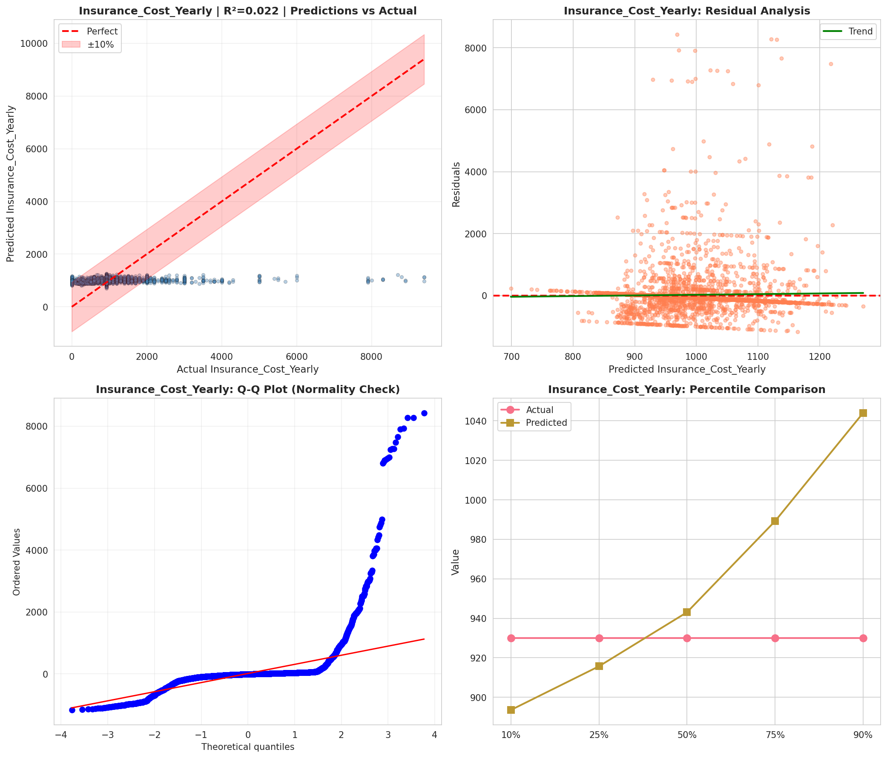
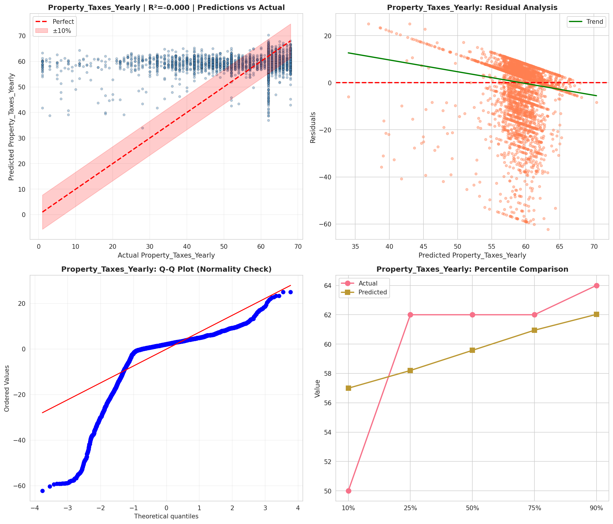

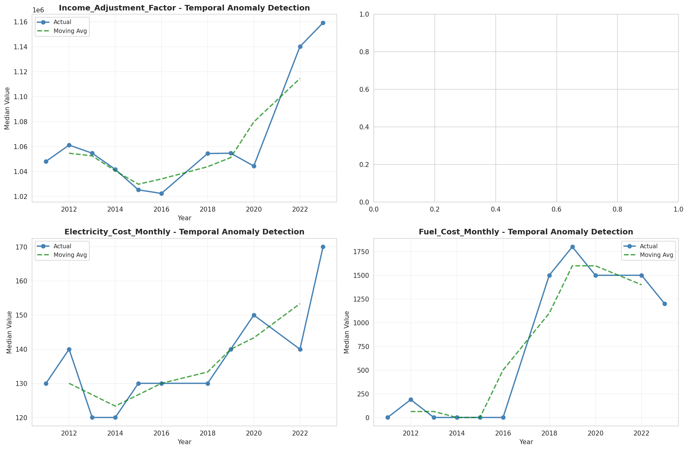
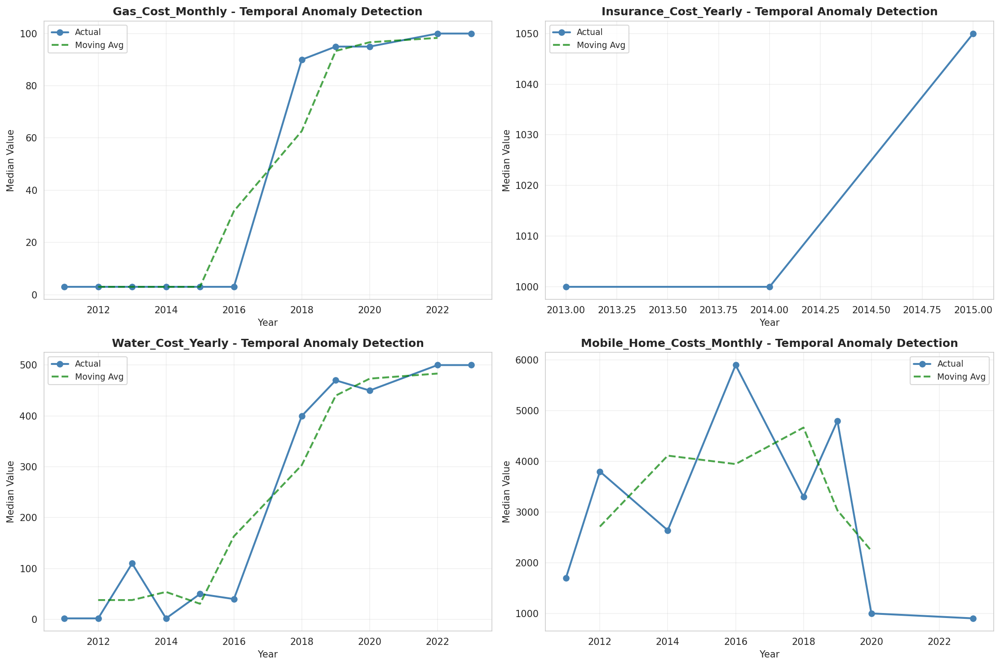
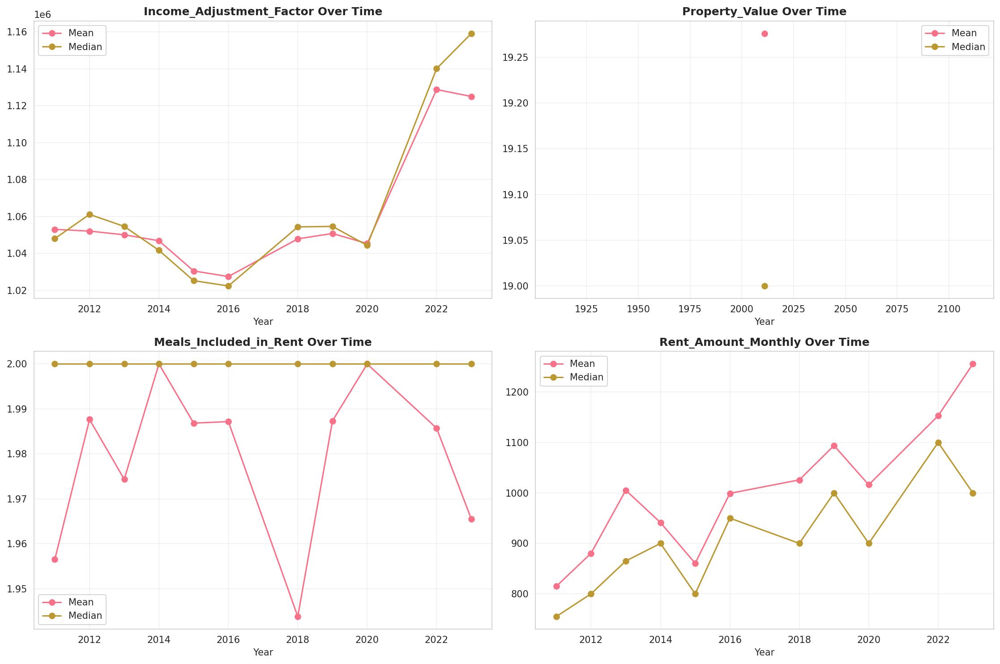
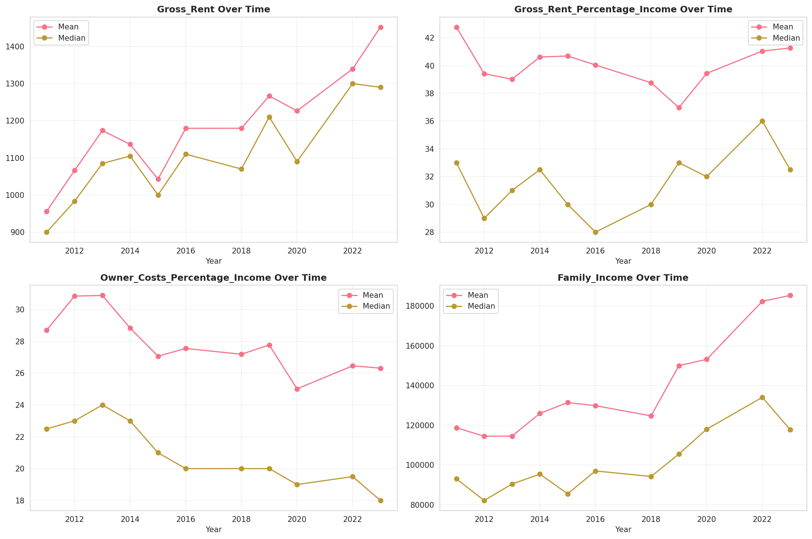
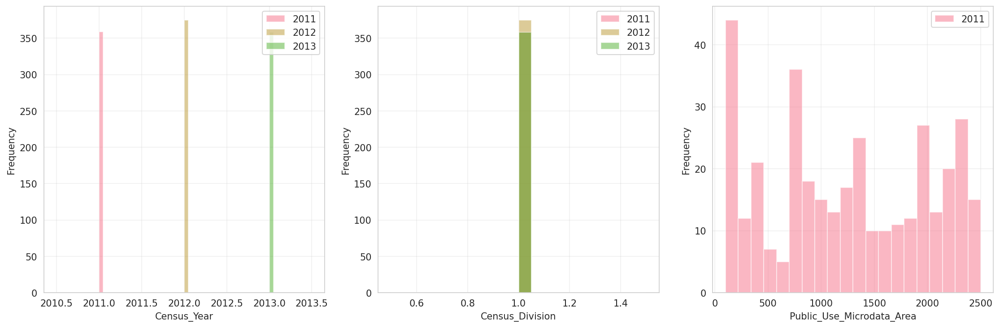
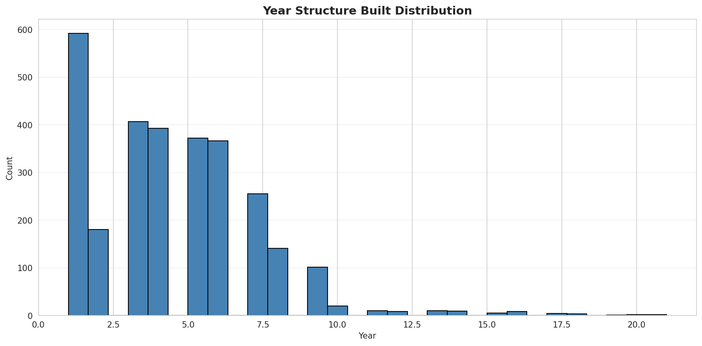
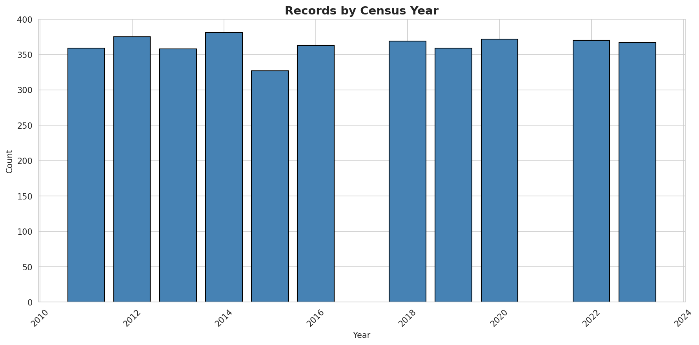
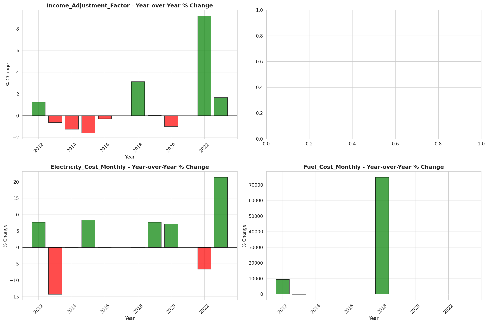
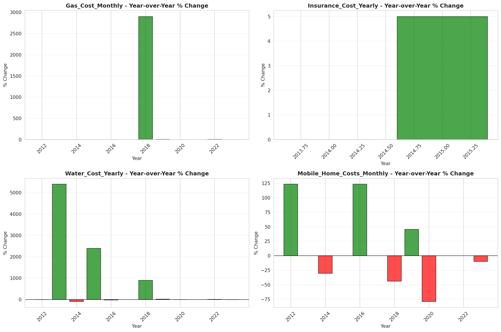
