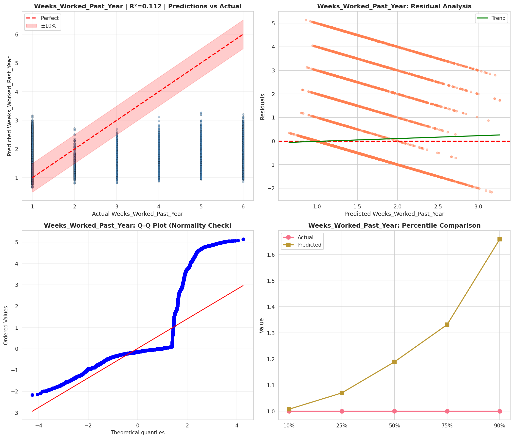
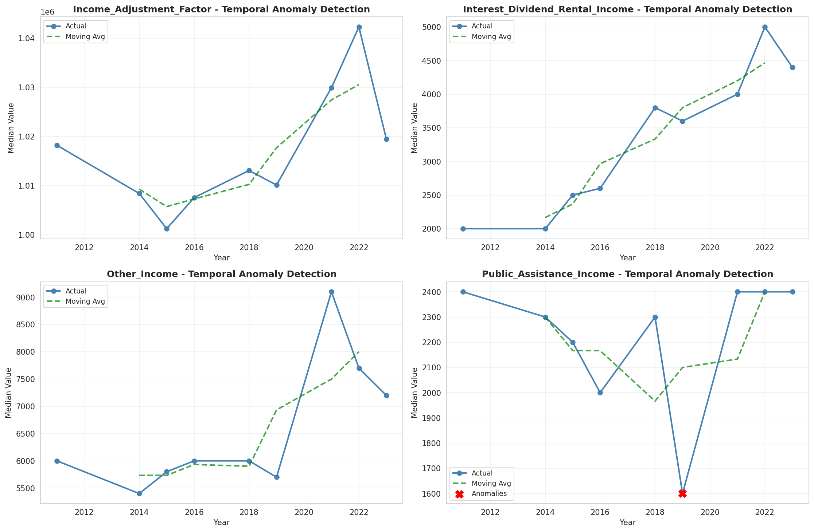
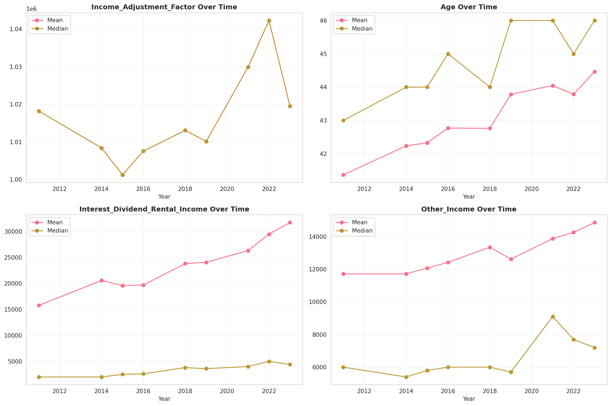
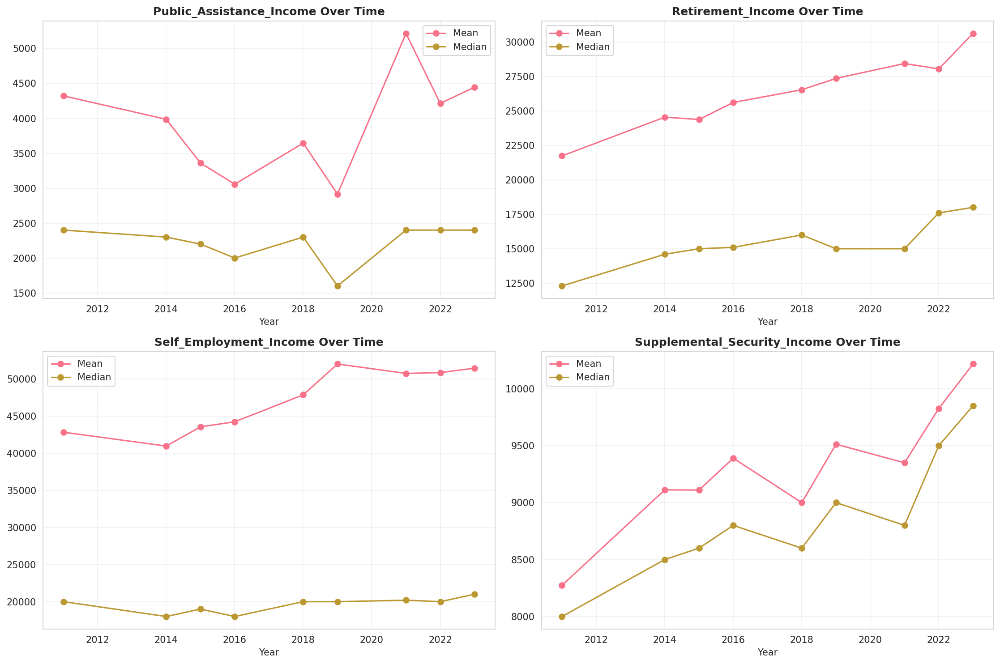
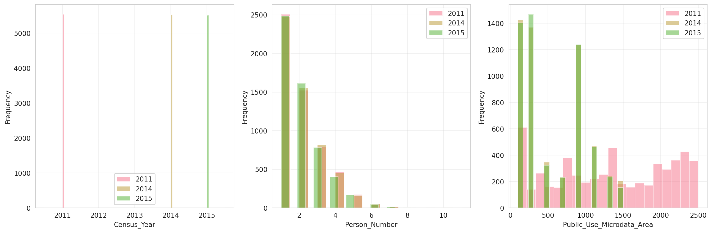
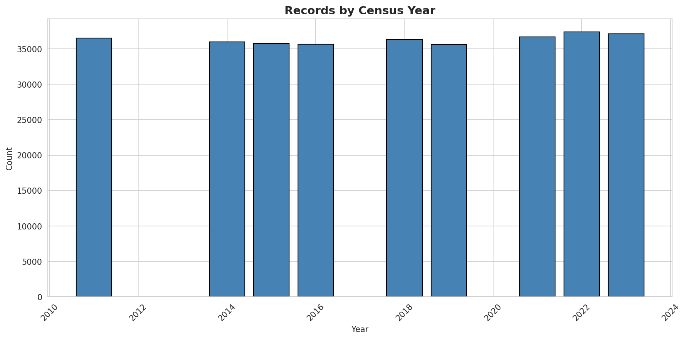
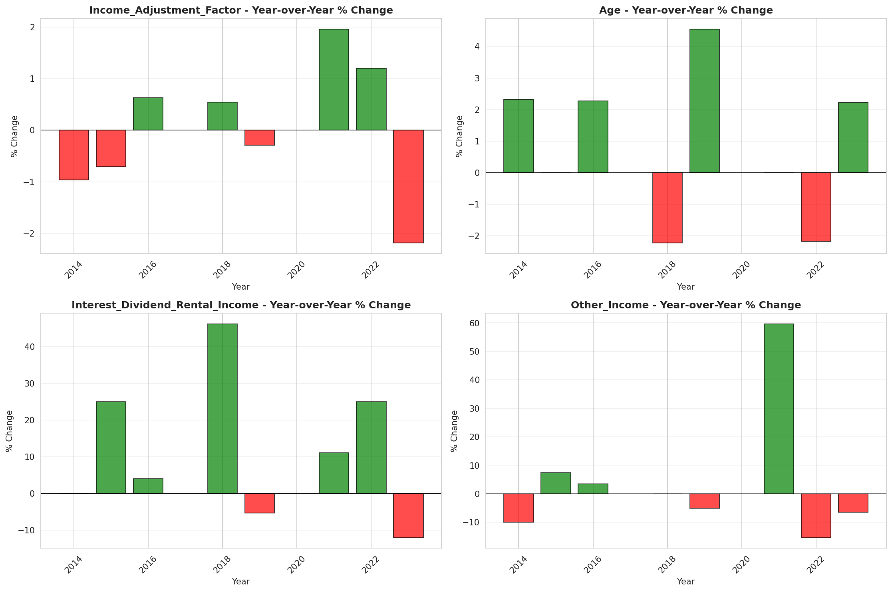
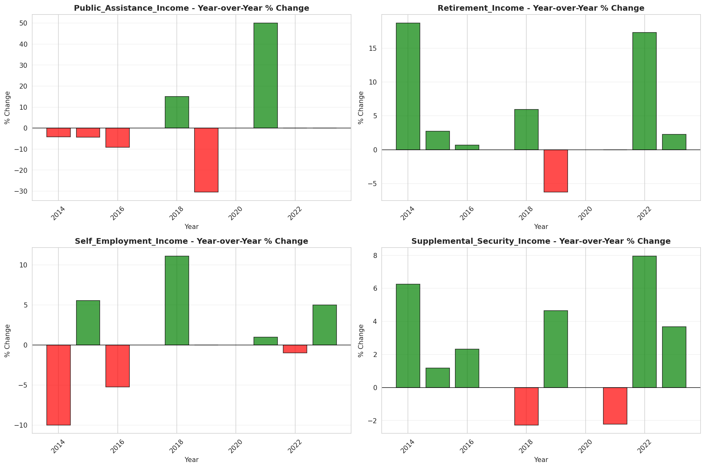

# Temporal Analysis

## Year Distribution

- 2011: 36,538 records

- 2014: 35,985 records

- 2015: 35,787 records

- 2016: 35,657 records

- 2018: 36,287 records

- 2019: 35,578 records

- 2021: 36,665 records

- 2022: 37,369 records

- 2023: 37,112 records

## Temporal Trends

- Census_Year: {np.int64(2011): {'mean': 2011.0, 'median': 2011.0, 'std': 0.0}, np.int64(2014): {'mean': 2014.0, 'median': 2014.0, 'std': 0.0}, np.int64(2015): {'mean': 2015.0, 'median': 2015.0, 'std': 0.0}, np.int64(2016): {'mean': 2016.0, 'median': 2016.0, 'std': 0.0}, np.int64(2018): {'mean': 2018.0, 'median': 2018.0, 'std': 0.0}, np.int64(2019): {'mean': 2019.0, 'median': 2019.0, 'std': 0.0}, np.int64(2021): {'mean': 2021.0, 'median': 2021.0, 'std': 0.0}, np.int64(2022): {'mean': 2022.0, 'median': 2022.0, 'std': 0.0}, np.int64(2023): {'mean': 2023.0, 'median': 2023.0, 'std': 0.0}}

- Person_Number: {np.int64(2011): {'mean': 2.0166128414253652, 'median': 2.0, 'std': 1.2258328715197038}, np.int64(2014): {'mean': 2.009531749340003, 'median': 2.0, 'std': 1.2224479160967876}, np.int64(2015): {'mean': 1.9946628664040014, 'median': 2.0, 'std': 1.202816008447833}, np.int64(2016): {'mean': 1.9986818857447346, 'median': 2.0, 'std': 1.2291900045670408}, np.int64(2018): {'mean': 2.000440929258412, 'median': 2.0, 'std': 1.214361244994388}, np.int64(2019): {'mean': 1.9604530889875766, 'median': 2.0, 'std': 1.1855838947747188}, np.int64(2021): {'mean': 1.9769534978862675, 'median': 2.0, 'std': 1.2110788233954985}, np.int64(2022): {'mean': 1.9705370761861436, 'median': 2.0, 'std': 1.2314406979175705}, np.int64(2023): {'mean': 1.987012287130847, 'median': 2.0, 'std': 1.217808405477545}}

- Public_Use_Microdata_Area: {np.int64(2011): {'mean': 1309.8910723082818, 'median': 1300.0, 'std': 756.6122090125345}, np.int64(2014): {'mean': 555.3322217590663, 'median': 306.0, 'std': 418.7356183791865}, np.int64(2015): {'mean': 558.9676977673457, 'median': 306.0, 'std': 419.60668839564954}, np.int64(2016): {'mean': 556.4444569088819, 'median': 306.0, 'std': 418.6915710996136}, np.int64(2018): {'mean': 559.2626284895417, 'median': 306.0, 'std': 421.0841073633917}, np.int64(2019): {'mean': 561.4554781044466, 'median': 306.0, 'std': 423.4133137328189}, np.int64(2021): {'mean': 560.5919541797355, 'median': 306.0, 'std': 420.3935520501576}, np.int64(2022): {'mean': 20522.14512028687, 'median': 20601.0, 'std': 272.9818730789096}, np.int64(2023): {'mean': 20520.697267730113, 'median': 20601.0, 'std': 272.35069461939065}}

- State_Code: {np.int64(2011): {'mean': 9.0, 'median': 9.0, 'std': 0.0}, np.int64(2014): {'mean': 9.0, 'median': 9.0, 'std': 0.0}, np.int64(2015): {'mean': 9.0, 'median': 9.0, 'std': 0.0}, np.int64(2016): {'mean': 9.0, 'median': 9.0, 'std': 0.0}, np.int64(2018): {'mean': 9.0, 'median': 9.0, 'std': 0.0}, np.int64(2019): {'mean': 9.0, 'median': 9.0, 'std': 0.0}, np.int64(2021): {'mean': 9.0, 'median': 9.0, 'std': 0.0}, np.int64(2022): {'mean': 9.0, 'median': 9.0, 'std': 0.0}, np.int64(2023): {'mean': None, 'median': None, 'std': None}}

- Income_Adjustment_Factor: {np.int64(2011): {'mean': 1018237.0, 'median': 1018237.0, 'std': 0.0}, np.int64(2014): {'mean': 1008425.0, 'median': 1008425.0, 'std': 0.0}, np.int64(2015): {'mean': 1001264.0, 'median': 1001264.0, 'std': 0.0}, np.int64(2016): {'mean': 1007588.0, 'median': 1007588.0, 'std': 0.0}, np.int64(2018): {'mean': 1013097.0, 'median': 1013097.0, 'std': 0.0}, np.int64(2019): {'mean': 1010145.0, 'median': 1010145.0, 'std': 0.0}, np.int64(2021): {'mean': 1029928.0, 'median': 1029928.0, 'std': 0.0}, np.int64(2022): {'mean': 1042311.0, 'median': 1042311.0, 'std': 0.0}, np.int64(2023): {'mean': 1019518.0, 'median': 1019518.0, 'std': 0.0}}

- Person_Weight: {np.int64(2011): {'mean': 97.99958946849856, 'median': 78.0, 'std': 70.57781163543578}, np.int64(2014): {'mean': 99.94934000277894, 'median': 78.0, 'std': 70.14119356289214}, np.int64(2015): {'mean': 100.34051471204627, 'median': 78.0, 'std': 71.88163339451475}, np.int64(2016): {'mean': 100.30153966963009, 'median': 78.0, 'std': 71.26303828868826}, np.int64(2018): {'mean': 98.45578306280485, 'median': 79.0, 'std': 69.28950431128324}, np.int64(2019): {'mean': 100.21043903535893, 'median': 77.0, 'std': 79.52451265962995}, np.int64(2021): {'mean': 98.33893358789035, 'median': 74.0, 'std': 76.12747469368472}, np.int64(2022): {'mean': 97.03778533008644, 'median': 71.0, 'std': 82.30369342489229}, np.int64(2023): {'mean': 97.46647984479414, 'median': 71.0, 'std': 81.84296898204596}}

- Age: {np.int64(2011): {'mean': 41.36786359406645, 'median': 43.0, 'std': 23.666663705419015}, np.int64(2014): {'mean': 42.237543420869805, 'median': 44.0, 'std': 23.58938840215698}, np.int64(2015): {'mean': 42.32947718445246, 'median': 44.0, 'std': 23.654577598668517}, np.int64(2016): {'mean': 42.77137728917183, 'median': 45.0, 'std': 23.593434776714624}, np.int64(2018): {'mean': 42.76459889216524, 'median': 44.0, 'std': 23.804336858659234}, np.int64(2019): {'mean': 43.78408004946877, 'median': 46.0, 'std': 23.800265385101625}, np.int64(2021): {'mean': 44.046583935633436, 'median': 46.0, 'std': 24.02627300539412}, np.int64(2022): {'mean': 43.786561053279456, 'median': 45.0, 'std': 24.024148235281157}, np.int64(2023): {'mean': 44.463327225695195, 'median': 46.0, 'std': 24.139546125896743}}

- Citizenship_Status: {np.int64(2011): {'mean': 1.4520772893973397, 'median': 1.0, 'std': 1.1431060755466584}, np.int64(2014): {'mean': 1.4608586911213006, 'median': 1.0, 'std': 1.155908702965837}, np.int64(2015): {'mean': 1.478106575013273, 'median': 1.0, 'std': 1.171266833443359}, np.int64(2016): {'mean': 1.478531564629666, 'median': 1.0, 'std': 1.1683006485703817}, np.int64(2018): {'mean': 1.4836718383994267, 'median': 1.0, 'std': 1.1705907190111515}, np.int64(2019): {'mean': 1.4768958345044692, 'median': 1.0, 'std': 1.1616840146984833}, np.int64(2021): {'mean': 1.4963043774717033, 'median': 1.0, 'std': 1.1834942600726865}, np.int64(2022): {'mean': 1.5145441408654232, 'median': 1.0, 'std': 1.2004060860588859}, np.int64(2023): {'mean': 1.5205324423367106, 'median': 1.0, 'std': 1.2103355468611963}}

- Class_of_Worker: {np.int64(2011): {'mean': 2.142375886524823, 'median': 1.0, 'std': 1.9186280026350406}, np.int64(2014): {'mean': 2.1124336855244974, 'median': 1.0, 'std': 1.900470906811636}, np.int64(2015): {'mean': 2.1204917291873815, 'median': 1.0, 'std': 1.917658283009481}, np.int64(2016): {'mean': 2.1239203401208324, 'median': 1.0, 'std': 1.9080156800721684}, np.int64(2018): {'mean': 2.0991135462604125, 'median': 1.0, 'std': 1.8936730238780997}, np.int64(2019): {'mean': 2.0931596959864884, 'median': 1.0, 'std': 1.8483815179253924}, np.int64(2021): {'mean': 2.111320754716981, 'median': 1.0, 'std': 1.853734718877648}, np.int64(2022): {'mean': 2.121789949662998, 'median': 1.0, 'std': 1.8651625991919618}, np.int64(2023): {'mean': 2.09375807145932, 'median': 1.0, 'std': 1.8486561587262516}}

- English_Speaking_Ability: {np.int64(2011): {'mean': 1.5691561884562946, 'median': 1.0, 'std': 0.8692281668560978}, np.int64(2014): {'mean': 1.5681530676786843, 'median': 1.0, 'std': 0.8508608945498615}, np.int64(2015): {'mean': 1.5433022758515351, 'median': 1.0, 'std': 0.8297178340878886}, np.int64(2016): {'mean': 1.524235875270145, 'median': 1.0, 'std': 0.8334980508120681}, np.int64(2018): {'mean': 1.5720837792386486, 'median': 1.0, 'std': 0.8512683914756443}, np.int64(2019): {'mean': 1.5186526050684717, 'median': 1.0, 'std': 0.8262117719142298}, np.int64(2021): {'mean': 1.5695514272768465, 'median': 1.0, 'std': 0.8546320888027376}, np.int64(2022): {'mean': 1.5482675032083273, 'median': 1.0, 'std': 0.8460262007236496}, np.int64(2023): {'mean': 1.543241695303551, 'median': 1.0, 'std': 0.8351902464820491}}

- Fertility_Status: {np.int64(2011): {'mean': 1.9553732963454349, 'median': 2.0, 'std': 0.20649528793223368}, np.int64(2014): {'mean': 1.9559085133418044, 'median': 2.0, 'std': 0.205311430752435}, np.int64(2015): {'mean': 1.9564883542359868, 'median': 2.0, 'std': 0.20401889436754947}, np.int64(2016): {'mean': 1.9602752174477476, 'median': 2.0, 'std': 0.19532454284345552}, np.int64(2018): {'mean': 1.9589889089502193, 'median': 2.0, 'std': 0.1983286520655205}, np.int64(2019): {'mean': 1.9592087312414734, 'median': 2.0, 'std': 0.19781981663322834}, np.int64(2021): {'mean': 1.9546416291986246, 'median': 2.0, 'std': 0.20810265708573583}, np.int64(2022): {'mean': 1.954650565262076, 'median': 2.0, 'std': 0.20808273834551433}, np.int64(2023): {'mean': 1.9491724227811809, 'median': 2.0, 'std': 0.21965978910942746}}

- Marital_Status: {np.int64(2011): {'mean': 2.9490940938201327, 'median': 3.0, 'std': 1.8602200453552988}, np.int64(2014): {'mean': 2.939113519522023, 'median': 3.0, 'std': 1.8587695908819197}, np.int64(2015): {'mean': 2.940481180316875, 'median': 3.0, 'std': 1.863017140340035}, np.int64(2016): {'mean': 2.9283170205008835, 'median': 3.0, 'std': 1.8587426472927138}, np.int64(2018): {'mean': 2.944553145754678, 'median': 3.0, 'std': 1.8568962657194983}, np.int64(2019): {'mean': 2.9040418235988534, 'median': 3.0, 'std': 1.857249192170255}, np.int64(2021): {'mean': 2.9378426292104187, 'median': 3.0, 'std': 1.8595495384435068}, np.int64(2022): {'mean': 2.943455805614279, 'median': 3.0, 'std': 1.8633147412656057}, np.int64(2023): {'mean': 2.9118883380038802, 'median': 3.0, 'std': 1.8574822990008966}}

- Mobility_Status: {np.int64(2011): {'mean': 1.2101097567701726, 'median': 1.0, 'std': 0.6091280903929184}, np.int64(2014): {'mean': 1.2239433069101706, 'median': 1.0, 'std': 0.6252522910682417}, np.int64(2015): {'mean': 1.225340207928324, 'median': 1.0, 'std': 0.6277812907886589}, np.int64(2016): {'mean': 1.2126793988021245, 'median': 1.0, 'std': 0.6115835622531416}, np.int64(2018): {'mean': 1.2215833333333332, 'median': 1.0, 'std': 0.6226247624103295}, np.int64(2019): {'mean': 1.217026820357416, 'median': 1.0, 'std': 0.6171045643797369}, np.int64(2021): {'mean': 1.2152107564134291, 'median': 1.0, 'std': 0.616189448165384}, np.int64(2022): {'mean': 1.2225610578869248, 'median': 1.0, 'std': 0.6236019924724099}, np.int64(2023): {'mean': 1.193905591076044, 'median': 1.0, 'std': 0.5865999912838433}}

- Military_Service: {np.int64(2011): {'mean': 4.7984156126750985, 'median': 5.0, 'std': 0.6136670114679013}, np.int64(2014): {'mean': 3.824363475237738, 'median': 4.0, 'std': 0.5607769809926308}, np.int64(2015): {'mean': 3.8392857142857144, 'median': 4.0, 'std': 0.5391505591505895}, np.int64(2016): {'mean': 3.8400666530640004, 'median': 4.0, 'std': 0.5362186773755038}, np.int64(2018): {'mean': 3.8513690576180077, 'median': 4.0, 'std': 0.5186501788552125}, np.int64(2019): {'mean': 3.8528776006484735, 'median': 4.0, 'std': 0.5175716318639746}, np.int64(2021): {'mean': 3.8663455552278907, 'median': 4.0, 'std': 0.49725056762121883}, np.int64(2022): {'mean': 3.875088237181544, 'median': 4.0, 'std': 0.4802106103591932}, np.int64(2023): {'mean': 3.871191135734072, 'median': 4.0, 'std': 0.4867678429163374}}

- Travel_Time_To_Work_Minutes: {np.int64(2011): {'mean': 25.273348660908468, 'median': 20.0, 'std': 22.328525392129396}, np.int64(2014): {'mean': 25.895045512859674, 'median': 20.0, 'std': 22.450586132765817}, np.int64(2015): {'mean': 26.897346111315887, 'median': 20.0, 'std': 23.39989412091827}, np.int64(2016): {'mean': 26.879325964848704, 'median': 20.0, 'std': 24.040242311157876}, np.int64(2018): {'mean': 27.608953969873372, 'median': 20.0, 'std': 23.879699827718493}, np.int64(2019): {'mean': 28.01784314907469, 'median': 20.0, 'std': 25.06983821138014}, np.int64(2021): {'mean': 25.672082498701684, 'median': 20.0, 'std': 22.385592471665376}, np.int64(2022): {'mean': 27.169384180029645, 'median': 20.0, 'std': 24.04535246182162}, np.int64(2023): {'mean': 27.367976976911503, 'median': 20.0, 'std': 24.470271802504083}}

- Vehicle_Occupancy: {np.int64(2011): {'mean': 1.1384180790960452, 'median': 1.0, 'std': 0.569373742786266}, np.int64(2014): {'mean': 1.1403437542292598, 'median': 1.0, 'std': 0.6116842432456194}, np.int64(2015): {'mean': 1.1258892878921336, 'median': 1.0, 'std': 0.5481366940990503}, np.int64(2016): {'mean': 1.1227309129738388, 'median': 1.0, 'std': 0.5071271948864889}, np.int64(2018): {'mean': 1.135161864574405, 'median': 1.0, 'std': 0.5338914696697792}, np.int64(2019): {'mean': 1.1229568350123424, 'median': 1.0, 'std': 0.5202331697539219}, np.int64(2021): {'mean': 1.11710983593308, 'median': 1.0, 'std': 0.4903949601289736}, np.int64(2022): {'mean': 1.1403040415276233, 'median': 1.0, 'std': 0.5429181040836146}, np.int64(2023): {'mean': 1.141841935252315, 'median': 1.0, 'std': 0.5576409350889001}}

- Transportation_To_Work: {np.int64(2011): {'mean': 2.0177325925050242, 'median': 1.0, 'std': 2.8371149970190004}, np.int64(2014): {'mean': 2.0480440452042887, 'median': 1.0, 'std': 2.8740934785886}, np.int64(2015): {'mean': 2.0463926515900237, 'median': 1.0, 'std': 2.87554826586238}, np.int64(2016): {'mean': 2.065206229676536, 'median': 1.0, 'std': 2.9008850425505597}, np.int64(2018): {'mean': 2.089680036052276, 'median': 1.0, 'std': 2.9377829986655413}, np.int64(2019): {'mean': None, 'median': None, 'std': None}, np.int64(2021): {'mean': None, 'median': None, 'std': None}, np.int64(2022): {'mean': None, 'median': None, 'std': None}, np.int64(2023): {'mean': None, 'median': None, 'std': None}}

- Language_Other_Than_English: {np.int64(2011): {'mean': 1.8103215424844115, 'median': 2.0, 'std': 0.3920522375300099}, np.int64(2014): {'mean': 1.816232237817104, 'median': 2.0, 'std': 0.38730031064737414}, np.int64(2015): {'mean': 1.8090752675629174, 'median': 2.0, 'std': 0.3930356012692796}, np.int64(2016): {'mean': 1.810595871586457, 'median': 2.0, 'std': 0.3918350336678148}, np.int64(2018): {'mean': 1.8116342692584593, 'median': 2.0, 'std': 0.39100957157068283}, np.int64(2019): {'mean': 1.8139023961567755, 'median': 2.0, 'std': 0.3891911132977568}, np.int64(2021): {'mean': 1.8115286080273272, 'median': 2.0, 'std': 0.39109369763655694}, np.int64(2022): {'mean': 1.8037827704876752, 'median': 2.0, 'std': 0.39714032938793675}, np.int64(2023): {'mean': 1.8031067632714048, 'median': 2.0, 'std': 0.3976565705331349}}

- Grandparents_Living_With_Grandchildren: {np.int64(2011): {'mean': 1.9768294224206935, 'median': 2.0, 'std': 0.15044818202298726}, np.int64(2014): {'mean': 1.9741862129953258, 'median': 2.0, 'std': 0.1585827683668625}, np.int64(2015): {'mean': 1.9761612916860392, 'median': 2.0, 'std': 0.15254968999458954}, np.int64(2016): {'mean': 1.976169387152558, 'median': 2.0, 'std': 0.15252441101898914}, np.int64(2018): {'mean': 1.9779317210768657, 'median': 2.0, 'std': 0.14690869699918557}, np.int64(2019): {'mean': 1.9785829241117485, 'median': 2.0, 'std': 0.14477309713454564}, np.int64(2021): {'mean': 1.9775240671493357, 'median': 2.0, 'std': 0.14822833512532055}, np.int64(2022): {'mean': 1.9777095148078134, 'median': 2.0, 'std': 0.14762952883053895}, np.int64(2023): {'mean': 1.979704725176269, 'median': 2.0, 'std': 0.14101117409616196}}

- Months_Responsible_For_Grandchildren: {np.int64(2011): {'mean': 3.49009900990099, 'median': 4.0, 'std': 1.4668479049369503}, np.int64(2014): {'mean': 3.733695652173913, 'median': 4.0, 'std': 1.3669620238418485}, np.int64(2015): {'mean': 3.691011235955056, 'median': 4.0, 'std': 1.2667089302587768}, np.int64(2016): {'mean': 3.8846153846153846, 'median': 4.0, 'std': 1.2849578301680462}, np.int64(2018): {'mean': 3.9367088607594938, 'median': 5.0, 'std': 1.3098526406339623}, np.int64(2019): {'mean': 3.587096774193548, 'median': 4.0, 'std': 1.361755440666323}, np.int64(2021): {'mean': 3.893939393939394, 'median': 5.0, 'std': 1.354988384827126}, np.int64(2022): {'mean': 3.669491525423729, 'median': 4.0, 'std': 1.3715988844875777}, np.int64(2023): {'mean': 3.958677685950413, 'median': 5.0, 'std': 1.3063734421090827}}

- Grandparents_Responsible_For_Grandchildren: {np.int64(2011): {'mean': 1.6327272727272728, 'median': 2.0, 'std': 0.48250052444059033}, np.int64(2014): {'mean': 1.699836867862969, 'median': 2.0, 'std': 0.45870303037635174}, np.int64(2015): {'mean': 1.6843971631205674, 'median': 2.0, 'std': 0.46516807832565327}, np.int64(2016): {'mean': 1.7238938053097346, 'median': 2.0, 'std': 0.447466139668133}, np.int64(2018): {'mean': 1.7030075187969924, 'median': 2.0, 'std': 0.4573632527354786}, np.int64(2019): {'mean': 1.701348747591522, 'median': 2.0, 'std': 0.45810811194846196}, np.int64(2021): {'mean': 1.7663716814159292, 'median': 2.0, 'std': 0.42351338232957736}, np.int64(2022): {'mean': 1.7915194346289753, 'median': 2.0, 'std': 0.40658146009431273}, np.int64(2023): {'mean': 1.7677543186180422, 'median': 2.0, 'std': 0.4226707041420866}}

- Interest_Dividend_Rental_Income: {np.int64(2011): {'mean': 15769.63513750219, 'median': 2000.0, 'std': 42973.06296729374}, np.int64(2014): {'mean': 20552.00815458252, 'median': 2000.0, 'std': 63298.45074278252}, np.int64(2015): {'mean': 19570.219967385397, 'median': 2500.0, 'std': 52351.11369591303}, np.int64(2016): {'mean': 19695.007473841553, 'median': 2600.0, 'std': 52131.9917829115}, np.int64(2018): {'mean': 23807.54833565876, 'median': 3800.0, 'std': 63419.86781177075}, np.int64(2019): {'mean': 24057.48332679482, 'median': 3600.0, 'std': 64863.45950086878}, np.int64(2021): {'mean': 26312.27984758679, 'median': 4000.0, 'std': 71021.1107220012}, np.int64(2022): {'mean': 29487.218340611355, 'median': 5000.0, 'std': 78836.64074218304}, np.int64(2023): {'mean': 31701.447033898305, 'median': 4400.0, 'std': 85122.49400079643}}

- Military_Service_Period_1: {np.int64(2011): {'mean': 0.08798202920254586, 'median': 0.0, 'std': 0.28332180399812124}, np.int64(2014): {'mean': 0.12494577006507593, 'median': 0.0, 'std': 0.33072916221867354}, np.int64(2015): {'mean': 0.1216280170373876, 'median': 0.0, 'std': 0.32693306209905065}, np.int64(2016): {'mean': 0.1431316042267051, 'median': 0.0, 'std': 0.35029114131124545}, np.int64(2018): {'mean': 0.15733197556008147, 'median': 0.0, 'std': 0.36420621055438573}, np.int64(2019): {'mean': 0.17379958246346555, 'median': 0.0, 'std': 0.3790359759165219}, np.int64(2021): {'mean': 0.20033296337402887, 'median': 0.0, 'std': 0.40036060939858925}, np.int64(2022): {'mean': 0.2056404230317274, 'median': 0.0, 'std': 0.4042876112710065}, np.int64(2023): {'mean': 0.21444954128440366, 'median': 0.0, 'std': 0.4105576518821798}}

- Military_Service_Period_2: {np.int64(2011): {'mean': 0.09696742792961438, 'median': 0.0, 'std': 0.29596881868753044}, np.int64(2014): {'mean': 0.11323210412147505, 'median': 0.0, 'std': 0.3169450673302697}, np.int64(2015): {'mean': 0.12541410317084714, 'median': 0.0, 'std': 0.3312662679393892}, np.int64(2016): {'mean': 0.13160422670509125, 'median': 0.0, 'std': 0.33814120173787887}, np.int64(2018): {'mean': 0.11761710794297352, 'median': 0.0, 'std': 0.32223623882868013}, np.int64(2019): {'mean': 0.12734864300626306, 'median': 0.0, 'std': 0.3334501431501057}, np.int64(2021): {'mean': 0.1453940066592675, 'median': 0.0, 'std': 0.3525954927185499}, np.int64(2022): {'mean': 0.1345475910693302, 'median': 0.0, 'std': 0.34133999666694137}, np.int64(2023): {'mean': 0.17603211009174313, 'median': 0.0, 'std': 0.38095671921793056}}

- Military_Service_Period_3: {np.int64(2011): {'mean': 0.12205166604268064, 'median': 0.0, 'std': 0.3274067651087617}, np.int64(2014): {'mean': None, 'median': None, 'std': None}, np.int64(2015): {'mean': None, 'median': None, 'std': None}, np.int64(2016): {'mean': None, 'median': None, 'std': None}, np.int64(2018): {'mean': None, 'median': None, 'std': None}, np.int64(2019): {'mean': None, 'median': None, 'std': None}, np.int64(2021): {'mean': None, 'median': None, 'std': None}, np.int64(2022): {'mean': None, 'median': None, 'std': None}, np.int64(2023): {'mean': None, 'median': None, 'std': None}}

- Military_Service_Period_4: {np.int64(2011): {'mean': 0.08199176338450019, 'median': 0.0, 'std': 0.2744035437108028}, np.int64(2014): {'mean': None, 'median': None, 'std': None}, np.int64(2015): {'mean': None, 'median': None, 'std': None}, np.int64(2016): {'mean': None, 'median': None, 'std': None}, np.int64(2018): {'mean': None, 'median': None, 'std': None}, np.int64(2019): {'mean': None, 'median': None, 'std': None}, np.int64(2021): {'mean': None, 'median': None, 'std': None}, np.int64(2022): {'mean': None, 'median': None, 'std': None}, np.int64(2023): {'mean': None, 'median': None, 'std': None}}

- Military_Service_Period_5: {np.int64(2011): {'mean': 0.3343317109696743, 'median': 0.0, 'std': 0.47184464771210677}, np.int64(2014): {'mean': 0.3665943600867679, 'median': 0.0, 'std': 0.48197895987617184}, np.int64(2015): {'mean': 0.34926644581164223, 'median': 0.0, 'std': 0.4768511392373463}, np.int64(2016): {'mean': 0.3780019212295869, 'median': 0.0, 'std': 0.48500458886662023}, np.int64(2018): {'mean': 0.38085539714867617, 'median': 0.0, 'std': 0.48572079242920924}, np.int64(2019): {'mean': 0.37734864300626303, 'median': 0.0, 'std': 0.48484980910836023}, np.int64(2021): {'mean': 0.38290788013318533, 'median': 0.0, 'std': 0.4862310505154346}, np.int64(2022): {'mean': 0.3707403055229142, 'median': 0.0, 'std': 0.48314498988933763}, np.int64(2023): {'mean': 0.35951834862385323, 'median': 0.0, 'std': 0.4799968895797361}}

- Military_Service_Period_6: {np.int64(2011): {'mean': 0.09584425308873082, 'median': 0.0, 'std': 0.2944326552335815}, np.int64(2014): {'mean': None, 'median': None, 'std': None}, np.int64(2015): {'mean': None, 'median': None, 'std': None}, np.int64(2016): {'mean': None, 'median': None, 'std': None}, np.int64(2018): {'mean': None, 'median': None, 'std': None}, np.int64(2019): {'mean': None, 'median': None, 'std': None}, np.int64(2021): {'mean': None, 'median': None, 'std': None}, np.int64(2022): {'mean': None, 'median': None, 'std': None}, np.int64(2023): {'mean': None, 'median': None, 'std': None}}

- Military_Service_Period_7: {np.int64(2011): {'mean': 0.11381505054286783, 'median': 0.0, 'std': 0.3176459672928988}, np.int64(2014): {'mean': None, 'median': None, 'std': None}, np.int64(2015): {'mean': None, 'median': None, 'std': None}, np.int64(2016): {'mean': None, 'median': None, 'std': None}, np.int64(2018): {'mean': None, 'median': None, 'std': None}, np.int64(2019): {'mean': None, 'median': None, 'std': None}, np.int64(2021): {'mean': None, 'median': None, 'std': None}, np.int64(2022): {'mean': None, 'median': None, 'std': None}, np.int64(2023): {'mean': None, 'median': None, 'std': None}}

- Military_Service_Period_8: {np.int64(2011): {'mean': 0.1497566454511419, 'median': 0.0, 'std': 0.3568995398993295}, np.int64(2014): {'mean': 0.1405639913232104, 'median': 0.0, 'std': 0.34764664347606433}, np.int64(2015): {'mean': 0.13345953620444864, 'median': 0.0, 'std': 0.3401512105199036}, np.int64(2016): {'mean': 0.12247838616714697, 'median': 0.0, 'std': 0.3279162669045466}, np.int64(2018): {'mean': 0.10183299389002037, 'median': 0.0, 'std': 0.3025055846471905}, np.int64(2019): {'mean': 0.10281837160751565, 'median': 0.0, 'std': 0.3038007977215504}, np.int64(2021): {'mean': 0.07269700332963375, 'median': 0.0, 'std': 0.25971056858697106}, np.int64(2022): {'mean': 0.06580493537015276, 'median': 0.0, 'std': 0.24801368137356336}, np.int64(2023): {'mean': 0.06708715596330275, 'median': 0.0, 'std': 0.25024463389691654}}

- Military_Service_Period_9: {np.int64(2011): {'mean': 0.020965930363159864, 'median': 0.0, 'std': 0.14329706173713255}, np.int64(2014): {'mean': 0.020390455531453362, 'median': 0.0, 'std': 0.14136249298435719}, np.int64(2015): {'mean': 0.011358258400378608, 'median': 0.0, 'std': 0.10599323207379928}, np.int64(2016): {'mean': 0.01633045148895293, 'median': 0.0, 'std': 0.12677336903801678}, np.int64(2018): {'mean': 0.011710794297352342, 'median': 0.0, 'std': 0.10760830587934946}, np.int64(2019): {'mean': 0.008350730688935281, 'median': 0.0, 'std': 0.09102373462885578}, np.int64(2021): {'mean': None, 'median': None, 'std': None}, np.int64(2022): {'mean': None, 'median': None, 'std': None}, np.int64(2023): {'mean': None, 'median': None, 'std': None}}

- Military_Service_Period_10: {np.int64(2011): {'mean': 0.14339198801946837, 'median': 0.0, 'std': 0.3505377722991391}, np.int64(2014): {'mean': 0.09934924078091106, 'median': 0.0, 'std': 0.2991952631565213}, np.int64(2015): {'mean': 0.08707998106956934, 'median': 0.0, 'std': 0.28201896854456265}, np.int64(2016): {'mean': 0.06532180595581172, 'median': 0.0, 'std': 0.24715219363550409}, np.int64(2018): {'mean': 0.04684317718940937, 'median': 0.0, 'std': 0.21135666342466294}, np.int64(2019): {'mean': 0.03444676409185804, 'median': 0.0, 'std': 0.18242136053114807}, np.int64(2021): {'mean': 0.020532741398446172, 'median': 0.0, 'std': 0.14185314443244956}, np.int64(2022): {'mean': 0.021151586368977675, 'median': 0.0, 'std': 0.1439318190757538}, np.int64(2023): {'mean': 0.012041284403669725, 'median': 0.0, 'std': 0.10910140721080301}}

- Military_Service_Period_11: {np.int64(2011): {'mean': 0.007487832272557095, 'median': 0.0, 'std': 0.08622382543627215}, np.int64(2014): {'mean': 0.0026030368763557484, 'median': 0.0, 'std': 0.0509645751949446}, np.int64(2015): {'mean': 0.00236630383341221, 'median': 0.0, 'std': 0.04859858225672929}, np.int64(2016): {'mean': 0.0, 'median': 0.0, 'std': 0.0}, np.int64(2018): {'mean': 0.0, 'median': 0.0, 'std': 0.0}, np.int64(2019): {'mean': 0.0005219206680584551, 'median': 0.0, 'std': 0.022845583119247694}, np.int64(2021): {'mean': None, 'median': None, 'std': None}, np.int64(2022): {'mean': None, 'median': None, 'std': None}, np.int64(2023): {'mean': None, 'median': None, 'std': None}}

- Temporary_Absence_From_Work: {np.int64(2011): {'mean': 2.542654583152192, 'median': 3.0, 'std': 0.5335805306634983}, np.int64(2014): {'mean': 2.6064375523889356, 'median': 3.0, 'std': 0.5180604869295347}, np.int64(2015): {'mean': 2.604308313699091, 'median': 3.0, 'std': 0.516914040966167}, np.int64(2016): {'mean': 2.6156680175503233, 'median': 3.0, 'std': 0.5114180767918668}, np.int64(2018): {'mean': 2.6248594297810413, 'median': 3.0, 'std': 0.5078406722585135}, np.int64(2019): {'mean': 2.629016131182509, 'median': 3.0, 'std': 0.5083569374584787}, np.int64(2021): {'mean': 2.6166758126472773, 'median': 3.0, 'std': 0.510937422160119}, np.int64(2022): {'mean': 2.6299354593773727, 'median': 3.0, 'std': 0.50643203882802}, np.int64(2023): {'mean': 2.6200336646870137, 'median': 3.0, 'std': 0.512006723564019}}

- Available_For_Work: {np.int64(2011): {'mean': 4.498812828144334, 'median': 5.0, 'std': 1.2408141223224156}, np.int64(2014): {'mean': 4.679061190276614, 'median': 5.0, 'std': 1.0168901819822538}, np.int64(2015): {'mean': 4.69148434870414, 'median': 5.0, 'std': 0.9923831487141296}, np.int64(2016): {'mean': 4.703587098502863, 'median': 5.0, 'std': 0.973949708811712}, np.int64(2018): {'mean': 4.745782893431237, 'median': 5.0, 'std': 0.9024105675532962}, np.int64(2019): {'mean': 4.727036395147314, 'median': 5.0, 'std': 0.9378306438674786}, np.int64(2021): {'mean': 4.74876529261758, 'median': 5.0, 'std': 0.910155334004937}, np.int64(2022): {'mean': 4.806726145279676, 'median': 5.0, 'std': 0.7898870807440156}, np.int64(2023): {'mean': 4.794867723187347, 'median': 5.0, 'std': 0.8105112559172719}}

- On_Layoff_From_Work: {np.int64(2011): {'mean': 2.4969401063438452, 'median': 3.0, 'std': 0.5462818429229056}, np.int64(2014): {'mean': 2.585247275775356, 'median': 3.0, 'std': 0.5164121333404931}, np.int64(2015): {'mean': 2.5864692022887916, 'median': 3.0, 'std': 0.5116489668025014}, np.int64(2016): {'mean': 2.598084201359815, 'median': 3.0, 'std': 0.508337849515119}, np.int64(2018): {'mean': 2.6069987431368657, 'median': 3.0, 'std': 0.506314412126081}, np.int64(2019): {'mean': 2.616751099853353, 'median': 3.0, 'std': 0.5019052092011208}, np.int64(2021): {'mean': 2.5913037864359727, 'median': 3.0, 'std': 0.5205598368514841}, np.int64(2022): {'mean': 2.6212984054669706, 'median': 3.0, 'std': 0.4973095556828053}, np.int64(2023): {'mean': 2.6125385079556644, 'median': 3.0, 'std': 0.5004910818729292}}

- Looking_For_Work: {np.int64(2011): {'mean': 2.4837641708189815, 'median': 3.0, 'std': 0.6280265494632653}, np.int64(2014): {'mean': 2.570528080469405, 'median': 3.0, 'std': 0.5881261554201306}, np.int64(2015): {'mean': 2.575092561427129, 'median': 3.0, 'std': 0.5790085348401056}, np.int64(2016): {'mean': 2.5854908396690894, 'median': 3.0, 'std': 0.5728083561775045}, np.int64(2018): {'mean': 2.59942448898591, 'median': 3.0, 'std': 0.5591890751152001}, np.int64(2019): {'mean': 2.5966871083855487, 'median': 3.0, 'std': 0.5618885874803303}, np.int64(2021): {'mean': 2.5718712676329125, 'median': 3.0, 'std': 0.5764193793398495}, np.int64(2022): {'mean': 2.6036762844849406, 'median': 3.0, 'std': 0.5480157118924576}, np.int64(2023): {'mean': 2.5955791278940517, 'median': 3.0, 'std': 0.5506230011009218}}

- Informed_Of_Recall: {np.int64(2011): {'mean': 2.872353944420292, 'median': 3.0, 'std': 0.3556294556701216}, np.int64(2014): {'mean': 2.9376697401508802, 'median': 3.0, 'std': 0.25656143059379993}, np.int64(2015): {'mean': 2.9341972399865366, 'median': 3.0, 'std': 0.26866085139807716}, np.int64(2016): {'mean': 2.939143249489232, 'median': 3.0, 'std': 0.25755097651497283}, np.int64(2018): {'mean': 2.9428127273930014, 'median': 3.0, 'std': 0.25240700856846543}, np.int64(2019): {'mean': 2.9324756699106787, 'median': 3.0, 'std': 0.2690092073627543}, np.int64(2021): {'mean': 2.9434132799638464, 'median': 3.0, 'std': 0.24933273206343717}, np.int64(2022): {'mean': 2.9532396861554036, 'median': 3.0, 'std': 0.22364487396246735}, np.int64(2023): {'mean': 2.950805094165846, 'median': 3.0, 'std': 0.23035789942239904}}

- Other_Income: {np.int64(2011): {'mean': 11713.53189577718, 'median': 6000.0, 'std': 15125.91379414714}, np.int64(2014): {'mean': 11719.198910081745, 'median': 5400.0, 'std': 16503.386120321557}, np.int64(2015): {'mean': 12065.484677923703, 'median': 5800.0, 'std': 17245.37939239362}, np.int64(2016): {'mean': 12428.364401683704, 'median': 6000.0, 'std': 17614.65765431404}, np.int64(2018): {'mean': 13352.603015075378, 'median': 6000.0, 'std': 18175.56830919196}, np.int64(2019): {'mean': 12618.985915492958, 'median': 5700.0, 'std': 17860.04330122442}, np.int64(2021): {'mean': 13877.636912462269, 'median': 9100.0, 'std': 14894.84454663032}, np.int64(2022): {'mean': 14259.921568627451, 'median': 7700.0, 'std': 17975.48221181775}, np.int64(2023): {'mean': 14862.332242225859, 'median': 7200.0, 'std': 19145.598798691302}}

- Public_Assistance_Income: {np.int64(2011): {'mean': 4321.890767230169, 'median': 2400.0, 'std': 5275.101525339205}, np.int64(2014): {'mean': 3986.891891891892, 'median': 2300.0, 'std': 4944.399638504879}, np.int64(2015): {'mean': 3360.8814589665653, 'median': 2200.0, 'std': 4173.757963566894}, np.int64(2016): {'mean': 3057.2521739130434, 'median': 2000.0, 'std': 3913.5389623481055}, np.int64(2018): {'mean': 3645.7455268389663, 'median': 2300.0, 'std': 4572.478970439822}, np.int64(2019): {'mean': 2915.3139013452915, 'median': 1600.0, 'std': 3838.7864146367388}, np.int64(2021): {'mean': 5216.0477001703575, 'median': 2400.0, 'std': 6822.037747508988}, np.int64(2022): {'mean': 4214.620390455531, 'median': 2400.0, 'std': 5227.094308497901}, np.int64(2023): {'mean': 4445.56043956044, 'median': 2400.0, 'std': 5480.4329614664175}}

- Retirement_Income: {np.int64(2011): {'mean': 21733.051817921558, 'median': 12300.0, 'std': 25814.086637332486}, np.int64(2014): {'mean': 24542.31217077904, 'median': 14600.0, 'std': 28846.502249763642}, np.int64(2015): {'mean': 24374.01764234162, 'median': 15000.0, 'std': 26235.688015481446}, np.int64(2016): {'mean': 25610.62860136197, 'median': 15100.0, 'std': 30966.527533452183}, np.int64(2018): {'mean': 26528.57217847769, 'median': 16000.0, 'std': 30917.622924589046}, np.int64(2019): {'mean': 27352.83994782933, 'median': 15000.0, 'std': 33728.01315228083}, np.int64(2021): {'mean': 28434.874570135747, 'median': 15000.0, 'std': 38489.67523294615}, np.int64(2022): {'mean': 28042.220790527597, 'median': 17600.0, 'std': 31636.82985739858}, np.int64(2023): {'mean': 30615.338117204854, 'median': 18000.0, 'std': 37731.787685449395}}

- Self_Employment_Income: {np.int64(2011): {'mean': 42839.238706079195, 'median': 20000.0, 'std': 69942.85015033129}, np.int64(2014): {'mean': 40969.604452054795, 'median': 18000.0, 'std': 71368.43084355917}, np.int64(2015): {'mean': 43560.85945343001, 'median': 19000.0, 'std': 76530.2780991654}, np.int64(2016): {'mean': 44244.51222048882, 'median': 18000.0, 'std': 79988.69670969476}, np.int64(2018): {'mean': 47875.56768558952, 'median': 20000.0, 'std': 87563.79240261797}, np.int64(2019): {'mean': 52035.43140323422, 'median': 20000.0, 'std': 93487.25233725745}, np.int64(2021): {'mean': 50764.66960838389, 'median': 20200.0, 'std': 84596.3667218263}, np.int64(2022): {'mean': 50875.61403508772, 'median': 20000.0, 'std': 87712.52096053949}, np.int64(2023): {'mean': 51468.067281606076, 'median': 21000.0, 'std': 88360.20590750787}}

- Supplemental_Security_Income: {np.int64(2011): {'mean': 8273.798076923076, 'median': 8000.0, 'std': 4583.243797144518}, np.int64(2014): {'mean': 9111.725768321514, 'median': 8500.0, 'std': 5060.4317331519715}, np.int64(2015): {'mean': 9109.931034482759, 'median': 8600.0, 'std': 5642.825163334982}, np.int64(2016): {'mean': 9389.987421383648, 'median': 8800.0, 'std': 5588.3616354083215}, np.int64(2018): {'mean': 8999.634591961023, 'median': 8600.0, 'std': 5405.851604847398}, np.int64(2019): {'mean': 9512.471131639722, 'median': 9000.0, 'std': 5673.388372088847}, np.int64(2021): {'mean': 9349.202733485194, 'median': 8800.0, 'std': 5967.362242603587}, np.int64(2022): {'mean': 9826.106094808127, 'median': 9500.0, 'std': 6112.944408396302}, np.int64(2023): {'mean': 10216.675062972292, 'median': 9850.0, 'std': 6840.442824519374}}

- Social_Security_Income: {np.int64(2011): {'mean': 13250.120340475492, 'median': 13000.0, 'std': 6469.212846564065}, np.int64(2014): {'mean': 14457.451929924513, 'median': 14200.0, 'std': 7224.147614966361}, np.int64(2015): {'mean': 14769.699492099322, 'median': 14400.0, 'std': 7470.338156629334}, np.int64(2016): {'mean': 15315.051446051168, 'median': 15000.0, 'std': 7769.224403692276}, np.int64(2018): {'mean': 15705.809315667258, 'median': 15200.0, 'std': 8175.051797347674}, np.int64(2019): {'mean': 16318.896542409508, 'median': 16000.0, 'std': 8572.345243263859}, np.int64(2021): {'mean': 16611.837769328264, 'median': 16000.0, 'std': 9184.90323863836}, np.int64(2022): {'mean': 17690.067148105918, 'median': 17400.0, 'std': 9868.044580098995}, np.int64(2023): {'mean': 19082.587964086386, 'median': 18900.0, 'std': 10754.423846275875}}

- Wage_Income: {np.int64(2011): {'mean': 55123.328803609285, 'median': 38300.0, 'std': 74643.48706758126}, np.int64(2014): {'mean': 59614.93862235326, 'median': 40000.0, 'std': 84626.03093514312}, np.int64(2015): {'mean': 62400.552594365276, 'median': 41600.0, 'std': 87858.96923123469}, np.int64(2016): {'mean': 64013.66090596822, 'median': 43000.0, 'std': 89876.94583462547}, np.int64(2018): {'mean': 67482.25533949633, 'median': 45000.0, 'std': 95087.40264473845}, np.int64(2019): {'mean': 69825.20733906035, 'median': 46000.0, 'std': 98603.80707056625}, np.int64(2021): {'mean': 72310.09522263701, 'median': 49600.0, 'std': 101617.66430738062}, np.int64(2022): {'mean': 76327.78865071968, 'median': 50000.0, 'std': 106585.37535337517}, np.int64(2023): {'mean': 79380.73713780368, 'median': 53000.0, 'std': 107139.04349798641}}

- Relationship_To_Householder: {np.int64(2011): {'mean': 2.632163774700312, 'median': 1.0, 'std': 4.5891744022158605}, np.int64(2014): {'mean': 2.6068361817423926, 'median': 1.0, 'std': 4.54275890485424}, np.int64(2015): {'mean': 2.629809707435661, 'median': 1.0, 'std': 4.589594194194226}, np.int64(2016): {'mean': 2.58543904422694, 'median': 1.0, 'std': 4.529185019216243}, np.int64(2018): {'mean': 2.610521674428859, 'median': 1.0, 'std': 4.557763115777555}, np.int64(2019): {'mean': None, 'median': None, 'std': None}, np.int64(2021): {'mean': None, 'median': None, 'std': None}, np.int64(2022): {'mean': None, 'median': None, 'std': None}, np.int64(2023): {'mean': None, 'median': None, 'std': None}}

- School_Enrollment: {np.int64(2011): {'mean': 1.3256696365833778, 'median': 1.0, 'std': 0.5822497110173389}, np.int64(2014): {'mean': 1.3144713223352422, 'median': 1.0, 'std': 0.5791614364214099}, np.int64(2015): {'mean': 1.308908169401254, 'median': 1.0, 'std': 0.5715387220062288}, np.int64(2016): {'mean': 1.3047099368179207, 'median': 1.0, 'std': 0.5742251804533932}, np.int64(2018): {'mean': 1.3005626714168574, 'median': 1.0, 'std': 0.5635294353440635}, np.int64(2019): {'mean': 1.2854633921630725, 'median': 1.0, 'std': 0.554540856077401}, np.int64(2021): {'mean': 1.2819193557407305, 'median': 1.0, 'std': 0.5565197097989436}, np.int64(2022): {'mean': 1.2856239865886168, 'median': 1.0, 'std': 0.560977258656681}, np.int64(2023): {'mean': 1.2745190311418686, 'median': 1.0, 'std': 0.549876290134983}}

- School_Grade_Attending: {np.int64(2011): {'mean': 9.9650216633203, 'median': 11.0, 'std': 4.881013108288117}, np.int64(2014): {'mean': 10.073203492276695, 'median': 11.0, 'std': 4.825815464471119}, np.int64(2015): {'mean': 10.060599182932364, 'median': 11.0, 'std': 4.857656502679756}, np.int64(2016): {'mean': 10.16989950923113, 'median': 11.0, 'std': 4.837489525554452}, np.int64(2018): {'mean': 10.041342189647274, 'median': 11.0, 'std': 4.854969994420449}, np.int64(2019): {'mean': 10.098312184304547, 'median': 11.0, 'std': 4.905860282910819}, np.int64(2021): {'mean': 10.228686918177363, 'median': 11.0, 'std': 4.866363604914847}, np.int64(2022): {'mean': 10.26002386634845, 'median': 11.0, 'std': 4.897278862269418}, np.int64(2023): {'mean': 10.130386191481435, 'median': 11.0, 'std': 4.945669731518867}}

- Educational_Attainment: {np.int64(2011): {'mean': 16.268416762697097, 'median': 18.0, 'std': 5.666313270057957}, np.int64(2014): {'mean': 16.539276861270196, 'median': 18.0, 'std': 5.542616528681006}, np.int64(2015): {'mean': 16.589153280073305, 'median': 18.0, 'std': 5.560557308847257}, np.int64(2016): {'mean': 16.746036760482482, 'median': 18.0, 'std': 5.459103355425268}, np.int64(2018): {'mean': 16.7253654536715, 'median': 18.0, 'std': 5.54277673015278}, np.int64(2019): {'mean': 16.942619410934846, 'median': 19.0, 'std': 5.456872466355926}, np.int64(2021): {'mean': 16.955986801633017, 'median': 19.0, 'std': 5.557800396590071}, np.int64(2022): {'mean': 16.962074367219063, 'median': 19.0, 'std': 5.548588272765089}, np.int64(2023): {'mean': 17.09038062283737, 'median': 19.0, 'std': 5.465497388201072}}

- Sex: {np.int64(2011): {'mean': 1.5188297115331983, 'median': 2.0, 'std': 0.4996521536413638}, np.int64(2014): {'mean': 1.5181881339446992, 'median': 2.0, 'std': 0.4996760251629476}, np.int64(2015): {'mean': 1.5174225277335345, 'median': 2.0, 'std': 0.4997033450131497}, np.int64(2016): {'mean': 1.5184676220657936, 'median': 2.0, 'std': 0.499665837148001}, np.int64(2018): {'mean': 1.5163281616005733, 'median': 2.0, 'std': 0.4997402060079278}, np.int64(2019): {'mean': 1.514643881050087, 'median': 2.0, 'std': 0.4997925346901856}, np.int64(2021): {'mean': 1.5194599754534297, 'median': 2.0, 'std': 0.49962797930500064}, np.int64(2022): {'mean': 1.513339934170034, 'median': 2.0, 'std': 0.49982870226745457}, np.int64(2023): {'mean': 1.5142541496012072, 'median': 2.0, 'std': 0.4998035116836579}}

- Hours_Worked_Per_Week: {np.int64(2011): {'mean': 37.16218551461245, 'median': 40.0, 'std': 13.685746516796653}, np.int64(2014): {'mean': 37.43373920072753, 'median': 40.0, 'std': 13.860798442955636}, np.int64(2015): {'mean': 37.5651684818735, 'median': 40.0, 'std': 13.623315024268278}, np.int64(2016): {'mean': 37.67189937106918, 'median': 40.0, 'std': 13.607217123436984}, np.int64(2018): {'mean': 37.643504834427134, 'median': 40.0, 'std': 13.479568113747385}, np.int64(2019): {'mean': 37.2416550069958, 'median': 40.0, 'std': 13.906239854486884}, np.int64(2021): {'mean': 37.362320312896834, 'median': 40.0, 'std': 13.290585814771744}, np.int64(2022): {'mean': 37.0706789671499, 'median': 40.0, 'std': 13.610464200890432}, np.int64(2023): {'mean': 37.18691634719355, 'median': 40.0, 'std': 13.572850608341456}}

- When_Last_Worked: {np.int64(2011): {'mean': 1.595926830083938, 'median': 1.0, 'std': 0.8652157055359181}, np.int64(2014): {'mean': 1.5924559932942162, 'median': 1.0, 'std': 0.8681387681808209}, np.int64(2015): {'mean': 1.6050151464153484, 'median': 1.0, 'std': 0.87495959992295}, np.int64(2016): {'mean': 1.5929262819439327, 'median': 1.0, 'std': 0.8709700111991115}, np.int64(2018): {'mean': 1.6033935304623934, 'median': 1.0, 'std': 0.8755319191368179}, np.int64(2019): {'mean': 1.5879882682309026, 'median': 1.0, 'std': 0.8673033749586054}, np.int64(2021): {'mean': 1.6324606991833177, 'median': 1.0, 'std': 0.8765787988702864}, np.int64(2022): {'mean': 1.6140850417615793, 'median': 1.0, 'std': 0.8726374772224731}, np.int64(2023): {'mean': 1.6203512560739353, 'median': 1.0, 'std': 0.8766900071176466}}

- Weeks_Worked_Past_Year: {np.int64(2011): {'mean': 1.9663532401524777, 'median': 1.0, 'std': 1.689591133644757}, np.int64(2014): {'mean': 1.9391198908705098, 'median': 1.0, 'std': 1.6505192506944075}, np.int64(2015): {'mean': 1.921153551158153, 'median': 1.0, 'std': 1.6440577525236009}, np.int64(2016): {'mean': 1.8947924528301887, 'median': 1.0, 'std': 1.628668686255065}, np.int64(2018): {'mean': 1.8429437402935724, 'median': 1.0, 'std': 1.58105372871296}}

- Year_Of_Entry: {np.int64(2011): {'mean': 1987.0735294117646, 'median': 1991.0, 'std': 17.96694713918119}, np.int64(2014): {'mean': 1989.899268738574, 'median': 1994.0, 'std': 17.85131648613007}, np.int64(2015): {'mean': 1990.4861331920156, 'median': 1995.0, 'std': 18.285796306065585}, np.int64(2016): {'mean': 1991.3148016997168, 'median': 1995.0, 'std': 18.009040301955768}, np.int64(2018): {'mean': 1993.4478246091094, 'median': 1998.0, 'std': 18.453956936885398}, np.int64(2019): {'mean': 1993.6450873169872, 'median': 1998.0, 'std': 18.458501758549954}, np.int64(2021): {'mean': 1995.2124645892352, 'median': 1999.0, 'std': 18.280883036880905}, np.int64(2022): {'mean': 1996.5851231838283, 'median': 2000.0, 'std': 18.130893177440775}, np.int64(2023): {'mean': 1996.9147826086958, 'median': 2000.0, 'std': 18.891401531871804}}

- Ancestry_Recode: {np.int64(2011): {'mean': 1.6114729870272047, 'median': 1.0, 'std': 0.8384339703704832}, np.int64(2014): {'mean': 1.70762817840767, 'median': 1.0, 'std': 0.9422072214899122}, np.int64(2015): {'mean': 1.7145611534914913, 'median': 1.0, 'std': 0.9565716920765819}, np.int64(2016): {'mean': 1.7697226351067112, 'median': 2.0, 'std': 0.9788856940756062}, np.int64(2018): {'mean': 1.8196048171521482, 'median': 2.0, 'std': 1.0319956240782153}, np.int64(2019): {'mean': 1.8405475293720839, 'median': 2.0, 'std': 1.0336066180453147}, np.int64(2021): {'mean': 1.9534706123005592, 'median': 2.0, 'std': 1.116918824490101}, np.int64(2022): {'mean': 1.9673258583317723, 'median': 2.0, 'std': 1.1319391580707627}, np.int64(2023): {'mean': 1.9590967881008838, 'median': 2.0, 'std': 1.1245603864354337}}

- First_Ancestry_Code: {np.int64(2011): {'mean': 317.9410476763917, 'median': 125.0, 'std': 370.37817176510623}, np.int64(2014): {'mean': 349.98310407114076, 'median': 142.0, 'std': 387.4384996781848}, np.int64(2015): {'mean': 349.38550311565655, 'median': 142.0, 'std': 386.53854774213505}, np.int64(2016): {'mean': 361.14889082087666, 'median': 142.0, 'std': 391.8796961100666}, np.int64(2018): {'mean': 389.9493482514399, 'median': 153.0, 'std': 401.2820195176643}, np.int64(2019): {'mean': 380.3646635561302, 'median': 142.0, 'std': 399.8888584405658}, np.int64(2021): {'mean': 407.7230328651302, 'median': 154.0, 'std': 413.45233558269877}, np.int64(2022): {'mean': 419.8289223688084, 'median': 195.0, 'std': 415.20954171717653}, np.int64(2023): {'mean': 414.77964000862255, 'median': 195.0, 'std': 413.50663914039814}}

- Second_Ancestry_Code: {np.int64(2011): {'mean': 690.6210246866276, 'median': 999.0, 'std': 434.26658598064813}, np.int64(2014): {'mean': 701.5506461025427, 'median': 999.0, 'std': 430.4499527799404}, np.int64(2015): {'mean': 708.5375136222651, 'median': 999.0, 'std': 427.4849412760931}, np.int64(2016): {'mean': 694.0207252432903, 'median': 999.0, 'std': 432.50663611938216}, np.int64(2018): {'mean': 710.6865819715049, 'median': 999.0, 'std': 426.34308041188063}, np.int64(2019): {'mean': 699.0944965990219, 'median': 999.0, 'std': 430.48600072597856}, np.int64(2021): {'mean': 719.9848629483158, 'median': 999.0, 'std': 421.6420567472818}, np.int64(2022): {'mean': 728.318258449517, 'median': 999.0, 'std': 418.3770431619336}, np.int64(2023): {'mean': 725.7179348997629, 'median': 999.0, 'std': 418.9058409278072}}

- Decade_Of_Entry: {np.int64(2011): {'mean': 5.234567901234568, 'median': 6.0, 'std': 1.7226915836223966}, np.int64(2014): {'mean': 5.43564899451554, 'median': 6.0, 'std': 1.6660731314368928}, np.int64(2015): {'mean': 5.47111817700053, 'median': 6.0, 'std': 1.6808276514807396}, np.int64(2016): {'mean': 5.523902266288951, 'median': 6.0, 'std': 1.622991638407568}, np.int64(2018): {'mean': 5.893779741672332, 'median': 6.0, 'std': 1.8495425944524027}, np.int64(2019): {'mean': 5.899629564297054, 'median': 6.0, 'std': 1.8265416155894336}, np.int64(2021): {'mean': 6.0381603066155645, 'median': 6.0, 'std': 1.7870954689003522}, np.int64(2022): {'mean': 6.153979785217941, 'median': 7.0, 'std': 1.748653822976339}, np.int64(2023): {'mean': 6.168221343873518, 'median': 7.0, 'std': 1.795393135260057}}

- Drives_Alone_To_Work: {np.int64(2011): {'mean': 1.1315281796885766, 'median': 1.0, 'std': 0.4874157215822995}, np.int64(2014): {'mean': 1.1304642035458112, 'median': 1.0, 'std': 0.49374959149644576}, np.int64(2015): {'mean': 1.119859069042618, 'median': 1.0, 'std': 0.473656852144445}, np.int64(2016): {'mean': 1.1191270688734651, 'median': 1.0, 'std': 0.4636098979672622}, np.int64(2018): {'mean': 1.1304806487769499, 'median': 1.0, 'std': 0.4805856846544288}, np.int64(2019): {'mean': 1.1180198812462472, 'median': 1.0, 'std': 0.45976511667194464}, np.int64(2021): {'mean': 1.1131495999353431, 'median': 1.0, 'std': 0.43393016672814055}, np.int64(2022): {'mean': 1.136225435669262, 'median': 1.0, 'std': 0.4987937001860234}, np.int64(2023): {'mean': 1.1371042997631182, 'median': 1.0, 'std': 0.49982989119597704}}

- Employment_Status_Parents: {np.int64(2011): {'mean': 2.895856201975851, 'median': 2.0, 'std': 2.5543080241563954}, np.int64(2014): {'mean': 2.8937610359034727, 'median': 2.0, 'std': 2.5257844851314544}, np.int64(2015): {'mean': 2.8357603963368865, 'median': 1.0, 'std': 2.504719925049865}, np.int64(2016): {'mean': 2.851599938166641, 'median': 1.0, 'std': 2.5213846046912884}, np.int64(2018): {'mean': 2.9030823947836395, 'median': 2.0, 'std': 2.5190136863476074}, np.int64(2019): {'mean': 2.7521311475409838, 'median': 1.0, 'std': 2.4555474835605717}, np.int64(2021): {'mean': 2.8146255787961043, 'median': 1.0, 'std': 2.468575424699941}, np.int64(2022): {'mean': 2.7384591145423034, 'median': 1.0, 'std': 2.454882582117837}, np.int64(2023): {'mean': 2.8148739227577404, 'median': 1.0, 'std': 2.5004789246098484}}

- Employment_Status_Recode: {np.int64(2011): {'mean': 2.9470956091362073, 'median': 1.0, 'std': 2.347084490760944}, np.int64(2014): {'mean': 2.9241575859178544, 'median': 1.0, 'std': 2.360573166684984}, np.int64(2015): {'mean': 2.9382699427802086, 'median': 1.0, 'std': 2.371379403037724}, np.int64(2016): {'mean': 2.915698161235221, 'median': 1.0, 'std': 2.3709088717923446}, np.int64(2018): {'mean': 2.9366607131044518, 'median': 1.0, 'std': 2.3853855058869757}, np.int64(2019): {'mean': 2.9133115584588722, 'median': 1.0, 'std': 2.3756724795613904}, np.int64(2021): {'mean': 3.047031860292456, 'median': 1.0, 'std': 2.3956461531916515}, np.int64(2022): {'mean': 3.0137623386484433, 'median': 1.0, 'std': 2.4065474579451536}, np.int64(2023): {'mean': 3.0014926795185315, 'median': 1.0, 'std': 2.4041752746669802}}

- Hispanic_Origin: {np.int64(2011): {'mean': 1.586266352838141, 'median': 1.0, 'std': 2.653486060064047}, np.int64(2014): {'mean': 1.628928720300125, 'median': 1.0, 'std': 2.780036684738286}, np.int64(2015): {'mean': 1.6754966887417218, 'median': 1.0, 'std': 2.8804130385274127}, np.int64(2016): {'mean': 1.6198502397846146, 'median': 1.0, 'std': 2.7049908065718324}, np.int64(2018): {'mean': 1.7377848816380521, 'median': 1.0, 'std': 3.014634897779004}, np.int64(2019): {'mean': 1.7603013097981899, 'median': 1.0, 'std': 3.1345117191180085}, np.int64(2021): {'mean': 1.8266739397245328, 'median': 1.0, 'std': 3.31371034021136}, np.int64(2022): {'mean': 1.8807835371564665, 'median': 1.0, 'std': 3.448499788070523}, np.int64(2023): {'mean': 1.9882787238629014, 'median': 1.0, 'std': 3.6658182172439604}}

- Time_Of_Arrival_At_Work: {np.int64(2011): {'mean': 103.96395948549059, 'median': 94.0, 'std': 39.48197930782443}, np.int64(2014): {'mean': 104.9403140081862, 'median': 94.0, 'std': 40.42959731588074}, np.int64(2015): {'mean': 104.82067821599705, 'median': 94.0, 'std': 40.04117003337456}, np.int64(2016): {'mean': 104.08286525336716, 'median': 94.0, 'std': 39.530500172394746}, np.int64(2018): {'mean': 103.29502490547921, 'median': 94.0, 'std': 38.66172918609437}, np.int64(2019): {'mean': 103.36656820784857, 'median': 94.0, 'std': 38.19005710525879}, np.int64(2021): {'mean': 103.81979375324579, 'median': 94.0, 'std': 40.59443609051185}, np.int64(2022): {'mean': 103.78904460315322, 'median': 94.0, 'std': 39.25376665743297}, np.int64(2023): {'mean': 103.84721041271503, 'median': 95.0, 'std': 39.506074524736306}}

- Time_Of_Departure_For_Work: {np.int64(2011): {'mean': 55.5380600260983, 'median': 49.0, 'std': 26.726866169306817}, np.int64(2014): {'mean': 56.13519457511149, 'median': 49.0, 'std': 27.325452248174898}, np.int64(2015): {'mean': 55.93193266986116, 'median': 49.0, 'std': 27.142676031688897}, np.int64(2016): {'mean': 55.41329951078094, 'median': 49.0, 'std': 26.868880651977197}, np.int64(2018): {'mean': 54.744283742423335, 'median': 49.0, 'std': 26.534318593083945}, np.int64(2019): {'mean': 54.993911628187355, 'median': 49.0, 'std': 26.122414498849967}, np.int64(2021): {'mean': 55.59752207137028, 'median': 49.0, 'std': 27.67161047370441}, np.int64(2022): {'mean': 55.55464223150519, 'median': 49.0, 'std': 26.928380412920813}, np.int64(2023): {'mean': 55.4182091699915, 'median': 49.0, 'std': 26.938851588725022}}

- Language_Spoken_At_Home: {np.int64(2011): {'mean': 645.4665959703075, 'median': 625.0, 'std': 45.4681155090149}, np.int64(2014): {'mean': 646.5412713472485, 'median': 625.0, 'std': 46.551365293147725}, np.int64(2015): {'mean': 646.4244692225446, 'median': 625.0, 'std': 47.801001527433975}, np.int64(2016): {'mean': 1486.5632911392406, 'median': 1200.0, 'std': 846.2776038953273}, np.int64(2018): {'mean': 1483.3513224277633, 'median': 1200.0, 'std': 874.1758592084287}, np.int64(2019): {'mean': 1473.265858649457, 'median': 1200.0, 'std': 804.9649387248569}, np.int64(2021): {'mean': 1509.6639480441022, 'median': 1200.0, 'std': 888.9038554547727}, np.int64(2022): {'mean': 1520.2329958648224, 'median': 1200.0, 'std': 884.313256718185}, np.int64(2023): {'mean': 1499.3940435280642, 'median': 1200.0, 'std': 900.7103443320082}}

- Migration_PUMA: {np.int64(2011): {'mean': 1441.6834145091002, 'median': 1300.0, 'std': 1097.2940769394454}, np.int64(2014): {'mean': 1274.96067006555, 'median': 500.0, 'std': 4393.275829961335}, np.int64(2015): {'mean': 1198.5187713310581, 'median': 500.0, 'std': 3906.1929233418437}, np.int64(2016): {'mean': 1220.065340909091, 'median': 390.0, 'std': 4353.344135322268}, np.int64(2018): {'mean': 1371.0263157894738, 'median': 500.0, 'std': 4614.035269583845}, np.int64(2019): {'mean': 1198.8048223350254, 'median': 600.0, 'std': 3147.2392368777355}, np.int64(2021): {'mean': 1298.8089634451678, 'median': 500.0, 'std': 3275.8434763664536}, np.int64(2022): {'mean': 12912.240348399248, 'median': 20290.0, 'std': 9343.107819120414}, np.int64(2023): {'mean': 14792.439336235038, 'median': 20290.0, 'std': 8824.453899203958}}

- Migration_State_Or_Country: {np.int64(2011): {'mean': 24.37554473211997, 'median': 9.0, 'std': 53.847964575887396}, np.int64(2014): {'mean': 27.66618111192037, 'median': 9.0, 'std': 60.208105990488114}, np.int64(2015): {'mean': 25.676743052169673, 'median': 9.0, 'std': 57.856673132966414}, np.int64(2016): {'mean': 26.407283057851238, 'median': 9.0, 'std': 59.948149288402256}, np.int64(2018): {'mean': 27.637183235867447, 'median': 9.0, 'std': 60.51032620423537}, np.int64(2019): {'mean': 28.21015228426396, 'median': 9.0, 'std': 61.315149835644284}, np.int64(2021): {'mean': 24.184276414621934, 'median': 9.0, 'std': 49.68286193434496}, np.int64(2022): {'mean': 29.93243879472693, 'median': 9.0, 'std': 57.383219747813676}, np.int64(2023): {'mean': 30.586235038084876, 'median': 9.0, 'std': 67.62444042243193}}

- Place_Of_Birth: {np.int64(2011): {'mean': 46.766626525808746, 'median': 9.0, 'std': 83.14962881420678}, np.int64(2014): {'mean': 48.212088370154234, 'median': 9.0, 'std': 85.75150313975897}, np.int64(2015): {'mean': 49.132562103557156, 'median': 9.0, 'std': 86.77902385229565}, np.int64(2016): {'mean': 49.994447093137396, 'median': 9.0, 'std': 88.41136281012412}, np.int64(2018): {'mean': 50.99021688207898, 'median': 9.0, 'std': 90.35949006572152}, np.int64(2019): {'mean': 50.22137275844623, 'median': 9.0, 'std': 87.9102493901354}, np.int64(2021): {'mean': 52.194327014864314, 'median': 9.0, 'std': 91.13603066888248}, np.int64(2022): {'mean': 53.97733415397789, 'median': 9.0, 'std': 93.31222462377373}, np.int64(2023): {'mean': 55.046912050010775, 'median': 9.0, 'std': 95.29848943731173}}

- Place_Of_Work_PUMA: {np.int64(2011): {'mean': 1430.7922922331245, 'median': 1400.0, 'std': 893.774282366768}, np.int64(2014): {'mean': 679.6495508548247, 'median': 300.0, 'std': 904.5872307654295}, np.int64(2015): {'mean': 696.6160106970525, 'median': 300.0, 'std': 1025.8036180078805}, np.int64(2016): {'mean': 694.8270294939814, 'median': 300.0, 'std': 1182.8553013055487}, np.int64(2018): {'mean': 707.7415502478594, 'median': 300.0, 'std': 1093.4577031299889}, np.int64(2019): {'mean': 725.8763340674234, 'median': 300.0, 'std': 1206.1472834757537}, np.int64(2021): {'mean': 644.1424364896073, 'median': 300.0, 'std': 957.1382324554878}, np.int64(2022): {'mean': 19261.02729077076, 'median': 20490.0, 'std': 4718.70584220359}, np.int64(2023): {'mean': 19177.528091746153, 'median': 20490.0, 'std': 4872.224203234776}}

- Place_Of_Work_State_Or_Country: {np.int64(2011): {'mean': 10.814694408322497, 'median': 9.0, 'std': 9.678670393000713}, np.int64(2014): {'mean': 10.771486525644741, 'median': 9.0, 'std': 8.11927133555942}, np.int64(2015): {'mean': 11.046915876983896, 'median': 9.0, 'std': 9.283390829009825}, np.int64(2016): {'mean': 11.00981231102744, 'median': 9.0, 'std': 10.749773946766432}, np.int64(2018): {'mean': 11.16702343397927, 'median': 9.0, 'std': 9.27168584381887}, np.int64(2019): {'mean': 11.179513241854425, 'median': 9.0, 'std': 8.681161586444322}, np.int64(2021): {'mean': 10.466281755196304, 'median': 9.0, 'std': 6.725436617276101}, np.int64(2022): {'mean': 10.827930312052045, 'median': 9.0, 'std': 8.390842613153984}, np.int64(2023): {'mean': 11.084192534597783, 'median': 9.0, 'std': 10.038914243279756}}

- Married_Spouse_Present: {np.int64(2011): {'mean': 3.04793822901265, 'median': 2.0, 'std': 2.2132414847041155}, np.int64(2014): {'mean': 3.0666160999901066, 'median': 2.0, 'std': 2.2192161613107126}, np.int64(2015): {'mean': 3.070337607262366, 'median': 2.0, 'std': 2.2251631205643765}, np.int64(2016): {'mean': 3.07659841065717, 'median': 2.0, 'std': 2.2250030243767878}, np.int64(2018): {'mean': 3.0834230530814657, 'median': 2.0, 'std': 2.2194725300595826}, np.int64(2019): {'mean': 3.0594925059163818, 'median': 2.0, 'std': 2.2203079882845818}, np.int64(2021): {'mean': 3.113103009074988, 'median': 2.0, 'std': 2.2320075414306695}, np.int64(2022): {'mean': 3.124668352217748, 'median': 2.0, 'std': 2.237003603713103}, np.int64(2023): {'mean': 3.0898211096838875, 'median': 2.0, 'std': 2.2255732642090864}}

- Nativity: {np.int64(2011): {'mean': 1.119273085554765, 'median': 1.0, 'std': 0.32411401034665954}, np.int64(2014): {'mean': 1.121300541892455, 'median': 1.0, 'std': 0.3264807536253186}, np.int64(2015): {'mean': 1.1264984491575154, 'median': 1.0, 'std': 0.3324149202769184}, np.int64(2016): {'mean': 1.1285582073646128, 'median': 1.0, 'std': 0.3347150081478225}, np.int64(2018): {'mean': 1.1282828561192713, 'median': 1.0, 'std': 0.3344091008777164}, np.int64(2019): {'mean': 1.1280004497161167, 'median': 1.0, 'std': 0.3340950043113549}, np.int64(2021): {'mean': 1.1346788490385926, 'median': 1.0, 'std': 0.34138487849858734}, np.int64(2022): {'mean': 1.1393133345821402, 'median': 1.0, 'std': 0.34627783376172844}, np.int64(2023): {'mean': 1.1409247682690236, 'median': 1.0, 'std': 0.34794861717940145}}

- Nativity_Of_Parent: {np.int64(2011): {'mean': 3.0831503841931944, 'median': 1.0, 'std': 2.5639511155228973}, np.int64(2014): {'mean': 3.070335491465568, 'median': 1.0, 'std': 2.5346568993672194}, np.int64(2015): {'mean': 3.0513436420957816, 'median': 1.0, 'std': 2.542032257694548}, np.int64(2016): {'mean': 3.0556500231875097, 'median': 1.0, 'std': 2.5301510826181692}, np.int64(2018): {'mean': 3.1707172495554237, 'median': 1.0, 'std': 2.531009219045005}, np.int64(2019): {'mean': 3.0224590163934426, 'median': 1.0, 'std': 2.4670287878932657}, np.int64(2021): {'mean': 3.0878173399329394, 'median': 1.0, 'std': 2.484050060898978}, np.int64(2022): {'mean': 3.059083031353395, 'median': 1.0, 'std': 2.476961092401047}, np.int64(2023): {'mean': 3.1396425151611873, 'median': 2.0, 'std': 2.5054390251165213}}

- Own_Child: {np.int64(2011): {'mean': 0.1898571350374952, 'median': 0.0, 'std': 0.39219333632341025}, np.int64(2014): {'mean': 0.1779630401556204, 'median': 0.0, 'std': 0.3824869435329713}, np.int64(2015): {'mean': 0.17665632771676865, 'median': 0.0, 'std': 0.38138292305950694}, np.int64(2016): {'mean': 0.17054154864402502, 'median': 0.0, 'std': 0.37611314269022866}, np.int64(2018): {'mean': 0.18745975060008196, 'median': 0.0, 'std': 0.3902858585059178}, np.int64(2019): {'mean': 0.17306027405439292, 'median': 0.0, 'std': 0.37830501987346155}, np.int64(2021): {'mean': 0.17264013941330236, 'median': 0.0, 'std': 0.37794135838064385}, np.int64(2022): {'mean': 0.17474213400364047, 'median': 0.0, 'std': 0.37975187589385023}, np.int64(2023): {'mean': 0.17015676850898273, 'median': 0.0, 'std': 0.3757758403854368}}

- Presence_And_Age_Own_Children: {np.int64(2011): {'mean': 3.4613697127579353, 'median': 4.0, 'std': 0.9545039923759441}, np.int64(2014): {'mean': 3.4971616168524724, 'median': 4.0, 'std': 0.9297901520707703}, np.int64(2015): {'mean': 3.500926879505664, 'median': 4.0, 'std': 0.9258871754896708}, np.int64(2016): {'mean': 3.5106106243154436, 'median': 4.0, 'std': 0.922637543407584}, np.int64(2018): {'mean': 3.5095932982029456, 'median': 4.0, 'std': 0.9238683442438052}, np.int64(2019): {'mean': 3.541132075471698, 'median': 4.0, 'std': 0.9013008956872718}, np.int64(2021): {'mean': 3.539885383044595, 'median': 4.0, 'std': 0.905593051398294}, np.int64(2022): {'mean': 3.5365788773610003, 'median': 4.0, 'std': 0.9095759131042681}, np.int64(2023): {'mean': 3.548819358615755, 'median': 4.0, 'std': 0.9061694416305486}}

- Total_Person_Earnings: {np.int64(2011): {'mean': 55528.34309133489, 'median': 38000.0, 'std': 76426.97419513312}, np.int64(2014): {'mean': 59908.91168134427, 'median': 40000.0, 'std': 86348.22746090371}, np.int64(2015): {'mean': 62723.599088721654, 'median': 40000.0, 'std': 90088.59403092969}, np.int64(2016): {'mean': 64350.71913564701, 'median': 42000.0, 'std': 92319.38893873485}, np.int64(2018): {'mean': 68113.24302628939, 'median': 45000.0, 'std': 97491.22763070815}, np.int64(2019): {'mean': 70869.88499649685, 'median': 45000.0, 'std': 102594.09137423956}, np.int64(2021): {'mean': 72641.89659206511, 'median': 48000.0, 'std': 103206.36931926673}, np.int64(2022): {'mean': 76708.22793470824, 'median': 50000.0, 'std': 109414.72483438144}, np.int64(2023): {'mean': 79744.92883858268, 'median': 52000.0, 'std': 109500.13393456995}}

- Total_Person_Income: {np.int64(2011): {'mean': 51018.39133001291, 'median': 30700.0, 'std': 73885.79552326117}, np.int64(2014): {'mean': 56416.6647499629, 'median': 34000.0, 'std': 85770.32386117041}, np.int64(2015): {'mean': 58267.88018864393, 'median': 35000.0, 'std': 86839.31226198956}, np.int64(2016): {'mean': 59852.60664154846, 'median': 36200.0, 'std': 90264.01146726604}, np.int64(2018): {'mean': 63392.44717480871, 'median': 39000.0, 'std': 94930.61083243816}, np.int64(2019): {'mean': 67002.36271892939, 'median': 40000.0, 'std': 101351.69532896881}, np.int64(2021): {'mean': 67122.02326907315, 'median': 40000.0, 'std': 99177.63371060386}, np.int64(2022): {'mean': 71350.93838596491, 'median': 44000.0, 'std': 107255.84336366484}, np.int64(2023): {'mean': 74856.20538720538, 'median': 46650.0, 'std': 108488.9522350902}}

- Poverty_Status: {np.int64(2011): {'mean': 360.12575301204816, 'median': 434.0, 'std': 161.42771788122252}, np.int64(2014): {'mean': 363.6511008314791, 'median': 442.0, 'std': 160.1813979734533}, np.int64(2015): {'mean': 368.3899317406143, 'median': 458.0, 'std': 159.4708746884892}, np.int64(2016): {'mean': 371.748874702127, 'median': 464.0, 'std': 157.75426669731607}, np.int64(2018): {'mean': 368.0866533576368, 'median': 468.0, 'std': 161.212380284532}, np.int64(2019): {'mean': 377.53114657210403, 'median': 484.0, 'std': 156.46893811980343}, np.int64(2021): {'mean': 372.97233371559633, 'median': 477.0, 'std': 158.84541524760135}, np.int64(2022): {'mean': 374.17479825486896, 'median': 475.0, 'std': 158.52690726313352}, np.int64(2023): {'mean': 372.24569233376644, 'median': 466.0, 'std': 158.33683383717064}}

- Quarter_Of_Birth: {np.int64(2011): {'mean': 2.504433740215666, 'median': 3.0, 'std': 1.1104750927198517}, np.int64(2014): {'mean': 2.509045435598166, 'median': 3.0, 'std': 1.1100678372709936}, np.int64(2015): {'mean': 2.507838041747003, 'median': 3.0, 'std': 1.1120450792793217}, np.int64(2016): {'mean': 2.5122135905993215, 'median': 3.0, 'std': 1.1056605099499037}, np.int64(2018): {'mean': 2.5025766803538456, 'median': 3.0, 'std': 1.1142810971458756}, np.int64(2019): {'mean': 2.4965428073528586, 'median': 3.0, 'std': 1.111766780835761}, np.int64(2021): {'mean': 2.5017046229374063, 'median': 3.0, 'std': 1.1072990861195378}, np.int64(2022): {'mean': 2.504589365516872, 'median': 3.0, 'std': 1.1105826809075585}, np.int64(2023): {'mean': 2.5025598189264926, 'median': 3.0, 'std': 1.1067336580509726}}

- Race_Recode: {np.int64(2011): {'mean': 1.7602769719196454, 'median': 1.0, 'std': 2.0069075366637477}, np.int64(2014): {'mean': 1.7779074614422676, 'median': 1.0, 'std': 2.025275456454684}, np.int64(2015): {'mean': 1.767876603235812, 'median': 1.0, 'std': 2.0139980636782324}, np.int64(2016): {'mean': 1.7633564237036206, 'median': 1.0, 'std': 1.9983109419143672}, np.int64(2018): {'mean': 1.8139002948714416, 'median': 1.0, 'std': 2.067044883202187}, np.int64(2019): {'mean': 1.8228680645342628, 'median': 1.0, 'std': 2.0924450514810533}, np.int64(2021): {'mean': 2.4654302468294014, 'median': 1.0, 'std': 2.805530684741642}, np.int64(2022): {'mean': 2.5109315207792555, 'median': 1.0, 'std': 2.8323782083961184}, np.int64(2023): {'mean': 2.495419271394697, 'median': 1.0, 'std': 2.8268319704952183}}

- Race_Two_Categories: {np.int64(2011): {'mean': 7.062400788220483, 'median': 1.0, 'std': 17.801308957551655}, np.int64(2014): {'mean': 7.2276226205363345, 'median': 1.0, 'std': 18.102636264544866}, np.int64(2015): {'mean': 7.117724313298125, 'median': 1.0, 'std': 17.91225112871595}, np.int64(2016): {'mean': 7.051686905796898, 'median': 1.0, 'std': 17.736329920933116}, np.int64(2018): {'mean': 7.523603494364373, 'median': 1.0, 'std': 18.421542724043714}, np.int64(2019): {'mean': 7.644077800888189, 'median': 1.0, 'std': 18.587598885084773}, np.int64(2021): {'mean': 13.178589935906178, 'median': 1.0, 'std': 24.6470207648934}, np.int64(2022): {'mean': 13.627471968744146, 'median': 1.0, 'std': 24.931731363586472}, np.int64(2023): {'mean': 2484.4235557232164, 'median': 1000.0, 'std': 2744.3375635462617}}

- Race_Three_Categories: {np.int64(2011): {'mean': 61.90927253817943, 'median': 69.0, 'std': 17.093298812320253}, np.int64(2014): {'mean': 2.5857440600250103, 'median': 1.0, 'std': 6.007502550267782}, np.int64(2015): {'mean': 2.5621315002654597, 'median': 1.0, 'std': 5.980147021853497}, np.int64(2016): {'mean': 2.544661637266175, 'median': 1.0, 'std': 6.0384424155291}, np.int64(2018): {'mean': 2.6554689007082426, 'median': 1.0, 'std': 6.170733742364877}, np.int64(2019): {'mean': 2.7089212434650625, 'median': 1.0, 'std': 6.469175276220107}, np.int64(2021): {'mean': 4.905441156416201, 'median': 1.0, 'std': 10.118694938023436}, np.int64(2022): {'mean': 4.937167170649468, 'median': 1.0, 'std': 9.956446135323501}, np.int64(2023): {'mean': 4.911079974132356, 'median': 1.0, 'std': 9.755017783832326}}

- Number_Of_Races: {np.int64(2011): {'mean': 1.0266298100607587, 'median': 1.0, 'std': 0.1746981722081805}, np.int64(2014): {'mean': 1.028511879949979, 'median': 1.0, 'std': 0.17711019007968193}, np.int64(2015): {'mean': 1.02984323916506, 'median': 1.0, 'std': 0.18735283504055725}, np.int64(2016): {'mean': 1.0295594132989314, 'median': 1.0, 'std': 0.18923552693105875}, np.int64(2018): {'mean': 1.0313886515832116, 'median': 1.0, 'std': 0.1890784403697382}, np.int64(2019): {'mean': 1.0339254595536567, 'median': 1.0, 'std': 0.20118908753973067}, np.int64(2021): {'mean': 1.1040229101322787, 'median': 1.0, 'std': 0.33858914501125076}, np.int64(2022): {'mean': 1.1031068532741042, 'median': 1.0, 'std': 0.3343645454904975}, np.int64(2023): {'mean': 1.1022041388230222, 'median': 1.0, 'std': 0.3285249434183282}}

- Race_American_Indian_Alaska_Native: {np.int64(2011): {'mean': 0.009004324265148612, 'median': 0.0, 'std': 0.09446422939192725}, np.int64(2014): {'mean': 0.008531332499652633, 'median': 0.0, 'std': 0.09197164742243524}, np.int64(2015): {'mean': 0.01000363260401822, 'median': 0.0, 'std': 0.09951802189914409}, np.int64(2016): {'mean': 0.009871834422413552, 'median': 0.0, 'std': 0.09886685712414947}, np.int64(2018): {'mean': 0.008956375561495852, 'median': 0.0, 'std': 0.09421466719637396}, np.int64(2019): {'mean': 0.008263533644386981, 'median': 0.0, 'std': 0.09052887941703558}, np.int64(2021): {'mean': 0.015000681849174963, 'median': 0.0, 'std': 0.12155683606908912}, np.int64(2022): {'mean': 0.015547646444914234, 'median': 0.0, 'std': 0.12371874043377176}, np.int64(2023): {'mean': 0.015843931881871092, 'median': 0.0, 'std': 0.12487322320522379}}

- Race_Asian: {np.int64(2011): {'mean': 0.043078438885543816, 'median': 0.0, 'std': 0.20303648744428385}, np.int64(2014): {'mean': 0.049631791024037794, 'median': 0.0, 'std': 0.2171860657634928}, np.int64(2015): {'mean': 0.049012211138122784, 'median': 0.0, 'std': 0.21589654180307108}, np.int64(2016): {'mean': 0.050144431668396106, 'median': 0.0, 'std': 0.21824597008925656}, np.int64(2018): {'mean': 0.05282883677350015, 'median': 0.0, 'std': 0.22369472449399513}, np.int64(2019): {'mean': 0.05489347349485637, 'median': 0.0, 'std': 0.22777541200288315}, np.int64(2021): {'mean': 0.06237556252556935, 'median': 0.0, 'std': 0.24183971320403483}, np.int64(2022): {'mean': 0.06564264497310605, 'median': 0.0, 'std': 0.24765970499171644}, np.int64(2023): {'mean': 0.06022310842854063, 'median': 0.0, 'std': 0.23790294385300015}}

- Race_Black: {np.int64(2011): {'mean': 0.09644753407411462, 'median': 0.0, 'std': 0.29520804930208216}, np.int64(2014): {'mean': 0.09767958871752119, 'median': 0.0, 'std': 0.29688505526524744}, np.int64(2015): {'mean': 0.09676698242378518, 'median': 0.0, 'std': 0.2956443402465423}, np.int64(2016): {'mean': 0.09972796365370054, 'median': 0.0, 'std': 0.2996411435916285}, np.int64(2018): {'mean': 0.10100035825502246, 'median': 0.0, 'std': 0.3013333506437696}, np.int64(2019): {'mean': 0.09359716678846478, 'median': 0.0, 'std': 0.2912715601507657}, np.int64(2021): {'mean': 0.10268648574935224, 'median': 0.0, 'std': 0.30355310003264746}, np.int64(2022): {'mean': 0.09882522946827585, 'median': 0.0, 'std': 0.2984312094594471}, np.int64(2023): {'mean': 0.1006413020047424, 'median': 0.0, 'std': 0.3008572241212224}}

- Race_Native_Hawaiian_Pacific_Islander: {np.int64(2011): {'mean': 0.0013137008046417429, 'median': 0.0, 'std': 0.036221691056023665}, np.int64(2014): {'mean': None, 'median': None, 'std': None}, np.int64(2015): {'mean': None, 'median': None, 'std': None}, np.int64(2016): {'mean': None, 'median': None, 'std': None}, np.int64(2018): {'mean': None, 'median': None, 'std': None}, np.int64(2019): {'mean': None, 'median': None, 'std': None}, np.int64(2021): {'mean': None, 'median': None, 'std': None}, np.int64(2022): {'mean': None, 'median': None, 'std': None}, np.int64(2023): {'mean': None, 'median': None, 'std': None}}

- Race_Some_Other: {np.int64(2011): {'mean': 0.04734796650062948, 'median': 0.0, 'std': 0.21238495968877819}, np.int64(2014): {'mean': 0.04429623454217035, 'median': 0.0, 'std': 0.2057553270684534}, np.int64(2015): {'mean': 0.04213820661133931, 'median': 0.0, 'std': 0.20090720754196403}, np.int64(2016): {'mean': 0.04077740696076507, 'median': 0.0, 'std': 0.19777691230703698}, np.int64(2018): {'mean': 0.04384490313335354, 'median': 0.0, 'std': 0.20475273609583847}, np.int64(2019): {'mean': 0.044465681038844226, 'median': 0.0, 'std': 0.20613024648731737}, np.int64(2021): {'mean': 0.11479612709668621, 'median': 0.0, 'std': 0.31878009332643753}, np.int64(2022): {'mean': 0.1191094222483877, 'median': 0.0, 'std': 0.3239215577780423}, np.int64(2023): {'mean': 0.12111985341668463, 'median': 0.0, 'std': 0.3262709042227144}}

- Race_White: {np.int64(2011): {'mean': 0.8294378455306803, 'median': 1.0, 'std': 0.3761310648122923}, np.int64(2014): {'mean': 0.8274280950395998, 'median': 1.0, 'std': 0.3778820063917665}, np.int64(2015): {'mean': 0.8309721407214911, 'median': 1.0, 'std': 0.3747817591523886}, np.int64(2016): {'mean': 0.8279159772274729, 'median': 1.0, 'std': 0.37745874952249653}, np.int64(2018): {'mean': 0.8235180643205555, 'median': 1.0, 'std': 0.38123492409705445}, np.int64(2019): {'mean': 0.8314688852661757, 'median': 1.0, 'std': 0.3743425127279591}, np.int64(2021): {'mean': 0.8074457929905905, 'median': 1.0, 'std': 0.3943112031947779}, np.int64(2022): {'mean': 0.801948138831652, 'median': 1.0, 'std': 0.39853678853098995}, np.int64(2023): {'mean': 0.8031364518215133, 'median': 1.0, 'std': 0.39763369071657423}}

- Related_Child: {np.int64(2011): {'mean': 0.2033773058185998, 'median': 0.0, 'std': 0.4025163494419254}, np.int64(2014): {'mean': 0.1925246630540503, 'median': 0.0, 'std': 0.39428826687251095}, np.int64(2015): {'mean': 0.19059993852516277, 'median': 0.0, 'std': 0.3927797256832857}, np.int64(2016): {'mean': 0.18492862551532657, 'median': 0.0, 'std': 0.38824509825646053}, np.int64(2018): {'mean': 0.20092500439084363, 'median': 0.0, 'std': 0.40069794974101064}, np.int64(2019): {'mean': 0.18640475266441772, 'median': 0.0, 'std': 0.38943876090375157}, np.int64(2021): {'mean': 0.18637815858263143, 'median': 0.0, 'std': 0.3894171863842381}, np.int64(2022): {'mean': 0.1872237150039005, 'median': 0.0, 'std': 0.3900966447932589}, np.int64(2023): {'mean': 0.1829156654079414, 'median': 0.0, 'std': 0.3866028976464723}}

- Subfamily_Number: {np.int64(2011): {'mean': 1.0127226463104326, 'median': 1.0, 'std': 0.11214625083195279}, np.int64(2014): {'mean': 1.0134078212290503, 'median': 1.0, 'std': 0.11507757399769068}, np.int64(2015): {'mean': 1.0102960102960103, 'median': 1.0, 'std': 0.10101056338063918}, np.int64(2016): {'mean': 1.0204326923076923, 'median': 1.0, 'std': 0.1415601747297511}, np.int64(2018): {'mean': 1.012836970474968, 'median': 1.0, 'std': 0.11264311260133542}, np.int64(2019): {'mean': 1.0142450142450143, 'median': 1.0, 'std': 0.11858383250570104}, np.int64(2021): {'mean': 1.0067294751009421, 'median': 1.0, 'std': 0.08181196493873322}, np.int64(2022): {'mean': 1.0081190798376185, 'median': 1.0, 'std': 0.0898001810780211}, np.int64(2023): {'mean': 1.011378002528445, 'median': 1.0, 'std': 0.10612625617478427}}

- Subfamily_Relationship: {np.int64(2011): {'mean': 3.409669211195929, 'median': 3.0, 'std': 1.5986007073842952}, np.int64(2014): {'mean': 3.322905027932961, 'median': 3.0, 'std': 1.6376718780049455}, np.int64(2015): {'mean': 3.337194337194337, 'median': 3.0, 'std': 1.6480444064208042}, np.int64(2016): {'mean': 3.4314903846153846, 'median': 3.0, 'std': 1.579080659862783}, np.int64(2018): {'mean': 3.34788189987163, 'median': 3.0, 'std': 1.6471226001941766}, np.int64(2019): {'mean': 3.2948717948717947, 'median': 3.0, 'std': 1.628894559849203}, np.int64(2021): {'mean': 3.2705248990578735, 'median': 3.0, 'std': 1.6420290580905388}, np.int64(2022): {'mean': 3.1799729364005414, 'median': 3.0, 'std': 1.7495890339975428}, np.int64(2023): {'mean': 3.137800252844501, 'median': 3.0, 'std': 1.712197408336393}}

- Veteran_Period_Of_Service: {np.int64(2011): {'mean': 8.181205540995881, 'median': 9.0, 'std': 3.5839998431521463}, np.int64(2014): {'mean': 7.551409978308026, 'median': 6.0, 'std': 3.6742439413588466}, np.int64(2015): {'mean': 7.695220066256507, 'median': 6.0, 'std': 3.736827985259068}, np.int64(2016): {'mean': 7.302593659942363, 'median': 6.0, 'std': 3.7539257679054994}, np.int64(2018): {'mean': 7.263238289205702, 'median': 6.0, 'std': 3.8745552259479195}, np.int64(2019): {'mean': 7.0897703549060545, 'median': 6.0, 'std': 3.883590671113572}, np.int64(2021): {'mean': 6.769145394006659, 'median': 6.0, 'std': 3.976888010440883}, np.int64(2022): {'mean': 6.7314923619271445, 'median': 6.0, 'std': 4.026097406048056}, np.int64(2023): {'mean': 6.541857798165138, 'median': 6.0, 'std': 3.962021683902586}}

- World_Area_Of_Birth: {np.int64(2011): {'mean': 1.4342054847008594, 'median': 1.0, 'std': 1.1461875027814736}, np.int64(2014): {'mean': 1.4348478532721967, 'median': 1.0, 'std': 1.1403009516517268}, np.int64(2015): {'mean': 1.4573727890015928, 'median': 1.0, 'std': 1.170695605476692}, np.int64(2016): {'mean': 1.4577782763552738, 'median': 1.0, 'std': 1.17145156838243}, np.int64(2018): {'mean': 1.4577121283104142, 'median': 1.0, 'std': 1.161287158615741}, np.int64(2019): {'mean': 1.4549721738152792, 'median': 1.0, 'std': 1.15939350995071}, np.int64(2021): {'mean': 1.473530615027956, 'median': 1.0, 'std': 1.183964444183934}, np.int64(2022): {'mean': 1.4854558591345768, 'median': 1.0, 'std': 1.1859398195995592}, np.int64(2023): {'mean': 1.4784436300926924, 'median': 1.0, 'std': 1.1692110052610163}}

- Flag_Age: {np.int64(2011): {'mean': 0.01001696863539329, 'median': 0.0, 'std': 0.09958363514194793}, np.int64(2014): {'mean': 0.012310685007642073, 'median': 0.0, 'std': 0.11026998660620214}, np.int64(2015): {'mean': 0.012015536367954844, 'median': 0.0, 'std': 0.10895639026789374}, np.int64(2016): {'mean': 0.010769273915360238, 'median': 0.0, 'std': 0.1032162556703708}, np.int64(2018): {'mean': 0.012704274257998732, 'median': 0.0, 'std': 0.11199652378826963}, np.int64(2019): {'mean': 0.01143965371859014, 'median': 0.0, 'std': 0.10634428009694948}, np.int64(2021): {'mean': 0.010991408700395472, 'median': 0.0, 'std': 0.10426358006314587}, np.int64(2022): {'mean': 0.011132221895153737, 'median': 0.0, 'std': 0.10492182862655575}, np.int64(2023): {'mean': 0.010454839405044191, 'median': 0.0, 'std': 0.10171437710970187}}

- Flag_Ancestry: {np.int64(2011): {'mean': 0.0, 'median': 0.0, 'std': 0.0}, np.int64(2014): {'mean': 0.0, 'median': 0.0, 'std': 0.0}, np.int64(2015): {'mean': 0.0, 'median': 0.0, 'std': 0.0}, np.int64(2016): {'mean': 0.0, 'median': 0.0, 'std': 0.0}, np.int64(2018): {'mean': 0.0, 'median': 0.0, 'std': 0.0}, np.int64(2019): {'mean': 0.0, 'median': 0.0, 'std': 0.0}, np.int64(2021): {'mean': 0.0, 'median': 0.0, 'std': 0.0}, np.int64(2022): {'mean': 0.0, 'median': 0.0, 'std': 0.0}, np.int64(2023): {'mean': 0.0, 'median': 0.0, 'std': 0.0}}

- Flag_Citizenship: {np.int64(2011): {'mean': 0.026246647326071487, 'median': 0.0, 'std': 0.15987013584078766}, np.int64(2014): {'mean': 0.05555092399610949, 'median': 0.0, 'std': 0.22905561955325787}, np.int64(2015): {'mean': 0.058373152261994576, 'median': 0.0, 'std': 0.2344509827515312}, np.int64(2016): {'mean': 0.05939927643940881, 'median': 0.0, 'std': 0.23637379157428848}, np.int64(2018): {'mean': 0.0669110149640367, 'median': 0.0, 'std': 0.24987127015148858}, np.int64(2019): {'mean': 0.07192647141491933, 'median': 0.0, 'std': 0.2583697552398955}, np.int64(2021): {'mean': 0.10440474567025775, 'median': 0.0, 'std': 0.30578905320027344}, np.int64(2022): {'mean': 0.10792368005566111, 'median': 0.0, 'std': 0.3102881495838961}, np.int64(2023): {'mean': 0.10430588488898469, 'median': 0.0, 'std': 0.30566106187347564}}

- Flag_English_Ability: {np.int64(2011): {'mean': 0.007745360994033609, 'median': 0.0, 'std': 0.08766744391147653}, np.int64(2014): {'mean': 0.010754481033764068, 'median': 0.0, 'std': 0.10314609942066803}, np.int64(2015): {'mean': 0.013161203789085422, 'median': 0.0, 'std': 0.11396643996702041}, np.int64(2016): {'mean': 0.015873461031494517, 'median': 0.0, 'std': 0.12498772893057296}, np.int64(2018): {'mean': 0.015460082123074379, 'median': 0.0, 'std': 0.12337539243613674}, np.int64(2019): {'mean': 0.019028613187925123, 'median': 0.0, 'std': 0.13662741213841234}, np.int64(2021): {'mean': 0.025692076912586934, 'median': 0.0, 'std': 0.1582171824957909}, np.int64(2022): {'mean': 0.027322111910942224, 'median': 0.0, 'std': 0.16302246869093603}, np.int64(2023): {'mean': 0.025247898253934038, 'median': 0.0, 'std': 0.1568792690105933}}

- Flag_Fertility: {np.int64(2011): {'mean': 0.010235918769500247, 'median': 0.0, 'std': 0.10065496520773724}, np.int64(2014): {'mean': 0.015951090732249547, 'median': 0.0, 'std': 0.12528802675724518}, np.int64(2015): {'mean': 0.017436499287450752, 'median': 0.0, 'std': 0.13089288188370599}, np.int64(2016): {'mean': 0.01923885913004459, 'median': 0.0, 'std': 0.13736540546063838}, np.int64(2018): {'mean': 0.020282745886956763, 'median': 0.0, 'std': 0.1409677400603697}, np.int64(2019): {'mean': 0.022232840519422113, 'median': 0.0, 'std': 0.14744203047234766}, np.int64(2021): {'mean': 0.029674076094367927, 'median': 0.0, 'std': 0.16968886421150822}, np.int64(2022): {'mean': 0.03422623029784046, 'median': 0.0, 'std': 0.18181221090002572}, np.int64(2023): {'mean': 0.032092045699504204, 'median': 0.0, 'std': 0.17624693843801534}}

- Flag_Hispanic_Origin: {np.int64(2011): {'mean': 0.02290765778094039, 'median': 0.0, 'std': 0.14961119478496676}, np.int64(2014): {'mean': 0.023509795748228427, 'median': 0.0, 'std': 0.15151806239674628}, np.int64(2015): {'mean': 0.02227065694246514, 'median': 0.0, 'std': 0.14756450538969074}, np.int64(2016): {'mean': 0.024931990913425135, 'median': 0.0, 'std': 0.15592007101733318}, np.int64(2018): {'mean': 0.025932152010361836, 'median': 0.0, 'std': 0.15893511767316124}, np.int64(2019): {'mean': 0.025521389622800608, 'median': 0.0, 'std': 0.1577046205506241}, np.int64(2021): {'mean': 0.012982408291285968, 'median': 0.0, 'std': 0.11319988896071209}, np.int64(2022): {'mean': 0.019427868018946186, 'median': 0.0, 'std': 0.13802512731042957}, np.int64(2023): {'mean': 0.017945677947833586, 'median': 0.0, 'std': 0.13275581147542098}}

- Flag_Marital_Status: {np.int64(2011): {'mean': 0.03289725764957031, 'median': 0.0, 'std': 0.1783701175943529}, np.int64(2014): {'mean': 0.040183409754064196, 'median': 0.0, 'std': 0.19639189179760114}, np.int64(2015): {'mean': 0.042389694581831394, 'median': 0.0, 'std': 0.20147938528794557}, np.int64(2016): {'mean': 0.04338559048714138, 'median': 0.0, 'std': 0.20372639744698395}, np.int64(2018): {'mean': 0.04886047344779122, 'median': 0.0, 'std': 0.2155792390923786}, np.int64(2019): {'mean': 0.05258867839676205, 'median': 0.0, 'std': 0.22321404465570285}, np.int64(2021): {'mean': 0.06763943815627983, 'median': 0.0, 'std': 0.2511295773578807}, np.int64(2022): {'mean': 0.07484813615563703, 'median': 0.0, 'std': 0.2631496641640331}, np.int64(2023): {'mean': 0.07275274843716319, 'median': 0.0, 'std': 0.2597337171337409}}

- Flag_Mobility_Status: {np.int64(2011): {'mean': 0.04187421314795555, 'median': 0.0, 'std': 0.2003044220856462}, np.int64(2014): {'mean': 0.06977907461442268, 'median': 0.0, 'std': 0.254777862492814}, np.int64(2015): {'mean': 0.07455221169698494, 'median': 0.0, 'std': 0.262671101177389}, np.int64(2016): {'mean': 0.07387048826317413, 'median': 0.0, 'std': 0.2615636785568154}, np.int64(2018): {'mean': 0.08245377132306336, 'median': 0.0, 'std': 0.27505859718542647}, np.int64(2019): {'mean': 0.0849963460565518, 'median': 0.0, 'std': 0.2788801771939387}, np.int64(2021): {'mean': 0.1168689485885722, 'median': 0.0, 'std': 0.32126844302480156}, np.int64(2022): {'mean': 0.12044742968770906, 'median': 0.0, 'std': 0.32548837369597483}, np.int64(2023): {'mean': 0.1176708342315154, 'median': 0.0, 'std': 0.32222229388244855}}

- Flag_Race: {np.int64(2011): {'mean': 0.02285292024741365, 'median': 0.0, 'std': 0.14943652653567932}, np.int64(2014): {'mean': 0.019230234820063915, 'median': 0.0, 'std': 0.13733519950359072}, np.int64(2015): {'mean': 0.018554223600748876, 'median': 0.0, 'std': 0.13494618647646067}, np.int64(2016): {'mean': 0.02156659281487506, 'median': 0.0, 'std': 0.14526550415139403}, np.int64(2018): {'mean': 0.023451924931793756, 'median': 0.0, 'std': 0.1513359286469279}, np.int64(2019): {'mean': 0.027320254089605936, 'median': 0.0, 'std': 0.16301719156376807}, np.int64(2021): {'mean': 0.019609982271921452, 'median': 0.0, 'std': 0.138657690862372}, np.int64(2022): {'mean': 0.025502421793465173, 'median': 0.0, 'std': 0.15764743365637096}, np.int64(2023): {'mean': 0.024223970683336926, 'median': 0.0, 'std': 0.15374591656140107}}

- Flag_Sex: {np.int64(2011): {'mean': 0.001614757239038809, 'median': 0.0, 'std': 0.04015213471108597}, np.int64(2014): {'mean': 0.0008892594136445741, 'median': 0.0, 'std': 0.029807605103356553}, np.int64(2015): {'mean': 0.0003632604018218906, 'median': 0.0, 'std': 0.01905619560466262}, np.int64(2016): {'mean': 0.0005048097147825111, 'median': 0.0, 'std': 0.0224626141079994}, np.int64(2018): {'mean': 0.000881858516824207, 'median': 0.0, 'std': 0.029683414964333417}, np.int64(2019): {'mean': 0.0007588959469334982, 'median': 0.0, 'std': 0.027537998089373752}, np.int64(2021): {'mean': 0.0005454793399699986, 'median': 0.0, 'std': 0.023349446715830897}, np.int64(2022): {'mean': 0.0005352029757285451, 'median': 0.0, 'std': 0.023128572120483547}, np.int64(2023): {'mean': 0.0006466910972192282, 'median': 0.0, 'std': 0.025422240311094475}}

- Flag_Education: {np.int64(2011): {'mean': 0.04428266462313208, 'median': 0.0, 'std': 0.2057252258759863}, np.int64(2014): {'mean': 0.07122412116159511, 'median': 0.0, 'std': 0.2572024184917443}, np.int64(2015): {'mean': 0.07312711319752983, 'median': 0.0, 'std': 0.2603486749280735}, np.int64(2016): {'mean': 0.07280477886529994, 'median': 0.0, 'std': 0.25981943008211705}, np.int64(2018): {'mean': 0.07942238267148015, 'median': 0.0, 'std': 0.2704005968041624}, np.int64(2019): {'mean': 0.0824666929001068, 'median': 0.0, 'std': 0.27507828755461305}, np.int64(2021): {'mean': 0.11348697668075822, 'median': 0.0, 'std': 0.31719146717728947}, np.int64(2022): {'mean': 0.11391795338382081, 'median': 0.0, 'std': 0.31771583929645175}, np.int64(2023): {'mean': 0.11624272472515629, 'median': 0.0, 'std': 0.3205200802837461}}

- Flag_School_Enrollment: {np.int64(2011): {'mean': 0.031829875745798895, 'median': 0.0, 'std': 0.17554936113502634}, np.int64(2014): {'mean': 0.05933027650409893, 'median': 0.0, 'std': 0.23624509680955336}, np.int64(2015): {'mean': 0.062592561544695, 'median': 0.0, 'std': 0.24223206308036271}, np.int64(2016): {'mean': 0.06366211403090558, 'median': 0.0, 'std': 0.2441534784830187}, np.int64(2018): {'mean': 0.06737950230109957, 'median': 0.0, 'std': 0.2506815445031827}, np.int64(2019): {'mean': 0.07094271740963516, 'median': 0.0, 'std': 0.25673274207491875}, np.int64(2021): {'mean': 0.09818628119459975, 'median': 0.0, 'std': 0.29757041257340694}, np.int64(2022): {'mean': 0.09486472744788461, 'median': 0.0, 'std': 0.2930319244839819}, np.int64(2023): {'mean': 0.09716533735718905, 'median': 0.0, 'std': 0.2961867627143565}}

- Flag_School_Grade: {np.int64(2011): {'mean': 0.014751765285456237, 'median': 0.0, 'std': 0.12055931527296812}, np.int64(2014): {'mean': 0.02512157843545922, 'median': 0.0, 'std': 0.15649653454980753}, np.int64(2015): {'mean': 0.024198731382904407, 'median': 0.0, 'std': 0.15366786464864737}, np.int64(2016): {'mean': 0.026053790279608493, 'median': 0.0, 'std': 0.1592975265119767}, np.int64(2018): {'mean': 0.026565987819329236, 'median': 0.0, 'std': 0.16081339741630138}, np.int64(2019): {'mean': 0.02709539603125527, 'median': 0.0, 'std': 0.16236371672273692}, np.int64(2021): {'mean': 0.03684712941497341, 'median': 0.0, 'std': 0.18838892332745424}, np.int64(2022): {'mean': 0.03548395729080254, 'median': 0.0, 'std': 0.1850020593189959}, np.int64(2023): {'mean': 0.037588920025867646, 'median': 0.0, 'std': 0.190202439317389}}

- Flag_Interest_Dividend_Income: {np.int64(2011): {'mean': 0.08383053259620121, 'median': 0.0, 'std': 0.27713728811017524}, np.int64(2014): {'mean': 0.115770459913853, 'median': 0.0, 'std': 0.31995391126797257}, np.int64(2015): {'mean': 0.1417553860340347, 'median': 0.0, 'std': 0.3488039510099198}, np.int64(2016): {'mean': 0.1434500939506969, 'median': 0.0, 'std': 0.3505361757947153}, np.int64(2018): {'mean': 0.14360514784909195, 'median': 0.0, 'std': 0.35069373906716766}, np.int64(2019): {'mean': 0.15189161841587498, 'median': 0.0, 'std': 0.3589208486075002}, np.int64(2021): {'mean': 0.18540842765580254, 'median': 0.0, 'std': 0.3886338404823118}, np.int64(2022): {'mean': 0.1931547539404319, 'median': 0.0, 'std': 0.39477862853029594}, np.int64(2023): {'mean': 0.196109075231731, 'median': 0.0, 'std': 0.3970573685480948}}

- Flag_Other_Income: {np.int64(2011): {'mean': 0.061524987684054955, 'median': 0.0, 'std': 0.24029407791530896}, np.int64(2014): {'mean': 0.09226066416562456, 'median': 0.0, 'std': 0.2893975836089178}, np.int64(2015): {'mean': 0.11342107469192723, 'median': 0.0, 'std': 0.3171112493334947}, np.int64(2016): {'mean': 0.11829374316403511, 'median': 0.0, 'std': 0.32296015029026875}, np.int64(2018): {'mean': 0.12252321768126326, 'median': 0.0, 'std': 0.3278936438789582}, np.int64(2019): {'mean': 0.133003541514419, 'median': 0.0, 'std': 0.33958333395376417}, np.int64(2021): {'mean': 0.17103504704759306, 'median': 0.0, 'std': 0.3765447208416384}, np.int64(2022): {'mean': 0.17551981589017634, 'median': 0.0, 'std': 0.38041619675648103}, np.int64(2023): {'mean': 0.17770532442336712, 'median': 0.0, 'std': 0.3822696425790541}}

- Flag_Public_Assistance: {np.int64(2011): {'mean': 0.06182604411845202, 'median': 0.0, 'std': 0.24084262894499534}, np.int64(2014): {'mean': 0.09306655550923996, 'median': 0.0, 'std': 0.2905297185925946}, np.int64(2015): {'mean': 0.11724928046497332, 'median': 0.0, 'std': 0.32172158606568274}, np.int64(2016): {'mean': 0.12177132119920352, 'median': 0.0, 'std': 0.3270260935052815}, np.int64(2018): {'mean': 0.1258577451980048, 'median': 0.0, 'std': 0.3316935409804794}, np.int64(2019): {'mean': 0.13384675923323403, 'median': 0.0, 'std': 0.340492383017061}, np.int64(2021): {'mean': 0.1696713486976681, 'median': 0.0, 'std': 0.3753489372189443}, np.int64(2022): {'mean': 0.17766062779309053, 'median': 0.0, 'std': 0.38223191757903247}, np.int64(2023): {'mean': 0.17859452468204354, 'median': 0.0, 'std': 0.3830175888932731}}

- Flag_Retirement_Income: {np.int64(2011): {'mean': 0.06565767146532377, 'median': 0.0, 'std': 0.24768613339000703}, np.int64(2014): {'mean': 0.09634569959705433, 'median': 0.0, 'std': 0.29506884834547076}, np.int64(2015): {'mean': 0.11920529801324503, 'median': 0.0, 'std': 0.32403445637531547}, np.int64(2016): {'mean': 0.12367838012171523, 'median': 0.0, 'std': 0.3292188908157933}, np.int64(2018): {'mean': 0.12638134869236917, 'median': 0.0, 'std': 0.3322832318093615}, np.int64(2019): {'mean': 0.14062060824104783, 'median': 0.0, 'std': 0.34763464950545514}, np.int64(2021): {'mean': 0.18041729169507706, 'median': 0.0, 'std': 0.38453988815106593}, np.int64(2022): {'mean': 0.18673231823168937, 'median': 0.0, 'std': 0.3897017109974744}, np.int64(2023): {'mean': 0.188699073076094, 'median': 0.0, 'std': 0.3912746581814402}}

- Flag_Self_Employment_Income: {np.int64(2011): {'mean': 0.048661667305271224, 'median': 0.0, 'std': 0.21516267445064827}, np.int64(2014): {'mean': 0.07939419202445464, 'median': 0.0, 'std': 0.2703567744642726}, np.int64(2015): {'mean': 0.08592505658479337, 'median': 0.0, 'std': 0.28025726752924046}, np.int64(2016): {'mean': 0.08862214992848529, 'median': 0.0, 'std': 0.2842015652292637}, np.int64(2018): {'mean': 0.09441397745749167, 'median': 0.0, 'std': 0.29240782239572616}, np.int64(2019): {'mean': 0.09949969082016977, 'median': 0.0, 'std': 0.29933596645561006}, np.int64(2021): {'mean': 0.12952406927587617, 'median': 0.0, 'std': 0.33578365045349035}, np.int64(2022): {'mean': 0.1334261018491263, 'median': 0.0, 'std': 0.34003922035759737}, np.int64(2023): {'mean': 0.1305507652511317, 'median': 0.0, 'std': 0.3369129287094431}}

- Flag_Social_Security_Income: {np.int64(2011): {'mean': 0.07876731074497784, 'median': 0.0, 'std': 0.26937892923862533}, np.int64(2014): {'mean': 0.10974016951507573, 'median': 0.0, 'std': 0.3125699597361559}, np.int64(2015): {'mean': 0.12691759577500208, 'median': 0.0, 'std': 0.3328852897119015}, np.int64(2016): {'mean': 0.13150293070084415, 'median': 0.0, 'std': 0.3379543061167848}, np.int64(2018): {'mean': 0.13677074434370437, 'median': 0.0, 'std': 0.34360989734877123}, np.int64(2019): {'mean': 0.142447579965147, 'median': 0.0, 'std': 0.34951351976905226}, np.int64(2021): {'mean': 0.18396290740488205, 'median': 0.0, 'std': 0.3874592244337316}, np.int64(2022): {'mean': 0.18799004522465146, 'median': 0.0, 'std': 0.3907094485182602}, np.int64(2023): {'mean': 0.18764820004311275, 'median': 0.0, 'std': 0.39043624401736626}}

- Flag_Supplemental_Security_Income: {np.int64(2011): {'mean': 0.05772072910394658, 'median': 0.0, 'std': 0.23321778477964655}, np.int64(2014): {'mean': 0.09112130054189245, 'median': 0.0, 'std': 0.2877855289241589}, np.int64(2015): {'mean': 0.11062676390868192, 'median': 0.0, 'std': 0.3136737674281843}, np.int64(2016): {'mean': 0.11756457357601593, 'median': 0.0, 'std': 0.3220963429974798}, np.int64(2018): {'mean': 0.12180670763634359, 'median': 0.0, 'std': 0.3270669374538883}, np.int64(2019): {'mean': 0.13024903029962337, 'median': 0.0, 'std': 0.33658194337168623}, np.int64(2021): {'mean': 0.1645165689349516, 'median': 0.0, 'std': 0.37074872408882864}, np.int64(2022): {'mean': 0.1717466349112901, 'median': 0.0, 'std': 0.37716512966299076}, np.int64(2023): {'mean': 0.17358266867859454, 'median': 0.0, 'std': 0.37875531849764166}}

- Flag_Wage_Income: {np.int64(2011): {'mean': 0.12072363019322349, 'median': 0.0, 'std': 0.32581028308640547}, np.int64(2014): {'mean': 0.14228150618313187, 'median': 0.0, 'std': 0.34934348515275676}, np.int64(2015): {'mean': 0.14066560482856905, 'median': 0.0, 'std': 0.34768113303758935}, np.int64(2016): {'mean': 0.14151499004403062, 'median': 0.0, 'std': 0.34855688900869003}, np.int64(2018): {'mean': 0.14335712514123516, 'median': 0.0, 'std': 0.35044149896849686}, np.int64(2019): {'mean': 0.14722581370509866, 'median': 0.0, 'std': 0.3543358610976476}, np.int64(2021): {'mean': 0.17588981317332605, 'median': 0.0, 'std': 0.38073158568087706}, np.int64(2022): {'mean': 0.17878455404212049, 'median': 0.0, 'std': 0.3831769386658348}, np.int64(2023): {'mean': 0.17336710497952146, 'median': 0.0, 'std': 0.3785694303221797}}

- Flag_Class_Worker: {np.int64(2011): {'mean': 0.04589742186217089, 'median': 0.0, 'std': 0.20926549420030807}, np.int64(2014): {'mean': 0.07097401695150757, 'median': 0.0, 'std': 0.2567850039601873}, np.int64(2015): {'mean': 0.07089166457093359, 'median': 0.0, 'std': 0.2566473787485191}, np.int64(2016): {'mean': 0.07605799702723168, 'median': 0.0, 'std': 0.2650946038320606}, np.int64(2018): {'mean': 0.0800837765590983, 'median': 0.0, 'std': 0.2714265933190822}, np.int64(2019): {'mean': 0.08510877508572713, 'median': 0.0, 'std': 0.2790474155584867}, np.int64(2021): {'mean': 0.10947770353197872, 'median': 0.0, 'std': 0.31224188546160986}, np.int64(2022): {'mean': 0.12178543712703042, 'median': 0.0, 'std': 0.3270422092108532}, np.int64(2023): {'mean': 0.11842530717827118, 'median': 0.0, 'std': 0.3231154081754548}}

- Flag_Employment_Status: {np.int64(2011): {'mean': 0.044419508456948927, 'median': 0.0, 'std': 0.20602809872257527}, np.int64(2014): {'mean': 0.06939002362095317, 'median': 0.0, 'std': 0.254119741050855}, np.int64(2015): {'mean': 0.07184173023723699, 'median': 0.0, 'std': 0.25822927670214735}, np.int64(2016): {'mean': 0.07126230473679783, 'median': 0.0, 'std': 0.25726609734157957}, np.int64(2018): {'mean': 0.07688703943561055, 'median': 0.0, 'std': 0.2664158002120349}, np.int64(2019): {'mean': 0.08137050986564731, 'median': 0.0, 'std': 0.27340711594272626}, np.int64(2021): {'mean': 0.10424110186826674, 'median': 0.0, 'std': 0.30557722644661967}, np.int64(2022): {'mean': 0.10495330354036768, 'median': 0.0, 'std': 0.30649734335119205}, np.int64(2023): {'mean': 0.10285082992024143, 'median': 0.0, 'std': 0.30376804160102755}}

- Flag_Grandparents_Living_Grandchildren: {np.int64(2011): {'mean': 0.0035579396792380534, 'median': 0.0, 'std': 0.05954307497177515}, np.int64(2014): {'mean': 0.004668611921634014, 'median': 0.0, 'std': 0.06816850533768959}, np.int64(2015): {'mean': 0.004331181714030234, 'median': 0.0, 'std': 0.06566995572441602}, np.int64(2016): {'mean': 0.004150657654878425, 'median': 0.0, 'std': 0.06429265604353146}, np.int64(2018): {'mean': 0.0022597624493620305, 'median': 0.0, 'std': 0.047483871564269926}, np.int64(2019): {'mean': 0.0024734386418573274, 'median': 0.0, 'std': 0.049672830548606245}, np.int64(2021): {'mean': 0.0017728078549024955, 'median': 0.0, 'std': 0.04206796018722004}, np.int64(2022): {'mean': 0.001792929968690626, 'median': 0.0, 'std': 0.04230559378083796}, np.int64(2023): {'mean': 0.0019670187540418195, 'median': 0.0, 'std': 0.04430804092556935}}

- Flag_Months_Responsible_Grandchildren: {np.int64(2011): {'mean': 0.0007389567026109804, 'median': 0.0, 'std': 0.027174084263218466}, np.int64(2014): {'mean': 0.0009170487703209671, 'median': 0.0, 'std': 0.03026934511030091}, np.int64(2015): {'mean': 0.0009221225584709531, 'median': 0.0, 'std': 0.030352891005425896}, np.int64(2016): {'mean': 0.0006450346355554309, 'median': 0.0, 'std': 0.025389695640138134}, np.int64(2018): {'mean': 0.0006338358089673988, 'median': 0.0, 'std': 0.025168462762779377}, np.int64(2019): {'mean': 0.0008713249761088313, 'median': 0.0, 'std': 0.029505766195757076}, np.int64(2021): {'mean': 0.000790945042956498, 'median': 0.0, 'std': 0.028113004190765428}, np.int64(2022): {'mean': 0.0008028044635928176, 'median': 0.0, 'std': 0.02832280768357206}, np.int64(2023): {'mean': 0.0008083638715240353, 'median': 0.0, 'std': 0.02842062955130367}}

- Flag_Grandparents_Responsible: {np.int64(2011): {'mean': 0.0018884449066725053, 'median': 0.0, 'std': 0.043415783658986455}, np.int64(2014): {'mean': 0.002528831457551758, 'median': 0.0, 'std': 0.050224561400233264}, np.int64(2015): {'mean': 0.0023751641657585158, 'median': 0.0, 'std': 0.048678424118128984}, np.int64(2016): {'mean': 0.0022716437165213, 'median': 0.0, 'std': 0.04760826521328885}, np.int64(2018): {'mean': 0.0022597624493620305, 'median': 0.0, 'std': 0.04748387156426977}, np.int64(2019): {'mean': 0.0021642588116251617, 'median': 0.0, 'std': 0.04647187855953357}, np.int64(2021): {'mean': 0.003109232237828992, 'median': 0.0, 'std': 0.05567449552943548}, np.int64(2022): {'mean': 0.002970376515293425, 'median': 0.0, 'std': 0.05442088415655084}, np.int64(2023): {'mean': 0.003017891787023065, 'median': 0.0, 'std': 0.05485312380757116}}

- Flag_Industry: {np.int64(2011): {'mean': 0.048059554436477095, 'median': 0.0, 'std': 0.2138950345721968}, np.int64(2014): {'mean': 0.08472974850632208, 'median': 0.0, 'std': 0.2784829857748198}, np.int64(2015): {'mean': 0.07606113951993741, 'median': 0.0, 'std': 0.26509961590916564}, np.int64(2016): {'mean': 0.08009647474549177, 'median': 0.0, 'std': 0.27144630393522495}, np.int64(2018): {'mean': 0.08939840714305398, 'median': 0.0, 'std': 0.28532188035140665}, np.int64(2019): {'mean': 0.09112372814660745, 'median': 0.0, 'std': 0.2877890238164288}, np.int64(2021): {'mean': 0.1188326742124642, 'median': 0.0, 'std': 0.3235959297133436}, np.int64(2022): {'mean': 0.12505017527897455, 'median': 0.0, 'std': 0.3307802244969531}, np.int64(2023): {'mean': 0.12394912696701875, 'median': 0.0, 'std': 0.32952794549623765}}

- Flag_Departure_Time_Work: {np.int64(2011): {'mean': 0.05361541408944113, 'median': 0.0, 'std': 0.22526027215784883}, np.int64(2014): {'mean': 0.08598026955675976, 'median': 0.0, 'std': 0.28033880709775083}, np.int64(2015): {'mean': 0.08866348115237377, 'median': 0.0, 'std': 0.2842613695033243}, np.int64(2016): {'mean': 0.09793308466780716, 'median': 0.0, 'std': 0.2972283183349396}, np.int64(2018): {'mean': 0.10361837572684432, 'median': 0.0, 'std': 0.3047690398445543}, np.int64(2019): {'mean': 0.10523357130811176, 'median': 0.0, 'std': 0.30685845827775754}, np.int64(2021): {'mean': 0.11179599072685122, 'median': 0.0, 'std': 0.3151195892020546}, np.int64(2022): {'mean': 0.1192164628435334, 'median': 0.0, 'std': 0.3240473851549112}, np.int64(2023): {'mean': 0.12478443630092692, 'median': 0.0, 'std': 0.3304787794089555}}

- Flag_Travel_Time_Work: {np.int64(2011): {'mean': 0.035415184191800314, 'median': 0.0, 'std': 0.18482933719811262}, np.int64(2014): {'mean': 0.054939558149228844, 'median': 0.0, 'std': 0.22786541202325108}, np.int64(2015): {'mean': 0.05876435577164892, 'median': 0.0, 'std': 0.2351864193991388}, np.int64(2016): {'mean': 0.0634377541576689, 'median': 0.0, 'std': 0.24375207034986895}, np.int64(2018): {'mean': 0.0645134621214209, 'median': 0.0, 'std': 0.24566875776758323}, np.int64(2019): {'mean': 0.069284389229299, 'median': 0.0, 'std': 0.25394069220884385}, np.int64(2021): {'mean': 0.08133096958952679, 'median': 0.0, 'std': 0.27334644837473104}, np.int64(2022): {'mean': 0.08220717707190452, 'median': 0.0, 'std': 0.2746837749021108}, np.int64(2023): {'mean': 0.08894697133002802, 'median': 0.0, 'std': 0.2846710227905342}}

- Flag_Vehicle_Occupancy: {np.int64(2011): {'mean': 0.024878208987903005, 'median': 0.0, 'std': 0.15575605179352336}, np.int64(2014): {'mean': 0.040489092677504515, 'median': 0.0, 'std': 0.19710607725423665}, np.int64(2015): {'mean': 0.042920613630648, 'median': 0.0, 'std': 0.20268098689176195}, np.int64(2016): {'mean': 0.046919258490618954, 'median': 0.0, 'std': 0.21146890036041557}, np.int64(2018): {'mean': 0.04888803152644198, 'median': 0.0, 'std': 0.21563690159743829}, np.int64(2019): {'mean': 0.05312271628534487, 'median': 0.0, 'std': 0.22428131253869396}, np.int64(2021): {'mean': 0.06065730260466385, 'median': 0.0, 'std': 0.23870389251897384}, np.int64(2022): {'mean': 0.06229762637480264, 'median': 0.0, 'std': 0.24169856309558263}, np.int64(2023): {'mean': 0.06825285621901271, 'median': 0.0, 'std': 0.25218270651206587}}

- Flag_Transportation_Work: {np.int64(2011): {'mean': 0.024796102687612898, 'median': 0.0, 'std': 0.15550536263546236}, np.int64(2014): {'mean': 0.04151729887453105, 'median': 0.0, 'std': 0.19948613645645735}, np.int64(2015): {'mean': 0.04493251739458463, 'median': 0.0, 'std': 0.20715884110422958}, np.int64(2016): {'mean': 0.04697534845892812, 'median': 0.0, 'std': 0.21158903721082942}, np.int64(2018): {'mean': 0.0519745363353267, 'median': 0.0, 'std': 0.22197869677010335}, np.int64(2019): {'mean': None, 'median': None, 'std': None}, np.int64(2021): {'mean': None, 'median': None, 'std': None}, np.int64(2022): {'mean': None, 'median': None, 'std': None}, np.int64(2023): {'mean': None, 'median': None, 'std': None}}

- Flag_Language_Home: {np.int64(2011): {'mean': 0.013410695714051124, 'median': 0.0, 'std': 0.11502700151028124}, np.int64(2014): {'mean': 0.013755731554814505, 'median': 0.0, 'std': 0.11647698665104465}, np.int64(2015): {'mean': 0.016961466454299048, 'median': 0.0, 'std': 0.12912877696367342}, np.int64(2016): {'mean': 0.019631488908208768, 'median': 0.0, 'std': 0.13873223606279164}, np.int64(2018): {'mean': 0.018381238460054565, 'median': 0.0, 'std': 0.13432745730862947}, np.int64(2019): {'mean': 0.021867446174602283, 'median': 0.0, 'std': 0.1462527339326112}, np.int64(2021): {'mean': 0.02833765171144143, 'median': 0.0, 'std': 0.16593788056370218}, np.int64(2022): {'mean': 0.02997136664079852, 'median': 0.0, 'std': 0.17051059158700416}, np.int64(2023): {'mean': 0.029370553998706618, 'median': 0.0, 'std': 0.1688451738618061}}

- Flag_Language_Other: {np.int64(2011): {'mean': 0.03144671301111172, 'median': 0.0, 'std': 0.17452406959390945}, np.int64(2014): {'mean': 0.05927469779074614, 'median': 0.0, 'std': 0.2361413932450684}, np.int64(2015): {'mean': 0.06317936680917652, 'median': 0.0, 'std': 0.24328869343689014}, np.int64(2016): {'mean': 0.06369015901506016, 'median': 0.0, 'std': 0.24420359361280544}, np.int64(2018): {'mean': 0.07019042632347673, 'median': 0.0, 'std': 0.2554711900950589}, np.int64(2019): {'mean': 0.07546798583394232, 'median': 0.0, 'std': 0.2641486894133328}, np.int64(2021): {'mean': 0.10996863493795173, 'median': 0.0, 'std': 0.3128549245173143}, np.int64(2022): {'mean': 0.11461371725226792, 'median': 0.0, 'std': 0.3185594586466209}, np.int64(2023): {'mean': 0.10947941366673852, 'median': 0.0, 'std': 0.3122439730927983}}

- Flag_Migration_State: {np.int64(2011): {'mean': 0.01157698834090536, 'median': 0.0, 'std': 0.10697324371159762}, np.int64(2014): {'mean': 0.014200361261636794, 'median': 0.0, 'std': 0.11831779252360823}, np.int64(2015): {'mean': 0.016095230111493, 'median': 0.0, 'std': 0.12584361804805735}, np.int64(2016): {'mean': 0.015985640968112853, 'median': 0.0, 'std': 0.12542145515714648}, np.int64(2018): {'mean': 0.019097748504974234, 'median': 0.0, 'std': 0.1368705255612207}, np.int64(2019): {'mean': 0.01883186238686829, 'median': 0.0, 'std': 0.13593286101814608}, np.int64(2021): {'mean': 0.02435565252966044, 'median': 0.0, 'std': 0.1541528554182424}, np.int64(2022): {'mean': 0.0272953517621558, 'median': 0.0, 'std': 0.1629448558370085}, np.int64(2023): {'mean': 0.02328087949989222, 'median': 0.0, 'std': 0.1507961964896779}}

- Flag_Military_Periods: {np.int64(2011): {'mean': 0.0034758333789479444, 'median': 0.0, 'std': 0.05885445405815877}, np.int64(2014): {'mean': 0.005279977768514659, 'median': 0.0, 'std': 0.07247237790913037}, np.int64(2015): {'mean': 0.0050577025176740155, 'median': 0.0, 'std': 0.07093844359709522}, np.int64(2016): {'mean': 0.005216367052752615, 'median': 0.0, 'std': 0.07203681073880756}, np.int64(2018): {'mean': 0.004960454157136165, 'median': 0.0, 'std': 0.0702565589673205}, np.int64(2019): {'mean': 0.005115520827477655, 'median': 0.0, 'std': 0.07134069894454308}, np.int64(2021): {'mean': 0.006327560343651984, 'median': 0.0, 'std': 0.07929497975346902}, np.int64(2022): {'mean': 0.00545907035243116, 'median': 0.0, 'std': 0.0736845587301033}, np.int64(2023): {'mean': 0.00603578357404613, 'median': 0.0, 'std': 0.07745653329698553}}

- Flag_Military_Service: {np.int64(2011): {'mean': 0.029749849471782802, 'median': 0.0, 'std': 0.1698987520368471}, np.int64(2014): {'mean': 0.05468945393914131, 'median': 0.0, 'std': 0.22737623946984706}, np.int64(2015): {'mean': 0.05798194875234024, 'median': 0.0, 'std': 0.23371257704198292}, np.int64(2016): {'mean': 0.060212580979891746, 'median': 0.0, 'std': 0.23788361250491702}, np.int64(2018): {'mean': 0.06445834596411938, 'median': 0.0, 'std': 0.24557102738961425}, np.int64(2019): {'mean': 0.06956546180223734, 'median': 0.0, 'std': 0.25441683837945084}, np.int64(2021): {'mean': 0.09357698077185327, 'median': 0.0, 'std': 0.2912432709805351}, np.int64(2022): {'mean': 0.09818298589740158, 'median': 0.0, 'std': 0.2975658862626346}, np.int64(2023): {'mean': 0.09697671912050011, 'median': 0.0, 'std': 0.2959300505306507}}

- Flag_Occupation: {np.int64(2011): {'mean': 0.049893261809622856, 'median': 0.0, 'std': 0.21772740217545863}, np.int64(2014): {'mean': 0.08806447130748923, 'median': 0.0, 'std': 0.2833925757701272}, np.int64(2015): {'mean': 0.07891133651884763, 'median': 0.0, 'std': 0.26960409598277935}, np.int64(2016): {'mean': 0.0838825476063606, 'median': 0.0, 'std': 0.2772154776093464}, np.int64(2018): {'mean': 0.09427618706423788, 'median': 0.0, 'std': 0.292216599145406}, np.int64(2019): {'mean': 0.09463713530833662, 'median': 0.0, 'std': 0.2927171950075846}, np.int64(2021): {'mean': 0.1251329605891177, 'median': 0.0, 'std': 0.3308741281124701}, np.int64(2022): {'mean': 0.13042896518504643, 'median': 0.0, 'std': 0.33677928286864167}, np.int64(2023): {'mean': 0.1274250916145721, 'median': 0.0, 'std': 0.3334530457691345}}

- Flag_Place_Birth: {np.int64(2011): {'mean': 0.06801138540697356, 'median': 0.0, 'std': 0.25176888549156257}, np.int64(2014): {'mean': 0.09462275948311796, 'median': 0.0, 'std': 0.2926972388520487}, np.int64(2015): {'mean': 0.09819208092324028, 'median': 0.0, 'std': 0.29757834365023417}, np.int64(2016): {'mean': 0.09689542025408755, 'median': 0.0, 'std': 0.2958194584212671}, np.int64(2018): {'mean': 0.11659823077135062, 'median': 0.0, 'std': 0.3209453567161277}, np.int64(2019): {'mean': 0.10765079543538142, 'median': 0.0, 'std': 0.3099432235032931}, np.int64(2021): {'mean': 0.13615164325651166, 'median': 0.0, 'std': 0.34295419693173484}, np.int64(2022): {'mean': 0.1438625598758329, 'median': 0.0, 'std': 0.3509550110395969}, np.int64(2023): {'mean': 0.1413828411295538, 'median': 0.0, 'std': 0.3484207290935864}}

- Flag_Place_Work: {np.int64(2011): {'mean': 0.02890141770211834, 'median': 0.0, 'std': 0.1675317698623136}, np.int64(2014): {'mean': 0.05113241628456301, 'median': 0.0, 'std': 0.22027083467392508}, np.int64(2015): {'mean': 0.053930198116634534, 'median': 0.0, 'std': 0.2258830617672103}, np.int64(2016): {'mean': 0.06007235605911883, 'median': 0.0, 'std': 0.23762418156347923}, np.int64(2018): {'mean': 0.07377297654807506, 'median': 0.0, 'std': 0.2614046816512199}, np.int64(2019): {'mean': 0.07212322221597617, 'median': 0.0, 'std': 0.25869546587602177}, np.int64(2021): {'mean': 0.0814673394245193, 'median': 0.0, 'std': 0.27355521016691176}, np.int64(2022): {'mean': 0.08595359790200434, 'median': 0.0, 'std': 0.2802992675561151}, np.int64(2023): {'mean': 0.09258460875188618, 'median': 0.0, 'std': 0.2898533470501349}}

- Flag_Relationship: {np.int64(2011): {'mean': 0.008648530297224807, 'median': 0.0, 'std': 0.09259572279457536}, np.int64(2014): {'mean': 0.007336390162567737, 'median': 0.0, 'std': 0.08533914650054433}, np.int64(2015): {'mean': 0.008215273702741218, 'median': 0.0, 'std': 0.09026633182682685}, np.int64(2016): {'mean': 0.006786886165409316, 'median': 0.0, 'std': 0.08210367466320237}, np.int64(2018): {'mean': 0.008873701325543583, 'median': 0.0, 'std': 0.09378273364096973}, np.int64(2019): {'mean': None, 'median': None, 'std': None}, np.int64(2021): {'mean': None, 'median': None, 'std': None}, np.int64(2022): {'mean': None, 'median': None, 'std': None}, np.int64(2023): {'mean': None, 'median': None, 'std': None}}

- Flag_Hours_Worked: {np.int64(2011): {'mean': 0.04004050577480979, 'median': 0.0, 'std': 0.19605691949381354}, np.int64(2014): {'mean': 0.05930248714742254, 'median': 0.0, 'std': 0.23619325235367924}, np.int64(2015): {'mean': 0.06161455277055914, 'median': 0.0, 'std': 0.2404575125105844}, np.int64(2016): {'mean': 0.06781277168578399, 'median': 0.0, 'std': 0.2514278675346569}, np.int64(2018): {'mean': 0.06823380273927301, 'median': 0.0, 'std': 0.2521501597014519}, np.int64(2019): {'mean': 0.07420315925571982, 'median': 0.0, 'std': 0.2621049052424138}, np.int64(2021): {'mean': 0.10020455475248875, 'median': 0.0, 'std': 0.3002766410254384}, np.int64(2022): {'mean': 0.10487302309400841, 'median': 0.0, 'std': 0.3063938385290264}, np.int64(2023): {'mean': 0.10514119422289286, 'median': 0.0, 'std': 0.30673939879557605}}

- Flag_When_Last_Worked: {np.int64(2011): {'mean': 0.049510099074935685, 'median': 0.0, 'std': 0.21693348552596264}, np.int64(2014): {'mean': 0.07819924968736974, 'median': 0.0, 'std': 0.268488603599646}, np.int64(2015): {'mean': 0.07966580043032385, 'median': 0.0, 'std': 0.27077889410842804}, np.int64(2016): {'mean': 0.08152676893737555, 'median': 0.0, 'std': 0.2736462222572452}, np.int64(2018): {'mean': 0.08826852591837298, 'median': 0.0, 'std': 0.2836889337082285}, np.int64(2019): {'mean': 0.09562088931362078, 'median': 0.0, 'std': 0.2940747618466025}, np.int64(2021): {'mean': 0.12865130233192418, 'median': 0.0, 'std': 0.33481816294708816}, np.int64(2022): {'mean': 0.12545157751077096, 'median': 0.0, 'std': 0.3312346830246278}, np.int64(2023): {'mean': 0.12349105410648847, 'median': 0.0, 'std': 0.32900445338157774}}

- Flag_Weeks_Worked: {np.int64(2011): {'mean': 0.03815206086813728, 'median': 0.0, 'std': 0.19156587766241748}, np.int64(2014): {'mean': 0.053883562595525916, 'median': 0.0, 'std': 0.22579092324929095}, np.int64(2015): {'mean': 0.05703188308603683, 'median': 0.0, 'std': 0.23190677048977984}, np.int64(2016): {'mean': 0.0611661104411476, 'median': 0.0, 'std': 0.23963811862454065}, np.int64(2018): {'mean': 0.06619450491911703, 'median': 0.0, 'std': 0.24862521176737176}, np.int64(2019): {'mean': None, 'median': None, 'std': None}, np.int64(2021): {'mean': None, 'median': None, 'std': None}, np.int64(2022): {'mean': None, 'median': None, 'std': None}, np.int64(2023): {'mean': None, 'median': None, 'std': None}}

- Flag_Year_Entry: {np.int64(2011): {'mean': 0.01368438338168482, 'median': 0.0, 'std': 0.11617870046964573}, np.int64(2014): {'mean': 0.01606224815895512, 'median': 0.0, 'std': 0.12571671147960356}, np.int64(2015): {'mean': 0.020202866962863608, 'median': 0.0, 'std': 0.14069564410652022}, np.int64(2016): {'mean': 0.02036065849622795, 'median': 0.0, 'std': 0.14123265021103798}, np.int64(2018): {'mean': 0.02397552842615813, 'median': 0.0, 'std': 0.15297498932510453}, np.int64(2019): {'mean': 0.030608803192984427, 'median': 0.0, 'std': 0.17225776725410627}, np.int64(2021): {'mean': 0.0379653620619119, 'median': 0.0, 'std': 0.19111512113587145}, np.int64(2022): {'mean': 0.04257539671920576, 'median': 0.0, 'std': 0.20190052788286714}, np.int64(2023): {'mean': 0.040984048286268594, 'median': 0.0, 'std': 0.1982559335175719}}

- Person_Weight_Replicate_1: {np.int64(2011): {'mean': None, 'median': None, 'std': None}, np.int64(2014): {'mean': None, 'median': None, 'std': None}, np.int64(2015): {'mean': None, 'median': None, 'std': None}, np.int64(2016): {'mean': None, 'median': None, 'std': None}, np.int64(2018): {'mean': 98.45578306280485, 'median': 76.0, 'std': 90.21059507331998}, np.int64(2019): {'mean': 100.21043903535893, 'median': 75.0, 'std': 99.65575898779427}, np.int64(2021): {'mean': 98.33893358789035, 'median': 71.0, 'std': 97.58136261115855}, np.int64(2022): {'mean': 97.03778533008644, 'median': 68.0, 'std': 103.47089439093796}, np.int64(2023): {'mean': 97.46647984479414, 'median': 69.0, 'std': 101.93803536514736}}

- Person_Weight_Replicate_2: {np.int64(2011): {'mean': None, 'median': None, 'std': None}, np.int64(2014): {'mean': None, 'median': None, 'std': None}, np.int64(2015): {'mean': None, 'median': None, 'std': None}, np.int64(2016): {'mean': None, 'median': None, 'std': None}, np.int64(2018): {'mean': 98.45578306280485, 'median': 76.0, 'std': 89.79269927554314}, np.int64(2019): {'mean': 100.21043903535893, 'median': 74.0, 'std': 99.92603519247626}, np.int64(2021): {'mean': 98.33893358789035, 'median': 71.0, 'std': 95.95553036918015}, np.int64(2022): {'mean': 97.03778533008644, 'median': 68.0, 'std': 102.71296008241019}, np.int64(2023): {'mean': 97.46647984479414, 'median': 69.0, 'std': 101.92676121615436}}

- Person_Weight_Replicate_3: {np.int64(2011): {'mean': None, 'median': None, 'std': None}, np.int64(2014): {'mean': None, 'median': None, 'std': None}, np.int64(2015): {'mean': None, 'median': None, 'std': None}, np.int64(2016): {'mean': None, 'median': None, 'std': None}, np.int64(2018): {'mean': 98.45578306280485, 'median': 76.0, 'std': 92.18941204027165}, np.int64(2019): {'mean': 100.21043903535893, 'median': 75.0, 'std': 99.78527209376922}, np.int64(2021): {'mean': 98.33893358789035, 'median': 71.0, 'std': 97.93688089219089}, np.int64(2022): {'mean': 97.03778533008644, 'median': 68.0, 'std': 103.57110086950888}, np.int64(2023): {'mean': 97.46647984479414, 'median': 69.0, 'std': 101.9456747375358}}

- Person_Weight_Replicate_4: {np.int64(2011): {'mean': None, 'median': None, 'std': None}, np.int64(2014): {'mean': None, 'median': None, 'std': None}, np.int64(2015): {'mean': None, 'median': None, 'std': None}, np.int64(2016): {'mean': None, 'median': None, 'std': None}, np.int64(2018): {'mean': 98.45578306280485, 'median': 76.0, 'std': 91.03785657679765}, np.int64(2019): {'mean': 100.21043903535893, 'median': 74.0, 'std': 100.51358061022651}, np.int64(2021): {'mean': 98.33893358789035, 'median': 71.0, 'std': 96.13215545408906}, np.int64(2022): {'mean': 97.03778533008644, 'median': 68.0, 'std': 104.02627464699482}, np.int64(2023): {'mean': 97.46647984479414, 'median': 69.0, 'std': 101.5264134582887}}

- Person_Weight_Replicate_5: {np.int64(2011): {'mean': None, 'median': None, 'std': None}, np.int64(2014): {'mean': None, 'median': None, 'std': None}, np.int64(2015): {'mean': None, 'median': None, 'std': None}, np.int64(2016): {'mean': None, 'median': None, 'std': None}, np.int64(2018): {'mean': 98.45578306280485, 'median': 75.0, 'std': 92.42435257676694}, np.int64(2019): {'mean': 100.21043903535893, 'median': 74.0, 'std': 101.06780063130651}, np.int64(2021): {'mean': 98.33893358789035, 'median': 72.0, 'std': 96.25987982032682}, np.int64(2022): {'mean': 97.03778533008644, 'median': 68.0, 'std': 103.10769757109989}, np.int64(2023): {'mean': 97.46647984479414, 'median': 70.0, 'std': 101.64012229109983}}

- Person_Weight_Replicate_6: {np.int64(2011): {'mean': None, 'median': None, 'std': None}, np.int64(2014): {'mean': None, 'median': None, 'std': None}, np.int64(2015): {'mean': None, 'median': None, 'std': None}, np.int64(2016): {'mean': None, 'median': None, 'std': None}, np.int64(2018): {'mean': 98.45578306280485, 'median': 76.0, 'std': 91.73113834367655}, np.int64(2019): {'mean': 100.21043903535893, 'median': 74.0, 'std': 100.76838299184863}, np.int64(2021): {'mean': 98.33893358789035, 'median': 71.0, 'std': 97.63853139744182}, np.int64(2022): {'mean': 97.03778533008644, 'median': 69.0, 'std': 101.77899953574617}, np.int64(2023): {'mean': 97.46647984479414, 'median': 70.0, 'std': 101.5688800963625}}

- Person_Weight_Replicate_7: {np.int64(2011): {'mean': None, 'median': None, 'std': None}, np.int64(2014): {'mean': None, 'median': None, 'std': None}, np.int64(2015): {'mean': None, 'median': None, 'std': None}, np.int64(2016): {'mean': None, 'median': None, 'std': None}, np.int64(2018): {'mean': 98.45578306280485, 'median': 75.0, 'std': 90.46820054358285}, np.int64(2019): {'mean': 100.21043903535893, 'median': 74.0, 'std': 100.68987650669811}, np.int64(2021): {'mean': 98.33893358789035, 'median': 71.0, 'std': 97.24356906573722}, np.int64(2022): {'mean': 97.03778533008644, 'median': 68.0, 'std': 102.43489776961988}, np.int64(2023): {'mean': 97.46647984479414, 'median': 70.0, 'std': 101.75614220335925}}

- Person_Weight_Replicate_8: {np.int64(2011): {'mean': None, 'median': None, 'std': None}, np.int64(2014): {'mean': None, 'median': None, 'std': None}, np.int64(2015): {'mean': None, 'median': None, 'std': None}, np.int64(2016): {'mean': None, 'median': None, 'std': None}, np.int64(2018): {'mean': 98.45578306280485, 'median': 75.0, 'std': 92.30682076403428}, np.int64(2019): {'mean': 100.21043903535893, 'median': 74.0, 'std': 101.61886526666842}, np.int64(2021): {'mean': 98.33893358789035, 'median': 71.0, 'std': 96.48773564467103}, np.int64(2022): {'mean': 97.03778533008644, 'median': 69.0, 'std': 101.09856471901257}, np.int64(2023): {'mean': 97.46647984479414, 'median': 69.0, 'std': 102.51698291380244}}

- Person_Weight_Replicate_9: {np.int64(2011): {'mean': None, 'median': None, 'std': None}, np.int64(2014): {'mean': None, 'median': None, 'std': None}, np.int64(2015): {'mean': None, 'median': None, 'std': None}, np.int64(2016): {'mean': None, 'median': None, 'std': None}, np.int64(2018): {'mean': 98.45578306280485, 'median': 76.0, 'std': 90.71777943000208}, np.int64(2019): {'mean': 100.21043903535893, 'median': 73.0, 'std': 101.76592419070842}, np.int64(2021): {'mean': 98.33893358789035, 'median': 72.0, 'std': 98.07841780132384}, np.int64(2022): {'mean': 97.03778533008644, 'median': 69.0, 'std': 104.57170074878232}, np.int64(2023): {'mean': 97.46647984479414, 'median': 69.0, 'std': 102.17266455916172}}

- Person_Weight_Replicate_10: {np.int64(2011): {'mean': None, 'median': None, 'std': None}, np.int64(2014): {'mean': None, 'median': None, 'std': None}, np.int64(2015): {'mean': None, 'median': None, 'std': None}, np.int64(2016): {'mean': None, 'median': None, 'std': None}, np.int64(2018): {'mean': 98.45578306280485, 'median': 76.0, 'std': 90.47847494743404}, np.int64(2019): {'mean': 100.21043903535893, 'median': 74.0, 'std': 101.44334927121895}, np.int64(2021): {'mean': 98.33893358789035, 'median': 71.0, 'std': 98.35357342586875}, np.int64(2022): {'mean': 97.03778533008644, 'median': 68.0, 'std': 102.45641682029179}, np.int64(2023): {'mean': 97.46647984479414, 'median': 69.0, 'std': 102.69698590664242}}

- Person_Weight_Replicate_11: {np.int64(2011): {'mean': None, 'median': None, 'std': None}, np.int64(2014): {'mean': None, 'median': None, 'std': None}, np.int64(2015): {'mean': None, 'median': None, 'std': None}, np.int64(2016): {'mean': None, 'median': None, 'std': None}, np.int64(2018): {'mean': 98.45578306280485, 'median': 76.0, 'std': 90.33248658550987}, np.int64(2019): {'mean': 100.21043903535893, 'median': 73.0, 'std': 101.84304949417718}, np.int64(2021): {'mean': 98.33893358789035, 'median': 72.0, 'std': 97.8290997551335}, np.int64(2022): {'mean': 97.03778533008644, 'median': 68.0, 'std': 101.94568074258993}, np.int64(2023): {'mean': 97.46647984479414, 'median': 69.0, 'std': 101.47779345366288}}

- Person_Weight_Replicate_12: {np.int64(2011): {'mean': None, 'median': None, 'std': None}, np.int64(2014): {'mean': None, 'median': None, 'std': None}, np.int64(2015): {'mean': None, 'median': None, 'std': None}, np.int64(2016): {'mean': None, 'median': None, 'std': None}, np.int64(2018): {'mean': 98.45578306280485, 'median': 76.0, 'std': 90.6566363705149}, np.int64(2019): {'mean': 100.21043903535893, 'median': 74.0, 'std': 99.87651248325265}, np.int64(2021): {'mean': 98.33893358789035, 'median': 72.0, 'std': 96.34890800501644}, np.int64(2022): {'mean': 97.03778533008644, 'median': 69.0, 'std': 101.528411665261}, np.int64(2023): {'mean': 97.46647984479414, 'median': 69.0, 'std': 102.43433602124033}}

- Person_Weight_Replicate_13: {np.int64(2011): {'mean': None, 'median': None, 'std': None}, np.int64(2014): {'mean': None, 'median': None, 'std': None}, np.int64(2015): {'mean': None, 'median': None, 'std': None}, np.int64(2016): {'mean': None, 'median': None, 'std': None}, np.int64(2018): {'mean': 98.45578306280485, 'median': 77.0, 'std': 87.94580965465826}, np.int64(2019): {'mean': 100.21043903535893, 'median': 74.0, 'std': 98.98911540397341}, np.int64(2021): {'mean': 98.33893358789035, 'median': 73.0, 'std': 93.75595130900233}, np.int64(2022): {'mean': 97.03778533008644, 'median': 69.0, 'std': 101.99427152476937}, np.int64(2023): {'mean': 97.46647984479414, 'median': 69.0, 'std': 100.07396045622916}}

- Person_Weight_Replicate_14: {np.int64(2011): {'mean': None, 'median': None, 'std': None}, np.int64(2014): {'mean': None, 'median': None, 'std': None}, np.int64(2015): {'mean': None, 'median': None, 'std': None}, np.int64(2016): {'mean': None, 'median': None, 'std': None}, np.int64(2018): {'mean': 98.45578306280485, 'median': 76.0, 'std': 88.8065460633929}, np.int64(2019): {'mean': 100.21043903535893, 'median': 75.0, 'std': 98.75494296182566}, np.int64(2021): {'mean': 98.33893358789035, 'median': 72.0, 'std': 96.39232679109892}, np.int64(2022): {'mean': 97.03778533008644, 'median': 69.0, 'std': 102.3205297659265}, np.int64(2023): {'mean': 97.46647984479414, 'median': 69.0, 'std': 100.91674188708829}}

- Person_Weight_Replicate_15: {np.int64(2011): {'mean': None, 'median': None, 'std': None}, np.int64(2014): {'mean': None, 'median': None, 'std': None}, np.int64(2015): {'mean': None, 'median': None, 'std': None}, np.int64(2016): {'mean': None, 'median': None, 'std': None}, np.int64(2018): {'mean': 98.45578306280485, 'median': 76.0, 'std': 89.36516886870272}, np.int64(2019): {'mean': 100.21043903535893, 'median': 75.0, 'std': 96.52108735219274}, np.int64(2021): {'mean': 98.33893358789035, 'median': 72.0, 'std': 94.2593374105538}, np.int64(2022): {'mean': 97.03778533008644, 'median': 69.0, 'std': 99.07422825391141}, np.int64(2023): {'mean': 97.46647984479414, 'median': 70.0, 'std': 99.13076994432258}}

- Person_Weight_Replicate_16: {np.int64(2011): {'mean': None, 'median': None, 'std': None}, np.int64(2014): {'mean': None, 'median': None, 'std': None}, np.int64(2015): {'mean': None, 'median': None, 'std': None}, np.int64(2016): {'mean': None, 'median': None, 'std': None}, np.int64(2018): {'mean': 98.45578306280485, 'median': 75.0, 'std': 89.92760210740799}, np.int64(2019): {'mean': 100.21043903535893, 'median': 74.0, 'std': 99.04492101102218}, np.int64(2021): {'mean': 98.33893358789035, 'median': 72.0, 'std': 95.24345321046556}, np.int64(2022): {'mean': 97.03778533008644, 'median': 69.0, 'std': 100.59484962094783}, np.int64(2023): {'mean': 97.46647984479414, 'median': 69.0, 'std': 101.40166708119537}}

- Person_Weight_Replicate_17: {np.int64(2011): {'mean': None, 'median': None, 'std': None}, np.int64(2014): {'mean': None, 'median': None, 'std': None}, np.int64(2015): {'mean': None, 'median': None, 'std': None}, np.int64(2016): {'mean': None, 'median': None, 'std': None}, np.int64(2018): {'mean': 98.45578306280485, 'median': 76.0, 'std': 89.98738402759322}, np.int64(2019): {'mean': 100.21043903535893, 'median': 74.0, 'std': 99.52311275122774}, np.int64(2021): {'mean': 98.33893358789035, 'median': 71.0, 'std': 96.96158187671256}, np.int64(2022): {'mean': 97.03778533008644, 'median': 69.0, 'std': 100.19571388701895}, np.int64(2023): {'mean': 97.46647984479414, 'median': 69.0, 'std': 100.95216603169798}}

- Person_Weight_Replicate_18: {np.int64(2011): {'mean': None, 'median': None, 'std': None}, np.int64(2014): {'mean': None, 'median': None, 'std': None}, np.int64(2015): {'mean': None, 'median': None, 'std': None}, np.int64(2016): {'mean': None, 'median': None, 'std': None}, np.int64(2018): {'mean': 98.45578306280485, 'median': 76.0, 'std': 89.92741363687396}, np.int64(2019): {'mean': 100.21043903535893, 'median': 74.0, 'std': 101.70024928420922}, np.int64(2021): {'mean': 98.33893358789035, 'median': 71.0, 'std': 95.77634069569709}, np.int64(2022): {'mean': 97.03778533008644, 'median': 68.0, 'std': 101.7783840121656}, np.int64(2023): {'mean': 97.46647984479414, 'median': 69.0, 'std': 100.10397121211211}}

- Person_Weight_Replicate_19: {np.int64(2011): {'mean': None, 'median': None, 'std': None}, np.int64(2014): {'mean': None, 'median': None, 'std': None}, np.int64(2015): {'mean': None, 'median': None, 'std': None}, np.int64(2016): {'mean': None, 'median': None, 'std': None}, np.int64(2018): {'mean': 98.45578306280485, 'median': 76.0, 'std': 87.22992126227037}, np.int64(2019): {'mean': 100.21043903535893, 'median': 75.0, 'std': 98.00860720140514}, np.int64(2021): {'mean': 98.33893358789035, 'median': 72.0, 'std': 93.72264763139971}, np.int64(2022): {'mean': 97.03778533008644, 'median': 69.0, 'std': 99.58948663912793}, np.int64(2023): {'mean': 97.46647984479414, 'median': 69.0, 'std': 100.36898784228705}}

- Person_Weight_Replicate_20: {np.int64(2011): {'mean': None, 'median': None, 'std': None}, np.int64(2014): {'mean': None, 'median': None, 'std': None}, np.int64(2015): {'mean': None, 'median': None, 'std': None}, np.int64(2016): {'mean': None, 'median': None, 'std': None}, np.int64(2018): {'mean': 98.45578306280485, 'median': 74.0, 'std': 91.8292152492816}, np.int64(2019): {'mean': 100.21043903535893, 'median': 74.0, 'std': 101.48974367129547}, np.int64(2021): {'mean': 98.33893358789035, 'median': 72.0, 'std': 97.17017020542927}, np.int64(2022): {'mean': 97.03778533008644, 'median': 69.0, 'std': 100.40113436734588}, np.int64(2023): {'mean': 97.46647984479414, 'median': 69.0, 'std': 101.38113415130306}}

- Person_Weight_Replicate_21: {np.int64(2011): {'mean': None, 'median': None, 'std': None}, np.int64(2014): {'mean': None, 'median': None, 'std': None}, np.int64(2015): {'mean': None, 'median': None, 'std': None}, np.int64(2016): {'mean': None, 'median': None, 'std': None}, np.int64(2018): {'mean': 98.45578306280485, 'median': 75.0, 'std': 90.49427234671968}, np.int64(2019): {'mean': 100.21043903535893, 'median': 74.0, 'std': 99.10065208086124}, np.int64(2021): {'mean': 98.33893358789035, 'median': 72.0, 'std': 94.9496190168108}, np.int64(2022): {'mean': 97.03778533008644, 'median': 70.0, 'std': 100.01280434069062}, np.int64(2023): {'mean': 97.46647984479414, 'median': 69.0, 'std': 100.98875925231914}}

- Person_Weight_Replicate_22: {np.int64(2011): {'mean': None, 'median': None, 'std': None}, np.int64(2014): {'mean': None, 'median': None, 'std': None}, np.int64(2015): {'mean': None, 'median': None, 'std': None}, np.int64(2016): {'mean': None, 'median': None, 'std': None}, np.int64(2018): {'mean': 98.45578306280485, 'median': 76.0, 'std': 91.16835608227699}, np.int64(2019): {'mean': 100.21043903535893, 'median': 75.0, 'std': 98.57771437412696}, np.int64(2021): {'mean': 98.33893358789035, 'median': 72.0, 'std': 95.70843109280916}, np.int64(2022): {'mean': 97.03778533008644, 'median': 69.0, 'std': 100.80738062152686}, np.int64(2023): {'mean': 97.46647984479414, 'median': 69.0, 'std': 100.56264103093659}}

- Person_Weight_Replicate_23: {np.int64(2011): {'mean': None, 'median': None, 'std': None}, np.int64(2014): {'mean': None, 'median': None, 'std': None}, np.int64(2015): {'mean': None, 'median': None, 'std': None}, np.int64(2016): {'mean': None, 'median': None, 'std': None}, np.int64(2018): {'mean': 98.45578306280485, 'median': 76.0, 'std': 90.25362226235322}, np.int64(2019): {'mean': 100.21043903535893, 'median': 73.0, 'std': 100.42263494234003}, np.int64(2021): {'mean': 98.33893358789035, 'median': 72.0, 'std': 96.72064310445491}, np.int64(2022): {'mean': 97.03778533008644, 'median': 69.0, 'std': 101.76131272692022}, np.int64(2023): {'mean': 97.46647984479414, 'median': 68.0, 'std': 101.78630928551911}}

- Person_Weight_Replicate_24: {np.int64(2011): {'mean': None, 'median': None, 'std': None}, np.int64(2014): {'mean': None, 'median': None, 'std': None}, np.int64(2015): {'mean': None, 'median': None, 'std': None}, np.int64(2016): {'mean': None, 'median': None, 'std': None}, np.int64(2018): {'mean': 98.45578306280485, 'median': 75.0, 'std': 91.54356290944817}, np.int64(2019): {'mean': 100.21043903535893, 'median': 74.0, 'std': 99.7531353548591}, np.int64(2021): {'mean': 98.33893358789035, 'median': 71.0, 'std': 96.76886684379959}, np.int64(2022): {'mean': 97.03778533008644, 'median': 68.0, 'std': 102.99178624954737}, np.int64(2023): {'mean': 97.46647984479414, 'median': 68.0, 'std': 102.51454735296998}}

- Person_Weight_Replicate_25: {np.int64(2011): {'mean': None, 'median': None, 'std': None}, np.int64(2014): {'mean': None, 'median': None, 'std': None}, np.int64(2015): {'mean': None, 'median': None, 'std': None}, np.int64(2016): {'mean': None, 'median': None, 'std': None}, np.int64(2018): {'mean': 98.45578306280485, 'median': 75.0, 'std': 91.7939581959688}, np.int64(2019): {'mean': 100.21043903535893, 'median': 74.0, 'std': 100.35914838973383}, np.int64(2021): {'mean': 98.33893358789035, 'median': 72.0, 'std': 95.97971499997634}, np.int64(2022): {'mean': 97.03778533008644, 'median': 69.0, 'std': 102.6798546660802}, np.int64(2023): {'mean': 97.46647984479414, 'median': 70.0, 'std': 100.31318937412048}}

- Person_Weight_Replicate_26: {np.int64(2011): {'mean': None, 'median': None, 'std': None}, np.int64(2014): {'mean': None, 'median': None, 'std': None}, np.int64(2015): {'mean': None, 'median': None, 'std': None}, np.int64(2016): {'mean': None, 'median': None, 'std': None}, np.int64(2018): {'mean': 98.45578306280485, 'median': 76.0, 'std': 90.77119398093771}, np.int64(2019): {'mean': 100.21043903535893, 'median': 74.0, 'std': 99.80157583551167}, np.int64(2021): {'mean': 98.33893358789035, 'median': 72.0, 'std': 96.13455286661058}, np.int64(2022): {'mean': 97.03778533008644, 'median': 68.0, 'std': 103.26022941990858}, np.int64(2023): {'mean': 97.46647984479414, 'median': 68.0, 'std': 102.5640904070275}}

- Person_Weight_Replicate_27: {np.int64(2011): {'mean': None, 'median': None, 'std': None}, np.int64(2014): {'mean': None, 'median': None, 'std': None}, np.int64(2015): {'mean': None, 'median': None, 'std': None}, np.int64(2016): {'mean': None, 'median': None, 'std': None}, np.int64(2018): {'mean': 98.45578306280485, 'median': 75.0, 'std': 89.6260868317588}, np.int64(2019): {'mean': 100.21043903535893, 'median': 75.0, 'std': 100.50422076020412}, np.int64(2021): {'mean': 98.33893358789035, 'median': 72.0, 'std': 95.60845136781458}, np.int64(2022): {'mean': 97.03778533008644, 'median': 69.0, 'std': 102.42225286953386}, np.int64(2023): {'mean': 97.46647984479414, 'median': 70.0, 'std': 101.44122390466433}}

- Person_Weight_Replicate_28: {np.int64(2011): {'mean': None, 'median': None, 'std': None}, np.int64(2014): {'mean': None, 'median': None, 'std': None}, np.int64(2015): {'mean': None, 'median': None, 'std': None}, np.int64(2016): {'mean': None, 'median': None, 'std': None}, np.int64(2018): {'mean': 98.45578306280485, 'median': 75.0, 'std': 91.24653853354579}, np.int64(2019): {'mean': 100.21043903535893, 'median': 75.0, 'std': 100.28652509922892}, np.int64(2021): {'mean': 98.33893358789035, 'median': 71.0, 'std': 97.45275869682219}, np.int64(2022): {'mean': 97.03778533008644, 'median': 69.0, 'std': 101.07406899192254}, np.int64(2023): {'mean': 97.46647984479414, 'median': 69.0, 'std': 101.4178978036183}}

- Person_Weight_Replicate_29: {np.int64(2011): {'mean': None, 'median': None, 'std': None}, np.int64(2014): {'mean': None, 'median': None, 'std': None}, np.int64(2015): {'mean': None, 'median': None, 'std': None}, np.int64(2016): {'mean': None, 'median': None, 'std': None}, np.int64(2018): {'mean': 98.45578306280485, 'median': 76.0, 'std': 89.13385369083088}, np.int64(2019): {'mean': 100.21043903535893, 'median': 75.0, 'std': 98.39006574938881}, np.int64(2021): {'mean': 98.33893358789035, 'median': 72.0, 'std': 96.79780950490746}, np.int64(2022): {'mean': 97.03778533008644, 'median': 69.0, 'std': 100.37049604500152}, np.int64(2023): {'mean': 97.46647984479414, 'median': 69.0, 'std': 101.72433417486104}}

- Person_Weight_Replicate_30: {np.int64(2011): {'mean': None, 'median': None, 'std': None}, np.int64(2014): {'mean': None, 'median': None, 'std': None}, np.int64(2015): {'mean': None, 'median': None, 'std': None}, np.int64(2016): {'mean': None, 'median': None, 'std': None}, np.int64(2018): {'mean': 98.45578306280485, 'median': 75.0, 'std': 90.87037459721962}, np.int64(2019): {'mean': 100.21043903535893, 'median': 74.0, 'std': 101.31870418051302}, np.int64(2021): {'mean': 98.33893358789035, 'median': 71.0, 'std': 98.07858020624782}, np.int64(2022): {'mean': 97.03778533008644, 'median': 69.0, 'std': 102.2440170570093}, np.int64(2023): {'mean': 97.46647984479414, 'median': 69.0, 'std': 102.21809651540357}}

- Person_Weight_Replicate_31: {np.int64(2011): {'mean': None, 'median': None, 'std': None}, np.int64(2014): {'mean': None, 'median': None, 'std': None}, np.int64(2015): {'mean': None, 'median': None, 'std': None}, np.int64(2016): {'mean': None, 'median': None, 'std': None}, np.int64(2018): {'mean': 98.45578306280485, 'median': 76.0, 'std': 90.15810623957017}, np.int64(2019): {'mean': 100.21043903535893, 'median': 74.0, 'std': 100.68845420370563}, np.int64(2021): {'mean': 98.33893358789035, 'median': 72.0, 'std': 96.06152951276643}, np.int64(2022): {'mean': 97.03778533008644, 'median': 68.0, 'std': 101.25109886084499}, np.int64(2023): {'mean': 97.46647984479414, 'median': 69.0, 'std': 101.96040364804692}}

- Person_Weight_Replicate_32: {np.int64(2011): {'mean': None, 'median': None, 'std': None}, np.int64(2014): {'mean': None, 'median': None, 'std': None}, np.int64(2015): {'mean': None, 'median': None, 'std': None}, np.int64(2016): {'mean': None, 'median': None, 'std': None}, np.int64(2018): {'mean': 98.45578306280485, 'median': 76.0, 'std': 90.47525933372826}, np.int64(2019): {'mean': 100.21043903535893, 'median': 75.0, 'std': 99.16372494245323}, np.int64(2021): {'mean': 98.33893358789035, 'median': 72.0, 'std': 97.08324115570402}, np.int64(2022): {'mean': 97.03778533008644, 'median': 68.0, 'std': 101.91848986573704}, np.int64(2023): {'mean': 97.46647984479414, 'median': 69.0, 'std': 100.93999693289231}}

- Person_Weight_Replicate_33: {np.int64(2011): {'mean': None, 'median': None, 'std': None}, np.int64(2014): {'mean': None, 'median': None, 'std': None}, np.int64(2015): {'mean': None, 'median': None, 'std': None}, np.int64(2016): {'mean': None, 'median': None, 'std': None}, np.int64(2018): {'mean': 98.45578306280485, 'median': 76.0, 'std': 89.18087727056195}, np.int64(2019): {'mean': 100.21043903535893, 'median': 74.0, 'std': 99.25822836134098}, np.int64(2021): {'mean': 98.33893358789035, 'median': 72.0, 'std': 96.9856646843959}, np.int64(2022): {'mean': 97.03778533008644, 'median': 69.0, 'std': 103.07405429176431}, np.int64(2023): {'mean': 97.46647984479414, 'median': 69.0, 'std': 101.6368459632415}}

- Person_Weight_Replicate_34: {np.int64(2011): {'mean': None, 'median': None, 'std': None}, np.int64(2014): {'mean': None, 'median': None, 'std': None}, np.int64(2015): {'mean': None, 'median': None, 'std': None}, np.int64(2016): {'mean': None, 'median': None, 'std': None}, np.int64(2018): {'mean': 98.45578306280485, 'median': 76.0, 'std': 89.73515583230683}, np.int64(2019): {'mean': 100.21043903535893, 'median': 74.0, 'std': 101.67260573874805}, np.int64(2021): {'mean': 98.33893358789035, 'median': 72.0, 'std': 97.31578168322234}, np.int64(2022): {'mean': 97.03778533008644, 'median': 69.0, 'std': 100.27837840282118}, np.int64(2023): {'mean': 97.46647984479414, 'median': 70.0, 'std': 100.99189624914615}}

- Person_Weight_Replicate_35: {np.int64(2011): {'mean': None, 'median': None, 'std': None}, np.int64(2014): {'mean': None, 'median': None, 'std': None}, np.int64(2015): {'mean': None, 'median': None, 'std': None}, np.int64(2016): {'mean': None, 'median': None, 'std': None}, np.int64(2018): {'mean': 98.45578306280485, 'median': 76.0, 'std': 89.7819332359043}, np.int64(2019): {'mean': 100.21043903535893, 'median': 74.0, 'std': 100.86993356997024}, np.int64(2021): {'mean': 98.33893358789035, 'median': 71.0, 'std': 96.29643933994763}, np.int64(2022): {'mean': 97.03778533008644, 'median': 68.0, 'std': 102.70260751314896}, np.int64(2023): {'mean': 97.46647984479414, 'median': 69.0, 'std': 100.85473178442925}}

- Person_Weight_Replicate_36: {np.int64(2011): {'mean': None, 'median': None, 'std': None}, np.int64(2014): {'mean': None, 'median': None, 'std': None}, np.int64(2015): {'mean': None, 'median': None, 'std': None}, np.int64(2016): {'mean': None, 'median': None, 'std': None}, np.int64(2018): {'mean': 98.45578306280485, 'median': 76.0, 'std': 90.24828155326927}, np.int64(2019): {'mean': 100.21043903535893, 'median': 74.0, 'std': 101.25234611064319}, np.int64(2021): {'mean': 98.33893358789035, 'median': 71.0, 'std': 97.62185706418937}, np.int64(2022): {'mean': 97.03778533008644, 'median': 69.0, 'std': 102.66790486796934}, np.int64(2023): {'mean': 97.46647984479414, 'median': 68.0, 'std': 103.36958348739051}}

- Person_Weight_Replicate_37: {np.int64(2011): {'mean': None, 'median': None, 'std': None}, np.int64(2014): {'mean': None, 'median': None, 'std': None}, np.int64(2015): {'mean': None, 'median': None, 'std': None}, np.int64(2016): {'mean': None, 'median': None, 'std': None}, np.int64(2018): {'mean': 98.45578306280485, 'median': 75.0, 'std': 89.69363774806385}, np.int64(2019): {'mean': 100.21043903535893, 'median': 74.0, 'std': 100.35462816412989}, np.int64(2021): {'mean': 98.33893358789035, 'median': 71.0, 'std': 97.54038073927576}, np.int64(2022): {'mean': 97.03778533008644, 'median': 69.0, 'std': 101.63670218783352}, np.int64(2023): {'mean': 97.46647984479414, 'median': 69.0, 'std': 102.05852859725073}}

- Person_Weight_Replicate_38: {np.int64(2011): {'mean': None, 'median': None, 'std': None}, np.int64(2014): {'mean': None, 'median': None, 'std': None}, np.int64(2015): {'mean': None, 'median': None, 'std': None}, np.int64(2016): {'mean': None, 'median': None, 'std': None}, np.int64(2018): {'mean': 98.45578306280485, 'median': 76.0, 'std': 90.84114861172806}, np.int64(2019): {'mean': 100.21043903535893, 'median': 74.0, 'std': 99.57925025074115}, np.int64(2021): {'mean': 98.33893358789035, 'median': 71.0, 'std': 96.74045881767101}, np.int64(2022): {'mean': 97.03778533008644, 'median': 68.0, 'std': 102.68353461520732}, np.int64(2023): {'mean': 97.46647984479414, 'median': 69.0, 'std': 101.02320537945134}}

- Person_Weight_Replicate_39: {np.int64(2011): {'mean': None, 'median': None, 'std': None}, np.int64(2014): {'mean': None, 'median': None, 'std': None}, np.int64(2015): {'mean': None, 'median': None, 'std': None}, np.int64(2016): {'mean': None, 'median': None, 'std': None}, np.int64(2018): {'mean': 98.45578306280485, 'median': 76.0, 'std': 89.73623502110345}, np.int64(2019): {'mean': 100.21043903535893, 'median': 74.0, 'std': 100.89880492356777}, np.int64(2021): {'mean': 98.33893358789035, 'median': 72.0, 'std': 95.90363881997854}, np.int64(2022): {'mean': 97.03778533008644, 'median': 69.0, 'std': 99.46850496063011}, np.int64(2023): {'mean': 97.46647984479414, 'median': 70.0, 'std': 100.28868979594296}}

- Person_Weight_Replicate_40: {np.int64(2011): {'mean': None, 'median': None, 'std': None}, np.int64(2014): {'mean': None, 'median': None, 'std': None}, np.int64(2015): {'mean': None, 'median': None, 'std': None}, np.int64(2016): {'mean': None, 'median': None, 'std': None}, np.int64(2018): {'mean': 98.45578306280485, 'median': 75.0, 'std': 90.68990091079323}, np.int64(2019): {'mean': 100.21043903535893, 'median': 73.0, 'std': 101.69551199835591}, np.int64(2021): {'mean': 98.33893358789035, 'median': 72.0, 'std': 96.19904607675966}, np.int64(2022): {'mean': 97.03778533008644, 'median': 69.0, 'std': 102.13917549719045}, np.int64(2023): {'mean': 97.46647984479414, 'median': 70.0, 'std': 100.1079948639749}}

- Person_Weight_Replicate_41: {np.int64(2011): {'mean': None, 'median': None, 'std': None}, np.int64(2014): {'mean': None, 'median': None, 'std': None}, np.int64(2015): {'mean': None, 'median': None, 'std': None}, np.int64(2016): {'mean': None, 'median': None, 'std': None}, np.int64(2018): {'mean': 98.45578306280485, 'median': 76.0, 'std': 90.59368434115417}, np.int64(2019): {'mean': 100.21043903535893, 'median': 74.0, 'std': 100.58677881052331}, np.int64(2021): {'mean': 98.33893358789035, 'median': 71.0, 'std': 98.28254931078268}, np.int64(2022): {'mean': 97.03778533008644, 'median': 68.0, 'std': 104.00510510757171}, np.int64(2023): {'mean': 97.46647984479414, 'median': 69.0, 'std': 100.8878623208957}}

- Person_Weight_Replicate_42: {np.int64(2011): {'mean': None, 'median': None, 'std': None}, np.int64(2014): {'mean': None, 'median': None, 'std': None}, np.int64(2015): {'mean': None, 'median': None, 'std': None}, np.int64(2016): {'mean': None, 'median': None, 'std': None}, np.int64(2018): {'mean': 98.45578306280485, 'median': 76.0, 'std': 90.68446494420577}, np.int64(2019): {'mean': 100.21043903535893, 'median': 75.0, 'std': 99.9107701858363}, np.int64(2021): {'mean': 98.33893358789035, 'median': 72.0, 'std': 96.06688313997252}, np.int64(2022): {'mean': 97.03778533008644, 'median': 69.0, 'std': 101.75786977634316}, np.int64(2023): {'mean': 97.46647984479414, 'median': 69.0, 'std': 102.16767357524657}}

- Person_Weight_Replicate_43: {np.int64(2011): {'mean': None, 'median': None, 'std': None}, np.int64(2014): {'mean': None, 'median': None, 'std': None}, np.int64(2015): {'mean': None, 'median': None, 'std': None}, np.int64(2016): {'mean': None, 'median': None, 'std': None}, np.int64(2018): {'mean': 98.45578306280485, 'median': 76.0, 'std': 91.70794307241952}, np.int64(2019): {'mean': 100.21043903535893, 'median': 74.0, 'std': 101.94958505054912}, np.int64(2021): {'mean': 98.33893358789035, 'median': 71.0, 'std': 97.54899336257832}, np.int64(2022): {'mean': 97.03778533008644, 'median': 68.0, 'std': 103.47052868490961}, np.int64(2023): {'mean': 97.46647984479414, 'median': 69.0, 'std': 102.45625194613551}}

- Person_Weight_Replicate_44: {np.int64(2011): {'mean': None, 'median': None, 'std': None}, np.int64(2014): {'mean': None, 'median': None, 'std': None}, np.int64(2015): {'mean': None, 'median': None, 'std': None}, np.int64(2016): {'mean': None, 'median': None, 'std': None}, np.int64(2018): {'mean': 98.45578306280485, 'median': 76.0, 'std': 90.94422938240585}, np.int64(2019): {'mean': 100.21043903535893, 'median': 74.0, 'std': 100.4312389036832}, np.int64(2021): {'mean': 98.33893358789035, 'median': 72.0, 'std': 96.77424109032009}, np.int64(2022): {'mean': 97.03778533008644, 'median': 68.0, 'std': 103.41970987526946}, np.int64(2023): {'mean': 97.46647984479414, 'median': 69.0, 'std': 101.9072828252339}}

- Person_Weight_Replicate_45: {np.int64(2011): {'mean': None, 'median': None, 'std': None}, np.int64(2014): {'mean': None, 'median': None, 'std': None}, np.int64(2015): {'mean': None, 'median': None, 'std': None}, np.int64(2016): {'mean': None, 'median': None, 'std': None}, np.int64(2018): {'mean': 98.45578306280485, 'median': 75.0, 'std': 91.7808581456462}, np.int64(2019): {'mean': 100.21043903535893, 'median': 74.0, 'std': 100.50675985494419}, np.int64(2021): {'mean': 98.33893358789035, 'median': 71.0, 'std': 97.04420772574515}, np.int64(2022): {'mean': 97.03778533008644, 'median': 69.0, 'std': 102.42053180508452}, np.int64(2023): {'mean': 97.46647984479414, 'median': 69.0, 'std': 101.90331593909775}}

- Person_Weight_Replicate_46: {np.int64(2011): {'mean': None, 'median': None, 'std': None}, np.int64(2014): {'mean': None, 'median': None, 'std': None}, np.int64(2015): {'mean': None, 'median': None, 'std': None}, np.int64(2016): {'mean': None, 'median': None, 'std': None}, np.int64(2018): {'mean': 98.45578306280485, 'median': 77.0, 'std': 90.40448628521081}, np.int64(2019): {'mean': 100.21043903535893, 'median': 74.0, 'std': 99.65303800069637}, np.int64(2021): {'mean': 98.33893358789035, 'median': 70.0, 'std': 98.301273844536}, np.int64(2022): {'mean': 97.03778533008644, 'median': 69.0, 'std': 100.91992023338133}, np.int64(2023): {'mean': 97.46647984479414, 'median': 69.0, 'std': 102.11563587792438}}

- Person_Weight_Replicate_47: {np.int64(2011): {'mean': None, 'median': None, 'std': None}, np.int64(2014): {'mean': None, 'median': None, 'std': None}, np.int64(2015): {'mean': None, 'median': None, 'std': None}, np.int64(2016): {'mean': None, 'median': None, 'std': None}, np.int64(2018): {'mean': 98.45578306280485, 'median': 76.0, 'std': 90.20829864214386}, np.int64(2019): {'mean': 100.21043903535893, 'median': 74.0, 'std': 99.25574030162933}, np.int64(2021): {'mean': 98.33893358789035, 'median': 71.0, 'std': 96.10960465038018}, np.int64(2022): {'mean': 97.03778533008644, 'median': 69.0, 'std': 101.79679184317685}, np.int64(2023): {'mean': 97.46647984479414, 'median': 69.0, 'std': 101.44081110934833}}

- Person_Weight_Replicate_48: {np.int64(2011): {'mean': None, 'median': None, 'std': None}, np.int64(2014): {'mean': None, 'median': None, 'std': None}, np.int64(2015): {'mean': None, 'median': None, 'std': None}, np.int64(2016): {'mean': None, 'median': None, 'std': None}, np.int64(2018): {'mean': 98.45578306280485, 'median': 75.0, 'std': 92.94539714333885}, np.int64(2019): {'mean': 100.21043903535893, 'median': 74.0, 'std': 101.25778144934456}, np.int64(2021): {'mean': 98.33893358789035, 'median': 72.0, 'std': 96.55960934630245}, np.int64(2022): {'mean': 97.03778533008644, 'median': 70.0, 'std': 100.3350028036178}, np.int64(2023): {'mean': 97.46647984479414, 'median': 69.0, 'std': 102.4570356887866}}

- Person_Weight_Replicate_49: {np.int64(2011): {'mean': None, 'median': None, 'std': None}, np.int64(2014): {'mean': None, 'median': None, 'std': None}, np.int64(2015): {'mean': None, 'median': None, 'std': None}, np.int64(2016): {'mean': None, 'median': None, 'std': None}, np.int64(2018): {'mean': 98.45578306280485, 'median': 75.0, 'std': 92.05827699285204}, np.int64(2019): {'mean': 100.21043903535893, 'median': 74.0, 'std': 99.62303339450729}, np.int64(2021): {'mean': 98.33893358789035, 'median': 71.0, 'std': 98.50536412117566}, np.int64(2022): {'mean': 97.03778533008644, 'median': 69.0, 'std': 103.39655707809854}, np.int64(2023): {'mean': 97.46647984479414, 'median': 69.0, 'std': 103.34270460018321}}

- Person_Weight_Replicate_50: {np.int64(2011): {'mean': None, 'median': None, 'std': None}, np.int64(2014): {'mean': None, 'median': None, 'std': None}, np.int64(2015): {'mean': None, 'median': None, 'std': None}, np.int64(2016): {'mean': None, 'median': None, 'std': None}, np.int64(2018): {'mean': 98.45578306280485, 'median': 76.0, 'std': 91.30046959534579}, np.int64(2019): {'mean': 100.21043903535893, 'median': 74.0, 'std': 100.77129561165933}, np.int64(2021): {'mean': 98.33893358789035, 'median': 72.0, 'std': 96.13219318897396}, np.int64(2022): {'mean': 97.03778533008644, 'median': 69.0, 'std': 102.03280861364124}, np.int64(2023): {'mean': 97.46647984479414, 'median': 70.0, 'std': 101.29730783396958}}

- Person_Weight_Replicate_51: {np.int64(2011): {'mean': None, 'median': None, 'std': None}, np.int64(2014): {'mean': None, 'median': None, 'std': None}, np.int64(2015): {'mean': None, 'median': None, 'std': None}, np.int64(2016): {'mean': None, 'median': None, 'std': None}, np.int64(2018): {'mean': 98.45578306280485, 'median': 77.0, 'std': 89.75560385397334}, np.int64(2019): {'mean': 100.21043903535893, 'median': 73.0, 'std': 100.82335655407583}, np.int64(2021): {'mean': 98.33893358789035, 'median': 72.0, 'std': 97.47692077510527}, np.int64(2022): {'mean': 97.03778533008644, 'median': 69.0, 'std': 101.61359742437054}, np.int64(2023): {'mean': 97.46647984479414, 'median': 69.0, 'std': 101.91033126251689}}

- Person_Weight_Replicate_52: {np.int64(2011): {'mean': None, 'median': None, 'std': None}, np.int64(2014): {'mean': None, 'median': None, 'std': None}, np.int64(2015): {'mean': None, 'median': None, 'std': None}, np.int64(2016): {'mean': None, 'median': None, 'std': None}, np.int64(2018): {'mean': 98.45578306280485, 'median': 76.0, 'std': 89.49893633090429}, np.int64(2019): {'mean': 100.21043903535893, 'median': 74.0, 'std': 98.9685211432195}, np.int64(2021): {'mean': 98.33893358789035, 'median': 72.0, 'std': 96.0884607183867}, np.int64(2022): {'mean': 97.03778533008644, 'median': 68.0, 'std': 100.1428492452348}, np.int64(2023): {'mean': 97.46647984479414, 'median': 70.0, 'std': 98.57299774412931}}

- Person_Weight_Replicate_53: {np.int64(2011): {'mean': None, 'median': None, 'std': None}, np.int64(2014): {'mean': None, 'median': None, 'std': None}, np.int64(2015): {'mean': None, 'median': None, 'std': None}, np.int64(2016): {'mean': None, 'median': None, 'std': None}, np.int64(2018): {'mean': 98.45578306280485, 'median': 77.0, 'std': 88.54368248115158}, np.int64(2019): {'mean': 100.21043903535893, 'median': 74.0, 'std': 98.51894003420476}, np.int64(2021): {'mean': 98.33893358789035, 'median': 72.0, 'std': 95.66964583046726}, np.int64(2022): {'mean': 97.03778533008644, 'median': 69.0, 'std': 100.16886762082646}, np.int64(2023): {'mean': 97.46647984479414, 'median': 70.0, 'std': 99.50529926027542}}

- Person_Weight_Replicate_54: {np.int64(2011): {'mean': None, 'median': None, 'std': None}, np.int64(2014): {'mean': None, 'median': None, 'std': None}, np.int64(2015): {'mean': None, 'median': None, 'std': None}, np.int64(2016): {'mean': None, 'median': None, 'std': None}, np.int64(2018): {'mean': 98.45578306280485, 'median': 76.0, 'std': 89.29329654151749}, np.int64(2019): {'mean': 100.21043903535893, 'median': 74.0, 'std': 100.14162266012296}, np.int64(2021): {'mean': 98.33893358789035, 'median': 72.0, 'std': 97.3743021566625}, np.int64(2022): {'mean': 97.03778533008644, 'median': 69.0, 'std': 100.7037446346894}, np.int64(2023): {'mean': 97.46647984479414, 'median': 69.0, 'std': 101.92471392870365}}

- Person_Weight_Replicate_55: {np.int64(2011): {'mean': None, 'median': None, 'std': None}, np.int64(2014): {'mean': None, 'median': None, 'std': None}, np.int64(2015): {'mean': None, 'median': None, 'std': None}, np.int64(2016): {'mean': None, 'median': None, 'std': None}, np.int64(2018): {'mean': 98.45578306280485, 'median': 76.0, 'std': 87.50614135878484}, np.int64(2019): {'mean': 100.21043903535893, 'median': 74.0, 'std': 98.86396501089241}, np.int64(2021): {'mean': 98.33893358789035, 'median': 72.0, 'std': 94.75215799837875}, np.int64(2022): {'mean': 97.03778533008644, 'median': 69.0, 'std': 100.57526845337199}, np.int64(2023): {'mean': 97.46647984479414, 'median': 70.0, 'std': 99.25209857187099}}

- Person_Weight_Replicate_56: {np.int64(2011): {'mean': None, 'median': None, 'std': None}, np.int64(2014): {'mean': None, 'median': None, 'std': None}, np.int64(2015): {'mean': None, 'median': None, 'std': None}, np.int64(2016): {'mean': None, 'median': None, 'std': None}, np.int64(2018): {'mean': 98.45578306280485, 'median': 76.0, 'std': 89.47893014360407}, np.int64(2019): {'mean': 100.21043903535893, 'median': 74.0, 'std': 100.43973802388993}, np.int64(2021): {'mean': 98.33893358789035, 'median': 72.0, 'std': 96.28443699219169}, np.int64(2022): {'mean': 97.03778533008644, 'median': 69.0, 'std': 101.39143291084024}, np.int64(2023): {'mean': 97.46647984479414, 'median': 69.0, 'std': 101.26183864651466}}

- Person_Weight_Replicate_57: {np.int64(2011): {'mean': None, 'median': None, 'std': None}, np.int64(2014): {'mean': None, 'median': None, 'std': None}, np.int64(2015): {'mean': None, 'median': None, 'std': None}, np.int64(2016): {'mean': None, 'median': None, 'std': None}, np.int64(2018): {'mean': 98.45578306280485, 'median': 75.0, 'std': 91.45471840473806}, np.int64(2019): {'mean': 100.21043903535893, 'median': 74.0, 'std': 100.16255296613863}, np.int64(2021): {'mean': 98.33893358789035, 'median': 72.0, 'std': 97.4629319467262}, np.int64(2022): {'mean': 97.03778533008644, 'median': 69.0, 'std': 102.9155364826713}, np.int64(2023): {'mean': 97.46647984479414, 'median': 68.0, 'std': 103.59136408124327}}

- Person_Weight_Replicate_58: {np.int64(2011): {'mean': None, 'median': None, 'std': None}, np.int64(2014): {'mean': None, 'median': None, 'std': None}, np.int64(2015): {'mean': None, 'median': None, 'std': None}, np.int64(2016): {'mean': None, 'median': None, 'std': None}, np.int64(2018): {'mean': 98.45578306280485, 'median': 75.0, 'std': 90.72150620642586}, np.int64(2019): {'mean': 100.21043903535893, 'median': 74.0, 'std': 100.96179539109147}, np.int64(2021): {'mean': 98.33893358789035, 'median': 72.0, 'std': 95.37969859805543}, np.int64(2022): {'mean': 97.03778533008644, 'median': 69.0, 'std': 101.93221301574218}, np.int64(2023): {'mean': 97.46647984479414, 'median': 69.0, 'std': 101.11215517079168}}

- Person_Weight_Replicate_59: {np.int64(2011): {'mean': None, 'median': None, 'std': None}, np.int64(2014): {'mean': None, 'median': None, 'std': None}, np.int64(2015): {'mean': None, 'median': None, 'std': None}, np.int64(2016): {'mean': None, 'median': None, 'std': None}, np.int64(2018): {'mean': 98.45578306280485, 'median': 75.0, 'std': 90.48942003144188}, np.int64(2019): {'mean': 100.21043903535893, 'median': 74.0, 'std': 99.33185276056207}, np.int64(2021): {'mean': 98.33893358789035, 'median': 72.0, 'std': 93.91119730511065}, np.int64(2022): {'mean': 97.03778533008644, 'median': 69.0, 'std': 100.22515978968612}, np.int64(2023): {'mean': 97.46647984479414, 'median': 70.0, 'std': 99.47849062907858}}

- Person_Weight_Replicate_60: {np.int64(2011): {'mean': None, 'median': None, 'std': None}, np.int64(2014): {'mean': None, 'median': None, 'std': None}, np.int64(2015): {'mean': None, 'median': None, 'std': None}, np.int64(2016): {'mean': None, 'median': None, 'std': None}, np.int64(2018): {'mean': 98.45578306280485, 'median': 74.0, 'std': 91.21230530368022}, np.int64(2019): {'mean': 100.21043903535893, 'median': 74.0, 'std': 101.25301041462504}, np.int64(2021): {'mean': 98.33893358789035, 'median': 72.0, 'std': 95.73879486069679}, np.int64(2022): {'mean': 97.03778533008644, 'median': 69.0, 'std': 101.54802144590542}, np.int64(2023): {'mean': 97.46647984479414, 'median': 70.0, 'std': 101.62069237209492}}

- Person_Weight_Replicate_61: {np.int64(2011): {'mean': None, 'median': None, 'std': None}, np.int64(2014): {'mean': None, 'median': None, 'std': None}, np.int64(2015): {'mean': None, 'median': None, 'std': None}, np.int64(2016): {'mean': None, 'median': None, 'std': None}, np.int64(2018): {'mean': 98.45578306280485, 'median': 77.0, 'std': 88.77232465310288}, np.int64(2019): {'mean': 100.21043903535893, 'median': 74.0, 'std': 97.70923049886349}, np.int64(2021): {'mean': 98.33893358789035, 'median': 72.0, 'std': 94.85639908008699}, np.int64(2022): {'mean': 97.03778533008644, 'median': 69.0, 'std': 102.40946033459092}, np.int64(2023): {'mean': 97.46647984479414, 'median': 70.0, 'std': 98.54786539353918}}

- Person_Weight_Replicate_62: {np.int64(2011): {'mean': None, 'median': None, 'std': None}, np.int64(2014): {'mean': None, 'median': None, 'std': None}, np.int64(2015): {'mean': None, 'median': None, 'std': None}, np.int64(2016): {'mean': None, 'median': None, 'std': None}, np.int64(2018): {'mean': 98.45578306280485, 'median': 76.0, 'std': 90.79202242272987}, np.int64(2019): {'mean': 100.21043903535893, 'median': 74.0, 'std': 100.45497133576409}, np.int64(2021): {'mean': 98.33893358789035, 'median': 71.0, 'std': 96.88084501554947}, np.int64(2022): {'mean': 97.03778533008644, 'median': 69.0, 'std': 101.63727170246116}, np.int64(2023): {'mean': 97.46647984479414, 'median': 68.0, 'std': 103.07755271311001}}

- Person_Weight_Replicate_63: {np.int64(2011): {'mean': None, 'median': None, 'std': None}, np.int64(2014): {'mean': None, 'median': None, 'std': None}, np.int64(2015): {'mean': None, 'median': None, 'std': None}, np.int64(2016): {'mean': None, 'median': None, 'std': None}, np.int64(2018): {'mean': 98.45578306280485, 'median': 76.0, 'std': 89.37931859071935}, np.int64(2019): {'mean': 100.21043903535893, 'median': 74.0, 'std': 101.15515641843493}, np.int64(2021): {'mean': 98.33893358789035, 'median': 71.0, 'std': 96.70430436019218}, np.int64(2022): {'mean': 97.03778533008644, 'median': 69.0, 'std': 101.11767907012506}, np.int64(2023): {'mean': 97.46647984479414, 'median': 69.0, 'std': 99.68653955277777}}

- Person_Weight_Replicate_64: {np.int64(2011): {'mean': None, 'median': None, 'std': None}, np.int64(2014): {'mean': None, 'median': None, 'std': None}, np.int64(2015): {'mean': None, 'median': None, 'std': None}, np.int64(2016): {'mean': None, 'median': None, 'std': None}, np.int64(2018): {'mean': 98.45578306280485, 'median': 75.0, 'std': 92.60825648658336}, np.int64(2019): {'mean': 100.21043903535893, 'median': 74.0, 'std': 99.36606515352067}, np.int64(2021): {'mean': 98.33893358789035, 'median': 70.0, 'std': 97.25391648159867}, np.int64(2022): {'mean': 97.03778533008644, 'median': 69.0, 'std': 100.49945048838298}, np.int64(2023): {'mean': 97.46647984479414, 'median': 69.0, 'std': 102.42417358022384}}

- Person_Weight_Replicate_65: {np.int64(2011): {'mean': None, 'median': None, 'std': None}, np.int64(2014): {'mean': None, 'median': None, 'std': None}, np.int64(2015): {'mean': None, 'median': None, 'std': None}, np.int64(2016): {'mean': None, 'median': None, 'std': None}, np.int64(2018): {'mean': 98.45578306280485, 'median': 76.0, 'std': 90.75152808734427}, np.int64(2019): {'mean': 100.21043903535893, 'median': 75.0, 'std': 99.71485774737522}, np.int64(2021): {'mean': 98.33893358789035, 'median': 72.0, 'std': 95.20645152720432}, np.int64(2022): {'mean': 97.03778533008644, 'median': 69.0, 'std': 100.76771149913415}, np.int64(2023): {'mean': 97.46647984479414, 'median': 69.0, 'std': 100.07359021928154}}

- Person_Weight_Replicate_66: {np.int64(2011): {'mean': None, 'median': None, 'std': None}, np.int64(2014): {'mean': None, 'median': None, 'std': None}, np.int64(2015): {'mean': None, 'median': None, 'std': None}, np.int64(2016): {'mean': None, 'median': None, 'std': None}, np.int64(2018): {'mean': 98.45578306280485, 'median': 76.0, 'std': 89.70157011249073}, np.int64(2019): {'mean': 100.21043903535893, 'median': 74.0, 'std': 100.85137864507023}, np.int64(2021): {'mean': 98.33893358789035, 'median': 72.0, 'std': 96.08098097940632}, np.int64(2022): {'mean': 97.03778533008644, 'median': 68.0, 'std': 102.18367372090067}, np.int64(2023): {'mean': 97.46647984479414, 'median': 69.0, 'std': 101.6989880570784}}

- Person_Weight_Replicate_67: {np.int64(2011): {'mean': None, 'median': None, 'std': None}, np.int64(2014): {'mean': None, 'median': None, 'std': None}, np.int64(2015): {'mean': None, 'median': None, 'std': None}, np.int64(2016): {'mean': None, 'median': None, 'std': None}, np.int64(2018): {'mean': 98.45578306280485, 'median': 75.0, 'std': 91.80970484579886}, np.int64(2019): {'mean': 100.21043903535893, 'median': 74.0, 'std': 100.04272739304896}, np.int64(2021): {'mean': 98.33893358789035, 'median': 72.0, 'std': 97.37116888825493}, np.int64(2022): {'mean': 97.03778533008644, 'median': 68.0, 'std': 101.94446824227369}, np.int64(2023): {'mean': 97.46647984479414, 'median': 69.0, 'std': 103.48968971216037}}

- Person_Weight_Replicate_68: {np.int64(2011): {'mean': None, 'median': None, 'std': None}, np.int64(2014): {'mean': None, 'median': None, 'std': None}, np.int64(2015): {'mean': None, 'median': None, 'std': None}, np.int64(2016): {'mean': None, 'median': None, 'std': None}, np.int64(2018): {'mean': 98.45578306280485, 'median': 75.0, 'std': 90.31138920976565}, np.int64(2019): {'mean': 100.21043903535893, 'median': 75.0, 'std': 99.16118292217747}, np.int64(2021): {'mean': 98.33893358789035, 'median': 71.0, 'std': 96.26289909234082}, np.int64(2022): {'mean': 97.03778533008644, 'median': 69.0, 'std': 101.63411339688413}, np.int64(2023): {'mean': 97.46647984479414, 'median': 69.0, 'std': 101.2484684287315}}

- Person_Weight_Replicate_69: {np.int64(2011): {'mean': None, 'median': None, 'std': None}, np.int64(2014): {'mean': None, 'median': None, 'std': None}, np.int64(2015): {'mean': None, 'median': None, 'std': None}, np.int64(2016): {'mean': None, 'median': None, 'std': None}, np.int64(2018): {'mean': 98.45578306280485, 'median': 75.0, 'std': 91.05535111365613}, np.int64(2019): {'mean': 100.21043903535893, 'median': 74.0, 'std': 100.33266356249936}, np.int64(2021): {'mean': 98.33893358789035, 'median': 71.0, 'std': 97.42573149944324}, np.int64(2022): {'mean': 97.03778533008644, 'median': 69.0, 'std': 102.2145165454092}, np.int64(2023): {'mean': 97.46647984479414, 'median': 68.0, 'std': 103.34050257743786}}

- Person_Weight_Replicate_70: {np.int64(2011): {'mean': None, 'median': None, 'std': None}, np.int64(2014): {'mean': None, 'median': None, 'std': None}, np.int64(2015): {'mean': None, 'median': None, 'std': None}, np.int64(2016): {'mean': None, 'median': None, 'std': None}, np.int64(2018): {'mean': 98.45578306280485, 'median': 76.0, 'std': 90.49314311713785}, np.int64(2019): {'mean': 100.21043903535893, 'median': 74.0, 'std': 101.34821565167418}, np.int64(2021): {'mean': 98.33893358789035, 'median': 72.0, 'std': 97.88807763892488}, np.int64(2022): {'mean': 97.03778533008644, 'median': 68.0, 'std': 103.91403722031822}, np.int64(2023): {'mean': 97.46647984479414, 'median': 69.0, 'std': 103.23470248294868}}

- Person_Weight_Replicate_71: {np.int64(2011): {'mean': None, 'median': None, 'std': None}, np.int64(2014): {'mean': None, 'median': None, 'std': None}, np.int64(2015): {'mean': None, 'median': None, 'std': None}, np.int64(2016): {'mean': None, 'median': None, 'std': None}, np.int64(2018): {'mean': 98.45578306280485, 'median': 76.0, 'std': 90.68619745082019}, np.int64(2019): {'mean': 100.21043903535893, 'median': 74.0, 'std': 100.75210206670013}, np.int64(2021): {'mean': 98.33893358789035, 'median': 72.0, 'std': 96.29085147904462}, np.int64(2022): {'mean': 97.03778533008644, 'median': 68.0, 'std': 102.964895278887}, np.int64(2023): {'mean': 97.46647984479414, 'median': 70.0, 'std': 100.86740592317466}}

- Person_Weight_Replicate_72: {np.int64(2011): {'mean': None, 'median': None, 'std': None}, np.int64(2014): {'mean': None, 'median': None, 'std': None}, np.int64(2015): {'mean': None, 'median': None, 'std': None}, np.int64(2016): {'mean': None, 'median': None, 'std': None}, np.int64(2018): {'mean': 98.45578306280485, 'median': 75.0, 'std': 91.84426631787329}, np.int64(2019): {'mean': 100.21043903535893, 'median': 73.0, 'std': 101.86602200475957}, np.int64(2021): {'mean': 98.33893358789035, 'median': 72.0, 'std': 97.1942852346208}, np.int64(2022): {'mean': 97.03778533008644, 'median': 68.0, 'std': 102.79081102339664}, np.int64(2023): {'mean': 97.46647984479414, 'median': 69.0, 'std': 102.14348320708082}}

- Person_Weight_Replicate_73: {np.int64(2011): {'mean': None, 'median': None, 'std': None}, np.int64(2014): {'mean': None, 'median': None, 'std': None}, np.int64(2015): {'mean': None, 'median': None, 'std': None}, np.int64(2016): {'mean': None, 'median': None, 'std': None}, np.int64(2018): {'mean': 98.45578306280485, 'median': 76.0, 'std': 89.26987070992284}, np.int64(2019): {'mean': 100.21043903535893, 'median': 74.0, 'std': 98.93039000238618}, np.int64(2021): {'mean': 98.33893358789035, 'median': 73.0, 'std': 95.87105219019688}, np.int64(2022): {'mean': 97.03778533008644, 'median': 68.0, 'std': 102.1117261115581}, np.int64(2023): {'mean': 97.46647984479414, 'median': 70.0, 'std': 100.25785949370562}}

- Person_Weight_Replicate_74: {np.int64(2011): {'mean': None, 'median': None, 'std': None}, np.int64(2014): {'mean': None, 'median': None, 'std': None}, np.int64(2015): {'mean': None, 'median': None, 'std': None}, np.int64(2016): {'mean': None, 'median': None, 'std': None}, np.int64(2018): {'mean': 98.45578306280485, 'median': 75.0, 'std': 90.26178264631588}, np.int64(2019): {'mean': 100.21043903535893, 'median': 75.0, 'std': 99.3796135976197}, np.int64(2021): {'mean': 98.33893358789035, 'median': 72.0, 'std': 96.818181580414}, np.int64(2022): {'mean': 97.03778533008644, 'median': 69.0, 'std': 101.20884692541898}, np.int64(2023): {'mean': 97.46647984479414, 'median': 69.0, 'std': 103.5243492721073}}

- Person_Weight_Replicate_75: {np.int64(2011): {'mean': None, 'median': None, 'std': None}, np.int64(2014): {'mean': None, 'median': None, 'std': None}, np.int64(2015): {'mean': None, 'median': None, 'std': None}, np.int64(2016): {'mean': None, 'median': None, 'std': None}, np.int64(2018): {'mean': 98.45578306280485, 'median': 76.0, 'std': 89.80717841661102}, np.int64(2019): {'mean': 100.21043903535893, 'median': 74.0, 'std': 99.69289288106432}, np.int64(2021): {'mean': 98.33893358789035, 'median': 72.0, 'std': 96.04305698095989}, np.int64(2022): {'mean': 97.03778533008644, 'median': 69.0, 'std': 101.54653354936154}, np.int64(2023): {'mean': 97.46647984479414, 'median': 69.0, 'std': 100.3945650617766}}

- Person_Weight_Replicate_76: {np.int64(2011): {'mean': None, 'median': None, 'std': None}, np.int64(2014): {'mean': None, 'median': None, 'std': None}, np.int64(2015): {'mean': None, 'median': None, 'std': None}, np.int64(2016): {'mean': None, 'median': None, 'std': None}, np.int64(2018): {'mean': 98.45578306280485, 'median': 75.0, 'std': 90.20997644489267}, np.int64(2019): {'mean': 100.21043903535893, 'median': 73.0, 'std': 101.0684152543157}, np.int64(2021): {'mean': 98.33893358789035, 'median': 71.0, 'std': 97.92364017350673}, np.int64(2022): {'mean': 97.03778533008644, 'median': 69.0, 'std': 102.3150694591285}, np.int64(2023): {'mean': 97.46647984479414, 'median': 70.0, 'std': 100.25674436559287}}

- Person_Weight_Replicate_77: {np.int64(2011): {'mean': None, 'median': None, 'std': None}, np.int64(2014): {'mean': None, 'median': None, 'std': None}, np.int64(2015): {'mean': None, 'median': None, 'std': None}, np.int64(2016): {'mean': None, 'median': None, 'std': None}, np.int64(2018): {'mean': 98.45578306280485, 'median': 76.0, 'std': 89.9531452508189}, np.int64(2019): {'mean': 100.21043903535893, 'median': 74.0, 'std': 99.74107207328463}, np.int64(2021): {'mean': 98.33893358789035, 'median': 71.0, 'std': 96.39736354516671}, np.int64(2022): {'mean': 97.03778533008644, 'median': 69.0, 'std': 103.09130483977049}, np.int64(2023): {'mean': 97.46647984479414, 'median': 68.0, 'std': 102.81702450028612}}

- Person_Weight_Replicate_78: {np.int64(2011): {'mean': None, 'median': None, 'std': None}, np.int64(2014): {'mean': None, 'median': None, 'std': None}, np.int64(2015): {'mean': None, 'median': None, 'std': None}, np.int64(2016): {'mean': None, 'median': None, 'std': None}, np.int64(2018): {'mean': 98.45578306280485, 'median': 76.0, 'std': 90.30522520350301}, np.int64(2019): {'mean': 100.21043903535893, 'median': 74.0, 'std': 100.62598649018227}, np.int64(2021): {'mean': 98.33893358789035, 'median': 71.0, 'std': 97.76055572984816}, np.int64(2022): {'mean': 97.03778533008644, 'median': 69.0, 'std': 102.24260420028605}, np.int64(2023): {'mean': 97.46647984479414, 'median': 69.0, 'std': 102.67329265923635}}

- Person_Weight_Replicate_79: {np.int64(2011): {'mean': None, 'median': None, 'std': None}, np.int64(2014): {'mean': None, 'median': None, 'std': None}, np.int64(2015): {'mean': None, 'median': None, 'std': None}, np.int64(2016): {'mean': None, 'median': None, 'std': None}, np.int64(2018): {'mean': 98.45578306280485, 'median': 76.0, 'std': 88.82262282568128}, np.int64(2019): {'mean': 100.21043903535893, 'median': 74.0, 'std': 99.41898889396383}, np.int64(2021): {'mean': 98.33893358789035, 'median': 71.0, 'std': 95.57891912185114}, np.int64(2022): {'mean': 97.03778533008644, 'median': 70.0, 'std': 100.25026362381848}, np.int64(2023): {'mean': 97.46647984479414, 'median': 70.0, 'std': 98.9639341637925}}

- Person_Weight_Replicate_80: {np.int64(2011): {'mean': None, 'median': None, 'std': None}, np.int64(2014): {'mean': None, 'median': None, 'std': None}, np.int64(2015): {'mean': None, 'median': None, 'std': None}, np.int64(2016): {'mean': None, 'median': None, 'std': None}, np.int64(2018): {'mean': 98.45578306280485, 'median': 75.0, 'std': 91.1739079841612}, np.int64(2019): {'mean': 100.21043903535893, 'median': 74.0, 'std': 100.71333448934281}, np.int64(2021): {'mean': 98.33893358789035, 'median': 71.0, 'std': 97.43085088142028}, np.int64(2022): {'mean': 97.03778533008644, 'median': 70.0, 'std': 101.59153422790689}, np.int64(2023): {'mean': 97.46647984479414, 'median': 70.0, 'std': 101.56305103045986}}

- Total_Person_Income_is_zero: {np.int64(2011): {'mean': 0.09056324921999015, 'median': 0.0, 'std': 0.2869909428995548}, np.int64(2014): {'mean': 0.09276087258579964, 'median': 0.0, 'std': 0.2901010717270068}, np.int64(2015): {'mean': 0.09651549445329309, 'median': 0.0, 'std': 0.29530101675733067}, np.int64(2016): {'mean': 0.09080965869254284, 'median': 0.0, 'std': 0.28734227000403784}, np.int64(2018): {'mean': 0.09391793204177805, 'median': 0.0, 'std': 0.29171852746608273}, np.int64(2019): {'mean': 0.0855865984597223, 'median': 0.0, 'std': 0.2797565591772259}, np.int64(2021): {'mean': 0.09052229646802128, 'median': 0.0, 'std': 0.2869324934245958}, np.int64(2022): {'mean': 0.09363376060370895, 'median': 0.0, 'std': 0.2913224168842982}, np.int64(2023): {'mean': 0.09083315369691744, 'median': 0.0, 'std': 0.2873755681504245}}

- Wage_Income_is_zero: {np.int64(2011): {'mean': 0.32946521429744374, 'median': 0.0, 'std': 0.4700254602476188}, np.int64(2014): {'mean': 0.32424621370015283, 'median': 0.0, 'std': 0.46809902340560133}, np.int64(2015): {'mean': 0.3296448430994495, 'median': 0.0, 'std': 0.47009073117147465}, np.int64(2016): {'mean': 0.3279860896878593, 'median': 0.0, 'std': 0.469486311048056}, np.int64(2018): {'mean': 0.32598451235979825, 'median': 0.0, 'std': 0.46874797626331316}, np.int64(2019): {'mean': 0.3250885378604756, 'median': 0.0, 'std': 0.46841450392349737}, np.int64(2021): {'mean': 0.35243420155461613, 'median': 0.0, 'std': 0.4777348217180044}, np.int64(2022): {'mean': 0.3404693730097139, 'median': 0.0, 'std': 0.4738733883683918}, np.int64(2023): {'mean': 0.34209959042897176, 'median': 0.0, 'std': 0.47441914523711237}}

- Income_Per_Hour: {np.int64(2011): {'mean': 31.174257176645714, 'median': 20.76923076923077, 'std': 58.672810609498335}, np.int64(2014): {'mean': 34.355866944688636, 'median': 21.675959175959175, 'std': 72.19786336018547}, np.int64(2015): {'mean': 34.730424267415486, 'median': 22.82329988851728, 'std': 57.98075545966707}, np.int64(2016): {'mean': 35.39525335431151, 'median': 23.076923076923077, 'std': 55.20035681857409}, np.int64(2018): {'mean': 38.49463269788888, 'median': 24.03846153846154, 'std': 96.0580449022268}, np.int64(2019): {'mean': 41.54382401925073, 'median': 25.641025641025642, 'std': 83.38922490826124}, np.int64(2021): {'mean': 41.8792571033497, 'median': 26.442307692307693, 'std': 88.49677754053022}, np.int64(2022): {'mean': 45.12295757011023, 'median': 28.031968031968034, 'std': 92.86512282455426}, np.int64(2023): {'mean': 47.8368887634151, 'median': 29.08653846153846, 'std': 101.03422466262488}}

- Income_Per_Week_Worked: {np.int64(2011): {'mean': 54961.980472339485, 'median': 35000.0, 'std': 80797.68946087606}, np.int64(2014): {'mean': 59712.873779542155, 'median': 37000.0, 'std': 92464.57503351339}, np.int64(2015): {'mean': 62036.23446217857, 'median': 40000.0, 'std': 93304.66633567399}, np.int64(2016): {'mean': 63970.516615482724, 'median': 40000.0, 'std': 96657.72720745072}, np.int64(2018): {'mean': 67444.05653060542, 'median': 42000.0, 'std': 101671.89275093384}}

- Total_Annual_Hours: {np.int64(2011): {'mean': 63.17722998729352, 'median': 40.0, 'std': 52.475589138912746}, np.int64(2014): {'mean': 62.814378820795234, 'median': 40.0, 'std': 52.09398087069296}, np.int64(2015): {'mean': 62.31651071227694, 'median': 40.0, 'std': 51.723693787399085}, np.int64(2016): {'mean': 61.61474213836478, 'median': 40.0, 'std': 50.24590185420557}, np.int64(2018): {'mean': 59.96227643905616, 'median': 40.0, 'std': 48.07594223883956}}

- Years_Since_Start: {np.int64(2011): {'mean': 0.0, 'median': 0.0, 'std': 0.0}, np.int64(2014): {'mean': 3.0, 'median': 3.0, 'std': 0.0}, np.int64(2015): {'mean': 4.0, 'median': 4.0, 'std': 0.0}, np.int64(2016): {'mean': 5.0, 'median': 5.0, 'std': 0.0}, np.int64(2018): {'mean': 7.0, 'median': 7.0, 'std': 0.0}, np.int64(2019): {'mean': 8.0, 'median': 8.0, 'std': 0.0}, np.int64(2021): {'mean': 10.0, 'median': 10.0, 'std': 0.0}, np.int64(2022): {'mean': 11.0, 'median': 11.0, 'std': 0.0}, np.int64(2023): {'mean': 12.0, 'median': 12.0, 'std': 0.0}}

- Decade: {np.int64(2011): {'mean': 2010.0, 'median': 2010.0, 'std': 0.0}, np.int64(2014): {'mean': 2010.0, 'median': 2010.0, 'std': 0.0}, np.int64(2015): {'mean': 2010.0, 'median': 2010.0, 'std': 0.0}, np.int64(2016): {'mean': 2010.0, 'median': 2010.0, 'std': 0.0}, np.int64(2018): {'mean': 2010.0, 'median': 2010.0, 'std': 0.0}, np.int64(2019): {'mean': 2010.0, 'median': 2010.0, 'std': 0.0}, np.int64(2021): {'mean': 2020.0, 'median': 2020.0, 'std': 0.0}, np.int64(2022): {'mean': 2020.0, 'median': 2020.0, 'std': 0.0}, np.int64(2023): {'mean': 2020.0, 'median': 2020.0, 'std': 0.0}}

## Growth Rates

- sample_growth: 157.10%

## Visualizations

