# Correlation Analysis

## Strong Correlations

- Total_Person_Income ↔ Wage_Income: 0.955

## Correlation Matrix

See correlation heatmap in figures directory.

## Visualizations

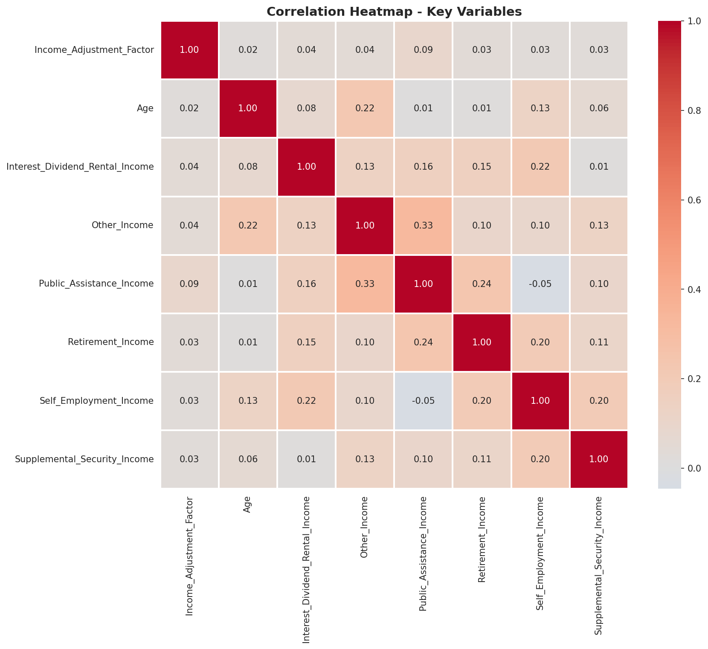
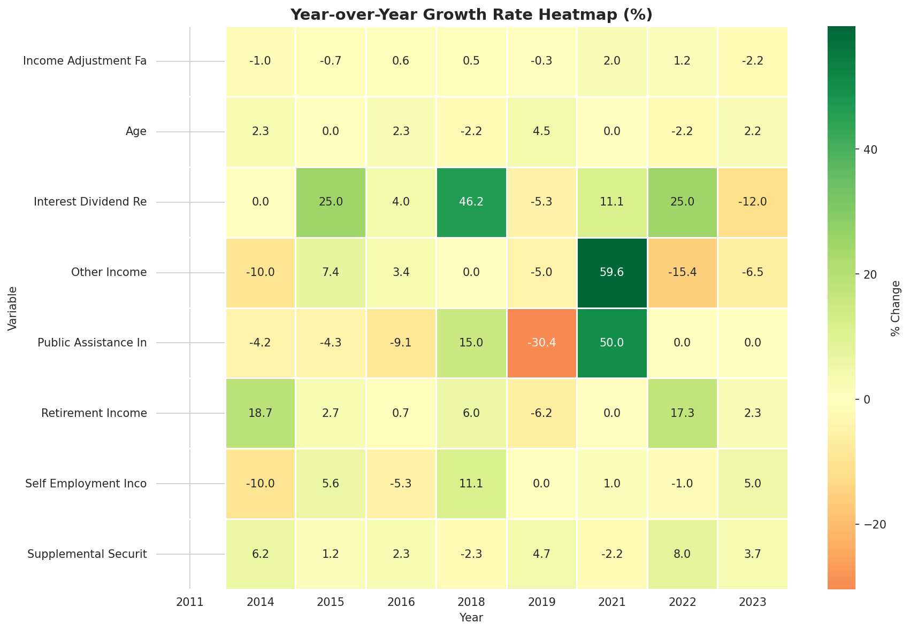
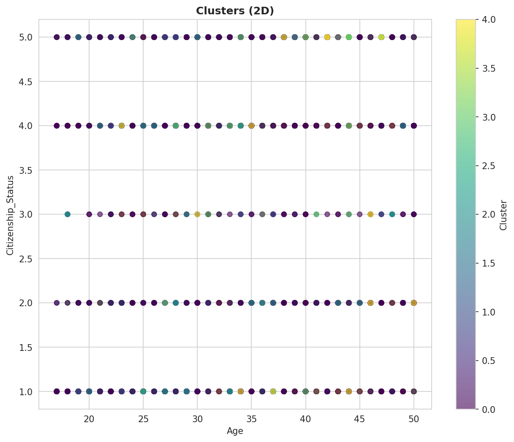
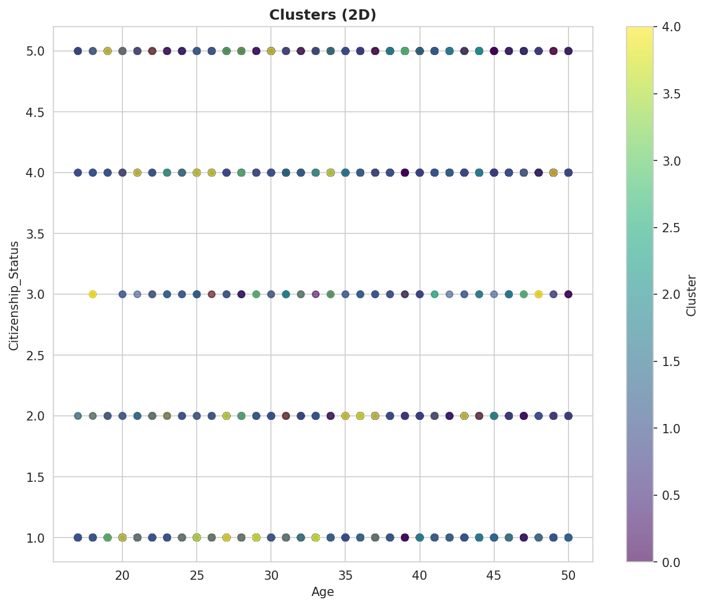

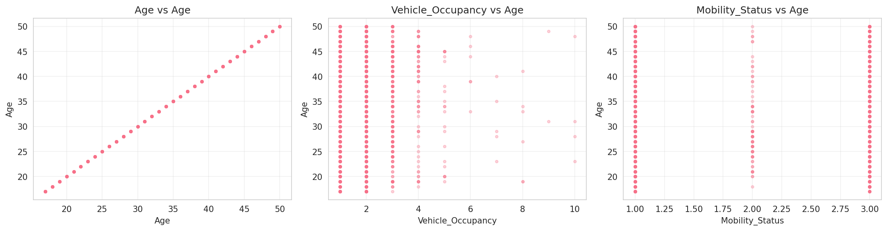
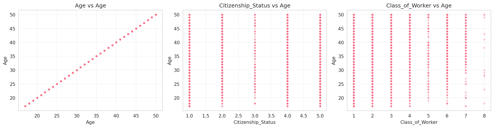
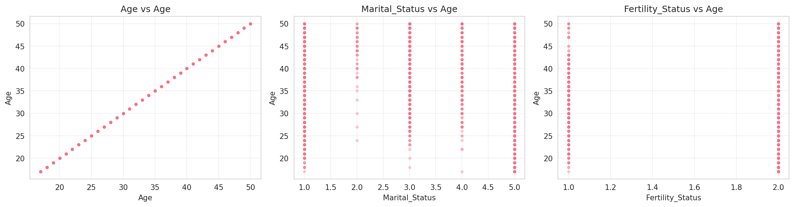
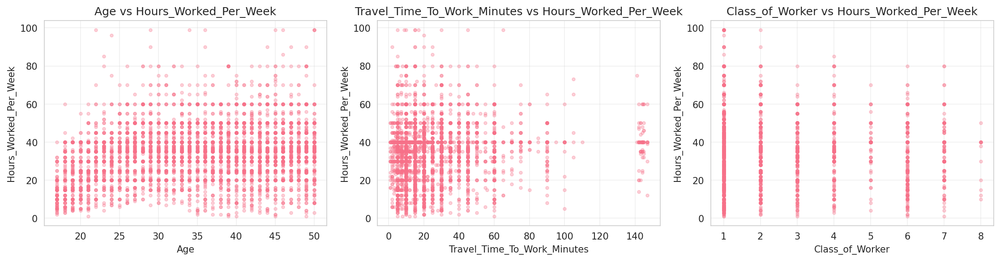
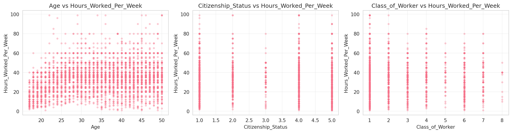

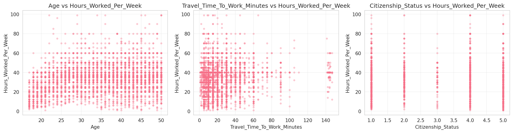
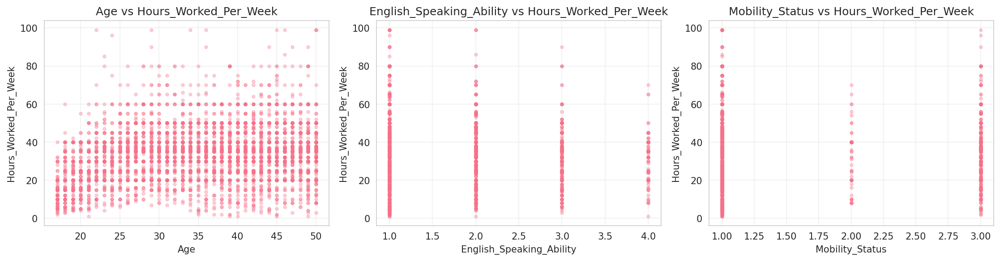
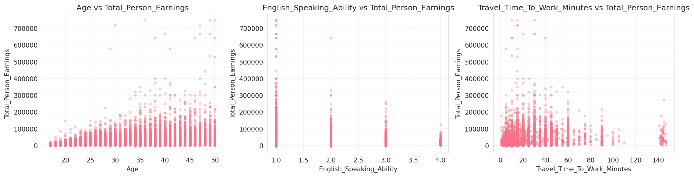

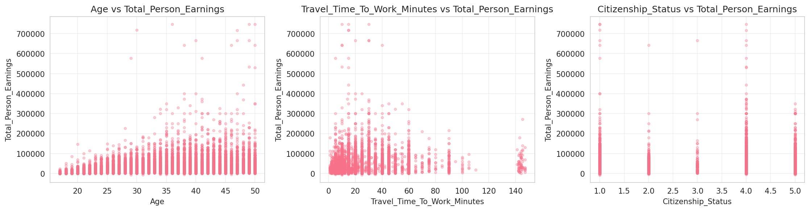

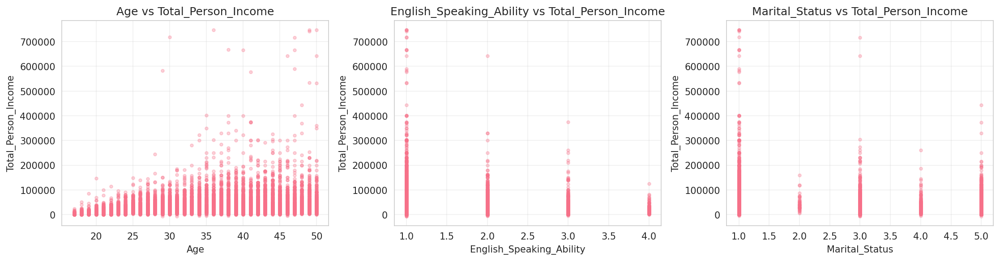
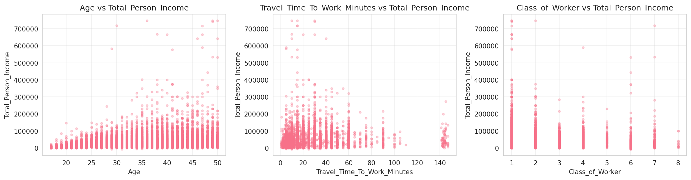

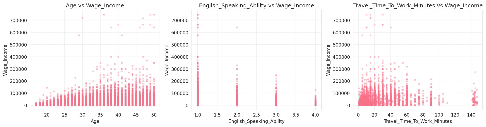
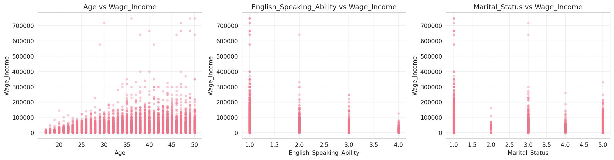

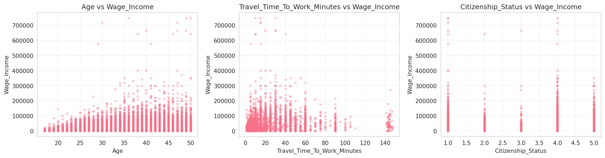

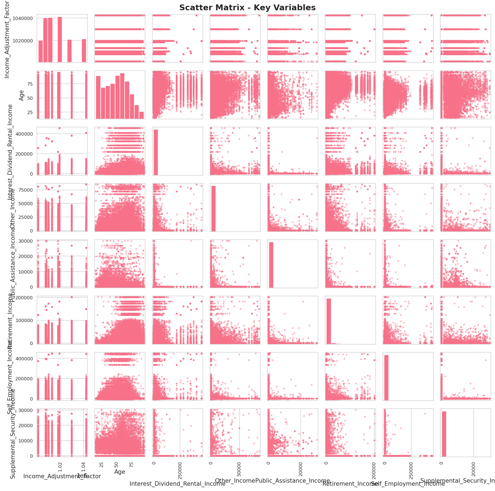
