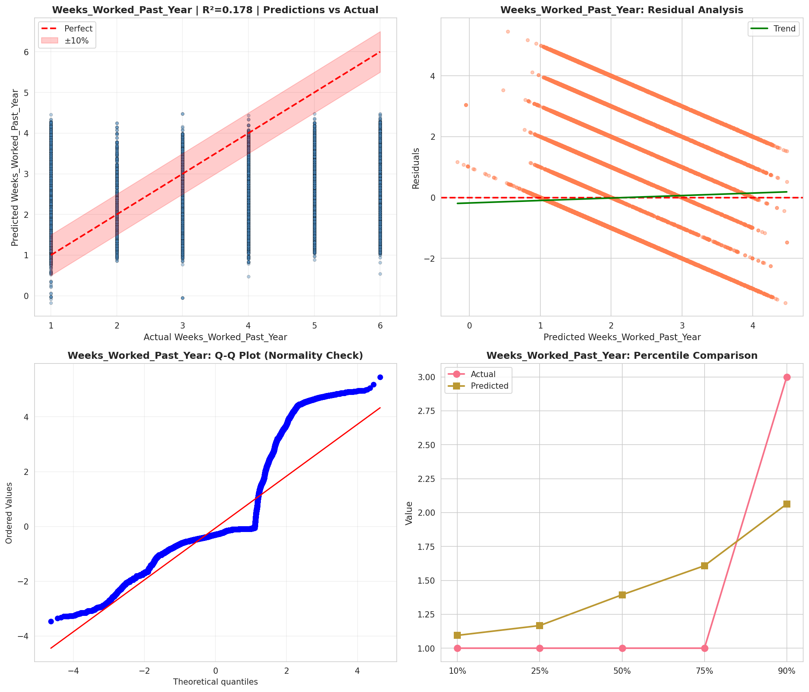
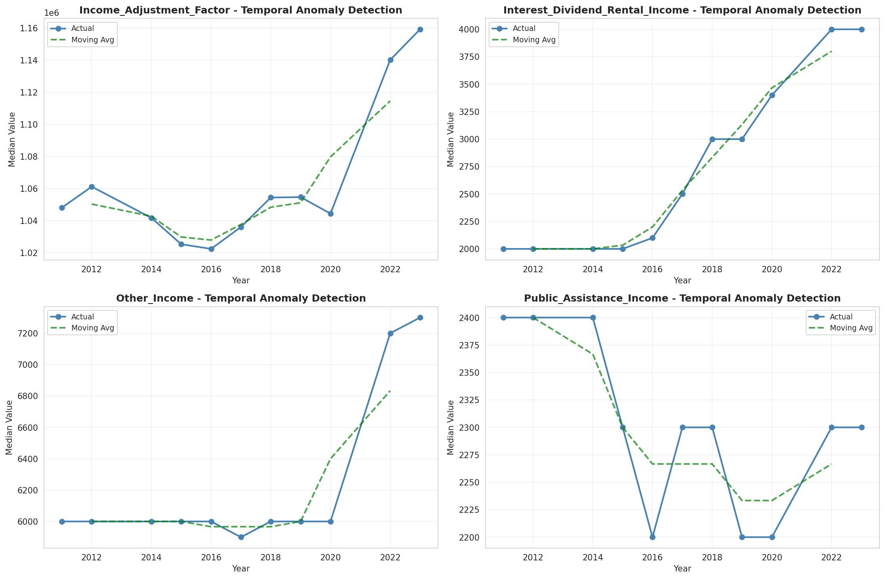
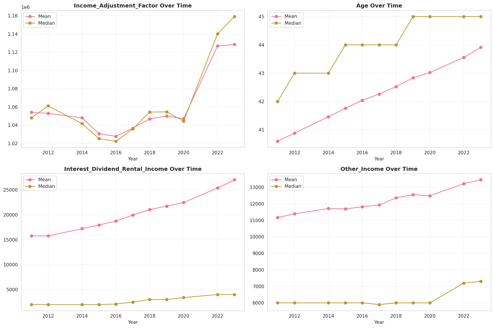
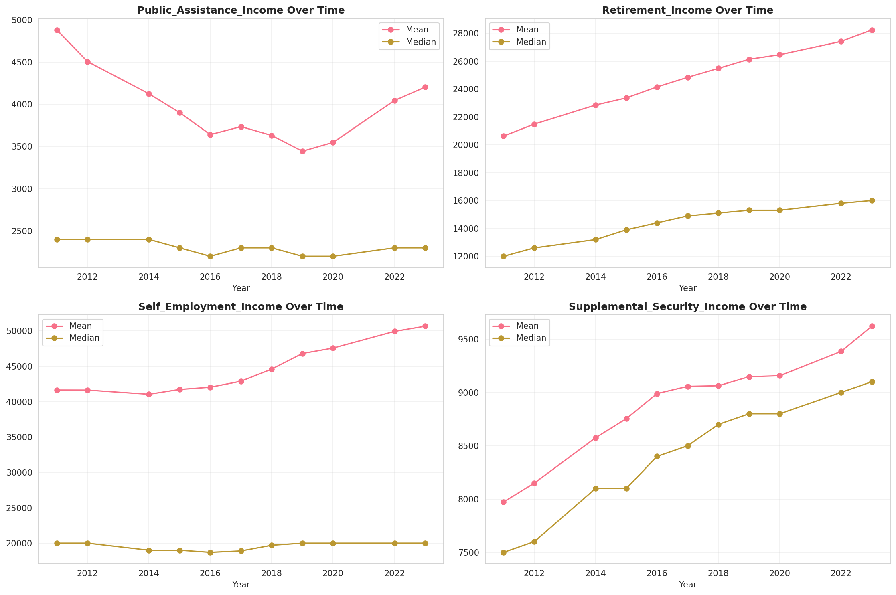
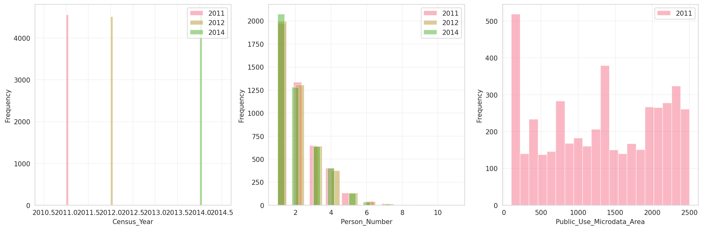
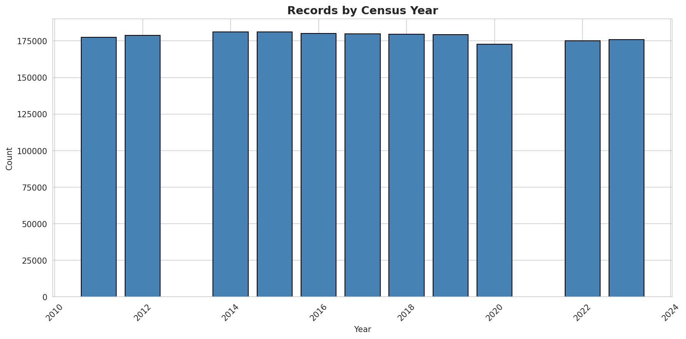
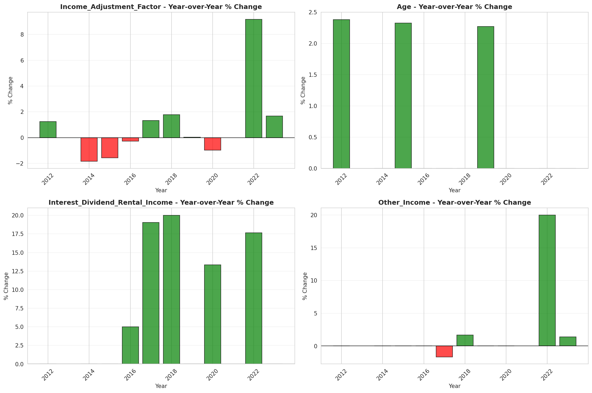
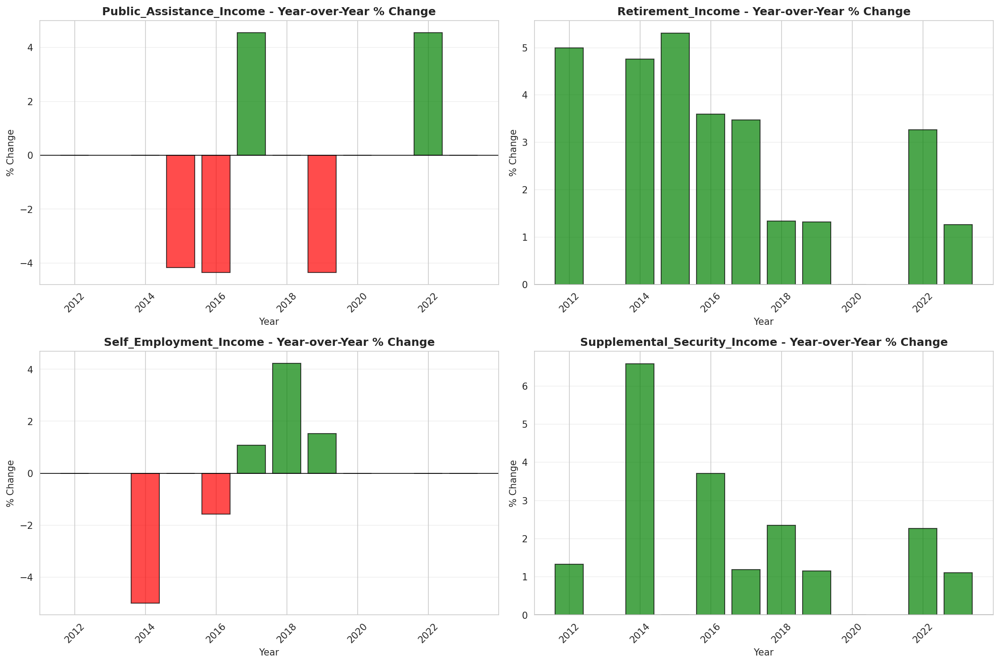

# Temporal Analysis

## Year Distribution

- 2011: 177,580 records

- 2012: 178,763 records

- 2014: 181,082 records

- 2015: 181,073 records

- 2016: 180,192 records

- 2017: 179,789 records

- 2018: 179,694 records

- 2019: 179,287 records

- 2020: 172,696 records

- 2022: 175,095 records

- 2023: 175,920 records

## Temporal Trends

- Census_Year: {np.int64(2011): {'mean': 2011.0, 'median': 2011.0, 'std': 0.0}, np.int64(2012): {'mean': 2012.0, 'median': 2012.0, 'std': 0.0}, np.int64(2014): {'mean': 2014.0, 'median': 2014.0, 'std': 0.0}, np.int64(2015): {'mean': 2015.0, 'median': 2015.0, 'std': 0.0}, np.int64(2016): {'mean': 2016.0, 'median': 2016.0, 'std': 0.0}, np.int64(2017): {'mean': 2017.0, 'median': 2017.0, 'std': 0.0}, np.int64(2018): {'mean': 2018.0, 'median': 2018.0, 'std': 0.0}, np.int64(2019): {'mean': 2019.0, 'median': 2019.0, 'std': 0.0}, np.int64(2020): {'mean': 2020.0, 'median': 2020.0, 'std': 0.0}, np.int64(2022): {'mean': 2022.0, 'median': 2022.0, 'std': 0.0}, np.int64(2023): {'mean': 2023.0, 'median': 2023.0, 'std': 0.0}}

- Person_Number: {np.int64(2011): {'mean': 2.0612287419754476, 'median': 2.0, 'std': 1.241578912879371}, np.int64(2012): {'mean': 2.0498984689225397, 'median': 2.0, 'std': 1.2389584740271327}, np.int64(2014): {'mean': 2.0300968621950277, 'median': 2.0, 'std': 1.236846951590279}, np.int64(2015): {'mean': 2.01513754121266, 'median': 2.0, 'std': 1.2261543423023935}, np.int64(2016): {'mean': 2.011582090214882, 'median': 2.0, 'std': 1.226837280712922}, np.int64(2017): {'mean': 2.0073475017937694, 'median': 2.0, 'std': 1.227456048999989}, np.int64(2018): {'mean': 2.0009961378788383, 'median': 2.0, 'std': 1.2202685535057878}, np.int64(2019): {'mean': 1.991237513037755, 'median': 2.0, 'std': 1.2131135062300318}, np.int64(2020): {'mean': 1.9880367813962108, 'median': 2.0, 'std': 1.2143149667267734}, np.int64(2022): {'mean': 1.9770239013107171, 'median': 2.0, 'std': 1.2104941831812175}, np.int64(2023): {'mean': 1.9743008185538882, 'median': 2.0, 'std': 1.211201605085055}}

- Public_Use_Microdata_Area: {np.int64(2011): {'mean': 1305.846379096745, 'median': 1300.0, 'std': 754.9879944809766}, np.int64(2012): {'mean': None, 'median': None, 'std': None}, np.int64(2014): {'mean': None, 'median': None, 'std': None}, np.int64(2015): {'mean': None, 'median': None, 'std': None}, np.int64(2016): {'mean': 558.6655678387498, 'median': 306.0, 'std': 419.1616401200551}, np.int64(2017): {'mean': 558.0142333513173, 'median': 306.0, 'std': 419.4779332874348}, np.int64(2018): {'mean': 558.2130900308302, 'median': 306.0, 'std': 419.8836632317152}, np.int64(2019): {'mean': 559.4347387150211, 'median': 306.0, 'std': 420.81481779284144}, np.int64(2020): {'mean': 559.0998691342012, 'median': 306.0, 'std': 421.0625489895765}, np.int64(2022): {'mean': None, 'median': None, 'std': None}, np.int64(2023): {'mean': 20523.683901773533, 'median': 20601.0, 'std': 272.1641089770649}}

- State_Code: {np.int64(2011): {'mean': 9.0, 'median': 9.0, 'std': 0.0}, np.int64(2012): {'mean': 9.0, 'median': 9.0, 'std': 0.0}, np.int64(2014): {'mean': 9.0, 'median': 9.0, 'std': 0.0}, np.int64(2015): {'mean': 9.0, 'median': 9.0, 'std': 0.0}, np.int64(2016): {'mean': 9.0, 'median': 9.0, 'std': 0.0}, np.int64(2017): {'mean': 9.0, 'median': 9.0, 'std': 0.0}, np.int64(2018): {'mean': 9.0, 'median': 9.0, 'std': 0.0}, np.int64(2019): {'mean': 9.0, 'median': 9.0, 'std': 0.0}, np.int64(2020): {'mean': 9.0, 'median': 9.0, 'std': 0.0}, np.int64(2022): {'mean': 9.0, 'median': 9.0, 'std': 0.0}, np.int64(2023): {'mean': None, 'median': None, 'std': None}}

- Income_Adjustment_Factor: {np.int64(2011): {'mean': 1054132.6999098998, 'median': 1048026.0, 'std': 28401.941234527807}, np.int64(2012): {'mean': 1052922.3628547294, 'median': 1061121.0, 'std': 26300.999774585925}, np.int64(2014): {'mean': 1047980.7568228758, 'median': 1041654.0, 'std': 31150.37733190621}, np.int64(2015): {'mean': 1030580.0992251744, 'median': 1025215.0, 'std': 25655.73978201312}, np.int64(2016): {'mean': 1027746.4174214172, 'median': 1022342.0, 'std': 17540.998608918668}, np.int64(2017): {'mean': 1036791.1732308428, 'median': 1035988.0, 'std': 16881.702802159693}, np.int64(2018): {'mean': 1046953.6049283782, 'median': 1054346.0, 'std': 20503.299966446088}, np.int64(2019): {'mean': 1050006.9892686028, 'median': 1054606.0, 'std': 26149.11165937286}, np.int64(2020): {'mean': 1047092.4257712975, 'median': 1044328.0, 'std': 28678.781709515184}, np.int64(2022): {'mean': 1126802.0818241525, 'median': 1140108.0, 'std': 50004.62743133376}, np.int64(2023): {'mean': 1128481.478336744, 'median': 1159185.0, 'std': 70269.31628111952}}

- Person_Weight: {np.int64(2011): {'mean': 20.037008672147763, 'median': 17.0, 'std': 12.318437574826195}, np.int64(2012): {'mean': 19.98295508578397, 'median': 16.0, 'std': 12.697418133244952}, np.int64(2014): {'mean': 19.836609933621233, 'median': 16.0, 'std': 13.555810199308894}, np.int64(2015): {'mean': 19.84405184649285, 'median': 16.0, 'std': 14.052521500421177}, np.int64(2016): {'mean': 19.91525705913692, 'median': 15.0, 'std': 14.051590965367634}, np.int64(2017): {'mean': 19.99275817764157, 'median': 15.0, 'std': 14.1943498617433}, np.int64(2018): {'mean': 19.931127360958072, 'median': 16.0, 'std': 14.087085999388396}, np.int64(2019): {'mean': 19.94050879316403, 'median': 16.0, 'std': 14.504231873788754}, np.int64(2020): {'mean': 20.67534279890675, 'median': 15.0, 'std': 18.82792848764446}, np.int64(2022): {'mean': 20.62490076815443, 'median': 15.0, 'std': 20.49064995964041}, np.int64(2023): {'mean': 20.454456571168713, 'median': 14.0, 'std': 20.125971537702153}}

- Age: {np.int64(2011): {'mean': 40.59574839508954, 'median': 42.0, 'std': 23.505711865543088}, np.int64(2012): {'mean': 40.88418744371039, 'median': 43.0, 'std': 23.56064682452366}, np.int64(2014): {'mean': 41.46441943428944, 'median': 43.0, 'std': 23.62936453391639}, np.int64(2015): {'mean': 41.76063797473947, 'median': 44.0, 'std': 23.664536587031364}, np.int64(2016): {'mean': 42.04029035695258, 'median': 44.0, 'std': 23.652011509612848}, np.int64(2017): {'mean': 42.26184026831452, 'median': 44.0, 'std': 23.646025520674247}, np.int64(2018): {'mean': 42.525292998096766, 'median': 44.0, 'std': 23.672073235503042}, np.int64(2019): {'mean': 42.83284342980807, 'median': 45.0, 'std': 23.718394046613792}, np.int64(2020): {'mean': 43.0233531755223, 'median': 45.0, 'std': 23.789180030434366}, np.int64(2022): {'mean': 43.55470458893743, 'median': 45.0, 'std': 23.944362236377565}, np.int64(2023): {'mean': 43.909362210095495, 'median': 45.0, 'std': 24.01272689019083}}

- Citizenship_Status: {np.int64(2011): {'mean': 1.4422964297781282, 'median': 1.0, 'std': 1.1394022419879664}, np.int64(2012): {'mean': 1.450736449936508, 'median': 1.0, 'std': 1.1481358364985337}, np.int64(2014): {'mean': 1.4569973824013431, 'median': 1.0, 'std': 1.1517610531936884}, np.int64(2015): {'mean': 1.4620236037399281, 'median': 1.0, 'std': 1.1560957185341982}, np.int64(2016): {'mean': 1.4673070946545907, 'median': 1.0, 'std': 1.1611342482456124}, np.int64(2017): {'mean': 1.4717140648204283, 'median': 1.0, 'std': 1.1646481581411467}, np.int64(2018): {'mean': 1.4771166538671296, 'median': 1.0, 'std': 1.1688047022048065}, np.int64(2019): {'mean': 1.4803359975904555, 'median': 1.0, 'std': 1.1699423605464547}, np.int64(2020): {'mean': 1.480700189929124, 'median': 1.0, 'std': 1.1692115462579593}, np.int64(2022): {'mean': 1.4908763813929582, 'median': 1.0, 'std': 1.177442400610602}, np.int64(2023): {'mean': 1.498618690313779, 'median': 1.0, 'std': 1.185905821139215}}

- Class_of_Worker: {np.int64(2011): {'mean': 2.114664006529428, 'median': 1.0, 'std': 1.8964433947897597}, np.int64(2012): {'mean': 2.114790506197694, 'median': 1.0, 'std': 1.896342924217424}, np.int64(2014): {'mean': 2.131494604892988, 'median': 1.0, 'std': 1.9151676158595183}, np.int64(2015): {'mean': 2.1288522895388837, 'median': 1.0, 'std': 1.9147674584699732}, np.int64(2016): {'mean': 2.1251439847844917, 'median': 1.0, 'std': 1.9126311547759458}, np.int64(2017): {'mean': 2.123038545103404, 'median': 1.0, 'std': 1.9113408624478598}, np.int64(2018): {'mean': 2.1121922373938284, 'median': 1.0, 'std': 1.902529237645835}, np.int64(2019): {'mean': 2.1083094555873925, 'median': 1.0, 'std': 1.8921765041794136}, np.int64(2020): {'mean': 2.100400859382993, 'median': 1.0, 'std': 1.8777069356071168}, np.int64(2022): {'mean': 2.101498007238078, 'median': 1.0, 'std': 1.8605984586250324}, np.int64(2023): {'mean': 2.1003493259101575, 'median': 1.0, 'std': 1.8512479341451136}}

- English_Speaking_Ability: {np.int64(2011): {'mean': 1.580344713291349, 'median': 1.0, 'std': 0.8613239205151757}, np.int64(2012): {'mean': 1.5798955027727024, 'median': 1.0, 'std': 0.8637109567747595}, np.int64(2014): {'mean': 1.575669872094109, 'median': 1.0, 'std': 0.8572894410126066}, np.int64(2015): {'mean': 1.5618291970353968, 'median': 1.0, 'std': 0.8483726797200737}, np.int64(2016): {'mean': 1.5528184231647837, 'median': 1.0, 'std': 0.8412050633656238}, np.int64(2017): {'mean': 1.5504510108864697, 'median': 1.0, 'std': 0.836202028134415}, np.int64(2018): {'mean': 1.5549953603464275, 'median': 1.0, 'std': 0.8421950673399637}, np.int64(2019): {'mean': 1.5452887913717976, 'median': 1.0, 'std': 0.837449736889372}, np.int64(2020): {'mean': 1.5440981753592766, 'median': 1.0, 'std': 0.8392467822564463}, np.int64(2022): {'mean': 1.5496354281746156, 'median': 1.0, 'std': 0.8439512627374354}, np.int64(2023): {'mean': 1.5436745112688333, 'median': 1.0, 'std': 0.840476749329875}}

- Fertility_Status: {np.int64(2011): {'mean': 1.9518584156733267, 'median': 2.0, 'std': 0.2140679440914747}, np.int64(2012): {'mean': 1.9533211456429007, 'median': 2.0, 'std': 0.21095265734853427}, np.int64(2014): {'mean': 1.9546726906644405, 'median': 2.0, 'std': 0.20802357299996682}, np.int64(2015): {'mean': 1.9553157176528966, 'median': 2.0, 'std': 0.20661233360739048}, np.int64(2016): {'mean': 1.9562655789712213, 'median': 2.0, 'std': 0.20450617219421624}, np.int64(2017): {'mean': 1.9566753061950501, 'median': 2.0, 'std': 0.20358958209896547}, np.int64(2018): {'mean': 1.9577504556071768, 'median': 2.0, 'std': 0.20116053057644054}, np.int64(2019): {'mean': 1.9584059970327181, 'median': 2.0, 'std': 0.19966216347003032}, np.int64(2020): {'mean': 1.9590261928051298, 'median': 2.0, 'std': 0.19823224265859843}, np.int64(2022): {'mean': 1.957328892407655, 'median': 2.0, 'std': 0.20211729130372466}, np.int64(2023): {'mean': 1.9552643099485607, 'median': 2.0, 'std': 0.20672585079541458}}

- Marital_Status: {np.int64(2011): {'mean': 2.909635094042122, 'median': 3.0, 'std': 1.862466758251379}, np.int64(2012): {'mean': 2.926623518289579, 'median': 3.0, 'std': 1.8610275522538255}, np.int64(2014): {'mean': 2.945002816403618, 'median': 3.0, 'std': 1.8603851252664676}, np.int64(2015): {'mean': 2.948363367260718, 'median': 3.0, 'std': 1.860989223756494}, np.int64(2016): {'mean': 2.9442483573077607, 'median': 3.0, 'std': 1.8607176414260689}, np.int64(2017): {'mean': 2.93934556619148, 'median': 3.0, 'std': 1.860345354714135}, np.int64(2018): {'mean': 2.9396084454684073, 'median': 3.0, 'std': 1.859217030628285}, np.int64(2019): {'mean': 2.932649885379308, 'median': 3.0, 'std': 1.8589709958358382}, np.int64(2020): {'mean': 2.9376708204011672, 'median': 3.0, 'std': 1.8591553003506658}, np.int64(2022): {'mean': 2.9392501213626887, 'median': 3.0, 'std': 1.860287996791922}, np.int64(2023): {'mean': 2.9323840381991815, 'median': 3.0, 'std': 1.8604237411850155}}

- Mobility_Status: {np.int64(2011): {'mean': 1.2037116004571273, 'median': 1.0, 'std': 0.6010197964270317}, np.int64(2012): {'mean': 1.205558566492785, 'median': 1.0, 'std': 0.6033836494262877}, np.int64(2014): {'mean': 1.2146707653924975, 'median': 1.0, 'std': 0.6147742247591854}, np.int64(2015): {'mean': 1.219558644192379, 'median': 1.0, 'std': 0.620712273726826}, np.int64(2016): {'mean': 1.2201133635860046, 'median': 1.0, 'std': 0.6212385660395335}, np.int64(2017): {'mean': 1.2226259363925895, 'median': 1.0, 'std': 0.6244508185156297}, np.int64(2018): {'mean': 1.2219037469149652, 'median': 1.0, 'std': 0.623409596452053}, np.int64(2019): {'mean': 1.2205263986328476, 'median': 1.0, 'std': 0.6217936125334009}, np.int64(2020): {'mean': 1.2193182083420862, 'median': 1.0, 'std': 0.620465297029658}, np.int64(2022): {'mean': 1.219146853951989, 'median': 1.0, 'std': 0.6201567958441839}, np.int64(2023): {'mean': 1.2133264551629266, 'median': 1.0, 'std': 0.6128047925882835}}

- Military_Service: {np.int64(2011): {'mean': 4.787005328596803, 'median': 5.0, 'std': 0.6255542427158918}, np.int64(2012): {'mean': 4.794200292233337, 'median': 5.0, 'std': 0.6176226575563349}, np.int64(2014): {'mean': 3.811367081141509, 'median': 4.0, 'std': 0.5805478349358745}, np.int64(2015): {'mean': 3.8192711069866463, 'median': 4.0, 'std': 0.5694078312884702}, np.int64(2016): {'mean': 3.8268449964174827, 'median': 4.0, 'std': 0.557820604186951}, np.int64(2017): {'mean': 3.8349149471016615, 'median': 4.0, 'std': 0.5451761838302657}, np.int64(2018): {'mean': 3.8408166314631313, 'median': 4.0, 'std': 0.5359250561867003}, np.int64(2019): {'mean': 3.8465100197955366, 'median': 4.0, 'std': 0.5271213050503291}, np.int64(2020): {'mean': 3.8508018950693104, 'median': 4.0, 'std': 0.5201520047353033}, np.int64(2022): {'mean': 3.8618586367610512, 'median': 4.0, 'std': 0.5029108925500139}, np.int64(2023): {'mean': 3.8659665069811244, 'median': 4.0, 'std': 0.4962338501518905}}

- Travel_Time_To_Work_Minutes: {np.int64(2011): {'mean': 25.181163789390787, 'median': 20.0, 'std': 22.359532855656102}, np.int64(2012): {'mean': 25.26290542784399, 'median': 20.0, 'std': 22.32349457042774}, np.int64(2014): {'mean': 25.582291243990312, 'median': 20.0, 'std': 22.477531433029924}, np.int64(2015): {'mean': 25.912478485370052, 'median': 20.0, 'std': 22.741834019550957}, np.int64(2016): {'mean': 26.233900542760747, 'median': 20.0, 'std': 23.090138848066125}, np.int64(2017): {'mean': 26.533633816542817, 'median': 20.0, 'std': 23.32000957089494}, np.int64(2018): {'mean': 26.864059748618615, 'median': 20.0, 'std': 23.513635319001953}, np.int64(2019): {'mean': 27.287991279597893, 'median': 20.0, 'std': 24.034753953366817}, np.int64(2020): {'mean': 27.168654151755145, 'median': 20.0, 'std': 23.978944356744556}, np.int64(2022): {'mean': 26.98970930152572, 'median': 20.0, 'std': 23.75791142813012}, np.int64(2023): {'mean': 26.926114453185253, 'median': 20.0, 'std': 23.882736280193615}}

- Vehicle_Occupancy: {np.int64(2011): {'mean': 1.1294419310233725, 'median': 1.0, 'std': 0.5450877196635691}, np.int64(2012): {'mean': 1.132673240687178, 'median': 1.0, 'std': 0.5601568670582514}, np.int64(2014): {'mean': 1.1365649506318314, 'median': 1.0, 'std': 0.5838279928083517}, np.int64(2015): {'mean': 1.1366293295633734, 'median': 1.0, 'std': 0.5850539187783047}, np.int64(2016): {'mean': 1.1334657049463759, 'median': 1.0, 'std': 0.5732715530347717}, np.int64(2017): {'mean': 1.132047278014108, 'median': 1.0, 'std': 0.5604397406554152}, np.int64(2018): {'mean': 1.1307692307692307, 'median': 1.0, 'std': 0.5487523307902821}, np.int64(2019): {'mean': 1.127313546524836, 'median': 1.0, 'std': 0.5297015900034611}, np.int64(2020): {'mean': 1.1254794598679614, 'median': 1.0, 'std': 0.5173970538142043}, np.int64(2022): {'mean': 1.1266023943214323, 'median': 1.0, 'std': 0.5153235343063687}, np.int64(2023): {'mean': 1.1278745160942054, 'median': 1.0, 'std': 0.520372670786101}}

- Transportation_To_Work: {np.int64(2011): {'mean': 1.8989246048069577, 'median': 1.0, 'std': 2.689730013146242}, np.int64(2012): {'mean': 1.9124210180161134, 'median': 1.0, 'std': 2.7035881650595264}, np.int64(2014): {'mean': 1.9780997975021362, 'median': 1.0, 'std': 2.7855257615316176}, np.int64(2015): {'mean': 2.0202277372262776, 'median': 1.0, 'std': 2.836267743888609}, np.int64(2016): {'mean': 2.029859919291247, 'median': 1.0, 'std': 2.84941061349458}, np.int64(2017): {'mean': 2.0520902990753336, 'median': 1.0, 'std': 2.87907199660798}, np.int64(2018): {'mean': 2.064904535290408, 'median': 1.0, 'std': 2.899543247259869}, np.int64(2019): {'mean': None, 'median': None, 'std': None}, np.int64(2020): {'mean': None, 'median': None, 'std': None}, np.int64(2022): {'mean': None, 'median': None, 'std': None}, np.int64(2023): {'mean': None, 'median': None, 'std': None}}

- Language_Other_Than_English: {np.int64(2011): {'mean': 1.8206142045961293, 'median': 2.0, 'std': 0.38367617476449906}, np.int64(2012): {'mean': 1.8161063856124777, 'median': 2.0, 'std': 0.38739855139325236}, np.int64(2014): {'mean': 1.8136698907522093, 'median': 2.0, 'std': 0.3893739575147961}, np.int64(2015): {'mean': 1.8118163825132818, 'median': 2.0, 'std': 0.39085985688087876}, np.int64(2016): {'mean': 1.8118760707337611, 'median': 2.0, 'std': 0.3908122355909984}, np.int64(2017): {'mean': 1.8129835378977373, 'median': 2.0, 'std': 0.3899258768458627}, np.int64(2018): {'mean': 1.8120305123374962, 'median': 2.0, 'std': 0.39068893869724586}, np.int64(2019): {'mean': 1.8115606128545723, 'median': 2.0, 'std': 0.39106377369334083}, np.int64(2020): {'mean': 1.812698854356952, 'median': 2.0, 'std': 0.39015426081814253}, np.int64(2022): {'mean': 1.8110018732177586, 'median': 2.0, 'std': 0.39150830037714335}, np.int64(2023): {'mean': 1.8092081818829735, 'median': 2.0, 'std': 0.3929264781375061}}

- Grandparents_Living_With_Grandchildren: {np.int64(2011): {'mean': 1.9744935711611955, 'median': 2.0, 'std': 0.15765807085388486}, np.int64(2012): {'mean': 1.9749005599703189, 'median': 2.0, 'std': 0.15642784045408897}, np.int64(2014): {'mean': 1.974687298735636, 'median': 2.0, 'std': 0.15707379634499047}, np.int64(2015): {'mean': 1.9753015508328546, 'median': 2.0, 'std': 0.1552051521304959}, np.int64(2016): {'mean': 1.9751689760054072, 'median': 2.0, 'std': 0.15561056785033667}, np.int64(2017): {'mean': 1.9750231969633065, 'median': 2.0, 'std': 0.15605501520952936}, np.int64(2018): {'mean': 1.9759564494178135, 'median': 2.0, 'std': 0.1531850364482321}, np.int64(2019): {'mean': 1.9768406961178044, 'median': 2.0, 'std': 0.15040990595431475}, np.int64(2020): {'mean': 1.9770182624282362, 'median': 2.0, 'std': 0.1498458265802369}, np.int64(2022): {'mean': 1.9777875299598284, 'median': 2.0, 'std': 0.14737455517202006}, np.int64(2023): {'mean': 1.9781685213567002, 'median': 2.0, 'std': 0.1461336479365055}}

- Months_Responsible_For_Grandchildren: {np.int64(2011): {'mean': 3.5923076923076924, 'median': 4.0, 'std': 1.3773705478627707}, np.int64(2012): {'mean': 3.6262626262626263, 'median': 4.0, 'std': 1.3653657501437086}, np.int64(2014): {'mean': 3.6749740394600208, 'median': 4.0, 'std': 1.3736709223317105}, np.int64(2015): {'mean': 3.6670258620689653, 'median': 4.0, 'std': 1.347862181765945}, np.int64(2016): {'mean': 3.746031746031746, 'median': 4.0, 'std': 1.3061937108797395}, np.int64(2017): {'mean': 3.7581552305961754, 'median': 4.0, 'std': 1.3190408125094222}, np.int64(2018): {'mean': 3.8281990521327014, 'median': 4.0, 'std': 1.3097358143502624}, np.int64(2019): {'mean': 3.803680981595092, 'median': 4.0, 'std': 1.3098516135248222}, np.int64(2020): {'mean': 3.8768211920529803, 'median': 4.0, 'std': 1.2975923281016186}, np.int64(2022): {'mean': 3.831130690161527, 'median': 4.0, 'std': 1.3237535921012051}, np.int64(2023): {'mean': 3.829192546583851, 'median': 4.0, 'std': 1.3240279630164509}}

- Grandparents_Responsible_For_Grandchildren: {np.int64(2011): {'mean': 1.6450511945392492, 'median': 2.0, 'std': 0.4785794824667858}, np.int64(2012): {'mean': 1.6596768649020281, 'median': 2.0, 'std': 0.47389925171365493}, np.int64(2014): {'mean': 1.6776029460997657, 'median': 2.0, 'std': 0.4674723029407945}, np.int64(2015): {'mean': 1.682626538987688, 'median': 2.0, 'std': 0.46553374257300095}, np.int64(2016): {'mean': 1.6998979244641035, 'median': 2.0, 'std': 0.4583800943366225}, np.int64(2017): {'mean': 1.6997635933806146, 'median': 2.0, 'std': 0.4584380924765845}, np.int64(2018): {'mean': 1.705101327742837, 'median': 2.0, 'std': 0.4560768838122633}, np.int64(2019): {'mean': 1.705563583815029, 'median': 2.0, 'std': 0.45587135467843637}, np.int64(2020): {'mean': 1.715523737754333, 'median': 2.0, 'std': 0.4512496457015421}, np.int64(2022): {'mean': 1.7412613981762919, 'median': 2.0, 'std': 0.4380249252083534}, np.int64(2023): {'mean': 1.7542922548645554, 'median': 2.0, 'std': 0.43058818822273337}}

- Interest_Dividend_Rental_Income: {np.int64(2011): {'mean': 15797.767527912738, 'median': 2000.0, 'std': 45963.25540422593}, np.int64(2012): {'mean': 15771.310469794194, 'median': 2000.0, 'std': 45772.7563882243}, np.int64(2014): {'mean': 17223.125381404974, 'median': 2000.0, 'std': 50493.94564058489}, np.int64(2015): {'mean': 17962.75454125342, 'median': 2000.0, 'std': 51165.7401038664}, np.int64(2016): {'mean': 18747.356556491683, 'median': 2100.0, 'std': 52864.422364601356}, np.int64(2017): {'mean': 19963.514737651494, 'median': 2500.0, 'std': 56103.25339860888}, np.int64(2018): {'mean': 21049.879403387797, 'median': 3000.0, 'std': 58633.0725888182}, np.int64(2019): {'mean': 21743.856547186413, 'median': 3000.0, 'std': 58875.79503401492}, np.int64(2020): {'mean': 22459.174117166767, 'median': 3400.0, 'std': 60057.364109715396}, np.int64(2022): {'mean': 25381.141593680233, 'median': 4000.0, 'std': 67751.88787542503}, np.int64(2023): {'mean': 27021.78343118069, 'median': 4000.0, 'std': 72555.01043040535}}

- Military_Service_Period_1: {np.int64(2011): {'mean': 0.07436615566037735, 'median': 0.0, 'std': 0.26237550251910885}, np.int64(2012): {'mean': 0.07888981069462252, 'median': 0.0, 'std': 0.2695768710332816}, np.int64(2014): {'mean': 0.09718343572967367, 'median': 0.0, 'std': 0.2962192038536117}, np.int64(2015): {'mean': 0.10656010656010656, 'median': 0.0, 'std': 0.30856600061938944}, np.int64(2016): {'mean': 0.11756981528495142, 'median': 0.0, 'std': 0.3221121495963088}, np.int64(2017): {'mean': 0.13200221852468108, 'median': 0.0, 'std': 0.33850882587629844}, np.int64(2018): {'mean': 0.14007856663792279, 'median': 0.0, 'std': 0.3470851541247674}, np.int64(2019): {'mean': 0.14998009554140126, 'median': 0.0, 'std': 0.3570696787061173}, np.int64(2020): {'mean': 0.16150983519404571, 'median': 0.0, 'std': 0.36802012044672205}, np.int64(2022): {'mean': 0.18319403659363, 'median': 0.0, 'std': 0.3868473647514914}, np.int64(2023): {'mean': 0.19539031735001158, 'median': 0.0, 'std': 0.3965238352636357}}

- Military_Service_Period_2: {np.int64(2011): {'mean': 0.09242334905660378, 'median': 0.0, 'std': 0.2896333136031062}, np.int64(2012): {'mean': 0.0918621313824572, 'median': 0.0, 'std': 0.2888421238547284}, np.int64(2014): {'mean': 0.10173142902736775, 'median': 0.0, 'std': 0.3023068594652981}, np.int64(2015): {'mean': 0.1088078588078588, 'median': 0.0, 'std': 0.3114109535560407}, np.int64(2016): {'mean': 0.11573141906679506, 'median': 0.0, 'std': 0.3199165788208791}, np.int64(2017): {'mean': 0.12155666481789609, 'median': 0.0, 'std': 0.3267881785104377}, np.int64(2018): {'mean': 0.12139503688799463, 'median': 0.0, 'std': 0.3266014423319035}, np.int64(2019): {'mean': 0.12440286624203821, 'median': 0.0, 'std': 0.3300570175530528}, np.int64(2020): {'mean': 0.12706007442849548, 'median': 0.0, 'std': 0.3330579625984471}, np.int64(2022): {'mean': 0.13282132369550487, 'median': 0.0, 'std': 0.3394006922884966}, np.int64(2023): {'mean': 0.1450081074820477, 'median': 0.0, 'std': 0.3521294044898388}}

- Military_Service_Period_3: {np.int64(2011): {'mean': 0.12057783018867925, 'median': 0.0, 'std': 0.3256480200963197}, np.int64(2012): {'mean': 0.12112527339920054, 'median': 0.0, 'std': 0.3262851068543615}, np.int64(2014): {'mean': None, 'median': None, 'std': None}, np.int64(2015): {'mean': None, 'median': None, 'std': None}, np.int64(2016): {'mean': None, 'median': None, 'std': None}, np.int64(2017): {'mean': None, 'median': None, 'std': None}, np.int64(2018): {'mean': None, 'median': None, 'std': None}, np.int64(2019): {'mean': None, 'median': None, 'std': None}, np.int64(2020): {'mean': None, 'median': None, 'std': None}, np.int64(2022): {'mean': None, 'median': None, 'std': None}, np.int64(2023): {'mean': None, 'median': None, 'std': None}}

- Military_Service_Period_4: {np.int64(2011): {'mean': 0.08792747641509434, 'median': 0.0, 'std': 0.28319983480141075}, np.int64(2012): {'mean': 0.0897503582472283, 'median': 0.0, 'std': 0.285834555991993}, np.int64(2014): {'mean': None, 'median': None, 'std': None}, np.int64(2015): {'mean': None, 'median': None, 'std': None}, np.int64(2016): {'mean': None, 'median': None, 'std': None}, np.int64(2017): {'mean': None, 'median': None, 'std': None}, np.int64(2018): {'mean': None, 'median': None, 'std': None}, np.int64(2019): {'mean': None, 'median': None, 'std': None}, np.int64(2020): {'mean': None, 'median': None, 'std': None}, np.int64(2022): {'mean': None, 'median': None, 'std': None}, np.int64(2023): {'mean': None, 'median': None, 'std': None}}

- Military_Service_Period_5: {np.int64(2011): {'mean': 0.3317364386792453, 'median': 0.0, 'std': 0.4708542387223992}, np.int64(2012): {'mean': 0.33697865600724036, 'median': 0.0, 'std': 0.47269534947976477}, np.int64(2014): {'mean': 0.34293465251735417, 'median': 0.0, 'std': 0.4747088128826333}, np.int64(2015): {'mean': 0.3442390942390942, 'median': 0.0, 'std': 0.47513927911028375}, np.int64(2016): {'mean': 0.35270944585485425, 'median': 0.0, 'std': 0.4778341562545027}, np.int64(2017): {'mean': 0.3563505268996118, 'median': 0.0, 'std': 0.4789426197210898}, np.int64(2018): {'mean': 0.3664846220178212, 'median': 0.0, 'std': 0.48186708875057005}, np.int64(2019): {'mean': 0.368531050955414, 'median': 0.0, 'std': 0.482430386857877}, np.int64(2020): {'mean': 0.37341839447102604, 'median': 0.0, 'std': 0.48373750912531865}, np.int64(2022): {'mean': 0.3771176869211656, 'median': 0.0, 'std': 0.4846921399236939}, np.int64(2023): {'mean': 0.3727125318508223, 'median': 0.0, 'std': 0.4835545288131377}}

- Military_Service_Period_6: {np.int64(2011): {'mean': 0.09632959905660378, 'median': 0.0, 'std': 0.29505359465994097}, np.int64(2012): {'mean': 0.09714156422052946, 'median': 0.0, 'std': 0.2961616044975712}, np.int64(2014): {'mean': None, 'median': None, 'std': None}, np.int64(2015): {'mean': None, 'median': None, 'std': None}, np.int64(2016): {'mean': None, 'median': None, 'std': None}, np.int64(2017): {'mean': None, 'median': None, 'std': None}, np.int64(2018): {'mean': None, 'median': None, 'std': None}, np.int64(2019): {'mean': None, 'median': None, 'std': None}, np.int64(2020): {'mean': None, 'median': None, 'std': None}, np.int64(2022): {'mean': None, 'median': None, 'std': None}, np.int64(2023): {'mean': None, 'median': None, 'std': None}}

- Military_Service_Period_7: {np.int64(2011): {'mean': 0.1284640330188679, 'median': 0.0, 'std': 0.33461810723876717}, np.int64(2012): {'mean': 0.12353872841089071, 'median': 0.0, 'std': 0.32906698087909825}, np.int64(2014): {'mean': None, 'median': None, 'std': None}, np.int64(2015): {'mean': None, 'median': None, 'std': None}, np.int64(2016): {'mean': None, 'median': None, 'std': None}, np.int64(2017): {'mean': None, 'median': None, 'std': None}, np.int64(2018): {'mean': None, 'median': None, 'std': None}, np.int64(2019): {'mean': None, 'median': None, 'std': None}, np.int64(2020): {'mean': None, 'median': None, 'std': None}, np.int64(2022): {'mean': None, 'median': None, 'std': None}, np.int64(2023): {'mean': None, 'median': None, 'std': None}}

- Military_Service_Period_8: {np.int64(2011): {'mean': 0.1533755896226415, 'median': 0.0, 'std': 0.360362441522917}, np.int64(2012): {'mean': 0.14676823289840862, 'median': 0.0, 'std': 0.35388806722717836}, np.int64(2014): {'mean': 0.14146652836511608, 'median': 0.0, 'std': 0.34851605588150664}, np.int64(2015): {'mean': 0.13727938727938727, 'median': 0.0, 'std': 0.34415638530848774}, np.int64(2016): {'mean': 0.13166418629081678, 'median': 0.0, 'std': 0.3381401157189091}, np.int64(2017): {'mean': 0.13052320207062304, 'median': 0.0, 'std': 0.33689373298313774}, np.int64(2018): {'mean': 0.12407780013413816, 'median': 0.0, 'std': 0.32968608378158587}, np.int64(2019): {'mean': 0.11624203821656051, 'median': 0.0, 'std': 0.32053089038865995}, np.int64(2020): {'mean': 0.10866560340244551, 'median': 0.0, 'std': 0.3112357460743961}, np.int64(2022): {'mean': 0.08764400271063925, 'median': 0.0, 'std': 0.28279243934732434}, np.int64(2023): {'mean': 0.08026407227241139, 'median': 0.0, 'std': 0.27171732018181255}}

- Military_Service_Period_9: {np.int64(2011): {'mean': 0.02528007075471698, 'median': 0.0, 'std': 0.15698026953036945}, np.int64(2012): {'mean': 0.02292782261105664, 'median': 0.0, 'std': 0.14967908093162266}, np.int64(2014): {'mean': 0.020904811298172822, 'median': 0.0, 'std': 0.14307142763554076}, np.int64(2015): {'mean': 0.019147519147519148, 'median': 0.0, 'std': 0.13704909813268334}, np.int64(2016): {'mean': 0.018208876827453382, 'median': 0.0, 'std': 0.13371192466286835}, np.int64(2017): {'mean': 0.01747088186356073, 'median': 0.0, 'std': 0.1310238034274717}, np.int64(2018): {'mean': 0.015425888665325285, 'median': 0.0, 'std': 0.12324522694384032}, np.int64(2019): {'mean': 0.012937898089171975, 'median': 0.0, 'std': 0.11301230003425838}, np.int64(2020): {'mean': 0.012333864965443912, 'median': 0.0, 'std': 0.11037679157820798}, np.int64(2022): {'mean': None, 'median': None, 'std': None}, np.int64(2023): {'mean': None, 'median': None, 'std': None}}

- Military_Service_Period_10: {np.int64(2011): {'mean': 0.15787146226415094, 'median': 0.0, 'std': 0.3646338753291186}, np.int64(2012): {'mean': 0.14993589260125198, 'median': 0.0, 'std': 0.3570220359601954}, np.int64(2014): {'mean': 0.1262267613500359, 'median': 0.0, 'std': 0.33211800165597527}, np.int64(2015): {'mean': 0.11688311688311688, 'median': 0.0, 'std': 0.32129433200863755}, np.int64(2016): {'mean': 0.10128687735270944, 'median': 0.0, 'std': 0.3017214201011088}, np.int64(2017): {'mean': 0.08809391754483269, 'median': 0.0, 'std': 0.28344453747125864}, np.int64(2018): {'mean': 0.07607550062278433, 'median': 0.0, 'std': 0.2651315786117287}, np.int64(2019): {'mean': 0.06279856687898089, 'median': 0.0, 'std': 0.24261237568436403}, np.int64(2020): {'mean': 0.050824029771398195, 'median': 0.0, 'std': 0.21964989779648497}, np.int64(2022): {'mean': 0.029591145245086967, 'median': 0.0, 'std': 0.169466082031104}, np.int64(2023): {'mean': 0.022121843873059995, 'median': 0.0, 'std': 0.14708831933476754}}

- Military_Service_Period_11: {np.int64(2011): {'mean': 0.006264740566037736, 'median': 0.0, 'std': 0.07890470494206948}, np.int64(2012): {'mean': 0.00573195565276416, 'median': 0.0, 'std': 0.0754952329514932}, np.int64(2014): {'mean': 0.004228835873294503, 'median': 0.0, 'std': 0.06489444380280834}, np.int64(2015): {'mean': 0.004079254079254079, 'median': 0.0, 'std': 0.0637412896520281}, np.int64(2016): {'mean': 0.002538737634596866, 'median': 0.0, 'std': 0.05032409113821947}, np.int64(2017): {'mean': 0.0020336476243298205, 'median': 0.0, 'std': 0.04505218667397791}, np.int64(2018): {'mean': 0.0012455686499952094, 'median': 0.0, 'std': 0.035272317943991306}, np.int64(2019): {'mean': 0.0007961783439490446, 'median': 0.0, 'std': 0.028206801064305714}, np.int64(2020): {'mean': 0.0003189792663476874, 'median': 0.0, 'std': 0.0178580913673988}, np.int64(2022): {'mean': None, 'median': None, 'std': None}, np.int64(2023): {'mean': None, 'median': None, 'std': None}}

- Temporary_Absence_From_Work: {np.int64(2011): {'mean': 2.547113055980123, 'median': 3.0, 'std': 0.53558556335241}, np.int64(2012): {'mean': 2.549435223287028, 'median': 3.0, 'std': 0.5334079778630678}, np.int64(2014): {'mean': 2.572166512688062, 'median': 3.0, 'std': 0.5272052257183497}, np.int64(2015): {'mean': 2.582461602463884, 'median': 3.0, 'std': 0.5246924856233798}, np.int64(2016): {'mean': 2.5971057877532937, 'median': 3.0, 'std': 0.5199487382408859}, np.int64(2017): {'mean': 2.6105572280068925, 'median': 3.0, 'std': 0.5152371391929654}, np.int64(2018): {'mean': 2.612797314556628, 'median': 3.0, 'std': 0.5134179713608669}, np.int64(2019): {'mean': 2.6173142941105754, 'median': 3.0, 'std': 0.5114999072440618}, np.int64(2020): {'mean': 2.6192508264977246, 'median': 3.0, 'std': 0.5108659695041661}, np.int64(2022): {'mean': 2.6230944061874553, 'median': 3.0, 'std': 0.5094556644383991}, np.int64(2023): {'mean': 2.6220870781981596, 'median': 3.0, 'std': 0.5103249131506769}}

- Available_For_Work: {np.int64(2011): {'mean': 4.540999281142913, 'median': 5.0, 'std': 1.2016326713177063}, np.int64(2012): {'mean': 4.512807589273385, 'median': 5.0, 'std': 1.2284283002291245}, np.int64(2014): {'mean': 4.564937385780469, 'median': 5.0, 'std': 1.1687817428095142}, np.int64(2015): {'mean': 4.601631853347916, 'median': 5.0, 'std': 1.1194820813799624}, np.int64(2016): {'mean': 4.642700369830925, 'median': 5.0, 'std': 1.0644175726437808}, np.int64(2017): {'mean': 4.692079732348189, 'median': 5.0, 'std': 0.9964685875167169}, np.int64(2018): {'mean': 4.709168355099066, 'median': 5.0, 'std': 0.9661180592167052}, np.int64(2019): {'mean': 4.718746243137464, 'median': 5.0, 'std': 0.9499096917108273}, np.int64(2020): {'mean': 4.7287150899810495, 'median': 5.0, 'std': 0.9347162723151516}, np.int64(2022): {'mean': 4.755439465382136, 'median': 5.0, 'std': 0.8909696567457017}, np.int64(2023): {'mean': 4.7657553414778535, 'median': 5.0, 'std': 0.8722730649513369}}

- On_Layoff_From_Work: {np.int64(2011): {'mean': 2.505747367098679, 'median': 3.0, 'std': 0.540961928893191}, np.int64(2012): {'mean': 2.5044187909083377, 'median': 3.0, 'std': 0.543646296889734}, np.int64(2014): {'mean': 2.5343484681938646, 'median': 3.0, 'std': 0.5366710925214517}, np.int64(2015): {'mean': 2.5522266880489557, 'median': 3.0, 'std': 0.5286350729481293}, np.int64(2016): {'mean': 2.5725130380502996, 'median': 3.0, 'std': 0.5204099246681901}, np.int64(2017): {'mean': 2.590986195013041, 'median': 3.0, 'std': 0.5131397732149022}, np.int64(2018): {'mean': 2.594742789892141, 'median': 3.0, 'std': 0.5103111227482086}, np.int64(2019): {'mean': 2.601044574756555, 'median': 3.0, 'std': 0.5074485868689538}, np.int64(2020): {'mean': 2.6003693303639355, 'median': 3.0, 'std': 0.511187833574757}, np.int64(2022): {'mean': 2.604158892771125, 'median': 3.0, 'std': 0.5114378327703395}, np.int64(2023): {'mean': 2.6053562779183035, 'median': 3.0, 'std': 0.5101907745216535}}

- Looking_For_Work: {np.int64(2011): {'mean': 2.4983284827927945, 'median': 3.0, 'std': 0.6098004151627058}, np.int64(2012): {'mean': 2.49622331464553, 'median': 3.0, 'std': 0.6181729860384908}, np.int64(2014): {'mean': 2.5199846246181443, 'median': 3.0, 'std': 0.6155304719963771}, np.int64(2015): {'mean': 2.5379010017915493, 'median': 3.0, 'std': 0.6053255864790211}, np.int64(2016): {'mean': 2.558303744622014, 'median': 3.0, 'std': 0.5937777504957091}, np.int64(2017): {'mean': 2.5774091680131948, 'median': 3.0, 'std': 0.5817552326486503}, np.int64(2018): {'mean': 2.5832614495777246, 'median': 3.0, 'std': 0.5737681375150141}, np.int64(2019): {'mean': 2.588488305304356, 'median': 3.0, 'std': 0.568471561411002}, np.int64(2020): {'mean': 2.588556291757155, 'median': 3.0, 'std': 0.567403238055992}, np.int64(2022): {'mean': 2.589531530920316, 'median': 3.0, 'std': 0.5638544584923391}, np.int64(2023): {'mean': 2.5888003874925998, 'median': 3.0, 'std': 0.5620153925889468}}

- Informed_Of_Recall: {np.int64(2011): {'mean': 2.87583314140547, 'median': 3.0, 'std': 0.35234417900217313}, np.int64(2012): {'mean': 2.8768952470380293, 'median': 3.0, 'std': 0.3515427411498761}, np.int64(2014): {'mean': 2.899601453917688, 'median': 3.0, 'std': 0.32049038427451815}, np.int64(2015): {'mean': 2.9112075848973045, 'median': 3.0, 'std': 0.30421037144976387}, np.int64(2016): {'mean': 2.9246041600945047, 'median': 3.0, 'std': 0.28311783671278395}, np.int64(2017): {'mean': 2.937800454578978, 'median': 3.0, 'std': 0.2589090923516393}, np.int64(2018): {'mean': 2.9391161307147584, 'median': 3.0, 'std': 0.2570687932782559}, np.int64(2019): {'mean': 2.9380735476804296, 'median': 3.0, 'std': 0.2596196395027052}, np.int64(2020): {'mean': 2.9387838379926134, 'median': 3.0, 'std': 0.259350511930632}, np.int64(2022): {'mean': 2.9421961396248175, 'median': 3.0, 'std': 0.2523954884062609}, np.int64(2023): {'mean': 2.9438943006296756, 'median': 3.0, 'std': 0.24791444728310177}}

- Other_Income: {np.int64(2011): {'mean': 11161.80234442009, 'median': 6000.0, 'std': 14787.913799993852}, np.int64(2012): {'mean': 11392.257807432119, 'median': 6000.0, 'std': 14875.842147473526}, np.int64(2014): {'mean': 11710.273662159589, 'median': 6000.0, 'std': 15241.259468702514}, np.int64(2015): {'mean': 11686.522752837713, 'median': 6000.0, 'std': 15830.609111006943}, np.int64(2016): {'mean': 11813.862196180555, 'median': 6000.0, 'std': 16331.56495375894}, np.int64(2017): {'mean': 11927.056595213791, 'median': 5900.0, 'std': 16722.941711412495}, np.int64(2018): {'mean': 12358.66761734997, 'median': 6000.0, 'std': 17357.54834601998}, np.int64(2019): {'mean': 12550.948417202673, 'median': 6000.0, 'std': 17631.338917870627}, np.int64(2020): {'mean': 12485.069648562301, 'median': 6000.0, 'std': 17269.19844615788}, np.int64(2022): {'mean': 13214.932254047322, 'median': 7200.0, 'std': 16670.223505165937}, np.int64(2023): {'mean': 13449.129503916449, 'median': 7300.0, 'std': 16778.198693040566}}

- Public_Assistance_Income: {np.int64(2011): {'mean': 4880.970258787176, 'median': 2400.0, 'std': 6386.912710873508}, np.int64(2012): {'mean': 4506.466033601168, 'median': 2400.0, 'std': 5804.151165285514}, np.int64(2014): {'mean': 4125.3918962722855, 'median': 2400.0, 'std': 5167.392886512402}, np.int64(2015): {'mean': 3901.945995145631, 'median': 2300.0, 'std': 4929.041239124659}, np.int64(2016): {'mean': 3641.263700838169, 'median': 2200.0, 'std': 4666.833329653334}, np.int64(2017): {'mean': 3735.893890675241, 'median': 2300.0, 'std': 4673.406724920001}, np.int64(2018): {'mean': 3631.560926485398, 'median': 2300.0, 'std': 4497.861660502925}, np.int64(2019): {'mean': 3444.5499470525942, 'median': 2200.0, 'std': 4301.9669185566045}, np.int64(2020): {'mean': 3548.971644612476, 'median': 2200.0, 'std': 4461.360865548201}, np.int64(2022): {'mean': 4044.9452776651806, 'median': 2300.0, 'std': 5326.261258077701}, np.int64(2023): {'mean': 4203.307151715585, 'median': 2300.0, 'std': 5495.718287594725}}

- Retirement_Income: {np.int64(2011): {'mean': 20631.19264854577, 'median': 12000.0, 'std': 23768.674428156017}, np.int64(2012): {'mean': 21486.577607542724, 'median': 12600.0, 'std': 24754.860374455333}, np.int64(2014): {'mean': 22858.893677996217, 'median': 13200.0, 'std': 27145.579272418974}, np.int64(2015): {'mean': 23368.939371804237, 'median': 13900.0, 'std': 27290.267041336152}, np.int64(2016): {'mean': 24156.541441342015, 'median': 14400.0, 'std': 28370.75528015139}, np.int64(2017): {'mean': 24849.27683986232, 'median': 14900.0, 'std': 29502.485030461154}, np.int64(2018): {'mean': 25491.32539131364, 'median': 15100.0, 'std': 29852.279962082488}, np.int64(2019): {'mean': 26146.329996581866, 'median': 15300.0, 'std': 31087.72253820554}, np.int64(2020): {'mean': 26474.301852817134, 'median': 15300.0, 'std': 31728.96918292061}, np.int64(2022): {'mean': 27426.255864570736, 'median': 15800.0, 'std': 33435.392891794865}, np.int64(2023): {'mean': 28248.72908054966, 'median': 16000.0, 'std': 34770.268705520415}}

- Self_Employment_Income: {np.int64(2011): {'mean': 41645.247074122235, 'median': 20000.0, 'std': 70825.40704360869}, np.int64(2012): {'mean': 41637.228306010926, 'median': 20000.0, 'std': 72084.45687115208}, np.int64(2014): {'mean': 41045.07199646643, 'median': 19000.0, 'std': 71106.94942975743}, np.int64(2015): {'mean': 41726.707398355924, 'median': 19000.0, 'std': 71806.40280600128}, np.int64(2016): {'mean': 42038.46495838809, 'median': 18700.0, 'std': 73962.38126885571}, np.int64(2017): {'mean': 42891.517845484224, 'median': 18900.0, 'std': 76501.19427564394}, np.int64(2018): {'mean': 44599.40634539904, 'median': 19700.0, 'std': 80501.81434278794}, np.int64(2019): {'mean': 46807.211095640996, 'median': 20000.0, 'std': 84902.15862647533}, np.int64(2020): {'mean': 47570.90314367943, 'median': 20000.0, 'std': 85684.62443784671}, np.int64(2022): {'mean': 49928.86689801858, 'median': 20000.0, 'std': 87114.43833285151}, np.int64(2023): {'mean': 50666.61180679785, 'median': 20000.0, 'std': 87275.19929778884}}

- Supplemental_Security_Income: {np.int64(2011): {'mean': 7972.501445086706, 'median': 7500.0, 'std': 4775.080891391572}, np.int64(2012): {'mean': 8149.420032840722, 'median': 7600.0, 'std': 4874.808742896682}, np.int64(2014): {'mean': 8575.258081611022, 'median': 8100.0, 'std': 4978.979437092804}, np.int64(2015): {'mean': 8753.840452907874, 'median': 8100.0, 'std': 5126.992743789754}, np.int64(2016): {'mean': 8989.000779423226, 'median': 8400.0, 'std': 5331.496173034989}, np.int64(2017): {'mean': 9056.729654824892, 'median': 8500.0, 'std': 5280.128191386045}, np.int64(2018): {'mean': 9062.171568627451, 'median': 8700.0, 'std': 5316.092762116813}, np.int64(2019): {'mean': 9147.058536585366, 'median': 8800.0, 'std': 5447.150420255599}, np.int64(2020): {'mean': 9156.396175533218, 'median': 8800.0, 'std': 5401.808413875027}, np.int64(2022): {'mean': 9384.29121540313, 'median': 9000.0, 'std': 5740.21999253877}, np.int64(2023): {'mean': 9620.898740310078, 'median': 9100.0, 'std': 6033.086938675185}}

- Social_Security_Income: {np.int64(2011): {'mean': 12610.84107176791, 'median': 12000.0, 'std': 6321.262678248455}, np.int64(2012): {'mean': 13027.489289357361, 'median': 12700.0, 'std': 6475.148864332911}, np.int64(2014): {'mean': 13803.076066790352, 'median': 13400.0, 'std': 6851.54029140326}, np.int64(2015): {'mean': 14104.038800196311, 'median': 13900.0, 'std': 7031.729236999274}, np.int64(2016): {'mean': 14518.928806008511, 'median': 14200.0, 'std': 7290.522469291447}, np.int64(2017): {'mean': 14833.514676328228, 'median': 14400.0, 'std': 7539.599786239906}, np.int64(2018): {'mean': 15130.794889000726, 'median': 14700.0, 'std': 7746.601011809068}, np.int64(2019): {'mean': 15504.91991479709, 'median': 15000.0, 'std': 8021.818146070621}, np.int64(2020): {'mean': 15794.56644768649, 'median': 15300.0, 'std': 8251.547443723162}, np.int64(2022): {'mean': 16555.232450150233, 'median': 16000.0, 'std': 8976.270763714167}, np.int64(2023): {'mean': 17275.945751512085, 'median': 16800.0, 'std': 9576.024530644198}}

- Wage_Income: {np.int64(2011): {'mean': 54938.17421489397, 'median': 38000.0, 'std': 76454.48453104387}, np.int64(2012): {'mean': 55623.22736807782, 'median': 39000.0, 'std': 77230.34237377654}, np.int64(2014): {'mean': 57174.705345163384, 'median': 39500.0, 'std': 80440.6411942811}, np.int64(2015): {'mean': 58650.349941060056, 'median': 40000.0, 'std': 83124.96883113911}, np.int64(2016): {'mean': 60428.25999439063, 'median': 40000.0, 'std': 86082.62256038275}, np.int64(2017): {'mean': 62053.05694535525, 'median': 40200.0, 'std': 88370.07286347693}, np.int64(2018): {'mean': 63678.2178632396, 'median': 42000.0, 'std': 90110.32266854795}, np.int64(2019): {'mean': 65732.13029225232, 'median': 44500.0, 'std': 92926.31557852337}, np.int64(2020): {'mean': 67081.67441188243, 'median': 45000.0, 'std': 94898.69757270212}, np.int64(2022): {'mean': 71220.1820553351, 'median': 48000.0, 'std': 100331.30575404414}, np.int64(2023): {'mean': 73720.79400889201, 'median': 50000.0, 'std': 102870.53171445243}}

- Relationship_To_Householder: {np.int64(2011): {'mean': 1.8991553102826895, 'median': 1.0, 'std': 3.148496572923458}, np.int64(2012): {'mean': 2.337614607049557, 'median': 1.0, 'std': 4.139030910325904}, np.int64(2014): {'mean': 2.535481163229918, 'median': 1.0, 'std': 4.433607417555029}, np.int64(2015): {'mean': 2.622075074693632, 'median': 1.0, 'std': 4.5653518475336785}, np.int64(2016): {'mean': 2.6127797016515717, 'median': 1.0, 'std': 4.5533821573093585}, np.int64(2017): {'mean': 2.6264009477776726, 'median': 1.0, 'std': 4.573304621919248}, np.int64(2018): {'mean': 2.617087938384142, 'median': 1.0, 'std': 4.566208614459404}, np.int64(2019): {'mean': None, 'median': None, 'std': None}, np.int64(2020): {'mean': None, 'median': None, 'std': None}, np.int64(2022): {'mean': None, 'median': None, 'std': None}, np.int64(2023): {'mean': None, 'median': None, 'std': None}}

- School_Enrollment: {np.int64(2011): {'mean': 1.3245386264224597, 'median': 1.0, 'std': 0.5793624887923216}, np.int64(2012): {'mean': 1.324564638629894, 'median': 1.0, 'std': 0.5795032338804359}, np.int64(2014): {'mean': 1.3218865118602314, 'median': 1.0, 'std': 0.579713829329088}, np.int64(2015): {'mean': 1.3199832154825832, 'median': 1.0, 'std': 0.5793667819108677}, np.int64(2016): {'mean': 1.3158023622675035, 'median': 1.0, 'std': 0.5777831940764242}, np.int64(2017): {'mean': 1.310838644156763, 'median': 1.0, 'std': 0.5751763769451427}, np.int64(2018): {'mean': 1.3064910018372913, 'median': 1.0, 'std': 0.5716534984046276}, np.int64(2019): {'mean': 1.3007135750797627, 'median': 1.0, 'std': 0.5668053162889765}, np.int64(2020): {'mean': 1.2981072929777482, 'median': 1.0, 'std': 0.5653297163237069}, np.int64(2022): {'mean': 1.2895310285038133, 'median': 1.0, 'std': 0.5598156223076735}, np.int64(2023): {'mean': 1.2840930297657926, 'median': 1.0, 'std': 0.5569580437249949}}

- School_Grade_Attending: {np.int64(2011): {'mean': 4.35204816123544, 'median': 4.0, 'std': 1.5632095216809492}, np.int64(2012): {'mean': 9.782560706401766, 'median': 11.0, 'std': 4.883914591624188}, np.int64(2014): {'mean': 9.948136317527464, 'median': 11.0, 'std': 4.87408662655152}, np.int64(2015): {'mean': 10.020056933005932, 'median': 11.0, 'std': 4.868929377299017}, np.int64(2016): {'mean': 10.060025712639092, 'median': 11.0, 'std': 4.860648614948244}, np.int64(2017): {'mean': 10.075685689756451, 'median': 11.0, 'std': 4.8573897720626364}, np.int64(2018): {'mean': 10.09408534492621, 'median': 11.0, 'std': 4.8484423682143944}, np.int64(2019): {'mean': 10.099235217310204, 'median': 11.0, 'std': 4.864037719854915}, np.int64(2020): {'mean': 10.162471284031477, 'median': 11.0, 'std': 4.861424731668368}, np.int64(2022): {'mean': 10.202087734559463, 'median': 11.0, 'std': 4.873999769623997}, np.int64(2023): {'mean': 10.222975022752554, 'median': 11.0, 'std': 4.892331742625064}}

- Educational_Attainment: {np.int64(2011): {'mean': 9.282662112472336, 'median': 9.0, 'std': 3.9904136568202686}, np.int64(2012): {'mean': 16.236645268362395, 'median': 18.0, 'std': 5.665917385655023}, np.int64(2014): {'mean': 16.36220391992144, 'median': 18.0, 'std': 5.62548045529928}, np.int64(2015): {'mean': 16.43433908127449, 'median': 18.0, 'std': 5.608105553839903}, np.int64(2016): {'mean': 16.529767531920225, 'median': 18.0, 'std': 5.567357205109453}, np.int64(2017): {'mean': 16.59974553691141, 'median': 18.0, 'std': 5.554120693861621}, np.int64(2018): {'mean': 16.6608257540312, 'median': 18.0, 'std': 5.530140672012261}, np.int64(2019): {'mean': 16.741180372111106, 'median': 18.0, 'std': 5.513729979958489}, np.int64(2020): {'mean': 16.792366239996202, 'median': 18.0, 'std': 5.5161899654705895}, np.int64(2022): {'mean': 16.89037220145975, 'median': 19.0, 'std': 5.538124030791386}, np.int64(2023): {'mean': 16.96654264253056, 'median': 19.0, 'std': 5.521669599702635}}

- Sex: {np.int64(2011): {'mean': 1.5194898074107444, 'median': 2.0, 'std': 0.4996214097615853}, np.int64(2012): {'mean': 1.5194139726900981, 'median': 2.0, 'std': 0.499624352952793}, np.int64(2014): {'mean': 1.518406025999271, 'median': 2.0, 'std': 0.49966248301594707}, np.int64(2015): {'mean': 1.5178960971541864, 'median': 2.0, 'std': 0.49968100684752653}, np.int64(2016): {'mean': 1.5178198810158054, 'median': 2.0, 'std': 0.4996837374729985}, np.int64(2017): {'mean': 1.5174454499441012, 'median': 2.0, 'std': 0.49969695327275776}, np.int64(2018): {'mean': 1.5171903346800673, 'median': 2.0, 'std': 0.4997057954545182}, np.int64(2019): {'mean': 1.5164847423404932, 'median': 2.0, 'std': 0.4997295730435993}, np.int64(2020): {'mean': 1.515999212488998, 'median': 2.0, 'std': 0.49974540653856486}, np.int64(2022): {'mean': 1.5157428824352495, 'median': 2.0, 'std': 0.4997535272928742}, np.int64(2023): {'mean': 1.5153080945884494, 'median': 2.0, 'std': 0.49976702774049975}}

- Hours_Worked_Per_Week: {np.int64(2011): {'mean': 37.62493146233982, 'median': 40.0, 'std': 13.47738656620775}, np.int64(2012): {'mean': 37.410581267554036, 'median': 40.0, 'std': 13.489778513785284}, np.int64(2014): {'mean': 37.231419038830126, 'median': 40.0, 'std': 13.755403632474854}, np.int64(2015): {'mean': 37.30838855009082, 'median': 40.0, 'std': 13.803800774837718}, np.int64(2016): {'mean': 37.410679385525206, 'median': 40.0, 'std': 13.788359756875124}, np.int64(2017): {'mean': 37.48652007841394, 'median': 40.0, 'std': 13.74031139573239}, np.int64(2018): {'mean': 37.571624843415364, 'median': 40.0, 'std': 13.604744915718568}, np.int64(2019): {'mean': 37.53257330631911, 'median': 40.0, 'std': 13.61527702602714}, np.int64(2020): {'mean': 37.43633642747261, 'median': 40.0, 'std': 13.617981946598514}, np.int64(2022): {'mean': 37.27250296708102, 'median': 40.0, 'std': 13.586210542786375}, np.int64(2023): {'mean': 37.17765634235112, 'median': 40.0, 'std': 13.604044489862543}}

- When_Last_Worked: {np.int64(2011): {'mean': 1.5496325453822155, 'median': 1.0, 'std': 0.8494190592347368}, np.int64(2012): {'mean': 1.564079372531691, 'median': 1.0, 'std': 0.8549930288145824}, np.int64(2014): {'mean': 1.586051561477925, 'median': 1.0, 'std': 0.862937029421546}, np.int64(2015): {'mean': 1.5943314567914488, 'median': 1.0, 'std': 0.8673573895188165}, np.int64(2016): {'mean': 1.5937296542651371, 'median': 1.0, 'std': 0.8685111174340351}, np.int64(2017): {'mean': 1.594251386197695, 'median': 1.0, 'std': 0.8698542941227337}, np.int64(2018): {'mean': 1.5988485225380649, 'median': 1.0, 'std': 0.8727938469330885}, np.int64(2019): {'mean': 1.597945580593885, 'median': 1.0, 'std': 0.8726302616929129}, np.int64(2020): {'mean': 1.6012477003305992, 'median': 1.0, 'std': 0.874100192080765}, np.int64(2022): {'mean': 1.6124156178974864, 'median': 1.0, 'std': 0.8749594785879191}, np.int64(2023): {'mean': 1.6159315967924224, 'median': 1.0, 'std': 0.8752009955023191}}

- Weeks_Worked_Past_Year: {np.int64(2011): {'mean': 1.9496273582031964, 'median': 1.0, 'std': 1.653275785741698}, np.int64(2012): {'mean': 1.9296210363495747, 'median': 1.0, 'std': 1.6494983576254862}, np.int64(2014): {'mean': 1.948483404151751, 'median': 1.0, 'std': 1.6662138566422284}, np.int64(2015): {'mean': 1.9433694229383771, 'median': 1.0, 'std': 1.661633022012347}, np.int64(2016): {'mean': 1.9290133770797258, 'median': 1.0, 'std': 1.649452179939486}, np.int64(2017): {'mean': 1.9175238980618823, 'median': 1.0, 'std': 1.640786412453715}, np.int64(2018): {'mean': 1.8947044086151856, 'median': 1.0, 'std': 1.6237498046299894}, np.int64(2019): {'mean': 1.8688903000796315, 'median': 1.0, 'std': 1.6130892390262537}, np.int64(2020): {'mean': 1.8831482779911466, 'median': 1.0, 'std': 1.63962926521194}, np.int64(2022): {'mean': 1.9010036021404626, 'median': 1.0, 'std': 1.6817579555837012}}

- Year_Of_Entry: {np.int64(2011): {'mean': 1985.8583003799333, 'median': 1990.0, 'std': 17.85952053794211}, np.int64(2012): {'mean': None, 'median': None, 'std': None}, np.int64(2014): {'mean': None, 'median': None, 'std': None}, np.int64(2015): {'mean': None, 'median': None, 'std': None}, np.int64(2016): {'mean': 1989.797424645709, 'median': 1994.0, 'std': 18.01025160350734}, np.int64(2017): {'mean': 1990.5730353126005, 'median': 1995.0, 'std': 18.142067873658057}, np.int64(2018): {'mean': 1991.5806735404863, 'median': 1996.0, 'std': 18.211048562976895}, np.int64(2019): {'mean': 1992.31035085267, 'median': 1997.0, 'std': 18.324682296598574}, np.int64(2020): {'mean': 1993.0671836498043, 'median': 1997.0, 'std': 18.316179247669908}, np.int64(2022): {'mean': 1994.7374417218775, 'median': 1999.0, 'std': 18.364075549505408}, np.int64(2023): {'mean': 1995.4785970726318, 'median': 1999.0, 'std': 18.45463745140289}}

- Ancestry_Recode: {np.int64(2011): {'mean': 1.5894582723279649, 'median': 1.0, 'std': 0.8159027689822902}, np.int64(2012): {'mean': 1.6042581518546903, 'median': 1.0, 'std': 0.8358380249027673}, np.int64(2014): {'mean': 1.6539302636374682, 'median': 1.0, 'std': 0.8897132478291123}, np.int64(2015): {'mean': 1.6756004484379228, 'median': 1.0, 'std': 0.9128268766893204}, np.int64(2016): {'mean': 1.7072289557805007, 'median': 1.0, 'std': 0.940381007660199}, np.int64(2017): {'mean': 1.7406014828493401, 'median': 1.0, 'std': 0.9682004002352559}, np.int64(2018): {'mean': 1.762551893774973, 'median': 1.0, 'std': 0.9851692625457311}, np.int64(2019): {'mean': 1.7890533055938245, 'median': 2.0, 'std': 1.003235387313914}, np.int64(2020): {'mean': 1.8240549867976097, 'median': 2.0, 'std': 1.0261609178526916}, np.int64(2022): {'mean': 1.8976212912990091, 'median': 2.0, 'std': 1.082221699257139}, np.int64(2023): {'mean': 1.9266825829922691, 'median': 2.0, 'std': 1.1006880198490783}}

- First_Ancestry_Code: {np.int64(2011): {'mean': 297.38874873296544, 'median': 88.0, 'std': 361.89907333956694}, np.int64(2012): {'mean': None, 'median': None, 'std': None}, np.int64(2014): {'mean': None, 'median': None, 'std': None}, np.int64(2015): {'mean': None, 'median': None, 'std': None}, np.int64(2016): {'mean': 346.3832356597407, 'median': 142.0, 'std': 385.60521163953723}, np.int64(2017): {'mean': 355.4504502500153, 'median': 142.0, 'std': 389.7906771981519}, np.int64(2018): {'mean': 364.74565093993124, 'median': 142.0, 'std': 393.1423937618266}, np.int64(2019): {'mean': 370.80812886600813, 'median': 142.0, 'std': 395.5807702446633}, np.int64(2020): {'mean': 378.4992530226525, 'median': 142.0, 'std': 399.125880644381}, np.int64(2022): {'mean': 398.11564008109883, 'median': 153.0, 'std': 407.6448638776874}, np.int64(2023): {'mean': 403.31552410186447, 'median': 171.0, 'std': 410.2062789684103}}

- Second_Ancestry_Code: {np.int64(2011): {'mean': 676.1007771145399, 'median': 999.0, 'std': 441.09120531004817}, np.int64(2012): {'mean': None, 'median': None, 'std': None}, np.int64(2014): {'mean': None, 'median': None, 'std': None}, np.int64(2015): {'mean': None, 'median': None, 'std': None}, np.int64(2016): {'mean': 700.5174369561357, 'median': 999.0, 'std': 430.4994300627911}, np.int64(2017): {'mean': 702.1377336766988, 'median': 999.0, 'std': 429.7349601603894}, np.int64(2018): {'mean': 703.1433158591828, 'median': 999.0, 'std': 429.3648731546325}, np.int64(2019): {'mean': 702.6595291348508, 'median': 999.0, 'std': 429.3725011294701}, np.int64(2020): {'mean': 702.1865011349423, 'median': 999.0, 'std': 429.4646422171227}, np.int64(2022): {'mean': 713.4375624660898, 'median': 999.0, 'std': 424.85863879669967}, np.int64(2023): {'mean': 716.5956741700774, 'median': 999.0, 'std': 423.32603467262226}}

- Decade_Of_Entry: {np.int64(2011): {'mean': 5.142978987361402, 'median': 6.0, 'std': 1.7321369109841747}, np.int64(2012): {'mean': 5.222020979548713, 'median': 6.0, 'std': 1.7181020318257842}, np.int64(2014): {'mean': 5.329893511911297, 'median': 6.0, 'std': 1.7006550351241165}, np.int64(2015): {'mean': 5.37094208661702, 'median': 6.0, 'std': 1.6934851919461276}, np.int64(2016): {'mean': 5.429033882454499, 'median': 6.0, 'std': 1.6728221696789765}, np.int64(2017): {'mean': 5.628128682115186, 'median': 6.0, 'std': 1.828659698937039}, np.int64(2018): {'mean': 5.72206777633107, 'median': 6.0, 'std': 1.8356119193050433}, np.int64(2019): {'mean': 5.788964215823316, 'median': 6.0, 'std': 1.838628313855414}, np.int64(2020): {'mean': 5.854290476880707, 'median': 6.0, 'std': 1.829962439427891}, np.int64(2022): {'mean': 5.997616293336137, 'median': 6.0, 'std': 1.8064891745502296}, np.int64(2023): {'mean': 6.055958298812483, 'median': 6.0, 'std': 1.795402808984368}}

- Drives_Alone_To_Work: {np.int64(2011): {'mean': 1.1231993985689162, 'median': 1.0, 'std': 0.46791019614998064}, np.int64(2012): {'mean': 1.1257315055224464, 'median': 1.0, 'std': 0.47542119229900115}, np.int64(2014): {'mean': 1.128628120217247, 'median': 1.0, 'std': 0.489147289958693}, np.int64(2015): {'mean': 1.1287042575172639, 'median': 1.0, 'std': 0.49045686836130403}, np.int64(2016): {'mean': 1.1262122808439365, 'median': 1.0, 'std': 0.4857549965878252}, np.int64(2017): {'mean': 1.125693285229659, 'median': 1.0, 'std': 0.4833064219271389}, np.int64(2018): {'mean': 1.124926293218976, 'median': 1.0, 'std': 0.47755386538986244}, np.int64(2019): {'mean': 1.122449252315217, 'median': 1.0, 'std': 0.47075359473959744}, np.int64(2020): {'mean': 1.1210449016839914, 'median': 1.0, 'std': 0.46287297160829766}, np.int64(2022): {'mean': 1.1222889833971517, 'median': 1.0, 'std': 0.46218395926416356}, np.int64(2023): {'mean': 1.1235559942625353, 'median': 1.0, 'std': 0.4662261102619416}}

- Employment_Status_Parents: {np.int64(2011): {'mean': 2.776348799746481, 'median': 1.0, 'std': 2.4773675698594064}, np.int64(2012): {'mean': 2.8186528497409324, 'median': 1.0, 'std': 2.5004721802415224}, np.int64(2014): {'mean': 2.871599745413288, 'median': 2.0, 'std': 2.5284534380148096}, np.int64(2015): {'mean': 2.8807537317668426, 'median': 2.0, 'std': 2.5284538891885964}, np.int64(2016): {'mean': 2.8720764693919056, 'median': 2.0, 'std': 2.5216233361403484}, np.int64(2017): {'mean': 2.8708216136195412, 'median': 2.0, 'std': 2.5222489256469465}, np.int64(2018): {'mean': 2.8804908785405665, 'median': 2.0, 'std': 2.5209596089928437}, np.int64(2019): {'mean': 2.853732532483452, 'median': 1.0, 'std': 2.508316377358963}, np.int64(2020): {'mean': 2.846780162842339, 'median': 1.0, 'std': 2.50212011258023}, np.int64(2022): {'mean': 2.801407068062827, 'median': 1.0, 'std': 2.4743438886126756}, np.int64(2023): {'mean': 2.781401688942084, 'median': 1.0, 'std': 2.4691582030653625}}

- Employment_Status_Recode: {np.int64(2011): {'mean': 2.8254363741686035, 'median': 1.0, 'std': 2.325661888315324}, np.int64(2012): {'mean': 2.849112099201856, 'median': 1.0, 'std': 2.3282269434522798}, np.int64(2014): {'mean': 2.907053119246876, 'median': 1.0, 'std': 2.3431336056707637}, np.int64(2015): {'mean': 2.9282373702468583, 'median': 1.0, 'std': 2.3542766096933447}, np.int64(2016): {'mean': 2.9219394980770135, 'median': 1.0, 'std': 2.3590409657039415}, np.int64(2017): {'mean': 2.9233249971505004, 'median': 1.0, 'std': 2.3656871332861376}, np.int64(2018): {'mean': 2.93137274569199, 'median': 1.0, 'std': 2.3739323500180767}, np.int64(2019): {'mean': 2.9291906549296716, 'median': 1.0, 'std': 2.376943402504877}, np.int64(2020): {'mean': 2.950257977950839, 'median': 1.0, 'std': 2.382537036235574}, np.int64(2022): {'mean': 2.9928898537942263, 'median': 1.0, 'std': 2.393230097089664}, np.int64(2023): {'mean': 3.0061487541036542, 'median': 1.0, 'std': 2.3969759181306407}}

- Hispanic_Origin: {np.int64(2011): {'mean': 1.5736907309381687, 'median': 1.0, 'std': 2.6971930844237035}, np.int64(2012): {'mean': 1.5842148543043024, 'median': 1.0, 'std': 2.681248710592973}, np.int64(2014): {'mean': 1.6149865806651131, 'median': 1.0, 'std': 2.744272021609128}, np.int64(2015): {'mean': 1.625902260414308, 'median': 1.0, 'std': 2.7676709727541065}, np.int64(2016): {'mean': 1.6327417421417154, 'median': 1.0, 'std': 2.777999829220606}, np.int64(2017): {'mean': 1.651641646596844, 'median': 1.0, 'std': 2.830582540988249}, np.int64(2018): {'mean': 1.6763664896991552, 'median': 1.0, 'std': 2.8838296784812845}, np.int64(2019): {'mean': 1.7025439658201655, 'median': 1.0, 'std': 2.955351850035269}, np.int64(2020): {'mean': 1.748633436790661, 'median': 1.0, 'std': 3.1105388548111077}, np.int64(2022): {'mean': 1.8255461320997173, 'median': 1.0, 'std': 3.3182027390277216}, np.int64(2023): {'mean': 1.8779786266484766, 'median': 1.0, 'std': 3.4525930978879544}}

- Time_Of_Arrival_At_Work: {np.int64(2011): {'mean': 103.97790055248619, 'median': 94.0, 'std': 39.42932547364464}, np.int64(2012): {'mean': 104.17888638795617, 'median': 94.0, 'std': 39.51044175536742}, np.int64(2014): {'mean': 104.36140519138786, 'median': 94.0, 'std': 39.79725806181915}, np.int64(2015): {'mean': 104.47167445291369, 'median': 94.0, 'std': 39.82400514025326}, np.int64(2016): {'mean': 104.49286098479293, 'median': 94.0, 'std': 39.831556270947694}, np.int64(2017): {'mean': 104.43896942380314, 'median': 94.0, 'std': 39.77153730781527}, np.int64(2018): {'mean': 104.25157568765559, 'median': 94.0, 'std': 39.61536144486328}, np.int64(2019): {'mean': 103.9372131048265, 'median': 94.0, 'std': 39.16810290614551}, np.int64(2020): {'mean': 103.75487396803659, 'median': 94.0, 'std': 39.093787749686115}, np.int64(2022): {'mean': 103.61141607164967, 'median': 94.0, 'std': 39.240225582052425}, np.int64(2023): {'mean': 103.73589668082958, 'median': 94.0, 'std': 39.4307745424083}}

- Time_Of_Departure_For_Work: {np.int64(2011): {'mean': 55.58862542913042, 'median': 49.0, 'std': 26.718122338504678}, np.int64(2012): {'mean': 55.73237149920667, 'median': 49.0, 'std': 26.766268358425677}, np.int64(2014): {'mean': 55.801099265926446, 'median': 49.0, 'std': 26.947994543695398}, np.int64(2015): {'mean': 55.83422670272928, 'median': 49.0, 'std': 26.988248651258647}, np.int64(2016): {'mean': 55.80729548677326, 'median': 49.0, 'std': 27.0156299669167}, np.int64(2017): {'mean': 55.74787428432209, 'median': 49.0, 'std': 27.0068435003804}, np.int64(2018): {'mean': 55.55041593296497, 'median': 49.0, 'std': 26.953443383427377}, np.int64(2019): {'mean': 55.322666989644524, 'median': 49.0, 'std': 26.712655179994428}, np.int64(2020): {'mean': 55.246379245746176, 'median': 49.0, 'std': 26.6989140165154}, np.int64(2022): {'mean': 55.26858998170237, 'median': 49.0, 'std': 26.84927251283793}, np.int64(2023): {'mean': 55.42317669990044, 'median': 49.0, 'std': 26.939960838526734}}

- Language_Spoken_At_Home: {np.int64(2011): {'mean': 643.888664235996, 'median': 625.0, 'std': 42.61795319044873}, np.int64(2012): {'mean': None, 'median': None, 'std': None}, np.int64(2014): {'mean': None, 'median': None, 'std': None}, np.int64(2015): {'mean': None, 'median': None, 'std': None}, np.int64(2016): {'mean': 1465.1475890597023, 'median': 1200.0, 'std': 805.8684908173451}, np.int64(2017): {'mean': 1461.438133748056, 'median': 1200.0, 'std': 798.7438886366824}, np.int64(2018): {'mean': 1468.8394679863904, 'median': 1200.0, 'std': 825.7602459658584}, np.int64(2019): {'mean': 1473.750208597299, 'median': 1200.0, 'std': 835.2674931360649}, np.int64(2020): {'mean': 1479.4029710963991, 'median': 1200.0, 'std': 839.6945138307782}, np.int64(2022): {'mean': 1494.77061961428, 'median': 1200.0, 'std': 855.3646660915324}, np.int64(2023): {'mean': 1498.1009525588345, 'median': 1200.0, 'std': 861.5696168627434}}

- Migration_PUMA: {np.int64(2011): {'mean': 1454.1571366215626, 'median': 1300.0, 'std': 1076.5092079136623}, np.int64(2012): {'mean': None, 'median': None, 'std': None}, np.int64(2014): {'mean': None, 'median': None, 'std': None}, np.int64(2015): {'mean': None, 'median': None, 'std': None}, np.int64(2016): {'mean': 1234.1098013966619, 'median': 500.0, 'std': 4217.146926276035}, np.int64(2017): {'mean': 1218.3004664866191, 'median': 500.0, 'std': 4146.842090214763}, np.int64(2018): {'mean': 1239.622384164656, 'median': 500.0, 'std': 4192.9887167884035}, np.int64(2019): {'mean': 1224.4023348236462, 'median': 500.0, 'std': 3965.736396810123}, np.int64(2020): {'mean': 1279.1483730344075, 'median': 500.0, 'std': 4143.230868491924}, np.int64(2022): {'mean': None, 'median': None, 'std': None}, np.int64(2023): {'mean': 30355.076286716583, 'median': 20490.0, 'std': 31134.835816889055}}

- Migration_State_Or_Country: {np.int64(2011): {'mean': 23.612287210824967, 'median': 9.0, 'std': 53.095227948581226}, np.int64(2012): {'mean': None, 'median': None, 'std': None}, np.int64(2014): {'mean': None, 'median': None, 'std': None}, np.int64(2015): {'mean': None, 'median': None, 'std': None}, np.int64(2016): {'mean': 25.751919171908277, 'median': 9.0, 'std': 57.0200378233783}, np.int64(2017): {'mean': 25.484213110729193, 'median': 9.0, 'std': 56.51199767906978}, np.int64(2018): {'mean': 26.039637599093997, 'median': 9.0, 'std': 57.88892033272358}, np.int64(2019): {'mean': 26.131048186785893, 'median': 9.0, 'std': 58.093592865843306}, np.int64(2020): {'mean': 25.919663708547407, 'median': 9.0, 'std': 57.06131391534319}, np.int64(2022): {'mean': 26.99247196189891, 'median': 9.0, 'std': 56.487838999183104}, np.int64(2023): {'mean': 209.90224619090006, 'median': 9.0, 'std': 353.6616324122967}}

- Place_Of_Birth: {np.int64(2011): {'mean': 45.906487217028946, 'median': 9.0, 'std': 82.58414293839145}, np.int64(2012): {'mean': None, 'median': None, 'std': None}, np.int64(2014): {'mean': None, 'median': None, 'std': None}, np.int64(2015): {'mean': None, 'median': None, 'std': None}, np.int64(2016): {'mean': 48.46876664890783, 'median': 9.0, 'std': 85.99408147100523}, np.int64(2017): {'mean': 48.98065510125758, 'median': 9.0, 'std': 86.6231030852084}, np.int64(2018): {'mean': 49.72592852293343, 'median': 9.0, 'std': 87.95685142986136}, np.int64(2019): {'mean': 50.128023783096374, 'median': 9.0, 'std': 88.38009459873697}, np.int64(2020): {'mean': 50.44812271274378, 'median': 9.0, 'std': 88.86548980657618}, np.int64(2022): {'mean': 51.692469802107425, 'median': 9.0, 'std': 90.51009112552606}, np.int64(2023): {'mean': 52.544974988631196, 'median': 9.0, 'std': 91.58019689940248}}

- Place_Of_Work_PUMA: {np.int64(2011): {'mean': 1419.666603984251, 'median': 1300.0, 'std': 897.0165308359448}, np.int64(2012): {'mean': None, 'median': None, 'std': None}, np.int64(2014): {'mean': None, 'median': None, 'std': None}, np.int64(2015): {'mean': None, 'median': None, 'std': None}, np.int64(2016): {'mean': 690.4787559719839, 'median': 300.0, 'std': 1080.0197892296367}, np.int64(2017): {'mean': 692.3373417575576, 'median': 300.0, 'std': 1086.6788580896944}, np.int64(2018): {'mean': 694.7090648471991, 'median': 300.0, 'std': 1074.9362889035024}, np.int64(2019): {'mean': 703.9698718899372, 'median': 300.0, 'std': 1132.4270046028296}, np.int64(2020): {'mean': 697.5563286472085, 'median': 300.0, 'std': 1098.8240549037341}, np.int64(2022): {'mean': None, 'median': None, 'std': None}, np.int64(2023): {'mean': 19274.235481136075, 'median': 20490.0, 'std': 4692.636270652689}}

- Place_Of_Work_State_Or_Country: {np.int64(2011): {'mean': 10.777504848093084, 'median': 9.0, 'std': 9.129917911228006}, np.int64(2012): {'mean': None, 'median': None, 'std': None}, np.int64(2014): {'mean': None, 'median': None, 'std': None}, np.int64(2015): {'mean': None, 'median': None, 'std': None}, np.int64(2016): {'mean': 10.911371121109513, 'median': 9.0, 'std': 9.050899156941398}, np.int64(2017): {'mean': 10.958090252957318, 'median': 9.0, 'std': 9.549762296716278}, np.int64(2018): {'mean': 11.004541024023851, 'median': 9.0, 'std': 9.596482435556267}, np.int64(2019): {'mean': 11.085764154279651, 'median': 9.0, 'std': 9.687766941996276}, np.int64(2020): {'mean': 11.007528723328338, 'median': 9.0, 'std': 9.329626393410814}, np.int64(2022): {'mean': 10.85578253823679, 'median': 9.0, 'std': 8.116641000801604}, np.int64(2023): {'mean': 10.839432904714803, 'median': 9.0, 'std': 8.312123353325193}}

- Married_Spouse_Present: {np.int64(2011): {'mean': 2.940682267090969, 'median': 1.0, 'std': 2.192740085386555}, np.int64(2012): {'mean': 2.980575871473737, 'median': 1.0, 'std': 2.2001037225992577}, np.int64(2014): {'mean': 3.0394776980516465, 'median': 2.0, 'std': 2.2130614690938453}, np.int64(2015): {'mean': 3.0591418784690827, 'median': 2.0, 'std': 2.2184766923186303}, np.int64(2016): {'mean': 3.064890462257858, 'median': 2.0, 'std': 2.2208362318484176}, np.int64(2017): {'mean': 3.066863304035685, 'median': 2.0, 'std': 2.2218112630296987}, np.int64(2018): {'mean': 3.0764521162087966, 'median': 2.0, 'std': 2.222464515026021}, np.int64(2019): {'mean': 3.0750197368421053, 'median': 2.0, 'std': 2.2226887615745246}, np.int64(2020): {'mean': 3.088581885593942, 'median': 2.0, 'std': 2.225805627756884}, np.int64(2022): {'mean': 3.104602370451671, 'median': 2.0, 'std': 2.230153652796082}, np.int64(2023): {'mean': 3.105779376339662, 'median': 2.0, 'std': 2.231341072812066}}

- Nativity: {np.int64(2011): {'mean': 1.1167417501970942, 'median': 1.0, 'std': 0.32111321152909494}, np.int64(2012): {'mean': 1.1188053456252132, 'median': 1.0, 'std': 0.3235602279617335}, np.int64(2014): {'mean': 1.1205862537413989, 'median': 1.0, 'std': 0.3256467330913569}, np.int64(2015): {'mean': 1.1220115643966797, 'median': 1.0, 'std': 0.32730006746748774}, np.int64(2016): {'mean': 1.1238623246315043, 'median': 1.0, 'std': 0.3294253351227105}, np.int64(2017): {'mean': 1.1253191240843432, 'median': 1.0, 'std': 0.33108133579101084}, np.int64(2018): {'mean': 1.1266987211593043, 'median': 1.0, 'std': 0.3326360939028743}, np.int64(2019): {'mean': 1.128040516044108, 'median': 1.0, 'std': 0.3341358481542544}, np.int64(2020): {'mean': 1.1285148468985964, 'median': 1.0, 'std': 0.3346631583553762}, np.int64(2022): {'mean': 1.1320311830720466, 'median': 1.0, 'std': 0.33852563310364353}, np.int64(2023): {'mean': 1.134680536607549, 'median': 1.0, 'std': 0.3413829991962549}}

- Nativity_Of_Parent: {np.int64(2011): {'mean': 2.905141680090844, 'median': 1.0, 'std': 2.5162088443884874}, np.int64(2012): {'mean': 2.967496394423375, 'median': 1.0, 'std': 2.5350903595559107}, np.int64(2014): {'mean': 3.038932270033782, 'median': 1.0, 'std': 2.543696495195909}, np.int64(2015): {'mean': 3.062246201902598, 'median': 1.0, 'std': 2.545365953639273}, np.int64(2016): {'mean': 3.056576346086754, 'median': 1.0, 'std': 2.538529394179745}, np.int64(2017): {'mean': 3.0686181559611283, 'median': 1.0, 'std': 2.536644886947019}, np.int64(2018): {'mean': 3.095205232837254, 'median': 1.0, 'std': 2.536397000222424}, np.int64(2019): {'mean': 3.0867859769551362, 'median': 1.0, 'std': 2.5240968687852097}, np.int64(2020): {'mean': 3.091526405561098, 'median': 1.0, 'std': 2.513875621275608}, np.int64(2022): {'mean': 3.0840314136125655, 'median': 1.0, 'std': 2.4902454241796654}, np.int64(2023): {'mean': 3.07616862823326, 'median': 1.0, 'std': 2.483971275657513}}

- Own_Child: {np.int64(2011): {'mean': 0.20347449037053722, 'median': 0.0, 'std': 0.4025835749480752}, np.int64(2012): {'mean': 0.1994204617286575, 'median': 0.0, 'std': 0.39956580718367435}, np.int64(2014): {'mean': 0.18880948962348548, 'median': 0.0, 'std': 0.39135829116490684}, np.int64(2015): {'mean': 0.1841688158919331, 'median': 0.0, 'std': 0.3876228746203918}, np.int64(2016): {'mean': 0.18031877108861658, 'median': 0.0, 'std': 0.384453810156908}, np.int64(2017): {'mean': 0.17920900774102744, 'median': 0.0, 'std': 0.3835283136884827}, np.int64(2018): {'mean': 0.17948747185085945, 'median': 0.0, 'std': 0.38376107008634475}, np.int64(2019): {'mean': 0.17855965578861535, 'median': 0.0, 'std': 0.3829842729981121}, np.int64(2020): {'mean': 0.17927251203631947, 'median': 0.0, 'std': 0.38358151192438544}, np.int64(2022): {'mean': 0.17753550037014604, 'median': 0.0, 'std': 0.38212241471911734}, np.int64(2023): {'mean': 0.17390086639917682, 'median': 0.0, 'std': 0.3790253682087545}}

- Presence_And_Age_Own_Children: {np.int64(2011): {'mean': 3.4311476772209755, 'median': 4.0, 'std': 0.9756884848632726}, np.int64(2012): {'mean': 3.4420448747121206, 'median': 4.0, 'std': 0.9683504719942904}, np.int64(2014): {'mean': 3.4648446049463777, 'median': 4.0, 'std': 0.9539529721083938}, np.int64(2015): {'mean': 3.4780493153689056, 'median': 4.0, 'std': 0.9439789150378398}, np.int64(2016): {'mean': 3.4879007947382843, 'median': 4.0, 'std': 0.937650659059111}, np.int64(2017): {'mean': 3.495581647052376, 'median': 4.0, 'std': 0.9335382685669323}, np.int64(2018): {'mean': 3.504357328233848, 'median': 4.0, 'std': 0.9272688285474533}, np.int64(2019): {'mean': 3.513121207151058, 'median': 4.0, 'std': 0.9217457851516002}, np.int64(2020): {'mean': 3.5168942489783714, 'median': 4.0, 'std': 0.9208433703920085}, np.int64(2022): {'mean': 3.5300030887597225, 'median': 4.0, 'std': 0.9120724833052856}, np.int64(2023): {'mean': 3.5382397593214203, 'median': 4.0, 'std': 0.9083147553338187}}

- Total_Person_Earnings: {np.int64(2011): {'mean': 55415.47596183191, 'median': 38000.0, 'std': 78307.07137442888}, np.int64(2012): {'mean': 56050.89739485088, 'median': 38000.0, 'std': 79322.6389762144}, np.int64(2014): {'mean': 57454.555641359126, 'median': 38400.0, 'std': 82165.70074874355}, np.int64(2015): {'mean': 58929.66890284808, 'median': 40000.0, 'std': 84869.30080463596}, np.int64(2016): {'mean': 60698.891381741094, 'median': 40000.0, 'std': 87979.30494331212}, np.int64(2017): {'mean': 62390.63442797146, 'median': 40000.0, 'std': 90464.78951424996}, np.int64(2018): {'mean': 64127.70950935761, 'median': 41700.0, 'std': 92530.39828761258}, np.int64(2019): {'mean': 66328.86377858974, 'median': 43000.0, 'std': 95808.19181691085}, np.int64(2020): {'mean': 67717.18311467851, 'median': 45000.0, 'std': 97738.68939727801}, np.int64(2022): {'mean': 71800.42197712844, 'median': 47000.0, 'std': 102908.51702696075}, np.int64(2023): {'mean': 74239.55638270259, 'median': 50000.0, 'std': 105426.51210217542}}

- Total_Person_Income: {np.int64(2011): {'mean': 52066.48749580907, 'median': 32400.0, 'std': 77496.75030099679}, np.int64(2012): {'mean': 52388.49070440461, 'median': 32400.0, 'std': 77948.88599938549}, np.int64(2014): {'mean': 53460.27666403539, 'median': 32055.0, 'std': 80276.07417903177}, np.int64(2015): {'mean': 54738.42467972535, 'median': 33000.0, 'std': 82461.38574303835}, np.int64(2016): {'mean': 56516.96204074655, 'median': 34300.0, 'std': 85676.61358675559}, np.int64(2017): {'mean': 58167.776439775036, 'median': 35000.0, 'std': 88116.18732117221}, np.int64(2018): {'mean': 59786.56348871155, 'median': 36000.0, 'std': 90163.06140430224}, np.int64(2019): {'mean': 61915.67591648566, 'median': 38000.0, 'std': 93380.71830317841}, np.int64(2020): {'mean': 63225.60321283298, 'median': 38800.0, 'std': 95245.92933985763}, np.int64(2022): {'mean': 66929.94014874632, 'median': 40000.0, 'std': 100234.7484699714}, np.int64(2023): {'mean': 69323.82373397733, 'median': 42000.0, 'std': 103083.27430832706}}

- Poverty_Status: {np.int64(2011): {'mean': 370.9548865588947, 'median': 449.0, 'std': 154.23865586935617}, np.int64(2012): {'mean': 367.0168962040367, 'median': 443.0, 'std': 156.80691439541613}, np.int64(2014): {'mean': 362.1829753657999, 'median': 435.0, 'std': 159.58096168650366}, np.int64(2015): {'mean': 362.55720401922235, 'median': 439.0, 'std': 160.38364929376718}, np.int64(2016): {'mean': 364.873388727226, 'median': 445.0, 'std': 159.68472188069796}, np.int64(2017): {'mean': 366.7694743063805, 'median': 450.0, 'std': 159.1815499345225}, np.int64(2018): {'mean': 367.9343171143982, 'median': 457.0, 'std': 159.55969710343473}, np.int64(2019): {'mean': 370.69455691826295, 'median': 466.0, 'std': 158.84836534906105}, np.int64(2020): {'mean': 372.2807291539569, 'median': 470.0, 'std': 158.39244989749233}, np.int64(2022): {'mean': 373.86112234977264, 'median': 477.0, 'std': 158.4950444113601}, np.int64(2023): {'mean': 374.71665725375215, 'median': 477.0, 'std': 157.86865573384284}}

- Quarter_Of_Birth: {np.int64(2011): {'mean': 2.503446334046627, 'median': 3.0, 'std': 1.1098016311273344}, np.int64(2012): {'mean': 2.505792585714046, 'median': 3.0, 'std': 1.1096625217877731}, np.int64(2014): {'mean': 2.5039319203454786, 'median': 3.0, 'std': 1.1101935164833647}, np.int64(2015): {'mean': 2.503327387296836, 'median': 3.0, 'std': 1.1104214188748374}, np.int64(2016): {'mean': 2.5048614810868406, 'median': 3.0, 'std': 1.1094759333548463}, np.int64(2017): {'mean': 2.5040074754295314, 'median': 3.0, 'std': 1.1095478434788686}, np.int64(2018): {'mean': 2.508175008625775, 'median': 3.0, 'std': 1.110510627558047}, np.int64(2019): {'mean': 2.5056919910534505, 'median': 3.0, 'std': 1.1108580801809165}, np.int64(2020): {'mean': 2.505541529624311, 'median': 3.0, 'std': 1.1099196264114954}, np.int64(2022): {'mean': 2.5024072646277733, 'median': 3.0, 'std': 1.1102608792307247}, np.int64(2023): {'mean': 2.5024045020463848, 'median': 3.0, 'std': 1.1086861257469642}}

- Race_Recode: {np.int64(2011): {'mean': 1.689953823628787, 'median': 1.0, 'std': 1.9186859507352496}, np.int64(2012): {'mean': 1.7019629341642286, 'median': 1.0, 'std': 1.9303834390564}, np.int64(2014): {'mean': 1.73988579759446, 'median': 1.0, 'std': 1.9800894557388686}, np.int64(2015): {'mean': 1.7542814224097463, 'median': 1.0, 'std': 1.9959038465577348}, np.int64(2016): {'mean': 1.7548614810868408, 'median': 1.0, 'std': 1.9941444954878467}, np.int64(2017): {'mean': 1.7690459371819187, 'median': 1.0, 'std': 2.0146761326058304}, np.int64(2018): {'mean': 1.7832092334746847, 'median': 1.0, 'std': 2.0308384427056723}, np.int64(2019): {'mean': 1.7921433232749726, 'median': 1.0, 'std': 2.0443746026754943}, np.int64(2020): {'mean': 1.8894763051836754, 'median': 1.0, 'std': 2.1815396859455043}, np.int64(2022): {'mean': 2.188326337131272, 'median': 1.0, 'std': 2.5370690484590743}, np.int64(2023): {'mean': 2.330343337880855, 'median': 1.0, 'std': 2.679883128942094}}

- Race_Two_Categories: {np.int64(2011): {'mean': 6.498980741074445, 'median': 1.0, 'std': 17.031968593824715}, np.int64(2012): {'mean': None, 'median': None, 'std': None}, np.int64(2014): {'mean': None, 'median': None, 'std': None}, np.int64(2015): {'mean': None, 'median': None, 'std': None}, np.int64(2016): {'mean': 7.0227868051855795, 'median': 1.0, 'std': 17.776709522371988}, np.int64(2017): {'mean': 7.1469889704041965, 'median': 1.0, 'std': 17.949130408269365}, np.int64(2018): {'mean': 7.258161096085567, 'median': 1.0, 'std': 18.091398294535537}, np.int64(2019): {'mean': 7.340872455894739, 'median': 1.0, 'std': 18.18931457574158}, np.int64(2020): {'mean': 8.18293417334507, 'median': 1.0, 'std': 19.35412942344789}, np.int64(2022): {'mean': 10.789382906422228, 'median': 1.0, 'std': 22.384283208939905}, np.int64(2023): {'mean': None, 'median': None, 'std': None}}

- Race_Three_Categories: {np.int64(2011): {'mean': 62.50250591282802, 'median': 69.0, 'std': 16.495736239379855}, np.int64(2012): {'mean': None, 'median': None, 'std': None}, np.int64(2014): {'mean': None, 'median': None, 'std': None}, np.int64(2015): {'mean': None, 'median': None, 'std': None}, np.int64(2016): {'mean': 2.5316107263363525, 'median': 1.0, 'std': 5.92144352617252}, np.int64(2017): {'mean': 2.572020535182909, 'median': 1.0, 'std': 6.044761271608223}, np.int64(2018): {'mean': 2.595901922156555, 'median': 1.0, 'std': 6.076486738668557}, np.int64(2019): {'mean': 2.6203684595090553, 'median': 1.0, 'std': 6.170131681146077}, np.int64(2020): {'mean': 2.9373986658637143, 'median': 1.0, 'std': 6.869683733761631}, np.int64(2022): {'mean': 3.9193694851366403, 'median': 1.0, 'std': 8.632310427609932}, np.int64(2023): {'mean': 4.389284902228286, 'median': 1.0, 'std': 9.276037443989686}}

- Number_Of_Races: {np.int64(2011): {'mean': 1.022907985133461, 'median': 1.0, 'std': 0.1623546449024757}, np.int64(2012): {'mean': 1.024143698640099, 'median': 1.0, 'std': 0.16687102587014277}, np.int64(2014): {'mean': 1.026927027534487, 'median': 1.0, 'std': 0.17504887719770074}, np.int64(2015): {'mean': 1.0277898968924135, 'median': 1.0, 'std': 0.17838858230663104}, np.int64(2016): {'mean': 1.028375288581069, 'median': 1.0, 'std': 0.18131675595458388}, np.int64(2017): {'mean': 1.0296569868011947, 'median': 1.0, 'std': 0.18581934264125682}, np.int64(2018): {'mean': 1.0302458624105424, 'median': 1.0, 'std': 0.18719228542356317}, np.int64(2019): {'mean': 1.0313240781540212, 'median': 1.0, 'std': 0.19198380186496203}, np.int64(2020): {'mean': 1.0411821929865197, 'median': 1.0, 'std': 0.21765381996850258}, np.int64(2022): {'mean': 1.0718295782289615, 'median': 1.0, 'std': 0.2834083302348606}, np.int64(2023): {'mean': 1.0865791268758527, 'median': 1.0, 'std': 0.30818388917822814}}

- Race_American_Indian_Alaska_Native: {np.int64(2011): {'mean': 0.007872508165333934, 'median': 0.0, 'std': 0.08837746185505081}, np.int64(2012): {'mean': 0.008094516203017403, 'median': 0.0, 'std': 0.0896049101606368}, np.int64(2014): {'mean': 0.008675627616218066, 'median': 0.0, 'std': 0.09273838793205005}, np.int64(2015): {'mean': 0.008974281091051675, 'median': 0.0, 'std': 0.09430690582940346}, np.int64(2016): {'mean': 0.00914580003551767, 'median': 0.0, 'std': 0.09519561265712177}, np.int64(2017): {'mean': 0.009271979932031436, 'median': 0.0, 'std': 0.09584394302061554}, np.int64(2018): {'mean': 0.00923236168152526, 'median': 0.0, 'std': 0.09564087036141374}, np.int64(2019): {'mean': 0.009180810655541116, 'median': 0.0, 'std': 0.09537596190208461}, np.int64(2020): {'mean': 0.009919164311854356, 'median': 0.0, 'std': 0.09910010776457087}, np.int64(2022): {'mean': 0.012421828150432622, 'median': 0.0, 'std': 0.11075918200470178}, np.int64(2023): {'mean': 0.013858572078217371, 'median': 0.0, 'std': 0.11690419044910429}}

- Race_Asian: {np.int64(2011): {'mean': 0.03967789165446559, 'median': 0.0, 'std': 0.19520187279006096}, np.int64(2012): {'mean': 0.04152425278161588, 'median': 0.0, 'std': 0.19949990439817286}, np.int64(2014): {'mean': 0.045090069692183654, 'median': 0.0, 'std': 0.20750227248071274}, np.int64(2015): {'mean': 0.04694791603386479, 'median': 0.0, 'std': 0.2115279090782397}, np.int64(2016): {'mean': 0.04836507725093234, 'median': 0.0, 'std': 0.21453706435446285}, np.int64(2017): {'mean': 0.0497472036665202, 'median': 0.0, 'std': 0.21742281924423829}, np.int64(2018): {'mean': 0.050652776386523754, 'median': 0.0, 'std': 0.2192882583215127}, np.int64(2019): {'mean': 0.05169923084216926, 'median': 0.0, 'std': 0.22141972320956219}, np.int64(2020): {'mean': 0.05351600500301107, 'median': 0.0, 'std': 0.2250607373910323}, np.int64(2022): {'mean': 0.05903652303035495, 'median': 0.0, 'std': 0.23569371914398032}, np.int64(2023): {'mean': 0.06056730331969077, 'median': 0.0, 'std': 0.23853559173917752}}

- Race_Black: {np.int64(2011): {'mean': 0.08866426399369298, 'median': 0.0, 'std': 0.284259331085728}, np.int64(2012): {'mean': 0.09141153370663951, 'median': 0.0, 'std': 0.28819425710240726}, np.int64(2014): {'mean': 0.09452623673253001, 'median': 0.0, 'std': 0.29256025015164416}, np.int64(2015): {'mean': 0.0957680051691859, 'median': 0.0, 'std': 0.29427363558180347}, np.int64(2016): {'mean': 0.0964138252530634, 'median': 0.0, 'std': 0.2951587420865414}, np.int64(2017): {'mean': 0.09664662465445606, 'median': 0.0, 'std': 0.29547680146320965}, np.int64(2018): {'mean': 0.09868443019800327, 'median': 0.0, 'std': 0.2982386769386816}, np.int64(2019): {'mean': 0.09787658893282837, 'median': 0.0, 'std': 0.29714853989683226}, np.int64(2020): {'mean': 0.09891948858109047, 'median': 0.0, 'std': 0.2985547512564154}, np.int64(2022): {'mean': 0.09966589565664354, 'median': 0.0, 'std': 0.2995548653954229}, np.int64(2023): {'mean': 0.09959640745793542, 'median': 0.0, 'std': 0.29946197228064664}}

- Race_Native_Hawaiian_Pacific_Islander: {np.int64(2011): {'mean': 0.0006757517738484064, 'median': 0.0, 'std': 0.025986514506098457}, np.int64(2012): {'mean': 0.0008390998137198413, 'median': 0.0, 'std': 0.02895514488365274}, np.int64(2014): {'mean': 0.0011155167272285484, 'median': 0.0, 'std': 0.03338081040218887}, np.int64(2015): {'mean': 0.0011266174415843334, 'median': 0.0, 'std': 0.033546302175435784}, np.int64(2016): {'mean': None, 'median': None, 'std': None}, np.int64(2017): {'mean': None, 'median': None, 'std': None}, np.int64(2018): {'mean': None, 'median': None, 'std': None}, np.int64(2019): {'mean': None, 'median': None, 'std': None}, np.int64(2020): {'mean': None, 'median': None, 'std': None}, np.int64(2022): {'mean': None, 'median': None, 'std': None}, np.int64(2023): {'mean': None, 'median': None, 'std': None}}

- Race_Some_Other: {np.int64(2011): {'mean': 0.04252731163419304, 'median': 0.0, 'std': 0.20178941671617953}, np.int64(2012): {'mean': 0.04193820868971767, 'median': 0.0, 'std': 0.2004485472792484}, np.int64(2014): {'mean': 0.0433173921206967, 'median': 0.0, 'std': 0.2035711780039613}, np.int64(2015): {'mean': 0.04328088671419814, 'median': 0.0, 'std': 0.20348926320575178}, np.int64(2016): {'mean': 0.041960797371692414, 'median': 0.0, 'std': 0.2005001544955032}, np.int64(2017): {'mean': 0.04236076734394206, 'median': 0.0, 'std': 0.2014114156850009}, np.int64(2018): {'mean': 0.04281166872572262, 'median': 0.0, 'std': 0.20243284762053154}, np.int64(2019): {'mean': 0.04284192384277722, 'median': 0.0, 'std': 0.20250116573822308}, np.int64(2020): {'mean': 0.05308750636957428, 'median': 0.0, 'std': 0.224208639717042}, np.int64(2022): {'mean': 0.08468545646648962, 'median': 0.0, 'std': 0.2784138513578853}, np.int64(2023): {'mean': 0.10079581628012733, 'median': 0.0, 'std': 0.3010590223113227}}

- Race_White: {np.int64(2011): {'mean': 0.843490257911927, 'median': 1.0, 'std': 0.363338941117058}, np.int64(2012): {'mean': 0.8403360874453886, 'median': 1.0, 'std': 0.36629509707463215}, np.int64(2014): {'mean': 0.8342021846456301, 'median': 1.0, 'std': 0.37190007202721276}, np.int64(2015): {'mean': 0.8316921904425287, 'median': 1.0, 'std': 0.3741404333451445}, np.int64(2016): {'mean': 0.8314020600248624, 'median': 1.0, 'std': 0.37439745261273766}, np.int64(2017): {'mean': 0.8304512511888936, 'median': 1.0, 'std': 0.37523693014313986}, np.int64(2018): {'mean': 0.8276625819448619, 'median': 1.0, 'std': 0.37767449765126754}, np.int64(2019): {'mean': 0.8284649751515726, 'median': 1.0, 'std': 0.37697685969707784}, np.int64(2020): {'mean': 0.8244139991661649, 'median': 1.0, 'std': 0.38046865226995613}, np.int64(2022): {'mean': 0.8145064108055627, 'median': 1.0, 'std': 0.3886985727342804}, np.int64(2023): {'mean': 0.8102489768076399, 'median': 1.0, 'std': 0.3921051470542296}}

- Related_Child: {np.int64(2011): {'mean': 0.21780042797612345, 'median': 0.0, 'std': 0.4127521785725239}, np.int64(2012): {'mean': 0.21366278256686227, 'median': 0.0, 'std': 0.40989259296945546}, np.int64(2014): {'mean': 0.20347687787853017, 'median': 0.0, 'std': 0.40258531155950933}, np.int64(2015): {'mean': 0.1985055750995455, 'median': 0.0, 'std': 0.3988759085431049}, np.int64(2016): {'mean': 0.19483106908186823, 'median': 0.0, 'std': 0.39607170334319824}, np.int64(2017): {'mean': 0.1940211118930331, 'median': 0.0, 'std': 0.395446330637334}, np.int64(2018): {'mean': 0.19383141871668425, 'median': 0.0, 'std': 0.39529949493668415}, np.int64(2019): {'mean': 0.19266468883915405, 'median': 0.0, 'std': 0.3943930857083122}, np.int64(2020): {'mean': 0.19338658400405176, 'median': 0.0, 'std': 0.3949546366192259}, np.int64(2022): {'mean': 0.190903584604372, 'median': 0.0, 'std': 0.39301444120537127}, np.int64(2023): {'mean': 0.18711908574490238, 'median': 0.0, 'std': 0.39000828145193195}}

- Subfamily_Number: {np.int64(2011): {'mean': 1.0105290190035954, 'median': 1.0, 'std': 0.10208249060676375}, np.int64(2012): {'mean': 1.0112584438328747, 'median': 1.0, 'std': 0.10552003119722818}, np.int64(2014): {'mean': 1.014821676702177, 'median': 1.0, 'std': 0.12462722984586888}, np.int64(2015): {'mean': 1.013500710563714, 'median': 1.0, 'std': 0.11945392165074274}, np.int64(2016): {'mean': 1.0149953139643861, 'median': 1.0, 'std': 0.12534489555572106}, np.int64(2017): {'mean': 1.0163704396632367, 'median': 1.0, 'std': 0.13054458065227392}, np.int64(2018): {'mean': 1.0148526905283661, 'median': 1.0, 'std': 0.12097789756566305}, np.int64(2019): {'mean': 1.015074092999489, 'median': 1.0, 'std': 0.12186327978784964}, np.int64(2020): {'mean': 1.0135566188197767, 'median': 1.0, 'std': 0.11565635549271748}, np.int64(2022): {'mean': 1.0086399108138238, 'median': 1.0, 'std': 0.09256160444506106}, np.int64(2023): {'mean': 1.0083333333333333, 'median': 1.0, 'std': 0.09091856274382683}}

- Subfamily_Relationship: {np.int64(2011): {'mean': 3.3867488443759632, 'median': 3.0, 'std': 1.6052473228360586}, np.int64(2012): {'mean': 3.394045534150613, 'median': 3.0, 'std': 1.5928376259464831}, np.int64(2014): {'mean': 3.3953219082908754, 'median': 3.0, 'std': 1.592647682150603}, np.int64(2015): {'mean': 3.385836096636665, 'median': 3.0, 'std': 1.6000527856859865}, np.int64(2016): {'mean': 3.3903467666354263, 'median': 3.0, 'std': 1.5963458893516198}, np.int64(2017): {'mean': 3.40177736202058, 'median': 3.0, 'std': 1.6024649500905432}, np.int64(2018): {'mean': 3.3752130508887266, 'median': 3.0, 'std': 1.6203765722491557}, np.int64(2019): {'mean': 3.3727644353602453, 'median': 3.0, 'std': 1.618094771545658}, np.int64(2020): {'mean': 3.3793195108984584, 'median': 3.0, 'std': 1.617810918009656}, np.int64(2022): {'mean': 3.29041248606466, 'median': 3.0, 'std': 1.665788372851767}, np.int64(2023): {'mean': 3.2444444444444445, 'median': 3.0, 'std': 1.680749982183177}}

- Veteran_Period_Of_Service: {np.int64(2011): {'mean': 8.355910966981131, 'median': 9.0, 'std': 3.4920574089398375}, np.int64(2012): {'mean': 8.278452371973753, 'median': 9.0, 'std': 3.529565595979854}, np.int64(2014): {'mean': 8.032314689220458, 'median': 7.0, 'std': 3.62871382725705}, np.int64(2015): {'mean': 7.911671661671662, 'median': 6.0, 'std': 3.676848427153291}, np.int64(2016): {'mean': 7.7376345968659725, 'median': 6.0, 'std': 3.7150365156988197}, np.int64(2017): {'mean': 7.572286929192087, 'median': 6.0, 'std': 3.75709210869119}, np.int64(2018): {'mean': 7.445721950752132, 'median': 6.0, 'std': 3.779857519976182}, np.int64(2019): {'mean': 7.353602707006369, 'median': 6.0, 'std': 3.8252440764807107}, np.int64(2020): {'mean': 7.217224880382775, 'median': 6.0, 'std': 3.860597362020481}, np.int64(2022): {'mean': 6.974474813643551, 'median': 6.0, 'std': 3.942490560624418}, np.int64(2023): {'mean': 6.821403752605977, 'median': 6.0, 'std': 3.9611311531352427}}

- World_Area_Of_Birth: {np.int64(2011): {'mean': 1.4233584863160267, 'median': 1.0, 'std': 1.1409733063053562}, np.int64(2012): {'mean': 1.4291659907251502, 'median': 1.0, 'std': 1.1433923913424262}, np.int64(2014): {'mean': 1.4342066025336588, 'median': 1.0, 'std': 1.1431003603156948}, np.int64(2015): {'mean': 1.4397894771721902, 'median': 1.0, 'std': 1.1490537577356559}, np.int64(2016): {'mean': 1.4444814420174037, 'median': 1.0, 'std': 1.1541138601511203}, np.int64(2017): {'mean': 1.4477804537541228, 'median': 1.0, 'std': 1.1555953052144792}, np.int64(2018): {'mean': 1.4525749329415563, 'median': 1.0, 'std': 1.1603224467312527}, np.int64(2019): {'mean': 1.4566086777066938, 'median': 1.0, 'std': 1.1640821839125777}, np.int64(2020): {'mean': 1.4550250150553574, 'median': 1.0, 'std': 1.1587570784634824}, np.int64(2022): {'mean': 1.4647991090550845, 'median': 1.0, 'std': 1.1676316276453083}, np.int64(2023): {'mean': 1.4691393815370624, 'median': 1.0, 'std': 1.1692732807729131}}

- Flag_Age: {np.int64(2011): {'mean': 0.00963509404212186, 'median': 0.0, 'std': 0.09768476206763921}, np.int64(2012): {'mean': 0.010287363716205256, 'median': 0.0, 'std': 0.10090386920124587}, np.int64(2014): {'mean': 0.010768602069780541, 'median': 0.0, 'std': 0.10321190874737955}, np.int64(2015): {'mean': 0.011332446030054177, 'median': 0.0, 'std': 0.10584934375369943}, np.int64(2016): {'mean': 0.01148774640383591, 'median': 0.0, 'std': 0.10656378891152936}, np.int64(2017): {'mean': 0.012002959024189467, 'median': 0.0, 'std': 0.10889882441629481}, np.int64(2018): {'mean': 0.012159560141128808, 'median': 0.0, 'std': 0.10959823029596791}, np.int64(2019): {'mean': 0.011986368225247786, 'median': 0.0, 'std': 0.10882445155747386}, np.int64(2020): {'mean': 0.011748969287070922, 'median': 0.0, 'std': 0.10775434210046607}, np.int64(2022): {'mean': 0.011405237156971929, 'median': 0.0, 'std': 0.10618484881209984}, np.int64(2023): {'mean': 0.010936789449749885, 'median': 0.0, 'std': 0.10400594971350828}}

- Flag_Ancestry: {np.int64(2011): {'mean': 0.0, 'median': 0.0, 'std': 0.0}, np.int64(2012): {'mean': 0.0, 'median': 0.0, 'std': 0.0}, np.int64(2014): {'mean': 0.0, 'median': 0.0, 'std': 0.0}, np.int64(2015): {'mean': 0.0, 'median': 0.0, 'std': 0.0}, np.int64(2016): {'mean': 0.0, 'median': 0.0, 'std': 0.0}, np.int64(2017): {'mean': 0.0, 'median': 0.0, 'std': 0.0}, np.int64(2018): {'mean': 0.0, 'median': 0.0, 'std': 0.0}, np.int64(2019): {'mean': 0.0, 'median': 0.0, 'std': 0.0}, np.int64(2020): {'mean': 0.0, 'median': 0.0, 'std': 0.0}, np.int64(2022): {'mean': 0.0, 'median': 0.0, 'std': 0.0}, np.int64(2023): {'mean': 0.0, 'median': 0.0, 'std': 0.0}}

- Flag_Citizenship: {np.int64(2011): {'mean': 0.022998085369974094, 'median': 0.0, 'std': 0.14989763163528172}, np.int64(2012): {'mean': 0.025324032378064812, 'median': 0.0, 'std': 0.15710780960248077}, np.int64(2014): {'mean': 0.038413536408919716, 'median': 0.0, 'std': 0.1921929775387009}, np.int64(2015): {'mean': 0.04507574293240848, 'median': 0.0, 'std': 0.20747086072181958}, np.int64(2016): {'mean': 0.051728156632924883, 'median': 0.0, 'std': 0.2214782758387457}, np.int64(2017): {'mean': 0.059197170015963155, 'median': 0.0, 'std': 0.23599401443195434}, np.int64(2018): {'mean': 0.06148229768384031, 'median': 0.0, 'std': 0.24021354223055547}, np.int64(2019): {'mean': 0.06474535242376749, 'median': 0.0, 'std': 0.2460766740484616}, np.int64(2020): {'mean': 0.07132186037893176, 'median': 0.0, 'std': 0.25736246064407914}, np.int64(2022): {'mean': 0.08935720608812359, 'median': 0.0, 'std': 0.2852594617962913}, np.int64(2023): {'mean': 0.09714074579354252, 'median': 0.0, 'std': 0.2961501643596347}}

- Flag_English_Ability: {np.int64(2011): {'mean': 0.007140443743664827, 'median': 0.0, 'std': 0.08419915515993728}, np.int64(2012): {'mean': 0.008010606221645419, 'median': 0.0, 'std': 0.08914303597147319}, np.int64(2014): {'mean': 0.009780099623375045, 'median': 0.0, 'std': 0.09840987123273183}, np.int64(2015): {'mean': 0.010802273116367432, 'median': 0.0, 'std': 0.10337138397442384}, np.int64(2016): {'mean': 0.01242563487835198, 'median': 0.0, 'std': 0.11077592959441131}, np.int64(2017): {'mean': 0.013538091874363837, 'median': 0.0, 'std': 0.11556334290617871}, np.int64(2018): {'mean': 0.01417966097922023, 'median': 0.0, 'std': 0.11823145091426165}, np.int64(2019): {'mean': 0.015829368554329093, 'median': 0.0, 'std': 0.12481540986218388}, np.int64(2020): {'mean': 0.017232593690647148, 'median': 0.0, 'std': 0.13013734849018344}, np.int64(2022): {'mean': 0.021759616208344042, 'median': 0.0, 'std': 0.14589810444473858}, np.int64(2023): {'mean': 0.023794906775807183, 'median': 0.0, 'std': 0.1524101086851195}}

- Flag_Fertility: {np.int64(2011): {'mean': 0.007956977137064985, 'median': 0.0, 'std': 0.08884654243956645}, np.int64(2012): {'mean': 0.008715450065170086, 'median': 0.0, 'std': 0.09294912223847956}, np.int64(2014): {'mean': 0.01233695231994345, 'median': 0.0, 'std': 0.11038486860234803}, np.int64(2015): {'mean': 0.014099285923356878, 'median': 0.0, 'std': 0.11790069053059643}, np.int64(2016): {'mean': 0.015899706979222165, 'median': 0.0, 'std': 0.1250879415943547}, np.int64(2017): {'mean': 0.01791544532757844, 'median': 0.0, 'std': 0.13264456268040595}, np.int64(2018): {'mean': 0.018648368893786103, 'median': 0.0, 'std': 0.13528011337638665}, np.int64(2019): {'mean': 0.019901052502412333, 'median': 0.0, 'std': 0.13966069384177957}, np.int64(2020): {'mean': 0.022195071107611063, 'median': 0.0, 'std': 0.14731794050753674}, np.int64(2022): {'mean': 0.027316599560238727, 'median': 0.0, 'std': 0.1630047689427149}, np.int64(2023): {'mean': 0.029774897680763985, 'median': 0.0, 'std': 0.16996622418236393}}

- Flag_Hispanic_Origin: {np.int64(2011): {'mean': 0.020672373014979165, 'median': 0.0, 'std': 0.14228541743500225}, np.int64(2012): {'mean': 0.022359213036254707, 'median': 0.0, 'std': 0.14784925062412613}, np.int64(2014): {'mean': 0.023519731392407858, 'median': 0.0, 'std': 0.15154761779030262}, np.int64(2015): {'mean': 0.02400689224787793, 'median': 0.0, 'std': 0.1530708684616964}, np.int64(2016): {'mean': 0.024412848517137275, 'median': 0.0, 'std': 0.15432755269251144}, np.int64(2017): {'mean': 0.02397254559511427, 'median': 0.0, 'std': 0.1529640245097111}, np.int64(2018): {'mean': 0.0240241744298641, 'median': 0.0, 'std': 0.15312460271478612}, np.int64(2019): {'mean': 0.024424526039255497, 'median': 0.0, 'std': 0.15436353673003658}, np.int64(2020): {'mean': 0.023509519618288784, 'median': 0.0, 'std': 0.1515155273837004}, np.int64(2022): {'mean': 0.02015477312316171, 'median': 0.0, 'std': 0.1405299648894733}, np.int64(2023): {'mean': 0.018497044110959527, 'median': 0.0, 'std': 0.13474051606875015}}

- Flag_Marital_Status: {np.int64(2011): {'mean': 0.025126703457596575, 'median': 0.0, 'std': 0.1565103516434026}, np.int64(2012): {'mean': 0.03003977333117032, 'median': 0.0, 'std': 0.17069724176093617}, np.int64(2014): {'mean': 0.03561922223081256, 'median': 0.0, 'std': 0.18533937232904205}, np.int64(2015): {'mean': 0.03826081193772677, 'median': 0.0, 'std': 0.19182576840630006}, np.int64(2016): {'mean': 0.04036250221985438, 'median': 0.0, 'std': 0.19680849979537712}, np.int64(2017): {'mean': 0.042900288671720736, 'median': 0.0, 'std': 0.20263287562210525}, np.int64(2018): {'mean': 0.04438656827718232, 'median': 0.0, 'std': 0.20595299678087634}, np.int64(2019): {'mean': 0.046857831298420964, 'median': 0.0, 'std': 0.21133486237667043}, np.int64(2020): {'mean': 0.05096238476861074, 'median': 0.0, 'std': 0.219921577315195}, np.int64(2022): {'mean': 0.061897826893971844, 'median': 0.0, 'std': 0.24097057403370686}, np.int64(2023): {'mean': 0.06687698954070032, 'median': 0.0, 'std': 0.24980955254896686}}

- Flag_Mobility_Status: {np.int64(2011): {'mean': 0.03587115666178624, 'median': 0.0, 'std': 0.1859693833313344}, np.int64(2012): {'mean': 0.03979011316659488, 'median': 0.0, 'std': 0.19546629835116922}, np.int64(2014): {'mean': 0.05316928242453695, 'median': 0.0, 'std': 0.2243715397301811}, np.int64(2015): {'mean': 0.06019671624151585, 'median': 0.0, 'std': 0.2378516008551928}, np.int64(2016): {'mean': 0.06661782987036051, 'median': 0.0, 'std': 0.24935965931043966}, np.int64(2017): {'mean': 0.07322472453820868, 'median': 0.0, 'std': 0.2605057421919713}, np.int64(2018): {'mean': 0.0758734292742106, 'median': 0.0, 'std': 0.26479622770509664}, np.int64(2019): {'mean': 0.07890700385415562, 'median': 0.0, 'std': 0.2695943137133381}, np.int64(2020): {'mean': 0.08466901375828044, 'median': 0.0, 'std': 0.278389332835392}, np.int64(2022): {'mean': 0.10248722122276478, 'median': 0.0, 'std': 0.30328883271089524}, np.int64(2023): {'mean': 0.10982264665757162, 'median': 0.0, 'std': 0.3126694559087556}}

- Flag_Race: {np.int64(2011): {'mean': 0.018594436310395316, 'median': 0.0, 'std': 0.1350880676167972}, np.int64(2012): {'mean': 0.01984191359509518, 'median': 0.0, 'std': 0.13945723664931373}, np.int64(2014): {'mean': 0.020984968135982593, 'median': 0.0, 'std': 0.14333426911808278}, np.int64(2015): {'mean': 0.02111303176067111, 'median': 0.0, 'std': 0.1437615588012381}, np.int64(2016): {'mean': 0.02084998224116498, 'median': 0.0, 'std': 0.14288237742842994}, np.int64(2017): {'mean': 0.02062417611756003, 'median': 0.0, 'std': 0.14212294615936108}, np.int64(2018): {'mean': 0.02091333043952497, 'median': 0.0, 'std': 0.14309464350264822}, np.int64(2019): {'mean': 0.022522547647068666, 'median': 0.0, 'std': 0.1483758918718352}, np.int64(2020): {'mean': 0.023347385000231622, 'median': 0.0, 'std': 0.1510046908270723}, np.int64(2022): {'mean': 0.023718552785630658, 'median': 0.0, 'std': 0.15217133530416513}, np.int64(2023): {'mean': 0.02388017280582083, 'median': 0.0, 'std': 0.15267626749510896}}

- Flag_Sex: {np.int64(2011): {'mean': 0.0017738484063520668, 'median': 0.0, 'std': 0.04207982699026425}, np.int64(2012): {'mean': 0.0015383496584863757, 'median': 0.0, 'std': 0.039191730392398455}, np.int64(2014): {'mean': 0.001248053368087386, 'median': 0.0, 'std': 0.03530584391448546}, np.int64(2015): {'mean': 0.0010051194821977876, 'median': 0.0, 'std': 0.03168776991811067}, np.int64(2016): {'mean': 0.0007824986680873735, 'median': 0.0, 'std': 0.02796230861589506}, np.int64(2017): {'mean': 0.0006173903853962145, 'median': 0.0, 'std': 0.024839739257471835}, np.int64(2018): {'mean': 0.0006566718977817846, 'median': 0.0, 'std': 0.025617266282933347}, np.int64(2019): {'mean': 0.0006302743645663099, 'median': 0.0, 'std': 0.025097422816793773}, np.int64(2020): {'mean': 0.0006948626488164172, 'median': 0.0, 'std': 0.02635116383692803}, np.int64(2022): {'mean': 0.0006796310574259688, 'median': 0.0, 'std': 0.02606094852331495}, np.int64(2023): {'mean': 0.0006309686221009549, 'median': 0.0, 'std': 0.025111234241579426}}

- Flag_Education: {np.int64(2011): {'mean': 0.04160941547471562, 'median': 0.0, 'std': 0.19969550967363991}, np.int64(2012): {'mean': 0.04574772184400575, 'median': 0.0, 'std': 0.2089380577987933}, np.int64(2014): {'mean': 0.0570625462497653, 'median': 0.0, 'std': 0.2319627323629355}, np.int64(2015): {'mean': 0.06270951494701033, 'median': 0.0, 'std': 0.24244041801642313}, np.int64(2016): {'mean': 0.06844366009589771, 'median': 0.0, 'std': 0.25250639463283703}, np.int64(2017): {'mean': 0.07349170416432596, 'median': 0.0, 'std': 0.26094262264131124}, np.int64(2018): {'mean': 0.07477712110588, 'median': 0.0, 'std': 0.26303210504723024}, np.int64(2019): {'mean': 0.0770161807604567, 'median': 0.0, 'std': 0.2666178635223068}, np.int64(2020): {'mean': 0.08253231111316996, 'median': 0.0, 'std': 0.2751747939048554}, np.int64(2022): {'mean': 0.09878066192638282, 'median': 0.0, 'std': 0.2983681470696379}, np.int64(2023): {'mean': 0.10645748067303319, 'median': 0.0, 'std': 0.3084231285256312}}

- Flag_School_Enrollment: {np.int64(2011): {'mean': 0.03138866989525847, 'median': 0.0, 'std': 0.17436625966093502}, np.int64(2012): {'mean': 0.03424086639852766, 'median': 0.0, 'std': 0.18184777824486598}, np.int64(2014): {'mean': 0.04484708585060912, 'median': 0.0, 'std': 0.20696874473569646}, np.int64(2015): {'mean': 0.05044926631800434, 'median': 0.0, 'std': 0.21887074360107264}, np.int64(2016): {'mean': 0.05683937133724028, 'median': 0.0, 'std': 0.23153607648358018}, np.int64(2017): {'mean': 0.062323056471753, 'median': 0.0, 'std': 0.24174204877744865}, np.int64(2018): {'mean': 0.06380847440649104, 'median': 0.0, 'std': 0.24441212212032623}, np.int64(2019): {'mean': 0.06612303178702304, 'median': 0.0, 'std': 0.24849772811920984}, np.int64(2020): {'mean': 0.07032010006022144, 'median': 0.0, 'std': 0.25568645280182123}, np.int64(2022): {'mean': 0.08362888717553328, 'median': 0.0, 'std': 0.2768312375528738}, np.int64(2023): {'mean': 0.0898362892223738, 'median': 0.0, 'std': 0.28594788887671757}}

- Flag_School_Grade: {np.int64(2011): {'mean': 0.014748282464241468, 'median': 0.0, 'std': 0.12054398556408452}, np.int64(2012): {'mean': 0.015003104669310763, 'median': 0.0, 'std': 0.12156518493480356}, np.int64(2014): {'mean': 0.01909632100374416, 'median': 0.0, 'std': 0.13686400173661775}, np.int64(2015): {'mean': 0.02072092470992362, 'median': 0.0, 'std': 0.14244886820407493}, np.int64(2016): {'mean': 0.02298659207955958, 'median': 0.0, 'std': 0.149861046638883}, np.int64(2017): {'mean': 0.02525182297025958, 'median': 0.0, 'std': 0.1568894684596897}, np.int64(2018): {'mean': 0.025788284528142285, 'median': 0.0, 'std': 0.15850359214005158}, np.int64(2019): {'mean': 0.026181485551099632, 'median': 0.0, 'std': 0.1596751626711593}, np.int64(2020): {'mean': 0.027545513503497477, 'median': 0.0, 'std': 0.16366708068374225}, np.int64(2022): {'mean': 0.03160569976298581, 'median': 0.0, 'std': 0.1749484332809737}, np.int64(2023): {'mean': 0.03390745793542519, 'median': 0.0, 'std': 0.18099151483154205}}

- Flag_Interest_Dividend_Income: {np.int64(2011): {'mean': 0.08063971167924316, 'median': 0.0, 'std': 0.2722817769639949}, np.int64(2012): {'mean': 0.08186817182526586, 'median': 0.0, 'std': 0.27416453955034714}, np.int64(2014): {'mean': 0.09649219690526943, 'median': 0.0, 'std': 0.2952658705162087}, np.int64(2015): {'mean': 0.10867440203674761, 'median': 0.0, 'std': 0.3112311220422099}, np.int64(2016): {'mean': 0.12059358906055763, 'median': 0.0, 'std': 0.3256552838271058}, np.int64(2017): {'mean': 0.131671014355717, 'median': 0.0, 'std': 0.3381336928949742}, np.int64(2018): {'mean': 0.13678809531759548, 'median': 0.0, 'std': 0.3436244598419414}, np.int64(2019): {'mean': 0.14400374818029194, 'median': 0.0, 'std': 0.35109451182323287}, np.int64(2020): {'mean': 0.14923912539954604, 'median': 0.0, 'std': 0.3563250539295416}, np.int64(2022): {'mean': 0.16938804648904882, 'median': 0.0, 'std': 0.3750953741912743}, np.int64(2023): {'mean': 0.18034333788085494, 'median': 0.0, 'std': 0.38447426264153456}}

- Flag_Other_Income: {np.int64(2011): {'mean': 0.057174231332357245, 'median': 0.0, 'std': 0.2321758862605134}, np.int64(2012): {'mean': 0.05936351482129971, 'median': 0.0, 'std': 0.2363044652500971}, np.int64(2014): {'mean': 0.0744635027225235, 'median': 0.0, 'std': 0.2625244180656994}, np.int64(2015): {'mean': 0.0854793370629525, 'median': 0.0, 'std': 0.2795944415030903}, np.int64(2016): {'mean': 0.09683004794885455, 'median': 0.0, 'std': 0.295727028023436}, np.int64(2017): {'mean': 0.107915389706823, 'median': 0.0, 'std': 0.31027438475216784}, np.int64(2018): {'mean': 0.1133538125925184, 'median': 0.0, 'std': 0.3170256852004056}, np.int64(2019): {'mean': 0.12148677818246721, 'median': 0.0, 'std': 0.3266930305386641}, np.int64(2020): {'mean': 0.12873488673738825, 'median': 0.0, 'std': 0.33490724858629894}, np.int64(2022): {'mean': 0.15144921328421715, 'median': 0.0, 'std': 0.35848721461419863}, np.int64(2023): {'mean': 0.16295475216007277, 'median': 0.0, 'std': 0.36932543409330515}}

- Flag_Public_Assistance: {np.int64(2011): {'mean': 0.05623381011375155, 'median': 0.0, 'std': 0.23037332218722806}, np.int64(2012): {'mean': 0.05849644501378921, 'median': 0.0, 'std': 0.23468046152922115}, np.int64(2014): {'mean': 0.07437514496195094, 'median': 0.0, 'std': 0.26238114062263945}, np.int64(2015): {'mean': 0.08665565821519498, 'median': 0.0, 'std': 0.28133057461613536}, np.int64(2016): {'mean': 0.09863922926656012, 'median': 0.0, 'std': 0.29817784145460974}, np.int64(2017): {'mean': 0.11015690615109934, 'median': 0.0, 'std': 0.31308610219735594}, np.int64(2018): {'mean': 0.11625875098779036, 'median': 0.0, 'std': 0.32053584132550594}, np.int64(2019): {'mean': 0.12440388873705288, 'median': 0.0, 'std': 0.33004267719079805}, np.int64(2020): {'mean': 0.13112058183165795, 'median': 0.0, 'std': 0.3375331606791541}, np.int64(2022): {'mean': 0.15263142865301693, 'median': 0.0, 'std': 0.35963288823627193}, np.int64(2023): {'mean': 0.163631195998181, 'median': 0.0, 'std': 0.3699416246429767}}

- Flag_Retirement_Income: {np.int64(2011): {'mean': 0.06088523482374141, 'median': 0.0, 'std': 0.23912035670708684}, np.int64(2012): {'mean': 0.06303317800663448, 'median': 0.0, 'std': 0.24302330517959456}, np.int64(2014): {'mean': 0.0784451243083244, 'median': 0.0, 'std': 0.2688715046307412}, np.int64(2015): {'mean': 0.08998580682928985, 'median': 0.0, 'std': 0.28616221560604443}, np.int64(2016): {'mean': 0.1015860859527615, 'median': 0.0, 'std': 0.3021040542452299}, np.int64(2017): {'mean': 0.11296575430087491, 'median': 0.0, 'std': 0.3165518125112639}, np.int64(2018): {'mean': 0.11831224192237916, 'median': 0.0, 'std': 0.3229783829430875}, np.int64(2019): {'mean': 0.1271480921650761, 'median': 0.0, 'std': 0.33313972120258867}, np.int64(2020): {'mean': 0.1350291842312503, 'median': 0.0, 'std': 0.34175573141146354}, np.int64(2022): {'mean': 0.1597475656072418, 'median': 0.0, 'std': 0.3663728258165099}, np.int64(2023): {'mean': 0.17273760800363802, 'median': 0.0, 'std': 0.37802134739542714}}

- Flag_Self_Employment_Income: {np.int64(2011): {'mean': 0.042966550287194503, 'median': 0.0, 'std': 0.20278229065902864}, np.int64(2012): {'mean': 0.04679939361053462, 'median': 0.0, 'std': 0.21120951662622628}, np.int64(2014): {'mean': 0.06150804607857214, 'median': 0.0, 'std': 0.24026053592942131}, np.int64(2015): {'mean': 0.06986132664726381, 'median': 0.0, 'std': 0.2549138688912511}, np.int64(2016): {'mean': 0.07787249156455336, 'median': 0.0, 'std': 0.26797157523622916}, np.int64(2017): {'mean': 0.08494401770964853, 'median': 0.0, 'std': 0.2787991461596702}, np.int64(2018): {'mean': 0.0875822231126248, 'median': 0.0, 'std': 0.28268714512506943}, np.int64(2019): {'mean': 0.09159057823489712, 'median': 0.0, 'std': 0.2884479299392306}, np.int64(2020): {'mean': 0.0971302172603882, 'median': 0.0, 'std': 0.2961358572742328}, np.int64(2022): {'mean': 0.11496045004140609, 'median': 0.0, 'std': 0.31897511823488467}, np.int64(2023): {'mean': 0.122487494315598, 'median': 0.0, 'std': 0.32784892715910596}}

- Flag_Social_Security_Income: {np.int64(2011): {'mean': 0.07282351616172993, 'median': 0.0, 'std': 0.25984732417734974}, np.int64(2012): {'mean': 0.074769387401196, 'median': 0.0, 'std': 0.2630196059190981}, np.int64(2014): {'mean': 0.0904728244662639, 'median': 0.0, 'std': 0.2868587577938468}, np.int64(2015): {'mean': 0.10131825285934402, 'median': 0.0, 'std': 0.30175050513850604}, np.int64(2016): {'mean': 0.11186401172083112, 'median': 0.0, 'std': 0.31519994600961826}, np.int64(2017): {'mean': 0.12266601404980282, 'median': 0.0, 'std': 0.3280543577452135}, np.int64(2018): {'mean': 0.127889634601044, 'median': 0.0, 'std': 0.3339678078107583}, np.int64(2019): {'mean': 0.13442134677918643, 'median': 0.0, 'std': 0.3411054049482425}, np.int64(2020): {'mean': 0.141676703571594, 'median': 0.0, 'std': 0.34871925584029473}, np.int64(2022): {'mean': 0.1639681315857106, 'median': 0.0, 'std': 0.3702477094034724}, np.int64(2023): {'mean': 0.17457366984993178, 'median': 0.0, 'std': 0.3796031121566191}}

- Flag_Supplemental_Security_Income: {np.int64(2011): {'mean': 0.05314787701317716, 'median': 0.0, 'std': 0.22432891825825085}, np.int64(2012): {'mean': 0.05541974569681646, 'median': 0.0, 'std': 0.2287983617122839}, np.int64(2014): {'mean': 0.07108934074065892, 'median': 0.0, 'std': 0.2569747284235275}, np.int64(2015): {'mean': 0.08249711442346457, 'median': 0.0, 'std': 0.27512135241232427}, np.int64(2016): {'mean': 0.0944603534008169, 'median': 0.0, 'std': 0.2924689209836773}, np.int64(2017): {'mean': 0.10594085288866394, 'median': 0.0, 'std': 0.3077627583156975}, np.int64(2018): {'mean': 0.11204046879695483, 'median': 0.0, 'std': 0.31541711399476957}, np.int64(2019): {'mean': 0.11985252695398997, 'median': 0.0, 'std': 0.3247899122733237}, np.int64(2020): {'mean': 0.12727567517487376, 'median': 0.0, 'std': 0.33328249410785704}, np.int64(2022): {'mean': 0.14823381592849597, 'median': 0.0, 'std': 0.35533262282726935}, np.int64(2023): {'mean': 0.1590325147794452, 'median': 0.0, 'std': 0.3657074435464612}}

- Flag_Wage_Income: {np.int64(2011): {'mean': 0.11014190787250816, 'median': 0.0, 'std': 0.3130674367126691}, np.int64(2012): {'mean': 0.11546013436785017, 'median': 0.0, 'std': 0.3195773193654649}, np.int64(2014): {'mean': 0.1287814360345037, 'median': 0.0, 'std': 0.33495879949901197}, np.int64(2015): {'mean': 0.13390731914752613, 'median': 0.0, 'std': 0.34055365146136574}, np.int64(2016): {'mean': 0.13808604155567394, 'median': 0.0, 'std': 0.3449912277072898}, np.int64(2017): {'mean': 0.1417550573171885, 'median': 0.0, 'std': 0.348799710050316}, np.int64(2018): {'mean': 0.1416352243257983, 'median': 0.0, 'std': 0.3486765895853019}, np.int64(2019): {'mean': 0.14261491351854846, 'median': 0.0, 'std': 0.3496806857356165}, np.int64(2020): {'mean': 0.1479073053226479, 'median': 0.0, 'std': 0.3550091043097555}, np.int64(2022): {'mean': 0.16321425511864987, 'median': 0.0, 'std': 0.3695620949940339}, np.int64(2023): {'mean': 0.16945202364711232, 'median': 0.0, 'std': 0.37515174975618737}}

- Flag_Class_Worker: {np.int64(2011): {'mean': 0.04144047753125352, 'median': 0.0, 'std': 0.19930727042973434}, np.int64(2012): {'mean': 0.04412546220414739, 'median': 0.0, 'std': 0.20537439406286084}, np.int64(2014): {'mean': 0.055715090401033784, 'median': 0.0, 'std': 0.22937133569973228}, np.int64(2015): {'mean': 0.061533193794767856, 'median': 0.0, 'std': 0.240306426823641}, np.int64(2016): {'mean': 0.0675779168886521, 'median': 0.0, 'std': 0.25102089898748103}, np.int64(2017): {'mean': 0.07344720755997308, 'median': 0.0, 'std': 0.2608698790164626}, np.int64(2018): {'mean': 0.07531136264983805, 'median': 0.0, 'std': 0.263893821172643}, np.int64(2019): {'mean': 0.07812613296000268, 'median': 0.0, 'std': 0.26837071752870045}, np.int64(2020): {'mean': 0.08244545328206791, 'median': 0.0, 'std': 0.2750429758424881}, np.int64(2022): {'mean': 0.09861503755104371, 'median': 0.0, 'std': 0.29814529946094437}, np.int64(2023): {'mean': 0.10661664392905866, 'median': 0.0, 'std': 0.30862611134848916}}

- Flag_Employment_Status: {np.int64(2011): {'mean': 0.0373634418290348, 'median': 0.0, 'std': 0.18965130526021062}, np.int64(2012): {'mean': 0.042368946594093855, 'median': 0.0, 'std': 0.20143000255613028}, np.int64(2014): {'mean': 0.054406291072552765, 'median': 0.0, 'std': 0.22681827675596739}, np.int64(2015): {'mean': 0.061113473571432514, 'median': 0.0, 'std': 0.23953900267460687}, np.int64(2016): {'mean': 0.06650683715148287, 'median': 0.0, 'std': 0.24916665568913976}, np.int64(2017): {'mean': 0.07163953300813732, 'median': 0.0, 'std': 0.2578908300798121}, np.int64(2018): {'mean': 0.07292397075027547, 'median': 0.0, 'std': 0.26001238714957564}, np.int64(2019): {'mean': 0.0753094200918081, 'median': 0.0, 'std': 0.26389069660610204}, np.int64(2020): {'mean': 0.0788784916848103, 'median': 0.0, 'std': 0.2695498023684265}, np.int64(2022): {'mean': 0.09206430794711443, 'median': 0.0, 'std': 0.2891175341298277}, np.int64(2023): {'mean': 0.09747044110959527, 'median': 0.0, 'std': 0.2965981360004188}}

- Flag_Grandparents_Living_Grandchildren: {np.int64(2011): {'mean': 0.0035533280774862033, 'median': 0.0, 'std': 0.05950396521075219}, np.int64(2012): {'mean': 0.003971739118273916, 'median': 0.0, 'std': 0.06289663374485187}, np.int64(2014): {'mean': 0.004395798588484775, 'median': 0.0, 'std': 0.06615511856131319}, np.int64(2015): {'mean': 0.004412584979538639, 'median': 0.0, 'std': 0.0662807538810056}, np.int64(2016): {'mean': 0.0045340525661516605, 'median': 0.0, 'std': 0.0671827357426874}, np.int64(2017): {'mean': 0.00558988592183059, 'median': 0.0, 'std': 0.07455648875151019}, np.int64(2018): {'mean': 0.004997384442441038, 'median': 0.0, 'std': 0.07051551788701838}, np.int64(2019): {'mean': 0.00456251708155081, 'median': 0.0, 'std': 0.06739232783919218}, np.int64(2020): {'mean': 0.004105480150090332, 'median': 0.0, 'std': 0.063942543413904}, np.int64(2022): {'mean': 0.0019874925040692195, 'median': 0.0, 'std': 0.044537104823487966}, np.int64(2023): {'mean': 0.001927012278308322, 'median': 0.0, 'std': 0.043855556487791096}}

- Flag_Months_Responsible_Grandchildren: {np.int64(2011): {'mean': 0.0007714832751435973, 'median': 0.0, 'std': 0.027764949663184154}, np.int64(2012): {'mean': 0.0007607838311059895, 'median': 0.0, 'std': 0.027571893146429924}, np.int64(2014): {'mean': 0.0008173092852961642, 'median': 0.0, 'std': 0.028577015250730003}, np.int64(2015): {'mean': 0.000822872543117969, 'median': 0.0, 'std': 0.028674029444876563}, np.int64(2016): {'mean': 0.0008046972118629018, 'median': 0.0, 'std': 0.028355848364453026}, np.int64(2017): {'mean': 0.0008454354827047261, 'median': 0.0, 'std': 0.029064160403767317}, np.int64(2018): {'mean': 0.0007846672676884036, 'median': 0.0, 'std': 0.028000998700962062}, np.int64(2019): {'mean': 0.0007752932449090007, 'median': 0.0, 'std': 0.027833370012966006}, np.int64(2020): {'mean': 0.0007527678695511187, 'median': 0.0, 'std': 0.027426366251266994}, np.int64(2022): {'mean': 0.0007824323938433422, 'median': 0.0, 'std': 0.027961127633519274}, np.int64(2023): {'mean': 0.0008185538881309686, 'median': 0.0, 'std': 0.028598750092796988}}

- Flag_Grandparents_Responsible: {np.int64(2011): {'mean': 0.0018921049667755378, 'median': 0.0, 'std': 0.04345728408925148}, np.int64(2012): {'mean': 0.0018572075876999155, 'median': 0.0, 'std': 0.043055414730973504}, np.int64(2014): {'mean': 0.002203421654278172, 'median': 0.0, 'std': 0.04688900434680745}, np.int64(2015): {'mean': 0.002242189614133526, 'median': 0.0, 'std': 0.04729877963505202}, np.int64(2016): {'mean': 0.00231974782454271, 'median': 0.0, 'std': 0.04810799765669467}, np.int64(2017): {'mean': 0.002402816635055537, 'median': 0.0, 'std': 0.04895974305368486}, np.int64(2018): {'mean': 0.0023261767226507284, 'median': 0.0, 'std': 0.04817445941238581}, np.int64(2019): {'mean': 0.0022533702945556565, 'median': 0.0, 'std': 0.04741629632445814}, np.int64(2020): {'mean': 0.002252513086579886, 'median': 0.0, 'std': 0.04740730202507518}, np.int64(2022): {'mean': 0.0025928781518604186, 'median': 0.0, 'std': 0.050854399070735995}, np.int64(2023): {'mean': 0.0027512505684402, 'median': 0.0, 'std': 0.05238030913449594}}

- Flag_Industry: {np.int64(2011): {'mean': 0.042820137402860683, 'median': 0.0, 'std': 0.20245197959814307}, np.int64(2012): {'mean': 0.04539529992224342, 'median': 0.0, 'std': 0.20817014455027094}, np.int64(2014): {'mean': 0.060226858550270046, 'median': 0.0, 'std': 0.23790732780737087}, np.int64(2015): {'mean': 0.06674656077935419, 'median': 0.0, 'std': 0.2495832554846852}, np.int64(2016): {'mean': 0.07317749955602912, 'median': 0.0, 'std': 0.2604283577249684}, np.int64(2017): {'mean': 0.07987696688896428, 'median': 0.0, 'std': 0.27110338589863475}, np.int64(2018): {'mean': 0.0826738789275101, 'median': 0.0, 'std': 0.2753894164954164}, np.int64(2019): {'mean': 0.0839380434721982, 'median': 0.0, 'std': 0.2772956494641676}, np.int64(2020): {'mean': 0.08911613471070552, 'median': 0.0, 'std': 0.2849121255581986}, np.int64(2022): {'mean': 0.10610811273879894, 'median': 0.0, 'std': 0.30797682194307674}, np.int64(2023): {'mean': 0.11331855388813097, 'median': 0.0, 'std': 0.31698269730436457}}

- Flag_Departure_Time_Work: {np.int64(2011): {'mean': 0.049436873521793, 'median': 0.0, 'std': 0.2167789973428275}, np.int64(2012): {'mean': 0.05190671447670939, 'median': 0.0, 'std': 0.22183931744537413}, np.int64(2014): {'mean': 0.06586518814680642, 'median': 0.0, 'std': 0.24804698126186095}, np.int64(2015): {'mean': 0.07345103908368449, 'median': 0.0, 'std': 0.26087613879313293}, np.int64(2016): {'mean': 0.08231774995560291, 'median': 0.0, 'std': 0.2748489716702819}, np.int64(2017): {'mean': 0.09054502778256734, 'median': 0.0, 'std': 0.2869618158346552}, np.int64(2018): {'mean': 0.09463866350573753, 'median': 0.0, 'std': 0.2927160120338261}, np.int64(2019): {'mean': 0.09847897505117494, 'median': 0.0, 'std': 0.2979620138798568}, np.int64(2020): {'mean': 0.1010851438365683, 'median': 0.0, 'std': 0.3014423057604296}, np.int64(2022): {'mean': 0.10869527970530284, 'median': 0.0, 'std': 0.31125740020343845}, np.int64(2023): {'mean': 0.11313665302410186, 'median': 0.0, 'std': 0.3167606685247951}}

- Flag_Travel_Time_Work: {np.int64(2011): {'mean': 0.03382700754589481, 'median': 0.0, 'std': 0.18078419497453338}, np.int64(2012): {'mean': 0.035163876193619485, 'median': 0.0, 'std': 0.18419437503743724}, np.int64(2014): {'mean': 0.043212467280016785, 'median': 0.0, 'std': 0.2033356296266209}, np.int64(2015): {'mean': 0.04812975982062483, 'median': 0.0, 'std': 0.21404097516986195}, np.int64(2016): {'mean': 0.05373712484461019, 'median': 0.0, 'std': 0.22549884357913014}, np.int64(2017): {'mean': 0.05870214529253737, 'median': 0.0, 'std': 0.2350670346336916}, np.int64(2018): {'mean': 0.06095362115596514, 'median': 0.0, 'std': 0.23924588974034003}, np.int64(2019): {'mean': 0.0638138850000279, 'median': 0.0, 'std': 0.24442177951481112}, np.int64(2020): {'mean': 0.06626673460879233, 'median': 0.0, 'std': 0.2487484930333049}, np.int64(2022): {'mean': 0.07405122933264799, 'median': 0.0, 'std': 0.2618549911148097}, np.int64(2023): {'mean': 0.07916098226466575, 'median': 0.0, 'std': 0.2699906211624321}}

- Flag_Vehicle_Occupancy: {np.int64(2011): {'mean': 0.024118707061606036, 'median': 0.0, 'std': 0.15341814617273827}, np.int64(2012): {'mean': 0.025044332440158197, 'median': 0.0, 'std': 0.15626020108413294}, np.int64(2014): {'mean': 0.030897604400216477, 'median': 0.0, 'std': 0.1730407691821975}, np.int64(2015): {'mean': 0.034698712673893954, 'median': 0.0, 'std': 0.1830161112928128}, np.int64(2016): {'mean': 0.03910828449653703, 'median': 0.0, 'std': 0.19385312772880095}, np.int64(2017): {'mean': 0.04295034735161773, 'median': 0.0, 'std': 0.20274576110932924}, np.int64(2018): {'mean': 0.044959764933720656, 'median': 0.0, 'std': 0.20721636862216083}, np.int64(2019): {'mean': 0.04747695036449938, 'median': 0.0, 'std': 0.21265733419613958}, np.int64(2020): {'mean': 0.04943368694121462, 'median': 0.0, 'std': 0.21677239131127066}, np.int64(2022): {'mean': 0.05583825923070333, 'median': 0.0, 'std': 0.2296097757809701}, np.int64(2023): {'mean': 0.059890859481582535, 'median': 0.0, 'std': 0.23728519652142757}}

- Flag_Transportation_Work: {np.int64(2011): {'mean': 0.02308818560648722, 'median': 0.0, 'std': 0.15018404810918787}, np.int64(2012): {'mean': 0.024322706600359133, 'median': 0.0, 'std': 0.15404948976400087}, np.int64(2014): {'mean': 0.031179244762041505, 'median': 0.0, 'std': 0.17380237706518822}, np.int64(2015): {'mean': 0.03575905850126745, 'median': 0.0, 'std': 0.18568936065316974}, np.int64(2016): {'mean': 0.0402015627774818, 'median': 0.0, 'std': 0.1964322052613176}, np.int64(2017): {'mean': 0.0444854802017921, 'median': 0.0, 'std': 0.20617167283312987}, np.int64(2018): {'mean': 0.04668491991941857, 'median': 0.0, 'std': 0.21096370741526507}, np.int64(2019): {'mean': None, 'median': None, 'std': None}, np.int64(2020): {'mean': None, 'median': None, 'std': None}, np.int64(2022): {'mean': None, 'median': None, 'std': None}, np.int64(2023): {'mean': None, 'median': None, 'std': None}}

- Flag_Language_Home: {np.int64(2011): {'mean': 0.011887599954949882, 'median': 0.0, 'std': 0.10838058437319022}, np.int64(2012): {'mean': 0.013106739090303922, 'median': 0.0, 'std': 0.11373225065580751}, np.int64(2014): {'mean': 0.014280823052539733, 'median': 0.0, 'std': 0.11864636059954357}, np.int64(2015): {'mean': 0.015021565887791112, 'median': 0.0, 'std': 0.12163881024973527}, np.int64(2016): {'mean': 0.0162604333155745, 'median': 0.0, 'std': 0.12647576999808685}, np.int64(2017): {'mean': 0.017014389089432612, 'median': 0.0, 'std': 0.12932514325922334}, np.int64(2018): {'mean': 0.01769118612752791, 'median': 0.0, 'std': 0.1318267983813402}, np.int64(2019): {'mean': 0.01930982168255367, 'median': 0.0, 'std': 0.13761198382920395}, np.int64(2020): {'mean': 0.02049265761801084, 'median': 0.0, 'std': 0.14167859695062315}, np.int64(2022): {'mean': 0.024489562808760957, 'median': 0.0, 'std': 0.15456377506450164}, np.int64(2023): {'mean': 0.026779217826284674, 'median': 0.0, 'std': 0.16143803599877946}}

- Flag_Language_Other: {np.int64(2011): {'mean': 0.026162856177497466, 'median': 0.0, 'std': 0.1596198753612418}, np.int64(2012): {'mean': 0.028713995625492972, 'median': 0.0, 'std': 0.16700197033395928}, np.int64(2014): {'mean': 0.04258291823593731, 'median': 0.0, 'std': 0.20191542401752144}, np.int64(2015): {'mean': 0.049626393774886375, 'median': 0.0, 'std': 0.21717245517015255}, np.int64(2016): {'mean': 0.05609572012076008, 'median': 0.0, 'std': 0.23010711452309324}, np.int64(2017): {'mean': 0.0630961849723843, 'median': 0.0, 'std': 0.24313655673006923}, np.int64(2018): {'mean': 0.06507729807339144, 'median': 0.0, 'std': 0.24666289128850766}, np.int64(2019): {'mean': 0.06830389264140735, 'median': 0.0, 'std': 0.252267369761702}, np.int64(2020): {'mean': 0.07473247788020568, 'median': 0.0, 'std': 0.26295994948420554}, np.int64(2022): {'mean': 0.09405180045118364, 'median': 0.0, 'std': 0.2919016031361461}, np.int64(2023): {'mean': 0.10222828558435652, 'median': 0.0, 'std': 0.3029491457570696}}

- Flag_Migration_State: {np.int64(2011): {'mean': 0.008486316026579569, 'median': 0.0, 'std': 0.09172974354202607}, np.int64(2012): {'mean': 0.009302819934773974, 'median': 0.0, 'std': 0.09600171369391376}, np.int64(2014): {'mean': 0.01161352315525563, 'median': 0.0, 'std': 0.10713875407508644}, np.int64(2015): {'mean': 0.013403433974143026, 'median': 0.0, 'std': 0.11499502146772143}, np.int64(2016): {'mean': 0.014284762919552477, 'median': 0.0, 'std': 0.11866249032918634}, np.int64(2017): {'mean': 0.015801856620816623, 'median': 0.0, 'std': 0.1247086382369331}, np.int64(2018): {'mean': 0.016845303682927644, 'median': 0.0, 'std': 0.12869200283041637}, np.int64(2019): {'mean': 0.01777039049122357, 'median': 0.0, 'std': 0.13211624074735548}, np.int64(2020): {'mean': 0.01967040348357808, 'median': 0.0, 'std': 0.13886536779351077}, np.int64(2022): {'mean': 0.02320454610354379, 'median': 0.0, 'std': 0.1505530623889216}, np.int64(2023): {'mean': 0.024067758071850843, 'median': 0.0, 'std': 0.15326002287644083}}

- Flag_Military_Periods: {np.int64(2011): {'mean': 0.003694109697037955, 'median': 0.0, 'std': 0.06066699247831631}, np.int64(2012): {'mean': 0.0038878291369019314, 'median': 0.0, 'std': 0.06223130711773836}, np.int64(2014): {'mean': 0.004406843308556344, 'median': 0.0, 'std': 0.06623780846067889}, np.int64(2015): {'mean': 0.004694239339934722, 'median': 0.0, 'std': 0.06835370699507613}, np.int64(2016): {'mean': 0.005044619072988812, 'median': 0.0, 'std': 0.07084630368708757}, np.int64(2017): {'mean': 0.0050392404429636965, 'median': 0.0, 'std': 0.0708087168805486}, np.int64(2018): {'mean': 0.005030774538938417, 'median': 0.0, 'std': 0.0707495137942989}, np.int64(2019): {'mean': 0.004997573722578882, 'median': 0.0, 'std': 0.07051684702982902}, np.int64(2020): {'mean': 0.005141983601241488, 'median': 0.0, 'std': 0.07152323557925584}, np.int64(2022): {'mean': 0.005545560981181644, 'median': 0.0, 'std': 0.07426196355372393}, np.int64(2023): {'mean': 0.005769668030923147, 'median': 0.0, 'std': 0.07573910198705444}}

- Flag_Military_Service: {np.int64(2011): {'mean': 0.025301272665840747, 'median': 0.0, 'std': 0.15703903063060015}, np.int64(2012): {'mean': 0.02799236978569391, 'median': 0.0, 'std': 0.16495135412085282}, np.int64(2014): {'mean': 0.04004815497951204, 'median': 0.0, 'std': 0.19607272264822756}, np.int64(2015): {'mean': 0.046069817145571124, 'median': 0.0, 'std': 0.20963690467198934}, np.int64(2016): {'mean': 0.05217767714437933, 'median': 0.0, 'std': 0.22238579453709068}, np.int64(2017): {'mean': 0.05821268264465568, 'median': 0.0, 'std': 0.23414583310557965}, np.int64(2018): {'mean': 0.060118868743530667, 'median': 0.0, 'std': 0.23770760361257418}, np.int64(2019): {'mean': 0.06308321294907049, 'median': 0.0, 'std': 0.24311324697506193}, np.int64(2020): {'mean': 0.06769120303886599, 'median': 0.0, 'std': 0.2512159817901589}, np.int64(2022): {'mean': 0.0820640223878466, 'median': 0.0, 'std': 0.27446301907665827}, np.int64(2023): {'mean': 0.08884151887221464, 'median': 0.0, 'std': 0.28451566484866864}}

- Flag_Occupation: {np.int64(2011): {'mean': 0.044075909449262304, 'median': 0.0, 'std': 0.2052643683646956}, np.int64(2012): {'mean': 0.046816175606809014, 'median': 0.0, 'std': 0.2112455228844265}, np.int64(2014): {'mean': 0.061999536121756994, 'median': 0.0, 'std': 0.2411553748112284}, np.int64(2015): {'mean': 0.06888382033765388, 'median': 0.0, 'std': 0.25325716939638676}, np.int64(2016): {'mean': 0.07570258391049547, 'median': 0.0, 'std': 0.264522382832534}, np.int64(2017): {'mean': 0.08283042900288672, 'median': 0.0, 'std': 0.2756265074059564}, np.int64(2018): {'mean': 0.0863189644618073, 'median': 0.0, 'std': 0.28083525373461143}, np.int64(2019): {'mean': 0.08761929197320498, 'median': 0.0, 'std': 0.2827412200919541}, np.int64(2020): {'mean': 0.09289155510260805, 'median': 0.0, 'std': 0.2902812464165741}, np.int64(2022): {'mean': 0.11083697421399812, 'median': 0.0, 'std': 0.3139310469097222}, np.int64(2023): {'mean': 0.11775238744884038, 'median': 0.0, 'std': 0.3223156112204587}}

- Flag_Place_Birth: {np.int64(2011): {'mean': 0.06608852348237414, 'median': 0.0, 'std': 0.2484374732494891}, np.int64(2012): {'mean': 0.06975157051515135, 'median': 0.0, 'std': 0.2547285847753843}, np.int64(2014): {'mean': 0.0806430236025668, 'median': 0.0, 'std': 0.27228686302377186}, np.int64(2015): {'mean': 0.08647893391063273, 'median': 0.0, 'std': 0.2810707458855488}, np.int64(2016): {'mean': 0.09228489611081513, 'median': 0.0, 'std': 0.28942850403390047}, np.int64(2017): {'mean': 0.09745312560835201, 'median': 0.0, 'std': 0.2965746164765792}, np.int64(2018): {'mean': 0.1016338887219384, 'median': 0.0, 'std': 0.30216708870872816}, np.int64(2019): {'mean': 0.10423510907093096, 'median': 0.0, 'std': 0.3055661497888119}, np.int64(2020): {'mean': 0.11032102654375318, 'median': 0.0, 'std': 0.3132903860491761}, np.int64(2022): {'mean': 0.12739941174790828, 'median': 0.0, 'std': 0.3334208100035966}, np.int64(2023): {'mean': 0.13257730786721236, 'median': 0.0, 'std': 0.33911829649704406}}

- Flag_Place_Work: {np.int64(2011): {'mean': 0.025886924203176034, 'median': 0.0, 'std': 0.15879840478324617}, np.int64(2012): {'mean': 0.027595195873866517, 'median': 0.0, 'std': 0.16381041220593706}, np.int64(2014): {'mean': 0.03741398924244265, 'median': 0.0, 'std': 0.18977455450030847}, np.int64(2015): {'mean': 0.043153866120294024, 'median': 0.0, 'std': 0.2032039320458543}, np.int64(2016): {'mean': 0.04939175990055052, 'median': 0.0, 'std': 0.21668519682621956}, np.int64(2017): {'mean': 0.05572087280089438, 'median': 0.0, 'std': 0.22938254029309665}, np.int64(2018): {'mean': 0.06032477433859784, 'median': 0.0, 'std': 0.23808824288099475}, np.int64(2019): {'mean': 0.06451109115552159, 'median': 0.0, 'std': 0.2456618547580528}, np.int64(2020): {'mean': 0.06818918793718441, 'median': 0.0, 'std': 0.2520710029222147}, np.int64(2022): {'mean': 0.07756931951226477, 'median': 0.0, 'std': 0.26749341829952517}, np.int64(2023): {'mean': 0.0815200090950432, 'median': 0.0, 'std': 0.27363282484261453}}

- Flag_Relationship: {np.int64(2011): {'mean': 0.008069602432706387, 'median': 0.0, 'std': 0.0894680335366034}, np.int64(2012): {'mean': 0.008329464150858959, 'median': 0.0, 'std': 0.09088525944826165}, np.int64(2014): {'mean': 0.008112346892568009, 'median': 0.0, 'std': 0.08970273773180495}, np.int64(2015): {'mean': 0.007963638974336317, 'median': 0.0, 'std': 0.08888342398269887}, np.int64(2016): {'mean': 0.007591901971230687, 'median': 0.0, 'std': 0.08680038483987253}, np.int64(2017): {'mean': 0.007347501793769363, 'median': 0.0, 'std': 0.0854023218564496}, np.int64(2018): {'mean': 0.007690852226562935, 'median': 0.0, 'std': 0.08735986200411777}, np.int64(2019): {'mean': None, 'median': None, 'std': None}, np.int64(2020): {'mean': None, 'median': None, 'std': None}, np.int64(2022): {'mean': None, 'median': None, 'std': None}, np.int64(2023): {'mean': None, 'median': None, 'std': None}}

- Flag_Hours_Worked: {np.int64(2011): {'mean': 0.03669332131996846, 'median': 0.0, 'std': 0.18800829912392866}, np.int64(2012): {'mean': 0.038330079490722355, 'median': 0.0, 'std': 0.19199242354283833}, np.int64(2014): {'mean': 0.04779602610971825, 'median': 0.0, 'std': 0.21333498852855512}, np.int64(2015): {'mean': 0.05254786743468104, 'median': 0.0, 'std': 0.22312970223034306}, np.int64(2016): {'mean': 0.05810468833244539, 'median': 0.0, 'std': 0.23394195273904334}, np.int64(2017): {'mean': 0.06338541290067802, 'median': 0.0, 'std': 0.243655561277739}, np.int64(2018): {'mean': 0.06500495286431378, 'median': 0.0, 'std': 0.24653528592706103}, np.int64(2019): {'mean': 0.06797481133601432, 'median': 0.0, 'std': 0.2517033764762165}, np.int64(2020): {'mean': 0.07276370037522584, 'median': 0.0, 'std': 0.25974898453460954}, np.int64(2022): {'mean': 0.08734115765727177, 'median': 0.0, 'std': 0.28233514675443655}, np.int64(2023): {'mean': 0.095037517053206, 'median': 0.0, 'std': 0.29326758480531523}}

- Flag_When_Last_Worked: {np.int64(2011): {'mean': 0.043169275819349026, 'median': 0.0, 'std': 0.2032385840561918}, np.int64(2012): {'mean': 0.047632899425496325, 'median': 0.0, 'std': 0.21298887314935236}, np.int64(2014): {'mean': 0.061535657878751066, 'median': 0.0, 'std': 0.2403109227663727}, np.int64(2015): {'mean': 0.06861321124629294, 'median': 0.0, 'std': 0.25279594818172046}, np.int64(2016): {'mean': 0.07504217723317351, 'median': 0.0, 'std': 0.2634601185689368}, np.int64(2017): {'mean': 0.08072796444721313, 'median': 0.0, 'std': 0.27241764438575894}, np.int64(2018): {'mean': 0.0823678030429508, 'median': 0.0, 'std': 0.27492502376050965}, np.int64(2019): {'mean': 0.08583444421514108, 'median': 0.0, 'std': 0.2801202064554834}, np.int64(2020): {'mean': 0.09237619863806922, 'median': 0.0, 'std': 0.2895571136405662}, np.int64(2022): {'mean': 0.1109397755504155, 'median': 0.0, 'std': 0.31405844211053957}, np.int64(2023): {'mean': 0.11826398362892224, 'median': 0.0, 'std': 0.3229213628182315}}

- Flag_Weeks_Worked: {np.int64(2011): {'mean': 0.035657168600067575, 'median': 0.0, 'std': 0.1854344319800477}, np.int64(2012): {'mean': 0.03641693191544111, 'median': 0.0, 'std': 0.18732574645242098}, np.int64(2014): {'mean': 0.04486365293071647, 'median': 0.0, 'std': 0.20700517436978264}, np.int64(2015): {'mean': 0.049079652957646915, 'median': 0.0, 'std': 0.21603494710491153}, np.int64(2016): {'mean': 0.05368717812111525, 'median': 0.0, 'std': 0.22539997111041718}, np.int64(2017): {'mean': 0.05819043434247924, 'median': 0.0, 'std': 0.23410384986349422}, np.int64(2018): {'mean': 0.06014669382394515, 'median': 0.0, 'std': 0.2377590873824236}, np.int64(2019): {'mean': 0.06410392276071326, 'median': 0.0, 'std': 0.24493865452018548}, np.int64(2020): {'mean': 0.07010006022142956, 'median': 0.0, 'std': 0.2553163121341453}, np.int64(2022): {'mean': 0.08758673862760216, 'median': 0.0, 'std': 0.28269375348226133}, np.int64(2023): {'mean': None, 'median': None, 'std': None}}

- Flag_Year_Entry: {np.int64(2011): {'mean': 0.012163531929271314, 'median': 0.0, 'std': 0.10961591163500338}, np.int64(2012): {'mean': 0.013436785017033727, 'median': 0.0, 'std': 0.11513605856217421}, np.int64(2014): {'mean': 0.015446041020090345, 'median': 0.0, 'std': 0.12331887454251927}, np.int64(2015): {'mean': 0.016722537319202754, 'median': 0.0, 'std': 0.1282302026568091}, np.int64(2016): {'mean': 0.018058515361392292, 'median': 0.0, 'std': 0.13316344766216992}, np.int64(2017): {'mean': 0.0193893953467676, 'median': 0.0, 'std': 0.13788963865957804}, np.int64(2018): {'mean': 0.02069072979620911, 'median': 0.0, 'std': 0.1423472383264339}, np.int64(2019): {'mean': 0.023587878652663048, 'median': 0.0, 'std': 0.15176171814928477}, np.int64(2020): {'mean': 0.025814147403529903, 'median': 0.0, 'std': 0.15858096612444078}, np.int64(2022): {'mean': 0.033661726491333276, 'median': 0.0, 'std': 0.18035742413043332}, np.int64(2023): {'mean': 0.037204411095952704, 'median': 0.0, 'std': 0.18926290315002023}}

- Person_Weight_Replicate_1: {np.int64(2011): {'mean': 20.037008672147763, 'median': 16.0, 'std': 16.794900526018473}, np.int64(2012): {'mean': 19.98295508578397, 'median': 16.0, 'std': 17.19945245675368}, np.int64(2014): {'mean': 19.836609933621233, 'median': 16.0, 'std': 17.867893454565277}, np.int64(2015): {'mean': 19.84405184649285, 'median': 15.0, 'std': 18.286889424429198}, np.int64(2016): {'mean': 19.91525705913692, 'median': 15.0, 'std': 18.279858179491264}, np.int64(2017): {'mean': 19.99275817764157, 'median': 15.0, 'std': 18.405621900457238}, np.int64(2018): {'mean': 19.931127360958072, 'median': 15.0, 'std': 18.30510588165244}, np.int64(2019): {'mean': 19.94050879316403, 'median': 15.0, 'std': 18.695453805938623}, np.int64(2020): {'mean': 20.67534279890675, 'median': 15.0, 'std': 22.893123820078433}, np.int64(2022): {'mean': 20.62490076815443, 'median': 14.0, 'std': 24.559672815985174}, np.int64(2023): {'mean': 20.454456571168713, 'median': 14.0, 'std': 24.165445674273762}}

- Person_Weight_Replicate_2: {np.int64(2011): {'mean': 20.037008672147763, 'median': 16.0, 'std': 16.916311656829784}, np.int64(2012): {'mean': 19.98295508578397, 'median': 16.0, 'std': 17.234911156235537}, np.int64(2014): {'mean': 19.836609933621233, 'median': 15.0, 'std': 17.92231838189053}, np.int64(2015): {'mean': 19.84405184649285, 'median': 15.0, 'std': 18.419113503271628}, np.int64(2016): {'mean': 19.91525705913692, 'median': 15.0, 'std': 18.45361807274876}, np.int64(2017): {'mean': 19.99275817764157, 'median': 15.0, 'std': 18.57363638249765}, np.int64(2018): {'mean': 19.931127360958072, 'median': 15.0, 'std': 18.442122977559233}, np.int64(2019): {'mean': 19.94050879316403, 'median': 15.0, 'std': 18.791606035284588}, np.int64(2020): {'mean': 20.67534279890675, 'median': 15.0, 'std': 22.76214528101067}, np.int64(2022): {'mean': 20.62490076815443, 'median': 14.0, 'std': 24.45561004964335}, np.int64(2023): {'mean': 20.454456571168713, 'median': 14.0, 'std': 24.137837205877585}}

- Person_Weight_Replicate_3: {np.int64(2011): {'mean': 20.037008672147763, 'median': 16.0, 'std': 16.993443207317235}, np.int64(2012): {'mean': 19.98295508578397, 'median': 16.0, 'std': 17.324085756041438}, np.int64(2014): {'mean': 19.836609933621233, 'median': 15.0, 'std': 17.99070906066466}, np.int64(2015): {'mean': 19.84405184649285, 'median': 15.0, 'std': 18.428145568278904}, np.int64(2016): {'mean': 19.91525705913692, 'median': 15.0, 'std': 18.466492599607783}, np.int64(2017): {'mean': 19.99275817764157, 'median': 15.0, 'std': 18.6732856106424}, np.int64(2018): {'mean': 19.931127360958072, 'median': 15.0, 'std': 18.638155241821302}, np.int64(2019): {'mean': 19.94050879316403, 'median': 15.0, 'std': 18.944620329225817}, np.int64(2020): {'mean': 20.67534279890675, 'median': 15.0, 'std': 23.334131561589317}, np.int64(2022): {'mean': 20.62490076815443, 'median': 14.0, 'std': 24.627915173907176}, np.int64(2023): {'mean': 20.454456571168713, 'median': 14.0, 'std': 24.255138672740856}}

- Person_Weight_Replicate_4: {np.int64(2011): {'mean': 20.037008672147763, 'median': 16.0, 'std': 16.941212921653356}, np.int64(2012): {'mean': 19.98295508578397, 'median': 16.0, 'std': 17.186576079416824}, np.int64(2014): {'mean': 19.836609933621233, 'median': 15.0, 'std': 17.861387629224414}, np.int64(2015): {'mean': 19.84405184649285, 'median': 15.0, 'std': 18.335109822065668}, np.int64(2016): {'mean': 19.91525705913692, 'median': 15.0, 'std': 18.353585305725847}, np.int64(2017): {'mean': 19.99275817764157, 'median': 15.0, 'std': 18.523356261354394}, np.int64(2018): {'mean': 19.931127360958072, 'median': 15.0, 'std': 18.416557873074453}, np.int64(2019): {'mean': 19.94050879316403, 'median': 15.0, 'std': 18.808630017578686}, np.int64(2020): {'mean': 20.67534279890675, 'median': 15.0, 'std': 22.887074752144464}, np.int64(2022): {'mean': 20.62490076815443, 'median': 14.0, 'std': 24.60768632989772}, np.int64(2023): {'mean': 20.454456571168713, 'median': 14.0, 'std': 24.19146032565202}}

- Person_Weight_Replicate_5: {np.int64(2011): {'mean': 20.037008672147763, 'median': 16.0, 'std': 16.920126163436823}, np.int64(2012): {'mean': 19.98295508578397, 'median': 16.0, 'std': 17.150737600080607}, np.int64(2014): {'mean': 19.836609933621233, 'median': 15.0, 'std': 17.93368905802935}, np.int64(2015): {'mean': 19.84405184649285, 'median': 15.0, 'std': 18.360097200578476}, np.int64(2016): {'mean': 19.91525705913692, 'median': 15.0, 'std': 18.454630322262958}, np.int64(2017): {'mean': 19.99275817764157, 'median': 15.0, 'std': 18.615226477027775}, np.int64(2018): {'mean': 19.931127360958072, 'median': 15.0, 'std': 18.520056744915884}, np.int64(2019): {'mean': 19.94050879316403, 'median': 15.0, 'std': 18.921121616515197}, np.int64(2020): {'mean': 20.67534279890675, 'median': 15.0, 'std': 22.94137968872182}, np.int64(2022): {'mean': 20.62490076815443, 'median': 14.0, 'std': 24.646306803179897}, np.int64(2023): {'mean': 20.454456571168713, 'median': 14.0, 'std': 24.16012395371878}}

- Person_Weight_Replicate_6: {np.int64(2011): {'mean': 20.037008672147763, 'median': 16.0, 'std': 16.984097694421294}, np.int64(2012): {'mean': 19.98295508578397, 'median': 16.0, 'std': 17.27746500030696}, np.int64(2014): {'mean': 19.836609933621233, 'median': 15.0, 'std': 18.002366921683397}, np.int64(2015): {'mean': 19.84405184649285, 'median': 15.0, 'std': 18.434801900004036}, np.int64(2016): {'mean': 19.91525705913692, 'median': 15.0, 'std': 18.41622155524927}, np.int64(2017): {'mean': 19.99275817764157, 'median': 15.0, 'std': 18.525199859991826}, np.int64(2018): {'mean': 19.931127360958072, 'median': 15.0, 'std': 18.376202435444174}, np.int64(2019): {'mean': 19.94050879316403, 'median': 15.0, 'std': 18.824233587864732}, np.int64(2020): {'mean': 20.67534279890675, 'median': 15.0, 'std': 22.89133496812676}, np.int64(2022): {'mean': 20.62490076815443, 'median': 14.0, 'std': 24.628587211461245}, np.int64(2023): {'mean': 20.454456571168713, 'median': 14.0, 'std': 24.047361817889914}}

- Person_Weight_Replicate_7: {np.int64(2011): {'mean': 20.037008672147763, 'median': 16.0, 'std': 16.742483069345504}, np.int64(2012): {'mean': 19.98295508578397, 'median': 16.0, 'std': 17.05344543644712}, np.int64(2014): {'mean': 19.836609933621233, 'median': 15.0, 'std': 17.85037339254694}, np.int64(2015): {'mean': 19.84405184649285, 'median': 15.0, 'std': 18.359121689486614}, np.int64(2016): {'mean': 19.91525705913692, 'median': 15.0, 'std': 18.399808929907618}, np.int64(2017): {'mean': 19.99275817764157, 'median': 15.0, 'std': 18.422174499463864}, np.int64(2018): {'mean': 19.931127360958072, 'median': 15.0, 'std': 18.332638459788733}, np.int64(2019): {'mean': 19.94050879316403, 'median': 15.0, 'std': 18.736005820263955}, np.int64(2020): {'mean': 20.67534279890675, 'median': 15.0, 'std': 22.71511774099194}, np.int64(2022): {'mean': 20.62490076815443, 'median': 14.0, 'std': 24.418555619148}, np.int64(2023): {'mean': 20.454456571168713, 'median': 14.0, 'std': 24.108003901249692}}

- Person_Weight_Replicate_8: {np.int64(2011): {'mean': 20.037008672147763, 'median': 16.0, 'std': 16.925921502419836}, np.int64(2012): {'mean': 19.98295508578397, 'median': 16.0, 'std': 17.186806198130103}, np.int64(2014): {'mean': 19.836609933621233, 'median': 15.0, 'std': 18.001000871419333}, np.int64(2015): {'mean': 19.84405184649285, 'median': 15.0, 'std': 18.403903572241116}, np.int64(2016): {'mean': 19.91525705913692, 'median': 15.0, 'std': 18.4605267898931}, np.int64(2017): {'mean': 19.99275817764157, 'median': 15.0, 'std': 18.60010617180923}, np.int64(2018): {'mean': 19.931127360958072, 'median': 15.0, 'std': 18.502787484839633}, np.int64(2019): {'mean': 19.94050879316403, 'median': 15.0, 'std': 18.90468281314709}, np.int64(2020): {'mean': 20.67534279890675, 'median': 15.0, 'std': 23.096506538638792}, np.int64(2022): {'mean': 20.62490076815443, 'median': 14.0, 'std': 24.594929400850088}, np.int64(2023): {'mean': 20.454456571168713, 'median': 14.0, 'std': 24.2617835090814}}

- Person_Weight_Replicate_9: {np.int64(2011): {'mean': 20.037008672147763, 'median': 16.0, 'std': 17.137158685164472}, np.int64(2012): {'mean': 19.98295508578397, 'median': 16.0, 'std': 17.43856249650834}, np.int64(2014): {'mean': 19.836609933621233, 'median': 15.0, 'std': 18.07208863277586}, np.int64(2015): {'mean': 19.84405184649285, 'median': 15.0, 'std': 18.517947468804785}, np.int64(2016): {'mean': 19.91525705913692, 'median': 15.0, 'std': 18.55914293909052}, np.int64(2017): {'mean': 19.99275817764157, 'median': 15.0, 'std': 18.767334163891647}, np.int64(2018): {'mean': 19.931127360958072, 'median': 15.0, 'std': 18.654092790683485}, np.int64(2019): {'mean': 19.94050879316403, 'median': 15.0, 'std': 19.03875726883967}, np.int64(2020): {'mean': 20.67534279890675, 'median': 15.0, 'std': 23.329710701155577}, np.int64(2022): {'mean': 20.62490076815443, 'median': 14.0, 'std': 24.677945519849338}, np.int64(2023): {'mean': 20.454456571168713, 'median': 14.0, 'std': 24.469469643609976}}

- Person_Weight_Replicate_10: {np.int64(2011): {'mean': 20.037008672147763, 'median': 16.0, 'std': 17.118311567445385}, np.int64(2012): {'mean': 19.98295508578397, 'median': 16.0, 'std': 17.36669489014142}, np.int64(2014): {'mean': 19.836609933621233, 'median': 15.0, 'std': 18.13567706515756}, np.int64(2015): {'mean': 19.84405184649285, 'median': 15.0, 'std': 18.582498459737646}, np.int64(2016): {'mean': 19.91525705913692, 'median': 15.0, 'std': 18.740571711149776}, np.int64(2017): {'mean': 19.99275817764157, 'median': 15.0, 'std': 18.950611425772234}, np.int64(2018): {'mean': 19.931127360958072, 'median': 15.0, 'std': 18.749160522755975}, np.int64(2019): {'mean': 19.94050879316403, 'median': 15.0, 'std': 19.130936591973043}, np.int64(2020): {'mean': 20.67534279890675, 'median': 15.0, 'std': 23.242700451187382}, np.int64(2022): {'mean': 20.62490076815443, 'median': 14.0, 'std': 24.74312479902486}, np.int64(2023): {'mean': 20.454456571168713, 'median': 14.0, 'std': 24.416127428637203}}

- Person_Weight_Replicate_11: {np.int64(2011): {'mean': 20.037008672147763, 'median': 16.0, 'std': 16.935447754098863}, np.int64(2012): {'mean': 19.98295508578397, 'median': 16.0, 'std': 17.293500663975134}, np.int64(2014): {'mean': 19.836609933621233, 'median': 15.0, 'std': 17.988107097223395}, np.int64(2015): {'mean': 19.84405184649285, 'median': 15.0, 'std': 18.426850577746432}, np.int64(2016): {'mean': 19.91525705913692, 'median': 15.0, 'std': 18.422254129912396}, np.int64(2017): {'mean': 19.99275817764157, 'median': 15.0, 'std': 18.605336478008724}, np.int64(2018): {'mean': 19.931127360958072, 'median': 15.0, 'std': 18.488500901394136}, np.int64(2019): {'mean': 19.94050879316403, 'median': 15.0, 'std': 18.91568793169034}, np.int64(2020): {'mean': 20.67534279890675, 'median': 15.0, 'std': 23.286122876092236}, np.int64(2022): {'mean': 20.62490076815443, 'median': 14.0, 'std': 24.607793323530853}, np.int64(2023): {'mean': 20.454456571168713, 'median': 14.0, 'std': 24.100624420657173}}

- Person_Weight_Replicate_12: {np.int64(2011): {'mean': 20.037008672147763, 'median': 16.0, 'std': 16.84217170733392}, np.int64(2012): {'mean': 19.98295508578397, 'median': 16.0, 'std': 17.162943047994048}, np.int64(2014): {'mean': 19.836609933621233, 'median': 15.0, 'std': 17.95908086259439}, np.int64(2015): {'mean': 19.84405184649285, 'median': 15.0, 'std': 18.45592474196268}, np.int64(2016): {'mean': 19.91525705913692, 'median': 15.0, 'std': 18.52581407267598}, np.int64(2017): {'mean': 19.99275817764157, 'median': 15.0, 'std': 18.64269430664193}, np.int64(2018): {'mean': 19.931127360958072, 'median': 15.0, 'std': 18.54387250113057}, np.int64(2019): {'mean': 19.94050879316403, 'median': 15.0, 'std': 18.901137843054503}, np.int64(2020): {'mean': 20.67534279890675, 'median': 15.0, 'std': 23.007521638988685}, np.int64(2022): {'mean': 20.62490076815443, 'median': 14.0, 'std': 24.51081917247855}, np.int64(2023): {'mean': 20.454456571168713, 'median': 14.0, 'std': 24.11449645702305}}

- Person_Weight_Replicate_13: {np.int64(2011): {'mean': 20.037008672147763, 'median': 16.0, 'std': 16.43771326819714}, np.int64(2012): {'mean': 19.98295508578397, 'median': 16.0, 'std': 16.723095895819057}, np.int64(2014): {'mean': 19.836609933621233, 'median': 15.0, 'std': 17.484127214671407}, np.int64(2015): {'mean': 19.84405184649285, 'median': 15.0, 'std': 18.00845081338997}, np.int64(2016): {'mean': 19.91525705913692, 'median': 15.0, 'std': 17.984156741358643}, np.int64(2017): {'mean': 19.99275817764157, 'median': 15.0, 'std': 18.107400988562233}, np.int64(2018): {'mean': 19.931127360958072, 'median': 15.0, 'std': 18.03915908504345}, np.int64(2019): {'mean': 19.94050879316403, 'median': 15.0, 'std': 18.40914623005825}, np.int64(2020): {'mean': 20.67534279890675, 'median': 15.0, 'std': 22.543368672802814}, np.int64(2022): {'mean': 20.62490076815443, 'median': 14.0, 'std': 24.076788728403955}, np.int64(2023): {'mean': 20.454456571168713, 'median': 14.0, 'std': 23.772955716211477}}

- Person_Weight_Replicate_14: {np.int64(2011): {'mean': 20.037008672147763, 'median': 16.0, 'std': 16.80164268602934}, np.int64(2012): {'mean': 19.98295508578397, 'median': 16.0, 'std': 17.10745358915369}, np.int64(2014): {'mean': 19.836609933621233, 'median': 15.0, 'std': 17.92600507731928}, np.int64(2015): {'mean': 19.84405184649285, 'median': 15.0, 'std': 18.378546649220503}, np.int64(2016): {'mean': 19.91525705913692, 'median': 15.0, 'std': 18.356169523565143}, np.int64(2017): {'mean': 19.99275817764157, 'median': 15.0, 'std': 18.533478478740108}, np.int64(2018): {'mean': 19.931127360958072, 'median': 15.0, 'std': 18.366694740337614}, np.int64(2019): {'mean': 19.94050879316403, 'median': 15.0, 'std': 18.631125138546548}, np.int64(2020): {'mean': 20.67534279890675, 'median': 15.0, 'std': 22.746983175950437}, np.int64(2022): {'mean': 20.62490076815443, 'median': 14.0, 'std': 24.272666458146468}, np.int64(2023): {'mean': 20.454456571168713, 'median': 14.0, 'std': 23.95557756170905}}

- Person_Weight_Replicate_15: {np.int64(2011): {'mean': 20.037008672147763, 'median': 16.0, 'std': 16.317566099387363}, np.int64(2012): {'mean': 19.98295508578397, 'median': 16.0, 'std': 16.616979701830267}, np.int64(2014): {'mean': 19.836609933621233, 'median': 16.0, 'std': 17.433341895200215}, np.int64(2015): {'mean': 19.84405184649285, 'median': 15.0, 'std': 17.927239151542032}, np.int64(2016): {'mean': 19.91525705913692, 'median': 15.0, 'std': 17.9929548571125}, np.int64(2017): {'mean': 19.99275817764157, 'median': 15.0, 'std': 18.13764548883061}, np.int64(2018): {'mean': 19.931127360958072, 'median': 15.0, 'std': 18.049648365718994}, np.int64(2019): {'mean': 19.94050879316403, 'median': 15.0, 'std': 18.306244858543945}, np.int64(2020): {'mean': 20.67534279890675, 'median': 15.0, 'std': 22.388425882756152}, np.int64(2022): {'mean': 20.62490076815443, 'median': 14.0, 'std': 23.923893505470016}, np.int64(2023): {'mean': 20.454456571168713, 'median': 14.0, 'std': 23.483640957209097}}

- Person_Weight_Replicate_16: {np.int64(2011): {'mean': 20.037008672147763, 'median': 16.0, 'std': 16.766886149602175}, np.int64(2012): {'mean': 19.98295508578397, 'median': 16.0, 'std': 17.048203050219357}, np.int64(2014): {'mean': 19.836609933621233, 'median': 15.0, 'std': 17.743440088129216}, np.int64(2015): {'mean': 19.84405184649285, 'median': 15.0, 'std': 18.17435145983134}, np.int64(2016): {'mean': 19.91525705913692, 'median': 15.0, 'std': 18.20185220388523}, np.int64(2017): {'mean': 19.99275817764157, 'median': 15.0, 'std': 18.388322716477845}, np.int64(2018): {'mean': 19.931127360958072, 'median': 15.0, 'std': 18.26690104656331}, np.int64(2019): {'mean': 19.94050879316403, 'median': 15.0, 'std': 18.634390726775997}, np.int64(2020): {'mean': 20.67534279890675, 'median': 15.0, 'std': 22.584375503382155}, np.int64(2022): {'mean': 20.62490076815443, 'median': 14.0, 'std': 24.262827283444643}, np.int64(2023): {'mean': 20.454456571168713, 'median': 14.0, 'std': 23.906853769116573}}

- Person_Weight_Replicate_17: {np.int64(2011): {'mean': 20.037008672147763, 'median': 16.0, 'std': 16.790769146565548}, np.int64(2012): {'mean': 19.98295508578397, 'median': 16.0, 'std': 17.110993584002358}, np.int64(2014): {'mean': 19.836609933621233, 'median': 15.0, 'std': 17.81029267406198}, np.int64(2015): {'mean': 19.84405184649285, 'median': 15.0, 'std': 18.297673732202455}, np.int64(2016): {'mean': 19.91525705913692, 'median': 15.0, 'std': 18.365229704500436}, np.int64(2017): {'mean': 19.99275817764157, 'median': 15.0, 'std': 18.524588550223}, np.int64(2018): {'mean': 19.931127360958072, 'median': 15.0, 'std': 18.39512926654231}, np.int64(2019): {'mean': 19.94050879316403, 'median': 15.0, 'std': 18.73529936846494}, np.int64(2020): {'mean': 20.67534279890675, 'median': 15.0, 'std': 22.994513353653122}, np.int64(2022): {'mean': 20.62490076815443, 'median': 14.0, 'std': 24.095436529039315}, np.int64(2023): {'mean': 20.454456571168713, 'median': 14.0, 'std': 23.81640382154733}}

- Person_Weight_Replicate_18: {np.int64(2011): {'mean': 20.037008672147763, 'median': 16.0, 'std': 16.73440204619762}, np.int64(2012): {'mean': 19.98295508578397, 'median': 16.0, 'std': 17.07016509524139}, np.int64(2014): {'mean': 19.836609933621233, 'median': 15.0, 'std': 17.763298568368263}, np.int64(2015): {'mean': 19.84405184649285, 'median': 15.0, 'std': 18.297316671706046}, np.int64(2016): {'mean': 19.91525705913692, 'median': 15.0, 'std': 18.298749308821325}, np.int64(2017): {'mean': 19.99275817764157, 'median': 15.0, 'std': 18.393207730384983}, np.int64(2018): {'mean': 19.931127360958072, 'median': 15.0, 'std': 18.25749828594386}, np.int64(2019): {'mean': 19.94050879316403, 'median': 15.0, 'std': 18.669710158742205}, np.int64(2020): {'mean': 20.67534279890675, 'median': 15.0, 'std': 22.863598983030858}, np.int64(2022): {'mean': 20.62490076815443, 'median': 14.0, 'std': 24.27127771196765}, np.int64(2023): {'mean': 20.454456571168713, 'median': 14.0, 'std': 23.82562381068266}}

- Person_Weight_Replicate_19: {np.int64(2011): {'mean': 20.037008672147763, 'median': 16.0, 'std': 16.33178587956528}, np.int64(2012): {'mean': 19.98295508578397, 'median': 16.0, 'std': 16.623012639119214}, np.int64(2014): {'mean': 19.836609933621233, 'median': 16.0, 'std': 17.48377535238611}, np.int64(2015): {'mean': 19.84405184649285, 'median': 15.0, 'std': 17.97241990317839}, np.int64(2016): {'mean': 19.91525705913692, 'median': 15.0, 'std': 17.93670637688161}, np.int64(2017): {'mean': 19.99275817764157, 'median': 15.0, 'std': 18.0911048804554}, np.int64(2018): {'mean': 19.931127360958072, 'median': 15.0, 'std': 17.891917587389653}, np.int64(2019): {'mean': 19.94050879316403, 'median': 15.0, 'std': 18.23260953695361}, np.int64(2020): {'mean': 20.67534279890675, 'median': 15.0, 'std': 22.378731227778857}, np.int64(2022): {'mean': 20.62490076815443, 'median': 14.0, 'std': 23.97163492132872}, np.int64(2023): {'mean': 20.454456571168713, 'median': 14.0, 'std': 23.653907903410772}}

- Person_Weight_Replicate_20: {np.int64(2011): {'mean': 20.037008672147763, 'median': 16.0, 'std': 16.714135900401548}, np.int64(2012): {'mean': 19.98295508578397, 'median': 16.0, 'std': 17.05299439017224}, np.int64(2014): {'mean': 19.836609933621233, 'median': 15.0, 'std': 17.838166383040175}, np.int64(2015): {'mean': 19.84405184649285, 'median': 15.0, 'std': 18.34508429250905}, np.int64(2016): {'mean': 19.91525705913692, 'median': 15.0, 'std': 18.472275022448084}, np.int64(2017): {'mean': 19.99275817764157, 'median': 15.0, 'std': 18.651542852762063}, np.int64(2018): {'mean': 19.931127360958072, 'median': 15.0, 'std': 18.530312250945787}, np.int64(2019): {'mean': 19.94050879316403, 'median': 15.0, 'std': 19.01032492544509}, np.int64(2020): {'mean': 20.67534279890675, 'median': 15.0, 'std': 22.987815639616144}, np.int64(2022): {'mean': 20.62490076815443, 'median': 14.0, 'std': 24.345411831670695}, np.int64(2023): {'mean': 20.454456571168713, 'median': 14.0, 'std': 23.842366111777213}}

- Person_Weight_Replicate_21: {np.int64(2011): {'mean': 20.037008672147763, 'median': 16.0, 'std': 16.641526962350028}, np.int64(2012): {'mean': 19.98295508578397, 'median': 16.0, 'std': 16.9728507410523}, np.int64(2014): {'mean': 19.836609933621233, 'median': 16.0, 'std': 17.542985331383964}, np.int64(2015): {'mean': 19.84405184649285, 'median': 15.0, 'std': 18.00568136361635}, np.int64(2016): {'mean': 19.91525705913692, 'median': 15.0, 'std': 18.058965742310438}, np.int64(2017): {'mean': 19.99275817764157, 'median': 15.0, 'std': 18.149787036135358}, np.int64(2018): {'mean': 19.931127360958072, 'median': 15.0, 'std': 18.076956783083887}, np.int64(2019): {'mean': 19.94050879316403, 'median': 15.0, 'std': 18.498930556935367}, np.int64(2020): {'mean': 20.67534279890675, 'median': 15.0, 'std': 22.86694234669372}, np.int64(2022): {'mean': 20.62490076815443, 'median': 14.0, 'std': 24.194523227605924}, np.int64(2023): {'mean': 20.454456571168713, 'median': 14.0, 'std': 23.833159039253566}}

- Person_Weight_Replicate_22: {np.int64(2011): {'mean': 20.037008672147763, 'median': 16.0, 'std': 16.785962791521467}, np.int64(2012): {'mean': 19.98295508578397, 'median': 16.0, 'std': 17.093807603277767}, np.int64(2014): {'mean': 19.836609933621233, 'median': 15.0, 'std': 17.69029201529613}, np.int64(2015): {'mean': 19.84405184649285, 'median': 15.0, 'std': 18.15374063678788}, np.int64(2016): {'mean': 19.91525705913692, 'median': 15.0, 'std': 18.190842443730038}, np.int64(2017): {'mean': 19.99275817764157, 'median': 15.0, 'std': 18.312828962312548}, np.int64(2018): {'mean': 19.931127360958072, 'median': 15.0, 'std': 18.330962431028354}, np.int64(2019): {'mean': 19.94050879316403, 'median': 15.0, 'std': 18.639141855498643}, np.int64(2020): {'mean': 20.67534279890675, 'median': 15.0, 'std': 22.95285677474689}, np.int64(2022): {'mean': 20.62490076815443, 'median': 14.0, 'std': 24.190213202823546}, np.int64(2023): {'mean': 20.454456571168713, 'median': 14.0, 'std': 23.678628643378033}}

- Person_Weight_Replicate_23: {np.int64(2011): {'mean': 20.037008672147763, 'median': 16.0, 'std': 16.66919798644365}, np.int64(2012): {'mean': 19.98295508578397, 'median': 16.0, 'std': 16.977714088446113}, np.int64(2014): {'mean': 19.836609933621233, 'median': 15.0, 'std': 17.713065816063036}, np.int64(2015): {'mean': 19.84405184649285, 'median': 15.0, 'std': 18.22328059979609}, np.int64(2016): {'mean': 19.91525705913692, 'median': 15.0, 'std': 18.252949301273954}, np.int64(2017): {'mean': 19.99275817764157, 'median': 15.0, 'std': 18.44630511024704}, np.int64(2018): {'mean': 19.931127360958072, 'median': 15.0, 'std': 18.364338487214425}, np.int64(2019): {'mean': 19.94050879316403, 'median': 15.0, 'std': 18.71860440824043}, np.int64(2020): {'mean': 20.67534279890675, 'median': 15.0, 'std': 22.726209949971857}, np.int64(2022): {'mean': 20.62490076815443, 'median': 14.0, 'std': 24.36171210135155}, np.int64(2023): {'mean': 20.454456571168713, 'median': 14.0, 'std': 23.976313484059606}}

- Person_Weight_Replicate_24: {np.int64(2011): {'mean': 20.037008672147763, 'median': 16.0, 'std': 16.90983700949763}, np.int64(2012): {'mean': 19.98295508578397, 'median': 16.0, 'std': 17.215261513751358}, np.int64(2014): {'mean': 19.836609933621233, 'median': 15.0, 'std': 18.032847393727767}, np.int64(2015): {'mean': 19.84405184649285, 'median': 15.0, 'std': 18.470761150965963}, np.int64(2016): {'mean': 19.91525705913692, 'median': 15.0, 'std': 18.49278946151679}, np.int64(2017): {'mean': 19.99275817764157, 'median': 15.0, 'std': 18.681571550543406}, np.int64(2018): {'mean': 19.931127360958072, 'median': 15.0, 'std': 18.58189451544759}, np.int64(2019): {'mean': 19.94050879316403, 'median': 15.0, 'std': 18.886935657057176}, np.int64(2020): {'mean': 20.67534279890675, 'median': 15.0, 'std': 22.947438918560948}, np.int64(2022): {'mean': 20.62490076815443, 'median': 14.0, 'std': 24.50876302327654}, np.int64(2023): {'mean': 20.454456571168713, 'median': 14.0, 'std': 24.14408512529748}}

- Person_Weight_Replicate_25: {np.int64(2011): {'mean': 20.037008672147763, 'median': 16.0, 'std': 16.745781643128417}, np.int64(2012): {'mean': 19.98295508578397, 'median': 16.0, 'std': 16.969182701156008}, np.int64(2014): {'mean': 19.836609933621233, 'median': 15.0, 'std': 17.70377857914204}, np.int64(2015): {'mean': 19.84405184649285, 'median': 15.0, 'std': 18.181440307939596}, np.int64(2016): {'mean': 19.91525705913692, 'median': 15.0, 'std': 18.214922658887694}, np.int64(2017): {'mean': 19.99275817764157, 'median': 15.0, 'std': 18.42608310178555}, np.int64(2018): {'mean': 19.931127360958072, 'median': 15.0, 'std': 18.410229214264128}, np.int64(2019): {'mean': 19.94050879316403, 'median': 15.0, 'std': 18.77512810247241}, np.int64(2020): {'mean': 20.67534279890675, 'median': 15.0, 'std': 22.592818345115592}, np.int64(2022): {'mean': 20.62490076815443, 'median': 14.0, 'std': 24.318667827446042}, np.int64(2023): {'mean': 20.454456571168713, 'median': 14.0, 'std': 23.955967901630398}}

- Person_Weight_Replicate_26: {np.int64(2011): {'mean': 20.037008672147763, 'median': 16.0, 'std': 16.788568570925595}, np.int64(2012): {'mean': 19.98295508578397, 'median': 16.0, 'std': 17.018516859960037}, np.int64(2014): {'mean': 19.836609933621233, 'median': 15.0, 'std': 17.78831952858902}, np.int64(2015): {'mean': 19.84405184649285, 'median': 15.0, 'std': 18.23728759283343}, np.int64(2016): {'mean': 19.91525705913692, 'median': 15.0, 'std': 18.313712544682048}, np.int64(2017): {'mean': 19.99275817764157, 'median': 15.0, 'std': 18.490735355468168}, np.int64(2018): {'mean': 19.931127360958072, 'median': 15.0, 'std': 18.41725165675815}, np.int64(2019): {'mean': 19.94050879316403, 'median': 15.0, 'std': 18.781747619244864}, np.int64(2020): {'mean': 20.67534279890675, 'median': 15.0, 'std': 23.16173200801706}, np.int64(2022): {'mean': 20.62490076815443, 'median': 14.0, 'std': 24.39451502173791}, np.int64(2023): {'mean': 20.454456571168713, 'median': 14.0, 'std': 24.043295180203554}}

- Person_Weight_Replicate_27: {np.int64(2011): {'mean': 20.037008672147763, 'median': 16.0, 'std': 16.913467192640248}, np.int64(2012): {'mean': 19.98295508578397, 'median': 16.0, 'std': 17.273339924264754}, np.int64(2014): {'mean': 19.836609933621233, 'median': 15.0, 'std': 18.01564806759987}, np.int64(2015): {'mean': 19.84405184649285, 'median': 15.0, 'std': 18.508061981491558}, np.int64(2016): {'mean': 19.91525705913692, 'median': 15.0, 'std': 18.52039626487398}, np.int64(2017): {'mean': 19.99275817764157, 'median': 15.0, 'std': 18.597722999052127}, np.int64(2018): {'mean': 19.931127360958072, 'median': 15.0, 'std': 18.452105428198266}, np.int64(2019): {'mean': 19.94050879316403, 'median': 15.0, 'std': 18.809038361113863}, np.int64(2020): {'mean': 20.67534279890675, 'median': 15.0, 'std': 22.918283712668877}, np.int64(2022): {'mean': 20.62490076815443, 'median': 14.0, 'std': 24.350675956966935}, np.int64(2023): {'mean': 20.454456571168713, 'median': 14.0, 'std': 24.01888894173062}}

- Person_Weight_Replicate_28: {np.int64(2011): {'mean': 20.037008672147763, 'median': 16.0, 'std': 16.918544545697227}, np.int64(2012): {'mean': 19.98295508578397, 'median': 16.0, 'std': 17.263757358504197}, np.int64(2014): {'mean': 19.836609933621233, 'median': 15.0, 'std': 17.99753972624159}, np.int64(2015): {'mean': 19.84405184649285, 'median': 15.0, 'std': 18.428723654320553}, np.int64(2016): {'mean': 19.91525705913692, 'median': 15.0, 'std': 18.34988174450619}, np.int64(2017): {'mean': 19.99275817764157, 'median': 15.0, 'std': 18.51360856174724}, np.int64(2018): {'mean': 19.931127360958072, 'median': 15.0, 'std': 18.39968477855052}, np.int64(2019): {'mean': 19.94050879316403, 'median': 15.0, 'std': 18.728920149815927}, np.int64(2020): {'mean': 20.67534279890675, 'median': 15.0, 'std': 23.034498608512475}, np.int64(2022): {'mean': 20.62490076815443, 'median': 14.0, 'std': 24.297043168702785}, np.int64(2023): {'mean': 20.454456571168713, 'median': 14.0, 'std': 23.943137692070316}}

- Person_Weight_Replicate_29: {np.int64(2011): {'mean': 20.037008672147763, 'median': 16.0, 'std': 16.828738911384978}, np.int64(2012): {'mean': 19.98295508578397, 'median': 16.0, 'std': 17.161242878859074}, np.int64(2014): {'mean': 19.836609933621233, 'median': 15.0, 'std': 17.949896608800024}, np.int64(2015): {'mean': 19.84405184649285, 'median': 15.0, 'std': 18.366231234688943}, np.int64(2016): {'mean': 19.91525705913692, 'median': 15.0, 'std': 18.365091908373092}, np.int64(2017): {'mean': 19.99275817764157, 'median': 15.0, 'std': 18.51850648054358}, np.int64(2018): {'mean': 19.931127360958072, 'median': 15.0, 'std': 18.336495384972675}, np.int64(2019): {'mean': 19.94050879316403, 'median': 15.0, 'std': 18.66210049795132}, np.int64(2020): {'mean': 20.67534279890675, 'median': 15.0, 'std': 23.148881170986634}, np.int64(2022): {'mean': 20.62490076815443, 'median': 14.0, 'std': 24.370030515748958}, np.int64(2023): {'mean': 20.454456571168713, 'median': 14.0, 'std': 24.03548952630304}}

- Person_Weight_Replicate_30: {np.int64(2011): {'mean': 20.037008672147763, 'median': 16.0, 'std': 16.968237604352428}, np.int64(2012): {'mean': 19.98295508578397, 'median': 16.0, 'std': 17.219348524112963}, np.int64(2014): {'mean': 19.836609933621233, 'median': 15.0, 'std': 17.98622783788415}, np.int64(2015): {'mean': 19.84405184649285, 'median': 15.0, 'std': 18.49608839570489}, np.int64(2016): {'mean': 19.91525705913692, 'median': 15.0, 'std': 18.468763236751652}, np.int64(2017): {'mean': 19.99275817764157, 'median': 15.0, 'std': 18.65541085259056}, np.int64(2018): {'mean': 19.931127360958072, 'median': 15.0, 'std': 18.44886451444079}, np.int64(2019): {'mean': 19.94050879316403, 'median': 15.0, 'std': 18.8603396530086}, np.int64(2020): {'mean': 20.67534279890675, 'median': 15.0, 'std': 22.909212146762655}, np.int64(2022): {'mean': 20.62490076815443, 'median': 14.0, 'std': 24.66376681943918}, np.int64(2023): {'mean': 20.454456571168713, 'median': 14.0, 'std': 24.274160074491643}}

- Person_Weight_Replicate_31: {np.int64(2011): {'mean': 20.037008672147763, 'median': 16.0, 'std': 16.864030482874735}, np.int64(2012): {'mean': 19.98295508578397, 'median': 16.0, 'std': 17.172847682653458}, np.int64(2014): {'mean': 19.836609933621233, 'median': 15.0, 'std': 17.894165610459098}, np.int64(2015): {'mean': 19.84405184649285, 'median': 15.0, 'std': 18.41101412248007}, np.int64(2016): {'mean': 19.91525705913692, 'median': 15.0, 'std': 18.378983264913753}, np.int64(2017): {'mean': 19.99275817764157, 'median': 15.0, 'std': 18.521208267544147}, np.int64(2018): {'mean': 19.931127360958072, 'median': 15.0, 'std': 18.419094468304156}, np.int64(2019): {'mean': 19.94050879316403, 'median': 15.0, 'std': 18.812853290788457}, np.int64(2020): {'mean': 20.67534279890675, 'median': 15.0, 'std': 22.8399766314842}, np.int64(2022): {'mean': 20.62490076815443, 'median': 14.0, 'std': 24.453807333769774}, np.int64(2023): {'mean': 20.454456571168713, 'median': 14.0, 'std': 24.08105167580893}}

- Person_Weight_Replicate_32: {np.int64(2011): {'mean': 20.037008672147763, 'median': 16.0, 'std': 16.866396498992636}, np.int64(2012): {'mean': 19.98295508578397, 'median': 16.0, 'std': 17.1811216568234}, np.int64(2014): {'mean': 19.836609933621233, 'median': 15.0, 'std': 18.00160491586109}, np.int64(2015): {'mean': 19.84405184649285, 'median': 15.0, 'std': 18.396276028701585}, np.int64(2016): {'mean': 19.91525705913692, 'median': 15.0, 'std': 18.4561955007575}, np.int64(2017): {'mean': 19.99275817764157, 'median': 15.0, 'std': 18.57453025637333}, np.int64(2018): {'mean': 19.931127360958072, 'median': 15.0, 'std': 18.438522660363382}, np.int64(2019): {'mean': 19.94050879316403, 'median': 15.0, 'std': 18.73308576607535}, np.int64(2020): {'mean': 20.67534279890675, 'median': 15.0, 'std': 22.985741428357223}, np.int64(2022): {'mean': 20.62490076815443, 'median': 14.0, 'std': 24.531639151875776}, np.int64(2023): {'mean': 20.454456571168713, 'median': 14.0, 'std': 24.027671636927813}}

- Person_Weight_Replicate_33: {np.int64(2011): {'mean': 20.037008672147763, 'median': 16.0, 'std': 16.807794825426893}, np.int64(2012): {'mean': 19.98295508578397, 'median': 16.0, 'std': 17.14372680648007}, np.int64(2014): {'mean': 19.836609933621233, 'median': 16.0, 'std': 17.749346979401768}, np.int64(2015): {'mean': 19.84405184649285, 'median': 15.0, 'std': 18.188811503827335}, np.int64(2016): {'mean': 19.91525705913692, 'median': 15.0, 'std': 18.184543581610168}, np.int64(2017): {'mean': 19.99275817764157, 'median': 15.0, 'std': 18.309522591941437}, np.int64(2018): {'mean': 19.931127360958072, 'median': 15.0, 'std': 18.202437497426374}, np.int64(2019): {'mean': 19.94050879316403, 'median': 15.0, 'std': 18.570707742996998}, np.int64(2020): {'mean': 20.67534279890675, 'median': 15.0, 'std': 22.873148888293542}, np.int64(2022): {'mean': 20.62490076815443, 'median': 14.0, 'std': 24.37262256923808}, np.int64(2023): {'mean': 20.454456571168713, 'median': 14.0, 'std': 24.078135049066333}}

- Person_Weight_Replicate_34: {np.int64(2011): {'mean': 20.037008672147763, 'median': 16.0, 'std': 16.906289652370976}, np.int64(2012): {'mean': 19.98295508578397, 'median': 16.0, 'std': 17.198892051076292}, np.int64(2014): {'mean': 19.836609933621233, 'median': 15.0, 'std': 17.925266628194347}, np.int64(2015): {'mean': 19.84405184649285, 'median': 15.0, 'std': 18.368013678199063}, np.int64(2016): {'mean': 19.91525705913692, 'median': 15.0, 'std': 18.453491462470783}, np.int64(2017): {'mean': 19.99275817764157, 'median': 15.0, 'std': 18.632776796971317}, np.int64(2018): {'mean': 19.931127360958072, 'median': 15.0, 'std': 18.488962329322366}, np.int64(2019): {'mean': 19.94050879316403, 'median': 15.0, 'std': 18.900820315373164}, np.int64(2020): {'mean': 20.67534279890675, 'median': 15.0, 'std': 22.921609247633633}, np.int64(2022): {'mean': 20.62490076815443, 'median': 14.0, 'std': 24.274002186646356}, np.int64(2023): {'mean': 20.454456571168713, 'median': 14.0, 'std': 23.922787656256556}}

- Person_Weight_Replicate_35: {np.int64(2011): {'mean': 20.037008672147763, 'median': 16.0, 'std': 16.743801836931407}, np.int64(2012): {'mean': 19.98295508578397, 'median': 16.0, 'std': 17.084863026538603}, np.int64(2014): {'mean': 19.836609933621233, 'median': 15.0, 'std': 17.74772590744666}, np.int64(2015): {'mean': 19.84405184649285, 'median': 15.0, 'std': 18.27979826621197}, np.int64(2016): {'mean': 19.91525705913692, 'median': 15.0, 'std': 18.429055053831863}, np.int64(2017): {'mean': 19.99275817764157, 'median': 15.0, 'std': 18.532134231438818}, np.int64(2018): {'mean': 19.931127360958072, 'median': 15.0, 'std': 18.361094205291593}, np.int64(2019): {'mean': 19.94050879316403, 'median': 15.0, 'std': 18.791512537491993}, np.int64(2020): {'mean': 20.67534279890675, 'median': 15.0, 'std': 22.72948563071766}, np.int64(2022): {'mean': 20.62490076815443, 'median': 14.0, 'std': 24.341785251677074}, np.int64(2023): {'mean': 20.454456571168713, 'median': 14.0, 'std': 24.044045581212337}}

- Person_Weight_Replicate_36: {np.int64(2011): {'mean': 20.037008672147763, 'median': 16.0, 'std': 16.923994712540235}, np.int64(2012): {'mean': 19.98295508578397, 'median': 16.0, 'std': 17.265619152716773}, np.int64(2014): {'mean': 19.836609933621233, 'median': 15.0, 'std': 18.022868844395614}, np.int64(2015): {'mean': 19.84405184649285, 'median': 15.0, 'std': 18.435747644164334}, np.int64(2016): {'mean': 19.91525705913692, 'median': 15.0, 'std': 18.537183830087535}, np.int64(2017): {'mean': 19.99275817764157, 'median': 15.0, 'std': 18.721914774881768}, np.int64(2018): {'mean': 19.931127360958072, 'median': 15.0, 'std': 18.535566527737828}, np.int64(2019): {'mean': 19.94050879316403, 'median': 15.0, 'std': 18.903204593627656}, np.int64(2020): {'mean': 20.67534279890675, 'median': 15.0, 'std': 23.155636576915324}, np.int64(2022): {'mean': 20.62490076815443, 'median': 14.0, 'std': 24.49639102915775}, np.int64(2023): {'mean': 20.454456571168713, 'median': 14.0, 'std': 24.296632943660263}}

- Person_Weight_Replicate_37: {np.int64(2011): {'mean': 20.037008672147763, 'median': 16.0, 'std': 16.898026030161613}, np.int64(2012): {'mean': 19.98295508578397, 'median': 16.0, 'std': 17.18169729324881}, np.int64(2014): {'mean': 19.836609933621233, 'median': 15.0, 'std': 17.91497261580843}, np.int64(2015): {'mean': 19.84405184649285, 'median': 15.0, 'std': 18.269675098038995}, np.int64(2016): {'mean': 19.91525705913692, 'median': 15.0, 'std': 18.349094788888976}, np.int64(2017): {'mean': 19.99275817764157, 'median': 15.0, 'std': 18.524158279335765}, np.int64(2018): {'mean': 19.931127360958072, 'median': 15.0, 'std': 18.380908267572085}, np.int64(2019): {'mean': 19.94050879316403, 'median': 15.0, 'std': 18.712298190217247}, np.int64(2020): {'mean': 20.67534279890675, 'median': 15.0, 'std': 22.829294553232224}, np.int64(2022): {'mean': 20.62490076815443, 'median': 14.0, 'std': 24.40121037282376}, np.int64(2023): {'mean': 20.454456571168713, 'median': 14.0, 'std': 24.022983610056666}}

- Person_Weight_Replicate_38: {np.int64(2011): {'mean': 20.037008672147763, 'median': 16.0, 'std': 16.78054967591028}, np.int64(2012): {'mean': 19.98295508578397, 'median': 16.0, 'std': 17.08387613577316}, np.int64(2014): {'mean': 19.836609933621233, 'median': 15.0, 'std': 17.843507745145757}, np.int64(2015): {'mean': 19.84405184649285, 'median': 15.0, 'std': 18.36295665646807}, np.int64(2016): {'mean': 19.91525705913692, 'median': 15.0, 'std': 18.387725866721436}, np.int64(2017): {'mean': 19.99275817764157, 'median': 15.0, 'std': 18.557980176303182}, np.int64(2018): {'mean': 19.931127360958072, 'median': 15.0, 'std': 18.46348016473714}, np.int64(2019): {'mean': 19.94050879316403, 'median': 15.0, 'std': 18.827023075663455}, np.int64(2020): {'mean': 20.67534279890675, 'median': 15.0, 'std': 22.86831606864223}, np.int64(2022): {'mean': 20.62490076815443, 'median': 14.0, 'std': 24.378694689268887}, np.int64(2023): {'mean': 20.454456571168713, 'median': 14.0, 'std': 24.020171396022242}}

- Person_Weight_Replicate_39: {np.int64(2011): {'mean': 20.037008672147763, 'median': 16.0, 'std': 16.70626363747801}, np.int64(2012): {'mean': 19.98295508578397, 'median': 16.0, 'std': 16.946582438932996}, np.int64(2014): {'mean': 19.836609933621233, 'median': 15.0, 'std': 17.737921956280537}, np.int64(2015): {'mean': 19.84405184649285, 'median': 15.0, 'std': 18.203961482630557}, np.int64(2016): {'mean': 19.91525705913692, 'median': 15.0, 'std': 18.197045803033408}, np.int64(2017): {'mean': 19.99275817764157, 'median': 15.0, 'std': 18.366834055030527}, np.int64(2018): {'mean': 19.931127360958072, 'median': 15.0, 'std': 18.31102472640215}, np.int64(2019): {'mean': 19.94050879316403, 'median': 15.0, 'std': 18.66947294529347}, np.int64(2020): {'mean': 20.67534279890675, 'median': 15.0, 'std': 23.037604778638666}, np.int64(2022): {'mean': 20.62490076815443, 'median': 14.0, 'std': 24.150988720200935}, np.int64(2023): {'mean': 20.454456571168713, 'median': 14.0, 'std': 23.848301965483056}}

- Person_Weight_Replicate_40: {np.int64(2011): {'mean': 20.037008672147763, 'median': 16.0, 'std': 16.88908385308541}, np.int64(2012): {'mean': 19.98295508578397, 'median': 16.0, 'std': 17.231482648702432}, np.int64(2014): {'mean': 19.836609933621233, 'median': 15.0, 'std': 17.90422329263324}, np.int64(2015): {'mean': 19.84405184649285, 'median': 15.0, 'std': 18.449241007983495}, np.int64(2016): {'mean': 19.91525705913692, 'median': 15.0, 'std': 18.584193086069202}, np.int64(2017): {'mean': 19.99275817764157, 'median': 15.0, 'std': 18.718304477869705}, np.int64(2018): {'mean': 19.931127360958072, 'median': 15.0, 'std': 18.57391864679042}, np.int64(2019): {'mean': 19.94050879316403, 'median': 15.0, 'std': 19.022710112712133}, np.int64(2020): {'mean': 20.67534279890675, 'median': 15.0, 'std': 22.854623019475}, np.int64(2022): {'mean': 20.62490076815443, 'median': 14.0, 'std': 24.562758488273854}, np.int64(2023): {'mean': 20.454456571168713, 'median': 14.0, 'std': 24.154097167888562}}

- Person_Weight_Replicate_41: {np.int64(2011): {'mean': 20.037008672147763, 'median': 16.0, 'std': 16.92174856589681}, np.int64(2012): {'mean': 19.98295508578397, 'median': 16.0, 'std': 17.227995336630833}, np.int64(2014): {'mean': 19.836609933621233, 'median': 16.0, 'std': 17.87879867472589}, np.int64(2015): {'mean': 19.84405184649285, 'median': 15.0, 'std': 18.3390759892212}, np.int64(2016): {'mean': 19.91525705913692, 'median': 15.0, 'std': 18.381748381153212}, np.int64(2017): {'mean': 19.99275817764157, 'median': 15.0, 'std': 18.505605689573947}, np.int64(2018): {'mean': 19.931127360958072, 'median': 15.0, 'std': 18.3808292464279}, np.int64(2019): {'mean': 19.94050879316403, 'median': 15.0, 'std': 18.774706543842672}, np.int64(2020): {'mean': 20.67534279890675, 'median': 15.0, 'std': 23.046902435885194}, np.int64(2022): {'mean': 20.62490076815443, 'median': 14.0, 'std': 24.47241219128849}, np.int64(2023): {'mean': 20.454456571168713, 'median': 14.0, 'std': 24.087995626387418}}

- Person_Weight_Replicate_42: {np.int64(2011): {'mean': 20.037008672147763, 'median': 16.0, 'std': 16.776052573304124}, np.int64(2012): {'mean': 19.98295508578397, 'median': 16.0, 'std': 16.998620368043376}, np.int64(2014): {'mean': 19.836609933621233, 'median': 16.0, 'std': 17.728244349363305}, np.int64(2015): {'mean': 19.84405184649285, 'median': 15.0, 'std': 18.117198807752455}, np.int64(2016): {'mean': 19.91525705913692, 'median': 15.0, 'std': 18.186407561703906}, np.int64(2017): {'mean': 19.99275817764157, 'median': 15.0, 'std': 18.434847951392648}, np.int64(2018): {'mean': 19.931127360958072, 'median': 15.0, 'std': 18.335833752463287}, np.int64(2019): {'mean': 19.94050879316403, 'median': 15.0, 'std': 18.726886287365243}, np.int64(2020): {'mean': 20.67534279890675, 'median': 15.0, 'std': 22.832894518451134}, np.int64(2022): {'mean': 20.62490076815443, 'median': 14.0, 'std': 24.382279472803756}, np.int64(2023): {'mean': 20.454456571168713, 'median': 14.0, 'std': 24.12765161304095}}

- Person_Weight_Replicate_43: {np.int64(2011): {'mean': 20.037008672147763, 'median': 16.0, 'std': 16.99919235004478}, np.int64(2012): {'mean': 19.98295508578397, 'median': 16.0, 'std': 17.279074416287607}, np.int64(2014): {'mean': 19.836609933621233, 'median': 15.0, 'std': 17.986025501081837}, np.int64(2015): {'mean': 19.84405184649285, 'median': 15.0, 'std': 18.411300887055187}, np.int64(2016): {'mean': 19.91525705913692, 'median': 15.0, 'std': 18.459828428473486}, np.int64(2017): {'mean': 19.99275817764157, 'median': 15.0, 'std': 18.716400256715417}, np.int64(2018): {'mean': 19.931127360958072, 'median': 15.0, 'std': 18.625231049474472}, np.int64(2019): {'mean': 19.94050879316403, 'median': 15.0, 'std': 19.091934870579138}, np.int64(2020): {'mean': 20.67534279890675, 'median': 15.0, 'std': 23.291498496764355}, np.int64(2022): {'mean': 20.62490076815443, 'median': 14.0, 'std': 24.656750849392626}, np.int64(2023): {'mean': 20.454456571168713, 'median': 14.0, 'std': 24.298170478526906}}

- Person_Weight_Replicate_44: {np.int64(2011): {'mean': 20.037008672147763, 'median': 16.0, 'std': 16.915477077232506}, np.int64(2012): {'mean': 19.98295508578397, 'median': 16.0, 'std': 17.306192434325702}, np.int64(2014): {'mean': 19.836609933621233, 'median': 15.0, 'std': 18.161306433911186}, np.int64(2015): {'mean': 19.84405184649285, 'median': 15.0, 'std': 18.58742860313795}, np.int64(2016): {'mean': 19.91525705913692, 'median': 15.0, 'std': 18.54408595432215}, np.int64(2017): {'mean': 19.99275817764157, 'median': 15.0, 'std': 18.617650728677027}, np.int64(2018): {'mean': 19.931127360958072, 'median': 15.0, 'std': 18.458426060633524}, np.int64(2019): {'mean': 19.94050879316403, 'median': 15.0, 'std': 18.819112772324193}, np.int64(2020): {'mean': 20.67534279890675, 'median': 15.0, 'std': 22.927692139011988}, np.int64(2022): {'mean': 20.62490076815443, 'median': 14.0, 'std': 24.53578259227281}, np.int64(2023): {'mean': 20.454456571168713, 'median': 14.0, 'std': 24.273701787040057}}

- Person_Weight_Replicate_45: {np.int64(2011): {'mean': 20.037008672147763, 'median': 16.0, 'std': 17.118797768318025}, np.int64(2012): {'mean': 19.98295508578397, 'median': 16.0, 'std': 17.40846934889019}, np.int64(2014): {'mean': 19.836609933621233, 'median': 15.0, 'std': 18.103494995295836}, np.int64(2015): {'mean': 19.84405184649285, 'median': 15.0, 'std': 18.535441611711015}, np.int64(2016): {'mean': 19.91525705913692, 'median': 15.0, 'std': 18.48849634777863}, np.int64(2017): {'mean': 19.99275817764157, 'median': 15.0, 'std': 18.658764437940636}, np.int64(2018): {'mean': 19.931127360958072, 'median': 15.0, 'std': 18.6106688681975}, np.int64(2019): {'mean': 19.94050879316403, 'median': 15.0, 'std': 18.907389337104025}, np.int64(2020): {'mean': 20.67534279890675, 'median': 15.0, 'std': 23.00781132197353}, np.int64(2022): {'mean': 20.62490076815443, 'median': 14.0, 'std': 24.53462080484364}, np.int64(2023): {'mean': 20.454456571168713, 'median': 14.0, 'std': 24.120631646500062}}

- Person_Weight_Replicate_46: {np.int64(2011): {'mean': 20.037008672147763, 'median': 16.0, 'std': 16.844343215476503}, np.int64(2012): {'mean': 19.98295508578397, 'median': 16.0, 'std': 17.158077755729447}, np.int64(2014): {'mean': 19.836609933621233, 'median': 15.0, 'std': 17.971055167429856}, np.int64(2015): {'mean': 19.84405184649285, 'median': 15.0, 'std': 18.523160446237984}, np.int64(2016): {'mean': 19.91525705913692, 'median': 15.0, 'std': 18.49441592631349}, np.int64(2017): {'mean': 19.99275817764157, 'median': 15.0, 'std': 18.628811240789748}, np.int64(2018): {'mean': 19.931127360958072, 'median': 15.0, 'std': 18.52973562512075}, np.int64(2019): {'mean': 19.94050879316403, 'median': 15.0, 'std': 18.848611259087342}, np.int64(2020): {'mean': 20.67534279890675, 'median': 15.0, 'std': 22.785074229837498}, np.int64(2022): {'mean': 20.62490076815443, 'median': 14.0, 'std': 24.40082020051945}, np.int64(2023): {'mean': 20.454456571168713, 'median': 14.0, 'std': 24.117898226997486}}

- Person_Weight_Replicate_47: {np.int64(2011): {'mean': 20.037008672147763, 'median': 16.0, 'std': 16.703623442135115}, np.int64(2012): {'mean': 19.98295508578397, 'median': 16.0, 'std': 16.981499865078387}, np.int64(2014): {'mean': 19.836609933621233, 'median': 15.0, 'std': 17.794539556249525}, np.int64(2015): {'mean': 19.84405184649285, 'median': 15.0, 'std': 18.253975785286737}, np.int64(2016): {'mean': 19.91525705913692, 'median': 15.0, 'std': 18.282152603694918}, np.int64(2017): {'mean': 19.99275817764157, 'median': 15.0, 'std': 18.399635027147724}, np.int64(2018): {'mean': 19.931127360958072, 'median': 15.0, 'std': 18.2811114931822}, np.int64(2019): {'mean': 19.94050879316403, 'median': 15.0, 'std': 18.652815952507368}, np.int64(2020): {'mean': 20.67534279890675, 'median': 15.0, 'std': 22.845516543319434}, np.int64(2022): {'mean': 20.62490076815443, 'median': 14.0, 'std': 24.147110615114514}, np.int64(2023): {'mean': 20.454456571168713, 'median': 14.0, 'std': 23.951848011702864}}

- Person_Weight_Replicate_48: {np.int64(2011): {'mean': 20.037008672147763, 'median': 16.0, 'std': 17.02163389542263}, np.int64(2012): {'mean': 19.98295508578397, 'median': 16.0, 'std': 17.32123265739696}, np.int64(2014): {'mean': 19.836609933621233, 'median': 15.0, 'std': 18.13628514992727}, np.int64(2015): {'mean': 19.84405184649285, 'median': 15.0, 'std': 18.652301701198994}, np.int64(2016): {'mean': 19.91525705913692, 'median': 15.0, 'std': 18.588802954197355}, np.int64(2017): {'mean': 19.99275817764157, 'median': 15.0, 'std': 18.788109286026767}, np.int64(2018): {'mean': 19.931127360958072, 'median': 15.0, 'std': 18.728758771025266}, np.int64(2019): {'mean': 19.94050879316403, 'median': 15.0, 'std': 19.07993402019368}, np.int64(2020): {'mean': 20.67534279890675, 'median': 15.0, 'std': 22.954346694359366}, np.int64(2022): {'mean': 20.62490076815443, 'median': 14.0, 'std': 24.65325995359006}, np.int64(2023): {'mean': 20.454456571168713, 'median': 14.0, 'std': 24.141793263351364}}

- Person_Weight_Replicate_49: {np.int64(2011): {'mean': 20.037008672147763, 'median': 16.0, 'std': 16.92537552880239}, np.int64(2012): {'mean': 19.98295508578397, 'median': 16.0, 'std': 17.251406952922807}, np.int64(2014): {'mean': 19.836609933621233, 'median': 15.0, 'std': 18.08942296082045}, np.int64(2015): {'mean': 19.84405184649285, 'median': 15.0, 'std': 18.518967994377828}, np.int64(2016): {'mean': 19.91525705913692, 'median': 15.0, 'std': 18.518122968166512}, np.int64(2017): {'mean': 19.99275817764157, 'median': 15.0, 'std': 18.645827049804087}, np.int64(2018): {'mean': 19.931127360958072, 'median': 15.0, 'std': 18.5707226653638}, np.int64(2019): {'mean': 19.94050879316403, 'median': 15.0, 'std': 18.871071814302645}, np.int64(2020): {'mean': 20.67534279890675, 'median': 15.0, 'std': 23.052813612136934}, np.int64(2022): {'mean': 20.62490076815443, 'median': 14.0, 'std': 24.914779559363357}, np.int64(2023): {'mean': 20.454456571168713, 'median': 14.0, 'std': 24.454649995690662}}

- Person_Weight_Replicate_50: {np.int64(2011): {'mean': 20.037008672147763, 'median': 16.0, 'std': 16.95174314240141}, np.int64(2012): {'mean': 19.98295508578397, 'median': 16.0, 'std': 17.282061361833208}, np.int64(2014): {'mean': 19.836609933621233, 'median': 15.0, 'std': 18.191617741666782}, np.int64(2015): {'mean': 19.84405184649285, 'median': 15.0, 'std': 18.698352675360535}, np.int64(2016): {'mean': 19.91525705913692, 'median': 15.0, 'std': 18.744662908452224}, np.int64(2017): {'mean': 19.99275817764157, 'median': 15.0, 'std': 18.845289021371883}, np.int64(2018): {'mean': 19.931127360958072, 'median': 15.0, 'std': 18.68778958310411}, np.int64(2019): {'mean': 19.94050879316403, 'median': 15.0, 'std': 18.984427114584822}, np.int64(2020): {'mean': 20.67534279890675, 'median': 15.0, 'std': 23.262877805620302}, np.int64(2022): {'mean': 20.62490076815443, 'median': 14.0, 'std': 24.786731510353125}, np.int64(2023): {'mean': 20.454456571168713, 'median': 14.0, 'std': 24.233624022828167}}

- Person_Weight_Replicate_51: {np.int64(2011): {'mean': 20.037008672147763, 'median': 16.0, 'std': 16.87896961500411}, np.int64(2012): {'mean': 19.98295508578397, 'median': 16.0, 'std': 17.24726623856573}, np.int64(2014): {'mean': 19.836609933621233, 'median': 15.0, 'std': 17.886390859920862}, np.int64(2015): {'mean': 19.84405184649285, 'median': 15.0, 'std': 18.369179329165856}, np.int64(2016): {'mean': 19.91525705913692, 'median': 15.0, 'std': 18.349849686251275}, np.int64(2017): {'mean': 19.99275817764157, 'median': 15.0, 'std': 18.44745510818663}, np.int64(2018): {'mean': 19.931127360958072, 'median': 15.0, 'std': 18.303827753311083}, np.int64(2019): {'mean': 19.94050879316403, 'median': 15.0, 'std': 18.710103330519278}, np.int64(2020): {'mean': 20.67534279890675, 'median': 15.0, 'std': 22.958591652916216}, np.int64(2022): {'mean': 20.62490076815443, 'median': 14.0, 'std': 24.24175664694654}, np.int64(2023): {'mean': 20.454456571168713, 'median': 14.0, 'std': 23.966370667942968}}

- Person_Weight_Replicate_52: {np.int64(2011): {'mean': 20.037008672147763, 'median': 16.0, 'std': 16.57957764116924}, np.int64(2012): {'mean': 19.98295508578397, 'median': 16.0, 'std': 16.94218661623382}, np.int64(2014): {'mean': 19.836609933621233, 'median': 15.0, 'std': 17.723856606681558}, np.int64(2015): {'mean': 19.84405184649285, 'median': 15.0, 'std': 18.126887980641662}, np.int64(2016): {'mean': 19.91525705913692, 'median': 15.0, 'std': 18.138816235156657}, np.int64(2017): {'mean': 19.99275817764157, 'median': 15.0, 'std': 18.21763364197132}, np.int64(2018): {'mean': 19.931127360958072, 'median': 15.0, 'std': 18.133536910102094}, np.int64(2019): {'mean': 19.94050879316403, 'median': 15.0, 'std': 18.480024431368985}, np.int64(2020): {'mean': 20.67534279890675, 'median': 15.0, 'std': 22.710739564451785}, np.int64(2022): {'mean': 20.62490076815443, 'median': 14.0, 'std': 23.965753261529507}, np.int64(2023): {'mean': 20.454456571168713, 'median': 14.0, 'std': 23.612992204735363}}

- Person_Weight_Replicate_53: {np.int64(2011): {'mean': 20.037008672147763, 'median': 16.0, 'std': 16.5330342507126}, np.int64(2012): {'mean': 19.98295508578397, 'median': 16.0, 'std': 16.910742790811465}, np.int64(2014): {'mean': 19.836609933621233, 'median': 15.0, 'std': 17.649422244555105}, np.int64(2015): {'mean': 19.84405184649285, 'median': 15.0, 'std': 18.156578145298294}, np.int64(2016): {'mean': 19.91525705913692, 'median': 15.0, 'std': 18.180836415494603}, np.int64(2017): {'mean': 19.99275817764157, 'median': 15.0, 'std': 18.195644143264023}, np.int64(2018): {'mean': 19.931127360958072, 'median': 15.0, 'std': 18.06568738641585}, np.int64(2019): {'mean': 19.94050879316403, 'median': 15.0, 'std': 18.432420700382757}, np.int64(2020): {'mean': 20.67534279890675, 'median': 15.0, 'std': 22.47260489282751}, np.int64(2022): {'mean': 20.62490076815443, 'median': 14.0, 'std': 24.252201351775145}, np.int64(2023): {'mean': 20.454456571168713, 'median': 14.0, 'std': 23.648614571268013}}

- Person_Weight_Replicate_54: {np.int64(2011): {'mean': 20.037008672147763, 'median': 16.0, 'std': 16.683600064198902}, np.int64(2012): {'mean': 19.98295508578397, 'median': 16.0, 'std': 17.035640222934795}, np.int64(2014): {'mean': 19.836609933621233, 'median': 16.0, 'std': 17.743737004424116}, np.int64(2015): {'mean': 19.84405184649285, 'median': 15.0, 'std': 18.26228634132456}, np.int64(2016): {'mean': 19.91525705913692, 'median': 15.0, 'std': 18.25872944434416}, np.int64(2017): {'mean': 19.99275817764157, 'median': 15.0, 'std': 18.365906450288005}, np.int64(2018): {'mean': 19.931127360958072, 'median': 15.0, 'std': 18.21459541113158}, np.int64(2019): {'mean': 19.94050879316403, 'median': 15.0, 'std': 18.61891384962954}, np.int64(2020): {'mean': 20.67534279890675, 'median': 15.0, 'std': 22.77741932076741}, np.int64(2022): {'mean': 20.62490076815443, 'median': 14.0, 'std': 24.284396804932925}, np.int64(2023): {'mean': 20.454456571168713, 'median': 14.0, 'std': 23.93035476295741}}

- Person_Weight_Replicate_55: {np.int64(2011): {'mean': 20.037008672147763, 'median': 16.0, 'std': 16.541546597423142}, np.int64(2012): {'mean': 19.98295508578397, 'median': 16.0, 'std': 16.72794423890746}, np.int64(2014): {'mean': 19.836609933621233, 'median': 16.0, 'std': 17.44765062254754}, np.int64(2015): {'mean': 19.84405184649285, 'median': 15.0, 'std': 17.822948921604915}, np.int64(2016): {'mean': 19.91525705913692, 'median': 15.0, 'std': 17.8796918395115}, np.int64(2017): {'mean': 19.99275817764157, 'median': 15.0, 'std': 18.074470655675707}, np.int64(2018): {'mean': 19.931127360958072, 'median': 15.0, 'std': 17.900357760897943}, np.int64(2019): {'mean': 19.94050879316403, 'median': 15.0, 'std': 18.259550782453577}, np.int64(2020): {'mean': 20.67534279890675, 'median': 15.0, 'std': 22.588715110585184}, np.int64(2022): {'mean': 20.62490076815443, 'median': 14.0, 'std': 24.238806827723504}, np.int64(2023): {'mean': 20.454456571168713, 'median': 14.0, 'std': 23.80263842796829}}

- Person_Weight_Replicate_56: {np.int64(2011): {'mean': 20.037008672147763, 'median': 16.0, 'std': 16.835533414434135}, np.int64(2012): {'mean': 19.98295508578397, 'median': 16.0, 'std': 17.132054931095844}, np.int64(2014): {'mean': 19.836609933621233, 'median': 15.0, 'std': 17.86144544586102}, np.int64(2015): {'mean': 19.84405184649285, 'median': 15.0, 'std': 18.290849139229017}, np.int64(2016): {'mean': 19.91525705913692, 'median': 15.0, 'std': 18.442756804214557}, np.int64(2017): {'mean': 19.99275817764157, 'median': 15.0, 'std': 18.63206542942188}, np.int64(2018): {'mean': 19.931127360958072, 'median': 15.0, 'std': 18.47735299891782}, np.int64(2019): {'mean': 19.94050879316403, 'median': 15.0, 'std': 18.84962446180992}, np.int64(2020): {'mean': 20.67534279890675, 'median': 15.0, 'std': 22.89732120495863}, np.int64(2022): {'mean': 20.62490076815443, 'median': 14.0, 'std': 24.429794880622847}, np.int64(2023): {'mean': 20.454456571168713, 'median': 14.0, 'std': 24.17132641082327}}

- Person_Weight_Replicate_57: {np.int64(2011): {'mean': 20.037008672147763, 'median': 16.0, 'std': 16.791514680857905}, np.int64(2012): {'mean': 19.98295508578397, 'median': 16.0, 'std': 17.117647851248055}, np.int64(2014): {'mean': 19.836609933621233, 'median': 15.0, 'std': 17.789632064366007}, np.int64(2015): {'mean': 19.84405184649285, 'median': 15.0, 'std': 18.23423882168511}, np.int64(2016): {'mean': 19.91525705913692, 'median': 15.0, 'std': 18.28610023367737}, np.int64(2017): {'mean': 19.99275817764157, 'median': 15.0, 'std': 18.413273123256293}, np.int64(2018): {'mean': 19.931127360958072, 'median': 15.0, 'std': 18.389186045727893}, np.int64(2019): {'mean': 19.94050879316403, 'median': 15.0, 'std': 18.778803490699342}, np.int64(2020): {'mean': 20.67534279890675, 'median': 15.0, 'std': 23.167542902136585}, np.int64(2022): {'mean': 20.62490076815443, 'median': 14.0, 'std': 24.323963098810815}, np.int64(2023): {'mean': 20.454456571168713, 'median': 14.0, 'std': 24.018603521845662}}

- Person_Weight_Replicate_58: {np.int64(2011): {'mean': 20.037008672147763, 'median': 16.0, 'std': 16.696136124324568}, np.int64(2012): {'mean': 19.98295508578397, 'median': 16.0, 'std': 17.00606598296531}, np.int64(2014): {'mean': 19.836609933621233, 'median': 15.0, 'std': 17.73904614209904}, np.int64(2015): {'mean': 19.84405184649285, 'median': 15.0, 'std': 18.254349425614365}, np.int64(2016): {'mean': 19.91525705913692, 'median': 15.0, 'std': 18.331573714901022}, np.int64(2017): {'mean': 19.99275817764157, 'median': 15.0, 'std': 18.41695378641083}, np.int64(2018): {'mean': 19.931127360958072, 'median': 15.0, 'std': 18.336581577541672}, np.int64(2019): {'mean': 19.94050879316403, 'median': 15.0, 'std': 18.7984787784541}, np.int64(2020): {'mean': 20.67534279890675, 'median': 15.0, 'std': 22.63683995878743}, np.int64(2022): {'mean': 20.62490076815443, 'median': 14.0, 'std': 24.368255452712514}, np.int64(2023): {'mean': 20.454456571168713, 'median': 14.0, 'std': 24.001207806033047}}

- Person_Weight_Replicate_59: {np.int64(2011): {'mean': 20.037008672147763, 'median': 16.0, 'std': 16.51141223211229}, np.int64(2012): {'mean': 19.98295508578397, 'median': 16.0, 'std': 16.79520546253676}, np.int64(2014): {'mean': 19.836609933621233, 'median': 16.0, 'std': 17.61125238691465}, np.int64(2015): {'mean': 19.84405184649285, 'median': 15.0, 'std': 18.1554943594332}, np.int64(2016): {'mean': 19.91525705913692, 'median': 15.0, 'std': 18.182556712698418}, np.int64(2017): {'mean': 19.99275817764157, 'median': 15.0, 'std': 18.400235071731448}, np.int64(2018): {'mean': 19.931127360958072, 'median': 15.0, 'std': 18.288814008780616}, np.int64(2019): {'mean': 19.94050879316403, 'median': 15.0, 'std': 18.686026735644006}, np.int64(2020): {'mean': 20.67534279890675, 'median': 15.0, 'std': 22.863311271872266}, np.int64(2022): {'mean': 20.62490076815443, 'median': 14.0, 'std': 23.905813323965056}, np.int64(2023): {'mean': 20.454456571168713, 'median': 14.0, 'std': 23.53809756532101}}

- Person_Weight_Replicate_60: {np.int64(2011): {'mean': 20.037008672147763, 'median': 16.0, 'std': 16.916251070466686}, np.int64(2012): {'mean': 19.98295508578397, 'median': 16.0, 'std': 17.246337943921663}, np.int64(2014): {'mean': 19.836609933621233, 'median': 15.0, 'std': 17.928073312326173}, np.int64(2015): {'mean': 19.84405184649285, 'median': 15.0, 'std': 18.400463720338426}, np.int64(2016): {'mean': 19.91525705913692, 'median': 15.0, 'std': 18.462511399049372}, np.int64(2017): {'mean': 19.99275817764157, 'median': 15.0, 'std': 18.646112523607073}, np.int64(2018): {'mean': 19.931127360958072, 'median': 15.0, 'std': 18.516290050530895}, np.int64(2019): {'mean': 19.94050879316403, 'median': 15.0, 'std': 18.955153230756846}, np.int64(2020): {'mean': 20.67534279890675, 'median': 15.0, 'std': 23.015406459741605}, np.int64(2022): {'mean': 20.62490076815443, 'median': 14.0, 'std': 24.48216783558535}, np.int64(2023): {'mean': 20.454456571168713, 'median': 14.0, 'std': 24.114614320160545}}

- Person_Weight_Replicate_61: {np.int64(2011): {'mean': 20.037008672147763, 'median': 16.0, 'std': 16.70430173439562}, np.int64(2012): {'mean': 19.98295508578397, 'median': 16.0, 'std': 17.01675262187742}, np.int64(2014): {'mean': 19.836609933621233, 'median': 15.0, 'std': 17.652080388059865}, np.int64(2015): {'mean': 19.84405184649285, 'median': 15.0, 'std': 18.070459907026386}, np.int64(2016): {'mean': 19.91525705913692, 'median': 15.0, 'std': 18.07805884350891}, np.int64(2017): {'mean': 19.99275817764157, 'median': 15.0, 'std': 18.163339884578516}, np.int64(2018): {'mean': 19.931127360958072, 'median': 15.0, 'std': 18.0169069635123}, np.int64(2019): {'mean': 19.94050879316403, 'median': 15.0, 'std': 18.36100484222883}, np.int64(2020): {'mean': 20.67534279890675, 'median': 15.0, 'std': 22.585132629656126}, np.int64(2022): {'mean': 20.62490076815443, 'median': 14.0, 'std': 24.00662888441994}, np.int64(2023): {'mean': 20.454456571168713, 'median': 14.0, 'std': 23.702762665462703}}

- Person_Weight_Replicate_62: {np.int64(2011): {'mean': 20.037008672147763, 'median': 16.0, 'std': 16.80824109380584}, np.int64(2012): {'mean': 19.98295508578397, 'median': 16.0, 'std': 17.1230594407293}, np.int64(2014): {'mean': 19.836609933621233, 'median': 15.0, 'std': 17.813214509248525}, np.int64(2015): {'mean': 19.84405184649285, 'median': 15.0, 'std': 18.311193441416158}, np.int64(2016): {'mean': 19.91525705913692, 'median': 15.0, 'std': 18.322380582216496}, np.int64(2017): {'mean': 19.99275817764157, 'median': 15.0, 'std': 18.49706170735259}, np.int64(2018): {'mean': 19.931127360958072, 'median': 15.0, 'std': 18.465901219263266}, np.int64(2019): {'mean': 19.94050879316403, 'median': 15.0, 'std': 18.866141395614143}, np.int64(2020): {'mean': 20.67534279890675, 'median': 15.0, 'std': 22.8940427277155}, np.int64(2022): {'mean': 20.62490076815443, 'median': 14.0, 'std': 24.494111228511674}, np.int64(2023): {'mean': 20.454456571168713, 'median': 14.0, 'std': 24.09873438007249}}

- Person_Weight_Replicate_63: {np.int64(2011): {'mean': 20.037008672147763, 'median': 16.0, 'std': 16.658429329415778}, np.int64(2012): {'mean': 19.98295508578397, 'median': 16.0, 'std': 16.92915024953225}, np.int64(2014): {'mean': 19.836609933621233, 'median': 15.0, 'std': 17.72250803926347}, np.int64(2015): {'mean': 19.84405184649285, 'median': 15.0, 'std': 18.188108283639803}, np.int64(2016): {'mean': 19.91525705913692, 'median': 15.0, 'std': 18.239375763425688}, np.int64(2017): {'mean': 19.99275817764157, 'median': 15.0, 'std': 18.336629362826734}, np.int64(2018): {'mean': 19.931127360958072, 'median': 15.0, 'std': 18.269339622664283}, np.int64(2019): {'mean': 19.94050879316403, 'median': 15.0, 'std': 18.691455566019698}, np.int64(2020): {'mean': 20.67534279890675, 'median': 15.0, 'std': 22.844743713226464}, np.int64(2022): {'mean': 20.62490076815443, 'median': 14.0, 'std': 24.493405421890333}, np.int64(2023): {'mean': 20.454456571168713, 'median': 14.0, 'std': 24.035459727069167}}

- Person_Weight_Replicate_64: {np.int64(2011): {'mean': 20.037008672147763, 'median': 16.0, 'std': 16.810699377921274}, np.int64(2012): {'mean': 19.98295508578397, 'median': 16.0, 'std': 17.16339250857981}, np.int64(2014): {'mean': 19.836609933621233, 'median': 15.0, 'std': 17.844948673272093}, np.int64(2015): {'mean': 19.84405184649285, 'median': 15.0, 'std': 18.365538717146244}, np.int64(2016): {'mean': 19.91525705913692, 'median': 15.0, 'std': 18.416189913823512}, np.int64(2017): {'mean': 19.99275817764157, 'median': 15.0, 'std': 18.51368457124271}, np.int64(2018): {'mean': 19.931127360958072, 'median': 15.0, 'std': 18.458206875465223}, np.int64(2019): {'mean': 19.94050879316403, 'median': 15.0, 'std': 18.800609919360753}, np.int64(2020): {'mean': 20.67534279890675, 'median': 15.0, 'std': 22.956263316310682}, np.int64(2022): {'mean': 20.62490076815443, 'median': 14.0, 'std': 24.375093914373032}, np.int64(2023): {'mean': 20.454456571168713, 'median': 14.0, 'std': 23.934311389605178}}

- Person_Weight_Replicate_65: {np.int64(2011): {'mean': 20.037008672147763, 'median': 16.0, 'std': 16.553724867453603}, np.int64(2012): {'mean': 19.98295508578397, 'median': 16.0, 'std': 16.855949058824525}, np.int64(2014): {'mean': 19.836609933621233, 'median': 16.0, 'std': 17.56021519210537}, np.int64(2015): {'mean': 19.84405184649285, 'median': 15.0, 'std': 18.047263863764186}, np.int64(2016): {'mean': 19.91525705913692, 'median': 15.0, 'std': 18.156316696128737}, np.int64(2017): {'mean': 19.99275817764157, 'median': 15.0, 'std': 18.364299763153866}, np.int64(2018): {'mean': 19.931127360958072, 'median': 15.0, 'std': 18.27192010724409}, np.int64(2019): {'mean': 19.94050879316403, 'median': 15.0, 'std': 18.712976001957948}, np.int64(2020): {'mean': 20.67534279890675, 'median': 15.0, 'std': 22.75218840751739}, np.int64(2022): {'mean': 20.62490076815443, 'median': 14.0, 'std': 24.08123241882989}, np.int64(2023): {'mean': 20.454456571168713, 'median': 14.0, 'std': 23.793190452373477}}

- Person_Weight_Replicate_66: {np.int64(2011): {'mean': 20.037008672147763, 'median': 16.0, 'std': 16.88803418855576}, np.int64(2012): {'mean': 19.98295508578397, 'median': 16.0, 'std': 17.109198992643496}, np.int64(2014): {'mean': 19.836609933621233, 'median': 15.0, 'std': 17.86099651176718}, np.int64(2015): {'mean': 19.84405184649285, 'median': 15.0, 'std': 18.32413416521258}, np.int64(2016): {'mean': 19.91525705913692, 'median': 15.0, 'std': 18.362188883832474}, np.int64(2017): {'mean': 19.99275817764157, 'median': 15.0, 'std': 18.565952683181216}, np.int64(2018): {'mean': 19.931127360958072, 'median': 15.0, 'std': 18.47323688774297}, np.int64(2019): {'mean': 19.94050879316403, 'median': 15.0, 'std': 18.822637334931557}, np.int64(2020): {'mean': 20.67534279890675, 'median': 15.0, 'std': 22.982262409228365}, np.int64(2022): {'mean': 20.62490076815443, 'median': 14.0, 'std': 24.452118466153205}, np.int64(2023): {'mean': 20.454456571168713, 'median': 14.0, 'std': 24.046968470123513}}

- Person_Weight_Replicate_67: {np.int64(2011): {'mean': 20.037008672147763, 'median': 16.0, 'std': 16.94960433143813}, np.int64(2012): {'mean': 19.98295508578397, 'median': 16.0, 'std': 17.282017663630825}, np.int64(2014): {'mean': 19.836609933621233, 'median': 15.0, 'std': 18.076103451078787}, np.int64(2015): {'mean': 19.84405184649285, 'median': 15.0, 'std': 18.522716198639113}, np.int64(2016): {'mean': 19.91525705913692, 'median': 15.0, 'std': 18.50578758089566}, np.int64(2017): {'mean': 19.99275817764157, 'median': 15.0, 'std': 18.667724548355167}, np.int64(2018): {'mean': 19.931127360958072, 'median': 15.0, 'std': 18.569374411123416}, np.int64(2019): {'mean': 19.94050879316403, 'median': 15.0, 'std': 18.945813871428857}, np.int64(2020): {'mean': 20.67534279890675, 'median': 15.0, 'std': 23.021627557305195}, np.int64(2022): {'mean': 20.62490076815443, 'median': 14.0, 'std': 24.420424550180858}, np.int64(2023): {'mean': 20.454456571168713, 'median': 14.0, 'std': 24.129110864939772}}

- Person_Weight_Replicate_68: {np.int64(2011): {'mean': 20.037008672147763, 'median': 16.0, 'std': 16.822977041733733}, np.int64(2012): {'mean': 19.98295508578397, 'median': 16.0, 'std': 17.164573956886965}, np.int64(2014): {'mean': 19.836609933621233, 'median': 15.0, 'std': 17.947840427047346}, np.int64(2015): {'mean': 19.84405184649285, 'median': 15.0, 'std': 18.390650816814194}, np.int64(2016): {'mean': 19.91525705913692, 'median': 15.0, 'std': 18.344608013202482}, np.int64(2017): {'mean': 19.99275817764157, 'median': 15.0, 'std': 18.44231695053257}, np.int64(2018): {'mean': 19.931127360958072, 'median': 15.0, 'std': 18.35943683943027}, np.int64(2019): {'mean': 19.94050879316403, 'median': 15.0, 'std': 18.626183010598908}, np.int64(2020): {'mean': 20.67534279890675, 'median': 15.0, 'std': 23.10043535226649}, np.int64(2022): {'mean': 20.62490076815443, 'median': 14.0, 'std': 24.149194955248404}, np.int64(2023): {'mean': 20.454456571168713, 'median': 14.0, 'std': 23.863913120731706}}

- Person_Weight_Replicate_69: {np.int64(2011): {'mean': 20.037008672147763, 'median': 16.0, 'std': 16.862487017713175}, np.int64(2012): {'mean': 19.98295508578397, 'median': 16.0, 'std': 17.179259171535747}, np.int64(2014): {'mean': 19.836609933621233, 'median': 15.0, 'std': 17.934351719505624}, np.int64(2015): {'mean': 19.84405184649285, 'median': 15.0, 'std': 18.461670662329077}, np.int64(2016): {'mean': 19.91525705913692, 'median': 15.0, 'std': 18.51380935022885}, np.int64(2017): {'mean': 19.99275817764157, 'median': 15.0, 'std': 18.61474720627301}, np.int64(2018): {'mean': 19.931127360958072, 'median': 15.0, 'std': 18.496946549955123}, np.int64(2019): {'mean': 19.94050879316403, 'median': 15.0, 'std': 18.82577904183393}, np.int64(2020): {'mean': 20.67534279890675, 'median': 15.0, 'std': 22.929942819038825}, np.int64(2022): {'mean': 20.62490076815443, 'median': 14.0, 'std': 24.60120016143329}, np.int64(2023): {'mean': 20.454456571168713, 'median': 14.0, 'std': 24.23230735650657}}

- Person_Weight_Replicate_70: {np.int64(2011): {'mean': 20.037008672147763, 'median': 16.0, 'std': 17.083467839728122}, np.int64(2012): {'mean': 19.98295508578397, 'median': 16.0, 'std': 17.32439186706599}, np.int64(2014): {'mean': 19.836609933621233, 'median': 15.0, 'std': 18.079343070955}, np.int64(2015): {'mean': 19.84405184649285, 'median': 15.0, 'std': 18.476966048738266}, np.int64(2016): {'mean': 19.91525705913692, 'median': 15.0, 'std': 18.603010542361304}, np.int64(2017): {'mean': 19.99275817764157, 'median': 15.0, 'std': 18.767565628751584}, np.int64(2018): {'mean': 19.931127360958072, 'median': 15.0, 'std': 18.658875576312337}, np.int64(2019): {'mean': 19.94050879316403, 'median': 15.0, 'std': 19.004325947847686}, np.int64(2020): {'mean': 20.67534279890675, 'median': 15.0, 'std': 23.14619721955029}, np.int64(2022): {'mean': 20.62490076815443, 'median': 14.0, 'std': 24.822867545396623}, np.int64(2023): {'mean': 20.454456571168713, 'median': 14.0, 'std': 24.505646818044482}}

- Person_Weight_Replicate_71: {np.int64(2011): {'mean': 20.037008672147763, 'median': 16.0, 'std': 16.884153731290095}, np.int64(2012): {'mean': 19.98295508578397, 'median': 16.0, 'std': 17.184843417664936}, np.int64(2014): {'mean': 19.836609933621233, 'median': 15.0, 'std': 17.995941011469725}, np.int64(2015): {'mean': 19.84405184649285, 'median': 15.0, 'std': 18.46427391346859}, np.int64(2016): {'mean': 19.91525705913692, 'median': 15.0, 'std': 18.520879596630078}, np.int64(2017): {'mean': 19.99275817764157, 'median': 15.0, 'std': 18.686864182637333}, np.int64(2018): {'mean': 19.931127360958072, 'median': 15.0, 'std': 18.50598226787255}, np.int64(2019): {'mean': 19.94050879316403, 'median': 15.0, 'std': 18.884880121496156}, np.int64(2020): {'mean': 20.67534279890675, 'median': 15.0, 'std': 23.12128859271953}, np.int64(2022): {'mean': 20.62490076815443, 'median': 14.0, 'std': 24.425296289281977}, np.int64(2023): {'mean': 20.454456571168713, 'median': 14.0, 'std': 24.01187694935526}}

- Person_Weight_Replicate_72: {np.int64(2011): {'mean': 20.037008672147763, 'median': 16.0, 'std': 17.112596849763914}, np.int64(2012): {'mean': 19.98295508578397, 'median': 16.0, 'std': 17.421003506584803}, np.int64(2014): {'mean': 19.836609933621233, 'median': 15.0, 'std': 18.169083907022134}, np.int64(2015): {'mean': 19.84405184649285, 'median': 15.0, 'std': 18.604190995433207}, np.int64(2016): {'mean': 19.91525705913692, 'median': 15.0, 'std': 18.638518308365626}, np.int64(2017): {'mean': 19.99275817764157, 'median': 15.0, 'std': 18.81081368580748}, np.int64(2018): {'mean': 19.931127360958072, 'median': 15.0, 'std': 18.704020755009264}, np.int64(2019): {'mean': 19.94050879316403, 'median': 15.0, 'std': 19.051391273274767}, np.int64(2020): {'mean': 20.67534279890675, 'median': 15.0, 'std': 23.20452114035711}, np.int64(2022): {'mean': 20.62490076815443, 'median': 14.0, 'std': 24.60162313875266}, np.int64(2023): {'mean': 20.454456571168713, 'median': 14.0, 'std': 24.20131536420348}}

- Person_Weight_Replicate_73: {np.int64(2011): {'mean': 20.037008672147763, 'median': 16.0, 'std': 16.830385179937345}, np.int64(2012): {'mean': 19.98295508578397, 'median': 16.0, 'std': 17.138795023307598}, np.int64(2014): {'mean': 19.836609933621233, 'median': 15.0, 'std': 17.723207574681545}, np.int64(2015): {'mean': 19.84405184649285, 'median': 15.0, 'std': 18.127114346827273}, np.int64(2016): {'mean': 19.91525705913692, 'median': 15.0, 'std': 18.109704480775644}, np.int64(2017): {'mean': 19.99275817764157, 'median': 15.0, 'std': 18.20660478877417}, np.int64(2018): {'mean': 19.931127360958072, 'median': 15.0, 'std': 18.12936207730499}, np.int64(2019): {'mean': 19.94050879316403, 'median': 15.0, 'std': 18.502170942006256}, np.int64(2020): {'mean': 20.67534279890675, 'median': 15.0, 'std': 22.679157938100232}, np.int64(2022): {'mean': 20.62490076815443, 'median': 14.0, 'std': 24.20148558764994}, np.int64(2023): {'mean': 20.454456571168713, 'median': 14.0, 'std': 23.772228800100375}}

- Person_Weight_Replicate_74: {np.int64(2011): {'mean': 20.037008672147763, 'median': 16.0, 'std': 16.98748161971807}, np.int64(2012): {'mean': 19.98295508578397, 'median': 16.0, 'std': 17.299413115525905}, np.int64(2014): {'mean': 19.836609933621233, 'median': 15.0, 'std': 18.08648284807762}, np.int64(2015): {'mean': 19.84405184649285, 'median': 15.0, 'std': 18.544902736701}, np.int64(2016): {'mean': 19.91525705913692, 'median': 15.0, 'std': 18.58899909979233}, np.int64(2017): {'mean': 19.99275817764157, 'median': 15.0, 'std': 18.743795195731774}, np.int64(2018): {'mean': 19.931127360958072, 'median': 15.0, 'std': 18.541010810926338}, np.int64(2019): {'mean': 19.94050879316403, 'median': 15.0, 'std': 18.793665243318962}, np.int64(2020): {'mean': 20.67534279890675, 'median': 15.0, 'std': 22.88367132222007}, np.int64(2022): {'mean': 20.62490076815443, 'median': 14.0, 'std': 24.21451984637574}, np.int64(2023): {'mean': 20.454456571168713, 'median': 14.0, 'std': 23.84890238180624}}

- Person_Weight_Replicate_75: {np.int64(2011): {'mean': 20.037008672147763, 'median': 16.0, 'std': 16.75747679244522}, np.int64(2012): {'mean': 19.98295508578397, 'median': 16.0, 'std': 17.034369375256464}, np.int64(2014): {'mean': 19.836609933621233, 'median': 15.0, 'std': 17.737350963394523}, np.int64(2015): {'mean': 19.84405184649285, 'median': 15.0, 'std': 18.215962765147065}, np.int64(2016): {'mean': 19.91525705913692, 'median': 15.0, 'std': 18.324477370045308}, np.int64(2017): {'mean': 19.99275817764157, 'median': 15.0, 'std': 18.41844505202321}, np.int64(2018): {'mean': 19.931127360958072, 'median': 15.0, 'std': 18.254056974516242}, np.int64(2019): {'mean': 19.94050879316403, 'median': 15.0, 'std': 18.633000624242573}, np.int64(2020): {'mean': 20.67534279890675, 'median': 15.0, 'std': 22.813875542118254}, np.int64(2022): {'mean': 20.62490076815443, 'median': 14.0, 'std': 24.386015725988774}, np.int64(2023): {'mean': 20.454456571168713, 'median': 14.0, 'std': 24.008723441717343}}

- Person_Weight_Replicate_76: {np.int64(2011): {'mean': 20.037008672147763, 'median': 16.0, 'std': 16.822051464583488}, np.int64(2012): {'mean': 19.98295508578397, 'median': 16.0, 'std': 17.126566813347797}, np.int64(2014): {'mean': 19.836609933621233, 'median': 15.0, 'std': 17.842767119760264}, np.int64(2015): {'mean': 19.84405184649285, 'median': 15.0, 'std': 18.229402201432556}, np.int64(2016): {'mean': 19.91525705913692, 'median': 15.0, 'std': 18.322182491053933}, np.int64(2017): {'mean': 19.99275817764157, 'median': 15.0, 'std': 18.482597991683793}, np.int64(2018): {'mean': 19.931127360958072, 'median': 15.0, 'std': 18.333513297470663}, np.int64(2019): {'mean': 19.94050879316403, 'median': 15.0, 'std': 18.749402523013305}, np.int64(2020): {'mean': 20.67534279890675, 'median': 15.0, 'std': 22.992625608262127}, np.int64(2022): {'mean': 20.62490076815443, 'median': 14.0, 'std': 24.72018446599766}, np.int64(2023): {'mean': 20.454456571168713, 'median': 14.0, 'std': 24.243536015035435}}

- Person_Weight_Replicate_77: {np.int64(2011): {'mean': 20.037008672147763, 'median': 16.0, 'std': 16.836265594382215}, np.int64(2012): {'mean': 19.98295508578397, 'median': 16.0, 'std': 17.11363919223996}, np.int64(2014): {'mean': 19.836609933621233, 'median': 15.0, 'std': 17.876075387554}, np.int64(2015): {'mean': 19.84405184649285, 'median': 15.0, 'std': 18.28803336970558}, np.int64(2016): {'mean': 19.91525705913692, 'median': 15.0, 'std': 18.28332338372989}, np.int64(2017): {'mean': 19.99275817764157, 'median': 15.0, 'std': 18.485544235734462}, np.int64(2018): {'mean': 19.931127360958072, 'median': 15.0, 'std': 18.333434375590038}, np.int64(2019): {'mean': 19.94050879316403, 'median': 15.0, 'std': 18.669285024691057}, np.int64(2020): {'mean': 20.67534279890675, 'median': 15.0, 'std': 22.750448541841028}, np.int64(2022): {'mean': 20.62490076815443, 'median': 14.0, 'std': 24.32797311816803}, np.int64(2023): {'mean': 20.454456571168713, 'median': 14.0, 'std': 24.080547458676843}}

- Person_Weight_Replicate_78: {np.int64(2011): {'mean': 20.037008672147763, 'median': 16.0, 'std': 16.757838038864246}, np.int64(2012): {'mean': 19.98295508578397, 'median': 16.0, 'std': 17.051869510793992}, np.int64(2014): {'mean': 19.836609933621233, 'median': 15.0, 'std': 17.74134690513597}, np.int64(2015): {'mean': 19.84405184649285, 'median': 15.0, 'std': 18.251069298249906}, np.int64(2016): {'mean': 19.91525705913692, 'median': 15.0, 'std': 18.36022305258174}, np.int64(2017): {'mean': 19.99275817764157, 'median': 15.0, 'std': 18.42399742961778}, np.int64(2018): {'mean': 19.931127360958072, 'median': 15.0, 'std': 18.370060724729747}, np.int64(2019): {'mean': 19.94050879316403, 'median': 15.0, 'std': 18.752153766998955}, np.int64(2020): {'mean': 20.67534279890675, 'median': 15.0, 'std': 22.943345094712416}, np.int64(2022): {'mean': 20.62490076815443, 'median': 14.0, 'std': 24.31933831246814}, np.int64(2023): {'mean': 20.454456571168713, 'median': 14.0, 'std': 24.056367816202417}}

- Person_Weight_Replicate_79: {np.int64(2011): {'mean': 20.037008672147763, 'median': 16.0, 'std': 16.51851487606144}, np.int64(2012): {'mean': 19.98295508578397, 'median': 16.0, 'std': 16.794289486713947}, np.int64(2014): {'mean': 19.836609933621233, 'median': 15.0, 'std': 17.603654786977945}, np.int64(2015): {'mean': 19.84405184649285, 'median': 15.0, 'std': 18.00508969504022}, np.int64(2016): {'mean': 19.91525705913692, 'median': 15.0, 'std': 18.099624468444233}, np.int64(2017): {'mean': 19.99275817764157, 'median': 15.0, 'std': 18.25728777246545}, np.int64(2018): {'mean': 19.931127360958072, 'median': 15.0, 'std': 18.092857790306518}, np.int64(2019): {'mean': 19.94050879316403, 'median': 15.0, 'std': 18.480492551564957}, np.int64(2020): {'mean': 20.67534279890675, 'median': 15.0, 'std': 22.886051322047994}, np.int64(2022): {'mean': 20.62490076815443, 'median': 14.0, 'std': 24.201377033728587}, np.int64(2023): {'mean': 20.454456571168713, 'median': 14.0, 'std': 23.79376335197702}}

- Person_Weight_Replicate_80: {np.int64(2011): {'mean': 20.037008672147763, 'median': 16.0, 'std': 16.923643667794675}, np.int64(2012): {'mean': 19.98295508578397, 'median': 16.0, 'std': 17.219173418909495}, np.int64(2014): {'mean': 19.836609933621233, 'median': 15.0, 'std': 17.974909138009604}, np.int64(2015): {'mean': 19.84405184649285, 'median': 15.0, 'std': 18.485047586405607}, np.int64(2016): {'mean': 19.91525705913692, 'median': 15.0, 'std': 18.53717604619927}, np.int64(2017): {'mean': 19.99275817764157, 'median': 15.0, 'std': 18.684559054876004}, np.int64(2018): {'mean': 19.931127360958072, 'median': 15.0, 'std': 18.575534107126096}, np.int64(2019): {'mean': 19.94050879316403, 'median': 15.0, 'std': 18.903820384947366}, np.int64(2020): {'mean': 20.67534279890675, 'median': 15.0, 'std': 22.991901545261573}, np.int64(2022): {'mean': 20.62490076815443, 'median': 14.0, 'std': 24.700939647739215}, np.int64(2023): {'mean': 20.454456571168713, 'median': 14.0, 'std': 24.17371729266884}}

- Industry_Code_2002: {np.int64(2011): {'mean': 6386.612541073385, 'median': 7280.0, 'std': 2477.464653644465}, np.int64(2012): {'mean': None, 'median': None, 'std': None}, np.int64(2014): {'mean': None, 'median': None, 'std': None}, np.int64(2015): {'mean': None, 'median': None, 'std': None}, np.int64(2016): {'mean': None, 'median': None, 'std': None}, np.int64(2017): {'mean': None, 'median': None, 'std': None}, np.int64(2018): {'mean': None, 'median': None, 'std': None}, np.int64(2019): {'mean': None, 'median': None, 'std': None}, np.int64(2020): {'mean': None, 'median': None, 'std': None}, np.int64(2022): {'mean': None, 'median': None, 'std': None}, np.int64(2023): {'mean': None, 'median': None, 'std': None}}

- Occupation_Code_2002: {np.int64(2011): {'mean': 4060.428008431858, 'median': 4220.0, 'std': 2524.8820951778775}, np.int64(2012): {'mean': None, 'median': None, 'std': None}, np.int64(2014): {'mean': None, 'median': None, 'std': None}, np.int64(2015): {'mean': None, 'median': None, 'std': None}, np.int64(2016): {'mean': None, 'median': None, 'std': None}, np.int64(2017): {'mean': None, 'median': None, 'std': None}, np.int64(2018): {'mean': None, 'median': None, 'std': None}, np.int64(2019): {'mean': None, 'median': None, 'std': None}, np.int64(2020): {'mean': None, 'median': None, 'std': None}, np.int64(2022): {'mean': None, 'median': None, 'std': None}, np.int64(2023): {'mean': None, 'median': None, 'std': None}}

- Occupation_Code_2010: {np.int64(2011): {'mean': 4047.840192839925, 'median': 4220.0, 'std': 2523.78087478491}, np.int64(2012): {'mean': None, 'median': None, 'std': None}, np.int64(2014): {'mean': None, 'median': None, 'std': None}, np.int64(2015): {'mean': None, 'median': None, 'std': None}, np.int64(2016): {'mean': None, 'median': None, 'std': None}, np.int64(2017): {'mean': None, 'median': None, 'std': None}, np.int64(2018): {'mean': None, 'median': None, 'std': None}, np.int64(2019): {'mean': None, 'median': None, 'std': None}, np.int64(2020): {'mean': None, 'median': None, 'std': None}, np.int64(2022): {'mean': None, 'median': None, 'std': None}, np.int64(2023): {'mean': None, 'median': None, 'std': None}}

- Industry_Code_2007: {np.int64(2011): {'mean': 6495.335804341429, 'median': 7380.0, 'std': 2447.7024425563227}, np.int64(2012): {'mean': None, 'median': None, 'std': None}, np.int64(2014): {'mean': None, 'median': None, 'std': None}, np.int64(2015): {'mean': None, 'median': None, 'std': None}, np.int64(2016): {'mean': None, 'median': None, 'std': None}, np.int64(2017): {'mean': None, 'median': None, 'std': None}, np.int64(2018): {'mean': None, 'median': None, 'std': None}, np.int64(2019): {'mean': None, 'median': None, 'std': None}, np.int64(2020): {'mean': None, 'median': None, 'std': None}, np.int64(2022): {'mean': None, 'median': None, 'std': None}, np.int64(2023): {'mean': None, 'median': None, 'std': None}}

- Total_Person_Income_is_zero: {np.int64(2011): {'mean': 0.0813830386304764, 'median': 0.0, 'std': 0.27342322624197396}, np.int64(2012): {'mean': 0.08537001504785666, 'median': 0.0, 'std': 0.279432303736529}, np.int64(2014): {'mean': 0.0904341679460134, 'median': 0.0, 'std': 0.28680356250007966}, np.int64(2015): {'mean': 0.0929459389307075, 'median': 0.0, 'std': 0.29035746411323776}, np.int64(2016): {'mean': 0.09300634878351981, 'median': 0.0, 'std': 0.29044213884713443}, np.int64(2017): {'mean': 0.0926196819605204, 'median': 0.0, 'std': 0.28989954108377347}, np.int64(2018): {'mean': 0.09340322993533451, 'median': 0.0, 'std': 0.2909974876454609}, np.int64(2019): {'mean': 0.09198101368197359, 'median': 0.0, 'std': 0.2889999526897902}, np.int64(2020): {'mean': 0.09132811414277112, 'median': 0.0, 'std': 0.28807597999904927}, np.int64(2022): {'mean': 0.09141323281647105, 'median': 0.0, 'std': 0.28819668290649997}, np.int64(2023): {'mean': 0.09077421555252388, 'median': 0.0, 'std': 0.2872885770508668}}

- Wage_Income_is_zero: {np.int64(2011): {'mean': 0.30196531140894245, 'median': 0.0, 'std': 0.4591115867543048}, np.int64(2012): {'mean': 0.3098459972141886, 'median': 0.0, 'std': 0.46243123971036215}, np.int64(2014): {'mean': 0.32236224472890734, 'median': 0.0, 'std': 0.46738210731680957}, np.int64(2015): {'mean': 0.32611156826252397, 'median': 0.0, 'std': 0.4687899604132759}, np.int64(2016): {'mean': 0.32580247735748535, 'median': 0.0, 'std': 0.46867519895818516}, np.int64(2017): {'mean': 0.32554271952121655, 'median': 0.0, 'std': 0.4685785724187023}, np.int64(2018): {'mean': 0.3269892149988313, 'median': 0.0, 'std': 0.4691145840388908}, np.int64(2019): {'mean': 0.3271625940531104, 'median': 0.0, 'std': 0.4691784936512773}, np.int64(2020): {'mean': 0.3287568907212674, 'median': 0.0, 'std': 0.4697627862656118}, np.int64(2022): {'mean': 0.3367086438790371, 'median': 0.0, 'std': 0.4725856626436825}, np.int64(2023): {'mean': 0.3400579809004093, 'median': 0.0, 'std': 0.4737296974212766}}

- Income_Per_Hour: {np.int64(2011): {'mean': 30.994750855183735, 'median': 20.512820512820515, 'std': 63.67831903450889}, np.int64(2012): {'mean': 31.457656984921503, 'median': 20.804195804195803, 'std': 65.59681991449497}, np.int64(2014): {'mean': 32.527234919944064, 'median': 21.153846153846153, 'std': 68.96781649490732}, np.int64(2015): {'mean': 33.20709225966172, 'median': 21.634615384615383, 'std': 67.96839914701779}, np.int64(2016): {'mean': 34.05258831639436, 'median': 21.923076923076923, 'std': 67.35819924217941}, np.int64(2017): {'mean': 34.992355631841455, 'median': 22.64957264957265, 'std': 69.8545110325986}, np.int64(2018): {'mean': 35.97965321416762, 'median': 23.076923076923077, 'std': 74.619232512536}, np.int64(2019): {'mean': 37.425859785566615, 'median': 24.03846153846154, 'std': 76.95493267627012}, np.int64(2020): {'mean': 38.57706194696382, 'median': 24.03846153846154, 'std': 80.957203691586}, np.int64(2022): {'mean': 41.6566324474231, 'median': 25.934065934065934, 'std': 88.90310236376271}, np.int64(2023): {'mean': 43.6145308508721, 'median': 26.923076923076923, 'std': 90.10030270388665}}

- Income_Per_Week_Worked: {np.int64(2011): {'mean': 54286.22647881837, 'median': 35000.0, 'std': 82592.0767906539}, np.int64(2012): {'mean': 55428.38126307282, 'median': 35500.0, 'std': 84183.13910664781}, np.int64(2014): {'mean': 56929.262993189, 'median': 35800.0, 'std': 87358.68043328819}, np.int64(2015): {'mean': 58408.50042515021, 'median': 36500.0, 'std': 89607.51707742739}, np.int64(2016): {'mean': 60214.80135019643, 'median': 38000.0, 'std': 92701.33870005165}, np.int64(2017): {'mean': 61887.155075365365, 'median': 40000.0, 'std': 94845.68217216955}, np.int64(2018): {'mean': 63611.279603400864, 'median': 40000.0, 'std': 96701.62653981317}, np.int64(2019): {'mean': 66053.70514395613, 'median': 41600.0, 'std': 100347.69774061842}, np.int64(2020): {'mean': 67497.67186796384, 'median': 42000.0, 'std': 102756.6934864166}, np.int64(2022): {'mean': 71905.71959264469, 'median': 45000.0, 'std': 109241.64379563328}}

- Total_Annual_Hours: {np.int64(2011): {'mean': 64.19626139755904, 'median': 40.0, 'std': 52.82254448532288}, np.int64(2012): {'mean': 62.90856636952009, 'median': 40.0, 'std': 52.03045610417824}, np.int64(2014): {'mean': 62.89173402022128, 'median': 40.0, 'std': 52.49888350887015}, np.int64(2015): {'mean': 62.70456920782133, 'median': 40.0, 'std': 52.227309399469576}, np.int64(2016): {'mean': 62.39105426780488, 'median': 40.0, 'std': 51.785575007027795}, np.int64(2017): {'mean': 62.037751864351975, 'median': 40.0, 'std': 51.211025994466596}, np.int64(2018): {'mean': 61.497686588273325, 'median': 40.0, 'std': 50.350761187028645}, np.int64(2019): {'mean': 60.61069279385527, 'median': 40.0, 'std': 49.7686112344379}, np.int64(2020): {'mean': 60.83471645196061, 'median': 40.0, 'std': 50.2944737528841}, np.int64(2022): {'mean': 61.269056988777145, 'median': 40.0, 'std': 52.063666688164766}}

- Years_Since_Start: {np.int64(2011): {'mean': 0.0, 'median': 0.0, 'std': 0.0}, np.int64(2012): {'mean': 1.0, 'median': 1.0, 'std': 0.0}, np.int64(2014): {'mean': 3.0, 'median': 3.0, 'std': 0.0}, np.int64(2015): {'mean': 4.0, 'median': 4.0, 'std': 0.0}, np.int64(2016): {'mean': 5.0, 'median': 5.0, 'std': 0.0}, np.int64(2017): {'mean': 6.0, 'median': 6.0, 'std': 0.0}, np.int64(2018): {'mean': 7.0, 'median': 7.0, 'std': 0.0}, np.int64(2019): {'mean': 8.0, 'median': 8.0, 'std': 0.0}, np.int64(2020): {'mean': 9.0, 'median': 9.0, 'std': 0.0}, np.int64(2022): {'mean': 11.0, 'median': 11.0, 'std': 0.0}, np.int64(2023): {'mean': 12.0, 'median': 12.0, 'std': 0.0}}

- Decade: {np.int64(2011): {'mean': 2010.0, 'median': 2010.0, 'std': 0.0}, np.int64(2012): {'mean': 2010.0, 'median': 2010.0, 'std': 0.0}, np.int64(2014): {'mean': 2010.0, 'median': 2010.0, 'std': 0.0}, np.int64(2015): {'mean': 2010.0, 'median': 2010.0, 'std': 0.0}, np.int64(2016): {'mean': 2010.0, 'median': 2010.0, 'std': 0.0}, np.int64(2017): {'mean': 2010.0, 'median': 2010.0, 'std': 0.0}, np.int64(2018): {'mean': 2010.0, 'median': 2010.0, 'std': 0.0}, np.int64(2019): {'mean': 2010.0, 'median': 2010.0, 'std': 0.0}, np.int64(2020): {'mean': 2020.0, 'median': 2020.0, 'std': 0.0}, np.int64(2022): {'mean': 2020.0, 'median': 2020.0, 'std': 0.0}, np.int64(2023): {'mean': 2020.0, 'median': 2020.0, 'std': 0.0}}

## Growth Rates

- sample_growth: -93.48%

## Visualizations

